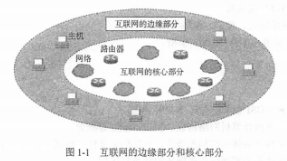

## 天勤23考研计算机网络高分笔记

### 简介
本书针对近几年全国计算机学科专业综合考试大纲的“计算机网络“部分进行了深入解读，
以一种独创的方式对老试大纲知识点进行了讲解，即从考生的视角剖析知识难点;
以通俗易懂的语言取代晦涩难懂的专业术语，以成功考生的亲身经历指引复习方向;
以风趣幽默的笔触缓解考研压力。
读者对书中的知识点讲解有任何疑问都可与作者在天勤论坛上进行在线互动，以便及时解决考生在复习中遇到的疑难问题，提高考生的复习效率。
根据计算机专业研究生入学考试形势的变化《逐渐实行非统考)，书中对大量非统考知识点进行了讲解，
使本书所包含的知识点除覆盖统考大纲的所有内容外，还包括了各自主命题高校所要求的知识点。
本书可作为参加计算机专业研究生入学考试的复习指导用书(包括统考和非统考)，
也可作为全国各大高校计算机专业或非计算机专业的学生学习“计算机网络”课程的辅导用书。

### 序
2023版《数据结构高分笔记》《计算机组成原理高分笔记》《操作系统高分笔记》《计算机网络高分笔记》等辅导教材问世了，这对于有志考研的同学是一大幸事。
“他山之石，可以攻玉”，参考一下亲身经历过考研并取得优秀成绩的师兄们的经验，必定有益于对考研知识点的复习和掌握。
能够考上研究生，这是无数考生的追求，能够以优异的成绩考上名牌大学的全国数一数二的计算机或软件工程学科的研究生，更是许多考生的梦想。
如何学习或复习相关课程，如何打好扎实的理论基础、练好过硬的实践本领，如何抓住要害、堂握主要的知识点并获得考试的经验，先行者已经给考生们带路了。
“高分笔记”的作者们在认真总结了考研体会，整理了考研的备战经验，参考了多种考研专业教材后，精心编写了本套系列辅导书“天计算机考研高分笔记系列”辅导教材的特点是:
贴近考生。作者们都亲身经历了考研，他们的视角与以往的辅导教材不同，是从复习考研的学生的立场理解教材的知识点一一哪些地方理解有困难，哪些地方需要整理思路，
处处替考生着想，有很好的引导作用。 
重点突出。作者们在复习过程中做了大量习题，并经历了考研的严峻考验，对重要的知识点和考试出现频率高的题型都了如指掌。
因此，在复习内容的取舍上进行了充分的考虑使得读者可以抓住重点，有效地复习。
分析透彻。作者们在复习过程中对主要辅导教材的许多习题都进行了深入分析亲自解答，对重要知识点进行了总结，因此，解题思路明确，叙述条理清晰，问题求解的步骤详细，对结果的分析透彻，
不但可以扩展考生的思路，还有助于考生举一反三。
计算机专业综合基础考试已经考过 14 年，今后考试的走向如何，可能是考生最关心的问题了。
我想，这要从考试命题的规则入手来讨论。以清华大学为例，学校把研究生入学考试定性为选拔性考试。
研究生入学考试试题主要测试考生对本学科的专业基础知识、基本理论和基本技能堂握的程度。
因此，出题范围不应超出本科教学大纲和硕士生培养目标，并尽可能覆盖一级学科的知识面，一般能使本学科、本专业本科毕业的优秀考生取得及格以上的成绩。
实际上，全国计算机专业研究生入学联考的命题原则也是如此，各学科的重要知识点都是命题的重点。一般知识要考，比较难的知识(较深难度的知识)也要考。
通过对2009 年以来的考试题进行分析可知，考试的出题范围基本符合考试大纲，都覆盖到各大知识点，但题量有所侧重。
因此，考生一开始不要抱侥幸心理去押题，应踏踏实实读好书，认认真真做好复习题，仔仔细细归纳问题解决的思路，夯实基础，增长本事，然后再考虑重点复习。
这里有几条规律可供参考:
出过题的知识点还会有题，出题频率高的知识点，今后出题的可能性也大。

选择题的大部分题目涉及基本概念，主要考查对各个知识点的定义和特点的理解，
个别选择题会涉及相应延伸的概念。
综合应用题分为两部分:简做题和设计题。
***简做题的重点在于设计和计算***，
***设计题的重点在于算法、实验或综合应用***。
常言道:“学习不怕根基浅，只要迈步总不迟。”只要大家努力了，收获总会有的。

### 修订说明
天勤计算机考研高分笔记系列丛书作为计算机考研的优秀教辅书，秉承“与时俱进、推陈出新”的原则，
及时向考生指明计算机专业考研的发展方向，更新书目内容及复习方法，
引领考生走上正确的复习道路，使复习事半功倍。
每章最后的“考点分析与解题技巧”栏目，对大纲中常考的，或是重点、难点的内容进行了深入分析。
考生在使用本书进行复习的时候，通过知识点讲解部分对考纲要求的知识点有了初步的认识，再结合例题进行知识点的巩固和查漏补缺，但是例题之后的答案解析较为零碎，不容易形成体系，
因此本栏目有助于考生在二轮复习时对知识点的归纳总结。
每个知识点的解题技巧分析分为两部分，***第一部分主要讲解知识点的复习方法***，***第二部分则讲解知识点的考查题型与解题方式***。
另外，在知识点讲解部分也优化了一些讲解顺序，方便考生根据自身需要进行调整。
习题部分基本都是真题，因而不再提示2010 年之前的真题年份。本次修订主要包括以下四部分内容:

1，立足本专业，面向专业本次修订延续了天勤计算机考研高分笔记系列一贯的写作风格一一幽默风趣通俗易懂使广大考生能够读懂、理解、掌握计算机专业课中晦涩、抽象的知识要点。
本书删除了专业教材中部分叙述冗余、无关考纲的内容，加入了贴近考研场景的复习方法、解题技巧讲解，使考生能够将本书作为一、二轮复习的核心教材使用。
2，统考真是药，自主命题有秘方
本系列辅导书在近几次的修订过程中也加入了部分非统考知识点的讲解。
本次修订主要加入了近年来统考和非统考的考研真题，同时对非统考知识点进行了更新。
另外编者认为，统考真题的参考价值是其他自主命题高校的试题无法比拟的。编者从事计算机考研辅导多年，
了解计算机专业考题的发展趋势，即统考真题的难度越来越大、综合性越来越强。
但正因为如此，统考真题对于考生复习计算机专业课可谓是必备良药，掌握了统考真题的解题思路和做题技巧，
就基本上理解了考纲中的知识要点。
而非统考高校的考研真题更像是面向部分考生的秘方，自主命题都有其出题规律和特点。
本书加入了部分自主命题高校的考研真题，既可以帮助非统考考生把握命题方向，也可以帮助统考考生牢固掌握相关的知识点。
3，总结考试重点，进行方法归纳
编者在多年考研辅导教学中发现，大部分考生通过长期的复习积累，
能够理解并掌握考纲要求的知识点，却不能灵活运用，在解题思路和技巧方面不得要领。
编者结合自身考研复习经验及授课经验，总结了一系列针对考试重点，难点的解题思路和做题方法。
在本次修订中，将此类思路和方法，穿插编写在知识点讲解部分，
考生可以在理解知识点之后，举握做题技巧，
在每章的习题中运用此类做题技巧，从而灵活掌握所学知识点。
4，优化复习思路，形成知识体系
计算机专业课的一大特点就是体系完整、联系紧密。在本次修订中，针对高分笔记系列早期版本中不利于考生理解的部分内容进行了修改，
将部分知识点的讲解顺序做了调整，同时添加了相关内容以保持本书知识点的连贯性，
帮助考生形成完整的知识体系，进而从容应对各类综合应用题。

### 目录
- 序
- 修订说明
- 前言
- 第1章 计算机网络体系结构
  - 大纲要求
  - 核心考点
  - 知识点讲解
  - 1.1 计算机网络概述
    - 1.1.1 计算机网络的概念
    - 1.1.2 计算机网络的组成
    - 1.1.3 计算机网络的功能
    - 1.1.4 计算机网络的分类
    - 1.1.5 计算机网络的标准化工作及相关组织
  - 1.2 计算机网络体系结构与参考模型
    - 1.2.1 计算机网络分层结构
    - 1.2.2 协议
    - 1.2.3 接口
    - 1.2.4 服务
    - 1.2.5 ISO/OSI参考模型和TCP/IP参考模型
    - 1.2.6 计算机网络性能指标
  - 习题与真题
  - 习题与真题答案
  - 考点分析与解题技巧
- 第2章 物理层
  - 大纲要求
  - 核心考点
  - 知识点讲解
  - 2.1 通信基础
    - 2.1.1 信号
    - 2.1.2 信源、信道及信宿
    - 2.1.3 速率、波特及码元
    - 2.1.4 带宽
    - 2.1.5 奈奎斯特定理
    - 2.1.6 香农定理
    - 2.1.7 编码与调制
    - 2.1.8 数据传输方式
    - 2.1.9 数据报与虚电路
  - 2.2 传输介质
    - 2.2.1 传输介质分类
    - 2.2.2 物理层接口特性
  - 2.3 物理层设备
    - 2.3.1 中继器
    - 2.3.2 集线器
  - 习题与真题
  - 习题与真题答案
  - 考点分析与解题技巧
- 第3章 数据链路层
  - 大纲要求
  - 核心考点
  - 知识点讲解
  - 3.1 数据链路层的功能
  - 3.2 组帧
  - 3.3 差错控制
    - 3.3.1 检错编码
    - 3.3.2 纠错编码
  - 3.4 流量控制与可靠性传输机制
    - 3.4.1 流量控制
    - 3.4.2 可靠传输机制
    - 3.4.3 滑动窗口机制
    - 3.4.4 停止-等待协议
    - 3.4.5 后退N帧（GBN）协议
    - 3.4.6 选择重传（SR）协议
    - 3.4.7 发送缓存和接收缓存
  - 3.5 介质访问控制
    - 3.5.1 介质访问控制分类
    - 3.5.2 信道划分介质访问控制
    - 3.5.3 随机访问介质访问控制
    - 3.5.4 轮询访问介质访问控制
  - 3.6 局域网
    - 3.6.1 局域网的基本概念与体系结构
    - 3.6.2 以太网的工作原理
    - 3.6.3 以太网的MAC帧
    - 3.6.4 以太网的传输介质
    - 3.6.5 高速以太网
    - 3.6.6 无线局域网
    - 3.6.7 令牌环网的工作原理
  - 3.7 广域网
    - 3.7.1 广域网的基本概念
    - 3.7.2 PPP
    - 3.7.3 HDLC协议
  - 3.8 数据链路层设备
    - 3.8.1 网桥的概念和基本原理
    - 3.8.2 网桥的分类
    - 3.8.3 局域网交换机及其工作原理
    - 3.8.4 各层设备的广播域、冲突域及总结
  - 习题与真题
  - 习题与真题答案
  - 考点分析与解题技巧
- 第4章 网络层
  - 大纲要求
  - 核心考点
  - 知识点讲解
  - 4.1 网络层的功能
    - 4.1.1 异构网络互连
    - 4.1.2 路由与转发
    - 4.1.3 SND基本概念
    - 4.1.4 拥塞控制
  - 4.2 路由算法
    - 4.2.1 静态路由与动态路由
    - 4.2.2 距离-向量路由算法
    - 4.2.3 链路状态路由算法
    - 4.2.4 层次路由
  - 4.3 IPv4
    - 4.3.1 IPv4分组
    - 4.3.2 IPv4地址
    - 4.3.3 NAT
    - 4.3.4 子网划分与子网掩码
    - 4.3.5 CIDR
    - 4.3.6 ARP
    - 4.3.7 DHCP
    - 4.3.8 ICMP
  - 4.4 IPv6
    - 4.4.1 IPv6的特点
    - 4.4.2 IPv6的格式
  - 4.5 路由协议
    - 4.5.1 路由选择协议分类
    - 4.5.2 RIP
    - 4.5.3 OSPF
    - 4.5.4 RIP和OSPF的比较
    - 4.5.5 BGP
    - 4.5.6 RIP、OSPF、BGP最终陈述
  - 4.6 IP组播
    - 4.6.1 组播的概念
    - 4.6.2 IP组播地址
    - 4.6.3 组播地址与MAC地址的换算
  - 4.7 移动IP
    - 4.7.1 移动IP的概念
    - 4.7.2 移动IP的通信过程
  - 4.8 网络层设备
    - 4.8.1 路由器的组成与功能
    - 4.8.2 路由表与路由转发
  - 习题与真题
  - 习题与真题答案
  - 考点分析与解题技巧
- 第5章 传输层
  - 大纲要求
  - 核心考点
  - 知识点讲解
  - 5.1 传输层提供的服务
    - 5.1.1 传输层的功能
    - 5.1.2 传输层寻址与端口
    - 5.1.3 无连接服务与面向连接服务
  - 5.2 UDP
    - 5.2.1 UDP数据报
    - 5.2.2 UDP校验
  - 5.3 TCP
    - 5.3.1 TCP报文段
    - 5.3.2 TCP连接管理
    - 5.3.3 TCP可靠传输
    - 5.3.4 TCP流量控制
    - 5.3.5 TCP拥塞控制的基本概念
    - 5.3.6 拥塞控制的4种算法
  - 习题与真题
  - 习题与真题答案
  - 考点分析与解题技巧
- 第6章 应用层
  - 大纲要求
  - 核心考点
  - 知识点讲解
  - 6.1 网络应用模型
  - 6.2 DNS系统
    - 6.2.1 DNS系统的概念
    - 6.2.2 层次域名空间
    - 6.2.3 域名服务器
    - 6.2.4 域名解析过程
  - 6.3 FTP
    - 6.3.1 FTP的工作原理
    - 6.3.2 控制连接与数据连接
  - 6.4 电子邮件
    - 6.4.1 电子邮件的组成结构
    - 6.4.2 电子邮件格式与MIME
    - 6.4.3 SMTP与POP3
  - 6.5 WWW
    - 6.5.1 WWW的概念和组成结构
    - 6.5.2 HTTP
  - 习题与真题
  - 习题与真题答案
  - 考点分析与解题技巧
- 第7章 非统考搞笑知识点补充
  - 知识点讲解
  - 7.1 组播路由算法（了解）
  - 7.2 数据链路层之LLC子层
  - 7.3 FDDI环
  - 7.4 虚拟局域网（VLAN）
- 参考文献

### 第1章 计算机网络体系结构
> 大纲要求

(一)计算机网络概述
1.计算机网络的概念、组成与功能
2.计算机网络的分类
3.计算机网络的标准化工作及相关组织

(二)计算机网络体系结构与参考模型
1.计算机网络分层结构
2.计算机网络协议、接口、服务等概念
3.ISO/OSI参考模型和TCP/IP模型

> 核心考点

1.(****)OSI参考模型与TCP/IP模型
2.(***)掌握计算机网络协议、接口、服务等概念
3.(**)掌握网络体系结构的概念，分层的必要性(包括5层和7层结构)
4.(*)无连接服务和面向连接服务的联系与区别

> 知识点讲解

#### 1.1计算机网络概述
1.1.1计算机网络的概念
最简洁的定义:***计算机网络就是一些互连的、自治的计算机系统的集合***。

```
最简洁的定义：计算机网络就是一些互连的、自治的计算机系统的集合。
```

注意:在计算机网络发展的不同阶段，对计算机网络的定义是不一样的，但这个不是考试重点。

广义观点的定义:计算机网络是能实现远程信息处理的系统或能进一步达到资源共享的系统。
资源共享观点的定义:计算机网络是以能够相互共享资源的方式互连起来的、自治的计算机系统的集合。
用户透明性观点的定义:计算机网络是一个能为用户自动管理资源的网络操作系统，它能够调用用户所需要的资源，整个网络像一个大的计算机系统一样对用户透明。

可能问点:什么是自治计算机?
解析：自治计算机就是能够进行自我管理、配置和维护的计算机，也就是现在的计算机；
而像以前的终端（只有显示器，仅仅显示数据），则不能称为自治计算机。

##### 1.1.2 计算机网络的组成
###### 1.物理组成
从物理组成上看，计算机网络包括硬件、软件、协议三大部分。
1）硬件：由***主机***、***通信处理机***（或称为前端处理器）、***通信线路***（包括有线线路和无线线路等）和***交换设备***（交换机等连接设备）组成。
2）软件：主要包括***实现资源共享的软件***和***方便用户使用的各种工具软件***（如QQ）。
3）协议：就是一种规则，如汽车在道路上行驶必须遵循交通规则一样，数据在线路上传输必须遵循一定的规则。
###### 2.工作方式组成
从工作方式上看，计算机网络可分为边缘部分和核心部分，如图1-1所示。

图1-1 互联网的边缘部分和核心部分
1）边缘部分：由所有连接在互联网上、供用户直接使用的主机组成，用来进行通信和资源共享。
2）核心部分：由大量的网络和连接这些网络的路由器组成，它为边缘部分提供连通性和交换服务。
###### 3.功能组成
从功能组成上看，计算机网络由***通信子网***和***资源子网***两部分构成。
1）通信子网：由各种***传输介质***、***通信设备***和***相应的网络协议***组成，为网络提供***数据传输***、***交换***和***控制***能力，
实现联网计算机之间的数据通信。
2）资源子网：由主机、终端以及各种软件资源、信息资源组成，负责全网的数据处理业务，向网络用户提供各种网络资源与服务。
注意：通信子网包括物理层、数据链路层和网络层，请读者务必记住！

##### 1.1.3 计算机网络的功能
***数据通信***：计算机网络最基本和最重要的功能，包括连接控制、传输控制、差错控制、流量控制、路由选择、多路复用等子功能。
***资源共享***：包括数据资源、软件资源以及硬件资源。
***分布式处理***：当计算机网络中的某个计算机系统负载过重时，可以将其处理的任务传送给网络中的其他计算机系统进行处理，利用空闲计算机资源提高整个系统的利用率。
***信息综合处理***：将分散在各地计算机中的数据资料进行集中处理或分级处理，如自动订票、银行金融系统、数据采集与处理系统等。
***负载均衡***：将工作任务均衡地分配给计算机网络中的各台计算机。
***提高可靠性***：计算机网络中的各台计算机可以通过网络互为替代机。
当然，为了满足人们的学习、工作和生活需要，计算机网络还有其他一些功能，如远程教育、电子化办公与服务、娱乐等。

可能疑问点：什么是分布式计算机系统？与计算机网络比较有什么区别？
解析：分布式计算机系统最重要的特点是整个系统中各台计算机对用户都是透明的，用户通过输入命令可以运行程序，
但用户并不知道具体是哪一台计算机在为其运行程序。
操作系统为用户选择一台最合适的计算机来运行其程序，并将运行的结果传到合适的地方。
计算机网络则不同，用户必须首先在欲运行程序的计算机上进行登录，然后按照计算机的地址，
将程序通过计算机网络传送到该计算机上去运行，最后根据用户命令将结果传送到指定的计算机。

##### 1.1.4 计算机网络的分类
编者觉得将教材上非重要考点的背景信息照搬过来没有任何意义，但是为了满足考生第一遍复习的需要，下面仅列出分类，不做详细展开。
1)按分布范围分类:广域网、城域网、局域网、个人区域网。
2)按拓扑结构分类:星形网络、总线型网络、环形网络、网状形网络。
3)按传输技术分类:广播式网络、点对点网络。
4)按使用者分类:公用网、专用网。
5)按数据交换技术分类:电路交换网络、报文交换网络、分组交换网络
注意:接入网(AN)了解即可!

##### 1.1.5计算机网络的标准化工作及相关组织
1.计算机网络的准化工作
计算机网络的标准化需要经历以下4个步骤:
①互联网草案
②建议标准(RFC文档)
③草案标准
④互联网标准。
2.相关组织
相关组织有国际标准化组织(ISO)、国际电信联盟 (ITU)、美国电气和电子工程师协会(IEEE)等。

#### 1.2 计算机网络体系结构与参考模型
##### 1.2.1 计算机网络分层结构
首先,我们要明白计算机网络为什么要采用分层结构? 这里用一个小的生活实例来解释。
任何一个公司都是从小企业创办而来的，当公司规模很小(如只有一个老总和3 个员工)时老总和员工可以同处于一个平面，不需要分层，员工可以直接向老总汇报问题。
但是，如果该公司是诸如微软这样的公司(也就是计算机网络具有相当大的规模时)，比尔·盖茨当然处于最高层，
他的作用就是实现公司的长远发展，而不可能每天与公司的员工讨论某功能模块应该使用哪种算法。
同理，当网络结构较大时，就必须要分层，并且每一层都需实现所对应的功能，这样才会有更好的发展。
但是，分层又不能太多，如果分层太多，资源浪费就很多。
所以，TCP/IP 折中地采用了4层结构模型(在教材中为了更好地描述各层的工作原理，经常看作5层）。
下面介绍3个专业术语。
- 1)实体:任何可发送或接收信息的硬件或软件进程，通常是一个特定的软件模块。
- 2)对等层:不同机器上的同一层。
- 3)对等实体:同一层上的实体
以上概念第一次看可能比较抽象，考生可这样理解:A 省和 B 省分别表示不同的机器，
可将A省和 B 省的各层干部看成实体，
将A 省省长职位和 B 省省长职位看成对等层，而将此对等层上的实体，即A省省长和B省省长，可看成对等实体。

##### 1.2.2 协议
协议是一种规则，并且是控制两个对等实体进行通信的规则，也就是水平的。
协议由以下3个部分组成。
- 1)语义:对构成协议元素的含义的解释，即“讲什么”
- 2)语法:数据与控制信息的结构或格式，即“怎么讲”
- 3)同步:规定了事件的执行顺序。

##### 1.2.3 接口
接口又称为服务访问点，从物理层开始，每一层都向上层提供服务访问点，即没有接口就不能提供服务。
5个不得不知的专业术语:
- 1)服务数据单元(SDU)。第n层的服务数据单元，记作 n-SDU
- 2)协议控制信息(PCI)。第n层的协议控制信息，记作 n-PCI
- 3)接口控制信息(ICI)。第n层的接口控制信息，记作 n-ICI。
- 4)协议数据单元(PDU)。第n层的服务数据单元(SDU)+第n层的协议控制信息(PCI)=第n层的协议数据单元，即 n-SDU+n-PCI=n-PDU，
表示的是同等层对等实体间传送的数据单元。
另外，n-PDU=(n-1)-SDU。这个公式看完，后面的内容就会很清楚。
例如，网络层的整个IP 分组交到数据链路层，整个IP 分组成为数据链路层的数据部分（现在不理解可直接跳过）。
- 5)接口数据单元(IDU)。第n层的服务数据单元(SDU)+第n层的接口控制信息 (ICI) = 第n层的接口数据单元，即n-SDU+n-ICI=n-IDU，表示的是在相邻层接口间传送的数据单元。

##### 1.2.4服务
服务指下层为相邻上层提供的功能调用。协议是水平的，而服务则是垂直的，即下层通过接口向上层提供服务。服务分为以下3类。
1.面向连接的服务和面向无连接的服务
- 1)面向连接的服务:当通信双方通信时，要事先建立一条通信线路，该线路包括建立连接、使用连接和释放连接 3 个过程。TCP(后面介绍)就是一种面向连接服务的协议，电话系统是一个面向连接的模式。王个中S
- 2)面向无连接的服务:通信双方不需要事先建立一条通信线路，而是把每个带有目的地址的包(报文分组)传送到线路上，由系统选定路线进行传输。IP 和UDP(后面介绍)就是两种无连接服务的协议，邮政系统是一个无连接的模式。
面向连接与面向无连接的对比见表 1-1。
表 1-1 面向连接与面向无连接的对比

|服务|优点|缺点|
|---|---|---|
|面向连接|可靠信息流(只要被接收的都是正确的)、信息回复确认(每收到信息就发送一个回复，告诉对方已经收到此信息:如果收到的信息是错误的，告诉对方重新发送读信息)|占用通信信道|
|面向无连接|不占用通信信道|信息流可能丢失(在传输的过程中，信息可能丢失，对方可能收不到)、信息无回复确认(收到信息直接收下，不告诉对方已经收到)|

故事助记:你每年都要给女朋友写 12 封信(每月一封)，有两种送达方式可选择第一种: 你可以每个月找一个非常可靠的朋友帮你送到，这样你可以保证信从第一封到最后一封都是按序到达，且不会丢失(面向连接 ).
第二种: 通过邮局发送，因为邮局很有可能在发送的过程中丢失信件,即使不丢失也有可能 3 月份的信比2月份的信早到(面向无连接)

2.有应答服务与无应答服务(了解)
- 1)有应答服务:接收方在收到数据后向发送方给出相应的应答。
- 2)无应答服务:接收方收到数据后不自动给出应答。

3.可靠服务与不可靠服务
- 1)可靠服务:网络具有检错、纠错、应答机制，能保证数据正确、可靠地传送到目的地
- 2)不可靠服务:网络不能保证数据正确、可靠地传送到目的地，网络只能是尽量正确、可靠，是一种“尽力而为”的服务。
注意:并非在一个层内完成的全部功能都称为服务，只有那些能够被高一层实体“看得见”的功能才称为服务。

关于服务不得不知的“内慕”：
- 1)第 n 层的实体不仅要使用第 n-1 层的服务，还要向第 n+1 层提供本层的服务，该服务是第 n 层及其以下各层所提供服务的总和。最高层向用户提供服务。
- 2)上一层只能通过相邻层的接口使用下一层的服务，而不能调用其他层的服务，即下一层提供服务的实现细节对上一层透明。

可能疑问点:怎样理解透明?
解析:用户只需要清楚手机上的每个按钮具有什么样的功能，使用其功能即可，至于这个功能内部是怎么实现的，用户并不需要知道，这就是透明。

##### 1.2.5 ISO/OSI参考模型和TCP/IP 参考模型
###### 1. 5层结构的总结
OSI参考模型具有7层结构，而TCP/IP 模型仅有4层结构(一看作5层)。
在OSI参考模型中，表示层和会话层不是重点，大致浏览一遍即可，无须深究，所以只需掌握 5 层结构即可。
考生应该能快速地默写出 5 层结构以及每层所完成的任务、功能、协议(遇到选择题能选“对”即可)，
5层参考模型各层的总结见表1-2。
表 1-2 5 层参考模型各层的总结

| 层级                    | 描述                                                                                                                              |
|-----------------------|---------------------------------------------------------------------------------------------------------------------------------|
| 应用层（用户对用户）            | 任务:提供系统与用户的接口，功能:①文件传输；②访问和管理；③电子邮件服务，协议:FTP、SMTP、POP3、HTTP                                                                     |
| 传输层（运输层）（应用对应用，进程对进程） | 传输单位:报文段TCP或用户数据报 (UDP)，任务：负责主机中两个进程之间的通信，功能:①为端到瑞连接提供可靠的传输服务；②为端到端连接提供流量控制，差错控制，服务质量等管理服务，协议:TCP、UDP、ARQ                       |
| 网络层(网际层、IP层)（主机对主机）   | 传输单位：数据报，所实现的硬件：路由器，任务:①将传输层传下来的报文段封装成分组，②像选择适当的路由，使传输层传下来的分组能够交付到目的主机，功能:①为传输层提供服务；②组包和拆包；③路由选择:④拥塞控制,协议：ICMP、ARP、RARP、IP、IGMP |
| 数据链路层(链路层)            | 传输单位:帧，所实现的硬件:交换机、网桥，任务:将网络层传下的IP数据报组装成帧，功能:①链路连接的建立、拆除、分离；②帧定界和帧同步；③差错检测，协议:PPP、HDLC                                           |
| 物理层                   | 传输单位:比特，所实现的硬件：集线器、中继器，任务:透明地传输比特流，功能:为数据端设备提供传送数据通路                                                                                             |
     
     
补充知识点:主机A和主机B通信的实质是什么?
故事助记:我们把A栋楼和B栋楼看作两台主机，A 栋楼的甲想把某物品给B栋楼的乙，甲和乙分别看成主机上的两个进程，
则类似两台主机传送数据，那么甲所给的物品不能仅仅只放在 B栋楼的门口，肯定要将物品交到乙的手上才行，
所以说两台主机的通信实质上是两台主机的进程在相互通信。
再补充一点:假设 A、B 宿舍都是单人间，每个房间只有一个人(--个进程)，那么房间号就是端口号(后面讲解 TCP 时会详细讲解端口号).

补充知识点:会话层与表示层的基本功能补充(了解)
1)会话层。会话层的主要功能是在两个节点间建立、维护和释放面向用户的连接并对会话进行管理和控制，保证会话数据可靠传送。
既然会话层和传输层都有建立连接那么二者之间有什么区别? 例如，作为某公司的老总，你要求秘书给某某打个电话。
这时你就相当于会话层，而秘书相当于传输层。因为由你提出建立连接的请求，但是不必自己动手去查号码簿和拨号，而是由秘书打电话，建立传输连接。
当对方拿起电话时，传输层连接建立成功，秘书将电话递给你，此时会话层连接建立成功。
2)表示层。表示层负责处理在两个内部数据表示结构不同的通信系统间交换信息的表示格式(数据格式转换，2013 年统考真题考查了此功能)，
为数据加密和解密以及为提高传输效率提供必需的数据压缩及解压等功能。

###### 2.0SI参考模型和TCP/IP模型的区别
OSI参考模型和TCP/IP 模型的特性对比见表1-3。
1-3 OSI参考模型和TCP/IP 模型的特性对比

|OSI 参考模型| TCP/IP 模型 |
| --- |-----------|
|①3个主要概念:股务、接口、协议，②协议有很好的隐藏性，③产生在协议发明之前，④共有7层，网络层:连接和无连接，传输层:仅有面向连接|①没有明确区分服务、接口、协议，②产生在协议发明之后，③共有4层(不是5层)，网络层：仅有无连接，传输层:面向连接和无连接|

可能疑问点:TCP/IP 模型是4 层还是5层?
解析:一般教材上讲解的 5 层模型是综合了OSI和TCP/IP 的优点，才有了 5 层模型，
TCP/IP一定是4层模型(因为TCP/IP 模型的网络接口层包含了5 层模型的物理层和数据链路层，如果出选择题需注意)。

补充知识点:关于OSI 参考模型的工作原理(了解即可，考生应重点关注5层模型)
解析:下面通过给朋友发一封电子邮件的例子来解释7层的工作原理。
在发电子邮件的过程中，
首先要在应用层编辑这封信件，
然后再把编辑好的信件发给表示层，
这时表示层会把这封信件加密，当然也可以不加密，为了提高速度，表示层要把它压缩，然后再传给会话层，这时会话层就会把信息发给你，并提示你要给别人发邮件了，
要你准备好，然后再把这个信息发送给传输层，这时传输层就会把这封信件分段(其原因是数据无法一次被传输，所以要分段 )，
然后被分段的信件被传输到网络层，这时网络层会对数据段再次进行封装并加入报头(形成数据报其实从应用层开始每往下层传输一次就会加入一次报头（在数据链路层既要加报头又要加报尾)及其相关信息。
不仅如此，网络层还要对传输路径进行一种选择，之后再传给数据链路层，数据链路层将这些数据报封装成帧(这就是人们通常所说的以太网)后，
再把这个信息发送到物理层形成比特流进而送到传输媒体(或者直接称为网线)，
这时信件就会变成比特流在网线上传输了，此时你的计算机就完成了发送过程，而你朋友的计算机负责接收该电子邮件，自然这个过程就是与发送过程相反了

##### 1.2.6 计算机网络性能指标
- 1)时延:***数据从网络或链路的一端传送到另一端所需要的时间***,有时也称为延迟或迟延，网络时延由以下几部分组成。
  - ① 发送时延(或者称为传输时延):主机或路由器发送数据所要的时间，***即从发送数据帧的第一位算起到该帧的最后一位发送完毕所需要的时间***。
因此，发送时延也称为传输时延。发送时延的计算公式为：
```
发送时延 = 数据帧长度（bit）/ 发送速率（bit/s）
```
由以上公式可以得出：
对于某网络，发送时延并非固定不变，而是与发送的帧长成正比。
  - ② 传播时延：传播时延：电磁波在信道中传播一定的距离所需要的时间。传播时延的计算公式为
```
传播时延 = 信道长度（m）/ 电磁波在信道上的传播速度（m/s）
```
  - ③ 处理时延：主机或路由器在接收到分组时进行处理所需要的时间。
  - ④ 排队时延：分组在进入网络传输时，要经过许多路由器，***但分组在进入路由器后要先在输入队列中排队等待处理***，
***在路由器确定了转发接口后，还需要在输出队列中排队等到转发***，
这就产生了排队时延。
```
总时延 = 发送时延+传播时延+处理时延+排队时延
```

注意：一般在做题时，排队时延和处理时延都忽略不计（除非题目说明要加）。
另外，***对于高速网络链路，提高的仅是数据发送速率而不是比特在链路上的传播速度***。
提高数据的发送速率只是减少了数据的发送时延，参考例1-1。

天勤交流群答疑：既然有发送时延，为什么没有接收时延？
解析：事实上接收时延包含在发送时延和传播时延当中，当这两个时延结束时，接收时延也就结束了。

- 2)时延带宽积：时延带宽积又称为以比特为单位的链路长度。
```
时延带宽积=传播时延*带宽
```
- 3)往返时间：从发送方发送数据开始，到发送方接收到来自接收方的确认消息（接收方收到数据后便立即发送确认），总共经历的时间。
- 4)利用率：包括信道利用率和网络利用率两种

信道利用率是指某信道有百分之几的时间是被利用的（有数据通过）。完全空闲的信道的利用率为零。
网络利用率是全网


