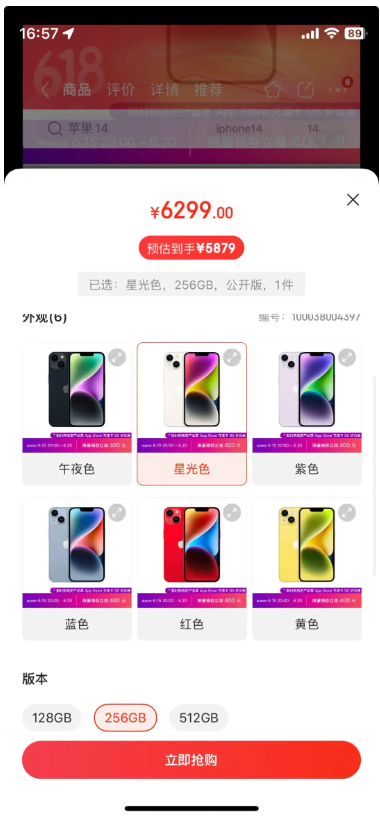
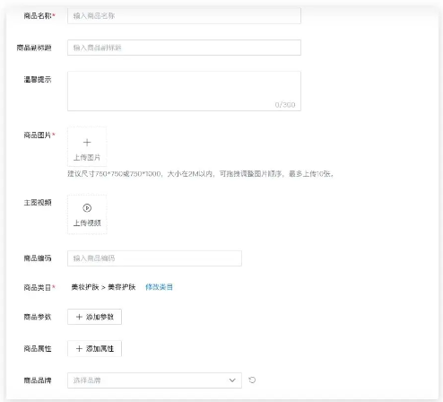
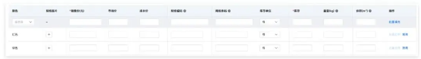

## 一文讲透SPU和SKU
***SPU是商品信息聚合的最小单位***，***SKU是最小库存单元***，如何具体区分两者的不同，是本篇文章主要讨论的内容。
阅读本篇文章能了解SPU和SKU之前的区别和应用联系，希望能对你有所帮助。

***在日常生活中，我们通常用商品名称来指代一款产品，比如iPhone 14是指苹果品牌、型号为iPhone 14的手机***。
对于日常沟通来说，这个描述产品的精度已经足够了，但如果是对于一笔交易来说，这个精度是不够的。
***因为iPhone 14有多种商品规格，在交易中，必须要确定购买的是哪一个规格的iPhone 14，才能确定价格、发货、扣减库存***。
这里就涉及到两种描述产品的精度，一种略粗，定位到产品的品牌型号，专业术语叫SPU。另一种非常精准，定位到唯一一款商品，专业术语叫SKU。
下面详细展开介绍。

```
这里就涉及到两种描述产品的精度，
一种略粗，定位到产品的品牌型号，专业术语叫SPU
另一种非常精准，定位到唯一一款商品，专业术语叫SKU
```

### 一、SPU和SKU的定义
#### 1. SPU：标准化产品单元
SPU(Standard Product Unit)：标准化产品单元。***是商品信息聚合的最小单位***，
是***一组可复用、易检索的标准化信息的集合***，该集合描述了一个产品的特性。
通俗点讲，***属性值、特性相同的商品就可以称为一个SPU***。——百度百科。
根据SPU的定义，我们可以得到两个结论：***SPU是商品聚合概念、SPU包含若干款商品***。

- SPU：标准化产品单元，是商品信息聚合的最小单位
- 是一组可复用、易检索的标准化信息的集合，该集合描述了一个产品的特性
- 通俗点讲，属性值、特性相同的商品就可以称为一个SPU
- 根据SPU的定义，我们可以得到两个结论：SPU是商品聚合概念、SPU包含若干款商品

##### 1）SPU是商品聚合概念
SPU聚合了多款具有相同属性的商品，是对现实世界中实际存在的商品做的抽象，而不是指代现实生活中的某一个实际存在的具体商品。
比如iPhone 14指代苹果品牌、型号为”iPhone 14″的智能手机，
由于这款手机有6种颜色、3种存储容量，因此iPhone 14定位的是18款规格不同的智能手机，不能确定是指哪个颜色、存储容量的iPhone 14。

##### 2）SPU包含若干款商品
一个SPU可能有不同的规格，称为“多规格商品”，由若干个规格属性共同定义。
如iPhone 14的“颜色”和“存储容量”就是两个规格属性，共同定义了18个规格的商品。

```
一个SPU可能有不同的规格，称为“多规格商品”，由若干个规格属性共同定义
```



当然，如果一个SPU没有规格属性，也就是只有一个规格，称为“单规格商品”。
如苹果的AirPods Pro (第二代)，就只有一个规格。

#### 2. SKU：最小库存单元
SKU（Stock Keeping Unit），***最小库存单元，即库存进出计量的基本单元***。——百度百科。
从定义中可见，***SKU定位的是唯一一款现实世界中实际存在的商品***，
也可以理解为SPU下明确定义了规格属性值的某一款具体的商品。
举例来说：“iPhone 14”是一个SPU，而“红色、256G的iPhone 14”是SKU。
之所以称之为“最小库存单元”，***是因为SKU是库存管理中的实际管理对象***。无论是商品入库，还是商品出库，增加或减少的都是某个SKU的库存，而不是SPU。
采购、销售、订单也是如此。***因为SPU定位的是多款商品，而SKU定位的才是一款唯一的、不可继续细分的、有明确价格和库存的商品***。
为了区分同一个SPU下的不同SKU，每个SKU都有不同的商品编码，实物商品的包装上印有独立的条形码。

### 二、为什么要做SPU
既然SPU定位的不是现实世界中的某个具体商品，而是对多个SKU的聚合。
那为什么不直接用SKU，而一定要再创造个SPU的概念呢？主要有3个原因：

#### 1. 降低商品管理成本
同一个SPU下的多个SKU，除了规格属性不同，其他的商品信息都是相同的。
比如***品牌、商品名称、商品单位、商品主图、商品详情描述***。
商品信息：
- 品牌
- 商品名称
- 商品单位
- 商品主图
- 商品详情
有了SPU，就可以将同一个SPU下多个SKU相同的商品信息，放在SPU中管理，这样就只需要维护一份商品信息。
反之，如果没有SPU，就需要直接把商品信息放到SKU中管理。
***有多少个SKU就需要维护多少份商品信息，商家创建、修改商品信息的操作成本随SKU的数量倍增***。

#### 2.减少冗余数据的存储
商品信息中，***最占用存储空间的是包含图片、文字，甚至视频的商品详情描述***。
同一个SPU下的多个SKU的商品详情描述大部分内容是相同的。
因此，***只需要存储一份关联SPU的商品详情描述就能满足实际需要***。
***如果没有SPU，每一个SKU都需要单独存储一份关联SKU的商品详情描述，占用的存储空间随SKU的数量倍增***。

#### 3. 提高用户查找商品的效率
如果只有SKU的概念，那么在前端的商品列表【***商品列表中展示是商品SPU***】中，
多规格商品的每一个规格都会独立占据一个商品位。
比如iPhone14有18个规格，那么在商品列表中，就会占据18个商品位。

当用户正在浏览某一个规格的商品时，想要查看另一个规格的商品，就必须要先退出当前规格的商品详情页；
回到商品列表；在商品列表中通过商品的标题；找到自己要浏览的另一个规格的商品；点击进入详情页。
***如果有了SPU，在前端的商品列表中，多规格商品只会占用一个商品位***；
不同规格的商品信息，直接在商品详情页中切换查看，相对于前者操作更方便。

### 三、如何创建SPU和SKU
商家在创建商品时，如何更高效地创建SPU和SKU呢？
答案是：填写SPU信息和SKU信息后，同时创建SPU和SKU。
步骤如下：

#### 1. 录入SPU信息
SPU信息是指SPU下所有SKU商品完全相同的商品信息，
比如SPU编码、商品名称、商品图片、主图视频、商品类目、商品品牌、非销售属性、运费模版、发票信息、商品详情描述等等。
- SPU编码
- 商品名称
- 商品图片
- 主图视频
- 商品品牌
- 非销售属性
- 运费模板
- 发票信息
- 商品详情描述
这些信息为该SPU下所有SKU所共用，且完全相同，更适合录入到SPU中，
而不需要在每个SKU中重复录入。



#### 2. 录入SKU信息
SKU信息指SPU下各个SKU所独有的、不同的商品信息，
比如SKU编码、SKU图片、销售价、市场价、成本价、条形码、库存数等等。
该SPU下每个SKU的这些信息可能都不相同。
- SKU编码
- SKU图片
- 销售价
- 市场价
- 成本价
- 条形码
- 库存数
因此需要在SKU中单独录入。



#### 3. 生成SPU和SKU
SPU信息和SKU信息录入完成后，系统自动生成1个SPU和多个SKU，通过规格属性做关联。

### 四、两个注意事项
#### 1. 如何定义SPU聚合SKU用到的规格属性
***SPU的本质是对具有相同商品属性的SKU进行聚合***。
聚合商品时，要根据实际需要来选择的规格属性，没有唯一正确的标准答案。
对同样的商品，有些聚合的SKU用到的规格属性多，有些用到的规格属性少，都是合理的。
以iPhone14为例，京东聚合多款iPhone 14用到的规格属性有颜色、存储容量，而苹果官网不仅有颜色、存储容量，还有机型。

在同等SKU数量的条件下，聚合SKU用到的规格属性越多，
SPU数量越少，因为被单个SPU聚合的SKU数量更多，反之亦然。

#### 2. 商品列表展示SPU或SKU有什么区别
在商品列表中，有两种商品展示方式，
***一是展示SPU维度的商品，如淘宝***；
***二是展示SKU维度的商品，如京东。***

商品列表中展示SPU，其商品主图、商品标题取自SPU信息，
***价格取价格最低的SKU价格（吸引用户点击进入详情页）***，***库存数、已售数则取全部SKU之和***。

```
商品列表中展示SPU，其商品主图、商品标题取自SPU信息
价格取价格最低的SKU价格（吸引用户点击进入详情页）
库存数、已售数则取全部SKU之和
```

商品列表中展示SKU，其商品主图、商品标题、价格、库存数、已售数等信息全部取自SKU。

### 五、总结
SKU对应了现实世界中的某款具体的、不可细分的商品，
SPU是对具有相同商品属性的多款SKU的聚合。
为了降低商品管理成本、减少冗余商品数据的存储、提高用户查找商品的效率，我们创造了SPU的概念。

```
SKU对应了现实世界中的某款具体的、不可细分的商品，
SPU是对具有相同商品属性的多款SKU的聚合。
为了降低商品管理成本、减少冗余商品数据的存储、提高用户查找商品的效率，我们创造了SPU的概念。
```


