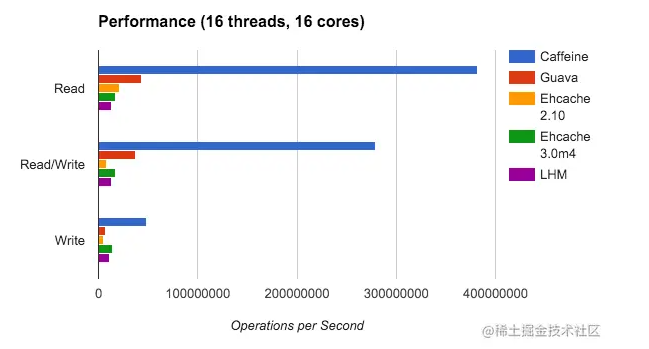

## Caffeine当下最优秀的内存缓存框架的使用与最佳实践+配合Redis做二级缓存
如图，Caffeine是当前最优秀的内存缓存框架，不论读还是写的效率都远高于其他缓存，
而且在Spring5开始的默认缓存实现就将Caffeine代替原来的Google Guava

- Caffeine是当前最优秀的内存缓存框架，不论读还是写的效率都远高于其他缓存
- Spring5开始默认缓存实现就将Caffeine代替原来的Google Guava



### 基础使用
```pom
<!-- https://mvnrepository.com/artifact/com.github.ben-manes.caffeine/caffeine -->
<dependency>
    <groupId>com.github.ben-manes.caffeine</groupId>
    <artifactId>caffeine</artifactId>
    <version>3.0.3</version>
</dependency>
```

### 手动创建缓存
```
Cache<Object, Object> cache = Caffeine.newBuilder()
    //初始数量
    .initialCapacity(10)
    //最大条数
    .maximumSize(10)
    //PS：expireAfterWrite和expireAfterAccess同时存在时，以expireAfterWrite为准。
    //最后一次写操作后经过指定时间过期
    .expireAfterWrite(1, TimeUnit.SECONDS)
    //最后一次读或写操作后经过指定时间过期
    .expireAfterAccess(1, TimeUnit.SECONDS)
    //监听缓存被移除
    .removalListener((key, val, removalCause) -> { })
    //记录命中
    .recordStats()
    .build();
cache.put("1","张三");
System.out.println(cache.getIfPresent("1"));
System.out.println(cache.get("2",o -> "默认值"));
```

### 自动创建缓存
```
LoadingCache<String, String> loadingCache = Caffeine.newBuilder()
        //创建缓存或者最近一次更新缓存后经过指定时间间隔，刷新缓存；refreshAfterWrite仅支持LoadingCache
        .refreshAfterWrite(10, TimeUnit.SECONDS)
        .expireAfterWrite(10, TimeUnit.SECONDS)
        .expireAfterAccess(10, TimeUnit.SECONDS)
        .maximumSize(10)
        //根据key查询数据库里面的值
        .build(key -> new Date().toString());
```

### 异步获取缓存
```
AsyncLoadingCache<String, String> asyncLoadingCache = Caffeine.newBuilder()
        //创建缓存或者最近一次更新缓存后经过指定时间间隔刷新缓存；仅支持LoadingCache
        .refreshAfterWrite(1, TimeUnit.SECONDS)
        .expireAfterWrite(1, TimeUnit.SECONDS)
        .expireAfterAccess(1, TimeUnit.SECONDS)
        .maximumSize(10)
        //根据key查询数据库里面的值
        .buildAsync(key -> {
            Thread.sleep(1000);
            return new Date().toString();
        });

//异步缓存返回的是CompletableFuture
CompletableFuture<String> future = asyncLoadingCache.get("1");
future.thenAccept(System.out::println);
```
> PS：可以使用.executor()自定义线程池

### 记录命中数据
```
LoadingCache<String, String> cache = Caffeine.newBuilder()
        // 创建缓存或者最近一次更新缓存后经过指定时间间隔，刷新缓存；refreshAfterWrite仅支持LoadingCache
        .refreshAfterWrite(1, TimeUnit.SECONDS)
        .expireAfterWrite(1, TimeUnit.SECONDS)
        .expireAfterAccess(1, TimeUnit.SECONDS)
        .maximumSize(10)
        // 开启记录缓存命中率等信息 recordStats
        .recordStats()
        // 根据key查询数据库里面的值
        .build(key -> {
            Thread.sleep(1000);
            return new Date().toString();
        });
        cache.put("1", "小明");
        cache.get("1");
/*
 * hitCount :命中的次数
 * missCount:未命中次数
 * requestCount:请求次数
 * hitRate:命中率
 * missRate:丢失率
 * loadSuccessCount:成功加载新值的次数
 * loadExceptionCount:失败加载新值的次数
 * totalLoadCount:总条数
 * loadExceptionRate:失败加载新值的比率
 * totalLoadTime:全部加载时间
 * evictionCount:丢失的条数
 */
System.out.println(cache.stats());
```


