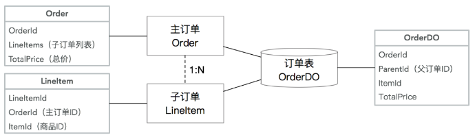
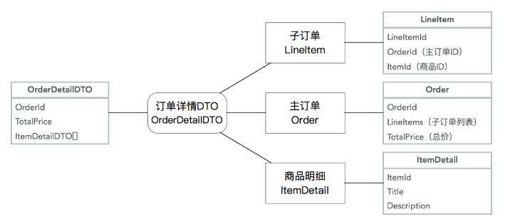

## 阿里大佬：DDD 落地两大步骤，以及Repository核心模式

### 说在前面
在40岁老架构师 尼恩的读者交流群(50+)中，
最近有小伙伴拿到了一线互联网企业如阿里、滴滴、极兔、有赞、希音、百度、网易、美团的面试资格，
遇到很多很重要的面试题：
```
谈谈你的DDD落地经验？
谈谈你对DDD的理解？
```
最近有小伙伴在字节，又遇到了相关的面试题。
小伙伴懵了， 他从来没有用过DDD，面挂了。关于DDD，尼恩之前给大家梳理过一篇很全的文章：阿里一面：谈一下你对DDD的理解？2W字，帮你实现DDD自由
但是尼恩的文章， 太过理论化，不适合刚入门的人员。所以，尼恩也在不断的为大家找更好的学习资料。
前段时间，尼恩在阿里的技术公众号上看到了一篇文章《殷浩详解DDD：领域层设计规范》 作者是阿里 技术大佬殷浩，非常适合与初学者入门，同时也足够的有深度。
美中不足的是， 殷浩那篇文章的行文风格，对初学者不太友好， 尼恩刚开始看的时候，也比较晦涩。
于是，尼恩在读的过程中，把哪些晦涩的内容，给大家用尼恩的语言， 浅化了一下， 这样大家更容易懂。
本着技术学习、技术交流的目的，这里，把尼恩修改过的 《殷浩详解DDD：领域层设计规范》，
通过尼恩的公众号《技术自由圈》发布出来。
```
特别声明，由于没有殷浩同学的联系方式，这里没有找殷浩的授权，
如果殷浩同学或者阿里技术公众号不同意我的修改，不同意我的发布， 我即刻从《技术自由圈》公众号扯下来。
```
另外， 文章也特别长， 我也特别准备了PDF版本。如果需要尼恩修改过的PDF版本，也可以通过《技术自由圈》公众号找到尼恩来获取。

### 本文目录
- 说在前面
- 本文说明：
- 尼恩总结：DDD的本质和最终收益
- 第三章 - DDD 落地实践两大步骤
  - 业务需求说明
  - DDD设计的两个阶段
    - 第1步：***战略设计***
    - 第2步：***战术设计***
  - 第1步：战略设计
    - 1、***业务分析***
      - 事件风暴业务分析的核心环节
    - 2、***领域建模***
    - 3、***划分边界上下文***
  - 第2步：战术设计
    - 1、***微服务拆分***
    - 2、***领域分层***
    - 3、***代码结构***
- 第四章 - Repository模式
  - （0）回顾一下DDD的概念
    - （1）实体***Entity***
    - （2）值对象***value object***
    - （3）聚合根***Aggregate Root***
    - （4）***Domain Services***(领域服务)
    - （5）***Domain Events***(领域事件)
    - （6）***Factory***(工厂模式)
    - （7）***Repository Model***(仓储模式)
  - （1）为什么要用Repository
    - 1.1 - 实体模型 vs. 贫血模型
      - *** 数据模型（Data Model）***和***业务模型/领域模型（Domain Model）***的混淆
    - 1.2 - Repository的价值
  - （2）模型对象代码规范
    - 2.1 - 对象类型
    - 2.2 - 模型对象之间的关系
    - 2.3 - 模型所在模块和转化器
    - 2.4 - 模型规范总结
  - （3）Repository代码规范
    - 3.1 - 接口规范
    - 3.2 - Repository基础实现
    - 3.3 - Repository复杂实现
    - 3.4 - Change-Tracking 变更追踪
    - 3.5 - 其他注意事项
  - （4）Repository迁移路径
- 未完待续，尼恩说在最后
- 部分历史案例

### 本文说明：
本文是 《阿里DDD大佬：从0到1，带大家精通DDD》系列的第二篇
第一篇的链接地址是：
《阿里DDD大佬：从0到1，带大家精通DDD》

#### 尼恩总结：DDD的本质和最终收益
在正式开始第二篇之前，尼恩说一下自己对DDD的 亲身体验、和深入思考。
DDD的本质：
- 大大提升 核心代码  业务纯度
老的mvc架构，代码中紧紧的耦合着***特定ORM框架***、***特定DB存储***、***特定的缓存***、***特定的事务框架***、***特定中间件***，特定对外依赖解耦， 很多很多。
总之就是 业务和技术紧密耦合，代码的 业务纯度低， 导致软件“固化”， 没法做快速扩展和升级。

- 大大提升 代码工程  测维扩 能力
DDD进行了多个层次的解耦，包括 持久层的DB解耦，外依第三方赖的隔离解耦，大大提升了  可测试度、可维护度、可扩展度。

- 更大限度  积累 业务领域模型 资产
由于spring mvc 模式下， 代码的业务纯度不高， 导致尼恩的曾经一个项目，10年多时间， 
衍生出  50多个不同的版本，推导重来5次，付出巨大的 时间成本、经济成本

```
DDD的本质：
大大提升核心代码业务纯度
老的mvc架构，代码中紧紧的耦合着特定ORM框架、特定DB存储、特定的缓存、特定的事务框架、特定中间件、特定对外依赖，很多很多...
总之就是业务和技术紧密耦合，代码的业务纯度低，导致软件“固化”，没法做快速扩展和升级。

大大提升代码工程测维扩能力
DDD进行了多个层次的解耦，包括持久层的DB解耦，外依第三方的隔离解耦，大大提升了可测试度、可维护度、可扩展度。

更大限度积累业务领域模型资产
由于Spring MVC模式下，代码的业务纯度不高，导致曾经一个项目，10年多时间，
衍生出50多个不同的版本，推到重来5次，付出巨大的时间成本、经济成本。
```

##### DDD的收益：
- 极大的降低升级的工作量
- 极大的降低推到重来的风险
- 极大提升代码的核心代码业务纯度，积累更多的代码资产
```
极大的降低升级的工作量
极大的降低推到重来的风险
极大提升代码的核心代码业务纯度，积累更多的代码资产
```

##### 不用DDD的反面案例，尼恩曾经见过一个项目：
- 10年多时间， 衍生出  50多个不同的版本， 每个版本80%的功能相同，但是代码各种冲突，没有合并
- 10年多时间，经历过至少 5次推倒重来， 基本换一个领导，恨不得推导重来一次， 感觉老的版本都是不行，只有自己设计的才好
- 5次推倒重来，每次都是 风风火火/加班到进ICU， 投入了大量的人力/财力。其实大多是重复投入、重复建设
- 可谓,  一将不才累死三军， 所以， 一个优秀的架构师，对一个项目来说是多么的重要

### 第三章 - DDD 落地实践两大步骤
学习 DDD 理论以及方法不是最终的目的，而通过DDD 达到至少三个目的：
- 实现业务复杂度治理
- 以及优化微服务设计
- 提升代码的长远质量才是真正的目的。

这里假设一个  DDD 落地实践  业务场景， 咱们首先做一下 业务需求 的简单说明

#### 业务需求说明
拿电商场景来进行说明，优惠券的关键业务流程如下：
- （1）优惠券创建流程：

运营需要选定对应的商品，创建优惠券。

- （2）营销活动创建流程

运营 创建营销活动，制定对应的营销活动规则，
比如什么满减 活动  ，跨店减 类 运营规则，
然后关联相应的优惠券，最后提交活动审批。
审批通过后，进行营销活动发布。

- （3）提交活动审批后，审批人员  进行营销活动审批。

- （4）优惠券使用流程
用户在营销页面,  领取优惠券之后，
下单购买商品之后，在付款的时候根据对应的优惠券进行付费金额计算并完成支付。


那么我们就要着手开始通过ＤＤＤ来进行领域驱动设计的过程了。

#### DDD设计的两个阶段
DDD设计的两个阶段包括两部分，战略设计部分和战术设计部分：

##### 第1步：战略设计
战略设计主要从***业务视角***出发，包括了业务场景分析、领域建模、划分边界上下文三个阶段。
- 业务场景分析
- 领域建模
- 划分边界上下文

限界上下文可以作为微服务设计的参考边界。
DDD战略设计会建立领域模型， 这四个字放一起会让人觉得很高深，
但是， 通俗来说就是模拟某个领域的的一种模型， 这个模型比较抽象， 但便于人们交流，
举个例子：
公园有一棵桃树， 如果我们想好好研究桃树该怎么研究 ？
桃子好吃吗？贵不贵？品种？怎么种植？种在什么地方 ？做成桃木剑？桃子树叶药用价值？
你看， 这样研究每一个问题都很有道理， 但是又很混乱。

再回忆一下初中生物书上是这么研究的： 先将植物根据大家的理解分成多个器官组成， 像桃子、桃叶、桃花等等， 
然后将每一个器官再根据功能细分成组织， 再根据这个组织中各个细胞的形态等作用分成不同的细胞， 
你看看这是不是一种很有条理的分析方法。


DDD也是如此，
当我们面对桃树这种复杂的业务的时候，先根据固有的认识分成多个器官(领域)，
然后再在每一个领域中根据某些维度(这儿是功能)分为多个组织(聚合)， 而每一个组织中由很多细胞(实体)组成，这就是一种战略，
```
业务场景->领域->聚合->实体
```
做DDD战略设计， 有哪些好处呢 ？
可以确保我们讨论的边界， 也就是讨论的东西是一个领域一个维度的， 
对于桃树来说， 桃子 、桃花、桃叶、树干都是不同的领域， 划分不同领域的就是边界， 我们这儿叫领域边界，
当我们确定好这些领域之后， 就可以确保我们讨论的是同一个领域的东西，
这样的好处就是我们可以规定好一些概念， 或者说术语， 以后大家讨论的时候就尽可能少的信息丢失。

##### 第2步：战术设计
战术设计则从技术视角出发，侧重于领域模型的技术实现，完成软件开发和落地，
战术设计包括：聚合根、实体、值对象、领域服务、应用服务和资源库等代码逻辑的技术设计和技术实现。
- 聚合根
- 实体
- 值对象
- 领域服务
- 应用服务
- 资源库

#### 第1步：战略设计
在战略设计阶段，我们最主要的过程大致包括了业务场景分析、领域建模、划分边界上下文三个阶段。
实际上战略设计是 DDD 过程中的核心步骤。

##### 1、业务分析
在这个阶段我们所有做的就是进行全面的业务梳理，
把业务中涉及到的所有细节都梳理出来，
为后续进行领域建模分析提供足够的、全面的业务输入。
战略设计 经常使用到的业务场景分析方法主要包括
- 用例分析法
- 事件风暴法
- 四色建模法。

事件风暴业务分析的核心环节
这里我们使用事件风暴进行业务场景的分析以及梳理。

- （1）事前准备
在进行事件风暴之前我们需要进行一些准备，主要包括贴纸、笔以及讨论的会议室，
会议室中最好不要有椅子，目的是想让大家都能够站立在一起、全神贯注的去进行业务讨论。

- （2）邀请参会的人
会议的参与方主要包括用户、产品经理、PD、研发、测试、架构师等。
其中，PD为产品设计师，也可能叫产品规划师、需求分析师、小产品经理。
PD侧重于将对应用做功能级的设计，在这个模块上，PD类似是一个小产品经理、模块级别的产品经理。
架构师（系统分析师）会与PD紧密合作，架构师 这时候开始考虑技术可行性，性价比。
PD的职位描述：
（1）调查市场并研究需求，形成市场需求文档。
（2）负责新产品设计，拟定设计规划和方案。
（3）负责新产品的原型设计。
（4）组织产品开发团队，协调资源，跟进产品的开发，保证日程进度。
（5）分析产品运营数据，收集运营意见，及时调整产品形态，优化产品，并提出合理的运营建议。
（6） 以用户体验为中心，改进现有产品，或设计新产品。

- （3）业务讨论
首先确定我们今天需要讨论的业务是什么，目标是什么。
咱们业务场景中，如果讨论的业务就是营销活动的优惠券业务，
那么，目标就是完成优惠券的业务梳理，确保没有业务方面的理解 gap，在团队中达成业务理解的的一致性。

***事件风暴过程需要问题驱动，一般通过提问的方式来驱动交流***。

- a、分析业务中的事件，***搞清楚事件发生的前因后果***
  - 什么动作会导致当前事件的发生，
  - 当前这个事件发生后又会导致怎样的后果。

这些我们都需要梳理清楚。
还有一点需要注意， 需要全面梳理
  - 不但要关注正常的业务流程，
  - 还要关注异常的业务流程。

- b、寻找业务逻辑和业务规则

比如我们在提交活动前，需要确定这些优惠券适用哪些人、领取方式是怎样的以及生效事件是怎样的等等，
这些都是我们在执行操作之前需要确定的业务规则。

如下图所示，我们将优惠券的业务流程进行了梳理，分别从操作人、事件、命令的方式来描述整个优惠券业务流转的过程。


注：在进行事件风暴过程中，所有的参与人都要全身投入整个过程，
大家都是站立形式，聚焦全部注意力，
大家都放下手机以及电脑，一起参与整个业务梳理过程，只有这样，事件风暴才可能有比较好的效果。

##### 2、领域建模
在前面的事件风暴业务梳理中，我们已经把优惠券业务涉及到的参与者、动作以及事件等都进行了全面的梳理。
参与者、动作以及事件 整个协作流程，是一个粗粒度的 业务流程， 非常粗。
```
参与者、动作以及事件整个协作流程，是一个粗粒度的业务流程，非常粗
```
那么接下来我们就要在此基础之上，进行细粒度的 领域建模，这是整个 DDD 的核心。
DDD领域模型 细分为两步骤，第一步是发散，产生很多实体、命令、事件等领域对象，
DDD领域模型 细分为两步骤，第二步是收敛，我们从不同的维度对进行聚类形成聚合，建立最终领域模型， 这是一个收敛的过程。

- （1）发散阶段：领域对象分析

领域对象分析，也就 ***实体***、***值对象***、***领域事件***、***领域命令***的分析。
如上面所示的事件风暴小黑板中的内容，我们需要在这些梳理出来的内容中找到对应的实体、值对象以及围绕这些的领域事件以及命令操作。

根据分析，我们从整个业务过程中提取的实体如下：
- 优惠券
- 营销活动
- 活动审批单
- 活动规则
- 审批意见

大致如下图所示


- （2）收敛阶段：构建业务聚合

完成领域对象分析之后，我们需要构建业务聚合。
想要构建聚合，那么首先就要在实体中找到聚合根。
来看看，一个 聚合根的特点：
  - 聚合根一定是实体，那么它具有全局唯一的标识，
  - 聚合根是具备生命周期的
  - 聚合根需要专门的模块来进行管理。

根据这样的标准，在领域对象中我们发现优惠券、营销活动以及活动审批单是具备聚合根特征的，
而营销规则、营销内容等是和营销活动紧密相关的，因此他们构成营销活动聚合关系。
而 优惠券规则、优惠券类型等是和优惠券聚合根紧密相连的，所以他们构成优惠券聚合关系。
同理活动审批单也会构成聚合关系。最终我们形成如下的聚合关系。


##### 3、划分边界上下文
获得了整个业务流程中的所有聚合后，我们需要更具业务语义上下文将具体的聚合划分到对应的上下文中，
这里，我们可以把优惠券的业务分为优惠券、营销活动以及审批三个限界上下文。

#### 第2步：战术设计
在战略设计阶段，我们通过事件风暴法对整体的业务进行了全部的梳理，
同时构建了领域模型，以及划分了边界上下文。
```
在战略设计阶段，我们通过事件风暴法对整体的业务进行了全部的梳理，
同时构建了领域模型，以及划分了边界上下文
```
那么接下来我们就要将领域模型映射到工程结构，以及代码中实现最终的实现落地。
```
将领域模型映射到工程结构，以及代码中实现最终的落地
```
另外在这个阶段实际还有很多细节需要明确的。
比如，拿优惠券来说，它包含哪些属性，需要哪些领域服务，哪些需要设计为实体，哪些需要设计为值对象，这些都是需要在战术设计阶段明确下来。

##### 1、微服务拆分
我们根据已经划分的边界上下文，我们可以拆分为优惠券服务、营销活动服务以及审批中心三个微服务，
至于用户支付使用这块，还是由原先已存在支付服务来完成，只是在付款核算的时候需要使用到优惠券进行最后的金额计算。

##### 2、领域分层
在领域分层方面，可以按照cola分层结构来进行，这个后面结合cola框架进行说明。

##### 3、代码结构
当我们把领域对象进行进一步的细化之后，同时把对应的领域服务敲定之后，
我们可以把这些分析后的内容映射成工程分层后的代码了。
所以，后续就进入到阶段了，还有很多工作要做，比如详细设计、编写代码以及功能测试，
- 详细设计
- 编写代码
- 功能测试

特别是在详细设计阶段，我们还要涉及很多的细节问题的敲定，
比如数据库表的设计、比如使用什么 MQ，用不用缓存，怎么保证缓存和数据库的数据一致性问题，
分布式服务有没有分布式事务的问题，应该怎么解决？
有没有服务幂等问题，应该怎么解决？
```
数据库表设计
MQ
缓存
缓存和数据库的数据一致性
分布式事务
服务幂等
```
这些都是需要在详细设计阶段进行确定的。

### 第四章 - Repository模式
#### 0. 回顾一下DDD的概念
DDD的宏观理念比较多。
先看看 ，上面遇到的  Entity（实体）、Aggregate Root（聚合根）、Bounded Context（限界上下文）等概念。

#### （1）实体Entity
当一个对象可以由标识进行区分时，这种对象称为实体
```
和数据库中的实体是不同的，这里的实体是从业务角度进行划分的。
```
实体：
- 具有唯一标识
- 持久化
- 可变

举例社交中的用户即为实体，可以通过用户唯一的id进行区分。

#### （2）值对象value object
当一个对象用于对事物进行描述而没有唯一标识时，它被称作值对象。
在实践中，需要保证值对象创建后就不能被修改，即不允许外部再修改其属性。
例如：年龄，聊天表情符号（ : 吐舌 (U+1F61B)）
```
习惯了使用数据库的数据建模后，很容易将所有对象看作实体
```

#### （3）聚合根Aggregate Root
聚合是一组相关对象的集合，作为一个整体被外界访问，聚合根是这个聚合的根节点。
聚合由根实体，值对象和实体组成。(聚合根里面有多少个实体，由领域建模决定)
外部对象需要访问聚合内的实体时，只能通过聚合根进行访问，而不能直接访问
举例一个订单是一个聚合根，订单购买的商品是实体，收货地址是值对象。
```
一个订单是一个聚合根
订单购买的商品是实体
收货地址是值对象
```

#### （4）Domain Services(领域服务)
***一些重要的领域行为或操作，可以归类为领域服务***。
它既不是实体，也不是值对象的范畴。

#### （5） Domain Events(领域事件)
领域事件是对领域内发生的活动进行的建模。

#### （6）Factory(工厂模式)
在创建对象时，有些聚合需要实体或值对象较多，或者关系比较复杂，为了确保聚合内所有对象都能同时被创建，
同时避免在聚合根中加入与其本身领域无关的内容，一般会将这些内容交给Factory处理。
Factory的主要作用：封装聚合内复杂对象的创建过程，完成聚合根、实体、值对象的创建。

#### （7）Repository Model(仓储模式)
为了避免基础层数据处理逻辑渗透到领域层的业务代码中，
导致领域层和基础层形成紧密耦合关系，引入Repository层。
Repository分为Interface和Implement，领域层依赖Repository接口。

#### （8）其他概念
DDD的新概念，很多， 如何理解 这些概念。
上面的Entity 、value object 、Aggregate Root 都比较抽象。
按理，要一个一个来。但是本文反向而行，从Repository开始入手，先把可以落地的、能形成规范的东西先确定下来，最后再尝试落地Entity。
等所有周边的东西都覆盖之后，再详细讲Entity也许会变得不那么抽象。
但是如同REST一样，DDD也只是一个设计思想，缺少一套完整的规范，导致DDD新手落地困难。

#### 1. 为什么要用Repository
##### 1.1 - 实体模型 vs. 贫血模型
Entity（实体）这个词，从何而来呢？
Entity历史悠久， 在计算机领域的最初应用，可能是来自于Peter Chen在1976年的“The Entity-Relationship Model - 
Toward a Unified View of Data"（ER模型），Entity 用来描述实体之间的关系，
而ER模型后来逐渐的演变成为一个数据模型，在关系型数据库中代表了数据的储存方式。

而2006年的JPA标准，通过@Entity等注解，以及Hibernate等ORM框架的实现，
让很多Java开发对Entity的理解停留在了数据映射层面，忽略了Entity实体的本身行为。

Anemic[əˈniːmɪk] Domain Model（贫血领域模型）的来源：
由于ORM框架加持， 今天很多的***Entity模型仅包含了实体的数据和属性***，
而所有的业务逻辑都被分散在多个服务、Controller、Utils工具类中，
这个就是Martin Fowler所说的的Anemic Domain Model（贫血领域模型）。

如何知道你的模型，是不是贫血的呢？
可以看一下你代码中是否有以下的几个特征：

- 1.有大量的XxxDO对象：
这里DO虽然有时候代表了Domain Object，但实际上仅仅是数据库表结构的映射，里面没有包含业务逻辑，（或包含了很少的）

- 2.服务和Controller里有大量的业务逻辑：
比如校验逻辑、计算逻辑、格式转化逻辑、对象关系逻辑、数据存储逻辑等；

- 3.大量的Utils工具类等。

贫血模型的缺陷，到底是什么呢？其实，缺陷是非常明显的：

- 1.***无法保护模型对象的完整性和一致性***：
因为对象的所有属性都是公开的，只能由调用方来维护模型的一致性，而由外部来保护模型对象的完整性和一致性，本身是没有保障的；
之前曾经出现的案例，就是调用方没有能维护模型数据的一致性，导致脏数据，使用时出现bug，而且，这一类的bug还特别隐蔽，很难排查到。

- 2.***对象操作的可发现性极差***：
单纯从对象的属性上很难看出来都有哪些业务逻辑，什么时候可以被调用，
以及可以赋值的边界是什么；比如说，Long类型的值是否可以是0或者负数？

- 3.***代码逻辑重复***：
比如校验逻辑、计算逻辑，都很容易出现在多个服务、多个代码块里，提升维护成本和bug出现的概率；
一类常见的bug就是当贫血模型变更后，校验逻辑由于出现在多个地方，没有能跟着变，导致校验失败或失效。

- 4.***代码的健壮性差***：
比如一个数据模型的变化可能导致从上到下的所有代码的变更。

- 5.强依赖底层实现：
业务代码里强依赖了底层***数据库***、***网络/中间件协议***、***第三方服务***等，造成核心逻辑代码的僵化且维护成本高。

虽然贫血模型有很大的缺陷，但是在我们日常的代码中，我见过的99%的代码都是基于贫血模型，为什么呢？
我总结了以下几点：
- 1.数据表驱动的开发模式：
从有了数据库的那一天起，开发人员的思考方式就习惯于数据表驱动，在“写业务逻辑“之前，首先定义好表的字段， 
写代码之前，先”写数据库逻辑”，也就是我们经常说的在写CRUD代码。
而且做最初版本需求的场景， 使用基于数据表驱动的代码生成工具，能快速的进行代码生成，极大提升开发效率。

- 2.贫血模型“简单”：
贫血模型的优势在于“简单”，仅仅是对数据库表的字段映射，所以可以从前到后用统一格式串通。
当然，一旦未来有模型变更时，你会发现其实并不简单，每次变更都是非常复杂的事情

- 3.脚本思维：
很多常见的代码都属于“脚本”或“胶水代码”，也就是流程式代码。
脚本代码的好处就是比较容易理解，但长久来看缺乏健壮性，维护成本会越来越高。

***数据模型（Data Model）和业务模型/领域模型（Domain Model）的混淆***
但是可能最核心的原因在于，实际上我们在日常开发中，混淆了两个概念：
- 数据模型（Data Model）：指业务数据该如何持久化，以及数据之间的关系，也就是传统的ER模型；
- 业务模型/领域模型（Domain Model）：指业务逻辑中，相关联的数据该如何联动。

所以，解决这个问题的根本方案，就是要在代码里严格区分Data Model和Domain Model。
在真实代码结构中，Data Model和 Domain Model实际上会分别在不同的层里，Data Model只存在于数据层，
而Domain Model在领域层，而链接了这两层的关键对象，就是Repository。
```
解决这个问题的根本方案，就是要在代码里严格区分Data Model和Domain Model。
在真实代码结构中，Data Model和Domain Model实际上会分别在不同的层里，
Data Model只存在于数据层，而Domain Model在领域层，而链接了这两层的关键对象，就是Repository.
```

##### 1.2 - Repository的价值
在传统的数据库驱动开发中，我们会对数据库操作做一个封装，一般叫做Data Access Object（DAO）。
DAO的核心价值是封装了拼接SQL、维护数据库连接、事务等琐碎的底层逻辑，让业务开发可以专注于写代码。
但是在本质上，DAO的操作还是数据库操作，DAO的某个方法还是在直接操作数据库和数据模型，只是少写了部分代码。
在Uncle Bob的《代码整洁之道》一书里，作者用了一个非常形象的描述：

- 硬件（Hardware）：指创造了之后不可（或者很难）变更的东西。

数据库对于开发来说，就属于”硬件“，数据库选型后基本上后面不会再变，比如：用了MySQL就很难再改为MongoDB，改造成本过高。

- 软件（Software）：指创造了之后可以随时修改的东西。

对于开发来说，业务代码应该追求做”软件“，因为业务流程、规则在不停的变化，我们的代码也应该能随时变化。

- 固件（Firmware）：即那些强烈依赖了硬件的软件。

我们常见的是路由器里的固件或安卓的固件等等。
固件的特点是对硬件做了抽象，但仅能适配某款硬件，不能通用。
所以今天不存在所谓的通用安卓固件，而是每个手机都需要有自己的固件。

从上面的描述我们能看出来，数据库在本质上属于”硬件“，DAO在本质上属于”固件“，
DAO即那些强烈依赖了硬件的软件，而我们自己的代码希望是属于”软件“。

但是，固件有个非常不好的特性，那就是会传播。

也就是说当一个软件强依赖了固件时，由于固件的限制，会导致软件也变得难以变更，最终让软件变得跟固件一样难以变更，这就是 软件的“固化”。

举个软件很容易被“固化”的例子：
```
private OrderDAO orderDAO;

public Long addOrder(RequestDTO request) {
    // 此处省略很多拼装逻辑
    OrderDO orderDO = new OrderDO();
    orderDAO.insertOrder(orderDO);
    return orderDO.getId();
}

public void updateOrder(OrderDO orderDO, RequestDTO updateRequest) {
    orderDO.setXXX(XXX); // 省略很多
    orderDAO.updateOrder(orderDO);
}

public void doSomeBusiness(Long id) {
    OrderDO orderDO = orderDAO.getOrderById(id);
    // 此处省略很多业务逻辑
}
```
在上面的这段简单代码里，该对象依赖了DAO，也就是依赖了DB。
虽然乍一看感觉并没什么毛病，但是假设未来要加一个缓存逻辑，代码则需要改为如下：
```
private OrderDAO orderDAO;
private Cache cache;

public Long addOrder(RequestDTO request) {
    // 此处省略很多拼装逻辑
    OrderDO orderDO = new OrderDO();
    orderDAO.insertOrder(orderDO);
    cache.put(orderDO.getId(), orderDO);
    return orderDO.getId();
}

public void updateOrder(OrderDO orderDO, RequestDTO updateRequest) {
    orderDO.setXXX(XXX); // 省略很多
    orderDAO.updateOrder(orderDO);
    cache.put(orderDO.getId(), orderDO);
}

public void doSomeBusiness(Long id) {
    OrderDO orderDO = cache.get(id);
    if (orderDO == null) {
        orderDO = orderDAO.getOrderById(id);
    }
    // 此处省略很多业务逻辑
}
```
这时，你会发现因为插入的逻辑变化了，导致在所有的使用数据的地方，都需要从1行代码改为至少3行。

而当你的代码量变得比较大，然后如果在某个地方你忘记了查缓存，
或者在某个地方忘记了更新缓存，轻则需要查数据库，重则是缓存和数据库不一致，导致bug。

当你的代码量变得越来越多，直接调用DAO、缓存的地方越来越多时，
每次底层变更都会变得越来越难，越来越容易导致bug。

这就是软件被“固化”的后果。

所以，我们需要一个模式，能够隔离我们的软件（业务逻辑）和固件/硬件（DAO、DB），让我们的软件变得更加健壮，而这个就是Repository的核心价值。
```
我们需要一个模式，能够隔离我们的软件（业务逻辑）和固件/硬件（DAO、DB），
让我们的软件变得更加健壮，而这个就是Repository的核心价值。
```

#### 2. 模型对象代码规范
##### 2.1 - 对象类型
在讲Repository规范和Repository的核心价值之前，
我们需要先讲清楚3种模型的区别，
Entity、
Data Object (DO)和
Data Transfer Object (DTO)：

- Data Object （DO、数据对象）：

Data Object 实际上是我们在日常工作中最常见的数据模型。
但是在DDD的规范里，DO应该仅仅作为数据库物理表格的映射，不能参与到业务逻辑中。
为了简单明了，DO的字段类型和名称应该和数据库物理表格的字段类型和名称一一对应，
这样我们不需要去跑到数据库上去查一个字段的类型和名称。
（当然，实际上也没必要一摸一样，只要你在Mapper那一层做到字段映射）

- Entity（实体对象）：

实体对象是我们正常业务应该用的业务模型，它的字段和方法应该和业务语言保持一致，和持久化方式无关。
也就是说，Entity和DO很可能有着完全不一样的字段命名和字段类型，甚至嵌套关系。
Entity的生命周期应该仅存在于内存中，不需要可序列化和可持久化。

- DTO（传输对象）：
主要作为Application层的入参和出参，
比如CQRS里的Command、Query、Event，以及Request、Response等都属于DTO的范畴。

***DTO的价值在于适配不同的业务场景的入参和出参***，避免让业务对象变成一个万能大对象。

##### 2.2 - 模型对象之间的关系
在实际开发中DO、Entity和DTO不一定是1:1:1的关系。
一些常见的非1:1关系如下：
- 复杂的Entity拆分多张数据库表
- 多个关联的Entity合并一张数据库表
- 从复杂Entity里抽取部分信息形成多个DTO

复杂的Entity拆分多张数据库表：
常见的原因在于字段过多，导致查询性能降低，***需要将非检索、大字段等单独存为一张表，提升基础信息表的检索效率***。

常见的案例如商品模型，将商品详细描述等大字段单独保存，提升查询性能：


多个关联的Entity合并一张数据库表：
这种情况通常出现在拥有复杂的Aggregate Root - Entity关系的情况下，
且需要分库分表，为了避免多次查询和分库分表带来的不一致性，牺牲了单表的简洁性，提升查询和插入性能。
常见的案例如主子订单模型：


从复杂Entity里抽取部分信息形成多个DTO：
这种情况通常在Entity复杂，但是调用方只需要部分核心信息的情况下，通过一个小的DTO降低信息传输成本。
同样拿商品模型举例，基础DTO可能出现在商品列表里，这个时候不需要复杂详情：


合并多个Entity为一个DTO：
这种情况通常为了降低网络传输成本，降低服务端请求次数，将多个Entity、DP等对象合并序列化，并且让DTO可以嵌套其他DTO。
同样常见的案例是在订单详情里需要展示商品信息：


##### 2.3 - 模型所在模块和转化器
由于现在从一个对象变为3+个对象，对象间需要通过转化器（Converter/Mapper）来互相转化。
而这三种对象在代码中所在的位置也不一样，简单总结如下：


DTO Assembler：
在Application层，Entity到DTO的转化器有一个标准的名称叫DTO Assembler。
Martin Fowler在P of EAA一书里对于DTO 和 Assembler的描述：Data Transfer Object (https://martinfowler.com/eaaCatalog/dataTransferObject.html)。
DTO Assembler的核心作用就是将1个或多个相关联的Entity转化为1个或多个DTO。

Data Converter：
在Infrastructure层，Entity到DO的转化器没有一个标准名称，但是为了区分Data Mapper，我们叫这种转化器Data Converter。
这里要注意Data Mapper通常情况下指的是DAO，比如Mybatis的Mapper。
Data Mapper的出处也在P of EAA一书里：Data Mapper (https://martinfowler.com/eaaCatalog/dataMapper.html)
如果是手写一个Assembler，通常我们会去实现2种类型的方法，如下；Data Converter的逻辑和此类似，略过。

```java
public class DtoAssembler {
    // 通过各种实体，生成DTO
    public OrderDTO toDTO(Order order, Item item) {
        OrderDTO dto = new OrderDTO();
        dto.setId(order.getId());
        dto.setItemTitle(item.getTitle()); // 从多个对象里取值，且字段名称不一样
        dto.setDetailAddress(order.getAddress.getDetail()); // 可以读取复杂嵌套字段
        // 省略N行
        return dto;
    }

    // 通过DTO，生成实体
    public Item toEntity(ItemDTO itemDTO) {
        Item entity = new Item();
        entity.setId(itemDTO.getId());
        // 省略N行
        return entity;
    }
}
```

我们能看出来通过抽象出一个Assembler/Converter对象，
我们能把复杂的转化逻辑都收敛到一个对象中，并且可以很好的单元测试。

这个也很好的收敛了常见代码里的转化逻辑。
在调用方使用时是非常方便的（请忽略各种异常逻辑）：

```java
public class Application {
    private DtoAssembler assembler;
    private OrderRepository orderRepository;
    private ItemRepository itemRepository;
  
    public OrderDTO getOrderDetail(Long orderId) {
        Order order = orderRepository.find(orderId);
        Item item = itemRepository.find(order.getItemId());
        return assembler.toDTO(order, item); // 原来的很多复杂转化逻辑都收敛到一行代码了
    }
}
```
虽然Assembler/Converter是非常好用的对象，但是当业务复杂时，手写Assembler/Converter是一件耗时且容易出bug的事情，
所以业界会有多种Bean Mapping的解决方案，从本质上分为动态和静态映射。

动态映射方案包括比较原始的BeanUtils.copyProperties、能通过xml配置的Dozer等，
其核心是在运行时根据反射动态赋值。

动态方案的缺陷在于大量的反射调用，性能比较差，内存占用多，不适合特别高并发的应用场景。
所以在这里我给用Java的同学推荐一个库叫MapStruct（MapStruct官网 (https://mapstruct.org/)）。

***MapStruct通过注解，在编译时静态生成映射代码***，
***其最终编译出来的代码和手写的代码在性能上完全一致，且有强大的注解等能力***。

如果你的IDE支持，甚至可以在编译后看到编译出来的映射代码，用来做check。在这里我就不细讲MapStruct的用法了，具体细节请见官网。

用了MapStruct之后，会节省大量的成本，让代码变得简洁如下：
```java
@org.mapstruct.Mapper
public interface DtoAssembler { // 注意这里变成了一个接口，MapStruct会生成实现类
    DtoAssembler INSTANCE = Mappers.getMapper(DtoAssembler.class);

    // 在这里只需要指出字段不一致的情况，支持复杂嵌套
    @Mapping(target = "itemTitle", source = "item.title")
    @Mapping(target = "detailAddress", source = "order.address.detail")
    OrderDTO toDTO(Order order, Item item);
    
    // 如果字段没有不一致，一行注解都不需要
    Item toEntity(ItemDTO itemDTO);
}
```
在使用了MapStruct后，你只需要标注出字段不一致的情况，
其他的情况都通过Convention over Configuration[约定优于配置：指一种软件设计范式，旨在减少开发人员需做决定的数量，获得简单的好处，而又不失灵活性。]帮你解决了。
还有很多复杂的用法我就不一一指出了。
```
Convention Over Configuration
```

##### 2.4 - 模型规范总结

|         | DO             | Entity                      | DTO                           |
|---------|----------------|-----------------------------|-------------------------------|
| 目的      | 数据库表映射         | 业务逻辑                        | 适配业务场景                        |
| 代码层级    | Infrastructure | Domain                      | Application                   |
| 命名规范    | XxxDO          | Xxx                         | XxxDTO、XxxCommand、XxxRequest等 |
| 字段名称标准  | 数据库表字段名        | 业务语言                        | 和调用方商定                        |
| 字段数据类型  | 数据库字段类型        | 尽量是有业务含义的类型，比如DP            | 和调用方商定                        |
| 是否需要序列化 | 不需要            | 不需要                         | 需要                            |
| 转化器     | Data Converter | Data Converter DTO Assemble | DTO Assembler                 |

从使用复杂度角度来看，区分了DO、Entity、DTO之后，***会带来了代码量的膨胀（从1个变成了3+2+N个）***。
但是在实际复杂业务场景下，通过功能来区分模型带来的价值是功能性的单一和可测试、可预期，最终反而是***逻辑复杂性的降低***。

#### 3. Repository代码规范
##### 3.1 - 接口规范
上文曾经讲过，传统Data Mapper（DAO）属于“固件”，和底层实现（DB、Cache、文件系统等）强绑定，如果直接使用会导致代码“固化”。
```
Data Mapper（DAO）属于“固件”，和底层实现（DB、Cache、文件系统等）强绑定，
如果直接使用会导致代码“固化”
```
所以为了在Repository的设计上体现出“软件”的特性，主要需要注意以下三点：
- 1.接口名称不应该使用底层实现的语法：
我们常见的insert、select、update、delete都属于SQL语法，使用这几个词相当于和DB底层实现做了绑定。
相反，我们应该把Repository当成一个中性的类似Collection的接口，使用语法如find、save、remove。
在这里特别需要指出的是区分insert/add和update本身也是一种和底层强绑定的逻辑，
一些储存如缓存实际上不存在insert和update的差异，在这个case 里，使用中性的save接口，
然后在具体实现上根据情况调用DAO的insert或update接口。

- 2.出参入参不应该使用底层数据格式：
需要记得的是Repository操作的是Entity对象（实际上应该是Aggregate Root），而不应该直接操作底层的DO。
更近一步，Repository接口实际上应该存在于Domain层，根本看不到DO的实现。这个也是为了避免底层实现逻辑渗透到业务代码中的强保障。
```
Repository操作的是Entity对象（实际上应该是Aggregate Root），而不应该直接操作底层的DO。
更进一步，Repository接口实际上应该存在于Domain层，根本看不到DO的实现。
这个也是为了避免底层实现逻辑渗透到业务代码中的强保障。
```

- 3.应该避免所谓的“通用”Repository模式：
很多ORM框架都提供一个“通用”的Repository接口，然后框架通过注解自动实现接口，
比较典型的例子是***Spring Data***、***Entity Framework***等，这种框架的好处是在简单场景下很容易通过配置实现，
但是坏处是基本上无扩展的可能性（比如加定制缓存逻辑），在未来有可能还是会被推翻重做。
当然，这里避免通用不代表不能有基础接口和通用的帮助类，具体如下。

我们先定义一个基础的Repository基础接口类，以及一些Marker接口类：
```java
public interface Repository<T extends Aggregate<ID>, ID extends Identifier> {

    /**
     * 将一个Aggregate附属到一个Repository，让它变为可追踪。
     * Change-Tracking在下文会讲，非必须
     */
    void attach(@NotNull T aggregate);

    /**
     * 解除一个Aggregate的追踪
     * Change-Tracking在下文会讲，非必须
     */
    void detach(@NotNull T aggregate);

    /**
     * 通过ID寻找Aggregate。
     * 找到的Aggregate自动是可追踪的
     */
    T find(@NotNull ID id);

    /**
     * 将一个Aggregate从Repository移除
     * 操作后的aggregate对象自动取消追踪
     */
    void remove(@NotNull T aggregate);

    /**
     * 保存一个Aggregate
     * 保存后自动重置追踪条件
     */
    void save(@NotNull T aggregate);
}

// 聚合根的Marker接口
public interface Aggregate<ID extends Identifier> extends Entity<ID> {
  
}

// 实体类的Marker接口
public interface Entity<ID extends Identifier> extends Identifiable<ID> {
  
}

public interface Identifiable<ID extends Identifier> {
    ID getId();
}

// ID类型DP的Marker接口
public interface Identifier extends Serializable {

}
```
业务自己的接口只需要在基础接口上进行扩展，举个订单的例子：
```java
// 代码在Domain层
public interface OrderRepository extends Repository<Order, OrderId> {
    
    // 自定义Count接口，在这里OrderQuery是一个自定义的DTO
    Long count(OrderQuery query);
  
    // 自定义分页查询接口
    Page<Order> query(OrderQuery query);
  
    // 自定义有多个条件的查询接口
    Order findInStore(OrderId id, StoreId storeId);
}
```
每个业务需要根据自己的业务场景来定义各种查询逻辑。
这里需要再次强调的是Repository的接口是在Domain层，但是实现类是在Infrastructure层。
```
Repository的接口是在Domain层，但是实现类是在Infrastructure层。
```

##### 3.2 - Repository基础实现
先举个Repository的最简单实现的例子。
注意OrderRepositoryImpl在Infrastructure层：
```java
// 代码在Infrastructure层
@Repository // Spring的注解
public class OrderRepositoryImpl implements OrderRepository {
    private final OrderDAO dao; // 具体的DAO接口
    private final OrderDataConverter converter; // 转化器

    public OrderRepositoryImpl(OrderDAO dao) {
        this.dao = dao;
        this.converter = OrderDataConverter.INSTANCE;
    }

    @Override
    public Order find(OrderId orderId) {
        OrderDO orderDO = dao.findById(orderId.getValue());
        return converter.fromData(orderDO);
    }

    @Override
    public void remove(Order aggregate) {
        OrderDO orderDO = converter.toData(aggregate);
        dao.delete(orderDO);
    }

    @Override
    public void save(Order aggregate) {
        if (aggregate.getId() != null && aggregate.getId().getValue() > 0) {
            // update
            OrderDO orderDO = converter.toData(aggregate);
            dao.update(orderDO);
        } else {
            // insert
            OrderDO orderDO = converter.toData(aggregate);
            dao.insert(orderDO);
            aggregate.setId(converter.fromData(orderDO).getId());
        }
    }

    @Override
    public Page<Order> query(OrderQuery query) {
        List<OrderDO> orderDOS = dao.queryPaged(query);
        long count = dao.count(query);
        List<Order> result = orderDOS.stream().map(converter::fromData).collect(Collectors.toList());
        return Page.with(result, query, count);
    }

    @Override
    public Order findInStore(OrderId id, StoreId storeId) {
        OrderDO orderDO = dao.findInStore(id.getValue(), storeId.getValue());
        return converter.fromData(orderDO);
    }

}
```
从上面的实现能看出来一些套路：所有的Entity/Aggregate会被转化为DO，
然后根据业务场景，调用相应的DAO方法进行操作，事后如果需要则把DO转换回Entity。
代码基本很简单，唯一需要注意的是save方法，
需要根据Aggregate的ID是否存在且大于0来判断一个Aggregate是否需要更新还是插入。

##### 3.3 - Repository复杂实现
针对单一Entity的Repository实现一般比较简单，但是当涉及到多Entity的Aggregate Root时，
就会比较麻烦，最主要的原因是在一次操作中，并不是所有Aggregate里的Entity都需要变更，但是如果用简单的写法，会导致大量的无用DB操作。

举一个常见的例子，在主子订单的场景下，一个主订单Order会包含多个子订单LineItem，
假设有个改某个子订单价格的操作，会同时改变主订单价格，但是对其他子订单无影响：


如果用一个非常naive的实现来完成，会导致多出来两个无用的更新操作，如下：

```java
public class OrderRepositoryImpl extends implements OrderRepository {
    private OrderDAO orderDAO;
    private LineItemDAO lineItemDAO;
    private OrderDataConverter orderConverter;
    private LineItemDataConverter lineItemConverter;

    // 其他逻辑省略
  
    @Override
    public void save(Order aggregate) {
        if (aggregate.getId() != null && aggregate.getId().getValue() > 0) {
            // 每次都将Order和所有LineItem全量更新
            OrderDO orderDO = orderConverter.toData(aggregate);
            orderDAO.update(orderDO);
            for (LineItem lineItem: aggregate.getLineItems()) {
                save(lineItem);
            }
        } else {
            // 插入逻辑省略
        }
    }

    private void save(LineItem lineItem) {
        if (lineItem.getId() != null && lineItem.getId().getValue() > 0) {
            LineItemDO lineItemDO = lineItemConverter.toData(lineItem);
            lineItemDAO.update(lineItemDO);
        } else {
            LineItemDO lineItemDO = lineItemConverter.toData(lineItem);
            lineItemDAO.insert(lineItemDO);
            lineItem.setId(lineItemConverter.fromData(lineItemDO).getId());
        }
    }
}
```
在这个情况下，会导致4个UPDATE操作，但实际上只需要2个。
在绝大部分情况下，这个成本不高，可以接受，但是在极端情况下（当非Aggregate Root的Entity非常多时），
会导致大量的无用写操作。

##### 3.4 - Change-Tracking 变更追踪
在上面那个案例里，核心的问题是由于Repository接口规范的限制，
让调用方仅能操作Aggregate Root，而无法单独针对某个非Aggregate Root的Entity直接操作。
这个和直接调用DAO的方式很不一样。

这个的解决方案是需要能识别到底哪些Entity有变更，
并且只针对那些变更过的Entity做操作，就需要加上变更追踪的能力。

换一句话说就是原来很多人为判断的代码逻辑，现在可以通过变更追踪来自动实现，
让使用方真正只关心Aggregate的操作。

在上一个案例里，通过变更追踪，系统可以判断出来只有LineItem2 和 Order 有变更，
所以只需要生成两个UPDATE即可。

业界有两个主流的变更追踪方案：
- 1.基于Snapshot的方案：当数据从DB里取出来后，在内存中保存一份snapshot，然后在数据写入时和snapshot比较。常见的实现如Hibernate
- 基于Proxy的方案：当数据从DB里取出来后，通过weaving的方式将所有setter都增加一个切面来判断setter是否被调用以及值是否变更，如果变更则标记为Dirty。
在保存时根据Dirty判断是否需要更新。常见的实现如Entity Framework。

Snapshot方案的好处是比较简单，成本在于每次保存时全量Diff的操作（一般用Reflection），以及保存Snapshot的内存消耗。
Proxy方案的好处是性能很高，几乎没有增加的成本，但是坏处是实现起来比较困难，
且当有嵌套关系存在时不容易发现嵌套对象的变化（比如子List的增加和删除等），有可能导致bug。
由于Proxy方案的复杂度，业界主流（包括EF Core）都在使用Snapshot方案。
这里面还有另一个好处就是通过Diff可以发现哪些字段有变更，然后只更新变更过的字段，再一次降低UPDATE的成本。
在这里我简单贴一下我们自己Snapshot的实现，代码并不复杂，每个团队自己实现起来也很简单，部分代码仅供参考：

DbRepositorySupport
```java
// 这个类是一个通用的支撑类，为了减少开发者的重复劳动。在用的时候需要继承这个类
public abstract class DbRepositorySupport<T extends Aggregate<ID>, ID extends Identifier> implements Repository<T, ID> {

    @Getter
    private final Class<T> targetClass;

    // 让AggregateManager去维护Snapshot
    @Getter(AccessLevel.PROTECTED)
    private AggregateManager<T, ID> aggregateManager;

    protected DbRepositorySupport(Class<T> targetClass) {
        this.targetClass = targetClass;
        this.aggregateManager = AggregateManager.newInstance(targetClass);
    }

    /**
     * 这几个方法是继承的子类应该去实现的
     */
    protected abstract void onInsert(T aggregate);
    protected abstract T onSelect(ID id);
    protected abstract void onUpdate(T aggregate, EntityDiff diff);
    protected abstract void onDelete(T aggregate);

    /**
     * Attach的操作就是让Aggregate可以被追踪
     */
    @Override
    public void attach(@NotNull T aggregate) {
        this.aggregateManager.attach(aggregate);
    }

    /**
     * Detach的操作就是让Aggregate停止追踪
     */
    @Override
    public void detach(@NotNull T aggregate) {
        this.aggregateManager.detach(aggregate);
    }

    @Override
    public T find(@NotNull ID id) {
        T aggregate = this.onSelect(id);
        if (aggregate != null) {
            // 这里的就是让查询出来的对象能够被追踪。
            // 如果自己实现了一个定制查询接口，要记得单独调用attach。
            this.attach(aggregate);
        }
        return aggregate;
    }

    @Override
    public void remove(@NotNull T aggregate) {
        this.onDelete(aggregate);
        // 删除停止追踪
        this.detach(aggregate);
    }
  
    @Override
    public void save(@NotNull T aggregate) {
        // 如果没有ID，直接插入
        if (aggregate.getId() == null) {
            this.onInsert(aggregate);
            this.attach(aggregate);
            return;
        }
        
        // 做Diff
        EntityDiff diff = aggregateManager.detectChanges(aggregate);
        if (diff.isEmpty()) {
            return;
        }

        // 调用UPDATE
        this.onUpdate(aggregate, diff);
        
        // 最终将DB带来的变化更新回AggregateManager
        aggregateManager.merge(aggregate);
    }
}
```
使用方只需要继承DbRepositorySupport：
```java
public class OrderRepositoryImpl extends DbRepositorySupport<Order, OrderId> implements OrderRepository {
    private OrderDAO orderDAO;
    private LineItemDAO lineItemDAO;
    private OrderDataConverter orderConverter;
    private LineItemDataConverter lineItemConverter;
    
    // 部分代码省略，见上文
  
    @Override
    protected void onUpdate(Order aggregate, EntityDiff diff) {
        if (diff.isSelfModified()) {
            OrderDO orderDO = converter.toData(aggregate);
            orderDAO.update(orderDO);
        }

        Diff lineItemDiffs = diff.getDiff("lineItems");
        if (lineItemDiffs instanceof ListDiff) {
            ListDiff diffList = (ListDiff) lineItemDiffs;
            for (Diff itemDiff : diffList) {
                if (itemDiff.getType() == DiffType.Removed) {
                    LineItem line = (LineItem) itemDiff.getOldValue();
                    LineItemDO lineDO = lineItemConverter.toData(line);
                    lineItemDAO.delete(lineDO);
                }
                if (itemDiff.getType() == DiffType.Added) {
                    LineItem line = (LineItem) itemDiff.getNewValue();
                    LineItemDO lineDO = lineItemConverter.toData(line);
                    lineItemDAO.insert(lineDO);
                }
                if (itemDiff.getType() == DiffType.Modified) {
                    LineItem line = (LineItem) itemDiff.getNewValue();
                    LineItemDO lineDO = lineItemConverter.toData(line);
                    lineItemDAO.update(lineDO);
                }
            }
        }
    }
}
```
AggregateManager实现，主要是通过ThreadLocal避免多线程公用同一个Entity的情况
```java
class ThreadLocalAggregateManager<T extends Aggregate<ID>, ID extends Identifier> implements AggregateManager<T, ID> {

    private ThreadLocal<DbContext<T, ID>> context;
    private Class<? extends T> targetClass;

    public ThreadLocalAggregateManager(Class<? extends T> targetClass) {
        this.targetClass = targetClass;
        this.context = ThreadLocal.withInitial(() -> new DbContext<>(targetClass));
    }

    public void attach(T aggregate) {
        context.get().attach(aggregate);
    }

    @Override
    public void attach(T aggregate, ID id) {
        context.get().setId(aggregate, id);
        context.get().attach(aggregate);
    }

    @Override
    public void detach(T aggregate) {
        context.get().detach(aggregate);
    }

    @Override
    public T find(ID id) {
        return context.get().find(id);
    }

    @Override
    public EntityDiff detectChanges(T aggregate) {
        return context.get().detectChanges(aggregate);
    }

    public void merge(T aggregate) {
        context.get().merge(aggregate);
    }
}
class DbContext<T extends Aggregate<ID>, ID extends Identifier> {

    @Getter
    private Class<? extends T> aggregateClass;

    private Map<ID, T> aggregateMap = new HashMap<>();

    public DbContext(Class<? extends T> aggregateClass) {
        this.aggregateClass = aggregateClass;
    }

    public void attach(T aggregate) {
        if (aggregate.getId() != null) {
            if (!aggregateMap.containsKey(aggregate.getId())) {
                this.merge(aggregate);
            }
        }
    }

    public void detach(T aggregate) {
        if (aggregate.getId() != null) {
            aggregateMap.remove(aggregate.getId());
        }
    }

    public EntityDiff detectChanges(T aggregate) {
        if (aggregate.getId() == null) {
            return EntityDiff.EMPTY;
        }
        T snapshot = aggregateMap.get(aggregate.getId());
        if (snapshot == null) {
            attach(aggregate);
        }
        return DiffUtils.diff(snapshot, aggregate);
    }

    public T find(ID id) {
        return aggregateMap.get(id);
    }

    public void merge(T aggregate) {
        if (aggregate.getId() != null) {
            T snapshot = SnapshotUtils.snapshot(aggregate);
            aggregateMap.put(aggregate.getId(), snapshot);
        }
    }

    public void setId(T aggregate, ID id) {
        ReflectionUtils.writeField("id", aggregate, id);
    }
}
```
跑个单测（注意在这个case里我把Order和LineItem合并单表了）：
```
@Test
public void multiInsert() {
    OrderDAO dao = new MockOrderDAO();
    OrderRepository repo = new OrderRepositoryImpl(dao);

    Order order = new Order();
    order.setUserId(new UserId(11L));
    order.setStatus(OrderState.ENABLED);
    order.addLineItem(new ItemId(13L), new Quantity(5), new Money(4));
    order.addLineItem(new ItemId(14L), new Quantity(2), new Money(3));

    System.out.println("第一次保存前");
    System.out.println(order);

    repo.save(order);
    System.out.println("第一次保存后");
    System.out.println(order);

    order.getLineItems().get(0).setQuantity(new Quantity(3));
    order.pay();
    repo.save(order);

    System.out.println("第二次保存后");
    System.out.println(order);
}
```
单测结果：
```
第一次保存前
Order(id=null, userId=11, lineItems=[LineItem(id=null, itemId=13, quantity=5, price=4), LineItem(id=null, itemId=14, quantity=2, price=3)], status=ENABLED)

INSERT OrderDO: OrderDO(id=null, parentId=null, itemId=0, userId=11, quantity=0, price=0, status=2)
UPDATE OrderDO: OrderDO(id=1001, parentId=1001, itemId=0, userId=11, quantity=0, price=0, status=2)
INSERT OrderDO: OrderDO(id=null, parentId=1001, itemId=13, userId=11, quantity=5, price=4, status=2)
INSERT OrderDO: OrderDO(id=null, parentId=1001, itemId=14, userId=11, quantity=2, price=3, status=2)

第一次保存后
Order(id=1001, userId=11, lineItems=[LineItem(id=1002, itemId=13, quantity=5, price=4), LineItem(id=1003, itemId=14, quantity=2, price=3)], status=ENABLED)

UPDATE OrderDO: OrderDO(id=1001, parentId=1001, itemId=0, userId=11, quantity=0, price=0, status=3)
UPDATE OrderDO: OrderDO(id=1002, parentId=1001, itemId=13, userId=11, quantity=3, price=4, status=3)

第二次保存后
Order(id=1001, userId=11, lineItems=[LineItem(id=1002, itemId=13, quantity=3, price=4), LineItem(id=1003, itemId=14, quantity=2, price=3)], status=PAID)
```

##### 3.5 - 其他注意事项
- 并发乐观锁
在高并发情况下，如果使用上面的Change-Tracking方法，由于Snapshot在本地内存的数据有可能 和DB数据不一致，会导致并发冲突的问题，这个时候需要在更新时加入乐观锁。
当然，正常数据库操作的Best Practice应该也要有乐观锁，只不过在这个case 里，需要在乐观锁冲突后，记得更新本地Snapshot里的值。

- 一个可能的BUG
这个其实算不上bug，但是单独指出来希望大家能注意一下，使用Snapshot的一个副作用就是如果没更新Entity然后调用了save方法，这时候实际上是不会去更新DB的。
这个逻辑跟Hibernate的逻辑一致，是Snapshot方法的天生特性。
如果要强制更新到DB，建议手动更改一个字段如gmtModified，然后再调用save。

#### 4. Repository迁移路径
在我们日常的代码中，使用Repository模式是一个很简单，但是又能得到很多收益的事情。
最大的收益就是可以彻底和底层实现解耦，让上层业务可以快速自发展。
我们假设现有的传统代码包含了以下几个类（还是用订单举例）：
- OrderDO
- OrderDAO

可以通过以下几个步骤逐渐的实现Repository模式：
- 1.生成Order实体类，初期字段可以和OrderDO保持一致
- 2.生成OrderDataConverter，通过MapStruct基本上2行代码就能完成
- 3.写单元测试，确保Order和OrderDO之间的转化100%正确
- 4.生成OrderRepository接口和实现，通过单测确保OrderRepository的正确性
- 5.将原有代码里使用了OrderDO的地方改为Order
- 6.将原有代码里使用了OrderDAO的地方都改为用OrderRepository
- 7.通过单测确保业务逻辑的一致性。

恭喜你！
从现在开始Order实体类和其业务逻辑可以随意更改，
每次修改你唯一需要做的就是变更一下Converter，已经和底层实现完全解藕了。


