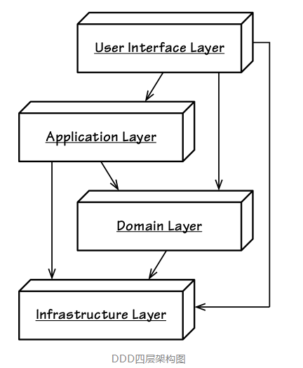
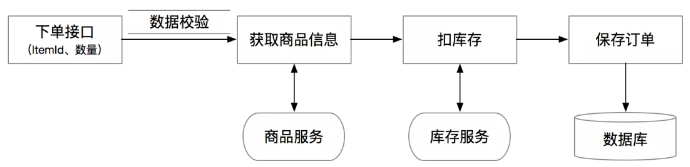
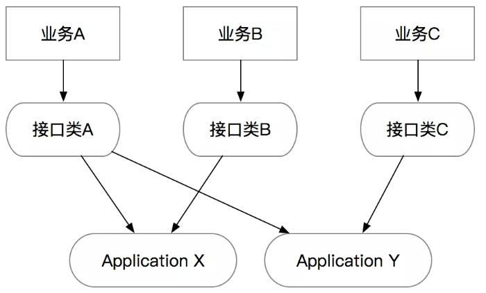
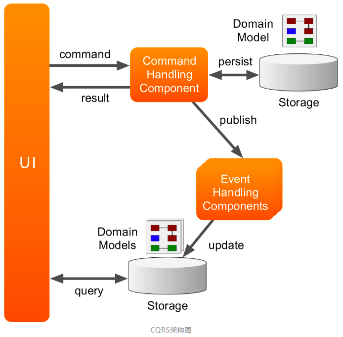

## 阿里大佬：DDD中Interface层、Application层的设计规范

### 本文目录
- 说在前面
- 尼恩总结：DDD的本质和最终收益
- 本文说明：
- 第6篇 - Interface层、Application层的设计规范
  - 1.传统的四层架构模式       
  - 2.下单链路案例简介
  - 3.Interface接口层  
    - 3.1 接口层的组成
    - 3.2 返回值和异常处理规范，Result vs Exception
    - 3.3 接口层的接口的数量和业务间的隔离
  - 4.Application层
    - 4.1 Application层的组成部分
    - 4.2 使用Command、Query、Event对象语意化我们的参数
      - 为什么要用CQE[Command、Query、Event]对象？
      - CQE的规范
      - CQE的校验
    - 4.3 ApplicationService 流程编排
      - 要点1：ApplicationService 负责了业务流程的编排，
      - 要点2：Application Service 是业务流程的封装，不处理业务逻辑
        - 判断是否业务流程的几个点
        - 常用的ApplicationService“套路”
    - 4.4 DTO Assembler
    - 4.5 Result vs Exception
    - 4.6 Anti-Corruption Layer防腐层
  - 5.Orchestration[ˌɔːrkɪˈstreɪʃn]编排 vs Choreography[ˌkɔːriˈɑːɡrəfi]协作
    - 5.1 模式简介
    - 5.2 案例
    - 5.3 模式的区别和选择
    - 5.4 跟DDD分层架构的关系
  - 总结
- 未完待续，尼恩说在最后
- 部分历史案例

### 第6篇 -  Interface层、Application层的设计规范
在日常工作中我观察到，面对老系统重构和迁移场景，有大量代码属于流水账代码，
通常能看到开发在对外的API接口里直接写业务逻辑代码，或者在一个服务里大量的堆接口，
***导致业务逻辑实际无法收敛，接口复用性比较差***。
本文主要想系统性的解释一下如何通过DDD的重构，***将原有的流水账代码，改造为逻辑清晰、职责分明的模块***。

领域驱动设计没有特定的架构风格，它的核心是域模型驱动业务的思想，
常见的领域驱动设计架构有传统的四层架构模式、事件驱动架构、CQRS架构、六边形架构等。
```
领域驱动设计没有特定的架构风格，它的核心是域模型驱动业务的思想，
常见的领域驱动设计架构有传统的四层架构模式、事件驱动架构、CQRS架构、六边形架构等。
```

#### 1. 传统的四层架构模式
- ***User Interface***为用户界面层（对外访问层API），负责向用户显示信息和解释用户命令。
- ***Application***为应用层，定义软件要完成的任务，并且指挥表达领域概念的对象来解决问题。
- ***Domain***为领域层（或模型层），负责表达***业务概念***，***业务状态信息***以及***业务规则***。
- ***Infrastructure***层为基础实施层，向其他层提供通用的技术能力。



基础设施层：基本上都是需要固化的代码，一次写成，需要变动的次数很少，一旦变动，就需要大量谨慎的回归测试。
将所有的存储调用、中间件调用都沉淀在这一层中。

#### 2. 下单链路案例简介
这里举一个简单的常见案例：下单链路。
假设我们在做一个checkout接口，需要做各种校验、查询商品信息、调用库存服务扣库存、然后生成订单：
- 各种校验
- 查询商品信息
- 调用库存服务扣库存
- 生成订单


一个比较典型的代码如下：
```java
@RestController
@RequestMapping("/")
public class CheckoutController {
  @Resource
  private ItemService itemService;

  @Resource
  private InventoryService inventoryService;

  @Resource
  private OrderRepository orderRepository;

  @PostMapping("checkout")
  public Result<OrderDO> checkout(Long itemId, Integer quantity) {
    // 1) Session管理
    Long userId = SessionUtils.getLoggedInUserId();
    if (userId <= 0) {
      return Result.fail("Not Logged In");
    }

    // 2）参数校验
    if (itemId <= 0 || quantity <= 0 || quantity >= 1000) {
      return Result.fail("Invalid Args");
    }

    // 3）外部数据补全
    ItemDO item = itemService.getItem(itemId);
    if (item == null) {
      return Result.fail("Item Not Found");
    }

    // 4）调用外部服务 withhold:保留，隐瞒，扣留；克制，抑制
    boolean withholdSuccess = inventoryService.withhold(itemId, quantity);
    if (!withholdSuccess) {
      return Result.fail("Inventory not enough");
    }

    // 5）领域计算
    Long cost = item.getPriceInCents() * quantity;

    // 6）领域对象操作
    OrderDO order = new OrderDO();
    order.setItemId(itemId);
    order.setBuyerId(userId);
    order.setSellerId(item.getSellerId());
    order.setCount(quantity);
    order.setTotalCost(cost);

    // 7）数据持久化
    orderRepository.createOrder(order);

    // 8）返回
    return Result.success(order);
  }
}
```

为什么这种典型的流水账代码在实际应用中会有问题呢？
其本质问题是违背了SRP（Single Responsibility Principle）单一职责原则。

这段代码里混杂了业务计算、校验逻辑、基础设施、和通信协议等，在未来无论哪一部分的逻辑变更都会直接影响到这段代码，
当后人不断地在上面叠加新的逻辑时，会使代码复杂度增加、逻辑分支越来越多，最终造成bug或者没人敢重构的历史包袱。

```
为什么这种典型的流水账代码在实际应用中会有问题呢？
其本质问题是违背了SRP(Single Responsibility Principle)单一职责原则。
这段代码里混杂了业务计算、校验逻辑、基础设施、和通信协议等，在未来无论哪一部分的逻辑变更都会直接影响到这段代码，
当后人不断地在上面叠加新的逻辑时，
会使代码复杂度增加、逻辑分支越来越多，最终造成bug或者没人敢重构的历史包袱。
```

所以我们才需要用DDD的分层思想去重构一下以上的代码，通过不同的代码分层和规范，
拆分出逻辑清晰，职责明确的分层和模块，也便于一些通用能力的沉淀。

主要的几个步骤分为：
- 分离出独立的Interface接口层，负责处理网络协议相关的逻辑。
- 从真实业务场景中，找出具体用例（Use Cases），然后将具体用例通过专用的Command指令、Query查询、和Event事件对象来承接。
- 分离出独立的Application应用层，***负责业务流程的编排***，***响应Command、Query和Event***。每个应用层的方法应该代表整个业务流程中的一个节点。
- 处理一些跨层的横切关注点，如鉴权、异常处理、校验、缓存、日志等。

下面会针对每个点做详细的解释。

#### 3. Interface接口层
随着REST和MVC架构的普及，经常能看到开发同学直接在Controller中写业务逻辑，
如上面的典型案例，但实际上MVC Controller不是唯一的重灾区。
以下的几种常见的代码写法通常都可能包含了同样的问题：
- HTTP 框架：如Spring MVC框架，Spring Cloud等。
- RPC 框架：如Dubbo、HSF、gRPC等。
- 消息队列MQ的“消费者”：比如JMS的 onMessage，RocketMQ的MessageListener等。
- Socket通信：Socket通信的receive、WebSocket的onMessage等。
- 文件系统：WatcherService等。
- 分布式任务调度：SchedulerX等。

这些的方法都有一个共同的点就是都有自己的网络协议， 而如果我们的业务代码和网络协议混杂在一起， 
则会直接导致代码跟网络协议绑定，无法被复用。

所以，在DDD的分层架构中，我们单独会抽取出来Interface接口层，
作为所有对外的门户，将网络协议和业务逻辑解耦。

##### 3.1 接口层的组成
接口层主要由以下几个功能组成：
- 网络协议的转化：通常这个已经由各种框架给封装掉了，我们需要构建的类要么是被注解的bean，要么是继承了某个接口的bean。
- 统一鉴权：比如在一些需要AppKey+Secret的场景，需要针对某个租户做鉴权的，包括一些加密串的校验
- Session管理：一般在面向用户的接口或者有登陆态的，通过Session或者RPC上下文可以拿到当前调用的用户，以便传递给下游服务。
- 限流配置：对接口做限流避免大流量打到下游服务
- 前置缓存：针对变更不是很频繁的只读场景，可以前置结果缓存到接口层
- 异常处理：通常在接口层要避免将异常直接暴露给调用端，所以需要在接口层做统一的异常捕获，转化为调用端可以理解的数据格式
- 日志：在接口层打调用日志，用来做统计和debug等。一般微服务框架可能都直接包含了这些功能。

当然，如果有一个独立的网关设施/应用，则可以抽离出鉴权、Session、限流、日志等逻辑，
但是目前来看API网关也只能解决一部分的功能，即使在有API网关的场景下，应用里独立的接口层还是有必要的。
在Interface层，鉴权、Session、限流、缓存、日志等都比较直接，只有一个异常处理的点需要重点说下。

###### 3.2 返回值和异常处理规范，Result vs Exception
```
注：这部分主要还是面向REST和RPC接口，其他的协议需要根据协议的规范产生返回值。
```
在我见过的一些代码里，接口的返回值比较多样化，有些直接返回DTO甚至DO，另一些返回Result。
接口层的核心价值是对外，所以如果只是返回DTO或DO会不可避免的面临异常和错误栈泄漏到使用方的情况，
包括错误栈被序列化反序列化的消耗。

所以，这里提出一个规范：
- Interface层的HTTP和RPC接口，返回值为Result，捕捉所有异常
- Application层的所有接口返回值为DTO，不负责处理异常

Application层的具体规范等下再讲，在这里先展示Interface层的逻辑。

举个例子：
```
@PostMapping("checkout")
public Result<OrderDTO> checkout(Long itemId, Integer quantity) {
    try {
        CheckoutCommand cmd = new CheckoutCommand();
        OrderDTO orderDTO = checkoutService.checkout(cmd);    
        return Result.success(orderDTO);
    } catch (ConstraintViolationException cve) {
        // 捕捉一些特殊异常，比如Validation异常
        return Result.fail(cve.getMessage());
    } catch (Exception e) {
        // 兜底异常捕获
        return Result.fail(e.getMessage());
    }
}
```

当然，每个接口都要写异常处理逻辑会比较烦，所以可以用AOP做个注解：
```java
@Target(ElementType.METHOD)
@Retention(RetentionPolicy.RUNTIME)
public @interface ResultHandler {

}

@Aspect
@Component
public class ResultAspect {
    @Around("@annotation(ResultHandler)")
    public Object logExecutionTime(ProceedingJoinPoint joinPoint) throws Throwable {
        Object proceed = null;
        try {
            proceed = joinPoint.proceed();
        } catch (ConstraintViolationException cve) {
            return Result.fail(cve.getMessage());
        } catch (Exception e) {
            return Result.fail(e.getMessage());
        }
        return proceed;
    }
}
```

然后最终代码则简化为：
```
@PostMapping("checkout")
@ResultHandler
public Result<OrderDTO> checkout(Long itemId, Integer quantity) {
    CheckoutCommand cmd = new CheckoutCommand();
    OrderDTO orderDTO = checkoutService.checkout(cmd);
    return Result.success(orderDTO);
}
```

##### 3.3 接口层的接口的数量和业务间的隔离
在传统REST和RPC的接口规范中，同一个领域的方法放在一个领域的服务或Controller中。

具体来说：通常一个领域的接口，无论是REST的Resource资源的GET/POST/DELETE，
还是RPC的方法，是追求相对固定的，统一的，而且会追求同一个领域的方法放在一个领域的服务或Controller中。

但是我发现在实际做业务的过程中，特别是当支撑的上游业务比较多时，
刻意去追求接口的统一会有一个严重后果，通常会导致方法中的参数膨胀，或者导致方法的膨胀。

举个例子：假设有一个宠物卡和一个亲子卡的业务公用一个开卡服务，
但是宠物需要传入宠物类型，亲子的需要传入宝宝年龄。

```java
// 可以是RPC Provider 或者 Controller
public interface CardService {

    // 1）统一接口，参数膨胀
    Result openCard(int petType, int babyAge);

    // 2）统一泛化接口，参数语意丢失
    Result openCardV2(Map<String, Object> params);

    // 3）不泛化，同一个类里的接口膨胀
    Result openPetCard(int petType);
    Result openBabyCard(int babyAge);
}
```

可以看出来，无论怎么操作，都有可能导致CardService这个服务未来越来越难以维护，方法越来越多，
一个业务的变更有可能会导致整个服务/Controller的变更，最终变得无法维护。

我曾经参与过的一个服务，提供了几十个方法，上万行代码，
可想而知，无论是使用方对接口的理解成本还是对代码的维护成本都是极高的。

所以，这里提出另一个规范：

- 一个Interface层的类应该是“小而美”的，
- 应该是面向“一个单一的业务”或“一类同样需求的业务”，需要尽量避免用同一个类承接不同类型业务的需求。

基于上面的这个规范，可以发现宠物卡和亲子卡虽然看起来像是类似的需求，但并非是“同样需求”的，
可以预见到在未来的某个时刻，这两个业务的需求和需要提供的接口会越走越远，所以需要将这两个接口类拆分开：

```java
public interface PetCardService {
    Result openPetCard(int petType);
}

public interface BabyCardService {
    Result openBabyCard(int babyAge);
}
```

这个的好处是符合了Single Responsibility Principle单一职责原则，也就是说一个接口类仅仅会因为一个（或一类）业务的变化而变化。
一个建议是当一个现有的接口类过度膨胀时，
可以考虑对接口类做拆分，拆分原则和SRP(Single Responsibility Principle,简称 SRP)一致。

也许会有人问，如果按照这种做法，会不会产生大量的接口类，导致代码逻辑重复？

答案是不会，因为在DDD分层架构里，接口类的核心作用仅仅是协议层，每类业务的协议可以是不同的，而真实的业务逻辑会沉淀到应用层。

```
在DDD分层架构里，接口类的核心作用仅仅是协议层，
每类业务的协议可以是不同的，而真实的业务逻辑会沉淀到应用层。
```

也就是说Interface和Application的关系是多对多的：



因为业务需求是快速变化的，所以接口层也要跟着快速变化，通过独立的接口层可以避免业务间相互影响，但我们希望相对稳定的是Application层的逻辑。
所以我们接下来看一下Application层的一些规范。

```
因为业务需求是快速变化的，所以接口层也要跟着快速变化，
通过独立的接口层可以避免业务间相互影响，
但我们希望相对稳定的是Application层的逻辑。
所以我们接下来看一下Application层的一些规范。
```

#### 4. Application层
##### 4.1 Application层的组成部分
Application层的几个核心类：
- ApplicationService应用服务：最核心的类，***负责业务流程的编排***，但本身不负责任何业务逻辑。
- DTO Assembler：***负责将内部领域模型转化为可对外的DTO***。
- Command、Query、Event对象：作为ApplicationService的入参。
- 返回的DTO：作为ApplicationService的出参。

Application层最核心的对象是ApplicationService，它的核心功能是承接“业务流程“。
但是在讲ApplicationService的规范之前，必须要先重点的讲几个特殊类型的对象，即Command、Query和Event。
- Command
- Query
- Event

##### 4.2 使用Command、Query、Event对象语意化我们的参数
首先，回顾一下基础 的  CQRS 模式
- CQRS（Command and Query Responsibility Segregation）命令查询职责分离模式，分别对读和写建模。
- CQRS从定义上要求：
  - 一个方法修改了对象的状态，该方法便是一个Command，它不应该返回数据。
  - 一个方法返回了数据，该方法便是一个Query，此时它不应该通过直接的或间接的手段修改对象的状态。



从本质上来看，Command、Query、Event 对象都是Value Object，但是从语义上来看有比较大的差异：

- Command指令：指调用方明确想让系统操作的指令，其预期是对一个系统有影响，也就是写操作。
  通常来讲指令需要有一个明确的返回值（如同步的操作结果，或异步的指令已经被接受）。

- Query查询：指调用方明确想查询的东西，包括查询参数、过滤、分页等条件，其预期是对一个系统的数据完全不影响的，也就是只读操作。

- Event事件：***指一件已经发生过的既有事实，需要系统根据这个事实作出改变或者响应的，通常事件处理都会有一定的写操作***。

事件处理器不会有返回值。这里需要注意一下的是，Application层的Event概念和Domain层的DomainEvent是类似的概念，
但不一定是同一回事，这里的Event更多是外部一种通知机制而已。

简单总结下：

|     | Command     | Query          | Event    |
|-----|-------------|----------------|----------|
| 语义  | “希望”能触发的操作  | 各种条件的查询        | 已经发生过的事情 |
| 读/写 | 写           | 只读             | 通常是写     |
| 返回值 | DTO或Boolean | DTO或Collection | Void     |


为什么要用CQE[Command & Query & Event]对象？
通常在很多代码里，能看到接口上有多个参数，比如上文中的案例：
```
Result<OrderDO> checkout(Long itemId,Integer quantity)
```

如果需要在接口上增加参数，考虑到向前兼容，则需要增加一个方法：

```
Result<OrderDO> checkout(Long itemId,Integer quantity)
Result<OrderDO> checkout(Long itemId,Integer quantity,Integer channel)
```

或者常见的查询方法，由于条件的不同导致多个方法：
```
List < OrderDO> queryByItemId(Long itemId);
List < OrderDO> queryBySellerId(Long sellerId);
List < OrderDO> queryBySellerIdWithPage(Long sellerId, int currentPage, int pageSize);
```

可以看出来，传统的接口写法有几个问题：

- 接口膨胀：一个查询条件一个方法。
- 难以扩展：每新增一个参数都有可能需要调用方升级。
- 难以测试：接口一多，职责随之变得繁杂，业务场景各异，测试用例难以维护。

但是另外一个最重要的问题是：这种类型的参数罗列，本身没有任何业务上的”语意“，
只是一堆参数而已，无法明确的表达出来意图。

CQE的规范
所以在Application层的接口里，强力建议的一个规范是：
- ApplicationService的接口入参只能是一个Command、Query或Event对象，CQE对象需要能代表当前方法的语意。
- 唯一可以的例外是根据单一ID查询的情况，可以省略掉一个Query对象的创建。

按照上面的规范，实现案例是：
```java
public interface CheckoutService {
    // 结账
    OrderDTO checkout(@Valid CheckoutCommand cmd);
    // 查询订单
    List<OrderDTO> query(OrderQuery query);
    // 根据id查询订单
    OrderDTO getOrder(Long orderId); // 注意单一ID查询可以不用Query
}

@Data
public class CheckoutCommand {
    private Long userId;
    private Long itemId;
    private Integer quantity;
}

@Data
public class OrderQuery {
    private Long sellerId;
    private Long itemId;
    private int currentPage;
    private int pageSize;
}
```


