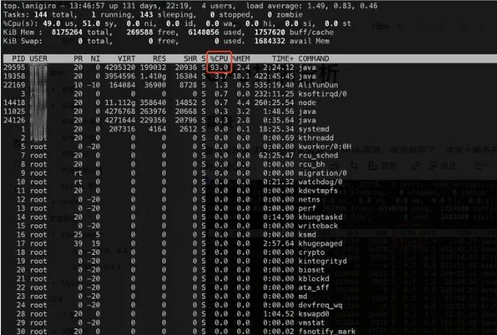
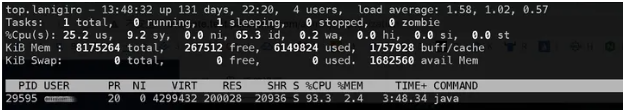
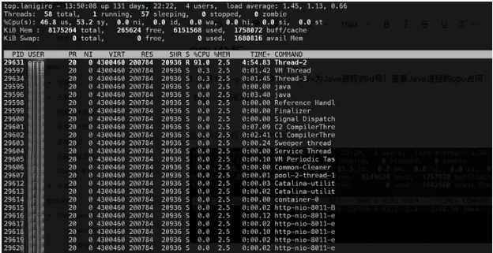
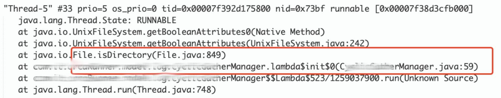
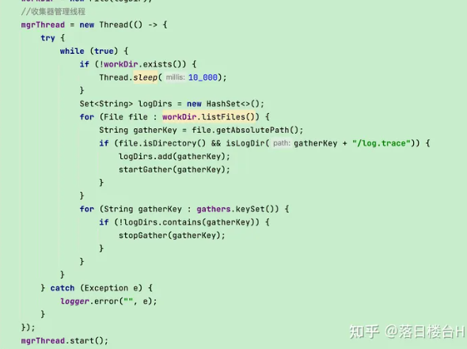
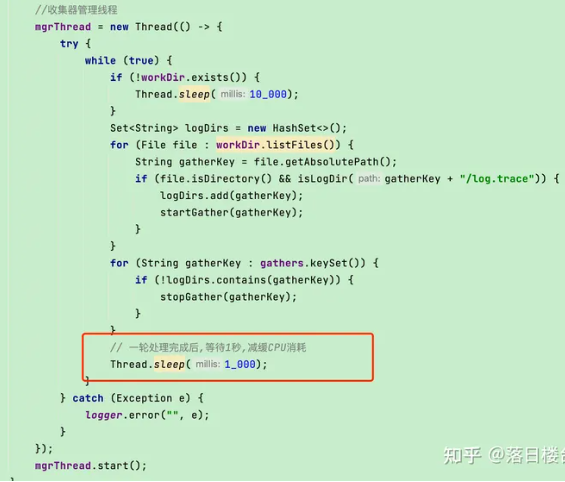
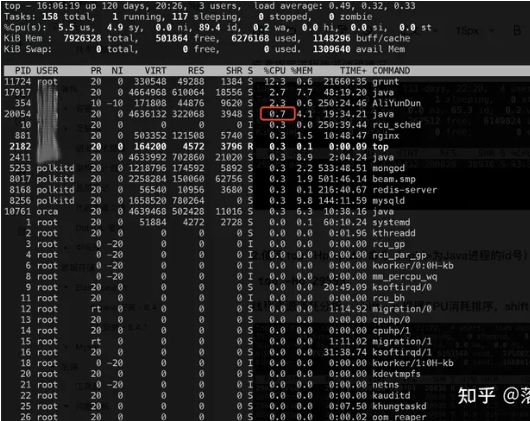

## Java进程CPU100%打满分析

### 背景
最近发现测试服务器经常触发CPU90%报警，这次有空了，
决定上服务器分析一下，居然发现是最近新上线的日志收集服务消耗大量CPU：

top 资源消耗分析， shift + p 根据CPU消耗排序，shift + m 根据内存消耗排序
```
top资源消耗分析，shift+p根据CPU消耗排序，shift+m根据内存消耗排序
```


一个进程CPU消耗超过90%CPU，第一眼感觉不正常，因此进行了一番分析。

### CPU分析
- 1.使用 top -p <pid> 命令（<pid>为Java进程的id号）查看Java进程的cpu占用：
```shell
top -p 29595
```
查看指定进程资源使用情况


- 2.使用 top -Hp <pid> 命令（<pid>为Java进程的id号）查看该Java进程内所有线程的资源占用情况
```
使用 top -Hp <pid>命令
（<pid>为Java进程的id号）查看该进程内所有线程的资源占用情况
```
```shell
top -Hp 29595
```
线程资源消耗分析， shift + p 根据CPU消耗排序，shift + m 根据内存消耗排序



- 3.终端上使用 printf "%x\n" <tid> 命令（tid指线程的id号）将以上10进制的线程号转换为16进制
```
printf "%x\n" 29631 -> 73bf -> 即 0x73bf
```
16进制进程号用于后面查询日志

```
终端上使用printf "%x\n" <tid> 命令（tid指线程的id号）将以上10进制的线程号转换为16进制
printf "%x\n" 29631 -> 73bf -> 即 0x73bf
```

- 4.使用 JDK 自带命令 jstack 获取此时的所有线程快照并输入到文件中
```shell
jstack -l <pid> > jstack.txt
```
命令（<pid>为Java进程的id号）来获取线程快照结果并输入到指定文件
```shell
jstack -l 29595 > jstack.txt
```
```
使用JDK自带命令jstack获取此时的所有线程快照并输入到文件中
jstack -l <pid> jstack.txt
命令（<pid>为java进程的id号）来获取线程快照结果并输入到指定文件
jstack -l 29595 > jstack.txt
```

- 5.查看第4步生成的txt文件，搜索上述高CPU的tid信息 -> 0x73bf


在根据日志中的代码位置分析，进行代码优化
***最后发现此处代码是一个死循环，一直在监测日志文件状态，并且无等待***
额，原来是这里会产生长时间的循环空转，消耗大量CPU



> 注: 业务上这里日志收集管理是持续检测日志目录，进行日志收集，包装日志收集的实时性和准确性

知道问题就好办，这里每一轮循环增加等待 1 秒，让出 CPU 资源。发布部署之后发现 CPU 顿时降下来了



修改后，CPU 消耗很低



### 总结
遇到 java 进程 CPU 占用较高级别就是这个分析思路:
- 1.确定高CPU进程的具体线程信息 top -Hp <pid>
- 2.通过命令输出当前各线程栈快照信息 jstack -l <pid> > jstack.txt
- 3.根据16进制线程ID在快照信息中查找定位具体代码
- 4.结合日志，调整优化代码，再次验证情况


