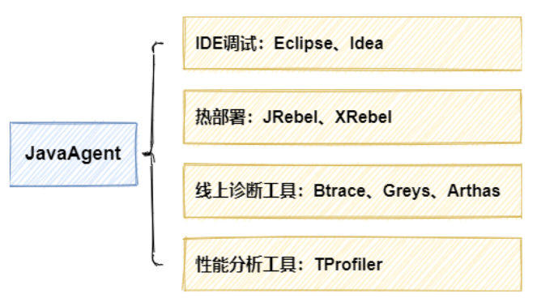
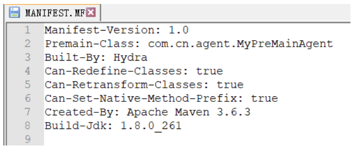
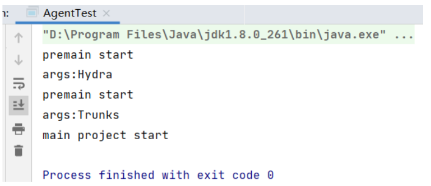
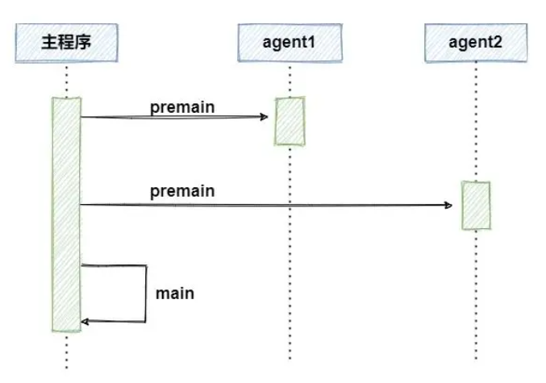
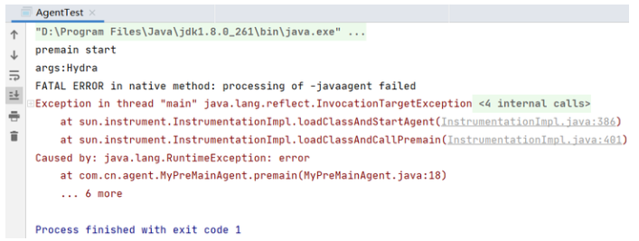

## 聊聊JavaAgent

熟悉Spring的小伙伴们应该都对aop比较了解，面向切面编程允许我们在目标方法的前后织入想要执行的逻辑，
而今天要给大家介绍的Java Agent技术，在思想上与aop比较类似，翻译过来可以被称为Java代理、Java探针技术。
- Java Agent技术，在思想上与aop比较类似
- 翻译过来称为Java代理、Java探针技术

Java Agent出现在JDK1.5版本以后，
它允许程序员利用agent技术构建一个独立于应用程序的代理程序，
用途也非常广泛，可以协助监测、运行、甚至替换其他JVM上的程序，
先从下面这张图直观的看一下它都被应用在哪些场景：
- 允许程序员利用agent技术构建一个独立于应用程序的代理程序
- 用途也非常广泛，可以协助监测、运行、甚至替换其他JVM上的程序



- IDE调试：Eclipse、Idea
- 热部署：JRebel、XRebel
- 线上诊断工具：Btrace、Greys、Arthas
- 性能分析工具：TProfiler

看到这里你是不是也很好奇，究竟是什么神仙技术，能够应用在这么多场景下，
那今天我们就来挖掘一下，看看神奇的Java Agent是如何工作在底层，默默支撑了这么多优秀的应用。

回到文章开头的类比，我们还是用和aop比较的方式，来先对Java Agent有一个大致的了解：
- 作用级别：aop运行于应用程序内的方法级别，而agent能够作用于虚拟机级别
- 组成部分：aop的实现需要目标方法和逻辑增强部分的方法，而Java Agent要生效需要两个工程，一个是agent代理，另一个是需要被代理的主程序
- 执行场合：aop可以运行在切面的前后或环绕等场合，而Java Agent的执行只有两种方式，
- jdk1.5提供的preMain模式在主程序运行前执行，
- jdk1.6提供的agentMain在主程序运行后执行

下面我们就分别看一下在两种模式下，如何动手实现一个agent代理程序。

### Premain模式
Premain模式允许在主程序执行前执行一个agent代理，实现起来非常简单，下面我们分别实现两个组成部分。

#### agent
先写一个简单的功能，在主程序执行前打印一句话，并打印传递给代理的参数：
```java
public class MyPreMainAgent {
    public static void premain(String agentArgs, Instrumentation inst) {
        System.out.println("premain start");
        System.out.println("args:"+agentArgs);
    }
}
```

在写完了agent的逻辑后，需要把它打包成jar文件，这里我们直接使用maven插件打包的方式，在打包前进行一些配置。
```xml
<build>
    <plugins>
        <plugin>
            <groupId>org.apache.maven.plugins</groupId>
            <artifactId>maven-jar-plugin</artifactId>
            <version>3.1.0</version>
            <configuration>
                <archive>
                    <manifest>
                        <addClasspath>true</addClasspath>
                    </manifest>
                    <manifestEntries>
                        <Premain-Class>com.cn.agent.MyPreMainAgent</Premain-Class>                            
                        <Can-Redefine-Classes>true</Can-Redefine-Classes>
                        <Can-Retransform-Classes>true</Can-Retransform-Classes>
                        <Can-Set-Native-Method-Prefix>true</Can-Set-Native-Method-Prefix>
                    </manifestEntries>
                </archive>
            </configuration>
        </plugin>
    </plugins>
</build>
```
配置的打包参数中，通过manifestEntries的方式添加属性到MANIFEST.MF文件中，解释一下里面的几个参数：

- 配置的打包参数中
- 通过manifestEntries的方式添加属性到MANIFEST.MF文件中

- Premain-Class：包含premain方法的类，需要配置为类的全路径
- Can-Redefine-Classes：为true时表示能够重新定义class
- Can-Retransform-Classes：为true时表示能够重新转换class，实现字节码替换
- Can-Set-Native-Method-Prefix：为true时表示能够设置native方法的前缀

其中Premain-Class为必须配置，其余几项是非必须选项，默认情况下都为false，通常也建议加入，这几个功能我们会在后面具体介绍。在配置完成后，使用mvn命令打包：
```
mvn clean package
```

打包完成后生成myAgent-1.0.jar文件，我们可以解压jar文件，看一下生成的MANIFEST.MF文件：



可以看到，添加的属性已经被加入到了文件中。
到这里，agent代理部分就完成了，因为代理不能够直接运行，需要附着于其他程序，所以下面新建一个工程来实现主程序。

- agent代理部分就完成了，因为代理不能够直接运行
- 需要附着于其他程序，所以下面新建一个工程来实现主程序

#### 主程序
在主程序的工程中，只需要一个能够执行的main方法的入口就可以了。
```java
public class AgentTest {
    public static void main(String[] args) {
        System.out.println("main project start");
    }
}
```

在主程序完成后，要考虑的就是应该如何将主程序与agent工程连接起来。
这里可以通过-javaagent参数来指定运行的代理，命令格式如下：
```
java -javaagent:myAgent.jar -jar AgentTest.jar
```

并且，可以指定的代理的数量是没有限制的，会根据指定的顺序先后依次执行各个代理，
如果要同时运行两个代理，就可以按照下面的命令执行：
```
java -javaagent:myAgent1.jar -javaagent:myAgent2.jar  -jar AgentTest.jar
```

以我们在idea中执行程序为例，在VM options中加入添加启动参数：
```
-javaagent:F:\Workspace\MyAgent\target\myAgent-1.0.jar=Hydra
-javaagent:F:\Workspace\MyAgent\target\myAgent-1.0.jar=Trunks
```

执行main方法，查看输出结果：


根据执行结果的打印语句可以看出，在执行主程序前，依次执行了两次我们的agent代理。
可以通过下面的图来表示执行代理与主程序的执行顺序。



#### 缺陷
在提供便利的同时，premain模式也有一些缺陷，例如如果agent在运行过程中出现异常，那么也会导致主程序的启动失败。
我们对上面例子中agent的代码进行一下改造，手动抛出一个异常。
```
public static void premain(String agentArgs, Instrumentation inst) {
    System.out.println("premain start");
    System.out.println("args:"+agentArgs);
    throw new RuntimeException("error");
}
```
再次运行主程序：


可以看到，在agent抛出异常后主程序也没有启动。
针对premain模式的一些缺陷，在jdk1.6之后引入了agentmain模式。


