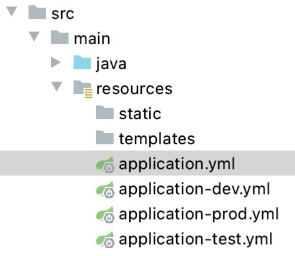
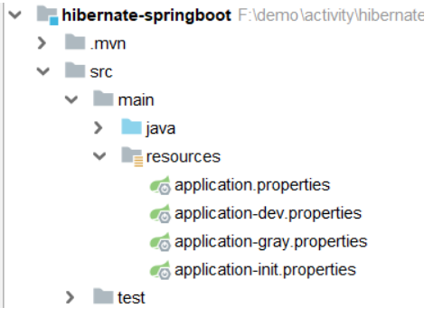
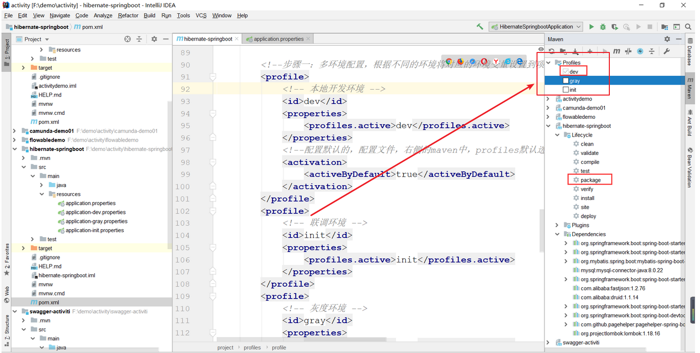

## Maven项目实现多环境配置文件
在Spring boot项目中，我们已经习惯了多环境配置文件的使用。
最近在维护旧项目时，因运行环境较多，一时起念，非Spring boot项目能实现多环境配置文件的配置和切换吗？
经过查找资料，发现Maven早已提供了profile来实现多环境配置。
真是孤陋寡闻，记录以学习之。

### 方式一：filter方式
#### 1.编写多环境配置文件，分别定义主配置文件application.properties和两个环境配置文件
application-dev.properties、application-test.properties：
- application.properties
```
jdbc.username=${env.jdbc.username}
```
- application-dev.properties
```
env.jdbc.username=dev
```
- application-test.properties
```
env.jdbc.username=test
```

由上面文件中看到，我们在主配置文件并未定义实际值，而是引用环境配置中对应key的值。

#### 2.在pom.xml中配置profile：
```xml
<profiles>
    <profile>
        <id>dev</id>
        <properties>
            <env>dev</env>
        </properties>
        <activation>
        	<!-- 默认激活 -->
            <activeByDefault>true</activeByDefault>
        </activation>
    </profile>
    <profile>
        <id>test</id>
        <properties>
            <env>test</env>
        </properties>
    </profile>
</profiles>
```

由上面文件中看到，我们配置了两套环境配置dev和test。

#### 3.在pom.xml中配置filter和resource：
```
<build>
    <filters>
        <filter>src/main/resources/application-${env}.properties</filter>
    </filters>
    <resources>
        <resource>
            <directory>src/main/resources</directory>
            <filtering>true</filtering>
        </resource>
    </resources>
</build>
```
注意：<filtering>true</filtering>不可遗漏。

打包运行：
```
# 不指定运行环境，默认是activeByDefault=true的环境，当前是指开发环境
mvn package
# 指定运行环境，`<env>`指dev/test，注意参数P是大写
mvn package -P <env>
```

打包执行完成后，我们在target目录下的application.properties中可以看到值是随着指定运行环境变化的。

### 方式二：resource方式
#### 1.在resources下建立多个环境目录放置各自的配置文件：
- env/dev/application.properties
```
jdbc.username=dev
```
- env/test/application.properties
```
jdbc.username=test
```
#### 2.在pom.xml中配置profile：
```
<profiles>
    <profile>
        <id>dev</id>
        <properties>
            <env>dev</env>
        </properties>
        <activation>
        	<!-- 默认激活 -->
            <activeByDefault>true</activeByDefault>
        </activation>
    </profile>
    <profile>
        <id>test</id>
        <properties>
            <env>test</env>
        </properties>
    </profile>
</profiles>
```
由上可以看出，两种方式在这一步是一致的，区别主要在下一步。

#### 3.在pom.xml中配置resource：
```
<build>
    <resources>
        <resource>
            <directory>${basedir}/src/resources/env/${env}</directory>
            <includes>
                <include>*/*.xml</include>
                <include>*/*.properties</include>
                <include>*.xml</include>
                <include>*.properties</include>
            </includes>
        </resource>
    </resources>
</build>
```

#### 4.打包运行：
和方式一一样的操作，打包后，可以看到只有一套配置文件出现在target目录里。

### 小结
1.方式一，会把多个环境的配置文件都打包进去，且主要针对属性文件，如果有多个文件或者其他类型文件，这种方式是不容易处理的；
2.方式二，只打包指定环境的配置文件，且会打包整个文件夹，更方便一点；
展开一下思路，Springboot其实是类似方式一的，如果Springboot项目想要只打包指定环境的配置文件，可以和方式二结合一下，一起处理。

## Maven多环境配置
### 一、什么是Maven多环境配置？
在开发的过程中，经常需要面对不同的运行环境（开发环境、测试环境、生产环境、内网环境、外网环境等等），
在不同的环境中，相关的配置一般不一样，比如数据源配置、日志文件配置、以及一些软件运行过程中的基本配置。
每次在不同环境部署程序时，都需要修改相应的配置文件，使之完成环境的配置。
这么做存在一个比较大的问题：每次修改配置非常麻烦，而且配置错误会产生不可预估的影响，
比如，在发布生产环境时用的开发环境的配置还好，但如果在开发环境下用生产环境的数据，
将会造成生产数据的污染，导致生产环境崩溃。这就是多环境配置！

### 二、怎么用？
在maven中实现多环境的构建可移植性需要使用profile，
通过不同的环境激活不同的profile来达到构建的可移植性。

#### 代码
- jdbc.properties
```
jdbc.driver=${jdbc_driver}
jdbc.url=${jdbc_url}
jdbc.username=${jdbc_username}
jdbc.password=${jdbc_password}
```

- filter-dev-env.properties
```
jdbc_driver=com.mysql.jdbc.Driver
jdbc_url=jdbc:mysql://127.0.0.1:3306/dev
jdbc_username=root
jdbc_password=123456
```

- filter-pro-env.properties
```
jdbc_driver=com.mysql.jdbc.Driver
jdbc_url=jdbc:mysql://127.0.0.1:3306/pro
jdbc_username=root
jdbc_password=123456
```

- filter-test-env.properties
```
jdbc_driver=com.mysql.jdbc.Driver
jdbc_url=jdbc:mysql://127.0.0.1:3306/test
jdbc_username=root
jdbc_password=123456
```

- pom.xml
```xml
<settings>
<profiles>
    <profile>
        <!-- 本地开发环境 -->
        <id>dev</id>
        <properties>
            <profiles.active>dev</profiles.active>
        </properties>
        <!-- 默认是本地开发环境 -->
        <activation>
            <activeByDefault>true</activeByDefault>
        </activation>
    </profile>
    <profile>
        <!-- 测试环境 -->
        <id>test</id>
        <properties>
            <profiles.active>test</profiles.active>
        </properties>
    </profile>
    <profile>
        <!-- 生产环境 -->
        <id>pro</id>
        <properties>
            <profiles.active>pro</profiles.active>
        </properties>
    </profile>
</profiles>
<build>
    <!-- maven模块化的话最好从父类继成取，打成包的命名 -->
    <finalName>${artifactId}-${version}</finalName>
        <!-- 使用指定的filter进行过滤，在执行mvn命令的时候带上-Ppro就代表生产环境，就会加载生产环境的properties，-Pdev就代表开发环境（默认） -->
        <filters>
            <filter>src/main/resources/multiEnv/filter-${profiles.active}-env.properties</filter>
        </filters>
        <!-- 配置需要被替换的资源文件路径, jdbc.properties -->
        <resources>
            <resource>
                <!-- 
                    资源文件位置src/hello_go/resources/,这下面的资源文件的${}会全部被替换成filter中的标签内容。
                    directory指定的value会作为classes的资源跟目录，
                    比如指定:src/hello_go/resources/，则classes下会出现jdbc等包，
                    若指定:src/hello_go/resources/jdbc/，则classes下直接出现jdbc包下的文件，不会额外出现jdbc等其他包结构。因为他把jdbc作为了根目录
                -->
                <directory>src/main/resources/</directory>
                <!-- 在某个resource中如果设置filtering为true，将会根据输入参数动态修改相关内容。 -->
                <filtering>true</filtering>
                <!-- 排除标签 -->
                <excludes>
                    <!--
                        exclude可以排除指定文件，支持通配符 ,匹配项不会生成到classes目录下，路径是以directory开始的
                        在这里就是directory（src/hello_go/resources/）/multiEnv/filter-*-env.properties
                    -->
                    <exclude>multiEnv/filter-*-env.properties</exclude>
                    <!-- **/*.xml 代表 directory(src/hello_go/resources/)目录以及所有子目录的xml文件-->
                    <!-- 
                    <exclude>**/*.xml</exclude>
                    <exclude>**/*.properties</exclude> 
                    -->
                </excludes>
                <!-- 包含标签 -->
                <!-- 
                <includes>
                    <include></include>
                </includes> 
                -->
            </resource>
        </resources>
    </build>
</settings>
```

#### 如何运行？
打包时，自己肯定知道是生产环境还是部署环境，所以只需要在打包的时候加上参数即可，如下：
打本地开发环境包：
```
mvn clean package -Pdev
```
打部署上线环境包：
```
mvn clean package -Ppro
```
打测试环境包：
```
mvn clean package -Ptest
```

#### 执行完命令后可以发现classes下的jdbc.properties变成了如下
```
jdbc.driver=com.mysql.jdbc.Driver
jdbc.url=jdbc:mysql://127.0.0.1:3306/pro
jdbc.username=root
jdbc.password=123456
```

上面配置文件随着打包不同内容不同，会将filter-dev-env.properties、
filter-pro-env.properties、filter-test-env.properties三个文件的内容分别注入

## maven中profiles使用详解，多环境开发配置文件（开发，测试，生产）+ pom中resources部分标签介绍 

### 使用的场景
常常遇到一些项目中多环境切换的问题。
比如在开发过程中用到开发环境，在测试中使用测试环境，在生产中用生产环境的情况。
springboot中提供了***spring.profile.active***的方式来实现多环境的切换，
通过设置环境变量和启动参数的方式。但是这样做终究不能一劳永逸，要么需要修改yml文件，要么需要记得启动的时候带上参数。
而利用maven的profiles，可以减少很多工作。

### 1.pom.xml中添加
需要在pom.xml中添加以下配置xml配置
```xml
<profiles>
    <!--步骤一：多环境配置，根据不同的环境将对应的环境变量设置到项目中-->
    <profile>
        <!-- 本地开发环境 --><!--不同环境Profile的唯一id-->
        <id>dev</id>
        <properties>
            <profiles.active>dev</profiles.active>
        </properties>
        <!--配置默认的，配置文件，右侧的maven中，profiles默认选中dev-->
        <activation>
            <activeByDefault>true</activeByDefault>
        </activation>
    </profile>
    <profile>
        <!-- 联调环境 -->
        <id>init</id>
        <properties>
            <profiles.active>init</profiles.active>
        </properties>
    </profile>
    <profile>
        <!-- 灰度环境 -->
        <id>gray</id>
        <properties>
            <profiles.active>gray</profiles.active>
        </properties>
    </profile>
</profiles>
```

### 2.设置配置文件
在目录中建立如下项目结构。


或者


#### 2.1.application.yml中代码如下
#多环境配置开发时使用-不放开则使用application.properties
```
spring.profiles.active=@profiles.active@
```
```
spring:profiles:active: @profiles.active@
```
#### 2.2.application-dev.yml中代码如下
```
server:port: 7091
```
其他几个文件我只是把端口号进行了修改，方便打包看不同的效果（按需要，实际开发修改即可）。

#### 2.3.maven打包与激活profiles
你可以执行命令
```
mvn clean package -Ptest
```
可以查看jar包中的配置文件变化，然后启动jar包，可以看到jar包启动的是test的配置，如果换成-Pdev启动的就是dev包的端口。
默认启动方式
如果不带-Ptest，启动的是 prod的端口。
因为在profiles中我们看到有配置默认的选项。

```xml
<profile>
    <!-- 本地开发环境 -->
    <id>prod</id>
    <properties>
        <profiles.active>prod</profiles.active>
    </properties>
    <!--配置默认的，配置文件，idea开发右侧的maven中，profiles默认选中prod-->
    <activation>
        <activeByDefault>true</activeByDefault>
    </activation>
</profile>
```

settings.xml中使用activeProfiles指定
```xml
<activeProfiles>  
    <activeProfile>profileTest1</activeProfile>  
</activeProfiles>
```

#### 通过IDEA的可视化的方式
当然如果使用IDEA工具进行开发，还可以使用可视化的方式进行打包。


### 二.更高级的玩法
通过和pom结合的方式设置动态参数
如果我们希望通过docker-maven-plugin插件，把编译好的jar打包成docker并且传入相应的开发、测试、生产的服务器中去。
这个时候，我们就需要根据不同的条件去传入不同的服务器。
在profiles中我们可以做以下定义
```xml
<profiles>
    <profile>
        <id>dev</id>
        <properties>
            <profile.id>dev</profile.id>
            <docker.host>http://dev.demo.com:2375</docker.host>
        </properties>
        <activation>
            <activeByDefault>true</activeByDefault>
        </activation>
    </profile>
    <profile>
        <id>test</id>
        <properties>
            <profile.id>test</profile.id>
            <docker.host>http://test.demo.com375</docker.host>
        </properties>
    </profile>
    <profile>
        <id>prod</id>
        <properties>
            <profile.id>prod</profile.id>
            <docker.host>http://prod.demo.com:2375</docker.host>
        </properties>
    </profile>
</profiles>
```

而在build控件中我们可以使用以下配置
```xml

<build>
    <plugins>
        <plugin>
            <groupId>com.spotify</groupId>
            <artifactId>docker-maven-plugin</artifactId>
            <version>1.1.0</version>
            <executions>
                <execution>
                    <id>build-image</id>
                    <phase>package</phase>
                    <goals>
                        <goal>build</goal>
                    </goals>
                </execution>
            </executions>
            <configuration>
                <imageName>demo/${project.artifactId}</imageName>
                <imageTags>
                    <imageTag>${project.version}-${current.time}</imageTag>
                    <imageTag>latest</imageTag>
                </imageTags>
                <forceTags>true</forceTags>
                <dockerHost>${docker.host}</dockerHost>
                <forceTags>true</forceTags>
                <baseImage>java:8</baseImage>
                <entryPoint>["java", "-jar", "/${project.build.finalName}.jar"]</entryPoint>
                <resources>
                    <resource>
                        <targetPath>/</targetPath>
                        <directory>${project.build.directory}</directory>
                        <include>${project.build.finalName}.jar</include>
                    </resource>
                </resources>
            </configuration>
        </plugin>
    </plugins>
</build>
```

其中 ${project.artifactId} 和${project.version}是关于节点下面和的引用。
${current.time}是在build-helper-maven-plugin定义的。
${docker.host}则是我们在profiles中定义的，可以随着我们选择不同的profile，
把jar包build成不同的docker镜像，并传入指定服务器。

#### 通过和yml结合设置动态参数
除了可以在pom中设置动态参数，使得其根据profile的不同选择不同的参数。
还可以通过设置不同的profile，让yml选择不同的参数。
这点和快速上手的例子有点相似。具体如下：
设置profiles
```xml

<profiles>
    <profile>
        <id>dev</id>
        <properties>
            <profile.id>dev</profile.id>
            <eureka.url>http://127.0.0.1:8001/eureka</eureka.url>
        </properties>
        <activation>
            <activeByDefault>true</activeByDefault>
        </activation>
    </profile>
    <profile>
        <id>test</id>
        <properties>
            <profile.id>test</profile.id>
            <eureka.url>http://base-registry:8001/eureka</eureka.url>
        </properties>
    </profile>
    <profile>
        <id>prod</id>
        <properties>
            <profile.id>prod</profile.id>
            <eureka.url>http://base-registry:8001/eureka</eureka.url>
        </properties>
    </profile>
    <profile>
        <id>new</id>
        <properties>
            <profile.id>new</profile.id>
            <eureka.url>http://base-registry:8001/eureka</eureka.url>
        </properties>
    </profile>
</profiles>
```

我们在profile中设置了一个eureka.url的属性，就可以在yml中直接调用。
```
eureka:client:service-url:defaultZone: @eureka.url@registry-fetch-interval-seconds: 10instance:prefer-ip-address: true
```


