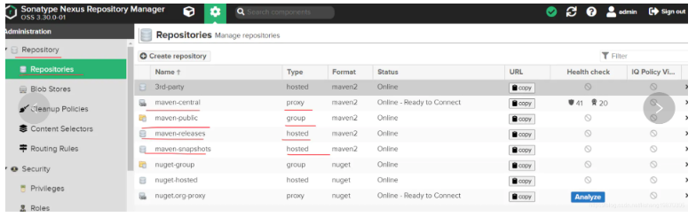
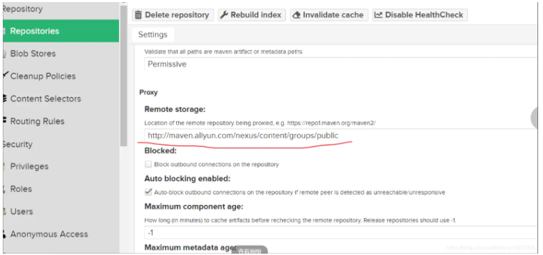
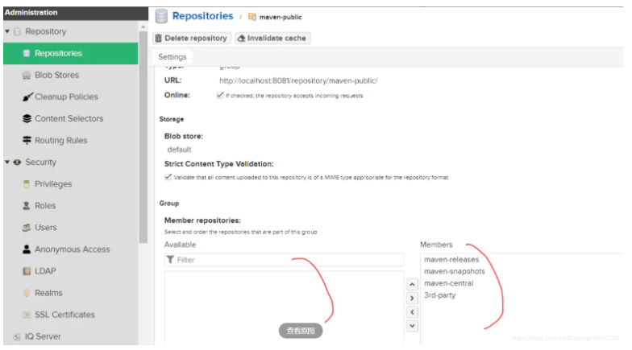

## maven仓库管理
上一节，我们讲解了maven的依赖管理，各模块系统从仓库下载依赖包。
在实际工作中，我们有大量开发人员协同开发，如果我们都同时用maven中央仓库或者阿里云镜像仓库，
需要每一个人都去下载一遍，白白浪费时间和网络资源。
此时我们需要一个企业级私服，局域网内使用，各开发组负责的模块也上传到私服，供其它开发组下载使用。

### 1在搭建私服之前，我们需要搞清楚几个概念；
- 1.maven中央仓库，是一个远程仓库，可供任何人使用
- 2.阿里云镜像仓库，代理了maven中央仓库，大陆使用更快速
- 3.其它远程仓库，例如JBOSS，GOOGlE等
- 4.本地仓库，开发者自己电脑上存储。~.m2\repository

### 2.私有仓库搭建用Nexus比较普遍，我们也将采用
- 1.GOOGLE搜索Nexus Repository Oss 下载
- 2.解压。解压后我们发现有两个文件，一个nexus-3.30XXX和一个sonatype-work<br>
nexus-3.30XXX存放运行时需要的文件
bin目录下nexus.vmoptions和etc下nexus-default.properties(可配置端口号）
sonatype-work包含***日志文件***，***配置文件***和***仓库文件***
- 3.进入nexus-3.30XXX/bin目录下 运行nexus.exe/run 等待几分钟<br>
打开http://localhost:8081/ 8081是默认端口号
新版本可以直接进入 然后设置密码
- 4.我们将看到有maven-public maven-central等各种仓库类型


```
maven-public：是个仓库组group nexus通过组的概念来管理多个仓库
maven-central：proxy代理仓库，我们可以代理maven中央仓库和阿里云镜像仓库
maven-releases:hosted宿主仓库 用于部署公司内部releases版本的包
maven-snapshots：hosted宿主仓库 用于部署公司内部snapshots版本的包
```
我们计划配置如下图一样的私服仓库效果：


***首先配置maven-central， 双击进去把代理地址换为阿里云镜像地址保存***，如下图



maven-releases已有 不需配置
maven-snapshots已有 不需配置

如上面nexus.png仓库流程图，我们计划配置个3rd-party来储存第三方非公开的商业包
点击“Create Repository"按钮，选择maven2(hosted)仓库 然后起名3rd-party
maven-public配置：双击进去，把上面maven-releases，maven-snapshots，maven-central和3rd-party都分配给maven-public组



nexus已配置完毕，我们的maven项目直接使用maven-public仓库地址即可。

### 3.maven配置nexus私服
我们将maven项目配置为强制从nexus私服下载依赖
第一步:settings.xml在profile添加如下配置
```xml
<profile>
    <id>nexus</id>
    <repositories>
        <repository>
            <id>nexus</id>
            <name>Nexus</name>
            <url>http://localhost:8081/repository/maven-public/</url>
            <releases><enabled>true</enabled></releases>
            <snapshots><enabled>true</enabled></snapshots>
        </repository>
    </repositories>
    <pluginRepositories>
        <pluginRepository>
            <id>nexus</id>
            <name>Nexus Plugin Repository</name>
            <url>http://localhost:8081/repository/maven-public/</url>
            <releases><enabled>true</enabled></releases>
            <snapshots><enabled>true</enabled></snapshots>
        </pluginRepository>
    </pluginRepositories>
</profile>
```

第二步，激活第一步的profile配置
```xml
<activeProfiles>
    <activeProfile>nexus</activeProfile>
</activeProfiles>
```

第三步，配置镜像机制
```xml
<mirrors>
    <mirror>
        <id>nexus</id>
        <mirrorOf>*</mirrorOf>
        <url>http://localhost:8081/nexus/content/groups/public</url>
    </mirror>
</mirros>
```

第四步，覆盖maven的远程仓库
打开安装包maven的lib包下maven-model-builder包下的pom.xml如下
```xml
<repositories>
<repository>
  <id>central</id>
  <name>Central Repository</name>
  <url>https://repo.maven.apache.org/maven2</url>
  <layout>default</layout>
  <snapshots>
    <enabled>false</enabled>
  </snapshots>
</repository>
</repositories>
<pluginRepositories>
<pluginRepository>
  <id>central</id>
  <name>Central Repository</name>
  <url>https://repo.maven.apache.org/maven2</url>
  <layout>default</layout>
  <snapshots>
    <enabled>false</enabled>
  </snapshots>
  <releases>
    <updatePolicy>never</updatePolicy>
  </releases>
</pluginRepository>
</pluginRepositories>
```
我们会看到maven默认加载使用的是一个id叫做central的仓库配置，我们需要覆盖它
更改第一步的profile配置，修改为central
```
<profile>
    <id>nexus</id>
    <repositories>
        <repository>
            <id>central</id>
            <name>Nexus</name>
            <url>http://central/</url>
            <releases><enabled>true</enabled></releases>
            <snapshots><enabled>true</enabled></snapshots>
        </repository>
    </repositories>
    <pluginRepositories>
        <pluginRepository>
            <id>central</id>
            <name>Nexus Plugin Repository</name>
            <url>http://central</url>
            <releases><enabled>true</enabled></releases>
            <snapshots><enabled>true</enabled></snapshots>
        </pluginRepository>
    </pluginRepositories>
</profile>
```

第五步，配置专用开发者账号
我们在nexus后台配置一个角色nx-deployment分配给这个角色仓库读取修改添加删除等权限。

然后创建一个deployment用户，角色分配为上面创建的nx-deployment角色
然后在settings.xml配置这个开发者账号
```xml
<servers>
<server>
    <id>nexus-releases</id>
    <username>deployment</username>
    <password>deployment</password>
</server>
<server>
    <id>nexus-snapshots</id>
    <username>deployment</username>
    <password>deployment</password>
</server>
</servers>
```

第六步，发布仓库的配置（本地项目上传到私服，供其它项目组引用这个模块使用）
在我们的项目pom.xml配置如下

```
<distributionManagement>
    <repository>
        <id> nexus-releases</id>
        <name> Nexus Release Repository</name>
        <url>http://localhost:8081/repository/maven-releases/</url>
    </repository>
    <snapshotRepository>
        <id> nexus-snapshots</id>
        <name> Nexus Snapshot Repository</name>
        <url>http://localhost:8081/repository/maven-snapshots/</url>
    </snapshotRepository>
</distributionManagement>
```

一个是releases版本上传到maven-releases仓库，
另一个是snapshots上传maven-snapshots仓库
到此我们的maven使用nexus私服配置完毕。
如何测试？
1.我们可以测试把项目部署发布到远程仓库用mvn clean deploy 然后在nexus后台仓库里查看仓库里是否存在
2.项目添加引用包 看是否是从远程私服下载的引用包


