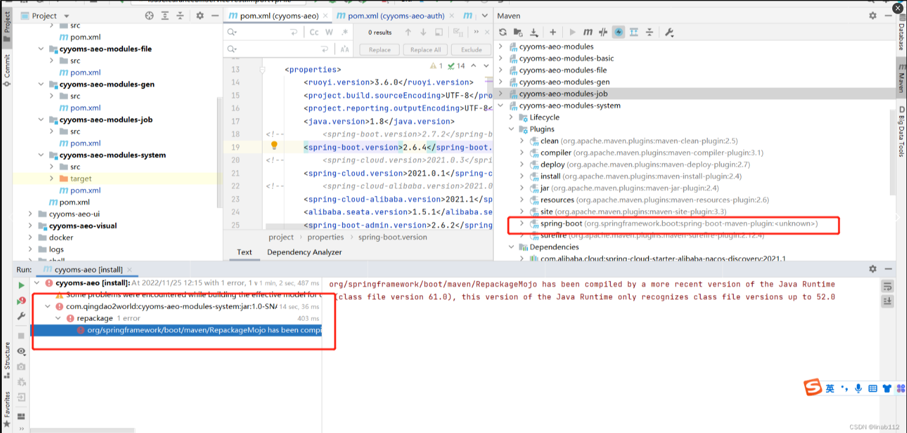
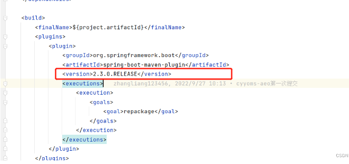

## org/springframework/boot/maven/RepackageMojo has been compiled by a more recent version of the Java

### 项目场景：
项目中执行clean，再执行install时报错，错误如下

org/springframework/boot/maven/RepackageMojo has been compiled by a more recent version of the Java Runtime (class file version 61.0), 
this version of the Java Runtime only recognizes class file versions up to 52.0

```
org/springframework/boot/maven/RepackageMojo has been compiled by a more recent version of the Java Runtime (class file version 61.0), 
this version of the Java Runtime only recognizes class file versions up to 52.0
```

### 问题描述
org/springframework/boot/maven/RepackageMojo是由较新版本的Java Runtime（类文件版本61.0）编译的，
该版本的Java运行时只能识别52.0以下的类文件版本

### 原因分析：
通过对应表可知，这个文件是由java 17版本编译的，
而现在系统中只能识别java 8以下的版本，
java版本不一致导致打包失败，需要在出错的模块的打包插件中设置一个版本就好了

java对应表
```
49 = Java 5
50 = Java 6
51 = Java 7
52 = Java 8
53 = Java 9
54 = Java 10
55 = Java 11
56 = Java 12
57 = Java 13
58 = Java 14
```



上面是出错的截图，有两个地方需要确认
下面那个可以看到是哪个模块出现的问题上面那个可以看到，
***打包插件中spring-boot的版本是未知的，这就导致引用最新的版本，造成不一致的问题***

```
打包插件中spring-boot的版本是未知的，这就导致引用最新的版本，造成不一致的问题
```

### 解决方案：
找到出错模块的pom文件，设置一下打包插件的版本，
和其他模块保持一下，重新刷新一下maven，再次打包就可以了



### 总结：
因为之前有些模块的打包插件的版本也没有添加是可以正常使用的，
但是今天突然不行了，***后来发现spring boot 3.0版最近正式发布了，3.0版是基于java 17 的***，
不指定的话，默认引用最新的导致这种问题的发生，所以大家做的时候，
所有模块的打包插件的版本一定要指定一下，避免出现这种问题，
当然这个版本号最好在总的pom文件中定义一下，子模块中直接引用就可以了，
不用在每个子模块中一一定义了

```
这个版本号最好在总的pom文件中定义一下，
子模块中直接引用就可以了，
不用在每个子模块中一一定义了。
```


