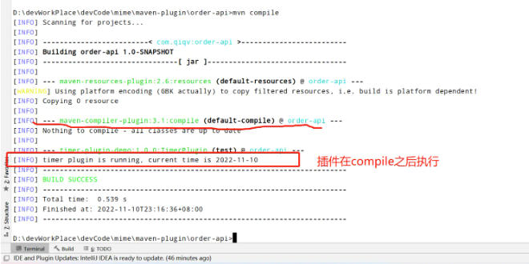

## maven进阶——开发自定义插件

### 前言
maven不仅仅只是项目的***依赖管理工具***，***其强大的核心来源自丰富的插件***，
可以说***插件才是maven工具的灵魂***。
本篇文章将对如何***自定义maven插件***进行讲解，希望对各位读者有所帮助。

### 知识背景
什么是maven插件？
讲如何开发maven插件之前，不妨先来聊一下什么是maven的插件。

我们知道，maven中主要有三大生命周期，clean,default和report，
不同的生命周期中提供了一些快捷的操作命令给开发人员去进行项目的清理、编译、打包等操作。
***之所以我们可以通过类似于mvn clean compile等命令快速完成项目的清理和构建***，<br>
实际上是***因为maven在项目核心的生命周期节点上，已经设置好了默认的运行插件***，
我们执行命令的时候，***实际上调用的就是绑定对应生命周期的插件***。
maven插件本质上就是一个jar包，不同的插件里面有着不同功能的代码，当我们调用该插件的时候，
其实就是通过执行jar包中的方法，去达到对应的goal，实现我们的目的。
除了官网的maven插件之外，其实maven还允许我们根据实际的项目需要，
自定义去开发maven插件，从而满足我们的项目构建需要。

关于maven的生命周期和插件，我们可以从官方文档中了解更多信息：
maven的生命周期：https://maven.apache.org/ref/3.8.6/maven-core/lifecycles.html
maven生命周期绑定的默认插件：https://maven.apache.org/ref/3.8.6/maven-core/default-bindings.html

### 一、自定义插件demo开发
#### （一）开发自定义插件
##### 步骤一：配置pom文件
我们先在idea中创建一个maven项目，并在pom文件中写入如下配置，
这里的目的是标识我们这个项目是maven插件项目，需要按照插件的方式来进行打包。

```xml
<packaging>maven-plugin</packaging>
```

其次，引入插件开发所需要的依赖，这里版本不一定需要和我一致，
只要两个依赖之前版本不要差距过大就行。

```
 <!--这个依赖引入了插件开发需要的相关基础类-->
<dependency>
    <groupId>org.apache.maven</groupId>
    <artifactId>maven-plugin-api</artifactId>
    <version>3.0</version>
</dependency>
 <!--这个依赖引入了插件开发需要的相关注解-->
<dependency>
    <groupId>org.apache.maven.plugin-tools</groupId>
    <artifactId>maven-plugin-annotations</artifactId>
    <version>3.4</version>
    <scope>provided</scope>
</dependency>
```

##### 步骤二：定义插件类
我们上一个步骤已经在pom文件中定义了我们这个项目是一个***maven插件类型的项目***，
而maven插件是需要对外提供各种实际应用能力的，
在这个步骤中，我们将定义我们这个插件对外提供的实际能力，
这样其他项目想要使用我们插件的时候，
就可以选择对应的goal来执行了。

> PS：需要注意的是，一个插件是可以同时提供多种能力的，但本案例只作为演示所以只会写一个功能

###### 1、定义插件类的2种方式
定义插件类有2种方式，第一种是创建java类，实现***org.apache.maven.plugin.Mojo**接口。
```
void execute() throws MojoExecutionException, MojoFailureException;
void setLog(Log log);
Log getLog();
```

这个接口一共定义了三个接口方法：
- execute：这个方法为核心方法，当使用mvn命令调用插件的目标的时候，最后具体调用的就是这个方法
- setLog：注入一个标准的Maven日志记录器，允许这个Mojo向用户传递事件和反馈
- getLog：获取注入的日志记录器

一般来说，我们并不会直接通过实现接口的方式来定义插件，
而是会采用继承maven提供的抽象类org.apache.maven.plugin.AbstractMojo来定义我们的插件类。

```java
public abstract class AbstractMojo implements Mojo, ContextEnabled {
    // ...
}
```

我们可以看到，这个抽象类实现了Mojo接口，同时这个抽象类还实现了setLog和getLog方法，
只留下execute方法给开发人员去实现。
这个类中Log默认可以向控制台输出日志信息，maven中自带的插件都继承这个类，
一般情况下我们开发插件目标可以直接继承这个类，然后实现execute方法就可以了。

###### 2、在我们的代码中进行实操
在刚刚创建的插件项目中，创建一个普通的java类，
继承org.apache.maven.plugin.AbstractMojo这个抽象类，
同时需要在类上面使用@Mojo注解。
这样maven在执行我们的插件的时候，才能够找到我们的入口类。
在execute方法中，我们简单地打印一句话到控制台

```java
@Mojo(name = "TimerPlugin")
public class TimerPlugin extends AbstractMojo {
    public void execute() throws MojoExecutionException, MojoFailureException {
        String currentTime = LocalDateTime.now().format(DateTimeFormatter.ofPattern("yyyy-MM-dd"));
        getLog().info("timer plugin is running，current time is " + currentTime);
    }
}
```

```java
@Mojo(name="TimerPlugin")
public class TimerPlugin extends AbstractMojo {
    public void execute() throws MojoExecutionException,MojoFailureException{
        // ...
    }
}
```

##### 步骤三：将我们的插件上传到我们的本地仓库
执行如下maven命令实现插件的上传，打包完成后我们就可以在我们本地仓库中找到我们的插件了。
```
mvn clean install
```

#### （二）验证插件
插件开发成功后，我们可以有2种方式来使用我们的自定义插件
##### 方式一：直接通过maven命令（我们在第三章中会详细讲一下这个maven命令的使用）
maven命令的格式如下：
```
mvn 插件groupId:插件artifactId[:插件版本]:插件目标名称
```

对应我们的案例，执行的命令即为mvn com.qiqv:timer-plugin-demo:TimerPlugin，
执行命令后可以看到控制台中就已经出现了我们插件中打印的语句。

##### 方式二：把自定义插件绑定在项目的生命周期中
如果我们的自定义插件是希望在打包的过程某个固定的生命周期发生作用，
那么我们可以在pom文件中把插件绑定在我们项目的生命周期中。

插件写在***build->plugins->plugin***标签下，
groupId这些信息和插件保持一致，然后需要在executions标签中定义我们这个使用这个自定义插件的哪个能力，也就是goal，
phase标签里面定义要绑定的生命周期，id用于命令，可以自己定义。

```xml
<build>
    <plugins>
        <plugin>
            <groupId>com.qiqv</groupId>
            <artifactId>timer-plugin-demo</artifactId>
            <version>1.0.0</version>
            <executions>
                <execution>
                    <id>test</id>
                    <!-- 指定执行的生命周期 -->
                    <phase>compile</phase>
                    <goals>
                        <!-- 对应@Mojo(name="TimerPlugin") -->
                        <goal>TimerPlugin</goal>
                    </goals>
                </execution>
            </executions>
        </plugin>
    </plugins>
</build>
```

在外部项目中绑定好插件后，我们通过mvn compile命令看一下结果



我们可以看到，我们的自定义插件顺利随着compile生命周期执行了。

### 二、插件传参
在第一章中，我们已经简单实现了一个maven插件，
但实际上这种没有任何参数的插件一般来说很难支持比较复杂、灵活的功能。
所以这一章中，我们将学习如何把参数传递给我们的插件。

#### （一）在Mojo类中定义我们接收数据的参数
延续第一章的例子，我们在插件类中定义2个变量，
并加上@Paramter注解，这个注解将变量标识为mojo参数。
注解的defaultValue参数定义变量的默认值。
property参数可用于通过引用用户通过-D选项设置的系统属性，
即通过从命令行配置mojo参数，
如mvn ... -Dtimer.username=moutory
Java可以将moutory的值传递给userName参数。

当然了，如果说不打算通过命令行执行，只想传参给和生命周期绑定的插件，
那么也需要要加上注解，注解里面可以不用配置其他属性。

```java
@Mojo(name = "TimerPlugin")
public class TimerPlugin extends AbstractMojo {

    @Parameter(property = "timer.username" ,defaultValue = "moutory")
    private String userName;

    @Parameter(property = "timer.status", defaultValue = "happy")
    private String status;

    public void execute() throws MojoExecutionException, MojoFailureException {
        String currentTime = LocalDateTime.now().format(DateTimeFormatter.ofPattern("yyyy-MM-dd"));
        getLog().info("timer plugin is running, current time is " + currentTime);
        getLog().info(String.format("hi %s ! Now you are %s",userName,status));
    }
}
```

#### （二）在使用中向我们的插件传递参数
##### 方式一：在pom文件进行定义
这种做法一般是用于和生命周期绑定使用的插件,我们可以在配置插件的时候，
利用configuration标签来配置我们插件的值。
configuration标签内可以写入我们想要配置的参数，
标签的key为我们插件定义的属性名，标签的value为我们想要配置的值。
以下面的配置为例，我们分别为userName和status配置不同的值：

```xml
<build>
    <plugins>
        <plugin>
            <groupId>com.qiqv</groupId>
            <artifactId>timer-plugin-demo</artifactId>
            <version>1.0.0</version>
            <executions>
                <execution>
                    <id>test</id>
                    <phase>compile</phase>
                    <goals>
                        <goal>TimerPlugin</goal>
                    </goals>
                </execution>
            </executions>
            <configuration>
                <userName>Jim</userName>
                <status>good</status>
            </configuration>
        </plugin>
    </plugins>
</build>
```
使用mvn compile命令，看一下执行的结果

##### 方式二：maven命令传参
这种方式比较适用于那些独立使用的插件，
比如***代码扫描工具***或者***依赖扫描插件***。
使用maven命令传参也十分简单，在命令后面使用-Dkey=value。
这里的key为@property中配置的property属性的值，value为我们实际传入的值。
对应到我们上面的案例，这里的参数就可以是-Dtimer.username=Tonny -Dtimer.status=bad。

#### （三）插件中可以接收的参数类型
除了String类型，自定义插件还可以接收其他多种参数类型，下面就对这些参数进行简单的介绍。
- 1、boolean类型
```
@Parameter
private boolean myBoolean;
```
```
<configuration>
    <myBoolean>true</myBoolean>
</configuration>
```
- 2、数字类型
数字类型包含：byte, Byte, int, Integer, long, Long, short, Short，读取配置时，
XML文件中的文本将使用适当类的integer.parseInt()或valueOf()方法转换为整数值，
这意味着字符串必须是有效的十进制整数值，仅由数字0到9组成，前面有一个可选的-表示负值。
```
@Parameter
private Integer myNum;
```
```
<configuration>
    <myNum>2</myNum>
</configuration>
```

- 3、File类型参数
读取配置时，XML文件中的文本用作所需文件或目录的路径。
如果路径是相对的（不是以/或C:之类的驱动器号开头），则路径是相对于包含POM的目录的
```
@Parameter
private File myFile;
```
```
<configuration>
  <myFile>C:\test</myFile>
</configuration>
```

- 4、枚举类型参数
```
public enum Color {
      GREEN,
      RED,
      BLUE
}
/**
* My Enum
*/
@Parameter
private Color myColor;
```

```
<myColor>GREEN</myColor>
```

- 5、数组类型参数
```
@Parameter
private String[] myArr;
```
```
<configuration>
  <myArr>
   <param>aa</param>
   <param>bb</param>
 </myArr>
</configuration>
```

- 6、Collections类型参数
和数组类型参数用法一样

- 7、Maps类型参数
```
@Parameter
private Map myMap;
```
```
<configuration>
    <myMap>
        <key1>value1</key1>
        <key2>value2</key2>
    </myMap>
</configuration>
```
- 8、Properties类型参数
```
@Parameter
private Properties myProperties;
```
```
<myProperties>
    <property>
        <name>propertyName1</name>
        <value>propertyValue1</value>
    <property>
    <property>
        <name>propertyName2</name>
        <value>propertyValue2</value>
    <property>
</myProperties>
```
- 9、自定义类型参数
```
@Parameter
private MyObject myObject;
```
```
<myObject>
  <myField>test</myField>
</myObject>
```

### 三、自定义插件前缀的使用
理论上我们开发自定义插件时，artifactId是可以随便写，并没有严格的书写规定。
但即使把artifactId定义得比较短，我们在通过命令使用插件时，还是不得不敲上一长串的命令，
无法像mvn clean这些官方插件一样，使用很简单的命令就可以完成操作。
出于简化命令的目的，其实maven官方已经定义一套插件命名规范，
只要满足这套命名规范，就可以在执行命令的时候简化我们的语法。

若自定义插件的artifactId满足下面的格式：
```
xxx-maven-plugin
```

如果采用这种格式的maven会自动将xxx指定为插件的前缀，
其他格式也可以，不过此处我们只说这种格式，这个是最常用的格式。

比如我们上面自定义插件改为timer-maven-plugin，他的前缀就是timer。
当我们配置了插件前缀，可以插件前缀来调用插件的目标了，命令如下：

```
mvn 插件前缀:插件目标
```

但是上面的命令支提供了插件前缀，
那么maven是如何知道对应的groupId的呢？
```
maven默认会在仓库"org.apache.maven.plugins" 和 "org.codehaus.mojo"2个位置查找插件，比如：
mvn clean:help。这个是调用maven-clean-plugin插件的help目标，
maven-clean-plugin的前缀就是clean，他的groupId是org.apache.maven.plugins，所以能够直接找到。
```

但是我们自己定义的插件，如果也让maven能够找到，需要下面的配置：
在~/.m2/settings.xml中配置自定义插件组，
我们需要在pluginGroups中加入自定义的插件组groupId，如：
```
<pluginGroup>com.qiqv</pluginGroup>
```

这样当我们通过前缀调用插件的时候，maven除了会在2个默认的组中查找，
还会在这些自定义的插件组中找，
一般情况下我们自定义的插件通常使用同样的groupId。
当我们配置了上面的自定义插件组后，
我们就可以改为用下面的命令来调用我们的自定义插件了。

```
mvn timer:TimerPlugin
```

通过上面这种方式，我们就可以实现用简化命令来调用我们的插件啦~~下面是需要额外注意的事项：
- 1、官方的插件命名一般是***maven-xxx-plugin***，第三方的自定义插件命名一般是***xxx-maven-plugin***，我们的命名规范尽量不要和官方插件的一致。
- 2、如果不想配置settings.xml这么麻烦，也可以直接在命令中加上groupId，这样也可以让maven可以找到你的自定义插件。

### 四、开发一个功能性更强的自定义组件
通过前面三章的介绍，其实我们已经能够掌握自定义插件开发的大部分知识了，
接下来我们就以开发功能性更强的插件为例，来作为收尾的一个小案例。
对一些web项目来说，***打包完之后我们需要把war包部署到tomcat上面进行部署***，
每次都需要手动复制包十分的麻烦，我们不妨尝试着自己开发一个插件，来解决这个场景的问题。
（当然了，现在idea都有这种自动部署的功能，但作为学习的案例，自己手动实现一下这个功能也是十分有意思的）

#### 步骤一：创建一个新的插件项目，定义pom文件
这一步和之前的并没有什么区别，还是定义项目的***打包类型***以及相关依赖
```
<packaging>maven-plugin</packaging>
<dependencies>
    <dependency>
        <groupId>org.apache.maven</groupId>
        <artifactId>maven-plugin-api</artifactId>
        <version>3.0</version>
    </dependency>
    <dependency>
        <groupId>org.apache.maven.plugin-tools</groupId>
        <artifactId>maven-plugin-annotations</artifactId>
        <version>3.4</version>
        <scope>provided</scope>
    </dependency>
</dependencies>
```
#### 步骤二：创建插件的核心执行类
这里的话没有写的很复杂，插件使用者提供一下war包位置，
tomcat路径以及最终的文件名，插件做一下简单的IO而已。
```java
@Mojo(name="deploy")
public class DeployPlugin extends AbstractMojo {
    @Parameter
    private String sourceWarPath;
    @Parameter
    private String tomcatHome;
    @Parameter
    private String targetFileName;

    @Override
    public void execute() throws MojoExecutionException, MojoFailureException {
        this.getLog().info("deploy plugin starting...");
        this.getLog().info("sourceWarPath:[{"+sourceWarPath+"}] , tomcatHome:[{"+tomcatHome+"}]");
        boolean cpSuccess = this.deployFile(sourceWarPath, tomcatHome, targetFileName);
        if(cpSuccess){
            this.getLog().info("deploy success");
            return;
        }
        this.getLog().error("deploy fail");
    }

    private boolean deployFile(String sourceWarPath, String tomcatHome,String targetFileName) {
        if(StringUtils.isBlank(sourceWarPath) || StringUtils.isBlank(tomcatHome)){
            throw new RuntimeException("missing required param!");
        }
        InputStream inputS = null;
        OutputStream outputS = null;
        String targetWarPath = tomcatHome + File.separator +"webapps"  + File.separator + targetFileName;

        // 通过 String 创建文件
        try{
            File destF = new File(targetWarPath);
            File srcF = new File(sourceWarPath);

            // 通过 File 创建 文件流
            inputS = new FileInputStream(srcF);
            outputS = new FileOutputStream(destF);

            // 读写流
            byte[] buffer = new byte[1024];
            int length = 0;
            while ((length = inputS.read(buffer)) > 0) {
                outputS.write(buffer, 0, length);
            }
        }catch (Exception e){
            e.printStackTrace();
            return false;
        }finally {
            closeIO(inputS,outputS);
        }
        return true;
    }

    private void closeIO(InputStream inputS, OutputStream outputS) {
        // 关闭流
        if(inputS != null){
            try{
                inputS.close();
            }catch (Exception e){
                this.getLog().error("close input stream fail..");
                e.printStackTrace();
            }
        }
        if(outputS != null){
            try{
                outputS.close();
            }catch (Exception e){
                this.getLog().error("close output stream fail..");
                e.printStackTrace();
            }
        }
    }
}
```
#### 步骤三：在我们的其他项目引入我们的插件
这里需要注意，除了需要传参之外，还需要把插件绑定在package的生命周期
```
<build>
    <plugins>
        <plugin>
            <groupId>com.qiqv</groupId>
            <artifactId>webDeploy-maven-plugin</artifactId>
            <version>1.0-SNAPSHOT</version>
            <executions>
                <execution>
                    <id>test</id>
                    <phase>package</phase>
                    <goals>
                        <goal>deploy</goal>
                    </goals>
                </execution>
            </executions>
            <configuration>
                <sourceWarPath>D:\devWorkPlace\devCode\mime\maven-plugin\order-api\target\order-api-1.0-SNAPSHOT.war</sourceWarPath>
                <tomcatHome>D:\devWorkPlace\devTool\apache-tomcat-9.0.68</tomcatHome>
                <targetFileName>order-api-1.0-SNAPSHOT.war</targetFileName>
            </configuration>
        </plugin>
    </plugins>
</build>
```
#### 步骤四：项目打包，观察插件的运行日志：
从日志上面来看，war包已经复制成功了，
那么切换到对应的webapp目录上面，
也可以看到，war包确实已经复制过来了。

### 总结
这篇文章我们对maven自定义插件的开发方法进行了介绍，
了解插件的参数如何传递以及不同的参数如何传递，并配合两个简单的案例来进行讲解。
总的来说，自定义插件的开发并不复杂，掌握了基本知识后，难度其实在于插件所要实现的具体功能，
后期有时间了我们可以出一期文章来分析某些优秀的开源maven插件是怎么实现的。


