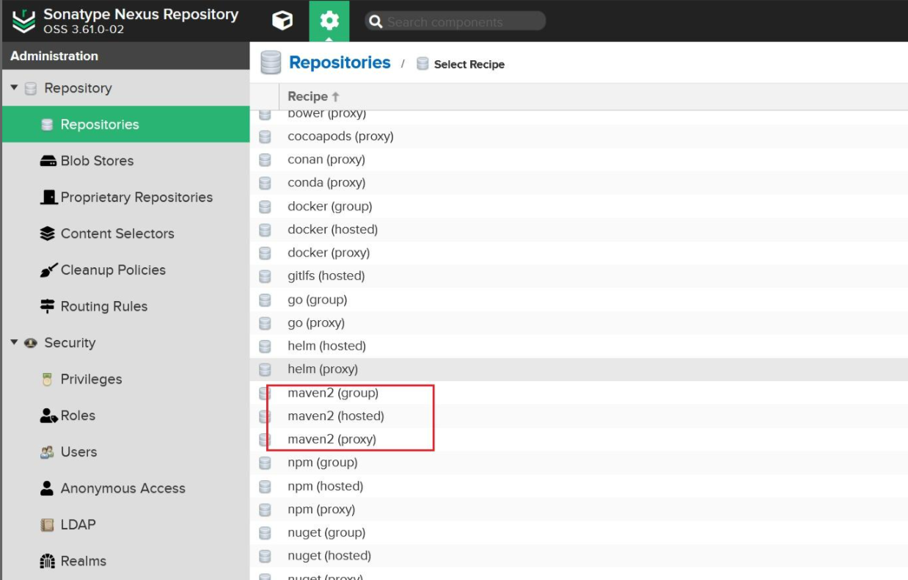

## 超级详细Maven私服搭建：Nexus

### Maven是什么
Maven 是 Apache 软件基金会组织维护的一款专门***为Java项目提供构建和依赖管理支持的工具***。

做Java开发通常都离不开Maven，在Maven出现之前，如果我们项目里面引用了别的jar包，
***需要我们把jar包下载好然后放到项目的特定目录下***。
这样做的缺点就是每次更新jar包都需要去重新下载一次，
***而且如果依赖的jar包比较多的话容易发生jar包冲突，大大降低了开发的效率***。
Maven的出现让依赖jar包这个工作变得简单，
只需要在项目里面声明jar包Maven就可以自动去中心仓库把需要的jar包下载下来而且可以迅速定位jar包冲突。

### Nexus
那么Maven是从哪里下载jar包呢？
***如果不做特殊配置的话，Maven是从中央仓库下载jar包***。
中央仓库是全世界最大的Maven仓库，包括了所有的Maven依赖。
但是中央仓库是架设在国外，国内下载的速度比较慢，而且经常出现访问不了的情况。
所以***国内阿里架设了中央仓库的代理服务器——阿里云***，可以看成是中央仓库的镜像。
这就解决了依赖下载慢的问题。

有的小伙伴就要问了，既然已经有阿里代理了，
我们为什么还要搭建Maven私服呢？
试想一下，在公司里面做开发基本都是一个团队，从几人到几十上百人都有可能，那么所有人用到的依赖都是一样的，
这时如果把Maven依赖放到公司的内网环境中，可以大大节省项目初始化的时间。
***而且不同团队之间会共享一些公共模块或者项目需要迭代更新提供给其他团队使用，这时候就需要把依赖放到私服上去***。

下面是有无私服的区别。


接下来就来介绍一下怎么使用Nexus搭建Maven私服。

#### Nexus 下载安装
[下载地址：](https://download.sonatype.com)

然后将下载的文件上传到 Linux 系统（我用的系统版本是CentOS7），
解压后即可使用，不需要安装（这里我放在/opt/nexus目录下）。
需要注意：Linux 必须提前安装 JDK。

通过以下命令启动：
```shell
# 启动
/opt/nexus/nexus-3.61.0-02/bin/nexus start
# 查看状态
/opt/nexus/nexus-3.61.0-02/bin/nexus status
#停止
/opt/nexus/nexus-3.61.0-02/bin/nexus stop
```

当看到nexus is running的时候说明项目已经启动了，默认端口号是8081。
如果提示nexus is stopped则说明端口被占用了，
我们可以更改nexus的默认端口号。
其配置在 ***/opt/nexus/nexus-3.61.0-02/etc***目录下的***nexus-default.properties*** 里面，
这里我改成了8090。

接下来就可以启动访问了：
```
http://[Linux 服务器地址]:8090/ 
```
ps：这里需要说明一下，如果Nexus显示已经启动了，但是访问不到，有可能是端口的对外防火墙没有打开。

开启防火墙的步骤为：
```
#首先，确保firewalld已经启动：
sudo systemctl start firewalld
#确保firewalld被设置为开机启动：
sudo systemctl enable firewalld
#使用firewall-cmd打开一个端口。例如，要打开TCP的8090端口：
sudo firewall-cmd --zone=public --add-port=8090/tcp --permanent
#重新加载防火墙以使更改生效：
sudo firewall-cmd --reload
#如果需要，你也可以验证端口是否已经开放：
sudo firewall-cmd --zone=public --list-ports
```

好，我们继续说Nexus。Nexus首页如下，第一次需要登录，然后修改初始密码。
```
用户名：admin
初始密码：在/opt/nexus/sonatype-work/nexus3/admin.password 文件里
```

下一步，是否开启匿名访问，***开启匿名访问之后，我们可以不用输入密码浏览下载依赖***，
由于启用匿名登录后，后续操作比较简单，这里我们演示禁用匿名登录的操作方式：


#### Nexus仓库
完成这些设置之后就可以看到Nexus的仓库了。
Nexus默认创建了几个仓库，如下：


Repositories:
- maven-central
- maven-public
- maven-releases
- maven-snapshots
- nuget-group
- nuget-hosted
- nuget.org-proxy

其中仓库 Type 类型为：

|仓库类型|说明|
|---|---|
|proxy|某个远程仓库的代理|
|group|存放：通过 Nexus 获取的第三方 jar 包|
|hosted|存放：本团队其他开发人员部署到 Nexus 的 jar 包|

仓库名称：

|仓库名称| 说明  |
|---|---|
|maven-central|Nexus 对 Maven 中央仓库的代理|
|maven-public|Nexus 默认创建，供开发人员下载使用的组仓库|
|maven-releasse|Nexus 默认创建，供开发人员部署自己 jar 包的宿主仓库，要求 releasse 版本|
|maven-snapshots|Nexus 默认创建，供开发人员部署自己 jar 包的宿主仓库，要求 snapshots 版本|

***其中 maven-public 相当于仓库总和，默认把其他 3 个仓库加进来一起对外提供服务了***，
***另外，如果有自己建的仓库，也要加进该仓库才有用***。
初始状态下，这几个仓库都没有内容：

#### 创建 Nexus仓库
除了自带的仓库，有时候我们需要单独创建自己的仓库，
按照默认创建的仓库类型来创建我们自己的仓库。
点击Create Repository

选择如下三种类型的仓库。


#### Hosted 仓库


#### Proxy仓库
输入仓库名以及被代理仓库的URL，这里我输入阿里云的仓库地址，默认为中央仓库。


#### Group 仓库
根据group仓库的解释，group仓库是其他仓库的集合，所以需要将其他创建的仓库添加到组里。


上面的仓库创建好之后就可以在首页看到了。

### 通过 Nexus 下载 jar 包
Nexus私服搭建好之后就可以通过Nexus下载jar包了。
为了方便演示我在本地创建了一个空的仓库：new-repo。

然后修改Maven的配置，将新仓库作为默认仓库。


然后修改镜像配置（***这里我们之前都是配置的阿里云仓库，现在改为我们自己的Nexus仓库***）


```xml
<mirror>
    <id>maven-public</id>
    <mirrorOf>central</mirrorOf>
    <name>Maven public</name>
    <url>http://192.168.11.164:8090/repository/maven-public/</url>  
</mirror>
```

这里的 url 标签是这么来的：


把上图中看到的地址复制出来即可。如果我们在前面允许了匿名访问，到这里就够了。
但如果我们禁用了匿名访问，那么接下来我们还要继续配置 settings.xml：

```xml
<server>
    <id>maven-public</id>
    <username>admin</username>
    <password>admin</password>
</server>
```

注意：server 标签内的 id 标签值必须和 mirror 标签中的 id 值一样，
用户名和密码是修改之后的。

接下来我们新建一个Maven项目然后引入一个依赖（这里我用fastjson2举例）
来验证jar包是否是通过Nexus下载的。
新建项目之后修改项目的Maven配置以及引入依赖。

等待下载完成我们刷新对应的仓库可以发现jar包已经下载到Nexus里面了。

### 将 jar 包部署到 Nexus
演示完通过Nexus下载jar包，接下该***演示怎么将本地模块打包发布到Nexus私服***，
让其他的项目来引用，***以更简洁高效的方式来实现复用和管理***。
***因为发布jar包涉及到snapshots和releases仓库，所以需要配置这两个的仓库的访问权限***，
同样的这是针对禁用了匿名访问的操作的，如果没有禁用匿名访问，这里依然不用配置。
需要配置的 server：

访问权限配置
```
<server>
    <id>maven-public</id>
    <username>admin</username>
    <password>admin</password>
</server>
<server>
    <id>maven-releases</id>
    <username>admin</username>
    <password>admin</password>
</server>
<server>
    <id>maven-snapshots</id>
    <username>admin</username>
    <password>admin</password>
</server>
```

然后在我们需要上传的 maven 项目中的pom.xml添加如下配置：
```
<!-- 这里的 id 要和上面的 server 的 id 保持一致,name 随意写-->
<distributionManagement>
    <repository>
        <id>maven-releases</id>
        <name>Releases Repository</name>
        <url>http://192.168.11.164:8090/repository/maven-releases/</url>
    </repository>
    <snapshotRepository>
        <id>maven-snapshots</id>
        <name>Snapshot Repository</name>
        <url>http://192.168.11.164:8090/repository/maven-snapshots/</url>
    </snapshotRepository>
</distributionManagement>
```

然后点击部署deploy就可以将项目发布到Nexus了。

然后刷新maven-snapshots仓库就可以发现，项目已经发布了。
可能有的小伙伴要问了，为什么是发布到snapshot仓库呢？
这是因为我们创建Maven的时候，版本号默认为1.0-SNAPSHOT，所以就对应发布到snapshot仓库了！
那如果想要发布到releases仓库该怎么做呢？
很简单，只需要将版本号改为正式版本号就可以了。

然后点击deploy就可以在releases仓库找到了。

最后，介绍一下Maven几个常用命令的作用。

- package 命令完成了项目编译、单元测试、打包功能。
- install 命令完成了项目编译、单元测试、打包功能，同时把打好的可执行jar包（war包或其它形式的包）布署到本地maven仓库。
- deploy 命令完成了项目编译、单元测试、打包功能，同时把打好的可执行jar包（war包或其它形式的包）布署到本地maven仓库和远程maven私服仓库。


