## 5分钟！彻底搞懂MyBatis插件+PageHelper原理

### 前言
提到插件，相信大家都知道，插件的存在主要是用来改变或者增强原有的功能，MyBatis中也一样。
然而如果我们对MyBatis的工作原理不是很清楚的话，最好不要轻易使用插件，
否则的话如果因为使用插件导致了底层工作逻辑被改变，很可能会出现很多意料之外的问题。

本文主要会介绍MyBatis插件的使用及其实现原理，相信读完本文，
我们也可以写出自己的PageHelper分页插件了。

### MyBatis中插件是如何实现的
***在MyBatis中插件是通过拦截器来实现的，那么既然是通过拦截器来实现的***，
就会有一个问题，哪些对象才允许被拦截呢？
***哪些对象才允许被拦截？***
之前提到，真正执行Sql的是四大对象：Executor，StatementHandler，ParameterHandler，ResultSetHandler。
- Executor
- StatementHandler
- ParameterHandler
- ResultHandler
而MyBatis的插件正是基于拦截这四大对象来实现的。
需要注意的是，虽然我们可以拦截这四大对象，但是并不是这四大对象中的所有方法都能被拦截，
下面就是官网提供的可拦截的对象和方法汇总：

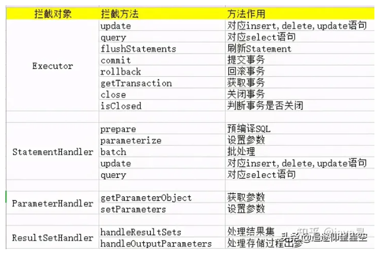

### MyBatis插件的使用
首先我们先来通过一个例子来看看如何使用插件。
#### 1、首先建立一个MyPlugin实现接口Interceptor，然后重写其中的三个方法(注意，这里必须要实现Interceptor接口，否则无法被拦截)。
```java
package com.lonelyWolf.mybatis.plugin;

import org.apache.ibatis.executor.Executor;
import org.apache.ibatis.mapping.MappedStatement;
import org.apache.ibatis.plugin.*;
import org.apache.ibatis.session.ResultHandler;
import org.apache.ibatis.session.RowBounds;
import java.util.Properties;

@Intercepts({@Signature(type = Executor.class,method = "query",args = {MappedStatement.class,Object.class, RowBounds.class, ResultHandler.class})})
public class MyPlugin implements Interceptor {

    /**
     * 这个方法会直接覆盖原有方法
     * @param invocation
     * @return
     * @throws Throwable
     */
    @Override
    public Object intercept(Invocation invocation) throws Throwable {
        System.out.println("成功拦截了Executor的query方法，在这里我可以做点什么");
        return invocation.proceed();// 调用原方法
    }

    @Override
    public Object plugin(Object target) {
        return Plugin.wrap(target,this);// 把被拦截对象生成一个代理对象
    }

    @Override
    public void setProperties(Properties properties) {//可以自定义一些属性
        System.out.println("自定义属性:userName->" + properties.getProperty("userName"));
    }
}
```

@Intercepts是声明当前类是一个拦截器，
后面的@Signature是标识需要拦截的方法签名，通过以下三个参数来确定
- type：被拦截的类名。
- method：被拦截的方法名
- args：标注方法的参数类型

#### 2、我们还需要在mybatis-config中配置好插件。
```xml
<plugins>
    <plugin interceptor="com.lonelyWolf.mybatis.plugin.MyPlugin">
        <property name="userName" value="张三"/>
    </plugin>
</plugins>
```

这里如果配置了property属性，那么我们可以在setProperties获取到。
完成以上两步，我们就完成了一个插件的配置了，接下来我们运行一下：

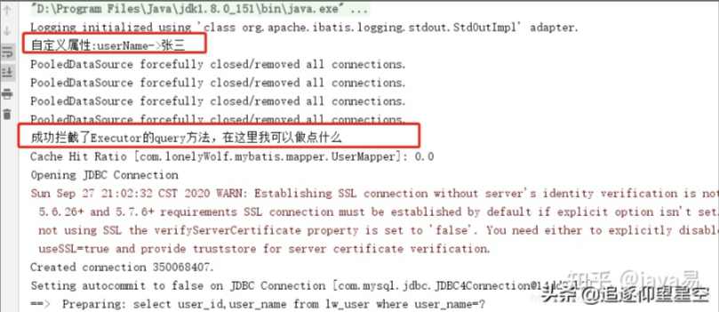

可以看到，setProperties方法在加载配置文件阶段就会被执行了。

### MyBatis插件实现原理
接下来让我们分析一下从插件的加载到初始化到运行整个过程的实现原理。

#### 插件的加载
既然插件需要在配置文件中进行配置，那么肯定就需要进行解析，我们看看插件式如何被解析的。
我们进入XMLConfigBuilder类看看

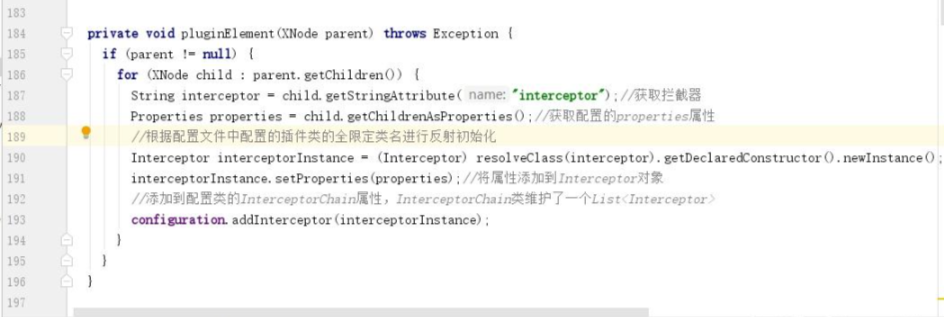

解析出来之后会将插件存入InterceptorChain对象的list属性

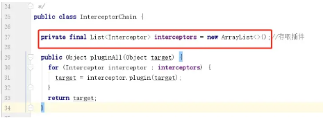

看到InterceptorChain我们是不是可以联想到，***MyBatis的插件就是通过责任链模式实现的***。

### 插件如何进行拦截
既然插件类已经被加载到配置文件了，那么接下来就有一个问题了，插件类何时会被拦截我们需要拦截的对象呢？
其实插件的拦截是和对象有关的，不同的对象进行拦截的时间也会不一致，接下来我们就逐一分析一下。

### 拦截Executor对象
我们知道，SqlSession对象是通过openSession()方法返回的，而Executor又是属于SqlSession内部对象，
所以让我们跟随openSession方法去看一下Executor对象的初始化过程。

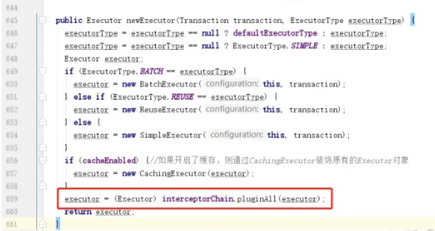

可以看到，当初始化完成Executor之后，会调用interceptorChain的pluginAll方法，
pluginAll方法本身非常简单，就是把我们存到list中的插件进行循环，并调用Interceptor对象的plugin方法：

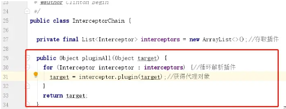

再次点击进去：
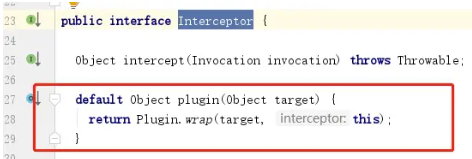

到这里我们是不是发现很熟悉，没错，这就是我们上面示例中重写的方法，而plugin方法是接口中的一个默认方法。
这个方法是关键，我们进去看看：
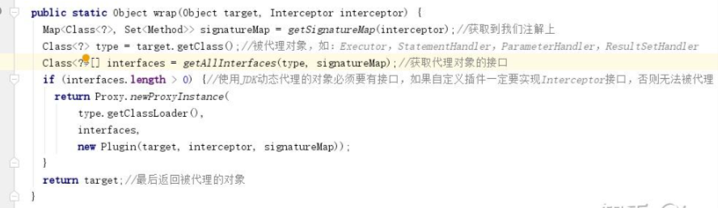

可以看到这个方法的逻辑也很简单，但是需要注意的是***MyBatis插件是通过JDK动态代理来实现的***，
而JDK动态代理的条件就是被代理对象必须要有接口，这一点和Spring中不太一样，Spring中是如果有接口就采用JDK动态代理，没有接口就是用CGLIB动态代理。
关于动态代理，想详细了解的可以点击这里。

正因为***MyBatis的插件只使用了JDK动态代理，所以我们上面才强调了一定要实现Interceptor接口***。
而代理之后Plugin的invoke方法，我们最后再来看看invoke方法：

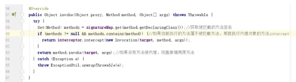

而最终执行的intercept方法，就是我们上面示例中重写的方法。

### 其他对象插件解析
接下来我们再看看StatementHandler，StatementHandler是在Executor中的doQuery方法创建的，
其实这个原理就是一样的了，找到初始化StatementHandler对象的方法：

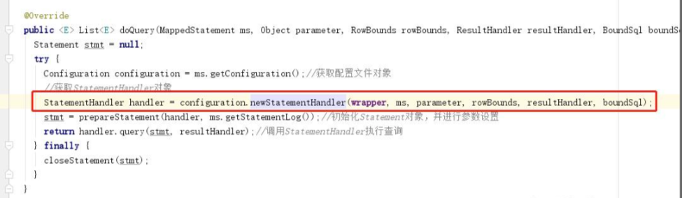

进去之后里面执行的也是pluginAll方法：
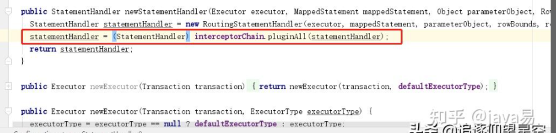

其他两个对象就不在举例了，其实搜一下全局就很明显了：
PS:
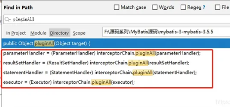

四个对象初始化的时候都会调用pluginAll来进行判定是否有被代理。

### 插件执行流程
下面就是实现了插件之后的执行时序图：
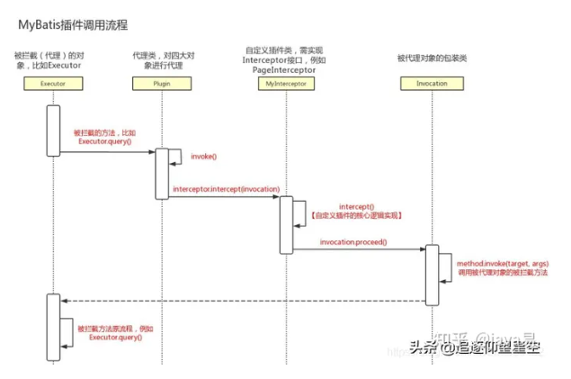

### 假如一个对象被代理很多次
一个对象是否可以被多个代理对象进行代理？也就是说同一个对象的同一个方法是否可以被多个拦截器进行拦截？
答案是肯定的，因为被代理对象是被加入到list，所以我们配置在最前面的拦截器最先被代理，但是执行的时候却是最外层的先执行。
具体点：
假如依次定义了三个插件：插件A，插件B和插件C。
那么List中就会按顺序存储：插件A，插件B和插件C，
而解析的时候是遍历list，所以解析的时候也是按照：插件A，插件B和插件C的顺序，
但是执行的时候就要反过来了，执行的时候是按照：插件C，插件B和插件A的顺序进行执行。

### PageHelper插件的使用
上面我们了解了在MyBatis中的插件是如何定义以及MyBatis中是如何处理插件的，
接下来我们就以经典分页插件PageHelper为例来进一步加深理解。
首先我们看看PageHelper的用法：
```java
package com.lonelyWolf.mybatis;

import com.alibaba.fastjson.JSONObject;
import com.github.pagehelper.Page;
import com.github.pagehelper.PageHelper;
import com.github.pagehelper.PageInfo;
import com.lonelyWolf.mybatis.mapper.UserMapper;
import com.lonelyWolf.mybatis.model.LwUser;
import org.apache.ibatis.executor.result.DefaultResultHandler;
import org.apache.ibatis.io.Resources;
import org.apache.ibatis.session.ResultHandler;
import org.apache.ibatis.session.SqlSession;
import org.apache.ibatis.session.SqlSessionFactory;
import org.apache.ibatis.session.SqlSessionFactoryBuilder;

import java.io.IOException;
import java.io.InputStream;
import java.util.List;

public class MyBatisByPageHelp {
    public static void main(String[] args) throws IOException {
        String resource = "mybatis-config.xml";
        //读取mybatis-config配置文件
        InputStream inputStream = Resources.getResourceAsStream(resource);
        //创建SqlSessionFactory对象
        SqlSessionFactory sqlSessionFactory = new SqlSessionFactoryBuilder().build(inputStream);
        //创建SqlSession对象
        SqlSession session = sqlSessionFactory.openSession();

        PageHelper.startPage(0,10);
        UserMapper userMapper = session.getMapper(UserMapper.class);
        List<LwUser> userList = userMapper.listAllUser();
        PageInfo<LwUser> pageList = new PageInfo<>(userList);
        System.out.println(null == pageList ? "": JSONObject.toJSONString(pageList));
    }
}
```
输出如下结果：
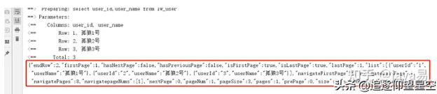

可以看到对象已经被分页，那么这是如何做到的呢？

### PageHelper插件原理
我们上面提到，要实现插件必须要实现MyBatis提供的Interceptor接口，
所以我们去找一下，发现PageHelper实现了Interceptor：
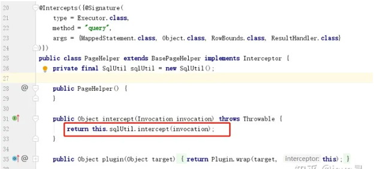

经过上面的介绍这个类应该一眼就能看懂，
我们关键要看看SqlUtil的intercept方法做了什么：
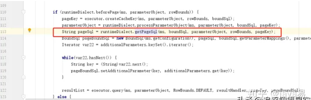

这个方法的逻辑比较多，因为要考虑到不同的数据库方言的问题，所以会有很多判断，
我们主要是关注PageHelper在哪里改写了sql语句，上图中的红框就是改写了sql语句的地方：
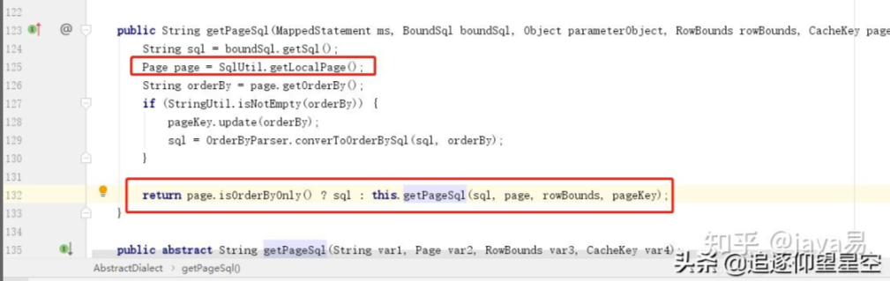

这里面会获取到一个Page对象，然后在写sql的时候也会将一些分页参数设置到Page对象，
我们看看Page对象是从哪里获取的：
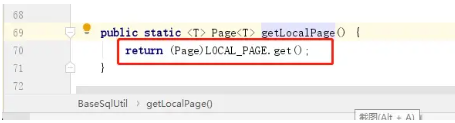

我们看到对象是从LOCAL_PAGE对象中获取的，这个又是什么呢？
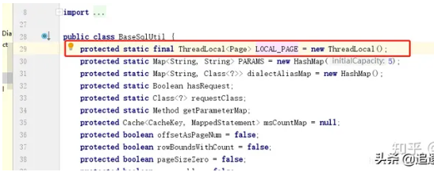

这是一个本地线程池变量，那么这里面的Page又是什么时候存进去的呢？
这就要回到我们的示例上了，分页的开始必须要调用：

PageHelper.startPage(0,10);
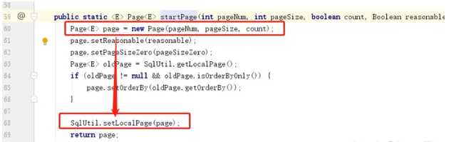

这里就会构建一个Page对象，并设置到ThreadLocal内。

### 为什么PageHelper只对startPage后的第一条select语句有效
这个其实也很简单哈，但是可能会有人有这个以为，我们还是要回到上面的intercept方法：
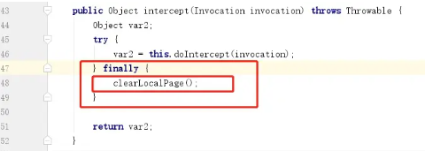

在finally内把ThreadLocal中的分页数据给清除掉了，所以只要执行一次查询语句就会清除分页信息，
故而后面的select语句自然就无效了。

```
在finally内把ThreadLocal中的分页数据给清除掉了
所以只要执行一次查询语句就会清除分页信息
故而后面的select语句自然就无效了
```

### 不通过插件能否改变MyBatis的核心行为
上面我们介绍了通过插件来改变MyBatis的核心行为，那么不通过插件是否也可以实现呢？
答案是肯定的，官网中提到，***我们可以通过覆盖配置类来实现改变MyBatis核心行为***，
也就是我们自己写一个类继承Configuration类，然后实现其中的方法，
最后构建SqlSessionFactory对象的时候传入自定义的Configuration方法：

```
SqlSessionFactory build(MyConfiguration)
```
当然，这种方法是非常不建议使用的，因为这种方式就相当于在建房子的时候把地基抽出来重新建了，稍有不慎，房子就要塌了。

### 总结
本文主要会介绍MyBatis插件的使用及MyBatis其实现原理，
最后我们也大致介绍了PageHelper插件的主要实现原理，
相信读完本文学会MyBatis插件原理之后，我们也可以写个简单的自己的PageHelper分页插件了。


