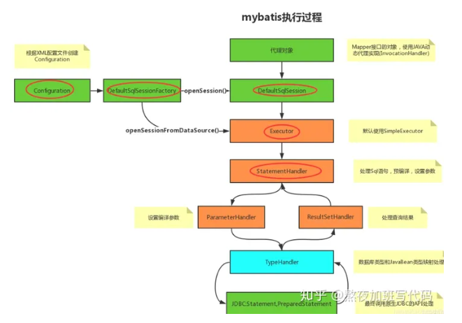
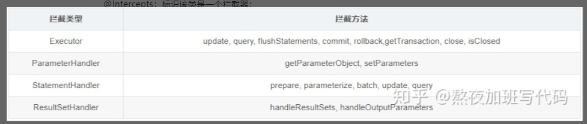
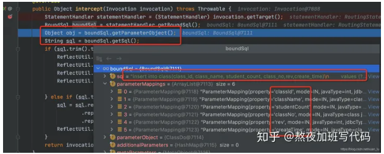
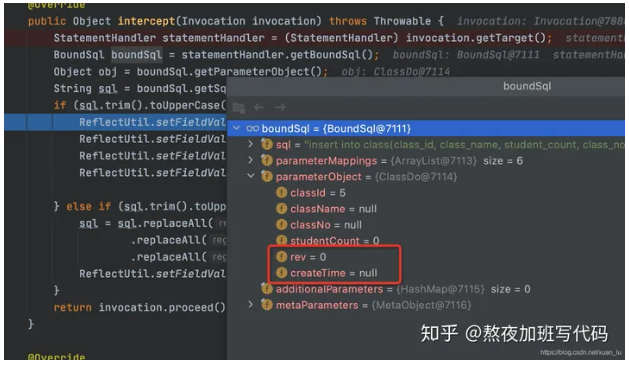
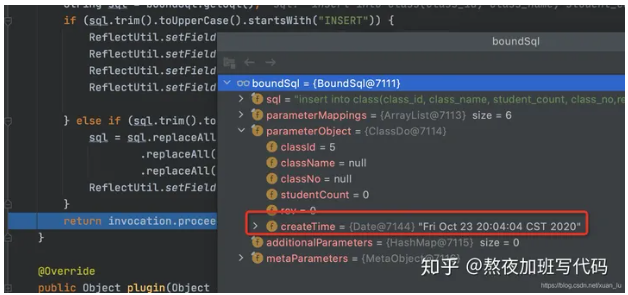

## mybatis：自定义实现拦截器插件Interceptor

首先熟悉一下Mybatis的执行过程，如下图：


MyBatis执行过程：
- 代理对象->Mapper接口的对象，使用JAVA动态代理实现（InvocationHandler）
- 根据XML配置文件创建Configuration->DefaultSqlSessionFactory->openSession()->DefaultSqlSession
- openSessionFromDataSource()->Executor->默认使用SimpleExecutor
- StatementHandler->处理Sql语句，预编译，设置参数
- 设置编译参数->ParameterHandler
- 处理查询结果->ResultSetHandler
- TypeHandler->数据库类型和JavaBean类型映射处理
- JDBC:Statement,PreparedStatement->最终调用原生JDBC的API处理

### 类型
先说明Mybatis中可以被拦截的类型具体有以下四种：
```
1.Executor：拦截执行器的方法。
2.ParameterHandler：拦截参数的处理。
3.ResultHandler：拦截结果集的处理。
4.StatementHandler：拦截Sql语法构建的处理。
```

- Executor：拦截执行器的方法
- ParameterHandler：拦截参数的处理
- ResultHandler：拦截结果集的处理
- StatementHandler：拦截Sql语法构建的处理

### 规则
Intercepts注解需要一个Signature(拦截点)参数数组。
通过Signature来指定拦截哪个对象里面的哪个方法。
@Intercepts注解定义如下:
```java
@Documented
@Retention(RetentionPolicy.RUNTIME)
@Target(ElementType.TYPE)
public @interface Intercepts {
    /**
     * 定义拦截点
     * 只有符合拦截点的条件才会进入到拦截器
     */
    Signature[] value();
}
```
Signature来指定咱们需要拦截那个类对象的哪个方法。定义如下：
```java
@Documented
@Retention(RetentionPolicy.RUNTIME)
@Target({})
public @interface Signature {
  /**
   * 定义拦截的类 Executor、ParameterHandler、StatementHandler、ResultSetHandler当中的一个
   */
  Class<?> type();

  /**
   * 在定义拦截类的基础之上，在定义拦截的方法
   */
  String method();

  /**
   * 在定义拦截方法的基础之上在定义拦截的方法对应的参数，
   * JAVA里面方法可能重载，故注意参数的类型和顺序
   */
  Class<?>[] args();
}
```
标识拦截注解@Intercepts规则使用,简单实例如下：
```
@Intercepts({//注意看这个大花括号，也就这说这里可以定义多个@Signature对多个地方拦截，都用这个拦截器
        @Signature(
                type = ResultSetHandler.class,
                method = "handleResultSets", 
                args = {Statement.class}),
        @Signature(type = Executor.class,
                method = "query",
                args = {MappedStatement.class, Object.class, RowBounds.class, ResultHandler.class})
})
```

说明：
- @Intercepts：标识该类是一个拦截器；
- @Signature：指明自定义拦截器需要拦截哪一个类型，哪一个方法；
- - type：上述四种类型中的一种；
- - method：对应接口中的哪类方法（因为可能存在重载方法）；
- - args：对应哪一个方法的入参；

method中对应四种的类型的方法：


### 介绍
谈到自定义拦截器实践部分，主要按照以下三步：
- 1.实现org.apache.ibatis.plugin.Interceptor接口,重写以下方法：
```java
public interface Interceptor {
    Object intercept(Invocation var1) throws Throwable;
    Object plugin(Object var1);
    void setProperties(Properties var1);
}
```
- 1.添加拦截器注解@Intercepts{...}。具体值遵循上述规则设置。
- 2.配置文件中添加拦截器。

#### intercept(Invocation invocation)
从上面我们了解到interceptor能够拦截的四种类型对象，
此处入参invocation便是指拦截到的对象。
举例说明：拦截**StatementHandler#query(Statement st,ResultHandler rh)**方法，那么Invocation就是该对象。

#### plugin(Object target)
这个方法的作用是就是让mybatis判断，是否要进行拦截，然后做出决定是否生成一个代理。
```
@Override
public Object plugin(Object target) {
    // 判断是否拦截这个类型对象（根据@Intercepts注解决定），然后决定是返回一个代理对象还是返回原对象。
    // 故我们在实现plugin方法时，要判断一下目标类型，如果是插件要拦截的对象时才执行Plugin.wrap方法，否则的话，直接返回目标本身。
    if (target instanceof StatementHandler) {
        return Plugin.wrap(target, this);
    }
    return target;
}
```

注意:每经过一个拦截器对象都会调用插件的plugin方法，也就是说，该方法会调用4次。
根据@Intercepts注解来决定是否进行拦截处理。

#### setProperties(Properties properties)
拦截器需要一些变量对象，而且这个对象是支持可配置的。

### 实战
- 自定义拦截器
```java
@Intercepts(value = {@Signature(type = StatementHandler.class, method = "prepare", args = {Connection.class, Integer.class})})
public class MyInterceptor implements Interceptor {

    @Override
    public Object intercept(Invocation invocation) throws Throwable {
        StatementHandler statementHandler = (StatementHandler) invocation.getTarget();
        BoundSql boundSql = statementHandler.getBoundSql();
        Object obj = boundSql.getParameterObject();
        String sql = boundSql.getSql();
        if (sql.trim().toUpperCase().startsWith("INSERT")) {
            ReflectUtil.setFieldValue(obj, "rev", 0);
            ReflectUtil.setFieldValue(obj, "createTime", new Date());
            ReflectUtil.setFieldValue(obj, "operateTime", new Date());
            ReflectUtil.setFieldValue(boundSql,"parameterObject", obj);

        } else if (sql.trim().toUpperCase().startsWith("UPDATE")) {
            sql = sql.replaceAll(" set ", " SET ")
                    .replaceAll(" Set ", " SET ")
                    .replaceAll(" SET ", " SET rev = rev+1, operate_time = NOW(), ");
            ReflectUtil.setFieldValue(boundSql,"sql", sql);
        }
        return invocation.proceed();
    }

    @Override
    public Object plugin(Object o) {
        return Plugin.wrap(o, this);
    }

    @Override
    public void setProperties(Properties properties) {

    }
}
```
主要看下核心代码方法intercept（）:
这段代码主要目的：拦截insert和update语句，利用反射机制，设置insert语句的参数rev(版本号，利用乐观锁)，
第一次查询，故创建时间和操作时间相同；
update是将版本号+1，统一修改其操作时间。

- mybatis-config
```xml
<?xml version="1.0" encoding="UTF-8" ?>
<!DOCTYPE configuration PUBLIC "-//mybatis.org//DTD Config 3.0//EN" "http://mybatis.org/dtd/mybatis-3-config.dtd">
<configuration>
    <plugins>
        <plugin interceptor="com.qxy.mybatis.interceptor.MyInterceptor"/>
    </plugins>
</configuration>
```

- application.yml
特别重要的一点，一定将mybatis-config中的对象注入到Sprint容器中，否则不会生效。
```
...//省略其他配置
mybatis:
  config-location: classpath:/mybatis-config.xml
```

- ReflectUtil
```java
public class ReflectUtil {

    private ReflectUtil() {}

    /**
     * 利用反射获取指定对象的指定属性
     * @param obj 目标对象
     * @param fieldName 目标属性
     * @return 目标字段
     */
    private static Field getField(Object obj, String fieldName) {
        Field field = null;
        for (Class<?> clazz = obj.getClass(); clazz != Object.class; clazz = clazz.getSuperclass()) {
            try {
                field = clazz.getDeclaredField(fieldName);
                break;
            } catch (NoSuchFieldException e) {
                //这里不用做处理，子类没有该字段，可能父类有，都没有就返回null
            }
        }
        return field;
    }

    /**
     * 利用反射设置指定对象的指定属性为指定的值
     * @param obj 目标对象
     * @param fieldName 目标属性
     * @param fieldValue 目标值
     */
    public static void setFieldValue(Object obj, String fieldName, Object fieldValue) throws IllegalAccessException {
        Field field = getField(obj, fieldName);
        if (field != null) {
            field.setAccessible(true);
            field.set(obj, fieldValue);
        }
    }
}
```
- debug


上图中能够看到BoundSql对象中主要存储的属性值，
所以我们自定义拦截器时，主要针对BoundSql的属性值进行修改。
程序代码没有走到我们反射机制设置值的位置，测试createTime=null;


返回之前，看下BoundSql对象的值，创建时间已被赋值。



