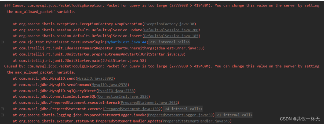
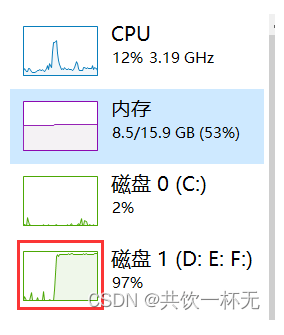

## 13 秒插入 30 万条数据，这才是批量插入正确的姿势！

### 目录
- 30万条数据插入插入数据库验证
- 实体类、mapper和配置文件定义
- 不分批次直接梭哈
- 循环逐条插入
- MyBatis实现插入30万条数据
- JDBC实现插入30万条数据
- 总结

本文主要讲述通过***MyBatis、JDBC等做大数据量数据插入***的案例和结果。

### 30万条数据插入插入数据库验证
验证的数据库表结构如下：
```sql
CREATE TABLE `t_user` (
  `id` int(11) NOT NULL AUTO_INCREMENT COMMENT '用户id',
  `username` varchar(64) DEFAULT NULL COMMENT '用户名称',
  `age` int(4) DEFAULT NULL COMMENT '年龄',
  PRIMARY KEY (`id`)
) ENGINE=InnoDB DEFAULT CHARSET=utf8 COMMENT='用户信息表';
```
话不多说，开整！

### 实体类、mapper和配置文件定义
User实体
```java
/**
 * <p>用户实体</p>
 *
 * @Author zjq
 */
@Data
public class User {
    private int id;
    private String username;
    private int age;
}
```

mapper接口
```java
public interface UserMapper {
    /**
     * 批量插入用户
     * @param userList
     */
    void batchInsertUser(@Param("list") List<User> userList);
}
```

mapper.xml文件
```xml
<!-- 批量插入用户信息 -->
<insert id="batchInsertUser" parameterType="java.util.List">
    insert into t_user(username,age) values
    <foreach collection="list" item="item" index="index" separator=",">
        (
        #{item.username},
        #{item.age}
        )
    </foreach>
</insert>
```

jdbc.properties
```
jdbc.driver=com.mysql.jdbc.Driver
jdbc.url=jdbc:mysql://localhost:3306/test
jdbc.username=root
jdbc.password=root
```

sqlMapConfig.xml
```xml
<?xml version="1.0" encoding="UTF-8" ?>
<!DOCTYPE configuration PUBLIC "-//mybatis.org//DTD Config 3.0//EN" "http://mybatis.org/dtd/mybatis-3-config.dtd">
<configuration>
    <!--通过properties标签加载外部properties文件-->
    <properties resource="jdbc.properties"></properties>

    <!--自定义别名-->
    <typeAliases>
        <typeAlias type="com.zjq.domain.User" alias="user"></typeAlias>
    </typeAliases>

    <!--数据源环境-->
    <environments default="developement">
        <environment id="developement">
            <transactionManager type="JDBC"></transactionManager>
            <dataSource type="POOLED">
                <property name="driver" value="${jdbc.driver}"/>
                <property name="url" value="${jdbc.url}"/>
                <property name="username" value="${jdbc.username}"/>
                <property name="password" value="${jdbc.password}"/>
            </dataSource>
        </environment>
    </environments>

    <!--加载映射文件-->
    <mappers>
        <mapper resource="com/zjq/mapper/UserMapper.xml"></mapper>
    </mappers>
</configuration>
```

### 不分批次直接梭哈
MyBatis直接一次性批量插入30万条，代码如下：
```
@Test
public void testBatchInsertUser() throws IOException {
    InputStream resourceAsStream =
            Resources.getResourceAsStream("sqlMapConfig.xml");
    SqlSessionFactory sqlSessionFactory = new SqlSessionFactoryBuilder().build(resourceAsStream);
    SqlSession session = sqlSessionFactory.openSession();
    System.out.println("===== 开始插入数据 =====");
    long startTime = System.currentTimeMillis();
    try {
        List<User> userList = new ArrayList<>();
        for (int i = 1; i <= 300000; i++) {
            User user = new User();
            user.setId(i);
            user.setUsername("共饮一杯无 " + i);
            user.setAge((int) (Math.random() * 100));
            userList.add(user);
        }
        session.insert("batchInsertUser", userList); // 最后插入剩余的数据
        session.commit();

        long spendTime = System.currentTimeMillis()-startTime;
        System.out.println("成功插入 30 万条数据,耗时："+spendTime+"毫秒");
    } finally {
        session.close();
    }
}
```

可以看到控制台输出：
```
Cause: com.mysql.jdbc.PacketTooBigException: Packet for query is too large (27759038 >yun 4194304). 
You can change this value on the server by setting the max_allowed_packet’ variable.
4194304 / 8 / 1024 = 512Kb
```


超出最大数据包限制了，可以通过调整max_allowed_packet限制来提高可以传输的内容，
不过由于30万条数据超出太多，这个不可取，梭哈看来是不行了 

既然梭哈不行那我们就一条一条循环着插入行不行呢

### 循环逐条插入
mapper接口和mapper文件中新增单个用户新增的内容如下:
```
/**
 * 新增单个用户
 * @param user
 */
void insertUser(User user);
<!-- 新增用户信息 -->
<insert id="insertUser" parameterType="user">
    insert into t_user(username,age) values
        (
        #{username},
        #{age}
        )
</insert>
```

调整执行代码如下：
```
@Test
public void testCirculateInsertUser() throws IOException {
    InputStream resourceAsStream =
            Resources.getResourceAsStream("sqlMapConfig.xml");
    SqlSessionFactory sqlSessionFactory = new SqlSessionFactoryBuilder().build(resourceAsStream);
    SqlSession session = sqlSessionFactory.openSession();
    System.out.println("===== 开始插入数据 =====");
    long startTime = System.currentTimeMillis();
    try {
        for (int i = 1; i <= 300000; i++) {
            User user = new User();
            user.setId(i);
            user.setUsername("共饮一杯无 " + i);
            user.setAge((int) (Math.random() * 100));
            // 一条一条新增
            session.insert("insertUser", user);
            session.commit();
        }

        long spendTime = System.currentTimeMillis()-startTime;
        System.out.println("成功插入 30 万条数据,耗时："+spendTime+"毫秒");
    } finally {
        session.close();
    }
}
```

执行后可以发现磁盘IO占比飙升，一直处于高位。


等啊等等啊等，好久还没执行完

先不管他了太慢了先搞其他的，等会再来看看结果吧。
two thousand year later …
控制台输出如下：

总共执行了14909367毫秒，换算出来是4小时八分钟。太慢了。。
还是优化下之前的批处理方案吧

### MyBatis实现插入30万条数据
先清理表数据，然后优化批处理执行插入：
```
-- 清空用户表
TRUNCATE table  t_user;
```

以下是通过 MyBatis 实现 30 万条数据插入代码实现：
```
/**
 * 分批次批量插入
 * @throws IOException
 */
@Test
public void testBatchInsertUser() throws IOException {
    InputStream resourceAsStream =
            Resources.getResourceAsStream("sqlMapConfig.xml");
    SqlSessionFactory sqlSessionFactory = new SqlSessionFactoryBuilder().build(resourceAsStream);
    SqlSession session = sqlSessionFactory.openSession();
    System.out.println("===== 开始插入数据 =====");
    long startTime = System.currentTimeMillis();
    int waitTime = 10;
    try {
        List<User> userList = new ArrayList<>();
        for (int i = 1; i <= 300000; i++) {
            User user = new User();
            user.setId(i);
            user.setUsername("共饮一杯无 " + i);
            user.setAge((int) (Math.random() * 100));
            userList.add(user);
            if (i % 1000 == 0) {
                session.insert("batchInsertUser", userList);
                // 每 1000 条数据提交一次事务
                session.commit();
                userList.clear();

                // 等待一段时间
                Thread.sleep(waitTime * 1000);
            }
        }
        // 最后插入剩余的数据
        if(!CollectionUtils.isEmpty(userList)) {
            session.insert("batchInsertUser", userList);
            session.commit();
        }

        long spendTime = System.currentTimeMillis()-startTime;
        System.out.println("成功插入 30 万条数据,耗时："+spendTime+"毫秒");
    } catch (Exception e) {
        e.printStackTrace();
    } finally {
        session.close();
    }
}
```

使用了 MyBatis 的批处理操作，将每 1000 条数据放在一个批次中插入，能够较为有效地提高插入速度。
***同时请注意在循环插入时要带有合适的等待时间和批处理大小，以防止出现内存占用过高等问题***。
此外，还需要***在配置文件中设置合理的连接池和数据库的参数，以获得更好的性能***。

在上面的示例中，我们每插入1000行数据就进行一次批处理提交，
并等待10秒钟。这有助于控制内存占用，并确保插入操作平稳进行。

五十分钟执行完毕，时间主要用在了等待上。
***如果低谷时期执行，CPU和磁盘性能又足够的情况下，直接批处理不等待执行***：

```
/**
 * 分批次批量插入
 * @throws IOException
 */
@Test
public void testBatchInsertUser() throws IOException {
    InputStream resourceAsStream =
            Resources.getResourceAsStream("sqlMapConfig.xml");
    SqlSessionFactory sqlSessionFactory = new SqlSessionFactoryBuilder().build(resourceAsStream);
    SqlSession session = sqlSessionFactory.openSession();
    System.out.println("===== 开始插入数据 =====");
    long startTime = System.currentTimeMillis();
    int waitTime = 10;
    try {
        List<User> userList = new ArrayList<>();
        for (int i = 1; i <= 300000; i++) {
            User user = new User();
            user.setId(i);
            user.setUsername("共饮一杯无 " + i);
            user.setAge((int) (Math.random() * 100));
            userList.add(user);
            if (i % 1000 == 0) {
                session.insert("batchInsertUser", userList);
                // 每 1000 条数据提交一次事务
                session.commit();
                userList.clear();
            }
        }
        // 最后插入剩余的数据
        if(!CollectionUtils.isEmpty(userList)) {
            session.insert("batchInsertUser", userList);
            session.commit();
        }

        long spendTime = System.currentTimeMillis()-startTime;
        System.out.println("成功插入 30 万条数据,耗时："+spendTime+"毫秒");
    } catch (Exception e) {
        e.printStackTrace();
    } finally {
        session.close();
    }
}
```

则24秒可以完成数据插入操作：
可以看到短时CPU和磁盘占用会飙高。
把批处理的量再调大一些调到5000，再执行：
13秒插入成功30万条，直接芜湖起飞

### JDBC实现插入30万条数据
JDBC循环插入的话跟上面的mybatis逐条插入类似，不再赘述。
以下是 Java 使用 JDBC 批处理实现 30 万条数据插入的示例代码。请注意，该代码仅提供思路，具体实现需根据实际情况进行修改。

```
/**
 * JDBC分批次批量插入
 * @throws IOException
 */
@Test
public void testJDBCBatchInsertUser() throws IOException {
    Connection connection = null;
    PreparedStatement preparedStatement = null;
    String databaseURL = "jdbc:mysql://localhost:3306/test";
    String user = "root";
    String password = "root";
    try {
        connection = DriverManager.getConnection(databaseURL, user, password);
        // 关闭自动提交事务，改为手动提交
        connection.setAutoCommit(false);
        System.out.println("===== 开始插入数据 =====");
        long startTime = System.currentTimeMillis();
        String sqlInsert = "INSERT INTO t_user ( username, age) VALUES ( ?, ?)";
        preparedStatement = connection.prepareStatement(sqlInsert);

        Random random = new Random();
        for (int i = 1; i <= 300000; i++) {
            preparedStatement.setString(1, "共饮一杯无 " + i);
            preparedStatement.setInt(2, random.nextInt(100));
            // 添加到批处理中
            preparedStatement.addBatch();

            if (i % 1000 == 0) {
                // 每1000条数据提交一次
                preparedStatement.executeBatch();
                connection.commit();
                System.out.println("成功插入第 "+ i+" 条数据");
            }
        }
        // 处理剩余的数据
        preparedStatement.executeBatch();
        connection.commit();
        long spendTime = System.currentTimeMillis()-startTime;
        System.out.println("成功插入 30 万条数据,耗时："+spendTime+"毫秒");
    } catch (SQLException e) {
        System.out.println("Error: " + e.getMessage());
    } finally {
        if (preparedStatement != null) {
            try {
                preparedStatement.close();
            } catch (SQLException e) {
                e.printStackTrace();
            }
        }

        if (connection != null) {
            try {
                connection.close();
            } catch (SQLException e) {
                e.printStackTrace();
            }
        }
    }
}
```

上述示例代码中，我们通过 JDBC 连接 MySQL 数据库，并执行批处理操作插入数据。具体实现步骤如下：
- 获取数据库连接。
- 创建 Statement 对象。
- 定义 SQL 语句，使用 PreparedStatement 对象预编译 SQL 语句并设置参数。
- 执行批处理操作。
- 处理剩余的数据。
- 关闭 Statement 和 Connection 对象。

使用setAutoCommit(false) 来禁止自动提交事务，然后在每次批量插入之后手动提交事务。
每次插入数据时都新建一个 PreparedStatement 对象以避免状态不一致问题。
在插入数据的循环中，每 10000 条数据就执行一次 executeBatch() 插入数据。

另外，需要根据实际情况优化连接池和数据库的相关配置，以防止连接超时等问题。

### 总结
实现高效的大量数据插入需要结合以下优化策略（建议综合使用）：
- 1.批处理： 批量提交SQL语句可以降低网络传输和处理开销，减少与数据库交互的次数。
在Java中可以使用Statement或者PreparedStatement的addBatch()方法来添加多个SQL语句，
然后一次性执行executeBatch()方法提交批处理的SQL语句。
  - 在循环插入时带有适当的等待时间和批处理大小，从而避免内存占用过高等问题：
    - 设置适当的批处理大小：批处理大小指在一次插入操作中插入多少行数据。如果批处理大小太小，插入操作的频率将很高，而如果批处理大小太大，可能会导致内存占用过高。
      通常，建议将批处理大小设置为1000-5000行，这将减少插入操作的频率并降低内存占用。
    - 采用适当的等待时间：等待时间指在批处理操作之间等待的时间量。等待时间过短可能会导致内存占用过高，而等待时间过长则可能会延迟插入操作的速度。
      通常，建议将等待时间设置为几秒钟到几十秒钟之间，这将使操作变得平滑且避免出现内存占用过高等问题。
    - 可以考虑使用一些内存优化的技巧，例如使用内存数据库或使用游标方式插入数据，以减少内存占用。
  - 总的来说，选择适当的批处理大小和等待时间可以帮助您平稳地进行插入操作，避免出现内存占用过高等问题。    
- 2.索引: 在大量数据插入前暂时去掉索引，最后再打上，这样可以大大减少写入时候的更新索引的时间。
- 3.数据库连接池： 使用数据库连接池可以减少数据库连接建立和关闭的开销，提高性能。在没有使用数据库连接池的情况，记得在finally中关闭相关连接。

数据库参数调整：增加MySQL数据库缓冲区大小、配置高性能的磁盘和I/O等。
```
数据库参数调整：
增加MySQL数据库缓冲区大小、配置高性能的磁盘和I/O等。
```


