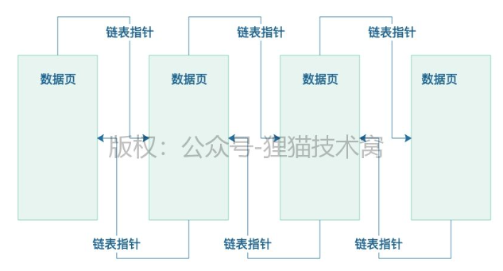
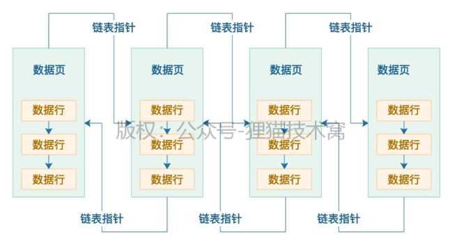
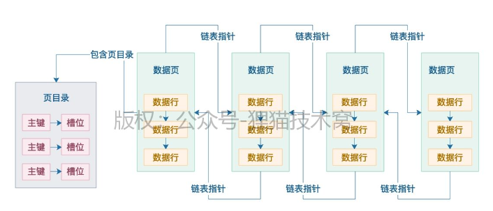
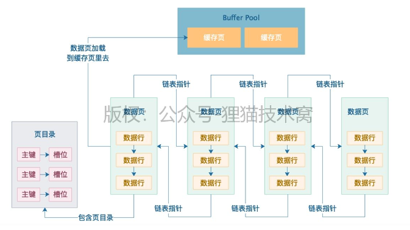

## MySQL底层实现原理

### 64.深入研究索引之前，先来看看磁盘数据页的存储结构 
前面我们已经给大家把MySQL数据库的部分内核原理，更新语句的执行原理，事务原理以及锁原理，都初步的讲给大家听了，
同时还穿插了一些相关的数据库性能优化的案例，相信现在大家已经对数据库执行增删改语句的原理有了较为深入的理解了。<br>

接着我们就应该进入比较关键的一个环节，也是很多人都很期盼的一个环节，
就是***数据库的索引原理以及查询原理***，学完了这块，我们就可以学习大量的实战案例，包括***索引设计案例，查询调优案例***。<br>

但是今天在深入研究索引之前，我们需要先来看看磁盘上的数据文件中的数据页的物理存储结构，
因为后续研究索引的物理存储结构以及使用原理的时候，都是跟数据页的物理存储结构是有很大关联的。<br>

其实之前大家都知道，数据库最终所有的数据（包括我们建的各种表以及表里的数据）都是要存放在磁盘上的文件里的，
然后在文件里存放的物理格式就是数据页，那么大量的数据页在磁盘文件里是怎么存储的呢？<br>

首先大家要明白的一点是，大量的数据页是按顺序一页一页存放的，
然后两两相邻的数据页之间会采用双向链表的格式互相引用，大致看起来如下图所示。<br>



但是可能有人看到上图就想问了，你画的这个图在磁盘文件里到底是怎么弄出来的啊？<br>

其实一个数据页在磁盘文件里就是一段数据，可能是二进制或者别的特殊格式的数据，
然后数据页里包含两个指针，一个指针指向自己上一个数据页的物理地址，
一个指针指向自己下一个数据页的物理地址，大概可以认为类似下面这样。<br>
```
DataPage: xx=xx, xx=xx, linked_list_pre_pointer=15367, linked_list_next_pointer=34126 || 
DataPage: xx=xx, xx=xx, linked_list_pre_pointer=23789, linked_list_next_pointer=46589 || 
DataPage: xx=xx, xx=xx, linked_list_pre_pointer=33198, linked_list_next_pointer=55681
```

上面那段示例数据，当然不能完全认为是MySQL数据库的磁盘文件里的存储格式，
但是我这里就是给你看一些类似的东西，其实MySQL实际存储大致也是类似这样的，
就是每个数据页在磁盘文件里都是连续的一段数据。<br>

然后每个数据页，都有一个指针指向自己上一个数据页在磁盘文件里的起始物理位置，比如linked_list_pre_pointer=15367，
就是指向了上一个数据页在磁盘文件里的起始物理位置，那个15367可以认为就是在磁盘文件里的position或者offset，
同理，也有一个指针指向自己下一个数据页的物理位置。<br>

现在你再回头看一下上面那个图，是不是就理解了一个磁盘文件里的多个数据页是如何通过指针组成一个双向链表的！<br>

然后一个数据页内部会存储一行一行的数据，也就是平时我们在一个表里插入的一行一行的数据就会存储在数据页里，
然后数据页里的每一行数据都会按照主键大小进行排序存储，同时每一行数据都有指针指向下一行数据的位置，组成单向链表，如下图。<br>



好了，今天我们就把数据页在磁盘文件里的物理存储结构详细讲解了一下，包括数据页内部的物理存储结构，
都讲了一下，接下来参照这个物理结构，就给大家说一下没有索引的时候，是如何查找数据的。<br>

### 65.假设没有任何索引，数据库是如何根据查询语句搜索数据的？ 
上一次我们给大家讲解了数据页在磁盘文件中的物理存储结构，大家应该目前都知道数据页之间是组成双向链表的，
然后数据页内部的数据行是组成单向链表的，而且数据行是根据主键从小到大排序的。<br>

然后每个数据页里都会有一个页目录，里面根据数据行的主键存放了一个目录，同时数据行是被分散存储到不同的槽位里去的，
所以实际上每个数据页的目录里，就是这个页里每个主键跟所在槽位的映射关系，如下图所示。<br>



所以假设你要根据主键查找一条数据，而且假设此时你数据库里那个表就没几条数据，那个表总共就一个数据页，那么就太简单了！
首先就会先到数据页的页目录里***根据主键进行二分查找***（PS：不知道二分查找是什么的同学，建议去网上查一下，这是大学最基础算法）<br>

然后通过二分查找在目录里迅速定位到主键对应的数据是在哪个槽位里，然后到那个槽位里去，遍历槽位里每一行数据，就能快速找到那个主键对应的数据了。
每个槽位里都有一组数据行，你就是在里面遍历查找就可以了。<br>

但是假设你要是根据非主键的其他字段查找数据呢？<br>

那就尴尬了，此时你是没办法使用主键的那种页目录来二分查找的，
只能进入到数据页里，根据单向链表依次遍历查找数据了，这就性能很差了。<br>

好，那么现在假如我们有很多数据页呢？<br>

对了，一个表里往往都是有大量数据的，可能有多达成百上千个数据页，这些数据页就存放在物理磁盘文件里<br>

所以此时是如何查询数据的呢？<br>

之前就有不少同学在后台评论区提问过这个问题，这里我们可以先给大家解释一下，
假设你要是没有建立任何索引，那么无论是根据主键查询，还是根据其他字段来条件查询，实际上都没有什么取巧的办法。<br>

你一个表里所有数据页都是组成双向链表的吧？
好，有链表就好办了，直接从第一个数据页开始遍历所有数据页，从第一个数据页开始，你得先把第一个数据页从磁盘上读取到内存buffer pool的缓存页里来。<br>

然后你就在第一个数据页对应的缓存页里，按照上述办法查找，假设是根据主键查找的，你可以在数据页的页目录里二分查找，
假设你要是根据其他字段查找的，只能是根据数据页内部的单向链表来遍历查找，如下图。



那么假设如上图所示，假设第一个数据页没找到你要的那条数据呢？<br>

没办法，只能根据数据页的双向链表去找下一个数据页，然后读取到buffer pool的缓存页里去，然后按一样的方法在一个缓存页内部查找那条数据。<br>
如果依然还是查找不到呢？<br>
那只能根据双向链表继续加载下一个数据页到缓存页里来了，以此类推，循环往复。<br>
不知道大家看到这个过程有什么感想没有？有没有觉得，你似乎是在做一个数据库里很尴尬的操作：***全表扫描？***<br>
对了，其实上述操作过程，就是全表扫描，在你没有任何索引数据结构的时候，无论如何查找数据，说白了都是一个全表扫描的过程，<br>
就是根据双向链表依次把磁盘上的数据页加载到缓存页里去，然后在一个缓存页内部来查找那条数据。<br>
最坏的情况下，你就得把所有数据页里的每条数据都得遍历一遍，才能找到你需要的那条数据，这就是全表扫描！<br>
所以大家看完今天这篇文章，接下来我们才能正式进入索引的讲解，你才能体会到有了索引之后，是如何提升数据库的查询效率和性能的！<br>

###  66.不断在表中插入数据时，物理存储是如何进行页分裂的？ 
上回我们讲到了数据页的物理存储结构，数据页之间是组成双向链表的，数据页内部的数据行是组成单向链表的，每个数据页内根据主键做了一个页目录


