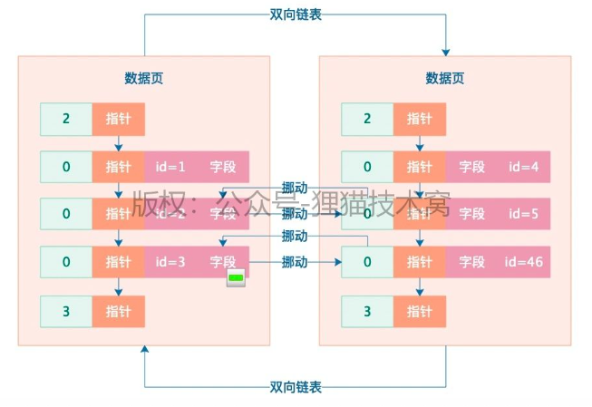

## MySQL底层实现原理

### 58.多个事务更新同一行数据时，是如何加锁避免脏写的？
之前我们已经用很多篇幅给大家讲解了多个事务并发运行的时候，
如果同时要读写一批数据，此时读和写时间的关系是如何协调的，
毕竟要是你不协调好的话，可能就会有脏读、不可重复读、幻读等一系列的问题。
- 脏读
- 不可重复读
- 幻读

简单来说，脏读、不可重复读、幻读，都是别人在更新数据的时候，
你怎么读的问题，读的不对，那就有问题，读的方法对了，那就不存在这一系列问题了。

- 脏读、不可重复读、幻读都是别人在更新数据的时候，你怎么读的问题
- 读的不对，那就有问题，读的方法对了， 那就不存在这一系列问题

而你要解决这一系列问题，其实就是依靠之前我们给大家讲的那套，基于undo log版本链条以及ReadView实现的mvcc机制。
- undo log版本链条
- ReadView实现的MVCC机制

现在开始我们接下来要用一系列的篇幅来研究另外一个问题了，那就是当有多个事务同时并发更新一行数据的时候，不就是会有脏写的问题吗？
- 多个事务同时并发更新一行数据

我们之前讲过，脏写是绝对不允许的，那么这个脏写是靠什么防止的呢？

说白了，就是靠锁机制，依靠锁机制让多个事务更新一行数据的时候串行化，避免同时更新一行数据，今天我们就先对数据库的锁机制做一个初步的入门讲解。
- 依靠锁机制让多个事务更新一行数据的时候串行化，避免同时更新一行数据

在MySQL里，假设有一行数据摆在那儿不动，此时有一个事务来了要更新这行数据，这个时候他会先琢磨一下，看看这行数据此时有没有人加锁？
- 更新一条数据的时候，首先看一下这行数据此时有没有被加锁

一看没人加锁，太好了，说明他是第一个人，捷足先登了。
此时这个事务就会创建一个锁，里面包含了自己的trx_id和等待状态，然后把锁跟这行数据关联在一起。

- 创建一个锁
- 锁里面包含了自己的trx_id和等待状态
- 然后把锁跟这行数据关联在一起

同时大家应该还记得，更新一行数据必须把他所在的数据页从磁盘文件里读取到缓存页里来才能更新的，
所以说，此时这行数据和关联的锁数据结构，都是在内存里的，大家要明确这一点，如下图。


大家注意看上面的那个图，***因为事务A给那行数据加了锁，所以此时就可以说那行数据已经被加锁了***
那么既然被加锁了，此时就不能再让别人访问了！如果有朋友对加锁的概念不了解，可能是对编程语言不太了解，其实这个就跟Java里的加锁是一个概念。

现在呢，有另外一个事务B过来了，这个事务B就也想更新那行数据，此时就会检查一下，当前这行数据有没有别人加锁
然而他一下子发现，真是糟糕啊，事务A这家伙太不地道了，居然抢先给这行数据加锁了，这怎么办呢？

事务B这个时候一想，那行，我也加个锁，然后等着排队不就得了，这个时候事务B也会生成一个锁数据结构，里面有他的trx_id，
还有自己的等待状态，但是他因为是在排队等待，所以他的等待状态就是true了，意思是我在等着呢，如下图。


接着事务A这个时候更新完了数据，就会把自己的锁给释放掉了。
锁一旦释放了，他就会去找，此时还有没有别人也对这行数据加锁了呢？他会发现事务B也加锁了

于是这个时候，就会把事务B的锁里的等待状态修改为false，然后唤醒事务B继续执行，此时事务B就获取到锁了，如下图。
- 把事务B的锁里的等待状态修改为false
- 然后唤醒事务B继续执行，此时事务B就获取到锁了


上述就是MySQL中锁机制的一个最基本的原理，大家可以先好好理解一下，其实是跟Java里的锁机制， 思路是完全类似的，
从这种简单的锁里可以引申出很多其他的概念，比如读写锁，共享锁，独占锁，公平锁，非公平锁，等等。Java里的锁，也同样具备这些锁的概念。
- 读写锁
- 共享锁
- 独占锁
- 公平锁
- 非公平锁

### 59.对MySQL锁机制再深入一步，共享锁和独占锁到底是什么？
今天我们来稍微深入的讲一下***MySQL里的共享锁和独占锁***这两个概念，
上次我们都讲过了，其实多个事务同时更新一行数据，此时都会加锁，然后都会排队等待，
必须一个事务执行完毕了，提交了，释放了锁，才能唤醒别的事务继续执行。
- 其实多个事务同时更新一行数据，此时都会加锁，然后都会排队等待
- 必须一个事务执行完毕，提交了，释放了锁，才能唤醒别的事务继续执行

那么在这多个事务运行的时候，他们加的是什么锁呢？
其实是X锁，也就是Exclude独占锁，当有一个事务加了独占锁之后，
此时其他事务再要更新这行数据，都是要加独占锁的，但是只能生成独占锁在后面等待。

那么这个时候我想问大家一个问题，当有人在更新数据的时候，其他的事务可以读取这行数据吗？默认情况下需要加锁吗？
答案是：不用
因为默认情况下，***有人在更新数据的时候，然后你要去读取这行数据，直接默认就是开启mvcc机制的***。
也就是说，此时对一行数据的读和写两个操作默认是不会加锁互斥的，因为MySQL设计mvcc机制就是为了解决这个问题，避免频繁加锁互斥。
- 对一行数据的读和写两个操作默认是不会加锁互斥的
- 因为MySQL设计MVCC机制就是为了解决这个问题，避免频繁加锁互斥

此时你读取数据，完全可以根据你的ReadView，去在undo log版本链条里找一个你能读取的版本，完全不用去顾虑别人在不在更新。
- 完全可以根据你的ReadView
- 去undo log版本链条里找一个你能读取的版本
- 完全不用去顾虑别人在不在更新

就算你真的等他更新完毕了还提交了，基于mvcc机制你也读不到他更新的值啊！
因为ReadView机制是不允许的，所以你默认情况下的读，完全不需要加锁，
不需要去care其他事务的更新加锁问题，直接基于mvcc机制读某个快照就可以了。

那么假设***万一要是你在执行查询操作的时候，就是想要加锁呢***？

那也是ok的，MySQL首先支持一种共享锁，就是S锁，
这个共享锁的语法如下：select * from table lock in share mode，
你在一个查询语句后面加上lock in share mode，意思就是查询的时候对一行数据加共享锁。

如果此时有别的事务在更新这行数据，已经加了独占锁了，此时你的共享锁能加吗？
当然不行了，共享锁和独占锁是互斥的！此时你这个查询就只能等着了。

- 共享锁和独占锁是互斥的，此时你这个查询就只能等着了

那么如果你先加了共享锁，然后别人来更新要加独占锁行吗？当然不行了，此时锁是互斥的，他只能等待。
那么如果你在加共享锁的时候，别人也加共享锁呢？此时是可以的，你们俩都是可以加共享锁的，共享锁和共享锁是不会互斥的。

所以这里可以先看出一个规律，就是更新数据的时候必然加独占锁，独占锁和独占锁是互斥的，此时别人不能更新；但是此时你要查询，
默认是不加锁的，走mvcc机制读快照版本，但是你查询是可以手动加共享锁的，共享锁和独占锁是互斥的，但是共享锁和共享锁是不互斥的，如下规律。

| 锁类型 | 独占锁 | 共享锁 |
|----|-----|-----|
| 独占锁 | 互斥  | 互斥  |
| 共享锁 | 互斥  | 不互斥 |

不过说实话，一般开发业务系统的时候，其实你查询主动加共享锁，这种情况较为少见，数据库的行锁是实用功能，
但是一般不会在数据库层面做复杂的手动加锁操作，反而会用基于redis/zookeeper的分布式锁来控制业务系统的锁逻辑。
- 基于Redis/Zookeeper的分布式锁来控制业务系统的锁逻辑

另外就是，查询操作还能加互斥锁，他的方法是：select * from table for update。
这个意思就是，我查出来数据以后还要更新，此时我加独占锁了，其他闲杂人等，都不要更新这个数据了。
一旦你查询的时候加了独占锁，此时在你事务提交之前，任何人都不能更新数据了，只能你在本事务里更新数据，等你提交了，别人再更新数据。
这一讲内容，就是给大家讲了默认情况下更新数据的独占锁，默认情况下查询数据的mvcc机制读快照，
然后通过查询加共享锁和独占锁的方式，共享锁和独占锁之间的互斥规则，大家都理解了就好。

### 64.深入研究索引之前，先来看看磁盘数据页的存储结构 
前面我们已经给大家把MySQL数据库的部分内核原理，更新语句的执行原理，事务原理以及锁原理，都初步的讲给大家听了，
同时还穿插了一些相关的数据库性能优化的案例，相信现在大家已经对数据库执行增删改语句的原理有了较为深入的理解了。<br>

接着我们就应该进入比较关键的一个环节，也是很多人都很期盼的一个环节，
就是***数据库的索引原理以及查询原理***，学完了这块，我们就可以学习大量的实战案例，包括***索引设计案例，查询调优案例***。<br>

但是今天在深入研究索引之前，我们需要先来看看磁盘上的数据文件中的数据页的物理存储结构，
因为后续研究索引的物理存储结构以及使用原理的时候，都是跟数据页的物理存储结构是有很大关联的。<br>

其实之前大家都知道，数据库最终所有的数据（包括我们建的各种表以及表里的数据）都是要存放在磁盘上的文件里的，
然后在文件里存放的物理格式就是数据页，那么大量的数据页在磁盘文件里是怎么存储的呢？<br>

首先大家要明白的一点是，大量的数据页是按顺序一页一页存放的，
然后两两相邻的数据页之间会采用双向链表的格式互相引用，大致看起来如下图所示。<br>


但是可能有人看到上图就想问了，你画的这个图在磁盘文件里到底是怎么弄出来的啊？<br>

其实一个数据页在磁盘文件里就是一段数据，可能是二进制或者别的特殊格式的数据，
然后数据页里包含两个指针，一个指针指向自己上一个数据页的物理地址，
一个指针指向自己下一个数据页的物理地址，大概可以认为类似下面这样。<br>
```
DataPage: xx=xx, xx=xx, linked_list_pre_pointer=15367, linked_list_next_pointer=34126 || 
DataPage: xx=xx, xx=xx, linked_list_pre_pointer=23789, linked_list_next_pointer=46589 || 
DataPage: xx=xx, xx=xx, linked_list_pre_pointer=33198, linked_list_next_pointer=55681
```

上面那段示例数据，当然不能完全认为是MySQL数据库的磁盘文件里的存储格式，
但是我这里就是给你看一些类似的东西，其实MySQL实际存储大致也是类似这样的，
就是每个数据页在磁盘文件里都是连续的一段数据。<br>

然后每个数据页，都有一个指针指向自己上一个数据页在磁盘文件里的起始物理位置，比如linked_list_pre_pointer=15367，
就是指向了上一个数据页在磁盘文件里的起始物理位置，那个15367可以认为就是在磁盘文件里的position或者offset，
同理，也有一个指针指向自己下一个数据页的物理位置。<br>

现在你再回头看一下上面那个图，是不是就理解了一个磁盘文件里的多个数据页是如何通过指针组成一个双向链表的！<br>

然后一个数据页内部会存储一行一行的数据，也就是平时我们在一个表里插入的一行一行的数据就会存储在数据页里，
然后数据页里的每一行数据都会按照主键大小进行排序存储，同时每一行数据都有指针指向下一行数据的位置，组成单向链表，如下图。<br>


好了，今天我们就把数据页在磁盘文件里的物理存储结构详细讲解了一下，包括数据页内部的物理存储结构，
都讲了一下，接下来参照这个物理结构，就给大家说一下没有索引的时候，是如何查找数据的。<br>

### 65.假设没有任何索引，数据库是如何根据查询语句搜索数据的？ 
上一次我们给大家讲解了数据页在磁盘文件中的物理存储结构，大家应该目前都知道数据页之间是组成双向链表的，
然后数据页内部的数据行是组成单向链表的，而且数据行是根据主键从小到大排序的。<br>

然后每个数据页里都会有一个页目录，里面根据数据行的主键存放了一个目录，同时数据行是被分散存储到不同的槽位里去的，
所以实际上每个数据页的目录里，就是这个页里每个主键跟所在槽位的映射关系，如下图所示。<br>


所以假设你要根据主键查找一条数据，而且假设此时你数据库里那个表就没几条数据，那个表总共就一个数据页，那么就太简单了！
首先就会先到数据页的页目录里***根据主键进行二分查找***（PS：不知道二分查找是什么的同学，建议去网上查一下，这是大学最基础算法）<br>

然后通过二分查找在目录里迅速定位到主键对应的数据是在哪个槽位里，然后到那个槽位里去，遍历槽位里每一行数据，就能快速找到那个主键对应的数据了。
每个槽位里都有一组数据行，你就是在里面遍历查找就可以了。<br>

但是假设你要是根据非主键的其他字段查找数据呢？<br>

那就尴尬了，此时你是没办法使用主键的那种页目录来二分查找的，
只能进入到数据页里，根据单向链表依次遍历查找数据了，这就性能很差了。<br>

好，那么现在假如我们有很多数据页呢？<br>

对了，一个表里往往都是有大量数据的，可能有多达成百上千个数据页，这些数据页就存放在物理磁盘文件里<br>

所以此时是如何查询数据的呢？<br>

之前就有不少同学在后台评论区提问过这个问题，这里我们可以先给大家解释一下，
假设你要是没有建立任何索引，那么无论是根据主键查询，还是根据其他字段来条件查询，实际上都没有什么取巧的办法。<br>

你一个表里所有数据页都是组成双向链表的吧？
好，有链表就好办了，直接从第一个数据页开始遍历所有数据页，从第一个数据页开始，你得先把第一个数据页从磁盘上读取到内存buffer pool的缓存页里来。<br>

然后你就在第一个数据页对应的缓存页里，按照上述办法查找，假设是根据主键查找的，你可以在数据页的页目录里二分查找，
假设你要是根据其他字段查找的，只能是根据数据页内部的单向链表来遍历查找，如下图。


那么假设如上图所示，假设第一个数据页没找到你要的那条数据呢？<br>

没办法，只能根据数据页的双向链表去找下一个数据页，然后读取到buffer pool的缓存页里去，然后按一样的方法在一个缓存页内部查找那条数据。<br>
如果依然还是查找不到呢？<br>
那只能根据双向链表继续加载下一个数据页到缓存页里来了，以此类推，循环往复。<br>
不知道大家看到这个过程有什么感想没有？有没有觉得，你似乎是在做一个数据库里很尴尬的操作：***全表扫描？***<br>
对了，其实上述操作过程，就是全表扫描，在你没有任何索引数据结构的时候，无论如何查找数据，说白了都是一个全表扫描的过程，<br>
就是根据双向链表依次把磁盘上的数据页加载到缓存页里去，然后在一个缓存页内部来查找那条数据。<br>
最坏的情况下，你就得把所有数据页里的每条数据都得遍历一遍，才能找到你需要的那条数据，这就是全表扫描！<br>
所以大家看完今天这篇文章，接下来我们才能正式进入索引的讲解，你才能体会到有了索引之后，是如何提升数据库的查询效率和性能的！<br>

### 66.不断在表中插入数据时，物理存储是如何进行页分裂的？ 
上回我们讲到了数据页的物理存储结构，***数据页之间是组成双向链表的，数据页内部的数据行是组成单向链表的***，每个数据页内根据主键做了一个页目录<br>
然后一般来说，你没有索引的情况下，所有的数据查询，其实在物理层面都是全表扫描，依次扫描每个数据页内部的每个数据行。<br>
上述描述，其实就是没有索引情况下在一个表中的数据查询情况，这个速度可以说是慢到惊人，所以一般肯定是不能让查询走全表扫描的。
因此正常在数据库中的查询，必须要运用到索引来加速查询的执行。<br>
但是今天还是没法直接切入到索引这块内容，因为作为前置知识，今天还得给大家讲解另外一个知识点，
就是我们在一个表里不停的插入数据的时候，会涉及到一个页分裂的过程，也就是说，这个表里是如何出现一个又一个的数据页的。<br>
大家都知道，正常情况下我们在一个表里插入一些数据后，他们都会进入到一个数据页里去，
在数据页内部，他们会组成一个单向链表，这个数据页内部的单向链表大致如下所示，我们看看<br>


大家看上面的图，里面就是一行一行的数据，刚开始第一行是个起始行，
他的行类型是2，就是最小的一行，然后他有一个指针指向了下一行数据，每一行数据都有自己每个字段的值，
然后每一行通过一个指针不停的指向下一行数据，普通的数据行的类型都是0，
最后一行是一个类型为3的，就是代表最大的一行。<br>

上面就是一个典型的数据页内部的情况，那么今天要讲的页分裂是什么意思呢？<br>

是这样的，假设你不停的在表里插入数据，那么刚开始是不是就是不停的在一个数据页插入数据？
接着数据越来越多，越来越多，此时就要再搞一个数据页了，如下图。<br>


但是此时会遇到一个问题，后续我们会讲到索引这块机制，索引运作的一个核心基础就是要求你后一个数据页的主键值都大于前面一个数据页的主键值，
但是如果你的主键是自增的，那还可以保证这一点，因为你新插入后一个数据页的主键值一定都大于前一个数据页的主键值。<br>

但是有时候你的主键并不是自增长的，所以可能会出现你后一个数据页的主键值里，有的主键是小于前一个数据页的主键值的。<br>

比如在第一个数据页里有一条数据的主键是10，第二个数据页里居然有一条数据的主键值是8，那此时肯定有问题了。<br>

所以此时就会出现一个过程，叫做***页分裂***，就是万一你的主键值都是你自己设置的，那么在增加一个新的数据页的时候，
实际上会把前一个数据页里主键值较大的，挪动到新的数据页里来，
然后把你新插入的主键值较小的数据挪动到上一个数据页里去，保证新数据页里的主键值一定都比上一个数据页里的主键值大。<br>

大家看下图，假设新数据页里，有两条数据的主键值明显是小于上一个数据页的主键值的，如图所示。<br>


如上图所示，第一个数据页里有1、5、6三条数据，第二个数据页里有2、3、4三条数据，
明显第二个数据页里的数据的主键值比第一个数据页里的5和6两个主键都小，所以这个是不行的。<br>

此时就会出现页分裂的行为，把新数据页里的两条数据挪动到上一个数据页，
上一个数据页里挪两条数据到新数据页里去，如下图所示。<br>


所以上述就是一个页分裂的过程，核心目标就是保证下一个数据页里的主键值都比上一个数据页里的主键值要大。<br>
这就是今天我们重点要讲的页分裂的过程，有了这个过程，保证了每个数据页的主键值，就能为后续的索引打下基础。<br>

### 67.基于主键的索引是如何设计的，以及如何根据主键索引查询？ 
上回我们说了数据页分裂的过程，在你不停的往表里灌入数据的时候，会搞出来一个一个的数据页，如果你的主键不是自增的，
他可能会有一个数据行的挪动过程，保证你下一个数据页的主键值都大于上一个数据页的主键值。<br>

在这个基础之上，我们这一讲终于可以开始正式进入索引原理的分析了，我们就先拿最基础的主键索引来分析，
一步一步的给大家把索引原理和查询原理，都讲清楚，接着就可以讲解索引设计案例和SQL调优案例了。<br>

现在是这样的，假设我们有多个数据页，然后我们想要根据主键来查询数据，
那么直接查询的话也是不行的，因为我们也不知道主键到底是在哪里，是不是？<br>

比如下图，大家回顾一下:<br>



现在假设你要搜id=4的数据，你怎么知道在哪个数据页里？没有任何证据可以告诉你他到底是在哪个数据页里啊！<br>
***所以假设还是这个样子的话，你也就只能全表扫描了，从第一个数据页开始， 每个数据页都进入到页目录里查找主键***，
***最坏情况下，所有数据页你都得扫描一遍，还是很坑的***。<br>

***所以其实此时就需要针对主键设计一个索引了，针对主键的索引实际上就是主键目录***，
***这个主键目录呢，就是把每个数据页的页号，还有数据页里最小的主键值放在一起，组成一个索引的目录***，如下图所示。<br>
- 每个数据页的页号，还有数据页里最小的主键值放在一起，组成一个索引的目录


现在我们有了上图的主键目录就方便了，直接就可以到主键目录里去搜索，比如你要找id=3的数据，
此时就会跟每个数据页的最小主键来比，首先id=3大于了数据页2里的最小主键值1，接着小于了数据页8里的最小主键值4。<br>
所以既然如此，你直接就可以定位到id=3的数据一定是在数据页2里的！<br>
假设你有很多的数据页，在主键目录里就会有很多的数据页和最小主键值，此时你完全可以根据二分查找的方式来找你要找的id到底在哪个数据页里！<br>
***所以这个效率是非常之高的，而类似上图的主键目录，就可以认为是主键索引***。<br>

而大家都知道我们的数据页都是一坨一坨的连续数据放在很多磁盘文件里的，所以只要你能够根据主键索引定位到数据所在的数据页，
此时假设我们有别的方式存储了数据页跟磁盘文件的对应关系，此时你就可以找到一个磁盘文件。<br>

而且我们假设数据页在磁盘文件里的位置也就是offset偏移量，你也是可以知道的，
此时就可以直接通过随机读的方式定位到磁盘文件的某个offset偏移量的位置，然后就可以读取连续的 一大坨数据页了！<br>

大家看完了今天的文章，不知道有什么感想？<br>
是不是觉得索引也不过尔尔罢了，但是其实我们今天讲的是最最简单和基础的一个索引的概念<br>
接下来下一次我们就要讲，到底为什么用B+树来组成一个索引的数据结构，那才是真正的索引！<br>

###  68.索引的页存储物理结构，是如何用B+树来实现的？ 
上一次我们给大家说了主键索引的目录结构，只要在一个主键索引里包含每个数据页跟他最小主键值，就可以组成一个索引目录，然后后续你查询主键值，
就可以在目录里二分查找直接定位到那条数据所属的数据页，接着到数据页里二分查找定位那条数据就可以了，如下图所示。


但是现在问题来了，你的表里的数据可能很多很多，比如有几百万，几千万，甚至单表几亿条数据都是有可能的，
***所以此时你可能有大量的数据页，然后你的主键目录里就要存储大量的数据页和最小主键值***，这怎么行呢？<br>

所以在考虑这个问题的时候，实际上是采取了一种把索引数据存储在数据页里的方式来做的<br>

也就是说，***你的表的实际数据是存放在数据页里的，然后你表的索引其实也是存放在页里的***，
此时索引放在页里之后，就会有索引页，假设你有很多很多的数据页，那么此时你就可以有很多的索引页，此时如下图所示。<br>


但是现在又会存在一个问题了，你现在有很多索引页，但是此时你需要知道，
你应该到哪个索引页里去找你的主键数据，是索引页20？还是索引页28？这也是个大问题<br>

于是接下来我们又可以把索引页多加一个层级出来，在更高的索引层级里，保存了每个索引页和索引页里的最小主键值，如下图所示。<br>
- 把索引页多加一个层级出来
- 在更高的索引层级里，保存了每个索引页和索引页里的最小主键值


现在就好了，假设我们要查找id=46的，***直接先到最顶层的索引页35里去找***，
直接通过二分查找可以定位到下一步应该到索引页20里去找，接下来到索引页20里通过二分查找定位，
也很快可以定位到数据应该在数据页8里，再进入数据页8里，就可以找到id=46的那行数据了。<br>
那么现在问题再次来了，***假如你最顶层的那个索引页里存放的下层索引页的页号也太多了***，怎么办呢？<br>
此时可以再次分裂，再加一层索引页，比如下面图里那样子，大家看看下图。<br>


不知道大家有没有发现索引页不知不觉中组成了多个层级，搞的是不是有点像一棵树？
- 索引页不知不觉中组成了多个层级，搞得是不是有点像一颗树
没错了，这就是一颗B+树，属于数据结构里的一种树形数据结构，所以一直说MySQL的索引是用B+树来组成的，其实就是这个意思。<br>
我们就以最简单最基础的主键索引来举例，当你为一个表的主键建立起来索引之后，其实这个主键的索引就是一颗B+树，然后当你要根据主键来查数据的时候，
直接就是从B+树的顶层开始二分查找，一层一层往下定位，最终一直定位到一个数据页里，在数据页内部的目录里二分查找，找到那条数据。<br>
这就是索引最真实的物理存储结构，采用跟数据页一样的页结构来存储，一个索引就是很多页组成的一颗B+树。<br>
好了，今天讲完之后，基本上就初步让大家对索引这个东西有一个入门了，接下来我们就要比较深入的去分析各种索引的物理存储的原理<br>
理解了索引，后续再讲查询原理和执行计划，你基本就很容易理解了。因为其实查询的过程，就是利用各种不同的索引去搜索数据的过程。<br>

###  69.更新数据的时候，自动维护的聚簇索引到底是什么？ 
上一次我们给大家讲了一下***基于主键如何组织一个索引***，然后建立索引之后，
***如何基于主键在索引中快速定位到那行数据所在的数据页***，***再如何进入数据页快速到定位那行数据***，大家看下面的图。<br>


我们今天就先基于上面的图，***把按照主键来搜索数据的过程重新再次给大家来梳理一遍***，接着讲完了这个，其实大家也就理解今天的主题，***聚簇索引***了。
> 聚簇索引

首先呢，现在假设我们要搜索一个主键id对应的行，此时你就应该先去顶层的索引页88里去找，通过二分查找的方式，
很容易就定位到你应该去下层哪个索引页里继续找，如下图所示，我们给一个图示出来。<br>


比如现在定位到了下层的索引页35里去继续找，此时在索引页35里也有一些索引条目的，分别都是下层各个索引页（20，28，59）和他们里面最小的主键值，
此时在索引页35的索引条目里继续二分查找，很容易就定位到，应该再到下层的哪个索引页里去继续找，如下图所示。<br>


我们这里看到，可能从索引页35接着就找到下层的索引页59里去了，此时索引页59里肯定也是有索引条目的，
这里就存放了部分数据页页号（比如数据页2和数据页8）和每个数据页里最小的主键值<br>

此时就在这里继续二分查找，就可以定位到应该到哪个数据页里去找，如下图所示。<br>


接着比如进入了数据页2，里面就有一个页目录，都存放了各行数据的主键值和行的实际物理位置<br>
此时在这里直接二分查找，就可以快速定位到你要搜索的主键值对应行的物理位置，然后直接在数据页2里找到那条数据即可了。<br>

这就是基于索引数据结构去查找主键的一个过程，那么大家有没有发现一件事情，其实最下层的索引页，
都是会有指针引用数据页的，所以实际上索引页之间跟数据页之间是有指针连接起来的，如下图。<br>


另外呢，***其实索引页自己内部，对于一个层级内的索引页，互相之间都是基于指针组成双向链表的***，如下面图示


不知道大家把上面的图连起来看，有没有发现一些特点，就是说假设你把索引页和数据页综合起来看，他们都是连接在一起的，
看起来就如同一颗完整的大的B+树一样，从根索引页88开始，一直到所有的数据页，其实组成了一颗巨大的B+树。<br>

在这颗B+树里，最底层的一层就是数据页，数据页也就是B+树里的叶子节点了！<br>

所以，如果一颗大的B+树索引数据结构里，叶子节点就是数据页自己本身，那么此时我们就可以称这颗B+树索引为聚簇索引！
- 一颗大的B+树索引数据结构里
- 叶子节点就是数据页自己本身
- 此时我们就可以称这颗B+树索引为聚簇索引

其实在InnoDB存储引擎里，你在对数据增删改的时候，就是直接把你的数据页放在聚簇索引里的，
数据就在聚簇索引里，聚簇索引就包含了数据！比如你插入数据，那么就是在数据页里插入数据。<br>

如果你的数据页开始进行页分裂了，他此时会调整各个数据页内部的行数据，
保证数据页内的主键值都是有顺序的，下一个数据页的所有主键值大于上一个数据页的所有主键值<br>

同时在页分裂的时候，会维护你的上层索引数据结构，在上层索引页里维护你的索引条目，不同的数据页和最小主键值。<br>

然后如果你的数据页越来越多，一个索引页放不下了，此时就会再拉出新的索引页，
同时再搞一个上层的索引页，上层索引页里存放的索引条目就是下层索引页页号和最小主键值。<br>

按照这个顺序，以此类推，如果你的数据量越大，此时可能就会多出更多的索引页层级来，不过说实话，一般索引页里可以放很多索引条目，
所以通常而言，***即使你是亿级的大表，基本上大表里建的索引的层级也就三四层而已***。<br>

这个聚簇索引默认是按照主键来组织的，所以你在增删改数据的时候，
***一方面会更新数据页***，***一方面其实会给你自动维护B+树结构的聚簇索引***，给新增和更新索引页，这个聚簇索引是默认就会给你建立的。
- 一方面会更新数据页
- 一方面其实会给你自动维护B+树结构的聚簇索引

### 70.针对主键之外的字段建立的二级索引，又是如何运作的？ 
上一次我们已经给大家彻底讲透了聚簇索引这个东西，其实聚簇索引就是innodb存储引擎默认给我们创建的一套基于主键的索引结构，
而且我们表里的数据就是直接放在聚簇索引里的，作为叶子节点的数据页，如下图。


而且我们现在也对基于主键的数据搜索非常清晰了，其实就是从聚簇索引的根节点开始进行二分查找，
一路找到对应的数据页里，基于页目录就直接定位到主键对应的数据就可以了，这个其实很好理解。<br>
但是接着我们又会提另外一个疑惑了，那就是如果我们想要对其他的字段建立索引，甚至是基于多个字段建立联合索引，此时这个索引结构又是如何的呢？<br>
今天就给大家讲讲对主键外的其他字段建立索引的原理。<br>
其实假设你要是针对其他字段建立索引，比如name、age之类的字段，这都是一样的原理，简单来说，比如你插入数据的时候，一方面会把完整数据插入到聚簇索引的叶子节点的数据页里去，
同时维护好聚簇索引，另一方面会为你其他字段建立的索引，重新再建立一颗B+树。<br>

比如你基于name字段建立了一个索引，那么此时你插入数据的时候，就会重新搞一颗B+树，
B+树的叶子节点也是数据页，但是这个数据页里仅仅放主键字段和name字段，大家看下面的示意图。<br>


大家注意，这可是独立于聚簇索引之外的另外一个索引B+树了，
严格来说是name字段的索引B+树，所以在name字段的索引B+树里，
叶子节点的数据页里仅仅放主键和name字段的值，至于排序规则之类的，都是跟以前说的一样的。<br>

也就是说，name字段的索引B+树里，叶子节点的数据页中的name值都是按大小排序的，
同时下一个数据页里的name字段值都大于上一个数据页里的name字段值，这个整体的排序规则都跟聚簇索引按照主键的排序规则是一样的。<br>

然后呢，name字段的索引B+树也会构建多层级的索引页，这个索引页里存放的就是下一层的页号和最小name字段值，
整体规则都是一样的，只不过存放的都是name字段的值，根据name字段值排序罢了，看下图。<br>


所以假设你要根据name字段来搜索数据，那搜索过程简直都一样了，不就是从name字段的索引B+树里的根节点开始找，
一层一层往下找，一直找到叶子节点的数据页里，定位到name字段值对应的主键值。<br>
然后呢？此时针对select * from table where name='xx'这样的语句，
你先根据name字段值在name字段的索引B+树里找，找到叶子节点也仅仅可以找到对应的主键值，而找不到这行数据完整的所有字段。<br>

所以此时还需要进行“***回表***”，这个回表，就是说还需要根据主键值，再到聚簇索引里从根节点开始，
一路找到叶子节点的数据页，定位到主键对应的完整数据行，此时才能把select * 要的全部字段值都拿出来。<br>
- 回表

因为我们根据name字段的索引B+树找到主键之后，还要根据主键去聚簇索引里找，
所以一般把name字段这种普通字段的索引称之为二级索引，一级索引就是聚簇索引，这就是普通字段的索引的运行原理。<br>

其实我们也可以把多个字段联合起来，建立联合索引，比如name+age <br>
此时联合索引的运行原理也是一样的，只不过是建立一颗独立的B+树，叶子节点的数据页里放了id+name+age，
然后默认按照name排序，name一样就按照age排序，不同数据页之间的name+age值的排序也如此。<br>

然后这个name+age的联合索引的B+树的索引页里，放的就是下层节点的页号和最小的name+age的值，
以此类推，所以当你根据name+age搜索的时候，就会走name+age联合索引的这颗B+树了，
搜索到主键，再根据主键到聚簇索引里去搜索。<br>

以上，就是innodb存储引擎的索引的完整实现原理了，其实大家一步一步看下来，会发现索引这块知识也没那么难，不过就是建立B+树，根据B+树一层一层二分查找罢了，
然后不同的索引就是建立不同的B+树，然后你增删改的时候，一方面在数据页里更新数据，一方面就是维护你所有的索引。<br>

后续查询，你就要尽量根据索引来查询。<br>

### 71.插入数据时到底是如何维护好不同索引的B+树的？ 
之前我们已经给大家彻底分析清楚了MySQL数据库的索引结构了，大家都知道不同索引的结构是如何的，
大致是如何建立的，然后搜索的时候是如何根据不同的索引去查找数据的。<br>
那么今天我们来给大家彻底讲清楚，你在插入数据的时候，是如何维护不同索引的B+树的。<br>
首先呢，其实刚开始你一个表搞出来以后，其实他就一个数据页，这个数据页就是属于聚簇索引的一部分，而且目前还是空的<br>

此时如果你插入数据，就是直接在这个数据页里插入就可以了，也没必要给他弄什么索引页，如下图。


然后呢，这个初始的数据页其实就是一个根页，每个数据页内部默认就有一个基于主键的页目录，
所以此时你根据主键来搜索都是ok没有问题的，直接在唯一 一个数据页里根据页目录找就行了。<br>

然后你表里的数据越来越多了，此时你的数据页满了，那么就会搞一个新的数据页，然后把你根页面里的数据都拷贝过去，同时再搞一个新的数据页，
根据你的主键值的大小进行挪动，让两个新的数据页根据主键值排序，第二个数据页的主键值都大于第一个数据页的主键值，如下图。<br>


那么此时那个根页在哪儿呢？<br>
此时根页就升级为索引页了，这个根页里放的是两个数据页的页号和他们里面最小的主键值，所以此时看起来如下图，根页就成为了索引页，引用了两个数据页。<br>


接着你肯定会不停的在表里灌入数据，然后数据页不停的页分裂，分裂出来越来越多的数据页。<br>
此时你的唯一 一个索引页，也就是根页里存放的数据页索引条目越来越多，
连你的索引页都放不下了，那你就让一个索引页分裂成两个索引页，然后根页继续往上走一个层级引用了两个索引页<br>

如下图。


接着就是依次类推了，你的数据页越来越多，那么根页指向的索引页也会不停分裂，分裂出更多的索引页，当你下层的索引页数量太多的时候，
会导致你的根页指向的索引页太多了，此时根页继续分裂成多个索引页，根页再次往上提上去去一个层级。<br>
这其实就是你增删改的时候，整个聚簇索引维护的一个过程，其实其他的二级索引也是类似的一个原理<br>
比如你name字段有一个索引，那么刚开始的时候你插入数据，一方面在聚簇索引的唯一的数据页里插入，一方面在name字段的索引B+树唯一的数据页里插入。<br>
然后后续数据越来越多了，你的name字段的索引B+树里唯一的数据页也会分裂，整个分裂的过程跟上面说的是一样的，
所以***你插入数据的时候，本身就会自动去维护你的各个索引的B+树***。<br>

另外给大家补充一点，你的name字段的索引B+树里的索引页中，其实除了存放页号和最小name字段值以外，每个索引页里还会存放那个最小name字段值对应的主键值<br>
这是因为有时候会出现多个索引页指向的下层页号的最小name字段值是一样的，此时就必须根据主键判断一下。<br>
比如你插入了一个新的name字段值，此时他需要根据name字段的B+树索引的根页面开始，去逐层寻找和定位自己这个新的name字段值应该插入到叶子节点的哪个数据页里去<br>
此时万一遇到一层里不同的索引页指向不同的下层页号，但是name字段值一样，此时就得根据主键值比较一下。<br>
新的name字段值肯定是插入到主键值较大的那个数据页里去的。<br>
好了，基本上讲到这里，大家应该对整个***索引的数据结构***，***如何基于索引查询，插入的时候如何维护索引B+树***，都有了一个比较清晰地理解了<br>
接下来我们就要讲解MySQL中到底在查询语句里是如何使用索引的，然后单表查询语句的执行原理、多表join语句的执行原理、MySQL执行计划、SQL语句调优。<br>
讲完这些之后，再给大家讲解一些查询优化的调优案例，索引设计案例，基本上大家就对MySQL的日常使用和优化，都有了一个系统性的知识体系了。<br>

- MySQL钟到底在查询语句里是如何使用索引的
- 单表查询语句的执行原理
- 多表join语句的执行原理
- MySQL执行计划
- SQL语句调优
- 查询优化的调优案例
- 索引设计案例
- 对MySQL的日常使用和优化，都有了一个系统性的知识体系了

###  72.一个表里是不是索引搞的越多越好？那你就大错特错了！
今天我们来稍微停一下脚步，做一个简单的关于索引知识的总结，然后再给大家分析一下索引的优点和缺点。
首先呢，我们都知道，正常我们在一个表里灌入数据的时候，都会基于主键给我们自动建立聚簇索引，这个聚簇索引大概看起来就是下面的样子。


随着我们不停的在表里插入数据，他就会不停的在数据页里插入数据，然后一个数据页放满了就会分裂成多个数据页，这个时候就需要索引页去指向各个数据页<br>
然后如果数据页太多了，那么索引页里里的数据页指针也就会太多了，索引页也必然会放满的，此时索引页也会分裂成多个，再形成更上层的索引页。<br>
最后这么逐步的演化下来，你就会看到上面那个图了！这个过程我们之前都详细分析过了，相信大家看一下文字说明就知道怎么回事！<br>
默认情况下MySQL给我们建立的聚簇索引都是基于主键的值来组织索引的，聚簇索引的叶子节点都是数据页，里面放的就是我们插入的一行一行的完整的数据了！<br>
在一个索引B+树中，他有一些特性，那就是数据页/索引页里面的记录都是组成一个单向链表的，而且是按照数据大小有序排列的；<br>
然后数据页/索引页互相之间都是组成双向链表的，而且也都是按照数据大小有序排列的，所以其实B+树索引是一个完全有序的数据结构，无论是页内还是页之间。<br>
正是因为这个有序的B+树索引结构，才能让我们查找数据的时候，直接从根节点开始按照数据值大小一层一层往下找，这个效率是非常高的。<br>
然后如果是针对主键之外的字段建立索引的话，实际上本质就是为那个字段的值重新建立另外一颗B+树索引，那个索引B+树的叶子节点，存放的都是数据页，里面放的都是你字段的值和主键值，<br>
然后每一层索引页里存放的都是下层页的引用，包括页内的排序规则，页之间的排序规则，B+树索引的搜索规则，都是一样的。<br>
但是唯一要清晰记住的一点是，假设我们要根据其他字段的索引来搜索，那么只能基于其他字段的索引B+树快速查找到那个值所对应的主键，<br>
接着再次做回表查询，基于主键在聚簇索引的B+树里，重新从根节点开始查找那个主键值，找到主键值对应的完整数据。<br>
以上就是我们之前给大家分析过的完整的MySQL的B+树索引原理了，包括B+树索引的数据结构，排序规则，以及你插入的时候他形成的过程，
基于B+树查询的原理，以及不同字段的索引是有独立B+树的和回表查询过程，就给大家完整总结好了。<br>

那么今天我们就站在这个总结的基础之上，给大家最后提一个结论，你在MySQL的表里建立一些字段对应的索引，好处是什么？

好处显而易见了，你可以直接根据某个字段的索引B+树来查找数据，不需要全表搜索，性能提升是很高的。<br>

但是坏处呢？索引当然有缺点了，主要是两个缺点，一个是空间上的，一个是时间上的。
- 空间上
- 时间上

空间上而言，你要是给很多字段创建很多的索引，那你必须会有很多棵索引B+树，每一棵B+树都要占用很多的磁盘空间啊！所以你要是搞的索引太多了，是很耗费磁盘空间的。<br>
其次，你要是搞了很多索引，那么你在进行增删改查的时候，每次都需要维护各个索引的数据有序性，
因为每个索引B+树都要求页内是按照值大小排序的，页之间也是有序的，下一个页的所有值必须大于上一个页的所有值！<br>

所以你不停的增删改查，必然会导致各个数据页之间的值大小可能会没有顺序，比如下一个数据页里插入了一个比较小的值，
居然比上一个数据页的值要小！此时就没办法了，只能进行数据页的挪动，维护页之间的顺序。

***或者是你不停的插入数据，各个索引的数据页就要不停的分裂，不停的增加新的索引页，这个过程都是耗费时间的。***

所以你要是一个表里搞的索引太多了，很可能就会导致你的增删改的速度就比较差了，也许查询速度确实是可以提高，
但是增删改就会受到影响，因此通常来说，我们是不建议一个表里搞的索引太多的！<br>

那么怎么才能尽量用最少的索引满足最多的查询请求，还不至于让索引占用太多磁盘空间，影响增删改性能呢？<br>
这就需要我们深入理解索引的使用规则了，我们的SQL语句要怎么写，才能用上索引B+树来查询！<br>

- 尽量使用最少的索引满足最多的查询请求
- 不至于让索引占用太多磁盘空间，影响增删改性能
- 这就需要我们深入理解索引的使用规则了，我们的SQL语句要怎么写，才能用上索引B+树来查询

### 73.通过一步一图来深入理解联合索引查询原理以及全值匹配规则 
今天我们来通过一步一图的方式，深入理解一下多个字段组成的联合索引查询原理，以及使用索引的全值匹配的规则。<br>
之所以讲解联合索引，那是因为平时我们设计系统的时候一般都是设计联合索引，很少用单个字段做索引，
原因之前讲过，我们还是要尽可能的让索引数量少一些，避免磁盘占用太多，增删改性能太差。<br>

另外，单个字段的索引组织结构和查询原理，之前其实我们都讲解的很清楚了，没必要在重复了。
现在我们来假设一下，咱们有一个表是存储学生成绩的，这个表当然有id了，这个id是一个自增主键，默认就会基于他做一个聚簇索引，这个就不用多说了。
然后呢，就是包含了学生班级、学生姓名、科目名称、成绩分数四个字段，平时查询，可能比较多的就是查找某个班的某个学生的某个科目的成绩。
所以，我们可以针对学生班级、学生姓名和科目名称建立一个联合索引。
接着我们画了下面的一个图，这个图就展示了这个三个字段组成的联合索引的部分内容，大家看一下。
下面有两个数据页，第一个数据页里有三条数据，每条数据都包含了联合索引的三个字段的值和主键值，数据页内部是按照顺序排序的。
首先按照班级字段的值来排序，如果一样则按照学生姓名字段来排序，如果一样，则按照科目名称来排序，所以数据页内部都是按照三个字段的值来排序的，而且还组成了单向链表。
然后数据页之间也是有顺序的，第二个数据页里的三个字段的值一定都大于上一个数据页里三个字段的值，比较方法也是按照班级名称、学生姓名、科目名称依次来比较的，数据页之间组成双向链表。
索引页里就是两条数据，分别指向两个数据页，索引存放的是每个数据页里最小的那个数据的值，大家看到，索引页里指向两个数据页的索引项里都是存放了那个数据页里最小的值！
索引页内部的数据页是组成单向链表有序的，如果你有多个索引页，那么索引页之间也是有序的，组成了双向链表。


好了，那么现在假设我们想要搜索：1班+张小强+数学的成绩，此时你可能会写一个类似下面的SQL语句，
select * from student_score where class_name='1班' and student_name='张小强' and subject_name='数学'。

此时就涉及到了一个索引使用的规则，那就是你发起的SQL语句里，where条件里的几个字段都是基于等值来查询，都是用的等于号！
而且where条件里的几个字段的名称和顺序也跟你的联合索引一模一样！此时就是等值匹配规则，上面的SQL语句是百分百可以用联合索引来查询的。

那么查询的过程也很简单了，首先到索引页里去找，索引页里有多个数据页的最小值记录，此时直接在索引页里基于二分查找法来找就可以了，
先是根据班级名称来找1班这个值对应的数据页，直接可以定位到他所在的数据页，如下图。


然后你就直接找到索引指向的那个数据页就可以了，在数据页内部本身也是一个单向链表，你也是直接就做二分查找就可以了，先按1班这个值来找，你会发现几条数据都是1班，
此时就可以按照张小强这个姓名来二分查找，此时会发现多条数据都是张小强，接着就按照科目名称数学来二分查找。

很快就可以定位到下图中的一条数据，1班的张小强的数学科目，他对应的数据的id是127，如下图所示。


然后就根据主键id=127到聚簇索引里按照一样的思路，从索引根节点开始二分查找迅速定位下个层级的页，
再不停的找，很快就可以找到id=127的那条数据，然后从里面提取所有字段，包括分数，就可以了。

上面整个过程就是联合索引的查找过程，以及全值匹配规则，假设你的SQL语句的where条件里用的几个字段的名称和顺序，
都跟你的索引里的字段一样，同时你还是用等号在做等值匹配，那么直接就会按照上述过程来找。

对于联合索引而言，就是依次按照各个字段来进行二分查找，先定位到第一个字段对应的值在哪个页里，
然后如果第一个字段有多条数据值都一样，就根据第二个字段来找，以此类推，一定可以定位到某条或者某几条数据！

### 74.再来看看几个最常见和最基本的索引使用规则 
今天我们来讲一下最常见和最基本的几个索引使用规则，也就是说，
当我们建立好一个联合索引之后，我们的SQL语句要怎么写，才能让他的查询使用到我们建立好的索引呢？<br>

下面就一起来看看，还是用之前的例子来说明。

上次我们讲的是等值匹配规则，就是你where语句中的几个字段名称和联合索引的字段完全一样，而且都是基于等号的等值匹配，那百分百会用上我们的索引，
这个大家是没有问题的，即使你where语句里写的字段的顺序和联合索引里的字段顺序不一致，也没关系，MySQL会自动优化为按联合索引的字段顺序去找。

现在看第二个规则，就是最左侧列匹配，这个意思就是假设我们联合索引是KEY(class_name, student_name, subject_name)，
那么不一定必须要在where语句里根据三个字段来查，其实只要根据最左侧的部分字段来查，也是可以的。

比如你可以写select * from student_score where class_name='' and student_name=''，就查某个学生所有科目的成绩，这都是没有问题的。

但是假设你写一个select * from student_score where subject_name=''，那就不行了，因为联合索引的B+树里，
是必须先按class_name查，再按student_name查，不能跳过前面两个字段，直接按最后一个subject_name查的。

另外，假设你写一个select * from student_score where class_name='' and subject_name=''，
那么只有class_name的值可以在索引里搜索，剩下的subject_name是没法在索引里找的，道理同上。

所以在建立索引的过程中，你必须考虑好联合索引字段的顺序，以及你平时写SQL的时候要按哪几个字段来查。

第三个规则，是最左前缀匹配原则，即如果你要用like语法来查，比如select * from student_score where class_name like '1%'，
查找所有1打头的班级的分数，那么也是可以用到索引的。

因为你的联合索引的B+树里，都是按照class_name排序的，所以你要是给出class_name的确定的最左前缀就是1，
然后后面的给一个模糊匹配符号，那也是可以基于索引来查找的，这是没问题的。

但是你如果写class_name like '%班'，在左侧用一个模糊匹配符，那他就没法用索引了，因为不知道你最左前缀是什么，怎么去索引里找啊？

第四个规则，就是范围查找规则，这个意思就是说，我们可以用select * from student_score where class_name>'1班' and class_name<'5班'这样的语句来范围查找某几个班级的分数。

这个时候也是会用到索引的，因为我们的索引的最下层的数据页都是按顺序组成双向链表的，
所以完全可以先找到'1班'对应的数据页，再找到'5班'对应的数据页，两个数据页中间的那些数据页，就全都是在你范围内的数据了！

***但是如果你要是写select * from student_score where class_name>'1班' and class_name<'5班' and student_name>''，
这里只有class_name是可以基于索引来找的，student_name的范围查询是没法用到索引的！***

***第五个规则，就是等值匹配+范围匹配的规则，如果你要是用select * from student_score where class_name='1班' and student_name>'' and subject_name<''，那么此时你首先可以用class_name在索引里精准定位到一波数据，
接着这波数据里的student_name都是按照顺序排列的，所以student_name>''也会基于索引来查找，但是接下来的subject_name<''是不能用索引的。***

所以综上所述，一般我们如果写SQL语句，都是用联合索引的最左侧的多个字段来进行等值匹配+范围搜索，或者是基于最左侧的部分字段来进行最左前缀模糊匹配，
或者基于最左侧字段来进行范围搜索，这就要写符合规则的SQL语句，才能用上我们建立好的联合索引！

### 75.当我们在SQL里进行排序的时候，如何才能使用索引？ 
之前我们已经给大家讲解了在SQL里使用where语句进行数据过滤和筛选的时候，
在where语句里要如何写才能用上我们建立好的索引，其实无论是哪条规则，总之，尽可能就是从联合索引最左侧的字段开始去使用，就能用上索引树！<br>

那么今天我们来讲一下，当我们的SQL语句里使用order by语句进行排序的时候，如何才能用上索引呢？<br>

通常而言，就我们自己想象一下，假设你有一个select * from table where xxx=xxx order by xxx这样的一个SQL语句，<br>
似乎应该是基于where语句通过索引快速筛选出来一波数据，***接着放到内存里，或者放在一个临时磁盘文件里***，<br>
然后通过排序算法按照某个字段走一个排序，最后把排序好的数据返回。<br>

但是这么搞通常速度有点慢，尤其是万一你要排序的数据量比较大的话，还不能用内存来排序，
如果基于磁盘文件来排序，那在MySQL里有一个术语，叫做filesort，这速度就比较慢了。<br>

通常而言，咱们尽量是最好别这么搞，尤其是类似于select * from table order by xx1,xx2,xx3 limit 100这样的SQL语句，
按照多个字段进行排序然后返回排名前100条数据，
类似的语句其实常常见于分页SQL语句里，可能需要对表里的数据进行一定的排序，然后走一个limit拿出来指定部分的数据。<br>

***你要是纯粹把一坨数据放到一个临时磁盘文件里，然后直接硬上各种排序算法在磁盘文件里搞一通排序***，
接着按照你指定的要求走limit语句拿到指定分页的数据，这简直会让SQL的速度慢到家了！<br>

所以通常而言，在这种情况下，假设我们建立了一个INDEX(xx1,xx2,xx3)这样的一个联合索引，
这个时候默认情况下在索引树里本身就是依次按照xx1,xx2,xx3三个字段的值去排序的，
那么此时你再运行[select * from table order by xx1,xx2,xx3 limit 100]这样的SQL语句，你觉得还需要在什么临时磁盘文件里排序吗？<br>

显然是不用了啊！因为他要求也不过就是按照xx1,xx2,xx3三个字段来进行排序罢了，在联合索引的索引树里都排序好了，
直接就按照索引树里的顺序，把xx1,xx2,xx3三个字段按照从小到大的值获取前面100条就可以了。<br>
然后拿到100条数据的主键再去聚簇索引里回表查询剩余所有的字段。<br>

所以说，在你的SQL语句里，应该尽量最好是按照联合索引的字段顺序去进行order by排序，
这样就可以直接利用联合索引树里的数据有序性，到索引树里直接按照字段值的顺序去获取你需要的数据了。<br>

但是这里有一些限定规则，因为联合索引里的字段值在索引树里都是从小到大依次排列的 ，所以你在order by里要不然就是每个字段后面什么都不加，
直接就是order by xx1,xx2,xx3，要不然就都加DESC降序排列，就是order by xx1 DESC,xx2 DESC,xx3 DESC。

如果都是升序排列，直接就从索引树里最小的开始读取一定条数就可以了，要是都是降序排列，
就是从索引树里最大的数据开始读取一定的条数就可以了，但是你不能order by语句里有的字段升序有的字段降序，那是不能用索引的。<br>

另外，要是你order by语句里有的字段不在联合索引里，或者是你对order by语句里的字段用了复杂的函数，这些也不能使用索引去进行排序了。<br>

所以说，今天的内容学完，那大家对于SQL语句的order by排序如何使用索引直接提取数据就心里有数了，
其实这一讲内容是很实用的，因为我们平时写一些管理系统最常见的分页语句的时候，
往往就是select * from table order by xxx limit xxx,xx这样的写法，
按照某个字段自动排序，同时提取每一页的数据，
所以如果你可以在排序用上索引，那么可以说你的性能就会很高。

### 76.当我们在SQL里进行分组的时候，如何才能使用索引？ 
今天我们接着上次的内容来谈谈在SQL语句里假设你要是用到了group by分组语句的话是否可以用上索引，
因为大家都知道，有时候我们会想要做一个group by把数据分组接着用count sum之类的聚合函数做一个聚合统计。<br>

那假设你要是走一个类似select count(*) from table group by xx的SQL语句，似乎看起来必须把你所有的数据放到一个临时磁盘文件里还有加上部分内存，去搞一个分组，
按照指定字段的值分成一组一组的，接着对每一组都执行一个聚合函数，这个性能也是极差的，因为毕竟涉及大量的磁盘交互。<br>

因为在我们的索引树里默认都是按照指定的一些字段都排序好的，其实字段值相同的数据都是在一起的，
假设要是走索引去执行分组后再聚合，那性能一定是比临时磁盘文件去执行好多了。<br>

所以通常而言，对于group by后的字段，最好也是按照联合索引里的最左侧的字段开始，按顺序排列开来，
这样的话，***其实就可以完美的运用上索引来直接提取一组一组的数据，然后针对每一组的数据执行聚合函数就可以了***。<br>

其实大家会发现，这个group by和order by用上索引的原理和条件都是差不多的，本质都是在group by和order by之后的字段顺序和联合索引中的从最左侧开始的字段顺序一致，
然后就可以充分利用索引树里已经完成排序的特性，快速的根据排序好的数据执行后续操作了。<br>

这样就不再需要***针对杂乱无章的数据利用临时磁盘文件加上部分内存数据结构进行耗时耗力的现场排序和分组***，那真是速度极慢，性能极差的。<br>

所以学到这里，实际上大家应该已经理解了一点，那就是我们平时设计表里的索引的时候，必须充分考虑到后续你的SQL语句要怎么写，
大概会根据哪些字段来进行where语句里的筛选和过滤？大概会根据哪些字段来进行排序和分组？<br>

然后在考虑好之后，就可以为表设计两三个常用的索引，覆盖常见的where筛选、order by排序和group by分组的需求，
保证常见的SQL语句都可以用上索引，这样你真正系统跑起来，起码是不会有太大的查询性能问题了。<br>
- 为表设计两三个常用的索引
- 覆盖常见的where筛选、order by排序和group by分组的需求
- 保证常见的SQL语句都可以用上索引

毕竟只要你所有的查询语句都可以利用索引来执行，那么速度和性能通常都不会太慢。
如果查询还是有问题，那就要深度理解查询的执行计划和执行原理了，然后基于执行计划来进行深度SQL调优。

然后对于更新语句而言，其实最核心的就是三大问题，
一个是你索引别太多，索引太多了，更新的时候维护很多索引树肯定是不行的；
一个是可能会涉及到一些锁等待和死锁的问题；
一个就是可能会涉及到MySQL连接池、写redo log文件之类的问题。<br>

> 对于更新语句而言
- 一个是你索引别太多，索引太多了，更新的时候维护很多索引树肯定是不行的
- 一个是可能会涉及到一些锁等待和死锁的问题
- 一个就是可能会涉及到MySQL连接池、写redo log文件之类的问题

所以接下来，我们会陆续讲解这些实战场景中最主要遇到的一些问题，先从查询这块的一些普通场景慢慢讲起，
我们会下一讲说一下回表问题以及覆盖索引，接着就会基于电商的实际场景讲解一些案例，告诉大家如何设计索引保证查询性能别太差。

然后再讲解***查询语句的执行计划***以及***深度SQL调优的原理***以及***一些实战案例***，
再接着讲解更新时候遇到的一些问题， 包括***索引***、***锁问题***、***写磁盘***等等这些问题以及对应的实战案例，
等大家把这些都学好之后，其实数据库日常的索引设计，查询和更新的优化，都能搞定了！
- 索引设计
- 查询
- 更新

那么接着就可以进入下一步的数据库高阶场景的讲解了，包括数据库的备份和恢复，主从架构和读写分离，高可用架构，分库分表架构。
- 数据库的备份和恢复
- 主从架构和读写分离
- 高可用架构
- 分库分表架构

###  77.回表查询对性能的损害以及覆盖索引是什么？ 
通过之前的学习都知道，一般我们自己建的索引不管是***单列索引***还是***联合索引***，
其实一个索引就对应着一颗独立的索引B+树，索引B+树的节点仅仅包含了索引里的几个字段的值以及主键值。<br>

即使我们根据索引树按照条件找到了需要的数据，那也仅仅是索引里的几个字段的值和主键值，万一你搞了一个select *还需要很多其他的字段，那还得走一个回表操作，
根据主键跑到主键的聚簇索引里去找，聚簇索引的叶子节点是数据页，找到数据页里才能把一行数据的所有字段值提取出来。<br>

所以其实大家可以思考一下，假设你是类似select * from table order by xx1,xx2,xx3的语句，
可能你就是得从联合索引的索引树里按照顺序取出来所有数据，
接着对每一条数据都走一个主键的聚簇索引的查找，其实性能也是不高的。<br>

有的时候MySQL的执行引擎甚至可能会认为，你要是类似select * from table order by xx1,xx2,xx3的语句，
***相当于是得把联合索引和聚簇索引，两个索引的所有数据都扫描一遍了，那还不如就不走联合索引了，直接全表扫描得了，这样还就扫描一个索引而已***。

但是你如果要是select * from table order by xx1,xx2,xx3 limit 10这样的语句，那执行引擎就知道了，
你先扫描联合索引的索引树拿到10条数据，接着对10条数据在聚簇索引里查找10次就可以了，那么就还是会走联合索引的。

所以说，上述原理大家首先得先知晓一下。<br>

其次的话，就是给大家讲解一个覆盖索引的概念，其实覆盖索引不是一种索引，他就是一种基于索引查询的方式罢了。<br>
- 覆盖索引不是一种索引，是一种基于索引查询的方式罢了

他的意思就是针对类似select xx1,xx2,xx3 from table order by xx1,xx2,xx3这样的 语句，这种情况下，
你仅仅需要联合索引里的几个字段的值，那么其实就只要扫描联合索引的索引树就可以了，不需要回表去聚簇索引里找其他字段了。<br>

所以这个时候，需要的字段值直接在索引树里就能提取出来，不需要回表到聚簇索引，这种查询方式就是覆盖索引。<br>

一方面是尽可能还是在SQL里指定你仅仅需要的几个字段，
不要搞一个select *把所有字段都拿出来，甚至最好是直接走覆盖索引的方式，不要去回表到聚簇索引。<br>

即使真的要回表到聚簇索引，那你也尽可能用limit、where之类的语句限定一下回表到聚簇索引的次数，
就从联合索引里筛选少数数据，然后再回表到聚簇索引里去，这样性能也会好一些。<br>

好了，到这里为止，关于索引本身的工作原理以及SQL语句怎么写才能用上索引，
就给大家都讲清楚了，下一讲我们给大家说说平时设计索引的时候，一些通用的原则，如何选择索引，如何设计索引。<br>
- 如何选择索引
- 如何设计索引

###  78.设计索引的时候，我们一般要考虑哪些因素呢？（上） 
本周我们将要讲解一下设计索引的时候，我们通常应该考虑哪些因素，给哪些字段建立索引，如何建立索引，建立好索引之后应该如何使用才是最合适的。<br>

可能有的朋友会希望尽快更新后面的内容，但是因为工作的原因的确非常忙，也很少有周末时间，目前一周三更也是竭尽全力了，希望大家理解一下。<br>

另外虽然更新频率下降了，但是质量绝对不会下降，这点还请大家放心<br>

此外可以告诉大家的一个好消息是，下周开始将会开启为期两周的案例实战部分，
也就是我们将会以一个电商平台的商品系统、交易系统以及营销系统的表结构设计以及索引设计作为案例背景，
来告诉大家在实际的系统设计中，应该如何设计表结构以及索引。<br>

接下来的这个案例将会包含商品表、商品详情表、订单表、物流表、退款表、购物车表、营销活动表，等多个表的设计，
帮助大家在电商场景下去学习表结构的设计，以及针对具体的业务场景如何设计索引，这就跟我们最近学习的索引部分完全关联上了。<br>

好了，那么接着就开始本周的索引设计一般原则的讲解吧。<br>

首先，我们在针对业务需求建立好一张表的结构之后，就知道这个表有哪些字段，每个字段是什么类型的，会包含哪些数据<br>

接着设计好表结构之后，接下来要做的，就是要设计表的索引，这个设计索引的时候，我们要考虑第一点，就是未来我们对表进行查询的时候，大概会如何来进行查询？<br>

其实很多时候很多人可能说，你要让我刚设计完表结构就知道未来会怎么查询表，那我怎么可能知道呢，实在是想不出来！<br>

好，那么没关系，此时我们完全可以在表结构设计完毕之后，先别急着设计索引，因为此时你根本不知道要怎么查询表。<br>

接着我们就可以进入系统开发的环节，也就是说根据需求文档逐步逐步的把你的Java业务代码给写好，
在写代码的过程中，现在一般我们都是用MyBatis作为数据持久层的框架的，你肯定会写很多的MyBatis的DAO和Mapper以及SQL吧？<br>

那么当你系统差不多开发完毕了，功能都跑通了，此时你就可以来考虑如何建立索引了，
因为你的系统里所有的MyBatis的SQL语句都已经写完了，你完全知道对每一张表会发起些什么样的查询语句，对吧？<br>

那么这个时候，第一个索引设计原则就来了，针对你的SQL语句里的where条件、order by条件以及group by条件去设计索引<br>

也就是说，你的where条件里要根据哪些字段来筛选数据？order by要根据哪些字段来排序？group by要根据哪些字段来分组聚合？<br>

此时你就可以设计一个或者两三个联合索引，每一个联合索引都尽量去包含上你的where、order by、group by里的字段，
接着你就要仔细审查每个SQL语句，是不是每个where、order by、group by后面跟的字段顺序，都是某个联合索引的最左侧字段开始的部分字段？<br>

比如你有一个联合索引是INDEX(a,b,c)，此时你一看发现有三个SQL，包含了where a=? and b=?，order by a,b，group by a这些部分，
那么此时where、order by、group by后续跟的字段都是联合索引的最左侧开始的部分字段，这就可以了，说明你的每个SQL语句都会用上你的索引了。<br>

所以在设计索引的时候，***首先第一条，就是要按照这个原则，去保证你的每个SQL语句的where、order by和group by都可以用上索引***。<br>

### 79.设计索引的时候，我们一般要考虑哪些因素呢？（中） 
今天我们继续来说一下，在设计索引的时候要考虑哪些因素。
之前已经说了，你设计的索引最好是让你的各个where、order by和group by后面跟的字段都是联合索引的最左侧开始的部分字段，
这样他们都能用上索引。<br>

但是在设计索引的时候还得考虑其他的一些问题，首先一个就是字段基数问题，举个例子，有一个字段他一共在10万行数据里有10万个值对吧？结果呢？这个10万值，
要不然就是0，要不然就是1，那么他的基数就是2，为什么？因为这个字段的值就俩选择，0和1。<br>

假设你要是针对上面说的这种字段建立索引的话，那就还不如全表扫描了，因为你的索引树里就仅仅包含0和1两种值，
根本没法进行快速的二分查找，也根本就没有太大的意义了，所以这种时候，选用这种基数很低的字段放索引里意义就不大了。<br>

***一般建立索引，尽量使用那些基数比较大的字段，就是值比较多的字段，那么才能发挥出B+树快速二分查找的优势来***。<br>

其次的话，***你尽量是对那些字段的类型比较小的列来设计索引，比如说什么tinyint之类的***，
因为他的字段类型比较小，***说明这个字段自己本身的值占用磁盘空间小，此时你在搜索的时候性能也会比较好一点***。<br>

不过当然了，这个所谓的字段类型小一点的列，也不是绝对的，很多时候你就是要针对varchar(255)这种字段建立索引，
哪怕多占用一些磁盘空间，那你也得去设计这样的索引，
比较关键的其实还是尽量别把基数太低的字段包含在索引里，因为意义不是太大。<br>

那当然了，万一要是你真的有那种varchar(255)的字段，可能里面的值太大了，你觉得都放索引树里太占据磁盘空间了，此时你仔细考虑了一下，发现完全可以换一种策略，
也就是仅仅针对这个varchar(255)字段的前20个字符建立索引，就是说，对这个字段里的每个值的前20个字符放在索引树里而已。<br>

此时你建立出来的索引其实类似于KEY my_index(name(20),age,course)，
就这样的一个形式，假设name是varchar(255)类型的，但是在索引树里你对name的值仅仅提取前20个字符而已。<br>

此时你在where条件里搜索的时候，如果是根据name字段来搜索，那么此时就会先到索引树里根据name字段的前20个字符去搜索，
定位到之后前20个字符的前缀匹配的部分数据之后，再回到聚簇索引提取出来完整的name字段值进行比对就可以了。<br>

但是假如你要是order by name，那么此时你的name因为在索引树里仅仅包含了前20个字符，
所以这个排序是没法用上索引了！group by也是同理的。所以这里大家要对前缀索引有一个了解。<br>

好了，同学们，今天给大家重点讲了***索引字段的基数和前缀索引***的知识，大家就记住两点，
对于那种字段基数很低的列尽量别包含到索引里去，没多大用；
- 索引字典的基数
- 前缀索引

***另外就是对于那种比较长的字符串类型的列，可以设计前缀索引，仅仅包含部分字符到索引树里去***，
***where查询还是可以用的*** ，但是order by和group by就用不上了。

### 80.设计索引的时候，我们一般要考虑哪些因素呢？（下） 
今天我们最后来讲一下设计索引的时候，我们一般要考虑哪些因素。
之前已经给大家讲解了***索引设计时候如何根据你的查询语句来设计，让你的查询语句都能用上索引***<br>

另外还讲了***字段基数的问题以及前缀索引***的问题，
***其实就是你设计索引的时候尽量别把基数很低的字段包含进去，同时针对很长的字符串类型的字段，可以设计前缀索引来进行where查询***<br>

那么今天接着来讲剩下的一些索引设计的原则。

首先假设你设计好了一个索引，非常棒，接着你在SQL里这么写：where function(a) = xx，
你给你的***索引里的字段a套了一个函数***，你觉得还能用上索引吗？

明显是不行了。***所以尽量不要让你的查询语句里的字段搞什么函数，或者是搞个计算***。

现在设计索引的时候需要注意的点都已经讲完了，其实就是好好设计索引，让你的查询语句都能用上索引，
同时注意一下字段基数、前缀索引和索引列套函数的问题，尽量让你的查询都能用索引，别因为一些原因用不上索引了。
- 字段基数
- 前缀索引
- 索引列套函数

接着我们来看看索引设计好之后，接着你系统跑起来，有数据插入也有查询的情况，
其实查询基本都能走索引一般问题都不会太大的，但是插入就有点讲究了，
之前也跟大家说过，其实你插入数据的时候，他肯定会更新索引树。<br>

你插入数据肯定有主键吧，那有主键就得更新聚簇索引树，
你插入一条数据肯定会包含索引里各个字段的值吧，那你的联合索引的B+树是不是也要更新？<br>

对了，你不停的增删改数据，就会不停的更新你的索引树。<br>

所以因为你插入的数据值可能根本不是按照顺序来的，***很可能会导致索引树里的某个页就会自动分裂***，***这个页分裂的过程就很耗费时间***，
因此一般让大家设计索引别太多，建议两三个联合索引就应该覆盖掉你这个表的全部查询了。
- 两三个联合索引就应该覆盖掉你这个表的全部查询

否则索引太多必然导致你增删改数据的时候性能很差，因为要更新多个索引树。<br>

另外很关键一点，建议大家主键一定是自增的，别用UUID之类的，
因为主键自增，那么起码你的聚簇索引不会频繁的分裂，主键值都是有序的，
就会自然的新增一个页而已，但是如果你用的是UUID，那么也会导致聚簇索引频繁的页分裂。<br>

所以说，以上就是我们本周要讲给大家听的索引设计的所有的原则，希望大家以后在索引设计的时候多想一想上述原则，
接下来我们就给大家讲解***电商平台的表设计以及索引设计的案例实战***。<br>

### 81.案例实战：陌生人社交APP的MySQL索引设计实战（一） 
从今天开始，我们将会用4篇文章给大家介绍一些MySQL索引设计的实战案例，
本来是想要用电商系统的场景给大家介绍索引设计的，但是在整理笔记的时候发现，
电商场景的业务实在是太复杂了，可能要把电商的业务讲清楚都需要很大的篇幅，
所以决定采取相对较为独立和简单一些的业务场景来讲解案例。<br>

因此首先打算用我之前协助过一个朋友的公司的项目做过的MySQL索引设计案例来讲解，朋友的公司是做一个陌生人社交APP的，
这个业务场景相对较为简单，大家一听就懂是怎么回事，而且这里设计索引也有很多讲究。<br>

首先不知道大家玩过陌生人社交APP没有，市面上有很多，相信一些非单身的朋友可能玩儿的比较少，但是很多单身的年轻人可能都会去玩儿这类APP，
他本身的核心主旨，其实就是你进入APP的时候，需要录入一系列的你的个人信息。<br>

接着APP自己会通过一定的算法推荐一些可能适合你的人给你进行线上交友，当然也有可能是你自己通过一定的条件去搜索和筛选，
查找APP上的哪些用户可能比较符合你的期望，你希望去去跟对方进行交友。<br>

这里我们忽略掉APP基于算法自动推荐潜在感兴趣的好友给你的部分，
就来看看你通过一系列的条件去筛选一些好友的过程。<br>

我们来思考一下，在你筛选的时候，是针对社交APP的哪个表进行查询？<br>

明显是用户信息表吧，我们可以叫做user_info这么一个表。<br>

那这个表里往往会具备哪些用户的个人信息呢？<br>

大致会包含你的地区（你在哪个省份、哪个城市，这个很关键，否则不在一个城市，可能线上聊的好，线下见面的机会都没有），
性别，年龄，身高，体重，兴趣爱好，性格特点，还有照片，
当然肯定还有最近一次在线时间（否则半年都不上线APP了，你把他搜出来干什么呢？）<br>

另外如果支持交友过程中让其他人对他进行评价，那么可能还需要包含这个人的一个综合评分。
针对这个用户表进行搜索，可不仅仅是筛选那么简单的，因为你想一下，你除了select xx from user_info where xx=xx 有一系列的条件之外，
APP肯定得支持分页展示吧？所以肯定还得跟上limit xx,xx的分页语句。

同时，很关键的一点是，你搜索的时候，肯定不是随便胡乱排序的吧，
总得根据一定的规则对筛选出来的结果进行一个排序，
把最符合你的条件和期望的用户排列在最上面才可以，各位想想是不是？

那么最终你的SQL语句可能是类似于：select xx from user_info where xx=xx order by xx limit xx,xx。

所以这里首先就给我们出了一个难题，之前学习索引使用规则的时候，
我们都知道，你在where条件里必须是使用联合索引里最左侧开始的连续多个字段进行筛选，
然后排序的时候也必须是用联合索引里的最左侧开始的多个连续字段进行排序。
- where条件里必须是使用联合索引里最左侧开始的连续多个字段进行筛选
- 排序的时候也必须是用联合索引里最左侧开始的多个连续字段进行排序

那问题来了，假设你的SQL需要按照年龄进行范围筛选，同时需要按照用户的评分进行排序，
类似下面的SQL：select xx from user_info where age between 20 and 25 order by score，那就有问题了。

***假设你就一个联合索引，age在最左侧，那你的where是可以用上索引来筛选的，但是排序是基于score字段，那就不可以用索引了***。
那假设你针对age和score分别设计了两个索引，但是在你的SQL里假设基于age索引进行了筛选，是没法利用另外一个score索引进行排序的。<br>

所以说，针对这个实际场景，你要明白的第一个难题就是，往往在类似这种SQL里，
你的where筛选和order by排序实际上大部分情况下是没法都用到索引的！所谓鱼与熊掌不可兼得，就是这个意思！

> where筛选和order by排序实际上大部分情况下是没法都用到索引的！所谓鱼与熊掌不可兼得

那么除此之外，这个业务场景下的查询语句还有哪些索引设计上的难点呢？下次我们继续分析，这是一个综合性的案例，我们会用多篇文章来讲解。
但是一旦大家把这个实际业务场景下的索引设计过程中的综合考虑的因素都理解了，那么自己也能很好的设计索引了。

### 82.案例实战：陌生人社交APP的MySQL索引设计实战（二） 
今天我们继续分析这个社交APP的复杂用户搜索功能场景下的索引设计案例，上次我们讲到，在我们的这个场景里，SQL中会包含where、order by和limit几个语句，
而且实际场景中，往往where和order by是没法都用到索引的，这是第一个我们要注意的问题。<br>

今天我们来分析第二个问题，就是在where和order by出现索引设计冲突，鱼与熊掌不可兼得的时候，到底是针对where去设计索引，
还是针对order by设计索引？到底是让where去用上索引，还是让order by用上索引？<br>

其实这个问题的本质就是说，你是要让where语句先基于联合索引去进行一个筛选，筛选出来一部分用户指定的数据，
接着再把数据加载到内存或者是基于临时磁盘文件去进行指定条件的排序，最后用limit语句拿到一页数据吗？<br>

还是说要让order by语句按照你的索引的顺序去找，
找的过程中基于where里的条件筛选出来指定的数据，
然后再根据limit语句拿出来一页数据？<br>

因为基于索引进行where筛选往往可以最快速度筛选出你要的少部分数据，
如果筛选出来的数据量不是太大的话，那么后续排序和分页的成本往往不会太大！<br>

好，那么假设我们打定主意要针对where条件去设计索引的话，此时又要犯难了，因为这个时候你要去考虑，用户在搜索潜在好友的时候，一般会用上哪些条件呢？
我们到底要把哪些字段包含到索引里去？到底在联合索引里，字段的顺序要如何排列呢？<br>

其实开门见山要告诉大家的一点就是，我们首先应该在联合索引里包含省份、城市、性别，这三个字段！<br>

因为这三个字段都是在搜索里几乎必定包含的三个字段，假设你要搜索潜在好友，那么必定是会搜索跟你同一个地方的，
然后搜索某个性别的的其他用户，这几个条件在APP里完全可以做成必选项，用户也几乎必定会指定。<br>

但是此时有人就会说了，之前不是说过么，基数太低的字段最好别放到索引里去，
***那省份、城市和性别，都是基数非常小的几个字段，可选的值就那么几个，为什么要放到索引里去？***<br>

这是个好问题，但是规则是死的，人是活的。

假设你就因为省份、城市和性别几个字段的基数太小了，此时就不把他们几个包含到联合索引里去，
那么你实际查询的时候都要基于这几个字段去搜索，此时你就只能把这几个字段放在where条件的最后，

***那么最后每次查询都必须要先用联合索引查询出来一部分数据***，
***接着数据加载到内存里去，再根据where条件最后的省份、城市和性别几个字段进行过滤筛选，每次查询都得多这么一个步骤***。<br>
***所以与其如此，还不如就把省份、城市和性别三个字段，放在联合索引的最左侧***，
***这样跟其他字段组合联合索引后，让大部分的查询都可以直接通过索引树就可以把where条件指定的数据筛选出来了***。<br>

好，那么到今天为止，我们还是在分析这个案例，
我们已经分析到了可以把基数较低但是频繁查询（几乎每次查询都会指定）的省份、城市和性别几个字段放到联合索引的最左侧去，
此时就可以让每次查询时指定的省份、城市和性别，都直接从索引树里进行筛选。<br>

那么联合索引中除了（province, city, sex）三个字段以外，还需要哪些其他的字段呢？
其他字段该如何设计呢？是否还要设计其他的索引呢？针对这个问题，我们下一次继续分析。<br>

### 83.案例实战：陌生人社交APP的MySQL索引设计实战（三） 
上一次我们讲到我们的联合索引已经设计为了（province, city, sex）的样子，把省份、城市和性别三个几乎每次查询都会加的条件放入了联合索引的最左侧去，
接着我们今天继续分析这个联合索引里还要放哪些字段。<br>

分析这个问题之前，我们先来分析一个问题，那就是假设查询的时候，不指定性别，就指定了省份，城市，还有加了一个年龄，
也就是说where province=xx and city=xx and age between xx and xx，那么此时怎么办呢？
因为age不在索引里，所以就根本没法通过age去在索引里进行筛选了。<br>

那如果把索引设计成（province, city, sex, age），此时你的语句写成where province=xx and city=xx and age>=xx and age<=xx，
也是没法让age用上索引去筛选的，因为city和age中间差了一个sex，
所以此时就不符合最左侧连续多个字段的原则了。<br>

其实针对这个问题，大家完全没必要太担心，因为假设有上述场景，那么我们完全是可以把age放入联合索引的，
设计成（province, city, sex, age）这样的索引，
那么在搜索的时候就根据省份、城市和年龄来筛选，性别是不限的，
此时就可以把where语句写成：***where province=xx and city=xx and sex in ('female', 'male') and age >=xx and age<=xx***。
> 为了用上索引，加入sex字段，满足所有条件的场景

如果我们把语句写成上面那样子，那么就可以让整个where语句里的条件全部都在索引树里进行筛选和搜索了！<br>
另外，假设我们在查询语句里还有一些频繁使用的条件，通常都是兴趣爱好和性格特点，这个兴趣爱好和性格特点，往往都是有固定的一些枚举值的<br>
比如兴趣爱好可以有下述的值可选：运动、电影、旅游、烹饪，性格特点可能包含下面的值：温柔、霸气、御姐、体贴、善良，等等。<br>

那么针对这样的一些频繁使用的包含枚举值范围的一些字段，也完全可以加入到联合索引里去，可以设计成（province, city, sex, hobby, character, age）这样的一个联合索引，
此时假设出现了这样一个查询，按照省份、城市、性格和年龄进行搜索，此时SQL怎么写？

还是用之前的那个策略和思路，就是写成where province=xx and city=xx and sex in(xx, xx) and hobby in (xx, xx, xx, xx) and character=xx and age>=xx and age<=xx

也就是说，即使你不需要按性别和爱好进行筛选，但是在SQL里你可以对这两个字段用in语句，把他们所有的枚举值都放进去。
这样的话，就可以顺利的让province，city，character和age四个真正要筛选的字段用上索引，直接在索引里进行筛选都是没有问题的。<br>

那么我们为什么一直强调，age字段必须要放在联合索引的最后一个呢？

很简单，因为之前我们讲索引使用规则的时候说过，假设你where语句里有等值匹配，还有范围匹配，
此时必须是先让联合索引最左侧开始的多个字段使用等值匹配，接着最后一个字段是范围匹配。

> 必须先让联合索引最左侧开始的多个字段使用等值匹配，接着最后一个字段是范围匹配

就比如上面的语句where province=xx and city=xx and sex in(xx, xx) and hobby in (xx, xx, xx, xx) and character=xx and age>=xx and age<=xx，
他们完全是按照联合索引最左侧开始的，province、city、sex、hobby、character都是联合索引最左侧开始的多个字段，
他们都是等值匹配，然后最后一个age字段使用的是范围匹配，这种就是可以完全用上索引的。

但是假设你要是在联合索引里把age放在中间的位置，设计一个类似（province, city, sex, age, hobby, character）的联合索引，
接着SQL写成where province=xx and city=xx and sex in(xx, xx) and age>=xx and age<=xx and hobby in (xx, xx, xx, xx) and character=xx的话，
那么不好意思，只有province, city, sex, age几个字段可以用上索引。<br>
因为在SQL里，一旦你的一个字段做范围查询用到了索引，那么这个字段接下来的条件都不能用索引了，这就是规则！<br>
所以说，实际设计索引的时候，必须把经常用做范围查询的字段放在联合索引的最后一个，才能保证你SQL里每个字段都能基于索引去查询。<br>

下次我们再针对这个场景下更多的一些特殊搜索场景去给大家讲，设计联合索引的时候还有哪些技巧！<br>

### 84.案例实战：陌生人社交APP的MySQL索引设计实战（四） 
今天是咱们的这个索引设计案例的最后一篇文章，之前通过三篇文章的分析，
相信大家都已经理解了为什么我们要把索引设计成（province, city, sex, hobby, character, age）这样的一个形式。

这么做其实关键是要让最频繁查询的一些条件都放到索引里去，然后在查询的时候如果有些字段是不使用的，可以用in (所有枚举值)的方式去写，
这样可以让所有查询条件都用上你的索引，同时对范围查询的age字段必须放在最后一个，这样保证范围查询也能用上索引。

那么今天我们来研究下一个问题，假设在查询的时候还有一个条件，是要根据用户最近登录时间在7天之内来进行筛选，
筛选最近7天登录过APP的用户，那么实际上可能你的用户表里有这么一个字段，latest_login_time

你要是在where条件里加入这么一个latest_login_time <= 7天内语句，肯定这个是没法用上索引了。
因为你这里必然会用一些计算或者是函数，才能进行一些时间的比对。

而且假设你的查询里还有age进行范围查询，那么我们之前说过，
范围查询的时候，也就只有第一个范围查询是可以用上索引的，
第一个范围查询之后的其他范围查询是用不上索引的。

- 范围查询的时候，也就只有第一个范围查询是可以用上索引的
- 第一个范围查询之后的其他范围查询是用不上索引的

也就是说，即使你索引设计成这样：（province, city, sex, hobby, character, age, latest_login_time），
然后你的where语句写成这样：where xx xxx and age>=xx and age<=xxx and latest_login_time>=xx，
虽然age和latest_login_time都在联合索引里，但是按照规则，只有age范围查询可以用到索引，latest_login_time始终是用不到索引的。

所以此时有一个技巧可以教给大家，你在设计表的时候，就必须考虑到这个问题，
此时你完全可以设计一个字段为：does_login_in_latest_7_days，
也就是说，这个人是否在最近7天内登录过APP。

***假设在7天内登录了这个APP，那么这个字段就是1，否则超过7天没登录，这个字段就是0！这样就把一个时间字段转换为了一个枚举值的字段***。

接下来的解决方案就简单化了，可以设计一个联合索引为：（province, city, sex, hobby, character, does_login_in_latest_7_days, age），
然后搜索的时候，一定会在where条件里带上一个does_login_in_latest_7_days=1，最后再跟上age范围查询，这样就可以让你的where条件里的字段都用索引来筛选。

实际上一般来说，假设你要是where语句里通过上述联合索引就可以过滤掉大部分的数据，
就保留小部分数据下来基于磁盘文件进行order by语句的排序，最后基于limit进行分页，那么一般性能还是比较高的。

但有时候又怕一个问题，就是说万一你要是就仅仅使用联合索引里一些基数特别小的字段来筛选呢？

比如就基于性别来筛选，比如一下子筛选出所有的女性，可能有上百万用户数据，
接着还要磁盘文件进行排序再分页？那这个性能可能就会极为的差劲了！

所以针对上述问题，可以针对那种基数很低的字段再加上排序字段单独额外设计一个辅助索引，
专门用于解决where条件里都是基数低的字段，然后还要排序后分页的问题，比如说就可以设计一个联合索引为：（sex, score）。

此时万一你要是写出如下SQL：select xx from user_info where sex='female' order by score limit xx,xx，
此时假设用之前设计的那个联合索引，那绝对是完蛋了，因为根本没法用索引

但是用我们设计的那个辅助的（sex, score）索引呢？

此时因为where条件里的字段是等值匹配，而且还是等于某个常量值，所以虽然order by后跟的score字段是（sex, score）索引里的第二个字段，
order by没有从索引最左侧字段开始排列，但是他也可以使用到索引来排序。

因为具体到使用索引的层面，他会先对where条件里的sex='female'在索引树里筛选到这部分数据，接着在sex='female'的数据里，
这些数据实际上都是排列在一起的，因为在索引里，会按照sex和score两个字段去进行排序，所以sex='female'的数据都是在一块儿的。

然后找到这部分数据之后，接着就可以确定，这部分数据肯定是按照score字段进行排序的，
此时就可以按照score字段值的顺序，去读取你的limit语句指定的数据分页出来就可以了

所以此时你这种针对sex低基数的字段的筛选和基于评分排序的语句，整体运行的效率是非常高的，完全可以基于辅助索引来实现。

以此类推，完全可以通过对查询场景的分析，用（province, city, sex, hobby, character, does_login_in_latest_7_days, age）这样的联合索引去抗下复杂的where条件筛选的查询，
此时***走索引筛选速度很快，筛选出的数据量较少，接着进行排序和limit分页***。

同时针对一些低基数字段筛选+评分排序的查询场景，可以设计类似（sex, score）的辅助索引来应对，
让他快速定位到一大片低基数字段对应的数据，然后按照索引顺序去走limit语句获取指定分页的数据，速度同样会很快。

通过最近这个案例的分析，想必大家能够感悟到一些针对具体的查询场景来设计你的联合索引和辅助索引的技巧

核心重点就是，尽量利用一两个复杂的多字段联合索引，抗下你80%以上的 查询，
然后用一两个辅助索引抗下剩余20%的非典型查询，保证你99%以上的查询都能充分利用索引，就能保证你的查询速度和性能！

- 尽量利用一两个复杂的多字段联合索引，抗下你80%以上的查询
- 然后用一两个辅助索引抗下剩余20%的非典型查询
- 保证你99%以上的查询都能充分利用索引
- 就能保证你的查询速度和性能

### 85.提纲挈领的告诉你，SQL语句的执行计划和性能优化有什么关系？ 
之前我们已经彻底搞清楚了MySQL的索引结构，也知道了索引平时要怎么样写SQL才能用上，
而且也是用一个案例给大家讲解了，平时我们做一个系统，写好代码之后，要如何去设计表的索引，
让每个查询都可以用上索引，所以这里纠正了大家平时的一个观念，可能有些人认为，平时设计好表就必须同时设计好索引，其实完全不是这么回事。

一般开发一个系统，都是先设计表结构，表结构必须满足业务需求，然后写代码，代码都写好之后，再根据你的代码如何查询表的，
来设计里面的索引，考虑设计几个索引，是不是联合索引，选择哪些字段，字段顺序如何排列，才能让查询语句都用上索引。

- 先设计表结构，表结构必须满足业务需求
- 然后写代码，代码都写好之后，再根据你的代码如何查询表的，来设计里面的索引
- 考虑设计几个索引，是不是联合索引
- 选择哪些字段，字段顺序如何排序，才能让查询语句都用上索引

一般开发一个系统，都是先设计表结构，表结构必须满足业务需求，然后写代码，代码都写好之后，再根据你的代码如何查询表的，
来设计里面的索引，考虑设计几个索引，是不是联合索引，选择哪些字段，字段顺序如何排列，才能让查询语句都用上索引。

那么接着我们就要进入MySQL学习中极为重要的一个环节了，那就是MySQL的查询语句的执行计划分析以及SQL优化，
这可以说是MySQL实践中对于开发人员最常见最需要掌握的一个技能了，
但是很多人对MySQL内核级的原理的理解较为肤浅，
同时对于索引结构和查询时使用索引的原理也不甚了解，
更谈不上说能看懂MySQL的执行计划了。

如果是这样的话，你还怎么去说自己可以进行MySQL的SQL优化呢？

可能有人反问了 ，你不是都告诉我们索引结构和使用原理了么，
使用规则我们也知道了，那SQL优化无非就是开发的时候让自己写的SQL都用上索引不就ok了？

这个话也对，也不对。应该这么说，根据查询语句设计良好的索引，让所有查询都尽可能用上索引，
这本身就是一种SQL优化的技巧，但是他仅仅只是其一罢了，并不能说掌握这个，就掌握了所有的SQL优化技巧

反过来说，SQL优化技巧中包含了我们之前讲的设计索引以及让SQL用上索引，但是SQL优化还有很多其他的东西。

实际上有时候往往你会发现自己的数据库里有很多表，每个表的数据量也不小，然后写出来的SQL也比较复杂，
各种关联和嵌套子查询，搞的人看的都眼晕，然后表面上看起来这个SQL部分用上了索引，结果性能还是差，差，差，这是为什么呢？

所以说，基础的以及日常的SQL优化就是设计好索引，让一般不太复杂的普通查询都用上索引，
但是针对复杂表结构和大数据量的上百行复杂SQL的优化，必须得建立在你先懂这个复杂SQL是怎么执行的

你有那么多的数据表，每个表都有一个聚簇索引，聚簇索引的叶子就是那个表的真实数据，
同时每个表还设计了一些二级索引，那么上百行的复杂SQL跑起来的时候到底是如何使用各个索引，如何读取数据的？

这个SQL语句（不管是简单还是复杂），在实际的MySQL底层，针对磁盘上的大量数据表、聚簇索引和二级索引，如何检索查询，如何筛选过滤，如何使用函数，如何进行排序，如何进行分组，到底怎么能把你想要的东西查出来，
这个过程就是一个很重要的东西：执行计划！

也就是说，每次你提交一个SQL给MySQL，他内核里的***查询优化器***，都会针对这个***SQL语句的语义去生成一个执行计划***，
这个执行计划就代表了，他会怎么查各个表，用哪些索引，如何做排序和分组，看懂这个执行计划，你就学会了真正的SQL优化的一半了！

当你看懂执行计划之后，还能根据他的实际情况去想各种办法改写你的SQL语句，改良你的索引设计，进而优化SQL语句的执行计划，最终让SQL语句的性能得到提升，这个就是所谓的SQL调优

- 看懂执行计划
- 根据实际情况去想各种办法改写你的SQL语句
- 改良你的索引设计
- 进而优化SQL语句的执行计划
- 最终让SQL语句的性能得到提升
- 这个就是所谓的SQL调优

好了，今天先提纲挈领的给大家讲一下执行计划和SQL优化的关系，
下一次开始，我们就正式先学习如何读懂MySQL的SQL执行计划！

### 86.以MySQL单表查询来举例，看看执行计划包含哪些内容（1）？ 
今天咱们就以MySQL单表查询来举例，看看执行计划到底包含哪些内容

其实只要大家跟着专栏一步一步的学习下来，会很轻松的看懂执行计划，
但是如果你之前对什么数据页，索引，索引使用规则，这些东西学的不扎实，
那你可能会觉得现在看着吃力，很痛苦，如果你觉得痛苦，那就回过头去看看之前的内容，学扎实一些。

今天和下次要讲解的执行计划包含的内容，说白了，全是之前讲过的，只不过我们把之前讲过的一些东西跟MySQL的执行计划中的一些概念匹配起来，
这样衔接上之后，你就知道MySQL的执行计划里出现一些专业术语和名词的时候，对应的是底层的什么行为。

我们之前都知道，假设你写一个select * from table where id=x，或者select * from table where name=x的语句，
***直接就可以通过聚簇索引或者二级索引+聚簇索引回源***，
轻松查到你要的数据，这种根据索引直接可以快速查找数据的过程，
在执行计划里称之为const，意思就是性能超高的常量级的。

> 这种根据索引直接可以快速查找数据的过程
> 在执行计划里称之为const
> 意思就是性能超高的常量级

所以你以后在执行计划里看到const的时候，就知道他就是***直接通过索引定位到数据***，速度极快，这就是const的意思。

但是这里有一个要点，你的二级索引必须是唯一索引，才是属于const方式的，
也就是说你必须建立unique key唯一索引，保证一个二级索引的每一个值都是唯一的，才可以。

那么如果你是一个普通的二级索引呢？就是个普通的KEY索引，这个时候如果你写一个select * from table where name=x的语句，
name是个普通二级索引，不是唯一索引，那么此时这种查询速度也是很快的，他在执行计划里叫做ref
- 唯一索引const
- 普通索引ref

如果你是包含多个列的普通索引的话，那么必须是从索引最左侧开始连续多个列都是等值比较才可以是属于ref方式，
就是类似于select * from table where name=x and age=x and xx=xx，然后索引可能是个KEY(name,age,xx)。<br>

然后一个例外，就是如果你用name IS NULL这种语法的话，即使name是主键或者唯一索引，还是只能走ref方式。但是如果你是针对一个二级索引同时比较了一个值还有限定了IS NULL，
类似于select * from table where name=x or name IS NULL，那么此时在执行计划里就叫做ref_or_null

说白了，就是在二级索引里搜你要的值以及是NULL的值，然后再回源去聚簇索引里查罢了，因为同时有索引等值比较和NULL值查询，就叫做ref_or_null了，其实也没啥。

那这个ref就说完了，到这里大家先停顿一下，稍微来点深度思考，我们换个角度看，假设你以后在分析执行计划的时候看到了const，那是什么？
对，肯定是通过主键或者唯一索引的访问，速度超高。

如果你看到了ref是什么意思？对，就是用了普通的索引，或者用主键/唯一索引搞了一个IS NULL/IS NOT NULL。

所以说，我们别急着去看后续的内容，先思考一下，以后你在执行计划里看到const和ref，
是不是立马就知道他们底层都是基于什么方式来查询的，然后如果反映到之前画的很多图里，是如何查询那些索引的。

不管怎么说，只要你看到const或者ref，那恭喜你，说明起码这部分执行速度是很快的！而且相信大家结合之前的内容思考一下，
立马就知道那部分查询是怎么做的，底层是通过哪些索引怎么查询的，这个之前都讲过了，下一次我们继续看执行计划里可能有的其他部分。

### 87.以MySQL单表查询来举例，看看执行计划包含哪些内容（2）？ 
今天我们继续来说执行计划里包含的***数据访问方式***，
上次说了const和ref，以及ref_or_null，想必大家都理解了，今天来说说其他的数据访问方式

> 数据访问方式

***先说说range这个东西，这个东西顾名思义，其实就是你SQL里有范围查询的时候就会走这个方式***。
> SQL里有范围查询：range

比如写一个SQL是select * from table where age>=x and age <=x，假设age就是一个普通索引，
此时就必然利用索引来进行范围筛选，一旦利用索引做了范围筛选，那么这种方式就是range。

接着停下脚步做个总结，假设你在执行计划里看到了const、ref和range，他们是什么意思？

别担心，他们都是说基于索引在查询，总之都是走索引，所以一般问题不是太大，除非你通过索引查出来的数据量太多了，
比如上面那个范围筛选，一下子查出来10万条数据，那不是想搞死MySQL么！是不是！

下面我们来讲一种比较特殊的数据访问方式，就是index，可能有的人看到这个index，天真的认为，这不就是通过索引来获取数据么，
从索引根节点开始一通二分查找，不停的往下层索引跳转，就可以了，速度超快，感觉上跟ref或者range是一回事。

那你就大错特错了！

假设我们有一个表，里面完整的字段联合索引是KEY(x1,x2,x3)，好，现在我们写一个SQL语句是select x1,x2,x3 from table where x2=xxx，
相信大多数同学看到这里，都会觉得，完蛋了，x2不是联合索引的最左侧的那个字段啊！

对的，这个SQL是没办法直接从联合索引的索引树的根节点开始二分查找，快速一层一层跳转的，
那么他会怎么执行呢？不知道大家是否发现这个SQL里要查的几个字段，就是联合索引里的几个字段，巧了！

所以针对这种SQL，在实际查询的时候，就会***直接遍历KEY(x1,x2,x3)这个联合索引的索引树的叶子节点***，
大家还记得聚簇索引和普通索引的叶子节点分别存放了什么吗？

***聚簇索引的叶子节点放的是完整的数据页，里面包含完整的一行一行的数据***，
***联合索引的叶子节点放的也是页，但是页里每一行就x1、x2、x3和主键的值***！

所以此时针对这个SQL，会直接遍历KEY(x1,x2,x3)索引树的叶子节点的那些页，一个接一个的遍历，
然后找到 x2=xxx 的那个数据，就把里面的x1，x2，x3三个字段的值直接提取出来就可以了！
这个遍历二级索引的过程，要比遍历聚簇索引快多了，毕竟二级索引叶子节点就包含几个字段的值，
比聚簇索引叶子节点小多了，所以速度也快！

也就是说，此时只要遍历一个KEY(x1,x2,x3)索引就可以了，不需要回源到聚簇索引去！
针对这种只要遍历二级索引就可以拿到你想要的数据，而不需要回源到聚簇索引的访问方式，就叫做index访问方式！

> 只需要遍历二级索引就可以拿到你想要的数据，而不需要回源到聚簇索引的访问方式，就叫做index访问方式

是不是跟大家一开始理解的很不一样？没错，所以理解执行计划的前提，是对索引结构和使用索引的原理有一个透彻的理解，在这个基础之上，
很容易就可以理解各种各样的执行计划里的访问方式了 ，脑子里甚至直接可以知道不同的访问方式在图里的执行路径。

现在我们停一下脚步，思考一下，之前说的const、ref和range，本质都是基于索引树的二分查找和多层跳转来查询，
所以性能一般都是很高的，然后接下来到index这块，速度就比上面三种要差一些了，
因为他是走遍历二级索引树的叶子节点的方式来执行了，那肯定比基于索引树的二分查找要慢多了，但是还是比全表扫描好一些的。

### 88.再次重温写出各种SQL语句的时候，会用什么执行计划？（1） 
今天开始，我们将用连续三篇文章给大家去重温平时我们写的SQL语句在执行的时候会用什么样的执行计划，因为我们讲完了SQL语句使用索引的规则和规律，
也讲过了不同的使用索引的方法对应着执行计划里的什么访问方式，接下来就可以重温一下，直接把我们平时写的SQL语句和执行计划关联起来了。

首先，我们已经学习了const、ref、range、index几种执行计划里的访问方式，const、ref和range本质都是基于索引查询，只要你索引查出来的数据量不是特别大，
一般性能都极为高效，index稍微次一点，需要遍历某个二级索引，但是因为二级索引比较小，所以遍历性能也还可以的。

另外最次的一种就是all了，all意思就是直接全表扫描，扫描你的聚簇索引的所有叶子节点，
也就是一个表里一行一行数据去扫描，如果一个表就几百条数据那还好，
如果是有几万条，或者几十万，几百万数据，全表扫描基本就得跪了。

那么大家对之前讲的一些特别简单的SQL语句，其实都知道会用什么样的执行计划和访问方式了，
也知道不同的访问方式是如何使用索引的，今天开始我们来继续讲讲更多的SQL语句你写出来之后，会用什么样的执行计划。

首先大家看一个SQL语句：select * from table where x1=xx and x2>=xx，这个SQL语句要查一个表，
用了x1和x2两个字段，此时有人可能会说了，要是你对x1和x2建了一个联合索引，那不就直接可以通过索引去扫描了？

但是万一要是你建的索引是两个呢？比如(x1,x3)，(x2,x4)，你建了两个联合索引，此时你这个SQL只能选择其中一个索引去用，
此时会选择哪个呢？这里MySQL负责生成执行计划的查询优化器，一般会选择在索引里扫描行数比较少的那个条件。

- SQL只能选择其中一个索引去用
- MySQL负责生成执行计划的查询优化器，一般会选择在索引里扫描行数比较少的那个条件

比如说x1=xx，在索引里只要做等值比较，扫描数据比较少，那么可能就会挑选x1的索引，
做一个索引树的查找，在执行计划里，其实就是一个ref的方式，找到几条数据之后，
接着做一个回表，回到聚簇索引里去查出每条数据完整数据，接着加载到内存里，
根据每条数据的x2字段的值，根据x2>=xx条件做一个筛选。

这就是面对两个字段都能用索引的时候如何选择，以及如何进行处理的方式。

接着我们再来考虑另外一种情况，就是：select * from table where x1=xx and c1=xx and c2>=xx and c3 IS NOT NULL

其实我们平时经常会写出来类似这样的SQL语句，就是在一个SQL的所有筛选条件里，就一个x1是有索引的，其他字段都是没有索引的。

这种情况其实也是非常常见的，一般我们在写好一个系统之后，针对所有的SQL分析时，当然不可能针对所有的SQL里的每一个where里的字段都加一个索引，
那是不现实的，最终我们只能在所有的SQL语句里，抽取部分经常在where里用到的字段来设计两三个联合索引。

所以在这种情况下，必然很多SQL语句里，可能where后的条件有好几个，结果就一个字段可以用到索引的，此时查询优化器生成的执行计划，
就会仅仅针对x1字段走一个ref访问，直接通过x1字段的索引树快速查找到指定的一波数据。

接着对这波数据都回表到聚簇索引里去，把每条数据完整的字段都查出来，然后都加载到内存里去。
接着就可以针对这波数据的c1、c2、c3字段按照条件进行筛选和过滤，最后 拿到的就是符合条件的数据了。

***所以你的x1索引的设计，必然尽可能是要让x1=xx这个条件在索引树里查找出来的数据量比较少，才能保证后续的性能比较高。***

### 89.再次重温写出各种SQL语句的时候，会用什么执行计划？（2） 
今天我们来看一个比较奇特的SQL语句以及特殊的执行计划，之前我们都是说，一般一个SQL语句只能用到一个二级索引，
但是有一些特殊的情况下，可能会对一个SQL语句用到多个二级索引，这是怎么回事呢？

比如有这么一个SQL：select * from table where x1=xx and x2=xx，
然后x1和x2两个字段分别都有一个索引，其实也有一定的可能会让查询优化器生成一个执行计划，执行计划里，
就先对x1字段的索引树进行查找，查出一波数据，接着对x2的索引树查出一波数据，然后对两波数据，按照主键值做一个交集。

这个交集就是符合两个条件的数据了，接着回表到聚簇索引去查完整数据就可以了。

但是其实之前我们对这种情况一直说的是，选择x1或者x2其中一个字段的索引，就查一个字段的索引，找出一波数据，
接着直接回表到聚簇索引查完整数据，然后根据另外一个字段的值进行过滤就可以了。

那么到底什么情况下，会直接对两个字段的两个索引一起查，然后取交集再回表到聚簇索引呢？
也就是什么情况下可能会对一个SQL执行的时候，一下子查多个索引树呢？其实很简单，大家可以思考一下。

假设就上面那个SQL语句吧，比如你x1和x2两个字段，如果你先查x1字段的索引，
一下子弄出来上万条数据，这上万条数据都回表到聚簇索引查完整数据，再根据x2来过滤，你有没有觉得效果不是太好？

那如果说同时从x2的索引树里也查一波数据出来，做一个交集，一下子就可以让交集的数据量变成几十条，再回表查询速度就很快了。
一般来说，查索引树速度都比较快，但是到聚簇索引回表查询会慢一些。

> 一般来说，查索引树速度都比较快，但是到聚簇索引回表查询会慢一些

所以如果同时查两个索引树取一个交集后，数据量很小，然后再回表到聚簇索引去查，此时会提升性能。

但是如果要在一个SQL里用多个索引，那有很多硬性条件的要求，比如说如果有联合索引，
你必须把联合索引里每个字段都放SQL里，而且必须都是等值匹配；
或者是通过主键查询+其他二级索引等值匹配，也有可能会做一个多索引查询和交集。

其实大家看这个可能看的很迷惑，但是不用迷惑，其实你只要记住，在执行SQL语句的时候，有可能是会同时查多个索引树取个交集，再回表到聚簇索引的，这个可能性是有的。
大家只要记住这个结论就行了，后续在分析真实执行计划的时候，我们会再提到这个。

### 90.再次重温写出各种SQL语句的时候，会用什么执行计划？（3） 
今天我们继续看看写出各种SQL语句的时候，会有什么样的执行计划？其实这些都是MySQL优化的一些基础知识。

如果大家不能把这些理论知识夯的很扎实的话，那么后续的多个MySQL SQL调优实战案例根本不可能会看懂，
因为调优的前提，就是彻底搞明白执行计划，也就是彻底搞明白你的一个SQL，现在性能差，
他是如何执行的，为什么性能会这么差，应该怎么改写或者设计索引，才能让他的性能变得更好。

之前讲了，有的时候可能会在一个SQL里同时用上多个索引，那么其实如果你在SQL里写了类似x1=xx or x2=xx的语句，
也可能会用多个索引，只不过查多个大索引树之后，会取一个并集，而不是交集罢了。

那么现在为止，我们要做一个小小的停顿和总结，就是现在大家已经知道写出来的SQL有哪些执行的方式了。const、ref、range，都是性能最好的方式，
说明在底层直接基于某个索引树快速查找了数据了，但有的时候可能你在用了索引之后，还会在回表到聚簇索引里查完整数据，接着根据其他条件来过滤。

然后index方式其实是扫描二级索引的意思，***就是说不通过索引树的根节点开始快速查找，而是直接对二级索引的叶子节点遍历和扫描***，
这种速度还是比较慢的，大家尽量还是别出现这种情况。

当然index方式怎么也比all方式好一些，all就是直接全表扫描了，也就是直接扫描聚簇索引的叶子节点，
那是相当的慢，index虽然扫描的是二级索引的叶子节点，但是起码二级索引的叶子节点数据量比较小，相对all要快一些。

然后之前给大家说的可能一个SQL里用多个索引，意思就是可能对多个索引树进行查找，接着用intersection交集、union并集的方式来进行合并，此时可能给你在执行计划里也会看到这些字样，
那你起码这里要知道是怎么回事，其实他就是告诉你，他查找了多个索引，做了一些结果集的交集或者是并集，而且这种方式也不一定是会发生的。

好了，到这里为止，大家把一些基本的执行计划里的东西都了解差不多了，这其实都是一些单表查询的执行计划可能包含的内容，
下周开始，正式讲解MySQL的多表关联的SQL语句会对应哪些执行计划，讲完多表关联的执行计划原理之后，
还会讲解MySQL生成执行计划的原理，包括子查询之类的复杂SQL是如何生成执行计划的。

最后我们会讲多个案例，来给大家用真实复杂的SQL语句，来看MySQL生成的真实执行计划，
彻底搞定SQL语句是如何执行的，***然后再切入SQL调优实战案例，到时候大家一步一步的进行***，就会觉得非常的自然了。

###  91.深入探索多表关联的SQL语句到底是如何执行的？（1） 
之前我们已经用很大的篇幅讲完了针对单表的查询SQL语句，
通常都会使用哪些执行计划，如何去使用索引去查找数据，想必大家都已经透彻的掌握这些知识了，
比如以后在执行计划里看到const、ref、range、index、all以及多索引查询合并的一些字样，
都知道具体在磁盘数据层面是如何执行的了
- const
- ref
- range
- index

那么今天开始，我们来进入一块极为重要的知识领域，那就是MySQL的***多表关联查询SQL语句***是如何执行的？

大家都知道，平时一般如果我们仅仅是执行一下单表查询，那都是比较简单的，
而且通常你把索引给建好了，让他尽可能走索引，性能都不是什么大问题。

但是往往我们平时基于MySQL做一些系统开发的时候，比较多的是写一些多表关联语句，因为有时候想要查找你需要的数据，
不得不借助多表关联的语法去编写SQL语句，才能实现你想要的逻辑和语义，但是往往使用多表关联的时候，你的SQL性能就可能会遇到一些问题。

那么今天开始，我们就一起来看看，这个多表关联SQL语句到底是如何执行的吧。

今天先来给大家讲解一个超级简单，最最基础的多表关联查询的执行原理，
假设我们有一个SQL语句是：select * from t1,t2 where t1.x1=xxx and t1.x2=t2.x2 and t2.x3=xxx

就这么一个SQL语句，大家知道他是什么意思吗？

首先，如果你在FROM字句后直接来了两个表名，这意思就是要针对两个表进行查询了，
而且会把两个表的数据给关联起来，假设你要是没有限定什么***多表连接条件***，那么可能会搞出一个***笛卡尔积***的东西。

举个例子，假设t1表有10条数据，t2表有5条数据，那么此时select * from t1,t2，其实会查出来50条数据，
因为t1表里的每条数据都会跟t2表里的每条数据连接起来返回给你，那么不就是会查出来10 * 5 = 50条数据吗？这就是笛卡尔积

不过通常一般没人会傻到写类似这样的SQL语句，因为查出来这种数据实在是没什么意义。所以通常都会在多表关联语句中的WHERE子句里引入一些关联条件，
那么我们回头看看之前的SQL语句里的WHERE子句：where t1.x1=xxx and t1.x2=t2.x2 and t2.x3=xxx

首先呢，t1.x1=xxx，这个可以明确，绝对不是多表关联的连接条件，他是针对t1表的数据筛选条件，
本质就是从t1表里筛选一波数据出来再跟t2表做关联的意思。然后t2.x3=xxx，也不是关联条件，他也是针对t2表的筛选条件。

其实真正的***关联条件***是t1.x2=t2.x2，这个条件，意思就是说，必须要让t1表里的每条数据根据自己的x2字段的值去关联上t2表里的某条记录，
要求是t1表里这条数据的x2值和t2表里的那条数据的x2字段值是相等的。

举个例子，假设t1表里有1条数据的x2字段的值是265，然后t2表里有2条数据的x2字段的值也是265，
那么此时就会把t1表里的那条数据和t2表的2条数据分别关联起来，最终会返回给你两条关联后的数据。

那么基本概念理解清楚了，具体到上面的SQL语句：select * from t1,t2 where t1.x1=xxx and t1.x2=t2.x2 and t2.x3=xxx

其实这个SQL执行的过程可能是这样的，首先根据t1.x1=xxx这个筛选条件，去t1表里查出来一批数据，此时可能是const、ref，
也可能是index或者all，都有可能，具体看你的索引如何建的，他会挑一种执行计划访问方式。

然后假设从t1表里按照t1.x1=xxx条件筛选出2条数据，接着对这两条数据，根据每条数据的x2字段的值，
以及t2.x3=xxx这个条件，去t2表里找x2字段值和x3字段值都匹配的数据，
比如说t1表第一条数据的x2字段的值是265，此时就根据t2.x2=265和t2.x3=xxx这俩条件，找出来一波数据，比如找出来2条吧。

此时就把t1表里x2字段为265的那个数据跟t2表里t2.x2=265和t2.x3=xxx的两条数据，
关联起来，就可以了，t1表里另外一条数据也是如法炮制而已，这就是多表关联最最基本的原理。

记住，***他可能是先从一个表里查一波数据，这个表叫做“驱动表”***，***再根据这波数据去另外一个表里查一波数据进行关联，另外一个表叫做“被驱动表”***
- 从一个表里查一波数据，这个表叫做驱动表
- 再根据这波数据去另外一个表里查一波数据进行关联，另外一个表叫做“被驱动表”

### 92.深入探索多表关联的SQL语句到底是如何执行的？（2） 
今天我们来继续跟大家聊聊多表关联语句是如何执行的这个问题，上次讲了一个最最基础的两个表关联的语句和执行过程，
其实今天我们稍微来复习一下，然后接着上次的内容，引入一个“内连接”的概念来。

假设我们有一个员工表，还有一个产品销售业绩表，员工表里包含了id（主键）、name（姓名）、department（部门），
产品销售业绩表里包含了id（主键）、employee_id（员工id）、产品名称（product_name）、销售业绩（saled_amount）。

现在假设你想看看每个员工对每个产品的销售业绩，写个SQL：

```
select e.name,e.department,ps.product_name,ps.saled_amount 
from employee e,product_saled pa where e.id=pa.employee_id
```

此时看到的数据可能如下：

```
员工		部门			产品		业绩
张三		大客户部	 	产品A	30万
张三		大客户部	 	产品B	50万
张三		大客户部	 	产品C	80万
李四		零售部	 	产品A	10万
李四		零售部	 	产品B	12万
```

至于上述SQL的执行原理，相信大家应该都理解，其实就是从员工表里走全表扫描，找出每个员工，
然后针对每个员工的id去业绩表里找 employee_id 跟员工id相等的数据，
可能每个员工的id在业绩表里都会找到多条数据，因为他可能有多个产品的销售业绩。

然后就是把每个员工数据跟他在业绩表里找到的所有业绩数据都关联起来，
比如张三这个员工就关联了业绩表里的三条数据，李四这个员工关联上了业绩表里的两条数据。

其实大家已经在不知不觉中学会了最基本的一个SQL关联语法，就是内连接，这个内连接，英语是inner join，
意思就是要求两个表里的数据必须是完全能关联上的，才能返回回来，这就是***内连接***。

- 两个表里的数据必须是完全能关联上的，内连接->inner join

那么现在有这么一个问题，假设员工表里有一个人是新员工，入职到现在一个单子都没开过，也就没有任何的销售业绩，
那么此时还是希望能够查出来这个员工的数据，只不过他的销售业绩那块可以给个NULL就行了，表示他没任何业绩。

但是如果仅仅是使用上述SQL语法，似乎是搞不定的，因为那种语法要求，必须要两个表能关联上的数据才会查出来，
像你员工表里可能有个王五，根本在业绩表里关联不上任何数据，此时这个人是不会查出来的。

所以此时就要用到外连接了，也就是outer join，这个outer join分为左外连接和右外连接，
左外连接的意思就是，在左侧的表里的某条数据，如果在右侧的表里关联不到任何数据，
也得把左侧表这个数据给返回出来，右外连接反之，在右侧的表里如果关联不到左侧表里的任何数据，
得把右侧表的数据返回出来。

而且，这里还有一个语法限制，如果你是之前的那种内连接，那么连接条件是可以放在where语句里的，
但是外连接一般是把连接条件放在ON字句里的，所以此时可以写出如下的SQL语句：
```
SELECT 
    e.name,
    e.department,
    ps.product_name,
    ps.saled_amount
FROM employee e LEFT OUTER JOIN product_saled pa ON e.id=pa.employee_id    
```

此时返回的数据里，你可能会看到如下的结果：

```
员工		部门			产品		业绩
张三		大客户部	 	产品A	30万
张三		大客户部	 	产品B	50万
张三		大客户部	 	产品C	80万
李四		零售部	 	产品A	10万
李四		零售部	 	产品B	12万
王五		零售部		NULL 	NULL
```

所以说，到这里为止，想必大家都很清楚了，其实一般写***多表关联***，
主要就是***内连接和外连接***，连接的基本语义和实现过程，大家应该也有一定的理解了。

### 93.深入探索多表关联的SQL语句到底是如何执行的？（3） 
之前我们把连接的基本语义和基本原理讲了一下，今天开始正式来深入探索一下***SQL关联语法的实现原理***

首先，先给大家提出一个名词叫做：***嵌套循环关联（nested-loop join）***，
这其实就是我们之前给大家提到的最基础的关联执行原理。

简单来说，假设有两个表要一起执行关联，此时会***先在一个驱动表里根据他的where筛选条件找出一波数据***，比如说找出10条数据吧

接着呢，就对这10条数据走一个循环，用每条数据都到另外一个被驱动表里去根据ON连接条件和WHERE里的被驱动表筛选条件去查找数据，找出来的数据就进行关联。<br>
依次类推，假设驱动表里找出来10条数据，那么就要到被驱动表里去查询10次！<br>

那么如果是三个表进行关联呢？那就更夸张了，你从表1里查出来10条数据，接着去表2里查10次，
假设每次都查出来3条数据，然后关联起来，此时你会得到一个30条数据的结果集，接着再用这批数据去表3里去继续查询30次！

这种方法的伪代码有点类似下面这样：


上面那伪代码其实就是3个表关联的伪代码，用的就是最笨的嵌套循环关联方法，大家可以好好理解上面的伪代码。

不知道大家有没有发现上面那种多表关联方法的问题在哪里？

没错，就是我们往往从驱动表里查出来一波数据之后，要对每一条数据都循环一次去被驱动表里查询数据，
所以万一你要是被驱动表的索引都没建好，总不能每次都全表扫描吧？这就是一个很大的问题！

另外一个，刚开始对你的驱动表根据WHERE条件进行查询的时候，也总不能全表扫描吧？这也是一个问题！

所以说，为什么有的时候多表关联很慢呢？答案就在这里了，你两个表关联，先从驱动表里根据WHERE条件去筛选一波数据，
这个过程如果你没给驱动表加索引，万一走一个all全表扫描，岂不是速度很慢？

其次，假设你好不容易从驱动表里扫出来一波数据，接着又来一个for循环一条一条去被驱动表里根据ON连接条件和WHERE筛选条件去查，
万一你对被驱动表又没加索引，难道又来几十次或者几百次全表扫描？那速度岂不是慢的跟蜗牛一样了！

所以说，通常而言，针对多表查询的语句，我们要尽量给两个表都加上索引，索引要确保从驱动表里查询也是通过索引去查找，
接着对被驱动表查询也通过索引去查找。如果能做到这一点，你的多表关联语句性能就会很高！

### 94.MySQL是如何根据***成本优化选择执行计划***的？（上） 
之前已经给大家讲解清楚了 MySQL 在执行单表查询时候的一些执行计划，
比如说const、ref、range、index、all之类的，也讲了多表关联的时候是如何执行的，
本质其实就是先查一个驱动表，接着根据连接条件去被驱动表里循环查询，
现在大家对MySQL执行查询的一些基本原理都有了一个了解了。

好，那么从今天开始，我们再更深入一步，因为其实大家之前或多或少也感觉到了一个问题，就是其实我们在执行单表查询也好，多表关联也好，
似乎都有多种执行计划可以选择，比如有的表可以全表扫描，也可以用索引A，也可以用索引B，那么到底是用哪种执行计划呢？
- 单表查询也好，多表关联也好，似乎都有多种执行计划可以选择
- 比如有的表可以全表扫描，也可以用索引A，也可以用索引B，那么到底是用哪种执行计划呢

所以今天开始，我们用为期两周的时间，彻底给大家讲解清楚MySQL是如何对一个查询语句的多个执行计划评估他的成本的？如何根据成本评估选择一个成本最低的执行计划，保证最佳的查询速度？
- 对一个查询语句的多个执行计划评估他的成本
- 根据成本评估选择一个成本最低的执行计划
- 保证最佳的查询速度

大家耐心学习，我们已经一点一点接近了MySQL查询原理的本质了，当大家透彻理解了这些内容，
再去学习通过explain看真实的SQL语句的执行计划，就会完全明白是怎么回事了。
当你能透彻理解了explain看SQL执行计划之后，那么任何SQL语句的调优都不在话下。

- MySQL查询原理的本质
- 通过explain看真实的SQL语句的执行计划
- 透彻理解了explain看SQL执行计划之后，那么任何SQL语句的调优都不在话下

我们先了解一下MySQL里的成本是什么意思，简单来说，跑一个SQL语句，
一般成本是两块，首先是那些数据如果在磁盘里，你要不要从磁盘里把数据读出来？
这个***从磁盘读数据到内存就是IO成本***，而且***MySQL里都是一页一页读的，读一页的成本的约定为1.0***。

然后呢，还有一个成本，那就是说你拿到数据之后，是不是要对数据做一些运算？比如验证他是否符合搜索条件了，
或者是搞一些排序分组之类的事，这些都是耗费CPU资源的，
属于CPU成本，一般约定读取和检测一条数据是否符合条件的成本是0.2.

这个所谓1.0和0.2就是他自定义的一个成本值，代表的意思就是一个数据页IO成本就是1.0，
一条数据检测的CPU成本就是0.2，就这个意思罢了。

- 从磁盘读数据到内存就是IO成本，而且MySQL里都是一页一页读的，读一页的成本约定为1.0
- 拿到数据之后，是不是要对数据做一些运算？比如验证他是否符合搜索条件，或者是搞一些排序分组之类的事，这些都是耗费CPU资源，
属于CPU成本，一般约定读取和检测一条数据是否符合条件的成本是0.2

然后呢，当你搞一个SQL语句给MySQL的时候，比如：
```sql
select * from t where x1=xx and x2=xx
```

此时你有两个索引，分别是针对x1和x2建立的，就会先看看这个SQL可以用到哪几个索引，此时发现x1和x2的索引都能用到，他们俩索引就是possible keys。

- 此时你有两个索引，分别是针对x1和x2建立的
- 就会先看看这个SQL可以用到哪几个索引
- 此时发现x1和x2的索引都能用到
- 他们俩索引就是possible keys

接着会针对这个SQL计算一下全表扫描的成本，这个全表扫描的话就比较坑了，因为他是需要先磁盘IO把聚簇索引里的叶子节点上的数据页一页一页都读到内存里，
这有多少数据页就得耗费多少IO成本，接着对内存里的每一条数据都判断是否符合搜索条件的，这有多少条数据就要耗费多少CPU成本。

所以说，此时就得计算一下这块成本有多少，怎么算呢？简单，教大家一个命令：

```sql
show table status like "表名"
```

- show table status like "表名"

***可以拿到你的表的统计信息，你在对表进行增删改的时候，MySQL会给你维护这个表的一些统计信息***，
比如这里可以看到***rows和data_length***两个信息，不过对于innodb来说，这个rows是估计值。

rows就是表里的记录数，data_length就是表的聚簇索引的字节数大小，此时用data_length除以1024就是kb为单位的大小，
然后再除以16kb（默认一页的大小），就是有多少页，此时知道数据页的数量和rows记录数，就可以计算全表扫描的成本了。

- rows就是表的记录数
- data_length就是表的聚簇索引的字节数大小
- 知道数据页的数量和rows记录数，就可以计算全表扫描的成本了

IO成本就是：数据页数量 * 1.0 + 微调值，CPU成本就是：行记录数 * 0.2 + 微调值，他们俩相加，
就是一个总的成本值，比如你有数据页100个，记录数有2万条，此时总成本值大致就是100 + 4000 = 4100，在这个左右。

好，今天先讲到这儿，大家先知道了一个全表扫描执行计划的成本计算方法，下次我们继续讲索引的成本计算方法。

### 95.MySQL是如何根据成本优化选择执行计划的？（中） 
上次我们讲完了全表扫描的成本计算方法，相信大家应该都理解了，
其实还是比较简单的，今天我们来讲一下索引的成本计算方法，
因为除了全表扫描之外，还可能多个索引都可以使用，
但是当然同时一般只能用一个索引，所以不同索引的使用成本都得计算一下。

这个使用索引访问数据的方式，大家应该都还记得，其实很简单，
除非你直接根据主键查，那就直接走一个聚簇索引就ok了，否则普通索引，
一般都是两步走，先从二级索引查询一波数据，再根据这波数据的主键去聚簇索引回表查询。

这个过程的成本计算方法稍微有点特别，首先，在二级索引里根据条件查一波数据的IO成本，
一般是看你的查询条件涉及到几个范围，比如说name值在25~100，250~350两个区间，
那么就是两个范围，否则name=xx就仅仅是一个范围区间。

一般一个范围区间就粗暴的认为等同于一个数据页，所以此时可能一般根据二级索引查询的时候，
这个IO成本都会预估的很小，可能就是1 * 1.0 = 1，或者是n * 1.0 = n，基本就是个位数这个级别。

但是到此为止，还仅仅是通过IO读取了二级索引的数据页而已，这仅仅是二级索引读取的IO成本，
但是***二级索引数据页到内存里以后，还得根据搜索条件去拿出来一波数据，拿这波数据的过程就是根据搜索条件在二级索引里搜索的过程***。

此时就要估算从二级索引里读取符合条件的数据的成本了，这需要估算一下在二级索引里会查出多少条数据，这个过程就稍微有点复杂了，
不细讲了，总之呢，他会根据一个不是怎么太准确的算法去估算一下根据查询条件可能会在二级索引里查出多少条数据来。

估算出来之后，比如估算可能会查到100条数据，
此时从二级索引里查询数据的CPU成本就是100 * 0.2 + 微调值，
总之就是20左右而已。

接着你拿到100条数据之后，就得回表到聚簇索引里去查询完整数据，此时先估算回表到聚簇索引的IO成本，
这里比较粗暴的直接默认1条数据就得回表到聚簇索引查询一个数据页，
所以100条数据就是100个数据页的IO成本，也就是100 * 1.0 + 微调值，大致是100左右。

接着因为在二级索引里搜索到的数据是100条，然后通过IO成本最多回表到聚簇索引访问100个数据页之后，就可以拿到这100条数据的完整值了，
此时就可以针对这100条数据去判断，他们是否符合其他查询条件了，
这里耗费的CPU成本就是100 * 0.2 + 微调值，就是20左右。

把上面的所有成本都加起来，就是1 + 20 + 100 + 20 = 141，
这就是使用一个索引进行查询的成本的计算方法，其实大家看明白这个过程了，
那么每一个索引的成本计算过程就都明了了，假设你直接根据主键查询，
那么也参考上述估算过程就可以了，那就不过是仅仅查询一个聚簇索引罢了。

总之，上次讲到全表扫描发现成本是4100左右，这次根据索引查找可能就141，所以，很多时候，使用索引和全表扫描，
他的成本差距是非常之大的。所以一般就会针对全表扫描和各个索引的成本，都进行估算，然后比较一下，选择一个成本最低的执行计划。

### 96.MySQL是如何根据成本优化选择执行计划的？（下） 
今天是我们讲解根据成本优化选择执行计划的最后一讲，
下周就要给大家讲解基于规则的执行计划优化了，
也就是MySQL是如何自动调整我们的SQL语句为性能比较优化的方式，
好，那今天一起看看多表关联查询是如何选择执行计划的。

其实多表查询的执行计划选择思路，基本跟单表查询的执行计划选择思路是类似的，
因为大家应该都记得，单表查询的时候，主要就是对这个表的多种访问方式（全表查询 ，各个索引查询）来根据一定的公式计算出来每种访问方式的成本，
接着选择一个成本最低的访问方式，那么就可以确定下来这个表怎么访问了。

- 访问方式：全表查询，各个索引查询

可能有的人看了之前的两讲，会觉得似乎这种成本计算的方式也不是太靠谱，
因为里面有些过程感觉怪怪的，不过这个没办法，其实即使让你来设计，也很难设计出完全公平、完全精准的成本预估算法来

因为要在一个查询执行之前，就可以针对不同的访问方法精准计算他的成本，那是根本不现实的，
最后只能是根据一些相对较为简单粗暴的办法，大致估算一下，估算结果可能不是太准确，但是也没办法了，反正算出来也就这么比较就是了。

那么接着如果我们要看看多表关联的成本计算访问和执行计划选择方式，那就很简单了，因为大家应该还记得，多表关联的语句，比如：
```sql
select * from t1 join t2 on t1.x1=t2.x1 where t1.x2=xxx and t1.x3=xxx and t2.x4=xxx and t2.x5=xxx
```

就这么一个语句，大家应该还记得他里面的访问过程
一般来说，都会先选择一个驱动表，比如t1作为驱动表，此时就需要根据t1.x2=xxx和t1.x3=xxx这个条件从表里查询一波符合条件的数据出来，
此时就有一个问题了，这里用到了t1的两个字段来筛选数据，可能x2和x3字段都建了索引了，此时到底选择哪个索引呢？或者干脆直接就是全表扫描？

此时就会按照之前讲的那套方法来计算针对t1表查询的全表扫描和不同索引的成本，选择一个针对t1表的最佳访问方式，
用最低成本从t1表里查出符合条件的数据来，接着就根据这波数据得去t2表里查数据，
按照连接条件t1.x1=t2.x1去查，同时要符合t2.x4=xxx和t2.x5=xxx这两个条件。

此时一样会根据之前讲解的办法去估算，针对t2表的全表扫描以及基于x4、x5、x1几个字段不同索引的访问的成本，
挑选一个成本最低的方法，然后从t2表里把数据给查找出来，就可以，这就完成了多表关联！

所以大家可以看到，其实多表关联的成本估算以及执行计划选择方式，
跟单表关联基本上是差不多的，只不过多表关联要多查几个表罢了。

### 97.MySQL是如何基于各种规则去优化执行计划的？（上） 
之前我们已经给大家讲解了单表查询语句和多表关联语句具体的执行原理，同时也给大家讲了在生成具体执行计划的时候，
是如何根据成本计算去选择最优执行计划的，因为每个查询执行的时候实际都可能有多种执行计划可供选择，必须要选择成本最低的那种。

接着我们来给大家讲解一下MySQL在执行一些相对较为复杂的SQL语句的时候是如何对查询进行重写来优化具体的执行计划的，
因为他有时候可能会觉得你写的SQL一点都不好，直接按你的SQL生成的执行计划效率还是不够高，需要自动帮你改改。

这里有很多很多的规则，可能比较琐碎，
但还是需要让大家了解一下MySQL可能会改写我们的SQL语句这个事，所以请大家耐着性子看下去，大概理解一下就行了

首先呢，要是MySQL觉得你的SQL里有很多括号，那么无关紧要的括号他会给你删除了，
其次比如你有类似于i = 5 and j > i这样的SQL，就会改写为i = 5 and j > 5，做一个***常量替换***。

还有比如x = y and y = k and k = 3这样的SQL，都会给你优化成x = 3 and y = 3 and k = 3，
本质也是做个常量替换。或者是类似于什么b = b and a = a这种一看就是乱写的SQL，一看就是没意义的，就直接给你删了。

大家可能觉得很琐碎，其实不是的，这些SQL的改写，你会发现，
他本质都是在***优化SQL语句的清晰语义***，方便***后续在索引和数据页里进行查找***。

还有一些是比较有意思的改写，比如下面的SQL语句：

```sql
select * from t1 join t2 on t1.x1=t2.x1 and t1.id=1
```

这个SQL明显是针对t1表的id主键进行了查询，同时还要跟t2表进行关联，
其实这个SQL语句就可能在执行前就先查询t1表的id=1的数据，然后直接做一个替换，把SQL替换为：

```
select t1表中id=1的那行数据的各个字段的常量值, t2.* from t1 join t2 on t1表里x1字段的常量值=t2.x1 
```

上面的SQL就是直接把t1相关的字段都替换成了提前查出来的id=1那行数据的字段常量值了。
今天就先给大家讲一点开胃菜，也就是大家能知道一下***其实你写的SQL语句真正执行时，可能是会对SQL进行各种改动的***，接下来我们还会继续分析。

### 98.MySQL是如何基于各种规则去优化执行计划的？（中） 
今天我们来讲一下子查询是如何执行的，以及他的执行计划是如何优化的。比如说类似于下面的SQL语句：
```sql
select * from t1 where x1 = (select x1 from t2 where id=xxx)
```
这就是一个典型的子查询

也就是说上面的SQL语句在执行的时候，其实会被拆分为两个步骤：***第一个步骤先执行子查询***，
也就是：select x1 from t2 where id=xxx，直接根据主键定位出一条数据的x1字段的值。
接着再执行select * from t1 where x1=子查询的结果值，这个SQL语句。

这个第二个SQL执行，其实也无非就是跟之前讲的单表查询的方式是一样的，其实大家看到最后会发现，
***这个SQL语句最核心的就是单表查询的几种执行方式***，其他的***多表关联，子查询***，这些都是差不多这个意思。

最多就是在***排序、分组聚合***的时候，可能有的时候会直接用上索引，有的时候用不上索引就会基于内存或者临时磁盘文件执行。
- 排序、分组聚合的时候，可能有的时候会直接用上索引
- 有的时候用不上索引就会基于内存或者临时磁盘文件执行

另外还有一种子查询，就是：
```
select * from t1 where x1 = (select x1 from t2 where t1.x2=t2.x2)
```

这种时候，你会发现子查询里的where条件依赖于t1表的字段值，所以这种查询就会效率很低下，
他需要遍历t1表里每一条数据，对每一条数据取出x2字段的值，放到子查询里去执行，
找出t2表的某条数据的x1字段的值，再放到外层去判断，是否符合跟t1表的x1字段匹配。

其实大家只要理解透彻了前面的内容，现在看这些SQL语句的执行原理都是比较简单的，
并没有什么新意，那么接着我们就重点来讲讲这个子查询执行的时候，执行计划上会有哪些优化的规则。

今天我们重点来讲一下IN语句结合子查询的一个优化手段，假设有如下的一个SQL语句：
```sql
select * from t1 where x1 in (select x2 from t2 where x3=xxx)
```
这个SQL语句就是典型的一个子查询运用，子查询查一波结果，然后判断t1表哪些数据的x1值在这个结果集里。

这个可能大家会想当然的认为先执行子查询，然后对t1表再进行全表扫描，
判断每条数据是否在这个子查询的结果集里，但是这种方式其实效率是非常低下的。

所以其实对于上述的子查询，执行计划会被优化为，先执行子查询，
也就是select x2 from t2 where x3=xxx这条SQL语句，
把查出来的数据都写入一个临时表里，也可以叫做物化表，意思就是说，把这个中间结果集进行物化。
- 把查出来的数据都写入一个临时表
- 也可以叫做物化表
- 意思就是说，把这个中间结果集进行物化

这个物化表可能会基于memory存储引擎来通过内存存放，
如果结果集太大，则可能采用普通的b+树聚簇索引的方式放在磁盘里。
但是无论如何，这个物化表都会建立索引，所以大家要清楚，这波中间结果数据写入物化表是有索引的。
- 物化表可能会基于memory存储引擎来通过内存存放
- 如果结果集太大，则可能采用普通的b+树聚簇索引的方式放在磁盘里
- 无论如何，这个物化表都会建立索引
- 这波中间结果数据写入物化表是有索引的

接着大家可能会想，此时是不是全表扫描t1表，对每条数据的x1值都去物化表里根据索引快速查找一下是否在这个物化表里？
如果是的话，那么就符合条件了。但是这里还有一个优化的点，那就是他可以反过来思考。

也就是说，假设t1表的数据量是10万条，而物化表的数据量只有500条，那么此时完全可以改成全表扫描物化表，
对每个数据值都到t1表里根据x1这个字段的索引进行查找，查找物化表的这个值是否在t1表的x1索引树里，如果在的话，那么就符合条件了。

所以基于IN语句的子查询执行方式，实际上会在底层被优化成如上所述。

### 99.MySQL是如何基于各种规则去优化执行计划的？（下） 
今天我们来给大家讲解MySQL里对子查询的执行计划进行优化的一种方式，就是semi join，也就是半连接
- semi join 半连接

这个半连接是什么意思呢，其实就是假设你有一个子查询语句：select * from t1 where x1 in (select x2 from t2 where x3=xxx)，
此时其实可能会在底层把他转化为一个半连接，有点类似于下面的样子：

```sql
select t1.* from t1 semi join t2 on t1.x1=t2.x2 and t2.x3=xxx
```

当然，其实并没有提供semi join这种语法，这是MySQL内核里面使用的一种方式，上面就是给大家说那么个意思，其实上面的semi join的语义，
是和IN语句+子查询的语义完全一样的，他的意思就是说，对于t1表而言，
只要在t2表里有符合t1.x1=t2.x2和t2.x3=xxx两个条件的数据就可以了，就可以把t1表的数据筛选出来了。

其实这个semi join我们这里就是简单提一下概念就行了，
但是他还有很多适用场景和不适用场景，我们这里就不再说了，因为也没那个必要，这里先简单了解一下就可以

其实到今天为止，我们就已经把MySQL中各种SQL语句的大致执行原理以及执行计划，
都有一个基本的了解了，无论是简单的单表查询，还是多表关联，
或者是子查询，大家虽然很多细节还不够熟悉，但是大致的原理基本是都知道了。

- 单表查询
- 多表关联
- 子查询

而且不同的执行计划到底是如何生成的，可能是根据成本计算选择的，也可能是根据规则优化出来的，
然后具体执行计划执行的时候，在底层是如何查询索引的，如何筛选数据，其实大家也都基本清楚了。

到此为止，有了这么多的铺垫，下周开始我们就可以正式进入执行计划研究环节了，
这是后续能搞定SQL调优的最后一个难题攻关了，只要大家可以看明白各种SQL语句的执行计划以及真实SQL执行过程中各个环节的耗时，
找出SQL语句执行慢的原因，那么后续就可以针对性的进行SQL调优。

- 看明白各种SQL语句的执行计划以及真实SQL执行过程中各个环节的耗时
- 找出SQL语句执行慢的原因，那么后续就可以额针对性的进行SQL调优

当然，其实还是要给大家提醒一句，在互联网公司里，我们比较崇尚的是尽量写简单的SQL，复杂的逻辑用Java系统来实现就可以了，
SQL能单表查询就不要多表关联，能多表关联就尽量别写子查询，
能写几十行SQL就别写几百行的SQL，多考虑用Java代码在内存里实现一些数据的复杂计算逻辑，而不是都放SQL里做。

- 在互联网公司里，我们比较崇尚的是尽量写简单的SQL，复杂的逻辑用Java系统来实现就可以了
- SQL能单表查询就不要多表关联，能多表关联就尽量别写子查询
- 能写几十行SQL就别写几百行的SQL
- 多考虑用Java代码在内存里实现一些数据的复杂计算逻辑，而不是都放在SQL里做

其实一般的系统，只要你SQL语句尽量简单，然后建好必要的索引，每条SQL都可以走索引，数据库性能往往不是什么大问题，
而接下来要讲的复杂SQL调优，主要是针对那种实在没办法必须写上百行的复杂SQL，然后你还必须得进行调优的情况，当然SQL高级调优也是程序员必须掌握的。

### 100.透彻研究通过explain命令得到的SQL执行计划（1） 
今天我们正式进入研究explain命令得到的SQL执行计划的内容了，
只要把***explain分析得到的SQL执行计划***都研究透彻，完全能看懂，
知道每个执行计划在底层是怎么执行的，那么后面学习SQL语句的调优就非常容易了。

首先，我们现在应该都知道每条SQL语句，mysql都会经过成本和规则的优化，
对这个SQL选择对应的一些访问方法和顺序，包括做一些特殊的改写确保执行效率是最优的，然后优化过后，就会得到一个执行计划。
- mysql都会经过成本和规则优化
- 对这个SQL选择对应的一些访问方法和顺序
- 包括做一些特殊的改写确保执行效率是最优的
- 然后优化后，就会得到一个执行计划

这个执行计划其实真没那么神秘，如果你把之前的内容都学习的比较透彻的话就会知道，所谓的执行计划，
落实到底层，无非就是先访问哪个表，用哪个索引还是全表扫描，拿到数据之后如何去聚簇索引回表，
是否要基于临时磁盘文件做分组聚合或者排序，其实这个计划到最后就是这点东西。

平时我们只要用类似于：explain select * from table，这种SQL前面加一个explain命令，就可以轻松拿到这个SQL语句的执行计划。
今天我们就先来看看，这个所谓的执行计划里会有哪些东西。

首先，当你执行explain命令之后，拿到的执行计划可能是类似下面这样的东西：

| id | select_type | table | partitions | type | possible_keys | key  | key_len | ref  | rows | filtered | Extra |          
|----|---|---|---|---|---|---|---|---|---|---|---| 
| 1  | SIMPLE  | NULL  | NULL | NULL | NULL | NULL | NULL    | NULL | NULL | NULL | No tables used |

大家看到那所谓的id、select_type、table、partitions、type之类的东西了吗，其实这些就是所谓的执行计划里包含的东西

大致来说，如果是一个简单的单表查询，可能这里就只有一条数据，也就是***代表了他是打算如何访问这一个表***而已。

但是如果你的SQL语句极为的复杂，可能这里会有很多条数据，因为一个复杂的SQL语句的执行是要拆分为很多步骤的，
比如先访问表A，接着搞一个排序，然后来一个分组聚合，再访问表B，接着搞一个连接，类似这样子。

好，那么接下来我们就先来研究一下这个所谓的执行计划里包含的各个字段都是什么意思，首先是id这个东西

这个id呢，就是说每个SELECT都会对应一个id，其实说穿了，就是一个复杂的SQL里可能会有很多个SELECT，
也可能会***包含多条执行计划，每一条执行计划都会有一个唯一的id***，这个没啥好说的。

select_type，顾名思义，说的就是这一条执行计划对应的查询是个什么查询类型，table就是表名，
意思是要查询哪个表，partitions是表分区的概念，这个所谓的分区表我们会在后面给大家讲，这里先不用太关注他。

type，就是比较关键了，针对当前这个表的访问方法，这个之前我们都讲过很多，
比如说const、ref、range、index、all之类的，分别代表了使用***聚簇索引***、***二级索引***、***全表扫描***之类的访问方式。

针对这个表的访问方式
- const
- ref
- range
- index
- all

possible_keys，这也很关键，他是跟type结合起来的，意思就是说你***type确定访问方式了，那么到底有哪些索引是可供选择***，可以使用的呢，这都会放这里。
***key，就是在possible_keys里实际选择的那个索引***，而***key_len就是索引的长度***。

- ref，就是***使用某个字段的索引进行等值匹配搜索的时候，跟索引列进行等值匹配的那个目标值的一些信息***。
- rows，是***预估通过索引或者别的方式访问这个表的时候，大概可能会读取多少条数据***。
- filtered，就是***经过搜索条件过滤之后的剩余数据的百分比***。
- extra是一些额外的信息，不是太重要。

好了，今天就先看到这里，明天我们继续讲解对真实的SQL语句分析得到的执行计划会长什么样子，让大家彻底能看懂执行计划。

### 101.透彻研究通过explain命令得到的SQL执行计划（2） 
今天我们就一步一步的来讲解不同的SQL语句的执行计划长什么样子，先来看第一条SQL语句，特别的简单，就是：
```sql
explain select * from t1
```
就这么一个简单的SQL语句，那么假设他这个里面有大概几千条数据，此时执行计划看起来是什么样的？
+----+-------------+-------+------------+------+---------------+------+---------+------+------+----------+-------+
| id | select_type | table | partitions | type | possible_keys | key  | key_len | ref  | rows | filtered | Extra |
+----+-------------+-------+------------+------+---------------+------+---------+------+------+----------+-------+
|  1 | SIMPLE      | t1    | NULL       | ALL  | NULL          | NULL | NULL    | NULL | 3457 |   100.00 | NULL  |
+----+-------------+-------+------------+------+---------------+------+---------+------+------+----------+-------+

一起来分析一下上面的执行计划吧，学习当然得从最简单的地方开始一步一步得来，相信每个人都能成为分析SQL执行计划的高手。<br>
首先呢，id是1，这个不用管他了，select_type是SIMPLE，这个先不说他什么意思，你要知道顾名思义，这个表的查询类型是很普通的、而且简单的就可以了。<br>

table是t1，这还用说么？表名就是t1，所以意思就是这里要访问t1这个表。type是all，这就是我们之前提到的多种访问方式之一了，
all就是全表扫描，这没办法，你完全没加任何where条件，那当然只能是全表扫描了！<br>

而且如果大家记得我们之前讲解的底层访问方式，就会知道，
这里***直接会扫描表的聚簇索引的叶子节点***，
***按顺序扫描过去拿到表里全部数据***。<br>

- 直接会扫描表的聚簇索引的叶子节点

rows是3457，这说明全表扫描会扫描这个表的3457条数据，说明这个表里就有3457条数据，此时你全表扫描会全部扫描出来。
filtered是100%，这个也很简单了，你没有任何where过滤条件，所以直接筛选出来的数据就是表里数据的100%占比。

- filtered：表示过滤出来的数据占全部数据的百分比

怎么样，有没有觉得稍微对执行计划有点感觉了，似乎也没那么难是吧？
因为有了之前内容的大量铺垫和积累，
大家对SQL语句的底层执行原理本身已经有了一定的理解了，
所以看执行计划就会很简单的。

接着再来看一个SQL语句的执行计划：
```sql
explain select * from t1 join t2
```

这是一个典型的多表关联语句，之前我们说过，这种关联语句，实际上会选择一个表先查询出来数据，
接着***遍历每一条数据去另外一个表里查询可以关联在一起的数据***，然后关联起来，此时他的执行计划大概长下面这样子：

+----+-------------+-------+------------+------+---------------+------+---------+------+------+----------+---------------------------------------+
| id | select_type | table | partitions | type | possible_keys | key  | key_len | ref  | rows | filtered | Extra |
|  1 | SIMPLE      | t1    | NULL       | ALL  | NULL          | NULL | NULL    | NULL | 3457 |   100.00 | NULL |
|  1 | SIMPLE      | t2    | NULL       | ALL  | NULL          | NULL | NULL    | NULL | 4568 |   100.00 | Using join buffer (Block Nested Loop) |
+----+-------------+-------+------------+------+---------------+------+---------+------+------+----------+---------------------------------------+

这个执行计划就比较有意思了，因为是一个多表关联的执行计划。首先很明显，他的执行计划分为了两条，
也就是会访问两个表，先看他如何访问第一个表的，针对第一个表就是t1，明显是先用ALL方式全表扫描他了，而且扫出了3457条数据。

接着对第二个表的访问，也就是t2表，同样是全表扫描，因为他这种多表关联方式，
基本上是笛卡尔积的效果，t1表的每条数据都会去t2表全表扫描所有4568条数据，
跟t2表的每一条数据都会做一个关联，而且extra里说了是Nested Loop，
也就是嵌套循环的访问方式，跟我们之前讲解的关联语句的执行原理都是匹配的。

- Using join buffer (Block Nested Loop)：***嵌套循环***

另外大家会发现上面两条执行计划的id都是1，是一样的，实际上一般来说，
在执行计划里，一个SELECT会对应一个id，因为这两条执行计划对应的是一个SELECT语句，所以他们俩的id都是1，是一样。

- 在执行计划里，一个SELECT会对应一个id，因为这两条执行计划对应的是一个SELECT语句，所以他们两的id都是1，是一样。

如果你要是有一个子查询，有另外一个SELECT，那么另外一个SELECT子查询对应的执行计划的id就可能是2了。

好，那么今天我们讲解了一下单表查询和多表关联的执行计划长什么样子，接下来我们会讲解子查询之类的语句的执行计划，
其实讲解执行计划的本质，就是用各种不同的SQL语句来给大家讲解他们的执行计划什么样子，大家看多了自然就知道了。

### 102.透彻研究通过explain命令得到的SQL执行计划（3） 
今天我们继续来讲解不同SQL语句的执行计划长什么样子，来一起看一个包含子查询的SQL语句的执行计划：
```sql
EXPLAIN SELECT * FROM t1 WHERE x1 IN (SELECT x1 FROM t2) OR x3 = 'xxxx';
```

这个SQL就稍微有一点点的复杂了，因为主SELECT语句的WHERE筛选条件是依赖于一个子查询的，
而且除此之外还有一个自己的WHERE筛选条件，那么他的执行计划长什么样子呢？我们看看。

+----+-------------+-------+------------+-------+---------------+----------+---------+------+------+----------+-------------+
| id | select_type | table | partitions | type  | possible_keys | key      | key_len | ref  | rows | filtered | Extra |
|  1 | PRIMARY     | t1    | NULL       | ALL   | index_x3      | NULL     | NULL    | NULL | 3457 |   100.00 | Using where |
|  2 | SUBQUERY    | t2    | NULL       | index | index_x1      | index_x1 | 507     | NULL | 4687 |   100.00 | Using index |
+----+-------------+-------+------------+-------+---------------+----------+---------+------+------+----------+-------------+

这个执行计划值得我们好好分析一下，首先，第一条执行计划的id是1，第二条执行计划的id是2，
这是为什么？因为这个SQL里有两个SELECT，主查询SELECT的执行计划的id就是1，子查询SELECT的执行计划的id就是2

其次，第一条执行计划里，select_type是PRIMARY，不是SIMPLE了，说明第一个执行计划的查询类型是主查询的意思，对主查询而言，他有一个where条件是x3='xxx'，
所以他的possible_keys里包含了index_x3，就是x3字段的索引，但是他的key实际是NULL，而且type是ALL，
所以说他最后没选择用x3字段的索引，而是选择了全表扫描

这是为什么呢？其实很简单，可能他通过成本分析发现，使用x3字段的索引扫描xxx这个值，
几乎就跟全表扫描差不多，可能x3这个字段的值几乎都是xxx，所以最后就选择还不如直接全表扫描呢。

- 通过成本分析发现，使用x3字段的索引扫描xxx这个值
- 几乎就跟全表扫描差不多，可能x3这个字段的值几乎都是xxx
- 所以最后就选择还不如直接全表扫描

接着第二条执行计划，他的select_type是SUBQUERY，也就是子查询，子查询针对的是t2这个表，
当然子查询本身就是一个全表查询，但是对主查询而言，会使用x1 in 这个筛选条件，
他这里type是index，说明使用了扫描index_x1这个x1字段的二级索引的方式，
直接扫描x1字段的二级索引，来跟子查询的结果集做比对。

接着我们来看另外一个union的SQL语句：
```sql
EXPLAIN SELECT * FROM t1  UNION SELECT * FROM t2
```

这是一个典型的union语句，把两个表的查询结果合并起来，如果大家不理解union的意思，建议自己去网上查一下

那么他的执行计划是什么样的呢？

+----+--------------+------------+------------+------+---------------+------+---------+------+------+----------+-----------------+
| id | select_type  | table      | partitions | type | possible_keys | key  | key_len | ref  | rows | filtered | Extra |
+----+--------------+------------+------------+------+---------------+------+---------+------+------+----------+-----------------+
|  1 | PRIMARY      | t1         | NULL       | ALL  | NULL          | NULL | NULL    | NULL | 3457 |   100.00 | NULL            |
|  2 | UNION        | t2         | NULL       | ALL  | NULL          | NULL | NULL    | NULL | 4687 |   100.00 | NULL            |
| NULL | UNION RESULT | <union1,2> | NULL       | ALL  | NULL          | NULL | NULL    | NULL | NULL |     NULL | Using temporary |
+----+--------------+------------+------------+------+---------------+------+---------+------+------+----------+-----------------+

这个执行计划的第一条和第二条很好理解对吧？两个SELECT字句对应两个id，就是分别从t1表和t2表里进行全表扫描罢了<br>
接着第三条执行计划是什么呢？其实union字句默认的作用是把两个结果集合并起来还会进行去重，所以第三条执行计划干的是个去重的活儿。<br>
所以上面他的table是<union 1,2>，这就是一个临时表的表名，而且你看他的extra里，<br>
有一个using temporary，也就是使用临时表的意思，他就是把结果集放到临时表里进行去重的，就这么个意思。<br>
当然，如果你用的是union all，那么就不会进行去重了。<br>

好了，今天的讲解就先到这里，后续我们会继续用很大篇幅分析MySQL的执行计划，
实际上这个执行计划可能是程序员最最需要掌握的关于数据库的知识之一了。<br>

### 103.透彻研究通过explain命令得到的SQL执行计划（4） 
之前我们已经初步的对SQL执行计划有了一个了解了，现在开始，我们就来更加细致的探索一下执行计划的方方面面，
把各种SQL语句的执行计划可能长什么样，都给大家分析出来，首先我们都知道，SQL执行计划里有一个id的概念。<br>

这个id是什么意思呢？简单来说，有一个SELECT子句就会对应一个id，如果有多个SELECT那么就会对应多个id。
但是往往有时候一个SELECT字句涉及到了多个表，所以会对应多条执行计划，此时可能多条执行计划的id是一样的。<br>

接着我们来看看这个select_type，select_type之前我们似乎看到过几种，有什么SIMPLE的，还有primary和subquery的，
那么这些select_type都是什么意思？除此之外，还有哪几种select_type呢？

- SIMPLE
- PRIMARY
- SUBQUERY

首先要告诉大家的是，一般如果单表查询或者是多表连接查询，其实他们的select_type都是SIMPLE，这个之前大家也都看到过了，意思就是简单的查询罢了。
- 单表查询 & 多表查询：select_type都是SIMPLE

然后如果是union语句的话，就类似于select * from t1 union select * from t2，那么会对应两条执行计划，
第一条执行计划是针对t1表的，select_type是PRIMARY，第二条执行计划是针对t2表的，select_type是UNION，这就是在出现union语句的时候，他们就不一样了。

我们之前给大家讲过，在使用union语句的时候，会有第三条执行计划，
这个第三条执行计划意思是针对两个查询的结果依托一个临时表进行去重，这个第三条执行计划的select_type就是union_result。

另外，之前我们还看到过，如果是在SQL里有子查询，类似于select * from t1 where x1 in (select x1 ffrom t2) or x3='xxx'，
此时其实会有两条执行计划，第一条执行计划的select_type是PRIMARY，第二条执行计划的select_type是SUBQUERY，这个我们之前也看到过了。<br>

那么现在我们来看一个稍微复杂一点的SQL语句：
```sql
EXPLAIN SELECT * FROM t1 WHERE x1 IN (SELECT x1 FROM t2 WHERE x1 = 'xxx' UNION SELECT x1 FROM t1 WHERE x1 = 'xxx');
```

这个SQL语句就稍微有点复杂了，因为他有一个外层查询，还有一个内层子查询，子查询里还有两个SELECT语句进行union操作，那么我们来看看他的执行计划会是什么样的呢？

+----+--------------------+------------+------------+------+---------------+----------+---------+-------+------+----------+--------------------------+
| id | select_type        | table      | partitions | type | possible_keys | key      | key_len | ref   | rows | filtered | Extra |
+----+--------------------+------------+------------+------+---------------+----------+---------+-------+------+----------+--------------------------+
|  1 | PRIMARY            | t1         | NULL       | ALL  | NULL          | NULL     | NULL    | NULL  | 3467 |   100.00 | Using where              |
|  2 | DEPENDENT SUBQUERY | t2         | NULL       | ref  | index_x1      | index_x1 | 899     | const |   59 |   100.00 | Using where; Using index |
|  3 | DEPENDENT UNION    | t1         | NULL       | ref  | index_x1      | index_x1 | 899     | const |    45 |   100.00 | Using where; Using index |
| NULL | UNION RESULT       | <union2,3> | NULL       | ALL  | NULL          | NULL     | NULL    | NULL  | NULL |     NULL | Using temporary |
+----+--------------------+------------+------------+------+---------------+----------+---------+-------+------+----------+--------------------------+

第一个执行计划一看就是针对t1表查询的那个外层循环，select_type就是PRIMARY，因为这里涉及到了子查询，所以外层查询的select_type一定是PRIMARY了。
然后第二个执行计划是子查询里针对t2表的那个查询语句，他的select_type是DEPENDENT SUBQUERY，第三个执行计划是子查询里针对t1表的另外一个查询语句，
select_type是DEPENDENT UNION，因为第三个执行计划是在执行union后的查询，
第四个执行计划的select_type是UNION RESULT，因为在执行子查询里两个结果集的合并以及去重。

现在再来看一个更加复杂一点的SQL语句：
```sql
EXPLAIN SELECT * FROM (SELECT x1, count(*) as cnt FROM t1 GROUP BY x1) AS _t1 where cnt > 10;
```

这个SQL可有点麻烦了，他是FROM子句后跟了一个子查询，在子查询里是根据x1字段进行分组然后进行count聚合操作，
也就是统计出来x1这个字段每个值的个数，然后在外层则是针对这个内层查询的结果集进行查询通过where条件来进行过滤，看看他的执行计划：

+----+-------------+------------+------------+-------+---------------+----------+---------+------+------+----------+-------------+
| id | select_type | table      | partitions | type  | possible_keys | key      | key_len | ref  | rows | filtered | Extra |
|  1 | PRIMARY     | <derived2> | NULL       | ALL   | NULL          | NULL     | NULL    | NULL | 3468 |    33.33 | Using where |
|  2 | DERIVED     | t1         | NULL       | index | index_x1      | index_x1 | 899     | NULL | 3568 |   100.00 | Using index |
+----+-------------+------------+------------+-------+---------------+----------+---------+------+------+----------+-------------+

上面的执行计划里，我们其实应该先看第二条执行计划，他说的是子查询里的那个语句的执行计划，
他的select_type是derived，意思就是说，针对子查询执行后的结果集会物化为一个内部临时表，
然后外层查询是针对这个临时的***物化表****执行的。

大家可以看到，他这里执行分组聚合的时候，是使用的index_x1这个索引来进行的，
type是index，意思就是直接扫描了index_x1这个***索引树的所有叶子节点***，把x1相同值的个数都统计出来就可以了。

然后外层查询是第一个执行计划，select_type是PRIMARY，针对的table是<derived2>，
就是一个子查询结果集物化形成的临时表，他是直接针对这个物化临时表进行了全表扫描根据where条件进行筛选的。

好，今天的执行计划就讲解到这里了，下次我们继续讲解。

```SQL
EXPLAIN SELECT * FROM (SELECT x1,count(*) as cnt FROM t1 GROUP BY x1) AS _t1 WHERE cnt > 10;
```

### 104.透彻研究通过explain命令得到的SQL执行计划（5） 
上回我们通过一些复杂的SQL语句给大家讲解了执行计划里的select_type一般都会有哪些取值，
这次我们再来看看执行计划里的type有哪些取值，其实select_type并不是很关键，
因为他主要是代表了大SQL里的不同的SELECT代表了一个什么角色，
比如***有的SELECT是PRIMARY查询，有的是UNION，有的是SUBQUERY***。

但是这个***type就非常关键了，因为他直接决定了对某个表是如何从里面查询数据的***，关于这个查询方式我们之前早就讲过了，
包括了const、ref、range、index、all这几种方式，分别是根据主键/唯一索引查询，根据二级索引查询，对二级索引进行全索引扫描，对聚簇索引进行全表扫描。
- type：直接决定了对某个表示如何从里面查询数据的
- const：根据主键/唯一索引查询
- ref：根据二级索引等值查询
- range：根据二级索引范围查询
- index：二级索引进行全索引扫描
- all：对聚簇索引进行全表扫描

那今天我们就重点来通过几个SQL语句来看看在什么情况下会有什么样的type取值。
首先，假设是类似于select * fromt1 where id=110这样的SQL，直接根据主键进行等值匹配查询，那执行计划里的type就会是const，意思就是极为快速，性能几乎是线性的。

***事实也确实是极为快速的，因为主键值是不会重复的，这个唯一值匹配，在一个索引树里跳转查询，基本上几次磁盘IO就可以定位到了***。
- 主键值是不会重复的
- 这个唯一值匹配
- 在一个索引树里跳转查询，基本上几次磁盘IO就可以定位到了。

接着我们来看一个SQL语句：
```SQL
EXPLAIN SELECT * FROM t1 INNER JOIN t2 ON t1.id = t2.id
```

这里是通过两个表的id进行关联查询的，此时他的执行计划如下：
+----+-------------+-------+------------+--------+---------------+---------+---------+-----------------+------+----------+-------+
| id | select_type | table | partitions | type   | possible_keys | key     | key_len | ref             | rows | filtered | Extra |
+----+-------------+-------+------------+--------+---------------+---------+---------+-----------------+------+----------+-------+
|  1 | SIMPLE      | t1    | NULL       | ALL    | PRIMARY       | NULL    | NULL    | NULL            | 3467 |   100.00 | NULL  |
|  1 | SIMPLE      | t2    | NULL       | eq_ref | PRIMARY       | PRIMARY | 10       | test_db.t1.id |    1 |   100.00 | NULL  |

在这个执行计划里，我们会发现针对t1表是一个全表扫描，这个是必然的，***因为关联的时候会先查询一个驱动表***，
这里就是t1，他没什么where筛选条件，自然只能是***全表扫描***查出来所有的数据了。

接着针对t2表的查询type是eq_ref，而且使用了PRIMARY主键。这个意思就是说，针对t1表全表扫描获取到的每条数据，都会去t2表里基于主键进行等值匹配，
此时会在t2表的聚簇索引里根据主键值进行快速查找，所以在连接查询时，针对被驱动表如果基于主键进行等值匹配，那么他的查询方式就是eq_ref了。

- 连接查询时，针对被驱动表，如果基于主键进行等值匹配，那么他的查询方式就是eq_ref

而如果要是正常基于某个二级索引进行等值匹配的时候，type就会是ref，
而如果基于二级索引查询的时候允许值为null，那么查询方式就会是ref_or_null

另外之前讲过，有一些特殊场景下针对单表查询可能会基于多个索引提取数据后进行合并，此时查询方式会是index_merge这种。
- index_merge：针对单表查询可能会基于多个索引提取数据后合并，此时查询方式会是index_merge

而查询方式是range的话就是基于二级索引进行范围查询，查询方式是index的时候是直接扫描二级索引的叶子节点，
也就是扫描二级索引里的每条数据，最后如果是all的话就是全表扫描，也就是对聚簇索引的叶子节点扫描每条数据。

基本上执行计划里的type就这么几种取值了，其实之前都讲过，这里主要是带着大家来复习一遍。
今天我们就讲到这里，明天我们接着讲解执行计划。

### 105.透彻研究通过explain命令得到的SQL执行计划（6） 
今天我们继续来讲解执行计划的一些细节，之前已经详细讲过了select_type和type，今天来先讲一下possible_keys
这个possible_keys，顾名思义，其实就是在针对一个表进行查询的时候有哪些潜在可以使用的索引。

- possible_keys：针对一个表进行查询的时候有哪些潜在可以使用的索引

比如你有两个索引，一个是KEY(x1, x2, x3)，一个是KEY(x1, x2, x4)，
此时要是在where条件里要根据x1和x2两个字段进行查询，
那么此时明显是上述两个索引都可以使用的，那么到底要使用哪个呢？

此时就需要通过我们之前讲解的成本优化方法，去估算使用两个索引进行查询的成本，
看使用哪个索引的成本更低，那么就选择用那个索引，最终选择的索引，就是执行计划里的key这个字段的值了。

- 通过成本优化方法，去估算使用两个索引进行查询的成本
- 使用哪个索引的成本更低，那么就选择用那个索引
- 最终选择的索引，就是执行计划里的***key***这个字段的值

而key_len，其实就是当你在key里选择使用某个索引之后，***那个索引里的最大值的长度是多少***，
这个就是给你一个参考，大概知道那个索引里的值最大能有多长，就这么个意思。
- key_len：key里选择使用某个索引之后，那个索引里最大值的长度是多少

而执行计划里的 ref 也相对会关键一些，当你的查询方式是索引等值匹配的时候，比如const、ref、eq_ref、ref_or_null这些方式的时候，
此时执行计划的ref字段告诉你的就是：你跟索引列等值匹配的是什么？是等值匹配一个常量值？还是等值匹配另外一个字段的值？

ref：查询方式是索引等值匹配时：
- const

比如SQL语句：
```sql
EXPLAIN SELECT * FROM t1 WHERE x1 = 'xxx'
```

此时如果你看他的执行计划是下面这样的
+----+-------------+-------+------------+------+---------------+----------+---------+-------+------+----------+-------+
| id | select_type | table | partitions | type | possible_keys | key      | key_len | ref   | rows | filtered | Extra |
+----+-------------+-------+------------+------+---------------+----------+---------+-------+------+----------+-------+
|  1 | SIMPLE      | t1    | NULL       | ref  | index_x1      | index_x1 | 589     | const |    468 |   100.00 | NULL  |
+----+-------------+-------+------------+------+---------------+----------+---------+-------+------+----------+-------+

大家在上面的查询计划里可以看到，针对t1表的查询，type是ref方式的，也就是说基于普通的二级索引进行等值匹配，然后possible_keys只有一个，就是index_x1，
针对x1字段建立的一个索引，而实际使用的索引也是index_x1，毕竟就他一个是可以用的。

然后key_len是589，意思就是说index_x1这个索引里的x1字段最大值的长度也就是589个字节，
其实这个不算是太大，不过基本可以肯定这个x1字段是存储字符串的，因为是一个不规律的长度。

比较关键的是ref字段，它的意思是说，既然你是针对某个二级索引进行等值匹配的，
那么跟index_x1索引进行等值匹配的是什么？
是一个常量或者是别的字段？
这里的ref的值是const，意思就是说，是使用一个常量值跟index_x1索引里的值进行等值匹配的。

假设你要是用了类似如下的语句：
```
EXPLAIN SELECT * FROM t1 INNER JOIN t2 ON t1.id = t2.id;
```

此时执行计划里的ref肯定不是const，因为你跟t1表的id字段等值匹配的是另外一个表的id字段，此时ref的值就是那个字段的名称了，执行计划如下：

+----+-------------+-------+------------+--------+---------------+---------+---------+-----------------+------+----------+-------+
| id | select_type | table | partitions | type   | possible_keys | key     | key_len | ref             | rows | filtered | Extra |
|  1 | SIMPLE      | t1    | NULL       | ALL    | PRIMARY       | NULL    | NULL    | NULL            | 3457 |   100.00 | NULL  |
|  1 | SIMPLE      | t2    | NULL       | eq_ref | PRIMARY       | PRIMARY | 10       | test_db.t1.id |    1 |   100.00 | NULL  |
+----+-------------+-------+------------+--------+---------------+---------+---------+-----------------+------+----------+-------+

大家看执行计划，针对t1表作为驱动表执行一个全表扫描，接着针对t1表里每条数据都会去t2表根据t2表的主键执行等值匹配，
***所以第二个执行计划的type是eq_ref，意思就是被驱动表基于主键进行等值匹配，而且使用的索引是PRIMARY就是使用了t2表的主键***。

至于ref，意思就是说，到底是谁跟t2表的聚簇索引里的主键值进行等值匹配呢？是常量值吗？

不是，是test_db这个库下的t1表的id字段，
这里跟t2表的主键进行等值匹配的是t1表的主键id字段，所以ref这里显示的清清楚楚的。

最后简单说一下rows和filtered，这个rows顾名思义，就是说你使用指定的查询方式，会查出来多少条数据，
而filtered意思就是说，在查询方式查出来的这波数据里再用上其他的不在索引范围里的查询条件，又会过滤出来百分之几的数据。
- rows：使用指定的查询方式，会查出来多少条数据
- filtered：在查询方式查出来的这波数据里再用上其他的不在索引范围里的查询条件，又会过滤出来百分之几的数据

比如SQL语句：
```sql
EXPLAIN SELECT * FROM t1 WHERE x1 > 'xxx' AND x2 = 'xxx'
```
他只有一个x1字段建了索引，x2字段是没有索引的，此时执行计划如下：
+----+-------------+-------+------------+-------+---------------+----------+---------+------+------+----------+------------------------------------+
| id | select_type | table | partitions | type  | possible_keys | key      | key_len | ref  | rows | filtered | Extra |
+----+-------------+-------+------------+-------+---------------+----------+---------+------+------+----------+------------------------------------+
|  1 | SIMPLE      | t1    | NULL       | range | index_x1      | index_x1 | 458     | NULL |  1987 |    13.00 | Using index condition; Using where |
+----+-------------+-------+------------+-------+---------------+----------+---------+------+------+----------+------------------------------------+

上面的执行计划清晰的表明了，针对t1表的查询方式是range，也就是基于索引进行范围查询，用的索引是index_x1，也就是x1字段的索引，
然后基于x1>'xxx'这个条件通过index_x1索引查询出来的数据大概是1987条，
接着会针对这1987条数据再基于where条件里的其他条件，也就是x2='xxx'进行过滤。

这个filtered是13.00，意思是估算基于x2='xxx'条件过滤后的数据大概是13%，
也就是说最终查出来的数据大概是1987 * 13% = 258条左右。

好，今天执行计划分析就到这里，其实大家看到这里为止，基本上对于执行计划已经了解的很清楚了，
接下来下次就是执行计划分析的最后一讲，也就是分析extra这个字段，这里会包含了各种查询的附加条件，也是非常重要的
- extra：包含各种查询的附加条件

看懂了extra之后，我们以后对任何SQL语句的执行计划都能逐步分析得到结论，
知道这个SQL语句是如何一步一步执行的了，过程中每个步骤查询出来多少条数据。
- 知道SQL语句是如何一步一步执行的
- 过程中每个步骤查询出来多少条数据

### 106.透彻研究通过explain命令得到的SQL执行计划（7） 
这周我们继续来学习SQL语句的执行计划，通过之前的学习，
大家基本上应该已经对执行计划是什么意思，代表的是你SQL语句怎么执行，有一个整体的了解了
- 执行计划：代表的是你SQL语句是怎么执行的

这周我们最后三讲把SQL执行计划剩余的一些内容讲完，下周我们就可以正式进入本专栏最为核心和实用的环节了，
就是深度进行SQL语句调优。

- 最为核心和实用的环节
- 深度进行SQL语句调优

这周其实我们主要就是研究一下执行计划里的extra这个字段里的内容都是代表什么的，
其实很多人可能以为extra字段是无关紧要的，其实并不是，因为除了extra字段以外的其他内容，
最多就是告诉你针对你SQL里的每个表是如何查询的，***用了哪个索引，查出来了多少数据***，但是很多时候，
往往针对一个表可不是那么简单的。

因为***除了基于索引查询数据***，可能同时还得***基于where条件里的其他过滤条件去筛选数据，此时还会筛选出来一些数据***。

这个extra里的信息可能会非常非常的多，我们不可能给大家都讲一遍，很多其实也偶尔出现，
也没多大意义，大家看到了自然也明白。我们主要是给大家讲一些平时常见的，比较有用的extra信息。

比如下面的SQL语句：
```sql
EXPLAIN SELECT x1 FROM t1 WHERE x1 = 'xxx'
```

可以看看他的执行计划是什么样的 <br>
+----+-------------+-------+------------+------+---------------+----------+---------+-------+------+----------+-------------+
| id | select_type | table | partitions | type | possible_keys | key      | key_len | ref   | rows | filtered | Extra |
+----+-------------+-------+------------+------+---------------+----------+---------+-------+------+----------+-------------+
|  1 | SIMPLE      | t1    | NULL       | ref  | index_x1      | index_x1 | 456     | const |    25 |   100.00 | Using index |
+----+-------------+-------+------------+------+---------------+----------+---------+-------+------+----------+-------------+

这里我们可以看一下，这个执行计划现在什么意思，可以说是一清二楚。首先他是访问了t1表，使用的是ref访问方法，也就是基于二级索引去查找，找的是index_x1这个索引，
这个索引的最大数据长度是456字节，查找的目标是一个const代表的常量值，通过索引可以查出来25条数据，经过其他条件筛选过后，最终剩下数据是100%。

好，那么我们看看extra的信息，是Using index，这是什么意思呢？
***其实就是说这次查询，仅仅涉及到了一个二级索引，不需要回表***，
因为他仅仅是查出来了x1这个字段，直接从index_x1索引里查就行了。<br>
***如果没有回表操作，仅仅在二级索引里执行，那么extra里会告诉你是Using index。***

另外，如果有个SQL语句是：
```sql
SELECT * FROM t1 WHERE x1 > 'xxx' AND x1 LIKE '%xxx'
```

此时他会先在二级索引index_x1里查找，查找出来的结果还会额外的跟x1 LIKE '%xxx'条件做比对，如果满足条件的才会被筛选出来，
这种情况下，extra显示的是***Using index condition***。

### 107.透彻研究通过explain命令得到的SQL执行计划（8） 
今天我们继续讲执行计划里的extra的信息，给大家讲一个平时最常见到的东西，就是Using where，这个恐怕是最最常见的了，
其实这个一般是见于你***直接针对一个表扫描，没用到索引，然后where里好几个条件***，
就会告诉你Using where，或者是你用了索引去查找，***但是除了索引之外，还需要用其他的字段进行筛选，也会告诉你Using where***。

比如说下面的SQL语句：
```
EXPLAIN SELECT * FROM t1 WHERE x2 = 'xxx'
```

这里的x2是没有建立索引的，所以此时他的执行计划就是下面这样的
+----+-------------+-------+------------+------+---------------+------+---------+------+------+----------+-------------+
| id | select_type | table | partitions | type | possible_keys | key  | key_len | ref  | rows | filtered | Extra |
+----+-------------+-------+------------+------+---------------+------+---------+------+------+----------+-------------+
|  1 | SIMPLE      | t1    | NULL       | ALL  | NULL          | NULL | NULL    | NULL | 4578 |    15.00 | Using where |
+----+-------------+-------+------------+------+---------------+------+---------+------+------+----------+-------------+

大家注意看，这里说了，针对t1表进行查询，用的是全表扫描方式，没有使用任何索引，
然后全表扫描，扫出来的是4578条数据，这个时候大家注意看extra里显示了Using where，
意思就是说，他对每条数据都用了WHERE x2 = 'xxx'去进行筛选。

最终filtered告诉了你，过滤出来了15%的数据，大概就是说，从这个表里筛选出来了686条数据，就这个意思。
那么如果你的where条件里有一个条件是针对索引列查询的，有一个列是普通列的筛选，类似下面的SQL语句：
```sql
EXPLAIN SELECT * FROM t1 WHERE x1 = 'xxx' AND x2 = 'xxx'
```

此时执行计划如下
+----+-------------+-------+------------+------+---------------+----------+---------+-------+------+----------+-------------+
| id | select_type | table | partitions | type | possible_keys | key      | key_len | ref   | rows | filtered | Extra |
+----+-------------+-------+------------+------+---------------+----------+---------+-------+------+----------+-------------+
|  1 | SIMPLE      | t1    | NULL       | ref  | index_x1      | index_x1 | 458     | const |    250 |    18.00 | Using where |
+----+-------------+-------+------------+------+---------------+----------+---------+-------+------+----------+-------------+

这个执行计划也是非常的清晰明了，这里针对t1表去查询，先通过ref方式直接在index_x1索引里查找，是跟const代表的常量值去查找，然后查出来250条数据，
接着再用Using where代表的方式，去使用AND x2 = 'xxx'条件进行筛选，筛选后的数据比例是18%，最终所以查出来的数据大概应该是45条。

另外要给大家说的是，在多表关联的时候，有的时候你的关联条件并不是索引，此时就会用一种叫做***join buffer的内存技术来提升关联的性能***，比如下面的SQL语句：
```sql
EXPLAIN SELECT * FROM t1 INNER JOIN t2 ON t1.x2 = t2.x2
```

+----+-------------+-------+------------+------+---------------+------+---------+------+------+----------+----------------------------------------------------+
| id | select_type | table | partitions | type | possible_keys | key  | key_len | ref  | rows | filtered | Extra |
|  1 | SIMPLE      | t1    | NULL       | ALL  | NULL          | NULL | NULL    | NULL | 4578 |   100.00 | NULL |
+----+-------------+-------+------------+------+---------------+------+---------+------+------+----------+----------------------------------------------------+
|  1 | SIMPLE      | t2    | NULL       | ALL  | NULL          | NULL | NULL    | NULL | 3472 |    1.00 | Using where; Using join buffer (Block Nested Loop) |
+----+-------------+-------+------------+------+---------------+------+---------+------+------+----------+----------------------------------------------------+

这个执行计划其实也很有意思，因为要执行join，那么肯定是先得查询t1表的数据，此时是对t1表直接全表查询，
查出来4578条数据，接着似乎很明确了，就是对每条数据的x2字段的值，跑到t2表里去查对应的数据，进行关联。

但是此时因为 t2 表也没法根据索引来查，也是属于全表扫描，所以每次都得对t2表全表扫描一下，根据extra提示的Using where，
就是根据t1表每条数据的x2字段的值去t2表查找对应的数据了，
然后此时会用join buffer技术，在内存里做一些特殊优化，减少t2表的全表扫描次数。


