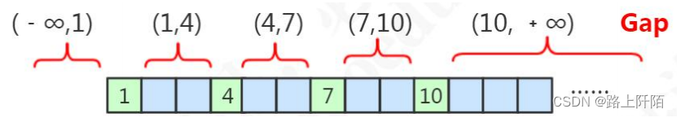

## MySQL的锁机制——记录锁、间隙锁、临键锁
### 记录锁(Record Locks)
记录锁锁住的是索引记录，记录锁也叫行锁。
如果使用索引作为条件命中了记录，那么就是记录锁，***被锁住的记录不能被别的事务插入相同的索引键值，修改和删除***。
例如：
```
select * from test_table where id = 38 for update;
```
它会在 id = 38 的记录上加上记录锁，以阻止其他事务插入，更新，删除 id=38 这一行。

FOR UPDATE 是 MySQL SELECT 语句的一种命令组合，它用于在事务内获取一行或多行数据并将其锁定，防止其他事务能够更改或删除这些行。
***如在执行 SELECT 查询时使用 FOR UPDATE，它会在锁定行上加上一个排他锁***，
这样其他事务就无法再修改或者删除这些行(***除非使用事务隔离级别***)。

在 SQL 中， FOR UPDATE 语句通常与事务相关，事务是对一系列带有 ACID 特性的数据库操作的批处理。
在 MySQL 中，一个事务通常由多个 SQL 语句组成，例如 SELECT, INSERT, UPDATE 或 DELETE。
使用 SELECT… FOR UPDATE 语句允许从数据库中检索数据，同时保证了因并发操作而可能发生的意外冲突。

例如在执行 SELECT * FROM test_table WHERE id = 38 FOR UPDATE; 查询时，MySQL 将在 test_table 表上应用一个共享锁，
以确保在该事务中处理 ID=38 的同一行数据是独占的，其他事务在对此数据执行 UPDATE，DELETE 操作时会被阻止。查询操作结束后，MySQL 会自动释放数据行上的锁。

需要注意的是，使用 FOR UPDATE 语句可以防止并发操作引起的数据出现问题，但同时也可能引起死锁问题，因此需要慎用，对于大型系统的设计，需要更加谨慎地考虑和处理。

### 间隙锁(Gap Locks)
MySQL 间隙锁（Gap Lock）是 MySQL 数据库中的一种锁机制，用于在多个事务并发读（SELECT）操作时保证数据的一致性和防止幻读。

当一个事务执行一个范围查询时，如果没有使用间隙锁，在其他事务在相同的范围查询时就会发生幻读的问题。
举个例子，当事务 1 对 id 值大于 10 小于 20 的表中数据进行更新或删除操作时，
如果此时事务 2 对该范围的数据进行插入操作，这个新插入的数据就会在事务1看来是幻读的。

为了避免上述问题，MySQL 在 InnoDB 存储引擎中使用间隙锁机制，即在索引中的两个值之间锁定一个“间隙”，
阻止任何其他事务在该间隙上进行插入或更新操作，从而保证事务的正确性和数据的一致性。间隙锁有时也称为间隙锁定（Gap Locking）。

以下是 MySQL 间隙锁的部分代码示例：
```
-- 使用SELECT ... FOR UPDATE语句获取间隙锁
START TRANSACTION;
SELECT * FROM `student` WHERE id >= 10 AND id <= 20 FOR UPDATE;
-- 这里进行需要对students表中指定范围的记录进行修改或删除等操作
COMMIT;
```

在上述代码中，事务需要对 students 表中 id 值在 10 至 20 范围内的记录进行修改或删除操作。
通过执行 SELECT ... FOR UPDATE 语句获取间隙锁，
保证了该范围内的所有记录和相应的索引值之间的间隙都被锁定，防止其他事务插入、修改或删除数据，避免了幻读的出现。

需要注意的是，MySQL 间隙锁机制只在 InnoDB 存储引擎中可用，如果使用 MyISAM 存储引擎，就不会出现间隙锁的问题。
同时，间隙锁也会影响系统的并发性和性能，过多的间隙锁甚至会引发死锁。
因此，开发者在实际使用过程中需要谨慎设计和管理数据库事务，选择适当的隔离级别和锁定粒度，以维护数据的正确性和系统的高可用性。

间隙锁是锁在***索引之间***或者***第一个索引***前面或者***最后一个索引***后面。
当我们使用索引，无论是等值还是范围查询，没有命中一条记录时候，加的就是间隙锁。

我们在表中插入4条记录，主键分别是1、4、7、10。


图中的范围区间就会被锁住，都是左开右开的区间。
```
select * from test_table where id = 6 for update 或者 select * from test_table were id >4 and id < 7 for update;
```
没有命中任何一条记录，会锁住（4，7）区间，另一个事务插入id = 6则会阻塞；
```
select * from test_table where id > 10 for update
```
没有命中，会锁住（10，正无穷），另一个事务插入id = 11会阻塞。
间隙锁只在可重复读隔离级别中存在。

### 临键锁(Next-key Locks)
当我们使用索引进行范围查询，命中了记录的情况下，就是使用了临键锁，他相当于记录锁+间隙锁。
两种退化的情况：
- 唯一性索引，等值查询匹配到一条记录的时候，退化成记录锁。
- 没有匹配到任何记录的时候，退化成间隙锁。

左开右闭区间，目的是为了解决幻读的问题。如果把事务的隔离级别降级为RC，临键锁则也会失效。


```
select * from test_table where id > 5 and id < 9 for update;
```
上面的sql命中了id = 7的记录，也包含了记录不存在的区间，所以他锁住（4，7]和（7，10]区间，
在这区间，别的事务插入不了数据，所以解决了幻读问题。

四种隔离级别:
- READ-UNCOMMITTED(读取未提交) ： 最低的隔离级别，允许读取尚未提交的数据变更，可能会导致脏读、幻读或不可重复读。
- READ-COMMITTED(读取已提交) ： 允许读取并发事务已经提交的数据，可以阻止脏读，但是幻读或不可重复读仍有可能发生。
- REPEATABLE-READ(可重复读) ： 对同一字段的多次读取结果都是一致的，除非数据是被本身事务自己所修改，可以阻止脏读和不可重复读，但幻读仍有可能发生。
- SERIALIZABLE(可串行化) ： 最高的隔离级别，完全服从 ACID 的隔离级别。所有的事务依次逐个执行，这样事务之间就完全不可能产生干扰，也就是说，该级别可以防止脏读、不可重复读以及幻读。

MySQL InnoDB 存储引擎的默认支持的隔离级别是 REPEATABLE-READ（可重读）。


