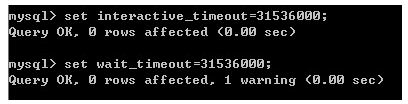
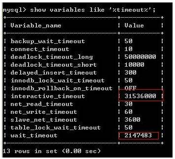

## mysql默认空闲时间_MySQL 的默认设置下，当一个连接的空闲时间超过8小时后，MySQL 就会断开该连接...

MySQL的默认设置下，当一个连接的空闲时间超过8小时后，MySQL就会断开该连接，
而 c3p0 连接池则以为该被断开的连接依然有效。
在这种情况下，如果客户端代码向 c3p0 连接池请求连接的话，连接池就会把已经失效的连接返回给客户端，
客户端在使用该失效连接的时候即抛出异常。

这就是传说中的 mySql 8小时问题。
解决这个问题的办法有三种：
- 1. 增加MySQL的 wait_timeout 属性的值。
修改/etc/mysql/my.cnf文件，在 [mysqld] 节中设置：
Set a connection to wait 8 hours in idle status.
wait_timeout=86400

```sql
mysql> show variables like '%timeout%';
+--------------------------+-------+
| Variable_name            | Value |
+--------------------------+-------+
| connect_timeout          | 5     |
| delayed_insert_timeout   | 300   |
| innodb_lock_wait_timeout | 50    |
| interactive_timeout      | 28800 |
| net_read_timeout         | 30    |
| net_write_timeout        | 60    |
| slave_net_timeout        | 3600 |
| wait_timeout             | 28800 |
+--------------------------+-------+
```

同一时间，这两个参数只有一个起作用。到底是哪个参数起作用，和用户连接时指定的连接参数相关，
缺省情况下是使用wait_timeout。我建议是将这两个参数都修改，以免引起不必要的麻烦。
这两个参数的默认值是8小时(60*60*8=28800)。
测试将这两个参数改为0，结果出人意料，系统自动将这个值设置为28800 。
换句话说，不能将该值设置为永久。
将这2个参数设置为1年(60*60*24*365=31536000)
总不至于一年都不用这个链接吧？
```
set interactive_timeout=31536000;
set wait_timeout=31536000;
```
结果：


wait_timeout 的设置出现警告，再看看设置后的结果



也就是说wait_timeout的最大值只允许2147483 (24天左右)

- 2. 减少连接池内连接的生存周期，使之小于上一项中所设置的 wait_timeout 的值。
修改 c3p0 的配置文件，设置：
# How long to keep unused connections around(in seconds)
Note:MySQL times out idle connections after 8 hours(28,800seconds)
so ensure this value is below MySQL idle timeout
cpool.maxIdleTime=25200

在 Spring 的配置文件中：
3. 定期使用连接池内的连接，使得它们不会因为闲置超时而被MySQL断开。
修改 c3p0 的配置文件，设置：
Prevent MySQL raise exception after a long idle time
cpool.preferredTestQuery='SELECT1'
cpool.idleConnectionTestPeriod=18000
cpool.testConnectionOnCheckout=true
修改 Spring 的配置文件：

```
class="com.mchange.v2.c3p0.ComboPooledDataSource"
value="${cpool.preferredTestQuery}"/>       
value="${cpool.idleConnectionTestPeriod}"/> 
value="${cpool.testConnectionOnCheckout}"/>
```


