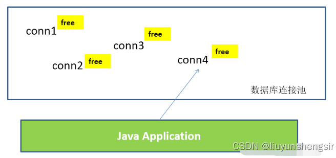
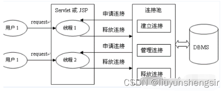
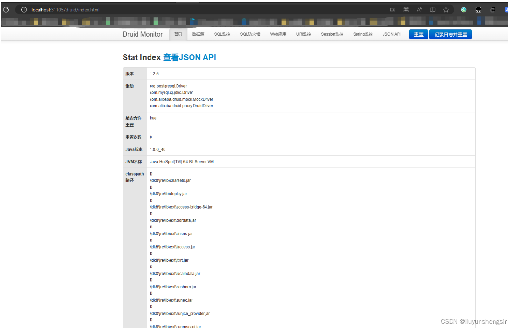
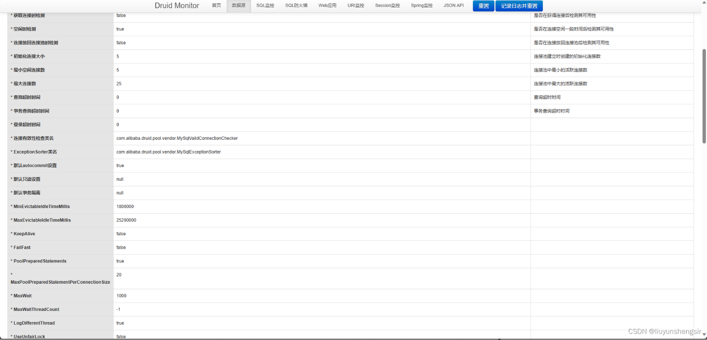
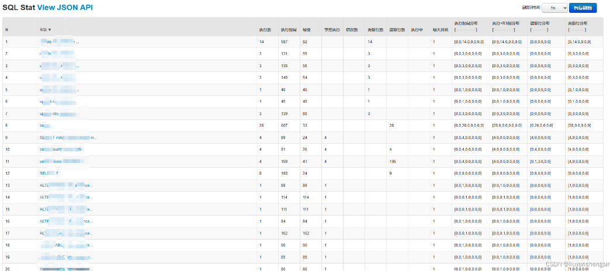

## springboot 集成Druid的监控数据库连接池的最佳实践
本文涉及的产品
服务治理 MSE Sentinel/OpenSergo，Agent数量 不受限

简介： Druid是一种***高性能的开源数据库连接池***，它在Java应用程序中被广泛使用。
Druid连接池提供了***连接管理***、***连接池监控***、***SQL性能监控***等功能，
能够有效地管理数据库连接，并提供丰富的***性能指标和监控报告***。
Druid连接池的一些主要特点包括：连接池管理：Druid可以帮助你管理数据库连接，包括连接的创建、销毁和重用。
它提供了连接池配置选项，可以灵活地调整连接池的大小、最大等待时间、验证查询等参数。
监控数据统计：Druid连接池提供了丰富的监控指标，如连接数、活跃线程数、执行SQL次数、慢查询次数、错误次数等。
通过这些统计数据，你可以实时了解连接池的使用情况和性能状况。
SQL性能监控：

### 1.数据库连接池介绍

#### 1.1.JDBC数据库连接池的必要性
在使用开发基于数据库的web程序时，传统的模式基本是按以下步骤
- 在主程序（如servlet、beans）中建立数据库连接
- 进行sql操作
- 断开数据库连接

这种模式开发，存在的问题:
普通的JDBC数据库连接使用 DriverManager 来获取，每次向数据库建立连接的时候都要将 Connection加载到内存中，
再验证用户名和密码(得花费0.05s～1s的时间)。
需要数据库连接的时候，就向数据库要求一个，执行完成后再断开连接。这样的方式将会消耗大量的资源和时间。
数据库的连接资源并没有得到很好的重复利用。
若同时有几百人甚至几千人在线，频繁的进行数据库连接操作将占用很多的系统资源，严重的甚至会造成服务器的崩溃。

对于每一次数据库连接，使用完后都得断开。
否则，如果程序出现异常而未能关闭，将会导致数据库系统 中的内存泄漏，最终将导致重启数据库。
（回忆：何为Java的内存泄漏？）
这种开发不能控制被创建的连接对象数，系统资源会被毫无顾及的分配出去，如连接过多，也可能导致内存泄漏，服务器崩溃。

#### 1.2.数据库连接池技术
为解决传统开发中的数据库连接问题，可以采用数据库连接池技术。 
数据库连接池的基本思想：就是为数据库连接建立一个“缓冲池”。
预先在缓冲池中放入一定数量的连接，当需要 建立数据库连接时，
只需从“缓冲池”中取出一个，使用完毕之后再放回去。

数据库连接池负责分配、管理和释放数据库连接，
它允许应用程序重复使用一个现有的数据库连接，而不是重 新建立一个。

数据库连接池在初始化时将创建一定数量的数据库连接放到连接池中，这些数据库连接的数量是由最小数据库 连接数来设定的。
无论这些数据库连接是否被使用，连接池都将一直保证至少拥有这么多的连接数量。
连接池 的最大数据库连接数量限定了这个连接池能占有的最大连接数，
当应用程序向连接池请求的连接数超过最大连 接数量时，这些请求将被加入到等待队列中。





#### 1.3 数据库连接池技术的优点
- 1.资源重用 由于数据库连接得以重用，避免了频繁创建，释放连接引起的大量性能开销。
在减少系统消耗的基础上，另一 方面也增加了系统运行环境的平稳性。
- 2.更快的系统反应速度 数据库连接池在初始化过程中，往往已经创建了若干数据库连接置于连接池中备用。此时连接的初始化工作均 已完成。
对于业务请求处理而言，直接利用现有可用连接，避免了数据库连接初始化和释放过程的时间开销， 从而减少了系统的响应时间。
- 3.新的资源分配手段 对于多应用共享同一数据库的系统而言，可在应用层通过数据库连接池的配置，
实现某一应用最大可用数据库 连接数的限制，避免某一应用独占所有的数据库资源。
- 4.统一的连接管理，避免数据库连接泄漏 在较为完善的数据库连接池实现中，可根据预先的占用超时设定，
强制回收被占用连接，从而避免了常规数据 库连接操作中可能出现的资源泄露。

### 2.Druid连接池简介
Druid是一种高性能的开源数据库连接池，它在Java应用程序中被广泛使用。
Druid连接池提供了***连接管理***、***连接池监控***、***SQL性能监控***等功能，能够有效地管理数据库连接，并提供丰富的性能指标和监控报告。
Druid连接池的一些主要特点包括：
- 1.连接池管理：Druid可以帮助你管理数据库连接，包括连接的创建、销毁和重用。它提供了连接池配置选项，可以灵活地调整连接池的大小、最大等待时间、验证查询等参数。
- 2.监控数据统计：Druid连接池提供了丰富的监控指标，如连接数、活跃线程数、执行SQL次数、慢查询次数、错误次数等。通过这些统计数据，你可以实时了解连接池的使用情况和性能状况。
- 3.SQL性能监控：Druid连接池还可以监控和统计每条SQL语句的执行时间、返回行数等信息。这对于诊断和优化数据库访问性能非常有帮助，可以发现潜在的性能问题并进行针对性的优化。
- 4.连接池过滤器：Druid连接池支持自定义过滤器，可以在连接获取和归还的过程中进行额外的逻辑处理。你可以编写自己的过滤器来实现日志记录、安全验证等功能。
- 5.整合第三方监控工具：Druid连接池可以与其他监控工具（如Spring Boot Actuator、Prometheus、Grafana）集成，以便更好地可视化和报告连接池的性能数据。
总的来说，Druid是一款功能强大且性能优秀的数据库连接池，适用于需要高效管理和监控数据库连接的Java应用程序。你可以通过配置和使用Druid连接池，提升数据库访问的性能和稳定性。







### 3.整合
#### 3.1 依赖
```xml
<dependency>
    <groupId>com.alibaba</groupId>
    <artifactId>druid-spring-boot-starter</artifactId>
    <version>1.2.6</version>
</dependency>
```

#### 3.2 配置
```yaml
spring:
  application:
    name: liuyunshengsir
  main:
    allow-bean-definition-overriding: true
  datasource:
    name: liuyunshengsir
    url: jdbc:mysql://liuyunshengsir:3306/liuyunshengsir?useUnicode=true&characterEncoding=UTF-8&useJDBCCompliantTimezoneShift=true&useLegacyDatetimeCode=false&serverTimezone=GMT%2b8&useSSL=false&createDatabaseIfNotExist=true
    username: root
    password: liuyunshengsir
    type: com.alibaba.druid.pool.DruidDataSource
    driver-class-name: com.mysql.cj.jdbc.Driver
    druid:
      initial-size: 5
      min-idle: 5
      max-active: 25
      max-wait: 1000
      time-between-eviction-runs-millis: 60000
      validation-query: SELECT 1 as nums
      test-while-idle: true
      test-on-borrow: false
      test-on-return: false
      pool-prepared-statements: true
      max-pool-prepared-statement-per-connection-size: 20
      connection-properties: druid.stat.mergeSql=true;druid.stat.slowSqlMillis=5000
      filters: stat # 拦截sql的开关
    initialization-mode: always
```

#### 3.3前端页面访问配置
```
package com.sugon.cloud.config;

import com.alibaba.druid.support.http.StatViewServlet;
import org.springframework.boot.web.servlet.ServletRegistrationBean;
import org.springframework.context.annotation.Bean;
import org.springframework.context.annotation.Configuration;

import java.util.HashMap;

/**
 * @author liuysh
 * @since 2023/7/12 16:21
 */
@Configuration
public class DruidConfig {
    @Bean
    ServletRegistrationBean regisDruid() {
        //固定写法，配置访问路径
        ServletRegistrationBean<StatViewServlet> bean = new ServletRegistrationBean<>(new StatViewServlet(), "/druid/*");
        //配置登录信息，固定写法
        HashMap<String, String> initParams = new HashMap<>();
        //账号和密码的key是固定的
        initParams.put("loginUsername", "liuyunshengsir");
        initParams.put("loginPassword", "liuyunshengsir");

        //允许谁可以访问
        initParams.put("allow", "");
        bean.setInitParameters(initParams);
        return bean;
    }
}
```


