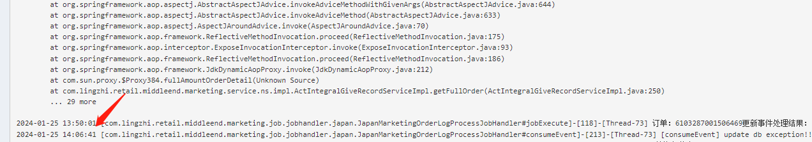
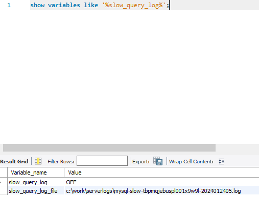
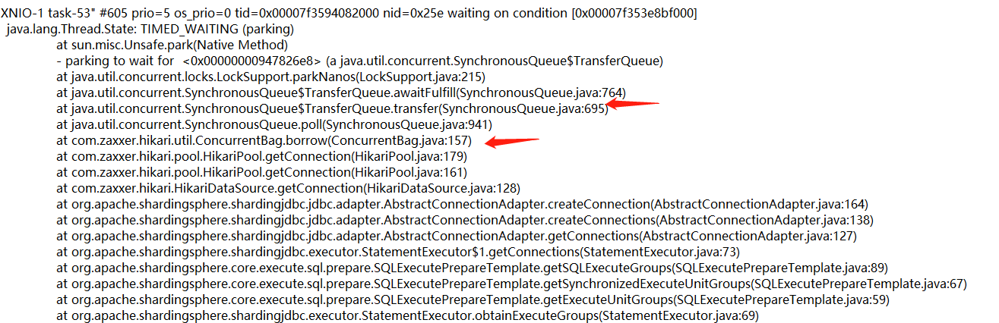
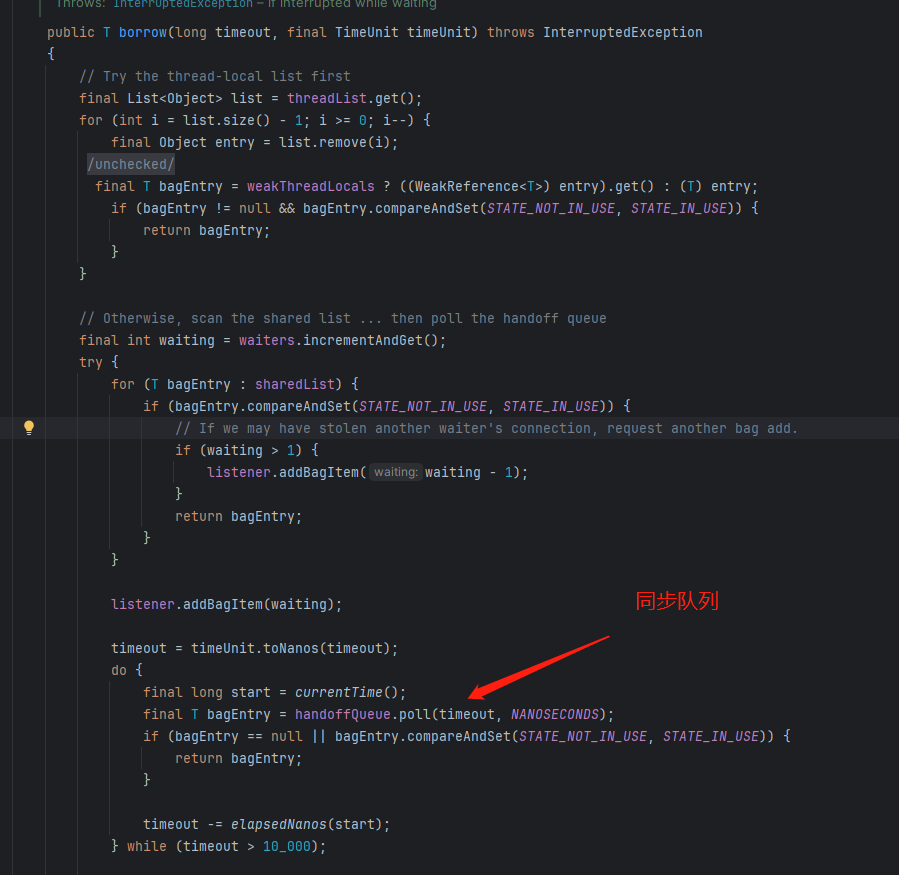
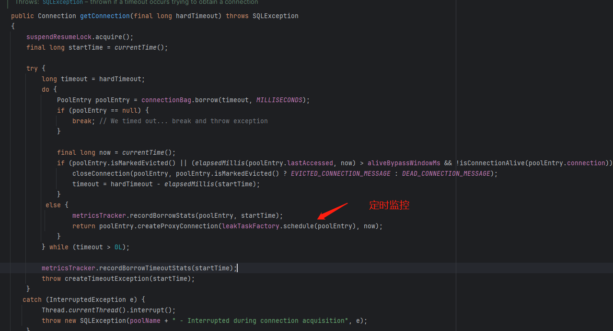
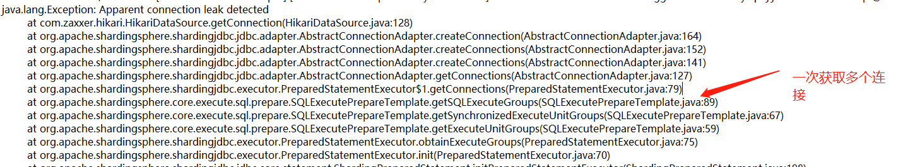
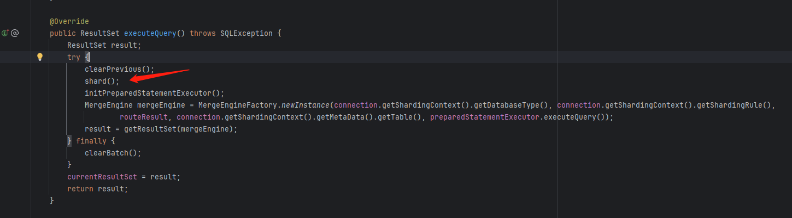
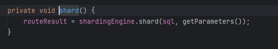

## 一次数据库连接池卡住的排查

### 问题现象
所有和数据库有关的操作都hang住，直到超时，无法确定是哪里引起的。


为了不阻塞业务，将连接池加大，超时时间缩短。没有再出现问题，但是原因未知。

### 排查
1、初步排查方向为慢sql、db死锁、程序死锁。

#### 慢查询


慢查询并未打开，无法查看。

#### db死锁
db给出死锁日志，看到有insert ignore死锁的日志，但是mysql有死锁检测，会回滚事务，不会导致一直卡住。
dba查看并无一直死锁的情况
整个db服务看上去也比较正常

#### 程序死锁
- 1、Hikari连接池监控
由于没有任何连接池相关的日志，因此加入连接池监控
```
dataSource.setMetricRegistry(initMetricRegistry("marketingPool"));

public MetricRegistry initMetricRegistry(String poolName) {
    MetricRegistry metricRegistry = new MetricRegistry();
    Slf4jReporter reporter = Slf4jReporter.forRegistry(metricRegistry).prefixedWith(poolName)
            .outputTo(log)
            .convertRatesTo(TimeUnit.SECONDS)
            .convertDurationsTo(TimeUnit.MILLISECONDS)
            .build();
    reporter.start(30, TimeUnit.SECONDS);
    return metricRegistry;
}
```

- 2、Hikari监控分析（确定问题）
ActiveConnections共有20个链接，正在被占用
PendingConnections, value=148，有148个db请求在排队
Usage，持有连接的min=2, max=1000957, mean=41862.142936094635，最大高达1000000ms和连接超时时间相符（因此可以确定某个线程持续拿着连接没有释放）
Wait，同上，当出现阻塞时，等待的线程同样是1000000ms
```
type=GAUGE, name=marketingPool.HikariPool-1.pool.ActiveConnections, value=20
type=GAUGE, name=marketingPool.HikariPool-1.pool.IdleConnections, value=0
type=GAUGE, name=marketingPool.HikariPool-1.pool.MaxConnections, value=20
type=GAUGE, name=marketingPool.HikariPool-1.pool.MinConnections, value=5
type=GAUGE, name=marketingPool.HikariPool-1.pool.PendingConnections, value=148
type=GAUGE, name=marketingPool.HikariPool-1.pool.TotalConnections, value=20
type=HISTOGRAM, name=marketingPool.HikariPool-1.pool.ConnectionCreation, count=904, min=71, max=1794, mean=129.06184698979365, stddev=121.73861928513529, median=87.0, p75=91.0, p95=461.0, p98=609.0, p99=609.0, p999=609.0
type=HISTOGRAM, name=marketingPool.HikariPool-1.pool.Usage, count=20055, min=2, max=1000957, mean=41862.142936094635, stddev=200293.3834512824, median=3.0, p75=5.0, p95=102.0, p98=1000851.0, p99=1000941.0, p999=1000943.0
type=METER, name=marketingPool.HikariPool-1.pool.ConnectionTimeoutRate, count=89, mean_rate=0.001832490059223961, m1=2.3214398564729314E-7, m5=6.378080397796692E-4, m15=0.001442526252899279, rate_unit=events/second
type=TIMER, name=marketingPool.HikariPool-1.pool.Wait, count=20164, min=2.0E-4, max=1000079.076547, mean=199045.72272535248, stddev=329672.93974875717, median=72.642975, p75=445060.981611, p95=892800.056064, p98=959819.263461, p99=979811.404556, p999=1000072.439208, mean_rate=0.4151722376709753, m1=6.3731719117928E-5, m5=0.13712621360987715, m15=0.3013721531537143, rate_unit=events/second, duration_unit=milliseconds
```
当还无法确定是什么线程占用住了连接池

- 3、dump线程（一无所获）
```properties
2024-01-25 10:06:44
Full thread dump OpenJDK 64-Bit Server VM (25.222-b10 mixed mode):

"Pinpoint-PinpointClientHandler-Timer(6234-0)" #13986 daemon prio=5 os_prio=0 tid=0x00007f35e0043800 nid=0x3727 waiting on condition [0x00007f3535f58000]
   java.lang.Thread.State: TIMED_WAITING (sleeping)
	at java.lang.Thread.sleep(Native Method)
	at org.jboss.netty.util.HashedWheelTimer$Worker.waitForNextTick(HashedWheelTimer.java:445)
	at org.jboss.netty.util.HashedWheelTimer$Worker.run(HashedWheelTimer.java:364)
	at org.jboss.netty.util.ThreadRenamingRunnable.run(ThreadRenamingRunnable.java:108)
	at java.lang.Thread.run(Thread.java:748)

"Thread-827" #13968 prio=10 os_prio=0 tid=0x00007f3584023000 nid=0x3714 waiting on condition [0x00007f35362da000]
   java.lang.Thread.State: TIMED_WAITING (parking)
	at sun.misc.Unsafe.park(Native Method)
	- parking to wait for  <0x00000000947826e8> (a java.util.concurrent.SynchronousQueue$TransferQueue)
	at java.util.concurrent.locks.LockSupport.parkNanos(LockSupport.java:215)
	at java.util.concurrent.SynchronousQueue$TransferQueue.awaitFulfill(SynchronousQueue.java:764)
	at java.util.concurrent.SynchronousQueue$TransferQueue.transfer(SynchronousQueue.java:695)
	at java.util.concurrent.SynchronousQueue.poll(SynchronousQueue.java:941)
	at com.zaxxer.hikari.util.ConcurrentBag.borrow(ConcurrentBag.java:157)
	at com.zaxxer.hikari.pool.HikariPool.getConnection(HikariPool.java:179)
	at com.zaxxer.hikari.pool.HikariPool.getConnection(HikariPool.java:161)
	at com.zaxxer.hikari.HikariDataSource.getConnection(HikariDataSource.java:128)
	at org.apache.shardingsphere.shardingjdbc.jdbc.adapter.AbstractConnectionAdapter.createConnection(AbstractConnectionAdapter.java:164)
	at org.apache.shardingsphere.shardingjdbc.jdbc.adapter.AbstractConnectionAdapter.createConnections(AbstractConnectionAdapter.java:138)
	at org.apache.shardingsphere.shardingjdbc.jdbc.adapter.AbstractConnectionAdapter.getConnections(AbstractConnectionAdapter.java:127)
	at org.apache.shardingsphere.shardingjdbc.executor.PreparedStatementExecutor$1.getConnections(PreparedStatementExecutor.java:79)
	at org.apache.shardingsphere.core.execute.sql.prepare.SQLExecutePrepareTemplate.getSQLExecuteGroups(SQLExecutePrepareTemplate.java:89)
	at org.apache.shardingsphere.core.execute.sql.prepare.SQLExecutePrepareTemplate.getSynchronizedExecuteUnitGroups(SQLExecutePrepareTemplate.java:67)
	at org.apache.shardingsphere.core.execute.sql.prepare.SQLExecutePrepareTemplate.getExecuteUnitGroups(SQLExecutePrepareTemplate.java:59)
	at org.apache.shardingsphere.shardingjdbc.executor.PreparedStatementExecutor.obtainExecuteGroups(PreparedStatementExecutor.java:75)
	at org.apache.shardingsphere.shardingjdbc.executor.PreparedStatementExecutor.init(PreparedStatementExecutor.java:70)
	at org.apache.shardingsphere.shardingjdbc.jdbc.core.statement.ShardingPreparedStatement.initPreparedStatementExecutor(ShardingPreparedStatement.java:198)
	at org.apache.shardingsphere.shardingjdbc.jdbc.core.statement.ShardingPreparedStatement.execute(ShardingPreparedStatement.java:171)
	at org.apache.ibatis.executor.statement.PreparedStatementHandler.query(PreparedStatementHandler.java:64)
	at org.apache.ibatis.executor.statement.RoutingStatementHandler.query(RoutingStatementHandler.java:79)
	at org.apache.ibatis.executor.SimpleExecutor.doQuery(SimpleExecutor.java:63)
	at org.apache.ibatis.executor.BaseExecutor.queryFromDatabase(BaseExecutor.java:324)
	at org.apache.ibatis.executor.BaseExecutor.query(BaseExecutor.java:156)
	at org.apache.ibatis.executor.CachingExecutor.query(CachingExecutor.java:109)
	at org.apache.ibatis.executor.CachingExecutor.query(CachingExecutor.java:83)
	at sun.reflect.GeneratedMethodAccessor180.invoke(Unknown Source)
	at sun.reflect.DelegatingMethodAccessorImpl.invoke(DelegatingMethodAccessorImpl.java:43)
	at java.lang.reflect.Method.invoke(Method.java:498)
	at org.apache.ibatis.plugin.Invocation.proceed(Invocation.java:49)
	at com.lingzhi.retail.dubhe.mybatis.interceptor.DubhePagerInfoInterceptor.intercept(DubhePagerInfoInterceptor.java:132)
	at org.apache.ibatis.plugin.Plugin.invoke(Plugin.java:61)
	at com.sun.proxy.$Proxy719.query(Unknown Source)
	at org.apache.ibatis.session.defaults.DefaultSqlSession.selectList(DefaultSqlSession.java:147)
	at org.apache.ibatis.session.defaults.DefaultSqlSession.selectList(DefaultSqlSession.java:140)
	at sun.reflect.GeneratedMethodAccessor179.invoke(Unknown Source)
	at sun.reflect.DelegatingMethodAccessorImpl.invoke(DelegatingMethodAccessorImpl.java:43)
	at java.lang.reflect.Method.invoke(Method.java:498)
	at org.mybatis.spring.SqlSessionTemplate$SqlSessionInterceptor.invoke(SqlSessionTemplate.java:433)
	at com.sun.proxy.$Proxy245.selectList(Unknown Source)
	at org.mybatis.spring.SqlSessionTemplate.selectList(SqlSessionTemplate.java:230)
	at org.apache.ibatis.binding.MapperMethod.executeForMany(MapperMethod.java:147)
	at org.apache.ibatis.binding.MapperMethod.execute(MapperMethod.java:80)
	at org.apache.ibatis.binding.MapperProxy.invoke(MapperProxy.java:58)
	at com.sun.proxy.$Proxy373.listLottery4Job(Unknown Source)
	at com.lingzhi.retail.middleend.marketing.service.service.activity.impl.ActTimingAwardServiceImpl.calcLottery4Job(ActTimingAwardServiceImpl.java:1851)
	at com.lingzhi.retail.middleend.marketing.service.service.activity.impl.ActTimingAwardServiceImpl$$FastClassBySpringCGLIB$$95c6c92e.invoke(<generated>)
	at org.springframework.cglib.proxy.MethodProxy.invoke(MethodProxy.java:218)
	at org.springframework.aop.framework.CglibAopProxy$CglibMethodInvocation.invokeJoinpoint(CglibAopProxy.java:749)
	at org.springframework.aop.framework.ReflectiveMethodInvocation.proceed(ReflectiveMethodInvocation.java:163)
	at org.springframework.dao.support.PersistenceExceptionTranslationInterceptor.invoke(PersistenceExceptionTranslationInterceptor.java:139)
	at org.springframework.aop.framework.ReflectiveMethodInvocation.proceed(ReflectiveMethodInvocation.java:186)
	at org.springframework.aop.interceptor.ExposeInvocationInterceptor.invoke(ExposeInvocationInterceptor.java:93)
	at org.springframework.aop.framework.ReflectiveMethodInvocation.proceed(ReflectiveMethodInvocation.java:186)
	at org.springframework.aop.framework.CglibAopProxy$DynamicAdvisedInterceptor.intercept(CglibAopProxy.java:688)
	at com.lingzhi.retail.middleend.marketing.service.service.activity.impl.ActTimingAwardServiceImpl$$EnhancerBySpringCGLIB$$b43cf7ea.calcLottery4Job(<generated>)
	at com.lingzhi.retail.middleend.marketing.job.jobhandler.ActTimingAwardDelayLotteryJobHandler.jobExecute(ActTimingAwardDelayLotteryJobHandler.java:34)
	at com.lingzhi.retail.dubhe.job.jobhandler.AbstractJobHandler.execute(AbstractJobHandler.java:23)
	at com.lingzhi.retail.dubhe.job.jobhandler.AbstractJobHandler$$FastClassBySpringCGLIB$$93990e8a.invoke(<generated>)
	at org.springframework.cglib.proxy.MethodProxy.invoke(MethodProxy.java:218)
	at org.springframework.aop.framework.CglibAopProxy$CglibMethodInvocation.invokeJoinpoint(CglibAopProxy.java:749)
	at org.springframework.aop.framework.ReflectiveMethodInvocation.proceed(ReflectiveMethodInvocation.java:163)
	at org.springframework.aop.interceptor.ExposeInvocationInterceptor.invoke(ExposeInvocationInterceptor.java:93)
	at org.springframework.aop.framework.ReflectiveMethodInvocation.proceed(ReflectiveMethodInvocation.java:186)
	at org.springframework.aop.aspectj.MethodInvocationProceedingJoinPoint.proceed(MethodInvocationProceedingJoinPoint.java:88)
	at com.lingzhi.retail.dubhe.job.aop.TraceJobAspect.traceBackgroundThread(TraceJobAspect.java:43)
	at sun.reflect.GeneratedMethodAccessor200.invoke(Unknown Source)
	at sun.reflect.DelegatingMethodAccessorImpl.invoke(DelegatingMethodAccessorImpl.java:43)
	at java.lang.reflect.Method.invoke(Method.java:498)
	at org.springframework.aop.aspectj.AbstractAspectJAdvice.invokeAdviceMethodWithGivenArgs(AbstractAspectJAdvice.java:644)
	at org.springframework.aop.aspectj.AbstractAspectJAdvice.invokeAdviceMethod(AbstractAspectJAdvice.java:633)
	at org.springframework.aop.aspectj.AspectJAroundAdvice.invoke(AspectJAroundAdvice.java:70)
	at org.springframework.aop.framework.ReflectiveMethodInvocation.proceed(ReflectiveMethodInvocation.java:186)
	at org.springframework.aop.framework.CglibAopProxy$DynamicAdvisedInterceptor.intercept(CglibAopProxy.java:688)
	at com.lingzhi.retail.middleend.marketing.job.jobhandler.ActTimingAwardDelayLotteryJobHandler$$EnhancerBySpringCGLIB$$a166ed60.execute(<generated>)
	at com.xxl.job.core.thread.JobThread.run(JobThread.java:152)

"Thread-828" #13967 prio=10 os_prio=0 tid=0x00007f3588017000 nid=0x3713 waiting on condition [0x00007f353645c000]
   java.lang.Thread.State: TIMED_WAITING (parking)
	at sun.misc.Unsafe.park(Native Method)
	- parking to wait for  <0x00000000947826e8> (a java.util.concurrent.SynchronousQueue$TransferQueue)
	at java.util.concurrent.locks.LockSupport.parkNanos(LockSupport.java:215)
	at java.util.concurrent.SynchronousQueue$TransferQueue.awaitFulfill(SynchronousQueue.java:764)
	at java.util.concurrent.SynchronousQueue$TransferQueue.transfer(SynchronousQueue.java:695)
	at java.util.concurrent.SynchronousQueue.poll(SynchronousQueue.java:941)
	at com.zaxxer.hikari.util.ConcurrentBag.borrow(ConcurrentBag.java:157)
	at com.zaxxer.hikari.pool.HikariPool.getConnection(HikariPool.java:179)
	at com.zaxxer.hikari.pool.HikariPool.getConnection(HikariPool.java:161)
	at com.zaxxer.hikari.HikariDataSource.getConnection(HikariDataSource.java:128)
	at org.apache.shardingsphere.shardingjdbc.jdbc.adapter.AbstractConnectionAdapter.createConnection(AbstractConnectionAdapter.java:164)
	at org.apache.shardingsphere.shardingjdbc.jdbc.adapter.AbstractConnectionAdapter.createConnections(AbstractConnectionAdapter.java:138)
	at org.apache.shardingsphere.shardingjdbc.jdbc.adapter.AbstractConnectionAdapter.getConnections(AbstractConnectionAdapter.java:127)
	at org.apache.shardingsphere.shardingjdbc.executor.PreparedStatementExecutor$1.getConnections(PreparedStatementExecutor.java:79)
	at org.apache.shardingsphere.core.execute.sql.prepare.SQLExecutePrepareTemplate.getSQLExecuteGroups(SQLExecutePrepareTemplate.java:89)
	at org.apache.shardingsphere.core.execute.sql.prepare.SQLExecutePrepareTemplate.getSynchronizedExecuteUnitGroups(SQLExecutePrepareTemplate.java:67)
	at org.apache.shardingsphere.core.execute.sql.prepare.SQLExecutePrepareTemplate.getExecuteUnitGroups(SQLExecutePrepareTemplate.java:59)
	at org.apache.shardingsphere.shardingjdbc.executor.PreparedStatementExecutor.obtainExecuteGroups(PreparedStatementExecutor.java:75)
	at org.apache.shardingsphere.shardingjdbc.executor.PreparedStatementExecutor.init(PreparedStatementExecutor.java:70)
	at org.apache.shardingsphere.shardingjdbc.jdbc.core.statement.ShardingPreparedStatement.initPreparedStatementExecutor(ShardingPreparedStatement.java:198)
	at org.apache.shardingsphere.shardingjdbc.jdbc.core.statement.ShardingPreparedStatement.execute(ShardingPreparedStatement.java:171)
	at org.apache.ibatis.executor.statement.PreparedStatementHandler.query(PreparedStatementHandler.java:64)
	at org.apache.ibatis.executor.statement.RoutingStatementHandler.query(RoutingStatementHandler.java:79)
	at org.apache.ibatis.executor.SimpleExecutor.doQuery(SimpleExecutor.java:63)
	at org.apache.ibatis.executor.BaseExecutor.queryFromDatabase(BaseExecutor.java:324)
	at org.apache.ibatis.executor.BaseExecutor.query(BaseExecutor.java:156)
	at org.apache.ibatis.executor.CachingExecutor.query(CachingExecutor.java:109)
	at org.apache.ibatis.executor.CachingExecutor.query(CachingExecutor.java:83)
	at sun.reflect.GeneratedMethodAccessor180.invoke(Unknown Source)
	at sun.reflect.DelegatingMethodAccessorImpl.invoke(DelegatingMethodAccessorImpl.java:43)
	at java.lang.reflect.Method.invoke(Method.java:498)
	at org.apache.ibatis.plugin.Invocation.proceed(Invocation.java:49)
	at com.lingzhi.retail.dubhe.mybatis.interceptor.DubhePagerInfoInterceptor.intercept(DubhePagerInfoInterceptor.java:132)
	at org.apache.ibatis.plugin.Plugin.invoke(Plugin.java:61)
	at com.sun.proxy.$Proxy719.query(Unknown Source)
	at org.apache.ibatis.session.defaults.DefaultSqlSession.selectList(DefaultSqlSession.java:147)
	at org.apache.ibatis.session.defaults.DefaultSqlSession.selectList(DefaultSqlSession.java:140)
	at sun.reflect.GeneratedMethodAccessor179.invoke(Unknown Source)
	at sun.reflect.DelegatingMethodAccessorImpl.invoke(DelegatingMethodAccessorImpl.java:43)
	at java.lang.reflect.Method.invoke(Method.java:498)
	at org.mybatis.spring.SqlSessionTemplate$SqlSessionInterceptor.invoke(SqlSessionTemplate.java:433)
	at com.sun.proxy.$Proxy245.selectList(Unknown Source)
	at org.mybatis.spring.SqlSessionTemplate.selectList(SqlSessionTemplate.java:230)
	at org.apache.ibatis.binding.MapperMethod.executeForMany(MapperMethod.java:147)
	at org.apache.ibatis.binding.MapperMethod.execute(MapperMethod.java:80)
	at org.apache.ibatis.binding.MapperProxy.invoke(MapperProxy.java:58)
	at com.sun.proxy.$Proxy402.listOvertime4Job(Unknown Source)
	at com.lingzhi.retail.middleend.marketing.service.service.impl.ActFileUploadRecordServiceImpl.listOvertime4Job(ActFileUploadRecordServiceImpl.java:100)
	at com.lingzhi.retail.middleend.marketing.service.service.impl.ActFileUploadRecordServiceImpl$$FastClassBySpringCGLIB$$603327ec.invoke(<generated>)
	at org.springframework.cglib.proxy.MethodProxy.invoke(MethodProxy.java:218)
	at org.springframework.aop.framework.CglibAopProxy$CglibMethodInvocation.invokeJoinpoint(CglibAopProxy.java:749)
	at org.springframework.aop.framework.ReflectiveMethodInvocation.proceed(ReflectiveMethodInvocation.java:163)
	at org.springframework.dao.support.PersistenceExceptionTranslationInterceptor.invoke(PersistenceExceptionTranslationInterceptor.java:139)
	at org.springframework.aop.framework.ReflectiveMethodInvocation.proceed(ReflectiveMethodInvocation.java:186)
	at org.springframework.aop.interceptor.ExposeInvocationInterceptor.invoke(ExposeInvocationInterceptor.java:93)
	at org.springframework.aop.framework.ReflectiveMethodInvocation.proceed(ReflectiveMethodInvocation.java:186)
	at org.springframework.aop.framework.CglibAopProxy$DynamicAdvisedInterceptor.intercept(CglibAopProxy.java:688)
	at com.lingzhi.retail.middleend.marketing.service.service.impl.ActFileUploadRecordServiceImpl$$EnhancerBySpringCGLIB$$734b14b8.listOvertime4Job(<generated>)
	at com.lingzhi.retail.middleend.marketing.service.service.activity.impl.ActTimingAwardServiceImpl.transferActRuleCSV2AzureBlob4Job(ActTimingAwardServiceImpl.java:1509)
	at com.lingzhi.retail.middleend.marketing.service.service.activity.impl.ActTimingAwardServiceImpl$$FastClassBySpringCGLIB$$95c6c92e.invoke(<generated>)
	at org.springframework.cglib.proxy.MethodProxy.invoke(MethodProxy.java:218)
	at org.springframework.aop.framework.CglibAopProxy$CglibMethodInvocation.invokeJoinpoint(CglibAopProxy.java:749)
	at org.springframework.aop.framework.ReflectiveMethodInvocation.proceed(ReflectiveMethodInvocation.java:163)
	at org.springframework.dao.support.PersistenceExceptionTranslationInterceptor.invoke(PersistenceExceptionTranslationInterceptor.java:139)
	at org.springframework.aop.framework.ReflectiveMethodInvocation.proceed(ReflectiveMethodInvocation.java:186)
	at org.springframework.aop.interceptor.ExposeInvocationInterceptor.invoke(ExposeInvocationInterceptor.java:93)
	at org.springframework.aop.framework.ReflectiveMethodInvocation.proceed(ReflectiveMethodInvocation.java:186)
	at org.springframework.aop.framework.CglibAopProxy$DynamicAdvisedInterceptor.intercept(CglibAopProxy.java:688)
	at com.lingzhi.retail.middleend.marketing.service.service.activity.impl.ActTimingAwardServiceImpl$$EnhancerBySpringCGLIB$$b43cf7ea.transferActRuleCSV2AzureBlob4Job(<generated>)
	at com.lingzhi.retail.middleend.marketing.job.jobhandler.ActTimingAwardActRuleJobHandler.jobExecute(ActTimingAwardActRuleJobHandler.java:33)
	at com.lingzhi.retail.dubhe.job.jobhandler.AbstractJobHandler.execute(AbstractJobHandler.java:23)
	at com.lingzhi.retail.dubhe.job.jobhandler.AbstractJobHandler$$FastClassBySpringCGLIB$$93990e8a.invoke(<generated>)
	at org.springframework.cglib.proxy.MethodProxy.invoke(MethodProxy.java:218)
	at org.springframework.aop.framework.CglibAopProxy$CglibMethodInvocation.invokeJoinpoint(CglibAopProxy.java:749)
	at org.springframework.aop.framework.ReflectiveMethodInvocation.proceed(ReflectiveMethodInvocation.java:163)
	at org.springframework.aop.interceptor.ExposeInvocationInterceptor.invoke(ExposeInvocationInterceptor.java:93)
	at org.springframework.aop.framework.ReflectiveMethodInvocation.proceed(ReflectiveMethodInvocation.java:186)
	at org.springframework.aop.aspectj.MethodInvocationProceedingJoinPoint.proceed(MethodInvocationProceedingJoinPoint.java:88)
	at com.lingzhi.retail.dubhe.job.aop.TraceJobAspect.traceBackgroundThread(TraceJobAspect.java:43)
	at sun.reflect.GeneratedMethodAccessor200.invoke(Unknown Source)
	at sun.reflect.DelegatingMethodAccessorImpl.invoke(DelegatingMethodAccessorImpl.java:43)
	at java.lang.reflect.Method.invoke(Method.java:498)
	at org.springframework.aop.aspectj.AbstractAspectJAdvice.invokeAdviceMethodWithGivenArgs(AbstractAspectJAdvice.java:644)
	at org.springframework.aop.aspectj.AbstractAspectJAdvice.invokeAdviceMethod(AbstractAspectJAdvice.java:633)
	at org.springframework.aop.aspectj.AspectJAroundAdvice.invoke(AspectJAroundAdvice.java:70)
	at org.springframework.aop.framework.ReflectiveMethodInvocation.proceed(ReflectiveMethodInvocation.java:186)
	at org.springframework.aop.framework.CglibAopProxy$DynamicAdvisedInterceptor.intercept(CglibAopProxy.java:688)
	at com.lingzhi.retail.middleend.marketing.job.jobhandler.ActTimingAwardActRuleJobHandler$$EnhancerBySpringCGLIB$$a75fcc50.execute(<generated>)
	at com.xxl.job.core.thread.JobThread.run(JobThread.java:152)

"Thread-826" #13966 prio=10 os_prio=0 tid=0x00007f3584032000 nid=0x3712 waiting on condition [0x00007f3536258000]
   java.lang.Thread.State: TIMED_WAITING (parking)
	at sun.misc.Unsafe.park(Native Method)
	- parking to wait for  <0x00000000947826e8> (a java.util.concurrent.SynchronousQueue$TransferQueue)
	at java.util.concurrent.locks.LockSupport.parkNanos(LockSupport.java:215)
	at java.util.concurrent.SynchronousQueue$TransferQueue.awaitFulfill(SynchronousQueue.java:764)
	at java.util.concurrent.SynchronousQueue$TransferQueue.transfer(SynchronousQueue.java:695)
	at java.util.concurrent.SynchronousQueue.poll(SynchronousQueue.java:941)
	at com.zaxxer.hikari.util.ConcurrentBag.borrow(ConcurrentBag.java:157)
	at com.zaxxer.hikari.pool.HikariPool.getConnection(HikariPool.java:179)
	at com.zaxxer.hikari.pool.HikariPool.getConnection(HikariPool.java:161)
	at com.zaxxer.hikari.HikariDataSource.getConnection(HikariDataSource.java:128)
	at org.apache.shardingsphere.shardingjdbc.jdbc.adapter.AbstractConnectionAdapter.createConnection(AbstractConnectionAdapter.java:164)
	at org.apache.shardingsphere.shardingjdbc.jdbc.adapter.AbstractConnectionAdapter.createConnections(AbstractConnectionAdapter.java:138)
	at org.apache.shardingsphere.shardingjdbc.jdbc.adapter.AbstractConnectionAdapter.getConnections(AbstractConnectionAdapter.java:127)
	at org.apache.shardingsphere.shardingjdbc.executor.PreparedStatementExecutor$1.getConnections(PreparedStatementExecutor.java:79)
	at org.apache.shardingsphere.core.execute.sql.prepare.SQLExecutePrepareTemplate.getSQLExecuteGroups(SQLExecutePrepareTemplate.java:89)
	at org.apache.shardingsphere.core.execute.sql.prepare.SQLExecutePrepareTemplate.getSynchronizedExecuteUnitGroups(SQLExecutePrepareTemplate.java:67)
	at org.apache.shardingsphere.core.execute.sql.prepare.SQLExecutePrepareTemplate.getExecuteUnitGroups(SQLExecutePrepareTemplate.java:59)
	at org.apache.shardingsphere.shardingjdbc.executor.PreparedStatementExecutor.obtainExecuteGroups(PreparedStatementExecutor.java:75)
	at org.apache.shardingsphere.shardingjdbc.executor.PreparedStatementExecutor.init(PreparedStatementExecutor.java:70)
	at org.apache.shardingsphere.shardingjdbc.jdbc.core.statement.ShardingPreparedStatement.initPreparedStatementExecutor(ShardingPreparedStatement.java:198)
	at org.apache.shardingsphere.shardingjdbc.jdbc.core.statement.ShardingPreparedStatement.execute(ShardingPreparedStatement.java:171)
	at org.apache.ibatis.executor.statement.PreparedStatementHandler.query(PreparedStatementHandler.java:64)
	at org.apache.ibatis.executor.statement.RoutingStatementHandler.query(RoutingStatementHandler.java:79)
	at org.apache.ibatis.executor.SimpleExecutor.doQuery(SimpleExecutor.java:63)
	at org.apache.ibatis.executor.BaseExecutor.queryFromDatabase(BaseExecutor.java:324)
	at org.apache.ibatis.executor.BaseExecutor.query(BaseExecutor.java:156)
	at org.apache.ibatis.executor.CachingExecutor.query(CachingExecutor.java:109)
	at org.apache.ibatis.executor.CachingExecutor.query(CachingExecutor.java:83)
	at sun.reflect.GeneratedMethodAccessor180.invoke(Unknown Source)
	at sun.reflect.DelegatingMethodAccessorImpl.invoke(DelegatingMethodAccessorImpl.java:43)
	at java.lang.reflect.Method.invoke(Method.java:498)
	at org.apache.ibatis.plugin.Invocation.proceed(Invocation.java:49)
	at com.lingzhi.retail.dubhe.mybatis.interceptor.DubhePagerInfoInterceptor.intercept(DubhePagerInfoInterceptor.java:132)
	at org.apache.ibatis.plugin.Plugin.invoke(Plugin.java:61)
	at com.sun.proxy.$Proxy719.query(Unknown Source)
	at org.apache.ibatis.session.defaults.DefaultSqlSession.selectList(DefaultSqlSession.java:147)
	at org.apache.ibatis.session.defaults.DefaultSqlSession.selectList(DefaultSqlSession.java:140)
	at sun.reflect.GeneratedMethodAccessor179.invoke(Unknown Source)
	at sun.reflect.DelegatingMethodAccessorImpl.invoke(DelegatingMethodAccessorImpl.java:43)
	at java.lang.reflect.Method.invoke(Method.java:498)
	at org.mybatis.spring.SqlSessionTemplate$SqlSessionInterceptor.invoke(SqlSessionTemplate.java:433)
	at com.sun.proxy.$Proxy245.selectList(Unknown Source)
	at org.mybatis.spring.SqlSessionTemplate.selectList(SqlSessionTemplate.java:230)
	at org.apache.ibatis.binding.MapperMethod.executeForMany(MapperMethod.java:147)
	at org.apache.ibatis.binding.MapperMethod.execute(MapperMethod.java:80)
	at org.apache.ibatis.binding.MapperProxy.invoke(MapperProxy.java:58)
	at com.sun.proxy.$Proxy373.listAutoAward4ActIsEnded(Unknown Source)
	at com.lingzhi.retail.middleend.marketing.service.service.activity.impl.ActTimingAwardServiceImpl.autoReleaseAward4Job(ActTimingAwardServiceImpl.java:2698)
	at com.lingzhi.retail.middleend.marketing.service.service.activity.impl.ActTimingAwardServiceImpl$$FastClassBySpringCGLIB$$95c6c92e.invoke(<generated>)
	at org.springframework.cglib.proxy.MethodProxy.invoke(MethodProxy.java:218)
	at org.springframework.aop.framework.CglibAopProxy$CglibMethodInvocation.invokeJoinpoint(CglibAopProxy.java:749)
	at org.springframework.aop.framework.ReflectiveMethodInvocation.proceed(ReflectiveMethodInvocation.java:163)
	at org.springframework.dao.support.PersistenceExceptionTranslationInterceptor.invoke(PersistenceExceptionTranslationInterceptor.java:139)
	at org.springframework.aop.framework.ReflectiveMethodInvocation.proceed(ReflectiveMethodInvocation.java:186)
	at org.springframework.aop.interceptor.ExposeInvocationInterceptor.invoke(ExposeInvocationInterceptor.java:93)
	at org.springframework.aop.framework.ReflectiveMethodInvocation.proceed(ReflectiveMethodInvocation.java:186)
	at org.springframework.aop.framework.CglibAopProxy$DynamicAdvisedInterceptor.intercept(CglibAopProxy.java:688)
	at com.lingzhi.retail.middleend.marketing.service.service.activity.impl.ActTimingAwardServiceImpl$$EnhancerBySpringCGLIB$$b43cf7ea.autoReleaseAward4Job(<generated>)
	at com.lingzhi.retail.middleend.marketing.job.jobhandler.ActTimingAwardAutoReleasePrizeJobHandler.jobExecute(ActTimingAwardAutoReleasePrizeJobHandler.java:30)
	at com.lingzhi.retail.dubhe.job.jobhandler.AbstractJobHandler.execute(AbstractJobHandler.java:23)
	at com.lingzhi.retail.dubhe.job.jobhandler.AbstractJobHandler$$FastClassBySpringCGLIB$$93990e8a.invoke(<generated>)
	at org.springframework.cglib.proxy.MethodProxy.invoke(MethodProxy.java:218)
	at org.springframework.aop.framework.CglibAopProxy$CglibMethodInvocation.invokeJoinpoint(CglibAopProxy.java:749)
	at org.springframework.aop.framework.ReflectiveMethodInvocation.proceed(ReflectiveMethodInvocation.java:163)
	at org.springframework.aop.interceptor.ExposeInvocationInterceptor.invoke(ExposeInvocationInterceptor.java:93)
	at org.springframework.aop.framework.ReflectiveMethodInvocation.proceed(ReflectiveMethodInvocation.java:186)
	at org.springframework.aop.aspectj.MethodInvocationProceedingJoinPoint.proceed(MethodInvocationProceedingJoinPoint.java:88)
	at com.lingzhi.retail.dubhe.job.aop.TraceJobAspect.traceBackgroundThread(TraceJobAspect.java:43)
	at sun.reflect.GeneratedMethodAccessor200.invoke(Unknown Source)
	at sun.reflect.DelegatingMethodAccessorImpl.invoke(DelegatingMethodAccessorImpl.java:43)
	at java.lang.reflect.Method.invoke(Method.java:498)
	at org.springframework.aop.aspectj.AbstractAspectJAdvice.invokeAdviceMethodWithGivenArgs(AbstractAspectJAdvice.java:644)
	at org.springframework.aop.aspectj.AbstractAspectJAdvice.invokeAdviceMethod(AbstractAspectJAdvice.java:633)
	at org.springframework.aop.aspectj.AspectJAroundAdvice.invoke(AspectJAroundAdvice.java:70)
	at org.springframework.aop.framework.ReflectiveMethodInvocation.proceed(ReflectiveMethodInvocation.java:186)
	at org.springframework.aop.framework.CglibAopProxy$DynamicAdvisedInterceptor.intercept(CglibAopProxy.java:688)
	at com.lingzhi.retail.middleend.marketing.job.jobhandler.ActTimingAwardAutoReleasePrizeJobHandler$$EnhancerBySpringCGLIB$$de48c2dc.execute(<generated>)
	at com.xxl.job.core.thread.JobThread.run(JobThread.java:152)

"Thread-825" #13908 prio=10 os_prio=0 tid=0x00007f359401b800 nid=0x36c1 waiting on condition [0x00007f353655e000]
   java.lang.Thread.State: TIMED_WAITING (parking)
	at sun.misc.Unsafe.park(Native Method)
	- parking to wait for  <0x00000000947826e8> (a java.util.concurrent.SynchronousQueue$TransferQueue)
	at java.util.concurrent.locks.LockSupport.parkNanos(LockSupport.java:215)
	at java.util.concurrent.SynchronousQueue$TransferQueue.awaitFulfill(SynchronousQueue.java:764)
	at java.util.concurrent.SynchronousQueue$TransferQueue.transfer(SynchronousQueue.java:695)
	at java.util.concurrent.SynchronousQueue.poll(SynchronousQueue.java:941)
	at com.zaxxer.hikari.util.ConcurrentBag.borrow(ConcurrentBag.java:157)
	at com.zaxxer.hikari.pool.HikariPool.getConnection(HikariPool.java:179)
	at com.zaxxer.hikari.pool.HikariPool.getConnection(HikariPool.java:161)
	at com.zaxxer.hikari.HikariDataSource.getConnection(HikariDataSource.java:128)
	at org.apache.shardingsphere.shardingjdbc.jdbc.adapter.AbstractConnectionAdapter.createConnection(AbstractConnectionAdapter.java:164)
	at org.apache.shardingsphere.shardingjdbc.jdbc.adapter.AbstractConnectionAdapter.createConnections(AbstractConnectionAdapter.java:138)
	at org.apache.shardingsphere.shardingjdbc.jdbc.adapter.AbstractConnectionAdapter.getConnections(AbstractConnectionAdapter.java:127)
	at org.apache.shardingsphere.shardingjdbc.executor.PreparedStatementExecutor$1.getConnections(PreparedStatementExecutor.java:79)
	at org.apache.shardingsphere.core.execute.sql.prepare.SQLExecutePrepareTemplate.getSQLExecuteGroups(SQLExecutePrepareTemplate.java:89)
	at org.apache.shardingsphere.core.execute.sql.prepare.SQLExecutePrepareTemplate.getSynchronizedExecuteUnitGroups(SQLExecutePrepareTemplate.java:67)
	at org.apache.shardingsphere.core.execute.sql.prepare.SQLExecutePrepareTemplate.getExecuteUnitGroups(SQLExecutePrepareTemplate.java:59)
	at org.apache.shardingsphere.shardingjdbc.executor.PreparedStatementExecutor.obtainExecuteGroups(PreparedStatementExecutor.java:75)
	at org.apache.shardingsphere.shardingjdbc.executor.PreparedStatementExecutor.init(PreparedStatementExecutor.java:70)
	at org.apache.shardingsphere.shardingjdbc.jdbc.core.statement.ShardingPreparedStatement.initPreparedStatementExecutor(ShardingPreparedStatement.java:198)
	at org.apache.shardingsphere.shardingjdbc.jdbc.core.statement.ShardingPreparedStatement.execute(ShardingPreparedStatement.java:171)
	at org.apache.ibatis.executor.statement.PreparedStatementHandler.update(PreparedStatementHandler.java:47)
	at org.apache.ibatis.executor.statement.RoutingStatementHandler.update(RoutingStatementHandler.java:74)
	at org.apache.ibatis.executor.SimpleExecutor.doUpdate(SimpleExecutor.java:50)
	at org.apache.ibatis.executor.BaseExecutor.update(BaseExecutor.java:117)
	at org.apache.ibatis.executor.CachingExecutor.update(CachingExecutor.java:76)
	at sun.reflect.GeneratedMethodAccessor335.invoke(Unknown Source)
	at sun.reflect.DelegatingMethodAccessorImpl.invoke(DelegatingMethodAccessorImpl.java:43)
	at java.lang.reflect.Method.invoke(Method.java:498)
	at org.apache.ibatis.plugin.Plugin.invoke(Plugin.java:63)
	at com.sun.proxy.$Proxy719.update(Unknown Source)
	at org.apache.ibatis.session.defaults.DefaultSqlSession.update(DefaultSqlSession.java:197)
	at sun.reflect.GeneratedMethodAccessor334.invoke(Unknown Source)
	at sun.reflect.DelegatingMethodAccessorImpl.invoke(DelegatingMethodAccessorImpl.java:43)
	at java.lang.reflect.Method.invoke(Method.java:498)
	at org.mybatis.spring.SqlSessionTemplate$SqlSessionInterceptor.invoke(SqlSessionTemplate.java:433)
	at com.sun.proxy.$Proxy245.update(Unknown Source)
	at org.mybatis.spring.SqlSessionTemplate.update(SqlSessionTemplate.java:294)
	at org.apache.ibatis.binding.MapperMethod.execute(MapperMethod.java:67)
	at org.apache.ibatis.binding.MapperProxy.invoke(MapperProxy.java:58)
	at com.sun.proxy.$Proxy431.updateStatus(Unknown Source)
	at com.lingzhi.retail.middleend.marketing.service.service.impl.npoint.IntegralNPointActivityServiceImpl.update2ProcessingStatus(IntegralNPointActivityServiceImpl.java:577)
	at com.lingzhi.retail.middleend.marketing.service.service.impl.npoint.IntegralNPointActivityServiceImpl.updateStatus(IntegralNPointActivityServiceImpl.java:516)
	at com.lingzhi.retail.middleend.marketing.job.jobhandler.japan.JapanNPointActivityStatusUpdateJobHandler.jobExecute(JapanNPointActivityStatusUpdateJobHandler.java:30)
	at com.lingzhi.retail.dubhe.job.jobhandler.AbstractJobHandler.execute(AbstractJobHandler.java:23)
	at com.lingzhi.retail.dubhe.job.jobhandler.AbstractJobHandler$$FastClassBySpringCGLIB$$93990e8a.invoke(<generated>)
	at org.springframework.cglib.proxy.MethodProxy.invoke(MethodProxy.java:218)
	at org.springframework.aop.framework.CglibAopProxy$CglibMethodInvocation.invokeJoinpoint(CglibAopProxy.java:749)
	at org.springframework.aop.framework.ReflectiveMethodInvocation.proceed(ReflectiveMethodInvocation.java:163)
	at org.springframework.aop.interceptor.ExposeInvocationInterceptor.invoke(ExposeInvocationInterceptor.java:93)
	at org.springframework.aop.framework.ReflectiveMethodInvocation.proceed(ReflectiveMethodInvocation.java:186)
	at org.springframework.aop.aspectj.MethodInvocationProceedingJoinPoint.proceed(MethodInvocationProceedingJoinPoint.java:88)
	at com.lingzhi.retail.dubhe.job.aop.TraceJobAspect.traceBackgroundThread(TraceJobAspect.java:43)
	at sun.reflect.GeneratedMethodAccessor200.invoke(Unknown Source)
	at sun.reflect.DelegatingMethodAccessorImpl.invoke(DelegatingMethodAccessorImpl.java:43)
	at java.lang.reflect.Method.invoke(Method.java:498)
	at org.springframework.aop.aspectj.AbstractAspectJAdvice.invokeAdviceMethodWithGivenArgs(AbstractAspectJAdvice.java:644)
	at org.springframework.aop.aspectj.AbstractAspectJAdvice.invokeAdviceMethod(AbstractAspectJAdvice.java:633)
	at org.springframework.aop.aspectj.AspectJAroundAdvice.invoke(AspectJAroundAdvice.java:70)
	at org.springframework.aop.framework.ReflectiveMethodInvocation.proceed(ReflectiveMethodInvocation.java:186)
	at org.springframework.aop.framework.CglibAopProxy$DynamicAdvisedInterceptor.intercept(CglibAopProxy.java:688)
	at com.lingzhi.retail.middleend.marketing.job.jobhandler.japan.JapanNPointActivityStatusUpdateJobHandler$$EnhancerBySpringCGLIB$$a37d8927.execute(<generated>)
	at com.xxl.job.core.thread.JobThread.run(JobThread.java:152)

"Thread-824" #13870 prio=10 os_prio=0 tid=0x00007f359801a800 nid=0x3693 waiting on condition [0x00007f3537e0c000]
   java.lang.Thread.State: TIMED_WAITING (parking)
	at sun.misc.Unsafe.park(Native Method)
	- parking to wait for  <0x00000000947826e8> (a java.util.concurrent.SynchronousQueue$TransferQueue)
	at java.util.concurrent.locks.LockSupport.parkNanos(LockSupport.java:215)
	at java.util.concurrent.SynchronousQueue$TransferQueue.awaitFulfill(SynchronousQueue.java:764)
	at java.util.concurrent.SynchronousQueue$TransferQueue.transfer(SynchronousQueue.java:695)
	at java.util.concurrent.SynchronousQueue.poll(SynchronousQueue.java:941)
	at com.zaxxer.hikari.util.ConcurrentBag.borrow(ConcurrentBag.java:157)
	at com.zaxxer.hikari.pool.HikariPool.getConnection(HikariPool.java:179)
	at com.zaxxer.hikari.pool.HikariPool.getConnection(HikariPool.java:161)
	at com.zaxxer.hikari.HikariDataSource.getConnection(HikariDataSource.java:128)
	at org.apache.shardingsphere.shardingjdbc.jdbc.adapter.AbstractConnectionAdapter.createConnection(AbstractConnectionAdapter.java:164)
	at org.apache.shardingsphere.shardingjdbc.jdbc.adapter.AbstractConnectionAdapter.createConnections(AbstractConnectionAdapter.java:138)
	at org.apache.shardingsphere.shardingjdbc.jdbc.adapter.AbstractConnectionAdapter.getConnections(AbstractConnectionAdapter.java:127)
	at org.apache.shardingsphere.shardingjdbc.executor.PreparedStatementExecutor$1.getConnections(PreparedStatementExecutor.java:79)
	at org.apache.shardingsphere.core.execute.sql.prepare.SQLExecutePrepareTemplate.getSQLExecuteGroups(SQLExecutePrepareTemplate.java:89)
	at org.apache.shardingsphere.core.execute.sql.prepare.SQLExecutePrepareTemplate.getSynchronizedExecuteUnitGroups(SQLExecutePrepareTemplate.java:67)
	at org.apache.shardingsphere.core.execute.sql.prepare.SQLExecutePrepareTemplate.getExecuteUnitGroups(SQLExecutePrepareTemplate.java:59)
	at org.apache.shardingsphere.shardingjdbc.executor.PreparedStatementExecutor.obtainExecuteGroups(PreparedStatementExecutor.java:75)
	at org.apache.shardingsphere.shardingjdbc.executor.PreparedStatementExecutor.init(PreparedStatementExecutor.java:70)
	at org.apache.shardingsphere.shardingjdbc.jdbc.core.statement.ShardingPreparedStatement.initPreparedStatementExecutor(ShardingPreparedStatement.java:198)
	at org.apache.shardingsphere.shardingjdbc.jdbc.core.statement.ShardingPreparedStatement.execute(ShardingPreparedStatement.java:171)
	at org.apache.ibatis.executor.statement.PreparedStatementHandler.query(PreparedStatementHandler.java:64)
	at org.apache.ibatis.executor.statement.RoutingStatementHandler.query(RoutingStatementHandler.java:79)
	at org.apache.ibatis.executor.SimpleExecutor.doQuery(SimpleExecutor.java:63)
	at org.apache.ibatis.executor.BaseExecutor.queryFromDatabase(BaseExecutor.java:324)
	at org.apache.ibatis.executor.BaseExecutor.query(BaseExecutor.java:156)
	at org.apache.ibatis.executor.CachingExecutor.query(CachingExecutor.java:109)
	at org.apache.ibatis.executor.CachingExecutor.query(CachingExecutor.java:83)
	at sun.reflect.GeneratedMethodAccessor180.invoke(Unknown Source)
	at sun.reflect.DelegatingMethodAccessorImpl.invoke(DelegatingMethodAccessorImpl.java:43)
	at java.lang.reflect.Method.invoke(Method.java:498)
	at org.apache.ibatis.plugin.Invocation.proceed(Invocation.java:49)
	at com.lingzhi.retail.dubhe.mybatis.interceptor.DubhePagerInfoInterceptor.intercept(DubhePagerInfoInterceptor.java:132)
	at org.apache.ibatis.plugin.Plugin.invoke(Plugin.java:61)
	at com.sun.proxy.$Proxy719.query(Unknown Source)
	at org.apache.ibatis.session.defaults.DefaultSqlSession.selectList(DefaultSqlSession.java:147)
	at org.apache.ibatis.session.defaults.DefaultSqlSession.selectList(DefaultSqlSession.java:140)
	at sun.reflect.GeneratedMethodAccessor179.invoke(Unknown Source)
	at sun.reflect.DelegatingMethodAccessorImpl.invoke(DelegatingMethodAccessorImpl.java:43)
	at java.lang.reflect.Method.invoke(Method.java:498)
	at org.mybatis.spring.SqlSessionTemplate$SqlSessionInterceptor.invoke(SqlSessionTemplate.java:433)
	at com.sun.proxy.$Proxy245.selectList(Unknown Source)
	at org.mybatis.spring.SqlSessionTemplate.selectList(SqlSessionTemplate.java:230)
	at org.apache.ibatis.binding.MapperMethod.executeForMany(MapperMethod.java:147)
	at org.apache.ibatis.binding.MapperMethod.execute(MapperMethod.java:80)
	at org.apache.ibatis.binding.MapperProxy.invoke(MapperProxy.java:58)
	at com.sun.proxy.$Proxy269.listByStatus(Unknown Source)
	at com.lingzhi.retail.middleend.marketing.service.service.handworkcancel.impl.ActHandworkCancelServiceImpl.listByStatus(ActHandworkCancelServiceImpl.java:441)
	at com.lingzhi.retail.middleend.marketing.service.service.handworkcancel.impl.ActHandworkCancelServiceImpl$$FastClassBySpringCGLIB$$f1d3aa7a.invoke(<generated>)
	at org.springframework.cglib.proxy.MethodProxy.invoke(MethodProxy.java:218)
	at org.springframework.aop.framework.CglibAopProxy$CglibMethodInvocation.invokeJoinpoint(CglibAopProxy.java:749)
	at org.springframework.aop.framework.ReflectiveMethodInvocation.proceed(ReflectiveMethodInvocation.java:163)
	at org.springframework.dao.support.PersistenceExceptionTranslationInterceptor.invoke(PersistenceExceptionTranslationInterceptor.java:139)
	at org.springframework.aop.framework.ReflectiveMethodInvocation.proceed(ReflectiveMethodInvocation.java:186)
	at org.springframework.aop.framework.CglibAopProxy$DynamicAdvisedInterceptor.intercept(CglibAopProxy.java:688)
	at com.lingzhi.retail.middleend.marketing.service.service.handworkcancel.impl.ActHandworkCancelServiceImpl$$EnhancerBySpringCGLIB$$f8a17924.listByStatus(<generated>)
	at com.lingzhi.retail.middleend.marketing.job.jobhandler.japan.JapanHandworkCancelRetryJobHandler.jobExecute(JapanHandworkCancelRetryJobHandler.java:69)
	at com.lingzhi.retail.dubhe.job.jobhandler.AbstractJobHandler.execute(AbstractJobHandler.java:23)
	at com.lingzhi.retail.dubhe.job.jobhandler.AbstractJobHandler$$FastClassBySpringCGLIB$$93990e8a.invoke(<generated>)
	at org.springframework.cglib.proxy.MethodProxy.invoke(MethodProxy.java:218)
	at org.springframework.aop.framework.CglibAopProxy$CglibMethodInvocation.invokeJoinpoint(CglibAopProxy.java:749)
	at org.springframework.aop.framework.ReflectiveMethodInvocation.proceed(ReflectiveMethodInvocation.java:163)
	at org.springframework.aop.interceptor.ExposeInvocationInterceptor.invoke(ExposeInvocationInterceptor.java:93)
	at org.springframework.aop.framework.ReflectiveMethodInvocation.proceed(ReflectiveMethodInvocation.java:186)
	at org.springframework.aop.aspectj.MethodInvocationProceedingJoinPoint.proceed(MethodInvocationProceedingJoinPoint.java:88)
	at com.lingzhi.retail.dubhe.job.aop.TraceJobAspect.traceBackgroundThread(TraceJobAspect.java:43)
	at sun.reflect.GeneratedMethodAccessor200.invoke(Unknown Source)
	at sun.reflect.DelegatingMethodAccessorImpl.invoke(DelegatingMethodAccessorImpl.java:43)
	at java.lang.reflect.Method.invoke(Method.java:498)
	at org.springframework.aop.aspectj.AbstractAspectJAdvice.invokeAdviceMethodWithGivenArgs(AbstractAspectJAdvice.java:644)
	at org.springframework.aop.aspectj.AbstractAspectJAdvice.invokeAdviceMethod(AbstractAspectJAdvice.java:633)
	at org.springframework.aop.aspectj.AspectJAroundAdvice.invoke(AspectJAroundAdvice.java:70)
	at org.springframework.aop.framework.ReflectiveMethodInvocation.proceed(ReflectiveMethodInvocation.java:186)
	at org.springframework.aop.framework.CglibAopProxy$DynamicAdvisedInterceptor.intercept(CglibAopProxy.java:688)
	at com.lingzhi.retail.middleend.marketing.job.jobhandler.japan.JapanHandworkCancelRetryJobHandler$$EnhancerBySpringCGLIB$$1c33cdb.execute(<generated>)
	at com.xxl.job.core.thread.JobThread.run(JobThread.java:152)

"Thread-823" #13869 prio=10 os_prio=0 tid=0x00007f366805c000 nid=0x3692 waiting on condition [0x00007f3541107000]
   java.lang.Thread.State: TIMED_WAITING (parking)
	at sun.misc.Unsafe.park(Native Method)
	- parking to wait for  <0x00000000947826e8> (a java.util.concurrent.SynchronousQueue$TransferQueue)
	at java.util.concurrent.locks.LockSupport.parkNanos(LockSupport.java:215)
	at java.util.concurrent.SynchronousQueue$TransferQueue.awaitFulfill(SynchronousQueue.java:764)
	at java.util.concurrent.SynchronousQueue$TransferQueue.transfer(SynchronousQueue.java:695)
	at java.util.concurrent.SynchronousQueue.poll(SynchronousQueue.java:941)
	at com.zaxxer.hikari.util.ConcurrentBag.borrow(ConcurrentBag.java:157)
	at com.zaxxer.hikari.pool.HikariPool.getConnection(HikariPool.java:179)
	at com.zaxxer.hikari.pool.HikariPool.getConnection(HikariPool.java:161)
	at com.zaxxer.hikari.HikariDataSource.getConnection(HikariDataSource.java:128)
	at org.apache.shardingsphere.shardingjdbc.jdbc.adapter.AbstractConnectionAdapter.createConnection(AbstractConnectionAdapter.java:164)
	at org.apache.shardingsphere.shardingjdbc.jdbc.adapter.AbstractConnectionAdapter.createConnections(AbstractConnectionAdapter.java:138)
	at org.apache.shardingsphere.shardingjdbc.jdbc.adapter.AbstractConnectionAdapter.getConnections(AbstractConnectionAdapter.java:127)
	at org.apache.shardingsphere.shardingjdbc.executor.PreparedStatementExecutor$1.getConnections(PreparedStatementExecutor.java:79)
	at org.apache.shardingsphere.core.execute.sql.prepare.SQLExecutePrepareTemplate.getSQLExecuteGroups(SQLExecutePrepareTemplate.java:89)
	at org.apache.shardingsphere.core.execute.sql.prepare.SQLExecutePrepareTemplate.getSynchronizedExecuteUnitGroups(SQLExecutePrepareTemplate.java:67)
	at org.apache.shardingsphere.core.execute.sql.prepare.SQLExecutePrepareTemplate.getExecuteUnitGroups(SQLExecutePrepareTemplate.java:59)
	at org.apache.shardingsphere.shardingjdbc.executor.PreparedStatementExecutor.obtainExecuteGroups(PreparedStatementExecutor.java:75)
	at org.apache.shardingsphere.shardingjdbc.executor.PreparedStatementExecutor.init(PreparedStatementExecutor.java:70)
	at org.apache.shardingsphere.shardingjdbc.jdbc.core.statement.ShardingPreparedStatement.initPreparedStatementExecutor(ShardingPreparedStatement.java:198)
	at org.apache.shardingsphere.shardingjdbc.jdbc.core.statement.ShardingPreparedStatement.execute(ShardingPreparedStatement.java:171)
	at org.apache.ibatis.executor.statement.PreparedStatementHandler.query(PreparedStatementHandler.java:64)
	at org.apache.ibatis.executor.statement.RoutingStatementHandler.query(RoutingStatementHandler.java:79)
	at org.apache.ibatis.executor.SimpleExecutor.doQuery(SimpleExecutor.java:63)
	at org.apache.ibatis.executor.BaseExecutor.queryFromDatabase(BaseExecutor.java:324)
	at org.apache.ibatis.executor.BaseExecutor.query(BaseExecutor.java:156)
	at org.apache.ibatis.executor.CachingExecutor.query(CachingExecutor.java:109)
	at org.apache.ibatis.executor.CachingExecutor.query(CachingExecutor.java:83)
	at sun.reflect.GeneratedMethodAccessor180.invoke(Unknown Source)
	at sun.reflect.DelegatingMethodAccessorImpl.invoke(DelegatingMethodAccessorImpl.java:43)
	at java.lang.reflect.Method.invoke(Method.java:498)
	at org.apache.ibatis.plugin.Invocation.proceed(Invocation.java:49)
	at com.lingzhi.retail.dubhe.mybatis.interceptor.DubhePagerInfoInterceptor.intercept(DubhePagerInfoInterceptor.java:132)
	at org.apache.ibatis.plugin.Plugin.invoke(Plugin.java:61)
	at com.sun.proxy.$Proxy719.query(Unknown Source)
	at org.apache.ibatis.session.defaults.DefaultSqlSession.selectList(DefaultSqlSession.java:147)
	at org.apache.ibatis.session.defaults.DefaultSqlSession.selectList(DefaultSqlSession.java:140)
	at org.apache.ibatis.session.defaults.DefaultSqlSession.selectOne(DefaultSqlSession.java:76)
	at sun.reflect.GeneratedMethodAccessor326.invoke(Unknown Source)
	at sun.reflect.DelegatingMethodAccessorImpl.invoke(DelegatingMethodAccessorImpl.java:43)
	at java.lang.reflect.Method.invoke(Method.java:498)
	at org.mybatis.spring.SqlSessionTemplate$SqlSessionInterceptor.invoke(SqlSessionTemplate.java:433)
	at com.sun.proxy.$Proxy245.selectOne(Unknown Source)
	at org.mybatis.spring.SqlSessionTemplate.selectOne(SqlSessionTemplate.java:166)
	at org.apache.ibatis.binding.MapperMethod.execute(MapperMethod.java:87)
	at org.apache.ibatis.binding.MapperProxy.invoke(MapperProxy.java:58)
	at com.sun.proxy.$Proxy419.countByType(Unknown Source)
	at com.lingzhi.retail.middleend.marketing.service.service.activity.impl.manualAward.ActGenericManualAwardServiceImpl.count(ActGenericManualAwardServiceImpl.java:369)
	at com.lingzhi.retail.middleend.marketing.service.service.activity.impl.manualAward.ActGenericManualAwardServiceImpl$$FastClassBySpringCGLIB$$97be6be0.invoke(<generated>)
	at org.springframework.cglib.proxy.MethodProxy.invoke(MethodProxy.java:218)
	at org.springframework.aop.framework.CglibAopProxy$CglibMethodInvocation.invokeJoinpoint(CglibAopProxy.java:749)
	at org.springframework.aop.framework.ReflectiveMethodInvocation.proceed(ReflectiveMethodInvocation.java:163)
	at org.springframework.dao.support.PersistenceExceptionTranslationInterceptor.invoke(PersistenceExceptionTranslationInterceptor.java:139)
	at org.springframework.aop.framework.ReflectiveMethodInvocation.proceed(ReflectiveMethodInvocation.java:186)
	at org.springframework.aop.framework.CglibAopProxy$DynamicAdvisedInterceptor.intercept(CglibAopProxy.java:688)
	at com.lingzhi.retail.middleend.marketing.service.service.activity.impl.manualAward.ActGenericManualAwardServiceImpl$$EnhancerBySpringCGLIB$$fe9acd16.count(<generated>)
	at com.lingzhi.retail.middleend.marketing.job.jobhandler.japan.ManualAwardRetryJobHandler.jobExecute(ManualAwardRetryJobHandler.java:60)
	at com.lingzhi.retail.dubhe.job.jobhandler.AbstractJobHandler.execute(AbstractJobHandler.java:23)
	at com.lingzhi.retail.dubhe.job.jobhandler.AbstractJobHandler$$FastClassBySpringCGLIB$$93990e8a.invoke(<generated>)
	at org.springframework.cglib.proxy.MethodProxy.invoke(MethodProxy.java:218)
	at org.springframework.aop.framework.CglibAopProxy$CglibMethodInvocation.invokeJoinpoint(CglibAopProxy.java:749)
	at org.springframework.aop.framework.ReflectiveMethodInvocation.proceed(ReflectiveMethodInvocation.java:163)
	at org.springframework.aop.interceptor.ExposeInvocationInterceptor.invoke(ExposeInvocationInterceptor.java:93)
	at org.springframework.aop.framework.ReflectiveMethodInvocation.proceed(ReflectiveMethodInvocation.java:186)
	at org.springframework.aop.aspectj.MethodInvocationProceedingJoinPoint.proceed(MethodInvocationProceedingJoinPoint.java:88)
	at com.lingzhi.retail.dubhe.job.aop.TraceJobAspect.traceBackgroundThread(TraceJobAspect.java:43)
	at sun.reflect.GeneratedMethodAccessor200.invoke(Unknown Source)
	at sun.reflect.DelegatingMethodAccessorImpl.invoke(DelegatingMethodAccessorImpl.java:43)
	at java.lang.reflect.Method.invoke(Method.java:498)
	at org.springframework.aop.aspectj.AbstractAspectJAdvice.invokeAdviceMethodWithGivenArgs(AbstractAspectJAdvice.java:644)
	at org.springframework.aop.aspectj.AbstractAspectJAdvice.invokeAdviceMethod(AbstractAspectJAdvice.java:633)
	at org.springframework.aop.aspectj.AspectJAroundAdvice.invoke(AspectJAroundAdvice.java:70)
	at org.springframework.aop.framework.ReflectiveMethodInvocation.proceed(ReflectiveMethodInvocation.java:186)
	at org.springframework.aop.framework.CglibAopProxy$DynamicAdvisedInterceptor.intercept(CglibAopProxy.java:688)
	at com.lingzhi.retail.middleend.marketing.job.jobhandler.japan.ManualAwardRetryJobHandler$$EnhancerBySpringCGLIB$$2cd4f6f6.execute(<generated>)
	at com.xxl.job.core.thread.JobThread.run(JobThread.java:152)

"Thread-822" #13868 prio=10 os_prio=0 tid=0x00007f35f0018800 nid=0x3691 waiting on condition [0x00007f3538316000]
   java.lang.Thread.State: TIMED_WAITING (parking)
	at sun.misc.Unsafe.park(Native Method)
	- parking to wait for  <0x00000000947826e8> (a java.util.concurrent.SynchronousQueue$TransferQueue)
	at java.util.concurrent.locks.LockSupport.parkNanos(LockSupport.java:215)
	at java.util.concurrent.SynchronousQueue$TransferQueue.awaitFulfill(SynchronousQueue.java:764)
	at java.util.concurrent.SynchronousQueue$TransferQueue.transfer(SynchronousQueue.java:695)
	at java.util.concurrent.SynchronousQueue.poll(SynchronousQueue.java:941)
	at com.zaxxer.hikari.util.ConcurrentBag.borrow(ConcurrentBag.java:157)
	at com.zaxxer.hikari.pool.HikariPool.getConnection(HikariPool.java:179)
	at com.zaxxer.hikari.pool.HikariPool.getConnection(HikariPool.java:161)
	at com.zaxxer.hikari.HikariDataSource.getConnection(HikariDataSource.java:128)
	at org.apache.shardingsphere.shardingjdbc.jdbc.adapter.AbstractConnectionAdapter.createConnection(AbstractConnectionAdapter.java:164)
	at org.apache.shardingsphere.shardingjdbc.jdbc.adapter.AbstractConnectionAdapter.createConnections(AbstractConnectionAdapter.java:138)
	at org.apache.shardingsphere.shardingjdbc.jdbc.adapter.AbstractConnectionAdapter.getConnections(AbstractConnectionAdapter.java:127)
	at org.apache.shardingsphere.shardingjdbc.executor.PreparedStatementExecutor$1.getConnections(PreparedStatementExecutor.java:79)
	at org.apache.shardingsphere.core.execute.sql.prepare.SQLExecutePrepareTemplate.getSQLExecuteGroups(SQLExecutePrepareTemplate.java:89)
	at org.apache.shardingsphere.core.execute.sql.prepare.SQLExecutePrepareTemplate.getSynchronizedExecuteUnitGroups(SQLExecutePrepareTemplate.java:67)
	at org.apache.shardingsphere.core.execute.sql.prepare.SQLExecutePrepareTemplate.getExecuteUnitGroups(SQLExecutePrepareTemplate.java:59)
	at org.apache.shardingsphere.shardingjdbc.executor.PreparedStatementExecutor.obtainExecuteGroups(PreparedStatementExecutor.java:75)
	at org.apache.shardingsphere.shardingjdbc.executor.PreparedStatementExecutor.init(PreparedStatementExecutor.java:70)
	at org.apache.shardingsphere.shardingjdbc.jdbc.core.statement.ShardingPreparedStatement.initPreparedStatementExecutor(ShardingPreparedStatement.java:198)
	at org.apache.shardingsphere.shardingjdbc.jdbc.core.statement.ShardingPreparedStatement.execute(ShardingPreparedStatement.java:171)
	at org.apache.ibatis.executor.statement.PreparedStatementHandler.query(PreparedStatementHandler.java:64)
	at org.apache.ibatis.executor.statement.RoutingStatementHandler.query(RoutingStatementHandler.java:79)
	at org.apache.ibatis.executor.SimpleExecutor.doQuery(SimpleExecutor.java:63)
	at org.apache.ibatis.executor.BaseExecutor.queryFromDatabase(BaseExecutor.java:324)
	at org.apache.ibatis.executor.BaseExecutor.query(BaseExecutor.java:156)
	at org.apache.ibatis.executor.CachingExecutor.query(CachingExecutor.java:109)
	at org.apache.ibatis.executor.CachingExecutor.query(CachingExecutor.java:83)
	at sun.reflect.GeneratedMethodAccessor180.invoke(Unknown Source)
	at sun.reflect.DelegatingMethodAccessorImpl.invoke(DelegatingMethodAccessorImpl.java:43)
	at java.lang.reflect.Method.invoke(Method.java:498)
	at org.apache.ibatis.plugin.Invocation.proceed(Invocation.java:49)
	at com.lingzhi.retail.dubhe.mybatis.interceptor.DubhePagerInfoInterceptor.intercept(DubhePagerInfoInterceptor.java:132)
	at org.apache.ibatis.plugin.Plugin.invoke(Plugin.java:61)
	at com.sun.proxy.$Proxy719.query(Unknown Source)
	at org.apache.ibatis.session.defaults.DefaultSqlSession.selectList(DefaultSqlSession.java:147)
	at org.apache.ibatis.session.defaults.DefaultSqlSession.selectList(DefaultSqlSession.java:140)
	at sun.reflect.GeneratedMethodAccessor179.invoke(Unknown Source)
	at sun.reflect.DelegatingMethodAccessorImpl.invoke(DelegatingMethodAccessorImpl.java:43)
	at java.lang.reflect.Method.invoke(Method.java:498)
	at org.mybatis.spring.SqlSessionTemplate$SqlSessionInterceptor.invoke(SqlSessionTemplate.java:433)
	at com.sun.proxy.$Proxy245.selectList(Unknown Source)
	at org.mybatis.spring.SqlSessionTemplate.selectList(SqlSessionTemplate.java:230)
	at org.apache.ibatis.binding.MapperMethod.executeForMany(MapperMethod.java:147)
	at org.apache.ibatis.binding.MapperMethod.execute(MapperMethod.java:80)
	at org.apache.ibatis.binding.MapperProxy.invoke(MapperProxy.java:58)
	at com.sun.proxy.$Proxy376.listExecutable(Unknown Source)
	at com.lingzhi.retail.middleend.marketing.service.service.impl.stamp.ActHandworkStampServiceImpl.listExecutable(ActHandworkStampServiceImpl.java:484)
	at com.lingzhi.retail.middleend.marketing.service.service.impl.stamp.ActHandworkStampServiceImpl$$FastClassBySpringCGLIB$$12871ae2.invoke(<generated>)
	at org.springframework.cglib.proxy.MethodProxy.invoke(MethodProxy.java:218)
	at org.springframework.aop.framework.CglibAopProxy$CglibMethodInvocation.invokeJoinpoint(CglibAopProxy.java:749)
	at org.springframework.aop.framework.ReflectiveMethodInvocation.proceed(ReflectiveMethodInvocation.java:163)
	at org.springframework.dao.support.PersistenceExceptionTranslationInterceptor.invoke(PersistenceExceptionTranslationInterceptor.java:139)
	at org.springframework.aop.framework.ReflectiveMethodInvocation.proceed(ReflectiveMethodInvocation.java:186)
	at org.springframework.aop.interceptor.ExposeInvocationInterceptor.invoke(ExposeInvocationInterceptor.java:93)
	at org.springframework.aop.framework.ReflectiveMethodInvocation.proceed(ReflectiveMethodInvocation.java:186)
	at org.springframework.aop.framework.CglibAopProxy$DynamicAdvisedInterceptor.intercept(CglibAopProxy.java:688)
	at com.lingzhi.retail.middleend.marketing.service.service.impl.stamp.ActHandworkStampServiceImpl$$EnhancerBySpringCGLIB$$94f901f6.listExecutable(<generated>)
	at com.lingzhi.retail.middleend.marketing.job.jobhandler.japan.JapanHandworkStampJobHandler.jobExecute(JapanHandworkStampJobHandler.java:59)
	at com.lingzhi.retail.dubhe.job.jobhandler.AbstractJobHandler.execute(AbstractJobHandler.java:23)
	at com.lingzhi.retail.dubhe.job.jobhandler.AbstractJobHandler$$FastClassBySpringCGLIB$$93990e8a.invoke(<generated>)
	at org.springframework.cglib.proxy.MethodProxy.invoke(MethodProxy.java:218)
	at org.springframework.aop.framework.CglibAopProxy$CglibMethodInvocation.invokeJoinpoint(CglibAopProxy.java:749)
	at org.springframework.aop.framework.ReflectiveMethodInvocation.proceed(ReflectiveMethodInvocation.java:163)
	at org.springframework.aop.interceptor.ExposeInvocationInterceptor.invoke(ExposeInvocationInterceptor.java:93)
	at org.springframework.aop.framework.ReflectiveMethodInvocation.proceed(ReflectiveMethodInvocation.java:186)
	at org.springframework.aop.aspectj.MethodInvocationProceedingJoinPoint.proceed(MethodInvocationProceedingJoinPoint.java:88)
	at com.lingzhi.retail.dubhe.job.aop.TraceJobAspect.traceBackgroundThread(TraceJobAspect.java:43)
	at sun.reflect.GeneratedMethodAccessor200.invoke(Unknown Source)
	at sun.reflect.DelegatingMethodAccessorImpl.invoke(DelegatingMethodAccessorImpl.java:43)
	at java.lang.reflect.Method.invoke(Method.java:498)
	at org.springframework.aop.aspectj.AbstractAspectJAdvice.invokeAdviceMethodWithGivenArgs(AbstractAspectJAdvice.java:644)
	at org.springframework.aop.aspectj.AbstractAspectJAdvice.invokeAdviceMethod(AbstractAspectJAdvice.java:633)
	at org.springframework.aop.aspectj.AspectJAroundAdvice.invoke(AspectJAroundAdvice.java:70)
	at org.springframework.aop.framework.ReflectiveMethodInvocation.proceed(ReflectiveMethodInvocation.java:186)
	at org.springframework.aop.framework.CglibAopProxy$DynamicAdvisedInterceptor.intercept(CglibAopProxy.java:688)
	at com.lingzhi.retail.middleend.marketing.job.jobhandler.japan.JapanHandworkStampJobHandler$$EnhancerBySpringCGLIB$$1e68a6da.execute(<generated>)
	at com.xxl.job.core.thread.JobThread.run(JobThread.java:152)

"Thread-821" #13867 prio=10 os_prio=0 tid=0x00007f3634014800 nid=0x3690 waiting on condition [0x00007f353800f000]
   java.lang.Thread.State: TIMED_WAITING (parking)
	at sun.misc.Unsafe.park(Native Method)
	- parking to wait for  <0x00000000947826e8> (a java.util.concurrent.SynchronousQueue$TransferQueue)
	at java.util.concurrent.locks.LockSupport.parkNanos(LockSupport.java:215)
	at java.util.concurrent.SynchronousQueue$TransferQueue.awaitFulfill(SynchronousQueue.java:764)
	at java.util.concurrent.SynchronousQueue$TransferQueue.transfer(SynchronousQueue.java:695)
	at java.util.concurrent.SynchronousQueue.poll(SynchronousQueue.java:941)
	at com.zaxxer.hikari.util.ConcurrentBag.borrow(ConcurrentBag.java:157)
	at com.zaxxer.hikari.pool.HikariPool.getConnection(HikariPool.java:179)
	at com.zaxxer.hikari.pool.HikariPool.getConnection(HikariPool.java:161)
	at com.zaxxer.hikari.HikariDataSource.getConnection(HikariDataSource.java:128)
	at org.apache.shardingsphere.shardingjdbc.jdbc.adapter.AbstractConnectionAdapter.createConnection(AbstractConnectionAdapter.java:164)
	at org.apache.shardingsphere.shardingjdbc.jdbc.adapter.AbstractConnectionAdapter.createConnections(AbstractConnectionAdapter.java:138)
	at org.apache.shardingsphere.shardingjdbc.jdbc.adapter.AbstractConnectionAdapter.getConnections(AbstractConnectionAdapter.java:127)
	at org.apache.shardingsphere.shardingjdbc.executor.PreparedStatementExecutor$1.getConnections(PreparedStatementExecutor.java:79)
	at org.apache.shardingsphere.core.execute.sql.prepare.SQLExecutePrepareTemplate.getSQLExecuteGroups(SQLExecutePrepareTemplate.java:89)
	at org.apache.shardingsphere.core.execute.sql.prepare.SQLExecutePrepareTemplate.getSynchronizedExecuteUnitGroups(SQLExecutePrepareTemplate.java:67)
	at org.apache.shardingsphere.core.execute.sql.prepare.SQLExecutePrepareTemplate.getExecuteUnitGroups(SQLExecutePrepareTemplate.java:59)
	at org.apache.shardingsphere.shardingjdbc.executor.PreparedStatementExecutor.obtainExecuteGroups(PreparedStatementExecutor.java:75)
	at org.apache.shardingsphere.shardingjdbc.executor.PreparedStatementExecutor.init(PreparedStatementExecutor.java:70)
	at org.apache.shardingsphere.shardingjdbc.jdbc.core.statement.ShardingPreparedStatement.initPreparedStatementExecutor(ShardingPreparedStatement.java:198)
	at org.apache.shardingsphere.shardingjdbc.jdbc.core.statement.ShardingPreparedStatement.execute(ShardingPreparedStatement.java:171)
	at org.apache.ibatis.executor.statement.PreparedStatementHandler.query(PreparedStatementHandler.java:64)
	at org.apache.ibatis.executor.statement.RoutingStatementHandler.query(RoutingStatementHandler.java:79)
	at org.apache.ibatis.executor.SimpleExecutor.doQuery(SimpleExecutor.java:63)
	at org.apache.ibatis.executor.BaseExecutor.queryFromDatabase(BaseExecutor.java:324)
	at org.apache.ibatis.executor.BaseExecutor.query(BaseExecutor.java:156)
	at org.apache.ibatis.executor.CachingExecutor.query(CachingExecutor.java:109)
	at org.apache.ibatis.executor.CachingExecutor.query(CachingExecutor.java:83)
	at sun.reflect.GeneratedMethodAccessor180.invoke(Unknown Source)
	at sun.reflect.DelegatingMethodAccessorImpl.invoke(DelegatingMethodAccessorImpl.java:43)
	at java.lang.reflect.Method.invoke(Method.java:498)
	at org.apache.ibatis.plugin.Invocation.proceed(Invocation.java:49)
	at com.lingzhi.retail.dubhe.mybatis.interceptor.DubhePagerInfoInterceptor.intercept(DubhePagerInfoInterceptor.java:132)
	at org.apache.ibatis.plugin.Plugin.invoke(Plugin.java:61)
	at com.sun.proxy.$Proxy719.query(Unknown Source)
	at org.apache.ibatis.session.defaults.DefaultSqlSession.selectList(DefaultSqlSession.java:147)
	at org.apache.ibatis.session.defaults.DefaultSqlSession.selectList(DefaultSqlSession.java:140)
	at sun.reflect.GeneratedMethodAccessor179.invoke(Unknown Source)
	at sun.reflect.DelegatingMethodAccessorImpl.invoke(DelegatingMethodAccessorImpl.java:43)
	at java.lang.reflect.Method.invoke(Method.java:498)
	at org.mybatis.spring.SqlSessionTemplate$SqlSessionInterceptor.invoke(SqlSessionTemplate.java:433)
	at com.sun.proxy.$Proxy245.selectList(Unknown Source)
	at org.mybatis.spring.SqlSessionTemplate.selectList(SqlSessionTemplate.java:230)
	at org.apache.ibatis.binding.MapperMethod.executeForMany(MapperMethod.java:147)
	at org.apache.ibatis.binding.MapperMethod.execute(MapperMethod.java:80)
	at org.apache.ibatis.binding.MapperProxy.invoke(MapperProxy.java:58)
	at com.sun.proxy.$Proxy373.listNeedRetryDelayedAward4ActIsEnded(Unknown Source)
	at com.lingzhi.retail.middleend.marketing.service.service.activity.impl.ActTimingAwardServiceImpl.autoReleaseAwardRetry4Job(ActTimingAwardServiceImpl.java:2887)
	at com.lingzhi.retail.middleend.marketing.service.service.activity.impl.ActTimingAwardServiceImpl$$FastClassBySpringCGLIB$$95c6c92e.invoke(<generated>)
	at org.springframework.cglib.proxy.MethodProxy.invoke(MethodProxy.java:218)
	at org.springframework.aop.framework.CglibAopProxy$CglibMethodInvocation.invokeJoinpoint(CglibAopProxy.java:749)
	at org.springframework.aop.framework.ReflectiveMethodInvocation.proceed(ReflectiveMethodInvocation.java:163)
	at org.springframework.dao.support.PersistenceExceptionTranslationInterceptor.invoke(PersistenceExceptionTranslationInterceptor.java:139)
	at org.springframework.aop.framework.ReflectiveMethodInvocation.proceed(ReflectiveMethodInvocation.java:186)
	at org.springframework.aop.interceptor.ExposeInvocationInterceptor.invoke(ExposeInvocationInterceptor.java:93)
	at org.springframework.aop.framework.ReflectiveMethodInvocation.proceed(ReflectiveMethodInvocation.java:186)
	at org.springframework.aop.framework.CglibAopProxy$DynamicAdvisedInterceptor.intercept(CglibAopProxy.java:688)
	at com.lingzhi.retail.middleend.marketing.service.service.activity.impl.ActTimingAwardServiceImpl$$EnhancerBySpringCGLIB$$b43cf7ea.autoReleaseAwardRetry4Job(<generated>)
	at com.lingzhi.retail.middleend.marketing.job.jobhandler.ActTimingAwardAutoReleasePrizeRetryJobHandler.jobExecute(ActTimingAwardAutoReleasePrizeRetryJobHandler.java:30)
	at com.lingzhi.retail.dubhe.job.jobhandler.AbstractJobHandler.execute(AbstractJobHandler.java:23)
	at com.lingzhi.retail.dubhe.job.jobhandler.AbstractJobHandler$$FastClassBySpringCGLIB$$93990e8a.invoke(<generated>)
	at org.springframework.cglib.proxy.MethodProxy.invoke(MethodProxy.java:218)
	at org.springframework.aop.framework.CglibAopProxy$CglibMethodInvocation.invokeJoinpoint(CglibAopProxy.java:749)
	at org.springframework.aop.framework.ReflectiveMethodInvocation.proceed(ReflectiveMethodInvocation.java:163)
	at org.springframework.aop.interceptor.ExposeInvocationInterceptor.invoke(ExposeInvocationInterceptor.java:93)
	at org.springframework.aop.framework.ReflectiveMethodInvocation.proceed(ReflectiveMethodInvocation.java:186)
	at org.springframework.aop.aspectj.MethodInvocationProceedingJoinPoint.proceed(MethodInvocationProceedingJoinPoint.java:88)
	at com.lingzhi.retail.dubhe.job.aop.TraceJobAspect.traceBackgroundThread(TraceJobAspect.java:43)
	at sun.reflect.GeneratedMethodAccessor200.invoke(Unknown Source)
	at sun.reflect.DelegatingMethodAccessorImpl.invoke(DelegatingMethodAccessorImpl.java:43)
	at java.lang.reflect.Method.invoke(Method.java:498)
	at org.springframework.aop.aspectj.AbstractAspectJAdvice.invokeAdviceMethodWithGivenArgs(AbstractAspectJAdvice.java:644)
	at org.springframework.aop.aspectj.AbstractAspectJAdvice.invokeAdviceMethod(AbstractAspectJAdvice.java:633)
	at org.springframework.aop.aspectj.AspectJAroundAdvice.invoke(AspectJAroundAdvice.java:70)
	at org.springframework.aop.framework.ReflectiveMethodInvocation.proceed(ReflectiveMethodInvocation.java:186)
	at org.springframework.aop.framework.CglibAopProxy$DynamicAdvisedInterceptor.intercept(CglibAopProxy.java:688)
	at com.lingzhi.retail.middleend.marketing.job.jobhandler.ActTimingAwardAutoReleasePrizeRetryJobHandler$$EnhancerBySpringCGLIB$$35ce00d0.execute(<generated>)
	at com.xxl.job.core.thread.JobThread.run(JobThread.java:152)

"Thread-820" #13866 prio=10 os_prio=0 tid=0x00007f35f8013800 nid=0x368f waiting on condition [0x00007f3537906000]
   java.lang.Thread.State: TIMED_WAITING (parking)
	at sun.misc.Unsafe.park(Native Method)
	- parking to wait for  <0x00000000947826e8> (a java.util.concurrent.SynchronousQueue$TransferQueue)
	at java.util.concurrent.locks.LockSupport.parkNanos(LockSupport.java:215)
	at java.util.concurrent.SynchronousQueue$TransferQueue.awaitFulfill(SynchronousQueue.java:764)
	at java.util.concurrent.SynchronousQueue$TransferQueue.transfer(SynchronousQueue.java:695)
	at java.util.concurrent.SynchronousQueue.poll(SynchronousQueue.java:941)
	at com.zaxxer.hikari.util.ConcurrentBag.borrow(ConcurrentBag.java:157)
	at com.zaxxer.hikari.pool.HikariPool.getConnection(HikariPool.java:179)
	at com.zaxxer.hikari.pool.HikariPool.getConnection(HikariPool.java:161)
	at com.zaxxer.hikari.HikariDataSource.getConnection(HikariDataSource.java:128)
	at org.apache.shardingsphere.shardingjdbc.jdbc.adapter.AbstractConnectionAdapter.createConnection(AbstractConnectionAdapter.java:164)
	at org.apache.shardingsphere.shardingjdbc.jdbc.adapter.AbstractConnectionAdapter.createConnections(AbstractConnectionAdapter.java:138)
	at org.apache.shardingsphere.shardingjdbc.jdbc.adapter.AbstractConnectionAdapter.getConnections(AbstractConnectionAdapter.java:127)
	at org.apache.shardingsphere.shardingjdbc.executor.PreparedStatementExecutor$1.getConnections(PreparedStatementExecutor.java:79)
	at org.apache.shardingsphere.core.execute.sql.prepare.SQLExecutePrepareTemplate.getSQLExecuteGroups(SQLExecutePrepareTemplate.java:89)
	at org.apache.shardingsphere.core.execute.sql.prepare.SQLExecutePrepareTemplate.getSynchronizedExecuteUnitGroups(SQLExecutePrepareTemplate.java:67)
	at org.apache.shardingsphere.core.execute.sql.prepare.SQLExecutePrepareTemplate.getExecuteUnitGroups(SQLExecutePrepareTemplate.java:59)
	at org.apache.shardingsphere.shardingjdbc.executor.PreparedStatementExecutor.obtainExecuteGroups(PreparedStatementExecutor.java:75)
	at org.apache.shardingsphere.shardingjdbc.executor.PreparedStatementExecutor.init(PreparedStatementExecutor.java:70)
	at org.apache.shardingsphere.shardingjdbc.jdbc.core.statement.ShardingPreparedStatement.initPreparedStatementExecutor(ShardingPreparedStatement.java:198)
	at org.apache.shardingsphere.shardingjdbc.jdbc.core.statement.ShardingPreparedStatement.execute(ShardingPreparedStatement.java:171)
	at org.apache.ibatis.executor.statement.PreparedStatementHandler.query(PreparedStatementHandler.java:64)
	at org.apache.ibatis.executor.statement.RoutingStatementHandler.query(RoutingStatementHandler.java:79)
	at org.apache.ibatis.executor.SimpleExecutor.doQuery(SimpleExecutor.java:63)
	at org.apache.ibatis.executor.BaseExecutor.queryFromDatabase(BaseExecutor.java:324)
	at org.apache.ibatis.executor.BaseExecutor.query(BaseExecutor.java:156)
	at org.apache.ibatis.executor.CachingExecutor.query(CachingExecutor.java:109)
	at org.apache.ibatis.executor.CachingExecutor.query(CachingExecutor.java:83)
	at sun.reflect.GeneratedMethodAccessor180.invoke(Unknown Source)
	at sun.reflect.DelegatingMethodAccessorImpl.invoke(DelegatingMethodAccessorImpl.java:43)
	at java.lang.reflect.Method.invoke(Method.java:498)
	at org.apache.ibatis.plugin.Invocation.proceed(Invocation.java:49)
	at com.lingzhi.retail.dubhe.mybatis.interceptor.DubhePagerInfoInterceptor.intercept(DubhePagerInfoInterceptor.java:132)
	at org.apache.ibatis.plugin.Plugin.invoke(Plugin.java:61)
	at com.sun.proxy.$Proxy719.query(Unknown Source)
	at org.apache.ibatis.session.defaults.DefaultSqlSession.selectList(DefaultSqlSession.java:147)
	at org.apache.ibatis.session.defaults.DefaultSqlSession.selectList(DefaultSqlSession.java:140)
	at sun.reflect.GeneratedMethodAccessor179.invoke(Unknown Source)
	at sun.reflect.DelegatingMethodAccessorImpl.invoke(DelegatingMethodAccessorImpl.java:43)
	at java.lang.reflect.Method.invoke(Method.java:498)
	at org.mybatis.spring.SqlSessionTemplate$SqlSessionInterceptor.invoke(SqlSessionTemplate.java:433)
	at com.sun.proxy.$Proxy245.selectList(Unknown Source)
	at org.mybatis.spring.SqlSessionTemplate.selectList(SqlSessionTemplate.java:230)
	at org.apache.ibatis.binding.MapperMethod.executeForMany(MapperMethod.java:147)
	at org.apache.ibatis.binding.MapperMethod.execute(MapperMethod.java:80)
	at org.apache.ibatis.binding.MapperProxy.invoke(MapperProxy.java:58)
	at com.sun.proxy.$Proxy373.listWaitingNoticeAct(Unknown Source)
	at com.lingzhi.retail.middleend.marketing.service.service.activity.impl.ActTimingAwardServiceImpl.noticeMessage(ActTimingAwardServiceImpl.java:3216)
	at com.lingzhi.retail.middleend.marketing.service.service.activity.impl.ActTimingAwardServiceImpl$$FastClassBySpringCGLIB$$95c6c92e.invoke(<generated>)
	at org.springframework.cglib.proxy.MethodProxy.invoke(MethodProxy.java:218)
	at org.springframework.aop.framework.CglibAopProxy$CglibMethodInvocation.invokeJoinpoint(CglibAopProxy.java:749)
	at org.springframework.aop.framework.ReflectiveMethodInvocation.proceed(ReflectiveMethodInvocation.java:163)
	at org.springframework.dao.support.PersistenceExceptionTranslationInterceptor.invoke(PersistenceExceptionTranslationInterceptor.java:139)
	at org.springframework.aop.framework.ReflectiveMethodInvocation.proceed(ReflectiveMethodInvocation.java:186)
	at org.springframework.aop.interceptor.ExposeInvocationInterceptor.invoke(ExposeInvocationInterceptor.java:93)
	at org.springframework.aop.framework.ReflectiveMethodInvocation.proceed(ReflectiveMethodInvocation.java:186)
	at org.springframework.aop.framework.CglibAopProxy$DynamicAdvisedInterceptor.intercept(CglibAopProxy.java:688)
	at com.lingzhi.retail.middleend.marketing.service.service.activity.impl.ActTimingAwardServiceImpl$$EnhancerBySpringCGLIB$$b43cf7ea.noticeMessage(<generated>)
	at com.lingzhi.retail.middleend.marketing.job.jobhandler.TimingAwardNoticeMessageJobHandler.jobExecute(TimingAwardNoticeMessageJobHandler.java:31)
	at com.lingzhi.retail.dubhe.job.jobhandler.AbstractJobHandler.execute(AbstractJobHandler.java:23)
	at com.lingzhi.retail.dubhe.job.jobhandler.AbstractJobHandler$$FastClassBySpringCGLIB$$93990e8a.invoke(<generated>)
	at org.springframework.cglib.proxy.MethodProxy.invoke(MethodProxy.java:218)
	at org.springframework.aop.framework.CglibAopProxy$CglibMethodInvocation.invokeJoinpoint(CglibAopProxy.java:749)
	at org.springframework.aop.framework.ReflectiveMethodInvocation.proceed(ReflectiveMethodInvocation.java:163)
	at org.springframework.aop.interceptor.ExposeInvocationInterceptor.invoke(ExposeInvocationInterceptor.java:93)
	at org.springframework.aop.framework.ReflectiveMethodInvocation.proceed(ReflectiveMethodInvocation.java:186)
	at org.springframework.aop.aspectj.MethodInvocationProceedingJoinPoint.proceed(MethodInvocationProceedingJoinPoint.java:88)
	at com.lingzhi.retail.dubhe.job.aop.TraceJobAspect.traceBackgroundThread(TraceJobAspect.java:43)
	at sun.reflect.GeneratedMethodAccessor200.invoke(Unknown Source)
	at sun.reflect.DelegatingMethodAccessorImpl.invoke(DelegatingMethodAccessorImpl.java:43)
	at java.lang.reflect.Method.invoke(Method.java:498)
	at org.springframework.aop.aspectj.AbstractAspectJAdvice.invokeAdviceMethodWithGivenArgs(AbstractAspectJAdvice.java:644)
	at org.springframework.aop.aspectj.AbstractAspectJAdvice.invokeAdviceMethod(AbstractAspectJAdvice.java:633)
	at org.springframework.aop.aspectj.AspectJAroundAdvice.invoke(AspectJAroundAdvice.java:70)
	at org.springframework.aop.framework.ReflectiveMethodInvocation.proceed(ReflectiveMethodInvocation.java:186)
	at org.springframework.aop.framework.CglibAopProxy$DynamicAdvisedInterceptor.intercept(CglibAopProxy.java:688)
	at com.lingzhi.retail.middleend.marketing.job.jobhandler.TimingAwardNoticeMessageJobHandler$$EnhancerBySpringCGLIB$$50d8b45f.execute(<generated>)
	at com.xxl.job.core.thread.JobThread.run(JobThread.java:152)

"Thread-819" #13865 prio=10 os_prio=0 tid=0x00007f35e0057000 nid=0x368e waiting on condition [0x00007f3537278000]
   java.lang.Thread.State: TIMED_WAITING (parking)
	at sun.misc.Unsafe.park(Native Method)
	- parking to wait for  <0x00000000947826e8> (a java.util.concurrent.SynchronousQueue$TransferQueue)
	at java.util.concurrent.locks.LockSupport.parkNanos(LockSupport.java:215)
	at java.util.concurrent.SynchronousQueue$TransferQueue.awaitFulfill(SynchronousQueue.java:764)
	at java.util.concurrent.SynchronousQueue$TransferQueue.transfer(SynchronousQueue.java:695)
	at java.util.concurrent.SynchronousQueue.poll(SynchronousQueue.java:941)
	at com.zaxxer.hikari.util.ConcurrentBag.borrow(ConcurrentBag.java:157)
	at com.zaxxer.hikari.pool.HikariPool.getConnection(HikariPool.java:179)
	at com.zaxxer.hikari.pool.HikariPool.getConnection(HikariPool.java:161)
	at com.zaxxer.hikari.HikariDataSource.getConnection(HikariDataSource.java:128)
	at org.apache.shardingsphere.shardingjdbc.jdbc.adapter.AbstractConnectionAdapter.createConnection(AbstractConnectionAdapter.java:164)
	at org.apache.shardingsphere.shardingjdbc.jdbc.adapter.AbstractConnectionAdapter.createConnections(AbstractConnectionAdapter.java:138)
	at org.apache.shardingsphere.shardingjdbc.jdbc.adapter.AbstractConnectionAdapter.getConnections(AbstractConnectionAdapter.java:127)
	at org.apache.shardingsphere.shardingjdbc.executor.PreparedStatementExecutor$1.getConnections(PreparedStatementExecutor.java:79)
	at org.apache.shardingsphere.core.execute.sql.prepare.SQLExecutePrepareTemplate.getSQLExecuteGroups(SQLExecutePrepareTemplate.java:89)
	at org.apache.shardingsphere.core.execute.sql.prepare.SQLExecutePrepareTemplate.getSynchronizedExecuteUnitGroups(SQLExecutePrepareTemplate.java:67)
	at org.apache.shardingsphere.core.execute.sql.prepare.SQLExecutePrepareTemplate.getExecuteUnitGroups(SQLExecutePrepareTemplate.java:59)
	at org.apache.shardingsphere.shardingjdbc.executor.PreparedStatementExecutor.obtainExecuteGroups(PreparedStatementExecutor.java:75)
	at org.apache.shardingsphere.shardingjdbc.executor.PreparedStatementExecutor.init(PreparedStatementExecutor.java:70)
	at org.apache.shardingsphere.shardingjdbc.jdbc.core.statement.ShardingPreparedStatement.initPreparedStatementExecutor(ShardingPreparedStatement.java:198)
	at org.apache.shardingsphere.shardingjdbc.jdbc.core.statement.ShardingPreparedStatement.execute(ShardingPreparedStatement.java:171)
	at org.apache.ibatis.executor.statement.PreparedStatementHandler.query(PreparedStatementHandler.java:64)
	at org.apache.ibatis.executor.statement.RoutingStatementHandler.query(RoutingStatementHandler.java:79)
	at org.apache.ibatis.executor.SimpleExecutor.doQuery(SimpleExecutor.java:63)
	at org.apache.ibatis.executor.BaseExecutor.queryFromDatabase(BaseExecutor.java:324)
	at org.apache.ibatis.executor.BaseExecutor.query(BaseExecutor.java:156)
	at org.apache.ibatis.executor.CachingExecutor.query(CachingExecutor.java:109)
	at org.apache.ibatis.executor.CachingExecutor.query(CachingExecutor.java:83)
	at sun.reflect.GeneratedMethodAccessor180.invoke(Unknown Source)
	at sun.reflect.DelegatingMethodAccessorImpl.invoke(DelegatingMethodAccessorImpl.java:43)
	at java.lang.reflect.Method.invoke(Method.java:498)
	at org.apache.ibatis.plugin.Invocation.proceed(Invocation.java:49)
	at com.lingzhi.retail.dubhe.mybatis.interceptor.DubhePagerInfoInterceptor.intercept(DubhePagerInfoInterceptor.java:132)
	at org.apache.ibatis.plugin.Plugin.invoke(Plugin.java:61)
	at com.sun.proxy.$Proxy719.query(Unknown Source)
	at org.apache.ibatis.session.defaults.DefaultSqlSession.selectList(DefaultSqlSession.java:147)
	at org.apache.ibatis.session.defaults.DefaultSqlSession.selectList(DefaultSqlSession.java:140)
	at sun.reflect.GeneratedMethodAccessor179.invoke(Unknown Source)
	at sun.reflect.DelegatingMethodAccessorImpl.invoke(DelegatingMethodAccessorImpl.java:43)
	at java.lang.reflect.Method.invoke(Method.java:498)
	at org.mybatis.spring.SqlSessionTemplate$SqlSessionInterceptor.invoke(SqlSessionTemplate.java:433)
	at com.sun.proxy.$Proxy245.selectList(Unknown Source)
	at org.mybatis.spring.SqlSessionTemplate.selectList(SqlSessionTemplate.java:230)
	at org.apache.ibatis.binding.MapperMethod.executeForMany(MapperMethod.java:147)
	at org.apache.ibatis.binding.MapperMethod.execute(MapperMethod.java:80)
	at org.apache.ibatis.binding.MapperProxy.invoke(MapperProxy.java:58)
	at com.sun.proxy.$Proxy255.getJapanCondQuery(Unknown Source)
	at com.lingzhi.retail.middleend.marketing.service.service.impl.handwork.japan.JapanHandworkServiceImpl.readyStartSendCoupon(JapanHandworkServiceImpl.java:1914)
	at com.lingzhi.retail.middleend.marketing.service.service.impl.handwork.japan.JapanHandworkServiceImpl$$FastClassBySpringCGLIB$$9a69b38e.invoke(<generated>)
	at org.springframework.cglib.proxy.MethodProxy.invoke(MethodProxy.java:218)
	at org.springframework.aop.framework.CglibAopProxy$CglibMethodInvocation.invokeJoinpoint(CglibAopProxy.java:749)
	at org.springframework.aop.framework.ReflectiveMethodInvocation.proceed(ReflectiveMethodInvocation.java:163)
	at org.springframework.dao.support.PersistenceExceptionTranslationInterceptor.invoke(PersistenceExceptionTranslationInterceptor.java:139)
	at org.springframework.aop.framework.ReflectiveMethodInvocation.proceed(ReflectiveMethodInvocation.java:186)
	at org.springframework.retry.annotation.AnnotationAwareRetryOperationsInterceptor.invoke(AnnotationAwareRetryOperationsInterceptor.java:156)
	at org.springframework.aop.framework.ReflectiveMethodInvocation.proceed(ReflectiveMethodInvocation.java:186)
	at org.springframework.aop.interceptor.ExposeInvocationInterceptor.invoke(ExposeInvocationInterceptor.java:93)
	at org.springframework.aop.framework.ReflectiveMethodInvocation.proceed(ReflectiveMethodInvocation.java:186)
	at org.springframework.aop.framework.CglibAopProxy$DynamicAdvisedInterceptor.intercept(CglibAopProxy.java:688)
	at com.lingzhi.retail.middleend.marketing.service.service.impl.handwork.japan.JapanHandworkServiceImpl$$EnhancerBySpringCGLIB$$3b2f0e2b.readyStartSendCoupon(<generated>)
	at com.lingzhi.retail.middleend.marketing.job.jobhandler.japan.JapanHandworkJobHandler.jobExecute(JapanHandworkJobHandler.java:62)
	at com.lingzhi.retail.dubhe.job.jobhandler.AbstractJobHandler.execute(AbstractJobHandler.java:23)
	at com.lingzhi.retail.dubhe.job.jobhandler.AbstractJobHandler$$FastClassBySpringCGLIB$$93990e8a.invoke(<generated>)
	at org.springframework.cglib.proxy.MethodProxy.invoke(MethodProxy.java:218)
	at org.springframework.aop.framework.CglibAopProxy$CglibMethodInvocation.invokeJoinpoint(CglibAopProxy.java:749)
	at org.springframework.aop.framework.ReflectiveMethodInvocation.proceed(ReflectiveMethodInvocation.java:163)
	at org.springframework.aop.interceptor.ExposeInvocationInterceptor.invoke(ExposeInvocationInterceptor.java:93)
	at org.springframework.aop.framework.ReflectiveMethodInvocation.proceed(ReflectiveMethodInvocation.java:186)
	at org.springframework.aop.aspectj.MethodInvocationProceedingJoinPoint.proceed(MethodInvocationProceedingJoinPoint.java:88)
	at com.lingzhi.retail.dubhe.job.aop.TraceJobAspect.traceBackgroundThread(TraceJobAspect.java:43)
	at sun.reflect.GeneratedMethodAccessor200.invoke(Unknown Source)
	at sun.reflect.DelegatingMethodAccessorImpl.invoke(DelegatingMethodAccessorImpl.java:43)
	at java.lang.reflect.Method.invoke(Method.java:498)
	at org.springframework.aop.aspectj.AbstractAspectJAdvice.invokeAdviceMethodWithGivenArgs(AbstractAspectJAdvice.java:644)
	at org.springframework.aop.aspectj.AbstractAspectJAdvice.invokeAdviceMethod(AbstractAspectJAdvice.java:633)
	at org.springframework.aop.aspectj.AspectJAroundAdvice.invoke(AspectJAroundAdvice.java:70)
	at org.springframework.aop.framework.ReflectiveMethodInvocation.proceed(ReflectiveMethodInvocation.java:186)
	at org.springframework.aop.framework.CglibAopProxy$DynamicAdvisedInterceptor.intercept(CglibAopProxy.java:688)
	at com.lingzhi.retail.middleend.marketing.job.jobhandler.japan.JapanHandworkJobHandler$$EnhancerBySpringCGLIB$$8b7a9f2c.execute(<generated>)
	at com.xxl.job.core.thread.JobThread.run(JobThread.java:152)

"Thread-818" #13864 prio=10 os_prio=0 tid=0x00007f3588012000 nid=0x368d waiting on condition [0x00007f353747d000]
   java.lang.Thread.State: TIMED_WAITING (parking)
	at sun.misc.Unsafe.park(Native Method)
	- parking to wait for  <0x00000000947826e8> (a java.util.concurrent.SynchronousQueue$TransferQueue)
	at java.util.concurrent.locks.LockSupport.parkNanos(LockSupport.java:215)
	at java.util.concurrent.SynchronousQueue$TransferQueue.awaitFulfill(SynchronousQueue.java:764)
	at java.util.concurrent.SynchronousQueue$TransferQueue.transfer(SynchronousQueue.java:695)
	at java.util.concurrent.SynchronousQueue.poll(SynchronousQueue.java:941)
	at com.zaxxer.hikari.util.ConcurrentBag.borrow(ConcurrentBag.java:157)
	at com.zaxxer.hikari.pool.HikariPool.getConnection(HikariPool.java:179)
	at com.zaxxer.hikari.pool.HikariPool.getConnection(HikariPool.java:161)
	at com.zaxxer.hikari.HikariDataSource.getConnection(HikariDataSource.java:128)
	at org.apache.shardingsphere.shardingjdbc.jdbc.adapter.AbstractConnectionAdapter.createConnection(AbstractConnectionAdapter.java:164)
	at org.apache.shardingsphere.shardingjdbc.jdbc.adapter.AbstractConnectionAdapter.createConnections(AbstractConnectionAdapter.java:138)
	at org.apache.shardingsphere.shardingjdbc.jdbc.adapter.AbstractConnectionAdapter.getConnections(AbstractConnectionAdapter.java:127)
	at org.apache.shardingsphere.shardingjdbc.executor.PreparedStatementExecutor$1.getConnections(PreparedStatementExecutor.java:79)
	at org.apache.shardingsphere.core.execute.sql.prepare.SQLExecutePrepareTemplate.getSQLExecuteGroups(SQLExecutePrepareTemplate.java:89)
	at org.apache.shardingsphere.core.execute.sql.prepare.SQLExecutePrepareTemplate.getSynchronizedExecuteUnitGroups(SQLExecutePrepareTemplate.java:67)
	at org.apache.shardingsphere.core.execute.sql.prepare.SQLExecutePrepareTemplate.getExecuteUnitGroups(SQLExecutePrepareTemplate.java:59)
	at org.apache.shardingsphere.shardingjdbc.executor.PreparedStatementExecutor.obtainExecuteGroups(PreparedStatementExecutor.java:75)
	at org.apache.shardingsphere.shardingjdbc.executor.PreparedStatementExecutor.init(PreparedStatementExecutor.java:70)
	at org.apache.shardingsphere.shardingjdbc.jdbc.core.statement.ShardingPreparedStatement.initPreparedStatementExecutor(ShardingPreparedStatement.java:198)
	at org.apache.shardingsphere.shardingjdbc.jdbc.core.statement.ShardingPreparedStatement.execute(ShardingPreparedStatement.java:171)
	at org.apache.ibatis.executor.statement.PreparedStatementHandler.query(PreparedStatementHandler.java:64)
	at org.apache.ibatis.executor.statement.RoutingStatementHandler.query(RoutingStatementHandler.java:79)
	at org.apache.ibatis.executor.SimpleExecutor.doQuery(SimpleExecutor.java:63)
	at org.apache.ibatis.executor.BaseExecutor.queryFromDatabase(BaseExecutor.java:324)
	at org.apache.ibatis.executor.BaseExecutor.query(BaseExecutor.java:156)
	at org.apache.ibatis.executor.CachingExecutor.query(CachingExecutor.java:109)
	at org.apache.ibatis.executor.CachingExecutor.query(CachingExecutor.java:83)
	at sun.reflect.GeneratedMethodAccessor180.invoke(Unknown Source)
	at sun.reflect.DelegatingMethodAccessorImpl.invoke(DelegatingMethodAccessorImpl.java:43)
	at java.lang.reflect.Method.invoke(Method.java:498)
	at org.apache.ibatis.plugin.Invocation.proceed(Invocation.java:49)
	at com.lingzhi.retail.dubhe.mybatis.interceptor.DubhePagerInfoInterceptor.intercept(DubhePagerInfoInterceptor.java:132)
	at org.apache.ibatis.plugin.Plugin.invoke(Plugin.java:61)
	at com.sun.proxy.$Proxy719.query(Unknown Source)
	at org.apache.ibatis.session.defaults.DefaultSqlSession.selectList(DefaultSqlSession.java:147)
	at org.apache.ibatis.session.defaults.DefaultSqlSession.selectList(DefaultSqlSession.java:140)
	at sun.reflect.GeneratedMethodAccessor179.invoke(Unknown Source)
	at sun.reflect.DelegatingMethodAccessorImpl.invoke(DelegatingMethodAccessorImpl.java:43)
	at java.lang.reflect.Method.invoke(Method.java:498)
	at org.mybatis.spring.SqlSessionTemplate$SqlSessionInterceptor.invoke(SqlSessionTemplate.java:433)
	at com.sun.proxy.$Proxy245.selectList(Unknown Source)
	at org.mybatis.spring.SqlSessionTemplate.selectList(SqlSessionTemplate.java:230)
	at org.apache.ibatis.binding.MapperMethod.executeForMany(MapperMethod.java:147)
	at org.apache.ibatis.binding.MapperMethod.execute(MapperMethod.java:80)
	at org.apache.ibatis.binding.MapperProxy.invoke(MapperProxy.java:58)
	at com.sun.proxy.$Proxy256.getStartTestSendCoupon(Unknown Source)
	at com.lingzhi.retail.middleend.marketing.service.service.impl.handwork.japan.JapanTestHandworkServiceImpl.getJpTestListByTime(JapanTestHandworkServiceImpl.java:160)
	at com.lingzhi.retail.middleend.marketing.service.service.impl.handwork.japan.JapanTestHandworkServiceImpl$$FastClassBySpringCGLIB$$9b9bb51c.invoke(<generated>)
	at org.springframework.cglib.proxy.MethodProxy.invoke(MethodProxy.java:218)
	at org.springframework.aop.framework.CglibAopProxy$CglibMethodInvocation.invokeJoinpoint(CglibAopProxy.java:749)
	at org.springframework.aop.framework.ReflectiveMethodInvocation.proceed(ReflectiveMethodInvocation.java:163)
	at org.springframework.dao.support.PersistenceExceptionTranslationInterceptor.invoke(PersistenceExceptionTranslationInterceptor.java:139)
	at org.springframework.aop.framework.ReflectiveMethodInvocation.proceed(ReflectiveMethodInvocation.java:186)
	at org.springframework.aop.framework.CglibAopProxy$DynamicAdvisedInterceptor.intercept(CglibAopProxy.java:688)
	at com.lingzhi.retail.middleend.marketing.service.service.impl.handwork.japan.JapanTestHandworkServiceImpl$$EnhancerBySpringCGLIB$$cebc4e4a.getJpTestListByTime(<generated>)
	at com.lingzhi.retail.middleend.marketing.job.jobhandler.japan.JapanTestHandworkJobHandler.jobExecute(JapanTestHandworkJobHandler.java:35)
	at com.lingzhi.retail.dubhe.job.jobhandler.AbstractJobHandler.execute(AbstractJobHandler.java:23)
	at com.lingzhi.retail.dubhe.job.jobhandler.AbstractJobHandler$$FastClassBySpringCGLIB$$93990e8a.invoke(<generated>)
	at org.springframework.cglib.proxy.MethodProxy.invoke(MethodProxy.java:218)
	at org.springframework.aop.framework.CglibAopProxy$CglibMethodInvocation.invokeJoinpoint(CglibAopProxy.java:749)
	at org.springframework.aop.framework.ReflectiveMethodInvocation.proceed(ReflectiveMethodInvocation.java:163)
	at org.springframework.aop.interceptor.ExposeInvocationInterceptor.invoke(ExposeInvocationInterceptor.java:93)
	at org.springframework.aop.framework.ReflectiveMethodInvocation.proceed(ReflectiveMethodInvocation.java:186)
	at org.springframework.aop.aspectj.MethodInvocationProceedingJoinPoint.proceed(MethodInvocationProceedingJoinPoint.java:88)
	at com.lingzhi.retail.dubhe.job.aop.TraceJobAspect.traceBackgroundThread(TraceJobAspect.java:43)
	at sun.reflect.GeneratedMethodAccessor200.invoke(Unknown Source)
	at sun.reflect.DelegatingMethodAccessorImpl.invoke(DelegatingMethodAccessorImpl.java:43)
	at java.lang.reflect.Method.invoke(Method.java:498)
	at org.springframework.aop.aspectj.AbstractAspectJAdvice.invokeAdviceMethodWithGivenArgs(AbstractAspectJAdvice.java:644)
	at org.springframework.aop.aspectj.AbstractAspectJAdvice.invokeAdviceMethod(AbstractAspectJAdvice.java:633)
	at org.springframework.aop.aspectj.AspectJAroundAdvice.invoke(AspectJAroundAdvice.java:70)
	at org.springframework.aop.framework.ReflectiveMethodInvocation.proceed(ReflectiveMethodInvocation.java:186)
	at org.springframework.aop.framework.CglibAopProxy$DynamicAdvisedInterceptor.intercept(CglibAopProxy.java:688)
	at com.lingzhi.retail.middleend.marketing.job.jobhandler.japan.JapanTestHandworkJobHandler$$EnhancerBySpringCGLIB$$7d559f79.execute(<generated>)
	at com.xxl.job.core.thread.JobThread.run(JobThread.java:152)

"ConsumeMessageThread_1" #13828 prio=5 os_prio=0 tid=0x00007f3664371000 nid=0x3666 waiting on condition [0x00007f3537c8a000]
   java.lang.Thread.State: WAITING (parking)
	at sun.misc.Unsafe.park(Native Method)
	- parking to wait for  <0x00000000a0bfd168> (a java.util.concurrent.locks.AbstractQueuedSynchronizer$ConditionObject)
	at java.util.concurrent.locks.LockSupport.park(LockSupport.java:175)
	at java.util.concurrent.locks.AbstractQueuedSynchronizer$ConditionObject.await(AbstractQueuedSynchronizer.java:2039)
	at java.util.concurrent.LinkedBlockingQueue.take(LinkedBlockingQueue.java:442)
	at java.util.concurrent.ThreadPoolExecutor.getTask(ThreadPoolExecutor.java:1074)
	at java.util.concurrent.ThreadPoolExecutor.runWorker(ThreadPoolExecutor.java:1134)
	at java.util.concurrent.ThreadPoolExecutor$Worker.run(ThreadPoolExecutor.java:624)
	at java.lang.Thread.run(Thread.java:748)

"ConsumeMessageThread_1" #13825 prio=5 os_prio=0 tid=0x00007f3648047800 nid=0x3665 waiting on condition [0x00007f3538da6000]
   java.lang.Thread.State: TIMED_WAITING (parking)
	at sun.misc.Unsafe.park(Native Method)
	- parking to wait for  <0x00000000947826e8> (a java.util.concurrent.SynchronousQueue$TransferQueue)
	at java.util.concurrent.locks.LockSupport.parkNanos(LockSupport.java:215)
	at java.util.concurrent.SynchronousQueue$TransferQueue.awaitFulfill(SynchronousQueue.java:764)
	at java.util.concurrent.SynchronousQueue$TransferQueue.transfer(SynchronousQueue.java:695)
	at java.util.concurrent.SynchronousQueue.poll(SynchronousQueue.java:941)
	at com.zaxxer.hikari.util.ConcurrentBag.borrow(ConcurrentBag.java:157)
	at com.zaxxer.hikari.pool.HikariPool.getConnection(HikariPool.java:179)
	at com.zaxxer.hikari.pool.HikariPool.getConnection(HikariPool.java:161)
	at com.zaxxer.hikari.HikariDataSource.getConnection(HikariDataSource.java:128)
	at org.apache.shardingsphere.shardingjdbc.jdbc.adapter.AbstractConnectionAdapter.createConnection(AbstractConnectionAdapter.java:164)
	at org.apache.shardingsphere.shardingjdbc.jdbc.adapter.AbstractConnectionAdapter.createConnections(AbstractConnectionAdapter.java:138)
	at org.apache.shardingsphere.shardingjdbc.jdbc.adapter.AbstractConnectionAdapter.getConnections(AbstractConnectionAdapter.java:127)
	at org.apache.shardingsphere.shardingjdbc.executor.PreparedStatementExecutor$1.getConnections(PreparedStatementExecutor.java:79)
	at org.apache.shardingsphere.core.execute.sql.prepare.SQLExecutePrepareTemplate.getSQLExecuteGroups(SQLExecutePrepareTemplate.java:89)
	at org.apache.shardingsphere.core.execute.sql.prepare.SQLExecutePrepareTemplate.getSynchronizedExecuteUnitGroups(SQLExecutePrepareTemplate.java:67)
	at org.apache.shardingsphere.core.execute.sql.prepare.SQLExecutePrepareTemplate.getExecuteUnitGroups(SQLExecutePrepareTemplate.java:59)
	at org.apache.shardingsphere.shardingjdbc.executor.PreparedStatementExecutor.obtainExecuteGroups(PreparedStatementExecutor.java:75)
	at org.apache.shardingsphere.shardingjdbc.executor.PreparedStatementExecutor.init(PreparedStatementExecutor.java:70)
	at org.apache.shardingsphere.shardingjdbc.jdbc.core.statement.ShardingPreparedStatement.initPreparedStatementExecutor(ShardingPreparedStatement.java:198)
	at org.apache.shardingsphere.shardingjdbc.jdbc.core.statement.ShardingPreparedStatement.execute(ShardingPreparedStatement.java:171)
	at org.apache.ibatis.executor.statement.PreparedStatementHandler.query(PreparedStatementHandler.java:64)
	at org.apache.ibatis.executor.statement.RoutingStatementHandler.query(RoutingStatementHandler.java:79)
	at org.apache.ibatis.executor.SimpleExecutor.doQuery(SimpleExecutor.java:63)
	at org.apache.ibatis.executor.BaseExecutor.queryFromDatabase(BaseExecutor.java:324)
	at org.apache.ibatis.executor.BaseExecutor.query(BaseExecutor.java:156)
	at org.apache.ibatis.executor.CachingExecutor.query(CachingExecutor.java:109)
	at org.apache.ibatis.executor.CachingExecutor.query(CachingExecutor.java:83)
	at sun.reflect.GeneratedMethodAccessor180.invoke(Unknown Source)
	at sun.reflect.DelegatingMethodAccessorImpl.invoke(DelegatingMethodAccessorImpl.java:43)
	at java.lang.reflect.Method.invoke(Method.java:498)
	at org.apache.ibatis.plugin.Invocation.proceed(Invocation.java:49)
	at com.lingzhi.retail.dubhe.mybatis.interceptor.DubhePagerInfoInterceptor.intercept(DubhePagerInfoInterceptor.java:132)
	at org.apache.ibatis.plugin.Plugin.invoke(Plugin.java:61)
	at com.sun.proxy.$Proxy719.query(Unknown Source)
	at org.apache.ibatis.session.defaults.DefaultSqlSession.selectList(DefaultSqlSession.java:147)
	at org.apache.ibatis.session.defaults.DefaultSqlSession.selectList(DefaultSqlSession.java:140)
	at sun.reflect.GeneratedMethodAccessor179.invoke(Unknown Source)
	at sun.reflect.DelegatingMethodAccessorImpl.invoke(DelegatingMethodAccessorImpl.java:43)
	at java.lang.reflect.Method.invoke(Method.java:498)
	at org.mybatis.spring.SqlSessionTemplate$SqlSessionInterceptor.invoke(SqlSessionTemplate.java:433)
	at com.sun.proxy.$Proxy245.selectList(Unknown Source)
	at org.mybatis.spring.SqlSessionTemplate.selectList(SqlSessionTemplate.java:230)
	at org.apache.ibatis.binding.MapperMethod.executeForMany(MapperMethod.java:147)
	at org.apache.ibatis.binding.MapperMethod.execute(MapperMethod.java:80)
	at org.apache.ibatis.binding.MapperProxy.invoke(MapperProxy.java:58)
	at com.sun.proxy.$Proxy350.getAllActCondStoreMaybeOngoing(Unknown Source)
	at com.lingzhi.retail.middleend.marketing.service.context.ActPayAwardCacheHelper.doBuildAllActCondStoreMaybeOngoingCache(ActPayAwardCacheHelper.java:578)
	at com.lingzhi.retail.middleend.marketing.service.context.ActPayAwardCacheHelper$$FastClassBySpringCGLIB$$3c5a4966.invoke(<generated>)
	at org.springframework.cglib.proxy.MethodProxy.invoke(MethodProxy.java:218)
	at org.springframework.aop.framework.CglibAopProxy$CglibMethodInvocation.invokeJoinpoint(CglibAopProxy.java:749)
	at org.springframework.aop.framework.ReflectiveMethodInvocation.proceed(ReflectiveMethodInvocation.java:163)
	at org.springframework.aop.aspectj.MethodInvocationProceedingJoinPoint.proceed(MethodInvocationProceedingJoinPoint.java:88)
	at com.lingzhi.retail.middleend.marketing.service.aspect.ApiAspect.lock(ApiAspect.java:180)
	at sun.reflect.GeneratedMethodAccessor1182.invoke(Unknown Source)
	at sun.reflect.DelegatingMethodAccessorImpl.invoke(DelegatingMethodAccessorImpl.java:43)
	at java.lang.reflect.Method.invoke(Method.java:498)
	at org.springframework.aop.aspectj.AbstractAspectJAdvice.invokeAdviceMethodWithGivenArgs(AbstractAspectJAdvice.java:644)
	at org.springframework.aop.aspectj.AbstractAspectJAdvice.invokeAdviceMethod(AbstractAspectJAdvice.java:633)
	at org.springframework.aop.aspectj.AspectJAroundAdvice.invoke(AspectJAroundAdvice.java:70)
	at org.springframework.aop.framework.ReflectiveMethodInvocation.proceed(ReflectiveMethodInvocation.java:175)
	at org.springframework.aop.interceptor.ExposeInvocationInterceptor.invoke(ExposeInvocationInterceptor.java:93)
	at org.springframework.aop.framework.ReflectiveMethodInvocation.proceed(ReflectiveMethodInvocation.java:186)
	at org.springframework.aop.framework.CglibAopProxy$DynamicAdvisedInterceptor.intercept(CglibAopProxy.java:688)
	at com.lingzhi.retail.middleend.marketing.service.context.ActPayAwardCacheHelper$$EnhancerBySpringCGLIB$$6f8269d9.doBuildAllActCondStoreMaybeOngoingCache(<generated>)
	at com.lingzhi.retail.middleend.marketing.service.context.ActPayAwardCacheHelper.getAllActCondStoreOngoing(ActPayAwardCacheHelper.java:518)
	at com.lingzhi.retail.middleend.marketing.service.context.ActPayAwardCacheHelper$$FastClassBySpringCGLIB$$3c5a4966.invoke(<generated>)
	at org.springframework.cglib.proxy.MethodProxy.invoke(MethodProxy.java:218)
	at org.springframework.aop.framework.CglibAopProxy$CglibMethodInvocation.invokeJoinpoint(CglibAopProxy.java:749)
	at org.springframework.aop.framework.ReflectiveMethodInvocation.proceed(ReflectiveMethodInvocation.java:163)
	at org.springframework.aop.interceptor.ExposeInvocationInterceptor.invoke(ExposeInvocationInterceptor.java:93)
	at org.springframework.aop.framework.ReflectiveMethodInvocation.proceed(ReflectiveMethodInvocation.java:186)
	at org.springframework.aop.framework.CglibAopProxy$DynamicAdvisedInterceptor.intercept(CglibAopProxy.java:688)
	at com.lingzhi.retail.middleend.marketing.service.context.ActPayAwardCacheHelper$$EnhancerBySpringCGLIB$$6f8269d9.getAllActCondStoreOngoing(<generated>)
	at com.lingzhi.retail.middleend.marketing.service.context.activity.helper.ActPayAwardHelper.doValidateStoreByOrderNo(ActPayAwardHelper.java:1464)
	at com.lingzhi.retail.middleend.marketing.job.consumer.OfflineOrderFinishedEventMqListener.checkOrderFinishedMsg(OfflineOrderFinishedEventMqListener.java:229)
	at com.lingzhi.retail.middleend.marketing.job.consumer.OfflineOrderFinishedEventMqListener.onMessage(OfflineOrderFinishedEventMqListener.java:98)
	at com.lingzhi.retail.middleend.marketing.job.consumer.OfflineOrderFinishedEventMqListener.onMessage(OfflineOrderFinishedEventMqListener.java:41)
	at com.lingzhi.retail.middleend.marketing.job.consumer.OfflineOrderFinishedEventMqListener$$FastClassBySpringCGLIB$$de3e0a33.invoke(<generated>)
	at org.springframework.cglib.proxy.MethodProxy.invoke(MethodProxy.java:218)
	at org.springframework.aop.framework.CglibAopProxy$CglibMethodInvocation.invokeJoinpoint(CglibAopProxy.java:749)
	at org.springframework.aop.framework.ReflectiveMethodInvocation.proceed(ReflectiveMethodInvocation.java:163)
	at org.springframework.aop.aspectj.MethodInvocationProceedingJoinPoint.proceed(MethodInvocationProceedingJoinPoint.java:88)
	at com.lingzhi.retail.dubhe.log.aspect.DubheRocketLogAdvisor.execute(DubheRocketLogAdvisor.java:94)
	at sun.reflect.GeneratedMethodAccessor834.invoke(Unknown Source)
	at sun.reflect.DelegatingMethodAccessorImpl.invoke(DelegatingMethodAccessorImpl.java:43)
	at java.lang.reflect.Method.invoke(Method.java:498)
	at org.springframework.aop.aspectj.AbstractAspectJAdvice.invokeAdviceMethodWithGivenArgs(AbstractAspectJAdvice.java:644)
	at org.springframework.aop.aspectj.AbstractAspectJAdvice.invokeAdviceMethod(AbstractAspectJAdvice.java:633)
	at org.springframework.aop.aspectj.AspectJAroundAdvice.invoke(AspectJAroundAdvice.java:70)
	at org.springframework.aop.framework.ReflectiveMethodInvocation.proceed(ReflectiveMethodInvocation.java:175)
	at org.springframework.aop.interceptor.ExposeInvocationInterceptor.invoke(ExposeInvocationInterceptor.java:93)
	at org.springframework.aop.framework.ReflectiveMethodInvocation.proceed(ReflectiveMethodInvocation.java:186)
	at org.springframework.aop.framework.CglibAopProxy$DynamicAdvisedInterceptor.intercept(CglibAopProxy.java:688)
	at com.lingzhi.retail.middleend.marketing.job.consumer.OfflineOrderFinishedEventMqListener$$EnhancerBySpringCGLIB$$fb6e4c84.onMessage(<generated>)
	at com.lingzhi.retail.dubhe.rocketmq.consumer.DubheRocketMQListenerContainer$DefaultMessageListenerConcurrently.consumeMessage(DubheRocketMQListenerContainer.java:359)
	at org.apache.rocketmq.client.impl.consumer.ConsumeMessageConcurrentlyService$ConsumeRequest.run(ConsumeMessageConcurrentlyService.java:411)
	at java.util.concurrent.Executors$RunnableAdapter.call(Executors.java:511)
	at java.util.concurrent.FutureTask.run(FutureTask.java:266)
	at java.util.concurrent.ThreadPoolExecutor.runWorker(ThreadPoolExecutor.java:1149)
	at java.util.concurrent.ThreadPoolExecutor$Worker.run(ThreadPoolExecutor.java:624)
	at java.lang.Thread.run(Thread.java:748)

"ConsumeMessageThread_1" #13827 prio=5 os_prio=0 tid=0x00007f366008a800 nid=0x3664 waiting on condition [0x00007f3537f8e000]
   java.lang.Thread.State: TIMED_WAITING (parking)
	at sun.misc.Unsafe.park(Native Method)
	- parking to wait for  <0x00000000947826e8> (a java.util.concurrent.SynchronousQueue$TransferQueue)
	at java.util.concurrent.locks.LockSupport.parkNanos(LockSupport.java:215)
	at java.util.concurrent.SynchronousQueue$TransferQueue.awaitFulfill(SynchronousQueue.java:764)
	at java.util.concurrent.SynchronousQueue$TransferQueue.transfer(SynchronousQueue.java:695)
	at java.util.concurrent.SynchronousQueue.poll(SynchronousQueue.java:941)
	at com.zaxxer.hikari.util.ConcurrentBag.borrow(ConcurrentBag.java:157)
	at com.zaxxer.hikari.pool.HikariPool.getConnection(HikariPool.java:179)
	at com.zaxxer.hikari.pool.HikariPool.getConnection(HikariPool.java:161)
	at com.zaxxer.hikari.HikariDataSource.getConnection(HikariDataSource.java:128)
	at org.apache.shardingsphere.shardingjdbc.jdbc.adapter.AbstractConnectionAdapter.createConnection(AbstractConnectionAdapter.java:164)
	at org.apache.shardingsphere.shardingjdbc.jdbc.adapter.AbstractConnectionAdapter.createConnections(AbstractConnectionAdapter.java:138)
	at org.apache.shardingsphere.shardingjdbc.jdbc.adapter.AbstractConnectionAdapter.getConnections(AbstractConnectionAdapter.java:127)
	at org.apache.shardingsphere.shardingjdbc.executor.PreparedStatementExecutor$1.getConnections(PreparedStatementExecutor.java:79)
	at org.apache.shardingsphere.core.execute.sql.prepare.SQLExecutePrepareTemplate.getSQLExecuteGroups(SQLExecutePrepareTemplate.java:89)
	at org.apache.shardingsphere.core.execute.sql.prepare.SQLExecutePrepareTemplate.getSynchronizedExecuteUnitGroups(SQLExecutePrepareTemplate.java:67)
	at org.apache.shardingsphere.core.execute.sql.prepare.SQLExecutePrepareTemplate.getExecuteUnitGroups(SQLExecutePrepareTemplate.java:59)
	at org.apache.shardingsphere.shardingjdbc.executor.PreparedStatementExecutor.obtainExecuteGroups(PreparedStatementExecutor.java:75)
	at org.apache.shardingsphere.shardingjdbc.executor.PreparedStatementExecutor.init(PreparedStatementExecutor.java:70)
	at org.apache.shardingsphere.shardingjdbc.jdbc.core.statement.ShardingPreparedStatement.initPreparedStatementExecutor(ShardingPreparedStatement.java:198)
	at org.apache.shardingsphere.shardingjdbc.jdbc.core.statement.ShardingPreparedStatement.execute(ShardingPreparedStatement.java:171)
	at org.apache.ibatis.executor.statement.PreparedStatementHandler.query(PreparedStatementHandler.java:64)
	at org.apache.ibatis.executor.statement.RoutingStatementHandler.query(RoutingStatementHandler.java:79)
	at org.apache.ibatis.executor.SimpleExecutor.doQuery(SimpleExecutor.java:63)
	at org.apache.ibatis.executor.BaseExecutor.queryFromDatabase(BaseExecutor.java:324)
	at org.apache.ibatis.executor.BaseExecutor.query(BaseExecutor.java:156)
	at org.apache.ibatis.executor.CachingExecutor.query(CachingExecutor.java:109)
	at org.apache.ibatis.executor.CachingExecutor.query(CachingExecutor.java:83)
	at sun.reflect.GeneratedMethodAccessor180.invoke(Unknown Source)
	at sun.reflect.DelegatingMethodAccessorImpl.invoke(DelegatingMethodAccessorImpl.java:43)
	at java.lang.reflect.Method.invoke(Method.java:498)
	at org.apache.ibatis.plugin.Invocation.proceed(Invocation.java:49)
	at com.lingzhi.retail.dubhe.mybatis.interceptor.DubhePagerInfoInterceptor.intercept(DubhePagerInfoInterceptor.java:132)
	at org.apache.ibatis.plugin.Plugin.invoke(Plugin.java:61)
	at com.sun.proxy.$Proxy719.query(Unknown Source)
	at org.apache.ibatis.session.defaults.DefaultSqlSession.selectList(DefaultSqlSession.java:147)
	at org.apache.ibatis.session.defaults.DefaultSqlSession.selectList(DefaultSqlSession.java:140)
	at org.apache.ibatis.session.defaults.DefaultSqlSession.selectOne(DefaultSqlSession.java:76)
	at sun.reflect.GeneratedMethodAccessor326.invoke(Unknown Source)
	at sun.reflect.DelegatingMethodAccessorImpl.invoke(DelegatingMethodAccessorImpl.java:43)
	at java.lang.reflect.Method.invoke(Method.java:498)
	at org.mybatis.spring.SqlSessionTemplate$SqlSessionInterceptor.invoke(SqlSessionTemplate.java:433)
	at com.sun.proxy.$Proxy245.selectOne(Unknown Source)
	at org.mybatis.spring.SqlSessionTemplate.selectOne(SqlSessionTemplate.java:166)
	at org.apache.ibatis.binding.MapperMethod.execute(MapperMethod.java:87)
	at org.apache.ibatis.binding.MapperProxy.invoke(MapperProxy.java:58)
	at com.sun.proxy.$Proxy452.getOrderLogByOrderNo(Unknown Source)
	at com.lingzhi.retail.middleend.marketing.service.service.activity.impl.ActMarketOrderLogServiceImpl.doAfterFinished(ActMarketOrderLogServiceImpl.java:1020)
	at com.lingzhi.retail.middleend.marketing.service.service.activity.impl.ActMarketOrderLogServiceImpl$$FastClassBySpringCGLIB$$907c4d37.invoke(<generated>)
	at org.springframework.cglib.proxy.MethodProxy.invoke(MethodProxy.java:218)
	at org.springframework.aop.framework.CglibAopProxy$CglibMethodInvocation.invokeJoinpoint(CglibAopProxy.java:749)
	at org.springframework.aop.framework.ReflectiveMethodInvocation.proceed(ReflectiveMethodInvocation.java:163)
	at org.springframework.dao.support.PersistenceExceptionTranslationInterceptor.invoke(PersistenceExceptionTranslationInterceptor.java:139)
	at org.springframework.aop.framework.ReflectiveMethodInvocation.proceed(ReflectiveMethodInvocation.java:186)
	at org.springframework.aop.interceptor.ExposeInvocationInterceptor.invoke(ExposeInvocationInterceptor.java:93)
	at org.springframework.aop.framework.ReflectiveMethodInvocation.proceed(ReflectiveMethodInvocation.java:186)
	at org.springframework.aop.framework.CglibAopProxy$DynamicAdvisedInterceptor.intercept(CglibAopProxy.java:688)
	at com.lingzhi.retail.middleend.marketing.service.service.activity.impl.ActMarketOrderLogServiceImpl$$EnhancerBySpringCGLIB$$3316ab79.doAfterFinished(<generated>)
	at com.lingzhi.retail.middleend.marketing.job.consumer.japan.AfterFinishedConsumer.onMessage(AfterFinishedConsumer.java:69)
	at com.lingzhi.retail.middleend.marketing.job.consumer.japan.AfterFinishedConsumer.onMessage(AfterFinishedConsumer.java:35)
	at com.lingzhi.retail.middleend.marketing.job.consumer.japan.AfterFinishedConsumer$$FastClassBySpringCGLIB$$1d39769a.invoke(<generated>)
	at org.springframework.cglib.proxy.MethodProxy.invoke(MethodProxy.java:218)
	at org.springframework.aop.framework.CglibAopProxy$CglibMethodInvocation.invokeJoinpoint(CglibAopProxy.java:749)
	at org.springframework.aop.framework.ReflectiveMethodInvocation.proceed(ReflectiveMethodInvocation.java:163)
	at org.springframework.aop.aspectj.MethodInvocationProceedingJoinPoint.proceed(MethodInvocationProceedingJoinPoint.java:88)
	at com.lingzhi.retail.dubhe.log.aspect.DubheRocketLogAdvisor.execute(DubheRocketLogAdvisor.java:94)
	at sun.reflect.GeneratedMethodAccessor834.invoke(Unknown Source)
	at sun.reflect.DelegatingMethodAccessorImpl.invoke(DelegatingMethodAccessorImpl.java:43)
	at java.lang.reflect.Method.invoke(Method.java:498)
	at org.springframework.aop.aspectj.AbstractAspectJAdvice.invokeAdviceMethodWithGivenArgs(AbstractAspectJAdvice.java:644)
	at org.springframework.aop.aspectj.AbstractAspectJAdvice.invokeAdviceMethod(AbstractAspectJAdvice.java:633)
	at org.springframework.aop.aspectj.AspectJAroundAdvice.invoke(AspectJAroundAdvice.java:70)
	at org.springframework.aop.framework.ReflectiveMethodInvocation.proceed(ReflectiveMethodInvocation.java:175)
	at org.springframework.aop.interceptor.ExposeInvocationInterceptor.invoke(ExposeInvocationInterceptor.java:93)
	at org.springframework.aop.framework.ReflectiveMethodInvocation.proceed(ReflectiveMethodInvocation.java:186)
	at org.springframework.aop.framework.CglibAopProxy$DynamicAdvisedInterceptor.intercept(CglibAopProxy.java:688)
	at com.lingzhi.retail.middleend.marketing.job.consumer.japan.AfterFinishedConsumer$$EnhancerBySpringCGLIB$$ee780a19.onMessage(<generated>)
	at com.lingzhi.retail.dubhe.rocketmq.consumer.DubheRocketMQListenerContainer$DefaultMessageListenerConcurrently.consumeMessage(DubheRocketMQListenerContainer.java:359)
	at org.apache.rocketmq.client.impl.consumer.ConsumeMessageConcurrentlyService$ConsumeRequest.run(ConsumeMessageConcurrentlyService.java:411)
	at java.util.concurrent.Executors$RunnableAdapter.call(Executors.java:511)
	at java.util.concurrent.FutureTask.run(FutureTask.java:266)
	at java.util.concurrent.ThreadPoolExecutor.runWorker(ThreadPoolExecutor.java:1149)
	at java.util.concurrent.ThreadPoolExecutor$Worker.run(ThreadPoolExecutor.java:624)
	at java.lang.Thread.run(Thread.java:748)

"ConsumeMessageThread_1" #13826 prio=5 os_prio=0 tid=0x00007f3640076000 nid=0x3663 waiting on condition [0x00007f35374fe000]
   java.lang.Thread.State: TIMED_WAITING (parking)
	at sun.misc.Unsafe.park(Native Method)
	- parking to wait for  <0x00000000947826e8> (a java.util.concurrent.SynchronousQueue$TransferQueue)
	at java.util.concurrent.locks.LockSupport.parkNanos(LockSupport.java:215)
	at java.util.concurrent.SynchronousQueue$TransferQueue.awaitFulfill(SynchronousQueue.java:764)
	at java.util.concurrent.SynchronousQueue$TransferQueue.transfer(SynchronousQueue.java:695)
	at java.util.concurrent.SynchronousQueue.poll(SynchronousQueue.java:941)
	at com.zaxxer.hikari.util.ConcurrentBag.borrow(ConcurrentBag.java:157)
	at com.zaxxer.hikari.pool.HikariPool.getConnection(HikariPool.java:179)
	at com.zaxxer.hikari.pool.HikariPool.getConnection(HikariPool.java:161)
	at com.zaxxer.hikari.HikariDataSource.getConnection(HikariDataSource.java:128)
	at org.apache.shardingsphere.shardingjdbc.jdbc.adapter.AbstractConnectionAdapter.createConnection(AbstractConnectionAdapter.java:164)
	at org.apache.shardingsphere.shardingjdbc.jdbc.adapter.AbstractConnectionAdapter.createConnections(AbstractConnectionAdapter.java:138)
	at org.apache.shardingsphere.shardingjdbc.jdbc.adapter.AbstractConnectionAdapter.getConnections(AbstractConnectionAdapter.java:127)
	at org.apache.shardingsphere.shardingjdbc.executor.PreparedStatementExecutor$1.getConnections(PreparedStatementExecutor.java:79)
	at org.apache.shardingsphere.core.execute.sql.prepare.SQLExecutePrepareTemplate.getSQLExecuteGroups(SQLExecutePrepareTemplate.java:89)
	at org.apache.shardingsphere.core.execute.sql.prepare.SQLExecutePrepareTemplate.getSynchronizedExecuteUnitGroups(SQLExecutePrepareTemplate.java:67)
	at org.apache.shardingsphere.core.execute.sql.prepare.SQLExecutePrepareTemplate.getExecuteUnitGroups(SQLExecutePrepareTemplate.java:59)
	at org.apache.shardingsphere.shardingjdbc.executor.PreparedStatementExecutor.obtainExecuteGroups(PreparedStatementExecutor.java:75)
	at org.apache.shardingsphere.shardingjdbc.executor.PreparedStatementExecutor.init(PreparedStatementExecutor.java:70)
	at org.apache.shardingsphere.shardingjdbc.jdbc.core.statement.ShardingPreparedStatement.initPreparedStatementExecutor(ShardingPreparedStatement.java:198)
	at org.apache.shardingsphere.shardingjdbc.jdbc.core.statement.ShardingPreparedStatement.execute(ShardingPreparedStatement.java:171)
	at org.apache.ibatis.executor.statement.PreparedStatementHandler.query(PreparedStatementHandler.java:64)
	at org.apache.ibatis.executor.statement.RoutingStatementHandler.query(RoutingStatementHandler.java:79)
	at org.apache.ibatis.executor.SimpleExecutor.doQuery(SimpleExecutor.java:63)
	at org.apache.ibatis.executor.BaseExecutor.queryFromDatabase(BaseExecutor.java:324)
	at org.apache.ibatis.executor.BaseExecutor.query(BaseExecutor.java:156)
	at org.apache.ibatis.executor.CachingExecutor.query(CachingExecutor.java:109)
	at org.apache.ibatis.executor.CachingExecutor.query(CachingExecutor.java:83)
	at sun.reflect.GeneratedMethodAccessor180.invoke(Unknown Source)
	at sun.reflect.DelegatingMethodAccessorImpl.invoke(DelegatingMethodAccessorImpl.java:43)
	at java.lang.reflect.Method.invoke(Method.java:498)
	at org.apache.ibatis.plugin.Invocation.proceed(Invocation.java:49)
	at com.lingzhi.retail.dubhe.mybatis.interceptor.DubhePagerInfoInterceptor.intercept(DubhePagerInfoInterceptor.java:132)
	at org.apache.ibatis.plugin.Plugin.invoke(Plugin.java:61)
	at com.sun.proxy.$Proxy719.query(Unknown Source)
	at org.apache.ibatis.session.defaults.DefaultSqlSession.selectList(DefaultSqlSession.java:147)
	at org.apache.ibatis.session.defaults.DefaultSqlSession.selectList(DefaultSqlSession.java:140)
	at org.apache.ibatis.session.defaults.DefaultSqlSession.selectOne(DefaultSqlSession.java:76)
	at sun.reflect.GeneratedMethodAccessor326.invoke(Unknown Source)
	at sun.reflect.DelegatingMethodAccessorImpl.invoke(DelegatingMethodAccessorImpl.java:43)
	at java.lang.reflect.Method.invoke(Method.java:498)
	at org.mybatis.spring.SqlSessionTemplate$SqlSessionInterceptor.invoke(SqlSessionTemplate.java:433)
	at com.sun.proxy.$Proxy245.selectOne(Unknown Source)
	at org.mybatis.spring.SqlSessionTemplate.selectOne(SqlSessionTemplate.java:166)
	at org.apache.ibatis.binding.MapperMethod.execute(MapperMethod.java:87)
	at org.apache.ibatis.binding.MapperProxy.invoke(MapperProxy.java:58)
	at com.sun.proxy.$Proxy475.getByOrderNo(Unknown Source)
	at com.lingzhi.retail.middleend.marketing.service.ns.impl.ActMarketingMatchOrderLogServiceImpl.getByOrderNo(ActMarketingMatchOrderLogServiceImpl.java:29)
	at com.lingzhi.retail.middleend.marketing.job.consumer.japan.JapanMarketingOrderFinishEventConsumer.onMessage(JapanMarketingOrderFinishEventConsumer.java:98)
	at com.lingzhi.retail.middleend.marketing.job.consumer.japan.JapanMarketingOrderEventListener.onMessage(JapanMarketingOrderEventListener.java:44)
	at com.lingzhi.retail.middleend.marketing.job.consumer.japan.JapanMarketingOrderEventListener.onMessage(JapanMarketingOrderEventListener.java:11)
	at com.lingzhi.retail.middleend.marketing.job.consumer.japan.JapanMarketingOrderEventListener$$FastClassBySpringCGLIB$$cf5f99ca.invoke(<generated>)
	at org.springframework.cglib.proxy.MethodProxy.invoke(MethodProxy.java:218)
	at org.springframework.aop.framework.CglibAopProxy$CglibMethodInvocation.invokeJoinpoint(CglibAopProxy.java:749)
	at org.springframework.aop.framework.ReflectiveMethodInvocation.proceed(ReflectiveMethodInvocation.java:163)
	at org.springframework.aop.aspectj.MethodInvocationProceedingJoinPoint.proceed(MethodInvocationProceedingJoinPoint.java:88)
	at com.lingzhi.retail.dubhe.log.aspect.DubheRocketLogAdvisor.execute(DubheRocketLogAdvisor.java:94)
	at sun.reflect.GeneratedMethodAccessor834.invoke(Unknown Source)
	at sun.reflect.DelegatingMethodAccessorImpl.invoke(DelegatingMethodAccessorImpl.java:43)
	at java.lang.reflect.Method.invoke(Method.java:498)
	at org.springframework.aop.aspectj.AbstractAspectJAdvice.invokeAdviceMethodWithGivenArgs(AbstractAspectJAdvice.java:644)
	at org.springframework.aop.aspectj.AbstractAspectJAdvice.invokeAdviceMethod(AbstractAspectJAdvice.java:633)
	at org.springframework.aop.aspectj.AspectJAroundAdvice.invoke(AspectJAroundAdvice.java:70)
	at org.springframework.aop.framework.ReflectiveMethodInvocation.proceed(ReflectiveMethodInvocation.java:175)
	at org.springframework.aop.interceptor.ExposeInvocationInterceptor.invoke(ExposeInvocationInterceptor.java:93)
	at org.springframework.aop.framework.ReflectiveMethodInvocation.proceed(ReflectiveMethodInvocation.java:186)
	at org.springframework.aop.framework.CglibAopProxy$DynamicAdvisedInterceptor.intercept(CglibAopProxy.java:688)
	at com.lingzhi.retail.middleend.marketing.job.consumer.japan.JapanMarketingOrderEventListener$$EnhancerBySpringCGLIB$$7d81f1a9.onMessage(<generated>)
	at com.lingzhi.retail.dubhe.rocketmq.consumer.DubheRocketMQListenerContainer$DefaultMessageListenerConcurrently.consumeMessage(DubheRocketMQListenerContainer.java:359)
	at org.apache.rocketmq.client.impl.consumer.ConsumeMessageConcurrentlyService$ConsumeRequest.run(ConsumeMessageConcurrentlyService.java:411)
	at java.util.concurrent.Executors$RunnableAdapter.call(Executors.java:511)
	at java.util.concurrent.FutureTask.run(FutureTask.java:266)
	at java.util.concurrent.ThreadPoolExecutor.runWorker(ThreadPoolExecutor.java:1149)
	at java.util.concurrent.ThreadPoolExecutor$Worker.run(ThreadPoolExecutor.java:624)
	at java.lang.Thread.run(Thread.java:748)

"Thread-817" #13823 prio=10 os_prio=0 tid=0x00007f365806f000 nid=0x3661 waiting on condition [0x00007f35363db000]
   java.lang.Thread.State: TIMED_WAITING (parking)
	at sun.misc.Unsafe.park(Native Method)
	- parking to wait for  <0x00000000947826e8> (a java.util.concurrent.SynchronousQueue$TransferQueue)
	at java.util.concurrent.locks.LockSupport.parkNanos(LockSupport.java:215)
	at java.util.concurrent.SynchronousQueue$TransferQueue.awaitFulfill(SynchronousQueue.java:764)
	at java.util.concurrent.SynchronousQueue$TransferQueue.transfer(SynchronousQueue.java:695)
	at java.util.concurrent.SynchronousQueue.poll(SynchronousQueue.java:941)
	at com.zaxxer.hikari.util.ConcurrentBag.borrow(ConcurrentBag.java:157)
	at com.zaxxer.hikari.pool.HikariPool.getConnection(HikariPool.java:179)
	at com.zaxxer.hikari.pool.HikariPool.getConnection(HikariPool.java:161)
	at com.zaxxer.hikari.HikariDataSource.getConnection(HikariDataSource.java:128)
	at org.apache.shardingsphere.shardingjdbc.jdbc.adapter.AbstractConnectionAdapter.createConnection(AbstractConnectionAdapter.java:164)
	at org.apache.shardingsphere.shardingjdbc.jdbc.adapter.AbstractConnectionAdapter.createConnections(AbstractConnectionAdapter.java:138)
	at org.apache.shardingsphere.shardingjdbc.jdbc.adapter.AbstractConnectionAdapter.getConnections(AbstractConnectionAdapter.java:127)
	at org.apache.shardingsphere.shardingjdbc.executor.PreparedStatementExecutor$1.getConnections(PreparedStatementExecutor.java:79)
	at org.apache.shardingsphere.core.execute.sql.prepare.SQLExecutePrepareTemplate.getSQLExecuteGroups(SQLExecutePrepareTemplate.java:89)
	at org.apache.shardingsphere.core.execute.sql.prepare.SQLExecutePrepareTemplate.getSynchronizedExecuteUnitGroups(SQLExecutePrepareTemplate.java:67)
	at org.apache.shardingsphere.core.execute.sql.prepare.SQLExecutePrepareTemplate.getExecuteUnitGroups(SQLExecutePrepareTemplate.java:59)
	at org.apache.shardingsphere.shardingjdbc.executor.PreparedStatementExecutor.obtainExecuteGroups(PreparedStatementExecutor.java:75)
	at org.apache.shardingsphere.shardingjdbc.executor.PreparedStatementExecutor.init(PreparedStatementExecutor.java:70)
	at org.apache.shardingsphere.shardingjdbc.jdbc.core.statement.ShardingPreparedStatement.initPreparedStatementExecutor(ShardingPreparedStatement.java:198)
	at org.apache.shardingsphere.shardingjdbc.jdbc.core.statement.ShardingPreparedStatement.execute(ShardingPreparedStatement.java:171)
	at org.apache.ibatis.executor.statement.PreparedStatementHandler.query(PreparedStatementHandler.java:64)
	at org.apache.ibatis.executor.statement.RoutingStatementHandler.query(RoutingStatementHandler.java:79)
	at org.apache.ibatis.executor.SimpleExecutor.doQuery(SimpleExecutor.java:63)
	at org.apache.ibatis.executor.BaseExecutor.queryFromDatabase(BaseExecutor.java:324)
	at org.apache.ibatis.executor.BaseExecutor.query(BaseExecutor.java:156)
	at org.apache.ibatis.executor.CachingExecutor.query(CachingExecutor.java:109)
	at org.apache.ibatis.executor.CachingExecutor.query(CachingExecutor.java:83)
	at sun.reflect.GeneratedMethodAccessor180.invoke(Unknown Source)
	at sun.reflect.DelegatingMethodAccessorImpl.invoke(DelegatingMethodAccessorImpl.java:43)
	at java.lang.reflect.Method.invoke(Method.java:498)
	at org.apache.ibatis.plugin.Invocation.proceed(Invocation.java:49)
	at com.lingzhi.retail.dubhe.mybatis.interceptor.DubhePagerInfoInterceptor.intercept(DubhePagerInfoInterceptor.java:132)
	at org.apache.ibatis.plugin.Plugin.invoke(Plugin.java:61)
	at com.sun.proxy.$Proxy719.query(Unknown Source)
	at org.apache.ibatis.session.defaults.DefaultSqlSession.selectList(DefaultSqlSession.java:147)
	at org.apache.ibatis.session.defaults.DefaultSqlSession.selectList(DefaultSqlSession.java:140)
	at sun.reflect.GeneratedMethodAccessor179.invoke(Unknown Source)
	at sun.reflect.DelegatingMethodAccessorImpl.invoke(DelegatingMethodAccessorImpl.java:43)
	at java.lang.reflect.Method.invoke(Method.java:498)
	at org.mybatis.spring.SqlSessionTemplate$SqlSessionInterceptor.invoke(SqlSessionTemplate.java:433)
	at com.sun.proxy.$Proxy245.selectList(Unknown Source)
	at org.mybatis.spring.SqlSessionTemplate.selectList(SqlSessionTemplate.java:230)
	at org.apache.ibatis.binding.MapperMethod.executeForMany(MapperMethod.java:147)
	at org.apache.ibatis.binding.MapperMethod.execute(MapperMethod.java:80)
	at org.apache.ibatis.binding.MapperProxy.invoke(MapperProxy.java:58)
	at com.sun.proxy.$Proxy269.list4Job(Unknown Source)
	at com.lingzhi.retail.middleend.marketing.service.service.activity.impl.GeneralActivityServiceImpl.updateStatusByJobHandler(GeneralActivityServiceImpl.java:289)
	at com.lingzhi.retail.middleend.marketing.service.service.activity.impl.GeneralActivityServiceImpl$$FastClassBySpringCGLIB$$64a35b64.invoke(<generated>)
	at org.springframework.cglib.proxy.MethodProxy.invoke(MethodProxy.java:218)
	at org.springframework.aop.framework.CglibAopProxy$CglibMethodInvocation.invokeJoinpoint(CglibAopProxy.java:749)
	at org.springframework.aop.framework.ReflectiveMethodInvocation.proceed(ReflectiveMethodInvocation.java:163)
	at org.springframework.transaction.interceptor.TransactionInterceptor$$Lambda$1084/1716599781.proceedWithInvocation(Unknown Source)
	at org.springframework.transaction.interceptor.TransactionAspectSupport.invokeWithinTransaction(TransactionAspectSupport.java:295)
	at org.springframework.transaction.interceptor.TransactionInterceptor.invoke(TransactionInterceptor.java:98)
	at org.springframework.aop.framework.ReflectiveMethodInvocation.proceed(ReflectiveMethodInvocation.java:186)
	at org.springframework.aop.framework.CglibAopProxy$DynamicAdvisedInterceptor.intercept(CglibAopProxy.java:688)
	at com.lingzhi.retail.middleend.marketing.service.service.activity.impl.GeneralActivityServiceImpl$$EnhancerBySpringCGLIB$$e4896e22.updateStatusByJobHandler(<generated>)
	at com.lingzhi.retail.middleend.marketing.job.jobhandler.ActivityStatusJobHandler.jobExecute(ActivityStatusJobHandler.java:37)
	at com.lingzhi.retail.dubhe.job.jobhandler.AbstractJobHandler.execute(AbstractJobHandler.java:23)
	at com.lingzhi.retail.dubhe.job.jobhandler.AbstractJobHandler$$FastClassBySpringCGLIB$$93990e8a.invoke(<generated>)
	at org.springframework.cglib.proxy.MethodProxy.invoke(MethodProxy.java:218)
	at org.springframework.aop.framework.CglibAopProxy$CglibMethodInvocation.invokeJoinpoint(CglibAopProxy.java:749)
	at org.springframework.aop.framework.ReflectiveMethodInvocation.proceed(ReflectiveMethodInvocation.java:163)
	at org.springframework.aop.interceptor.ExposeInvocationInterceptor.invoke(ExposeInvocationInterceptor.java:93)
	at org.springframework.aop.framework.ReflectiveMethodInvocation.proceed(ReflectiveMethodInvocation.java:186)
	at org.springframework.aop.aspectj.MethodInvocationProceedingJoinPoint.proceed(MethodInvocationProceedingJoinPoint.java:88)
	at com.lingzhi.retail.dubhe.job.aop.TraceJobAspect.traceBackgroundThread(TraceJobAspect.java:43)
	at sun.reflect.GeneratedMethodAccessor200.invoke(Unknown Source)
	at sun.reflect.DelegatingMethodAccessorImpl.invoke(DelegatingMethodAccessorImpl.java:43)
	at java.lang.reflect.Method.invoke(Method.java:498)
	at org.springframework.aop.aspectj.AbstractAspectJAdvice.invokeAdviceMethodWithGivenArgs(AbstractAspectJAdvice.java:644)
	at org.springframework.aop.aspectj.AbstractAspectJAdvice.invokeAdviceMethod(AbstractAspectJAdvice.java:633)
	at org.springframework.aop.aspectj.AspectJAroundAdvice.invoke(AspectJAroundAdvice.java:70)
	at org.springframework.aop.framework.ReflectiveMethodInvocation.proceed(ReflectiveMethodInvocation.java:186)
	at org.springframework.aop.framework.CglibAopProxy$DynamicAdvisedInterceptor.intercept(CglibAopProxy.java:688)
	at com.lingzhi.retail.middleend.marketing.job.jobhandler.ActivityStatusJobHandler$$EnhancerBySpringCGLIB$$337c03ce.execute(<generated>)
	at com.xxl.job.core.thread.JobThread.run(JobThread.java:152)

"Thread-816" #13804 prio=10 os_prio=0 tid=0x00007f35e005c000 nid=0x364e waiting on condition [0x00007f353a54e000]
   java.lang.Thread.State: TIMED_WAITING (parking)
	at sun.misc.Unsafe.park(Native Method)
	- parking to wait for  <0x00000000947826e8> (a java.util.concurrent.SynchronousQueue$TransferQueue)
	at java.util.concurrent.locks.LockSupport.parkNanos(LockSupport.java:215)
	at java.util.concurrent.SynchronousQueue$TransferQueue.awaitFulfill(SynchronousQueue.java:764)
	at java.util.concurrent.SynchronousQueue$TransferQueue.transfer(SynchronousQueue.java:695)
	at java.util.concurrent.SynchronousQueue.poll(SynchronousQueue.java:941)
	at com.zaxxer.hikari.util.ConcurrentBag.borrow(ConcurrentBag.java:157)
	at com.zaxxer.hikari.pool.HikariPool.getConnection(HikariPool.java:179)
	at com.zaxxer.hikari.pool.HikariPool.getConnection(HikariPool.java:161)
	at com.zaxxer.hikari.HikariDataSource.getConnection(HikariDataSource.java:128)
	at org.apache.shardingsphere.shardingjdbc.jdbc.adapter.AbstractConnectionAdapter.createConnection(AbstractConnectionAdapter.java:164)
	at org.apache.shardingsphere.shardingjdbc.jdbc.adapter.AbstractConnectionAdapter.createConnections(AbstractConnectionAdapter.java:138)
	at org.apache.shardingsphere.shardingjdbc.jdbc.adapter.AbstractConnectionAdapter.getConnections(AbstractConnectionAdapter.java:127)
	at org.apache.shardingsphere.shardingjdbc.executor.PreparedStatementExecutor$1.getConnections(PreparedStatementExecutor.java:79)
	at org.apache.shardingsphere.core.execute.sql.prepare.SQLExecutePrepareTemplate.getSQLExecuteGroups(SQLExecutePrepareTemplate.java:89)
	at org.apache.shardingsphere.core.execute.sql.prepare.SQLExecutePrepareTemplate.getSynchronizedExecuteUnitGroups(SQLExecutePrepareTemplate.java:67)
	at org.apache.shardingsphere.core.execute.sql.prepare.SQLExecutePrepareTemplate.getExecuteUnitGroups(SQLExecutePrepareTemplate.java:59)
	at org.apache.shardingsphere.shardingjdbc.executor.PreparedStatementExecutor.obtainExecuteGroups(PreparedStatementExecutor.java:75)
	at org.apache.shardingsphere.shardingjdbc.executor.PreparedStatementExecutor.init(PreparedStatementExecutor.java:70)
	at org.apache.shardingsphere.shardingjdbc.jdbc.core.statement.ShardingPreparedStatement.initPreparedStatementExecutor(ShardingPreparedStatement.java:198)
	at org.apache.shardingsphere.shardingjdbc.jdbc.core.statement.ShardingPreparedStatement.execute(ShardingPreparedStatement.java:171)
	at org.apache.ibatis.executor.statement.PreparedStatementHandler.query(PreparedStatementHandler.java:64)
	at org.apache.ibatis.executor.statement.RoutingStatementHandler.query(RoutingStatementHandler.java:79)
	at org.apache.ibatis.executor.SimpleExecutor.doQuery(SimpleExecutor.java:63)
	at org.apache.ibatis.executor.BaseExecutor.queryFromDatabase(BaseExecutor.java:324)
	at org.apache.ibatis.executor.BaseExecutor.query(BaseExecutor.java:156)
	at org.apache.ibatis.executor.CachingExecutor.query(CachingExecutor.java:109)
	at org.apache.ibatis.executor.CachingExecutor.query(CachingExecutor.java:83)
	at sun.reflect.GeneratedMethodAccessor180.invoke(Unknown Source)
	at sun.reflect.DelegatingMethodAccessorImpl.invoke(DelegatingMethodAccessorImpl.java:43)
	at java.lang.reflect.Method.invoke(Method.java:498)
	at org.apache.ibatis.plugin.Invocation.proceed(Invocation.java:49)
	at com.lingzhi.retail.dubhe.mybatis.interceptor.DubhePagerInfoInterceptor.intercept(DubhePagerInfoInterceptor.java:132)
	at org.apache.ibatis.plugin.Plugin.invoke(Plugin.java:61)
	at com.sun.proxy.$Proxy719.query(Unknown Source)
	at org.apache.ibatis.session.defaults.DefaultSqlSession.selectList(DefaultSqlSession.java:147)
	at org.apache.ibatis.session.defaults.DefaultSqlSession.selectList(DefaultSqlSession.java:140)
	at sun.reflect.GeneratedMethodAccessor179.invoke(Unknown Source)
	at sun.reflect.DelegatingMethodAccessorImpl.invoke(DelegatingMethodAccessorImpl.java:43)
	at java.lang.reflect.Method.invoke(Method.java:498)
	at org.mybatis.spring.SqlSessionTemplate$SqlSessionInterceptor.invoke(SqlSessionTemplate.java:433)
	at com.sun.proxy.$Proxy245.selectList(Unknown Source)
	at org.mybatis.spring.SqlSessionTemplate.selectList(SqlSessionTemplate.java:230)
	at org.apache.ibatis.binding.MapperMethod.executeForMany(MapperMethod.java:147)
	at org.apache.ibatis.binding.MapperMethod.execute(MapperMethod.java:80)
	at org.apache.ibatis.binding.MapperProxy.invoke(MapperProxy.java:58)
	at com.sun.proxy.$Proxy511.selectAllBySyncAndSyncChannel(Unknown Source)
	at com.lingzhi.retail.middleend.marketing.service.ns.impl.ActIntegralSyncBlobServiceImpl.getSyncData(ActIntegralSyncBlobServiceImpl.java:82)
	at com.lingzhi.retail.middleend.marketing.service.ns.impl.ActIntegralSyncBlobServiceImpl$$FastClassBySpringCGLIB$$e3efc962.invoke(<generated>)
	at org.springframework.cglib.proxy.MethodProxy.invoke(MethodProxy.java:218)
	at org.springframework.aop.framework.CglibAopProxy$DynamicAdvisedInterceptor.intercept(CglibAopProxy.java:684)
	at com.lingzhi.retail.middleend.marketing.service.ns.impl.ActIntegralSyncBlobServiceImpl$$EnhancerBySpringCGLIB$$ff6c66dc.getSyncData(<generated>)
	at com.lingzhi.retail.middleend.marketing.job.jobhandler.ns.ActIntegralSyncRecordJobHandler.jobExecute(ActIntegralSyncRecordJobHandler.java:31)
	at com.lingzhi.retail.dubhe.job.jobhandler.AbstractJobHandler.execute(AbstractJobHandler.java:23)
	at com.lingzhi.retail.dubhe.job.jobhandler.AbstractJobHandler$$FastClassBySpringCGLIB$$93990e8a.invoke(<generated>)
	at org.springframework.cglib.proxy.MethodProxy.invoke(MethodProxy.java:218)
	at org.springframework.aop.framework.CglibAopProxy$CglibMethodInvocation.invokeJoinpoint(CglibAopProxy.java:749)
	at org.springframework.aop.framework.ReflectiveMethodInvocation.proceed(ReflectiveMethodInvocation.java:163)
	at org.springframework.aop.interceptor.ExposeInvocationInterceptor.invoke(ExposeInvocationInterceptor.java:93)
	at org.springframework.aop.framework.ReflectiveMethodInvocation.proceed(ReflectiveMethodInvocation.java:186)
	at org.springframework.aop.aspectj.MethodInvocationProceedingJoinPoint.proceed(MethodInvocationProceedingJoinPoint.java:88)
	at com.lingzhi.retail.dubhe.job.aop.TraceJobAspect.traceBackgroundThread(TraceJobAspect.java:43)
	at sun.reflect.GeneratedMethodAccessor200.invoke(Unknown Source)
	at sun.reflect.DelegatingMethodAccessorImpl.invoke(DelegatingMethodAccessorImpl.java:43)
	at java.lang.reflect.Method.invoke(Method.java:498)
	at org.springframework.aop.aspectj.AbstractAspectJAdvice.invokeAdviceMethodWithGivenArgs(AbstractAspectJAdvice.java:644)
	at org.springframework.aop.aspectj.AbstractAspectJAdvice.invokeAdviceMethod(AbstractAspectJAdvice.java:633)
	at org.springframework.aop.aspectj.AspectJAroundAdvice.invoke(AspectJAroundAdvice.java:70)
	at org.springframework.aop.framework.ReflectiveMethodInvocation.proceed(ReflectiveMethodInvocation.java:186)
	at org.springframework.aop.framework.CglibAopProxy$DynamicAdvisedInterceptor.intercept(CglibAopProxy.java:688)
	at com.lingzhi.retail.middleend.marketing.job.jobhandler.ns.ActIntegralSyncRecordJobHandler$$EnhancerBySpringCGLIB$$7f72c54e.execute(<generated>)
	at com.xxl.job.core.thread.JobThread.run(JobThread.java:152)

"Thread-815" #13803 prio=10 os_prio=0 tid=0x00007f362c03a000 nid=0x364d waiting on condition [0x00007f35365e0000]
   java.lang.Thread.State: TIMED_WAITING (parking)
	at sun.misc.Unsafe.park(Native Method)
	- parking to wait for  <0x00000000947826e8> (a java.util.concurrent.SynchronousQueue$TransferQueue)
	at java.util.concurrent.locks.LockSupport.parkNanos(LockSupport.java:215)
	at java.util.concurrent.SynchronousQueue$TransferQueue.awaitFulfill(SynchronousQueue.java:764)
	at java.util.concurrent.SynchronousQueue$TransferQueue.transfer(SynchronousQueue.java:695)
	at java.util.concurrent.SynchronousQueue.poll(SynchronousQueue.java:941)
	at com.zaxxer.hikari.util.ConcurrentBag.borrow(ConcurrentBag.java:157)
	at com.zaxxer.hikari.pool.HikariPool.getConnection(HikariPool.java:179)
	at com.zaxxer.hikari.pool.HikariPool.getConnection(HikariPool.java:161)
	at com.zaxxer.hikari.HikariDataSource.getConnection(HikariDataSource.java:128)
	at org.apache.shardingsphere.shardingjdbc.jdbc.adapter.AbstractConnectionAdapter.createConnection(AbstractConnectionAdapter.java:164)
	at org.apache.shardingsphere.shardingjdbc.jdbc.adapter.AbstractConnectionAdapter.createConnections(AbstractConnectionAdapter.java:138)
	at org.apache.shardingsphere.shardingjdbc.jdbc.adapter.AbstractConnectionAdapter.getConnections(AbstractConnectionAdapter.java:127)
	at org.apache.shardingsphere.shardingjdbc.executor.PreparedStatementExecutor$1.getConnections(PreparedStatementExecutor.java:79)
	at org.apache.shardingsphere.core.execute.sql.prepare.SQLExecutePrepareTemplate.getSQLExecuteGroups(SQLExecutePrepareTemplate.java:89)
	at org.apache.shardingsphere.core.execute.sql.prepare.SQLExecutePrepareTemplate.getSynchronizedExecuteUnitGroups(SQLExecutePrepareTemplate.java:67)
	at org.apache.shardingsphere.core.execute.sql.prepare.SQLExecutePrepareTemplate.getExecuteUnitGroups(SQLExecutePrepareTemplate.java:59)
	at org.apache.shardingsphere.shardingjdbc.executor.PreparedStatementExecutor.obtainExecuteGroups(PreparedStatementExecutor.java:75)
	at org.apache.shardingsphere.shardingjdbc.executor.PreparedStatementExecutor.init(PreparedStatementExecutor.java:70)
	at org.apache.shardingsphere.shardingjdbc.jdbc.core.statement.ShardingPreparedStatement.initPreparedStatementExecutor(ShardingPreparedStatement.java:198)
	at org.apache.shardingsphere.shardingjdbc.jdbc.core.statement.ShardingPreparedStatement.execute(ShardingPreparedStatement.java:171)
	at org.apache.ibatis.executor.statement.PreparedStatementHandler.query(PreparedStatementHandler.java:64)
	at org.apache.ibatis.executor.statement.RoutingStatementHandler.query(RoutingStatementHandler.java:79)
	at org.apache.ibatis.executor.SimpleExecutor.doQuery(SimpleExecutor.java:63)
	at org.apache.ibatis.executor.BaseExecutor.queryFromDatabase(BaseExecutor.java:324)
	at org.apache.ibatis.executor.BaseExecutor.query(BaseExecutor.java:156)
	at org.apache.ibatis.executor.CachingExecutor.query(CachingExecutor.java:109)
	at org.apache.ibatis.executor.CachingExecutor.query(CachingExecutor.java:83)
	at sun.reflect.GeneratedMethodAccessor180.invoke(Unknown Source)
	at sun.reflect.DelegatingMethodAccessorImpl.invoke(DelegatingMethodAccessorImpl.java:43)
	at java.lang.reflect.Method.invoke(Method.java:498)
	at org.apache.ibatis.plugin.Invocation.proceed(Invocation.java:49)
	at com.lingzhi.retail.dubhe.mybatis.interceptor.DubhePagerInfoInterceptor.intercept(DubhePagerInfoInterceptor.java:132)
	at org.apache.ibatis.plugin.Plugin.invoke(Plugin.java:61)
	at com.sun.proxy.$Proxy719.query(Unknown Source)
	at org.apache.ibatis.session.defaults.DefaultSqlSession.selectList(DefaultSqlSession.java:147)
	at org.apache.ibatis.session.defaults.DefaultSqlSession.selectList(DefaultSqlSession.java:140)
	at sun.reflect.GeneratedMethodAccessor179.invoke(Unknown Source)
	at sun.reflect.DelegatingMethodAccessorImpl.invoke(DelegatingMethodAccessorImpl.java:43)
	at java.lang.reflect.Method.invoke(Method.java:498)
	at org.mybatis.spring.SqlSessionTemplate$SqlSessionInterceptor.invoke(SqlSessionTemplate.java:433)
	at com.sun.proxy.$Proxy245.selectList(Unknown Source)
	at org.mybatis.spring.SqlSessionTemplate.selectList(SqlSessionTemplate.java:230)
	at org.apache.ibatis.binding.MapperMethod.executeForMany(MapperMethod.java:147)
	at org.apache.ibatis.binding.MapperMethod.execute(MapperMethod.java:80)
	at org.apache.ibatis.binding.MapperProxy.invoke(MapperProxy.java:58)
	at com.sun.proxy.$Proxy255.getTimeoutHandworkTotal(Unknown Source)
	at com.lingzhi.retail.middleend.marketing.job.jobhandler.japan.JapanHandworkStatusStopJobHandler.jobExecute(JapanHandworkStatusStopJobHandler.java:36)
	at com.lingzhi.retail.dubhe.job.jobhandler.AbstractJobHandler.execute(AbstractJobHandler.java:23)
	at com.lingzhi.retail.dubhe.job.jobhandler.AbstractJobHandler$$FastClassBySpringCGLIB$$93990e8a.invoke(<generated>)
	at org.springframework.cglib.proxy.MethodProxy.invoke(MethodProxy.java:218)
	at org.springframework.aop.framework.CglibAopProxy$CglibMethodInvocation.invokeJoinpoint(CglibAopProxy.java:749)
	at org.springframework.aop.framework.ReflectiveMethodInvocation.proceed(ReflectiveMethodInvocation.java:163)
	at org.springframework.aop.interceptor.ExposeInvocationInterceptor.invoke(ExposeInvocationInterceptor.java:93)
	at org.springframework.aop.framework.ReflectiveMethodInvocation.proceed(ReflectiveMethodInvocation.java:186)
	at org.springframework.aop.aspectj.MethodInvocationProceedingJoinPoint.proceed(MethodInvocationProceedingJoinPoint.java:88)
	at com.lingzhi.retail.dubhe.job.aop.TraceJobAspect.traceBackgroundThread(TraceJobAspect.java:43)
	at sun.reflect.GeneratedMethodAccessor200.invoke(Unknown Source)
	at sun.reflect.DelegatingMethodAccessorImpl.invoke(DelegatingMethodAccessorImpl.java:43)
	at java.lang.reflect.Method.invoke(Method.java:498)
	at org.springframework.aop.aspectj.AbstractAspectJAdvice.invokeAdviceMethodWithGivenArgs(AbstractAspectJAdvice.java:644)
	at org.springframework.aop.aspectj.AbstractAspectJAdvice.invokeAdviceMethod(AbstractAspectJAdvice.java:633)
	at org.springframework.aop.aspectj.AspectJAroundAdvice.invoke(AspectJAroundAdvice.java:70)
	at org.springframework.aop.framework.ReflectiveMethodInvocation.proceed(ReflectiveMethodInvocation.java:186)
	at org.springframework.aop.framework.CglibAopProxy$DynamicAdvisedInterceptor.intercept(CglibAopProxy.java:688)
	at com.lingzhi.retail.middleend.marketing.job.jobhandler.japan.JapanHandworkStatusStopJobHandler$$EnhancerBySpringCGLIB$$7efc4bff.execute(<generated>)
	at com.xxl.job.core.thread.JobThread.run(JobThread.java:152)

"Thread-814" #13764 prio=10 os_prio=0 tid=0x00007f357800c800 nid=0x3626 waiting on condition [0x00007f35364dd000]
   java.lang.Thread.State: TIMED_WAITING (parking)
	at sun.misc.Unsafe.park(Native Method)
	- parking to wait for  <0x00000000947826e8> (a java.util.concurrent.SynchronousQueue$TransferQueue)
	at java.util.concurrent.locks.LockSupport.parkNanos(LockSupport.java:215)
	at java.util.concurrent.SynchronousQueue$TransferQueue.awaitFulfill(SynchronousQueue.java:764)
	at java.util.concurrent.SynchronousQueue$TransferQueue.transfer(SynchronousQueue.java:695)
	at java.util.concurrent.SynchronousQueue.poll(SynchronousQueue.java:941)
	at com.zaxxer.hikari.util.ConcurrentBag.borrow(ConcurrentBag.java:157)
	at com.zaxxer.hikari.pool.HikariPool.getConnection(HikariPool.java:179)
	at com.zaxxer.hikari.pool.HikariPool.getConnection(HikariPool.java:161)
	at com.zaxxer.hikari.HikariDataSource.getConnection(HikariDataSource.java:128)
	at org.apache.shardingsphere.shardingjdbc.jdbc.adapter.AbstractConnectionAdapter.createConnection(AbstractConnectionAdapter.java:164)
	at org.apache.shardingsphere.shardingjdbc.jdbc.adapter.AbstractConnectionAdapter.createConnections(AbstractConnectionAdapter.java:138)
	at org.apache.shardingsphere.shardingjdbc.jdbc.adapter.AbstractConnectionAdapter.getConnections(AbstractConnectionAdapter.java:127)
	at org.apache.shardingsphere.shardingjdbc.executor.PreparedStatementExecutor$1.getConnections(PreparedStatementExecutor.java:79)
	at org.apache.shardingsphere.core.execute.sql.prepare.SQLExecutePrepareTemplate.getSQLExecuteGroups(SQLExecutePrepareTemplate.java:89)
	at org.apache.shardingsphere.core.execute.sql.prepare.SQLExecutePrepareTemplate.getSynchronizedExecuteUnitGroups(SQLExecutePrepareTemplate.java:67)
	at org.apache.shardingsphere.core.execute.sql.prepare.SQLExecutePrepareTemplate.getExecuteUnitGroups(SQLExecutePrepareTemplate.java:59)
	at org.apache.shardingsphere.shardingjdbc.executor.PreparedStatementExecutor.obtainExecuteGroups(PreparedStatementExecutor.java:75)
	at org.apache.shardingsphere.shardingjdbc.executor.PreparedStatementExecutor.init(PreparedStatementExecutor.java:70)
	at org.apache.shardingsphere.shardingjdbc.jdbc.core.statement.ShardingPreparedStatement.initPreparedStatementExecutor(ShardingPreparedStatement.java:198)
	at org.apache.shardingsphere.shardingjdbc.jdbc.core.statement.ShardingPreparedStatement.execute(ShardingPreparedStatement.java:171)
	at org.apache.ibatis.executor.statement.PreparedStatementHandler.query(PreparedStatementHandler.java:64)
	at org.apache.ibatis.executor.statement.RoutingStatementHandler.query(RoutingStatementHandler.java:79)
	at org.apache.ibatis.executor.SimpleExecutor.doQuery(SimpleExecutor.java:63)
	at org.apache.ibatis.executor.BaseExecutor.queryFromDatabase(BaseExecutor.java:324)
	at org.apache.ibatis.executor.BaseExecutor.query(BaseExecutor.java:156)
	at org.apache.ibatis.executor.CachingExecutor.query(CachingExecutor.java:109)
	at org.apache.ibatis.executor.CachingExecutor.query(CachingExecutor.java:83)
	at sun.reflect.GeneratedMethodAccessor180.invoke(Unknown Source)
	at sun.reflect.DelegatingMethodAccessorImpl.invoke(DelegatingMethodAccessorImpl.java:43)
	at java.lang.reflect.Method.invoke(Method.java:498)
	at org.apache.ibatis.plugin.Invocation.proceed(Invocation.java:49)
	at com.lingzhi.retail.dubhe.mybatis.interceptor.DubhePagerInfoInterceptor.intercept(DubhePagerInfoInterceptor.java:132)
	at org.apache.ibatis.plugin.Plugin.invoke(Plugin.java:61)
	at com.sun.proxy.$Proxy719.query(Unknown Source)
	at org.apache.ibatis.session.defaults.DefaultSqlSession.selectList(DefaultSqlSession.java:147)
	at org.apache.ibatis.session.defaults.DefaultSqlSession.selectList(DefaultSqlSession.java:140)
	at sun.reflect.GeneratedMethodAccessor179.invoke(Unknown Source)
	at sun.reflect.DelegatingMethodAccessorImpl.invoke(DelegatingMethodAccessorImpl.java:43)
	at java.lang.reflect.Method.invoke(Method.java:498)
	at org.mybatis.spring.SqlSessionTemplate$SqlSessionInterceptor.invoke(SqlSessionTemplate.java:433)
	at com.sun.proxy.$Proxy245.selectList(Unknown Source)
	at org.mybatis.spring.SqlSessionTemplate.selectList(SqlSessionTemplate.java:230)
	at org.apache.ibatis.binding.MapperMethod.executeForMany(MapperMethod.java:147)
	at org.apache.ibatis.binding.MapperMethod.execute(MapperMethod.java:80)
	at org.apache.ibatis.binding.MapperProxy.invoke(MapperProxy.java:58)
	at com.sun.proxy.$Proxy394.turntableExpired(Unknown Source)
	at com.lingzhi.retail.middleend.marketing.service.service.activity.impl.ActWinningRecordServiceImpl.turntableExpired(ActWinningRecordServiceImpl.java:784)
	at com.lingzhi.retail.middleend.marketing.service.service.activity.impl.ActWinningRecordServiceImpl$$FastClassBySpringCGLIB$$137b06a0.invoke(<generated>)
	at org.springframework.cglib.proxy.MethodProxy.invoke(MethodProxy.java:218)
	at org.springframework.aop.framework.CglibAopProxy$CglibMethodInvocation.invokeJoinpoint(CglibAopProxy.java:749)
	at org.springframework.aop.framework.ReflectiveMethodInvocation.proceed(ReflectiveMethodInvocation.java:163)
	at org.springframework.dao.support.PersistenceExceptionTranslationInterceptor.invoke(PersistenceExceptionTranslationInterceptor.java:139)
	at org.springframework.aop.framework.ReflectiveMethodInvocation.proceed(ReflectiveMethodInvocation.java:186)
	at org.springframework.aop.interceptor.ExposeInvocationInterceptor.invoke(ExposeInvocationInterceptor.java:93)
	at org.springframework.aop.framework.ReflectiveMethodInvocation.proceed(ReflectiveMethodInvocation.java:186)
	at org.springframework.aop.framework.CglibAopProxy$DynamicAdvisedInterceptor.intercept(CglibAopProxy.java:688)
	at com.lingzhi.retail.middleend.marketing.service.service.activity.impl.ActWinningRecordServiceImpl$$EnhancerBySpringCGLIB$$fb598154.turntableExpired(<generated>)
	at com.lingzhi.retail.middleend.marketing.service.service.activity.impl.TurntableServiceImpl.updateAwardStatus(TurntableServiceImpl.java:845)
	at com.lingzhi.retail.middleend.marketing.service.service.activity.impl.TurntableServiceImpl$$FastClassBySpringCGLIB$$ea44724a.invoke(<generated>)
	at org.springframework.cglib.proxy.MethodProxy.invoke(MethodProxy.java:218)
	at org.springframework.aop.framework.CglibAopProxy$CglibMethodInvocation.invokeJoinpoint(CglibAopProxy.java:749)
	at org.springframework.aop.framework.ReflectiveMethodInvocation.proceed(ReflectiveMethodInvocation.java:163)
	at org.springframework.dao.support.PersistenceExceptionTranslationInterceptor.invoke(PersistenceExceptionTranslationInterceptor.java:139)
	at org.springframework.aop.framework.ReflectiveMethodInvocation.proceed(ReflectiveMethodInvocation.java:186)
	at org.springframework.aop.interceptor.ExposeInvocationInterceptor.invoke(ExposeInvocationInterceptor.java:93)
	at org.springframework.aop.framework.ReflectiveMethodInvocation.proceed(ReflectiveMethodInvocation.java:186)
	at org.springframework.aop.framework.CglibAopProxy$DynamicAdvisedInterceptor.intercept(CglibAopProxy.java:688)
	at com.lingzhi.retail.middleend.marketing.service.service.activity.impl.TurntableServiceImpl$$EnhancerBySpringCGLIB$$8cb95e92.updateAwardStatus(<generated>)
	at com.lingzhi.retail.middleend.marketing.job.jobhandler.TurntableProductStatusJobHandler.jobExecute(TurntableProductStatusJobHandler.java:31)
	at com.lingzhi.retail.dubhe.job.jobhandler.AbstractJobHandler.execute(AbstractJobHandler.java:23)
	at com.lingzhi.retail.dubhe.job.jobhandler.AbstractJobHandler$$FastClassBySpringCGLIB$$93990e8a.invoke(<generated>)
	at org.springframework.cglib.proxy.MethodProxy.invoke(MethodProxy.java:218)
	at org.springframework.aop.framework.CglibAopProxy$CglibMethodInvocation.invokeJoinpoint(CglibAopProxy.java:749)
	at org.springframework.aop.framework.ReflectiveMethodInvocation.proceed(ReflectiveMethodInvocation.java:163)
	at org.springframework.aop.interceptor.ExposeInvocationInterceptor.invoke(ExposeInvocationInterceptor.java:93)
	at org.springframework.aop.framework.ReflectiveMethodInvocation.proceed(ReflectiveMethodInvocation.java:186)
	at org.springframework.aop.aspectj.MethodInvocationProceedingJoinPoint.proceed(MethodInvocationProceedingJoinPoint.java:88)
	at com.lingzhi.retail.dubhe.job.aop.TraceJobAspect.traceBackgroundThread(TraceJobAspect.java:43)
	at sun.reflect.GeneratedMethodAccessor200.invoke(Unknown Source)
	at sun.reflect.DelegatingMethodAccessorImpl.invoke(DelegatingMethodAccessorImpl.java:43)
	at java.lang.reflect.Method.invoke(Method.java:498)
	at org.springframework.aop.aspectj.AbstractAspectJAdvice.invokeAdviceMethodWithGivenArgs(AbstractAspectJAdvice.java:644)
	at org.springframework.aop.aspectj.AbstractAspectJAdvice.invokeAdviceMethod(AbstractAspectJAdvice.java:633)
	at org.springframework.aop.aspectj.AspectJAroundAdvice.invoke(AspectJAroundAdvice.java:70)
	at org.springframework.aop.framework.ReflectiveMethodInvocation.proceed(ReflectiveMethodInvocation.java:186)
	at org.springframework.aop.framework.CglibAopProxy$DynamicAdvisedInterceptor.intercept(CglibAopProxy.java:688)
	at com.lingzhi.retail.middleend.marketing.job.jobhandler.TurntableProductStatusJobHandler$$EnhancerBySpringCGLIB$$c17ebbb.execute(<generated>)
	at com.xxl.job.core.thread.JobThread.run(JobThread.java:152)

"Thread-813" #13763 prio=10 os_prio=0 tid=0x00007f35e0054800 nid=0x3625 waiting on condition [0x00007f353635a000]
   java.lang.Thread.State: TIMED_WAITING (parking)
	at sun.misc.Unsafe.park(Native Method)
	- parking to wait for  <0x00000000947826e8> (a java.util.concurrent.SynchronousQueue$TransferQueue)
	at java.util.concurrent.locks.LockSupport.parkNanos(LockSupport.java:215)
	at java.util.concurrent.SynchronousQueue$TransferQueue.awaitFulfill(SynchronousQueue.java:764)
	at java.util.concurrent.SynchronousQueue$TransferQueue.transfer(SynchronousQueue.java:695)
	at java.util.concurrent.SynchronousQueue.poll(SynchronousQueue.java:941)
	at com.zaxxer.hikari.util.ConcurrentBag.borrow(ConcurrentBag.java:157)
	at com.zaxxer.hikari.pool.HikariPool.getConnection(HikariPool.java:179)
	at com.zaxxer.hikari.pool.HikariPool.getConnection(HikariPool.java:161)
	at com.zaxxer.hikari.HikariDataSource.getConnection(HikariDataSource.java:128)
	at org.apache.shardingsphere.shardingjdbc.jdbc.adapter.AbstractConnectionAdapter.createConnection(AbstractConnectionAdapter.java:164)
	at org.apache.shardingsphere.shardingjdbc.jdbc.adapter.AbstractConnectionAdapter.createConnections(AbstractConnectionAdapter.java:138)
	at org.apache.shardingsphere.shardingjdbc.jdbc.adapter.AbstractConnectionAdapter.getConnections(AbstractConnectionAdapter.java:127)
	at org.apache.shardingsphere.shardingjdbc.executor.PreparedStatementExecutor$1.getConnections(PreparedStatementExecutor.java:79)
	at org.apache.shardingsphere.core.execute.sql.prepare.SQLExecutePrepareTemplate.getSQLExecuteGroups(SQLExecutePrepareTemplate.java:89)
	at org.apache.shardingsphere.core.execute.sql.prepare.SQLExecutePrepareTemplate.getSynchronizedExecuteUnitGroups(SQLExecutePrepareTemplate.java:67)
	at org.apache.shardingsphere.core.execute.sql.prepare.SQLExecutePrepareTemplate.getExecuteUnitGroups(SQLExecutePrepareTemplate.java:59)
	at org.apache.shardingsphere.shardingjdbc.executor.PreparedStatementExecutor.obtainExecuteGroups(PreparedStatementExecutor.java:75)
	at org.apache.shardingsphere.shardingjdbc.executor.PreparedStatementExecutor.init(PreparedStatementExecutor.java:70)
	at org.apache.shardingsphere.shardingjdbc.jdbc.core.statement.ShardingPreparedStatement.initPreparedStatementExecutor(ShardingPreparedStatement.java:198)
	at org.apache.shardingsphere.shardingjdbc.jdbc.core.statement.ShardingPreparedStatement.execute(ShardingPreparedStatement.java:171)
	at org.apache.ibatis.executor.statement.PreparedStatementHandler.query(PreparedStatementHandler.java:64)
	at org.apache.ibatis.executor.statement.RoutingStatementHandler.query(RoutingStatementHandler.java:79)
	at org.apache.ibatis.executor.SimpleExecutor.doQuery(SimpleExecutor.java:63)
	at org.apache.ibatis.executor.BaseExecutor.queryFromDatabase(BaseExecutor.java:324)
	at org.apache.ibatis.executor.BaseExecutor.query(BaseExecutor.java:156)
	at org.apache.ibatis.executor.CachingExecutor.query(CachingExecutor.java:109)
	at org.apache.ibatis.executor.CachingExecutor.query(CachingExecutor.java:83)
	at sun.reflect.GeneratedMethodAccessor180.invoke(Unknown Source)
	at sun.reflect.DelegatingMethodAccessorImpl.invoke(DelegatingMethodAccessorImpl.java:43)
	at java.lang.reflect.Method.invoke(Method.java:498)
	at org.apache.ibatis.plugin.Invocation.proceed(Invocation.java:49)
	at com.lingzhi.retail.dubhe.mybatis.interceptor.DubhePagerInfoInterceptor.intercept(DubhePagerInfoInterceptor.java:132)
	at org.apache.ibatis.plugin.Plugin.invoke(Plugin.java:61)
	at com.sun.proxy.$Proxy719.query(Unknown Source)
	at org.apache.ibatis.session.defaults.DefaultSqlSession.selectList(DefaultSqlSession.java:147)
	at org.apache.ibatis.session.defaults.DefaultSqlSession.selectList(DefaultSqlSession.java:140)
	at sun.reflect.GeneratedMethodAccessor179.invoke(Unknown Source)
	at sun.reflect.DelegatingMethodAccessorImpl.invoke(DelegatingMethodAccessorImpl.java:43)
	at java.lang.reflect.Method.invoke(Method.java:498)
	at org.mybatis.spring.SqlSessionTemplate$SqlSessionInterceptor.invoke(SqlSessionTemplate.java:433)
	at com.sun.proxy.$Proxy245.selectList(Unknown Source)
	at org.mybatis.spring.SqlSessionTemplate.selectList(SqlSessionTemplate.java:230)
	at org.apache.ibatis.binding.MapperMethod.executeForMany(MapperMethod.java:147)
	at org.apache.ibatis.binding.MapperMethod.execute(MapperMethod.java:80)
	at org.apache.ibatis.binding.MapperProxy.invoke(MapperProxy.java:58)
	at com.sun.proxy.$Proxy476.pageListByDays(Unknown Source)
	at com.lingzhi.retail.middleend.marketing.service.ns.impl.ActIntegralGiveRecordServiceImpl.pageListByDays(ActIntegralGiveRecordServiceImpl.java:503)
	at com.lingzhi.retail.middleend.marketing.service.ns.impl.ActIntegralGiveRecordServiceImpl$$FastClassBySpringCGLIB$$3318b3f8.invoke(<generated>)
	at org.springframework.cglib.proxy.MethodProxy.invoke(MethodProxy.java:218)
	at org.springframework.aop.framework.CglibAopProxy$CglibMethodInvocation.invokeJoinpoint(CglibAopProxy.java:749)
	at org.springframework.aop.framework.ReflectiveMethodInvocation.proceed(ReflectiveMethodInvocation.java:163)
	at org.springframework.dao.support.PersistenceExceptionTranslationInterceptor.invoke(PersistenceExceptionTranslationInterceptor.java:139)
	at org.springframework.aop.framework.ReflectiveMethodInvocation.proceed(ReflectiveMethodInvocation.java:186)
	at org.springframework.aop.framework.CglibAopProxy$DynamicAdvisedInterceptor.intercept(CglibAopProxy.java:688)
	at com.lingzhi.retail.middleend.marketing.service.ns.impl.ActIntegralGiveRecordServiceImpl$$EnhancerBySpringCGLIB$$a616eea3.pageListByDays(<generated>)
	at com.lingzhi.retail.middleend.marketing.job.jobhandler.japan.JapanActIntegralTransCheckJobHandler.jobExecute(JapanActIntegralTransCheckJobHandler.java:62)
	at com.lingzhi.retail.dubhe.job.jobhandler.AbstractJobHandler.execute(AbstractJobHandler.java:23)
	at com.lingzhi.retail.dubhe.job.jobhandler.AbstractJobHandler$$FastClassBySpringCGLIB$$93990e8a.invoke(<generated>)
	at org.springframework.cglib.proxy.MethodProxy.invoke(MethodProxy.java:218)
	at org.springframework.aop.framework.CglibAopProxy$CglibMethodInvocation.invokeJoinpoint(CglibAopProxy.java:749)
	at org.springframework.aop.framework.ReflectiveMethodInvocation.proceed(ReflectiveMethodInvocation.java:163)
	at org.springframework.aop.interceptor.ExposeInvocationInterceptor.invoke(ExposeInvocationInterceptor.java:93)
	at org.springframework.aop.framework.ReflectiveMethodInvocation.proceed(ReflectiveMethodInvocation.java:186)
	at org.springframework.aop.aspectj.MethodInvocationProceedingJoinPoint.proceed(MethodInvocationProceedingJoinPoint.java:88)
	at com.lingzhi.retail.dubhe.job.aop.TraceJobAspect.traceBackgroundThread(TraceJobAspect.java:43)
	at sun.reflect.GeneratedMethodAccessor200.invoke(Unknown Source)
	at sun.reflect.DelegatingMethodAccessorImpl.invoke(DelegatingMethodAccessorImpl.java:43)
	at java.lang.reflect.Method.invoke(Method.java:498)
	at org.springframework.aop.aspectj.AbstractAspectJAdvice.invokeAdviceMethodWithGivenArgs(AbstractAspectJAdvice.java:644)
	at org.springframework.aop.aspectj.AbstractAspectJAdvice.invokeAdviceMethod(AbstractAspectJAdvice.java:633)
	at org.springframework.aop.aspectj.AspectJAroundAdvice.invoke(AspectJAroundAdvice.java:70)
	at org.springframework.aop.framework.ReflectiveMethodInvocation.proceed(ReflectiveMethodInvocation.java:186)
	at org.springframework.aop.framework.CglibAopProxy$DynamicAdvisedInterceptor.intercept(CglibAopProxy.java:688)
	at com.lingzhi.retail.middleend.marketing.job.jobhandler.japan.JapanActIntegralTransCheckJobHandler$$EnhancerBySpringCGLIB$$79f7cb4b.execute(<generated>)
	at com.xxl.job.core.thread.JobThread.run(JobThread.java:152)

"Thread-812" #13762 prio=10 os_prio=0 tid=0x00007f362c037800 nid=0x3624 waiting on condition [0x00007f353a248000]
   java.lang.Thread.State: TIMED_WAITING (parking)
	at sun.misc.Unsafe.park(Native Method)
	- parking to wait for  <0x00000000947826e8> (a java.util.concurrent.SynchronousQueue$TransferQueue)
	at java.util.concurrent.locks.LockSupport.parkNanos(LockSupport.java:215)
	at java.util.concurrent.SynchronousQueue$TransferQueue.awaitFulfill(SynchronousQueue.java:764)
	at java.util.concurrent.SynchronousQueue$TransferQueue.transfer(SynchronousQueue.java:695)
	at java.util.concurrent.SynchronousQueue.poll(SynchronousQueue.java:941)
	at com.zaxxer.hikari.util.ConcurrentBag.borrow(ConcurrentBag.java:157)
	at com.zaxxer.hikari.pool.HikariPool.getConnection(HikariPool.java:179)
	at com.zaxxer.hikari.pool.HikariPool.getConnection(HikariPool.java:161)
	at com.zaxxer.hikari.HikariDataSource.getConnection(HikariDataSource.java:128)
	at org.springframework.jdbc.datasource.DataSourceUtils.fetchConnection(DataSourceUtils.java:157)
	at org.springframework.jdbc.datasource.DataSourceUtils.doGetConnection(DataSourceUtils.java:115)
	at org.springframework.jdbc.datasource.DataSourceUtils.getConnection(DataSourceUtils.java:78)
	at org.springframework.jdbc.core.JdbcTemplate.execute(JdbcTemplate.java:611)
	at org.springframework.jdbc.core.JdbcTemplate.query(JdbcTemplate.java:668)
	at org.springframework.jdbc.core.JdbcTemplate.query(JdbcTemplate.java:693)
	at org.springframework.jdbc.core.JdbcTemplate.query(JdbcTemplate.java:747)
	at org.springframework.jdbc.core.namedparam.NamedParameterJdbcTemplate.query(NamedParameterJdbcTemplate.java:215)
	at com.lingzhi.retail.middleend.marketing.service.helper.MarketingJdbcHelper.getUnprocessedLogs(MarketingJdbcHelper.java:38)
	at com.lingzhi.retail.middleend.marketing.service.service.activity.impl.ActMarketOrderLogServiceImpl.doMatch(ActMarketOrderLogServiceImpl.java:243)
	at com.lingzhi.retail.middleend.marketing.service.service.activity.impl.ActMarketOrderLogServiceImpl$$FastClassBySpringCGLIB$$907c4d37.invoke(<generated>)
	at org.springframework.cglib.proxy.MethodProxy.invoke(MethodProxy.java:218)
	at org.springframework.aop.framework.CglibAopProxy$CglibMethodInvocation.invokeJoinpoint(CglibAopProxy.java:749)
	at org.springframework.aop.framework.ReflectiveMethodInvocation.proceed(ReflectiveMethodInvocation.java:163)
	at org.springframework.dao.support.PersistenceExceptionTranslationInterceptor.invoke(PersistenceExceptionTranslationInterceptor.java:139)
	at org.springframework.aop.framework.ReflectiveMethodInvocation.proceed(ReflectiveMethodInvocation.java:186)
	at org.springframework.aop.interceptor.ExposeInvocationInterceptor.invoke(ExposeInvocationInterceptor.java:93)
	at org.springframework.aop.framework.ReflectiveMethodInvocation.proceed(ReflectiveMethodInvocation.java:186)
	at org.springframework.aop.framework.CglibAopProxy$DynamicAdvisedInterceptor.intercept(CglibAopProxy.java:688)
	at com.lingzhi.retail.middleend.marketing.service.service.activity.impl.ActMarketOrderLogServiceImpl$$EnhancerBySpringCGLIB$$3316ab79.doMatch(<generated>)
	at com.lingzhi.retail.middleend.marketing.job.jobhandler.japan.JapanFirstOrderRewardMatchJobHandler.jobExecute(JapanFirstOrderRewardMatchJobHandler.java:31)
	at com.lingzhi.retail.dubhe.job.jobhandler.AbstractJobHandler.execute(AbstractJobHandler.java:23)
	at com.lingzhi.retail.dubhe.job.jobhandler.AbstractJobHandler$$FastClassBySpringCGLIB$$93990e8a.invoke(<generated>)
	at org.springframework.cglib.proxy.MethodProxy.invoke(MethodProxy.java:218)
	at org.springframework.aop.framework.CglibAopProxy$CglibMethodInvocation.invokeJoinpoint(CglibAopProxy.java:749)
	at org.springframework.aop.framework.ReflectiveMethodInvocation.proceed(ReflectiveMethodInvocation.java:163)
	at org.springframework.aop.interceptor.ExposeInvocationInterceptor.invoke(ExposeInvocationInterceptor.java:93)
	at org.springframework.aop.framework.ReflectiveMethodInvocation.proceed(ReflectiveMethodInvocation.java:186)
	at org.springframework.aop.aspectj.MethodInvocationProceedingJoinPoint.proceed(MethodInvocationProceedingJoinPoint.java:88)
	at com.lingzhi.retail.dubhe.job.aop.TraceJobAspect.traceBackgroundThread(TraceJobAspect.java:43)
	at sun.reflect.GeneratedMethodAccessor200.invoke(Unknown Source)
	at sun.reflect.DelegatingMethodAccessorImpl.invoke(DelegatingMethodAccessorImpl.java:43)
	at java.lang.reflect.Method.invoke(Method.java:498)
	at org.springframework.aop.aspectj.AbstractAspectJAdvice.invokeAdviceMethodWithGivenArgs(AbstractAspectJAdvice.java:644)
	at org.springframework.aop.aspectj.AbstractAspectJAdvice.invokeAdviceMethod(AbstractAspectJAdvice.java:633)
	at org.springframework.aop.aspectj.AspectJAroundAdvice.invoke(AspectJAroundAdvice.java:70)
	at org.springframework.aop.framework.ReflectiveMethodInvocation.proceed(ReflectiveMethodInvocation.java:186)
	at org.springframework.aop.framework.CglibAopProxy$DynamicAdvisedInterceptor.intercept(CglibAopProxy.java:688)
	at com.lingzhi.retail.middleend.marketing.job.jobhandler.japan.JapanFirstOrderRewardMatchJobHandler$$EnhancerBySpringCGLIB$$9307feb9.execute(<generated>)
	at com.xxl.job.core.thread.JobThread.run(JobThread.java:152)

"Thread-811" #13752 prio=10 os_prio=0 tid=0x00007f359007d800 nid=0x361a waiting on condition [0x00007f3535bd4000]
   java.lang.Thread.State: TIMED_WAITING (parking)
	at sun.misc.Unsafe.park(Native Method)
	- parking to wait for  <0x00000000947826e8> (a java.util.concurrent.SynchronousQueue$TransferQueue)
	at java.util.concurrent.locks.LockSupport.parkNanos(LockSupport.java:215)
	at java.util.concurrent.SynchronousQueue$TransferQueue.awaitFulfill(SynchronousQueue.java:764)
	at java.util.concurrent.SynchronousQueue$TransferQueue.transfer(SynchronousQueue.java:695)
	at java.util.concurrent.SynchronousQueue.poll(SynchronousQueue.java:941)
	at com.zaxxer.hikari.util.ConcurrentBag.borrow(ConcurrentBag.java:157)
	at com.zaxxer.hikari.pool.HikariPool.getConnection(HikariPool.java:179)
	at com.zaxxer.hikari.pool.HikariPool.getConnection(HikariPool.java:161)
	at com.zaxxer.hikari.HikariDataSource.getConnection(HikariDataSource.java:128)
	at org.apache.shardingsphere.shardingjdbc.jdbc.adapter.AbstractConnectionAdapter.createConnection(AbstractConnectionAdapter.java:164)
	at org.apache.shardingsphere.shardingjdbc.jdbc.adapter.AbstractConnectionAdapter.createConnections(AbstractConnectionAdapter.java:138)
	at org.apache.shardingsphere.shardingjdbc.jdbc.adapter.AbstractConnectionAdapter.getConnections(AbstractConnectionAdapter.java:127)
	at org.apache.shardingsphere.shardingjdbc.executor.PreparedStatementExecutor$1.getConnections(PreparedStatementExecutor.java:79)
	at org.apache.shardingsphere.core.execute.sql.prepare.SQLExecutePrepareTemplate.getSQLExecuteGroups(SQLExecutePrepareTemplate.java:89)
	at org.apache.shardingsphere.core.execute.sql.prepare.SQLExecutePrepareTemplate.getSynchronizedExecuteUnitGroups(SQLExecutePrepareTemplate.java:67)
	at org.apache.shardingsphere.core.execute.sql.prepare.SQLExecutePrepareTemplate.getExecuteUnitGroups(SQLExecutePrepareTemplate.java:59)
	at org.apache.shardingsphere.shardingjdbc.executor.PreparedStatementExecutor.obtainExecuteGroups(PreparedStatementExecutor.java:75)
	at org.apache.shardingsphere.shardingjdbc.executor.PreparedStatementExecutor.init(PreparedStatementExecutor.java:70)
	at org.apache.shardingsphere.shardingjdbc.jdbc.core.statement.ShardingPreparedStatement.initPreparedStatementExecutor(ShardingPreparedStatement.java:198)
	at org.apache.shardingsphere.shardingjdbc.jdbc.core.statement.ShardingPreparedStatement.execute(ShardingPreparedStatement.java:171)
	at org.apache.ibatis.executor.statement.PreparedStatementHandler.query(PreparedStatementHandler.java:64)
	at org.apache.ibatis.executor.statement.RoutingStatementHandler.query(RoutingStatementHandler.java:79)
	at org.apache.ibatis.executor.SimpleExecutor.doQuery(SimpleExecutor.java:63)
	at org.apache.ibatis.executor.BaseExecutor.queryFromDatabase(BaseExecutor.java:324)
	at org.apache.ibatis.executor.BaseExecutor.query(BaseExecutor.java:156)
	at org.apache.ibatis.executor.CachingExecutor.query(CachingExecutor.java:109)
	at org.apache.ibatis.executor.CachingExecutor.query(CachingExecutor.java:83)
	at sun.reflect.GeneratedMethodAccessor180.invoke(Unknown Source)
	at sun.reflect.DelegatingMethodAccessorImpl.invoke(DelegatingMethodAccessorImpl.java:43)
	at java.lang.reflect.Method.invoke(Method.java:498)
	at org.apache.ibatis.plugin.Invocation.proceed(Invocation.java:49)
	at com.lingzhi.retail.dubhe.mybatis.interceptor.DubhePagerInfoInterceptor.intercept(DubhePagerInfoInterceptor.java:132)
	at org.apache.ibatis.plugin.Plugin.invoke(Plugin.java:61)
	at com.sun.proxy.$Proxy719.query(Unknown Source)
	at org.apache.ibatis.session.defaults.DefaultSqlSession.selectList(DefaultSqlSession.java:147)
	at org.apache.ibatis.session.defaults.DefaultSqlSession.selectList(DefaultSqlSession.java:140)
	at sun.reflect.GeneratedMethodAccessor179.invoke(Unknown Source)
	at sun.reflect.DelegatingMethodAccessorImpl.invoke(DelegatingMethodAccessorImpl.java:43)
	at java.lang.reflect.Method.invoke(Method.java:498)
	at org.mybatis.spring.SqlSessionTemplate$SqlSessionInterceptor.invoke(SqlSessionTemplate.java:433)
	at com.sun.proxy.$Proxy245.selectList(Unknown Source)
	at org.mybatis.spring.SqlSessionTemplate.selectList(SqlSessionTemplate.java:230)
	at org.apache.ibatis.binding.MapperMethod.executeForMany(MapperMethod.java:147)
	at org.apache.ibatis.binding.MapperMethod.execute(MapperMethod.java:80)
	at org.apache.ibatis.binding.MapperProxy.invoke(MapperProxy.java:58)
	at com.sun.proxy.$Proxy255.getSendHandworkId(Unknown Source)
	at com.lingzhi.retail.middleend.marketing.job.jobhandler.japan.JapanHandworkStatusUpdateJobHandler.jobExecute(JapanHandworkStatusUpdateJobHandler.java:38)
	at com.lingzhi.retail.dubhe.job.jobhandler.AbstractJobHandler.execute(AbstractJobHandler.java:23)
	at com.lingzhi.retail.dubhe.job.jobhandler.AbstractJobHandler$$FastClassBySpringCGLIB$$93990e8a.invoke(<generated>)
	at org.springframework.cglib.proxy.MethodProxy.invoke(MethodProxy.java:218)
	at org.springframework.aop.framework.CglibAopProxy$CglibMethodInvocation.invokeJoinpoint(CglibAopProxy.java:749)
	at org.springframework.aop.framework.ReflectiveMethodInvocation.proceed(ReflectiveMethodInvocation.java:163)
	at org.springframework.aop.interceptor.ExposeInvocationInterceptor.invoke(ExposeInvocationInterceptor.java:93)
	at org.springframework.aop.framework.ReflectiveMethodInvocation.proceed(ReflectiveMethodInvocation.java:186)
	at org.springframework.aop.aspectj.MethodInvocationProceedingJoinPoint.proceed(MethodInvocationProceedingJoinPoint.java:88)
	at com.lingzhi.retail.dubhe.job.aop.TraceJobAspect.traceBackgroundThread(TraceJobAspect.java:43)
	at sun.reflect.GeneratedMethodAccessor200.invoke(Unknown Source)
	at sun.reflect.DelegatingMethodAccessorImpl.invoke(DelegatingMethodAccessorImpl.java:43)
	at java.lang.reflect.Method.invoke(Method.java:498)
	at org.springframework.aop.aspectj.AbstractAspectJAdvice.invokeAdviceMethodWithGivenArgs(AbstractAspectJAdvice.java:644)
	at org.springframework.aop.aspectj.AbstractAspectJAdvice.invokeAdviceMethod(AbstractAspectJAdvice.java:633)
	at org.springframework.aop.aspectj.AspectJAroundAdvice.invoke(AspectJAroundAdvice.java:70)
	at org.springframework.aop.framework.ReflectiveMethodInvocation.proceed(ReflectiveMethodInvocation.java:186)
	at org.springframework.aop.framework.CglibAopProxy$DynamicAdvisedInterceptor.intercept(CglibAopProxy.java:688)
	at com.lingzhi.retail.middleend.marketing.job.jobhandler.japan.JapanHandworkStatusUpdateJobHandler$$EnhancerBySpringCGLIB$$a4315cb4.execute(<generated>)
	at com.xxl.job.core.thread.JobThread.run(JobThread.java:152)

"Attach Listener" #13703 daemon prio=9 os_prio=0 tid=0x00007f362c038000 nid=0x35ab waiting on condition [0x0000000000000000]
   java.lang.Thread.State: RUNNABLE

"Keep-Alive-Timer" #13696 daemon prio=8 os_prio=0 tid=0x00007f3598023000 nid=0x358f waiting on condition [0x00007f353737c000]
   java.lang.Thread.State: TIMED_WAITING (sleeping)
	at java.lang.Thread.sleep(Native Method)
	at sun.net.www.http.KeepAliveCache.run(KeepAliveCache.java:172)
	at java.lang.Thread.run(Thread.java:748)

"ConsumeMessageThread_2" #13396 prio=5 os_prio=0 tid=0x00007f3660048800 nid=0x3455 waiting on condition [0x00007f3538d27000]
   java.lang.Thread.State: WAITING (parking)
	at sun.misc.Unsafe.park(Native Method)
	- parking to wait for  <0x00000000a09d5ce0> (a java.util.concurrent.locks.AbstractQueuedSynchronizer$ConditionObject)
	at java.util.concurrent.locks.LockSupport.park(LockSupport.java:175)
	at java.util.concurrent.locks.AbstractQueuedSynchronizer$ConditionObject.await(AbstractQueuedSynchronizer.java:2039)
	at java.util.concurrent.LinkedBlockingQueue.take(LinkedBlockingQueue.java:442)
	at java.util.concurrent.ThreadPoolExecutor.getTask(ThreadPoolExecutor.java:1074)
	at java.util.concurrent.ThreadPoolExecutor.runWorker(ThreadPoolExecutor.java:1134)
	at java.util.concurrent.ThreadPoolExecutor$Worker.run(ThreadPoolExecutor.java:624)
	at java.lang.Thread.run(Thread.java:748)

"ConsumeMessageThread_1" #13229 prio=5 os_prio=0 tid=0x00007f3650047800 nid=0x33ae waiting on condition [0x00007f3537703000]
   java.lang.Thread.State: WAITING (parking)
	at sun.misc.Unsafe.park(Native Method)
	- parking to wait for  <0x00000000a0b12828> (a java.util.concurrent.locks.AbstractQueuedSynchronizer$ConditionObject)
	at java.util.concurrent.locks.LockSupport.park(LockSupport.java:175)
	at java.util.concurrent.locks.AbstractQueuedSynchronizer$ConditionObject.await(AbstractQueuedSynchronizer.java:2039)
	at java.util.concurrent.LinkedBlockingQueue.take(LinkedBlockingQueue.java:442)
	at java.util.concurrent.ThreadPoolExecutor.getTask(ThreadPoolExecutor.java:1074)
	at java.util.concurrent.ThreadPoolExecutor.runWorker(ThreadPoolExecutor.java:1134)
	at java.util.concurrent.ThreadPoolExecutor$Worker.run(ThreadPoolExecutor.java:624)
	at java.lang.Thread.run(Thread.java:748)

"ConsumeMessageThread_1" #13228 prio=5 os_prio=0 tid=0x00007f363808d800 nid=0x33ad waiting on condition [0x00007f3535fd9000]
   java.lang.Thread.State: WAITING (parking)
	at sun.misc.Unsafe.park(Native Method)
	- parking to wait for  <0x00000000a09e8658> (a java.util.concurrent.locks.AbstractQueuedSynchronizer$ConditionObject)
	at java.util.concurrent.locks.LockSupport.park(LockSupport.java:175)
	at java.util.concurrent.locks.AbstractQueuedSynchronizer$ConditionObject.await(AbstractQueuedSynchronizer.java:2039)
	at java.util.concurrent.LinkedBlockingQueue.take(LinkedBlockingQueue.java:442)
	at java.util.concurrent.ThreadPoolExecutor.getTask(ThreadPoolExecutor.java:1074)
	at java.util.concurrent.ThreadPoolExecutor.runWorker(ThreadPoolExecutor.java:1134)
	at java.util.concurrent.ThreadPoolExecutor$Worker.run(ThreadPoolExecutor.java:624)
	at java.lang.Thread.run(Thread.java:748)

"ConsumeMessageThread_1" #13105 prio=5 os_prio=0 tid=0x00007f362805d000 nid=0x3332 waiting on condition [0x00007f3536662000]
   java.lang.Thread.State: WAITING (parking)
	at sun.misc.Unsafe.park(Native Method)
	- parking to wait for  <0x00000000a09d5ce0> (a java.util.concurrent.locks.AbstractQueuedSynchronizer$ConditionObject)
	at java.util.concurrent.locks.LockSupport.park(LockSupport.java:175)
	at java.util.concurrent.locks.AbstractQueuedSynchronizer$ConditionObject.await(AbstractQueuedSynchronizer.java:2039)
	at java.util.concurrent.LinkedBlockingQueue.take(LinkedBlockingQueue.java:442)
	at java.util.concurrent.ThreadPoolExecutor.getTask(ThreadPoolExecutor.java:1074)
	at java.util.concurrent.ThreadPoolExecutor.runWorker(ThreadPoolExecutor.java:1134)
	at java.util.concurrent.ThreadPoolExecutor$Worker.run(ThreadPoolExecutor.java:624)
	at java.lang.Thread.run(Thread.java:748)

"Thread-Segment-Update-0" #6547 prio=5 os_prio=0 tid=0x00007f35cd2ab800 nid=0x1994 waiting on condition [0x00007f3537682000]
   java.lang.Thread.State: WAITING (parking)
	at sun.misc.Unsafe.park(Native Method)
	- parking to wait for  <0x0000000095b14bc0> (a java.util.concurrent.SynchronousQueue$TransferStack)
	at java.util.concurrent.locks.LockSupport.park(LockSupport.java:175)
	at java.util.concurrent.SynchronousQueue$TransferStack.awaitFulfill(SynchronousQueue.java:458)
	at java.util.concurrent.SynchronousQueue$TransferStack.transfer(SynchronousQueue.java:362)
	at java.util.concurrent.SynchronousQueue.take(SynchronousQueue.java:924)
	at java.util.concurrent.ThreadPoolExecutor.getTask(ThreadPoolExecutor.java:1074)
	at java.util.concurrent.ThreadPoolExecutor.runWorker(ThreadPoolExecutor.java:1134)
	at java.util.concurrent.ThreadPoolExecutor$Worker.run(ThreadPoolExecutor.java:624)
	at java.lang.Thread.run(Thread.java:748)

"ConsumeMessageThread_18" #6211 prio=5 os_prio=0 tid=0x00007f3664377800 nid=0x1845 waiting on condition [0x00007f35366e3000]
   java.lang.Thread.State: WAITING (parking)
	at sun.misc.Unsafe.park(Native Method)
	- parking to wait for  <0x00000000a0aae0a0> (a java.util.concurrent.locks.AbstractQueuedSynchronizer$ConditionObject)
	at java.util.concurrent.locks.LockSupport.park(LockSupport.java:175)
	at java.util.concurrent.locks.AbstractQueuedSynchronizer$ConditionObject.await(AbstractQueuedSynchronizer.java:2039)
	at java.util.concurrent.LinkedBlockingQueue.take(LinkedBlockingQueue.java:442)
	at java.util.concurrent.ThreadPoolExecutor.getTask(ThreadPoolExecutor.java:1074)
	at java.util.concurrent.ThreadPoolExecutor.runWorker(ThreadPoolExecutor.java:1134)
	at java.util.concurrent.ThreadPoolExecutor$Worker.run(ThreadPoolExecutor.java:624)
	at java.lang.Thread.run(Thread.java:748)

"ConsumeMessageThread_20" #6212 prio=5 os_prio=0 tid=0x00007f364805e800 nid=0x1844 waiting on condition [0x00007f3536764000]
   java.lang.Thread.State: WAITING (parking)
	at sun.misc.Unsafe.park(Native Method)
	- parking to wait for  <0x00000000a0aae0a0> (a java.util.concurrent.locks.AbstractQueuedSynchronizer$ConditionObject)
	at java.util.concurrent.locks.LockSupport.park(LockSupport.java:175)
	at java.util.concurrent.locks.AbstractQueuedSynchronizer$ConditionObject.await(AbstractQueuedSynchronizer.java:2039)
	at java.util.concurrent.LinkedBlockingQueue.take(LinkedBlockingQueue.java:442)
	at java.util.concurrent.ThreadPoolExecutor.getTask(ThreadPoolExecutor.java:1074)
	at java.util.concurrent.ThreadPoolExecutor.runWorker(ThreadPoolExecutor.java:1134)
	at java.util.concurrent.ThreadPoolExecutor$Worker.run(ThreadPoolExecutor.java:624)
	at java.lang.Thread.run(Thread.java:748)

"ConsumeMessageThread_19" #6210 prio=5 os_prio=0 tid=0x00007f3650045800 nid=0x1843 waiting on condition [0x00007f35367e5000]
   java.lang.Thread.State: WAITING (parking)
	at sun.misc.Unsafe.park(Native Method)
	- parking to wait for  <0x00000000a0aae0a0> (a java.util.concurrent.locks.AbstractQueuedSynchronizer$ConditionObject)
	at java.util.concurrent.locks.LockSupport.park(LockSupport.java:175)
	at java.util.concurrent.locks.AbstractQueuedSynchronizer$ConditionObject.await(AbstractQueuedSynchronizer.java:2039)
	at java.util.concurrent.LinkedBlockingQueue.take(LinkedBlockingQueue.java:442)
	at java.util.concurrent.ThreadPoolExecutor.getTask(ThreadPoolExecutor.java:1074)
	at java.util.concurrent.ThreadPoolExecutor.runWorker(ThreadPoolExecutor.java:1134)
	at java.util.concurrent.ThreadPoolExecutor$Worker.run(ThreadPoolExecutor.java:624)
	at java.lang.Thread.run(Thread.java:748)

"ConsumeMessageThread_17" #6209 prio=5 os_prio=0 tid=0x00007f362805a800 nid=0x1842 waiting on condition [0x00007f3536866000]
   java.lang.Thread.State: WAITING (parking)
	at sun.misc.Unsafe.park(Native Method)
	- parking to wait for  <0x00000000a0aae0a0> (a java.util.concurrent.locks.AbstractQueuedSynchronizer$ConditionObject)
	at java.util.concurrent.locks.LockSupport.park(LockSupport.java:175)
	at java.util.concurrent.locks.AbstractQueuedSynchronizer$ConditionObject.await(AbstractQueuedSynchronizer.java:2039)
	at java.util.concurrent.LinkedBlockingQueue.take(LinkedBlockingQueue.java:442)
	at java.util.concurrent.ThreadPoolExecutor.getTask(ThreadPoolExecutor.java:1074)
	at java.util.concurrent.ThreadPoolExecutor.runWorker(ThreadPoolExecutor.java:1134)
	at java.util.concurrent.ThreadPoolExecutor$Worker.run(ThreadPoolExecutor.java:624)
	at java.lang.Thread.run(Thread.java:748)

"ConsumeMessageThread_16" #6208 prio=5 os_prio=0 tid=0x00007f364004e800 nid=0x1841 waiting on condition [0x00007f35368e7000]
   java.lang.Thread.State: WAITING (parking)
	at sun.misc.Unsafe.park(Native Method)
	- parking to wait for  <0x00000000a0aae0a0> (a java.util.concurrent.locks.AbstractQueuedSynchronizer$ConditionObject)
	at java.util.concurrent.locks.LockSupport.park(LockSupport.java:175)
	at java.util.concurrent.locks.AbstractQueuedSynchronizer$ConditionObject.await(AbstractQueuedSynchronizer.java:2039)
	at java.util.concurrent.LinkedBlockingQueue.take(LinkedBlockingQueue.java:442)
	at java.util.concurrent.ThreadPoolExecutor.getTask(ThreadPoolExecutor.java:1074)
	at java.util.concurrent.ThreadPoolExecutor.runWorker(ThreadPoolExecutor.java:1134)
	at java.util.concurrent.ThreadPoolExecutor$Worker.run(ThreadPoolExecutor.java:624)
	at java.lang.Thread.run(Thread.java:748)

"ConsumeMessageThread_15" #6207 prio=5 os_prio=0 tid=0x00007f366004c800 nid=0x1840 waiting on condition [0x00007f3536968000]
   java.lang.Thread.State: WAITING (parking)
	at sun.misc.Unsafe.park(Native Method)
	- parking to wait for  <0x00000000a0aae0a0> (a java.util.concurrent.locks.AbstractQueuedSynchronizer$ConditionObject)
	at java.util.concurrent.locks.LockSupport.park(LockSupport.java:175)
	at java.util.concurrent.locks.AbstractQueuedSynchronizer$ConditionObject.await(AbstractQueuedSynchronizer.java:2039)
	at java.util.concurrent.LinkedBlockingQueue.take(LinkedBlockingQueue.java:442)
	at java.util.concurrent.ThreadPoolExecutor.getTask(ThreadPoolExecutor.java:1074)
	at java.util.concurrent.ThreadPoolExecutor.runWorker(ThreadPoolExecutor.java:1134)
	at java.util.concurrent.ThreadPoolExecutor$Worker.run(ThreadPoolExecutor.java:624)
	at java.lang.Thread.run(Thread.java:748)

"ConsumeMessageThread_14" #6206 prio=5 os_prio=0 tid=0x00007f3658010800 nid=0x183f waiting on condition [0x00007f35369e9000]
   java.lang.Thread.State: WAITING (parking)
	at sun.misc.Unsafe.park(Native Method)
	- parking to wait for  <0x00000000a0aae0a0> (a java.util.concurrent.locks.AbstractQueuedSynchronizer$ConditionObject)
	at java.util.concurrent.locks.LockSupport.park(LockSupport.java:175)
	at java.util.concurrent.locks.AbstractQueuedSynchronizer$ConditionObject.await(AbstractQueuedSynchronizer.java:2039)
	at java.util.concurrent.LinkedBlockingQueue.take(LinkedBlockingQueue.java:442)
	at java.util.concurrent.ThreadPoolExecutor.getTask(ThreadPoolExecutor.java:1074)
	at java.util.concurrent.ThreadPoolExecutor.runWorker(ThreadPoolExecutor.java:1134)
	at java.util.concurrent.ThreadPoolExecutor$Worker.run(ThreadPoolExecutor.java:624)
	at java.lang.Thread.run(Thread.java:748)

"ConsumeMessageThread_13" #6205 prio=5 os_prio=0 tid=0x00007f36380b4000 nid=0x183e waiting on condition [0x00007f3536a6a000]
   java.lang.Thread.State: WAITING (parking)
	at sun.misc.Unsafe.park(Native Method)
	- parking to wait for  <0x00000000a0aae0a0> (a java.util.concurrent.locks.AbstractQueuedSynchronizer$ConditionObject)
	at java.util.concurrent.locks.LockSupport.park(LockSupport.java:175)
	at java.util.concurrent.locks.AbstractQueuedSynchronizer$ConditionObject.await(AbstractQueuedSynchronizer.java:2039)
	at java.util.concurrent.LinkedBlockingQueue.take(LinkedBlockingQueue.java:442)
	at java.util.concurrent.ThreadPoolExecutor.getTask(ThreadPoolExecutor.java:1074)
	at java.util.concurrent.ThreadPoolExecutor.runWorker(ThreadPoolExecutor.java:1134)
	at java.util.concurrent.ThreadPoolExecutor$Worker.run(ThreadPoolExecutor.java:624)
	at java.lang.Thread.run(Thread.java:748)

"ConsumeMessageThread_12" #6204 prio=5 os_prio=0 tid=0x00007f3664375800 nid=0x183d waiting on condition [0x00007f3536aeb000]
   java.lang.Thread.State: WAITING (parking)
	at sun.misc.Unsafe.park(Native Method)
	- parking to wait for  <0x00000000a0aae0a0> (a java.util.concurrent.locks.AbstractQueuedSynchronizer$ConditionObject)
	at java.util.concurrent.locks.LockSupport.park(LockSupport.java:175)
	at java.util.concurrent.locks.AbstractQueuedSynchronizer$ConditionObject.await(AbstractQueuedSynchronizer.java:2039)
	at java.util.concurrent.LinkedBlockingQueue.take(LinkedBlockingQueue.java:442)
	at java.util.concurrent.ThreadPoolExecutor.getTask(ThreadPoolExecutor.java:1074)
	at java.util.concurrent.ThreadPoolExecutor.runWorker(ThreadPoolExecutor.java:1134)
	at java.util.concurrent.ThreadPoolExecutor$Worker.run(ThreadPoolExecutor.java:624)
	at java.lang.Thread.run(Thread.java:748)

"ConsumeMessageThread_11" #6203 prio=5 os_prio=0 tid=0x00007f364805d000 nid=0x183c waiting on condition [0x00007f3536b6c000]
   java.lang.Thread.State: WAITING (parking)
	at sun.misc.Unsafe.park(Native Method)
	- parking to wait for  <0x00000000a0aae0a0> (a java.util.concurrent.locks.AbstractQueuedSynchronizer$ConditionObject)
	at java.util.concurrent.locks.LockSupport.park(LockSupport.java:175)
	at java.util.concurrent.locks.AbstractQueuedSynchronizer$ConditionObject.await(AbstractQueuedSynchronizer.java:2039)
	at java.util.concurrent.LinkedBlockingQueue.take(LinkedBlockingQueue.java:442)
	at java.util.concurrent.ThreadPoolExecutor.getTask(ThreadPoolExecutor.java:1074)
	at java.util.concurrent.ThreadPoolExecutor.runWorker(ThreadPoolExecutor.java:1134)
	at java.util.concurrent.ThreadPoolExecutor$Worker.run(ThreadPoolExecutor.java:624)
	at java.lang.Thread.run(Thread.java:748)

"ConsumeMessageThread_10" #6202 prio=5 os_prio=0 tid=0x00007f3650044000 nid=0x183b waiting on condition [0x00007f3536bed000]
   java.lang.Thread.State: WAITING (parking)
	at sun.misc.Unsafe.park(Native Method)
	- parking to wait for  <0x00000000a0aae0a0> (a java.util.concurrent.locks.AbstractQueuedSynchronizer$ConditionObject)
	at java.util.concurrent.locks.LockSupport.park(LockSupport.java:175)
	at java.util.concurrent.locks.AbstractQueuedSynchronizer$ConditionObject.await(AbstractQueuedSynchronizer.java:2039)
	at java.util.concurrent.LinkedBlockingQueue.take(LinkedBlockingQueue.java:442)
	at java.util.concurrent.ThreadPoolExecutor.getTask(ThreadPoolExecutor.java:1074)
	at java.util.concurrent.ThreadPoolExecutor.runWorker(ThreadPoolExecutor.java:1134)
	at java.util.concurrent.ThreadPoolExecutor$Worker.run(ThreadPoolExecutor.java:624)
	at java.lang.Thread.run(Thread.java:748)

"ConsumeMessageThread_9" #6201 prio=5 os_prio=0 tid=0x00007f3628048000 nid=0x183a waiting on condition [0x00007f3536c6e000]
   java.lang.Thread.State: WAITING (parking)
	at sun.misc.Unsafe.park(Native Method)
	- parking to wait for  <0x00000000a0aae0a0> (a java.util.concurrent.locks.AbstractQueuedSynchronizer$ConditionObject)
	at java.util.concurrent.locks.LockSupport.park(LockSupport.java:175)
	at java.util.concurrent.locks.AbstractQueuedSynchronizer$ConditionObject.await(AbstractQueuedSynchronizer.java:2039)
	at java.util.concurrent.LinkedBlockingQueue.take(LinkedBlockingQueue.java:442)
	at java.util.concurrent.ThreadPoolExecutor.getTask(ThreadPoolExecutor.java:1074)
	at java.util.concurrent.ThreadPoolExecutor.runWorker(ThreadPoolExecutor.java:1134)
	at java.util.concurrent.ThreadPoolExecutor$Worker.run(ThreadPoolExecutor.java:624)
	at java.lang.Thread.run(Thread.java:748)

"ConsumeMessageThread_7" #6200 prio=5 os_prio=0 tid=0x00007f364004e000 nid=0x1839 waiting on condition [0x00007f3536cef000]
   java.lang.Thread.State: WAITING (parking)
	at sun.misc.Unsafe.park(Native Method)
	- parking to wait for  <0x00000000a0aae0a0> (a java.util.concurrent.locks.AbstractQueuedSynchronizer$ConditionObject)
	at java.util.concurrent.locks.LockSupport.park(LockSupport.java:175)
	at java.util.concurrent.locks.AbstractQueuedSynchronizer$ConditionObject.await(AbstractQueuedSynchronizer.java:2039)
	at java.util.concurrent.LinkedBlockingQueue.take(LinkedBlockingQueue.java:442)
	at java.util.concurrent.ThreadPoolExecutor.getTask(ThreadPoolExecutor.java:1074)
	at java.util.concurrent.ThreadPoolExecutor.runWorker(ThreadPoolExecutor.java:1134)
	at java.util.concurrent.ThreadPoolExecutor$Worker.run(ThreadPoolExecutor.java:624)
	at java.lang.Thread.run(Thread.java:748)

"ConsumeMessageThread_8" #6199 prio=5 os_prio=0 tid=0x00007f366004a800 nid=0x1838 waiting on condition [0x00007f3536d70000]
   java.lang.Thread.State: WAITING (parking)
	at sun.misc.Unsafe.park(Native Method)
	- parking to wait for  <0x00000000a0aae0a0> (a java.util.concurrent.locks.AbstractQueuedSynchronizer$ConditionObject)
	at java.util.concurrent.locks.LockSupport.park(LockSupport.java:175)
	at java.util.concurrent.locks.AbstractQueuedSynchronizer$ConditionObject.await(AbstractQueuedSynchronizer.java:2039)
	at java.util.concurrent.LinkedBlockingQueue.take(LinkedBlockingQueue.java:442)
	at java.util.concurrent.ThreadPoolExecutor.getTask(ThreadPoolExecutor.java:1074)
	at java.util.concurrent.ThreadPoolExecutor.runWorker(ThreadPoolExecutor.java:1134)
	at java.util.concurrent.ThreadPoolExecutor$Worker.run(ThreadPoolExecutor.java:624)
	at java.lang.Thread.run(Thread.java:748)

"ConsumeMessageThread_6" #6198 prio=5 os_prio=0 tid=0x00007f3664374800 nid=0x1837 waiting on condition [0x00007f353b6e2000]
   java.lang.Thread.State: WAITING (parking)
	at sun.misc.Unsafe.park(Native Method)
	- parking to wait for  <0x00000000a0aae0a0> (a java.util.concurrent.locks.AbstractQueuedSynchronizer$ConditionObject)
	at java.util.concurrent.locks.LockSupport.park(LockSupport.java:175)
	at java.util.concurrent.locks.AbstractQueuedSynchronizer$ConditionObject.await(AbstractQueuedSynchronizer.java:2039)
	at java.util.concurrent.LinkedBlockingQueue.take(LinkedBlockingQueue.java:442)
	at java.util.concurrent.ThreadPoolExecutor.getTask(ThreadPoolExecutor.java:1074)
	at java.util.concurrent.ThreadPoolExecutor.runWorker(ThreadPoolExecutor.java:1134)
	at java.util.concurrent.ThreadPoolExecutor$Worker.run(ThreadPoolExecutor.java:624)
	at java.lang.Thread.run(Thread.java:748)

"ConsumeMessageThread_5" #6197 prio=5 os_prio=0 tid=0x00007f3660049800 nid=0x1836 waiting on condition [0x00007f35373fd000]
   java.lang.Thread.State: WAITING (parking)
	at sun.misc.Unsafe.park(Native Method)
	- parking to wait for  <0x00000000a0aae0a0> (a java.util.concurrent.locks.AbstractQueuedSynchronizer$ConditionObject)
	at java.util.concurrent.locks.LockSupport.park(LockSupport.java:175)
	at java.util.concurrent.locks.AbstractQueuedSynchronizer$ConditionObject.await(AbstractQueuedSynchronizer.java:2039)
	at java.util.concurrent.LinkedBlockingQueue.take(LinkedBlockingQueue.java:442)
	at java.util.concurrent.ThreadPoolExecutor.getTask(ThreadPoolExecutor.java:1074)
	at java.util.concurrent.ThreadPoolExecutor.runWorker(ThreadPoolExecutor.java:1134)
	at java.util.concurrent.ThreadPoolExecutor$Worker.run(ThreadPoolExecutor.java:624)
	at java.lang.Thread.run(Thread.java:748)

"ConsumeMessageThread_4" #6196 prio=5 os_prio=0 tid=0x00007f364004d800 nid=0x1835 waiting on condition [0x00007f3537f0f000]
   java.lang.Thread.State: WAITING (parking)
	at sun.misc.Unsafe.park(Native Method)
	- parking to wait for  <0x00000000a0aae0a0> (a java.util.concurrent.locks.AbstractQueuedSynchronizer$ConditionObject)
	at java.util.concurrent.locks.LockSupport.park(LockSupport.java:175)
	at java.util.concurrent.locks.AbstractQueuedSynchronizer$ConditionObject.await(AbstractQueuedSynchronizer.java:2039)
	at java.util.concurrent.LinkedBlockingQueue.take(LinkedBlockingQueue.java:442)
	at java.util.concurrent.ThreadPoolExecutor.getTask(ThreadPoolExecutor.java:1074)
	at java.util.concurrent.ThreadPoolExecutor.runWorker(ThreadPoolExecutor.java:1134)
	at java.util.concurrent.ThreadPoolExecutor$Worker.run(ThreadPoolExecutor.java:624)
	at java.lang.Thread.run(Thread.java:748)

"ConsumeMessageThread_3" #6195 prio=5 os_prio=0 tid=0x00007f365806e000 nid=0x1834 waiting on condition [0x00007f3537601000]
   java.lang.Thread.State: WAITING (parking)
	at sun.misc.Unsafe.park(Native Method)
	- parking to wait for  <0x00000000a0aae0a0> (a java.util.concurrent.locks.AbstractQueuedSynchronizer$ConditionObject)
	at java.util.concurrent.locks.LockSupport.park(LockSupport.java:175)
	at java.util.concurrent.locks.AbstractQueuedSynchronizer$ConditionObject.await(AbstractQueuedSynchronizer.java:2039)
	at java.util.concurrent.LinkedBlockingQueue.take(LinkedBlockingQueue.java:442)
	at java.util.concurrent.ThreadPoolExecutor.getTask(ThreadPoolExecutor.java:1074)
	at java.util.concurrent.ThreadPoolExecutor.runWorker(ThreadPoolExecutor.java:1134)
	at java.util.concurrent.ThreadPoolExecutor$Worker.run(ThreadPoolExecutor.java:624)
	at java.lang.Thread.run(Thread.java:748)

"ConsumeMessageThread_2" #6193 prio=5 os_prio=0 tid=0x00007f3628055800 nid=0x1832 waiting on condition [0x00007f35372fb000]
   java.lang.Thread.State: WAITING (parking)
	at sun.misc.Unsafe.park(Native Method)
	- parking to wait for  <0x00000000a0aae0a0> (a java.util.concurrent.locks.AbstractQueuedSynchronizer$ConditionObject)
	at java.util.concurrent.locks.LockSupport.park(LockSupport.java:175)
	at java.util.concurrent.locks.AbstractQueuedSynchronizer$ConditionObject.await(AbstractQueuedSynchronizer.java:2039)
	at java.util.concurrent.LinkedBlockingQueue.take(LinkedBlockingQueue.java:442)
	at java.util.concurrent.ThreadPoolExecutor.getTask(ThreadPoolExecutor.java:1074)
	at java.util.concurrent.ThreadPoolExecutor.runWorker(ThreadPoolExecutor.java:1134)
	at java.util.concurrent.ThreadPoolExecutor$Worker.run(ThreadPoolExecutor.java:624)
	at java.lang.Thread.run(Thread.java:748)

"ConsumeMessageThread_1" #6192 prio=5 os_prio=0 tid=0x00007f36400a9000 nid=0x1831 waiting on condition [0x00007f3537580000]
   java.lang.Thread.State: WAITING (parking)
	at sun.misc.Unsafe.park(Native Method)
	- parking to wait for  <0x00000000a0aae0a0> (a java.util.concurrent.locks.AbstractQueuedSynchronizer$ConditionObject)
	at java.util.concurrent.locks.LockSupport.park(LockSupport.java:175)
	at java.util.concurrent.locks.AbstractQueuedSynchronizer$ConditionObject.await(AbstractQueuedSynchronizer.java:2039)
	at java.util.concurrent.LinkedBlockingQueue.take(LinkedBlockingQueue.java:442)
	at java.util.concurrent.ThreadPoolExecutor.getTask(ThreadPoolExecutor.java:1074)
	at java.util.concurrent.ThreadPoolExecutor.runWorker(ThreadPoolExecutor.java:1134)
	at java.util.concurrent.ThreadPoolExecutor$Worker.run(ThreadPoolExecutor.java:624)
	at java.lang.Thread.run(Thread.java:748)

"ConsumeMessageThread_11" #5950 prio=5 os_prio=0 tid=0x00007f3660064000 nid=0x173f waiting on condition [0x00007f3536df1000]
   java.lang.Thread.State: WAITING (parking)
	at sun.misc.Unsafe.park(Native Method)
	- parking to wait for  <0x00000000a0ae9310> (a java.util.concurrent.locks.AbstractQueuedSynchronizer$ConditionObject)
	at java.util.concurrent.locks.LockSupport.park(LockSupport.java:175)
	at java.util.concurrent.locks.AbstractQueuedSynchronizer$ConditionObject.await(AbstractQueuedSynchronizer.java:2039)
	at java.util.concurrent.LinkedBlockingQueue.take(LinkedBlockingQueue.java:442)
	at java.util.concurrent.ThreadPoolExecutor.getTask(ThreadPoolExecutor.java:1074)
	at java.util.concurrent.ThreadPoolExecutor.runWorker(ThreadPoolExecutor.java:1134)
	at java.util.concurrent.ThreadPoolExecutor$Worker.run(ThreadPoolExecutor.java:624)
	at java.lang.Thread.run(Thread.java:748)

"AsyncSenderExecutor_8" #5949 prio=5 os_prio=0 tid=0x00007f362c035000 nid=0x173e waiting on condition [0x00007f3536e72000]
   java.lang.Thread.State: WAITING (parking)
	at sun.misc.Unsafe.park(Native Method)
	- parking to wait for  <0x0000000086b9a3e8> (a java.util.concurrent.locks.AbstractQueuedSynchronizer$ConditionObject)
	at java.util.concurrent.locks.LockSupport.park(LockSupport.java:175)
	at java.util.concurrent.locks.AbstractQueuedSynchronizer$ConditionObject.await(AbstractQueuedSynchronizer.java:2039)
	at java.util.concurrent.LinkedBlockingQueue.take(LinkedBlockingQueue.java:442)
	at java.util.concurrent.ThreadPoolExecutor.getTask(ThreadPoolExecutor.java:1074)
	at java.util.concurrent.ThreadPoolExecutor.runWorker(ThreadPoolExecutor.java:1134)
	at java.util.concurrent.ThreadPoolExecutor$Worker.run(ThreadPoolExecutor.java:624)
	at java.lang.Thread.run(Thread.java:748)

"ConsumeMessageThread_10" #5948 prio=5 os_prio=0 tid=0x00007f36380b3800 nid=0x173d waiting on condition [0x00007f3536ef3000]
   java.lang.Thread.State: WAITING (parking)
	at sun.misc.Unsafe.park(Native Method)
	- parking to wait for  <0x00000000a0ae9310> (a java.util.concurrent.locks.AbstractQueuedSynchronizer$ConditionObject)
	at java.util.concurrent.locks.LockSupport.park(LockSupport.java:175)
	at java.util.concurrent.locks.AbstractQueuedSynchronizer$ConditionObject.await(AbstractQueuedSynchronizer.java:2039)
	at java.util.concurrent.LinkedBlockingQueue.take(LinkedBlockingQueue.java:442)
	at java.util.concurrent.ThreadPoolExecutor.getTask(ThreadPoolExecutor.java:1074)
	at java.util.concurrent.ThreadPoolExecutor.runWorker(ThreadPoolExecutor.java:1134)
	at java.util.concurrent.ThreadPoolExecutor$Worker.run(ThreadPoolExecutor.java:624)
	at java.lang.Thread.run(Thread.java:748)

"AsyncSenderExecutor_7" #5947 prio=5 os_prio=0 tid=0x00007f3650059000 nid=0x173c waiting on condition [0x00007f3536f74000]
   java.lang.Thread.State: WAITING (parking)
	at sun.misc.Unsafe.park(Native Method)
	- parking to wait for  <0x0000000086b9a3e8> (a java.util.concurrent.locks.AbstractQueuedSynchronizer$ConditionObject)
	at java.util.concurrent.locks.LockSupport.park(LockSupport.java:175)
	at java.util.concurrent.locks.AbstractQueuedSynchronizer$ConditionObject.await(AbstractQueuedSynchronizer.java:2039)
	at java.util.concurrent.LinkedBlockingQueue.take(LinkedBlockingQueue.java:442)
	at java.util.concurrent.ThreadPoolExecutor.getTask(ThreadPoolExecutor.java:1074)
	at java.util.concurrent.ThreadPoolExecutor.runWorker(ThreadPoolExecutor.java:1134)
	at java.util.concurrent.ThreadPoolExecutor$Worker.run(ThreadPoolExecutor.java:624)
	at java.lang.Thread.run(Thread.java:748)

"AsyncSenderExecutor_6" #5945 prio=5 os_prio=0 tid=0x00007f364805c800 nid=0x173a waiting on condition [0x00007f3537076000]
   java.lang.Thread.State: WAITING (parking)
	at sun.misc.Unsafe.park(Native Method)
	- parking to wait for  <0x0000000086b9a3e8> (a java.util.concurrent.locks.AbstractQueuedSynchronizer$ConditionObject)
	at java.util.concurrent.locks.LockSupport.park(LockSupport.java:175)
	at java.util.concurrent.locks.AbstractQueuedSynchronizer$ConditionObject.await(AbstractQueuedSynchronizer.java:2039)
	at java.util.concurrent.LinkedBlockingQueue.take(LinkedBlockingQueue.java:442)
	at java.util.concurrent.ThreadPoolExecutor.getTask(ThreadPoolExecutor.java:1074)
	at java.util.concurrent.ThreadPoolExecutor.runWorker(ThreadPoolExecutor.java:1134)
	at java.util.concurrent.ThreadPoolExecutor$Worker.run(ThreadPoolExecutor.java:624)
	at java.lang.Thread.run(Thread.java:748)

"AsyncSenderExecutor_5" #5944 prio=5 os_prio=0 tid=0x00007f3624030000 nid=0x1739 waiting on condition [0x00007f35370f7000]
   java.lang.Thread.State: WAITING (parking)
	at sun.misc.Unsafe.park(Native Method)
	- parking to wait for  <0x0000000086b9a3e8> (a java.util.concurrent.locks.AbstractQueuedSynchronizer$ConditionObject)
	at java.util.concurrent.locks.LockSupport.park(LockSupport.java:175)
	at java.util.concurrent.locks.AbstractQueuedSynchronizer$ConditionObject.await(AbstractQueuedSynchronizer.java:2039)
	at java.util.concurrent.LinkedBlockingQueue.take(LinkedBlockingQueue.java:442)
	at java.util.concurrent.ThreadPoolExecutor.getTask(ThreadPoolExecutor.java:1074)
	at java.util.concurrent.ThreadPoolExecutor.runWorker(ThreadPoolExecutor.java:1134)
	at java.util.concurrent.ThreadPoolExecutor$Worker.run(ThreadPoolExecutor.java:624)
	at java.lang.Thread.run(Thread.java:748)

"AsyncSenderExecutor_4" #5943 prio=5 os_prio=0 tid=0x00007f3634038800 nid=0x1738 waiting on condition [0x00007f3537178000]
   java.lang.Thread.State: WAITING (parking)
	at sun.misc.Unsafe.park(Native Method)
	- parking to wait for  <0x0000000086b9a3e8> (a java.util.concurrent.locks.AbstractQueuedSynchronizer$ConditionObject)
	at java.util.concurrent.locks.LockSupport.park(LockSupport.java:175)
	at java.util.concurrent.locks.AbstractQueuedSynchronizer$ConditionObject.await(AbstractQueuedSynchronizer.java:2039)
	at java.util.concurrent.LinkedBlockingQueue.take(LinkedBlockingQueue.java:442)
	at java.util.concurrent.ThreadPoolExecutor.getTask(ThreadPoolExecutor.java:1074)
	at java.util.concurrent.ThreadPoolExecutor.runWorker(ThreadPoolExecutor.java:1134)
	at java.util.concurrent.ThreadPoolExecutor$Worker.run(ThreadPoolExecutor.java:624)
	at java.lang.Thread.run(Thread.java:748)

"AsyncSenderExecutor_3" #5942 prio=5 os_prio=0 tid=0x00007f3620026800 nid=0x1737 waiting on condition [0x00007f35371f9000]
   java.lang.Thread.State: WAITING (parking)
	at sun.misc.Unsafe.park(Native Method)
	- parking to wait for  <0x0000000086b9a3e8> (a java.util.concurrent.locks.AbstractQueuedSynchronizer$ConditionObject)
	at java.util.concurrent.locks.LockSupport.park(LockSupport.java:175)
	at java.util.concurrent.locks.AbstractQueuedSynchronizer$ConditionObject.await(AbstractQueuedSynchronizer.java:2039)
	at java.util.concurrent.LinkedBlockingQueue.take(LinkedBlockingQueue.java:442)
	at java.util.concurrent.ThreadPoolExecutor.getTask(ThreadPoolExecutor.java:1074)
	at java.util.concurrent.ThreadPoolExecutor.runWorker(ThreadPoolExecutor.java:1134)
	at java.util.concurrent.ThreadPoolExecutor$Worker.run(ThreadPoolExecutor.java:624)
	at java.lang.Thread.run(Thread.java:748)

"ConsumeMessageThread_9" #5672 prio=5 os_prio=0 tid=0x00007f364004c800 nid=0x1629 waiting on condition [0x00007f353a9d4000]
   java.lang.Thread.State: WAITING (parking)
	at sun.misc.Unsafe.park(Native Method)
	- parking to wait for  <0x00000000a0ae9310> (a java.util.concurrent.locks.AbstractQueuedSynchronizer$ConditionObject)
	at java.util.concurrent.locks.LockSupport.park(LockSupport.java:175)
	at java.util.concurrent.locks.AbstractQueuedSynchronizer$ConditionObject.await(AbstractQueuedSynchronizer.java:2039)
	at java.util.concurrent.LinkedBlockingQueue.take(LinkedBlockingQueue.java:442)
	at java.util.concurrent.ThreadPoolExecutor.getTask(ThreadPoolExecutor.java:1074)
	at java.util.concurrent.ThreadPoolExecutor.runWorker(ThreadPoolExecutor.java:1134)
	at java.util.concurrent.ThreadPoolExecutor$Worker.run(ThreadPoolExecutor.java:624)
	at java.lang.Thread.run(Thread.java:748)

"ConsumeMessageThread_8" #5671 prio=5 os_prio=0 tid=0x00007f36380fe000 nid=0x1628 waiting on condition [0x00007f3538419000]
   java.lang.Thread.State: WAITING (parking)
	at sun.misc.Unsafe.park(Native Method)
	- parking to wait for  <0x00000000a0ae9310> (a java.util.concurrent.locks.AbstractQueuedSynchronizer$ConditionObject)
	at java.util.concurrent.locks.LockSupport.park(LockSupport.java:175)
	at java.util.concurrent.locks.AbstractQueuedSynchronizer$ConditionObject.await(AbstractQueuedSynchronizer.java:2039)
	at java.util.concurrent.LinkedBlockingQueue.take(LinkedBlockingQueue.java:442)
	at java.util.concurrent.ThreadPoolExecutor.getTask(ThreadPoolExecutor.java:1074)
	at java.util.concurrent.ThreadPoolExecutor.runWorker(ThreadPoolExecutor.java:1134)
	at java.util.concurrent.ThreadPoolExecutor$Worker.run(ThreadPoolExecutor.java:624)
	at java.lang.Thread.run(Thread.java:748)

"ConsumeMessageThread_10" #5669 prio=5 os_prio=0 tid=0x00007f36380fd000 nid=0x1626 waiting on condition [0x00007f353f65c000]
   java.lang.Thread.State: WAITING (parking)
	at sun.misc.Unsafe.park(Native Method)
	- parking to wait for  <0x00000000a0a29db8> (a java.util.concurrent.locks.AbstractQueuedSynchronizer$ConditionObject)
	at java.util.concurrent.locks.LockSupport.park(LockSupport.java:175)
	at java.util.concurrent.locks.AbstractQueuedSynchronizer$ConditionObject.await(AbstractQueuedSynchronizer.java:2039)
	at java.util.concurrent.LinkedBlockingQueue.take(LinkedBlockingQueue.java:442)
	at java.util.concurrent.ThreadPoolExecutor.getTask(ThreadPoolExecutor.java:1074)
	at java.util.concurrent.ThreadPoolExecutor.runWorker(ThreadPoolExecutor.java:1134)
	at java.util.concurrent.ThreadPoolExecutor$Worker.run(ThreadPoolExecutor.java:624)
	at java.lang.Thread.run(Thread.java:748)

"ConsumeMessageThread_7" #5668 prio=5 os_prio=0 tid=0x00007f364004c000 nid=0x1625 waiting on condition [0x00007f3537784000]
   java.lang.Thread.State: WAITING (parking)
	at sun.misc.Unsafe.park(Native Method)
	- parking to wait for  <0x00000000a0ae9310> (a java.util.concurrent.locks.AbstractQueuedSynchronizer$ConditionObject)
	at java.util.concurrent.locks.LockSupport.park(LockSupport.java:175)
	at java.util.concurrent.locks.AbstractQueuedSynchronizer$ConditionObject.await(AbstractQueuedSynchronizer.java:2039)
	at java.util.concurrent.LinkedBlockingQueue.take(LinkedBlockingQueue.java:442)
	at java.util.concurrent.ThreadPoolExecutor.getTask(ThreadPoolExecutor.java:1074)
	at java.util.concurrent.ThreadPoolExecutor.runWorker(ThreadPoolExecutor.java:1134)
	at java.util.concurrent.ThreadPoolExecutor$Worker.run(ThreadPoolExecutor.java:624)
	at java.lang.Thread.run(Thread.java:748)

"ConsumeMessageThread_9" #5667 prio=5 os_prio=0 tid=0x00007f365809a000 nid=0x1624 waiting on condition [0x00007f3537805000]
   java.lang.Thread.State: WAITING (parking)
	at sun.misc.Unsafe.park(Native Method)
	- parking to wait for  <0x00000000a0a29db8> (a java.util.concurrent.locks.AbstractQueuedSynchronizer$ConditionObject)
	at java.util.concurrent.locks.LockSupport.park(LockSupport.java:175)
	at java.util.concurrent.locks.AbstractQueuedSynchronizer$ConditionObject.await(AbstractQueuedSynchronizer.java:2039)
	at java.util.concurrent.LinkedBlockingQueue.take(LinkedBlockingQueue.java:442)
	at java.util.concurrent.ThreadPoolExecutor.getTask(ThreadPoolExecutor.java:1074)
	at java.util.concurrent.ThreadPoolExecutor.runWorker(ThreadPoolExecutor.java:1134)
	at java.util.concurrent.ThreadPoolExecutor$Worker.run(ThreadPoolExecutor.java:624)
	at java.lang.Thread.run(Thread.java:748)

"ConsumeMessageThread_6" #5666 prio=5 os_prio=0 tid=0x00007f3650042800 nid=0x1623 waiting on condition [0x00007f3537e8e000]
   java.lang.Thread.State: WAITING (parking)
	at sun.misc.Unsafe.park(Native Method)
	- parking to wait for  <0x00000000a0ae9310> (a java.util.concurrent.locks.AbstractQueuedSynchronizer$ConditionObject)
	at java.util.concurrent.locks.LockSupport.park(LockSupport.java:175)
	at java.util.concurrent.locks.AbstractQueuedSynchronizer$ConditionObject.await(AbstractQueuedSynchronizer.java:2039)
	at java.util.concurrent.LinkedBlockingQueue.take(LinkedBlockingQueue.java:442)
	at java.util.concurrent.ThreadPoolExecutor.getTask(ThreadPoolExecutor.java:1074)
	at java.util.concurrent.ThreadPoolExecutor.runWorker(ThreadPoolExecutor.java:1134)
	at java.util.concurrent.ThreadPoolExecutor$Worker.run(ThreadPoolExecutor.java:624)
	at java.lang.Thread.run(Thread.java:748)

"ConsumeMessageThread_8" #5665 prio=5 os_prio=0 tid=0x00007f3628054800 nid=0x1622 waiting on condition [0x00007f3537886000]
   java.lang.Thread.State: WAITING (parking)
	at sun.misc.Unsafe.park(Native Method)
	- parking to wait for  <0x00000000a0a29db8> (a java.util.concurrent.locks.AbstractQueuedSynchronizer$ConditionObject)
	at java.util.concurrent.locks.LockSupport.park(LockSupport.java:175)
	at java.util.concurrent.locks.AbstractQueuedSynchronizer$ConditionObject.await(AbstractQueuedSynchronizer.java:2039)
	at java.util.concurrent.LinkedBlockingQueue.take(LinkedBlockingQueue.java:442)
	at java.util.concurrent.ThreadPoolExecutor.getTask(ThreadPoolExecutor.java:1074)
	at java.util.concurrent.ThreadPoolExecutor.runWorker(ThreadPoolExecutor.java:1134)
	at java.util.concurrent.ThreadPoolExecutor$Worker.run(ThreadPoolExecutor.java:624)
	at java.lang.Thread.run(Thread.java:748)

"ConsumeMessageThread_5" #5664 prio=5 os_prio=0 tid=0x00007f3648064000 nid=0x1621 waiting on condition [0x00007f3538194000]
   java.lang.Thread.State: WAITING (parking)
	at sun.misc.Unsafe.park(Native Method)
	- parking to wait for  <0x00000000a0ae9310> (a java.util.concurrent.locks.AbstractQueuedSynchronizer$ConditionObject)
	at java.util.concurrent.locks.LockSupport.park(LockSupport.java:175)
	at java.util.concurrent.locks.AbstractQueuedSynchronizer$ConditionObject.await(AbstractQueuedSynchronizer.java:2039)
	at java.util.concurrent.LinkedBlockingQueue.take(LinkedBlockingQueue.java:442)
	at java.util.concurrent.ThreadPoolExecutor.getTask(ThreadPoolExecutor.java:1074)
	at java.util.concurrent.ThreadPoolExecutor.runWorker(ThreadPoolExecutor.java:1134)
	at java.util.concurrent.ThreadPoolExecutor$Worker.run(ThreadPoolExecutor.java:624)
	at java.lang.Thread.run(Thread.java:748)

"ConsumeMessageThread_4" #5663 prio=5 os_prio=0 tid=0x00007f36380fc000 nid=0x1620 waiting on condition [0x00007f3537c09000]
   java.lang.Thread.State: WAITING (parking)
	at sun.misc.Unsafe.park(Native Method)
	- parking to wait for  <0x00000000a0ae9310> (a java.util.concurrent.locks.AbstractQueuedSynchronizer$ConditionObject)
	at java.util.concurrent.locks.LockSupport.park(LockSupport.java:175)
	at java.util.concurrent.locks.AbstractQueuedSynchronizer$ConditionObject.await(AbstractQueuedSynchronizer.java:2039)
	at java.util.concurrent.LinkedBlockingQueue.take(LinkedBlockingQueue.java:442)
	at java.util.concurrent.ThreadPoolExecutor.getTask(ThreadPoolExecutor.java:1074)
	at java.util.concurrent.ThreadPoolExecutor.runWorker(ThreadPoolExecutor.java:1134)
	at java.util.concurrent.ThreadPoolExecutor$Worker.run(ThreadPoolExecutor.java:624)
	at java.lang.Thread.run(Thread.java:748)

"ConsumeMessageThread_7" #5662 prio=5 os_prio=0 tid=0x00007f3660048000 nid=0x161f waiting on condition [0x00007f353b4de000]
   java.lang.Thread.State: WAITING (parking)
	at sun.misc.Unsafe.park(Native Method)
	- parking to wait for  <0x00000000a0a29db8> (a java.util.concurrent.locks.AbstractQueuedSynchronizer$ConditionObject)
	at java.util.concurrent.locks.LockSupport.park(LockSupport.java:175)
	at java.util.concurrent.locks.AbstractQueuedSynchronizer$ConditionObject.await(AbstractQueuedSynchronizer.java:2039)
	at java.util.concurrent.LinkedBlockingQueue.take(LinkedBlockingQueue.java:442)
	at java.util.concurrent.ThreadPoolExecutor.getTask(ThreadPoolExecutor.java:1074)
	at java.util.concurrent.ThreadPoolExecutor.runWorker(ThreadPoolExecutor.java:1134)
	at java.util.concurrent.ThreadPoolExecutor$Worker.run(ThreadPoolExecutor.java:624)
	at java.lang.Thread.run(Thread.java:748)

"ConsumeMessageThread_6" #5661 prio=5 os_prio=0 tid=0x00007f365802f800 nid=0x161e waiting on condition [0x00007f3537b88000]
   java.lang.Thread.State: WAITING (parking)
	at sun.misc.Unsafe.park(Native Method)
	- parking to wait for  <0x00000000a0a29db8> (a java.util.concurrent.locks.AbstractQueuedSynchronizer$ConditionObject)
	at java.util.concurrent.locks.LockSupport.park(LockSupport.java:175)
	at java.util.concurrent.locks.AbstractQueuedSynchronizer$ConditionObject.await(AbstractQueuedSynchronizer.java:2039)
	at java.util.concurrent.LinkedBlockingQueue.take(LinkedBlockingQueue.java:442)
	at java.util.concurrent.ThreadPoolExecutor.getTask(ThreadPoolExecutor.java:1074)
	at java.util.concurrent.ThreadPoolExecutor.runWorker(ThreadPoolExecutor.java:1134)
	at java.util.concurrent.ThreadPoolExecutor$Worker.run(ThreadPoolExecutor.java:624)
	at java.lang.Thread.run(Thread.java:748)

"ConsumeMessageThread_3" #5660 prio=5 os_prio=0 tid=0x00007f365004a000 nid=0x161d waiting on condition [0x00007f353b5e0000]
   java.lang.Thread.State: WAITING (parking)
	at sun.misc.Unsafe.park(Native Method)
	- parking to wait for  <0x00000000a0ae9310> (a java.util.concurrent.locks.AbstractQueuedSynchronizer$ConditionObject)
	at java.util.concurrent.locks.LockSupport.park(LockSupport.java:175)
	at java.util.concurrent.locks.AbstractQueuedSynchronizer$ConditionObject.await(AbstractQueuedSynchronizer.java:2039)
	at java.util.concurrent.LinkedBlockingQueue.take(LinkedBlockingQueue.java:442)
	at java.util.concurrent.ThreadPoolExecutor.getTask(ThreadPoolExecutor.java:1074)
	at java.util.concurrent.ThreadPoolExecutor.runWorker(ThreadPoolExecutor.java:1134)
	at java.util.concurrent.ThreadPoolExecutor$Worker.run(ThreadPoolExecutor.java:624)
	at java.lang.Thread.run(Thread.java:748)

"ConsumeMessageThread_5" #5659 prio=5 os_prio=0 tid=0x00007f362802e000 nid=0x161c waiting on condition [0x00007f353eecd000]
   java.lang.Thread.State: WAITING (parking)
	at sun.misc.Unsafe.park(Native Method)
	- parking to wait for  <0x00000000a0a29db8> (a java.util.concurrent.locks.AbstractQueuedSynchronizer$ConditionObject)
	at java.util.concurrent.locks.LockSupport.park(LockSupport.java:175)
	at java.util.concurrent.locks.AbstractQueuedSynchronizer$ConditionObject.await(AbstractQueuedSynchronizer.java:2039)
	at java.util.concurrent.LinkedBlockingQueue.take(LinkedBlockingQueue.java:442)
	at java.util.concurrent.ThreadPoolExecutor.getTask(ThreadPoolExecutor.java:1074)
	at java.util.concurrent.ThreadPoolExecutor.runWorker(ThreadPoolExecutor.java:1134)
	at java.util.concurrent.ThreadPoolExecutor$Worker.run(ThreadPoolExecutor.java:624)
	at java.lang.Thread.run(Thread.java:748)

"ConsumeMessageThread_4" #5657 prio=5 os_prio=0 tid=0x00007f3648066800 nid=0x161a waiting on condition [0x00007f3537d0b000]
   java.lang.Thread.State: WAITING (parking)
	at sun.misc.Unsafe.park(Native Method)
	- parking to wait for  <0x00000000a0a29db8> (a java.util.concurrent.locks.AbstractQueuedSynchronizer$ConditionObject)
	at java.util.concurrent.locks.LockSupport.park(LockSupport.java:175)
	at java.util.concurrent.locks.AbstractQueuedSynchronizer$ConditionObject.await(AbstractQueuedSynchronizer.java:2039)
	at java.util.concurrent.LinkedBlockingQueue.take(LinkedBlockingQueue.java:442)
	at java.util.concurrent.ThreadPoolExecutor.getTask(ThreadPoolExecutor.java:1074)
	at java.util.concurrent.ThreadPoolExecutor.runWorker(ThreadPoolExecutor.java:1134)
	at java.util.concurrent.ThreadPoolExecutor$Worker.run(ThreadPoolExecutor.java:624)
	at java.lang.Thread.run(Thread.java:748)

"ConsumeMessageThread_3" #5656 prio=5 os_prio=0 tid=0x00007f3638084800 nid=0x1619 waiting on condition [0x00007f3538092000]
   java.lang.Thread.State: WAITING (parking)
	at sun.misc.Unsafe.park(Native Method)
	- parking to wait for  <0x00000000a0a29db8> (a java.util.concurrent.locks.AbstractQueuedSynchronizer$ConditionObject)
	at java.util.concurrent.locks.LockSupport.park(LockSupport.java:175)
	at java.util.concurrent.locks.AbstractQueuedSynchronizer$ConditionObject.await(AbstractQueuedSynchronizer.java:2039)
	at java.util.concurrent.LinkedBlockingQueue.take(LinkedBlockingQueue.java:442)
	at java.util.concurrent.ThreadPoolExecutor.getTask(ThreadPoolExecutor.java:1074)
	at java.util.concurrent.ThreadPoolExecutor.runWorker(ThreadPoolExecutor.java:1134)
	at java.util.concurrent.ThreadPoolExecutor$Worker.run(ThreadPoolExecutor.java:624)
	at java.lang.Thread.run(Thread.java:748)

"ConsumeMessageThread_2" #5655 prio=5 os_prio=0 tid=0x00007f3660047000 nid=0x1618 waiting on condition [0x00007f3541894000]
   java.lang.Thread.State: WAITING (parking)
	at sun.misc.Unsafe.park(Native Method)
	- parking to wait for  <0x00000000a0a29db8> (a java.util.concurrent.locks.AbstractQueuedSynchronizer$ConditionObject)
	at java.util.concurrent.locks.LockSupport.park(LockSupport.java:175)
	at java.util.concurrent.locks.AbstractQueuedSynchronizer$ConditionObject.await(AbstractQueuedSynchronizer.java:2039)
	at java.util.concurrent.LinkedBlockingQueue.take(LinkedBlockingQueue.java:442)
	at java.util.concurrent.ThreadPoolExecutor.getTask(ThreadPoolExecutor.java:1074)
	at java.util.concurrent.ThreadPoolExecutor.runWorker(ThreadPoolExecutor.java:1134)
	at java.util.concurrent.ThreadPoolExecutor$Worker.run(ThreadPoolExecutor.java:624)
	at java.lang.Thread.run(Thread.java:748)

"ConsumeMessageThread_2" #4495 prio=5 os_prio=0 tid=0x00007f3648063000 nid=0x1190 waiting on condition [0x00007f3537d8c000]
   java.lang.Thread.State: WAITING (parking)
	at sun.misc.Unsafe.park(Native Method)
	- parking to wait for  <0x00000000a0ae9310> (a java.util.concurrent.locks.AbstractQueuedSynchronizer$ConditionObject)
	at java.util.concurrent.locks.LockSupport.park(LockSupport.java:175)
	at java.util.concurrent.locks.AbstractQueuedSynchronizer$ConditionObject.await(AbstractQueuedSynchronizer.java:2039)
	at java.util.concurrent.LinkedBlockingQueue.take(LinkedBlockingQueue.java:442)
	at java.util.concurrent.ThreadPoolExecutor.getTask(ThreadPoolExecutor.java:1074)
	at java.util.concurrent.ThreadPoolExecutor.runWorker(ThreadPoolExecutor.java:1134)
	at java.util.concurrent.ThreadPoolExecutor$Worker.run(ThreadPoolExecutor.java:624)
	at java.lang.Thread.run(Thread.java:748)

"AsyncSenderExecutor_2" #4494 prio=5 os_prio=0 tid=0x00007f359007c800 nid=0x118f waiting on condition [0x00007f353ce8d000]
   java.lang.Thread.State: WAITING (parking)
	at sun.misc.Unsafe.park(Native Method)
	- parking to wait for  <0x0000000086b9a3e8> (a java.util.concurrent.locks.AbstractQueuedSynchronizer$ConditionObject)
	at java.util.concurrent.locks.LockSupport.park(LockSupport.java:175)
	at java.util.concurrent.locks.AbstractQueuedSynchronizer$ConditionObject.await(AbstractQueuedSynchronizer.java:2039)
	at java.util.concurrent.LinkedBlockingQueue.take(LinkedBlockingQueue.java:442)
	at java.util.concurrent.ThreadPoolExecutor.getTask(ThreadPoolExecutor.java:1074)
	at java.util.concurrent.ThreadPoolExecutor.runWorker(ThreadPoolExecutor.java:1134)
	at java.util.concurrent.ThreadPoolExecutor$Worker.run(ThreadPoolExecutor.java:624)
	at java.lang.Thread.run(Thread.java:748)

"ConsumeMessageThread_1" #4276 prio=5 os_prio=0 tid=0x00007f362804a800 nid=0x10b5 waiting on condition [0x00007f3538215000]
   java.lang.Thread.State: WAITING (parking)
	at sun.misc.Unsafe.park(Native Method)
	- parking to wait for  <0x00000000a0a29db8> (a java.util.concurrent.locks.AbstractQueuedSynchronizer$ConditionObject)
	at java.util.concurrent.locks.LockSupport.park(LockSupport.java:175)
	at java.util.concurrent.locks.AbstractQueuedSynchronizer$ConditionObject.await(AbstractQueuedSynchronizer.java:2039)
	at java.util.concurrent.LinkedBlockingQueue.take(LinkedBlockingQueue.java:442)
	at java.util.concurrent.ThreadPoolExecutor.getTask(ThreadPoolExecutor.java:1074)
	at java.util.concurrent.ThreadPoolExecutor.runWorker(ThreadPoolExecutor.java:1134)
	at java.util.concurrent.ThreadPoolExecutor$Worker.run(ThreadPoolExecutor.java:624)
	at java.lang.Thread.run(Thread.java:748)

"AsyncSenderExecutor_1" #4218 prio=10 os_prio=0 tid=0x00007f35a403e800 nid=0x107b waiting on condition [0x00007f3538296000]
   java.lang.Thread.State: WAITING (parking)
	at sun.misc.Unsafe.park(Native Method)
	- parking to wait for  <0x0000000086b9a3e8> (a java.util.concurrent.locks.AbstractQueuedSynchronizer$ConditionObject)
	at java.util.concurrent.locks.LockSupport.park(LockSupport.java:175)
	at java.util.concurrent.locks.AbstractQueuedSynchronizer$ConditionObject.await(AbstractQueuedSynchronizer.java:2039)
	at java.util.concurrent.LinkedBlockingQueue.take(LinkedBlockingQueue.java:442)
	at java.util.concurrent.ThreadPoolExecutor.getTask(ThreadPoolExecutor.java:1074)
	at java.util.concurrent.ThreadPoolExecutor.runWorker(ThreadPoolExecutor.java:1134)
	at java.util.concurrent.ThreadPoolExecutor$Worker.run(ThreadPoolExecutor.java:624)
	at java.lang.Thread.run(Thread.java:748)

"ConsumeMessageThread_1" #3923 prio=5 os_prio=0 tid=0x00007f3640038800 nid=0xf54 waiting on condition [0x00007f353cb87000]
   java.lang.Thread.State: WAITING (parking)
	at sun.misc.Unsafe.park(Native Method)
	- parking to wait for  <0x00000000a0ae9310> (a java.util.concurrent.locks.AbstractQueuedSynchronizer$ConditionObject)
	at java.util.concurrent.locks.LockSupport.park(LockSupport.java:175)
	at java.util.concurrent.locks.AbstractQueuedSynchronizer$ConditionObject.await(AbstractQueuedSynchronizer.java:2039)
	at java.util.concurrent.LinkedBlockingQueue.take(LinkedBlockingQueue.java:442)
	at java.util.concurrent.ThreadPoolExecutor.getTask(ThreadPoolExecutor.java:1074)
	at java.util.concurrent.ThreadPoolExecutor.runWorker(ThreadPoolExecutor.java:1134)
	at java.util.concurrent.ThreadPoolExecutor$Worker.run(ThreadPoolExecutor.java:624)
	at java.lang.Thread.run(Thread.java:748)

"ConsumeMessageThread_20" #3533 prio=5 os_prio=0 tid=0x00007f3658090000 nid=0xdce waiting on condition [0x00007f3538398000]
   java.lang.Thread.State: WAITING (parking)
	at sun.misc.Unsafe.park(Native Method)
	- parking to wait for  <0x00000000a0c071a0> (a java.util.concurrent.locks.AbstractQueuedSynchronizer$ConditionObject)
	at java.util.concurrent.locks.LockSupport.park(LockSupport.java:175)
	at java.util.concurrent.locks.AbstractQueuedSynchronizer$ConditionObject.await(AbstractQueuedSynchronizer.java:2039)
	at java.util.concurrent.LinkedBlockingQueue.take(LinkedBlockingQueue.java:442)
	at java.util.concurrent.ThreadPoolExecutor.getTask(ThreadPoolExecutor.java:1074)
	at java.util.concurrent.ThreadPoolExecutor.runWorker(ThreadPoolExecutor.java:1134)
	at java.util.concurrent.ThreadPoolExecutor$Worker.run(ThreadPoolExecutor.java:624)
	at java.lang.Thread.run(Thread.java:748)

"ConsumeMessageThread_19" #3532 prio=5 os_prio=0 tid=0x00007f364004b000 nid=0xdcd waiting on condition [0x00007f353ae59000]
   java.lang.Thread.State: WAITING (parking)
	at sun.misc.Unsafe.park(Native Method)
	- parking to wait for  <0x00000000a0c071a0> (a java.util.concurrent.locks.AbstractQueuedSynchronizer$ConditionObject)
	at java.util.concurrent.locks.LockSupport.park(LockSupport.java:175)
	at java.util.concurrent.locks.AbstractQueuedSynchronizer$ConditionObject.await(AbstractQueuedSynchronizer.java:2039)
	at java.util.concurrent.LinkedBlockingQueue.take(LinkedBlockingQueue.java:442)
	at java.util.concurrent.ThreadPoolExecutor.getTask(ThreadPoolExecutor.java:1074)
	at java.util.concurrent.ThreadPoolExecutor.runWorker(ThreadPoolExecutor.java:1134)
	at java.util.concurrent.ThreadPoolExecutor$Worker.run(ThreadPoolExecutor.java:624)
	at java.lang.Thread.run(Thread.java:748)

"ConsumeMessageThread_18" #3531 prio=5 os_prio=0 tid=0x00007f3664370000 nid=0xdcc waiting on condition [0x00007f353cf8f000]
   java.lang.Thread.State: WAITING (parking)
	at sun.misc.Unsafe.park(Native Method)
	- parking to wait for  <0x00000000a0c071a0> (a java.util.concurrent.locks.AbstractQueuedSynchronizer$ConditionObject)
	at java.util.concurrent.locks.LockSupport.park(LockSupport.java:175)
	at java.util.concurrent.locks.AbstractQueuedSynchronizer$ConditionObject.await(AbstractQueuedSynchronizer.java:2039)
	at java.util.concurrent.LinkedBlockingQueue.take(LinkedBlockingQueue.java:442)
	at java.util.concurrent.ThreadPoolExecutor.getTask(ThreadPoolExecutor.java:1074)
	at java.util.concurrent.ThreadPoolExecutor.runWorker(ThreadPoolExecutor.java:1134)
	at java.util.concurrent.ThreadPoolExecutor$Worker.run(ThreadPoolExecutor.java:624)
	at java.lang.Thread.run(Thread.java:748)

"ConsumeMessageThread_17" #3530 prio=5 os_prio=0 tid=0x00007f3648033800 nid=0xdcb waiting on condition [0x00007f353ce0c000]
   java.lang.Thread.State: WAITING (parking)
	at sun.misc.Unsafe.park(Native Method)
	- parking to wait for  <0x00000000a0c071a0> (a java.util.concurrent.locks.AbstractQueuedSynchronizer$ConditionObject)
	at java.util.concurrent.locks.LockSupport.park(LockSupport.java:175)
	at java.util.concurrent.locks.AbstractQueuedSynchronizer$ConditionObject.await(AbstractQueuedSynchronizer.java:2039)
	at java.util.concurrent.LinkedBlockingQueue.take(LinkedBlockingQueue.java:442)
	at java.util.concurrent.ThreadPoolExecutor.getTask(ThreadPoolExecutor.java:1074)
	at java.util.concurrent.ThreadPoolExecutor.runWorker(ThreadPoolExecutor.java:1134)
	at java.util.concurrent.ThreadPoolExecutor$Worker.run(ThreadPoolExecutor.java:624)
	at java.lang.Thread.run(Thread.java:748)

"ConsumeMessageThread_20" #3290 prio=5 os_prio=0 tid=0x00007f3628045800 nid=0xcdb waiting on condition [0x00007f353869a000]
   java.lang.Thread.State: WAITING (parking)
	at sun.misc.Unsafe.park(Native Method)
	- parking to wait for  <0x00000000a0acc748> (a java.util.concurrent.locks.AbstractQueuedSynchronizer$ConditionObject)
	at java.util.concurrent.locks.LockSupport.park(LockSupport.java:175)
	at java.util.concurrent.locks.AbstractQueuedSynchronizer$ConditionObject.await(AbstractQueuedSynchronizer.java:2039)
	at java.util.concurrent.LinkedBlockingQueue.take(LinkedBlockingQueue.java:442)
	at java.util.concurrent.ThreadPoolExecutor.getTask(ThreadPoolExecutor.java:1074)
	at java.util.concurrent.ThreadPoolExecutor.runWorker(ThreadPoolExecutor.java:1134)
	at java.util.concurrent.ThreadPoolExecutor$Worker.run(ThreadPoolExecutor.java:624)
	at java.lang.Thread.run(Thread.java:748)

"MQTraceSendThread_10" #3289 prio=5 os_prio=0 tid=0x00007f357c01b000 nid=0xcda waiting on condition [0x00007f353871b000]
   java.lang.Thread.State: WAITING (parking)
	at sun.misc.Unsafe.park(Native Method)
	- parking to wait for  <0x0000000086b99870> (a java.util.concurrent.locks.AbstractQueuedSynchronizer$ConditionObject)
	at java.util.concurrent.locks.LockSupport.park(LockSupport.java:175)
	at java.util.concurrent.locks.AbstractQueuedSynchronizer$ConditionObject.await(AbstractQueuedSynchronizer.java:2039)
	at java.util.concurrent.ArrayBlockingQueue.take(ArrayBlockingQueue.java:403)
	at java.util.concurrent.ThreadPoolExecutor.getTask(ThreadPoolExecutor.java:1074)
	at java.util.concurrent.ThreadPoolExecutor.runWorker(ThreadPoolExecutor.java:1134)
	at java.util.concurrent.ThreadPoolExecutor$Worker.run(ThreadPoolExecutor.java:624)
	at java.lang.Thread.run(Thread.java:748)

"MQTraceSendThread_9" #3288 prio=5 os_prio=0 tid=0x00007f357c019800 nid=0xcd9 waiting on condition [0x00007f353879c000]
   java.lang.Thread.State: WAITING (parking)
	at sun.misc.Unsafe.park(Native Method)
	- parking to wait for  <0x0000000086b99870> (a java.util.concurrent.locks.AbstractQueuedSynchronizer$ConditionObject)
	at java.util.concurrent.locks.LockSupport.park(LockSupport.java:175)
	at java.util.concurrent.locks.AbstractQueuedSynchronizer$ConditionObject.await(AbstractQueuedSynchronizer.java:2039)
	at java.util.concurrent.ArrayBlockingQueue.take(ArrayBlockingQueue.java:403)
	at java.util.concurrent.ThreadPoolExecutor.getTask(ThreadPoolExecutor.java:1074)
	at java.util.concurrent.ThreadPoolExecutor.runWorker(ThreadPoolExecutor.java:1134)
	at java.util.concurrent.ThreadPoolExecutor$Worker.run(ThreadPoolExecutor.java:624)
	at java.lang.Thread.run(Thread.java:748)

"AsyncSenderExecutor_8" #3287 prio=5 os_prio=0 tid=0x00007f361077a000 nid=0xcd8 waiting on condition [0x00007f353881d000]
   java.lang.Thread.State: WAITING (parking)
	at sun.misc.Unsafe.park(Native Method)
	- parking to wait for  <0x0000000086b99640> (a java.util.concurrent.locks.AbstractQueuedSynchronizer$ConditionObject)
	at java.util.concurrent.locks.LockSupport.park(LockSupport.java:175)
	at java.util.concurrent.locks.AbstractQueuedSynchronizer$ConditionObject.await(AbstractQueuedSynchronizer.java:2039)
	at java.util.concurrent.LinkedBlockingQueue.take(LinkedBlockingQueue.java:442)
	at java.util.concurrent.ThreadPoolExecutor.getTask(ThreadPoolExecutor.java:1074)
	at java.util.concurrent.ThreadPoolExecutor.runWorker(ThreadPoolExecutor.java:1134)
	at java.util.concurrent.ThreadPoolExecutor$Worker.run(ThreadPoolExecutor.java:624)
	at java.lang.Thread.run(Thread.java:748)

"ConsumeMessageThread_19" #3286 prio=5 os_prio=0 tid=0x00007f364005c000 nid=0xcd7 waiting on condition [0x00007f353889e000]
   java.lang.Thread.State: WAITING (parking)
	at sun.misc.Unsafe.park(Native Method)
	- parking to wait for  <0x00000000a0acc748> (a java.util.concurrent.locks.AbstractQueuedSynchronizer$ConditionObject)
	at java.util.concurrent.locks.LockSupport.park(LockSupport.java:175)
	at java.util.concurrent.locks.AbstractQueuedSynchronizer$ConditionObject.await(AbstractQueuedSynchronizer.java:2039)
	at java.util.concurrent.LinkedBlockingQueue.take(LinkedBlockingQueue.java:442)
	at java.util.concurrent.ThreadPoolExecutor.getTask(ThreadPoolExecutor.java:1074)
	at java.util.concurrent.ThreadPoolExecutor.runWorker(ThreadPoolExecutor.java:1134)
	at java.util.concurrent.ThreadPoolExecutor$Worker.run(ThreadPoolExecutor.java:624)
	at java.lang.Thread.run(Thread.java:748)

"AsyncSenderExecutor_7" #3285 prio=5 os_prio=0 tid=0x00007f361403b000 nid=0xcd6 waiting on condition [0x00007f353891f000]
   java.lang.Thread.State: WAITING (parking)
	at sun.misc.Unsafe.park(Native Method)
	- parking to wait for  <0x0000000086b99640> (a java.util.concurrent.locks.AbstractQueuedSynchronizer$ConditionObject)
	at java.util.concurrent.locks.LockSupport.park(LockSupport.java:175)
	at java.util.concurrent.locks.AbstractQueuedSynchronizer$ConditionObject.await(AbstractQueuedSynchronizer.java:2039)
	at java.util.concurrent.LinkedBlockingQueue.take(LinkedBlockingQueue.java:442)
	at java.util.concurrent.ThreadPoolExecutor.getTask(ThreadPoolExecutor.java:1074)
	at java.util.concurrent.ThreadPoolExecutor.runWorker(ThreadPoolExecutor.java:1134)
	at java.util.concurrent.ThreadPoolExecutor$Worker.run(ThreadPoolExecutor.java:624)
	at java.lang.Thread.run(Thread.java:748)

"MQTraceSendThread_8" #3284 prio=5 os_prio=0 tid=0x00007f357c018800 nid=0xcd5 waiting on condition [0x00007f3538a21000]
   java.lang.Thread.State: WAITING (parking)
	at sun.misc.Unsafe.park(Native Method)
	- parking to wait for  <0x0000000086b99870> (a java.util.concurrent.locks.AbstractQueuedSynchronizer$ConditionObject)
	at java.util.concurrent.locks.LockSupport.park(LockSupport.java:175)
	at java.util.concurrent.locks.AbstractQueuedSynchronizer$ConditionObject.await(AbstractQueuedSynchronizer.java:2039)
	at java.util.concurrent.ArrayBlockingQueue.take(ArrayBlockingQueue.java:403)
	at java.util.concurrent.ThreadPoolExecutor.getTask(ThreadPoolExecutor.java:1074)
	at java.util.concurrent.ThreadPoolExecutor.runWorker(ThreadPoolExecutor.java:1134)
	at java.util.concurrent.ThreadPoolExecutor$Worker.run(ThreadPoolExecutor.java:624)
	at java.lang.Thread.run(Thread.java:748)

"MQTraceSendThread_7" #3283 prio=5 os_prio=0 tid=0x00007f357c017800 nid=0xcd4 waiting on condition [0x00007f3538b23000]
   java.lang.Thread.State: WAITING (parking)
	at sun.misc.Unsafe.park(Native Method)
	- parking to wait for  <0x0000000086b99870> (a java.util.concurrent.locks.AbstractQueuedSynchronizer$ConditionObject)
	at java.util.concurrent.locks.LockSupport.park(LockSupport.java:175)
	at java.util.concurrent.locks.AbstractQueuedSynchronizer$ConditionObject.await(AbstractQueuedSynchronizer.java:2039)
	at java.util.concurrent.ArrayBlockingQueue.take(ArrayBlockingQueue.java:403)
	at java.util.concurrent.ThreadPoolExecutor.getTask(ThreadPoolExecutor.java:1074)
	at java.util.concurrent.ThreadPoolExecutor.runWorker(ThreadPoolExecutor.java:1134)
	at java.util.concurrent.ThreadPoolExecutor$Worker.run(ThreadPoolExecutor.java:624)
	at java.lang.Thread.run(Thread.java:748)

"AsyncSenderExecutor_6" #3282 prio=5 os_prio=0 tid=0x00007f360c039000 nid=0xcd3 waiting on condition [0x00007f3539f47000]
   java.lang.Thread.State: WAITING (parking)
	at sun.misc.Unsafe.park(Native Method)
	- parking to wait for  <0x0000000086b99640> (a java.util.concurrent.locks.AbstractQueuedSynchronizer$ConditionObject)
	at java.util.concurrent.locks.LockSupport.park(LockSupport.java:175)
	at java.util.concurrent.locks.AbstractQueuedSynchronizer$ConditionObject.await(AbstractQueuedSynchronizer.java:2039)
	at java.util.concurrent.LinkedBlockingQueue.take(LinkedBlockingQueue.java:442)
	at java.util.concurrent.ThreadPoolExecutor.getTask(ThreadPoolExecutor.java:1074)
	at java.util.concurrent.ThreadPoolExecutor.runWorker(ThreadPoolExecutor.java:1134)
	at java.util.concurrent.ThreadPoolExecutor$Worker.run(ThreadPoolExecutor.java:624)
	at java.lang.Thread.run(Thread.java:748)

"MQTraceSendThread_6" #3281 prio=5 os_prio=0 tid=0x00007f357c016800 nid=0xcd2 waiting on condition [0x00007f3538ca6000]
   java.lang.Thread.State: WAITING (parking)
	at sun.misc.Unsafe.park(Native Method)
	- parking to wait for  <0x0000000086b99870> (a java.util.concurrent.locks.AbstractQueuedSynchronizer$ConditionObject)
	at java.util.concurrent.locks.LockSupport.park(LockSupport.java:175)
	at java.util.concurrent.locks.AbstractQueuedSynchronizer$ConditionObject.await(AbstractQueuedSynchronizer.java:2039)
	at java.util.concurrent.ArrayBlockingQueue.take(ArrayBlockingQueue.java:403)
	at java.util.concurrent.ThreadPoolExecutor.getTask(ThreadPoolExecutor.java:1074)
	at java.util.concurrent.ThreadPoolExecutor.runWorker(ThreadPoolExecutor.java:1134)
	at java.util.concurrent.ThreadPoolExecutor$Worker.run(ThreadPoolExecutor.java:624)
	at java.lang.Thread.run(Thread.java:748)

"AsyncSenderExecutor_5" #3280 prio=5 os_prio=0 tid=0x00007f35f8016000 nid=0xcd1 waiting on condition [0x00007f3538aa2000]
   java.lang.Thread.State: WAITING (parking)
	at sun.misc.Unsafe.park(Native Method)
	- parking to wait for  <0x0000000086b99640> (a java.util.concurrent.locks.AbstractQueuedSynchronizer$ConditionObject)
	at java.util.concurrent.locks.LockSupport.park(LockSupport.java:175)
	at java.util.concurrent.locks.AbstractQueuedSynchronizer$ConditionObject.await(AbstractQueuedSynchronizer.java:2039)
	at java.util.concurrent.LinkedBlockingQueue.take(LinkedBlockingQueue.java:442)
	at java.util.concurrent.ThreadPoolExecutor.getTask(ThreadPoolExecutor.java:1074)
	at java.util.concurrent.ThreadPoolExecutor.runWorker(ThreadPoolExecutor.java:1134)
	at java.util.concurrent.ThreadPoolExecutor$Worker.run(ThreadPoolExecutor.java:624)
	at java.lang.Thread.run(Thread.java:748)

"AsyncSenderExecutor_4" #3279 prio=5 os_prio=0 tid=0x00007f35fc01a800 nid=0xcd0 waiting on condition [0x00007f3538ba4000]
   java.lang.Thread.State: WAITING (parking)
	at sun.misc.Unsafe.park(Native Method)
	- parking to wait for  <0x0000000086b99640> (a java.util.concurrent.locks.AbstractQueuedSynchronizer$ConditionObject)
	at java.util.concurrent.locks.LockSupport.park(LockSupport.java:175)
	at java.util.concurrent.locks.AbstractQueuedSynchronizer$ConditionObject.await(AbstractQueuedSynchronizer.java:2039)
	at java.util.concurrent.LinkedBlockingQueue.take(LinkedBlockingQueue.java:442)
	at java.util.concurrent.ThreadPoolExecutor.getTask(ThreadPoolExecutor.java:1074)
	at java.util.concurrent.ThreadPoolExecutor.runWorker(ThreadPoolExecutor.java:1134)
	at java.util.concurrent.ThreadPoolExecutor$Worker.run(ThreadPoolExecutor.java:624)
	at java.lang.Thread.run(Thread.java:748)

"MQTraceSendThread_5" #3278 prio=5 os_prio=0 tid=0x00007f357c016000 nid=0xccf waiting on condition [0x00007f35389a0000]
   java.lang.Thread.State: WAITING (parking)
	at sun.misc.Unsafe.park(Native Method)
	- parking to wait for  <0x0000000086b99870> (a java.util.concurrent.locks.AbstractQueuedSynchronizer$ConditionObject)
	at java.util.concurrent.locks.LockSupport.park(LockSupport.java:175)
	at java.util.concurrent.locks.AbstractQueuedSynchronizer$ConditionObject.await(AbstractQueuedSynchronizer.java:2039)
	at java.util.concurrent.ArrayBlockingQueue.take(ArrayBlockingQueue.java:403)
	at java.util.concurrent.ThreadPoolExecutor.getTask(ThreadPoolExecutor.java:1074)
	at java.util.concurrent.ThreadPoolExecutor.runWorker(ThreadPoolExecutor.java:1134)
	at java.util.concurrent.ThreadPoolExecutor$Worker.run(ThreadPoolExecutor.java:624)
	at java.lang.Thread.run(Thread.java:748)

"MQTraceSendThread_4" #3277 prio=5 os_prio=0 tid=0x00007f357c015000 nid=0xcce waiting on condition [0x00007f353b8e6000]
   java.lang.Thread.State: WAITING (parking)
	at sun.misc.Unsafe.park(Native Method)
	- parking to wait for  <0x0000000086b99870> (a java.util.concurrent.locks.AbstractQueuedSynchronizer$ConditionObject)
	at java.util.concurrent.locks.LockSupport.park(LockSupport.java:175)
	at java.util.concurrent.locks.AbstractQueuedSynchronizer$ConditionObject.await(AbstractQueuedSynchronizer.java:2039)
	at java.util.concurrent.ArrayBlockingQueue.take(ArrayBlockingQueue.java:403)
	at java.util.concurrent.ThreadPoolExecutor.getTask(ThreadPoolExecutor.java:1074)
	at java.util.concurrent.ThreadPoolExecutor.runWorker(ThreadPoolExecutor.java:1134)
	at java.util.concurrent.ThreadPoolExecutor$Worker.run(ThreadPoolExecutor.java:624)
	at java.lang.Thread.run(Thread.java:748)

"ConsumeMessageThread_18" #3232 prio=5 os_prio=0 tid=0x00007f362803f000 nid=0xca1 waiting on condition [0x00007f3538e29000]
   java.lang.Thread.State: WAITING (parking)
	at sun.misc.Unsafe.park(Native Method)
	- parking to wait for  <0x00000000a0acc748> (a java.util.concurrent.locks.AbstractQueuedSynchronizer$ConditionObject)
	at java.util.concurrent.locks.LockSupport.park(LockSupport.java:175)
	at java.util.concurrent.locks.AbstractQueuedSynchronizer$ConditionObject.await(AbstractQueuedSynchronizer.java:2039)
	at java.util.concurrent.LinkedBlockingQueue.take(LinkedBlockingQueue.java:442)
	at java.util.concurrent.ThreadPoolExecutor.getTask(ThreadPoolExecutor.java:1074)
	at java.util.concurrent.ThreadPoolExecutor.runWorker(ThreadPoolExecutor.java:1134)
	at java.util.concurrent.ThreadPoolExecutor$Worker.run(ThreadPoolExecutor.java:624)
	at java.lang.Thread.run(Thread.java:748)

"ConsumeMessageThread_17" #3231 prio=5 os_prio=0 tid=0x00007f3660061800 nid=0xca0 waiting on condition [0x00007f3538eaa000]
   java.lang.Thread.State: WAITING (parking)
	at sun.misc.Unsafe.park(Native Method)
	- parking to wait for  <0x00000000a0acc748> (a java.util.concurrent.locks.AbstractQueuedSynchronizer$ConditionObject)
	at java.util.concurrent.locks.LockSupport.park(LockSupport.java:175)
	at java.util.concurrent.locks.AbstractQueuedSynchronizer$ConditionObject.await(AbstractQueuedSynchronizer.java:2039)
	at java.util.concurrent.LinkedBlockingQueue.take(LinkedBlockingQueue.java:442)
	at java.util.concurrent.ThreadPoolExecutor.getTask(ThreadPoolExecutor.java:1074)
	at java.util.concurrent.ThreadPoolExecutor.runWorker(ThreadPoolExecutor.java:1134)
	at java.util.concurrent.ThreadPoolExecutor$Worker.run(ThreadPoolExecutor.java:624)
	at java.lang.Thread.run(Thread.java:748)

"ConsumeMessageThread_16" #3230 prio=5 os_prio=0 tid=0x00007f3648030000 nid=0xc9f waiting on condition [0x00007f3538f2b000]
   java.lang.Thread.State: WAITING (parking)
	at sun.misc.Unsafe.park(Native Method)
	- parking to wait for  <0x00000000a0acc748> (a java.util.concurrent.locks.AbstractQueuedSynchronizer$ConditionObject)
	at java.util.concurrent.locks.LockSupport.park(LockSupport.java:175)
	at java.util.concurrent.locks.AbstractQueuedSynchronizer$ConditionObject.await(AbstractQueuedSynchronizer.java:2039)
	at java.util.concurrent.LinkedBlockingQueue.take(LinkedBlockingQueue.java:442)
	at java.util.concurrent.ThreadPoolExecutor.getTask(ThreadPoolExecutor.java:1074)
	at java.util.concurrent.ThreadPoolExecutor.runWorker(ThreadPoolExecutor.java:1134)
	at java.util.concurrent.ThreadPoolExecutor$Worker.run(ThreadPoolExecutor.java:624)
	at java.lang.Thread.run(Thread.java:748)

"ConsumeMessageThread_15" #3229 prio=5 os_prio=0 tid=0x00007f366436a800 nid=0xc9e waiting on condition [0x00007f3539a41000]
   java.lang.Thread.State: WAITING (parking)
	at sun.misc.Unsafe.park(Native Method)
	- parking to wait for  <0x00000000a0acc748> (a java.util.concurrent.locks.AbstractQueuedSynchronizer$ConditionObject)
	at java.util.concurrent.locks.LockSupport.park(LockSupport.java:175)
	at java.util.concurrent.locks.AbstractQueuedSynchronizer$ConditionObject.await(AbstractQueuedSynchronizer.java:2039)
	at java.util.concurrent.LinkedBlockingQueue.take(LinkedBlockingQueue.java:442)
	at java.util.concurrent.ThreadPoolExecutor.getTask(ThreadPoolExecutor.java:1074)
	at java.util.concurrent.ThreadPoolExecutor.runWorker(ThreadPoolExecutor.java:1134)
	at java.util.concurrent.ThreadPoolExecutor$Worker.run(ThreadPoolExecutor.java:624)
	at java.lang.Thread.run(Thread.java:748)

"ConsumeMessageThread_14" #3228 prio=5 os_prio=0 tid=0x00007f3664369000 nid=0xc9d waiting on condition [0x00007f3538fac000]
   java.lang.Thread.State: WAITING (parking)
	at sun.misc.Unsafe.park(Native Method)
	- parking to wait for  <0x00000000a0acc748> (a java.util.concurrent.locks.AbstractQueuedSynchronizer$ConditionObject)
	at java.util.concurrent.locks.LockSupport.park(LockSupport.java:175)
	at java.util.concurrent.locks.AbstractQueuedSynchronizer$ConditionObject.await(AbstractQueuedSynchronizer.java:2039)
	at java.util.concurrent.LinkedBlockingQueue.take(LinkedBlockingQueue.java:442)
	at java.util.concurrent.ThreadPoolExecutor.getTask(ThreadPoolExecutor.java:1074)
	at java.util.concurrent.ThreadPoolExecutor.runWorker(ThreadPoolExecutor.java:1134)
	at java.util.concurrent.ThreadPoolExecutor$Worker.run(ThreadPoolExecutor.java:624)
	at java.lang.Thread.run(Thread.java:748)

"ConsumeMessageThread_13" #3227 prio=5 os_prio=0 tid=0x00007f364006f000 nid=0xc9c waiting on condition [0x00007f353902d000]
   java.lang.Thread.State: WAITING (parking)
	at sun.misc.Unsafe.park(Native Method)
	- parking to wait for  <0x00000000a0acc748> (a java.util.concurrent.locks.AbstractQueuedSynchronizer$ConditionObject)
	at java.util.concurrent.locks.LockSupport.park(LockSupport.java:175)
	at java.util.concurrent.locks.AbstractQueuedSynchronizer$ConditionObject.await(AbstractQueuedSynchronizer.java:2039)
	at java.util.concurrent.LinkedBlockingQueue.take(LinkedBlockingQueue.java:442)
	at java.util.concurrent.ThreadPoolExecutor.getTask(ThreadPoolExecutor.java:1074)
	at java.util.concurrent.ThreadPoolExecutor.runWorker(ThreadPoolExecutor.java:1134)
	at java.util.concurrent.ThreadPoolExecutor$Worker.run(ThreadPoolExecutor.java:624)
	at java.lang.Thread.run(Thread.java:748)

"ConsumeMessageThread_12" #3226 prio=5 os_prio=0 tid=0x00007f364802f000 nid=0xc9b waiting on condition [0x00007f35390ae000]
   java.lang.Thread.State: WAITING (parking)
	at sun.misc.Unsafe.park(Native Method)
	- parking to wait for  <0x00000000a0acc748> (a java.util.concurrent.locks.AbstractQueuedSynchronizer$ConditionObject)
	at java.util.concurrent.locks.LockSupport.park(LockSupport.java:175)
	at java.util.concurrent.locks.AbstractQueuedSynchronizer$ConditionObject.await(AbstractQueuedSynchronizer.java:2039)
	at java.util.concurrent.LinkedBlockingQueue.take(LinkedBlockingQueue.java:442)
	at java.util.concurrent.ThreadPoolExecutor.getTask(ThreadPoolExecutor.java:1074)
	at java.util.concurrent.ThreadPoolExecutor.runWorker(ThreadPoolExecutor.java:1134)
	at java.util.concurrent.ThreadPoolExecutor$Worker.run(ThreadPoolExecutor.java:624)
	at java.lang.Thread.run(Thread.java:748)

"ConsumeMessageThread_11" #3225 prio=5 os_prio=0 tid=0x00007f3650021000 nid=0xc9a waiting on condition [0x00007f353912f000]
   java.lang.Thread.State: WAITING (parking)
	at sun.misc.Unsafe.park(Native Method)
	- parking to wait for  <0x00000000a0acc748> (a java.util.concurrent.locks.AbstractQueuedSynchronizer$ConditionObject)
	at java.util.concurrent.locks.LockSupport.park(LockSupport.java:175)
	at java.util.concurrent.locks.AbstractQueuedSynchronizer$ConditionObject.await(AbstractQueuedSynchronizer.java:2039)
	at java.util.concurrent.LinkedBlockingQueue.take(LinkedBlockingQueue.java:442)
	at java.util.concurrent.ThreadPoolExecutor.getTask(ThreadPoolExecutor.java:1074)
	at java.util.concurrent.ThreadPoolExecutor.runWorker(ThreadPoolExecutor.java:1134)
	at java.util.concurrent.ThreadPoolExecutor$Worker.run(ThreadPoolExecutor.java:624)
	at java.lang.Thread.run(Thread.java:748)

"ConsumeMessageThread_20" #3224 prio=5 os_prio=0 tid=0x00007f362803d000 nid=0xc99 waiting on condition [0x00007f35391b0000]
   java.lang.Thread.State: WAITING (parking)
	at sun.misc.Unsafe.park(Native Method)
	- parking to wait for  <0x00000000a09f3898> (a java.util.concurrent.locks.AbstractQueuedSynchronizer$ConditionObject)
	at java.util.concurrent.locks.LockSupport.park(LockSupport.java:175)
	at java.util.concurrent.locks.AbstractQueuedSynchronizer$ConditionObject.await(AbstractQueuedSynchronizer.java:2039)
	at java.util.concurrent.LinkedBlockingQueue.take(LinkedBlockingQueue.java:442)
	at java.util.concurrent.ThreadPoolExecutor.getTask(ThreadPoolExecutor.java:1074)
	at java.util.concurrent.ThreadPoolExecutor.runWorker(ThreadPoolExecutor.java:1134)
	at java.util.concurrent.ThreadPoolExecutor$Worker.run(ThreadPoolExecutor.java:624)
	at java.lang.Thread.run(Thread.java:748)

"ConsumeMessageThread_19" #3223 prio=5 os_prio=0 tid=0x00007f3660060800 nid=0xc98 waiting on condition [0x00007f3539231000]
   java.lang.Thread.State: WAITING (parking)
	at sun.misc.Unsafe.park(Native Method)
	- parking to wait for  <0x00000000a09f3898> (a java.util.concurrent.locks.AbstractQueuedSynchronizer$ConditionObject)
	at java.util.concurrent.locks.LockSupport.park(LockSupport.java:175)
	at java.util.concurrent.locks.AbstractQueuedSynchronizer$ConditionObject.await(AbstractQueuedSynchronizer.java:2039)
	at java.util.concurrent.LinkedBlockingQueue.take(LinkedBlockingQueue.java:442)
	at java.util.concurrent.ThreadPoolExecutor.getTask(ThreadPoolExecutor.java:1074)
	at java.util.concurrent.ThreadPoolExecutor.runWorker(ThreadPoolExecutor.java:1134)
	at java.util.concurrent.ThreadPoolExecutor$Worker.run(ThreadPoolExecutor.java:624)
	at java.lang.Thread.run(Thread.java:748)

"ConsumeMessageThread_18" #3222 prio=5 os_prio=0 tid=0x00007f3664368800 nid=0xc97 waiting on condition [0x00007f35392b2000]
   java.lang.Thread.State: WAITING (parking)
	at sun.misc.Unsafe.park(Native Method)
	- parking to wait for  <0x00000000a09f3898> (a java.util.concurrent.locks.AbstractQueuedSynchronizer$ConditionObject)
	at java.util.concurrent.locks.LockSupport.park(LockSupport.java:175)
	at java.util.concurrent.locks.AbstractQueuedSynchronizer$ConditionObject.await(AbstractQueuedSynchronizer.java:2039)
	at java.util.concurrent.LinkedBlockingQueue.take(LinkedBlockingQueue.java:442)
	at java.util.concurrent.ThreadPoolExecutor.getTask(ThreadPoolExecutor.java:1074)
	at java.util.concurrent.ThreadPoolExecutor.runWorker(ThreadPoolExecutor.java:1134)
	at java.util.concurrent.ThreadPoolExecutor$Worker.run(ThreadPoolExecutor.java:624)
	at java.lang.Thread.run(Thread.java:748)

"ConsumeMessageThread_17" #3221 prio=5 os_prio=0 tid=0x00007f3658035000 nid=0xc96 waiting on condition [0x00007f3539333000]
   java.lang.Thread.State: WAITING (parking)
	at sun.misc.Unsafe.park(Native Method)
	- parking to wait for  <0x00000000a09f3898> (a java.util.concurrent.locks.AbstractQueuedSynchronizer$ConditionObject)
	at java.util.concurrent.locks.LockSupport.park(LockSupport.java:175)
	at java.util.concurrent.locks.AbstractQueuedSynchronizer$ConditionObject.await(AbstractQueuedSynchronizer.java:2039)
	at java.util.concurrent.LinkedBlockingQueue.take(LinkedBlockingQueue.java:442)
	at java.util.concurrent.ThreadPoolExecutor.getTask(ThreadPoolExecutor.java:1074)
	at java.util.concurrent.ThreadPoolExecutor.runWorker(ThreadPoolExecutor.java:1134)
	at java.util.concurrent.ThreadPoolExecutor$Worker.run(ThreadPoolExecutor.java:624)
	at java.lang.Thread.run(Thread.java:748)

"ConsumeMessageThread_10" #3219 prio=5 os_prio=0 tid=0x00007f3658033000 nid=0xc94 waiting on condition [0x00007f35393b4000]
   java.lang.Thread.State: WAITING (parking)
	at sun.misc.Unsafe.park(Native Method)
	- parking to wait for  <0x00000000a0acc748> (a java.util.concurrent.locks.AbstractQueuedSynchronizer$ConditionObject)
	at java.util.concurrent.locks.LockSupport.park(LockSupport.java:175)
	at java.util.concurrent.locks.AbstractQueuedSynchronizer$ConditionObject.await(AbstractQueuedSynchronizer.java:2039)
	at java.util.concurrent.LinkedBlockingQueue.take(LinkedBlockingQueue.java:442)
	at java.util.concurrent.ThreadPoolExecutor.getTask(ThreadPoolExecutor.java:1074)
	at java.util.concurrent.ThreadPoolExecutor.runWorker(ThreadPoolExecutor.java:1134)
	at java.util.concurrent.ThreadPoolExecutor$Worker.run(ThreadPoolExecutor.java:624)
	at java.lang.Thread.run(Thread.java:748)

"ConsumeMessageThread_9" #3218 prio=5 os_prio=0 tid=0x00007f365001f800 nid=0xc93 waiting on condition [0x00007f3539435000]
   java.lang.Thread.State: WAITING (parking)
	at sun.misc.Unsafe.park(Native Method)
	- parking to wait for  <0x00000000a0acc748> (a java.util.concurrent.locks.AbstractQueuedSynchronizer$ConditionObject)
	at java.util.concurrent.locks.LockSupport.park(LockSupport.java:175)
	at java.util.concurrent.locks.AbstractQueuedSynchronizer$ConditionObject.await(AbstractQueuedSynchronizer.java:2039)
	at java.util.concurrent.LinkedBlockingQueue.take(LinkedBlockingQueue.java:442)
	at java.util.concurrent.ThreadPoolExecutor.getTask(ThreadPoolExecutor.java:1074)
	at java.util.concurrent.ThreadPoolExecutor.runWorker(ThreadPoolExecutor.java:1134)
	at java.util.concurrent.ThreadPoolExecutor$Worker.run(ThreadPoolExecutor.java:624)
	at java.lang.Thread.run(Thread.java:748)

"ConsumeMessageThread_8" #3217 prio=5 os_prio=0 tid=0x00007f3640063000 nid=0xc92 waiting on condition [0x00007f35394b6000]
   java.lang.Thread.State: WAITING (parking)
	at sun.misc.Unsafe.park(Native Method)
	- parking to wait for  <0x00000000a0acc748> (a java.util.concurrent.locks.AbstractQueuedSynchronizer$ConditionObject)
	at java.util.concurrent.locks.LockSupport.park(LockSupport.java:175)
	at java.util.concurrent.locks.AbstractQueuedSynchronizer$ConditionObject.await(AbstractQueuedSynchronizer.java:2039)
	at java.util.concurrent.LinkedBlockingQueue.take(LinkedBlockingQueue.java:442)
	at java.util.concurrent.ThreadPoolExecutor.getTask(ThreadPoolExecutor.java:1074)
	at java.util.concurrent.ThreadPoolExecutor.runWorker(ThreadPoolExecutor.java:1134)
	at java.util.concurrent.ThreadPoolExecutor$Worker.run(ThreadPoolExecutor.java:624)
	at java.lang.Thread.run(Thread.java:748)

"ConsumeMessageThread_7" #3216 prio=5 os_prio=0 tid=0x00007f364802e000 nid=0xc91 waiting on condition [0x00007f3539537000]
   java.lang.Thread.State: WAITING (parking)
	at sun.misc.Unsafe.park(Native Method)
	- parking to wait for  <0x00000000a0acc748> (a java.util.concurrent.locks.AbstractQueuedSynchronizer$ConditionObject)
	at java.util.concurrent.locks.LockSupport.park(LockSupport.java:175)
	at java.util.concurrent.locks.AbstractQueuedSynchronizer$ConditionObject.await(AbstractQueuedSynchronizer.java:2039)
	at java.util.concurrent.LinkedBlockingQueue.take(LinkedBlockingQueue.java:442)
	at java.util.concurrent.ThreadPoolExecutor.getTask(ThreadPoolExecutor.java:1074)
	at java.util.concurrent.ThreadPoolExecutor.runWorker(ThreadPoolExecutor.java:1134)
	at java.util.concurrent.ThreadPoolExecutor$Worker.run(ThreadPoolExecutor.java:624)
	at java.lang.Thread.run(Thread.java:748)

"ConsumeMessageThread_16" #3215 prio=5 os_prio=0 tid=0x00007f3660060000 nid=0xc90 waiting on condition [0x00007f35395b8000]
   java.lang.Thread.State: WAITING (parking)
	at sun.misc.Unsafe.park(Native Method)
	- parking to wait for  <0x00000000a09f3898> (a java.util.concurrent.locks.AbstractQueuedSynchronizer$ConditionObject)
	at java.util.concurrent.locks.LockSupport.park(LockSupport.java:175)
	at java.util.concurrent.locks.AbstractQueuedSynchronizer$ConditionObject.await(AbstractQueuedSynchronizer.java:2039)
	at java.util.concurrent.LinkedBlockingQueue.take(LinkedBlockingQueue.java:442)
	at java.util.concurrent.ThreadPoolExecutor.getTask(ThreadPoolExecutor.java:1074)
	at java.util.concurrent.ThreadPoolExecutor.runWorker(ThreadPoolExecutor.java:1134)
	at java.util.concurrent.ThreadPoolExecutor$Worker.run(ThreadPoolExecutor.java:624)
	at java.lang.Thread.run(Thread.java:748)

"ConsumeMessageThread_15" #3214 prio=5 os_prio=0 tid=0x00007f3640062800 nid=0xc8f waiting on condition [0x00007f3539639000]
   java.lang.Thread.State: WAITING (parking)
	at sun.misc.Unsafe.park(Native Method)
	- parking to wait for  <0x00000000a09f3898> (a java.util.concurrent.locks.AbstractQueuedSynchronizer$ConditionObject)
	at java.util.concurrent.locks.LockSupport.park(LockSupport.java:175)
	at java.util.concurrent.locks.AbstractQueuedSynchronizer$ConditionObject.await(AbstractQueuedSynchronizer.java:2039)
	at java.util.concurrent.LinkedBlockingQueue.take(LinkedBlockingQueue.java:442)
	at java.util.concurrent.ThreadPoolExecutor.getTask(ThreadPoolExecutor.java:1074)
	at java.util.concurrent.ThreadPoolExecutor.runWorker(ThreadPoolExecutor.java:1134)
	at java.util.concurrent.ThreadPoolExecutor$Worker.run(ThreadPoolExecutor.java:624)
	at java.lang.Thread.run(Thread.java:748)

"ConsumeMessageThread_14" #3213 prio=5 os_prio=0 tid=0x00007f3658031800 nid=0xc8e waiting on condition [0x00007f35396ba000]
   java.lang.Thread.State: WAITING (parking)
	at sun.misc.Unsafe.park(Native Method)
	- parking to wait for  <0x00000000a09f3898> (a java.util.concurrent.locks.AbstractQueuedSynchronizer$ConditionObject)
	at java.util.concurrent.locks.LockSupport.park(LockSupport.java:175)
	at java.util.concurrent.locks.AbstractQueuedSynchronizer$ConditionObject.await(AbstractQueuedSynchronizer.java:2039)
	at java.util.concurrent.LinkedBlockingQueue.take(LinkedBlockingQueue.java:442)
	at java.util.concurrent.ThreadPoolExecutor.getTask(ThreadPoolExecutor.java:1074)
	at java.util.concurrent.ThreadPoolExecutor.runWorker(ThreadPoolExecutor.java:1134)
	at java.util.concurrent.ThreadPoolExecutor$Worker.run(ThreadPoolExecutor.java:624)
	at java.lang.Thread.run(Thread.java:748)

"ConsumeMessageThread_13" #3212 prio=5 os_prio=0 tid=0x00007f365001e000 nid=0xc8d waiting on condition [0x00007f353973b000]
   java.lang.Thread.State: WAITING (parking)
	at sun.misc.Unsafe.park(Native Method)
	- parking to wait for  <0x00000000a09f3898> (a java.util.concurrent.locks.AbstractQueuedSynchronizer$ConditionObject)
	at java.util.concurrent.locks.LockSupport.park(LockSupport.java:175)
	at java.util.concurrent.locks.AbstractQueuedSynchronizer$ConditionObject.await(AbstractQueuedSynchronizer.java:2039)
	at java.util.concurrent.LinkedBlockingQueue.take(LinkedBlockingQueue.java:442)
	at java.util.concurrent.ThreadPoolExecutor.getTask(ThreadPoolExecutor.java:1074)
	at java.util.concurrent.ThreadPoolExecutor.runWorker(ThreadPoolExecutor.java:1134)
	at java.util.concurrent.ThreadPoolExecutor$Worker.run(ThreadPoolExecutor.java:624)
	at java.lang.Thread.run(Thread.java:748)

"ConsumeMessageThread_12" #3211 prio=5 os_prio=0 tid=0x00007f3664367800 nid=0xc8c waiting on condition [0x00007f35397bc000]
   java.lang.Thread.State: WAITING (parking)
	at sun.misc.Unsafe.park(Native Method)
	- parking to wait for  <0x00000000a09f3898> (a java.util.concurrent.locks.AbstractQueuedSynchronizer$ConditionObject)
	at java.util.concurrent.locks.LockSupport.park(LockSupport.java:175)
	at java.util.concurrent.locks.AbstractQueuedSynchronizer$ConditionObject.await(AbstractQueuedSynchronizer.java:2039)
	at java.util.concurrent.LinkedBlockingQueue.take(LinkedBlockingQueue.java:442)
	at java.util.concurrent.ThreadPoolExecutor.getTask(ThreadPoolExecutor.java:1074)
	at java.util.concurrent.ThreadPoolExecutor.runWorker(ThreadPoolExecutor.java:1134)
	at java.util.concurrent.ThreadPoolExecutor$Worker.run(ThreadPoolExecutor.java:624)
	at java.lang.Thread.run(Thread.java:748)

"ConsumeMessageThread_11" #3210 prio=5 os_prio=0 tid=0x00007f362803c000 nid=0xc8b waiting on condition [0x00007f353983d000]
   java.lang.Thread.State: WAITING (parking)
	at sun.misc.Unsafe.park(Native Method)
	- parking to wait for  <0x00000000a09f3898> (a java.util.concurrent.locks.AbstractQueuedSynchronizer$ConditionObject)
	at java.util.concurrent.locks.LockSupport.park(LockSupport.java:175)
	at java.util.concurrent.locks.AbstractQueuedSynchronizer$ConditionObject.await(AbstractQueuedSynchronizer.java:2039)
	at java.util.concurrent.LinkedBlockingQueue.take(LinkedBlockingQueue.java:442)
	at java.util.concurrent.ThreadPoolExecutor.getTask(ThreadPoolExecutor.java:1074)
	at java.util.concurrent.ThreadPoolExecutor.runWorker(ThreadPoolExecutor.java:1134)
	at java.util.concurrent.ThreadPoolExecutor$Worker.run(ThreadPoolExecutor.java:624)
	at java.lang.Thread.run(Thread.java:748)

"ConsumeMessageThread_6" #3209 prio=5 os_prio=0 tid=0x00007f363805f000 nid=0xc8a waiting on condition [0x00007f35398be000]
   java.lang.Thread.State: WAITING (parking)
	at sun.misc.Unsafe.park(Native Method)
	- parking to wait for  <0x00000000a0acc748> (a java.util.concurrent.locks.AbstractQueuedSynchronizer$ConditionObject)
	at java.util.concurrent.locks.LockSupport.park(LockSupport.java:175)
	at java.util.concurrent.locks.AbstractQueuedSynchronizer$ConditionObject.await(AbstractQueuedSynchronizer.java:2039)
	at java.util.concurrent.LinkedBlockingQueue.take(LinkedBlockingQueue.java:442)
	at java.util.concurrent.ThreadPoolExecutor.getTask(ThreadPoolExecutor.java:1074)
	at java.util.concurrent.ThreadPoolExecutor.runWorker(ThreadPoolExecutor.java:1134)
	at java.util.concurrent.ThreadPoolExecutor$Worker.run(ThreadPoolExecutor.java:624)
	at java.lang.Thread.run(Thread.java:748)

"ConsumeMessageThread_10" #3208 prio=5 os_prio=0 tid=0x00007f364802d800 nid=0xc89 waiting on condition [0x00007f353993f000]
   java.lang.Thread.State: WAITING (parking)
	at sun.misc.Unsafe.park(Native Method)
	- parking to wait for  <0x00000000a09f3898> (a java.util.concurrent.locks.AbstractQueuedSynchronizer$ConditionObject)
	at java.util.concurrent.locks.LockSupport.park(LockSupport.java:175)
	at java.util.concurrent.locks.AbstractQueuedSynchronizer$ConditionObject.await(AbstractQueuedSynchronizer.java:2039)
	at java.util.concurrent.LinkedBlockingQueue.take(LinkedBlockingQueue.java:442)
	at java.util.concurrent.ThreadPoolExecutor.getTask(ThreadPoolExecutor.java:1074)
	at java.util.concurrent.ThreadPoolExecutor.runWorker(ThreadPoolExecutor.java:1134)
	at java.util.concurrent.ThreadPoolExecutor$Worker.run(ThreadPoolExecutor.java:624)
	at java.lang.Thread.run(Thread.java:748)

"ConsumeMessageThread_9" #3207 prio=5 os_prio=0 tid=0x00007f3660044800 nid=0xc88 waiting on condition [0x00007f35399c0000]
   java.lang.Thread.State: WAITING (parking)
	at sun.misc.Unsafe.park(Native Method)
	- parking to wait for  <0x00000000a09f3898> (a java.util.concurrent.locks.AbstractQueuedSynchronizer$ConditionObject)
	at java.util.concurrent.locks.LockSupport.park(LockSupport.java:175)
	at java.util.concurrent.locks.AbstractQueuedSynchronizer$ConditionObject.await(AbstractQueuedSynchronizer.java:2039)
	at java.util.concurrent.LinkedBlockingQueue.take(LinkedBlockingQueue.java:442)
	at java.util.concurrent.ThreadPoolExecutor.getTask(ThreadPoolExecutor.java:1074)
	at java.util.concurrent.ThreadPoolExecutor.runWorker(ThreadPoolExecutor.java:1134)
	at java.util.concurrent.ThreadPoolExecutor$Worker.run(ThreadPoolExecutor.java:624)
	at java.lang.Thread.run(Thread.java:748)

"ConsumeMessageThread_5" #3205 prio=5 os_prio=0 tid=0x00007f3640088800 nid=0xc86 waiting on condition [0x00007f3539ac2000]
   java.lang.Thread.State: WAITING (parking)
	at sun.misc.Unsafe.park(Native Method)
	- parking to wait for  <0x00000000a0acc748> (a java.util.concurrent.locks.AbstractQueuedSynchronizer$ConditionObject)
	at java.util.concurrent.locks.LockSupport.park(LockSupport.java:175)
	at java.util.concurrent.locks.AbstractQueuedSynchronizer$ConditionObject.await(AbstractQueuedSynchronizer.java:2039)
	at java.util.concurrent.LinkedBlockingQueue.take(LinkedBlockingQueue.java:442)
	at java.util.concurrent.ThreadPoolExecutor.getTask(ThreadPoolExecutor.java:1074)
	at java.util.concurrent.ThreadPoolExecutor.runWorker(ThreadPoolExecutor.java:1134)
	at java.util.concurrent.ThreadPoolExecutor$Worker.run(ThreadPoolExecutor.java:624)
	at java.lang.Thread.run(Thread.java:748)

"ConsumeMessageThread_4" #3204 prio=5 os_prio=0 tid=0x00007f3658031000 nid=0xc85 waiting on condition [0x00007f353a5d0000]
   java.lang.Thread.State: WAITING (parking)
	at sun.misc.Unsafe.park(Native Method)
	- parking to wait for  <0x00000000a0acc748> (a java.util.concurrent.locks.AbstractQueuedSynchronizer$ConditionObject)
	at java.util.concurrent.locks.LockSupport.park(LockSupport.java:175)
	at java.util.concurrent.locks.AbstractQueuedSynchronizer$ConditionObject.await(AbstractQueuedSynchronizer.java:2039)
	at java.util.concurrent.LinkedBlockingQueue.take(LinkedBlockingQueue.java:442)
	at java.util.concurrent.ThreadPoolExecutor.getTask(ThreadPoolExecutor.java:1074)
	at java.util.concurrent.ThreadPoolExecutor.runWorker(ThreadPoolExecutor.java:1134)
	at java.util.concurrent.ThreadPoolExecutor$Worker.run(ThreadPoolExecutor.java:624)
	at java.lang.Thread.run(Thread.java:748)

"ConsumeMessageThread_3" #3203 prio=5 os_prio=0 tid=0x00007f363807f800 nid=0xc84 waiting on condition [0x00007f3539b43000]
   java.lang.Thread.State: WAITING (parking)
	at sun.misc.Unsafe.park(Native Method)
	- parking to wait for  <0x00000000a0acc748> (a java.util.concurrent.locks.AbstractQueuedSynchronizer$ConditionObject)
	at java.util.concurrent.locks.LockSupport.park(LockSupport.java:175)
	at java.util.concurrent.locks.AbstractQueuedSynchronizer$ConditionObject.await(AbstractQueuedSynchronizer.java:2039)
	at java.util.concurrent.LinkedBlockingQueue.take(LinkedBlockingQueue.java:442)
	at java.util.concurrent.ThreadPoolExecutor.getTask(ThreadPoolExecutor.java:1074)
	at java.util.concurrent.ThreadPoolExecutor.runWorker(ThreadPoolExecutor.java:1134)
	at java.util.concurrent.ThreadPoolExecutor$Worker.run(ThreadPoolExecutor.java:624)
	at java.lang.Thread.run(Thread.java:748)

"ConsumeMessageThread_2" #3202 prio=5 os_prio=0 tid=0x00007f364802c800 nid=0xc83 waiting on condition [0x00007f3539bc4000]
   java.lang.Thread.State: WAITING (parking)
	at sun.misc.Unsafe.park(Native Method)
	- parking to wait for  <0x00000000a0acc748> (a java.util.concurrent.locks.AbstractQueuedSynchronizer$ConditionObject)
	at java.util.concurrent.locks.LockSupport.park(LockSupport.java:175)
	at java.util.concurrent.locks.AbstractQueuedSynchronizer$ConditionObject.await(AbstractQueuedSynchronizer.java:2039)
	at java.util.concurrent.LinkedBlockingQueue.take(LinkedBlockingQueue.java:442)
	at java.util.concurrent.ThreadPoolExecutor.getTask(ThreadPoolExecutor.java:1074)
	at java.util.concurrent.ThreadPoolExecutor.runWorker(ThreadPoolExecutor.java:1134)
	at java.util.concurrent.ThreadPoolExecutor$Worker.run(ThreadPoolExecutor.java:624)
	at java.lang.Thread.run(Thread.java:748)

"ConsumeMessageThread_8" #3201 prio=5 os_prio=0 tid=0x00007f3658030800 nid=0xc82 waiting on condition [0x00007f353a44d000]
   java.lang.Thread.State: WAITING (parking)
	at sun.misc.Unsafe.park(Native Method)
	- parking to wait for  <0x00000000a09f3898> (a java.util.concurrent.locks.AbstractQueuedSynchronizer$ConditionObject)
	at java.util.concurrent.locks.LockSupport.park(LockSupport.java:175)
	at java.util.concurrent.locks.AbstractQueuedSynchronizer$ConditionObject.await(AbstractQueuedSynchronizer.java:2039)
	at java.util.concurrent.LinkedBlockingQueue.take(LinkedBlockingQueue.java:442)
	at java.util.concurrent.ThreadPoolExecutor.getTask(ThreadPoolExecutor.java:1074)
	at java.util.concurrent.ThreadPoolExecutor.runWorker(ThreadPoolExecutor.java:1134)
	at java.util.concurrent.ThreadPoolExecutor$Worker.run(ThreadPoolExecutor.java:624)
	at java.lang.Thread.run(Thread.java:748)

"ConsumeMessageThread_7" #3200 prio=5 os_prio=0 tid=0x00007f3660043800 nid=0xc81 waiting on condition [0x00007f353aa55000]
   java.lang.Thread.State: WAITING (parking)
	at sun.misc.Unsafe.park(Native Method)
	- parking to wait for  <0x00000000a09f3898> (a java.util.concurrent.locks.AbstractQueuedSynchronizer$ConditionObject)
	at java.util.concurrent.locks.LockSupport.park(LockSupport.java:175)
	at java.util.concurrent.locks.AbstractQueuedSynchronizer$ConditionObject.await(AbstractQueuedSynchronizer.java:2039)
	at java.util.concurrent.LinkedBlockingQueue.take(LinkedBlockingQueue.java:442)
	at java.util.concurrent.ThreadPoolExecutor.getTask(ThreadPoolExecutor.java:1074)
	at java.util.concurrent.ThreadPoolExecutor.runWorker(ThreadPoolExecutor.java:1134)
	at java.util.concurrent.ThreadPoolExecutor$Worker.run(ThreadPoolExecutor.java:624)
	at java.lang.Thread.run(Thread.java:748)

"ConsumeMessageThread_6" #3199 prio=5 os_prio=0 tid=0x00007f362803b000 nid=0xc80 waiting on condition [0x00007f353a2ca000]
   java.lang.Thread.State: WAITING (parking)
	at sun.misc.Unsafe.park(Native Method)
	- parking to wait for  <0x00000000a09f3898> (a java.util.concurrent.locks.AbstractQueuedSynchronizer$ConditionObject)
	at java.util.concurrent.locks.LockSupport.park(LockSupport.java:175)
	at java.util.concurrent.locks.AbstractQueuedSynchronizer$ConditionObject.await(AbstractQueuedSynchronizer.java:2039)
	at java.util.concurrent.LinkedBlockingQueue.take(LinkedBlockingQueue.java:442)
	at java.util.concurrent.ThreadPoolExecutor.getTask(ThreadPoolExecutor.java:1074)
	at java.util.concurrent.ThreadPoolExecutor.runWorker(ThreadPoolExecutor.java:1134)
	at java.util.concurrent.ThreadPoolExecutor$Worker.run(ThreadPoolExecutor.java:624)
	at java.lang.Thread.run(Thread.java:748)

"ConsumeMessageThread_5" #3198 prio=5 os_prio=0 tid=0x00007f3664367000 nid=0xc7f waiting on condition [0x00007f353b05d000]
   java.lang.Thread.State: WAITING (parking)
	at sun.misc.Unsafe.park(Native Method)
	- parking to wait for  <0x00000000a09f3898> (a java.util.concurrent.locks.AbstractQueuedSynchronizer$ConditionObject)
	at java.util.concurrent.locks.LockSupport.park(LockSupport.java:175)
	at java.util.concurrent.locks.AbstractQueuedSynchronizer$ConditionObject.await(AbstractQueuedSynchronizer.java:2039)
	at java.util.concurrent.LinkedBlockingQueue.take(LinkedBlockingQueue.java:442)
	at java.util.concurrent.ThreadPoolExecutor.getTask(ThreadPoolExecutor.java:1074)
	at java.util.concurrent.ThreadPoolExecutor.runWorker(ThreadPoolExecutor.java:1134)
	at java.util.concurrent.ThreadPoolExecutor$Worker.run(ThreadPoolExecutor.java:624)
	at java.lang.Thread.run(Thread.java:748)

"ConsumeMessageThread_4" #3197 prio=5 os_prio=0 tid=0x00007f365001d800 nid=0xc7e waiting on condition [0x00007f3539ec6000]
   java.lang.Thread.State: WAITING (parking)
	at sun.misc.Unsafe.park(Native Method)
	- parking to wait for  <0x00000000a09f3898> (a java.util.concurrent.locks.AbstractQueuedSynchronizer$ConditionObject)
	at java.util.concurrent.locks.LockSupport.park(LockSupport.java:175)
	at java.util.concurrent.locks.AbstractQueuedSynchronizer$ConditionObject.await(AbstractQueuedSynchronizer.java:2039)
	at java.util.concurrent.LinkedBlockingQueue.take(LinkedBlockingQueue.java:442)
	at java.util.concurrent.ThreadPoolExecutor.getTask(ThreadPoolExecutor.java:1074)
	at java.util.concurrent.ThreadPoolExecutor.runWorker(ThreadPoolExecutor.java:1134)
	at java.util.concurrent.ThreadPoolExecutor$Worker.run(ThreadPoolExecutor.java:624)
	at java.lang.Thread.run(Thread.java:748)

"ConsumeMessageThread_3" #3196 prio=5 os_prio=0 tid=0x00007f3640087800 nid=0xc7d waiting on condition [0x00007f353a34b000]
   java.lang.Thread.State: WAITING (parking)
	at sun.misc.Unsafe.park(Native Method)
	- parking to wait for  <0x00000000a09f3898> (a java.util.concurrent.locks.AbstractQueuedSynchronizer$ConditionObject)
	at java.util.concurrent.locks.LockSupport.park(LockSupport.java:175)
	at java.util.concurrent.locks.AbstractQueuedSynchronizer$ConditionObject.await(AbstractQueuedSynchronizer.java:2039)
	at java.util.concurrent.LinkedBlockingQueue.take(LinkedBlockingQueue.java:442)
	at java.util.concurrent.ThreadPoolExecutor.getTask(ThreadPoolExecutor.java:1074)
	at java.util.concurrent.ThreadPoolExecutor.runWorker(ThreadPoolExecutor.java:1134)
	at java.util.concurrent.ThreadPoolExecutor$Worker.run(ThreadPoolExecutor.java:624)
	at java.lang.Thread.run(Thread.java:748)

"ConsumeMessageThread_1" #3195 prio=5 os_prio=0 tid=0x00007f362803a800 nid=0xc7c waiting on condition [0x00007f3539e45000]
   java.lang.Thread.State: WAITING (parking)
	at sun.misc.Unsafe.park(Native Method)
	- parking to wait for  <0x00000000a0acc748> (a java.util.concurrent.locks.AbstractQueuedSynchronizer$ConditionObject)
	at java.util.concurrent.locks.LockSupport.park(LockSupport.java:175)
	at java.util.concurrent.locks.AbstractQueuedSynchronizer$ConditionObject.await(AbstractQueuedSynchronizer.java:2039)
	at java.util.concurrent.LinkedBlockingQueue.take(LinkedBlockingQueue.java:442)
	at java.util.concurrent.ThreadPoolExecutor.getTask(ThreadPoolExecutor.java:1074)
	at java.util.concurrent.ThreadPoolExecutor.runWorker(ThreadPoolExecutor.java:1134)
	at java.util.concurrent.ThreadPoolExecutor$Worker.run(ThreadPoolExecutor.java:624)
	at java.lang.Thread.run(Thread.java:748)

"ConsumeMessageThread_2" #3194 prio=5 os_prio=0 tid=0x00007f365001c800 nid=0xc7b waiting on condition [0x00007f353dca9000]
   java.lang.Thread.State: WAITING (parking)
	at sun.misc.Unsafe.park(Native Method)
	- parking to wait for  <0x00000000a09f3898> (a java.util.concurrent.locks.AbstractQueuedSynchronizer$ConditionObject)
	at java.util.concurrent.locks.LockSupport.park(LockSupport.java:175)
	at java.util.concurrent.locks.AbstractQueuedSynchronizer$ConditionObject.await(AbstractQueuedSynchronizer.java:2039)
	at java.util.concurrent.LinkedBlockingQueue.take(LinkedBlockingQueue.java:442)
	at java.util.concurrent.ThreadPoolExecutor.getTask(ThreadPoolExecutor.java:1074)
	at java.util.concurrent.ThreadPoolExecutor.runWorker(ThreadPoolExecutor.java:1134)
	at java.util.concurrent.ThreadPoolExecutor$Worker.run(ThreadPoolExecutor.java:624)
	at java.lang.Thread.run(Thread.java:748)

"ConsumeMessageThread_1" #3193 prio=5 os_prio=0 tid=0x00007f364006c000 nid=0xc7a waiting on condition [0x00007f353a4ce000]
   java.lang.Thread.State: WAITING (parking)
	at sun.misc.Unsafe.park(Native Method)
	- parking to wait for  <0x00000000a09f3898> (a java.util.concurrent.locks.AbstractQueuedSynchronizer$ConditionObject)
	at java.util.concurrent.locks.LockSupport.park(LockSupport.java:175)
	at java.util.concurrent.locks.AbstractQueuedSynchronizer$ConditionObject.await(AbstractQueuedSynchronizer.java:2039)
	at java.util.concurrent.LinkedBlockingQueue.take(LinkedBlockingQueue.java:442)
	at java.util.concurrent.ThreadPoolExecutor.getTask(ThreadPoolExecutor.java:1074)
	at java.util.concurrent.ThreadPoolExecutor.runWorker(ThreadPoolExecutor.java:1134)
	at java.util.concurrent.ThreadPoolExecutor$Worker.run(ThreadPoolExecutor.java:624)
	at java.lang.Thread.run(Thread.java:748)

"ConsumeMessageThread_16" #2672 prio=5 os_prio=0 tid=0x00007f365001b000 nid=0xa71 waiting on condition [0x00007f353cc08000]
   java.lang.Thread.State: WAITING (parking)
	at sun.misc.Unsafe.park(Native Method)
	- parking to wait for  <0x00000000a0c071a0> (a java.util.concurrent.locks.AbstractQueuedSynchronizer$ConditionObject)
	at java.util.concurrent.locks.LockSupport.park(LockSupport.java:175)
	at java.util.concurrent.locks.AbstractQueuedSynchronizer$ConditionObject.await(AbstractQueuedSynchronizer.java:2039)
	at java.util.concurrent.LinkedBlockingQueue.take(LinkedBlockingQueue.java:442)
	at java.util.concurrent.ThreadPoolExecutor.getTask(ThreadPoolExecutor.java:1074)
	at java.util.concurrent.ThreadPoolExecutor.runWorker(ThreadPoolExecutor.java:1134)
	at java.util.concurrent.ThreadPoolExecutor$Worker.run(ThreadPoolExecutor.java:624)
	at java.lang.Thread.run(Thread.java:748)

"ConsumeMessageThread_15" #2671 prio=5 os_prio=0 tid=0x00007f3660041000 nid=0xa70 waiting on condition [0x00007f353ad57000]
   java.lang.Thread.State: WAITING (parking)
	at sun.misc.Unsafe.park(Native Method)
	- parking to wait for  <0x00000000a0c071a0> (a java.util.concurrent.locks.AbstractQueuedSynchronizer$ConditionObject)
	at java.util.concurrent.locks.LockSupport.park(LockSupport.java:175)
	at java.util.concurrent.locks.AbstractQueuedSynchronizer$ConditionObject.await(AbstractQueuedSynchronizer.java:2039)
	at java.util.concurrent.LinkedBlockingQueue.take(LinkedBlockingQueue.java:442)
	at java.util.concurrent.ThreadPoolExecutor.getTask(ThreadPoolExecutor.java:1074)
	at java.util.concurrent.ThreadPoolExecutor.runWorker(ThreadPoolExecutor.java:1134)
	at java.util.concurrent.ThreadPoolExecutor$Worker.run(ThreadPoolExecutor.java:624)
	at java.lang.Thread.run(Thread.java:748)

"ConsumeMessageThread_14" #2670 prio=5 os_prio=0 tid=0x00007f3664380800 nid=0xa6f waiting on condition [0x00007f353b7e4000]
   java.lang.Thread.State: WAITING (parking)
	at sun.misc.Unsafe.park(Native Method)
	- parking to wait for  <0x00000000a0c071a0> (a java.util.concurrent.locks.AbstractQueuedSynchronizer$ConditionObject)
	at java.util.concurrent.locks.LockSupport.park(LockSupport.java:175)
	at java.util.concurrent.locks.AbstractQueuedSynchronizer$ConditionObject.await(AbstractQueuedSynchronizer.java:2039)
	at java.util.concurrent.LinkedBlockingQueue.take(LinkedBlockingQueue.java:442)
	at java.util.concurrent.ThreadPoolExecutor.getTask(ThreadPoolExecutor.java:1074)
	at java.util.concurrent.ThreadPoolExecutor.runWorker(ThreadPoolExecutor.java:1134)
	at java.util.concurrent.ThreadPoolExecutor$Worker.run(ThreadPoolExecutor.java:624)
	at java.lang.Thread.run(Thread.java:748)

"ConsumeMessageThread_13" #2669 prio=5 os_prio=0 tid=0x00007f3638080800 nid=0xa6e waiting on condition [0x00007f353cd0a000]
   java.lang.Thread.State: WAITING (parking)
	at sun.misc.Unsafe.park(Native Method)
	- parking to wait for  <0x00000000a0c071a0> (a java.util.concurrent.locks.AbstractQueuedSynchronizer$ConditionObject)
	at java.util.concurrent.locks.LockSupport.park(LockSupport.java:175)
	at java.util.concurrent.locks.AbstractQueuedSynchronizer$ConditionObject.await(AbstractQueuedSynchronizer.java:2039)
	at java.util.concurrent.LinkedBlockingQueue.take(LinkedBlockingQueue.java:442)
	at java.util.concurrent.ThreadPoolExecutor.getTask(ThreadPoolExecutor.java:1074)
	at java.util.concurrent.ThreadPoolExecutor.runWorker(ThreadPoolExecutor.java:1134)
	at java.util.concurrent.ThreadPoolExecutor$Worker.run(ThreadPoolExecutor.java:624)
	at java.lang.Thread.run(Thread.java:748)

"ConsumeMessageThread_12" #2668 prio=5 os_prio=0 tid=0x00007f362802d000 nid=0xa6d waiting on condition [0x00007f353a3cc000]
   java.lang.Thread.State: WAITING (parking)
	at sun.misc.Unsafe.park(Native Method)
	- parking to wait for  <0x00000000a0c071a0> (a java.util.concurrent.locks.AbstractQueuedSynchronizer$ConditionObject)
	at java.util.concurrent.locks.LockSupport.park(LockSupport.java:175)
	at java.util.concurrent.locks.AbstractQueuedSynchronizer$ConditionObject.await(AbstractQueuedSynchronizer.java:2039)
	at java.util.concurrent.LinkedBlockingQueue.take(LinkedBlockingQueue.java:442)
	at java.util.concurrent.ThreadPoolExecutor.getTask(ThreadPoolExecutor.java:1074)
	at java.util.concurrent.ThreadPoolExecutor.runWorker(ThreadPoolExecutor.java:1134)
	at java.util.concurrent.ThreadPoolExecutor$Worker.run(ThreadPoolExecutor.java:624)
	at java.lang.Thread.run(Thread.java:748)

"AsyncSenderExecutor_3" #2369 prio=5 os_prio=0 tid=0x00007f35c0013800 nid=0x942 waiting on condition [0x00007f353a1c8000]
   java.lang.Thread.State: WAITING (parking)
	at sun.misc.Unsafe.park(Native Method)
	- parking to wait for  <0x0000000086b99640> (a java.util.concurrent.locks.AbstractQueuedSynchronizer$ConditionObject)
	at java.util.concurrent.locks.LockSupport.park(LockSupport.java:175)
	at java.util.concurrent.locks.AbstractQueuedSynchronizer$ConditionObject.await(AbstractQueuedSynchronizer.java:2039)
	at java.util.concurrent.LinkedBlockingQueue.take(LinkedBlockingQueue.java:442)
	at java.util.concurrent.ThreadPoolExecutor.getTask(ThreadPoolExecutor.java:1074)
	at java.util.concurrent.ThreadPoolExecutor.runWorker(ThreadPoolExecutor.java:1134)
	at java.util.concurrent.ThreadPoolExecutor$Worker.run(ThreadPoolExecutor.java:624)
	at java.lang.Thread.run(Thread.java:748)

"MQTraceSendThread_3" #2368 prio=5 os_prio=0 tid=0x00007f357c012800 nid=0x941 waiting on condition [0x00007f353b763000]
   java.lang.Thread.State: WAITING (parking)
	at sun.misc.Unsafe.park(Native Method)
	- parking to wait for  <0x0000000086b99870> (a java.util.concurrent.locks.AbstractQueuedSynchronizer$ConditionObject)
	at java.util.concurrent.locks.LockSupport.park(LockSupport.java:175)
	at java.util.concurrent.locks.AbstractQueuedSynchronizer$ConditionObject.await(AbstractQueuedSynchronizer.java:2039)
	at java.util.concurrent.ArrayBlockingQueue.take(ArrayBlockingQueue.java:403)
	at java.util.concurrent.ThreadPoolExecutor.getTask(ThreadPoolExecutor.java:1074)
	at java.util.concurrent.ThreadPoolExecutor.runWorker(ThreadPoolExecutor.java:1134)
	at java.util.concurrent.ThreadPoolExecutor$Worker.run(ThreadPoolExecutor.java:624)
	at java.lang.Thread.run(Thread.java:748)

"ConsumeMessageThread_11" #1740 prio=5 os_prio=0 tid=0x00007f362802c800 nid=0x6cd waiting on condition [0x00007f353a953000]
   java.lang.Thread.State: WAITING (parking)
	at sun.misc.Unsafe.park(Native Method)
	- parking to wait for  <0x00000000a0c071a0> (a java.util.concurrent.locks.AbstractQueuedSynchronizer$ConditionObject)
	at java.util.concurrent.locks.LockSupport.park(LockSupport.java:175)
	at java.util.concurrent.locks.AbstractQueuedSynchronizer$ConditionObject.await(AbstractQueuedSynchronizer.java:2039)
	at java.util.concurrent.LinkedBlockingQueue.take(LinkedBlockingQueue.java:442)
	at java.util.concurrent.ThreadPoolExecutor.getTask(ThreadPoolExecutor.java:1074)
	at java.util.concurrent.ThreadPoolExecutor.runWorker(ThreadPoolExecutor.java:1134)
	at java.util.concurrent.ThreadPoolExecutor$Worker.run(ThreadPoolExecutor.java:624)
	at java.lang.Thread.run(Thread.java:748)

"ConsumeMessageThread_10" #1739 prio=5 os_prio=0 tid=0x00007f3640096000 nid=0x6cc waiting on condition [0x00007f353a851000]
   java.lang.Thread.State: WAITING (parking)
	at sun.misc.Unsafe.park(Native Method)
	- parking to wait for  <0x00000000a0c071a0> (a java.util.concurrent.locks.AbstractQueuedSynchronizer$ConditionObject)
	at java.util.concurrent.locks.LockSupport.park(LockSupport.java:175)
	at java.util.concurrent.locks.AbstractQueuedSynchronizer$ConditionObject.await(AbstractQueuedSynchronizer.java:2039)
	at java.util.concurrent.LinkedBlockingQueue.take(LinkedBlockingQueue.java:442)
	at java.util.concurrent.ThreadPoolExecutor.getTask(ThreadPoolExecutor.java:1074)
	at java.util.concurrent.ThreadPoolExecutor.runWorker(ThreadPoolExecutor.java:1134)
	at java.util.concurrent.ThreadPoolExecutor$Worker.run(ThreadPoolExecutor.java:624)
	at java.lang.Thread.run(Thread.java:748)

"ConsumeMessageThread_9" #1737 prio=5 os_prio=0 tid=0x00007f3660040000 nid=0x6ca waiting on condition [0x00007f354677d000]
   java.lang.Thread.State: WAITING (parking)
	at sun.misc.Unsafe.park(Native Method)
	- parking to wait for  <0x00000000a0c071a0> (a java.util.concurrent.locks.AbstractQueuedSynchronizer$ConditionObject)
	at java.util.concurrent.locks.LockSupport.park(LockSupport.java:175)
	at java.util.concurrent.locks.AbstractQueuedSynchronizer$ConditionObject.await(AbstractQueuedSynchronizer.java:2039)
	at java.util.concurrent.LinkedBlockingQueue.take(LinkedBlockingQueue.java:442)
	at java.util.concurrent.ThreadPoolExecutor.getTask(ThreadPoolExecutor.java:1074)
	at java.util.concurrent.ThreadPoolExecutor.runWorker(ThreadPoolExecutor.java:1134)
	at java.util.concurrent.ThreadPoolExecutor$Worker.run(ThreadPoolExecutor.java:624)
	at java.lang.Thread.run(Thread.java:748)

"RibbonApacheHttpClientConfiguration.connectionManagerTimer" #1494 daemon prio=10 os_prio=0 tid=0x00007f36045b6000 nid=0x5d7 in Object.wait() [0x00007f353a8d2000]
   java.lang.Thread.State: WAITING (on object monitor)
	at java.lang.Object.wait(Native Method)
	at java.lang.Object.wait(Object.java:502)
	at java.util.TimerThread.mainLoop(Timer.java:526)
	- locked <0x00000000a4c8d860> (a java.util.TaskQueue)
	at java.util.TimerThread.run(Timer.java:505)

"AsyncSenderExecutor_2" #1218 prio=5 os_prio=0 tid=0x00007f35cd0fd800 nid=0x4c3 waiting on condition [0x00007f353af5b000]
   java.lang.Thread.State: WAITING (parking)
	at sun.misc.Unsafe.park(Native Method)
	- parking to wait for  <0x0000000086b99640> (a java.util.concurrent.locks.AbstractQueuedSynchronizer$ConditionObject)
	at java.util.concurrent.locks.LockSupport.park(LockSupport.java:175)
	at java.util.concurrent.locks.AbstractQueuedSynchronizer$ConditionObject.await(AbstractQueuedSynchronizer.java:2039)
	at java.util.concurrent.LinkedBlockingQueue.take(LinkedBlockingQueue.java:442)
	at java.util.concurrent.ThreadPoolExecutor.getTask(ThreadPoolExecutor.java:1074)
	at java.util.concurrent.ThreadPoolExecutor.runWorker(ThreadPoolExecutor.java:1134)
	at java.util.concurrent.ThreadPoolExecutor$Worker.run(ThreadPoolExecutor.java:624)
	at java.lang.Thread.run(Thread.java:748)

"MQTraceSendThread_2" #1217 prio=5 os_prio=0 tid=0x00007f357c00a800 nid=0x4c2 waiting on condition [0x00007f353acd6000]
   java.lang.Thread.State: WAITING (parking)
	at sun.misc.Unsafe.park(Native Method)
	- parking to wait for  <0x0000000086b99870> (a java.util.concurrent.locks.AbstractQueuedSynchronizer$ConditionObject)
	at java.util.concurrent.locks.LockSupport.park(LockSupport.java:175)
	at java.util.concurrent.locks.AbstractQueuedSynchronizer$ConditionObject.await(AbstractQueuedSynchronizer.java:2039)
	at java.util.concurrent.ArrayBlockingQueue.take(ArrayBlockingQueue.java:403)
	at java.util.concurrent.ThreadPoolExecutor.getTask(ThreadPoolExecutor.java:1074)
	at java.util.concurrent.ThreadPoolExecutor.runWorker(ThreadPoolExecutor.java:1134)
	at java.util.concurrent.ThreadPoolExecutor$Worker.run(ThreadPoolExecutor.java:624)
	at java.lang.Thread.run(Thread.java:748)

"ConsumeMessageThread_8" #1216 prio=5 os_prio=0 tid=0x00007f365003e800 nid=0x4c1 waiting on condition [0x00007f353b9e8000]
   java.lang.Thread.State: WAITING (parking)
	at sun.misc.Unsafe.park(Native Method)
	- parking to wait for  <0x00000000a0c071a0> (a java.util.concurrent.locks.AbstractQueuedSynchronizer$ConditionObject)
	at java.util.concurrent.locks.LockSupport.park(LockSupport.java:175)
	at java.util.concurrent.locks.AbstractQueuedSynchronizer$ConditionObject.await(AbstractQueuedSynchronizer.java:2039)
	at java.util.concurrent.LinkedBlockingQueue.take(LinkedBlockingQueue.java:442)
	at java.util.concurrent.ThreadPoolExecutor.getTask(ThreadPoolExecutor.java:1074)
	at java.util.concurrent.ThreadPoolExecutor.runWorker(ThreadPoolExecutor.java:1134)
	at java.util.concurrent.ThreadPoolExecutor$Worker.run(ThreadPoolExecutor.java:624)
	at java.lang.Thread.run(Thread.java:748)

"ConsumeMessageThread_7" #1215 prio=5 os_prio=0 tid=0x00007f3638058000 nid=0x4c0 waiting on condition [0x00007f353add8000]
   java.lang.Thread.State: WAITING (parking)
	at sun.misc.Unsafe.park(Native Method)
	- parking to wait for  <0x00000000a0c071a0> (a java.util.concurrent.locks.AbstractQueuedSynchronizer$ConditionObject)
	at java.util.concurrent.locks.LockSupport.park(LockSupport.java:175)
	at java.util.concurrent.locks.AbstractQueuedSynchronizer$ConditionObject.await(AbstractQueuedSynchronizer.java:2039)
	at java.util.concurrent.LinkedBlockingQueue.take(LinkedBlockingQueue.java:442)
	at java.util.concurrent.ThreadPoolExecutor.getTask(ThreadPoolExecutor.java:1074)
	at java.util.concurrent.ThreadPoolExecutor.runWorker(ThreadPoolExecutor.java:1134)
	at java.util.concurrent.ThreadPoolExecutor$Worker.run(ThreadPoolExecutor.java:624)
	at java.lang.Thread.run(Thread.java:748)

"ConsumeMessageThread_6" #1214 prio=5 os_prio=0 tid=0x00007f3664354800 nid=0x4bf waiting on condition [0x00007f353aeda000]
   java.lang.Thread.State: WAITING (parking)
	at sun.misc.Unsafe.park(Native Method)
	- parking to wait for  <0x00000000a0c071a0> (a java.util.concurrent.locks.AbstractQueuedSynchronizer$ConditionObject)
	at java.util.concurrent.locks.LockSupport.park(LockSupport.java:175)
	at java.util.concurrent.locks.AbstractQueuedSynchronizer$ConditionObject.await(AbstractQueuedSynchronizer.java:2039)
	at java.util.concurrent.LinkedBlockingQueue.take(LinkedBlockingQueue.java:442)
	at java.util.concurrent.ThreadPoolExecutor.getTask(ThreadPoolExecutor.java:1074)
	at java.util.concurrent.ThreadPoolExecutor.runWorker(ThreadPoolExecutor.java:1134)
	at java.util.concurrent.ThreadPoolExecutor$Worker.run(ThreadPoolExecutor.java:624)
	at java.lang.Thread.run(Thread.java:748)

"RibbonApacheHttpClientConfiguration.connectionManagerTimer" #1204 daemon prio=5 os_prio=0 tid=0x00007f360c037800 nid=0x4b5 in Object.wait() [0x00007f353afdc000]
   java.lang.Thread.State: WAITING (on object monitor)
	at java.lang.Object.wait(Native Method)
	at java.lang.Object.wait(Object.java:502)
	at java.util.TimerThread.mainLoop(Timer.java:526)
	- locked <0x00000000a44b5b98> (a java.util.TaskQueue)
	at java.util.TimerThread.run(Timer.java:505)

"ConsumeMessageThread_2" #981 prio=5 os_prio=0 tid=0x00007f3660075000 nid=0x3d6 waiting on condition [0x00007f3540372000]
   java.lang.Thread.State: WAITING (parking)
	at sun.misc.Unsafe.park(Native Method)
	- parking to wait for  <0x00000000a0c071a0> (a java.util.concurrent.locks.AbstractQueuedSynchronizer$ConditionObject)
	at java.util.concurrent.locks.LockSupport.park(LockSupport.java:175)
	at java.util.concurrent.locks.AbstractQueuedSynchronizer$ConditionObject.await(AbstractQueuedSynchronizer.java:2039)
	at java.util.concurrent.LinkedBlockingQueue.take(LinkedBlockingQueue.java:442)
	at java.util.concurrent.ThreadPoolExecutor.getTask(ThreadPoolExecutor.java:1074)
	at java.util.concurrent.ThreadPoolExecutor.runWorker(ThreadPoolExecutor.java:1134)
	at java.util.concurrent.ThreadPoolExecutor$Worker.run(ThreadPoolExecutor.java:624)
	at java.lang.Thread.run(Thread.java:748)

"ConsumeMessageThread_4" #979 prio=5 os_prio=0 tid=0x00007f363805c000 nid=0x3d5 waiting on condition [0x00007f3540270000]
   java.lang.Thread.State: WAITING (parking)
	at sun.misc.Unsafe.park(Native Method)
	- parking to wait for  <0x00000000a0c071a0> (a java.util.concurrent.locks.AbstractQueuedSynchronizer$ConditionObject)
	at java.util.concurrent.locks.LockSupport.park(LockSupport.java:175)
	at java.util.concurrent.locks.AbstractQueuedSynchronizer$ConditionObject.await(AbstractQueuedSynchronizer.java:2039)
	at java.util.concurrent.LinkedBlockingQueue.take(LinkedBlockingQueue.java:442)
	at java.util.concurrent.ThreadPoolExecutor.getTask(ThreadPoolExecutor.java:1074)
	at java.util.concurrent.ThreadPoolExecutor.runWorker(ThreadPoolExecutor.java:1134)
	at java.util.concurrent.ThreadPoolExecutor$Worker.run(ThreadPoolExecutor.java:624)
	at java.lang.Thread.run(Thread.java:748)

"ConsumeMessageThread_3" #980 prio=5 os_prio=0 tid=0x00007f3628026000 nid=0x3d4 waiting on condition [0x00007f353f860000]
   java.lang.Thread.State: WAITING (parking)
	at sun.misc.Unsafe.park(Native Method)
	- parking to wait for  <0x00000000a0c071a0> (a java.util.concurrent.locks.AbstractQueuedSynchronizer$ConditionObject)
	at java.util.concurrent.locks.LockSupport.park(LockSupport.java:175)
	at java.util.concurrent.locks.AbstractQueuedSynchronizer$ConditionObject.await(AbstractQueuedSynchronizer.java:2039)
	at java.util.concurrent.LinkedBlockingQueue.take(LinkedBlockingQueue.java:442)
	at java.util.concurrent.ThreadPoolExecutor.getTask(ThreadPoolExecutor.java:1074)
	at java.util.concurrent.ThreadPoolExecutor.runWorker(ThreadPoolExecutor.java:1134)
	at java.util.concurrent.ThreadPoolExecutor$Worker.run(ThreadPoolExecutor.java:624)
	at java.lang.Thread.run(Thread.java:748)

"ConsumeMessageThread_5" #978 prio=5 os_prio=0 tid=0x00007f365003d800 nid=0x3d3 waiting on condition [0x00007f353cd8b000]
   java.lang.Thread.State: WAITING (parking)
	at sun.misc.Unsafe.park(Native Method)
	- parking to wait for  <0x00000000a0c071a0> (a java.util.concurrent.locks.AbstractQueuedSynchronizer$ConditionObject)
	at java.util.concurrent.locks.LockSupport.park(LockSupport.java:175)
	at java.util.concurrent.locks.AbstractQueuedSynchronizer$ConditionObject.await(AbstractQueuedSynchronizer.java:2039)
	at java.util.concurrent.LinkedBlockingQueue.take(LinkedBlockingQueue.java:442)
	at java.util.concurrent.ThreadPoolExecutor.getTask(ThreadPoolExecutor.java:1074)
	at java.util.concurrent.ThreadPoolExecutor.runWorker(ThreadPoolExecutor.java:1134)
	at java.util.concurrent.ThreadPoolExecutor$Worker.run(ThreadPoolExecutor.java:624)
	at java.lang.Thread.run(Thread.java:748)

"ConsumeMessageThread_1" #977 prio=5 os_prio=0 tid=0x00007f365804e000 nid=0x3d2 waiting on condition [0x00007f353ef4e000]
   java.lang.Thread.State: WAITING (parking)
	at sun.misc.Unsafe.park(Native Method)
	- parking to wait for  <0x00000000a0c071a0> (a java.util.concurrent.locks.AbstractQueuedSynchronizer$ConditionObject)
	at java.util.concurrent.locks.LockSupport.park(LockSupport.java:175)
	at java.util.concurrent.locks.AbstractQueuedSynchronizer$ConditionObject.await(AbstractQueuedSynchronizer.java:2039)
	at java.util.concurrent.LinkedBlockingQueue.take(LinkedBlockingQueue.java:442)
	at java.util.concurrent.ThreadPoolExecutor.getTask(ThreadPoolExecutor.java:1074)
	at java.util.concurrent.ThreadPoolExecutor.runWorker(ThreadPoolExecutor.java:1134)
	at java.util.concurrent.ThreadPoolExecutor$Worker.run(ThreadPoolExecutor.java:624)
	at java.lang.Thread.run(Thread.java:748)

"Thread-79" #913 prio=10 os_prio=0 tid=0x00007f35e0043000 nid=0x392 waiting on condition [0x00007f353b863000]
   java.lang.Thread.State: TIMED_WAITING (parking)
	at sun.misc.Unsafe.park(Native Method)
	- parking to wait for  <0x00000000947826e8> (a java.util.concurrent.SynchronousQueue$TransferQueue)
	at java.util.concurrent.locks.LockSupport.parkNanos(LockSupport.java:215)
	at java.util.concurrent.SynchronousQueue$TransferQueue.awaitFulfill(SynchronousQueue.java:764)
	at java.util.concurrent.SynchronousQueue$TransferQueue.transfer(SynchronousQueue.java:695)
	at java.util.concurrent.SynchronousQueue.poll(SynchronousQueue.java:941)
	at com.zaxxer.hikari.util.ConcurrentBag.borrow(ConcurrentBag.java:157)
	at com.zaxxer.hikari.pool.HikariPool.getConnection(HikariPool.java:179)
	at com.zaxxer.hikari.pool.HikariPool.getConnection(HikariPool.java:161)
	at com.zaxxer.hikari.HikariDataSource.getConnection(HikariDataSource.java:128)
	at org.apache.shardingsphere.shardingjdbc.jdbc.adapter.AbstractConnectionAdapter.createConnection(AbstractConnectionAdapter.java:164)
	at org.apache.shardingsphere.shardingjdbc.jdbc.adapter.AbstractConnectionAdapter.createConnections(AbstractConnectionAdapter.java:152)
	at org.apache.shardingsphere.shardingjdbc.jdbc.adapter.AbstractConnectionAdapter.createConnections(AbstractConnectionAdapter.java:141)
	at org.apache.shardingsphere.shardingjdbc.jdbc.adapter.AbstractConnectionAdapter.getConnections(AbstractConnectionAdapter.java:127)
	at org.apache.shardingsphere.shardingjdbc.executor.PreparedStatementExecutor$1.getConnections(PreparedStatementExecutor.java:79)
	at org.apache.shardingsphere.core.execute.sql.prepare.SQLExecutePrepareTemplate.getSQLExecuteGroups(SQLExecutePrepareTemplate.java:89)
	at org.apache.shardingsphere.core.execute.sql.prepare.SQLExecutePrepareTemplate.getSynchronizedExecuteUnitGroups(SQLExecutePrepareTemplate.java:67)
	at org.apache.shardingsphere.core.execute.sql.prepare.SQLExecutePrepareTemplate.getExecuteUnitGroups(SQLExecutePrepareTemplate.java:59)
	at org.apache.shardingsphere.shardingjdbc.executor.PreparedStatementExecutor.obtainExecuteGroups(PreparedStatementExecutor.java:75)
	at org.apache.shardingsphere.shardingjdbc.executor.PreparedStatementExecutor.init(PreparedStatementExecutor.java:70)
	at org.apache.shardingsphere.shardingjdbc.jdbc.core.statement.ShardingPreparedStatement.initPreparedStatementExecutor(ShardingPreparedStatement.java:198)
	at org.apache.shardingsphere.shardingjdbc.jdbc.core.statement.ShardingPreparedStatement.execute(ShardingPreparedStatement.java:171)
	at org.apache.ibatis.executor.statement.PreparedStatementHandler.update(PreparedStatementHandler.java:47)
	at org.apache.ibatis.executor.statement.RoutingStatementHandler.update(RoutingStatementHandler.java:74)
	at org.apache.ibatis.executor.SimpleExecutor.doUpdate(SimpleExecutor.java:50)
	at org.apache.ibatis.executor.BaseExecutor.update(BaseExecutor.java:117)
	at org.apache.ibatis.executor.CachingExecutor.update(CachingExecutor.java:76)
	at sun.reflect.GeneratedMethodAccessor335.invoke(Unknown Source)
	at sun.reflect.DelegatingMethodAccessorImpl.invoke(DelegatingMethodAccessorImpl.java:43)
	at java.lang.reflect.Method.invoke(Method.java:498)
	at org.apache.ibatis.plugin.Plugin.invoke(Plugin.java:63)
	at com.sun.proxy.$Proxy719.update(Unknown Source)
	at org.apache.ibatis.session.defaults.DefaultSqlSession.update(DefaultSqlSession.java:197)
	at sun.reflect.GeneratedMethodAccessor334.invoke(Unknown Source)
	at sun.reflect.DelegatingMethodAccessorImpl.invoke(DelegatingMethodAccessorImpl.java:43)
	at java.lang.reflect.Method.invoke(Method.java:498)
	at org.mybatis.spring.SqlSessionTemplate$SqlSessionInterceptor.invoke(SqlSessionTemplate.java:433)
	at com.sun.proxy.$Proxy245.update(Unknown Source)
	at org.mybatis.spring.SqlSessionTemplate.update(SqlSessionTemplate.java:294)
	at org.apache.ibatis.binding.MapperMethod.execute(MapperMethod.java:67)
	at org.apache.ibatis.binding.MapperProxy.invoke(MapperProxy.java:58)
	at com.sun.proxy.$Proxy475.update(Unknown Source)
	at com.lingzhi.retail.middleend.marketing.service.ns.impl.ActMarketingMatchOrderLogServiceImpl.update(ActMarketingMatchOrderLogServiceImpl.java:64)
	at com.lingzhi.retail.middleend.marketing.job.jobhandler.japan.JapanMarketingOrderLogProcessJobHandler.consumeEvent(JapanMarketingOrderLogProcessJobHandler.java:211)
	at com.lingzhi.retail.middleend.marketing.job.jobhandler.japan.JapanMarketingOrderLogProcessJobHandler.jobExecute(JapanMarketingOrderLogProcessJobHandler.java:119)
	at com.lingzhi.retail.dubhe.job.jobhandler.AbstractJobHandler.execute(AbstractJobHandler.java:23)
	at com.lingzhi.retail.dubhe.job.jobhandler.AbstractJobHandler$$FastClassBySpringCGLIB$$93990e8a.invoke(<generated>)
	at org.springframework.cglib.proxy.MethodProxy.invoke(MethodProxy.java:218)
	at org.springframework.aop.framework.CglibAopProxy$CglibMethodInvocation.invokeJoinpoint(CglibAopProxy.java:749)
	at org.springframework.aop.framework.ReflectiveMethodInvocation.proceed(ReflectiveMethodInvocation.java:163)
	at org.springframework.aop.interceptor.ExposeInvocationInterceptor.invoke(ExposeInvocationInterceptor.java:93)
	at org.springframework.aop.framework.ReflectiveMethodInvocation.proceed(ReflectiveMethodInvocation.java:186)
	at org.springframework.aop.aspectj.MethodInvocationProceedingJoinPoint.proceed(MethodInvocationProceedingJoinPoint.java:88)
	at com.lingzhi.retail.dubhe.job.aop.TraceJobAspect.traceBackgroundThread(TraceJobAspect.java:43)
	at sun.reflect.GeneratedMethodAccessor200.invoke(Unknown Source)
	at sun.reflect.DelegatingMethodAccessorImpl.invoke(DelegatingMethodAccessorImpl.java:43)
	at java.lang.reflect.Method.invoke(Method.java:498)
	at org.springframework.aop.aspectj.AbstractAspectJAdvice.invokeAdviceMethodWithGivenArgs(AbstractAspectJAdvice.java:644)
	at org.springframework.aop.aspectj.AbstractAspectJAdvice.invokeAdviceMethod(AbstractAspectJAdvice.java:633)
	at org.springframework.aop.aspectj.AspectJAroundAdvice.invoke(AspectJAroundAdvice.java:70)
	at org.springframework.aop.framework.ReflectiveMethodInvocation.proceed(ReflectiveMethodInvocation.java:186)
	at org.springframework.aop.framework.CglibAopProxy$DynamicAdvisedInterceptor.intercept(CglibAopProxy.java:688)
	at com.lingzhi.retail.middleend.marketing.job.jobhandler.japan.JapanMarketingOrderLogProcessJobHandler$$EnhancerBySpringCGLIB$$797f871c.execute(<generated>)
	at com.xxl.job.core.thread.JobThread.run(JobThread.java:152)

"DTP-businessInfo1-thread-8" #902 prio=5 os_prio=0 tid=0x00007f35b8003000 nid=0x387 waiting on condition [0x00007f353cc89000]
   java.lang.Thread.State: WAITING (parking)
	at sun.misc.Unsafe.park(Native Method)
	- parking to wait for  <0x000000009e9834f8> (a java.util.concurrent.locks.AbstractQueuedSynchronizer$ConditionObject)
	at java.util.concurrent.locks.LockSupport.park(LockSupport.java:175)
	at java.util.concurrent.locks.AbstractQueuedSynchronizer$ConditionObject.await(AbstractQueuedSynchronizer.java:2039)
	at java.util.concurrent.ScheduledThreadPoolExecutor$DelayedWorkQueue.take(ScheduledThreadPoolExecutor.java:1088)
	at java.util.concurrent.ScheduledThreadPoolExecutor$DelayedWorkQueue.take(ScheduledThreadPoolExecutor.java:809)
	at java.util.concurrent.ThreadPoolExecutor.getTask(ThreadPoolExecutor.java:1074)
	at java.util.concurrent.ThreadPoolExecutor.runWorker(ThreadPoolExecutor.java:1134)
	at java.util.concurrent.ThreadPoolExecutor$Worker.run(ThreadPoolExecutor.java:624)
	at java.lang.Thread.run(Thread.java:748)

"AsyncSenderExecutor_1" #884 prio=5 os_prio=0 tid=0x00007f3594032000 nid=0x375 waiting on condition [0x00007f353b55f000]
   java.lang.Thread.State: WAITING (parking)
	at sun.misc.Unsafe.park(Native Method)
	- parking to wait for  <0x0000000086b99640> (a java.util.concurrent.locks.AbstractQueuedSynchronizer$ConditionObject)
	at java.util.concurrent.locks.LockSupport.park(LockSupport.java:175)
	at java.util.concurrent.locks.AbstractQueuedSynchronizer$ConditionObject.await(AbstractQueuedSynchronizer.java:2039)
	at java.util.concurrent.LinkedBlockingQueue.take(LinkedBlockingQueue.java:442)
	at java.util.concurrent.ThreadPoolExecutor.getTask(ThreadPoolExecutor.java:1074)
	at java.util.concurrent.ThreadPoolExecutor.runWorker(ThreadPoolExecutor.java:1134)
	at java.util.concurrent.ThreadPoolExecutor$Worker.run(ThreadPoolExecutor.java:624)
	at java.lang.Thread.run(Thread.java:748)

"MQTraceSendThread_1" #883 prio=5 os_prio=0 tid=0x00007f357c00c000 nid=0x374 waiting on condition [0x00007f353b661000]
   java.lang.Thread.State: WAITING (parking)
	at sun.misc.Unsafe.park(Native Method)
	- parking to wait for  <0x0000000086b99870> (a java.util.concurrent.locks.AbstractQueuedSynchronizer$ConditionObject)
	at java.util.concurrent.locks.LockSupport.park(LockSupport.java:175)
	at java.util.concurrent.locks.AbstractQueuedSynchronizer$ConditionObject.await(AbstractQueuedSynchronizer.java:2039)
	at java.util.concurrent.ArrayBlockingQueue.take(ArrayBlockingQueue.java:403)
	at java.util.concurrent.ThreadPoolExecutor.getTask(ThreadPoolExecutor.java:1074)
	at java.util.concurrent.ThreadPoolExecutor.runWorker(ThreadPoolExecutor.java:1134)
	at java.util.concurrent.ThreadPoolExecutor$Worker.run(ThreadPoolExecutor.java:624)
	at java.lang.Thread.run(Thread.java:748)

"RibbonApacheHttpClientConfiguration.connectionManagerTimer" #882 daemon prio=10 os_prio=0 tid=0x00007f364006d800 nid=0x373 in Object.wait() [0x00007f353b967000]
   java.lang.Thread.State: WAITING (on object monitor)
	at java.lang.Object.wait(Native Method)
	at java.lang.Object.wait(Object.java:502)
	at java.util.TimerThread.mainLoop(Timer.java:526)
	- locked <0x00000000a22747f0> (a java.util.TaskQueue)
	at java.util.TimerThread.run(Timer.java:505)

"DTP-businessInfo1-thread-7" #863 prio=5 os_prio=0 tid=0x00007f35a8015000 nid=0x360 waiting on condition [0x00007f353ba69000]
   java.lang.Thread.State: WAITING (parking)
	at sun.misc.Unsafe.park(Native Method)
	- parking to wait for  <0x000000009e9834f8> (a java.util.concurrent.locks.AbstractQueuedSynchronizer$ConditionObject)
	at java.util.concurrent.locks.LockSupport.park(LockSupport.java:175)
	at java.util.concurrent.locks.AbstractQueuedSynchronizer$ConditionObject.await(AbstractQueuedSynchronizer.java:2039)
	at java.util.concurrent.ScheduledThreadPoolExecutor$DelayedWorkQueue.take(ScheduledThreadPoolExecutor.java:1088)
	at java.util.concurrent.ScheduledThreadPoolExecutor$DelayedWorkQueue.take(ScheduledThreadPoolExecutor.java:809)
	at java.util.concurrent.ThreadPoolExecutor.getTask(ThreadPoolExecutor.java:1074)
	at java.util.concurrent.ThreadPoolExecutor.runWorker(ThreadPoolExecutor.java:1134)
	at java.util.concurrent.ThreadPoolExecutor$Worker.run(ThreadPoolExecutor.java:624)
	at java.lang.Thread.run(Thread.java:748)

"DTP-businessInfo1-thread-6" #840 prio=5 os_prio=0 tid=0x00007f3648038800 nid=0x349 waiting on condition [0x00007f353bc6d000]
   java.lang.Thread.State: WAITING (parking)
	at sun.misc.Unsafe.park(Native Method)
	- parking to wait for  <0x000000009e9834f8> (a java.util.concurrent.locks.AbstractQueuedSynchronizer$ConditionObject)
	at java.util.concurrent.locks.LockSupport.park(LockSupport.java:175)
	at java.util.concurrent.locks.AbstractQueuedSynchronizer$ConditionObject.await(AbstractQueuedSynchronizer.java:2039)
	at java.util.concurrent.ScheduledThreadPoolExecutor$DelayedWorkQueue.take(ScheduledThreadPoolExecutor.java:1088)
	at java.util.concurrent.ScheduledThreadPoolExecutor$DelayedWorkQueue.take(ScheduledThreadPoolExecutor.java:809)
	at java.util.concurrent.ThreadPoolExecutor.getTask(ThreadPoolExecutor.java:1074)
	at java.util.concurrent.ThreadPoolExecutor.runWorker(ThreadPoolExecutor.java:1134)
	at java.util.concurrent.ThreadPoolExecutor$Worker.run(ThreadPoolExecutor.java:624)
	at java.lang.Thread.run(Thread.java:748)

"XNIO-1 task-128" #809 prio=5 os_prio=0 tid=0x00007f3594026000 nid=0x32a waiting on condition [0x00007f353bb69000]
   java.lang.Thread.State: TIMED_WAITING (parking)
	at sun.misc.Unsafe.park(Native Method)
	- parking to wait for  <0x00000000947826e8> (a java.util.concurrent.SynchronousQueue$TransferQueue)
	at java.util.concurrent.locks.LockSupport.parkNanos(LockSupport.java:215)
	at java.util.concurrent.SynchronousQueue$TransferQueue.awaitFulfill(SynchronousQueue.java:764)
	at java.util.concurrent.SynchronousQueue$TransferQueue.transfer(SynchronousQueue.java:695)
	at java.util.concurrent.SynchronousQueue.poll(SynchronousQueue.java:941)
	at com.zaxxer.hikari.util.ConcurrentBag.borrow(ConcurrentBag.java:157)
	at com.zaxxer.hikari.pool.HikariPool.getConnection(HikariPool.java:179)
	at com.zaxxer.hikari.pool.HikariPool.getConnection(HikariPool.java:161)
	at com.zaxxer.hikari.HikariDataSource.getConnection(HikariDataSource.java:128)
	at org.apache.shardingsphere.shardingjdbc.jdbc.adapter.AbstractConnectionAdapter.createConnection(AbstractConnectionAdapter.java:164)
	at org.apache.shardingsphere.shardingjdbc.jdbc.adapter.AbstractConnectionAdapter.createConnections(AbstractConnectionAdapter.java:138)
	at org.apache.shardingsphere.shardingjdbc.jdbc.adapter.AbstractConnectionAdapter.getConnections(AbstractConnectionAdapter.java:127)
	at org.apache.shardingsphere.shardingjdbc.executor.StatementExecutor$1.getConnections(StatementExecutor.java:73)
	at org.apache.shardingsphere.core.execute.sql.prepare.SQLExecutePrepareTemplate.getSQLExecuteGroups(SQLExecutePrepareTemplate.java:89)
	at org.apache.shardingsphere.core.execute.sql.prepare.SQLExecutePrepareTemplate.getSynchronizedExecuteUnitGroups(SQLExecutePrepareTemplate.java:67)
	at org.apache.shardingsphere.core.execute.sql.prepare.SQLExecutePrepareTemplate.getExecuteUnitGroups(SQLExecutePrepareTemplate.java:59)
	at org.apache.shardingsphere.shardingjdbc.executor.StatementExecutor.obtainExecuteGroups(StatementExecutor.java:69)
	at org.apache.shardingsphere.shardingjdbc.executor.StatementExecutor.init(StatementExecutor.java:64)
	at org.apache.shardingsphere.shardingjdbc.jdbc.core.statement.ShardingStatement.initStatementExecutor(ShardingStatement.java:242)
	at org.apache.shardingsphere.shardingjdbc.jdbc.core.statement.ShardingStatement.executeQuery(ShardingStatement.java:91)
	at org.springframework.jdbc.core.JdbcTemplate$1QueryStatementCallback.doInStatement(JdbcTemplate.java:438)
	at org.springframework.jdbc.core.JdbcTemplate.execute(JdbcTemplate.java:375)
	at org.springframework.jdbc.core.JdbcTemplate.query(JdbcTemplate.java:451)
	at org.springframework.jdbc.core.JdbcTemplate.query(JdbcTemplate.java:461)
	at org.springframework.boot.actuate.jdbc.DataSourceHealthIndicator.doDataSourceHealthCheck(DataSourceHealthIndicator.java:112)
	at org.springframework.boot.actuate.jdbc.DataSourceHealthIndicator.doHealthCheck(DataSourceHealthIndicator.java:102)
	at org.springframework.boot.actuate.health.AbstractHealthIndicator.health(AbstractHealthIndicator.java:82)
	at org.springframework.boot.actuate.health.CompositeHealthIndicator.health(CompositeHealthIndicator.java:95)
	at org.springframework.boot.actuate.health.CompositeHealthIndicator.health(CompositeHealthIndicator.java:95)
	at org.springframework.boot.actuate.health.HealthEndpoint.health(HealthEndpoint.java:50)
	at com.lingzhi.retail.dubhe.point.ReadinessPoint.health(ReadinessPoint.java:29)
	at sun.reflect.GeneratedMethodAccessor178.invoke(Unknown Source)
	at sun.reflect.DelegatingMethodAccessorImpl.invoke(DelegatingMethodAccessorImpl.java:43)
	at java.lang.reflect.Method.invoke(Method.java:498)
	at org.springframework.util.ReflectionUtils.invokeMethod(ReflectionUtils.java:282)
	at org.springframework.boot.actuate.endpoint.invoke.reflect.ReflectiveOperationInvoker.invoke(ReflectiveOperationInvoker.java:76)
	at org.springframework.boot.actuate.endpoint.annotation.AbstractDiscoveredOperation.invoke(AbstractDiscoveredOperation.java:60)
	at org.springframework.boot.actuate.endpoint.web.servlet.AbstractWebMvcEndpointHandlerMapping$ServletWebOperationAdapter.handle(AbstractWebMvcEndpointHandlerMapping.java:278)
	at org.springframework.boot.actuate.endpoint.web.servlet.AbstractWebMvcEndpointHandlerMapping$OperationHandler.handle(AbstractWebMvcEndpointHandlerMapping.java:334)
	at sun.reflect.GeneratedMethodAccessor177.invoke(Unknown Source)
	at sun.reflect.DelegatingMethodAccessorImpl.invoke(DelegatingMethodAccessorImpl.java:43)
	at java.lang.reflect.Method.invoke(Method.java:498)
	at org.springframework.web.method.support.InvocableHandlerMethod.doInvoke(InvocableHandlerMethod.java:190)
	at org.springframework.web.method.support.InvocableHandlerMethod.invokeForRequest(InvocableHandlerMethod.java:138)
	at org.springframework.web.servlet.mvc.method.annotation.ServletInvocableHandlerMethod.invokeAndHandle(ServletInvocableHandlerMethod.java:104)
	at org.springframework.web.servlet.mvc.method.annotation.RequestMappingHandlerAdapter.invokeHandlerMethod(RequestMappingHandlerAdapter.java:892)
	at org.springframework.web.servlet.mvc.method.annotation.RequestMappingHandlerAdapter.handleInternal(RequestMappingHandlerAdapter.java:797)
	at org.springframework.web.servlet.mvc.method.AbstractHandlerMethodAdapter.handle(AbstractHandlerMethodAdapter.java:87)
	at org.springframework.web.servlet.DispatcherServlet.doDispatch(DispatcherServlet.java:1039)
	at org.springframework.web.servlet.DispatcherServlet.doService(DispatcherServlet.java:942)
	at org.springframework.web.servlet.FrameworkServlet.processRequest(FrameworkServlet.java:1005)
	at org.springframework.web.servlet.FrameworkServlet.doGet(FrameworkServlet.java:897)
	at javax.servlet.http.HttpServlet.service(HttpServlet.java:645)
	at org.springframework.web.servlet.FrameworkServlet.service(FrameworkServlet.java:882)
	at javax.servlet.http.HttpServlet.service(HttpServlet.java:750)
	at io.undertow.servlet.handlers.ServletHandler.handleRequest(ServletHandler.java:74)
	at io.undertow.servlet.handlers.FilterHandler$FilterChainImpl.doFilter(FilterHandler.java:129)
	at org.springframework.boot.actuate.web.trace.servlet.HttpTraceFilter.doFilterInternal(HttpTraceFilter.java:88)
	at org.springframework.web.filter.OncePerRequestFilter.doFilter(OncePerRequestFilter.java:118)
	at io.undertow.servlet.core.ManagedFilter.doFilter(ManagedFilter.java:61)
	at io.undertow.servlet.handlers.FilterHandler$FilterChainImpl.doFilter(FilterHandler.java:131)
	at org.springframework.web.filter.RequestContextFilter.doFilterInternal(RequestContextFilter.java:99)
	at org.springframework.web.filter.OncePerRequestFilter.doFilter(OncePerRequestFilter.java:118)
	at io.undertow.servlet.core.ManagedFilter.doFilter(ManagedFilter.java:61)
	at io.undertow.servlet.handlers.FilterHandler$FilterChainImpl.doFilter(FilterHandler.java:131)
	at org.springframework.web.filter.FormContentFilter.doFilterInternal(FormContentFilter.java:92)
	at org.springframework.web.filter.OncePerRequestFilter.doFilter(OncePerRequestFilter.java:118)
	at io.undertow.servlet.core.ManagedFilter.doFilter(ManagedFilter.java:61)
	at io.undertow.servlet.handlers.FilterHandler$FilterChainImpl.doFilter(FilterHandler.java:131)
	at org.springframework.web.filter.HiddenHttpMethodFilter.doFilterInternal(HiddenHttpMethodFilter.java:93)
	at org.springframework.web.filter.OncePerRequestFilter.doFilter(OncePerRequestFilter.java:118)
	at io.undertow.servlet.core.ManagedFilter.doFilter(ManagedFilter.java:61)
	at io.undertow.servlet.handlers.FilterHandler$FilterChainImpl.doFilter(FilterHandler.java:131)
	at com.lingzhi.retail.dubhe.language.filter.LanguageResourceFilter.doFilter(LanguageResourceFilter.java:49)
	at io.undertow.servlet.core.ManagedFilter.doFilter(ManagedFilter.java:61)
	at io.undertow.servlet.handlers.FilterHandler$FilterChainImpl.doFilter(FilterHandler.java:131)
	at org.springframework.cloud.sleuth.instrument.web.ExceptionLoggingFilter.doFilter(ExceptionLoggingFilter.java:50)
	at io.undertow.servlet.core.ManagedFilter.doFilter(ManagedFilter.java:61)
	at io.undertow.servlet.handlers.FilterHandler$FilterChainImpl.doFilter(FilterHandler.java:131)
	at brave.servlet.TracingFilter.doFilter(TracingFilter.java:86)
	at io.undertow.servlet.core.ManagedFilter.doFilter(ManagedFilter.java:61)
	at io.undertow.servlet.handlers.FilterHandler$FilterChainImpl.doFilter(FilterHandler.java:131)
	at org.springframework.boot.actuate.metrics.web.servlet.WebMvcMetricsFilter.filterAndRecordMetrics(WebMvcMetricsFilter.java:114)
	at org.springframework.boot.actuate.metrics.web.servlet.WebMvcMetricsFilter.doFilterInternal(WebMvcMetricsFilter.java:104)
	at org.springframework.web.filter.OncePerRequestFilter.doFilter(OncePerRequestFilter.java:118)
	at io.undertow.servlet.core.ManagedFilter.doFilter(ManagedFilter.java:61)
	at io.undertow.servlet.handlers.FilterHandler$FilterChainImpl.doFilter(FilterHandler.java:131)
	at org.springframework.web.filter.CharacterEncodingFilter.doFilterInternal(CharacterEncodingFilter.java:200)
	at org.springframework.web.filter.OncePerRequestFilter.doFilter(OncePerRequestFilter.java:118)
	at io.undertow.servlet.core.ManagedFilter.doFilter(ManagedFilter.java:61)
	at io.undertow.servlet.handlers.FilterHandler$FilterChainImpl.doFilter(FilterHandler.java:131)
	at com.lingzhi.retail.dubhe.filter.RequestEntryFilter.doFilter(RequestEntryFilter.java:81)
	at io.undertow.servlet.core.ManagedFilter.doFilter(ManagedFilter.java:61)
	at io.undertow.servlet.handlers.FilterHandler$FilterChainImpl.doFilter(FilterHandler.java:131)
	at io.undertow.servlet.handlers.FilterHandler.handleRequest(FilterHandler.java:84)
	at io.undertow.servlet.handlers.security.ServletSecurityRoleHandler.handleRequest(ServletSecurityRoleHandler.java:62)
	at io.undertow.servlet.handlers.ServletChain$1.handleRequest(ServletChain.java:68)
	at io.undertow.servlet.handlers.ServletDispatchingHandler.handleRequest(ServletDispatchingHandler.java:36)
	at io.undertow.servlet.handlers.RedirectDirHandler.handleRequest(RedirectDirHandler.java:68)
	at io.undertow.servlet.handlers.security.SSLInformationAssociationHandler.handleRequest(SSLInformationAssociationHandler.java:132)
	at io.undertow.servlet.handlers.security.ServletAuthenticationCallHandler.handleRequest(ServletAuthenticationCallHandler.java:57)
	at io.undertow.server.handlers.PredicateHandler.handleRequest(PredicateHandler.java:43)
	at io.undertow.security.handlers.AbstractConfidentialityHandler.handleRequest(AbstractConfidentialityHandler.java:46)
	at io.undertow.servlet.handlers.security.ServletConfidentialityConstraintHandler.handleRequest(ServletConfidentialityConstraintHandler.java:64)
	at io.undertow.security.handlers.AuthenticationMechanismsHandler.handleRequest(AuthenticationMechanismsHandler.java:60)
	at io.undertow.servlet.handlers.security.CachedAuthenticatedSessionHandler.handleRequest(CachedAuthenticatedSessionHandler.java:77)
	at io.undertow.security.handlers.AbstractSecurityContextAssociationHandler.handleRequest(AbstractSecurityContextAssociationHandler.java:43)
	at io.undertow.server.handlers.PredicateHandler.handleRequest(PredicateHandler.java:43)
	at io.undertow.server.handlers.PredicateHandler.handleRequest(PredicateHandler.java:43)
	at io.undertow.servlet.handlers.ServletInitialHandler.handleFirstRequest(ServletInitialHandler.java:269)
	at io.undertow.servlet.handlers.ServletInitialHandler.access$100(ServletInitialHandler.java:78)
	at io.undertow.servlet.handlers.ServletInitialHandler$2.call(ServletInitialHandler.java:133)
	at io.undertow.servlet.handlers.ServletInitialHandler$2.call(ServletInitialHandler.java:130)
	at io.undertow.servlet.core.ServletRequestContextThreadSetupAction$1.call(ServletRequestContextThreadSetupAction.java:48)
	at io.undertow.servlet.core.ContextClassLoaderSetupAction$1.call(ContextClassLoaderSetupAction.java:43)
	at io.undertow.servlet.handlers.ServletInitialHandler.dispatchRequest(ServletInitialHandler.java:249)
	at io.undertow.servlet.handlers.ServletInitialHandler.access$000(ServletInitialHandler.java:78)
	at io.undertow.servlet.handlers.ServletInitialHandler$1.handleRequest(ServletInitialHandler.java:99)
	at io.undertow.server.Connectors.executeRootHandler(Connectors.java:376)
	at io.undertow.server.HttpServerExchange$1.run(HttpServerExchange.java:830)
	at java.util.concurrent.ThreadPoolExecutor.runWorker(ThreadPoolExecutor.java:1149)
	at java.util.concurrent.ThreadPoolExecutor$Worker.run(ThreadPoolExecutor.java:624)
	at java.lang.Thread.run(Thread.java:748)

"XNIO-1 task-127" #807 prio=5 os_prio=0 tid=0x00007f3594024800 nid=0x328 waiting on condition [0x00007f353bae8000]
   java.lang.Thread.State: TIMED_WAITING (parking)
	at sun.misc.Unsafe.park(Native Method)
	- parking to wait for  <0x00000000947826e8> (a java.util.concurrent.SynchronousQueue$TransferQueue)
	at java.util.concurrent.locks.LockSupport.parkNanos(LockSupport.java:215)
	at java.util.concurrent.SynchronousQueue$TransferQueue.awaitFulfill(SynchronousQueue.java:764)
	at java.util.concurrent.SynchronousQueue$TransferQueue.transfer(SynchronousQueue.java:695)
	at java.util.concurrent.SynchronousQueue.poll(SynchronousQueue.java:941)
	at com.zaxxer.hikari.util.ConcurrentBag.borrow(ConcurrentBag.java:157)
	at com.zaxxer.hikari.pool.HikariPool.getConnection(HikariPool.java:179)
	at com.zaxxer.hikari.pool.HikariPool.getConnection(HikariPool.java:161)
	at com.zaxxer.hikari.HikariDataSource.getConnection(HikariDataSource.java:128)
	at org.apache.shardingsphere.shardingjdbc.jdbc.adapter.AbstractConnectionAdapter.createConnection(AbstractConnectionAdapter.java:164)
	at org.apache.shardingsphere.shardingjdbc.jdbc.adapter.AbstractConnectionAdapter.createConnections(AbstractConnectionAdapter.java:138)
	at org.apache.shardingsphere.shardingjdbc.jdbc.adapter.AbstractConnectionAdapter.getConnections(AbstractConnectionAdapter.java:127)
	at org.apache.shardingsphere.shardingjdbc.executor.StatementExecutor$1.getConnections(StatementExecutor.java:73)
	at org.apache.shardingsphere.core.execute.sql.prepare.SQLExecutePrepareTemplate.getSQLExecuteGroups(SQLExecutePrepareTemplate.java:89)
	at org.apache.shardingsphere.core.execute.sql.prepare.SQLExecutePrepareTemplate.getSynchronizedExecuteUnitGroups(SQLExecutePrepareTemplate.java:67)
	at org.apache.shardingsphere.core.execute.sql.prepare.SQLExecutePrepareTemplate.getExecuteUnitGroups(SQLExecutePrepareTemplate.java:59)
	at org.apache.shardingsphere.shardingjdbc.executor.StatementExecutor.obtainExecuteGroups(StatementExecutor.java:69)
	at org.apache.shardingsphere.shardingjdbc.executor.StatementExecutor.init(StatementExecutor.java:64)
	at org.apache.shardingsphere.shardingjdbc.jdbc.core.statement.ShardingStatement.initStatementExecutor(ShardingStatement.java:242)
	at org.apache.shardingsphere.shardingjdbc.jdbc.core.statement.ShardingStatement.executeQuery(ShardingStatement.java:91)
	at org.springframework.jdbc.core.JdbcTemplate$1QueryStatementCallback.doInStatement(JdbcTemplate.java:438)
	at org.springframework.jdbc.core.JdbcTemplate.execute(JdbcTemplate.java:375)
	at org.springframework.jdbc.core.JdbcTemplate.query(JdbcTemplate.java:451)
	at org.springframework.jdbc.core.JdbcTemplate.query(JdbcTemplate.java:461)
	at org.springframework.boot.actuate.jdbc.DataSourceHealthIndicator.doDataSourceHealthCheck(DataSourceHealthIndicator.java:112)
	at org.springframework.boot.actuate.jdbc.DataSourceHealthIndicator.doHealthCheck(DataSourceHealthIndicator.java:102)
	at org.springframework.boot.actuate.health.AbstractHealthIndicator.health(AbstractHealthIndicator.java:82)
	at org.springframework.boot.actuate.health.CompositeHealthIndicator.health(CompositeHealthIndicator.java:95)
	at org.springframework.boot.actuate.health.CompositeHealthIndicator.health(CompositeHealthIndicator.java:95)
	at org.springframework.boot.actuate.health.HealthEndpoint.health(HealthEndpoint.java:50)
	at com.lingzhi.retail.dubhe.point.ReadinessPoint.health(ReadinessPoint.java:29)
	at sun.reflect.GeneratedMethodAccessor178.invoke(Unknown Source)
	at sun.reflect.DelegatingMethodAccessorImpl.invoke(DelegatingMethodAccessorImpl.java:43)
	at java.lang.reflect.Method.invoke(Method.java:498)
	at org.springframework.util.ReflectionUtils.invokeMethod(ReflectionUtils.java:282)
	at org.springframework.boot.actuate.endpoint.invoke.reflect.ReflectiveOperationInvoker.invoke(ReflectiveOperationInvoker.java:76)
	at org.springframework.boot.actuate.endpoint.annotation.AbstractDiscoveredOperation.invoke(AbstractDiscoveredOperation.java:60)
	at org.springframework.boot.actuate.endpoint.web.servlet.AbstractWebMvcEndpointHandlerMapping$ServletWebOperationAdapter.handle(AbstractWebMvcEndpointHandlerMapping.java:278)
	at org.springframework.boot.actuate.endpoint.web.servlet.AbstractWebMvcEndpointHandlerMapping$OperationHandler.handle(AbstractWebMvcEndpointHandlerMapping.java:334)
	at sun.reflect.GeneratedMethodAccessor177.invoke(Unknown Source)
	at sun.reflect.DelegatingMethodAccessorImpl.invoke(DelegatingMethodAccessorImpl.java:43)
	at java.lang.reflect.Method.invoke(Method.java:498)
	at org.springframework.web.method.support.InvocableHandlerMethod.doInvoke(InvocableHandlerMethod.java:190)
	at org.springframework.web.method.support.InvocableHandlerMethod.invokeForRequest(InvocableHandlerMethod.java:138)
	at org.springframework.web.servlet.mvc.method.annotation.ServletInvocableHandlerMethod.invokeAndHandle(ServletInvocableHandlerMethod.java:104)
	at org.springframework.web.servlet.mvc.method.annotation.RequestMappingHandlerAdapter.invokeHandlerMethod(RequestMappingHandlerAdapter.java:892)
	at org.springframework.web.servlet.mvc.method.annotation.RequestMappingHandlerAdapter.handleInternal(RequestMappingHandlerAdapter.java:797)
	at org.springframework.web.servlet.mvc.method.AbstractHandlerMethodAdapter.handle(AbstractHandlerMethodAdapter.java:87)
	at org.springframework.web.servlet.DispatcherServlet.doDispatch(DispatcherServlet.java:1039)
	at org.springframework.web.servlet.DispatcherServlet.doService(DispatcherServlet.java:942)
	at org.springframework.web.servlet.FrameworkServlet.processRequest(FrameworkServlet.java:1005)
	at org.springframework.web.servlet.FrameworkServlet.doGet(FrameworkServlet.java:897)
	at javax.servlet.http.HttpServlet.service(HttpServlet.java:645)
	at org.springframework.web.servlet.FrameworkServlet.service(FrameworkServlet.java:882)
	at javax.servlet.http.HttpServlet.service(HttpServlet.java:750)
	at io.undertow.servlet.handlers.ServletHandler.handleRequest(ServletHandler.java:74)
	at io.undertow.servlet.handlers.FilterHandler$FilterChainImpl.doFilter(FilterHandler.java:129)
	at org.springframework.boot.actuate.web.trace.servlet.HttpTraceFilter.doFilterInternal(HttpTraceFilter.java:88)
	at org.springframework.web.filter.OncePerRequestFilter.doFilter(OncePerRequestFilter.java:118)
	at io.undertow.servlet.core.ManagedFilter.doFilter(ManagedFilter.java:61)
	at io.undertow.servlet.handlers.FilterHandler$FilterChainImpl.doFilter(FilterHandler.java:131)
	at org.springframework.web.filter.RequestContextFilter.doFilterInternal(RequestContextFilter.java:99)
	at org.springframework.web.filter.OncePerRequestFilter.doFilter(OncePerRequestFilter.java:118)
	at io.undertow.servlet.core.ManagedFilter.doFilter(ManagedFilter.java:61)
	at io.undertow.servlet.handlers.FilterHandler$FilterChainImpl.doFilter(FilterHandler.java:131)
	at org.springframework.web.filter.FormContentFilter.doFilterInternal(FormContentFilter.java:92)
	at org.springframework.web.filter.OncePerRequestFilter.doFilter(OncePerRequestFilter.java:118)
	at io.undertow.servlet.core.ManagedFilter.doFilter(ManagedFilter.java:61)
	at io.undertow.servlet.handlers.FilterHandler$FilterChainImpl.doFilter(FilterHandler.java:131)
	at org.springframework.web.filter.HiddenHttpMethodFilter.doFilterInternal(HiddenHttpMethodFilter.java:93)
	at org.springframework.web.filter.OncePerRequestFilter.doFilter(OncePerRequestFilter.java:118)
	at io.undertow.servlet.core.ManagedFilter.doFilter(ManagedFilter.java:61)
	at io.undertow.servlet.handlers.FilterHandler$FilterChainImpl.doFilter(FilterHandler.java:131)
	at com.lingzhi.retail.dubhe.language.filter.LanguageResourceFilter.doFilter(LanguageResourceFilter.java:49)
	at io.undertow.servlet.core.ManagedFilter.doFilter(ManagedFilter.java:61)
	at io.undertow.servlet.handlers.FilterHandler$FilterChainImpl.doFilter(FilterHandler.java:131)
	at org.springframework.cloud.sleuth.instrument.web.ExceptionLoggingFilter.doFilter(ExceptionLoggingFilter.java:50)
	at io.undertow.servlet.core.ManagedFilter.doFilter(ManagedFilter.java:61)
	at io.undertow.servlet.handlers.FilterHandler$FilterChainImpl.doFilter(FilterHandler.java:131)
	at brave.servlet.TracingFilter.doFilter(TracingFilter.java:86)
	at io.undertow.servlet.core.ManagedFilter.doFilter(ManagedFilter.java:61)
	at io.undertow.servlet.handlers.FilterHandler$FilterChainImpl.doFilter(FilterHandler.java:131)
	at org.springframework.boot.actuate.metrics.web.servlet.WebMvcMetricsFilter.filterAndRecordMetrics(WebMvcMetricsFilter.java:114)
	at org.springframework.boot.actuate.metrics.web.servlet.WebMvcMetricsFilter.doFilterInternal(WebMvcMetricsFilter.java:104)
	at org.springframework.web.filter.OncePerRequestFilter.doFilter(OncePerRequestFilter.java:118)
	at io.undertow.servlet.core.ManagedFilter.doFilter(ManagedFilter.java:61)
	at io.undertow.servlet.handlers.FilterHandler$FilterChainImpl.doFilter(FilterHandler.java:131)
	at org.springframework.web.filter.CharacterEncodingFilter.doFilterInternal(CharacterEncodingFilter.java:200)
	at org.springframework.web.filter.OncePerRequestFilter.doFilter(OncePerRequestFilter.java:118)
	at io.undertow.servlet.core.ManagedFilter.doFilter(ManagedFilter.java:61)
	at io.undertow.servlet.handlers.FilterHandler$FilterChainImpl.doFilter(FilterHandler.java:131)
	at com.lingzhi.retail.dubhe.filter.RequestEntryFilter.doFilter(RequestEntryFilter.java:81)
	at io.undertow.servlet.core.ManagedFilter.doFilter(ManagedFilter.java:61)
	at io.undertow.servlet.handlers.FilterHandler$FilterChainImpl.doFilter(FilterHandler.java:131)
	at io.undertow.servlet.handlers.FilterHandler.handleRequest(FilterHandler.java:84)
	at io.undertow.servlet.handlers.security.ServletSecurityRoleHandler.handleRequest(ServletSecurityRoleHandler.java:62)
	at io.undertow.servlet.handlers.ServletChain$1.handleRequest(ServletChain.java:68)
	at io.undertow.servlet.handlers.ServletDispatchingHandler.handleRequest(ServletDispatchingHandler.java:36)
	at io.undertow.servlet.handlers.RedirectDirHandler.handleRequest(RedirectDirHandler.java:68)
	at io.undertow.servlet.handlers.security.SSLInformationAssociationHandler.handleRequest(SSLInformationAssociationHandler.java:132)
	at io.undertow.servlet.handlers.security.ServletAuthenticationCallHandler.handleRequest(ServletAuthenticationCallHandler.java:57)
	at io.undertow.server.handlers.PredicateHandler.handleRequest(PredicateHandler.java:43)
	at io.undertow.security.handlers.AbstractConfidentialityHandler.handleRequest(AbstractConfidentialityHandler.java:46)
	at io.undertow.servlet.handlers.security.ServletConfidentialityConstraintHandler.handleRequest(ServletConfidentialityConstraintHandler.java:64)
	at io.undertow.security.handlers.AuthenticationMechanismsHandler.handleRequest(AuthenticationMechanismsHandler.java:60)
	at io.undertow.servlet.handlers.security.CachedAuthenticatedSessionHandler.handleRequest(CachedAuthenticatedSessionHandler.java:77)
	at io.undertow.security.handlers.AbstractSecurityContextAssociationHandler.handleRequest(AbstractSecurityContextAssociationHandler.java:43)
	at io.undertow.server.handlers.PredicateHandler.handleRequest(PredicateHandler.java:43)
	at io.undertow.server.handlers.PredicateHandler.handleRequest(PredicateHandler.java:43)
	at io.undertow.servlet.handlers.ServletInitialHandler.handleFirstRequest(ServletInitialHandler.java:269)
	at io.undertow.servlet.handlers.ServletInitialHandler.access$100(ServletInitialHandler.java:78)
	at io.undertow.servlet.handlers.ServletInitialHandler$2.call(ServletInitialHandler.java:133)
	at io.undertow.servlet.handlers.ServletInitialHandler$2.call(ServletInitialHandler.java:130)
	at io.undertow.servlet.core.ServletRequestContextThreadSetupAction$1.call(ServletRequestContextThreadSetupAction.java:48)
	at io.undertow.servlet.core.ContextClassLoaderSetupAction$1.call(ContextClassLoaderSetupAction.java:43)
	at io.undertow.servlet.handlers.ServletInitialHandler.dispatchRequest(ServletInitialHandler.java:249)
	at io.undertow.servlet.handlers.ServletInitialHandler.access$000(ServletInitialHandler.java:78)
	at io.undertow.servlet.handlers.ServletInitialHandler$1.handleRequest(ServletInitialHandler.java:99)
	at io.undertow.server.Connectors.executeRootHandler(Connectors.java:376)
	at io.undertow.server.HttpServerExchange$1.run(HttpServerExchange.java:830)
	at java.util.concurrent.ThreadPoolExecutor.runWorker(ThreadPoolExecutor.java:1149)
	at java.util.concurrent.ThreadPoolExecutor$Worker.run(ThreadPoolExecutor.java:624)
	at java.lang.Thread.run(Thread.java:748)

"XNIO-1 task-126" #804 prio=5 os_prio=0 tid=0x00007f3594050800 nid=0x325 waiting on condition [0x00007f353bd6d000]
   java.lang.Thread.State: TIMED_WAITING (parking)
	at sun.misc.Unsafe.park(Native Method)
	- parking to wait for  <0x00000000947826e8> (a java.util.concurrent.SynchronousQueue$TransferQueue)
	at java.util.concurrent.locks.LockSupport.parkNanos(LockSupport.java:215)
	at java.util.concurrent.SynchronousQueue$TransferQueue.awaitFulfill(SynchronousQueue.java:764)
	at java.util.concurrent.SynchronousQueue$TransferQueue.transfer(SynchronousQueue.java:695)
	at java.util.concurrent.SynchronousQueue.poll(SynchronousQueue.java:941)
	at com.zaxxer.hikari.util.ConcurrentBag.borrow(ConcurrentBag.java:157)
	at com.zaxxer.hikari.pool.HikariPool.getConnection(HikariPool.java:179)
	at com.zaxxer.hikari.pool.HikariPool.getConnection(HikariPool.java:161)
	at com.zaxxer.hikari.HikariDataSource.getConnection(HikariDataSource.java:128)
	at org.apache.shardingsphere.shardingjdbc.jdbc.adapter.AbstractConnectionAdapter.createConnection(AbstractConnectionAdapter.java:164)
	at org.apache.shardingsphere.shardingjdbc.jdbc.adapter.AbstractConnectionAdapter.createConnections(AbstractConnectionAdapter.java:138)
	at org.apache.shardingsphere.shardingjdbc.jdbc.adapter.AbstractConnectionAdapter.getConnections(AbstractConnectionAdapter.java:127)
	at org.apache.shardingsphere.shardingjdbc.executor.StatementExecutor$1.getConnections(StatementExecutor.java:73)
	at org.apache.shardingsphere.core.execute.sql.prepare.SQLExecutePrepareTemplate.getSQLExecuteGroups(SQLExecutePrepareTemplate.java:89)
	at org.apache.shardingsphere.core.execute.sql.prepare.SQLExecutePrepareTemplate.getSynchronizedExecuteUnitGroups(SQLExecutePrepareTemplate.java:67)
	at org.apache.shardingsphere.core.execute.sql.prepare.SQLExecutePrepareTemplate.getExecuteUnitGroups(SQLExecutePrepareTemplate.java:59)
	at org.apache.shardingsphere.shardingjdbc.executor.StatementExecutor.obtainExecuteGroups(StatementExecutor.java:69)
	at org.apache.shardingsphere.shardingjdbc.executor.StatementExecutor.init(StatementExecutor.java:64)
	at org.apache.shardingsphere.shardingjdbc.jdbc.core.statement.ShardingStatement.initStatementExecutor(ShardingStatement.java:242)
	at org.apache.shardingsphere.shardingjdbc.jdbc.core.statement.ShardingStatement.executeQuery(ShardingStatement.java:91)
	at org.springframework.jdbc.core.JdbcTemplate$1QueryStatementCallback.doInStatement(JdbcTemplate.java:438)
	at org.springframework.jdbc.core.JdbcTemplate.execute(JdbcTemplate.java:375)
	at org.springframework.jdbc.core.JdbcTemplate.query(JdbcTemplate.java:451)
	at org.springframework.jdbc.core.JdbcTemplate.query(JdbcTemplate.java:461)
	at org.springframework.boot.actuate.jdbc.DataSourceHealthIndicator.doDataSourceHealthCheck(DataSourceHealthIndicator.java:112)
	at org.springframework.boot.actuate.jdbc.DataSourceHealthIndicator.doHealthCheck(DataSourceHealthIndicator.java:102)
	at org.springframework.boot.actuate.health.AbstractHealthIndicator.health(AbstractHealthIndicator.java:82)
	at org.springframework.boot.actuate.health.CompositeHealthIndicator.health(CompositeHealthIndicator.java:95)
	at org.springframework.boot.actuate.health.CompositeHealthIndicator.health(CompositeHealthIndicator.java:95)
	at org.springframework.boot.actuate.health.HealthEndpoint.health(HealthEndpoint.java:50)
	at com.lingzhi.retail.dubhe.point.ReadinessPoint.health(ReadinessPoint.java:29)
	at sun.reflect.GeneratedMethodAccessor178.invoke(Unknown Source)
	at sun.reflect.DelegatingMethodAccessorImpl.invoke(DelegatingMethodAccessorImpl.java:43)
	at java.lang.reflect.Method.invoke(Method.java:498)
	at org.springframework.util.ReflectionUtils.invokeMethod(ReflectionUtils.java:282)
	at org.springframework.boot.actuate.endpoint.invoke.reflect.ReflectiveOperationInvoker.invoke(ReflectiveOperationInvoker.java:76)
	at org.springframework.boot.actuate.endpoint.annotation.AbstractDiscoveredOperation.invoke(AbstractDiscoveredOperation.java:60)
	at org.springframework.boot.actuate.endpoint.web.servlet.AbstractWebMvcEndpointHandlerMapping$ServletWebOperationAdapter.handle(AbstractWebMvcEndpointHandlerMapping.java:278)
	at org.springframework.boot.actuate.endpoint.web.servlet.AbstractWebMvcEndpointHandlerMapping$OperationHandler.handle(AbstractWebMvcEndpointHandlerMapping.java:334)
	at sun.reflect.GeneratedMethodAccessor177.invoke(Unknown Source)
	at sun.reflect.DelegatingMethodAccessorImpl.invoke(DelegatingMethodAccessorImpl.java:43)
	at java.lang.reflect.Method.invoke(Method.java:498)
	at org.springframework.web.method.support.InvocableHandlerMethod.doInvoke(InvocableHandlerMethod.java:190)
	at org.springframework.web.method.support.InvocableHandlerMethod.invokeForRequest(InvocableHandlerMethod.java:138)
	at org.springframework.web.servlet.mvc.method.annotation.ServletInvocableHandlerMethod.invokeAndHandle(ServletInvocableHandlerMethod.java:104)
	at org.springframework.web.servlet.mvc.method.annotation.RequestMappingHandlerAdapter.invokeHandlerMethod(RequestMappingHandlerAdapter.java:892)
	at org.springframework.web.servlet.mvc.method.annotation.RequestMappingHandlerAdapter.handleInternal(RequestMappingHandlerAdapter.java:797)
	at org.springframework.web.servlet.mvc.method.AbstractHandlerMethodAdapter.handle(AbstractHandlerMethodAdapter.java:87)
	at org.springframework.web.servlet.DispatcherServlet.doDispatch(DispatcherServlet.java:1039)
	at org.springframework.web.servlet.DispatcherServlet.doService(DispatcherServlet.java:942)
	at org.springframework.web.servlet.FrameworkServlet.processRequest(FrameworkServlet.java:1005)
	at org.springframework.web.servlet.FrameworkServlet.doGet(FrameworkServlet.java:897)
	at javax.servlet.http.HttpServlet.service(HttpServlet.java:645)
	at org.springframework.web.servlet.FrameworkServlet.service(FrameworkServlet.java:882)
	at javax.servlet.http.HttpServlet.service(HttpServlet.java:750)
	at io.undertow.servlet.handlers.ServletHandler.handleRequest(ServletHandler.java:74)
	at io.undertow.servlet.handlers.FilterHandler$FilterChainImpl.doFilter(FilterHandler.java:129)
	at org.springframework.boot.actuate.web.trace.servlet.HttpTraceFilter.doFilterInternal(HttpTraceFilter.java:88)
	at org.springframework.web.filter.OncePerRequestFilter.doFilter(OncePerRequestFilter.java:118)
	at io.undertow.servlet.core.ManagedFilter.doFilter(ManagedFilter.java:61)
	at io.undertow.servlet.handlers.FilterHandler$FilterChainImpl.doFilter(FilterHandler.java:131)
	at org.springframework.web.filter.RequestContextFilter.doFilterInternal(RequestContextFilter.java:99)
	at org.springframework.web.filter.OncePerRequestFilter.doFilter(OncePerRequestFilter.java:118)
	at io.undertow.servlet.core.ManagedFilter.doFilter(ManagedFilter.java:61)
	at io.undertow.servlet.handlers.FilterHandler$FilterChainImpl.doFilter(FilterHandler.java:131)
	at org.springframework.web.filter.FormContentFilter.doFilterInternal(FormContentFilter.java:92)
	at org.springframework.web.filter.OncePerRequestFilter.doFilter(OncePerRequestFilter.java:118)
	at io.undertow.servlet.core.ManagedFilter.doFilter(ManagedFilter.java:61)
	at io.undertow.servlet.handlers.FilterHandler$FilterChainImpl.doFilter(FilterHandler.java:131)
	at org.springframework.web.filter.HiddenHttpMethodFilter.doFilterInternal(HiddenHttpMethodFilter.java:93)
	at org.springframework.web.filter.OncePerRequestFilter.doFilter(OncePerRequestFilter.java:118)
	at io.undertow.servlet.core.ManagedFilter.doFilter(ManagedFilter.java:61)
	at io.undertow.servlet.handlers.FilterHandler$FilterChainImpl.doFilter(FilterHandler.java:131)
	at com.lingzhi.retail.dubhe.language.filter.LanguageResourceFilter.doFilter(LanguageResourceFilter.java:49)
	at io.undertow.servlet.core.ManagedFilter.doFilter(ManagedFilter.java:61)
	at io.undertow.servlet.handlers.FilterHandler$FilterChainImpl.doFilter(FilterHandler.java:131)
	at org.springframework.cloud.sleuth.instrument.web.ExceptionLoggingFilter.doFilter(ExceptionLoggingFilter.java:50)
	at io.undertow.servlet.core.ManagedFilter.doFilter(ManagedFilter.java:61)
	at io.undertow.servlet.handlers.FilterHandler$FilterChainImpl.doFilter(FilterHandler.java:131)
	at brave.servlet.TracingFilter.doFilter(TracingFilter.java:86)
	at io.undertow.servlet.core.ManagedFilter.doFilter(ManagedFilter.java:61)
	at io.undertow.servlet.handlers.FilterHandler$FilterChainImpl.doFilter(FilterHandler.java:131)
	at org.springframework.boot.actuate.metrics.web.servlet.WebMvcMetricsFilter.filterAndRecordMetrics(WebMvcMetricsFilter.java:114)
	at org.springframework.boot.actuate.metrics.web.servlet.WebMvcMetricsFilter.doFilterInternal(WebMvcMetricsFilter.java:104)
	at org.springframework.web.filter.OncePerRequestFilter.doFilter(OncePerRequestFilter.java:118)
	at io.undertow.servlet.core.ManagedFilter.doFilter(ManagedFilter.java:61)
	at io.undertow.servlet.handlers.FilterHandler$FilterChainImpl.doFilter(FilterHandler.java:131)
	at org.springframework.web.filter.CharacterEncodingFilter.doFilterInternal(CharacterEncodingFilter.java:200)
	at org.springframework.web.filter.OncePerRequestFilter.doFilter(OncePerRequestFilter.java:118)
	at io.undertow.servlet.core.ManagedFilter.doFilter(ManagedFilter.java:61)
	at io.undertow.servlet.handlers.FilterHandler$FilterChainImpl.doFilter(FilterHandler.java:131)
	at com.lingzhi.retail.dubhe.filter.RequestEntryFilter.doFilter(RequestEntryFilter.java:81)
	at io.undertow.servlet.core.ManagedFilter.doFilter(ManagedFilter.java:61)
	at io.undertow.servlet.handlers.FilterHandler$FilterChainImpl.doFilter(FilterHandler.java:131)
	at io.undertow.servlet.handlers.FilterHandler.handleRequest(FilterHandler.java:84)
	at io.undertow.servlet.handlers.security.ServletSecurityRoleHandler.handleRequest(ServletSecurityRoleHandler.java:62)
	at io.undertow.servlet.handlers.ServletChain$1.handleRequest(ServletChain.java:68)
	at io.undertow.servlet.handlers.ServletDispatchingHandler.handleRequest(ServletDispatchingHandler.java:36)
	at io.undertow.servlet.handlers.RedirectDirHandler.handleRequest(RedirectDirHandler.java:68)
	at io.undertow.servlet.handlers.security.SSLInformationAssociationHandler.handleRequest(SSLInformationAssociationHandler.java:132)
	at io.undertow.servlet.handlers.security.ServletAuthenticationCallHandler.handleRequest(ServletAuthenticationCallHandler.java:57)
	at io.undertow.server.handlers.PredicateHandler.handleRequest(PredicateHandler.java:43)
	at io.undertow.security.handlers.AbstractConfidentialityHandler.handleRequest(AbstractConfidentialityHandler.java:46)
	at io.undertow.servlet.handlers.security.ServletConfidentialityConstraintHandler.handleRequest(ServletConfidentialityConstraintHandler.java:64)
	at io.undertow.security.handlers.AuthenticationMechanismsHandler.handleRequest(AuthenticationMechanismsHandler.java:60)
	at io.undertow.servlet.handlers.security.CachedAuthenticatedSessionHandler.handleRequest(CachedAuthenticatedSessionHandler.java:77)
	at io.undertow.security.handlers.AbstractSecurityContextAssociationHandler.handleRequest(AbstractSecurityContextAssociationHandler.java:43)
	at io.undertow.server.handlers.PredicateHandler.handleRequest(PredicateHandler.java:43)
	at io.undertow.server.handlers.PredicateHandler.handleRequest(PredicateHandler.java:43)
	at io.undertow.servlet.handlers.ServletInitialHandler.handleFirstRequest(ServletInitialHandler.java:269)
	at io.undertow.servlet.handlers.ServletInitialHandler.access$100(ServletInitialHandler.java:78)
	at io.undertow.servlet.handlers.ServletInitialHandler$2.call(ServletInitialHandler.java:133)
	at io.undertow.servlet.handlers.ServletInitialHandler$2.call(ServletInitialHandler.java:130)
	at io.undertow.servlet.core.ServletRequestContextThreadSetupAction$1.call(ServletRequestContextThreadSetupAction.java:48)
	at io.undertow.servlet.core.ContextClassLoaderSetupAction$1.call(ContextClassLoaderSetupAction.java:43)
	at io.undertow.servlet.handlers.ServletInitialHandler.dispatchRequest(ServletInitialHandler.java:249)
	at io.undertow.servlet.handlers.ServletInitialHandler.access$000(ServletInitialHandler.java:78)
	at io.undertow.servlet.handlers.ServletInitialHandler$1.handleRequest(ServletInitialHandler.java:99)
	at io.undertow.server.Connectors.executeRootHandler(Connectors.java:376)
	at io.undertow.server.HttpServerExchange$1.run(HttpServerExchange.java:830)
	at java.util.concurrent.ThreadPoolExecutor.runWorker(ThreadPoolExecutor.java:1149)
	at java.util.concurrent.ThreadPoolExecutor$Worker.run(ThreadPoolExecutor.java:624)
	at java.lang.Thread.run(Thread.java:748)

"DTP-businessInfo1-thread-5" #803 prio=5 os_prio=0 tid=0x00007f35ec01a800 nid=0x324 waiting on condition [0x00007f353bbec000]
   java.lang.Thread.State: WAITING (parking)
	at sun.misc.Unsafe.park(Native Method)
	- parking to wait for  <0x000000009e9834f8> (a java.util.concurrent.locks.AbstractQueuedSynchronizer$ConditionObject)
	at java.util.concurrent.locks.LockSupport.park(LockSupport.java:175)
	at java.util.concurrent.locks.AbstractQueuedSynchronizer$ConditionObject.await(AbstractQueuedSynchronizer.java:2039)
	at java.util.concurrent.ScheduledThreadPoolExecutor$DelayedWorkQueue.take(ScheduledThreadPoolExecutor.java:1088)
	at java.util.concurrent.ScheduledThreadPoolExecutor$DelayedWorkQueue.take(ScheduledThreadPoolExecutor.java:809)
	at java.util.concurrent.ThreadPoolExecutor.getTask(ThreadPoolExecutor.java:1074)
	at java.util.concurrent.ThreadPoolExecutor.runWorker(ThreadPoolExecutor.java:1134)
	at java.util.concurrent.ThreadPoolExecutor$Worker.run(ThreadPoolExecutor.java:624)
	at java.lang.Thread.run(Thread.java:748)

"XNIO-1 task-125" #800 prio=5 os_prio=0 tid=0x00007f359404f800 nid=0x321 waiting on condition [0x00007f353bcec000]
   java.lang.Thread.State: TIMED_WAITING (parking)
	at sun.misc.Unsafe.park(Native Method)
	- parking to wait for  <0x00000000947826e8> (a java.util.concurrent.SynchronousQueue$TransferQueue)
	at java.util.concurrent.locks.LockSupport.parkNanos(LockSupport.java:215)
	at java.util.concurrent.SynchronousQueue$TransferQueue.awaitFulfill(SynchronousQueue.java:764)
	at java.util.concurrent.SynchronousQueue$TransferQueue.transfer(SynchronousQueue.java:695)
	at java.util.concurrent.SynchronousQueue.poll(SynchronousQueue.java:941)
	at com.zaxxer.hikari.util.ConcurrentBag.borrow(ConcurrentBag.java:157)
	at com.zaxxer.hikari.pool.HikariPool.getConnection(HikariPool.java:179)
	at com.zaxxer.hikari.pool.HikariPool.getConnection(HikariPool.java:161)
	at com.zaxxer.hikari.HikariDataSource.getConnection(HikariDataSource.java:128)
	at org.apache.shardingsphere.shardingjdbc.jdbc.adapter.AbstractConnectionAdapter.createConnection(AbstractConnectionAdapter.java:164)
	at org.apache.shardingsphere.shardingjdbc.jdbc.adapter.AbstractConnectionAdapter.createConnections(AbstractConnectionAdapter.java:138)
	at org.apache.shardingsphere.shardingjdbc.jdbc.adapter.AbstractConnectionAdapter.getConnections(AbstractConnectionAdapter.java:127)
	at org.apache.shardingsphere.shardingjdbc.executor.StatementExecutor$1.getConnections(StatementExecutor.java:73)
	at org.apache.shardingsphere.core.execute.sql.prepare.SQLExecutePrepareTemplate.getSQLExecuteGroups(SQLExecutePrepareTemplate.java:89)
	at org.apache.shardingsphere.core.execute.sql.prepare.SQLExecutePrepareTemplate.getSynchronizedExecuteUnitGroups(SQLExecutePrepareTemplate.java:67)
	at org.apache.shardingsphere.core.execute.sql.prepare.SQLExecutePrepareTemplate.getExecuteUnitGroups(SQLExecutePrepareTemplate.java:59)
	at org.apache.shardingsphere.shardingjdbc.executor.StatementExecutor.obtainExecuteGroups(StatementExecutor.java:69)
	at org.apache.shardingsphere.shardingjdbc.executor.StatementExecutor.init(StatementExecutor.java:64)
	at org.apache.shardingsphere.shardingjdbc.jdbc.core.statement.ShardingStatement.initStatementExecutor(ShardingStatement.java:242)
	at org.apache.shardingsphere.shardingjdbc.jdbc.core.statement.ShardingStatement.executeQuery(ShardingStatement.java:91)
	at org.springframework.jdbc.core.JdbcTemplate$1QueryStatementCallback.doInStatement(JdbcTemplate.java:438)
	at org.springframework.jdbc.core.JdbcTemplate.execute(JdbcTemplate.java:375)
	at org.springframework.jdbc.core.JdbcTemplate.query(JdbcTemplate.java:451)
	at org.springframework.jdbc.core.JdbcTemplate.query(JdbcTemplate.java:461)
	at org.springframework.boot.actuate.jdbc.DataSourceHealthIndicator.doDataSourceHealthCheck(DataSourceHealthIndicator.java:112)
	at org.springframework.boot.actuate.jdbc.DataSourceHealthIndicator.doHealthCheck(DataSourceHealthIndicator.java:102)
	at org.springframework.boot.actuate.health.AbstractHealthIndicator.health(AbstractHealthIndicator.java:82)
	at org.springframework.boot.actuate.health.CompositeHealthIndicator.health(CompositeHealthIndicator.java:95)
	at org.springframework.boot.actuate.health.CompositeHealthIndicator.health(CompositeHealthIndicator.java:95)
	at org.springframework.boot.actuate.health.HealthEndpoint.health(HealthEndpoint.java:50)
	at com.lingzhi.retail.dubhe.point.ReadinessPoint.health(ReadinessPoint.java:29)
	at sun.reflect.GeneratedMethodAccessor178.invoke(Unknown Source)
	at sun.reflect.DelegatingMethodAccessorImpl.invoke(DelegatingMethodAccessorImpl.java:43)
	at java.lang.reflect.Method.invoke(Method.java:498)
	at org.springframework.util.ReflectionUtils.invokeMethod(ReflectionUtils.java:282)
	at org.springframework.boot.actuate.endpoint.invoke.reflect.ReflectiveOperationInvoker.invoke(ReflectiveOperationInvoker.java:76)
	at org.springframework.boot.actuate.endpoint.annotation.AbstractDiscoveredOperation.invoke(AbstractDiscoveredOperation.java:60)
	at org.springframework.boot.actuate.endpoint.web.servlet.AbstractWebMvcEndpointHandlerMapping$ServletWebOperationAdapter.handle(AbstractWebMvcEndpointHandlerMapping.java:278)
	at org.springframework.boot.actuate.endpoint.web.servlet.AbstractWebMvcEndpointHandlerMapping$OperationHandler.handle(AbstractWebMvcEndpointHandlerMapping.java:334)
	at sun.reflect.GeneratedMethodAccessor177.invoke(Unknown Source)
	at sun.reflect.DelegatingMethodAccessorImpl.invoke(DelegatingMethodAccessorImpl.java:43)
	at java.lang.reflect.Method.invoke(Method.java:498)
	at org.springframework.web.method.support.InvocableHandlerMethod.doInvoke(InvocableHandlerMethod.java:190)
	at org.springframework.web.method.support.InvocableHandlerMethod.invokeForRequest(InvocableHandlerMethod.java:138)
	at org.springframework.web.servlet.mvc.method.annotation.ServletInvocableHandlerMethod.invokeAndHandle(ServletInvocableHandlerMethod.java:104)
	at org.springframework.web.servlet.mvc.method.annotation.RequestMappingHandlerAdapter.invokeHandlerMethod(RequestMappingHandlerAdapter.java:892)
	at org.springframework.web.servlet.mvc.method.annotation.RequestMappingHandlerAdapter.handleInternal(RequestMappingHandlerAdapter.java:797)
	at org.springframework.web.servlet.mvc.method.AbstractHandlerMethodAdapter.handle(AbstractHandlerMethodAdapter.java:87)
	at org.springframework.web.servlet.DispatcherServlet.doDispatch(DispatcherServlet.java:1039)
	at org.springframework.web.servlet.DispatcherServlet.doService(DispatcherServlet.java:942)
	at org.springframework.web.servlet.FrameworkServlet.processRequest(FrameworkServlet.java:1005)
	at org.springframework.web.servlet.FrameworkServlet.doGet(FrameworkServlet.java:897)
	at javax.servlet.http.HttpServlet.service(HttpServlet.java:645)
	at org.springframework.web.servlet.FrameworkServlet.service(FrameworkServlet.java:882)
	at javax.servlet.http.HttpServlet.service(HttpServlet.java:750)
	at io.undertow.servlet.handlers.ServletHandler.handleRequest(ServletHandler.java:74)
	at io.undertow.servlet.handlers.FilterHandler$FilterChainImpl.doFilter(FilterHandler.java:129)
	at org.springframework.boot.actuate.web.trace.servlet.HttpTraceFilter.doFilterInternal(HttpTraceFilter.java:88)
	at org.springframework.web.filter.OncePerRequestFilter.doFilter(OncePerRequestFilter.java:118)
	at io.undertow.servlet.core.ManagedFilter.doFilter(ManagedFilter.java:61)
	at io.undertow.servlet.handlers.FilterHandler$FilterChainImpl.doFilter(FilterHandler.java:131)
	at org.springframework.web.filter.RequestContextFilter.doFilterInternal(RequestContextFilter.java:99)
	at org.springframework.web.filter.OncePerRequestFilter.doFilter(OncePerRequestFilter.java:118)
	at io.undertow.servlet.core.ManagedFilter.doFilter(ManagedFilter.java:61)
	at io.undertow.servlet.handlers.FilterHandler$FilterChainImpl.doFilter(FilterHandler.java:131)
	at org.springframework.web.filter.FormContentFilter.doFilterInternal(FormContentFilter.java:92)
	at org.springframework.web.filter.OncePerRequestFilter.doFilter(OncePerRequestFilter.java:118)
	at io.undertow.servlet.core.ManagedFilter.doFilter(ManagedFilter.java:61)
	at io.undertow.servlet.handlers.FilterHandler$FilterChainImpl.doFilter(FilterHandler.java:131)
	at org.springframework.web.filter.HiddenHttpMethodFilter.doFilterInternal(HiddenHttpMethodFilter.java:93)
	at org.springframework.web.filter.OncePerRequestFilter.doFilter(OncePerRequestFilter.java:118)
	at io.undertow.servlet.core.ManagedFilter.doFilter(ManagedFilter.java:61)
	at io.undertow.servlet.handlers.FilterHandler$FilterChainImpl.doFilter(FilterHandler.java:131)
	at com.lingzhi.retail.dubhe.language.filter.LanguageResourceFilter.doFilter(LanguageResourceFilter.java:49)
	at io.undertow.servlet.core.ManagedFilter.doFilter(ManagedFilter.java:61)
	at io.undertow.servlet.handlers.FilterHandler$FilterChainImpl.doFilter(FilterHandler.java:131)
	at org.springframework.cloud.sleuth.instrument.web.ExceptionLoggingFilter.doFilter(ExceptionLoggingFilter.java:50)
	at io.undertow.servlet.core.ManagedFilter.doFilter(ManagedFilter.java:61)
	at io.undertow.servlet.handlers.FilterHandler$FilterChainImpl.doFilter(FilterHandler.java:131)
	at brave.servlet.TracingFilter.doFilter(TracingFilter.java:86)
	at io.undertow.servlet.core.ManagedFilter.doFilter(ManagedFilter.java:61)
	at io.undertow.servlet.handlers.FilterHandler$FilterChainImpl.doFilter(FilterHandler.java:131)
	at org.springframework.boot.actuate.metrics.web.servlet.WebMvcMetricsFilter.filterAndRecordMetrics(WebMvcMetricsFilter.java:114)
	at org.springframework.boot.actuate.metrics.web.servlet.WebMvcMetricsFilter.doFilterInternal(WebMvcMetricsFilter.java:104)
	at org.springframework.web.filter.OncePerRequestFilter.doFilter(OncePerRequestFilter.java:118)
	at io.undertow.servlet.core.ManagedFilter.doFilter(ManagedFilter.java:61)
	at io.undertow.servlet.handlers.FilterHandler$FilterChainImpl.doFilter(FilterHandler.java:131)
	at org.springframework.web.filter.CharacterEncodingFilter.doFilterInternal(CharacterEncodingFilter.java:200)
	at org.springframework.web.filter.OncePerRequestFilter.doFilter(OncePerRequestFilter.java:118)
	at io.undertow.servlet.core.ManagedFilter.doFilter(ManagedFilter.java:61)
	at io.undertow.servlet.handlers.FilterHandler$FilterChainImpl.doFilter(FilterHandler.java:131)
	at com.lingzhi.retail.dubhe.filter.RequestEntryFilter.doFilter(RequestEntryFilter.java:81)
	at io.undertow.servlet.core.ManagedFilter.doFilter(ManagedFilter.java:61)
	at io.undertow.servlet.handlers.FilterHandler$FilterChainImpl.doFilter(FilterHandler.java:131)
	at io.undertow.servlet.handlers.FilterHandler.handleRequest(FilterHandler.java:84)
	at io.undertow.servlet.handlers.security.ServletSecurityRoleHandler.handleRequest(ServletSecurityRoleHandler.java:62)
	at io.undertow.servlet.handlers.ServletChain$1.handleRequest(ServletChain.java:68)
	at io.undertow.servlet.handlers.ServletDispatchingHandler.handleRequest(ServletDispatchingHandler.java:36)
	at io.undertow.servlet.handlers.RedirectDirHandler.handleRequest(RedirectDirHandler.java:68)
	at io.undertow.servlet.handlers.security.SSLInformationAssociationHandler.handleRequest(SSLInformationAssociationHandler.java:132)
	at io.undertow.servlet.handlers.security.ServletAuthenticationCallHandler.handleRequest(ServletAuthenticationCallHandler.java:57)
	at io.undertow.server.handlers.PredicateHandler.handleRequest(PredicateHandler.java:43)
	at io.undertow.security.handlers.AbstractConfidentialityHandler.handleRequest(AbstractConfidentialityHandler.java:46)
	at io.undertow.servlet.handlers.security.ServletConfidentialityConstraintHandler.handleRequest(ServletConfidentialityConstraintHandler.java:64)
	at io.undertow.security.handlers.AuthenticationMechanismsHandler.handleRequest(AuthenticationMechanismsHandler.java:60)
	at io.undertow.servlet.handlers.security.CachedAuthenticatedSessionHandler.handleRequest(CachedAuthenticatedSessionHandler.java:77)
	at io.undertow.security.handlers.AbstractSecurityContextAssociationHandler.handleRequest(AbstractSecurityContextAssociationHandler.java:43)
	at io.undertow.server.handlers.PredicateHandler.handleRequest(PredicateHandler.java:43)
	at io.undertow.server.handlers.PredicateHandler.handleRequest(PredicateHandler.java:43)
	at io.undertow.servlet.handlers.ServletInitialHandler.handleFirstRequest(ServletInitialHandler.java:269)
	at io.undertow.servlet.handlers.ServletInitialHandler.access$100(ServletInitialHandler.java:78)
	at io.undertow.servlet.handlers.ServletInitialHandler$2.call(ServletInitialHandler.java:133)
	at io.undertow.servlet.handlers.ServletInitialHandler$2.call(ServletInitialHandler.java:130)
	at io.undertow.servlet.core.ServletRequestContextThreadSetupAction$1.call(ServletRequestContextThreadSetupAction.java:48)
	at io.undertow.servlet.core.ContextClassLoaderSetupAction$1.call(ContextClassLoaderSetupAction.java:43)
	at io.undertow.servlet.handlers.ServletInitialHandler.dispatchRequest(ServletInitialHandler.java:249)
	at io.undertow.servlet.handlers.ServletInitialHandler.access$000(ServletInitialHandler.java:78)
	at io.undertow.servlet.handlers.ServletInitialHandler$1.handleRequest(ServletInitialHandler.java:99)
	at io.undertow.server.Connectors.executeRootHandler(Connectors.java:376)
	at io.undertow.server.HttpServerExchange$1.run(HttpServerExchange.java:830)
	at java.util.concurrent.ThreadPoolExecutor.runWorker(ThreadPoolExecutor.java:1149)
	at java.util.concurrent.ThreadPoolExecutor$Worker.run(ThreadPoolExecutor.java:624)
	at java.lang.Thread.run(Thread.java:748)

"XNIO-1 task-124" #798 prio=5 os_prio=0 tid=0x00007f359404e800 nid=0x31f waiting on condition [0x00007f353bef0000]
   java.lang.Thread.State: TIMED_WAITING (parking)
	at sun.misc.Unsafe.park(Native Method)
	- parking to wait for  <0x00000000947826e8> (a java.util.concurrent.SynchronousQueue$TransferQueue)
	at java.util.concurrent.locks.LockSupport.parkNanos(LockSupport.java:215)
	at java.util.concurrent.SynchronousQueue$TransferQueue.awaitFulfill(SynchronousQueue.java:764)
	at java.util.concurrent.SynchronousQueue$TransferQueue.transfer(SynchronousQueue.java:695)
	at java.util.concurrent.SynchronousQueue.poll(SynchronousQueue.java:941)
	at com.zaxxer.hikari.util.ConcurrentBag.borrow(ConcurrentBag.java:157)
	at com.zaxxer.hikari.pool.HikariPool.getConnection(HikariPool.java:179)
	at com.zaxxer.hikari.pool.HikariPool.getConnection(HikariPool.java:161)
	at com.zaxxer.hikari.HikariDataSource.getConnection(HikariDataSource.java:128)
	at org.apache.shardingsphere.shardingjdbc.jdbc.adapter.AbstractConnectionAdapter.createConnection(AbstractConnectionAdapter.java:164)
	at org.apache.shardingsphere.shardingjdbc.jdbc.adapter.AbstractConnectionAdapter.createConnections(AbstractConnectionAdapter.java:138)
	at org.apache.shardingsphere.shardingjdbc.jdbc.adapter.AbstractConnectionAdapter.getConnections(AbstractConnectionAdapter.java:127)
	at org.apache.shardingsphere.shardingjdbc.executor.StatementExecutor$1.getConnections(StatementExecutor.java:73)
	at org.apache.shardingsphere.core.execute.sql.prepare.SQLExecutePrepareTemplate.getSQLExecuteGroups(SQLExecutePrepareTemplate.java:89)
	at org.apache.shardingsphere.core.execute.sql.prepare.SQLExecutePrepareTemplate.getSynchronizedExecuteUnitGroups(SQLExecutePrepareTemplate.java:67)
	at org.apache.shardingsphere.core.execute.sql.prepare.SQLExecutePrepareTemplate.getExecuteUnitGroups(SQLExecutePrepareTemplate.java:59)
	at org.apache.shardingsphere.shardingjdbc.executor.StatementExecutor.obtainExecuteGroups(StatementExecutor.java:69)
	at org.apache.shardingsphere.shardingjdbc.executor.StatementExecutor.init(StatementExecutor.java:64)
	at org.apache.shardingsphere.shardingjdbc.jdbc.core.statement.ShardingStatement.initStatementExecutor(ShardingStatement.java:242)
	at org.apache.shardingsphere.shardingjdbc.jdbc.core.statement.ShardingStatement.executeQuery(ShardingStatement.java:91)
	at org.springframework.jdbc.core.JdbcTemplate$1QueryStatementCallback.doInStatement(JdbcTemplate.java:438)
	at org.springframework.jdbc.core.JdbcTemplate.execute(JdbcTemplate.java:375)
	at org.springframework.jdbc.core.JdbcTemplate.query(JdbcTemplate.java:451)
	at org.springframework.jdbc.core.JdbcTemplate.query(JdbcTemplate.java:461)
	at org.springframework.boot.actuate.jdbc.DataSourceHealthIndicator.doDataSourceHealthCheck(DataSourceHealthIndicator.java:112)
	at org.springframework.boot.actuate.jdbc.DataSourceHealthIndicator.doHealthCheck(DataSourceHealthIndicator.java:102)
	at org.springframework.boot.actuate.health.AbstractHealthIndicator.health(AbstractHealthIndicator.java:82)
	at org.springframework.boot.actuate.health.CompositeHealthIndicator.health(CompositeHealthIndicator.java:95)
	at org.springframework.boot.actuate.health.CompositeHealthIndicator.health(CompositeHealthIndicator.java:95)
	at org.springframework.boot.actuate.health.HealthEndpoint.health(HealthEndpoint.java:50)
	at com.lingzhi.retail.dubhe.point.ReadinessPoint.health(ReadinessPoint.java:29)
	at sun.reflect.GeneratedMethodAccessor178.invoke(Unknown Source)
	at sun.reflect.DelegatingMethodAccessorImpl.invoke(DelegatingMethodAccessorImpl.java:43)
	at java.lang.reflect.Method.invoke(Method.java:498)
	at org.springframework.util.ReflectionUtils.invokeMethod(ReflectionUtils.java:282)
	at org.springframework.boot.actuate.endpoint.invoke.reflect.ReflectiveOperationInvoker.invoke(ReflectiveOperationInvoker.java:76)
	at org.springframework.boot.actuate.endpoint.annotation.AbstractDiscoveredOperation.invoke(AbstractDiscoveredOperation.java:60)
	at org.springframework.boot.actuate.endpoint.web.servlet.AbstractWebMvcEndpointHandlerMapping$ServletWebOperationAdapter.handle(AbstractWebMvcEndpointHandlerMapping.java:278)
	at org.springframework.boot.actuate.endpoint.web.servlet.AbstractWebMvcEndpointHandlerMapping$OperationHandler.handle(AbstractWebMvcEndpointHandlerMapping.java:334)
	at sun.reflect.GeneratedMethodAccessor177.invoke(Unknown Source)
	at sun.reflect.DelegatingMethodAccessorImpl.invoke(DelegatingMethodAccessorImpl.java:43)
	at java.lang.reflect.Method.invoke(Method.java:498)
	at org.springframework.web.method.support.InvocableHandlerMethod.doInvoke(InvocableHandlerMethod.java:190)
	at org.springframework.web.method.support.InvocableHandlerMethod.invokeForRequest(InvocableHandlerMethod.java:138)
	at org.springframework.web.servlet.mvc.method.annotation.ServletInvocableHandlerMethod.invokeAndHandle(ServletInvocableHandlerMethod.java:104)
	at org.springframework.web.servlet.mvc.method.annotation.RequestMappingHandlerAdapter.invokeHandlerMethod(RequestMappingHandlerAdapter.java:892)
	at org.springframework.web.servlet.mvc.method.annotation.RequestMappingHandlerAdapter.handleInternal(RequestMappingHandlerAdapter.java:797)
	at org.springframework.web.servlet.mvc.method.AbstractHandlerMethodAdapter.handle(AbstractHandlerMethodAdapter.java:87)
	at org.springframework.web.servlet.DispatcherServlet.doDispatch(DispatcherServlet.java:1039)
	at org.springframework.web.servlet.DispatcherServlet.doService(DispatcherServlet.java:942)
	at org.springframework.web.servlet.FrameworkServlet.processRequest(FrameworkServlet.java:1005)
	at org.springframework.web.servlet.FrameworkServlet.doGet(FrameworkServlet.java:897)
	at javax.servlet.http.HttpServlet.service(HttpServlet.java:645)
	at org.springframework.web.servlet.FrameworkServlet.service(FrameworkServlet.java:882)
	at javax.servlet.http.HttpServlet.service(HttpServlet.java:750)
	at io.undertow.servlet.handlers.ServletHandler.handleRequest(ServletHandler.java:74)
	at io.undertow.servlet.handlers.FilterHandler$FilterChainImpl.doFilter(FilterHandler.java:129)
	at org.springframework.boot.actuate.web.trace.servlet.HttpTraceFilter.doFilterInternal(HttpTraceFilter.java:88)
	at org.springframework.web.filter.OncePerRequestFilter.doFilter(OncePerRequestFilter.java:118)
	at io.undertow.servlet.core.ManagedFilter.doFilter(ManagedFilter.java:61)
	at io.undertow.servlet.handlers.FilterHandler$FilterChainImpl.doFilter(FilterHandler.java:131)
	at org.springframework.web.filter.RequestContextFilter.doFilterInternal(RequestContextFilter.java:99)
	at org.springframework.web.filter.OncePerRequestFilter.doFilter(OncePerRequestFilter.java:118)
	at io.undertow.servlet.core.ManagedFilter.doFilter(ManagedFilter.java:61)
	at io.undertow.servlet.handlers.FilterHandler$FilterChainImpl.doFilter(FilterHandler.java:131)
	at org.springframework.web.filter.FormContentFilter.doFilterInternal(FormContentFilter.java:92)
	at org.springframework.web.filter.OncePerRequestFilter.doFilter(OncePerRequestFilter.java:118)
	at io.undertow.servlet.core.ManagedFilter.doFilter(ManagedFilter.java:61)
	at io.undertow.servlet.handlers.FilterHandler$FilterChainImpl.doFilter(FilterHandler.java:131)
	at org.springframework.web.filter.HiddenHttpMethodFilter.doFilterInternal(HiddenHttpMethodFilter.java:93)
	at org.springframework.web.filter.OncePerRequestFilter.doFilter(OncePerRequestFilter.java:118)
	at io.undertow.servlet.core.ManagedFilter.doFilter(ManagedFilter.java:61)
	at io.undertow.servlet.handlers.FilterHandler$FilterChainImpl.doFilter(FilterHandler.java:131)
	at com.lingzhi.retail.dubhe.language.filter.LanguageResourceFilter.doFilter(LanguageResourceFilter.java:49)
	at io.undertow.servlet.core.ManagedFilter.doFilter(ManagedFilter.java:61)
	at io.undertow.servlet.handlers.FilterHandler$FilterChainImpl.doFilter(FilterHandler.java:131)
	at org.springframework.cloud.sleuth.instrument.web.ExceptionLoggingFilter.doFilter(ExceptionLoggingFilter.java:50)
	at io.undertow.servlet.core.ManagedFilter.doFilter(ManagedFilter.java:61)
	at io.undertow.servlet.handlers.FilterHandler$FilterChainImpl.doFilter(FilterHandler.java:131)
	at brave.servlet.TracingFilter.doFilter(TracingFilter.java:86)
	at io.undertow.servlet.core.ManagedFilter.doFilter(ManagedFilter.java:61)
	at io.undertow.servlet.handlers.FilterHandler$FilterChainImpl.doFilter(FilterHandler.java:131)
	at org.springframework.boot.actuate.metrics.web.servlet.WebMvcMetricsFilter.filterAndRecordMetrics(WebMvcMetricsFilter.java:114)
	at org.springframework.boot.actuate.metrics.web.servlet.WebMvcMetricsFilter.doFilterInternal(WebMvcMetricsFilter.java:104)
	at org.springframework.web.filter.OncePerRequestFilter.doFilter(OncePerRequestFilter.java:118)
	at io.undertow.servlet.core.ManagedFilter.doFilter(ManagedFilter.java:61)
	at io.undertow.servlet.handlers.FilterHandler$FilterChainImpl.doFilter(FilterHandler.java:131)
	at org.springframework.web.filter.CharacterEncodingFilter.doFilterInternal(CharacterEncodingFilter.java:200)
	at org.springframework.web.filter.OncePerRequestFilter.doFilter(OncePerRequestFilter.java:118)
	at io.undertow.servlet.core.ManagedFilter.doFilter(ManagedFilter.java:61)
	at io.undertow.servlet.handlers.FilterHandler$FilterChainImpl.doFilter(FilterHandler.java:131)
	at com.lingzhi.retail.dubhe.filter.RequestEntryFilter.doFilter(RequestEntryFilter.java:81)
	at io.undertow.servlet.core.ManagedFilter.doFilter(ManagedFilter.java:61)
	at io.undertow.servlet.handlers.FilterHandler$FilterChainImpl.doFilter(FilterHandler.java:131)
	at io.undertow.servlet.handlers.FilterHandler.handleRequest(FilterHandler.java:84)
	at io.undertow.servlet.handlers.security.ServletSecurityRoleHandler.handleRequest(ServletSecurityRoleHandler.java:62)
	at io.undertow.servlet.handlers.ServletChain$1.handleRequest(ServletChain.java:68)
	at io.undertow.servlet.handlers.ServletDispatchingHandler.handleRequest(ServletDispatchingHandler.java:36)
	at io.undertow.servlet.handlers.RedirectDirHandler.handleRequest(RedirectDirHandler.java:68)
	at io.undertow.servlet.handlers.security.SSLInformationAssociationHandler.handleRequest(SSLInformationAssociationHandler.java:132)
	at io.undertow.servlet.handlers.security.ServletAuthenticationCallHandler.handleRequest(ServletAuthenticationCallHandler.java:57)
	at io.undertow.server.handlers.PredicateHandler.handleRequest(PredicateHandler.java:43)
	at io.undertow.security.handlers.AbstractConfidentialityHandler.handleRequest(AbstractConfidentialityHandler.java:46)
	at io.undertow.servlet.handlers.security.ServletConfidentialityConstraintHandler.handleRequest(ServletConfidentialityConstraintHandler.java:64)
	at io.undertow.security.handlers.AuthenticationMechanismsHandler.handleRequest(AuthenticationMechanismsHandler.java:60)
	at io.undertow.servlet.handlers.security.CachedAuthenticatedSessionHandler.handleRequest(CachedAuthenticatedSessionHandler.java:77)
	at io.undertow.security.handlers.AbstractSecurityContextAssociationHandler.handleRequest(AbstractSecurityContextAssociationHandler.java:43)
	at io.undertow.server.handlers.PredicateHandler.handleRequest(PredicateHandler.java:43)
	at io.undertow.server.handlers.PredicateHandler.handleRequest(PredicateHandler.java:43)
	at io.undertow.servlet.handlers.ServletInitialHandler.handleFirstRequest(ServletInitialHandler.java:269)
	at io.undertow.servlet.handlers.ServletInitialHandler.access$100(ServletInitialHandler.java:78)
	at io.undertow.servlet.handlers.ServletInitialHandler$2.call(ServletInitialHandler.java:133)
	at io.undertow.servlet.handlers.ServletInitialHandler$2.call(ServletInitialHandler.java:130)
	at io.undertow.servlet.core.ServletRequestContextThreadSetupAction$1.call(ServletRequestContextThreadSetupAction.java:48)
	at io.undertow.servlet.core.ContextClassLoaderSetupAction$1.call(ContextClassLoaderSetupAction.java:43)
	at io.undertow.servlet.handlers.ServletInitialHandler.dispatchRequest(ServletInitialHandler.java:249)
	at io.undertow.servlet.handlers.ServletInitialHandler.access$000(ServletInitialHandler.java:78)
	at io.undertow.servlet.handlers.ServletInitialHandler$1.handleRequest(ServletInitialHandler.java:99)
	at io.undertow.server.Connectors.executeRootHandler(Connectors.java:376)
	at io.undertow.server.HttpServerExchange$1.run(HttpServerExchange.java:830)
	at java.util.concurrent.ThreadPoolExecutor.runWorker(ThreadPoolExecutor.java:1149)
	at java.util.concurrent.ThreadPoolExecutor$Worker.run(ThreadPoolExecutor.java:624)
	at java.lang.Thread.run(Thread.java:748)

"XNIO-1 task-123" #795 prio=5 os_prio=0 tid=0x00007f359404d800 nid=0x31c waiting on condition [0x00007f353bdee000]
   java.lang.Thread.State: TIMED_WAITING (parking)
	at sun.misc.Unsafe.park(Native Method)
	- parking to wait for  <0x00000000947826e8> (a java.util.concurrent.SynchronousQueue$TransferQueue)
	at java.util.concurrent.locks.LockSupport.parkNanos(LockSupport.java:215)
	at java.util.concurrent.SynchronousQueue$TransferQueue.awaitFulfill(SynchronousQueue.java:764)
	at java.util.concurrent.SynchronousQueue$TransferQueue.transfer(SynchronousQueue.java:695)
	at java.util.concurrent.SynchronousQueue.poll(SynchronousQueue.java:941)
	at com.zaxxer.hikari.util.ConcurrentBag.borrow(ConcurrentBag.java:157)
	at com.zaxxer.hikari.pool.HikariPool.getConnection(HikariPool.java:179)
	at com.zaxxer.hikari.pool.HikariPool.getConnection(HikariPool.java:161)
	at com.zaxxer.hikari.HikariDataSource.getConnection(HikariDataSource.java:128)
	at org.apache.shardingsphere.shardingjdbc.jdbc.adapter.AbstractConnectionAdapter.createConnection(AbstractConnectionAdapter.java:164)
	at org.apache.shardingsphere.shardingjdbc.jdbc.adapter.AbstractConnectionAdapter.createConnections(AbstractConnectionAdapter.java:138)
	at org.apache.shardingsphere.shardingjdbc.jdbc.adapter.AbstractConnectionAdapter.getConnections(AbstractConnectionAdapter.java:127)
	at org.apache.shardingsphere.shardingjdbc.executor.StatementExecutor$1.getConnections(StatementExecutor.java:73)
	at org.apache.shardingsphere.core.execute.sql.prepare.SQLExecutePrepareTemplate.getSQLExecuteGroups(SQLExecutePrepareTemplate.java:89)
	at org.apache.shardingsphere.core.execute.sql.prepare.SQLExecutePrepareTemplate.getSynchronizedExecuteUnitGroups(SQLExecutePrepareTemplate.java:67)
	at org.apache.shardingsphere.core.execute.sql.prepare.SQLExecutePrepareTemplate.getExecuteUnitGroups(SQLExecutePrepareTemplate.java:59)
	at org.apache.shardingsphere.shardingjdbc.executor.StatementExecutor.obtainExecuteGroups(StatementExecutor.java:69)
	at org.apache.shardingsphere.shardingjdbc.executor.StatementExecutor.init(StatementExecutor.java:64)
	at org.apache.shardingsphere.shardingjdbc.jdbc.core.statement.ShardingStatement.initStatementExecutor(ShardingStatement.java:242)
	at org.apache.shardingsphere.shardingjdbc.jdbc.core.statement.ShardingStatement.executeQuery(ShardingStatement.java:91)
	at org.springframework.jdbc.core.JdbcTemplate$1QueryStatementCallback.doInStatement(JdbcTemplate.java:438)
	at org.springframework.jdbc.core.JdbcTemplate.execute(JdbcTemplate.java:375)
	at org.springframework.jdbc.core.JdbcTemplate.query(JdbcTemplate.java:451)
	at org.springframework.jdbc.core.JdbcTemplate.query(JdbcTemplate.java:461)
	at org.springframework.boot.actuate.jdbc.DataSourceHealthIndicator.doDataSourceHealthCheck(DataSourceHealthIndicator.java:112)
	at org.springframework.boot.actuate.jdbc.DataSourceHealthIndicator.doHealthCheck(DataSourceHealthIndicator.java:102)
	at org.springframework.boot.actuate.health.AbstractHealthIndicator.health(AbstractHealthIndicator.java:82)
	at org.springframework.boot.actuate.health.CompositeHealthIndicator.health(CompositeHealthIndicator.java:95)
	at org.springframework.boot.actuate.health.CompositeHealthIndicator.health(CompositeHealthIndicator.java:95)
	at org.springframework.boot.actuate.health.HealthEndpoint.health(HealthEndpoint.java:50)
	at com.lingzhi.retail.dubhe.point.ReadinessPoint.health(ReadinessPoint.java:29)
	at sun.reflect.GeneratedMethodAccessor178.invoke(Unknown Source)
	at sun.reflect.DelegatingMethodAccessorImpl.invoke(DelegatingMethodAccessorImpl.java:43)
	at java.lang.reflect.Method.invoke(Method.java:498)
	at org.springframework.util.ReflectionUtils.invokeMethod(ReflectionUtils.java:282)
	at org.springframework.boot.actuate.endpoint.invoke.reflect.ReflectiveOperationInvoker.invoke(ReflectiveOperationInvoker.java:76)
	at org.springframework.boot.actuate.endpoint.annotation.AbstractDiscoveredOperation.invoke(AbstractDiscoveredOperation.java:60)
	at org.springframework.boot.actuate.endpoint.web.servlet.AbstractWebMvcEndpointHandlerMapping$ServletWebOperationAdapter.handle(AbstractWebMvcEndpointHandlerMapping.java:278)
	at org.springframework.boot.actuate.endpoint.web.servlet.AbstractWebMvcEndpointHandlerMapping$OperationHandler.handle(AbstractWebMvcEndpointHandlerMapping.java:334)
	at sun.reflect.GeneratedMethodAccessor177.invoke(Unknown Source)
	at sun.reflect.DelegatingMethodAccessorImpl.invoke(DelegatingMethodAccessorImpl.java:43)
	at java.lang.reflect.Method.invoke(Method.java:498)
	at org.springframework.web.method.support.InvocableHandlerMethod.doInvoke(InvocableHandlerMethod.java:190)
	at org.springframework.web.method.support.InvocableHandlerMethod.invokeForRequest(InvocableHandlerMethod.java:138)
	at org.springframework.web.servlet.mvc.method.annotation.ServletInvocableHandlerMethod.invokeAndHandle(ServletInvocableHandlerMethod.java:104)
	at org.springframework.web.servlet.mvc.method.annotation.RequestMappingHandlerAdapter.invokeHandlerMethod(RequestMappingHandlerAdapter.java:892)
	at org.springframework.web.servlet.mvc.method.annotation.RequestMappingHandlerAdapter.handleInternal(RequestMappingHandlerAdapter.java:797)
	at org.springframework.web.servlet.mvc.method.AbstractHandlerMethodAdapter.handle(AbstractHandlerMethodAdapter.java:87)
	at org.springframework.web.servlet.DispatcherServlet.doDispatch(DispatcherServlet.java:1039)
	at org.springframework.web.servlet.DispatcherServlet.doService(DispatcherServlet.java:942)
	at org.springframework.web.servlet.FrameworkServlet.processRequest(FrameworkServlet.java:1005)
	at org.springframework.web.servlet.FrameworkServlet.doGet(FrameworkServlet.java:897)
	at javax.servlet.http.HttpServlet.service(HttpServlet.java:645)
	at org.springframework.web.servlet.FrameworkServlet.service(FrameworkServlet.java:882)
	at javax.servlet.http.HttpServlet.service(HttpServlet.java:750)
	at io.undertow.servlet.handlers.ServletHandler.handleRequest(ServletHandler.java:74)
	at io.undertow.servlet.handlers.FilterHandler$FilterChainImpl.doFilter(FilterHandler.java:129)
	at org.springframework.boot.actuate.web.trace.servlet.HttpTraceFilter.doFilterInternal(HttpTraceFilter.java:88)
	at org.springframework.web.filter.OncePerRequestFilter.doFilter(OncePerRequestFilter.java:118)
	at io.undertow.servlet.core.ManagedFilter.doFilter(ManagedFilter.java:61)
	at io.undertow.servlet.handlers.FilterHandler$FilterChainImpl.doFilter(FilterHandler.java:131)
	at org.springframework.web.filter.RequestContextFilter.doFilterInternal(RequestContextFilter.java:99)
	at org.springframework.web.filter.OncePerRequestFilter.doFilter(OncePerRequestFilter.java:118)
	at io.undertow.servlet.core.ManagedFilter.doFilter(ManagedFilter.java:61)
	at io.undertow.servlet.handlers.FilterHandler$FilterChainImpl.doFilter(FilterHandler.java:131)
	at org.springframework.web.filter.FormContentFilter.doFilterInternal(FormContentFilter.java:92)
	at org.springframework.web.filter.OncePerRequestFilter.doFilter(OncePerRequestFilter.java:118)
	at io.undertow.servlet.core.ManagedFilter.doFilter(ManagedFilter.java:61)
	at io.undertow.servlet.handlers.FilterHandler$FilterChainImpl.doFilter(FilterHandler.java:131)
	at org.springframework.web.filter.HiddenHttpMethodFilter.doFilterInternal(HiddenHttpMethodFilter.java:93)
	at org.springframework.web.filter.OncePerRequestFilter.doFilter(OncePerRequestFilter.java:118)
	at io.undertow.servlet.core.ManagedFilter.doFilter(ManagedFilter.java:61)
	at io.undertow.servlet.handlers.FilterHandler$FilterChainImpl.doFilter(FilterHandler.java:131)
	at com.lingzhi.retail.dubhe.language.filter.LanguageResourceFilter.doFilter(LanguageResourceFilter.java:49)
	at io.undertow.servlet.core.ManagedFilter.doFilter(ManagedFilter.java:61)
	at io.undertow.servlet.handlers.FilterHandler$FilterChainImpl.doFilter(FilterHandler.java:131)
	at org.springframework.cloud.sleuth.instrument.web.ExceptionLoggingFilter.doFilter(ExceptionLoggingFilter.java:50)
	at io.undertow.servlet.core.ManagedFilter.doFilter(ManagedFilter.java:61)
	at io.undertow.servlet.handlers.FilterHandler$FilterChainImpl.doFilter(FilterHandler.java:131)
	at brave.servlet.TracingFilter.doFilter(TracingFilter.java:86)
	at io.undertow.servlet.core.ManagedFilter.doFilter(ManagedFilter.java:61)
	at io.undertow.servlet.handlers.FilterHandler$FilterChainImpl.doFilter(FilterHandler.java:131)
	at org.springframework.boot.actuate.metrics.web.servlet.WebMvcMetricsFilter.filterAndRecordMetrics(WebMvcMetricsFilter.java:114)
	at org.springframework.boot.actuate.metrics.web.servlet.WebMvcMetricsFilter.doFilterInternal(WebMvcMetricsFilter.java:104)
	at org.springframework.web.filter.OncePerRequestFilter.doFilter(OncePerRequestFilter.java:118)
	at io.undertow.servlet.core.ManagedFilter.doFilter(ManagedFilter.java:61)
	at io.undertow.servlet.handlers.FilterHandler$FilterChainImpl.doFilter(FilterHandler.java:131)
	at org.springframework.web.filter.CharacterEncodingFilter.doFilterInternal(CharacterEncodingFilter.java:200)
	at org.springframework.web.filter.OncePerRequestFilter.doFilter(OncePerRequestFilter.java:118)
	at io.undertow.servlet.core.ManagedFilter.doFilter(ManagedFilter.java:61)
	at io.undertow.servlet.handlers.FilterHandler$FilterChainImpl.doFilter(FilterHandler.java:131)
	at com.lingzhi.retail.dubhe.filter.RequestEntryFilter.doFilter(RequestEntryFilter.java:81)
	at io.undertow.servlet.core.ManagedFilter.doFilter(ManagedFilter.java:61)
	at io.undertow.servlet.handlers.FilterHandler$FilterChainImpl.doFilter(FilterHandler.java:131)
	at io.undertow.servlet.handlers.FilterHandler.handleRequest(FilterHandler.java:84)
	at io.undertow.servlet.handlers.security.ServletSecurityRoleHandler.handleRequest(ServletSecurityRoleHandler.java:62)
	at io.undertow.servlet.handlers.ServletChain$1.handleRequest(ServletChain.java:68)
	at io.undertow.servlet.handlers.ServletDispatchingHandler.handleRequest(ServletDispatchingHandler.java:36)
	at io.undertow.servlet.handlers.RedirectDirHandler.handleRequest(RedirectDirHandler.java:68)
	at io.undertow.servlet.handlers.security.SSLInformationAssociationHandler.handleRequest(SSLInformationAssociationHandler.java:132)
	at io.undertow.servlet.handlers.security.ServletAuthenticationCallHandler.handleRequest(ServletAuthenticationCallHandler.java:57)
	at io.undertow.server.handlers.PredicateHandler.handleRequest(PredicateHandler.java:43)
	at io.undertow.security.handlers.AbstractConfidentialityHandler.handleRequest(AbstractConfidentialityHandler.java:46)
	at io.undertow.servlet.handlers.security.ServletConfidentialityConstraintHandler.handleRequest(ServletConfidentialityConstraintHandler.java:64)
	at io.undertow.security.handlers.AuthenticationMechanismsHandler.handleRequest(AuthenticationMechanismsHandler.java:60)
	at io.undertow.servlet.handlers.security.CachedAuthenticatedSessionHandler.handleRequest(CachedAuthenticatedSessionHandler.java:77)
	at io.undertow.security.handlers.AbstractSecurityContextAssociationHandler.handleRequest(AbstractSecurityContextAssociationHandler.java:43)
	at io.undertow.server.handlers.PredicateHandler.handleRequest(PredicateHandler.java:43)
	at io.undertow.server.handlers.PredicateHandler.handleRequest(PredicateHandler.java:43)
	at io.undertow.servlet.handlers.ServletInitialHandler.handleFirstRequest(ServletInitialHandler.java:269)
	at io.undertow.servlet.handlers.ServletInitialHandler.access$100(ServletInitialHandler.java:78)
	at io.undertow.servlet.handlers.ServletInitialHandler$2.call(ServletInitialHandler.java:133)
	at io.undertow.servlet.handlers.ServletInitialHandler$2.call(ServletInitialHandler.java:130)
	at io.undertow.servlet.core.ServletRequestContextThreadSetupAction$1.call(ServletRequestContextThreadSetupAction.java:48)
	at io.undertow.servlet.core.ContextClassLoaderSetupAction$1.call(ContextClassLoaderSetupAction.java:43)
	at io.undertow.servlet.handlers.ServletInitialHandler.dispatchRequest(ServletInitialHandler.java:249)
	at io.undertow.servlet.handlers.ServletInitialHandler.access$000(ServletInitialHandler.java:78)
	at io.undertow.servlet.handlers.ServletInitialHandler$1.handleRequest(ServletInitialHandler.java:99)
	at io.undertow.server.Connectors.executeRootHandler(Connectors.java:376)
	at io.undertow.server.HttpServerExchange$1.run(HttpServerExchange.java:830)
	at java.util.concurrent.ThreadPoolExecutor.runWorker(ThreadPoolExecutor.java:1149)
	at java.util.concurrent.ThreadPoolExecutor$Worker.run(ThreadPoolExecutor.java:624)
	at java.lang.Thread.run(Thread.java:748)

"XNIO-1 task-122" #793 prio=5 os_prio=0 tid=0x00007f358c056000 nid=0x31a waiting on condition [0x00007f353be6f000]
   java.lang.Thread.State: TIMED_WAITING (parking)
	at sun.misc.Unsafe.park(Native Method)
	- parking to wait for  <0x00000000947826e8> (a java.util.concurrent.SynchronousQueue$TransferQueue)
	at java.util.concurrent.locks.LockSupport.parkNanos(LockSupport.java:215)
	at java.util.concurrent.SynchronousQueue$TransferQueue.awaitFulfill(SynchronousQueue.java:764)
	at java.util.concurrent.SynchronousQueue$TransferQueue.transfer(SynchronousQueue.java:695)
	at java.util.concurrent.SynchronousQueue.poll(SynchronousQueue.java:941)
	at com.zaxxer.hikari.util.ConcurrentBag.borrow(ConcurrentBag.java:157)
	at com.zaxxer.hikari.pool.HikariPool.getConnection(HikariPool.java:179)
	at com.zaxxer.hikari.pool.HikariPool.getConnection(HikariPool.java:161)
	at com.zaxxer.hikari.HikariDataSource.getConnection(HikariDataSource.java:128)
	at org.apache.shardingsphere.shardingjdbc.jdbc.adapter.AbstractConnectionAdapter.createConnection(AbstractConnectionAdapter.java:164)
	at org.apache.shardingsphere.shardingjdbc.jdbc.adapter.AbstractConnectionAdapter.createConnections(AbstractConnectionAdapter.java:138)
	at org.apache.shardingsphere.shardingjdbc.jdbc.adapter.AbstractConnectionAdapter.getConnections(AbstractConnectionAdapter.java:127)
	at org.apache.shardingsphere.shardingjdbc.executor.StatementExecutor$1.getConnections(StatementExecutor.java:73)
	at org.apache.shardingsphere.core.execute.sql.prepare.SQLExecutePrepareTemplate.getSQLExecuteGroups(SQLExecutePrepareTemplate.java:89)
	at org.apache.shardingsphere.core.execute.sql.prepare.SQLExecutePrepareTemplate.getSynchronizedExecuteUnitGroups(SQLExecutePrepareTemplate.java:67)
	at org.apache.shardingsphere.core.execute.sql.prepare.SQLExecutePrepareTemplate.getExecuteUnitGroups(SQLExecutePrepareTemplate.java:59)
	at org.apache.shardingsphere.shardingjdbc.executor.StatementExecutor.obtainExecuteGroups(StatementExecutor.java:69)
	at org.apache.shardingsphere.shardingjdbc.executor.StatementExecutor.init(StatementExecutor.java:64)
	at org.apache.shardingsphere.shardingjdbc.jdbc.core.statement.ShardingStatement.initStatementExecutor(ShardingStatement.java:242)
	at org.apache.shardingsphere.shardingjdbc.jdbc.core.statement.ShardingStatement.executeQuery(ShardingStatement.java:91)
	at org.springframework.jdbc.core.JdbcTemplate$1QueryStatementCallback.doInStatement(JdbcTemplate.java:438)
	at org.springframework.jdbc.core.JdbcTemplate.execute(JdbcTemplate.java:375)
	at org.springframework.jdbc.core.JdbcTemplate.query(JdbcTemplate.java:451)
	at org.springframework.jdbc.core.JdbcTemplate.query(JdbcTemplate.java:461)
	at org.springframework.boot.actuate.jdbc.DataSourceHealthIndicator.doDataSourceHealthCheck(DataSourceHealthIndicator.java:112)
	at org.springframework.boot.actuate.jdbc.DataSourceHealthIndicator.doHealthCheck(DataSourceHealthIndicator.java:102)
	at org.springframework.boot.actuate.health.AbstractHealthIndicator.health(AbstractHealthIndicator.java:82)
	at org.springframework.boot.actuate.health.CompositeHealthIndicator.health(CompositeHealthIndicator.java:95)
	at org.springframework.boot.actuate.health.CompositeHealthIndicator.health(CompositeHealthIndicator.java:95)
	at org.springframework.boot.actuate.health.HealthEndpoint.health(HealthEndpoint.java:50)
	at com.lingzhi.retail.dubhe.point.ReadinessPoint.health(ReadinessPoint.java:29)
	at sun.reflect.GeneratedMethodAccessor178.invoke(Unknown Source)
	at sun.reflect.DelegatingMethodAccessorImpl.invoke(DelegatingMethodAccessorImpl.java:43)
	at java.lang.reflect.Method.invoke(Method.java:498)
	at org.springframework.util.ReflectionUtils.invokeMethod(ReflectionUtils.java:282)
	at org.springframework.boot.actuate.endpoint.invoke.reflect.ReflectiveOperationInvoker.invoke(ReflectiveOperationInvoker.java:76)
	at org.springframework.boot.actuate.endpoint.annotation.AbstractDiscoveredOperation.invoke(AbstractDiscoveredOperation.java:60)
	at org.springframework.boot.actuate.endpoint.web.servlet.AbstractWebMvcEndpointHandlerMapping$ServletWebOperationAdapter.handle(AbstractWebMvcEndpointHandlerMapping.java:278)
	at org.springframework.boot.actuate.endpoint.web.servlet.AbstractWebMvcEndpointHandlerMapping$OperationHandler.handle(AbstractWebMvcEndpointHandlerMapping.java:334)
	at sun.reflect.GeneratedMethodAccessor177.invoke(Unknown Source)
	at sun.reflect.DelegatingMethodAccessorImpl.invoke(DelegatingMethodAccessorImpl.java:43)
	at java.lang.reflect.Method.invoke(Method.java:498)
	at org.springframework.web.method.support.InvocableHandlerMethod.doInvoke(InvocableHandlerMethod.java:190)
	at org.springframework.web.method.support.InvocableHandlerMethod.invokeForRequest(InvocableHandlerMethod.java:138)
	at org.springframework.web.servlet.mvc.method.annotation.ServletInvocableHandlerMethod.invokeAndHandle(ServletInvocableHandlerMethod.java:104)
	at org.springframework.web.servlet.mvc.method.annotation.RequestMappingHandlerAdapter.invokeHandlerMethod(RequestMappingHandlerAdapter.java:892)
	at org.springframework.web.servlet.mvc.method.annotation.RequestMappingHandlerAdapter.handleInternal(RequestMappingHandlerAdapter.java:797)
	at org.springframework.web.servlet.mvc.method.AbstractHandlerMethodAdapter.handle(AbstractHandlerMethodAdapter.java:87)
	at org.springframework.web.servlet.DispatcherServlet.doDispatch(DispatcherServlet.java:1039)
	at org.springframework.web.servlet.DispatcherServlet.doService(DispatcherServlet.java:942)
	at org.springframework.web.servlet.FrameworkServlet.processRequest(FrameworkServlet.java:1005)
	at org.springframework.web.servlet.FrameworkServlet.doGet(FrameworkServlet.java:897)
	at javax.servlet.http.HttpServlet.service(HttpServlet.java:645)
	at org.springframework.web.servlet.FrameworkServlet.service(FrameworkServlet.java:882)
	at javax.servlet.http.HttpServlet.service(HttpServlet.java:750)
	at io.undertow.servlet.handlers.ServletHandler.handleRequest(ServletHandler.java:74)
	at io.undertow.servlet.handlers.FilterHandler$FilterChainImpl.doFilter(FilterHandler.java:129)
	at org.springframework.boot.actuate.web.trace.servlet.HttpTraceFilter.doFilterInternal(HttpTraceFilter.java:88)
	at org.springframework.web.filter.OncePerRequestFilter.doFilter(OncePerRequestFilter.java:118)
	at io.undertow.servlet.core.ManagedFilter.doFilter(ManagedFilter.java:61)
	at io.undertow.servlet.handlers.FilterHandler$FilterChainImpl.doFilter(FilterHandler.java:131)
	at org.springframework.web.filter.RequestContextFilter.doFilterInternal(RequestContextFilter.java:99)
	at org.springframework.web.filter.OncePerRequestFilter.doFilter(OncePerRequestFilter.java:118)
	at io.undertow.servlet.core.ManagedFilter.doFilter(ManagedFilter.java:61)
	at io.undertow.servlet.handlers.FilterHandler$FilterChainImpl.doFilter(FilterHandler.java:131)
	at org.springframework.web.filter.FormContentFilter.doFilterInternal(FormContentFilter.java:92)
	at org.springframework.web.filter.OncePerRequestFilter.doFilter(OncePerRequestFilter.java:118)
	at io.undertow.servlet.core.ManagedFilter.doFilter(ManagedFilter.java:61)
	at io.undertow.servlet.handlers.FilterHandler$FilterChainImpl.doFilter(FilterHandler.java:131)
	at org.springframework.web.filter.HiddenHttpMethodFilter.doFilterInternal(HiddenHttpMethodFilter.java:93)
	at org.springframework.web.filter.OncePerRequestFilter.doFilter(OncePerRequestFilter.java:118)
	at io.undertow.servlet.core.ManagedFilter.doFilter(ManagedFilter.java:61)
	at io.undertow.servlet.handlers.FilterHandler$FilterChainImpl.doFilter(FilterHandler.java:131)
	at com.lingzhi.retail.dubhe.language.filter.LanguageResourceFilter.doFilter(LanguageResourceFilter.java:49)
	at io.undertow.servlet.core.ManagedFilter.doFilter(ManagedFilter.java:61)
	at io.undertow.servlet.handlers.FilterHandler$FilterChainImpl.doFilter(FilterHandler.java:131)
	at org.springframework.cloud.sleuth.instrument.web.ExceptionLoggingFilter.doFilter(ExceptionLoggingFilter.java:50)
	at io.undertow.servlet.core.ManagedFilter.doFilter(ManagedFilter.java:61)
	at io.undertow.servlet.handlers.FilterHandler$FilterChainImpl.doFilter(FilterHandler.java:131)
	at brave.servlet.TracingFilter.doFilter(TracingFilter.java:86)
	at io.undertow.servlet.core.ManagedFilter.doFilter(ManagedFilter.java:61)
	at io.undertow.servlet.handlers.FilterHandler$FilterChainImpl.doFilter(FilterHandler.java:131)
	at org.springframework.boot.actuate.metrics.web.servlet.WebMvcMetricsFilter.filterAndRecordMetrics(WebMvcMetricsFilter.java:114)
	at org.springframework.boot.actuate.metrics.web.servlet.WebMvcMetricsFilter.doFilterInternal(WebMvcMetricsFilter.java:104)
	at org.springframework.web.filter.OncePerRequestFilter.doFilter(OncePerRequestFilter.java:118)
	at io.undertow.servlet.core.ManagedFilter.doFilter(ManagedFilter.java:61)
	at io.undertow.servlet.handlers.FilterHandler$FilterChainImpl.doFilter(FilterHandler.java:131)
	at org.springframework.web.filter.CharacterEncodingFilter.doFilterInternal(CharacterEncodingFilter.java:200)
	at org.springframework.web.filter.OncePerRequestFilter.doFilter(OncePerRequestFilter.java:118)
	at io.undertow.servlet.core.ManagedFilter.doFilter(ManagedFilter.java:61)
	at io.undertow.servlet.handlers.FilterHandler$FilterChainImpl.doFilter(FilterHandler.java:131)
	at com.lingzhi.retail.dubhe.filter.RequestEntryFilter.doFilter(RequestEntryFilter.java:81)
	at io.undertow.servlet.core.ManagedFilter.doFilter(ManagedFilter.java:61)
	at io.undertow.servlet.handlers.FilterHandler$FilterChainImpl.doFilter(FilterHandler.java:131)
	at io.undertow.servlet.handlers.FilterHandler.handleRequest(FilterHandler.java:84)
	at io.undertow.servlet.handlers.security.ServletSecurityRoleHandler.handleRequest(ServletSecurityRoleHandler.java:62)
	at io.undertow.servlet.handlers.ServletChain$1.handleRequest(ServletChain.java:68)
	at io.undertow.servlet.handlers.ServletDispatchingHandler.handleRequest(ServletDispatchingHandler.java:36)
	at io.undertow.servlet.handlers.RedirectDirHandler.handleRequest(RedirectDirHandler.java:68)
	at io.undertow.servlet.handlers.security.SSLInformationAssociationHandler.handleRequest(SSLInformationAssociationHandler.java:132)
	at io.undertow.servlet.handlers.security.ServletAuthenticationCallHandler.handleRequest(ServletAuthenticationCallHandler.java:57)
	at io.undertow.server.handlers.PredicateHandler.handleRequest(PredicateHandler.java:43)
	at io.undertow.security.handlers.AbstractConfidentialityHandler.handleRequest(AbstractConfidentialityHandler.java:46)
	at io.undertow.servlet.handlers.security.ServletConfidentialityConstraintHandler.handleRequest(ServletConfidentialityConstraintHandler.java:64)
	at io.undertow.security.handlers.AuthenticationMechanismsHandler.handleRequest(AuthenticationMechanismsHandler.java:60)
	at io.undertow.servlet.handlers.security.CachedAuthenticatedSessionHandler.handleRequest(CachedAuthenticatedSessionHandler.java:77)
	at io.undertow.security.handlers.AbstractSecurityContextAssociationHandler.handleRequest(AbstractSecurityContextAssociationHandler.java:43)
	at io.undertow.server.handlers.PredicateHandler.handleRequest(PredicateHandler.java:43)
	at io.undertow.server.handlers.PredicateHandler.handleRequest(PredicateHandler.java:43)
	at io.undertow.servlet.handlers.ServletInitialHandler.handleFirstRequest(ServletInitialHandler.java:269)
	at io.undertow.servlet.handlers.ServletInitialHandler.access$100(ServletInitialHandler.java:78)
	at io.undertow.servlet.handlers.ServletInitialHandler$2.call(ServletInitialHandler.java:133)
	at io.undertow.servlet.handlers.ServletInitialHandler$2.call(ServletInitialHandler.java:130)
	at io.undertow.servlet.core.ServletRequestContextThreadSetupAction$1.call(ServletRequestContextThreadSetupAction.java:48)
	at io.undertow.servlet.core.ContextClassLoaderSetupAction$1.call(ContextClassLoaderSetupAction.java:43)
	at io.undertow.servlet.handlers.ServletInitialHandler.dispatchRequest(ServletInitialHandler.java:249)
	at io.undertow.servlet.handlers.ServletInitialHandler.access$000(ServletInitialHandler.java:78)
	at io.undertow.servlet.handlers.ServletInitialHandler$1.handleRequest(ServletInitialHandler.java:99)
	at io.undertow.server.Connectors.executeRootHandler(Connectors.java:376)
	at io.undertow.server.HttpServerExchange$1.run(HttpServerExchange.java:830)
	at java.util.concurrent.ThreadPoolExecutor.runWorker(ThreadPoolExecutor.java:1149)
	at java.util.concurrent.ThreadPoolExecutor$Worker.run(ThreadPoolExecutor.java:624)
	at java.lang.Thread.run(Thread.java:748)

"XNIO-1 task-121" #790 prio=5 os_prio=0 tid=0x00007f358c055000 nid=0x317 waiting on condition [0x00007f353c073000]
   java.lang.Thread.State: TIMED_WAITING (parking)
	at sun.misc.Unsafe.park(Native Method)
	- parking to wait for  <0x00000000947826e8> (a java.util.concurrent.SynchronousQueue$TransferQueue)
	at java.util.concurrent.locks.LockSupport.parkNanos(LockSupport.java:215)
	at java.util.concurrent.SynchronousQueue$TransferQueue.awaitFulfill(SynchronousQueue.java:764)
	at java.util.concurrent.SynchronousQueue$TransferQueue.transfer(SynchronousQueue.java:695)
	at java.util.concurrent.SynchronousQueue.poll(SynchronousQueue.java:941)
	at com.zaxxer.hikari.util.ConcurrentBag.borrow(ConcurrentBag.java:157)
	at com.zaxxer.hikari.pool.HikariPool.getConnection(HikariPool.java:179)
	at com.zaxxer.hikari.pool.HikariPool.getConnection(HikariPool.java:161)
	at com.zaxxer.hikari.HikariDataSource.getConnection(HikariDataSource.java:128)
	at org.apache.shardingsphere.shardingjdbc.jdbc.adapter.AbstractConnectionAdapter.createConnection(AbstractConnectionAdapter.java:164)
	at org.apache.shardingsphere.shardingjdbc.jdbc.adapter.AbstractConnectionAdapter.createConnections(AbstractConnectionAdapter.java:138)
	at org.apache.shardingsphere.shardingjdbc.jdbc.adapter.AbstractConnectionAdapter.getConnections(AbstractConnectionAdapter.java:127)
	at org.apache.shardingsphere.shardingjdbc.executor.StatementExecutor$1.getConnections(StatementExecutor.java:73)
	at org.apache.shardingsphere.core.execute.sql.prepare.SQLExecutePrepareTemplate.getSQLExecuteGroups(SQLExecutePrepareTemplate.java:89)
	at org.apache.shardingsphere.core.execute.sql.prepare.SQLExecutePrepareTemplate.getSynchronizedExecuteUnitGroups(SQLExecutePrepareTemplate.java:67)
	at org.apache.shardingsphere.core.execute.sql.prepare.SQLExecutePrepareTemplate.getExecuteUnitGroups(SQLExecutePrepareTemplate.java:59)
	at org.apache.shardingsphere.shardingjdbc.executor.StatementExecutor.obtainExecuteGroups(StatementExecutor.java:69)
	at org.apache.shardingsphere.shardingjdbc.executor.StatementExecutor.init(StatementExecutor.java:64)
	at org.apache.shardingsphere.shardingjdbc.jdbc.core.statement.ShardingStatement.initStatementExecutor(ShardingStatement.java:242)
	at org.apache.shardingsphere.shardingjdbc.jdbc.core.statement.ShardingStatement.executeQuery(ShardingStatement.java:91)
	at org.springframework.jdbc.core.JdbcTemplate$1QueryStatementCallback.doInStatement(JdbcTemplate.java:438)
	at org.springframework.jdbc.core.JdbcTemplate.execute(JdbcTemplate.java:375)
	at org.springframework.jdbc.core.JdbcTemplate.query(JdbcTemplate.java:451)
	at org.springframework.jdbc.core.JdbcTemplate.query(JdbcTemplate.java:461)
	at org.springframework.boot.actuate.jdbc.DataSourceHealthIndicator.doDataSourceHealthCheck(DataSourceHealthIndicator.java:112)
	at org.springframework.boot.actuate.jdbc.DataSourceHealthIndicator.doHealthCheck(DataSourceHealthIndicator.java:102)
	at org.springframework.boot.actuate.health.AbstractHealthIndicator.health(AbstractHealthIndicator.java:82)
	at org.springframework.boot.actuate.health.CompositeHealthIndicator.health(CompositeHealthIndicator.java:95)
	at org.springframework.boot.actuate.health.CompositeHealthIndicator.health(CompositeHealthIndicator.java:95)
	at org.springframework.boot.actuate.health.HealthEndpoint.health(HealthEndpoint.java:50)
	at com.lingzhi.retail.dubhe.point.ReadinessPoint.health(ReadinessPoint.java:29)
	at sun.reflect.GeneratedMethodAccessor178.invoke(Unknown Source)
	at sun.reflect.DelegatingMethodAccessorImpl.invoke(DelegatingMethodAccessorImpl.java:43)
	at java.lang.reflect.Method.invoke(Method.java:498)
	at org.springframework.util.ReflectionUtils.invokeMethod(ReflectionUtils.java:282)
	at org.springframework.boot.actuate.endpoint.invoke.reflect.ReflectiveOperationInvoker.invoke(ReflectiveOperationInvoker.java:76)
	at org.springframework.boot.actuate.endpoint.annotation.AbstractDiscoveredOperation.invoke(AbstractDiscoveredOperation.java:60)
	at org.springframework.boot.actuate.endpoint.web.servlet.AbstractWebMvcEndpointHandlerMapping$ServletWebOperationAdapter.handle(AbstractWebMvcEndpointHandlerMapping.java:278)
	at org.springframework.boot.actuate.endpoint.web.servlet.AbstractWebMvcEndpointHandlerMapping$OperationHandler.handle(AbstractWebMvcEndpointHandlerMapping.java:334)
	at sun.reflect.GeneratedMethodAccessor177.invoke(Unknown Source)
	at sun.reflect.DelegatingMethodAccessorImpl.invoke(DelegatingMethodAccessorImpl.java:43)
	at java.lang.reflect.Method.invoke(Method.java:498)
	at org.springframework.web.method.support.InvocableHandlerMethod.doInvoke(InvocableHandlerMethod.java:190)
	at org.springframework.web.method.support.InvocableHandlerMethod.invokeForRequest(InvocableHandlerMethod.java:138)
	at org.springframework.web.servlet.mvc.method.annotation.ServletInvocableHandlerMethod.invokeAndHandle(ServletInvocableHandlerMethod.java:104)
	at org.springframework.web.servlet.mvc.method.annotation.RequestMappingHandlerAdapter.invokeHandlerMethod(RequestMappingHandlerAdapter.java:892)
	at org.springframework.web.servlet.mvc.method.annotation.RequestMappingHandlerAdapter.handleInternal(RequestMappingHandlerAdapter.java:797)
	at org.springframework.web.servlet.mvc.method.AbstractHandlerMethodAdapter.handle(AbstractHandlerMethodAdapter.java:87)
	at org.springframework.web.servlet.DispatcherServlet.doDispatch(DispatcherServlet.java:1039)
	at org.springframework.web.servlet.DispatcherServlet.doService(DispatcherServlet.java:942)
	at org.springframework.web.servlet.FrameworkServlet.processRequest(FrameworkServlet.java:1005)
	at org.springframework.web.servlet.FrameworkServlet.doGet(FrameworkServlet.java:897)
	at javax.servlet.http.HttpServlet.service(HttpServlet.java:645)
	at org.springframework.web.servlet.FrameworkServlet.service(FrameworkServlet.java:882)
	at javax.servlet.http.HttpServlet.service(HttpServlet.java:750)
	at io.undertow.servlet.handlers.ServletHandler.handleRequest(ServletHandler.java:74)
	at io.undertow.servlet.handlers.FilterHandler$FilterChainImpl.doFilter(FilterHandler.java:129)
	at org.springframework.boot.actuate.web.trace.servlet.HttpTraceFilter.doFilterInternal(HttpTraceFilter.java:88)
	at org.springframework.web.filter.OncePerRequestFilter.doFilter(OncePerRequestFilter.java:118)
	at io.undertow.servlet.core.ManagedFilter.doFilter(ManagedFilter.java:61)
	at io.undertow.servlet.handlers.FilterHandler$FilterChainImpl.doFilter(FilterHandler.java:131)
	at org.springframework.web.filter.RequestContextFilter.doFilterInternal(RequestContextFilter.java:99)
	at org.springframework.web.filter.OncePerRequestFilter.doFilter(OncePerRequestFilter.java:118)
	at io.undertow.servlet.core.ManagedFilter.doFilter(ManagedFilter.java:61)
	at io.undertow.servlet.handlers.FilterHandler$FilterChainImpl.doFilter(FilterHandler.java:131)
	at org.springframework.web.filter.FormContentFilter.doFilterInternal(FormContentFilter.java:92)
	at org.springframework.web.filter.OncePerRequestFilter.doFilter(OncePerRequestFilter.java:118)
	at io.undertow.servlet.core.ManagedFilter.doFilter(ManagedFilter.java:61)
	at io.undertow.servlet.handlers.FilterHandler$FilterChainImpl.doFilter(FilterHandler.java:131)
	at org.springframework.web.filter.HiddenHttpMethodFilter.doFilterInternal(HiddenHttpMethodFilter.java:93)
	at org.springframework.web.filter.OncePerRequestFilter.doFilter(OncePerRequestFilter.java:118)
	at io.undertow.servlet.core.ManagedFilter.doFilter(ManagedFilter.java:61)
	at io.undertow.servlet.handlers.FilterHandler$FilterChainImpl.doFilter(FilterHandler.java:131)
	at com.lingzhi.retail.dubhe.language.filter.LanguageResourceFilter.doFilter(LanguageResourceFilter.java:49)
	at io.undertow.servlet.core.ManagedFilter.doFilter(ManagedFilter.java:61)
	at io.undertow.servlet.handlers.FilterHandler$FilterChainImpl.doFilter(FilterHandler.java:131)
	at org.springframework.cloud.sleuth.instrument.web.ExceptionLoggingFilter.doFilter(ExceptionLoggingFilter.java:50)
	at io.undertow.servlet.core.ManagedFilter.doFilter(ManagedFilter.java:61)
	at io.undertow.servlet.handlers.FilterHandler$FilterChainImpl.doFilter(FilterHandler.java:131)
	at brave.servlet.TracingFilter.doFilter(TracingFilter.java:86)
	at io.undertow.servlet.core.ManagedFilter.doFilter(ManagedFilter.java:61)
	at io.undertow.servlet.handlers.FilterHandler$FilterChainImpl.doFilter(FilterHandler.java:131)
	at org.springframework.boot.actuate.metrics.web.servlet.WebMvcMetricsFilter.filterAndRecordMetrics(WebMvcMetricsFilter.java:114)
	at org.springframework.boot.actuate.metrics.web.servlet.WebMvcMetricsFilter.doFilterInternal(WebMvcMetricsFilter.java:104)
	at org.springframework.web.filter.OncePerRequestFilter.doFilter(OncePerRequestFilter.java:118)
	at io.undertow.servlet.core.ManagedFilter.doFilter(ManagedFilter.java:61)
	at io.undertow.servlet.handlers.FilterHandler$FilterChainImpl.doFilter(FilterHandler.java:131)
	at org.springframework.web.filter.CharacterEncodingFilter.doFilterInternal(CharacterEncodingFilter.java:200)
	at org.springframework.web.filter.OncePerRequestFilter.doFilter(OncePerRequestFilter.java:118)
	at io.undertow.servlet.core.ManagedFilter.doFilter(ManagedFilter.java:61)
	at io.undertow.servlet.handlers.FilterHandler$FilterChainImpl.doFilter(FilterHandler.java:131)
	at com.lingzhi.retail.dubhe.filter.RequestEntryFilter.doFilter(RequestEntryFilter.java:81)
	at io.undertow.servlet.core.ManagedFilter.doFilter(ManagedFilter.java:61)
	at io.undertow.servlet.handlers.FilterHandler$FilterChainImpl.doFilter(FilterHandler.java:131)
	at io.undertow.servlet.handlers.FilterHandler.handleRequest(FilterHandler.java:84)
	at io.undertow.servlet.handlers.security.ServletSecurityRoleHandler.handleRequest(ServletSecurityRoleHandler.java:62)
	at io.undertow.servlet.handlers.ServletChain$1.handleRequest(ServletChain.java:68)
	at io.undertow.servlet.handlers.ServletDispatchingHandler.handleRequest(ServletDispatchingHandler.java:36)
	at io.undertow.servlet.handlers.RedirectDirHandler.handleRequest(RedirectDirHandler.java:68)
	at io.undertow.servlet.handlers.security.SSLInformationAssociationHandler.handleRequest(SSLInformationAssociationHandler.java:132)
	at io.undertow.servlet.handlers.security.ServletAuthenticationCallHandler.handleRequest(ServletAuthenticationCallHandler.java:57)
	at io.undertow.server.handlers.PredicateHandler.handleRequest(PredicateHandler.java:43)
	at io.undertow.security.handlers.AbstractConfidentialityHandler.handleRequest(AbstractConfidentialityHandler.java:46)
	at io.undertow.servlet.handlers.security.ServletConfidentialityConstraintHandler.handleRequest(ServletConfidentialityConstraintHandler.java:64)
	at io.undertow.security.handlers.AuthenticationMechanismsHandler.handleRequest(AuthenticationMechanismsHandler.java:60)
	at io.undertow.servlet.handlers.security.CachedAuthenticatedSessionHandler.handleRequest(CachedAuthenticatedSessionHandler.java:77)
	at io.undertow.security.handlers.AbstractSecurityContextAssociationHandler.handleRequest(AbstractSecurityContextAssociationHandler.java:43)
	at io.undertow.server.handlers.PredicateHandler.handleRequest(PredicateHandler.java:43)
	at io.undertow.server.handlers.PredicateHandler.handleRequest(PredicateHandler.java:43)
	at io.undertow.servlet.handlers.ServletInitialHandler.handleFirstRequest(ServletInitialHandler.java:269)
	at io.undertow.servlet.handlers.ServletInitialHandler.access$100(ServletInitialHandler.java:78)
	at io.undertow.servlet.handlers.ServletInitialHandler$2.call(ServletInitialHandler.java:133)
	at io.undertow.servlet.handlers.ServletInitialHandler$2.call(ServletInitialHandler.java:130)
	at io.undertow.servlet.core.ServletRequestContextThreadSetupAction$1.call(ServletRequestContextThreadSetupAction.java:48)
	at io.undertow.servlet.core.ContextClassLoaderSetupAction$1.call(ContextClassLoaderSetupAction.java:43)
	at io.undertow.servlet.handlers.ServletInitialHandler.dispatchRequest(ServletInitialHandler.java:249)
	at io.undertow.servlet.handlers.ServletInitialHandler.access$000(ServletInitialHandler.java:78)
	at io.undertow.servlet.handlers.ServletInitialHandler$1.handleRequest(ServletInitialHandler.java:99)
	at io.undertow.server.Connectors.executeRootHandler(Connectors.java:376)
	at io.undertow.server.HttpServerExchange$1.run(HttpServerExchange.java:830)
	at java.util.concurrent.ThreadPoolExecutor.runWorker(ThreadPoolExecutor.java:1149)
	at java.util.concurrent.ThreadPoolExecutor$Worker.run(ThreadPoolExecutor.java:624)
	at java.lang.Thread.run(Thread.java:748)

"XNIO-1 task-120" #787 prio=5 os_prio=0 tid=0x00007f359404c000 nid=0x314 waiting on condition [0x00007f353bf71000]
   java.lang.Thread.State: TIMED_WAITING (parking)
	at sun.misc.Unsafe.park(Native Method)
	- parking to wait for  <0x00000000947826e8> (a java.util.concurrent.SynchronousQueue$TransferQueue)
	at java.util.concurrent.locks.LockSupport.parkNanos(LockSupport.java:215)
	at java.util.concurrent.SynchronousQueue$TransferQueue.awaitFulfill(SynchronousQueue.java:764)
	at java.util.concurrent.SynchronousQueue$TransferQueue.transfer(SynchronousQueue.java:695)
	at java.util.concurrent.SynchronousQueue.poll(SynchronousQueue.java:941)
	at com.zaxxer.hikari.util.ConcurrentBag.borrow(ConcurrentBag.java:157)
	at com.zaxxer.hikari.pool.HikariPool.getConnection(HikariPool.java:179)
	at com.zaxxer.hikari.pool.HikariPool.getConnection(HikariPool.java:161)
	at com.zaxxer.hikari.HikariDataSource.getConnection(HikariDataSource.java:128)
	at org.apache.shardingsphere.shardingjdbc.jdbc.adapter.AbstractConnectionAdapter.createConnection(AbstractConnectionAdapter.java:164)
	at org.apache.shardingsphere.shardingjdbc.jdbc.adapter.AbstractConnectionAdapter.createConnections(AbstractConnectionAdapter.java:138)
	at org.apache.shardingsphere.shardingjdbc.jdbc.adapter.AbstractConnectionAdapter.getConnections(AbstractConnectionAdapter.java:127)
	at org.apache.shardingsphere.shardingjdbc.executor.StatementExecutor$1.getConnections(StatementExecutor.java:73)
	at org.apache.shardingsphere.core.execute.sql.prepare.SQLExecutePrepareTemplate.getSQLExecuteGroups(SQLExecutePrepareTemplate.java:89)
	at org.apache.shardingsphere.core.execute.sql.prepare.SQLExecutePrepareTemplate.getSynchronizedExecuteUnitGroups(SQLExecutePrepareTemplate.java:67)
	at org.apache.shardingsphere.core.execute.sql.prepare.SQLExecutePrepareTemplate.getExecuteUnitGroups(SQLExecutePrepareTemplate.java:59)
	at org.apache.shardingsphere.shardingjdbc.executor.StatementExecutor.obtainExecuteGroups(StatementExecutor.java:69)
	at org.apache.shardingsphere.shardingjdbc.executor.StatementExecutor.init(StatementExecutor.java:64)
	at org.apache.shardingsphere.shardingjdbc.jdbc.core.statement.ShardingStatement.initStatementExecutor(ShardingStatement.java:242)
	at org.apache.shardingsphere.shardingjdbc.jdbc.core.statement.ShardingStatement.executeQuery(ShardingStatement.java:91)
	at org.springframework.jdbc.core.JdbcTemplate$1QueryStatementCallback.doInStatement(JdbcTemplate.java:438)
	at org.springframework.jdbc.core.JdbcTemplate.execute(JdbcTemplate.java:375)
	at org.springframework.jdbc.core.JdbcTemplate.query(JdbcTemplate.java:451)
	at org.springframework.jdbc.core.JdbcTemplate.query(JdbcTemplate.java:461)
	at org.springframework.boot.actuate.jdbc.DataSourceHealthIndicator.doDataSourceHealthCheck(DataSourceHealthIndicator.java:112)
	at org.springframework.boot.actuate.jdbc.DataSourceHealthIndicator.doHealthCheck(DataSourceHealthIndicator.java:102)
	at org.springframework.boot.actuate.health.AbstractHealthIndicator.health(AbstractHealthIndicator.java:82)
	at org.springframework.boot.actuate.health.CompositeHealthIndicator.health(CompositeHealthIndicator.java:95)
	at org.springframework.boot.actuate.health.CompositeHealthIndicator.health(CompositeHealthIndicator.java:95)
	at org.springframework.boot.actuate.health.HealthEndpoint.health(HealthEndpoint.java:50)
	at com.lingzhi.retail.dubhe.point.ReadinessPoint.health(ReadinessPoint.java:29)
	at sun.reflect.GeneratedMethodAccessor178.invoke(Unknown Source)
	at sun.reflect.DelegatingMethodAccessorImpl.invoke(DelegatingMethodAccessorImpl.java:43)
	at java.lang.reflect.Method.invoke(Method.java:498)
	at org.springframework.util.ReflectionUtils.invokeMethod(ReflectionUtils.java:282)
	at org.springframework.boot.actuate.endpoint.invoke.reflect.ReflectiveOperationInvoker.invoke(ReflectiveOperationInvoker.java:76)
	at org.springframework.boot.actuate.endpoint.annotation.AbstractDiscoveredOperation.invoke(AbstractDiscoveredOperation.java:60)
	at org.springframework.boot.actuate.endpoint.web.servlet.AbstractWebMvcEndpointHandlerMapping$ServletWebOperationAdapter.handle(AbstractWebMvcEndpointHandlerMapping.java:278)
	at org.springframework.boot.actuate.endpoint.web.servlet.AbstractWebMvcEndpointHandlerMapping$OperationHandler.handle(AbstractWebMvcEndpointHandlerMapping.java:334)
	at sun.reflect.GeneratedMethodAccessor177.invoke(Unknown Source)
	at sun.reflect.DelegatingMethodAccessorImpl.invoke(DelegatingMethodAccessorImpl.java:43)
	at java.lang.reflect.Method.invoke(Method.java:498)
	at org.springframework.web.method.support.InvocableHandlerMethod.doInvoke(InvocableHandlerMethod.java:190)
	at org.springframework.web.method.support.InvocableHandlerMethod.invokeForRequest(InvocableHandlerMethod.java:138)
	at org.springframework.web.servlet.mvc.method.annotation.ServletInvocableHandlerMethod.invokeAndHandle(ServletInvocableHandlerMethod.java:104)
	at org.springframework.web.servlet.mvc.method.annotation.RequestMappingHandlerAdapter.invokeHandlerMethod(RequestMappingHandlerAdapter.java:892)
	at org.springframework.web.servlet.mvc.method.annotation.RequestMappingHandlerAdapter.handleInternal(RequestMappingHandlerAdapter.java:797)
	at org.springframework.web.servlet.mvc.method.AbstractHandlerMethodAdapter.handle(AbstractHandlerMethodAdapter.java:87)
	at org.springframework.web.servlet.DispatcherServlet.doDispatch(DispatcherServlet.java:1039)
	at org.springframework.web.servlet.DispatcherServlet.doService(DispatcherServlet.java:942)
	at org.springframework.web.servlet.FrameworkServlet.processRequest(FrameworkServlet.java:1005)
	at org.springframework.web.servlet.FrameworkServlet.doGet(FrameworkServlet.java:897)
	at javax.servlet.http.HttpServlet.service(HttpServlet.java:645)
	at org.springframework.web.servlet.FrameworkServlet.service(FrameworkServlet.java:882)
	at javax.servlet.http.HttpServlet.service(HttpServlet.java:750)
	at io.undertow.servlet.handlers.ServletHandler.handleRequest(ServletHandler.java:74)
	at io.undertow.servlet.handlers.FilterHandler$FilterChainImpl.doFilter(FilterHandler.java:129)
	at org.springframework.boot.actuate.web.trace.servlet.HttpTraceFilter.doFilterInternal(HttpTraceFilter.java:88)
	at org.springframework.web.filter.OncePerRequestFilter.doFilter(OncePerRequestFilter.java:118)
	at io.undertow.servlet.core.ManagedFilter.doFilter(ManagedFilter.java:61)
	at io.undertow.servlet.handlers.FilterHandler$FilterChainImpl.doFilter(FilterHandler.java:131)
	at org.springframework.web.filter.RequestContextFilter.doFilterInternal(RequestContextFilter.java:99)
	at org.springframework.web.filter.OncePerRequestFilter.doFilter(OncePerRequestFilter.java:118)
	at io.undertow.servlet.core.ManagedFilter.doFilter(ManagedFilter.java:61)
	at io.undertow.servlet.handlers.FilterHandler$FilterChainImpl.doFilter(FilterHandler.java:131)
	at org.springframework.web.filter.FormContentFilter.doFilterInternal(FormContentFilter.java:92)
	at org.springframework.web.filter.OncePerRequestFilter.doFilter(OncePerRequestFilter.java:118)
	at io.undertow.servlet.core.ManagedFilter.doFilter(ManagedFilter.java:61)
	at io.undertow.servlet.handlers.FilterHandler$FilterChainImpl.doFilter(FilterHandler.java:131)
	at org.springframework.web.filter.HiddenHttpMethodFilter.doFilterInternal(HiddenHttpMethodFilter.java:93)
	at org.springframework.web.filter.OncePerRequestFilter.doFilter(OncePerRequestFilter.java:118)
	at io.undertow.servlet.core.ManagedFilter.doFilter(ManagedFilter.java:61)
	at io.undertow.servlet.handlers.FilterHandler$FilterChainImpl.doFilter(FilterHandler.java:131)
	at com.lingzhi.retail.dubhe.language.filter.LanguageResourceFilter.doFilter(LanguageResourceFilter.java:49)
	at io.undertow.servlet.core.ManagedFilter.doFilter(ManagedFilter.java:61)
	at io.undertow.servlet.handlers.FilterHandler$FilterChainImpl.doFilter(FilterHandler.java:131)
	at org.springframework.cloud.sleuth.instrument.web.ExceptionLoggingFilter.doFilter(ExceptionLoggingFilter.java:50)
	at io.undertow.servlet.core.ManagedFilter.doFilter(ManagedFilter.java:61)
	at io.undertow.servlet.handlers.FilterHandler$FilterChainImpl.doFilter(FilterHandler.java:131)
	at brave.servlet.TracingFilter.doFilter(TracingFilter.java:86)
	at io.undertow.servlet.core.ManagedFilter.doFilter(ManagedFilter.java:61)
	at io.undertow.servlet.handlers.FilterHandler$FilterChainImpl.doFilter(FilterHandler.java:131)
	at org.springframework.boot.actuate.metrics.web.servlet.WebMvcMetricsFilter.filterAndRecordMetrics(WebMvcMetricsFilter.java:114)
	at org.springframework.boot.actuate.metrics.web.servlet.WebMvcMetricsFilter.doFilterInternal(WebMvcMetricsFilter.java:104)
	at org.springframework.web.filter.OncePerRequestFilter.doFilter(OncePerRequestFilter.java:118)
	at io.undertow.servlet.core.ManagedFilter.doFilter(ManagedFilter.java:61)
	at io.undertow.servlet.handlers.FilterHandler$FilterChainImpl.doFilter(FilterHandler.java:131)
	at org.springframework.web.filter.CharacterEncodingFilter.doFilterInternal(CharacterEncodingFilter.java:200)
	at org.springframework.web.filter.OncePerRequestFilter.doFilter(OncePerRequestFilter.java:118)
	at io.undertow.servlet.core.ManagedFilter.doFilter(ManagedFilter.java:61)
	at io.undertow.servlet.handlers.FilterHandler$FilterChainImpl.doFilter(FilterHandler.java:131)
	at com.lingzhi.retail.dubhe.filter.RequestEntryFilter.doFilter(RequestEntryFilter.java:81)
	at io.undertow.servlet.core.ManagedFilter.doFilter(ManagedFilter.java:61)
	at io.undertow.servlet.handlers.FilterHandler$FilterChainImpl.doFilter(FilterHandler.java:131)
	at io.undertow.servlet.handlers.FilterHandler.handleRequest(FilterHandler.java:84)
	at io.undertow.servlet.handlers.security.ServletSecurityRoleHandler.handleRequest(ServletSecurityRoleHandler.java:62)
	at io.undertow.servlet.handlers.ServletChain$1.handleRequest(ServletChain.java:68)
	at io.undertow.servlet.handlers.ServletDispatchingHandler.handleRequest(ServletDispatchingHandler.java:36)
	at io.undertow.servlet.handlers.RedirectDirHandler.handleRequest(RedirectDirHandler.java:68)
	at io.undertow.servlet.handlers.security.SSLInformationAssociationHandler.handleRequest(SSLInformationAssociationHandler.java:132)
	at io.undertow.servlet.handlers.security.ServletAuthenticationCallHandler.handleRequest(ServletAuthenticationCallHandler.java:57)
	at io.undertow.server.handlers.PredicateHandler.handleRequest(PredicateHandler.java:43)
	at io.undertow.security.handlers.AbstractConfidentialityHandler.handleRequest(AbstractConfidentialityHandler.java:46)
	at io.undertow.servlet.handlers.security.ServletConfidentialityConstraintHandler.handleRequest(ServletConfidentialityConstraintHandler.java:64)
	at io.undertow.security.handlers.AuthenticationMechanismsHandler.handleRequest(AuthenticationMechanismsHandler.java:60)
	at io.undertow.servlet.handlers.security.CachedAuthenticatedSessionHandler.handleRequest(CachedAuthenticatedSessionHandler.java:77)
	at io.undertow.security.handlers.AbstractSecurityContextAssociationHandler.handleRequest(AbstractSecurityContextAssociationHandler.java:43)
	at io.undertow.server.handlers.PredicateHandler.handleRequest(PredicateHandler.java:43)
	at io.undertow.server.handlers.PredicateHandler.handleRequest(PredicateHandler.java:43)
	at io.undertow.servlet.handlers.ServletInitialHandler.handleFirstRequest(ServletInitialHandler.java:269)
	at io.undertow.servlet.handlers.ServletInitialHandler.access$100(ServletInitialHandler.java:78)
	at io.undertow.servlet.handlers.ServletInitialHandler$2.call(ServletInitialHandler.java:133)
	at io.undertow.servlet.handlers.ServletInitialHandler$2.call(ServletInitialHandler.java:130)
	at io.undertow.servlet.core.ServletRequestContextThreadSetupAction$1.call(ServletRequestContextThreadSetupAction.java:48)
	at io.undertow.servlet.core.ContextClassLoaderSetupAction$1.call(ContextClassLoaderSetupAction.java:43)
	at io.undertow.servlet.handlers.ServletInitialHandler.dispatchRequest(ServletInitialHandler.java:249)
	at io.undertow.servlet.handlers.ServletInitialHandler.access$000(ServletInitialHandler.java:78)
	at io.undertow.servlet.handlers.ServletInitialHandler$1.handleRequest(ServletInitialHandler.java:99)
	at io.undertow.server.Connectors.executeRootHandler(Connectors.java:376)
	at io.undertow.server.HttpServerExchange$1.run(HttpServerExchange.java:830)
	at java.util.concurrent.ThreadPoolExecutor.runWorker(ThreadPoolExecutor.java:1149)
	at java.util.concurrent.ThreadPoolExecutor$Worker.run(ThreadPoolExecutor.java:624)
	at java.lang.Thread.run(Thread.java:748)

"XNIO-1 task-119" #785 prio=5 os_prio=0 tid=0x00007f358c054000 nid=0x312 waiting on condition [0x00007f353bff2000]
   java.lang.Thread.State: TIMED_WAITING (parking)
	at sun.misc.Unsafe.park(Native Method)
	- parking to wait for  <0x00000000947826e8> (a java.util.concurrent.SynchronousQueue$TransferQueue)
	at java.util.concurrent.locks.LockSupport.parkNanos(LockSupport.java:215)
	at java.util.concurrent.SynchronousQueue$TransferQueue.awaitFulfill(SynchronousQueue.java:764)
	at java.util.concurrent.SynchronousQueue$TransferQueue.transfer(SynchronousQueue.java:695)
	at java.util.concurrent.SynchronousQueue.poll(SynchronousQueue.java:941)
	at com.zaxxer.hikari.util.ConcurrentBag.borrow(ConcurrentBag.java:157)
	at com.zaxxer.hikari.pool.HikariPool.getConnection(HikariPool.java:179)
	at com.zaxxer.hikari.pool.HikariPool.getConnection(HikariPool.java:161)
	at com.zaxxer.hikari.HikariDataSource.getConnection(HikariDataSource.java:128)
	at org.apache.shardingsphere.shardingjdbc.jdbc.adapter.AbstractConnectionAdapter.createConnection(AbstractConnectionAdapter.java:164)
	at org.apache.shardingsphere.shardingjdbc.jdbc.adapter.AbstractConnectionAdapter.createConnections(AbstractConnectionAdapter.java:138)
	at org.apache.shardingsphere.shardingjdbc.jdbc.adapter.AbstractConnectionAdapter.getConnections(AbstractConnectionAdapter.java:127)
	at org.apache.shardingsphere.shardingjdbc.executor.StatementExecutor$1.getConnections(StatementExecutor.java:73)
	at org.apache.shardingsphere.core.execute.sql.prepare.SQLExecutePrepareTemplate.getSQLExecuteGroups(SQLExecutePrepareTemplate.java:89)
	at org.apache.shardingsphere.core.execute.sql.prepare.SQLExecutePrepareTemplate.getSynchronizedExecuteUnitGroups(SQLExecutePrepareTemplate.java:67)
	at org.apache.shardingsphere.core.execute.sql.prepare.SQLExecutePrepareTemplate.getExecuteUnitGroups(SQLExecutePrepareTemplate.java:59)
	at org.apache.shardingsphere.shardingjdbc.executor.StatementExecutor.obtainExecuteGroups(StatementExecutor.java:69)
	at org.apache.shardingsphere.shardingjdbc.executor.StatementExecutor.init(StatementExecutor.java:64)
	at org.apache.shardingsphere.shardingjdbc.jdbc.core.statement.ShardingStatement.initStatementExecutor(ShardingStatement.java:242)
	at org.apache.shardingsphere.shardingjdbc.jdbc.core.statement.ShardingStatement.executeQuery(ShardingStatement.java:91)
	at org.springframework.jdbc.core.JdbcTemplate$1QueryStatementCallback.doInStatement(JdbcTemplate.java:438)
	at org.springframework.jdbc.core.JdbcTemplate.execute(JdbcTemplate.java:375)
	at org.springframework.jdbc.core.JdbcTemplate.query(JdbcTemplate.java:451)
	at org.springframework.jdbc.core.JdbcTemplate.query(JdbcTemplate.java:461)
	at org.springframework.boot.actuate.jdbc.DataSourceHealthIndicator.doDataSourceHealthCheck(DataSourceHealthIndicator.java:112)
	at org.springframework.boot.actuate.jdbc.DataSourceHealthIndicator.doHealthCheck(DataSourceHealthIndicator.java:102)
	at org.springframework.boot.actuate.health.AbstractHealthIndicator.health(AbstractHealthIndicator.java:82)
	at org.springframework.boot.actuate.health.CompositeHealthIndicator.health(CompositeHealthIndicator.java:95)
	at org.springframework.boot.actuate.health.CompositeHealthIndicator.health(CompositeHealthIndicator.java:95)
	at org.springframework.boot.actuate.health.HealthEndpoint.health(HealthEndpoint.java:50)
	at com.lingzhi.retail.dubhe.point.ReadinessPoint.health(ReadinessPoint.java:29)
	at sun.reflect.GeneratedMethodAccessor178.invoke(Unknown Source)
	at sun.reflect.DelegatingMethodAccessorImpl.invoke(DelegatingMethodAccessorImpl.java:43)
	at java.lang.reflect.Method.invoke(Method.java:498)
	at org.springframework.util.ReflectionUtils.invokeMethod(ReflectionUtils.java:282)
	at org.springframework.boot.actuate.endpoint.invoke.reflect.ReflectiveOperationInvoker.invoke(ReflectiveOperationInvoker.java:76)
	at org.springframework.boot.actuate.endpoint.annotation.AbstractDiscoveredOperation.invoke(AbstractDiscoveredOperation.java:60)
	at org.springframework.boot.actuate.endpoint.web.servlet.AbstractWebMvcEndpointHandlerMapping$ServletWebOperationAdapter.handle(AbstractWebMvcEndpointHandlerMapping.java:278)
	at org.springframework.boot.actuate.endpoint.web.servlet.AbstractWebMvcEndpointHandlerMapping$OperationHandler.handle(AbstractWebMvcEndpointHandlerMapping.java:334)
	at sun.reflect.GeneratedMethodAccessor177.invoke(Unknown Source)
	at sun.reflect.DelegatingMethodAccessorImpl.invoke(DelegatingMethodAccessorImpl.java:43)
	at java.lang.reflect.Method.invoke(Method.java:498)
	at org.springframework.web.method.support.InvocableHandlerMethod.doInvoke(InvocableHandlerMethod.java:190)
	at org.springframework.web.method.support.InvocableHandlerMethod.invokeForRequest(InvocableHandlerMethod.java:138)
	at org.springframework.web.servlet.mvc.method.annotation.ServletInvocableHandlerMethod.invokeAndHandle(ServletInvocableHandlerMethod.java:104)
	at org.springframework.web.servlet.mvc.method.annotation.RequestMappingHandlerAdapter.invokeHandlerMethod(RequestMappingHandlerAdapter.java:892)
	at org.springframework.web.servlet.mvc.method.annotation.RequestMappingHandlerAdapter.handleInternal(RequestMappingHandlerAdapter.java:797)
	at org.springframework.web.servlet.mvc.method.AbstractHandlerMethodAdapter.handle(AbstractHandlerMethodAdapter.java:87)
	at org.springframework.web.servlet.DispatcherServlet.doDispatch(DispatcherServlet.java:1039)
	at org.springframework.web.servlet.DispatcherServlet.doService(DispatcherServlet.java:942)
	at org.springframework.web.servlet.FrameworkServlet.processRequest(FrameworkServlet.java:1005)
	at org.springframework.web.servlet.FrameworkServlet.doGet(FrameworkServlet.java:897)
	at javax.servlet.http.HttpServlet.service(HttpServlet.java:645)
	at org.springframework.web.servlet.FrameworkServlet.service(FrameworkServlet.java:882)
	at javax.servlet.http.HttpServlet.service(HttpServlet.java:750)
	at io.undertow.servlet.handlers.ServletHandler.handleRequest(ServletHandler.java:74)
	at io.undertow.servlet.handlers.FilterHandler$FilterChainImpl.doFilter(FilterHandler.java:129)
	at org.springframework.boot.actuate.web.trace.servlet.HttpTraceFilter.doFilterInternal(HttpTraceFilter.java:88)
	at org.springframework.web.filter.OncePerRequestFilter.doFilter(OncePerRequestFilter.java:118)
	at io.undertow.servlet.core.ManagedFilter.doFilter(ManagedFilter.java:61)
	at io.undertow.servlet.handlers.FilterHandler$FilterChainImpl.doFilter(FilterHandler.java:131)
	at org.springframework.web.filter.RequestContextFilter.doFilterInternal(RequestContextFilter.java:99)
	at org.springframework.web.filter.OncePerRequestFilter.doFilter(OncePerRequestFilter.java:118)
	at io.undertow.servlet.core.ManagedFilter.doFilter(ManagedFilter.java:61)
	at io.undertow.servlet.handlers.FilterHandler$FilterChainImpl.doFilter(FilterHandler.java:131)
	at org.springframework.web.filter.FormContentFilter.doFilterInternal(FormContentFilter.java:92)
	at org.springframework.web.filter.OncePerRequestFilter.doFilter(OncePerRequestFilter.java:118)
	at io.undertow.servlet.core.ManagedFilter.doFilter(ManagedFilter.java:61)
	at io.undertow.servlet.handlers.FilterHandler$FilterChainImpl.doFilter(FilterHandler.java:131)
	at org.springframework.web.filter.HiddenHttpMethodFilter.doFilterInternal(HiddenHttpMethodFilter.java:93)
	at org.springframework.web.filter.OncePerRequestFilter.doFilter(OncePerRequestFilter.java:118)
	at io.undertow.servlet.core.ManagedFilter.doFilter(ManagedFilter.java:61)
	at io.undertow.servlet.handlers.FilterHandler$FilterChainImpl.doFilter(FilterHandler.java:131)
	at com.lingzhi.retail.dubhe.language.filter.LanguageResourceFilter.doFilter(LanguageResourceFilter.java:49)
	at io.undertow.servlet.core.ManagedFilter.doFilter(ManagedFilter.java:61)
	at io.undertow.servlet.handlers.FilterHandler$FilterChainImpl.doFilter(FilterHandler.java:131)
	at org.springframework.cloud.sleuth.instrument.web.ExceptionLoggingFilter.doFilter(ExceptionLoggingFilter.java:50)
	at io.undertow.servlet.core.ManagedFilter.doFilter(ManagedFilter.java:61)
	at io.undertow.servlet.handlers.FilterHandler$FilterChainImpl.doFilter(FilterHandler.java:131)
	at brave.servlet.TracingFilter.doFilter(TracingFilter.java:86)
	at io.undertow.servlet.core.ManagedFilter.doFilter(ManagedFilter.java:61)
	at io.undertow.servlet.handlers.FilterHandler$FilterChainImpl.doFilter(FilterHandler.java:131)
	at org.springframework.boot.actuate.metrics.web.servlet.WebMvcMetricsFilter.filterAndRecordMetrics(WebMvcMetricsFilter.java:114)
	at org.springframework.boot.actuate.metrics.web.servlet.WebMvcMetricsFilter.doFilterInternal(WebMvcMetricsFilter.java:104)
	at org.springframework.web.filter.OncePerRequestFilter.doFilter(OncePerRequestFilter.java:118)
	at io.undertow.servlet.core.ManagedFilter.doFilter(ManagedFilter.java:61)
	at io.undertow.servlet.handlers.FilterHandler$FilterChainImpl.doFilter(FilterHandler.java:131)
	at org.springframework.web.filter.CharacterEncodingFilter.doFilterInternal(CharacterEncodingFilter.java:200)
	at org.springframework.web.filter.OncePerRequestFilter.doFilter(OncePerRequestFilter.java:118)
	at io.undertow.servlet.core.ManagedFilter.doFilter(ManagedFilter.java:61)
	at io.undertow.servlet.handlers.FilterHandler$FilterChainImpl.doFilter(FilterHandler.java:131)
	at com.lingzhi.retail.dubhe.filter.RequestEntryFilter.doFilter(RequestEntryFilter.java:81)
	at io.undertow.servlet.core.ManagedFilter.doFilter(ManagedFilter.java:61)
	at io.undertow.servlet.handlers.FilterHandler$FilterChainImpl.doFilter(FilterHandler.java:131)
	at io.undertow.servlet.handlers.FilterHandler.handleRequest(FilterHandler.java:84)
	at io.undertow.servlet.handlers.security.ServletSecurityRoleHandler.handleRequest(ServletSecurityRoleHandler.java:62)
	at io.undertow.servlet.handlers.ServletChain$1.handleRequest(ServletChain.java:68)
	at io.undertow.servlet.handlers.ServletDispatchingHandler.handleRequest(ServletDispatchingHandler.java:36)
	at io.undertow.servlet.handlers.RedirectDirHandler.handleRequest(RedirectDirHandler.java:68)
	at io.undertow.servlet.handlers.security.SSLInformationAssociationHandler.handleRequest(SSLInformationAssociationHandler.java:132)
	at io.undertow.servlet.handlers.security.ServletAuthenticationCallHandler.handleRequest(ServletAuthenticationCallHandler.java:57)
	at io.undertow.server.handlers.PredicateHandler.handleRequest(PredicateHandler.java:43)
	at io.undertow.security.handlers.AbstractConfidentialityHandler.handleRequest(AbstractConfidentialityHandler.java:46)
	at io.undertow.servlet.handlers.security.ServletConfidentialityConstraintHandler.handleRequest(ServletConfidentialityConstraintHandler.java:64)
	at io.undertow.security.handlers.AuthenticationMechanismsHandler.handleRequest(AuthenticationMechanismsHandler.java:60)
	at io.undertow.servlet.handlers.security.CachedAuthenticatedSessionHandler.handleRequest(CachedAuthenticatedSessionHandler.java:77)
	at io.undertow.security.handlers.AbstractSecurityContextAssociationHandler.handleRequest(AbstractSecurityContextAssociationHandler.java:43)
	at io.undertow.server.handlers.PredicateHandler.handleRequest(PredicateHandler.java:43)
	at io.undertow.server.handlers.PredicateHandler.handleRequest(PredicateHandler.java:43)
	at io.undertow.servlet.handlers.ServletInitialHandler.handleFirstRequest(ServletInitialHandler.java:269)
	at io.undertow.servlet.handlers.ServletInitialHandler.access$100(ServletInitialHandler.java:78)
	at io.undertow.servlet.handlers.ServletInitialHandler$2.call(ServletInitialHandler.java:133)
	at io.undertow.servlet.handlers.ServletInitialHandler$2.call(ServletInitialHandler.java:130)
	at io.undertow.servlet.core.ServletRequestContextThreadSetupAction$1.call(ServletRequestContextThreadSetupAction.java:48)
	at io.undertow.servlet.core.ContextClassLoaderSetupAction$1.call(ContextClassLoaderSetupAction.java:43)
	at io.undertow.servlet.handlers.ServletInitialHandler.dispatchRequest(ServletInitialHandler.java:249)
	at io.undertow.servlet.handlers.ServletInitialHandler.access$000(ServletInitialHandler.java:78)
	at io.undertow.servlet.handlers.ServletInitialHandler$1.handleRequest(ServletInitialHandler.java:99)
	at io.undertow.server.Connectors.executeRootHandler(Connectors.java:376)
	at io.undertow.server.HttpServerExchange$1.run(HttpServerExchange.java:830)
	at java.util.concurrent.ThreadPoolExecutor.runWorker(ThreadPoolExecutor.java:1149)
	at java.util.concurrent.ThreadPoolExecutor$Worker.run(ThreadPoolExecutor.java:624)
	at java.lang.Thread.run(Thread.java:748)

"XNIO-1 task-118" #782 prio=5 os_prio=0 tid=0x00007f358c053000 nid=0x30f waiting on condition [0x00007f353c175000]
   java.lang.Thread.State: TIMED_WAITING (parking)
	at sun.misc.Unsafe.park(Native Method)
	- parking to wait for  <0x00000000947826e8> (a java.util.concurrent.SynchronousQueue$TransferQueue)
	at java.util.concurrent.locks.LockSupport.parkNanos(LockSupport.java:215)
	at java.util.concurrent.SynchronousQueue$TransferQueue.awaitFulfill(SynchronousQueue.java:764)
	at java.util.concurrent.SynchronousQueue$TransferQueue.transfer(SynchronousQueue.java:695)
	at java.util.concurrent.SynchronousQueue.poll(SynchronousQueue.java:941)
	at com.zaxxer.hikari.util.ConcurrentBag.borrow(ConcurrentBag.java:157)
	at com.zaxxer.hikari.pool.HikariPool.getConnection(HikariPool.java:179)
	at com.zaxxer.hikari.pool.HikariPool.getConnection(HikariPool.java:161)
	at com.zaxxer.hikari.HikariDataSource.getConnection(HikariDataSource.java:128)
	at org.apache.shardingsphere.shardingjdbc.jdbc.adapter.AbstractConnectionAdapter.createConnection(AbstractConnectionAdapter.java:164)
	at org.apache.shardingsphere.shardingjdbc.jdbc.adapter.AbstractConnectionAdapter.createConnections(AbstractConnectionAdapter.java:138)
	at org.apache.shardingsphere.shardingjdbc.jdbc.adapter.AbstractConnectionAdapter.getConnections(AbstractConnectionAdapter.java:127)
	at org.apache.shardingsphere.shardingjdbc.executor.StatementExecutor$1.getConnections(StatementExecutor.java:73)
	at org.apache.shardingsphere.core.execute.sql.prepare.SQLExecutePrepareTemplate.getSQLExecuteGroups(SQLExecutePrepareTemplate.java:89)
	at org.apache.shardingsphere.core.execute.sql.prepare.SQLExecutePrepareTemplate.getSynchronizedExecuteUnitGroups(SQLExecutePrepareTemplate.java:67)
	at org.apache.shardingsphere.core.execute.sql.prepare.SQLExecutePrepareTemplate.getExecuteUnitGroups(SQLExecutePrepareTemplate.java:59)
	at org.apache.shardingsphere.shardingjdbc.executor.StatementExecutor.obtainExecuteGroups(StatementExecutor.java:69)
	at org.apache.shardingsphere.shardingjdbc.executor.StatementExecutor.init(StatementExecutor.java:64)
	at org.apache.shardingsphere.shardingjdbc.jdbc.core.statement.ShardingStatement.initStatementExecutor(ShardingStatement.java:242)
	at org.apache.shardingsphere.shardingjdbc.jdbc.core.statement.ShardingStatement.executeQuery(ShardingStatement.java:91)
	at org.springframework.jdbc.core.JdbcTemplate$1QueryStatementCallback.doInStatement(JdbcTemplate.java:438)
	at org.springframework.jdbc.core.JdbcTemplate.execute(JdbcTemplate.java:375)
	at org.springframework.jdbc.core.JdbcTemplate.query(JdbcTemplate.java:451)
	at org.springframework.jdbc.core.JdbcTemplate.query(JdbcTemplate.java:461)
	at org.springframework.boot.actuate.jdbc.DataSourceHealthIndicator.doDataSourceHealthCheck(DataSourceHealthIndicator.java:112)
	at org.springframework.boot.actuate.jdbc.DataSourceHealthIndicator.doHealthCheck(DataSourceHealthIndicator.java:102)
	at org.springframework.boot.actuate.health.AbstractHealthIndicator.health(AbstractHealthIndicator.java:82)
	at org.springframework.boot.actuate.health.CompositeHealthIndicator.health(CompositeHealthIndicator.java:95)
	at org.springframework.boot.actuate.health.CompositeHealthIndicator.health(CompositeHealthIndicator.java:95)
	at org.springframework.boot.actuate.health.HealthEndpoint.health(HealthEndpoint.java:50)
	at com.lingzhi.retail.dubhe.point.ReadinessPoint.health(ReadinessPoint.java:29)
	at sun.reflect.GeneratedMethodAccessor178.invoke(Unknown Source)
	at sun.reflect.DelegatingMethodAccessorImpl.invoke(DelegatingMethodAccessorImpl.java:43)
	at java.lang.reflect.Method.invoke(Method.java:498)
	at org.springframework.util.ReflectionUtils.invokeMethod(ReflectionUtils.java:282)
	at org.springframework.boot.actuate.endpoint.invoke.reflect.ReflectiveOperationInvoker.invoke(ReflectiveOperationInvoker.java:76)
	at org.springframework.boot.actuate.endpoint.annotation.AbstractDiscoveredOperation.invoke(AbstractDiscoveredOperation.java:60)
	at org.springframework.boot.actuate.endpoint.web.servlet.AbstractWebMvcEndpointHandlerMapping$ServletWebOperationAdapter.handle(AbstractWebMvcEndpointHandlerMapping.java:278)
	at org.springframework.boot.actuate.endpoint.web.servlet.AbstractWebMvcEndpointHandlerMapping$OperationHandler.handle(AbstractWebMvcEndpointHandlerMapping.java:334)
	at sun.reflect.GeneratedMethodAccessor177.invoke(Unknown Source)
	at sun.reflect.DelegatingMethodAccessorImpl.invoke(DelegatingMethodAccessorImpl.java:43)
	at java.lang.reflect.Method.invoke(Method.java:498)
	at org.springframework.web.method.support.InvocableHandlerMethod.doInvoke(InvocableHandlerMethod.java:190)
	at org.springframework.web.method.support.InvocableHandlerMethod.invokeForRequest(InvocableHandlerMethod.java:138)
	at org.springframework.web.servlet.mvc.method.annotation.ServletInvocableHandlerMethod.invokeAndHandle(ServletInvocableHandlerMethod.java:104)
	at org.springframework.web.servlet.mvc.method.annotation.RequestMappingHandlerAdapter.invokeHandlerMethod(RequestMappingHandlerAdapter.java:892)
	at org.springframework.web.servlet.mvc.method.annotation.RequestMappingHandlerAdapter.handleInternal(RequestMappingHandlerAdapter.java:797)
	at org.springframework.web.servlet.mvc.method.AbstractHandlerMethodAdapter.handle(AbstractHandlerMethodAdapter.java:87)
	at org.springframework.web.servlet.DispatcherServlet.doDispatch(DispatcherServlet.java:1039)
	at org.springframework.web.servlet.DispatcherServlet.doService(DispatcherServlet.java:942)
	at org.springframework.web.servlet.FrameworkServlet.processRequest(FrameworkServlet.java:1005)
	at org.springframework.web.servlet.FrameworkServlet.doGet(FrameworkServlet.java:897)
	at javax.servlet.http.HttpServlet.service(HttpServlet.java:645)
	at org.springframework.web.servlet.FrameworkServlet.service(FrameworkServlet.java:882)
	at javax.servlet.http.HttpServlet.service(HttpServlet.java:750)
	at io.undertow.servlet.handlers.ServletHandler.handleRequest(ServletHandler.java:74)
	at io.undertow.servlet.handlers.FilterHandler$FilterChainImpl.doFilter(FilterHandler.java:129)
	at org.springframework.boot.actuate.web.trace.servlet.HttpTraceFilter.doFilterInternal(HttpTraceFilter.java:88)
	at org.springframework.web.filter.OncePerRequestFilter.doFilter(OncePerRequestFilter.java:118)
	at io.undertow.servlet.core.ManagedFilter.doFilter(ManagedFilter.java:61)
	at io.undertow.servlet.handlers.FilterHandler$FilterChainImpl.doFilter(FilterHandler.java:131)
	at org.springframework.web.filter.RequestContextFilter.doFilterInternal(RequestContextFilter.java:99)
	at org.springframework.web.filter.OncePerRequestFilter.doFilter(OncePerRequestFilter.java:118)
	at io.undertow.servlet.core.ManagedFilter.doFilter(ManagedFilter.java:61)
	at io.undertow.servlet.handlers.FilterHandler$FilterChainImpl.doFilter(FilterHandler.java:131)
	at org.springframework.web.filter.FormContentFilter.doFilterInternal(FormContentFilter.java:92)
	at org.springframework.web.filter.OncePerRequestFilter.doFilter(OncePerRequestFilter.java:118)
	at io.undertow.servlet.core.ManagedFilter.doFilter(ManagedFilter.java:61)
	at io.undertow.servlet.handlers.FilterHandler$FilterChainImpl.doFilter(FilterHandler.java:131)
	at org.springframework.web.filter.HiddenHttpMethodFilter.doFilterInternal(HiddenHttpMethodFilter.java:93)
	at org.springframework.web.filter.OncePerRequestFilter.doFilter(OncePerRequestFilter.java:118)
	at io.undertow.servlet.core.ManagedFilter.doFilter(ManagedFilter.java:61)
	at io.undertow.servlet.handlers.FilterHandler$FilterChainImpl.doFilter(FilterHandler.java:131)
	at com.lingzhi.retail.dubhe.language.filter.LanguageResourceFilter.doFilter(LanguageResourceFilter.java:49)
	at io.undertow.servlet.core.ManagedFilter.doFilter(ManagedFilter.java:61)
	at io.undertow.servlet.handlers.FilterHandler$FilterChainImpl.doFilter(FilterHandler.java:131)
	at org.springframework.cloud.sleuth.instrument.web.ExceptionLoggingFilter.doFilter(ExceptionLoggingFilter.java:50)
	at io.undertow.servlet.core.ManagedFilter.doFilter(ManagedFilter.java:61)
	at io.undertow.servlet.handlers.FilterHandler$FilterChainImpl.doFilter(FilterHandler.java:131)
	at brave.servlet.TracingFilter.doFilter(TracingFilter.java:86)
	at io.undertow.servlet.core.ManagedFilter.doFilter(ManagedFilter.java:61)
	at io.undertow.servlet.handlers.FilterHandler$FilterChainImpl.doFilter(FilterHandler.java:131)
	at org.springframework.boot.actuate.metrics.web.servlet.WebMvcMetricsFilter.filterAndRecordMetrics(WebMvcMetricsFilter.java:114)
	at org.springframework.boot.actuate.metrics.web.servlet.WebMvcMetricsFilter.doFilterInternal(WebMvcMetricsFilter.java:104)
	at org.springframework.web.filter.OncePerRequestFilter.doFilter(OncePerRequestFilter.java:118)
	at io.undertow.servlet.core.ManagedFilter.doFilter(ManagedFilter.java:61)
	at io.undertow.servlet.handlers.FilterHandler$FilterChainImpl.doFilter(FilterHandler.java:131)
	at org.springframework.web.filter.CharacterEncodingFilter.doFilterInternal(CharacterEncodingFilter.java:200)
	at org.springframework.web.filter.OncePerRequestFilter.doFilter(OncePerRequestFilter.java:118)
	at io.undertow.servlet.core.ManagedFilter.doFilter(ManagedFilter.java:61)
	at io.undertow.servlet.handlers.FilterHandler$FilterChainImpl.doFilter(FilterHandler.java:131)
	at com.lingzhi.retail.dubhe.filter.RequestEntryFilter.doFilter(RequestEntryFilter.java:81)
	at io.undertow.servlet.core.ManagedFilter.doFilter(ManagedFilter.java:61)
	at io.undertow.servlet.handlers.FilterHandler$FilterChainImpl.doFilter(FilterHandler.java:131)
	at io.undertow.servlet.handlers.FilterHandler.handleRequest(FilterHandler.java:84)
	at io.undertow.servlet.handlers.security.ServletSecurityRoleHandler.handleRequest(ServletSecurityRoleHandler.java:62)
	at io.undertow.servlet.handlers.ServletChain$1.handleRequest(ServletChain.java:68)
	at io.undertow.servlet.handlers.ServletDispatchingHandler.handleRequest(ServletDispatchingHandler.java:36)
	at io.undertow.servlet.handlers.RedirectDirHandler.handleRequest(RedirectDirHandler.java:68)
	at io.undertow.servlet.handlers.security.SSLInformationAssociationHandler.handleRequest(SSLInformationAssociationHandler.java:132)
	at io.undertow.servlet.handlers.security.ServletAuthenticationCallHandler.handleRequest(ServletAuthenticationCallHandler.java:57)
	at io.undertow.server.handlers.PredicateHandler.handleRequest(PredicateHandler.java:43)
	at io.undertow.security.handlers.AbstractConfidentialityHandler.handleRequest(AbstractConfidentialityHandler.java:46)
	at io.undertow.servlet.handlers.security.ServletConfidentialityConstraintHandler.handleRequest(ServletConfidentialityConstraintHandler.java:64)
	at io.undertow.security.handlers.AuthenticationMechanismsHandler.handleRequest(AuthenticationMechanismsHandler.java:60)
	at io.undertow.servlet.handlers.security.CachedAuthenticatedSessionHandler.handleRequest(CachedAuthenticatedSessionHandler.java:77)
	at io.undertow.security.handlers.AbstractSecurityContextAssociationHandler.handleRequest(AbstractSecurityContextAssociationHandler.java:43)
	at io.undertow.server.handlers.PredicateHandler.handleRequest(PredicateHandler.java:43)
	at io.undertow.server.handlers.PredicateHandler.handleRequest(PredicateHandler.java:43)
	at io.undertow.servlet.handlers.ServletInitialHandler.handleFirstRequest(ServletInitialHandler.java:269)
	at io.undertow.servlet.handlers.ServletInitialHandler.access$100(ServletInitialHandler.java:78)
	at io.undertow.servlet.handlers.ServletInitialHandler$2.call(ServletInitialHandler.java:133)
	at io.undertow.servlet.handlers.ServletInitialHandler$2.call(ServletInitialHandler.java:130)
	at io.undertow.servlet.core.ServletRequestContextThreadSetupAction$1.call(ServletRequestContextThreadSetupAction.java:48)
	at io.undertow.servlet.core.ContextClassLoaderSetupAction$1.call(ContextClassLoaderSetupAction.java:43)
	at io.undertow.servlet.handlers.ServletInitialHandler.dispatchRequest(ServletInitialHandler.java:249)
	at io.undertow.servlet.handlers.ServletInitialHandler.access$000(ServletInitialHandler.java:78)
	at io.undertow.servlet.handlers.ServletInitialHandler$1.handleRequest(ServletInitialHandler.java:99)
	at io.undertow.server.Connectors.executeRootHandler(Connectors.java:376)
	at io.undertow.server.HttpServerExchange$1.run(HttpServerExchange.java:830)
	at java.util.concurrent.ThreadPoolExecutor.runWorker(ThreadPoolExecutor.java:1149)
	at java.util.concurrent.ThreadPoolExecutor$Worker.run(ThreadPoolExecutor.java:624)
	at java.lang.Thread.run(Thread.java:748)

"XNIO-1 task-117" #779 prio=5 os_prio=0 tid=0x00007f359404b000 nid=0x30c waiting on condition [0x00007f353c0f4000]
   java.lang.Thread.State: TIMED_WAITING (parking)
	at sun.misc.Unsafe.park(Native Method)
	- parking to wait for  <0x00000000947826e8> (a java.util.concurrent.SynchronousQueue$TransferQueue)
	at java.util.concurrent.locks.LockSupport.parkNanos(LockSupport.java:215)
	at java.util.concurrent.SynchronousQueue$TransferQueue.awaitFulfill(SynchronousQueue.java:764)
	at java.util.concurrent.SynchronousQueue$TransferQueue.transfer(SynchronousQueue.java:695)
	at java.util.concurrent.SynchronousQueue.poll(SynchronousQueue.java:941)
	at com.zaxxer.hikari.util.ConcurrentBag.borrow(ConcurrentBag.java:157)
	at com.zaxxer.hikari.pool.HikariPool.getConnection(HikariPool.java:179)
	at com.zaxxer.hikari.pool.HikariPool.getConnection(HikariPool.java:161)
	at com.zaxxer.hikari.HikariDataSource.getConnection(HikariDataSource.java:128)
	at org.apache.shardingsphere.shardingjdbc.jdbc.adapter.AbstractConnectionAdapter.createConnection(AbstractConnectionAdapter.java:164)
	at org.apache.shardingsphere.shardingjdbc.jdbc.adapter.AbstractConnectionAdapter.createConnections(AbstractConnectionAdapter.java:138)
	at org.apache.shardingsphere.shardingjdbc.jdbc.adapter.AbstractConnectionAdapter.getConnections(AbstractConnectionAdapter.java:127)
	at org.apache.shardingsphere.shardingjdbc.executor.StatementExecutor$1.getConnections(StatementExecutor.java:73)
	at org.apache.shardingsphere.core.execute.sql.prepare.SQLExecutePrepareTemplate.getSQLExecuteGroups(SQLExecutePrepareTemplate.java:89)
	at org.apache.shardingsphere.core.execute.sql.prepare.SQLExecutePrepareTemplate.getSynchronizedExecuteUnitGroups(SQLExecutePrepareTemplate.java:67)
	at org.apache.shardingsphere.core.execute.sql.prepare.SQLExecutePrepareTemplate.getExecuteUnitGroups(SQLExecutePrepareTemplate.java:59)
	at org.apache.shardingsphere.shardingjdbc.executor.StatementExecutor.obtainExecuteGroups(StatementExecutor.java:69)
	at org.apache.shardingsphere.shardingjdbc.executor.StatementExecutor.init(StatementExecutor.java:64)
	at org.apache.shardingsphere.shardingjdbc.jdbc.core.statement.ShardingStatement.initStatementExecutor(ShardingStatement.java:242)
	at org.apache.shardingsphere.shardingjdbc.jdbc.core.statement.ShardingStatement.executeQuery(ShardingStatement.java:91)
	at org.springframework.jdbc.core.JdbcTemplate$1QueryStatementCallback.doInStatement(JdbcTemplate.java:438)
	at org.springframework.jdbc.core.JdbcTemplate.execute(JdbcTemplate.java:375)
	at org.springframework.jdbc.core.JdbcTemplate.query(JdbcTemplate.java:451)
	at org.springframework.jdbc.core.JdbcTemplate.query(JdbcTemplate.java:461)
	at org.springframework.boot.actuate.jdbc.DataSourceHealthIndicator.doDataSourceHealthCheck(DataSourceHealthIndicator.java:112)
	at org.springframework.boot.actuate.jdbc.DataSourceHealthIndicator.doHealthCheck(DataSourceHealthIndicator.java:102)
	at org.springframework.boot.actuate.health.AbstractHealthIndicator.health(AbstractHealthIndicator.java:82)
	at org.springframework.boot.actuate.health.CompositeHealthIndicator.health(CompositeHealthIndicator.java:95)
	at org.springframework.boot.actuate.health.CompositeHealthIndicator.health(CompositeHealthIndicator.java:95)
	at org.springframework.boot.actuate.health.HealthEndpoint.health(HealthEndpoint.java:50)
	at com.lingzhi.retail.dubhe.point.ReadinessPoint.health(ReadinessPoint.java:29)
	at sun.reflect.GeneratedMethodAccessor178.invoke(Unknown Source)
	at sun.reflect.DelegatingMethodAccessorImpl.invoke(DelegatingMethodAccessorImpl.java:43)
	at java.lang.reflect.Method.invoke(Method.java:498)
	at org.springframework.util.ReflectionUtils.invokeMethod(ReflectionUtils.java:282)
	at org.springframework.boot.actuate.endpoint.invoke.reflect.ReflectiveOperationInvoker.invoke(ReflectiveOperationInvoker.java:76)
	at org.springframework.boot.actuate.endpoint.annotation.AbstractDiscoveredOperation.invoke(AbstractDiscoveredOperation.java:60)
	at org.springframework.boot.actuate.endpoint.web.servlet.AbstractWebMvcEndpointHandlerMapping$ServletWebOperationAdapter.handle(AbstractWebMvcEndpointHandlerMapping.java:278)
	at org.springframework.boot.actuate.endpoint.web.servlet.AbstractWebMvcEndpointHandlerMapping$OperationHandler.handle(AbstractWebMvcEndpointHandlerMapping.java:334)
	at sun.reflect.GeneratedMethodAccessor177.invoke(Unknown Source)
	at sun.reflect.DelegatingMethodAccessorImpl.invoke(DelegatingMethodAccessorImpl.java:43)
	at java.lang.reflect.Method.invoke(Method.java:498)
	at org.springframework.web.method.support.InvocableHandlerMethod.doInvoke(InvocableHandlerMethod.java:190)
	at org.springframework.web.method.support.InvocableHandlerMethod.invokeForRequest(InvocableHandlerMethod.java:138)
	at org.springframework.web.servlet.mvc.method.annotation.ServletInvocableHandlerMethod.invokeAndHandle(ServletInvocableHandlerMethod.java:104)
	at org.springframework.web.servlet.mvc.method.annotation.RequestMappingHandlerAdapter.invokeHandlerMethod(RequestMappingHandlerAdapter.java:892)
	at org.springframework.web.servlet.mvc.method.annotation.RequestMappingHandlerAdapter.handleInternal(RequestMappingHandlerAdapter.java:797)
	at org.springframework.web.servlet.mvc.method.AbstractHandlerMethodAdapter.handle(AbstractHandlerMethodAdapter.java:87)
	at org.springframework.web.servlet.DispatcherServlet.doDispatch(DispatcherServlet.java:1039)
	at org.springframework.web.servlet.DispatcherServlet.doService(DispatcherServlet.java:942)
	at org.springframework.web.servlet.FrameworkServlet.processRequest(FrameworkServlet.java:1005)
	at org.springframework.web.servlet.FrameworkServlet.doGet(FrameworkServlet.java:897)
	at javax.servlet.http.HttpServlet.service(HttpServlet.java:645)
	at org.springframework.web.servlet.FrameworkServlet.service(FrameworkServlet.java:882)
	at javax.servlet.http.HttpServlet.service(HttpServlet.java:750)
	at io.undertow.servlet.handlers.ServletHandler.handleRequest(ServletHandler.java:74)
	at io.undertow.servlet.handlers.FilterHandler$FilterChainImpl.doFilter(FilterHandler.java:129)
	at org.springframework.boot.actuate.web.trace.servlet.HttpTraceFilter.doFilterInternal(HttpTraceFilter.java:88)
	at org.springframework.web.filter.OncePerRequestFilter.doFilter(OncePerRequestFilter.java:118)
	at io.undertow.servlet.core.ManagedFilter.doFilter(ManagedFilter.java:61)
	at io.undertow.servlet.handlers.FilterHandler$FilterChainImpl.doFilter(FilterHandler.java:131)
	at org.springframework.web.filter.RequestContextFilter.doFilterInternal(RequestContextFilter.java:99)
	at org.springframework.web.filter.OncePerRequestFilter.doFilter(OncePerRequestFilter.java:118)
	at io.undertow.servlet.core.ManagedFilter.doFilter(ManagedFilter.java:61)
	at io.undertow.servlet.handlers.FilterHandler$FilterChainImpl.doFilter(FilterHandler.java:131)
	at org.springframework.web.filter.FormContentFilter.doFilterInternal(FormContentFilter.java:92)
	at org.springframework.web.filter.OncePerRequestFilter.doFilter(OncePerRequestFilter.java:118)
	at io.undertow.servlet.core.ManagedFilter.doFilter(ManagedFilter.java:61)
	at io.undertow.servlet.handlers.FilterHandler$FilterChainImpl.doFilter(FilterHandler.java:131)
	at org.springframework.web.filter.HiddenHttpMethodFilter.doFilterInternal(HiddenHttpMethodFilter.java:93)
	at org.springframework.web.filter.OncePerRequestFilter.doFilter(OncePerRequestFilter.java:118)
	at io.undertow.servlet.core.ManagedFilter.doFilter(ManagedFilter.java:61)
	at io.undertow.servlet.handlers.FilterHandler$FilterChainImpl.doFilter(FilterHandler.java:131)
	at com.lingzhi.retail.dubhe.language.filter.LanguageResourceFilter.doFilter(LanguageResourceFilter.java:49)
	at io.undertow.servlet.core.ManagedFilter.doFilter(ManagedFilter.java:61)
	at io.undertow.servlet.handlers.FilterHandler$FilterChainImpl.doFilter(FilterHandler.java:131)
	at org.springframework.cloud.sleuth.instrument.web.ExceptionLoggingFilter.doFilter(ExceptionLoggingFilter.java:50)
	at io.undertow.servlet.core.ManagedFilter.doFilter(ManagedFilter.java:61)
	at io.undertow.servlet.handlers.FilterHandler$FilterChainImpl.doFilter(FilterHandler.java:131)
	at brave.servlet.TracingFilter.doFilter(TracingFilter.java:86)
	at io.undertow.servlet.core.ManagedFilter.doFilter(ManagedFilter.java:61)
	at io.undertow.servlet.handlers.FilterHandler$FilterChainImpl.doFilter(FilterHandler.java:131)
	at org.springframework.boot.actuate.metrics.web.servlet.WebMvcMetricsFilter.filterAndRecordMetrics(WebMvcMetricsFilter.java:114)
	at org.springframework.boot.actuate.metrics.web.servlet.WebMvcMetricsFilter.doFilterInternal(WebMvcMetricsFilter.java:104)
	at org.springframework.web.filter.OncePerRequestFilter.doFilter(OncePerRequestFilter.java:118)
	at io.undertow.servlet.core.ManagedFilter.doFilter(ManagedFilter.java:61)
	at io.undertow.servlet.handlers.FilterHandler$FilterChainImpl.doFilter(FilterHandler.java:131)
	at org.springframework.web.filter.CharacterEncodingFilter.doFilterInternal(CharacterEncodingFilter.java:200)
	at org.springframework.web.filter.OncePerRequestFilter.doFilter(OncePerRequestFilter.java:118)
	at io.undertow.servlet.core.ManagedFilter.doFilter(ManagedFilter.java:61)
	at io.undertow.servlet.handlers.FilterHandler$FilterChainImpl.doFilter(FilterHandler.java:131)
	at com.lingzhi.retail.dubhe.filter.RequestEntryFilter.doFilter(RequestEntryFilter.java:81)
	at io.undertow.servlet.core.ManagedFilter.doFilter(ManagedFilter.java:61)
	at io.undertow.servlet.handlers.FilterHandler$FilterChainImpl.doFilter(FilterHandler.java:131)
	at io.undertow.servlet.handlers.FilterHandler.handleRequest(FilterHandler.java:84)
	at io.undertow.servlet.handlers.security.ServletSecurityRoleHandler.handleRequest(ServletSecurityRoleHandler.java:62)
	at io.undertow.servlet.handlers.ServletChain$1.handleRequest(ServletChain.java:68)
	at io.undertow.servlet.handlers.ServletDispatchingHandler.handleRequest(ServletDispatchingHandler.java:36)
	at io.undertow.servlet.handlers.RedirectDirHandler.handleRequest(RedirectDirHandler.java:68)
	at io.undertow.servlet.handlers.security.SSLInformationAssociationHandler.handleRequest(SSLInformationAssociationHandler.java:132)
	at io.undertow.servlet.handlers.security.ServletAuthenticationCallHandler.handleRequest(ServletAuthenticationCallHandler.java:57)
	at io.undertow.server.handlers.PredicateHandler.handleRequest(PredicateHandler.java:43)
	at io.undertow.security.handlers.AbstractConfidentialityHandler.handleRequest(AbstractConfidentialityHandler.java:46)
	at io.undertow.servlet.handlers.security.ServletConfidentialityConstraintHandler.handleRequest(ServletConfidentialityConstraintHandler.java:64)
	at io.undertow.security.handlers.AuthenticationMechanismsHandler.handleRequest(AuthenticationMechanismsHandler.java:60)
	at io.undertow.servlet.handlers.security.CachedAuthenticatedSessionHandler.handleRequest(CachedAuthenticatedSessionHandler.java:77)
	at io.undertow.security.handlers.AbstractSecurityContextAssociationHandler.handleRequest(AbstractSecurityContextAssociationHandler.java:43)
	at io.undertow.server.handlers.PredicateHandler.handleRequest(PredicateHandler.java:43)
	at io.undertow.server.handlers.PredicateHandler.handleRequest(PredicateHandler.java:43)
	at io.undertow.servlet.handlers.ServletInitialHandler.handleFirstRequest(ServletInitialHandler.java:269)
	at io.undertow.servlet.handlers.ServletInitialHandler.access$100(ServletInitialHandler.java:78)
	at io.undertow.servlet.handlers.ServletInitialHandler$2.call(ServletInitialHandler.java:133)
	at io.undertow.servlet.handlers.ServletInitialHandler$2.call(ServletInitialHandler.java:130)
	at io.undertow.servlet.core.ServletRequestContextThreadSetupAction$1.call(ServletRequestContextThreadSetupAction.java:48)
	at io.undertow.servlet.core.ContextClassLoaderSetupAction$1.call(ContextClassLoaderSetupAction.java:43)
	at io.undertow.servlet.handlers.ServletInitialHandler.dispatchRequest(ServletInitialHandler.java:249)
	at io.undertow.servlet.handlers.ServletInitialHandler.access$000(ServletInitialHandler.java:78)
	at io.undertow.servlet.handlers.ServletInitialHandler$1.handleRequest(ServletInitialHandler.java:99)
	at io.undertow.server.Connectors.executeRootHandler(Connectors.java:376)
	at io.undertow.server.HttpServerExchange$1.run(HttpServerExchange.java:830)
	at java.util.concurrent.ThreadPoolExecutor.runWorker(ThreadPoolExecutor.java:1149)
	at java.util.concurrent.ThreadPoolExecutor$Worker.run(ThreadPoolExecutor.java:624)
	at java.lang.Thread.run(Thread.java:748)

"XNIO-1 task-116" #777 prio=5 os_prio=0 tid=0x00007f359404a000 nid=0x30a waiting on condition [0x00007f353c2f8000]
   java.lang.Thread.State: TIMED_WAITING (parking)
	at sun.misc.Unsafe.park(Native Method)
	- parking to wait for  <0x00000000947826e8> (a java.util.concurrent.SynchronousQueue$TransferQueue)
	at java.util.concurrent.locks.LockSupport.parkNanos(LockSupport.java:215)
	at java.util.concurrent.SynchronousQueue$TransferQueue.awaitFulfill(SynchronousQueue.java:764)
	at java.util.concurrent.SynchronousQueue$TransferQueue.transfer(SynchronousQueue.java:695)
	at java.util.concurrent.SynchronousQueue.poll(SynchronousQueue.java:941)
	at com.zaxxer.hikari.util.ConcurrentBag.borrow(ConcurrentBag.java:157)
	at com.zaxxer.hikari.pool.HikariPool.getConnection(HikariPool.java:179)
	at com.zaxxer.hikari.pool.HikariPool.getConnection(HikariPool.java:161)
	at com.zaxxer.hikari.HikariDataSource.getConnection(HikariDataSource.java:128)
	at org.apache.shardingsphere.shardingjdbc.jdbc.adapter.AbstractConnectionAdapter.createConnection(AbstractConnectionAdapter.java:164)
	at org.apache.shardingsphere.shardingjdbc.jdbc.adapter.AbstractConnectionAdapter.createConnections(AbstractConnectionAdapter.java:138)
	at org.apache.shardingsphere.shardingjdbc.jdbc.adapter.AbstractConnectionAdapter.getConnections(AbstractConnectionAdapter.java:127)
	at org.apache.shardingsphere.shardingjdbc.executor.StatementExecutor$1.getConnections(StatementExecutor.java:73)
	at org.apache.shardingsphere.core.execute.sql.prepare.SQLExecutePrepareTemplate.getSQLExecuteGroups(SQLExecutePrepareTemplate.java:89)
	at org.apache.shardingsphere.core.execute.sql.prepare.SQLExecutePrepareTemplate.getSynchronizedExecuteUnitGroups(SQLExecutePrepareTemplate.java:67)
	at org.apache.shardingsphere.core.execute.sql.prepare.SQLExecutePrepareTemplate.getExecuteUnitGroups(SQLExecutePrepareTemplate.java:59)
	at org.apache.shardingsphere.shardingjdbc.executor.StatementExecutor.obtainExecuteGroups(StatementExecutor.java:69)
	at org.apache.shardingsphere.shardingjdbc.executor.StatementExecutor.init(StatementExecutor.java:64)
	at org.apache.shardingsphere.shardingjdbc.jdbc.core.statement.ShardingStatement.initStatementExecutor(ShardingStatement.java:242)
	at org.apache.shardingsphere.shardingjdbc.jdbc.core.statement.ShardingStatement.executeQuery(ShardingStatement.java:91)
	at org.springframework.jdbc.core.JdbcTemplate$1QueryStatementCallback.doInStatement(JdbcTemplate.java:438)
	at org.springframework.jdbc.core.JdbcTemplate.execute(JdbcTemplate.java:375)
	at org.springframework.jdbc.core.JdbcTemplate.query(JdbcTemplate.java:451)
	at org.springframework.jdbc.core.JdbcTemplate.query(JdbcTemplate.java:461)
	at org.springframework.boot.actuate.jdbc.DataSourceHealthIndicator.doDataSourceHealthCheck(DataSourceHealthIndicator.java:112)
	at org.springframework.boot.actuate.jdbc.DataSourceHealthIndicator.doHealthCheck(DataSourceHealthIndicator.java:102)
	at org.springframework.boot.actuate.health.AbstractHealthIndicator.health(AbstractHealthIndicator.java:82)
	at org.springframework.boot.actuate.health.CompositeHealthIndicator.health(CompositeHealthIndicator.java:95)
	at org.springframework.boot.actuate.health.CompositeHealthIndicator.health(CompositeHealthIndicator.java:95)
	at org.springframework.boot.actuate.health.HealthEndpoint.health(HealthEndpoint.java:50)
	at com.lingzhi.retail.dubhe.point.ReadinessPoint.health(ReadinessPoint.java:29)
	at sun.reflect.GeneratedMethodAccessor178.invoke(Unknown Source)
	at sun.reflect.DelegatingMethodAccessorImpl.invoke(DelegatingMethodAccessorImpl.java:43)
	at java.lang.reflect.Method.invoke(Method.java:498)
	at org.springframework.util.ReflectionUtils.invokeMethod(ReflectionUtils.java:282)
	at org.springframework.boot.actuate.endpoint.invoke.reflect.ReflectiveOperationInvoker.invoke(ReflectiveOperationInvoker.java:76)
	at org.springframework.boot.actuate.endpoint.annotation.AbstractDiscoveredOperation.invoke(AbstractDiscoveredOperation.java:60)
	at org.springframework.boot.actuate.endpoint.web.servlet.AbstractWebMvcEndpointHandlerMapping$ServletWebOperationAdapter.handle(AbstractWebMvcEndpointHandlerMapping.java:278)
	at org.springframework.boot.actuate.endpoint.web.servlet.AbstractWebMvcEndpointHandlerMapping$OperationHandler.handle(AbstractWebMvcEndpointHandlerMapping.java:334)
	at sun.reflect.GeneratedMethodAccessor177.invoke(Unknown Source)
	at sun.reflect.DelegatingMethodAccessorImpl.invoke(DelegatingMethodAccessorImpl.java:43)
	at java.lang.reflect.Method.invoke(Method.java:498)
	at org.springframework.web.method.support.InvocableHandlerMethod.doInvoke(InvocableHandlerMethod.java:190)
	at org.springframework.web.method.support.InvocableHandlerMethod.invokeForRequest(InvocableHandlerMethod.java:138)
	at org.springframework.web.servlet.mvc.method.annotation.ServletInvocableHandlerMethod.invokeAndHandle(ServletInvocableHandlerMethod.java:104)
	at org.springframework.web.servlet.mvc.method.annotation.RequestMappingHandlerAdapter.invokeHandlerMethod(RequestMappingHandlerAdapter.java:892)
	at org.springframework.web.servlet.mvc.method.annotation.RequestMappingHandlerAdapter.handleInternal(RequestMappingHandlerAdapter.java:797)
	at org.springframework.web.servlet.mvc.method.AbstractHandlerMethodAdapter.handle(AbstractHandlerMethodAdapter.java:87)
	at org.springframework.web.servlet.DispatcherServlet.doDispatch(DispatcherServlet.java:1039)
	at org.springframework.web.servlet.DispatcherServlet.doService(DispatcherServlet.java:942)
	at org.springframework.web.servlet.FrameworkServlet.processRequest(FrameworkServlet.java:1005)
	at org.springframework.web.servlet.FrameworkServlet.doGet(FrameworkServlet.java:897)
	at javax.servlet.http.HttpServlet.service(HttpServlet.java:645)
	at org.springframework.web.servlet.FrameworkServlet.service(FrameworkServlet.java:882)
	at javax.servlet.http.HttpServlet.service(HttpServlet.java:750)
	at io.undertow.servlet.handlers.ServletHandler.handleRequest(ServletHandler.java:74)
	at io.undertow.servlet.handlers.FilterHandler$FilterChainImpl.doFilter(FilterHandler.java:129)
	at org.springframework.boot.actuate.web.trace.servlet.HttpTraceFilter.doFilterInternal(HttpTraceFilter.java:88)
	at org.springframework.web.filter.OncePerRequestFilter.doFilter(OncePerRequestFilter.java:118)
	at io.undertow.servlet.core.ManagedFilter.doFilter(ManagedFilter.java:61)
	at io.undertow.servlet.handlers.FilterHandler$FilterChainImpl.doFilter(FilterHandler.java:131)
	at org.springframework.web.filter.RequestContextFilter.doFilterInternal(RequestContextFilter.java:99)
	at org.springframework.web.filter.OncePerRequestFilter.doFilter(OncePerRequestFilter.java:118)
	at io.undertow.servlet.core.ManagedFilter.doFilter(ManagedFilter.java:61)
	at io.undertow.servlet.handlers.FilterHandler$FilterChainImpl.doFilter(FilterHandler.java:131)
	at org.springframework.web.filter.FormContentFilter.doFilterInternal(FormContentFilter.java:92)
	at org.springframework.web.filter.OncePerRequestFilter.doFilter(OncePerRequestFilter.java:118)
	at io.undertow.servlet.core.ManagedFilter.doFilter(ManagedFilter.java:61)
	at io.undertow.servlet.handlers.FilterHandler$FilterChainImpl.doFilter(FilterHandler.java:131)
	at org.springframework.web.filter.HiddenHttpMethodFilter.doFilterInternal(HiddenHttpMethodFilter.java:93)
	at org.springframework.web.filter.OncePerRequestFilter.doFilter(OncePerRequestFilter.java:118)
	at io.undertow.servlet.core.ManagedFilter.doFilter(ManagedFilter.java:61)
	at io.undertow.servlet.handlers.FilterHandler$FilterChainImpl.doFilter(FilterHandler.java:131)
	at com.lingzhi.retail.dubhe.language.filter.LanguageResourceFilter.doFilter(LanguageResourceFilter.java:49)
	at io.undertow.servlet.core.ManagedFilter.doFilter(ManagedFilter.java:61)
	at io.undertow.servlet.handlers.FilterHandler$FilterChainImpl.doFilter(FilterHandler.java:131)
	at org.springframework.cloud.sleuth.instrument.web.ExceptionLoggingFilter.doFilter(ExceptionLoggingFilter.java:50)
	at io.undertow.servlet.core.ManagedFilter.doFilter(ManagedFilter.java:61)
	at io.undertow.servlet.handlers.FilterHandler$FilterChainImpl.doFilter(FilterHandler.java:131)
	at brave.servlet.TracingFilter.doFilter(TracingFilter.java:86)
	at io.undertow.servlet.core.ManagedFilter.doFilter(ManagedFilter.java:61)
	at io.undertow.servlet.handlers.FilterHandler$FilterChainImpl.doFilter(FilterHandler.java:131)
	at org.springframework.boot.actuate.metrics.web.servlet.WebMvcMetricsFilter.filterAndRecordMetrics(WebMvcMetricsFilter.java:114)
	at org.springframework.boot.actuate.metrics.web.servlet.WebMvcMetricsFilter.doFilterInternal(WebMvcMetricsFilter.java:104)
	at org.springframework.web.filter.OncePerRequestFilter.doFilter(OncePerRequestFilter.java:118)
	at io.undertow.servlet.core.ManagedFilter.doFilter(ManagedFilter.java:61)
	at io.undertow.servlet.handlers.FilterHandler$FilterChainImpl.doFilter(FilterHandler.java:131)
	at org.springframework.web.filter.CharacterEncodingFilter.doFilterInternal(CharacterEncodingFilter.java:200)
	at org.springframework.web.filter.OncePerRequestFilter.doFilter(OncePerRequestFilter.java:118)
	at io.undertow.servlet.core.ManagedFilter.doFilter(ManagedFilter.java:61)
	at io.undertow.servlet.handlers.FilterHandler$FilterChainImpl.doFilter(FilterHandler.java:131)
	at com.lingzhi.retail.dubhe.filter.RequestEntryFilter.doFilter(RequestEntryFilter.java:81)
	at io.undertow.servlet.core.ManagedFilter.doFilter(ManagedFilter.java:61)
	at io.undertow.servlet.handlers.FilterHandler$FilterChainImpl.doFilter(FilterHandler.java:131)
	at io.undertow.servlet.handlers.FilterHandler.handleRequest(FilterHandler.java:84)
	at io.undertow.servlet.handlers.security.ServletSecurityRoleHandler.handleRequest(ServletSecurityRoleHandler.java:62)
	at io.undertow.servlet.handlers.ServletChain$1.handleRequest(ServletChain.java:68)
	at io.undertow.servlet.handlers.ServletDispatchingHandler.handleRequest(ServletDispatchingHandler.java:36)
	at io.undertow.servlet.handlers.RedirectDirHandler.handleRequest(RedirectDirHandler.java:68)
	at io.undertow.servlet.handlers.security.SSLInformationAssociationHandler.handleRequest(SSLInformationAssociationHandler.java:132)
	at io.undertow.servlet.handlers.security.ServletAuthenticationCallHandler.handleRequest(ServletAuthenticationCallHandler.java:57)
	at io.undertow.server.handlers.PredicateHandler.handleRequest(PredicateHandler.java:43)
	at io.undertow.security.handlers.AbstractConfidentialityHandler.handleRequest(AbstractConfidentialityHandler.java:46)
	at io.undertow.servlet.handlers.security.ServletConfidentialityConstraintHandler.handleRequest(ServletConfidentialityConstraintHandler.java:64)
	at io.undertow.security.handlers.AuthenticationMechanismsHandler.handleRequest(AuthenticationMechanismsHandler.java:60)
	at io.undertow.servlet.handlers.security.CachedAuthenticatedSessionHandler.handleRequest(CachedAuthenticatedSessionHandler.java:77)
	at io.undertow.security.handlers.AbstractSecurityContextAssociationHandler.handleRequest(AbstractSecurityContextAssociationHandler.java:43)
	at io.undertow.server.handlers.PredicateHandler.handleRequest(PredicateHandler.java:43)
	at io.undertow.server.handlers.PredicateHandler.handleRequest(PredicateHandler.java:43)
	at io.undertow.servlet.handlers.ServletInitialHandler.handleFirstRequest(ServletInitialHandler.java:269)
	at io.undertow.servlet.handlers.ServletInitialHandler.access$100(ServletInitialHandler.java:78)
	at io.undertow.servlet.handlers.ServletInitialHandler$2.call(ServletInitialHandler.java:133)
	at io.undertow.servlet.handlers.ServletInitialHandler$2.call(ServletInitialHandler.java:130)
	at io.undertow.servlet.core.ServletRequestContextThreadSetupAction$1.call(ServletRequestContextThreadSetupAction.java:48)
	at io.undertow.servlet.core.ContextClassLoaderSetupAction$1.call(ContextClassLoaderSetupAction.java:43)
	at io.undertow.servlet.handlers.ServletInitialHandler.dispatchRequest(ServletInitialHandler.java:249)
	at io.undertow.servlet.handlers.ServletInitialHandler.access$000(ServletInitialHandler.java:78)
	at io.undertow.servlet.handlers.ServletInitialHandler$1.handleRequest(ServletInitialHandler.java:99)
	at io.undertow.server.Connectors.executeRootHandler(Connectors.java:376)
	at io.undertow.server.HttpServerExchange$1.run(HttpServerExchange.java:830)
	at java.util.concurrent.ThreadPoolExecutor.runWorker(ThreadPoolExecutor.java:1149)
	at java.util.concurrent.ThreadPoolExecutor$Worker.run(ThreadPoolExecutor.java:624)
	at java.lang.Thread.run(Thread.java:748)

"XNIO-1 task-115" #773 prio=5 os_prio=0 tid=0x00007f3594049000 nid=0x306 waiting on condition [0x00007f353c1f6000]
   java.lang.Thread.State: TIMED_WAITING (parking)
	at sun.misc.Unsafe.park(Native Method)
	- parking to wait for  <0x00000000947826e8> (a java.util.concurrent.SynchronousQueue$TransferQueue)
	at java.util.concurrent.locks.LockSupport.parkNanos(LockSupport.java:215)
	at java.util.concurrent.SynchronousQueue$TransferQueue.awaitFulfill(SynchronousQueue.java:764)
	at java.util.concurrent.SynchronousQueue$TransferQueue.transfer(SynchronousQueue.java:695)
	at java.util.concurrent.SynchronousQueue.poll(SynchronousQueue.java:941)
	at com.zaxxer.hikari.util.ConcurrentBag.borrow(ConcurrentBag.java:157)
	at com.zaxxer.hikari.pool.HikariPool.getConnection(HikariPool.java:179)
	at com.zaxxer.hikari.pool.HikariPool.getConnection(HikariPool.java:161)
	at com.zaxxer.hikari.HikariDataSource.getConnection(HikariDataSource.java:128)
	at org.apache.shardingsphere.shardingjdbc.jdbc.adapter.AbstractConnectionAdapter.createConnection(AbstractConnectionAdapter.java:164)
	at org.apache.shardingsphere.shardingjdbc.jdbc.adapter.AbstractConnectionAdapter.createConnections(AbstractConnectionAdapter.java:138)
	at org.apache.shardingsphere.shardingjdbc.jdbc.adapter.AbstractConnectionAdapter.getConnections(AbstractConnectionAdapter.java:127)
	at org.apache.shardingsphere.shardingjdbc.executor.StatementExecutor$1.getConnections(StatementExecutor.java:73)
	at org.apache.shardingsphere.core.execute.sql.prepare.SQLExecutePrepareTemplate.getSQLExecuteGroups(SQLExecutePrepareTemplate.java:89)
	at org.apache.shardingsphere.core.execute.sql.prepare.SQLExecutePrepareTemplate.getSynchronizedExecuteUnitGroups(SQLExecutePrepareTemplate.java:67)
	at org.apache.shardingsphere.core.execute.sql.prepare.SQLExecutePrepareTemplate.getExecuteUnitGroups(SQLExecutePrepareTemplate.java:59)
	at org.apache.shardingsphere.shardingjdbc.executor.StatementExecutor.obtainExecuteGroups(StatementExecutor.java:69)
	at org.apache.shardingsphere.shardingjdbc.executor.StatementExecutor.init(StatementExecutor.java:64)
	at org.apache.shardingsphere.shardingjdbc.jdbc.core.statement.ShardingStatement.initStatementExecutor(ShardingStatement.java:242)
	at org.apache.shardingsphere.shardingjdbc.jdbc.core.statement.ShardingStatement.executeQuery(ShardingStatement.java:91)
	at org.springframework.jdbc.core.JdbcTemplate$1QueryStatementCallback.doInStatement(JdbcTemplate.java:438)
	at org.springframework.jdbc.core.JdbcTemplate.execute(JdbcTemplate.java:375)
	at org.springframework.jdbc.core.JdbcTemplate.query(JdbcTemplate.java:451)
	at org.springframework.jdbc.core.JdbcTemplate.query(JdbcTemplate.java:461)
	at org.springframework.boot.actuate.jdbc.DataSourceHealthIndicator.doDataSourceHealthCheck(DataSourceHealthIndicator.java:112)
	at org.springframework.boot.actuate.jdbc.DataSourceHealthIndicator.doHealthCheck(DataSourceHealthIndicator.java:102)
	at org.springframework.boot.actuate.health.AbstractHealthIndicator.health(AbstractHealthIndicator.java:82)
	at org.springframework.boot.actuate.health.CompositeHealthIndicator.health(CompositeHealthIndicator.java:95)
	at org.springframework.boot.actuate.health.CompositeHealthIndicator.health(CompositeHealthIndicator.java:95)
	at org.springframework.boot.actuate.health.HealthEndpoint.health(HealthEndpoint.java:50)
	at com.lingzhi.retail.dubhe.point.ReadinessPoint.health(ReadinessPoint.java:29)
	at sun.reflect.GeneratedMethodAccessor178.invoke(Unknown Source)
	at sun.reflect.DelegatingMethodAccessorImpl.invoke(DelegatingMethodAccessorImpl.java:43)
	at java.lang.reflect.Method.invoke(Method.java:498)
	at org.springframework.util.ReflectionUtils.invokeMethod(ReflectionUtils.java:282)
	at org.springframework.boot.actuate.endpoint.invoke.reflect.ReflectiveOperationInvoker.invoke(ReflectiveOperationInvoker.java:76)
	at org.springframework.boot.actuate.endpoint.annotation.AbstractDiscoveredOperation.invoke(AbstractDiscoveredOperation.java:60)
	at org.springframework.boot.actuate.endpoint.web.servlet.AbstractWebMvcEndpointHandlerMapping$ServletWebOperationAdapter.handle(AbstractWebMvcEndpointHandlerMapping.java:278)
	at org.springframework.boot.actuate.endpoint.web.servlet.AbstractWebMvcEndpointHandlerMapping$OperationHandler.handle(AbstractWebMvcEndpointHandlerMapping.java:334)
	at sun.reflect.GeneratedMethodAccessor177.invoke(Unknown Source)
	at sun.reflect.DelegatingMethodAccessorImpl.invoke(DelegatingMethodAccessorImpl.java:43)
	at java.lang.reflect.Method.invoke(Method.java:498)
	at org.springframework.web.method.support.InvocableHandlerMethod.doInvoke(InvocableHandlerMethod.java:190)
	at org.springframework.web.method.support.InvocableHandlerMethod.invokeForRequest(InvocableHandlerMethod.java:138)
	at org.springframework.web.servlet.mvc.method.annotation.ServletInvocableHandlerMethod.invokeAndHandle(ServletInvocableHandlerMethod.java:104)
	at org.springframework.web.servlet.mvc.method.annotation.RequestMappingHandlerAdapter.invokeHandlerMethod(RequestMappingHandlerAdapter.java:892)
	at org.springframework.web.servlet.mvc.method.annotation.RequestMappingHandlerAdapter.handleInternal(RequestMappingHandlerAdapter.java:797)
	at org.springframework.web.servlet.mvc.method.AbstractHandlerMethodAdapter.handle(AbstractHandlerMethodAdapter.java:87)
	at org.springframework.web.servlet.DispatcherServlet.doDispatch(DispatcherServlet.java:1039)
	at org.springframework.web.servlet.DispatcherServlet.doService(DispatcherServlet.java:942)
	at org.springframework.web.servlet.FrameworkServlet.processRequest(FrameworkServlet.java:1005)
	at org.springframework.web.servlet.FrameworkServlet.doGet(FrameworkServlet.java:897)
	at javax.servlet.http.HttpServlet.service(HttpServlet.java:645)
	at org.springframework.web.servlet.FrameworkServlet.service(FrameworkServlet.java:882)
	at javax.servlet.http.HttpServlet.service(HttpServlet.java:750)
	at io.undertow.servlet.handlers.ServletHandler.handleRequest(ServletHandler.java:74)
	at io.undertow.servlet.handlers.FilterHandler$FilterChainImpl.doFilter(FilterHandler.java:129)
	at org.springframework.boot.actuate.web.trace.servlet.HttpTraceFilter.doFilterInternal(HttpTraceFilter.java:88)
	at org.springframework.web.filter.OncePerRequestFilter.doFilter(OncePerRequestFilter.java:118)
	at io.undertow.servlet.core.ManagedFilter.doFilter(ManagedFilter.java:61)
	at io.undertow.servlet.handlers.FilterHandler$FilterChainImpl.doFilter(FilterHandler.java:131)
	at org.springframework.web.filter.RequestContextFilter.doFilterInternal(RequestContextFilter.java:99)
	at org.springframework.web.filter.OncePerRequestFilter.doFilter(OncePerRequestFilter.java:118)
	at io.undertow.servlet.core.ManagedFilter.doFilter(ManagedFilter.java:61)
	at io.undertow.servlet.handlers.FilterHandler$FilterChainImpl.doFilter(FilterHandler.java:131)
	at org.springframework.web.filter.FormContentFilter.doFilterInternal(FormContentFilter.java:92)
	at org.springframework.web.filter.OncePerRequestFilter.doFilter(OncePerRequestFilter.java:118)
	at io.undertow.servlet.core.ManagedFilter.doFilter(ManagedFilter.java:61)
	at io.undertow.servlet.handlers.FilterHandler$FilterChainImpl.doFilter(FilterHandler.java:131)
	at org.springframework.web.filter.HiddenHttpMethodFilter.doFilterInternal(HiddenHttpMethodFilter.java:93)
	at org.springframework.web.filter.OncePerRequestFilter.doFilter(OncePerRequestFilter.java:118)
	at io.undertow.servlet.core.ManagedFilter.doFilter(ManagedFilter.java:61)
	at io.undertow.servlet.handlers.FilterHandler$FilterChainImpl.doFilter(FilterHandler.java:131)
	at com.lingzhi.retail.dubhe.language.filter.LanguageResourceFilter.doFilter(LanguageResourceFilter.java:49)
	at io.undertow.servlet.core.ManagedFilter.doFilter(ManagedFilter.java:61)
	at io.undertow.servlet.handlers.FilterHandler$FilterChainImpl.doFilter(FilterHandler.java:131)
	at org.springframework.cloud.sleuth.instrument.web.ExceptionLoggingFilter.doFilter(ExceptionLoggingFilter.java:50)
	at io.undertow.servlet.core.ManagedFilter.doFilter(ManagedFilter.java:61)
	at io.undertow.servlet.handlers.FilterHandler$FilterChainImpl.doFilter(FilterHandler.java:131)
	at brave.servlet.TracingFilter.doFilter(TracingFilter.java:86)
	at io.undertow.servlet.core.ManagedFilter.doFilter(ManagedFilter.java:61)
	at io.undertow.servlet.handlers.FilterHandler$FilterChainImpl.doFilter(FilterHandler.java:131)
	at org.springframework.boot.actuate.metrics.web.servlet.WebMvcMetricsFilter.filterAndRecordMetrics(WebMvcMetricsFilter.java:114)
	at org.springframework.boot.actuate.metrics.web.servlet.WebMvcMetricsFilter.doFilterInternal(WebMvcMetricsFilter.java:104)
	at org.springframework.web.filter.OncePerRequestFilter.doFilter(OncePerRequestFilter.java:118)
	at io.undertow.servlet.core.ManagedFilter.doFilter(ManagedFilter.java:61)
	at io.undertow.servlet.handlers.FilterHandler$FilterChainImpl.doFilter(FilterHandler.java:131)
	at org.springframework.web.filter.CharacterEncodingFilter.doFilterInternal(CharacterEncodingFilter.java:200)
	at org.springframework.web.filter.OncePerRequestFilter.doFilter(OncePerRequestFilter.java:118)
	at io.undertow.servlet.core.ManagedFilter.doFilter(ManagedFilter.java:61)
	at io.undertow.servlet.handlers.FilterHandler$FilterChainImpl.doFilter(FilterHandler.java:131)
	at com.lingzhi.retail.dubhe.filter.RequestEntryFilter.doFilter(RequestEntryFilter.java:81)
	at io.undertow.servlet.core.ManagedFilter.doFilter(ManagedFilter.java:61)
	at io.undertow.servlet.handlers.FilterHandler$FilterChainImpl.doFilter(FilterHandler.java:131)
	at io.undertow.servlet.handlers.FilterHandler.handleRequest(FilterHandler.java:84)
	at io.undertow.servlet.handlers.security.ServletSecurityRoleHandler.handleRequest(ServletSecurityRoleHandler.java:62)
	at io.undertow.servlet.handlers.ServletChain$1.handleRequest(ServletChain.java:68)
	at io.undertow.servlet.handlers.ServletDispatchingHandler.handleRequest(ServletDispatchingHandler.java:36)
	at io.undertow.servlet.handlers.RedirectDirHandler.handleRequest(RedirectDirHandler.java:68)
	at io.undertow.servlet.handlers.security.SSLInformationAssociationHandler.handleRequest(SSLInformationAssociationHandler.java:132)
	at io.undertow.servlet.handlers.security.ServletAuthenticationCallHandler.handleRequest(ServletAuthenticationCallHandler.java:57)
	at io.undertow.server.handlers.PredicateHandler.handleRequest(PredicateHandler.java:43)
	at io.undertow.security.handlers.AbstractConfidentialityHandler.handleRequest(AbstractConfidentialityHandler.java:46)
	at io.undertow.servlet.handlers.security.ServletConfidentialityConstraintHandler.handleRequest(ServletConfidentialityConstraintHandler.java:64)
	at io.undertow.security.handlers.AuthenticationMechanismsHandler.handleRequest(AuthenticationMechanismsHandler.java:60)
	at io.undertow.servlet.handlers.security.CachedAuthenticatedSessionHandler.handleRequest(CachedAuthenticatedSessionHandler.java:77)
	at io.undertow.security.handlers.AbstractSecurityContextAssociationHandler.handleRequest(AbstractSecurityContextAssociationHandler.java:43)
	at io.undertow.server.handlers.PredicateHandler.handleRequest(PredicateHandler.java:43)
	at io.undertow.server.handlers.PredicateHandler.handleRequest(PredicateHandler.java:43)
	at io.undertow.servlet.handlers.ServletInitialHandler.handleFirstRequest(ServletInitialHandler.java:269)
	at io.undertow.servlet.handlers.ServletInitialHandler.access$100(ServletInitialHandler.java:78)
	at io.undertow.servlet.handlers.ServletInitialHandler$2.call(ServletInitialHandler.java:133)
	at io.undertow.servlet.handlers.ServletInitialHandler$2.call(ServletInitialHandler.java:130)
	at io.undertow.servlet.core.ServletRequestContextThreadSetupAction$1.call(ServletRequestContextThreadSetupAction.java:48)
	at io.undertow.servlet.core.ContextClassLoaderSetupAction$1.call(ContextClassLoaderSetupAction.java:43)
	at io.undertow.servlet.handlers.ServletInitialHandler.dispatchRequest(ServletInitialHandler.java:249)
	at io.undertow.servlet.handlers.ServletInitialHandler.access$000(ServletInitialHandler.java:78)
	at io.undertow.servlet.handlers.ServletInitialHandler$1.handleRequest(ServletInitialHandler.java:99)
	at io.undertow.server.Connectors.executeRootHandler(Connectors.java:376)
	at io.undertow.server.HttpServerExchange$1.run(HttpServerExchange.java:830)
	at java.util.concurrent.ThreadPoolExecutor.runWorker(ThreadPoolExecutor.java:1149)
	at java.util.concurrent.ThreadPoolExecutor$Worker.run(ThreadPoolExecutor.java:624)
	at java.lang.Thread.run(Thread.java:748)

"XNIO-1 task-114" #771 prio=5 os_prio=0 tid=0x00007f3594048000 nid=0x304 waiting on condition [0x00007f353c277000]
   java.lang.Thread.State: TIMED_WAITING (parking)
	at sun.misc.Unsafe.park(Native Method)
	- parking to wait for  <0x00000000947826e8> (a java.util.concurrent.SynchronousQueue$TransferQueue)
	at java.util.concurrent.locks.LockSupport.parkNanos(LockSupport.java:215)
	at java.util.concurrent.SynchronousQueue$TransferQueue.awaitFulfill(SynchronousQueue.java:764)
	at java.util.concurrent.SynchronousQueue$TransferQueue.transfer(SynchronousQueue.java:695)
	at java.util.concurrent.SynchronousQueue.poll(SynchronousQueue.java:941)
	at com.zaxxer.hikari.util.ConcurrentBag.borrow(ConcurrentBag.java:157)
	at com.zaxxer.hikari.pool.HikariPool.getConnection(HikariPool.java:179)
	at com.zaxxer.hikari.pool.HikariPool.getConnection(HikariPool.java:161)
	at com.zaxxer.hikari.HikariDataSource.getConnection(HikariDataSource.java:128)
	at org.apache.shardingsphere.shardingjdbc.jdbc.adapter.AbstractConnectionAdapter.createConnection(AbstractConnectionAdapter.java:164)
	at org.apache.shardingsphere.shardingjdbc.jdbc.adapter.AbstractConnectionAdapter.createConnections(AbstractConnectionAdapter.java:138)
	at org.apache.shardingsphere.shardingjdbc.jdbc.adapter.AbstractConnectionAdapter.getConnections(AbstractConnectionAdapter.java:127)
	at org.apache.shardingsphere.shardingjdbc.executor.StatementExecutor$1.getConnections(StatementExecutor.java:73)
	at org.apache.shardingsphere.core.execute.sql.prepare.SQLExecutePrepareTemplate.getSQLExecuteGroups(SQLExecutePrepareTemplate.java:89)
	at org.apache.shardingsphere.core.execute.sql.prepare.SQLExecutePrepareTemplate.getSynchronizedExecuteUnitGroups(SQLExecutePrepareTemplate.java:67)
	at org.apache.shardingsphere.core.execute.sql.prepare.SQLExecutePrepareTemplate.getExecuteUnitGroups(SQLExecutePrepareTemplate.java:59)
	at org.apache.shardingsphere.shardingjdbc.executor.StatementExecutor.obtainExecuteGroups(StatementExecutor.java:69)
	at org.apache.shardingsphere.shardingjdbc.executor.StatementExecutor.init(StatementExecutor.java:64)
	at org.apache.shardingsphere.shardingjdbc.jdbc.core.statement.ShardingStatement.initStatementExecutor(ShardingStatement.java:242)
	at org.apache.shardingsphere.shardingjdbc.jdbc.core.statement.ShardingStatement.executeQuery(ShardingStatement.java:91)
	at org.springframework.jdbc.core.JdbcTemplate$1QueryStatementCallback.doInStatement(JdbcTemplate.java:438)
	at org.springframework.jdbc.core.JdbcTemplate.execute(JdbcTemplate.java:375)
	at org.springframework.jdbc.core.JdbcTemplate.query(JdbcTemplate.java:451)
	at org.springframework.jdbc.core.JdbcTemplate.query(JdbcTemplate.java:461)
	at org.springframework.boot.actuate.jdbc.DataSourceHealthIndicator.doDataSourceHealthCheck(DataSourceHealthIndicator.java:112)
	at org.springframework.boot.actuate.jdbc.DataSourceHealthIndicator.doHealthCheck(DataSourceHealthIndicator.java:102)
	at org.springframework.boot.actuate.health.AbstractHealthIndicator.health(AbstractHealthIndicator.java:82)
	at org.springframework.boot.actuate.health.CompositeHealthIndicator.health(CompositeHealthIndicator.java:95)
	at org.springframework.boot.actuate.health.CompositeHealthIndicator.health(CompositeHealthIndicator.java:95)
	at org.springframework.boot.actuate.health.HealthEndpoint.health(HealthEndpoint.java:50)
	at com.lingzhi.retail.dubhe.point.ReadinessPoint.health(ReadinessPoint.java:29)
	at sun.reflect.GeneratedMethodAccessor178.invoke(Unknown Source)
	at sun.reflect.DelegatingMethodAccessorImpl.invoke(DelegatingMethodAccessorImpl.java:43)
	at java.lang.reflect.Method.invoke(Method.java:498)
	at org.springframework.util.ReflectionUtils.invokeMethod(ReflectionUtils.java:282)
	at org.springframework.boot.actuate.endpoint.invoke.reflect.ReflectiveOperationInvoker.invoke(ReflectiveOperationInvoker.java:76)
	at org.springframework.boot.actuate.endpoint.annotation.AbstractDiscoveredOperation.invoke(AbstractDiscoveredOperation.java:60)
	at org.springframework.boot.actuate.endpoint.web.servlet.AbstractWebMvcEndpointHandlerMapping$ServletWebOperationAdapter.handle(AbstractWebMvcEndpointHandlerMapping.java:278)
	at org.springframework.boot.actuate.endpoint.web.servlet.AbstractWebMvcEndpointHandlerMapping$OperationHandler.handle(AbstractWebMvcEndpointHandlerMapping.java:334)
	at sun.reflect.GeneratedMethodAccessor177.invoke(Unknown Source)
	at sun.reflect.DelegatingMethodAccessorImpl.invoke(DelegatingMethodAccessorImpl.java:43)
	at java.lang.reflect.Method.invoke(Method.java:498)
	at org.springframework.web.method.support.InvocableHandlerMethod.doInvoke(InvocableHandlerMethod.java:190)
	at org.springframework.web.method.support.InvocableHandlerMethod.invokeForRequest(InvocableHandlerMethod.java:138)
	at org.springframework.web.servlet.mvc.method.annotation.ServletInvocableHandlerMethod.invokeAndHandle(ServletInvocableHandlerMethod.java:104)
	at org.springframework.web.servlet.mvc.method.annotation.RequestMappingHandlerAdapter.invokeHandlerMethod(RequestMappingHandlerAdapter.java:892)
	at org.springframework.web.servlet.mvc.method.annotation.RequestMappingHandlerAdapter.handleInternal(RequestMappingHandlerAdapter.java:797)
	at org.springframework.web.servlet.mvc.method.AbstractHandlerMethodAdapter.handle(AbstractHandlerMethodAdapter.java:87)
	at org.springframework.web.servlet.DispatcherServlet.doDispatch(DispatcherServlet.java:1039)
	at org.springframework.web.servlet.DispatcherServlet.doService(DispatcherServlet.java:942)
	at org.springframework.web.servlet.FrameworkServlet.processRequest(FrameworkServlet.java:1005)
	at org.springframework.web.servlet.FrameworkServlet.doGet(FrameworkServlet.java:897)
	at javax.servlet.http.HttpServlet.service(HttpServlet.java:645)
	at org.springframework.web.servlet.FrameworkServlet.service(FrameworkServlet.java:882)
	at javax.servlet.http.HttpServlet.service(HttpServlet.java:750)
	at io.undertow.servlet.handlers.ServletHandler.handleRequest(ServletHandler.java:74)
	at io.undertow.servlet.handlers.FilterHandler$FilterChainImpl.doFilter(FilterHandler.java:129)
	at org.springframework.boot.actuate.web.trace.servlet.HttpTraceFilter.doFilterInternal(HttpTraceFilter.java:88)
	at org.springframework.web.filter.OncePerRequestFilter.doFilter(OncePerRequestFilter.java:118)
	at io.undertow.servlet.core.ManagedFilter.doFilter(ManagedFilter.java:61)
	at io.undertow.servlet.handlers.FilterHandler$FilterChainImpl.doFilter(FilterHandler.java:131)
	at org.springframework.web.filter.RequestContextFilter.doFilterInternal(RequestContextFilter.java:99)
	at org.springframework.web.filter.OncePerRequestFilter.doFilter(OncePerRequestFilter.java:118)
	at io.undertow.servlet.core.ManagedFilter.doFilter(ManagedFilter.java:61)
	at io.undertow.servlet.handlers.FilterHandler$FilterChainImpl.doFilter(FilterHandler.java:131)
	at org.springframework.web.filter.FormContentFilter.doFilterInternal(FormContentFilter.java:92)
	at org.springframework.web.filter.OncePerRequestFilter.doFilter(OncePerRequestFilter.java:118)
	at io.undertow.servlet.core.ManagedFilter.doFilter(ManagedFilter.java:61)
	at io.undertow.servlet.handlers.FilterHandler$FilterChainImpl.doFilter(FilterHandler.java:131)
	at org.springframework.web.filter.HiddenHttpMethodFilter.doFilterInternal(HiddenHttpMethodFilter.java:93)
	at org.springframework.web.filter.OncePerRequestFilter.doFilter(OncePerRequestFilter.java:118)
	at io.undertow.servlet.core.ManagedFilter.doFilter(ManagedFilter.java:61)
	at io.undertow.servlet.handlers.FilterHandler$FilterChainImpl.doFilter(FilterHandler.java:131)
	at com.lingzhi.retail.dubhe.language.filter.LanguageResourceFilter.doFilter(LanguageResourceFilter.java:49)
	at io.undertow.servlet.core.ManagedFilter.doFilter(ManagedFilter.java:61)
	at io.undertow.servlet.handlers.FilterHandler$FilterChainImpl.doFilter(FilterHandler.java:131)
	at org.springframework.cloud.sleuth.instrument.web.ExceptionLoggingFilter.doFilter(ExceptionLoggingFilter.java:50)
	at io.undertow.servlet.core.ManagedFilter.doFilter(ManagedFilter.java:61)
	at io.undertow.servlet.handlers.FilterHandler$FilterChainImpl.doFilter(FilterHandler.java:131)
	at brave.servlet.TracingFilter.doFilter(TracingFilter.java:86)
	at io.undertow.servlet.core.ManagedFilter.doFilter(ManagedFilter.java:61)
	at io.undertow.servlet.handlers.FilterHandler$FilterChainImpl.doFilter(FilterHandler.java:131)
	at org.springframework.boot.actuate.metrics.web.servlet.WebMvcMetricsFilter.filterAndRecordMetrics(WebMvcMetricsFilter.java:114)
	at org.springframework.boot.actuate.metrics.web.servlet.WebMvcMetricsFilter.doFilterInternal(WebMvcMetricsFilter.java:104)
	at org.springframework.web.filter.OncePerRequestFilter.doFilter(OncePerRequestFilter.java:118)
	at io.undertow.servlet.core.ManagedFilter.doFilter(ManagedFilter.java:61)
	at io.undertow.servlet.handlers.FilterHandler$FilterChainImpl.doFilter(FilterHandler.java:131)
	at org.springframework.web.filter.CharacterEncodingFilter.doFilterInternal(CharacterEncodingFilter.java:200)
	at org.springframework.web.filter.OncePerRequestFilter.doFilter(OncePerRequestFilter.java:118)
	at io.undertow.servlet.core.ManagedFilter.doFilter(ManagedFilter.java:61)
	at io.undertow.servlet.handlers.FilterHandler$FilterChainImpl.doFilter(FilterHandler.java:131)
	at com.lingzhi.retail.dubhe.filter.RequestEntryFilter.doFilter(RequestEntryFilter.java:81)
	at io.undertow.servlet.core.ManagedFilter.doFilter(ManagedFilter.java:61)
	at io.undertow.servlet.handlers.FilterHandler$FilterChainImpl.doFilter(FilterHandler.java:131)
	at io.undertow.servlet.handlers.FilterHandler.handleRequest(FilterHandler.java:84)
	at io.undertow.servlet.handlers.security.ServletSecurityRoleHandler.handleRequest(ServletSecurityRoleHandler.java:62)
	at io.undertow.servlet.handlers.ServletChain$1.handleRequest(ServletChain.java:68)
	at io.undertow.servlet.handlers.ServletDispatchingHandler.handleRequest(ServletDispatchingHandler.java:36)
	at io.undertow.servlet.handlers.RedirectDirHandler.handleRequest(RedirectDirHandler.java:68)
	at io.undertow.servlet.handlers.security.SSLInformationAssociationHandler.handleRequest(SSLInformationAssociationHandler.java:132)
	at io.undertow.servlet.handlers.security.ServletAuthenticationCallHandler.handleRequest(ServletAuthenticationCallHandler.java:57)
	at io.undertow.server.handlers.PredicateHandler.handleRequest(PredicateHandler.java:43)
	at io.undertow.security.handlers.AbstractConfidentialityHandler.handleRequest(AbstractConfidentialityHandler.java:46)
	at io.undertow.servlet.handlers.security.ServletConfidentialityConstraintHandler.handleRequest(ServletConfidentialityConstraintHandler.java:64)
	at io.undertow.security.handlers.AuthenticationMechanismsHandler.handleRequest(AuthenticationMechanismsHandler.java:60)
	at io.undertow.servlet.handlers.security.CachedAuthenticatedSessionHandler.handleRequest(CachedAuthenticatedSessionHandler.java:77)
	at io.undertow.security.handlers.AbstractSecurityContextAssociationHandler.handleRequest(AbstractSecurityContextAssociationHandler.java:43)
	at io.undertow.server.handlers.PredicateHandler.handleRequest(PredicateHandler.java:43)
	at io.undertow.server.handlers.PredicateHandler.handleRequest(PredicateHandler.java:43)
	at io.undertow.servlet.handlers.ServletInitialHandler.handleFirstRequest(ServletInitialHandler.java:269)
	at io.undertow.servlet.handlers.ServletInitialHandler.access$100(ServletInitialHandler.java:78)
	at io.undertow.servlet.handlers.ServletInitialHandler$2.call(ServletInitialHandler.java:133)
	at io.undertow.servlet.handlers.ServletInitialHandler$2.call(ServletInitialHandler.java:130)
	at io.undertow.servlet.core.ServletRequestContextThreadSetupAction$1.call(ServletRequestContextThreadSetupAction.java:48)
	at io.undertow.servlet.core.ContextClassLoaderSetupAction$1.call(ContextClassLoaderSetupAction.java:43)
	at io.undertow.servlet.handlers.ServletInitialHandler.dispatchRequest(ServletInitialHandler.java:249)
	at io.undertow.servlet.handlers.ServletInitialHandler.access$000(ServletInitialHandler.java:78)
	at io.undertow.servlet.handlers.ServletInitialHandler$1.handleRequest(ServletInitialHandler.java:99)
	at io.undertow.server.Connectors.executeRootHandler(Connectors.java:376)
	at io.undertow.server.HttpServerExchange$1.run(HttpServerExchange.java:830)
	at java.util.concurrent.ThreadPoolExecutor.runWorker(ThreadPoolExecutor.java:1149)
	at java.util.concurrent.ThreadPoolExecutor$Worker.run(ThreadPoolExecutor.java:624)
	at java.lang.Thread.run(Thread.java:748)

"XNIO-1 task-113" #768 prio=5 os_prio=0 tid=0x00007f358c052000 nid=0x301 waiting on condition [0x00007f353c379000]
   java.lang.Thread.State: TIMED_WAITING (parking)
	at sun.misc.Unsafe.park(Native Method)
	- parking to wait for  <0x00000000947826e8> (a java.util.concurrent.SynchronousQueue$TransferQueue)
	at java.util.concurrent.locks.LockSupport.parkNanos(LockSupport.java:215)
	at java.util.concurrent.SynchronousQueue$TransferQueue.awaitFulfill(SynchronousQueue.java:764)
	at java.util.concurrent.SynchronousQueue$TransferQueue.transfer(SynchronousQueue.java:695)
	at java.util.concurrent.SynchronousQueue.poll(SynchronousQueue.java:941)
	at com.zaxxer.hikari.util.ConcurrentBag.borrow(ConcurrentBag.java:157)
	at com.zaxxer.hikari.pool.HikariPool.getConnection(HikariPool.java:179)
	at com.zaxxer.hikari.pool.HikariPool.getConnection(HikariPool.java:161)
	at com.zaxxer.hikari.HikariDataSource.getConnection(HikariDataSource.java:128)
	at org.apache.shardingsphere.shardingjdbc.jdbc.adapter.AbstractConnectionAdapter.createConnection(AbstractConnectionAdapter.java:164)
	at org.apache.shardingsphere.shardingjdbc.jdbc.adapter.AbstractConnectionAdapter.createConnections(AbstractConnectionAdapter.java:138)
	at org.apache.shardingsphere.shardingjdbc.jdbc.adapter.AbstractConnectionAdapter.getConnections(AbstractConnectionAdapter.java:127)
	at org.apache.shardingsphere.shardingjdbc.executor.StatementExecutor$1.getConnections(StatementExecutor.java:73)
	at org.apache.shardingsphere.core.execute.sql.prepare.SQLExecutePrepareTemplate.getSQLExecuteGroups(SQLExecutePrepareTemplate.java:89)
	at org.apache.shardingsphere.core.execute.sql.prepare.SQLExecutePrepareTemplate.getSynchronizedExecuteUnitGroups(SQLExecutePrepareTemplate.java:67)
	at org.apache.shardingsphere.core.execute.sql.prepare.SQLExecutePrepareTemplate.getExecuteUnitGroups(SQLExecutePrepareTemplate.java:59)
	at org.apache.shardingsphere.shardingjdbc.executor.StatementExecutor.obtainExecuteGroups(StatementExecutor.java:69)
	at org.apache.shardingsphere.shardingjdbc.executor.StatementExecutor.init(StatementExecutor.java:64)
	at org.apache.shardingsphere.shardingjdbc.jdbc.core.statement.ShardingStatement.initStatementExecutor(ShardingStatement.java:242)
	at org.apache.shardingsphere.shardingjdbc.jdbc.core.statement.ShardingStatement.executeQuery(ShardingStatement.java:91)
	at org.springframework.jdbc.core.JdbcTemplate$1QueryStatementCallback.doInStatement(JdbcTemplate.java:438)
	at org.springframework.jdbc.core.JdbcTemplate.execute(JdbcTemplate.java:375)
	at org.springframework.jdbc.core.JdbcTemplate.query(JdbcTemplate.java:451)
	at org.springframework.jdbc.core.JdbcTemplate.query(JdbcTemplate.java:461)
	at org.springframework.boot.actuate.jdbc.DataSourceHealthIndicator.doDataSourceHealthCheck(DataSourceHealthIndicator.java:112)
	at org.springframework.boot.actuate.jdbc.DataSourceHealthIndicator.doHealthCheck(DataSourceHealthIndicator.java:102)
	at org.springframework.boot.actuate.health.AbstractHealthIndicator.health(AbstractHealthIndicator.java:82)
	at org.springframework.boot.actuate.health.CompositeHealthIndicator.health(CompositeHealthIndicator.java:95)
	at org.springframework.boot.actuate.health.CompositeHealthIndicator.health(CompositeHealthIndicator.java:95)
	at org.springframework.boot.actuate.health.HealthEndpoint.health(HealthEndpoint.java:50)
	at com.lingzhi.retail.dubhe.point.ReadinessPoint.health(ReadinessPoint.java:29)
	at sun.reflect.GeneratedMethodAccessor178.invoke(Unknown Source)
	at sun.reflect.DelegatingMethodAccessorImpl.invoke(DelegatingMethodAccessorImpl.java:43)
	at java.lang.reflect.Method.invoke(Method.java:498)
	at org.springframework.util.ReflectionUtils.invokeMethod(ReflectionUtils.java:282)
	at org.springframework.boot.actuate.endpoint.invoke.reflect.ReflectiveOperationInvoker.invoke(ReflectiveOperationInvoker.java:76)
	at org.springframework.boot.actuate.endpoint.annotation.AbstractDiscoveredOperation.invoke(AbstractDiscoveredOperation.java:60)
	at org.springframework.boot.actuate.endpoint.web.servlet.AbstractWebMvcEndpointHandlerMapping$ServletWebOperationAdapter.handle(AbstractWebMvcEndpointHandlerMapping.java:278)
	at org.springframework.boot.actuate.endpoint.web.servlet.AbstractWebMvcEndpointHandlerMapping$OperationHandler.handle(AbstractWebMvcEndpointHandlerMapping.java:334)
	at sun.reflect.GeneratedMethodAccessor177.invoke(Unknown Source)
	at sun.reflect.DelegatingMethodAccessorImpl.invoke(DelegatingMethodAccessorImpl.java:43)
	at java.lang.reflect.Method.invoke(Method.java:498)
	at org.springframework.web.method.support.InvocableHandlerMethod.doInvoke(InvocableHandlerMethod.java:190)
	at org.springframework.web.method.support.InvocableHandlerMethod.invokeForRequest(InvocableHandlerMethod.java:138)
	at org.springframework.web.servlet.mvc.method.annotation.ServletInvocableHandlerMethod.invokeAndHandle(ServletInvocableHandlerMethod.java:104)
	at org.springframework.web.servlet.mvc.method.annotation.RequestMappingHandlerAdapter.invokeHandlerMethod(RequestMappingHandlerAdapter.java:892)
	at org.springframework.web.servlet.mvc.method.annotation.RequestMappingHandlerAdapter.handleInternal(RequestMappingHandlerAdapter.java:797)
	at org.springframework.web.servlet.mvc.method.AbstractHandlerMethodAdapter.handle(AbstractHandlerMethodAdapter.java:87)
	at org.springframework.web.servlet.DispatcherServlet.doDispatch(DispatcherServlet.java:1039)
	at org.springframework.web.servlet.DispatcherServlet.doService(DispatcherServlet.java:942)
	at org.springframework.web.servlet.FrameworkServlet.processRequest(FrameworkServlet.java:1005)
	at org.springframework.web.servlet.FrameworkServlet.doGet(FrameworkServlet.java:897)
	at javax.servlet.http.HttpServlet.service(HttpServlet.java:645)
	at org.springframework.web.servlet.FrameworkServlet.service(FrameworkServlet.java:882)
	at javax.servlet.http.HttpServlet.service(HttpServlet.java:750)
	at io.undertow.servlet.handlers.ServletHandler.handleRequest(ServletHandler.java:74)
	at io.undertow.servlet.handlers.FilterHandler$FilterChainImpl.doFilter(FilterHandler.java:129)
	at org.springframework.boot.actuate.web.trace.servlet.HttpTraceFilter.doFilterInternal(HttpTraceFilter.java:88)
	at org.springframework.web.filter.OncePerRequestFilter.doFilter(OncePerRequestFilter.java:118)
	at io.undertow.servlet.core.ManagedFilter.doFilter(ManagedFilter.java:61)
	at io.undertow.servlet.handlers.FilterHandler$FilterChainImpl.doFilter(FilterHandler.java:131)
	at org.springframework.web.filter.RequestContextFilter.doFilterInternal(RequestContextFilter.java:99)
	at org.springframework.web.filter.OncePerRequestFilter.doFilter(OncePerRequestFilter.java:118)
	at io.undertow.servlet.core.ManagedFilter.doFilter(ManagedFilter.java:61)
	at io.undertow.servlet.handlers.FilterHandler$FilterChainImpl.doFilter(FilterHandler.java:131)
	at org.springframework.web.filter.FormContentFilter.doFilterInternal(FormContentFilter.java:92)
	at org.springframework.web.filter.OncePerRequestFilter.doFilter(OncePerRequestFilter.java:118)
	at io.undertow.servlet.core.ManagedFilter.doFilter(ManagedFilter.java:61)
	at io.undertow.servlet.handlers.FilterHandler$FilterChainImpl.doFilter(FilterHandler.java:131)
	at org.springframework.web.filter.HiddenHttpMethodFilter.doFilterInternal(HiddenHttpMethodFilter.java:93)
	at org.springframework.web.filter.OncePerRequestFilter.doFilter(OncePerRequestFilter.java:118)
	at io.undertow.servlet.core.ManagedFilter.doFilter(ManagedFilter.java:61)
	at io.undertow.servlet.handlers.FilterHandler$FilterChainImpl.doFilter(FilterHandler.java:131)
	at com.lingzhi.retail.dubhe.language.filter.LanguageResourceFilter.doFilter(LanguageResourceFilter.java:49)
	at io.undertow.servlet.core.ManagedFilter.doFilter(ManagedFilter.java:61)
	at io.undertow.servlet.handlers.FilterHandler$FilterChainImpl.doFilter(FilterHandler.java:131)
	at org.springframework.cloud.sleuth.instrument.web.ExceptionLoggingFilter.doFilter(ExceptionLoggingFilter.java:50)
	at io.undertow.servlet.core.ManagedFilter.doFilter(ManagedFilter.java:61)
	at io.undertow.servlet.handlers.FilterHandler$FilterChainImpl.doFilter(FilterHandler.java:131)
	at brave.servlet.TracingFilter.doFilter(TracingFilter.java:86)
	at io.undertow.servlet.core.ManagedFilter.doFilter(ManagedFilter.java:61)
	at io.undertow.servlet.handlers.FilterHandler$FilterChainImpl.doFilter(FilterHandler.java:131)
	at org.springframework.boot.actuate.metrics.web.servlet.WebMvcMetricsFilter.filterAndRecordMetrics(WebMvcMetricsFilter.java:114)
	at org.springframework.boot.actuate.metrics.web.servlet.WebMvcMetricsFilter.doFilterInternal(WebMvcMetricsFilter.java:104)
	at org.springframework.web.filter.OncePerRequestFilter.doFilter(OncePerRequestFilter.java:118)
	at io.undertow.servlet.core.ManagedFilter.doFilter(ManagedFilter.java:61)
	at io.undertow.servlet.handlers.FilterHandler$FilterChainImpl.doFilter(FilterHandler.java:131)
	at org.springframework.web.filter.CharacterEncodingFilter.doFilterInternal(CharacterEncodingFilter.java:200)
	at org.springframework.web.filter.OncePerRequestFilter.doFilter(OncePerRequestFilter.java:118)
	at io.undertow.servlet.core.ManagedFilter.doFilter(ManagedFilter.java:61)
	at io.undertow.servlet.handlers.FilterHandler$FilterChainImpl.doFilter(FilterHandler.java:131)
	at com.lingzhi.retail.dubhe.filter.RequestEntryFilter.doFilter(RequestEntryFilter.java:81)
	at io.undertow.servlet.core.ManagedFilter.doFilter(ManagedFilter.java:61)
	at io.undertow.servlet.handlers.FilterHandler$FilterChainImpl.doFilter(FilterHandler.java:131)
	at io.undertow.servlet.handlers.FilterHandler.handleRequest(FilterHandler.java:84)
	at io.undertow.servlet.handlers.security.ServletSecurityRoleHandler.handleRequest(ServletSecurityRoleHandler.java:62)
	at io.undertow.servlet.handlers.ServletChain$1.handleRequest(ServletChain.java:68)
	at io.undertow.servlet.handlers.ServletDispatchingHandler.handleRequest(ServletDispatchingHandler.java:36)
	at io.undertow.servlet.handlers.RedirectDirHandler.handleRequest(RedirectDirHandler.java:68)
	at io.undertow.servlet.handlers.security.SSLInformationAssociationHandler.handleRequest(SSLInformationAssociationHandler.java:132)
	at io.undertow.servlet.handlers.security.ServletAuthenticationCallHandler.handleRequest(ServletAuthenticationCallHandler.java:57)
	at io.undertow.server.handlers.PredicateHandler.handleRequest(PredicateHandler.java:43)
	at io.undertow.security.handlers.AbstractConfidentialityHandler.handleRequest(AbstractConfidentialityHandler.java:46)
	at io.undertow.servlet.handlers.security.ServletConfidentialityConstraintHandler.handleRequest(ServletConfidentialityConstraintHandler.java:64)
	at io.undertow.security.handlers.AuthenticationMechanismsHandler.handleRequest(AuthenticationMechanismsHandler.java:60)
	at io.undertow.servlet.handlers.security.CachedAuthenticatedSessionHandler.handleRequest(CachedAuthenticatedSessionHandler.java:77)
	at io.undertow.security.handlers.AbstractSecurityContextAssociationHandler.handleRequest(AbstractSecurityContextAssociationHandler.java:43)
	at io.undertow.server.handlers.PredicateHandler.handleRequest(PredicateHandler.java:43)
	at io.undertow.server.handlers.PredicateHandler.handleRequest(PredicateHandler.java:43)
	at io.undertow.servlet.handlers.ServletInitialHandler.handleFirstRequest(ServletInitialHandler.java:269)
	at io.undertow.servlet.handlers.ServletInitialHandler.access$100(ServletInitialHandler.java:78)
	at io.undertow.servlet.handlers.ServletInitialHandler$2.call(ServletInitialHandler.java:133)
	at io.undertow.servlet.handlers.ServletInitialHandler$2.call(ServletInitialHandler.java:130)
	at io.undertow.servlet.core.ServletRequestContextThreadSetupAction$1.call(ServletRequestContextThreadSetupAction.java:48)
	at io.undertow.servlet.core.ContextClassLoaderSetupAction$1.call(ContextClassLoaderSetupAction.java:43)
	at io.undertow.servlet.handlers.ServletInitialHandler.dispatchRequest(ServletInitialHandler.java:249)
	at io.undertow.servlet.handlers.ServletInitialHandler.access$000(ServletInitialHandler.java:78)
	at io.undertow.servlet.handlers.ServletInitialHandler$1.handleRequest(ServletInitialHandler.java:99)
	at io.undertow.server.Connectors.executeRootHandler(Connectors.java:376)
	at io.undertow.server.HttpServerExchange$1.run(HttpServerExchange.java:830)
	at java.util.concurrent.ThreadPoolExecutor.runWorker(ThreadPoolExecutor.java:1149)
	at java.util.concurrent.ThreadPoolExecutor$Worker.run(ThreadPoolExecutor.java:624)
	at java.lang.Thread.run(Thread.java:748)

"XNIO-1 task-112" #766 prio=5 os_prio=0 tid=0x00007f358c051000 nid=0x2ff waiting on condition [0x00007f353c47b000]
   java.lang.Thread.State: TIMED_WAITING (parking)
	at sun.misc.Unsafe.park(Native Method)
	- parking to wait for  <0x00000000947826e8> (a java.util.concurrent.SynchronousQueue$TransferQueue)
	at java.util.concurrent.locks.LockSupport.parkNanos(LockSupport.java:215)
	at java.util.concurrent.SynchronousQueue$TransferQueue.awaitFulfill(SynchronousQueue.java:764)
	at java.util.concurrent.SynchronousQueue$TransferQueue.transfer(SynchronousQueue.java:695)
	at java.util.concurrent.SynchronousQueue.poll(SynchronousQueue.java:941)
	at com.zaxxer.hikari.util.ConcurrentBag.borrow(ConcurrentBag.java:157)
	at com.zaxxer.hikari.pool.HikariPool.getConnection(HikariPool.java:179)
	at com.zaxxer.hikari.pool.HikariPool.getConnection(HikariPool.java:161)
	at com.zaxxer.hikari.HikariDataSource.getConnection(HikariDataSource.java:128)
	at org.apache.shardingsphere.shardingjdbc.jdbc.adapter.AbstractConnectionAdapter.createConnection(AbstractConnectionAdapter.java:164)
	at org.apache.shardingsphere.shardingjdbc.jdbc.adapter.AbstractConnectionAdapter.createConnections(AbstractConnectionAdapter.java:138)
	at org.apache.shardingsphere.shardingjdbc.jdbc.adapter.AbstractConnectionAdapter.getConnections(AbstractConnectionAdapter.java:127)
	at org.apache.shardingsphere.shardingjdbc.executor.StatementExecutor$1.getConnections(StatementExecutor.java:73)
	at org.apache.shardingsphere.core.execute.sql.prepare.SQLExecutePrepareTemplate.getSQLExecuteGroups(SQLExecutePrepareTemplate.java:89)
	at org.apache.shardingsphere.core.execute.sql.prepare.SQLExecutePrepareTemplate.getSynchronizedExecuteUnitGroups(SQLExecutePrepareTemplate.java:67)
	at org.apache.shardingsphere.core.execute.sql.prepare.SQLExecutePrepareTemplate.getExecuteUnitGroups(SQLExecutePrepareTemplate.java:59)
	at org.apache.shardingsphere.shardingjdbc.executor.StatementExecutor.obtainExecuteGroups(StatementExecutor.java:69)
	at org.apache.shardingsphere.shardingjdbc.executor.StatementExecutor.init(StatementExecutor.java:64)
	at org.apache.shardingsphere.shardingjdbc.jdbc.core.statement.ShardingStatement.initStatementExecutor(ShardingStatement.java:242)
	at org.apache.shardingsphere.shardingjdbc.jdbc.core.statement.ShardingStatement.executeQuery(ShardingStatement.java:91)
	at org.springframework.jdbc.core.JdbcTemplate$1QueryStatementCallback.doInStatement(JdbcTemplate.java:438)
	at org.springframework.jdbc.core.JdbcTemplate.execute(JdbcTemplate.java:375)
	at org.springframework.jdbc.core.JdbcTemplate.query(JdbcTemplate.java:451)
	at org.springframework.jdbc.core.JdbcTemplate.query(JdbcTemplate.java:461)
	at org.springframework.boot.actuate.jdbc.DataSourceHealthIndicator.doDataSourceHealthCheck(DataSourceHealthIndicator.java:112)
	at org.springframework.boot.actuate.jdbc.DataSourceHealthIndicator.doHealthCheck(DataSourceHealthIndicator.java:102)
	at org.springframework.boot.actuate.health.AbstractHealthIndicator.health(AbstractHealthIndicator.java:82)
	at org.springframework.boot.actuate.health.CompositeHealthIndicator.health(CompositeHealthIndicator.java:95)
	at org.springframework.boot.actuate.health.CompositeHealthIndicator.health(CompositeHealthIndicator.java:95)
	at org.springframework.boot.actuate.health.HealthEndpoint.health(HealthEndpoint.java:50)
	at com.lingzhi.retail.dubhe.point.ReadinessPoint.health(ReadinessPoint.java:29)
	at sun.reflect.GeneratedMethodAccessor178.invoke(Unknown Source)
	at sun.reflect.DelegatingMethodAccessorImpl.invoke(DelegatingMethodAccessorImpl.java:43)
	at java.lang.reflect.Method.invoke(Method.java:498)
	at org.springframework.util.ReflectionUtils.invokeMethod(ReflectionUtils.java:282)
	at org.springframework.boot.actuate.endpoint.invoke.reflect.ReflectiveOperationInvoker.invoke(ReflectiveOperationInvoker.java:76)
	at org.springframework.boot.actuate.endpoint.annotation.AbstractDiscoveredOperation.invoke(AbstractDiscoveredOperation.java:60)
	at org.springframework.boot.actuate.endpoint.web.servlet.AbstractWebMvcEndpointHandlerMapping$ServletWebOperationAdapter.handle(AbstractWebMvcEndpointHandlerMapping.java:278)
	at org.springframework.boot.actuate.endpoint.web.servlet.AbstractWebMvcEndpointHandlerMapping$OperationHandler.handle(AbstractWebMvcEndpointHandlerMapping.java:334)
	at sun.reflect.GeneratedMethodAccessor177.invoke(Unknown Source)
	at sun.reflect.DelegatingMethodAccessorImpl.invoke(DelegatingMethodAccessorImpl.java:43)
	at java.lang.reflect.Method.invoke(Method.java:498)
	at org.springframework.web.method.support.InvocableHandlerMethod.doInvoke(InvocableHandlerMethod.java:190)
	at org.springframework.web.method.support.InvocableHandlerMethod.invokeForRequest(InvocableHandlerMethod.java:138)
	at org.springframework.web.servlet.mvc.method.annotation.ServletInvocableHandlerMethod.invokeAndHandle(ServletInvocableHandlerMethod.java:104)
	at org.springframework.web.servlet.mvc.method.annotation.RequestMappingHandlerAdapter.invokeHandlerMethod(RequestMappingHandlerAdapter.java:892)
	at org.springframework.web.servlet.mvc.method.annotation.RequestMappingHandlerAdapter.handleInternal(RequestMappingHandlerAdapter.java:797)
	at org.springframework.web.servlet.mvc.method.AbstractHandlerMethodAdapter.handle(AbstractHandlerMethodAdapter.java:87)
	at org.springframework.web.servlet.DispatcherServlet.doDispatch(DispatcherServlet.java:1039)
	at org.springframework.web.servlet.DispatcherServlet.doService(DispatcherServlet.java:942)
	at org.springframework.web.servlet.FrameworkServlet.processRequest(FrameworkServlet.java:1005)
	at org.springframework.web.servlet.FrameworkServlet.doGet(FrameworkServlet.java:897)
	at javax.servlet.http.HttpServlet.service(HttpServlet.java:645)
	at org.springframework.web.servlet.FrameworkServlet.service(FrameworkServlet.java:882)
	at javax.servlet.http.HttpServlet.service(HttpServlet.java:750)
	at io.undertow.servlet.handlers.ServletHandler.handleRequest(ServletHandler.java:74)
	at io.undertow.servlet.handlers.FilterHandler$FilterChainImpl.doFilter(FilterHandler.java:129)
	at org.springframework.boot.actuate.web.trace.servlet.HttpTraceFilter.doFilterInternal(HttpTraceFilter.java:88)
	at org.springframework.web.filter.OncePerRequestFilter.doFilter(OncePerRequestFilter.java:118)
	at io.undertow.servlet.core.ManagedFilter.doFilter(ManagedFilter.java:61)
	at io.undertow.servlet.handlers.FilterHandler$FilterChainImpl.doFilter(FilterHandler.java:131)
	at org.springframework.web.filter.RequestContextFilter.doFilterInternal(RequestContextFilter.java:99)
	at org.springframework.web.filter.OncePerRequestFilter.doFilter(OncePerRequestFilter.java:118)
	at io.undertow.servlet.core.ManagedFilter.doFilter(ManagedFilter.java:61)
	at io.undertow.servlet.handlers.FilterHandler$FilterChainImpl.doFilter(FilterHandler.java:131)
	at org.springframework.web.filter.FormContentFilter.doFilterInternal(FormContentFilter.java:92)
	at org.springframework.web.filter.OncePerRequestFilter.doFilter(OncePerRequestFilter.java:118)
	at io.undertow.servlet.core.ManagedFilter.doFilter(ManagedFilter.java:61)
	at io.undertow.servlet.handlers.FilterHandler$FilterChainImpl.doFilter(FilterHandler.java:131)
	at org.springframework.web.filter.HiddenHttpMethodFilter.doFilterInternal(HiddenHttpMethodFilter.java:93)
	at org.springframework.web.filter.OncePerRequestFilter.doFilter(OncePerRequestFilter.java:118)
	at io.undertow.servlet.core.ManagedFilter.doFilter(ManagedFilter.java:61)
	at io.undertow.servlet.handlers.FilterHandler$FilterChainImpl.doFilter(FilterHandler.java:131)
	at com.lingzhi.retail.dubhe.language.filter.LanguageResourceFilter.doFilter(LanguageResourceFilter.java:49)
	at io.undertow.servlet.core.ManagedFilter.doFilter(ManagedFilter.java:61)
	at io.undertow.servlet.handlers.FilterHandler$FilterChainImpl.doFilter(FilterHandler.java:131)
	at org.springframework.cloud.sleuth.instrument.web.ExceptionLoggingFilter.doFilter(ExceptionLoggingFilter.java:50)
	at io.undertow.servlet.core.ManagedFilter.doFilter(ManagedFilter.java:61)
	at io.undertow.servlet.handlers.FilterHandler$FilterChainImpl.doFilter(FilterHandler.java:131)
	at brave.servlet.TracingFilter.doFilter(TracingFilter.java:86)
	at io.undertow.servlet.core.ManagedFilter.doFilter(ManagedFilter.java:61)
	at io.undertow.servlet.handlers.FilterHandler$FilterChainImpl.doFilter(FilterHandler.java:131)
	at org.springframework.boot.actuate.metrics.web.servlet.WebMvcMetricsFilter.filterAndRecordMetrics(WebMvcMetricsFilter.java:114)
	at org.springframework.boot.actuate.metrics.web.servlet.WebMvcMetricsFilter.doFilterInternal(WebMvcMetricsFilter.java:104)
	at org.springframework.web.filter.OncePerRequestFilter.doFilter(OncePerRequestFilter.java:118)
	at io.undertow.servlet.core.ManagedFilter.doFilter(ManagedFilter.java:61)
	at io.undertow.servlet.handlers.FilterHandler$FilterChainImpl.doFilter(FilterHandler.java:131)
	at org.springframework.web.filter.CharacterEncodingFilter.doFilterInternal(CharacterEncodingFilter.java:200)
	at org.springframework.web.filter.OncePerRequestFilter.doFilter(OncePerRequestFilter.java:118)
	at io.undertow.servlet.core.ManagedFilter.doFilter(ManagedFilter.java:61)
	at io.undertow.servlet.handlers.FilterHandler$FilterChainImpl.doFilter(FilterHandler.java:131)
	at com.lingzhi.retail.dubhe.filter.RequestEntryFilter.doFilter(RequestEntryFilter.java:81)
	at io.undertow.servlet.core.ManagedFilter.doFilter(ManagedFilter.java:61)
	at io.undertow.servlet.handlers.FilterHandler$FilterChainImpl.doFilter(FilterHandler.java:131)
	at io.undertow.servlet.handlers.FilterHandler.handleRequest(FilterHandler.java:84)
	at io.undertow.servlet.handlers.security.ServletSecurityRoleHandler.handleRequest(ServletSecurityRoleHandler.java:62)
	at io.undertow.servlet.handlers.ServletChain$1.handleRequest(ServletChain.java:68)
	at io.undertow.servlet.handlers.ServletDispatchingHandler.handleRequest(ServletDispatchingHandler.java:36)
	at io.undertow.servlet.handlers.RedirectDirHandler.handleRequest(RedirectDirHandler.java:68)
	at io.undertow.servlet.handlers.security.SSLInformationAssociationHandler.handleRequest(SSLInformationAssociationHandler.java:132)
	at io.undertow.servlet.handlers.security.ServletAuthenticationCallHandler.handleRequest(ServletAuthenticationCallHandler.java:57)
	at io.undertow.server.handlers.PredicateHandler.handleRequest(PredicateHandler.java:43)
	at io.undertow.security.handlers.AbstractConfidentialityHandler.handleRequest(AbstractConfidentialityHandler.java:46)
	at io.undertow.servlet.handlers.security.ServletConfidentialityConstraintHandler.handleRequest(ServletConfidentialityConstraintHandler.java:64)
	at io.undertow.security.handlers.AuthenticationMechanismsHandler.handleRequest(AuthenticationMechanismsHandler.java:60)
	at io.undertow.servlet.handlers.security.CachedAuthenticatedSessionHandler.handleRequest(CachedAuthenticatedSessionHandler.java:77)
	at io.undertow.security.handlers.AbstractSecurityContextAssociationHandler.handleRequest(AbstractSecurityContextAssociationHandler.java:43)
	at io.undertow.server.handlers.PredicateHandler.handleRequest(PredicateHandler.java:43)
	at io.undertow.server.handlers.PredicateHandler.handleRequest(PredicateHandler.java:43)
	at io.undertow.servlet.handlers.ServletInitialHandler.handleFirstRequest(ServletInitialHandler.java:269)
	at io.undertow.servlet.handlers.ServletInitialHandler.access$100(ServletInitialHandler.java:78)
	at io.undertow.servlet.handlers.ServletInitialHandler$2.call(ServletInitialHandler.java:133)
	at io.undertow.servlet.handlers.ServletInitialHandler$2.call(ServletInitialHandler.java:130)
	at io.undertow.servlet.core.ServletRequestContextThreadSetupAction$1.call(ServletRequestContextThreadSetupAction.java:48)
	at io.undertow.servlet.core.ContextClassLoaderSetupAction$1.call(ContextClassLoaderSetupAction.java:43)
	at io.undertow.servlet.handlers.ServletInitialHandler.dispatchRequest(ServletInitialHandler.java:249)
	at io.undertow.servlet.handlers.ServletInitialHandler.access$000(ServletInitialHandler.java:78)
	at io.undertow.servlet.handlers.ServletInitialHandler$1.handleRequest(ServletInitialHandler.java:99)
	at io.undertow.server.Connectors.executeRootHandler(Connectors.java:376)
	at io.undertow.server.HttpServerExchange$1.run(HttpServerExchange.java:830)
	at java.util.concurrent.ThreadPoolExecutor.runWorker(ThreadPoolExecutor.java:1149)
	at java.util.concurrent.ThreadPoolExecutor$Worker.run(ThreadPoolExecutor.java:624)
	at java.lang.Thread.run(Thread.java:748)

"XNIO-1 task-111" #764 prio=5 os_prio=0 tid=0x00007f3594047000 nid=0x2fd waiting on condition [0x00007f353c3fa000]
   java.lang.Thread.State: TIMED_WAITING (parking)
	at sun.misc.Unsafe.park(Native Method)
	- parking to wait for  <0x00000000947826e8> (a java.util.concurrent.SynchronousQueue$TransferQueue)
	at java.util.concurrent.locks.LockSupport.parkNanos(LockSupport.java:215)
	at java.util.concurrent.SynchronousQueue$TransferQueue.awaitFulfill(SynchronousQueue.java:764)
	at java.util.concurrent.SynchronousQueue$TransferQueue.transfer(SynchronousQueue.java:695)
	at java.util.concurrent.SynchronousQueue.poll(SynchronousQueue.java:941)
	at com.zaxxer.hikari.util.ConcurrentBag.borrow(ConcurrentBag.java:157)
	at com.zaxxer.hikari.pool.HikariPool.getConnection(HikariPool.java:179)
	at com.zaxxer.hikari.pool.HikariPool.getConnection(HikariPool.java:161)
	at com.zaxxer.hikari.HikariDataSource.getConnection(HikariDataSource.java:128)
	at org.apache.shardingsphere.shardingjdbc.jdbc.adapter.AbstractConnectionAdapter.createConnection(AbstractConnectionAdapter.java:164)
	at org.apache.shardingsphere.shardingjdbc.jdbc.adapter.AbstractConnectionAdapter.createConnections(AbstractConnectionAdapter.java:138)
	at org.apache.shardingsphere.shardingjdbc.jdbc.adapter.AbstractConnectionAdapter.getConnections(AbstractConnectionAdapter.java:127)
	at org.apache.shardingsphere.shardingjdbc.executor.StatementExecutor$1.getConnections(StatementExecutor.java:73)
	at org.apache.shardingsphere.core.execute.sql.prepare.SQLExecutePrepareTemplate.getSQLExecuteGroups(SQLExecutePrepareTemplate.java:89)
	at org.apache.shardingsphere.core.execute.sql.prepare.SQLExecutePrepareTemplate.getSynchronizedExecuteUnitGroups(SQLExecutePrepareTemplate.java:67)
	at org.apache.shardingsphere.core.execute.sql.prepare.SQLExecutePrepareTemplate.getExecuteUnitGroups(SQLExecutePrepareTemplate.java:59)
	at org.apache.shardingsphere.shardingjdbc.executor.StatementExecutor.obtainExecuteGroups(StatementExecutor.java:69)
	at org.apache.shardingsphere.shardingjdbc.executor.StatementExecutor.init(StatementExecutor.java:64)
	at org.apache.shardingsphere.shardingjdbc.jdbc.core.statement.ShardingStatement.initStatementExecutor(ShardingStatement.java:242)
	at org.apache.shardingsphere.shardingjdbc.jdbc.core.statement.ShardingStatement.executeQuery(ShardingStatement.java:91)
	at org.springframework.jdbc.core.JdbcTemplate$1QueryStatementCallback.doInStatement(JdbcTemplate.java:438)
	at org.springframework.jdbc.core.JdbcTemplate.execute(JdbcTemplate.java:375)
	at org.springframework.jdbc.core.JdbcTemplate.query(JdbcTemplate.java:451)
	at org.springframework.jdbc.core.JdbcTemplate.query(JdbcTemplate.java:461)
	at org.springframework.boot.actuate.jdbc.DataSourceHealthIndicator.doDataSourceHealthCheck(DataSourceHealthIndicator.java:112)
	at org.springframework.boot.actuate.jdbc.DataSourceHealthIndicator.doHealthCheck(DataSourceHealthIndicator.java:102)
	at org.springframework.boot.actuate.health.AbstractHealthIndicator.health(AbstractHealthIndicator.java:82)
	at org.springframework.boot.actuate.health.CompositeHealthIndicator.health(CompositeHealthIndicator.java:95)
	at org.springframework.boot.actuate.health.CompositeHealthIndicator.health(CompositeHealthIndicator.java:95)
	at org.springframework.boot.actuate.health.HealthEndpoint.health(HealthEndpoint.java:50)
	at com.lingzhi.retail.dubhe.point.ReadinessPoint.health(ReadinessPoint.java:29)
	at sun.reflect.GeneratedMethodAccessor178.invoke(Unknown Source)
	at sun.reflect.DelegatingMethodAccessorImpl.invoke(DelegatingMethodAccessorImpl.java:43)
	at java.lang.reflect.Method.invoke(Method.java:498)
	at org.springframework.util.ReflectionUtils.invokeMethod(ReflectionUtils.java:282)
	at org.springframework.boot.actuate.endpoint.invoke.reflect.ReflectiveOperationInvoker.invoke(ReflectiveOperationInvoker.java:76)
	at org.springframework.boot.actuate.endpoint.annotation.AbstractDiscoveredOperation.invoke(AbstractDiscoveredOperation.java:60)
	at org.springframework.boot.actuate.endpoint.web.servlet.AbstractWebMvcEndpointHandlerMapping$ServletWebOperationAdapter.handle(AbstractWebMvcEndpointHandlerMapping.java:278)
	at org.springframework.boot.actuate.endpoint.web.servlet.AbstractWebMvcEndpointHandlerMapping$OperationHandler.handle(AbstractWebMvcEndpointHandlerMapping.java:334)
	at sun.reflect.GeneratedMethodAccessor177.invoke(Unknown Source)
	at sun.reflect.DelegatingMethodAccessorImpl.invoke(DelegatingMethodAccessorImpl.java:43)
	at java.lang.reflect.Method.invoke(Method.java:498)
	at org.springframework.web.method.support.InvocableHandlerMethod.doInvoke(InvocableHandlerMethod.java:190)
	at org.springframework.web.method.support.InvocableHandlerMethod.invokeForRequest(InvocableHandlerMethod.java:138)
	at org.springframework.web.servlet.mvc.method.annotation.ServletInvocableHandlerMethod.invokeAndHandle(ServletInvocableHandlerMethod.java:104)
	at org.springframework.web.servlet.mvc.method.annotation.RequestMappingHandlerAdapter.invokeHandlerMethod(RequestMappingHandlerAdapter.java:892)
	at org.springframework.web.servlet.mvc.method.annotation.RequestMappingHandlerAdapter.handleInternal(RequestMappingHandlerAdapter.java:797)
	at org.springframework.web.servlet.mvc.method.AbstractHandlerMethodAdapter.handle(AbstractHandlerMethodAdapter.java:87)
	at org.springframework.web.servlet.DispatcherServlet.doDispatch(DispatcherServlet.java:1039)
	at org.springframework.web.servlet.DispatcherServlet.doService(DispatcherServlet.java:942)
	at org.springframework.web.servlet.FrameworkServlet.processRequest(FrameworkServlet.java:1005)
	at org.springframework.web.servlet.FrameworkServlet.doGet(FrameworkServlet.java:897)
	at javax.servlet.http.HttpServlet.service(HttpServlet.java:645)
	at org.springframework.web.servlet.FrameworkServlet.service(FrameworkServlet.java:882)
	at javax.servlet.http.HttpServlet.service(HttpServlet.java:750)
	at io.undertow.servlet.handlers.ServletHandler.handleRequest(ServletHandler.java:74)
	at io.undertow.servlet.handlers.FilterHandler$FilterChainImpl.doFilter(FilterHandler.java:129)
	at org.springframework.boot.actuate.web.trace.servlet.HttpTraceFilter.doFilterInternal(HttpTraceFilter.java:88)
	at org.springframework.web.filter.OncePerRequestFilter.doFilter(OncePerRequestFilter.java:118)
	at io.undertow.servlet.core.ManagedFilter.doFilter(ManagedFilter.java:61)
	at io.undertow.servlet.handlers.FilterHandler$FilterChainImpl.doFilter(FilterHandler.java:131)
	at org.springframework.web.filter.RequestContextFilter.doFilterInternal(RequestContextFilter.java:99)
	at org.springframework.web.filter.OncePerRequestFilter.doFilter(OncePerRequestFilter.java:118)
	at io.undertow.servlet.core.ManagedFilter.doFilter(ManagedFilter.java:61)
	at io.undertow.servlet.handlers.FilterHandler$FilterChainImpl.doFilter(FilterHandler.java:131)
	at org.springframework.web.filter.FormContentFilter.doFilterInternal(FormContentFilter.java:92)
	at org.springframework.web.filter.OncePerRequestFilter.doFilter(OncePerRequestFilter.java:118)
	at io.undertow.servlet.core.ManagedFilter.doFilter(ManagedFilter.java:61)
	at io.undertow.servlet.handlers.FilterHandler$FilterChainImpl.doFilter(FilterHandler.java:131)
	at org.springframework.web.filter.HiddenHttpMethodFilter.doFilterInternal(HiddenHttpMethodFilter.java:93)
	at org.springframework.web.filter.OncePerRequestFilter.doFilter(OncePerRequestFilter.java:118)
	at io.undertow.servlet.core.ManagedFilter.doFilter(ManagedFilter.java:61)
	at io.undertow.servlet.handlers.FilterHandler$FilterChainImpl.doFilter(FilterHandler.java:131)
	at com.lingzhi.retail.dubhe.language.filter.LanguageResourceFilter.doFilter(LanguageResourceFilter.java:49)
	at io.undertow.servlet.core.ManagedFilter.doFilter(ManagedFilter.java:61)
	at io.undertow.servlet.handlers.FilterHandler$FilterChainImpl.doFilter(FilterHandler.java:131)
	at org.springframework.cloud.sleuth.instrument.web.ExceptionLoggingFilter.doFilter(ExceptionLoggingFilter.java:50)
	at io.undertow.servlet.core.ManagedFilter.doFilter(ManagedFilter.java:61)
	at io.undertow.servlet.handlers.FilterHandler$FilterChainImpl.doFilter(FilterHandler.java:131)
	at brave.servlet.TracingFilter.doFilter(TracingFilter.java:86)
	at io.undertow.servlet.core.ManagedFilter.doFilter(ManagedFilter.java:61)
	at io.undertow.servlet.handlers.FilterHandler$FilterChainImpl.doFilter(FilterHandler.java:131)
	at org.springframework.boot.actuate.metrics.web.servlet.WebMvcMetricsFilter.filterAndRecordMetrics(WebMvcMetricsFilter.java:114)
	at org.springframework.boot.actuate.metrics.web.servlet.WebMvcMetricsFilter.doFilterInternal(WebMvcMetricsFilter.java:104)
	at org.springframework.web.filter.OncePerRequestFilter.doFilter(OncePerRequestFilter.java:118)
	at io.undertow.servlet.core.ManagedFilter.doFilter(ManagedFilter.java:61)
	at io.undertow.servlet.handlers.FilterHandler$FilterChainImpl.doFilter(FilterHandler.java:131)
	at org.springframework.web.filter.CharacterEncodingFilter.doFilterInternal(CharacterEncodingFilter.java:200)
	at org.springframework.web.filter.OncePerRequestFilter.doFilter(OncePerRequestFilter.java:118)
	at io.undertow.servlet.core.ManagedFilter.doFilter(ManagedFilter.java:61)
	at io.undertow.servlet.handlers.FilterHandler$FilterChainImpl.doFilter(FilterHandler.java:131)
	at com.lingzhi.retail.dubhe.filter.RequestEntryFilter.doFilter(RequestEntryFilter.java:81)
	at io.undertow.servlet.core.ManagedFilter.doFilter(ManagedFilter.java:61)
	at io.undertow.servlet.handlers.FilterHandler$FilterChainImpl.doFilter(FilterHandler.java:131)
	at io.undertow.servlet.handlers.FilterHandler.handleRequest(FilterHandler.java:84)
	at io.undertow.servlet.handlers.security.ServletSecurityRoleHandler.handleRequest(ServletSecurityRoleHandler.java:62)
	at io.undertow.servlet.handlers.ServletChain$1.handleRequest(ServletChain.java:68)
	at io.undertow.servlet.handlers.ServletDispatchingHandler.handleRequest(ServletDispatchingHandler.java:36)
	at io.undertow.servlet.handlers.RedirectDirHandler.handleRequest(RedirectDirHandler.java:68)
	at io.undertow.servlet.handlers.security.SSLInformationAssociationHandler.handleRequest(SSLInformationAssociationHandler.java:132)
	at io.undertow.servlet.handlers.security.ServletAuthenticationCallHandler.handleRequest(ServletAuthenticationCallHandler.java:57)
	at io.undertow.server.handlers.PredicateHandler.handleRequest(PredicateHandler.java:43)
	at io.undertow.security.handlers.AbstractConfidentialityHandler.handleRequest(AbstractConfidentialityHandler.java:46)
	at io.undertow.servlet.handlers.security.ServletConfidentialityConstraintHandler.handleRequest(ServletConfidentialityConstraintHandler.java:64)
	at io.undertow.security.handlers.AuthenticationMechanismsHandler.handleRequest(AuthenticationMechanismsHandler.java:60)
	at io.undertow.servlet.handlers.security.CachedAuthenticatedSessionHandler.handleRequest(CachedAuthenticatedSessionHandler.java:77)
	at io.undertow.security.handlers.AbstractSecurityContextAssociationHandler.handleRequest(AbstractSecurityContextAssociationHandler.java:43)
	at io.undertow.server.handlers.PredicateHandler.handleRequest(PredicateHandler.java:43)
	at io.undertow.server.handlers.PredicateHandler.handleRequest(PredicateHandler.java:43)
	at io.undertow.servlet.handlers.ServletInitialHandler.handleFirstRequest(ServletInitialHandler.java:269)
	at io.undertow.servlet.handlers.ServletInitialHandler.access$100(ServletInitialHandler.java:78)
	at io.undertow.servlet.handlers.ServletInitialHandler$2.call(ServletInitialHandler.java:133)
	at io.undertow.servlet.handlers.ServletInitialHandler$2.call(ServletInitialHandler.java:130)
	at io.undertow.servlet.core.ServletRequestContextThreadSetupAction$1.call(ServletRequestContextThreadSetupAction.java:48)
	at io.undertow.servlet.core.ContextClassLoaderSetupAction$1.call(ContextClassLoaderSetupAction.java:43)
	at io.undertow.servlet.handlers.ServletInitialHandler.dispatchRequest(ServletInitialHandler.java:249)
	at io.undertow.servlet.handlers.ServletInitialHandler.access$000(ServletInitialHandler.java:78)
	at io.undertow.servlet.handlers.ServletInitialHandler$1.handleRequest(ServletInitialHandler.java:99)
	at io.undertow.server.Connectors.executeRootHandler(Connectors.java:376)
	at io.undertow.server.HttpServerExchange$1.run(HttpServerExchange.java:830)
	at java.util.concurrent.ThreadPoolExecutor.runWorker(ThreadPoolExecutor.java:1149)
	at java.util.concurrent.ThreadPoolExecutor$Worker.run(ThreadPoolExecutor.java:624)
	at java.lang.Thread.run(Thread.java:748)

"XNIO-1 task-110" #761 prio=5 os_prio=0 tid=0x00007f358c050000 nid=0x2fa waiting on condition [0x00007f353c57d000]
   java.lang.Thread.State: TIMED_WAITING (parking)
	at sun.misc.Unsafe.park(Native Method)
	- parking to wait for  <0x00000000947826e8> (a java.util.concurrent.SynchronousQueue$TransferQueue)
	at java.util.concurrent.locks.LockSupport.parkNanos(LockSupport.java:215)
	at java.util.concurrent.SynchronousQueue$TransferQueue.awaitFulfill(SynchronousQueue.java:764)
	at java.util.concurrent.SynchronousQueue$TransferQueue.transfer(SynchronousQueue.java:695)
	at java.util.concurrent.SynchronousQueue.poll(SynchronousQueue.java:941)
	at com.zaxxer.hikari.util.ConcurrentBag.borrow(ConcurrentBag.java:157)
	at com.zaxxer.hikari.pool.HikariPool.getConnection(HikariPool.java:179)
	at com.zaxxer.hikari.pool.HikariPool.getConnection(HikariPool.java:161)
	at com.zaxxer.hikari.HikariDataSource.getConnection(HikariDataSource.java:128)
	at org.apache.shardingsphere.shardingjdbc.jdbc.adapter.AbstractConnectionAdapter.createConnection(AbstractConnectionAdapter.java:164)
	at org.apache.shardingsphere.shardingjdbc.jdbc.adapter.AbstractConnectionAdapter.createConnections(AbstractConnectionAdapter.java:138)
	at org.apache.shardingsphere.shardingjdbc.jdbc.adapter.AbstractConnectionAdapter.getConnections(AbstractConnectionAdapter.java:127)
	at org.apache.shardingsphere.shardingjdbc.executor.StatementExecutor$1.getConnections(StatementExecutor.java:73)
	at org.apache.shardingsphere.core.execute.sql.prepare.SQLExecutePrepareTemplate.getSQLExecuteGroups(SQLExecutePrepareTemplate.java:89)
	at org.apache.shardingsphere.core.execute.sql.prepare.SQLExecutePrepareTemplate.getSynchronizedExecuteUnitGroups(SQLExecutePrepareTemplate.java:67)
	at org.apache.shardingsphere.core.execute.sql.prepare.SQLExecutePrepareTemplate.getExecuteUnitGroups(SQLExecutePrepareTemplate.java:59)
	at org.apache.shardingsphere.shardingjdbc.executor.StatementExecutor.obtainExecuteGroups(StatementExecutor.java:69)
	at org.apache.shardingsphere.shardingjdbc.executor.StatementExecutor.init(StatementExecutor.java:64)
	at org.apache.shardingsphere.shardingjdbc.jdbc.core.statement.ShardingStatement.initStatementExecutor(ShardingStatement.java:242)
	at org.apache.shardingsphere.shardingjdbc.jdbc.core.statement.ShardingStatement.executeQuery(ShardingStatement.java:91)
	at org.springframework.jdbc.core.JdbcTemplate$1QueryStatementCallback.doInStatement(JdbcTemplate.java:438)
	at org.springframework.jdbc.core.JdbcTemplate.execute(JdbcTemplate.java:375)
	at org.springframework.jdbc.core.JdbcTemplate.query(JdbcTemplate.java:451)
	at org.springframework.jdbc.core.JdbcTemplate.query(JdbcTemplate.java:461)
	at org.springframework.boot.actuate.jdbc.DataSourceHealthIndicator.doDataSourceHealthCheck(DataSourceHealthIndicator.java:112)
	at org.springframework.boot.actuate.jdbc.DataSourceHealthIndicator.doHealthCheck(DataSourceHealthIndicator.java:102)
	at org.springframework.boot.actuate.health.AbstractHealthIndicator.health(AbstractHealthIndicator.java:82)
	at org.springframework.boot.actuate.health.CompositeHealthIndicator.health(CompositeHealthIndicator.java:95)
	at org.springframework.boot.actuate.health.CompositeHealthIndicator.health(CompositeHealthIndicator.java:95)
	at org.springframework.boot.actuate.health.HealthEndpoint.health(HealthEndpoint.java:50)
	at com.lingzhi.retail.dubhe.point.ReadinessPoint.health(ReadinessPoint.java:29)
	at sun.reflect.GeneratedMethodAccessor178.invoke(Unknown Source)
	at sun.reflect.DelegatingMethodAccessorImpl.invoke(DelegatingMethodAccessorImpl.java:43)
	at java.lang.reflect.Method.invoke(Method.java:498)
	at org.springframework.util.ReflectionUtils.invokeMethod(ReflectionUtils.java:282)
	at org.springframework.boot.actuate.endpoint.invoke.reflect.ReflectiveOperationInvoker.invoke(ReflectiveOperationInvoker.java:76)
	at org.springframework.boot.actuate.endpoint.annotation.AbstractDiscoveredOperation.invoke(AbstractDiscoveredOperation.java:60)
	at org.springframework.boot.actuate.endpoint.web.servlet.AbstractWebMvcEndpointHandlerMapping$ServletWebOperationAdapter.handle(AbstractWebMvcEndpointHandlerMapping.java:278)
	at org.springframework.boot.actuate.endpoint.web.servlet.AbstractWebMvcEndpointHandlerMapping$OperationHandler.handle(AbstractWebMvcEndpointHandlerMapping.java:334)
	at sun.reflect.GeneratedMethodAccessor177.invoke(Unknown Source)
	at sun.reflect.DelegatingMethodAccessorImpl.invoke(DelegatingMethodAccessorImpl.java:43)
	at java.lang.reflect.Method.invoke(Method.java:498)
	at org.springframework.web.method.support.InvocableHandlerMethod.doInvoke(InvocableHandlerMethod.java:190)
	at org.springframework.web.method.support.InvocableHandlerMethod.invokeForRequest(InvocableHandlerMethod.java:138)
	at org.springframework.web.servlet.mvc.method.annotation.ServletInvocableHandlerMethod.invokeAndHandle(ServletInvocableHandlerMethod.java:104)
	at org.springframework.web.servlet.mvc.method.annotation.RequestMappingHandlerAdapter.invokeHandlerMethod(RequestMappingHandlerAdapter.java:892)
	at org.springframework.web.servlet.mvc.method.annotation.RequestMappingHandlerAdapter.handleInternal(RequestMappingHandlerAdapter.java:797)
	at org.springframework.web.servlet.mvc.method.AbstractHandlerMethodAdapter.handle(AbstractHandlerMethodAdapter.java:87)
	at org.springframework.web.servlet.DispatcherServlet.doDispatch(DispatcherServlet.java:1039)
	at org.springframework.web.servlet.DispatcherServlet.doService(DispatcherServlet.java:942)
	at org.springframework.web.servlet.FrameworkServlet.processRequest(FrameworkServlet.java:1005)
	at org.springframework.web.servlet.FrameworkServlet.doGet(FrameworkServlet.java:897)
	at javax.servlet.http.HttpServlet.service(HttpServlet.java:645)
	at org.springframework.web.servlet.FrameworkServlet.service(FrameworkServlet.java:882)
	at javax.servlet.http.HttpServlet.service(HttpServlet.java:750)
	at io.undertow.servlet.handlers.ServletHandler.handleRequest(ServletHandler.java:74)
	at io.undertow.servlet.handlers.FilterHandler$FilterChainImpl.doFilter(FilterHandler.java:129)
	at org.springframework.boot.actuate.web.trace.servlet.HttpTraceFilter.doFilterInternal(HttpTraceFilter.java:88)
	at org.springframework.web.filter.OncePerRequestFilter.doFilter(OncePerRequestFilter.java:118)
	at io.undertow.servlet.core.ManagedFilter.doFilter(ManagedFilter.java:61)
	at io.undertow.servlet.handlers.FilterHandler$FilterChainImpl.doFilter(FilterHandler.java:131)
	at org.springframework.web.filter.RequestContextFilter.doFilterInternal(RequestContextFilter.java:99)
	at org.springframework.web.filter.OncePerRequestFilter.doFilter(OncePerRequestFilter.java:118)
	at io.undertow.servlet.core.ManagedFilter.doFilter(ManagedFilter.java:61)
	at io.undertow.servlet.handlers.FilterHandler$FilterChainImpl.doFilter(FilterHandler.java:131)
	at org.springframework.web.filter.FormContentFilter.doFilterInternal(FormContentFilter.java:92)
	at org.springframework.web.filter.OncePerRequestFilter.doFilter(OncePerRequestFilter.java:118)
	at io.undertow.servlet.core.ManagedFilter.doFilter(ManagedFilter.java:61)
	at io.undertow.servlet.handlers.FilterHandler$FilterChainImpl.doFilter(FilterHandler.java:131)
	at org.springframework.web.filter.HiddenHttpMethodFilter.doFilterInternal(HiddenHttpMethodFilter.java:93)
	at org.springframework.web.filter.OncePerRequestFilter.doFilter(OncePerRequestFilter.java:118)
	at io.undertow.servlet.core.ManagedFilter.doFilter(ManagedFilter.java:61)
	at io.undertow.servlet.handlers.FilterHandler$FilterChainImpl.doFilter(FilterHandler.java:131)
	at com.lingzhi.retail.dubhe.language.filter.LanguageResourceFilter.doFilter(LanguageResourceFilter.java:49)
	at io.undertow.servlet.core.ManagedFilter.doFilter(ManagedFilter.java:61)
	at io.undertow.servlet.handlers.FilterHandler$FilterChainImpl.doFilter(FilterHandler.java:131)
	at org.springframework.cloud.sleuth.instrument.web.ExceptionLoggingFilter.doFilter(ExceptionLoggingFilter.java:50)
	at io.undertow.servlet.core.ManagedFilter.doFilter(ManagedFilter.java:61)
	at io.undertow.servlet.handlers.FilterHandler$FilterChainImpl.doFilter(FilterHandler.java:131)
	at brave.servlet.TracingFilter.doFilter(TracingFilter.java:86)
	at io.undertow.servlet.core.ManagedFilter.doFilter(ManagedFilter.java:61)
	at io.undertow.servlet.handlers.FilterHandler$FilterChainImpl.doFilter(FilterHandler.java:131)
	at org.springframework.boot.actuate.metrics.web.servlet.WebMvcMetricsFilter.filterAndRecordMetrics(WebMvcMetricsFilter.java:114)
	at org.springframework.boot.actuate.metrics.web.servlet.WebMvcMetricsFilter.doFilterInternal(WebMvcMetricsFilter.java:104)
	at org.springframework.web.filter.OncePerRequestFilter.doFilter(OncePerRequestFilter.java:118)
	at io.undertow.servlet.core.ManagedFilter.doFilter(ManagedFilter.java:61)
	at io.undertow.servlet.handlers.FilterHandler$FilterChainImpl.doFilter(FilterHandler.java:131)
	at org.springframework.web.filter.CharacterEncodingFilter.doFilterInternal(CharacterEncodingFilter.java:200)
	at org.springframework.web.filter.OncePerRequestFilter.doFilter(OncePerRequestFilter.java:118)
	at io.undertow.servlet.core.ManagedFilter.doFilter(ManagedFilter.java:61)
	at io.undertow.servlet.handlers.FilterHandler$FilterChainImpl.doFilter(FilterHandler.java:131)
	at com.lingzhi.retail.dubhe.filter.RequestEntryFilter.doFilter(RequestEntryFilter.java:81)
	at io.undertow.servlet.core.ManagedFilter.doFilter(ManagedFilter.java:61)
	at io.undertow.servlet.handlers.FilterHandler$FilterChainImpl.doFilter(FilterHandler.java:131)
	at io.undertow.servlet.handlers.FilterHandler.handleRequest(FilterHandler.java:84)
	at io.undertow.servlet.handlers.security.ServletSecurityRoleHandler.handleRequest(ServletSecurityRoleHandler.java:62)
	at io.undertow.servlet.handlers.ServletChain$1.handleRequest(ServletChain.java:68)
	at io.undertow.servlet.handlers.ServletDispatchingHandler.handleRequest(ServletDispatchingHandler.java:36)
	at io.undertow.servlet.handlers.RedirectDirHandler.handleRequest(RedirectDirHandler.java:68)
	at io.undertow.servlet.handlers.security.SSLInformationAssociationHandler.handleRequest(SSLInformationAssociationHandler.java:132)
	at io.undertow.servlet.handlers.security.ServletAuthenticationCallHandler.handleRequest(ServletAuthenticationCallHandler.java:57)
	at io.undertow.server.handlers.PredicateHandler.handleRequest(PredicateHandler.java:43)
	at io.undertow.security.handlers.AbstractConfidentialityHandler.handleRequest(AbstractConfidentialityHandler.java:46)
	at io.undertow.servlet.handlers.security.ServletConfidentialityConstraintHandler.handleRequest(ServletConfidentialityConstraintHandler.java:64)
	at io.undertow.security.handlers.AuthenticationMechanismsHandler.handleRequest(AuthenticationMechanismsHandler.java:60)
	at io.undertow.servlet.handlers.security.CachedAuthenticatedSessionHandler.handleRequest(CachedAuthenticatedSessionHandler.java:77)
	at io.undertow.security.handlers.AbstractSecurityContextAssociationHandler.handleRequest(AbstractSecurityContextAssociationHandler.java:43)
	at io.undertow.server.handlers.PredicateHandler.handleRequest(PredicateHandler.java:43)
	at io.undertow.server.handlers.PredicateHandler.handleRequest(PredicateHandler.java:43)
	at io.undertow.servlet.handlers.ServletInitialHandler.handleFirstRequest(ServletInitialHandler.java:269)
	at io.undertow.servlet.handlers.ServletInitialHandler.access$100(ServletInitialHandler.java:78)
	at io.undertow.servlet.handlers.ServletInitialHandler$2.call(ServletInitialHandler.java:133)
	at io.undertow.servlet.handlers.ServletInitialHandler$2.call(ServletInitialHandler.java:130)
	at io.undertow.servlet.core.ServletRequestContextThreadSetupAction$1.call(ServletRequestContextThreadSetupAction.java:48)
	at io.undertow.servlet.core.ContextClassLoaderSetupAction$1.call(ContextClassLoaderSetupAction.java:43)
	at io.undertow.servlet.handlers.ServletInitialHandler.dispatchRequest(ServletInitialHandler.java:249)
	at io.undertow.servlet.handlers.ServletInitialHandler.access$000(ServletInitialHandler.java:78)
	at io.undertow.servlet.handlers.ServletInitialHandler$1.handleRequest(ServletInitialHandler.java:99)
	at io.undertow.server.Connectors.executeRootHandler(Connectors.java:376)
	at io.undertow.server.HttpServerExchange$1.run(HttpServerExchange.java:830)
	at java.util.concurrent.ThreadPoolExecutor.runWorker(ThreadPoolExecutor.java:1149)
	at java.util.concurrent.ThreadPoolExecutor$Worker.run(ThreadPoolExecutor.java:624)
	at java.lang.Thread.run(Thread.java:748)

"XNIO-1 task-109" #758 prio=5 os_prio=0 tid=0x00007f3594046000 nid=0x2f7 waiting on condition [0x00007f353c4fc000]
   java.lang.Thread.State: TIMED_WAITING (parking)
	at sun.misc.Unsafe.park(Native Method)
	- parking to wait for  <0x00000000947826e8> (a java.util.concurrent.SynchronousQueue$TransferQueue)
	at java.util.concurrent.locks.LockSupport.parkNanos(LockSupport.java:215)
	at java.util.concurrent.SynchronousQueue$TransferQueue.awaitFulfill(SynchronousQueue.java:764)
	at java.util.concurrent.SynchronousQueue$TransferQueue.transfer(SynchronousQueue.java:695)
	at java.util.concurrent.SynchronousQueue.poll(SynchronousQueue.java:941)
	at com.zaxxer.hikari.util.ConcurrentBag.borrow(ConcurrentBag.java:157)
	at com.zaxxer.hikari.pool.HikariPool.getConnection(HikariPool.java:179)
	at com.zaxxer.hikari.pool.HikariPool.getConnection(HikariPool.java:161)
	at com.zaxxer.hikari.HikariDataSource.getConnection(HikariDataSource.java:128)
	at org.apache.shardingsphere.shardingjdbc.jdbc.adapter.AbstractConnectionAdapter.createConnection(AbstractConnectionAdapter.java:164)
	at org.apache.shardingsphere.shardingjdbc.jdbc.adapter.AbstractConnectionAdapter.createConnections(AbstractConnectionAdapter.java:138)
	at org.apache.shardingsphere.shardingjdbc.jdbc.adapter.AbstractConnectionAdapter.getConnections(AbstractConnectionAdapter.java:127)
	at org.apache.shardingsphere.shardingjdbc.executor.StatementExecutor$1.getConnections(StatementExecutor.java:73)
	at org.apache.shardingsphere.core.execute.sql.prepare.SQLExecutePrepareTemplate.getSQLExecuteGroups(SQLExecutePrepareTemplate.java:89)
	at org.apache.shardingsphere.core.execute.sql.prepare.SQLExecutePrepareTemplate.getSynchronizedExecuteUnitGroups(SQLExecutePrepareTemplate.java:67)
	at org.apache.shardingsphere.core.execute.sql.prepare.SQLExecutePrepareTemplate.getExecuteUnitGroups(SQLExecutePrepareTemplate.java:59)
	at org.apache.shardingsphere.shardingjdbc.executor.StatementExecutor.obtainExecuteGroups(StatementExecutor.java:69)
	at org.apache.shardingsphere.shardingjdbc.executor.StatementExecutor.init(StatementExecutor.java:64)
	at org.apache.shardingsphere.shardingjdbc.jdbc.core.statement.ShardingStatement.initStatementExecutor(ShardingStatement.java:242)
	at org.apache.shardingsphere.shardingjdbc.jdbc.core.statement.ShardingStatement.executeQuery(ShardingStatement.java:91)
	at org.springframework.jdbc.core.JdbcTemplate$1QueryStatementCallback.doInStatement(JdbcTemplate.java:438)
	at org.springframework.jdbc.core.JdbcTemplate.execute(JdbcTemplate.java:375)
	at org.springframework.jdbc.core.JdbcTemplate.query(JdbcTemplate.java:451)
	at org.springframework.jdbc.core.JdbcTemplate.query(JdbcTemplate.java:461)
	at org.springframework.boot.actuate.jdbc.DataSourceHealthIndicator.doDataSourceHealthCheck(DataSourceHealthIndicator.java:112)
	at org.springframework.boot.actuate.jdbc.DataSourceHealthIndicator.doHealthCheck(DataSourceHealthIndicator.java:102)
	at org.springframework.boot.actuate.health.AbstractHealthIndicator.health(AbstractHealthIndicator.java:82)
	at org.springframework.boot.actuate.health.CompositeHealthIndicator.health(CompositeHealthIndicator.java:95)
	at org.springframework.boot.actuate.health.CompositeHealthIndicator.health(CompositeHealthIndicator.java:95)
	at org.springframework.boot.actuate.health.HealthEndpoint.health(HealthEndpoint.java:50)
	at com.lingzhi.retail.dubhe.point.ReadinessPoint.health(ReadinessPoint.java:29)
	at sun.reflect.GeneratedMethodAccessor178.invoke(Unknown Source)
	at sun.reflect.DelegatingMethodAccessorImpl.invoke(DelegatingMethodAccessorImpl.java:43)
	at java.lang.reflect.Method.invoke(Method.java:498)
	at org.springframework.util.ReflectionUtils.invokeMethod(ReflectionUtils.java:282)
	at org.springframework.boot.actuate.endpoint.invoke.reflect.ReflectiveOperationInvoker.invoke(ReflectiveOperationInvoker.java:76)
	at org.springframework.boot.actuate.endpoint.annotation.AbstractDiscoveredOperation.invoke(AbstractDiscoveredOperation.java:60)
	at org.springframework.boot.actuate.endpoint.web.servlet.AbstractWebMvcEndpointHandlerMapping$ServletWebOperationAdapter.handle(AbstractWebMvcEndpointHandlerMapping.java:278)
	at org.springframework.boot.actuate.endpoint.web.servlet.AbstractWebMvcEndpointHandlerMapping$OperationHandler.handle(AbstractWebMvcEndpointHandlerMapping.java:334)
	at sun.reflect.GeneratedMethodAccessor177.invoke(Unknown Source)
	at sun.reflect.DelegatingMethodAccessorImpl.invoke(DelegatingMethodAccessorImpl.java:43)
	at java.lang.reflect.Method.invoke(Method.java:498)
	at org.springframework.web.method.support.InvocableHandlerMethod.doInvoke(InvocableHandlerMethod.java:190)
	at org.springframework.web.method.support.InvocableHandlerMethod.invokeForRequest(InvocableHandlerMethod.java:138)
	at org.springframework.web.servlet.mvc.method.annotation.ServletInvocableHandlerMethod.invokeAndHandle(ServletInvocableHandlerMethod.java:104)
	at org.springframework.web.servlet.mvc.method.annotation.RequestMappingHandlerAdapter.invokeHandlerMethod(RequestMappingHandlerAdapter.java:892)
	at org.springframework.web.servlet.mvc.method.annotation.RequestMappingHandlerAdapter.handleInternal(RequestMappingHandlerAdapter.java:797)
	at org.springframework.web.servlet.mvc.method.AbstractHandlerMethodAdapter.handle(AbstractHandlerMethodAdapter.java:87)
	at org.springframework.web.servlet.DispatcherServlet.doDispatch(DispatcherServlet.java:1039)
	at org.springframework.web.servlet.DispatcherServlet.doService(DispatcherServlet.java:942)
	at org.springframework.web.servlet.FrameworkServlet.processRequest(FrameworkServlet.java:1005)
	at org.springframework.web.servlet.FrameworkServlet.doGet(FrameworkServlet.java:897)
	at javax.servlet.http.HttpServlet.service(HttpServlet.java:645)
	at org.springframework.web.servlet.FrameworkServlet.service(FrameworkServlet.java:882)
	at javax.servlet.http.HttpServlet.service(HttpServlet.java:750)
	at io.undertow.servlet.handlers.ServletHandler.handleRequest(ServletHandler.java:74)
	at io.undertow.servlet.handlers.FilterHandler$FilterChainImpl.doFilter(FilterHandler.java:129)
	at org.springframework.boot.actuate.web.trace.servlet.HttpTraceFilter.doFilterInternal(HttpTraceFilter.java:88)
	at org.springframework.web.filter.OncePerRequestFilter.doFilter(OncePerRequestFilter.java:118)
	at io.undertow.servlet.core.ManagedFilter.doFilter(ManagedFilter.java:61)
	at io.undertow.servlet.handlers.FilterHandler$FilterChainImpl.doFilter(FilterHandler.java:131)
	at org.springframework.web.filter.RequestContextFilter.doFilterInternal(RequestContextFilter.java:99)
	at org.springframework.web.filter.OncePerRequestFilter.doFilter(OncePerRequestFilter.java:118)
	at io.undertow.servlet.core.ManagedFilter.doFilter(ManagedFilter.java:61)
	at io.undertow.servlet.handlers.FilterHandler$FilterChainImpl.doFilter(FilterHandler.java:131)
	at org.springframework.web.filter.FormContentFilter.doFilterInternal(FormContentFilter.java:92)
	at org.springframework.web.filter.OncePerRequestFilter.doFilter(OncePerRequestFilter.java:118)
	at io.undertow.servlet.core.ManagedFilter.doFilter(ManagedFilter.java:61)
	at io.undertow.servlet.handlers.FilterHandler$FilterChainImpl.doFilter(FilterHandler.java:131)
	at org.springframework.web.filter.HiddenHttpMethodFilter.doFilterInternal(HiddenHttpMethodFilter.java:93)
	at org.springframework.web.filter.OncePerRequestFilter.doFilter(OncePerRequestFilter.java:118)
	at io.undertow.servlet.core.ManagedFilter.doFilter(ManagedFilter.java:61)
	at io.undertow.servlet.handlers.FilterHandler$FilterChainImpl.doFilter(FilterHandler.java:131)
	at com.lingzhi.retail.dubhe.language.filter.LanguageResourceFilter.doFilter(LanguageResourceFilter.java:49)
	at io.undertow.servlet.core.ManagedFilter.doFilter(ManagedFilter.java:61)
	at io.undertow.servlet.handlers.FilterHandler$FilterChainImpl.doFilter(FilterHandler.java:131)
	at org.springframework.cloud.sleuth.instrument.web.ExceptionLoggingFilter.doFilter(ExceptionLoggingFilter.java:50)
	at io.undertow.servlet.core.ManagedFilter.doFilter(ManagedFilter.java:61)
	at io.undertow.servlet.handlers.FilterHandler$FilterChainImpl.doFilter(FilterHandler.java:131)
	at brave.servlet.TracingFilter.doFilter(TracingFilter.java:86)
	at io.undertow.servlet.core.ManagedFilter.doFilter(ManagedFilter.java:61)
	at io.undertow.servlet.handlers.FilterHandler$FilterChainImpl.doFilter(FilterHandler.java:131)
	at org.springframework.boot.actuate.metrics.web.servlet.WebMvcMetricsFilter.filterAndRecordMetrics(WebMvcMetricsFilter.java:114)
	at org.springframework.boot.actuate.metrics.web.servlet.WebMvcMetricsFilter.doFilterInternal(WebMvcMetricsFilter.java:104)
	at org.springframework.web.filter.OncePerRequestFilter.doFilter(OncePerRequestFilter.java:118)
	at io.undertow.servlet.core.ManagedFilter.doFilter(ManagedFilter.java:61)
	at io.undertow.servlet.handlers.FilterHandler$FilterChainImpl.doFilter(FilterHandler.java:131)
	at org.springframework.web.filter.CharacterEncodingFilter.doFilterInternal(CharacterEncodingFilter.java:200)
	at org.springframework.web.filter.OncePerRequestFilter.doFilter(OncePerRequestFilter.java:118)
	at io.undertow.servlet.core.ManagedFilter.doFilter(ManagedFilter.java:61)
	at io.undertow.servlet.handlers.FilterHandler$FilterChainImpl.doFilter(FilterHandler.java:131)
	at com.lingzhi.retail.dubhe.filter.RequestEntryFilter.doFilter(RequestEntryFilter.java:81)
	at io.undertow.servlet.core.ManagedFilter.doFilter(ManagedFilter.java:61)
	at io.undertow.servlet.handlers.FilterHandler$FilterChainImpl.doFilter(FilterHandler.java:131)
	at io.undertow.servlet.handlers.FilterHandler.handleRequest(FilterHandler.java:84)
	at io.undertow.servlet.handlers.security.ServletSecurityRoleHandler.handleRequest(ServletSecurityRoleHandler.java:62)
	at io.undertow.servlet.handlers.ServletChain$1.handleRequest(ServletChain.java:68)
	at io.undertow.servlet.handlers.ServletDispatchingHandler.handleRequest(ServletDispatchingHandler.java:36)
	at io.undertow.servlet.handlers.RedirectDirHandler.handleRequest(RedirectDirHandler.java:68)
	at io.undertow.servlet.handlers.security.SSLInformationAssociationHandler.handleRequest(SSLInformationAssociationHandler.java:132)
	at io.undertow.servlet.handlers.security.ServletAuthenticationCallHandler.handleRequest(ServletAuthenticationCallHandler.java:57)
	at io.undertow.server.handlers.PredicateHandler.handleRequest(PredicateHandler.java:43)
	at io.undertow.security.handlers.AbstractConfidentialityHandler.handleRequest(AbstractConfidentialityHandler.java:46)
	at io.undertow.servlet.handlers.security.ServletConfidentialityConstraintHandler.handleRequest(ServletConfidentialityConstraintHandler.java:64)
	at io.undertow.security.handlers.AuthenticationMechanismsHandler.handleRequest(AuthenticationMechanismsHandler.java:60)
	at io.undertow.servlet.handlers.security.CachedAuthenticatedSessionHandler.handleRequest(CachedAuthenticatedSessionHandler.java:77)
	at io.undertow.security.handlers.AbstractSecurityContextAssociationHandler.handleRequest(AbstractSecurityContextAssociationHandler.java:43)
	at io.undertow.server.handlers.PredicateHandler.handleRequest(PredicateHandler.java:43)
	at io.undertow.server.handlers.PredicateHandler.handleRequest(PredicateHandler.java:43)
	at io.undertow.servlet.handlers.ServletInitialHandler.handleFirstRequest(ServletInitialHandler.java:269)
	at io.undertow.servlet.handlers.ServletInitialHandler.access$100(ServletInitialHandler.java:78)
	at io.undertow.servlet.handlers.ServletInitialHandler$2.call(ServletInitialHandler.java:133)
	at io.undertow.servlet.handlers.ServletInitialHandler$2.call(ServletInitialHandler.java:130)
	at io.undertow.servlet.core.ServletRequestContextThreadSetupAction$1.call(ServletRequestContextThreadSetupAction.java:48)
	at io.undertow.servlet.core.ContextClassLoaderSetupAction$1.call(ContextClassLoaderSetupAction.java:43)
	at io.undertow.servlet.handlers.ServletInitialHandler.dispatchRequest(ServletInitialHandler.java:249)
	at io.undertow.servlet.handlers.ServletInitialHandler.access$000(ServletInitialHandler.java:78)
	at io.undertow.servlet.handlers.ServletInitialHandler$1.handleRequest(ServletInitialHandler.java:99)
	at io.undertow.server.Connectors.executeRootHandler(Connectors.java:376)
	at io.undertow.server.HttpServerExchange$1.run(HttpServerExchange.java:830)
	at java.util.concurrent.ThreadPoolExecutor.runWorker(ThreadPoolExecutor.java:1149)
	at java.util.concurrent.ThreadPoolExecutor$Worker.run(ThreadPoolExecutor.java:624)
	at java.lang.Thread.run(Thread.java:748)

"XNIO-1 task-108" #756 prio=5 os_prio=0 tid=0x00007f358c04f000 nid=0x2f5 waiting on condition [0x00007f353c700000]
   java.lang.Thread.State: TIMED_WAITING (parking)
	at sun.misc.Unsafe.park(Native Method)
	- parking to wait for  <0x00000000947826e8> (a java.util.concurrent.SynchronousQueue$TransferQueue)
	at java.util.concurrent.locks.LockSupport.parkNanos(LockSupport.java:215)
	at java.util.concurrent.SynchronousQueue$TransferQueue.awaitFulfill(SynchronousQueue.java:764)
	at java.util.concurrent.SynchronousQueue$TransferQueue.transfer(SynchronousQueue.java:695)
	at java.util.concurrent.SynchronousQueue.poll(SynchronousQueue.java:941)
	at com.zaxxer.hikari.util.ConcurrentBag.borrow(ConcurrentBag.java:157)
	at com.zaxxer.hikari.pool.HikariPool.getConnection(HikariPool.java:179)
	at com.zaxxer.hikari.pool.HikariPool.getConnection(HikariPool.java:161)
	at com.zaxxer.hikari.HikariDataSource.getConnection(HikariDataSource.java:128)
	at org.apache.shardingsphere.shardingjdbc.jdbc.adapter.AbstractConnectionAdapter.createConnection(AbstractConnectionAdapter.java:164)
	at org.apache.shardingsphere.shardingjdbc.jdbc.adapter.AbstractConnectionAdapter.createConnections(AbstractConnectionAdapter.java:138)
	at org.apache.shardingsphere.shardingjdbc.jdbc.adapter.AbstractConnectionAdapter.getConnections(AbstractConnectionAdapter.java:127)
	at org.apache.shardingsphere.shardingjdbc.executor.StatementExecutor$1.getConnections(StatementExecutor.java:73)
	at org.apache.shardingsphere.core.execute.sql.prepare.SQLExecutePrepareTemplate.getSQLExecuteGroups(SQLExecutePrepareTemplate.java:89)
	at org.apache.shardingsphere.core.execute.sql.prepare.SQLExecutePrepareTemplate.getSynchronizedExecuteUnitGroups(SQLExecutePrepareTemplate.java:67)
	at org.apache.shardingsphere.core.execute.sql.prepare.SQLExecutePrepareTemplate.getExecuteUnitGroups(SQLExecutePrepareTemplate.java:59)
	at org.apache.shardingsphere.shardingjdbc.executor.StatementExecutor.obtainExecuteGroups(StatementExecutor.java:69)
	at org.apache.shardingsphere.shardingjdbc.executor.StatementExecutor.init(StatementExecutor.java:64)
	at org.apache.shardingsphere.shardingjdbc.jdbc.core.statement.ShardingStatement.initStatementExecutor(ShardingStatement.java:242)
	at org.apache.shardingsphere.shardingjdbc.jdbc.core.statement.ShardingStatement.executeQuery(ShardingStatement.java:91)
	at org.springframework.jdbc.core.JdbcTemplate$1QueryStatementCallback.doInStatement(JdbcTemplate.java:438)
	at org.springframework.jdbc.core.JdbcTemplate.execute(JdbcTemplate.java:375)
	at org.springframework.jdbc.core.JdbcTemplate.query(JdbcTemplate.java:451)
	at org.springframework.jdbc.core.JdbcTemplate.query(JdbcTemplate.java:461)
	at org.springframework.boot.actuate.jdbc.DataSourceHealthIndicator.doDataSourceHealthCheck(DataSourceHealthIndicator.java:112)
	at org.springframework.boot.actuate.jdbc.DataSourceHealthIndicator.doHealthCheck(DataSourceHealthIndicator.java:102)
	at org.springframework.boot.actuate.health.AbstractHealthIndicator.health(AbstractHealthIndicator.java:82)
	at org.springframework.boot.actuate.health.CompositeHealthIndicator.health(CompositeHealthIndicator.java:95)
	at org.springframework.boot.actuate.health.CompositeHealthIndicator.health(CompositeHealthIndicator.java:95)
	at org.springframework.boot.actuate.health.HealthEndpoint.health(HealthEndpoint.java:50)
	at com.lingzhi.retail.dubhe.point.ReadinessPoint.health(ReadinessPoint.java:29)
	at sun.reflect.GeneratedMethodAccessor178.invoke(Unknown Source)
	at sun.reflect.DelegatingMethodAccessorImpl.invoke(DelegatingMethodAccessorImpl.java:43)
	at java.lang.reflect.Method.invoke(Method.java:498)
	at org.springframework.util.ReflectionUtils.invokeMethod(ReflectionUtils.java:282)
	at org.springframework.boot.actuate.endpoint.invoke.reflect.ReflectiveOperationInvoker.invoke(ReflectiveOperationInvoker.java:76)
	at org.springframework.boot.actuate.endpoint.annotation.AbstractDiscoveredOperation.invoke(AbstractDiscoveredOperation.java:60)
	at org.springframework.boot.actuate.endpoint.web.servlet.AbstractWebMvcEndpointHandlerMapping$ServletWebOperationAdapter.handle(AbstractWebMvcEndpointHandlerMapping.java:278)
	at org.springframework.boot.actuate.endpoint.web.servlet.AbstractWebMvcEndpointHandlerMapping$OperationHandler.handle(AbstractWebMvcEndpointHandlerMapping.java:334)
	at sun.reflect.GeneratedMethodAccessor177.invoke(Unknown Source)
	at sun.reflect.DelegatingMethodAccessorImpl.invoke(DelegatingMethodAccessorImpl.java:43)
	at java.lang.reflect.Method.invoke(Method.java:498)
	at org.springframework.web.method.support.InvocableHandlerMethod.doInvoke(InvocableHandlerMethod.java:190)
	at org.springframework.web.method.support.InvocableHandlerMethod.invokeForRequest(InvocableHandlerMethod.java:138)
	at org.springframework.web.servlet.mvc.method.annotation.ServletInvocableHandlerMethod.invokeAndHandle(ServletInvocableHandlerMethod.java:104)
	at org.springframework.web.servlet.mvc.method.annotation.RequestMappingHandlerAdapter.invokeHandlerMethod(RequestMappingHandlerAdapter.java:892)
	at org.springframework.web.servlet.mvc.method.annotation.RequestMappingHandlerAdapter.handleInternal(RequestMappingHandlerAdapter.java:797)
	at org.springframework.web.servlet.mvc.method.AbstractHandlerMethodAdapter.handle(AbstractHandlerMethodAdapter.java:87)
	at org.springframework.web.servlet.DispatcherServlet.doDispatch(DispatcherServlet.java:1039)
	at org.springframework.web.servlet.DispatcherServlet.doService(DispatcherServlet.java:942)
	at org.springframework.web.servlet.FrameworkServlet.processRequest(FrameworkServlet.java:1005)
	at org.springframework.web.servlet.FrameworkServlet.doGet(FrameworkServlet.java:897)
	at javax.servlet.http.HttpServlet.service(HttpServlet.java:645)
	at org.springframework.web.servlet.FrameworkServlet.service(FrameworkServlet.java:882)
	at javax.servlet.http.HttpServlet.service(HttpServlet.java:750)
	at io.undertow.servlet.handlers.ServletHandler.handleRequest(ServletHandler.java:74)
	at io.undertow.servlet.handlers.FilterHandler$FilterChainImpl.doFilter(FilterHandler.java:129)
	at org.springframework.boot.actuate.web.trace.servlet.HttpTraceFilter.doFilterInternal(HttpTraceFilter.java:88)
	at org.springframework.web.filter.OncePerRequestFilter.doFilter(OncePerRequestFilter.java:118)
	at io.undertow.servlet.core.ManagedFilter.doFilter(ManagedFilter.java:61)
	at io.undertow.servlet.handlers.FilterHandler$FilterChainImpl.doFilter(FilterHandler.java:131)
	at org.springframework.web.filter.RequestContextFilter.doFilterInternal(RequestContextFilter.java:99)
	at org.springframework.web.filter.OncePerRequestFilter.doFilter(OncePerRequestFilter.java:118)
	at io.undertow.servlet.core.ManagedFilter.doFilter(ManagedFilter.java:61)
	at io.undertow.servlet.handlers.FilterHandler$FilterChainImpl.doFilter(FilterHandler.java:131)
	at org.springframework.web.filter.FormContentFilter.doFilterInternal(FormContentFilter.java:92)
	at org.springframework.web.filter.OncePerRequestFilter.doFilter(OncePerRequestFilter.java:118)
	at io.undertow.servlet.core.ManagedFilter.doFilter(ManagedFilter.java:61)
	at io.undertow.servlet.handlers.FilterHandler$FilterChainImpl.doFilter(FilterHandler.java:131)
	at org.springframework.web.filter.HiddenHttpMethodFilter.doFilterInternal(HiddenHttpMethodFilter.java:93)
	at org.springframework.web.filter.OncePerRequestFilter.doFilter(OncePerRequestFilter.java:118)
	at io.undertow.servlet.core.ManagedFilter.doFilter(ManagedFilter.java:61)
	at io.undertow.servlet.handlers.FilterHandler$FilterChainImpl.doFilter(FilterHandler.java:131)
	at com.lingzhi.retail.dubhe.language.filter.LanguageResourceFilter.doFilter(LanguageResourceFilter.java:49)
	at io.undertow.servlet.core.ManagedFilter.doFilter(ManagedFilter.java:61)
	at io.undertow.servlet.handlers.FilterHandler$FilterChainImpl.doFilter(FilterHandler.java:131)
	at org.springframework.cloud.sleuth.instrument.web.ExceptionLoggingFilter.doFilter(ExceptionLoggingFilter.java:50)
	at io.undertow.servlet.core.ManagedFilter.doFilter(ManagedFilter.java:61)
	at io.undertow.servlet.handlers.FilterHandler$FilterChainImpl.doFilter(FilterHandler.java:131)
	at brave.servlet.TracingFilter.doFilter(TracingFilter.java:86)
	at io.undertow.servlet.core.ManagedFilter.doFilter(ManagedFilter.java:61)
	at io.undertow.servlet.handlers.FilterHandler$FilterChainImpl.doFilter(FilterHandler.java:131)
	at org.springframework.boot.actuate.metrics.web.servlet.WebMvcMetricsFilter.filterAndRecordMetrics(WebMvcMetricsFilter.java:114)
	at org.springframework.boot.actuate.metrics.web.servlet.WebMvcMetricsFilter.doFilterInternal(WebMvcMetricsFilter.java:104)
	at org.springframework.web.filter.OncePerRequestFilter.doFilter(OncePerRequestFilter.java:118)
	at io.undertow.servlet.core.ManagedFilter.doFilter(ManagedFilter.java:61)
	at io.undertow.servlet.handlers.FilterHandler$FilterChainImpl.doFilter(FilterHandler.java:131)
	at org.springframework.web.filter.CharacterEncodingFilter.doFilterInternal(CharacterEncodingFilter.java:200)
	at org.springframework.web.filter.OncePerRequestFilter.doFilter(OncePerRequestFilter.java:118)
	at io.undertow.servlet.core.ManagedFilter.doFilter(ManagedFilter.java:61)
	at io.undertow.servlet.handlers.FilterHandler$FilterChainImpl.doFilter(FilterHandler.java:131)
	at com.lingzhi.retail.dubhe.filter.RequestEntryFilter.doFilter(RequestEntryFilter.java:81)
	at io.undertow.servlet.core.ManagedFilter.doFilter(ManagedFilter.java:61)
	at io.undertow.servlet.handlers.FilterHandler$FilterChainImpl.doFilter(FilterHandler.java:131)
	at io.undertow.servlet.handlers.FilterHandler.handleRequest(FilterHandler.java:84)
	at io.undertow.servlet.handlers.security.ServletSecurityRoleHandler.handleRequest(ServletSecurityRoleHandler.java:62)
	at io.undertow.servlet.handlers.ServletChain$1.handleRequest(ServletChain.java:68)
	at io.undertow.servlet.handlers.ServletDispatchingHandler.handleRequest(ServletDispatchingHandler.java:36)
	at io.undertow.servlet.handlers.RedirectDirHandler.handleRequest(RedirectDirHandler.java:68)
	at io.undertow.servlet.handlers.security.SSLInformationAssociationHandler.handleRequest(SSLInformationAssociationHandler.java:132)
	at io.undertow.servlet.handlers.security.ServletAuthenticationCallHandler.handleRequest(ServletAuthenticationCallHandler.java:57)
	at io.undertow.server.handlers.PredicateHandler.handleRequest(PredicateHandler.java:43)
	at io.undertow.security.handlers.AbstractConfidentialityHandler.handleRequest(AbstractConfidentialityHandler.java:46)
	at io.undertow.servlet.handlers.security.ServletConfidentialityConstraintHandler.handleRequest(ServletConfidentialityConstraintHandler.java:64)
	at io.undertow.security.handlers.AuthenticationMechanismsHandler.handleRequest(AuthenticationMechanismsHandler.java:60)
	at io.undertow.servlet.handlers.security.CachedAuthenticatedSessionHandler.handleRequest(CachedAuthenticatedSessionHandler.java:77)
	at io.undertow.security.handlers.AbstractSecurityContextAssociationHandler.handleRequest(AbstractSecurityContextAssociationHandler.java:43)
	at io.undertow.server.handlers.PredicateHandler.handleRequest(PredicateHandler.java:43)
	at io.undertow.server.handlers.PredicateHandler.handleRequest(PredicateHandler.java:43)
	at io.undertow.servlet.handlers.ServletInitialHandler.handleFirstRequest(ServletInitialHandler.java:269)
	at io.undertow.servlet.handlers.ServletInitialHandler.access$100(ServletInitialHandler.java:78)
	at io.undertow.servlet.handlers.ServletInitialHandler$2.call(ServletInitialHandler.java:133)
	at io.undertow.servlet.handlers.ServletInitialHandler$2.call(ServletInitialHandler.java:130)
	at io.undertow.servlet.core.ServletRequestContextThreadSetupAction$1.call(ServletRequestContextThreadSetupAction.java:48)
	at io.undertow.servlet.core.ContextClassLoaderSetupAction$1.call(ContextClassLoaderSetupAction.java:43)
	at io.undertow.servlet.handlers.ServletInitialHandler.dispatchRequest(ServletInitialHandler.java:249)
	at io.undertow.servlet.handlers.ServletInitialHandler.access$000(ServletInitialHandler.java:78)
	at io.undertow.servlet.handlers.ServletInitialHandler$1.handleRequest(ServletInitialHandler.java:99)
	at io.undertow.server.Connectors.executeRootHandler(Connectors.java:376)
	at io.undertow.server.HttpServerExchange$1.run(HttpServerExchange.java:830)
	at java.util.concurrent.ThreadPoolExecutor.runWorker(ThreadPoolExecutor.java:1149)
	at java.util.concurrent.ThreadPoolExecutor$Worker.run(ThreadPoolExecutor.java:624)
	at java.lang.Thread.run(Thread.java:748)

"XNIO-1 task-107" #753 prio=5 os_prio=0 tid=0x00007f3594045800 nid=0x2f2 waiting on condition [0x00007f353c5fe000]
   java.lang.Thread.State: TIMED_WAITING (parking)
	at sun.misc.Unsafe.park(Native Method)
	- parking to wait for  <0x00000000947826e8> (a java.util.concurrent.SynchronousQueue$TransferQueue)
	at java.util.concurrent.locks.LockSupport.parkNanos(LockSupport.java:215)
	at java.util.concurrent.SynchronousQueue$TransferQueue.awaitFulfill(SynchronousQueue.java:764)
	at java.util.concurrent.SynchronousQueue$TransferQueue.transfer(SynchronousQueue.java:695)
	at java.util.concurrent.SynchronousQueue.poll(SynchronousQueue.java:941)
	at com.zaxxer.hikari.util.ConcurrentBag.borrow(ConcurrentBag.java:157)
	at com.zaxxer.hikari.pool.HikariPool.getConnection(HikariPool.java:179)
	at com.zaxxer.hikari.pool.HikariPool.getConnection(HikariPool.java:161)
	at com.zaxxer.hikari.HikariDataSource.getConnection(HikariDataSource.java:128)
	at org.apache.shardingsphere.shardingjdbc.jdbc.adapter.AbstractConnectionAdapter.createConnection(AbstractConnectionAdapter.java:164)
	at org.apache.shardingsphere.shardingjdbc.jdbc.adapter.AbstractConnectionAdapter.createConnections(AbstractConnectionAdapter.java:138)
	at org.apache.shardingsphere.shardingjdbc.jdbc.adapter.AbstractConnectionAdapter.getConnections(AbstractConnectionAdapter.java:127)
	at org.apache.shardingsphere.shardingjdbc.executor.StatementExecutor$1.getConnections(StatementExecutor.java:73)
	at org.apache.shardingsphere.core.execute.sql.prepare.SQLExecutePrepareTemplate.getSQLExecuteGroups(SQLExecutePrepareTemplate.java:89)
	at org.apache.shardingsphere.core.execute.sql.prepare.SQLExecutePrepareTemplate.getSynchronizedExecuteUnitGroups(SQLExecutePrepareTemplate.java:67)
	at org.apache.shardingsphere.core.execute.sql.prepare.SQLExecutePrepareTemplate.getExecuteUnitGroups(SQLExecutePrepareTemplate.java:59)
	at org.apache.shardingsphere.shardingjdbc.executor.StatementExecutor.obtainExecuteGroups(StatementExecutor.java:69)
	at org.apache.shardingsphere.shardingjdbc.executor.StatementExecutor.init(StatementExecutor.java:64)
	at org.apache.shardingsphere.shardingjdbc.jdbc.core.statement.ShardingStatement.initStatementExecutor(ShardingStatement.java:242)
	at org.apache.shardingsphere.shardingjdbc.jdbc.core.statement.ShardingStatement.executeQuery(ShardingStatement.java:91)
	at org.springframework.jdbc.core.JdbcTemplate$1QueryStatementCallback.doInStatement(JdbcTemplate.java:438)
	at org.springframework.jdbc.core.JdbcTemplate.execute(JdbcTemplate.java:375)
	at org.springframework.jdbc.core.JdbcTemplate.query(JdbcTemplate.java:451)
	at org.springframework.jdbc.core.JdbcTemplate.query(JdbcTemplate.java:461)
	at org.springframework.boot.actuate.jdbc.DataSourceHealthIndicator.doDataSourceHealthCheck(DataSourceHealthIndicator.java:112)
	at org.springframework.boot.actuate.jdbc.DataSourceHealthIndicator.doHealthCheck(DataSourceHealthIndicator.java:102)
	at org.springframework.boot.actuate.health.AbstractHealthIndicator.health(AbstractHealthIndicator.java:82)
	at org.springframework.boot.actuate.health.CompositeHealthIndicator.health(CompositeHealthIndicator.java:95)
	at org.springframework.boot.actuate.health.CompositeHealthIndicator.health(CompositeHealthIndicator.java:95)
	at org.springframework.boot.actuate.health.HealthEndpoint.health(HealthEndpoint.java:50)
	at com.lingzhi.retail.dubhe.point.ReadinessPoint.health(ReadinessPoint.java:29)
	at sun.reflect.GeneratedMethodAccessor178.invoke(Unknown Source)
	at sun.reflect.DelegatingMethodAccessorImpl.invoke(DelegatingMethodAccessorImpl.java:43)
	at java.lang.reflect.Method.invoke(Method.java:498)
	at org.springframework.util.ReflectionUtils.invokeMethod(ReflectionUtils.java:282)
	at org.springframework.boot.actuate.endpoint.invoke.reflect.ReflectiveOperationInvoker.invoke(ReflectiveOperationInvoker.java:76)
	at org.springframework.boot.actuate.endpoint.annotation.AbstractDiscoveredOperation.invoke(AbstractDiscoveredOperation.java:60)
	at org.springframework.boot.actuate.endpoint.web.servlet.AbstractWebMvcEndpointHandlerMapping$ServletWebOperationAdapter.handle(AbstractWebMvcEndpointHandlerMapping.java:278)
	at org.springframework.boot.actuate.endpoint.web.servlet.AbstractWebMvcEndpointHandlerMapping$OperationHandler.handle(AbstractWebMvcEndpointHandlerMapping.java:334)
	at sun.reflect.GeneratedMethodAccessor177.invoke(Unknown Source)
	at sun.reflect.DelegatingMethodAccessorImpl.invoke(DelegatingMethodAccessorImpl.java:43)
	at java.lang.reflect.Method.invoke(Method.java:498)
	at org.springframework.web.method.support.InvocableHandlerMethod.doInvoke(InvocableHandlerMethod.java:190)
	at org.springframework.web.method.support.InvocableHandlerMethod.invokeForRequest(InvocableHandlerMethod.java:138)
	at org.springframework.web.servlet.mvc.method.annotation.ServletInvocableHandlerMethod.invokeAndHandle(ServletInvocableHandlerMethod.java:104)
	at org.springframework.web.servlet.mvc.method.annotation.RequestMappingHandlerAdapter.invokeHandlerMethod(RequestMappingHandlerAdapter.java:892)
	at org.springframework.web.servlet.mvc.method.annotation.RequestMappingHandlerAdapter.handleInternal(RequestMappingHandlerAdapter.java:797)
	at org.springframework.web.servlet.mvc.method.AbstractHandlerMethodAdapter.handle(AbstractHandlerMethodAdapter.java:87)
	at org.springframework.web.servlet.DispatcherServlet.doDispatch(DispatcherServlet.java:1039)
	at org.springframework.web.servlet.DispatcherServlet.doService(DispatcherServlet.java:942)
	at org.springframework.web.servlet.FrameworkServlet.processRequest(FrameworkServlet.java:1005)
	at org.springframework.web.servlet.FrameworkServlet.doGet(FrameworkServlet.java:897)
	at javax.servlet.http.HttpServlet.service(HttpServlet.java:645)
	at org.springframework.web.servlet.FrameworkServlet.service(FrameworkServlet.java:882)
	at javax.servlet.http.HttpServlet.service(HttpServlet.java:750)
	at io.undertow.servlet.handlers.ServletHandler.handleRequest(ServletHandler.java:74)
	at io.undertow.servlet.handlers.FilterHandler$FilterChainImpl.doFilter(FilterHandler.java:129)
	at org.springframework.boot.actuate.web.trace.servlet.HttpTraceFilter.doFilterInternal(HttpTraceFilter.java:88)
	at org.springframework.web.filter.OncePerRequestFilter.doFilter(OncePerRequestFilter.java:118)
	at io.undertow.servlet.core.ManagedFilter.doFilter(ManagedFilter.java:61)
	at io.undertow.servlet.handlers.FilterHandler$FilterChainImpl.doFilter(FilterHandler.java:131)
	at org.springframework.web.filter.RequestContextFilter.doFilterInternal(RequestContextFilter.java:99)
	at org.springframework.web.filter.OncePerRequestFilter.doFilter(OncePerRequestFilter.java:118)
	at io.undertow.servlet.core.ManagedFilter.doFilter(ManagedFilter.java:61)
	at io.undertow.servlet.handlers.FilterHandler$FilterChainImpl.doFilter(FilterHandler.java:131)
	at org.springframework.web.filter.FormContentFilter.doFilterInternal(FormContentFilter.java:92)
	at org.springframework.web.filter.OncePerRequestFilter.doFilter(OncePerRequestFilter.java:118)
	at io.undertow.servlet.core.ManagedFilter.doFilter(ManagedFilter.java:61)
	at io.undertow.servlet.handlers.FilterHandler$FilterChainImpl.doFilter(FilterHandler.java:131)
	at org.springframework.web.filter.HiddenHttpMethodFilter.doFilterInternal(HiddenHttpMethodFilter.java:93)
	at org.springframework.web.filter.OncePerRequestFilter.doFilter(OncePerRequestFilter.java:118)
	at io.undertow.servlet.core.ManagedFilter.doFilter(ManagedFilter.java:61)
	at io.undertow.servlet.handlers.FilterHandler$FilterChainImpl.doFilter(FilterHandler.java:131)
	at com.lingzhi.retail.dubhe.language.filter.LanguageResourceFilter.doFilter(LanguageResourceFilter.java:49)
	at io.undertow.servlet.core.ManagedFilter.doFilter(ManagedFilter.java:61)
	at io.undertow.servlet.handlers.FilterHandler$FilterChainImpl.doFilter(FilterHandler.java:131)
	at org.springframework.cloud.sleuth.instrument.web.ExceptionLoggingFilter.doFilter(ExceptionLoggingFilter.java:50)
	at io.undertow.servlet.core.ManagedFilter.doFilter(ManagedFilter.java:61)
	at io.undertow.servlet.handlers.FilterHandler$FilterChainImpl.doFilter(FilterHandler.java:131)
	at brave.servlet.TracingFilter.doFilter(TracingFilter.java:86)
	at io.undertow.servlet.core.ManagedFilter.doFilter(ManagedFilter.java:61)
	at io.undertow.servlet.handlers.FilterHandler$FilterChainImpl.doFilter(FilterHandler.java:131)
	at org.springframework.boot.actuate.metrics.web.servlet.WebMvcMetricsFilter.filterAndRecordMetrics(WebMvcMetricsFilter.java:114)
	at org.springframework.boot.actuate.metrics.web.servlet.WebMvcMetricsFilter.doFilterInternal(WebMvcMetricsFilter.java:104)
	at org.springframework.web.filter.OncePerRequestFilter.doFilter(OncePerRequestFilter.java:118)
	at io.undertow.servlet.core.ManagedFilter.doFilter(ManagedFilter.java:61)
	at io.undertow.servlet.handlers.FilterHandler$FilterChainImpl.doFilter(FilterHandler.java:131)
	at org.springframework.web.filter.CharacterEncodingFilter.doFilterInternal(CharacterEncodingFilter.java:200)
	at org.springframework.web.filter.OncePerRequestFilter.doFilter(OncePerRequestFilter.java:118)
	at io.undertow.servlet.core.ManagedFilter.doFilter(ManagedFilter.java:61)
	at io.undertow.servlet.handlers.FilterHandler$FilterChainImpl.doFilter(FilterHandler.java:131)
	at com.lingzhi.retail.dubhe.filter.RequestEntryFilter.doFilter(RequestEntryFilter.java:81)
	at io.undertow.servlet.core.ManagedFilter.doFilter(ManagedFilter.java:61)
	at io.undertow.servlet.handlers.FilterHandler$FilterChainImpl.doFilter(FilterHandler.java:131)
	at io.undertow.servlet.handlers.FilterHandler.handleRequest(FilterHandler.java:84)
	at io.undertow.servlet.handlers.security.ServletSecurityRoleHandler.handleRequest(ServletSecurityRoleHandler.java:62)
	at io.undertow.servlet.handlers.ServletChain$1.handleRequest(ServletChain.java:68)
	at io.undertow.servlet.handlers.ServletDispatchingHandler.handleRequest(ServletDispatchingHandler.java:36)
	at io.undertow.servlet.handlers.RedirectDirHandler.handleRequest(RedirectDirHandler.java:68)
	at io.undertow.servlet.handlers.security.SSLInformationAssociationHandler.handleRequest(SSLInformationAssociationHandler.java:132)
	at io.undertow.servlet.handlers.security.ServletAuthenticationCallHandler.handleRequest(ServletAuthenticationCallHandler.java:57)
	at io.undertow.server.handlers.PredicateHandler.handleRequest(PredicateHandler.java:43)
	at io.undertow.security.handlers.AbstractConfidentialityHandler.handleRequest(AbstractConfidentialityHandler.java:46)
	at io.undertow.servlet.handlers.security.ServletConfidentialityConstraintHandler.handleRequest(ServletConfidentialityConstraintHandler.java:64)
	at io.undertow.security.handlers.AuthenticationMechanismsHandler.handleRequest(AuthenticationMechanismsHandler.java:60)
	at io.undertow.servlet.handlers.security.CachedAuthenticatedSessionHandler.handleRequest(CachedAuthenticatedSessionHandler.java:77)
	at io.undertow.security.handlers.AbstractSecurityContextAssociationHandler.handleRequest(AbstractSecurityContextAssociationHandler.java:43)
	at io.undertow.server.handlers.PredicateHandler.handleRequest(PredicateHandler.java:43)
	at io.undertow.server.handlers.PredicateHandler.handleRequest(PredicateHandler.java:43)
	at io.undertow.servlet.handlers.ServletInitialHandler.handleFirstRequest(ServletInitialHandler.java:269)
	at io.undertow.servlet.handlers.ServletInitialHandler.access$100(ServletInitialHandler.java:78)
	at io.undertow.servlet.handlers.ServletInitialHandler$2.call(ServletInitialHandler.java:133)
	at io.undertow.servlet.handlers.ServletInitialHandler$2.call(ServletInitialHandler.java:130)
	at io.undertow.servlet.core.ServletRequestContextThreadSetupAction$1.call(ServletRequestContextThreadSetupAction.java:48)
	at io.undertow.servlet.core.ContextClassLoaderSetupAction$1.call(ContextClassLoaderSetupAction.java:43)
	at io.undertow.servlet.handlers.ServletInitialHandler.dispatchRequest(ServletInitialHandler.java:249)
	at io.undertow.servlet.handlers.ServletInitialHandler.access$000(ServletInitialHandler.java:78)
	at io.undertow.servlet.handlers.ServletInitialHandler$1.handleRequest(ServletInitialHandler.java:99)
	at io.undertow.server.Connectors.executeRootHandler(Connectors.java:376)
	at io.undertow.server.HttpServerExchange$1.run(HttpServerExchange.java:830)
	at java.util.concurrent.ThreadPoolExecutor.runWorker(ThreadPoolExecutor.java:1149)
	at java.util.concurrent.ThreadPoolExecutor$Worker.run(ThreadPoolExecutor.java:624)
	at java.lang.Thread.run(Thread.java:748)

"XNIO-1 task-106" #751 prio=5 os_prio=0 tid=0x00007f358c04d800 nid=0x2f0 waiting on condition [0x00007f353c67f000]
   java.lang.Thread.State: TIMED_WAITING (parking)
	at sun.misc.Unsafe.park(Native Method)
	- parking to wait for  <0x00000000947826e8> (a java.util.concurrent.SynchronousQueue$TransferQueue)
	at java.util.concurrent.locks.LockSupport.parkNanos(LockSupport.java:215)
	at java.util.concurrent.SynchronousQueue$TransferQueue.awaitFulfill(SynchronousQueue.java:764)
	at java.util.concurrent.SynchronousQueue$TransferQueue.transfer(SynchronousQueue.java:695)
	at java.util.concurrent.SynchronousQueue.poll(SynchronousQueue.java:941)
	at com.zaxxer.hikari.util.ConcurrentBag.borrow(ConcurrentBag.java:157)
	at com.zaxxer.hikari.pool.HikariPool.getConnection(HikariPool.java:179)
	at com.zaxxer.hikari.pool.HikariPool.getConnection(HikariPool.java:161)
	at com.zaxxer.hikari.HikariDataSource.getConnection(HikariDataSource.java:128)
	at org.apache.shardingsphere.shardingjdbc.jdbc.adapter.AbstractConnectionAdapter.createConnection(AbstractConnectionAdapter.java:164)
	at org.apache.shardingsphere.shardingjdbc.jdbc.adapter.AbstractConnectionAdapter.createConnections(AbstractConnectionAdapter.java:138)
	at org.apache.shardingsphere.shardingjdbc.jdbc.adapter.AbstractConnectionAdapter.getConnections(AbstractConnectionAdapter.java:127)
	at org.apache.shardingsphere.shardingjdbc.executor.StatementExecutor$1.getConnections(StatementExecutor.java:73)
	at org.apache.shardingsphere.core.execute.sql.prepare.SQLExecutePrepareTemplate.getSQLExecuteGroups(SQLExecutePrepareTemplate.java:89)
	at org.apache.shardingsphere.core.execute.sql.prepare.SQLExecutePrepareTemplate.getSynchronizedExecuteUnitGroups(SQLExecutePrepareTemplate.java:67)
	at org.apache.shardingsphere.core.execute.sql.prepare.SQLExecutePrepareTemplate.getExecuteUnitGroups(SQLExecutePrepareTemplate.java:59)
	at org.apache.shardingsphere.shardingjdbc.executor.StatementExecutor.obtainExecuteGroups(StatementExecutor.java:69)
	at org.apache.shardingsphere.shardingjdbc.executor.StatementExecutor.init(StatementExecutor.java:64)
	at org.apache.shardingsphere.shardingjdbc.jdbc.core.statement.ShardingStatement.initStatementExecutor(ShardingStatement.java:242)
	at org.apache.shardingsphere.shardingjdbc.jdbc.core.statement.ShardingStatement.executeQuery(ShardingStatement.java:91)
	at org.springframework.jdbc.core.JdbcTemplate$1QueryStatementCallback.doInStatement(JdbcTemplate.java:438)
	at org.springframework.jdbc.core.JdbcTemplate.execute(JdbcTemplate.java:375)
	at org.springframework.jdbc.core.JdbcTemplate.query(JdbcTemplate.java:451)
	at org.springframework.jdbc.core.JdbcTemplate.query(JdbcTemplate.java:461)
	at org.springframework.boot.actuate.jdbc.DataSourceHealthIndicator.doDataSourceHealthCheck(DataSourceHealthIndicator.java:112)
	at org.springframework.boot.actuate.jdbc.DataSourceHealthIndicator.doHealthCheck(DataSourceHealthIndicator.java:102)
	at org.springframework.boot.actuate.health.AbstractHealthIndicator.health(AbstractHealthIndicator.java:82)
	at org.springframework.boot.actuate.health.CompositeHealthIndicator.health(CompositeHealthIndicator.java:95)
	at org.springframework.boot.actuate.health.CompositeHealthIndicator.health(CompositeHealthIndicator.java:95)
	at org.springframework.boot.actuate.health.HealthEndpoint.health(HealthEndpoint.java:50)
	at com.lingzhi.retail.dubhe.point.ReadinessPoint.health(ReadinessPoint.java:29)
	at sun.reflect.GeneratedMethodAccessor178.invoke(Unknown Source)
	at sun.reflect.DelegatingMethodAccessorImpl.invoke(DelegatingMethodAccessorImpl.java:43)
	at java.lang.reflect.Method.invoke(Method.java:498)
	at org.springframework.util.ReflectionUtils.invokeMethod(ReflectionUtils.java:282)
	at org.springframework.boot.actuate.endpoint.invoke.reflect.ReflectiveOperationInvoker.invoke(ReflectiveOperationInvoker.java:76)
	at org.springframework.boot.actuate.endpoint.annotation.AbstractDiscoveredOperation.invoke(AbstractDiscoveredOperation.java:60)
	at org.springframework.boot.actuate.endpoint.web.servlet.AbstractWebMvcEndpointHandlerMapping$ServletWebOperationAdapter.handle(AbstractWebMvcEndpointHandlerMapping.java:278)
	at org.springframework.boot.actuate.endpoint.web.servlet.AbstractWebMvcEndpointHandlerMapping$OperationHandler.handle(AbstractWebMvcEndpointHandlerMapping.java:334)
	at sun.reflect.GeneratedMethodAccessor177.invoke(Unknown Source)
	at sun.reflect.DelegatingMethodAccessorImpl.invoke(DelegatingMethodAccessorImpl.java:43)
	at java.lang.reflect.Method.invoke(Method.java:498)
	at org.springframework.web.method.support.InvocableHandlerMethod.doInvoke(InvocableHandlerMethod.java:190)
	at org.springframework.web.method.support.InvocableHandlerMethod.invokeForRequest(InvocableHandlerMethod.java:138)
	at org.springframework.web.servlet.mvc.method.annotation.ServletInvocableHandlerMethod.invokeAndHandle(ServletInvocableHandlerMethod.java:104)
	at org.springframework.web.servlet.mvc.method.annotation.RequestMappingHandlerAdapter.invokeHandlerMethod(RequestMappingHandlerAdapter.java:892)
	at org.springframework.web.servlet.mvc.method.annotation.RequestMappingHandlerAdapter.handleInternal(RequestMappingHandlerAdapter.java:797)
	at org.springframework.web.servlet.mvc.method.AbstractHandlerMethodAdapter.handle(AbstractHandlerMethodAdapter.java:87)
	at org.springframework.web.servlet.DispatcherServlet.doDispatch(DispatcherServlet.java:1039)
	at org.springframework.web.servlet.DispatcherServlet.doService(DispatcherServlet.java:942)
	at org.springframework.web.servlet.FrameworkServlet.processRequest(FrameworkServlet.java:1005)
	at org.springframework.web.servlet.FrameworkServlet.doGet(FrameworkServlet.java:897)
	at javax.servlet.http.HttpServlet.service(HttpServlet.java:645)
	at org.springframework.web.servlet.FrameworkServlet.service(FrameworkServlet.java:882)
	at javax.servlet.http.HttpServlet.service(HttpServlet.java:750)
	at io.undertow.servlet.handlers.ServletHandler.handleRequest(ServletHandler.java:74)
	at io.undertow.servlet.handlers.FilterHandler$FilterChainImpl.doFilter(FilterHandler.java:129)
	at org.springframework.boot.actuate.web.trace.servlet.HttpTraceFilter.doFilterInternal(HttpTraceFilter.java:88)
	at org.springframework.web.filter.OncePerRequestFilter.doFilter(OncePerRequestFilter.java:118)
	at io.undertow.servlet.core.ManagedFilter.doFilter(ManagedFilter.java:61)
	at io.undertow.servlet.handlers.FilterHandler$FilterChainImpl.doFilter(FilterHandler.java:131)
	at org.springframework.web.filter.RequestContextFilter.doFilterInternal(RequestContextFilter.java:99)
	at org.springframework.web.filter.OncePerRequestFilter.doFilter(OncePerRequestFilter.java:118)
	at io.undertow.servlet.core.ManagedFilter.doFilter(ManagedFilter.java:61)
	at io.undertow.servlet.handlers.FilterHandler$FilterChainImpl.doFilter(FilterHandler.java:131)
	at org.springframework.web.filter.FormContentFilter.doFilterInternal(FormContentFilter.java:92)
	at org.springframework.web.filter.OncePerRequestFilter.doFilter(OncePerRequestFilter.java:118)
	at io.undertow.servlet.core.ManagedFilter.doFilter(ManagedFilter.java:61)
	at io.undertow.servlet.handlers.FilterHandler$FilterChainImpl.doFilter(FilterHandler.java:131)
	at org.springframework.web.filter.HiddenHttpMethodFilter.doFilterInternal(HiddenHttpMethodFilter.java:93)
	at org.springframework.web.filter.OncePerRequestFilter.doFilter(OncePerRequestFilter.java:118)
	at io.undertow.servlet.core.ManagedFilter.doFilter(ManagedFilter.java:61)
	at io.undertow.servlet.handlers.FilterHandler$FilterChainImpl.doFilter(FilterHandler.java:131)
	at com.lingzhi.retail.dubhe.language.filter.LanguageResourceFilter.doFilter(LanguageResourceFilter.java:49)
	at io.undertow.servlet.core.ManagedFilter.doFilter(ManagedFilter.java:61)
	at io.undertow.servlet.handlers.FilterHandler$FilterChainImpl.doFilter(FilterHandler.java:131)
	at org.springframework.cloud.sleuth.instrument.web.ExceptionLoggingFilter.doFilter(ExceptionLoggingFilter.java:50)
	at io.undertow.servlet.core.ManagedFilter.doFilter(ManagedFilter.java:61)
	at io.undertow.servlet.handlers.FilterHandler$FilterChainImpl.doFilter(FilterHandler.java:131)
	at brave.servlet.TracingFilter.doFilter(TracingFilter.java:86)
	at io.undertow.servlet.core.ManagedFilter.doFilter(ManagedFilter.java:61)
	at io.undertow.servlet.handlers.FilterHandler$FilterChainImpl.doFilter(FilterHandler.java:131)
	at org.springframework.boot.actuate.metrics.web.servlet.WebMvcMetricsFilter.filterAndRecordMetrics(WebMvcMetricsFilter.java:114)
	at org.springframework.boot.actuate.metrics.web.servlet.WebMvcMetricsFilter.doFilterInternal(WebMvcMetricsFilter.java:104)
	at org.springframework.web.filter.OncePerRequestFilter.doFilter(OncePerRequestFilter.java:118)
	at io.undertow.servlet.core.ManagedFilter.doFilter(ManagedFilter.java:61)
	at io.undertow.servlet.handlers.FilterHandler$FilterChainImpl.doFilter(FilterHandler.java:131)
	at org.springframework.web.filter.CharacterEncodingFilter.doFilterInternal(CharacterEncodingFilter.java:200)
	at org.springframework.web.filter.OncePerRequestFilter.doFilter(OncePerRequestFilter.java:118)
	at io.undertow.servlet.core.ManagedFilter.doFilter(ManagedFilter.java:61)
	at io.undertow.servlet.handlers.FilterHandler$FilterChainImpl.doFilter(FilterHandler.java:131)
	at com.lingzhi.retail.dubhe.filter.RequestEntryFilter.doFilter(RequestEntryFilter.java:81)
	at io.undertow.servlet.core.ManagedFilter.doFilter(ManagedFilter.java:61)
	at io.undertow.servlet.handlers.FilterHandler$FilterChainImpl.doFilter(FilterHandler.java:131)
	at io.undertow.servlet.handlers.FilterHandler.handleRequest(FilterHandler.java:84)
	at io.undertow.servlet.handlers.security.ServletSecurityRoleHandler.handleRequest(ServletSecurityRoleHandler.java:62)
	at io.undertow.servlet.handlers.ServletChain$1.handleRequest(ServletChain.java:68)
	at io.undertow.servlet.handlers.ServletDispatchingHandler.handleRequest(ServletDispatchingHandler.java:36)
	at io.undertow.servlet.handlers.RedirectDirHandler.handleRequest(RedirectDirHandler.java:68)
	at io.undertow.servlet.handlers.security.SSLInformationAssociationHandler.handleRequest(SSLInformationAssociationHandler.java:132)
	at io.undertow.servlet.handlers.security.ServletAuthenticationCallHandler.handleRequest(ServletAuthenticationCallHandler.java:57)
	at io.undertow.server.handlers.PredicateHandler.handleRequest(PredicateHandler.java:43)
	at io.undertow.security.handlers.AbstractConfidentialityHandler.handleRequest(AbstractConfidentialityHandler.java:46)
	at io.undertow.servlet.handlers.security.ServletConfidentialityConstraintHandler.handleRequest(ServletConfidentialityConstraintHandler.java:64)
	at io.undertow.security.handlers.AuthenticationMechanismsHandler.handleRequest(AuthenticationMechanismsHandler.java:60)
	at io.undertow.servlet.handlers.security.CachedAuthenticatedSessionHandler.handleRequest(CachedAuthenticatedSessionHandler.java:77)
	at io.undertow.security.handlers.AbstractSecurityContextAssociationHandler.handleRequest(AbstractSecurityContextAssociationHandler.java:43)
	at io.undertow.server.handlers.PredicateHandler.handleRequest(PredicateHandler.java:43)
	at io.undertow.server.handlers.PredicateHandler.handleRequest(PredicateHandler.java:43)
	at io.undertow.servlet.handlers.ServletInitialHandler.handleFirstRequest(ServletInitialHandler.java:269)
	at io.undertow.servlet.handlers.ServletInitialHandler.access$100(ServletInitialHandler.java:78)
	at io.undertow.servlet.handlers.ServletInitialHandler$2.call(ServletInitialHandler.java:133)
	at io.undertow.servlet.handlers.ServletInitialHandler$2.call(ServletInitialHandler.java:130)
	at io.undertow.servlet.core.ServletRequestContextThreadSetupAction$1.call(ServletRequestContextThreadSetupAction.java:48)
	at io.undertow.servlet.core.ContextClassLoaderSetupAction$1.call(ContextClassLoaderSetupAction.java:43)
	at io.undertow.servlet.handlers.ServletInitialHandler.dispatchRequest(ServletInitialHandler.java:249)
	at io.undertow.servlet.handlers.ServletInitialHandler.access$000(ServletInitialHandler.java:78)
	at io.undertow.servlet.handlers.ServletInitialHandler$1.handleRequest(ServletInitialHandler.java:99)
	at io.undertow.server.Connectors.executeRootHandler(Connectors.java:376)
	at io.undertow.server.HttpServerExchange$1.run(HttpServerExchange.java:830)
	at java.util.concurrent.ThreadPoolExecutor.runWorker(ThreadPoolExecutor.java:1149)
	at java.util.concurrent.ThreadPoolExecutor$Worker.run(ThreadPoolExecutor.java:624)
	at java.lang.Thread.run(Thread.java:748)

"XNIO-1 task-105" #748 prio=5 os_prio=0 tid=0x00007f358c04c800 nid=0x2ed waiting on condition [0x00007f353ca83000]
   java.lang.Thread.State: TIMED_WAITING (parking)
	at sun.misc.Unsafe.park(Native Method)
	- parking to wait for  <0x00000000947826e8> (a java.util.concurrent.SynchronousQueue$TransferQueue)
	at java.util.concurrent.locks.LockSupport.parkNanos(LockSupport.java:215)
	at java.util.concurrent.SynchronousQueue$TransferQueue.awaitFulfill(SynchronousQueue.java:764)
	at java.util.concurrent.SynchronousQueue$TransferQueue.transfer(SynchronousQueue.java:695)
	at java.util.concurrent.SynchronousQueue.poll(SynchronousQueue.java:941)
	at com.zaxxer.hikari.util.ConcurrentBag.borrow(ConcurrentBag.java:157)
	at com.zaxxer.hikari.pool.HikariPool.getConnection(HikariPool.java:179)
	at com.zaxxer.hikari.pool.HikariPool.getConnection(HikariPool.java:161)
	at com.zaxxer.hikari.HikariDataSource.getConnection(HikariDataSource.java:128)
	at org.apache.shardingsphere.shardingjdbc.jdbc.adapter.AbstractConnectionAdapter.createConnection(AbstractConnectionAdapter.java:164)
	at org.apache.shardingsphere.shardingjdbc.jdbc.adapter.AbstractConnectionAdapter.createConnections(AbstractConnectionAdapter.java:138)
	at org.apache.shardingsphere.shardingjdbc.jdbc.adapter.AbstractConnectionAdapter.getConnections(AbstractConnectionAdapter.java:127)
	at org.apache.shardingsphere.shardingjdbc.executor.StatementExecutor$1.getConnections(StatementExecutor.java:73)
	at org.apache.shardingsphere.core.execute.sql.prepare.SQLExecutePrepareTemplate.getSQLExecuteGroups(SQLExecutePrepareTemplate.java:89)
	at org.apache.shardingsphere.core.execute.sql.prepare.SQLExecutePrepareTemplate.getSynchronizedExecuteUnitGroups(SQLExecutePrepareTemplate.java:67)
	at org.apache.shardingsphere.core.execute.sql.prepare.SQLExecutePrepareTemplate.getExecuteUnitGroups(SQLExecutePrepareTemplate.java:59)
	at org.apache.shardingsphere.shardingjdbc.executor.StatementExecutor.obtainExecuteGroups(StatementExecutor.java:69)
	at org.apache.shardingsphere.shardingjdbc.executor.StatementExecutor.init(StatementExecutor.java:64)
	at org.apache.shardingsphere.shardingjdbc.jdbc.core.statement.ShardingStatement.initStatementExecutor(ShardingStatement.java:242)
	at org.apache.shardingsphere.shardingjdbc.jdbc.core.statement.ShardingStatement.executeQuery(ShardingStatement.java:91)
	at org.springframework.jdbc.core.JdbcTemplate$1QueryStatementCallback.doInStatement(JdbcTemplate.java:438)
	at org.springframework.jdbc.core.JdbcTemplate.execute(JdbcTemplate.java:375)
	at org.springframework.jdbc.core.JdbcTemplate.query(JdbcTemplate.java:451)
	at org.springframework.jdbc.core.JdbcTemplate.query(JdbcTemplate.java:461)
	at org.springframework.boot.actuate.jdbc.DataSourceHealthIndicator.doDataSourceHealthCheck(DataSourceHealthIndicator.java:112)
	at org.springframework.boot.actuate.jdbc.DataSourceHealthIndicator.doHealthCheck(DataSourceHealthIndicator.java:102)
	at org.springframework.boot.actuate.health.AbstractHealthIndicator.health(AbstractHealthIndicator.java:82)
	at org.springframework.boot.actuate.health.CompositeHealthIndicator.health(CompositeHealthIndicator.java:95)
	at org.springframework.boot.actuate.health.CompositeHealthIndicator.health(CompositeHealthIndicator.java:95)
	at org.springframework.boot.actuate.health.HealthEndpoint.health(HealthEndpoint.java:50)
	at com.lingzhi.retail.dubhe.point.ReadinessPoint.health(ReadinessPoint.java:29)
	at sun.reflect.GeneratedMethodAccessor178.invoke(Unknown Source)
	at sun.reflect.DelegatingMethodAccessorImpl.invoke(DelegatingMethodAccessorImpl.java:43)
	at java.lang.reflect.Method.invoke(Method.java:498)
	at org.springframework.util.ReflectionUtils.invokeMethod(ReflectionUtils.java:282)
	at org.springframework.boot.actuate.endpoint.invoke.reflect.ReflectiveOperationInvoker.invoke(ReflectiveOperationInvoker.java:76)
	at org.springframework.boot.actuate.endpoint.annotation.AbstractDiscoveredOperation.invoke(AbstractDiscoveredOperation.java:60)
	at org.springframework.boot.actuate.endpoint.web.servlet.AbstractWebMvcEndpointHandlerMapping$ServletWebOperationAdapter.handle(AbstractWebMvcEndpointHandlerMapping.java:278)
	at org.springframework.boot.actuate.endpoint.web.servlet.AbstractWebMvcEndpointHandlerMapping$OperationHandler.handle(AbstractWebMvcEndpointHandlerMapping.java:334)
	at sun.reflect.GeneratedMethodAccessor177.invoke(Unknown Source)
	at sun.reflect.DelegatingMethodAccessorImpl.invoke(DelegatingMethodAccessorImpl.java:43)
	at java.lang.reflect.Method.invoke(Method.java:498)
	at org.springframework.web.method.support.InvocableHandlerMethod.doInvoke(InvocableHandlerMethod.java:190)
	at org.springframework.web.method.support.InvocableHandlerMethod.invokeForRequest(InvocableHandlerMethod.java:138)
	at org.springframework.web.servlet.mvc.method.annotation.ServletInvocableHandlerMethod.invokeAndHandle(ServletInvocableHandlerMethod.java:104)
	at org.springframework.web.servlet.mvc.method.annotation.RequestMappingHandlerAdapter.invokeHandlerMethod(RequestMappingHandlerAdapter.java:892)
	at org.springframework.web.servlet.mvc.method.annotation.RequestMappingHandlerAdapter.handleInternal(RequestMappingHandlerAdapter.java:797)
	at org.springframework.web.servlet.mvc.method.AbstractHandlerMethodAdapter.handle(AbstractHandlerMethodAdapter.java:87)
	at org.springframework.web.servlet.DispatcherServlet.doDispatch(DispatcherServlet.java:1039)
	at org.springframework.web.servlet.DispatcherServlet.doService(DispatcherServlet.java:942)
	at org.springframework.web.servlet.FrameworkServlet.processRequest(FrameworkServlet.java:1005)
	at org.springframework.web.servlet.FrameworkServlet.doGet(FrameworkServlet.java:897)
	at javax.servlet.http.HttpServlet.service(HttpServlet.java:645)
	at org.springframework.web.servlet.FrameworkServlet.service(FrameworkServlet.java:882)
	at javax.servlet.http.HttpServlet.service(HttpServlet.java:750)
	at io.undertow.servlet.handlers.ServletHandler.handleRequest(ServletHandler.java:74)
	at io.undertow.servlet.handlers.FilterHandler$FilterChainImpl.doFilter(FilterHandler.java:129)
	at org.springframework.boot.actuate.web.trace.servlet.HttpTraceFilter.doFilterInternal(HttpTraceFilter.java:88)
	at org.springframework.web.filter.OncePerRequestFilter.doFilter(OncePerRequestFilter.java:118)
	at io.undertow.servlet.core.ManagedFilter.doFilter(ManagedFilter.java:61)
	at io.undertow.servlet.handlers.FilterHandler$FilterChainImpl.doFilter(FilterHandler.java:131)
	at org.springframework.web.filter.RequestContextFilter.doFilterInternal(RequestContextFilter.java:99)
	at org.springframework.web.filter.OncePerRequestFilter.doFilter(OncePerRequestFilter.java:118)
	at io.undertow.servlet.core.ManagedFilter.doFilter(ManagedFilter.java:61)
	at io.undertow.servlet.handlers.FilterHandler$FilterChainImpl.doFilter(FilterHandler.java:131)
	at org.springframework.web.filter.FormContentFilter.doFilterInternal(FormContentFilter.java:92)
	at org.springframework.web.filter.OncePerRequestFilter.doFilter(OncePerRequestFilter.java:118)
	at io.undertow.servlet.core.ManagedFilter.doFilter(ManagedFilter.java:61)
	at io.undertow.servlet.handlers.FilterHandler$FilterChainImpl.doFilter(FilterHandler.java:131)
	at org.springframework.web.filter.HiddenHttpMethodFilter.doFilterInternal(HiddenHttpMethodFilter.java:93)
	at org.springframework.web.filter.OncePerRequestFilter.doFilter(OncePerRequestFilter.java:118)
	at io.undertow.servlet.core.ManagedFilter.doFilter(ManagedFilter.java:61)
	at io.undertow.servlet.handlers.FilterHandler$FilterChainImpl.doFilter(FilterHandler.java:131)
	at com.lingzhi.retail.dubhe.language.filter.LanguageResourceFilter.doFilter(LanguageResourceFilter.java:49)
	at io.undertow.servlet.core.ManagedFilter.doFilter(ManagedFilter.java:61)
	at io.undertow.servlet.handlers.FilterHandler$FilterChainImpl.doFilter(FilterHandler.java:131)
	at org.springframework.cloud.sleuth.instrument.web.ExceptionLoggingFilter.doFilter(ExceptionLoggingFilter.java:50)
	at io.undertow.servlet.core.ManagedFilter.doFilter(ManagedFilter.java:61)
	at io.undertow.servlet.handlers.FilterHandler$FilterChainImpl.doFilter(FilterHandler.java:131)
	at brave.servlet.TracingFilter.doFilter(TracingFilter.java:86)
	at io.undertow.servlet.core.ManagedFilter.doFilter(ManagedFilter.java:61)
	at io.undertow.servlet.handlers.FilterHandler$FilterChainImpl.doFilter(FilterHandler.java:131)
	at org.springframework.boot.actuate.metrics.web.servlet.WebMvcMetricsFilter.filterAndRecordMetrics(WebMvcMetricsFilter.java:114)
	at org.springframework.boot.actuate.metrics.web.servlet.WebMvcMetricsFilter.doFilterInternal(WebMvcMetricsFilter.java:104)
	at org.springframework.web.filter.OncePerRequestFilter.doFilter(OncePerRequestFilter.java:118)
	at io.undertow.servlet.core.ManagedFilter.doFilter(ManagedFilter.java:61)
	at io.undertow.servlet.handlers.FilterHandler$FilterChainImpl.doFilter(FilterHandler.java:131)
	at org.springframework.web.filter.CharacterEncodingFilter.doFilterInternal(CharacterEncodingFilter.java:200)
	at org.springframework.web.filter.OncePerRequestFilter.doFilter(OncePerRequestFilter.java:118)
	at io.undertow.servlet.core.ManagedFilter.doFilter(ManagedFilter.java:61)
	at io.undertow.servlet.handlers.FilterHandler$FilterChainImpl.doFilter(FilterHandler.java:131)
	at com.lingzhi.retail.dubhe.filter.RequestEntryFilter.doFilter(RequestEntryFilter.java:81)
	at io.undertow.servlet.core.ManagedFilter.doFilter(ManagedFilter.java:61)
	at io.undertow.servlet.handlers.FilterHandler$FilterChainImpl.doFilter(FilterHandler.java:131)
	at io.undertow.servlet.handlers.FilterHandler.handleRequest(FilterHandler.java:84)
	at io.undertow.servlet.handlers.security.ServletSecurityRoleHandler.handleRequest(ServletSecurityRoleHandler.java:62)
	at io.undertow.servlet.handlers.ServletChain$1.handleRequest(ServletChain.java:68)
	at io.undertow.servlet.handlers.ServletDispatchingHandler.handleRequest(ServletDispatchingHandler.java:36)
	at io.undertow.servlet.handlers.RedirectDirHandler.handleRequest(RedirectDirHandler.java:68)
	at io.undertow.servlet.handlers.security.SSLInformationAssociationHandler.handleRequest(SSLInformationAssociationHandler.java:132)
	at io.undertow.servlet.handlers.security.ServletAuthenticationCallHandler.handleRequest(ServletAuthenticationCallHandler.java:57)
	at io.undertow.server.handlers.PredicateHandler.handleRequest(PredicateHandler.java:43)
	at io.undertow.security.handlers.AbstractConfidentialityHandler.handleRequest(AbstractConfidentialityHandler.java:46)
	at io.undertow.servlet.handlers.security.ServletConfidentialityConstraintHandler.handleRequest(ServletConfidentialityConstraintHandler.java:64)
	at io.undertow.security.handlers.AuthenticationMechanismsHandler.handleRequest(AuthenticationMechanismsHandler.java:60)
	at io.undertow.servlet.handlers.security.CachedAuthenticatedSessionHandler.handleRequest(CachedAuthenticatedSessionHandler.java:77)
	at io.undertow.security.handlers.AbstractSecurityContextAssociationHandler.handleRequest(AbstractSecurityContextAssociationHandler.java:43)
	at io.undertow.server.handlers.PredicateHandler.handleRequest(PredicateHandler.java:43)
	at io.undertow.server.handlers.PredicateHandler.handleRequest(PredicateHandler.java:43)
	at io.undertow.servlet.handlers.ServletInitialHandler.handleFirstRequest(ServletInitialHandler.java:269)
	at io.undertow.servlet.handlers.ServletInitialHandler.access$100(ServletInitialHandler.java:78)
	at io.undertow.servlet.handlers.ServletInitialHandler$2.call(ServletInitialHandler.java:133)
	at io.undertow.servlet.handlers.ServletInitialHandler$2.call(ServletInitialHandler.java:130)
	at io.undertow.servlet.core.ServletRequestContextThreadSetupAction$1.call(ServletRequestContextThreadSetupAction.java:48)
	at io.undertow.servlet.core.ContextClassLoaderSetupAction$1.call(ContextClassLoaderSetupAction.java:43)
	at io.undertow.servlet.handlers.ServletInitialHandler.dispatchRequest(ServletInitialHandler.java:249)
	at io.undertow.servlet.handlers.ServletInitialHandler.access$000(ServletInitialHandler.java:78)
	at io.undertow.servlet.handlers.ServletInitialHandler$1.handleRequest(ServletInitialHandler.java:99)
	at io.undertow.server.Connectors.executeRootHandler(Connectors.java:376)
	at io.undertow.server.HttpServerExchange$1.run(HttpServerExchange.java:830)
	at java.util.concurrent.ThreadPoolExecutor.runWorker(ThreadPoolExecutor.java:1149)
	at java.util.concurrent.ThreadPoolExecutor$Worker.run(ThreadPoolExecutor.java:624)
	at java.lang.Thread.run(Thread.java:748)

"XNIO-1 task-104" #745 prio=5 os_prio=0 tid=0x00007f3594064000 nid=0x2ea waiting on condition [0x00007f353c781000]
   java.lang.Thread.State: TIMED_WAITING (parking)
	at sun.misc.Unsafe.park(Native Method)
	- parking to wait for  <0x00000000947826e8> (a java.util.concurrent.SynchronousQueue$TransferQueue)
	at java.util.concurrent.locks.LockSupport.parkNanos(LockSupport.java:215)
	at java.util.concurrent.SynchronousQueue$TransferQueue.awaitFulfill(SynchronousQueue.java:764)
	at java.util.concurrent.SynchronousQueue$TransferQueue.transfer(SynchronousQueue.java:695)
	at java.util.concurrent.SynchronousQueue.poll(SynchronousQueue.java:941)
	at com.zaxxer.hikari.util.ConcurrentBag.borrow(ConcurrentBag.java:157)
	at com.zaxxer.hikari.pool.HikariPool.getConnection(HikariPool.java:179)
	at com.zaxxer.hikari.pool.HikariPool.getConnection(HikariPool.java:161)
	at com.zaxxer.hikari.HikariDataSource.getConnection(HikariDataSource.java:128)
	at org.apache.shardingsphere.shardingjdbc.jdbc.adapter.AbstractConnectionAdapter.createConnection(AbstractConnectionAdapter.java:164)
	at org.apache.shardingsphere.shardingjdbc.jdbc.adapter.AbstractConnectionAdapter.createConnections(AbstractConnectionAdapter.java:138)
	at org.apache.shardingsphere.shardingjdbc.jdbc.adapter.AbstractConnectionAdapter.getConnections(AbstractConnectionAdapter.java:127)
	at org.apache.shardingsphere.shardingjdbc.executor.StatementExecutor$1.getConnections(StatementExecutor.java:73)
	at org.apache.shardingsphere.core.execute.sql.prepare.SQLExecutePrepareTemplate.getSQLExecuteGroups(SQLExecutePrepareTemplate.java:89)
	at org.apache.shardingsphere.core.execute.sql.prepare.SQLExecutePrepareTemplate.getSynchronizedExecuteUnitGroups(SQLExecutePrepareTemplate.java:67)
	at org.apache.shardingsphere.core.execute.sql.prepare.SQLExecutePrepareTemplate.getExecuteUnitGroups(SQLExecutePrepareTemplate.java:59)
	at org.apache.shardingsphere.shardingjdbc.executor.StatementExecutor.obtainExecuteGroups(StatementExecutor.java:69)
	at org.apache.shardingsphere.shardingjdbc.executor.StatementExecutor.init(StatementExecutor.java:64)
	at org.apache.shardingsphere.shardingjdbc.jdbc.core.statement.ShardingStatement.initStatementExecutor(ShardingStatement.java:242)
	at org.apache.shardingsphere.shardingjdbc.jdbc.core.statement.ShardingStatement.executeQuery(ShardingStatement.java:91)
	at org.springframework.jdbc.core.JdbcTemplate$1QueryStatementCallback.doInStatement(JdbcTemplate.java:438)
	at org.springframework.jdbc.core.JdbcTemplate.execute(JdbcTemplate.java:375)
	at org.springframework.jdbc.core.JdbcTemplate.query(JdbcTemplate.java:451)
	at org.springframework.jdbc.core.JdbcTemplate.query(JdbcTemplate.java:461)
	at org.springframework.boot.actuate.jdbc.DataSourceHealthIndicator.doDataSourceHealthCheck(DataSourceHealthIndicator.java:112)
	at org.springframework.boot.actuate.jdbc.DataSourceHealthIndicator.doHealthCheck(DataSourceHealthIndicator.java:102)
	at org.springframework.boot.actuate.health.AbstractHealthIndicator.health(AbstractHealthIndicator.java:82)
	at org.springframework.boot.actuate.health.CompositeHealthIndicator.health(CompositeHealthIndicator.java:95)
	at org.springframework.boot.actuate.health.CompositeHealthIndicator.health(CompositeHealthIndicator.java:95)
	at org.springframework.boot.actuate.health.HealthEndpoint.health(HealthEndpoint.java:50)
	at com.lingzhi.retail.dubhe.point.ReadinessPoint.health(ReadinessPoint.java:29)
	at sun.reflect.GeneratedMethodAccessor178.invoke(Unknown Source)
	at sun.reflect.DelegatingMethodAccessorImpl.invoke(DelegatingMethodAccessorImpl.java:43)
	at java.lang.reflect.Method.invoke(Method.java:498)
	at org.springframework.util.ReflectionUtils.invokeMethod(ReflectionUtils.java:282)
	at org.springframework.boot.actuate.endpoint.invoke.reflect.ReflectiveOperationInvoker.invoke(ReflectiveOperationInvoker.java:76)
	at org.springframework.boot.actuate.endpoint.annotation.AbstractDiscoveredOperation.invoke(AbstractDiscoveredOperation.java:60)
	at org.springframework.boot.actuate.endpoint.web.servlet.AbstractWebMvcEndpointHandlerMapping$ServletWebOperationAdapter.handle(AbstractWebMvcEndpointHandlerMapping.java:278)
	at org.springframework.boot.actuate.endpoint.web.servlet.AbstractWebMvcEndpointHandlerMapping$OperationHandler.handle(AbstractWebMvcEndpointHandlerMapping.java:334)
	at sun.reflect.GeneratedMethodAccessor177.invoke(Unknown Source)
	at sun.reflect.DelegatingMethodAccessorImpl.invoke(DelegatingMethodAccessorImpl.java:43)
	at java.lang.reflect.Method.invoke(Method.java:498)
	at org.springframework.web.method.support.InvocableHandlerMethod.doInvoke(InvocableHandlerMethod.java:190)
	at org.springframework.web.method.support.InvocableHandlerMethod.invokeForRequest(InvocableHandlerMethod.java:138)
	at org.springframework.web.servlet.mvc.method.annotation.ServletInvocableHandlerMethod.invokeAndHandle(ServletInvocableHandlerMethod.java:104)
	at org.springframework.web.servlet.mvc.method.annotation.RequestMappingHandlerAdapter.invokeHandlerMethod(RequestMappingHandlerAdapter.java:892)
	at org.springframework.web.servlet.mvc.method.annotation.RequestMappingHandlerAdapter.handleInternal(RequestMappingHandlerAdapter.java:797)
	at org.springframework.web.servlet.mvc.method.AbstractHandlerMethodAdapter.handle(AbstractHandlerMethodAdapter.java:87)
	at org.springframework.web.servlet.DispatcherServlet.doDispatch(DispatcherServlet.java:1039)
	at org.springframework.web.servlet.DispatcherServlet.doService(DispatcherServlet.java:942)
	at org.springframework.web.servlet.FrameworkServlet.processRequest(FrameworkServlet.java:1005)
	at org.springframework.web.servlet.FrameworkServlet.doGet(FrameworkServlet.java:897)
	at javax.servlet.http.HttpServlet.service(HttpServlet.java:645)
	at org.springframework.web.servlet.FrameworkServlet.service(FrameworkServlet.java:882)
	at javax.servlet.http.HttpServlet.service(HttpServlet.java:750)
	at io.undertow.servlet.handlers.ServletHandler.handleRequest(ServletHandler.java:74)
	at io.undertow.servlet.handlers.FilterHandler$FilterChainImpl.doFilter(FilterHandler.java:129)
	at org.springframework.boot.actuate.web.trace.servlet.HttpTraceFilter.doFilterInternal(HttpTraceFilter.java:88)
	at org.springframework.web.filter.OncePerRequestFilter.doFilter(OncePerRequestFilter.java:118)
	at io.undertow.servlet.core.ManagedFilter.doFilter(ManagedFilter.java:61)
	at io.undertow.servlet.handlers.FilterHandler$FilterChainImpl.doFilter(FilterHandler.java:131)
	at org.springframework.web.filter.RequestContextFilter.doFilterInternal(RequestContextFilter.java:99)
	at org.springframework.web.filter.OncePerRequestFilter.doFilter(OncePerRequestFilter.java:118)
	at io.undertow.servlet.core.ManagedFilter.doFilter(ManagedFilter.java:61)
	at io.undertow.servlet.handlers.FilterHandler$FilterChainImpl.doFilter(FilterHandler.java:131)
	at org.springframework.web.filter.FormContentFilter.doFilterInternal(FormContentFilter.java:92)
	at org.springframework.web.filter.OncePerRequestFilter.doFilter(OncePerRequestFilter.java:118)
	at io.undertow.servlet.core.ManagedFilter.doFilter(ManagedFilter.java:61)
	at io.undertow.servlet.handlers.FilterHandler$FilterChainImpl.doFilter(FilterHandler.java:131)
	at org.springframework.web.filter.HiddenHttpMethodFilter.doFilterInternal(HiddenHttpMethodFilter.java:93)
	at org.springframework.web.filter.OncePerRequestFilter.doFilter(OncePerRequestFilter.java:118)
	at io.undertow.servlet.core.ManagedFilter.doFilter(ManagedFilter.java:61)
	at io.undertow.servlet.handlers.FilterHandler$FilterChainImpl.doFilter(FilterHandler.java:131)
	at com.lingzhi.retail.dubhe.language.filter.LanguageResourceFilter.doFilter(LanguageResourceFilter.java:49)
	at io.undertow.servlet.core.ManagedFilter.doFilter(ManagedFilter.java:61)
	at io.undertow.servlet.handlers.FilterHandler$FilterChainImpl.doFilter(FilterHandler.java:131)
	at org.springframework.cloud.sleuth.instrument.web.ExceptionLoggingFilter.doFilter(ExceptionLoggingFilter.java:50)
	at io.undertow.servlet.core.ManagedFilter.doFilter(ManagedFilter.java:61)
	at io.undertow.servlet.handlers.FilterHandler$FilterChainImpl.doFilter(FilterHandler.java:131)
	at brave.servlet.TracingFilter.doFilter(TracingFilter.java:86)
	at io.undertow.servlet.core.ManagedFilter.doFilter(ManagedFilter.java:61)
	at io.undertow.servlet.handlers.FilterHandler$FilterChainImpl.doFilter(FilterHandler.java:131)
	at org.springframework.boot.actuate.metrics.web.servlet.WebMvcMetricsFilter.filterAndRecordMetrics(WebMvcMetricsFilter.java:114)
	at org.springframework.boot.actuate.metrics.web.servlet.WebMvcMetricsFilter.doFilterInternal(WebMvcMetricsFilter.java:104)
	at org.springframework.web.filter.OncePerRequestFilter.doFilter(OncePerRequestFilter.java:118)
	at io.undertow.servlet.core.ManagedFilter.doFilter(ManagedFilter.java:61)
	at io.undertow.servlet.handlers.FilterHandler$FilterChainImpl.doFilter(FilterHandler.java:131)
	at org.springframework.web.filter.CharacterEncodingFilter.doFilterInternal(CharacterEncodingFilter.java:200)
	at org.springframework.web.filter.OncePerRequestFilter.doFilter(OncePerRequestFilter.java:118)
	at io.undertow.servlet.core.ManagedFilter.doFilter(ManagedFilter.java:61)
	at io.undertow.servlet.handlers.FilterHandler$FilterChainImpl.doFilter(FilterHandler.java:131)
	at com.lingzhi.retail.dubhe.filter.RequestEntryFilter.doFilter(RequestEntryFilter.java:81)
	at io.undertow.servlet.core.ManagedFilter.doFilter(ManagedFilter.java:61)
	at io.undertow.servlet.handlers.FilterHandler$FilterChainImpl.doFilter(FilterHandler.java:131)
	at io.undertow.servlet.handlers.FilterHandler.handleRequest(FilterHandler.java:84)
	at io.undertow.servlet.handlers.security.ServletSecurityRoleHandler.handleRequest(ServletSecurityRoleHandler.java:62)
	at io.undertow.servlet.handlers.ServletChain$1.handleRequest(ServletChain.java:68)
	at io.undertow.servlet.handlers.ServletDispatchingHandler.handleRequest(ServletDispatchingHandler.java:36)
	at io.undertow.servlet.handlers.RedirectDirHandler.handleRequest(RedirectDirHandler.java:68)
	at io.undertow.servlet.handlers.security.SSLInformationAssociationHandler.handleRequest(SSLInformationAssociationHandler.java:132)
	at io.undertow.servlet.handlers.security.ServletAuthenticationCallHandler.handleRequest(ServletAuthenticationCallHandler.java:57)
	at io.undertow.server.handlers.PredicateHandler.handleRequest(PredicateHandler.java:43)
	at io.undertow.security.handlers.AbstractConfidentialityHandler.handleRequest(AbstractConfidentialityHandler.java:46)
	at io.undertow.servlet.handlers.security.ServletConfidentialityConstraintHandler.handleRequest(ServletConfidentialityConstraintHandler.java:64)
	at io.undertow.security.handlers.AuthenticationMechanismsHandler.handleRequest(AuthenticationMechanismsHandler.java:60)
	at io.undertow.servlet.handlers.security.CachedAuthenticatedSessionHandler.handleRequest(CachedAuthenticatedSessionHandler.java:77)
	at io.undertow.security.handlers.AbstractSecurityContextAssociationHandler.handleRequest(AbstractSecurityContextAssociationHandler.java:43)
	at io.undertow.server.handlers.PredicateHandler.handleRequest(PredicateHandler.java:43)
	at io.undertow.server.handlers.PredicateHandler.handleRequest(PredicateHandler.java:43)
	at io.undertow.servlet.handlers.ServletInitialHandler.handleFirstRequest(ServletInitialHandler.java:269)
	at io.undertow.servlet.handlers.ServletInitialHandler.access$100(ServletInitialHandler.java:78)
	at io.undertow.servlet.handlers.ServletInitialHandler$2.call(ServletInitialHandler.java:133)
	at io.undertow.servlet.handlers.ServletInitialHandler$2.call(ServletInitialHandler.java:130)
	at io.undertow.servlet.core.ServletRequestContextThreadSetupAction$1.call(ServletRequestContextThreadSetupAction.java:48)
	at io.undertow.servlet.core.ContextClassLoaderSetupAction$1.call(ContextClassLoaderSetupAction.java:43)
	at io.undertow.servlet.handlers.ServletInitialHandler.dispatchRequest(ServletInitialHandler.java:249)
	at io.undertow.servlet.handlers.ServletInitialHandler.access$000(ServletInitialHandler.java:78)
	at io.undertow.servlet.handlers.ServletInitialHandler$1.handleRequest(ServletInitialHandler.java:99)
	at io.undertow.server.Connectors.executeRootHandler(Connectors.java:376)
	at io.undertow.server.HttpServerExchange$1.run(HttpServerExchange.java:830)
	at java.util.concurrent.ThreadPoolExecutor.runWorker(ThreadPoolExecutor.java:1149)
	at java.util.concurrent.ThreadPoolExecutor$Worker.run(ThreadPoolExecutor.java:624)
	at java.lang.Thread.run(Thread.java:748)

"XNIO-1 task-103" #743 prio=5 os_prio=0 tid=0x00007f3594063000 nid=0x2e8 waiting on condition [0x00007f353cf0c000]
   java.lang.Thread.State: TIMED_WAITING (parking)
	at sun.misc.Unsafe.park(Native Method)
	- parking to wait for  <0x00000000947826e8> (a java.util.concurrent.SynchronousQueue$TransferQueue)
	at java.util.concurrent.locks.LockSupport.parkNanos(LockSupport.java:215)
	at java.util.concurrent.SynchronousQueue$TransferQueue.awaitFulfill(SynchronousQueue.java:764)
	at java.util.concurrent.SynchronousQueue$TransferQueue.transfer(SynchronousQueue.java:695)
	at java.util.concurrent.SynchronousQueue.poll(SynchronousQueue.java:941)
	at com.zaxxer.hikari.util.ConcurrentBag.borrow(ConcurrentBag.java:157)
	at com.zaxxer.hikari.pool.HikariPool.getConnection(HikariPool.java:179)
	at com.zaxxer.hikari.pool.HikariPool.getConnection(HikariPool.java:161)
	at com.zaxxer.hikari.HikariDataSource.getConnection(HikariDataSource.java:128)
	at org.apache.shardingsphere.shardingjdbc.jdbc.adapter.AbstractConnectionAdapter.createConnection(AbstractConnectionAdapter.java:164)
	at org.apache.shardingsphere.shardingjdbc.jdbc.adapter.AbstractConnectionAdapter.createConnections(AbstractConnectionAdapter.java:138)
	at org.apache.shardingsphere.shardingjdbc.jdbc.adapter.AbstractConnectionAdapter.getConnections(AbstractConnectionAdapter.java:127)
	at org.apache.shardingsphere.shardingjdbc.executor.StatementExecutor$1.getConnections(StatementExecutor.java:73)
	at org.apache.shardingsphere.core.execute.sql.prepare.SQLExecutePrepareTemplate.getSQLExecuteGroups(SQLExecutePrepareTemplate.java:89)
	at org.apache.shardingsphere.core.execute.sql.prepare.SQLExecutePrepareTemplate.getSynchronizedExecuteUnitGroups(SQLExecutePrepareTemplate.java:67)
	at org.apache.shardingsphere.core.execute.sql.prepare.SQLExecutePrepareTemplate.getExecuteUnitGroups(SQLExecutePrepareTemplate.java:59)
	at org.apache.shardingsphere.shardingjdbc.executor.StatementExecutor.obtainExecuteGroups(StatementExecutor.java:69)
	at org.apache.shardingsphere.shardingjdbc.executor.StatementExecutor.init(StatementExecutor.java:64)
	at org.apache.shardingsphere.shardingjdbc.jdbc.core.statement.ShardingStatement.initStatementExecutor(ShardingStatement.java:242)
	at org.apache.shardingsphere.shardingjdbc.jdbc.core.statement.ShardingStatement.executeQuery(ShardingStatement.java:91)
	at org.springframework.jdbc.core.JdbcTemplate$1QueryStatementCallback.doInStatement(JdbcTemplate.java:438)
	at org.springframework.jdbc.core.JdbcTemplate.execute(JdbcTemplate.java:375)
	at org.springframework.jdbc.core.JdbcTemplate.query(JdbcTemplate.java:451)
	at org.springframework.jdbc.core.JdbcTemplate.query(JdbcTemplate.java:461)
	at org.springframework.boot.actuate.jdbc.DataSourceHealthIndicator.doDataSourceHealthCheck(DataSourceHealthIndicator.java:112)
	at org.springframework.boot.actuate.jdbc.DataSourceHealthIndicator.doHealthCheck(DataSourceHealthIndicator.java:102)
	at org.springframework.boot.actuate.health.AbstractHealthIndicator.health(AbstractHealthIndicator.java:82)
	at org.springframework.boot.actuate.health.CompositeHealthIndicator.health(CompositeHealthIndicator.java:95)
	at org.springframework.boot.actuate.health.CompositeHealthIndicator.health(CompositeHealthIndicator.java:95)
	at org.springframework.boot.actuate.health.HealthEndpoint.health(HealthEndpoint.java:50)
	at com.lingzhi.retail.dubhe.point.ReadinessPoint.health(ReadinessPoint.java:29)
	at sun.reflect.GeneratedMethodAccessor178.invoke(Unknown Source)
	at sun.reflect.DelegatingMethodAccessorImpl.invoke(DelegatingMethodAccessorImpl.java:43)
	at java.lang.reflect.Method.invoke(Method.java:498)
	at org.springframework.util.ReflectionUtils.invokeMethod(ReflectionUtils.java:282)
	at org.springframework.boot.actuate.endpoint.invoke.reflect.ReflectiveOperationInvoker.invoke(ReflectiveOperationInvoker.java:76)
	at org.springframework.boot.actuate.endpoint.annotation.AbstractDiscoveredOperation.invoke(AbstractDiscoveredOperation.java:60)
	at org.springframework.boot.actuate.endpoint.web.servlet.AbstractWebMvcEndpointHandlerMapping$ServletWebOperationAdapter.handle(AbstractWebMvcEndpointHandlerMapping.java:278)
	at org.springframework.boot.actuate.endpoint.web.servlet.AbstractWebMvcEndpointHandlerMapping$OperationHandler.handle(AbstractWebMvcEndpointHandlerMapping.java:334)
	at sun.reflect.GeneratedMethodAccessor177.invoke(Unknown Source)
	at sun.reflect.DelegatingMethodAccessorImpl.invoke(DelegatingMethodAccessorImpl.java:43)
	at java.lang.reflect.Method.invoke(Method.java:498)
	at org.springframework.web.method.support.InvocableHandlerMethod.doInvoke(InvocableHandlerMethod.java:190)
	at org.springframework.web.method.support.InvocableHandlerMethod.invokeForRequest(InvocableHandlerMethod.java:138)
	at org.springframework.web.servlet.mvc.method.annotation.ServletInvocableHandlerMethod.invokeAndHandle(ServletInvocableHandlerMethod.java:104)
	at org.springframework.web.servlet.mvc.method.annotation.RequestMappingHandlerAdapter.invokeHandlerMethod(RequestMappingHandlerAdapter.java:892)
	at org.springframework.web.servlet.mvc.method.annotation.RequestMappingHandlerAdapter.handleInternal(RequestMappingHandlerAdapter.java:797)
	at org.springframework.web.servlet.mvc.method.AbstractHandlerMethodAdapter.handle(AbstractHandlerMethodAdapter.java:87)
	at org.springframework.web.servlet.DispatcherServlet.doDispatch(DispatcherServlet.java:1039)
	at org.springframework.web.servlet.DispatcherServlet.doService(DispatcherServlet.java:942)
	at org.springframework.web.servlet.FrameworkServlet.processRequest(FrameworkServlet.java:1005)
	at org.springframework.web.servlet.FrameworkServlet.doGet(FrameworkServlet.java:897)
	at javax.servlet.http.HttpServlet.service(HttpServlet.java:645)
	at org.springframework.web.servlet.FrameworkServlet.service(FrameworkServlet.java:882)
	at javax.servlet.http.HttpServlet.service(HttpServlet.java:750)
	at io.undertow.servlet.handlers.ServletHandler.handleRequest(ServletHandler.java:74)
	at io.undertow.servlet.handlers.FilterHandler$FilterChainImpl.doFilter(FilterHandler.java:129)
	at org.springframework.boot.actuate.web.trace.servlet.HttpTraceFilter.doFilterInternal(HttpTraceFilter.java:88)
	at org.springframework.web.filter.OncePerRequestFilter.doFilter(OncePerRequestFilter.java:118)
	at io.undertow.servlet.core.ManagedFilter.doFilter(ManagedFilter.java:61)
	at io.undertow.servlet.handlers.FilterHandler$FilterChainImpl.doFilter(FilterHandler.java:131)
	at org.springframework.web.filter.RequestContextFilter.doFilterInternal(RequestContextFilter.java:99)
	at org.springframework.web.filter.OncePerRequestFilter.doFilter(OncePerRequestFilter.java:118)
	at io.undertow.servlet.core.ManagedFilter.doFilter(ManagedFilter.java:61)
	at io.undertow.servlet.handlers.FilterHandler$FilterChainImpl.doFilter(FilterHandler.java:131)
	at org.springframework.web.filter.FormContentFilter.doFilterInternal(FormContentFilter.java:92)
	at org.springframework.web.filter.OncePerRequestFilter.doFilter(OncePerRequestFilter.java:118)
	at io.undertow.servlet.core.ManagedFilter.doFilter(ManagedFilter.java:61)
	at io.undertow.servlet.handlers.FilterHandler$FilterChainImpl.doFilter(FilterHandler.java:131)
	at org.springframework.web.filter.HiddenHttpMethodFilter.doFilterInternal(HiddenHttpMethodFilter.java:93)
	at org.springframework.web.filter.OncePerRequestFilter.doFilter(OncePerRequestFilter.java:118)
	at io.undertow.servlet.core.ManagedFilter.doFilter(ManagedFilter.java:61)
	at io.undertow.servlet.handlers.FilterHandler$FilterChainImpl.doFilter(FilterHandler.java:131)
	at com.lingzhi.retail.dubhe.language.filter.LanguageResourceFilter.doFilter(LanguageResourceFilter.java:49)
	at io.undertow.servlet.core.ManagedFilter.doFilter(ManagedFilter.java:61)
	at io.undertow.servlet.handlers.FilterHandler$FilterChainImpl.doFilter(FilterHandler.java:131)
	at org.springframework.cloud.sleuth.instrument.web.ExceptionLoggingFilter.doFilter(ExceptionLoggingFilter.java:50)
	at io.undertow.servlet.core.ManagedFilter.doFilter(ManagedFilter.java:61)
	at io.undertow.servlet.handlers.FilterHandler$FilterChainImpl.doFilter(FilterHandler.java:131)
	at brave.servlet.TracingFilter.doFilter(TracingFilter.java:86)
	at io.undertow.servlet.core.ManagedFilter.doFilter(ManagedFilter.java:61)
	at io.undertow.servlet.handlers.FilterHandler$FilterChainImpl.doFilter(FilterHandler.java:131)
	at org.springframework.boot.actuate.metrics.web.servlet.WebMvcMetricsFilter.filterAndRecordMetrics(WebMvcMetricsFilter.java:114)
	at org.springframework.boot.actuate.metrics.web.servlet.WebMvcMetricsFilter.doFilterInternal(WebMvcMetricsFilter.java:104)
	at org.springframework.web.filter.OncePerRequestFilter.doFilter(OncePerRequestFilter.java:118)
	at io.undertow.servlet.core.ManagedFilter.doFilter(ManagedFilter.java:61)
	at io.undertow.servlet.handlers.FilterHandler$FilterChainImpl.doFilter(FilterHandler.java:131)
	at org.springframework.web.filter.CharacterEncodingFilter.doFilterInternal(CharacterEncodingFilter.java:200)
	at org.springframework.web.filter.OncePerRequestFilter.doFilter(OncePerRequestFilter.java:118)
	at io.undertow.servlet.core.ManagedFilter.doFilter(ManagedFilter.java:61)
	at io.undertow.servlet.handlers.FilterHandler$FilterChainImpl.doFilter(FilterHandler.java:131)
	at com.lingzhi.retail.dubhe.filter.RequestEntryFilter.doFilter(RequestEntryFilter.java:81)
	at io.undertow.servlet.core.ManagedFilter.doFilter(ManagedFilter.java:61)
	at io.undertow.servlet.handlers.FilterHandler$FilterChainImpl.doFilter(FilterHandler.java:131)
	at io.undertow.servlet.handlers.FilterHandler.handleRequest(FilterHandler.java:84)
	at io.undertow.servlet.handlers.security.ServletSecurityRoleHandler.handleRequest(ServletSecurityRoleHandler.java:62)
	at io.undertow.servlet.handlers.ServletChain$1.handleRequest(ServletChain.java:68)
	at io.undertow.servlet.handlers.ServletDispatchingHandler.handleRequest(ServletDispatchingHandler.java:36)
	at io.undertow.servlet.handlers.RedirectDirHandler.handleRequest(RedirectDirHandler.java:68)
	at io.undertow.servlet.handlers.security.SSLInformationAssociationHandler.handleRequest(SSLInformationAssociationHandler.java:132)
	at io.undertow.servlet.handlers.security.ServletAuthenticationCallHandler.handleRequest(ServletAuthenticationCallHandler.java:57)
	at io.undertow.server.handlers.PredicateHandler.handleRequest(PredicateHandler.java:43)
	at io.undertow.security.handlers.AbstractConfidentialityHandler.handleRequest(AbstractConfidentialityHandler.java:46)
	at io.undertow.servlet.handlers.security.ServletConfidentialityConstraintHandler.handleRequest(ServletConfidentialityConstraintHandler.java:64)
	at io.undertow.security.handlers.AuthenticationMechanismsHandler.handleRequest(AuthenticationMechanismsHandler.java:60)
	at io.undertow.servlet.handlers.security.CachedAuthenticatedSessionHandler.handleRequest(CachedAuthenticatedSessionHandler.java:77)
	at io.undertow.security.handlers.AbstractSecurityContextAssociationHandler.handleRequest(AbstractSecurityContextAssociationHandler.java:43)
	at io.undertow.server.handlers.PredicateHandler.handleRequest(PredicateHandler.java:43)
	at io.undertow.server.handlers.PredicateHandler.handleRequest(PredicateHandler.java:43)
	at io.undertow.servlet.handlers.ServletInitialHandler.handleFirstRequest(ServletInitialHandler.java:269)
	at io.undertow.servlet.handlers.ServletInitialHandler.access$100(ServletInitialHandler.java:78)
	at io.undertow.servlet.handlers.ServletInitialHandler$2.call(ServletInitialHandler.java:133)
	at io.undertow.servlet.handlers.ServletInitialHandler$2.call(ServletInitialHandler.java:130)
	at io.undertow.servlet.core.ServletRequestContextThreadSetupAction$1.call(ServletRequestContextThreadSetupAction.java:48)
	at io.undertow.servlet.core.ContextClassLoaderSetupAction$1.call(ContextClassLoaderSetupAction.java:43)
	at io.undertow.servlet.handlers.ServletInitialHandler.dispatchRequest(ServletInitialHandler.java:249)
	at io.undertow.servlet.handlers.ServletInitialHandler.access$000(ServletInitialHandler.java:78)
	at io.undertow.servlet.handlers.ServletInitialHandler$1.handleRequest(ServletInitialHandler.java:99)
	at io.undertow.server.Connectors.executeRootHandler(Connectors.java:376)
	at io.undertow.server.HttpServerExchange$1.run(HttpServerExchange.java:830)
	at java.util.concurrent.ThreadPoolExecutor.runWorker(ThreadPoolExecutor.java:1149)
	at java.util.concurrent.ThreadPoolExecutor$Worker.run(ThreadPoolExecutor.java:624)
	at java.lang.Thread.run(Thread.java:748)

"XNIO-1 task-102" #741 prio=5 os_prio=0 tid=0x00007f358c04a800 nid=0x2e6 waiting on condition [0x00007f353c802000]
   java.lang.Thread.State: TIMED_WAITING (parking)
	at sun.misc.Unsafe.park(Native Method)
	- parking to wait for  <0x00000000947826e8> (a java.util.concurrent.SynchronousQueue$TransferQueue)
	at java.util.concurrent.locks.LockSupport.parkNanos(LockSupport.java:215)
	at java.util.concurrent.SynchronousQueue$TransferQueue.awaitFulfill(SynchronousQueue.java:764)
	at java.util.concurrent.SynchronousQueue$TransferQueue.transfer(SynchronousQueue.java:695)
	at java.util.concurrent.SynchronousQueue.poll(SynchronousQueue.java:941)
	at com.zaxxer.hikari.util.ConcurrentBag.borrow(ConcurrentBag.java:157)
	at com.zaxxer.hikari.pool.HikariPool.getConnection(HikariPool.java:179)
	at com.zaxxer.hikari.pool.HikariPool.getConnection(HikariPool.java:161)
	at com.zaxxer.hikari.HikariDataSource.getConnection(HikariDataSource.java:128)
	at org.apache.shardingsphere.shardingjdbc.jdbc.adapter.AbstractConnectionAdapter.createConnection(AbstractConnectionAdapter.java:164)
	at org.apache.shardingsphere.shardingjdbc.jdbc.adapter.AbstractConnectionAdapter.createConnections(AbstractConnectionAdapter.java:138)
	at org.apache.shardingsphere.shardingjdbc.jdbc.adapter.AbstractConnectionAdapter.getConnections(AbstractConnectionAdapter.java:127)
	at org.apache.shardingsphere.shardingjdbc.executor.StatementExecutor$1.getConnections(StatementExecutor.java:73)
	at org.apache.shardingsphere.core.execute.sql.prepare.SQLExecutePrepareTemplate.getSQLExecuteGroups(SQLExecutePrepareTemplate.java:89)
	at org.apache.shardingsphere.core.execute.sql.prepare.SQLExecutePrepareTemplate.getSynchronizedExecuteUnitGroups(SQLExecutePrepareTemplate.java:67)
	at org.apache.shardingsphere.core.execute.sql.prepare.SQLExecutePrepareTemplate.getExecuteUnitGroups(SQLExecutePrepareTemplate.java:59)
	at org.apache.shardingsphere.shardingjdbc.executor.StatementExecutor.obtainExecuteGroups(StatementExecutor.java:69)
	at org.apache.shardingsphere.shardingjdbc.executor.StatementExecutor.init(StatementExecutor.java:64)
	at org.apache.shardingsphere.shardingjdbc.jdbc.core.statement.ShardingStatement.initStatementExecutor(ShardingStatement.java:242)
	at org.apache.shardingsphere.shardingjdbc.jdbc.core.statement.ShardingStatement.executeQuery(ShardingStatement.java:91)
	at org.springframework.jdbc.core.JdbcTemplate$1QueryStatementCallback.doInStatement(JdbcTemplate.java:438)
	at org.springframework.jdbc.core.JdbcTemplate.execute(JdbcTemplate.java:375)
	at org.springframework.jdbc.core.JdbcTemplate.query(JdbcTemplate.java:451)
	at org.springframework.jdbc.core.JdbcTemplate.query(JdbcTemplate.java:461)
	at org.springframework.boot.actuate.jdbc.DataSourceHealthIndicator.doDataSourceHealthCheck(DataSourceHealthIndicator.java:112)
	at org.springframework.boot.actuate.jdbc.DataSourceHealthIndicator.doHealthCheck(DataSourceHealthIndicator.java:102)
	at org.springframework.boot.actuate.health.AbstractHealthIndicator.health(AbstractHealthIndicator.java:82)
	at org.springframework.boot.actuate.health.CompositeHealthIndicator.health(CompositeHealthIndicator.java:95)
	at org.springframework.boot.actuate.health.CompositeHealthIndicator.health(CompositeHealthIndicator.java:95)
	at org.springframework.boot.actuate.health.HealthEndpoint.health(HealthEndpoint.java:50)
	at com.lingzhi.retail.dubhe.point.ReadinessPoint.health(ReadinessPoint.java:29)
	at sun.reflect.GeneratedMethodAccessor178.invoke(Unknown Source)
	at sun.reflect.DelegatingMethodAccessorImpl.invoke(DelegatingMethodAccessorImpl.java:43)
	at java.lang.reflect.Method.invoke(Method.java:498)
	at org.springframework.util.ReflectionUtils.invokeMethod(ReflectionUtils.java:282)
	at org.springframework.boot.actuate.endpoint.invoke.reflect.ReflectiveOperationInvoker.invoke(ReflectiveOperationInvoker.java:76)
	at org.springframework.boot.actuate.endpoint.annotation.AbstractDiscoveredOperation.invoke(AbstractDiscoveredOperation.java:60)
	at org.springframework.boot.actuate.endpoint.web.servlet.AbstractWebMvcEndpointHandlerMapping$ServletWebOperationAdapter.handle(AbstractWebMvcEndpointHandlerMapping.java:278)
	at org.springframework.boot.actuate.endpoint.web.servlet.AbstractWebMvcEndpointHandlerMapping$OperationHandler.handle(AbstractWebMvcEndpointHandlerMapping.java:334)
	at sun.reflect.GeneratedMethodAccessor177.invoke(Unknown Source)
	at sun.reflect.DelegatingMethodAccessorImpl.invoke(DelegatingMethodAccessorImpl.java:43)
	at java.lang.reflect.Method.invoke(Method.java:498)
	at org.springframework.web.method.support.InvocableHandlerMethod.doInvoke(InvocableHandlerMethod.java:190)
	at org.springframework.web.method.support.InvocableHandlerMethod.invokeForRequest(InvocableHandlerMethod.java:138)
	at org.springframework.web.servlet.mvc.method.annotation.ServletInvocableHandlerMethod.invokeAndHandle(ServletInvocableHandlerMethod.java:104)
	at org.springframework.web.servlet.mvc.method.annotation.RequestMappingHandlerAdapter.invokeHandlerMethod(RequestMappingHandlerAdapter.java:892)
	at org.springframework.web.servlet.mvc.method.annotation.RequestMappingHandlerAdapter.handleInternal(RequestMappingHandlerAdapter.java:797)
	at org.springframework.web.servlet.mvc.method.AbstractHandlerMethodAdapter.handle(AbstractHandlerMethodAdapter.java:87)
	at org.springframework.web.servlet.DispatcherServlet.doDispatch(DispatcherServlet.java:1039)
	at org.springframework.web.servlet.DispatcherServlet.doService(DispatcherServlet.java:942)
	at org.springframework.web.servlet.FrameworkServlet.processRequest(FrameworkServlet.java:1005)
	at org.springframework.web.servlet.FrameworkServlet.doGet(FrameworkServlet.java:897)
	at javax.servlet.http.HttpServlet.service(HttpServlet.java:645)
	at org.springframework.web.servlet.FrameworkServlet.service(FrameworkServlet.java:882)
	at javax.servlet.http.HttpServlet.service(HttpServlet.java:750)
	at io.undertow.servlet.handlers.ServletHandler.handleRequest(ServletHandler.java:74)
	at io.undertow.servlet.handlers.FilterHandler$FilterChainImpl.doFilter(FilterHandler.java:129)
	at org.springframework.boot.actuate.web.trace.servlet.HttpTraceFilter.doFilterInternal(HttpTraceFilter.java:88)
	at org.springframework.web.filter.OncePerRequestFilter.doFilter(OncePerRequestFilter.java:118)
	at io.undertow.servlet.core.ManagedFilter.doFilter(ManagedFilter.java:61)
	at io.undertow.servlet.handlers.FilterHandler$FilterChainImpl.doFilter(FilterHandler.java:131)
	at org.springframework.web.filter.RequestContextFilter.doFilterInternal(RequestContextFilter.java:99)
	at org.springframework.web.filter.OncePerRequestFilter.doFilter(OncePerRequestFilter.java:118)
	at io.undertow.servlet.core.ManagedFilter.doFilter(ManagedFilter.java:61)
	at io.undertow.servlet.handlers.FilterHandler$FilterChainImpl.doFilter(FilterHandler.java:131)
	at org.springframework.web.filter.FormContentFilter.doFilterInternal(FormContentFilter.java:92)
	at org.springframework.web.filter.OncePerRequestFilter.doFilter(OncePerRequestFilter.java:118)
	at io.undertow.servlet.core.ManagedFilter.doFilter(ManagedFilter.java:61)
	at io.undertow.servlet.handlers.FilterHandler$FilterChainImpl.doFilter(FilterHandler.java:131)
	at org.springframework.web.filter.HiddenHttpMethodFilter.doFilterInternal(HiddenHttpMethodFilter.java:93)
	at org.springframework.web.filter.OncePerRequestFilter.doFilter(OncePerRequestFilter.java:118)
	at io.undertow.servlet.core.ManagedFilter.doFilter(ManagedFilter.java:61)
	at io.undertow.servlet.handlers.FilterHandler$FilterChainImpl.doFilter(FilterHandler.java:131)
	at com.lingzhi.retail.dubhe.language.filter.LanguageResourceFilter.doFilter(LanguageResourceFilter.java:49)
	at io.undertow.servlet.core.ManagedFilter.doFilter(ManagedFilter.java:61)
	at io.undertow.servlet.handlers.FilterHandler$FilterChainImpl.doFilter(FilterHandler.java:131)
	at org.springframework.cloud.sleuth.instrument.web.ExceptionLoggingFilter.doFilter(ExceptionLoggingFilter.java:50)
	at io.undertow.servlet.core.ManagedFilter.doFilter(ManagedFilter.java:61)
	at io.undertow.servlet.handlers.FilterHandler$FilterChainImpl.doFilter(FilterHandler.java:131)
	at brave.servlet.TracingFilter.doFilter(TracingFilter.java:86)
	at io.undertow.servlet.core.ManagedFilter.doFilter(ManagedFilter.java:61)
	at io.undertow.servlet.handlers.FilterHandler$FilterChainImpl.doFilter(FilterHandler.java:131)
	at org.springframework.boot.actuate.metrics.web.servlet.WebMvcMetricsFilter.filterAndRecordMetrics(WebMvcMetricsFilter.java:114)
	at org.springframework.boot.actuate.metrics.web.servlet.WebMvcMetricsFilter.doFilterInternal(WebMvcMetricsFilter.java:104)
	at org.springframework.web.filter.OncePerRequestFilter.doFilter(OncePerRequestFilter.java:118)
	at io.undertow.servlet.core.ManagedFilter.doFilter(ManagedFilter.java:61)
	at io.undertow.servlet.handlers.FilterHandler$FilterChainImpl.doFilter(FilterHandler.java:131)
	at org.springframework.web.filter.CharacterEncodingFilter.doFilterInternal(CharacterEncodingFilter.java:200)
	at org.springframework.web.filter.OncePerRequestFilter.doFilter(OncePerRequestFilter.java:118)
	at io.undertow.servlet.core.ManagedFilter.doFilter(ManagedFilter.java:61)
	at io.undertow.servlet.handlers.FilterHandler$FilterChainImpl.doFilter(FilterHandler.java:131)
	at com.lingzhi.retail.dubhe.filter.RequestEntryFilter.doFilter(RequestEntryFilter.java:81)
	at io.undertow.servlet.core.ManagedFilter.doFilter(ManagedFilter.java:61)
	at io.undertow.servlet.handlers.FilterHandler$FilterChainImpl.doFilter(FilterHandler.java:131)
	at io.undertow.servlet.handlers.FilterHandler.handleRequest(FilterHandler.java:84)
	at io.undertow.servlet.handlers.security.ServletSecurityRoleHandler.handleRequest(ServletSecurityRoleHandler.java:62)
	at io.undertow.servlet.handlers.ServletChain$1.handleRequest(ServletChain.java:68)
	at io.undertow.servlet.handlers.ServletDispatchingHandler.handleRequest(ServletDispatchingHandler.java:36)
	at io.undertow.servlet.handlers.RedirectDirHandler.handleRequest(RedirectDirHandler.java:68)
	at io.undertow.servlet.handlers.security.SSLInformationAssociationHandler.handleRequest(SSLInformationAssociationHandler.java:132)
	at io.undertow.servlet.handlers.security.ServletAuthenticationCallHandler.handleRequest(ServletAuthenticationCallHandler.java:57)
	at io.undertow.server.handlers.PredicateHandler.handleRequest(PredicateHandler.java:43)
	at io.undertow.security.handlers.AbstractConfidentialityHandler.handleRequest(AbstractConfidentialityHandler.java:46)
	at io.undertow.servlet.handlers.security.ServletConfidentialityConstraintHandler.handleRequest(ServletConfidentialityConstraintHandler.java:64)
	at io.undertow.security.handlers.AuthenticationMechanismsHandler.handleRequest(AuthenticationMechanismsHandler.java:60)
	at io.undertow.servlet.handlers.security.CachedAuthenticatedSessionHandler.handleRequest(CachedAuthenticatedSessionHandler.java:77)
	at io.undertow.security.handlers.AbstractSecurityContextAssociationHandler.handleRequest(AbstractSecurityContextAssociationHandler.java:43)
	at io.undertow.server.handlers.PredicateHandler.handleRequest(PredicateHandler.java:43)
	at io.undertow.server.handlers.PredicateHandler.handleRequest(PredicateHandler.java:43)
	at io.undertow.servlet.handlers.ServletInitialHandler.handleFirstRequest(ServletInitialHandler.java:269)
	at io.undertow.servlet.handlers.ServletInitialHandler.access$100(ServletInitialHandler.java:78)
	at io.undertow.servlet.handlers.ServletInitialHandler$2.call(ServletInitialHandler.java:133)
	at io.undertow.servlet.handlers.ServletInitialHandler$2.call(ServletInitialHandler.java:130)
	at io.undertow.servlet.core.ServletRequestContextThreadSetupAction$1.call(ServletRequestContextThreadSetupAction.java:48)
	at io.undertow.servlet.core.ContextClassLoaderSetupAction$1.call(ContextClassLoaderSetupAction.java:43)
	at io.undertow.servlet.handlers.ServletInitialHandler.dispatchRequest(ServletInitialHandler.java:249)
	at io.undertow.servlet.handlers.ServletInitialHandler.access$000(ServletInitialHandler.java:78)
	at io.undertow.servlet.handlers.ServletInitialHandler$1.handleRequest(ServletInitialHandler.java:99)
	at io.undertow.server.Connectors.executeRootHandler(Connectors.java:376)
	at io.undertow.server.HttpServerExchange$1.run(HttpServerExchange.java:830)
	at java.util.concurrent.ThreadPoolExecutor.runWorker(ThreadPoolExecutor.java:1149)
	at java.util.concurrent.ThreadPoolExecutor$Worker.run(ThreadPoolExecutor.java:624)
	at java.lang.Thread.run(Thread.java:748)

"XNIO-1 task-101" #739 prio=5 os_prio=0 tid=0x00007f358c049000 nid=0x2e4 waiting on condition [0x00007f353cb04000]
   java.lang.Thread.State: TIMED_WAITING (parking)
	at sun.misc.Unsafe.park(Native Method)
	- parking to wait for  <0x00000000947826e8> (a java.util.concurrent.SynchronousQueue$TransferQueue)
	at java.util.concurrent.locks.LockSupport.parkNanos(LockSupport.java:215)
	at java.util.concurrent.SynchronousQueue$TransferQueue.awaitFulfill(SynchronousQueue.java:764)
	at java.util.concurrent.SynchronousQueue$TransferQueue.transfer(SynchronousQueue.java:695)
	at java.util.concurrent.SynchronousQueue.poll(SynchronousQueue.java:941)
	at com.zaxxer.hikari.util.ConcurrentBag.borrow(ConcurrentBag.java:157)
	at com.zaxxer.hikari.pool.HikariPool.getConnection(HikariPool.java:179)
	at com.zaxxer.hikari.pool.HikariPool.getConnection(HikariPool.java:161)
	at com.zaxxer.hikari.HikariDataSource.getConnection(HikariDataSource.java:128)
	at org.apache.shardingsphere.shardingjdbc.jdbc.adapter.AbstractConnectionAdapter.createConnection(AbstractConnectionAdapter.java:164)
	at org.apache.shardingsphere.shardingjdbc.jdbc.adapter.AbstractConnectionAdapter.createConnections(AbstractConnectionAdapter.java:138)
	at org.apache.shardingsphere.shardingjdbc.jdbc.adapter.AbstractConnectionAdapter.getConnections(AbstractConnectionAdapter.java:127)
	at org.apache.shardingsphere.shardingjdbc.executor.StatementExecutor$1.getConnections(StatementExecutor.java:73)
	at org.apache.shardingsphere.core.execute.sql.prepare.SQLExecutePrepareTemplate.getSQLExecuteGroups(SQLExecutePrepareTemplate.java:89)
	at org.apache.shardingsphere.core.execute.sql.prepare.SQLExecutePrepareTemplate.getSynchronizedExecuteUnitGroups(SQLExecutePrepareTemplate.java:67)
	at org.apache.shardingsphere.core.execute.sql.prepare.SQLExecutePrepareTemplate.getExecuteUnitGroups(SQLExecutePrepareTemplate.java:59)
	at org.apache.shardingsphere.shardingjdbc.executor.StatementExecutor.obtainExecuteGroups(StatementExecutor.java:69)
	at org.apache.shardingsphere.shardingjdbc.executor.StatementExecutor.init(StatementExecutor.java:64)
	at org.apache.shardingsphere.shardingjdbc.jdbc.core.statement.ShardingStatement.initStatementExecutor(ShardingStatement.java:242)
	at org.apache.shardingsphere.shardingjdbc.jdbc.core.statement.ShardingStatement.executeQuery(ShardingStatement.java:91)
	at org.springframework.jdbc.core.JdbcTemplate$1QueryStatementCallback.doInStatement(JdbcTemplate.java:438)
	at org.springframework.jdbc.core.JdbcTemplate.execute(JdbcTemplate.java:375)
	at org.springframework.jdbc.core.JdbcTemplate.query(JdbcTemplate.java:451)
	at org.springframework.jdbc.core.JdbcTemplate.query(JdbcTemplate.java:461)
	at org.springframework.boot.actuate.jdbc.DataSourceHealthIndicator.doDataSourceHealthCheck(DataSourceHealthIndicator.java:112)
	at org.springframework.boot.actuate.jdbc.DataSourceHealthIndicator.doHealthCheck(DataSourceHealthIndicator.java:102)
	at org.springframework.boot.actuate.health.AbstractHealthIndicator.health(AbstractHealthIndicator.java:82)
	at org.springframework.boot.actuate.health.CompositeHealthIndicator.health(CompositeHealthIndicator.java:95)
	at org.springframework.boot.actuate.health.CompositeHealthIndicator.health(CompositeHealthIndicator.java:95)
	at org.springframework.boot.actuate.health.HealthEndpoint.health(HealthEndpoint.java:50)
	at com.lingzhi.retail.dubhe.point.ReadinessPoint.health(ReadinessPoint.java:29)
	at sun.reflect.GeneratedMethodAccessor178.invoke(Unknown Source)
	at sun.reflect.DelegatingMethodAccessorImpl.invoke(DelegatingMethodAccessorImpl.java:43)
	at java.lang.reflect.Method.invoke(Method.java:498)
	at org.springframework.util.ReflectionUtils.invokeMethod(ReflectionUtils.java:282)
	at org.springframework.boot.actuate.endpoint.invoke.reflect.ReflectiveOperationInvoker.invoke(ReflectiveOperationInvoker.java:76)
	at org.springframework.boot.actuate.endpoint.annotation.AbstractDiscoveredOperation.invoke(AbstractDiscoveredOperation.java:60)
	at org.springframework.boot.actuate.endpoint.web.servlet.AbstractWebMvcEndpointHandlerMapping$ServletWebOperationAdapter.handle(AbstractWebMvcEndpointHandlerMapping.java:278)
	at org.springframework.boot.actuate.endpoint.web.servlet.AbstractWebMvcEndpointHandlerMapping$OperationHandler.handle(AbstractWebMvcEndpointHandlerMapping.java:334)
	at sun.reflect.GeneratedMethodAccessor177.invoke(Unknown Source)
	at sun.reflect.DelegatingMethodAccessorImpl.invoke(DelegatingMethodAccessorImpl.java:43)
	at java.lang.reflect.Method.invoke(Method.java:498)
	at org.springframework.web.method.support.InvocableHandlerMethod.doInvoke(InvocableHandlerMethod.java:190)
	at org.springframework.web.method.support.InvocableHandlerMethod.invokeForRequest(InvocableHandlerMethod.java:138)
	at org.springframework.web.servlet.mvc.method.annotation.ServletInvocableHandlerMethod.invokeAndHandle(ServletInvocableHandlerMethod.java:104)
	at org.springframework.web.servlet.mvc.method.annotation.RequestMappingHandlerAdapter.invokeHandlerMethod(RequestMappingHandlerAdapter.java:892)
	at org.springframework.web.servlet.mvc.method.annotation.RequestMappingHandlerAdapter.handleInternal(RequestMappingHandlerAdapter.java:797)
	at org.springframework.web.servlet.mvc.method.AbstractHandlerMethodAdapter.handle(AbstractHandlerMethodAdapter.java:87)
	at org.springframework.web.servlet.DispatcherServlet.doDispatch(DispatcherServlet.java:1039)
	at org.springframework.web.servlet.DispatcherServlet.doService(DispatcherServlet.java:942)
	at org.springframework.web.servlet.FrameworkServlet.processRequest(FrameworkServlet.java:1005)
	at org.springframework.web.servlet.FrameworkServlet.doGet(FrameworkServlet.java:897)
	at javax.servlet.http.HttpServlet.service(HttpServlet.java:645)
	at org.springframework.web.servlet.FrameworkServlet.service(FrameworkServlet.java:882)
	at javax.servlet.http.HttpServlet.service(HttpServlet.java:750)
	at io.undertow.servlet.handlers.ServletHandler.handleRequest(ServletHandler.java:74)
	at io.undertow.servlet.handlers.FilterHandler$FilterChainImpl.doFilter(FilterHandler.java:129)
	at org.springframework.boot.actuate.web.trace.servlet.HttpTraceFilter.doFilterInternal(HttpTraceFilter.java:88)
	at org.springframework.web.filter.OncePerRequestFilter.doFilter(OncePerRequestFilter.java:118)
	at io.undertow.servlet.core.ManagedFilter.doFilter(ManagedFilter.java:61)
	at io.undertow.servlet.handlers.FilterHandler$FilterChainImpl.doFilter(FilterHandler.java:131)
	at org.springframework.web.filter.RequestContextFilter.doFilterInternal(RequestContextFilter.java:99)
	at org.springframework.web.filter.OncePerRequestFilter.doFilter(OncePerRequestFilter.java:118)
	at io.undertow.servlet.core.ManagedFilter.doFilter(ManagedFilter.java:61)
	at io.undertow.servlet.handlers.FilterHandler$FilterChainImpl.doFilter(FilterHandler.java:131)
	at org.springframework.web.filter.FormContentFilter.doFilterInternal(FormContentFilter.java:92)
	at org.springframework.web.filter.OncePerRequestFilter.doFilter(OncePerRequestFilter.java:118)
	at io.undertow.servlet.core.ManagedFilter.doFilter(ManagedFilter.java:61)
	at io.undertow.servlet.handlers.FilterHandler$FilterChainImpl.doFilter(FilterHandler.java:131)
	at org.springframework.web.filter.HiddenHttpMethodFilter.doFilterInternal(HiddenHttpMethodFilter.java:93)
	at org.springframework.web.filter.OncePerRequestFilter.doFilter(OncePerRequestFilter.java:118)
	at io.undertow.servlet.core.ManagedFilter.doFilter(ManagedFilter.java:61)
	at io.undertow.servlet.handlers.FilterHandler$FilterChainImpl.doFilter(FilterHandler.java:131)
	at com.lingzhi.retail.dubhe.language.filter.LanguageResourceFilter.doFilter(LanguageResourceFilter.java:49)
	at io.undertow.servlet.core.ManagedFilter.doFilter(ManagedFilter.java:61)
	at io.undertow.servlet.handlers.FilterHandler$FilterChainImpl.doFilter(FilterHandler.java:131)
	at org.springframework.cloud.sleuth.instrument.web.ExceptionLoggingFilter.doFilter(ExceptionLoggingFilter.java:50)
	at io.undertow.servlet.core.ManagedFilter.doFilter(ManagedFilter.java:61)
	at io.undertow.servlet.handlers.FilterHandler$FilterChainImpl.doFilter(FilterHandler.java:131)
	at brave.servlet.TracingFilter.doFilter(TracingFilter.java:86)
	at io.undertow.servlet.core.ManagedFilter.doFilter(ManagedFilter.java:61)
	at io.undertow.servlet.handlers.FilterHandler$FilterChainImpl.doFilter(FilterHandler.java:131)
	at org.springframework.boot.actuate.metrics.web.servlet.WebMvcMetricsFilter.filterAndRecordMetrics(WebMvcMetricsFilter.java:114)
	at org.springframework.boot.actuate.metrics.web.servlet.WebMvcMetricsFilter.doFilterInternal(WebMvcMetricsFilter.java:104)
	at org.springframework.web.filter.OncePerRequestFilter.doFilter(OncePerRequestFilter.java:118)
	at io.undertow.servlet.core.ManagedFilter.doFilter(ManagedFilter.java:61)
	at io.undertow.servlet.handlers.FilterHandler$FilterChainImpl.doFilter(FilterHandler.java:131)
	at org.springframework.web.filter.CharacterEncodingFilter.doFilterInternal(CharacterEncodingFilter.java:200)
	at org.springframework.web.filter.OncePerRequestFilter.doFilter(OncePerRequestFilter.java:118)
	at io.undertow.servlet.core.ManagedFilter.doFilter(ManagedFilter.java:61)
	at io.undertow.servlet.handlers.FilterHandler$FilterChainImpl.doFilter(FilterHandler.java:131)
	at com.lingzhi.retail.dubhe.filter.RequestEntryFilter.doFilter(RequestEntryFilter.java:81)
	at io.undertow.servlet.core.ManagedFilter.doFilter(ManagedFilter.java:61)
	at io.undertow.servlet.handlers.FilterHandler$FilterChainImpl.doFilter(FilterHandler.java:131)
	at io.undertow.servlet.handlers.FilterHandler.handleRequest(FilterHandler.java:84)
	at io.undertow.servlet.handlers.security.ServletSecurityRoleHandler.handleRequest(ServletSecurityRoleHandler.java:62)
	at io.undertow.servlet.handlers.ServletChain$1.handleRequest(ServletChain.java:68)
	at io.undertow.servlet.handlers.ServletDispatchingHandler.handleRequest(ServletDispatchingHandler.java:36)
	at io.undertow.servlet.handlers.RedirectDirHandler.handleRequest(RedirectDirHandler.java:68)
	at io.undertow.servlet.handlers.security.SSLInformationAssociationHandler.handleRequest(SSLInformationAssociationHandler.java:132)
	at io.undertow.servlet.handlers.security.ServletAuthenticationCallHandler.handleRequest(ServletAuthenticationCallHandler.java:57)
	at io.undertow.server.handlers.PredicateHandler.handleRequest(PredicateHandler.java:43)
	at io.undertow.security.handlers.AbstractConfidentialityHandler.handleRequest(AbstractConfidentialityHandler.java:46)
	at io.undertow.servlet.handlers.security.ServletConfidentialityConstraintHandler.handleRequest(ServletConfidentialityConstraintHandler.java:64)
	at io.undertow.security.handlers.AuthenticationMechanismsHandler.handleRequest(AuthenticationMechanismsHandler.java:60)
	at io.undertow.servlet.handlers.security.CachedAuthenticatedSessionHandler.handleRequest(CachedAuthenticatedSessionHandler.java:77)
	at io.undertow.security.handlers.AbstractSecurityContextAssociationHandler.handleRequest(AbstractSecurityContextAssociationHandler.java:43)
	at io.undertow.server.handlers.PredicateHandler.handleRequest(PredicateHandler.java:43)
	at io.undertow.server.handlers.PredicateHandler.handleRequest(PredicateHandler.java:43)
	at io.undertow.servlet.handlers.ServletInitialHandler.handleFirstRequest(ServletInitialHandler.java:269)
	at io.undertow.servlet.handlers.ServletInitialHandler.access$100(ServletInitialHandler.java:78)
	at io.undertow.servlet.handlers.ServletInitialHandler$2.call(ServletInitialHandler.java:133)
	at io.undertow.servlet.handlers.ServletInitialHandler$2.call(ServletInitialHandler.java:130)
	at io.undertow.servlet.core.ServletRequestContextThreadSetupAction$1.call(ServletRequestContextThreadSetupAction.java:48)
	at io.undertow.servlet.core.ContextClassLoaderSetupAction$1.call(ContextClassLoaderSetupAction.java:43)
	at io.undertow.servlet.handlers.ServletInitialHandler.dispatchRequest(ServletInitialHandler.java:249)
	at io.undertow.servlet.handlers.ServletInitialHandler.access$000(ServletInitialHandler.java:78)
	at io.undertow.servlet.handlers.ServletInitialHandler$1.handleRequest(ServletInitialHandler.java:99)
	at io.undertow.server.Connectors.executeRootHandler(Connectors.java:376)
	at io.undertow.server.HttpServerExchange$1.run(HttpServerExchange.java:830)
	at java.util.concurrent.ThreadPoolExecutor.runWorker(ThreadPoolExecutor.java:1149)
	at java.util.concurrent.ThreadPoolExecutor$Worker.run(ThreadPoolExecutor.java:624)
	at java.lang.Thread.run(Thread.java:748)

"XNIO-1 task-100" #729 prio=5 os_prio=0 tid=0x00007f358c046000 nid=0x2da waiting on condition [0x00007f353d110000]
   java.lang.Thread.State: TIMED_WAITING (parking)
	at sun.misc.Unsafe.park(Native Method)
	- parking to wait for  <0x00000000947826e8> (a java.util.concurrent.SynchronousQueue$TransferQueue)
	at java.util.concurrent.locks.LockSupport.parkNanos(LockSupport.java:215)
	at java.util.concurrent.SynchronousQueue$TransferQueue.awaitFulfill(SynchronousQueue.java:764)
	at java.util.concurrent.SynchronousQueue$TransferQueue.transfer(SynchronousQueue.java:695)
	at java.util.concurrent.SynchronousQueue.poll(SynchronousQueue.java:941)
	at com.zaxxer.hikari.util.ConcurrentBag.borrow(ConcurrentBag.java:157)
	at com.zaxxer.hikari.pool.HikariPool.getConnection(HikariPool.java:179)
	at com.zaxxer.hikari.pool.HikariPool.getConnection(HikariPool.java:161)
	at com.zaxxer.hikari.HikariDataSource.getConnection(HikariDataSource.java:128)
	at org.apache.shardingsphere.shardingjdbc.jdbc.adapter.AbstractConnectionAdapter.createConnection(AbstractConnectionAdapter.java:164)
	at org.apache.shardingsphere.shardingjdbc.jdbc.adapter.AbstractConnectionAdapter.createConnections(AbstractConnectionAdapter.java:138)
	at org.apache.shardingsphere.shardingjdbc.jdbc.adapter.AbstractConnectionAdapter.getConnections(AbstractConnectionAdapter.java:127)
	at org.apache.shardingsphere.shardingjdbc.executor.StatementExecutor$1.getConnections(StatementExecutor.java:73)
	at org.apache.shardingsphere.core.execute.sql.prepare.SQLExecutePrepareTemplate.getSQLExecuteGroups(SQLExecutePrepareTemplate.java:89)
	at org.apache.shardingsphere.core.execute.sql.prepare.SQLExecutePrepareTemplate.getSynchronizedExecuteUnitGroups(SQLExecutePrepareTemplate.java:67)
	at org.apache.shardingsphere.core.execute.sql.prepare.SQLExecutePrepareTemplate.getExecuteUnitGroups(SQLExecutePrepareTemplate.java:59)
	at org.apache.shardingsphere.shardingjdbc.executor.StatementExecutor.obtainExecuteGroups(StatementExecutor.java:69)
	at org.apache.shardingsphere.shardingjdbc.executor.StatementExecutor.init(StatementExecutor.java:64)
	at org.apache.shardingsphere.shardingjdbc.jdbc.core.statement.ShardingStatement.initStatementExecutor(ShardingStatement.java:242)
	at org.apache.shardingsphere.shardingjdbc.jdbc.core.statement.ShardingStatement.executeQuery(ShardingStatement.java:91)
	at org.springframework.jdbc.core.JdbcTemplate$1QueryStatementCallback.doInStatement(JdbcTemplate.java:438)
	at org.springframework.jdbc.core.JdbcTemplate.execute(JdbcTemplate.java:375)
	at org.springframework.jdbc.core.JdbcTemplate.query(JdbcTemplate.java:451)
	at org.springframework.jdbc.core.JdbcTemplate.query(JdbcTemplate.java:461)
	at org.springframework.boot.actuate.jdbc.DataSourceHealthIndicator.doDataSourceHealthCheck(DataSourceHealthIndicator.java:112)
	at org.springframework.boot.actuate.jdbc.DataSourceHealthIndicator.doHealthCheck(DataSourceHealthIndicator.java:102)
	at org.springframework.boot.actuate.health.AbstractHealthIndicator.health(AbstractHealthIndicator.java:82)
	at org.springframework.boot.actuate.health.CompositeHealthIndicator.health(CompositeHealthIndicator.java:95)
	at org.springframework.boot.actuate.health.CompositeHealthIndicator.health(CompositeHealthIndicator.java:95)
	at org.springframework.boot.actuate.health.HealthEndpoint.health(HealthEndpoint.java:50)
	at com.lingzhi.retail.dubhe.point.ReadinessPoint.health(ReadinessPoint.java:29)
	at sun.reflect.GeneratedMethodAccessor178.invoke(Unknown Source)
	at sun.reflect.DelegatingMethodAccessorImpl.invoke(DelegatingMethodAccessorImpl.java:43)
	at java.lang.reflect.Method.invoke(Method.java:498)
	at org.springframework.util.ReflectionUtils.invokeMethod(ReflectionUtils.java:282)
	at org.springframework.boot.actuate.endpoint.invoke.reflect.ReflectiveOperationInvoker.invoke(ReflectiveOperationInvoker.java:76)
	at org.springframework.boot.actuate.endpoint.annotation.AbstractDiscoveredOperation.invoke(AbstractDiscoveredOperation.java:60)
	at org.springframework.boot.actuate.endpoint.web.servlet.AbstractWebMvcEndpointHandlerMapping$ServletWebOperationAdapter.handle(AbstractWebMvcEndpointHandlerMapping.java:278)
	at org.springframework.boot.actuate.endpoint.web.servlet.AbstractWebMvcEndpointHandlerMapping$OperationHandler.handle(AbstractWebMvcEndpointHandlerMapping.java:334)
	at sun.reflect.GeneratedMethodAccessor177.invoke(Unknown Source)
	at sun.reflect.DelegatingMethodAccessorImpl.invoke(DelegatingMethodAccessorImpl.java:43)
	at java.lang.reflect.Method.invoke(Method.java:498)
	at org.springframework.web.method.support.InvocableHandlerMethod.doInvoke(InvocableHandlerMethod.java:190)
	at org.springframework.web.method.support.InvocableHandlerMethod.invokeForRequest(InvocableHandlerMethod.java:138)
	at org.springframework.web.servlet.mvc.method.annotation.ServletInvocableHandlerMethod.invokeAndHandle(ServletInvocableHandlerMethod.java:104)
	at org.springframework.web.servlet.mvc.method.annotation.RequestMappingHandlerAdapter.invokeHandlerMethod(RequestMappingHandlerAdapter.java:892)
	at org.springframework.web.servlet.mvc.method.annotation.RequestMappingHandlerAdapter.handleInternal(RequestMappingHandlerAdapter.java:797)
	at org.springframework.web.servlet.mvc.method.AbstractHandlerMethodAdapter.handle(AbstractHandlerMethodAdapter.java:87)
	at org.springframework.web.servlet.DispatcherServlet.doDispatch(DispatcherServlet.java:1039)
	at org.springframework.web.servlet.DispatcherServlet.doService(DispatcherServlet.java:942)
	at org.springframework.web.servlet.FrameworkServlet.processRequest(FrameworkServlet.java:1005)
	at org.springframework.web.servlet.FrameworkServlet.doGet(FrameworkServlet.java:897)
	at javax.servlet.http.HttpServlet.service(HttpServlet.java:645)
	at org.springframework.web.servlet.FrameworkServlet.service(FrameworkServlet.java:882)
	at javax.servlet.http.HttpServlet.service(HttpServlet.java:750)
	at io.undertow.servlet.handlers.ServletHandler.handleRequest(ServletHandler.java:74)
	at io.undertow.servlet.handlers.FilterHandler$FilterChainImpl.doFilter(FilterHandler.java:129)
	at org.springframework.boot.actuate.web.trace.servlet.HttpTraceFilter.doFilterInternal(HttpTraceFilter.java:88)
	at org.springframework.web.filter.OncePerRequestFilter.doFilter(OncePerRequestFilter.java:118)
	at io.undertow.servlet.core.ManagedFilter.doFilter(ManagedFilter.java:61)
	at io.undertow.servlet.handlers.FilterHandler$FilterChainImpl.doFilter(FilterHandler.java:131)
	at org.springframework.web.filter.RequestContextFilter.doFilterInternal(RequestContextFilter.java:99)
	at org.springframework.web.filter.OncePerRequestFilter.doFilter(OncePerRequestFilter.java:118)
	at io.undertow.servlet.core.ManagedFilter.doFilter(ManagedFilter.java:61)
	at io.undertow.servlet.handlers.FilterHandler$FilterChainImpl.doFilter(FilterHandler.java:131)
	at org.springframework.web.filter.FormContentFilter.doFilterInternal(FormContentFilter.java:92)
	at org.springframework.web.filter.OncePerRequestFilter.doFilter(OncePerRequestFilter.java:118)
	at io.undertow.servlet.core.ManagedFilter.doFilter(ManagedFilter.java:61)
	at io.undertow.servlet.handlers.FilterHandler$FilterChainImpl.doFilter(FilterHandler.java:131)
	at org.springframework.web.filter.HiddenHttpMethodFilter.doFilterInternal(HiddenHttpMethodFilter.java:93)
	at org.springframework.web.filter.OncePerRequestFilter.doFilter(OncePerRequestFilter.java:118)
	at io.undertow.servlet.core.ManagedFilter.doFilter(ManagedFilter.java:61)
	at io.undertow.servlet.handlers.FilterHandler$FilterChainImpl.doFilter(FilterHandler.java:131)
	at com.lingzhi.retail.dubhe.language.filter.LanguageResourceFilter.doFilter(LanguageResourceFilter.java:49)
	at io.undertow.servlet.core.ManagedFilter.doFilter(ManagedFilter.java:61)
	at io.undertow.servlet.handlers.FilterHandler$FilterChainImpl.doFilter(FilterHandler.java:131)
	at org.springframework.cloud.sleuth.instrument.web.ExceptionLoggingFilter.doFilter(ExceptionLoggingFilter.java:50)
	at io.undertow.servlet.core.ManagedFilter.doFilter(ManagedFilter.java:61)
	at io.undertow.servlet.handlers.FilterHandler$FilterChainImpl.doFilter(FilterHandler.java:131)
	at brave.servlet.TracingFilter.doFilter(TracingFilter.java:86)
	at io.undertow.servlet.core.ManagedFilter.doFilter(ManagedFilter.java:61)
	at io.undertow.servlet.handlers.FilterHandler$FilterChainImpl.doFilter(FilterHandler.java:131)
	at org.springframework.boot.actuate.metrics.web.servlet.WebMvcMetricsFilter.filterAndRecordMetrics(WebMvcMetricsFilter.java:114)
	at org.springframework.boot.actuate.metrics.web.servlet.WebMvcMetricsFilter.doFilterInternal(WebMvcMetricsFilter.java:104)
	at org.springframework.web.filter.OncePerRequestFilter.doFilter(OncePerRequestFilter.java:118)
	at io.undertow.servlet.core.ManagedFilter.doFilter(ManagedFilter.java:61)
	at io.undertow.servlet.handlers.FilterHandler$FilterChainImpl.doFilter(FilterHandler.java:131)
	at org.springframework.web.filter.CharacterEncodingFilter.doFilterInternal(CharacterEncodingFilter.java:200)
	at org.springframework.web.filter.OncePerRequestFilter.doFilter(OncePerRequestFilter.java:118)
	at io.undertow.servlet.core.ManagedFilter.doFilter(ManagedFilter.java:61)
	at io.undertow.servlet.handlers.FilterHandler$FilterChainImpl.doFilter(FilterHandler.java:131)
	at com.lingzhi.retail.dubhe.filter.RequestEntryFilter.doFilter(RequestEntryFilter.java:81)
	at io.undertow.servlet.core.ManagedFilter.doFilter(ManagedFilter.java:61)
	at io.undertow.servlet.handlers.FilterHandler$FilterChainImpl.doFilter(FilterHandler.java:131)
	at io.undertow.servlet.handlers.FilterHandler.handleRequest(FilterHandler.java:84)
	at io.undertow.servlet.handlers.security.ServletSecurityRoleHandler.handleRequest(ServletSecurityRoleHandler.java:62)
	at io.undertow.servlet.handlers.ServletChain$1.handleRequest(ServletChain.java:68)
	at io.undertow.servlet.handlers.ServletDispatchingHandler.handleRequest(ServletDispatchingHandler.java:36)
	at io.undertow.servlet.handlers.RedirectDirHandler.handleRequest(RedirectDirHandler.java:68)
	at io.undertow.servlet.handlers.security.SSLInformationAssociationHandler.handleRequest(SSLInformationAssociationHandler.java:132)
	at io.undertow.servlet.handlers.security.ServletAuthenticationCallHandler.handleRequest(ServletAuthenticationCallHandler.java:57)
	at io.undertow.server.handlers.PredicateHandler.handleRequest(PredicateHandler.java:43)
	at io.undertow.security.handlers.AbstractConfidentialityHandler.handleRequest(AbstractConfidentialityHandler.java:46)
	at io.undertow.servlet.handlers.security.ServletConfidentialityConstraintHandler.handleRequest(ServletConfidentialityConstraintHandler.java:64)
	at io.undertow.security.handlers.AuthenticationMechanismsHandler.handleRequest(AuthenticationMechanismsHandler.java:60)
	at io.undertow.servlet.handlers.security.CachedAuthenticatedSessionHandler.handleRequest(CachedAuthenticatedSessionHandler.java:77)
	at io.undertow.security.handlers.AbstractSecurityContextAssociationHandler.handleRequest(AbstractSecurityContextAssociationHandler.java:43)
	at io.undertow.server.handlers.PredicateHandler.handleRequest(PredicateHandler.java:43)
	at io.undertow.server.handlers.PredicateHandler.handleRequest(PredicateHandler.java:43)
	at io.undertow.servlet.handlers.ServletInitialHandler.handleFirstRequest(ServletInitialHandler.java:269)
	at io.undertow.servlet.handlers.ServletInitialHandler.access$100(ServletInitialHandler.java:78)
	at io.undertow.servlet.handlers.ServletInitialHandler$2.call(ServletInitialHandler.java:133)
	at io.undertow.servlet.handlers.ServletInitialHandler$2.call(ServletInitialHandler.java:130)
	at io.undertow.servlet.core.ServletRequestContextThreadSetupAction$1.call(ServletRequestContextThreadSetupAction.java:48)
	at io.undertow.servlet.core.ContextClassLoaderSetupAction$1.call(ContextClassLoaderSetupAction.java:43)
	at io.undertow.servlet.handlers.ServletInitialHandler.dispatchRequest(ServletInitialHandler.java:249)
	at io.undertow.servlet.handlers.ServletInitialHandler.access$000(ServletInitialHandler.java:78)
	at io.undertow.servlet.handlers.ServletInitialHandler$1.handleRequest(ServletInitialHandler.java:99)
	at io.undertow.server.Connectors.executeRootHandler(Connectors.java:376)
	at io.undertow.server.HttpServerExchange$1.run(HttpServerExchange.java:830)
	at java.util.concurrent.ThreadPoolExecutor.runWorker(ThreadPoolExecutor.java:1149)
	at java.util.concurrent.ThreadPoolExecutor$Worker.run(ThreadPoolExecutor.java:624)
	at java.lang.Thread.run(Thread.java:748)

"XNIO-1 task-99" #726 prio=5 os_prio=0 tid=0x00007f358c045000 nid=0x2d7 waiting on condition [0x00007f353d00e000]
   java.lang.Thread.State: TIMED_WAITING (parking)
	at sun.misc.Unsafe.park(Native Method)
	- parking to wait for  <0x00000000947826e8> (a java.util.concurrent.SynchronousQueue$TransferQueue)
	at java.util.concurrent.locks.LockSupport.parkNanos(LockSupport.java:215)
	at java.util.concurrent.SynchronousQueue$TransferQueue.awaitFulfill(SynchronousQueue.java:764)
	at java.util.concurrent.SynchronousQueue$TransferQueue.transfer(SynchronousQueue.java:695)
	at java.util.concurrent.SynchronousQueue.poll(SynchronousQueue.java:941)
	at com.zaxxer.hikari.util.ConcurrentBag.borrow(ConcurrentBag.java:157)
	at com.zaxxer.hikari.pool.HikariPool.getConnection(HikariPool.java:179)
	at com.zaxxer.hikari.pool.HikariPool.getConnection(HikariPool.java:161)
	at com.zaxxer.hikari.HikariDataSource.getConnection(HikariDataSource.java:128)
	at org.apache.shardingsphere.shardingjdbc.jdbc.adapter.AbstractConnectionAdapter.createConnection(AbstractConnectionAdapter.java:164)
	at org.apache.shardingsphere.shardingjdbc.jdbc.adapter.AbstractConnectionAdapter.createConnections(AbstractConnectionAdapter.java:138)
	at org.apache.shardingsphere.shardingjdbc.jdbc.adapter.AbstractConnectionAdapter.getConnections(AbstractConnectionAdapter.java:127)
	at org.apache.shardingsphere.shardingjdbc.executor.StatementExecutor$1.getConnections(StatementExecutor.java:73)
	at org.apache.shardingsphere.core.execute.sql.prepare.SQLExecutePrepareTemplate.getSQLExecuteGroups(SQLExecutePrepareTemplate.java:89)
	at org.apache.shardingsphere.core.execute.sql.prepare.SQLExecutePrepareTemplate.getSynchronizedExecuteUnitGroups(SQLExecutePrepareTemplate.java:67)
	at org.apache.shardingsphere.core.execute.sql.prepare.SQLExecutePrepareTemplate.getExecuteUnitGroups(SQLExecutePrepareTemplate.java:59)
	at org.apache.shardingsphere.shardingjdbc.executor.StatementExecutor.obtainExecuteGroups(StatementExecutor.java:69)
	at org.apache.shardingsphere.shardingjdbc.executor.StatementExecutor.init(StatementExecutor.java:64)
	at org.apache.shardingsphere.shardingjdbc.jdbc.core.statement.ShardingStatement.initStatementExecutor(ShardingStatement.java:242)
	at org.apache.shardingsphere.shardingjdbc.jdbc.core.statement.ShardingStatement.executeQuery(ShardingStatement.java:91)
	at org.springframework.jdbc.core.JdbcTemplate$1QueryStatementCallback.doInStatement(JdbcTemplate.java:438)
	at org.springframework.jdbc.core.JdbcTemplate.execute(JdbcTemplate.java:375)
	at org.springframework.jdbc.core.JdbcTemplate.query(JdbcTemplate.java:451)
	at org.springframework.jdbc.core.JdbcTemplate.query(JdbcTemplate.java:461)
	at org.springframework.boot.actuate.jdbc.DataSourceHealthIndicator.doDataSourceHealthCheck(DataSourceHealthIndicator.java:112)
	at org.springframework.boot.actuate.jdbc.DataSourceHealthIndicator.doHealthCheck(DataSourceHealthIndicator.java:102)
	at org.springframework.boot.actuate.health.AbstractHealthIndicator.health(AbstractHealthIndicator.java:82)
	at org.springframework.boot.actuate.health.CompositeHealthIndicator.health(CompositeHealthIndicator.java:95)
	at org.springframework.boot.actuate.health.CompositeHealthIndicator.health(CompositeHealthIndicator.java:95)
	at org.springframework.boot.actuate.health.HealthEndpoint.health(HealthEndpoint.java:50)
	at com.lingzhi.retail.dubhe.point.ReadinessPoint.health(ReadinessPoint.java:29)
	at sun.reflect.GeneratedMethodAccessor178.invoke(Unknown Source)
	at sun.reflect.DelegatingMethodAccessorImpl.invoke(DelegatingMethodAccessorImpl.java:43)
	at java.lang.reflect.Method.invoke(Method.java:498)
	at org.springframework.util.ReflectionUtils.invokeMethod(ReflectionUtils.java:282)
	at org.springframework.boot.actuate.endpoint.invoke.reflect.ReflectiveOperationInvoker.invoke(ReflectiveOperationInvoker.java:76)
	at org.springframework.boot.actuate.endpoint.annotation.AbstractDiscoveredOperation.invoke(AbstractDiscoveredOperation.java:60)
	at org.springframework.boot.actuate.endpoint.web.servlet.AbstractWebMvcEndpointHandlerMapping$ServletWebOperationAdapter.handle(AbstractWebMvcEndpointHandlerMapping.java:278)
	at org.springframework.boot.actuate.endpoint.web.servlet.AbstractWebMvcEndpointHandlerMapping$OperationHandler.handle(AbstractWebMvcEndpointHandlerMapping.java:334)
	at sun.reflect.GeneratedMethodAccessor177.invoke(Unknown Source)
	at sun.reflect.DelegatingMethodAccessorImpl.invoke(DelegatingMethodAccessorImpl.java:43)
	at java.lang.reflect.Method.invoke(Method.java:498)
	at org.springframework.web.method.support.InvocableHandlerMethod.doInvoke(InvocableHandlerMethod.java:190)
	at org.springframework.web.method.support.InvocableHandlerMethod.invokeForRequest(InvocableHandlerMethod.java:138)
	at org.springframework.web.servlet.mvc.method.annotation.ServletInvocableHandlerMethod.invokeAndHandle(ServletInvocableHandlerMethod.java:104)
	at org.springframework.web.servlet.mvc.method.annotation.RequestMappingHandlerAdapter.invokeHandlerMethod(RequestMappingHandlerAdapter.java:892)
	at org.springframework.web.servlet.mvc.method.annotation.RequestMappingHandlerAdapter.handleInternal(RequestMappingHandlerAdapter.java:797)
	at org.springframework.web.servlet.mvc.method.AbstractHandlerMethodAdapter.handle(AbstractHandlerMethodAdapter.java:87)
	at org.springframework.web.servlet.DispatcherServlet.doDispatch(DispatcherServlet.java:1039)
	at org.springframework.web.servlet.DispatcherServlet.doService(DispatcherServlet.java:942)
	at org.springframework.web.servlet.FrameworkServlet.processRequest(FrameworkServlet.java:1005)
	at org.springframework.web.servlet.FrameworkServlet.doGet(FrameworkServlet.java:897)
	at javax.servlet.http.HttpServlet.service(HttpServlet.java:645)
	at org.springframework.web.servlet.FrameworkServlet.service(FrameworkServlet.java:882)
	at javax.servlet.http.HttpServlet.service(HttpServlet.java:750)
	at io.undertow.servlet.handlers.ServletHandler.handleRequest(ServletHandler.java:74)
	at io.undertow.servlet.handlers.FilterHandler$FilterChainImpl.doFilter(FilterHandler.java:129)
	at org.springframework.boot.actuate.web.trace.servlet.HttpTraceFilter.doFilterInternal(HttpTraceFilter.java:88)
	at org.springframework.web.filter.OncePerRequestFilter.doFilter(OncePerRequestFilter.java:118)
	at io.undertow.servlet.core.ManagedFilter.doFilter(ManagedFilter.java:61)
	at io.undertow.servlet.handlers.FilterHandler$FilterChainImpl.doFilter(FilterHandler.java:131)
	at org.springframework.web.filter.RequestContextFilter.doFilterInternal(RequestContextFilter.java:99)
	at org.springframework.web.filter.OncePerRequestFilter.doFilter(OncePerRequestFilter.java:118)
	at io.undertow.servlet.core.ManagedFilter.doFilter(ManagedFilter.java:61)
	at io.undertow.servlet.handlers.FilterHandler$FilterChainImpl.doFilter(FilterHandler.java:131)
	at org.springframework.web.filter.FormContentFilter.doFilterInternal(FormContentFilter.java:92)
	at org.springframework.web.filter.OncePerRequestFilter.doFilter(OncePerRequestFilter.java:118)
	at io.undertow.servlet.core.ManagedFilter.doFilter(ManagedFilter.java:61)
	at io.undertow.servlet.handlers.FilterHandler$FilterChainImpl.doFilter(FilterHandler.java:131)
	at org.springframework.web.filter.HiddenHttpMethodFilter.doFilterInternal(HiddenHttpMethodFilter.java:93)
	at org.springframework.web.filter.OncePerRequestFilter.doFilter(OncePerRequestFilter.java:118)
	at io.undertow.servlet.core.ManagedFilter.doFilter(ManagedFilter.java:61)
	at io.undertow.servlet.handlers.FilterHandler$FilterChainImpl.doFilter(FilterHandler.java:131)
	at com.lingzhi.retail.dubhe.language.filter.LanguageResourceFilter.doFilter(LanguageResourceFilter.java:49)
	at io.undertow.servlet.core.ManagedFilter.doFilter(ManagedFilter.java:61)
	at io.undertow.servlet.handlers.FilterHandler$FilterChainImpl.doFilter(FilterHandler.java:131)
	at org.springframework.cloud.sleuth.instrument.web.ExceptionLoggingFilter.doFilter(ExceptionLoggingFilter.java:50)
	at io.undertow.servlet.core.ManagedFilter.doFilter(ManagedFilter.java:61)
	at io.undertow.servlet.handlers.FilterHandler$FilterChainImpl.doFilter(FilterHandler.java:131)
	at brave.servlet.TracingFilter.doFilter(TracingFilter.java:86)
	at io.undertow.servlet.core.ManagedFilter.doFilter(ManagedFilter.java:61)
	at io.undertow.servlet.handlers.FilterHandler$FilterChainImpl.doFilter(FilterHandler.java:131)
	at org.springframework.boot.actuate.metrics.web.servlet.WebMvcMetricsFilter.filterAndRecordMetrics(WebMvcMetricsFilter.java:114)
	at org.springframework.boot.actuate.metrics.web.servlet.WebMvcMetricsFilter.doFilterInternal(WebMvcMetricsFilter.java:104)
	at org.springframework.web.filter.OncePerRequestFilter.doFilter(OncePerRequestFilter.java:118)
	at io.undertow.servlet.core.ManagedFilter.doFilter(ManagedFilter.java:61)
	at io.undertow.servlet.handlers.FilterHandler$FilterChainImpl.doFilter(FilterHandler.java:131)
	at org.springframework.web.filter.CharacterEncodingFilter.doFilterInternal(CharacterEncodingFilter.java:200)
	at org.springframework.web.filter.OncePerRequestFilter.doFilter(OncePerRequestFilter.java:118)
	at io.undertow.servlet.core.ManagedFilter.doFilter(ManagedFilter.java:61)
	at io.undertow.servlet.handlers.FilterHandler$FilterChainImpl.doFilter(FilterHandler.java:131)
	at com.lingzhi.retail.dubhe.filter.RequestEntryFilter.doFilter(RequestEntryFilter.java:81)
	at io.undertow.servlet.core.ManagedFilter.doFilter(ManagedFilter.java:61)
	at io.undertow.servlet.handlers.FilterHandler$FilterChainImpl.doFilter(FilterHandler.java:131)
	at io.undertow.servlet.handlers.FilterHandler.handleRequest(FilterHandler.java:84)
	at io.undertow.servlet.handlers.security.ServletSecurityRoleHandler.handleRequest(ServletSecurityRoleHandler.java:62)
	at io.undertow.servlet.handlers.ServletChain$1.handleRequest(ServletChain.java:68)
	at io.undertow.servlet.handlers.ServletDispatchingHandler.handleRequest(ServletDispatchingHandler.java:36)
	at io.undertow.servlet.handlers.RedirectDirHandler.handleRequest(RedirectDirHandler.java:68)
	at io.undertow.servlet.handlers.security.SSLInformationAssociationHandler.handleRequest(SSLInformationAssociationHandler.java:132)
	at io.undertow.servlet.handlers.security.ServletAuthenticationCallHandler.handleRequest(ServletAuthenticationCallHandler.java:57)
	at io.undertow.server.handlers.PredicateHandler.handleRequest(PredicateHandler.java:43)
	at io.undertow.security.handlers.AbstractConfidentialityHandler.handleRequest(AbstractConfidentialityHandler.java:46)
	at io.undertow.servlet.handlers.security.ServletConfidentialityConstraintHandler.handleRequest(ServletConfidentialityConstraintHandler.java:64)
	at io.undertow.security.handlers.AuthenticationMechanismsHandler.handleRequest(AuthenticationMechanismsHandler.java:60)
	at io.undertow.servlet.handlers.security.CachedAuthenticatedSessionHandler.handleRequest(CachedAuthenticatedSessionHandler.java:77)
	at io.undertow.security.handlers.AbstractSecurityContextAssociationHandler.handleRequest(AbstractSecurityContextAssociationHandler.java:43)
	at io.undertow.server.handlers.PredicateHandler.handleRequest(PredicateHandler.java:43)
	at io.undertow.server.handlers.PredicateHandler.handleRequest(PredicateHandler.java:43)
	at io.undertow.servlet.handlers.ServletInitialHandler.handleFirstRequest(ServletInitialHandler.java:269)
	at io.undertow.servlet.handlers.ServletInitialHandler.access$100(ServletInitialHandler.java:78)
	at io.undertow.servlet.handlers.ServletInitialHandler$2.call(ServletInitialHandler.java:133)
	at io.undertow.servlet.handlers.ServletInitialHandler$2.call(ServletInitialHandler.java:130)
	at io.undertow.servlet.core.ServletRequestContextThreadSetupAction$1.call(ServletRequestContextThreadSetupAction.java:48)
	at io.undertow.servlet.core.ContextClassLoaderSetupAction$1.call(ContextClassLoaderSetupAction.java:43)
	at io.undertow.servlet.handlers.ServletInitialHandler.dispatchRequest(ServletInitialHandler.java:249)
	at io.undertow.servlet.handlers.ServletInitialHandler.access$000(ServletInitialHandler.java:78)
	at io.undertow.servlet.handlers.ServletInitialHandler$1.handleRequest(ServletInitialHandler.java:99)
	at io.undertow.server.Connectors.executeRootHandler(Connectors.java:376)
	at io.undertow.server.HttpServerExchange$1.run(HttpServerExchange.java:830)
	at java.util.concurrent.ThreadPoolExecutor.runWorker(ThreadPoolExecutor.java:1149)
	at java.util.concurrent.ThreadPoolExecutor$Worker.run(ThreadPoolExecutor.java:624)
	at java.lang.Thread.run(Thread.java:748)

"XNIO-1 task-98" #724 prio=5 os_prio=0 tid=0x00007f358c044000 nid=0x2d5 waiting on condition [0x00007f353d08f000]
   java.lang.Thread.State: TIMED_WAITING (parking)
	at sun.misc.Unsafe.park(Native Method)
	- parking to wait for  <0x00000000947826e8> (a java.util.concurrent.SynchronousQueue$TransferQueue)
	at java.util.concurrent.locks.LockSupport.parkNanos(LockSupport.java:215)
	at java.util.concurrent.SynchronousQueue$TransferQueue.awaitFulfill(SynchronousQueue.java:764)
	at java.util.concurrent.SynchronousQueue$TransferQueue.transfer(SynchronousQueue.java:695)
	at java.util.concurrent.SynchronousQueue.poll(SynchronousQueue.java:941)
	at com.zaxxer.hikari.util.ConcurrentBag.borrow(ConcurrentBag.java:157)
	at com.zaxxer.hikari.pool.HikariPool.getConnection(HikariPool.java:179)
	at com.zaxxer.hikari.pool.HikariPool.getConnection(HikariPool.java:161)
	at com.zaxxer.hikari.HikariDataSource.getConnection(HikariDataSource.java:128)
	at org.apache.shardingsphere.shardingjdbc.jdbc.adapter.AbstractConnectionAdapter.createConnection(AbstractConnectionAdapter.java:164)
	at org.apache.shardingsphere.shardingjdbc.jdbc.adapter.AbstractConnectionAdapter.createConnections(AbstractConnectionAdapter.java:138)
	at org.apache.shardingsphere.shardingjdbc.jdbc.adapter.AbstractConnectionAdapter.getConnections(AbstractConnectionAdapter.java:127)
	at org.apache.shardingsphere.shardingjdbc.executor.StatementExecutor$1.getConnections(StatementExecutor.java:73)
	at org.apache.shardingsphere.core.execute.sql.prepare.SQLExecutePrepareTemplate.getSQLExecuteGroups(SQLExecutePrepareTemplate.java:89)
	at org.apache.shardingsphere.core.execute.sql.prepare.SQLExecutePrepareTemplate.getSynchronizedExecuteUnitGroups(SQLExecutePrepareTemplate.java:67)
	at org.apache.shardingsphere.core.execute.sql.prepare.SQLExecutePrepareTemplate.getExecuteUnitGroups(SQLExecutePrepareTemplate.java:59)
	at org.apache.shardingsphere.shardingjdbc.executor.StatementExecutor.obtainExecuteGroups(StatementExecutor.java:69)
	at org.apache.shardingsphere.shardingjdbc.executor.StatementExecutor.init(StatementExecutor.java:64)
	at org.apache.shardingsphere.shardingjdbc.jdbc.core.statement.ShardingStatement.initStatementExecutor(ShardingStatement.java:242)
	at org.apache.shardingsphere.shardingjdbc.jdbc.core.statement.ShardingStatement.executeQuery(ShardingStatement.java:91)
	at org.springframework.jdbc.core.JdbcTemplate$1QueryStatementCallback.doInStatement(JdbcTemplate.java:438)
	at org.springframework.jdbc.core.JdbcTemplate.execute(JdbcTemplate.java:375)
	at org.springframework.jdbc.core.JdbcTemplate.query(JdbcTemplate.java:451)
	at org.springframework.jdbc.core.JdbcTemplate.query(JdbcTemplate.java:461)
	at org.springframework.boot.actuate.jdbc.DataSourceHealthIndicator.doDataSourceHealthCheck(DataSourceHealthIndicator.java:112)
	at org.springframework.boot.actuate.jdbc.DataSourceHealthIndicator.doHealthCheck(DataSourceHealthIndicator.java:102)
	at org.springframework.boot.actuate.health.AbstractHealthIndicator.health(AbstractHealthIndicator.java:82)
	at org.springframework.boot.actuate.health.CompositeHealthIndicator.health(CompositeHealthIndicator.java:95)
	at org.springframework.boot.actuate.health.CompositeHealthIndicator.health(CompositeHealthIndicator.java:95)
	at org.springframework.boot.actuate.health.HealthEndpoint.health(HealthEndpoint.java:50)
	at com.lingzhi.retail.dubhe.point.ReadinessPoint.health(ReadinessPoint.java:29)
	at sun.reflect.GeneratedMethodAccessor178.invoke(Unknown Source)
	at sun.reflect.DelegatingMethodAccessorImpl.invoke(DelegatingMethodAccessorImpl.java:43)
	at java.lang.reflect.Method.invoke(Method.java:498)
	at org.springframework.util.ReflectionUtils.invokeMethod(ReflectionUtils.java:282)
	at org.springframework.boot.actuate.endpoint.invoke.reflect.ReflectiveOperationInvoker.invoke(ReflectiveOperationInvoker.java:76)
	at org.springframework.boot.actuate.endpoint.annotation.AbstractDiscoveredOperation.invoke(AbstractDiscoveredOperation.java:60)
	at org.springframework.boot.actuate.endpoint.web.servlet.AbstractWebMvcEndpointHandlerMapping$ServletWebOperationAdapter.handle(AbstractWebMvcEndpointHandlerMapping.java:278)
	at org.springframework.boot.actuate.endpoint.web.servlet.AbstractWebMvcEndpointHandlerMapping$OperationHandler.handle(AbstractWebMvcEndpointHandlerMapping.java:334)
	at sun.reflect.GeneratedMethodAccessor177.invoke(Unknown Source)
	at sun.reflect.DelegatingMethodAccessorImpl.invoke(DelegatingMethodAccessorImpl.java:43)
	at java.lang.reflect.Method.invoke(Method.java:498)
	at org.springframework.web.method.support.InvocableHandlerMethod.doInvoke(InvocableHandlerMethod.java:190)
	at org.springframework.web.method.support.InvocableHandlerMethod.invokeForRequest(InvocableHandlerMethod.java:138)
	at org.springframework.web.servlet.mvc.method.annotation.ServletInvocableHandlerMethod.invokeAndHandle(ServletInvocableHandlerMethod.java:104)
	at org.springframework.web.servlet.mvc.method.annotation.RequestMappingHandlerAdapter.invokeHandlerMethod(RequestMappingHandlerAdapter.java:892)
	at org.springframework.web.servlet.mvc.method.annotation.RequestMappingHandlerAdapter.handleInternal(RequestMappingHandlerAdapter.java:797)
	at org.springframework.web.servlet.mvc.method.AbstractHandlerMethodAdapter.handle(AbstractHandlerMethodAdapter.java:87)
	at org.springframework.web.servlet.DispatcherServlet.doDispatch(DispatcherServlet.java:1039)
	at org.springframework.web.servlet.DispatcherServlet.doService(DispatcherServlet.java:942)
	at org.springframework.web.servlet.FrameworkServlet.processRequest(FrameworkServlet.java:1005)
	at org.springframework.web.servlet.FrameworkServlet.doGet(FrameworkServlet.java:897)
	at javax.servlet.http.HttpServlet.service(HttpServlet.java:645)
	at org.springframework.web.servlet.FrameworkServlet.service(FrameworkServlet.java:882)
	at javax.servlet.http.HttpServlet.service(HttpServlet.java:750)
	at io.undertow.servlet.handlers.ServletHandler.handleRequest(ServletHandler.java:74)
	at io.undertow.servlet.handlers.FilterHandler$FilterChainImpl.doFilter(FilterHandler.java:129)
	at org.springframework.boot.actuate.web.trace.servlet.HttpTraceFilter.doFilterInternal(HttpTraceFilter.java:88)
	at org.springframework.web.filter.OncePerRequestFilter.doFilter(OncePerRequestFilter.java:118)
	at io.undertow.servlet.core.ManagedFilter.doFilter(ManagedFilter.java:61)
	at io.undertow.servlet.handlers.FilterHandler$FilterChainImpl.doFilter(FilterHandler.java:131)
	at org.springframework.web.filter.RequestContextFilter.doFilterInternal(RequestContextFilter.java:99)
	at org.springframework.web.filter.OncePerRequestFilter.doFilter(OncePerRequestFilter.java:118)
	at io.undertow.servlet.core.ManagedFilter.doFilter(ManagedFilter.java:61)
	at io.undertow.servlet.handlers.FilterHandler$FilterChainImpl.doFilter(FilterHandler.java:131)
	at org.springframework.web.filter.FormContentFilter.doFilterInternal(FormContentFilter.java:92)
	at org.springframework.web.filter.OncePerRequestFilter.doFilter(OncePerRequestFilter.java:118)
	at io.undertow.servlet.core.ManagedFilter.doFilter(ManagedFilter.java:61)
	at io.undertow.servlet.handlers.FilterHandler$FilterChainImpl.doFilter(FilterHandler.java:131)
	at org.springframework.web.filter.HiddenHttpMethodFilter.doFilterInternal(HiddenHttpMethodFilter.java:93)
	at org.springframework.web.filter.OncePerRequestFilter.doFilter(OncePerRequestFilter.java:118)
	at io.undertow.servlet.core.ManagedFilter.doFilter(ManagedFilter.java:61)
	at io.undertow.servlet.handlers.FilterHandler$FilterChainImpl.doFilter(FilterHandler.java:131)
	at com.lingzhi.retail.dubhe.language.filter.LanguageResourceFilter.doFilter(LanguageResourceFilter.java:49)
	at io.undertow.servlet.core.ManagedFilter.doFilter(ManagedFilter.java:61)
	at io.undertow.servlet.handlers.FilterHandler$FilterChainImpl.doFilter(FilterHandler.java:131)
	at org.springframework.cloud.sleuth.instrument.web.ExceptionLoggingFilter.doFilter(ExceptionLoggingFilter.java:50)
	at io.undertow.servlet.core.ManagedFilter.doFilter(ManagedFilter.java:61)
	at io.undertow.servlet.handlers.FilterHandler$FilterChainImpl.doFilter(FilterHandler.java:131)
	at brave.servlet.TracingFilter.doFilter(TracingFilter.java:86)
	at io.undertow.servlet.core.ManagedFilter.doFilter(ManagedFilter.java:61)
	at io.undertow.servlet.handlers.FilterHandler$FilterChainImpl.doFilter(FilterHandler.java:131)
	at org.springframework.boot.actuate.metrics.web.servlet.WebMvcMetricsFilter.filterAndRecordMetrics(WebMvcMetricsFilter.java:114)
	at org.springframework.boot.actuate.metrics.web.servlet.WebMvcMetricsFilter.doFilterInternal(WebMvcMetricsFilter.java:104)
	at org.springframework.web.filter.OncePerRequestFilter.doFilter(OncePerRequestFilter.java:118)
	at io.undertow.servlet.core.ManagedFilter.doFilter(ManagedFilter.java:61)
	at io.undertow.servlet.handlers.FilterHandler$FilterChainImpl.doFilter(FilterHandler.java:131)
	at org.springframework.web.filter.CharacterEncodingFilter.doFilterInternal(CharacterEncodingFilter.java:200)
	at org.springframework.web.filter.OncePerRequestFilter.doFilter(OncePerRequestFilter.java:118)
	at io.undertow.servlet.core.ManagedFilter.doFilter(ManagedFilter.java:61)
	at io.undertow.servlet.handlers.FilterHandler$FilterChainImpl.doFilter(FilterHandler.java:131)
	at com.lingzhi.retail.dubhe.filter.RequestEntryFilter.doFilter(RequestEntryFilter.java:81)
	at io.undertow.servlet.core.ManagedFilter.doFilter(ManagedFilter.java:61)
	at io.undertow.servlet.handlers.FilterHandler$FilterChainImpl.doFilter(FilterHandler.java:131)
	at io.undertow.servlet.handlers.FilterHandler.handleRequest(FilterHandler.java:84)
	at io.undertow.servlet.handlers.security.ServletSecurityRoleHandler.handleRequest(ServletSecurityRoleHandler.java:62)
	at io.undertow.servlet.handlers.ServletChain$1.handleRequest(ServletChain.java:68)
	at io.undertow.servlet.handlers.ServletDispatchingHandler.handleRequest(ServletDispatchingHandler.java:36)
	at io.undertow.servlet.handlers.RedirectDirHandler.handleRequest(RedirectDirHandler.java:68)
	at io.undertow.servlet.handlers.security.SSLInformationAssociationHandler.handleRequest(SSLInformationAssociationHandler.java:132)
	at io.undertow.servlet.handlers.security.ServletAuthenticationCallHandler.handleRequest(ServletAuthenticationCallHandler.java:57)
	at io.undertow.server.handlers.PredicateHandler.handleRequest(PredicateHandler.java:43)
	at io.undertow.security.handlers.AbstractConfidentialityHandler.handleRequest(AbstractConfidentialityHandler.java:46)
	at io.undertow.servlet.handlers.security.ServletConfidentialityConstraintHandler.handleRequest(ServletConfidentialityConstraintHandler.java:64)
	at io.undertow.security.handlers.AuthenticationMechanismsHandler.handleRequest(AuthenticationMechanismsHandler.java:60)
	at io.undertow.servlet.handlers.security.CachedAuthenticatedSessionHandler.handleRequest(CachedAuthenticatedSessionHandler.java:77)
	at io.undertow.security.handlers.AbstractSecurityContextAssociationHandler.handleRequest(AbstractSecurityContextAssociationHandler.java:43)
	at io.undertow.server.handlers.PredicateHandler.handleRequest(PredicateHandler.java:43)
	at io.undertow.server.handlers.PredicateHandler.handleRequest(PredicateHandler.java:43)
	at io.undertow.servlet.handlers.ServletInitialHandler.handleFirstRequest(ServletInitialHandler.java:269)
	at io.undertow.servlet.handlers.ServletInitialHandler.access$100(ServletInitialHandler.java:78)
	at io.undertow.servlet.handlers.ServletInitialHandler$2.call(ServletInitialHandler.java:133)
	at io.undertow.servlet.handlers.ServletInitialHandler$2.call(ServletInitialHandler.java:130)
	at io.undertow.servlet.core.ServletRequestContextThreadSetupAction$1.call(ServletRequestContextThreadSetupAction.java:48)
	at io.undertow.servlet.core.ContextClassLoaderSetupAction$1.call(ContextClassLoaderSetupAction.java:43)
	at io.undertow.servlet.handlers.ServletInitialHandler.dispatchRequest(ServletInitialHandler.java:249)
	at io.undertow.servlet.handlers.ServletInitialHandler.access$000(ServletInitialHandler.java:78)
	at io.undertow.servlet.handlers.ServletInitialHandler$1.handleRequest(ServletInitialHandler.java:99)
	at io.undertow.server.Connectors.executeRootHandler(Connectors.java:376)
	at io.undertow.server.HttpServerExchange$1.run(HttpServerExchange.java:830)
	at java.util.concurrent.ThreadPoolExecutor.runWorker(ThreadPoolExecutor.java:1149)
	at java.util.concurrent.ThreadPoolExecutor$Worker.run(ThreadPoolExecutor.java:624)
	at java.lang.Thread.run(Thread.java:748)

"XNIO-1 task-97" #721 prio=5 os_prio=0 tid=0x00007f358c043000 nid=0x2d2 waiting on condition [0x00007f353d212000]
   java.lang.Thread.State: TIMED_WAITING (parking)
	at sun.misc.Unsafe.park(Native Method)
	- parking to wait for  <0x00000000947826e8> (a java.util.concurrent.SynchronousQueue$TransferQueue)
	at java.util.concurrent.locks.LockSupport.parkNanos(LockSupport.java:215)
	at java.util.concurrent.SynchronousQueue$TransferQueue.awaitFulfill(SynchronousQueue.java:764)
	at java.util.concurrent.SynchronousQueue$TransferQueue.transfer(SynchronousQueue.java:695)
	at java.util.concurrent.SynchronousQueue.poll(SynchronousQueue.java:941)
	at com.zaxxer.hikari.util.ConcurrentBag.borrow(ConcurrentBag.java:157)
	at com.zaxxer.hikari.pool.HikariPool.getConnection(HikariPool.java:179)
	at com.zaxxer.hikari.pool.HikariPool.getConnection(HikariPool.java:161)
	at com.zaxxer.hikari.HikariDataSource.getConnection(HikariDataSource.java:128)
	at org.apache.shardingsphere.shardingjdbc.jdbc.adapter.AbstractConnectionAdapter.createConnection(AbstractConnectionAdapter.java:164)
	at org.apache.shardingsphere.shardingjdbc.jdbc.adapter.AbstractConnectionAdapter.createConnections(AbstractConnectionAdapter.java:138)
	at org.apache.shardingsphere.shardingjdbc.jdbc.adapter.AbstractConnectionAdapter.getConnections(AbstractConnectionAdapter.java:127)
	at org.apache.shardingsphere.shardingjdbc.executor.StatementExecutor$1.getConnections(StatementExecutor.java:73)
	at org.apache.shardingsphere.core.execute.sql.prepare.SQLExecutePrepareTemplate.getSQLExecuteGroups(SQLExecutePrepareTemplate.java:89)
	at org.apache.shardingsphere.core.execute.sql.prepare.SQLExecutePrepareTemplate.getSynchronizedExecuteUnitGroups(SQLExecutePrepareTemplate.java:67)
	at org.apache.shardingsphere.core.execute.sql.prepare.SQLExecutePrepareTemplate.getExecuteUnitGroups(SQLExecutePrepareTemplate.java:59)
	at org.apache.shardingsphere.shardingjdbc.executor.StatementExecutor.obtainExecuteGroups(StatementExecutor.java:69)
	at org.apache.shardingsphere.shardingjdbc.executor.StatementExecutor.init(StatementExecutor.java:64)
	at org.apache.shardingsphere.shardingjdbc.jdbc.core.statement.ShardingStatement.initStatementExecutor(ShardingStatement.java:242)
	at org.apache.shardingsphere.shardingjdbc.jdbc.core.statement.ShardingStatement.executeQuery(ShardingStatement.java:91)
	at org.springframework.jdbc.core.JdbcTemplate$1QueryStatementCallback.doInStatement(JdbcTemplate.java:438)
	at org.springframework.jdbc.core.JdbcTemplate.execute(JdbcTemplate.java:375)
	at org.springframework.jdbc.core.JdbcTemplate.query(JdbcTemplate.java:451)
	at org.springframework.jdbc.core.JdbcTemplate.query(JdbcTemplate.java:461)
	at org.springframework.boot.actuate.jdbc.DataSourceHealthIndicator.doDataSourceHealthCheck(DataSourceHealthIndicator.java:112)
	at org.springframework.boot.actuate.jdbc.DataSourceHealthIndicator.doHealthCheck(DataSourceHealthIndicator.java:102)
	at org.springframework.boot.actuate.health.AbstractHealthIndicator.health(AbstractHealthIndicator.java:82)
	at org.springframework.boot.actuate.health.CompositeHealthIndicator.health(CompositeHealthIndicator.java:95)
	at org.springframework.boot.actuate.health.CompositeHealthIndicator.health(CompositeHealthIndicator.java:95)
	at org.springframework.boot.actuate.health.HealthEndpoint.health(HealthEndpoint.java:50)
	at com.lingzhi.retail.dubhe.point.ReadinessPoint.health(ReadinessPoint.java:29)
	at sun.reflect.GeneratedMethodAccessor178.invoke(Unknown Source)
	at sun.reflect.DelegatingMethodAccessorImpl.invoke(DelegatingMethodAccessorImpl.java:43)
	at java.lang.reflect.Method.invoke(Method.java:498)
	at org.springframework.util.ReflectionUtils.invokeMethod(ReflectionUtils.java:282)
	at org.springframework.boot.actuate.endpoint.invoke.reflect.ReflectiveOperationInvoker.invoke(ReflectiveOperationInvoker.java:76)
	at org.springframework.boot.actuate.endpoint.annotation.AbstractDiscoveredOperation.invoke(AbstractDiscoveredOperation.java:60)
	at org.springframework.boot.actuate.endpoint.web.servlet.AbstractWebMvcEndpointHandlerMapping$ServletWebOperationAdapter.handle(AbstractWebMvcEndpointHandlerMapping.java:278)
	at org.springframework.boot.actuate.endpoint.web.servlet.AbstractWebMvcEndpointHandlerMapping$OperationHandler.handle(AbstractWebMvcEndpointHandlerMapping.java:334)
	at sun.reflect.GeneratedMethodAccessor177.invoke(Unknown Source)
	at sun.reflect.DelegatingMethodAccessorImpl.invoke(DelegatingMethodAccessorImpl.java:43)
	at java.lang.reflect.Method.invoke(Method.java:498)
	at org.springframework.web.method.support.InvocableHandlerMethod.doInvoke(InvocableHandlerMethod.java:190)
	at org.springframework.web.method.support.InvocableHandlerMethod.invokeForRequest(InvocableHandlerMethod.java:138)
	at org.springframework.web.servlet.mvc.method.annotation.ServletInvocableHandlerMethod.invokeAndHandle(ServletInvocableHandlerMethod.java:104)
	at org.springframework.web.servlet.mvc.method.annotation.RequestMappingHandlerAdapter.invokeHandlerMethod(RequestMappingHandlerAdapter.java:892)
	at org.springframework.web.servlet.mvc.method.annotation.RequestMappingHandlerAdapter.handleInternal(RequestMappingHandlerAdapter.java:797)
	at org.springframework.web.servlet.mvc.method.AbstractHandlerMethodAdapter.handle(AbstractHandlerMethodAdapter.java:87)
	at org.springframework.web.servlet.DispatcherServlet.doDispatch(DispatcherServlet.java:1039)
	at org.springframework.web.servlet.DispatcherServlet.doService(DispatcherServlet.java:942)
	at org.springframework.web.servlet.FrameworkServlet.processRequest(FrameworkServlet.java:1005)
	at org.springframework.web.servlet.FrameworkServlet.doGet(FrameworkServlet.java:897)
	at javax.servlet.http.HttpServlet.service(HttpServlet.java:645)
	at org.springframework.web.servlet.FrameworkServlet.service(FrameworkServlet.java:882)
	at javax.servlet.http.HttpServlet.service(HttpServlet.java:750)
	at io.undertow.servlet.handlers.ServletHandler.handleRequest(ServletHandler.java:74)
	at io.undertow.servlet.handlers.FilterHandler$FilterChainImpl.doFilter(FilterHandler.java:129)
	at org.springframework.boot.actuate.web.trace.servlet.HttpTraceFilter.doFilterInternal(HttpTraceFilter.java:88)
	at org.springframework.web.filter.OncePerRequestFilter.doFilter(OncePerRequestFilter.java:118)
	at io.undertow.servlet.core.ManagedFilter.doFilter(ManagedFilter.java:61)
	at io.undertow.servlet.handlers.FilterHandler$FilterChainImpl.doFilter(FilterHandler.java:131)
	at org.springframework.web.filter.RequestContextFilter.doFilterInternal(RequestContextFilter.java:99)
	at org.springframework.web.filter.OncePerRequestFilter.doFilter(OncePerRequestFilter.java:118)
	at io.undertow.servlet.core.ManagedFilter.doFilter(ManagedFilter.java:61)
	at io.undertow.servlet.handlers.FilterHandler$FilterChainImpl.doFilter(FilterHandler.java:131)
	at org.springframework.web.filter.FormContentFilter.doFilterInternal(FormContentFilter.java:92)
	at org.springframework.web.filter.OncePerRequestFilter.doFilter(OncePerRequestFilter.java:118)
	at io.undertow.servlet.core.ManagedFilter.doFilter(ManagedFilter.java:61)
	at io.undertow.servlet.handlers.FilterHandler$FilterChainImpl.doFilter(FilterHandler.java:131)
	at org.springframework.web.filter.HiddenHttpMethodFilter.doFilterInternal(HiddenHttpMethodFilter.java:93)
	at org.springframework.web.filter.OncePerRequestFilter.doFilter(OncePerRequestFilter.java:118)
	at io.undertow.servlet.core.ManagedFilter.doFilter(ManagedFilter.java:61)
	at io.undertow.servlet.handlers.FilterHandler$FilterChainImpl.doFilter(FilterHandler.java:131)
	at com.lingzhi.retail.dubhe.language.filter.LanguageResourceFilter.doFilter(LanguageResourceFilter.java:49)
	at io.undertow.servlet.core.ManagedFilter.doFilter(ManagedFilter.java:61)
	at io.undertow.servlet.handlers.FilterHandler$FilterChainImpl.doFilter(FilterHandler.java:131)
	at org.springframework.cloud.sleuth.instrument.web.ExceptionLoggingFilter.doFilter(ExceptionLoggingFilter.java:50)
	at io.undertow.servlet.core.ManagedFilter.doFilter(ManagedFilter.java:61)
	at io.undertow.servlet.handlers.FilterHandler$FilterChainImpl.doFilter(FilterHandler.java:131)
	at brave.servlet.TracingFilter.doFilter(TracingFilter.java:86)
	at io.undertow.servlet.core.ManagedFilter.doFilter(ManagedFilter.java:61)
	at io.undertow.servlet.handlers.FilterHandler$FilterChainImpl.doFilter(FilterHandler.java:131)
	at org.springframework.boot.actuate.metrics.web.servlet.WebMvcMetricsFilter.filterAndRecordMetrics(WebMvcMetricsFilter.java:114)
	at org.springframework.boot.actuate.metrics.web.servlet.WebMvcMetricsFilter.doFilterInternal(WebMvcMetricsFilter.java:104)
	at org.springframework.web.filter.OncePerRequestFilter.doFilter(OncePerRequestFilter.java:118)
	at io.undertow.servlet.core.ManagedFilter.doFilter(ManagedFilter.java:61)
	at io.undertow.servlet.handlers.FilterHandler$FilterChainImpl.doFilter(FilterHandler.java:131)
	at org.springframework.web.filter.CharacterEncodingFilter.doFilterInternal(CharacterEncodingFilter.java:200)
	at org.springframework.web.filter.OncePerRequestFilter.doFilter(OncePerRequestFilter.java:118)
	at io.undertow.servlet.core.ManagedFilter.doFilter(ManagedFilter.java:61)
	at io.undertow.servlet.handlers.FilterHandler$FilterChainImpl.doFilter(FilterHandler.java:131)
	at com.lingzhi.retail.dubhe.filter.RequestEntryFilter.doFilter(RequestEntryFilter.java:81)
	at io.undertow.servlet.core.ManagedFilter.doFilter(ManagedFilter.java:61)
	at io.undertow.servlet.handlers.FilterHandler$FilterChainImpl.doFilter(FilterHandler.java:131)
	at io.undertow.servlet.handlers.FilterHandler.handleRequest(FilterHandler.java:84)
	at io.undertow.servlet.handlers.security.ServletSecurityRoleHandler.handleRequest(ServletSecurityRoleHandler.java:62)
	at io.undertow.servlet.handlers.ServletChain$1.handleRequest(ServletChain.java:68)
	at io.undertow.servlet.handlers.ServletDispatchingHandler.handleRequest(ServletDispatchingHandler.java:36)
	at io.undertow.servlet.handlers.RedirectDirHandler.handleRequest(RedirectDirHandler.java:68)
	at io.undertow.servlet.handlers.security.SSLInformationAssociationHandler.handleRequest(SSLInformationAssociationHandler.java:132)
	at io.undertow.servlet.handlers.security.ServletAuthenticationCallHandler.handleRequest(ServletAuthenticationCallHandler.java:57)
	at io.undertow.server.handlers.PredicateHandler.handleRequest(PredicateHandler.java:43)
	at io.undertow.security.handlers.AbstractConfidentialityHandler.handleRequest(AbstractConfidentialityHandler.java:46)
	at io.undertow.servlet.handlers.security.ServletConfidentialityConstraintHandler.handleRequest(ServletConfidentialityConstraintHandler.java:64)
	at io.undertow.security.handlers.AuthenticationMechanismsHandler.handleRequest(AuthenticationMechanismsHandler.java:60)
	at io.undertow.servlet.handlers.security.CachedAuthenticatedSessionHandler.handleRequest(CachedAuthenticatedSessionHandler.java:77)
	at io.undertow.security.handlers.AbstractSecurityContextAssociationHandler.handleRequest(AbstractSecurityContextAssociationHandler.java:43)
	at io.undertow.server.handlers.PredicateHandler.handleRequest(PredicateHandler.java:43)
	at io.undertow.server.handlers.PredicateHandler.handleRequest(PredicateHandler.java:43)
	at io.undertow.servlet.handlers.ServletInitialHandler.handleFirstRequest(ServletInitialHandler.java:269)
	at io.undertow.servlet.handlers.ServletInitialHandler.access$100(ServletInitialHandler.java:78)
	at io.undertow.servlet.handlers.ServletInitialHandler$2.call(ServletInitialHandler.java:133)
	at io.undertow.servlet.handlers.ServletInitialHandler$2.call(ServletInitialHandler.java:130)
	at io.undertow.servlet.core.ServletRequestContextThreadSetupAction$1.call(ServletRequestContextThreadSetupAction.java:48)
	at io.undertow.servlet.core.ContextClassLoaderSetupAction$1.call(ContextClassLoaderSetupAction.java:43)
	at io.undertow.servlet.handlers.ServletInitialHandler.dispatchRequest(ServletInitialHandler.java:249)
	at io.undertow.servlet.handlers.ServletInitialHandler.access$000(ServletInitialHandler.java:78)
	at io.undertow.servlet.handlers.ServletInitialHandler$1.handleRequest(ServletInitialHandler.java:99)
	at io.undertow.server.Connectors.executeRootHandler(Connectors.java:376)
	at io.undertow.server.HttpServerExchange$1.run(HttpServerExchange.java:830)
	at java.util.concurrent.ThreadPoolExecutor.runWorker(ThreadPoolExecutor.java:1149)
	at java.util.concurrent.ThreadPoolExecutor$Worker.run(ThreadPoolExecutor.java:624)
	at java.lang.Thread.run(Thread.java:748)

"XNIO-1 task-96" #718 prio=5 os_prio=0 tid=0x00007f3594062000 nid=0x2cf waiting on condition [0x00007f353d293000]
   java.lang.Thread.State: TIMED_WAITING (parking)
	at sun.misc.Unsafe.park(Native Method)
	- parking to wait for  <0x00000000947826e8> (a java.util.concurrent.SynchronousQueue$TransferQueue)
	at java.util.concurrent.locks.LockSupport.parkNanos(LockSupport.java:215)
	at java.util.concurrent.SynchronousQueue$TransferQueue.awaitFulfill(SynchronousQueue.java:764)
	at java.util.concurrent.SynchronousQueue$TransferQueue.transfer(SynchronousQueue.java:695)
	at java.util.concurrent.SynchronousQueue.poll(SynchronousQueue.java:941)
	at com.zaxxer.hikari.util.ConcurrentBag.borrow(ConcurrentBag.java:157)
	at com.zaxxer.hikari.pool.HikariPool.getConnection(HikariPool.java:179)
	at com.zaxxer.hikari.pool.HikariPool.getConnection(HikariPool.java:161)
	at com.zaxxer.hikari.HikariDataSource.getConnection(HikariDataSource.java:128)
	at org.apache.shardingsphere.shardingjdbc.jdbc.adapter.AbstractConnectionAdapter.createConnection(AbstractConnectionAdapter.java:164)
	at org.apache.shardingsphere.shardingjdbc.jdbc.adapter.AbstractConnectionAdapter.createConnections(AbstractConnectionAdapter.java:138)
	at org.apache.shardingsphere.shardingjdbc.jdbc.adapter.AbstractConnectionAdapter.getConnections(AbstractConnectionAdapter.java:127)
	at org.apache.shardingsphere.shardingjdbc.executor.StatementExecutor$1.getConnections(StatementExecutor.java:73)
	at org.apache.shardingsphere.core.execute.sql.prepare.SQLExecutePrepareTemplate.getSQLExecuteGroups(SQLExecutePrepareTemplate.java:89)
	at org.apache.shardingsphere.core.execute.sql.prepare.SQLExecutePrepareTemplate.getSynchronizedExecuteUnitGroups(SQLExecutePrepareTemplate.java:67)
	at org.apache.shardingsphere.core.execute.sql.prepare.SQLExecutePrepareTemplate.getExecuteUnitGroups(SQLExecutePrepareTemplate.java:59)
	at org.apache.shardingsphere.shardingjdbc.executor.StatementExecutor.obtainExecuteGroups(StatementExecutor.java:69)
	at org.apache.shardingsphere.shardingjdbc.executor.StatementExecutor.init(StatementExecutor.java:64)
	at org.apache.shardingsphere.shardingjdbc.jdbc.core.statement.ShardingStatement.initStatementExecutor(ShardingStatement.java:242)
	at org.apache.shardingsphere.shardingjdbc.jdbc.core.statement.ShardingStatement.executeQuery(ShardingStatement.java:91)
	at org.springframework.jdbc.core.JdbcTemplate$1QueryStatementCallback.doInStatement(JdbcTemplate.java:438)
	at org.springframework.jdbc.core.JdbcTemplate.execute(JdbcTemplate.java:375)
	at org.springframework.jdbc.core.JdbcTemplate.query(JdbcTemplate.java:451)
	at org.springframework.jdbc.core.JdbcTemplate.query(JdbcTemplate.java:461)
	at org.springframework.boot.actuate.jdbc.DataSourceHealthIndicator.doDataSourceHealthCheck(DataSourceHealthIndicator.java:112)
	at org.springframework.boot.actuate.jdbc.DataSourceHealthIndicator.doHealthCheck(DataSourceHealthIndicator.java:102)
	at org.springframework.boot.actuate.health.AbstractHealthIndicator.health(AbstractHealthIndicator.java:82)
	at org.springframework.boot.actuate.health.CompositeHealthIndicator.health(CompositeHealthIndicator.java:95)
	at org.springframework.boot.actuate.health.CompositeHealthIndicator.health(CompositeHealthIndicator.java:95)
	at org.springframework.boot.actuate.health.HealthEndpoint.health(HealthEndpoint.java:50)
	at com.lingzhi.retail.dubhe.point.ReadinessPoint.health(ReadinessPoint.java:29)
	at sun.reflect.GeneratedMethodAccessor178.invoke(Unknown Source)
	at sun.reflect.DelegatingMethodAccessorImpl.invoke(DelegatingMethodAccessorImpl.java:43)
	at java.lang.reflect.Method.invoke(Method.java:498)
	at org.springframework.util.ReflectionUtils.invokeMethod(ReflectionUtils.java:282)
	at org.springframework.boot.actuate.endpoint.invoke.reflect.ReflectiveOperationInvoker.invoke(ReflectiveOperationInvoker.java:76)
	at org.springframework.boot.actuate.endpoint.annotation.AbstractDiscoveredOperation.invoke(AbstractDiscoveredOperation.java:60)
	at org.springframework.boot.actuate.endpoint.web.servlet.AbstractWebMvcEndpointHandlerMapping$ServletWebOperationAdapter.handle(AbstractWebMvcEndpointHandlerMapping.java:278)
	at org.springframework.boot.actuate.endpoint.web.servlet.AbstractWebMvcEndpointHandlerMapping$OperationHandler.handle(AbstractWebMvcEndpointHandlerMapping.java:334)
	at sun.reflect.GeneratedMethodAccessor177.invoke(Unknown Source)
	at sun.reflect.DelegatingMethodAccessorImpl.invoke(DelegatingMethodAccessorImpl.java:43)
	at java.lang.reflect.Method.invoke(Method.java:498)
	at org.springframework.web.method.support.InvocableHandlerMethod.doInvoke(InvocableHandlerMethod.java:190)
	at org.springframework.web.method.support.InvocableHandlerMethod.invokeForRequest(InvocableHandlerMethod.java:138)
	at org.springframework.web.servlet.mvc.method.annotation.ServletInvocableHandlerMethod.invokeAndHandle(ServletInvocableHandlerMethod.java:104)
	at org.springframework.web.servlet.mvc.method.annotation.RequestMappingHandlerAdapter.invokeHandlerMethod(RequestMappingHandlerAdapter.java:892)
	at org.springframework.web.servlet.mvc.method.annotation.RequestMappingHandlerAdapter.handleInternal(RequestMappingHandlerAdapter.java:797)
	at org.springframework.web.servlet.mvc.method.AbstractHandlerMethodAdapter.handle(AbstractHandlerMethodAdapter.java:87)
	at org.springframework.web.servlet.DispatcherServlet.doDispatch(DispatcherServlet.java:1039)
	at org.springframework.web.servlet.DispatcherServlet.doService(DispatcherServlet.java:942)
	at org.springframework.web.servlet.FrameworkServlet.processRequest(FrameworkServlet.java:1005)
	at org.springframework.web.servlet.FrameworkServlet.doGet(FrameworkServlet.java:897)
	at javax.servlet.http.HttpServlet.service(HttpServlet.java:645)
	at org.springframework.web.servlet.FrameworkServlet.service(FrameworkServlet.java:882)
	at javax.servlet.http.HttpServlet.service(HttpServlet.java:750)
	at io.undertow.servlet.handlers.ServletHandler.handleRequest(ServletHandler.java:74)
	at io.undertow.servlet.handlers.FilterHandler$FilterChainImpl.doFilter(FilterHandler.java:129)
	at org.springframework.boot.actuate.web.trace.servlet.HttpTraceFilter.doFilterInternal(HttpTraceFilter.java:88)
	at org.springframework.web.filter.OncePerRequestFilter.doFilter(OncePerRequestFilter.java:118)
	at io.undertow.servlet.core.ManagedFilter.doFilter(ManagedFilter.java:61)
	at io.undertow.servlet.handlers.FilterHandler$FilterChainImpl.doFilter(FilterHandler.java:131)
	at org.springframework.web.filter.RequestContextFilter.doFilterInternal(RequestContextFilter.java:99)
	at org.springframework.web.filter.OncePerRequestFilter.doFilter(OncePerRequestFilter.java:118)
	at io.undertow.servlet.core.ManagedFilter.doFilter(ManagedFilter.java:61)
	at io.undertow.servlet.handlers.FilterHandler$FilterChainImpl.doFilter(FilterHandler.java:131)
	at org.springframework.web.filter.FormContentFilter.doFilterInternal(FormContentFilter.java:92)
	at org.springframework.web.filter.OncePerRequestFilter.doFilter(OncePerRequestFilter.java:118)
	at io.undertow.servlet.core.ManagedFilter.doFilter(ManagedFilter.java:61)
	at io.undertow.servlet.handlers.FilterHandler$FilterChainImpl.doFilter(FilterHandler.java:131)
	at org.springframework.web.filter.HiddenHttpMethodFilter.doFilterInternal(HiddenHttpMethodFilter.java:93)
	at org.springframework.web.filter.OncePerRequestFilter.doFilter(OncePerRequestFilter.java:118)
	at io.undertow.servlet.core.ManagedFilter.doFilter(ManagedFilter.java:61)
	at io.undertow.servlet.handlers.FilterHandler$FilterChainImpl.doFilter(FilterHandler.java:131)
	at com.lingzhi.retail.dubhe.language.filter.LanguageResourceFilter.doFilter(LanguageResourceFilter.java:49)
	at io.undertow.servlet.core.ManagedFilter.doFilter(ManagedFilter.java:61)
	at io.undertow.servlet.handlers.FilterHandler$FilterChainImpl.doFilter(FilterHandler.java:131)
	at org.springframework.cloud.sleuth.instrument.web.ExceptionLoggingFilter.doFilter(ExceptionLoggingFilter.java:50)
	at io.undertow.servlet.core.ManagedFilter.doFilter(ManagedFilter.java:61)
	at io.undertow.servlet.handlers.FilterHandler$FilterChainImpl.doFilter(FilterHandler.java:131)
	at brave.servlet.TracingFilter.doFilter(TracingFilter.java:86)
	at io.undertow.servlet.core.ManagedFilter.doFilter(ManagedFilter.java:61)
	at io.undertow.servlet.handlers.FilterHandler$FilterChainImpl.doFilter(FilterHandler.java:131)
	at org.springframework.boot.actuate.metrics.web.servlet.WebMvcMetricsFilter.filterAndRecordMetrics(WebMvcMetricsFilter.java:114)
	at org.springframework.boot.actuate.metrics.web.servlet.WebMvcMetricsFilter.doFilterInternal(WebMvcMetricsFilter.java:104)
	at org.springframework.web.filter.OncePerRequestFilter.doFilter(OncePerRequestFilter.java:118)
	at io.undertow.servlet.core.ManagedFilter.doFilter(ManagedFilter.java:61)
	at io.undertow.servlet.handlers.FilterHandler$FilterChainImpl.doFilter(FilterHandler.java:131)
	at org.springframework.web.filter.CharacterEncodingFilter.doFilterInternal(CharacterEncodingFilter.java:200)
	at org.springframework.web.filter.OncePerRequestFilter.doFilter(OncePerRequestFilter.java:118)
	at io.undertow.servlet.core.ManagedFilter.doFilter(ManagedFilter.java:61)
	at io.undertow.servlet.handlers.FilterHandler$FilterChainImpl.doFilter(FilterHandler.java:131)
	at com.lingzhi.retail.dubhe.filter.RequestEntryFilter.doFilter(RequestEntryFilter.java:81)
	at io.undertow.servlet.core.ManagedFilter.doFilter(ManagedFilter.java:61)
	at io.undertow.servlet.handlers.FilterHandler$FilterChainImpl.doFilter(FilterHandler.java:131)
	at io.undertow.servlet.handlers.FilterHandler.handleRequest(FilterHandler.java:84)
	at io.undertow.servlet.handlers.security.ServletSecurityRoleHandler.handleRequest(ServletSecurityRoleHandler.java:62)
	at io.undertow.servlet.handlers.ServletChain$1.handleRequest(ServletChain.java:68)
	at io.undertow.servlet.handlers.ServletDispatchingHandler.handleRequest(ServletDispatchingHandler.java:36)
	at io.undertow.servlet.handlers.RedirectDirHandler.handleRequest(RedirectDirHandler.java:68)
	at io.undertow.servlet.handlers.security.SSLInformationAssociationHandler.handleRequest(SSLInformationAssociationHandler.java:132)
	at io.undertow.servlet.handlers.security.ServletAuthenticationCallHandler.handleRequest(ServletAuthenticationCallHandler.java:57)
	at io.undertow.server.handlers.PredicateHandler.handleRequest(PredicateHandler.java:43)
	at io.undertow.security.handlers.AbstractConfidentialityHandler.handleRequest(AbstractConfidentialityHandler.java:46)
	at io.undertow.servlet.handlers.security.ServletConfidentialityConstraintHandler.handleRequest(ServletConfidentialityConstraintHandler.java:64)
	at io.undertow.security.handlers.AuthenticationMechanismsHandler.handleRequest(AuthenticationMechanismsHandler.java:60)
	at io.undertow.servlet.handlers.security.CachedAuthenticatedSessionHandler.handleRequest(CachedAuthenticatedSessionHandler.java:77)
	at io.undertow.security.handlers.AbstractSecurityContextAssociationHandler.handleRequest(AbstractSecurityContextAssociationHandler.java:43)
	at io.undertow.server.handlers.PredicateHandler.handleRequest(PredicateHandler.java:43)
	at io.undertow.server.handlers.PredicateHandler.handleRequest(PredicateHandler.java:43)
	at io.undertow.servlet.handlers.ServletInitialHandler.handleFirstRequest(ServletInitialHandler.java:269)
	at io.undertow.servlet.handlers.ServletInitialHandler.access$100(ServletInitialHandler.java:78)
	at io.undertow.servlet.handlers.ServletInitialHandler$2.call(ServletInitialHandler.java:133)
	at io.undertow.servlet.handlers.ServletInitialHandler$2.call(ServletInitialHandler.java:130)
	at io.undertow.servlet.core.ServletRequestContextThreadSetupAction$1.call(ServletRequestContextThreadSetupAction.java:48)
	at io.undertow.servlet.core.ContextClassLoaderSetupAction$1.call(ContextClassLoaderSetupAction.java:43)
	at io.undertow.servlet.handlers.ServletInitialHandler.dispatchRequest(ServletInitialHandler.java:249)
	at io.undertow.servlet.handlers.ServletInitialHandler.access$000(ServletInitialHandler.java:78)
	at io.undertow.servlet.handlers.ServletInitialHandler$1.handleRequest(ServletInitialHandler.java:99)
	at io.undertow.server.Connectors.executeRootHandler(Connectors.java:376)
	at io.undertow.server.HttpServerExchange$1.run(HttpServerExchange.java:830)
	at java.util.concurrent.ThreadPoolExecutor.runWorker(ThreadPoolExecutor.java:1149)
	at java.util.concurrent.ThreadPoolExecutor$Worker.run(ThreadPoolExecutor.java:624)
	at java.lang.Thread.run(Thread.java:748)

"XNIO-1 task-95" #717 prio=5 os_prio=0 tid=0x00007f358c041000 nid=0x2ce waiting on condition [0x00007f353d191000]
   java.lang.Thread.State: TIMED_WAITING (parking)
	at sun.misc.Unsafe.park(Native Method)
	- parking to wait for  <0x00000000947826e8> (a java.util.concurrent.SynchronousQueue$TransferQueue)
	at java.util.concurrent.locks.LockSupport.parkNanos(LockSupport.java:215)
	at java.util.concurrent.SynchronousQueue$TransferQueue.awaitFulfill(SynchronousQueue.java:764)
	at java.util.concurrent.SynchronousQueue$TransferQueue.transfer(SynchronousQueue.java:695)
	at java.util.concurrent.SynchronousQueue.poll(SynchronousQueue.java:941)
	at com.zaxxer.hikari.util.ConcurrentBag.borrow(ConcurrentBag.java:157)
	at com.zaxxer.hikari.pool.HikariPool.getConnection(HikariPool.java:179)
	at com.zaxxer.hikari.pool.HikariPool.getConnection(HikariPool.java:161)
	at com.zaxxer.hikari.HikariDataSource.getConnection(HikariDataSource.java:128)
	at org.apache.shardingsphere.shardingjdbc.jdbc.adapter.AbstractConnectionAdapter.createConnection(AbstractConnectionAdapter.java:164)
	at org.apache.shardingsphere.shardingjdbc.jdbc.adapter.AbstractConnectionAdapter.createConnections(AbstractConnectionAdapter.java:138)
	at org.apache.shardingsphere.shardingjdbc.jdbc.adapter.AbstractConnectionAdapter.getConnections(AbstractConnectionAdapter.java:127)
	at org.apache.shardingsphere.shardingjdbc.executor.StatementExecutor$1.getConnections(StatementExecutor.java:73)
	at org.apache.shardingsphere.core.execute.sql.prepare.SQLExecutePrepareTemplate.getSQLExecuteGroups(SQLExecutePrepareTemplate.java:89)
	at org.apache.shardingsphere.core.execute.sql.prepare.SQLExecutePrepareTemplate.getSynchronizedExecuteUnitGroups(SQLExecutePrepareTemplate.java:67)
	at org.apache.shardingsphere.core.execute.sql.prepare.SQLExecutePrepareTemplate.getExecuteUnitGroups(SQLExecutePrepareTemplate.java:59)
	at org.apache.shardingsphere.shardingjdbc.executor.StatementExecutor.obtainExecuteGroups(StatementExecutor.java:69)
	at org.apache.shardingsphere.shardingjdbc.executor.StatementExecutor.init(StatementExecutor.java:64)
	at org.apache.shardingsphere.shardingjdbc.jdbc.core.statement.ShardingStatement.initStatementExecutor(ShardingStatement.java:242)
	at org.apache.shardingsphere.shardingjdbc.jdbc.core.statement.ShardingStatement.executeQuery(ShardingStatement.java:91)
	at org.springframework.jdbc.core.JdbcTemplate$1QueryStatementCallback.doInStatement(JdbcTemplate.java:438)
	at org.springframework.jdbc.core.JdbcTemplate.execute(JdbcTemplate.java:375)
	at org.springframework.jdbc.core.JdbcTemplate.query(JdbcTemplate.java:451)
	at org.springframework.jdbc.core.JdbcTemplate.query(JdbcTemplate.java:461)
	at org.springframework.boot.actuate.jdbc.DataSourceHealthIndicator.doDataSourceHealthCheck(DataSourceHealthIndicator.java:112)
	at org.springframework.boot.actuate.jdbc.DataSourceHealthIndicator.doHealthCheck(DataSourceHealthIndicator.java:102)
	at org.springframework.boot.actuate.health.AbstractHealthIndicator.health(AbstractHealthIndicator.java:82)
	at org.springframework.boot.actuate.health.CompositeHealthIndicator.health(CompositeHealthIndicator.java:95)
	at org.springframework.boot.actuate.health.CompositeHealthIndicator.health(CompositeHealthIndicator.java:95)
	at org.springframework.boot.actuate.health.HealthEndpoint.health(HealthEndpoint.java:50)
	at com.lingzhi.retail.dubhe.point.ReadinessPoint.health(ReadinessPoint.java:29)
	at sun.reflect.GeneratedMethodAccessor178.invoke(Unknown Source)
	at sun.reflect.DelegatingMethodAccessorImpl.invoke(DelegatingMethodAccessorImpl.java:43)
	at java.lang.reflect.Method.invoke(Method.java:498)
	at org.springframework.util.ReflectionUtils.invokeMethod(ReflectionUtils.java:282)
	at org.springframework.boot.actuate.endpoint.invoke.reflect.ReflectiveOperationInvoker.invoke(ReflectiveOperationInvoker.java:76)
	at org.springframework.boot.actuate.endpoint.annotation.AbstractDiscoveredOperation.invoke(AbstractDiscoveredOperation.java:60)
	at org.springframework.boot.actuate.endpoint.web.servlet.AbstractWebMvcEndpointHandlerMapping$ServletWebOperationAdapter.handle(AbstractWebMvcEndpointHandlerMapping.java:278)
	at org.springframework.boot.actuate.endpoint.web.servlet.AbstractWebMvcEndpointHandlerMapping$OperationHandler.handle(AbstractWebMvcEndpointHandlerMapping.java:334)
	at sun.reflect.GeneratedMethodAccessor177.invoke(Unknown Source)
	at sun.reflect.DelegatingMethodAccessorImpl.invoke(DelegatingMethodAccessorImpl.java:43)
	at java.lang.reflect.Method.invoke(Method.java:498)
	at org.springframework.web.method.support.InvocableHandlerMethod.doInvoke(InvocableHandlerMethod.java:190)
	at org.springframework.web.method.support.InvocableHandlerMethod.invokeForRequest(InvocableHandlerMethod.java:138)
	at org.springframework.web.servlet.mvc.method.annotation.ServletInvocableHandlerMethod.invokeAndHandle(ServletInvocableHandlerMethod.java:104)
	at org.springframework.web.servlet.mvc.method.annotation.RequestMappingHandlerAdapter.invokeHandlerMethod(RequestMappingHandlerAdapter.java:892)
	at org.springframework.web.servlet.mvc.method.annotation.RequestMappingHandlerAdapter.handleInternal(RequestMappingHandlerAdapter.java:797)
	at org.springframework.web.servlet.mvc.method.AbstractHandlerMethodAdapter.handle(AbstractHandlerMethodAdapter.java:87)
	at org.springframework.web.servlet.DispatcherServlet.doDispatch(DispatcherServlet.java:1039)
	at org.springframework.web.servlet.DispatcherServlet.doService(DispatcherServlet.java:942)
	at org.springframework.web.servlet.FrameworkServlet.processRequest(FrameworkServlet.java:1005)
	at org.springframework.web.servlet.FrameworkServlet.doGet(FrameworkServlet.java:897)
	at javax.servlet.http.HttpServlet.service(HttpServlet.java:645)
	at org.springframework.web.servlet.FrameworkServlet.service(FrameworkServlet.java:882)
	at javax.servlet.http.HttpServlet.service(HttpServlet.java:750)
	at io.undertow.servlet.handlers.ServletHandler.handleRequest(ServletHandler.java:74)
	at io.undertow.servlet.handlers.FilterHandler$FilterChainImpl.doFilter(FilterHandler.java:129)
	at org.springframework.boot.actuate.web.trace.servlet.HttpTraceFilter.doFilterInternal(HttpTraceFilter.java:88)
	at org.springframework.web.filter.OncePerRequestFilter.doFilter(OncePerRequestFilter.java:118)
	at io.undertow.servlet.core.ManagedFilter.doFilter(ManagedFilter.java:61)
	at io.undertow.servlet.handlers.FilterHandler$FilterChainImpl.doFilter(FilterHandler.java:131)
	at org.springframework.web.filter.RequestContextFilter.doFilterInternal(RequestContextFilter.java:99)
	at org.springframework.web.filter.OncePerRequestFilter.doFilter(OncePerRequestFilter.java:118)
	at io.undertow.servlet.core.ManagedFilter.doFilter(ManagedFilter.java:61)
	at io.undertow.servlet.handlers.FilterHandler$FilterChainImpl.doFilter(FilterHandler.java:131)
	at org.springframework.web.filter.FormContentFilter.doFilterInternal(FormContentFilter.java:92)
	at org.springframework.web.filter.OncePerRequestFilter.doFilter(OncePerRequestFilter.java:118)
	at io.undertow.servlet.core.ManagedFilter.doFilter(ManagedFilter.java:61)
	at io.undertow.servlet.handlers.FilterHandler$FilterChainImpl.doFilter(FilterHandler.java:131)
	at org.springframework.web.filter.HiddenHttpMethodFilter.doFilterInternal(HiddenHttpMethodFilter.java:93)
	at org.springframework.web.filter.OncePerRequestFilter.doFilter(OncePerRequestFilter.java:118)
	at io.undertow.servlet.core.ManagedFilter.doFilter(ManagedFilter.java:61)
	at io.undertow.servlet.handlers.FilterHandler$FilterChainImpl.doFilter(FilterHandler.java:131)
	at com.lingzhi.retail.dubhe.language.filter.LanguageResourceFilter.doFilter(LanguageResourceFilter.java:49)
	at io.undertow.servlet.core.ManagedFilter.doFilter(ManagedFilter.java:61)
	at io.undertow.servlet.handlers.FilterHandler$FilterChainImpl.doFilter(FilterHandler.java:131)
	at org.springframework.cloud.sleuth.instrument.web.ExceptionLoggingFilter.doFilter(ExceptionLoggingFilter.java:50)
	at io.undertow.servlet.core.ManagedFilter.doFilter(ManagedFilter.java:61)
	at io.undertow.servlet.handlers.FilterHandler$FilterChainImpl.doFilter(FilterHandler.java:131)
	at brave.servlet.TracingFilter.doFilter(TracingFilter.java:86)
	at io.undertow.servlet.core.ManagedFilter.doFilter(ManagedFilter.java:61)
	at io.undertow.servlet.handlers.FilterHandler$FilterChainImpl.doFilter(FilterHandler.java:131)
	at org.springframework.boot.actuate.metrics.web.servlet.WebMvcMetricsFilter.filterAndRecordMetrics(WebMvcMetricsFilter.java:114)
	at org.springframework.boot.actuate.metrics.web.servlet.WebMvcMetricsFilter.doFilterInternal(WebMvcMetricsFilter.java:104)
	at org.springframework.web.filter.OncePerRequestFilter.doFilter(OncePerRequestFilter.java:118)
	at io.undertow.servlet.core.ManagedFilter.doFilter(ManagedFilter.java:61)
	at io.undertow.servlet.handlers.FilterHandler$FilterChainImpl.doFilter(FilterHandler.java:131)
	at org.springframework.web.filter.CharacterEncodingFilter.doFilterInternal(CharacterEncodingFilter.java:200)
	at org.springframework.web.filter.OncePerRequestFilter.doFilter(OncePerRequestFilter.java:118)
	at io.undertow.servlet.core.ManagedFilter.doFilter(ManagedFilter.java:61)
	at io.undertow.servlet.handlers.FilterHandler$FilterChainImpl.doFilter(FilterHandler.java:131)
	at com.lingzhi.retail.dubhe.filter.RequestEntryFilter.doFilter(RequestEntryFilter.java:81)
	at io.undertow.servlet.core.ManagedFilter.doFilter(ManagedFilter.java:61)
	at io.undertow.servlet.handlers.FilterHandler$FilterChainImpl.doFilter(FilterHandler.java:131)
	at io.undertow.servlet.handlers.FilterHandler.handleRequest(FilterHandler.java:84)
	at io.undertow.servlet.handlers.security.ServletSecurityRoleHandler.handleRequest(ServletSecurityRoleHandler.java:62)
	at io.undertow.servlet.handlers.ServletChain$1.handleRequest(ServletChain.java:68)
	at io.undertow.servlet.handlers.ServletDispatchingHandler.handleRequest(ServletDispatchingHandler.java:36)
	at io.undertow.servlet.handlers.RedirectDirHandler.handleRequest(RedirectDirHandler.java:68)
	at io.undertow.servlet.handlers.security.SSLInformationAssociationHandler.handleRequest(SSLInformationAssociationHandler.java:132)
	at io.undertow.servlet.handlers.security.ServletAuthenticationCallHandler.handleRequest(ServletAuthenticationCallHandler.java:57)
	at io.undertow.server.handlers.PredicateHandler.handleRequest(PredicateHandler.java:43)
	at io.undertow.security.handlers.AbstractConfidentialityHandler.handleRequest(AbstractConfidentialityHandler.java:46)
	at io.undertow.servlet.handlers.security.ServletConfidentialityConstraintHandler.handleRequest(ServletConfidentialityConstraintHandler.java:64)
	at io.undertow.security.handlers.AuthenticationMechanismsHandler.handleRequest(AuthenticationMechanismsHandler.java:60)
	at io.undertow.servlet.handlers.security.CachedAuthenticatedSessionHandler.handleRequest(CachedAuthenticatedSessionHandler.java:77)
	at io.undertow.security.handlers.AbstractSecurityContextAssociationHandler.handleRequest(AbstractSecurityContextAssociationHandler.java:43)
	at io.undertow.server.handlers.PredicateHandler.handleRequest(PredicateHandler.java:43)
	at io.undertow.server.handlers.PredicateHandler.handleRequest(PredicateHandler.java:43)
	at io.undertow.servlet.handlers.ServletInitialHandler.handleFirstRequest(ServletInitialHandler.java:269)
	at io.undertow.servlet.handlers.ServletInitialHandler.access$100(ServletInitialHandler.java:78)
	at io.undertow.servlet.handlers.ServletInitialHandler$2.call(ServletInitialHandler.java:133)
	at io.undertow.servlet.handlers.ServletInitialHandler$2.call(ServletInitialHandler.java:130)
	at io.undertow.servlet.core.ServletRequestContextThreadSetupAction$1.call(ServletRequestContextThreadSetupAction.java:48)
	at io.undertow.servlet.core.ContextClassLoaderSetupAction$1.call(ContextClassLoaderSetupAction.java:43)
	at io.undertow.servlet.handlers.ServletInitialHandler.dispatchRequest(ServletInitialHandler.java:249)
	at io.undertow.servlet.handlers.ServletInitialHandler.access$000(ServletInitialHandler.java:78)
	at io.undertow.servlet.handlers.ServletInitialHandler$1.handleRequest(ServletInitialHandler.java:99)
	at io.undertow.server.Connectors.executeRootHandler(Connectors.java:376)
	at io.undertow.server.HttpServerExchange$1.run(HttpServerExchange.java:830)
	at java.util.concurrent.ThreadPoolExecutor.runWorker(ThreadPoolExecutor.java:1149)
	at java.util.concurrent.ThreadPoolExecutor$Worker.run(ThreadPoolExecutor.java:624)
	at java.lang.Thread.run(Thread.java:748)

"XNIO-1 task-94" #714 prio=5 os_prio=0 tid=0x00007f3594061000 nid=0x2cb waiting on condition [0x00007f353d395000]
   java.lang.Thread.State: TIMED_WAITING (parking)
	at sun.misc.Unsafe.park(Native Method)
	- parking to wait for  <0x00000000947826e8> (a java.util.concurrent.SynchronousQueue$TransferQueue)
	at java.util.concurrent.locks.LockSupport.parkNanos(LockSupport.java:215)
	at java.util.concurrent.SynchronousQueue$TransferQueue.awaitFulfill(SynchronousQueue.java:764)
	at java.util.concurrent.SynchronousQueue$TransferQueue.transfer(SynchronousQueue.java:695)
	at java.util.concurrent.SynchronousQueue.poll(SynchronousQueue.java:941)
	at com.zaxxer.hikari.util.ConcurrentBag.borrow(ConcurrentBag.java:157)
	at com.zaxxer.hikari.pool.HikariPool.getConnection(HikariPool.java:179)
	at com.zaxxer.hikari.pool.HikariPool.getConnection(HikariPool.java:161)
	at com.zaxxer.hikari.HikariDataSource.getConnection(HikariDataSource.java:128)
	at org.apache.shardingsphere.shardingjdbc.jdbc.adapter.AbstractConnectionAdapter.createConnection(AbstractConnectionAdapter.java:164)
	at org.apache.shardingsphere.shardingjdbc.jdbc.adapter.AbstractConnectionAdapter.createConnections(AbstractConnectionAdapter.java:138)
	at org.apache.shardingsphere.shardingjdbc.jdbc.adapter.AbstractConnectionAdapter.getConnections(AbstractConnectionAdapter.java:127)
	at org.apache.shardingsphere.shardingjdbc.executor.StatementExecutor$1.getConnections(StatementExecutor.java:73)
	at org.apache.shardingsphere.core.execute.sql.prepare.SQLExecutePrepareTemplate.getSQLExecuteGroups(SQLExecutePrepareTemplate.java:89)
	at org.apache.shardingsphere.core.execute.sql.prepare.SQLExecutePrepareTemplate.getSynchronizedExecuteUnitGroups(SQLExecutePrepareTemplate.java:67)
	at org.apache.shardingsphere.core.execute.sql.prepare.SQLExecutePrepareTemplate.getExecuteUnitGroups(SQLExecutePrepareTemplate.java:59)
	at org.apache.shardingsphere.shardingjdbc.executor.StatementExecutor.obtainExecuteGroups(StatementExecutor.java:69)
	at org.apache.shardingsphere.shardingjdbc.executor.StatementExecutor.init(StatementExecutor.java:64)
	at org.apache.shardingsphere.shardingjdbc.jdbc.core.statement.ShardingStatement.initStatementExecutor(ShardingStatement.java:242)
	at org.apache.shardingsphere.shardingjdbc.jdbc.core.statement.ShardingStatement.executeQuery(ShardingStatement.java:91)
	at org.springframework.jdbc.core.JdbcTemplate$1QueryStatementCallback.doInStatement(JdbcTemplate.java:438)
	at org.springframework.jdbc.core.JdbcTemplate.execute(JdbcTemplate.java:375)
	at org.springframework.jdbc.core.JdbcTemplate.query(JdbcTemplate.java:451)
	at org.springframework.jdbc.core.JdbcTemplate.query(JdbcTemplate.java:461)
	at org.springframework.boot.actuate.jdbc.DataSourceHealthIndicator.doDataSourceHealthCheck(DataSourceHealthIndicator.java:112)
	at org.springframework.boot.actuate.jdbc.DataSourceHealthIndicator.doHealthCheck(DataSourceHealthIndicator.java:102)
	at org.springframework.boot.actuate.health.AbstractHealthIndicator.health(AbstractHealthIndicator.java:82)
	at org.springframework.boot.actuate.health.CompositeHealthIndicator.health(CompositeHealthIndicator.java:95)
	at org.springframework.boot.actuate.health.CompositeHealthIndicator.health(CompositeHealthIndicator.java:95)
	at org.springframework.boot.actuate.health.HealthEndpoint.health(HealthEndpoint.java:50)
	at com.lingzhi.retail.dubhe.point.ReadinessPoint.health(ReadinessPoint.java:29)
	at sun.reflect.GeneratedMethodAccessor178.invoke(Unknown Source)
	at sun.reflect.DelegatingMethodAccessorImpl.invoke(DelegatingMethodAccessorImpl.java:43)
	at java.lang.reflect.Method.invoke(Method.java:498)
	at org.springframework.util.ReflectionUtils.invokeMethod(ReflectionUtils.java:282)
	at org.springframework.boot.actuate.endpoint.invoke.reflect.ReflectiveOperationInvoker.invoke(ReflectiveOperationInvoker.java:76)
	at org.springframework.boot.actuate.endpoint.annotation.AbstractDiscoveredOperation.invoke(AbstractDiscoveredOperation.java:60)
	at org.springframework.boot.actuate.endpoint.web.servlet.AbstractWebMvcEndpointHandlerMapping$ServletWebOperationAdapter.handle(AbstractWebMvcEndpointHandlerMapping.java:278)
	at org.springframework.boot.actuate.endpoint.web.servlet.AbstractWebMvcEndpointHandlerMapping$OperationHandler.handle(AbstractWebMvcEndpointHandlerMapping.java:334)
	at sun.reflect.GeneratedMethodAccessor177.invoke(Unknown Source)
	at sun.reflect.DelegatingMethodAccessorImpl.invoke(DelegatingMethodAccessorImpl.java:43)
	at java.lang.reflect.Method.invoke(Method.java:498)
	at org.springframework.web.method.support.InvocableHandlerMethod.doInvoke(InvocableHandlerMethod.java:190)
	at org.springframework.web.method.support.InvocableHandlerMethod.invokeForRequest(InvocableHandlerMethod.java:138)
	at org.springframework.web.servlet.mvc.method.annotation.ServletInvocableHandlerMethod.invokeAndHandle(ServletInvocableHandlerMethod.java:104)
	at org.springframework.web.servlet.mvc.method.annotation.RequestMappingHandlerAdapter.invokeHandlerMethod(RequestMappingHandlerAdapter.java:892)
	at org.springframework.web.servlet.mvc.method.annotation.RequestMappingHandlerAdapter.handleInternal(RequestMappingHandlerAdapter.java:797)
	at org.springframework.web.servlet.mvc.method.AbstractHandlerMethodAdapter.handle(AbstractHandlerMethodAdapter.java:87)
	at org.springframework.web.servlet.DispatcherServlet.doDispatch(DispatcherServlet.java:1039)
	at org.springframework.web.servlet.DispatcherServlet.doService(DispatcherServlet.java:942)
	at org.springframework.web.servlet.FrameworkServlet.processRequest(FrameworkServlet.java:1005)
	at org.springframework.web.servlet.FrameworkServlet.doGet(FrameworkServlet.java:897)
	at javax.servlet.http.HttpServlet.service(HttpServlet.java:645)
	at org.springframework.web.servlet.FrameworkServlet.service(FrameworkServlet.java:882)
	at javax.servlet.http.HttpServlet.service(HttpServlet.java:750)
	at io.undertow.servlet.handlers.ServletHandler.handleRequest(ServletHandler.java:74)
	at io.undertow.servlet.handlers.FilterHandler$FilterChainImpl.doFilter(FilterHandler.java:129)
	at org.springframework.boot.actuate.web.trace.servlet.HttpTraceFilter.doFilterInternal(HttpTraceFilter.java:88)
	at org.springframework.web.filter.OncePerRequestFilter.doFilter(OncePerRequestFilter.java:118)
	at io.undertow.servlet.core.ManagedFilter.doFilter(ManagedFilter.java:61)
	at io.undertow.servlet.handlers.FilterHandler$FilterChainImpl.doFilter(FilterHandler.java:131)
	at org.springframework.web.filter.RequestContextFilter.doFilterInternal(RequestContextFilter.java:99)
	at org.springframework.web.filter.OncePerRequestFilter.doFilter(OncePerRequestFilter.java:118)
	at io.undertow.servlet.core.ManagedFilter.doFilter(ManagedFilter.java:61)
	at io.undertow.servlet.handlers.FilterHandler$FilterChainImpl.doFilter(FilterHandler.java:131)
	at org.springframework.web.filter.FormContentFilter.doFilterInternal(FormContentFilter.java:92)
	at org.springframework.web.filter.OncePerRequestFilter.doFilter(OncePerRequestFilter.java:118)
	at io.undertow.servlet.core.ManagedFilter.doFilter(ManagedFilter.java:61)
	at io.undertow.servlet.handlers.FilterHandler$FilterChainImpl.doFilter(FilterHandler.java:131)
	at org.springframework.web.filter.HiddenHttpMethodFilter.doFilterInternal(HiddenHttpMethodFilter.java:93)
	at org.springframework.web.filter.OncePerRequestFilter.doFilter(OncePerRequestFilter.java:118)
	at io.undertow.servlet.core.ManagedFilter.doFilter(ManagedFilter.java:61)
	at io.undertow.servlet.handlers.FilterHandler$FilterChainImpl.doFilter(FilterHandler.java:131)
	at com.lingzhi.retail.dubhe.language.filter.LanguageResourceFilter.doFilter(LanguageResourceFilter.java:49)
	at io.undertow.servlet.core.ManagedFilter.doFilter(ManagedFilter.java:61)
	at io.undertow.servlet.handlers.FilterHandler$FilterChainImpl.doFilter(FilterHandler.java:131)
	at org.springframework.cloud.sleuth.instrument.web.ExceptionLoggingFilter.doFilter(ExceptionLoggingFilter.java:50)
	at io.undertow.servlet.core.ManagedFilter.doFilter(ManagedFilter.java:61)
	at io.undertow.servlet.handlers.FilterHandler$FilterChainImpl.doFilter(FilterHandler.java:131)
	at brave.servlet.TracingFilter.doFilter(TracingFilter.java:86)
	at io.undertow.servlet.core.ManagedFilter.doFilter(ManagedFilter.java:61)
	at io.undertow.servlet.handlers.FilterHandler$FilterChainImpl.doFilter(FilterHandler.java:131)
	at org.springframework.boot.actuate.metrics.web.servlet.WebMvcMetricsFilter.filterAndRecordMetrics(WebMvcMetricsFilter.java:114)
	at org.springframework.boot.actuate.metrics.web.servlet.WebMvcMetricsFilter.doFilterInternal(WebMvcMetricsFilter.java:104)
	at org.springframework.web.filter.OncePerRequestFilter.doFilter(OncePerRequestFilter.java:118)
	at io.undertow.servlet.core.ManagedFilter.doFilter(ManagedFilter.java:61)
	at io.undertow.servlet.handlers.FilterHandler$FilterChainImpl.doFilter(FilterHandler.java:131)
	at org.springframework.web.filter.CharacterEncodingFilter.doFilterInternal(CharacterEncodingFilter.java:200)
	at org.springframework.web.filter.OncePerRequestFilter.doFilter(OncePerRequestFilter.java:118)
	at io.undertow.servlet.core.ManagedFilter.doFilter(ManagedFilter.java:61)
	at io.undertow.servlet.handlers.FilterHandler$FilterChainImpl.doFilter(FilterHandler.java:131)
	at com.lingzhi.retail.dubhe.filter.RequestEntryFilter.doFilter(RequestEntryFilter.java:81)
	at io.undertow.servlet.core.ManagedFilter.doFilter(ManagedFilter.java:61)
	at io.undertow.servlet.handlers.FilterHandler$FilterChainImpl.doFilter(FilterHandler.java:131)
	at io.undertow.servlet.handlers.FilterHandler.handleRequest(FilterHandler.java:84)
	at io.undertow.servlet.handlers.security.ServletSecurityRoleHandler.handleRequest(ServletSecurityRoleHandler.java:62)
	at io.undertow.servlet.handlers.ServletChain$1.handleRequest(ServletChain.java:68)
	at io.undertow.servlet.handlers.ServletDispatchingHandler.handleRequest(ServletDispatchingHandler.java:36)
	at io.undertow.servlet.handlers.RedirectDirHandler.handleRequest(RedirectDirHandler.java:68)
	at io.undertow.servlet.handlers.security.SSLInformationAssociationHandler.handleRequest(SSLInformationAssociationHandler.java:132)
	at io.undertow.servlet.handlers.security.ServletAuthenticationCallHandler.handleRequest(ServletAuthenticationCallHandler.java:57)
	at io.undertow.server.handlers.PredicateHandler.handleRequest(PredicateHandler.java:43)
	at io.undertow.security.handlers.AbstractConfidentialityHandler.handleRequest(AbstractConfidentialityHandler.java:46)
	at io.undertow.servlet.handlers.security.ServletConfidentialityConstraintHandler.handleRequest(ServletConfidentialityConstraintHandler.java:64)
	at io.undertow.security.handlers.AuthenticationMechanismsHandler.handleRequest(AuthenticationMechanismsHandler.java:60)
	at io.undertow.servlet.handlers.security.CachedAuthenticatedSessionHandler.handleRequest(CachedAuthenticatedSessionHandler.java:77)
	at io.undertow.security.handlers.AbstractSecurityContextAssociationHandler.handleRequest(AbstractSecurityContextAssociationHandler.java:43)
	at io.undertow.server.handlers.PredicateHandler.handleRequest(PredicateHandler.java:43)
	at io.undertow.server.handlers.PredicateHandler.handleRequest(PredicateHandler.java:43)
	at io.undertow.servlet.handlers.ServletInitialHandler.handleFirstRequest(ServletInitialHandler.java:269)
	at io.undertow.servlet.handlers.ServletInitialHandler.access$100(ServletInitialHandler.java:78)
	at io.undertow.servlet.handlers.ServletInitialHandler$2.call(ServletInitialHandler.java:133)
	at io.undertow.servlet.handlers.ServletInitialHandler$2.call(ServletInitialHandler.java:130)
	at io.undertow.servlet.core.ServletRequestContextThreadSetupAction$1.call(ServletRequestContextThreadSetupAction.java:48)
	at io.undertow.servlet.core.ContextClassLoaderSetupAction$1.call(ContextClassLoaderSetupAction.java:43)
	at io.undertow.servlet.handlers.ServletInitialHandler.dispatchRequest(ServletInitialHandler.java:249)
	at io.undertow.servlet.handlers.ServletInitialHandler.access$000(ServletInitialHandler.java:78)
	at io.undertow.servlet.handlers.ServletInitialHandler$1.handleRequest(ServletInitialHandler.java:99)
	at io.undertow.server.Connectors.executeRootHandler(Connectors.java:376)
	at io.undertow.server.HttpServerExchange$1.run(HttpServerExchange.java:830)
	at java.util.concurrent.ThreadPoolExecutor.runWorker(ThreadPoolExecutor.java:1149)
	at java.util.concurrent.ThreadPoolExecutor$Worker.run(ThreadPoolExecutor.java:624)
	at java.lang.Thread.run(Thread.java:748)

"XNIO-1 task-93" #711 prio=5 os_prio=0 tid=0x00007f3594060000 nid=0x2c8 waiting on condition [0x00007f353d314000]
   java.lang.Thread.State: TIMED_WAITING (parking)
	at sun.misc.Unsafe.park(Native Method)
	- parking to wait for  <0x00000000947826e8> (a java.util.concurrent.SynchronousQueue$TransferQueue)
	at java.util.concurrent.locks.LockSupport.parkNanos(LockSupport.java:215)
	at java.util.concurrent.SynchronousQueue$TransferQueue.awaitFulfill(SynchronousQueue.java:764)
	at java.util.concurrent.SynchronousQueue$TransferQueue.transfer(SynchronousQueue.java:695)
	at java.util.concurrent.SynchronousQueue.poll(SynchronousQueue.java:941)
	at com.zaxxer.hikari.util.ConcurrentBag.borrow(ConcurrentBag.java:157)
	at com.zaxxer.hikari.pool.HikariPool.getConnection(HikariPool.java:179)
	at com.zaxxer.hikari.pool.HikariPool.getConnection(HikariPool.java:161)
	at com.zaxxer.hikari.HikariDataSource.getConnection(HikariDataSource.java:128)
	at org.apache.shardingsphere.shardingjdbc.jdbc.adapter.AbstractConnectionAdapter.createConnection(AbstractConnectionAdapter.java:164)
	at org.apache.shardingsphere.shardingjdbc.jdbc.adapter.AbstractConnectionAdapter.createConnections(AbstractConnectionAdapter.java:138)
	at org.apache.shardingsphere.shardingjdbc.jdbc.adapter.AbstractConnectionAdapter.getConnections(AbstractConnectionAdapter.java:127)
	at org.apache.shardingsphere.shardingjdbc.executor.StatementExecutor$1.getConnections(StatementExecutor.java:73)
	at org.apache.shardingsphere.core.execute.sql.prepare.SQLExecutePrepareTemplate.getSQLExecuteGroups(SQLExecutePrepareTemplate.java:89)
	at org.apache.shardingsphere.core.execute.sql.prepare.SQLExecutePrepareTemplate.getSynchronizedExecuteUnitGroups(SQLExecutePrepareTemplate.java:67)
	at org.apache.shardingsphere.core.execute.sql.prepare.SQLExecutePrepareTemplate.getExecuteUnitGroups(SQLExecutePrepareTemplate.java:59)
	at org.apache.shardingsphere.shardingjdbc.executor.StatementExecutor.obtainExecuteGroups(StatementExecutor.java:69)
	at org.apache.shardingsphere.shardingjdbc.executor.StatementExecutor.init(StatementExecutor.java:64)
	at org.apache.shardingsphere.shardingjdbc.jdbc.core.statement.ShardingStatement.initStatementExecutor(ShardingStatement.java:242)
	at org.apache.shardingsphere.shardingjdbc.jdbc.core.statement.ShardingStatement.executeQuery(ShardingStatement.java:91)
	at org.springframework.jdbc.core.JdbcTemplate$1QueryStatementCallback.doInStatement(JdbcTemplate.java:438)
	at org.springframework.jdbc.core.JdbcTemplate.execute(JdbcTemplate.java:375)
	at org.springframework.jdbc.core.JdbcTemplate.query(JdbcTemplate.java:451)
	at org.springframework.jdbc.core.JdbcTemplate.query(JdbcTemplate.java:461)
	at org.springframework.boot.actuate.jdbc.DataSourceHealthIndicator.doDataSourceHealthCheck(DataSourceHealthIndicator.java:112)
	at org.springframework.boot.actuate.jdbc.DataSourceHealthIndicator.doHealthCheck(DataSourceHealthIndicator.java:102)
	at org.springframework.boot.actuate.health.AbstractHealthIndicator.health(AbstractHealthIndicator.java:82)
	at org.springframework.boot.actuate.health.CompositeHealthIndicator.health(CompositeHealthIndicator.java:95)
	at org.springframework.boot.actuate.health.CompositeHealthIndicator.health(CompositeHealthIndicator.java:95)
	at org.springframework.boot.actuate.health.HealthEndpoint.health(HealthEndpoint.java:50)
	at com.lingzhi.retail.dubhe.point.ReadinessPoint.health(ReadinessPoint.java:29)
	at sun.reflect.GeneratedMethodAccessor178.invoke(Unknown Source)
	at sun.reflect.DelegatingMethodAccessorImpl.invoke(DelegatingMethodAccessorImpl.java:43)
	at java.lang.reflect.Method.invoke(Method.java:498)
	at org.springframework.util.ReflectionUtils.invokeMethod(ReflectionUtils.java:282)
	at org.springframework.boot.actuate.endpoint.invoke.reflect.ReflectiveOperationInvoker.invoke(ReflectiveOperationInvoker.java:76)
	at org.springframework.boot.actuate.endpoint.annotation.AbstractDiscoveredOperation.invoke(AbstractDiscoveredOperation.java:60)
	at org.springframework.boot.actuate.endpoint.web.servlet.AbstractWebMvcEndpointHandlerMapping$ServletWebOperationAdapter.handle(AbstractWebMvcEndpointHandlerMapping.java:278)
	at org.springframework.boot.actuate.endpoint.web.servlet.AbstractWebMvcEndpointHandlerMapping$OperationHandler.handle(AbstractWebMvcEndpointHandlerMapping.java:334)
	at sun.reflect.GeneratedMethodAccessor177.invoke(Unknown Source)
	at sun.reflect.DelegatingMethodAccessorImpl.invoke(DelegatingMethodAccessorImpl.java:43)
	at java.lang.reflect.Method.invoke(Method.java:498)
	at org.springframework.web.method.support.InvocableHandlerMethod.doInvoke(InvocableHandlerMethod.java:190)
	at org.springframework.web.method.support.InvocableHandlerMethod.invokeForRequest(InvocableHandlerMethod.java:138)
	at org.springframework.web.servlet.mvc.method.annotation.ServletInvocableHandlerMethod.invokeAndHandle(ServletInvocableHandlerMethod.java:104)
	at org.springframework.web.servlet.mvc.method.annotation.RequestMappingHandlerAdapter.invokeHandlerMethod(RequestMappingHandlerAdapter.java:892)
	at org.springframework.web.servlet.mvc.method.annotation.RequestMappingHandlerAdapter.handleInternal(RequestMappingHandlerAdapter.java:797)
	at org.springframework.web.servlet.mvc.method.AbstractHandlerMethodAdapter.handle(AbstractHandlerMethodAdapter.java:87)
	at org.springframework.web.servlet.DispatcherServlet.doDispatch(DispatcherServlet.java:1039)
	at org.springframework.web.servlet.DispatcherServlet.doService(DispatcherServlet.java:942)
	at org.springframework.web.servlet.FrameworkServlet.processRequest(FrameworkServlet.java:1005)
	at org.springframework.web.servlet.FrameworkServlet.doGet(FrameworkServlet.java:897)
	at javax.servlet.http.HttpServlet.service(HttpServlet.java:645)
	at org.springframework.web.servlet.FrameworkServlet.service(FrameworkServlet.java:882)
	at javax.servlet.http.HttpServlet.service(HttpServlet.java:750)
	at io.undertow.servlet.handlers.ServletHandler.handleRequest(ServletHandler.java:74)
	at io.undertow.servlet.handlers.FilterHandler$FilterChainImpl.doFilter(FilterHandler.java:129)
	at org.springframework.boot.actuate.web.trace.servlet.HttpTraceFilter.doFilterInternal(HttpTraceFilter.java:88)
	at org.springframework.web.filter.OncePerRequestFilter.doFilter(OncePerRequestFilter.java:118)
	at io.undertow.servlet.core.ManagedFilter.doFilter(ManagedFilter.java:61)
	at io.undertow.servlet.handlers.FilterHandler$FilterChainImpl.doFilter(FilterHandler.java:131)
	at org.springframework.web.filter.RequestContextFilter.doFilterInternal(RequestContextFilter.java:99)
	at org.springframework.web.filter.OncePerRequestFilter.doFilter(OncePerRequestFilter.java:118)
	at io.undertow.servlet.core.ManagedFilter.doFilter(ManagedFilter.java:61)
	at io.undertow.servlet.handlers.FilterHandler$FilterChainImpl.doFilter(FilterHandler.java:131)
	at org.springframework.web.filter.FormContentFilter.doFilterInternal(FormContentFilter.java:92)
	at org.springframework.web.filter.OncePerRequestFilter.doFilter(OncePerRequestFilter.java:118)
	at io.undertow.servlet.core.ManagedFilter.doFilter(ManagedFilter.java:61)
	at io.undertow.servlet.handlers.FilterHandler$FilterChainImpl.doFilter(FilterHandler.java:131)
	at org.springframework.web.filter.HiddenHttpMethodFilter.doFilterInternal(HiddenHttpMethodFilter.java:93)
	at org.springframework.web.filter.OncePerRequestFilter.doFilter(OncePerRequestFilter.java:118)
	at io.undertow.servlet.core.ManagedFilter.doFilter(ManagedFilter.java:61)
	at io.undertow.servlet.handlers.FilterHandler$FilterChainImpl.doFilter(FilterHandler.java:131)
	at com.lingzhi.retail.dubhe.language.filter.LanguageResourceFilter.doFilter(LanguageResourceFilter.java:49)
	at io.undertow.servlet.core.ManagedFilter.doFilter(ManagedFilter.java:61)
	at io.undertow.servlet.handlers.FilterHandler$FilterChainImpl.doFilter(FilterHandler.java:131)
	at org.springframework.cloud.sleuth.instrument.web.ExceptionLoggingFilter.doFilter(ExceptionLoggingFilter.java:50)
	at io.undertow.servlet.core.ManagedFilter.doFilter(ManagedFilter.java:61)
	at io.undertow.servlet.handlers.FilterHandler$FilterChainImpl.doFilter(FilterHandler.java:131)
	at brave.servlet.TracingFilter.doFilter(TracingFilter.java:86)
	at io.undertow.servlet.core.ManagedFilter.doFilter(ManagedFilter.java:61)
	at io.undertow.servlet.handlers.FilterHandler$FilterChainImpl.doFilter(FilterHandler.java:131)
	at org.springframework.boot.actuate.metrics.web.servlet.WebMvcMetricsFilter.filterAndRecordMetrics(WebMvcMetricsFilter.java:114)
	at org.springframework.boot.actuate.metrics.web.servlet.WebMvcMetricsFilter.doFilterInternal(WebMvcMetricsFilter.java:104)
	at org.springframework.web.filter.OncePerRequestFilter.doFilter(OncePerRequestFilter.java:118)
	at io.undertow.servlet.core.ManagedFilter.doFilter(ManagedFilter.java:61)
	at io.undertow.servlet.handlers.FilterHandler$FilterChainImpl.doFilter(FilterHandler.java:131)
	at org.springframework.web.filter.CharacterEncodingFilter.doFilterInternal(CharacterEncodingFilter.java:200)
	at org.springframework.web.filter.OncePerRequestFilter.doFilter(OncePerRequestFilter.java:118)
	at io.undertow.servlet.core.ManagedFilter.doFilter(ManagedFilter.java:61)
	at io.undertow.servlet.handlers.FilterHandler$FilterChainImpl.doFilter(FilterHandler.java:131)
	at com.lingzhi.retail.dubhe.filter.RequestEntryFilter.doFilter(RequestEntryFilter.java:81)
	at io.undertow.servlet.core.ManagedFilter.doFilter(ManagedFilter.java:61)
	at io.undertow.servlet.handlers.FilterHandler$FilterChainImpl.doFilter(FilterHandler.java:131)
	at io.undertow.servlet.handlers.FilterHandler.handleRequest(FilterHandler.java:84)
	at io.undertow.servlet.handlers.security.ServletSecurityRoleHandler.handleRequest(ServletSecurityRoleHandler.java:62)
	at io.undertow.servlet.handlers.ServletChain$1.handleRequest(ServletChain.java:68)
	at io.undertow.servlet.handlers.ServletDispatchingHandler.handleRequest(ServletDispatchingHandler.java:36)
	at io.undertow.servlet.handlers.RedirectDirHandler.handleRequest(RedirectDirHandler.java:68)
	at io.undertow.servlet.handlers.security.SSLInformationAssociationHandler.handleRequest(SSLInformationAssociationHandler.java:132)
	at io.undertow.servlet.handlers.security.ServletAuthenticationCallHandler.handleRequest(ServletAuthenticationCallHandler.java:57)
	at io.undertow.server.handlers.PredicateHandler.handleRequest(PredicateHandler.java:43)
	at io.undertow.security.handlers.AbstractConfidentialityHandler.handleRequest(AbstractConfidentialityHandler.java:46)
	at io.undertow.servlet.handlers.security.ServletConfidentialityConstraintHandler.handleRequest(ServletConfidentialityConstraintHandler.java:64)
	at io.undertow.security.handlers.AuthenticationMechanismsHandler.handleRequest(AuthenticationMechanismsHandler.java:60)
	at io.undertow.servlet.handlers.security.CachedAuthenticatedSessionHandler.handleRequest(CachedAuthenticatedSessionHandler.java:77)
	at io.undertow.security.handlers.AbstractSecurityContextAssociationHandler.handleRequest(AbstractSecurityContextAssociationHandler.java:43)
	at io.undertow.server.handlers.PredicateHandler.handleRequest(PredicateHandler.java:43)
	at io.undertow.server.handlers.PredicateHandler.handleRequest(PredicateHandler.java:43)
	at io.undertow.servlet.handlers.ServletInitialHandler.handleFirstRequest(ServletInitialHandler.java:269)
	at io.undertow.servlet.handlers.ServletInitialHandler.access$100(ServletInitialHandler.java:78)
	at io.undertow.servlet.handlers.ServletInitialHandler$2.call(ServletInitialHandler.java:133)
	at io.undertow.servlet.handlers.ServletInitialHandler$2.call(ServletInitialHandler.java:130)
	at io.undertow.servlet.core.ServletRequestContextThreadSetupAction$1.call(ServletRequestContextThreadSetupAction.java:48)
	at io.undertow.servlet.core.ContextClassLoaderSetupAction$1.call(ContextClassLoaderSetupAction.java:43)
	at io.undertow.servlet.handlers.ServletInitialHandler.dispatchRequest(ServletInitialHandler.java:249)
	at io.undertow.servlet.handlers.ServletInitialHandler.access$000(ServletInitialHandler.java:78)
	at io.undertow.servlet.handlers.ServletInitialHandler$1.handleRequest(ServletInitialHandler.java:99)
	at io.undertow.server.Connectors.executeRootHandler(Connectors.java:376)
	at io.undertow.server.HttpServerExchange$1.run(HttpServerExchange.java:830)
	at java.util.concurrent.ThreadPoolExecutor.runWorker(ThreadPoolExecutor.java:1149)
	at java.util.concurrent.ThreadPoolExecutor$Worker.run(ThreadPoolExecutor.java:624)
	at java.lang.Thread.run(Thread.java:748)

"XNIO-1 task-92" #709 prio=5 os_prio=0 tid=0x00007f358c040000 nid=0x2c6 waiting on condition [0x00007f353d497000]
   java.lang.Thread.State: TIMED_WAITING (parking)
	at sun.misc.Unsafe.park(Native Method)
	- parking to wait for  <0x00000000947826e8> (a java.util.concurrent.SynchronousQueue$TransferQueue)
	at java.util.concurrent.locks.LockSupport.parkNanos(LockSupport.java:215)
	at java.util.concurrent.SynchronousQueue$TransferQueue.awaitFulfill(SynchronousQueue.java:764)
	at java.util.concurrent.SynchronousQueue$TransferQueue.transfer(SynchronousQueue.java:695)
	at java.util.concurrent.SynchronousQueue.poll(SynchronousQueue.java:941)
	at com.zaxxer.hikari.util.ConcurrentBag.borrow(ConcurrentBag.java:157)
	at com.zaxxer.hikari.pool.HikariPool.getConnection(HikariPool.java:179)
	at com.zaxxer.hikari.pool.HikariPool.getConnection(HikariPool.java:161)
	at com.zaxxer.hikari.HikariDataSource.getConnection(HikariDataSource.java:128)
	at org.apache.shardingsphere.shardingjdbc.jdbc.adapter.AbstractConnectionAdapter.createConnection(AbstractConnectionAdapter.java:164)
	at org.apache.shardingsphere.shardingjdbc.jdbc.adapter.AbstractConnectionAdapter.createConnections(AbstractConnectionAdapter.java:138)
	at org.apache.shardingsphere.shardingjdbc.jdbc.adapter.AbstractConnectionAdapter.getConnections(AbstractConnectionAdapter.java:127)
	at org.apache.shardingsphere.shardingjdbc.executor.StatementExecutor$1.getConnections(StatementExecutor.java:73)
	at org.apache.shardingsphere.core.execute.sql.prepare.SQLExecutePrepareTemplate.getSQLExecuteGroups(SQLExecutePrepareTemplate.java:89)
	at org.apache.shardingsphere.core.execute.sql.prepare.SQLExecutePrepareTemplate.getSynchronizedExecuteUnitGroups(SQLExecutePrepareTemplate.java:67)
	at org.apache.shardingsphere.core.execute.sql.prepare.SQLExecutePrepareTemplate.getExecuteUnitGroups(SQLExecutePrepareTemplate.java:59)
	at org.apache.shardingsphere.shardingjdbc.executor.StatementExecutor.obtainExecuteGroups(StatementExecutor.java:69)
	at org.apache.shardingsphere.shardingjdbc.executor.StatementExecutor.init(StatementExecutor.java:64)
	at org.apache.shardingsphere.shardingjdbc.jdbc.core.statement.ShardingStatement.initStatementExecutor(ShardingStatement.java:242)
	at org.apache.shardingsphere.shardingjdbc.jdbc.core.statement.ShardingStatement.executeQuery(ShardingStatement.java:91)
	at org.springframework.jdbc.core.JdbcTemplate$1QueryStatementCallback.doInStatement(JdbcTemplate.java:438)
	at org.springframework.jdbc.core.JdbcTemplate.execute(JdbcTemplate.java:375)
	at org.springframework.jdbc.core.JdbcTemplate.query(JdbcTemplate.java:451)
	at org.springframework.jdbc.core.JdbcTemplate.query(JdbcTemplate.java:461)
	at org.springframework.boot.actuate.jdbc.DataSourceHealthIndicator.doDataSourceHealthCheck(DataSourceHealthIndicator.java:112)
	at org.springframework.boot.actuate.jdbc.DataSourceHealthIndicator.doHealthCheck(DataSourceHealthIndicator.java:102)
	at org.springframework.boot.actuate.health.AbstractHealthIndicator.health(AbstractHealthIndicator.java:82)
	at org.springframework.boot.actuate.health.CompositeHealthIndicator.health(CompositeHealthIndicator.java:95)
	at org.springframework.boot.actuate.health.CompositeHealthIndicator.health(CompositeHealthIndicator.java:95)
	at org.springframework.boot.actuate.health.HealthEndpoint.health(HealthEndpoint.java:50)
	at com.lingzhi.retail.dubhe.point.ReadinessPoint.health(ReadinessPoint.java:29)
	at sun.reflect.GeneratedMethodAccessor178.invoke(Unknown Source)
	at sun.reflect.DelegatingMethodAccessorImpl.invoke(DelegatingMethodAccessorImpl.java:43)
	at java.lang.reflect.Method.invoke(Method.java:498)
	at org.springframework.util.ReflectionUtils.invokeMethod(ReflectionUtils.java:282)
	at org.springframework.boot.actuate.endpoint.invoke.reflect.ReflectiveOperationInvoker.invoke(ReflectiveOperationInvoker.java:76)
	at org.springframework.boot.actuate.endpoint.annotation.AbstractDiscoveredOperation.invoke(AbstractDiscoveredOperation.java:60)
	at org.springframework.boot.actuate.endpoint.web.servlet.AbstractWebMvcEndpointHandlerMapping$ServletWebOperationAdapter.handle(AbstractWebMvcEndpointHandlerMapping.java:278)
	at org.springframework.boot.actuate.endpoint.web.servlet.AbstractWebMvcEndpointHandlerMapping$OperationHandler.handle(AbstractWebMvcEndpointHandlerMapping.java:334)
	at sun.reflect.GeneratedMethodAccessor177.invoke(Unknown Source)
	at sun.reflect.DelegatingMethodAccessorImpl.invoke(DelegatingMethodAccessorImpl.java:43)
	at java.lang.reflect.Method.invoke(Method.java:498)
	at org.springframework.web.method.support.InvocableHandlerMethod.doInvoke(InvocableHandlerMethod.java:190)
	at org.springframework.web.method.support.InvocableHandlerMethod.invokeForRequest(InvocableHandlerMethod.java:138)
	at org.springframework.web.servlet.mvc.method.annotation.ServletInvocableHandlerMethod.invokeAndHandle(ServletInvocableHandlerMethod.java:104)
	at org.springframework.web.servlet.mvc.method.annotation.RequestMappingHandlerAdapter.invokeHandlerMethod(RequestMappingHandlerAdapter.java:892)
	at org.springframework.web.servlet.mvc.method.annotation.RequestMappingHandlerAdapter.handleInternal(RequestMappingHandlerAdapter.java:797)
	at org.springframework.web.servlet.mvc.method.AbstractHandlerMethodAdapter.handle(AbstractHandlerMethodAdapter.java:87)
	at org.springframework.web.servlet.DispatcherServlet.doDispatch(DispatcherServlet.java:1039)
	at org.springframework.web.servlet.DispatcherServlet.doService(DispatcherServlet.java:942)
	at org.springframework.web.servlet.FrameworkServlet.processRequest(FrameworkServlet.java:1005)
	at org.springframework.web.servlet.FrameworkServlet.doGet(FrameworkServlet.java:897)
	at javax.servlet.http.HttpServlet.service(HttpServlet.java:645)
	at org.springframework.web.servlet.FrameworkServlet.service(FrameworkServlet.java:882)
	at javax.servlet.http.HttpServlet.service(HttpServlet.java:750)
	at io.undertow.servlet.handlers.ServletHandler.handleRequest(ServletHandler.java:74)
	at io.undertow.servlet.handlers.FilterHandler$FilterChainImpl.doFilter(FilterHandler.java:129)
	at org.springframework.boot.actuate.web.trace.servlet.HttpTraceFilter.doFilterInternal(HttpTraceFilter.java:88)
	at org.springframework.web.filter.OncePerRequestFilter.doFilter(OncePerRequestFilter.java:118)
	at io.undertow.servlet.core.ManagedFilter.doFilter(ManagedFilter.java:61)
	at io.undertow.servlet.handlers.FilterHandler$FilterChainImpl.doFilter(FilterHandler.java:131)
	at org.springframework.web.filter.RequestContextFilter.doFilterInternal(RequestContextFilter.java:99)
	at org.springframework.web.filter.OncePerRequestFilter.doFilter(OncePerRequestFilter.java:118)
	at io.undertow.servlet.core.ManagedFilter.doFilter(ManagedFilter.java:61)
	at io.undertow.servlet.handlers.FilterHandler$FilterChainImpl.doFilter(FilterHandler.java:131)
	at org.springframework.web.filter.FormContentFilter.doFilterInternal(FormContentFilter.java:92)
	at org.springframework.web.filter.OncePerRequestFilter.doFilter(OncePerRequestFilter.java:118)
	at io.undertow.servlet.core.ManagedFilter.doFilter(ManagedFilter.java:61)
	at io.undertow.servlet.handlers.FilterHandler$FilterChainImpl.doFilter(FilterHandler.java:131)
	at org.springframework.web.filter.HiddenHttpMethodFilter.doFilterInternal(HiddenHttpMethodFilter.java:93)
	at org.springframework.web.filter.OncePerRequestFilter.doFilter(OncePerRequestFilter.java:118)
	at io.undertow.servlet.core.ManagedFilter.doFilter(ManagedFilter.java:61)
	at io.undertow.servlet.handlers.FilterHandler$FilterChainImpl.doFilter(FilterHandler.java:131)
	at com.lingzhi.retail.dubhe.language.filter.LanguageResourceFilter.doFilter(LanguageResourceFilter.java:49)
	at io.undertow.servlet.core.ManagedFilter.doFilter(ManagedFilter.java:61)
	at io.undertow.servlet.handlers.FilterHandler$FilterChainImpl.doFilter(FilterHandler.java:131)
	at org.springframework.cloud.sleuth.instrument.web.ExceptionLoggingFilter.doFilter(ExceptionLoggingFilter.java:50)
	at io.undertow.servlet.core.ManagedFilter.doFilter(ManagedFilter.java:61)
	at io.undertow.servlet.handlers.FilterHandler$FilterChainImpl.doFilter(FilterHandler.java:131)
	at brave.servlet.TracingFilter.doFilter(TracingFilter.java:86)
	at io.undertow.servlet.core.ManagedFilter.doFilter(ManagedFilter.java:61)
	at io.undertow.servlet.handlers.FilterHandler$FilterChainImpl.doFilter(FilterHandler.java:131)
	at org.springframework.boot.actuate.metrics.web.servlet.WebMvcMetricsFilter.filterAndRecordMetrics(WebMvcMetricsFilter.java:114)
	at org.springframework.boot.actuate.metrics.web.servlet.WebMvcMetricsFilter.doFilterInternal(WebMvcMetricsFilter.java:104)
	at org.springframework.web.filter.OncePerRequestFilter.doFilter(OncePerRequestFilter.java:118)
	at io.undertow.servlet.core.ManagedFilter.doFilter(ManagedFilter.java:61)
	at io.undertow.servlet.handlers.FilterHandler$FilterChainImpl.doFilter(FilterHandler.java:131)
	at org.springframework.web.filter.CharacterEncodingFilter.doFilterInternal(CharacterEncodingFilter.java:200)
	at org.springframework.web.filter.OncePerRequestFilter.doFilter(OncePerRequestFilter.java:118)
	at io.undertow.servlet.core.ManagedFilter.doFilter(ManagedFilter.java:61)
	at io.undertow.servlet.handlers.FilterHandler$FilterChainImpl.doFilter(FilterHandler.java:131)
	at com.lingzhi.retail.dubhe.filter.RequestEntryFilter.doFilter(RequestEntryFilter.java:81)
	at io.undertow.servlet.core.ManagedFilter.doFilter(ManagedFilter.java:61)
	at io.undertow.servlet.handlers.FilterHandler$FilterChainImpl.doFilter(FilterHandler.java:131)
	at io.undertow.servlet.handlers.FilterHandler.handleRequest(FilterHandler.java:84)
	at io.undertow.servlet.handlers.security.ServletSecurityRoleHandler.handleRequest(ServletSecurityRoleHandler.java:62)
	at io.undertow.servlet.handlers.ServletChain$1.handleRequest(ServletChain.java:68)
	at io.undertow.servlet.handlers.ServletDispatchingHandler.handleRequest(ServletDispatchingHandler.java:36)
	at io.undertow.servlet.handlers.RedirectDirHandler.handleRequest(RedirectDirHandler.java:68)
	at io.undertow.servlet.handlers.security.SSLInformationAssociationHandler.handleRequest(SSLInformationAssociationHandler.java:132)
	at io.undertow.servlet.handlers.security.ServletAuthenticationCallHandler.handleRequest(ServletAuthenticationCallHandler.java:57)
	at io.undertow.server.handlers.PredicateHandler.handleRequest(PredicateHandler.java:43)
	at io.undertow.security.handlers.AbstractConfidentialityHandler.handleRequest(AbstractConfidentialityHandler.java:46)
	at io.undertow.servlet.handlers.security.ServletConfidentialityConstraintHandler.handleRequest(ServletConfidentialityConstraintHandler.java:64)
	at io.undertow.security.handlers.AuthenticationMechanismsHandler.handleRequest(AuthenticationMechanismsHandler.java:60)
	at io.undertow.servlet.handlers.security.CachedAuthenticatedSessionHandler.handleRequest(CachedAuthenticatedSessionHandler.java:77)
	at io.undertow.security.handlers.AbstractSecurityContextAssociationHandler.handleRequest(AbstractSecurityContextAssociationHandler.java:43)
	at io.undertow.server.handlers.PredicateHandler.handleRequest(PredicateHandler.java:43)
	at io.undertow.server.handlers.PredicateHandler.handleRequest(PredicateHandler.java:43)
	at io.undertow.servlet.handlers.ServletInitialHandler.handleFirstRequest(ServletInitialHandler.java:269)
	at io.undertow.servlet.handlers.ServletInitialHandler.access$100(ServletInitialHandler.java:78)
	at io.undertow.servlet.handlers.ServletInitialHandler$2.call(ServletInitialHandler.java:133)
	at io.undertow.servlet.handlers.ServletInitialHandler$2.call(ServletInitialHandler.java:130)
	at io.undertow.servlet.core.ServletRequestContextThreadSetupAction$1.call(ServletRequestContextThreadSetupAction.java:48)
	at io.undertow.servlet.core.ContextClassLoaderSetupAction$1.call(ContextClassLoaderSetupAction.java:43)
	at io.undertow.servlet.handlers.ServletInitialHandler.dispatchRequest(ServletInitialHandler.java:249)
	at io.undertow.servlet.handlers.ServletInitialHandler.access$000(ServletInitialHandler.java:78)
	at io.undertow.servlet.handlers.ServletInitialHandler$1.handleRequest(ServletInitialHandler.java:99)
	at io.undertow.server.Connectors.executeRootHandler(Connectors.java:376)
	at io.undertow.server.HttpServerExchange$1.run(HttpServerExchange.java:830)
	at java.util.concurrent.ThreadPoolExecutor.runWorker(ThreadPoolExecutor.java:1149)
	at java.util.concurrent.ThreadPoolExecutor$Worker.run(ThreadPoolExecutor.java:624)
	at java.lang.Thread.run(Thread.java:748)

"XNIO-1 task-91" #706 prio=5 os_prio=0 tid=0x00007f358c03f000 nid=0x2c3 waiting on condition [0x00007f353d416000]
   java.lang.Thread.State: TIMED_WAITING (parking)
	at sun.misc.Unsafe.park(Native Method)
	- parking to wait for  <0x00000000947826e8> (a java.util.concurrent.SynchronousQueue$TransferQueue)
	at java.util.concurrent.locks.LockSupport.parkNanos(LockSupport.java:215)
	at java.util.concurrent.SynchronousQueue$TransferQueue.awaitFulfill(SynchronousQueue.java:764)
	at java.util.concurrent.SynchronousQueue$TransferQueue.transfer(SynchronousQueue.java:695)
	at java.util.concurrent.SynchronousQueue.poll(SynchronousQueue.java:941)
	at com.zaxxer.hikari.util.ConcurrentBag.borrow(ConcurrentBag.java:157)
	at com.zaxxer.hikari.pool.HikariPool.getConnection(HikariPool.java:179)
	at com.zaxxer.hikari.pool.HikariPool.getConnection(HikariPool.java:161)
	at com.zaxxer.hikari.HikariDataSource.getConnection(HikariDataSource.java:128)
	at org.apache.shardingsphere.shardingjdbc.jdbc.adapter.AbstractConnectionAdapter.createConnection(AbstractConnectionAdapter.java:164)
	at org.apache.shardingsphere.shardingjdbc.jdbc.adapter.AbstractConnectionAdapter.createConnections(AbstractConnectionAdapter.java:138)
	at org.apache.shardingsphere.shardingjdbc.jdbc.adapter.AbstractConnectionAdapter.getConnections(AbstractConnectionAdapter.java:127)
	at org.apache.shardingsphere.shardingjdbc.executor.StatementExecutor$1.getConnections(StatementExecutor.java:73)
	at org.apache.shardingsphere.core.execute.sql.prepare.SQLExecutePrepareTemplate.getSQLExecuteGroups(SQLExecutePrepareTemplate.java:89)
	at org.apache.shardingsphere.core.execute.sql.prepare.SQLExecutePrepareTemplate.getSynchronizedExecuteUnitGroups(SQLExecutePrepareTemplate.java:67)
	at org.apache.shardingsphere.core.execute.sql.prepare.SQLExecutePrepareTemplate.getExecuteUnitGroups(SQLExecutePrepareTemplate.java:59)
	at org.apache.shardingsphere.shardingjdbc.executor.StatementExecutor.obtainExecuteGroups(StatementExecutor.java:69)
	at org.apache.shardingsphere.shardingjdbc.executor.StatementExecutor.init(StatementExecutor.java:64)
	at org.apache.shardingsphere.shardingjdbc.jdbc.core.statement.ShardingStatement.initStatementExecutor(ShardingStatement.java:242)
	at org.apache.shardingsphere.shardingjdbc.jdbc.core.statement.ShardingStatement.executeQuery(ShardingStatement.java:91)
	at org.springframework.jdbc.core.JdbcTemplate$1QueryStatementCallback.doInStatement(JdbcTemplate.java:438)
	at org.springframework.jdbc.core.JdbcTemplate.execute(JdbcTemplate.java:375)
	at org.springframework.jdbc.core.JdbcTemplate.query(JdbcTemplate.java:451)
	at org.springframework.jdbc.core.JdbcTemplate.query(JdbcTemplate.java:461)
	at org.springframework.boot.actuate.jdbc.DataSourceHealthIndicator.doDataSourceHealthCheck(DataSourceHealthIndicator.java:112)
	at org.springframework.boot.actuate.jdbc.DataSourceHealthIndicator.doHealthCheck(DataSourceHealthIndicator.java:102)
	at org.springframework.boot.actuate.health.AbstractHealthIndicator.health(AbstractHealthIndicator.java:82)
	at org.springframework.boot.actuate.health.CompositeHealthIndicator.health(CompositeHealthIndicator.java:95)
	at org.springframework.boot.actuate.health.CompositeHealthIndicator.health(CompositeHealthIndicator.java:95)
	at org.springframework.boot.actuate.health.HealthEndpoint.health(HealthEndpoint.java:50)
	at com.lingzhi.retail.dubhe.point.ReadinessPoint.health(ReadinessPoint.java:29)
	at sun.reflect.GeneratedMethodAccessor178.invoke(Unknown Source)
	at sun.reflect.DelegatingMethodAccessorImpl.invoke(DelegatingMethodAccessorImpl.java:43)
	at java.lang.reflect.Method.invoke(Method.java:498)
	at org.springframework.util.ReflectionUtils.invokeMethod(ReflectionUtils.java:282)
	at org.springframework.boot.actuate.endpoint.invoke.reflect.ReflectiveOperationInvoker.invoke(ReflectiveOperationInvoker.java:76)
	at org.springframework.boot.actuate.endpoint.annotation.AbstractDiscoveredOperation.invoke(AbstractDiscoveredOperation.java:60)
	at org.springframework.boot.actuate.endpoint.web.servlet.AbstractWebMvcEndpointHandlerMapping$ServletWebOperationAdapter.handle(AbstractWebMvcEndpointHandlerMapping.java:278)
	at org.springframework.boot.actuate.endpoint.web.servlet.AbstractWebMvcEndpointHandlerMapping$OperationHandler.handle(AbstractWebMvcEndpointHandlerMapping.java:334)
	at sun.reflect.GeneratedMethodAccessor177.invoke(Unknown Source)
	at sun.reflect.DelegatingMethodAccessorImpl.invoke(DelegatingMethodAccessorImpl.java:43)
	at java.lang.reflect.Method.invoke(Method.java:498)
	at org.springframework.web.method.support.InvocableHandlerMethod.doInvoke(InvocableHandlerMethod.java:190)
	at org.springframework.web.method.support.InvocableHandlerMethod.invokeForRequest(InvocableHandlerMethod.java:138)
	at org.springframework.web.servlet.mvc.method.annotation.ServletInvocableHandlerMethod.invokeAndHandle(ServletInvocableHandlerMethod.java:104)
	at org.springframework.web.servlet.mvc.method.annotation.RequestMappingHandlerAdapter.invokeHandlerMethod(RequestMappingHandlerAdapter.java:892)
	at org.springframework.web.servlet.mvc.method.annotation.RequestMappingHandlerAdapter.handleInternal(RequestMappingHandlerAdapter.java:797)
	at org.springframework.web.servlet.mvc.method.AbstractHandlerMethodAdapter.handle(AbstractHandlerMethodAdapter.java:87)
	at org.springframework.web.servlet.DispatcherServlet.doDispatch(DispatcherServlet.java:1039)
	at org.springframework.web.servlet.DispatcherServlet.doService(DispatcherServlet.java:942)
	at org.springframework.web.servlet.FrameworkServlet.processRequest(FrameworkServlet.java:1005)
	at org.springframework.web.servlet.FrameworkServlet.doGet(FrameworkServlet.java:897)
	at javax.servlet.http.HttpServlet.service(HttpServlet.java:645)
	at org.springframework.web.servlet.FrameworkServlet.service(FrameworkServlet.java:882)
	at javax.servlet.http.HttpServlet.service(HttpServlet.java:750)
	at io.undertow.servlet.handlers.ServletHandler.handleRequest(ServletHandler.java:74)
	at io.undertow.servlet.handlers.FilterHandler$FilterChainImpl.doFilter(FilterHandler.java:129)
	at org.springframework.boot.actuate.web.trace.servlet.HttpTraceFilter.doFilterInternal(HttpTraceFilter.java:88)
	at org.springframework.web.filter.OncePerRequestFilter.doFilter(OncePerRequestFilter.java:118)
	at io.undertow.servlet.core.ManagedFilter.doFilter(ManagedFilter.java:61)
	at io.undertow.servlet.handlers.FilterHandler$FilterChainImpl.doFilter(FilterHandler.java:131)
	at org.springframework.web.filter.RequestContextFilter.doFilterInternal(RequestContextFilter.java:99)
	at org.springframework.web.filter.OncePerRequestFilter.doFilter(OncePerRequestFilter.java:118)
	at io.undertow.servlet.core.ManagedFilter.doFilter(ManagedFilter.java:61)
	at io.undertow.servlet.handlers.FilterHandler$FilterChainImpl.doFilter(FilterHandler.java:131)
	at org.springframework.web.filter.FormContentFilter.doFilterInternal(FormContentFilter.java:92)
	at org.springframework.web.filter.OncePerRequestFilter.doFilter(OncePerRequestFilter.java:118)
	at io.undertow.servlet.core.ManagedFilter.doFilter(ManagedFilter.java:61)
	at io.undertow.servlet.handlers.FilterHandler$FilterChainImpl.doFilter(FilterHandler.java:131)
	at org.springframework.web.filter.HiddenHttpMethodFilter.doFilterInternal(HiddenHttpMethodFilter.java:93)
	at org.springframework.web.filter.OncePerRequestFilter.doFilter(OncePerRequestFilter.java:118)
	at io.undertow.servlet.core.ManagedFilter.doFilter(ManagedFilter.java:61)
	at io.undertow.servlet.handlers.FilterHandler$FilterChainImpl.doFilter(FilterHandler.java:131)
	at com.lingzhi.retail.dubhe.language.filter.LanguageResourceFilter.doFilter(LanguageResourceFilter.java:49)
	at io.undertow.servlet.core.ManagedFilter.doFilter(ManagedFilter.java:61)
	at io.undertow.servlet.handlers.FilterHandler$FilterChainImpl.doFilter(FilterHandler.java:131)
	at org.springframework.cloud.sleuth.instrument.web.ExceptionLoggingFilter.doFilter(ExceptionLoggingFilter.java:50)
	at io.undertow.servlet.core.ManagedFilter.doFilter(ManagedFilter.java:61)
	at io.undertow.servlet.handlers.FilterHandler$FilterChainImpl.doFilter(FilterHandler.java:131)
	at brave.servlet.TracingFilter.doFilter(TracingFilter.java:86)
	at io.undertow.servlet.core.ManagedFilter.doFilter(ManagedFilter.java:61)
	at io.undertow.servlet.handlers.FilterHandler$FilterChainImpl.doFilter(FilterHandler.java:131)
	at org.springframework.boot.actuate.metrics.web.servlet.WebMvcMetricsFilter.filterAndRecordMetrics(WebMvcMetricsFilter.java:114)
	at org.springframework.boot.actuate.metrics.web.servlet.WebMvcMetricsFilter.doFilterInternal(WebMvcMetricsFilter.java:104)
	at org.springframework.web.filter.OncePerRequestFilter.doFilter(OncePerRequestFilter.java:118)
	at io.undertow.servlet.core.ManagedFilter.doFilter(ManagedFilter.java:61)
	at io.undertow.servlet.handlers.FilterHandler$FilterChainImpl.doFilter(FilterHandler.java:131)
	at org.springframework.web.filter.CharacterEncodingFilter.doFilterInternal(CharacterEncodingFilter.java:200)
	at org.springframework.web.filter.OncePerRequestFilter.doFilter(OncePerRequestFilter.java:118)
	at io.undertow.servlet.core.ManagedFilter.doFilter(ManagedFilter.java:61)
	at io.undertow.servlet.handlers.FilterHandler$FilterChainImpl.doFilter(FilterHandler.java:131)
	at com.lingzhi.retail.dubhe.filter.RequestEntryFilter.doFilter(RequestEntryFilter.java:81)
	at io.undertow.servlet.core.ManagedFilter.doFilter(ManagedFilter.java:61)
	at io.undertow.servlet.handlers.FilterHandler$FilterChainImpl.doFilter(FilterHandler.java:131)
	at io.undertow.servlet.handlers.FilterHandler.handleRequest(FilterHandler.java:84)
	at io.undertow.servlet.handlers.security.ServletSecurityRoleHandler.handleRequest(ServletSecurityRoleHandler.java:62)
	at io.undertow.servlet.handlers.ServletChain$1.handleRequest(ServletChain.java:68)
	at io.undertow.servlet.handlers.ServletDispatchingHandler.handleRequest(ServletDispatchingHandler.java:36)
	at io.undertow.servlet.handlers.RedirectDirHandler.handleRequest(RedirectDirHandler.java:68)
	at io.undertow.servlet.handlers.security.SSLInformationAssociationHandler.handleRequest(SSLInformationAssociationHandler.java:132)
	at io.undertow.servlet.handlers.security.ServletAuthenticationCallHandler.handleRequest(ServletAuthenticationCallHandler.java:57)
	at io.undertow.server.handlers.PredicateHandler.handleRequest(PredicateHandler.java:43)
	at io.undertow.security.handlers.AbstractConfidentialityHandler.handleRequest(AbstractConfidentialityHandler.java:46)
	at io.undertow.servlet.handlers.security.ServletConfidentialityConstraintHandler.handleRequest(ServletConfidentialityConstraintHandler.java:64)
	at io.undertow.security.handlers.AuthenticationMechanismsHandler.handleRequest(AuthenticationMechanismsHandler.java:60)
	at io.undertow.servlet.handlers.security.CachedAuthenticatedSessionHandler.handleRequest(CachedAuthenticatedSessionHandler.java:77)
	at io.undertow.security.handlers.AbstractSecurityContextAssociationHandler.handleRequest(AbstractSecurityContextAssociationHandler.java:43)
	at io.undertow.server.handlers.PredicateHandler.handleRequest(PredicateHandler.java:43)
	at io.undertow.server.handlers.PredicateHandler.handleRequest(PredicateHandler.java:43)
	at io.undertow.servlet.handlers.ServletInitialHandler.handleFirstRequest(ServletInitialHandler.java:269)
	at io.undertow.servlet.handlers.ServletInitialHandler.access$100(ServletInitialHandler.java:78)
	at io.undertow.servlet.handlers.ServletInitialHandler$2.call(ServletInitialHandler.java:133)
	at io.undertow.servlet.handlers.ServletInitialHandler$2.call(ServletInitialHandler.java:130)
	at io.undertow.servlet.core.ServletRequestContextThreadSetupAction$1.call(ServletRequestContextThreadSetupAction.java:48)
	at io.undertow.servlet.core.ContextClassLoaderSetupAction$1.call(ContextClassLoaderSetupAction.java:43)
	at io.undertow.servlet.handlers.ServletInitialHandler.dispatchRequest(ServletInitialHandler.java:249)
	at io.undertow.servlet.handlers.ServletInitialHandler.access$000(ServletInitialHandler.java:78)
	at io.undertow.servlet.handlers.ServletInitialHandler$1.handleRequest(ServletInitialHandler.java:99)
	at io.undertow.server.Connectors.executeRootHandler(Connectors.java:376)
	at io.undertow.server.HttpServerExchange$1.run(HttpServerExchange.java:830)
	at java.util.concurrent.ThreadPoolExecutor.runWorker(ThreadPoolExecutor.java:1149)
	at java.util.concurrent.ThreadPoolExecutor$Worker.run(ThreadPoolExecutor.java:624)
	at java.lang.Thread.run(Thread.java:748)

"XNIO-1 task-90" #704 prio=5 os_prio=0 tid=0x00007f359405e800 nid=0x2c1 waiting on condition [0x00007f353d518000]
   java.lang.Thread.State: TIMED_WAITING (parking)
	at sun.misc.Unsafe.park(Native Method)
	- parking to wait for  <0x00000000947826e8> (a java.util.concurrent.SynchronousQueue$TransferQueue)
	at java.util.concurrent.locks.LockSupport.parkNanos(LockSupport.java:215)
	at java.util.concurrent.SynchronousQueue$TransferQueue.awaitFulfill(SynchronousQueue.java:764)
	at java.util.concurrent.SynchronousQueue$TransferQueue.transfer(SynchronousQueue.java:695)
	at java.util.concurrent.SynchronousQueue.poll(SynchronousQueue.java:941)
	at com.zaxxer.hikari.util.ConcurrentBag.borrow(ConcurrentBag.java:157)
	at com.zaxxer.hikari.pool.HikariPool.getConnection(HikariPool.java:179)
	at com.zaxxer.hikari.pool.HikariPool.getConnection(HikariPool.java:161)
	at com.zaxxer.hikari.HikariDataSource.getConnection(HikariDataSource.java:128)
	at org.apache.shardingsphere.shardingjdbc.jdbc.adapter.AbstractConnectionAdapter.createConnection(AbstractConnectionAdapter.java:164)
	at org.apache.shardingsphere.shardingjdbc.jdbc.adapter.AbstractConnectionAdapter.createConnections(AbstractConnectionAdapter.java:138)
	at org.apache.shardingsphere.shardingjdbc.jdbc.adapter.AbstractConnectionAdapter.getConnections(AbstractConnectionAdapter.java:127)
	at org.apache.shardingsphere.shardingjdbc.executor.StatementExecutor$1.getConnections(StatementExecutor.java:73)
	at org.apache.shardingsphere.core.execute.sql.prepare.SQLExecutePrepareTemplate.getSQLExecuteGroups(SQLExecutePrepareTemplate.java:89)
	at org.apache.shardingsphere.core.execute.sql.prepare.SQLExecutePrepareTemplate.getSynchronizedExecuteUnitGroups(SQLExecutePrepareTemplate.java:67)
	at org.apache.shardingsphere.core.execute.sql.prepare.SQLExecutePrepareTemplate.getExecuteUnitGroups(SQLExecutePrepareTemplate.java:59)
	at org.apache.shardingsphere.shardingjdbc.executor.StatementExecutor.obtainExecuteGroups(StatementExecutor.java:69)
	at org.apache.shardingsphere.shardingjdbc.executor.StatementExecutor.init(StatementExecutor.java:64)
	at org.apache.shardingsphere.shardingjdbc.jdbc.core.statement.ShardingStatement.initStatementExecutor(ShardingStatement.java:242)
	at org.apache.shardingsphere.shardingjdbc.jdbc.core.statement.ShardingStatement.executeQuery(ShardingStatement.java:91)
	at org.springframework.jdbc.core.JdbcTemplate$1QueryStatementCallback.doInStatement(JdbcTemplate.java:438)
	at org.springframework.jdbc.core.JdbcTemplate.execute(JdbcTemplate.java:375)
	at org.springframework.jdbc.core.JdbcTemplate.query(JdbcTemplate.java:451)
	at org.springframework.jdbc.core.JdbcTemplate.query(JdbcTemplate.java:461)
	at org.springframework.boot.actuate.jdbc.DataSourceHealthIndicator.doDataSourceHealthCheck(DataSourceHealthIndicator.java:112)
	at org.springframework.boot.actuate.jdbc.DataSourceHealthIndicator.doHealthCheck(DataSourceHealthIndicator.java:102)
	at org.springframework.boot.actuate.health.AbstractHealthIndicator.health(AbstractHealthIndicator.java:82)
	at org.springframework.boot.actuate.health.CompositeHealthIndicator.health(CompositeHealthIndicator.java:95)
	at org.springframework.boot.actuate.health.CompositeHealthIndicator.health(CompositeHealthIndicator.java:95)
	at org.springframework.boot.actuate.health.HealthEndpoint.health(HealthEndpoint.java:50)
	at com.lingzhi.retail.dubhe.point.ReadinessPoint.health(ReadinessPoint.java:29)
	at sun.reflect.GeneratedMethodAccessor178.invoke(Unknown Source)
	at sun.reflect.DelegatingMethodAccessorImpl.invoke(DelegatingMethodAccessorImpl.java:43)
	at java.lang.reflect.Method.invoke(Method.java:498)
	at org.springframework.util.ReflectionUtils.invokeMethod(ReflectionUtils.java:282)
	at org.springframework.boot.actuate.endpoint.invoke.reflect.ReflectiveOperationInvoker.invoke(ReflectiveOperationInvoker.java:76)
	at org.springframework.boot.actuate.endpoint.annotation.AbstractDiscoveredOperation.invoke(AbstractDiscoveredOperation.java:60)
	at org.springframework.boot.actuate.endpoint.web.servlet.AbstractWebMvcEndpointHandlerMapping$ServletWebOperationAdapter.handle(AbstractWebMvcEndpointHandlerMapping.java:278)
	at org.springframework.boot.actuate.endpoint.web.servlet.AbstractWebMvcEndpointHandlerMapping$OperationHandler.handle(AbstractWebMvcEndpointHandlerMapping.java:334)
	at sun.reflect.GeneratedMethodAccessor177.invoke(Unknown Source)
	at sun.reflect.DelegatingMethodAccessorImpl.invoke(DelegatingMethodAccessorImpl.java:43)
	at java.lang.reflect.Method.invoke(Method.java:498)
	at org.springframework.web.method.support.InvocableHandlerMethod.doInvoke(InvocableHandlerMethod.java:190)
	at org.springframework.web.method.support.InvocableHandlerMethod.invokeForRequest(InvocableHandlerMethod.java:138)
	at org.springframework.web.servlet.mvc.method.annotation.ServletInvocableHandlerMethod.invokeAndHandle(ServletInvocableHandlerMethod.java:104)
	at org.springframework.web.servlet.mvc.method.annotation.RequestMappingHandlerAdapter.invokeHandlerMethod(RequestMappingHandlerAdapter.java:892)
	at org.springframework.web.servlet.mvc.method.annotation.RequestMappingHandlerAdapter.handleInternal(RequestMappingHandlerAdapter.java:797)
	at org.springframework.web.servlet.mvc.method.AbstractHandlerMethodAdapter.handle(AbstractHandlerMethodAdapter.java:87)
	at org.springframework.web.servlet.DispatcherServlet.doDispatch(DispatcherServlet.java:1039)
	at org.springframework.web.servlet.DispatcherServlet.doService(DispatcherServlet.java:942)
	at org.springframework.web.servlet.FrameworkServlet.processRequest(FrameworkServlet.java:1005)
	at org.springframework.web.servlet.FrameworkServlet.doGet(FrameworkServlet.java:897)
	at javax.servlet.http.HttpServlet.service(HttpServlet.java:645)
	at org.springframework.web.servlet.FrameworkServlet.service(FrameworkServlet.java:882)
	at javax.servlet.http.HttpServlet.service(HttpServlet.java:750)
	at io.undertow.servlet.handlers.ServletHandler.handleRequest(ServletHandler.java:74)
	at io.undertow.servlet.handlers.FilterHandler$FilterChainImpl.doFilter(FilterHandler.java:129)
	at org.springframework.boot.actuate.web.trace.servlet.HttpTraceFilter.doFilterInternal(HttpTraceFilter.java:88)
	at org.springframework.web.filter.OncePerRequestFilter.doFilter(OncePerRequestFilter.java:118)
	at io.undertow.servlet.core.ManagedFilter.doFilter(ManagedFilter.java:61)
	at io.undertow.servlet.handlers.FilterHandler$FilterChainImpl.doFilter(FilterHandler.java:131)
	at org.springframework.web.filter.RequestContextFilter.doFilterInternal(RequestContextFilter.java:99)
	at org.springframework.web.filter.OncePerRequestFilter.doFilter(OncePerRequestFilter.java:118)
	at io.undertow.servlet.core.ManagedFilter.doFilter(ManagedFilter.java:61)
	at io.undertow.servlet.handlers.FilterHandler$FilterChainImpl.doFilter(FilterHandler.java:131)
	at org.springframework.web.filter.FormContentFilter.doFilterInternal(FormContentFilter.java:92)
	at org.springframework.web.filter.OncePerRequestFilter.doFilter(OncePerRequestFilter.java:118)
	at io.undertow.servlet.core.ManagedFilter.doFilter(ManagedFilter.java:61)
	at io.undertow.servlet.handlers.FilterHandler$FilterChainImpl.doFilter(FilterHandler.java:131)
	at org.springframework.web.filter.HiddenHttpMethodFilter.doFilterInternal(HiddenHttpMethodFilter.java:93)
	at org.springframework.web.filter.OncePerRequestFilter.doFilter(OncePerRequestFilter.java:118)
	at io.undertow.servlet.core.ManagedFilter.doFilter(ManagedFilter.java:61)
	at io.undertow.servlet.handlers.FilterHandler$FilterChainImpl.doFilter(FilterHandler.java:131)
	at com.lingzhi.retail.dubhe.language.filter.LanguageResourceFilter.doFilter(LanguageResourceFilter.java:49)
	at io.undertow.servlet.core.ManagedFilter.doFilter(ManagedFilter.java:61)
	at io.undertow.servlet.handlers.FilterHandler$FilterChainImpl.doFilter(FilterHandler.java:131)
	at org.springframework.cloud.sleuth.instrument.web.ExceptionLoggingFilter.doFilter(ExceptionLoggingFilter.java:50)
	at io.undertow.servlet.core.ManagedFilter.doFilter(ManagedFilter.java:61)
	at io.undertow.servlet.handlers.FilterHandler$FilterChainImpl.doFilter(FilterHandler.java:131)
	at brave.servlet.TracingFilter.doFilter(TracingFilter.java:86)
	at io.undertow.servlet.core.ManagedFilter.doFilter(ManagedFilter.java:61)
	at io.undertow.servlet.handlers.FilterHandler$FilterChainImpl.doFilter(FilterHandler.java:131)
	at org.springframework.boot.actuate.metrics.web.servlet.WebMvcMetricsFilter.filterAndRecordMetrics(WebMvcMetricsFilter.java:114)
	at org.springframework.boot.actuate.metrics.web.servlet.WebMvcMetricsFilter.doFilterInternal(WebMvcMetricsFilter.java:104)
	at org.springframework.web.filter.OncePerRequestFilter.doFilter(OncePerRequestFilter.java:118)
	at io.undertow.servlet.core.ManagedFilter.doFilter(ManagedFilter.java:61)
	at io.undertow.servlet.handlers.FilterHandler$FilterChainImpl.doFilter(FilterHandler.java:131)
	at org.springframework.web.filter.CharacterEncodingFilter.doFilterInternal(CharacterEncodingFilter.java:200)
	at org.springframework.web.filter.OncePerRequestFilter.doFilter(OncePerRequestFilter.java:118)
	at io.undertow.servlet.core.ManagedFilter.doFilter(ManagedFilter.java:61)
	at io.undertow.servlet.handlers.FilterHandler$FilterChainImpl.doFilter(FilterHandler.java:131)
	at com.lingzhi.retail.dubhe.filter.RequestEntryFilter.doFilter(RequestEntryFilter.java:81)
	at io.undertow.servlet.core.ManagedFilter.doFilter(ManagedFilter.java:61)
	at io.undertow.servlet.handlers.FilterHandler$FilterChainImpl.doFilter(FilterHandler.java:131)
	at io.undertow.servlet.handlers.FilterHandler.handleRequest(FilterHandler.java:84)
	at io.undertow.servlet.handlers.security.ServletSecurityRoleHandler.handleRequest(ServletSecurityRoleHandler.java:62)
	at io.undertow.servlet.handlers.ServletChain$1.handleRequest(ServletChain.java:68)
	at io.undertow.servlet.handlers.ServletDispatchingHandler.handleRequest(ServletDispatchingHandler.java:36)
	at io.undertow.servlet.handlers.RedirectDirHandler.handleRequest(RedirectDirHandler.java:68)
	at io.undertow.servlet.handlers.security.SSLInformationAssociationHandler.handleRequest(SSLInformationAssociationHandler.java:132)
	at io.undertow.servlet.handlers.security.ServletAuthenticationCallHandler.handleRequest(ServletAuthenticationCallHandler.java:57)
	at io.undertow.server.handlers.PredicateHandler.handleRequest(PredicateHandler.java:43)
	at io.undertow.security.handlers.AbstractConfidentialityHandler.handleRequest(AbstractConfidentialityHandler.java:46)
	at io.undertow.servlet.handlers.security.ServletConfidentialityConstraintHandler.handleRequest(ServletConfidentialityConstraintHandler.java:64)
	at io.undertow.security.handlers.AuthenticationMechanismsHandler.handleRequest(AuthenticationMechanismsHandler.java:60)
	at io.undertow.servlet.handlers.security.CachedAuthenticatedSessionHandler.handleRequest(CachedAuthenticatedSessionHandler.java:77)
	at io.undertow.security.handlers.AbstractSecurityContextAssociationHandler.handleRequest(AbstractSecurityContextAssociationHandler.java:43)
	at io.undertow.server.handlers.PredicateHandler.handleRequest(PredicateHandler.java:43)
	at io.undertow.server.handlers.PredicateHandler.handleRequest(PredicateHandler.java:43)
	at io.undertow.servlet.handlers.ServletInitialHandler.handleFirstRequest(ServletInitialHandler.java:269)
	at io.undertow.servlet.handlers.ServletInitialHandler.access$100(ServletInitialHandler.java:78)
	at io.undertow.servlet.handlers.ServletInitialHandler$2.call(ServletInitialHandler.java:133)
	at io.undertow.servlet.handlers.ServletInitialHandler$2.call(ServletInitialHandler.java:130)
	at io.undertow.servlet.core.ServletRequestContextThreadSetupAction$1.call(ServletRequestContextThreadSetupAction.java:48)
	at io.undertow.servlet.core.ContextClassLoaderSetupAction$1.call(ContextClassLoaderSetupAction.java:43)
	at io.undertow.servlet.handlers.ServletInitialHandler.dispatchRequest(ServletInitialHandler.java:249)
	at io.undertow.servlet.handlers.ServletInitialHandler.access$000(ServletInitialHandler.java:78)
	at io.undertow.servlet.handlers.ServletInitialHandler$1.handleRequest(ServletInitialHandler.java:99)
	at io.undertow.server.Connectors.executeRootHandler(Connectors.java:376)
	at io.undertow.server.HttpServerExchange$1.run(HttpServerExchange.java:830)
	at java.util.concurrent.ThreadPoolExecutor.runWorker(ThreadPoolExecutor.java:1149)
	at java.util.concurrent.ThreadPoolExecutor$Worker.run(ThreadPoolExecutor.java:624)
	at java.lang.Thread.run(Thread.java:748)

"DTP-businessInfo1-thread-4" #702 prio=5 os_prio=0 tid=0x00007f35a8010800 nid=0x2bf waiting on condition [0x00007f353d59b000]
   java.lang.Thread.State: WAITING (parking)
	at sun.misc.Unsafe.park(Native Method)
	- parking to wait for  <0x000000009e9834f8> (a java.util.concurrent.locks.AbstractQueuedSynchronizer$ConditionObject)
	at java.util.concurrent.locks.LockSupport.park(LockSupport.java:175)
	at java.util.concurrent.locks.AbstractQueuedSynchronizer$ConditionObject.await(AbstractQueuedSynchronizer.java:2039)
	at java.util.concurrent.ScheduledThreadPoolExecutor$DelayedWorkQueue.take(ScheduledThreadPoolExecutor.java:1088)
	at java.util.concurrent.ScheduledThreadPoolExecutor$DelayedWorkQueue.take(ScheduledThreadPoolExecutor.java:809)
	at java.util.concurrent.ThreadPoolExecutor.getTask(ThreadPoolExecutor.java:1074)
	at java.util.concurrent.ThreadPoolExecutor.runWorker(ThreadPoolExecutor.java:1134)
	at java.util.concurrent.ThreadPoolExecutor$Worker.run(ThreadPoolExecutor.java:624)
	at java.lang.Thread.run(Thread.java:748)

"XNIO-1 task-89" #700 prio=5 os_prio=0 tid=0x00007f359405d800 nid=0x2bd waiting on condition [0x00007f353d61a000]
   java.lang.Thread.State: TIMED_WAITING (parking)
	at sun.misc.Unsafe.park(Native Method)
	- parking to wait for  <0x00000000947826e8> (a java.util.concurrent.SynchronousQueue$TransferQueue)
	at java.util.concurrent.locks.LockSupport.parkNanos(LockSupport.java:215)
	at java.util.concurrent.SynchronousQueue$TransferQueue.awaitFulfill(SynchronousQueue.java:764)
	at java.util.concurrent.SynchronousQueue$TransferQueue.transfer(SynchronousQueue.java:695)
	at java.util.concurrent.SynchronousQueue.poll(SynchronousQueue.java:941)
	at com.zaxxer.hikari.util.ConcurrentBag.borrow(ConcurrentBag.java:157)
	at com.zaxxer.hikari.pool.HikariPool.getConnection(HikariPool.java:179)
	at com.zaxxer.hikari.pool.HikariPool.getConnection(HikariPool.java:161)
	at com.zaxxer.hikari.HikariDataSource.getConnection(HikariDataSource.java:128)
	at org.apache.shardingsphere.shardingjdbc.jdbc.adapter.AbstractConnectionAdapter.createConnection(AbstractConnectionAdapter.java:164)
	at org.apache.shardingsphere.shardingjdbc.jdbc.adapter.AbstractConnectionAdapter.createConnections(AbstractConnectionAdapter.java:138)
	at org.apache.shardingsphere.shardingjdbc.jdbc.adapter.AbstractConnectionAdapter.getConnections(AbstractConnectionAdapter.java:127)
	at org.apache.shardingsphere.shardingjdbc.executor.StatementExecutor$1.getConnections(StatementExecutor.java:73)
	at org.apache.shardingsphere.core.execute.sql.prepare.SQLExecutePrepareTemplate.getSQLExecuteGroups(SQLExecutePrepareTemplate.java:89)
	at org.apache.shardingsphere.core.execute.sql.prepare.SQLExecutePrepareTemplate.getSynchronizedExecuteUnitGroups(SQLExecutePrepareTemplate.java:67)
	at org.apache.shardingsphere.core.execute.sql.prepare.SQLExecutePrepareTemplate.getExecuteUnitGroups(SQLExecutePrepareTemplate.java:59)
	at org.apache.shardingsphere.shardingjdbc.executor.StatementExecutor.obtainExecuteGroups(StatementExecutor.java:69)
	at org.apache.shardingsphere.shardingjdbc.executor.StatementExecutor.init(StatementExecutor.java:64)
	at org.apache.shardingsphere.shardingjdbc.jdbc.core.statement.ShardingStatement.initStatementExecutor(ShardingStatement.java:242)
	at org.apache.shardingsphere.shardingjdbc.jdbc.core.statement.ShardingStatement.executeQuery(ShardingStatement.java:91)
	at org.springframework.jdbc.core.JdbcTemplate$1QueryStatementCallback.doInStatement(JdbcTemplate.java:438)
	at org.springframework.jdbc.core.JdbcTemplate.execute(JdbcTemplate.java:375)
	at org.springframework.jdbc.core.JdbcTemplate.query(JdbcTemplate.java:451)
	at org.springframework.jdbc.core.JdbcTemplate.query(JdbcTemplate.java:461)
	at org.springframework.boot.actuate.jdbc.DataSourceHealthIndicator.doDataSourceHealthCheck(DataSourceHealthIndicator.java:112)
	at org.springframework.boot.actuate.jdbc.DataSourceHealthIndicator.doHealthCheck(DataSourceHealthIndicator.java:102)
	at org.springframework.boot.actuate.health.AbstractHealthIndicator.health(AbstractHealthIndicator.java:82)
	at org.springframework.boot.actuate.health.CompositeHealthIndicator.health(CompositeHealthIndicator.java:95)
	at org.springframework.boot.actuate.health.CompositeHealthIndicator.health(CompositeHealthIndicator.java:95)
	at org.springframework.boot.actuate.health.HealthEndpoint.health(HealthEndpoint.java:50)
	at com.lingzhi.retail.dubhe.point.ReadinessPoint.health(ReadinessPoint.java:29)
	at sun.reflect.GeneratedMethodAccessor178.invoke(Unknown Source)
	at sun.reflect.DelegatingMethodAccessorImpl.invoke(DelegatingMethodAccessorImpl.java:43)
	at java.lang.reflect.Method.invoke(Method.java:498)
	at org.springframework.util.ReflectionUtils.invokeMethod(ReflectionUtils.java:282)
	at org.springframework.boot.actuate.endpoint.invoke.reflect.ReflectiveOperationInvoker.invoke(ReflectiveOperationInvoker.java:76)
	at org.springframework.boot.actuate.endpoint.annotation.AbstractDiscoveredOperation.invoke(AbstractDiscoveredOperation.java:60)
	at org.springframework.boot.actuate.endpoint.web.servlet.AbstractWebMvcEndpointHandlerMapping$ServletWebOperationAdapter.handle(AbstractWebMvcEndpointHandlerMapping.java:278)
	at org.springframework.boot.actuate.endpoint.web.servlet.AbstractWebMvcEndpointHandlerMapping$OperationHandler.handle(AbstractWebMvcEndpointHandlerMapping.java:334)
	at sun.reflect.GeneratedMethodAccessor177.invoke(Unknown Source)
	at sun.reflect.DelegatingMethodAccessorImpl.invoke(DelegatingMethodAccessorImpl.java:43)
	at java.lang.reflect.Method.invoke(Method.java:498)
	at org.springframework.web.method.support.InvocableHandlerMethod.doInvoke(InvocableHandlerMethod.java:190)
	at org.springframework.web.method.support.InvocableHandlerMethod.invokeForRequest(InvocableHandlerMethod.java:138)
	at org.springframework.web.servlet.mvc.method.annotation.ServletInvocableHandlerMethod.invokeAndHandle(ServletInvocableHandlerMethod.java:104)
	at org.springframework.web.servlet.mvc.method.annotation.RequestMappingHandlerAdapter.invokeHandlerMethod(RequestMappingHandlerAdapter.java:892)
	at org.springframework.web.servlet.mvc.method.annotation.RequestMappingHandlerAdapter.handleInternal(RequestMappingHandlerAdapter.java:797)
	at org.springframework.web.servlet.mvc.method.AbstractHandlerMethodAdapter.handle(AbstractHandlerMethodAdapter.java:87)
	at org.springframework.web.servlet.DispatcherServlet.doDispatch(DispatcherServlet.java:1039)
	at org.springframework.web.servlet.DispatcherServlet.doService(DispatcherServlet.java:942)
	at org.springframework.web.servlet.FrameworkServlet.processRequest(FrameworkServlet.java:1005)
	at org.springframework.web.servlet.FrameworkServlet.doGet(FrameworkServlet.java:897)
	at javax.servlet.http.HttpServlet.service(HttpServlet.java:645)
	at org.springframework.web.servlet.FrameworkServlet.service(FrameworkServlet.java:882)
	at javax.servlet.http.HttpServlet.service(HttpServlet.java:750)
	at io.undertow.servlet.handlers.ServletHandler.handleRequest(ServletHandler.java:74)
	at io.undertow.servlet.handlers.FilterHandler$FilterChainImpl.doFilter(FilterHandler.java:129)
	at org.springframework.boot.actuate.web.trace.servlet.HttpTraceFilter.doFilterInternal(HttpTraceFilter.java:88)
	at org.springframework.web.filter.OncePerRequestFilter.doFilter(OncePerRequestFilter.java:118)
	at io.undertow.servlet.core.ManagedFilter.doFilter(ManagedFilter.java:61)
	at io.undertow.servlet.handlers.FilterHandler$FilterChainImpl.doFilter(FilterHandler.java:131)
	at org.springframework.web.filter.RequestContextFilter.doFilterInternal(RequestContextFilter.java:99)
	at org.springframework.web.filter.OncePerRequestFilter.doFilter(OncePerRequestFilter.java:118)
	at io.undertow.servlet.core.ManagedFilter.doFilter(ManagedFilter.java:61)
	at io.undertow.servlet.handlers.FilterHandler$FilterChainImpl.doFilter(FilterHandler.java:131)
	at org.springframework.web.filter.FormContentFilter.doFilterInternal(FormContentFilter.java:92)
	at org.springframework.web.filter.OncePerRequestFilter.doFilter(OncePerRequestFilter.java:118)
	at io.undertow.servlet.core.ManagedFilter.doFilter(ManagedFilter.java:61)
	at io.undertow.servlet.handlers.FilterHandler$FilterChainImpl.doFilter(FilterHandler.java:131)
	at org.springframework.web.filter.HiddenHttpMethodFilter.doFilterInternal(HiddenHttpMethodFilter.java:93)
	at org.springframework.web.filter.OncePerRequestFilter.doFilter(OncePerRequestFilter.java:118)
	at io.undertow.servlet.core.ManagedFilter.doFilter(ManagedFilter.java:61)
	at io.undertow.servlet.handlers.FilterHandler$FilterChainImpl.doFilter(FilterHandler.java:131)
	at com.lingzhi.retail.dubhe.language.filter.LanguageResourceFilter.doFilter(LanguageResourceFilter.java:49)
	at io.undertow.servlet.core.ManagedFilter.doFilter(ManagedFilter.java:61)
	at io.undertow.servlet.handlers.FilterHandler$FilterChainImpl.doFilter(FilterHandler.java:131)
	at org.springframework.cloud.sleuth.instrument.web.ExceptionLoggingFilter.doFilter(ExceptionLoggingFilter.java:50)
	at io.undertow.servlet.core.ManagedFilter.doFilter(ManagedFilter.java:61)
	at io.undertow.servlet.handlers.FilterHandler$FilterChainImpl.doFilter(FilterHandler.java:131)
	at brave.servlet.TracingFilter.doFilter(TracingFilter.java:86)
	at io.undertow.servlet.core.ManagedFilter.doFilter(ManagedFilter.java:61)
	at io.undertow.servlet.handlers.FilterHandler$FilterChainImpl.doFilter(FilterHandler.java:131)
	at org.springframework.boot.actuate.metrics.web.servlet.WebMvcMetricsFilter.filterAndRecordMetrics(WebMvcMetricsFilter.java:114)
	at org.springframework.boot.actuate.metrics.web.servlet.WebMvcMetricsFilter.doFilterInternal(WebMvcMetricsFilter.java:104)
	at org.springframework.web.filter.OncePerRequestFilter.doFilter(OncePerRequestFilter.java:118)
	at io.undertow.servlet.core.ManagedFilter.doFilter(ManagedFilter.java:61)
	at io.undertow.servlet.handlers.FilterHandler$FilterChainImpl.doFilter(FilterHandler.java:131)
	at org.springframework.web.filter.CharacterEncodingFilter.doFilterInternal(CharacterEncodingFilter.java:200)
	at org.springframework.web.filter.OncePerRequestFilter.doFilter(OncePerRequestFilter.java:118)
	at io.undertow.servlet.core.ManagedFilter.doFilter(ManagedFilter.java:61)
	at io.undertow.servlet.handlers.FilterHandler$FilterChainImpl.doFilter(FilterHandler.java:131)
	at com.lingzhi.retail.dubhe.filter.RequestEntryFilter.doFilter(RequestEntryFilter.java:81)
	at io.undertow.servlet.core.ManagedFilter.doFilter(ManagedFilter.java:61)
	at io.undertow.servlet.handlers.FilterHandler$FilterChainImpl.doFilter(FilterHandler.java:131)
	at io.undertow.servlet.handlers.FilterHandler.handleRequest(FilterHandler.java:84)
	at io.undertow.servlet.handlers.security.ServletSecurityRoleHandler.handleRequest(ServletSecurityRoleHandler.java:62)
	at io.undertow.servlet.handlers.ServletChain$1.handleRequest(ServletChain.java:68)
	at io.undertow.servlet.handlers.ServletDispatchingHandler.handleRequest(ServletDispatchingHandler.java:36)
	at io.undertow.servlet.handlers.RedirectDirHandler.handleRequest(RedirectDirHandler.java:68)
	at io.undertow.servlet.handlers.security.SSLInformationAssociationHandler.handleRequest(SSLInformationAssociationHandler.java:132)
	at io.undertow.servlet.handlers.security.ServletAuthenticationCallHandler.handleRequest(ServletAuthenticationCallHandler.java:57)
	at io.undertow.server.handlers.PredicateHandler.handleRequest(PredicateHandler.java:43)
	at io.undertow.security.handlers.AbstractConfidentialityHandler.handleRequest(AbstractConfidentialityHandler.java:46)
	at io.undertow.servlet.handlers.security.ServletConfidentialityConstraintHandler.handleRequest(ServletConfidentialityConstraintHandler.java:64)
	at io.undertow.security.handlers.AuthenticationMechanismsHandler.handleRequest(AuthenticationMechanismsHandler.java:60)
	at io.undertow.servlet.handlers.security.CachedAuthenticatedSessionHandler.handleRequest(CachedAuthenticatedSessionHandler.java:77)
	at io.undertow.security.handlers.AbstractSecurityContextAssociationHandler.handleRequest(AbstractSecurityContextAssociationHandler.java:43)
	at io.undertow.server.handlers.PredicateHandler.handleRequest(PredicateHandler.java:43)
	at io.undertow.server.handlers.PredicateHandler.handleRequest(PredicateHandler.java:43)
	at io.undertow.servlet.handlers.ServletInitialHandler.handleFirstRequest(ServletInitialHandler.java:269)
	at io.undertow.servlet.handlers.ServletInitialHandler.access$100(ServletInitialHandler.java:78)
	at io.undertow.servlet.handlers.ServletInitialHandler$2.call(ServletInitialHandler.java:133)
	at io.undertow.servlet.handlers.ServletInitialHandler$2.call(ServletInitialHandler.java:130)
	at io.undertow.servlet.core.ServletRequestContextThreadSetupAction$1.call(ServletRequestContextThreadSetupAction.java:48)
	at io.undertow.servlet.core.ContextClassLoaderSetupAction$1.call(ContextClassLoaderSetupAction.java:43)
	at io.undertow.servlet.handlers.ServletInitialHandler.dispatchRequest(ServletInitialHandler.java:249)
	at io.undertow.servlet.handlers.ServletInitialHandler.access$000(ServletInitialHandler.java:78)
	at io.undertow.servlet.handlers.ServletInitialHandler$1.handleRequest(ServletInitialHandler.java:99)
	at io.undertow.server.Connectors.executeRootHandler(Connectors.java:376)
	at io.undertow.server.HttpServerExchange$1.run(HttpServerExchange.java:830)
	at java.util.concurrent.ThreadPoolExecutor.runWorker(ThreadPoolExecutor.java:1149)
	at java.util.concurrent.ThreadPoolExecutor$Worker.run(ThreadPoolExecutor.java:624)
	at java.lang.Thread.run(Thread.java:748)

"XNIO-1 task-88" #698 prio=5 os_prio=0 tid=0x00007f358c03e000 nid=0x2bb waiting on condition [0x00007f353d69b000]
   java.lang.Thread.State: TIMED_WAITING (parking)
	at sun.misc.Unsafe.park(Native Method)
	- parking to wait for  <0x00000000947826e8> (a java.util.concurrent.SynchronousQueue$TransferQueue)
	at java.util.concurrent.locks.LockSupport.parkNanos(LockSupport.java:215)
	at java.util.concurrent.SynchronousQueue$TransferQueue.awaitFulfill(SynchronousQueue.java:764)
	at java.util.concurrent.SynchronousQueue$TransferQueue.transfer(SynchronousQueue.java:695)
	at java.util.concurrent.SynchronousQueue.poll(SynchronousQueue.java:941)
	at com.zaxxer.hikari.util.ConcurrentBag.borrow(ConcurrentBag.java:157)
	at com.zaxxer.hikari.pool.HikariPool.getConnection(HikariPool.java:179)
	at com.zaxxer.hikari.pool.HikariPool.getConnection(HikariPool.java:161)
	at com.zaxxer.hikari.HikariDataSource.getConnection(HikariDataSource.java:128)
	at org.apache.shardingsphere.shardingjdbc.jdbc.adapter.AbstractConnectionAdapter.createConnection(AbstractConnectionAdapter.java:164)
	at org.apache.shardingsphere.shardingjdbc.jdbc.adapter.AbstractConnectionAdapter.createConnections(AbstractConnectionAdapter.java:138)
	at org.apache.shardingsphere.shardingjdbc.jdbc.adapter.AbstractConnectionAdapter.getConnections(AbstractConnectionAdapter.java:127)
	at org.apache.shardingsphere.shardingjdbc.executor.StatementExecutor$1.getConnections(StatementExecutor.java:73)
	at org.apache.shardingsphere.core.execute.sql.prepare.SQLExecutePrepareTemplate.getSQLExecuteGroups(SQLExecutePrepareTemplate.java:89)
	at org.apache.shardingsphere.core.execute.sql.prepare.SQLExecutePrepareTemplate.getSynchronizedExecuteUnitGroups(SQLExecutePrepareTemplate.java:67)
	at org.apache.shardingsphere.core.execute.sql.prepare.SQLExecutePrepareTemplate.getExecuteUnitGroups(SQLExecutePrepareTemplate.java:59)
	at org.apache.shardingsphere.shardingjdbc.executor.StatementExecutor.obtainExecuteGroups(StatementExecutor.java:69)
	at org.apache.shardingsphere.shardingjdbc.executor.StatementExecutor.init(StatementExecutor.java:64)
	at org.apache.shardingsphere.shardingjdbc.jdbc.core.statement.ShardingStatement.initStatementExecutor(ShardingStatement.java:242)
	at org.apache.shardingsphere.shardingjdbc.jdbc.core.statement.ShardingStatement.executeQuery(ShardingStatement.java:91)
	at org.springframework.jdbc.core.JdbcTemplate$1QueryStatementCallback.doInStatement(JdbcTemplate.java:438)
	at org.springframework.jdbc.core.JdbcTemplate.execute(JdbcTemplate.java:375)
	at org.springframework.jdbc.core.JdbcTemplate.query(JdbcTemplate.java:451)
	at org.springframework.jdbc.core.JdbcTemplate.query(JdbcTemplate.java:461)
	at org.springframework.boot.actuate.jdbc.DataSourceHealthIndicator.doDataSourceHealthCheck(DataSourceHealthIndicator.java:112)
	at org.springframework.boot.actuate.jdbc.DataSourceHealthIndicator.doHealthCheck(DataSourceHealthIndicator.java:102)
	at org.springframework.boot.actuate.health.AbstractHealthIndicator.health(AbstractHealthIndicator.java:82)
	at org.springframework.boot.actuate.health.CompositeHealthIndicator.health(CompositeHealthIndicator.java:95)
	at org.springframework.boot.actuate.health.CompositeHealthIndicator.health(CompositeHealthIndicator.java:95)
	at org.springframework.boot.actuate.health.HealthEndpoint.health(HealthEndpoint.java:50)
	at com.lingzhi.retail.dubhe.point.ReadinessPoint.health(ReadinessPoint.java:29)
	at sun.reflect.GeneratedMethodAccessor178.invoke(Unknown Source)
	at sun.reflect.DelegatingMethodAccessorImpl.invoke(DelegatingMethodAccessorImpl.java:43)
	at java.lang.reflect.Method.invoke(Method.java:498)
	at org.springframework.util.ReflectionUtils.invokeMethod(ReflectionUtils.java:282)
	at org.springframework.boot.actuate.endpoint.invoke.reflect.ReflectiveOperationInvoker.invoke(ReflectiveOperationInvoker.java:76)
	at org.springframework.boot.actuate.endpoint.annotation.AbstractDiscoveredOperation.invoke(AbstractDiscoveredOperation.java:60)
	at org.springframework.boot.actuate.endpoint.web.servlet.AbstractWebMvcEndpointHandlerMapping$ServletWebOperationAdapter.handle(AbstractWebMvcEndpointHandlerMapping.java:278)
	at org.springframework.boot.actuate.endpoint.web.servlet.AbstractWebMvcEndpointHandlerMapping$OperationHandler.handle(AbstractWebMvcEndpointHandlerMapping.java:334)
	at sun.reflect.GeneratedMethodAccessor177.invoke(Unknown Source)
	at sun.reflect.DelegatingMethodAccessorImpl.invoke(DelegatingMethodAccessorImpl.java:43)
	at java.lang.reflect.Method.invoke(Method.java:498)
	at org.springframework.web.method.support.InvocableHandlerMethod.doInvoke(InvocableHandlerMethod.java:190)
	at org.springframework.web.method.support.InvocableHandlerMethod.invokeForRequest(InvocableHandlerMethod.java:138)
	at org.springframework.web.servlet.mvc.method.annotation.ServletInvocableHandlerMethod.invokeAndHandle(ServletInvocableHandlerMethod.java:104)
	at org.springframework.web.servlet.mvc.method.annotation.RequestMappingHandlerAdapter.invokeHandlerMethod(RequestMappingHandlerAdapter.java:892)
	at org.springframework.web.servlet.mvc.method.annotation.RequestMappingHandlerAdapter.handleInternal(RequestMappingHandlerAdapter.java:797)
	at org.springframework.web.servlet.mvc.method.AbstractHandlerMethodAdapter.handle(AbstractHandlerMethodAdapter.java:87)
	at org.springframework.web.servlet.DispatcherServlet.doDispatch(DispatcherServlet.java:1039)
	at org.springframework.web.servlet.DispatcherServlet.doService(DispatcherServlet.java:942)
	at org.springframework.web.servlet.FrameworkServlet.processRequest(FrameworkServlet.java:1005)
	at org.springframework.web.servlet.FrameworkServlet.doGet(FrameworkServlet.java:897)
	at javax.servlet.http.HttpServlet.service(HttpServlet.java:645)
	at org.springframework.web.servlet.FrameworkServlet.service(FrameworkServlet.java:882)
	at javax.servlet.http.HttpServlet.service(HttpServlet.java:750)
	at io.undertow.servlet.handlers.ServletHandler.handleRequest(ServletHandler.java:74)
	at io.undertow.servlet.handlers.FilterHandler$FilterChainImpl.doFilter(FilterHandler.java:129)
	at org.springframework.boot.actuate.web.trace.servlet.HttpTraceFilter.doFilterInternal(HttpTraceFilter.java:88)
	at org.springframework.web.filter.OncePerRequestFilter.doFilter(OncePerRequestFilter.java:118)
	at io.undertow.servlet.core.ManagedFilter.doFilter(ManagedFilter.java:61)
	at io.undertow.servlet.handlers.FilterHandler$FilterChainImpl.doFilter(FilterHandler.java:131)
	at org.springframework.web.filter.RequestContextFilter.doFilterInternal(RequestContextFilter.java:99)
	at org.springframework.web.filter.OncePerRequestFilter.doFilter(OncePerRequestFilter.java:118)
	at io.undertow.servlet.core.ManagedFilter.doFilter(ManagedFilter.java:61)
	at io.undertow.servlet.handlers.FilterHandler$FilterChainImpl.doFilter(FilterHandler.java:131)
	at org.springframework.web.filter.FormContentFilter.doFilterInternal(FormContentFilter.java:92)
	at org.springframework.web.filter.OncePerRequestFilter.doFilter(OncePerRequestFilter.java:118)
	at io.undertow.servlet.core.ManagedFilter.doFilter(ManagedFilter.java:61)
	at io.undertow.servlet.handlers.FilterHandler$FilterChainImpl.doFilter(FilterHandler.java:131)
	at org.springframework.web.filter.HiddenHttpMethodFilter.doFilterInternal(HiddenHttpMethodFilter.java:93)
	at org.springframework.web.filter.OncePerRequestFilter.doFilter(OncePerRequestFilter.java:118)
	at io.undertow.servlet.core.ManagedFilter.doFilter(ManagedFilter.java:61)
	at io.undertow.servlet.handlers.FilterHandler$FilterChainImpl.doFilter(FilterHandler.java:131)
	at com.lingzhi.retail.dubhe.language.filter.LanguageResourceFilter.doFilter(LanguageResourceFilter.java:49)
	at io.undertow.servlet.core.ManagedFilter.doFilter(ManagedFilter.java:61)
	at io.undertow.servlet.handlers.FilterHandler$FilterChainImpl.doFilter(FilterHandler.java:131)
	at org.springframework.cloud.sleuth.instrument.web.ExceptionLoggingFilter.doFilter(ExceptionLoggingFilter.java:50)
	at io.undertow.servlet.core.ManagedFilter.doFilter(ManagedFilter.java:61)
	at io.undertow.servlet.handlers.FilterHandler$FilterChainImpl.doFilter(FilterHandler.java:131)
	at brave.servlet.TracingFilter.doFilter(TracingFilter.java:86)
	at io.undertow.servlet.core.ManagedFilter.doFilter(ManagedFilter.java:61)
	at io.undertow.servlet.handlers.FilterHandler$FilterChainImpl.doFilter(FilterHandler.java:131)
	at org.springframework.boot.actuate.metrics.web.servlet.WebMvcMetricsFilter.filterAndRecordMetrics(WebMvcMetricsFilter.java:114)
	at org.springframework.boot.actuate.metrics.web.servlet.WebMvcMetricsFilter.doFilterInternal(WebMvcMetricsFilter.java:104)
	at org.springframework.web.filter.OncePerRequestFilter.doFilter(OncePerRequestFilter.java:118)
	at io.undertow.servlet.core.ManagedFilter.doFilter(ManagedFilter.java:61)
	at io.undertow.servlet.handlers.FilterHandler$FilterChainImpl.doFilter(FilterHandler.java:131)
	at org.springframework.web.filter.CharacterEncodingFilter.doFilterInternal(CharacterEncodingFilter.java:200)
	at org.springframework.web.filter.OncePerRequestFilter.doFilter(OncePerRequestFilter.java:118)
	at io.undertow.servlet.core.ManagedFilter.doFilter(ManagedFilter.java:61)
	at io.undertow.servlet.handlers.FilterHandler$FilterChainImpl.doFilter(FilterHandler.java:131)
	at com.lingzhi.retail.dubhe.filter.RequestEntryFilter.doFilter(RequestEntryFilter.java:81)
	at io.undertow.servlet.core.ManagedFilter.doFilter(ManagedFilter.java:61)
	at io.undertow.servlet.handlers.FilterHandler$FilterChainImpl.doFilter(FilterHandler.java:131)
	at io.undertow.servlet.handlers.FilterHandler.handleRequest(FilterHandler.java:84)
	at io.undertow.servlet.handlers.security.ServletSecurityRoleHandler.handleRequest(ServletSecurityRoleHandler.java:62)
	at io.undertow.servlet.handlers.ServletChain$1.handleRequest(ServletChain.java:68)
	at io.undertow.servlet.handlers.ServletDispatchingHandler.handleRequest(ServletDispatchingHandler.java:36)
	at io.undertow.servlet.handlers.RedirectDirHandler.handleRequest(RedirectDirHandler.java:68)
	at io.undertow.servlet.handlers.security.SSLInformationAssociationHandler.handleRequest(SSLInformationAssociationHandler.java:132)
	at io.undertow.servlet.handlers.security.ServletAuthenticationCallHandler.handleRequest(ServletAuthenticationCallHandler.java:57)
	at io.undertow.server.handlers.PredicateHandler.handleRequest(PredicateHandler.java:43)
	at io.undertow.security.handlers.AbstractConfidentialityHandler.handleRequest(AbstractConfidentialityHandler.java:46)
	at io.undertow.servlet.handlers.security.ServletConfidentialityConstraintHandler.handleRequest(ServletConfidentialityConstraintHandler.java:64)
	at io.undertow.security.handlers.AuthenticationMechanismsHandler.handleRequest(AuthenticationMechanismsHandler.java:60)
	at io.undertow.servlet.handlers.security.CachedAuthenticatedSessionHandler.handleRequest(CachedAuthenticatedSessionHandler.java:77)
	at io.undertow.security.handlers.AbstractSecurityContextAssociationHandler.handleRequest(AbstractSecurityContextAssociationHandler.java:43)
	at io.undertow.server.handlers.PredicateHandler.handleRequest(PredicateHandler.java:43)
	at io.undertow.server.handlers.PredicateHandler.handleRequest(PredicateHandler.java:43)
	at io.undertow.servlet.handlers.ServletInitialHandler.handleFirstRequest(ServletInitialHandler.java:269)
	at io.undertow.servlet.handlers.ServletInitialHandler.access$100(ServletInitialHandler.java:78)
	at io.undertow.servlet.handlers.ServletInitialHandler$2.call(ServletInitialHandler.java:133)
	at io.undertow.servlet.handlers.ServletInitialHandler$2.call(ServletInitialHandler.java:130)
	at io.undertow.servlet.core.ServletRequestContextThreadSetupAction$1.call(ServletRequestContextThreadSetupAction.java:48)
	at io.undertow.servlet.core.ContextClassLoaderSetupAction$1.call(ContextClassLoaderSetupAction.java:43)
	at io.undertow.servlet.handlers.ServletInitialHandler.dispatchRequest(ServletInitialHandler.java:249)
	at io.undertow.servlet.handlers.ServletInitialHandler.access$000(ServletInitialHandler.java:78)
	at io.undertow.servlet.handlers.ServletInitialHandler$1.handleRequest(ServletInitialHandler.java:99)
	at io.undertow.server.Connectors.executeRootHandler(Connectors.java:376)
	at io.undertow.server.HttpServerExchange$1.run(HttpServerExchange.java:830)
	at java.util.concurrent.ThreadPoolExecutor.runWorker(ThreadPoolExecutor.java:1149)
	at java.util.concurrent.ThreadPoolExecutor$Worker.run(ThreadPoolExecutor.java:624)
	at java.lang.Thread.run(Thread.java:748)

"XNIO-1 task-87" #696 prio=5 os_prio=0 tid=0x00007f359405c800 nid=0x2b9 waiting on condition [0x00007f353d79d000]
   java.lang.Thread.State: TIMED_WAITING (parking)
	at sun.misc.Unsafe.park(Native Method)
	- parking to wait for  <0x00000000947826e8> (a java.util.concurrent.SynchronousQueue$TransferQueue)
	at java.util.concurrent.locks.LockSupport.parkNanos(LockSupport.java:215)
	at java.util.concurrent.SynchronousQueue$TransferQueue.awaitFulfill(SynchronousQueue.java:764)
	at java.util.concurrent.SynchronousQueue$TransferQueue.transfer(SynchronousQueue.java:695)
	at java.util.concurrent.SynchronousQueue.poll(SynchronousQueue.java:941)
	at com.zaxxer.hikari.util.ConcurrentBag.borrow(ConcurrentBag.java:157)
	at com.zaxxer.hikari.pool.HikariPool.getConnection(HikariPool.java:179)
	at com.zaxxer.hikari.pool.HikariPool.getConnection(HikariPool.java:161)
	at com.zaxxer.hikari.HikariDataSource.getConnection(HikariDataSource.java:128)
	at org.apache.shardingsphere.shardingjdbc.jdbc.adapter.AbstractConnectionAdapter.createConnection(AbstractConnectionAdapter.java:164)
	at org.apache.shardingsphere.shardingjdbc.jdbc.adapter.AbstractConnectionAdapter.createConnections(AbstractConnectionAdapter.java:138)
	at org.apache.shardingsphere.shardingjdbc.jdbc.adapter.AbstractConnectionAdapter.getConnections(AbstractConnectionAdapter.java:127)
	at org.apache.shardingsphere.shardingjdbc.executor.StatementExecutor$1.getConnections(StatementExecutor.java:73)
	at org.apache.shardingsphere.core.execute.sql.prepare.SQLExecutePrepareTemplate.getSQLExecuteGroups(SQLExecutePrepareTemplate.java:89)
	at org.apache.shardingsphere.core.execute.sql.prepare.SQLExecutePrepareTemplate.getSynchronizedExecuteUnitGroups(SQLExecutePrepareTemplate.java:67)
	at org.apache.shardingsphere.core.execute.sql.prepare.SQLExecutePrepareTemplate.getExecuteUnitGroups(SQLExecutePrepareTemplate.java:59)
	at org.apache.shardingsphere.shardingjdbc.executor.StatementExecutor.obtainExecuteGroups(StatementExecutor.java:69)
	at org.apache.shardingsphere.shardingjdbc.executor.StatementExecutor.init(StatementExecutor.java:64)
	at org.apache.shardingsphere.shardingjdbc.jdbc.core.statement.ShardingStatement.initStatementExecutor(ShardingStatement.java:242)
	at org.apache.shardingsphere.shardingjdbc.jdbc.core.statement.ShardingStatement.executeQuery(ShardingStatement.java:91)
	at org.springframework.jdbc.core.JdbcTemplate$1QueryStatementCallback.doInStatement(JdbcTemplate.java:438)
	at org.springframework.jdbc.core.JdbcTemplate.execute(JdbcTemplate.java:375)
	at org.springframework.jdbc.core.JdbcTemplate.query(JdbcTemplate.java:451)
	at org.springframework.jdbc.core.JdbcTemplate.query(JdbcTemplate.java:461)
	at org.springframework.boot.actuate.jdbc.DataSourceHealthIndicator.doDataSourceHealthCheck(DataSourceHealthIndicator.java:112)
	at org.springframework.boot.actuate.jdbc.DataSourceHealthIndicator.doHealthCheck(DataSourceHealthIndicator.java:102)
	at org.springframework.boot.actuate.health.AbstractHealthIndicator.health(AbstractHealthIndicator.java:82)
	at org.springframework.boot.actuate.health.CompositeHealthIndicator.health(CompositeHealthIndicator.java:95)
	at org.springframework.boot.actuate.health.CompositeHealthIndicator.health(CompositeHealthIndicator.java:95)
	at org.springframework.boot.actuate.health.HealthEndpoint.health(HealthEndpoint.java:50)
	at com.lingzhi.retail.dubhe.point.ReadinessPoint.health(ReadinessPoint.java:29)
	at sun.reflect.GeneratedMethodAccessor178.invoke(Unknown Source)
	at sun.reflect.DelegatingMethodAccessorImpl.invoke(DelegatingMethodAccessorImpl.java:43)
	at java.lang.reflect.Method.invoke(Method.java:498)
	at org.springframework.util.ReflectionUtils.invokeMethod(ReflectionUtils.java:282)
	at org.springframework.boot.actuate.endpoint.invoke.reflect.ReflectiveOperationInvoker.invoke(ReflectiveOperationInvoker.java:76)
	at org.springframework.boot.actuate.endpoint.annotation.AbstractDiscoveredOperation.invoke(AbstractDiscoveredOperation.java:60)
	at org.springframework.boot.actuate.endpoint.web.servlet.AbstractWebMvcEndpointHandlerMapping$ServletWebOperationAdapter.handle(AbstractWebMvcEndpointHandlerMapping.java:278)
	at org.springframework.boot.actuate.endpoint.web.servlet.AbstractWebMvcEndpointHandlerMapping$OperationHandler.handle(AbstractWebMvcEndpointHandlerMapping.java:334)
	at sun.reflect.GeneratedMethodAccessor177.invoke(Unknown Source)
	at sun.reflect.DelegatingMethodAccessorImpl.invoke(DelegatingMethodAccessorImpl.java:43)
	at java.lang.reflect.Method.invoke(Method.java:498)
	at org.springframework.web.method.support.InvocableHandlerMethod.doInvoke(InvocableHandlerMethod.java:190)
	at org.springframework.web.method.support.InvocableHandlerMethod.invokeForRequest(InvocableHandlerMethod.java:138)
	at org.springframework.web.servlet.mvc.method.annotation.ServletInvocableHandlerMethod.invokeAndHandle(ServletInvocableHandlerMethod.java:104)
	at org.springframework.web.servlet.mvc.method.annotation.RequestMappingHandlerAdapter.invokeHandlerMethod(RequestMappingHandlerAdapter.java:892)
	at org.springframework.web.servlet.mvc.method.annotation.RequestMappingHandlerAdapter.handleInternal(RequestMappingHandlerAdapter.java:797)
	at org.springframework.web.servlet.mvc.method.AbstractHandlerMethodAdapter.handle(AbstractHandlerMethodAdapter.java:87)
	at org.springframework.web.servlet.DispatcherServlet.doDispatch(DispatcherServlet.java:1039)
	at org.springframework.web.servlet.DispatcherServlet.doService(DispatcherServlet.java:942)
	at org.springframework.web.servlet.FrameworkServlet.processRequest(FrameworkServlet.java:1005)
	at org.springframework.web.servlet.FrameworkServlet.doGet(FrameworkServlet.java:897)
	at javax.servlet.http.HttpServlet.service(HttpServlet.java:645)
	at org.springframework.web.servlet.FrameworkServlet.service(FrameworkServlet.java:882)
	at javax.servlet.http.HttpServlet.service(HttpServlet.java:750)
	at io.undertow.servlet.handlers.ServletHandler.handleRequest(ServletHandler.java:74)
	at io.undertow.servlet.handlers.FilterHandler$FilterChainImpl.doFilter(FilterHandler.java:129)
	at org.springframework.boot.actuate.web.trace.servlet.HttpTraceFilter.doFilterInternal(HttpTraceFilter.java:88)
	at org.springframework.web.filter.OncePerRequestFilter.doFilter(OncePerRequestFilter.java:118)
	at io.undertow.servlet.core.ManagedFilter.doFilter(ManagedFilter.java:61)
	at io.undertow.servlet.handlers.FilterHandler$FilterChainImpl.doFilter(FilterHandler.java:131)
	at org.springframework.web.filter.RequestContextFilter.doFilterInternal(RequestContextFilter.java:99)
	at org.springframework.web.filter.OncePerRequestFilter.doFilter(OncePerRequestFilter.java:118)
	at io.undertow.servlet.core.ManagedFilter.doFilter(ManagedFilter.java:61)
	at io.undertow.servlet.handlers.FilterHandler$FilterChainImpl.doFilter(FilterHandler.java:131)
	at org.springframework.web.filter.FormContentFilter.doFilterInternal(FormContentFilter.java:92)
	at org.springframework.web.filter.OncePerRequestFilter.doFilter(OncePerRequestFilter.java:118)
	at io.undertow.servlet.core.ManagedFilter.doFilter(ManagedFilter.java:61)
	at io.undertow.servlet.handlers.FilterHandler$FilterChainImpl.doFilter(FilterHandler.java:131)
	at org.springframework.web.filter.HiddenHttpMethodFilter.doFilterInternal(HiddenHttpMethodFilter.java:93)
	at org.springframework.web.filter.OncePerRequestFilter.doFilter(OncePerRequestFilter.java:118)
	at io.undertow.servlet.core.ManagedFilter.doFilter(ManagedFilter.java:61)
	at io.undertow.servlet.handlers.FilterHandler$FilterChainImpl.doFilter(FilterHandler.java:131)
	at com.lingzhi.retail.dubhe.language.filter.LanguageResourceFilter.doFilter(LanguageResourceFilter.java:49)
	at io.undertow.servlet.core.ManagedFilter.doFilter(ManagedFilter.java:61)
	at io.undertow.servlet.handlers.FilterHandler$FilterChainImpl.doFilter(FilterHandler.java:131)
	at org.springframework.cloud.sleuth.instrument.web.ExceptionLoggingFilter.doFilter(ExceptionLoggingFilter.java:50)
	at io.undertow.servlet.core.ManagedFilter.doFilter(ManagedFilter.java:61)
	at io.undertow.servlet.handlers.FilterHandler$FilterChainImpl.doFilter(FilterHandler.java:131)
	at brave.servlet.TracingFilter.doFilter(TracingFilter.java:86)
	at io.undertow.servlet.core.ManagedFilter.doFilter(ManagedFilter.java:61)
	at io.undertow.servlet.handlers.FilterHandler$FilterChainImpl.doFilter(FilterHandler.java:131)
	at org.springframework.boot.actuate.metrics.web.servlet.WebMvcMetricsFilter.filterAndRecordMetrics(WebMvcMetricsFilter.java:114)
	at org.springframework.boot.actuate.metrics.web.servlet.WebMvcMetricsFilter.doFilterInternal(WebMvcMetricsFilter.java:104)
	at org.springframework.web.filter.OncePerRequestFilter.doFilter(OncePerRequestFilter.java:118)
	at io.undertow.servlet.core.ManagedFilter.doFilter(ManagedFilter.java:61)
	at io.undertow.servlet.handlers.FilterHandler$FilterChainImpl.doFilter(FilterHandler.java:131)
	at org.springframework.web.filter.CharacterEncodingFilter.doFilterInternal(CharacterEncodingFilter.java:200)
	at org.springframework.web.filter.OncePerRequestFilter.doFilter(OncePerRequestFilter.java:118)
	at io.undertow.servlet.core.ManagedFilter.doFilter(ManagedFilter.java:61)
	at io.undertow.servlet.handlers.FilterHandler$FilterChainImpl.doFilter(FilterHandler.java:131)
	at com.lingzhi.retail.dubhe.filter.RequestEntryFilter.doFilter(RequestEntryFilter.java:81)
	at io.undertow.servlet.core.ManagedFilter.doFilter(ManagedFilter.java:61)
	at io.undertow.servlet.handlers.FilterHandler$FilterChainImpl.doFilter(FilterHandler.java:131)
	at io.undertow.servlet.handlers.FilterHandler.handleRequest(FilterHandler.java:84)
	at io.undertow.servlet.handlers.security.ServletSecurityRoleHandler.handleRequest(ServletSecurityRoleHandler.java:62)
	at io.undertow.servlet.handlers.ServletChain$1.handleRequest(ServletChain.java:68)
	at io.undertow.servlet.handlers.ServletDispatchingHandler.handleRequest(ServletDispatchingHandler.java:36)
	at io.undertow.servlet.handlers.RedirectDirHandler.handleRequest(RedirectDirHandler.java:68)
	at io.undertow.servlet.handlers.security.SSLInformationAssociationHandler.handleRequest(SSLInformationAssociationHandler.java:132)
	at io.undertow.servlet.handlers.security.ServletAuthenticationCallHandler.handleRequest(ServletAuthenticationCallHandler.java:57)
	at io.undertow.server.handlers.PredicateHandler.handleRequest(PredicateHandler.java:43)
	at io.undertow.security.handlers.AbstractConfidentialityHandler.handleRequest(AbstractConfidentialityHandler.java:46)
	at io.undertow.servlet.handlers.security.ServletConfidentialityConstraintHandler.handleRequest(ServletConfidentialityConstraintHandler.java:64)
	at io.undertow.security.handlers.AuthenticationMechanismsHandler.handleRequest(AuthenticationMechanismsHandler.java:60)
	at io.undertow.servlet.handlers.security.CachedAuthenticatedSessionHandler.handleRequest(CachedAuthenticatedSessionHandler.java:77)
	at io.undertow.security.handlers.AbstractSecurityContextAssociationHandler.handleRequest(AbstractSecurityContextAssociationHandler.java:43)
	at io.undertow.server.handlers.PredicateHandler.handleRequest(PredicateHandler.java:43)
	at io.undertow.server.handlers.PredicateHandler.handleRequest(PredicateHandler.java:43)
	at io.undertow.servlet.handlers.ServletInitialHandler.handleFirstRequest(ServletInitialHandler.java:269)
	at io.undertow.servlet.handlers.ServletInitialHandler.access$100(ServletInitialHandler.java:78)
	at io.undertow.servlet.handlers.ServletInitialHandler$2.call(ServletInitialHandler.java:133)
	at io.undertow.servlet.handlers.ServletInitialHandler$2.call(ServletInitialHandler.java:130)
	at io.undertow.servlet.core.ServletRequestContextThreadSetupAction$1.call(ServletRequestContextThreadSetupAction.java:48)
	at io.undertow.servlet.core.ContextClassLoaderSetupAction$1.call(ContextClassLoaderSetupAction.java:43)
	at io.undertow.servlet.handlers.ServletInitialHandler.dispatchRequest(ServletInitialHandler.java:249)
	at io.undertow.servlet.handlers.ServletInitialHandler.access$000(ServletInitialHandler.java:78)
	at io.undertow.servlet.handlers.ServletInitialHandler$1.handleRequest(ServletInitialHandler.java:99)
	at io.undertow.server.Connectors.executeRootHandler(Connectors.java:376)
	at io.undertow.server.HttpServerExchange$1.run(HttpServerExchange.java:830)
	at java.util.concurrent.ThreadPoolExecutor.runWorker(ThreadPoolExecutor.java:1149)
	at java.util.concurrent.ThreadPoolExecutor$Worker.run(ThreadPoolExecutor.java:624)
	at java.lang.Thread.run(Thread.java:748)

"XNIO-1 task-86" #693 prio=5 os_prio=0 tid=0x00007f358c03d000 nid=0x2b6 waiting on condition [0x00007f353d81e000]
   java.lang.Thread.State: TIMED_WAITING (parking)
	at sun.misc.Unsafe.park(Native Method)
	- parking to wait for  <0x00000000947826e8> (a java.util.concurrent.SynchronousQueue$TransferQueue)
	at java.util.concurrent.locks.LockSupport.parkNanos(LockSupport.java:215)
	at java.util.concurrent.SynchronousQueue$TransferQueue.awaitFulfill(SynchronousQueue.java:764)
	at java.util.concurrent.SynchronousQueue$TransferQueue.transfer(SynchronousQueue.java:695)
	at java.util.concurrent.SynchronousQueue.poll(SynchronousQueue.java:941)
	at com.zaxxer.hikari.util.ConcurrentBag.borrow(ConcurrentBag.java:157)
	at com.zaxxer.hikari.pool.HikariPool.getConnection(HikariPool.java:179)
	at com.zaxxer.hikari.pool.HikariPool.getConnection(HikariPool.java:161)
	at com.zaxxer.hikari.HikariDataSource.getConnection(HikariDataSource.java:128)
	at org.apache.shardingsphere.shardingjdbc.jdbc.adapter.AbstractConnectionAdapter.createConnection(AbstractConnectionAdapter.java:164)
	at org.apache.shardingsphere.shardingjdbc.jdbc.adapter.AbstractConnectionAdapter.createConnections(AbstractConnectionAdapter.java:138)
	at org.apache.shardingsphere.shardingjdbc.jdbc.adapter.AbstractConnectionAdapter.getConnections(AbstractConnectionAdapter.java:127)
	at org.apache.shardingsphere.shardingjdbc.executor.StatementExecutor$1.getConnections(StatementExecutor.java:73)
	at org.apache.shardingsphere.core.execute.sql.prepare.SQLExecutePrepareTemplate.getSQLExecuteGroups(SQLExecutePrepareTemplate.java:89)
	at org.apache.shardingsphere.core.execute.sql.prepare.SQLExecutePrepareTemplate.getSynchronizedExecuteUnitGroups(SQLExecutePrepareTemplate.java:67)
	at org.apache.shardingsphere.core.execute.sql.prepare.SQLExecutePrepareTemplate.getExecuteUnitGroups(SQLExecutePrepareTemplate.java:59)
	at org.apache.shardingsphere.shardingjdbc.executor.StatementExecutor.obtainExecuteGroups(StatementExecutor.java:69)
	at org.apache.shardingsphere.shardingjdbc.executor.StatementExecutor.init(StatementExecutor.java:64)
	at org.apache.shardingsphere.shardingjdbc.jdbc.core.statement.ShardingStatement.initStatementExecutor(ShardingStatement.java:242)
	at org.apache.shardingsphere.shardingjdbc.jdbc.core.statement.ShardingStatement.executeQuery(ShardingStatement.java:91)
	at org.springframework.jdbc.core.JdbcTemplate$1QueryStatementCallback.doInStatement(JdbcTemplate.java:438)
	at org.springframework.jdbc.core.JdbcTemplate.execute(JdbcTemplate.java:375)
	at org.springframework.jdbc.core.JdbcTemplate.query(JdbcTemplate.java:451)
	at org.springframework.jdbc.core.JdbcTemplate.query(JdbcTemplate.java:461)
	at org.springframework.boot.actuate.jdbc.DataSourceHealthIndicator.doDataSourceHealthCheck(DataSourceHealthIndicator.java:112)
	at org.springframework.boot.actuate.jdbc.DataSourceHealthIndicator.doHealthCheck(DataSourceHealthIndicator.java:102)
	at org.springframework.boot.actuate.health.AbstractHealthIndicator.health(AbstractHealthIndicator.java:82)
	at org.springframework.boot.actuate.health.CompositeHealthIndicator.health(CompositeHealthIndicator.java:95)
	at org.springframework.boot.actuate.health.CompositeHealthIndicator.health(CompositeHealthIndicator.java:95)
	at org.springframework.boot.actuate.health.HealthEndpoint.health(HealthEndpoint.java:50)
	at com.lingzhi.retail.dubhe.point.ReadinessPoint.health(ReadinessPoint.java:29)
	at sun.reflect.GeneratedMethodAccessor178.invoke(Unknown Source)
	at sun.reflect.DelegatingMethodAccessorImpl.invoke(DelegatingMethodAccessorImpl.java:43)
	at java.lang.reflect.Method.invoke(Method.java:498)
	at org.springframework.util.ReflectionUtils.invokeMethod(ReflectionUtils.java:282)
	at org.springframework.boot.actuate.endpoint.invoke.reflect.ReflectiveOperationInvoker.invoke(ReflectiveOperationInvoker.java:76)
	at org.springframework.boot.actuate.endpoint.annotation.AbstractDiscoveredOperation.invoke(AbstractDiscoveredOperation.java:60)
	at org.springframework.boot.actuate.endpoint.web.servlet.AbstractWebMvcEndpointHandlerMapping$ServletWebOperationAdapter.handle(AbstractWebMvcEndpointHandlerMapping.java:278)
	at org.springframework.boot.actuate.endpoint.web.servlet.AbstractWebMvcEndpointHandlerMapping$OperationHandler.handle(AbstractWebMvcEndpointHandlerMapping.java:334)
	at sun.reflect.GeneratedMethodAccessor177.invoke(Unknown Source)
	at sun.reflect.DelegatingMethodAccessorImpl.invoke(DelegatingMethodAccessorImpl.java:43)
	at java.lang.reflect.Method.invoke(Method.java:498)
	at org.springframework.web.method.support.InvocableHandlerMethod.doInvoke(InvocableHandlerMethod.java:190)
	at org.springframework.web.method.support.InvocableHandlerMethod.invokeForRequest(InvocableHandlerMethod.java:138)
	at org.springframework.web.servlet.mvc.method.annotation.ServletInvocableHandlerMethod.invokeAndHandle(ServletInvocableHandlerMethod.java:104)
	at org.springframework.web.servlet.mvc.method.annotation.RequestMappingHandlerAdapter.invokeHandlerMethod(RequestMappingHandlerAdapter.java:892)
	at org.springframework.web.servlet.mvc.method.annotation.RequestMappingHandlerAdapter.handleInternal(RequestMappingHandlerAdapter.java:797)
	at org.springframework.web.servlet.mvc.method.AbstractHandlerMethodAdapter.handle(AbstractHandlerMethodAdapter.java:87)
	at org.springframework.web.servlet.DispatcherServlet.doDispatch(DispatcherServlet.java:1039)
	at org.springframework.web.servlet.DispatcherServlet.doService(DispatcherServlet.java:942)
	at org.springframework.web.servlet.FrameworkServlet.processRequest(FrameworkServlet.java:1005)
	at org.springframework.web.servlet.FrameworkServlet.doGet(FrameworkServlet.java:897)
	at javax.servlet.http.HttpServlet.service(HttpServlet.java:645)
	at org.springframework.web.servlet.FrameworkServlet.service(FrameworkServlet.java:882)
	at javax.servlet.http.HttpServlet.service(HttpServlet.java:750)
	at io.undertow.servlet.handlers.ServletHandler.handleRequest(ServletHandler.java:74)
	at io.undertow.servlet.handlers.FilterHandler$FilterChainImpl.doFilter(FilterHandler.java:129)
	at org.springframework.boot.actuate.web.trace.servlet.HttpTraceFilter.doFilterInternal(HttpTraceFilter.java:88)
	at org.springframework.web.filter.OncePerRequestFilter.doFilter(OncePerRequestFilter.java:118)
	at io.undertow.servlet.core.ManagedFilter.doFilter(ManagedFilter.java:61)
	at io.undertow.servlet.handlers.FilterHandler$FilterChainImpl.doFilter(FilterHandler.java:131)
	at org.springframework.web.filter.RequestContextFilter.doFilterInternal(RequestContextFilter.java:99)
	at org.springframework.web.filter.OncePerRequestFilter.doFilter(OncePerRequestFilter.java:118)
	at io.undertow.servlet.core.ManagedFilter.doFilter(ManagedFilter.java:61)
	at io.undertow.servlet.handlers.FilterHandler$FilterChainImpl.doFilter(FilterHandler.java:131)
	at org.springframework.web.filter.FormContentFilter.doFilterInternal(FormContentFilter.java:92)
	at org.springframework.web.filter.OncePerRequestFilter.doFilter(OncePerRequestFilter.java:118)
	at io.undertow.servlet.core.ManagedFilter.doFilter(ManagedFilter.java:61)
	at io.undertow.servlet.handlers.FilterHandler$FilterChainImpl.doFilter(FilterHandler.java:131)
	at org.springframework.web.filter.HiddenHttpMethodFilter.doFilterInternal(HiddenHttpMethodFilter.java:93)
	at org.springframework.web.filter.OncePerRequestFilter.doFilter(OncePerRequestFilter.java:118)
	at io.undertow.servlet.core.ManagedFilter.doFilter(ManagedFilter.java:61)
	at io.undertow.servlet.handlers.FilterHandler$FilterChainImpl.doFilter(FilterHandler.java:131)
	at com.lingzhi.retail.dubhe.language.filter.LanguageResourceFilter.doFilter(LanguageResourceFilter.java:49)
	at io.undertow.servlet.core.ManagedFilter.doFilter(ManagedFilter.java:61)
	at io.undertow.servlet.handlers.FilterHandler$FilterChainImpl.doFilter(FilterHandler.java:131)
	at org.springframework.cloud.sleuth.instrument.web.ExceptionLoggingFilter.doFilter(ExceptionLoggingFilter.java:50)
	at io.undertow.servlet.core.ManagedFilter.doFilter(ManagedFilter.java:61)
	at io.undertow.servlet.handlers.FilterHandler$FilterChainImpl.doFilter(FilterHandler.java:131)
	at brave.servlet.TracingFilter.doFilter(TracingFilter.java:86)
	at io.undertow.servlet.core.ManagedFilter.doFilter(ManagedFilter.java:61)
	at io.undertow.servlet.handlers.FilterHandler$FilterChainImpl.doFilter(FilterHandler.java:131)
	at org.springframework.boot.actuate.metrics.web.servlet.WebMvcMetricsFilter.filterAndRecordMetrics(WebMvcMetricsFilter.java:114)
	at org.springframework.boot.actuate.metrics.web.servlet.WebMvcMetricsFilter.doFilterInternal(WebMvcMetricsFilter.java:104)
	at org.springframework.web.filter.OncePerRequestFilter.doFilter(OncePerRequestFilter.java:118)
	at io.undertow.servlet.core.ManagedFilter.doFilter(ManagedFilter.java:61)
	at io.undertow.servlet.handlers.FilterHandler$FilterChainImpl.doFilter(FilterHandler.java:131)
	at org.springframework.web.filter.CharacterEncodingFilter.doFilterInternal(CharacterEncodingFilter.java:200)
	at org.springframework.web.filter.OncePerRequestFilter.doFilter(OncePerRequestFilter.java:118)
	at io.undertow.servlet.core.ManagedFilter.doFilter(ManagedFilter.java:61)
	at io.undertow.servlet.handlers.FilterHandler$FilterChainImpl.doFilter(FilterHandler.java:131)
	at com.lingzhi.retail.dubhe.filter.RequestEntryFilter.doFilter(RequestEntryFilter.java:81)
	at io.undertow.servlet.core.ManagedFilter.doFilter(ManagedFilter.java:61)
	at io.undertow.servlet.handlers.FilterHandler$FilterChainImpl.doFilter(FilterHandler.java:131)
	at io.undertow.servlet.handlers.FilterHandler.handleRequest(FilterHandler.java:84)
	at io.undertow.servlet.handlers.security.ServletSecurityRoleHandler.handleRequest(ServletSecurityRoleHandler.java:62)
	at io.undertow.servlet.handlers.ServletChain$1.handleRequest(ServletChain.java:68)
	at io.undertow.servlet.handlers.ServletDispatchingHandler.handleRequest(ServletDispatchingHandler.java:36)
	at io.undertow.servlet.handlers.RedirectDirHandler.handleRequest(RedirectDirHandler.java:68)
	at io.undertow.servlet.handlers.security.SSLInformationAssociationHandler.handleRequest(SSLInformationAssociationHandler.java:132)
	at io.undertow.servlet.handlers.security.ServletAuthenticationCallHandler.handleRequest(ServletAuthenticationCallHandler.java:57)
	at io.undertow.server.handlers.PredicateHandler.handleRequest(PredicateHandler.java:43)
	at io.undertow.security.handlers.AbstractConfidentialityHandler.handleRequest(AbstractConfidentialityHandler.java:46)
	at io.undertow.servlet.handlers.security.ServletConfidentialityConstraintHandler.handleRequest(ServletConfidentialityConstraintHandler.java:64)
	at io.undertow.security.handlers.AuthenticationMechanismsHandler.handleRequest(AuthenticationMechanismsHandler.java:60)
	at io.undertow.servlet.handlers.security.CachedAuthenticatedSessionHandler.handleRequest(CachedAuthenticatedSessionHandler.java:77)
	at io.undertow.security.handlers.AbstractSecurityContextAssociationHandler.handleRequest(AbstractSecurityContextAssociationHandler.java:43)
	at io.undertow.server.handlers.PredicateHandler.handleRequest(PredicateHandler.java:43)
	at io.undertow.server.handlers.PredicateHandler.handleRequest(PredicateHandler.java:43)
	at io.undertow.servlet.handlers.ServletInitialHandler.handleFirstRequest(ServletInitialHandler.java:269)
	at io.undertow.servlet.handlers.ServletInitialHandler.access$100(ServletInitialHandler.java:78)
	at io.undertow.servlet.handlers.ServletInitialHandler$2.call(ServletInitialHandler.java:133)
	at io.undertow.servlet.handlers.ServletInitialHandler$2.call(ServletInitialHandler.java:130)
	at io.undertow.servlet.core.ServletRequestContextThreadSetupAction$1.call(ServletRequestContextThreadSetupAction.java:48)
	at io.undertow.servlet.core.ContextClassLoaderSetupAction$1.call(ContextClassLoaderSetupAction.java:43)
	at io.undertow.servlet.handlers.ServletInitialHandler.dispatchRequest(ServletInitialHandler.java:249)
	at io.undertow.servlet.handlers.ServletInitialHandler.access$000(ServletInitialHandler.java:78)
	at io.undertow.servlet.handlers.ServletInitialHandler$1.handleRequest(ServletInitialHandler.java:99)
	at io.undertow.server.Connectors.executeRootHandler(Connectors.java:376)
	at io.undertow.server.HttpServerExchange$1.run(HttpServerExchange.java:830)
	at java.util.concurrent.ThreadPoolExecutor.runWorker(ThreadPoolExecutor.java:1149)
	at java.util.concurrent.ThreadPoolExecutor$Worker.run(ThreadPoolExecutor.java:624)
	at java.lang.Thread.run(Thread.java:748)

"XNIO-1 task-85" #691 prio=5 os_prio=0 tid=0x00007f35940b9000 nid=0x2b4 waiting on condition [0x00007f353d71c000]
   java.lang.Thread.State: TIMED_WAITING (parking)
	at sun.misc.Unsafe.park(Native Method)
	- parking to wait for  <0x00000000947826e8> (a java.util.concurrent.SynchronousQueue$TransferQueue)
	at java.util.concurrent.locks.LockSupport.parkNanos(LockSupport.java:215)
	at java.util.concurrent.SynchronousQueue$TransferQueue.awaitFulfill(SynchronousQueue.java:764)
	at java.util.concurrent.SynchronousQueue$TransferQueue.transfer(SynchronousQueue.java:695)
	at java.util.concurrent.SynchronousQueue.poll(SynchronousQueue.java:941)
	at com.zaxxer.hikari.util.ConcurrentBag.borrow(ConcurrentBag.java:157)
	at com.zaxxer.hikari.pool.HikariPool.getConnection(HikariPool.java:179)
	at com.zaxxer.hikari.pool.HikariPool.getConnection(HikariPool.java:161)
	at com.zaxxer.hikari.HikariDataSource.getConnection(HikariDataSource.java:128)
	at org.apache.shardingsphere.shardingjdbc.jdbc.adapter.AbstractConnectionAdapter.createConnection(AbstractConnectionAdapter.java:164)
	at org.apache.shardingsphere.shardingjdbc.jdbc.adapter.AbstractConnectionAdapter.createConnections(AbstractConnectionAdapter.java:138)
	at org.apache.shardingsphere.shardingjdbc.jdbc.adapter.AbstractConnectionAdapter.getConnections(AbstractConnectionAdapter.java:127)
	at org.apache.shardingsphere.shardingjdbc.executor.StatementExecutor$1.getConnections(StatementExecutor.java:73)
	at org.apache.shardingsphere.core.execute.sql.prepare.SQLExecutePrepareTemplate.getSQLExecuteGroups(SQLExecutePrepareTemplate.java:89)
	at org.apache.shardingsphere.core.execute.sql.prepare.SQLExecutePrepareTemplate.getSynchronizedExecuteUnitGroups(SQLExecutePrepareTemplate.java:67)
	at org.apache.shardingsphere.core.execute.sql.prepare.SQLExecutePrepareTemplate.getExecuteUnitGroups(SQLExecutePrepareTemplate.java:59)
	at org.apache.shardingsphere.shardingjdbc.executor.StatementExecutor.obtainExecuteGroups(StatementExecutor.java:69)
	at org.apache.shardingsphere.shardingjdbc.executor.StatementExecutor.init(StatementExecutor.java:64)
	at org.apache.shardingsphere.shardingjdbc.jdbc.core.statement.ShardingStatement.initStatementExecutor(ShardingStatement.java:242)
	at org.apache.shardingsphere.shardingjdbc.jdbc.core.statement.ShardingStatement.executeQuery(ShardingStatement.java:91)
	at org.springframework.jdbc.core.JdbcTemplate$1QueryStatementCallback.doInStatement(JdbcTemplate.java:438)
	at org.springframework.jdbc.core.JdbcTemplate.execute(JdbcTemplate.java:375)
	at org.springframework.jdbc.core.JdbcTemplate.query(JdbcTemplate.java:451)
	at org.springframework.jdbc.core.JdbcTemplate.query(JdbcTemplate.java:461)
	at org.springframework.boot.actuate.jdbc.DataSourceHealthIndicator.doDataSourceHealthCheck(DataSourceHealthIndicator.java:112)
	at org.springframework.boot.actuate.jdbc.DataSourceHealthIndicator.doHealthCheck(DataSourceHealthIndicator.java:102)
	at org.springframework.boot.actuate.health.AbstractHealthIndicator.health(AbstractHealthIndicator.java:82)
	at org.springframework.boot.actuate.health.CompositeHealthIndicator.health(CompositeHealthIndicator.java:95)
	at org.springframework.boot.actuate.health.CompositeHealthIndicator.health(CompositeHealthIndicator.java:95)
	at org.springframework.boot.actuate.health.HealthEndpoint.health(HealthEndpoint.java:50)
	at com.lingzhi.retail.dubhe.point.ReadinessPoint.health(ReadinessPoint.java:29)
	at sun.reflect.GeneratedMethodAccessor178.invoke(Unknown Source)
	at sun.reflect.DelegatingMethodAccessorImpl.invoke(DelegatingMethodAccessorImpl.java:43)
	at java.lang.reflect.Method.invoke(Method.java:498)
	at org.springframework.util.ReflectionUtils.invokeMethod(ReflectionUtils.java:282)
	at org.springframework.boot.actuate.endpoint.invoke.reflect.ReflectiveOperationInvoker.invoke(ReflectiveOperationInvoker.java:76)
	at org.springframework.boot.actuate.endpoint.annotation.AbstractDiscoveredOperation.invoke(AbstractDiscoveredOperation.java:60)
	at org.springframework.boot.actuate.endpoint.web.servlet.AbstractWebMvcEndpointHandlerMapping$ServletWebOperationAdapter.handle(AbstractWebMvcEndpointHandlerMapping.java:278)
	at org.springframework.boot.actuate.endpoint.web.servlet.AbstractWebMvcEndpointHandlerMapping$OperationHandler.handle(AbstractWebMvcEndpointHandlerMapping.java:334)
	at sun.reflect.GeneratedMethodAccessor177.invoke(Unknown Source)
	at sun.reflect.DelegatingMethodAccessorImpl.invoke(DelegatingMethodAccessorImpl.java:43)
	at java.lang.reflect.Method.invoke(Method.java:498)
	at org.springframework.web.method.support.InvocableHandlerMethod.doInvoke(InvocableHandlerMethod.java:190)
	at org.springframework.web.method.support.InvocableHandlerMethod.invokeForRequest(InvocableHandlerMethod.java:138)
	at org.springframework.web.servlet.mvc.method.annotation.ServletInvocableHandlerMethod.invokeAndHandle(ServletInvocableHandlerMethod.java:104)
	at org.springframework.web.servlet.mvc.method.annotation.RequestMappingHandlerAdapter.invokeHandlerMethod(RequestMappingHandlerAdapter.java:892)
	at org.springframework.web.servlet.mvc.method.annotation.RequestMappingHandlerAdapter.handleInternal(RequestMappingHandlerAdapter.java:797)
	at org.springframework.web.servlet.mvc.method.AbstractHandlerMethodAdapter.handle(AbstractHandlerMethodAdapter.java:87)
	at org.springframework.web.servlet.DispatcherServlet.doDispatch(DispatcherServlet.java:1039)
	at org.springframework.web.servlet.DispatcherServlet.doService(DispatcherServlet.java:942)
	at org.springframework.web.servlet.FrameworkServlet.processRequest(FrameworkServlet.java:1005)
	at org.springframework.web.servlet.FrameworkServlet.doGet(FrameworkServlet.java:897)
	at javax.servlet.http.HttpServlet.service(HttpServlet.java:645)
	at org.springframework.web.servlet.FrameworkServlet.service(FrameworkServlet.java:882)
	at javax.servlet.http.HttpServlet.service(HttpServlet.java:750)
	at io.undertow.servlet.handlers.ServletHandler.handleRequest(ServletHandler.java:74)
	at io.undertow.servlet.handlers.FilterHandler$FilterChainImpl.doFilter(FilterHandler.java:129)
	at org.springframework.boot.actuate.web.trace.servlet.HttpTraceFilter.doFilterInternal(HttpTraceFilter.java:88)
	at org.springframework.web.filter.OncePerRequestFilter.doFilter(OncePerRequestFilter.java:118)
	at io.undertow.servlet.core.ManagedFilter.doFilter(ManagedFilter.java:61)
	at io.undertow.servlet.handlers.FilterHandler$FilterChainImpl.doFilter(FilterHandler.java:131)
	at org.springframework.web.filter.RequestContextFilter.doFilterInternal(RequestContextFilter.java:99)
	at org.springframework.web.filter.OncePerRequestFilter.doFilter(OncePerRequestFilter.java:118)
	at io.undertow.servlet.core.ManagedFilter.doFilter(ManagedFilter.java:61)
	at io.undertow.servlet.handlers.FilterHandler$FilterChainImpl.doFilter(FilterHandler.java:131)
	at org.springframework.web.filter.FormContentFilter.doFilterInternal(FormContentFilter.java:92)
	at org.springframework.web.filter.OncePerRequestFilter.doFilter(OncePerRequestFilter.java:118)
	at io.undertow.servlet.core.ManagedFilter.doFilter(ManagedFilter.java:61)
	at io.undertow.servlet.handlers.FilterHandler$FilterChainImpl.doFilter(FilterHandler.java:131)
	at org.springframework.web.filter.HiddenHttpMethodFilter.doFilterInternal(HiddenHttpMethodFilter.java:93)
	at org.springframework.web.filter.OncePerRequestFilter.doFilter(OncePerRequestFilter.java:118)
	at io.undertow.servlet.core.ManagedFilter.doFilter(ManagedFilter.java:61)
	at io.undertow.servlet.handlers.FilterHandler$FilterChainImpl.doFilter(FilterHandler.java:131)
	at com.lingzhi.retail.dubhe.language.filter.LanguageResourceFilter.doFilter(LanguageResourceFilter.java:49)
	at io.undertow.servlet.core.ManagedFilter.doFilter(ManagedFilter.java:61)
	at io.undertow.servlet.handlers.FilterHandler$FilterChainImpl.doFilter(FilterHandler.java:131)
	at org.springframework.cloud.sleuth.instrument.web.ExceptionLoggingFilter.doFilter(ExceptionLoggingFilter.java:50)
	at io.undertow.servlet.core.ManagedFilter.doFilter(ManagedFilter.java:61)
	at io.undertow.servlet.handlers.FilterHandler$FilterChainImpl.doFilter(FilterHandler.java:131)
	at brave.servlet.TracingFilter.doFilter(TracingFilter.java:86)
	at io.undertow.servlet.core.ManagedFilter.doFilter(ManagedFilter.java:61)
	at io.undertow.servlet.handlers.FilterHandler$FilterChainImpl.doFilter(FilterHandler.java:131)
	at org.springframework.boot.actuate.metrics.web.servlet.WebMvcMetricsFilter.filterAndRecordMetrics(WebMvcMetricsFilter.java:114)
	at org.springframework.boot.actuate.metrics.web.servlet.WebMvcMetricsFilter.doFilterInternal(WebMvcMetricsFilter.java:104)
	at org.springframework.web.filter.OncePerRequestFilter.doFilter(OncePerRequestFilter.java:118)
	at io.undertow.servlet.core.ManagedFilter.doFilter(ManagedFilter.java:61)
	at io.undertow.servlet.handlers.FilterHandler$FilterChainImpl.doFilter(FilterHandler.java:131)
	at org.springframework.web.filter.CharacterEncodingFilter.doFilterInternal(CharacterEncodingFilter.java:200)
	at org.springframework.web.filter.OncePerRequestFilter.doFilter(OncePerRequestFilter.java:118)
	at io.undertow.servlet.core.ManagedFilter.doFilter(ManagedFilter.java:61)
	at io.undertow.servlet.handlers.FilterHandler$FilterChainImpl.doFilter(FilterHandler.java:131)
	at com.lingzhi.retail.dubhe.filter.RequestEntryFilter.doFilter(RequestEntryFilter.java:81)
	at io.undertow.servlet.core.ManagedFilter.doFilter(ManagedFilter.java:61)
	at io.undertow.servlet.handlers.FilterHandler$FilterChainImpl.doFilter(FilterHandler.java:131)
	at io.undertow.servlet.handlers.FilterHandler.handleRequest(FilterHandler.java:84)
	at io.undertow.servlet.handlers.security.ServletSecurityRoleHandler.handleRequest(ServletSecurityRoleHandler.java:62)
	at io.undertow.servlet.handlers.ServletChain$1.handleRequest(ServletChain.java:68)
	at io.undertow.servlet.handlers.ServletDispatchingHandler.handleRequest(ServletDispatchingHandler.java:36)
	at io.undertow.servlet.handlers.RedirectDirHandler.handleRequest(RedirectDirHandler.java:68)
	at io.undertow.servlet.handlers.security.SSLInformationAssociationHandler.handleRequest(SSLInformationAssociationHandler.java:132)
	at io.undertow.servlet.handlers.security.ServletAuthenticationCallHandler.handleRequest(ServletAuthenticationCallHandler.java:57)
	at io.undertow.server.handlers.PredicateHandler.handleRequest(PredicateHandler.java:43)
	at io.undertow.security.handlers.AbstractConfidentialityHandler.handleRequest(AbstractConfidentialityHandler.java:46)
	at io.undertow.servlet.handlers.security.ServletConfidentialityConstraintHandler.handleRequest(ServletConfidentialityConstraintHandler.java:64)
	at io.undertow.security.handlers.AuthenticationMechanismsHandler.handleRequest(AuthenticationMechanismsHandler.java:60)
	at io.undertow.servlet.handlers.security.CachedAuthenticatedSessionHandler.handleRequest(CachedAuthenticatedSessionHandler.java:77)
	at io.undertow.security.handlers.AbstractSecurityContextAssociationHandler.handleRequest(AbstractSecurityContextAssociationHandler.java:43)
	at io.undertow.server.handlers.PredicateHandler.handleRequest(PredicateHandler.java:43)
	at io.undertow.server.handlers.PredicateHandler.handleRequest(PredicateHandler.java:43)
	at io.undertow.servlet.handlers.ServletInitialHandler.handleFirstRequest(ServletInitialHandler.java:269)
	at io.undertow.servlet.handlers.ServletInitialHandler.access$100(ServletInitialHandler.java:78)
	at io.undertow.servlet.handlers.ServletInitialHandler$2.call(ServletInitialHandler.java:133)
	at io.undertow.servlet.handlers.ServletInitialHandler$2.call(ServletInitialHandler.java:130)
	at io.undertow.servlet.core.ServletRequestContextThreadSetupAction$1.call(ServletRequestContextThreadSetupAction.java:48)
	at io.undertow.servlet.core.ContextClassLoaderSetupAction$1.call(ContextClassLoaderSetupAction.java:43)
	at io.undertow.servlet.handlers.ServletInitialHandler.dispatchRequest(ServletInitialHandler.java:249)
	at io.undertow.servlet.handlers.ServletInitialHandler.access$000(ServletInitialHandler.java:78)
	at io.undertow.servlet.handlers.ServletInitialHandler$1.handleRequest(ServletInitialHandler.java:99)
	at io.undertow.server.Connectors.executeRootHandler(Connectors.java:376)
	at io.undertow.server.HttpServerExchange$1.run(HttpServerExchange.java:830)
	at java.util.concurrent.ThreadPoolExecutor.runWorker(ThreadPoolExecutor.java:1149)
	at java.util.concurrent.ThreadPoolExecutor$Worker.run(ThreadPoolExecutor.java:624)
	at java.lang.Thread.run(Thread.java:748)

"XNIO-1 task-84" #688 prio=5 os_prio=0 tid=0x00007f358c03c000 nid=0x2b1 waiting on condition [0x00007f353d9a1000]
   java.lang.Thread.State: TIMED_WAITING (parking)
	at sun.misc.Unsafe.park(Native Method)
	- parking to wait for  <0x00000000947826e8> (a java.util.concurrent.SynchronousQueue$TransferQueue)
	at java.util.concurrent.locks.LockSupport.parkNanos(LockSupport.java:215)
	at java.util.concurrent.SynchronousQueue$TransferQueue.awaitFulfill(SynchronousQueue.java:764)
	at java.util.concurrent.SynchronousQueue$TransferQueue.transfer(SynchronousQueue.java:695)
	at java.util.concurrent.SynchronousQueue.poll(SynchronousQueue.java:941)
	at com.zaxxer.hikari.util.ConcurrentBag.borrow(ConcurrentBag.java:157)
	at com.zaxxer.hikari.pool.HikariPool.getConnection(HikariPool.java:179)
	at com.zaxxer.hikari.pool.HikariPool.getConnection(HikariPool.java:161)
	at com.zaxxer.hikari.HikariDataSource.getConnection(HikariDataSource.java:128)
	at org.apache.shardingsphere.shardingjdbc.jdbc.adapter.AbstractConnectionAdapter.createConnection(AbstractConnectionAdapter.java:164)
	at org.apache.shardingsphere.shardingjdbc.jdbc.adapter.AbstractConnectionAdapter.createConnections(AbstractConnectionAdapter.java:138)
	at org.apache.shardingsphere.shardingjdbc.jdbc.adapter.AbstractConnectionAdapter.getConnections(AbstractConnectionAdapter.java:127)
	at org.apache.shardingsphere.shardingjdbc.executor.StatementExecutor$1.getConnections(StatementExecutor.java:73)
	at org.apache.shardingsphere.core.execute.sql.prepare.SQLExecutePrepareTemplate.getSQLExecuteGroups(SQLExecutePrepareTemplate.java:89)
	at org.apache.shardingsphere.core.execute.sql.prepare.SQLExecutePrepareTemplate.getSynchronizedExecuteUnitGroups(SQLExecutePrepareTemplate.java:67)
	at org.apache.shardingsphere.core.execute.sql.prepare.SQLExecutePrepareTemplate.getExecuteUnitGroups(SQLExecutePrepareTemplate.java:59)
	at org.apache.shardingsphere.shardingjdbc.executor.StatementExecutor.obtainExecuteGroups(StatementExecutor.java:69)
	at org.apache.shardingsphere.shardingjdbc.executor.StatementExecutor.init(StatementExecutor.java:64)
	at org.apache.shardingsphere.shardingjdbc.jdbc.core.statement.ShardingStatement.initStatementExecutor(ShardingStatement.java:242)
	at org.apache.shardingsphere.shardingjdbc.jdbc.core.statement.ShardingStatement.executeQuery(ShardingStatement.java:91)
	at org.springframework.jdbc.core.JdbcTemplate$1QueryStatementCallback.doInStatement(JdbcTemplate.java:438)
	at org.springframework.jdbc.core.JdbcTemplate.execute(JdbcTemplate.java:375)
	at org.springframework.jdbc.core.JdbcTemplate.query(JdbcTemplate.java:451)
	at org.springframework.jdbc.core.JdbcTemplate.query(JdbcTemplate.java:461)
	at org.springframework.boot.actuate.jdbc.DataSourceHealthIndicator.doDataSourceHealthCheck(DataSourceHealthIndicator.java:112)
	at org.springframework.boot.actuate.jdbc.DataSourceHealthIndicator.doHealthCheck(DataSourceHealthIndicator.java:102)
	at org.springframework.boot.actuate.health.AbstractHealthIndicator.health(AbstractHealthIndicator.java:82)
	at org.springframework.boot.actuate.health.CompositeHealthIndicator.health(CompositeHealthIndicator.java:95)
	at org.springframework.boot.actuate.health.CompositeHealthIndicator.health(CompositeHealthIndicator.java:95)
	at org.springframework.boot.actuate.health.HealthEndpoint.health(HealthEndpoint.java:50)
	at com.lingzhi.retail.dubhe.point.ReadinessPoint.health(ReadinessPoint.java:29)
	at sun.reflect.GeneratedMethodAccessor178.invoke(Unknown Source)
	at sun.reflect.DelegatingMethodAccessorImpl.invoke(DelegatingMethodAccessorImpl.java:43)
	at java.lang.reflect.Method.invoke(Method.java:498)
	at org.springframework.util.ReflectionUtils.invokeMethod(ReflectionUtils.java:282)
	at org.springframework.boot.actuate.endpoint.invoke.reflect.ReflectiveOperationInvoker.invoke(ReflectiveOperationInvoker.java:76)
	at org.springframework.boot.actuate.endpoint.annotation.AbstractDiscoveredOperation.invoke(AbstractDiscoveredOperation.java:60)
	at org.springframework.boot.actuate.endpoint.web.servlet.AbstractWebMvcEndpointHandlerMapping$ServletWebOperationAdapter.handle(AbstractWebMvcEndpointHandlerMapping.java:278)
	at org.springframework.boot.actuate.endpoint.web.servlet.AbstractWebMvcEndpointHandlerMapping$OperationHandler.handle(AbstractWebMvcEndpointHandlerMapping.java:334)
	at sun.reflect.GeneratedMethodAccessor177.invoke(Unknown Source)
	at sun.reflect.DelegatingMethodAccessorImpl.invoke(DelegatingMethodAccessorImpl.java:43)
	at java.lang.reflect.Method.invoke(Method.java:498)
	at org.springframework.web.method.support.InvocableHandlerMethod.doInvoke(InvocableHandlerMethod.java:190)
	at org.springframework.web.method.support.InvocableHandlerMethod.invokeForRequest(InvocableHandlerMethod.java:138)
	at org.springframework.web.servlet.mvc.method.annotation.ServletInvocableHandlerMethod.invokeAndHandle(ServletInvocableHandlerMethod.java:104)
	at org.springframework.web.servlet.mvc.method.annotation.RequestMappingHandlerAdapter.invokeHandlerMethod(RequestMappingHandlerAdapter.java:892)
	at org.springframework.web.servlet.mvc.method.annotation.RequestMappingHandlerAdapter.handleInternal(RequestMappingHandlerAdapter.java:797)
	at org.springframework.web.servlet.mvc.method.AbstractHandlerMethodAdapter.handle(AbstractHandlerMethodAdapter.java:87)
	at org.springframework.web.servlet.DispatcherServlet.doDispatch(DispatcherServlet.java:1039)
	at org.springframework.web.servlet.DispatcherServlet.doService(DispatcherServlet.java:942)
	at org.springframework.web.servlet.FrameworkServlet.processRequest(FrameworkServlet.java:1005)
	at org.springframework.web.servlet.FrameworkServlet.doGet(FrameworkServlet.java:897)
	at javax.servlet.http.HttpServlet.service(HttpServlet.java:645)
	at org.springframework.web.servlet.FrameworkServlet.service(FrameworkServlet.java:882)
	at javax.servlet.http.HttpServlet.service(HttpServlet.java:750)
	at io.undertow.servlet.handlers.ServletHandler.handleRequest(ServletHandler.java:74)
	at io.undertow.servlet.handlers.FilterHandler$FilterChainImpl.doFilter(FilterHandler.java:129)
	at org.springframework.boot.actuate.web.trace.servlet.HttpTraceFilter.doFilterInternal(HttpTraceFilter.java:88)
	at org.springframework.web.filter.OncePerRequestFilter.doFilter(OncePerRequestFilter.java:118)
	at io.undertow.servlet.core.ManagedFilter.doFilter(ManagedFilter.java:61)
	at io.undertow.servlet.handlers.FilterHandler$FilterChainImpl.doFilter(FilterHandler.java:131)
	at org.springframework.web.filter.RequestContextFilter.doFilterInternal(RequestContextFilter.java:99)
	at org.springframework.web.filter.OncePerRequestFilter.doFilter(OncePerRequestFilter.java:118)
	at io.undertow.servlet.core.ManagedFilter.doFilter(ManagedFilter.java:61)
	at io.undertow.servlet.handlers.FilterHandler$FilterChainImpl.doFilter(FilterHandler.java:131)
	at org.springframework.web.filter.FormContentFilter.doFilterInternal(FormContentFilter.java:92)
	at org.springframework.web.filter.OncePerRequestFilter.doFilter(OncePerRequestFilter.java:118)
	at io.undertow.servlet.core.ManagedFilter.doFilter(ManagedFilter.java:61)
	at io.undertow.servlet.handlers.FilterHandler$FilterChainImpl.doFilter(FilterHandler.java:131)
	at org.springframework.web.filter.HiddenHttpMethodFilter.doFilterInternal(HiddenHttpMethodFilter.java:93)
	at org.springframework.web.filter.OncePerRequestFilter.doFilter(OncePerRequestFilter.java:118)
	at io.undertow.servlet.core.ManagedFilter.doFilter(ManagedFilter.java:61)
	at io.undertow.servlet.handlers.FilterHandler$FilterChainImpl.doFilter(FilterHandler.java:131)
	at com.lingzhi.retail.dubhe.language.filter.LanguageResourceFilter.doFilter(LanguageResourceFilter.java:49)
	at io.undertow.servlet.core.ManagedFilter.doFilter(ManagedFilter.java:61)
	at io.undertow.servlet.handlers.FilterHandler$FilterChainImpl.doFilter(FilterHandler.java:131)
	at org.springframework.cloud.sleuth.instrument.web.ExceptionLoggingFilter.doFilter(ExceptionLoggingFilter.java:50)
	at io.undertow.servlet.core.ManagedFilter.doFilter(ManagedFilter.java:61)
	at io.undertow.servlet.handlers.FilterHandler$FilterChainImpl.doFilter(FilterHandler.java:131)
	at brave.servlet.TracingFilter.doFilter(TracingFilter.java:86)
	at io.undertow.servlet.core.ManagedFilter.doFilter(ManagedFilter.java:61)
	at io.undertow.servlet.handlers.FilterHandler$FilterChainImpl.doFilter(FilterHandler.java:131)
	at org.springframework.boot.actuate.metrics.web.servlet.WebMvcMetricsFilter.filterAndRecordMetrics(WebMvcMetricsFilter.java:114)
	at org.springframework.boot.actuate.metrics.web.servlet.WebMvcMetricsFilter.doFilterInternal(WebMvcMetricsFilter.java:104)
	at org.springframework.web.filter.OncePerRequestFilter.doFilter(OncePerRequestFilter.java:118)
	at io.undertow.servlet.core.ManagedFilter.doFilter(ManagedFilter.java:61)
	at io.undertow.servlet.handlers.FilterHandler$FilterChainImpl.doFilter(FilterHandler.java:131)
	at org.springframework.web.filter.CharacterEncodingFilter.doFilterInternal(CharacterEncodingFilter.java:200)
	at org.springframework.web.filter.OncePerRequestFilter.doFilter(OncePerRequestFilter.java:118)
	at io.undertow.servlet.core.ManagedFilter.doFilter(ManagedFilter.java:61)
	at io.undertow.servlet.handlers.FilterHandler$FilterChainImpl.doFilter(FilterHandler.java:131)
	at com.lingzhi.retail.dubhe.filter.RequestEntryFilter.doFilter(RequestEntryFilter.java:81)
	at io.undertow.servlet.core.ManagedFilter.doFilter(ManagedFilter.java:61)
	at io.undertow.servlet.handlers.FilterHandler$FilterChainImpl.doFilter(FilterHandler.java:131)
	at io.undertow.servlet.handlers.FilterHandler.handleRequest(FilterHandler.java:84)
	at io.undertow.servlet.handlers.security.ServletSecurityRoleHandler.handleRequest(ServletSecurityRoleHandler.java:62)
	at io.undertow.servlet.handlers.ServletChain$1.handleRequest(ServletChain.java:68)
	at io.undertow.servlet.handlers.ServletDispatchingHandler.handleRequest(ServletDispatchingHandler.java:36)
	at io.undertow.servlet.handlers.RedirectDirHandler.handleRequest(RedirectDirHandler.java:68)
	at io.undertow.servlet.handlers.security.SSLInformationAssociationHandler.handleRequest(SSLInformationAssociationHandler.java:132)
	at io.undertow.servlet.handlers.security.ServletAuthenticationCallHandler.handleRequest(ServletAuthenticationCallHandler.java:57)
	at io.undertow.server.handlers.PredicateHandler.handleRequest(PredicateHandler.java:43)
	at io.undertow.security.handlers.AbstractConfidentialityHandler.handleRequest(AbstractConfidentialityHandler.java:46)
	at io.undertow.servlet.handlers.security.ServletConfidentialityConstraintHandler.handleRequest(ServletConfidentialityConstraintHandler.java:64)
	at io.undertow.security.handlers.AuthenticationMechanismsHandler.handleRequest(AuthenticationMechanismsHandler.java:60)
	at io.undertow.servlet.handlers.security.CachedAuthenticatedSessionHandler.handleRequest(CachedAuthenticatedSessionHandler.java:77)
	at io.undertow.security.handlers.AbstractSecurityContextAssociationHandler.handleRequest(AbstractSecurityContextAssociationHandler.java:43)
	at io.undertow.server.handlers.PredicateHandler.handleRequest(PredicateHandler.java:43)
	at io.undertow.server.handlers.PredicateHandler.handleRequest(PredicateHandler.java:43)
	at io.undertow.servlet.handlers.ServletInitialHandler.handleFirstRequest(ServletInitialHandler.java:269)
	at io.undertow.servlet.handlers.ServletInitialHandler.access$100(ServletInitialHandler.java:78)
	at io.undertow.servlet.handlers.ServletInitialHandler$2.call(ServletInitialHandler.java:133)
	at io.undertow.servlet.handlers.ServletInitialHandler$2.call(ServletInitialHandler.java:130)
	at io.undertow.servlet.core.ServletRequestContextThreadSetupAction$1.call(ServletRequestContextThreadSetupAction.java:48)
	at io.undertow.servlet.core.ContextClassLoaderSetupAction$1.call(ContextClassLoaderSetupAction.java:43)
	at io.undertow.servlet.handlers.ServletInitialHandler.dispatchRequest(ServletInitialHandler.java:249)
	at io.undertow.servlet.handlers.ServletInitialHandler.access$000(ServletInitialHandler.java:78)
	at io.undertow.servlet.handlers.ServletInitialHandler$1.handleRequest(ServletInitialHandler.java:99)
	at io.undertow.server.Connectors.executeRootHandler(Connectors.java:376)
	at io.undertow.server.HttpServerExchange$1.run(HttpServerExchange.java:830)
	at java.util.concurrent.ThreadPoolExecutor.runWorker(ThreadPoolExecutor.java:1149)
	at java.util.concurrent.ThreadPoolExecutor$Worker.run(ThreadPoolExecutor.java:624)
	at java.lang.Thread.run(Thread.java:748)

"XNIO-1 task-83" #684 prio=5 os_prio=0 tid=0x00007f358c03b000 nid=0x2ad waiting on condition [0x00007f353d89f000]
   java.lang.Thread.State: TIMED_WAITING (parking)
	at sun.misc.Unsafe.park(Native Method)
	- parking to wait for  <0x00000000947826e8> (a java.util.concurrent.SynchronousQueue$TransferQueue)
	at java.util.concurrent.locks.LockSupport.parkNanos(LockSupport.java:215)
	at java.util.concurrent.SynchronousQueue$TransferQueue.awaitFulfill(SynchronousQueue.java:764)
	at java.util.concurrent.SynchronousQueue$TransferQueue.transfer(SynchronousQueue.java:695)
	at java.util.concurrent.SynchronousQueue.poll(SynchronousQueue.java:941)
	at com.zaxxer.hikari.util.ConcurrentBag.borrow(ConcurrentBag.java:157)
	at com.zaxxer.hikari.pool.HikariPool.getConnection(HikariPool.java:179)
	at com.zaxxer.hikari.pool.HikariPool.getConnection(HikariPool.java:161)
	at com.zaxxer.hikari.HikariDataSource.getConnection(HikariDataSource.java:128)
	at org.apache.shardingsphere.shardingjdbc.jdbc.adapter.AbstractConnectionAdapter.createConnection(AbstractConnectionAdapter.java:164)
	at org.apache.shardingsphere.shardingjdbc.jdbc.adapter.AbstractConnectionAdapter.createConnections(AbstractConnectionAdapter.java:138)
	at org.apache.shardingsphere.shardingjdbc.jdbc.adapter.AbstractConnectionAdapter.getConnections(AbstractConnectionAdapter.java:127)
	at org.apache.shardingsphere.shardingjdbc.executor.StatementExecutor$1.getConnections(StatementExecutor.java:73)
	at org.apache.shardingsphere.core.execute.sql.prepare.SQLExecutePrepareTemplate.getSQLExecuteGroups(SQLExecutePrepareTemplate.java:89)
	at org.apache.shardingsphere.core.execute.sql.prepare.SQLExecutePrepareTemplate.getSynchronizedExecuteUnitGroups(SQLExecutePrepareTemplate.java:67)
	at org.apache.shardingsphere.core.execute.sql.prepare.SQLExecutePrepareTemplate.getExecuteUnitGroups(SQLExecutePrepareTemplate.java:59)
	at org.apache.shardingsphere.shardingjdbc.executor.StatementExecutor.obtainExecuteGroups(StatementExecutor.java:69)
	at org.apache.shardingsphere.shardingjdbc.executor.StatementExecutor.init(StatementExecutor.java:64)
	at org.apache.shardingsphere.shardingjdbc.jdbc.core.statement.ShardingStatement.initStatementExecutor(ShardingStatement.java:242)
	at org.apache.shardingsphere.shardingjdbc.jdbc.core.statement.ShardingStatement.executeQuery(ShardingStatement.java:91)
	at org.springframework.jdbc.core.JdbcTemplate$1QueryStatementCallback.doInStatement(JdbcTemplate.java:438)
	at org.springframework.jdbc.core.JdbcTemplate.execute(JdbcTemplate.java:375)
	at org.springframework.jdbc.core.JdbcTemplate.query(JdbcTemplate.java:451)
	at org.springframework.jdbc.core.JdbcTemplate.query(JdbcTemplate.java:461)
	at org.springframework.boot.actuate.jdbc.DataSourceHealthIndicator.doDataSourceHealthCheck(DataSourceHealthIndicator.java:112)
	at org.springframework.boot.actuate.jdbc.DataSourceHealthIndicator.doHealthCheck(DataSourceHealthIndicator.java:102)
	at org.springframework.boot.actuate.health.AbstractHealthIndicator.health(AbstractHealthIndicator.java:82)
	at org.springframework.boot.actuate.health.CompositeHealthIndicator.health(CompositeHealthIndicator.java:95)
	at org.springframework.boot.actuate.health.CompositeHealthIndicator.health(CompositeHealthIndicator.java:95)
	at org.springframework.boot.actuate.health.HealthEndpoint.health(HealthEndpoint.java:50)
	at com.lingzhi.retail.dubhe.point.ReadinessPoint.health(ReadinessPoint.java:29)
	at sun.reflect.GeneratedMethodAccessor178.invoke(Unknown Source)
	at sun.reflect.DelegatingMethodAccessorImpl.invoke(DelegatingMethodAccessorImpl.java:43)
	at java.lang.reflect.Method.invoke(Method.java:498)
	at org.springframework.util.ReflectionUtils.invokeMethod(ReflectionUtils.java:282)
	at org.springframework.boot.actuate.endpoint.invoke.reflect.ReflectiveOperationInvoker.invoke(ReflectiveOperationInvoker.java:76)
	at org.springframework.boot.actuate.endpoint.annotation.AbstractDiscoveredOperation.invoke(AbstractDiscoveredOperation.java:60)
	at org.springframework.boot.actuate.endpoint.web.servlet.AbstractWebMvcEndpointHandlerMapping$ServletWebOperationAdapter.handle(AbstractWebMvcEndpointHandlerMapping.java:278)
	at org.springframework.boot.actuate.endpoint.web.servlet.AbstractWebMvcEndpointHandlerMapping$OperationHandler.handle(AbstractWebMvcEndpointHandlerMapping.java:334)
	at sun.reflect.GeneratedMethodAccessor177.invoke(Unknown Source)
	at sun.reflect.DelegatingMethodAccessorImpl.invoke(DelegatingMethodAccessorImpl.java:43)
	at java.lang.reflect.Method.invoke(Method.java:498)
	at org.springframework.web.method.support.InvocableHandlerMethod.doInvoke(InvocableHandlerMethod.java:190)
	at org.springframework.web.method.support.InvocableHandlerMethod.invokeForRequest(InvocableHandlerMethod.java:138)
	at org.springframework.web.servlet.mvc.method.annotation.ServletInvocableHandlerMethod.invokeAndHandle(ServletInvocableHandlerMethod.java:104)
	at org.springframework.web.servlet.mvc.method.annotation.RequestMappingHandlerAdapter.invokeHandlerMethod(RequestMappingHandlerAdapter.java:892)
	at org.springframework.web.servlet.mvc.method.annotation.RequestMappingHandlerAdapter.handleInternal(RequestMappingHandlerAdapter.java:797)
	at org.springframework.web.servlet.mvc.method.AbstractHandlerMethodAdapter.handle(AbstractHandlerMethodAdapter.java:87)
	at org.springframework.web.servlet.DispatcherServlet.doDispatch(DispatcherServlet.java:1039)
	at org.springframework.web.servlet.DispatcherServlet.doService(DispatcherServlet.java:942)
	at org.springframework.web.servlet.FrameworkServlet.processRequest(FrameworkServlet.java:1005)
	at org.springframework.web.servlet.FrameworkServlet.doGet(FrameworkServlet.java:897)
	at javax.servlet.http.HttpServlet.service(HttpServlet.java:645)
	at org.springframework.web.servlet.FrameworkServlet.service(FrameworkServlet.java:882)
	at javax.servlet.http.HttpServlet.service(HttpServlet.java:750)
	at io.undertow.servlet.handlers.ServletHandler.handleRequest(ServletHandler.java:74)
	at io.undertow.servlet.handlers.FilterHandler$FilterChainImpl.doFilter(FilterHandler.java:129)
	at org.springframework.boot.actuate.web.trace.servlet.HttpTraceFilter.doFilterInternal(HttpTraceFilter.java:88)
	at org.springframework.web.filter.OncePerRequestFilter.doFilter(OncePerRequestFilter.java:118)
	at io.undertow.servlet.core.ManagedFilter.doFilter(ManagedFilter.java:61)
	at io.undertow.servlet.handlers.FilterHandler$FilterChainImpl.doFilter(FilterHandler.java:131)
	at org.springframework.web.filter.RequestContextFilter.doFilterInternal(RequestContextFilter.java:99)
	at org.springframework.web.filter.OncePerRequestFilter.doFilter(OncePerRequestFilter.java:118)
	at io.undertow.servlet.core.ManagedFilter.doFilter(ManagedFilter.java:61)
	at io.undertow.servlet.handlers.FilterHandler$FilterChainImpl.doFilter(FilterHandler.java:131)
	at org.springframework.web.filter.FormContentFilter.doFilterInternal(FormContentFilter.java:92)
	at org.springframework.web.filter.OncePerRequestFilter.doFilter(OncePerRequestFilter.java:118)
	at io.undertow.servlet.core.ManagedFilter.doFilter(ManagedFilter.java:61)
	at io.undertow.servlet.handlers.FilterHandler$FilterChainImpl.doFilter(FilterHandler.java:131)
	at org.springframework.web.filter.HiddenHttpMethodFilter.doFilterInternal(HiddenHttpMethodFilter.java:93)
	at org.springframework.web.filter.OncePerRequestFilter.doFilter(OncePerRequestFilter.java:118)
	at io.undertow.servlet.core.ManagedFilter.doFilter(ManagedFilter.java:61)
	at io.undertow.servlet.handlers.FilterHandler$FilterChainImpl.doFilter(FilterHandler.java:131)
	at com.lingzhi.retail.dubhe.language.filter.LanguageResourceFilter.doFilter(LanguageResourceFilter.java:49)
	at io.undertow.servlet.core.ManagedFilter.doFilter(ManagedFilter.java:61)
	at io.undertow.servlet.handlers.FilterHandler$FilterChainImpl.doFilter(FilterHandler.java:131)
	at org.springframework.cloud.sleuth.instrument.web.ExceptionLoggingFilter.doFilter(ExceptionLoggingFilter.java:50)
	at io.undertow.servlet.core.ManagedFilter.doFilter(ManagedFilter.java:61)
	at io.undertow.servlet.handlers.FilterHandler$FilterChainImpl.doFilter(FilterHandler.java:131)
	at brave.servlet.TracingFilter.doFilter(TracingFilter.java:86)
	at io.undertow.servlet.core.ManagedFilter.doFilter(ManagedFilter.java:61)
	at io.undertow.servlet.handlers.FilterHandler$FilterChainImpl.doFilter(FilterHandler.java:131)
	at org.springframework.boot.actuate.metrics.web.servlet.WebMvcMetricsFilter.filterAndRecordMetrics(WebMvcMetricsFilter.java:114)
	at org.springframework.boot.actuate.metrics.web.servlet.WebMvcMetricsFilter.doFilterInternal(WebMvcMetricsFilter.java:104)
	at org.springframework.web.filter.OncePerRequestFilter.doFilter(OncePerRequestFilter.java:118)
	at io.undertow.servlet.core.ManagedFilter.doFilter(ManagedFilter.java:61)
	at io.undertow.servlet.handlers.FilterHandler$FilterChainImpl.doFilter(FilterHandler.java:131)
	at org.springframework.web.filter.CharacterEncodingFilter.doFilterInternal(CharacterEncodingFilter.java:200)
	at org.springframework.web.filter.OncePerRequestFilter.doFilter(OncePerRequestFilter.java:118)
	at io.undertow.servlet.core.ManagedFilter.doFilter(ManagedFilter.java:61)
	at io.undertow.servlet.handlers.FilterHandler$FilterChainImpl.doFilter(FilterHandler.java:131)
	at com.lingzhi.retail.dubhe.filter.RequestEntryFilter.doFilter(RequestEntryFilter.java:81)
	at io.undertow.servlet.core.ManagedFilter.doFilter(ManagedFilter.java:61)
	at io.undertow.servlet.handlers.FilterHandler$FilterChainImpl.doFilter(FilterHandler.java:131)
	at io.undertow.servlet.handlers.FilterHandler.handleRequest(FilterHandler.java:84)
	at io.undertow.servlet.handlers.security.ServletSecurityRoleHandler.handleRequest(ServletSecurityRoleHandler.java:62)
	at io.undertow.servlet.handlers.ServletChain$1.handleRequest(ServletChain.java:68)
	at io.undertow.servlet.handlers.ServletDispatchingHandler.handleRequest(ServletDispatchingHandler.java:36)
	at io.undertow.servlet.handlers.RedirectDirHandler.handleRequest(RedirectDirHandler.java:68)
	at io.undertow.servlet.handlers.security.SSLInformationAssociationHandler.handleRequest(SSLInformationAssociationHandler.java:132)
	at io.undertow.servlet.handlers.security.ServletAuthenticationCallHandler.handleRequest(ServletAuthenticationCallHandler.java:57)
	at io.undertow.server.handlers.PredicateHandler.handleRequest(PredicateHandler.java:43)
	at io.undertow.security.handlers.AbstractConfidentialityHandler.handleRequest(AbstractConfidentialityHandler.java:46)
	at io.undertow.servlet.handlers.security.ServletConfidentialityConstraintHandler.handleRequest(ServletConfidentialityConstraintHandler.java:64)
	at io.undertow.security.handlers.AuthenticationMechanismsHandler.handleRequest(AuthenticationMechanismsHandler.java:60)
	at io.undertow.servlet.handlers.security.CachedAuthenticatedSessionHandler.handleRequest(CachedAuthenticatedSessionHandler.java:77)
	at io.undertow.security.handlers.AbstractSecurityContextAssociationHandler.handleRequest(AbstractSecurityContextAssociationHandler.java:43)
	at io.undertow.server.handlers.PredicateHandler.handleRequest(PredicateHandler.java:43)
	at io.undertow.server.handlers.PredicateHandler.handleRequest(PredicateHandler.java:43)
	at io.undertow.servlet.handlers.ServletInitialHandler.handleFirstRequest(ServletInitialHandler.java:269)
	at io.undertow.servlet.handlers.ServletInitialHandler.access$100(ServletInitialHandler.java:78)
	at io.undertow.servlet.handlers.ServletInitialHandler$2.call(ServletInitialHandler.java:133)
	at io.undertow.servlet.handlers.ServletInitialHandler$2.call(ServletInitialHandler.java:130)
	at io.undertow.servlet.core.ServletRequestContextThreadSetupAction$1.call(ServletRequestContextThreadSetupAction.java:48)
	at io.undertow.servlet.core.ContextClassLoaderSetupAction$1.call(ContextClassLoaderSetupAction.java:43)
	at io.undertow.servlet.handlers.ServletInitialHandler.dispatchRequest(ServletInitialHandler.java:249)
	at io.undertow.servlet.handlers.ServletInitialHandler.access$000(ServletInitialHandler.java:78)
	at io.undertow.servlet.handlers.ServletInitialHandler$1.handleRequest(ServletInitialHandler.java:99)
	at io.undertow.server.Connectors.executeRootHandler(Connectors.java:376)
	at io.undertow.server.HttpServerExchange$1.run(HttpServerExchange.java:830)
	at java.util.concurrent.ThreadPoolExecutor.runWorker(ThreadPoolExecutor.java:1149)
	at java.util.concurrent.ThreadPoolExecutor$Worker.run(ThreadPoolExecutor.java:624)
	at java.lang.Thread.run(Thread.java:748)

"XNIO-1 task-82" #682 prio=5 os_prio=0 tid=0x00007f358c039800 nid=0x2ab waiting on condition [0x00007f353d920000]
   java.lang.Thread.State: TIMED_WAITING (parking)
	at sun.misc.Unsafe.park(Native Method)
	- parking to wait for  <0x00000000947826e8> (a java.util.concurrent.SynchronousQueue$TransferQueue)
	at java.util.concurrent.locks.LockSupport.parkNanos(LockSupport.java:215)
	at java.util.concurrent.SynchronousQueue$TransferQueue.awaitFulfill(SynchronousQueue.java:764)
	at java.util.concurrent.SynchronousQueue$TransferQueue.transfer(SynchronousQueue.java:695)
	at java.util.concurrent.SynchronousQueue.poll(SynchronousQueue.java:941)
	at com.zaxxer.hikari.util.ConcurrentBag.borrow(ConcurrentBag.java:157)
	at com.zaxxer.hikari.pool.HikariPool.getConnection(HikariPool.java:179)
	at com.zaxxer.hikari.pool.HikariPool.getConnection(HikariPool.java:161)
	at com.zaxxer.hikari.HikariDataSource.getConnection(HikariDataSource.java:128)
	at org.apache.shardingsphere.shardingjdbc.jdbc.adapter.AbstractConnectionAdapter.createConnection(AbstractConnectionAdapter.java:164)
	at org.apache.shardingsphere.shardingjdbc.jdbc.adapter.AbstractConnectionAdapter.createConnections(AbstractConnectionAdapter.java:138)
	at org.apache.shardingsphere.shardingjdbc.jdbc.adapter.AbstractConnectionAdapter.getConnections(AbstractConnectionAdapter.java:127)
	at org.apache.shardingsphere.shardingjdbc.executor.StatementExecutor$1.getConnections(StatementExecutor.java:73)
	at org.apache.shardingsphere.core.execute.sql.prepare.SQLExecutePrepareTemplate.getSQLExecuteGroups(SQLExecutePrepareTemplate.java:89)
	at org.apache.shardingsphere.core.execute.sql.prepare.SQLExecutePrepareTemplate.getSynchronizedExecuteUnitGroups(SQLExecutePrepareTemplate.java:67)
	at org.apache.shardingsphere.core.execute.sql.prepare.SQLExecutePrepareTemplate.getExecuteUnitGroups(SQLExecutePrepareTemplate.java:59)
	at org.apache.shardingsphere.shardingjdbc.executor.StatementExecutor.obtainExecuteGroups(StatementExecutor.java:69)
	at org.apache.shardingsphere.shardingjdbc.executor.StatementExecutor.init(StatementExecutor.java:64)
	at org.apache.shardingsphere.shardingjdbc.jdbc.core.statement.ShardingStatement.initStatementExecutor(ShardingStatement.java:242)
	at org.apache.shardingsphere.shardingjdbc.jdbc.core.statement.ShardingStatement.executeQuery(ShardingStatement.java:91)
	at org.springframework.jdbc.core.JdbcTemplate$1QueryStatementCallback.doInStatement(JdbcTemplate.java:438)
	at org.springframework.jdbc.core.JdbcTemplate.execute(JdbcTemplate.java:375)
	at org.springframework.jdbc.core.JdbcTemplate.query(JdbcTemplate.java:451)
	at org.springframework.jdbc.core.JdbcTemplate.query(JdbcTemplate.java:461)
	at org.springframework.boot.actuate.jdbc.DataSourceHealthIndicator.doDataSourceHealthCheck(DataSourceHealthIndicator.java:112)
	at org.springframework.boot.actuate.jdbc.DataSourceHealthIndicator.doHealthCheck(DataSourceHealthIndicator.java:102)
	at org.springframework.boot.actuate.health.AbstractHealthIndicator.health(AbstractHealthIndicator.java:82)
	at org.springframework.boot.actuate.health.CompositeHealthIndicator.health(CompositeHealthIndicator.java:95)
	at org.springframework.boot.actuate.health.CompositeHealthIndicator.health(CompositeHealthIndicator.java:95)
	at org.springframework.boot.actuate.health.HealthEndpoint.health(HealthEndpoint.java:50)
	at com.lingzhi.retail.dubhe.point.ReadinessPoint.health(ReadinessPoint.java:29)
	at sun.reflect.GeneratedMethodAccessor178.invoke(Unknown Source)
	at sun.reflect.DelegatingMethodAccessorImpl.invoke(DelegatingMethodAccessorImpl.java:43)
	at java.lang.reflect.Method.invoke(Method.java:498)
	at org.springframework.util.ReflectionUtils.invokeMethod(ReflectionUtils.java:282)
	at org.springframework.boot.actuate.endpoint.invoke.reflect.ReflectiveOperationInvoker.invoke(ReflectiveOperationInvoker.java:76)
	at org.springframework.boot.actuate.endpoint.annotation.AbstractDiscoveredOperation.invoke(AbstractDiscoveredOperation.java:60)
	at org.springframework.boot.actuate.endpoint.web.servlet.AbstractWebMvcEndpointHandlerMapping$ServletWebOperationAdapter.handle(AbstractWebMvcEndpointHandlerMapping.java:278)
	at org.springframework.boot.actuate.endpoint.web.servlet.AbstractWebMvcEndpointHandlerMapping$OperationHandler.handle(AbstractWebMvcEndpointHandlerMapping.java:334)
	at sun.reflect.GeneratedMethodAccessor177.invoke(Unknown Source)
	at sun.reflect.DelegatingMethodAccessorImpl.invoke(DelegatingMethodAccessorImpl.java:43)
	at java.lang.reflect.Method.invoke(Method.java:498)
	at org.springframework.web.method.support.InvocableHandlerMethod.doInvoke(InvocableHandlerMethod.java:190)
	at org.springframework.web.method.support.InvocableHandlerMethod.invokeForRequest(InvocableHandlerMethod.java:138)
	at org.springframework.web.servlet.mvc.method.annotation.ServletInvocableHandlerMethod.invokeAndHandle(ServletInvocableHandlerMethod.java:104)
	at org.springframework.web.servlet.mvc.method.annotation.RequestMappingHandlerAdapter.invokeHandlerMethod(RequestMappingHandlerAdapter.java:892)
	at org.springframework.web.servlet.mvc.method.annotation.RequestMappingHandlerAdapter.handleInternal(RequestMappingHandlerAdapter.java:797)
	at org.springframework.web.servlet.mvc.method.AbstractHandlerMethodAdapter.handle(AbstractHandlerMethodAdapter.java:87)
	at org.springframework.web.servlet.DispatcherServlet.doDispatch(DispatcherServlet.java:1039)
	at org.springframework.web.servlet.DispatcherServlet.doService(DispatcherServlet.java:942)
	at org.springframework.web.servlet.FrameworkServlet.processRequest(FrameworkServlet.java:1005)
	at org.springframework.web.servlet.FrameworkServlet.doGet(FrameworkServlet.java:897)
	at javax.servlet.http.HttpServlet.service(HttpServlet.java:645)
	at org.springframework.web.servlet.FrameworkServlet.service(FrameworkServlet.java:882)
	at javax.servlet.http.HttpServlet.service(HttpServlet.java:750)
	at io.undertow.servlet.handlers.ServletHandler.handleRequest(ServletHandler.java:74)
	at io.undertow.servlet.handlers.FilterHandler$FilterChainImpl.doFilter(FilterHandler.java:129)
	at org.springframework.boot.actuate.web.trace.servlet.HttpTraceFilter.doFilterInternal(HttpTraceFilter.java:88)
	at org.springframework.web.filter.OncePerRequestFilter.doFilter(OncePerRequestFilter.java:118)
	at io.undertow.servlet.core.ManagedFilter.doFilter(ManagedFilter.java:61)
	at io.undertow.servlet.handlers.FilterHandler$FilterChainImpl.doFilter(FilterHandler.java:131)
	at org.springframework.web.filter.RequestContextFilter.doFilterInternal(RequestContextFilter.java:99)
	at org.springframework.web.filter.OncePerRequestFilter.doFilter(OncePerRequestFilter.java:118)
	at io.undertow.servlet.core.ManagedFilter.doFilter(ManagedFilter.java:61)
	at io.undertow.servlet.handlers.FilterHandler$FilterChainImpl.doFilter(FilterHandler.java:131)
	at org.springframework.web.filter.FormContentFilter.doFilterInternal(FormContentFilter.java:92)
	at org.springframework.web.filter.OncePerRequestFilter.doFilter(OncePerRequestFilter.java:118)
	at io.undertow.servlet.core.ManagedFilter.doFilter(ManagedFilter.java:61)
	at io.undertow.servlet.handlers.FilterHandler$FilterChainImpl.doFilter(FilterHandler.java:131)
	at org.springframework.web.filter.HiddenHttpMethodFilter.doFilterInternal(HiddenHttpMethodFilter.java:93)
	at org.springframework.web.filter.OncePerRequestFilter.doFilter(OncePerRequestFilter.java:118)
	at io.undertow.servlet.core.ManagedFilter.doFilter(ManagedFilter.java:61)
	at io.undertow.servlet.handlers.FilterHandler$FilterChainImpl.doFilter(FilterHandler.java:131)
	at com.lingzhi.retail.dubhe.language.filter.LanguageResourceFilter.doFilter(LanguageResourceFilter.java:49)
	at io.undertow.servlet.core.ManagedFilter.doFilter(ManagedFilter.java:61)
	at io.undertow.servlet.handlers.FilterHandler$FilterChainImpl.doFilter(FilterHandler.java:131)
	at org.springframework.cloud.sleuth.instrument.web.ExceptionLoggingFilter.doFilter(ExceptionLoggingFilter.java:50)
	at io.undertow.servlet.core.ManagedFilter.doFilter(ManagedFilter.java:61)
	at io.undertow.servlet.handlers.FilterHandler$FilterChainImpl.doFilter(FilterHandler.java:131)
	at brave.servlet.TracingFilter.doFilter(TracingFilter.java:86)
	at io.undertow.servlet.core.ManagedFilter.doFilter(ManagedFilter.java:61)
	at io.undertow.servlet.handlers.FilterHandler$FilterChainImpl.doFilter(FilterHandler.java:131)
	at org.springframework.boot.actuate.metrics.web.servlet.WebMvcMetricsFilter.filterAndRecordMetrics(WebMvcMetricsFilter.java:114)
	at org.springframework.boot.actuate.metrics.web.servlet.WebMvcMetricsFilter.doFilterInternal(WebMvcMetricsFilter.java:104)
	at org.springframework.web.filter.OncePerRequestFilter.doFilter(OncePerRequestFilter.java:118)
	at io.undertow.servlet.core.ManagedFilter.doFilter(ManagedFilter.java:61)
	at io.undertow.servlet.handlers.FilterHandler$FilterChainImpl.doFilter(FilterHandler.java:131)
	at org.springframework.web.filter.CharacterEncodingFilter.doFilterInternal(CharacterEncodingFilter.java:200)
	at org.springframework.web.filter.OncePerRequestFilter.doFilter(OncePerRequestFilter.java:118)
	at io.undertow.servlet.core.ManagedFilter.doFilter(ManagedFilter.java:61)
	at io.undertow.servlet.handlers.FilterHandler$FilterChainImpl.doFilter(FilterHandler.java:131)
	at com.lingzhi.retail.dubhe.filter.RequestEntryFilter.doFilter(RequestEntryFilter.java:81)
	at io.undertow.servlet.core.ManagedFilter.doFilter(ManagedFilter.java:61)
	at io.undertow.servlet.handlers.FilterHandler$FilterChainImpl.doFilter(FilterHandler.java:131)
	at io.undertow.servlet.handlers.FilterHandler.handleRequest(FilterHandler.java:84)
	at io.undertow.servlet.handlers.security.ServletSecurityRoleHandler.handleRequest(ServletSecurityRoleHandler.java:62)
	at io.undertow.servlet.handlers.ServletChain$1.handleRequest(ServletChain.java:68)
	at io.undertow.servlet.handlers.ServletDispatchingHandler.handleRequest(ServletDispatchingHandler.java:36)
	at io.undertow.servlet.handlers.RedirectDirHandler.handleRequest(RedirectDirHandler.java:68)
	at io.undertow.servlet.handlers.security.SSLInformationAssociationHandler.handleRequest(SSLInformationAssociationHandler.java:132)
	at io.undertow.servlet.handlers.security.ServletAuthenticationCallHandler.handleRequest(ServletAuthenticationCallHandler.java:57)
	at io.undertow.server.handlers.PredicateHandler.handleRequest(PredicateHandler.java:43)
	at io.undertow.security.handlers.AbstractConfidentialityHandler.handleRequest(AbstractConfidentialityHandler.java:46)
	at io.undertow.servlet.handlers.security.ServletConfidentialityConstraintHandler.handleRequest(ServletConfidentialityConstraintHandler.java:64)
	at io.undertow.security.handlers.AuthenticationMechanismsHandler.handleRequest(AuthenticationMechanismsHandler.java:60)
	at io.undertow.servlet.handlers.security.CachedAuthenticatedSessionHandler.handleRequest(CachedAuthenticatedSessionHandler.java:77)
	at io.undertow.security.handlers.AbstractSecurityContextAssociationHandler.handleRequest(AbstractSecurityContextAssociationHandler.java:43)
	at io.undertow.server.handlers.PredicateHandler.handleRequest(PredicateHandler.java:43)
	at io.undertow.server.handlers.PredicateHandler.handleRequest(PredicateHandler.java:43)
	at io.undertow.servlet.handlers.ServletInitialHandler.handleFirstRequest(ServletInitialHandler.java:269)
	at io.undertow.servlet.handlers.ServletInitialHandler.access$100(ServletInitialHandler.java:78)
	at io.undertow.servlet.handlers.ServletInitialHandler$2.call(ServletInitialHandler.java:133)
	at io.undertow.servlet.handlers.ServletInitialHandler$2.call(ServletInitialHandler.java:130)
	at io.undertow.servlet.core.ServletRequestContextThreadSetupAction$1.call(ServletRequestContextThreadSetupAction.java:48)
	at io.undertow.servlet.core.ContextClassLoaderSetupAction$1.call(ContextClassLoaderSetupAction.java:43)
	at io.undertow.servlet.handlers.ServletInitialHandler.dispatchRequest(ServletInitialHandler.java:249)
	at io.undertow.servlet.handlers.ServletInitialHandler.access$000(ServletInitialHandler.java:78)
	at io.undertow.servlet.handlers.ServletInitialHandler$1.handleRequest(ServletInitialHandler.java:99)
	at io.undertow.server.Connectors.executeRootHandler(Connectors.java:376)
	at io.undertow.server.HttpServerExchange$1.run(HttpServerExchange.java:830)
	at java.util.concurrent.ThreadPoolExecutor.runWorker(ThreadPoolExecutor.java:1149)
	at java.util.concurrent.ThreadPoolExecutor$Worker.run(ThreadPoolExecutor.java:624)
	at java.lang.Thread.run(Thread.java:748)

"XNIO-1 task-81" #679 prio=5 os_prio=0 tid=0x00007f358c038800 nid=0x2a8 waiting on condition [0x00007f353daa3000]
   java.lang.Thread.State: TIMED_WAITING (parking)
	at sun.misc.Unsafe.park(Native Method)
	- parking to wait for  <0x00000000947826e8> (a java.util.concurrent.SynchronousQueue$TransferQueue)
	at java.util.concurrent.locks.LockSupport.parkNanos(LockSupport.java:215)
	at java.util.concurrent.SynchronousQueue$TransferQueue.awaitFulfill(SynchronousQueue.java:764)
	at java.util.concurrent.SynchronousQueue$TransferQueue.transfer(SynchronousQueue.java:695)
	at java.util.concurrent.SynchronousQueue.poll(SynchronousQueue.java:941)
	at com.zaxxer.hikari.util.ConcurrentBag.borrow(ConcurrentBag.java:157)
	at com.zaxxer.hikari.pool.HikariPool.getConnection(HikariPool.java:179)
	at com.zaxxer.hikari.pool.HikariPool.getConnection(HikariPool.java:161)
	at com.zaxxer.hikari.HikariDataSource.getConnection(HikariDataSource.java:128)
	at org.apache.shardingsphere.shardingjdbc.jdbc.adapter.AbstractConnectionAdapter.createConnection(AbstractConnectionAdapter.java:164)
	at org.apache.shardingsphere.shardingjdbc.jdbc.adapter.AbstractConnectionAdapter.createConnections(AbstractConnectionAdapter.java:138)
	at org.apache.shardingsphere.shardingjdbc.jdbc.adapter.AbstractConnectionAdapter.getConnections(AbstractConnectionAdapter.java:127)
	at org.apache.shardingsphere.shardingjdbc.executor.StatementExecutor$1.getConnections(StatementExecutor.java:73)
	at org.apache.shardingsphere.core.execute.sql.prepare.SQLExecutePrepareTemplate.getSQLExecuteGroups(SQLExecutePrepareTemplate.java:89)
	at org.apache.shardingsphere.core.execute.sql.prepare.SQLExecutePrepareTemplate.getSynchronizedExecuteUnitGroups(SQLExecutePrepareTemplate.java:67)
	at org.apache.shardingsphere.core.execute.sql.prepare.SQLExecutePrepareTemplate.getExecuteUnitGroups(SQLExecutePrepareTemplate.java:59)
	at org.apache.shardingsphere.shardingjdbc.executor.StatementExecutor.obtainExecuteGroups(StatementExecutor.java:69)
	at org.apache.shardingsphere.shardingjdbc.executor.StatementExecutor.init(StatementExecutor.java:64)
	at org.apache.shardingsphere.shardingjdbc.jdbc.core.statement.ShardingStatement.initStatementExecutor(ShardingStatement.java:242)
	at org.apache.shardingsphere.shardingjdbc.jdbc.core.statement.ShardingStatement.executeQuery(ShardingStatement.java:91)
	at org.springframework.jdbc.core.JdbcTemplate$1QueryStatementCallback.doInStatement(JdbcTemplate.java:438)
	at org.springframework.jdbc.core.JdbcTemplate.execute(JdbcTemplate.java:375)
	at org.springframework.jdbc.core.JdbcTemplate.query(JdbcTemplate.java:451)
	at org.springframework.jdbc.core.JdbcTemplate.query(JdbcTemplate.java:461)
	at org.springframework.boot.actuate.jdbc.DataSourceHealthIndicator.doDataSourceHealthCheck(DataSourceHealthIndicator.java:112)
	at org.springframework.boot.actuate.jdbc.DataSourceHealthIndicator.doHealthCheck(DataSourceHealthIndicator.java:102)
	at org.springframework.boot.actuate.health.AbstractHealthIndicator.health(AbstractHealthIndicator.java:82)
	at org.springframework.boot.actuate.health.CompositeHealthIndicator.health(CompositeHealthIndicator.java:95)
	at org.springframework.boot.actuate.health.CompositeHealthIndicator.health(CompositeHealthIndicator.java:95)
	at org.springframework.boot.actuate.health.HealthEndpoint.health(HealthEndpoint.java:50)
	at com.lingzhi.retail.dubhe.point.ReadinessPoint.health(ReadinessPoint.java:29)
	at sun.reflect.GeneratedMethodAccessor178.invoke(Unknown Source)
	at sun.reflect.DelegatingMethodAccessorImpl.invoke(DelegatingMethodAccessorImpl.java:43)
	at java.lang.reflect.Method.invoke(Method.java:498)
	at org.springframework.util.ReflectionUtils.invokeMethod(ReflectionUtils.java:282)
	at org.springframework.boot.actuate.endpoint.invoke.reflect.ReflectiveOperationInvoker.invoke(ReflectiveOperationInvoker.java:76)
	at org.springframework.boot.actuate.endpoint.annotation.AbstractDiscoveredOperation.invoke(AbstractDiscoveredOperation.java:60)
	at org.springframework.boot.actuate.endpoint.web.servlet.AbstractWebMvcEndpointHandlerMapping$ServletWebOperationAdapter.handle(AbstractWebMvcEndpointHandlerMapping.java:278)
	at org.springframework.boot.actuate.endpoint.web.servlet.AbstractWebMvcEndpointHandlerMapping$OperationHandler.handle(AbstractWebMvcEndpointHandlerMapping.java:334)
	at sun.reflect.GeneratedMethodAccessor177.invoke(Unknown Source)
	at sun.reflect.DelegatingMethodAccessorImpl.invoke(DelegatingMethodAccessorImpl.java:43)
	at java.lang.reflect.Method.invoke(Method.java:498)
	at org.springframework.web.method.support.InvocableHandlerMethod.doInvoke(InvocableHandlerMethod.java:190)
	at org.springframework.web.method.support.InvocableHandlerMethod.invokeForRequest(InvocableHandlerMethod.java:138)
	at org.springframework.web.servlet.mvc.method.annotation.ServletInvocableHandlerMethod.invokeAndHandle(ServletInvocableHandlerMethod.java:104)
	at org.springframework.web.servlet.mvc.method.annotation.RequestMappingHandlerAdapter.invokeHandlerMethod(RequestMappingHandlerAdapter.java:892)
	at org.springframework.web.servlet.mvc.method.annotation.RequestMappingHandlerAdapter.handleInternal(RequestMappingHandlerAdapter.java:797)
	at org.springframework.web.servlet.mvc.method.AbstractHandlerMethodAdapter.handle(AbstractHandlerMethodAdapter.java:87)
	at org.springframework.web.servlet.DispatcherServlet.doDispatch(DispatcherServlet.java:1039)
	at org.springframework.web.servlet.DispatcherServlet.doService(DispatcherServlet.java:942)
	at org.springframework.web.servlet.FrameworkServlet.processRequest(FrameworkServlet.java:1005)
	at org.springframework.web.servlet.FrameworkServlet.doGet(FrameworkServlet.java:897)
	at javax.servlet.http.HttpServlet.service(HttpServlet.java:645)
	at org.springframework.web.servlet.FrameworkServlet.service(FrameworkServlet.java:882)
	at javax.servlet.http.HttpServlet.service(HttpServlet.java:750)
	at io.undertow.servlet.handlers.ServletHandler.handleRequest(ServletHandler.java:74)
	at io.undertow.servlet.handlers.FilterHandler$FilterChainImpl.doFilter(FilterHandler.java:129)
	at org.springframework.boot.actuate.web.trace.servlet.HttpTraceFilter.doFilterInternal(HttpTraceFilter.java:88)
	at org.springframework.web.filter.OncePerRequestFilter.doFilter(OncePerRequestFilter.java:118)
	at io.undertow.servlet.core.ManagedFilter.doFilter(ManagedFilter.java:61)
	at io.undertow.servlet.handlers.FilterHandler$FilterChainImpl.doFilter(FilterHandler.java:131)
	at org.springframework.web.filter.RequestContextFilter.doFilterInternal(RequestContextFilter.java:99)
	at org.springframework.web.filter.OncePerRequestFilter.doFilter(OncePerRequestFilter.java:118)
	at io.undertow.servlet.core.ManagedFilter.doFilter(ManagedFilter.java:61)
	at io.undertow.servlet.handlers.FilterHandler$FilterChainImpl.doFilter(FilterHandler.java:131)
	at org.springframework.web.filter.FormContentFilter.doFilterInternal(FormContentFilter.java:92)
	at org.springframework.web.filter.OncePerRequestFilter.doFilter(OncePerRequestFilter.java:118)
	at io.undertow.servlet.core.ManagedFilter.doFilter(ManagedFilter.java:61)
	at io.undertow.servlet.handlers.FilterHandler$FilterChainImpl.doFilter(FilterHandler.java:131)
	at org.springframework.web.filter.HiddenHttpMethodFilter.doFilterInternal(HiddenHttpMethodFilter.java:93)
	at org.springframework.web.filter.OncePerRequestFilter.doFilter(OncePerRequestFilter.java:118)
	at io.undertow.servlet.core.ManagedFilter.doFilter(ManagedFilter.java:61)
	at io.undertow.servlet.handlers.FilterHandler$FilterChainImpl.doFilter(FilterHandler.java:131)
	at com.lingzhi.retail.dubhe.language.filter.LanguageResourceFilter.doFilter(LanguageResourceFilter.java:49)
	at io.undertow.servlet.core.ManagedFilter.doFilter(ManagedFilter.java:61)
	at io.undertow.servlet.handlers.FilterHandler$FilterChainImpl.doFilter(FilterHandler.java:131)
	at org.springframework.cloud.sleuth.instrument.web.ExceptionLoggingFilter.doFilter(ExceptionLoggingFilter.java:50)
	at io.undertow.servlet.core.ManagedFilter.doFilter(ManagedFilter.java:61)
	at io.undertow.servlet.handlers.FilterHandler$FilterChainImpl.doFilter(FilterHandler.java:131)
	at brave.servlet.TracingFilter.doFilter(TracingFilter.java:86)
	at io.undertow.servlet.core.ManagedFilter.doFilter(ManagedFilter.java:61)
	at io.undertow.servlet.handlers.FilterHandler$FilterChainImpl.doFilter(FilterHandler.java:131)
	at org.springframework.boot.actuate.metrics.web.servlet.WebMvcMetricsFilter.filterAndRecordMetrics(WebMvcMetricsFilter.java:114)
	at org.springframework.boot.actuate.metrics.web.servlet.WebMvcMetricsFilter.doFilterInternal(WebMvcMetricsFilter.java:104)
	at org.springframework.web.filter.OncePerRequestFilter.doFilter(OncePerRequestFilter.java:118)
	at io.undertow.servlet.core.ManagedFilter.doFilter(ManagedFilter.java:61)
	at io.undertow.servlet.handlers.FilterHandler$FilterChainImpl.doFilter(FilterHandler.java:131)
	at org.springframework.web.filter.CharacterEncodingFilter.doFilterInternal(CharacterEncodingFilter.java:200)
	at org.springframework.web.filter.OncePerRequestFilter.doFilter(OncePerRequestFilter.java:118)
	at io.undertow.servlet.core.ManagedFilter.doFilter(ManagedFilter.java:61)
	at io.undertow.servlet.handlers.FilterHandler$FilterChainImpl.doFilter(FilterHandler.java:131)
	at com.lingzhi.retail.dubhe.filter.RequestEntryFilter.doFilter(RequestEntryFilter.java:81)
	at io.undertow.servlet.core.ManagedFilter.doFilter(ManagedFilter.java:61)
	at io.undertow.servlet.handlers.FilterHandler$FilterChainImpl.doFilter(FilterHandler.java:131)
	at io.undertow.servlet.handlers.FilterHandler.handleRequest(FilterHandler.java:84)
	at io.undertow.servlet.handlers.security.ServletSecurityRoleHandler.handleRequest(ServletSecurityRoleHandler.java:62)
	at io.undertow.servlet.handlers.ServletChain$1.handleRequest(ServletChain.java:68)
	at io.undertow.servlet.handlers.ServletDispatchingHandler.handleRequest(ServletDispatchingHandler.java:36)
	at io.undertow.servlet.handlers.RedirectDirHandler.handleRequest(RedirectDirHandler.java:68)
	at io.undertow.servlet.handlers.security.SSLInformationAssociationHandler.handleRequest(SSLInformationAssociationHandler.java:132)
	at io.undertow.servlet.handlers.security.ServletAuthenticationCallHandler.handleRequest(ServletAuthenticationCallHandler.java:57)
	at io.undertow.server.handlers.PredicateHandler.handleRequest(PredicateHandler.java:43)
	at io.undertow.security.handlers.AbstractConfidentialityHandler.handleRequest(AbstractConfidentialityHandler.java:46)
	at io.undertow.servlet.handlers.security.ServletConfidentialityConstraintHandler.handleRequest(ServletConfidentialityConstraintHandler.java:64)
	at io.undertow.security.handlers.AuthenticationMechanismsHandler.handleRequest(AuthenticationMechanismsHandler.java:60)
	at io.undertow.servlet.handlers.security.CachedAuthenticatedSessionHandler.handleRequest(CachedAuthenticatedSessionHandler.java:77)
	at io.undertow.security.handlers.AbstractSecurityContextAssociationHandler.handleRequest(AbstractSecurityContextAssociationHandler.java:43)
	at io.undertow.server.handlers.PredicateHandler.handleRequest(PredicateHandler.java:43)
	at io.undertow.server.handlers.PredicateHandler.handleRequest(PredicateHandler.java:43)
	at io.undertow.servlet.handlers.ServletInitialHandler.handleFirstRequest(ServletInitialHandler.java:269)
	at io.undertow.servlet.handlers.ServletInitialHandler.access$100(ServletInitialHandler.java:78)
	at io.undertow.servlet.handlers.ServletInitialHandler$2.call(ServletInitialHandler.java:133)
	at io.undertow.servlet.handlers.ServletInitialHandler$2.call(ServletInitialHandler.java:130)
	at io.undertow.servlet.core.ServletRequestContextThreadSetupAction$1.call(ServletRequestContextThreadSetupAction.java:48)
	at io.undertow.servlet.core.ContextClassLoaderSetupAction$1.call(ContextClassLoaderSetupAction.java:43)
	at io.undertow.servlet.handlers.ServletInitialHandler.dispatchRequest(ServletInitialHandler.java:249)
	at io.undertow.servlet.handlers.ServletInitialHandler.access$000(ServletInitialHandler.java:78)
	at io.undertow.servlet.handlers.ServletInitialHandler$1.handleRequest(ServletInitialHandler.java:99)
	at io.undertow.server.Connectors.executeRootHandler(Connectors.java:376)
	at io.undertow.server.HttpServerExchange$1.run(HttpServerExchange.java:830)
	at java.util.concurrent.ThreadPoolExecutor.runWorker(ThreadPoolExecutor.java:1149)
	at java.util.concurrent.ThreadPoolExecutor$Worker.run(ThreadPoolExecutor.java:624)
	at java.lang.Thread.run(Thread.java:748)

"XNIO-1 task-80" #676 prio=5 os_prio=0 tid=0x00007f35940b8000 nid=0x2a5 waiting on condition [0x00007f353da22000]
   java.lang.Thread.State: TIMED_WAITING (parking)
	at sun.misc.Unsafe.park(Native Method)
	- parking to wait for  <0x00000000947826e8> (a java.util.concurrent.SynchronousQueue$TransferQueue)
	at java.util.concurrent.locks.LockSupport.parkNanos(LockSupport.java:215)
	at java.util.concurrent.SynchronousQueue$TransferQueue.awaitFulfill(SynchronousQueue.java:764)
	at java.util.concurrent.SynchronousQueue$TransferQueue.transfer(SynchronousQueue.java:695)
	at java.util.concurrent.SynchronousQueue.poll(SynchronousQueue.java:941)
	at com.zaxxer.hikari.util.ConcurrentBag.borrow(ConcurrentBag.java:157)
	at com.zaxxer.hikari.pool.HikariPool.getConnection(HikariPool.java:179)
	at com.zaxxer.hikari.pool.HikariPool.getConnection(HikariPool.java:161)
	at com.zaxxer.hikari.HikariDataSource.getConnection(HikariDataSource.java:128)
	at org.apache.shardingsphere.shardingjdbc.jdbc.adapter.AbstractConnectionAdapter.createConnection(AbstractConnectionAdapter.java:164)
	at org.apache.shardingsphere.shardingjdbc.jdbc.adapter.AbstractConnectionAdapter.createConnections(AbstractConnectionAdapter.java:138)
	at org.apache.shardingsphere.shardingjdbc.jdbc.adapter.AbstractConnectionAdapter.getConnections(AbstractConnectionAdapter.java:127)
	at org.apache.shardingsphere.shardingjdbc.executor.StatementExecutor$1.getConnections(StatementExecutor.java:73)
	at org.apache.shardingsphere.core.execute.sql.prepare.SQLExecutePrepareTemplate.getSQLExecuteGroups(SQLExecutePrepareTemplate.java:89)
	at org.apache.shardingsphere.core.execute.sql.prepare.SQLExecutePrepareTemplate.getSynchronizedExecuteUnitGroups(SQLExecutePrepareTemplate.java:67)
	at org.apache.shardingsphere.core.execute.sql.prepare.SQLExecutePrepareTemplate.getExecuteUnitGroups(SQLExecutePrepareTemplate.java:59)
	at org.apache.shardingsphere.shardingjdbc.executor.StatementExecutor.obtainExecuteGroups(StatementExecutor.java:69)
	at org.apache.shardingsphere.shardingjdbc.executor.StatementExecutor.init(StatementExecutor.java:64)
	at org.apache.shardingsphere.shardingjdbc.jdbc.core.statement.ShardingStatement.initStatementExecutor(ShardingStatement.java:242)
	at org.apache.shardingsphere.shardingjdbc.jdbc.core.statement.ShardingStatement.executeQuery(ShardingStatement.java:91)
	at org.springframework.jdbc.core.JdbcTemplate$1QueryStatementCallback.doInStatement(JdbcTemplate.java:438)
	at org.springframework.jdbc.core.JdbcTemplate.execute(JdbcTemplate.java:375)
	at org.springframework.jdbc.core.JdbcTemplate.query(JdbcTemplate.java:451)
	at org.springframework.jdbc.core.JdbcTemplate.query(JdbcTemplate.java:461)
	at org.springframework.boot.actuate.jdbc.DataSourceHealthIndicator.doDataSourceHealthCheck(DataSourceHealthIndicator.java:112)
	at org.springframework.boot.actuate.jdbc.DataSourceHealthIndicator.doHealthCheck(DataSourceHealthIndicator.java:102)
	at org.springframework.boot.actuate.health.AbstractHealthIndicator.health(AbstractHealthIndicator.java:82)
	at org.springframework.boot.actuate.health.CompositeHealthIndicator.health(CompositeHealthIndicator.java:95)
	at org.springframework.boot.actuate.health.CompositeHealthIndicator.health(CompositeHealthIndicator.java:95)
	at org.springframework.boot.actuate.health.HealthEndpoint.health(HealthEndpoint.java:50)
	at com.lingzhi.retail.dubhe.point.ReadinessPoint.health(ReadinessPoint.java:29)
	at sun.reflect.GeneratedMethodAccessor178.invoke(Unknown Source)
	at sun.reflect.DelegatingMethodAccessorImpl.invoke(DelegatingMethodAccessorImpl.java:43)
	at java.lang.reflect.Method.invoke(Method.java:498)
	at org.springframework.util.ReflectionUtils.invokeMethod(ReflectionUtils.java:282)
	at org.springframework.boot.actuate.endpoint.invoke.reflect.ReflectiveOperationInvoker.invoke(ReflectiveOperationInvoker.java:76)
	at org.springframework.boot.actuate.endpoint.annotation.AbstractDiscoveredOperation.invoke(AbstractDiscoveredOperation.java:60)
	at org.springframework.boot.actuate.endpoint.web.servlet.AbstractWebMvcEndpointHandlerMapping$ServletWebOperationAdapter.handle(AbstractWebMvcEndpointHandlerMapping.java:278)
	at org.springframework.boot.actuate.endpoint.web.servlet.AbstractWebMvcEndpointHandlerMapping$OperationHandler.handle(AbstractWebMvcEndpointHandlerMapping.java:334)
	at sun.reflect.GeneratedMethodAccessor177.invoke(Unknown Source)
	at sun.reflect.DelegatingMethodAccessorImpl.invoke(DelegatingMethodAccessorImpl.java:43)
	at java.lang.reflect.Method.invoke(Method.java:498)
	at org.springframework.web.method.support.InvocableHandlerMethod.doInvoke(InvocableHandlerMethod.java:190)
	at org.springframework.web.method.support.InvocableHandlerMethod.invokeForRequest(InvocableHandlerMethod.java:138)
	at org.springframework.web.servlet.mvc.method.annotation.ServletInvocableHandlerMethod.invokeAndHandle(ServletInvocableHandlerMethod.java:104)
	at org.springframework.web.servlet.mvc.method.annotation.RequestMappingHandlerAdapter.invokeHandlerMethod(RequestMappingHandlerAdapter.java:892)
	at org.springframework.web.servlet.mvc.method.annotation.RequestMappingHandlerAdapter.handleInternal(RequestMappingHandlerAdapter.java:797)
	at org.springframework.web.servlet.mvc.method.AbstractHandlerMethodAdapter.handle(AbstractHandlerMethodAdapter.java:87)
	at org.springframework.web.servlet.DispatcherServlet.doDispatch(DispatcherServlet.java:1039)
	at org.springframework.web.servlet.DispatcherServlet.doService(DispatcherServlet.java:942)
	at org.springframework.web.servlet.FrameworkServlet.processRequest(FrameworkServlet.java:1005)
	at org.springframework.web.servlet.FrameworkServlet.doGet(FrameworkServlet.java:897)
	at javax.servlet.http.HttpServlet.service(HttpServlet.java:645)
	at org.springframework.web.servlet.FrameworkServlet.service(FrameworkServlet.java:882)
	at javax.servlet.http.HttpServlet.service(HttpServlet.java:750)
	at io.undertow.servlet.handlers.ServletHandler.handleRequest(ServletHandler.java:74)
	at io.undertow.servlet.handlers.FilterHandler$FilterChainImpl.doFilter(FilterHandler.java:129)
	at org.springframework.boot.actuate.web.trace.servlet.HttpTraceFilter.doFilterInternal(HttpTraceFilter.java:88)
	at org.springframework.web.filter.OncePerRequestFilter.doFilter(OncePerRequestFilter.java:118)
	at io.undertow.servlet.core.ManagedFilter.doFilter(ManagedFilter.java:61)
	at io.undertow.servlet.handlers.FilterHandler$FilterChainImpl.doFilter(FilterHandler.java:131)
	at org.springframework.web.filter.RequestContextFilter.doFilterInternal(RequestContextFilter.java:99)
	at org.springframework.web.filter.OncePerRequestFilter.doFilter(OncePerRequestFilter.java:118)
	at io.undertow.servlet.core.ManagedFilter.doFilter(ManagedFilter.java:61)
	at io.undertow.servlet.handlers.FilterHandler$FilterChainImpl.doFilter(FilterHandler.java:131)
	at org.springframework.web.filter.FormContentFilter.doFilterInternal(FormContentFilter.java:92)
	at org.springframework.web.filter.OncePerRequestFilter.doFilter(OncePerRequestFilter.java:118)
	at io.undertow.servlet.core.ManagedFilter.doFilter(ManagedFilter.java:61)
	at io.undertow.servlet.handlers.FilterHandler$FilterChainImpl.doFilter(FilterHandler.java:131)
	at org.springframework.web.filter.HiddenHttpMethodFilter.doFilterInternal(HiddenHttpMethodFilter.java:93)
	at org.springframework.web.filter.OncePerRequestFilter.doFilter(OncePerRequestFilter.java:118)
	at io.undertow.servlet.core.ManagedFilter.doFilter(ManagedFilter.java:61)
	at io.undertow.servlet.handlers.FilterHandler$FilterChainImpl.doFilter(FilterHandler.java:131)
	at com.lingzhi.retail.dubhe.language.filter.LanguageResourceFilter.doFilter(LanguageResourceFilter.java:49)
	at io.undertow.servlet.core.ManagedFilter.doFilter(ManagedFilter.java:61)
	at io.undertow.servlet.handlers.FilterHandler$FilterChainImpl.doFilter(FilterHandler.java:131)
	at org.springframework.cloud.sleuth.instrument.web.ExceptionLoggingFilter.doFilter(ExceptionLoggingFilter.java:50)
	at io.undertow.servlet.core.ManagedFilter.doFilter(ManagedFilter.java:61)
	at io.undertow.servlet.handlers.FilterHandler$FilterChainImpl.doFilter(FilterHandler.java:131)
	at brave.servlet.TracingFilter.doFilter(TracingFilter.java:86)
	at io.undertow.servlet.core.ManagedFilter.doFilter(ManagedFilter.java:61)
	at io.undertow.servlet.handlers.FilterHandler$FilterChainImpl.doFilter(FilterHandler.java:131)
	at org.springframework.boot.actuate.metrics.web.servlet.WebMvcMetricsFilter.filterAndRecordMetrics(WebMvcMetricsFilter.java:114)
	at org.springframework.boot.actuate.metrics.web.servlet.WebMvcMetricsFilter.doFilterInternal(WebMvcMetricsFilter.java:104)
	at org.springframework.web.filter.OncePerRequestFilter.doFilter(OncePerRequestFilter.java:118)
	at io.undertow.servlet.core.ManagedFilter.doFilter(ManagedFilter.java:61)
	at io.undertow.servlet.handlers.FilterHandler$FilterChainImpl.doFilter(FilterHandler.java:131)
	at org.springframework.web.filter.CharacterEncodingFilter.doFilterInternal(CharacterEncodingFilter.java:200)
	at org.springframework.web.filter.OncePerRequestFilter.doFilter(OncePerRequestFilter.java:118)
	at io.undertow.servlet.core.ManagedFilter.doFilter(ManagedFilter.java:61)
	at io.undertow.servlet.handlers.FilterHandler$FilterChainImpl.doFilter(FilterHandler.java:131)
	at com.lingzhi.retail.dubhe.filter.RequestEntryFilter.doFilter(RequestEntryFilter.java:81)
	at io.undertow.servlet.core.ManagedFilter.doFilter(ManagedFilter.java:61)
	at io.undertow.servlet.handlers.FilterHandler$FilterChainImpl.doFilter(FilterHandler.java:131)
	at io.undertow.servlet.handlers.FilterHandler.handleRequest(FilterHandler.java:84)
	at io.undertow.servlet.handlers.security.ServletSecurityRoleHandler.handleRequest(ServletSecurityRoleHandler.java:62)
	at io.undertow.servlet.handlers.ServletChain$1.handleRequest(ServletChain.java:68)
	at io.undertow.servlet.handlers.ServletDispatchingHandler.handleRequest(ServletDispatchingHandler.java:36)
	at io.undertow.servlet.handlers.RedirectDirHandler.handleRequest(RedirectDirHandler.java:68)
	at io.undertow.servlet.handlers.security.SSLInformationAssociationHandler.handleRequest(SSLInformationAssociationHandler.java:132)
	at io.undertow.servlet.handlers.security.ServletAuthenticationCallHandler.handleRequest(ServletAuthenticationCallHandler.java:57)
	at io.undertow.server.handlers.PredicateHandler.handleRequest(PredicateHandler.java:43)
	at io.undertow.security.handlers.AbstractConfidentialityHandler.handleRequest(AbstractConfidentialityHandler.java:46)
	at io.undertow.servlet.handlers.security.ServletConfidentialityConstraintHandler.handleRequest(ServletConfidentialityConstraintHandler.java:64)
	at io.undertow.security.handlers.AuthenticationMechanismsHandler.handleRequest(AuthenticationMechanismsHandler.java:60)
	at io.undertow.servlet.handlers.security.CachedAuthenticatedSessionHandler.handleRequest(CachedAuthenticatedSessionHandler.java:77)
	at io.undertow.security.handlers.AbstractSecurityContextAssociationHandler.handleRequest(AbstractSecurityContextAssociationHandler.java:43)
	at io.undertow.server.handlers.PredicateHandler.handleRequest(PredicateHandler.java:43)
	at io.undertow.server.handlers.PredicateHandler.handleRequest(PredicateHandler.java:43)
	at io.undertow.servlet.handlers.ServletInitialHandler.handleFirstRequest(ServletInitialHandler.java:269)
	at io.undertow.servlet.handlers.ServletInitialHandler.access$100(ServletInitialHandler.java:78)
	at io.undertow.servlet.handlers.ServletInitialHandler$2.call(ServletInitialHandler.java:133)
	at io.undertow.servlet.handlers.ServletInitialHandler$2.call(ServletInitialHandler.java:130)
	at io.undertow.servlet.core.ServletRequestContextThreadSetupAction$1.call(ServletRequestContextThreadSetupAction.java:48)
	at io.undertow.servlet.core.ContextClassLoaderSetupAction$1.call(ContextClassLoaderSetupAction.java:43)
	at io.undertow.servlet.handlers.ServletInitialHandler.dispatchRequest(ServletInitialHandler.java:249)
	at io.undertow.servlet.handlers.ServletInitialHandler.access$000(ServletInitialHandler.java:78)
	at io.undertow.servlet.handlers.ServletInitialHandler$1.handleRequest(ServletInitialHandler.java:99)
	at io.undertow.server.Connectors.executeRootHandler(Connectors.java:376)
	at io.undertow.server.HttpServerExchange$1.run(HttpServerExchange.java:830)
	at java.util.concurrent.ThreadPoolExecutor.runWorker(ThreadPoolExecutor.java:1149)
	at java.util.concurrent.ThreadPoolExecutor$Worker.run(ThreadPoolExecutor.java:624)
	at java.lang.Thread.run(Thread.java:748)

"XNIO-1 task-79" #674 prio=5 os_prio=0 tid=0x00007f358c037800 nid=0x2a3 waiting on condition [0x00007f353dba5000]
   java.lang.Thread.State: TIMED_WAITING (parking)
	at sun.misc.Unsafe.park(Native Method)
	- parking to wait for  <0x00000000947826e8> (a java.util.concurrent.SynchronousQueue$TransferQueue)
	at java.util.concurrent.locks.LockSupport.parkNanos(LockSupport.java:215)
	at java.util.concurrent.SynchronousQueue$TransferQueue.awaitFulfill(SynchronousQueue.java:764)
	at java.util.concurrent.SynchronousQueue$TransferQueue.transfer(SynchronousQueue.java:695)
	at java.util.concurrent.SynchronousQueue.poll(SynchronousQueue.java:941)
	at com.zaxxer.hikari.util.ConcurrentBag.borrow(ConcurrentBag.java:157)
	at com.zaxxer.hikari.pool.HikariPool.getConnection(HikariPool.java:179)
	at com.zaxxer.hikari.pool.HikariPool.getConnection(HikariPool.java:161)
	at com.zaxxer.hikari.HikariDataSource.getConnection(HikariDataSource.java:128)
	at org.apache.shardingsphere.shardingjdbc.jdbc.adapter.AbstractConnectionAdapter.createConnection(AbstractConnectionAdapter.java:164)
	at org.apache.shardingsphere.shardingjdbc.jdbc.adapter.AbstractConnectionAdapter.createConnections(AbstractConnectionAdapter.java:138)
	at org.apache.shardingsphere.shardingjdbc.jdbc.adapter.AbstractConnectionAdapter.getConnections(AbstractConnectionAdapter.java:127)
	at org.apache.shardingsphere.shardingjdbc.executor.StatementExecutor$1.getConnections(StatementExecutor.java:73)
	at org.apache.shardingsphere.core.execute.sql.prepare.SQLExecutePrepareTemplate.getSQLExecuteGroups(SQLExecutePrepareTemplate.java:89)
	at org.apache.shardingsphere.core.execute.sql.prepare.SQLExecutePrepareTemplate.getSynchronizedExecuteUnitGroups(SQLExecutePrepareTemplate.java:67)
	at org.apache.shardingsphere.core.execute.sql.prepare.SQLExecutePrepareTemplate.getExecuteUnitGroups(SQLExecutePrepareTemplate.java:59)
	at org.apache.shardingsphere.shardingjdbc.executor.StatementExecutor.obtainExecuteGroups(StatementExecutor.java:69)
	at org.apache.shardingsphere.shardingjdbc.executor.StatementExecutor.init(StatementExecutor.java:64)
	at org.apache.shardingsphere.shardingjdbc.jdbc.core.statement.ShardingStatement.initStatementExecutor(ShardingStatement.java:242)
	at org.apache.shardingsphere.shardingjdbc.jdbc.core.statement.ShardingStatement.executeQuery(ShardingStatement.java:91)
	at org.springframework.jdbc.core.JdbcTemplate$1QueryStatementCallback.doInStatement(JdbcTemplate.java:438)
	at org.springframework.jdbc.core.JdbcTemplate.execute(JdbcTemplate.java:375)
	at org.springframework.jdbc.core.JdbcTemplate.query(JdbcTemplate.java:451)
	at org.springframework.jdbc.core.JdbcTemplate.query(JdbcTemplate.java:461)
	at org.springframework.boot.actuate.jdbc.DataSourceHealthIndicator.doDataSourceHealthCheck(DataSourceHealthIndicator.java:112)
	at org.springframework.boot.actuate.jdbc.DataSourceHealthIndicator.doHealthCheck(DataSourceHealthIndicator.java:102)
	at org.springframework.boot.actuate.health.AbstractHealthIndicator.health(AbstractHealthIndicator.java:82)
	at org.springframework.boot.actuate.health.CompositeHealthIndicator.health(CompositeHealthIndicator.java:95)
	at org.springframework.boot.actuate.health.CompositeHealthIndicator.health(CompositeHealthIndicator.java:95)
	at org.springframework.boot.actuate.health.HealthEndpoint.health(HealthEndpoint.java:50)
	at com.lingzhi.retail.dubhe.point.ReadinessPoint.health(ReadinessPoint.java:29)
	at sun.reflect.GeneratedMethodAccessor178.invoke(Unknown Source)
	at sun.reflect.DelegatingMethodAccessorImpl.invoke(DelegatingMethodAccessorImpl.java:43)
	at java.lang.reflect.Method.invoke(Method.java:498)
	at org.springframework.util.ReflectionUtils.invokeMethod(ReflectionUtils.java:282)
	at org.springframework.boot.actuate.endpoint.invoke.reflect.ReflectiveOperationInvoker.invoke(ReflectiveOperationInvoker.java:76)
	at org.springframework.boot.actuate.endpoint.annotation.AbstractDiscoveredOperation.invoke(AbstractDiscoveredOperation.java:60)
	at org.springframework.boot.actuate.endpoint.web.servlet.AbstractWebMvcEndpointHandlerMapping$ServletWebOperationAdapter.handle(AbstractWebMvcEndpointHandlerMapping.java:278)
	at org.springframework.boot.actuate.endpoint.web.servlet.AbstractWebMvcEndpointHandlerMapping$OperationHandler.handle(AbstractWebMvcEndpointHandlerMapping.java:334)
	at sun.reflect.GeneratedMethodAccessor177.invoke(Unknown Source)
	at sun.reflect.DelegatingMethodAccessorImpl.invoke(DelegatingMethodAccessorImpl.java:43)
	at java.lang.reflect.Method.invoke(Method.java:498)
	at org.springframework.web.method.support.InvocableHandlerMethod.doInvoke(InvocableHandlerMethod.java:190)
	at org.springframework.web.method.support.InvocableHandlerMethod.invokeForRequest(InvocableHandlerMethod.java:138)
	at org.springframework.web.servlet.mvc.method.annotation.ServletInvocableHandlerMethod.invokeAndHandle(ServletInvocableHandlerMethod.java:104)
	at org.springframework.web.servlet.mvc.method.annotation.RequestMappingHandlerAdapter.invokeHandlerMethod(RequestMappingHandlerAdapter.java:892)
	at org.springframework.web.servlet.mvc.method.annotation.RequestMappingHandlerAdapter.handleInternal(RequestMappingHandlerAdapter.java:797)
	at org.springframework.web.servlet.mvc.method.AbstractHandlerMethodAdapter.handle(AbstractHandlerMethodAdapter.java:87)
	at org.springframework.web.servlet.DispatcherServlet.doDispatch(DispatcherServlet.java:1039)
	at org.springframework.web.servlet.DispatcherServlet.doService(DispatcherServlet.java:942)
	at org.springframework.web.servlet.FrameworkServlet.processRequest(FrameworkServlet.java:1005)
	at org.springframework.web.servlet.FrameworkServlet.doGet(FrameworkServlet.java:897)
	at javax.servlet.http.HttpServlet.service(HttpServlet.java:645)
	at org.springframework.web.servlet.FrameworkServlet.service(FrameworkServlet.java:882)
	at javax.servlet.http.HttpServlet.service(HttpServlet.java:750)
	at io.undertow.servlet.handlers.ServletHandler.handleRequest(ServletHandler.java:74)
	at io.undertow.servlet.handlers.FilterHandler$FilterChainImpl.doFilter(FilterHandler.java:129)
	at org.springframework.boot.actuate.web.trace.servlet.HttpTraceFilter.doFilterInternal(HttpTraceFilter.java:88)
	at org.springframework.web.filter.OncePerRequestFilter.doFilter(OncePerRequestFilter.java:118)
	at io.undertow.servlet.core.ManagedFilter.doFilter(ManagedFilter.java:61)
	at io.undertow.servlet.handlers.FilterHandler$FilterChainImpl.doFilter(FilterHandler.java:131)
	at org.springframework.web.filter.RequestContextFilter.doFilterInternal(RequestContextFilter.java:99)
	at org.springframework.web.filter.OncePerRequestFilter.doFilter(OncePerRequestFilter.java:118)
	at io.undertow.servlet.core.ManagedFilter.doFilter(ManagedFilter.java:61)
	at io.undertow.servlet.handlers.FilterHandler$FilterChainImpl.doFilter(FilterHandler.java:131)
	at org.springframework.web.filter.FormContentFilter.doFilterInternal(FormContentFilter.java:92)
	at org.springframework.web.filter.OncePerRequestFilter.doFilter(OncePerRequestFilter.java:118)
	at io.undertow.servlet.core.ManagedFilter.doFilter(ManagedFilter.java:61)
	at io.undertow.servlet.handlers.FilterHandler$FilterChainImpl.doFilter(FilterHandler.java:131)
	at org.springframework.web.filter.HiddenHttpMethodFilter.doFilterInternal(HiddenHttpMethodFilter.java:93)
	at org.springframework.web.filter.OncePerRequestFilter.doFilter(OncePerRequestFilter.java:118)
	at io.undertow.servlet.core.ManagedFilter.doFilter(ManagedFilter.java:61)
	at io.undertow.servlet.handlers.FilterHandler$FilterChainImpl.doFilter(FilterHandler.java:131)
	at com.lingzhi.retail.dubhe.language.filter.LanguageResourceFilter.doFilter(LanguageResourceFilter.java:49)
	at io.undertow.servlet.core.ManagedFilter.doFilter(ManagedFilter.java:61)
	at io.undertow.servlet.handlers.FilterHandler$FilterChainImpl.doFilter(FilterHandler.java:131)
	at org.springframework.cloud.sleuth.instrument.web.ExceptionLoggingFilter.doFilter(ExceptionLoggingFilter.java:50)
	at io.undertow.servlet.core.ManagedFilter.doFilter(ManagedFilter.java:61)
	at io.undertow.servlet.handlers.FilterHandler$FilterChainImpl.doFilter(FilterHandler.java:131)
	at brave.servlet.TracingFilter.doFilter(TracingFilter.java:86)
	at io.undertow.servlet.core.ManagedFilter.doFilter(ManagedFilter.java:61)
	at io.undertow.servlet.handlers.FilterHandler$FilterChainImpl.doFilter(FilterHandler.java:131)
	at org.springframework.boot.actuate.metrics.web.servlet.WebMvcMetricsFilter.filterAndRecordMetrics(WebMvcMetricsFilter.java:114)
	at org.springframework.boot.actuate.metrics.web.servlet.WebMvcMetricsFilter.doFilterInternal(WebMvcMetricsFilter.java:104)
	at org.springframework.web.filter.OncePerRequestFilter.doFilter(OncePerRequestFilter.java:118)
	at io.undertow.servlet.core.ManagedFilter.doFilter(ManagedFilter.java:61)
	at io.undertow.servlet.handlers.FilterHandler$FilterChainImpl.doFilter(FilterHandler.java:131)
	at org.springframework.web.filter.CharacterEncodingFilter.doFilterInternal(CharacterEncodingFilter.java:200)
	at org.springframework.web.filter.OncePerRequestFilter.doFilter(OncePerRequestFilter.java:118)
	at io.undertow.servlet.core.ManagedFilter.doFilter(ManagedFilter.java:61)
	at io.undertow.servlet.handlers.FilterHandler$FilterChainImpl.doFilter(FilterHandler.java:131)
	at com.lingzhi.retail.dubhe.filter.RequestEntryFilter.doFilter(RequestEntryFilter.java:81)
	at io.undertow.servlet.core.ManagedFilter.doFilter(ManagedFilter.java:61)
	at io.undertow.servlet.handlers.FilterHandler$FilterChainImpl.doFilter(FilterHandler.java:131)
	at io.undertow.servlet.handlers.FilterHandler.handleRequest(FilterHandler.java:84)
	at io.undertow.servlet.handlers.security.ServletSecurityRoleHandler.handleRequest(ServletSecurityRoleHandler.java:62)
	at io.undertow.servlet.handlers.ServletChain$1.handleRequest(ServletChain.java:68)
	at io.undertow.servlet.handlers.ServletDispatchingHandler.handleRequest(ServletDispatchingHandler.java:36)
	at io.undertow.servlet.handlers.RedirectDirHandler.handleRequest(RedirectDirHandler.java:68)
	at io.undertow.servlet.handlers.security.SSLInformationAssociationHandler.handleRequest(SSLInformationAssociationHandler.java:132)
	at io.undertow.servlet.handlers.security.ServletAuthenticationCallHandler.handleRequest(ServletAuthenticationCallHandler.java:57)
	at io.undertow.server.handlers.PredicateHandler.handleRequest(PredicateHandler.java:43)
	at io.undertow.security.handlers.AbstractConfidentialityHandler.handleRequest(AbstractConfidentialityHandler.java:46)
	at io.undertow.servlet.handlers.security.ServletConfidentialityConstraintHandler.handleRequest(ServletConfidentialityConstraintHandler.java:64)
	at io.undertow.security.handlers.AuthenticationMechanismsHandler.handleRequest(AuthenticationMechanismsHandler.java:60)
	at io.undertow.servlet.handlers.security.CachedAuthenticatedSessionHandler.handleRequest(CachedAuthenticatedSessionHandler.java:77)
	at io.undertow.security.handlers.AbstractSecurityContextAssociationHandler.handleRequest(AbstractSecurityContextAssociationHandler.java:43)
	at io.undertow.server.handlers.PredicateHandler.handleRequest(PredicateHandler.java:43)
	at io.undertow.server.handlers.PredicateHandler.handleRequest(PredicateHandler.java:43)
	at io.undertow.servlet.handlers.ServletInitialHandler.handleFirstRequest(ServletInitialHandler.java:269)
	at io.undertow.servlet.handlers.ServletInitialHandler.access$100(ServletInitialHandler.java:78)
	at io.undertow.servlet.handlers.ServletInitialHandler$2.call(ServletInitialHandler.java:133)
	at io.undertow.servlet.handlers.ServletInitialHandler$2.call(ServletInitialHandler.java:130)
	at io.undertow.servlet.core.ServletRequestContextThreadSetupAction$1.call(ServletRequestContextThreadSetupAction.java:48)
	at io.undertow.servlet.core.ContextClassLoaderSetupAction$1.call(ContextClassLoaderSetupAction.java:43)
	at io.undertow.servlet.handlers.ServletInitialHandler.dispatchRequest(ServletInitialHandler.java:249)
	at io.undertow.servlet.handlers.ServletInitialHandler.access$000(ServletInitialHandler.java:78)
	at io.undertow.servlet.handlers.ServletInitialHandler$1.handleRequest(ServletInitialHandler.java:99)
	at io.undertow.server.Connectors.executeRootHandler(Connectors.java:376)
	at io.undertow.server.HttpServerExchange$1.run(HttpServerExchange.java:830)
	at java.util.concurrent.ThreadPoolExecutor.runWorker(ThreadPoolExecutor.java:1149)
	at java.util.concurrent.ThreadPoolExecutor$Worker.run(ThreadPoolExecutor.java:624)
	at java.lang.Thread.run(Thread.java:748)

"XNIO-1 task-78" #671 prio=5 os_prio=0 tid=0x00007f358c036800 nid=0x2a0 waiting on condition [0x00007f353dc26000]
   java.lang.Thread.State: TIMED_WAITING (parking)
	at sun.misc.Unsafe.park(Native Method)
	- parking to wait for  <0x00000000947826e8> (a java.util.concurrent.SynchronousQueue$TransferQueue)
	at java.util.concurrent.locks.LockSupport.parkNanos(LockSupport.java:215)
	at java.util.concurrent.SynchronousQueue$TransferQueue.awaitFulfill(SynchronousQueue.java:764)
	at java.util.concurrent.SynchronousQueue$TransferQueue.transfer(SynchronousQueue.java:695)
	at java.util.concurrent.SynchronousQueue.poll(SynchronousQueue.java:941)
	at com.zaxxer.hikari.util.ConcurrentBag.borrow(ConcurrentBag.java:157)
	at com.zaxxer.hikari.pool.HikariPool.getConnection(HikariPool.java:179)
	at com.zaxxer.hikari.pool.HikariPool.getConnection(HikariPool.java:161)
	at com.zaxxer.hikari.HikariDataSource.getConnection(HikariDataSource.java:128)
	at org.apache.shardingsphere.shardingjdbc.jdbc.adapter.AbstractConnectionAdapter.createConnection(AbstractConnectionAdapter.java:164)
	at org.apache.shardingsphere.shardingjdbc.jdbc.adapter.AbstractConnectionAdapter.createConnections(AbstractConnectionAdapter.java:138)
	at org.apache.shardingsphere.shardingjdbc.jdbc.adapter.AbstractConnectionAdapter.getConnections(AbstractConnectionAdapter.java:127)
	at org.apache.shardingsphere.shardingjdbc.executor.StatementExecutor$1.getConnections(StatementExecutor.java:73)
	at org.apache.shardingsphere.core.execute.sql.prepare.SQLExecutePrepareTemplate.getSQLExecuteGroups(SQLExecutePrepareTemplate.java:89)
	at org.apache.shardingsphere.core.execute.sql.prepare.SQLExecutePrepareTemplate.getSynchronizedExecuteUnitGroups(SQLExecutePrepareTemplate.java:67)
	at org.apache.shardingsphere.core.execute.sql.prepare.SQLExecutePrepareTemplate.getExecuteUnitGroups(SQLExecutePrepareTemplate.java:59)
	at org.apache.shardingsphere.shardingjdbc.executor.StatementExecutor.obtainExecuteGroups(StatementExecutor.java:69)
	at org.apache.shardingsphere.shardingjdbc.executor.StatementExecutor.init(StatementExecutor.java:64)
	at org.apache.shardingsphere.shardingjdbc.jdbc.core.statement.ShardingStatement.initStatementExecutor(ShardingStatement.java:242)
	at org.apache.shardingsphere.shardingjdbc.jdbc.core.statement.ShardingStatement.executeQuery(ShardingStatement.java:91)
	at org.springframework.jdbc.core.JdbcTemplate$1QueryStatementCallback.doInStatement(JdbcTemplate.java:438)
	at org.springframework.jdbc.core.JdbcTemplate.execute(JdbcTemplate.java:375)
	at org.springframework.jdbc.core.JdbcTemplate.query(JdbcTemplate.java:451)
	at org.springframework.jdbc.core.JdbcTemplate.query(JdbcTemplate.java:461)
	at org.springframework.boot.actuate.jdbc.DataSourceHealthIndicator.doDataSourceHealthCheck(DataSourceHealthIndicator.java:112)
	at org.springframework.boot.actuate.jdbc.DataSourceHealthIndicator.doHealthCheck(DataSourceHealthIndicator.java:102)
	at org.springframework.boot.actuate.health.AbstractHealthIndicator.health(AbstractHealthIndicator.java:82)
	at org.springframework.boot.actuate.health.CompositeHealthIndicator.health(CompositeHealthIndicator.java:95)
	at org.springframework.boot.actuate.health.CompositeHealthIndicator.health(CompositeHealthIndicator.java:95)
	at org.springframework.boot.actuate.health.HealthEndpoint.health(HealthEndpoint.java:50)
	at com.lingzhi.retail.dubhe.point.ReadinessPoint.health(ReadinessPoint.java:29)
	at sun.reflect.GeneratedMethodAccessor178.invoke(Unknown Source)
	at sun.reflect.DelegatingMethodAccessorImpl.invoke(DelegatingMethodAccessorImpl.java:43)
	at java.lang.reflect.Method.invoke(Method.java:498)
	at org.springframework.util.ReflectionUtils.invokeMethod(ReflectionUtils.java:282)
	at org.springframework.boot.actuate.endpoint.invoke.reflect.ReflectiveOperationInvoker.invoke(ReflectiveOperationInvoker.java:76)
	at org.springframework.boot.actuate.endpoint.annotation.AbstractDiscoveredOperation.invoke(AbstractDiscoveredOperation.java:60)
	at org.springframework.boot.actuate.endpoint.web.servlet.AbstractWebMvcEndpointHandlerMapping$ServletWebOperationAdapter.handle(AbstractWebMvcEndpointHandlerMapping.java:278)
	at org.springframework.boot.actuate.endpoint.web.servlet.AbstractWebMvcEndpointHandlerMapping$OperationHandler.handle(AbstractWebMvcEndpointHandlerMapping.java:334)
	at sun.reflect.GeneratedMethodAccessor177.invoke(Unknown Source)
	at sun.reflect.DelegatingMethodAccessorImpl.invoke(DelegatingMethodAccessorImpl.java:43)
	at java.lang.reflect.Method.invoke(Method.java:498)
	at org.springframework.web.method.support.InvocableHandlerMethod.doInvoke(InvocableHandlerMethod.java:190)
	at org.springframework.web.method.support.InvocableHandlerMethod.invokeForRequest(InvocableHandlerMethod.java:138)
	at org.springframework.web.servlet.mvc.method.annotation.ServletInvocableHandlerMethod.invokeAndHandle(ServletInvocableHandlerMethod.java:104)
	at org.springframework.web.servlet.mvc.method.annotation.RequestMappingHandlerAdapter.invokeHandlerMethod(RequestMappingHandlerAdapter.java:892)
	at org.springframework.web.servlet.mvc.method.annotation.RequestMappingHandlerAdapter.handleInternal(RequestMappingHandlerAdapter.java:797)
	at org.springframework.web.servlet.mvc.method.AbstractHandlerMethodAdapter.handle(AbstractHandlerMethodAdapter.java:87)
	at org.springframework.web.servlet.DispatcherServlet.doDispatch(DispatcherServlet.java:1039)
	at org.springframework.web.servlet.DispatcherServlet.doService(DispatcherServlet.java:942)
	at org.springframework.web.servlet.FrameworkServlet.processRequest(FrameworkServlet.java:1005)
	at org.springframework.web.servlet.FrameworkServlet.doGet(FrameworkServlet.java:897)
	at javax.servlet.http.HttpServlet.service(HttpServlet.java:645)
	at org.springframework.web.servlet.FrameworkServlet.service(FrameworkServlet.java:882)
	at javax.servlet.http.HttpServlet.service(HttpServlet.java:750)
	at io.undertow.servlet.handlers.ServletHandler.handleRequest(ServletHandler.java:74)
	at io.undertow.servlet.handlers.FilterHandler$FilterChainImpl.doFilter(FilterHandler.java:129)
	at org.springframework.boot.actuate.web.trace.servlet.HttpTraceFilter.doFilterInternal(HttpTraceFilter.java:88)
	at org.springframework.web.filter.OncePerRequestFilter.doFilter(OncePerRequestFilter.java:118)
	at io.undertow.servlet.core.ManagedFilter.doFilter(ManagedFilter.java:61)
	at io.undertow.servlet.handlers.FilterHandler$FilterChainImpl.doFilter(FilterHandler.java:131)
	at org.springframework.web.filter.RequestContextFilter.doFilterInternal(RequestContextFilter.java:99)
	at org.springframework.web.filter.OncePerRequestFilter.doFilter(OncePerRequestFilter.java:118)
	at io.undertow.servlet.core.ManagedFilter.doFilter(ManagedFilter.java:61)
	at io.undertow.servlet.handlers.FilterHandler$FilterChainImpl.doFilter(FilterHandler.java:131)
	at org.springframework.web.filter.FormContentFilter.doFilterInternal(FormContentFilter.java:92)
	at org.springframework.web.filter.OncePerRequestFilter.doFilter(OncePerRequestFilter.java:118)
	at io.undertow.servlet.core.ManagedFilter.doFilter(ManagedFilter.java:61)
	at io.undertow.servlet.handlers.FilterHandler$FilterChainImpl.doFilter(FilterHandler.java:131)
	at org.springframework.web.filter.HiddenHttpMethodFilter.doFilterInternal(HiddenHttpMethodFilter.java:93)
	at org.springframework.web.filter.OncePerRequestFilter.doFilter(OncePerRequestFilter.java:118)
	at io.undertow.servlet.core.ManagedFilter.doFilter(ManagedFilter.java:61)
	at io.undertow.servlet.handlers.FilterHandler$FilterChainImpl.doFilter(FilterHandler.java:131)
	at com.lingzhi.retail.dubhe.language.filter.LanguageResourceFilter.doFilter(LanguageResourceFilter.java:49)
	at io.undertow.servlet.core.ManagedFilter.doFilter(ManagedFilter.java:61)
	at io.undertow.servlet.handlers.FilterHandler$FilterChainImpl.doFilter(FilterHandler.java:131)
	at org.springframework.cloud.sleuth.instrument.web.ExceptionLoggingFilter.doFilter(ExceptionLoggingFilter.java:50)
	at io.undertow.servlet.core.ManagedFilter.doFilter(ManagedFilter.java:61)
	at io.undertow.servlet.handlers.FilterHandler$FilterChainImpl.doFilter(FilterHandler.java:131)
	at brave.servlet.TracingFilter.doFilter(TracingFilter.java:86)
	at io.undertow.servlet.core.ManagedFilter.doFilter(ManagedFilter.java:61)
	at io.undertow.servlet.handlers.FilterHandler$FilterChainImpl.doFilter(FilterHandler.java:131)
	at org.springframework.boot.actuate.metrics.web.servlet.WebMvcMetricsFilter.filterAndRecordMetrics(WebMvcMetricsFilter.java:114)
	at org.springframework.boot.actuate.metrics.web.servlet.WebMvcMetricsFilter.doFilterInternal(WebMvcMetricsFilter.java:104)
	at org.springframework.web.filter.OncePerRequestFilter.doFilter(OncePerRequestFilter.java:118)
	at io.undertow.servlet.core.ManagedFilter.doFilter(ManagedFilter.java:61)
	at io.undertow.servlet.handlers.FilterHandler$FilterChainImpl.doFilter(FilterHandler.java:131)
	at org.springframework.web.filter.CharacterEncodingFilter.doFilterInternal(CharacterEncodingFilter.java:200)
	at org.springframework.web.filter.OncePerRequestFilter.doFilter(OncePerRequestFilter.java:118)
	at io.undertow.servlet.core.ManagedFilter.doFilter(ManagedFilter.java:61)
	at io.undertow.servlet.handlers.FilterHandler$FilterChainImpl.doFilter(FilterHandler.java:131)
	at com.lingzhi.retail.dubhe.filter.RequestEntryFilter.doFilter(RequestEntryFilter.java:81)
	at io.undertow.servlet.core.ManagedFilter.doFilter(ManagedFilter.java:61)
	at io.undertow.servlet.handlers.FilterHandler$FilterChainImpl.doFilter(FilterHandler.java:131)
	at io.undertow.servlet.handlers.FilterHandler.handleRequest(FilterHandler.java:84)
	at io.undertow.servlet.handlers.security.ServletSecurityRoleHandler.handleRequest(ServletSecurityRoleHandler.java:62)
	at io.undertow.servlet.handlers.ServletChain$1.handleRequest(ServletChain.java:68)
	at io.undertow.servlet.handlers.ServletDispatchingHandler.handleRequest(ServletDispatchingHandler.java:36)
	at io.undertow.servlet.handlers.RedirectDirHandler.handleRequest(RedirectDirHandler.java:68)
	at io.undertow.servlet.handlers.security.SSLInformationAssociationHandler.handleRequest(SSLInformationAssociationHandler.java:132)
	at io.undertow.servlet.handlers.security.ServletAuthenticationCallHandler.handleRequest(ServletAuthenticationCallHandler.java:57)
	at io.undertow.server.handlers.PredicateHandler.handleRequest(PredicateHandler.java:43)
	at io.undertow.security.handlers.AbstractConfidentialityHandler.handleRequest(AbstractConfidentialityHandler.java:46)
	at io.undertow.servlet.handlers.security.ServletConfidentialityConstraintHandler.handleRequest(ServletConfidentialityConstraintHandler.java:64)
	at io.undertow.security.handlers.AuthenticationMechanismsHandler.handleRequest(AuthenticationMechanismsHandler.java:60)
	at io.undertow.servlet.handlers.security.CachedAuthenticatedSessionHandler.handleRequest(CachedAuthenticatedSessionHandler.java:77)
	at io.undertow.security.handlers.AbstractSecurityContextAssociationHandler.handleRequest(AbstractSecurityContextAssociationHandler.java:43)
	at io.undertow.server.handlers.PredicateHandler.handleRequest(PredicateHandler.java:43)
	at io.undertow.server.handlers.PredicateHandler.handleRequest(PredicateHandler.java:43)
	at io.undertow.servlet.handlers.ServletInitialHandler.handleFirstRequest(ServletInitialHandler.java:269)
	at io.undertow.servlet.handlers.ServletInitialHandler.access$100(ServletInitialHandler.java:78)
	at io.undertow.servlet.handlers.ServletInitialHandler$2.call(ServletInitialHandler.java:133)
	at io.undertow.servlet.handlers.ServletInitialHandler$2.call(ServletInitialHandler.java:130)
	at io.undertow.servlet.core.ServletRequestContextThreadSetupAction$1.call(ServletRequestContextThreadSetupAction.java:48)
	at io.undertow.servlet.core.ContextClassLoaderSetupAction$1.call(ContextClassLoaderSetupAction.java:43)
	at io.undertow.servlet.handlers.ServletInitialHandler.dispatchRequest(ServletInitialHandler.java:249)
	at io.undertow.servlet.handlers.ServletInitialHandler.access$000(ServletInitialHandler.java:78)
	at io.undertow.servlet.handlers.ServletInitialHandler$1.handleRequest(ServletInitialHandler.java:99)
	at io.undertow.server.Connectors.executeRootHandler(Connectors.java:376)
	at io.undertow.server.HttpServerExchange$1.run(HttpServerExchange.java:830)
	at java.util.concurrent.ThreadPoolExecutor.runWorker(ThreadPoolExecutor.java:1149)
	at java.util.concurrent.ThreadPoolExecutor$Worker.run(ThreadPoolExecutor.java:624)
	at java.lang.Thread.run(Thread.java:748)

"XNIO-1 task-77" #670 prio=5 os_prio=0 tid=0x00007f35940b6800 nid=0x29f waiting on condition [0x00007f353db24000]
   java.lang.Thread.State: TIMED_WAITING (parking)
	at sun.misc.Unsafe.park(Native Method)
	- parking to wait for  <0x00000000947826e8> (a java.util.concurrent.SynchronousQueue$TransferQueue)
	at java.util.concurrent.locks.LockSupport.parkNanos(LockSupport.java:215)
	at java.util.concurrent.SynchronousQueue$TransferQueue.awaitFulfill(SynchronousQueue.java:764)
	at java.util.concurrent.SynchronousQueue$TransferQueue.transfer(SynchronousQueue.java:695)
	at java.util.concurrent.SynchronousQueue.poll(SynchronousQueue.java:941)
	at com.zaxxer.hikari.util.ConcurrentBag.borrow(ConcurrentBag.java:157)
	at com.zaxxer.hikari.pool.HikariPool.getConnection(HikariPool.java:179)
	at com.zaxxer.hikari.pool.HikariPool.getConnection(HikariPool.java:161)
	at com.zaxxer.hikari.HikariDataSource.getConnection(HikariDataSource.java:128)
	at org.apache.shardingsphere.shardingjdbc.jdbc.adapter.AbstractConnectionAdapter.createConnection(AbstractConnectionAdapter.java:164)
	at org.apache.shardingsphere.shardingjdbc.jdbc.adapter.AbstractConnectionAdapter.createConnections(AbstractConnectionAdapter.java:138)
	at org.apache.shardingsphere.shardingjdbc.jdbc.adapter.AbstractConnectionAdapter.getConnections(AbstractConnectionAdapter.java:127)
	at org.apache.shardingsphere.shardingjdbc.executor.StatementExecutor$1.getConnections(StatementExecutor.java:73)
	at org.apache.shardingsphere.core.execute.sql.prepare.SQLExecutePrepareTemplate.getSQLExecuteGroups(SQLExecutePrepareTemplate.java:89)
	at org.apache.shardingsphere.core.execute.sql.prepare.SQLExecutePrepareTemplate.getSynchronizedExecuteUnitGroups(SQLExecutePrepareTemplate.java:67)
	at org.apache.shardingsphere.core.execute.sql.prepare.SQLExecutePrepareTemplate.getExecuteUnitGroups(SQLExecutePrepareTemplate.java:59)
	at org.apache.shardingsphere.shardingjdbc.executor.StatementExecutor.obtainExecuteGroups(StatementExecutor.java:69)
	at org.apache.shardingsphere.shardingjdbc.executor.StatementExecutor.init(StatementExecutor.java:64)
	at org.apache.shardingsphere.shardingjdbc.jdbc.core.statement.ShardingStatement.initStatementExecutor(ShardingStatement.java:242)
	at org.apache.shardingsphere.shardingjdbc.jdbc.core.statement.ShardingStatement.executeQuery(ShardingStatement.java:91)
	at org.springframework.jdbc.core.JdbcTemplate$1QueryStatementCallback.doInStatement(JdbcTemplate.java:438)
	at org.springframework.jdbc.core.JdbcTemplate.execute(JdbcTemplate.java:375)
	at org.springframework.jdbc.core.JdbcTemplate.query(JdbcTemplate.java:451)
	at org.springframework.jdbc.core.JdbcTemplate.query(JdbcTemplate.java:461)
	at org.springframework.boot.actuate.jdbc.DataSourceHealthIndicator.doDataSourceHealthCheck(DataSourceHealthIndicator.java:112)
	at org.springframework.boot.actuate.jdbc.DataSourceHealthIndicator.doHealthCheck(DataSourceHealthIndicator.java:102)
	at org.springframework.boot.actuate.health.AbstractHealthIndicator.health(AbstractHealthIndicator.java:82)
	at org.springframework.boot.actuate.health.CompositeHealthIndicator.health(CompositeHealthIndicator.java:95)
	at org.springframework.boot.actuate.health.CompositeHealthIndicator.health(CompositeHealthIndicator.java:95)
	at org.springframework.boot.actuate.health.HealthEndpoint.health(HealthEndpoint.java:50)
	at com.lingzhi.retail.dubhe.point.ReadinessPoint.health(ReadinessPoint.java:29)
	at sun.reflect.GeneratedMethodAccessor178.invoke(Unknown Source)
	at sun.reflect.DelegatingMethodAccessorImpl.invoke(DelegatingMethodAccessorImpl.java:43)
	at java.lang.reflect.Method.invoke(Method.java:498)
	at org.springframework.util.ReflectionUtils.invokeMethod(ReflectionUtils.java:282)
	at org.springframework.boot.actuate.endpoint.invoke.reflect.ReflectiveOperationInvoker.invoke(ReflectiveOperationInvoker.java:76)
	at org.springframework.boot.actuate.endpoint.annotation.AbstractDiscoveredOperation.invoke(AbstractDiscoveredOperation.java:60)
	at org.springframework.boot.actuate.endpoint.web.servlet.AbstractWebMvcEndpointHandlerMapping$ServletWebOperationAdapter.handle(AbstractWebMvcEndpointHandlerMapping.java:278)
	at org.springframework.boot.actuate.endpoint.web.servlet.AbstractWebMvcEndpointHandlerMapping$OperationHandler.handle(AbstractWebMvcEndpointHandlerMapping.java:334)
	at sun.reflect.GeneratedMethodAccessor177.invoke(Unknown Source)
	at sun.reflect.DelegatingMethodAccessorImpl.invoke(DelegatingMethodAccessorImpl.java:43)
	at java.lang.reflect.Method.invoke(Method.java:498)
	at org.springframework.web.method.support.InvocableHandlerMethod.doInvoke(InvocableHandlerMethod.java:190)
	at org.springframework.web.method.support.InvocableHandlerMethod.invokeForRequest(InvocableHandlerMethod.java:138)
	at org.springframework.web.servlet.mvc.method.annotation.ServletInvocableHandlerMethod.invokeAndHandle(ServletInvocableHandlerMethod.java:104)
	at org.springframework.web.servlet.mvc.method.annotation.RequestMappingHandlerAdapter.invokeHandlerMethod(RequestMappingHandlerAdapter.java:892)
	at org.springframework.web.servlet.mvc.method.annotation.RequestMappingHandlerAdapter.handleInternal(RequestMappingHandlerAdapter.java:797)
	at org.springframework.web.servlet.mvc.method.AbstractHandlerMethodAdapter.handle(AbstractHandlerMethodAdapter.java:87)
	at org.springframework.web.servlet.DispatcherServlet.doDispatch(DispatcherServlet.java:1039)
	at org.springframework.web.servlet.DispatcherServlet.doService(DispatcherServlet.java:942)
	at org.springframework.web.servlet.FrameworkServlet.processRequest(FrameworkServlet.java:1005)
	at org.springframework.web.servlet.FrameworkServlet.doGet(FrameworkServlet.java:897)
	at javax.servlet.http.HttpServlet.service(HttpServlet.java:645)
	at org.springframework.web.servlet.FrameworkServlet.service(FrameworkServlet.java:882)
	at javax.servlet.http.HttpServlet.service(HttpServlet.java:750)
	at io.undertow.servlet.handlers.ServletHandler.handleRequest(ServletHandler.java:74)
	at io.undertow.servlet.handlers.FilterHandler$FilterChainImpl.doFilter(FilterHandler.java:129)
	at org.springframework.boot.actuate.web.trace.servlet.HttpTraceFilter.doFilterInternal(HttpTraceFilter.java:88)
	at org.springframework.web.filter.OncePerRequestFilter.doFilter(OncePerRequestFilter.java:118)
	at io.undertow.servlet.core.ManagedFilter.doFilter(ManagedFilter.java:61)
	at io.undertow.servlet.handlers.FilterHandler$FilterChainImpl.doFilter(FilterHandler.java:131)
	at org.springframework.web.filter.RequestContextFilter.doFilterInternal(RequestContextFilter.java:99)
	at org.springframework.web.filter.OncePerRequestFilter.doFilter(OncePerRequestFilter.java:118)
	at io.undertow.servlet.core.ManagedFilter.doFilter(ManagedFilter.java:61)
	at io.undertow.servlet.handlers.FilterHandler$FilterChainImpl.doFilter(FilterHandler.java:131)
	at org.springframework.web.filter.FormContentFilter.doFilterInternal(FormContentFilter.java:92)
	at org.springframework.web.filter.OncePerRequestFilter.doFilter(OncePerRequestFilter.java:118)
	at io.undertow.servlet.core.ManagedFilter.doFilter(ManagedFilter.java:61)
	at io.undertow.servlet.handlers.FilterHandler$FilterChainImpl.doFilter(FilterHandler.java:131)
	at org.springframework.web.filter.HiddenHttpMethodFilter.doFilterInternal(HiddenHttpMethodFilter.java:93)
	at org.springframework.web.filter.OncePerRequestFilter.doFilter(OncePerRequestFilter.java:118)
	at io.undertow.servlet.core.ManagedFilter.doFilter(ManagedFilter.java:61)
	at io.undertow.servlet.handlers.FilterHandler$FilterChainImpl.doFilter(FilterHandler.java:131)
	at com.lingzhi.retail.dubhe.language.filter.LanguageResourceFilter.doFilter(LanguageResourceFilter.java:49)
	at io.undertow.servlet.core.ManagedFilter.doFilter(ManagedFilter.java:61)
	at io.undertow.servlet.handlers.FilterHandler$FilterChainImpl.doFilter(FilterHandler.java:131)
	at org.springframework.cloud.sleuth.instrument.web.ExceptionLoggingFilter.doFilter(ExceptionLoggingFilter.java:50)
	at io.undertow.servlet.core.ManagedFilter.doFilter(ManagedFilter.java:61)
	at io.undertow.servlet.handlers.FilterHandler$FilterChainImpl.doFilter(FilterHandler.java:131)
	at brave.servlet.TracingFilter.doFilter(TracingFilter.java:86)
	at io.undertow.servlet.core.ManagedFilter.doFilter(ManagedFilter.java:61)
	at io.undertow.servlet.handlers.FilterHandler$FilterChainImpl.doFilter(FilterHandler.java:131)
	at org.springframework.boot.actuate.metrics.web.servlet.WebMvcMetricsFilter.filterAndRecordMetrics(WebMvcMetricsFilter.java:114)
	at org.springframework.boot.actuate.metrics.web.servlet.WebMvcMetricsFilter.doFilterInternal(WebMvcMetricsFilter.java:104)
	at org.springframework.web.filter.OncePerRequestFilter.doFilter(OncePerRequestFilter.java:118)
	at io.undertow.servlet.core.ManagedFilter.doFilter(ManagedFilter.java:61)
	at io.undertow.servlet.handlers.FilterHandler$FilterChainImpl.doFilter(FilterHandler.java:131)
	at org.springframework.web.filter.CharacterEncodingFilter.doFilterInternal(CharacterEncodingFilter.java:200)
	at org.springframework.web.filter.OncePerRequestFilter.doFilter(OncePerRequestFilter.java:118)
	at io.undertow.servlet.core.ManagedFilter.doFilter(ManagedFilter.java:61)
	at io.undertow.servlet.handlers.FilterHandler$FilterChainImpl.doFilter(FilterHandler.java:131)
	at com.lingzhi.retail.dubhe.filter.RequestEntryFilter.doFilter(RequestEntryFilter.java:81)
	at io.undertow.servlet.core.ManagedFilter.doFilter(ManagedFilter.java:61)
	at io.undertow.servlet.handlers.FilterHandler$FilterChainImpl.doFilter(FilterHandler.java:131)
	at io.undertow.servlet.handlers.FilterHandler.handleRequest(FilterHandler.java:84)
	at io.undertow.servlet.handlers.security.ServletSecurityRoleHandler.handleRequest(ServletSecurityRoleHandler.java:62)
	at io.undertow.servlet.handlers.ServletChain$1.handleRequest(ServletChain.java:68)
	at io.undertow.servlet.handlers.ServletDispatchingHandler.handleRequest(ServletDispatchingHandler.java:36)
	at io.undertow.servlet.handlers.RedirectDirHandler.handleRequest(RedirectDirHandler.java:68)
	at io.undertow.servlet.handlers.security.SSLInformationAssociationHandler.handleRequest(SSLInformationAssociationHandler.java:132)
	at io.undertow.servlet.handlers.security.ServletAuthenticationCallHandler.handleRequest(ServletAuthenticationCallHandler.java:57)
	at io.undertow.server.handlers.PredicateHandler.handleRequest(PredicateHandler.java:43)
	at io.undertow.security.handlers.AbstractConfidentialityHandler.handleRequest(AbstractConfidentialityHandler.java:46)
	at io.undertow.servlet.handlers.security.ServletConfidentialityConstraintHandler.handleRequest(ServletConfidentialityConstraintHandler.java:64)
	at io.undertow.security.handlers.AuthenticationMechanismsHandler.handleRequest(AuthenticationMechanismsHandler.java:60)
	at io.undertow.servlet.handlers.security.CachedAuthenticatedSessionHandler.handleRequest(CachedAuthenticatedSessionHandler.java:77)
	at io.undertow.security.handlers.AbstractSecurityContextAssociationHandler.handleRequest(AbstractSecurityContextAssociationHandler.java:43)
	at io.undertow.server.handlers.PredicateHandler.handleRequest(PredicateHandler.java:43)
	at io.undertow.server.handlers.PredicateHandler.handleRequest(PredicateHandler.java:43)
	at io.undertow.servlet.handlers.ServletInitialHandler.handleFirstRequest(ServletInitialHandler.java:269)
	at io.undertow.servlet.handlers.ServletInitialHandler.access$100(ServletInitialHandler.java:78)
	at io.undertow.servlet.handlers.ServletInitialHandler$2.call(ServletInitialHandler.java:133)
	at io.undertow.servlet.handlers.ServletInitialHandler$2.call(ServletInitialHandler.java:130)
	at io.undertow.servlet.core.ServletRequestContextThreadSetupAction$1.call(ServletRequestContextThreadSetupAction.java:48)
	at io.undertow.servlet.core.ContextClassLoaderSetupAction$1.call(ContextClassLoaderSetupAction.java:43)
	at io.undertow.servlet.handlers.ServletInitialHandler.dispatchRequest(ServletInitialHandler.java:249)
	at io.undertow.servlet.handlers.ServletInitialHandler.access$000(ServletInitialHandler.java:78)
	at io.undertow.servlet.handlers.ServletInitialHandler$1.handleRequest(ServletInitialHandler.java:99)
	at io.undertow.server.Connectors.executeRootHandler(Connectors.java:376)
	at io.undertow.server.HttpServerExchange$1.run(HttpServerExchange.java:830)
	at java.util.concurrent.ThreadPoolExecutor.runWorker(ThreadPoolExecutor.java:1149)
	at java.util.concurrent.ThreadPoolExecutor$Worker.run(ThreadPoolExecutor.java:624)
	at java.lang.Thread.run(Thread.java:748)

"XNIO-1 task-76" #666 prio=5 os_prio=0 tid=0x00007f35940b5800 nid=0x29b waiting on condition [0x00007f353de2a000]
   java.lang.Thread.State: TIMED_WAITING (parking)
	at sun.misc.Unsafe.park(Native Method)
	- parking to wait for  <0x00000000947826e8> (a java.util.concurrent.SynchronousQueue$TransferQueue)
	at java.util.concurrent.locks.LockSupport.parkNanos(LockSupport.java:215)
	at java.util.concurrent.SynchronousQueue$TransferQueue.awaitFulfill(SynchronousQueue.java:764)
	at java.util.concurrent.SynchronousQueue$TransferQueue.transfer(SynchronousQueue.java:695)
	at java.util.concurrent.SynchronousQueue.poll(SynchronousQueue.java:941)
	at com.zaxxer.hikari.util.ConcurrentBag.borrow(ConcurrentBag.java:157)
	at com.zaxxer.hikari.pool.HikariPool.getConnection(HikariPool.java:179)
	at com.zaxxer.hikari.pool.HikariPool.getConnection(HikariPool.java:161)
	at com.zaxxer.hikari.HikariDataSource.getConnection(HikariDataSource.java:128)
	at org.apache.shardingsphere.shardingjdbc.jdbc.adapter.AbstractConnectionAdapter.createConnection(AbstractConnectionAdapter.java:164)
	at org.apache.shardingsphere.shardingjdbc.jdbc.adapter.AbstractConnectionAdapter.createConnections(AbstractConnectionAdapter.java:138)
	at org.apache.shardingsphere.shardingjdbc.jdbc.adapter.AbstractConnectionAdapter.getConnections(AbstractConnectionAdapter.java:127)
	at org.apache.shardingsphere.shardingjdbc.executor.StatementExecutor$1.getConnections(StatementExecutor.java:73)
	at org.apache.shardingsphere.core.execute.sql.prepare.SQLExecutePrepareTemplate.getSQLExecuteGroups(SQLExecutePrepareTemplate.java:89)
	at org.apache.shardingsphere.core.execute.sql.prepare.SQLExecutePrepareTemplate.getSynchronizedExecuteUnitGroups(SQLExecutePrepareTemplate.java:67)
	at org.apache.shardingsphere.core.execute.sql.prepare.SQLExecutePrepareTemplate.getExecuteUnitGroups(SQLExecutePrepareTemplate.java:59)
	at org.apache.shardingsphere.shardingjdbc.executor.StatementExecutor.obtainExecuteGroups(StatementExecutor.java:69)
	at org.apache.shardingsphere.shardingjdbc.executor.StatementExecutor.init(StatementExecutor.java:64)
	at org.apache.shardingsphere.shardingjdbc.jdbc.core.statement.ShardingStatement.initStatementExecutor(ShardingStatement.java:242)
	at org.apache.shardingsphere.shardingjdbc.jdbc.core.statement.ShardingStatement.executeQuery(ShardingStatement.java:91)
	at org.springframework.jdbc.core.JdbcTemplate$1QueryStatementCallback.doInStatement(JdbcTemplate.java:438)
	at org.springframework.jdbc.core.JdbcTemplate.execute(JdbcTemplate.java:375)
	at org.springframework.jdbc.core.JdbcTemplate.query(JdbcTemplate.java:451)
	at org.springframework.jdbc.core.JdbcTemplate.query(JdbcTemplate.java:461)
	at org.springframework.boot.actuate.jdbc.DataSourceHealthIndicator.doDataSourceHealthCheck(DataSourceHealthIndicator.java:112)
	at org.springframework.boot.actuate.jdbc.DataSourceHealthIndicator.doHealthCheck(DataSourceHealthIndicator.java:102)
	at org.springframework.boot.actuate.health.AbstractHealthIndicator.health(AbstractHealthIndicator.java:82)
	at org.springframework.boot.actuate.health.CompositeHealthIndicator.health(CompositeHealthIndicator.java:95)
	at org.springframework.boot.actuate.health.CompositeHealthIndicator.health(CompositeHealthIndicator.java:95)
	at org.springframework.boot.actuate.health.HealthEndpoint.health(HealthEndpoint.java:50)
	at com.lingzhi.retail.dubhe.point.ReadinessPoint.health(ReadinessPoint.java:29)
	at sun.reflect.GeneratedMethodAccessor178.invoke(Unknown Source)
	at sun.reflect.DelegatingMethodAccessorImpl.invoke(DelegatingMethodAccessorImpl.java:43)
	at java.lang.reflect.Method.invoke(Method.java:498)
	at org.springframework.util.ReflectionUtils.invokeMethod(ReflectionUtils.java:282)
	at org.springframework.boot.actuate.endpoint.invoke.reflect.ReflectiveOperationInvoker.invoke(ReflectiveOperationInvoker.java:76)
	at org.springframework.boot.actuate.endpoint.annotation.AbstractDiscoveredOperation.invoke(AbstractDiscoveredOperation.java:60)
	at org.springframework.boot.actuate.endpoint.web.servlet.AbstractWebMvcEndpointHandlerMapping$ServletWebOperationAdapter.handle(AbstractWebMvcEndpointHandlerMapping.java:278)
	at org.springframework.boot.actuate.endpoint.web.servlet.AbstractWebMvcEndpointHandlerMapping$OperationHandler.handle(AbstractWebMvcEndpointHandlerMapping.java:334)
	at sun.reflect.GeneratedMethodAccessor177.invoke(Unknown Source)
	at sun.reflect.DelegatingMethodAccessorImpl.invoke(DelegatingMethodAccessorImpl.java:43)
	at java.lang.reflect.Method.invoke(Method.java:498)
	at org.springframework.web.method.support.InvocableHandlerMethod.doInvoke(InvocableHandlerMethod.java:190)
	at org.springframework.web.method.support.InvocableHandlerMethod.invokeForRequest(InvocableHandlerMethod.java:138)
	at org.springframework.web.servlet.mvc.method.annotation.ServletInvocableHandlerMethod.invokeAndHandle(ServletInvocableHandlerMethod.java:104)
	at org.springframework.web.servlet.mvc.method.annotation.RequestMappingHandlerAdapter.invokeHandlerMethod(RequestMappingHandlerAdapter.java:892)
	at org.springframework.web.servlet.mvc.method.annotation.RequestMappingHandlerAdapter.handleInternal(RequestMappingHandlerAdapter.java:797)
	at org.springframework.web.servlet.mvc.method.AbstractHandlerMethodAdapter.handle(AbstractHandlerMethodAdapter.java:87)
	at org.springframework.web.servlet.DispatcherServlet.doDispatch(DispatcherServlet.java:1039)
	at org.springframework.web.servlet.DispatcherServlet.doService(DispatcherServlet.java:942)
	at org.springframework.web.servlet.FrameworkServlet.processRequest(FrameworkServlet.java:1005)
	at org.springframework.web.servlet.FrameworkServlet.doGet(FrameworkServlet.java:897)
	at javax.servlet.http.HttpServlet.service(HttpServlet.java:645)
	at org.springframework.web.servlet.FrameworkServlet.service(FrameworkServlet.java:882)
	at javax.servlet.http.HttpServlet.service(HttpServlet.java:750)
	at io.undertow.servlet.handlers.ServletHandler.handleRequest(ServletHandler.java:74)
	at io.undertow.servlet.handlers.FilterHandler$FilterChainImpl.doFilter(FilterHandler.java:129)
	at org.springframework.boot.actuate.web.trace.servlet.HttpTraceFilter.doFilterInternal(HttpTraceFilter.java:88)
	at org.springframework.web.filter.OncePerRequestFilter.doFilter(OncePerRequestFilter.java:118)
	at io.undertow.servlet.core.ManagedFilter.doFilter(ManagedFilter.java:61)
	at io.undertow.servlet.handlers.FilterHandler$FilterChainImpl.doFilter(FilterHandler.java:131)
	at org.springframework.web.filter.RequestContextFilter.doFilterInternal(RequestContextFilter.java:99)
	at org.springframework.web.filter.OncePerRequestFilter.doFilter(OncePerRequestFilter.java:118)
	at io.undertow.servlet.core.ManagedFilter.doFilter(ManagedFilter.java:61)
	at io.undertow.servlet.handlers.FilterHandler$FilterChainImpl.doFilter(FilterHandler.java:131)
	at org.springframework.web.filter.FormContentFilter.doFilterInternal(FormContentFilter.java:92)
	at org.springframework.web.filter.OncePerRequestFilter.doFilter(OncePerRequestFilter.java:118)
	at io.undertow.servlet.core.ManagedFilter.doFilter(ManagedFilter.java:61)
	at io.undertow.servlet.handlers.FilterHandler$FilterChainImpl.doFilter(FilterHandler.java:131)
	at org.springframework.web.filter.HiddenHttpMethodFilter.doFilterInternal(HiddenHttpMethodFilter.java:93)
	at org.springframework.web.filter.OncePerRequestFilter.doFilter(OncePerRequestFilter.java:118)
	at io.undertow.servlet.core.ManagedFilter.doFilter(ManagedFilter.java:61)
	at io.undertow.servlet.handlers.FilterHandler$FilterChainImpl.doFilter(FilterHandler.java:131)
	at com.lingzhi.retail.dubhe.language.filter.LanguageResourceFilter.doFilter(LanguageResourceFilter.java:49)
	at io.undertow.servlet.core.ManagedFilter.doFilter(ManagedFilter.java:61)
	at io.undertow.servlet.handlers.FilterHandler$FilterChainImpl.doFilter(FilterHandler.java:131)
	at org.springframework.cloud.sleuth.instrument.web.ExceptionLoggingFilter.doFilter(ExceptionLoggingFilter.java:50)
	at io.undertow.servlet.core.ManagedFilter.doFilter(ManagedFilter.java:61)
	at io.undertow.servlet.handlers.FilterHandler$FilterChainImpl.doFilter(FilterHandler.java:131)
	at brave.servlet.TracingFilter.doFilter(TracingFilter.java:86)
	at io.undertow.servlet.core.ManagedFilter.doFilter(ManagedFilter.java:61)
	at io.undertow.servlet.handlers.FilterHandler$FilterChainImpl.doFilter(FilterHandler.java:131)
	at org.springframework.boot.actuate.metrics.web.servlet.WebMvcMetricsFilter.filterAndRecordMetrics(WebMvcMetricsFilter.java:114)
	at org.springframework.boot.actuate.metrics.web.servlet.WebMvcMetricsFilter.doFilterInternal(WebMvcMetricsFilter.java:104)
	at org.springframework.web.filter.OncePerRequestFilter.doFilter(OncePerRequestFilter.java:118)
	at io.undertow.servlet.core.ManagedFilter.doFilter(ManagedFilter.java:61)
	at io.undertow.servlet.handlers.FilterHandler$FilterChainImpl.doFilter(FilterHandler.java:131)
	at org.springframework.web.filter.CharacterEncodingFilter.doFilterInternal(CharacterEncodingFilter.java:200)
	at org.springframework.web.filter.OncePerRequestFilter.doFilter(OncePerRequestFilter.java:118)
	at io.undertow.servlet.core.ManagedFilter.doFilter(ManagedFilter.java:61)
	at io.undertow.servlet.handlers.FilterHandler$FilterChainImpl.doFilter(FilterHandler.java:131)
	at com.lingzhi.retail.dubhe.filter.RequestEntryFilter.doFilter(RequestEntryFilter.java:81)
	at io.undertow.servlet.core.ManagedFilter.doFilter(ManagedFilter.java:61)
	at io.undertow.servlet.handlers.FilterHandler$FilterChainImpl.doFilter(FilterHandler.java:131)
	at io.undertow.servlet.handlers.FilterHandler.handleRequest(FilterHandler.java:84)
	at io.undertow.servlet.handlers.security.ServletSecurityRoleHandler.handleRequest(ServletSecurityRoleHandler.java:62)
	at io.undertow.servlet.handlers.ServletChain$1.handleRequest(ServletChain.java:68)
	at io.undertow.servlet.handlers.ServletDispatchingHandler.handleRequest(ServletDispatchingHandler.java:36)
	at io.undertow.servlet.handlers.RedirectDirHandler.handleRequest(RedirectDirHandler.java:68)
	at io.undertow.servlet.handlers.security.SSLInformationAssociationHandler.handleRequest(SSLInformationAssociationHandler.java:132)
	at io.undertow.servlet.handlers.security.ServletAuthenticationCallHandler.handleRequest(ServletAuthenticationCallHandler.java:57)
	at io.undertow.server.handlers.PredicateHandler.handleRequest(PredicateHandler.java:43)
	at io.undertow.security.handlers.AbstractConfidentialityHandler.handleRequest(AbstractConfidentialityHandler.java:46)
	at io.undertow.servlet.handlers.security.ServletConfidentialityConstraintHandler.handleRequest(ServletConfidentialityConstraintHandler.java:64)
	at io.undertow.security.handlers.AuthenticationMechanismsHandler.handleRequest(AuthenticationMechanismsHandler.java:60)
	at io.undertow.servlet.handlers.security.CachedAuthenticatedSessionHandler.handleRequest(CachedAuthenticatedSessionHandler.java:77)
	at io.undertow.security.handlers.AbstractSecurityContextAssociationHandler.handleRequest(AbstractSecurityContextAssociationHandler.java:43)
	at io.undertow.server.handlers.PredicateHandler.handleRequest(PredicateHandler.java:43)
	at io.undertow.server.handlers.PredicateHandler.handleRequest(PredicateHandler.java:43)
	at io.undertow.servlet.handlers.ServletInitialHandler.handleFirstRequest(ServletInitialHandler.java:269)
	at io.undertow.servlet.handlers.ServletInitialHandler.access$100(ServletInitialHandler.java:78)
	at io.undertow.servlet.handlers.ServletInitialHandler$2.call(ServletInitialHandler.java:133)
	at io.undertow.servlet.handlers.ServletInitialHandler$2.call(ServletInitialHandler.java:130)
	at io.undertow.servlet.core.ServletRequestContextThreadSetupAction$1.call(ServletRequestContextThreadSetupAction.java:48)
	at io.undertow.servlet.core.ContextClassLoaderSetupAction$1.call(ContextClassLoaderSetupAction.java:43)
	at io.undertow.servlet.handlers.ServletInitialHandler.dispatchRequest(ServletInitialHandler.java:249)
	at io.undertow.servlet.handlers.ServletInitialHandler.access$000(ServletInitialHandler.java:78)
	at io.undertow.servlet.handlers.ServletInitialHandler$1.handleRequest(ServletInitialHandler.java:99)
	at io.undertow.server.Connectors.executeRootHandler(Connectors.java:376)
	at io.undertow.server.HttpServerExchange$1.run(HttpServerExchange.java:830)
	at java.util.concurrent.ThreadPoolExecutor.runWorker(ThreadPoolExecutor.java:1149)
	at java.util.concurrent.ThreadPoolExecutor$Worker.run(ThreadPoolExecutor.java:624)
	at java.lang.Thread.run(Thread.java:748)

"XNIO-1 task-75" #663 prio=5 os_prio=0 tid=0x00007f358c035800 nid=0x298 waiting on condition [0x00007f353dd28000]
   java.lang.Thread.State: TIMED_WAITING (parking)
	at sun.misc.Unsafe.park(Native Method)
	- parking to wait for  <0x00000000947826e8> (a java.util.concurrent.SynchronousQueue$TransferQueue)
	at java.util.concurrent.locks.LockSupport.parkNanos(LockSupport.java:215)
	at java.util.concurrent.SynchronousQueue$TransferQueue.awaitFulfill(SynchronousQueue.java:764)
	at java.util.concurrent.SynchronousQueue$TransferQueue.transfer(SynchronousQueue.java:695)
	at java.util.concurrent.SynchronousQueue.poll(SynchronousQueue.java:941)
	at com.zaxxer.hikari.util.ConcurrentBag.borrow(ConcurrentBag.java:157)
	at com.zaxxer.hikari.pool.HikariPool.getConnection(HikariPool.java:179)
	at com.zaxxer.hikari.pool.HikariPool.getConnection(HikariPool.java:161)
	at com.zaxxer.hikari.HikariDataSource.getConnection(HikariDataSource.java:128)
	at org.apache.shardingsphere.shardingjdbc.jdbc.adapter.AbstractConnectionAdapter.createConnection(AbstractConnectionAdapter.java:164)
	at org.apache.shardingsphere.shardingjdbc.jdbc.adapter.AbstractConnectionAdapter.createConnections(AbstractConnectionAdapter.java:138)
	at org.apache.shardingsphere.shardingjdbc.jdbc.adapter.AbstractConnectionAdapter.getConnections(AbstractConnectionAdapter.java:127)
	at org.apache.shardingsphere.shardingjdbc.executor.StatementExecutor$1.getConnections(StatementExecutor.java:73)
	at org.apache.shardingsphere.core.execute.sql.prepare.SQLExecutePrepareTemplate.getSQLExecuteGroups(SQLExecutePrepareTemplate.java:89)
	at org.apache.shardingsphere.core.execute.sql.prepare.SQLExecutePrepareTemplate.getSynchronizedExecuteUnitGroups(SQLExecutePrepareTemplate.java:67)
	at org.apache.shardingsphere.core.execute.sql.prepare.SQLExecutePrepareTemplate.getExecuteUnitGroups(SQLExecutePrepareTemplate.java:59)
	at org.apache.shardingsphere.shardingjdbc.executor.StatementExecutor.obtainExecuteGroups(StatementExecutor.java:69)
	at org.apache.shardingsphere.shardingjdbc.executor.StatementExecutor.init(StatementExecutor.java:64)
	at org.apache.shardingsphere.shardingjdbc.jdbc.core.statement.ShardingStatement.initStatementExecutor(ShardingStatement.java:242)
	at org.apache.shardingsphere.shardingjdbc.jdbc.core.statement.ShardingStatement.executeQuery(ShardingStatement.java:91)
	at org.springframework.jdbc.core.JdbcTemplate$1QueryStatementCallback.doInStatement(JdbcTemplate.java:438)
	at org.springframework.jdbc.core.JdbcTemplate.execute(JdbcTemplate.java:375)
	at org.springframework.jdbc.core.JdbcTemplate.query(JdbcTemplate.java:451)
	at org.springframework.jdbc.core.JdbcTemplate.query(JdbcTemplate.java:461)
	at org.springframework.boot.actuate.jdbc.DataSourceHealthIndicator.doDataSourceHealthCheck(DataSourceHealthIndicator.java:112)
	at org.springframework.boot.actuate.jdbc.DataSourceHealthIndicator.doHealthCheck(DataSourceHealthIndicator.java:102)
	at org.springframework.boot.actuate.health.AbstractHealthIndicator.health(AbstractHealthIndicator.java:82)
	at org.springframework.boot.actuate.health.CompositeHealthIndicator.health(CompositeHealthIndicator.java:95)
	at org.springframework.boot.actuate.health.CompositeHealthIndicator.health(CompositeHealthIndicator.java:95)
	at org.springframework.boot.actuate.health.HealthEndpoint.health(HealthEndpoint.java:50)
	at com.lingzhi.retail.dubhe.point.ReadinessPoint.health(ReadinessPoint.java:29)
	at sun.reflect.GeneratedMethodAccessor178.invoke(Unknown Source)
	at sun.reflect.DelegatingMethodAccessorImpl.invoke(DelegatingMethodAccessorImpl.java:43)
	at java.lang.reflect.Method.invoke(Method.java:498)
	at org.springframework.util.ReflectionUtils.invokeMethod(ReflectionUtils.java:282)
	at org.springframework.boot.actuate.endpoint.invoke.reflect.ReflectiveOperationInvoker.invoke(ReflectiveOperationInvoker.java:76)
	at org.springframework.boot.actuate.endpoint.annotation.AbstractDiscoveredOperation.invoke(AbstractDiscoveredOperation.java:60)
	at org.springframework.boot.actuate.endpoint.web.servlet.AbstractWebMvcEndpointHandlerMapping$ServletWebOperationAdapter.handle(AbstractWebMvcEndpointHandlerMapping.java:278)
	at org.springframework.boot.actuate.endpoint.web.servlet.AbstractWebMvcEndpointHandlerMapping$OperationHandler.handle(AbstractWebMvcEndpointHandlerMapping.java:334)
	at sun.reflect.GeneratedMethodAccessor177.invoke(Unknown Source)
	at sun.reflect.DelegatingMethodAccessorImpl.invoke(DelegatingMethodAccessorImpl.java:43)
	at java.lang.reflect.Method.invoke(Method.java:498)
	at org.springframework.web.method.support.InvocableHandlerMethod.doInvoke(InvocableHandlerMethod.java:190)
	at org.springframework.web.method.support.InvocableHandlerMethod.invokeForRequest(InvocableHandlerMethod.java:138)
	at org.springframework.web.servlet.mvc.method.annotation.ServletInvocableHandlerMethod.invokeAndHandle(ServletInvocableHandlerMethod.java:104)
	at org.springframework.web.servlet.mvc.method.annotation.RequestMappingHandlerAdapter.invokeHandlerMethod(RequestMappingHandlerAdapter.java:892)
	at org.springframework.web.servlet.mvc.method.annotation.RequestMappingHandlerAdapter.handleInternal(RequestMappingHandlerAdapter.java:797)
	at org.springframework.web.servlet.mvc.method.AbstractHandlerMethodAdapter.handle(AbstractHandlerMethodAdapter.java:87)
	at org.springframework.web.servlet.DispatcherServlet.doDispatch(DispatcherServlet.java:1039)
	at org.springframework.web.servlet.DispatcherServlet.doService(DispatcherServlet.java:942)
	at org.springframework.web.servlet.FrameworkServlet.processRequest(FrameworkServlet.java:1005)
	at org.springframework.web.servlet.FrameworkServlet.doGet(FrameworkServlet.java:897)
	at javax.servlet.http.HttpServlet.service(HttpServlet.java:645)
	at org.springframework.web.servlet.FrameworkServlet.service(FrameworkServlet.java:882)
	at javax.servlet.http.HttpServlet.service(HttpServlet.java:750)
	at io.undertow.servlet.handlers.ServletHandler.handleRequest(ServletHandler.java:74)
	at io.undertow.servlet.handlers.FilterHandler$FilterChainImpl.doFilter(FilterHandler.java:129)
	at org.springframework.boot.actuate.web.trace.servlet.HttpTraceFilter.doFilterInternal(HttpTraceFilter.java:88)
	at org.springframework.web.filter.OncePerRequestFilter.doFilter(OncePerRequestFilter.java:118)
	at io.undertow.servlet.core.ManagedFilter.doFilter(ManagedFilter.java:61)
	at io.undertow.servlet.handlers.FilterHandler$FilterChainImpl.doFilter(FilterHandler.java:131)
	at org.springframework.web.filter.RequestContextFilter.doFilterInternal(RequestContextFilter.java:99)
	at org.springframework.web.filter.OncePerRequestFilter.doFilter(OncePerRequestFilter.java:118)
	at io.undertow.servlet.core.ManagedFilter.doFilter(ManagedFilter.java:61)
	at io.undertow.servlet.handlers.FilterHandler$FilterChainImpl.doFilter(FilterHandler.java:131)
	at org.springframework.web.filter.FormContentFilter.doFilterInternal(FormContentFilter.java:92)
	at org.springframework.web.filter.OncePerRequestFilter.doFilter(OncePerRequestFilter.java:118)
	at io.undertow.servlet.core.ManagedFilter.doFilter(ManagedFilter.java:61)
	at io.undertow.servlet.handlers.FilterHandler$FilterChainImpl.doFilter(FilterHandler.java:131)
	at org.springframework.web.filter.HiddenHttpMethodFilter.doFilterInternal(HiddenHttpMethodFilter.java:93)
	at org.springframework.web.filter.OncePerRequestFilter.doFilter(OncePerRequestFilter.java:118)
	at io.undertow.servlet.core.ManagedFilter.doFilter(ManagedFilter.java:61)
	at io.undertow.servlet.handlers.FilterHandler$FilterChainImpl.doFilter(FilterHandler.java:131)
	at com.lingzhi.retail.dubhe.language.filter.LanguageResourceFilter.doFilter(LanguageResourceFilter.java:49)
	at io.undertow.servlet.core.ManagedFilter.doFilter(ManagedFilter.java:61)
	at io.undertow.servlet.handlers.FilterHandler$FilterChainImpl.doFilter(FilterHandler.java:131)
	at org.springframework.cloud.sleuth.instrument.web.ExceptionLoggingFilter.doFilter(ExceptionLoggingFilter.java:50)
	at io.undertow.servlet.core.ManagedFilter.doFilter(ManagedFilter.java:61)
	at io.undertow.servlet.handlers.FilterHandler$FilterChainImpl.doFilter(FilterHandler.java:131)
	at brave.servlet.TracingFilter.doFilter(TracingFilter.java:86)
	at io.undertow.servlet.core.ManagedFilter.doFilter(ManagedFilter.java:61)
	at io.undertow.servlet.handlers.FilterHandler$FilterChainImpl.doFilter(FilterHandler.java:131)
	at org.springframework.boot.actuate.metrics.web.servlet.WebMvcMetricsFilter.filterAndRecordMetrics(WebMvcMetricsFilter.java:114)
	at org.springframework.boot.actuate.metrics.web.servlet.WebMvcMetricsFilter.doFilterInternal(WebMvcMetricsFilter.java:104)
	at org.springframework.web.filter.OncePerRequestFilter.doFilter(OncePerRequestFilter.java:118)
	at io.undertow.servlet.core.ManagedFilter.doFilter(ManagedFilter.java:61)
	at io.undertow.servlet.handlers.FilterHandler$FilterChainImpl.doFilter(FilterHandler.java:131)
	at org.springframework.web.filter.CharacterEncodingFilter.doFilterInternal(CharacterEncodingFilter.java:200)
	at org.springframework.web.filter.OncePerRequestFilter.doFilter(OncePerRequestFilter.java:118)
	at io.undertow.servlet.core.ManagedFilter.doFilter(ManagedFilter.java:61)
	at io.undertow.servlet.handlers.FilterHandler$FilterChainImpl.doFilter(FilterHandler.java:131)
	at com.lingzhi.retail.dubhe.filter.RequestEntryFilter.doFilter(RequestEntryFilter.java:81)
	at io.undertow.servlet.core.ManagedFilter.doFilter(ManagedFilter.java:61)
	at io.undertow.servlet.handlers.FilterHandler$FilterChainImpl.doFilter(FilterHandler.java:131)
	at io.undertow.servlet.handlers.FilterHandler.handleRequest(FilterHandler.java:84)
	at io.undertow.servlet.handlers.security.ServletSecurityRoleHandler.handleRequest(ServletSecurityRoleHandler.java:62)
	at io.undertow.servlet.handlers.ServletChain$1.handleRequest(ServletChain.java:68)
	at io.undertow.servlet.handlers.ServletDispatchingHandler.handleRequest(ServletDispatchingHandler.java:36)
	at io.undertow.servlet.handlers.RedirectDirHandler.handleRequest(RedirectDirHandler.java:68)
	at io.undertow.servlet.handlers.security.SSLInformationAssociationHandler.handleRequest(SSLInformationAssociationHandler.java:132)
	at io.undertow.servlet.handlers.security.ServletAuthenticationCallHandler.handleRequest(ServletAuthenticationCallHandler.java:57)
	at io.undertow.server.handlers.PredicateHandler.handleRequest(PredicateHandler.java:43)
	at io.undertow.security.handlers.AbstractConfidentialityHandler.handleRequest(AbstractConfidentialityHandler.java:46)
	at io.undertow.servlet.handlers.security.ServletConfidentialityConstraintHandler.handleRequest(ServletConfidentialityConstraintHandler.java:64)
	at io.undertow.security.handlers.AuthenticationMechanismsHandler.handleRequest(AuthenticationMechanismsHandler.java:60)
	at io.undertow.servlet.handlers.security.CachedAuthenticatedSessionHandler.handleRequest(CachedAuthenticatedSessionHandler.java:77)
	at io.undertow.security.handlers.AbstractSecurityContextAssociationHandler.handleRequest(AbstractSecurityContextAssociationHandler.java:43)
	at io.undertow.server.handlers.PredicateHandler.handleRequest(PredicateHandler.java:43)
	at io.undertow.server.handlers.PredicateHandler.handleRequest(PredicateHandler.java:43)
	at io.undertow.servlet.handlers.ServletInitialHandler.handleFirstRequest(ServletInitialHandler.java:269)
	at io.undertow.servlet.handlers.ServletInitialHandler.access$100(ServletInitialHandler.java:78)
	at io.undertow.servlet.handlers.ServletInitialHandler$2.call(ServletInitialHandler.java:133)
	at io.undertow.servlet.handlers.ServletInitialHandler$2.call(ServletInitialHandler.java:130)
	at io.undertow.servlet.core.ServletRequestContextThreadSetupAction$1.call(ServletRequestContextThreadSetupAction.java:48)
	at io.undertow.servlet.core.ContextClassLoaderSetupAction$1.call(ContextClassLoaderSetupAction.java:43)
	at io.undertow.servlet.handlers.ServletInitialHandler.dispatchRequest(ServletInitialHandler.java:249)
	at io.undertow.servlet.handlers.ServletInitialHandler.access$000(ServletInitialHandler.java:78)
	at io.undertow.servlet.handlers.ServletInitialHandler$1.handleRequest(ServletInitialHandler.java:99)
	at io.undertow.server.Connectors.executeRootHandler(Connectors.java:376)
	at io.undertow.server.HttpServerExchange$1.run(HttpServerExchange.java:830)
	at java.util.concurrent.ThreadPoolExecutor.runWorker(ThreadPoolExecutor.java:1149)
	at java.util.concurrent.ThreadPoolExecutor$Worker.run(ThreadPoolExecutor.java:624)
	at java.lang.Thread.run(Thread.java:748)

"XNIO-1 task-74" #661 prio=5 os_prio=0 tid=0x00007f35940b4800 nid=0x296 waiting on condition [0x00007f353dda9000]
   java.lang.Thread.State: TIMED_WAITING (parking)
	at sun.misc.Unsafe.park(Native Method)
	- parking to wait for  <0x00000000947826e8> (a java.util.concurrent.SynchronousQueue$TransferQueue)
	at java.util.concurrent.locks.LockSupport.parkNanos(LockSupport.java:215)
	at java.util.concurrent.SynchronousQueue$TransferQueue.awaitFulfill(SynchronousQueue.java:764)
	at java.util.concurrent.SynchronousQueue$TransferQueue.transfer(SynchronousQueue.java:695)
	at java.util.concurrent.SynchronousQueue.poll(SynchronousQueue.java:941)
	at com.zaxxer.hikari.util.ConcurrentBag.borrow(ConcurrentBag.java:157)
	at com.zaxxer.hikari.pool.HikariPool.getConnection(HikariPool.java:179)
	at com.zaxxer.hikari.pool.HikariPool.getConnection(HikariPool.java:161)
	at com.zaxxer.hikari.HikariDataSource.getConnection(HikariDataSource.java:128)
	at org.apache.shardingsphere.shardingjdbc.jdbc.adapter.AbstractConnectionAdapter.createConnection(AbstractConnectionAdapter.java:164)
	at org.apache.shardingsphere.shardingjdbc.jdbc.adapter.AbstractConnectionAdapter.createConnections(AbstractConnectionAdapter.java:138)
	at org.apache.shardingsphere.shardingjdbc.jdbc.adapter.AbstractConnectionAdapter.getConnections(AbstractConnectionAdapter.java:127)
	at org.apache.shardingsphere.shardingjdbc.executor.StatementExecutor$1.getConnections(StatementExecutor.java:73)
	at org.apache.shardingsphere.core.execute.sql.prepare.SQLExecutePrepareTemplate.getSQLExecuteGroups(SQLExecutePrepareTemplate.java:89)
	at org.apache.shardingsphere.core.execute.sql.prepare.SQLExecutePrepareTemplate.getSynchronizedExecuteUnitGroups(SQLExecutePrepareTemplate.java:67)
	at org.apache.shardingsphere.core.execute.sql.prepare.SQLExecutePrepareTemplate.getExecuteUnitGroups(SQLExecutePrepareTemplate.java:59)
	at org.apache.shardingsphere.shardingjdbc.executor.StatementExecutor.obtainExecuteGroups(StatementExecutor.java:69)
	at org.apache.shardingsphere.shardingjdbc.executor.StatementExecutor.init(StatementExecutor.java:64)
	at org.apache.shardingsphere.shardingjdbc.jdbc.core.statement.ShardingStatement.initStatementExecutor(ShardingStatement.java:242)
	at org.apache.shardingsphere.shardingjdbc.jdbc.core.statement.ShardingStatement.executeQuery(ShardingStatement.java:91)
	at org.springframework.jdbc.core.JdbcTemplate$1QueryStatementCallback.doInStatement(JdbcTemplate.java:438)
	at org.springframework.jdbc.core.JdbcTemplate.execute(JdbcTemplate.java:375)
	at org.springframework.jdbc.core.JdbcTemplate.query(JdbcTemplate.java:451)
	at org.springframework.jdbc.core.JdbcTemplate.query(JdbcTemplate.java:461)
	at org.springframework.boot.actuate.jdbc.DataSourceHealthIndicator.doDataSourceHealthCheck(DataSourceHealthIndicator.java:112)
	at org.springframework.boot.actuate.jdbc.DataSourceHealthIndicator.doHealthCheck(DataSourceHealthIndicator.java:102)
	at org.springframework.boot.actuate.health.AbstractHealthIndicator.health(AbstractHealthIndicator.java:82)
	at org.springframework.boot.actuate.health.CompositeHealthIndicator.health(CompositeHealthIndicator.java:95)
	at org.springframework.boot.actuate.health.CompositeHealthIndicator.health(CompositeHealthIndicator.java:95)
	at org.springframework.boot.actuate.health.HealthEndpoint.health(HealthEndpoint.java:50)
	at com.lingzhi.retail.dubhe.point.ReadinessPoint.health(ReadinessPoint.java:29)
	at sun.reflect.GeneratedMethodAccessor178.invoke(Unknown Source)
	at sun.reflect.DelegatingMethodAccessorImpl.invoke(DelegatingMethodAccessorImpl.java:43)
	at java.lang.reflect.Method.invoke(Method.java:498)
	at org.springframework.util.ReflectionUtils.invokeMethod(ReflectionUtils.java:282)
	at org.springframework.boot.actuate.endpoint.invoke.reflect.ReflectiveOperationInvoker.invoke(ReflectiveOperationInvoker.java:76)
	at org.springframework.boot.actuate.endpoint.annotation.AbstractDiscoveredOperation.invoke(AbstractDiscoveredOperation.java:60)
	at org.springframework.boot.actuate.endpoint.web.servlet.AbstractWebMvcEndpointHandlerMapping$ServletWebOperationAdapter.handle(AbstractWebMvcEndpointHandlerMapping.java:278)
	at org.springframework.boot.actuate.endpoint.web.servlet.AbstractWebMvcEndpointHandlerMapping$OperationHandler.handle(AbstractWebMvcEndpointHandlerMapping.java:334)
	at sun.reflect.GeneratedMethodAccessor177.invoke(Unknown Source)
	at sun.reflect.DelegatingMethodAccessorImpl.invoke(DelegatingMethodAccessorImpl.java:43)
	at java.lang.reflect.Method.invoke(Method.java:498)
	at org.springframework.web.method.support.InvocableHandlerMethod.doInvoke(InvocableHandlerMethod.java:190)
	at org.springframework.web.method.support.InvocableHandlerMethod.invokeForRequest(InvocableHandlerMethod.java:138)
	at org.springframework.web.servlet.mvc.method.annotation.ServletInvocableHandlerMethod.invokeAndHandle(ServletInvocableHandlerMethod.java:104)
	at org.springframework.web.servlet.mvc.method.annotation.RequestMappingHandlerAdapter.invokeHandlerMethod(RequestMappingHandlerAdapter.java:892)
	at org.springframework.web.servlet.mvc.method.annotation.RequestMappingHandlerAdapter.handleInternal(RequestMappingHandlerAdapter.java:797)
	at org.springframework.web.servlet.mvc.method.AbstractHandlerMethodAdapter.handle(AbstractHandlerMethodAdapter.java:87)
	at org.springframework.web.servlet.DispatcherServlet.doDispatch(DispatcherServlet.java:1039)
	at org.springframework.web.servlet.DispatcherServlet.doService(DispatcherServlet.java:942)
	at org.springframework.web.servlet.FrameworkServlet.processRequest(FrameworkServlet.java:1005)
	at org.springframework.web.servlet.FrameworkServlet.doGet(FrameworkServlet.java:897)
	at javax.servlet.http.HttpServlet.service(HttpServlet.java:645)
	at org.springframework.web.servlet.FrameworkServlet.service(FrameworkServlet.java:882)
	at javax.servlet.http.HttpServlet.service(HttpServlet.java:750)
	at io.undertow.servlet.handlers.ServletHandler.handleRequest(ServletHandler.java:74)
	at io.undertow.servlet.handlers.FilterHandler$FilterChainImpl.doFilter(FilterHandler.java:129)
	at org.springframework.boot.actuate.web.trace.servlet.HttpTraceFilter.doFilterInternal(HttpTraceFilter.java:88)
	at org.springframework.web.filter.OncePerRequestFilter.doFilter(OncePerRequestFilter.java:118)
	at io.undertow.servlet.core.ManagedFilter.doFilter(ManagedFilter.java:61)
	at io.undertow.servlet.handlers.FilterHandler$FilterChainImpl.doFilter(FilterHandler.java:131)
	at org.springframework.web.filter.RequestContextFilter.doFilterInternal(RequestContextFilter.java:99)
	at org.springframework.web.filter.OncePerRequestFilter.doFilter(OncePerRequestFilter.java:118)
	at io.undertow.servlet.core.ManagedFilter.doFilter(ManagedFilter.java:61)
	at io.undertow.servlet.handlers.FilterHandler$FilterChainImpl.doFilter(FilterHandler.java:131)
	at org.springframework.web.filter.FormContentFilter.doFilterInternal(FormContentFilter.java:92)
	at org.springframework.web.filter.OncePerRequestFilter.doFilter(OncePerRequestFilter.java:118)
	at io.undertow.servlet.core.ManagedFilter.doFilter(ManagedFilter.java:61)
	at io.undertow.servlet.handlers.FilterHandler$FilterChainImpl.doFilter(FilterHandler.java:131)
	at org.springframework.web.filter.HiddenHttpMethodFilter.doFilterInternal(HiddenHttpMethodFilter.java:93)
	at org.springframework.web.filter.OncePerRequestFilter.doFilter(OncePerRequestFilter.java:118)
	at io.undertow.servlet.core.ManagedFilter.doFilter(ManagedFilter.java:61)
	at io.undertow.servlet.handlers.FilterHandler$FilterChainImpl.doFilter(FilterHandler.java:131)
	at com.lingzhi.retail.dubhe.language.filter.LanguageResourceFilter.doFilter(LanguageResourceFilter.java:49)
	at io.undertow.servlet.core.ManagedFilter.doFilter(ManagedFilter.java:61)
	at io.undertow.servlet.handlers.FilterHandler$FilterChainImpl.doFilter(FilterHandler.java:131)
	at org.springframework.cloud.sleuth.instrument.web.ExceptionLoggingFilter.doFilter(ExceptionLoggingFilter.java:50)
	at io.undertow.servlet.core.ManagedFilter.doFilter(ManagedFilter.java:61)
	at io.undertow.servlet.handlers.FilterHandler$FilterChainImpl.doFilter(FilterHandler.java:131)
	at brave.servlet.TracingFilter.doFilter(TracingFilter.java:86)
	at io.undertow.servlet.core.ManagedFilter.doFilter(ManagedFilter.java:61)
	at io.undertow.servlet.handlers.FilterHandler$FilterChainImpl.doFilter(FilterHandler.java:131)
	at org.springframework.boot.actuate.metrics.web.servlet.WebMvcMetricsFilter.filterAndRecordMetrics(WebMvcMetricsFilter.java:114)
	at org.springframework.boot.actuate.metrics.web.servlet.WebMvcMetricsFilter.doFilterInternal(WebMvcMetricsFilter.java:104)
	at org.springframework.web.filter.OncePerRequestFilter.doFilter(OncePerRequestFilter.java:118)
	at io.undertow.servlet.core.ManagedFilter.doFilter(ManagedFilter.java:61)
	at io.undertow.servlet.handlers.FilterHandler$FilterChainImpl.doFilter(FilterHandler.java:131)
	at org.springframework.web.filter.CharacterEncodingFilter.doFilterInternal(CharacterEncodingFilter.java:200)
	at org.springframework.web.filter.OncePerRequestFilter.doFilter(OncePerRequestFilter.java:118)
	at io.undertow.servlet.core.ManagedFilter.doFilter(ManagedFilter.java:61)
	at io.undertow.servlet.handlers.FilterHandler$FilterChainImpl.doFilter(FilterHandler.java:131)
	at com.lingzhi.retail.dubhe.filter.RequestEntryFilter.doFilter(RequestEntryFilter.java:81)
	at io.undertow.servlet.core.ManagedFilter.doFilter(ManagedFilter.java:61)
	at io.undertow.servlet.handlers.FilterHandler$FilterChainImpl.doFilter(FilterHandler.java:131)
	at io.undertow.servlet.handlers.FilterHandler.handleRequest(FilterHandler.java:84)
	at io.undertow.servlet.handlers.security.ServletSecurityRoleHandler.handleRequest(ServletSecurityRoleHandler.java:62)
	at io.undertow.servlet.handlers.ServletChain$1.handleRequest(ServletChain.java:68)
	at io.undertow.servlet.handlers.ServletDispatchingHandler.handleRequest(ServletDispatchingHandler.java:36)
	at io.undertow.servlet.handlers.RedirectDirHandler.handleRequest(RedirectDirHandler.java:68)
	at io.undertow.servlet.handlers.security.SSLInformationAssociationHandler.handleRequest(SSLInformationAssociationHandler.java:132)
	at io.undertow.servlet.handlers.security.ServletAuthenticationCallHandler.handleRequest(ServletAuthenticationCallHandler.java:57)
	at io.undertow.server.handlers.PredicateHandler.handleRequest(PredicateHandler.java:43)
	at io.undertow.security.handlers.AbstractConfidentialityHandler.handleRequest(AbstractConfidentialityHandler.java:46)
	at io.undertow.servlet.handlers.security.ServletConfidentialityConstraintHandler.handleRequest(ServletConfidentialityConstraintHandler.java:64)
	at io.undertow.security.handlers.AuthenticationMechanismsHandler.handleRequest(AuthenticationMechanismsHandler.java:60)
	at io.undertow.servlet.handlers.security.CachedAuthenticatedSessionHandler.handleRequest(CachedAuthenticatedSessionHandler.java:77)
	at io.undertow.security.handlers.AbstractSecurityContextAssociationHandler.handleRequest(AbstractSecurityContextAssociationHandler.java:43)
	at io.undertow.server.handlers.PredicateHandler.handleRequest(PredicateHandler.java:43)
	at io.undertow.server.handlers.PredicateHandler.handleRequest(PredicateHandler.java:43)
	at io.undertow.servlet.handlers.ServletInitialHandler.handleFirstRequest(ServletInitialHandler.java:269)
	at io.undertow.servlet.handlers.ServletInitialHandler.access$100(ServletInitialHandler.java:78)
	at io.undertow.servlet.handlers.ServletInitialHandler$2.call(ServletInitialHandler.java:133)
	at io.undertow.servlet.handlers.ServletInitialHandler$2.call(ServletInitialHandler.java:130)
	at io.undertow.servlet.core.ServletRequestContextThreadSetupAction$1.call(ServletRequestContextThreadSetupAction.java:48)
	at io.undertow.servlet.core.ContextClassLoaderSetupAction$1.call(ContextClassLoaderSetupAction.java:43)
	at io.undertow.servlet.handlers.ServletInitialHandler.dispatchRequest(ServletInitialHandler.java:249)
	at io.undertow.servlet.handlers.ServletInitialHandler.access$000(ServletInitialHandler.java:78)
	at io.undertow.servlet.handlers.ServletInitialHandler$1.handleRequest(ServletInitialHandler.java:99)
	at io.undertow.server.Connectors.executeRootHandler(Connectors.java:376)
	at io.undertow.server.HttpServerExchange$1.run(HttpServerExchange.java:830)
	at java.util.concurrent.ThreadPoolExecutor.runWorker(ThreadPoolExecutor.java:1149)
	at java.util.concurrent.ThreadPoolExecutor$Worker.run(ThreadPoolExecutor.java:624)
	at java.lang.Thread.run(Thread.java:748)

"XNIO-1 task-73" #658 prio=5 os_prio=0 tid=0x00007f35940b3800 nid=0x293 waiting on condition [0x00007f353df2c000]
   java.lang.Thread.State: TIMED_WAITING (parking)
	at sun.misc.Unsafe.park(Native Method)
	- parking to wait for  <0x00000000947826e8> (a java.util.concurrent.SynchronousQueue$TransferQueue)
	at java.util.concurrent.locks.LockSupport.parkNanos(LockSupport.java:215)
	at java.util.concurrent.SynchronousQueue$TransferQueue.awaitFulfill(SynchronousQueue.java:764)
	at java.util.concurrent.SynchronousQueue$TransferQueue.transfer(SynchronousQueue.java:695)
	at java.util.concurrent.SynchronousQueue.poll(SynchronousQueue.java:941)
	at com.zaxxer.hikari.util.ConcurrentBag.borrow(ConcurrentBag.java:157)
	at com.zaxxer.hikari.pool.HikariPool.getConnection(HikariPool.java:179)
	at com.zaxxer.hikari.pool.HikariPool.getConnection(HikariPool.java:161)
	at com.zaxxer.hikari.HikariDataSource.getConnection(HikariDataSource.java:128)
	at org.apache.shardingsphere.shardingjdbc.jdbc.adapter.AbstractConnectionAdapter.createConnection(AbstractConnectionAdapter.java:164)
	at org.apache.shardingsphere.shardingjdbc.jdbc.adapter.AbstractConnectionAdapter.createConnections(AbstractConnectionAdapter.java:138)
	at org.apache.shardingsphere.shardingjdbc.jdbc.adapter.AbstractConnectionAdapter.getConnections(AbstractConnectionAdapter.java:127)
	at org.apache.shardingsphere.shardingjdbc.executor.StatementExecutor$1.getConnections(StatementExecutor.java:73)
	at org.apache.shardingsphere.core.execute.sql.prepare.SQLExecutePrepareTemplate.getSQLExecuteGroups(SQLExecutePrepareTemplate.java:89)
	at org.apache.shardingsphere.core.execute.sql.prepare.SQLExecutePrepareTemplate.getSynchronizedExecuteUnitGroups(SQLExecutePrepareTemplate.java:67)
	at org.apache.shardingsphere.core.execute.sql.prepare.SQLExecutePrepareTemplate.getExecuteUnitGroups(SQLExecutePrepareTemplate.java:59)
	at org.apache.shardingsphere.shardingjdbc.executor.StatementExecutor.obtainExecuteGroups(StatementExecutor.java:69)
	at org.apache.shardingsphere.shardingjdbc.executor.StatementExecutor.init(StatementExecutor.java:64)
	at org.apache.shardingsphere.shardingjdbc.jdbc.core.statement.ShardingStatement.initStatementExecutor(ShardingStatement.java:242)
	at org.apache.shardingsphere.shardingjdbc.jdbc.core.statement.ShardingStatement.executeQuery(ShardingStatement.java:91)
	at org.springframework.jdbc.core.JdbcTemplate$1QueryStatementCallback.doInStatement(JdbcTemplate.java:438)
	at org.springframework.jdbc.core.JdbcTemplate.execute(JdbcTemplate.java:375)
	at org.springframework.jdbc.core.JdbcTemplate.query(JdbcTemplate.java:451)
	at org.springframework.jdbc.core.JdbcTemplate.query(JdbcTemplate.java:461)
	at org.springframework.boot.actuate.jdbc.DataSourceHealthIndicator.doDataSourceHealthCheck(DataSourceHealthIndicator.java:112)
	at org.springframework.boot.actuate.jdbc.DataSourceHealthIndicator.doHealthCheck(DataSourceHealthIndicator.java:102)
	at org.springframework.boot.actuate.health.AbstractHealthIndicator.health(AbstractHealthIndicator.java:82)
	at org.springframework.boot.actuate.health.CompositeHealthIndicator.health(CompositeHealthIndicator.java:95)
	at org.springframework.boot.actuate.health.CompositeHealthIndicator.health(CompositeHealthIndicator.java:95)
	at org.springframework.boot.actuate.health.HealthEndpoint.health(HealthEndpoint.java:50)
	at com.lingzhi.retail.dubhe.point.ReadinessPoint.health(ReadinessPoint.java:29)
	at sun.reflect.GeneratedMethodAccessor178.invoke(Unknown Source)
	at sun.reflect.DelegatingMethodAccessorImpl.invoke(DelegatingMethodAccessorImpl.java:43)
	at java.lang.reflect.Method.invoke(Method.java:498)
	at org.springframework.util.ReflectionUtils.invokeMethod(ReflectionUtils.java:282)
	at org.springframework.boot.actuate.endpoint.invoke.reflect.ReflectiveOperationInvoker.invoke(ReflectiveOperationInvoker.java:76)
	at org.springframework.boot.actuate.endpoint.annotation.AbstractDiscoveredOperation.invoke(AbstractDiscoveredOperation.java:60)
	at org.springframework.boot.actuate.endpoint.web.servlet.AbstractWebMvcEndpointHandlerMapping$ServletWebOperationAdapter.handle(AbstractWebMvcEndpointHandlerMapping.java:278)
	at org.springframework.boot.actuate.endpoint.web.servlet.AbstractWebMvcEndpointHandlerMapping$OperationHandler.handle(AbstractWebMvcEndpointHandlerMapping.java:334)
	at sun.reflect.GeneratedMethodAccessor177.invoke(Unknown Source)
	at sun.reflect.DelegatingMethodAccessorImpl.invoke(DelegatingMethodAccessorImpl.java:43)
	at java.lang.reflect.Method.invoke(Method.java:498)
	at org.springframework.web.method.support.InvocableHandlerMethod.doInvoke(InvocableHandlerMethod.java:190)
	at org.springframework.web.method.support.InvocableHandlerMethod.invokeForRequest(InvocableHandlerMethod.java:138)
	at org.springframework.web.servlet.mvc.method.annotation.ServletInvocableHandlerMethod.invokeAndHandle(ServletInvocableHandlerMethod.java:104)
	at org.springframework.web.servlet.mvc.method.annotation.RequestMappingHandlerAdapter.invokeHandlerMethod(RequestMappingHandlerAdapter.java:892)
	at org.springframework.web.servlet.mvc.method.annotation.RequestMappingHandlerAdapter.handleInternal(RequestMappingHandlerAdapter.java:797)
	at org.springframework.web.servlet.mvc.method.AbstractHandlerMethodAdapter.handle(AbstractHandlerMethodAdapter.java:87)
	at org.springframework.web.servlet.DispatcherServlet.doDispatch(DispatcherServlet.java:1039)
	at org.springframework.web.servlet.DispatcherServlet.doService(DispatcherServlet.java:942)
	at org.springframework.web.servlet.FrameworkServlet.processRequest(FrameworkServlet.java:1005)
	at org.springframework.web.servlet.FrameworkServlet.doGet(FrameworkServlet.java:897)
	at javax.servlet.http.HttpServlet.service(HttpServlet.java:645)
	at org.springframework.web.servlet.FrameworkServlet.service(FrameworkServlet.java:882)
	at javax.servlet.http.HttpServlet.service(HttpServlet.java:750)
	at io.undertow.servlet.handlers.ServletHandler.handleRequest(ServletHandler.java:74)
	at io.undertow.servlet.handlers.FilterHandler$FilterChainImpl.doFilter(FilterHandler.java:129)
	at org.springframework.boot.actuate.web.trace.servlet.HttpTraceFilter.doFilterInternal(HttpTraceFilter.java:88)
	at org.springframework.web.filter.OncePerRequestFilter.doFilter(OncePerRequestFilter.java:118)
	at io.undertow.servlet.core.ManagedFilter.doFilter(ManagedFilter.java:61)
	at io.undertow.servlet.handlers.FilterHandler$FilterChainImpl.doFilter(FilterHandler.java:131)
	at org.springframework.web.filter.RequestContextFilter.doFilterInternal(RequestContextFilter.java:99)
	at org.springframework.web.filter.OncePerRequestFilter.doFilter(OncePerRequestFilter.java:118)
	at io.undertow.servlet.core.ManagedFilter.doFilter(ManagedFilter.java:61)
	at io.undertow.servlet.handlers.FilterHandler$FilterChainImpl.doFilter(FilterHandler.java:131)
	at org.springframework.web.filter.FormContentFilter.doFilterInternal(FormContentFilter.java:92)
	at org.springframework.web.filter.OncePerRequestFilter.doFilter(OncePerRequestFilter.java:118)
	at io.undertow.servlet.core.ManagedFilter.doFilter(ManagedFilter.java:61)
	at io.undertow.servlet.handlers.FilterHandler$FilterChainImpl.doFilter(FilterHandler.java:131)
	at org.springframework.web.filter.HiddenHttpMethodFilter.doFilterInternal(HiddenHttpMethodFilter.java:93)
	at org.springframework.web.filter.OncePerRequestFilter.doFilter(OncePerRequestFilter.java:118)
	at io.undertow.servlet.core.ManagedFilter.doFilter(ManagedFilter.java:61)
	at io.undertow.servlet.handlers.FilterHandler$FilterChainImpl.doFilter(FilterHandler.java:131)
	at com.lingzhi.retail.dubhe.language.filter.LanguageResourceFilter.doFilter(LanguageResourceFilter.java:49)
	at io.undertow.servlet.core.ManagedFilter.doFilter(ManagedFilter.java:61)
	at io.undertow.servlet.handlers.FilterHandler$FilterChainImpl.doFilter(FilterHandler.java:131)
	at org.springframework.cloud.sleuth.instrument.web.ExceptionLoggingFilter.doFilter(ExceptionLoggingFilter.java:50)
	at io.undertow.servlet.core.ManagedFilter.doFilter(ManagedFilter.java:61)
	at io.undertow.servlet.handlers.FilterHandler$FilterChainImpl.doFilter(FilterHandler.java:131)
	at brave.servlet.TracingFilter.doFilter(TracingFilter.java:86)
	at io.undertow.servlet.core.ManagedFilter.doFilter(ManagedFilter.java:61)
	at io.undertow.servlet.handlers.FilterHandler$FilterChainImpl.doFilter(FilterHandler.java:131)
	at org.springframework.boot.actuate.metrics.web.servlet.WebMvcMetricsFilter.filterAndRecordMetrics(WebMvcMetricsFilter.java:114)
	at org.springframework.boot.actuate.metrics.web.servlet.WebMvcMetricsFilter.doFilterInternal(WebMvcMetricsFilter.java:104)
	at org.springframework.web.filter.OncePerRequestFilter.doFilter(OncePerRequestFilter.java:118)
	at io.undertow.servlet.core.ManagedFilter.doFilter(ManagedFilter.java:61)
	at io.undertow.servlet.handlers.FilterHandler$FilterChainImpl.doFilter(FilterHandler.java:131)
	at org.springframework.web.filter.CharacterEncodingFilter.doFilterInternal(CharacterEncodingFilter.java:200)
	at org.springframework.web.filter.OncePerRequestFilter.doFilter(OncePerRequestFilter.java:118)
	at io.undertow.servlet.core.ManagedFilter.doFilter(ManagedFilter.java:61)
	at io.undertow.servlet.handlers.FilterHandler$FilterChainImpl.doFilter(FilterHandler.java:131)
	at com.lingzhi.retail.dubhe.filter.RequestEntryFilter.doFilter(RequestEntryFilter.java:81)
	at io.undertow.servlet.core.ManagedFilter.doFilter(ManagedFilter.java:61)
	at io.undertow.servlet.handlers.FilterHandler$FilterChainImpl.doFilter(FilterHandler.java:131)
	at io.undertow.servlet.handlers.FilterHandler.handleRequest(FilterHandler.java:84)
	at io.undertow.servlet.handlers.security.ServletSecurityRoleHandler.handleRequest(ServletSecurityRoleHandler.java:62)
	at io.undertow.servlet.handlers.ServletChain$1.handleRequest(ServletChain.java:68)
	at io.undertow.servlet.handlers.ServletDispatchingHandler.handleRequest(ServletDispatchingHandler.java:36)
	at io.undertow.servlet.handlers.RedirectDirHandler.handleRequest(RedirectDirHandler.java:68)
	at io.undertow.servlet.handlers.security.SSLInformationAssociationHandler.handleRequest(SSLInformationAssociationHandler.java:132)
	at io.undertow.servlet.handlers.security.ServletAuthenticationCallHandler.handleRequest(ServletAuthenticationCallHandler.java:57)
	at io.undertow.server.handlers.PredicateHandler.handleRequest(PredicateHandler.java:43)
	at io.undertow.security.handlers.AbstractConfidentialityHandler.handleRequest(AbstractConfidentialityHandler.java:46)
	at io.undertow.servlet.handlers.security.ServletConfidentialityConstraintHandler.handleRequest(ServletConfidentialityConstraintHandler.java:64)
	at io.undertow.security.handlers.AuthenticationMechanismsHandler.handleRequest(AuthenticationMechanismsHandler.java:60)
	at io.undertow.servlet.handlers.security.CachedAuthenticatedSessionHandler.handleRequest(CachedAuthenticatedSessionHandler.java:77)
	at io.undertow.security.handlers.AbstractSecurityContextAssociationHandler.handleRequest(AbstractSecurityContextAssociationHandler.java:43)
	at io.undertow.server.handlers.PredicateHandler.handleRequest(PredicateHandler.java:43)
	at io.undertow.server.handlers.PredicateHandler.handleRequest(PredicateHandler.java:43)
	at io.undertow.servlet.handlers.ServletInitialHandler.handleFirstRequest(ServletInitialHandler.java:269)
	at io.undertow.servlet.handlers.ServletInitialHandler.access$100(ServletInitialHandler.java:78)
	at io.undertow.servlet.handlers.ServletInitialHandler$2.call(ServletInitialHandler.java:133)
	at io.undertow.servlet.handlers.ServletInitialHandler$2.call(ServletInitialHandler.java:130)
	at io.undertow.servlet.core.ServletRequestContextThreadSetupAction$1.call(ServletRequestContextThreadSetupAction.java:48)
	at io.undertow.servlet.core.ContextClassLoaderSetupAction$1.call(ContextClassLoaderSetupAction.java:43)
	at io.undertow.servlet.handlers.ServletInitialHandler.dispatchRequest(ServletInitialHandler.java:249)
	at io.undertow.servlet.handlers.ServletInitialHandler.access$000(ServletInitialHandler.java:78)
	at io.undertow.servlet.handlers.ServletInitialHandler$1.handleRequest(ServletInitialHandler.java:99)
	at io.undertow.server.Connectors.executeRootHandler(Connectors.java:376)
	at io.undertow.server.HttpServerExchange$1.run(HttpServerExchange.java:830)
	at java.util.concurrent.ThreadPoolExecutor.runWorker(ThreadPoolExecutor.java:1149)
	at java.util.concurrent.ThreadPoolExecutor$Worker.run(ThreadPoolExecutor.java:624)
	at java.lang.Thread.run(Thread.java:748)

"XNIO-1 task-72" #655 prio=5 os_prio=0 tid=0x00007f358c034800 nid=0x290 waiting on condition [0x00007f353deab000]
   java.lang.Thread.State: TIMED_WAITING (parking)
	at sun.misc.Unsafe.park(Native Method)
	- parking to wait for  <0x00000000947826e8> (a java.util.concurrent.SynchronousQueue$TransferQueue)
	at java.util.concurrent.locks.LockSupport.parkNanos(LockSupport.java:215)
	at java.util.concurrent.SynchronousQueue$TransferQueue.awaitFulfill(SynchronousQueue.java:764)
	at java.util.concurrent.SynchronousQueue$TransferQueue.transfer(SynchronousQueue.java:695)
	at java.util.concurrent.SynchronousQueue.poll(SynchronousQueue.java:941)
	at com.zaxxer.hikari.util.ConcurrentBag.borrow(ConcurrentBag.java:157)
	at com.zaxxer.hikari.pool.HikariPool.getConnection(HikariPool.java:179)
	at com.zaxxer.hikari.pool.HikariPool.getConnection(HikariPool.java:161)
	at com.zaxxer.hikari.HikariDataSource.getConnection(HikariDataSource.java:128)
	at org.apache.shardingsphere.shardingjdbc.jdbc.adapter.AbstractConnectionAdapter.createConnection(AbstractConnectionAdapter.java:164)
	at org.apache.shardingsphere.shardingjdbc.jdbc.adapter.AbstractConnectionAdapter.createConnections(AbstractConnectionAdapter.java:138)
	at org.apache.shardingsphere.shardingjdbc.jdbc.adapter.AbstractConnectionAdapter.getConnections(AbstractConnectionAdapter.java:127)
	at org.apache.shardingsphere.shardingjdbc.executor.StatementExecutor$1.getConnections(StatementExecutor.java:73)
	at org.apache.shardingsphere.core.execute.sql.prepare.SQLExecutePrepareTemplate.getSQLExecuteGroups(SQLExecutePrepareTemplate.java:89)
	at org.apache.shardingsphere.core.execute.sql.prepare.SQLExecutePrepareTemplate.getSynchronizedExecuteUnitGroups(SQLExecutePrepareTemplate.java:67)
	at org.apache.shardingsphere.core.execute.sql.prepare.SQLExecutePrepareTemplate.getExecuteUnitGroups(SQLExecutePrepareTemplate.java:59)
	at org.apache.shardingsphere.shardingjdbc.executor.StatementExecutor.obtainExecuteGroups(StatementExecutor.java:69)
	at org.apache.shardingsphere.shardingjdbc.executor.StatementExecutor.init(StatementExecutor.java:64)
	at org.apache.shardingsphere.shardingjdbc.jdbc.core.statement.ShardingStatement.initStatementExecutor(ShardingStatement.java:242)
	at org.apache.shardingsphere.shardingjdbc.jdbc.core.statement.ShardingStatement.executeQuery(ShardingStatement.java:91)
	at org.springframework.jdbc.core.JdbcTemplate$1QueryStatementCallback.doInStatement(JdbcTemplate.java:438)
	at org.springframework.jdbc.core.JdbcTemplate.execute(JdbcTemplate.java:375)
	at org.springframework.jdbc.core.JdbcTemplate.query(JdbcTemplate.java:451)
	at org.springframework.jdbc.core.JdbcTemplate.query(JdbcTemplate.java:461)
	at org.springframework.boot.actuate.jdbc.DataSourceHealthIndicator.doDataSourceHealthCheck(DataSourceHealthIndicator.java:112)
	at org.springframework.boot.actuate.jdbc.DataSourceHealthIndicator.doHealthCheck(DataSourceHealthIndicator.java:102)
	at org.springframework.boot.actuate.health.AbstractHealthIndicator.health(AbstractHealthIndicator.java:82)
	at org.springframework.boot.actuate.health.CompositeHealthIndicator.health(CompositeHealthIndicator.java:95)
	at org.springframework.boot.actuate.health.CompositeHealthIndicator.health(CompositeHealthIndicator.java:95)
	at org.springframework.boot.actuate.health.HealthEndpoint.health(HealthEndpoint.java:50)
	at com.lingzhi.retail.dubhe.point.ReadinessPoint.health(ReadinessPoint.java:29)
	at sun.reflect.GeneratedMethodAccessor178.invoke(Unknown Source)
	at sun.reflect.DelegatingMethodAccessorImpl.invoke(DelegatingMethodAccessorImpl.java:43)
	at java.lang.reflect.Method.invoke(Method.java:498)
	at org.springframework.util.ReflectionUtils.invokeMethod(ReflectionUtils.java:282)
	at org.springframework.boot.actuate.endpoint.invoke.reflect.ReflectiveOperationInvoker.invoke(ReflectiveOperationInvoker.java:76)
	at org.springframework.boot.actuate.endpoint.annotation.AbstractDiscoveredOperation.invoke(AbstractDiscoveredOperation.java:60)
	at org.springframework.boot.actuate.endpoint.web.servlet.AbstractWebMvcEndpointHandlerMapping$ServletWebOperationAdapter.handle(AbstractWebMvcEndpointHandlerMapping.java:278)
	at org.springframework.boot.actuate.endpoint.web.servlet.AbstractWebMvcEndpointHandlerMapping$OperationHandler.handle(AbstractWebMvcEndpointHandlerMapping.java:334)
	at sun.reflect.GeneratedMethodAccessor177.invoke(Unknown Source)
	at sun.reflect.DelegatingMethodAccessorImpl.invoke(DelegatingMethodAccessorImpl.java:43)
	at java.lang.reflect.Method.invoke(Method.java:498)
	at org.springframework.web.method.support.InvocableHandlerMethod.doInvoke(InvocableHandlerMethod.java:190)
	at org.springframework.web.method.support.InvocableHandlerMethod.invokeForRequest(InvocableHandlerMethod.java:138)
	at org.springframework.web.servlet.mvc.method.annotation.ServletInvocableHandlerMethod.invokeAndHandle(ServletInvocableHandlerMethod.java:104)
	at org.springframework.web.servlet.mvc.method.annotation.RequestMappingHandlerAdapter.invokeHandlerMethod(RequestMappingHandlerAdapter.java:892)
	at org.springframework.web.servlet.mvc.method.annotation.RequestMappingHandlerAdapter.handleInternal(RequestMappingHandlerAdapter.java:797)
	at org.springframework.web.servlet.mvc.method.AbstractHandlerMethodAdapter.handle(AbstractHandlerMethodAdapter.java:87)
	at org.springframework.web.servlet.DispatcherServlet.doDispatch(DispatcherServlet.java:1039)
	at org.springframework.web.servlet.DispatcherServlet.doService(DispatcherServlet.java:942)
	at org.springframework.web.servlet.FrameworkServlet.processRequest(FrameworkServlet.java:1005)
	at org.springframework.web.servlet.FrameworkServlet.doGet(FrameworkServlet.java:897)
	at javax.servlet.http.HttpServlet.service(HttpServlet.java:645)
	at org.springframework.web.servlet.FrameworkServlet.service(FrameworkServlet.java:882)
	at javax.servlet.http.HttpServlet.service(HttpServlet.java:750)
	at io.undertow.servlet.handlers.ServletHandler.handleRequest(ServletHandler.java:74)
	at io.undertow.servlet.handlers.FilterHandler$FilterChainImpl.doFilter(FilterHandler.java:129)
	at org.springframework.boot.actuate.web.trace.servlet.HttpTraceFilter.doFilterInternal(HttpTraceFilter.java:88)
	at org.springframework.web.filter.OncePerRequestFilter.doFilter(OncePerRequestFilter.java:118)
	at io.undertow.servlet.core.ManagedFilter.doFilter(ManagedFilter.java:61)
	at io.undertow.servlet.handlers.FilterHandler$FilterChainImpl.doFilter(FilterHandler.java:131)
	at org.springframework.web.filter.RequestContextFilter.doFilterInternal(RequestContextFilter.java:99)
	at org.springframework.web.filter.OncePerRequestFilter.doFilter(OncePerRequestFilter.java:118)
	at io.undertow.servlet.core.ManagedFilter.doFilter(ManagedFilter.java:61)
	at io.undertow.servlet.handlers.FilterHandler$FilterChainImpl.doFilter(FilterHandler.java:131)
	at org.springframework.web.filter.FormContentFilter.doFilterInternal(FormContentFilter.java:92)
	at org.springframework.web.filter.OncePerRequestFilter.doFilter(OncePerRequestFilter.java:118)
	at io.undertow.servlet.core.ManagedFilter.doFilter(ManagedFilter.java:61)
	at io.undertow.servlet.handlers.FilterHandler$FilterChainImpl.doFilter(FilterHandler.java:131)
	at org.springframework.web.filter.HiddenHttpMethodFilter.doFilterInternal(HiddenHttpMethodFilter.java:93)
	at org.springframework.web.filter.OncePerRequestFilter.doFilter(OncePerRequestFilter.java:118)
	at io.undertow.servlet.core.ManagedFilter.doFilter(ManagedFilter.java:61)
	at io.undertow.servlet.handlers.FilterHandler$FilterChainImpl.doFilter(FilterHandler.java:131)
	at com.lingzhi.retail.dubhe.language.filter.LanguageResourceFilter.doFilter(LanguageResourceFilter.java:49)
	at io.undertow.servlet.core.ManagedFilter.doFilter(ManagedFilter.java:61)
	at io.undertow.servlet.handlers.FilterHandler$FilterChainImpl.doFilter(FilterHandler.java:131)
	at org.springframework.cloud.sleuth.instrument.web.ExceptionLoggingFilter.doFilter(ExceptionLoggingFilter.java:50)
	at io.undertow.servlet.core.ManagedFilter.doFilter(ManagedFilter.java:61)
	at io.undertow.servlet.handlers.FilterHandler$FilterChainImpl.doFilter(FilterHandler.java:131)
	at brave.servlet.TracingFilter.doFilter(TracingFilter.java:86)
	at io.undertow.servlet.core.ManagedFilter.doFilter(ManagedFilter.java:61)
	at io.undertow.servlet.handlers.FilterHandler$FilterChainImpl.doFilter(FilterHandler.java:131)
	at org.springframework.boot.actuate.metrics.web.servlet.WebMvcMetricsFilter.filterAndRecordMetrics(WebMvcMetricsFilter.java:114)
	at org.springframework.boot.actuate.metrics.web.servlet.WebMvcMetricsFilter.doFilterInternal(WebMvcMetricsFilter.java:104)
	at org.springframework.web.filter.OncePerRequestFilter.doFilter(OncePerRequestFilter.java:118)
	at io.undertow.servlet.core.ManagedFilter.doFilter(ManagedFilter.java:61)
	at io.undertow.servlet.handlers.FilterHandler$FilterChainImpl.doFilter(FilterHandler.java:131)
	at org.springframework.web.filter.CharacterEncodingFilter.doFilterInternal(CharacterEncodingFilter.java:200)
	at org.springframework.web.filter.OncePerRequestFilter.doFilter(OncePerRequestFilter.java:118)
	at io.undertow.servlet.core.ManagedFilter.doFilter(ManagedFilter.java:61)
	at io.undertow.servlet.handlers.FilterHandler$FilterChainImpl.doFilter(FilterHandler.java:131)
	at com.lingzhi.retail.dubhe.filter.RequestEntryFilter.doFilter(RequestEntryFilter.java:81)
	at io.undertow.servlet.core.ManagedFilter.doFilter(ManagedFilter.java:61)
	at io.undertow.servlet.handlers.FilterHandler$FilterChainImpl.doFilter(FilterHandler.java:131)
	at io.undertow.servlet.handlers.FilterHandler.handleRequest(FilterHandler.java:84)
	at io.undertow.servlet.handlers.security.ServletSecurityRoleHandler.handleRequest(ServletSecurityRoleHandler.java:62)
	at io.undertow.servlet.handlers.ServletChain$1.handleRequest(ServletChain.java:68)
	at io.undertow.servlet.handlers.ServletDispatchingHandler.handleRequest(ServletDispatchingHandler.java:36)
	at io.undertow.servlet.handlers.RedirectDirHandler.handleRequest(RedirectDirHandler.java:68)
	at io.undertow.servlet.handlers.security.SSLInformationAssociationHandler.handleRequest(SSLInformationAssociationHandler.java:132)
	at io.undertow.servlet.handlers.security.ServletAuthenticationCallHandler.handleRequest(ServletAuthenticationCallHandler.java:57)
	at io.undertow.server.handlers.PredicateHandler.handleRequest(PredicateHandler.java:43)
	at io.undertow.security.handlers.AbstractConfidentialityHandler.handleRequest(AbstractConfidentialityHandler.java:46)
	at io.undertow.servlet.handlers.security.ServletConfidentialityConstraintHandler.handleRequest(ServletConfidentialityConstraintHandler.java:64)
	at io.undertow.security.handlers.AuthenticationMechanismsHandler.handleRequest(AuthenticationMechanismsHandler.java:60)
	at io.undertow.servlet.handlers.security.CachedAuthenticatedSessionHandler.handleRequest(CachedAuthenticatedSessionHandler.java:77)
	at io.undertow.security.handlers.AbstractSecurityContextAssociationHandler.handleRequest(AbstractSecurityContextAssociationHandler.java:43)
	at io.undertow.server.handlers.PredicateHandler.handleRequest(PredicateHandler.java:43)
	at io.undertow.server.handlers.PredicateHandler.handleRequest(PredicateHandler.java:43)
	at io.undertow.servlet.handlers.ServletInitialHandler.handleFirstRequest(ServletInitialHandler.java:269)
	at io.undertow.servlet.handlers.ServletInitialHandler.access$100(ServletInitialHandler.java:78)
	at io.undertow.servlet.handlers.ServletInitialHandler$2.call(ServletInitialHandler.java:133)
	at io.undertow.servlet.handlers.ServletInitialHandler$2.call(ServletInitialHandler.java:130)
	at io.undertow.servlet.core.ServletRequestContextThreadSetupAction$1.call(ServletRequestContextThreadSetupAction.java:48)
	at io.undertow.servlet.core.ContextClassLoaderSetupAction$1.call(ContextClassLoaderSetupAction.java:43)
	at io.undertow.servlet.handlers.ServletInitialHandler.dispatchRequest(ServletInitialHandler.java:249)
	at io.undertow.servlet.handlers.ServletInitialHandler.access$000(ServletInitialHandler.java:78)
	at io.undertow.servlet.handlers.ServletInitialHandler$1.handleRequest(ServletInitialHandler.java:99)
	at io.undertow.server.Connectors.executeRootHandler(Connectors.java:376)
	at io.undertow.server.HttpServerExchange$1.run(HttpServerExchange.java:830)
	at java.util.concurrent.ThreadPoolExecutor.runWorker(ThreadPoolExecutor.java:1149)
	at java.util.concurrent.ThreadPoolExecutor$Worker.run(ThreadPoolExecutor.java:624)
	at java.lang.Thread.run(Thread.java:748)

"XNIO-1 task-71" #653 prio=5 os_prio=0 tid=0x00007f358c033800 nid=0x28e waiting on condition [0x00007f353e0af000]
   java.lang.Thread.State: TIMED_WAITING (parking)
	at sun.misc.Unsafe.park(Native Method)
	- parking to wait for  <0x00000000947826e8> (a java.util.concurrent.SynchronousQueue$TransferQueue)
	at java.util.concurrent.locks.LockSupport.parkNanos(LockSupport.java:215)
	at java.util.concurrent.SynchronousQueue$TransferQueue.awaitFulfill(SynchronousQueue.java:764)
	at java.util.concurrent.SynchronousQueue$TransferQueue.transfer(SynchronousQueue.java:695)
	at java.util.concurrent.SynchronousQueue.poll(SynchronousQueue.java:941)
	at com.zaxxer.hikari.util.ConcurrentBag.borrow(ConcurrentBag.java:157)
	at com.zaxxer.hikari.pool.HikariPool.getConnection(HikariPool.java:179)
	at com.zaxxer.hikari.pool.HikariPool.getConnection(HikariPool.java:161)
	at com.zaxxer.hikari.HikariDataSource.getConnection(HikariDataSource.java:128)
	at org.apache.shardingsphere.shardingjdbc.jdbc.adapter.AbstractConnectionAdapter.createConnection(AbstractConnectionAdapter.java:164)
	at org.apache.shardingsphere.shardingjdbc.jdbc.adapter.AbstractConnectionAdapter.createConnections(AbstractConnectionAdapter.java:138)
	at org.apache.shardingsphere.shardingjdbc.jdbc.adapter.AbstractConnectionAdapter.getConnections(AbstractConnectionAdapter.java:127)
	at org.apache.shardingsphere.shardingjdbc.executor.StatementExecutor$1.getConnections(StatementExecutor.java:73)
	at org.apache.shardingsphere.core.execute.sql.prepare.SQLExecutePrepareTemplate.getSQLExecuteGroups(SQLExecutePrepareTemplate.java:89)
	at org.apache.shardingsphere.core.execute.sql.prepare.SQLExecutePrepareTemplate.getSynchronizedExecuteUnitGroups(SQLExecutePrepareTemplate.java:67)
	at org.apache.shardingsphere.core.execute.sql.prepare.SQLExecutePrepareTemplate.getExecuteUnitGroups(SQLExecutePrepareTemplate.java:59)
	at org.apache.shardingsphere.shardingjdbc.executor.StatementExecutor.obtainExecuteGroups(StatementExecutor.java:69)
	at org.apache.shardingsphere.shardingjdbc.executor.StatementExecutor.init(StatementExecutor.java:64)
	at org.apache.shardingsphere.shardingjdbc.jdbc.core.statement.ShardingStatement.initStatementExecutor(ShardingStatement.java:242)
	at org.apache.shardingsphere.shardingjdbc.jdbc.core.statement.ShardingStatement.executeQuery(ShardingStatement.java:91)
	at org.springframework.jdbc.core.JdbcTemplate$1QueryStatementCallback.doInStatement(JdbcTemplate.java:438)
	at org.springframework.jdbc.core.JdbcTemplate.execute(JdbcTemplate.java:375)
	at org.springframework.jdbc.core.JdbcTemplate.query(JdbcTemplate.java:451)
	at org.springframework.jdbc.core.JdbcTemplate.query(JdbcTemplate.java:461)
	at org.springframework.boot.actuate.jdbc.DataSourceHealthIndicator.doDataSourceHealthCheck(DataSourceHealthIndicator.java:112)
	at org.springframework.boot.actuate.jdbc.DataSourceHealthIndicator.doHealthCheck(DataSourceHealthIndicator.java:102)
	at org.springframework.boot.actuate.health.AbstractHealthIndicator.health(AbstractHealthIndicator.java:82)
	at org.springframework.boot.actuate.health.CompositeHealthIndicator.health(CompositeHealthIndicator.java:95)
	at org.springframework.boot.actuate.health.CompositeHealthIndicator.health(CompositeHealthIndicator.java:95)
	at org.springframework.boot.actuate.health.HealthEndpoint.health(HealthEndpoint.java:50)
	at com.lingzhi.retail.dubhe.point.ReadinessPoint.health(ReadinessPoint.java:29)
	at sun.reflect.GeneratedMethodAccessor178.invoke(Unknown Source)
	at sun.reflect.DelegatingMethodAccessorImpl.invoke(DelegatingMethodAccessorImpl.java:43)
	at java.lang.reflect.Method.invoke(Method.java:498)
	at org.springframework.util.ReflectionUtils.invokeMethod(ReflectionUtils.java:282)
	at org.springframework.boot.actuate.endpoint.invoke.reflect.ReflectiveOperationInvoker.invoke(ReflectiveOperationInvoker.java:76)
	at org.springframework.boot.actuate.endpoint.annotation.AbstractDiscoveredOperation.invoke(AbstractDiscoveredOperation.java:60)
	at org.springframework.boot.actuate.endpoint.web.servlet.AbstractWebMvcEndpointHandlerMapping$ServletWebOperationAdapter.handle(AbstractWebMvcEndpointHandlerMapping.java:278)
	at org.springframework.boot.actuate.endpoint.web.servlet.AbstractWebMvcEndpointHandlerMapping$OperationHandler.handle(AbstractWebMvcEndpointHandlerMapping.java:334)
	at sun.reflect.GeneratedMethodAccessor177.invoke(Unknown Source)
	at sun.reflect.DelegatingMethodAccessorImpl.invoke(DelegatingMethodAccessorImpl.java:43)
	at java.lang.reflect.Method.invoke(Method.java:498)
	at org.springframework.web.method.support.InvocableHandlerMethod.doInvoke(InvocableHandlerMethod.java:190)
	at org.springframework.web.method.support.InvocableHandlerMethod.invokeForRequest(InvocableHandlerMethod.java:138)
	at org.springframework.web.servlet.mvc.method.annotation.ServletInvocableHandlerMethod.invokeAndHandle(ServletInvocableHandlerMethod.java:104)
	at org.springframework.web.servlet.mvc.method.annotation.RequestMappingHandlerAdapter.invokeHandlerMethod(RequestMappingHandlerAdapter.java:892)
	at org.springframework.web.servlet.mvc.method.annotation.RequestMappingHandlerAdapter.handleInternal(RequestMappingHandlerAdapter.java:797)
	at org.springframework.web.servlet.mvc.method.AbstractHandlerMethodAdapter.handle(AbstractHandlerMethodAdapter.java:87)
	at org.springframework.web.servlet.DispatcherServlet.doDispatch(DispatcherServlet.java:1039)
	at org.springframework.web.servlet.DispatcherServlet.doService(DispatcherServlet.java:942)
	at org.springframework.web.servlet.FrameworkServlet.processRequest(FrameworkServlet.java:1005)
	at org.springframework.web.servlet.FrameworkServlet.doGet(FrameworkServlet.java:897)
	at javax.servlet.http.HttpServlet.service(HttpServlet.java:645)
	at org.springframework.web.servlet.FrameworkServlet.service(FrameworkServlet.java:882)
	at javax.servlet.http.HttpServlet.service(HttpServlet.java:750)
	at io.undertow.servlet.handlers.ServletHandler.handleRequest(ServletHandler.java:74)
	at io.undertow.servlet.handlers.FilterHandler$FilterChainImpl.doFilter(FilterHandler.java:129)
	at org.springframework.boot.actuate.web.trace.servlet.HttpTraceFilter.doFilterInternal(HttpTraceFilter.java:88)
	at org.springframework.web.filter.OncePerRequestFilter.doFilter(OncePerRequestFilter.java:118)
	at io.undertow.servlet.core.ManagedFilter.doFilter(ManagedFilter.java:61)
	at io.undertow.servlet.handlers.FilterHandler$FilterChainImpl.doFilter(FilterHandler.java:131)
	at org.springframework.web.filter.RequestContextFilter.doFilterInternal(RequestContextFilter.java:99)
	at org.springframework.web.filter.OncePerRequestFilter.doFilter(OncePerRequestFilter.java:118)
	at io.undertow.servlet.core.ManagedFilter.doFilter(ManagedFilter.java:61)
	at io.undertow.servlet.handlers.FilterHandler$FilterChainImpl.doFilter(FilterHandler.java:131)
	at org.springframework.web.filter.FormContentFilter.doFilterInternal(FormContentFilter.java:92)
	at org.springframework.web.filter.OncePerRequestFilter.doFilter(OncePerRequestFilter.java:118)
	at io.undertow.servlet.core.ManagedFilter.doFilter(ManagedFilter.java:61)
	at io.undertow.servlet.handlers.FilterHandler$FilterChainImpl.doFilter(FilterHandler.java:131)
	at org.springframework.web.filter.HiddenHttpMethodFilter.doFilterInternal(HiddenHttpMethodFilter.java:93)
	at org.springframework.web.filter.OncePerRequestFilter.doFilter(OncePerRequestFilter.java:118)
	at io.undertow.servlet.core.ManagedFilter.doFilter(ManagedFilter.java:61)
	at io.undertow.servlet.handlers.FilterHandler$FilterChainImpl.doFilter(FilterHandler.java:131)
	at com.lingzhi.retail.dubhe.language.filter.LanguageResourceFilter.doFilter(LanguageResourceFilter.java:49)
	at io.undertow.servlet.core.ManagedFilter.doFilter(ManagedFilter.java:61)
	at io.undertow.servlet.handlers.FilterHandler$FilterChainImpl.doFilter(FilterHandler.java:131)
	at org.springframework.cloud.sleuth.instrument.web.ExceptionLoggingFilter.doFilter(ExceptionLoggingFilter.java:50)
	at io.undertow.servlet.core.ManagedFilter.doFilter(ManagedFilter.java:61)
	at io.undertow.servlet.handlers.FilterHandler$FilterChainImpl.doFilter(FilterHandler.java:131)
	at brave.servlet.TracingFilter.doFilter(TracingFilter.java:86)
	at io.undertow.servlet.core.ManagedFilter.doFilter(ManagedFilter.java:61)
	at io.undertow.servlet.handlers.FilterHandler$FilterChainImpl.doFilter(FilterHandler.java:131)
	at org.springframework.boot.actuate.metrics.web.servlet.WebMvcMetricsFilter.filterAndRecordMetrics(WebMvcMetricsFilter.java:114)
	at org.springframework.boot.actuate.metrics.web.servlet.WebMvcMetricsFilter.doFilterInternal(WebMvcMetricsFilter.java:104)
	at org.springframework.web.filter.OncePerRequestFilter.doFilter(OncePerRequestFilter.java:118)
	at io.undertow.servlet.core.ManagedFilter.doFilter(ManagedFilter.java:61)
	at io.undertow.servlet.handlers.FilterHandler$FilterChainImpl.doFilter(FilterHandler.java:131)
	at org.springframework.web.filter.CharacterEncodingFilter.doFilterInternal(CharacterEncodingFilter.java:200)
	at org.springframework.web.filter.OncePerRequestFilter.doFilter(OncePerRequestFilter.java:118)
	at io.undertow.servlet.core.ManagedFilter.doFilter(ManagedFilter.java:61)
	at io.undertow.servlet.handlers.FilterHandler$FilterChainImpl.doFilter(FilterHandler.java:131)
	at com.lingzhi.retail.dubhe.filter.RequestEntryFilter.doFilter(RequestEntryFilter.java:81)
	at io.undertow.servlet.core.ManagedFilter.doFilter(ManagedFilter.java:61)
	at io.undertow.servlet.handlers.FilterHandler$FilterChainImpl.doFilter(FilterHandler.java:131)
	at io.undertow.servlet.handlers.FilterHandler.handleRequest(FilterHandler.java:84)
	at io.undertow.servlet.handlers.security.ServletSecurityRoleHandler.handleRequest(ServletSecurityRoleHandler.java:62)
	at io.undertow.servlet.handlers.ServletChain$1.handleRequest(ServletChain.java:68)
	at io.undertow.servlet.handlers.ServletDispatchingHandler.handleRequest(ServletDispatchingHandler.java:36)
	at io.undertow.servlet.handlers.RedirectDirHandler.handleRequest(RedirectDirHandler.java:68)
	at io.undertow.servlet.handlers.security.SSLInformationAssociationHandler.handleRequest(SSLInformationAssociationHandler.java:132)
	at io.undertow.servlet.handlers.security.ServletAuthenticationCallHandler.handleRequest(ServletAuthenticationCallHandler.java:57)
	at io.undertow.server.handlers.PredicateHandler.handleRequest(PredicateHandler.java:43)
	at io.undertow.security.handlers.AbstractConfidentialityHandler.handleRequest(AbstractConfidentialityHandler.java:46)
	at io.undertow.servlet.handlers.security.ServletConfidentialityConstraintHandler.handleRequest(ServletConfidentialityConstraintHandler.java:64)
	at io.undertow.security.handlers.AuthenticationMechanismsHandler.handleRequest(AuthenticationMechanismsHandler.java:60)
	at io.undertow.servlet.handlers.security.CachedAuthenticatedSessionHandler.handleRequest(CachedAuthenticatedSessionHandler.java:77)
	at io.undertow.security.handlers.AbstractSecurityContextAssociationHandler.handleRequest(AbstractSecurityContextAssociationHandler.java:43)
	at io.undertow.server.handlers.PredicateHandler.handleRequest(PredicateHandler.java:43)
	at io.undertow.server.handlers.PredicateHandler.handleRequest(PredicateHandler.java:43)
	at io.undertow.servlet.handlers.ServletInitialHandler.handleFirstRequest(ServletInitialHandler.java:269)
	at io.undertow.servlet.handlers.ServletInitialHandler.access$100(ServletInitialHandler.java:78)
	at io.undertow.servlet.handlers.ServletInitialHandler$2.call(ServletInitialHandler.java:133)
	at io.undertow.servlet.handlers.ServletInitialHandler$2.call(ServletInitialHandler.java:130)
	at io.undertow.servlet.core.ServletRequestContextThreadSetupAction$1.call(ServletRequestContextThreadSetupAction.java:48)
	at io.undertow.servlet.core.ContextClassLoaderSetupAction$1.call(ContextClassLoaderSetupAction.java:43)
	at io.undertow.servlet.handlers.ServletInitialHandler.dispatchRequest(ServletInitialHandler.java:249)
	at io.undertow.servlet.handlers.ServletInitialHandler.access$000(ServletInitialHandler.java:78)
	at io.undertow.servlet.handlers.ServletInitialHandler$1.handleRequest(ServletInitialHandler.java:99)
	at io.undertow.server.Connectors.executeRootHandler(Connectors.java:376)
	at io.undertow.server.HttpServerExchange$1.run(HttpServerExchange.java:830)
	at java.util.concurrent.ThreadPoolExecutor.runWorker(ThreadPoolExecutor.java:1149)
	at java.util.concurrent.ThreadPoolExecutor$Worker.run(ThreadPoolExecutor.java:624)
	at java.lang.Thread.run(Thread.java:748)

"XNIO-1 task-70" #650 prio=5 os_prio=0 tid=0x00007f358c032800 nid=0x28b waiting on condition [0x00007f353dfad000]
   java.lang.Thread.State: TIMED_WAITING (parking)
	at sun.misc.Unsafe.park(Native Method)
	- parking to wait for  <0x00000000947826e8> (a java.util.concurrent.SynchronousQueue$TransferQueue)
	at java.util.concurrent.locks.LockSupport.parkNanos(LockSupport.java:215)
	at java.util.concurrent.SynchronousQueue$TransferQueue.awaitFulfill(SynchronousQueue.java:764)
	at java.util.concurrent.SynchronousQueue$TransferQueue.transfer(SynchronousQueue.java:695)
	at java.util.concurrent.SynchronousQueue.poll(SynchronousQueue.java:941)
	at com.zaxxer.hikari.util.ConcurrentBag.borrow(ConcurrentBag.java:157)
	at com.zaxxer.hikari.pool.HikariPool.getConnection(HikariPool.java:179)
	at com.zaxxer.hikari.pool.HikariPool.getConnection(HikariPool.java:161)
	at com.zaxxer.hikari.HikariDataSource.getConnection(HikariDataSource.java:128)
	at org.apache.shardingsphere.shardingjdbc.jdbc.adapter.AbstractConnectionAdapter.createConnection(AbstractConnectionAdapter.java:164)
	at org.apache.shardingsphere.shardingjdbc.jdbc.adapter.AbstractConnectionAdapter.createConnections(AbstractConnectionAdapter.java:138)
	at org.apache.shardingsphere.shardingjdbc.jdbc.adapter.AbstractConnectionAdapter.getConnections(AbstractConnectionAdapter.java:127)
	at org.apache.shardingsphere.shardingjdbc.executor.StatementExecutor$1.getConnections(StatementExecutor.java:73)
	at org.apache.shardingsphere.core.execute.sql.prepare.SQLExecutePrepareTemplate.getSQLExecuteGroups(SQLExecutePrepareTemplate.java:89)
	at org.apache.shardingsphere.core.execute.sql.prepare.SQLExecutePrepareTemplate.getSynchronizedExecuteUnitGroups(SQLExecutePrepareTemplate.java:67)
	at org.apache.shardingsphere.core.execute.sql.prepare.SQLExecutePrepareTemplate.getExecuteUnitGroups(SQLExecutePrepareTemplate.java:59)
	at org.apache.shardingsphere.shardingjdbc.executor.StatementExecutor.obtainExecuteGroups(StatementExecutor.java:69)
	at org.apache.shardingsphere.shardingjdbc.executor.StatementExecutor.init(StatementExecutor.java:64)
	at org.apache.shardingsphere.shardingjdbc.jdbc.core.statement.ShardingStatement.initStatementExecutor(ShardingStatement.java:242)
	at org.apache.shardingsphere.shardingjdbc.jdbc.core.statement.ShardingStatement.executeQuery(ShardingStatement.java:91)
	at org.springframework.jdbc.core.JdbcTemplate$1QueryStatementCallback.doInStatement(JdbcTemplate.java:438)
	at org.springframework.jdbc.core.JdbcTemplate.execute(JdbcTemplate.java:375)
	at org.springframework.jdbc.core.JdbcTemplate.query(JdbcTemplate.java:451)
	at org.springframework.jdbc.core.JdbcTemplate.query(JdbcTemplate.java:461)
	at org.springframework.boot.actuate.jdbc.DataSourceHealthIndicator.doDataSourceHealthCheck(DataSourceHealthIndicator.java:112)
	at org.springframework.boot.actuate.jdbc.DataSourceHealthIndicator.doHealthCheck(DataSourceHealthIndicator.java:102)
	at org.springframework.boot.actuate.health.AbstractHealthIndicator.health(AbstractHealthIndicator.java:82)
	at org.springframework.boot.actuate.health.CompositeHealthIndicator.health(CompositeHealthIndicator.java:95)
	at org.springframework.boot.actuate.health.CompositeHealthIndicator.health(CompositeHealthIndicator.java:95)
	at org.springframework.boot.actuate.health.HealthEndpoint.health(HealthEndpoint.java:50)
	at com.lingzhi.retail.dubhe.point.ReadinessPoint.health(ReadinessPoint.java:29)
	at sun.reflect.GeneratedMethodAccessor178.invoke(Unknown Source)
	at sun.reflect.DelegatingMethodAccessorImpl.invoke(DelegatingMethodAccessorImpl.java:43)
	at java.lang.reflect.Method.invoke(Method.java:498)
	at org.springframework.util.ReflectionUtils.invokeMethod(ReflectionUtils.java:282)
	at org.springframework.boot.actuate.endpoint.invoke.reflect.ReflectiveOperationInvoker.invoke(ReflectiveOperationInvoker.java:76)
	at org.springframework.boot.actuate.endpoint.annotation.AbstractDiscoveredOperation.invoke(AbstractDiscoveredOperation.java:60)
	at org.springframework.boot.actuate.endpoint.web.servlet.AbstractWebMvcEndpointHandlerMapping$ServletWebOperationAdapter.handle(AbstractWebMvcEndpointHandlerMapping.java:278)
	at org.springframework.boot.actuate.endpoint.web.servlet.AbstractWebMvcEndpointHandlerMapping$OperationHandler.handle(AbstractWebMvcEndpointHandlerMapping.java:334)
	at sun.reflect.GeneratedMethodAccessor177.invoke(Unknown Source)
	at sun.reflect.DelegatingMethodAccessorImpl.invoke(DelegatingMethodAccessorImpl.java:43)
	at java.lang.reflect.Method.invoke(Method.java:498)
	at org.springframework.web.method.support.InvocableHandlerMethod.doInvoke(InvocableHandlerMethod.java:190)
	at org.springframework.web.method.support.InvocableHandlerMethod.invokeForRequest(InvocableHandlerMethod.java:138)
	at org.springframework.web.servlet.mvc.method.annotation.ServletInvocableHandlerMethod.invokeAndHandle(ServletInvocableHandlerMethod.java:104)
	at org.springframework.web.servlet.mvc.method.annotation.RequestMappingHandlerAdapter.invokeHandlerMethod(RequestMappingHandlerAdapter.java:892)
	at org.springframework.web.servlet.mvc.method.annotation.RequestMappingHandlerAdapter.handleInternal(RequestMappingHandlerAdapter.java:797)
	at org.springframework.web.servlet.mvc.method.AbstractHandlerMethodAdapter.handle(AbstractHandlerMethodAdapter.java:87)
	at org.springframework.web.servlet.DispatcherServlet.doDispatch(DispatcherServlet.java:1039)
	at org.springframework.web.servlet.DispatcherServlet.doService(DispatcherServlet.java:942)
	at org.springframework.web.servlet.FrameworkServlet.processRequest(FrameworkServlet.java:1005)
	at org.springframework.web.servlet.FrameworkServlet.doGet(FrameworkServlet.java:897)
	at javax.servlet.http.HttpServlet.service(HttpServlet.java:645)
	at org.springframework.web.servlet.FrameworkServlet.service(FrameworkServlet.java:882)
	at javax.servlet.http.HttpServlet.service(HttpServlet.java:750)
	at io.undertow.servlet.handlers.ServletHandler.handleRequest(ServletHandler.java:74)
	at io.undertow.servlet.handlers.FilterHandler$FilterChainImpl.doFilter(FilterHandler.java:129)
	at org.springframework.boot.actuate.web.trace.servlet.HttpTraceFilter.doFilterInternal(HttpTraceFilter.java:88)
	at org.springframework.web.filter.OncePerRequestFilter.doFilter(OncePerRequestFilter.java:118)
	at io.undertow.servlet.core.ManagedFilter.doFilter(ManagedFilter.java:61)
	at io.undertow.servlet.handlers.FilterHandler$FilterChainImpl.doFilter(FilterHandler.java:131)
	at org.springframework.web.filter.RequestContextFilter.doFilterInternal(RequestContextFilter.java:99)
	at org.springframework.web.filter.OncePerRequestFilter.doFilter(OncePerRequestFilter.java:118)
	at io.undertow.servlet.core.ManagedFilter.doFilter(ManagedFilter.java:61)
	at io.undertow.servlet.handlers.FilterHandler$FilterChainImpl.doFilter(FilterHandler.java:131)
	at org.springframework.web.filter.FormContentFilter.doFilterInternal(FormContentFilter.java:92)
	at org.springframework.web.filter.OncePerRequestFilter.doFilter(OncePerRequestFilter.java:118)
	at io.undertow.servlet.core.ManagedFilter.doFilter(ManagedFilter.java:61)
	at io.undertow.servlet.handlers.FilterHandler$FilterChainImpl.doFilter(FilterHandler.java:131)
	at org.springframework.web.filter.HiddenHttpMethodFilter.doFilterInternal(HiddenHttpMethodFilter.java:93)
	at org.springframework.web.filter.OncePerRequestFilter.doFilter(OncePerRequestFilter.java:118)
	at io.undertow.servlet.core.ManagedFilter.doFilter(ManagedFilter.java:61)
	at io.undertow.servlet.handlers.FilterHandler$FilterChainImpl.doFilter(FilterHandler.java:131)
	at com.lingzhi.retail.dubhe.language.filter.LanguageResourceFilter.doFilter(LanguageResourceFilter.java:49)
	at io.undertow.servlet.core.ManagedFilter.doFilter(ManagedFilter.java:61)
	at io.undertow.servlet.handlers.FilterHandler$FilterChainImpl.doFilter(FilterHandler.java:131)
	at org.springframework.cloud.sleuth.instrument.web.ExceptionLoggingFilter.doFilter(ExceptionLoggingFilter.java:50)
	at io.undertow.servlet.core.ManagedFilter.doFilter(ManagedFilter.java:61)
	at io.undertow.servlet.handlers.FilterHandler$FilterChainImpl.doFilter(FilterHandler.java:131)
	at brave.servlet.TracingFilter.doFilter(TracingFilter.java:86)
	at io.undertow.servlet.core.ManagedFilter.doFilter(ManagedFilter.java:61)
	at io.undertow.servlet.handlers.FilterHandler$FilterChainImpl.doFilter(FilterHandler.java:131)
	at org.springframework.boot.actuate.metrics.web.servlet.WebMvcMetricsFilter.filterAndRecordMetrics(WebMvcMetricsFilter.java:114)
	at org.springframework.boot.actuate.metrics.web.servlet.WebMvcMetricsFilter.doFilterInternal(WebMvcMetricsFilter.java:104)
	at org.springframework.web.filter.OncePerRequestFilter.doFilter(OncePerRequestFilter.java:118)
	at io.undertow.servlet.core.ManagedFilter.doFilter(ManagedFilter.java:61)
	at io.undertow.servlet.handlers.FilterHandler$FilterChainImpl.doFilter(FilterHandler.java:131)
	at org.springframework.web.filter.CharacterEncodingFilter.doFilterInternal(CharacterEncodingFilter.java:200)
	at org.springframework.web.filter.OncePerRequestFilter.doFilter(OncePerRequestFilter.java:118)
	at io.undertow.servlet.core.ManagedFilter.doFilter(ManagedFilter.java:61)
	at io.undertow.servlet.handlers.FilterHandler$FilterChainImpl.doFilter(FilterHandler.java:131)
	at com.lingzhi.retail.dubhe.filter.RequestEntryFilter.doFilter(RequestEntryFilter.java:81)
	at io.undertow.servlet.core.ManagedFilter.doFilter(ManagedFilter.java:61)
	at io.undertow.servlet.handlers.FilterHandler$FilterChainImpl.doFilter(FilterHandler.java:131)
	at io.undertow.servlet.handlers.FilterHandler.handleRequest(FilterHandler.java:84)
	at io.undertow.servlet.handlers.security.ServletSecurityRoleHandler.handleRequest(ServletSecurityRoleHandler.java:62)
	at io.undertow.servlet.handlers.ServletChain$1.handleRequest(ServletChain.java:68)
	at io.undertow.servlet.handlers.ServletDispatchingHandler.handleRequest(ServletDispatchingHandler.java:36)
	at io.undertow.servlet.handlers.RedirectDirHandler.handleRequest(RedirectDirHandler.java:68)
	at io.undertow.servlet.handlers.security.SSLInformationAssociationHandler.handleRequest(SSLInformationAssociationHandler.java:132)
	at io.undertow.servlet.handlers.security.ServletAuthenticationCallHandler.handleRequest(ServletAuthenticationCallHandler.java:57)
	at io.undertow.server.handlers.PredicateHandler.handleRequest(PredicateHandler.java:43)
	at io.undertow.security.handlers.AbstractConfidentialityHandler.handleRequest(AbstractConfidentialityHandler.java:46)
	at io.undertow.servlet.handlers.security.ServletConfidentialityConstraintHandler.handleRequest(ServletConfidentialityConstraintHandler.java:64)
	at io.undertow.security.handlers.AuthenticationMechanismsHandler.handleRequest(AuthenticationMechanismsHandler.java:60)
	at io.undertow.servlet.handlers.security.CachedAuthenticatedSessionHandler.handleRequest(CachedAuthenticatedSessionHandler.java:77)
	at io.undertow.security.handlers.AbstractSecurityContextAssociationHandler.handleRequest(AbstractSecurityContextAssociationHandler.java:43)
	at io.undertow.server.handlers.PredicateHandler.handleRequest(PredicateHandler.java:43)
	at io.undertow.server.handlers.PredicateHandler.handleRequest(PredicateHandler.java:43)
	at io.undertow.servlet.handlers.ServletInitialHandler.handleFirstRequest(ServletInitialHandler.java:269)
	at io.undertow.servlet.handlers.ServletInitialHandler.access$100(ServletInitialHandler.java:78)
	at io.undertow.servlet.handlers.ServletInitialHandler$2.call(ServletInitialHandler.java:133)
	at io.undertow.servlet.handlers.ServletInitialHandler$2.call(ServletInitialHandler.java:130)
	at io.undertow.servlet.core.ServletRequestContextThreadSetupAction$1.call(ServletRequestContextThreadSetupAction.java:48)
	at io.undertow.servlet.core.ContextClassLoaderSetupAction$1.call(ContextClassLoaderSetupAction.java:43)
	at io.undertow.servlet.handlers.ServletInitialHandler.dispatchRequest(ServletInitialHandler.java:249)
	at io.undertow.servlet.handlers.ServletInitialHandler.access$000(ServletInitialHandler.java:78)
	at io.undertow.servlet.handlers.ServletInitialHandler$1.handleRequest(ServletInitialHandler.java:99)
	at io.undertow.server.Connectors.executeRootHandler(Connectors.java:376)
	at io.undertow.server.HttpServerExchange$1.run(HttpServerExchange.java:830)
	at java.util.concurrent.ThreadPoolExecutor.runWorker(ThreadPoolExecutor.java:1149)
	at java.util.concurrent.ThreadPoolExecutor$Worker.run(ThreadPoolExecutor.java:624)
	at java.lang.Thread.run(Thread.java:748)

"XNIO-1 task-69" #648 prio=5 os_prio=0 tid=0x00007f35940b2800 nid=0x289 waiting on condition [0x00007f353e02e000]
   java.lang.Thread.State: TIMED_WAITING (parking)
	at sun.misc.Unsafe.park(Native Method)
	- parking to wait for  <0x00000000947826e8> (a java.util.concurrent.SynchronousQueue$TransferQueue)
	at java.util.concurrent.locks.LockSupport.parkNanos(LockSupport.java:215)
	at java.util.concurrent.SynchronousQueue$TransferQueue.awaitFulfill(SynchronousQueue.java:764)
	at java.util.concurrent.SynchronousQueue$TransferQueue.transfer(SynchronousQueue.java:695)
	at java.util.concurrent.SynchronousQueue.poll(SynchronousQueue.java:941)
	at com.zaxxer.hikari.util.ConcurrentBag.borrow(ConcurrentBag.java:157)
	at com.zaxxer.hikari.pool.HikariPool.getConnection(HikariPool.java:179)
	at com.zaxxer.hikari.pool.HikariPool.getConnection(HikariPool.java:161)
	at com.zaxxer.hikari.HikariDataSource.getConnection(HikariDataSource.java:128)
	at org.apache.shardingsphere.shardingjdbc.jdbc.adapter.AbstractConnectionAdapter.createConnection(AbstractConnectionAdapter.java:164)
	at org.apache.shardingsphere.shardingjdbc.jdbc.adapter.AbstractConnectionAdapter.createConnections(AbstractConnectionAdapter.java:138)
	at org.apache.shardingsphere.shardingjdbc.jdbc.adapter.AbstractConnectionAdapter.getConnections(AbstractConnectionAdapter.java:127)
	at org.apache.shardingsphere.shardingjdbc.executor.StatementExecutor$1.getConnections(StatementExecutor.java:73)
	at org.apache.shardingsphere.core.execute.sql.prepare.SQLExecutePrepareTemplate.getSQLExecuteGroups(SQLExecutePrepareTemplate.java:89)
	at org.apache.shardingsphere.core.execute.sql.prepare.SQLExecutePrepareTemplate.getSynchronizedExecuteUnitGroups(SQLExecutePrepareTemplate.java:67)
	at org.apache.shardingsphere.core.execute.sql.prepare.SQLExecutePrepareTemplate.getExecuteUnitGroups(SQLExecutePrepareTemplate.java:59)
	at org.apache.shardingsphere.shardingjdbc.executor.StatementExecutor.obtainExecuteGroups(StatementExecutor.java:69)
	at org.apache.shardingsphere.shardingjdbc.executor.StatementExecutor.init(StatementExecutor.java:64)
	at org.apache.shardingsphere.shardingjdbc.jdbc.core.statement.ShardingStatement.initStatementExecutor(ShardingStatement.java:242)
	at org.apache.shardingsphere.shardingjdbc.jdbc.core.statement.ShardingStatement.executeQuery(ShardingStatement.java:91)
	at org.springframework.jdbc.core.JdbcTemplate$1QueryStatementCallback.doInStatement(JdbcTemplate.java:438)
	at org.springframework.jdbc.core.JdbcTemplate.execute(JdbcTemplate.java:375)
	at org.springframework.jdbc.core.JdbcTemplate.query(JdbcTemplate.java:451)
	at org.springframework.jdbc.core.JdbcTemplate.query(JdbcTemplate.java:461)
	at org.springframework.boot.actuate.jdbc.DataSourceHealthIndicator.doDataSourceHealthCheck(DataSourceHealthIndicator.java:112)
	at org.springframework.boot.actuate.jdbc.DataSourceHealthIndicator.doHealthCheck(DataSourceHealthIndicator.java:102)
	at org.springframework.boot.actuate.health.AbstractHealthIndicator.health(AbstractHealthIndicator.java:82)
	at org.springframework.boot.actuate.health.CompositeHealthIndicator.health(CompositeHealthIndicator.java:95)
	at org.springframework.boot.actuate.health.CompositeHealthIndicator.health(CompositeHealthIndicator.java:95)
	at org.springframework.boot.actuate.health.HealthEndpoint.health(HealthEndpoint.java:50)
	at com.lingzhi.retail.dubhe.point.ReadinessPoint.health(ReadinessPoint.java:29)
	at sun.reflect.GeneratedMethodAccessor178.invoke(Unknown Source)
	at sun.reflect.DelegatingMethodAccessorImpl.invoke(DelegatingMethodAccessorImpl.java:43)
	at java.lang.reflect.Method.invoke(Method.java:498)
	at org.springframework.util.ReflectionUtils.invokeMethod(ReflectionUtils.java:282)
	at org.springframework.boot.actuate.endpoint.invoke.reflect.ReflectiveOperationInvoker.invoke(ReflectiveOperationInvoker.java:76)
	at org.springframework.boot.actuate.endpoint.annotation.AbstractDiscoveredOperation.invoke(AbstractDiscoveredOperation.java:60)
	at org.springframework.boot.actuate.endpoint.web.servlet.AbstractWebMvcEndpointHandlerMapping$ServletWebOperationAdapter.handle(AbstractWebMvcEndpointHandlerMapping.java:278)
	at org.springframework.boot.actuate.endpoint.web.servlet.AbstractWebMvcEndpointHandlerMapping$OperationHandler.handle(AbstractWebMvcEndpointHandlerMapping.java:334)
	at sun.reflect.GeneratedMethodAccessor177.invoke(Unknown Source)
	at sun.reflect.DelegatingMethodAccessorImpl.invoke(DelegatingMethodAccessorImpl.java:43)
	at java.lang.reflect.Method.invoke(Method.java:498)
	at org.springframework.web.method.support.InvocableHandlerMethod.doInvoke(InvocableHandlerMethod.java:190)
	at org.springframework.web.method.support.InvocableHandlerMethod.invokeForRequest(InvocableHandlerMethod.java:138)
	at org.springframework.web.servlet.mvc.method.annotation.ServletInvocableHandlerMethod.invokeAndHandle(ServletInvocableHandlerMethod.java:104)
	at org.springframework.web.servlet.mvc.method.annotation.RequestMappingHandlerAdapter.invokeHandlerMethod(RequestMappingHandlerAdapter.java:892)
	at org.springframework.web.servlet.mvc.method.annotation.RequestMappingHandlerAdapter.handleInternal(RequestMappingHandlerAdapter.java:797)
	at org.springframework.web.servlet.mvc.method.AbstractHandlerMethodAdapter.handle(AbstractHandlerMethodAdapter.java:87)
	at org.springframework.web.servlet.DispatcherServlet.doDispatch(DispatcherServlet.java:1039)
	at org.springframework.web.servlet.DispatcherServlet.doService(DispatcherServlet.java:942)
	at org.springframework.web.servlet.FrameworkServlet.processRequest(FrameworkServlet.java:1005)
	at org.springframework.web.servlet.FrameworkServlet.doGet(FrameworkServlet.java:897)
	at javax.servlet.http.HttpServlet.service(HttpServlet.java:645)
	at org.springframework.web.servlet.FrameworkServlet.service(FrameworkServlet.java:882)
	at javax.servlet.http.HttpServlet.service(HttpServlet.java:750)
	at io.undertow.servlet.handlers.ServletHandler.handleRequest(ServletHandler.java:74)
	at io.undertow.servlet.handlers.FilterHandler$FilterChainImpl.doFilter(FilterHandler.java:129)
	at org.springframework.boot.actuate.web.trace.servlet.HttpTraceFilter.doFilterInternal(HttpTraceFilter.java:88)
	at org.springframework.web.filter.OncePerRequestFilter.doFilter(OncePerRequestFilter.java:118)
	at io.undertow.servlet.core.ManagedFilter.doFilter(ManagedFilter.java:61)
	at io.undertow.servlet.handlers.FilterHandler$FilterChainImpl.doFilter(FilterHandler.java:131)
	at org.springframework.web.filter.RequestContextFilter.doFilterInternal(RequestContextFilter.java:99)
	at org.springframework.web.filter.OncePerRequestFilter.doFilter(OncePerRequestFilter.java:118)
	at io.undertow.servlet.core.ManagedFilter.doFilter(ManagedFilter.java:61)
	at io.undertow.servlet.handlers.FilterHandler$FilterChainImpl.doFilter(FilterHandler.java:131)
	at org.springframework.web.filter.FormContentFilter.doFilterInternal(FormContentFilter.java:92)
	at org.springframework.web.filter.OncePerRequestFilter.doFilter(OncePerRequestFilter.java:118)
	at io.undertow.servlet.core.ManagedFilter.doFilter(ManagedFilter.java:61)
	at io.undertow.servlet.handlers.FilterHandler$FilterChainImpl.doFilter(FilterHandler.java:131)
	at org.springframework.web.filter.HiddenHttpMethodFilter.doFilterInternal(HiddenHttpMethodFilter.java:93)
	at org.springframework.web.filter.OncePerRequestFilter.doFilter(OncePerRequestFilter.java:118)
	at io.undertow.servlet.core.ManagedFilter.doFilter(ManagedFilter.java:61)
	at io.undertow.servlet.handlers.FilterHandler$FilterChainImpl.doFilter(FilterHandler.java:131)
	at com.lingzhi.retail.dubhe.language.filter.LanguageResourceFilter.doFilter(LanguageResourceFilter.java:49)
	at io.undertow.servlet.core.ManagedFilter.doFilter(ManagedFilter.java:61)
	at io.undertow.servlet.handlers.FilterHandler$FilterChainImpl.doFilter(FilterHandler.java:131)
	at org.springframework.cloud.sleuth.instrument.web.ExceptionLoggingFilter.doFilter(ExceptionLoggingFilter.java:50)
	at io.undertow.servlet.core.ManagedFilter.doFilter(ManagedFilter.java:61)
	at io.undertow.servlet.handlers.FilterHandler$FilterChainImpl.doFilter(FilterHandler.java:131)
	at brave.servlet.TracingFilter.doFilter(TracingFilter.java:86)
	at io.undertow.servlet.core.ManagedFilter.doFilter(ManagedFilter.java:61)
	at io.undertow.servlet.handlers.FilterHandler$FilterChainImpl.doFilter(FilterHandler.java:131)
	at org.springframework.boot.actuate.metrics.web.servlet.WebMvcMetricsFilter.filterAndRecordMetrics(WebMvcMetricsFilter.java:114)
	at org.springframework.boot.actuate.metrics.web.servlet.WebMvcMetricsFilter.doFilterInternal(WebMvcMetricsFilter.java:104)
	at org.springframework.web.filter.OncePerRequestFilter.doFilter(OncePerRequestFilter.java:118)
	at io.undertow.servlet.core.ManagedFilter.doFilter(ManagedFilter.java:61)
	at io.undertow.servlet.handlers.FilterHandler$FilterChainImpl.doFilter(FilterHandler.java:131)
	at org.springframework.web.filter.CharacterEncodingFilter.doFilterInternal(CharacterEncodingFilter.java:200)
	at org.springframework.web.filter.OncePerRequestFilter.doFilter(OncePerRequestFilter.java:118)
	at io.undertow.servlet.core.ManagedFilter.doFilter(ManagedFilter.java:61)
	at io.undertow.servlet.handlers.FilterHandler$FilterChainImpl.doFilter(FilterHandler.java:131)
	at com.lingzhi.retail.dubhe.filter.RequestEntryFilter.doFilter(RequestEntryFilter.java:81)
	at io.undertow.servlet.core.ManagedFilter.doFilter(ManagedFilter.java:61)
	at io.undertow.servlet.handlers.FilterHandler$FilterChainImpl.doFilter(FilterHandler.java:131)
	at io.undertow.servlet.handlers.FilterHandler.handleRequest(FilterHandler.java:84)
	at io.undertow.servlet.handlers.security.ServletSecurityRoleHandler.handleRequest(ServletSecurityRoleHandler.java:62)
	at io.undertow.servlet.handlers.ServletChain$1.handleRequest(ServletChain.java:68)
	at io.undertow.servlet.handlers.ServletDispatchingHandler.handleRequest(ServletDispatchingHandler.java:36)
	at io.undertow.servlet.handlers.RedirectDirHandler.handleRequest(RedirectDirHandler.java:68)
	at io.undertow.servlet.handlers.security.SSLInformationAssociationHandler.handleRequest(SSLInformationAssociationHandler.java:132)
	at io.undertow.servlet.handlers.security.ServletAuthenticationCallHandler.handleRequest(ServletAuthenticationCallHandler.java:57)
	at io.undertow.server.handlers.PredicateHandler.handleRequest(PredicateHandler.java:43)
	at io.undertow.security.handlers.AbstractConfidentialityHandler.handleRequest(AbstractConfidentialityHandler.java:46)
	at io.undertow.servlet.handlers.security.ServletConfidentialityConstraintHandler.handleRequest(ServletConfidentialityConstraintHandler.java:64)
	at io.undertow.security.handlers.AuthenticationMechanismsHandler.handleRequest(AuthenticationMechanismsHandler.java:60)
	at io.undertow.servlet.handlers.security.CachedAuthenticatedSessionHandler.handleRequest(CachedAuthenticatedSessionHandler.java:77)
	at io.undertow.security.handlers.AbstractSecurityContextAssociationHandler.handleRequest(AbstractSecurityContextAssociationHandler.java:43)
	at io.undertow.server.handlers.PredicateHandler.handleRequest(PredicateHandler.java:43)
	at io.undertow.server.handlers.PredicateHandler.handleRequest(PredicateHandler.java:43)
	at io.undertow.servlet.handlers.ServletInitialHandler.handleFirstRequest(ServletInitialHandler.java:269)
	at io.undertow.servlet.handlers.ServletInitialHandler.access$100(ServletInitialHandler.java:78)
	at io.undertow.servlet.handlers.ServletInitialHandler$2.call(ServletInitialHandler.java:133)
	at io.undertow.servlet.handlers.ServletInitialHandler$2.call(ServletInitialHandler.java:130)
	at io.undertow.servlet.core.ServletRequestContextThreadSetupAction$1.call(ServletRequestContextThreadSetupAction.java:48)
	at io.undertow.servlet.core.ContextClassLoaderSetupAction$1.call(ContextClassLoaderSetupAction.java:43)
	at io.undertow.servlet.handlers.ServletInitialHandler.dispatchRequest(ServletInitialHandler.java:249)
	at io.undertow.servlet.handlers.ServletInitialHandler.access$000(ServletInitialHandler.java:78)
	at io.undertow.servlet.handlers.ServletInitialHandler$1.handleRequest(ServletInitialHandler.java:99)
	at io.undertow.server.Connectors.executeRootHandler(Connectors.java:376)
	at io.undertow.server.HttpServerExchange$1.run(HttpServerExchange.java:830)
	at java.util.concurrent.ThreadPoolExecutor.runWorker(ThreadPoolExecutor.java:1149)
	at java.util.concurrent.ThreadPoolExecutor$Worker.run(ThreadPoolExecutor.java:624)
	at java.lang.Thread.run(Thread.java:748)

"XNIO-1 task-68" #645 prio=5 os_prio=0 tid=0x00007f3594042800 nid=0x286 waiting on condition [0x00007f353e232000]
   java.lang.Thread.State: TIMED_WAITING (parking)
	at sun.misc.Unsafe.park(Native Method)
	- parking to wait for  <0x00000000947826e8> (a java.util.concurrent.SynchronousQueue$TransferQueue)
	at java.util.concurrent.locks.LockSupport.parkNanos(LockSupport.java:215)
	at java.util.concurrent.SynchronousQueue$TransferQueue.awaitFulfill(SynchronousQueue.java:764)
	at java.util.concurrent.SynchronousQueue$TransferQueue.transfer(SynchronousQueue.java:695)
	at java.util.concurrent.SynchronousQueue.poll(SynchronousQueue.java:941)
	at com.zaxxer.hikari.util.ConcurrentBag.borrow(ConcurrentBag.java:157)
	at com.zaxxer.hikari.pool.HikariPool.getConnection(HikariPool.java:179)
	at com.zaxxer.hikari.pool.HikariPool.getConnection(HikariPool.java:161)
	at com.zaxxer.hikari.HikariDataSource.getConnection(HikariDataSource.java:128)
	at org.apache.shardingsphere.shardingjdbc.jdbc.adapter.AbstractConnectionAdapter.createConnection(AbstractConnectionAdapter.java:164)
	at org.apache.shardingsphere.shardingjdbc.jdbc.adapter.AbstractConnectionAdapter.createConnections(AbstractConnectionAdapter.java:138)
	at org.apache.shardingsphere.shardingjdbc.jdbc.adapter.AbstractConnectionAdapter.getConnections(AbstractConnectionAdapter.java:127)
	at org.apache.shardingsphere.shardingjdbc.executor.StatementExecutor$1.getConnections(StatementExecutor.java:73)
	at org.apache.shardingsphere.core.execute.sql.prepare.SQLExecutePrepareTemplate.getSQLExecuteGroups(SQLExecutePrepareTemplate.java:89)
	at org.apache.shardingsphere.core.execute.sql.prepare.SQLExecutePrepareTemplate.getSynchronizedExecuteUnitGroups(SQLExecutePrepareTemplate.java:67)
	at org.apache.shardingsphere.core.execute.sql.prepare.SQLExecutePrepareTemplate.getExecuteUnitGroups(SQLExecutePrepareTemplate.java:59)
	at org.apache.shardingsphere.shardingjdbc.executor.StatementExecutor.obtainExecuteGroups(StatementExecutor.java:69)
	at org.apache.shardingsphere.shardingjdbc.executor.StatementExecutor.init(StatementExecutor.java:64)
	at org.apache.shardingsphere.shardingjdbc.jdbc.core.statement.ShardingStatement.initStatementExecutor(ShardingStatement.java:242)
	at org.apache.shardingsphere.shardingjdbc.jdbc.core.statement.ShardingStatement.executeQuery(ShardingStatement.java:91)
	at org.springframework.jdbc.core.JdbcTemplate$1QueryStatementCallback.doInStatement(JdbcTemplate.java:438)
	at org.springframework.jdbc.core.JdbcTemplate.execute(JdbcTemplate.java:375)
	at org.springframework.jdbc.core.JdbcTemplate.query(JdbcTemplate.java:451)
	at org.springframework.jdbc.core.JdbcTemplate.query(JdbcTemplate.java:461)
	at org.springframework.boot.actuate.jdbc.DataSourceHealthIndicator.doDataSourceHealthCheck(DataSourceHealthIndicator.java:112)
	at org.springframework.boot.actuate.jdbc.DataSourceHealthIndicator.doHealthCheck(DataSourceHealthIndicator.java:102)
	at org.springframework.boot.actuate.health.AbstractHealthIndicator.health(AbstractHealthIndicator.java:82)
	at org.springframework.boot.actuate.health.CompositeHealthIndicator.health(CompositeHealthIndicator.java:95)
	at org.springframework.boot.actuate.health.CompositeHealthIndicator.health(CompositeHealthIndicator.java:95)
	at org.springframework.boot.actuate.health.HealthEndpoint.health(HealthEndpoint.java:50)
	at com.lingzhi.retail.dubhe.point.ReadinessPoint.health(ReadinessPoint.java:29)
	at sun.reflect.GeneratedMethodAccessor178.invoke(Unknown Source)
	at sun.reflect.DelegatingMethodAccessorImpl.invoke(DelegatingMethodAccessorImpl.java:43)
	at java.lang.reflect.Method.invoke(Method.java:498)
	at org.springframework.util.ReflectionUtils.invokeMethod(ReflectionUtils.java:282)
	at org.springframework.boot.actuate.endpoint.invoke.reflect.ReflectiveOperationInvoker.invoke(ReflectiveOperationInvoker.java:76)
	at org.springframework.boot.actuate.endpoint.annotation.AbstractDiscoveredOperation.invoke(AbstractDiscoveredOperation.java:60)
	at org.springframework.boot.actuate.endpoint.web.servlet.AbstractWebMvcEndpointHandlerMapping$ServletWebOperationAdapter.handle(AbstractWebMvcEndpointHandlerMapping.java:278)
	at org.springframework.boot.actuate.endpoint.web.servlet.AbstractWebMvcEndpointHandlerMapping$OperationHandler.handle(AbstractWebMvcEndpointHandlerMapping.java:334)
	at sun.reflect.GeneratedMethodAccessor177.invoke(Unknown Source)
	at sun.reflect.DelegatingMethodAccessorImpl.invoke(DelegatingMethodAccessorImpl.java:43)
	at java.lang.reflect.Method.invoke(Method.java:498)
	at org.springframework.web.method.support.InvocableHandlerMethod.doInvoke(InvocableHandlerMethod.java:190)
	at org.springframework.web.method.support.InvocableHandlerMethod.invokeForRequest(InvocableHandlerMethod.java:138)
	at org.springframework.web.servlet.mvc.method.annotation.ServletInvocableHandlerMethod.invokeAndHandle(ServletInvocableHandlerMethod.java:104)
	at org.springframework.web.servlet.mvc.method.annotation.RequestMappingHandlerAdapter.invokeHandlerMethod(RequestMappingHandlerAdapter.java:892)
	at org.springframework.web.servlet.mvc.method.annotation.RequestMappingHandlerAdapter.handleInternal(RequestMappingHandlerAdapter.java:797)
	at org.springframework.web.servlet.mvc.method.AbstractHandlerMethodAdapter.handle(AbstractHandlerMethodAdapter.java:87)
	at org.springframework.web.servlet.DispatcherServlet.doDispatch(DispatcherServlet.java:1039)
	at org.springframework.web.servlet.DispatcherServlet.doService(DispatcherServlet.java:942)
	at org.springframework.web.servlet.FrameworkServlet.processRequest(FrameworkServlet.java:1005)
	at org.springframework.web.servlet.FrameworkServlet.doGet(FrameworkServlet.java:897)
	at javax.servlet.http.HttpServlet.service(HttpServlet.java:645)
	at org.springframework.web.servlet.FrameworkServlet.service(FrameworkServlet.java:882)
	at javax.servlet.http.HttpServlet.service(HttpServlet.java:750)
	at io.undertow.servlet.handlers.ServletHandler.handleRequest(ServletHandler.java:74)
	at io.undertow.servlet.handlers.FilterHandler$FilterChainImpl.doFilter(FilterHandler.java:129)
	at org.springframework.boot.actuate.web.trace.servlet.HttpTraceFilter.doFilterInternal(HttpTraceFilter.java:88)
	at org.springframework.web.filter.OncePerRequestFilter.doFilter(OncePerRequestFilter.java:118)
	at io.undertow.servlet.core.ManagedFilter.doFilter(ManagedFilter.java:61)
	at io.undertow.servlet.handlers.FilterHandler$FilterChainImpl.doFilter(FilterHandler.java:131)
	at org.springframework.web.filter.RequestContextFilter.doFilterInternal(RequestContextFilter.java:99)
	at org.springframework.web.filter.OncePerRequestFilter.doFilter(OncePerRequestFilter.java:118)
	at io.undertow.servlet.core.ManagedFilter.doFilter(ManagedFilter.java:61)
	at io.undertow.servlet.handlers.FilterHandler$FilterChainImpl.doFilter(FilterHandler.java:131)
	at org.springframework.web.filter.FormContentFilter.doFilterInternal(FormContentFilter.java:92)
	at org.springframework.web.filter.OncePerRequestFilter.doFilter(OncePerRequestFilter.java:118)
	at io.undertow.servlet.core.ManagedFilter.doFilter(ManagedFilter.java:61)
	at io.undertow.servlet.handlers.FilterHandler$FilterChainImpl.doFilter(FilterHandler.java:131)
	at org.springframework.web.filter.HiddenHttpMethodFilter.doFilterInternal(HiddenHttpMethodFilter.java:93)
	at org.springframework.web.filter.OncePerRequestFilter.doFilter(OncePerRequestFilter.java:118)
	at io.undertow.servlet.core.ManagedFilter.doFilter(ManagedFilter.java:61)
	at io.undertow.servlet.handlers.FilterHandler$FilterChainImpl.doFilter(FilterHandler.java:131)
	at com.lingzhi.retail.dubhe.language.filter.LanguageResourceFilter.doFilter(LanguageResourceFilter.java:49)
	at io.undertow.servlet.core.ManagedFilter.doFilter(ManagedFilter.java:61)
	at io.undertow.servlet.handlers.FilterHandler$FilterChainImpl.doFilter(FilterHandler.java:131)
	at org.springframework.cloud.sleuth.instrument.web.ExceptionLoggingFilter.doFilter(ExceptionLoggingFilter.java:50)
	at io.undertow.servlet.core.ManagedFilter.doFilter(ManagedFilter.java:61)
	at io.undertow.servlet.handlers.FilterHandler$FilterChainImpl.doFilter(FilterHandler.java:131)
	at brave.servlet.TracingFilter.doFilter(TracingFilter.java:86)
	at io.undertow.servlet.core.ManagedFilter.doFilter(ManagedFilter.java:61)
	at io.undertow.servlet.handlers.FilterHandler$FilterChainImpl.doFilter(FilterHandler.java:131)
	at org.springframework.boot.actuate.metrics.web.servlet.WebMvcMetricsFilter.filterAndRecordMetrics(WebMvcMetricsFilter.java:114)
	at org.springframework.boot.actuate.metrics.web.servlet.WebMvcMetricsFilter.doFilterInternal(WebMvcMetricsFilter.java:104)
	at org.springframework.web.filter.OncePerRequestFilter.doFilter(OncePerRequestFilter.java:118)
	at io.undertow.servlet.core.ManagedFilter.doFilter(ManagedFilter.java:61)
	at io.undertow.servlet.handlers.FilterHandler$FilterChainImpl.doFilter(FilterHandler.java:131)
	at org.springframework.web.filter.CharacterEncodingFilter.doFilterInternal(CharacterEncodingFilter.java:200)
	at org.springframework.web.filter.OncePerRequestFilter.doFilter(OncePerRequestFilter.java:118)
	at io.undertow.servlet.core.ManagedFilter.doFilter(ManagedFilter.java:61)
	at io.undertow.servlet.handlers.FilterHandler$FilterChainImpl.doFilter(FilterHandler.java:131)
	at com.lingzhi.retail.dubhe.filter.RequestEntryFilter.doFilter(RequestEntryFilter.java:81)
	at io.undertow.servlet.core.ManagedFilter.doFilter(ManagedFilter.java:61)
	at io.undertow.servlet.handlers.FilterHandler$FilterChainImpl.doFilter(FilterHandler.java:131)
	at io.undertow.servlet.handlers.FilterHandler.handleRequest(FilterHandler.java:84)
	at io.undertow.servlet.handlers.security.ServletSecurityRoleHandler.handleRequest(ServletSecurityRoleHandler.java:62)
	at io.undertow.servlet.handlers.ServletChain$1.handleRequest(ServletChain.java:68)
	at io.undertow.servlet.handlers.ServletDispatchingHandler.handleRequest(ServletDispatchingHandler.java:36)
	at io.undertow.servlet.handlers.RedirectDirHandler.handleRequest(RedirectDirHandler.java:68)
	at io.undertow.servlet.handlers.security.SSLInformationAssociationHandler.handleRequest(SSLInformationAssociationHandler.java:132)
	at io.undertow.servlet.handlers.security.ServletAuthenticationCallHandler.handleRequest(ServletAuthenticationCallHandler.java:57)
	at io.undertow.server.handlers.PredicateHandler.handleRequest(PredicateHandler.java:43)
	at io.undertow.security.handlers.AbstractConfidentialityHandler.handleRequest(AbstractConfidentialityHandler.java:46)
	at io.undertow.servlet.handlers.security.ServletConfidentialityConstraintHandler.handleRequest(ServletConfidentialityConstraintHandler.java:64)
	at io.undertow.security.handlers.AuthenticationMechanismsHandler.handleRequest(AuthenticationMechanismsHandler.java:60)
	at io.undertow.servlet.handlers.security.CachedAuthenticatedSessionHandler.handleRequest(CachedAuthenticatedSessionHandler.java:77)
	at io.undertow.security.handlers.AbstractSecurityContextAssociationHandler.handleRequest(AbstractSecurityContextAssociationHandler.java:43)
	at io.undertow.server.handlers.PredicateHandler.handleRequest(PredicateHandler.java:43)
	at io.undertow.server.handlers.PredicateHandler.handleRequest(PredicateHandler.java:43)
	at io.undertow.servlet.handlers.ServletInitialHandler.handleFirstRequest(ServletInitialHandler.java:269)
	at io.undertow.servlet.handlers.ServletInitialHandler.access$100(ServletInitialHandler.java:78)
	at io.undertow.servlet.handlers.ServletInitialHandler$2.call(ServletInitialHandler.java:133)
	at io.undertow.servlet.handlers.ServletInitialHandler$2.call(ServletInitialHandler.java:130)
	at io.undertow.servlet.core.ServletRequestContextThreadSetupAction$1.call(ServletRequestContextThreadSetupAction.java:48)
	at io.undertow.servlet.core.ContextClassLoaderSetupAction$1.call(ContextClassLoaderSetupAction.java:43)
	at io.undertow.servlet.handlers.ServletInitialHandler.dispatchRequest(ServletInitialHandler.java:249)
	at io.undertow.servlet.handlers.ServletInitialHandler.access$000(ServletInitialHandler.java:78)
	at io.undertow.servlet.handlers.ServletInitialHandler$1.handleRequest(ServletInitialHandler.java:99)
	at io.undertow.server.Connectors.executeRootHandler(Connectors.java:376)
	at io.undertow.server.HttpServerExchange$1.run(HttpServerExchange.java:830)
	at java.util.concurrent.ThreadPoolExecutor.runWorker(ThreadPoolExecutor.java:1149)
	at java.util.concurrent.ThreadPoolExecutor$Worker.run(ThreadPoolExecutor.java:624)
	at java.lang.Thread.run(Thread.java:748)

"XNIO-1 task-67" #642 prio=5 os_prio=0 tid=0x00007f358c031800 nid=0x283 waiting on condition [0x00007f353e130000]
   java.lang.Thread.State: TIMED_WAITING (parking)
	at sun.misc.Unsafe.park(Native Method)
	- parking to wait for  <0x00000000947826e8> (a java.util.concurrent.SynchronousQueue$TransferQueue)
	at java.util.concurrent.locks.LockSupport.parkNanos(LockSupport.java:215)
	at java.util.concurrent.SynchronousQueue$TransferQueue.awaitFulfill(SynchronousQueue.java:764)
	at java.util.concurrent.SynchronousQueue$TransferQueue.transfer(SynchronousQueue.java:695)
	at java.util.concurrent.SynchronousQueue.poll(SynchronousQueue.java:941)
	at com.zaxxer.hikari.util.ConcurrentBag.borrow(ConcurrentBag.java:157)
	at com.zaxxer.hikari.pool.HikariPool.getConnection(HikariPool.java:179)
	at com.zaxxer.hikari.pool.HikariPool.getConnection(HikariPool.java:161)
	at com.zaxxer.hikari.HikariDataSource.getConnection(HikariDataSource.java:128)
	at org.apache.shardingsphere.shardingjdbc.jdbc.adapter.AbstractConnectionAdapter.createConnection(AbstractConnectionAdapter.java:164)
	at org.apache.shardingsphere.shardingjdbc.jdbc.adapter.AbstractConnectionAdapter.createConnections(AbstractConnectionAdapter.java:138)
	at org.apache.shardingsphere.shardingjdbc.jdbc.adapter.AbstractConnectionAdapter.getConnections(AbstractConnectionAdapter.java:127)
	at org.apache.shardingsphere.shardingjdbc.executor.StatementExecutor$1.getConnections(StatementExecutor.java:73)
	at org.apache.shardingsphere.core.execute.sql.prepare.SQLExecutePrepareTemplate.getSQLExecuteGroups(SQLExecutePrepareTemplate.java:89)
	at org.apache.shardingsphere.core.execute.sql.prepare.SQLExecutePrepareTemplate.getSynchronizedExecuteUnitGroups(SQLExecutePrepareTemplate.java:67)
	at org.apache.shardingsphere.core.execute.sql.prepare.SQLExecutePrepareTemplate.getExecuteUnitGroups(SQLExecutePrepareTemplate.java:59)
	at org.apache.shardingsphere.shardingjdbc.executor.StatementExecutor.obtainExecuteGroups(StatementExecutor.java:69)
	at org.apache.shardingsphere.shardingjdbc.executor.StatementExecutor.init(StatementExecutor.java:64)
	at org.apache.shardingsphere.shardingjdbc.jdbc.core.statement.ShardingStatement.initStatementExecutor(ShardingStatement.java:242)
	at org.apache.shardingsphere.shardingjdbc.jdbc.core.statement.ShardingStatement.executeQuery(ShardingStatement.java:91)
	at org.springframework.jdbc.core.JdbcTemplate$1QueryStatementCallback.doInStatement(JdbcTemplate.java:438)
	at org.springframework.jdbc.core.JdbcTemplate.execute(JdbcTemplate.java:375)
	at org.springframework.jdbc.core.JdbcTemplate.query(JdbcTemplate.java:451)
	at org.springframework.jdbc.core.JdbcTemplate.query(JdbcTemplate.java:461)
	at org.springframework.boot.actuate.jdbc.DataSourceHealthIndicator.doDataSourceHealthCheck(DataSourceHealthIndicator.java:112)
	at org.springframework.boot.actuate.jdbc.DataSourceHealthIndicator.doHealthCheck(DataSourceHealthIndicator.java:102)
	at org.springframework.boot.actuate.health.AbstractHealthIndicator.health(AbstractHealthIndicator.java:82)
	at org.springframework.boot.actuate.health.CompositeHealthIndicator.health(CompositeHealthIndicator.java:95)
	at org.springframework.boot.actuate.health.CompositeHealthIndicator.health(CompositeHealthIndicator.java:95)
	at org.springframework.boot.actuate.health.HealthEndpoint.health(HealthEndpoint.java:50)
	at com.lingzhi.retail.dubhe.point.ReadinessPoint.health(ReadinessPoint.java:29)
	at sun.reflect.GeneratedMethodAccessor178.invoke(Unknown Source)
	at sun.reflect.DelegatingMethodAccessorImpl.invoke(DelegatingMethodAccessorImpl.java:43)
	at java.lang.reflect.Method.invoke(Method.java:498)
	at org.springframework.util.ReflectionUtils.invokeMethod(ReflectionUtils.java:282)
	at org.springframework.boot.actuate.endpoint.invoke.reflect.ReflectiveOperationInvoker.invoke(ReflectiveOperationInvoker.java:76)
	at org.springframework.boot.actuate.endpoint.annotation.AbstractDiscoveredOperation.invoke(AbstractDiscoveredOperation.java:60)
	at org.springframework.boot.actuate.endpoint.web.servlet.AbstractWebMvcEndpointHandlerMapping$ServletWebOperationAdapter.handle(AbstractWebMvcEndpointHandlerMapping.java:278)
	at org.springframework.boot.actuate.endpoint.web.servlet.AbstractWebMvcEndpointHandlerMapping$OperationHandler.handle(AbstractWebMvcEndpointHandlerMapping.java:334)
	at sun.reflect.GeneratedMethodAccessor177.invoke(Unknown Source)
	at sun.reflect.DelegatingMethodAccessorImpl.invoke(DelegatingMethodAccessorImpl.java:43)
	at java.lang.reflect.Method.invoke(Method.java:498)
	at org.springframework.web.method.support.InvocableHandlerMethod.doInvoke(InvocableHandlerMethod.java:190)
	at org.springframework.web.method.support.InvocableHandlerMethod.invokeForRequest(InvocableHandlerMethod.java:138)
	at org.springframework.web.servlet.mvc.method.annotation.ServletInvocableHandlerMethod.invokeAndHandle(ServletInvocableHandlerMethod.java:104)
	at org.springframework.web.servlet.mvc.method.annotation.RequestMappingHandlerAdapter.invokeHandlerMethod(RequestMappingHandlerAdapter.java:892)
	at org.springframework.web.servlet.mvc.method.annotation.RequestMappingHandlerAdapter.handleInternal(RequestMappingHandlerAdapter.java:797)
	at org.springframework.web.servlet.mvc.method.AbstractHandlerMethodAdapter.handle(AbstractHandlerMethodAdapter.java:87)
	at org.springframework.web.servlet.DispatcherServlet.doDispatch(DispatcherServlet.java:1039)
	at org.springframework.web.servlet.DispatcherServlet.doService(DispatcherServlet.java:942)
	at org.springframework.web.servlet.FrameworkServlet.processRequest(FrameworkServlet.java:1005)
	at org.springframework.web.servlet.FrameworkServlet.doGet(FrameworkServlet.java:897)
	at javax.servlet.http.HttpServlet.service(HttpServlet.java:645)
	at org.springframework.web.servlet.FrameworkServlet.service(FrameworkServlet.java:882)
	at javax.servlet.http.HttpServlet.service(HttpServlet.java:750)
	at io.undertow.servlet.handlers.ServletHandler.handleRequest(ServletHandler.java:74)
	at io.undertow.servlet.handlers.FilterHandler$FilterChainImpl.doFilter(FilterHandler.java:129)
	at org.springframework.boot.actuate.web.trace.servlet.HttpTraceFilter.doFilterInternal(HttpTraceFilter.java:88)
	at org.springframework.web.filter.OncePerRequestFilter.doFilter(OncePerRequestFilter.java:118)
	at io.undertow.servlet.core.ManagedFilter.doFilter(ManagedFilter.java:61)
	at io.undertow.servlet.handlers.FilterHandler$FilterChainImpl.doFilter(FilterHandler.java:131)
	at org.springframework.web.filter.RequestContextFilter.doFilterInternal(RequestContextFilter.java:99)
	at org.springframework.web.filter.OncePerRequestFilter.doFilter(OncePerRequestFilter.java:118)
	at io.undertow.servlet.core.ManagedFilter.doFilter(ManagedFilter.java:61)
	at io.undertow.servlet.handlers.FilterHandler$FilterChainImpl.doFilter(FilterHandler.java:131)
	at org.springframework.web.filter.FormContentFilter.doFilterInternal(FormContentFilter.java:92)
	at org.springframework.web.filter.OncePerRequestFilter.doFilter(OncePerRequestFilter.java:118)
	at io.undertow.servlet.core.ManagedFilter.doFilter(ManagedFilter.java:61)
	at io.undertow.servlet.handlers.FilterHandler$FilterChainImpl.doFilter(FilterHandler.java:131)
	at org.springframework.web.filter.HiddenHttpMethodFilter.doFilterInternal(HiddenHttpMethodFilter.java:93)
	at org.springframework.web.filter.OncePerRequestFilter.doFilter(OncePerRequestFilter.java:118)
	at io.undertow.servlet.core.ManagedFilter.doFilter(ManagedFilter.java:61)
	at io.undertow.servlet.handlers.FilterHandler$FilterChainImpl.doFilter(FilterHandler.java:131)
	at com.lingzhi.retail.dubhe.language.filter.LanguageResourceFilter.doFilter(LanguageResourceFilter.java:49)
	at io.undertow.servlet.core.ManagedFilter.doFilter(ManagedFilter.java:61)
	at io.undertow.servlet.handlers.FilterHandler$FilterChainImpl.doFilter(FilterHandler.java:131)
	at org.springframework.cloud.sleuth.instrument.web.ExceptionLoggingFilter.doFilter(ExceptionLoggingFilter.java:50)
	at io.undertow.servlet.core.ManagedFilter.doFilter(ManagedFilter.java:61)
	at io.undertow.servlet.handlers.FilterHandler$FilterChainImpl.doFilter(FilterHandler.java:131)
	at brave.servlet.TracingFilter.doFilter(TracingFilter.java:86)
	at io.undertow.servlet.core.ManagedFilter.doFilter(ManagedFilter.java:61)
	at io.undertow.servlet.handlers.FilterHandler$FilterChainImpl.doFilter(FilterHandler.java:131)
	at org.springframework.boot.actuate.metrics.web.servlet.WebMvcMetricsFilter.filterAndRecordMetrics(WebMvcMetricsFilter.java:114)
	at org.springframework.boot.actuate.metrics.web.servlet.WebMvcMetricsFilter.doFilterInternal(WebMvcMetricsFilter.java:104)
	at org.springframework.web.filter.OncePerRequestFilter.doFilter(OncePerRequestFilter.java:118)
	at io.undertow.servlet.core.ManagedFilter.doFilter(ManagedFilter.java:61)
	at io.undertow.servlet.handlers.FilterHandler$FilterChainImpl.doFilter(FilterHandler.java:131)
	at org.springframework.web.filter.CharacterEncodingFilter.doFilterInternal(CharacterEncodingFilter.java:200)
	at org.springframework.web.filter.OncePerRequestFilter.doFilter(OncePerRequestFilter.java:118)
	at io.undertow.servlet.core.ManagedFilter.doFilter(ManagedFilter.java:61)
	at io.undertow.servlet.handlers.FilterHandler$FilterChainImpl.doFilter(FilterHandler.java:131)
	at com.lingzhi.retail.dubhe.filter.RequestEntryFilter.doFilter(RequestEntryFilter.java:81)
	at io.undertow.servlet.core.ManagedFilter.doFilter(ManagedFilter.java:61)
	at io.undertow.servlet.handlers.FilterHandler$FilterChainImpl.doFilter(FilterHandler.java:131)
	at io.undertow.servlet.handlers.FilterHandler.handleRequest(FilterHandler.java:84)
	at io.undertow.servlet.handlers.security.ServletSecurityRoleHandler.handleRequest(ServletSecurityRoleHandler.java:62)
	at io.undertow.servlet.handlers.ServletChain$1.handleRequest(ServletChain.java:68)
	at io.undertow.servlet.handlers.ServletDispatchingHandler.handleRequest(ServletDispatchingHandler.java:36)
	at io.undertow.servlet.handlers.RedirectDirHandler.handleRequest(RedirectDirHandler.java:68)
	at io.undertow.servlet.handlers.security.SSLInformationAssociationHandler.handleRequest(SSLInformationAssociationHandler.java:132)
	at io.undertow.servlet.handlers.security.ServletAuthenticationCallHandler.handleRequest(ServletAuthenticationCallHandler.java:57)
	at io.undertow.server.handlers.PredicateHandler.handleRequest(PredicateHandler.java:43)
	at io.undertow.security.handlers.AbstractConfidentialityHandler.handleRequest(AbstractConfidentialityHandler.java:46)
	at io.undertow.servlet.handlers.security.ServletConfidentialityConstraintHandler.handleRequest(ServletConfidentialityConstraintHandler.java:64)
	at io.undertow.security.handlers.AuthenticationMechanismsHandler.handleRequest(AuthenticationMechanismsHandler.java:60)
	at io.undertow.servlet.handlers.security.CachedAuthenticatedSessionHandler.handleRequest(CachedAuthenticatedSessionHandler.java:77)
	at io.undertow.security.handlers.AbstractSecurityContextAssociationHandler.handleRequest(AbstractSecurityContextAssociationHandler.java:43)
	at io.undertow.server.handlers.PredicateHandler.handleRequest(PredicateHandler.java:43)
	at io.undertow.server.handlers.PredicateHandler.handleRequest(PredicateHandler.java:43)
	at io.undertow.servlet.handlers.ServletInitialHandler.handleFirstRequest(ServletInitialHandler.java:269)
	at io.undertow.servlet.handlers.ServletInitialHandler.access$100(ServletInitialHandler.java:78)
	at io.undertow.servlet.handlers.ServletInitialHandler$2.call(ServletInitialHandler.java:133)
	at io.undertow.servlet.handlers.ServletInitialHandler$2.call(ServletInitialHandler.java:130)
	at io.undertow.servlet.core.ServletRequestContextThreadSetupAction$1.call(ServletRequestContextThreadSetupAction.java:48)
	at io.undertow.servlet.core.ContextClassLoaderSetupAction$1.call(ContextClassLoaderSetupAction.java:43)
	at io.undertow.servlet.handlers.ServletInitialHandler.dispatchRequest(ServletInitialHandler.java:249)
	at io.undertow.servlet.handlers.ServletInitialHandler.access$000(ServletInitialHandler.java:78)
	at io.undertow.servlet.handlers.ServletInitialHandler$1.handleRequest(ServletInitialHandler.java:99)
	at io.undertow.server.Connectors.executeRootHandler(Connectors.java:376)
	at io.undertow.server.HttpServerExchange$1.run(HttpServerExchange.java:830)
	at java.util.concurrent.ThreadPoolExecutor.runWorker(ThreadPoolExecutor.java:1149)
	at java.util.concurrent.ThreadPoolExecutor$Worker.run(ThreadPoolExecutor.java:624)
	at java.lang.Thread.run(Thread.java:748)

"XNIO-1 task-66" #640 prio=5 os_prio=0 tid=0x00007f358c030000 nid=0x281 waiting on condition [0x00007f353e1b1000]
   java.lang.Thread.State: TIMED_WAITING (parking)
	at sun.misc.Unsafe.park(Native Method)
	- parking to wait for  <0x00000000947826e8> (a java.util.concurrent.SynchronousQueue$TransferQueue)
	at java.util.concurrent.locks.LockSupport.parkNanos(LockSupport.java:215)
	at java.util.concurrent.SynchronousQueue$TransferQueue.awaitFulfill(SynchronousQueue.java:764)
	at java.util.concurrent.SynchronousQueue$TransferQueue.transfer(SynchronousQueue.java:695)
	at java.util.concurrent.SynchronousQueue.poll(SynchronousQueue.java:941)
	at com.zaxxer.hikari.util.ConcurrentBag.borrow(ConcurrentBag.java:157)
	at com.zaxxer.hikari.pool.HikariPool.getConnection(HikariPool.java:179)
	at com.zaxxer.hikari.pool.HikariPool.getConnection(HikariPool.java:161)
	at com.zaxxer.hikari.HikariDataSource.getConnection(HikariDataSource.java:128)
	at org.apache.shardingsphere.shardingjdbc.jdbc.adapter.AbstractConnectionAdapter.createConnection(AbstractConnectionAdapter.java:164)
	at org.apache.shardingsphere.shardingjdbc.jdbc.adapter.AbstractConnectionAdapter.createConnections(AbstractConnectionAdapter.java:138)
	at org.apache.shardingsphere.shardingjdbc.jdbc.adapter.AbstractConnectionAdapter.getConnections(AbstractConnectionAdapter.java:127)
	at org.apache.shardingsphere.shardingjdbc.executor.StatementExecutor$1.getConnections(StatementExecutor.java:73)
	at org.apache.shardingsphere.core.execute.sql.prepare.SQLExecutePrepareTemplate.getSQLExecuteGroups(SQLExecutePrepareTemplate.java:89)
	at org.apache.shardingsphere.core.execute.sql.prepare.SQLExecutePrepareTemplate.getSynchronizedExecuteUnitGroups(SQLExecutePrepareTemplate.java:67)
	at org.apache.shardingsphere.core.execute.sql.prepare.SQLExecutePrepareTemplate.getExecuteUnitGroups(SQLExecutePrepareTemplate.java:59)
	at org.apache.shardingsphere.shardingjdbc.executor.StatementExecutor.obtainExecuteGroups(StatementExecutor.java:69)
	at org.apache.shardingsphere.shardingjdbc.executor.StatementExecutor.init(StatementExecutor.java:64)
	at org.apache.shardingsphere.shardingjdbc.jdbc.core.statement.ShardingStatement.initStatementExecutor(ShardingStatement.java:242)
	at org.apache.shardingsphere.shardingjdbc.jdbc.core.statement.ShardingStatement.executeQuery(ShardingStatement.java:91)
	at org.springframework.jdbc.core.JdbcTemplate$1QueryStatementCallback.doInStatement(JdbcTemplate.java:438)
	at org.springframework.jdbc.core.JdbcTemplate.execute(JdbcTemplate.java:375)
	at org.springframework.jdbc.core.JdbcTemplate.query(JdbcTemplate.java:451)
	at org.springframework.jdbc.core.JdbcTemplate.query(JdbcTemplate.java:461)
	at org.springframework.boot.actuate.jdbc.DataSourceHealthIndicator.doDataSourceHealthCheck(DataSourceHealthIndicator.java:112)
	at org.springframework.boot.actuate.jdbc.DataSourceHealthIndicator.doHealthCheck(DataSourceHealthIndicator.java:102)
	at org.springframework.boot.actuate.health.AbstractHealthIndicator.health(AbstractHealthIndicator.java:82)
	at org.springframework.boot.actuate.health.CompositeHealthIndicator.health(CompositeHealthIndicator.java:95)
	at org.springframework.boot.actuate.health.CompositeHealthIndicator.health(CompositeHealthIndicator.java:95)
	at org.springframework.boot.actuate.health.HealthEndpoint.health(HealthEndpoint.java:50)
	at com.lingzhi.retail.dubhe.point.ReadinessPoint.health(ReadinessPoint.java:29)
	at sun.reflect.GeneratedMethodAccessor178.invoke(Unknown Source)
	at sun.reflect.DelegatingMethodAccessorImpl.invoke(DelegatingMethodAccessorImpl.java:43)
	at java.lang.reflect.Method.invoke(Method.java:498)
	at org.springframework.util.ReflectionUtils.invokeMethod(ReflectionUtils.java:282)
	at org.springframework.boot.actuate.endpoint.invoke.reflect.ReflectiveOperationInvoker.invoke(ReflectiveOperationInvoker.java:76)
	at org.springframework.boot.actuate.endpoint.annotation.AbstractDiscoveredOperation.invoke(AbstractDiscoveredOperation.java:60)
	at org.springframework.boot.actuate.endpoint.web.servlet.AbstractWebMvcEndpointHandlerMapping$ServletWebOperationAdapter.handle(AbstractWebMvcEndpointHandlerMapping.java:278)
	at org.springframework.boot.actuate.endpoint.web.servlet.AbstractWebMvcEndpointHandlerMapping$OperationHandler.handle(AbstractWebMvcEndpointHandlerMapping.java:334)
	at sun.reflect.GeneratedMethodAccessor177.invoke(Unknown Source)
	at sun.reflect.DelegatingMethodAccessorImpl.invoke(DelegatingMethodAccessorImpl.java:43)
	at java.lang.reflect.Method.invoke(Method.java:498)
	at org.springframework.web.method.support.InvocableHandlerMethod.doInvoke(InvocableHandlerMethod.java:190)
	at org.springframework.web.method.support.InvocableHandlerMethod.invokeForRequest(InvocableHandlerMethod.java:138)
	at org.springframework.web.servlet.mvc.method.annotation.ServletInvocableHandlerMethod.invokeAndHandle(ServletInvocableHandlerMethod.java:104)
	at org.springframework.web.servlet.mvc.method.annotation.RequestMappingHandlerAdapter.invokeHandlerMethod(RequestMappingHandlerAdapter.java:892)
	at org.springframework.web.servlet.mvc.method.annotation.RequestMappingHandlerAdapter.handleInternal(RequestMappingHandlerAdapter.java:797)
	at org.springframework.web.servlet.mvc.method.AbstractHandlerMethodAdapter.handle(AbstractHandlerMethodAdapter.java:87)
	at org.springframework.web.servlet.DispatcherServlet.doDispatch(DispatcherServlet.java:1039)
	at org.springframework.web.servlet.DispatcherServlet.doService(DispatcherServlet.java:942)
	at org.springframework.web.servlet.FrameworkServlet.processRequest(FrameworkServlet.java:1005)
	at org.springframework.web.servlet.FrameworkServlet.doGet(FrameworkServlet.java:897)
	at javax.servlet.http.HttpServlet.service(HttpServlet.java:645)
	at org.springframework.web.servlet.FrameworkServlet.service(FrameworkServlet.java:882)
	at javax.servlet.http.HttpServlet.service(HttpServlet.java:750)
	at io.undertow.servlet.handlers.ServletHandler.handleRequest(ServletHandler.java:74)
	at io.undertow.servlet.handlers.FilterHandler$FilterChainImpl.doFilter(FilterHandler.java:129)
	at org.springframework.boot.actuate.web.trace.servlet.HttpTraceFilter.doFilterInternal(HttpTraceFilter.java:88)
	at org.springframework.web.filter.OncePerRequestFilter.doFilter(OncePerRequestFilter.java:118)
	at io.undertow.servlet.core.ManagedFilter.doFilter(ManagedFilter.java:61)
	at io.undertow.servlet.handlers.FilterHandler$FilterChainImpl.doFilter(FilterHandler.java:131)
	at org.springframework.web.filter.RequestContextFilter.doFilterInternal(RequestContextFilter.java:99)
	at org.springframework.web.filter.OncePerRequestFilter.doFilter(OncePerRequestFilter.java:118)
	at io.undertow.servlet.core.ManagedFilter.doFilter(ManagedFilter.java:61)
	at io.undertow.servlet.handlers.FilterHandler$FilterChainImpl.doFilter(FilterHandler.java:131)
	at org.springframework.web.filter.FormContentFilter.doFilterInternal(FormContentFilter.java:92)
	at org.springframework.web.filter.OncePerRequestFilter.doFilter(OncePerRequestFilter.java:118)
	at io.undertow.servlet.core.ManagedFilter.doFilter(ManagedFilter.java:61)
	at io.undertow.servlet.handlers.FilterHandler$FilterChainImpl.doFilter(FilterHandler.java:131)
	at org.springframework.web.filter.HiddenHttpMethodFilter.doFilterInternal(HiddenHttpMethodFilter.java:93)
	at org.springframework.web.filter.OncePerRequestFilter.doFilter(OncePerRequestFilter.java:118)
	at io.undertow.servlet.core.ManagedFilter.doFilter(ManagedFilter.java:61)
	at io.undertow.servlet.handlers.FilterHandler$FilterChainImpl.doFilter(FilterHandler.java:131)
	at com.lingzhi.retail.dubhe.language.filter.LanguageResourceFilter.doFilter(LanguageResourceFilter.java:49)
	at io.undertow.servlet.core.ManagedFilter.doFilter(ManagedFilter.java:61)
	at io.undertow.servlet.handlers.FilterHandler$FilterChainImpl.doFilter(FilterHandler.java:131)
	at org.springframework.cloud.sleuth.instrument.web.ExceptionLoggingFilter.doFilter(ExceptionLoggingFilter.java:50)
	at io.undertow.servlet.core.ManagedFilter.doFilter(ManagedFilter.java:61)
	at io.undertow.servlet.handlers.FilterHandler$FilterChainImpl.doFilter(FilterHandler.java:131)
	at brave.servlet.TracingFilter.doFilter(TracingFilter.java:86)
	at io.undertow.servlet.core.ManagedFilter.doFilter(ManagedFilter.java:61)
	at io.undertow.servlet.handlers.FilterHandler$FilterChainImpl.doFilter(FilterHandler.java:131)
	at org.springframework.boot.actuate.metrics.web.servlet.WebMvcMetricsFilter.filterAndRecordMetrics(WebMvcMetricsFilter.java:114)
	at org.springframework.boot.actuate.metrics.web.servlet.WebMvcMetricsFilter.doFilterInternal(WebMvcMetricsFilter.java:104)
	at org.springframework.web.filter.OncePerRequestFilter.doFilter(OncePerRequestFilter.java:118)
	at io.undertow.servlet.core.ManagedFilter.doFilter(ManagedFilter.java:61)
	at io.undertow.servlet.handlers.FilterHandler$FilterChainImpl.doFilter(FilterHandler.java:131)
	at org.springframework.web.filter.CharacterEncodingFilter.doFilterInternal(CharacterEncodingFilter.java:200)
	at org.springframework.web.filter.OncePerRequestFilter.doFilter(OncePerRequestFilter.java:118)
	at io.undertow.servlet.core.ManagedFilter.doFilter(ManagedFilter.java:61)
	at io.undertow.servlet.handlers.FilterHandler$FilterChainImpl.doFilter(FilterHandler.java:131)
	at com.lingzhi.retail.dubhe.filter.RequestEntryFilter.doFilter(RequestEntryFilter.java:81)
	at io.undertow.servlet.core.ManagedFilter.doFilter(ManagedFilter.java:61)
	at io.undertow.servlet.handlers.FilterHandler$FilterChainImpl.doFilter(FilterHandler.java:131)
	at io.undertow.servlet.handlers.FilterHandler.handleRequest(FilterHandler.java:84)
	at io.undertow.servlet.handlers.security.ServletSecurityRoleHandler.handleRequest(ServletSecurityRoleHandler.java:62)
	at io.undertow.servlet.handlers.ServletChain$1.handleRequest(ServletChain.java:68)
	at io.undertow.servlet.handlers.ServletDispatchingHandler.handleRequest(ServletDispatchingHandler.java:36)
	at io.undertow.servlet.handlers.RedirectDirHandler.handleRequest(RedirectDirHandler.java:68)
	at io.undertow.servlet.handlers.security.SSLInformationAssociationHandler.handleRequest(SSLInformationAssociationHandler.java:132)
	at io.undertow.servlet.handlers.security.ServletAuthenticationCallHandler.handleRequest(ServletAuthenticationCallHandler.java:57)
	at io.undertow.server.handlers.PredicateHandler.handleRequest(PredicateHandler.java:43)
	at io.undertow.security.handlers.AbstractConfidentialityHandler.handleRequest(AbstractConfidentialityHandler.java:46)
	at io.undertow.servlet.handlers.security.ServletConfidentialityConstraintHandler.handleRequest(ServletConfidentialityConstraintHandler.java:64)
	at io.undertow.security.handlers.AuthenticationMechanismsHandler.handleRequest(AuthenticationMechanismsHandler.java:60)
	at io.undertow.servlet.handlers.security.CachedAuthenticatedSessionHandler.handleRequest(CachedAuthenticatedSessionHandler.java:77)
	at io.undertow.security.handlers.AbstractSecurityContextAssociationHandler.handleRequest(AbstractSecurityContextAssociationHandler.java:43)
	at io.undertow.server.handlers.PredicateHandler.handleRequest(PredicateHandler.java:43)
	at io.undertow.server.handlers.PredicateHandler.handleRequest(PredicateHandler.java:43)
	at io.undertow.servlet.handlers.ServletInitialHandler.handleFirstRequest(ServletInitialHandler.java:269)
	at io.undertow.servlet.handlers.ServletInitialHandler.access$100(ServletInitialHandler.java:78)
	at io.undertow.servlet.handlers.ServletInitialHandler$2.call(ServletInitialHandler.java:133)
	at io.undertow.servlet.handlers.ServletInitialHandler$2.call(ServletInitialHandler.java:130)
	at io.undertow.servlet.core.ServletRequestContextThreadSetupAction$1.call(ServletRequestContextThreadSetupAction.java:48)
	at io.undertow.servlet.core.ContextClassLoaderSetupAction$1.call(ContextClassLoaderSetupAction.java:43)
	at io.undertow.servlet.handlers.ServletInitialHandler.dispatchRequest(ServletInitialHandler.java:249)
	at io.undertow.servlet.handlers.ServletInitialHandler.access$000(ServletInitialHandler.java:78)
	at io.undertow.servlet.handlers.ServletInitialHandler$1.handleRequest(ServletInitialHandler.java:99)
	at io.undertow.server.Connectors.executeRootHandler(Connectors.java:376)
	at io.undertow.server.HttpServerExchange$1.run(HttpServerExchange.java:830)
	at java.util.concurrent.ThreadPoolExecutor.runWorker(ThreadPoolExecutor.java:1149)
	at java.util.concurrent.ThreadPoolExecutor$Worker.run(ThreadPoolExecutor.java:624)
	at java.lang.Thread.run(Thread.java:748)

"XNIO-1 task-65" #637 prio=5 os_prio=0 tid=0x00007f3594041800 nid=0x27e waiting on condition [0x00007f353e334000]
   java.lang.Thread.State: TIMED_WAITING (parking)
	at sun.misc.Unsafe.park(Native Method)
	- parking to wait for  <0x00000000947826e8> (a java.util.concurrent.SynchronousQueue$TransferQueue)
	at java.util.concurrent.locks.LockSupport.parkNanos(LockSupport.java:215)
	at java.util.concurrent.SynchronousQueue$TransferQueue.awaitFulfill(SynchronousQueue.java:764)
	at java.util.concurrent.SynchronousQueue$TransferQueue.transfer(SynchronousQueue.java:695)
	at java.util.concurrent.SynchronousQueue.poll(SynchronousQueue.java:941)
	at com.zaxxer.hikari.util.ConcurrentBag.borrow(ConcurrentBag.java:157)
	at com.zaxxer.hikari.pool.HikariPool.getConnection(HikariPool.java:179)
	at com.zaxxer.hikari.pool.HikariPool.getConnection(HikariPool.java:161)
	at com.zaxxer.hikari.HikariDataSource.getConnection(HikariDataSource.java:128)
	at org.apache.shardingsphere.shardingjdbc.jdbc.adapter.AbstractConnectionAdapter.createConnection(AbstractConnectionAdapter.java:164)
	at org.apache.shardingsphere.shardingjdbc.jdbc.adapter.AbstractConnectionAdapter.createConnections(AbstractConnectionAdapter.java:138)
	at org.apache.shardingsphere.shardingjdbc.jdbc.adapter.AbstractConnectionAdapter.getConnections(AbstractConnectionAdapter.java:127)
	at org.apache.shardingsphere.shardingjdbc.executor.StatementExecutor$1.getConnections(StatementExecutor.java:73)
	at org.apache.shardingsphere.core.execute.sql.prepare.SQLExecutePrepareTemplate.getSQLExecuteGroups(SQLExecutePrepareTemplate.java:89)
	at org.apache.shardingsphere.core.execute.sql.prepare.SQLExecutePrepareTemplate.getSynchronizedExecuteUnitGroups(SQLExecutePrepareTemplate.java:67)
	at org.apache.shardingsphere.core.execute.sql.prepare.SQLExecutePrepareTemplate.getExecuteUnitGroups(SQLExecutePrepareTemplate.java:59)
	at org.apache.shardingsphere.shardingjdbc.executor.StatementExecutor.obtainExecuteGroups(StatementExecutor.java:69)
	at org.apache.shardingsphere.shardingjdbc.executor.StatementExecutor.init(StatementExecutor.java:64)
	at org.apache.shardingsphere.shardingjdbc.jdbc.core.statement.ShardingStatement.initStatementExecutor(ShardingStatement.java:242)
	at org.apache.shardingsphere.shardingjdbc.jdbc.core.statement.ShardingStatement.executeQuery(ShardingStatement.java:91)
	at org.springframework.jdbc.core.JdbcTemplate$1QueryStatementCallback.doInStatement(JdbcTemplate.java:438)
	at org.springframework.jdbc.core.JdbcTemplate.execute(JdbcTemplate.java:375)
	at org.springframework.jdbc.core.JdbcTemplate.query(JdbcTemplate.java:451)
	at org.springframework.jdbc.core.JdbcTemplate.query(JdbcTemplate.java:461)
	at org.springframework.boot.actuate.jdbc.DataSourceHealthIndicator.doDataSourceHealthCheck(DataSourceHealthIndicator.java:112)
	at org.springframework.boot.actuate.jdbc.DataSourceHealthIndicator.doHealthCheck(DataSourceHealthIndicator.java:102)
	at org.springframework.boot.actuate.health.AbstractHealthIndicator.health(AbstractHealthIndicator.java:82)
	at org.springframework.boot.actuate.health.CompositeHealthIndicator.health(CompositeHealthIndicator.java:95)
	at org.springframework.boot.actuate.health.CompositeHealthIndicator.health(CompositeHealthIndicator.java:95)
	at org.springframework.boot.actuate.health.HealthEndpoint.health(HealthEndpoint.java:50)
	at com.lingzhi.retail.dubhe.point.ReadinessPoint.health(ReadinessPoint.java:29)
	at sun.reflect.GeneratedMethodAccessor178.invoke(Unknown Source)
	at sun.reflect.DelegatingMethodAccessorImpl.invoke(DelegatingMethodAccessorImpl.java:43)
	at java.lang.reflect.Method.invoke(Method.java:498)
	at org.springframework.util.ReflectionUtils.invokeMethod(ReflectionUtils.java:282)
	at org.springframework.boot.actuate.endpoint.invoke.reflect.ReflectiveOperationInvoker.invoke(ReflectiveOperationInvoker.java:76)
	at org.springframework.boot.actuate.endpoint.annotation.AbstractDiscoveredOperation.invoke(AbstractDiscoveredOperation.java:60)
	at org.springframework.boot.actuate.endpoint.web.servlet.AbstractWebMvcEndpointHandlerMapping$ServletWebOperationAdapter.handle(AbstractWebMvcEndpointHandlerMapping.java:278)
	at org.springframework.boot.actuate.endpoint.web.servlet.AbstractWebMvcEndpointHandlerMapping$OperationHandler.handle(AbstractWebMvcEndpointHandlerMapping.java:334)
	at sun.reflect.GeneratedMethodAccessor177.invoke(Unknown Source)
	at sun.reflect.DelegatingMethodAccessorImpl.invoke(DelegatingMethodAccessorImpl.java:43)
	at java.lang.reflect.Method.invoke(Method.java:498)
	at org.springframework.web.method.support.InvocableHandlerMethod.doInvoke(InvocableHandlerMethod.java:190)
	at org.springframework.web.method.support.InvocableHandlerMethod.invokeForRequest(InvocableHandlerMethod.java:138)
	at org.springframework.web.servlet.mvc.method.annotation.ServletInvocableHandlerMethod.invokeAndHandle(ServletInvocableHandlerMethod.java:104)
	at org.springframework.web.servlet.mvc.method.annotation.RequestMappingHandlerAdapter.invokeHandlerMethod(RequestMappingHandlerAdapter.java:892)
	at org.springframework.web.servlet.mvc.method.annotation.RequestMappingHandlerAdapter.handleInternal(RequestMappingHandlerAdapter.java:797)
	at org.springframework.web.servlet.mvc.method.AbstractHandlerMethodAdapter.handle(AbstractHandlerMethodAdapter.java:87)
	at org.springframework.web.servlet.DispatcherServlet.doDispatch(DispatcherServlet.java:1039)
	at org.springframework.web.servlet.DispatcherServlet.doService(DispatcherServlet.java:942)
	at org.springframework.web.servlet.FrameworkServlet.processRequest(FrameworkServlet.java:1005)
	at org.springframework.web.servlet.FrameworkServlet.doGet(FrameworkServlet.java:897)
	at javax.servlet.http.HttpServlet.service(HttpServlet.java:645)
	at org.springframework.web.servlet.FrameworkServlet.service(FrameworkServlet.java:882)
	at javax.servlet.http.HttpServlet.service(HttpServlet.java:750)
	at io.undertow.servlet.handlers.ServletHandler.handleRequest(ServletHandler.java:74)
	at io.undertow.servlet.handlers.FilterHandler$FilterChainImpl.doFilter(FilterHandler.java:129)
	at org.springframework.boot.actuate.web.trace.servlet.HttpTraceFilter.doFilterInternal(HttpTraceFilter.java:88)
	at org.springframework.web.filter.OncePerRequestFilter.doFilter(OncePerRequestFilter.java:118)
	at io.undertow.servlet.core.ManagedFilter.doFilter(ManagedFilter.java:61)
	at io.undertow.servlet.handlers.FilterHandler$FilterChainImpl.doFilter(FilterHandler.java:131)
	at org.springframework.web.filter.RequestContextFilter.doFilterInternal(RequestContextFilter.java:99)
	at org.springframework.web.filter.OncePerRequestFilter.doFilter(OncePerRequestFilter.java:118)
	at io.undertow.servlet.core.ManagedFilter.doFilter(ManagedFilter.java:61)
	at io.undertow.servlet.handlers.FilterHandler$FilterChainImpl.doFilter(FilterHandler.java:131)
	at org.springframework.web.filter.FormContentFilter.doFilterInternal(FormContentFilter.java:92)
	at org.springframework.web.filter.OncePerRequestFilter.doFilter(OncePerRequestFilter.java:118)
	at io.undertow.servlet.core.ManagedFilter.doFilter(ManagedFilter.java:61)
	at io.undertow.servlet.handlers.FilterHandler$FilterChainImpl.doFilter(FilterHandler.java:131)
	at org.springframework.web.filter.HiddenHttpMethodFilter.doFilterInternal(HiddenHttpMethodFilter.java:93)
	at org.springframework.web.filter.OncePerRequestFilter.doFilter(OncePerRequestFilter.java:118)
	at io.undertow.servlet.core.ManagedFilter.doFilter(ManagedFilter.java:61)
	at io.undertow.servlet.handlers.FilterHandler$FilterChainImpl.doFilter(FilterHandler.java:131)
	at com.lingzhi.retail.dubhe.language.filter.LanguageResourceFilter.doFilter(LanguageResourceFilter.java:49)
	at io.undertow.servlet.core.ManagedFilter.doFilter(ManagedFilter.java:61)
	at io.undertow.servlet.handlers.FilterHandler$FilterChainImpl.doFilter(FilterHandler.java:131)
	at org.springframework.cloud.sleuth.instrument.web.ExceptionLoggingFilter.doFilter(ExceptionLoggingFilter.java:50)
	at io.undertow.servlet.core.ManagedFilter.doFilter(ManagedFilter.java:61)
	at io.undertow.servlet.handlers.FilterHandler$FilterChainImpl.doFilter(FilterHandler.java:131)
	at brave.servlet.TracingFilter.doFilter(TracingFilter.java:86)
	at io.undertow.servlet.core.ManagedFilter.doFilter(ManagedFilter.java:61)
	at io.undertow.servlet.handlers.FilterHandler$FilterChainImpl.doFilter(FilterHandler.java:131)
	at org.springframework.boot.actuate.metrics.web.servlet.WebMvcMetricsFilter.filterAndRecordMetrics(WebMvcMetricsFilter.java:114)
	at org.springframework.boot.actuate.metrics.web.servlet.WebMvcMetricsFilter.doFilterInternal(WebMvcMetricsFilter.java:104)
	at org.springframework.web.filter.OncePerRequestFilter.doFilter(OncePerRequestFilter.java:118)
	at io.undertow.servlet.core.ManagedFilter.doFilter(ManagedFilter.java:61)
	at io.undertow.servlet.handlers.FilterHandler$FilterChainImpl.doFilter(FilterHandler.java:131)
	at org.springframework.web.filter.CharacterEncodingFilter.doFilterInternal(CharacterEncodingFilter.java:200)
	at org.springframework.web.filter.OncePerRequestFilter.doFilter(OncePerRequestFilter.java:118)
	at io.undertow.servlet.core.ManagedFilter.doFilter(ManagedFilter.java:61)
	at io.undertow.servlet.handlers.FilterHandler$FilterChainImpl.doFilter(FilterHandler.java:131)
	at com.lingzhi.retail.dubhe.filter.RequestEntryFilter.doFilter(RequestEntryFilter.java:81)
	at io.undertow.servlet.core.ManagedFilter.doFilter(ManagedFilter.java:61)
	at io.undertow.servlet.handlers.FilterHandler$FilterChainImpl.doFilter(FilterHandler.java:131)
	at io.undertow.servlet.handlers.FilterHandler.handleRequest(FilterHandler.java:84)
	at io.undertow.servlet.handlers.security.ServletSecurityRoleHandler.handleRequest(ServletSecurityRoleHandler.java:62)
	at io.undertow.servlet.handlers.ServletChain$1.handleRequest(ServletChain.java:68)
	at io.undertow.servlet.handlers.ServletDispatchingHandler.handleRequest(ServletDispatchingHandler.java:36)
	at io.undertow.servlet.handlers.RedirectDirHandler.handleRequest(RedirectDirHandler.java:68)
	at io.undertow.servlet.handlers.security.SSLInformationAssociationHandler.handleRequest(SSLInformationAssociationHandler.java:132)
	at io.undertow.servlet.handlers.security.ServletAuthenticationCallHandler.handleRequest(ServletAuthenticationCallHandler.java:57)
	at io.undertow.server.handlers.PredicateHandler.handleRequest(PredicateHandler.java:43)
	at io.undertow.security.handlers.AbstractConfidentialityHandler.handleRequest(AbstractConfidentialityHandler.java:46)
	at io.undertow.servlet.handlers.security.ServletConfidentialityConstraintHandler.handleRequest(ServletConfidentialityConstraintHandler.java:64)
	at io.undertow.security.handlers.AuthenticationMechanismsHandler.handleRequest(AuthenticationMechanismsHandler.java:60)
	at io.undertow.servlet.handlers.security.CachedAuthenticatedSessionHandler.handleRequest(CachedAuthenticatedSessionHandler.java:77)
	at io.undertow.security.handlers.AbstractSecurityContextAssociationHandler.handleRequest(AbstractSecurityContextAssociationHandler.java:43)
	at io.undertow.server.handlers.PredicateHandler.handleRequest(PredicateHandler.java:43)
	at io.undertow.server.handlers.PredicateHandler.handleRequest(PredicateHandler.java:43)
	at io.undertow.servlet.handlers.ServletInitialHandler.handleFirstRequest(ServletInitialHandler.java:269)
	at io.undertow.servlet.handlers.ServletInitialHandler.access$100(ServletInitialHandler.java:78)
	at io.undertow.servlet.handlers.ServletInitialHandler$2.call(ServletInitialHandler.java:133)
	at io.undertow.servlet.handlers.ServletInitialHandler$2.call(ServletInitialHandler.java:130)
	at io.undertow.servlet.core.ServletRequestContextThreadSetupAction$1.call(ServletRequestContextThreadSetupAction.java:48)
	at io.undertow.servlet.core.ContextClassLoaderSetupAction$1.call(ContextClassLoaderSetupAction.java:43)
	at io.undertow.servlet.handlers.ServletInitialHandler.dispatchRequest(ServletInitialHandler.java:249)
	at io.undertow.servlet.handlers.ServletInitialHandler.access$000(ServletInitialHandler.java:78)
	at io.undertow.servlet.handlers.ServletInitialHandler$1.handleRequest(ServletInitialHandler.java:99)
	at io.undertow.server.Connectors.executeRootHandler(Connectors.java:376)
	at io.undertow.server.HttpServerExchange$1.run(HttpServerExchange.java:830)
	at java.util.concurrent.ThreadPoolExecutor.runWorker(ThreadPoolExecutor.java:1149)
	at java.util.concurrent.ThreadPoolExecutor$Worker.run(ThreadPoolExecutor.java:624)
	at java.lang.Thread.run(Thread.java:748)

"XNIO-1 task-64" #634 prio=5 os_prio=0 tid=0x00007f358c02f000 nid=0x27b waiting on condition [0x00007f353e2b3000]
   java.lang.Thread.State: TIMED_WAITING (parking)
	at sun.misc.Unsafe.park(Native Method)
	- parking to wait for  <0x00000000947826e8> (a java.util.concurrent.SynchronousQueue$TransferQueue)
	at java.util.concurrent.locks.LockSupport.parkNanos(LockSupport.java:215)
	at java.util.concurrent.SynchronousQueue$TransferQueue.awaitFulfill(SynchronousQueue.java:764)
	at java.util.concurrent.SynchronousQueue$TransferQueue.transfer(SynchronousQueue.java:695)
	at java.util.concurrent.SynchronousQueue.poll(SynchronousQueue.java:941)
	at com.zaxxer.hikari.util.ConcurrentBag.borrow(ConcurrentBag.java:157)
	at com.zaxxer.hikari.pool.HikariPool.getConnection(HikariPool.java:179)
	at com.zaxxer.hikari.pool.HikariPool.getConnection(HikariPool.java:161)
	at com.zaxxer.hikari.HikariDataSource.getConnection(HikariDataSource.java:128)
	at org.apache.shardingsphere.shardingjdbc.jdbc.adapter.AbstractConnectionAdapter.createConnection(AbstractConnectionAdapter.java:164)
	at org.apache.shardingsphere.shardingjdbc.jdbc.adapter.AbstractConnectionAdapter.createConnections(AbstractConnectionAdapter.java:138)
	at org.apache.shardingsphere.shardingjdbc.jdbc.adapter.AbstractConnectionAdapter.getConnections(AbstractConnectionAdapter.java:127)
	at org.apache.shardingsphere.shardingjdbc.executor.StatementExecutor$1.getConnections(StatementExecutor.java:73)
	at org.apache.shardingsphere.core.execute.sql.prepare.SQLExecutePrepareTemplate.getSQLExecuteGroups(SQLExecutePrepareTemplate.java:89)
	at org.apache.shardingsphere.core.execute.sql.prepare.SQLExecutePrepareTemplate.getSynchronizedExecuteUnitGroups(SQLExecutePrepareTemplate.java:67)
	at org.apache.shardingsphere.core.execute.sql.prepare.SQLExecutePrepareTemplate.getExecuteUnitGroups(SQLExecutePrepareTemplate.java:59)
	at org.apache.shardingsphere.shardingjdbc.executor.StatementExecutor.obtainExecuteGroups(StatementExecutor.java:69)
	at org.apache.shardingsphere.shardingjdbc.executor.StatementExecutor.init(StatementExecutor.java:64)
	at org.apache.shardingsphere.shardingjdbc.jdbc.core.statement.ShardingStatement.initStatementExecutor(ShardingStatement.java:242)
	at org.apache.shardingsphere.shardingjdbc.jdbc.core.statement.ShardingStatement.executeQuery(ShardingStatement.java:91)
	at org.springframework.jdbc.core.JdbcTemplate$1QueryStatementCallback.doInStatement(JdbcTemplate.java:438)
	at org.springframework.jdbc.core.JdbcTemplate.execute(JdbcTemplate.java:375)
	at org.springframework.jdbc.core.JdbcTemplate.query(JdbcTemplate.java:451)
	at org.springframework.jdbc.core.JdbcTemplate.query(JdbcTemplate.java:461)
	at org.springframework.boot.actuate.jdbc.DataSourceHealthIndicator.doDataSourceHealthCheck(DataSourceHealthIndicator.java:112)
	at org.springframework.boot.actuate.jdbc.DataSourceHealthIndicator.doHealthCheck(DataSourceHealthIndicator.java:102)
	at org.springframework.boot.actuate.health.AbstractHealthIndicator.health(AbstractHealthIndicator.java:82)
	at org.springframework.boot.actuate.health.CompositeHealthIndicator.health(CompositeHealthIndicator.java:95)
	at org.springframework.boot.actuate.health.CompositeHealthIndicator.health(CompositeHealthIndicator.java:95)
	at org.springframework.boot.actuate.health.HealthEndpoint.health(HealthEndpoint.java:50)
	at com.lingzhi.retail.dubhe.point.ReadinessPoint.health(ReadinessPoint.java:29)
	at sun.reflect.GeneratedMethodAccessor178.invoke(Unknown Source)
	at sun.reflect.DelegatingMethodAccessorImpl.invoke(DelegatingMethodAccessorImpl.java:43)
	at java.lang.reflect.Method.invoke(Method.java:498)
	at org.springframework.util.ReflectionUtils.invokeMethod(ReflectionUtils.java:282)
	at org.springframework.boot.actuate.endpoint.invoke.reflect.ReflectiveOperationInvoker.invoke(ReflectiveOperationInvoker.java:76)
	at org.springframework.boot.actuate.endpoint.annotation.AbstractDiscoveredOperation.invoke(AbstractDiscoveredOperation.java:60)
	at org.springframework.boot.actuate.endpoint.web.servlet.AbstractWebMvcEndpointHandlerMapping$ServletWebOperationAdapter.handle(AbstractWebMvcEndpointHandlerMapping.java:278)
	at org.springframework.boot.actuate.endpoint.web.servlet.AbstractWebMvcEndpointHandlerMapping$OperationHandler.handle(AbstractWebMvcEndpointHandlerMapping.java:334)
	at sun.reflect.GeneratedMethodAccessor177.invoke(Unknown Source)
	at sun.reflect.DelegatingMethodAccessorImpl.invoke(DelegatingMethodAccessorImpl.java:43)
	at java.lang.reflect.Method.invoke(Method.java:498)
	at org.springframework.web.method.support.InvocableHandlerMethod.doInvoke(InvocableHandlerMethod.java:190)
	at org.springframework.web.method.support.InvocableHandlerMethod.invokeForRequest(InvocableHandlerMethod.java:138)
	at org.springframework.web.servlet.mvc.method.annotation.ServletInvocableHandlerMethod.invokeAndHandle(ServletInvocableHandlerMethod.java:104)
	at org.springframework.web.servlet.mvc.method.annotation.RequestMappingHandlerAdapter.invokeHandlerMethod(RequestMappingHandlerAdapter.java:892)
	at org.springframework.web.servlet.mvc.method.annotation.RequestMappingHandlerAdapter.handleInternal(RequestMappingHandlerAdapter.java:797)
	at org.springframework.web.servlet.mvc.method.AbstractHandlerMethodAdapter.handle(AbstractHandlerMethodAdapter.java:87)
	at org.springframework.web.servlet.DispatcherServlet.doDispatch(DispatcherServlet.java:1039)
	at org.springframework.web.servlet.DispatcherServlet.doService(DispatcherServlet.java:942)
	at org.springframework.web.servlet.FrameworkServlet.processRequest(FrameworkServlet.java:1005)
	at org.springframework.web.servlet.FrameworkServlet.doGet(FrameworkServlet.java:897)
	at javax.servlet.http.HttpServlet.service(HttpServlet.java:645)
	at org.springframework.web.servlet.FrameworkServlet.service(FrameworkServlet.java:882)
	at javax.servlet.http.HttpServlet.service(HttpServlet.java:750)
	at io.undertow.servlet.handlers.ServletHandler.handleRequest(ServletHandler.java:74)
	at io.undertow.servlet.handlers.FilterHandler$FilterChainImpl.doFilter(FilterHandler.java:129)
	at org.springframework.boot.actuate.web.trace.servlet.HttpTraceFilter.doFilterInternal(HttpTraceFilter.java:88)
	at org.springframework.web.filter.OncePerRequestFilter.doFilter(OncePerRequestFilter.java:118)
	at io.undertow.servlet.core.ManagedFilter.doFilter(ManagedFilter.java:61)
	at io.undertow.servlet.handlers.FilterHandler$FilterChainImpl.doFilter(FilterHandler.java:131)
	at org.springframework.web.filter.RequestContextFilter.doFilterInternal(RequestContextFilter.java:99)
	at org.springframework.web.filter.OncePerRequestFilter.doFilter(OncePerRequestFilter.java:118)
	at io.undertow.servlet.core.ManagedFilter.doFilter(ManagedFilter.java:61)
	at io.undertow.servlet.handlers.FilterHandler$FilterChainImpl.doFilter(FilterHandler.java:131)
	at org.springframework.web.filter.FormContentFilter.doFilterInternal(FormContentFilter.java:92)
	at org.springframework.web.filter.OncePerRequestFilter.doFilter(OncePerRequestFilter.java:118)
	at io.undertow.servlet.core.ManagedFilter.doFilter(ManagedFilter.java:61)
	at io.undertow.servlet.handlers.FilterHandler$FilterChainImpl.doFilter(FilterHandler.java:131)
	at org.springframework.web.filter.HiddenHttpMethodFilter.doFilterInternal(HiddenHttpMethodFilter.java:93)
	at org.springframework.web.filter.OncePerRequestFilter.doFilter(OncePerRequestFilter.java:118)
	at io.undertow.servlet.core.ManagedFilter.doFilter(ManagedFilter.java:61)
	at io.undertow.servlet.handlers.FilterHandler$FilterChainImpl.doFilter(FilterHandler.java:131)
	at com.lingzhi.retail.dubhe.language.filter.LanguageResourceFilter.doFilter(LanguageResourceFilter.java:49)
	at io.undertow.servlet.core.ManagedFilter.doFilter(ManagedFilter.java:61)
	at io.undertow.servlet.handlers.FilterHandler$FilterChainImpl.doFilter(FilterHandler.java:131)
	at org.springframework.cloud.sleuth.instrument.web.ExceptionLoggingFilter.doFilter(ExceptionLoggingFilter.java:50)
	at io.undertow.servlet.core.ManagedFilter.doFilter(ManagedFilter.java:61)
	at io.undertow.servlet.handlers.FilterHandler$FilterChainImpl.doFilter(FilterHandler.java:131)
	at brave.servlet.TracingFilter.doFilter(TracingFilter.java:86)
	at io.undertow.servlet.core.ManagedFilter.doFilter(ManagedFilter.java:61)
	at io.undertow.servlet.handlers.FilterHandler$FilterChainImpl.doFilter(FilterHandler.java:131)
	at org.springframework.boot.actuate.metrics.web.servlet.WebMvcMetricsFilter.filterAndRecordMetrics(WebMvcMetricsFilter.java:114)
	at org.springframework.boot.actuate.metrics.web.servlet.WebMvcMetricsFilter.doFilterInternal(WebMvcMetricsFilter.java:104)
	at org.springframework.web.filter.OncePerRequestFilter.doFilter(OncePerRequestFilter.java:118)
	at io.undertow.servlet.core.ManagedFilter.doFilter(ManagedFilter.java:61)
	at io.undertow.servlet.handlers.FilterHandler$FilterChainImpl.doFilter(FilterHandler.java:131)
	at org.springframework.web.filter.CharacterEncodingFilter.doFilterInternal(CharacterEncodingFilter.java:200)
	at org.springframework.web.filter.OncePerRequestFilter.doFilter(OncePerRequestFilter.java:118)
	at io.undertow.servlet.core.ManagedFilter.doFilter(ManagedFilter.java:61)
	at io.undertow.servlet.handlers.FilterHandler$FilterChainImpl.doFilter(FilterHandler.java:131)
	at com.lingzhi.retail.dubhe.filter.RequestEntryFilter.doFilter(RequestEntryFilter.java:81)
	at io.undertow.servlet.core.ManagedFilter.doFilter(ManagedFilter.java:61)
	at io.undertow.servlet.handlers.FilterHandler$FilterChainImpl.doFilter(FilterHandler.java:131)
	at io.undertow.servlet.handlers.FilterHandler.handleRequest(FilterHandler.java:84)
	at io.undertow.servlet.handlers.security.ServletSecurityRoleHandler.handleRequest(ServletSecurityRoleHandler.java:62)
	at io.undertow.servlet.handlers.ServletChain$1.handleRequest(ServletChain.java:68)
	at io.undertow.servlet.handlers.ServletDispatchingHandler.handleRequest(ServletDispatchingHandler.java:36)
	at io.undertow.servlet.handlers.RedirectDirHandler.handleRequest(RedirectDirHandler.java:68)
	at io.undertow.servlet.handlers.security.SSLInformationAssociationHandler.handleRequest(SSLInformationAssociationHandler.java:132)
	at io.undertow.servlet.handlers.security.ServletAuthenticationCallHandler.handleRequest(ServletAuthenticationCallHandler.java:57)
	at io.undertow.server.handlers.PredicateHandler.handleRequest(PredicateHandler.java:43)
	at io.undertow.security.handlers.AbstractConfidentialityHandler.handleRequest(AbstractConfidentialityHandler.java:46)
	at io.undertow.servlet.handlers.security.ServletConfidentialityConstraintHandler.handleRequest(ServletConfidentialityConstraintHandler.java:64)
	at io.undertow.security.handlers.AuthenticationMechanismsHandler.handleRequest(AuthenticationMechanismsHandler.java:60)
	at io.undertow.servlet.handlers.security.CachedAuthenticatedSessionHandler.handleRequest(CachedAuthenticatedSessionHandler.java:77)
	at io.undertow.security.handlers.AbstractSecurityContextAssociationHandler.handleRequest(AbstractSecurityContextAssociationHandler.java:43)
	at io.undertow.server.handlers.PredicateHandler.handleRequest(PredicateHandler.java:43)
	at io.undertow.server.handlers.PredicateHandler.handleRequest(PredicateHandler.java:43)
	at io.undertow.servlet.handlers.ServletInitialHandler.handleFirstRequest(ServletInitialHandler.java:269)
	at io.undertow.servlet.handlers.ServletInitialHandler.access$100(ServletInitialHandler.java:78)
	at io.undertow.servlet.handlers.ServletInitialHandler$2.call(ServletInitialHandler.java:133)
	at io.undertow.servlet.handlers.ServletInitialHandler$2.call(ServletInitialHandler.java:130)
	at io.undertow.servlet.core.ServletRequestContextThreadSetupAction$1.call(ServletRequestContextThreadSetupAction.java:48)
	at io.undertow.servlet.core.ContextClassLoaderSetupAction$1.call(ContextClassLoaderSetupAction.java:43)
	at io.undertow.servlet.handlers.ServletInitialHandler.dispatchRequest(ServletInitialHandler.java:249)
	at io.undertow.servlet.handlers.ServletInitialHandler.access$000(ServletInitialHandler.java:78)
	at io.undertow.servlet.handlers.ServletInitialHandler$1.handleRequest(ServletInitialHandler.java:99)
	at io.undertow.server.Connectors.executeRootHandler(Connectors.java:376)
	at io.undertow.server.HttpServerExchange$1.run(HttpServerExchange.java:830)
	at java.util.concurrent.ThreadPoolExecutor.runWorker(ThreadPoolExecutor.java:1149)
	at java.util.concurrent.ThreadPoolExecutor$Worker.run(ThreadPoolExecutor.java:624)
	at java.lang.Thread.run(Thread.java:748)

"XNIO-1 task-63" #632 prio=5 os_prio=0 tid=0x00007f358c02e800 nid=0x279 waiting on condition [0x00007f353e4b7000]
   java.lang.Thread.State: TIMED_WAITING (parking)
	at sun.misc.Unsafe.park(Native Method)
	- parking to wait for  <0x00000000947826e8> (a java.util.concurrent.SynchronousQueue$TransferQueue)
	at java.util.concurrent.locks.LockSupport.parkNanos(LockSupport.java:215)
	at java.util.concurrent.SynchronousQueue$TransferQueue.awaitFulfill(SynchronousQueue.java:764)
	at java.util.concurrent.SynchronousQueue$TransferQueue.transfer(SynchronousQueue.java:695)
	at java.util.concurrent.SynchronousQueue.poll(SynchronousQueue.java:941)
	at com.zaxxer.hikari.util.ConcurrentBag.borrow(ConcurrentBag.java:157)
	at com.zaxxer.hikari.pool.HikariPool.getConnection(HikariPool.java:179)
	at com.zaxxer.hikari.pool.HikariPool.getConnection(HikariPool.java:161)
	at com.zaxxer.hikari.HikariDataSource.getConnection(HikariDataSource.java:128)
	at org.apache.shardingsphere.shardingjdbc.jdbc.adapter.AbstractConnectionAdapter.createConnection(AbstractConnectionAdapter.java:164)
	at org.apache.shardingsphere.shardingjdbc.jdbc.adapter.AbstractConnectionAdapter.createConnections(AbstractConnectionAdapter.java:138)
	at org.apache.shardingsphere.shardingjdbc.jdbc.adapter.AbstractConnectionAdapter.getConnections(AbstractConnectionAdapter.java:127)
	at org.apache.shardingsphere.shardingjdbc.executor.StatementExecutor$1.getConnections(StatementExecutor.java:73)
	at org.apache.shardingsphere.core.execute.sql.prepare.SQLExecutePrepareTemplate.getSQLExecuteGroups(SQLExecutePrepareTemplate.java:89)
	at org.apache.shardingsphere.core.execute.sql.prepare.SQLExecutePrepareTemplate.getSynchronizedExecuteUnitGroups(SQLExecutePrepareTemplate.java:67)
	at org.apache.shardingsphere.core.execute.sql.prepare.SQLExecutePrepareTemplate.getExecuteUnitGroups(SQLExecutePrepareTemplate.java:59)
	at org.apache.shardingsphere.shardingjdbc.executor.StatementExecutor.obtainExecuteGroups(StatementExecutor.java:69)
	at org.apache.shardingsphere.shardingjdbc.executor.StatementExecutor.init(StatementExecutor.java:64)
	at org.apache.shardingsphere.shardingjdbc.jdbc.core.statement.ShardingStatement.initStatementExecutor(ShardingStatement.java:242)
	at org.apache.shardingsphere.shardingjdbc.jdbc.core.statement.ShardingStatement.executeQuery(ShardingStatement.java:91)
	at org.springframework.jdbc.core.JdbcTemplate$1QueryStatementCallback.doInStatement(JdbcTemplate.java:438)
	at org.springframework.jdbc.core.JdbcTemplate.execute(JdbcTemplate.java:375)
	at org.springframework.jdbc.core.JdbcTemplate.query(JdbcTemplate.java:451)
	at org.springframework.jdbc.core.JdbcTemplate.query(JdbcTemplate.java:461)
	at org.springframework.boot.actuate.jdbc.DataSourceHealthIndicator.doDataSourceHealthCheck(DataSourceHealthIndicator.java:112)
	at org.springframework.boot.actuate.jdbc.DataSourceHealthIndicator.doHealthCheck(DataSourceHealthIndicator.java:102)
	at org.springframework.boot.actuate.health.AbstractHealthIndicator.health(AbstractHealthIndicator.java:82)
	at org.springframework.boot.actuate.health.CompositeHealthIndicator.health(CompositeHealthIndicator.java:95)
	at org.springframework.boot.actuate.health.CompositeHealthIndicator.health(CompositeHealthIndicator.java:95)
	at org.springframework.boot.actuate.health.HealthEndpoint.health(HealthEndpoint.java:50)
	at com.lingzhi.retail.dubhe.point.ReadinessPoint.health(ReadinessPoint.java:29)
	at sun.reflect.GeneratedMethodAccessor178.invoke(Unknown Source)
	at sun.reflect.DelegatingMethodAccessorImpl.invoke(DelegatingMethodAccessorImpl.java:43)
	at java.lang.reflect.Method.invoke(Method.java:498)
	at org.springframework.util.ReflectionUtils.invokeMethod(ReflectionUtils.java:282)
	at org.springframework.boot.actuate.endpoint.invoke.reflect.ReflectiveOperationInvoker.invoke(ReflectiveOperationInvoker.java:76)
	at org.springframework.boot.actuate.endpoint.annotation.AbstractDiscoveredOperation.invoke(AbstractDiscoveredOperation.java:60)
	at org.springframework.boot.actuate.endpoint.web.servlet.AbstractWebMvcEndpointHandlerMapping$ServletWebOperationAdapter.handle(AbstractWebMvcEndpointHandlerMapping.java:278)
	at org.springframework.boot.actuate.endpoint.web.servlet.AbstractWebMvcEndpointHandlerMapping$OperationHandler.handle(AbstractWebMvcEndpointHandlerMapping.java:334)
	at sun.reflect.GeneratedMethodAccessor177.invoke(Unknown Source)
	at sun.reflect.DelegatingMethodAccessorImpl.invoke(DelegatingMethodAccessorImpl.java:43)
	at java.lang.reflect.Method.invoke(Method.java:498)
	at org.springframework.web.method.support.InvocableHandlerMethod.doInvoke(InvocableHandlerMethod.java:190)
	at org.springframework.web.method.support.InvocableHandlerMethod.invokeForRequest(InvocableHandlerMethod.java:138)
	at org.springframework.web.servlet.mvc.method.annotation.ServletInvocableHandlerMethod.invokeAndHandle(ServletInvocableHandlerMethod.java:104)
	at org.springframework.web.servlet.mvc.method.annotation.RequestMappingHandlerAdapter.invokeHandlerMethod(RequestMappingHandlerAdapter.java:892)
	at org.springframework.web.servlet.mvc.method.annotation.RequestMappingHandlerAdapter.handleInternal(RequestMappingHandlerAdapter.java:797)
	at org.springframework.web.servlet.mvc.method.AbstractHandlerMethodAdapter.handle(AbstractHandlerMethodAdapter.java:87)
	at org.springframework.web.servlet.DispatcherServlet.doDispatch(DispatcherServlet.java:1039)
	at org.springframework.web.servlet.DispatcherServlet.doService(DispatcherServlet.java:942)
	at org.springframework.web.servlet.FrameworkServlet.processRequest(FrameworkServlet.java:1005)
	at org.springframework.web.servlet.FrameworkServlet.doGet(FrameworkServlet.java:897)
	at javax.servlet.http.HttpServlet.service(HttpServlet.java:645)
	at org.springframework.web.servlet.FrameworkServlet.service(FrameworkServlet.java:882)
	at javax.servlet.http.HttpServlet.service(HttpServlet.java:750)
	at io.undertow.servlet.handlers.ServletHandler.handleRequest(ServletHandler.java:74)
	at io.undertow.servlet.handlers.FilterHandler$FilterChainImpl.doFilter(FilterHandler.java:129)
	at org.springframework.boot.actuate.web.trace.servlet.HttpTraceFilter.doFilterInternal(HttpTraceFilter.java:88)
	at org.springframework.web.filter.OncePerRequestFilter.doFilter(OncePerRequestFilter.java:118)
	at io.undertow.servlet.core.ManagedFilter.doFilter(ManagedFilter.java:61)
	at io.undertow.servlet.handlers.FilterHandler$FilterChainImpl.doFilter(FilterHandler.java:131)
	at org.springframework.web.filter.RequestContextFilter.doFilterInternal(RequestContextFilter.java:99)
	at org.springframework.web.filter.OncePerRequestFilter.doFilter(OncePerRequestFilter.java:118)
	at io.undertow.servlet.core.ManagedFilter.doFilter(ManagedFilter.java:61)
	at io.undertow.servlet.handlers.FilterHandler$FilterChainImpl.doFilter(FilterHandler.java:131)
	at org.springframework.web.filter.FormContentFilter.doFilterInternal(FormContentFilter.java:92)
	at org.springframework.web.filter.OncePerRequestFilter.doFilter(OncePerRequestFilter.java:118)
	at io.undertow.servlet.core.ManagedFilter.doFilter(ManagedFilter.java:61)
	at io.undertow.servlet.handlers.FilterHandler$FilterChainImpl.doFilter(FilterHandler.java:131)
	at org.springframework.web.filter.HiddenHttpMethodFilter.doFilterInternal(HiddenHttpMethodFilter.java:93)
	at org.springframework.web.filter.OncePerRequestFilter.doFilter(OncePerRequestFilter.java:118)
	at io.undertow.servlet.core.ManagedFilter.doFilter(ManagedFilter.java:61)
	at io.undertow.servlet.handlers.FilterHandler$FilterChainImpl.doFilter(FilterHandler.java:131)
	at com.lingzhi.retail.dubhe.language.filter.LanguageResourceFilter.doFilter(LanguageResourceFilter.java:49)
	at io.undertow.servlet.core.ManagedFilter.doFilter(ManagedFilter.java:61)
	at io.undertow.servlet.handlers.FilterHandler$FilterChainImpl.doFilter(FilterHandler.java:131)
	at org.springframework.cloud.sleuth.instrument.web.ExceptionLoggingFilter.doFilter(ExceptionLoggingFilter.java:50)
	at io.undertow.servlet.core.ManagedFilter.doFilter(ManagedFilter.java:61)
	at io.undertow.servlet.handlers.FilterHandler$FilterChainImpl.doFilter(FilterHandler.java:131)
	at brave.servlet.TracingFilter.doFilter(TracingFilter.java:86)
	at io.undertow.servlet.core.ManagedFilter.doFilter(ManagedFilter.java:61)
	at io.undertow.servlet.handlers.FilterHandler$FilterChainImpl.doFilter(FilterHandler.java:131)
	at org.springframework.boot.actuate.metrics.web.servlet.WebMvcMetricsFilter.filterAndRecordMetrics(WebMvcMetricsFilter.java:114)
	at org.springframework.boot.actuate.metrics.web.servlet.WebMvcMetricsFilter.doFilterInternal(WebMvcMetricsFilter.java:104)
	at org.springframework.web.filter.OncePerRequestFilter.doFilter(OncePerRequestFilter.java:118)
	at io.undertow.servlet.core.ManagedFilter.doFilter(ManagedFilter.java:61)
	at io.undertow.servlet.handlers.FilterHandler$FilterChainImpl.doFilter(FilterHandler.java:131)
	at org.springframework.web.filter.CharacterEncodingFilter.doFilterInternal(CharacterEncodingFilter.java:200)
	at org.springframework.web.filter.OncePerRequestFilter.doFilter(OncePerRequestFilter.java:118)
	at io.undertow.servlet.core.ManagedFilter.doFilter(ManagedFilter.java:61)
	at io.undertow.servlet.handlers.FilterHandler$FilterChainImpl.doFilter(FilterHandler.java:131)
	at com.lingzhi.retail.dubhe.filter.RequestEntryFilter.doFilter(RequestEntryFilter.java:81)
	at io.undertow.servlet.core.ManagedFilter.doFilter(ManagedFilter.java:61)
	at io.undertow.servlet.handlers.FilterHandler$FilterChainImpl.doFilter(FilterHandler.java:131)
	at io.undertow.servlet.handlers.FilterHandler.handleRequest(FilterHandler.java:84)
	at io.undertow.servlet.handlers.security.ServletSecurityRoleHandler.handleRequest(ServletSecurityRoleHandler.java:62)
	at io.undertow.servlet.handlers.ServletChain$1.handleRequest(ServletChain.java:68)
	at io.undertow.servlet.handlers.ServletDispatchingHandler.handleRequest(ServletDispatchingHandler.java:36)
	at io.undertow.servlet.handlers.RedirectDirHandler.handleRequest(RedirectDirHandler.java:68)
	at io.undertow.servlet.handlers.security.SSLInformationAssociationHandler.handleRequest(SSLInformationAssociationHandler.java:132)
	at io.undertow.servlet.handlers.security.ServletAuthenticationCallHandler.handleRequest(ServletAuthenticationCallHandler.java:57)
	at io.undertow.server.handlers.PredicateHandler.handleRequest(PredicateHandler.java:43)
	at io.undertow.security.handlers.AbstractConfidentialityHandler.handleRequest(AbstractConfidentialityHandler.java:46)
	at io.undertow.servlet.handlers.security.ServletConfidentialityConstraintHandler.handleRequest(ServletConfidentialityConstraintHandler.java:64)
	at io.undertow.security.handlers.AuthenticationMechanismsHandler.handleRequest(AuthenticationMechanismsHandler.java:60)
	at io.undertow.servlet.handlers.security.CachedAuthenticatedSessionHandler.handleRequest(CachedAuthenticatedSessionHandler.java:77)
	at io.undertow.security.handlers.AbstractSecurityContextAssociationHandler.handleRequest(AbstractSecurityContextAssociationHandler.java:43)
	at io.undertow.server.handlers.PredicateHandler.handleRequest(PredicateHandler.java:43)
	at io.undertow.server.handlers.PredicateHandler.handleRequest(PredicateHandler.java:43)
	at io.undertow.servlet.handlers.ServletInitialHandler.handleFirstRequest(ServletInitialHandler.java:269)
	at io.undertow.servlet.handlers.ServletInitialHandler.access$100(ServletInitialHandler.java:78)
	at io.undertow.servlet.handlers.ServletInitialHandler$2.call(ServletInitialHandler.java:133)
	at io.undertow.servlet.handlers.ServletInitialHandler$2.call(ServletInitialHandler.java:130)
	at io.undertow.servlet.core.ServletRequestContextThreadSetupAction$1.call(ServletRequestContextThreadSetupAction.java:48)
	at io.undertow.servlet.core.ContextClassLoaderSetupAction$1.call(ContextClassLoaderSetupAction.java:43)
	at io.undertow.servlet.handlers.ServletInitialHandler.dispatchRequest(ServletInitialHandler.java:249)
	at io.undertow.servlet.handlers.ServletInitialHandler.access$000(ServletInitialHandler.java:78)
	at io.undertow.servlet.handlers.ServletInitialHandler$1.handleRequest(ServletInitialHandler.java:99)
	at io.undertow.server.Connectors.executeRootHandler(Connectors.java:376)
	at io.undertow.server.HttpServerExchange$1.run(HttpServerExchange.java:830)
	at java.util.concurrent.ThreadPoolExecutor.runWorker(ThreadPoolExecutor.java:1149)
	at java.util.concurrent.ThreadPoolExecutor$Worker.run(ThreadPoolExecutor.java:624)
	at java.lang.Thread.run(Thread.java:748)

"XNIO-1 task-62" #629 prio=5 os_prio=0 tid=0x00007f359403f800 nid=0x276 waiting on condition [0x00007f353e3b5000]
   java.lang.Thread.State: TIMED_WAITING (parking)
	at sun.misc.Unsafe.park(Native Method)
	- parking to wait for  <0x00000000947826e8> (a java.util.concurrent.SynchronousQueue$TransferQueue)
	at java.util.concurrent.locks.LockSupport.parkNanos(LockSupport.java:215)
	at java.util.concurrent.SynchronousQueue$TransferQueue.awaitFulfill(SynchronousQueue.java:764)
	at java.util.concurrent.SynchronousQueue$TransferQueue.transfer(SynchronousQueue.java:695)
	at java.util.concurrent.SynchronousQueue.poll(SynchronousQueue.java:941)
	at com.zaxxer.hikari.util.ConcurrentBag.borrow(ConcurrentBag.java:157)
	at com.zaxxer.hikari.pool.HikariPool.getConnection(HikariPool.java:179)
	at com.zaxxer.hikari.pool.HikariPool.getConnection(HikariPool.java:161)
	at com.zaxxer.hikari.HikariDataSource.getConnection(HikariDataSource.java:128)
	at org.apache.shardingsphere.shardingjdbc.jdbc.adapter.AbstractConnectionAdapter.createConnection(AbstractConnectionAdapter.java:164)
	at org.apache.shardingsphere.shardingjdbc.jdbc.adapter.AbstractConnectionAdapter.createConnections(AbstractConnectionAdapter.java:138)
	at org.apache.shardingsphere.shardingjdbc.jdbc.adapter.AbstractConnectionAdapter.getConnections(AbstractConnectionAdapter.java:127)
	at org.apache.shardingsphere.shardingjdbc.executor.StatementExecutor$1.getConnections(StatementExecutor.java:73)
	at org.apache.shardingsphere.core.execute.sql.prepare.SQLExecutePrepareTemplate.getSQLExecuteGroups(SQLExecutePrepareTemplate.java:89)
	at org.apache.shardingsphere.core.execute.sql.prepare.SQLExecutePrepareTemplate.getSynchronizedExecuteUnitGroups(SQLExecutePrepareTemplate.java:67)
	at org.apache.shardingsphere.core.execute.sql.prepare.SQLExecutePrepareTemplate.getExecuteUnitGroups(SQLExecutePrepareTemplate.java:59)
	at org.apache.shardingsphere.shardingjdbc.executor.StatementExecutor.obtainExecuteGroups(StatementExecutor.java:69)
	at org.apache.shardingsphere.shardingjdbc.executor.StatementExecutor.init(StatementExecutor.java:64)
	at org.apache.shardingsphere.shardingjdbc.jdbc.core.statement.ShardingStatement.initStatementExecutor(ShardingStatement.java:242)
	at org.apache.shardingsphere.shardingjdbc.jdbc.core.statement.ShardingStatement.executeQuery(ShardingStatement.java:91)
	at org.springframework.jdbc.core.JdbcTemplate$1QueryStatementCallback.doInStatement(JdbcTemplate.java:438)
	at org.springframework.jdbc.core.JdbcTemplate.execute(JdbcTemplate.java:375)
	at org.springframework.jdbc.core.JdbcTemplate.query(JdbcTemplate.java:451)
	at org.springframework.jdbc.core.JdbcTemplate.query(JdbcTemplate.java:461)
	at org.springframework.boot.actuate.jdbc.DataSourceHealthIndicator.doDataSourceHealthCheck(DataSourceHealthIndicator.java:112)
	at org.springframework.boot.actuate.jdbc.DataSourceHealthIndicator.doHealthCheck(DataSourceHealthIndicator.java:102)
	at org.springframework.boot.actuate.health.AbstractHealthIndicator.health(AbstractHealthIndicator.java:82)
	at org.springframework.boot.actuate.health.CompositeHealthIndicator.health(CompositeHealthIndicator.java:95)
	at org.springframework.boot.actuate.health.CompositeHealthIndicator.health(CompositeHealthIndicator.java:95)
	at org.springframework.boot.actuate.health.HealthEndpoint.health(HealthEndpoint.java:50)
	at com.lingzhi.retail.dubhe.point.ReadinessPoint.health(ReadinessPoint.java:29)
	at sun.reflect.GeneratedMethodAccessor178.invoke(Unknown Source)
	at sun.reflect.DelegatingMethodAccessorImpl.invoke(DelegatingMethodAccessorImpl.java:43)
	at java.lang.reflect.Method.invoke(Method.java:498)
	at org.springframework.util.ReflectionUtils.invokeMethod(ReflectionUtils.java:282)
	at org.springframework.boot.actuate.endpoint.invoke.reflect.ReflectiveOperationInvoker.invoke(ReflectiveOperationInvoker.java:76)
	at org.springframework.boot.actuate.endpoint.annotation.AbstractDiscoveredOperation.invoke(AbstractDiscoveredOperation.java:60)
	at org.springframework.boot.actuate.endpoint.web.servlet.AbstractWebMvcEndpointHandlerMapping$ServletWebOperationAdapter.handle(AbstractWebMvcEndpointHandlerMapping.java:278)
	at org.springframework.boot.actuate.endpoint.web.servlet.AbstractWebMvcEndpointHandlerMapping$OperationHandler.handle(AbstractWebMvcEndpointHandlerMapping.java:334)
	at sun.reflect.GeneratedMethodAccessor177.invoke(Unknown Source)
	at sun.reflect.DelegatingMethodAccessorImpl.invoke(DelegatingMethodAccessorImpl.java:43)
	at java.lang.reflect.Method.invoke(Method.java:498)
	at org.springframework.web.method.support.InvocableHandlerMethod.doInvoke(InvocableHandlerMethod.java:190)
	at org.springframework.web.method.support.InvocableHandlerMethod.invokeForRequest(InvocableHandlerMethod.java:138)
	at org.springframework.web.servlet.mvc.method.annotation.ServletInvocableHandlerMethod.invokeAndHandle(ServletInvocableHandlerMethod.java:104)
	at org.springframework.web.servlet.mvc.method.annotation.RequestMappingHandlerAdapter.invokeHandlerMethod(RequestMappingHandlerAdapter.java:892)
	at org.springframework.web.servlet.mvc.method.annotation.RequestMappingHandlerAdapter.handleInternal(RequestMappingHandlerAdapter.java:797)
	at org.springframework.web.servlet.mvc.method.AbstractHandlerMethodAdapter.handle(AbstractHandlerMethodAdapter.java:87)
	at org.springframework.web.servlet.DispatcherServlet.doDispatch(DispatcherServlet.java:1039)
	at org.springframework.web.servlet.DispatcherServlet.doService(DispatcherServlet.java:942)
	at org.springframework.web.servlet.FrameworkServlet.processRequest(FrameworkServlet.java:1005)
	at org.springframework.web.servlet.FrameworkServlet.doGet(FrameworkServlet.java:897)
	at javax.servlet.http.HttpServlet.service(HttpServlet.java:645)
	at org.springframework.web.servlet.FrameworkServlet.service(FrameworkServlet.java:882)
	at javax.servlet.http.HttpServlet.service(HttpServlet.java:750)
	at io.undertow.servlet.handlers.ServletHandler.handleRequest(ServletHandler.java:74)
	at io.undertow.servlet.handlers.FilterHandler$FilterChainImpl.doFilter(FilterHandler.java:129)
	at org.springframework.boot.actuate.web.trace.servlet.HttpTraceFilter.doFilterInternal(HttpTraceFilter.java:88)
	at org.springframework.web.filter.OncePerRequestFilter.doFilter(OncePerRequestFilter.java:118)
	at io.undertow.servlet.core.ManagedFilter.doFilter(ManagedFilter.java:61)
	at io.undertow.servlet.handlers.FilterHandler$FilterChainImpl.doFilter(FilterHandler.java:131)
	at org.springframework.web.filter.RequestContextFilter.doFilterInternal(RequestContextFilter.java:99)
	at org.springframework.web.filter.OncePerRequestFilter.doFilter(OncePerRequestFilter.java:118)
	at io.undertow.servlet.core.ManagedFilter.doFilter(ManagedFilter.java:61)
	at io.undertow.servlet.handlers.FilterHandler$FilterChainImpl.doFilter(FilterHandler.java:131)
	at org.springframework.web.filter.FormContentFilter.doFilterInternal(FormContentFilter.java:92)
	at org.springframework.web.filter.OncePerRequestFilter.doFilter(OncePerRequestFilter.java:118)
	at io.undertow.servlet.core.ManagedFilter.doFilter(ManagedFilter.java:61)
	at io.undertow.servlet.handlers.FilterHandler$FilterChainImpl.doFilter(FilterHandler.java:131)
	at org.springframework.web.filter.HiddenHttpMethodFilter.doFilterInternal(HiddenHttpMethodFilter.java:93)
	at org.springframework.web.filter.OncePerRequestFilter.doFilter(OncePerRequestFilter.java:118)
	at io.undertow.servlet.core.ManagedFilter.doFilter(ManagedFilter.java:61)
	at io.undertow.servlet.handlers.FilterHandler$FilterChainImpl.doFilter(FilterHandler.java:131)
	at com.lingzhi.retail.dubhe.language.filter.LanguageResourceFilter.doFilter(LanguageResourceFilter.java:49)
	at io.undertow.servlet.core.ManagedFilter.doFilter(ManagedFilter.java:61)
	at io.undertow.servlet.handlers.FilterHandler$FilterChainImpl.doFilter(FilterHandler.java:131)
	at org.springframework.cloud.sleuth.instrument.web.ExceptionLoggingFilter.doFilter(ExceptionLoggingFilter.java:50)
	at io.undertow.servlet.core.ManagedFilter.doFilter(ManagedFilter.java:61)
	at io.undertow.servlet.handlers.FilterHandler$FilterChainImpl.doFilter(FilterHandler.java:131)
	at brave.servlet.TracingFilter.doFilter(TracingFilter.java:86)
	at io.undertow.servlet.core.ManagedFilter.doFilter(ManagedFilter.java:61)
	at io.undertow.servlet.handlers.FilterHandler$FilterChainImpl.doFilter(FilterHandler.java:131)
	at org.springframework.boot.actuate.metrics.web.servlet.WebMvcMetricsFilter.filterAndRecordMetrics(WebMvcMetricsFilter.java:114)
	at org.springframework.boot.actuate.metrics.web.servlet.WebMvcMetricsFilter.doFilterInternal(WebMvcMetricsFilter.java:104)
	at org.springframework.web.filter.OncePerRequestFilter.doFilter(OncePerRequestFilter.java:118)
	at io.undertow.servlet.core.ManagedFilter.doFilter(ManagedFilter.java:61)
	at io.undertow.servlet.handlers.FilterHandler$FilterChainImpl.doFilter(FilterHandler.java:131)
	at org.springframework.web.filter.CharacterEncodingFilter.doFilterInternal(CharacterEncodingFilter.java:200)
	at org.springframework.web.filter.OncePerRequestFilter.doFilter(OncePerRequestFilter.java:118)
	at io.undertow.servlet.core.ManagedFilter.doFilter(ManagedFilter.java:61)
	at io.undertow.servlet.handlers.FilterHandler$FilterChainImpl.doFilter(FilterHandler.java:131)
	at com.lingzhi.retail.dubhe.filter.RequestEntryFilter.doFilter(RequestEntryFilter.java:81)
	at io.undertow.servlet.core.ManagedFilter.doFilter(ManagedFilter.java:61)
	at io.undertow.servlet.handlers.FilterHandler$FilterChainImpl.doFilter(FilterHandler.java:131)
	at io.undertow.servlet.handlers.FilterHandler.handleRequest(FilterHandler.java:84)
	at io.undertow.servlet.handlers.security.ServletSecurityRoleHandler.handleRequest(ServletSecurityRoleHandler.java:62)
	at io.undertow.servlet.handlers.ServletChain$1.handleRequest(ServletChain.java:68)
	at io.undertow.servlet.handlers.ServletDispatchingHandler.handleRequest(ServletDispatchingHandler.java:36)
	at io.undertow.servlet.handlers.RedirectDirHandler.handleRequest(RedirectDirHandler.java:68)
	at io.undertow.servlet.handlers.security.SSLInformationAssociationHandler.handleRequest(SSLInformationAssociationHandler.java:132)
	at io.undertow.servlet.handlers.security.ServletAuthenticationCallHandler.handleRequest(ServletAuthenticationCallHandler.java:57)
	at io.undertow.server.handlers.PredicateHandler.handleRequest(PredicateHandler.java:43)
	at io.undertow.security.handlers.AbstractConfidentialityHandler.handleRequest(AbstractConfidentialityHandler.java:46)
	at io.undertow.servlet.handlers.security.ServletConfidentialityConstraintHandler.handleRequest(ServletConfidentialityConstraintHandler.java:64)
	at io.undertow.security.handlers.AuthenticationMechanismsHandler.handleRequest(AuthenticationMechanismsHandler.java:60)
	at io.undertow.servlet.handlers.security.CachedAuthenticatedSessionHandler.handleRequest(CachedAuthenticatedSessionHandler.java:77)
	at io.undertow.security.handlers.AbstractSecurityContextAssociationHandler.handleRequest(AbstractSecurityContextAssociationHandler.java:43)
	at io.undertow.server.handlers.PredicateHandler.handleRequest(PredicateHandler.java:43)
	at io.undertow.server.handlers.PredicateHandler.handleRequest(PredicateHandler.java:43)
	at io.undertow.servlet.handlers.ServletInitialHandler.handleFirstRequest(ServletInitialHandler.java:269)
	at io.undertow.servlet.handlers.ServletInitialHandler.access$100(ServletInitialHandler.java:78)
	at io.undertow.servlet.handlers.ServletInitialHandler$2.call(ServletInitialHandler.java:133)
	at io.undertow.servlet.handlers.ServletInitialHandler$2.call(ServletInitialHandler.java:130)
	at io.undertow.servlet.core.ServletRequestContextThreadSetupAction$1.call(ServletRequestContextThreadSetupAction.java:48)
	at io.undertow.servlet.core.ContextClassLoaderSetupAction$1.call(ContextClassLoaderSetupAction.java:43)
	at io.undertow.servlet.handlers.ServletInitialHandler.dispatchRequest(ServletInitialHandler.java:249)
	at io.undertow.servlet.handlers.ServletInitialHandler.access$000(ServletInitialHandler.java:78)
	at io.undertow.servlet.handlers.ServletInitialHandler$1.handleRequest(ServletInitialHandler.java:99)
	at io.undertow.server.Connectors.executeRootHandler(Connectors.java:376)
	at io.undertow.server.HttpServerExchange$1.run(HttpServerExchange.java:830)
	at java.util.concurrent.ThreadPoolExecutor.runWorker(ThreadPoolExecutor.java:1149)
	at java.util.concurrent.ThreadPoolExecutor$Worker.run(ThreadPoolExecutor.java:624)
	at java.lang.Thread.run(Thread.java:748)

"XNIO-1 task-61" #627 prio=5 os_prio=0 tid=0x00007f359403e000 nid=0x274 waiting on condition [0x00007f353e436000]
   java.lang.Thread.State: TIMED_WAITING (parking)
	at sun.misc.Unsafe.park(Native Method)
	- parking to wait for  <0x00000000947826e8> (a java.util.concurrent.SynchronousQueue$TransferQueue)
	at java.util.concurrent.locks.LockSupport.parkNanos(LockSupport.java:215)
	at java.util.concurrent.SynchronousQueue$TransferQueue.awaitFulfill(SynchronousQueue.java:764)
	at java.util.concurrent.SynchronousQueue$TransferQueue.transfer(SynchronousQueue.java:695)
	at java.util.concurrent.SynchronousQueue.poll(SynchronousQueue.java:941)
	at com.zaxxer.hikari.util.ConcurrentBag.borrow(ConcurrentBag.java:157)
	at com.zaxxer.hikari.pool.HikariPool.getConnection(HikariPool.java:179)
	at com.zaxxer.hikari.pool.HikariPool.getConnection(HikariPool.java:161)
	at com.zaxxer.hikari.HikariDataSource.getConnection(HikariDataSource.java:128)
	at org.apache.shardingsphere.shardingjdbc.jdbc.adapter.AbstractConnectionAdapter.createConnection(AbstractConnectionAdapter.java:164)
	at org.apache.shardingsphere.shardingjdbc.jdbc.adapter.AbstractConnectionAdapter.createConnections(AbstractConnectionAdapter.java:138)
	at org.apache.shardingsphere.shardingjdbc.jdbc.adapter.AbstractConnectionAdapter.getConnections(AbstractConnectionAdapter.java:127)
	at org.apache.shardingsphere.shardingjdbc.executor.StatementExecutor$1.getConnections(StatementExecutor.java:73)
	at org.apache.shardingsphere.core.execute.sql.prepare.SQLExecutePrepareTemplate.getSQLExecuteGroups(SQLExecutePrepareTemplate.java:89)
	at org.apache.shardingsphere.core.execute.sql.prepare.SQLExecutePrepareTemplate.getSynchronizedExecuteUnitGroups(SQLExecutePrepareTemplate.java:67)
	at org.apache.shardingsphere.core.execute.sql.prepare.SQLExecutePrepareTemplate.getExecuteUnitGroups(SQLExecutePrepareTemplate.java:59)
	at org.apache.shardingsphere.shardingjdbc.executor.StatementExecutor.obtainExecuteGroups(StatementExecutor.java:69)
	at org.apache.shardingsphere.shardingjdbc.executor.StatementExecutor.init(StatementExecutor.java:64)
	at org.apache.shardingsphere.shardingjdbc.jdbc.core.statement.ShardingStatement.initStatementExecutor(ShardingStatement.java:242)
	at org.apache.shardingsphere.shardingjdbc.jdbc.core.statement.ShardingStatement.executeQuery(ShardingStatement.java:91)
	at org.springframework.jdbc.core.JdbcTemplate$1QueryStatementCallback.doInStatement(JdbcTemplate.java:438)
	at org.springframework.jdbc.core.JdbcTemplate.execute(JdbcTemplate.java:375)
	at org.springframework.jdbc.core.JdbcTemplate.query(JdbcTemplate.java:451)
	at org.springframework.jdbc.core.JdbcTemplate.query(JdbcTemplate.java:461)
	at org.springframework.boot.actuate.jdbc.DataSourceHealthIndicator.doDataSourceHealthCheck(DataSourceHealthIndicator.java:112)
	at org.springframework.boot.actuate.jdbc.DataSourceHealthIndicator.doHealthCheck(DataSourceHealthIndicator.java:102)
	at org.springframework.boot.actuate.health.AbstractHealthIndicator.health(AbstractHealthIndicator.java:82)
	at org.springframework.boot.actuate.health.CompositeHealthIndicator.health(CompositeHealthIndicator.java:95)
	at org.springframework.boot.actuate.health.CompositeHealthIndicator.health(CompositeHealthIndicator.java:95)
	at org.springframework.boot.actuate.health.HealthEndpoint.health(HealthEndpoint.java:50)
	at com.lingzhi.retail.dubhe.point.ReadinessPoint.health(ReadinessPoint.java:29)
	at sun.reflect.GeneratedMethodAccessor178.invoke(Unknown Source)
	at sun.reflect.DelegatingMethodAccessorImpl.invoke(DelegatingMethodAccessorImpl.java:43)
	at java.lang.reflect.Method.invoke(Method.java:498)
	at org.springframework.util.ReflectionUtils.invokeMethod(ReflectionUtils.java:282)
	at org.springframework.boot.actuate.endpoint.invoke.reflect.ReflectiveOperationInvoker.invoke(ReflectiveOperationInvoker.java:76)
	at org.springframework.boot.actuate.endpoint.annotation.AbstractDiscoveredOperation.invoke(AbstractDiscoveredOperation.java:60)
	at org.springframework.boot.actuate.endpoint.web.servlet.AbstractWebMvcEndpointHandlerMapping$ServletWebOperationAdapter.handle(AbstractWebMvcEndpointHandlerMapping.java:278)
	at org.springframework.boot.actuate.endpoint.web.servlet.AbstractWebMvcEndpointHandlerMapping$OperationHandler.handle(AbstractWebMvcEndpointHandlerMapping.java:334)
	at sun.reflect.GeneratedMethodAccessor177.invoke(Unknown Source)
	at sun.reflect.DelegatingMethodAccessorImpl.invoke(DelegatingMethodAccessorImpl.java:43)
	at java.lang.reflect.Method.invoke(Method.java:498)
	at org.springframework.web.method.support.InvocableHandlerMethod.doInvoke(InvocableHandlerMethod.java:190)
	at org.springframework.web.method.support.InvocableHandlerMethod.invokeForRequest(InvocableHandlerMethod.java:138)
	at org.springframework.web.servlet.mvc.method.annotation.ServletInvocableHandlerMethod.invokeAndHandle(ServletInvocableHandlerMethod.java:104)
	at org.springframework.web.servlet.mvc.method.annotation.RequestMappingHandlerAdapter.invokeHandlerMethod(RequestMappingHandlerAdapter.java:892)
	at org.springframework.web.servlet.mvc.method.annotation.RequestMappingHandlerAdapter.handleInternal(RequestMappingHandlerAdapter.java:797)
	at org.springframework.web.servlet.mvc.method.AbstractHandlerMethodAdapter.handle(AbstractHandlerMethodAdapter.java:87)
	at org.springframework.web.servlet.DispatcherServlet.doDispatch(DispatcherServlet.java:1039)
	at org.springframework.web.servlet.DispatcherServlet.doService(DispatcherServlet.java:942)
	at org.springframework.web.servlet.FrameworkServlet.processRequest(FrameworkServlet.java:1005)
	at org.springframework.web.servlet.FrameworkServlet.doGet(FrameworkServlet.java:897)
	at javax.servlet.http.HttpServlet.service(HttpServlet.java:645)
	at org.springframework.web.servlet.FrameworkServlet.service(FrameworkServlet.java:882)
	at javax.servlet.http.HttpServlet.service(HttpServlet.java:750)
	at io.undertow.servlet.handlers.ServletHandler.handleRequest(ServletHandler.java:74)
	at io.undertow.servlet.handlers.FilterHandler$FilterChainImpl.doFilter(FilterHandler.java:129)
	at org.springframework.boot.actuate.web.trace.servlet.HttpTraceFilter.doFilterInternal(HttpTraceFilter.java:88)
	at org.springframework.web.filter.OncePerRequestFilter.doFilter(OncePerRequestFilter.java:118)
	at io.undertow.servlet.core.ManagedFilter.doFilter(ManagedFilter.java:61)
	at io.undertow.servlet.handlers.FilterHandler$FilterChainImpl.doFilter(FilterHandler.java:131)
	at org.springframework.web.filter.RequestContextFilter.doFilterInternal(RequestContextFilter.java:99)
	at org.springframework.web.filter.OncePerRequestFilter.doFilter(OncePerRequestFilter.java:118)
	at io.undertow.servlet.core.ManagedFilter.doFilter(ManagedFilter.java:61)
	at io.undertow.servlet.handlers.FilterHandler$FilterChainImpl.doFilter(FilterHandler.java:131)
	at org.springframework.web.filter.FormContentFilter.doFilterInternal(FormContentFilter.java:92)
	at org.springframework.web.filter.OncePerRequestFilter.doFilter(OncePerRequestFilter.java:118)
	at io.undertow.servlet.core.ManagedFilter.doFilter(ManagedFilter.java:61)
	at io.undertow.servlet.handlers.FilterHandler$FilterChainImpl.doFilter(FilterHandler.java:131)
	at org.springframework.web.filter.HiddenHttpMethodFilter.doFilterInternal(HiddenHttpMethodFilter.java:93)
	at org.springframework.web.filter.OncePerRequestFilter.doFilter(OncePerRequestFilter.java:118)
	at io.undertow.servlet.core.ManagedFilter.doFilter(ManagedFilter.java:61)
	at io.undertow.servlet.handlers.FilterHandler$FilterChainImpl.doFilter(FilterHandler.java:131)
	at com.lingzhi.retail.dubhe.language.filter.LanguageResourceFilter.doFilter(LanguageResourceFilter.java:49)
	at io.undertow.servlet.core.ManagedFilter.doFilter(ManagedFilter.java:61)
	at io.undertow.servlet.handlers.FilterHandler$FilterChainImpl.doFilter(FilterHandler.java:131)
	at org.springframework.cloud.sleuth.instrument.web.ExceptionLoggingFilter.doFilter(ExceptionLoggingFilter.java:50)
	at io.undertow.servlet.core.ManagedFilter.doFilter(ManagedFilter.java:61)
	at io.undertow.servlet.handlers.FilterHandler$FilterChainImpl.doFilter(FilterHandler.java:131)
	at brave.servlet.TracingFilter.doFilter(TracingFilter.java:86)
	at io.undertow.servlet.core.ManagedFilter.doFilter(ManagedFilter.java:61)
	at io.undertow.servlet.handlers.FilterHandler$FilterChainImpl.doFilter(FilterHandler.java:131)
	at org.springframework.boot.actuate.metrics.web.servlet.WebMvcMetricsFilter.filterAndRecordMetrics(WebMvcMetricsFilter.java:114)
	at org.springframework.boot.actuate.metrics.web.servlet.WebMvcMetricsFilter.doFilterInternal(WebMvcMetricsFilter.java:104)
	at org.springframework.web.filter.OncePerRequestFilter.doFilter(OncePerRequestFilter.java:118)
	at io.undertow.servlet.core.ManagedFilter.doFilter(ManagedFilter.java:61)
	at io.undertow.servlet.handlers.FilterHandler$FilterChainImpl.doFilter(FilterHandler.java:131)
	at org.springframework.web.filter.CharacterEncodingFilter.doFilterInternal(CharacterEncodingFilter.java:200)
	at org.springframework.web.filter.OncePerRequestFilter.doFilter(OncePerRequestFilter.java:118)
	at io.undertow.servlet.core.ManagedFilter.doFilter(ManagedFilter.java:61)
	at io.undertow.servlet.handlers.FilterHandler$FilterChainImpl.doFilter(FilterHandler.java:131)
	at com.lingzhi.retail.dubhe.filter.RequestEntryFilter.doFilter(RequestEntryFilter.java:81)
	at io.undertow.servlet.core.ManagedFilter.doFilter(ManagedFilter.java:61)
	at io.undertow.servlet.handlers.FilterHandler$FilterChainImpl.doFilter(FilterHandler.java:131)
	at io.undertow.servlet.handlers.FilterHandler.handleRequest(FilterHandler.java:84)
	at io.undertow.servlet.handlers.security.ServletSecurityRoleHandler.handleRequest(ServletSecurityRoleHandler.java:62)
	at io.undertow.servlet.handlers.ServletChain$1.handleRequest(ServletChain.java:68)
	at io.undertow.servlet.handlers.ServletDispatchingHandler.handleRequest(ServletDispatchingHandler.java:36)
	at io.undertow.servlet.handlers.RedirectDirHandler.handleRequest(RedirectDirHandler.java:68)
	at io.undertow.servlet.handlers.security.SSLInformationAssociationHandler.handleRequest(SSLInformationAssociationHandler.java:132)
	at io.undertow.servlet.handlers.security.ServletAuthenticationCallHandler.handleRequest(ServletAuthenticationCallHandler.java:57)
	at io.undertow.server.handlers.PredicateHandler.handleRequest(PredicateHandler.java:43)
	at io.undertow.security.handlers.AbstractConfidentialityHandler.handleRequest(AbstractConfidentialityHandler.java:46)
	at io.undertow.servlet.handlers.security.ServletConfidentialityConstraintHandler.handleRequest(ServletConfidentialityConstraintHandler.java:64)
	at io.undertow.security.handlers.AuthenticationMechanismsHandler.handleRequest(AuthenticationMechanismsHandler.java:60)
	at io.undertow.servlet.handlers.security.CachedAuthenticatedSessionHandler.handleRequest(CachedAuthenticatedSessionHandler.java:77)
	at io.undertow.security.handlers.AbstractSecurityContextAssociationHandler.handleRequest(AbstractSecurityContextAssociationHandler.java:43)
	at io.undertow.server.handlers.PredicateHandler.handleRequest(PredicateHandler.java:43)
	at io.undertow.server.handlers.PredicateHandler.handleRequest(PredicateHandler.java:43)
	at io.undertow.servlet.handlers.ServletInitialHandler.handleFirstRequest(ServletInitialHandler.java:269)
	at io.undertow.servlet.handlers.ServletInitialHandler.access$100(ServletInitialHandler.java:78)
	at io.undertow.servlet.handlers.ServletInitialHandler$2.call(ServletInitialHandler.java:133)
	at io.undertow.servlet.handlers.ServletInitialHandler$2.call(ServletInitialHandler.java:130)
	at io.undertow.servlet.core.ServletRequestContextThreadSetupAction$1.call(ServletRequestContextThreadSetupAction.java:48)
	at io.undertow.servlet.core.ContextClassLoaderSetupAction$1.call(ContextClassLoaderSetupAction.java:43)
	at io.undertow.servlet.handlers.ServletInitialHandler.dispatchRequest(ServletInitialHandler.java:249)
	at io.undertow.servlet.handlers.ServletInitialHandler.access$000(ServletInitialHandler.java:78)
	at io.undertow.servlet.handlers.ServletInitialHandler$1.handleRequest(ServletInitialHandler.java:99)
	at io.undertow.server.Connectors.executeRootHandler(Connectors.java:376)
	at io.undertow.server.HttpServerExchange$1.run(HttpServerExchange.java:830)
	at java.util.concurrent.ThreadPoolExecutor.runWorker(ThreadPoolExecutor.java:1149)
	at java.util.concurrent.ThreadPoolExecutor$Worker.run(ThreadPoolExecutor.java:624)
	at java.lang.Thread.run(Thread.java:748)

"XNIO-1 task-60" #624 prio=5 os_prio=0 tid=0x00007f359403d000 nid=0x271 waiting on condition [0x00007f353e63a000]
   java.lang.Thread.State: TIMED_WAITING (parking)
	at sun.misc.Unsafe.park(Native Method)
	- parking to wait for  <0x00000000947826e8> (a java.util.concurrent.SynchronousQueue$TransferQueue)
	at java.util.concurrent.locks.LockSupport.parkNanos(LockSupport.java:215)
	at java.util.concurrent.SynchronousQueue$TransferQueue.awaitFulfill(SynchronousQueue.java:764)
	at java.util.concurrent.SynchronousQueue$TransferQueue.transfer(SynchronousQueue.java:695)
	at java.util.concurrent.SynchronousQueue.poll(SynchronousQueue.java:941)
	at com.zaxxer.hikari.util.ConcurrentBag.borrow(ConcurrentBag.java:157)
	at com.zaxxer.hikari.pool.HikariPool.getConnection(HikariPool.java:179)
	at com.zaxxer.hikari.pool.HikariPool.getConnection(HikariPool.java:161)
	at com.zaxxer.hikari.HikariDataSource.getConnection(HikariDataSource.java:128)
	at org.apache.shardingsphere.shardingjdbc.jdbc.adapter.AbstractConnectionAdapter.createConnection(AbstractConnectionAdapter.java:164)
	at org.apache.shardingsphere.shardingjdbc.jdbc.adapter.AbstractConnectionAdapter.createConnections(AbstractConnectionAdapter.java:138)
	at org.apache.shardingsphere.shardingjdbc.jdbc.adapter.AbstractConnectionAdapter.getConnections(AbstractConnectionAdapter.java:127)
	at org.apache.shardingsphere.shardingjdbc.executor.StatementExecutor$1.getConnections(StatementExecutor.java:73)
	at org.apache.shardingsphere.core.execute.sql.prepare.SQLExecutePrepareTemplate.getSQLExecuteGroups(SQLExecutePrepareTemplate.java:89)
	at org.apache.shardingsphere.core.execute.sql.prepare.SQLExecutePrepareTemplate.getSynchronizedExecuteUnitGroups(SQLExecutePrepareTemplate.java:67)
	at org.apache.shardingsphere.core.execute.sql.prepare.SQLExecutePrepareTemplate.getExecuteUnitGroups(SQLExecutePrepareTemplate.java:59)
	at org.apache.shardingsphere.shardingjdbc.executor.StatementExecutor.obtainExecuteGroups(StatementExecutor.java:69)
	at org.apache.shardingsphere.shardingjdbc.executor.StatementExecutor.init(StatementExecutor.java:64)
	at org.apache.shardingsphere.shardingjdbc.jdbc.core.statement.ShardingStatement.initStatementExecutor(ShardingStatement.java:242)
	at org.apache.shardingsphere.shardingjdbc.jdbc.core.statement.ShardingStatement.executeQuery(ShardingStatement.java:91)
	at org.springframework.jdbc.core.JdbcTemplate$1QueryStatementCallback.doInStatement(JdbcTemplate.java:438)
	at org.springframework.jdbc.core.JdbcTemplate.execute(JdbcTemplate.java:375)
	at org.springframework.jdbc.core.JdbcTemplate.query(JdbcTemplate.java:451)
	at org.springframework.jdbc.core.JdbcTemplate.query(JdbcTemplate.java:461)
	at org.springframework.boot.actuate.jdbc.DataSourceHealthIndicator.doDataSourceHealthCheck(DataSourceHealthIndicator.java:112)
	at org.springframework.boot.actuate.jdbc.DataSourceHealthIndicator.doHealthCheck(DataSourceHealthIndicator.java:102)
	at org.springframework.boot.actuate.health.AbstractHealthIndicator.health(AbstractHealthIndicator.java:82)
	at org.springframework.boot.actuate.health.CompositeHealthIndicator.health(CompositeHealthIndicator.java:95)
	at org.springframework.boot.actuate.health.CompositeHealthIndicator.health(CompositeHealthIndicator.java:95)
	at org.springframework.boot.actuate.health.HealthEndpoint.health(HealthEndpoint.java:50)
	at com.lingzhi.retail.dubhe.point.ReadinessPoint.health(ReadinessPoint.java:29)
	at sun.reflect.GeneratedMethodAccessor178.invoke(Unknown Source)
	at sun.reflect.DelegatingMethodAccessorImpl.invoke(DelegatingMethodAccessorImpl.java:43)
	at java.lang.reflect.Method.invoke(Method.java:498)
	at org.springframework.util.ReflectionUtils.invokeMethod(ReflectionUtils.java:282)
	at org.springframework.boot.actuate.endpoint.invoke.reflect.ReflectiveOperationInvoker.invoke(ReflectiveOperationInvoker.java:76)
	at org.springframework.boot.actuate.endpoint.annotation.AbstractDiscoveredOperation.invoke(AbstractDiscoveredOperation.java:60)
	at org.springframework.boot.actuate.endpoint.web.servlet.AbstractWebMvcEndpointHandlerMapping$ServletWebOperationAdapter.handle(AbstractWebMvcEndpointHandlerMapping.java:278)
	at org.springframework.boot.actuate.endpoint.web.servlet.AbstractWebMvcEndpointHandlerMapping$OperationHandler.handle(AbstractWebMvcEndpointHandlerMapping.java:334)
	at sun.reflect.GeneratedMethodAccessor177.invoke(Unknown Source)
	at sun.reflect.DelegatingMethodAccessorImpl.invoke(DelegatingMethodAccessorImpl.java:43)
	at java.lang.reflect.Method.invoke(Method.java:498)
	at org.springframework.web.method.support.InvocableHandlerMethod.doInvoke(InvocableHandlerMethod.java:190)
	at org.springframework.web.method.support.InvocableHandlerMethod.invokeForRequest(InvocableHandlerMethod.java:138)
	at org.springframework.web.servlet.mvc.method.annotation.ServletInvocableHandlerMethod.invokeAndHandle(ServletInvocableHandlerMethod.java:104)
	at org.springframework.web.servlet.mvc.method.annotation.RequestMappingHandlerAdapter.invokeHandlerMethod(RequestMappingHandlerAdapter.java:892)
	at org.springframework.web.servlet.mvc.method.annotation.RequestMappingHandlerAdapter.handleInternal(RequestMappingHandlerAdapter.java:797)
	at org.springframework.web.servlet.mvc.method.AbstractHandlerMethodAdapter.handle(AbstractHandlerMethodAdapter.java:87)
	at org.springframework.web.servlet.DispatcherServlet.doDispatch(DispatcherServlet.java:1039)
	at org.springframework.web.servlet.DispatcherServlet.doService(DispatcherServlet.java:942)
	at org.springframework.web.servlet.FrameworkServlet.processRequest(FrameworkServlet.java:1005)
	at org.springframework.web.servlet.FrameworkServlet.doGet(FrameworkServlet.java:897)
	at javax.servlet.http.HttpServlet.service(HttpServlet.java:645)
	at org.springframework.web.servlet.FrameworkServlet.service(FrameworkServlet.java:882)
	at javax.servlet.http.HttpServlet.service(HttpServlet.java:750)
	at io.undertow.servlet.handlers.ServletHandler.handleRequest(ServletHandler.java:74)
	at io.undertow.servlet.handlers.FilterHandler$FilterChainImpl.doFilter(FilterHandler.java:129)
	at org.springframework.boot.actuate.web.trace.servlet.HttpTraceFilter.doFilterInternal(HttpTraceFilter.java:88)
	at org.springframework.web.filter.OncePerRequestFilter.doFilter(OncePerRequestFilter.java:118)
	at io.undertow.servlet.core.ManagedFilter.doFilter(ManagedFilter.java:61)
	at io.undertow.servlet.handlers.FilterHandler$FilterChainImpl.doFilter(FilterHandler.java:131)
	at org.springframework.web.filter.RequestContextFilter.doFilterInternal(RequestContextFilter.java:99)
	at org.springframework.web.filter.OncePerRequestFilter.doFilter(OncePerRequestFilter.java:118)
	at io.undertow.servlet.core.ManagedFilter.doFilter(ManagedFilter.java:61)
	at io.undertow.servlet.handlers.FilterHandler$FilterChainImpl.doFilter(FilterHandler.java:131)
	at org.springframework.web.filter.FormContentFilter.doFilterInternal(FormContentFilter.java:92)
	at org.springframework.web.filter.OncePerRequestFilter.doFilter(OncePerRequestFilter.java:118)
	at io.undertow.servlet.core.ManagedFilter.doFilter(ManagedFilter.java:61)
	at io.undertow.servlet.handlers.FilterHandler$FilterChainImpl.doFilter(FilterHandler.java:131)
	at org.springframework.web.filter.HiddenHttpMethodFilter.doFilterInternal(HiddenHttpMethodFilter.java:93)
	at org.springframework.web.filter.OncePerRequestFilter.doFilter(OncePerRequestFilter.java:118)
	at io.undertow.servlet.core.ManagedFilter.doFilter(ManagedFilter.java:61)
	at io.undertow.servlet.handlers.FilterHandler$FilterChainImpl.doFilter(FilterHandler.java:131)
	at com.lingzhi.retail.dubhe.language.filter.LanguageResourceFilter.doFilter(LanguageResourceFilter.java:49)
	at io.undertow.servlet.core.ManagedFilter.doFilter(ManagedFilter.java:61)
	at io.undertow.servlet.handlers.FilterHandler$FilterChainImpl.doFilter(FilterHandler.java:131)
	at org.springframework.cloud.sleuth.instrument.web.ExceptionLoggingFilter.doFilter(ExceptionLoggingFilter.java:50)
	at io.undertow.servlet.core.ManagedFilter.doFilter(ManagedFilter.java:61)
	at io.undertow.servlet.handlers.FilterHandler$FilterChainImpl.doFilter(FilterHandler.java:131)
	at brave.servlet.TracingFilter.doFilter(TracingFilter.java:86)
	at io.undertow.servlet.core.ManagedFilter.doFilter(ManagedFilter.java:61)
	at io.undertow.servlet.handlers.FilterHandler$FilterChainImpl.doFilter(FilterHandler.java:131)
	at org.springframework.boot.actuate.metrics.web.servlet.WebMvcMetricsFilter.filterAndRecordMetrics(WebMvcMetricsFilter.java:114)
	at org.springframework.boot.actuate.metrics.web.servlet.WebMvcMetricsFilter.doFilterInternal(WebMvcMetricsFilter.java:104)
	at org.springframework.web.filter.OncePerRequestFilter.doFilter(OncePerRequestFilter.java:118)
	at io.undertow.servlet.core.ManagedFilter.doFilter(ManagedFilter.java:61)
	at io.undertow.servlet.handlers.FilterHandler$FilterChainImpl.doFilter(FilterHandler.java:131)
	at org.springframework.web.filter.CharacterEncodingFilter.doFilterInternal(CharacterEncodingFilter.java:200)
	at org.springframework.web.filter.OncePerRequestFilter.doFilter(OncePerRequestFilter.java:118)
	at io.undertow.servlet.core.ManagedFilter.doFilter(ManagedFilter.java:61)
	at io.undertow.servlet.handlers.FilterHandler$FilterChainImpl.doFilter(FilterHandler.java:131)
	at com.lingzhi.retail.dubhe.filter.RequestEntryFilter.doFilter(RequestEntryFilter.java:81)
	at io.undertow.servlet.core.ManagedFilter.doFilter(ManagedFilter.java:61)
	at io.undertow.servlet.handlers.FilterHandler$FilterChainImpl.doFilter(FilterHandler.java:131)
	at io.undertow.servlet.handlers.FilterHandler.handleRequest(FilterHandler.java:84)
	at io.undertow.servlet.handlers.security.ServletSecurityRoleHandler.handleRequest(ServletSecurityRoleHandler.java:62)
	at io.undertow.servlet.handlers.ServletChain$1.handleRequest(ServletChain.java:68)
	at io.undertow.servlet.handlers.ServletDispatchingHandler.handleRequest(ServletDispatchingHandler.java:36)
	at io.undertow.servlet.handlers.RedirectDirHandler.handleRequest(RedirectDirHandler.java:68)
	at io.undertow.servlet.handlers.security.SSLInformationAssociationHandler.handleRequest(SSLInformationAssociationHandler.java:132)
	at io.undertow.servlet.handlers.security.ServletAuthenticationCallHandler.handleRequest(ServletAuthenticationCallHandler.java:57)
	at io.undertow.server.handlers.PredicateHandler.handleRequest(PredicateHandler.java:43)
	at io.undertow.security.handlers.AbstractConfidentialityHandler.handleRequest(AbstractConfidentialityHandler.java:46)
	at io.undertow.servlet.handlers.security.ServletConfidentialityConstraintHandler.handleRequest(ServletConfidentialityConstraintHandler.java:64)
	at io.undertow.security.handlers.AuthenticationMechanismsHandler.handleRequest(AuthenticationMechanismsHandler.java:60)
	at io.undertow.servlet.handlers.security.CachedAuthenticatedSessionHandler.handleRequest(CachedAuthenticatedSessionHandler.java:77)
	at io.undertow.security.handlers.AbstractSecurityContextAssociationHandler.handleRequest(AbstractSecurityContextAssociationHandler.java:43)
	at io.undertow.server.handlers.PredicateHandler.handleRequest(PredicateHandler.java:43)
	at io.undertow.server.handlers.PredicateHandler.handleRequest(PredicateHandler.java:43)
	at io.undertow.servlet.handlers.ServletInitialHandler.handleFirstRequest(ServletInitialHandler.java:269)
	at io.undertow.servlet.handlers.ServletInitialHandler.access$100(ServletInitialHandler.java:78)
	at io.undertow.servlet.handlers.ServletInitialHandler$2.call(ServletInitialHandler.java:133)
	at io.undertow.servlet.handlers.ServletInitialHandler$2.call(ServletInitialHandler.java:130)
	at io.undertow.servlet.core.ServletRequestContextThreadSetupAction$1.call(ServletRequestContextThreadSetupAction.java:48)
	at io.undertow.servlet.core.ContextClassLoaderSetupAction$1.call(ContextClassLoaderSetupAction.java:43)
	at io.undertow.servlet.handlers.ServletInitialHandler.dispatchRequest(ServletInitialHandler.java:249)
	at io.undertow.servlet.handlers.ServletInitialHandler.access$000(ServletInitialHandler.java:78)
	at io.undertow.servlet.handlers.ServletInitialHandler$1.handleRequest(ServletInitialHandler.java:99)
	at io.undertow.server.Connectors.executeRootHandler(Connectors.java:376)
	at io.undertow.server.HttpServerExchange$1.run(HttpServerExchange.java:830)
	at java.util.concurrent.ThreadPoolExecutor.runWorker(ThreadPoolExecutor.java:1149)
	at java.util.concurrent.ThreadPoolExecutor$Worker.run(ThreadPoolExecutor.java:624)
	at java.lang.Thread.run(Thread.java:748)

"XNIO-1 task-59" #621 prio=5 os_prio=0 tid=0x00007f3594084800 nid=0x26e waiting on condition [0x00007f353e538000]
   java.lang.Thread.State: TIMED_WAITING (parking)
	at sun.misc.Unsafe.park(Native Method)
	- parking to wait for  <0x00000000947826e8> (a java.util.concurrent.SynchronousQueue$TransferQueue)
	at java.util.concurrent.locks.LockSupport.parkNanos(LockSupport.java:215)
	at java.util.concurrent.SynchronousQueue$TransferQueue.awaitFulfill(SynchronousQueue.java:764)
	at java.util.concurrent.SynchronousQueue$TransferQueue.transfer(SynchronousQueue.java:695)
	at java.util.concurrent.SynchronousQueue.poll(SynchronousQueue.java:941)
	at com.zaxxer.hikari.util.ConcurrentBag.borrow(ConcurrentBag.java:157)
	at com.zaxxer.hikari.pool.HikariPool.getConnection(HikariPool.java:179)
	at com.zaxxer.hikari.pool.HikariPool.getConnection(HikariPool.java:161)
	at com.zaxxer.hikari.HikariDataSource.getConnection(HikariDataSource.java:128)
	at org.apache.shardingsphere.shardingjdbc.jdbc.adapter.AbstractConnectionAdapter.createConnection(AbstractConnectionAdapter.java:164)
	at org.apache.shardingsphere.shardingjdbc.jdbc.adapter.AbstractConnectionAdapter.createConnections(AbstractConnectionAdapter.java:138)
	at org.apache.shardingsphere.shardingjdbc.jdbc.adapter.AbstractConnectionAdapter.getConnections(AbstractConnectionAdapter.java:127)
	at org.apache.shardingsphere.shardingjdbc.executor.StatementExecutor$1.getConnections(StatementExecutor.java:73)
	at org.apache.shardingsphere.core.execute.sql.prepare.SQLExecutePrepareTemplate.getSQLExecuteGroups(SQLExecutePrepareTemplate.java:89)
	at org.apache.shardingsphere.core.execute.sql.prepare.SQLExecutePrepareTemplate.getSynchronizedExecuteUnitGroups(SQLExecutePrepareTemplate.java:67)
	at org.apache.shardingsphere.core.execute.sql.prepare.SQLExecutePrepareTemplate.getExecuteUnitGroups(SQLExecutePrepareTemplate.java:59)
	at org.apache.shardingsphere.shardingjdbc.executor.StatementExecutor.obtainExecuteGroups(StatementExecutor.java:69)
	at org.apache.shardingsphere.shardingjdbc.executor.StatementExecutor.init(StatementExecutor.java:64)
	at org.apache.shardingsphere.shardingjdbc.jdbc.core.statement.ShardingStatement.initStatementExecutor(ShardingStatement.java:242)
	at org.apache.shardingsphere.shardingjdbc.jdbc.core.statement.ShardingStatement.executeQuery(ShardingStatement.java:91)
	at org.springframework.jdbc.core.JdbcTemplate$1QueryStatementCallback.doInStatement(JdbcTemplate.java:438)
	at org.springframework.jdbc.core.JdbcTemplate.execute(JdbcTemplate.java:375)
	at org.springframework.jdbc.core.JdbcTemplate.query(JdbcTemplate.java:451)
	at org.springframework.jdbc.core.JdbcTemplate.query(JdbcTemplate.java:461)
	at org.springframework.boot.actuate.jdbc.DataSourceHealthIndicator.doDataSourceHealthCheck(DataSourceHealthIndicator.java:112)
	at org.springframework.boot.actuate.jdbc.DataSourceHealthIndicator.doHealthCheck(DataSourceHealthIndicator.java:102)
	at org.springframework.boot.actuate.health.AbstractHealthIndicator.health(AbstractHealthIndicator.java:82)
	at org.springframework.boot.actuate.health.CompositeHealthIndicator.health(CompositeHealthIndicator.java:95)
	at org.springframework.boot.actuate.health.CompositeHealthIndicator.health(CompositeHealthIndicator.java:95)
	at org.springframework.boot.actuate.health.HealthEndpoint.health(HealthEndpoint.java:50)
	at com.lingzhi.retail.dubhe.point.ReadinessPoint.health(ReadinessPoint.java:29)
	at sun.reflect.GeneratedMethodAccessor178.invoke(Unknown Source)
	at sun.reflect.DelegatingMethodAccessorImpl.invoke(DelegatingMethodAccessorImpl.java:43)
	at java.lang.reflect.Method.invoke(Method.java:498)
	at org.springframework.util.ReflectionUtils.invokeMethod(ReflectionUtils.java:282)
	at org.springframework.boot.actuate.endpoint.invoke.reflect.ReflectiveOperationInvoker.invoke(ReflectiveOperationInvoker.java:76)
	at org.springframework.boot.actuate.endpoint.annotation.AbstractDiscoveredOperation.invoke(AbstractDiscoveredOperation.java:60)
	at org.springframework.boot.actuate.endpoint.web.servlet.AbstractWebMvcEndpointHandlerMapping$ServletWebOperationAdapter.handle(AbstractWebMvcEndpointHandlerMapping.java:278)
	at org.springframework.boot.actuate.endpoint.web.servlet.AbstractWebMvcEndpointHandlerMapping$OperationHandler.handle(AbstractWebMvcEndpointHandlerMapping.java:334)
	at sun.reflect.GeneratedMethodAccessor177.invoke(Unknown Source)
	at sun.reflect.DelegatingMethodAccessorImpl.invoke(DelegatingMethodAccessorImpl.java:43)
	at java.lang.reflect.Method.invoke(Method.java:498)
	at org.springframework.web.method.support.InvocableHandlerMethod.doInvoke(InvocableHandlerMethod.java:190)
	at org.springframework.web.method.support.InvocableHandlerMethod.invokeForRequest(InvocableHandlerMethod.java:138)
	at org.springframework.web.servlet.mvc.method.annotation.ServletInvocableHandlerMethod.invokeAndHandle(ServletInvocableHandlerMethod.java:104)
	at org.springframework.web.servlet.mvc.method.annotation.RequestMappingHandlerAdapter.invokeHandlerMethod(RequestMappingHandlerAdapter.java:892)
	at org.springframework.web.servlet.mvc.method.annotation.RequestMappingHandlerAdapter.handleInternal(RequestMappingHandlerAdapter.java:797)
	at org.springframework.web.servlet.mvc.method.AbstractHandlerMethodAdapter.handle(AbstractHandlerMethodAdapter.java:87)
	at org.springframework.web.servlet.DispatcherServlet.doDispatch(DispatcherServlet.java:1039)
	at org.springframework.web.servlet.DispatcherServlet.doService(DispatcherServlet.java:942)
	at org.springframework.web.servlet.FrameworkServlet.processRequest(FrameworkServlet.java:1005)
	at org.springframework.web.servlet.FrameworkServlet.doGet(FrameworkServlet.java:897)
	at javax.servlet.http.HttpServlet.service(HttpServlet.java:645)
	at org.springframework.web.servlet.FrameworkServlet.service(FrameworkServlet.java:882)
	at javax.servlet.http.HttpServlet.service(HttpServlet.java:750)
	at io.undertow.servlet.handlers.ServletHandler.handleRequest(ServletHandler.java:74)
	at io.undertow.servlet.handlers.FilterHandler$FilterChainImpl.doFilter(FilterHandler.java:129)
	at org.springframework.boot.actuate.web.trace.servlet.HttpTraceFilter.doFilterInternal(HttpTraceFilter.java:88)
	at org.springframework.web.filter.OncePerRequestFilter.doFilter(OncePerRequestFilter.java:118)
	at io.undertow.servlet.core.ManagedFilter.doFilter(ManagedFilter.java:61)
	at io.undertow.servlet.handlers.FilterHandler$FilterChainImpl.doFilter(FilterHandler.java:131)
	at org.springframework.web.filter.RequestContextFilter.doFilterInternal(RequestContextFilter.java:99)
	at org.springframework.web.filter.OncePerRequestFilter.doFilter(OncePerRequestFilter.java:118)
	at io.undertow.servlet.core.ManagedFilter.doFilter(ManagedFilter.java:61)
	at io.undertow.servlet.handlers.FilterHandler$FilterChainImpl.doFilter(FilterHandler.java:131)
	at org.springframework.web.filter.FormContentFilter.doFilterInternal(FormContentFilter.java:92)
	at org.springframework.web.filter.OncePerRequestFilter.doFilter(OncePerRequestFilter.java:118)
	at io.undertow.servlet.core.ManagedFilter.doFilter(ManagedFilter.java:61)
	at io.undertow.servlet.handlers.FilterHandler$FilterChainImpl.doFilter(FilterHandler.java:131)
	at org.springframework.web.filter.HiddenHttpMethodFilter.doFilterInternal(HiddenHttpMethodFilter.java:93)
	at org.springframework.web.filter.OncePerRequestFilter.doFilter(OncePerRequestFilter.java:118)
	at io.undertow.servlet.core.ManagedFilter.doFilter(ManagedFilter.java:61)
	at io.undertow.servlet.handlers.FilterHandler$FilterChainImpl.doFilter(FilterHandler.java:131)
	at com.lingzhi.retail.dubhe.language.filter.LanguageResourceFilter.doFilter(LanguageResourceFilter.java:49)
	at io.undertow.servlet.core.ManagedFilter.doFilter(ManagedFilter.java:61)
	at io.undertow.servlet.handlers.FilterHandler$FilterChainImpl.doFilter(FilterHandler.java:131)
	at org.springframework.cloud.sleuth.instrument.web.ExceptionLoggingFilter.doFilter(ExceptionLoggingFilter.java:50)
	at io.undertow.servlet.core.ManagedFilter.doFilter(ManagedFilter.java:61)
	at io.undertow.servlet.handlers.FilterHandler$FilterChainImpl.doFilter(FilterHandler.java:131)
	at brave.servlet.TracingFilter.doFilter(TracingFilter.java:86)
	at io.undertow.servlet.core.ManagedFilter.doFilter(ManagedFilter.java:61)
	at io.undertow.servlet.handlers.FilterHandler$FilterChainImpl.doFilter(FilterHandler.java:131)
	at org.springframework.boot.actuate.metrics.web.servlet.WebMvcMetricsFilter.filterAndRecordMetrics(WebMvcMetricsFilter.java:114)
	at org.springframework.boot.actuate.metrics.web.servlet.WebMvcMetricsFilter.doFilterInternal(WebMvcMetricsFilter.java:104)
	at org.springframework.web.filter.OncePerRequestFilter.doFilter(OncePerRequestFilter.java:118)
	at io.undertow.servlet.core.ManagedFilter.doFilter(ManagedFilter.java:61)
	at io.undertow.servlet.handlers.FilterHandler$FilterChainImpl.doFilter(FilterHandler.java:131)
	at org.springframework.web.filter.CharacterEncodingFilter.doFilterInternal(CharacterEncodingFilter.java:200)
	at org.springframework.web.filter.OncePerRequestFilter.doFilter(OncePerRequestFilter.java:118)
	at io.undertow.servlet.core.ManagedFilter.doFilter(ManagedFilter.java:61)
	at io.undertow.servlet.handlers.FilterHandler$FilterChainImpl.doFilter(FilterHandler.java:131)
	at com.lingzhi.retail.dubhe.filter.RequestEntryFilter.doFilter(RequestEntryFilter.java:81)
	at io.undertow.servlet.core.ManagedFilter.doFilter(ManagedFilter.java:61)
	at io.undertow.servlet.handlers.FilterHandler$FilterChainImpl.doFilter(FilterHandler.java:131)
	at io.undertow.servlet.handlers.FilterHandler.handleRequest(FilterHandler.java:84)
	at io.undertow.servlet.handlers.security.ServletSecurityRoleHandler.handleRequest(ServletSecurityRoleHandler.java:62)
	at io.undertow.servlet.handlers.ServletChain$1.handleRequest(ServletChain.java:68)
	at io.undertow.servlet.handlers.ServletDispatchingHandler.handleRequest(ServletDispatchingHandler.java:36)
	at io.undertow.servlet.handlers.RedirectDirHandler.handleRequest(RedirectDirHandler.java:68)
	at io.undertow.servlet.handlers.security.SSLInformationAssociationHandler.handleRequest(SSLInformationAssociationHandler.java:132)
	at io.undertow.servlet.handlers.security.ServletAuthenticationCallHandler.handleRequest(ServletAuthenticationCallHandler.java:57)
	at io.undertow.server.handlers.PredicateHandler.handleRequest(PredicateHandler.java:43)
	at io.undertow.security.handlers.AbstractConfidentialityHandler.handleRequest(AbstractConfidentialityHandler.java:46)
	at io.undertow.servlet.handlers.security.ServletConfidentialityConstraintHandler.handleRequest(ServletConfidentialityConstraintHandler.java:64)
	at io.undertow.security.handlers.AuthenticationMechanismsHandler.handleRequest(AuthenticationMechanismsHandler.java:60)
	at io.undertow.servlet.handlers.security.CachedAuthenticatedSessionHandler.handleRequest(CachedAuthenticatedSessionHandler.java:77)
	at io.undertow.security.handlers.AbstractSecurityContextAssociationHandler.handleRequest(AbstractSecurityContextAssociationHandler.java:43)
	at io.undertow.server.handlers.PredicateHandler.handleRequest(PredicateHandler.java:43)
	at io.undertow.server.handlers.PredicateHandler.handleRequest(PredicateHandler.java:43)
	at io.undertow.servlet.handlers.ServletInitialHandler.handleFirstRequest(ServletInitialHandler.java:269)
	at io.undertow.servlet.handlers.ServletInitialHandler.access$100(ServletInitialHandler.java:78)
	at io.undertow.servlet.handlers.ServletInitialHandler$2.call(ServletInitialHandler.java:133)
	at io.undertow.servlet.handlers.ServletInitialHandler$2.call(ServletInitialHandler.java:130)
	at io.undertow.servlet.core.ServletRequestContextThreadSetupAction$1.call(ServletRequestContextThreadSetupAction.java:48)
	at io.undertow.servlet.core.ContextClassLoaderSetupAction$1.call(ContextClassLoaderSetupAction.java:43)
	at io.undertow.servlet.handlers.ServletInitialHandler.dispatchRequest(ServletInitialHandler.java:249)
	at io.undertow.servlet.handlers.ServletInitialHandler.access$000(ServletInitialHandler.java:78)
	at io.undertow.servlet.handlers.ServletInitialHandler$1.handleRequest(ServletInitialHandler.java:99)
	at io.undertow.server.Connectors.executeRootHandler(Connectors.java:376)
	at io.undertow.server.HttpServerExchange$1.run(HttpServerExchange.java:830)
	at java.util.concurrent.ThreadPoolExecutor.runWorker(ThreadPoolExecutor.java:1149)
	at java.util.concurrent.ThreadPoolExecutor$Worker.run(ThreadPoolExecutor.java:624)
	at java.lang.Thread.run(Thread.java:748)

"XNIO-1 task-58" #619 prio=5 os_prio=0 tid=0x00007f3594083800 nid=0x26c waiting on condition [0x00007f353e5b9000]
   java.lang.Thread.State: TIMED_WAITING (parking)
	at sun.misc.Unsafe.park(Native Method)
	- parking to wait for  <0x00000000947826e8> (a java.util.concurrent.SynchronousQueue$TransferQueue)
	at java.util.concurrent.locks.LockSupport.parkNanos(LockSupport.java:215)
	at java.util.concurrent.SynchronousQueue$TransferQueue.awaitFulfill(SynchronousQueue.java:764)
	at java.util.concurrent.SynchronousQueue$TransferQueue.transfer(SynchronousQueue.java:695)
	at java.util.concurrent.SynchronousQueue.poll(SynchronousQueue.java:941)
	at com.zaxxer.hikari.util.ConcurrentBag.borrow(ConcurrentBag.java:157)
	at com.zaxxer.hikari.pool.HikariPool.getConnection(HikariPool.java:179)
	at com.zaxxer.hikari.pool.HikariPool.getConnection(HikariPool.java:161)
	at com.zaxxer.hikari.HikariDataSource.getConnection(HikariDataSource.java:128)
	at org.apache.shardingsphere.shardingjdbc.jdbc.adapter.AbstractConnectionAdapter.createConnection(AbstractConnectionAdapter.java:164)
	at org.apache.shardingsphere.shardingjdbc.jdbc.adapter.AbstractConnectionAdapter.createConnections(AbstractConnectionAdapter.java:138)
	at org.apache.shardingsphere.shardingjdbc.jdbc.adapter.AbstractConnectionAdapter.getConnections(AbstractConnectionAdapter.java:127)
	at org.apache.shardingsphere.shardingjdbc.executor.StatementExecutor$1.getConnections(StatementExecutor.java:73)
	at org.apache.shardingsphere.core.execute.sql.prepare.SQLExecutePrepareTemplate.getSQLExecuteGroups(SQLExecutePrepareTemplate.java:89)
	at org.apache.shardingsphere.core.execute.sql.prepare.SQLExecutePrepareTemplate.getSynchronizedExecuteUnitGroups(SQLExecutePrepareTemplate.java:67)
	at org.apache.shardingsphere.core.execute.sql.prepare.SQLExecutePrepareTemplate.getExecuteUnitGroups(SQLExecutePrepareTemplate.java:59)
	at org.apache.shardingsphere.shardingjdbc.executor.StatementExecutor.obtainExecuteGroups(StatementExecutor.java:69)
	at org.apache.shardingsphere.shardingjdbc.executor.StatementExecutor.init(StatementExecutor.java:64)
	at org.apache.shardingsphere.shardingjdbc.jdbc.core.statement.ShardingStatement.initStatementExecutor(ShardingStatement.java:242)
	at org.apache.shardingsphere.shardingjdbc.jdbc.core.statement.ShardingStatement.executeQuery(ShardingStatement.java:91)
	at org.springframework.jdbc.core.JdbcTemplate$1QueryStatementCallback.doInStatement(JdbcTemplate.java:438)
	at org.springframework.jdbc.core.JdbcTemplate.execute(JdbcTemplate.java:375)
	at org.springframework.jdbc.core.JdbcTemplate.query(JdbcTemplate.java:451)
	at org.springframework.jdbc.core.JdbcTemplate.query(JdbcTemplate.java:461)
	at org.springframework.boot.actuate.jdbc.DataSourceHealthIndicator.doDataSourceHealthCheck(DataSourceHealthIndicator.java:112)
	at org.springframework.boot.actuate.jdbc.DataSourceHealthIndicator.doHealthCheck(DataSourceHealthIndicator.java:102)
	at org.springframework.boot.actuate.health.AbstractHealthIndicator.health(AbstractHealthIndicator.java:82)
	at org.springframework.boot.actuate.health.CompositeHealthIndicator.health(CompositeHealthIndicator.java:95)
	at org.springframework.boot.actuate.health.CompositeHealthIndicator.health(CompositeHealthIndicator.java:95)
	at org.springframework.boot.actuate.health.HealthEndpoint.health(HealthEndpoint.java:50)
	at com.lingzhi.retail.dubhe.point.ReadinessPoint.health(ReadinessPoint.java:29)
	at sun.reflect.GeneratedMethodAccessor178.invoke(Unknown Source)
	at sun.reflect.DelegatingMethodAccessorImpl.invoke(DelegatingMethodAccessorImpl.java:43)
	at java.lang.reflect.Method.invoke(Method.java:498)
	at org.springframework.util.ReflectionUtils.invokeMethod(ReflectionUtils.java:282)
	at org.springframework.boot.actuate.endpoint.invoke.reflect.ReflectiveOperationInvoker.invoke(ReflectiveOperationInvoker.java:76)
	at org.springframework.boot.actuate.endpoint.annotation.AbstractDiscoveredOperation.invoke(AbstractDiscoveredOperation.java:60)
	at org.springframework.boot.actuate.endpoint.web.servlet.AbstractWebMvcEndpointHandlerMapping$ServletWebOperationAdapter.handle(AbstractWebMvcEndpointHandlerMapping.java:278)
	at org.springframework.boot.actuate.endpoint.web.servlet.AbstractWebMvcEndpointHandlerMapping$OperationHandler.handle(AbstractWebMvcEndpointHandlerMapping.java:334)
	at sun.reflect.GeneratedMethodAccessor177.invoke(Unknown Source)
	at sun.reflect.DelegatingMethodAccessorImpl.invoke(DelegatingMethodAccessorImpl.java:43)
	at java.lang.reflect.Method.invoke(Method.java:498)
	at org.springframework.web.method.support.InvocableHandlerMethod.doInvoke(InvocableHandlerMethod.java:190)
	at org.springframework.web.method.support.InvocableHandlerMethod.invokeForRequest(InvocableHandlerMethod.java:138)
	at org.springframework.web.servlet.mvc.method.annotation.ServletInvocableHandlerMethod.invokeAndHandle(ServletInvocableHandlerMethod.java:104)
	at org.springframework.web.servlet.mvc.method.annotation.RequestMappingHandlerAdapter.invokeHandlerMethod(RequestMappingHandlerAdapter.java:892)
	at org.springframework.web.servlet.mvc.method.annotation.RequestMappingHandlerAdapter.handleInternal(RequestMappingHandlerAdapter.java:797)
	at org.springframework.web.servlet.mvc.method.AbstractHandlerMethodAdapter.handle(AbstractHandlerMethodAdapter.java:87)
	at org.springframework.web.servlet.DispatcherServlet.doDispatch(DispatcherServlet.java:1039)
	at org.springframework.web.servlet.DispatcherServlet.doService(DispatcherServlet.java:942)
	at org.springframework.web.servlet.FrameworkServlet.processRequest(FrameworkServlet.java:1005)
	at org.springframework.web.servlet.FrameworkServlet.doGet(FrameworkServlet.java:897)
	at javax.servlet.http.HttpServlet.service(HttpServlet.java:645)
	at org.springframework.web.servlet.FrameworkServlet.service(FrameworkServlet.java:882)
	at javax.servlet.http.HttpServlet.service(HttpServlet.java:750)
	at io.undertow.servlet.handlers.ServletHandler.handleRequest(ServletHandler.java:74)
	at io.undertow.servlet.handlers.FilterHandler$FilterChainImpl.doFilter(FilterHandler.java:129)
	at org.springframework.boot.actuate.web.trace.servlet.HttpTraceFilter.doFilterInternal(HttpTraceFilter.java:88)
	at org.springframework.web.filter.OncePerRequestFilter.doFilter(OncePerRequestFilter.java:118)
	at io.undertow.servlet.core.ManagedFilter.doFilter(ManagedFilter.java:61)
	at io.undertow.servlet.handlers.FilterHandler$FilterChainImpl.doFilter(FilterHandler.java:131)
	at org.springframework.web.filter.RequestContextFilter.doFilterInternal(RequestContextFilter.java:99)
	at org.springframework.web.filter.OncePerRequestFilter.doFilter(OncePerRequestFilter.java:118)
	at io.undertow.servlet.core.ManagedFilter.doFilter(ManagedFilter.java:61)
	at io.undertow.servlet.handlers.FilterHandler$FilterChainImpl.doFilter(FilterHandler.java:131)
	at org.springframework.web.filter.FormContentFilter.doFilterInternal(FormContentFilter.java:92)
	at org.springframework.web.filter.OncePerRequestFilter.doFilter(OncePerRequestFilter.java:118)
	at io.undertow.servlet.core.ManagedFilter.doFilter(ManagedFilter.java:61)
	at io.undertow.servlet.handlers.FilterHandler$FilterChainImpl.doFilter(FilterHandler.java:131)
	at org.springframework.web.filter.HiddenHttpMethodFilter.doFilterInternal(HiddenHttpMethodFilter.java:93)
	at org.springframework.web.filter.OncePerRequestFilter.doFilter(OncePerRequestFilter.java:118)
	at io.undertow.servlet.core.ManagedFilter.doFilter(ManagedFilter.java:61)
	at io.undertow.servlet.handlers.FilterHandler$FilterChainImpl.doFilter(FilterHandler.java:131)
	at com.lingzhi.retail.dubhe.language.filter.LanguageResourceFilter.doFilter(LanguageResourceFilter.java:49)
	at io.undertow.servlet.core.ManagedFilter.doFilter(ManagedFilter.java:61)
	at io.undertow.servlet.handlers.FilterHandler$FilterChainImpl.doFilter(FilterHandler.java:131)
	at org.springframework.cloud.sleuth.instrument.web.ExceptionLoggingFilter.doFilter(ExceptionLoggingFilter.java:50)
	at io.undertow.servlet.core.ManagedFilter.doFilter(ManagedFilter.java:61)
	at io.undertow.servlet.handlers.FilterHandler$FilterChainImpl.doFilter(FilterHandler.java:131)
	at brave.servlet.TracingFilter.doFilter(TracingFilter.java:86)
	at io.undertow.servlet.core.ManagedFilter.doFilter(ManagedFilter.java:61)
	at io.undertow.servlet.handlers.FilterHandler$FilterChainImpl.doFilter(FilterHandler.java:131)
	at org.springframework.boot.actuate.metrics.web.servlet.WebMvcMetricsFilter.filterAndRecordMetrics(WebMvcMetricsFilter.java:114)
	at org.springframework.boot.actuate.metrics.web.servlet.WebMvcMetricsFilter.doFilterInternal(WebMvcMetricsFilter.java:104)
	at org.springframework.web.filter.OncePerRequestFilter.doFilter(OncePerRequestFilter.java:118)
	at io.undertow.servlet.core.ManagedFilter.doFilter(ManagedFilter.java:61)
	at io.undertow.servlet.handlers.FilterHandler$FilterChainImpl.doFilter(FilterHandler.java:131)
	at org.springframework.web.filter.CharacterEncodingFilter.doFilterInternal(CharacterEncodingFilter.java:200)
	at org.springframework.web.filter.OncePerRequestFilter.doFilter(OncePerRequestFilter.java:118)
	at io.undertow.servlet.core.ManagedFilter.doFilter(ManagedFilter.java:61)
	at io.undertow.servlet.handlers.FilterHandler$FilterChainImpl.doFilter(FilterHandler.java:131)
	at com.lingzhi.retail.dubhe.filter.RequestEntryFilter.doFilter(RequestEntryFilter.java:81)
	at io.undertow.servlet.core.ManagedFilter.doFilter(ManagedFilter.java:61)
	at io.undertow.servlet.handlers.FilterHandler$FilterChainImpl.doFilter(FilterHandler.java:131)
	at io.undertow.servlet.handlers.FilterHandler.handleRequest(FilterHandler.java:84)
	at io.undertow.servlet.handlers.security.ServletSecurityRoleHandler.handleRequest(ServletSecurityRoleHandler.java:62)
	at io.undertow.servlet.handlers.ServletChain$1.handleRequest(ServletChain.java:68)
	at io.undertow.servlet.handlers.ServletDispatchingHandler.handleRequest(ServletDispatchingHandler.java:36)
	at io.undertow.servlet.handlers.RedirectDirHandler.handleRequest(RedirectDirHandler.java:68)
	at io.undertow.servlet.handlers.security.SSLInformationAssociationHandler.handleRequest(SSLInformationAssociationHandler.java:132)
	at io.undertow.servlet.handlers.security.ServletAuthenticationCallHandler.handleRequest(ServletAuthenticationCallHandler.java:57)
	at io.undertow.server.handlers.PredicateHandler.handleRequest(PredicateHandler.java:43)
	at io.undertow.security.handlers.AbstractConfidentialityHandler.handleRequest(AbstractConfidentialityHandler.java:46)
	at io.undertow.servlet.handlers.security.ServletConfidentialityConstraintHandler.handleRequest(ServletConfidentialityConstraintHandler.java:64)
	at io.undertow.security.handlers.AuthenticationMechanismsHandler.handleRequest(AuthenticationMechanismsHandler.java:60)
	at io.undertow.servlet.handlers.security.CachedAuthenticatedSessionHandler.handleRequest(CachedAuthenticatedSessionHandler.java:77)
	at io.undertow.security.handlers.AbstractSecurityContextAssociationHandler.handleRequest(AbstractSecurityContextAssociationHandler.java:43)
	at io.undertow.server.handlers.PredicateHandler.handleRequest(PredicateHandler.java:43)
	at io.undertow.server.handlers.PredicateHandler.handleRequest(PredicateHandler.java:43)
	at io.undertow.servlet.handlers.ServletInitialHandler.handleFirstRequest(ServletInitialHandler.java:269)
	at io.undertow.servlet.handlers.ServletInitialHandler.access$100(ServletInitialHandler.java:78)
	at io.undertow.servlet.handlers.ServletInitialHandler$2.call(ServletInitialHandler.java:133)
	at io.undertow.servlet.handlers.ServletInitialHandler$2.call(ServletInitialHandler.java:130)
	at io.undertow.servlet.core.ServletRequestContextThreadSetupAction$1.call(ServletRequestContextThreadSetupAction.java:48)
	at io.undertow.servlet.core.ContextClassLoaderSetupAction$1.call(ContextClassLoaderSetupAction.java:43)
	at io.undertow.servlet.handlers.ServletInitialHandler.dispatchRequest(ServletInitialHandler.java:249)
	at io.undertow.servlet.handlers.ServletInitialHandler.access$000(ServletInitialHandler.java:78)
	at io.undertow.servlet.handlers.ServletInitialHandler$1.handleRequest(ServletInitialHandler.java:99)
	at io.undertow.server.Connectors.executeRootHandler(Connectors.java:376)
	at io.undertow.server.HttpServerExchange$1.run(HttpServerExchange.java:830)
	at java.util.concurrent.ThreadPoolExecutor.runWorker(ThreadPoolExecutor.java:1149)
	at java.util.concurrent.ThreadPoolExecutor$Worker.run(ThreadPoolExecutor.java:624)
	at java.lang.Thread.run(Thread.java:748)

"XNIO-1 task-57" #616 prio=5 os_prio=0 tid=0x00007f358c02d000 nid=0x269 waiting on condition [0x00007f353e73c000]
   java.lang.Thread.State: TIMED_WAITING (parking)
	at sun.misc.Unsafe.park(Native Method)
	- parking to wait for  <0x00000000947826e8> (a java.util.concurrent.SynchronousQueue$TransferQueue)
	at java.util.concurrent.locks.LockSupport.parkNanos(LockSupport.java:215)
	at java.util.concurrent.SynchronousQueue$TransferQueue.awaitFulfill(SynchronousQueue.java:764)
	at java.util.concurrent.SynchronousQueue$TransferQueue.transfer(SynchronousQueue.java:695)
	at java.util.concurrent.SynchronousQueue.poll(SynchronousQueue.java:941)
	at com.zaxxer.hikari.util.ConcurrentBag.borrow(ConcurrentBag.java:157)
	at com.zaxxer.hikari.pool.HikariPool.getConnection(HikariPool.java:179)
	at com.zaxxer.hikari.pool.HikariPool.getConnection(HikariPool.java:161)
	at com.zaxxer.hikari.HikariDataSource.getConnection(HikariDataSource.java:128)
	at org.apache.shardingsphere.shardingjdbc.jdbc.adapter.AbstractConnectionAdapter.createConnection(AbstractConnectionAdapter.java:164)
	at org.apache.shardingsphere.shardingjdbc.jdbc.adapter.AbstractConnectionAdapter.createConnections(AbstractConnectionAdapter.java:138)
	at org.apache.shardingsphere.shardingjdbc.jdbc.adapter.AbstractConnectionAdapter.getConnections(AbstractConnectionAdapter.java:127)
	at org.apache.shardingsphere.shardingjdbc.executor.StatementExecutor$1.getConnections(StatementExecutor.java:73)
	at org.apache.shardingsphere.core.execute.sql.prepare.SQLExecutePrepareTemplate.getSQLExecuteGroups(SQLExecutePrepareTemplate.java:89)
	at org.apache.shardingsphere.core.execute.sql.prepare.SQLExecutePrepareTemplate.getSynchronizedExecuteUnitGroups(SQLExecutePrepareTemplate.java:67)
	at org.apache.shardingsphere.core.execute.sql.prepare.SQLExecutePrepareTemplate.getExecuteUnitGroups(SQLExecutePrepareTemplate.java:59)
	at org.apache.shardingsphere.shardingjdbc.executor.StatementExecutor.obtainExecuteGroups(StatementExecutor.java:69)
	at org.apache.shardingsphere.shardingjdbc.executor.StatementExecutor.init(StatementExecutor.java:64)
	at org.apache.shardingsphere.shardingjdbc.jdbc.core.statement.ShardingStatement.initStatementExecutor(ShardingStatement.java:242)
	at org.apache.shardingsphere.shardingjdbc.jdbc.core.statement.ShardingStatement.executeQuery(ShardingStatement.java:91)
	at org.springframework.jdbc.core.JdbcTemplate$1QueryStatementCallback.doInStatement(JdbcTemplate.java:438)
	at org.springframework.jdbc.core.JdbcTemplate.execute(JdbcTemplate.java:375)
	at org.springframework.jdbc.core.JdbcTemplate.query(JdbcTemplate.java:451)
	at org.springframework.jdbc.core.JdbcTemplate.query(JdbcTemplate.java:461)
	at org.springframework.boot.actuate.jdbc.DataSourceHealthIndicator.doDataSourceHealthCheck(DataSourceHealthIndicator.java:112)
	at org.springframework.boot.actuate.jdbc.DataSourceHealthIndicator.doHealthCheck(DataSourceHealthIndicator.java:102)
	at org.springframework.boot.actuate.health.AbstractHealthIndicator.health(AbstractHealthIndicator.java:82)
	at org.springframework.boot.actuate.health.CompositeHealthIndicator.health(CompositeHealthIndicator.java:95)
	at org.springframework.boot.actuate.health.CompositeHealthIndicator.health(CompositeHealthIndicator.java:95)
	at org.springframework.boot.actuate.health.HealthEndpoint.health(HealthEndpoint.java:50)
	at com.lingzhi.retail.dubhe.point.ReadinessPoint.health(ReadinessPoint.java:29)
	at sun.reflect.GeneratedMethodAccessor178.invoke(Unknown Source)
	at sun.reflect.DelegatingMethodAccessorImpl.invoke(DelegatingMethodAccessorImpl.java:43)
	at java.lang.reflect.Method.invoke(Method.java:498)
	at org.springframework.util.ReflectionUtils.invokeMethod(ReflectionUtils.java:282)
	at org.springframework.boot.actuate.endpoint.invoke.reflect.ReflectiveOperationInvoker.invoke(ReflectiveOperationInvoker.java:76)
	at org.springframework.boot.actuate.endpoint.annotation.AbstractDiscoveredOperation.invoke(AbstractDiscoveredOperation.java:60)
	at org.springframework.boot.actuate.endpoint.web.servlet.AbstractWebMvcEndpointHandlerMapping$ServletWebOperationAdapter.handle(AbstractWebMvcEndpointHandlerMapping.java:278)
	at org.springframework.boot.actuate.endpoint.web.servlet.AbstractWebMvcEndpointHandlerMapping$OperationHandler.handle(AbstractWebMvcEndpointHandlerMapping.java:334)
	at sun.reflect.GeneratedMethodAccessor177.invoke(Unknown Source)
	at sun.reflect.DelegatingMethodAccessorImpl.invoke(DelegatingMethodAccessorImpl.java:43)
	at java.lang.reflect.Method.invoke(Method.java:498)
	at org.springframework.web.method.support.InvocableHandlerMethod.doInvoke(InvocableHandlerMethod.java:190)
	at org.springframework.web.method.support.InvocableHandlerMethod.invokeForRequest(InvocableHandlerMethod.java:138)
	at org.springframework.web.servlet.mvc.method.annotation.ServletInvocableHandlerMethod.invokeAndHandle(ServletInvocableHandlerMethod.java:104)
	at org.springframework.web.servlet.mvc.method.annotation.RequestMappingHandlerAdapter.invokeHandlerMethod(RequestMappingHandlerAdapter.java:892)
	at org.springframework.web.servlet.mvc.method.annotation.RequestMappingHandlerAdapter.handleInternal(RequestMappingHandlerAdapter.java:797)
	at org.springframework.web.servlet.mvc.method.AbstractHandlerMethodAdapter.handle(AbstractHandlerMethodAdapter.java:87)
	at org.springframework.web.servlet.DispatcherServlet.doDispatch(DispatcherServlet.java:1039)
	at org.springframework.web.servlet.DispatcherServlet.doService(DispatcherServlet.java:942)
	at org.springframework.web.servlet.FrameworkServlet.processRequest(FrameworkServlet.java:1005)
	at org.springframework.web.servlet.FrameworkServlet.doGet(FrameworkServlet.java:897)
	at javax.servlet.http.HttpServlet.service(HttpServlet.java:645)
	at org.springframework.web.servlet.FrameworkServlet.service(FrameworkServlet.java:882)
	at javax.servlet.http.HttpServlet.service(HttpServlet.java:750)
	at io.undertow.servlet.handlers.ServletHandler.handleRequest(ServletHandler.java:74)
	at io.undertow.servlet.handlers.FilterHandler$FilterChainImpl.doFilter(FilterHandler.java:129)
	at org.springframework.boot.actuate.web.trace.servlet.HttpTraceFilter.doFilterInternal(HttpTraceFilter.java:88)
	at org.springframework.web.filter.OncePerRequestFilter.doFilter(OncePerRequestFilter.java:118)
	at io.undertow.servlet.core.ManagedFilter.doFilter(ManagedFilter.java:61)
	at io.undertow.servlet.handlers.FilterHandler$FilterChainImpl.doFilter(FilterHandler.java:131)
	at org.springframework.web.filter.RequestContextFilter.doFilterInternal(RequestContextFilter.java:99)
	at org.springframework.web.filter.OncePerRequestFilter.doFilter(OncePerRequestFilter.java:118)
	at io.undertow.servlet.core.ManagedFilter.doFilter(ManagedFilter.java:61)
	at io.undertow.servlet.handlers.FilterHandler$FilterChainImpl.doFilter(FilterHandler.java:131)
	at org.springframework.web.filter.FormContentFilter.doFilterInternal(FormContentFilter.java:92)
	at org.springframework.web.filter.OncePerRequestFilter.doFilter(OncePerRequestFilter.java:118)
	at io.undertow.servlet.core.ManagedFilter.doFilter(ManagedFilter.java:61)
	at io.undertow.servlet.handlers.FilterHandler$FilterChainImpl.doFilter(FilterHandler.java:131)
	at org.springframework.web.filter.HiddenHttpMethodFilter.doFilterInternal(HiddenHttpMethodFilter.java:93)
	at org.springframework.web.filter.OncePerRequestFilter.doFilter(OncePerRequestFilter.java:118)
	at io.undertow.servlet.core.ManagedFilter.doFilter(ManagedFilter.java:61)
	at io.undertow.servlet.handlers.FilterHandler$FilterChainImpl.doFilter(FilterHandler.java:131)
	at com.lingzhi.retail.dubhe.language.filter.LanguageResourceFilter.doFilter(LanguageResourceFilter.java:49)
	at io.undertow.servlet.core.ManagedFilter.doFilter(ManagedFilter.java:61)
	at io.undertow.servlet.handlers.FilterHandler$FilterChainImpl.doFilter(FilterHandler.java:131)
	at org.springframework.cloud.sleuth.instrument.web.ExceptionLoggingFilter.doFilter(ExceptionLoggingFilter.java:50)
	at io.undertow.servlet.core.ManagedFilter.doFilter(ManagedFilter.java:61)
	at io.undertow.servlet.handlers.FilterHandler$FilterChainImpl.doFilter(FilterHandler.java:131)
	at brave.servlet.TracingFilter.doFilter(TracingFilter.java:86)
	at io.undertow.servlet.core.ManagedFilter.doFilter(ManagedFilter.java:61)
	at io.undertow.servlet.handlers.FilterHandler$FilterChainImpl.doFilter(FilterHandler.java:131)
	at org.springframework.boot.actuate.metrics.web.servlet.WebMvcMetricsFilter.filterAndRecordMetrics(WebMvcMetricsFilter.java:114)
	at org.springframework.boot.actuate.metrics.web.servlet.WebMvcMetricsFilter.doFilterInternal(WebMvcMetricsFilter.java:104)
	at org.springframework.web.filter.OncePerRequestFilter.doFilter(OncePerRequestFilter.java:118)
	at io.undertow.servlet.core.ManagedFilter.doFilter(ManagedFilter.java:61)
	at io.undertow.servlet.handlers.FilterHandler$FilterChainImpl.doFilter(FilterHandler.java:131)
	at org.springframework.web.filter.CharacterEncodingFilter.doFilterInternal(CharacterEncodingFilter.java:200)
	at org.springframework.web.filter.OncePerRequestFilter.doFilter(OncePerRequestFilter.java:118)
	at io.undertow.servlet.core.ManagedFilter.doFilter(ManagedFilter.java:61)
	at io.undertow.servlet.handlers.FilterHandler$FilterChainImpl.doFilter(FilterHandler.java:131)
	at com.lingzhi.retail.dubhe.filter.RequestEntryFilter.doFilter(RequestEntryFilter.java:81)
	at io.undertow.servlet.core.ManagedFilter.doFilter(ManagedFilter.java:61)
	at io.undertow.servlet.handlers.FilterHandler$FilterChainImpl.doFilter(FilterHandler.java:131)
	at io.undertow.servlet.handlers.FilterHandler.handleRequest(FilterHandler.java:84)
	at io.undertow.servlet.handlers.security.ServletSecurityRoleHandler.handleRequest(ServletSecurityRoleHandler.java:62)
	at io.undertow.servlet.handlers.ServletChain$1.handleRequest(ServletChain.java:68)
	at io.undertow.servlet.handlers.ServletDispatchingHandler.handleRequest(ServletDispatchingHandler.java:36)
	at io.undertow.servlet.handlers.RedirectDirHandler.handleRequest(RedirectDirHandler.java:68)
	at io.undertow.servlet.handlers.security.SSLInformationAssociationHandler.handleRequest(SSLInformationAssociationHandler.java:132)
	at io.undertow.servlet.handlers.security.ServletAuthenticationCallHandler.handleRequest(ServletAuthenticationCallHandler.java:57)
	at io.undertow.server.handlers.PredicateHandler.handleRequest(PredicateHandler.java:43)
	at io.undertow.security.handlers.AbstractConfidentialityHandler.handleRequest(AbstractConfidentialityHandler.java:46)
	at io.undertow.servlet.handlers.security.ServletConfidentialityConstraintHandler.handleRequest(ServletConfidentialityConstraintHandler.java:64)
	at io.undertow.security.handlers.AuthenticationMechanismsHandler.handleRequest(AuthenticationMechanismsHandler.java:60)
	at io.undertow.servlet.handlers.security.CachedAuthenticatedSessionHandler.handleRequest(CachedAuthenticatedSessionHandler.java:77)
	at io.undertow.security.handlers.AbstractSecurityContextAssociationHandler.handleRequest(AbstractSecurityContextAssociationHandler.java:43)
	at io.undertow.server.handlers.PredicateHandler.handleRequest(PredicateHandler.java:43)
	at io.undertow.server.handlers.PredicateHandler.handleRequest(PredicateHandler.java:43)
	at io.undertow.servlet.handlers.ServletInitialHandler.handleFirstRequest(ServletInitialHandler.java:269)
	at io.undertow.servlet.handlers.ServletInitialHandler.access$100(ServletInitialHandler.java:78)
	at io.undertow.servlet.handlers.ServletInitialHandler$2.call(ServletInitialHandler.java:133)
	at io.undertow.servlet.handlers.ServletInitialHandler$2.call(ServletInitialHandler.java:130)
	at io.undertow.servlet.core.ServletRequestContextThreadSetupAction$1.call(ServletRequestContextThreadSetupAction.java:48)
	at io.undertow.servlet.core.ContextClassLoaderSetupAction$1.call(ContextClassLoaderSetupAction.java:43)
	at io.undertow.servlet.handlers.ServletInitialHandler.dispatchRequest(ServletInitialHandler.java:249)
	at io.undertow.servlet.handlers.ServletInitialHandler.access$000(ServletInitialHandler.java:78)
	at io.undertow.servlet.handlers.ServletInitialHandler$1.handleRequest(ServletInitialHandler.java:99)
	at io.undertow.server.Connectors.executeRootHandler(Connectors.java:376)
	at io.undertow.server.HttpServerExchange$1.run(HttpServerExchange.java:830)
	at java.util.concurrent.ThreadPoolExecutor.runWorker(ThreadPoolExecutor.java:1149)
	at java.util.concurrent.ThreadPoolExecutor$Worker.run(ThreadPoolExecutor.java:624)
	at java.lang.Thread.run(Thread.java:748)

"XNIO-1 task-56" #613 prio=5 os_prio=0 tid=0x00007f358c02c000 nid=0x266 waiting on condition [0x00007f353e6bb000]
   java.lang.Thread.State: TIMED_WAITING (parking)
	at sun.misc.Unsafe.park(Native Method)
	- parking to wait for  <0x00000000947826e8> (a java.util.concurrent.SynchronousQueue$TransferQueue)
	at java.util.concurrent.locks.LockSupport.parkNanos(LockSupport.java:215)
	at java.util.concurrent.SynchronousQueue$TransferQueue.awaitFulfill(SynchronousQueue.java:764)
	at java.util.concurrent.SynchronousQueue$TransferQueue.transfer(SynchronousQueue.java:695)
	at java.util.concurrent.SynchronousQueue.poll(SynchronousQueue.java:941)
	at com.zaxxer.hikari.util.ConcurrentBag.borrow(ConcurrentBag.java:157)
	at com.zaxxer.hikari.pool.HikariPool.getConnection(HikariPool.java:179)
	at com.zaxxer.hikari.pool.HikariPool.getConnection(HikariPool.java:161)
	at com.zaxxer.hikari.HikariDataSource.getConnection(HikariDataSource.java:128)
	at org.apache.shardingsphere.shardingjdbc.jdbc.adapter.AbstractConnectionAdapter.createConnection(AbstractConnectionAdapter.java:164)
	at org.apache.shardingsphere.shardingjdbc.jdbc.adapter.AbstractConnectionAdapter.createConnections(AbstractConnectionAdapter.java:138)
	at org.apache.shardingsphere.shardingjdbc.jdbc.adapter.AbstractConnectionAdapter.getConnections(AbstractConnectionAdapter.java:127)
	at org.apache.shardingsphere.shardingjdbc.executor.StatementExecutor$1.getConnections(StatementExecutor.java:73)
	at org.apache.shardingsphere.core.execute.sql.prepare.SQLExecutePrepareTemplate.getSQLExecuteGroups(SQLExecutePrepareTemplate.java:89)
	at org.apache.shardingsphere.core.execute.sql.prepare.SQLExecutePrepareTemplate.getSynchronizedExecuteUnitGroups(SQLExecutePrepareTemplate.java:67)
	at org.apache.shardingsphere.core.execute.sql.prepare.SQLExecutePrepareTemplate.getExecuteUnitGroups(SQLExecutePrepareTemplate.java:59)
	at org.apache.shardingsphere.shardingjdbc.executor.StatementExecutor.obtainExecuteGroups(StatementExecutor.java:69)
	at org.apache.shardingsphere.shardingjdbc.executor.StatementExecutor.init(StatementExecutor.java:64)
	at org.apache.shardingsphere.shardingjdbc.jdbc.core.statement.ShardingStatement.initStatementExecutor(ShardingStatement.java:242)
	at org.apache.shardingsphere.shardingjdbc.jdbc.core.statement.ShardingStatement.executeQuery(ShardingStatement.java:91)
	at org.springframework.jdbc.core.JdbcTemplate$1QueryStatementCallback.doInStatement(JdbcTemplate.java:438)
	at org.springframework.jdbc.core.JdbcTemplate.execute(JdbcTemplate.java:375)
	at org.springframework.jdbc.core.JdbcTemplate.query(JdbcTemplate.java:451)
	at org.springframework.jdbc.core.JdbcTemplate.query(JdbcTemplate.java:461)
	at org.springframework.boot.actuate.jdbc.DataSourceHealthIndicator.doDataSourceHealthCheck(DataSourceHealthIndicator.java:112)
	at org.springframework.boot.actuate.jdbc.DataSourceHealthIndicator.doHealthCheck(DataSourceHealthIndicator.java:102)
	at org.springframework.boot.actuate.health.AbstractHealthIndicator.health(AbstractHealthIndicator.java:82)
	at org.springframework.boot.actuate.health.CompositeHealthIndicator.health(CompositeHealthIndicator.java:95)
	at org.springframework.boot.actuate.health.CompositeHealthIndicator.health(CompositeHealthIndicator.java:95)
	at org.springframework.boot.actuate.health.HealthEndpoint.health(HealthEndpoint.java:50)
	at com.lingzhi.retail.dubhe.point.ReadinessPoint.health(ReadinessPoint.java:29)
	at sun.reflect.GeneratedMethodAccessor178.invoke(Unknown Source)
	at sun.reflect.DelegatingMethodAccessorImpl.invoke(DelegatingMethodAccessorImpl.java:43)
	at java.lang.reflect.Method.invoke(Method.java:498)
	at org.springframework.util.ReflectionUtils.invokeMethod(ReflectionUtils.java:282)
	at org.springframework.boot.actuate.endpoint.invoke.reflect.ReflectiveOperationInvoker.invoke(ReflectiveOperationInvoker.java:76)
	at org.springframework.boot.actuate.endpoint.annotation.AbstractDiscoveredOperation.invoke(AbstractDiscoveredOperation.java:60)
	at org.springframework.boot.actuate.endpoint.web.servlet.AbstractWebMvcEndpointHandlerMapping$ServletWebOperationAdapter.handle(AbstractWebMvcEndpointHandlerMapping.java:278)
	at org.springframework.boot.actuate.endpoint.web.servlet.AbstractWebMvcEndpointHandlerMapping$OperationHandler.handle(AbstractWebMvcEndpointHandlerMapping.java:334)
	at sun.reflect.GeneratedMethodAccessor177.invoke(Unknown Source)
	at sun.reflect.DelegatingMethodAccessorImpl.invoke(DelegatingMethodAccessorImpl.java:43)
	at java.lang.reflect.Method.invoke(Method.java:498)
	at org.springframework.web.method.support.InvocableHandlerMethod.doInvoke(InvocableHandlerMethod.java:190)
	at org.springframework.web.method.support.InvocableHandlerMethod.invokeForRequest(InvocableHandlerMethod.java:138)
	at org.springframework.web.servlet.mvc.method.annotation.ServletInvocableHandlerMethod.invokeAndHandle(ServletInvocableHandlerMethod.java:104)
	at org.springframework.web.servlet.mvc.method.annotation.RequestMappingHandlerAdapter.invokeHandlerMethod(RequestMappingHandlerAdapter.java:892)
	at org.springframework.web.servlet.mvc.method.annotation.RequestMappingHandlerAdapter.handleInternal(RequestMappingHandlerAdapter.java:797)
	at org.springframework.web.servlet.mvc.method.AbstractHandlerMethodAdapter.handle(AbstractHandlerMethodAdapter.java:87)
	at org.springframework.web.servlet.DispatcherServlet.doDispatch(DispatcherServlet.java:1039)
	at org.springframework.web.servlet.DispatcherServlet.doService(DispatcherServlet.java:942)
	at org.springframework.web.servlet.FrameworkServlet.processRequest(FrameworkServlet.java:1005)
	at org.springframework.web.servlet.FrameworkServlet.doGet(FrameworkServlet.java:897)
	at javax.servlet.http.HttpServlet.service(HttpServlet.java:645)
	at org.springframework.web.servlet.FrameworkServlet.service(FrameworkServlet.java:882)
	at javax.servlet.http.HttpServlet.service(HttpServlet.java:750)
	at io.undertow.servlet.handlers.ServletHandler.handleRequest(ServletHandler.java:74)
	at io.undertow.servlet.handlers.FilterHandler$FilterChainImpl.doFilter(FilterHandler.java:129)
	at org.springframework.boot.actuate.web.trace.servlet.HttpTraceFilter.doFilterInternal(HttpTraceFilter.java:88)
	at org.springframework.web.filter.OncePerRequestFilter.doFilter(OncePerRequestFilter.java:118)
	at io.undertow.servlet.core.ManagedFilter.doFilter(ManagedFilter.java:61)
	at io.undertow.servlet.handlers.FilterHandler$FilterChainImpl.doFilter(FilterHandler.java:131)
	at org.springframework.web.filter.RequestContextFilter.doFilterInternal(RequestContextFilter.java:99)
	at org.springframework.web.filter.OncePerRequestFilter.doFilter(OncePerRequestFilter.java:118)
	at io.undertow.servlet.core.ManagedFilter.doFilter(ManagedFilter.java:61)
	at io.undertow.servlet.handlers.FilterHandler$FilterChainImpl.doFilter(FilterHandler.java:131)
	at org.springframework.web.filter.FormContentFilter.doFilterInternal(FormContentFilter.java:92)
	at org.springframework.web.filter.OncePerRequestFilter.doFilter(OncePerRequestFilter.java:118)
	at io.undertow.servlet.core.ManagedFilter.doFilter(ManagedFilter.java:61)
	at io.undertow.servlet.handlers.FilterHandler$FilterChainImpl.doFilter(FilterHandler.java:131)
	at org.springframework.web.filter.HiddenHttpMethodFilter.doFilterInternal(HiddenHttpMethodFilter.java:93)
	at org.springframework.web.filter.OncePerRequestFilter.doFilter(OncePerRequestFilter.java:118)
	at io.undertow.servlet.core.ManagedFilter.doFilter(ManagedFilter.java:61)
	at io.undertow.servlet.handlers.FilterHandler$FilterChainImpl.doFilter(FilterHandler.java:131)
	at com.lingzhi.retail.dubhe.language.filter.LanguageResourceFilter.doFilter(LanguageResourceFilter.java:49)
	at io.undertow.servlet.core.ManagedFilter.doFilter(ManagedFilter.java:61)
	at io.undertow.servlet.handlers.FilterHandler$FilterChainImpl.doFilter(FilterHandler.java:131)
	at org.springframework.cloud.sleuth.instrument.web.ExceptionLoggingFilter.doFilter(ExceptionLoggingFilter.java:50)
	at io.undertow.servlet.core.ManagedFilter.doFilter(ManagedFilter.java:61)
	at io.undertow.servlet.handlers.FilterHandler$FilterChainImpl.doFilter(FilterHandler.java:131)
	at brave.servlet.TracingFilter.doFilter(TracingFilter.java:86)
	at io.undertow.servlet.core.ManagedFilter.doFilter(ManagedFilter.java:61)
	at io.undertow.servlet.handlers.FilterHandler$FilterChainImpl.doFilter(FilterHandler.java:131)
	at org.springframework.boot.actuate.metrics.web.servlet.WebMvcMetricsFilter.filterAndRecordMetrics(WebMvcMetricsFilter.java:114)
	at org.springframework.boot.actuate.metrics.web.servlet.WebMvcMetricsFilter.doFilterInternal(WebMvcMetricsFilter.java:104)
	at org.springframework.web.filter.OncePerRequestFilter.doFilter(OncePerRequestFilter.java:118)
	at io.undertow.servlet.core.ManagedFilter.doFilter(ManagedFilter.java:61)
	at io.undertow.servlet.handlers.FilterHandler$FilterChainImpl.doFilter(FilterHandler.java:131)
	at org.springframework.web.filter.CharacterEncodingFilter.doFilterInternal(CharacterEncodingFilter.java:200)
	at org.springframework.web.filter.OncePerRequestFilter.doFilter(OncePerRequestFilter.java:118)
	at io.undertow.servlet.core.ManagedFilter.doFilter(ManagedFilter.java:61)
	at io.undertow.servlet.handlers.FilterHandler$FilterChainImpl.doFilter(FilterHandler.java:131)
	at com.lingzhi.retail.dubhe.filter.RequestEntryFilter.doFilter(RequestEntryFilter.java:81)
	at io.undertow.servlet.core.ManagedFilter.doFilter(ManagedFilter.java:61)
	at io.undertow.servlet.handlers.FilterHandler$FilterChainImpl.doFilter(FilterHandler.java:131)
	at io.undertow.servlet.handlers.FilterHandler.handleRequest(FilterHandler.java:84)
	at io.undertow.servlet.handlers.security.ServletSecurityRoleHandler.handleRequest(ServletSecurityRoleHandler.java:62)
	at io.undertow.servlet.handlers.ServletChain$1.handleRequest(ServletChain.java:68)
	at io.undertow.servlet.handlers.ServletDispatchingHandler.handleRequest(ServletDispatchingHandler.java:36)
	at io.undertow.servlet.handlers.RedirectDirHandler.handleRequest(RedirectDirHandler.java:68)
	at io.undertow.servlet.handlers.security.SSLInformationAssociationHandler.handleRequest(SSLInformationAssociationHandler.java:132)
	at io.undertow.servlet.handlers.security.ServletAuthenticationCallHandler.handleRequest(ServletAuthenticationCallHandler.java:57)
	at io.undertow.server.handlers.PredicateHandler.handleRequest(PredicateHandler.java:43)
	at io.undertow.security.handlers.AbstractConfidentialityHandler.handleRequest(AbstractConfidentialityHandler.java:46)
	at io.undertow.servlet.handlers.security.ServletConfidentialityConstraintHandler.handleRequest(ServletConfidentialityConstraintHandler.java:64)
	at io.undertow.security.handlers.AuthenticationMechanismsHandler.handleRequest(AuthenticationMechanismsHandler.java:60)
	at io.undertow.servlet.handlers.security.CachedAuthenticatedSessionHandler.handleRequest(CachedAuthenticatedSessionHandler.java:77)
	at io.undertow.security.handlers.AbstractSecurityContextAssociationHandler.handleRequest(AbstractSecurityContextAssociationHandler.java:43)
	at io.undertow.server.handlers.PredicateHandler.handleRequest(PredicateHandler.java:43)
	at io.undertow.server.handlers.PredicateHandler.handleRequest(PredicateHandler.java:43)
	at io.undertow.servlet.handlers.ServletInitialHandler.handleFirstRequest(ServletInitialHandler.java:269)
	at io.undertow.servlet.handlers.ServletInitialHandler.access$100(ServletInitialHandler.java:78)
	at io.undertow.servlet.handlers.ServletInitialHandler$2.call(ServletInitialHandler.java:133)
	at io.undertow.servlet.handlers.ServletInitialHandler$2.call(ServletInitialHandler.java:130)
	at io.undertow.servlet.core.ServletRequestContextThreadSetupAction$1.call(ServletRequestContextThreadSetupAction.java:48)
	at io.undertow.servlet.core.ContextClassLoaderSetupAction$1.call(ContextClassLoaderSetupAction.java:43)
	at io.undertow.servlet.handlers.ServletInitialHandler.dispatchRequest(ServletInitialHandler.java:249)
	at io.undertow.servlet.handlers.ServletInitialHandler.access$000(ServletInitialHandler.java:78)
	at io.undertow.servlet.handlers.ServletInitialHandler$1.handleRequest(ServletInitialHandler.java:99)
	at io.undertow.server.Connectors.executeRootHandler(Connectors.java:376)
	at io.undertow.server.HttpServerExchange$1.run(HttpServerExchange.java:830)
	at java.util.concurrent.ThreadPoolExecutor.runWorker(ThreadPoolExecutor.java:1149)
	at java.util.concurrent.ThreadPoolExecutor$Worker.run(ThreadPoolExecutor.java:624)
	at java.lang.Thread.run(Thread.java:748)

"XNIO-1 task-55" #611 prio=5 os_prio=0 tid=0x00007f358c02b000 nid=0x264 waiting on condition [0x00007f353e940000]
   java.lang.Thread.State: TIMED_WAITING (parking)
	at sun.misc.Unsafe.park(Native Method)
	- parking to wait for  <0x00000000947826e8> (a java.util.concurrent.SynchronousQueue$TransferQueue)
	at java.util.concurrent.locks.LockSupport.parkNanos(LockSupport.java:215)
	at java.util.concurrent.SynchronousQueue$TransferQueue.awaitFulfill(SynchronousQueue.java:764)
	at java.util.concurrent.SynchronousQueue$TransferQueue.transfer(SynchronousQueue.java:695)
	at java.util.concurrent.SynchronousQueue.poll(SynchronousQueue.java:941)
	at com.zaxxer.hikari.util.ConcurrentBag.borrow(ConcurrentBag.java:157)
	at com.zaxxer.hikari.pool.HikariPool.getConnection(HikariPool.java:179)
	at com.zaxxer.hikari.pool.HikariPool.getConnection(HikariPool.java:161)
	at com.zaxxer.hikari.HikariDataSource.getConnection(HikariDataSource.java:128)
	at org.apache.shardingsphere.shardingjdbc.jdbc.adapter.AbstractConnectionAdapter.createConnection(AbstractConnectionAdapter.java:164)
	at org.apache.shardingsphere.shardingjdbc.jdbc.adapter.AbstractConnectionAdapter.createConnections(AbstractConnectionAdapter.java:138)
	at org.apache.shardingsphere.shardingjdbc.jdbc.adapter.AbstractConnectionAdapter.getConnections(AbstractConnectionAdapter.java:127)
	at org.apache.shardingsphere.shardingjdbc.executor.StatementExecutor$1.getConnections(StatementExecutor.java:73)
	at org.apache.shardingsphere.core.execute.sql.prepare.SQLExecutePrepareTemplate.getSQLExecuteGroups(SQLExecutePrepareTemplate.java:89)
	at org.apache.shardingsphere.core.execute.sql.prepare.SQLExecutePrepareTemplate.getSynchronizedExecuteUnitGroups(SQLExecutePrepareTemplate.java:67)
	at org.apache.shardingsphere.core.execute.sql.prepare.SQLExecutePrepareTemplate.getExecuteUnitGroups(SQLExecutePrepareTemplate.java:59)
	at org.apache.shardingsphere.shardingjdbc.executor.StatementExecutor.obtainExecuteGroups(StatementExecutor.java:69)
	at org.apache.shardingsphere.shardingjdbc.executor.StatementExecutor.init(StatementExecutor.java:64)
	at org.apache.shardingsphere.shardingjdbc.jdbc.core.statement.ShardingStatement.initStatementExecutor(ShardingStatement.java:242)
	at org.apache.shardingsphere.shardingjdbc.jdbc.core.statement.ShardingStatement.executeQuery(ShardingStatement.java:91)
	at org.springframework.jdbc.core.JdbcTemplate$1QueryStatementCallback.doInStatement(JdbcTemplate.java:438)
	at org.springframework.jdbc.core.JdbcTemplate.execute(JdbcTemplate.java:375)
	at org.springframework.jdbc.core.JdbcTemplate.query(JdbcTemplate.java:451)
	at org.springframework.jdbc.core.JdbcTemplate.query(JdbcTemplate.java:461)
	at org.springframework.boot.actuate.jdbc.DataSourceHealthIndicator.doDataSourceHealthCheck(DataSourceHealthIndicator.java:112)
	at org.springframework.boot.actuate.jdbc.DataSourceHealthIndicator.doHealthCheck(DataSourceHealthIndicator.java:102)
	at org.springframework.boot.actuate.health.AbstractHealthIndicator.health(AbstractHealthIndicator.java:82)
	at org.springframework.boot.actuate.health.CompositeHealthIndicator.health(CompositeHealthIndicator.java:95)
	at org.springframework.boot.actuate.health.CompositeHealthIndicator.health(CompositeHealthIndicator.java:95)
	at org.springframework.boot.actuate.health.HealthEndpoint.health(HealthEndpoint.java:50)
	at com.lingzhi.retail.dubhe.point.ReadinessPoint.health(ReadinessPoint.java:29)
	at sun.reflect.GeneratedMethodAccessor178.invoke(Unknown Source)
	at sun.reflect.DelegatingMethodAccessorImpl.invoke(DelegatingMethodAccessorImpl.java:43)
	at java.lang.reflect.Method.invoke(Method.java:498)
	at org.springframework.util.ReflectionUtils.invokeMethod(ReflectionUtils.java:282)
	at org.springframework.boot.actuate.endpoint.invoke.reflect.ReflectiveOperationInvoker.invoke(ReflectiveOperationInvoker.java:76)
	at org.springframework.boot.actuate.endpoint.annotation.AbstractDiscoveredOperation.invoke(AbstractDiscoveredOperation.java:60)
	at org.springframework.boot.actuate.endpoint.web.servlet.AbstractWebMvcEndpointHandlerMapping$ServletWebOperationAdapter.handle(AbstractWebMvcEndpointHandlerMapping.java:278)
	at org.springframework.boot.actuate.endpoint.web.servlet.AbstractWebMvcEndpointHandlerMapping$OperationHandler.handle(AbstractWebMvcEndpointHandlerMapping.java:334)
	at sun.reflect.GeneratedMethodAccessor177.invoke(Unknown Source)
	at sun.reflect.DelegatingMethodAccessorImpl.invoke(DelegatingMethodAccessorImpl.java:43)
	at java.lang.reflect.Method.invoke(Method.java:498)
	at org.springframework.web.method.support.InvocableHandlerMethod.doInvoke(InvocableHandlerMethod.java:190)
	at org.springframework.web.method.support.InvocableHandlerMethod.invokeForRequest(InvocableHandlerMethod.java:138)
	at org.springframework.web.servlet.mvc.method.annotation.ServletInvocableHandlerMethod.invokeAndHandle(ServletInvocableHandlerMethod.java:104)
	at org.springframework.web.servlet.mvc.method.annotation.RequestMappingHandlerAdapter.invokeHandlerMethod(RequestMappingHandlerAdapter.java:892)
	at org.springframework.web.servlet.mvc.method.annotation.RequestMappingHandlerAdapter.handleInternal(RequestMappingHandlerAdapter.java:797)
	at org.springframework.web.servlet.mvc.method.AbstractHandlerMethodAdapter.handle(AbstractHandlerMethodAdapter.java:87)
	at org.springframework.web.servlet.DispatcherServlet.doDispatch(DispatcherServlet.java:1039)
	at org.springframework.web.servlet.DispatcherServlet.doService(DispatcherServlet.java:942)
	at org.springframework.web.servlet.FrameworkServlet.processRequest(FrameworkServlet.java:1005)
	at org.springframework.web.servlet.FrameworkServlet.doGet(FrameworkServlet.java:897)
	at javax.servlet.http.HttpServlet.service(HttpServlet.java:645)
	at org.springframework.web.servlet.FrameworkServlet.service(FrameworkServlet.java:882)
	at javax.servlet.http.HttpServlet.service(HttpServlet.java:750)
	at io.undertow.servlet.handlers.ServletHandler.handleRequest(ServletHandler.java:74)
	at io.undertow.servlet.handlers.FilterHandler$FilterChainImpl.doFilter(FilterHandler.java:129)
	at org.springframework.boot.actuate.web.trace.servlet.HttpTraceFilter.doFilterInternal(HttpTraceFilter.java:88)
	at org.springframework.web.filter.OncePerRequestFilter.doFilter(OncePerRequestFilter.java:118)
	at io.undertow.servlet.core.ManagedFilter.doFilter(ManagedFilter.java:61)
	at io.undertow.servlet.handlers.FilterHandler$FilterChainImpl.doFilter(FilterHandler.java:131)
	at org.springframework.web.filter.RequestContextFilter.doFilterInternal(RequestContextFilter.java:99)
	at org.springframework.web.filter.OncePerRequestFilter.doFilter(OncePerRequestFilter.java:118)
	at io.undertow.servlet.core.ManagedFilter.doFilter(ManagedFilter.java:61)
	at io.undertow.servlet.handlers.FilterHandler$FilterChainImpl.doFilter(FilterHandler.java:131)
	at org.springframework.web.filter.FormContentFilter.doFilterInternal(FormContentFilter.java:92)
	at org.springframework.web.filter.OncePerRequestFilter.doFilter(OncePerRequestFilter.java:118)
	at io.undertow.servlet.core.ManagedFilter.doFilter(ManagedFilter.java:61)
	at io.undertow.servlet.handlers.FilterHandler$FilterChainImpl.doFilter(FilterHandler.java:131)
	at org.springframework.web.filter.HiddenHttpMethodFilter.doFilterInternal(HiddenHttpMethodFilter.java:93)
	at org.springframework.web.filter.OncePerRequestFilter.doFilter(OncePerRequestFilter.java:118)
	at io.undertow.servlet.core.ManagedFilter.doFilter(ManagedFilter.java:61)
	at io.undertow.servlet.handlers.FilterHandler$FilterChainImpl.doFilter(FilterHandler.java:131)
	at com.lingzhi.retail.dubhe.language.filter.LanguageResourceFilter.doFilter(LanguageResourceFilter.java:49)
	at io.undertow.servlet.core.ManagedFilter.doFilter(ManagedFilter.java:61)
	at io.undertow.servlet.handlers.FilterHandler$FilterChainImpl.doFilter(FilterHandler.java:131)
	at org.springframework.cloud.sleuth.instrument.web.ExceptionLoggingFilter.doFilter(ExceptionLoggingFilter.java:50)
	at io.undertow.servlet.core.ManagedFilter.doFilter(ManagedFilter.java:61)
	at io.undertow.servlet.handlers.FilterHandler$FilterChainImpl.doFilter(FilterHandler.java:131)
	at brave.servlet.TracingFilter.doFilter(TracingFilter.java:86)
	at io.undertow.servlet.core.ManagedFilter.doFilter(ManagedFilter.java:61)
	at io.undertow.servlet.handlers.FilterHandler$FilterChainImpl.doFilter(FilterHandler.java:131)
	at org.springframework.boot.actuate.metrics.web.servlet.WebMvcMetricsFilter.filterAndRecordMetrics(WebMvcMetricsFilter.java:114)
	at org.springframework.boot.actuate.metrics.web.servlet.WebMvcMetricsFilter.doFilterInternal(WebMvcMetricsFilter.java:104)
	at org.springframework.web.filter.OncePerRequestFilter.doFilter(OncePerRequestFilter.java:118)
	at io.undertow.servlet.core.ManagedFilter.doFilter(ManagedFilter.java:61)
	at io.undertow.servlet.handlers.FilterHandler$FilterChainImpl.doFilter(FilterHandler.java:131)
	at org.springframework.web.filter.CharacterEncodingFilter.doFilterInternal(CharacterEncodingFilter.java:200)
	at org.springframework.web.filter.OncePerRequestFilter.doFilter(OncePerRequestFilter.java:118)
	at io.undertow.servlet.core.ManagedFilter.doFilter(ManagedFilter.java:61)
	at io.undertow.servlet.handlers.FilterHandler$FilterChainImpl.doFilter(FilterHandler.java:131)
	at com.lingzhi.retail.dubhe.filter.RequestEntryFilter.doFilter(RequestEntryFilter.java:81)
	at io.undertow.servlet.core.ManagedFilter.doFilter(ManagedFilter.java:61)
	at io.undertow.servlet.handlers.FilterHandler$FilterChainImpl.doFilter(FilterHandler.java:131)
	at io.undertow.servlet.handlers.FilterHandler.handleRequest(FilterHandler.java:84)
	at io.undertow.servlet.handlers.security.ServletSecurityRoleHandler.handleRequest(ServletSecurityRoleHandler.java:62)
	at io.undertow.servlet.handlers.ServletChain$1.handleRequest(ServletChain.java:68)
	at io.undertow.servlet.handlers.ServletDispatchingHandler.handleRequest(ServletDispatchingHandler.java:36)
	at io.undertow.servlet.handlers.RedirectDirHandler.handleRequest(RedirectDirHandler.java:68)
	at io.undertow.servlet.handlers.security.SSLInformationAssociationHandler.handleRequest(SSLInformationAssociationHandler.java:132)
	at io.undertow.servlet.handlers.security.ServletAuthenticationCallHandler.handleRequest(ServletAuthenticationCallHandler.java:57)
	at io.undertow.server.handlers.PredicateHandler.handleRequest(PredicateHandler.java:43)
	at io.undertow.security.handlers.AbstractConfidentialityHandler.handleRequest(AbstractConfidentialityHandler.java:46)
	at io.undertow.servlet.handlers.security.ServletConfidentialityConstraintHandler.handleRequest(ServletConfidentialityConstraintHandler.java:64)
	at io.undertow.security.handlers.AuthenticationMechanismsHandler.handleRequest(AuthenticationMechanismsHandler.java:60)
	at io.undertow.servlet.handlers.security.CachedAuthenticatedSessionHandler.handleRequest(CachedAuthenticatedSessionHandler.java:77)
	at io.undertow.security.handlers.AbstractSecurityContextAssociationHandler.handleRequest(AbstractSecurityContextAssociationHandler.java:43)
	at io.undertow.server.handlers.PredicateHandler.handleRequest(PredicateHandler.java:43)
	at io.undertow.server.handlers.PredicateHandler.handleRequest(PredicateHandler.java:43)
	at io.undertow.servlet.handlers.ServletInitialHandler.handleFirstRequest(ServletInitialHandler.java:269)
	at io.undertow.servlet.handlers.ServletInitialHandler.access$100(ServletInitialHandler.java:78)
	at io.undertow.servlet.handlers.ServletInitialHandler$2.call(ServletInitialHandler.java:133)
	at io.undertow.servlet.handlers.ServletInitialHandler$2.call(ServletInitialHandler.java:130)
	at io.undertow.servlet.core.ServletRequestContextThreadSetupAction$1.call(ServletRequestContextThreadSetupAction.java:48)
	at io.undertow.servlet.core.ContextClassLoaderSetupAction$1.call(ContextClassLoaderSetupAction.java:43)
	at io.undertow.servlet.handlers.ServletInitialHandler.dispatchRequest(ServletInitialHandler.java:249)
	at io.undertow.servlet.handlers.ServletInitialHandler.access$000(ServletInitialHandler.java:78)
	at io.undertow.servlet.handlers.ServletInitialHandler$1.handleRequest(ServletInitialHandler.java:99)
	at io.undertow.server.Connectors.executeRootHandler(Connectors.java:376)
	at io.undertow.server.HttpServerExchange$1.run(HttpServerExchange.java:830)
	at java.util.concurrent.ThreadPoolExecutor.runWorker(ThreadPoolExecutor.java:1149)
	at java.util.concurrent.ThreadPoolExecutor$Worker.run(ThreadPoolExecutor.java:624)
	at java.lang.Thread.run(Thread.java:748)

"DTP-businessInfo1-thread-3" #609 prio=5 os_prio=0 tid=0x00007f35ec018000 nid=0x262 waiting on condition [0x00007f353e7bf000]
   java.lang.Thread.State: WAITING (parking)
	at sun.misc.Unsafe.park(Native Method)
	- parking to wait for  <0x000000009e9834f8> (a java.util.concurrent.locks.AbstractQueuedSynchronizer$ConditionObject)
	at java.util.concurrent.locks.LockSupport.park(LockSupport.java:175)
	at java.util.concurrent.locks.AbstractQueuedSynchronizer$ConditionObject.await(AbstractQueuedSynchronizer.java:2039)
	at java.util.concurrent.ScheduledThreadPoolExecutor$DelayedWorkQueue.take(ScheduledThreadPoolExecutor.java:1088)
	at java.util.concurrent.ScheduledThreadPoolExecutor$DelayedWorkQueue.take(ScheduledThreadPoolExecutor.java:809)
	at java.util.concurrent.ThreadPoolExecutor.getTask(ThreadPoolExecutor.java:1074)
	at java.util.concurrent.ThreadPoolExecutor.runWorker(ThreadPoolExecutor.java:1134)
	at java.util.concurrent.ThreadPoolExecutor$Worker.run(ThreadPoolExecutor.java:624)
	at java.lang.Thread.run(Thread.java:748)

"XNIO-1 task-54" #607 prio=5 os_prio=0 tid=0x00007f358c02a000 nid=0x260 waiting on condition [0x00007f353e83e000]
   java.lang.Thread.State: TIMED_WAITING (parking)
	at sun.misc.Unsafe.park(Native Method)
	- parking to wait for  <0x00000000947826e8> (a java.util.concurrent.SynchronousQueue$TransferQueue)
	at java.util.concurrent.locks.LockSupport.parkNanos(LockSupport.java:215)
	at java.util.concurrent.SynchronousQueue$TransferQueue.awaitFulfill(SynchronousQueue.java:764)
	at java.util.concurrent.SynchronousQueue$TransferQueue.transfer(SynchronousQueue.java:695)
	at java.util.concurrent.SynchronousQueue.poll(SynchronousQueue.java:941)
	at com.zaxxer.hikari.util.ConcurrentBag.borrow(ConcurrentBag.java:157)
	at com.zaxxer.hikari.pool.HikariPool.getConnection(HikariPool.java:179)
	at com.zaxxer.hikari.pool.HikariPool.getConnection(HikariPool.java:161)
	at com.zaxxer.hikari.HikariDataSource.getConnection(HikariDataSource.java:128)
	at org.apache.shardingsphere.shardingjdbc.jdbc.adapter.AbstractConnectionAdapter.createConnection(AbstractConnectionAdapter.java:164)
	at org.apache.shardingsphere.shardingjdbc.jdbc.adapter.AbstractConnectionAdapter.createConnections(AbstractConnectionAdapter.java:138)
	at org.apache.shardingsphere.shardingjdbc.jdbc.adapter.AbstractConnectionAdapter.getConnections(AbstractConnectionAdapter.java:127)
	at org.apache.shardingsphere.shardingjdbc.executor.StatementExecutor$1.getConnections(StatementExecutor.java:73)
	at org.apache.shardingsphere.core.execute.sql.prepare.SQLExecutePrepareTemplate.getSQLExecuteGroups(SQLExecutePrepareTemplate.java:89)
	at org.apache.shardingsphere.core.execute.sql.prepare.SQLExecutePrepareTemplate.getSynchronizedExecuteUnitGroups(SQLExecutePrepareTemplate.java:67)
	at org.apache.shardingsphere.core.execute.sql.prepare.SQLExecutePrepareTemplate.getExecuteUnitGroups(SQLExecutePrepareTemplate.java:59)
	at org.apache.shardingsphere.shardingjdbc.executor.StatementExecutor.obtainExecuteGroups(StatementExecutor.java:69)
	at org.apache.shardingsphere.shardingjdbc.executor.StatementExecutor.init(StatementExecutor.java:64)
	at org.apache.shardingsphere.shardingjdbc.jdbc.core.statement.ShardingStatement.initStatementExecutor(ShardingStatement.java:242)
	at org.apache.shardingsphere.shardingjdbc.jdbc.core.statement.ShardingStatement.executeQuery(ShardingStatement.java:91)
	at org.springframework.jdbc.core.JdbcTemplate$1QueryStatementCallback.doInStatement(JdbcTemplate.java:438)
	at org.springframework.jdbc.core.JdbcTemplate.execute(JdbcTemplate.java:375)
	at org.springframework.jdbc.core.JdbcTemplate.query(JdbcTemplate.java:451)
	at org.springframework.jdbc.core.JdbcTemplate.query(JdbcTemplate.java:461)
	at org.springframework.boot.actuate.jdbc.DataSourceHealthIndicator.doDataSourceHealthCheck(DataSourceHealthIndicator.java:112)
	at org.springframework.boot.actuate.jdbc.DataSourceHealthIndicator.doHealthCheck(DataSourceHealthIndicator.java:102)
	at org.springframework.boot.actuate.health.AbstractHealthIndicator.health(AbstractHealthIndicator.java:82)
	at org.springframework.boot.actuate.health.CompositeHealthIndicator.health(CompositeHealthIndicator.java:95)
	at org.springframework.boot.actuate.health.CompositeHealthIndicator.health(CompositeHealthIndicator.java:95)
	at org.springframework.boot.actuate.health.HealthEndpoint.health(HealthEndpoint.java:50)
	at com.lingzhi.retail.dubhe.point.ReadinessPoint.health(ReadinessPoint.java:29)
	at sun.reflect.GeneratedMethodAccessor178.invoke(Unknown Source)
	at sun.reflect.DelegatingMethodAccessorImpl.invoke(DelegatingMethodAccessorImpl.java:43)
	at java.lang.reflect.Method.invoke(Method.java:498)
	at org.springframework.util.ReflectionUtils.invokeMethod(ReflectionUtils.java:282)
	at org.springframework.boot.actuate.endpoint.invoke.reflect.ReflectiveOperationInvoker.invoke(ReflectiveOperationInvoker.java:76)
	at org.springframework.boot.actuate.endpoint.annotation.AbstractDiscoveredOperation.invoke(AbstractDiscoveredOperation.java:60)
	at org.springframework.boot.actuate.endpoint.web.servlet.AbstractWebMvcEndpointHandlerMapping$ServletWebOperationAdapter.handle(AbstractWebMvcEndpointHandlerMapping.java:278)
	at org.springframework.boot.actuate.endpoint.web.servlet.AbstractWebMvcEndpointHandlerMapping$OperationHandler.handle(AbstractWebMvcEndpointHandlerMapping.java:334)
	at sun.reflect.GeneratedMethodAccessor177.invoke(Unknown Source)
	at sun.reflect.DelegatingMethodAccessorImpl.invoke(DelegatingMethodAccessorImpl.java:43)
	at java.lang.reflect.Method.invoke(Method.java:498)
	at org.springframework.web.method.support.InvocableHandlerMethod.doInvoke(InvocableHandlerMethod.java:190)
	at org.springframework.web.method.support.InvocableHandlerMethod.invokeForRequest(InvocableHandlerMethod.java:138)
	at org.springframework.web.servlet.mvc.method.annotation.ServletInvocableHandlerMethod.invokeAndHandle(ServletInvocableHandlerMethod.java:104)
	at org.springframework.web.servlet.mvc.method.annotation.RequestMappingHandlerAdapter.invokeHandlerMethod(RequestMappingHandlerAdapter.java:892)
	at org.springframework.web.servlet.mvc.method.annotation.RequestMappingHandlerAdapter.handleInternal(RequestMappingHandlerAdapter.java:797)
	at org.springframework.web.servlet.mvc.method.AbstractHandlerMethodAdapter.handle(AbstractHandlerMethodAdapter.java:87)
	at org.springframework.web.servlet.DispatcherServlet.doDispatch(DispatcherServlet.java:1039)
	at org.springframework.web.servlet.DispatcherServlet.doService(DispatcherServlet.java:942)
	at org.springframework.web.servlet.FrameworkServlet.processRequest(FrameworkServlet.java:1005)
	at org.springframework.web.servlet.FrameworkServlet.doGet(FrameworkServlet.java:897)
	at javax.servlet.http.HttpServlet.service(HttpServlet.java:645)
	at org.springframework.web.servlet.FrameworkServlet.service(FrameworkServlet.java:882)
	at javax.servlet.http.HttpServlet.service(HttpServlet.java:750)
	at io.undertow.servlet.handlers.ServletHandler.handleRequest(ServletHandler.java:74)
	at io.undertow.servlet.handlers.FilterHandler$FilterChainImpl.doFilter(FilterHandler.java:129)
	at org.springframework.boot.actuate.web.trace.servlet.HttpTraceFilter.doFilterInternal(HttpTraceFilter.java:88)
	at org.springframework.web.filter.OncePerRequestFilter.doFilter(OncePerRequestFilter.java:118)
	at io.undertow.servlet.core.ManagedFilter.doFilter(ManagedFilter.java:61)
	at io.undertow.servlet.handlers.FilterHandler$FilterChainImpl.doFilter(FilterHandler.java:131)
	at org.springframework.web.filter.RequestContextFilter.doFilterInternal(RequestContextFilter.java:99)
	at org.springframework.web.filter.OncePerRequestFilter.doFilter(OncePerRequestFilter.java:118)
	at io.undertow.servlet.core.ManagedFilter.doFilter(ManagedFilter.java:61)
	at io.undertow.servlet.handlers.FilterHandler$FilterChainImpl.doFilter(FilterHandler.java:131)
	at org.springframework.web.filter.FormContentFilter.doFilterInternal(FormContentFilter.java:92)
	at org.springframework.web.filter.OncePerRequestFilter.doFilter(OncePerRequestFilter.java:118)
	at io.undertow.servlet.core.ManagedFilter.doFilter(ManagedFilter.java:61)
	at io.undertow.servlet.handlers.FilterHandler$FilterChainImpl.doFilter(FilterHandler.java:131)
	at org.springframework.web.filter.HiddenHttpMethodFilter.doFilterInternal(HiddenHttpMethodFilter.java:93)
	at org.springframework.web.filter.OncePerRequestFilter.doFilter(OncePerRequestFilter.java:118)
	at io.undertow.servlet.core.ManagedFilter.doFilter(ManagedFilter.java:61)
	at io.undertow.servlet.handlers.FilterHandler$FilterChainImpl.doFilter(FilterHandler.java:131)
	at com.lingzhi.retail.dubhe.language.filter.LanguageResourceFilter.doFilter(LanguageResourceFilter.java:49)
	at io.undertow.servlet.core.ManagedFilter.doFilter(ManagedFilter.java:61)
	at io.undertow.servlet.handlers.FilterHandler$FilterChainImpl.doFilter(FilterHandler.java:131)
	at org.springframework.cloud.sleuth.instrument.web.ExceptionLoggingFilter.doFilter(ExceptionLoggingFilter.java:50)
	at io.undertow.servlet.core.ManagedFilter.doFilter(ManagedFilter.java:61)
	at io.undertow.servlet.handlers.FilterHandler$FilterChainImpl.doFilter(FilterHandler.java:131)
	at brave.servlet.TracingFilter.doFilter(TracingFilter.java:86)
	at io.undertow.servlet.core.ManagedFilter.doFilter(ManagedFilter.java:61)
	at io.undertow.servlet.handlers.FilterHandler$FilterChainImpl.doFilter(FilterHandler.java:131)
	at org.springframework.boot.actuate.metrics.web.servlet.WebMvcMetricsFilter.filterAndRecordMetrics(WebMvcMetricsFilter.java:114)
	at org.springframework.boot.actuate.metrics.web.servlet.WebMvcMetricsFilter.doFilterInternal(WebMvcMetricsFilter.java:104)
	at org.springframework.web.filter.OncePerRequestFilter.doFilter(OncePerRequestFilter.java:118)
	at io.undertow.servlet.core.ManagedFilter.doFilter(ManagedFilter.java:61)
	at io.undertow.servlet.handlers.FilterHandler$FilterChainImpl.doFilter(FilterHandler.java:131)
	at org.springframework.web.filter.CharacterEncodingFilter.doFilterInternal(CharacterEncodingFilter.java:200)
	at org.springframework.web.filter.OncePerRequestFilter.doFilter(OncePerRequestFilter.java:118)
	at io.undertow.servlet.core.ManagedFilter.doFilter(ManagedFilter.java:61)
	at io.undertow.servlet.handlers.FilterHandler$FilterChainImpl.doFilter(FilterHandler.java:131)
	at com.lingzhi.retail.dubhe.filter.RequestEntryFilter.doFilter(RequestEntryFilter.java:81)
	at io.undertow.servlet.core.ManagedFilter.doFilter(ManagedFilter.java:61)
	at io.undertow.servlet.handlers.FilterHandler$FilterChainImpl.doFilter(FilterHandler.java:131)
	at io.undertow.servlet.handlers.FilterHandler.handleRequest(FilterHandler.java:84)
	at io.undertow.servlet.handlers.security.ServletSecurityRoleHandler.handleRequest(ServletSecurityRoleHandler.java:62)
	at io.undertow.servlet.handlers.ServletChain$1.handleRequest(ServletChain.java:68)
	at io.undertow.servlet.handlers.ServletDispatchingHandler.handleRequest(ServletDispatchingHandler.java:36)
	at io.undertow.servlet.handlers.RedirectDirHandler.handleRequest(RedirectDirHandler.java:68)
	at io.undertow.servlet.handlers.security.SSLInformationAssociationHandler.handleRequest(SSLInformationAssociationHandler.java:132)
	at io.undertow.servlet.handlers.security.ServletAuthenticationCallHandler.handleRequest(ServletAuthenticationCallHandler.java:57)
	at io.undertow.server.handlers.PredicateHandler.handleRequest(PredicateHandler.java:43)
	at io.undertow.security.handlers.AbstractConfidentialityHandler.handleRequest(AbstractConfidentialityHandler.java:46)
	at io.undertow.servlet.handlers.security.ServletConfidentialityConstraintHandler.handleRequest(ServletConfidentialityConstraintHandler.java:64)
	at io.undertow.security.handlers.AuthenticationMechanismsHandler.handleRequest(AuthenticationMechanismsHandler.java:60)
	at io.undertow.servlet.handlers.security.CachedAuthenticatedSessionHandler.handleRequest(CachedAuthenticatedSessionHandler.java:77)
	at io.undertow.security.handlers.AbstractSecurityContextAssociationHandler.handleRequest(AbstractSecurityContextAssociationHandler.java:43)
	at io.undertow.server.handlers.PredicateHandler.handleRequest(PredicateHandler.java:43)
	at io.undertow.server.handlers.PredicateHandler.handleRequest(PredicateHandler.java:43)
	at io.undertow.servlet.handlers.ServletInitialHandler.handleFirstRequest(ServletInitialHandler.java:269)
	at io.undertow.servlet.handlers.ServletInitialHandler.access$100(ServletInitialHandler.java:78)
	at io.undertow.servlet.handlers.ServletInitialHandler$2.call(ServletInitialHandler.java:133)
	at io.undertow.servlet.handlers.ServletInitialHandler$2.call(ServletInitialHandler.java:130)
	at io.undertow.servlet.core.ServletRequestContextThreadSetupAction$1.call(ServletRequestContextThreadSetupAction.java:48)
	at io.undertow.servlet.core.ContextClassLoaderSetupAction$1.call(ContextClassLoaderSetupAction.java:43)
	at io.undertow.servlet.handlers.ServletInitialHandler.dispatchRequest(ServletInitialHandler.java:249)
	at io.undertow.servlet.handlers.ServletInitialHandler.access$000(ServletInitialHandler.java:78)
	at io.undertow.servlet.handlers.ServletInitialHandler$1.handleRequest(ServletInitialHandler.java:99)
	at io.undertow.server.Connectors.executeRootHandler(Connectors.java:376)
	at io.undertow.server.HttpServerExchange$1.run(HttpServerExchange.java:830)
	at java.util.concurrent.ThreadPoolExecutor.runWorker(ThreadPoolExecutor.java:1149)
	at java.util.concurrent.ThreadPoolExecutor$Worker.run(ThreadPoolExecutor.java:624)
	at java.lang.Thread.run(Thread.java:748)

"XNIO-1 task-53" #605 prio=5 os_prio=0 tid=0x00007f3594082000 nid=0x25e waiting on condition [0x00007f353e8bf000]
   java.lang.Thread.State: TIMED_WAITING (parking)
	at sun.misc.Unsafe.park(Native Method)
	- parking to wait for  <0x00000000947826e8> (a java.util.concurrent.SynchronousQueue$TransferQueue)
	at java.util.concurrent.locks.LockSupport.parkNanos(LockSupport.java:215)
	at java.util.concurrent.SynchronousQueue$TransferQueue.awaitFulfill(SynchronousQueue.java:764)
	at java.util.concurrent.SynchronousQueue$TransferQueue.transfer(SynchronousQueue.java:695)
	at java.util.concurrent.SynchronousQueue.poll(SynchronousQueue.java:941)
	at com.zaxxer.hikari.util.ConcurrentBag.borrow(ConcurrentBag.java:157)
	at com.zaxxer.hikari.pool.HikariPool.getConnection(HikariPool.java:179)
	at com.zaxxer.hikari.pool.HikariPool.getConnection(HikariPool.java:161)
	at com.zaxxer.hikari.HikariDataSource.getConnection(HikariDataSource.java:128)
	at org.apache.shardingsphere.shardingjdbc.jdbc.adapter.AbstractConnectionAdapter.createConnection(AbstractConnectionAdapter.java:164)
	at org.apache.shardingsphere.shardingjdbc.jdbc.adapter.AbstractConnectionAdapter.createConnections(AbstractConnectionAdapter.java:138)
	at org.apache.shardingsphere.shardingjdbc.jdbc.adapter.AbstractConnectionAdapter.getConnections(AbstractConnectionAdapter.java:127)
	at org.apache.shardingsphere.shardingjdbc.executor.StatementExecutor$1.getConnections(StatementExecutor.java:73)
	at org.apache.shardingsphere.core.execute.sql.prepare.SQLExecutePrepareTemplate.getSQLExecuteGroups(SQLExecutePrepareTemplate.java:89)
	at org.apache.shardingsphere.core.execute.sql.prepare.SQLExecutePrepareTemplate.getSynchronizedExecuteUnitGroups(SQLExecutePrepareTemplate.java:67)
	at org.apache.shardingsphere.core.execute.sql.prepare.SQLExecutePrepareTemplate.getExecuteUnitGroups(SQLExecutePrepareTemplate.java:59)
	at org.apache.shardingsphere.shardingjdbc.executor.StatementExecutor.obtainExecuteGroups(StatementExecutor.java:69)
	at org.apache.shardingsphere.shardingjdbc.executor.StatementExecutor.init(StatementExecutor.java:64)
	at org.apache.shardingsphere.shardingjdbc.jdbc.core.statement.ShardingStatement.initStatementExecutor(ShardingStatement.java:242)
	at org.apache.shardingsphere.shardingjdbc.jdbc.core.statement.ShardingStatement.executeQuery(ShardingStatement.java:91)
	at org.springframework.jdbc.core.JdbcTemplate$1QueryStatementCallback.doInStatement(JdbcTemplate.java:438)
	at org.springframework.jdbc.core.JdbcTemplate.execute(JdbcTemplate.java:375)
	at org.springframework.jdbc.core.JdbcTemplate.query(JdbcTemplate.java:451)
	at org.springframework.jdbc.core.JdbcTemplate.query(JdbcTemplate.java:461)
	at org.springframework.boot.actuate.jdbc.DataSourceHealthIndicator.doDataSourceHealthCheck(DataSourceHealthIndicator.java:112)
	at org.springframework.boot.actuate.jdbc.DataSourceHealthIndicator.doHealthCheck(DataSourceHealthIndicator.java:102)
	at org.springframework.boot.actuate.health.AbstractHealthIndicator.health(AbstractHealthIndicator.java:82)
	at org.springframework.boot.actuate.health.CompositeHealthIndicator.health(CompositeHealthIndicator.java:95)
	at org.springframework.boot.actuate.health.CompositeHealthIndicator.health(CompositeHealthIndicator.java:95)
	at org.springframework.boot.actuate.health.HealthEndpoint.health(HealthEndpoint.java:50)
	at com.lingzhi.retail.dubhe.point.ReadinessPoint.health(ReadinessPoint.java:29)
	at sun.reflect.GeneratedMethodAccessor178.invoke(Unknown Source)
	at sun.reflect.DelegatingMethodAccessorImpl.invoke(DelegatingMethodAccessorImpl.java:43)
	at java.lang.reflect.Method.invoke(Method.java:498)
	at org.springframework.util.ReflectionUtils.invokeMethod(ReflectionUtils.java:282)
	at org.springframework.boot.actuate.endpoint.invoke.reflect.ReflectiveOperationInvoker.invoke(ReflectiveOperationInvoker.java:76)
	at org.springframework.boot.actuate.endpoint.annotation.AbstractDiscoveredOperation.invoke(AbstractDiscoveredOperation.java:60)
	at org.springframework.boot.actuate.endpoint.web.servlet.AbstractWebMvcEndpointHandlerMapping$ServletWebOperationAdapter.handle(AbstractWebMvcEndpointHandlerMapping.java:278)
	at org.springframework.boot.actuate.endpoint.web.servlet.AbstractWebMvcEndpointHandlerMapping$OperationHandler.handle(AbstractWebMvcEndpointHandlerMapping.java:334)
	at sun.reflect.GeneratedMethodAccessor177.invoke(Unknown Source)
	at sun.reflect.DelegatingMethodAccessorImpl.invoke(DelegatingMethodAccessorImpl.java:43)
	at java.lang.reflect.Method.invoke(Method.java:498)
	at org.springframework.web.method.support.InvocableHandlerMethod.doInvoke(InvocableHandlerMethod.java:190)
	at org.springframework.web.method.support.InvocableHandlerMethod.invokeForRequest(InvocableHandlerMethod.java:138)
	at org.springframework.web.servlet.mvc.method.annotation.ServletInvocableHandlerMethod.invokeAndHandle(ServletInvocableHandlerMethod.java:104)
	at org.springframework.web.servlet.mvc.method.annotation.RequestMappingHandlerAdapter.invokeHandlerMethod(RequestMappingHandlerAdapter.java:892)
	at org.springframework.web.servlet.mvc.method.annotation.RequestMappingHandlerAdapter.handleInternal(RequestMappingHandlerAdapter.java:797)
	at org.springframework.web.servlet.mvc.method.AbstractHandlerMethodAdapter.handle(AbstractHandlerMethodAdapter.java:87)
	at org.springframework.web.servlet.DispatcherServlet.doDispatch(DispatcherServlet.java:1039)
	at org.springframework.web.servlet.DispatcherServlet.doService(DispatcherServlet.java:942)
	at org.springframework.web.servlet.FrameworkServlet.processRequest(FrameworkServlet.java:1005)
	at org.springframework.web.servlet.FrameworkServlet.doGet(FrameworkServlet.java:897)
	at javax.servlet.http.HttpServlet.service(HttpServlet.java:645)
	at org.springframework.web.servlet.FrameworkServlet.service(FrameworkServlet.java:882)
	at javax.servlet.http.HttpServlet.service(HttpServlet.java:750)
	at io.undertow.servlet.handlers.ServletHandler.handleRequest(ServletHandler.java:74)
	at io.undertow.servlet.handlers.FilterHandler$FilterChainImpl.doFilter(FilterHandler.java:129)
	at org.springframework.boot.actuate.web.trace.servlet.HttpTraceFilter.doFilterInternal(HttpTraceFilter.java:88)
	at org.springframework.web.filter.OncePerRequestFilter.doFilter(OncePerRequestFilter.java:118)
	at io.undertow.servlet.core.ManagedFilter.doFilter(ManagedFilter.java:61)
	at io.undertow.servlet.handlers.FilterHandler$FilterChainImpl.doFilter(FilterHandler.java:131)
	at org.springframework.web.filter.RequestContextFilter.doFilterInternal(RequestContextFilter.java:99)
	at org.springframework.web.filter.OncePerRequestFilter.doFilter(OncePerRequestFilter.java:118)
	at io.undertow.servlet.core.ManagedFilter.doFilter(ManagedFilter.java:61)
	at io.undertow.servlet.handlers.FilterHandler$FilterChainImpl.doFilter(FilterHandler.java:131)
	at org.springframework.web.filter.FormContentFilter.doFilterInternal(FormContentFilter.java:92)
	at org.springframework.web.filter.OncePerRequestFilter.doFilter(OncePerRequestFilter.java:118)
	at io.undertow.servlet.core.ManagedFilter.doFilter(ManagedFilter.java:61)
	at io.undertow.servlet.handlers.FilterHandler$FilterChainImpl.doFilter(FilterHandler.java:131)
	at org.springframework.web.filter.HiddenHttpMethodFilter.doFilterInternal(HiddenHttpMethodFilter.java:93)
	at org.springframework.web.filter.OncePerRequestFilter.doFilter(OncePerRequestFilter.java:118)
	at io.undertow.servlet.core.ManagedFilter.doFilter(ManagedFilter.java:61)
	at io.undertow.servlet.handlers.FilterHandler$FilterChainImpl.doFilter(FilterHandler.java:131)
	at com.lingzhi.retail.dubhe.language.filter.LanguageResourceFilter.doFilter(LanguageResourceFilter.java:49)
	at io.undertow.servlet.core.ManagedFilter.doFilter(ManagedFilter.java:61)
	at io.undertow.servlet.handlers.FilterHandler$FilterChainImpl.doFilter(FilterHandler.java:131)
	at org.springframework.cloud.sleuth.instrument.web.ExceptionLoggingFilter.doFilter(ExceptionLoggingFilter.java:50)
	at io.undertow.servlet.core.ManagedFilter.doFilter(ManagedFilter.java:61)
	at io.undertow.servlet.handlers.FilterHandler$FilterChainImpl.doFilter(FilterHandler.java:131)
	at brave.servlet.TracingFilter.doFilter(TracingFilter.java:86)
	at io.undertow.servlet.core.ManagedFilter.doFilter(ManagedFilter.java:61)
	at io.undertow.servlet.handlers.FilterHandler$FilterChainImpl.doFilter(FilterHandler.java:131)
	at org.springframework.boot.actuate.metrics.web.servlet.WebMvcMetricsFilter.filterAndRecordMetrics(WebMvcMetricsFilter.java:114)
	at org.springframework.boot.actuate.metrics.web.servlet.WebMvcMetricsFilter.doFilterInternal(WebMvcMetricsFilter.java:104)
	at org.springframework.web.filter.OncePerRequestFilter.doFilter(OncePerRequestFilter.java:118)
	at io.undertow.servlet.core.ManagedFilter.doFilter(ManagedFilter.java:61)
	at io.undertow.servlet.handlers.FilterHandler$FilterChainImpl.doFilter(FilterHandler.java:131)
	at org.springframework.web.filter.CharacterEncodingFilter.doFilterInternal(CharacterEncodingFilter.java:200)
	at org.springframework.web.filter.OncePerRequestFilter.doFilter(OncePerRequestFilter.java:118)
	at io.undertow.servlet.core.ManagedFilter.doFilter(ManagedFilter.java:61)
	at io.undertow.servlet.handlers.FilterHandler$FilterChainImpl.doFilter(FilterHandler.java:131)
	at com.lingzhi.retail.dubhe.filter.RequestEntryFilter.doFilter(RequestEntryFilter.java:81)
	at io.undertow.servlet.core.ManagedFilter.doFilter(ManagedFilter.java:61)
	at io.undertow.servlet.handlers.FilterHandler$FilterChainImpl.doFilter(FilterHandler.java:131)
	at io.undertow.servlet.handlers.FilterHandler.handleRequest(FilterHandler.java:84)
	at io.undertow.servlet.handlers.security.ServletSecurityRoleHandler.handleRequest(ServletSecurityRoleHandler.java:62)
	at io.undertow.servlet.handlers.ServletChain$1.handleRequest(ServletChain.java:68)
	at io.undertow.servlet.handlers.ServletDispatchingHandler.handleRequest(ServletDispatchingHandler.java:36)
	at io.undertow.servlet.handlers.RedirectDirHandler.handleRequest(RedirectDirHandler.java:68)
	at io.undertow.servlet.handlers.security.SSLInformationAssociationHandler.handleRequest(SSLInformationAssociationHandler.java:132)
	at io.undertow.servlet.handlers.security.ServletAuthenticationCallHandler.handleRequest(ServletAuthenticationCallHandler.java:57)
	at io.undertow.server.handlers.PredicateHandler.handleRequest(PredicateHandler.java:43)
	at io.undertow.security.handlers.AbstractConfidentialityHandler.handleRequest(AbstractConfidentialityHandler.java:46)
	at io.undertow.servlet.handlers.security.ServletConfidentialityConstraintHandler.handleRequest(ServletConfidentialityConstraintHandler.java:64)
	at io.undertow.security.handlers.AuthenticationMechanismsHandler.handleRequest(AuthenticationMechanismsHandler.java:60)
	at io.undertow.servlet.handlers.security.CachedAuthenticatedSessionHandler.handleRequest(CachedAuthenticatedSessionHandler.java:77)
	at io.undertow.security.handlers.AbstractSecurityContextAssociationHandler.handleRequest(AbstractSecurityContextAssociationHandler.java:43)
	at io.undertow.server.handlers.PredicateHandler.handleRequest(PredicateHandler.java:43)
	at io.undertow.server.handlers.PredicateHandler.handleRequest(PredicateHandler.java:43)
	at io.undertow.servlet.handlers.ServletInitialHandler.handleFirstRequest(ServletInitialHandler.java:269)
	at io.undertow.servlet.handlers.ServletInitialHandler.access$100(ServletInitialHandler.java:78)
	at io.undertow.servlet.handlers.ServletInitialHandler$2.call(ServletInitialHandler.java:133)
	at io.undertow.servlet.handlers.ServletInitialHandler$2.call(ServletInitialHandler.java:130)
	at io.undertow.servlet.core.ServletRequestContextThreadSetupAction$1.call(ServletRequestContextThreadSetupAction.java:48)
	at io.undertow.servlet.core.ContextClassLoaderSetupAction$1.call(ContextClassLoaderSetupAction.java:43)
	at io.undertow.servlet.handlers.ServletInitialHandler.dispatchRequest(ServletInitialHandler.java:249)
	at io.undertow.servlet.handlers.ServletInitialHandler.access$000(ServletInitialHandler.java:78)
	at io.undertow.servlet.handlers.ServletInitialHandler$1.handleRequest(ServletInitialHandler.java:99)
	at io.undertow.server.Connectors.executeRootHandler(Connectors.java:376)
	at io.undertow.server.HttpServerExchange$1.run(HttpServerExchange.java:830)
	at java.util.concurrent.ThreadPoolExecutor.runWorker(ThreadPoolExecutor.java:1149)
	at java.util.concurrent.ThreadPoolExecutor$Worker.run(ThreadPoolExecutor.java:624)
	at java.lang.Thread.run(Thread.java:748)

"XNIO-1 task-52" #602 prio=5 os_prio=0 tid=0x00007f358c028800 nid=0x25b waiting on condition [0x00007f353eac3000]
   java.lang.Thread.State: TIMED_WAITING (parking)
	at sun.misc.Unsafe.park(Native Method)
	- parking to wait for  <0x00000000947826e8> (a java.util.concurrent.SynchronousQueue$TransferQueue)
	at java.util.concurrent.locks.LockSupport.parkNanos(LockSupport.java:215)
	at java.util.concurrent.SynchronousQueue$TransferQueue.awaitFulfill(SynchronousQueue.java:764)
	at java.util.concurrent.SynchronousQueue$TransferQueue.transfer(SynchronousQueue.java:695)
	at java.util.concurrent.SynchronousQueue.poll(SynchronousQueue.java:941)
	at com.zaxxer.hikari.util.ConcurrentBag.borrow(ConcurrentBag.java:157)
	at com.zaxxer.hikari.pool.HikariPool.getConnection(HikariPool.java:179)
	at com.zaxxer.hikari.pool.HikariPool.getConnection(HikariPool.java:161)
	at com.zaxxer.hikari.HikariDataSource.getConnection(HikariDataSource.java:128)
	at org.apache.shardingsphere.shardingjdbc.jdbc.adapter.AbstractConnectionAdapter.createConnection(AbstractConnectionAdapter.java:164)
	at org.apache.shardingsphere.shardingjdbc.jdbc.adapter.AbstractConnectionAdapter.createConnections(AbstractConnectionAdapter.java:138)
	at org.apache.shardingsphere.shardingjdbc.jdbc.adapter.AbstractConnectionAdapter.getConnections(AbstractConnectionAdapter.java:127)
	at org.apache.shardingsphere.shardingjdbc.executor.StatementExecutor$1.getConnections(StatementExecutor.java:73)
	at org.apache.shardingsphere.core.execute.sql.prepare.SQLExecutePrepareTemplate.getSQLExecuteGroups(SQLExecutePrepareTemplate.java:89)
	at org.apache.shardingsphere.core.execute.sql.prepare.SQLExecutePrepareTemplate.getSynchronizedExecuteUnitGroups(SQLExecutePrepareTemplate.java:67)
	at org.apache.shardingsphere.core.execute.sql.prepare.SQLExecutePrepareTemplate.getExecuteUnitGroups(SQLExecutePrepareTemplate.java:59)
	at org.apache.shardingsphere.shardingjdbc.executor.StatementExecutor.obtainExecuteGroups(StatementExecutor.java:69)
	at org.apache.shardingsphere.shardingjdbc.executor.StatementExecutor.init(StatementExecutor.java:64)
	at org.apache.shardingsphere.shardingjdbc.jdbc.core.statement.ShardingStatement.initStatementExecutor(ShardingStatement.java:242)
	at org.apache.shardingsphere.shardingjdbc.jdbc.core.statement.ShardingStatement.executeQuery(ShardingStatement.java:91)
	at org.springframework.jdbc.core.JdbcTemplate$1QueryStatementCallback.doInStatement(JdbcTemplate.java:438)
	at org.springframework.jdbc.core.JdbcTemplate.execute(JdbcTemplate.java:375)
	at org.springframework.jdbc.core.JdbcTemplate.query(JdbcTemplate.java:451)
	at org.springframework.jdbc.core.JdbcTemplate.query(JdbcTemplate.java:461)
	at org.springframework.boot.actuate.jdbc.DataSourceHealthIndicator.doDataSourceHealthCheck(DataSourceHealthIndicator.java:112)
	at org.springframework.boot.actuate.jdbc.DataSourceHealthIndicator.doHealthCheck(DataSourceHealthIndicator.java:102)
	at org.springframework.boot.actuate.health.AbstractHealthIndicator.health(AbstractHealthIndicator.java:82)
	at org.springframework.boot.actuate.health.CompositeHealthIndicator.health(CompositeHealthIndicator.java:95)
	at org.springframework.boot.actuate.health.CompositeHealthIndicator.health(CompositeHealthIndicator.java:95)
	at org.springframework.boot.actuate.health.HealthEndpoint.health(HealthEndpoint.java:50)
	at com.lingzhi.retail.dubhe.point.ReadinessPoint.health(ReadinessPoint.java:29)
	at sun.reflect.GeneratedMethodAccessor178.invoke(Unknown Source)
	at sun.reflect.DelegatingMethodAccessorImpl.invoke(DelegatingMethodAccessorImpl.java:43)
	at java.lang.reflect.Method.invoke(Method.java:498)
	at org.springframework.util.ReflectionUtils.invokeMethod(ReflectionUtils.java:282)
	at org.springframework.boot.actuate.endpoint.invoke.reflect.ReflectiveOperationInvoker.invoke(ReflectiveOperationInvoker.java:76)
	at org.springframework.boot.actuate.endpoint.annotation.AbstractDiscoveredOperation.invoke(AbstractDiscoveredOperation.java:60)
	at org.springframework.boot.actuate.endpoint.web.servlet.AbstractWebMvcEndpointHandlerMapping$ServletWebOperationAdapter.handle(AbstractWebMvcEndpointHandlerMapping.java:278)
	at org.springframework.boot.actuate.endpoint.web.servlet.AbstractWebMvcEndpointHandlerMapping$OperationHandler.handle(AbstractWebMvcEndpointHandlerMapping.java:334)
	at sun.reflect.GeneratedMethodAccessor177.invoke(Unknown Source)
	at sun.reflect.DelegatingMethodAccessorImpl.invoke(DelegatingMethodAccessorImpl.java:43)
	at java.lang.reflect.Method.invoke(Method.java:498)
	at org.springframework.web.method.support.InvocableHandlerMethod.doInvoke(InvocableHandlerMethod.java:190)
	at org.springframework.web.method.support.InvocableHandlerMethod.invokeForRequest(InvocableHandlerMethod.java:138)
	at org.springframework.web.servlet.mvc.method.annotation.ServletInvocableHandlerMethod.invokeAndHandle(ServletInvocableHandlerMethod.java:104)
	at org.springframework.web.servlet.mvc.method.annotation.RequestMappingHandlerAdapter.invokeHandlerMethod(RequestMappingHandlerAdapter.java:892)
	at org.springframework.web.servlet.mvc.method.annotation.RequestMappingHandlerAdapter.handleInternal(RequestMappingHandlerAdapter.java:797)
	at org.springframework.web.servlet.mvc.method.AbstractHandlerMethodAdapter.handle(AbstractHandlerMethodAdapter.java:87)
	at org.springframework.web.servlet.DispatcherServlet.doDispatch(DispatcherServlet.java:1039)
	at org.springframework.web.servlet.DispatcherServlet.doService(DispatcherServlet.java:942)
	at org.springframework.web.servlet.FrameworkServlet.processRequest(FrameworkServlet.java:1005)
	at org.springframework.web.servlet.FrameworkServlet.doGet(FrameworkServlet.java:897)
	at javax.servlet.http.HttpServlet.service(HttpServlet.java:645)
	at org.springframework.web.servlet.FrameworkServlet.service(FrameworkServlet.java:882)
	at javax.servlet.http.HttpServlet.service(HttpServlet.java:750)
	at io.undertow.servlet.handlers.ServletHandler.handleRequest(ServletHandler.java:74)
	at io.undertow.servlet.handlers.FilterHandler$FilterChainImpl.doFilter(FilterHandler.java:129)
	at org.springframework.boot.actuate.web.trace.servlet.HttpTraceFilter.doFilterInternal(HttpTraceFilter.java:88)
	at org.springframework.web.filter.OncePerRequestFilter.doFilter(OncePerRequestFilter.java:118)
	at io.undertow.servlet.core.ManagedFilter.doFilter(ManagedFilter.java:61)
	at io.undertow.servlet.handlers.FilterHandler$FilterChainImpl.doFilter(FilterHandler.java:131)
	at org.springframework.web.filter.RequestContextFilter.doFilterInternal(RequestContextFilter.java:99)
	at org.springframework.web.filter.OncePerRequestFilter.doFilter(OncePerRequestFilter.java:118)
	at io.undertow.servlet.core.ManagedFilter.doFilter(ManagedFilter.java:61)
	at io.undertow.servlet.handlers.FilterHandler$FilterChainImpl.doFilter(FilterHandler.java:131)
	at org.springframework.web.filter.FormContentFilter.doFilterInternal(FormContentFilter.java:92)
	at org.springframework.web.filter.OncePerRequestFilter.doFilter(OncePerRequestFilter.java:118)
	at io.undertow.servlet.core.ManagedFilter.doFilter(ManagedFilter.java:61)
	at io.undertow.servlet.handlers.FilterHandler$FilterChainImpl.doFilter(FilterHandler.java:131)
	at org.springframework.web.filter.HiddenHttpMethodFilter.doFilterInternal(HiddenHttpMethodFilter.java:93)
	at org.springframework.web.filter.OncePerRequestFilter.doFilter(OncePerRequestFilter.java:118)
	at io.undertow.servlet.core.ManagedFilter.doFilter(ManagedFilter.java:61)
	at io.undertow.servlet.handlers.FilterHandler$FilterChainImpl.doFilter(FilterHandler.java:131)
	at com.lingzhi.retail.dubhe.language.filter.LanguageResourceFilter.doFilter(LanguageResourceFilter.java:49)
	at io.undertow.servlet.core.ManagedFilter.doFilter(ManagedFilter.java:61)
	at io.undertow.servlet.handlers.FilterHandler$FilterChainImpl.doFilter(FilterHandler.java:131)
	at org.springframework.cloud.sleuth.instrument.web.ExceptionLoggingFilter.doFilter(ExceptionLoggingFilter.java:50)
	at io.undertow.servlet.core.ManagedFilter.doFilter(ManagedFilter.java:61)
	at io.undertow.servlet.handlers.FilterHandler$FilterChainImpl.doFilter(FilterHandler.java:131)
	at brave.servlet.TracingFilter.doFilter(TracingFilter.java:86)
	at io.undertow.servlet.core.ManagedFilter.doFilter(ManagedFilter.java:61)
	at io.undertow.servlet.handlers.FilterHandler$FilterChainImpl.doFilter(FilterHandler.java:131)
	at org.springframework.boot.actuate.metrics.web.servlet.WebMvcMetricsFilter.filterAndRecordMetrics(WebMvcMetricsFilter.java:114)
	at org.springframework.boot.actuate.metrics.web.servlet.WebMvcMetricsFilter.doFilterInternal(WebMvcMetricsFilter.java:104)
	at org.springframework.web.filter.OncePerRequestFilter.doFilter(OncePerRequestFilter.java:118)
	at io.undertow.servlet.core.ManagedFilter.doFilter(ManagedFilter.java:61)
	at io.undertow.servlet.handlers.FilterHandler$FilterChainImpl.doFilter(FilterHandler.java:131)
	at org.springframework.web.filter.CharacterEncodingFilter.doFilterInternal(CharacterEncodingFilter.java:200)
	at org.springframework.web.filter.OncePerRequestFilter.doFilter(OncePerRequestFilter.java:118)
	at io.undertow.servlet.core.ManagedFilter.doFilter(ManagedFilter.java:61)
	at io.undertow.servlet.handlers.FilterHandler$FilterChainImpl.doFilter(FilterHandler.java:131)
	at com.lingzhi.retail.dubhe.filter.RequestEntryFilter.doFilter(RequestEntryFilter.java:81)
	at io.undertow.servlet.core.ManagedFilter.doFilter(ManagedFilter.java:61)
	at io.undertow.servlet.handlers.FilterHandler$FilterChainImpl.doFilter(FilterHandler.java:131)
	at io.undertow.servlet.handlers.FilterHandler.handleRequest(FilterHandler.java:84)
	at io.undertow.servlet.handlers.security.ServletSecurityRoleHandler.handleRequest(ServletSecurityRoleHandler.java:62)
	at io.undertow.servlet.handlers.ServletChain$1.handleRequest(ServletChain.java:68)
	at io.undertow.servlet.handlers.ServletDispatchingHandler.handleRequest(ServletDispatchingHandler.java:36)
	at io.undertow.servlet.handlers.RedirectDirHandler.handleRequest(RedirectDirHandler.java:68)
	at io.undertow.servlet.handlers.security.SSLInformationAssociationHandler.handleRequest(SSLInformationAssociationHandler.java:132)
	at io.undertow.servlet.handlers.security.ServletAuthenticationCallHandler.handleRequest(ServletAuthenticationCallHandler.java:57)
	at io.undertow.server.handlers.PredicateHandler.handleRequest(PredicateHandler.java:43)
	at io.undertow.security.handlers.AbstractConfidentialityHandler.handleRequest(AbstractConfidentialityHandler.java:46)
	at io.undertow.servlet.handlers.security.ServletConfidentialityConstraintHandler.handleRequest(ServletConfidentialityConstraintHandler.java:64)
	at io.undertow.security.handlers.AuthenticationMechanismsHandler.handleRequest(AuthenticationMechanismsHandler.java:60)
	at io.undertow.servlet.handlers.security.CachedAuthenticatedSessionHandler.handleRequest(CachedAuthenticatedSessionHandler.java:77)
	at io.undertow.security.handlers.AbstractSecurityContextAssociationHandler.handleRequest(AbstractSecurityContextAssociationHandler.java:43)
	at io.undertow.server.handlers.PredicateHandler.handleRequest(PredicateHandler.java:43)
	at io.undertow.server.handlers.PredicateHandler.handleRequest(PredicateHandler.java:43)
	at io.undertow.servlet.handlers.ServletInitialHandler.handleFirstRequest(ServletInitialHandler.java:269)
	at io.undertow.servlet.handlers.ServletInitialHandler.access$100(ServletInitialHandler.java:78)
	at io.undertow.servlet.handlers.ServletInitialHandler$2.call(ServletInitialHandler.java:133)
	at io.undertow.servlet.handlers.ServletInitialHandler$2.call(ServletInitialHandler.java:130)
	at io.undertow.servlet.core.ServletRequestContextThreadSetupAction$1.call(ServletRequestContextThreadSetupAction.java:48)
	at io.undertow.servlet.core.ContextClassLoaderSetupAction$1.call(ContextClassLoaderSetupAction.java:43)
	at io.undertow.servlet.handlers.ServletInitialHandler.dispatchRequest(ServletInitialHandler.java:249)
	at io.undertow.servlet.handlers.ServletInitialHandler.access$000(ServletInitialHandler.java:78)
	at io.undertow.servlet.handlers.ServletInitialHandler$1.handleRequest(ServletInitialHandler.java:99)
	at io.undertow.server.Connectors.executeRootHandler(Connectors.java:376)
	at io.undertow.server.HttpServerExchange$1.run(HttpServerExchange.java:830)
	at java.util.concurrent.ThreadPoolExecutor.runWorker(ThreadPoolExecutor.java:1149)
	at java.util.concurrent.ThreadPoolExecutor$Worker.run(ThreadPoolExecutor.java:624)
	at java.lang.Thread.run(Thread.java:748)

"XNIO-1 task-51" #599 prio=5 os_prio=0 tid=0x00007f358c027800 nid=0x258 waiting on condition [0x00007f353e9c1000]
   java.lang.Thread.State: TIMED_WAITING (parking)
	at sun.misc.Unsafe.park(Native Method)
	- parking to wait for  <0x00000000947826e8> (a java.util.concurrent.SynchronousQueue$TransferQueue)
	at java.util.concurrent.locks.LockSupport.parkNanos(LockSupport.java:215)
	at java.util.concurrent.SynchronousQueue$TransferQueue.awaitFulfill(SynchronousQueue.java:764)
	at java.util.concurrent.SynchronousQueue$TransferQueue.transfer(SynchronousQueue.java:695)
	at java.util.concurrent.SynchronousQueue.poll(SynchronousQueue.java:941)
	at com.zaxxer.hikari.util.ConcurrentBag.borrow(ConcurrentBag.java:157)
	at com.zaxxer.hikari.pool.HikariPool.getConnection(HikariPool.java:179)
	at com.zaxxer.hikari.pool.HikariPool.getConnection(HikariPool.java:161)
	at com.zaxxer.hikari.HikariDataSource.getConnection(HikariDataSource.java:128)
	at org.apache.shardingsphere.shardingjdbc.jdbc.adapter.AbstractConnectionAdapter.createConnection(AbstractConnectionAdapter.java:164)
	at org.apache.shardingsphere.shardingjdbc.jdbc.adapter.AbstractConnectionAdapter.createConnections(AbstractConnectionAdapter.java:138)
	at org.apache.shardingsphere.shardingjdbc.jdbc.adapter.AbstractConnectionAdapter.getConnections(AbstractConnectionAdapter.java:127)
	at org.apache.shardingsphere.shardingjdbc.executor.StatementExecutor$1.getConnections(StatementExecutor.java:73)
	at org.apache.shardingsphere.core.execute.sql.prepare.SQLExecutePrepareTemplate.getSQLExecuteGroups(SQLExecutePrepareTemplate.java:89)
	at org.apache.shardingsphere.core.execute.sql.prepare.SQLExecutePrepareTemplate.getSynchronizedExecuteUnitGroups(SQLExecutePrepareTemplate.java:67)
	at org.apache.shardingsphere.core.execute.sql.prepare.SQLExecutePrepareTemplate.getExecuteUnitGroups(SQLExecutePrepareTemplate.java:59)
	at org.apache.shardingsphere.shardingjdbc.executor.StatementExecutor.obtainExecuteGroups(StatementExecutor.java:69)
	at org.apache.shardingsphere.shardingjdbc.executor.StatementExecutor.init(StatementExecutor.java:64)
	at org.apache.shardingsphere.shardingjdbc.jdbc.core.statement.ShardingStatement.initStatementExecutor(ShardingStatement.java:242)
	at org.apache.shardingsphere.shardingjdbc.jdbc.core.statement.ShardingStatement.executeQuery(ShardingStatement.java:91)
	at org.springframework.jdbc.core.JdbcTemplate$1QueryStatementCallback.doInStatement(JdbcTemplate.java:438)
	at org.springframework.jdbc.core.JdbcTemplate.execute(JdbcTemplate.java:375)
	at org.springframework.jdbc.core.JdbcTemplate.query(JdbcTemplate.java:451)
	at org.springframework.jdbc.core.JdbcTemplate.query(JdbcTemplate.java:461)
	at org.springframework.boot.actuate.jdbc.DataSourceHealthIndicator.doDataSourceHealthCheck(DataSourceHealthIndicator.java:112)
	at org.springframework.boot.actuate.jdbc.DataSourceHealthIndicator.doHealthCheck(DataSourceHealthIndicator.java:102)
	at org.springframework.boot.actuate.health.AbstractHealthIndicator.health(AbstractHealthIndicator.java:82)
	at org.springframework.boot.actuate.health.CompositeHealthIndicator.health(CompositeHealthIndicator.java:95)
	at org.springframework.boot.actuate.health.CompositeHealthIndicator.health(CompositeHealthIndicator.java:95)
	at org.springframework.boot.actuate.health.HealthEndpoint.health(HealthEndpoint.java:50)
	at com.lingzhi.retail.dubhe.point.ReadinessPoint.health(ReadinessPoint.java:29)
	at sun.reflect.GeneratedMethodAccessor178.invoke(Unknown Source)
	at sun.reflect.DelegatingMethodAccessorImpl.invoke(DelegatingMethodAccessorImpl.java:43)
	at java.lang.reflect.Method.invoke(Method.java:498)
	at org.springframework.util.ReflectionUtils.invokeMethod(ReflectionUtils.java:282)
	at org.springframework.boot.actuate.endpoint.invoke.reflect.ReflectiveOperationInvoker.invoke(ReflectiveOperationInvoker.java:76)
	at org.springframework.boot.actuate.endpoint.annotation.AbstractDiscoveredOperation.invoke(AbstractDiscoveredOperation.java:60)
	at org.springframework.boot.actuate.endpoint.web.servlet.AbstractWebMvcEndpointHandlerMapping$ServletWebOperationAdapter.handle(AbstractWebMvcEndpointHandlerMapping.java:278)
	at org.springframework.boot.actuate.endpoint.web.servlet.AbstractWebMvcEndpointHandlerMapping$OperationHandler.handle(AbstractWebMvcEndpointHandlerMapping.java:334)
	at sun.reflect.GeneratedMethodAccessor177.invoke(Unknown Source)
	at sun.reflect.DelegatingMethodAccessorImpl.invoke(DelegatingMethodAccessorImpl.java:43)
	at java.lang.reflect.Method.invoke(Method.java:498)
	at org.springframework.web.method.support.InvocableHandlerMethod.doInvoke(InvocableHandlerMethod.java:190)
	at org.springframework.web.method.support.InvocableHandlerMethod.invokeForRequest(InvocableHandlerMethod.java:138)
	at org.springframework.web.servlet.mvc.method.annotation.ServletInvocableHandlerMethod.invokeAndHandle(ServletInvocableHandlerMethod.java:104)
	at org.springframework.web.servlet.mvc.method.annotation.RequestMappingHandlerAdapter.invokeHandlerMethod(RequestMappingHandlerAdapter.java:892)
	at org.springframework.web.servlet.mvc.method.annotation.RequestMappingHandlerAdapter.handleInternal(RequestMappingHandlerAdapter.java:797)
	at org.springframework.web.servlet.mvc.method.AbstractHandlerMethodAdapter.handle(AbstractHandlerMethodAdapter.java:87)
	at org.springframework.web.servlet.DispatcherServlet.doDispatch(DispatcherServlet.java:1039)
	at org.springframework.web.servlet.DispatcherServlet.doService(DispatcherServlet.java:942)
	at org.springframework.web.servlet.FrameworkServlet.processRequest(FrameworkServlet.java:1005)
	at org.springframework.web.servlet.FrameworkServlet.doGet(FrameworkServlet.java:897)
	at javax.servlet.http.HttpServlet.service(HttpServlet.java:645)
	at org.springframework.web.servlet.FrameworkServlet.service(FrameworkServlet.java:882)
	at javax.servlet.http.HttpServlet.service(HttpServlet.java:750)
	at io.undertow.servlet.handlers.ServletHandler.handleRequest(ServletHandler.java:74)
	at io.undertow.servlet.handlers.FilterHandler$FilterChainImpl.doFilter(FilterHandler.java:129)
	at org.springframework.boot.actuate.web.trace.servlet.HttpTraceFilter.doFilterInternal(HttpTraceFilter.java:88)
	at org.springframework.web.filter.OncePerRequestFilter.doFilter(OncePerRequestFilter.java:118)
	at io.undertow.servlet.core.ManagedFilter.doFilter(ManagedFilter.java:61)
	at io.undertow.servlet.handlers.FilterHandler$FilterChainImpl.doFilter(FilterHandler.java:131)
	at org.springframework.web.filter.RequestContextFilter.doFilterInternal(RequestContextFilter.java:99)
	at org.springframework.web.filter.OncePerRequestFilter.doFilter(OncePerRequestFilter.java:118)
	at io.undertow.servlet.core.ManagedFilter.doFilter(ManagedFilter.java:61)
	at io.undertow.servlet.handlers.FilterHandler$FilterChainImpl.doFilter(FilterHandler.java:131)
	at org.springframework.web.filter.FormContentFilter.doFilterInternal(FormContentFilter.java:92)
	at org.springframework.web.filter.OncePerRequestFilter.doFilter(OncePerRequestFilter.java:118)
	at io.undertow.servlet.core.ManagedFilter.doFilter(ManagedFilter.java:61)
	at io.undertow.servlet.handlers.FilterHandler$FilterChainImpl.doFilter(FilterHandler.java:131)
	at org.springframework.web.filter.HiddenHttpMethodFilter.doFilterInternal(HiddenHttpMethodFilter.java:93)
	at org.springframework.web.filter.OncePerRequestFilter.doFilter(OncePerRequestFilter.java:118)
	at io.undertow.servlet.core.ManagedFilter.doFilter(ManagedFilter.java:61)
	at io.undertow.servlet.handlers.FilterHandler$FilterChainImpl.doFilter(FilterHandler.java:131)
	at com.lingzhi.retail.dubhe.language.filter.LanguageResourceFilter.doFilter(LanguageResourceFilter.java:49)
	at io.undertow.servlet.core.ManagedFilter.doFilter(ManagedFilter.java:61)
	at io.undertow.servlet.handlers.FilterHandler$FilterChainImpl.doFilter(FilterHandler.java:131)
	at org.springframework.cloud.sleuth.instrument.web.ExceptionLoggingFilter.doFilter(ExceptionLoggingFilter.java:50)
	at io.undertow.servlet.core.ManagedFilter.doFilter(ManagedFilter.java:61)
	at io.undertow.servlet.handlers.FilterHandler$FilterChainImpl.doFilter(FilterHandler.java:131)
	at brave.servlet.TracingFilter.doFilter(TracingFilter.java:86)
	at io.undertow.servlet.core.ManagedFilter.doFilter(ManagedFilter.java:61)
	at io.undertow.servlet.handlers.FilterHandler$FilterChainImpl.doFilter(FilterHandler.java:131)
	at org.springframework.boot.actuate.metrics.web.servlet.WebMvcMetricsFilter.filterAndRecordMetrics(WebMvcMetricsFilter.java:114)
	at org.springframework.boot.actuate.metrics.web.servlet.WebMvcMetricsFilter.doFilterInternal(WebMvcMetricsFilter.java:104)
	at org.springframework.web.filter.OncePerRequestFilter.doFilter(OncePerRequestFilter.java:118)
	at io.undertow.servlet.core.ManagedFilter.doFilter(ManagedFilter.java:61)
	at io.undertow.servlet.handlers.FilterHandler$FilterChainImpl.doFilter(FilterHandler.java:131)
	at org.springframework.web.filter.CharacterEncodingFilter.doFilterInternal(CharacterEncodingFilter.java:200)
	at org.springframework.web.filter.OncePerRequestFilter.doFilter(OncePerRequestFilter.java:118)
	at io.undertow.servlet.core.ManagedFilter.doFilter(ManagedFilter.java:61)
	at io.undertow.servlet.handlers.FilterHandler$FilterChainImpl.doFilter(FilterHandler.java:131)
	at com.lingzhi.retail.dubhe.filter.RequestEntryFilter.doFilter(RequestEntryFilter.java:81)
	at io.undertow.servlet.core.ManagedFilter.doFilter(ManagedFilter.java:61)
	at io.undertow.servlet.handlers.FilterHandler$FilterChainImpl.doFilter(FilterHandler.java:131)
	at io.undertow.servlet.handlers.FilterHandler.handleRequest(FilterHandler.java:84)
	at io.undertow.servlet.handlers.security.ServletSecurityRoleHandler.handleRequest(ServletSecurityRoleHandler.java:62)
	at io.undertow.servlet.handlers.ServletChain$1.handleRequest(ServletChain.java:68)
	at io.undertow.servlet.handlers.ServletDispatchingHandler.handleRequest(ServletDispatchingHandler.java:36)
	at io.undertow.servlet.handlers.RedirectDirHandler.handleRequest(RedirectDirHandler.java:68)
	at io.undertow.servlet.handlers.security.SSLInformationAssociationHandler.handleRequest(SSLInformationAssociationHandler.java:132)
	at io.undertow.servlet.handlers.security.ServletAuthenticationCallHandler.handleRequest(ServletAuthenticationCallHandler.java:57)
	at io.undertow.server.handlers.PredicateHandler.handleRequest(PredicateHandler.java:43)
	at io.undertow.security.handlers.AbstractConfidentialityHandler.handleRequest(AbstractConfidentialityHandler.java:46)
	at io.undertow.servlet.handlers.security.ServletConfidentialityConstraintHandler.handleRequest(ServletConfidentialityConstraintHandler.java:64)
	at io.undertow.security.handlers.AuthenticationMechanismsHandler.handleRequest(AuthenticationMechanismsHandler.java:60)
	at io.undertow.servlet.handlers.security.CachedAuthenticatedSessionHandler.handleRequest(CachedAuthenticatedSessionHandler.java:77)
	at io.undertow.security.handlers.AbstractSecurityContextAssociationHandler.handleRequest(AbstractSecurityContextAssociationHandler.java:43)
	at io.undertow.server.handlers.PredicateHandler.handleRequest(PredicateHandler.java:43)
	at io.undertow.server.handlers.PredicateHandler.handleRequest(PredicateHandler.java:43)
	at io.undertow.servlet.handlers.ServletInitialHandler.handleFirstRequest(ServletInitialHandler.java:269)
	at io.undertow.servlet.handlers.ServletInitialHandler.access$100(ServletInitialHandler.java:78)
	at io.undertow.servlet.handlers.ServletInitialHandler$2.call(ServletInitialHandler.java:133)
	at io.undertow.servlet.handlers.ServletInitialHandler$2.call(ServletInitialHandler.java:130)
	at io.undertow.servlet.core.ServletRequestContextThreadSetupAction$1.call(ServletRequestContextThreadSetupAction.java:48)
	at io.undertow.servlet.core.ContextClassLoaderSetupAction$1.call(ContextClassLoaderSetupAction.java:43)
	at io.undertow.servlet.handlers.ServletInitialHandler.dispatchRequest(ServletInitialHandler.java:249)
	at io.undertow.servlet.handlers.ServletInitialHandler.access$000(ServletInitialHandler.java:78)
	at io.undertow.servlet.handlers.ServletInitialHandler$1.handleRequest(ServletInitialHandler.java:99)
	at io.undertow.server.Connectors.executeRootHandler(Connectors.java:376)
	at io.undertow.server.HttpServerExchange$1.run(HttpServerExchange.java:830)
	at java.util.concurrent.ThreadPoolExecutor.runWorker(ThreadPoolExecutor.java:1149)
	at java.util.concurrent.ThreadPoolExecutor$Worker.run(ThreadPoolExecutor.java:624)
	at java.lang.Thread.run(Thread.java:748)

"XNIO-1 task-50" #597 prio=5 os_prio=0 tid=0x00007f3594081000 nid=0x256 waiting on condition [0x00007f353ea42000]
   java.lang.Thread.State: TIMED_WAITING (parking)
	at sun.misc.Unsafe.park(Native Method)
	- parking to wait for  <0x00000000947826e8> (a java.util.concurrent.SynchronousQueue$TransferQueue)
	at java.util.concurrent.locks.LockSupport.parkNanos(LockSupport.java:215)
	at java.util.concurrent.SynchronousQueue$TransferQueue.awaitFulfill(SynchronousQueue.java:764)
	at java.util.concurrent.SynchronousQueue$TransferQueue.transfer(SynchronousQueue.java:695)
	at java.util.concurrent.SynchronousQueue.poll(SynchronousQueue.java:941)
	at com.zaxxer.hikari.util.ConcurrentBag.borrow(ConcurrentBag.java:157)
	at com.zaxxer.hikari.pool.HikariPool.getConnection(HikariPool.java:179)
	at com.zaxxer.hikari.pool.HikariPool.getConnection(HikariPool.java:161)
	at com.zaxxer.hikari.HikariDataSource.getConnection(HikariDataSource.java:128)
	at org.apache.shardingsphere.shardingjdbc.jdbc.adapter.AbstractConnectionAdapter.createConnection(AbstractConnectionAdapter.java:164)
	at org.apache.shardingsphere.shardingjdbc.jdbc.adapter.AbstractConnectionAdapter.createConnections(AbstractConnectionAdapter.java:138)
	at org.apache.shardingsphere.shardingjdbc.jdbc.adapter.AbstractConnectionAdapter.getConnections(AbstractConnectionAdapter.java:127)
	at org.apache.shardingsphere.shardingjdbc.executor.StatementExecutor$1.getConnections(StatementExecutor.java:73)
	at org.apache.shardingsphere.core.execute.sql.prepare.SQLExecutePrepareTemplate.getSQLExecuteGroups(SQLExecutePrepareTemplate.java:89)
	at org.apache.shardingsphere.core.execute.sql.prepare.SQLExecutePrepareTemplate.getSynchronizedExecuteUnitGroups(SQLExecutePrepareTemplate.java:67)
	at org.apache.shardingsphere.core.execute.sql.prepare.SQLExecutePrepareTemplate.getExecuteUnitGroups(SQLExecutePrepareTemplate.java:59)
	at org.apache.shardingsphere.shardingjdbc.executor.StatementExecutor.obtainExecuteGroups(StatementExecutor.java:69)
	at org.apache.shardingsphere.shardingjdbc.executor.StatementExecutor.init(StatementExecutor.java:64)
	at org.apache.shardingsphere.shardingjdbc.jdbc.core.statement.ShardingStatement.initStatementExecutor(ShardingStatement.java:242)
	at org.apache.shardingsphere.shardingjdbc.jdbc.core.statement.ShardingStatement.executeQuery(ShardingStatement.java:91)
	at org.springframework.jdbc.core.JdbcTemplate$1QueryStatementCallback.doInStatement(JdbcTemplate.java:438)
	at org.springframework.jdbc.core.JdbcTemplate.execute(JdbcTemplate.java:375)
	at org.springframework.jdbc.core.JdbcTemplate.query(JdbcTemplate.java:451)
	at org.springframework.jdbc.core.JdbcTemplate.query(JdbcTemplate.java:461)
	at org.springframework.boot.actuate.jdbc.DataSourceHealthIndicator.doDataSourceHealthCheck(DataSourceHealthIndicator.java:112)
	at org.springframework.boot.actuate.jdbc.DataSourceHealthIndicator.doHealthCheck(DataSourceHealthIndicator.java:102)
	at org.springframework.boot.actuate.health.AbstractHealthIndicator.health(AbstractHealthIndicator.java:82)
	at org.springframework.boot.actuate.health.CompositeHealthIndicator.health(CompositeHealthIndicator.java:95)
	at org.springframework.boot.actuate.health.CompositeHealthIndicator.health(CompositeHealthIndicator.java:95)
	at org.springframework.boot.actuate.health.HealthEndpoint.health(HealthEndpoint.java:50)
	at com.lingzhi.retail.dubhe.point.ReadinessPoint.health(ReadinessPoint.java:29)
	at sun.reflect.GeneratedMethodAccessor178.invoke(Unknown Source)
	at sun.reflect.DelegatingMethodAccessorImpl.invoke(DelegatingMethodAccessorImpl.java:43)
	at java.lang.reflect.Method.invoke(Method.java:498)
	at org.springframework.util.ReflectionUtils.invokeMethod(ReflectionUtils.java:282)
	at org.springframework.boot.actuate.endpoint.invoke.reflect.ReflectiveOperationInvoker.invoke(ReflectiveOperationInvoker.java:76)
	at org.springframework.boot.actuate.endpoint.annotation.AbstractDiscoveredOperation.invoke(AbstractDiscoveredOperation.java:60)
	at org.springframework.boot.actuate.endpoint.web.servlet.AbstractWebMvcEndpointHandlerMapping$ServletWebOperationAdapter.handle(AbstractWebMvcEndpointHandlerMapping.java:278)
	at org.springframework.boot.actuate.endpoint.web.servlet.AbstractWebMvcEndpointHandlerMapping$OperationHandler.handle(AbstractWebMvcEndpointHandlerMapping.java:334)
	at sun.reflect.GeneratedMethodAccessor177.invoke(Unknown Source)
	at sun.reflect.DelegatingMethodAccessorImpl.invoke(DelegatingMethodAccessorImpl.java:43)
	at java.lang.reflect.Method.invoke(Method.java:498)
	at org.springframework.web.method.support.InvocableHandlerMethod.doInvoke(InvocableHandlerMethod.java:190)
	at org.springframework.web.method.support.InvocableHandlerMethod.invokeForRequest(InvocableHandlerMethod.java:138)
	at org.springframework.web.servlet.mvc.method.annotation.ServletInvocableHandlerMethod.invokeAndHandle(ServletInvocableHandlerMethod.java:104)
	at org.springframework.web.servlet.mvc.method.annotation.RequestMappingHandlerAdapter.invokeHandlerMethod(RequestMappingHandlerAdapter.java:892)
	at org.springframework.web.servlet.mvc.method.annotation.RequestMappingHandlerAdapter.handleInternal(RequestMappingHandlerAdapter.java:797)
	at org.springframework.web.servlet.mvc.method.AbstractHandlerMethodAdapter.handle(AbstractHandlerMethodAdapter.java:87)
	at org.springframework.web.servlet.DispatcherServlet.doDispatch(DispatcherServlet.java:1039)
	at org.springframework.web.servlet.DispatcherServlet.doService(DispatcherServlet.java:942)
	at org.springframework.web.servlet.FrameworkServlet.processRequest(FrameworkServlet.java:1005)
	at org.springframework.web.servlet.FrameworkServlet.doGet(FrameworkServlet.java:897)
	at javax.servlet.http.HttpServlet.service(HttpServlet.java:645)
	at org.springframework.web.servlet.FrameworkServlet.service(FrameworkServlet.java:882)
	at javax.servlet.http.HttpServlet.service(HttpServlet.java:750)
	at io.undertow.servlet.handlers.ServletHandler.handleRequest(ServletHandler.java:74)
	at io.undertow.servlet.handlers.FilterHandler$FilterChainImpl.doFilter(FilterHandler.java:129)
	at org.springframework.boot.actuate.web.trace.servlet.HttpTraceFilter.doFilterInternal(HttpTraceFilter.java:88)
	at org.springframework.web.filter.OncePerRequestFilter.doFilter(OncePerRequestFilter.java:118)
	at io.undertow.servlet.core.ManagedFilter.doFilter(ManagedFilter.java:61)
	at io.undertow.servlet.handlers.FilterHandler$FilterChainImpl.doFilter(FilterHandler.java:131)
	at org.springframework.web.filter.RequestContextFilter.doFilterInternal(RequestContextFilter.java:99)
	at org.springframework.web.filter.OncePerRequestFilter.doFilter(OncePerRequestFilter.java:118)
	at io.undertow.servlet.core.ManagedFilter.doFilter(ManagedFilter.java:61)
	at io.undertow.servlet.handlers.FilterHandler$FilterChainImpl.doFilter(FilterHandler.java:131)
	at org.springframework.web.filter.FormContentFilter.doFilterInternal(FormContentFilter.java:92)
	at org.springframework.web.filter.OncePerRequestFilter.doFilter(OncePerRequestFilter.java:118)
	at io.undertow.servlet.core.ManagedFilter.doFilter(ManagedFilter.java:61)
	at io.undertow.servlet.handlers.FilterHandler$FilterChainImpl.doFilter(FilterHandler.java:131)
	at org.springframework.web.filter.HiddenHttpMethodFilter.doFilterInternal(HiddenHttpMethodFilter.java:93)
	at org.springframework.web.filter.OncePerRequestFilter.doFilter(OncePerRequestFilter.java:118)
	at io.undertow.servlet.core.ManagedFilter.doFilter(ManagedFilter.java:61)
	at io.undertow.servlet.handlers.FilterHandler$FilterChainImpl.doFilter(FilterHandler.java:131)
	at com.lingzhi.retail.dubhe.language.filter.LanguageResourceFilter.doFilter(LanguageResourceFilter.java:49)
	at io.undertow.servlet.core.ManagedFilter.doFilter(ManagedFilter.java:61)
	at io.undertow.servlet.handlers.FilterHandler$FilterChainImpl.doFilter(FilterHandler.java:131)
	at org.springframework.cloud.sleuth.instrument.web.ExceptionLoggingFilter.doFilter(ExceptionLoggingFilter.java:50)
	at io.undertow.servlet.core.ManagedFilter.doFilter(ManagedFilter.java:61)
	at io.undertow.servlet.handlers.FilterHandler$FilterChainImpl.doFilter(FilterHandler.java:131)
	at brave.servlet.TracingFilter.doFilter(TracingFilter.java:86)
	at io.undertow.servlet.core.ManagedFilter.doFilter(ManagedFilter.java:61)
	at io.undertow.servlet.handlers.FilterHandler$FilterChainImpl.doFilter(FilterHandler.java:131)
	at org.springframework.boot.actuate.metrics.web.servlet.WebMvcMetricsFilter.filterAndRecordMetrics(WebMvcMetricsFilter.java:114)
	at org.springframework.boot.actuate.metrics.web.servlet.WebMvcMetricsFilter.doFilterInternal(WebMvcMetricsFilter.java:104)
	at org.springframework.web.filter.OncePerRequestFilter.doFilter(OncePerRequestFilter.java:118)
	at io.undertow.servlet.core.ManagedFilter.doFilter(ManagedFilter.java:61)
	at io.undertow.servlet.handlers.FilterHandler$FilterChainImpl.doFilter(FilterHandler.java:131)
	at org.springframework.web.filter.CharacterEncodingFilter.doFilterInternal(CharacterEncodingFilter.java:200)
	at org.springframework.web.filter.OncePerRequestFilter.doFilter(OncePerRequestFilter.java:118)
	at io.undertow.servlet.core.ManagedFilter.doFilter(ManagedFilter.java:61)
	at io.undertow.servlet.handlers.FilterHandler$FilterChainImpl.doFilter(FilterHandler.java:131)
	at com.lingzhi.retail.dubhe.filter.RequestEntryFilter.doFilter(RequestEntryFilter.java:81)
	at io.undertow.servlet.core.ManagedFilter.doFilter(ManagedFilter.java:61)
	at io.undertow.servlet.handlers.FilterHandler$FilterChainImpl.doFilter(FilterHandler.java:131)
	at io.undertow.servlet.handlers.FilterHandler.handleRequest(FilterHandler.java:84)
	at io.undertow.servlet.handlers.security.ServletSecurityRoleHandler.handleRequest(ServletSecurityRoleHandler.java:62)
	at io.undertow.servlet.handlers.ServletChain$1.handleRequest(ServletChain.java:68)
	at io.undertow.servlet.handlers.ServletDispatchingHandler.handleRequest(ServletDispatchingHandler.java:36)
	at io.undertow.servlet.handlers.RedirectDirHandler.handleRequest(RedirectDirHandler.java:68)
	at io.undertow.servlet.handlers.security.SSLInformationAssociationHandler.handleRequest(SSLInformationAssociationHandler.java:132)
	at io.undertow.servlet.handlers.security.ServletAuthenticationCallHandler.handleRequest(ServletAuthenticationCallHandler.java:57)
	at io.undertow.server.handlers.PredicateHandler.handleRequest(PredicateHandler.java:43)
	at io.undertow.security.handlers.AbstractConfidentialityHandler.handleRequest(AbstractConfidentialityHandler.java:46)
	at io.undertow.servlet.handlers.security.ServletConfidentialityConstraintHandler.handleRequest(ServletConfidentialityConstraintHandler.java:64)
	at io.undertow.security.handlers.AuthenticationMechanismsHandler.handleRequest(AuthenticationMechanismsHandler.java:60)
	at io.undertow.servlet.handlers.security.CachedAuthenticatedSessionHandler.handleRequest(CachedAuthenticatedSessionHandler.java:77)
	at io.undertow.security.handlers.AbstractSecurityContextAssociationHandler.handleRequest(AbstractSecurityContextAssociationHandler.java:43)
	at io.undertow.server.handlers.PredicateHandler.handleRequest(PredicateHandler.java:43)
	at io.undertow.server.handlers.PredicateHandler.handleRequest(PredicateHandler.java:43)
	at io.undertow.servlet.handlers.ServletInitialHandler.handleFirstRequest(ServletInitialHandler.java:269)
	at io.undertow.servlet.handlers.ServletInitialHandler.access$100(ServletInitialHandler.java:78)
	at io.undertow.servlet.handlers.ServletInitialHandler$2.call(ServletInitialHandler.java:133)
	at io.undertow.servlet.handlers.ServletInitialHandler$2.call(ServletInitialHandler.java:130)
	at io.undertow.servlet.core.ServletRequestContextThreadSetupAction$1.call(ServletRequestContextThreadSetupAction.java:48)
	at io.undertow.servlet.core.ContextClassLoaderSetupAction$1.call(ContextClassLoaderSetupAction.java:43)
	at io.undertow.servlet.handlers.ServletInitialHandler.dispatchRequest(ServletInitialHandler.java:249)
	at io.undertow.servlet.handlers.ServletInitialHandler.access$000(ServletInitialHandler.java:78)
	at io.undertow.servlet.handlers.ServletInitialHandler$1.handleRequest(ServletInitialHandler.java:99)
	at io.undertow.server.Connectors.executeRootHandler(Connectors.java:376)
	at io.undertow.server.HttpServerExchange$1.run(HttpServerExchange.java:830)
	at java.util.concurrent.ThreadPoolExecutor.runWorker(ThreadPoolExecutor.java:1149)
	at java.util.concurrent.ThreadPoolExecutor$Worker.run(ThreadPoolExecutor.java:624)
	at java.lang.Thread.run(Thread.java:748)

"XNIO-1 task-49" #594 prio=5 os_prio=0 tid=0x00007f3594080000 nid=0x253 waiting on condition [0x00007f353ebc5000]
   java.lang.Thread.State: TIMED_WAITING (parking)
	at sun.misc.Unsafe.park(Native Method)
	- parking to wait for  <0x00000000947826e8> (a java.util.concurrent.SynchronousQueue$TransferQueue)
	at java.util.concurrent.locks.LockSupport.parkNanos(LockSupport.java:215)
	at java.util.concurrent.SynchronousQueue$TransferQueue.awaitFulfill(SynchronousQueue.java:764)
	at java.util.concurrent.SynchronousQueue$TransferQueue.transfer(SynchronousQueue.java:695)
	at java.util.concurrent.SynchronousQueue.poll(SynchronousQueue.java:941)
	at com.zaxxer.hikari.util.ConcurrentBag.borrow(ConcurrentBag.java:157)
	at com.zaxxer.hikari.pool.HikariPool.getConnection(HikariPool.java:179)
	at com.zaxxer.hikari.pool.HikariPool.getConnection(HikariPool.java:161)
	at com.zaxxer.hikari.HikariDataSource.getConnection(HikariDataSource.java:128)
	at org.apache.shardingsphere.shardingjdbc.jdbc.adapter.AbstractConnectionAdapter.createConnection(AbstractConnectionAdapter.java:164)
	at org.apache.shardingsphere.shardingjdbc.jdbc.adapter.AbstractConnectionAdapter.createConnections(AbstractConnectionAdapter.java:138)
	at org.apache.shardingsphere.shardingjdbc.jdbc.adapter.AbstractConnectionAdapter.getConnections(AbstractConnectionAdapter.java:127)
	at org.apache.shardingsphere.shardingjdbc.executor.StatementExecutor$1.getConnections(StatementExecutor.java:73)
	at org.apache.shardingsphere.core.execute.sql.prepare.SQLExecutePrepareTemplate.getSQLExecuteGroups(SQLExecutePrepareTemplate.java:89)
	at org.apache.shardingsphere.core.execute.sql.prepare.SQLExecutePrepareTemplate.getSynchronizedExecuteUnitGroups(SQLExecutePrepareTemplate.java:67)
	at org.apache.shardingsphere.core.execute.sql.prepare.SQLExecutePrepareTemplate.getExecuteUnitGroups(SQLExecutePrepareTemplate.java:59)
	at org.apache.shardingsphere.shardingjdbc.executor.StatementExecutor.obtainExecuteGroups(StatementExecutor.java:69)
	at org.apache.shardingsphere.shardingjdbc.executor.StatementExecutor.init(StatementExecutor.java:64)
	at org.apache.shardingsphere.shardingjdbc.jdbc.core.statement.ShardingStatement.initStatementExecutor(ShardingStatement.java:242)
	at org.apache.shardingsphere.shardingjdbc.jdbc.core.statement.ShardingStatement.executeQuery(ShardingStatement.java:91)
	at org.springframework.jdbc.core.JdbcTemplate$1QueryStatementCallback.doInStatement(JdbcTemplate.java:438)
	at org.springframework.jdbc.core.JdbcTemplate.execute(JdbcTemplate.java:375)
	at org.springframework.jdbc.core.JdbcTemplate.query(JdbcTemplate.java:451)
	at org.springframework.jdbc.core.JdbcTemplate.query(JdbcTemplate.java:461)
	at org.springframework.boot.actuate.jdbc.DataSourceHealthIndicator.doDataSourceHealthCheck(DataSourceHealthIndicator.java:112)
	at org.springframework.boot.actuate.jdbc.DataSourceHealthIndicator.doHealthCheck(DataSourceHealthIndicator.java:102)
	at org.springframework.boot.actuate.health.AbstractHealthIndicator.health(AbstractHealthIndicator.java:82)
	at org.springframework.boot.actuate.health.CompositeHealthIndicator.health(CompositeHealthIndicator.java:95)
	at org.springframework.boot.actuate.health.CompositeHealthIndicator.health(CompositeHealthIndicator.java:95)
	at org.springframework.boot.actuate.health.HealthEndpoint.health(HealthEndpoint.java:50)
	at com.lingzhi.retail.dubhe.point.ReadinessPoint.health(ReadinessPoint.java:29)
	at sun.reflect.GeneratedMethodAccessor178.invoke(Unknown Source)
	at sun.reflect.DelegatingMethodAccessorImpl.invoke(DelegatingMethodAccessorImpl.java:43)
	at java.lang.reflect.Method.invoke(Method.java:498)
	at org.springframework.util.ReflectionUtils.invokeMethod(ReflectionUtils.java:282)
	at org.springframework.boot.actuate.endpoint.invoke.reflect.ReflectiveOperationInvoker.invoke(ReflectiveOperationInvoker.java:76)
	at org.springframework.boot.actuate.endpoint.annotation.AbstractDiscoveredOperation.invoke(AbstractDiscoveredOperation.java:60)
	at org.springframework.boot.actuate.endpoint.web.servlet.AbstractWebMvcEndpointHandlerMapping$ServletWebOperationAdapter.handle(AbstractWebMvcEndpointHandlerMapping.java:278)
	at org.springframework.boot.actuate.endpoint.web.servlet.AbstractWebMvcEndpointHandlerMapping$OperationHandler.handle(AbstractWebMvcEndpointHandlerMapping.java:334)
	at sun.reflect.GeneratedMethodAccessor177.invoke(Unknown Source)
	at sun.reflect.DelegatingMethodAccessorImpl.invoke(DelegatingMethodAccessorImpl.java:43)
	at java.lang.reflect.Method.invoke(Method.java:498)
	at org.springframework.web.method.support.InvocableHandlerMethod.doInvoke(InvocableHandlerMethod.java:190)
	at org.springframework.web.method.support.InvocableHandlerMethod.invokeForRequest(InvocableHandlerMethod.java:138)
	at org.springframework.web.servlet.mvc.method.annotation.ServletInvocableHandlerMethod.invokeAndHandle(ServletInvocableHandlerMethod.java:104)
	at org.springframework.web.servlet.mvc.method.annotation.RequestMappingHandlerAdapter.invokeHandlerMethod(RequestMappingHandlerAdapter.java:892)
	at org.springframework.web.servlet.mvc.method.annotation.RequestMappingHandlerAdapter.handleInternal(RequestMappingHandlerAdapter.java:797)
	at org.springframework.web.servlet.mvc.method.AbstractHandlerMethodAdapter.handle(AbstractHandlerMethodAdapter.java:87)
	at org.springframework.web.servlet.DispatcherServlet.doDispatch(DispatcherServlet.java:1039)
	at org.springframework.web.servlet.DispatcherServlet.doService(DispatcherServlet.java:942)
	at org.springframework.web.servlet.FrameworkServlet.processRequest(FrameworkServlet.java:1005)
	at org.springframework.web.servlet.FrameworkServlet.doGet(FrameworkServlet.java:897)
	at javax.servlet.http.HttpServlet.service(HttpServlet.java:645)
	at org.springframework.web.servlet.FrameworkServlet.service(FrameworkServlet.java:882)
	at javax.servlet.http.HttpServlet.service(HttpServlet.java:750)
	at io.undertow.servlet.handlers.ServletHandler.handleRequest(ServletHandler.java:74)
	at io.undertow.servlet.handlers.FilterHandler$FilterChainImpl.doFilter(FilterHandler.java:129)
	at org.springframework.boot.actuate.web.trace.servlet.HttpTraceFilter.doFilterInternal(HttpTraceFilter.java:88)
	at org.springframework.web.filter.OncePerRequestFilter.doFilter(OncePerRequestFilter.java:118)
	at io.undertow.servlet.core.ManagedFilter.doFilter(ManagedFilter.java:61)
	at io.undertow.servlet.handlers.FilterHandler$FilterChainImpl.doFilter(FilterHandler.java:131)
	at org.springframework.web.filter.RequestContextFilter.doFilterInternal(RequestContextFilter.java:99)
	at org.springframework.web.filter.OncePerRequestFilter.doFilter(OncePerRequestFilter.java:118)
	at io.undertow.servlet.core.ManagedFilter.doFilter(ManagedFilter.java:61)
	at io.undertow.servlet.handlers.FilterHandler$FilterChainImpl.doFilter(FilterHandler.java:131)
	at org.springframework.web.filter.FormContentFilter.doFilterInternal(FormContentFilter.java:92)
	at org.springframework.web.filter.OncePerRequestFilter.doFilter(OncePerRequestFilter.java:118)
	at io.undertow.servlet.core.ManagedFilter.doFilter(ManagedFilter.java:61)
	at io.undertow.servlet.handlers.FilterHandler$FilterChainImpl.doFilter(FilterHandler.java:131)
	at org.springframework.web.filter.HiddenHttpMethodFilter.doFilterInternal(HiddenHttpMethodFilter.java:93)
	at org.springframework.web.filter.OncePerRequestFilter.doFilter(OncePerRequestFilter.java:118)
	at io.undertow.servlet.core.ManagedFilter.doFilter(ManagedFilter.java:61)
	at io.undertow.servlet.handlers.FilterHandler$FilterChainImpl.doFilter(FilterHandler.java:131)
	at com.lingzhi.retail.dubhe.language.filter.LanguageResourceFilter.doFilter(LanguageResourceFilter.java:49)
	at io.undertow.servlet.core.ManagedFilter.doFilter(ManagedFilter.java:61)
	at io.undertow.servlet.handlers.FilterHandler$FilterChainImpl.doFilter(FilterHandler.java:131)
	at org.springframework.cloud.sleuth.instrument.web.ExceptionLoggingFilter.doFilter(ExceptionLoggingFilter.java:50)
	at io.undertow.servlet.core.ManagedFilter.doFilter(ManagedFilter.java:61)
	at io.undertow.servlet.handlers.FilterHandler$FilterChainImpl.doFilter(FilterHandler.java:131)
	at brave.servlet.TracingFilter.doFilter(TracingFilter.java:86)
	at io.undertow.servlet.core.ManagedFilter.doFilter(ManagedFilter.java:61)
	at io.undertow.servlet.handlers.FilterHandler$FilterChainImpl.doFilter(FilterHandler.java:131)
	at org.springframework.boot.actuate.metrics.web.servlet.WebMvcMetricsFilter.filterAndRecordMetrics(WebMvcMetricsFilter.java:114)
	at org.springframework.boot.actuate.metrics.web.servlet.WebMvcMetricsFilter.doFilterInternal(WebMvcMetricsFilter.java:104)
	at org.springframework.web.filter.OncePerRequestFilter.doFilter(OncePerRequestFilter.java:118)
	at io.undertow.servlet.core.ManagedFilter.doFilter(ManagedFilter.java:61)
	at io.undertow.servlet.handlers.FilterHandler$FilterChainImpl.doFilter(FilterHandler.java:131)
	at org.springframework.web.filter.CharacterEncodingFilter.doFilterInternal(CharacterEncodingFilter.java:200)
	at org.springframework.web.filter.OncePerRequestFilter.doFilter(OncePerRequestFilter.java:118)
	at io.undertow.servlet.core.ManagedFilter.doFilter(ManagedFilter.java:61)
	at io.undertow.servlet.handlers.FilterHandler$FilterChainImpl.doFilter(FilterHandler.java:131)
	at com.lingzhi.retail.dubhe.filter.RequestEntryFilter.doFilter(RequestEntryFilter.java:81)
	at io.undertow.servlet.core.ManagedFilter.doFilter(ManagedFilter.java:61)
	at io.undertow.servlet.handlers.FilterHandler$FilterChainImpl.doFilter(FilterHandler.java:131)
	at io.undertow.servlet.handlers.FilterHandler.handleRequest(FilterHandler.java:84)
	at io.undertow.servlet.handlers.security.ServletSecurityRoleHandler.handleRequest(ServletSecurityRoleHandler.java:62)
	at io.undertow.servlet.handlers.ServletChain$1.handleRequest(ServletChain.java:68)
	at io.undertow.servlet.handlers.ServletDispatchingHandler.handleRequest(ServletDispatchingHandler.java:36)
	at io.undertow.servlet.handlers.RedirectDirHandler.handleRequest(RedirectDirHandler.java:68)
	at io.undertow.servlet.handlers.security.SSLInformationAssociationHandler.handleRequest(SSLInformationAssociationHandler.java:132)
	at io.undertow.servlet.handlers.security.ServletAuthenticationCallHandler.handleRequest(ServletAuthenticationCallHandler.java:57)
	at io.undertow.server.handlers.PredicateHandler.handleRequest(PredicateHandler.java:43)
	at io.undertow.security.handlers.AbstractConfidentialityHandler.handleRequest(AbstractConfidentialityHandler.java:46)
	at io.undertow.servlet.handlers.security.ServletConfidentialityConstraintHandler.handleRequest(ServletConfidentialityConstraintHandler.java:64)
	at io.undertow.security.handlers.AuthenticationMechanismsHandler.handleRequest(AuthenticationMechanismsHandler.java:60)
	at io.undertow.servlet.handlers.security.CachedAuthenticatedSessionHandler.handleRequest(CachedAuthenticatedSessionHandler.java:77)
	at io.undertow.security.handlers.AbstractSecurityContextAssociationHandler.handleRequest(AbstractSecurityContextAssociationHandler.java:43)
	at io.undertow.server.handlers.PredicateHandler.handleRequest(PredicateHandler.java:43)
	at io.undertow.server.handlers.PredicateHandler.handleRequest(PredicateHandler.java:43)
	at io.undertow.servlet.handlers.ServletInitialHandler.handleFirstRequest(ServletInitialHandler.java:269)
	at io.undertow.servlet.handlers.ServletInitialHandler.access$100(ServletInitialHandler.java:78)
	at io.undertow.servlet.handlers.ServletInitialHandler$2.call(ServletInitialHandler.java:133)
	at io.undertow.servlet.handlers.ServletInitialHandler$2.call(ServletInitialHandler.java:130)
	at io.undertow.servlet.core.ServletRequestContextThreadSetupAction$1.call(ServletRequestContextThreadSetupAction.java:48)
	at io.undertow.servlet.core.ContextClassLoaderSetupAction$1.call(ContextClassLoaderSetupAction.java:43)
	at io.undertow.servlet.handlers.ServletInitialHandler.dispatchRequest(ServletInitialHandler.java:249)
	at io.undertow.servlet.handlers.ServletInitialHandler.access$000(ServletInitialHandler.java:78)
	at io.undertow.servlet.handlers.ServletInitialHandler$1.handleRequest(ServletInitialHandler.java:99)
	at io.undertow.server.Connectors.executeRootHandler(Connectors.java:376)
	at io.undertow.server.HttpServerExchange$1.run(HttpServerExchange.java:830)
	at java.util.concurrent.ThreadPoolExecutor.runWorker(ThreadPoolExecutor.java:1149)
	at java.util.concurrent.ThreadPoolExecutor$Worker.run(ThreadPoolExecutor.java:624)
	at java.lang.Thread.run(Thread.java:748)

"XNIO-1 task-48" #591 prio=5 os_prio=0 tid=0x00007f358c026800 nid=0x250 waiting on condition [0x00007f353eb44000]
   java.lang.Thread.State: TIMED_WAITING (parking)
	at sun.misc.Unsafe.park(Native Method)
	- parking to wait for  <0x00000000947826e8> (a java.util.concurrent.SynchronousQueue$TransferQueue)
	at java.util.concurrent.locks.LockSupport.parkNanos(LockSupport.java:215)
	at java.util.concurrent.SynchronousQueue$TransferQueue.awaitFulfill(SynchronousQueue.java:764)
	at java.util.concurrent.SynchronousQueue$TransferQueue.transfer(SynchronousQueue.java:695)
	at java.util.concurrent.SynchronousQueue.poll(SynchronousQueue.java:941)
	at com.zaxxer.hikari.util.ConcurrentBag.borrow(ConcurrentBag.java:157)
	at com.zaxxer.hikari.pool.HikariPool.getConnection(HikariPool.java:179)
	at com.zaxxer.hikari.pool.HikariPool.getConnection(HikariPool.java:161)
	at com.zaxxer.hikari.HikariDataSource.getConnection(HikariDataSource.java:128)
	at org.apache.shardingsphere.shardingjdbc.jdbc.adapter.AbstractConnectionAdapter.createConnection(AbstractConnectionAdapter.java:164)
	at org.apache.shardingsphere.shardingjdbc.jdbc.adapter.AbstractConnectionAdapter.createConnections(AbstractConnectionAdapter.java:138)
	at org.apache.shardingsphere.shardingjdbc.jdbc.adapter.AbstractConnectionAdapter.getConnections(AbstractConnectionAdapter.java:127)
	at org.apache.shardingsphere.shardingjdbc.executor.StatementExecutor$1.getConnections(StatementExecutor.java:73)
	at org.apache.shardingsphere.core.execute.sql.prepare.SQLExecutePrepareTemplate.getSQLExecuteGroups(SQLExecutePrepareTemplate.java:89)
	at org.apache.shardingsphere.core.execute.sql.prepare.SQLExecutePrepareTemplate.getSynchronizedExecuteUnitGroups(SQLExecutePrepareTemplate.java:67)
	at org.apache.shardingsphere.core.execute.sql.prepare.SQLExecutePrepareTemplate.getExecuteUnitGroups(SQLExecutePrepareTemplate.java:59)
	at org.apache.shardingsphere.shardingjdbc.executor.StatementExecutor.obtainExecuteGroups(StatementExecutor.java:69)
	at org.apache.shardingsphere.shardingjdbc.executor.StatementExecutor.init(StatementExecutor.java:64)
	at org.apache.shardingsphere.shardingjdbc.jdbc.core.statement.ShardingStatement.initStatementExecutor(ShardingStatement.java:242)
	at org.apache.shardingsphere.shardingjdbc.jdbc.core.statement.ShardingStatement.executeQuery(ShardingStatement.java:91)
	at org.springframework.jdbc.core.JdbcTemplate$1QueryStatementCallback.doInStatement(JdbcTemplate.java:438)
	at org.springframework.jdbc.core.JdbcTemplate.execute(JdbcTemplate.java:375)
	at org.springframework.jdbc.core.JdbcTemplate.query(JdbcTemplate.java:451)
	at org.springframework.jdbc.core.JdbcTemplate.query(JdbcTemplate.java:461)
	at org.springframework.boot.actuate.jdbc.DataSourceHealthIndicator.doDataSourceHealthCheck(DataSourceHealthIndicator.java:112)
	at org.springframework.boot.actuate.jdbc.DataSourceHealthIndicator.doHealthCheck(DataSourceHealthIndicator.java:102)
	at org.springframework.boot.actuate.health.AbstractHealthIndicator.health(AbstractHealthIndicator.java:82)
	at org.springframework.boot.actuate.health.CompositeHealthIndicator.health(CompositeHealthIndicator.java:95)
	at org.springframework.boot.actuate.health.CompositeHealthIndicator.health(CompositeHealthIndicator.java:95)
	at org.springframework.boot.actuate.health.HealthEndpoint.health(HealthEndpoint.java:50)
	at com.lingzhi.retail.dubhe.point.ReadinessPoint.health(ReadinessPoint.java:29)
	at sun.reflect.GeneratedMethodAccessor178.invoke(Unknown Source)
	at sun.reflect.DelegatingMethodAccessorImpl.invoke(DelegatingMethodAccessorImpl.java:43)
	at java.lang.reflect.Method.invoke(Method.java:498)
	at org.springframework.util.ReflectionUtils.invokeMethod(ReflectionUtils.java:282)
	at org.springframework.boot.actuate.endpoint.invoke.reflect.ReflectiveOperationInvoker.invoke(ReflectiveOperationInvoker.java:76)
	at org.springframework.boot.actuate.endpoint.annotation.AbstractDiscoveredOperation.invoke(AbstractDiscoveredOperation.java:60)
	at org.springframework.boot.actuate.endpoint.web.servlet.AbstractWebMvcEndpointHandlerMapping$ServletWebOperationAdapter.handle(AbstractWebMvcEndpointHandlerMapping.java:278)
	at org.springframework.boot.actuate.endpoint.web.servlet.AbstractWebMvcEndpointHandlerMapping$OperationHandler.handle(AbstractWebMvcEndpointHandlerMapping.java:334)
	at sun.reflect.GeneratedMethodAccessor177.invoke(Unknown Source)
	at sun.reflect.DelegatingMethodAccessorImpl.invoke(DelegatingMethodAccessorImpl.java:43)
	at java.lang.reflect.Method.invoke(Method.java:498)
	at org.springframework.web.method.support.InvocableHandlerMethod.doInvoke(InvocableHandlerMethod.java:190)
	at org.springframework.web.method.support.InvocableHandlerMethod.invokeForRequest(InvocableHandlerMethod.java:138)
	at org.springframework.web.servlet.mvc.method.annotation.ServletInvocableHandlerMethod.invokeAndHandle(ServletInvocableHandlerMethod.java:104)
	at org.springframework.web.servlet.mvc.method.annotation.RequestMappingHandlerAdapter.invokeHandlerMethod(RequestMappingHandlerAdapter.java:892)
	at org.springframework.web.servlet.mvc.method.annotation.RequestMappingHandlerAdapter.handleInternal(RequestMappingHandlerAdapter.java:797)
	at org.springframework.web.servlet.mvc.method.AbstractHandlerMethodAdapter.handle(AbstractHandlerMethodAdapter.java:87)
	at org.springframework.web.servlet.DispatcherServlet.doDispatch(DispatcherServlet.java:1039)
	at org.springframework.web.servlet.DispatcherServlet.doService(DispatcherServlet.java:942)
	at org.springframework.web.servlet.FrameworkServlet.processRequest(FrameworkServlet.java:1005)
	at org.springframework.web.servlet.FrameworkServlet.doGet(FrameworkServlet.java:897)
	at javax.servlet.http.HttpServlet.service(HttpServlet.java:645)
	at org.springframework.web.servlet.FrameworkServlet.service(FrameworkServlet.java:882)
	at javax.servlet.http.HttpServlet.service(HttpServlet.java:750)
	at io.undertow.servlet.handlers.ServletHandler.handleRequest(ServletHandler.java:74)
	at io.undertow.servlet.handlers.FilterHandler$FilterChainImpl.doFilter(FilterHandler.java:129)
	at org.springframework.boot.actuate.web.trace.servlet.HttpTraceFilter.doFilterInternal(HttpTraceFilter.java:88)
	at org.springframework.web.filter.OncePerRequestFilter.doFilter(OncePerRequestFilter.java:118)
	at io.undertow.servlet.core.ManagedFilter.doFilter(ManagedFilter.java:61)
	at io.undertow.servlet.handlers.FilterHandler$FilterChainImpl.doFilter(FilterHandler.java:131)
	at org.springframework.web.filter.RequestContextFilter.doFilterInternal(RequestContextFilter.java:99)
	at org.springframework.web.filter.OncePerRequestFilter.doFilter(OncePerRequestFilter.java:118)
	at io.undertow.servlet.core.ManagedFilter.doFilter(ManagedFilter.java:61)
	at io.undertow.servlet.handlers.FilterHandler$FilterChainImpl.doFilter(FilterHandler.java:131)
	at org.springframework.web.filter.FormContentFilter.doFilterInternal(FormContentFilter.java:92)
	at org.springframework.web.filter.OncePerRequestFilter.doFilter(OncePerRequestFilter.java:118)
	at io.undertow.servlet.core.ManagedFilter.doFilter(ManagedFilter.java:61)
	at io.undertow.servlet.handlers.FilterHandler$FilterChainImpl.doFilter(FilterHandler.java:131)
	at org.springframework.web.filter.HiddenHttpMethodFilter.doFilterInternal(HiddenHttpMethodFilter.java:93)
	at org.springframework.web.filter.OncePerRequestFilter.doFilter(OncePerRequestFilter.java:118)
	at io.undertow.servlet.core.ManagedFilter.doFilter(ManagedFilter.java:61)
	at io.undertow.servlet.handlers.FilterHandler$FilterChainImpl.doFilter(FilterHandler.java:131)
	at com.lingzhi.retail.dubhe.language.filter.LanguageResourceFilter.doFilter(LanguageResourceFilter.java:49)
	at io.undertow.servlet.core.ManagedFilter.doFilter(ManagedFilter.java:61)
	at io.undertow.servlet.handlers.FilterHandler$FilterChainImpl.doFilter(FilterHandler.java:131)
	at org.springframework.cloud.sleuth.instrument.web.ExceptionLoggingFilter.doFilter(ExceptionLoggingFilter.java:50)
	at io.undertow.servlet.core.ManagedFilter.doFilter(ManagedFilter.java:61)
	at io.undertow.servlet.handlers.FilterHandler$FilterChainImpl.doFilter(FilterHandler.java:131)
	at brave.servlet.TracingFilter.doFilter(TracingFilter.java:86)
	at io.undertow.servlet.core.ManagedFilter.doFilter(ManagedFilter.java:61)
	at io.undertow.servlet.handlers.FilterHandler$FilterChainImpl.doFilter(FilterHandler.java:131)
	at org.springframework.boot.actuate.metrics.web.servlet.WebMvcMetricsFilter.filterAndRecordMetrics(WebMvcMetricsFilter.java:114)
	at org.springframework.boot.actuate.metrics.web.servlet.WebMvcMetricsFilter.doFilterInternal(WebMvcMetricsFilter.java:104)
	at org.springframework.web.filter.OncePerRequestFilter.doFilter(OncePerRequestFilter.java:118)
	at io.undertow.servlet.core.ManagedFilter.doFilter(ManagedFilter.java:61)
	at io.undertow.servlet.handlers.FilterHandler$FilterChainImpl.doFilter(FilterHandler.java:131)
	at org.springframework.web.filter.CharacterEncodingFilter.doFilterInternal(CharacterEncodingFilter.java:200)
	at org.springframework.web.filter.OncePerRequestFilter.doFilter(OncePerRequestFilter.java:118)
	at io.undertow.servlet.core.ManagedFilter.doFilter(ManagedFilter.java:61)
	at io.undertow.servlet.handlers.FilterHandler$FilterChainImpl.doFilter(FilterHandler.java:131)
	at com.lingzhi.retail.dubhe.filter.RequestEntryFilter.doFilter(RequestEntryFilter.java:81)
	at io.undertow.servlet.core.ManagedFilter.doFilter(ManagedFilter.java:61)
	at io.undertow.servlet.handlers.FilterHandler$FilterChainImpl.doFilter(FilterHandler.java:131)
	at io.undertow.servlet.handlers.FilterHandler.handleRequest(FilterHandler.java:84)
	at io.undertow.servlet.handlers.security.ServletSecurityRoleHandler.handleRequest(ServletSecurityRoleHandler.java:62)
	at io.undertow.servlet.handlers.ServletChain$1.handleRequest(ServletChain.java:68)
	at io.undertow.servlet.handlers.ServletDispatchingHandler.handleRequest(ServletDispatchingHandler.java:36)
	at io.undertow.servlet.handlers.RedirectDirHandler.handleRequest(RedirectDirHandler.java:68)
	at io.undertow.servlet.handlers.security.SSLInformationAssociationHandler.handleRequest(SSLInformationAssociationHandler.java:132)
	at io.undertow.servlet.handlers.security.ServletAuthenticationCallHandler.handleRequest(ServletAuthenticationCallHandler.java:57)
	at io.undertow.server.handlers.PredicateHandler.handleRequest(PredicateHandler.java:43)
	at io.undertow.security.handlers.AbstractConfidentialityHandler.handleRequest(AbstractConfidentialityHandler.java:46)
	at io.undertow.servlet.handlers.security.ServletConfidentialityConstraintHandler.handleRequest(ServletConfidentialityConstraintHandler.java:64)
	at io.undertow.security.handlers.AuthenticationMechanismsHandler.handleRequest(AuthenticationMechanismsHandler.java:60)
	at io.undertow.servlet.handlers.security.CachedAuthenticatedSessionHandler.handleRequest(CachedAuthenticatedSessionHandler.java:77)
	at io.undertow.security.handlers.AbstractSecurityContextAssociationHandler.handleRequest(AbstractSecurityContextAssociationHandler.java:43)
	at io.undertow.server.handlers.PredicateHandler.handleRequest(PredicateHandler.java:43)
	at io.undertow.server.handlers.PredicateHandler.handleRequest(PredicateHandler.java:43)
	at io.undertow.servlet.handlers.ServletInitialHandler.handleFirstRequest(ServletInitialHandler.java:269)
	at io.undertow.servlet.handlers.ServletInitialHandler.access$100(ServletInitialHandler.java:78)
	at io.undertow.servlet.handlers.ServletInitialHandler$2.call(ServletInitialHandler.java:133)
	at io.undertow.servlet.handlers.ServletInitialHandler$2.call(ServletInitialHandler.java:130)
	at io.undertow.servlet.core.ServletRequestContextThreadSetupAction$1.call(ServletRequestContextThreadSetupAction.java:48)
	at io.undertow.servlet.core.ContextClassLoaderSetupAction$1.call(ContextClassLoaderSetupAction.java:43)
	at io.undertow.servlet.handlers.ServletInitialHandler.dispatchRequest(ServletInitialHandler.java:249)
	at io.undertow.servlet.handlers.ServletInitialHandler.access$000(ServletInitialHandler.java:78)
	at io.undertow.servlet.handlers.ServletInitialHandler$1.handleRequest(ServletInitialHandler.java:99)
	at io.undertow.server.Connectors.executeRootHandler(Connectors.java:376)
	at io.undertow.server.HttpServerExchange$1.run(HttpServerExchange.java:830)
	at java.util.concurrent.ThreadPoolExecutor.runWorker(ThreadPoolExecutor.java:1149)
	at java.util.concurrent.ThreadPoolExecutor$Worker.run(ThreadPoolExecutor.java:624)
	at java.lang.Thread.run(Thread.java:748)

"XNIO-1 task-47" #589 prio=5 os_prio=0 tid=0x00007f358c025800 nid=0x24e waiting on condition [0x00007f353ed48000]
   java.lang.Thread.State: TIMED_WAITING (parking)
	at sun.misc.Unsafe.park(Native Method)
	- parking to wait for  <0x00000000947826e8> (a java.util.concurrent.SynchronousQueue$TransferQueue)
	at java.util.concurrent.locks.LockSupport.parkNanos(LockSupport.java:215)
	at java.util.concurrent.SynchronousQueue$TransferQueue.awaitFulfill(SynchronousQueue.java:764)
	at java.util.concurrent.SynchronousQueue$TransferQueue.transfer(SynchronousQueue.java:695)
	at java.util.concurrent.SynchronousQueue.poll(SynchronousQueue.java:941)
	at com.zaxxer.hikari.util.ConcurrentBag.borrow(ConcurrentBag.java:157)
	at com.zaxxer.hikari.pool.HikariPool.getConnection(HikariPool.java:179)
	at com.zaxxer.hikari.pool.HikariPool.getConnection(HikariPool.java:161)
	at com.zaxxer.hikari.HikariDataSource.getConnection(HikariDataSource.java:128)
	at org.apache.shardingsphere.shardingjdbc.jdbc.adapter.AbstractConnectionAdapter.createConnection(AbstractConnectionAdapter.java:164)
	at org.apache.shardingsphere.shardingjdbc.jdbc.adapter.AbstractConnectionAdapter.createConnections(AbstractConnectionAdapter.java:138)
	at org.apache.shardingsphere.shardingjdbc.jdbc.adapter.AbstractConnectionAdapter.getConnections(AbstractConnectionAdapter.java:127)
	at org.apache.shardingsphere.shardingjdbc.executor.StatementExecutor$1.getConnections(StatementExecutor.java:73)
	at org.apache.shardingsphere.core.execute.sql.prepare.SQLExecutePrepareTemplate.getSQLExecuteGroups(SQLExecutePrepareTemplate.java:89)
	at org.apache.shardingsphere.core.execute.sql.prepare.SQLExecutePrepareTemplate.getSynchronizedExecuteUnitGroups(SQLExecutePrepareTemplate.java:67)
	at org.apache.shardingsphere.core.execute.sql.prepare.SQLExecutePrepareTemplate.getExecuteUnitGroups(SQLExecutePrepareTemplate.java:59)
	at org.apache.shardingsphere.shardingjdbc.executor.StatementExecutor.obtainExecuteGroups(StatementExecutor.java:69)
	at org.apache.shardingsphere.shardingjdbc.executor.StatementExecutor.init(StatementExecutor.java:64)
	at org.apache.shardingsphere.shardingjdbc.jdbc.core.statement.ShardingStatement.initStatementExecutor(ShardingStatement.java:242)
	at org.apache.shardingsphere.shardingjdbc.jdbc.core.statement.ShardingStatement.executeQuery(ShardingStatement.java:91)
	at org.springframework.jdbc.core.JdbcTemplate$1QueryStatementCallback.doInStatement(JdbcTemplate.java:438)
	at org.springframework.jdbc.core.JdbcTemplate.execute(JdbcTemplate.java:375)
	at org.springframework.jdbc.core.JdbcTemplate.query(JdbcTemplate.java:451)
	at org.springframework.jdbc.core.JdbcTemplate.query(JdbcTemplate.java:461)
	at org.springframework.boot.actuate.jdbc.DataSourceHealthIndicator.doDataSourceHealthCheck(DataSourceHealthIndicator.java:112)
	at org.springframework.boot.actuate.jdbc.DataSourceHealthIndicator.doHealthCheck(DataSourceHealthIndicator.java:102)
	at org.springframework.boot.actuate.health.AbstractHealthIndicator.health(AbstractHealthIndicator.java:82)
	at org.springframework.boot.actuate.health.CompositeHealthIndicator.health(CompositeHealthIndicator.java:95)
	at org.springframework.boot.actuate.health.CompositeHealthIndicator.health(CompositeHealthIndicator.java:95)
	at org.springframework.boot.actuate.health.HealthEndpoint.health(HealthEndpoint.java:50)
	at com.lingzhi.retail.dubhe.point.ReadinessPoint.health(ReadinessPoint.java:29)
	at sun.reflect.GeneratedMethodAccessor178.invoke(Unknown Source)
	at sun.reflect.DelegatingMethodAccessorImpl.invoke(DelegatingMethodAccessorImpl.java:43)
	at java.lang.reflect.Method.invoke(Method.java:498)
	at org.springframework.util.ReflectionUtils.invokeMethod(ReflectionUtils.java:282)
	at org.springframework.boot.actuate.endpoint.invoke.reflect.ReflectiveOperationInvoker.invoke(ReflectiveOperationInvoker.java:76)
	at org.springframework.boot.actuate.endpoint.annotation.AbstractDiscoveredOperation.invoke(AbstractDiscoveredOperation.java:60)
	at org.springframework.boot.actuate.endpoint.web.servlet.AbstractWebMvcEndpointHandlerMapping$ServletWebOperationAdapter.handle(AbstractWebMvcEndpointHandlerMapping.java:278)
	at org.springframework.boot.actuate.endpoint.web.servlet.AbstractWebMvcEndpointHandlerMapping$OperationHandler.handle(AbstractWebMvcEndpointHandlerMapping.java:334)
	at sun.reflect.GeneratedMethodAccessor177.invoke(Unknown Source)
	at sun.reflect.DelegatingMethodAccessorImpl.invoke(DelegatingMethodAccessorImpl.java:43)
	at java.lang.reflect.Method.invoke(Method.java:498)
	at org.springframework.web.method.support.InvocableHandlerMethod.doInvoke(InvocableHandlerMethod.java:190)
	at org.springframework.web.method.support.InvocableHandlerMethod.invokeForRequest(InvocableHandlerMethod.java:138)
	at org.springframework.web.servlet.mvc.method.annotation.ServletInvocableHandlerMethod.invokeAndHandle(ServletInvocableHandlerMethod.java:104)
	at org.springframework.web.servlet.mvc.method.annotation.RequestMappingHandlerAdapter.invokeHandlerMethod(RequestMappingHandlerAdapter.java:892)
	at org.springframework.web.servlet.mvc.method.annotation.RequestMappingHandlerAdapter.handleInternal(RequestMappingHandlerAdapter.java:797)
	at org.springframework.web.servlet.mvc.method.AbstractHandlerMethodAdapter.handle(AbstractHandlerMethodAdapter.java:87)
	at org.springframework.web.servlet.DispatcherServlet.doDispatch(DispatcherServlet.java:1039)
	at org.springframework.web.servlet.DispatcherServlet.doService(DispatcherServlet.java:942)
	at org.springframework.web.servlet.FrameworkServlet.processRequest(FrameworkServlet.java:1005)
	at org.springframework.web.servlet.FrameworkServlet.doGet(FrameworkServlet.java:897)
	at javax.servlet.http.HttpServlet.service(HttpServlet.java:645)
	at org.springframework.web.servlet.FrameworkServlet.service(FrameworkServlet.java:882)
	at javax.servlet.http.HttpServlet.service(HttpServlet.java:750)
	at io.undertow.servlet.handlers.ServletHandler.handleRequest(ServletHandler.java:74)
	at io.undertow.servlet.handlers.FilterHandler$FilterChainImpl.doFilter(FilterHandler.java:129)
	at org.springframework.boot.actuate.web.trace.servlet.HttpTraceFilter.doFilterInternal(HttpTraceFilter.java:88)
	at org.springframework.web.filter.OncePerRequestFilter.doFilter(OncePerRequestFilter.java:118)
	at io.undertow.servlet.core.ManagedFilter.doFilter(ManagedFilter.java:61)
	at io.undertow.servlet.handlers.FilterHandler$FilterChainImpl.doFilter(FilterHandler.java:131)
	at org.springframework.web.filter.RequestContextFilter.doFilterInternal(RequestContextFilter.java:99)
	at org.springframework.web.filter.OncePerRequestFilter.doFilter(OncePerRequestFilter.java:118)
	at io.undertow.servlet.core.ManagedFilter.doFilter(ManagedFilter.java:61)
	at io.undertow.servlet.handlers.FilterHandler$FilterChainImpl.doFilter(FilterHandler.java:131)
	at org.springframework.web.filter.FormContentFilter.doFilterInternal(FormContentFilter.java:92)
	at org.springframework.web.filter.OncePerRequestFilter.doFilter(OncePerRequestFilter.java:118)
	at io.undertow.servlet.core.ManagedFilter.doFilter(ManagedFilter.java:61)
	at io.undertow.servlet.handlers.FilterHandler$FilterChainImpl.doFilter(FilterHandler.java:131)
	at org.springframework.web.filter.HiddenHttpMethodFilter.doFilterInternal(HiddenHttpMethodFilter.java:93)
	at org.springframework.web.filter.OncePerRequestFilter.doFilter(OncePerRequestFilter.java:118)
	at io.undertow.servlet.core.ManagedFilter.doFilter(ManagedFilter.java:61)
	at io.undertow.servlet.handlers.FilterHandler$FilterChainImpl.doFilter(FilterHandler.java:131)
	at com.lingzhi.retail.dubhe.language.filter.LanguageResourceFilter.doFilter(LanguageResourceFilter.java:49)
	at io.undertow.servlet.core.ManagedFilter.doFilter(ManagedFilter.java:61)
	at io.undertow.servlet.handlers.FilterHandler$FilterChainImpl.doFilter(FilterHandler.java:131)
	at org.springframework.cloud.sleuth.instrument.web.ExceptionLoggingFilter.doFilter(ExceptionLoggingFilter.java:50)
	at io.undertow.servlet.core.ManagedFilter.doFilter(ManagedFilter.java:61)
	at io.undertow.servlet.handlers.FilterHandler$FilterChainImpl.doFilter(FilterHandler.java:131)
	at brave.servlet.TracingFilter.doFilter(TracingFilter.java:86)
	at io.undertow.servlet.core.ManagedFilter.doFilter(ManagedFilter.java:61)
	at io.undertow.servlet.handlers.FilterHandler$FilterChainImpl.doFilter(FilterHandler.java:131)
	at org.springframework.boot.actuate.metrics.web.servlet.WebMvcMetricsFilter.filterAndRecordMetrics(WebMvcMetricsFilter.java:114)
	at org.springframework.boot.actuate.metrics.web.servlet.WebMvcMetricsFilter.doFilterInternal(WebMvcMetricsFilter.java:104)
	at org.springframework.web.filter.OncePerRequestFilter.doFilter(OncePerRequestFilter.java:118)
	at io.undertow.servlet.core.ManagedFilter.doFilter(ManagedFilter.java:61)
	at io.undertow.servlet.handlers.FilterHandler$FilterChainImpl.doFilter(FilterHandler.java:131)
	at org.springframework.web.filter.CharacterEncodingFilter.doFilterInternal(CharacterEncodingFilter.java:200)
	at org.springframework.web.filter.OncePerRequestFilter.doFilter(OncePerRequestFilter.java:118)
	at io.undertow.servlet.core.ManagedFilter.doFilter(ManagedFilter.java:61)
	at io.undertow.servlet.handlers.FilterHandler$FilterChainImpl.doFilter(FilterHandler.java:131)
	at com.lingzhi.retail.dubhe.filter.RequestEntryFilter.doFilter(RequestEntryFilter.java:81)
	at io.undertow.servlet.core.ManagedFilter.doFilter(ManagedFilter.java:61)
	at io.undertow.servlet.handlers.FilterHandler$FilterChainImpl.doFilter(FilterHandler.java:131)
	at io.undertow.servlet.handlers.FilterHandler.handleRequest(FilterHandler.java:84)
	at io.undertow.servlet.handlers.security.ServletSecurityRoleHandler.handleRequest(ServletSecurityRoleHandler.java:62)
	at io.undertow.servlet.handlers.ServletChain$1.handleRequest(ServletChain.java:68)
	at io.undertow.servlet.handlers.ServletDispatchingHandler.handleRequest(ServletDispatchingHandler.java:36)
	at io.undertow.servlet.handlers.RedirectDirHandler.handleRequest(RedirectDirHandler.java:68)
	at io.undertow.servlet.handlers.security.SSLInformationAssociationHandler.handleRequest(SSLInformationAssociationHandler.java:132)
	at io.undertow.servlet.handlers.security.ServletAuthenticationCallHandler.handleRequest(ServletAuthenticationCallHandler.java:57)
	at io.undertow.server.handlers.PredicateHandler.handleRequest(PredicateHandler.java:43)
	at io.undertow.security.handlers.AbstractConfidentialityHandler.handleRequest(AbstractConfidentialityHandler.java:46)
	at io.undertow.servlet.handlers.security.ServletConfidentialityConstraintHandler.handleRequest(ServletConfidentialityConstraintHandler.java:64)
	at io.undertow.security.handlers.AuthenticationMechanismsHandler.handleRequest(AuthenticationMechanismsHandler.java:60)
	at io.undertow.servlet.handlers.security.CachedAuthenticatedSessionHandler.handleRequest(CachedAuthenticatedSessionHandler.java:77)
	at io.undertow.security.handlers.AbstractSecurityContextAssociationHandler.handleRequest(AbstractSecurityContextAssociationHandler.java:43)
	at io.undertow.server.handlers.PredicateHandler.handleRequest(PredicateHandler.java:43)
	at io.undertow.server.handlers.PredicateHandler.handleRequest(PredicateHandler.java:43)
	at io.undertow.servlet.handlers.ServletInitialHandler.handleFirstRequest(ServletInitialHandler.java:269)
	at io.undertow.servlet.handlers.ServletInitialHandler.access$100(ServletInitialHandler.java:78)
	at io.undertow.servlet.handlers.ServletInitialHandler$2.call(ServletInitialHandler.java:133)
	at io.undertow.servlet.handlers.ServletInitialHandler$2.call(ServletInitialHandler.java:130)
	at io.undertow.servlet.core.ServletRequestContextThreadSetupAction$1.call(ServletRequestContextThreadSetupAction.java:48)
	at io.undertow.servlet.core.ContextClassLoaderSetupAction$1.call(ContextClassLoaderSetupAction.java:43)
	at io.undertow.servlet.handlers.ServletInitialHandler.dispatchRequest(ServletInitialHandler.java:249)
	at io.undertow.servlet.handlers.ServletInitialHandler.access$000(ServletInitialHandler.java:78)
	at io.undertow.servlet.handlers.ServletInitialHandler$1.handleRequest(ServletInitialHandler.java:99)
	at io.undertow.server.Connectors.executeRootHandler(Connectors.java:376)
	at io.undertow.server.HttpServerExchange$1.run(HttpServerExchange.java:830)
	at java.util.concurrent.ThreadPoolExecutor.runWorker(ThreadPoolExecutor.java:1149)
	at java.util.concurrent.ThreadPoolExecutor$Worker.run(ThreadPoolExecutor.java:624)
	at java.lang.Thread.run(Thread.java:748)

"XNIO-1 task-46" #586 prio=5 os_prio=0 tid=0x00007f358c024800 nid=0x24b waiting on condition [0x00007f353ecc7000]
   java.lang.Thread.State: TIMED_WAITING (parking)
	at sun.misc.Unsafe.park(Native Method)
	- parking to wait for  <0x00000000947826e8> (a java.util.concurrent.SynchronousQueue$TransferQueue)
	at java.util.concurrent.locks.LockSupport.parkNanos(LockSupport.java:215)
	at java.util.concurrent.SynchronousQueue$TransferQueue.awaitFulfill(SynchronousQueue.java:764)
	at java.util.concurrent.SynchronousQueue$TransferQueue.transfer(SynchronousQueue.java:695)
	at java.util.concurrent.SynchronousQueue.poll(SynchronousQueue.java:941)
	at com.zaxxer.hikari.util.ConcurrentBag.borrow(ConcurrentBag.java:157)
	at com.zaxxer.hikari.pool.HikariPool.getConnection(HikariPool.java:179)
	at com.zaxxer.hikari.pool.HikariPool.getConnection(HikariPool.java:161)
	at com.zaxxer.hikari.HikariDataSource.getConnection(HikariDataSource.java:128)
	at org.apache.shardingsphere.shardingjdbc.jdbc.adapter.AbstractConnectionAdapter.createConnection(AbstractConnectionAdapter.java:164)
	at org.apache.shardingsphere.shardingjdbc.jdbc.adapter.AbstractConnectionAdapter.createConnections(AbstractConnectionAdapter.java:138)
	at org.apache.shardingsphere.shardingjdbc.jdbc.adapter.AbstractConnectionAdapter.getConnections(AbstractConnectionAdapter.java:127)
	at org.apache.shardingsphere.shardingjdbc.executor.StatementExecutor$1.getConnections(StatementExecutor.java:73)
	at org.apache.shardingsphere.core.execute.sql.prepare.SQLExecutePrepareTemplate.getSQLExecuteGroups(SQLExecutePrepareTemplate.java:89)
	at org.apache.shardingsphere.core.execute.sql.prepare.SQLExecutePrepareTemplate.getSynchronizedExecuteUnitGroups(SQLExecutePrepareTemplate.java:67)
	at org.apache.shardingsphere.core.execute.sql.prepare.SQLExecutePrepareTemplate.getExecuteUnitGroups(SQLExecutePrepareTemplate.java:59)
	at org.apache.shardingsphere.shardingjdbc.executor.StatementExecutor.obtainExecuteGroups(StatementExecutor.java:69)
	at org.apache.shardingsphere.shardingjdbc.executor.StatementExecutor.init(StatementExecutor.java:64)
	at org.apache.shardingsphere.shardingjdbc.jdbc.core.statement.ShardingStatement.initStatementExecutor(ShardingStatement.java:242)
	at org.apache.shardingsphere.shardingjdbc.jdbc.core.statement.ShardingStatement.executeQuery(ShardingStatement.java:91)
	at org.springframework.jdbc.core.JdbcTemplate$1QueryStatementCallback.doInStatement(JdbcTemplate.java:438)
	at org.springframework.jdbc.core.JdbcTemplate.execute(JdbcTemplate.java:375)
	at org.springframework.jdbc.core.JdbcTemplate.query(JdbcTemplate.java:451)
	at org.springframework.jdbc.core.JdbcTemplate.query(JdbcTemplate.java:461)
	at org.springframework.boot.actuate.jdbc.DataSourceHealthIndicator.doDataSourceHealthCheck(DataSourceHealthIndicator.java:112)
	at org.springframework.boot.actuate.jdbc.DataSourceHealthIndicator.doHealthCheck(DataSourceHealthIndicator.java:102)
	at org.springframework.boot.actuate.health.AbstractHealthIndicator.health(AbstractHealthIndicator.java:82)
	at org.springframework.boot.actuate.health.CompositeHealthIndicator.health(CompositeHealthIndicator.java:95)
	at org.springframework.boot.actuate.health.CompositeHealthIndicator.health(CompositeHealthIndicator.java:95)
	at org.springframework.boot.actuate.health.HealthEndpoint.health(HealthEndpoint.java:50)
	at com.lingzhi.retail.dubhe.point.ReadinessPoint.health(ReadinessPoint.java:29)
	at sun.reflect.GeneratedMethodAccessor178.invoke(Unknown Source)
	at sun.reflect.DelegatingMethodAccessorImpl.invoke(DelegatingMethodAccessorImpl.java:43)
	at java.lang.reflect.Method.invoke(Method.java:498)
	at org.springframework.util.ReflectionUtils.invokeMethod(ReflectionUtils.java:282)
	at org.springframework.boot.actuate.endpoint.invoke.reflect.ReflectiveOperationInvoker.invoke(ReflectiveOperationInvoker.java:76)
	at org.springframework.boot.actuate.endpoint.annotation.AbstractDiscoveredOperation.invoke(AbstractDiscoveredOperation.java:60)
	at org.springframework.boot.actuate.endpoint.web.servlet.AbstractWebMvcEndpointHandlerMapping$ServletWebOperationAdapter.handle(AbstractWebMvcEndpointHandlerMapping.java:278)
	at org.springframework.boot.actuate.endpoint.web.servlet.AbstractWebMvcEndpointHandlerMapping$OperationHandler.handle(AbstractWebMvcEndpointHandlerMapping.java:334)
	at sun.reflect.GeneratedMethodAccessor177.invoke(Unknown Source)
	at sun.reflect.DelegatingMethodAccessorImpl.invoke(DelegatingMethodAccessorImpl.java:43)
	at java.lang.reflect.Method.invoke(Method.java:498)
	at org.springframework.web.method.support.InvocableHandlerMethod.doInvoke(InvocableHandlerMethod.java:190)
	at org.springframework.web.method.support.InvocableHandlerMethod.invokeForRequest(InvocableHandlerMethod.java:138)
	at org.springframework.web.servlet.mvc.method.annotation.ServletInvocableHandlerMethod.invokeAndHandle(ServletInvocableHandlerMethod.java:104)
	at org.springframework.web.servlet.mvc.method.annotation.RequestMappingHandlerAdapter.invokeHandlerMethod(RequestMappingHandlerAdapter.java:892)
	at org.springframework.web.servlet.mvc.method.annotation.RequestMappingHandlerAdapter.handleInternal(RequestMappingHandlerAdapter.java:797)
	at org.springframework.web.servlet.mvc.method.AbstractHandlerMethodAdapter.handle(AbstractHandlerMethodAdapter.java:87)
	at org.springframework.web.servlet.DispatcherServlet.doDispatch(DispatcherServlet.java:1039)
	at org.springframework.web.servlet.DispatcherServlet.doService(DispatcherServlet.java:942)
	at org.springframework.web.servlet.FrameworkServlet.processRequest(FrameworkServlet.java:1005)
	at org.springframework.web.servlet.FrameworkServlet.doGet(FrameworkServlet.java:897)
	at javax.servlet.http.HttpServlet.service(HttpServlet.java:645)
	at org.springframework.web.servlet.FrameworkServlet.service(FrameworkServlet.java:882)
	at javax.servlet.http.HttpServlet.service(HttpServlet.java:750)
	at io.undertow.servlet.handlers.ServletHandler.handleRequest(ServletHandler.java:74)
	at io.undertow.servlet.handlers.FilterHandler$FilterChainImpl.doFilter(FilterHandler.java:129)
	at org.springframework.boot.actuate.web.trace.servlet.HttpTraceFilter.doFilterInternal(HttpTraceFilter.java:88)
	at org.springframework.web.filter.OncePerRequestFilter.doFilter(OncePerRequestFilter.java:118)
	at io.undertow.servlet.core.ManagedFilter.doFilter(ManagedFilter.java:61)
	at io.undertow.servlet.handlers.FilterHandler$FilterChainImpl.doFilter(FilterHandler.java:131)
	at org.springframework.web.filter.RequestContextFilter.doFilterInternal(RequestContextFilter.java:99)
	at org.springframework.web.filter.OncePerRequestFilter.doFilter(OncePerRequestFilter.java:118)
	at io.undertow.servlet.core.ManagedFilter.doFilter(ManagedFilter.java:61)
	at io.undertow.servlet.handlers.FilterHandler$FilterChainImpl.doFilter(FilterHandler.java:131)
	at org.springframework.web.filter.FormContentFilter.doFilterInternal(FormContentFilter.java:92)
	at org.springframework.web.filter.OncePerRequestFilter.doFilter(OncePerRequestFilter.java:118)
	at io.undertow.servlet.core.ManagedFilter.doFilter(ManagedFilter.java:61)
	at io.undertow.servlet.handlers.FilterHandler$FilterChainImpl.doFilter(FilterHandler.java:131)
	at org.springframework.web.filter.HiddenHttpMethodFilter.doFilterInternal(HiddenHttpMethodFilter.java:93)
	at org.springframework.web.filter.OncePerRequestFilter.doFilter(OncePerRequestFilter.java:118)
	at io.undertow.servlet.core.ManagedFilter.doFilter(ManagedFilter.java:61)
	at io.undertow.servlet.handlers.FilterHandler$FilterChainImpl.doFilter(FilterHandler.java:131)
	at com.lingzhi.retail.dubhe.language.filter.LanguageResourceFilter.doFilter(LanguageResourceFilter.java:49)
	at io.undertow.servlet.core.ManagedFilter.doFilter(ManagedFilter.java:61)
	at io.undertow.servlet.handlers.FilterHandler$FilterChainImpl.doFilter(FilterHandler.java:131)
	at org.springframework.cloud.sleuth.instrument.web.ExceptionLoggingFilter.doFilter(ExceptionLoggingFilter.java:50)
	at io.undertow.servlet.core.ManagedFilter.doFilter(ManagedFilter.java:61)
	at io.undertow.servlet.handlers.FilterHandler$FilterChainImpl.doFilter(FilterHandler.java:131)
	at brave.servlet.TracingFilter.doFilter(TracingFilter.java:86)
	at io.undertow.servlet.core.ManagedFilter.doFilter(ManagedFilter.java:61)
	at io.undertow.servlet.handlers.FilterHandler$FilterChainImpl.doFilter(FilterHandler.java:131)
	at org.springframework.boot.actuate.metrics.web.servlet.WebMvcMetricsFilter.filterAndRecordMetrics(WebMvcMetricsFilter.java:114)
	at org.springframework.boot.actuate.metrics.web.servlet.WebMvcMetricsFilter.doFilterInternal(WebMvcMetricsFilter.java:104)
	at org.springframework.web.filter.OncePerRequestFilter.doFilter(OncePerRequestFilter.java:118)
	at io.undertow.servlet.core.ManagedFilter.doFilter(ManagedFilter.java:61)
	at io.undertow.servlet.handlers.FilterHandler$FilterChainImpl.doFilter(FilterHandler.java:131)
	at org.springframework.web.filter.CharacterEncodingFilter.doFilterInternal(CharacterEncodingFilter.java:200)
	at org.springframework.web.filter.OncePerRequestFilter.doFilter(OncePerRequestFilter.java:118)
	at io.undertow.servlet.core.ManagedFilter.doFilter(ManagedFilter.java:61)
	at io.undertow.servlet.handlers.FilterHandler$FilterChainImpl.doFilter(FilterHandler.java:131)
	at com.lingzhi.retail.dubhe.filter.RequestEntryFilter.doFilter(RequestEntryFilter.java:81)
	at io.undertow.servlet.core.ManagedFilter.doFilter(ManagedFilter.java:61)
	at io.undertow.servlet.handlers.FilterHandler$FilterChainImpl.doFilter(FilterHandler.java:131)
	at io.undertow.servlet.handlers.FilterHandler.handleRequest(FilterHandler.java:84)
	at io.undertow.servlet.handlers.security.ServletSecurityRoleHandler.handleRequest(ServletSecurityRoleHandler.java:62)
	at io.undertow.servlet.handlers.ServletChain$1.handleRequest(ServletChain.java:68)
	at io.undertow.servlet.handlers.ServletDispatchingHandler.handleRequest(ServletDispatchingHandler.java:36)
	at io.undertow.servlet.handlers.RedirectDirHandler.handleRequest(RedirectDirHandler.java:68)
	at io.undertow.servlet.handlers.security.SSLInformationAssociationHandler.handleRequest(SSLInformationAssociationHandler.java:132)
	at io.undertow.servlet.handlers.security.ServletAuthenticationCallHandler.handleRequest(ServletAuthenticationCallHandler.java:57)
	at io.undertow.server.handlers.PredicateHandler.handleRequest(PredicateHandler.java:43)
	at io.undertow.security.handlers.AbstractConfidentialityHandler.handleRequest(AbstractConfidentialityHandler.java:46)
	at io.undertow.servlet.handlers.security.ServletConfidentialityConstraintHandler.handleRequest(ServletConfidentialityConstraintHandler.java:64)
	at io.undertow.security.handlers.AuthenticationMechanismsHandler.handleRequest(AuthenticationMechanismsHandler.java:60)
	at io.undertow.servlet.handlers.security.CachedAuthenticatedSessionHandler.handleRequest(CachedAuthenticatedSessionHandler.java:77)
	at io.undertow.security.handlers.AbstractSecurityContextAssociationHandler.handleRequest(AbstractSecurityContextAssociationHandler.java:43)
	at io.undertow.server.handlers.PredicateHandler.handleRequest(PredicateHandler.java:43)
	at io.undertow.server.handlers.PredicateHandler.handleRequest(PredicateHandler.java:43)
	at io.undertow.servlet.handlers.ServletInitialHandler.handleFirstRequest(ServletInitialHandler.java:269)
	at io.undertow.servlet.handlers.ServletInitialHandler.access$100(ServletInitialHandler.java:78)
	at io.undertow.servlet.handlers.ServletInitialHandler$2.call(ServletInitialHandler.java:133)
	at io.undertow.servlet.handlers.ServletInitialHandler$2.call(ServletInitialHandler.java:130)
	at io.undertow.servlet.core.ServletRequestContextThreadSetupAction$1.call(ServletRequestContextThreadSetupAction.java:48)
	at io.undertow.servlet.core.ContextClassLoaderSetupAction$1.call(ContextClassLoaderSetupAction.java:43)
	at io.undertow.servlet.handlers.ServletInitialHandler.dispatchRequest(ServletInitialHandler.java:249)
	at io.undertow.servlet.handlers.ServletInitialHandler.access$000(ServletInitialHandler.java:78)
	at io.undertow.servlet.handlers.ServletInitialHandler$1.handleRequest(ServletInitialHandler.java:99)
	at io.undertow.server.Connectors.executeRootHandler(Connectors.java:376)
	at io.undertow.server.HttpServerExchange$1.run(HttpServerExchange.java:830)
	at java.util.concurrent.ThreadPoolExecutor.runWorker(ThreadPoolExecutor.java:1149)
	at java.util.concurrent.ThreadPoolExecutor$Worker.run(ThreadPoolExecutor.java:624)
	at java.lang.Thread.run(Thread.java:748)

"XNIO-1 task-45" #584 prio=5 os_prio=0 tid=0x00007f359407e800 nid=0x249 waiting on condition [0x00007f353ec46000]
   java.lang.Thread.State: TIMED_WAITING (parking)
	at sun.misc.Unsafe.park(Native Method)
	- parking to wait for  <0x00000000947826e8> (a java.util.concurrent.SynchronousQueue$TransferQueue)
	at java.util.concurrent.locks.LockSupport.parkNanos(LockSupport.java:215)
	at java.util.concurrent.SynchronousQueue$TransferQueue.awaitFulfill(SynchronousQueue.java:764)
	at java.util.concurrent.SynchronousQueue$TransferQueue.transfer(SynchronousQueue.java:695)
	at java.util.concurrent.SynchronousQueue.poll(SynchronousQueue.java:941)
	at com.zaxxer.hikari.util.ConcurrentBag.borrow(ConcurrentBag.java:157)
	at com.zaxxer.hikari.pool.HikariPool.getConnection(HikariPool.java:179)
	at com.zaxxer.hikari.pool.HikariPool.getConnection(HikariPool.java:161)
	at com.zaxxer.hikari.HikariDataSource.getConnection(HikariDataSource.java:128)
	at org.apache.shardingsphere.shardingjdbc.jdbc.adapter.AbstractConnectionAdapter.createConnection(AbstractConnectionAdapter.java:164)
	at org.apache.shardingsphere.shardingjdbc.jdbc.adapter.AbstractConnectionAdapter.createConnections(AbstractConnectionAdapter.java:138)
	at org.apache.shardingsphere.shardingjdbc.jdbc.adapter.AbstractConnectionAdapter.getConnections(AbstractConnectionAdapter.java:127)
	at org.apache.shardingsphere.shardingjdbc.executor.StatementExecutor$1.getConnections(StatementExecutor.java:73)
	at org.apache.shardingsphere.core.execute.sql.prepare.SQLExecutePrepareTemplate.getSQLExecuteGroups(SQLExecutePrepareTemplate.java:89)
	at org.apache.shardingsphere.core.execute.sql.prepare.SQLExecutePrepareTemplate.getSynchronizedExecuteUnitGroups(SQLExecutePrepareTemplate.java:67)
	at org.apache.shardingsphere.core.execute.sql.prepare.SQLExecutePrepareTemplate.getExecuteUnitGroups(SQLExecutePrepareTemplate.java:59)
	at org.apache.shardingsphere.shardingjdbc.executor.StatementExecutor.obtainExecuteGroups(StatementExecutor.java:69)
	at org.apache.shardingsphere.shardingjdbc.executor.StatementExecutor.init(StatementExecutor.java:64)
	at org.apache.shardingsphere.shardingjdbc.jdbc.core.statement.ShardingStatement.initStatementExecutor(ShardingStatement.java:242)
	at org.apache.shardingsphere.shardingjdbc.jdbc.core.statement.ShardingStatement.executeQuery(ShardingStatement.java:91)
	at org.springframework.jdbc.core.JdbcTemplate$1QueryStatementCallback.doInStatement(JdbcTemplate.java:438)
	at org.springframework.jdbc.core.JdbcTemplate.execute(JdbcTemplate.java:375)
	at org.springframework.jdbc.core.JdbcTemplate.query(JdbcTemplate.java:451)
	at org.springframework.jdbc.core.JdbcTemplate.query(JdbcTemplate.java:461)
	at org.springframework.boot.actuate.jdbc.DataSourceHealthIndicator.doDataSourceHealthCheck(DataSourceHealthIndicator.java:112)
	at org.springframework.boot.actuate.jdbc.DataSourceHealthIndicator.doHealthCheck(DataSourceHealthIndicator.java:102)
	at org.springframework.boot.actuate.health.AbstractHealthIndicator.health(AbstractHealthIndicator.java:82)
	at org.springframework.boot.actuate.health.CompositeHealthIndicator.health(CompositeHealthIndicator.java:95)
	at org.springframework.boot.actuate.health.CompositeHealthIndicator.health(CompositeHealthIndicator.java:95)
	at org.springframework.boot.actuate.health.HealthEndpoint.health(HealthEndpoint.java:50)
	at com.lingzhi.retail.dubhe.point.ReadinessPoint.health(ReadinessPoint.java:29)
	at sun.reflect.GeneratedMethodAccessor178.invoke(Unknown Source)
	at sun.reflect.DelegatingMethodAccessorImpl.invoke(DelegatingMethodAccessorImpl.java:43)
	at java.lang.reflect.Method.invoke(Method.java:498)
	at org.springframework.util.ReflectionUtils.invokeMethod(ReflectionUtils.java:282)
	at org.springframework.boot.actuate.endpoint.invoke.reflect.ReflectiveOperationInvoker.invoke(ReflectiveOperationInvoker.java:76)
	at org.springframework.boot.actuate.endpoint.annotation.AbstractDiscoveredOperation.invoke(AbstractDiscoveredOperation.java:60)
	at org.springframework.boot.actuate.endpoint.web.servlet.AbstractWebMvcEndpointHandlerMapping$ServletWebOperationAdapter.handle(AbstractWebMvcEndpointHandlerMapping.java:278)
	at org.springframework.boot.actuate.endpoint.web.servlet.AbstractWebMvcEndpointHandlerMapping$OperationHandler.handle(AbstractWebMvcEndpointHandlerMapping.java:334)
	at sun.reflect.GeneratedMethodAccessor177.invoke(Unknown Source)
	at sun.reflect.DelegatingMethodAccessorImpl.invoke(DelegatingMethodAccessorImpl.java:43)
	at java.lang.reflect.Method.invoke(Method.java:498)
	at org.springframework.web.method.support.InvocableHandlerMethod.doInvoke(InvocableHandlerMethod.java:190)
	at org.springframework.web.method.support.InvocableHandlerMethod.invokeForRequest(InvocableHandlerMethod.java:138)
	at org.springframework.web.servlet.mvc.method.annotation.ServletInvocableHandlerMethod.invokeAndHandle(ServletInvocableHandlerMethod.java:104)
	at org.springframework.web.servlet.mvc.method.annotation.RequestMappingHandlerAdapter.invokeHandlerMethod(RequestMappingHandlerAdapter.java:892)
	at org.springframework.web.servlet.mvc.method.annotation.RequestMappingHandlerAdapter.handleInternal(RequestMappingHandlerAdapter.java:797)
	at org.springframework.web.servlet.mvc.method.AbstractHandlerMethodAdapter.handle(AbstractHandlerMethodAdapter.java:87)
	at org.springframework.web.servlet.DispatcherServlet.doDispatch(DispatcherServlet.java:1039)
	at org.springframework.web.servlet.DispatcherServlet.doService(DispatcherServlet.java:942)
	at org.springframework.web.servlet.FrameworkServlet.processRequest(FrameworkServlet.java:1005)
	at org.springframework.web.servlet.FrameworkServlet.doGet(FrameworkServlet.java:897)
	at javax.servlet.http.HttpServlet.service(HttpServlet.java:645)
	at org.springframework.web.servlet.FrameworkServlet.service(FrameworkServlet.java:882)
	at javax.servlet.http.HttpServlet.service(HttpServlet.java:750)
	at io.undertow.servlet.handlers.ServletHandler.handleRequest(ServletHandler.java:74)
	at io.undertow.servlet.handlers.FilterHandler$FilterChainImpl.doFilter(FilterHandler.java:129)
	at org.springframework.boot.actuate.web.trace.servlet.HttpTraceFilter.doFilterInternal(HttpTraceFilter.java:88)
	at org.springframework.web.filter.OncePerRequestFilter.doFilter(OncePerRequestFilter.java:118)
	at io.undertow.servlet.core.ManagedFilter.doFilter(ManagedFilter.java:61)
	at io.undertow.servlet.handlers.FilterHandler$FilterChainImpl.doFilter(FilterHandler.java:131)
	at org.springframework.web.filter.RequestContextFilter.doFilterInternal(RequestContextFilter.java:99)
	at org.springframework.web.filter.OncePerRequestFilter.doFilter(OncePerRequestFilter.java:118)
	at io.undertow.servlet.core.ManagedFilter.doFilter(ManagedFilter.java:61)
	at io.undertow.servlet.handlers.FilterHandler$FilterChainImpl.doFilter(FilterHandler.java:131)
	at org.springframework.web.filter.FormContentFilter.doFilterInternal(FormContentFilter.java:92)
	at org.springframework.web.filter.OncePerRequestFilter.doFilter(OncePerRequestFilter.java:118)
	at io.undertow.servlet.core.ManagedFilter.doFilter(ManagedFilter.java:61)
	at io.undertow.servlet.handlers.FilterHandler$FilterChainImpl.doFilter(FilterHandler.java:131)
	at org.springframework.web.filter.HiddenHttpMethodFilter.doFilterInternal(HiddenHttpMethodFilter.java:93)
	at org.springframework.web.filter.OncePerRequestFilter.doFilter(OncePerRequestFilter.java:118)
	at io.undertow.servlet.core.ManagedFilter.doFilter(ManagedFilter.java:61)
	at io.undertow.servlet.handlers.FilterHandler$FilterChainImpl.doFilter(FilterHandler.java:131)
	at com.lingzhi.retail.dubhe.language.filter.LanguageResourceFilter.doFilter(LanguageResourceFilter.java:49)
	at io.undertow.servlet.core.ManagedFilter.doFilter(ManagedFilter.java:61)
	at io.undertow.servlet.handlers.FilterHandler$FilterChainImpl.doFilter(FilterHandler.java:131)
	at org.springframework.cloud.sleuth.instrument.web.ExceptionLoggingFilter.doFilter(ExceptionLoggingFilter.java:50)
	at io.undertow.servlet.core.ManagedFilter.doFilter(ManagedFilter.java:61)
	at io.undertow.servlet.handlers.FilterHandler$FilterChainImpl.doFilter(FilterHandler.java:131)
	at brave.servlet.TracingFilter.doFilter(TracingFilter.java:86)
	at io.undertow.servlet.core.ManagedFilter.doFilter(ManagedFilter.java:61)
	at io.undertow.servlet.handlers.FilterHandler$FilterChainImpl.doFilter(FilterHandler.java:131)
	at org.springframework.boot.actuate.metrics.web.servlet.WebMvcMetricsFilter.filterAndRecordMetrics(WebMvcMetricsFilter.java:114)
	at org.springframework.boot.actuate.metrics.web.servlet.WebMvcMetricsFilter.doFilterInternal(WebMvcMetricsFilter.java:104)
	at org.springframework.web.filter.OncePerRequestFilter.doFilter(OncePerRequestFilter.java:118)
	at io.undertow.servlet.core.ManagedFilter.doFilter(ManagedFilter.java:61)
	at io.undertow.servlet.handlers.FilterHandler$FilterChainImpl.doFilter(FilterHandler.java:131)
	at org.springframework.web.filter.CharacterEncodingFilter.doFilterInternal(CharacterEncodingFilter.java:200)
	at org.springframework.web.filter.OncePerRequestFilter.doFilter(OncePerRequestFilter.java:118)
	at io.undertow.servlet.core.ManagedFilter.doFilter(ManagedFilter.java:61)
	at io.undertow.servlet.handlers.FilterHandler$FilterChainImpl.doFilter(FilterHandler.java:131)
	at com.lingzhi.retail.dubhe.filter.RequestEntryFilter.doFilter(RequestEntryFilter.java:81)
	at io.undertow.servlet.core.ManagedFilter.doFilter(ManagedFilter.java:61)
	at io.undertow.servlet.handlers.FilterHandler$FilterChainImpl.doFilter(FilterHandler.java:131)
	at io.undertow.servlet.handlers.FilterHandler.handleRequest(FilterHandler.java:84)
	at io.undertow.servlet.handlers.security.ServletSecurityRoleHandler.handleRequest(ServletSecurityRoleHandler.java:62)
	at io.undertow.servlet.handlers.ServletChain$1.handleRequest(ServletChain.java:68)
	at io.undertow.servlet.handlers.ServletDispatchingHandler.handleRequest(ServletDispatchingHandler.java:36)
	at io.undertow.servlet.handlers.RedirectDirHandler.handleRequest(RedirectDirHandler.java:68)
	at io.undertow.servlet.handlers.security.SSLInformationAssociationHandler.handleRequest(SSLInformationAssociationHandler.java:132)
	at io.undertow.servlet.handlers.security.ServletAuthenticationCallHandler.handleRequest(ServletAuthenticationCallHandler.java:57)
	at io.undertow.server.handlers.PredicateHandler.handleRequest(PredicateHandler.java:43)
	at io.undertow.security.handlers.AbstractConfidentialityHandler.handleRequest(AbstractConfidentialityHandler.java:46)
	at io.undertow.servlet.handlers.security.ServletConfidentialityConstraintHandler.handleRequest(ServletConfidentialityConstraintHandler.java:64)
	at io.undertow.security.handlers.AuthenticationMechanismsHandler.handleRequest(AuthenticationMechanismsHandler.java:60)
	at io.undertow.servlet.handlers.security.CachedAuthenticatedSessionHandler.handleRequest(CachedAuthenticatedSessionHandler.java:77)
	at io.undertow.security.handlers.AbstractSecurityContextAssociationHandler.handleRequest(AbstractSecurityContextAssociationHandler.java:43)
	at io.undertow.server.handlers.PredicateHandler.handleRequest(PredicateHandler.java:43)
	at io.undertow.server.handlers.PredicateHandler.handleRequest(PredicateHandler.java:43)
	at io.undertow.servlet.handlers.ServletInitialHandler.handleFirstRequest(ServletInitialHandler.java:269)
	at io.undertow.servlet.handlers.ServletInitialHandler.access$100(ServletInitialHandler.java:78)
	at io.undertow.servlet.handlers.ServletInitialHandler$2.call(ServletInitialHandler.java:133)
	at io.undertow.servlet.handlers.ServletInitialHandler$2.call(ServletInitialHandler.java:130)
	at io.undertow.servlet.core.ServletRequestContextThreadSetupAction$1.call(ServletRequestContextThreadSetupAction.java:48)
	at io.undertow.servlet.core.ContextClassLoaderSetupAction$1.call(ContextClassLoaderSetupAction.java:43)
	at io.undertow.servlet.handlers.ServletInitialHandler.dispatchRequest(ServletInitialHandler.java:249)
	at io.undertow.servlet.handlers.ServletInitialHandler.access$000(ServletInitialHandler.java:78)
	at io.undertow.servlet.handlers.ServletInitialHandler$1.handleRequest(ServletInitialHandler.java:99)
	at io.undertow.server.Connectors.executeRootHandler(Connectors.java:376)
	at io.undertow.server.HttpServerExchange$1.run(HttpServerExchange.java:830)
	at java.util.concurrent.ThreadPoolExecutor.runWorker(ThreadPoolExecutor.java:1149)
	at java.util.concurrent.ThreadPoolExecutor$Worker.run(ThreadPoolExecutor.java:624)
	at java.lang.Thread.run(Thread.java:748)

"XNIO-1 task-44" #581 prio=5 os_prio=0 tid=0x00007f358c023800 nid=0x246 waiting on condition [0x00007f353f04e000]
   java.lang.Thread.State: TIMED_WAITING (parking)
	at sun.misc.Unsafe.park(Native Method)
	- parking to wait for  <0x00000000947826e8> (a java.util.concurrent.SynchronousQueue$TransferQueue)
	at java.util.concurrent.locks.LockSupport.parkNanos(LockSupport.java:215)
	at java.util.concurrent.SynchronousQueue$TransferQueue.awaitFulfill(SynchronousQueue.java:764)
	at java.util.concurrent.SynchronousQueue$TransferQueue.transfer(SynchronousQueue.java:695)
	at java.util.concurrent.SynchronousQueue.poll(SynchronousQueue.java:941)
	at com.zaxxer.hikari.util.ConcurrentBag.borrow(ConcurrentBag.java:157)
	at com.zaxxer.hikari.pool.HikariPool.getConnection(HikariPool.java:179)
	at com.zaxxer.hikari.pool.HikariPool.getConnection(HikariPool.java:161)
	at com.zaxxer.hikari.HikariDataSource.getConnection(HikariDataSource.java:128)
	at org.apache.shardingsphere.shardingjdbc.jdbc.adapter.AbstractConnectionAdapter.createConnection(AbstractConnectionAdapter.java:164)
	at org.apache.shardingsphere.shardingjdbc.jdbc.adapter.AbstractConnectionAdapter.createConnections(AbstractConnectionAdapter.java:138)
	at org.apache.shardingsphere.shardingjdbc.jdbc.adapter.AbstractConnectionAdapter.getConnections(AbstractConnectionAdapter.java:127)
	at org.apache.shardingsphere.shardingjdbc.executor.StatementExecutor$1.getConnections(StatementExecutor.java:73)
	at org.apache.shardingsphere.core.execute.sql.prepare.SQLExecutePrepareTemplate.getSQLExecuteGroups(SQLExecutePrepareTemplate.java:89)
	at org.apache.shardingsphere.core.execute.sql.prepare.SQLExecutePrepareTemplate.getSynchronizedExecuteUnitGroups(SQLExecutePrepareTemplate.java:67)
	at org.apache.shardingsphere.core.execute.sql.prepare.SQLExecutePrepareTemplate.getExecuteUnitGroups(SQLExecutePrepareTemplate.java:59)
	at org.apache.shardingsphere.shardingjdbc.executor.StatementExecutor.obtainExecuteGroups(StatementExecutor.java:69)
	at org.apache.shardingsphere.shardingjdbc.executor.StatementExecutor.init(StatementExecutor.java:64)
	at org.apache.shardingsphere.shardingjdbc.jdbc.core.statement.ShardingStatement.initStatementExecutor(ShardingStatement.java:242)
	at org.apache.shardingsphere.shardingjdbc.jdbc.core.statement.ShardingStatement.executeQuery(ShardingStatement.java:91)
	at org.springframework.jdbc.core.JdbcTemplate$1QueryStatementCallback.doInStatement(JdbcTemplate.java:438)
	at org.springframework.jdbc.core.JdbcTemplate.execute(JdbcTemplate.java:375)
	at org.springframework.jdbc.core.JdbcTemplate.query(JdbcTemplate.java:451)
	at org.springframework.jdbc.core.JdbcTemplate.query(JdbcTemplate.java:461)
	at org.springframework.boot.actuate.jdbc.DataSourceHealthIndicator.doDataSourceHealthCheck(DataSourceHealthIndicator.java:112)
	at org.springframework.boot.actuate.jdbc.DataSourceHealthIndicator.doHealthCheck(DataSourceHealthIndicator.java:102)
	at org.springframework.boot.actuate.health.AbstractHealthIndicator.health(AbstractHealthIndicator.java:82)
	at org.springframework.boot.actuate.health.CompositeHealthIndicator.health(CompositeHealthIndicator.java:95)
	at org.springframework.boot.actuate.health.CompositeHealthIndicator.health(CompositeHealthIndicator.java:95)
	at org.springframework.boot.actuate.health.HealthEndpoint.health(HealthEndpoint.java:50)
	at com.lingzhi.retail.dubhe.point.ReadinessPoint.health(ReadinessPoint.java:29)
	at sun.reflect.GeneratedMethodAccessor178.invoke(Unknown Source)
	at sun.reflect.DelegatingMethodAccessorImpl.invoke(DelegatingMethodAccessorImpl.java:43)
	at java.lang.reflect.Method.invoke(Method.java:498)
	at org.springframework.util.ReflectionUtils.invokeMethod(ReflectionUtils.java:282)
	at org.springframework.boot.actuate.endpoint.invoke.reflect.ReflectiveOperationInvoker.invoke(ReflectiveOperationInvoker.java:76)
	at org.springframework.boot.actuate.endpoint.annotation.AbstractDiscoveredOperation.invoke(AbstractDiscoveredOperation.java:60)
	at org.springframework.boot.actuate.endpoint.web.servlet.AbstractWebMvcEndpointHandlerMapping$ServletWebOperationAdapter.handle(AbstractWebMvcEndpointHandlerMapping.java:278)
	at org.springframework.boot.actuate.endpoint.web.servlet.AbstractWebMvcEndpointHandlerMapping$OperationHandler.handle(AbstractWebMvcEndpointHandlerMapping.java:334)
	at sun.reflect.GeneratedMethodAccessor177.invoke(Unknown Source)
	at sun.reflect.DelegatingMethodAccessorImpl.invoke(DelegatingMethodAccessorImpl.java:43)
	at java.lang.reflect.Method.invoke(Method.java:498)
	at org.springframework.web.method.support.InvocableHandlerMethod.doInvoke(InvocableHandlerMethod.java:190)
	at org.springframework.web.method.support.InvocableHandlerMethod.invokeForRequest(InvocableHandlerMethod.java:138)
	at org.springframework.web.servlet.mvc.method.annotation.ServletInvocableHandlerMethod.invokeAndHandle(ServletInvocableHandlerMethod.java:104)
	at org.springframework.web.servlet.mvc.method.annotation.RequestMappingHandlerAdapter.invokeHandlerMethod(RequestMappingHandlerAdapter.java:892)
	at org.springframework.web.servlet.mvc.method.annotation.RequestMappingHandlerAdapter.handleInternal(RequestMappingHandlerAdapter.java:797)
	at org.springframework.web.servlet.mvc.method.AbstractHandlerMethodAdapter.handle(AbstractHandlerMethodAdapter.java:87)
	at org.springframework.web.servlet.DispatcherServlet.doDispatch(DispatcherServlet.java:1039)
	at org.springframework.web.servlet.DispatcherServlet.doService(DispatcherServlet.java:942)
	at org.springframework.web.servlet.FrameworkServlet.processRequest(FrameworkServlet.java:1005)
	at org.springframework.web.servlet.FrameworkServlet.doGet(FrameworkServlet.java:897)
	at javax.servlet.http.HttpServlet.service(HttpServlet.java:645)
	at org.springframework.web.servlet.FrameworkServlet.service(FrameworkServlet.java:882)
	at javax.servlet.http.HttpServlet.service(HttpServlet.java:750)
	at io.undertow.servlet.handlers.ServletHandler.handleRequest(ServletHandler.java:74)
	at io.undertow.servlet.handlers.FilterHandler$FilterChainImpl.doFilter(FilterHandler.java:129)
	at org.springframework.boot.actuate.web.trace.servlet.HttpTraceFilter.doFilterInternal(HttpTraceFilter.java:88)
	at org.springframework.web.filter.OncePerRequestFilter.doFilter(OncePerRequestFilter.java:118)
	at io.undertow.servlet.core.ManagedFilter.doFilter(ManagedFilter.java:61)
	at io.undertow.servlet.handlers.FilterHandler$FilterChainImpl.doFilter(FilterHandler.java:131)
	at org.springframework.web.filter.RequestContextFilter.doFilterInternal(RequestContextFilter.java:99)
	at org.springframework.web.filter.OncePerRequestFilter.doFilter(OncePerRequestFilter.java:118)
	at io.undertow.servlet.core.ManagedFilter.doFilter(ManagedFilter.java:61)
	at io.undertow.servlet.handlers.FilterHandler$FilterChainImpl.doFilter(FilterHandler.java:131)
	at org.springframework.web.filter.FormContentFilter.doFilterInternal(FormContentFilter.java:92)
	at org.springframework.web.filter.OncePerRequestFilter.doFilter(OncePerRequestFilter.java:118)
	at io.undertow.servlet.core.ManagedFilter.doFilter(ManagedFilter.java:61)
	at io.undertow.servlet.handlers.FilterHandler$FilterChainImpl.doFilter(FilterHandler.java:131)
	at org.springframework.web.filter.HiddenHttpMethodFilter.doFilterInternal(HiddenHttpMethodFilter.java:93)
	at org.springframework.web.filter.OncePerRequestFilter.doFilter(OncePerRequestFilter.java:118)
	at io.undertow.servlet.core.ManagedFilter.doFilter(ManagedFilter.java:61)
	at io.undertow.servlet.handlers.FilterHandler$FilterChainImpl.doFilter(FilterHandler.java:131)
	at com.lingzhi.retail.dubhe.language.filter.LanguageResourceFilter.doFilter(LanguageResourceFilter.java:49)
	at io.undertow.servlet.core.ManagedFilter.doFilter(ManagedFilter.java:61)
	at io.undertow.servlet.handlers.FilterHandler$FilterChainImpl.doFilter(FilterHandler.java:131)
	at org.springframework.cloud.sleuth.instrument.web.ExceptionLoggingFilter.doFilter(ExceptionLoggingFilter.java:50)
	at io.undertow.servlet.core.ManagedFilter.doFilter(ManagedFilter.java:61)
	at io.undertow.servlet.handlers.FilterHandler$FilterChainImpl.doFilter(FilterHandler.java:131)
	at brave.servlet.TracingFilter.doFilter(TracingFilter.java:86)
	at io.undertow.servlet.core.ManagedFilter.doFilter(ManagedFilter.java:61)
	at io.undertow.servlet.handlers.FilterHandler$FilterChainImpl.doFilter(FilterHandler.java:131)
	at org.springframework.boot.actuate.metrics.web.servlet.WebMvcMetricsFilter.filterAndRecordMetrics(WebMvcMetricsFilter.java:114)
	at org.springframework.boot.actuate.metrics.web.servlet.WebMvcMetricsFilter.doFilterInternal(WebMvcMetricsFilter.java:104)
	at org.springframework.web.filter.OncePerRequestFilter.doFilter(OncePerRequestFilter.java:118)
	at io.undertow.servlet.core.ManagedFilter.doFilter(ManagedFilter.java:61)
	at io.undertow.servlet.handlers.FilterHandler$FilterChainImpl.doFilter(FilterHandler.java:131)
	at org.springframework.web.filter.CharacterEncodingFilter.doFilterInternal(CharacterEncodingFilter.java:200)
	at org.springframework.web.filter.OncePerRequestFilter.doFilter(OncePerRequestFilter.java:118)
	at io.undertow.servlet.core.ManagedFilter.doFilter(ManagedFilter.java:61)
	at io.undertow.servlet.handlers.FilterHandler$FilterChainImpl.doFilter(FilterHandler.java:131)
	at com.lingzhi.retail.dubhe.filter.RequestEntryFilter.doFilter(RequestEntryFilter.java:81)
	at io.undertow.servlet.core.ManagedFilter.doFilter(ManagedFilter.java:61)
	at io.undertow.servlet.handlers.FilterHandler$FilterChainImpl.doFilter(FilterHandler.java:131)
	at io.undertow.servlet.handlers.FilterHandler.handleRequest(FilterHandler.java:84)
	at io.undertow.servlet.handlers.security.ServletSecurityRoleHandler.handleRequest(ServletSecurityRoleHandler.java:62)
	at io.undertow.servlet.handlers.ServletChain$1.handleRequest(ServletChain.java:68)
	at io.undertow.servlet.handlers.ServletDispatchingHandler.handleRequest(ServletDispatchingHandler.java:36)
	at io.undertow.servlet.handlers.RedirectDirHandler.handleRequest(RedirectDirHandler.java:68)
	at io.undertow.servlet.handlers.security.SSLInformationAssociationHandler.handleRequest(SSLInformationAssociationHandler.java:132)
	at io.undertow.servlet.handlers.security.ServletAuthenticationCallHandler.handleRequest(ServletAuthenticationCallHandler.java:57)
	at io.undertow.server.handlers.PredicateHandler.handleRequest(PredicateHandler.java:43)
	at io.undertow.security.handlers.AbstractConfidentialityHandler.handleRequest(AbstractConfidentialityHandler.java:46)
	at io.undertow.servlet.handlers.security.ServletConfidentialityConstraintHandler.handleRequest(ServletConfidentialityConstraintHandler.java:64)
	at io.undertow.security.handlers.AuthenticationMechanismsHandler.handleRequest(AuthenticationMechanismsHandler.java:60)
	at io.undertow.servlet.handlers.security.CachedAuthenticatedSessionHandler.handleRequest(CachedAuthenticatedSessionHandler.java:77)
	at io.undertow.security.handlers.AbstractSecurityContextAssociationHandler.handleRequest(AbstractSecurityContextAssociationHandler.java:43)
	at io.undertow.server.handlers.PredicateHandler.handleRequest(PredicateHandler.java:43)
	at io.undertow.server.handlers.PredicateHandler.handleRequest(PredicateHandler.java:43)
	at io.undertow.servlet.handlers.ServletInitialHandler.handleFirstRequest(ServletInitialHandler.java:269)
	at io.undertow.servlet.handlers.ServletInitialHandler.access$100(ServletInitialHandler.java:78)
	at io.undertow.servlet.handlers.ServletInitialHandler$2.call(ServletInitialHandler.java:133)
	at io.undertow.servlet.handlers.ServletInitialHandler$2.call(ServletInitialHandler.java:130)
	at io.undertow.servlet.core.ServletRequestContextThreadSetupAction$1.call(ServletRequestContextThreadSetupAction.java:48)
	at io.undertow.servlet.core.ContextClassLoaderSetupAction$1.call(ContextClassLoaderSetupAction.java:43)
	at io.undertow.servlet.handlers.ServletInitialHandler.dispatchRequest(ServletInitialHandler.java:249)
	at io.undertow.servlet.handlers.ServletInitialHandler.access$000(ServletInitialHandler.java:78)
	at io.undertow.servlet.handlers.ServletInitialHandler$1.handleRequest(ServletInitialHandler.java:99)
	at io.undertow.server.Connectors.executeRootHandler(Connectors.java:376)
	at io.undertow.server.HttpServerExchange$1.run(HttpServerExchange.java:830)
	at java.util.concurrent.ThreadPoolExecutor.runWorker(ThreadPoolExecutor.java:1149)
	at java.util.concurrent.ThreadPoolExecutor$Worker.run(ThreadPoolExecutor.java:624)
	at java.lang.Thread.run(Thread.java:748)

"XNIO-1 task-43" #579 prio=5 os_prio=0 tid=0x00007f358c022800 nid=0x244 waiting on condition [0x00007f353ee4a000]
   java.lang.Thread.State: TIMED_WAITING (parking)
	at sun.misc.Unsafe.park(Native Method)
	- parking to wait for  <0x00000000947826e8> (a java.util.concurrent.SynchronousQueue$TransferQueue)
	at java.util.concurrent.locks.LockSupport.parkNanos(LockSupport.java:215)
	at java.util.concurrent.SynchronousQueue$TransferQueue.awaitFulfill(SynchronousQueue.java:764)
	at java.util.concurrent.SynchronousQueue$TransferQueue.transfer(SynchronousQueue.java:695)
	at java.util.concurrent.SynchronousQueue.poll(SynchronousQueue.java:941)
	at com.zaxxer.hikari.util.ConcurrentBag.borrow(ConcurrentBag.java:157)
	at com.zaxxer.hikari.pool.HikariPool.getConnection(HikariPool.java:179)
	at com.zaxxer.hikari.pool.HikariPool.getConnection(HikariPool.java:161)
	at com.zaxxer.hikari.HikariDataSource.getConnection(HikariDataSource.java:128)
	at org.apache.shardingsphere.shardingjdbc.jdbc.adapter.AbstractConnectionAdapter.createConnection(AbstractConnectionAdapter.java:164)
	at org.apache.shardingsphere.shardingjdbc.jdbc.adapter.AbstractConnectionAdapter.createConnections(AbstractConnectionAdapter.java:138)
	at org.apache.shardingsphere.shardingjdbc.jdbc.adapter.AbstractConnectionAdapter.getConnections(AbstractConnectionAdapter.java:127)
	at org.apache.shardingsphere.shardingjdbc.executor.StatementExecutor$1.getConnections(StatementExecutor.java:73)
	at org.apache.shardingsphere.core.execute.sql.prepare.SQLExecutePrepareTemplate.getSQLExecuteGroups(SQLExecutePrepareTemplate.java:89)
	at org.apache.shardingsphere.core.execute.sql.prepare.SQLExecutePrepareTemplate.getSynchronizedExecuteUnitGroups(SQLExecutePrepareTemplate.java:67)
	at org.apache.shardingsphere.core.execute.sql.prepare.SQLExecutePrepareTemplate.getExecuteUnitGroups(SQLExecutePrepareTemplate.java:59)
	at org.apache.shardingsphere.shardingjdbc.executor.StatementExecutor.obtainExecuteGroups(StatementExecutor.java:69)
	at org.apache.shardingsphere.shardingjdbc.executor.StatementExecutor.init(StatementExecutor.java:64)
	at org.apache.shardingsphere.shardingjdbc.jdbc.core.statement.ShardingStatement.initStatementExecutor(ShardingStatement.java:242)
	at org.apache.shardingsphere.shardingjdbc.jdbc.core.statement.ShardingStatement.executeQuery(ShardingStatement.java:91)
	at org.springframework.jdbc.core.JdbcTemplate$1QueryStatementCallback.doInStatement(JdbcTemplate.java:438)
	at org.springframework.jdbc.core.JdbcTemplate.execute(JdbcTemplate.java:375)
	at org.springframework.jdbc.core.JdbcTemplate.query(JdbcTemplate.java:451)
	at org.springframework.jdbc.core.JdbcTemplate.query(JdbcTemplate.java:461)
	at org.springframework.boot.actuate.jdbc.DataSourceHealthIndicator.doDataSourceHealthCheck(DataSourceHealthIndicator.java:112)
	at org.springframework.boot.actuate.jdbc.DataSourceHealthIndicator.doHealthCheck(DataSourceHealthIndicator.java:102)
	at org.springframework.boot.actuate.health.AbstractHealthIndicator.health(AbstractHealthIndicator.java:82)
	at org.springframework.boot.actuate.health.CompositeHealthIndicator.health(CompositeHealthIndicator.java:95)
	at org.springframework.boot.actuate.health.CompositeHealthIndicator.health(CompositeHealthIndicator.java:95)
	at org.springframework.boot.actuate.health.HealthEndpoint.health(HealthEndpoint.java:50)
	at com.lingzhi.retail.dubhe.point.ReadinessPoint.health(ReadinessPoint.java:29)
	at sun.reflect.GeneratedMethodAccessor178.invoke(Unknown Source)
	at sun.reflect.DelegatingMethodAccessorImpl.invoke(DelegatingMethodAccessorImpl.java:43)
	at java.lang.reflect.Method.invoke(Method.java:498)
	at org.springframework.util.ReflectionUtils.invokeMethod(ReflectionUtils.java:282)
	at org.springframework.boot.actuate.endpoint.invoke.reflect.ReflectiveOperationInvoker.invoke(ReflectiveOperationInvoker.java:76)
	at org.springframework.boot.actuate.endpoint.annotation.AbstractDiscoveredOperation.invoke(AbstractDiscoveredOperation.java:60)
	at org.springframework.boot.actuate.endpoint.web.servlet.AbstractWebMvcEndpointHandlerMapping$ServletWebOperationAdapter.handle(AbstractWebMvcEndpointHandlerMapping.java:278)
	at org.springframework.boot.actuate.endpoint.web.servlet.AbstractWebMvcEndpointHandlerMapping$OperationHandler.handle(AbstractWebMvcEndpointHandlerMapping.java:334)
	at sun.reflect.GeneratedMethodAccessor177.invoke(Unknown Source)
	at sun.reflect.DelegatingMethodAccessorImpl.invoke(DelegatingMethodAccessorImpl.java:43)
	at java.lang.reflect.Method.invoke(Method.java:498)
	at org.springframework.web.method.support.InvocableHandlerMethod.doInvoke(InvocableHandlerMethod.java:190)
	at org.springframework.web.method.support.InvocableHandlerMethod.invokeForRequest(InvocableHandlerMethod.java:138)
	at org.springframework.web.servlet.mvc.method.annotation.ServletInvocableHandlerMethod.invokeAndHandle(ServletInvocableHandlerMethod.java:104)
	at org.springframework.web.servlet.mvc.method.annotation.RequestMappingHandlerAdapter.invokeHandlerMethod(RequestMappingHandlerAdapter.java:892)
	at org.springframework.web.servlet.mvc.method.annotation.RequestMappingHandlerAdapter.handleInternal(RequestMappingHandlerAdapter.java:797)
	at org.springframework.web.servlet.mvc.method.AbstractHandlerMethodAdapter.handle(AbstractHandlerMethodAdapter.java:87)
	at org.springframework.web.servlet.DispatcherServlet.doDispatch(DispatcherServlet.java:1039)
	at org.springframework.web.servlet.DispatcherServlet.doService(DispatcherServlet.java:942)
	at org.springframework.web.servlet.FrameworkServlet.processRequest(FrameworkServlet.java:1005)
	at org.springframework.web.servlet.FrameworkServlet.doGet(FrameworkServlet.java:897)
	at javax.servlet.http.HttpServlet.service(HttpServlet.java:645)
	at org.springframework.web.servlet.FrameworkServlet.service(FrameworkServlet.java:882)
	at javax.servlet.http.HttpServlet.service(HttpServlet.java:750)
	at io.undertow.servlet.handlers.ServletHandler.handleRequest(ServletHandler.java:74)
	at io.undertow.servlet.handlers.FilterHandler$FilterChainImpl.doFilter(FilterHandler.java:129)
	at org.springframework.boot.actuate.web.trace.servlet.HttpTraceFilter.doFilterInternal(HttpTraceFilter.java:88)
	at org.springframework.web.filter.OncePerRequestFilter.doFilter(OncePerRequestFilter.java:118)
	at io.undertow.servlet.core.ManagedFilter.doFilter(ManagedFilter.java:61)
	at io.undertow.servlet.handlers.FilterHandler$FilterChainImpl.doFilter(FilterHandler.java:131)
	at org.springframework.web.filter.RequestContextFilter.doFilterInternal(RequestContextFilter.java:99)
	at org.springframework.web.filter.OncePerRequestFilter.doFilter(OncePerRequestFilter.java:118)
	at io.undertow.servlet.core.ManagedFilter.doFilter(ManagedFilter.java:61)
	at io.undertow.servlet.handlers.FilterHandler$FilterChainImpl.doFilter(FilterHandler.java:131)
	at org.springframework.web.filter.FormContentFilter.doFilterInternal(FormContentFilter.java:92)
	at org.springframework.web.filter.OncePerRequestFilter.doFilter(OncePerRequestFilter.java:118)
	at io.undertow.servlet.core.ManagedFilter.doFilter(ManagedFilter.java:61)
	at io.undertow.servlet.handlers.FilterHandler$FilterChainImpl.doFilter(FilterHandler.java:131)
	at org.springframework.web.filter.HiddenHttpMethodFilter.doFilterInternal(HiddenHttpMethodFilter.java:93)
	at org.springframework.web.filter.OncePerRequestFilter.doFilter(OncePerRequestFilter.java:118)
	at io.undertow.servlet.core.ManagedFilter.doFilter(ManagedFilter.java:61)
	at io.undertow.servlet.handlers.FilterHandler$FilterChainImpl.doFilter(FilterHandler.java:131)
	at com.lingzhi.retail.dubhe.language.filter.LanguageResourceFilter.doFilter(LanguageResourceFilter.java:49)
	at io.undertow.servlet.core.ManagedFilter.doFilter(ManagedFilter.java:61)
	at io.undertow.servlet.handlers.FilterHandler$FilterChainImpl.doFilter(FilterHandler.java:131)
	at org.springframework.cloud.sleuth.instrument.web.ExceptionLoggingFilter.doFilter(ExceptionLoggingFilter.java:50)
	at io.undertow.servlet.core.ManagedFilter.doFilter(ManagedFilter.java:61)
	at io.undertow.servlet.handlers.FilterHandler$FilterChainImpl.doFilter(FilterHandler.java:131)
	at brave.servlet.TracingFilter.doFilter(TracingFilter.java:86)
	at io.undertow.servlet.core.ManagedFilter.doFilter(ManagedFilter.java:61)
	at io.undertow.servlet.handlers.FilterHandler$FilterChainImpl.doFilter(FilterHandler.java:131)
	at org.springframework.boot.actuate.metrics.web.servlet.WebMvcMetricsFilter.filterAndRecordMetrics(WebMvcMetricsFilter.java:114)
	at org.springframework.boot.actuate.metrics.web.servlet.WebMvcMetricsFilter.doFilterInternal(WebMvcMetricsFilter.java:104)
	at org.springframework.web.filter.OncePerRequestFilter.doFilter(OncePerRequestFilter.java:118)
	at io.undertow.servlet.core.ManagedFilter.doFilter(ManagedFilter.java:61)
	at io.undertow.servlet.handlers.FilterHandler$FilterChainImpl.doFilter(FilterHandler.java:131)
	at org.springframework.web.filter.CharacterEncodingFilter.doFilterInternal(CharacterEncodingFilter.java:200)
	at org.springframework.web.filter.OncePerRequestFilter.doFilter(OncePerRequestFilter.java:118)
	at io.undertow.servlet.core.ManagedFilter.doFilter(ManagedFilter.java:61)
	at io.undertow.servlet.handlers.FilterHandler$FilterChainImpl.doFilter(FilterHandler.java:131)
	at com.lingzhi.retail.dubhe.filter.RequestEntryFilter.doFilter(RequestEntryFilter.java:81)
	at io.undertow.servlet.core.ManagedFilter.doFilter(ManagedFilter.java:61)
	at io.undertow.servlet.handlers.FilterHandler$FilterChainImpl.doFilter(FilterHandler.java:131)
	at io.undertow.servlet.handlers.FilterHandler.handleRequest(FilterHandler.java:84)
	at io.undertow.servlet.handlers.security.ServletSecurityRoleHandler.handleRequest(ServletSecurityRoleHandler.java:62)
	at io.undertow.servlet.handlers.ServletChain$1.handleRequest(ServletChain.java:68)
	at io.undertow.servlet.handlers.ServletDispatchingHandler.handleRequest(ServletDispatchingHandler.java:36)
	at io.undertow.servlet.handlers.RedirectDirHandler.handleRequest(RedirectDirHandler.java:68)
	at io.undertow.servlet.handlers.security.SSLInformationAssociationHandler.handleRequest(SSLInformationAssociationHandler.java:132)
	at io.undertow.servlet.handlers.security.ServletAuthenticationCallHandler.handleRequest(ServletAuthenticationCallHandler.java:57)
	at io.undertow.server.handlers.PredicateHandler.handleRequest(PredicateHandler.java:43)
	at io.undertow.security.handlers.AbstractConfidentialityHandler.handleRequest(AbstractConfidentialityHandler.java:46)
	at io.undertow.servlet.handlers.security.ServletConfidentialityConstraintHandler.handleRequest(ServletConfidentialityConstraintHandler.java:64)
	at io.undertow.security.handlers.AuthenticationMechanismsHandler.handleRequest(AuthenticationMechanismsHandler.java:60)
	at io.undertow.servlet.handlers.security.CachedAuthenticatedSessionHandler.handleRequest(CachedAuthenticatedSessionHandler.java:77)
	at io.undertow.security.handlers.AbstractSecurityContextAssociationHandler.handleRequest(AbstractSecurityContextAssociationHandler.java:43)
	at io.undertow.server.handlers.PredicateHandler.handleRequest(PredicateHandler.java:43)
	at io.undertow.server.handlers.PredicateHandler.handleRequest(PredicateHandler.java:43)
	at io.undertow.servlet.handlers.ServletInitialHandler.handleFirstRequest(ServletInitialHandler.java:269)
	at io.undertow.servlet.handlers.ServletInitialHandler.access$100(ServletInitialHandler.java:78)
	at io.undertow.servlet.handlers.ServletInitialHandler$2.call(ServletInitialHandler.java:133)
	at io.undertow.servlet.handlers.ServletInitialHandler$2.call(ServletInitialHandler.java:130)
	at io.undertow.servlet.core.ServletRequestContextThreadSetupAction$1.call(ServletRequestContextThreadSetupAction.java:48)
	at io.undertow.servlet.core.ContextClassLoaderSetupAction$1.call(ContextClassLoaderSetupAction.java:43)
	at io.undertow.servlet.handlers.ServletInitialHandler.dispatchRequest(ServletInitialHandler.java:249)
	at io.undertow.servlet.handlers.ServletInitialHandler.access$000(ServletInitialHandler.java:78)
	at io.undertow.servlet.handlers.ServletInitialHandler$1.handleRequest(ServletInitialHandler.java:99)
	at io.undertow.server.Connectors.executeRootHandler(Connectors.java:376)
	at io.undertow.server.HttpServerExchange$1.run(HttpServerExchange.java:830)
	at java.util.concurrent.ThreadPoolExecutor.runWorker(ThreadPoolExecutor.java:1149)
	at java.util.concurrent.ThreadPoolExecutor$Worker.run(ThreadPoolExecutor.java:624)
	at java.lang.Thread.run(Thread.java:748)

"XNIO-1 task-42" #578 prio=5 os_prio=0 tid=0x00007f359407a800 nid=0x243 waiting on condition [0x00007f353edc9000]
   java.lang.Thread.State: TIMED_WAITING (parking)
	at sun.misc.Unsafe.park(Native Method)
	- parking to wait for  <0x00000000947826e8> (a java.util.concurrent.SynchronousQueue$TransferQueue)
	at java.util.concurrent.locks.LockSupport.parkNanos(LockSupport.java:215)
	at java.util.concurrent.SynchronousQueue$TransferQueue.awaitFulfill(SynchronousQueue.java:764)
	at java.util.concurrent.SynchronousQueue$TransferQueue.transfer(SynchronousQueue.java:695)
	at java.util.concurrent.SynchronousQueue.poll(SynchronousQueue.java:941)
	at com.zaxxer.hikari.util.ConcurrentBag.borrow(ConcurrentBag.java:157)
	at com.zaxxer.hikari.pool.HikariPool.getConnection(HikariPool.java:179)
	at com.zaxxer.hikari.pool.HikariPool.getConnection(HikariPool.java:161)
	at com.zaxxer.hikari.HikariDataSource.getConnection(HikariDataSource.java:128)
	at org.apache.shardingsphere.shardingjdbc.jdbc.adapter.AbstractConnectionAdapter.createConnection(AbstractConnectionAdapter.java:164)
	at org.apache.shardingsphere.shardingjdbc.jdbc.adapter.AbstractConnectionAdapter.createConnections(AbstractConnectionAdapter.java:138)
	at org.apache.shardingsphere.shardingjdbc.jdbc.adapter.AbstractConnectionAdapter.getConnections(AbstractConnectionAdapter.java:127)
	at org.apache.shardingsphere.shardingjdbc.executor.StatementExecutor$1.getConnections(StatementExecutor.java:73)
	at org.apache.shardingsphere.core.execute.sql.prepare.SQLExecutePrepareTemplate.getSQLExecuteGroups(SQLExecutePrepareTemplate.java:89)
	at org.apache.shardingsphere.core.execute.sql.prepare.SQLExecutePrepareTemplate.getSynchronizedExecuteUnitGroups(SQLExecutePrepareTemplate.java:67)
	at org.apache.shardingsphere.core.execute.sql.prepare.SQLExecutePrepareTemplate.getExecuteUnitGroups(SQLExecutePrepareTemplate.java:59)
	at org.apache.shardingsphere.shardingjdbc.executor.StatementExecutor.obtainExecuteGroups(StatementExecutor.java:69)
	at org.apache.shardingsphere.shardingjdbc.executor.StatementExecutor.init(StatementExecutor.java:64)
	at org.apache.shardingsphere.shardingjdbc.jdbc.core.statement.ShardingStatement.initStatementExecutor(ShardingStatement.java:242)
	at org.apache.shardingsphere.shardingjdbc.jdbc.core.statement.ShardingStatement.executeQuery(ShardingStatement.java:91)
	at org.springframework.jdbc.core.JdbcTemplate$1QueryStatementCallback.doInStatement(JdbcTemplate.java:438)
	at org.springframework.jdbc.core.JdbcTemplate.execute(JdbcTemplate.java:375)
	at org.springframework.jdbc.core.JdbcTemplate.query(JdbcTemplate.java:451)
	at org.springframework.jdbc.core.JdbcTemplate.query(JdbcTemplate.java:461)
	at org.springframework.boot.actuate.jdbc.DataSourceHealthIndicator.doDataSourceHealthCheck(DataSourceHealthIndicator.java:112)
	at org.springframework.boot.actuate.jdbc.DataSourceHealthIndicator.doHealthCheck(DataSourceHealthIndicator.java:102)
	at org.springframework.boot.actuate.health.AbstractHealthIndicator.health(AbstractHealthIndicator.java:82)
	at org.springframework.boot.actuate.health.CompositeHealthIndicator.health(CompositeHealthIndicator.java:95)
	at org.springframework.boot.actuate.health.CompositeHealthIndicator.health(CompositeHealthIndicator.java:95)
	at org.springframework.boot.actuate.health.HealthEndpoint.health(HealthEndpoint.java:50)
	at com.lingzhi.retail.dubhe.point.ReadinessPoint.health(ReadinessPoint.java:29)
	at sun.reflect.GeneratedMethodAccessor178.invoke(Unknown Source)
	at sun.reflect.DelegatingMethodAccessorImpl.invoke(DelegatingMethodAccessorImpl.java:43)
	at java.lang.reflect.Method.invoke(Method.java:498)
	at org.springframework.util.ReflectionUtils.invokeMethod(ReflectionUtils.java:282)
	at org.springframework.boot.actuate.endpoint.invoke.reflect.ReflectiveOperationInvoker.invoke(ReflectiveOperationInvoker.java:76)
	at org.springframework.boot.actuate.endpoint.annotation.AbstractDiscoveredOperation.invoke(AbstractDiscoveredOperation.java:60)
	at org.springframework.boot.actuate.endpoint.web.servlet.AbstractWebMvcEndpointHandlerMapping$ServletWebOperationAdapter.handle(AbstractWebMvcEndpointHandlerMapping.java:278)
	at org.springframework.boot.actuate.endpoint.web.servlet.AbstractWebMvcEndpointHandlerMapping$OperationHandler.handle(AbstractWebMvcEndpointHandlerMapping.java:334)
	at sun.reflect.GeneratedMethodAccessor177.invoke(Unknown Source)
	at sun.reflect.DelegatingMethodAccessorImpl.invoke(DelegatingMethodAccessorImpl.java:43)
	at java.lang.reflect.Method.invoke(Method.java:498)
	at org.springframework.web.method.support.InvocableHandlerMethod.doInvoke(InvocableHandlerMethod.java:190)
	at org.springframework.web.method.support.InvocableHandlerMethod.invokeForRequest(InvocableHandlerMethod.java:138)
	at org.springframework.web.servlet.mvc.method.annotation.ServletInvocableHandlerMethod.invokeAndHandle(ServletInvocableHandlerMethod.java:104)
	at org.springframework.web.servlet.mvc.method.annotation.RequestMappingHandlerAdapter.invokeHandlerMethod(RequestMappingHandlerAdapter.java:892)
	at org.springframework.web.servlet.mvc.method.annotation.RequestMappingHandlerAdapter.handleInternal(RequestMappingHandlerAdapter.java:797)
	at org.springframework.web.servlet.mvc.method.AbstractHandlerMethodAdapter.handle(AbstractHandlerMethodAdapter.java:87)
	at org.springframework.web.servlet.DispatcherServlet.doDispatch(DispatcherServlet.java:1039)
	at org.springframework.web.servlet.DispatcherServlet.doService(DispatcherServlet.java:942)
	at org.springframework.web.servlet.FrameworkServlet.processRequest(FrameworkServlet.java:1005)
	at org.springframework.web.servlet.FrameworkServlet.doGet(FrameworkServlet.java:897)
	at javax.servlet.http.HttpServlet.service(HttpServlet.java:645)
	at org.springframework.web.servlet.FrameworkServlet.service(FrameworkServlet.java:882)
	at javax.servlet.http.HttpServlet.service(HttpServlet.java:750)
	at io.undertow.servlet.handlers.ServletHandler.handleRequest(ServletHandler.java:74)
	at io.undertow.servlet.handlers.FilterHandler$FilterChainImpl.doFilter(FilterHandler.java:129)
	at org.springframework.boot.actuate.web.trace.servlet.HttpTraceFilter.doFilterInternal(HttpTraceFilter.java:88)
	at org.springframework.web.filter.OncePerRequestFilter.doFilter(OncePerRequestFilter.java:118)
	at io.undertow.servlet.core.ManagedFilter.doFilter(ManagedFilter.java:61)
	at io.undertow.servlet.handlers.FilterHandler$FilterChainImpl.doFilter(FilterHandler.java:131)
	at org.springframework.web.filter.RequestContextFilter.doFilterInternal(RequestContextFilter.java:99)
	at org.springframework.web.filter.OncePerRequestFilter.doFilter(OncePerRequestFilter.java:118)
	at io.undertow.servlet.core.ManagedFilter.doFilter(ManagedFilter.java:61)
	at io.undertow.servlet.handlers.FilterHandler$FilterChainImpl.doFilter(FilterHandler.java:131)
	at org.springframework.web.filter.FormContentFilter.doFilterInternal(FormContentFilter.java:92)
	at org.springframework.web.filter.OncePerRequestFilter.doFilter(OncePerRequestFilter.java:118)
	at io.undertow.servlet.core.ManagedFilter.doFilter(ManagedFilter.java:61)
	at io.undertow.servlet.handlers.FilterHandler$FilterChainImpl.doFilter(FilterHandler.java:131)
	at org.springframework.web.filter.HiddenHttpMethodFilter.doFilterInternal(HiddenHttpMethodFilter.java:93)
	at org.springframework.web.filter.OncePerRequestFilter.doFilter(OncePerRequestFilter.java:118)
	at io.undertow.servlet.core.ManagedFilter.doFilter(ManagedFilter.java:61)
	at io.undertow.servlet.handlers.FilterHandler$FilterChainImpl.doFilter(FilterHandler.java:131)
	at com.lingzhi.retail.dubhe.language.filter.LanguageResourceFilter.doFilter(LanguageResourceFilter.java:49)
	at io.undertow.servlet.core.ManagedFilter.doFilter(ManagedFilter.java:61)
	at io.undertow.servlet.handlers.FilterHandler$FilterChainImpl.doFilter(FilterHandler.java:131)
	at org.springframework.cloud.sleuth.instrument.web.ExceptionLoggingFilter.doFilter(ExceptionLoggingFilter.java:50)
	at io.undertow.servlet.core.ManagedFilter.doFilter(ManagedFilter.java:61)
	at io.undertow.servlet.handlers.FilterHandler$FilterChainImpl.doFilter(FilterHandler.java:131)
	at brave.servlet.TracingFilter.doFilter(TracingFilter.java:86)
	at io.undertow.servlet.core.ManagedFilter.doFilter(ManagedFilter.java:61)
	at io.undertow.servlet.handlers.FilterHandler$FilterChainImpl.doFilter(FilterHandler.java:131)
	at org.springframework.boot.actuate.metrics.web.servlet.WebMvcMetricsFilter.filterAndRecordMetrics(WebMvcMetricsFilter.java:114)
	at org.springframework.boot.actuate.metrics.web.servlet.WebMvcMetricsFilter.doFilterInternal(WebMvcMetricsFilter.java:104)
	at org.springframework.web.filter.OncePerRequestFilter.doFilter(OncePerRequestFilter.java:118)
	at io.undertow.servlet.core.ManagedFilter.doFilter(ManagedFilter.java:61)
	at io.undertow.servlet.handlers.FilterHandler$FilterChainImpl.doFilter(FilterHandler.java:131)
	at org.springframework.web.filter.CharacterEncodingFilter.doFilterInternal(CharacterEncodingFilter.java:200)
	at org.springframework.web.filter.OncePerRequestFilter.doFilter(OncePerRequestFilter.java:118)
	at io.undertow.servlet.core.ManagedFilter.doFilter(ManagedFilter.java:61)
	at io.undertow.servlet.handlers.FilterHandler$FilterChainImpl.doFilter(FilterHandler.java:131)
	at com.lingzhi.retail.dubhe.filter.RequestEntryFilter.doFilter(RequestEntryFilter.java:81)
	at io.undertow.servlet.core.ManagedFilter.doFilter(ManagedFilter.java:61)
	at io.undertow.servlet.handlers.FilterHandler$FilterChainImpl.doFilter(FilterHandler.java:131)
	at io.undertow.servlet.handlers.FilterHandler.handleRequest(FilterHandler.java:84)
	at io.undertow.servlet.handlers.security.ServletSecurityRoleHandler.handleRequest(ServletSecurityRoleHandler.java:62)
	at io.undertow.servlet.handlers.ServletChain$1.handleRequest(ServletChain.java:68)
	at io.undertow.servlet.handlers.ServletDispatchingHandler.handleRequest(ServletDispatchingHandler.java:36)
	at io.undertow.servlet.handlers.RedirectDirHandler.handleRequest(RedirectDirHandler.java:68)
	at io.undertow.servlet.handlers.security.SSLInformationAssociationHandler.handleRequest(SSLInformationAssociationHandler.java:132)
	at io.undertow.servlet.handlers.security.ServletAuthenticationCallHandler.handleRequest(ServletAuthenticationCallHandler.java:57)
	at io.undertow.server.handlers.PredicateHandler.handleRequest(PredicateHandler.java:43)
	at io.undertow.security.handlers.AbstractConfidentialityHandler.handleRequest(AbstractConfidentialityHandler.java:46)
	at io.undertow.servlet.handlers.security.ServletConfidentialityConstraintHandler.handleRequest(ServletConfidentialityConstraintHandler.java:64)
	at io.undertow.security.handlers.AuthenticationMechanismsHandler.handleRequest(AuthenticationMechanismsHandler.java:60)
	at io.undertow.servlet.handlers.security.CachedAuthenticatedSessionHandler.handleRequest(CachedAuthenticatedSessionHandler.java:77)
	at io.undertow.security.handlers.AbstractSecurityContextAssociationHandler.handleRequest(AbstractSecurityContextAssociationHandler.java:43)
	at io.undertow.server.handlers.PredicateHandler.handleRequest(PredicateHandler.java:43)
	at io.undertow.server.handlers.PredicateHandler.handleRequest(PredicateHandler.java:43)
	at io.undertow.servlet.handlers.ServletInitialHandler.handleFirstRequest(ServletInitialHandler.java:269)
	at io.undertow.servlet.handlers.ServletInitialHandler.access$100(ServletInitialHandler.java:78)
	at io.undertow.servlet.handlers.ServletInitialHandler$2.call(ServletInitialHandler.java:133)
	at io.undertow.servlet.handlers.ServletInitialHandler$2.call(ServletInitialHandler.java:130)
	at io.undertow.servlet.core.ServletRequestContextThreadSetupAction$1.call(ServletRequestContextThreadSetupAction.java:48)
	at io.undertow.servlet.core.ContextClassLoaderSetupAction$1.call(ContextClassLoaderSetupAction.java:43)
	at io.undertow.servlet.handlers.ServletInitialHandler.dispatchRequest(ServletInitialHandler.java:249)
	at io.undertow.servlet.handlers.ServletInitialHandler.access$000(ServletInitialHandler.java:78)
	at io.undertow.servlet.handlers.ServletInitialHandler$1.handleRequest(ServletInitialHandler.java:99)
	at io.undertow.server.Connectors.executeRootHandler(Connectors.java:376)
	at io.undertow.server.HttpServerExchange$1.run(HttpServerExchange.java:830)
	at java.util.concurrent.ThreadPoolExecutor.runWorker(ThreadPoolExecutor.java:1149)
	at java.util.concurrent.ThreadPoolExecutor$Worker.run(ThreadPoolExecutor.java:624)
	at java.lang.Thread.run(Thread.java:748)

"XNIO-1 task-41" #573 prio=5 os_prio=0 tid=0x00007f358c021800 nid=0x23e waiting on condition [0x00007f353efcd000]
   java.lang.Thread.State: TIMED_WAITING (parking)
	at sun.misc.Unsafe.park(Native Method)
	- parking to wait for  <0x00000000947826e8> (a java.util.concurrent.SynchronousQueue$TransferQueue)
	at java.util.concurrent.locks.LockSupport.parkNanos(LockSupport.java:215)
	at java.util.concurrent.SynchronousQueue$TransferQueue.awaitFulfill(SynchronousQueue.java:764)
	at java.util.concurrent.SynchronousQueue$TransferQueue.transfer(SynchronousQueue.java:695)
	at java.util.concurrent.SynchronousQueue.poll(SynchronousQueue.java:941)
	at com.zaxxer.hikari.util.ConcurrentBag.borrow(ConcurrentBag.java:157)
	at com.zaxxer.hikari.pool.HikariPool.getConnection(HikariPool.java:179)
	at com.zaxxer.hikari.pool.HikariPool.getConnection(HikariPool.java:161)
	at com.zaxxer.hikari.HikariDataSource.getConnection(HikariDataSource.java:128)
	at org.apache.shardingsphere.shardingjdbc.jdbc.adapter.AbstractConnectionAdapter.createConnection(AbstractConnectionAdapter.java:164)
	at org.apache.shardingsphere.shardingjdbc.jdbc.adapter.AbstractConnectionAdapter.createConnections(AbstractConnectionAdapter.java:138)
	at org.apache.shardingsphere.shardingjdbc.jdbc.adapter.AbstractConnectionAdapter.getConnections(AbstractConnectionAdapter.java:127)
	at org.apache.shardingsphere.shardingjdbc.executor.StatementExecutor$1.getConnections(StatementExecutor.java:73)
	at org.apache.shardingsphere.core.execute.sql.prepare.SQLExecutePrepareTemplate.getSQLExecuteGroups(SQLExecutePrepareTemplate.java:89)
	at org.apache.shardingsphere.core.execute.sql.prepare.SQLExecutePrepareTemplate.getSynchronizedExecuteUnitGroups(SQLExecutePrepareTemplate.java:67)
	at org.apache.shardingsphere.core.execute.sql.prepare.SQLExecutePrepareTemplate.getExecuteUnitGroups(SQLExecutePrepareTemplate.java:59)
	at org.apache.shardingsphere.shardingjdbc.executor.StatementExecutor.obtainExecuteGroups(StatementExecutor.java:69)
	at org.apache.shardingsphere.shardingjdbc.executor.StatementExecutor.init(StatementExecutor.java:64)
	at org.apache.shardingsphere.shardingjdbc.jdbc.core.statement.ShardingStatement.initStatementExecutor(ShardingStatement.java:242)
	at org.apache.shardingsphere.shardingjdbc.jdbc.core.statement.ShardingStatement.executeQuery(ShardingStatement.java:91)
	at org.springframework.jdbc.core.JdbcTemplate$1QueryStatementCallback.doInStatement(JdbcTemplate.java:438)
	at org.springframework.jdbc.core.JdbcTemplate.execute(JdbcTemplate.java:375)
	at org.springframework.jdbc.core.JdbcTemplate.query(JdbcTemplate.java:451)
	at org.springframework.jdbc.core.JdbcTemplate.query(JdbcTemplate.java:461)
	at org.springframework.boot.actuate.jdbc.DataSourceHealthIndicator.doDataSourceHealthCheck(DataSourceHealthIndicator.java:112)
	at org.springframework.boot.actuate.jdbc.DataSourceHealthIndicator.doHealthCheck(DataSourceHealthIndicator.java:102)
	at org.springframework.boot.actuate.health.AbstractHealthIndicator.health(AbstractHealthIndicator.java:82)
	at org.springframework.boot.actuate.health.CompositeHealthIndicator.health(CompositeHealthIndicator.java:95)
	at org.springframework.boot.actuate.health.CompositeHealthIndicator.health(CompositeHealthIndicator.java:95)
	at org.springframework.boot.actuate.health.HealthEndpoint.health(HealthEndpoint.java:50)
	at com.lingzhi.retail.dubhe.point.ReadinessPoint.health(ReadinessPoint.java:29)
	at sun.reflect.GeneratedMethodAccessor178.invoke(Unknown Source)
	at sun.reflect.DelegatingMethodAccessorImpl.invoke(DelegatingMethodAccessorImpl.java:43)
	at java.lang.reflect.Method.invoke(Method.java:498)
	at org.springframework.util.ReflectionUtils.invokeMethod(ReflectionUtils.java:282)
	at org.springframework.boot.actuate.endpoint.invoke.reflect.ReflectiveOperationInvoker.invoke(ReflectiveOperationInvoker.java:76)
	at org.springframework.boot.actuate.endpoint.annotation.AbstractDiscoveredOperation.invoke(AbstractDiscoveredOperation.java:60)
	at org.springframework.boot.actuate.endpoint.web.servlet.AbstractWebMvcEndpointHandlerMapping$ServletWebOperationAdapter.handle(AbstractWebMvcEndpointHandlerMapping.java:278)
	at org.springframework.boot.actuate.endpoint.web.servlet.AbstractWebMvcEndpointHandlerMapping$OperationHandler.handle(AbstractWebMvcEndpointHandlerMapping.java:334)
	at sun.reflect.GeneratedMethodAccessor177.invoke(Unknown Source)
	at sun.reflect.DelegatingMethodAccessorImpl.invoke(DelegatingMethodAccessorImpl.java:43)
	at java.lang.reflect.Method.invoke(Method.java:498)
	at org.springframework.web.method.support.InvocableHandlerMethod.doInvoke(InvocableHandlerMethod.java:190)
	at org.springframework.web.method.support.InvocableHandlerMethod.invokeForRequest(InvocableHandlerMethod.java:138)
	at org.springframework.web.servlet.mvc.method.annotation.ServletInvocableHandlerMethod.invokeAndHandle(ServletInvocableHandlerMethod.java:104)
	at org.springframework.web.servlet.mvc.method.annotation.RequestMappingHandlerAdapter.invokeHandlerMethod(RequestMappingHandlerAdapter.java:892)
	at org.springframework.web.servlet.mvc.method.annotation.RequestMappingHandlerAdapter.handleInternal(RequestMappingHandlerAdapter.java:797)
	at org.springframework.web.servlet.mvc.method.AbstractHandlerMethodAdapter.handle(AbstractHandlerMethodAdapter.java:87)
	at org.springframework.web.servlet.DispatcherServlet.doDispatch(DispatcherServlet.java:1039)
	at org.springframework.web.servlet.DispatcherServlet.doService(DispatcherServlet.java:942)
	at org.springframework.web.servlet.FrameworkServlet.processRequest(FrameworkServlet.java:1005)
	at org.springframework.web.servlet.FrameworkServlet.doGet(FrameworkServlet.java:897)
	at javax.servlet.http.HttpServlet.service(HttpServlet.java:645)
	at org.springframework.web.servlet.FrameworkServlet.service(FrameworkServlet.java:882)
	at javax.servlet.http.HttpServlet.service(HttpServlet.java:750)
	at io.undertow.servlet.handlers.ServletHandler.handleRequest(ServletHandler.java:74)
	at io.undertow.servlet.handlers.FilterHandler$FilterChainImpl.doFilter(FilterHandler.java:129)
	at org.springframework.boot.actuate.web.trace.servlet.HttpTraceFilter.doFilterInternal(HttpTraceFilter.java:88)
	at org.springframework.web.filter.OncePerRequestFilter.doFilter(OncePerRequestFilter.java:118)
	at io.undertow.servlet.core.ManagedFilter.doFilter(ManagedFilter.java:61)
	at io.undertow.servlet.handlers.FilterHandler$FilterChainImpl.doFilter(FilterHandler.java:131)
	at org.springframework.web.filter.RequestContextFilter.doFilterInternal(RequestContextFilter.java:99)
	at org.springframework.web.filter.OncePerRequestFilter.doFilter(OncePerRequestFilter.java:118)
	at io.undertow.servlet.core.ManagedFilter.doFilter(ManagedFilter.java:61)
	at io.undertow.servlet.handlers.FilterHandler$FilterChainImpl.doFilter(FilterHandler.java:131)
	at org.springframework.web.filter.FormContentFilter.doFilterInternal(FormContentFilter.java:92)
	at org.springframework.web.filter.OncePerRequestFilter.doFilter(OncePerRequestFilter.java:118)
	at io.undertow.servlet.core.ManagedFilter.doFilter(ManagedFilter.java:61)
	at io.undertow.servlet.handlers.FilterHandler$FilterChainImpl.doFilter(FilterHandler.java:131)
	at org.springframework.web.filter.HiddenHttpMethodFilter.doFilterInternal(HiddenHttpMethodFilter.java:93)
	at org.springframework.web.filter.OncePerRequestFilter.doFilter(OncePerRequestFilter.java:118)
	at io.undertow.servlet.core.ManagedFilter.doFilter(ManagedFilter.java:61)
	at io.undertow.servlet.handlers.FilterHandler$FilterChainImpl.doFilter(FilterHandler.java:131)
	at com.lingzhi.retail.dubhe.language.filter.LanguageResourceFilter.doFilter(LanguageResourceFilter.java:49)
	at io.undertow.servlet.core.ManagedFilter.doFilter(ManagedFilter.java:61)
	at io.undertow.servlet.handlers.FilterHandler$FilterChainImpl.doFilter(FilterHandler.java:131)
	at org.springframework.cloud.sleuth.instrument.web.ExceptionLoggingFilter.doFilter(ExceptionLoggingFilter.java:50)
	at io.undertow.servlet.core.ManagedFilter.doFilter(ManagedFilter.java:61)
	at io.undertow.servlet.handlers.FilterHandler$FilterChainImpl.doFilter(FilterHandler.java:131)
	at brave.servlet.TracingFilter.doFilter(TracingFilter.java:86)
	at io.undertow.servlet.core.ManagedFilter.doFilter(ManagedFilter.java:61)
	at io.undertow.servlet.handlers.FilterHandler$FilterChainImpl.doFilter(FilterHandler.java:131)
	at org.springframework.boot.actuate.metrics.web.servlet.WebMvcMetricsFilter.filterAndRecordMetrics(WebMvcMetricsFilter.java:114)
	at org.springframework.boot.actuate.metrics.web.servlet.WebMvcMetricsFilter.doFilterInternal(WebMvcMetricsFilter.java:104)
	at org.springframework.web.filter.OncePerRequestFilter.doFilter(OncePerRequestFilter.java:118)
	at io.undertow.servlet.core.ManagedFilter.doFilter(ManagedFilter.java:61)
	at io.undertow.servlet.handlers.FilterHandler$FilterChainImpl.doFilter(FilterHandler.java:131)
	at org.springframework.web.filter.CharacterEncodingFilter.doFilterInternal(CharacterEncodingFilter.java:200)
	at org.springframework.web.filter.OncePerRequestFilter.doFilter(OncePerRequestFilter.java:118)
	at io.undertow.servlet.core.ManagedFilter.doFilter(ManagedFilter.java:61)
	at io.undertow.servlet.handlers.FilterHandler$FilterChainImpl.doFilter(FilterHandler.java:131)
	at com.lingzhi.retail.dubhe.filter.RequestEntryFilter.doFilter(RequestEntryFilter.java:81)
	at io.undertow.servlet.core.ManagedFilter.doFilter(ManagedFilter.java:61)
	at io.undertow.servlet.handlers.FilterHandler$FilterChainImpl.doFilter(FilterHandler.java:131)
	at io.undertow.servlet.handlers.FilterHandler.handleRequest(FilterHandler.java:84)
	at io.undertow.servlet.handlers.security.ServletSecurityRoleHandler.handleRequest(ServletSecurityRoleHandler.java:62)
	at io.undertow.servlet.handlers.ServletChain$1.handleRequest(ServletChain.java:68)
	at io.undertow.servlet.handlers.ServletDispatchingHandler.handleRequest(ServletDispatchingHandler.java:36)
	at io.undertow.servlet.handlers.RedirectDirHandler.handleRequest(RedirectDirHandler.java:68)
	at io.undertow.servlet.handlers.security.SSLInformationAssociationHandler.handleRequest(SSLInformationAssociationHandler.java:132)
	at io.undertow.servlet.handlers.security.ServletAuthenticationCallHandler.handleRequest(ServletAuthenticationCallHandler.java:57)
	at io.undertow.server.handlers.PredicateHandler.handleRequest(PredicateHandler.java:43)
	at io.undertow.security.handlers.AbstractConfidentialityHandler.handleRequest(AbstractConfidentialityHandler.java:46)
	at io.undertow.servlet.handlers.security.ServletConfidentialityConstraintHandler.handleRequest(ServletConfidentialityConstraintHandler.java:64)
	at io.undertow.security.handlers.AuthenticationMechanismsHandler.handleRequest(AuthenticationMechanismsHandler.java:60)
	at io.undertow.servlet.handlers.security.CachedAuthenticatedSessionHandler.handleRequest(CachedAuthenticatedSessionHandler.java:77)
	at io.undertow.security.handlers.AbstractSecurityContextAssociationHandler.handleRequest(AbstractSecurityContextAssociationHandler.java:43)
	at io.undertow.server.handlers.PredicateHandler.handleRequest(PredicateHandler.java:43)
	at io.undertow.server.handlers.PredicateHandler.handleRequest(PredicateHandler.java:43)
	at io.undertow.servlet.handlers.ServletInitialHandler.handleFirstRequest(ServletInitialHandler.java:269)
	at io.undertow.servlet.handlers.ServletInitialHandler.access$100(ServletInitialHandler.java:78)
	at io.undertow.servlet.handlers.ServletInitialHandler$2.call(ServletInitialHandler.java:133)
	at io.undertow.servlet.handlers.ServletInitialHandler$2.call(ServletInitialHandler.java:130)
	at io.undertow.servlet.core.ServletRequestContextThreadSetupAction$1.call(ServletRequestContextThreadSetupAction.java:48)
	at io.undertow.servlet.core.ContextClassLoaderSetupAction$1.call(ContextClassLoaderSetupAction.java:43)
	at io.undertow.servlet.handlers.ServletInitialHandler.dispatchRequest(ServletInitialHandler.java:249)
	at io.undertow.servlet.handlers.ServletInitialHandler.access$000(ServletInitialHandler.java:78)
	at io.undertow.servlet.handlers.ServletInitialHandler$1.handleRequest(ServletInitialHandler.java:99)
	at io.undertow.server.Connectors.executeRootHandler(Connectors.java:376)
	at io.undertow.server.HttpServerExchange$1.run(HttpServerExchange.java:830)
	at java.util.concurrent.ThreadPoolExecutor.runWorker(ThreadPoolExecutor.java:1149)
	at java.util.concurrent.ThreadPoolExecutor$Worker.run(ThreadPoolExecutor.java:624)
	at java.lang.Thread.run(Thread.java:748)

"XNIO-1 task-40" #571 prio=5 os_prio=0 tid=0x00007f3594079800 nid=0x23c waiting on condition [0x00007f353f0cf000]
   java.lang.Thread.State: TIMED_WAITING (parking)
	at sun.misc.Unsafe.park(Native Method)
	- parking to wait for  <0x00000000947826e8> (a java.util.concurrent.SynchronousQueue$TransferQueue)
	at java.util.concurrent.locks.LockSupport.parkNanos(LockSupport.java:215)
	at java.util.concurrent.SynchronousQueue$TransferQueue.awaitFulfill(SynchronousQueue.java:764)
	at java.util.concurrent.SynchronousQueue$TransferQueue.transfer(SynchronousQueue.java:695)
	at java.util.concurrent.SynchronousQueue.poll(SynchronousQueue.java:941)
	at com.zaxxer.hikari.util.ConcurrentBag.borrow(ConcurrentBag.java:157)
	at com.zaxxer.hikari.pool.HikariPool.getConnection(HikariPool.java:179)
	at com.zaxxer.hikari.pool.HikariPool.getConnection(HikariPool.java:161)
	at com.zaxxer.hikari.HikariDataSource.getConnection(HikariDataSource.java:128)
	at org.apache.shardingsphere.shardingjdbc.jdbc.adapter.AbstractConnectionAdapter.createConnection(AbstractConnectionAdapter.java:164)
	at org.apache.shardingsphere.shardingjdbc.jdbc.adapter.AbstractConnectionAdapter.createConnections(AbstractConnectionAdapter.java:138)
	at org.apache.shardingsphere.shardingjdbc.jdbc.adapter.AbstractConnectionAdapter.getConnections(AbstractConnectionAdapter.java:127)
	at org.apache.shardingsphere.shardingjdbc.executor.StatementExecutor$1.getConnections(StatementExecutor.java:73)
	at org.apache.shardingsphere.core.execute.sql.prepare.SQLExecutePrepareTemplate.getSQLExecuteGroups(SQLExecutePrepareTemplate.java:89)
	at org.apache.shardingsphere.core.execute.sql.prepare.SQLExecutePrepareTemplate.getSynchronizedExecuteUnitGroups(SQLExecutePrepareTemplate.java:67)
	at org.apache.shardingsphere.core.execute.sql.prepare.SQLExecutePrepareTemplate.getExecuteUnitGroups(SQLExecutePrepareTemplate.java:59)
	at org.apache.shardingsphere.shardingjdbc.executor.StatementExecutor.obtainExecuteGroups(StatementExecutor.java:69)
	at org.apache.shardingsphere.shardingjdbc.executor.StatementExecutor.init(StatementExecutor.java:64)
	at org.apache.shardingsphere.shardingjdbc.jdbc.core.statement.ShardingStatement.initStatementExecutor(ShardingStatement.java:242)
	at org.apache.shardingsphere.shardingjdbc.jdbc.core.statement.ShardingStatement.executeQuery(ShardingStatement.java:91)
	at org.springframework.jdbc.core.JdbcTemplate$1QueryStatementCallback.doInStatement(JdbcTemplate.java:438)
	at org.springframework.jdbc.core.JdbcTemplate.execute(JdbcTemplate.java:375)
	at org.springframework.jdbc.core.JdbcTemplate.query(JdbcTemplate.java:451)
	at org.springframework.jdbc.core.JdbcTemplate.query(JdbcTemplate.java:461)
	at org.springframework.boot.actuate.jdbc.DataSourceHealthIndicator.doDataSourceHealthCheck(DataSourceHealthIndicator.java:112)
	at org.springframework.boot.actuate.jdbc.DataSourceHealthIndicator.doHealthCheck(DataSourceHealthIndicator.java:102)
	at org.springframework.boot.actuate.health.AbstractHealthIndicator.health(AbstractHealthIndicator.java:82)
	at org.springframework.boot.actuate.health.CompositeHealthIndicator.health(CompositeHealthIndicator.java:95)
	at org.springframework.boot.actuate.health.CompositeHealthIndicator.health(CompositeHealthIndicator.java:95)
	at org.springframework.boot.actuate.health.HealthEndpoint.health(HealthEndpoint.java:50)
	at com.lingzhi.retail.dubhe.point.ReadinessPoint.health(ReadinessPoint.java:29)
	at sun.reflect.GeneratedMethodAccessor178.invoke(Unknown Source)
	at sun.reflect.DelegatingMethodAccessorImpl.invoke(DelegatingMethodAccessorImpl.java:43)
	at java.lang.reflect.Method.invoke(Method.java:498)
	at org.springframework.util.ReflectionUtils.invokeMethod(ReflectionUtils.java:282)
	at org.springframework.boot.actuate.endpoint.invoke.reflect.ReflectiveOperationInvoker.invoke(ReflectiveOperationInvoker.java:76)
	at org.springframework.boot.actuate.endpoint.annotation.AbstractDiscoveredOperation.invoke(AbstractDiscoveredOperation.java:60)
	at org.springframework.boot.actuate.endpoint.web.servlet.AbstractWebMvcEndpointHandlerMapping$ServletWebOperationAdapter.handle(AbstractWebMvcEndpointHandlerMapping.java:278)
	at org.springframework.boot.actuate.endpoint.web.servlet.AbstractWebMvcEndpointHandlerMapping$OperationHandler.handle(AbstractWebMvcEndpointHandlerMapping.java:334)
	at sun.reflect.GeneratedMethodAccessor177.invoke(Unknown Source)
	at sun.reflect.DelegatingMethodAccessorImpl.invoke(DelegatingMethodAccessorImpl.java:43)
	at java.lang.reflect.Method.invoke(Method.java:498)
	at org.springframework.web.method.support.InvocableHandlerMethod.doInvoke(InvocableHandlerMethod.java:190)
	at org.springframework.web.method.support.InvocableHandlerMethod.invokeForRequest(InvocableHandlerMethod.java:138)
	at org.springframework.web.servlet.mvc.method.annotation.ServletInvocableHandlerMethod.invokeAndHandle(ServletInvocableHandlerMethod.java:104)
	at org.springframework.web.servlet.mvc.method.annotation.RequestMappingHandlerAdapter.invokeHandlerMethod(RequestMappingHandlerAdapter.java:892)
	at org.springframework.web.servlet.mvc.method.annotation.RequestMappingHandlerAdapter.handleInternal(RequestMappingHandlerAdapter.java:797)
	at org.springframework.web.servlet.mvc.method.AbstractHandlerMethodAdapter.handle(AbstractHandlerMethodAdapter.java:87)
	at org.springframework.web.servlet.DispatcherServlet.doDispatch(DispatcherServlet.java:1039)
	at org.springframework.web.servlet.DispatcherServlet.doService(DispatcherServlet.java:942)
	at org.springframework.web.servlet.FrameworkServlet.processRequest(FrameworkServlet.java:1005)
	at org.springframework.web.servlet.FrameworkServlet.doGet(FrameworkServlet.java:897)
	at javax.servlet.http.HttpServlet.service(HttpServlet.java:645)
	at org.springframework.web.servlet.FrameworkServlet.service(FrameworkServlet.java:882)
	at javax.servlet.http.HttpServlet.service(HttpServlet.java:750)
	at io.undertow.servlet.handlers.ServletHandler.handleRequest(ServletHandler.java:74)
	at io.undertow.servlet.handlers.FilterHandler$FilterChainImpl.doFilter(FilterHandler.java:129)
	at org.springframework.boot.actuate.web.trace.servlet.HttpTraceFilter.doFilterInternal(HttpTraceFilter.java:88)
	at org.springframework.web.filter.OncePerRequestFilter.doFilter(OncePerRequestFilter.java:118)
	at io.undertow.servlet.core.ManagedFilter.doFilter(ManagedFilter.java:61)
	at io.undertow.servlet.handlers.FilterHandler$FilterChainImpl.doFilter(FilterHandler.java:131)
	at org.springframework.web.filter.RequestContextFilter.doFilterInternal(RequestContextFilter.java:99)
	at org.springframework.web.filter.OncePerRequestFilter.doFilter(OncePerRequestFilter.java:118)
	at io.undertow.servlet.core.ManagedFilter.doFilter(ManagedFilter.java:61)
	at io.undertow.servlet.handlers.FilterHandler$FilterChainImpl.doFilter(FilterHandler.java:131)
	at org.springframework.web.filter.FormContentFilter.doFilterInternal(FormContentFilter.java:92)
	at org.springframework.web.filter.OncePerRequestFilter.doFilter(OncePerRequestFilter.java:118)
	at io.undertow.servlet.core.ManagedFilter.doFilter(ManagedFilter.java:61)
	at io.undertow.servlet.handlers.FilterHandler$FilterChainImpl.doFilter(FilterHandler.java:131)
	at org.springframework.web.filter.HiddenHttpMethodFilter.doFilterInternal(HiddenHttpMethodFilter.java:93)
	at org.springframework.web.filter.OncePerRequestFilter.doFilter(OncePerRequestFilter.java:118)
	at io.undertow.servlet.core.ManagedFilter.doFilter(ManagedFilter.java:61)
	at io.undertow.servlet.handlers.FilterHandler$FilterChainImpl.doFilter(FilterHandler.java:131)
	at com.lingzhi.retail.dubhe.language.filter.LanguageResourceFilter.doFilter(LanguageResourceFilter.java:49)
	at io.undertow.servlet.core.ManagedFilter.doFilter(ManagedFilter.java:61)
	at io.undertow.servlet.handlers.FilterHandler$FilterChainImpl.doFilter(FilterHandler.java:131)
	at org.springframework.cloud.sleuth.instrument.web.ExceptionLoggingFilter.doFilter(ExceptionLoggingFilter.java:50)
	at io.undertow.servlet.core.ManagedFilter.doFilter(ManagedFilter.java:61)
	at io.undertow.servlet.handlers.FilterHandler$FilterChainImpl.doFilter(FilterHandler.java:131)
	at brave.servlet.TracingFilter.doFilter(TracingFilter.java:86)
	at io.undertow.servlet.core.ManagedFilter.doFilter(ManagedFilter.java:61)
	at io.undertow.servlet.handlers.FilterHandler$FilterChainImpl.doFilter(FilterHandler.java:131)
	at org.springframework.boot.actuate.metrics.web.servlet.WebMvcMetricsFilter.filterAndRecordMetrics(WebMvcMetricsFilter.java:114)
	at org.springframework.boot.actuate.metrics.web.servlet.WebMvcMetricsFilter.doFilterInternal(WebMvcMetricsFilter.java:104)
	at org.springframework.web.filter.OncePerRequestFilter.doFilter(OncePerRequestFilter.java:118)
	at io.undertow.servlet.core.ManagedFilter.doFilter(ManagedFilter.java:61)
	at io.undertow.servlet.handlers.FilterHandler$FilterChainImpl.doFilter(FilterHandler.java:131)
	at org.springframework.web.filter.CharacterEncodingFilter.doFilterInternal(CharacterEncodingFilter.java:200)
	at org.springframework.web.filter.OncePerRequestFilter.doFilter(OncePerRequestFilter.java:118)
	at io.undertow.servlet.core.ManagedFilter.doFilter(ManagedFilter.java:61)
	at io.undertow.servlet.handlers.FilterHandler$FilterChainImpl.doFilter(FilterHandler.java:131)
	at com.lingzhi.retail.dubhe.filter.RequestEntryFilter.doFilter(RequestEntryFilter.java:81)
	at io.undertow.servlet.core.ManagedFilter.doFilter(ManagedFilter.java:61)
	at io.undertow.servlet.handlers.FilterHandler$FilterChainImpl.doFilter(FilterHandler.java:131)
	at io.undertow.servlet.handlers.FilterHandler.handleRequest(FilterHandler.java:84)
	at io.undertow.servlet.handlers.security.ServletSecurityRoleHandler.handleRequest(ServletSecurityRoleHandler.java:62)
	at io.undertow.servlet.handlers.ServletChain$1.handleRequest(ServletChain.java:68)
	at io.undertow.servlet.handlers.ServletDispatchingHandler.handleRequest(ServletDispatchingHandler.java:36)
	at io.undertow.servlet.handlers.RedirectDirHandler.handleRequest(RedirectDirHandler.java:68)
	at io.undertow.servlet.handlers.security.SSLInformationAssociationHandler.handleRequest(SSLInformationAssociationHandler.java:132)
	at io.undertow.servlet.handlers.security.ServletAuthenticationCallHandler.handleRequest(ServletAuthenticationCallHandler.java:57)
	at io.undertow.server.handlers.PredicateHandler.handleRequest(PredicateHandler.java:43)
	at io.undertow.security.handlers.AbstractConfidentialityHandler.handleRequest(AbstractConfidentialityHandler.java:46)
	at io.undertow.servlet.handlers.security.ServletConfidentialityConstraintHandler.handleRequest(ServletConfidentialityConstraintHandler.java:64)
	at io.undertow.security.handlers.AuthenticationMechanismsHandler.handleRequest(AuthenticationMechanismsHandler.java:60)
	at io.undertow.servlet.handlers.security.CachedAuthenticatedSessionHandler.handleRequest(CachedAuthenticatedSessionHandler.java:77)
	at io.undertow.security.handlers.AbstractSecurityContextAssociationHandler.handleRequest(AbstractSecurityContextAssociationHandler.java:43)
	at io.undertow.server.handlers.PredicateHandler.handleRequest(PredicateHandler.java:43)
	at io.undertow.server.handlers.PredicateHandler.handleRequest(PredicateHandler.java:43)
	at io.undertow.servlet.handlers.ServletInitialHandler.handleFirstRequest(ServletInitialHandler.java:269)
	at io.undertow.servlet.handlers.ServletInitialHandler.access$100(ServletInitialHandler.java:78)
	at io.undertow.servlet.handlers.ServletInitialHandler$2.call(ServletInitialHandler.java:133)
	at io.undertow.servlet.handlers.ServletInitialHandler$2.call(ServletInitialHandler.java:130)
	at io.undertow.servlet.core.ServletRequestContextThreadSetupAction$1.call(ServletRequestContextThreadSetupAction.java:48)
	at io.undertow.servlet.core.ContextClassLoaderSetupAction$1.call(ContextClassLoaderSetupAction.java:43)
	at io.undertow.servlet.handlers.ServletInitialHandler.dispatchRequest(ServletInitialHandler.java:249)
	at io.undertow.servlet.handlers.ServletInitialHandler.access$000(ServletInitialHandler.java:78)
	at io.undertow.servlet.handlers.ServletInitialHandler$1.handleRequest(ServletInitialHandler.java:99)
	at io.undertow.server.Connectors.executeRootHandler(Connectors.java:376)
	at io.undertow.server.HttpServerExchange$1.run(HttpServerExchange.java:830)
	at java.util.concurrent.ThreadPoolExecutor.runWorker(ThreadPoolExecutor.java:1149)
	at java.util.concurrent.ThreadPoolExecutor$Worker.run(ThreadPoolExecutor.java:624)
	at java.lang.Thread.run(Thread.java:748)

"XNIO-1 task-39" #568 prio=5 os_prio=0 tid=0x00007f3594078000 nid=0x239 waiting on condition [0x00007f353f2d3000]
   java.lang.Thread.State: TIMED_WAITING (parking)
	at sun.misc.Unsafe.park(Native Method)
	- parking to wait for  <0x00000000947826e8> (a java.util.concurrent.SynchronousQueue$TransferQueue)
	at java.util.concurrent.locks.LockSupport.parkNanos(LockSupport.java:215)
	at java.util.concurrent.SynchronousQueue$TransferQueue.awaitFulfill(SynchronousQueue.java:764)
	at java.util.concurrent.SynchronousQueue$TransferQueue.transfer(SynchronousQueue.java:695)
	at java.util.concurrent.SynchronousQueue.poll(SynchronousQueue.java:941)
	at com.zaxxer.hikari.util.ConcurrentBag.borrow(ConcurrentBag.java:157)
	at com.zaxxer.hikari.pool.HikariPool.getConnection(HikariPool.java:179)
	at com.zaxxer.hikari.pool.HikariPool.getConnection(HikariPool.java:161)
	at com.zaxxer.hikari.HikariDataSource.getConnection(HikariDataSource.java:128)
	at org.apache.shardingsphere.shardingjdbc.jdbc.adapter.AbstractConnectionAdapter.createConnection(AbstractConnectionAdapter.java:164)
	at org.apache.shardingsphere.shardingjdbc.jdbc.adapter.AbstractConnectionAdapter.createConnections(AbstractConnectionAdapter.java:138)
	at org.apache.shardingsphere.shardingjdbc.jdbc.adapter.AbstractConnectionAdapter.getConnections(AbstractConnectionAdapter.java:127)
	at org.apache.shardingsphere.shardingjdbc.executor.StatementExecutor$1.getConnections(StatementExecutor.java:73)
	at org.apache.shardingsphere.core.execute.sql.prepare.SQLExecutePrepareTemplate.getSQLExecuteGroups(SQLExecutePrepareTemplate.java:89)
	at org.apache.shardingsphere.core.execute.sql.prepare.SQLExecutePrepareTemplate.getSynchronizedExecuteUnitGroups(SQLExecutePrepareTemplate.java:67)
	at org.apache.shardingsphere.core.execute.sql.prepare.SQLExecutePrepareTemplate.getExecuteUnitGroups(SQLExecutePrepareTemplate.java:59)
	at org.apache.shardingsphere.shardingjdbc.executor.StatementExecutor.obtainExecuteGroups(StatementExecutor.java:69)
	at org.apache.shardingsphere.shardingjdbc.executor.StatementExecutor.init(StatementExecutor.java:64)
	at org.apache.shardingsphere.shardingjdbc.jdbc.core.statement.ShardingStatement.initStatementExecutor(ShardingStatement.java:242)
	at org.apache.shardingsphere.shardingjdbc.jdbc.core.statement.ShardingStatement.executeQuery(ShardingStatement.java:91)
	at org.springframework.jdbc.core.JdbcTemplate$1QueryStatementCallback.doInStatement(JdbcTemplate.java:438)
	at org.springframework.jdbc.core.JdbcTemplate.execute(JdbcTemplate.java:375)
	at org.springframework.jdbc.core.JdbcTemplate.query(JdbcTemplate.java:451)
	at org.springframework.jdbc.core.JdbcTemplate.query(JdbcTemplate.java:461)
	at org.springframework.boot.actuate.jdbc.DataSourceHealthIndicator.doDataSourceHealthCheck(DataSourceHealthIndicator.java:112)
	at org.springframework.boot.actuate.jdbc.DataSourceHealthIndicator.doHealthCheck(DataSourceHealthIndicator.java:102)
	at org.springframework.boot.actuate.health.AbstractHealthIndicator.health(AbstractHealthIndicator.java:82)
	at org.springframework.boot.actuate.health.CompositeHealthIndicator.health(CompositeHealthIndicator.java:95)
	at org.springframework.boot.actuate.health.CompositeHealthIndicator.health(CompositeHealthIndicator.java:95)
	at org.springframework.boot.actuate.health.HealthEndpoint.health(HealthEndpoint.java:50)
	at com.lingzhi.retail.dubhe.point.ReadinessPoint.health(ReadinessPoint.java:29)
	at sun.reflect.GeneratedMethodAccessor178.invoke(Unknown Source)
	at sun.reflect.DelegatingMethodAccessorImpl.invoke(DelegatingMethodAccessorImpl.java:43)
	at java.lang.reflect.Method.invoke(Method.java:498)
	at org.springframework.util.ReflectionUtils.invokeMethod(ReflectionUtils.java:282)
	at org.springframework.boot.actuate.endpoint.invoke.reflect.ReflectiveOperationInvoker.invoke(ReflectiveOperationInvoker.java:76)
	at org.springframework.boot.actuate.endpoint.annotation.AbstractDiscoveredOperation.invoke(AbstractDiscoveredOperation.java:60)
	at org.springframework.boot.actuate.endpoint.web.servlet.AbstractWebMvcEndpointHandlerMapping$ServletWebOperationAdapter.handle(AbstractWebMvcEndpointHandlerMapping.java:278)
	at org.springframework.boot.actuate.endpoint.web.servlet.AbstractWebMvcEndpointHandlerMapping$OperationHandler.handle(AbstractWebMvcEndpointHandlerMapping.java:334)
	at sun.reflect.GeneratedMethodAccessor177.invoke(Unknown Source)
	at sun.reflect.DelegatingMethodAccessorImpl.invoke(DelegatingMethodAccessorImpl.java:43)
	at java.lang.reflect.Method.invoke(Method.java:498)
	at org.springframework.web.method.support.InvocableHandlerMethod.doInvoke(InvocableHandlerMethod.java:190)
	at org.springframework.web.method.support.InvocableHandlerMethod.invokeForRequest(InvocableHandlerMethod.java:138)
	at org.springframework.web.servlet.mvc.method.annotation.ServletInvocableHandlerMethod.invokeAndHandle(ServletInvocableHandlerMethod.java:104)
	at org.springframework.web.servlet.mvc.method.annotation.RequestMappingHandlerAdapter.invokeHandlerMethod(RequestMappingHandlerAdapter.java:892)
	at org.springframework.web.servlet.mvc.method.annotation.RequestMappingHandlerAdapter.handleInternal(RequestMappingHandlerAdapter.java:797)
	at org.springframework.web.servlet.mvc.method.AbstractHandlerMethodAdapter.handle(AbstractHandlerMethodAdapter.java:87)
	at org.springframework.web.servlet.DispatcherServlet.doDispatch(DispatcherServlet.java:1039)
	at org.springframework.web.servlet.DispatcherServlet.doService(DispatcherServlet.java:942)
	at org.springframework.web.servlet.FrameworkServlet.processRequest(FrameworkServlet.java:1005)
	at org.springframework.web.servlet.FrameworkServlet.doGet(FrameworkServlet.java:897)
	at javax.servlet.http.HttpServlet.service(HttpServlet.java:645)
	at org.springframework.web.servlet.FrameworkServlet.service(FrameworkServlet.java:882)
	at javax.servlet.http.HttpServlet.service(HttpServlet.java:750)
	at io.undertow.servlet.handlers.ServletHandler.handleRequest(ServletHandler.java:74)
	at io.undertow.servlet.handlers.FilterHandler$FilterChainImpl.doFilter(FilterHandler.java:129)
	at org.springframework.boot.actuate.web.trace.servlet.HttpTraceFilter.doFilterInternal(HttpTraceFilter.java:88)
	at org.springframework.web.filter.OncePerRequestFilter.doFilter(OncePerRequestFilter.java:118)
	at io.undertow.servlet.core.ManagedFilter.doFilter(ManagedFilter.java:61)
	at io.undertow.servlet.handlers.FilterHandler$FilterChainImpl.doFilter(FilterHandler.java:131)
	at org.springframework.web.filter.RequestContextFilter.doFilterInternal(RequestContextFilter.java:99)
	at org.springframework.web.filter.OncePerRequestFilter.doFilter(OncePerRequestFilter.java:118)
	at io.undertow.servlet.core.ManagedFilter.doFilter(ManagedFilter.java:61)
	at io.undertow.servlet.handlers.FilterHandler$FilterChainImpl.doFilter(FilterHandler.java:131)
	at org.springframework.web.filter.FormContentFilter.doFilterInternal(FormContentFilter.java:92)
	at org.springframework.web.filter.OncePerRequestFilter.doFilter(OncePerRequestFilter.java:118)
	at io.undertow.servlet.core.ManagedFilter.doFilter(ManagedFilter.java:61)
	at io.undertow.servlet.handlers.FilterHandler$FilterChainImpl.doFilter(FilterHandler.java:131)
	at org.springframework.web.filter.HiddenHttpMethodFilter.doFilterInternal(HiddenHttpMethodFilter.java:93)
	at org.springframework.web.filter.OncePerRequestFilter.doFilter(OncePerRequestFilter.java:118)
	at io.undertow.servlet.core.ManagedFilter.doFilter(ManagedFilter.java:61)
	at io.undertow.servlet.handlers.FilterHandler$FilterChainImpl.doFilter(FilterHandler.java:131)
	at com.lingzhi.retail.dubhe.language.filter.LanguageResourceFilter.doFilter(LanguageResourceFilter.java:49)
	at io.undertow.servlet.core.ManagedFilter.doFilter(ManagedFilter.java:61)
	at io.undertow.servlet.handlers.FilterHandler$FilterChainImpl.doFilter(FilterHandler.java:131)
	at org.springframework.cloud.sleuth.instrument.web.ExceptionLoggingFilter.doFilter(ExceptionLoggingFilter.java:50)
	at io.undertow.servlet.core.ManagedFilter.doFilter(ManagedFilter.java:61)
	at io.undertow.servlet.handlers.FilterHandler$FilterChainImpl.doFilter(FilterHandler.java:131)
	at brave.servlet.TracingFilter.doFilter(TracingFilter.java:86)
	at io.undertow.servlet.core.ManagedFilter.doFilter(ManagedFilter.java:61)
	at io.undertow.servlet.handlers.FilterHandler$FilterChainImpl.doFilter(FilterHandler.java:131)
	at org.springframework.boot.actuate.metrics.web.servlet.WebMvcMetricsFilter.filterAndRecordMetrics(WebMvcMetricsFilter.java:114)
	at org.springframework.boot.actuate.metrics.web.servlet.WebMvcMetricsFilter.doFilterInternal(WebMvcMetricsFilter.java:104)
	at org.springframework.web.filter.OncePerRequestFilter.doFilter(OncePerRequestFilter.java:118)
	at io.undertow.servlet.core.ManagedFilter.doFilter(ManagedFilter.java:61)
	at io.undertow.servlet.handlers.FilterHandler$FilterChainImpl.doFilter(FilterHandler.java:131)
	at org.springframework.web.filter.CharacterEncodingFilter.doFilterInternal(CharacterEncodingFilter.java:200)
	at org.springframework.web.filter.OncePerRequestFilter.doFilter(OncePerRequestFilter.java:118)
	at io.undertow.servlet.core.ManagedFilter.doFilter(ManagedFilter.java:61)
	at io.undertow.servlet.handlers.FilterHandler$FilterChainImpl.doFilter(FilterHandler.java:131)
	at com.lingzhi.retail.dubhe.filter.RequestEntryFilter.doFilter(RequestEntryFilter.java:81)
	at io.undertow.servlet.core.ManagedFilter.doFilter(ManagedFilter.java:61)
	at io.undertow.servlet.handlers.FilterHandler$FilterChainImpl.doFilter(FilterHandler.java:131)
	at io.undertow.servlet.handlers.FilterHandler.handleRequest(FilterHandler.java:84)
	at io.undertow.servlet.handlers.security.ServletSecurityRoleHandler.handleRequest(ServletSecurityRoleHandler.java:62)
	at io.undertow.servlet.handlers.ServletChain$1.handleRequest(ServletChain.java:68)
	at io.undertow.servlet.handlers.ServletDispatchingHandler.handleRequest(ServletDispatchingHandler.java:36)
	at io.undertow.servlet.handlers.RedirectDirHandler.handleRequest(RedirectDirHandler.java:68)
	at io.undertow.servlet.handlers.security.SSLInformationAssociationHandler.handleRequest(SSLInformationAssociationHandler.java:132)
	at io.undertow.servlet.handlers.security.ServletAuthenticationCallHandler.handleRequest(ServletAuthenticationCallHandler.java:57)
	at io.undertow.server.handlers.PredicateHandler.handleRequest(PredicateHandler.java:43)
	at io.undertow.security.handlers.AbstractConfidentialityHandler.handleRequest(AbstractConfidentialityHandler.java:46)
	at io.undertow.servlet.handlers.security.ServletConfidentialityConstraintHandler.handleRequest(ServletConfidentialityConstraintHandler.java:64)
	at io.undertow.security.handlers.AuthenticationMechanismsHandler.handleRequest(AuthenticationMechanismsHandler.java:60)
	at io.undertow.servlet.handlers.security.CachedAuthenticatedSessionHandler.handleRequest(CachedAuthenticatedSessionHandler.java:77)
	at io.undertow.security.handlers.AbstractSecurityContextAssociationHandler.handleRequest(AbstractSecurityContextAssociationHandler.java:43)
	at io.undertow.server.handlers.PredicateHandler.handleRequest(PredicateHandler.java:43)
	at io.undertow.server.handlers.PredicateHandler.handleRequest(PredicateHandler.java:43)
	at io.undertow.servlet.handlers.ServletInitialHandler.handleFirstRequest(ServletInitialHandler.java:269)
	at io.undertow.servlet.handlers.ServletInitialHandler.access$100(ServletInitialHandler.java:78)
	at io.undertow.servlet.handlers.ServletInitialHandler$2.call(ServletInitialHandler.java:133)
	at io.undertow.servlet.handlers.ServletInitialHandler$2.call(ServletInitialHandler.java:130)
	at io.undertow.servlet.core.ServletRequestContextThreadSetupAction$1.call(ServletRequestContextThreadSetupAction.java:48)
	at io.undertow.servlet.core.ContextClassLoaderSetupAction$1.call(ContextClassLoaderSetupAction.java:43)
	at io.undertow.servlet.handlers.ServletInitialHandler.dispatchRequest(ServletInitialHandler.java:249)
	at io.undertow.servlet.handlers.ServletInitialHandler.access$000(ServletInitialHandler.java:78)
	at io.undertow.servlet.handlers.ServletInitialHandler$1.handleRequest(ServletInitialHandler.java:99)
	at io.undertow.server.Connectors.executeRootHandler(Connectors.java:376)
	at io.undertow.server.HttpServerExchange$1.run(HttpServerExchange.java:830)
	at java.util.concurrent.ThreadPoolExecutor.runWorker(ThreadPoolExecutor.java:1149)
	at java.util.concurrent.ThreadPoolExecutor$Worker.run(ThreadPoolExecutor.java:624)
	at java.lang.Thread.run(Thread.java:748)

"XNIO-1 task-38" #565 prio=5 os_prio=0 tid=0x00007f358c020800 nid=0x236 waiting on condition [0x00007f353f150000]
   java.lang.Thread.State: TIMED_WAITING (parking)
	at sun.misc.Unsafe.park(Native Method)
	- parking to wait for  <0x00000000947826e8> (a java.util.concurrent.SynchronousQueue$TransferQueue)
	at java.util.concurrent.locks.LockSupport.parkNanos(LockSupport.java:215)
	at java.util.concurrent.SynchronousQueue$TransferQueue.awaitFulfill(SynchronousQueue.java:764)
	at java.util.concurrent.SynchronousQueue$TransferQueue.transfer(SynchronousQueue.java:695)
	at java.util.concurrent.SynchronousQueue.poll(SynchronousQueue.java:941)
	at com.zaxxer.hikari.util.ConcurrentBag.borrow(ConcurrentBag.java:157)
	at com.zaxxer.hikari.pool.HikariPool.getConnection(HikariPool.java:179)
	at com.zaxxer.hikari.pool.HikariPool.getConnection(HikariPool.java:161)
	at com.zaxxer.hikari.HikariDataSource.getConnection(HikariDataSource.java:128)
	at org.apache.shardingsphere.shardingjdbc.jdbc.adapter.AbstractConnectionAdapter.createConnection(AbstractConnectionAdapter.java:164)
	at org.apache.shardingsphere.shardingjdbc.jdbc.adapter.AbstractConnectionAdapter.createConnections(AbstractConnectionAdapter.java:138)
	at org.apache.shardingsphere.shardingjdbc.jdbc.adapter.AbstractConnectionAdapter.getConnections(AbstractConnectionAdapter.java:127)
	at org.apache.shardingsphere.shardingjdbc.executor.StatementExecutor$1.getConnections(StatementExecutor.java:73)
	at org.apache.shardingsphere.core.execute.sql.prepare.SQLExecutePrepareTemplate.getSQLExecuteGroups(SQLExecutePrepareTemplate.java:89)
	at org.apache.shardingsphere.core.execute.sql.prepare.SQLExecutePrepareTemplate.getSynchronizedExecuteUnitGroups(SQLExecutePrepareTemplate.java:67)
	at org.apache.shardingsphere.core.execute.sql.prepare.SQLExecutePrepareTemplate.getExecuteUnitGroups(SQLExecutePrepareTemplate.java:59)
	at org.apache.shardingsphere.shardingjdbc.executor.StatementExecutor.obtainExecuteGroups(StatementExecutor.java:69)
	at org.apache.shardingsphere.shardingjdbc.executor.StatementExecutor.init(StatementExecutor.java:64)
	at org.apache.shardingsphere.shardingjdbc.jdbc.core.statement.ShardingStatement.initStatementExecutor(ShardingStatement.java:242)
	at org.apache.shardingsphere.shardingjdbc.jdbc.core.statement.ShardingStatement.executeQuery(ShardingStatement.java:91)
	at org.springframework.jdbc.core.JdbcTemplate$1QueryStatementCallback.doInStatement(JdbcTemplate.java:438)
	at org.springframework.jdbc.core.JdbcTemplate.execute(JdbcTemplate.java:375)
	at org.springframework.jdbc.core.JdbcTemplate.query(JdbcTemplate.java:451)
	at org.springframework.jdbc.core.JdbcTemplate.query(JdbcTemplate.java:461)
	at org.springframework.boot.actuate.jdbc.DataSourceHealthIndicator.doDataSourceHealthCheck(DataSourceHealthIndicator.java:112)
	at org.springframework.boot.actuate.jdbc.DataSourceHealthIndicator.doHealthCheck(DataSourceHealthIndicator.java:102)
	at org.springframework.boot.actuate.health.AbstractHealthIndicator.health(AbstractHealthIndicator.java:82)
	at org.springframework.boot.actuate.health.CompositeHealthIndicator.health(CompositeHealthIndicator.java:95)
	at org.springframework.boot.actuate.health.CompositeHealthIndicator.health(CompositeHealthIndicator.java:95)
	at org.springframework.boot.actuate.health.HealthEndpoint.health(HealthEndpoint.java:50)
	at com.lingzhi.retail.dubhe.point.ReadinessPoint.health(ReadinessPoint.java:29)
	at sun.reflect.GeneratedMethodAccessor178.invoke(Unknown Source)
	at sun.reflect.DelegatingMethodAccessorImpl.invoke(DelegatingMethodAccessorImpl.java:43)
	at java.lang.reflect.Method.invoke(Method.java:498)
	at org.springframework.util.ReflectionUtils.invokeMethod(ReflectionUtils.java:282)
	at org.springframework.boot.actuate.endpoint.invoke.reflect.ReflectiveOperationInvoker.invoke(ReflectiveOperationInvoker.java:76)
	at org.springframework.boot.actuate.endpoint.annotation.AbstractDiscoveredOperation.invoke(AbstractDiscoveredOperation.java:60)
	at org.springframework.boot.actuate.endpoint.web.servlet.AbstractWebMvcEndpointHandlerMapping$ServletWebOperationAdapter.handle(AbstractWebMvcEndpointHandlerMapping.java:278)
	at org.springframework.boot.actuate.endpoint.web.servlet.AbstractWebMvcEndpointHandlerMapping$OperationHandler.handle(AbstractWebMvcEndpointHandlerMapping.java:334)
	at sun.reflect.GeneratedMethodAccessor177.invoke(Unknown Source)
	at sun.reflect.DelegatingMethodAccessorImpl.invoke(DelegatingMethodAccessorImpl.java:43)
	at java.lang.reflect.Method.invoke(Method.java:498)
	at org.springframework.web.method.support.InvocableHandlerMethod.doInvoke(InvocableHandlerMethod.java:190)
	at org.springframework.web.method.support.InvocableHandlerMethod.invokeForRequest(InvocableHandlerMethod.java:138)
	at org.springframework.web.servlet.mvc.method.annotation.ServletInvocableHandlerMethod.invokeAndHandle(ServletInvocableHandlerMethod.java:104)
	at org.springframework.web.servlet.mvc.method.annotation.RequestMappingHandlerAdapter.invokeHandlerMethod(RequestMappingHandlerAdapter.java:892)
	at org.springframework.web.servlet.mvc.method.annotation.RequestMappingHandlerAdapter.handleInternal(RequestMappingHandlerAdapter.java:797)
	at org.springframework.web.servlet.mvc.method.AbstractHandlerMethodAdapter.handle(AbstractHandlerMethodAdapter.java:87)
	at org.springframework.web.servlet.DispatcherServlet.doDispatch(DispatcherServlet.java:1039)
	at org.springframework.web.servlet.DispatcherServlet.doService(DispatcherServlet.java:942)
	at org.springframework.web.servlet.FrameworkServlet.processRequest(FrameworkServlet.java:1005)
	at org.springframework.web.servlet.FrameworkServlet.doGet(FrameworkServlet.java:897)
	at javax.servlet.http.HttpServlet.service(HttpServlet.java:645)
	at org.springframework.web.servlet.FrameworkServlet.service(FrameworkServlet.java:882)
	at javax.servlet.http.HttpServlet.service(HttpServlet.java:750)
	at io.undertow.servlet.handlers.ServletHandler.handleRequest(ServletHandler.java:74)
	at io.undertow.servlet.handlers.FilterHandler$FilterChainImpl.doFilter(FilterHandler.java:129)
	at org.springframework.boot.actuate.web.trace.servlet.HttpTraceFilter.doFilterInternal(HttpTraceFilter.java:88)
	at org.springframework.web.filter.OncePerRequestFilter.doFilter(OncePerRequestFilter.java:118)
	at io.undertow.servlet.core.ManagedFilter.doFilter(ManagedFilter.java:61)
	at io.undertow.servlet.handlers.FilterHandler$FilterChainImpl.doFilter(FilterHandler.java:131)
	at org.springframework.web.filter.RequestContextFilter.doFilterInternal(RequestContextFilter.java:99)
	at org.springframework.web.filter.OncePerRequestFilter.doFilter(OncePerRequestFilter.java:118)
	at io.undertow.servlet.core.ManagedFilter.doFilter(ManagedFilter.java:61)
	at io.undertow.servlet.handlers.FilterHandler$FilterChainImpl.doFilter(FilterHandler.java:131)
	at org.springframework.web.filter.FormContentFilter.doFilterInternal(FormContentFilter.java:92)
	at org.springframework.web.filter.OncePerRequestFilter.doFilter(OncePerRequestFilter.java:118)
	at io.undertow.servlet.core.ManagedFilter.doFilter(ManagedFilter.java:61)
	at io.undertow.servlet.handlers.FilterHandler$FilterChainImpl.doFilter(FilterHandler.java:131)
	at org.springframework.web.filter.HiddenHttpMethodFilter.doFilterInternal(HiddenHttpMethodFilter.java:93)
	at org.springframework.web.filter.OncePerRequestFilter.doFilter(OncePerRequestFilter.java:118)
	at io.undertow.servlet.core.ManagedFilter.doFilter(ManagedFilter.java:61)
	at io.undertow.servlet.handlers.FilterHandler$FilterChainImpl.doFilter(FilterHandler.java:131)
	at com.lingzhi.retail.dubhe.language.filter.LanguageResourceFilter.doFilter(LanguageResourceFilter.java:49)
	at io.undertow.servlet.core.ManagedFilter.doFilter(ManagedFilter.java:61)
	at io.undertow.servlet.handlers.FilterHandler$FilterChainImpl.doFilter(FilterHandler.java:131)
	at org.springframework.cloud.sleuth.instrument.web.ExceptionLoggingFilter.doFilter(ExceptionLoggingFilter.java:50)
	at io.undertow.servlet.core.ManagedFilter.doFilter(ManagedFilter.java:61)
	at io.undertow.servlet.handlers.FilterHandler$FilterChainImpl.doFilter(FilterHandler.java:131)
	at brave.servlet.TracingFilter.doFilter(TracingFilter.java:86)
	at io.undertow.servlet.core.ManagedFilter.doFilter(ManagedFilter.java:61)
	at io.undertow.servlet.handlers.FilterHandler$FilterChainImpl.doFilter(FilterHandler.java:131)
	at org.springframework.boot.actuate.metrics.web.servlet.WebMvcMetricsFilter.filterAndRecordMetrics(WebMvcMetricsFilter.java:114)
	at org.springframework.boot.actuate.metrics.web.servlet.WebMvcMetricsFilter.doFilterInternal(WebMvcMetricsFilter.java:104)
	at org.springframework.web.filter.OncePerRequestFilter.doFilter(OncePerRequestFilter.java:118)
	at io.undertow.servlet.core.ManagedFilter.doFilter(ManagedFilter.java:61)
	at io.undertow.servlet.handlers.FilterHandler$FilterChainImpl.doFilter(FilterHandler.java:131)
	at org.springframework.web.filter.CharacterEncodingFilter.doFilterInternal(CharacterEncodingFilter.java:200)
	at org.springframework.web.filter.OncePerRequestFilter.doFilter(OncePerRequestFilter.java:118)
	at io.undertow.servlet.core.ManagedFilter.doFilter(ManagedFilter.java:61)
	at io.undertow.servlet.handlers.FilterHandler$FilterChainImpl.doFilter(FilterHandler.java:131)
	at com.lingzhi.retail.dubhe.filter.RequestEntryFilter.doFilter(RequestEntryFilter.java:81)
	at io.undertow.servlet.core.ManagedFilter.doFilter(ManagedFilter.java:61)
	at io.undertow.servlet.handlers.FilterHandler$FilterChainImpl.doFilter(FilterHandler.java:131)
	at io.undertow.servlet.handlers.FilterHandler.handleRequest(FilterHandler.java:84)
	at io.undertow.servlet.handlers.security.ServletSecurityRoleHandler.handleRequest(ServletSecurityRoleHandler.java:62)
	at io.undertow.servlet.handlers.ServletChain$1.handleRequest(ServletChain.java:68)
	at io.undertow.servlet.handlers.ServletDispatchingHandler.handleRequest(ServletDispatchingHandler.java:36)
	at io.undertow.servlet.handlers.RedirectDirHandler.handleRequest(RedirectDirHandler.java:68)
	at io.undertow.servlet.handlers.security.SSLInformationAssociationHandler.handleRequest(SSLInformationAssociationHandler.java:132)
	at io.undertow.servlet.handlers.security.ServletAuthenticationCallHandler.handleRequest(ServletAuthenticationCallHandler.java:57)
	at io.undertow.server.handlers.PredicateHandler.handleRequest(PredicateHandler.java:43)
	at io.undertow.security.handlers.AbstractConfidentialityHandler.handleRequest(AbstractConfidentialityHandler.java:46)
	at io.undertow.servlet.handlers.security.ServletConfidentialityConstraintHandler.handleRequest(ServletConfidentialityConstraintHandler.java:64)
	at io.undertow.security.handlers.AuthenticationMechanismsHandler.handleRequest(AuthenticationMechanismsHandler.java:60)
	at io.undertow.servlet.handlers.security.CachedAuthenticatedSessionHandler.handleRequest(CachedAuthenticatedSessionHandler.java:77)
	at io.undertow.security.handlers.AbstractSecurityContextAssociationHandler.handleRequest(AbstractSecurityContextAssociationHandler.java:43)
	at io.undertow.server.handlers.PredicateHandler.handleRequest(PredicateHandler.java:43)
	at io.undertow.server.handlers.PredicateHandler.handleRequest(PredicateHandler.java:43)
	at io.undertow.servlet.handlers.ServletInitialHandler.handleFirstRequest(ServletInitialHandler.java:269)
	at io.undertow.servlet.handlers.ServletInitialHandler.access$100(ServletInitialHandler.java:78)
	at io.undertow.servlet.handlers.ServletInitialHandler$2.call(ServletInitialHandler.java:133)
	at io.undertow.servlet.handlers.ServletInitialHandler$2.call(ServletInitialHandler.java:130)
	at io.undertow.servlet.core.ServletRequestContextThreadSetupAction$1.call(ServletRequestContextThreadSetupAction.java:48)
	at io.undertow.servlet.core.ContextClassLoaderSetupAction$1.call(ContextClassLoaderSetupAction.java:43)
	at io.undertow.servlet.handlers.ServletInitialHandler.dispatchRequest(ServletInitialHandler.java:249)
	at io.undertow.servlet.handlers.ServletInitialHandler.access$000(ServletInitialHandler.java:78)
	at io.undertow.servlet.handlers.ServletInitialHandler$1.handleRequest(ServletInitialHandler.java:99)
	at io.undertow.server.Connectors.executeRootHandler(Connectors.java:376)
	at io.undertow.server.HttpServerExchange$1.run(HttpServerExchange.java:830)
	at java.util.concurrent.ThreadPoolExecutor.runWorker(ThreadPoolExecutor.java:1149)
	at java.util.concurrent.ThreadPoolExecutor$Worker.run(ThreadPoolExecutor.java:624)
	at java.lang.Thread.run(Thread.java:748)

"XNIO-1 task-37" #563 prio=5 os_prio=0 tid=0x00007f3594022800 nid=0x234 waiting on condition [0x00007f353f1d1000]
   java.lang.Thread.State: TIMED_WAITING (parking)
	at sun.misc.Unsafe.park(Native Method)
	- parking to wait for  <0x00000000947826e8> (a java.util.concurrent.SynchronousQueue$TransferQueue)
	at java.util.concurrent.locks.LockSupport.parkNanos(LockSupport.java:215)
	at java.util.concurrent.SynchronousQueue$TransferQueue.awaitFulfill(SynchronousQueue.java:764)
	at java.util.concurrent.SynchronousQueue$TransferQueue.transfer(SynchronousQueue.java:695)
	at java.util.concurrent.SynchronousQueue.poll(SynchronousQueue.java:941)
	at com.zaxxer.hikari.util.ConcurrentBag.borrow(ConcurrentBag.java:157)
	at com.zaxxer.hikari.pool.HikariPool.getConnection(HikariPool.java:179)
	at com.zaxxer.hikari.pool.HikariPool.getConnection(HikariPool.java:161)
	at com.zaxxer.hikari.HikariDataSource.getConnection(HikariDataSource.java:128)
	at org.apache.shardingsphere.shardingjdbc.jdbc.adapter.AbstractConnectionAdapter.createConnection(AbstractConnectionAdapter.java:164)
	at org.apache.shardingsphere.shardingjdbc.jdbc.adapter.AbstractConnectionAdapter.createConnections(AbstractConnectionAdapter.java:138)
	at org.apache.shardingsphere.shardingjdbc.jdbc.adapter.AbstractConnectionAdapter.getConnections(AbstractConnectionAdapter.java:127)
	at org.apache.shardingsphere.shardingjdbc.executor.StatementExecutor$1.getConnections(StatementExecutor.java:73)
	at org.apache.shardingsphere.core.execute.sql.prepare.SQLExecutePrepareTemplate.getSQLExecuteGroups(SQLExecutePrepareTemplate.java:89)
	at org.apache.shardingsphere.core.execute.sql.prepare.SQLExecutePrepareTemplate.getSynchronizedExecuteUnitGroups(SQLExecutePrepareTemplate.java:67)
	at org.apache.shardingsphere.core.execute.sql.prepare.SQLExecutePrepareTemplate.getExecuteUnitGroups(SQLExecutePrepareTemplate.java:59)
	at org.apache.shardingsphere.shardingjdbc.executor.StatementExecutor.obtainExecuteGroups(StatementExecutor.java:69)
	at org.apache.shardingsphere.shardingjdbc.executor.StatementExecutor.init(StatementExecutor.java:64)
	at org.apache.shardingsphere.shardingjdbc.jdbc.core.statement.ShardingStatement.initStatementExecutor(ShardingStatement.java:242)
	at org.apache.shardingsphere.shardingjdbc.jdbc.core.statement.ShardingStatement.executeQuery(ShardingStatement.java:91)
	at org.springframework.jdbc.core.JdbcTemplate$1QueryStatementCallback.doInStatement(JdbcTemplate.java:438)
	at org.springframework.jdbc.core.JdbcTemplate.execute(JdbcTemplate.java:375)
	at org.springframework.jdbc.core.JdbcTemplate.query(JdbcTemplate.java:451)
	at org.springframework.jdbc.core.JdbcTemplate.query(JdbcTemplate.java:461)
	at org.springframework.boot.actuate.jdbc.DataSourceHealthIndicator.doDataSourceHealthCheck(DataSourceHealthIndicator.java:112)
	at org.springframework.boot.actuate.jdbc.DataSourceHealthIndicator.doHealthCheck(DataSourceHealthIndicator.java:102)
	at org.springframework.boot.actuate.health.AbstractHealthIndicator.health(AbstractHealthIndicator.java:82)
	at org.springframework.boot.actuate.health.CompositeHealthIndicator.health(CompositeHealthIndicator.java:95)
	at org.springframework.boot.actuate.health.CompositeHealthIndicator.health(CompositeHealthIndicator.java:95)
	at org.springframework.boot.actuate.health.HealthEndpoint.health(HealthEndpoint.java:50)
	at com.lingzhi.retail.dubhe.point.ReadinessPoint.health(ReadinessPoint.java:29)
	at sun.reflect.GeneratedMethodAccessor178.invoke(Unknown Source)
	at sun.reflect.DelegatingMethodAccessorImpl.invoke(DelegatingMethodAccessorImpl.java:43)
	at java.lang.reflect.Method.invoke(Method.java:498)
	at org.springframework.util.ReflectionUtils.invokeMethod(ReflectionUtils.java:282)
	at org.springframework.boot.actuate.endpoint.invoke.reflect.ReflectiveOperationInvoker.invoke(ReflectiveOperationInvoker.java:76)
	at org.springframework.boot.actuate.endpoint.annotation.AbstractDiscoveredOperation.invoke(AbstractDiscoveredOperation.java:60)
	at org.springframework.boot.actuate.endpoint.web.servlet.AbstractWebMvcEndpointHandlerMapping$ServletWebOperationAdapter.handle(AbstractWebMvcEndpointHandlerMapping.java:278)
	at org.springframework.boot.actuate.endpoint.web.servlet.AbstractWebMvcEndpointHandlerMapping$OperationHandler.handle(AbstractWebMvcEndpointHandlerMapping.java:334)
	at sun.reflect.GeneratedMethodAccessor177.invoke(Unknown Source)
	at sun.reflect.DelegatingMethodAccessorImpl.invoke(DelegatingMethodAccessorImpl.java:43)
	at java.lang.reflect.Method.invoke(Method.java:498)
	at org.springframework.web.method.support.InvocableHandlerMethod.doInvoke(InvocableHandlerMethod.java:190)
	at org.springframework.web.method.support.InvocableHandlerMethod.invokeForRequest(InvocableHandlerMethod.java:138)
	at org.springframework.web.servlet.mvc.method.annotation.ServletInvocableHandlerMethod.invokeAndHandle(ServletInvocableHandlerMethod.java:104)
	at org.springframework.web.servlet.mvc.method.annotation.RequestMappingHandlerAdapter.invokeHandlerMethod(RequestMappingHandlerAdapter.java:892)
	at org.springframework.web.servlet.mvc.method.annotation.RequestMappingHandlerAdapter.handleInternal(RequestMappingHandlerAdapter.java:797)
	at org.springframework.web.servlet.mvc.method.AbstractHandlerMethodAdapter.handle(AbstractHandlerMethodAdapter.java:87)
	at org.springframework.web.servlet.DispatcherServlet.doDispatch(DispatcherServlet.java:1039)
	at org.springframework.web.servlet.DispatcherServlet.doService(DispatcherServlet.java:942)
	at org.springframework.web.servlet.FrameworkServlet.processRequest(FrameworkServlet.java:1005)
	at org.springframework.web.servlet.FrameworkServlet.doGet(FrameworkServlet.java:897)
	at javax.servlet.http.HttpServlet.service(HttpServlet.java:645)
	at org.springframework.web.servlet.FrameworkServlet.service(FrameworkServlet.java:882)
	at javax.servlet.http.HttpServlet.service(HttpServlet.java:750)
	at io.undertow.servlet.handlers.ServletHandler.handleRequest(ServletHandler.java:74)
	at io.undertow.servlet.handlers.FilterHandler$FilterChainImpl.doFilter(FilterHandler.java:129)
	at org.springframework.boot.actuate.web.trace.servlet.HttpTraceFilter.doFilterInternal(HttpTraceFilter.java:88)
	at org.springframework.web.filter.OncePerRequestFilter.doFilter(OncePerRequestFilter.java:118)
	at io.undertow.servlet.core.ManagedFilter.doFilter(ManagedFilter.java:61)
	at io.undertow.servlet.handlers.FilterHandler$FilterChainImpl.doFilter(FilterHandler.java:131)
	at org.springframework.web.filter.RequestContextFilter.doFilterInternal(RequestContextFilter.java:99)
	at org.springframework.web.filter.OncePerRequestFilter.doFilter(OncePerRequestFilter.java:118)
	at io.undertow.servlet.core.ManagedFilter.doFilter(ManagedFilter.java:61)
	at io.undertow.servlet.handlers.FilterHandler$FilterChainImpl.doFilter(FilterHandler.java:131)
	at org.springframework.web.filter.FormContentFilter.doFilterInternal(FormContentFilter.java:92)
	at org.springframework.web.filter.OncePerRequestFilter.doFilter(OncePerRequestFilter.java:118)
	at io.undertow.servlet.core.ManagedFilter.doFilter(ManagedFilter.java:61)
	at io.undertow.servlet.handlers.FilterHandler$FilterChainImpl.doFilter(FilterHandler.java:131)
	at org.springframework.web.filter.HiddenHttpMethodFilter.doFilterInternal(HiddenHttpMethodFilter.java:93)
	at org.springframework.web.filter.OncePerRequestFilter.doFilter(OncePerRequestFilter.java:118)
	at io.undertow.servlet.core.ManagedFilter.doFilter(ManagedFilter.java:61)
	at io.undertow.servlet.handlers.FilterHandler$FilterChainImpl.doFilter(FilterHandler.java:131)
	at com.lingzhi.retail.dubhe.language.filter.LanguageResourceFilter.doFilter(LanguageResourceFilter.java:49)
	at io.undertow.servlet.core.ManagedFilter.doFilter(ManagedFilter.java:61)
	at io.undertow.servlet.handlers.FilterHandler$FilterChainImpl.doFilter(FilterHandler.java:131)
	at org.springframework.cloud.sleuth.instrument.web.ExceptionLoggingFilter.doFilter(ExceptionLoggingFilter.java:50)
	at io.undertow.servlet.core.ManagedFilter.doFilter(ManagedFilter.java:61)
	at io.undertow.servlet.handlers.FilterHandler$FilterChainImpl.doFilter(FilterHandler.java:131)
	at brave.servlet.TracingFilter.doFilter(TracingFilter.java:86)
	at io.undertow.servlet.core.ManagedFilter.doFilter(ManagedFilter.java:61)
	at io.undertow.servlet.handlers.FilterHandler$FilterChainImpl.doFilter(FilterHandler.java:131)
	at org.springframework.boot.actuate.metrics.web.servlet.WebMvcMetricsFilter.filterAndRecordMetrics(WebMvcMetricsFilter.java:114)
	at org.springframework.boot.actuate.metrics.web.servlet.WebMvcMetricsFilter.doFilterInternal(WebMvcMetricsFilter.java:104)
	at org.springframework.web.filter.OncePerRequestFilter.doFilter(OncePerRequestFilter.java:118)
	at io.undertow.servlet.core.ManagedFilter.doFilter(ManagedFilter.java:61)
	at io.undertow.servlet.handlers.FilterHandler$FilterChainImpl.doFilter(FilterHandler.java:131)
	at org.springframework.web.filter.CharacterEncodingFilter.doFilterInternal(CharacterEncodingFilter.java:200)
	at org.springframework.web.filter.OncePerRequestFilter.doFilter(OncePerRequestFilter.java:118)
	at io.undertow.servlet.core.ManagedFilter.doFilter(ManagedFilter.java:61)
	at io.undertow.servlet.handlers.FilterHandler$FilterChainImpl.doFilter(FilterHandler.java:131)
	at com.lingzhi.retail.dubhe.filter.RequestEntryFilter.doFilter(RequestEntryFilter.java:81)
	at io.undertow.servlet.core.ManagedFilter.doFilter(ManagedFilter.java:61)
	at io.undertow.servlet.handlers.FilterHandler$FilterChainImpl.doFilter(FilterHandler.java:131)
	at io.undertow.servlet.handlers.FilterHandler.handleRequest(FilterHandler.java:84)
	at io.undertow.servlet.handlers.security.ServletSecurityRoleHandler.handleRequest(ServletSecurityRoleHandler.java:62)
	at io.undertow.servlet.handlers.ServletChain$1.handleRequest(ServletChain.java:68)
	at io.undertow.servlet.handlers.ServletDispatchingHandler.handleRequest(ServletDispatchingHandler.java:36)
	at io.undertow.servlet.handlers.RedirectDirHandler.handleRequest(RedirectDirHandler.java:68)
	at io.undertow.servlet.handlers.security.SSLInformationAssociationHandler.handleRequest(SSLInformationAssociationHandler.java:132)
	at io.undertow.servlet.handlers.security.ServletAuthenticationCallHandler.handleRequest(ServletAuthenticationCallHandler.java:57)
	at io.undertow.server.handlers.PredicateHandler.handleRequest(PredicateHandler.java:43)
	at io.undertow.security.handlers.AbstractConfidentialityHandler.handleRequest(AbstractConfidentialityHandler.java:46)
	at io.undertow.servlet.handlers.security.ServletConfidentialityConstraintHandler.handleRequest(ServletConfidentialityConstraintHandler.java:64)
	at io.undertow.security.handlers.AuthenticationMechanismsHandler.handleRequest(AuthenticationMechanismsHandler.java:60)
	at io.undertow.servlet.handlers.security.CachedAuthenticatedSessionHandler.handleRequest(CachedAuthenticatedSessionHandler.java:77)
	at io.undertow.security.handlers.AbstractSecurityContextAssociationHandler.handleRequest(AbstractSecurityContextAssociationHandler.java:43)
	at io.undertow.server.handlers.PredicateHandler.handleRequest(PredicateHandler.java:43)
	at io.undertow.server.handlers.PredicateHandler.handleRequest(PredicateHandler.java:43)
	at io.undertow.servlet.handlers.ServletInitialHandler.handleFirstRequest(ServletInitialHandler.java:269)
	at io.undertow.servlet.handlers.ServletInitialHandler.access$100(ServletInitialHandler.java:78)
	at io.undertow.servlet.handlers.ServletInitialHandler$2.call(ServletInitialHandler.java:133)
	at io.undertow.servlet.handlers.ServletInitialHandler$2.call(ServletInitialHandler.java:130)
	at io.undertow.servlet.core.ServletRequestContextThreadSetupAction$1.call(ServletRequestContextThreadSetupAction.java:48)
	at io.undertow.servlet.core.ContextClassLoaderSetupAction$1.call(ContextClassLoaderSetupAction.java:43)
	at io.undertow.servlet.handlers.ServletInitialHandler.dispatchRequest(ServletInitialHandler.java:249)
	at io.undertow.servlet.handlers.ServletInitialHandler.access$000(ServletInitialHandler.java:78)
	at io.undertow.servlet.handlers.ServletInitialHandler$1.handleRequest(ServletInitialHandler.java:99)
	at io.undertow.server.Connectors.executeRootHandler(Connectors.java:376)
	at io.undertow.server.HttpServerExchange$1.run(HttpServerExchange.java:830)
	at java.util.concurrent.ThreadPoolExecutor.runWorker(ThreadPoolExecutor.java:1149)
	at java.util.concurrent.ThreadPoolExecutor$Worker.run(ThreadPoolExecutor.java:624)
	at java.lang.Thread.run(Thread.java:748)

"XNIO-1 task-36" #560 prio=5 os_prio=0 tid=0x00007f358c01f000 nid=0x231 waiting on condition [0x00007f353f3d5000]
   java.lang.Thread.State: TIMED_WAITING (parking)
	at sun.misc.Unsafe.park(Native Method)
	- parking to wait for  <0x00000000947826e8> (a java.util.concurrent.SynchronousQueue$TransferQueue)
	at java.util.concurrent.locks.LockSupport.parkNanos(LockSupport.java:215)
	at java.util.concurrent.SynchronousQueue$TransferQueue.awaitFulfill(SynchronousQueue.java:764)
	at java.util.concurrent.SynchronousQueue$TransferQueue.transfer(SynchronousQueue.java:695)
	at java.util.concurrent.SynchronousQueue.poll(SynchronousQueue.java:941)
	at com.zaxxer.hikari.util.ConcurrentBag.borrow(ConcurrentBag.java:157)
	at com.zaxxer.hikari.pool.HikariPool.getConnection(HikariPool.java:179)
	at com.zaxxer.hikari.pool.HikariPool.getConnection(HikariPool.java:161)
	at com.zaxxer.hikari.HikariDataSource.getConnection(HikariDataSource.java:128)
	at org.apache.shardingsphere.shardingjdbc.jdbc.adapter.AbstractConnectionAdapter.createConnection(AbstractConnectionAdapter.java:164)
	at org.apache.shardingsphere.shardingjdbc.jdbc.adapter.AbstractConnectionAdapter.createConnections(AbstractConnectionAdapter.java:138)
	at org.apache.shardingsphere.shardingjdbc.jdbc.adapter.AbstractConnectionAdapter.getConnections(AbstractConnectionAdapter.java:127)
	at org.apache.shardingsphere.shardingjdbc.executor.StatementExecutor$1.getConnections(StatementExecutor.java:73)
	at org.apache.shardingsphere.core.execute.sql.prepare.SQLExecutePrepareTemplate.getSQLExecuteGroups(SQLExecutePrepareTemplate.java:89)
	at org.apache.shardingsphere.core.execute.sql.prepare.SQLExecutePrepareTemplate.getSynchronizedExecuteUnitGroups(SQLExecutePrepareTemplate.java:67)
	at org.apache.shardingsphere.core.execute.sql.prepare.SQLExecutePrepareTemplate.getExecuteUnitGroups(SQLExecutePrepareTemplate.java:59)
	at org.apache.shardingsphere.shardingjdbc.executor.StatementExecutor.obtainExecuteGroups(StatementExecutor.java:69)
	at org.apache.shardingsphere.shardingjdbc.executor.StatementExecutor.init(StatementExecutor.java:64)
	at org.apache.shardingsphere.shardingjdbc.jdbc.core.statement.ShardingStatement.initStatementExecutor(ShardingStatement.java:242)
	at org.apache.shardingsphere.shardingjdbc.jdbc.core.statement.ShardingStatement.executeQuery(ShardingStatement.java:91)
	at org.springframework.jdbc.core.JdbcTemplate$1QueryStatementCallback.doInStatement(JdbcTemplate.java:438)
	at org.springframework.jdbc.core.JdbcTemplate.execute(JdbcTemplate.java:375)
	at org.springframework.jdbc.core.JdbcTemplate.query(JdbcTemplate.java:451)
	at org.springframework.jdbc.core.JdbcTemplate.query(JdbcTemplate.java:461)
	at org.springframework.boot.actuate.jdbc.DataSourceHealthIndicator.doDataSourceHealthCheck(DataSourceHealthIndicator.java:112)
	at org.springframework.boot.actuate.jdbc.DataSourceHealthIndicator.doHealthCheck(DataSourceHealthIndicator.java:102)
	at org.springframework.boot.actuate.health.AbstractHealthIndicator.health(AbstractHealthIndicator.java:82)
	at org.springframework.boot.actuate.health.CompositeHealthIndicator.health(CompositeHealthIndicator.java:95)
	at org.springframework.boot.actuate.health.CompositeHealthIndicator.health(CompositeHealthIndicator.java:95)
	at org.springframework.boot.actuate.health.HealthEndpoint.health(HealthEndpoint.java:50)
	at com.lingzhi.retail.dubhe.point.ReadinessPoint.health(ReadinessPoint.java:29)
	at sun.reflect.GeneratedMethodAccessor178.invoke(Unknown Source)
	at sun.reflect.DelegatingMethodAccessorImpl.invoke(DelegatingMethodAccessorImpl.java:43)
	at java.lang.reflect.Method.invoke(Method.java:498)
	at org.springframework.util.ReflectionUtils.invokeMethod(ReflectionUtils.java:282)
	at org.springframework.boot.actuate.endpoint.invoke.reflect.ReflectiveOperationInvoker.invoke(ReflectiveOperationInvoker.java:76)
	at org.springframework.boot.actuate.endpoint.annotation.AbstractDiscoveredOperation.invoke(AbstractDiscoveredOperation.java:60)
	at org.springframework.boot.actuate.endpoint.web.servlet.AbstractWebMvcEndpointHandlerMapping$ServletWebOperationAdapter.handle(AbstractWebMvcEndpointHandlerMapping.java:278)
	at org.springframework.boot.actuate.endpoint.web.servlet.AbstractWebMvcEndpointHandlerMapping$OperationHandler.handle(AbstractWebMvcEndpointHandlerMapping.java:334)
	at sun.reflect.GeneratedMethodAccessor177.invoke(Unknown Source)
	at sun.reflect.DelegatingMethodAccessorImpl.invoke(DelegatingMethodAccessorImpl.java:43)
	at java.lang.reflect.Method.invoke(Method.java:498)
	at org.springframework.web.method.support.InvocableHandlerMethod.doInvoke(InvocableHandlerMethod.java:190)
	at org.springframework.web.method.support.InvocableHandlerMethod.invokeForRequest(InvocableHandlerMethod.java:138)
	at org.springframework.web.servlet.mvc.method.annotation.ServletInvocableHandlerMethod.invokeAndHandle(ServletInvocableHandlerMethod.java:104)
	at org.springframework.web.servlet.mvc.method.annotation.RequestMappingHandlerAdapter.invokeHandlerMethod(RequestMappingHandlerAdapter.java:892)
	at org.springframework.web.servlet.mvc.method.annotation.RequestMappingHandlerAdapter.handleInternal(RequestMappingHandlerAdapter.java:797)
	at org.springframework.web.servlet.mvc.method.AbstractHandlerMethodAdapter.handle(AbstractHandlerMethodAdapter.java:87)
	at org.springframework.web.servlet.DispatcherServlet.doDispatch(DispatcherServlet.java:1039)
	at org.springframework.web.servlet.DispatcherServlet.doService(DispatcherServlet.java:942)
	at org.springframework.web.servlet.FrameworkServlet.processRequest(FrameworkServlet.java:1005)
	at org.springframework.web.servlet.FrameworkServlet.doGet(FrameworkServlet.java:897)
	at javax.servlet.http.HttpServlet.service(HttpServlet.java:645)
	at org.springframework.web.servlet.FrameworkServlet.service(FrameworkServlet.java:882)
	at javax.servlet.http.HttpServlet.service(HttpServlet.java:750)
	at io.undertow.servlet.handlers.ServletHandler.handleRequest(ServletHandler.java:74)
	at io.undertow.servlet.handlers.FilterHandler$FilterChainImpl.doFilter(FilterHandler.java:129)
	at org.springframework.boot.actuate.web.trace.servlet.HttpTraceFilter.doFilterInternal(HttpTraceFilter.java:88)
	at org.springframework.web.filter.OncePerRequestFilter.doFilter(OncePerRequestFilter.java:118)
	at io.undertow.servlet.core.ManagedFilter.doFilter(ManagedFilter.java:61)
	at io.undertow.servlet.handlers.FilterHandler$FilterChainImpl.doFilter(FilterHandler.java:131)
	at org.springframework.web.filter.RequestContextFilter.doFilterInternal(RequestContextFilter.java:99)
	at org.springframework.web.filter.OncePerRequestFilter.doFilter(OncePerRequestFilter.java:118)
	at io.undertow.servlet.core.ManagedFilter.doFilter(ManagedFilter.java:61)
	at io.undertow.servlet.handlers.FilterHandler$FilterChainImpl.doFilter(FilterHandler.java:131)
	at org.springframework.web.filter.FormContentFilter.doFilterInternal(FormContentFilter.java:92)
	at org.springframework.web.filter.OncePerRequestFilter.doFilter(OncePerRequestFilter.java:118)
	at io.undertow.servlet.core.ManagedFilter.doFilter(ManagedFilter.java:61)
	at io.undertow.servlet.handlers.FilterHandler$FilterChainImpl.doFilter(FilterHandler.java:131)
	at org.springframework.web.filter.HiddenHttpMethodFilter.doFilterInternal(HiddenHttpMethodFilter.java:93)
	at org.springframework.web.filter.OncePerRequestFilter.doFilter(OncePerRequestFilter.java:118)
	at io.undertow.servlet.core.ManagedFilter.doFilter(ManagedFilter.java:61)
	at io.undertow.servlet.handlers.FilterHandler$FilterChainImpl.doFilter(FilterHandler.java:131)
	at com.lingzhi.retail.dubhe.language.filter.LanguageResourceFilter.doFilter(LanguageResourceFilter.java:49)
	at io.undertow.servlet.core.ManagedFilter.doFilter(ManagedFilter.java:61)
	at io.undertow.servlet.handlers.FilterHandler$FilterChainImpl.doFilter(FilterHandler.java:131)
	at org.springframework.cloud.sleuth.instrument.web.ExceptionLoggingFilter.doFilter(ExceptionLoggingFilter.java:50)
	at io.undertow.servlet.core.ManagedFilter.doFilter(ManagedFilter.java:61)
	at io.undertow.servlet.handlers.FilterHandler$FilterChainImpl.doFilter(FilterHandler.java:131)
	at brave.servlet.TracingFilter.doFilter(TracingFilter.java:86)
	at io.undertow.servlet.core.ManagedFilter.doFilter(ManagedFilter.java:61)
	at io.undertow.servlet.handlers.FilterHandler$FilterChainImpl.doFilter(FilterHandler.java:131)
	at org.springframework.boot.actuate.metrics.web.servlet.WebMvcMetricsFilter.filterAndRecordMetrics(WebMvcMetricsFilter.java:114)
	at org.springframework.boot.actuate.metrics.web.servlet.WebMvcMetricsFilter.doFilterInternal(WebMvcMetricsFilter.java:104)
	at org.springframework.web.filter.OncePerRequestFilter.doFilter(OncePerRequestFilter.java:118)
	at io.undertow.servlet.core.ManagedFilter.doFilter(ManagedFilter.java:61)
	at io.undertow.servlet.handlers.FilterHandler$FilterChainImpl.doFilter(FilterHandler.java:131)
	at org.springframework.web.filter.CharacterEncodingFilter.doFilterInternal(CharacterEncodingFilter.java:200)
	at org.springframework.web.filter.OncePerRequestFilter.doFilter(OncePerRequestFilter.java:118)
	at io.undertow.servlet.core.ManagedFilter.doFilter(ManagedFilter.java:61)
	at io.undertow.servlet.handlers.FilterHandler$FilterChainImpl.doFilter(FilterHandler.java:131)
	at com.lingzhi.retail.dubhe.filter.RequestEntryFilter.doFilter(RequestEntryFilter.java:81)
	at io.undertow.servlet.core.ManagedFilter.doFilter(ManagedFilter.java:61)
	at io.undertow.servlet.handlers.FilterHandler$FilterChainImpl.doFilter(FilterHandler.java:131)
	at io.undertow.servlet.handlers.FilterHandler.handleRequest(FilterHandler.java:84)
	at io.undertow.servlet.handlers.security.ServletSecurityRoleHandler.handleRequest(ServletSecurityRoleHandler.java:62)
	at io.undertow.servlet.handlers.ServletChain$1.handleRequest(ServletChain.java:68)
	at io.undertow.servlet.handlers.ServletDispatchingHandler.handleRequest(ServletDispatchingHandler.java:36)
	at io.undertow.servlet.handlers.RedirectDirHandler.handleRequest(RedirectDirHandler.java:68)
	at io.undertow.servlet.handlers.security.SSLInformationAssociationHandler.handleRequest(SSLInformationAssociationHandler.java:132)
	at io.undertow.servlet.handlers.security.ServletAuthenticationCallHandler.handleRequest(ServletAuthenticationCallHandler.java:57)
	at io.undertow.server.handlers.PredicateHandler.handleRequest(PredicateHandler.java:43)
	at io.undertow.security.handlers.AbstractConfidentialityHandler.handleRequest(AbstractConfidentialityHandler.java:46)
	at io.undertow.servlet.handlers.security.ServletConfidentialityConstraintHandler.handleRequest(ServletConfidentialityConstraintHandler.java:64)
	at io.undertow.security.handlers.AuthenticationMechanismsHandler.handleRequest(AuthenticationMechanismsHandler.java:60)
	at io.undertow.servlet.handlers.security.CachedAuthenticatedSessionHandler.handleRequest(CachedAuthenticatedSessionHandler.java:77)
	at io.undertow.security.handlers.AbstractSecurityContextAssociationHandler.handleRequest(AbstractSecurityContextAssociationHandler.java:43)
	at io.undertow.server.handlers.PredicateHandler.handleRequest(PredicateHandler.java:43)
	at io.undertow.server.handlers.PredicateHandler.handleRequest(PredicateHandler.java:43)
	at io.undertow.servlet.handlers.ServletInitialHandler.handleFirstRequest(ServletInitialHandler.java:269)
	at io.undertow.servlet.handlers.ServletInitialHandler.access$100(ServletInitialHandler.java:78)
	at io.undertow.servlet.handlers.ServletInitialHandler$2.call(ServletInitialHandler.java:133)
	at io.undertow.servlet.handlers.ServletInitialHandler$2.call(ServletInitialHandler.java:130)
	at io.undertow.servlet.core.ServletRequestContextThreadSetupAction$1.call(ServletRequestContextThreadSetupAction.java:48)
	at io.undertow.servlet.core.ContextClassLoaderSetupAction$1.call(ContextClassLoaderSetupAction.java:43)
	at io.undertow.servlet.handlers.ServletInitialHandler.dispatchRequest(ServletInitialHandler.java:249)
	at io.undertow.servlet.handlers.ServletInitialHandler.access$000(ServletInitialHandler.java:78)
	at io.undertow.servlet.handlers.ServletInitialHandler$1.handleRequest(ServletInitialHandler.java:99)
	at io.undertow.server.Connectors.executeRootHandler(Connectors.java:376)
	at io.undertow.server.HttpServerExchange$1.run(HttpServerExchange.java:830)
	at java.util.concurrent.ThreadPoolExecutor.runWorker(ThreadPoolExecutor.java:1149)
	at java.util.concurrent.ThreadPoolExecutor$Worker.run(ThreadPoolExecutor.java:624)
	at java.lang.Thread.run(Thread.java:748)

"xxl-rpc, NettyHttpServer-serverHandlerPool-216774530" #559 prio=10 os_prio=0 tid=0x00007f356c056000 nid=0x230 waiting on condition [0x00007f353f254000]
   java.lang.Thread.State: WAITING (parking)
	at sun.misc.Unsafe.park(Native Method)
	- parking to wait for  <0x000000009f53eab0> (a java.util.concurrent.locks.AbstractQueuedSynchronizer$ConditionObject)
	at java.util.concurrent.locks.LockSupport.park(LockSupport.java:175)
	at java.util.concurrent.locks.AbstractQueuedSynchronizer$ConditionObject.await(AbstractQueuedSynchronizer.java:2039)
	at java.util.concurrent.LinkedBlockingQueue.take(LinkedBlockingQueue.java:442)
	at java.util.concurrent.ThreadPoolExecutor.getTask(ThreadPoolExecutor.java:1074)
	at java.util.concurrent.ThreadPoolExecutor.runWorker(ThreadPoolExecutor.java:1134)
	at java.util.concurrent.ThreadPoolExecutor$Worker.run(ThreadPoolExecutor.java:624)
	at java.lang.Thread.run(Thread.java:748)

"XNIO-1 task-35" #556 prio=5 os_prio=0 tid=0x00007f358c01e000 nid=0x22d waiting on condition [0x00007f353f354000]
   java.lang.Thread.State: TIMED_WAITING (parking)
	at sun.misc.Unsafe.park(Native Method)
	- parking to wait for  <0x00000000947826e8> (a java.util.concurrent.SynchronousQueue$TransferQueue)
	at java.util.concurrent.locks.LockSupport.parkNanos(LockSupport.java:215)
	at java.util.concurrent.SynchronousQueue$TransferQueue.awaitFulfill(SynchronousQueue.java:764)
	at java.util.concurrent.SynchronousQueue$TransferQueue.transfer(SynchronousQueue.java:695)
	at java.util.concurrent.SynchronousQueue.poll(SynchronousQueue.java:941)
	at com.zaxxer.hikari.util.ConcurrentBag.borrow(ConcurrentBag.java:157)
	at com.zaxxer.hikari.pool.HikariPool.getConnection(HikariPool.java:179)
	at com.zaxxer.hikari.pool.HikariPool.getConnection(HikariPool.java:161)
	at com.zaxxer.hikari.HikariDataSource.getConnection(HikariDataSource.java:128)
	at org.apache.shardingsphere.shardingjdbc.jdbc.adapter.AbstractConnectionAdapter.createConnection(AbstractConnectionAdapter.java:164)
	at org.apache.shardingsphere.shardingjdbc.jdbc.adapter.AbstractConnectionAdapter.createConnections(AbstractConnectionAdapter.java:138)
	at org.apache.shardingsphere.shardingjdbc.jdbc.adapter.AbstractConnectionAdapter.getConnections(AbstractConnectionAdapter.java:127)
	at org.apache.shardingsphere.shardingjdbc.executor.StatementExecutor$1.getConnections(StatementExecutor.java:73)
	at org.apache.shardingsphere.core.execute.sql.prepare.SQLExecutePrepareTemplate.getSQLExecuteGroups(SQLExecutePrepareTemplate.java:89)
	at org.apache.shardingsphere.core.execute.sql.prepare.SQLExecutePrepareTemplate.getSynchronizedExecuteUnitGroups(SQLExecutePrepareTemplate.java:67)
	at org.apache.shardingsphere.core.execute.sql.prepare.SQLExecutePrepareTemplate.getExecuteUnitGroups(SQLExecutePrepareTemplate.java:59)
	at org.apache.shardingsphere.shardingjdbc.executor.StatementExecutor.obtainExecuteGroups(StatementExecutor.java:69)
	at org.apache.shardingsphere.shardingjdbc.executor.StatementExecutor.init(StatementExecutor.java:64)
	at org.apache.shardingsphere.shardingjdbc.jdbc.core.statement.ShardingStatement.initStatementExecutor(ShardingStatement.java:242)
	at org.apache.shardingsphere.shardingjdbc.jdbc.core.statement.ShardingStatement.executeQuery(ShardingStatement.java:91)
	at org.springframework.jdbc.core.JdbcTemplate$1QueryStatementCallback.doInStatement(JdbcTemplate.java:438)
	at org.springframework.jdbc.core.JdbcTemplate.execute(JdbcTemplate.java:375)
	at org.springframework.jdbc.core.JdbcTemplate.query(JdbcTemplate.java:451)
	at org.springframework.jdbc.core.JdbcTemplate.query(JdbcTemplate.java:461)
	at org.springframework.boot.actuate.jdbc.DataSourceHealthIndicator.doDataSourceHealthCheck(DataSourceHealthIndicator.java:112)
	at org.springframework.boot.actuate.jdbc.DataSourceHealthIndicator.doHealthCheck(DataSourceHealthIndicator.java:102)
	at org.springframework.boot.actuate.health.AbstractHealthIndicator.health(AbstractHealthIndicator.java:82)
	at org.springframework.boot.actuate.health.CompositeHealthIndicator.health(CompositeHealthIndicator.java:95)
	at org.springframework.boot.actuate.health.CompositeHealthIndicator.health(CompositeHealthIndicator.java:95)
	at org.springframework.boot.actuate.health.HealthEndpoint.health(HealthEndpoint.java:50)
	at com.lingzhi.retail.dubhe.point.ReadinessPoint.health(ReadinessPoint.java:29)
	at sun.reflect.GeneratedMethodAccessor178.invoke(Unknown Source)
	at sun.reflect.DelegatingMethodAccessorImpl.invoke(DelegatingMethodAccessorImpl.java:43)
	at java.lang.reflect.Method.invoke(Method.java:498)
	at org.springframework.util.ReflectionUtils.invokeMethod(ReflectionUtils.java:282)
	at org.springframework.boot.actuate.endpoint.invoke.reflect.ReflectiveOperationInvoker.invoke(ReflectiveOperationInvoker.java:76)
	at org.springframework.boot.actuate.endpoint.annotation.AbstractDiscoveredOperation.invoke(AbstractDiscoveredOperation.java:60)
	at org.springframework.boot.actuate.endpoint.web.servlet.AbstractWebMvcEndpointHandlerMapping$ServletWebOperationAdapter.handle(AbstractWebMvcEndpointHandlerMapping.java:278)
	at org.springframework.boot.actuate.endpoint.web.servlet.AbstractWebMvcEndpointHandlerMapping$OperationHandler.handle(AbstractWebMvcEndpointHandlerMapping.java:334)
	at sun.reflect.GeneratedMethodAccessor177.invoke(Unknown Source)
	at sun.reflect.DelegatingMethodAccessorImpl.invoke(DelegatingMethodAccessorImpl.java:43)
	at java.lang.reflect.Method.invoke(Method.java:498)
	at org.springframework.web.method.support.InvocableHandlerMethod.doInvoke(InvocableHandlerMethod.java:190)
	at org.springframework.web.method.support.InvocableHandlerMethod.invokeForRequest(InvocableHandlerMethod.java:138)
	at org.springframework.web.servlet.mvc.method.annotation.ServletInvocableHandlerMethod.invokeAndHandle(ServletInvocableHandlerMethod.java:104)
	at org.springframework.web.servlet.mvc.method.annotation.RequestMappingHandlerAdapter.invokeHandlerMethod(RequestMappingHandlerAdapter.java:892)
	at org.springframework.web.servlet.mvc.method.annotation.RequestMappingHandlerAdapter.handleInternal(RequestMappingHandlerAdapter.java:797)
	at org.springframework.web.servlet.mvc.method.AbstractHandlerMethodAdapter.handle(AbstractHandlerMethodAdapter.java:87)
	at org.springframework.web.servlet.DispatcherServlet.doDispatch(DispatcherServlet.java:1039)
	at org.springframework.web.servlet.DispatcherServlet.doService(DispatcherServlet.java:942)
	at org.springframework.web.servlet.FrameworkServlet.processRequest(FrameworkServlet.java:1005)
	at org.springframework.web.servlet.FrameworkServlet.doGet(FrameworkServlet.java:897)
	at javax.servlet.http.HttpServlet.service(HttpServlet.java:645)
	at org.springframework.web.servlet.FrameworkServlet.service(FrameworkServlet.java:882)
	at javax.servlet.http.HttpServlet.service(HttpServlet.java:750)
	at io.undertow.servlet.handlers.ServletHandler.handleRequest(ServletHandler.java:74)
	at io.undertow.servlet.handlers.FilterHandler$FilterChainImpl.doFilter(FilterHandler.java:129)
	at org.springframework.boot.actuate.web.trace.servlet.HttpTraceFilter.doFilterInternal(HttpTraceFilter.java:88)
	at org.springframework.web.filter.OncePerRequestFilter.doFilter(OncePerRequestFilter.java:118)
	at io.undertow.servlet.core.ManagedFilter.doFilter(ManagedFilter.java:61)
	at io.undertow.servlet.handlers.FilterHandler$FilterChainImpl.doFilter(FilterHandler.java:131)
	at org.springframework.web.filter.RequestContextFilter.doFilterInternal(RequestContextFilter.java:99)
	at org.springframework.web.filter.OncePerRequestFilter.doFilter(OncePerRequestFilter.java:118)
	at io.undertow.servlet.core.ManagedFilter.doFilter(ManagedFilter.java:61)
	at io.undertow.servlet.handlers.FilterHandler$FilterChainImpl.doFilter(FilterHandler.java:131)
	at org.springframework.web.filter.FormContentFilter.doFilterInternal(FormContentFilter.java:92)
	at org.springframework.web.filter.OncePerRequestFilter.doFilter(OncePerRequestFilter.java:118)
	at io.undertow.servlet.core.ManagedFilter.doFilter(ManagedFilter.java:61)
	at io.undertow.servlet.handlers.FilterHandler$FilterChainImpl.doFilter(FilterHandler.java:131)
	at org.springframework.web.filter.HiddenHttpMethodFilter.doFilterInternal(HiddenHttpMethodFilter.java:93)
	at org.springframework.web.filter.OncePerRequestFilter.doFilter(OncePerRequestFilter.java:118)
	at io.undertow.servlet.core.ManagedFilter.doFilter(ManagedFilter.java:61)
	at io.undertow.servlet.handlers.FilterHandler$FilterChainImpl.doFilter(FilterHandler.java:131)
	at com.lingzhi.retail.dubhe.language.filter.LanguageResourceFilter.doFilter(LanguageResourceFilter.java:49)
	at io.undertow.servlet.core.ManagedFilter.doFilter(ManagedFilter.java:61)
	at io.undertow.servlet.handlers.FilterHandler$FilterChainImpl.doFilter(FilterHandler.java:131)
	at org.springframework.cloud.sleuth.instrument.web.ExceptionLoggingFilter.doFilter(ExceptionLoggingFilter.java:50)
	at io.undertow.servlet.core.ManagedFilter.doFilter(ManagedFilter.java:61)
	at io.undertow.servlet.handlers.FilterHandler$FilterChainImpl.doFilter(FilterHandler.java:131)
	at brave.servlet.TracingFilter.doFilter(TracingFilter.java:86)
	at io.undertow.servlet.core.ManagedFilter.doFilter(ManagedFilter.java:61)
	at io.undertow.servlet.handlers.FilterHandler$FilterChainImpl.doFilter(FilterHandler.java:131)
	at org.springframework.boot.actuate.metrics.web.servlet.WebMvcMetricsFilter.filterAndRecordMetrics(WebMvcMetricsFilter.java:114)
	at org.springframework.boot.actuate.metrics.web.servlet.WebMvcMetricsFilter.doFilterInternal(WebMvcMetricsFilter.java:104)
	at org.springframework.web.filter.OncePerRequestFilter.doFilter(OncePerRequestFilter.java:118)
	at io.undertow.servlet.core.ManagedFilter.doFilter(ManagedFilter.java:61)
	at io.undertow.servlet.handlers.FilterHandler$FilterChainImpl.doFilter(FilterHandler.java:131)
	at org.springframework.web.filter.CharacterEncodingFilter.doFilterInternal(CharacterEncodingFilter.java:200)
	at org.springframework.web.filter.OncePerRequestFilter.doFilter(OncePerRequestFilter.java:118)
	at io.undertow.servlet.core.ManagedFilter.doFilter(ManagedFilter.java:61)
	at io.undertow.servlet.handlers.FilterHandler$FilterChainImpl.doFilter(FilterHandler.java:131)
	at com.lingzhi.retail.dubhe.filter.RequestEntryFilter.doFilter(RequestEntryFilter.java:81)
	at io.undertow.servlet.core.ManagedFilter.doFilter(ManagedFilter.java:61)
	at io.undertow.servlet.handlers.FilterHandler$FilterChainImpl.doFilter(FilterHandler.java:131)
	at io.undertow.servlet.handlers.FilterHandler.handleRequest(FilterHandler.java:84)
	at io.undertow.servlet.handlers.security.ServletSecurityRoleHandler.handleRequest(ServletSecurityRoleHandler.java:62)
	at io.undertow.servlet.handlers.ServletChain$1.handleRequest(ServletChain.java:68)
	at io.undertow.servlet.handlers.ServletDispatchingHandler.handleRequest(ServletDispatchingHandler.java:36)
	at io.undertow.servlet.handlers.RedirectDirHandler.handleRequest(RedirectDirHandler.java:68)
	at io.undertow.servlet.handlers.security.SSLInformationAssociationHandler.handleRequest(SSLInformationAssociationHandler.java:132)
	at io.undertow.servlet.handlers.security.ServletAuthenticationCallHandler.handleRequest(ServletAuthenticationCallHandler.java:57)
	at io.undertow.server.handlers.PredicateHandler.handleRequest(PredicateHandler.java:43)
	at io.undertow.security.handlers.AbstractConfidentialityHandler.handleRequest(AbstractConfidentialityHandler.java:46)
	at io.undertow.servlet.handlers.security.ServletConfidentialityConstraintHandler.handleRequest(ServletConfidentialityConstraintHandler.java:64)
	at io.undertow.security.handlers.AuthenticationMechanismsHandler.handleRequest(AuthenticationMechanismsHandler.java:60)
	at io.undertow.servlet.handlers.security.CachedAuthenticatedSessionHandler.handleRequest(CachedAuthenticatedSessionHandler.java:77)
	at io.undertow.security.handlers.AbstractSecurityContextAssociationHandler.handleRequest(AbstractSecurityContextAssociationHandler.java:43)
	at io.undertow.server.handlers.PredicateHandler.handleRequest(PredicateHandler.java:43)
	at io.undertow.server.handlers.PredicateHandler.handleRequest(PredicateHandler.java:43)
	at io.undertow.servlet.handlers.ServletInitialHandler.handleFirstRequest(ServletInitialHandler.java:269)
	at io.undertow.servlet.handlers.ServletInitialHandler.access$100(ServletInitialHandler.java:78)
	at io.undertow.servlet.handlers.ServletInitialHandler$2.call(ServletInitialHandler.java:133)
	at io.undertow.servlet.handlers.ServletInitialHandler$2.call(ServletInitialHandler.java:130)
	at io.undertow.servlet.core.ServletRequestContextThreadSetupAction$1.call(ServletRequestContextThreadSetupAction.java:48)
	at io.undertow.servlet.core.ContextClassLoaderSetupAction$1.call(ContextClassLoaderSetupAction.java:43)
	at io.undertow.servlet.handlers.ServletInitialHandler.dispatchRequest(ServletInitialHandler.java:249)
	at io.undertow.servlet.handlers.ServletInitialHandler.access$000(ServletInitialHandler.java:78)
	at io.undertow.servlet.handlers.ServletInitialHandler$1.handleRequest(ServletInitialHandler.java:99)
	at io.undertow.server.Connectors.executeRootHandler(Connectors.java:376)
	at io.undertow.server.HttpServerExchange$1.run(HttpServerExchange.java:830)
	at java.util.concurrent.ThreadPoolExecutor.runWorker(ThreadPoolExecutor.java:1149)
	at java.util.concurrent.ThreadPoolExecutor$Worker.run(ThreadPoolExecutor.java:624)
	at java.lang.Thread.run(Thread.java:748)

"XNIO-1 task-34" #554 prio=5 os_prio=0 tid=0x00007f3594077000 nid=0x22b waiting on condition [0x00007f353f558000]
   java.lang.Thread.State: TIMED_WAITING (parking)
	at sun.misc.Unsafe.park(Native Method)
	- parking to wait for  <0x00000000947826e8> (a java.util.concurrent.SynchronousQueue$TransferQueue)
	at java.util.concurrent.locks.LockSupport.parkNanos(LockSupport.java:215)
	at java.util.concurrent.SynchronousQueue$TransferQueue.awaitFulfill(SynchronousQueue.java:764)
	at java.util.concurrent.SynchronousQueue$TransferQueue.transfer(SynchronousQueue.java:695)
	at java.util.concurrent.SynchronousQueue.poll(SynchronousQueue.java:941)
	at com.zaxxer.hikari.util.ConcurrentBag.borrow(ConcurrentBag.java:157)
	at com.zaxxer.hikari.pool.HikariPool.getConnection(HikariPool.java:179)
	at com.zaxxer.hikari.pool.HikariPool.getConnection(HikariPool.java:161)
	at com.zaxxer.hikari.HikariDataSource.getConnection(HikariDataSource.java:128)
	at org.apache.shardingsphere.shardingjdbc.jdbc.adapter.AbstractConnectionAdapter.createConnection(AbstractConnectionAdapter.java:164)
	at org.apache.shardingsphere.shardingjdbc.jdbc.adapter.AbstractConnectionAdapter.createConnections(AbstractConnectionAdapter.java:138)
	at org.apache.shardingsphere.shardingjdbc.jdbc.adapter.AbstractConnectionAdapter.getConnections(AbstractConnectionAdapter.java:127)
	at org.apache.shardingsphere.shardingjdbc.executor.StatementExecutor$1.getConnections(StatementExecutor.java:73)
	at org.apache.shardingsphere.core.execute.sql.prepare.SQLExecutePrepareTemplate.getSQLExecuteGroups(SQLExecutePrepareTemplate.java:89)
	at org.apache.shardingsphere.core.execute.sql.prepare.SQLExecutePrepareTemplate.getSynchronizedExecuteUnitGroups(SQLExecutePrepareTemplate.java:67)
	at org.apache.shardingsphere.core.execute.sql.prepare.SQLExecutePrepareTemplate.getExecuteUnitGroups(SQLExecutePrepareTemplate.java:59)
	at org.apache.shardingsphere.shardingjdbc.executor.StatementExecutor.obtainExecuteGroups(StatementExecutor.java:69)
	at org.apache.shardingsphere.shardingjdbc.executor.StatementExecutor.init(StatementExecutor.java:64)
	at org.apache.shardingsphere.shardingjdbc.jdbc.core.statement.ShardingStatement.initStatementExecutor(ShardingStatement.java:242)
	at org.apache.shardingsphere.shardingjdbc.jdbc.core.statement.ShardingStatement.executeQuery(ShardingStatement.java:91)
	at org.springframework.jdbc.core.JdbcTemplate$1QueryStatementCallback.doInStatement(JdbcTemplate.java:438)
	at org.springframework.jdbc.core.JdbcTemplate.execute(JdbcTemplate.java:375)
	at org.springframework.jdbc.core.JdbcTemplate.query(JdbcTemplate.java:451)
	at org.springframework.jdbc.core.JdbcTemplate.query(JdbcTemplate.java:461)
	at org.springframework.boot.actuate.jdbc.DataSourceHealthIndicator.doDataSourceHealthCheck(DataSourceHealthIndicator.java:112)
	at org.springframework.boot.actuate.jdbc.DataSourceHealthIndicator.doHealthCheck(DataSourceHealthIndicator.java:102)
	at org.springframework.boot.actuate.health.AbstractHealthIndicator.health(AbstractHealthIndicator.java:82)
	at org.springframework.boot.actuate.health.CompositeHealthIndicator.health(CompositeHealthIndicator.java:95)
	at org.springframework.boot.actuate.health.CompositeHealthIndicator.health(CompositeHealthIndicator.java:95)
	at org.springframework.boot.actuate.health.HealthEndpoint.health(HealthEndpoint.java:50)
	at com.lingzhi.retail.dubhe.point.ReadinessPoint.health(ReadinessPoint.java:29)
	at sun.reflect.GeneratedMethodAccessor178.invoke(Unknown Source)
	at sun.reflect.DelegatingMethodAccessorImpl.invoke(DelegatingMethodAccessorImpl.java:43)
	at java.lang.reflect.Method.invoke(Method.java:498)
	at org.springframework.util.ReflectionUtils.invokeMethod(ReflectionUtils.java:282)
	at org.springframework.boot.actuate.endpoint.invoke.reflect.ReflectiveOperationInvoker.invoke(ReflectiveOperationInvoker.java:76)
	at org.springframework.boot.actuate.endpoint.annotation.AbstractDiscoveredOperation.invoke(AbstractDiscoveredOperation.java:60)
	at org.springframework.boot.actuate.endpoint.web.servlet.AbstractWebMvcEndpointHandlerMapping$ServletWebOperationAdapter.handle(AbstractWebMvcEndpointHandlerMapping.java:278)
	at org.springframework.boot.actuate.endpoint.web.servlet.AbstractWebMvcEndpointHandlerMapping$OperationHandler.handle(AbstractWebMvcEndpointHandlerMapping.java:334)
	at sun.reflect.GeneratedMethodAccessor177.invoke(Unknown Source)
	at sun.reflect.DelegatingMethodAccessorImpl.invoke(DelegatingMethodAccessorImpl.java:43)
	at java.lang.reflect.Method.invoke(Method.java:498)
	at org.springframework.web.method.support.InvocableHandlerMethod.doInvoke(InvocableHandlerMethod.java:190)
	at org.springframework.web.method.support.InvocableHandlerMethod.invokeForRequest(InvocableHandlerMethod.java:138)
	at org.springframework.web.servlet.mvc.method.annotation.ServletInvocableHandlerMethod.invokeAndHandle(ServletInvocableHandlerMethod.java:104)
	at org.springframework.web.servlet.mvc.method.annotation.RequestMappingHandlerAdapter.invokeHandlerMethod(RequestMappingHandlerAdapter.java:892)
	at org.springframework.web.servlet.mvc.method.annotation.RequestMappingHandlerAdapter.handleInternal(RequestMappingHandlerAdapter.java:797)
	at org.springframework.web.servlet.mvc.method.AbstractHandlerMethodAdapter.handle(AbstractHandlerMethodAdapter.java:87)
	at org.springframework.web.servlet.DispatcherServlet.doDispatch(DispatcherServlet.java:1039)
	at org.springframework.web.servlet.DispatcherServlet.doService(DispatcherServlet.java:942)
	at org.springframework.web.servlet.FrameworkServlet.processRequest(FrameworkServlet.java:1005)
	at org.springframework.web.servlet.FrameworkServlet.doGet(FrameworkServlet.java:897)
	at javax.servlet.http.HttpServlet.service(HttpServlet.java:645)
	at org.springframework.web.servlet.FrameworkServlet.service(FrameworkServlet.java:882)
	at javax.servlet.http.HttpServlet.service(HttpServlet.java:750)
	at io.undertow.servlet.handlers.ServletHandler.handleRequest(ServletHandler.java:74)
	at io.undertow.servlet.handlers.FilterHandler$FilterChainImpl.doFilter(FilterHandler.java:129)
	at org.springframework.boot.actuate.web.trace.servlet.HttpTraceFilter.doFilterInternal(HttpTraceFilter.java:88)
	at org.springframework.web.filter.OncePerRequestFilter.doFilter(OncePerRequestFilter.java:118)
	at io.undertow.servlet.core.ManagedFilter.doFilter(ManagedFilter.java:61)
	at io.undertow.servlet.handlers.FilterHandler$FilterChainImpl.doFilter(FilterHandler.java:131)
	at org.springframework.web.filter.RequestContextFilter.doFilterInternal(RequestContextFilter.java:99)
	at org.springframework.web.filter.OncePerRequestFilter.doFilter(OncePerRequestFilter.java:118)
	at io.undertow.servlet.core.ManagedFilter.doFilter(ManagedFilter.java:61)
	at io.undertow.servlet.handlers.FilterHandler$FilterChainImpl.doFilter(FilterHandler.java:131)
	at org.springframework.web.filter.FormContentFilter.doFilterInternal(FormContentFilter.java:92)
	at org.springframework.web.filter.OncePerRequestFilter.doFilter(OncePerRequestFilter.java:118)
	at io.undertow.servlet.core.ManagedFilter.doFilter(ManagedFilter.java:61)
	at io.undertow.servlet.handlers.FilterHandler$FilterChainImpl.doFilter(FilterHandler.java:131)
	at org.springframework.web.filter.HiddenHttpMethodFilter.doFilterInternal(HiddenHttpMethodFilter.java:93)
	at org.springframework.web.filter.OncePerRequestFilter.doFilter(OncePerRequestFilter.java:118)
	at io.undertow.servlet.core.ManagedFilter.doFilter(ManagedFilter.java:61)
	at io.undertow.servlet.handlers.FilterHandler$FilterChainImpl.doFilter(FilterHandler.java:131)
	at com.lingzhi.retail.dubhe.language.filter.LanguageResourceFilter.doFilter(LanguageResourceFilter.java:49)
	at io.undertow.servlet.core.ManagedFilter.doFilter(ManagedFilter.java:61)
	at io.undertow.servlet.handlers.FilterHandler$FilterChainImpl.doFilter(FilterHandler.java:131)
	at org.springframework.cloud.sleuth.instrument.web.ExceptionLoggingFilter.doFilter(ExceptionLoggingFilter.java:50)
	at io.undertow.servlet.core.ManagedFilter.doFilter(ManagedFilter.java:61)
	at io.undertow.servlet.handlers.FilterHandler$FilterChainImpl.doFilter(FilterHandler.java:131)
	at brave.servlet.TracingFilter.doFilter(TracingFilter.java:86)
	at io.undertow.servlet.core.ManagedFilter.doFilter(ManagedFilter.java:61)
	at io.undertow.servlet.handlers.FilterHandler$FilterChainImpl.doFilter(FilterHandler.java:131)
	at org.springframework.boot.actuate.metrics.web.servlet.WebMvcMetricsFilter.filterAndRecordMetrics(WebMvcMetricsFilter.java:114)
	at org.springframework.boot.actuate.metrics.web.servlet.WebMvcMetricsFilter.doFilterInternal(WebMvcMetricsFilter.java:104)
	at org.springframework.web.filter.OncePerRequestFilter.doFilter(OncePerRequestFilter.java:118)
	at io.undertow.servlet.core.ManagedFilter.doFilter(ManagedFilter.java:61)
	at io.undertow.servlet.handlers.FilterHandler$FilterChainImpl.doFilter(FilterHandler.java:131)
	at org.springframework.web.filter.CharacterEncodingFilter.doFilterInternal(CharacterEncodingFilter.java:200)
	at org.springframework.web.filter.OncePerRequestFilter.doFilter(OncePerRequestFilter.java:118)
	at io.undertow.servlet.core.ManagedFilter.doFilter(ManagedFilter.java:61)
	at io.undertow.servlet.handlers.FilterHandler$FilterChainImpl.doFilter(FilterHandler.java:131)
	at com.lingzhi.retail.dubhe.filter.RequestEntryFilter.doFilter(RequestEntryFilter.java:81)
	at io.undertow.servlet.core.ManagedFilter.doFilter(ManagedFilter.java:61)
	at io.undertow.servlet.handlers.FilterHandler$FilterChainImpl.doFilter(FilterHandler.java:131)
	at io.undertow.servlet.handlers.FilterHandler.handleRequest(FilterHandler.java:84)
	at io.undertow.servlet.handlers.security.ServletSecurityRoleHandler.handleRequest(ServletSecurityRoleHandler.java:62)
	at io.undertow.servlet.handlers.ServletChain$1.handleRequest(ServletChain.java:68)
	at io.undertow.servlet.handlers.ServletDispatchingHandler.handleRequest(ServletDispatchingHandler.java:36)
	at io.undertow.servlet.handlers.RedirectDirHandler.handleRequest(RedirectDirHandler.java:68)
	at io.undertow.servlet.handlers.security.SSLInformationAssociationHandler.handleRequest(SSLInformationAssociationHandler.java:132)
	at io.undertow.servlet.handlers.security.ServletAuthenticationCallHandler.handleRequest(ServletAuthenticationCallHandler.java:57)
	at io.undertow.server.handlers.PredicateHandler.handleRequest(PredicateHandler.java:43)
	at io.undertow.security.handlers.AbstractConfidentialityHandler.handleRequest(AbstractConfidentialityHandler.java:46)
	at io.undertow.servlet.handlers.security.ServletConfidentialityConstraintHandler.handleRequest(ServletConfidentialityConstraintHandler.java:64)
	at io.undertow.security.handlers.AuthenticationMechanismsHandler.handleRequest(AuthenticationMechanismsHandler.java:60)
	at io.undertow.servlet.handlers.security.CachedAuthenticatedSessionHandler.handleRequest(CachedAuthenticatedSessionHandler.java:77)
	at io.undertow.security.handlers.AbstractSecurityContextAssociationHandler.handleRequest(AbstractSecurityContextAssociationHandler.java:43)
	at io.undertow.server.handlers.PredicateHandler.handleRequest(PredicateHandler.java:43)
	at io.undertow.server.handlers.PredicateHandler.handleRequest(PredicateHandler.java:43)
	at io.undertow.servlet.handlers.ServletInitialHandler.handleFirstRequest(ServletInitialHandler.java:269)
	at io.undertow.servlet.handlers.ServletInitialHandler.access$100(ServletInitialHandler.java:78)
	at io.undertow.servlet.handlers.ServletInitialHandler$2.call(ServletInitialHandler.java:133)
	at io.undertow.servlet.handlers.ServletInitialHandler$2.call(ServletInitialHandler.java:130)
	at io.undertow.servlet.core.ServletRequestContextThreadSetupAction$1.call(ServletRequestContextThreadSetupAction.java:48)
	at io.undertow.servlet.core.ContextClassLoaderSetupAction$1.call(ContextClassLoaderSetupAction.java:43)
	at io.undertow.servlet.handlers.ServletInitialHandler.dispatchRequest(ServletInitialHandler.java:249)
	at io.undertow.servlet.handlers.ServletInitialHandler.access$000(ServletInitialHandler.java:78)
	at io.undertow.servlet.handlers.ServletInitialHandler$1.handleRequest(ServletInitialHandler.java:99)
	at io.undertow.server.Connectors.executeRootHandler(Connectors.java:376)
	at io.undertow.server.HttpServerExchange$1.run(HttpServerExchange.java:830)
	at java.util.concurrent.ThreadPoolExecutor.runWorker(ThreadPoolExecutor.java:1149)
	at java.util.concurrent.ThreadPoolExecutor$Worker.run(ThreadPoolExecutor.java:624)
	at java.lang.Thread.run(Thread.java:748)

"XNIO-1 task-33" #551 prio=5 os_prio=0 tid=0x00007f3594056800 nid=0x228 waiting on condition [0x00007f353f456000]
   java.lang.Thread.State: TIMED_WAITING (parking)
	at sun.misc.Unsafe.park(Native Method)
	- parking to wait for  <0x00000000947826e8> (a java.util.concurrent.SynchronousQueue$TransferQueue)
	at java.util.concurrent.locks.LockSupport.parkNanos(LockSupport.java:215)
	at java.util.concurrent.SynchronousQueue$TransferQueue.awaitFulfill(SynchronousQueue.java:764)
	at java.util.concurrent.SynchronousQueue$TransferQueue.transfer(SynchronousQueue.java:695)
	at java.util.concurrent.SynchronousQueue.poll(SynchronousQueue.java:941)
	at com.zaxxer.hikari.util.ConcurrentBag.borrow(ConcurrentBag.java:157)
	at com.zaxxer.hikari.pool.HikariPool.getConnection(HikariPool.java:179)
	at com.zaxxer.hikari.pool.HikariPool.getConnection(HikariPool.java:161)
	at com.zaxxer.hikari.HikariDataSource.getConnection(HikariDataSource.java:128)
	at org.apache.shardingsphere.shardingjdbc.jdbc.adapter.AbstractConnectionAdapter.createConnection(AbstractConnectionAdapter.java:164)
	at org.apache.shardingsphere.shardingjdbc.jdbc.adapter.AbstractConnectionAdapter.createConnections(AbstractConnectionAdapter.java:138)
	at org.apache.shardingsphere.shardingjdbc.jdbc.adapter.AbstractConnectionAdapter.getConnections(AbstractConnectionAdapter.java:127)
	at org.apache.shardingsphere.shardingjdbc.executor.StatementExecutor$1.getConnections(StatementExecutor.java:73)
	at org.apache.shardingsphere.core.execute.sql.prepare.SQLExecutePrepareTemplate.getSQLExecuteGroups(SQLExecutePrepareTemplate.java:89)
	at org.apache.shardingsphere.core.execute.sql.prepare.SQLExecutePrepareTemplate.getSynchronizedExecuteUnitGroups(SQLExecutePrepareTemplate.java:67)
	at org.apache.shardingsphere.core.execute.sql.prepare.SQLExecutePrepareTemplate.getExecuteUnitGroups(SQLExecutePrepareTemplate.java:59)
	at org.apache.shardingsphere.shardingjdbc.executor.StatementExecutor.obtainExecuteGroups(StatementExecutor.java:69)
	at org.apache.shardingsphere.shardingjdbc.executor.StatementExecutor.init(StatementExecutor.java:64)
	at org.apache.shardingsphere.shardingjdbc.jdbc.core.statement.ShardingStatement.initStatementExecutor(ShardingStatement.java:242)
	at org.apache.shardingsphere.shardingjdbc.jdbc.core.statement.ShardingStatement.executeQuery(ShardingStatement.java:91)
	at org.springframework.jdbc.core.JdbcTemplate$1QueryStatementCallback.doInStatement(JdbcTemplate.java:438)
	at org.springframework.jdbc.core.JdbcTemplate.execute(JdbcTemplate.java:375)
	at org.springframework.jdbc.core.JdbcTemplate.query(JdbcTemplate.java:451)
	at org.springframework.jdbc.core.JdbcTemplate.query(JdbcTemplate.java:461)
	at org.springframework.boot.actuate.jdbc.DataSourceHealthIndicator.doDataSourceHealthCheck(DataSourceHealthIndicator.java:112)
	at org.springframework.boot.actuate.jdbc.DataSourceHealthIndicator.doHealthCheck(DataSourceHealthIndicator.java:102)
	at org.springframework.boot.actuate.health.AbstractHealthIndicator.health(AbstractHealthIndicator.java:82)
	at org.springframework.boot.actuate.health.CompositeHealthIndicator.health(CompositeHealthIndicator.java:95)
	at org.springframework.boot.actuate.health.CompositeHealthIndicator.health(CompositeHealthIndicator.java:95)
	at org.springframework.boot.actuate.health.HealthEndpoint.health(HealthEndpoint.java:50)
	at com.lingzhi.retail.dubhe.point.ReadinessPoint.health(ReadinessPoint.java:29)
	at sun.reflect.GeneratedMethodAccessor178.invoke(Unknown Source)
	at sun.reflect.DelegatingMethodAccessorImpl.invoke(DelegatingMethodAccessorImpl.java:43)
	at java.lang.reflect.Method.invoke(Method.java:498)
	at org.springframework.util.ReflectionUtils.invokeMethod(ReflectionUtils.java:282)
	at org.springframework.boot.actuate.endpoint.invoke.reflect.ReflectiveOperationInvoker.invoke(ReflectiveOperationInvoker.java:76)
	at org.springframework.boot.actuate.endpoint.annotation.AbstractDiscoveredOperation.invoke(AbstractDiscoveredOperation.java:60)
	at org.springframework.boot.actuate.endpoint.web.servlet.AbstractWebMvcEndpointHandlerMapping$ServletWebOperationAdapter.handle(AbstractWebMvcEndpointHandlerMapping.java:278)
	at org.springframework.boot.actuate.endpoint.web.servlet.AbstractWebMvcEndpointHandlerMapping$OperationHandler.handle(AbstractWebMvcEndpointHandlerMapping.java:334)
	at sun.reflect.GeneratedMethodAccessor177.invoke(Unknown Source)
	at sun.reflect.DelegatingMethodAccessorImpl.invoke(DelegatingMethodAccessorImpl.java:43)
	at java.lang.reflect.Method.invoke(Method.java:498)
	at org.springframework.web.method.support.InvocableHandlerMethod.doInvoke(InvocableHandlerMethod.java:190)
	at org.springframework.web.method.support.InvocableHandlerMethod.invokeForRequest(InvocableHandlerMethod.java:138)
	at org.springframework.web.servlet.mvc.method.annotation.ServletInvocableHandlerMethod.invokeAndHandle(ServletInvocableHandlerMethod.java:104)
	at org.springframework.web.servlet.mvc.method.annotation.RequestMappingHandlerAdapter.invokeHandlerMethod(RequestMappingHandlerAdapter.java:892)
	at org.springframework.web.servlet.mvc.method.annotation.RequestMappingHandlerAdapter.handleInternal(RequestMappingHandlerAdapter.java:797)
	at org.springframework.web.servlet.mvc.method.AbstractHandlerMethodAdapter.handle(AbstractHandlerMethodAdapter.java:87)
	at org.springframework.web.servlet.DispatcherServlet.doDispatch(DispatcherServlet.java:1039)
	at org.springframework.web.servlet.DispatcherServlet.doService(DispatcherServlet.java:942)
	at org.springframework.web.servlet.FrameworkServlet.processRequest(FrameworkServlet.java:1005)
	at org.springframework.web.servlet.FrameworkServlet.doGet(FrameworkServlet.java:897)
	at javax.servlet.http.HttpServlet.service(HttpServlet.java:645)
	at org.springframework.web.servlet.FrameworkServlet.service(FrameworkServlet.java:882)
	at javax.servlet.http.HttpServlet.service(HttpServlet.java:750)
	at io.undertow.servlet.handlers.ServletHandler.handleRequest(ServletHandler.java:74)
	at io.undertow.servlet.handlers.FilterHandler$FilterChainImpl.doFilter(FilterHandler.java:129)
	at org.springframework.boot.actuate.web.trace.servlet.HttpTraceFilter.doFilterInternal(HttpTraceFilter.java:88)
	at org.springframework.web.filter.OncePerRequestFilter.doFilter(OncePerRequestFilter.java:118)
	at io.undertow.servlet.core.ManagedFilter.doFilter(ManagedFilter.java:61)
	at io.undertow.servlet.handlers.FilterHandler$FilterChainImpl.doFilter(FilterHandler.java:131)
	at org.springframework.web.filter.RequestContextFilter.doFilterInternal(RequestContextFilter.java:99)
	at org.springframework.web.filter.OncePerRequestFilter.doFilter(OncePerRequestFilter.java:118)
	at io.undertow.servlet.core.ManagedFilter.doFilter(ManagedFilter.java:61)
	at io.undertow.servlet.handlers.FilterHandler$FilterChainImpl.doFilter(FilterHandler.java:131)
	at org.springframework.web.filter.FormContentFilter.doFilterInternal(FormContentFilter.java:92)
	at org.springframework.web.filter.OncePerRequestFilter.doFilter(OncePerRequestFilter.java:118)
	at io.undertow.servlet.core.ManagedFilter.doFilter(ManagedFilter.java:61)
	at io.undertow.servlet.handlers.FilterHandler$FilterChainImpl.doFilter(FilterHandler.java:131)
	at org.springframework.web.filter.HiddenHttpMethodFilter.doFilterInternal(HiddenHttpMethodFilter.java:93)
	at org.springframework.web.filter.OncePerRequestFilter.doFilter(OncePerRequestFilter.java:118)
	at io.undertow.servlet.core.ManagedFilter.doFilter(ManagedFilter.java:61)
	at io.undertow.servlet.handlers.FilterHandler$FilterChainImpl.doFilter(FilterHandler.java:131)
	at com.lingzhi.retail.dubhe.language.filter.LanguageResourceFilter.doFilter(LanguageResourceFilter.java:49)
	at io.undertow.servlet.core.ManagedFilter.doFilter(ManagedFilter.java:61)
	at io.undertow.servlet.handlers.FilterHandler$FilterChainImpl.doFilter(FilterHandler.java:131)
	at org.springframework.cloud.sleuth.instrument.web.ExceptionLoggingFilter.doFilter(ExceptionLoggingFilter.java:50)
	at io.undertow.servlet.core.ManagedFilter.doFilter(ManagedFilter.java:61)
	at io.undertow.servlet.handlers.FilterHandler$FilterChainImpl.doFilter(FilterHandler.java:131)
	at brave.servlet.TracingFilter.doFilter(TracingFilter.java:86)
	at io.undertow.servlet.core.ManagedFilter.doFilter(ManagedFilter.java:61)
	at io.undertow.servlet.handlers.FilterHandler$FilterChainImpl.doFilter(FilterHandler.java:131)
	at org.springframework.boot.actuate.metrics.web.servlet.WebMvcMetricsFilter.filterAndRecordMetrics(WebMvcMetricsFilter.java:114)
	at org.springframework.boot.actuate.metrics.web.servlet.WebMvcMetricsFilter.doFilterInternal(WebMvcMetricsFilter.java:104)
	at org.springframework.web.filter.OncePerRequestFilter.doFilter(OncePerRequestFilter.java:118)
	at io.undertow.servlet.core.ManagedFilter.doFilter(ManagedFilter.java:61)
	at io.undertow.servlet.handlers.FilterHandler$FilterChainImpl.doFilter(FilterHandler.java:131)
	at org.springframework.web.filter.CharacterEncodingFilter.doFilterInternal(CharacterEncodingFilter.java:200)
	at org.springframework.web.filter.OncePerRequestFilter.doFilter(OncePerRequestFilter.java:118)
	at io.undertow.servlet.core.ManagedFilter.doFilter(ManagedFilter.java:61)
	at io.undertow.servlet.handlers.FilterHandler$FilterChainImpl.doFilter(FilterHandler.java:131)
	at com.lingzhi.retail.dubhe.filter.RequestEntryFilter.doFilter(RequestEntryFilter.java:81)
	at io.undertow.servlet.core.ManagedFilter.doFilter(ManagedFilter.java:61)
	at io.undertow.servlet.handlers.FilterHandler$FilterChainImpl.doFilter(FilterHandler.java:131)
	at io.undertow.servlet.handlers.FilterHandler.handleRequest(FilterHandler.java:84)
	at io.undertow.servlet.handlers.security.ServletSecurityRoleHandler.handleRequest(ServletSecurityRoleHandler.java:62)
	at io.undertow.servlet.handlers.ServletChain$1.handleRequest(ServletChain.java:68)
	at io.undertow.servlet.handlers.ServletDispatchingHandler.handleRequest(ServletDispatchingHandler.java:36)
	at io.undertow.servlet.handlers.RedirectDirHandler.handleRequest(RedirectDirHandler.java:68)
	at io.undertow.servlet.handlers.security.SSLInformationAssociationHandler.handleRequest(SSLInformationAssociationHandler.java:132)
	at io.undertow.servlet.handlers.security.ServletAuthenticationCallHandler.handleRequest(ServletAuthenticationCallHandler.java:57)
	at io.undertow.server.handlers.PredicateHandler.handleRequest(PredicateHandler.java:43)
	at io.undertow.security.handlers.AbstractConfidentialityHandler.handleRequest(AbstractConfidentialityHandler.java:46)
	at io.undertow.servlet.handlers.security.ServletConfidentialityConstraintHandler.handleRequest(ServletConfidentialityConstraintHandler.java:64)
	at io.undertow.security.handlers.AuthenticationMechanismsHandler.handleRequest(AuthenticationMechanismsHandler.java:60)
	at io.undertow.servlet.handlers.security.CachedAuthenticatedSessionHandler.handleRequest(CachedAuthenticatedSessionHandler.java:77)
	at io.undertow.security.handlers.AbstractSecurityContextAssociationHandler.handleRequest(AbstractSecurityContextAssociationHandler.java:43)
	at io.undertow.server.handlers.PredicateHandler.handleRequest(PredicateHandler.java:43)
	at io.undertow.server.handlers.PredicateHandler.handleRequest(PredicateHandler.java:43)
	at io.undertow.servlet.handlers.ServletInitialHandler.handleFirstRequest(ServletInitialHandler.java:269)
	at io.undertow.servlet.handlers.ServletInitialHandler.access$100(ServletInitialHandler.java:78)
	at io.undertow.servlet.handlers.ServletInitialHandler$2.call(ServletInitialHandler.java:133)
	at io.undertow.servlet.handlers.ServletInitialHandler$2.call(ServletInitialHandler.java:130)
	at io.undertow.servlet.core.ServletRequestContextThreadSetupAction$1.call(ServletRequestContextThreadSetupAction.java:48)
	at io.undertow.servlet.core.ContextClassLoaderSetupAction$1.call(ContextClassLoaderSetupAction.java:43)
	at io.undertow.servlet.handlers.ServletInitialHandler.dispatchRequest(ServletInitialHandler.java:249)
	at io.undertow.servlet.handlers.ServletInitialHandler.access$000(ServletInitialHandler.java:78)
	at io.undertow.servlet.handlers.ServletInitialHandler$1.handleRequest(ServletInitialHandler.java:99)
	at io.undertow.server.Connectors.executeRootHandler(Connectors.java:376)
	at io.undertow.server.HttpServerExchange$1.run(HttpServerExchange.java:830)
	at java.util.concurrent.ThreadPoolExecutor.runWorker(ThreadPoolExecutor.java:1149)
	at java.util.concurrent.ThreadPoolExecutor$Worker.run(ThreadPoolExecutor.java:624)
	at java.lang.Thread.run(Thread.java:748)

"XNIO-1 task-32" #549 prio=5 os_prio=0 tid=0x00007f3594055800 nid=0x226 waiting on condition [0x00007f353f4d7000]
   java.lang.Thread.State: TIMED_WAITING (parking)
	at sun.misc.Unsafe.park(Native Method)
	- parking to wait for  <0x00000000947826e8> (a java.util.concurrent.SynchronousQueue$TransferQueue)
	at java.util.concurrent.locks.LockSupport.parkNanos(LockSupport.java:215)
	at java.util.concurrent.SynchronousQueue$TransferQueue.awaitFulfill(SynchronousQueue.java:764)
	at java.util.concurrent.SynchronousQueue$TransferQueue.transfer(SynchronousQueue.java:695)
	at java.util.concurrent.SynchronousQueue.poll(SynchronousQueue.java:941)
	at com.zaxxer.hikari.util.ConcurrentBag.borrow(ConcurrentBag.java:157)
	at com.zaxxer.hikari.pool.HikariPool.getConnection(HikariPool.java:179)
	at com.zaxxer.hikari.pool.HikariPool.getConnection(HikariPool.java:161)
	at com.zaxxer.hikari.HikariDataSource.getConnection(HikariDataSource.java:128)
	at org.apache.shardingsphere.shardingjdbc.jdbc.adapter.AbstractConnectionAdapter.createConnection(AbstractConnectionAdapter.java:164)
	at org.apache.shardingsphere.shardingjdbc.jdbc.adapter.AbstractConnectionAdapter.createConnections(AbstractConnectionAdapter.java:138)
	at org.apache.shardingsphere.shardingjdbc.jdbc.adapter.AbstractConnectionAdapter.getConnections(AbstractConnectionAdapter.java:127)
	at org.apache.shardingsphere.shardingjdbc.executor.StatementExecutor$1.getConnections(StatementExecutor.java:73)
	at org.apache.shardingsphere.core.execute.sql.prepare.SQLExecutePrepareTemplate.getSQLExecuteGroups(SQLExecutePrepareTemplate.java:89)
	at org.apache.shardingsphere.core.execute.sql.prepare.SQLExecutePrepareTemplate.getSynchronizedExecuteUnitGroups(SQLExecutePrepareTemplate.java:67)
	at org.apache.shardingsphere.core.execute.sql.prepare.SQLExecutePrepareTemplate.getExecuteUnitGroups(SQLExecutePrepareTemplate.java:59)
	at org.apache.shardingsphere.shardingjdbc.executor.StatementExecutor.obtainExecuteGroups(StatementExecutor.java:69)
	at org.apache.shardingsphere.shardingjdbc.executor.StatementExecutor.init(StatementExecutor.java:64)
	at org.apache.shardingsphere.shardingjdbc.jdbc.core.statement.ShardingStatement.initStatementExecutor(ShardingStatement.java:242)
	at org.apache.shardingsphere.shardingjdbc.jdbc.core.statement.ShardingStatement.executeQuery(ShardingStatement.java:91)
	at org.springframework.jdbc.core.JdbcTemplate$1QueryStatementCallback.doInStatement(JdbcTemplate.java:438)
	at org.springframework.jdbc.core.JdbcTemplate.execute(JdbcTemplate.java:375)
	at org.springframework.jdbc.core.JdbcTemplate.query(JdbcTemplate.java:451)
	at org.springframework.jdbc.core.JdbcTemplate.query(JdbcTemplate.java:461)
	at org.springframework.boot.actuate.jdbc.DataSourceHealthIndicator.doDataSourceHealthCheck(DataSourceHealthIndicator.java:112)
	at org.springframework.boot.actuate.jdbc.DataSourceHealthIndicator.doHealthCheck(DataSourceHealthIndicator.java:102)
	at org.springframework.boot.actuate.health.AbstractHealthIndicator.health(AbstractHealthIndicator.java:82)
	at org.springframework.boot.actuate.health.CompositeHealthIndicator.health(CompositeHealthIndicator.java:95)
	at org.springframework.boot.actuate.health.CompositeHealthIndicator.health(CompositeHealthIndicator.java:95)
	at org.springframework.boot.actuate.health.HealthEndpoint.health(HealthEndpoint.java:50)
	at com.lingzhi.retail.dubhe.point.ReadinessPoint.health(ReadinessPoint.java:29)
	at sun.reflect.GeneratedMethodAccessor178.invoke(Unknown Source)
	at sun.reflect.DelegatingMethodAccessorImpl.invoke(DelegatingMethodAccessorImpl.java:43)
	at java.lang.reflect.Method.invoke(Method.java:498)
	at org.springframework.util.ReflectionUtils.invokeMethod(ReflectionUtils.java:282)
	at org.springframework.boot.actuate.endpoint.invoke.reflect.ReflectiveOperationInvoker.invoke(ReflectiveOperationInvoker.java:76)
	at org.springframework.boot.actuate.endpoint.annotation.AbstractDiscoveredOperation.invoke(AbstractDiscoveredOperation.java:60)
	at org.springframework.boot.actuate.endpoint.web.servlet.AbstractWebMvcEndpointHandlerMapping$ServletWebOperationAdapter.handle(AbstractWebMvcEndpointHandlerMapping.java:278)
	at org.springframework.boot.actuate.endpoint.web.servlet.AbstractWebMvcEndpointHandlerMapping$OperationHandler.handle(AbstractWebMvcEndpointHandlerMapping.java:334)
	at sun.reflect.GeneratedMethodAccessor177.invoke(Unknown Source)
	at sun.reflect.DelegatingMethodAccessorImpl.invoke(DelegatingMethodAccessorImpl.java:43)
	at java.lang.reflect.Method.invoke(Method.java:498)
	at org.springframework.web.method.support.InvocableHandlerMethod.doInvoke(InvocableHandlerMethod.java:190)
	at org.springframework.web.method.support.InvocableHandlerMethod.invokeForRequest(InvocableHandlerMethod.java:138)
	at org.springframework.web.servlet.mvc.method.annotation.ServletInvocableHandlerMethod.invokeAndHandle(ServletInvocableHandlerMethod.java:104)
	at org.springframework.web.servlet.mvc.method.annotation.RequestMappingHandlerAdapter.invokeHandlerMethod(RequestMappingHandlerAdapter.java:892)
	at org.springframework.web.servlet.mvc.method.annotation.RequestMappingHandlerAdapter.handleInternal(RequestMappingHandlerAdapter.java:797)
	at org.springframework.web.servlet.mvc.method.AbstractHandlerMethodAdapter.handle(AbstractHandlerMethodAdapter.java:87)
	at org.springframework.web.servlet.DispatcherServlet.doDispatch(DispatcherServlet.java:1039)
	at org.springframework.web.servlet.DispatcherServlet.doService(DispatcherServlet.java:942)
	at org.springframework.web.servlet.FrameworkServlet.processRequest(FrameworkServlet.java:1005)
	at org.springframework.web.servlet.FrameworkServlet.doGet(FrameworkServlet.java:897)
	at javax.servlet.http.HttpServlet.service(HttpServlet.java:645)
	at org.springframework.web.servlet.FrameworkServlet.service(FrameworkServlet.java:882)
	at javax.servlet.http.HttpServlet.service(HttpServlet.java:750)
	at io.undertow.servlet.handlers.ServletHandler.handleRequest(ServletHandler.java:74)
	at io.undertow.servlet.handlers.FilterHandler$FilterChainImpl.doFilter(FilterHandler.java:129)
	at org.springframework.boot.actuate.web.trace.servlet.HttpTraceFilter.doFilterInternal(HttpTraceFilter.java:88)
	at org.springframework.web.filter.OncePerRequestFilter.doFilter(OncePerRequestFilter.java:118)
	at io.undertow.servlet.core.ManagedFilter.doFilter(ManagedFilter.java:61)
	at io.undertow.servlet.handlers.FilterHandler$FilterChainImpl.doFilter(FilterHandler.java:131)
	at org.springframework.web.filter.RequestContextFilter.doFilterInternal(RequestContextFilter.java:99)
	at org.springframework.web.filter.OncePerRequestFilter.doFilter(OncePerRequestFilter.java:118)
	at io.undertow.servlet.core.ManagedFilter.doFilter(ManagedFilter.java:61)
	at io.undertow.servlet.handlers.FilterHandler$FilterChainImpl.doFilter(FilterHandler.java:131)
	at org.springframework.web.filter.FormContentFilter.doFilterInternal(FormContentFilter.java:92)
	at org.springframework.web.filter.OncePerRequestFilter.doFilter(OncePerRequestFilter.java:118)
	at io.undertow.servlet.core.ManagedFilter.doFilter(ManagedFilter.java:61)
	at io.undertow.servlet.handlers.FilterHandler$FilterChainImpl.doFilter(FilterHandler.java:131)
	at org.springframework.web.filter.HiddenHttpMethodFilter.doFilterInternal(HiddenHttpMethodFilter.java:93)
	at org.springframework.web.filter.OncePerRequestFilter.doFilter(OncePerRequestFilter.java:118)
	at io.undertow.servlet.core.ManagedFilter.doFilter(ManagedFilter.java:61)
	at io.undertow.servlet.handlers.FilterHandler$FilterChainImpl.doFilter(FilterHandler.java:131)
	at com.lingzhi.retail.dubhe.language.filter.LanguageResourceFilter.doFilter(LanguageResourceFilter.java:49)
	at io.undertow.servlet.core.ManagedFilter.doFilter(ManagedFilter.java:61)
	at io.undertow.servlet.handlers.FilterHandler$FilterChainImpl.doFilter(FilterHandler.java:131)
	at org.springframework.cloud.sleuth.instrument.web.ExceptionLoggingFilter.doFilter(ExceptionLoggingFilter.java:50)
	at io.undertow.servlet.core.ManagedFilter.doFilter(ManagedFilter.java:61)
	at io.undertow.servlet.handlers.FilterHandler$FilterChainImpl.doFilter(FilterHandler.java:131)
	at brave.servlet.TracingFilter.doFilter(TracingFilter.java:86)
	at io.undertow.servlet.core.ManagedFilter.doFilter(ManagedFilter.java:61)
	at io.undertow.servlet.handlers.FilterHandler$FilterChainImpl.doFilter(FilterHandler.java:131)
	at org.springframework.boot.actuate.metrics.web.servlet.WebMvcMetricsFilter.filterAndRecordMetrics(WebMvcMetricsFilter.java:114)
	at org.springframework.boot.actuate.metrics.web.servlet.WebMvcMetricsFilter.doFilterInternal(WebMvcMetricsFilter.java:104)
	at org.springframework.web.filter.OncePerRequestFilter.doFilter(OncePerRequestFilter.java:118)
	at io.undertow.servlet.core.ManagedFilter.doFilter(ManagedFilter.java:61)
	at io.undertow.servlet.handlers.FilterHandler$FilterChainImpl.doFilter(FilterHandler.java:131)
	at org.springframework.web.filter.CharacterEncodingFilter.doFilterInternal(CharacterEncodingFilter.java:200)
	at org.springframework.web.filter.OncePerRequestFilter.doFilter(OncePerRequestFilter.java:118)
	at io.undertow.servlet.core.ManagedFilter.doFilter(ManagedFilter.java:61)
	at io.undertow.servlet.handlers.FilterHandler$FilterChainImpl.doFilter(FilterHandler.java:131)
	at com.lingzhi.retail.dubhe.filter.RequestEntryFilter.doFilter(RequestEntryFilter.java:81)
	at io.undertow.servlet.core.ManagedFilter.doFilter(ManagedFilter.java:61)
	at io.undertow.servlet.handlers.FilterHandler$FilterChainImpl.doFilter(FilterHandler.java:131)
	at io.undertow.servlet.handlers.FilterHandler.handleRequest(FilterHandler.java:84)
	at io.undertow.servlet.handlers.security.ServletSecurityRoleHandler.handleRequest(ServletSecurityRoleHandler.java:62)
	at io.undertow.servlet.handlers.ServletChain$1.handleRequest(ServletChain.java:68)
	at io.undertow.servlet.handlers.ServletDispatchingHandler.handleRequest(ServletDispatchingHandler.java:36)
	at io.undertow.servlet.handlers.RedirectDirHandler.handleRequest(RedirectDirHandler.java:68)
	at io.undertow.servlet.handlers.security.SSLInformationAssociationHandler.handleRequest(SSLInformationAssociationHandler.java:132)
	at io.undertow.servlet.handlers.security.ServletAuthenticationCallHandler.handleRequest(ServletAuthenticationCallHandler.java:57)
	at io.undertow.server.handlers.PredicateHandler.handleRequest(PredicateHandler.java:43)
	at io.undertow.security.handlers.AbstractConfidentialityHandler.handleRequest(AbstractConfidentialityHandler.java:46)
	at io.undertow.servlet.handlers.security.ServletConfidentialityConstraintHandler.handleRequest(ServletConfidentialityConstraintHandler.java:64)
	at io.undertow.security.handlers.AuthenticationMechanismsHandler.handleRequest(AuthenticationMechanismsHandler.java:60)
	at io.undertow.servlet.handlers.security.CachedAuthenticatedSessionHandler.handleRequest(CachedAuthenticatedSessionHandler.java:77)
	at io.undertow.security.handlers.AbstractSecurityContextAssociationHandler.handleRequest(AbstractSecurityContextAssociationHandler.java:43)
	at io.undertow.server.handlers.PredicateHandler.handleRequest(PredicateHandler.java:43)
	at io.undertow.server.handlers.PredicateHandler.handleRequest(PredicateHandler.java:43)
	at io.undertow.servlet.handlers.ServletInitialHandler.handleFirstRequest(ServletInitialHandler.java:269)
	at io.undertow.servlet.handlers.ServletInitialHandler.access$100(ServletInitialHandler.java:78)
	at io.undertow.servlet.handlers.ServletInitialHandler$2.call(ServletInitialHandler.java:133)
	at io.undertow.servlet.handlers.ServletInitialHandler$2.call(ServletInitialHandler.java:130)
	at io.undertow.servlet.core.ServletRequestContextThreadSetupAction$1.call(ServletRequestContextThreadSetupAction.java:48)
	at io.undertow.servlet.core.ContextClassLoaderSetupAction$1.call(ContextClassLoaderSetupAction.java:43)
	at io.undertow.servlet.handlers.ServletInitialHandler.dispatchRequest(ServletInitialHandler.java:249)
	at io.undertow.servlet.handlers.ServletInitialHandler.access$000(ServletInitialHandler.java:78)
	at io.undertow.servlet.handlers.ServletInitialHandler$1.handleRequest(ServletInitialHandler.java:99)
	at io.undertow.server.Connectors.executeRootHandler(Connectors.java:376)
	at io.undertow.server.HttpServerExchange$1.run(HttpServerExchange.java:830)
	at java.util.concurrent.ThreadPoolExecutor.runWorker(ThreadPoolExecutor.java:1149)
	at java.util.concurrent.ThreadPoolExecutor$Worker.run(ThreadPoolExecutor.java:624)
	at java.lang.Thread.run(Thread.java:748)

"XNIO-1 task-31" #546 prio=5 os_prio=0 tid=0x00007f3594054800 nid=0x223 waiting on condition [0x00007f353fb60000]
   java.lang.Thread.State: TIMED_WAITING (parking)
	at sun.misc.Unsafe.park(Native Method)
	- parking to wait for  <0x00000000947826e8> (a java.util.concurrent.SynchronousQueue$TransferQueue)
	at java.util.concurrent.locks.LockSupport.parkNanos(LockSupport.java:215)
	at java.util.concurrent.SynchronousQueue$TransferQueue.awaitFulfill(SynchronousQueue.java:764)
	at java.util.concurrent.SynchronousQueue$TransferQueue.transfer(SynchronousQueue.java:695)
	at java.util.concurrent.SynchronousQueue.poll(SynchronousQueue.java:941)
	at com.zaxxer.hikari.util.ConcurrentBag.borrow(ConcurrentBag.java:157)
	at com.zaxxer.hikari.pool.HikariPool.getConnection(HikariPool.java:179)
	at com.zaxxer.hikari.pool.HikariPool.getConnection(HikariPool.java:161)
	at com.zaxxer.hikari.HikariDataSource.getConnection(HikariDataSource.java:128)
	at org.apache.shardingsphere.shardingjdbc.jdbc.adapter.AbstractConnectionAdapter.createConnection(AbstractConnectionAdapter.java:164)
	at org.apache.shardingsphere.shardingjdbc.jdbc.adapter.AbstractConnectionAdapter.createConnections(AbstractConnectionAdapter.java:138)
	at org.apache.shardingsphere.shardingjdbc.jdbc.adapter.AbstractConnectionAdapter.getConnections(AbstractConnectionAdapter.java:127)
	at org.apache.shardingsphere.shardingjdbc.executor.StatementExecutor$1.getConnections(StatementExecutor.java:73)
	at org.apache.shardingsphere.core.execute.sql.prepare.SQLExecutePrepareTemplate.getSQLExecuteGroups(SQLExecutePrepareTemplate.java:89)
	at org.apache.shardingsphere.core.execute.sql.prepare.SQLExecutePrepareTemplate.getSynchronizedExecuteUnitGroups(SQLExecutePrepareTemplate.java:67)
	at org.apache.shardingsphere.core.execute.sql.prepare.SQLExecutePrepareTemplate.getExecuteUnitGroups(SQLExecutePrepareTemplate.java:59)
	at org.apache.shardingsphere.shardingjdbc.executor.StatementExecutor.obtainExecuteGroups(StatementExecutor.java:69)
	at org.apache.shardingsphere.shardingjdbc.executor.StatementExecutor.init(StatementExecutor.java:64)
	at org.apache.shardingsphere.shardingjdbc.jdbc.core.statement.ShardingStatement.initStatementExecutor(ShardingStatement.java:242)
	at org.apache.shardingsphere.shardingjdbc.jdbc.core.statement.ShardingStatement.executeQuery(ShardingStatement.java:91)
	at org.springframework.jdbc.core.JdbcTemplate$1QueryStatementCallback.doInStatement(JdbcTemplate.java:438)
	at org.springframework.jdbc.core.JdbcTemplate.execute(JdbcTemplate.java:375)
	at org.springframework.jdbc.core.JdbcTemplate.query(JdbcTemplate.java:451)
	at org.springframework.jdbc.core.JdbcTemplate.query(JdbcTemplate.java:461)
	at org.springframework.boot.actuate.jdbc.DataSourceHealthIndicator.doDataSourceHealthCheck(DataSourceHealthIndicator.java:112)
	at org.springframework.boot.actuate.jdbc.DataSourceHealthIndicator.doHealthCheck(DataSourceHealthIndicator.java:102)
	at org.springframework.boot.actuate.health.AbstractHealthIndicator.health(AbstractHealthIndicator.java:82)
	at org.springframework.boot.actuate.health.CompositeHealthIndicator.health(CompositeHealthIndicator.java:95)
	at org.springframework.boot.actuate.health.CompositeHealthIndicator.health(CompositeHealthIndicator.java:95)
	at org.springframework.boot.actuate.health.HealthEndpoint.health(HealthEndpoint.java:50)
	at com.lingzhi.retail.dubhe.point.ReadinessPoint.health(ReadinessPoint.java:29)
	at sun.reflect.GeneratedMethodAccessor178.invoke(Unknown Source)
	at sun.reflect.DelegatingMethodAccessorImpl.invoke(DelegatingMethodAccessorImpl.java:43)
	at java.lang.reflect.Method.invoke(Method.java:498)
	at org.springframework.util.ReflectionUtils.invokeMethod(ReflectionUtils.java:282)
	at org.springframework.boot.actuate.endpoint.invoke.reflect.ReflectiveOperationInvoker.invoke(ReflectiveOperationInvoker.java:76)
	at org.springframework.boot.actuate.endpoint.annotation.AbstractDiscoveredOperation.invoke(AbstractDiscoveredOperation.java:60)
	at org.springframework.boot.actuate.endpoint.web.servlet.AbstractWebMvcEndpointHandlerMapping$ServletWebOperationAdapter.handle(AbstractWebMvcEndpointHandlerMapping.java:278)
	at org.springframework.boot.actuate.endpoint.web.servlet.AbstractWebMvcEndpointHandlerMapping$OperationHandler.handle(AbstractWebMvcEndpointHandlerMapping.java:334)
	at sun.reflect.GeneratedMethodAccessor177.invoke(Unknown Source)
	at sun.reflect.DelegatingMethodAccessorImpl.invoke(DelegatingMethodAccessorImpl.java:43)
	at java.lang.reflect.Method.invoke(Method.java:498)
	at org.springframework.web.method.support.InvocableHandlerMethod.doInvoke(InvocableHandlerMethod.java:190)
	at org.springframework.web.method.support.InvocableHandlerMethod.invokeForRequest(InvocableHandlerMethod.java:138)
	at org.springframework.web.servlet.mvc.method.annotation.ServletInvocableHandlerMethod.invokeAndHandle(ServletInvocableHandlerMethod.java:104)
	at org.springframework.web.servlet.mvc.method.annotation.RequestMappingHandlerAdapter.invokeHandlerMethod(RequestMappingHandlerAdapter.java:892)
	at org.springframework.web.servlet.mvc.method.annotation.RequestMappingHandlerAdapter.handleInternal(RequestMappingHandlerAdapter.java:797)
	at org.springframework.web.servlet.mvc.method.AbstractHandlerMethodAdapter.handle(AbstractHandlerMethodAdapter.java:87)
	at org.springframework.web.servlet.DispatcherServlet.doDispatch(DispatcherServlet.java:1039)
	at org.springframework.web.servlet.DispatcherServlet.doService(DispatcherServlet.java:942)
	at org.springframework.web.servlet.FrameworkServlet.processRequest(FrameworkServlet.java:1005)
	at org.springframework.web.servlet.FrameworkServlet.doGet(FrameworkServlet.java:897)
	at javax.servlet.http.HttpServlet.service(HttpServlet.java:645)
	at org.springframework.web.servlet.FrameworkServlet.service(FrameworkServlet.java:882)
	at javax.servlet.http.HttpServlet.service(HttpServlet.java:750)
	at io.undertow.servlet.handlers.ServletHandler.handleRequest(ServletHandler.java:74)
	at io.undertow.servlet.handlers.FilterHandler$FilterChainImpl.doFilter(FilterHandler.java:129)
	at org.springframework.boot.actuate.web.trace.servlet.HttpTraceFilter.doFilterInternal(HttpTraceFilter.java:88)
	at org.springframework.web.filter.OncePerRequestFilter.doFilter(OncePerRequestFilter.java:118)
	at io.undertow.servlet.core.ManagedFilter.doFilter(ManagedFilter.java:61)
	at io.undertow.servlet.handlers.FilterHandler$FilterChainImpl.doFilter(FilterHandler.java:131)
	at org.springframework.web.filter.RequestContextFilter.doFilterInternal(RequestContextFilter.java:99)
	at org.springframework.web.filter.OncePerRequestFilter.doFilter(OncePerRequestFilter.java:118)
	at io.undertow.servlet.core.ManagedFilter.doFilter(ManagedFilter.java:61)
	at io.undertow.servlet.handlers.FilterHandler$FilterChainImpl.doFilter(FilterHandler.java:131)
	at org.springframework.web.filter.FormContentFilter.doFilterInternal(FormContentFilter.java:92)
	at org.springframework.web.filter.OncePerRequestFilter.doFilter(OncePerRequestFilter.java:118)
	at io.undertow.servlet.core.ManagedFilter.doFilter(ManagedFilter.java:61)
	at io.undertow.servlet.handlers.FilterHandler$FilterChainImpl.doFilter(FilterHandler.java:131)
	at org.springframework.web.filter.HiddenHttpMethodFilter.doFilterInternal(HiddenHttpMethodFilter.java:93)
	at org.springframework.web.filter.OncePerRequestFilter.doFilter(OncePerRequestFilter.java:118)
	at io.undertow.servlet.core.ManagedFilter.doFilter(ManagedFilter.java:61)
	at io.undertow.servlet.handlers.FilterHandler$FilterChainImpl.doFilter(FilterHandler.java:131)
	at com.lingzhi.retail.dubhe.language.filter.LanguageResourceFilter.doFilter(LanguageResourceFilter.java:49)
	at io.undertow.servlet.core.ManagedFilter.doFilter(ManagedFilter.java:61)
	at io.undertow.servlet.handlers.FilterHandler$FilterChainImpl.doFilter(FilterHandler.java:131)
	at org.springframework.cloud.sleuth.instrument.web.ExceptionLoggingFilter.doFilter(ExceptionLoggingFilter.java:50)
	at io.undertow.servlet.core.ManagedFilter.doFilter(ManagedFilter.java:61)
	at io.undertow.servlet.handlers.FilterHandler$FilterChainImpl.doFilter(FilterHandler.java:131)
	at brave.servlet.TracingFilter.doFilter(TracingFilter.java:86)
	at io.undertow.servlet.core.ManagedFilter.doFilter(ManagedFilter.java:61)
	at io.undertow.servlet.handlers.FilterHandler$FilterChainImpl.doFilter(FilterHandler.java:131)
	at org.springframework.boot.actuate.metrics.web.servlet.WebMvcMetricsFilter.filterAndRecordMetrics(WebMvcMetricsFilter.java:114)
	at org.springframework.boot.actuate.metrics.web.servlet.WebMvcMetricsFilter.doFilterInternal(WebMvcMetricsFilter.java:104)
	at org.springframework.web.filter.OncePerRequestFilter.doFilter(OncePerRequestFilter.java:118)
	at io.undertow.servlet.core.ManagedFilter.doFilter(ManagedFilter.java:61)
	at io.undertow.servlet.handlers.FilterHandler$FilterChainImpl.doFilter(FilterHandler.java:131)
	at org.springframework.web.filter.CharacterEncodingFilter.doFilterInternal(CharacterEncodingFilter.java:200)
	at org.springframework.web.filter.OncePerRequestFilter.doFilter(OncePerRequestFilter.java:118)
	at io.undertow.servlet.core.ManagedFilter.doFilter(ManagedFilter.java:61)
	at io.undertow.servlet.handlers.FilterHandler$FilterChainImpl.doFilter(FilterHandler.java:131)
	at com.lingzhi.retail.dubhe.filter.RequestEntryFilter.doFilter(RequestEntryFilter.java:81)
	at io.undertow.servlet.core.ManagedFilter.doFilter(ManagedFilter.java:61)
	at io.undertow.servlet.handlers.FilterHandler$FilterChainImpl.doFilter(FilterHandler.java:131)
	at io.undertow.servlet.handlers.FilterHandler.handleRequest(FilterHandler.java:84)
	at io.undertow.servlet.handlers.security.ServletSecurityRoleHandler.handleRequest(ServletSecurityRoleHandler.java:62)
	at io.undertow.servlet.handlers.ServletChain$1.handleRequest(ServletChain.java:68)
	at io.undertow.servlet.handlers.ServletDispatchingHandler.handleRequest(ServletDispatchingHandler.java:36)
	at io.undertow.servlet.handlers.RedirectDirHandler.handleRequest(RedirectDirHandler.java:68)
	at io.undertow.servlet.handlers.security.SSLInformationAssociationHandler.handleRequest(SSLInformationAssociationHandler.java:132)
	at io.undertow.servlet.handlers.security.ServletAuthenticationCallHandler.handleRequest(ServletAuthenticationCallHandler.java:57)
	at io.undertow.server.handlers.PredicateHandler.handleRequest(PredicateHandler.java:43)
	at io.undertow.security.handlers.AbstractConfidentialityHandler.handleRequest(AbstractConfidentialityHandler.java:46)
	at io.undertow.servlet.handlers.security.ServletConfidentialityConstraintHandler.handleRequest(ServletConfidentialityConstraintHandler.java:64)
	at io.undertow.security.handlers.AuthenticationMechanismsHandler.handleRequest(AuthenticationMechanismsHandler.java:60)
	at io.undertow.servlet.handlers.security.CachedAuthenticatedSessionHandler.handleRequest(CachedAuthenticatedSessionHandler.java:77)
	at io.undertow.security.handlers.AbstractSecurityContextAssociationHandler.handleRequest(AbstractSecurityContextAssociationHandler.java:43)
	at io.undertow.server.handlers.PredicateHandler.handleRequest(PredicateHandler.java:43)
	at io.undertow.server.handlers.PredicateHandler.handleRequest(PredicateHandler.java:43)
	at io.undertow.servlet.handlers.ServletInitialHandler.handleFirstRequest(ServletInitialHandler.java:269)
	at io.undertow.servlet.handlers.ServletInitialHandler.access$100(ServletInitialHandler.java:78)
	at io.undertow.servlet.handlers.ServletInitialHandler$2.call(ServletInitialHandler.java:133)
	at io.undertow.servlet.handlers.ServletInitialHandler$2.call(ServletInitialHandler.java:130)
	at io.undertow.servlet.core.ServletRequestContextThreadSetupAction$1.call(ServletRequestContextThreadSetupAction.java:48)
	at io.undertow.servlet.core.ContextClassLoaderSetupAction$1.call(ContextClassLoaderSetupAction.java:43)
	at io.undertow.servlet.handlers.ServletInitialHandler.dispatchRequest(ServletInitialHandler.java:249)
	at io.undertow.servlet.handlers.ServletInitialHandler.access$000(ServletInitialHandler.java:78)
	at io.undertow.servlet.handlers.ServletInitialHandler$1.handleRequest(ServletInitialHandler.java:99)
	at io.undertow.server.Connectors.executeRootHandler(Connectors.java:376)
	at io.undertow.server.HttpServerExchange$1.run(HttpServerExchange.java:830)
	at java.util.concurrent.ThreadPoolExecutor.runWorker(ThreadPoolExecutor.java:1149)
	at java.util.concurrent.ThreadPoolExecutor$Worker.run(ThreadPoolExecutor.java:624)
	at java.lang.Thread.run(Thread.java:748)

"XNIO-1 task-30" #544 prio=5 os_prio=0 tid=0x00007f358c01d000 nid=0x221 waiting on condition [0x00007f353fc62000]
   java.lang.Thread.State: TIMED_WAITING (parking)
	at sun.misc.Unsafe.park(Native Method)
	- parking to wait for  <0x00000000947826e8> (a java.util.concurrent.SynchronousQueue$TransferQueue)
	at java.util.concurrent.locks.LockSupport.parkNanos(LockSupport.java:215)
	at java.util.concurrent.SynchronousQueue$TransferQueue.awaitFulfill(SynchronousQueue.java:764)
	at java.util.concurrent.SynchronousQueue$TransferQueue.transfer(SynchronousQueue.java:695)
	at java.util.concurrent.SynchronousQueue.poll(SynchronousQueue.java:941)
	at com.zaxxer.hikari.util.ConcurrentBag.borrow(ConcurrentBag.java:157)
	at com.zaxxer.hikari.pool.HikariPool.getConnection(HikariPool.java:179)
	at com.zaxxer.hikari.pool.HikariPool.getConnection(HikariPool.java:161)
	at com.zaxxer.hikari.HikariDataSource.getConnection(HikariDataSource.java:128)
	at org.apache.shardingsphere.shardingjdbc.jdbc.adapter.AbstractConnectionAdapter.createConnection(AbstractConnectionAdapter.java:164)
	at org.apache.shardingsphere.shardingjdbc.jdbc.adapter.AbstractConnectionAdapter.createConnections(AbstractConnectionAdapter.java:138)
	at org.apache.shardingsphere.shardingjdbc.jdbc.adapter.AbstractConnectionAdapter.getConnections(AbstractConnectionAdapter.java:127)
	at org.apache.shardingsphere.shardingjdbc.executor.StatementExecutor$1.getConnections(StatementExecutor.java:73)
	at org.apache.shardingsphere.core.execute.sql.prepare.SQLExecutePrepareTemplate.getSQLExecuteGroups(SQLExecutePrepareTemplate.java:89)
	at org.apache.shardingsphere.core.execute.sql.prepare.SQLExecutePrepareTemplate.getSynchronizedExecuteUnitGroups(SQLExecutePrepareTemplate.java:67)
	at org.apache.shardingsphere.core.execute.sql.prepare.SQLExecutePrepareTemplate.getExecuteUnitGroups(SQLExecutePrepareTemplate.java:59)
	at org.apache.shardingsphere.shardingjdbc.executor.StatementExecutor.obtainExecuteGroups(StatementExecutor.java:69)
	at org.apache.shardingsphere.shardingjdbc.executor.StatementExecutor.init(StatementExecutor.java:64)
	at org.apache.shardingsphere.shardingjdbc.jdbc.core.statement.ShardingStatement.initStatementExecutor(ShardingStatement.java:242)
	at org.apache.shardingsphere.shardingjdbc.jdbc.core.statement.ShardingStatement.executeQuery(ShardingStatement.java:91)
	at org.springframework.jdbc.core.JdbcTemplate$1QueryStatementCallback.doInStatement(JdbcTemplate.java:438)
	at org.springframework.jdbc.core.JdbcTemplate.execute(JdbcTemplate.java:375)
	at org.springframework.jdbc.core.JdbcTemplate.query(JdbcTemplate.java:451)
	at org.springframework.jdbc.core.JdbcTemplate.query(JdbcTemplate.java:461)
	at org.springframework.boot.actuate.jdbc.DataSourceHealthIndicator.doDataSourceHealthCheck(DataSourceHealthIndicator.java:112)
	at org.springframework.boot.actuate.jdbc.DataSourceHealthIndicator.doHealthCheck(DataSourceHealthIndicator.java:102)
	at org.springframework.boot.actuate.health.AbstractHealthIndicator.health(AbstractHealthIndicator.java:82)
	at org.springframework.boot.actuate.health.CompositeHealthIndicator.health(CompositeHealthIndicator.java:95)
	at org.springframework.boot.actuate.health.CompositeHealthIndicator.health(CompositeHealthIndicator.java:95)
	at org.springframework.boot.actuate.health.HealthEndpoint.health(HealthEndpoint.java:50)
	at com.lingzhi.retail.dubhe.point.ReadinessPoint.health(ReadinessPoint.java:29)
	at sun.reflect.GeneratedMethodAccessor178.invoke(Unknown Source)
	at sun.reflect.DelegatingMethodAccessorImpl.invoke(DelegatingMethodAccessorImpl.java:43)
	at java.lang.reflect.Method.invoke(Method.java:498)
	at org.springframework.util.ReflectionUtils.invokeMethod(ReflectionUtils.java:282)
	at org.springframework.boot.actuate.endpoint.invoke.reflect.ReflectiveOperationInvoker.invoke(ReflectiveOperationInvoker.java:76)
	at org.springframework.boot.actuate.endpoint.annotation.AbstractDiscoveredOperation.invoke(AbstractDiscoveredOperation.java:60)
	at org.springframework.boot.actuate.endpoint.web.servlet.AbstractWebMvcEndpointHandlerMapping$ServletWebOperationAdapter.handle(AbstractWebMvcEndpointHandlerMapping.java:278)
	at org.springframework.boot.actuate.endpoint.web.servlet.AbstractWebMvcEndpointHandlerMapping$OperationHandler.handle(AbstractWebMvcEndpointHandlerMapping.java:334)
	at sun.reflect.GeneratedMethodAccessor177.invoke(Unknown Source)
	at sun.reflect.DelegatingMethodAccessorImpl.invoke(DelegatingMethodAccessorImpl.java:43)
	at java.lang.reflect.Method.invoke(Method.java:498)
	at org.springframework.web.method.support.InvocableHandlerMethod.doInvoke(InvocableHandlerMethod.java:190)
	at org.springframework.web.method.support.InvocableHandlerMethod.invokeForRequest(InvocableHandlerMethod.java:138)
	at org.springframework.web.servlet.mvc.method.annotation.ServletInvocableHandlerMethod.invokeAndHandle(ServletInvocableHandlerMethod.java:104)
	at org.springframework.web.servlet.mvc.method.annotation.RequestMappingHandlerAdapter.invokeHandlerMethod(RequestMappingHandlerAdapter.java:892)
	at org.springframework.web.servlet.mvc.method.annotation.RequestMappingHandlerAdapter.handleInternal(RequestMappingHandlerAdapter.java:797)
	at org.springframework.web.servlet.mvc.method.AbstractHandlerMethodAdapter.handle(AbstractHandlerMethodAdapter.java:87)
	at org.springframework.web.servlet.DispatcherServlet.doDispatch(DispatcherServlet.java:1039)
	at org.springframework.web.servlet.DispatcherServlet.doService(DispatcherServlet.java:942)
	at org.springframework.web.servlet.FrameworkServlet.processRequest(FrameworkServlet.java:1005)
	at org.springframework.web.servlet.FrameworkServlet.doGet(FrameworkServlet.java:897)
	at javax.servlet.http.HttpServlet.service(HttpServlet.java:645)
	at org.springframework.web.servlet.FrameworkServlet.service(FrameworkServlet.java:882)
	at javax.servlet.http.HttpServlet.service(HttpServlet.java:750)
	at io.undertow.servlet.handlers.ServletHandler.handleRequest(ServletHandler.java:74)
	at io.undertow.servlet.handlers.FilterHandler$FilterChainImpl.doFilter(FilterHandler.java:129)
	at org.springframework.boot.actuate.web.trace.servlet.HttpTraceFilter.doFilterInternal(HttpTraceFilter.java:88)
	at org.springframework.web.filter.OncePerRequestFilter.doFilter(OncePerRequestFilter.java:118)
	at io.undertow.servlet.core.ManagedFilter.doFilter(ManagedFilter.java:61)
	at io.undertow.servlet.handlers.FilterHandler$FilterChainImpl.doFilter(FilterHandler.java:131)
	at org.springframework.web.filter.RequestContextFilter.doFilterInternal(RequestContextFilter.java:99)
	at org.springframework.web.filter.OncePerRequestFilter.doFilter(OncePerRequestFilter.java:118)
	at io.undertow.servlet.core.ManagedFilter.doFilter(ManagedFilter.java:61)
	at io.undertow.servlet.handlers.FilterHandler$FilterChainImpl.doFilter(FilterHandler.java:131)
	at org.springframework.web.filter.FormContentFilter.doFilterInternal(FormContentFilter.java:92)
	at org.springframework.web.filter.OncePerRequestFilter.doFilter(OncePerRequestFilter.java:118)
	at io.undertow.servlet.core.ManagedFilter.doFilter(ManagedFilter.java:61)
	at io.undertow.servlet.handlers.FilterHandler$FilterChainImpl.doFilter(FilterHandler.java:131)
	at org.springframework.web.filter.HiddenHttpMethodFilter.doFilterInternal(HiddenHttpMethodFilter.java:93)
	at org.springframework.web.filter.OncePerRequestFilter.doFilter(OncePerRequestFilter.java:118)
	at io.undertow.servlet.core.ManagedFilter.doFilter(ManagedFilter.java:61)
	at io.undertow.servlet.handlers.FilterHandler$FilterChainImpl.doFilter(FilterHandler.java:131)
	at com.lingzhi.retail.dubhe.language.filter.LanguageResourceFilter.doFilter(LanguageResourceFilter.java:49)
	at io.undertow.servlet.core.ManagedFilter.doFilter(ManagedFilter.java:61)
	at io.undertow.servlet.handlers.FilterHandler$FilterChainImpl.doFilter(FilterHandler.java:131)
	at org.springframework.cloud.sleuth.instrument.web.ExceptionLoggingFilter.doFilter(ExceptionLoggingFilter.java:50)
	at io.undertow.servlet.core.ManagedFilter.doFilter(ManagedFilter.java:61)
	at io.undertow.servlet.handlers.FilterHandler$FilterChainImpl.doFilter(FilterHandler.java:131)
	at brave.servlet.TracingFilter.doFilter(TracingFilter.java:86)
	at io.undertow.servlet.core.ManagedFilter.doFilter(ManagedFilter.java:61)
	at io.undertow.servlet.handlers.FilterHandler$FilterChainImpl.doFilter(FilterHandler.java:131)
	at org.springframework.boot.actuate.metrics.web.servlet.WebMvcMetricsFilter.filterAndRecordMetrics(WebMvcMetricsFilter.java:114)
	at org.springframework.boot.actuate.metrics.web.servlet.WebMvcMetricsFilter.doFilterInternal(WebMvcMetricsFilter.java:104)
	at org.springframework.web.filter.OncePerRequestFilter.doFilter(OncePerRequestFilter.java:118)
	at io.undertow.servlet.core.ManagedFilter.doFilter(ManagedFilter.java:61)
	at io.undertow.servlet.handlers.FilterHandler$FilterChainImpl.doFilter(FilterHandler.java:131)
	at org.springframework.web.filter.CharacterEncodingFilter.doFilterInternal(CharacterEncodingFilter.java:200)
	at org.springframework.web.filter.OncePerRequestFilter.doFilter(OncePerRequestFilter.java:118)
	at io.undertow.servlet.core.ManagedFilter.doFilter(ManagedFilter.java:61)
	at io.undertow.servlet.handlers.FilterHandler$FilterChainImpl.doFilter(FilterHandler.java:131)
	at com.lingzhi.retail.dubhe.filter.RequestEntryFilter.doFilter(RequestEntryFilter.java:81)
	at io.undertow.servlet.core.ManagedFilter.doFilter(ManagedFilter.java:61)
	at io.undertow.servlet.handlers.FilterHandler$FilterChainImpl.doFilter(FilterHandler.java:131)
	at io.undertow.servlet.handlers.FilterHandler.handleRequest(FilterHandler.java:84)
	at io.undertow.servlet.handlers.security.ServletSecurityRoleHandler.handleRequest(ServletSecurityRoleHandler.java:62)
	at io.undertow.servlet.handlers.ServletChain$1.handleRequest(ServletChain.java:68)
	at io.undertow.servlet.handlers.ServletDispatchingHandler.handleRequest(ServletDispatchingHandler.java:36)
	at io.undertow.servlet.handlers.RedirectDirHandler.handleRequest(RedirectDirHandler.java:68)
	at io.undertow.servlet.handlers.security.SSLInformationAssociationHandler.handleRequest(SSLInformationAssociationHandler.java:132)
	at io.undertow.servlet.handlers.security.ServletAuthenticationCallHandler.handleRequest(ServletAuthenticationCallHandler.java:57)
	at io.undertow.server.handlers.PredicateHandler.handleRequest(PredicateHandler.java:43)
	at io.undertow.security.handlers.AbstractConfidentialityHandler.handleRequest(AbstractConfidentialityHandler.java:46)
	at io.undertow.servlet.handlers.security.ServletConfidentialityConstraintHandler.handleRequest(ServletConfidentialityConstraintHandler.java:64)
	at io.undertow.security.handlers.AuthenticationMechanismsHandler.handleRequest(AuthenticationMechanismsHandler.java:60)
	at io.undertow.servlet.handlers.security.CachedAuthenticatedSessionHandler.handleRequest(CachedAuthenticatedSessionHandler.java:77)
	at io.undertow.security.handlers.AbstractSecurityContextAssociationHandler.handleRequest(AbstractSecurityContextAssociationHandler.java:43)
	at io.undertow.server.handlers.PredicateHandler.handleRequest(PredicateHandler.java:43)
	at io.undertow.server.handlers.PredicateHandler.handleRequest(PredicateHandler.java:43)
	at io.undertow.servlet.handlers.ServletInitialHandler.handleFirstRequest(ServletInitialHandler.java:269)
	at io.undertow.servlet.handlers.ServletInitialHandler.access$100(ServletInitialHandler.java:78)
	at io.undertow.servlet.handlers.ServletInitialHandler$2.call(ServletInitialHandler.java:133)
	at io.undertow.servlet.handlers.ServletInitialHandler$2.call(ServletInitialHandler.java:130)
	at io.undertow.servlet.core.ServletRequestContextThreadSetupAction$1.call(ServletRequestContextThreadSetupAction.java:48)
	at io.undertow.servlet.core.ContextClassLoaderSetupAction$1.call(ContextClassLoaderSetupAction.java:43)
	at io.undertow.servlet.handlers.ServletInitialHandler.dispatchRequest(ServletInitialHandler.java:249)
	at io.undertow.servlet.handlers.ServletInitialHandler.access$000(ServletInitialHandler.java:78)
	at io.undertow.servlet.handlers.ServletInitialHandler$1.handleRequest(ServletInitialHandler.java:99)
	at io.undertow.server.Connectors.executeRootHandler(Connectors.java:376)
	at io.undertow.server.HttpServerExchange$1.run(HttpServerExchange.java:830)
	at java.util.concurrent.ThreadPoolExecutor.runWorker(ThreadPoolExecutor.java:1149)
	at java.util.concurrent.ThreadPoolExecutor$Worker.run(ThreadPoolExecutor.java:624)
	at java.lang.Thread.run(Thread.java:748)

"xxl-rpc, NettyHttpServer-serverHandlerPool-268250600" #543 prio=10 os_prio=0 tid=0x00007f356c09c800 nid=0x220 waiting on condition [0x00007f353f5db000]
   java.lang.Thread.State: WAITING (parking)
	at sun.misc.Unsafe.park(Native Method)
	- parking to wait for  <0x000000009f53eab0> (a java.util.concurrent.locks.AbstractQueuedSynchronizer$ConditionObject)
	at java.util.concurrent.locks.LockSupport.park(LockSupport.java:175)
	at java.util.concurrent.locks.AbstractQueuedSynchronizer$ConditionObject.await(AbstractQueuedSynchronizer.java:2039)
	at java.util.concurrent.LinkedBlockingQueue.take(LinkedBlockingQueue.java:442)
	at java.util.concurrent.ThreadPoolExecutor.getTask(ThreadPoolExecutor.java:1074)
	at java.util.concurrent.ThreadPoolExecutor.runWorker(ThreadPoolExecutor.java:1134)
	at java.util.concurrent.ThreadPoolExecutor$Worker.run(ThreadPoolExecutor.java:624)
	at java.lang.Thread.run(Thread.java:748)

"xxl-rpc, NettyHttpServer-serverHandlerPool-1966856790" #541 prio=10 os_prio=0 tid=0x00007f356c0a7800 nid=0x21e waiting on condition [0x00007f353f6dd000]
   java.lang.Thread.State: WAITING (parking)
	at sun.misc.Unsafe.park(Native Method)
	- parking to wait for  <0x000000009f53eab0> (a java.util.concurrent.locks.AbstractQueuedSynchronizer$ConditionObject)
	at java.util.concurrent.locks.LockSupport.park(LockSupport.java:175)
	at java.util.concurrent.locks.AbstractQueuedSynchronizer$ConditionObject.await(AbstractQueuedSynchronizer.java:2039)
	at java.util.concurrent.LinkedBlockingQueue.take(LinkedBlockingQueue.java:442)
	at java.util.concurrent.ThreadPoolExecutor.getTask(ThreadPoolExecutor.java:1074)
	at java.util.concurrent.ThreadPoolExecutor.runWorker(ThreadPoolExecutor.java:1134)
	at java.util.concurrent.ThreadPoolExecutor$Worker.run(ThreadPoolExecutor.java:624)
	at java.lang.Thread.run(Thread.java:748)

"xxl-rpc, NettyHttpServer-serverHandlerPool-1024956018" #539 prio=10 os_prio=0 tid=0x00007f356c0e8800 nid=0x21c waiting on condition [0x00007f353f7df000]
   java.lang.Thread.State: WAITING (parking)
	at sun.misc.Unsafe.park(Native Method)
	- parking to wait for  <0x000000009f53eab0> (a java.util.concurrent.locks.AbstractQueuedSynchronizer$ConditionObject)
	at java.util.concurrent.locks.LockSupport.park(LockSupport.java:175)
	at java.util.concurrent.locks.AbstractQueuedSynchronizer$ConditionObject.await(AbstractQueuedSynchronizer.java:2039)
	at java.util.concurrent.LinkedBlockingQueue.take(LinkedBlockingQueue.java:442)
	at java.util.concurrent.ThreadPoolExecutor.getTask(ThreadPoolExecutor.java:1074)
	at java.util.concurrent.ThreadPoolExecutor.runWorker(ThreadPoolExecutor.java:1134)
	at java.util.concurrent.ThreadPoolExecutor$Worker.run(ThreadPoolExecutor.java:624)
	at java.lang.Thread.run(Thread.java:748)

"xxl-rpc, NettyHttpServer-serverHandlerPool-1529751280" #537 prio=10 os_prio=0 tid=0x00007f356c05c000 nid=0x21a waiting on condition [0x00007f353f8e1000]
   java.lang.Thread.State: WAITING (parking)
	at sun.misc.Unsafe.park(Native Method)
	- parking to wait for  <0x000000009f53eab0> (a java.util.concurrent.locks.AbstractQueuedSynchronizer$ConditionObject)
	at java.util.concurrent.locks.LockSupport.park(LockSupport.java:175)
	at java.util.concurrent.locks.AbstractQueuedSynchronizer$ConditionObject.await(AbstractQueuedSynchronizer.java:2039)
	at java.util.concurrent.LinkedBlockingQueue.take(LinkedBlockingQueue.java:442)
	at java.util.concurrent.ThreadPoolExecutor.getTask(ThreadPoolExecutor.java:1074)
	at java.util.concurrent.ThreadPoolExecutor.runWorker(ThreadPoolExecutor.java:1134)
	at java.util.concurrent.ThreadPoolExecutor$Worker.run(ThreadPoolExecutor.java:624)
	at java.lang.Thread.run(Thread.java:748)

"XNIO-1 task-29" #535 prio=5 os_prio=0 tid=0x00007f3594053800 nid=0x218 waiting on condition [0x00007f353fbe1000]
   java.lang.Thread.State: TIMED_WAITING (parking)
	at sun.misc.Unsafe.park(Native Method)
	- parking to wait for  <0x00000000947826e8> (a java.util.concurrent.SynchronousQueue$TransferQueue)
	at java.util.concurrent.locks.LockSupport.parkNanos(LockSupport.java:215)
	at java.util.concurrent.SynchronousQueue$TransferQueue.awaitFulfill(SynchronousQueue.java:764)
	at java.util.concurrent.SynchronousQueue$TransferQueue.transfer(SynchronousQueue.java:695)
	at java.util.concurrent.SynchronousQueue.poll(SynchronousQueue.java:941)
	at com.zaxxer.hikari.util.ConcurrentBag.borrow(ConcurrentBag.java:157)
	at com.zaxxer.hikari.pool.HikariPool.getConnection(HikariPool.java:179)
	at com.zaxxer.hikari.pool.HikariPool.getConnection(HikariPool.java:161)
	at com.zaxxer.hikari.HikariDataSource.getConnection(HikariDataSource.java:128)
	at org.apache.shardingsphere.shardingjdbc.jdbc.adapter.AbstractConnectionAdapter.createConnection(AbstractConnectionAdapter.java:164)
	at org.apache.shardingsphere.shardingjdbc.jdbc.adapter.AbstractConnectionAdapter.createConnections(AbstractConnectionAdapter.java:138)
	at org.apache.shardingsphere.shardingjdbc.jdbc.adapter.AbstractConnectionAdapter.getConnections(AbstractConnectionAdapter.java:127)
	at org.apache.shardingsphere.shardingjdbc.executor.StatementExecutor$1.getConnections(StatementExecutor.java:73)
	at org.apache.shardingsphere.core.execute.sql.prepare.SQLExecutePrepareTemplate.getSQLExecuteGroups(SQLExecutePrepareTemplate.java:89)
	at org.apache.shardingsphere.core.execute.sql.prepare.SQLExecutePrepareTemplate.getSynchronizedExecuteUnitGroups(SQLExecutePrepareTemplate.java:67)
	at org.apache.shardingsphere.core.execute.sql.prepare.SQLExecutePrepareTemplate.getExecuteUnitGroups(SQLExecutePrepareTemplate.java:59)
	at org.apache.shardingsphere.shardingjdbc.executor.StatementExecutor.obtainExecuteGroups(StatementExecutor.java:69)
	at org.apache.shardingsphere.shardingjdbc.executor.StatementExecutor.init(StatementExecutor.java:64)
	at org.apache.shardingsphere.shardingjdbc.jdbc.core.statement.ShardingStatement.initStatementExecutor(ShardingStatement.java:242)
	at org.apache.shardingsphere.shardingjdbc.jdbc.core.statement.ShardingStatement.executeQuery(ShardingStatement.java:91)
	at org.springframework.jdbc.core.JdbcTemplate$1QueryStatementCallback.doInStatement(JdbcTemplate.java:438)
	at org.springframework.jdbc.core.JdbcTemplate.execute(JdbcTemplate.java:375)
	at org.springframework.jdbc.core.JdbcTemplate.query(JdbcTemplate.java:451)
	at org.springframework.jdbc.core.JdbcTemplate.query(JdbcTemplate.java:461)
	at org.springframework.boot.actuate.jdbc.DataSourceHealthIndicator.doDataSourceHealthCheck(DataSourceHealthIndicator.java:112)
	at org.springframework.boot.actuate.jdbc.DataSourceHealthIndicator.doHealthCheck(DataSourceHealthIndicator.java:102)
	at org.springframework.boot.actuate.health.AbstractHealthIndicator.health(AbstractHealthIndicator.java:82)
	at org.springframework.boot.actuate.health.CompositeHealthIndicator.health(CompositeHealthIndicator.java:95)
	at org.springframework.boot.actuate.health.CompositeHealthIndicator.health(CompositeHealthIndicator.java:95)
	at org.springframework.boot.actuate.health.HealthEndpoint.health(HealthEndpoint.java:50)
	at com.lingzhi.retail.dubhe.point.ReadinessPoint.health(ReadinessPoint.java:29)
	at sun.reflect.GeneratedMethodAccessor178.invoke(Unknown Source)
	at sun.reflect.DelegatingMethodAccessorImpl.invoke(DelegatingMethodAccessorImpl.java:43)
	at java.lang.reflect.Method.invoke(Method.java:498)
	at org.springframework.util.ReflectionUtils.invokeMethod(ReflectionUtils.java:282)
	at org.springframework.boot.actuate.endpoint.invoke.reflect.ReflectiveOperationInvoker.invoke(ReflectiveOperationInvoker.java:76)
	at org.springframework.boot.actuate.endpoint.annotation.AbstractDiscoveredOperation.invoke(AbstractDiscoveredOperation.java:60)
	at org.springframework.boot.actuate.endpoint.web.servlet.AbstractWebMvcEndpointHandlerMapping$ServletWebOperationAdapter.handle(AbstractWebMvcEndpointHandlerMapping.java:278)
	at org.springframework.boot.actuate.endpoint.web.servlet.AbstractWebMvcEndpointHandlerMapping$OperationHandler.handle(AbstractWebMvcEndpointHandlerMapping.java:334)
	at sun.reflect.GeneratedMethodAccessor177.invoke(Unknown Source)
	at sun.reflect.DelegatingMethodAccessorImpl.invoke(DelegatingMethodAccessorImpl.java:43)
	at java.lang.reflect.Method.invoke(Method.java:498)
	at org.springframework.web.method.support.InvocableHandlerMethod.doInvoke(InvocableHandlerMethod.java:190)
	at org.springframework.web.method.support.InvocableHandlerMethod.invokeForRequest(InvocableHandlerMethod.java:138)
	at org.springframework.web.servlet.mvc.method.annotation.ServletInvocableHandlerMethod.invokeAndHandle(ServletInvocableHandlerMethod.java:104)
	at org.springframework.web.servlet.mvc.method.annotation.RequestMappingHandlerAdapter.invokeHandlerMethod(RequestMappingHandlerAdapter.java:892)
	at org.springframework.web.servlet.mvc.method.annotation.RequestMappingHandlerAdapter.handleInternal(RequestMappingHandlerAdapter.java:797)
	at org.springframework.web.servlet.mvc.method.AbstractHandlerMethodAdapter.handle(AbstractHandlerMethodAdapter.java:87)
	at org.springframework.web.servlet.DispatcherServlet.doDispatch(DispatcherServlet.java:1039)
	at org.springframework.web.servlet.DispatcherServlet.doService(DispatcherServlet.java:942)
	at org.springframework.web.servlet.FrameworkServlet.processRequest(FrameworkServlet.java:1005)
	at org.springframework.web.servlet.FrameworkServlet.doGet(FrameworkServlet.java:897)
	at javax.servlet.http.HttpServlet.service(HttpServlet.java:645)
	at org.springframework.web.servlet.FrameworkServlet.service(FrameworkServlet.java:882)
	at javax.servlet.http.HttpServlet.service(HttpServlet.java:750)
	at io.undertow.servlet.handlers.ServletHandler.handleRequest(ServletHandler.java:74)
	at io.undertow.servlet.handlers.FilterHandler$FilterChainImpl.doFilter(FilterHandler.java:129)
	at org.springframework.boot.actuate.web.trace.servlet.HttpTraceFilter.doFilterInternal(HttpTraceFilter.java:88)
	at org.springframework.web.filter.OncePerRequestFilter.doFilter(OncePerRequestFilter.java:118)
	at io.undertow.servlet.core.ManagedFilter.doFilter(ManagedFilter.java:61)
	at io.undertow.servlet.handlers.FilterHandler$FilterChainImpl.doFilter(FilterHandler.java:131)
	at org.springframework.web.filter.RequestContextFilter.doFilterInternal(RequestContextFilter.java:99)
	at org.springframework.web.filter.OncePerRequestFilter.doFilter(OncePerRequestFilter.java:118)
	at io.undertow.servlet.core.ManagedFilter.doFilter(ManagedFilter.java:61)
	at io.undertow.servlet.handlers.FilterHandler$FilterChainImpl.doFilter(FilterHandler.java:131)
	at org.springframework.web.filter.FormContentFilter.doFilterInternal(FormContentFilter.java:92)
	at org.springframework.web.filter.OncePerRequestFilter.doFilter(OncePerRequestFilter.java:118)
	at io.undertow.servlet.core.ManagedFilter.doFilter(ManagedFilter.java:61)
	at io.undertow.servlet.handlers.FilterHandler$FilterChainImpl.doFilter(FilterHandler.java:131)
	at org.springframework.web.filter.HiddenHttpMethodFilter.doFilterInternal(HiddenHttpMethodFilter.java:93)
	at org.springframework.web.filter.OncePerRequestFilter.doFilter(OncePerRequestFilter.java:118)
	at io.undertow.servlet.core.ManagedFilter.doFilter(ManagedFilter.java:61)
	at io.undertow.servlet.handlers.FilterHandler$FilterChainImpl.doFilter(FilterHandler.java:131)
	at com.lingzhi.retail.dubhe.language.filter.LanguageResourceFilter.doFilter(LanguageResourceFilter.java:49)
	at io.undertow.servlet.core.ManagedFilter.doFilter(ManagedFilter.java:61)
	at io.undertow.servlet.handlers.FilterHandler$FilterChainImpl.doFilter(FilterHandler.java:131)
	at org.springframework.cloud.sleuth.instrument.web.ExceptionLoggingFilter.doFilter(ExceptionLoggingFilter.java:50)
	at io.undertow.servlet.core.ManagedFilter.doFilter(ManagedFilter.java:61)
	at io.undertow.servlet.handlers.FilterHandler$FilterChainImpl.doFilter(FilterHandler.java:131)
	at brave.servlet.TracingFilter.doFilter(TracingFilter.java:86)
	at io.undertow.servlet.core.ManagedFilter.doFilter(ManagedFilter.java:61)
	at io.undertow.servlet.handlers.FilterHandler$FilterChainImpl.doFilter(FilterHandler.java:131)
	at org.springframework.boot.actuate.metrics.web.servlet.WebMvcMetricsFilter.filterAndRecordMetrics(WebMvcMetricsFilter.java:114)
	at org.springframework.boot.actuate.metrics.web.servlet.WebMvcMetricsFilter.doFilterInternal(WebMvcMetricsFilter.java:104)
	at org.springframework.web.filter.OncePerRequestFilter.doFilter(OncePerRequestFilter.java:118)
	at io.undertow.servlet.core.ManagedFilter.doFilter(ManagedFilter.java:61)
	at io.undertow.servlet.handlers.FilterHandler$FilterChainImpl.doFilter(FilterHandler.java:131)
	at org.springframework.web.filter.CharacterEncodingFilter.doFilterInternal(CharacterEncodingFilter.java:200)
	at org.springframework.web.filter.OncePerRequestFilter.doFilter(OncePerRequestFilter.java:118)
	at io.undertow.servlet.core.ManagedFilter.doFilter(ManagedFilter.java:61)
	at io.undertow.servlet.handlers.FilterHandler$FilterChainImpl.doFilter(FilterHandler.java:131)
	at com.lingzhi.retail.dubhe.filter.RequestEntryFilter.doFilter(RequestEntryFilter.java:81)
	at io.undertow.servlet.core.ManagedFilter.doFilter(ManagedFilter.java:61)
	at io.undertow.servlet.handlers.FilterHandler$FilterChainImpl.doFilter(FilterHandler.java:131)
	at io.undertow.servlet.handlers.FilterHandler.handleRequest(FilterHandler.java:84)
	at io.undertow.servlet.handlers.security.ServletSecurityRoleHandler.handleRequest(ServletSecurityRoleHandler.java:62)
	at io.undertow.servlet.handlers.ServletChain$1.handleRequest(ServletChain.java:68)
	at io.undertow.servlet.handlers.ServletDispatchingHandler.handleRequest(ServletDispatchingHandler.java:36)
	at io.undertow.servlet.handlers.RedirectDirHandler.handleRequest(RedirectDirHandler.java:68)
	at io.undertow.servlet.handlers.security.SSLInformationAssociationHandler.handleRequest(SSLInformationAssociationHandler.java:132)
	at io.undertow.servlet.handlers.security.ServletAuthenticationCallHandler.handleRequest(ServletAuthenticationCallHandler.java:57)
	at io.undertow.server.handlers.PredicateHandler.handleRequest(PredicateHandler.java:43)
	at io.undertow.security.handlers.AbstractConfidentialityHandler.handleRequest(AbstractConfidentialityHandler.java:46)
	at io.undertow.servlet.handlers.security.ServletConfidentialityConstraintHandler.handleRequest(ServletConfidentialityConstraintHandler.java:64)
	at io.undertow.security.handlers.AuthenticationMechanismsHandler.handleRequest(AuthenticationMechanismsHandler.java:60)
	at io.undertow.servlet.handlers.security.CachedAuthenticatedSessionHandler.handleRequest(CachedAuthenticatedSessionHandler.java:77)
	at io.undertow.security.handlers.AbstractSecurityContextAssociationHandler.handleRequest(AbstractSecurityContextAssociationHandler.java:43)
	at io.undertow.server.handlers.PredicateHandler.handleRequest(PredicateHandler.java:43)
	at io.undertow.server.handlers.PredicateHandler.handleRequest(PredicateHandler.java:43)
	at io.undertow.servlet.handlers.ServletInitialHandler.handleFirstRequest(ServletInitialHandler.java:269)
	at io.undertow.servlet.handlers.ServletInitialHandler.access$100(ServletInitialHandler.java:78)
	at io.undertow.servlet.handlers.ServletInitialHandler$2.call(ServletInitialHandler.java:133)
	at io.undertow.servlet.handlers.ServletInitialHandler$2.call(ServletInitialHandler.java:130)
	at io.undertow.servlet.core.ServletRequestContextThreadSetupAction$1.call(ServletRequestContextThreadSetupAction.java:48)
	at io.undertow.servlet.core.ContextClassLoaderSetupAction$1.call(ContextClassLoaderSetupAction.java:43)
	at io.undertow.servlet.handlers.ServletInitialHandler.dispatchRequest(ServletInitialHandler.java:249)
	at io.undertow.servlet.handlers.ServletInitialHandler.access$000(ServletInitialHandler.java:78)
	at io.undertow.servlet.handlers.ServletInitialHandler$1.handleRequest(ServletInitialHandler.java:99)
	at io.undertow.server.Connectors.executeRootHandler(Connectors.java:376)
	at io.undertow.server.HttpServerExchange$1.run(HttpServerExchange.java:830)
	at java.util.concurrent.ThreadPoolExecutor.runWorker(ThreadPoolExecutor.java:1149)
	at java.util.concurrent.ThreadPoolExecutor$Worker.run(ThreadPoolExecutor.java:624)
	at java.lang.Thread.run(Thread.java:748)

"XNIO-1 task-28" #532 prio=5 os_prio=0 tid=0x00007f358c01c000 nid=0x215 waiting on condition [0x00007f3541209000]
   java.lang.Thread.State: TIMED_WAITING (parking)
	at sun.misc.Unsafe.park(Native Method)
	- parking to wait for  <0x00000000947826e8> (a java.util.concurrent.SynchronousQueue$TransferQueue)
	at java.util.concurrent.locks.LockSupport.parkNanos(LockSupport.java:215)
	at java.util.concurrent.SynchronousQueue$TransferQueue.awaitFulfill(SynchronousQueue.java:764)
	at java.util.concurrent.SynchronousQueue$TransferQueue.transfer(SynchronousQueue.java:695)
	at java.util.concurrent.SynchronousQueue.poll(SynchronousQueue.java:941)
	at com.zaxxer.hikari.util.ConcurrentBag.borrow(ConcurrentBag.java:157)
	at com.zaxxer.hikari.pool.HikariPool.getConnection(HikariPool.java:179)
	at com.zaxxer.hikari.pool.HikariPool.getConnection(HikariPool.java:161)
	at com.zaxxer.hikari.HikariDataSource.getConnection(HikariDataSource.java:128)
	at org.apache.shardingsphere.shardingjdbc.jdbc.adapter.AbstractConnectionAdapter.createConnection(AbstractConnectionAdapter.java:164)
	at org.apache.shardingsphere.shardingjdbc.jdbc.adapter.AbstractConnectionAdapter.createConnections(AbstractConnectionAdapter.java:138)
	at org.apache.shardingsphere.shardingjdbc.jdbc.adapter.AbstractConnectionAdapter.getConnections(AbstractConnectionAdapter.java:127)
	at org.apache.shardingsphere.shardingjdbc.executor.StatementExecutor$1.getConnections(StatementExecutor.java:73)
	at org.apache.shardingsphere.core.execute.sql.prepare.SQLExecutePrepareTemplate.getSQLExecuteGroups(SQLExecutePrepareTemplate.java:89)
	at org.apache.shardingsphere.core.execute.sql.prepare.SQLExecutePrepareTemplate.getSynchronizedExecuteUnitGroups(SQLExecutePrepareTemplate.java:67)
	at org.apache.shardingsphere.core.execute.sql.prepare.SQLExecutePrepareTemplate.getExecuteUnitGroups(SQLExecutePrepareTemplate.java:59)
	at org.apache.shardingsphere.shardingjdbc.executor.StatementExecutor.obtainExecuteGroups(StatementExecutor.java:69)
	at org.apache.shardingsphere.shardingjdbc.executor.StatementExecutor.init(StatementExecutor.java:64)
	at org.apache.shardingsphere.shardingjdbc.jdbc.core.statement.ShardingStatement.initStatementExecutor(ShardingStatement.java:242)
	at org.apache.shardingsphere.shardingjdbc.jdbc.core.statement.ShardingStatement.executeQuery(ShardingStatement.java:91)
	at org.springframework.jdbc.core.JdbcTemplate$1QueryStatementCallback.doInStatement(JdbcTemplate.java:438)
	at org.springframework.jdbc.core.JdbcTemplate.execute(JdbcTemplate.java:375)
	at org.springframework.jdbc.core.JdbcTemplate.query(JdbcTemplate.java:451)
	at org.springframework.jdbc.core.JdbcTemplate.query(JdbcTemplate.java:461)
	at org.springframework.boot.actuate.jdbc.DataSourceHealthIndicator.doDataSourceHealthCheck(DataSourceHealthIndicator.java:112)
	at org.springframework.boot.actuate.jdbc.DataSourceHealthIndicator.doHealthCheck(DataSourceHealthIndicator.java:102)
	at org.springframework.boot.actuate.health.AbstractHealthIndicator.health(AbstractHealthIndicator.java:82)
	at org.springframework.boot.actuate.health.CompositeHealthIndicator.health(CompositeHealthIndicator.java:95)
	at org.springframework.boot.actuate.health.CompositeHealthIndicator.health(CompositeHealthIndicator.java:95)
	at org.springframework.boot.actuate.health.HealthEndpoint.health(HealthEndpoint.java:50)
	at com.lingzhi.retail.dubhe.point.ReadinessPoint.health(ReadinessPoint.java:29)
	at sun.reflect.GeneratedMethodAccessor178.invoke(Unknown Source)
	at sun.reflect.DelegatingMethodAccessorImpl.invoke(DelegatingMethodAccessorImpl.java:43)
	at java.lang.reflect.Method.invoke(Method.java:498)
	at org.springframework.util.ReflectionUtils.invokeMethod(ReflectionUtils.java:282)
	at org.springframework.boot.actuate.endpoint.invoke.reflect.ReflectiveOperationInvoker.invoke(ReflectiveOperationInvoker.java:76)
	at org.springframework.boot.actuate.endpoint.annotation.AbstractDiscoveredOperation.invoke(AbstractDiscoveredOperation.java:60)
	at org.springframework.boot.actuate.endpoint.web.servlet.AbstractWebMvcEndpointHandlerMapping$ServletWebOperationAdapter.handle(AbstractWebMvcEndpointHandlerMapping.java:278)
	at org.springframework.boot.actuate.endpoint.web.servlet.AbstractWebMvcEndpointHandlerMapping$OperationHandler.handle(AbstractWebMvcEndpointHandlerMapping.java:334)
	at sun.reflect.GeneratedMethodAccessor177.invoke(Unknown Source)
	at sun.reflect.DelegatingMethodAccessorImpl.invoke(DelegatingMethodAccessorImpl.java:43)
	at java.lang.reflect.Method.invoke(Method.java:498)
	at org.springframework.web.method.support.InvocableHandlerMethod.doInvoke(InvocableHandlerMethod.java:190)
	at org.springframework.web.method.support.InvocableHandlerMethod.invokeForRequest(InvocableHandlerMethod.java:138)
	at org.springframework.web.servlet.mvc.method.annotation.ServletInvocableHandlerMethod.invokeAndHandle(ServletInvocableHandlerMethod.java:104)
	at org.springframework.web.servlet.mvc.method.annotation.RequestMappingHandlerAdapter.invokeHandlerMethod(RequestMappingHandlerAdapter.java:892)
	at org.springframework.web.servlet.mvc.method.annotation.RequestMappingHandlerAdapter.handleInternal(RequestMappingHandlerAdapter.java:797)
	at org.springframework.web.servlet.mvc.method.AbstractHandlerMethodAdapter.handle(AbstractHandlerMethodAdapter.java:87)
	at org.springframework.web.servlet.DispatcherServlet.doDispatch(DispatcherServlet.java:1039)
	at org.springframework.web.servlet.DispatcherServlet.doService(DispatcherServlet.java:942)
	at org.springframework.web.servlet.FrameworkServlet.processRequest(FrameworkServlet.java:1005)
	at org.springframework.web.servlet.FrameworkServlet.doGet(FrameworkServlet.java:897)
	at javax.servlet.http.HttpServlet.service(HttpServlet.java:645)
	at org.springframework.web.servlet.FrameworkServlet.service(FrameworkServlet.java:882)
	at javax.servlet.http.HttpServlet.service(HttpServlet.java:750)
	at io.undertow.servlet.handlers.ServletHandler.handleRequest(ServletHandler.java:74)
	at io.undertow.servlet.handlers.FilterHandler$FilterChainImpl.doFilter(FilterHandler.java:129)
	at org.springframework.boot.actuate.web.trace.servlet.HttpTraceFilter.doFilterInternal(HttpTraceFilter.java:88)
	at org.springframework.web.filter.OncePerRequestFilter.doFilter(OncePerRequestFilter.java:118)
	at io.undertow.servlet.core.ManagedFilter.doFilter(ManagedFilter.java:61)
	at io.undertow.servlet.handlers.FilterHandler$FilterChainImpl.doFilter(FilterHandler.java:131)
	at org.springframework.web.filter.RequestContextFilter.doFilterInternal(RequestContextFilter.java:99)
	at org.springframework.web.filter.OncePerRequestFilter.doFilter(OncePerRequestFilter.java:118)
	at io.undertow.servlet.core.ManagedFilter.doFilter(ManagedFilter.java:61)
	at io.undertow.servlet.handlers.FilterHandler$FilterChainImpl.doFilter(FilterHandler.java:131)
	at org.springframework.web.filter.FormContentFilter.doFilterInternal(FormContentFilter.java:92)
	at org.springframework.web.filter.OncePerRequestFilter.doFilter(OncePerRequestFilter.java:118)
	at io.undertow.servlet.core.ManagedFilter.doFilter(ManagedFilter.java:61)
	at io.undertow.servlet.handlers.FilterHandler$FilterChainImpl.doFilter(FilterHandler.java:131)
	at org.springframework.web.filter.HiddenHttpMethodFilter.doFilterInternal(HiddenHttpMethodFilter.java:93)
	at org.springframework.web.filter.OncePerRequestFilter.doFilter(OncePerRequestFilter.java:118)
	at io.undertow.servlet.core.ManagedFilter.doFilter(ManagedFilter.java:61)
	at io.undertow.servlet.handlers.FilterHandler$FilterChainImpl.doFilter(FilterHandler.java:131)
	at com.lingzhi.retail.dubhe.language.filter.LanguageResourceFilter.doFilter(LanguageResourceFilter.java:49)
	at io.undertow.servlet.core.ManagedFilter.doFilter(ManagedFilter.java:61)
	at io.undertow.servlet.handlers.FilterHandler$FilterChainImpl.doFilter(FilterHandler.java:131)
	at org.springframework.cloud.sleuth.instrument.web.ExceptionLoggingFilter.doFilter(ExceptionLoggingFilter.java:50)
	at io.undertow.servlet.core.ManagedFilter.doFilter(ManagedFilter.java:61)
	at io.undertow.servlet.handlers.FilterHandler$FilterChainImpl.doFilter(FilterHandler.java:131)
	at brave.servlet.TracingFilter.doFilter(TracingFilter.java:86)
	at io.undertow.servlet.core.ManagedFilter.doFilter(ManagedFilter.java:61)
	at io.undertow.servlet.handlers.FilterHandler$FilterChainImpl.doFilter(FilterHandler.java:131)
	at org.springframework.boot.actuate.metrics.web.servlet.WebMvcMetricsFilter.filterAndRecordMetrics(WebMvcMetricsFilter.java:114)
	at org.springframework.boot.actuate.metrics.web.servlet.WebMvcMetricsFilter.doFilterInternal(WebMvcMetricsFilter.java:104)
	at org.springframework.web.filter.OncePerRequestFilter.doFilter(OncePerRequestFilter.java:118)
	at io.undertow.servlet.core.ManagedFilter.doFilter(ManagedFilter.java:61)
	at io.undertow.servlet.handlers.FilterHandler$FilterChainImpl.doFilter(FilterHandler.java:131)
	at org.springframework.web.filter.CharacterEncodingFilter.doFilterInternal(CharacterEncodingFilter.java:200)
	at org.springframework.web.filter.OncePerRequestFilter.doFilter(OncePerRequestFilter.java:118)
	at io.undertow.servlet.core.ManagedFilter.doFilter(ManagedFilter.java:61)
	at io.undertow.servlet.handlers.FilterHandler$FilterChainImpl.doFilter(FilterHandler.java:131)
	at com.lingzhi.retail.dubhe.filter.RequestEntryFilter.doFilter(RequestEntryFilter.java:81)
	at io.undertow.servlet.core.ManagedFilter.doFilter(ManagedFilter.java:61)
	at io.undertow.servlet.handlers.FilterHandler$FilterChainImpl.doFilter(FilterHandler.java:131)
	at io.undertow.servlet.handlers.FilterHandler.handleRequest(FilterHandler.java:84)
	at io.undertow.servlet.handlers.security.ServletSecurityRoleHandler.handleRequest(ServletSecurityRoleHandler.java:62)
	at io.undertow.servlet.handlers.ServletChain$1.handleRequest(ServletChain.java:68)
	at io.undertow.servlet.handlers.ServletDispatchingHandler.handleRequest(ServletDispatchingHandler.java:36)
	at io.undertow.servlet.handlers.RedirectDirHandler.handleRequest(RedirectDirHandler.java:68)
	at io.undertow.servlet.handlers.security.SSLInformationAssociationHandler.handleRequest(SSLInformationAssociationHandler.java:132)
	at io.undertow.servlet.handlers.security.ServletAuthenticationCallHandler.handleRequest(ServletAuthenticationCallHandler.java:57)
	at io.undertow.server.handlers.PredicateHandler.handleRequest(PredicateHandler.java:43)
	at io.undertow.security.handlers.AbstractConfidentialityHandler.handleRequest(AbstractConfidentialityHandler.java:46)
	at io.undertow.servlet.handlers.security.ServletConfidentialityConstraintHandler.handleRequest(ServletConfidentialityConstraintHandler.java:64)
	at io.undertow.security.handlers.AuthenticationMechanismsHandler.handleRequest(AuthenticationMechanismsHandler.java:60)
	at io.undertow.servlet.handlers.security.CachedAuthenticatedSessionHandler.handleRequest(CachedAuthenticatedSessionHandler.java:77)
	at io.undertow.security.handlers.AbstractSecurityContextAssociationHandler.handleRequest(AbstractSecurityContextAssociationHandler.java:43)
	at io.undertow.server.handlers.PredicateHandler.handleRequest(PredicateHandler.java:43)
	at io.undertow.server.handlers.PredicateHandler.handleRequest(PredicateHandler.java:43)
	at io.undertow.servlet.handlers.ServletInitialHandler.handleFirstRequest(ServletInitialHandler.java:269)
	at io.undertow.servlet.handlers.ServletInitialHandler.access$100(ServletInitialHandler.java:78)
	at io.undertow.servlet.handlers.ServletInitialHandler$2.call(ServletInitialHandler.java:133)
	at io.undertow.servlet.handlers.ServletInitialHandler$2.call(ServletInitialHandler.java:130)
	at io.undertow.servlet.core.ServletRequestContextThreadSetupAction$1.call(ServletRequestContextThreadSetupAction.java:48)
	at io.undertow.servlet.core.ContextClassLoaderSetupAction$1.call(ContextClassLoaderSetupAction.java:43)
	at io.undertow.servlet.handlers.ServletInitialHandler.dispatchRequest(ServletInitialHandler.java:249)
	at io.undertow.servlet.handlers.ServletInitialHandler.access$000(ServletInitialHandler.java:78)
	at io.undertow.servlet.handlers.ServletInitialHandler$1.handleRequest(ServletInitialHandler.java:99)
	at io.undertow.server.Connectors.executeRootHandler(Connectors.java:376)
	at io.undertow.server.HttpServerExchange$1.run(HttpServerExchange.java:830)
	at java.util.concurrent.ThreadPoolExecutor.runWorker(ThreadPoolExecutor.java:1149)
	at java.util.concurrent.ThreadPoolExecutor$Worker.run(ThreadPoolExecutor.java:624)
	at java.lang.Thread.run(Thread.java:748)

"XNIO-1 task-27" #529 prio=5 os_prio=0 tid=0x00007f358c01b000 nid=0x212 waiting on condition [0x00007f353fce3000]
   java.lang.Thread.State: TIMED_WAITING (parking)
	at sun.misc.Unsafe.park(Native Method)
	- parking to wait for  <0x00000000947826e8> (a java.util.concurrent.SynchronousQueue$TransferQueue)
	at java.util.concurrent.locks.LockSupport.parkNanos(LockSupport.java:215)
	at java.util.concurrent.SynchronousQueue$TransferQueue.awaitFulfill(SynchronousQueue.java:764)
	at java.util.concurrent.SynchronousQueue$TransferQueue.transfer(SynchronousQueue.java:695)
	at java.util.concurrent.SynchronousQueue.poll(SynchronousQueue.java:941)
	at com.zaxxer.hikari.util.ConcurrentBag.borrow(ConcurrentBag.java:157)
	at com.zaxxer.hikari.pool.HikariPool.getConnection(HikariPool.java:179)
	at com.zaxxer.hikari.pool.HikariPool.getConnection(HikariPool.java:161)
	at com.zaxxer.hikari.HikariDataSource.getConnection(HikariDataSource.java:128)
	at org.apache.shardingsphere.shardingjdbc.jdbc.adapter.AbstractConnectionAdapter.createConnection(AbstractConnectionAdapter.java:164)
	at org.apache.shardingsphere.shardingjdbc.jdbc.adapter.AbstractConnectionAdapter.createConnections(AbstractConnectionAdapter.java:138)
	at org.apache.shardingsphere.shardingjdbc.jdbc.adapter.AbstractConnectionAdapter.getConnections(AbstractConnectionAdapter.java:127)
	at org.apache.shardingsphere.shardingjdbc.executor.StatementExecutor$1.getConnections(StatementExecutor.java:73)
	at org.apache.shardingsphere.core.execute.sql.prepare.SQLExecutePrepareTemplate.getSQLExecuteGroups(SQLExecutePrepareTemplate.java:89)
	at org.apache.shardingsphere.core.execute.sql.prepare.SQLExecutePrepareTemplate.getSynchronizedExecuteUnitGroups(SQLExecutePrepareTemplate.java:67)
	at org.apache.shardingsphere.core.execute.sql.prepare.SQLExecutePrepareTemplate.getExecuteUnitGroups(SQLExecutePrepareTemplate.java:59)
	at org.apache.shardingsphere.shardingjdbc.executor.StatementExecutor.obtainExecuteGroups(StatementExecutor.java:69)
	at org.apache.shardingsphere.shardingjdbc.executor.StatementExecutor.init(StatementExecutor.java:64)
	at org.apache.shardingsphere.shardingjdbc.jdbc.core.statement.ShardingStatement.initStatementExecutor(ShardingStatement.java:242)
	at org.apache.shardingsphere.shardingjdbc.jdbc.core.statement.ShardingStatement.executeQuery(ShardingStatement.java:91)
	at org.springframework.jdbc.core.JdbcTemplate$1QueryStatementCallback.doInStatement(JdbcTemplate.java:438)
	at org.springframework.jdbc.core.JdbcTemplate.execute(JdbcTemplate.java:375)
	at org.springframework.jdbc.core.JdbcTemplate.query(JdbcTemplate.java:451)
	at org.springframework.jdbc.core.JdbcTemplate.query(JdbcTemplate.java:461)
	at org.springframework.boot.actuate.jdbc.DataSourceHealthIndicator.doDataSourceHealthCheck(DataSourceHealthIndicator.java:112)
	at org.springframework.boot.actuate.jdbc.DataSourceHealthIndicator.doHealthCheck(DataSourceHealthIndicator.java:102)
	at org.springframework.boot.actuate.health.AbstractHealthIndicator.health(AbstractHealthIndicator.java:82)
	at org.springframework.boot.actuate.health.CompositeHealthIndicator.health(CompositeHealthIndicator.java:95)
	at org.springframework.boot.actuate.health.CompositeHealthIndicator.health(CompositeHealthIndicator.java:95)
	at org.springframework.boot.actuate.health.HealthEndpoint.health(HealthEndpoint.java:50)
	at com.lingzhi.retail.dubhe.point.ReadinessPoint.health(ReadinessPoint.java:29)
	at sun.reflect.GeneratedMethodAccessor178.invoke(Unknown Source)
	at sun.reflect.DelegatingMethodAccessorImpl.invoke(DelegatingMethodAccessorImpl.java:43)
	at java.lang.reflect.Method.invoke(Method.java:498)
	at org.springframework.util.ReflectionUtils.invokeMethod(ReflectionUtils.java:282)
	at org.springframework.boot.actuate.endpoint.invoke.reflect.ReflectiveOperationInvoker.invoke(ReflectiveOperationInvoker.java:76)
	at org.springframework.boot.actuate.endpoint.annotation.AbstractDiscoveredOperation.invoke(AbstractDiscoveredOperation.java:60)
	at org.springframework.boot.actuate.endpoint.web.servlet.AbstractWebMvcEndpointHandlerMapping$ServletWebOperationAdapter.handle(AbstractWebMvcEndpointHandlerMapping.java:278)
	at org.springframework.boot.actuate.endpoint.web.servlet.AbstractWebMvcEndpointHandlerMapping$OperationHandler.handle(AbstractWebMvcEndpointHandlerMapping.java:334)
	at sun.reflect.GeneratedMethodAccessor177.invoke(Unknown Source)
	at sun.reflect.DelegatingMethodAccessorImpl.invoke(DelegatingMethodAccessorImpl.java:43)
	at java.lang.reflect.Method.invoke(Method.java:498)
	at org.springframework.web.method.support.InvocableHandlerMethod.doInvoke(InvocableHandlerMethod.java:190)
	at org.springframework.web.method.support.InvocableHandlerMethod.invokeForRequest(InvocableHandlerMethod.java:138)
	at org.springframework.web.servlet.mvc.method.annotation.ServletInvocableHandlerMethod.invokeAndHandle(ServletInvocableHandlerMethod.java:104)
	at org.springframework.web.servlet.mvc.method.annotation.RequestMappingHandlerAdapter.invokeHandlerMethod(RequestMappingHandlerAdapter.java:892)
	at org.springframework.web.servlet.mvc.method.annotation.RequestMappingHandlerAdapter.handleInternal(RequestMappingHandlerAdapter.java:797)
	at org.springframework.web.servlet.mvc.method.AbstractHandlerMethodAdapter.handle(AbstractHandlerMethodAdapter.java:87)
	at org.springframework.web.servlet.DispatcherServlet.doDispatch(DispatcherServlet.java:1039)
	at org.springframework.web.servlet.DispatcherServlet.doService(DispatcherServlet.java:942)
	at org.springframework.web.servlet.FrameworkServlet.processRequest(FrameworkServlet.java:1005)
	at org.springframework.web.servlet.FrameworkServlet.doGet(FrameworkServlet.java:897)
	at javax.servlet.http.HttpServlet.service(HttpServlet.java:645)
	at org.springframework.web.servlet.FrameworkServlet.service(FrameworkServlet.java:882)
	at javax.servlet.http.HttpServlet.service(HttpServlet.java:750)
	at io.undertow.servlet.handlers.ServletHandler.handleRequest(ServletHandler.java:74)
	at io.undertow.servlet.handlers.FilterHandler$FilterChainImpl.doFilter(FilterHandler.java:129)
	at org.springframework.boot.actuate.web.trace.servlet.HttpTraceFilter.doFilterInternal(HttpTraceFilter.java:88)
	at org.springframework.web.filter.OncePerRequestFilter.doFilter(OncePerRequestFilter.java:118)
	at io.undertow.servlet.core.ManagedFilter.doFilter(ManagedFilter.java:61)
	at io.undertow.servlet.handlers.FilterHandler$FilterChainImpl.doFilter(FilterHandler.java:131)
	at org.springframework.web.filter.RequestContextFilter.doFilterInternal(RequestContextFilter.java:99)
	at org.springframework.web.filter.OncePerRequestFilter.doFilter(OncePerRequestFilter.java:118)
	at io.undertow.servlet.core.ManagedFilter.doFilter(ManagedFilter.java:61)
	at io.undertow.servlet.handlers.FilterHandler$FilterChainImpl.doFilter(FilterHandler.java:131)
	at org.springframework.web.filter.FormContentFilter.doFilterInternal(FormContentFilter.java:92)
	at org.springframework.web.filter.OncePerRequestFilter.doFilter(OncePerRequestFilter.java:118)
	at io.undertow.servlet.core.ManagedFilter.doFilter(ManagedFilter.java:61)
	at io.undertow.servlet.handlers.FilterHandler$FilterChainImpl.doFilter(FilterHandler.java:131)
	at org.springframework.web.filter.HiddenHttpMethodFilter.doFilterInternal(HiddenHttpMethodFilter.java:93)
	at org.springframework.web.filter.OncePerRequestFilter.doFilter(OncePerRequestFilter.java:118)
	at io.undertow.servlet.core.ManagedFilter.doFilter(ManagedFilter.java:61)
	at io.undertow.servlet.handlers.FilterHandler$FilterChainImpl.doFilter(FilterHandler.java:131)
	at com.lingzhi.retail.dubhe.language.filter.LanguageResourceFilter.doFilter(LanguageResourceFilter.java:49)
	at io.undertow.servlet.core.ManagedFilter.doFilter(ManagedFilter.java:61)
	at io.undertow.servlet.handlers.FilterHandler$FilterChainImpl.doFilter(FilterHandler.java:131)
	at org.springframework.cloud.sleuth.instrument.web.ExceptionLoggingFilter.doFilter(ExceptionLoggingFilter.java:50)
	at io.undertow.servlet.core.ManagedFilter.doFilter(ManagedFilter.java:61)
	at io.undertow.servlet.handlers.FilterHandler$FilterChainImpl.doFilter(FilterHandler.java:131)
	at brave.servlet.TracingFilter.doFilter(TracingFilter.java:86)
	at io.undertow.servlet.core.ManagedFilter.doFilter(ManagedFilter.java:61)
	at io.undertow.servlet.handlers.FilterHandler$FilterChainImpl.doFilter(FilterHandler.java:131)
	at org.springframework.boot.actuate.metrics.web.servlet.WebMvcMetricsFilter.filterAndRecordMetrics(WebMvcMetricsFilter.java:114)
	at org.springframework.boot.actuate.metrics.web.servlet.WebMvcMetricsFilter.doFilterInternal(WebMvcMetricsFilter.java:104)
	at org.springframework.web.filter.OncePerRequestFilter.doFilter(OncePerRequestFilter.java:118)
	at io.undertow.servlet.core.ManagedFilter.doFilter(ManagedFilter.java:61)
	at io.undertow.servlet.handlers.FilterHandler$FilterChainImpl.doFilter(FilterHandler.java:131)
	at org.springframework.web.filter.CharacterEncodingFilter.doFilterInternal(CharacterEncodingFilter.java:200)
	at org.springframework.web.filter.OncePerRequestFilter.doFilter(OncePerRequestFilter.java:118)
	at io.undertow.servlet.core.ManagedFilter.doFilter(ManagedFilter.java:61)
	at io.undertow.servlet.handlers.FilterHandler$FilterChainImpl.doFilter(FilterHandler.java:131)
	at com.lingzhi.retail.dubhe.filter.RequestEntryFilter.doFilter(RequestEntryFilter.java:81)
	at io.undertow.servlet.core.ManagedFilter.doFilter(ManagedFilter.java:61)
	at io.undertow.servlet.handlers.FilterHandler$FilterChainImpl.doFilter(FilterHandler.java:131)
	at io.undertow.servlet.handlers.FilterHandler.handleRequest(FilterHandler.java:84)
	at io.undertow.servlet.handlers.security.ServletSecurityRoleHandler.handleRequest(ServletSecurityRoleHandler.java:62)
	at io.undertow.servlet.handlers.ServletChain$1.handleRequest(ServletChain.java:68)
	at io.undertow.servlet.handlers.ServletDispatchingHandler.handleRequest(ServletDispatchingHandler.java:36)
	at io.undertow.servlet.handlers.RedirectDirHandler.handleRequest(RedirectDirHandler.java:68)
	at io.undertow.servlet.handlers.security.SSLInformationAssociationHandler.handleRequest(SSLInformationAssociationHandler.java:132)
	at io.undertow.servlet.handlers.security.ServletAuthenticationCallHandler.handleRequest(ServletAuthenticationCallHandler.java:57)
	at io.undertow.server.handlers.PredicateHandler.handleRequest(PredicateHandler.java:43)
	at io.undertow.security.handlers.AbstractConfidentialityHandler.handleRequest(AbstractConfidentialityHandler.java:46)
	at io.undertow.servlet.handlers.security.ServletConfidentialityConstraintHandler.handleRequest(ServletConfidentialityConstraintHandler.java:64)
	at io.undertow.security.handlers.AuthenticationMechanismsHandler.handleRequest(AuthenticationMechanismsHandler.java:60)
	at io.undertow.servlet.handlers.security.CachedAuthenticatedSessionHandler.handleRequest(CachedAuthenticatedSessionHandler.java:77)
	at io.undertow.security.handlers.AbstractSecurityContextAssociationHandler.handleRequest(AbstractSecurityContextAssociationHandler.java:43)
	at io.undertow.server.handlers.PredicateHandler.handleRequest(PredicateHandler.java:43)
	at io.undertow.server.handlers.PredicateHandler.handleRequest(PredicateHandler.java:43)
	at io.undertow.servlet.handlers.ServletInitialHandler.handleFirstRequest(ServletInitialHandler.java:269)
	at io.undertow.servlet.handlers.ServletInitialHandler.access$100(ServletInitialHandler.java:78)
	at io.undertow.servlet.handlers.ServletInitialHandler$2.call(ServletInitialHandler.java:133)
	at io.undertow.servlet.handlers.ServletInitialHandler$2.call(ServletInitialHandler.java:130)
	at io.undertow.servlet.core.ServletRequestContextThreadSetupAction$1.call(ServletRequestContextThreadSetupAction.java:48)
	at io.undertow.servlet.core.ContextClassLoaderSetupAction$1.call(ContextClassLoaderSetupAction.java:43)
	at io.undertow.servlet.handlers.ServletInitialHandler.dispatchRequest(ServletInitialHandler.java:249)
	at io.undertow.servlet.handlers.ServletInitialHandler.access$000(ServletInitialHandler.java:78)
	at io.undertow.servlet.handlers.ServletInitialHandler$1.handleRequest(ServletInitialHandler.java:99)
	at io.undertow.server.Connectors.executeRootHandler(Connectors.java:376)
	at io.undertow.server.HttpServerExchange$1.run(HttpServerExchange.java:830)
	at java.util.concurrent.ThreadPoolExecutor.runWorker(ThreadPoolExecutor.java:1149)
	at java.util.concurrent.ThreadPoolExecutor$Worker.run(ThreadPoolExecutor.java:624)
	at java.lang.Thread.run(Thread.java:748)

"XNIO-1 task-26" #527 prio=5 os_prio=0 tid=0x00007f359405a800 nid=0x210 waiting on condition [0x00007f353fde5000]
   java.lang.Thread.State: TIMED_WAITING (parking)
	at sun.misc.Unsafe.park(Native Method)
	- parking to wait for  <0x00000000947826e8> (a java.util.concurrent.SynchronousQueue$TransferQueue)
	at java.util.concurrent.locks.LockSupport.parkNanos(LockSupport.java:215)
	at java.util.concurrent.SynchronousQueue$TransferQueue.awaitFulfill(SynchronousQueue.java:764)
	at java.util.concurrent.SynchronousQueue$TransferQueue.transfer(SynchronousQueue.java:695)
	at java.util.concurrent.SynchronousQueue.poll(SynchronousQueue.java:941)
	at com.zaxxer.hikari.util.ConcurrentBag.borrow(ConcurrentBag.java:157)
	at com.zaxxer.hikari.pool.HikariPool.getConnection(HikariPool.java:179)
	at com.zaxxer.hikari.pool.HikariPool.getConnection(HikariPool.java:161)
	at com.zaxxer.hikari.HikariDataSource.getConnection(HikariDataSource.java:128)
	at org.apache.shardingsphere.shardingjdbc.jdbc.adapter.AbstractConnectionAdapter.createConnection(AbstractConnectionAdapter.java:164)
	at org.apache.shardingsphere.shardingjdbc.jdbc.adapter.AbstractConnectionAdapter.createConnections(AbstractConnectionAdapter.java:138)
	at org.apache.shardingsphere.shardingjdbc.jdbc.adapter.AbstractConnectionAdapter.getConnections(AbstractConnectionAdapter.java:127)
	at org.apache.shardingsphere.shardingjdbc.executor.StatementExecutor$1.getConnections(StatementExecutor.java:73)
	at org.apache.shardingsphere.core.execute.sql.prepare.SQLExecutePrepareTemplate.getSQLExecuteGroups(SQLExecutePrepareTemplate.java:89)
	at org.apache.shardingsphere.core.execute.sql.prepare.SQLExecutePrepareTemplate.getSynchronizedExecuteUnitGroups(SQLExecutePrepareTemplate.java:67)
	at org.apache.shardingsphere.core.execute.sql.prepare.SQLExecutePrepareTemplate.getExecuteUnitGroups(SQLExecutePrepareTemplate.java:59)
	at org.apache.shardingsphere.shardingjdbc.executor.StatementExecutor.obtainExecuteGroups(StatementExecutor.java:69)
	at org.apache.shardingsphere.shardingjdbc.executor.StatementExecutor.init(StatementExecutor.java:64)
	at org.apache.shardingsphere.shardingjdbc.jdbc.core.statement.ShardingStatement.initStatementExecutor(ShardingStatement.java:242)
	at org.apache.shardingsphere.shardingjdbc.jdbc.core.statement.ShardingStatement.executeQuery(ShardingStatement.java:91)
	at org.springframework.jdbc.core.JdbcTemplate$1QueryStatementCallback.doInStatement(JdbcTemplate.java:438)
	at org.springframework.jdbc.core.JdbcTemplate.execute(JdbcTemplate.java:375)
	at org.springframework.jdbc.core.JdbcTemplate.query(JdbcTemplate.java:451)
	at org.springframework.jdbc.core.JdbcTemplate.query(JdbcTemplate.java:461)
	at org.springframework.boot.actuate.jdbc.DataSourceHealthIndicator.doDataSourceHealthCheck(DataSourceHealthIndicator.java:112)
	at org.springframework.boot.actuate.jdbc.DataSourceHealthIndicator.doHealthCheck(DataSourceHealthIndicator.java:102)
	at org.springframework.boot.actuate.health.AbstractHealthIndicator.health(AbstractHealthIndicator.java:82)
	at org.springframework.boot.actuate.health.CompositeHealthIndicator.health(CompositeHealthIndicator.java:95)
	at org.springframework.boot.actuate.health.CompositeHealthIndicator.health(CompositeHealthIndicator.java:95)
	at org.springframework.boot.actuate.health.HealthEndpoint.health(HealthEndpoint.java:50)
	at com.lingzhi.retail.dubhe.point.ReadinessPoint.health(ReadinessPoint.java:29)
	at sun.reflect.GeneratedMethodAccessor178.invoke(Unknown Source)
	at sun.reflect.DelegatingMethodAccessorImpl.invoke(DelegatingMethodAccessorImpl.java:43)
	at java.lang.reflect.Method.invoke(Method.java:498)
	at org.springframework.util.ReflectionUtils.invokeMethod(ReflectionUtils.java:282)
	at org.springframework.boot.actuate.endpoint.invoke.reflect.ReflectiveOperationInvoker.invoke(ReflectiveOperationInvoker.java:76)
	at org.springframework.boot.actuate.endpoint.annotation.AbstractDiscoveredOperation.invoke(AbstractDiscoveredOperation.java:60)
	at org.springframework.boot.actuate.endpoint.web.servlet.AbstractWebMvcEndpointHandlerMapping$ServletWebOperationAdapter.handle(AbstractWebMvcEndpointHandlerMapping.java:278)
	at org.springframework.boot.actuate.endpoint.web.servlet.AbstractWebMvcEndpointHandlerMapping$OperationHandler.handle(AbstractWebMvcEndpointHandlerMapping.java:334)
	at sun.reflect.GeneratedMethodAccessor177.invoke(Unknown Source)
	at sun.reflect.DelegatingMethodAccessorImpl.invoke(DelegatingMethodAccessorImpl.java:43)
	at java.lang.reflect.Method.invoke(Method.java:498)
	at org.springframework.web.method.support.InvocableHandlerMethod.doInvoke(InvocableHandlerMethod.java:190)
	at org.springframework.web.method.support.InvocableHandlerMethod.invokeForRequest(InvocableHandlerMethod.java:138)
	at org.springframework.web.servlet.mvc.method.annotation.ServletInvocableHandlerMethod.invokeAndHandle(ServletInvocableHandlerMethod.java:104)
	at org.springframework.web.servlet.mvc.method.annotation.RequestMappingHandlerAdapter.invokeHandlerMethod(RequestMappingHandlerAdapter.java:892)
	at org.springframework.web.servlet.mvc.method.annotation.RequestMappingHandlerAdapter.handleInternal(RequestMappingHandlerAdapter.java:797)
	at org.springframework.web.servlet.mvc.method.AbstractHandlerMethodAdapter.handle(AbstractHandlerMethodAdapter.java:87)
	at org.springframework.web.servlet.DispatcherServlet.doDispatch(DispatcherServlet.java:1039)
	at org.springframework.web.servlet.DispatcherServlet.doService(DispatcherServlet.java:942)
	at org.springframework.web.servlet.FrameworkServlet.processRequest(FrameworkServlet.java:1005)
	at org.springframework.web.servlet.FrameworkServlet.doGet(FrameworkServlet.java:897)
	at javax.servlet.http.HttpServlet.service(HttpServlet.java:645)
	at org.springframework.web.servlet.FrameworkServlet.service(FrameworkServlet.java:882)
	at javax.servlet.http.HttpServlet.service(HttpServlet.java:750)
	at io.undertow.servlet.handlers.ServletHandler.handleRequest(ServletHandler.java:74)
	at io.undertow.servlet.handlers.FilterHandler$FilterChainImpl.doFilter(FilterHandler.java:129)
	at org.springframework.boot.actuate.web.trace.servlet.HttpTraceFilter.doFilterInternal(HttpTraceFilter.java:88)
	at org.springframework.web.filter.OncePerRequestFilter.doFilter(OncePerRequestFilter.java:118)
	at io.undertow.servlet.core.ManagedFilter.doFilter(ManagedFilter.java:61)
	at io.undertow.servlet.handlers.FilterHandler$FilterChainImpl.doFilter(FilterHandler.java:131)
	at org.springframework.web.filter.RequestContextFilter.doFilterInternal(RequestContextFilter.java:99)
	at org.springframework.web.filter.OncePerRequestFilter.doFilter(OncePerRequestFilter.java:118)
	at io.undertow.servlet.core.ManagedFilter.doFilter(ManagedFilter.java:61)
	at io.undertow.servlet.handlers.FilterHandler$FilterChainImpl.doFilter(FilterHandler.java:131)
	at org.springframework.web.filter.FormContentFilter.doFilterInternal(FormContentFilter.java:92)
	at org.springframework.web.filter.OncePerRequestFilter.doFilter(OncePerRequestFilter.java:118)
	at io.undertow.servlet.core.ManagedFilter.doFilter(ManagedFilter.java:61)
	at io.undertow.servlet.handlers.FilterHandler$FilterChainImpl.doFilter(FilterHandler.java:131)
	at org.springframework.web.filter.HiddenHttpMethodFilter.doFilterInternal(HiddenHttpMethodFilter.java:93)
	at org.springframework.web.filter.OncePerRequestFilter.doFilter(OncePerRequestFilter.java:118)
	at io.undertow.servlet.core.ManagedFilter.doFilter(ManagedFilter.java:61)
	at io.undertow.servlet.handlers.FilterHandler$FilterChainImpl.doFilter(FilterHandler.java:131)
	at com.lingzhi.retail.dubhe.language.filter.LanguageResourceFilter.doFilter(LanguageResourceFilter.java:49)
	at io.undertow.servlet.core.ManagedFilter.doFilter(ManagedFilter.java:61)
	at io.undertow.servlet.handlers.FilterHandler$FilterChainImpl.doFilter(FilterHandler.java:131)
	at org.springframework.cloud.sleuth.instrument.web.ExceptionLoggingFilter.doFilter(ExceptionLoggingFilter.java:50)
	at io.undertow.servlet.core.ManagedFilter.doFilter(ManagedFilter.java:61)
	at io.undertow.servlet.handlers.FilterHandler$FilterChainImpl.doFilter(FilterHandler.java:131)
	at brave.servlet.TracingFilter.doFilter(TracingFilter.java:86)
	at io.undertow.servlet.core.ManagedFilter.doFilter(ManagedFilter.java:61)
	at io.undertow.servlet.handlers.FilterHandler$FilterChainImpl.doFilter(FilterHandler.java:131)
	at org.springframework.boot.actuate.metrics.web.servlet.WebMvcMetricsFilter.filterAndRecordMetrics(WebMvcMetricsFilter.java:114)
	at org.springframework.boot.actuate.metrics.web.servlet.WebMvcMetricsFilter.doFilterInternal(WebMvcMetricsFilter.java:104)
	at org.springframework.web.filter.OncePerRequestFilter.doFilter(OncePerRequestFilter.java:118)
	at io.undertow.servlet.core.ManagedFilter.doFilter(ManagedFilter.java:61)
	at io.undertow.servlet.handlers.FilterHandler$FilterChainImpl.doFilter(FilterHandler.java:131)
	at org.springframework.web.filter.CharacterEncodingFilter.doFilterInternal(CharacterEncodingFilter.java:200)
	at org.springframework.web.filter.OncePerRequestFilter.doFilter(OncePerRequestFilter.java:118)
	at io.undertow.servlet.core.ManagedFilter.doFilter(ManagedFilter.java:61)
	at io.undertow.servlet.handlers.FilterHandler$FilterChainImpl.doFilter(FilterHandler.java:131)
	at com.lingzhi.retail.dubhe.filter.RequestEntryFilter.doFilter(RequestEntryFilter.java:81)
	at io.undertow.servlet.core.ManagedFilter.doFilter(ManagedFilter.java:61)
	at io.undertow.servlet.handlers.FilterHandler$FilterChainImpl.doFilter(FilterHandler.java:131)
	at io.undertow.servlet.handlers.FilterHandler.handleRequest(FilterHandler.java:84)
	at io.undertow.servlet.handlers.security.ServletSecurityRoleHandler.handleRequest(ServletSecurityRoleHandler.java:62)
	at io.undertow.servlet.handlers.ServletChain$1.handleRequest(ServletChain.java:68)
	at io.undertow.servlet.handlers.ServletDispatchingHandler.handleRequest(ServletDispatchingHandler.java:36)
	at io.undertow.servlet.handlers.RedirectDirHandler.handleRequest(RedirectDirHandler.java:68)
	at io.undertow.servlet.handlers.security.SSLInformationAssociationHandler.handleRequest(SSLInformationAssociationHandler.java:132)
	at io.undertow.servlet.handlers.security.ServletAuthenticationCallHandler.handleRequest(ServletAuthenticationCallHandler.java:57)
	at io.undertow.server.handlers.PredicateHandler.handleRequest(PredicateHandler.java:43)
	at io.undertow.security.handlers.AbstractConfidentialityHandler.handleRequest(AbstractConfidentialityHandler.java:46)
	at io.undertow.servlet.handlers.security.ServletConfidentialityConstraintHandler.handleRequest(ServletConfidentialityConstraintHandler.java:64)
	at io.undertow.security.handlers.AuthenticationMechanismsHandler.handleRequest(AuthenticationMechanismsHandler.java:60)
	at io.undertow.servlet.handlers.security.CachedAuthenticatedSessionHandler.handleRequest(CachedAuthenticatedSessionHandler.java:77)
	at io.undertow.security.handlers.AbstractSecurityContextAssociationHandler.handleRequest(AbstractSecurityContextAssociationHandler.java:43)
	at io.undertow.server.handlers.PredicateHandler.handleRequest(PredicateHandler.java:43)
	at io.undertow.server.handlers.PredicateHandler.handleRequest(PredicateHandler.java:43)
	at io.undertow.servlet.handlers.ServletInitialHandler.handleFirstRequest(ServletInitialHandler.java:269)
	at io.undertow.servlet.handlers.ServletInitialHandler.access$100(ServletInitialHandler.java:78)
	at io.undertow.servlet.handlers.ServletInitialHandler$2.call(ServletInitialHandler.java:133)
	at io.undertow.servlet.handlers.ServletInitialHandler$2.call(ServletInitialHandler.java:130)
	at io.undertow.servlet.core.ServletRequestContextThreadSetupAction$1.call(ServletRequestContextThreadSetupAction.java:48)
	at io.undertow.servlet.core.ContextClassLoaderSetupAction$1.call(ContextClassLoaderSetupAction.java:43)
	at io.undertow.servlet.handlers.ServletInitialHandler.dispatchRequest(ServletInitialHandler.java:249)
	at io.undertow.servlet.handlers.ServletInitialHandler.access$000(ServletInitialHandler.java:78)
	at io.undertow.servlet.handlers.ServletInitialHandler$1.handleRequest(ServletInitialHandler.java:99)
	at io.undertow.server.Connectors.executeRootHandler(Connectors.java:376)
	at io.undertow.server.HttpServerExchange$1.run(HttpServerExchange.java:830)
	at java.util.concurrent.ThreadPoolExecutor.runWorker(ThreadPoolExecutor.java:1149)
	at java.util.concurrent.ThreadPoolExecutor$Worker.run(ThreadPoolExecutor.java:624)
	at java.lang.Thread.run(Thread.java:748)

"XNIO-1 task-25" #524 prio=5 os_prio=0 tid=0x00007f358c01a000 nid=0x20d waiting on condition [0x00007f353fd64000]
   java.lang.Thread.State: TIMED_WAITING (parking)
	at sun.misc.Unsafe.park(Native Method)
	- parking to wait for  <0x00000000947826e8> (a java.util.concurrent.SynchronousQueue$TransferQueue)
	at java.util.concurrent.locks.LockSupport.parkNanos(LockSupport.java:215)
	at java.util.concurrent.SynchronousQueue$TransferQueue.awaitFulfill(SynchronousQueue.java:764)
	at java.util.concurrent.SynchronousQueue$TransferQueue.transfer(SynchronousQueue.java:695)
	at java.util.concurrent.SynchronousQueue.poll(SynchronousQueue.java:941)
	at com.zaxxer.hikari.util.ConcurrentBag.borrow(ConcurrentBag.java:157)
	at com.zaxxer.hikari.pool.HikariPool.getConnection(HikariPool.java:179)
	at com.zaxxer.hikari.pool.HikariPool.getConnection(HikariPool.java:161)
	at com.zaxxer.hikari.HikariDataSource.getConnection(HikariDataSource.java:128)
	at org.apache.shardingsphere.shardingjdbc.jdbc.adapter.AbstractConnectionAdapter.createConnection(AbstractConnectionAdapter.java:164)
	at org.apache.shardingsphere.shardingjdbc.jdbc.adapter.AbstractConnectionAdapter.createConnections(AbstractConnectionAdapter.java:138)
	at org.apache.shardingsphere.shardingjdbc.jdbc.adapter.AbstractConnectionAdapter.getConnections(AbstractConnectionAdapter.java:127)
	at org.apache.shardingsphere.shardingjdbc.executor.StatementExecutor$1.getConnections(StatementExecutor.java:73)
	at org.apache.shardingsphere.core.execute.sql.prepare.SQLExecutePrepareTemplate.getSQLExecuteGroups(SQLExecutePrepareTemplate.java:89)
	at org.apache.shardingsphere.core.execute.sql.prepare.SQLExecutePrepareTemplate.getSynchronizedExecuteUnitGroups(SQLExecutePrepareTemplate.java:67)
	at org.apache.shardingsphere.core.execute.sql.prepare.SQLExecutePrepareTemplate.getExecuteUnitGroups(SQLExecutePrepareTemplate.java:59)
	at org.apache.shardingsphere.shardingjdbc.executor.StatementExecutor.obtainExecuteGroups(StatementExecutor.java:69)
	at org.apache.shardingsphere.shardingjdbc.executor.StatementExecutor.init(StatementExecutor.java:64)
	at org.apache.shardingsphere.shardingjdbc.jdbc.core.statement.ShardingStatement.initStatementExecutor(ShardingStatement.java:242)
	at org.apache.shardingsphere.shardingjdbc.jdbc.core.statement.ShardingStatement.executeQuery(ShardingStatement.java:91)
	at org.springframework.jdbc.core.JdbcTemplate$1QueryStatementCallback.doInStatement(JdbcTemplate.java:438)
	at org.springframework.jdbc.core.JdbcTemplate.execute(JdbcTemplate.java:375)
	at org.springframework.jdbc.core.JdbcTemplate.query(JdbcTemplate.java:451)
	at org.springframework.jdbc.core.JdbcTemplate.query(JdbcTemplate.java:461)
	at org.springframework.boot.actuate.jdbc.DataSourceHealthIndicator.doDataSourceHealthCheck(DataSourceHealthIndicator.java:112)
	at org.springframework.boot.actuate.jdbc.DataSourceHealthIndicator.doHealthCheck(DataSourceHealthIndicator.java:102)
	at org.springframework.boot.actuate.health.AbstractHealthIndicator.health(AbstractHealthIndicator.java:82)
	at org.springframework.boot.actuate.health.CompositeHealthIndicator.health(CompositeHealthIndicator.java:95)
	at org.springframework.boot.actuate.health.CompositeHealthIndicator.health(CompositeHealthIndicator.java:95)
	at org.springframework.boot.actuate.health.HealthEndpoint.health(HealthEndpoint.java:50)
	at com.lingzhi.retail.dubhe.point.ReadinessPoint.health(ReadinessPoint.java:29)
	at sun.reflect.GeneratedMethodAccessor178.invoke(Unknown Source)
	at sun.reflect.DelegatingMethodAccessorImpl.invoke(DelegatingMethodAccessorImpl.java:43)
	at java.lang.reflect.Method.invoke(Method.java:498)
	at org.springframework.util.ReflectionUtils.invokeMethod(ReflectionUtils.java:282)
	at org.springframework.boot.actuate.endpoint.invoke.reflect.ReflectiveOperationInvoker.invoke(ReflectiveOperationInvoker.java:76)
	at org.springframework.boot.actuate.endpoint.annotation.AbstractDiscoveredOperation.invoke(AbstractDiscoveredOperation.java:60)
	at org.springframework.boot.actuate.endpoint.web.servlet.AbstractWebMvcEndpointHandlerMapping$ServletWebOperationAdapter.handle(AbstractWebMvcEndpointHandlerMapping.java:278)
	at org.springframework.boot.actuate.endpoint.web.servlet.AbstractWebMvcEndpointHandlerMapping$OperationHandler.handle(AbstractWebMvcEndpointHandlerMapping.java:334)
	at sun.reflect.GeneratedMethodAccessor177.invoke(Unknown Source)
	at sun.reflect.DelegatingMethodAccessorImpl.invoke(DelegatingMethodAccessorImpl.java:43)
	at java.lang.reflect.Method.invoke(Method.java:498)
	at org.springframework.web.method.support.InvocableHandlerMethod.doInvoke(InvocableHandlerMethod.java:190)
	at org.springframework.web.method.support.InvocableHandlerMethod.invokeForRequest(InvocableHandlerMethod.java:138)
	at org.springframework.web.servlet.mvc.method.annotation.ServletInvocableHandlerMethod.invokeAndHandle(ServletInvocableHandlerMethod.java:104)
	at org.springframework.web.servlet.mvc.method.annotation.RequestMappingHandlerAdapter.invokeHandlerMethod(RequestMappingHandlerAdapter.java:892)
	at org.springframework.web.servlet.mvc.method.annotation.RequestMappingHandlerAdapter.handleInternal(RequestMappingHandlerAdapter.java:797)
	at org.springframework.web.servlet.mvc.method.AbstractHandlerMethodAdapter.handle(AbstractHandlerMethodAdapter.java:87)
	at org.springframework.web.servlet.DispatcherServlet.doDispatch(DispatcherServlet.java:1039)
	at org.springframework.web.servlet.DispatcherServlet.doService(DispatcherServlet.java:942)
	at org.springframework.web.servlet.FrameworkServlet.processRequest(FrameworkServlet.java:1005)
	at org.springframework.web.servlet.FrameworkServlet.doGet(FrameworkServlet.java:897)
	at javax.servlet.http.HttpServlet.service(HttpServlet.java:645)
	at org.springframework.web.servlet.FrameworkServlet.service(FrameworkServlet.java:882)
	at javax.servlet.http.HttpServlet.service(HttpServlet.java:750)
	at io.undertow.servlet.handlers.ServletHandler.handleRequest(ServletHandler.java:74)
	at io.undertow.servlet.handlers.FilterHandler$FilterChainImpl.doFilter(FilterHandler.java:129)
	at org.springframework.boot.actuate.web.trace.servlet.HttpTraceFilter.doFilterInternal(HttpTraceFilter.java:88)
	at org.springframework.web.filter.OncePerRequestFilter.doFilter(OncePerRequestFilter.java:118)
	at io.undertow.servlet.core.ManagedFilter.doFilter(ManagedFilter.java:61)
	at io.undertow.servlet.handlers.FilterHandler$FilterChainImpl.doFilter(FilterHandler.java:131)
	at org.springframework.web.filter.RequestContextFilter.doFilterInternal(RequestContextFilter.java:99)
	at org.springframework.web.filter.OncePerRequestFilter.doFilter(OncePerRequestFilter.java:118)
	at io.undertow.servlet.core.ManagedFilter.doFilter(ManagedFilter.java:61)
	at io.undertow.servlet.handlers.FilterHandler$FilterChainImpl.doFilter(FilterHandler.java:131)
	at org.springframework.web.filter.FormContentFilter.doFilterInternal(FormContentFilter.java:92)
	at org.springframework.web.filter.OncePerRequestFilter.doFilter(OncePerRequestFilter.java:118)
	at io.undertow.servlet.core.ManagedFilter.doFilter(ManagedFilter.java:61)
	at io.undertow.servlet.handlers.FilterHandler$FilterChainImpl.doFilter(FilterHandler.java:131)
	at org.springframework.web.filter.HiddenHttpMethodFilter.doFilterInternal(HiddenHttpMethodFilter.java:93)
	at org.springframework.web.filter.OncePerRequestFilter.doFilter(OncePerRequestFilter.java:118)
	at io.undertow.servlet.core.ManagedFilter.doFilter(ManagedFilter.java:61)
	at io.undertow.servlet.handlers.FilterHandler$FilterChainImpl.doFilter(FilterHandler.java:131)
	at com.lingzhi.retail.dubhe.language.filter.LanguageResourceFilter.doFilter(LanguageResourceFilter.java:49)
	at io.undertow.servlet.core.ManagedFilter.doFilter(ManagedFilter.java:61)
	at io.undertow.servlet.handlers.FilterHandler$FilterChainImpl.doFilter(FilterHandler.java:131)
	at org.springframework.cloud.sleuth.instrument.web.ExceptionLoggingFilter.doFilter(ExceptionLoggingFilter.java:50)
	at io.undertow.servlet.core.ManagedFilter.doFilter(ManagedFilter.java:61)
	at io.undertow.servlet.handlers.FilterHandler$FilterChainImpl.doFilter(FilterHandler.java:131)
	at brave.servlet.TracingFilter.doFilter(TracingFilter.java:86)
	at io.undertow.servlet.core.ManagedFilter.doFilter(ManagedFilter.java:61)
	at io.undertow.servlet.handlers.FilterHandler$FilterChainImpl.doFilter(FilterHandler.java:131)
	at org.springframework.boot.actuate.metrics.web.servlet.WebMvcMetricsFilter.filterAndRecordMetrics(WebMvcMetricsFilter.java:114)
	at org.springframework.boot.actuate.metrics.web.servlet.WebMvcMetricsFilter.doFilterInternal(WebMvcMetricsFilter.java:104)
	at org.springframework.web.filter.OncePerRequestFilter.doFilter(OncePerRequestFilter.java:118)
	at io.undertow.servlet.core.ManagedFilter.doFilter(ManagedFilter.java:61)
	at io.undertow.servlet.handlers.FilterHandler$FilterChainImpl.doFilter(FilterHandler.java:131)
	at org.springframework.web.filter.CharacterEncodingFilter.doFilterInternal(CharacterEncodingFilter.java:200)
	at org.springframework.web.filter.OncePerRequestFilter.doFilter(OncePerRequestFilter.java:118)
	at io.undertow.servlet.core.ManagedFilter.doFilter(ManagedFilter.java:61)
	at io.undertow.servlet.handlers.FilterHandler$FilterChainImpl.doFilter(FilterHandler.java:131)
	at com.lingzhi.retail.dubhe.filter.RequestEntryFilter.doFilter(RequestEntryFilter.java:81)
	at io.undertow.servlet.core.ManagedFilter.doFilter(ManagedFilter.java:61)
	at io.undertow.servlet.handlers.FilterHandler$FilterChainImpl.doFilter(FilterHandler.java:131)
	at io.undertow.servlet.handlers.FilterHandler.handleRequest(FilterHandler.java:84)
	at io.undertow.servlet.handlers.security.ServletSecurityRoleHandler.handleRequest(ServletSecurityRoleHandler.java:62)
	at io.undertow.servlet.handlers.ServletChain$1.handleRequest(ServletChain.java:68)
	at io.undertow.servlet.handlers.ServletDispatchingHandler.handleRequest(ServletDispatchingHandler.java:36)
	at io.undertow.servlet.handlers.RedirectDirHandler.handleRequest(RedirectDirHandler.java:68)
	at io.undertow.servlet.handlers.security.SSLInformationAssociationHandler.handleRequest(SSLInformationAssociationHandler.java:132)
	at io.undertow.servlet.handlers.security.ServletAuthenticationCallHandler.handleRequest(ServletAuthenticationCallHandler.java:57)
	at io.undertow.server.handlers.PredicateHandler.handleRequest(PredicateHandler.java:43)
	at io.undertow.security.handlers.AbstractConfidentialityHandler.handleRequest(AbstractConfidentialityHandler.java:46)
	at io.undertow.servlet.handlers.security.ServletConfidentialityConstraintHandler.handleRequest(ServletConfidentialityConstraintHandler.java:64)
	at io.undertow.security.handlers.AuthenticationMechanismsHandler.handleRequest(AuthenticationMechanismsHandler.java:60)
	at io.undertow.servlet.handlers.security.CachedAuthenticatedSessionHandler.handleRequest(CachedAuthenticatedSessionHandler.java:77)
	at io.undertow.security.handlers.AbstractSecurityContextAssociationHandler.handleRequest(AbstractSecurityContextAssociationHandler.java:43)
	at io.undertow.server.handlers.PredicateHandler.handleRequest(PredicateHandler.java:43)
	at io.undertow.server.handlers.PredicateHandler.handleRequest(PredicateHandler.java:43)
	at io.undertow.servlet.handlers.ServletInitialHandler.handleFirstRequest(ServletInitialHandler.java:269)
	at io.undertow.servlet.handlers.ServletInitialHandler.access$100(ServletInitialHandler.java:78)
	at io.undertow.servlet.handlers.ServletInitialHandler$2.call(ServletInitialHandler.java:133)
	at io.undertow.servlet.handlers.ServletInitialHandler$2.call(ServletInitialHandler.java:130)
	at io.undertow.servlet.core.ServletRequestContextThreadSetupAction$1.call(ServletRequestContextThreadSetupAction.java:48)
	at io.undertow.servlet.core.ContextClassLoaderSetupAction$1.call(ContextClassLoaderSetupAction.java:43)
	at io.undertow.servlet.handlers.ServletInitialHandler.dispatchRequest(ServletInitialHandler.java:249)
	at io.undertow.servlet.handlers.ServletInitialHandler.access$000(ServletInitialHandler.java:78)
	at io.undertow.servlet.handlers.ServletInitialHandler$1.handleRequest(ServletInitialHandler.java:99)
	at io.undertow.server.Connectors.executeRootHandler(Connectors.java:376)
	at io.undertow.server.HttpServerExchange$1.run(HttpServerExchange.java:830)
	at java.util.concurrent.ThreadPoolExecutor.runWorker(ThreadPoolExecutor.java:1149)
	at java.util.concurrent.ThreadPoolExecutor$Worker.run(ThreadPoolExecutor.java:624)
	at java.lang.Thread.run(Thread.java:748)

"XNIO-1 task-24" #522 prio=5 os_prio=0 tid=0x00007f358c019000 nid=0x20b waiting on condition [0x00007f353fe66000]
   java.lang.Thread.State: TIMED_WAITING (parking)
	at sun.misc.Unsafe.park(Native Method)
	- parking to wait for  <0x00000000947826e8> (a java.util.concurrent.SynchronousQueue$TransferQueue)
	at java.util.concurrent.locks.LockSupport.parkNanos(LockSupport.java:215)
	at java.util.concurrent.SynchronousQueue$TransferQueue.awaitFulfill(SynchronousQueue.java:764)
	at java.util.concurrent.SynchronousQueue$TransferQueue.transfer(SynchronousQueue.java:695)
	at java.util.concurrent.SynchronousQueue.poll(SynchronousQueue.java:941)
	at com.zaxxer.hikari.util.ConcurrentBag.borrow(ConcurrentBag.java:157)
	at com.zaxxer.hikari.pool.HikariPool.getConnection(HikariPool.java:179)
	at com.zaxxer.hikari.pool.HikariPool.getConnection(HikariPool.java:161)
	at com.zaxxer.hikari.HikariDataSource.getConnection(HikariDataSource.java:128)
	at org.apache.shardingsphere.shardingjdbc.jdbc.adapter.AbstractConnectionAdapter.createConnection(AbstractConnectionAdapter.java:164)
	at org.apache.shardingsphere.shardingjdbc.jdbc.adapter.AbstractConnectionAdapter.createConnections(AbstractConnectionAdapter.java:138)
	at org.apache.shardingsphere.shardingjdbc.jdbc.adapter.AbstractConnectionAdapter.getConnections(AbstractConnectionAdapter.java:127)
	at org.apache.shardingsphere.shardingjdbc.executor.StatementExecutor$1.getConnections(StatementExecutor.java:73)
	at org.apache.shardingsphere.core.execute.sql.prepare.SQLExecutePrepareTemplate.getSQLExecuteGroups(SQLExecutePrepareTemplate.java:89)
	at org.apache.shardingsphere.core.execute.sql.prepare.SQLExecutePrepareTemplate.getSynchronizedExecuteUnitGroups(SQLExecutePrepareTemplate.java:67)
	at org.apache.shardingsphere.core.execute.sql.prepare.SQLExecutePrepareTemplate.getExecuteUnitGroups(SQLExecutePrepareTemplate.java:59)
	at org.apache.shardingsphere.shardingjdbc.executor.StatementExecutor.obtainExecuteGroups(StatementExecutor.java:69)
	at org.apache.shardingsphere.shardingjdbc.executor.StatementExecutor.init(StatementExecutor.java:64)
	at org.apache.shardingsphere.shardingjdbc.jdbc.core.statement.ShardingStatement.initStatementExecutor(ShardingStatement.java:242)
	at org.apache.shardingsphere.shardingjdbc.jdbc.core.statement.ShardingStatement.executeQuery(ShardingStatement.java:91)
	at org.springframework.jdbc.core.JdbcTemplate$1QueryStatementCallback.doInStatement(JdbcTemplate.java:438)
	at org.springframework.jdbc.core.JdbcTemplate.execute(JdbcTemplate.java:375)
	at org.springframework.jdbc.core.JdbcTemplate.query(JdbcTemplate.java:451)
	at org.springframework.jdbc.core.JdbcTemplate.query(JdbcTemplate.java:461)
	at org.springframework.boot.actuate.jdbc.DataSourceHealthIndicator.doDataSourceHealthCheck(DataSourceHealthIndicator.java:112)
	at org.springframework.boot.actuate.jdbc.DataSourceHealthIndicator.doHealthCheck(DataSourceHealthIndicator.java:102)
	at org.springframework.boot.actuate.health.AbstractHealthIndicator.health(AbstractHealthIndicator.java:82)
	at org.springframework.boot.actuate.health.CompositeHealthIndicator.health(CompositeHealthIndicator.java:95)
	at org.springframework.boot.actuate.health.CompositeHealthIndicator.health(CompositeHealthIndicator.java:95)
	at org.springframework.boot.actuate.health.HealthEndpoint.health(HealthEndpoint.java:50)
	at com.lingzhi.retail.dubhe.point.ReadinessPoint.health(ReadinessPoint.java:29)
	at sun.reflect.GeneratedMethodAccessor178.invoke(Unknown Source)
	at sun.reflect.DelegatingMethodAccessorImpl.invoke(DelegatingMethodAccessorImpl.java:43)
	at java.lang.reflect.Method.invoke(Method.java:498)
	at org.springframework.util.ReflectionUtils.invokeMethod(ReflectionUtils.java:282)
	at org.springframework.boot.actuate.endpoint.invoke.reflect.ReflectiveOperationInvoker.invoke(ReflectiveOperationInvoker.java:76)
	at org.springframework.boot.actuate.endpoint.annotation.AbstractDiscoveredOperation.invoke(AbstractDiscoveredOperation.java:60)
	at org.springframework.boot.actuate.endpoint.web.servlet.AbstractWebMvcEndpointHandlerMapping$ServletWebOperationAdapter.handle(AbstractWebMvcEndpointHandlerMapping.java:278)
	at org.springframework.boot.actuate.endpoint.web.servlet.AbstractWebMvcEndpointHandlerMapping$OperationHandler.handle(AbstractWebMvcEndpointHandlerMapping.java:334)
	at sun.reflect.GeneratedMethodAccessor177.invoke(Unknown Source)
	at sun.reflect.DelegatingMethodAccessorImpl.invoke(DelegatingMethodAccessorImpl.java:43)
	at java.lang.reflect.Method.invoke(Method.java:498)
	at org.springframework.web.method.support.InvocableHandlerMethod.doInvoke(InvocableHandlerMethod.java:190)
	at org.springframework.web.method.support.InvocableHandlerMethod.invokeForRequest(InvocableHandlerMethod.java:138)
	at org.springframework.web.servlet.mvc.method.annotation.ServletInvocableHandlerMethod.invokeAndHandle(ServletInvocableHandlerMethod.java:104)
	at org.springframework.web.servlet.mvc.method.annotation.RequestMappingHandlerAdapter.invokeHandlerMethod(RequestMappingHandlerAdapter.java:892)
	at org.springframework.web.servlet.mvc.method.annotation.RequestMappingHandlerAdapter.handleInternal(RequestMappingHandlerAdapter.java:797)
	at org.springframework.web.servlet.mvc.method.AbstractHandlerMethodAdapter.handle(AbstractHandlerMethodAdapter.java:87)
	at org.springframework.web.servlet.DispatcherServlet.doDispatch(DispatcherServlet.java:1039)
	at org.springframework.web.servlet.DispatcherServlet.doService(DispatcherServlet.java:942)
	at org.springframework.web.servlet.FrameworkServlet.processRequest(FrameworkServlet.java:1005)
	at org.springframework.web.servlet.FrameworkServlet.doGet(FrameworkServlet.java:897)
	at javax.servlet.http.HttpServlet.service(HttpServlet.java:645)
	at org.springframework.web.servlet.FrameworkServlet.service(FrameworkServlet.java:882)
	at javax.servlet.http.HttpServlet.service(HttpServlet.java:750)
	at io.undertow.servlet.handlers.ServletHandler.handleRequest(ServletHandler.java:74)
	at io.undertow.servlet.handlers.FilterHandler$FilterChainImpl.doFilter(FilterHandler.java:129)
	at org.springframework.boot.actuate.web.trace.servlet.HttpTraceFilter.doFilterInternal(HttpTraceFilter.java:88)
	at org.springframework.web.filter.OncePerRequestFilter.doFilter(OncePerRequestFilter.java:118)
	at io.undertow.servlet.core.ManagedFilter.doFilter(ManagedFilter.java:61)
	at io.undertow.servlet.handlers.FilterHandler$FilterChainImpl.doFilter(FilterHandler.java:131)
	at org.springframework.web.filter.RequestContextFilter.doFilterInternal(RequestContextFilter.java:99)
	at org.springframework.web.filter.OncePerRequestFilter.doFilter(OncePerRequestFilter.java:118)
	at io.undertow.servlet.core.ManagedFilter.doFilter(ManagedFilter.java:61)
	at io.undertow.servlet.handlers.FilterHandler$FilterChainImpl.doFilter(FilterHandler.java:131)
	at org.springframework.web.filter.FormContentFilter.doFilterInternal(FormContentFilter.java:92)
	at org.springframework.web.filter.OncePerRequestFilter.doFilter(OncePerRequestFilter.java:118)
	at io.undertow.servlet.core.ManagedFilter.doFilter(ManagedFilter.java:61)
	at io.undertow.servlet.handlers.FilterHandler$FilterChainImpl.doFilter(FilterHandler.java:131)
	at org.springframework.web.filter.HiddenHttpMethodFilter.doFilterInternal(HiddenHttpMethodFilter.java:93)
	at org.springframework.web.filter.OncePerRequestFilter.doFilter(OncePerRequestFilter.java:118)
	at io.undertow.servlet.core.ManagedFilter.doFilter(ManagedFilter.java:61)
	at io.undertow.servlet.handlers.FilterHandler$FilterChainImpl.doFilter(FilterHandler.java:131)
	at com.lingzhi.retail.dubhe.language.filter.LanguageResourceFilter.doFilter(LanguageResourceFilter.java:49)
	at io.undertow.servlet.core.ManagedFilter.doFilter(ManagedFilter.java:61)
	at io.undertow.servlet.handlers.FilterHandler$FilterChainImpl.doFilter(FilterHandler.java:131)
	at org.springframework.cloud.sleuth.instrument.web.ExceptionLoggingFilter.doFilter(ExceptionLoggingFilter.java:50)
	at io.undertow.servlet.core.ManagedFilter.doFilter(ManagedFilter.java:61)
	at io.undertow.servlet.handlers.FilterHandler$FilterChainImpl.doFilter(FilterHandler.java:131)
	at brave.servlet.TracingFilter.doFilter(TracingFilter.java:86)
	at io.undertow.servlet.core.ManagedFilter.doFilter(ManagedFilter.java:61)
	at io.undertow.servlet.handlers.FilterHandler$FilterChainImpl.doFilter(FilterHandler.java:131)
	at org.springframework.boot.actuate.metrics.web.servlet.WebMvcMetricsFilter.filterAndRecordMetrics(WebMvcMetricsFilter.java:114)
	at org.springframework.boot.actuate.metrics.web.servlet.WebMvcMetricsFilter.doFilterInternal(WebMvcMetricsFilter.java:104)
	at org.springframework.web.filter.OncePerRequestFilter.doFilter(OncePerRequestFilter.java:118)
	at io.undertow.servlet.core.ManagedFilter.doFilter(ManagedFilter.java:61)
	at io.undertow.servlet.handlers.FilterHandler$FilterChainImpl.doFilter(FilterHandler.java:131)
	at org.springframework.web.filter.CharacterEncodingFilter.doFilterInternal(CharacterEncodingFilter.java:200)
	at org.springframework.web.filter.OncePerRequestFilter.doFilter(OncePerRequestFilter.java:118)
	at io.undertow.servlet.core.ManagedFilter.doFilter(ManagedFilter.java:61)
	at io.undertow.servlet.handlers.FilterHandler$FilterChainImpl.doFilter(FilterHandler.java:131)
	at com.lingzhi.retail.dubhe.filter.RequestEntryFilter.doFilter(RequestEntryFilter.java:81)
	at io.undertow.servlet.core.ManagedFilter.doFilter(ManagedFilter.java:61)
	at io.undertow.servlet.handlers.FilterHandler$FilterChainImpl.doFilter(FilterHandler.java:131)
	at io.undertow.servlet.handlers.FilterHandler.handleRequest(FilterHandler.java:84)
	at io.undertow.servlet.handlers.security.ServletSecurityRoleHandler.handleRequest(ServletSecurityRoleHandler.java:62)
	at io.undertow.servlet.handlers.ServletChain$1.handleRequest(ServletChain.java:68)
	at io.undertow.servlet.handlers.ServletDispatchingHandler.handleRequest(ServletDispatchingHandler.java:36)
	at io.undertow.servlet.handlers.RedirectDirHandler.handleRequest(RedirectDirHandler.java:68)
	at io.undertow.servlet.handlers.security.SSLInformationAssociationHandler.handleRequest(SSLInformationAssociationHandler.java:132)
	at io.undertow.servlet.handlers.security.ServletAuthenticationCallHandler.handleRequest(ServletAuthenticationCallHandler.java:57)
	at io.undertow.server.handlers.PredicateHandler.handleRequest(PredicateHandler.java:43)
	at io.undertow.security.handlers.AbstractConfidentialityHandler.handleRequest(AbstractConfidentialityHandler.java:46)
	at io.undertow.servlet.handlers.security.ServletConfidentialityConstraintHandler.handleRequest(ServletConfidentialityConstraintHandler.java:64)
	at io.undertow.security.handlers.AuthenticationMechanismsHandler.handleRequest(AuthenticationMechanismsHandler.java:60)
	at io.undertow.servlet.handlers.security.CachedAuthenticatedSessionHandler.handleRequest(CachedAuthenticatedSessionHandler.java:77)
	at io.undertow.security.handlers.AbstractSecurityContextAssociationHandler.handleRequest(AbstractSecurityContextAssociationHandler.java:43)
	at io.undertow.server.handlers.PredicateHandler.handleRequest(PredicateHandler.java:43)
	at io.undertow.server.handlers.PredicateHandler.handleRequest(PredicateHandler.java:43)
	at io.undertow.servlet.handlers.ServletInitialHandler.handleFirstRequest(ServletInitialHandler.java:269)
	at io.undertow.servlet.handlers.ServletInitialHandler.access$100(ServletInitialHandler.java:78)
	at io.undertow.servlet.handlers.ServletInitialHandler$2.call(ServletInitialHandler.java:133)
	at io.undertow.servlet.handlers.ServletInitialHandler$2.call(ServletInitialHandler.java:130)
	at io.undertow.servlet.core.ServletRequestContextThreadSetupAction$1.call(ServletRequestContextThreadSetupAction.java:48)
	at io.undertow.servlet.core.ContextClassLoaderSetupAction$1.call(ContextClassLoaderSetupAction.java:43)
	at io.undertow.servlet.handlers.ServletInitialHandler.dispatchRequest(ServletInitialHandler.java:249)
	at io.undertow.servlet.handlers.ServletInitialHandler.access$000(ServletInitialHandler.java:78)
	at io.undertow.servlet.handlers.ServletInitialHandler$1.handleRequest(ServletInitialHandler.java:99)
	at io.undertow.server.Connectors.executeRootHandler(Connectors.java:376)
	at io.undertow.server.HttpServerExchange$1.run(HttpServerExchange.java:830)
	at java.util.concurrent.ThreadPoolExecutor.runWorker(ThreadPoolExecutor.java:1149)
	at java.util.concurrent.ThreadPoolExecutor$Worker.run(ThreadPoolExecutor.java:624)
	at java.lang.Thread.run(Thread.java:748)

"xxl-rpc, NettyHttpServer-serverHandlerPool-595404639" #520 prio=10 os_prio=0 tid=0x00007f356c05b000 nid=0x209 waiting on condition [0x00007f353fee9000]
   java.lang.Thread.State: WAITING (parking)
	at sun.misc.Unsafe.park(Native Method)
	- parking to wait for  <0x000000009f53eab0> (a java.util.concurrent.locks.AbstractQueuedSynchronizer$ConditionObject)
	at java.util.concurrent.locks.LockSupport.park(LockSupport.java:175)
	at java.util.concurrent.locks.AbstractQueuedSynchronizer$ConditionObject.await(AbstractQueuedSynchronizer.java:2039)
	at java.util.concurrent.LinkedBlockingQueue.take(LinkedBlockingQueue.java:442)
	at java.util.concurrent.ThreadPoolExecutor.getTask(ThreadPoolExecutor.java:1074)
	at java.util.concurrent.ThreadPoolExecutor.runWorker(ThreadPoolExecutor.java:1134)
	at java.util.concurrent.ThreadPoolExecutor$Worker.run(ThreadPoolExecutor.java:624)
	at java.lang.Thread.run(Thread.java:748)

"XNIO-1 task-23" #518 prio=5 os_prio=0 tid=0x00007f358c018000 nid=0x207 waiting on condition [0x00007f354006a000]
   java.lang.Thread.State: TIMED_WAITING (parking)
	at sun.misc.Unsafe.park(Native Method)
	- parking to wait for  <0x00000000947826e8> (a java.util.concurrent.SynchronousQueue$TransferQueue)
	at java.util.concurrent.locks.LockSupport.parkNanos(LockSupport.java:215)
	at java.util.concurrent.SynchronousQueue$TransferQueue.awaitFulfill(SynchronousQueue.java:764)
	at java.util.concurrent.SynchronousQueue$TransferQueue.transfer(SynchronousQueue.java:695)
	at java.util.concurrent.SynchronousQueue.poll(SynchronousQueue.java:941)
	at com.zaxxer.hikari.util.ConcurrentBag.borrow(ConcurrentBag.java:157)
	at com.zaxxer.hikari.pool.HikariPool.getConnection(HikariPool.java:179)
	at com.zaxxer.hikari.pool.HikariPool.getConnection(HikariPool.java:161)
	at com.zaxxer.hikari.HikariDataSource.getConnection(HikariDataSource.java:128)
	at org.apache.shardingsphere.shardingjdbc.jdbc.adapter.AbstractConnectionAdapter.createConnection(AbstractConnectionAdapter.java:164)
	at org.apache.shardingsphere.shardingjdbc.jdbc.adapter.AbstractConnectionAdapter.createConnections(AbstractConnectionAdapter.java:138)
	at org.apache.shardingsphere.shardingjdbc.jdbc.adapter.AbstractConnectionAdapter.getConnections(AbstractConnectionAdapter.java:127)
	at org.apache.shardingsphere.shardingjdbc.executor.StatementExecutor$1.getConnections(StatementExecutor.java:73)
	at org.apache.shardingsphere.core.execute.sql.prepare.SQLExecutePrepareTemplate.getSQLExecuteGroups(SQLExecutePrepareTemplate.java:89)
	at org.apache.shardingsphere.core.execute.sql.prepare.SQLExecutePrepareTemplate.getSynchronizedExecuteUnitGroups(SQLExecutePrepareTemplate.java:67)
	at org.apache.shardingsphere.core.execute.sql.prepare.SQLExecutePrepareTemplate.getExecuteUnitGroups(SQLExecutePrepareTemplate.java:59)
	at org.apache.shardingsphere.shardingjdbc.executor.StatementExecutor.obtainExecuteGroups(StatementExecutor.java:69)
	at org.apache.shardingsphere.shardingjdbc.executor.StatementExecutor.init(StatementExecutor.java:64)
	at org.apache.shardingsphere.shardingjdbc.jdbc.core.statement.ShardingStatement.initStatementExecutor(ShardingStatement.java:242)
	at org.apache.shardingsphere.shardingjdbc.jdbc.core.statement.ShardingStatement.executeQuery(ShardingStatement.java:91)
	at org.springframework.jdbc.core.JdbcTemplate$1QueryStatementCallback.doInStatement(JdbcTemplate.java:438)
	at org.springframework.jdbc.core.JdbcTemplate.execute(JdbcTemplate.java:375)
	at org.springframework.jdbc.core.JdbcTemplate.query(JdbcTemplate.java:451)
	at org.springframework.jdbc.core.JdbcTemplate.query(JdbcTemplate.java:461)
	at org.springframework.boot.actuate.jdbc.DataSourceHealthIndicator.doDataSourceHealthCheck(DataSourceHealthIndicator.java:112)
	at org.springframework.boot.actuate.jdbc.DataSourceHealthIndicator.doHealthCheck(DataSourceHealthIndicator.java:102)
	at org.springframework.boot.actuate.health.AbstractHealthIndicator.health(AbstractHealthIndicator.java:82)
	at org.springframework.boot.actuate.health.CompositeHealthIndicator.health(CompositeHealthIndicator.java:95)
	at org.springframework.boot.actuate.health.CompositeHealthIndicator.health(CompositeHealthIndicator.java:95)
	at org.springframework.boot.actuate.health.HealthEndpoint.health(HealthEndpoint.java:50)
	at com.lingzhi.retail.dubhe.point.ReadinessPoint.health(ReadinessPoint.java:29)
	at sun.reflect.GeneratedMethodAccessor178.invoke(Unknown Source)
	at sun.reflect.DelegatingMethodAccessorImpl.invoke(DelegatingMethodAccessorImpl.java:43)
	at java.lang.reflect.Method.invoke(Method.java:498)
	at org.springframework.util.ReflectionUtils.invokeMethod(ReflectionUtils.java:282)
	at org.springframework.boot.actuate.endpoint.invoke.reflect.ReflectiveOperationInvoker.invoke(ReflectiveOperationInvoker.java:76)
	at org.springframework.boot.actuate.endpoint.annotation.AbstractDiscoveredOperation.invoke(AbstractDiscoveredOperation.java:60)
	at org.springframework.boot.actuate.endpoint.web.servlet.AbstractWebMvcEndpointHandlerMapping$ServletWebOperationAdapter.handle(AbstractWebMvcEndpointHandlerMapping.java:278)
	at org.springframework.boot.actuate.endpoint.web.servlet.AbstractWebMvcEndpointHandlerMapping$OperationHandler.handle(AbstractWebMvcEndpointHandlerMapping.java:334)
	at sun.reflect.GeneratedMethodAccessor177.invoke(Unknown Source)
	at sun.reflect.DelegatingMethodAccessorImpl.invoke(DelegatingMethodAccessorImpl.java:43)
	at java.lang.reflect.Method.invoke(Method.java:498)
	at org.springframework.web.method.support.InvocableHandlerMethod.doInvoke(InvocableHandlerMethod.java:190)
	at org.springframework.web.method.support.InvocableHandlerMethod.invokeForRequest(InvocableHandlerMethod.java:138)
	at org.springframework.web.servlet.mvc.method.annotation.ServletInvocableHandlerMethod.invokeAndHandle(ServletInvocableHandlerMethod.java:104)
	at org.springframework.web.servlet.mvc.method.annotation.RequestMappingHandlerAdapter.invokeHandlerMethod(RequestMappingHandlerAdapter.java:892)
	at org.springframework.web.servlet.mvc.method.annotation.RequestMappingHandlerAdapter.handleInternal(RequestMappingHandlerAdapter.java:797)
	at org.springframework.web.servlet.mvc.method.AbstractHandlerMethodAdapter.handle(AbstractHandlerMethodAdapter.java:87)
	at org.springframework.web.servlet.DispatcherServlet.doDispatch(DispatcherServlet.java:1039)
	at org.springframework.web.servlet.DispatcherServlet.doService(DispatcherServlet.java:942)
	at org.springframework.web.servlet.FrameworkServlet.processRequest(FrameworkServlet.java:1005)
	at org.springframework.web.servlet.FrameworkServlet.doGet(FrameworkServlet.java:897)
	at javax.servlet.http.HttpServlet.service(HttpServlet.java:645)
	at org.springframework.web.servlet.FrameworkServlet.service(FrameworkServlet.java:882)
	at javax.servlet.http.HttpServlet.service(HttpServlet.java:750)
	at io.undertow.servlet.handlers.ServletHandler.handleRequest(ServletHandler.java:74)
	at io.undertow.servlet.handlers.FilterHandler$FilterChainImpl.doFilter(FilterHandler.java:129)
	at org.springframework.boot.actuate.web.trace.servlet.HttpTraceFilter.doFilterInternal(HttpTraceFilter.java:88)
	at org.springframework.web.filter.OncePerRequestFilter.doFilter(OncePerRequestFilter.java:118)
	at io.undertow.servlet.core.ManagedFilter.doFilter(ManagedFilter.java:61)
	at io.undertow.servlet.handlers.FilterHandler$FilterChainImpl.doFilter(FilterHandler.java:131)
	at org.springframework.web.filter.RequestContextFilter.doFilterInternal(RequestContextFilter.java:99)
	at org.springframework.web.filter.OncePerRequestFilter.doFilter(OncePerRequestFilter.java:118)
	at io.undertow.servlet.core.ManagedFilter.doFilter(ManagedFilter.java:61)
	at io.undertow.servlet.handlers.FilterHandler$FilterChainImpl.doFilter(FilterHandler.java:131)
	at org.springframework.web.filter.FormContentFilter.doFilterInternal(FormContentFilter.java:92)
	at org.springframework.web.filter.OncePerRequestFilter.doFilter(OncePerRequestFilter.java:118)
	at io.undertow.servlet.core.ManagedFilter.doFilter(ManagedFilter.java:61)
	at io.undertow.servlet.handlers.FilterHandler$FilterChainImpl.doFilter(FilterHandler.java:131)
	at org.springframework.web.filter.HiddenHttpMethodFilter.doFilterInternal(HiddenHttpMethodFilter.java:93)
	at org.springframework.web.filter.OncePerRequestFilter.doFilter(OncePerRequestFilter.java:118)
	at io.undertow.servlet.core.ManagedFilter.doFilter(ManagedFilter.java:61)
	at io.undertow.servlet.handlers.FilterHandler$FilterChainImpl.doFilter(FilterHandler.java:131)
	at com.lingzhi.retail.dubhe.language.filter.LanguageResourceFilter.doFilter(LanguageResourceFilter.java:49)
	at io.undertow.servlet.core.ManagedFilter.doFilter(ManagedFilter.java:61)
	at io.undertow.servlet.handlers.FilterHandler$FilterChainImpl.doFilter(FilterHandler.java:131)
	at org.springframework.cloud.sleuth.instrument.web.ExceptionLoggingFilter.doFilter(ExceptionLoggingFilter.java:50)
	at io.undertow.servlet.core.ManagedFilter.doFilter(ManagedFilter.java:61)
	at io.undertow.servlet.handlers.FilterHandler$FilterChainImpl.doFilter(FilterHandler.java:131)
	at brave.servlet.TracingFilter.doFilter(TracingFilter.java:86)
	at io.undertow.servlet.core.ManagedFilter.doFilter(ManagedFilter.java:61)
	at io.undertow.servlet.handlers.FilterHandler$FilterChainImpl.doFilter(FilterHandler.java:131)
	at org.springframework.boot.actuate.metrics.web.servlet.WebMvcMetricsFilter.filterAndRecordMetrics(WebMvcMetricsFilter.java:114)
	at org.springframework.boot.actuate.metrics.web.servlet.WebMvcMetricsFilter.doFilterInternal(WebMvcMetricsFilter.java:104)
	at org.springframework.web.filter.OncePerRequestFilter.doFilter(OncePerRequestFilter.java:118)
	at io.undertow.servlet.core.ManagedFilter.doFilter(ManagedFilter.java:61)
	at io.undertow.servlet.handlers.FilterHandler$FilterChainImpl.doFilter(FilterHandler.java:131)
	at org.springframework.web.filter.CharacterEncodingFilter.doFilterInternal(CharacterEncodingFilter.java:200)
	at org.springframework.web.filter.OncePerRequestFilter.doFilter(OncePerRequestFilter.java:118)
	at io.undertow.servlet.core.ManagedFilter.doFilter(ManagedFilter.java:61)
	at io.undertow.servlet.handlers.FilterHandler$FilterChainImpl.doFilter(FilterHandler.java:131)
	at com.lingzhi.retail.dubhe.filter.RequestEntryFilter.doFilter(RequestEntryFilter.java:81)
	at io.undertow.servlet.core.ManagedFilter.doFilter(ManagedFilter.java:61)
	at io.undertow.servlet.handlers.FilterHandler$FilterChainImpl.doFilter(FilterHandler.java:131)
	at io.undertow.servlet.handlers.FilterHandler.handleRequest(FilterHandler.java:84)
	at io.undertow.servlet.handlers.security.ServletSecurityRoleHandler.handleRequest(ServletSecurityRoleHandler.java:62)
	at io.undertow.servlet.handlers.ServletChain$1.handleRequest(ServletChain.java:68)
	at io.undertow.servlet.handlers.ServletDispatchingHandler.handleRequest(ServletDispatchingHandler.java:36)
	at io.undertow.servlet.handlers.RedirectDirHandler.handleRequest(RedirectDirHandler.java:68)
	at io.undertow.servlet.handlers.security.SSLInformationAssociationHandler.handleRequest(SSLInformationAssociationHandler.java:132)
	at io.undertow.servlet.handlers.security.ServletAuthenticationCallHandler.handleRequest(ServletAuthenticationCallHandler.java:57)
	at io.undertow.server.handlers.PredicateHandler.handleRequest(PredicateHandler.java:43)
	at io.undertow.security.handlers.AbstractConfidentialityHandler.handleRequest(AbstractConfidentialityHandler.java:46)
	at io.undertow.servlet.handlers.security.ServletConfidentialityConstraintHandler.handleRequest(ServletConfidentialityConstraintHandler.java:64)
	at io.undertow.security.handlers.AuthenticationMechanismsHandler.handleRequest(AuthenticationMechanismsHandler.java:60)
	at io.undertow.servlet.handlers.security.CachedAuthenticatedSessionHandler.handleRequest(CachedAuthenticatedSessionHandler.java:77)
	at io.undertow.security.handlers.AbstractSecurityContextAssociationHandler.handleRequest(AbstractSecurityContextAssociationHandler.java:43)
	at io.undertow.server.handlers.PredicateHandler.handleRequest(PredicateHandler.java:43)
	at io.undertow.server.handlers.PredicateHandler.handleRequest(PredicateHandler.java:43)
	at io.undertow.servlet.handlers.ServletInitialHandler.handleFirstRequest(ServletInitialHandler.java:269)
	at io.undertow.servlet.handlers.ServletInitialHandler.access$100(ServletInitialHandler.java:78)
	at io.undertow.servlet.handlers.ServletInitialHandler$2.call(ServletInitialHandler.java:133)
	at io.undertow.servlet.handlers.ServletInitialHandler$2.call(ServletInitialHandler.java:130)
	at io.undertow.servlet.core.ServletRequestContextThreadSetupAction$1.call(ServletRequestContextThreadSetupAction.java:48)
	at io.undertow.servlet.core.ContextClassLoaderSetupAction$1.call(ContextClassLoaderSetupAction.java:43)
	at io.undertow.servlet.handlers.ServletInitialHandler.dispatchRequest(ServletInitialHandler.java:249)
	at io.undertow.servlet.handlers.ServletInitialHandler.access$000(ServletInitialHandler.java:78)
	at io.undertow.servlet.handlers.ServletInitialHandler$1.handleRequest(ServletInitialHandler.java:99)
	at io.undertow.server.Connectors.executeRootHandler(Connectors.java:376)
	at io.undertow.server.HttpServerExchange$1.run(HttpServerExchange.java:830)
	at java.util.concurrent.ThreadPoolExecutor.runWorker(ThreadPoolExecutor.java:1149)
	at java.util.concurrent.ThreadPoolExecutor$Worker.run(ThreadPoolExecutor.java:624)
	at java.lang.Thread.run(Thread.java:748)

"XNIO-1 task-22" #515 prio=5 os_prio=0 tid=0x00007f3594059800 nid=0x204 waiting on condition [0x00007f353ff68000]
   java.lang.Thread.State: TIMED_WAITING (parking)
	at sun.misc.Unsafe.park(Native Method)
	- parking to wait for  <0x00000000947826e8> (a java.util.concurrent.SynchronousQueue$TransferQueue)
	at java.util.concurrent.locks.LockSupport.parkNanos(LockSupport.java:215)
	at java.util.concurrent.SynchronousQueue$TransferQueue.awaitFulfill(SynchronousQueue.java:764)
	at java.util.concurrent.SynchronousQueue$TransferQueue.transfer(SynchronousQueue.java:695)
	at java.util.concurrent.SynchronousQueue.poll(SynchronousQueue.java:941)
	at com.zaxxer.hikari.util.ConcurrentBag.borrow(ConcurrentBag.java:157)
	at com.zaxxer.hikari.pool.HikariPool.getConnection(HikariPool.java:179)
	at com.zaxxer.hikari.pool.HikariPool.getConnection(HikariPool.java:161)
	at com.zaxxer.hikari.HikariDataSource.getConnection(HikariDataSource.java:128)
	at org.apache.shardingsphere.shardingjdbc.jdbc.adapter.AbstractConnectionAdapter.createConnection(AbstractConnectionAdapter.java:164)
	at org.apache.shardingsphere.shardingjdbc.jdbc.adapter.AbstractConnectionAdapter.createConnections(AbstractConnectionAdapter.java:138)
	at org.apache.shardingsphere.shardingjdbc.jdbc.adapter.AbstractConnectionAdapter.getConnections(AbstractConnectionAdapter.java:127)
	at org.apache.shardingsphere.shardingjdbc.executor.StatementExecutor$1.getConnections(StatementExecutor.java:73)
	at org.apache.shardingsphere.core.execute.sql.prepare.SQLExecutePrepareTemplate.getSQLExecuteGroups(SQLExecutePrepareTemplate.java:89)
	at org.apache.shardingsphere.core.execute.sql.prepare.SQLExecutePrepareTemplate.getSynchronizedExecuteUnitGroups(SQLExecutePrepareTemplate.java:67)
	at org.apache.shardingsphere.core.execute.sql.prepare.SQLExecutePrepareTemplate.getExecuteUnitGroups(SQLExecutePrepareTemplate.java:59)
	at org.apache.shardingsphere.shardingjdbc.executor.StatementExecutor.obtainExecuteGroups(StatementExecutor.java:69)
	at org.apache.shardingsphere.shardingjdbc.executor.StatementExecutor.init(StatementExecutor.java:64)
	at org.apache.shardingsphere.shardingjdbc.jdbc.core.statement.ShardingStatement.initStatementExecutor(ShardingStatement.java:242)
	at org.apache.shardingsphere.shardingjdbc.jdbc.core.statement.ShardingStatement.executeQuery(ShardingStatement.java:91)
	at org.springframework.jdbc.core.JdbcTemplate$1QueryStatementCallback.doInStatement(JdbcTemplate.java:438)
	at org.springframework.jdbc.core.JdbcTemplate.execute(JdbcTemplate.java:375)
	at org.springframework.jdbc.core.JdbcTemplate.query(JdbcTemplate.java:451)
	at org.springframework.jdbc.core.JdbcTemplate.query(JdbcTemplate.java:461)
	at org.springframework.boot.actuate.jdbc.DataSourceHealthIndicator.doDataSourceHealthCheck(DataSourceHealthIndicator.java:112)
	at org.springframework.boot.actuate.jdbc.DataSourceHealthIndicator.doHealthCheck(DataSourceHealthIndicator.java:102)
	at org.springframework.boot.actuate.health.AbstractHealthIndicator.health(AbstractHealthIndicator.java:82)
	at org.springframework.boot.actuate.health.CompositeHealthIndicator.health(CompositeHealthIndicator.java:95)
	at org.springframework.boot.actuate.health.CompositeHealthIndicator.health(CompositeHealthIndicator.java:95)
	at org.springframework.boot.actuate.health.HealthEndpoint.health(HealthEndpoint.java:50)
	at com.lingzhi.retail.dubhe.point.ReadinessPoint.health(ReadinessPoint.java:29)
	at sun.reflect.GeneratedMethodAccessor178.invoke(Unknown Source)
	at sun.reflect.DelegatingMethodAccessorImpl.invoke(DelegatingMethodAccessorImpl.java:43)
	at java.lang.reflect.Method.invoke(Method.java:498)
	at org.springframework.util.ReflectionUtils.invokeMethod(ReflectionUtils.java:282)
	at org.springframework.boot.actuate.endpoint.invoke.reflect.ReflectiveOperationInvoker.invoke(ReflectiveOperationInvoker.java:76)
	at org.springframework.boot.actuate.endpoint.annotation.AbstractDiscoveredOperation.invoke(AbstractDiscoveredOperation.java:60)
	at org.springframework.boot.actuate.endpoint.web.servlet.AbstractWebMvcEndpointHandlerMapping$ServletWebOperationAdapter.handle(AbstractWebMvcEndpointHandlerMapping.java:278)
	at org.springframework.boot.actuate.endpoint.web.servlet.AbstractWebMvcEndpointHandlerMapping$OperationHandler.handle(AbstractWebMvcEndpointHandlerMapping.java:334)
	at sun.reflect.GeneratedMethodAccessor177.invoke(Unknown Source)
	at sun.reflect.DelegatingMethodAccessorImpl.invoke(DelegatingMethodAccessorImpl.java:43)
	at java.lang.reflect.Method.invoke(Method.java:498)
	at org.springframework.web.method.support.InvocableHandlerMethod.doInvoke(InvocableHandlerMethod.java:190)
	at org.springframework.web.method.support.InvocableHandlerMethod.invokeForRequest(InvocableHandlerMethod.java:138)
	at org.springframework.web.servlet.mvc.method.annotation.ServletInvocableHandlerMethod.invokeAndHandle(ServletInvocableHandlerMethod.java:104)
	at org.springframework.web.servlet.mvc.method.annotation.RequestMappingHandlerAdapter.invokeHandlerMethod(RequestMappingHandlerAdapter.java:892)
	at org.springframework.web.servlet.mvc.method.annotation.RequestMappingHandlerAdapter.handleInternal(RequestMappingHandlerAdapter.java:797)
	at org.springframework.web.servlet.mvc.method.AbstractHandlerMethodAdapter.handle(AbstractHandlerMethodAdapter.java:87)
	at org.springframework.web.servlet.DispatcherServlet.doDispatch(DispatcherServlet.java:1039)
	at org.springframework.web.servlet.DispatcherServlet.doService(DispatcherServlet.java:942)
	at org.springframework.web.servlet.FrameworkServlet.processRequest(FrameworkServlet.java:1005)
	at org.springframework.web.servlet.FrameworkServlet.doGet(FrameworkServlet.java:897)
	at javax.servlet.http.HttpServlet.service(HttpServlet.java:645)
	at org.springframework.web.servlet.FrameworkServlet.service(FrameworkServlet.java:882)
	at javax.servlet.http.HttpServlet.service(HttpServlet.java:750)
	at io.undertow.servlet.handlers.ServletHandler.handleRequest(ServletHandler.java:74)
	at io.undertow.servlet.handlers.FilterHandler$FilterChainImpl.doFilter(FilterHandler.java:129)
	at org.springframework.boot.actuate.web.trace.servlet.HttpTraceFilter.doFilterInternal(HttpTraceFilter.java:88)
	at org.springframework.web.filter.OncePerRequestFilter.doFilter(OncePerRequestFilter.java:118)
	at io.undertow.servlet.core.ManagedFilter.doFilter(ManagedFilter.java:61)
	at io.undertow.servlet.handlers.FilterHandler$FilterChainImpl.doFilter(FilterHandler.java:131)
	at org.springframework.web.filter.RequestContextFilter.doFilterInternal(RequestContextFilter.java:99)
	at org.springframework.web.filter.OncePerRequestFilter.doFilter(OncePerRequestFilter.java:118)
	at io.undertow.servlet.core.ManagedFilter.doFilter(ManagedFilter.java:61)
	at io.undertow.servlet.handlers.FilterHandler$FilterChainImpl.doFilter(FilterHandler.java:131)
	at org.springframework.web.filter.FormContentFilter.doFilterInternal(FormContentFilter.java:92)
	at org.springframework.web.filter.OncePerRequestFilter.doFilter(OncePerRequestFilter.java:118)
	at io.undertow.servlet.core.ManagedFilter.doFilter(ManagedFilter.java:61)
	at io.undertow.servlet.handlers.FilterHandler$FilterChainImpl.doFilter(FilterHandler.java:131)
	at org.springframework.web.filter.HiddenHttpMethodFilter.doFilterInternal(HiddenHttpMethodFilter.java:93)
	at org.springframework.web.filter.OncePerRequestFilter.doFilter(OncePerRequestFilter.java:118)
	at io.undertow.servlet.core.ManagedFilter.doFilter(ManagedFilter.java:61)
	at io.undertow.servlet.handlers.FilterHandler$FilterChainImpl.doFilter(FilterHandler.java:131)
	at com.lingzhi.retail.dubhe.language.filter.LanguageResourceFilter.doFilter(LanguageResourceFilter.java:49)
	at io.undertow.servlet.core.ManagedFilter.doFilter(ManagedFilter.java:61)
	at io.undertow.servlet.handlers.FilterHandler$FilterChainImpl.doFilter(FilterHandler.java:131)
	at org.springframework.cloud.sleuth.instrument.web.ExceptionLoggingFilter.doFilter(ExceptionLoggingFilter.java:50)
	at io.undertow.servlet.core.ManagedFilter.doFilter(ManagedFilter.java:61)
	at io.undertow.servlet.handlers.FilterHandler$FilterChainImpl.doFilter(FilterHandler.java:131)
	at brave.servlet.TracingFilter.doFilter(TracingFilter.java:86)
	at io.undertow.servlet.core.ManagedFilter.doFilter(ManagedFilter.java:61)
	at io.undertow.servlet.handlers.FilterHandler$FilterChainImpl.doFilter(FilterHandler.java:131)
	at org.springframework.boot.actuate.metrics.web.servlet.WebMvcMetricsFilter.filterAndRecordMetrics(WebMvcMetricsFilter.java:114)
	at org.springframework.boot.actuate.metrics.web.servlet.WebMvcMetricsFilter.doFilterInternal(WebMvcMetricsFilter.java:104)
	at org.springframework.web.filter.OncePerRequestFilter.doFilter(OncePerRequestFilter.java:118)
	at io.undertow.servlet.core.ManagedFilter.doFilter(ManagedFilter.java:61)
	at io.undertow.servlet.handlers.FilterHandler$FilterChainImpl.doFilter(FilterHandler.java:131)
	at org.springframework.web.filter.CharacterEncodingFilter.doFilterInternal(CharacterEncodingFilter.java:200)
	at org.springframework.web.filter.OncePerRequestFilter.doFilter(OncePerRequestFilter.java:118)
	at io.undertow.servlet.core.ManagedFilter.doFilter(ManagedFilter.java:61)
	at io.undertow.servlet.handlers.FilterHandler$FilterChainImpl.doFilter(FilterHandler.java:131)
	at com.lingzhi.retail.dubhe.filter.RequestEntryFilter.doFilter(RequestEntryFilter.java:81)
	at io.undertow.servlet.core.ManagedFilter.doFilter(ManagedFilter.java:61)
	at io.undertow.servlet.handlers.FilterHandler$FilterChainImpl.doFilter(FilterHandler.java:131)
	at io.undertow.servlet.handlers.FilterHandler.handleRequest(FilterHandler.java:84)
	at io.undertow.servlet.handlers.security.ServletSecurityRoleHandler.handleRequest(ServletSecurityRoleHandler.java:62)
	at io.undertow.servlet.handlers.ServletChain$1.handleRequest(ServletChain.java:68)
	at io.undertow.servlet.handlers.ServletDispatchingHandler.handleRequest(ServletDispatchingHandler.java:36)
	at io.undertow.servlet.handlers.RedirectDirHandler.handleRequest(RedirectDirHandler.java:68)
	at io.undertow.servlet.handlers.security.SSLInformationAssociationHandler.handleRequest(SSLInformationAssociationHandler.java:132)
	at io.undertow.servlet.handlers.security.ServletAuthenticationCallHandler.handleRequest(ServletAuthenticationCallHandler.java:57)
	at io.undertow.server.handlers.PredicateHandler.handleRequest(PredicateHandler.java:43)
	at io.undertow.security.handlers.AbstractConfidentialityHandler.handleRequest(AbstractConfidentialityHandler.java:46)
	at io.undertow.servlet.handlers.security.ServletConfidentialityConstraintHandler.handleRequest(ServletConfidentialityConstraintHandler.java:64)
	at io.undertow.security.handlers.AuthenticationMechanismsHandler.handleRequest(AuthenticationMechanismsHandler.java:60)
	at io.undertow.servlet.handlers.security.CachedAuthenticatedSessionHandler.handleRequest(CachedAuthenticatedSessionHandler.java:77)
	at io.undertow.security.handlers.AbstractSecurityContextAssociationHandler.handleRequest(AbstractSecurityContextAssociationHandler.java:43)
	at io.undertow.server.handlers.PredicateHandler.handleRequest(PredicateHandler.java:43)
	at io.undertow.server.handlers.PredicateHandler.handleRequest(PredicateHandler.java:43)
	at io.undertow.servlet.handlers.ServletInitialHandler.handleFirstRequest(ServletInitialHandler.java:269)
	at io.undertow.servlet.handlers.ServletInitialHandler.access$100(ServletInitialHandler.java:78)
	at io.undertow.servlet.handlers.ServletInitialHandler$2.call(ServletInitialHandler.java:133)
	at io.undertow.servlet.handlers.ServletInitialHandler$2.call(ServletInitialHandler.java:130)
	at io.undertow.servlet.core.ServletRequestContextThreadSetupAction$1.call(ServletRequestContextThreadSetupAction.java:48)
	at io.undertow.servlet.core.ContextClassLoaderSetupAction$1.call(ContextClassLoaderSetupAction.java:43)
	at io.undertow.servlet.handlers.ServletInitialHandler.dispatchRequest(ServletInitialHandler.java:249)
	at io.undertow.servlet.handlers.ServletInitialHandler.access$000(ServletInitialHandler.java:78)
	at io.undertow.servlet.handlers.ServletInitialHandler$1.handleRequest(ServletInitialHandler.java:99)
	at io.undertow.server.Connectors.executeRootHandler(Connectors.java:376)
	at io.undertow.server.HttpServerExchange$1.run(HttpServerExchange.java:830)
	at java.util.concurrent.ThreadPoolExecutor.runWorker(ThreadPoolExecutor.java:1149)
	at java.util.concurrent.ThreadPoolExecutor$Worker.run(ThreadPoolExecutor.java:624)
	at java.lang.Thread.run(Thread.java:748)

"XNIO-1 task-21" #513 prio=5 os_prio=0 tid=0x00007f3594058800 nid=0x202 waiting on condition [0x00007f353ffe9000]
   java.lang.Thread.State: TIMED_WAITING (parking)
	at sun.misc.Unsafe.park(Native Method)
	- parking to wait for  <0x00000000947826e8> (a java.util.concurrent.SynchronousQueue$TransferQueue)
	at java.util.concurrent.locks.LockSupport.parkNanos(LockSupport.java:215)
	at java.util.concurrent.SynchronousQueue$TransferQueue.awaitFulfill(SynchronousQueue.java:764)
	at java.util.concurrent.SynchronousQueue$TransferQueue.transfer(SynchronousQueue.java:695)
	at java.util.concurrent.SynchronousQueue.poll(SynchronousQueue.java:941)
	at com.zaxxer.hikari.util.ConcurrentBag.borrow(ConcurrentBag.java:157)
	at com.zaxxer.hikari.pool.HikariPool.getConnection(HikariPool.java:179)
	at com.zaxxer.hikari.pool.HikariPool.getConnection(HikariPool.java:161)
	at com.zaxxer.hikari.HikariDataSource.getConnection(HikariDataSource.java:128)
	at org.apache.shardingsphere.shardingjdbc.jdbc.adapter.AbstractConnectionAdapter.createConnection(AbstractConnectionAdapter.java:164)
	at org.apache.shardingsphere.shardingjdbc.jdbc.adapter.AbstractConnectionAdapter.createConnections(AbstractConnectionAdapter.java:138)
	at org.apache.shardingsphere.shardingjdbc.jdbc.adapter.AbstractConnectionAdapter.getConnections(AbstractConnectionAdapter.java:127)
	at org.apache.shardingsphere.shardingjdbc.executor.StatementExecutor$1.getConnections(StatementExecutor.java:73)
	at org.apache.shardingsphere.core.execute.sql.prepare.SQLExecutePrepareTemplate.getSQLExecuteGroups(SQLExecutePrepareTemplate.java:89)
	at org.apache.shardingsphere.core.execute.sql.prepare.SQLExecutePrepareTemplate.getSynchronizedExecuteUnitGroups(SQLExecutePrepareTemplate.java:67)
	at org.apache.shardingsphere.core.execute.sql.prepare.SQLExecutePrepareTemplate.getExecuteUnitGroups(SQLExecutePrepareTemplate.java:59)
	at org.apache.shardingsphere.shardingjdbc.executor.StatementExecutor.obtainExecuteGroups(StatementExecutor.java:69)
	at org.apache.shardingsphere.shardingjdbc.executor.StatementExecutor.init(StatementExecutor.java:64)
	at org.apache.shardingsphere.shardingjdbc.jdbc.core.statement.ShardingStatement.initStatementExecutor(ShardingStatement.java:242)
	at org.apache.shardingsphere.shardingjdbc.jdbc.core.statement.ShardingStatement.executeQuery(ShardingStatement.java:91)
	at org.springframework.jdbc.core.JdbcTemplate$1QueryStatementCallback.doInStatement(JdbcTemplate.java:438)
	at org.springframework.jdbc.core.JdbcTemplate.execute(JdbcTemplate.java:375)
	at org.springframework.jdbc.core.JdbcTemplate.query(JdbcTemplate.java:451)
	at org.springframework.jdbc.core.JdbcTemplate.query(JdbcTemplate.java:461)
	at org.springframework.boot.actuate.jdbc.DataSourceHealthIndicator.doDataSourceHealthCheck(DataSourceHealthIndicator.java:112)
	at org.springframework.boot.actuate.jdbc.DataSourceHealthIndicator.doHealthCheck(DataSourceHealthIndicator.java:102)
	at org.springframework.boot.actuate.health.AbstractHealthIndicator.health(AbstractHealthIndicator.java:82)
	at org.springframework.boot.actuate.health.CompositeHealthIndicator.health(CompositeHealthIndicator.java:95)
	at org.springframework.boot.actuate.health.CompositeHealthIndicator.health(CompositeHealthIndicator.java:95)
	at org.springframework.boot.actuate.health.HealthEndpoint.health(HealthEndpoint.java:50)
	at com.lingzhi.retail.dubhe.point.ReadinessPoint.health(ReadinessPoint.java:29)
	at sun.reflect.GeneratedMethodAccessor178.invoke(Unknown Source)
	at sun.reflect.DelegatingMethodAccessorImpl.invoke(DelegatingMethodAccessorImpl.java:43)
	at java.lang.reflect.Method.invoke(Method.java:498)
	at org.springframework.util.ReflectionUtils.invokeMethod(ReflectionUtils.java:282)
	at org.springframework.boot.actuate.endpoint.invoke.reflect.ReflectiveOperationInvoker.invoke(ReflectiveOperationInvoker.java:76)
	at org.springframework.boot.actuate.endpoint.annotation.AbstractDiscoveredOperation.invoke(AbstractDiscoveredOperation.java:60)
	at org.springframework.boot.actuate.endpoint.web.servlet.AbstractWebMvcEndpointHandlerMapping$ServletWebOperationAdapter.handle(AbstractWebMvcEndpointHandlerMapping.java:278)
	at org.springframework.boot.actuate.endpoint.web.servlet.AbstractWebMvcEndpointHandlerMapping$OperationHandler.handle(AbstractWebMvcEndpointHandlerMapping.java:334)
	at sun.reflect.GeneratedMethodAccessor177.invoke(Unknown Source)
	at sun.reflect.DelegatingMethodAccessorImpl.invoke(DelegatingMethodAccessorImpl.java:43)
	at java.lang.reflect.Method.invoke(Method.java:498)
	at org.springframework.web.method.support.InvocableHandlerMethod.doInvoke(InvocableHandlerMethod.java:190)
	at org.springframework.web.method.support.InvocableHandlerMethod.invokeForRequest(InvocableHandlerMethod.java:138)
	at org.springframework.web.servlet.mvc.method.annotation.ServletInvocableHandlerMethod.invokeAndHandle(ServletInvocableHandlerMethod.java:104)
	at org.springframework.web.servlet.mvc.method.annotation.RequestMappingHandlerAdapter.invokeHandlerMethod(RequestMappingHandlerAdapter.java:892)
	at org.springframework.web.servlet.mvc.method.annotation.RequestMappingHandlerAdapter.handleInternal(RequestMappingHandlerAdapter.java:797)
	at org.springframework.web.servlet.mvc.method.AbstractHandlerMethodAdapter.handle(AbstractHandlerMethodAdapter.java:87)
	at org.springframework.web.servlet.DispatcherServlet.doDispatch(DispatcherServlet.java:1039)
	at org.springframework.web.servlet.DispatcherServlet.doService(DispatcherServlet.java:942)
	at org.springframework.web.servlet.FrameworkServlet.processRequest(FrameworkServlet.java:1005)
	at org.springframework.web.servlet.FrameworkServlet.doGet(FrameworkServlet.java:897)
	at javax.servlet.http.HttpServlet.service(HttpServlet.java:645)
	at org.springframework.web.servlet.FrameworkServlet.service(FrameworkServlet.java:882)
	at javax.servlet.http.HttpServlet.service(HttpServlet.java:750)
	at io.undertow.servlet.handlers.ServletHandler.handleRequest(ServletHandler.java:74)
	at io.undertow.servlet.handlers.FilterHandler$FilterChainImpl.doFilter(FilterHandler.java:129)
	at org.springframework.boot.actuate.web.trace.servlet.HttpTraceFilter.doFilterInternal(HttpTraceFilter.java:88)
	at org.springframework.web.filter.OncePerRequestFilter.doFilter(OncePerRequestFilter.java:118)
	at io.undertow.servlet.core.ManagedFilter.doFilter(ManagedFilter.java:61)
	at io.undertow.servlet.handlers.FilterHandler$FilterChainImpl.doFilter(FilterHandler.java:131)
	at org.springframework.web.filter.RequestContextFilter.doFilterInternal(RequestContextFilter.java:99)
	at org.springframework.web.filter.OncePerRequestFilter.doFilter(OncePerRequestFilter.java:118)
	at io.undertow.servlet.core.ManagedFilter.doFilter(ManagedFilter.java:61)
	at io.undertow.servlet.handlers.FilterHandler$FilterChainImpl.doFilter(FilterHandler.java:131)
	at org.springframework.web.filter.FormContentFilter.doFilterInternal(FormContentFilter.java:92)
	at org.springframework.web.filter.OncePerRequestFilter.doFilter(OncePerRequestFilter.java:118)
	at io.undertow.servlet.core.ManagedFilter.doFilter(ManagedFilter.java:61)
	at io.undertow.servlet.handlers.FilterHandler$FilterChainImpl.doFilter(FilterHandler.java:131)
	at org.springframework.web.filter.HiddenHttpMethodFilter.doFilterInternal(HiddenHttpMethodFilter.java:93)
	at org.springframework.web.filter.OncePerRequestFilter.doFilter(OncePerRequestFilter.java:118)
	at io.undertow.servlet.core.ManagedFilter.doFilter(ManagedFilter.java:61)
	at io.undertow.servlet.handlers.FilterHandler$FilterChainImpl.doFilter(FilterHandler.java:131)
	at com.lingzhi.retail.dubhe.language.filter.LanguageResourceFilter.doFilter(LanguageResourceFilter.java:49)
	at io.undertow.servlet.core.ManagedFilter.doFilter(ManagedFilter.java:61)
	at io.undertow.servlet.handlers.FilterHandler$FilterChainImpl.doFilter(FilterHandler.java:131)
	at org.springframework.cloud.sleuth.instrument.web.ExceptionLoggingFilter.doFilter(ExceptionLoggingFilter.java:50)
	at io.undertow.servlet.core.ManagedFilter.doFilter(ManagedFilter.java:61)
	at io.undertow.servlet.handlers.FilterHandler$FilterChainImpl.doFilter(FilterHandler.java:131)
	at brave.servlet.TracingFilter.doFilter(TracingFilter.java:86)
	at io.undertow.servlet.core.ManagedFilter.doFilter(ManagedFilter.java:61)
	at io.undertow.servlet.handlers.FilterHandler$FilterChainImpl.doFilter(FilterHandler.java:131)
	at org.springframework.boot.actuate.metrics.web.servlet.WebMvcMetricsFilter.filterAndRecordMetrics(WebMvcMetricsFilter.java:114)
	at org.springframework.boot.actuate.metrics.web.servlet.WebMvcMetricsFilter.doFilterInternal(WebMvcMetricsFilter.java:104)
	at org.springframework.web.filter.OncePerRequestFilter.doFilter(OncePerRequestFilter.java:118)
	at io.undertow.servlet.core.ManagedFilter.doFilter(ManagedFilter.java:61)
	at io.undertow.servlet.handlers.FilterHandler$FilterChainImpl.doFilter(FilterHandler.java:131)
	at org.springframework.web.filter.CharacterEncodingFilter.doFilterInternal(CharacterEncodingFilter.java:200)
	at org.springframework.web.filter.OncePerRequestFilter.doFilter(OncePerRequestFilter.java:118)
	at io.undertow.servlet.core.ManagedFilter.doFilter(ManagedFilter.java:61)
	at io.undertow.servlet.handlers.FilterHandler$FilterChainImpl.doFilter(FilterHandler.java:131)
	at com.lingzhi.retail.dubhe.filter.RequestEntryFilter.doFilter(RequestEntryFilter.java:81)
	at io.undertow.servlet.core.ManagedFilter.doFilter(ManagedFilter.java:61)
	at io.undertow.servlet.handlers.FilterHandler$FilterChainImpl.doFilter(FilterHandler.java:131)
	at io.undertow.servlet.handlers.FilterHandler.handleRequest(FilterHandler.java:84)
	at io.undertow.servlet.handlers.security.ServletSecurityRoleHandler.handleRequest(ServletSecurityRoleHandler.java:62)
	at io.undertow.servlet.handlers.ServletChain$1.handleRequest(ServletChain.java:68)
	at io.undertow.servlet.handlers.ServletDispatchingHandler.handleRequest(ServletDispatchingHandler.java:36)
	at io.undertow.servlet.handlers.RedirectDirHandler.handleRequest(RedirectDirHandler.java:68)
	at io.undertow.servlet.handlers.security.SSLInformationAssociationHandler.handleRequest(SSLInformationAssociationHandler.java:132)
	at io.undertow.servlet.handlers.security.ServletAuthenticationCallHandler.handleRequest(ServletAuthenticationCallHandler.java:57)
	at io.undertow.server.handlers.PredicateHandler.handleRequest(PredicateHandler.java:43)
	at io.undertow.security.handlers.AbstractConfidentialityHandler.handleRequest(AbstractConfidentialityHandler.java:46)
	at io.undertow.servlet.handlers.security.ServletConfidentialityConstraintHandler.handleRequest(ServletConfidentialityConstraintHandler.java:64)
	at io.undertow.security.handlers.AuthenticationMechanismsHandler.handleRequest(AuthenticationMechanismsHandler.java:60)
	at io.undertow.servlet.handlers.security.CachedAuthenticatedSessionHandler.handleRequest(CachedAuthenticatedSessionHandler.java:77)
	at io.undertow.security.handlers.AbstractSecurityContextAssociationHandler.handleRequest(AbstractSecurityContextAssociationHandler.java:43)
	at io.undertow.server.handlers.PredicateHandler.handleRequest(PredicateHandler.java:43)
	at io.undertow.server.handlers.PredicateHandler.handleRequest(PredicateHandler.java:43)
	at io.undertow.servlet.handlers.ServletInitialHandler.handleFirstRequest(ServletInitialHandler.java:269)
	at io.undertow.servlet.handlers.ServletInitialHandler.access$100(ServletInitialHandler.java:78)
	at io.undertow.servlet.handlers.ServletInitialHandler$2.call(ServletInitialHandler.java:133)
	at io.undertow.servlet.handlers.ServletInitialHandler$2.call(ServletInitialHandler.java:130)
	at io.undertow.servlet.core.ServletRequestContextThreadSetupAction$1.call(ServletRequestContextThreadSetupAction.java:48)
	at io.undertow.servlet.core.ContextClassLoaderSetupAction$1.call(ContextClassLoaderSetupAction.java:43)
	at io.undertow.servlet.handlers.ServletInitialHandler.dispatchRequest(ServletInitialHandler.java:249)
	at io.undertow.servlet.handlers.ServletInitialHandler.access$000(ServletInitialHandler.java:78)
	at io.undertow.servlet.handlers.ServletInitialHandler$1.handleRequest(ServletInitialHandler.java:99)
	at io.undertow.server.Connectors.executeRootHandler(Connectors.java:376)
	at io.undertow.server.HttpServerExchange$1.run(HttpServerExchange.java:830)
	at java.util.concurrent.ThreadPoolExecutor.runWorker(ThreadPoolExecutor.java:1149)
	at java.util.concurrent.ThreadPoolExecutor$Worker.run(ThreadPoolExecutor.java:624)
	at java.lang.Thread.run(Thread.java:748)

"XNIO-1 task-20" #510 prio=5 os_prio=0 tid=0x00007f358c016800 nid=0x1ff waiting on condition [0x00007f35401ed000]
   java.lang.Thread.State: TIMED_WAITING (parking)
	at sun.misc.Unsafe.park(Native Method)
	- parking to wait for  <0x00000000947826e8> (a java.util.concurrent.SynchronousQueue$TransferQueue)
	at java.util.concurrent.locks.LockSupport.parkNanos(LockSupport.java:215)
	at java.util.concurrent.SynchronousQueue$TransferQueue.awaitFulfill(SynchronousQueue.java:764)
	at java.util.concurrent.SynchronousQueue$TransferQueue.transfer(SynchronousQueue.java:695)
	at java.util.concurrent.SynchronousQueue.poll(SynchronousQueue.java:941)
	at com.zaxxer.hikari.util.ConcurrentBag.borrow(ConcurrentBag.java:157)
	at com.zaxxer.hikari.pool.HikariPool.getConnection(HikariPool.java:179)
	at com.zaxxer.hikari.pool.HikariPool.getConnection(HikariPool.java:161)
	at com.zaxxer.hikari.HikariDataSource.getConnection(HikariDataSource.java:128)
	at org.apache.shardingsphere.shardingjdbc.jdbc.adapter.AbstractConnectionAdapter.createConnection(AbstractConnectionAdapter.java:164)
	at org.apache.shardingsphere.shardingjdbc.jdbc.adapter.AbstractConnectionAdapter.createConnections(AbstractConnectionAdapter.java:138)
	at org.apache.shardingsphere.shardingjdbc.jdbc.adapter.AbstractConnectionAdapter.getConnections(AbstractConnectionAdapter.java:127)
	at org.apache.shardingsphere.shardingjdbc.executor.StatementExecutor$1.getConnections(StatementExecutor.java:73)
	at org.apache.shardingsphere.core.execute.sql.prepare.SQLExecutePrepareTemplate.getSQLExecuteGroups(SQLExecutePrepareTemplate.java:89)
	at org.apache.shardingsphere.core.execute.sql.prepare.SQLExecutePrepareTemplate.getSynchronizedExecuteUnitGroups(SQLExecutePrepareTemplate.java:67)
	at org.apache.shardingsphere.core.execute.sql.prepare.SQLExecutePrepareTemplate.getExecuteUnitGroups(SQLExecutePrepareTemplate.java:59)
	at org.apache.shardingsphere.shardingjdbc.executor.StatementExecutor.obtainExecuteGroups(StatementExecutor.java:69)
	at org.apache.shardingsphere.shardingjdbc.executor.StatementExecutor.init(StatementExecutor.java:64)
	at org.apache.shardingsphere.shardingjdbc.jdbc.core.statement.ShardingStatement.initStatementExecutor(ShardingStatement.java:242)
	at org.apache.shardingsphere.shardingjdbc.jdbc.core.statement.ShardingStatement.executeQuery(ShardingStatement.java:91)
	at org.springframework.jdbc.core.JdbcTemplate$1QueryStatementCallback.doInStatement(JdbcTemplate.java:438)
	at org.springframework.jdbc.core.JdbcTemplate.execute(JdbcTemplate.java:375)
	at org.springframework.jdbc.core.JdbcTemplate.query(JdbcTemplate.java:451)
	at org.springframework.jdbc.core.JdbcTemplate.query(JdbcTemplate.java:461)
	at org.springframework.boot.actuate.jdbc.DataSourceHealthIndicator.doDataSourceHealthCheck(DataSourceHealthIndicator.java:112)
	at org.springframework.boot.actuate.jdbc.DataSourceHealthIndicator.doHealthCheck(DataSourceHealthIndicator.java:102)
	at org.springframework.boot.actuate.health.AbstractHealthIndicator.health(AbstractHealthIndicator.java:82)
	at org.springframework.boot.actuate.health.CompositeHealthIndicator.health(CompositeHealthIndicator.java:95)
	at org.springframework.boot.actuate.health.CompositeHealthIndicator.health(CompositeHealthIndicator.java:95)
	at org.springframework.boot.actuate.health.HealthEndpoint.health(HealthEndpoint.java:50)
	at com.lingzhi.retail.dubhe.point.ReadinessPoint.health(ReadinessPoint.java:29)
	at sun.reflect.GeneratedMethodAccessor178.invoke(Unknown Source)
	at sun.reflect.DelegatingMethodAccessorImpl.invoke(DelegatingMethodAccessorImpl.java:43)
	at java.lang.reflect.Method.invoke(Method.java:498)
	at org.springframework.util.ReflectionUtils.invokeMethod(ReflectionUtils.java:282)
	at org.springframework.boot.actuate.endpoint.invoke.reflect.ReflectiveOperationInvoker.invoke(ReflectiveOperationInvoker.java:76)
	at org.springframework.boot.actuate.endpoint.annotation.AbstractDiscoveredOperation.invoke(AbstractDiscoveredOperation.java:60)
	at org.springframework.boot.actuate.endpoint.web.servlet.AbstractWebMvcEndpointHandlerMapping$ServletWebOperationAdapter.handle(AbstractWebMvcEndpointHandlerMapping.java:278)
	at org.springframework.boot.actuate.endpoint.web.servlet.AbstractWebMvcEndpointHandlerMapping$OperationHandler.handle(AbstractWebMvcEndpointHandlerMapping.java:334)
	at sun.reflect.GeneratedMethodAccessor177.invoke(Unknown Source)
	at sun.reflect.DelegatingMethodAccessorImpl.invoke(DelegatingMethodAccessorImpl.java:43)
	at java.lang.reflect.Method.invoke(Method.java:498)
	at org.springframework.web.method.support.InvocableHandlerMethod.doInvoke(InvocableHandlerMethod.java:190)
	at org.springframework.web.method.support.InvocableHandlerMethod.invokeForRequest(InvocableHandlerMethod.java:138)
	at org.springframework.web.servlet.mvc.method.annotation.ServletInvocableHandlerMethod.invokeAndHandle(ServletInvocableHandlerMethod.java:104)
	at org.springframework.web.servlet.mvc.method.annotation.RequestMappingHandlerAdapter.invokeHandlerMethod(RequestMappingHandlerAdapter.java:892)
	at org.springframework.web.servlet.mvc.method.annotation.RequestMappingHandlerAdapter.handleInternal(RequestMappingHandlerAdapter.java:797)
	at org.springframework.web.servlet.mvc.method.AbstractHandlerMethodAdapter.handle(AbstractHandlerMethodAdapter.java:87)
	at org.springframework.web.servlet.DispatcherServlet.doDispatch(DispatcherServlet.java:1039)
	at org.springframework.web.servlet.DispatcherServlet.doService(DispatcherServlet.java:942)
	at org.springframework.web.servlet.FrameworkServlet.processRequest(FrameworkServlet.java:1005)
	at org.springframework.web.servlet.FrameworkServlet.doGet(FrameworkServlet.java:897)
	at javax.servlet.http.HttpServlet.service(HttpServlet.java:645)
	at org.springframework.web.servlet.FrameworkServlet.service(FrameworkServlet.java:882)
	at javax.servlet.http.HttpServlet.service(HttpServlet.java:750)
	at io.undertow.servlet.handlers.ServletHandler.handleRequest(ServletHandler.java:74)
	at io.undertow.servlet.handlers.FilterHandler$FilterChainImpl.doFilter(FilterHandler.java:129)
	at org.springframework.boot.actuate.web.trace.servlet.HttpTraceFilter.doFilterInternal(HttpTraceFilter.java:88)
	at org.springframework.web.filter.OncePerRequestFilter.doFilter(OncePerRequestFilter.java:118)
	at io.undertow.servlet.core.ManagedFilter.doFilter(ManagedFilter.java:61)
	at io.undertow.servlet.handlers.FilterHandler$FilterChainImpl.doFilter(FilterHandler.java:131)
	at org.springframework.web.filter.RequestContextFilter.doFilterInternal(RequestContextFilter.java:99)
	at org.springframework.web.filter.OncePerRequestFilter.doFilter(OncePerRequestFilter.java:118)
	at io.undertow.servlet.core.ManagedFilter.doFilter(ManagedFilter.java:61)
	at io.undertow.servlet.handlers.FilterHandler$FilterChainImpl.doFilter(FilterHandler.java:131)
	at org.springframework.web.filter.FormContentFilter.doFilterInternal(FormContentFilter.java:92)
	at org.springframework.web.filter.OncePerRequestFilter.doFilter(OncePerRequestFilter.java:118)
	at io.undertow.servlet.core.ManagedFilter.doFilter(ManagedFilter.java:61)
	at io.undertow.servlet.handlers.FilterHandler$FilterChainImpl.doFilter(FilterHandler.java:131)
	at org.springframework.web.filter.HiddenHttpMethodFilter.doFilterInternal(HiddenHttpMethodFilter.java:93)
	at org.springframework.web.filter.OncePerRequestFilter.doFilter(OncePerRequestFilter.java:118)
	at io.undertow.servlet.core.ManagedFilter.doFilter(ManagedFilter.java:61)
	at io.undertow.servlet.handlers.FilterHandler$FilterChainImpl.doFilter(FilterHandler.java:131)
	at com.lingzhi.retail.dubhe.language.filter.LanguageResourceFilter.doFilter(LanguageResourceFilter.java:49)
	at io.undertow.servlet.core.ManagedFilter.doFilter(ManagedFilter.java:61)
	at io.undertow.servlet.handlers.FilterHandler$FilterChainImpl.doFilter(FilterHandler.java:131)
	at org.springframework.cloud.sleuth.instrument.web.ExceptionLoggingFilter.doFilter(ExceptionLoggingFilter.java:50)
	at io.undertow.servlet.core.ManagedFilter.doFilter(ManagedFilter.java:61)
	at io.undertow.servlet.handlers.FilterHandler$FilterChainImpl.doFilter(FilterHandler.java:131)
	at brave.servlet.TracingFilter.doFilter(TracingFilter.java:86)
	at io.undertow.servlet.core.ManagedFilter.doFilter(ManagedFilter.java:61)
	at io.undertow.servlet.handlers.FilterHandler$FilterChainImpl.doFilter(FilterHandler.java:131)
	at org.springframework.boot.actuate.metrics.web.servlet.WebMvcMetricsFilter.filterAndRecordMetrics(WebMvcMetricsFilter.java:114)
	at org.springframework.boot.actuate.metrics.web.servlet.WebMvcMetricsFilter.doFilterInternal(WebMvcMetricsFilter.java:104)
	at org.springframework.web.filter.OncePerRequestFilter.doFilter(OncePerRequestFilter.java:118)
	at io.undertow.servlet.core.ManagedFilter.doFilter(ManagedFilter.java:61)
	at io.undertow.servlet.handlers.FilterHandler$FilterChainImpl.doFilter(FilterHandler.java:131)
	at org.springframework.web.filter.CharacterEncodingFilter.doFilterInternal(CharacterEncodingFilter.java:200)
	at org.springframework.web.filter.OncePerRequestFilter.doFilter(OncePerRequestFilter.java:118)
	at io.undertow.servlet.core.ManagedFilter.doFilter(ManagedFilter.java:61)
	at io.undertow.servlet.handlers.FilterHandler$FilterChainImpl.doFilter(FilterHandler.java:131)
	at com.lingzhi.retail.dubhe.filter.RequestEntryFilter.doFilter(RequestEntryFilter.java:81)
	at io.undertow.servlet.core.ManagedFilter.doFilter(ManagedFilter.java:61)
	at io.undertow.servlet.handlers.FilterHandler$FilterChainImpl.doFilter(FilterHandler.java:131)
	at io.undertow.servlet.handlers.FilterHandler.handleRequest(FilterHandler.java:84)
	at io.undertow.servlet.handlers.security.ServletSecurityRoleHandler.handleRequest(ServletSecurityRoleHandler.java:62)
	at io.undertow.servlet.handlers.ServletChain$1.handleRequest(ServletChain.java:68)
	at io.undertow.servlet.handlers.ServletDispatchingHandler.handleRequest(ServletDispatchingHandler.java:36)
	at io.undertow.servlet.handlers.RedirectDirHandler.handleRequest(RedirectDirHandler.java:68)
	at io.undertow.servlet.handlers.security.SSLInformationAssociationHandler.handleRequest(SSLInformationAssociationHandler.java:132)
	at io.undertow.servlet.handlers.security.ServletAuthenticationCallHandler.handleRequest(ServletAuthenticationCallHandler.java:57)
	at io.undertow.server.handlers.PredicateHandler.handleRequest(PredicateHandler.java:43)
	at io.undertow.security.handlers.AbstractConfidentialityHandler.handleRequest(AbstractConfidentialityHandler.java:46)
	at io.undertow.servlet.handlers.security.ServletConfidentialityConstraintHandler.handleRequest(ServletConfidentialityConstraintHandler.java:64)
	at io.undertow.security.handlers.AuthenticationMechanismsHandler.handleRequest(AuthenticationMechanismsHandler.java:60)
	at io.undertow.servlet.handlers.security.CachedAuthenticatedSessionHandler.handleRequest(CachedAuthenticatedSessionHandler.java:77)
	at io.undertow.security.handlers.AbstractSecurityContextAssociationHandler.handleRequest(AbstractSecurityContextAssociationHandler.java:43)
	at io.undertow.server.handlers.PredicateHandler.handleRequest(PredicateHandler.java:43)
	at io.undertow.server.handlers.PredicateHandler.handleRequest(PredicateHandler.java:43)
	at io.undertow.servlet.handlers.ServletInitialHandler.handleFirstRequest(ServletInitialHandler.java:269)
	at io.undertow.servlet.handlers.ServletInitialHandler.access$100(ServletInitialHandler.java:78)
	at io.undertow.servlet.handlers.ServletInitialHandler$2.call(ServletInitialHandler.java:133)
	at io.undertow.servlet.handlers.ServletInitialHandler$2.call(ServletInitialHandler.java:130)
	at io.undertow.servlet.core.ServletRequestContextThreadSetupAction$1.call(ServletRequestContextThreadSetupAction.java:48)
	at io.undertow.servlet.core.ContextClassLoaderSetupAction$1.call(ContextClassLoaderSetupAction.java:43)
	at io.undertow.servlet.handlers.ServletInitialHandler.dispatchRequest(ServletInitialHandler.java:249)
	at io.undertow.servlet.handlers.ServletInitialHandler.access$000(ServletInitialHandler.java:78)
	at io.undertow.servlet.handlers.ServletInitialHandler$1.handleRequest(ServletInitialHandler.java:99)
	at io.undertow.server.Connectors.executeRootHandler(Connectors.java:376)
	at io.undertow.server.HttpServerExchange$1.run(HttpServerExchange.java:830)
	at java.util.concurrent.ThreadPoolExecutor.runWorker(ThreadPoolExecutor.java:1149)
	at java.util.concurrent.ThreadPoolExecutor$Worker.run(ThreadPoolExecutor.java:624)
	at java.lang.Thread.run(Thread.java:748)

"XNIO-1 task-19" #507 prio=5 os_prio=0 tid=0x00007f3594057800 nid=0x1fc waiting on condition [0x00007f35448da000]
   java.lang.Thread.State: TIMED_WAITING (parking)
	at sun.misc.Unsafe.park(Native Method)
	- parking to wait for  <0x00000000947826e8> (a java.util.concurrent.SynchronousQueue$TransferQueue)
	at java.util.concurrent.locks.LockSupport.parkNanos(LockSupport.java:215)
	at java.util.concurrent.SynchronousQueue$TransferQueue.awaitFulfill(SynchronousQueue.java:764)
	at java.util.concurrent.SynchronousQueue$TransferQueue.transfer(SynchronousQueue.java:695)
	at java.util.concurrent.SynchronousQueue.poll(SynchronousQueue.java:941)
	at com.zaxxer.hikari.util.ConcurrentBag.borrow(ConcurrentBag.java:157)
	at com.zaxxer.hikari.pool.HikariPool.getConnection(HikariPool.java:179)
	at com.zaxxer.hikari.pool.HikariPool.getConnection(HikariPool.java:161)
	at com.zaxxer.hikari.HikariDataSource.getConnection(HikariDataSource.java:128)
	at org.apache.shardingsphere.shardingjdbc.jdbc.adapter.AbstractConnectionAdapter.createConnection(AbstractConnectionAdapter.java:164)
	at org.apache.shardingsphere.shardingjdbc.jdbc.adapter.AbstractConnectionAdapter.createConnections(AbstractConnectionAdapter.java:138)
	at org.apache.shardingsphere.shardingjdbc.jdbc.adapter.AbstractConnectionAdapter.getConnections(AbstractConnectionAdapter.java:127)
	at org.apache.shardingsphere.shardingjdbc.executor.StatementExecutor$1.getConnections(StatementExecutor.java:73)
	at org.apache.shardingsphere.core.execute.sql.prepare.SQLExecutePrepareTemplate.getSQLExecuteGroups(SQLExecutePrepareTemplate.java:89)
	at org.apache.shardingsphere.core.execute.sql.prepare.SQLExecutePrepareTemplate.getSynchronizedExecuteUnitGroups(SQLExecutePrepareTemplate.java:67)
	at org.apache.shardingsphere.core.execute.sql.prepare.SQLExecutePrepareTemplate.getExecuteUnitGroups(SQLExecutePrepareTemplate.java:59)
	at org.apache.shardingsphere.shardingjdbc.executor.StatementExecutor.obtainExecuteGroups(StatementExecutor.java:69)
	at org.apache.shardingsphere.shardingjdbc.executor.StatementExecutor.init(StatementExecutor.java:64)
	at org.apache.shardingsphere.shardingjdbc.jdbc.core.statement.ShardingStatement.initStatementExecutor(ShardingStatement.java:242)
	at org.apache.shardingsphere.shardingjdbc.jdbc.core.statement.ShardingStatement.executeQuery(ShardingStatement.java:91)
	at org.springframework.jdbc.core.JdbcTemplate$1QueryStatementCallback.doInStatement(JdbcTemplate.java:438)
	at org.springframework.jdbc.core.JdbcTemplate.execute(JdbcTemplate.java:375)
	at org.springframework.jdbc.core.JdbcTemplate.query(JdbcTemplate.java:451)
	at org.springframework.jdbc.core.JdbcTemplate.query(JdbcTemplate.java:461)
	at org.springframework.boot.actuate.jdbc.DataSourceHealthIndicator.doDataSourceHealthCheck(DataSourceHealthIndicator.java:112)
	at org.springframework.boot.actuate.jdbc.DataSourceHealthIndicator.doHealthCheck(DataSourceHealthIndicator.java:102)
	at org.springframework.boot.actuate.health.AbstractHealthIndicator.health(AbstractHealthIndicator.java:82)
	at org.springframework.boot.actuate.health.CompositeHealthIndicator.health(CompositeHealthIndicator.java:95)
	at org.springframework.boot.actuate.health.CompositeHealthIndicator.health(CompositeHealthIndicator.java:95)
	at org.springframework.boot.actuate.health.HealthEndpoint.health(HealthEndpoint.java:50)
	at com.lingzhi.retail.dubhe.point.ReadinessPoint.health(ReadinessPoint.java:29)
	at sun.reflect.GeneratedMethodAccessor178.invoke(Unknown Source)
	at sun.reflect.DelegatingMethodAccessorImpl.invoke(DelegatingMethodAccessorImpl.java:43)
	at java.lang.reflect.Method.invoke(Method.java:498)
	at org.springframework.util.ReflectionUtils.invokeMethod(ReflectionUtils.java:282)
	at org.springframework.boot.actuate.endpoint.invoke.reflect.ReflectiveOperationInvoker.invoke(ReflectiveOperationInvoker.java:76)
	at org.springframework.boot.actuate.endpoint.annotation.AbstractDiscoveredOperation.invoke(AbstractDiscoveredOperation.java:60)
	at org.springframework.boot.actuate.endpoint.web.servlet.AbstractWebMvcEndpointHandlerMapping$ServletWebOperationAdapter.handle(AbstractWebMvcEndpointHandlerMapping.java:278)
	at org.springframework.boot.actuate.endpoint.web.servlet.AbstractWebMvcEndpointHandlerMapping$OperationHandler.handle(AbstractWebMvcEndpointHandlerMapping.java:334)
	at sun.reflect.GeneratedMethodAccessor177.invoke(Unknown Source)
	at sun.reflect.DelegatingMethodAccessorImpl.invoke(DelegatingMethodAccessorImpl.java:43)
	at java.lang.reflect.Method.invoke(Method.java:498)
	at org.springframework.web.method.support.InvocableHandlerMethod.doInvoke(InvocableHandlerMethod.java:190)
	at org.springframework.web.method.support.InvocableHandlerMethod.invokeForRequest(InvocableHandlerMethod.java:138)
	at org.springframework.web.servlet.mvc.method.annotation.ServletInvocableHandlerMethod.invokeAndHandle(ServletInvocableHandlerMethod.java:104)
	at org.springframework.web.servlet.mvc.method.annotation.RequestMappingHandlerAdapter.invokeHandlerMethod(RequestMappingHandlerAdapter.java:892)
	at org.springframework.web.servlet.mvc.method.annotation.RequestMappingHandlerAdapter.handleInternal(RequestMappingHandlerAdapter.java:797)
	at org.springframework.web.servlet.mvc.method.AbstractHandlerMethodAdapter.handle(AbstractHandlerMethodAdapter.java:87)
	at org.springframework.web.servlet.DispatcherServlet.doDispatch(DispatcherServlet.java:1039)
	at org.springframework.web.servlet.DispatcherServlet.doService(DispatcherServlet.java:942)
	at org.springframework.web.servlet.FrameworkServlet.processRequest(FrameworkServlet.java:1005)
	at org.springframework.web.servlet.FrameworkServlet.doGet(FrameworkServlet.java:897)
	at javax.servlet.http.HttpServlet.service(HttpServlet.java:645)
	at org.springframework.web.servlet.FrameworkServlet.service(FrameworkServlet.java:882)
	at javax.servlet.http.HttpServlet.service(HttpServlet.java:750)
	at io.undertow.servlet.handlers.ServletHandler.handleRequest(ServletHandler.java:74)
	at io.undertow.servlet.handlers.FilterHandler$FilterChainImpl.doFilter(FilterHandler.java:129)
	at org.springframework.boot.actuate.web.trace.servlet.HttpTraceFilter.doFilterInternal(HttpTraceFilter.java:88)
	at org.springframework.web.filter.OncePerRequestFilter.doFilter(OncePerRequestFilter.java:118)
	at io.undertow.servlet.core.ManagedFilter.doFilter(ManagedFilter.java:61)
	at io.undertow.servlet.handlers.FilterHandler$FilterChainImpl.doFilter(FilterHandler.java:131)
	at org.springframework.web.filter.RequestContextFilter.doFilterInternal(RequestContextFilter.java:99)
	at org.springframework.web.filter.OncePerRequestFilter.doFilter(OncePerRequestFilter.java:118)
	at io.undertow.servlet.core.ManagedFilter.doFilter(ManagedFilter.java:61)
	at io.undertow.servlet.handlers.FilterHandler$FilterChainImpl.doFilter(FilterHandler.java:131)
	at org.springframework.web.filter.FormContentFilter.doFilterInternal(FormContentFilter.java:92)
	at org.springframework.web.filter.OncePerRequestFilter.doFilter(OncePerRequestFilter.java:118)
	at io.undertow.servlet.core.ManagedFilter.doFilter(ManagedFilter.java:61)
	at io.undertow.servlet.handlers.FilterHandler$FilterChainImpl.doFilter(FilterHandler.java:131)
	at org.springframework.web.filter.HiddenHttpMethodFilter.doFilterInternal(HiddenHttpMethodFilter.java:93)
	at org.springframework.web.filter.OncePerRequestFilter.doFilter(OncePerRequestFilter.java:118)
	at io.undertow.servlet.core.ManagedFilter.doFilter(ManagedFilter.java:61)
	at io.undertow.servlet.handlers.FilterHandler$FilterChainImpl.doFilter(FilterHandler.java:131)
	at com.lingzhi.retail.dubhe.language.filter.LanguageResourceFilter.doFilter(LanguageResourceFilter.java:49)
	at io.undertow.servlet.core.ManagedFilter.doFilter(ManagedFilter.java:61)
	at io.undertow.servlet.handlers.FilterHandler$FilterChainImpl.doFilter(FilterHandler.java:131)
	at org.springframework.cloud.sleuth.instrument.web.ExceptionLoggingFilter.doFilter(ExceptionLoggingFilter.java:50)
	at io.undertow.servlet.core.ManagedFilter.doFilter(ManagedFilter.java:61)
	at io.undertow.servlet.handlers.FilterHandler$FilterChainImpl.doFilter(FilterHandler.java:131)
	at brave.servlet.TracingFilter.doFilter(TracingFilter.java:86)
	at io.undertow.servlet.core.ManagedFilter.doFilter(ManagedFilter.java:61)
	at io.undertow.servlet.handlers.FilterHandler$FilterChainImpl.doFilter(FilterHandler.java:131)
	at org.springframework.boot.actuate.metrics.web.servlet.WebMvcMetricsFilter.filterAndRecordMetrics(WebMvcMetricsFilter.java:114)
	at org.springframework.boot.actuate.metrics.web.servlet.WebMvcMetricsFilter.doFilterInternal(WebMvcMetricsFilter.java:104)
	at org.springframework.web.filter.OncePerRequestFilter.doFilter(OncePerRequestFilter.java:118)
	at io.undertow.servlet.core.ManagedFilter.doFilter(ManagedFilter.java:61)
	at io.undertow.servlet.handlers.FilterHandler$FilterChainImpl.doFilter(FilterHandler.java:131)
	at org.springframework.web.filter.CharacterEncodingFilter.doFilterInternal(CharacterEncodingFilter.java:200)
	at org.springframework.web.filter.OncePerRequestFilter.doFilter(OncePerRequestFilter.java:118)
	at io.undertow.servlet.core.ManagedFilter.doFilter(ManagedFilter.java:61)
	at io.undertow.servlet.handlers.FilterHandler$FilterChainImpl.doFilter(FilterHandler.java:131)
	at com.lingzhi.retail.dubhe.filter.RequestEntryFilter.doFilter(RequestEntryFilter.java:81)
	at io.undertow.servlet.core.ManagedFilter.doFilter(ManagedFilter.java:61)
	at io.undertow.servlet.handlers.FilterHandler$FilterChainImpl.doFilter(FilterHandler.java:131)
	at io.undertow.servlet.handlers.FilterHandler.handleRequest(FilterHandler.java:84)
	at io.undertow.servlet.handlers.security.ServletSecurityRoleHandler.handleRequest(ServletSecurityRoleHandler.java:62)
	at io.undertow.servlet.handlers.ServletChain$1.handleRequest(ServletChain.java:68)
	at io.undertow.servlet.handlers.ServletDispatchingHandler.handleRequest(ServletDispatchingHandler.java:36)
	at io.undertow.servlet.handlers.RedirectDirHandler.handleRequest(RedirectDirHandler.java:68)
	at io.undertow.servlet.handlers.security.SSLInformationAssociationHandler.handleRequest(SSLInformationAssociationHandler.java:132)
	at io.undertow.servlet.handlers.security.ServletAuthenticationCallHandler.handleRequest(ServletAuthenticationCallHandler.java:57)
	at io.undertow.server.handlers.PredicateHandler.handleRequest(PredicateHandler.java:43)
	at io.undertow.security.handlers.AbstractConfidentialityHandler.handleRequest(AbstractConfidentialityHandler.java:46)
	at io.undertow.servlet.handlers.security.ServletConfidentialityConstraintHandler.handleRequest(ServletConfidentialityConstraintHandler.java:64)
	at io.undertow.security.handlers.AuthenticationMechanismsHandler.handleRequest(AuthenticationMechanismsHandler.java:60)
	at io.undertow.servlet.handlers.security.CachedAuthenticatedSessionHandler.handleRequest(CachedAuthenticatedSessionHandler.java:77)
	at io.undertow.security.handlers.AbstractSecurityContextAssociationHandler.handleRequest(AbstractSecurityContextAssociationHandler.java:43)
	at io.undertow.server.handlers.PredicateHandler.handleRequest(PredicateHandler.java:43)
	at io.undertow.server.handlers.PredicateHandler.handleRequest(PredicateHandler.java:43)
	at io.undertow.servlet.handlers.ServletInitialHandler.handleFirstRequest(ServletInitialHandler.java:269)
	at io.undertow.servlet.handlers.ServletInitialHandler.access$100(ServletInitialHandler.java:78)
	at io.undertow.servlet.handlers.ServletInitialHandler$2.call(ServletInitialHandler.java:133)
	at io.undertow.servlet.handlers.ServletInitialHandler$2.call(ServletInitialHandler.java:130)
	at io.undertow.servlet.core.ServletRequestContextThreadSetupAction$1.call(ServletRequestContextThreadSetupAction.java:48)
	at io.undertow.servlet.core.ContextClassLoaderSetupAction$1.call(ContextClassLoaderSetupAction.java:43)
	at io.undertow.servlet.handlers.ServletInitialHandler.dispatchRequest(ServletInitialHandler.java:249)
	at io.undertow.servlet.handlers.ServletInitialHandler.access$000(ServletInitialHandler.java:78)
	at io.undertow.servlet.handlers.ServletInitialHandler$1.handleRequest(ServletInitialHandler.java:99)
	at io.undertow.server.Connectors.executeRootHandler(Connectors.java:376)
	at io.undertow.server.HttpServerExchange$1.run(HttpServerExchange.java:830)
	at java.util.concurrent.ThreadPoolExecutor.runWorker(ThreadPoolExecutor.java:1149)
	at java.util.concurrent.ThreadPoolExecutor$Worker.run(ThreadPoolExecutor.java:624)
	at java.lang.Thread.run(Thread.java:748)

"DTP-businessInfo1-thread-2" #506 prio=5 os_prio=0 tid=0x00007f35ec016800 nid=0x1fb waiting on condition [0x00007f35400ed000]
   java.lang.Thread.State: WAITING (parking)
	at sun.misc.Unsafe.park(Native Method)
	- parking to wait for  <0x000000009e9834f8> (a java.util.concurrent.locks.AbstractQueuedSynchronizer$ConditionObject)
	at java.util.concurrent.locks.LockSupport.park(LockSupport.java:175)
	at java.util.concurrent.locks.AbstractQueuedSynchronizer$ConditionObject.await(AbstractQueuedSynchronizer.java:2039)
	at java.util.concurrent.ScheduledThreadPoolExecutor$DelayedWorkQueue.take(ScheduledThreadPoolExecutor.java:1088)
	at java.util.concurrent.ScheduledThreadPoolExecutor$DelayedWorkQueue.take(ScheduledThreadPoolExecutor.java:809)
	at java.util.concurrent.ThreadPoolExecutor.getTask(ThreadPoolExecutor.java:1074)
	at java.util.concurrent.ThreadPoolExecutor.runWorker(ThreadPoolExecutor.java:1134)
	at java.util.concurrent.ThreadPoolExecutor$Worker.run(ThreadPoolExecutor.java:624)
	at java.lang.Thread.run(Thread.java:748)

"XNIO-1 task-18" #505 prio=5 os_prio=0 tid=0x00007f35940a1800 nid=0x1fa waiting on condition [0x00007f354016c000]
   java.lang.Thread.State: TIMED_WAITING (parking)
	at sun.misc.Unsafe.park(Native Method)
	- parking to wait for  <0x00000000947826e8> (a java.util.concurrent.SynchronousQueue$TransferQueue)
	at java.util.concurrent.locks.LockSupport.parkNanos(LockSupport.java:215)
	at java.util.concurrent.SynchronousQueue$TransferQueue.awaitFulfill(SynchronousQueue.java:764)
	at java.util.concurrent.SynchronousQueue$TransferQueue.transfer(SynchronousQueue.java:695)
	at java.util.concurrent.SynchronousQueue.poll(SynchronousQueue.java:941)
	at com.zaxxer.hikari.util.ConcurrentBag.borrow(ConcurrentBag.java:157)
	at com.zaxxer.hikari.pool.HikariPool.getConnection(HikariPool.java:179)
	at com.zaxxer.hikari.pool.HikariPool.getConnection(HikariPool.java:161)
	at com.zaxxer.hikari.HikariDataSource.getConnection(HikariDataSource.java:128)
	at org.apache.shardingsphere.shardingjdbc.jdbc.adapter.AbstractConnectionAdapter.createConnection(AbstractConnectionAdapter.java:164)
	at org.apache.shardingsphere.shardingjdbc.jdbc.adapter.AbstractConnectionAdapter.createConnections(AbstractConnectionAdapter.java:138)
	at org.apache.shardingsphere.shardingjdbc.jdbc.adapter.AbstractConnectionAdapter.getConnections(AbstractConnectionAdapter.java:127)
	at org.apache.shardingsphere.shardingjdbc.executor.StatementExecutor$1.getConnections(StatementExecutor.java:73)
	at org.apache.shardingsphere.core.execute.sql.prepare.SQLExecutePrepareTemplate.getSQLExecuteGroups(SQLExecutePrepareTemplate.java:89)
	at org.apache.shardingsphere.core.execute.sql.prepare.SQLExecutePrepareTemplate.getSynchronizedExecuteUnitGroups(SQLExecutePrepareTemplate.java:67)
	at org.apache.shardingsphere.core.execute.sql.prepare.SQLExecutePrepareTemplate.getExecuteUnitGroups(SQLExecutePrepareTemplate.java:59)
	at org.apache.shardingsphere.shardingjdbc.executor.StatementExecutor.obtainExecuteGroups(StatementExecutor.java:69)
	at org.apache.shardingsphere.shardingjdbc.executor.StatementExecutor.init(StatementExecutor.java:64)
	at org.apache.shardingsphere.shardingjdbc.jdbc.core.statement.ShardingStatement.initStatementExecutor(ShardingStatement.java:242)
	at org.apache.shardingsphere.shardingjdbc.jdbc.core.statement.ShardingStatement.executeQuery(ShardingStatement.java:91)
	at org.springframework.jdbc.core.JdbcTemplate$1QueryStatementCallback.doInStatement(JdbcTemplate.java:438)
	at org.springframework.jdbc.core.JdbcTemplate.execute(JdbcTemplate.java:375)
	at org.springframework.jdbc.core.JdbcTemplate.query(JdbcTemplate.java:451)
	at org.springframework.jdbc.core.JdbcTemplate.query(JdbcTemplate.java:461)
	at org.springframework.boot.actuate.jdbc.DataSourceHealthIndicator.doDataSourceHealthCheck(DataSourceHealthIndicator.java:112)
	at org.springframework.boot.actuate.jdbc.DataSourceHealthIndicator.doHealthCheck(DataSourceHealthIndicator.java:102)
	at org.springframework.boot.actuate.health.AbstractHealthIndicator.health(AbstractHealthIndicator.java:82)
	at org.springframework.boot.actuate.health.CompositeHealthIndicator.health(CompositeHealthIndicator.java:95)
	at org.springframework.boot.actuate.health.CompositeHealthIndicator.health(CompositeHealthIndicator.java:95)
	at org.springframework.boot.actuate.health.HealthEndpoint.health(HealthEndpoint.java:50)
	at com.lingzhi.retail.dubhe.point.ReadinessPoint.health(ReadinessPoint.java:29)
	at sun.reflect.GeneratedMethodAccessor178.invoke(Unknown Source)
	at sun.reflect.DelegatingMethodAccessorImpl.invoke(DelegatingMethodAccessorImpl.java:43)
	at java.lang.reflect.Method.invoke(Method.java:498)
	at org.springframework.util.ReflectionUtils.invokeMethod(ReflectionUtils.java:282)
	at org.springframework.boot.actuate.endpoint.invoke.reflect.ReflectiveOperationInvoker.invoke(ReflectiveOperationInvoker.java:76)
	at org.springframework.boot.actuate.endpoint.annotation.AbstractDiscoveredOperation.invoke(AbstractDiscoveredOperation.java:60)
	at org.springframework.boot.actuate.endpoint.web.servlet.AbstractWebMvcEndpointHandlerMapping$ServletWebOperationAdapter.handle(AbstractWebMvcEndpointHandlerMapping.java:278)
	at org.springframework.boot.actuate.endpoint.web.servlet.AbstractWebMvcEndpointHandlerMapping$OperationHandler.handle(AbstractWebMvcEndpointHandlerMapping.java:334)
	at sun.reflect.GeneratedMethodAccessor177.invoke(Unknown Source)
	at sun.reflect.DelegatingMethodAccessorImpl.invoke(DelegatingMethodAccessorImpl.java:43)
	at java.lang.reflect.Method.invoke(Method.java:498)
	at org.springframework.web.method.support.InvocableHandlerMethod.doInvoke(InvocableHandlerMethod.java:190)
	at org.springframework.web.method.support.InvocableHandlerMethod.invokeForRequest(InvocableHandlerMethod.java:138)
	at org.springframework.web.servlet.mvc.method.annotation.ServletInvocableHandlerMethod.invokeAndHandle(ServletInvocableHandlerMethod.java:104)
	at org.springframework.web.servlet.mvc.method.annotation.RequestMappingHandlerAdapter.invokeHandlerMethod(RequestMappingHandlerAdapter.java:892)
	at org.springframework.web.servlet.mvc.method.annotation.RequestMappingHandlerAdapter.handleInternal(RequestMappingHandlerAdapter.java:797)
	at org.springframework.web.servlet.mvc.method.AbstractHandlerMethodAdapter.handle(AbstractHandlerMethodAdapter.java:87)
	at org.springframework.web.servlet.DispatcherServlet.doDispatch(DispatcherServlet.java:1039)
	at org.springframework.web.servlet.DispatcherServlet.doService(DispatcherServlet.java:942)
	at org.springframework.web.servlet.FrameworkServlet.processRequest(FrameworkServlet.java:1005)
	at org.springframework.web.servlet.FrameworkServlet.doGet(FrameworkServlet.java:897)
	at javax.servlet.http.HttpServlet.service(HttpServlet.java:645)
	at org.springframework.web.servlet.FrameworkServlet.service(FrameworkServlet.java:882)
	at javax.servlet.http.HttpServlet.service(HttpServlet.java:750)
	at io.undertow.servlet.handlers.ServletHandler.handleRequest(ServletHandler.java:74)
	at io.undertow.servlet.handlers.FilterHandler$FilterChainImpl.doFilter(FilterHandler.java:129)
	at org.springframework.boot.actuate.web.trace.servlet.HttpTraceFilter.doFilterInternal(HttpTraceFilter.java:88)
	at org.springframework.web.filter.OncePerRequestFilter.doFilter(OncePerRequestFilter.java:118)
	at io.undertow.servlet.core.ManagedFilter.doFilter(ManagedFilter.java:61)
	at io.undertow.servlet.handlers.FilterHandler$FilterChainImpl.doFilter(FilterHandler.java:131)
	at org.springframework.web.filter.RequestContextFilter.doFilterInternal(RequestContextFilter.java:99)
	at org.springframework.web.filter.OncePerRequestFilter.doFilter(OncePerRequestFilter.java:118)
	at io.undertow.servlet.core.ManagedFilter.doFilter(ManagedFilter.java:61)
	at io.undertow.servlet.handlers.FilterHandler$FilterChainImpl.doFilter(FilterHandler.java:131)
	at org.springframework.web.filter.FormContentFilter.doFilterInternal(FormContentFilter.java:92)
	at org.springframework.web.filter.OncePerRequestFilter.doFilter(OncePerRequestFilter.java:118)
	at io.undertow.servlet.core.ManagedFilter.doFilter(ManagedFilter.java:61)
	at io.undertow.servlet.handlers.FilterHandler$FilterChainImpl.doFilter(FilterHandler.java:131)
	at org.springframework.web.filter.HiddenHttpMethodFilter.doFilterInternal(HiddenHttpMethodFilter.java:93)
	at org.springframework.web.filter.OncePerRequestFilter.doFilter(OncePerRequestFilter.java:118)
	at io.undertow.servlet.core.ManagedFilter.doFilter(ManagedFilter.java:61)
	at io.undertow.servlet.handlers.FilterHandler$FilterChainImpl.doFilter(FilterHandler.java:131)
	at com.lingzhi.retail.dubhe.language.filter.LanguageResourceFilter.doFilter(LanguageResourceFilter.java:49)
	at io.undertow.servlet.core.ManagedFilter.doFilter(ManagedFilter.java:61)
	at io.undertow.servlet.handlers.FilterHandler$FilterChainImpl.doFilter(FilterHandler.java:131)
	at org.springframework.cloud.sleuth.instrument.web.ExceptionLoggingFilter.doFilter(ExceptionLoggingFilter.java:50)
	at io.undertow.servlet.core.ManagedFilter.doFilter(ManagedFilter.java:61)
	at io.undertow.servlet.handlers.FilterHandler$FilterChainImpl.doFilter(FilterHandler.java:131)
	at brave.servlet.TracingFilter.doFilter(TracingFilter.java:86)
	at io.undertow.servlet.core.ManagedFilter.doFilter(ManagedFilter.java:61)
	at io.undertow.servlet.handlers.FilterHandler$FilterChainImpl.doFilter(FilterHandler.java:131)
	at org.springframework.boot.actuate.metrics.web.servlet.WebMvcMetricsFilter.filterAndRecordMetrics(WebMvcMetricsFilter.java:114)
	at org.springframework.boot.actuate.metrics.web.servlet.WebMvcMetricsFilter.doFilterInternal(WebMvcMetricsFilter.java:104)
	at org.springframework.web.filter.OncePerRequestFilter.doFilter(OncePerRequestFilter.java:118)
	at io.undertow.servlet.core.ManagedFilter.doFilter(ManagedFilter.java:61)
	at io.undertow.servlet.handlers.FilterHandler$FilterChainImpl.doFilter(FilterHandler.java:131)
	at org.springframework.web.filter.CharacterEncodingFilter.doFilterInternal(CharacterEncodingFilter.java:200)
	at org.springframework.web.filter.OncePerRequestFilter.doFilter(OncePerRequestFilter.java:118)
	at io.undertow.servlet.core.ManagedFilter.doFilter(ManagedFilter.java:61)
	at io.undertow.servlet.handlers.FilterHandler$FilterChainImpl.doFilter(FilterHandler.java:131)
	at com.lingzhi.retail.dubhe.filter.RequestEntryFilter.doFilter(RequestEntryFilter.java:81)
	at io.undertow.servlet.core.ManagedFilter.doFilter(ManagedFilter.java:61)
	at io.undertow.servlet.handlers.FilterHandler$FilterChainImpl.doFilter(FilterHandler.java:131)
	at io.undertow.servlet.handlers.FilterHandler.handleRequest(FilterHandler.java:84)
	at io.undertow.servlet.handlers.security.ServletSecurityRoleHandler.handleRequest(ServletSecurityRoleHandler.java:62)
	at io.undertow.servlet.handlers.ServletChain$1.handleRequest(ServletChain.java:68)
	at io.undertow.servlet.handlers.ServletDispatchingHandler.handleRequest(ServletDispatchingHandler.java:36)
	at io.undertow.servlet.handlers.RedirectDirHandler.handleRequest(RedirectDirHandler.java:68)
	at io.undertow.servlet.handlers.security.SSLInformationAssociationHandler.handleRequest(SSLInformationAssociationHandler.java:132)
	at io.undertow.servlet.handlers.security.ServletAuthenticationCallHandler.handleRequest(ServletAuthenticationCallHandler.java:57)
	at io.undertow.server.handlers.PredicateHandler.handleRequest(PredicateHandler.java:43)
	at io.undertow.security.handlers.AbstractConfidentialityHandler.handleRequest(AbstractConfidentialityHandler.java:46)
	at io.undertow.servlet.handlers.security.ServletConfidentialityConstraintHandler.handleRequest(ServletConfidentialityConstraintHandler.java:64)
	at io.undertow.security.handlers.AuthenticationMechanismsHandler.handleRequest(AuthenticationMechanismsHandler.java:60)
	at io.undertow.servlet.handlers.security.CachedAuthenticatedSessionHandler.handleRequest(CachedAuthenticatedSessionHandler.java:77)
	at io.undertow.security.handlers.AbstractSecurityContextAssociationHandler.handleRequest(AbstractSecurityContextAssociationHandler.java:43)
	at io.undertow.server.handlers.PredicateHandler.handleRequest(PredicateHandler.java:43)
	at io.undertow.server.handlers.PredicateHandler.handleRequest(PredicateHandler.java:43)
	at io.undertow.servlet.handlers.ServletInitialHandler.handleFirstRequest(ServletInitialHandler.java:269)
	at io.undertow.servlet.handlers.ServletInitialHandler.access$100(ServletInitialHandler.java:78)
	at io.undertow.servlet.handlers.ServletInitialHandler$2.call(ServletInitialHandler.java:133)
	at io.undertow.servlet.handlers.ServletInitialHandler$2.call(ServletInitialHandler.java:130)
	at io.undertow.servlet.core.ServletRequestContextThreadSetupAction$1.call(ServletRequestContextThreadSetupAction.java:48)
	at io.undertow.servlet.core.ContextClassLoaderSetupAction$1.call(ContextClassLoaderSetupAction.java:43)
	at io.undertow.servlet.handlers.ServletInitialHandler.dispatchRequest(ServletInitialHandler.java:249)
	at io.undertow.servlet.handlers.ServletInitialHandler.access$000(ServletInitialHandler.java:78)
	at io.undertow.servlet.handlers.ServletInitialHandler$1.handleRequest(ServletInitialHandler.java:99)
	at io.undertow.server.Connectors.executeRootHandler(Connectors.java:376)
	at io.undertow.server.HttpServerExchange$1.run(HttpServerExchange.java:830)
	at java.util.concurrent.ThreadPoolExecutor.runWorker(ThreadPoolExecutor.java:1149)
	at java.util.concurrent.ThreadPoolExecutor$Worker.run(ThreadPoolExecutor.java:624)
	at java.lang.Thread.run(Thread.java:748)

"xxl-rpc, NettyHttpServer-serverHandlerPool-2063993565" #502 prio=10 os_prio=0 tid=0x00007f356c083800 nid=0x1f7 waiting on condition [0x00007f35402f1000]
   java.lang.Thread.State: WAITING (parking)
	at sun.misc.Unsafe.park(Native Method)
	- parking to wait for  <0x000000009f53eab0> (a java.util.concurrent.locks.AbstractQueuedSynchronizer$ConditionObject)
	at java.util.concurrent.locks.LockSupport.park(LockSupport.java:175)
	at java.util.concurrent.locks.AbstractQueuedSynchronizer$ConditionObject.await(AbstractQueuedSynchronizer.java:2039)
	at java.util.concurrent.LinkedBlockingQueue.take(LinkedBlockingQueue.java:442)
	at java.util.concurrent.ThreadPoolExecutor.getTask(ThreadPoolExecutor.java:1074)
	at java.util.concurrent.ThreadPoolExecutor.runWorker(ThreadPoolExecutor.java:1134)
	at java.util.concurrent.ThreadPoolExecutor$Worker.run(ThreadPoolExecutor.java:624)
	at java.lang.Thread.run(Thread.java:748)

"xxl-rpc, NettyHttpServer-serverHandlerPool-156308365" #500 prio=10 os_prio=0 tid=0x00007f356c05f000 nid=0x1f5 waiting on condition [0x00007f35403f3000]
   java.lang.Thread.State: WAITING (parking)
	at sun.misc.Unsafe.park(Native Method)
	- parking to wait for  <0x000000009f53eab0> (a java.util.concurrent.locks.AbstractQueuedSynchronizer$ConditionObject)
	at java.util.concurrent.locks.LockSupport.park(LockSupport.java:175)
	at java.util.concurrent.locks.AbstractQueuedSynchronizer$ConditionObject.await(AbstractQueuedSynchronizer.java:2039)
	at java.util.concurrent.LinkedBlockingQueue.take(LinkedBlockingQueue.java:442)
	at java.util.concurrent.ThreadPoolExecutor.getTask(ThreadPoolExecutor.java:1074)
	at java.util.concurrent.ThreadPoolExecutor.runWorker(ThreadPoolExecutor.java:1134)
	at java.util.concurrent.ThreadPoolExecutor$Worker.run(ThreadPoolExecutor.java:624)
	at java.lang.Thread.run(Thread.java:748)

"xxl-rpc, NettyHttpServer-serverHandlerPool-874148838" #499 prio=10 os_prio=0 tid=0x00007f356c046000 nid=0x1f4 waiting on condition [0x00007f3540474000]
   java.lang.Thread.State: WAITING (parking)
	at sun.misc.Unsafe.park(Native Method)
	- parking to wait for  <0x000000009f53eab0> (a java.util.concurrent.locks.AbstractQueuedSynchronizer$ConditionObject)
	at java.util.concurrent.locks.LockSupport.park(LockSupport.java:175)
	at java.util.concurrent.locks.AbstractQueuedSynchronizer$ConditionObject.await(AbstractQueuedSynchronizer.java:2039)
	at java.util.concurrent.LinkedBlockingQueue.take(LinkedBlockingQueue.java:442)
	at java.util.concurrent.ThreadPoolExecutor.getTask(ThreadPoolExecutor.java:1074)
	at java.util.concurrent.ThreadPoolExecutor.runWorker(ThreadPoolExecutor.java:1134)
	at java.util.concurrent.ThreadPoolExecutor$Worker.run(ThreadPoolExecutor.java:624)
	at java.lang.Thread.run(Thread.java:748)

"XNIO-1 task-17" #498 prio=5 os_prio=0 tid=0x00007f35940bc000 nid=0x1f3 waiting on condition [0x00007f35405f5000]
   java.lang.Thread.State: TIMED_WAITING (parking)
	at sun.misc.Unsafe.park(Native Method)
	- parking to wait for  <0x00000000947826e8> (a java.util.concurrent.SynchronousQueue$TransferQueue)
	at java.util.concurrent.locks.LockSupport.parkNanos(LockSupport.java:215)
	at java.util.concurrent.SynchronousQueue$TransferQueue.awaitFulfill(SynchronousQueue.java:764)
	at java.util.concurrent.SynchronousQueue$TransferQueue.transfer(SynchronousQueue.java:695)
	at java.util.concurrent.SynchronousQueue.poll(SynchronousQueue.java:941)
	at com.zaxxer.hikari.util.ConcurrentBag.borrow(ConcurrentBag.java:157)
	at com.zaxxer.hikari.pool.HikariPool.getConnection(HikariPool.java:179)
	at com.zaxxer.hikari.pool.HikariPool.getConnection(HikariPool.java:161)
	at com.zaxxer.hikari.HikariDataSource.getConnection(HikariDataSource.java:128)
	at org.apache.shardingsphere.shardingjdbc.jdbc.adapter.AbstractConnectionAdapter.createConnection(AbstractConnectionAdapter.java:164)
	at org.apache.shardingsphere.shardingjdbc.jdbc.adapter.AbstractConnectionAdapter.createConnections(AbstractConnectionAdapter.java:138)
	at org.apache.shardingsphere.shardingjdbc.jdbc.adapter.AbstractConnectionAdapter.getConnections(AbstractConnectionAdapter.java:127)
	at org.apache.shardingsphere.shardingjdbc.executor.StatementExecutor$1.getConnections(StatementExecutor.java:73)
	at org.apache.shardingsphere.core.execute.sql.prepare.SQLExecutePrepareTemplate.getSQLExecuteGroups(SQLExecutePrepareTemplate.java:89)
	at org.apache.shardingsphere.core.execute.sql.prepare.SQLExecutePrepareTemplate.getSynchronizedExecuteUnitGroups(SQLExecutePrepareTemplate.java:67)
	at org.apache.shardingsphere.core.execute.sql.prepare.SQLExecutePrepareTemplate.getExecuteUnitGroups(SQLExecutePrepareTemplate.java:59)
	at org.apache.shardingsphere.shardingjdbc.executor.StatementExecutor.obtainExecuteGroups(StatementExecutor.java:69)
	at org.apache.shardingsphere.shardingjdbc.executor.StatementExecutor.init(StatementExecutor.java:64)
	at org.apache.shardingsphere.shardingjdbc.jdbc.core.statement.ShardingStatement.initStatementExecutor(ShardingStatement.java:242)
	at org.apache.shardingsphere.shardingjdbc.jdbc.core.statement.ShardingStatement.executeQuery(ShardingStatement.java:91)
	at org.springframework.jdbc.core.JdbcTemplate$1QueryStatementCallback.doInStatement(JdbcTemplate.java:438)
	at org.springframework.jdbc.core.JdbcTemplate.execute(JdbcTemplate.java:375)
	at org.springframework.jdbc.core.JdbcTemplate.query(JdbcTemplate.java:451)
	at org.springframework.jdbc.core.JdbcTemplate.query(JdbcTemplate.java:461)
	at org.springframework.boot.actuate.jdbc.DataSourceHealthIndicator.doDataSourceHealthCheck(DataSourceHealthIndicator.java:112)
	at org.springframework.boot.actuate.jdbc.DataSourceHealthIndicator.doHealthCheck(DataSourceHealthIndicator.java:102)
	at org.springframework.boot.actuate.health.AbstractHealthIndicator.health(AbstractHealthIndicator.java:82)
	at org.springframework.boot.actuate.health.CompositeHealthIndicator.health(CompositeHealthIndicator.java:95)
	at org.springframework.boot.actuate.health.CompositeHealthIndicator.health(CompositeHealthIndicator.java:95)
	at org.springframework.boot.actuate.health.HealthEndpoint.health(HealthEndpoint.java:50)
	at com.lingzhi.retail.dubhe.point.ReadinessPoint.health(ReadinessPoint.java:29)
	at sun.reflect.GeneratedMethodAccessor178.invoke(Unknown Source)
	at sun.reflect.DelegatingMethodAccessorImpl.invoke(DelegatingMethodAccessorImpl.java:43)
	at java.lang.reflect.Method.invoke(Method.java:498)
	at org.springframework.util.ReflectionUtils.invokeMethod(ReflectionUtils.java:282)
	at org.springframework.boot.actuate.endpoint.invoke.reflect.ReflectiveOperationInvoker.invoke(ReflectiveOperationInvoker.java:76)
	at org.springframework.boot.actuate.endpoint.annotation.AbstractDiscoveredOperation.invoke(AbstractDiscoveredOperation.java:60)
	at org.springframework.boot.actuate.endpoint.web.servlet.AbstractWebMvcEndpointHandlerMapping$ServletWebOperationAdapter.handle(AbstractWebMvcEndpointHandlerMapping.java:278)
	at org.springframework.boot.actuate.endpoint.web.servlet.AbstractWebMvcEndpointHandlerMapping$OperationHandler.handle(AbstractWebMvcEndpointHandlerMapping.java:334)
	at sun.reflect.GeneratedMethodAccessor177.invoke(Unknown Source)
	at sun.reflect.DelegatingMethodAccessorImpl.invoke(DelegatingMethodAccessorImpl.java:43)
	at java.lang.reflect.Method.invoke(Method.java:498)
	at org.springframework.web.method.support.InvocableHandlerMethod.doInvoke(InvocableHandlerMethod.java:190)
	at org.springframework.web.method.support.InvocableHandlerMethod.invokeForRequest(InvocableHandlerMethod.java:138)
	at org.springframework.web.servlet.mvc.method.annotation.ServletInvocableHandlerMethod.invokeAndHandle(ServletInvocableHandlerMethod.java:104)
	at org.springframework.web.servlet.mvc.method.annotation.RequestMappingHandlerAdapter.invokeHandlerMethod(RequestMappingHandlerAdapter.java:892)
	at org.springframework.web.servlet.mvc.method.annotation.RequestMappingHandlerAdapter.handleInternal(RequestMappingHandlerAdapter.java:797)
	at org.springframework.web.servlet.mvc.method.AbstractHandlerMethodAdapter.handle(AbstractHandlerMethodAdapter.java:87)
	at org.springframework.web.servlet.DispatcherServlet.doDispatch(DispatcherServlet.java:1039)
	at org.springframework.web.servlet.DispatcherServlet.doService(DispatcherServlet.java:942)
	at org.springframework.web.servlet.FrameworkServlet.processRequest(FrameworkServlet.java:1005)
	at org.springframework.web.servlet.FrameworkServlet.doGet(FrameworkServlet.java:897)
	at javax.servlet.http.HttpServlet.service(HttpServlet.java:645)
	at org.springframework.web.servlet.FrameworkServlet.service(FrameworkServlet.java:882)
	at javax.servlet.http.HttpServlet.service(HttpServlet.java:750)
	at io.undertow.servlet.handlers.ServletHandler.handleRequest(ServletHandler.java:74)
	at io.undertow.servlet.handlers.FilterHandler$FilterChainImpl.doFilter(FilterHandler.java:129)
	at org.springframework.boot.actuate.web.trace.servlet.HttpTraceFilter.doFilterInternal(HttpTraceFilter.java:88)
	at org.springframework.web.filter.OncePerRequestFilter.doFilter(OncePerRequestFilter.java:118)
	at io.undertow.servlet.core.ManagedFilter.doFilter(ManagedFilter.java:61)
	at io.undertow.servlet.handlers.FilterHandler$FilterChainImpl.doFilter(FilterHandler.java:131)
	at org.springframework.web.filter.RequestContextFilter.doFilterInternal(RequestContextFilter.java:99)
	at org.springframework.web.filter.OncePerRequestFilter.doFilter(OncePerRequestFilter.java:118)
	at io.undertow.servlet.core.ManagedFilter.doFilter(ManagedFilter.java:61)
	at io.undertow.servlet.handlers.FilterHandler$FilterChainImpl.doFilter(FilterHandler.java:131)
	at org.springframework.web.filter.FormContentFilter.doFilterInternal(FormContentFilter.java:92)
	at org.springframework.web.filter.OncePerRequestFilter.doFilter(OncePerRequestFilter.java:118)
	at io.undertow.servlet.core.ManagedFilter.doFilter(ManagedFilter.java:61)
	at io.undertow.servlet.handlers.FilterHandler$FilterChainImpl.doFilter(FilterHandler.java:131)
	at org.springframework.web.filter.HiddenHttpMethodFilter.doFilterInternal(HiddenHttpMethodFilter.java:93)
	at org.springframework.web.filter.OncePerRequestFilter.doFilter(OncePerRequestFilter.java:118)
	at io.undertow.servlet.core.ManagedFilter.doFilter(ManagedFilter.java:61)
	at io.undertow.servlet.handlers.FilterHandler$FilterChainImpl.doFilter(FilterHandler.java:131)
	at com.lingzhi.retail.dubhe.language.filter.LanguageResourceFilter.doFilter(LanguageResourceFilter.java:49)
	at io.undertow.servlet.core.ManagedFilter.doFilter(ManagedFilter.java:61)
	at io.undertow.servlet.handlers.FilterHandler$FilterChainImpl.doFilter(FilterHandler.java:131)
	at org.springframework.cloud.sleuth.instrument.web.ExceptionLoggingFilter.doFilter(ExceptionLoggingFilter.java:50)
	at io.undertow.servlet.core.ManagedFilter.doFilter(ManagedFilter.java:61)
	at io.undertow.servlet.handlers.FilterHandler$FilterChainImpl.doFilter(FilterHandler.java:131)
	at brave.servlet.TracingFilter.doFilter(TracingFilter.java:86)
	at io.undertow.servlet.core.ManagedFilter.doFilter(ManagedFilter.java:61)
	at io.undertow.servlet.handlers.FilterHandler$FilterChainImpl.doFilter(FilterHandler.java:131)
	at org.springframework.boot.actuate.metrics.web.servlet.WebMvcMetricsFilter.filterAndRecordMetrics(WebMvcMetricsFilter.java:114)
	at org.springframework.boot.actuate.metrics.web.servlet.WebMvcMetricsFilter.doFilterInternal(WebMvcMetricsFilter.java:104)
	at org.springframework.web.filter.OncePerRequestFilter.doFilter(OncePerRequestFilter.java:118)
	at io.undertow.servlet.core.ManagedFilter.doFilter(ManagedFilter.java:61)
	at io.undertow.servlet.handlers.FilterHandler$FilterChainImpl.doFilter(FilterHandler.java:131)
	at org.springframework.web.filter.CharacterEncodingFilter.doFilterInternal(CharacterEncodingFilter.java:200)
	at org.springframework.web.filter.OncePerRequestFilter.doFilter(OncePerRequestFilter.java:118)
	at io.undertow.servlet.core.ManagedFilter.doFilter(ManagedFilter.java:61)
	at io.undertow.servlet.handlers.FilterHandler$FilterChainImpl.doFilter(FilterHandler.java:131)
	at com.lingzhi.retail.dubhe.filter.RequestEntryFilter.doFilter(RequestEntryFilter.java:81)
	at io.undertow.servlet.core.ManagedFilter.doFilter(ManagedFilter.java:61)
	at io.undertow.servlet.handlers.FilterHandler$FilterChainImpl.doFilter(FilterHandler.java:131)
	at io.undertow.servlet.handlers.FilterHandler.handleRequest(FilterHandler.java:84)
	at io.undertow.servlet.handlers.security.ServletSecurityRoleHandler.handleRequest(ServletSecurityRoleHandler.java:62)
	at io.undertow.servlet.handlers.ServletChain$1.handleRequest(ServletChain.java:68)
	at io.undertow.servlet.handlers.ServletDispatchingHandler.handleRequest(ServletDispatchingHandler.java:36)
	at io.undertow.servlet.handlers.RedirectDirHandler.handleRequest(RedirectDirHandler.java:68)
	at io.undertow.servlet.handlers.security.SSLInformationAssociationHandler.handleRequest(SSLInformationAssociationHandler.java:132)
	at io.undertow.servlet.handlers.security.ServletAuthenticationCallHandler.handleRequest(ServletAuthenticationCallHandler.java:57)
	at io.undertow.server.handlers.PredicateHandler.handleRequest(PredicateHandler.java:43)
	at io.undertow.security.handlers.AbstractConfidentialityHandler.handleRequest(AbstractConfidentialityHandler.java:46)
	at io.undertow.servlet.handlers.security.ServletConfidentialityConstraintHandler.handleRequest(ServletConfidentialityConstraintHandler.java:64)
	at io.undertow.security.handlers.AuthenticationMechanismsHandler.handleRequest(AuthenticationMechanismsHandler.java:60)
	at io.undertow.servlet.handlers.security.CachedAuthenticatedSessionHandler.handleRequest(CachedAuthenticatedSessionHandler.java:77)
	at io.undertow.security.handlers.AbstractSecurityContextAssociationHandler.handleRequest(AbstractSecurityContextAssociationHandler.java:43)
	at io.undertow.server.handlers.PredicateHandler.handleRequest(PredicateHandler.java:43)
	at io.undertow.server.handlers.PredicateHandler.handleRequest(PredicateHandler.java:43)
	at io.undertow.servlet.handlers.ServletInitialHandler.handleFirstRequest(ServletInitialHandler.java:269)
	at io.undertow.servlet.handlers.ServletInitialHandler.access$100(ServletInitialHandler.java:78)
	at io.undertow.servlet.handlers.ServletInitialHandler$2.call(ServletInitialHandler.java:133)
	at io.undertow.servlet.handlers.ServletInitialHandler$2.call(ServletInitialHandler.java:130)
	at io.undertow.servlet.core.ServletRequestContextThreadSetupAction$1.call(ServletRequestContextThreadSetupAction.java:48)
	at io.undertow.servlet.core.ContextClassLoaderSetupAction$1.call(ContextClassLoaderSetupAction.java:43)
	at io.undertow.servlet.handlers.ServletInitialHandler.dispatchRequest(ServletInitialHandler.java:249)
	at io.undertow.servlet.handlers.ServletInitialHandler.access$000(ServletInitialHandler.java:78)
	at io.undertow.servlet.handlers.ServletInitialHandler$1.handleRequest(ServletInitialHandler.java:99)
	at io.undertow.server.Connectors.executeRootHandler(Connectors.java:376)
	at io.undertow.server.HttpServerExchange$1.run(HttpServerExchange.java:830)
	at java.util.concurrent.ThreadPoolExecutor.runWorker(ThreadPoolExecutor.java:1149)
	at java.util.concurrent.ThreadPoolExecutor$Worker.run(ThreadPoolExecutor.java:624)
	at java.lang.Thread.run(Thread.java:748)

"XNIO-1 task-16" #496 prio=5 os_prio=0 tid=0x00007f3594038000 nid=0x1f1 waiting on condition [0x00007f35404f3000]
   java.lang.Thread.State: TIMED_WAITING (parking)
	at sun.misc.Unsafe.park(Native Method)
	- parking to wait for  <0x00000000947826e8> (a java.util.concurrent.SynchronousQueue$TransferQueue)
	at java.util.concurrent.locks.LockSupport.parkNanos(LockSupport.java:215)
	at java.util.concurrent.SynchronousQueue$TransferQueue.awaitFulfill(SynchronousQueue.java:764)
	at java.util.concurrent.SynchronousQueue$TransferQueue.transfer(SynchronousQueue.java:695)
	at java.util.concurrent.SynchronousQueue.poll(SynchronousQueue.java:941)
	at com.zaxxer.hikari.util.ConcurrentBag.borrow(ConcurrentBag.java:157)
	at com.zaxxer.hikari.pool.HikariPool.getConnection(HikariPool.java:179)
	at com.zaxxer.hikari.pool.HikariPool.getConnection(HikariPool.java:161)
	at com.zaxxer.hikari.HikariDataSource.getConnection(HikariDataSource.java:128)
	at org.apache.shardingsphere.shardingjdbc.jdbc.adapter.AbstractConnectionAdapter.createConnection(AbstractConnectionAdapter.java:164)
	at org.apache.shardingsphere.shardingjdbc.jdbc.adapter.AbstractConnectionAdapter.createConnections(AbstractConnectionAdapter.java:138)
	at org.apache.shardingsphere.shardingjdbc.jdbc.adapter.AbstractConnectionAdapter.getConnections(AbstractConnectionAdapter.java:127)
	at org.apache.shardingsphere.shardingjdbc.executor.StatementExecutor$1.getConnections(StatementExecutor.java:73)
	at org.apache.shardingsphere.core.execute.sql.prepare.SQLExecutePrepareTemplate.getSQLExecuteGroups(SQLExecutePrepareTemplate.java:89)
	at org.apache.shardingsphere.core.execute.sql.prepare.SQLExecutePrepareTemplate.getSynchronizedExecuteUnitGroups(SQLExecutePrepareTemplate.java:67)
	at org.apache.shardingsphere.core.execute.sql.prepare.SQLExecutePrepareTemplate.getExecuteUnitGroups(SQLExecutePrepareTemplate.java:59)
	at org.apache.shardingsphere.shardingjdbc.executor.StatementExecutor.obtainExecuteGroups(StatementExecutor.java:69)
	at org.apache.shardingsphere.shardingjdbc.executor.StatementExecutor.init(StatementExecutor.java:64)
	at org.apache.shardingsphere.shardingjdbc.jdbc.core.statement.ShardingStatement.initStatementExecutor(ShardingStatement.java:242)
	at org.apache.shardingsphere.shardingjdbc.jdbc.core.statement.ShardingStatement.executeQuery(ShardingStatement.java:91)
	at org.springframework.jdbc.core.JdbcTemplate$1QueryStatementCallback.doInStatement(JdbcTemplate.java:438)
	at org.springframework.jdbc.core.JdbcTemplate.execute(JdbcTemplate.java:375)
	at org.springframework.jdbc.core.JdbcTemplate.query(JdbcTemplate.java:451)
	at org.springframework.jdbc.core.JdbcTemplate.query(JdbcTemplate.java:461)
	at org.springframework.boot.actuate.jdbc.DataSourceHealthIndicator.doDataSourceHealthCheck(DataSourceHealthIndicator.java:112)
	at org.springframework.boot.actuate.jdbc.DataSourceHealthIndicator.doHealthCheck(DataSourceHealthIndicator.java:102)
	at org.springframework.boot.actuate.health.AbstractHealthIndicator.health(AbstractHealthIndicator.java:82)
	at org.springframework.boot.actuate.health.CompositeHealthIndicator.health(CompositeHealthIndicator.java:95)
	at org.springframework.boot.actuate.health.CompositeHealthIndicator.health(CompositeHealthIndicator.java:95)
	at org.springframework.boot.actuate.health.HealthEndpoint.health(HealthEndpoint.java:50)
	at com.lingzhi.retail.dubhe.point.ReadinessPoint.health(ReadinessPoint.java:29)
	at sun.reflect.GeneratedMethodAccessor178.invoke(Unknown Source)
	at sun.reflect.DelegatingMethodAccessorImpl.invoke(DelegatingMethodAccessorImpl.java:43)
	at java.lang.reflect.Method.invoke(Method.java:498)
	at org.springframework.util.ReflectionUtils.invokeMethod(ReflectionUtils.java:282)
	at org.springframework.boot.actuate.endpoint.invoke.reflect.ReflectiveOperationInvoker.invoke(ReflectiveOperationInvoker.java:76)
	at org.springframework.boot.actuate.endpoint.annotation.AbstractDiscoveredOperation.invoke(AbstractDiscoveredOperation.java:60)
	at org.springframework.boot.actuate.endpoint.web.servlet.AbstractWebMvcEndpointHandlerMapping$ServletWebOperationAdapter.handle(AbstractWebMvcEndpointHandlerMapping.java:278)
	at org.springframework.boot.actuate.endpoint.web.servlet.AbstractWebMvcEndpointHandlerMapping$OperationHandler.handle(AbstractWebMvcEndpointHandlerMapping.java:334)
	at sun.reflect.GeneratedMethodAccessor177.invoke(Unknown Source)
	at sun.reflect.DelegatingMethodAccessorImpl.invoke(DelegatingMethodAccessorImpl.java:43)
	at java.lang.reflect.Method.invoke(Method.java:498)
	at org.springframework.web.method.support.InvocableHandlerMethod.doInvoke(InvocableHandlerMethod.java:190)
	at org.springframework.web.method.support.InvocableHandlerMethod.invokeForRequest(InvocableHandlerMethod.java:138)
	at org.springframework.web.servlet.mvc.method.annotation.ServletInvocableHandlerMethod.invokeAndHandle(ServletInvocableHandlerMethod.java:104)
	at org.springframework.web.servlet.mvc.method.annotation.RequestMappingHandlerAdapter.invokeHandlerMethod(RequestMappingHandlerAdapter.java:892)
	at org.springframework.web.servlet.mvc.method.annotation.RequestMappingHandlerAdapter.handleInternal(RequestMappingHandlerAdapter.java:797)
	at org.springframework.web.servlet.mvc.method.AbstractHandlerMethodAdapter.handle(AbstractHandlerMethodAdapter.java:87)
	at org.springframework.web.servlet.DispatcherServlet.doDispatch(DispatcherServlet.java:1039)
	at org.springframework.web.servlet.DispatcherServlet.doService(DispatcherServlet.java:942)
	at org.springframework.web.servlet.FrameworkServlet.processRequest(FrameworkServlet.java:1005)
	at org.springframework.web.servlet.FrameworkServlet.doGet(FrameworkServlet.java:897)
	at javax.servlet.http.HttpServlet.service(HttpServlet.java:645)
	at org.springframework.web.servlet.FrameworkServlet.service(FrameworkServlet.java:882)
	at javax.servlet.http.HttpServlet.service(HttpServlet.java:750)
	at io.undertow.servlet.handlers.ServletHandler.handleRequest(ServletHandler.java:74)
	at io.undertow.servlet.handlers.FilterHandler$FilterChainImpl.doFilter(FilterHandler.java:129)
	at org.springframework.boot.actuate.web.trace.servlet.HttpTraceFilter.doFilterInternal(HttpTraceFilter.java:88)
	at org.springframework.web.filter.OncePerRequestFilter.doFilter(OncePerRequestFilter.java:118)
	at io.undertow.servlet.core.ManagedFilter.doFilter(ManagedFilter.java:61)
	at io.undertow.servlet.handlers.FilterHandler$FilterChainImpl.doFilter(FilterHandler.java:131)
	at org.springframework.web.filter.RequestContextFilter.doFilterInternal(RequestContextFilter.java:99)
	at org.springframework.web.filter.OncePerRequestFilter.doFilter(OncePerRequestFilter.java:118)
	at io.undertow.servlet.core.ManagedFilter.doFilter(ManagedFilter.java:61)
	at io.undertow.servlet.handlers.FilterHandler$FilterChainImpl.doFilter(FilterHandler.java:131)
	at org.springframework.web.filter.FormContentFilter.doFilterInternal(FormContentFilter.java:92)
	at org.springframework.web.filter.OncePerRequestFilter.doFilter(OncePerRequestFilter.java:118)
	at io.undertow.servlet.core.ManagedFilter.doFilter(ManagedFilter.java:61)
	at io.undertow.servlet.handlers.FilterHandler$FilterChainImpl.doFilter(FilterHandler.java:131)
	at org.springframework.web.filter.HiddenHttpMethodFilter.doFilterInternal(HiddenHttpMethodFilter.java:93)
	at org.springframework.web.filter.OncePerRequestFilter.doFilter(OncePerRequestFilter.java:118)
	at io.undertow.servlet.core.ManagedFilter.doFilter(ManagedFilter.java:61)
	at io.undertow.servlet.handlers.FilterHandler$FilterChainImpl.doFilter(FilterHandler.java:131)
	at com.lingzhi.retail.dubhe.language.filter.LanguageResourceFilter.doFilter(LanguageResourceFilter.java:49)
	at io.undertow.servlet.core.ManagedFilter.doFilter(ManagedFilter.java:61)
	at io.undertow.servlet.handlers.FilterHandler$FilterChainImpl.doFilter(FilterHandler.java:131)
	at org.springframework.cloud.sleuth.instrument.web.ExceptionLoggingFilter.doFilter(ExceptionLoggingFilter.java:50)
	at io.undertow.servlet.core.ManagedFilter.doFilter(ManagedFilter.java:61)
	at io.undertow.servlet.handlers.FilterHandler$FilterChainImpl.doFilter(FilterHandler.java:131)
	at brave.servlet.TracingFilter.doFilter(TracingFilter.java:86)
	at io.undertow.servlet.core.ManagedFilter.doFilter(ManagedFilter.java:61)
	at io.undertow.servlet.handlers.FilterHandler$FilterChainImpl.doFilter(FilterHandler.java:131)
	at org.springframework.boot.actuate.metrics.web.servlet.WebMvcMetricsFilter.filterAndRecordMetrics(WebMvcMetricsFilter.java:114)
	at org.springframework.boot.actuate.metrics.web.servlet.WebMvcMetricsFilter.doFilterInternal(WebMvcMetricsFilter.java:104)
	at org.springframework.web.filter.OncePerRequestFilter.doFilter(OncePerRequestFilter.java:118)
	at io.undertow.servlet.core.ManagedFilter.doFilter(ManagedFilter.java:61)
	at io.undertow.servlet.handlers.FilterHandler$FilterChainImpl.doFilter(FilterHandler.java:131)
	at org.springframework.web.filter.CharacterEncodingFilter.doFilterInternal(CharacterEncodingFilter.java:200)
	at org.springframework.web.filter.OncePerRequestFilter.doFilter(OncePerRequestFilter.java:118)
	at io.undertow.servlet.core.ManagedFilter.doFilter(ManagedFilter.java:61)
	at io.undertow.servlet.handlers.FilterHandler$FilterChainImpl.doFilter(FilterHandler.java:131)
	at com.lingzhi.retail.dubhe.filter.RequestEntryFilter.doFilter(RequestEntryFilter.java:81)
	at io.undertow.servlet.core.ManagedFilter.doFilter(ManagedFilter.java:61)
	at io.undertow.servlet.handlers.FilterHandler$FilterChainImpl.doFilter(FilterHandler.java:131)
	at io.undertow.servlet.handlers.FilterHandler.handleRequest(FilterHandler.java:84)
	at io.undertow.servlet.handlers.security.ServletSecurityRoleHandler.handleRequest(ServletSecurityRoleHandler.java:62)
	at io.undertow.servlet.handlers.ServletChain$1.handleRequest(ServletChain.java:68)
	at io.undertow.servlet.handlers.ServletDispatchingHandler.handleRequest(ServletDispatchingHandler.java:36)
	at io.undertow.servlet.handlers.RedirectDirHandler.handleRequest(RedirectDirHandler.java:68)
	at io.undertow.servlet.handlers.security.SSLInformationAssociationHandler.handleRequest(SSLInformationAssociationHandler.java:132)
	at io.undertow.servlet.handlers.security.ServletAuthenticationCallHandler.handleRequest(ServletAuthenticationCallHandler.java:57)
	at io.undertow.server.handlers.PredicateHandler.handleRequest(PredicateHandler.java:43)
	at io.undertow.security.handlers.AbstractConfidentialityHandler.handleRequest(AbstractConfidentialityHandler.java:46)
	at io.undertow.servlet.handlers.security.ServletConfidentialityConstraintHandler.handleRequest(ServletConfidentialityConstraintHandler.java:64)
	at io.undertow.security.handlers.AuthenticationMechanismsHandler.handleRequest(AuthenticationMechanismsHandler.java:60)
	at io.undertow.servlet.handlers.security.CachedAuthenticatedSessionHandler.handleRequest(CachedAuthenticatedSessionHandler.java:77)
	at io.undertow.security.handlers.AbstractSecurityContextAssociationHandler.handleRequest(AbstractSecurityContextAssociationHandler.java:43)
	at io.undertow.server.handlers.PredicateHandler.handleRequest(PredicateHandler.java:43)
	at io.undertow.server.handlers.PredicateHandler.handleRequest(PredicateHandler.java:43)
	at io.undertow.servlet.handlers.ServletInitialHandler.handleFirstRequest(ServletInitialHandler.java:269)
	at io.undertow.servlet.handlers.ServletInitialHandler.access$100(ServletInitialHandler.java:78)
	at io.undertow.servlet.handlers.ServletInitialHandler$2.call(ServletInitialHandler.java:133)
	at io.undertow.servlet.handlers.ServletInitialHandler$2.call(ServletInitialHandler.java:130)
	at io.undertow.servlet.core.ServletRequestContextThreadSetupAction$1.call(ServletRequestContextThreadSetupAction.java:48)
	at io.undertow.servlet.core.ContextClassLoaderSetupAction$1.call(ContextClassLoaderSetupAction.java:43)
	at io.undertow.servlet.handlers.ServletInitialHandler.dispatchRequest(ServletInitialHandler.java:249)
	at io.undertow.servlet.handlers.ServletInitialHandler.access$000(ServletInitialHandler.java:78)
	at io.undertow.servlet.handlers.ServletInitialHandler$1.handleRequest(ServletInitialHandler.java:99)
	at io.undertow.server.Connectors.executeRootHandler(Connectors.java:376)
	at io.undertow.server.HttpServerExchange$1.run(HttpServerExchange.java:830)
	at java.util.concurrent.ThreadPoolExecutor.runWorker(ThreadPoolExecutor.java:1149)
	at java.util.concurrent.ThreadPoolExecutor$Worker.run(ThreadPoolExecutor.java:624)
	at java.lang.Thread.run(Thread.java:748)

"XNIO-1 task-15" #493 prio=5 os_prio=0 tid=0x00007f358c015000 nid=0x1ee waiting on condition [0x00007f3540574000]
   java.lang.Thread.State: TIMED_WAITING (parking)
	at sun.misc.Unsafe.park(Native Method)
	- parking to wait for  <0x00000000947826e8> (a java.util.concurrent.SynchronousQueue$TransferQueue)
	at java.util.concurrent.locks.LockSupport.parkNanos(LockSupport.java:215)
	at java.util.concurrent.SynchronousQueue$TransferQueue.awaitFulfill(SynchronousQueue.java:764)
	at java.util.concurrent.SynchronousQueue$TransferQueue.transfer(SynchronousQueue.java:695)
	at java.util.concurrent.SynchronousQueue.poll(SynchronousQueue.java:941)
	at com.zaxxer.hikari.util.ConcurrentBag.borrow(ConcurrentBag.java:157)
	at com.zaxxer.hikari.pool.HikariPool.getConnection(HikariPool.java:179)
	at com.zaxxer.hikari.pool.HikariPool.getConnection(HikariPool.java:161)
	at com.zaxxer.hikari.HikariDataSource.getConnection(HikariDataSource.java:128)
	at org.apache.shardingsphere.shardingjdbc.jdbc.adapter.AbstractConnectionAdapter.createConnection(AbstractConnectionAdapter.java:164)
	at org.apache.shardingsphere.shardingjdbc.jdbc.adapter.AbstractConnectionAdapter.createConnections(AbstractConnectionAdapter.java:138)
	at org.apache.shardingsphere.shardingjdbc.jdbc.adapter.AbstractConnectionAdapter.getConnections(AbstractConnectionAdapter.java:127)
	at org.apache.shardingsphere.shardingjdbc.executor.StatementExecutor$1.getConnections(StatementExecutor.java:73)
	at org.apache.shardingsphere.core.execute.sql.prepare.SQLExecutePrepareTemplate.getSQLExecuteGroups(SQLExecutePrepareTemplate.java:89)
	at org.apache.shardingsphere.core.execute.sql.prepare.SQLExecutePrepareTemplate.getSynchronizedExecuteUnitGroups(SQLExecutePrepareTemplate.java:67)
	at org.apache.shardingsphere.core.execute.sql.prepare.SQLExecutePrepareTemplate.getExecuteUnitGroups(SQLExecutePrepareTemplate.java:59)
	at org.apache.shardingsphere.shardingjdbc.executor.StatementExecutor.obtainExecuteGroups(StatementExecutor.java:69)
	at org.apache.shardingsphere.shardingjdbc.executor.StatementExecutor.init(StatementExecutor.java:64)
	at org.apache.shardingsphere.shardingjdbc.jdbc.core.statement.ShardingStatement.initStatementExecutor(ShardingStatement.java:242)
	at org.apache.shardingsphere.shardingjdbc.jdbc.core.statement.ShardingStatement.executeQuery(ShardingStatement.java:91)
	at org.springframework.jdbc.core.JdbcTemplate$1QueryStatementCallback.doInStatement(JdbcTemplate.java:438)
	at org.springframework.jdbc.core.JdbcTemplate.execute(JdbcTemplate.java:375)
	at org.springframework.jdbc.core.JdbcTemplate.query(JdbcTemplate.java:451)
	at org.springframework.jdbc.core.JdbcTemplate.query(JdbcTemplate.java:461)
	at org.springframework.boot.actuate.jdbc.DataSourceHealthIndicator.doDataSourceHealthCheck(DataSourceHealthIndicator.java:112)
	at org.springframework.boot.actuate.jdbc.DataSourceHealthIndicator.doHealthCheck(DataSourceHealthIndicator.java:102)
	at org.springframework.boot.actuate.health.AbstractHealthIndicator.health(AbstractHealthIndicator.java:82)
	at org.springframework.boot.actuate.health.CompositeHealthIndicator.health(CompositeHealthIndicator.java:95)
	at org.springframework.boot.actuate.health.CompositeHealthIndicator.health(CompositeHealthIndicator.java:95)
	at org.springframework.boot.actuate.health.HealthEndpoint.health(HealthEndpoint.java:50)
	at com.lingzhi.retail.dubhe.point.ReadinessPoint.health(ReadinessPoint.java:29)
	at sun.reflect.GeneratedMethodAccessor178.invoke(Unknown Source)
	at sun.reflect.DelegatingMethodAccessorImpl.invoke(DelegatingMethodAccessorImpl.java:43)
	at java.lang.reflect.Method.invoke(Method.java:498)
	at org.springframework.util.ReflectionUtils.invokeMethod(ReflectionUtils.java:282)
	at org.springframework.boot.actuate.endpoint.invoke.reflect.ReflectiveOperationInvoker.invoke(ReflectiveOperationInvoker.java:76)
	at org.springframework.boot.actuate.endpoint.annotation.AbstractDiscoveredOperation.invoke(AbstractDiscoveredOperation.java:60)
	at org.springframework.boot.actuate.endpoint.web.servlet.AbstractWebMvcEndpointHandlerMapping$ServletWebOperationAdapter.handle(AbstractWebMvcEndpointHandlerMapping.java:278)
	at org.springframework.boot.actuate.endpoint.web.servlet.AbstractWebMvcEndpointHandlerMapping$OperationHandler.handle(AbstractWebMvcEndpointHandlerMapping.java:334)
	at sun.reflect.GeneratedMethodAccessor177.invoke(Unknown Source)
	at sun.reflect.DelegatingMethodAccessorImpl.invoke(DelegatingMethodAccessorImpl.java:43)
	at java.lang.reflect.Method.invoke(Method.java:498)
	at org.springframework.web.method.support.InvocableHandlerMethod.doInvoke(InvocableHandlerMethod.java:190)
	at org.springframework.web.method.support.InvocableHandlerMethod.invokeForRequest(InvocableHandlerMethod.java:138)
	at org.springframework.web.servlet.mvc.method.annotation.ServletInvocableHandlerMethod.invokeAndHandle(ServletInvocableHandlerMethod.java:104)
	at org.springframework.web.servlet.mvc.method.annotation.RequestMappingHandlerAdapter.invokeHandlerMethod(RequestMappingHandlerAdapter.java:892)
	at org.springframework.web.servlet.mvc.method.annotation.RequestMappingHandlerAdapter.handleInternal(RequestMappingHandlerAdapter.java:797)
	at org.springframework.web.servlet.mvc.method.AbstractHandlerMethodAdapter.handle(AbstractHandlerMethodAdapter.java:87)
	at org.springframework.web.servlet.DispatcherServlet.doDispatch(DispatcherServlet.java:1039)
	at org.springframework.web.servlet.DispatcherServlet.doService(DispatcherServlet.java:942)
	at org.springframework.web.servlet.FrameworkServlet.processRequest(FrameworkServlet.java:1005)
	at org.springframework.web.servlet.FrameworkServlet.doGet(FrameworkServlet.java:897)
	at javax.servlet.http.HttpServlet.service(HttpServlet.java:645)
	at org.springframework.web.servlet.FrameworkServlet.service(FrameworkServlet.java:882)
	at javax.servlet.http.HttpServlet.service(HttpServlet.java:750)
	at io.undertow.servlet.handlers.ServletHandler.handleRequest(ServletHandler.java:74)
	at io.undertow.servlet.handlers.FilterHandler$FilterChainImpl.doFilter(FilterHandler.java:129)
	at org.springframework.boot.actuate.web.trace.servlet.HttpTraceFilter.doFilterInternal(HttpTraceFilter.java:88)
	at org.springframework.web.filter.OncePerRequestFilter.doFilter(OncePerRequestFilter.java:118)
	at io.undertow.servlet.core.ManagedFilter.doFilter(ManagedFilter.java:61)
	at io.undertow.servlet.handlers.FilterHandler$FilterChainImpl.doFilter(FilterHandler.java:131)
	at org.springframework.web.filter.RequestContextFilter.doFilterInternal(RequestContextFilter.java:99)
	at org.springframework.web.filter.OncePerRequestFilter.doFilter(OncePerRequestFilter.java:118)
	at io.undertow.servlet.core.ManagedFilter.doFilter(ManagedFilter.java:61)
	at io.undertow.servlet.handlers.FilterHandler$FilterChainImpl.doFilter(FilterHandler.java:131)
	at org.springframework.web.filter.FormContentFilter.doFilterInternal(FormContentFilter.java:92)
	at org.springframework.web.filter.OncePerRequestFilter.doFilter(OncePerRequestFilter.java:118)
	at io.undertow.servlet.core.ManagedFilter.doFilter(ManagedFilter.java:61)
	at io.undertow.servlet.handlers.FilterHandler$FilterChainImpl.doFilter(FilterHandler.java:131)
	at org.springframework.web.filter.HiddenHttpMethodFilter.doFilterInternal(HiddenHttpMethodFilter.java:93)
	at org.springframework.web.filter.OncePerRequestFilter.doFilter(OncePerRequestFilter.java:118)
	at io.undertow.servlet.core.ManagedFilter.doFilter(ManagedFilter.java:61)
	at io.undertow.servlet.handlers.FilterHandler$FilterChainImpl.doFilter(FilterHandler.java:131)
	at com.lingzhi.retail.dubhe.language.filter.LanguageResourceFilter.doFilter(LanguageResourceFilter.java:49)
	at io.undertow.servlet.core.ManagedFilter.doFilter(ManagedFilter.java:61)
	at io.undertow.servlet.handlers.FilterHandler$FilterChainImpl.doFilter(FilterHandler.java:131)
	at org.springframework.cloud.sleuth.instrument.web.ExceptionLoggingFilter.doFilter(ExceptionLoggingFilter.java:50)
	at io.undertow.servlet.core.ManagedFilter.doFilter(ManagedFilter.java:61)
	at io.undertow.servlet.handlers.FilterHandler$FilterChainImpl.doFilter(FilterHandler.java:131)
	at brave.servlet.TracingFilter.doFilter(TracingFilter.java:86)
	at io.undertow.servlet.core.ManagedFilter.doFilter(ManagedFilter.java:61)
	at io.undertow.servlet.handlers.FilterHandler$FilterChainImpl.doFilter(FilterHandler.java:131)
	at org.springframework.boot.actuate.metrics.web.servlet.WebMvcMetricsFilter.filterAndRecordMetrics(WebMvcMetricsFilter.java:114)
	at org.springframework.boot.actuate.metrics.web.servlet.WebMvcMetricsFilter.doFilterInternal(WebMvcMetricsFilter.java:104)
	at org.springframework.web.filter.OncePerRequestFilter.doFilter(OncePerRequestFilter.java:118)
	at io.undertow.servlet.core.ManagedFilter.doFilter(ManagedFilter.java:61)
	at io.undertow.servlet.handlers.FilterHandler$FilterChainImpl.doFilter(FilterHandler.java:131)
	at org.springframework.web.filter.CharacterEncodingFilter.doFilterInternal(CharacterEncodingFilter.java:200)
	at org.springframework.web.filter.OncePerRequestFilter.doFilter(OncePerRequestFilter.java:118)
	at io.undertow.servlet.core.ManagedFilter.doFilter(ManagedFilter.java:61)
	at io.undertow.servlet.handlers.FilterHandler$FilterChainImpl.doFilter(FilterHandler.java:131)
	at com.lingzhi.retail.dubhe.filter.RequestEntryFilter.doFilter(RequestEntryFilter.java:81)
	at io.undertow.servlet.core.ManagedFilter.doFilter(ManagedFilter.java:61)
	at io.undertow.servlet.handlers.FilterHandler$FilterChainImpl.doFilter(FilterHandler.java:131)
	at io.undertow.servlet.handlers.FilterHandler.handleRequest(FilterHandler.java:84)
	at io.undertow.servlet.handlers.security.ServletSecurityRoleHandler.handleRequest(ServletSecurityRoleHandler.java:62)
	at io.undertow.servlet.handlers.ServletChain$1.handleRequest(ServletChain.java:68)
	at io.undertow.servlet.handlers.ServletDispatchingHandler.handleRequest(ServletDispatchingHandler.java:36)
	at io.undertow.servlet.handlers.RedirectDirHandler.handleRequest(RedirectDirHandler.java:68)
	at io.undertow.servlet.handlers.security.SSLInformationAssociationHandler.handleRequest(SSLInformationAssociationHandler.java:132)
	at io.undertow.servlet.handlers.security.ServletAuthenticationCallHandler.handleRequest(ServletAuthenticationCallHandler.java:57)
	at io.undertow.server.handlers.PredicateHandler.handleRequest(PredicateHandler.java:43)
	at io.undertow.security.handlers.AbstractConfidentialityHandler.handleRequest(AbstractConfidentialityHandler.java:46)
	at io.undertow.servlet.handlers.security.ServletConfidentialityConstraintHandler.handleRequest(ServletConfidentialityConstraintHandler.java:64)
	at io.undertow.security.handlers.AuthenticationMechanismsHandler.handleRequest(AuthenticationMechanismsHandler.java:60)
	at io.undertow.servlet.handlers.security.CachedAuthenticatedSessionHandler.handleRequest(CachedAuthenticatedSessionHandler.java:77)
	at io.undertow.security.handlers.AbstractSecurityContextAssociationHandler.handleRequest(AbstractSecurityContextAssociationHandler.java:43)
	at io.undertow.server.handlers.PredicateHandler.handleRequest(PredicateHandler.java:43)
	at io.undertow.server.handlers.PredicateHandler.handleRequest(PredicateHandler.java:43)
	at io.undertow.servlet.handlers.ServletInitialHandler.handleFirstRequest(ServletInitialHandler.java:269)
	at io.undertow.servlet.handlers.ServletInitialHandler.access$100(ServletInitialHandler.java:78)
	at io.undertow.servlet.handlers.ServletInitialHandler$2.call(ServletInitialHandler.java:133)
	at io.undertow.servlet.handlers.ServletInitialHandler$2.call(ServletInitialHandler.java:130)
	at io.undertow.servlet.core.ServletRequestContextThreadSetupAction$1.call(ServletRequestContextThreadSetupAction.java:48)
	at io.undertow.servlet.core.ContextClassLoaderSetupAction$1.call(ContextClassLoaderSetupAction.java:43)
	at io.undertow.servlet.handlers.ServletInitialHandler.dispatchRequest(ServletInitialHandler.java:249)
	at io.undertow.servlet.handlers.ServletInitialHandler.access$000(ServletInitialHandler.java:78)
	at io.undertow.servlet.handlers.ServletInitialHandler$1.handleRequest(ServletInitialHandler.java:99)
	at io.undertow.server.Connectors.executeRootHandler(Connectors.java:376)
	at io.undertow.server.HttpServerExchange$1.run(HttpServerExchange.java:830)
	at java.util.concurrent.ThreadPoolExecutor.runWorker(ThreadPoolExecutor.java:1149)
	at java.util.concurrent.ThreadPoolExecutor$Worker.run(ThreadPoolExecutor.java:624)
	at java.lang.Thread.run(Thread.java:748)

"XNIO-1 task-14" #490 prio=5 os_prio=0 tid=0x00007f358c014000 nid=0x1eb waiting on condition [0x00007f354097c000]
   java.lang.Thread.State: TIMED_WAITING (parking)
	at sun.misc.Unsafe.park(Native Method)
	- parking to wait for  <0x00000000947826e8> (a java.util.concurrent.SynchronousQueue$TransferQueue)
	at java.util.concurrent.locks.LockSupport.parkNanos(LockSupport.java:215)
	at java.util.concurrent.SynchronousQueue$TransferQueue.awaitFulfill(SynchronousQueue.java:764)
	at java.util.concurrent.SynchronousQueue$TransferQueue.transfer(SynchronousQueue.java:695)
	at java.util.concurrent.SynchronousQueue.poll(SynchronousQueue.java:941)
	at com.zaxxer.hikari.util.ConcurrentBag.borrow(ConcurrentBag.java:157)
	at com.zaxxer.hikari.pool.HikariPool.getConnection(HikariPool.java:179)
	at com.zaxxer.hikari.pool.HikariPool.getConnection(HikariPool.java:161)
	at com.zaxxer.hikari.HikariDataSource.getConnection(HikariDataSource.java:128)
	at org.apache.shardingsphere.shardingjdbc.jdbc.adapter.AbstractConnectionAdapter.createConnection(AbstractConnectionAdapter.java:164)
	at org.apache.shardingsphere.shardingjdbc.jdbc.adapter.AbstractConnectionAdapter.createConnections(AbstractConnectionAdapter.java:138)
	at org.apache.shardingsphere.shardingjdbc.jdbc.adapter.AbstractConnectionAdapter.getConnections(AbstractConnectionAdapter.java:127)
	at org.apache.shardingsphere.shardingjdbc.executor.StatementExecutor$1.getConnections(StatementExecutor.java:73)
	at org.apache.shardingsphere.core.execute.sql.prepare.SQLExecutePrepareTemplate.getSQLExecuteGroups(SQLExecutePrepareTemplate.java:89)
	at org.apache.shardingsphere.core.execute.sql.prepare.SQLExecutePrepareTemplate.getSynchronizedExecuteUnitGroups(SQLExecutePrepareTemplate.java:67)
	at org.apache.shardingsphere.core.execute.sql.prepare.SQLExecutePrepareTemplate.getExecuteUnitGroups(SQLExecutePrepareTemplate.java:59)
	at org.apache.shardingsphere.shardingjdbc.executor.StatementExecutor.obtainExecuteGroups(StatementExecutor.java:69)
	at org.apache.shardingsphere.shardingjdbc.executor.StatementExecutor.init(StatementExecutor.java:64)
	at org.apache.shardingsphere.shardingjdbc.jdbc.core.statement.ShardingStatement.initStatementExecutor(ShardingStatement.java:242)
	at org.apache.shardingsphere.shardingjdbc.jdbc.core.statement.ShardingStatement.executeQuery(ShardingStatement.java:91)
	at org.springframework.jdbc.core.JdbcTemplate$1QueryStatementCallback.doInStatement(JdbcTemplate.java:438)
	at org.springframework.jdbc.core.JdbcTemplate.execute(JdbcTemplate.java:375)
	at org.springframework.jdbc.core.JdbcTemplate.query(JdbcTemplate.java:451)
	at org.springframework.jdbc.core.JdbcTemplate.query(JdbcTemplate.java:461)
	at org.springframework.boot.actuate.jdbc.DataSourceHealthIndicator.doDataSourceHealthCheck(DataSourceHealthIndicator.java:112)
	at org.springframework.boot.actuate.jdbc.DataSourceHealthIndicator.doHealthCheck(DataSourceHealthIndicator.java:102)
	at org.springframework.boot.actuate.health.AbstractHealthIndicator.health(AbstractHealthIndicator.java:82)
	at org.springframework.boot.actuate.health.CompositeHealthIndicator.health(CompositeHealthIndicator.java:95)
	at org.springframework.boot.actuate.health.CompositeHealthIndicator.health(CompositeHealthIndicator.java:95)
	at org.springframework.boot.actuate.health.HealthEndpoint.health(HealthEndpoint.java:50)
	at com.lingzhi.retail.dubhe.point.ReadinessPoint.health(ReadinessPoint.java:29)
	at sun.reflect.GeneratedMethodAccessor178.invoke(Unknown Source)
	at sun.reflect.DelegatingMethodAccessorImpl.invoke(DelegatingMethodAccessorImpl.java:43)
	at java.lang.reflect.Method.invoke(Method.java:498)
	at org.springframework.util.ReflectionUtils.invokeMethod(ReflectionUtils.java:282)
	at org.springframework.boot.actuate.endpoint.invoke.reflect.ReflectiveOperationInvoker.invoke(ReflectiveOperationInvoker.java:76)
	at org.springframework.boot.actuate.endpoint.annotation.AbstractDiscoveredOperation.invoke(AbstractDiscoveredOperation.java:60)
	at org.springframework.boot.actuate.endpoint.web.servlet.AbstractWebMvcEndpointHandlerMapping$ServletWebOperationAdapter.handle(AbstractWebMvcEndpointHandlerMapping.java:278)
	at org.springframework.boot.actuate.endpoint.web.servlet.AbstractWebMvcEndpointHandlerMapping$OperationHandler.handle(AbstractWebMvcEndpointHandlerMapping.java:334)
	at sun.reflect.GeneratedMethodAccessor177.invoke(Unknown Source)
	at sun.reflect.DelegatingMethodAccessorImpl.invoke(DelegatingMethodAccessorImpl.java:43)
	at java.lang.reflect.Method.invoke(Method.java:498)
	at org.springframework.web.method.support.InvocableHandlerMethod.doInvoke(InvocableHandlerMethod.java:190)
	at org.springframework.web.method.support.InvocableHandlerMethod.invokeForRequest(InvocableHandlerMethod.java:138)
	at org.springframework.web.servlet.mvc.method.annotation.ServletInvocableHandlerMethod.invokeAndHandle(ServletInvocableHandlerMethod.java:104)
	at org.springframework.web.servlet.mvc.method.annotation.RequestMappingHandlerAdapter.invokeHandlerMethod(RequestMappingHandlerAdapter.java:892)
	at org.springframework.web.servlet.mvc.method.annotation.RequestMappingHandlerAdapter.handleInternal(RequestMappingHandlerAdapter.java:797)
	at org.springframework.web.servlet.mvc.method.AbstractHandlerMethodAdapter.handle(AbstractHandlerMethodAdapter.java:87)
	at org.springframework.web.servlet.DispatcherServlet.doDispatch(DispatcherServlet.java:1039)
	at org.springframework.web.servlet.DispatcherServlet.doService(DispatcherServlet.java:942)
	at org.springframework.web.servlet.FrameworkServlet.processRequest(FrameworkServlet.java:1005)
	at org.springframework.web.servlet.FrameworkServlet.doGet(FrameworkServlet.java:897)
	at javax.servlet.http.HttpServlet.service(HttpServlet.java:645)
	at org.springframework.web.servlet.FrameworkServlet.service(FrameworkServlet.java:882)
	at javax.servlet.http.HttpServlet.service(HttpServlet.java:750)
	at io.undertow.servlet.handlers.ServletHandler.handleRequest(ServletHandler.java:74)
	at io.undertow.servlet.handlers.FilterHandler$FilterChainImpl.doFilter(FilterHandler.java:129)
	at org.springframework.boot.actuate.web.trace.servlet.HttpTraceFilter.doFilterInternal(HttpTraceFilter.java:88)
	at org.springframework.web.filter.OncePerRequestFilter.doFilter(OncePerRequestFilter.java:118)
	at io.undertow.servlet.core.ManagedFilter.doFilter(ManagedFilter.java:61)
	at io.undertow.servlet.handlers.FilterHandler$FilterChainImpl.doFilter(FilterHandler.java:131)
	at org.springframework.web.filter.RequestContextFilter.doFilterInternal(RequestContextFilter.java:99)
	at org.springframework.web.filter.OncePerRequestFilter.doFilter(OncePerRequestFilter.java:118)
	at io.undertow.servlet.core.ManagedFilter.doFilter(ManagedFilter.java:61)
	at io.undertow.servlet.handlers.FilterHandler$FilterChainImpl.doFilter(FilterHandler.java:131)
	at org.springframework.web.filter.FormContentFilter.doFilterInternal(FormContentFilter.java:92)
	at org.springframework.web.filter.OncePerRequestFilter.doFilter(OncePerRequestFilter.java:118)
	at io.undertow.servlet.core.ManagedFilter.doFilter(ManagedFilter.java:61)
	at io.undertow.servlet.handlers.FilterHandler$FilterChainImpl.doFilter(FilterHandler.java:131)
	at org.springframework.web.filter.HiddenHttpMethodFilter.doFilterInternal(HiddenHttpMethodFilter.java:93)
	at org.springframework.web.filter.OncePerRequestFilter.doFilter(OncePerRequestFilter.java:118)
	at io.undertow.servlet.core.ManagedFilter.doFilter(ManagedFilter.java:61)
	at io.undertow.servlet.handlers.FilterHandler$FilterChainImpl.doFilter(FilterHandler.java:131)
	at com.lingzhi.retail.dubhe.language.filter.LanguageResourceFilter.doFilter(LanguageResourceFilter.java:49)
	at io.undertow.servlet.core.ManagedFilter.doFilter(ManagedFilter.java:61)
	at io.undertow.servlet.handlers.FilterHandler$FilterChainImpl.doFilter(FilterHandler.java:131)
	at org.springframework.cloud.sleuth.instrument.web.ExceptionLoggingFilter.doFilter(ExceptionLoggingFilter.java:50)
	at io.undertow.servlet.core.ManagedFilter.doFilter(ManagedFilter.java:61)
	at io.undertow.servlet.handlers.FilterHandler$FilterChainImpl.doFilter(FilterHandler.java:131)
	at brave.servlet.TracingFilter.doFilter(TracingFilter.java:86)
	at io.undertow.servlet.core.ManagedFilter.doFilter(ManagedFilter.java:61)
	at io.undertow.servlet.handlers.FilterHandler$FilterChainImpl.doFilter(FilterHandler.java:131)
	at org.springframework.boot.actuate.metrics.web.servlet.WebMvcMetricsFilter.filterAndRecordMetrics(WebMvcMetricsFilter.java:114)
	at org.springframework.boot.actuate.metrics.web.servlet.WebMvcMetricsFilter.doFilterInternal(WebMvcMetricsFilter.java:104)
	at org.springframework.web.filter.OncePerRequestFilter.doFilter(OncePerRequestFilter.java:118)
	at io.undertow.servlet.core.ManagedFilter.doFilter(ManagedFilter.java:61)
	at io.undertow.servlet.handlers.FilterHandler$FilterChainImpl.doFilter(FilterHandler.java:131)
	at org.springframework.web.filter.CharacterEncodingFilter.doFilterInternal(CharacterEncodingFilter.java:200)
	at org.springframework.web.filter.OncePerRequestFilter.doFilter(OncePerRequestFilter.java:118)
	at io.undertow.servlet.core.ManagedFilter.doFilter(ManagedFilter.java:61)
	at io.undertow.servlet.handlers.FilterHandler$FilterChainImpl.doFilter(FilterHandler.java:131)
	at com.lingzhi.retail.dubhe.filter.RequestEntryFilter.doFilter(RequestEntryFilter.java:81)
	at io.undertow.servlet.core.ManagedFilter.doFilter(ManagedFilter.java:61)
	at io.undertow.servlet.handlers.FilterHandler$FilterChainImpl.doFilter(FilterHandler.java:131)
	at io.undertow.servlet.handlers.FilterHandler.handleRequest(FilterHandler.java:84)
	at io.undertow.servlet.handlers.security.ServletSecurityRoleHandler.handleRequest(ServletSecurityRoleHandler.java:62)
	at io.undertow.servlet.handlers.ServletChain$1.handleRequest(ServletChain.java:68)
	at io.undertow.servlet.handlers.ServletDispatchingHandler.handleRequest(ServletDispatchingHandler.java:36)
	at io.undertow.servlet.handlers.RedirectDirHandler.handleRequest(RedirectDirHandler.java:68)
	at io.undertow.servlet.handlers.security.SSLInformationAssociationHandler.handleRequest(SSLInformationAssociationHandler.java:132)
	at io.undertow.servlet.handlers.security.ServletAuthenticationCallHandler.handleRequest(ServletAuthenticationCallHandler.java:57)
	at io.undertow.server.handlers.PredicateHandler.handleRequest(PredicateHandler.java:43)
	at io.undertow.security.handlers.AbstractConfidentialityHandler.handleRequest(AbstractConfidentialityHandler.java:46)
	at io.undertow.servlet.handlers.security.ServletConfidentialityConstraintHandler.handleRequest(ServletConfidentialityConstraintHandler.java:64)
	at io.undertow.security.handlers.AuthenticationMechanismsHandler.handleRequest(AuthenticationMechanismsHandler.java:60)
	at io.undertow.servlet.handlers.security.CachedAuthenticatedSessionHandler.handleRequest(CachedAuthenticatedSessionHandler.java:77)
	at io.undertow.security.handlers.AbstractSecurityContextAssociationHandler.handleRequest(AbstractSecurityContextAssociationHandler.java:43)
	at io.undertow.server.handlers.PredicateHandler.handleRequest(PredicateHandler.java:43)
	at io.undertow.server.handlers.PredicateHandler.handleRequest(PredicateHandler.java:43)
	at io.undertow.servlet.handlers.ServletInitialHandler.handleFirstRequest(ServletInitialHandler.java:269)
	at io.undertow.servlet.handlers.ServletInitialHandler.access$100(ServletInitialHandler.java:78)
	at io.undertow.servlet.handlers.ServletInitialHandler$2.call(ServletInitialHandler.java:133)
	at io.undertow.servlet.handlers.ServletInitialHandler$2.call(ServletInitialHandler.java:130)
	at io.undertow.servlet.core.ServletRequestContextThreadSetupAction$1.call(ServletRequestContextThreadSetupAction.java:48)
	at io.undertow.servlet.core.ContextClassLoaderSetupAction$1.call(ContextClassLoaderSetupAction.java:43)
	at io.undertow.servlet.handlers.ServletInitialHandler.dispatchRequest(ServletInitialHandler.java:249)
	at io.undertow.servlet.handlers.ServletInitialHandler.access$000(ServletInitialHandler.java:78)
	at io.undertow.servlet.handlers.ServletInitialHandler$1.handleRequest(ServletInitialHandler.java:99)
	at io.undertow.server.Connectors.executeRootHandler(Connectors.java:376)
	at io.undertow.server.HttpServerExchange$1.run(HttpServerExchange.java:830)
	at java.util.concurrent.ThreadPoolExecutor.runWorker(ThreadPoolExecutor.java:1149)
	at java.util.concurrent.ThreadPoolExecutor$Worker.run(ThreadPoolExecutor.java:624)
	at java.lang.Thread.run(Thread.java:748)

"XNIO-1 task-13" #488 prio=5 os_prio=0 tid=0x00007f358c013000 nid=0x1e9 waiting on condition [0x00007f35407f9000]
   java.lang.Thread.State: TIMED_WAITING (parking)
	at sun.misc.Unsafe.park(Native Method)
	- parking to wait for  <0x00000000947826e8> (a java.util.concurrent.SynchronousQueue$TransferQueue)
	at java.util.concurrent.locks.LockSupport.parkNanos(LockSupport.java:215)
	at java.util.concurrent.SynchronousQueue$TransferQueue.awaitFulfill(SynchronousQueue.java:764)
	at java.util.concurrent.SynchronousQueue$TransferQueue.transfer(SynchronousQueue.java:695)
	at java.util.concurrent.SynchronousQueue.poll(SynchronousQueue.java:941)
	at com.zaxxer.hikari.util.ConcurrentBag.borrow(ConcurrentBag.java:157)
	at com.zaxxer.hikari.pool.HikariPool.getConnection(HikariPool.java:179)
	at com.zaxxer.hikari.pool.HikariPool.getConnection(HikariPool.java:161)
	at com.zaxxer.hikari.HikariDataSource.getConnection(HikariDataSource.java:128)
	at org.apache.shardingsphere.shardingjdbc.jdbc.adapter.AbstractConnectionAdapter.createConnection(AbstractConnectionAdapter.java:164)
	at org.apache.shardingsphere.shardingjdbc.jdbc.adapter.AbstractConnectionAdapter.createConnections(AbstractConnectionAdapter.java:138)
	at org.apache.shardingsphere.shardingjdbc.jdbc.adapter.AbstractConnectionAdapter.getConnections(AbstractConnectionAdapter.java:127)
	at org.apache.shardingsphere.shardingjdbc.executor.StatementExecutor$1.getConnections(StatementExecutor.java:73)
	at org.apache.shardingsphere.core.execute.sql.prepare.SQLExecutePrepareTemplate.getSQLExecuteGroups(SQLExecutePrepareTemplate.java:89)
	at org.apache.shardingsphere.core.execute.sql.prepare.SQLExecutePrepareTemplate.getSynchronizedExecuteUnitGroups(SQLExecutePrepareTemplate.java:67)
	at org.apache.shardingsphere.core.execute.sql.prepare.SQLExecutePrepareTemplate.getExecuteUnitGroups(SQLExecutePrepareTemplate.java:59)
	at org.apache.shardingsphere.shardingjdbc.executor.StatementExecutor.obtainExecuteGroups(StatementExecutor.java:69)
	at org.apache.shardingsphere.shardingjdbc.executor.StatementExecutor.init(StatementExecutor.java:64)
	at org.apache.shardingsphere.shardingjdbc.jdbc.core.statement.ShardingStatement.initStatementExecutor(ShardingStatement.java:242)
	at org.apache.shardingsphere.shardingjdbc.jdbc.core.statement.ShardingStatement.executeQuery(ShardingStatement.java:91)
	at org.springframework.jdbc.core.JdbcTemplate$1QueryStatementCallback.doInStatement(JdbcTemplate.java:438)
	at org.springframework.jdbc.core.JdbcTemplate.execute(JdbcTemplate.java:375)
	at org.springframework.jdbc.core.JdbcTemplate.query(JdbcTemplate.java:451)
	at org.springframework.jdbc.core.JdbcTemplate.query(JdbcTemplate.java:461)
	at org.springframework.boot.actuate.jdbc.DataSourceHealthIndicator.doDataSourceHealthCheck(DataSourceHealthIndicator.java:112)
	at org.springframework.boot.actuate.jdbc.DataSourceHealthIndicator.doHealthCheck(DataSourceHealthIndicator.java:102)
	at org.springframework.boot.actuate.health.AbstractHealthIndicator.health(AbstractHealthIndicator.java:82)
	at org.springframework.boot.actuate.health.CompositeHealthIndicator.health(CompositeHealthIndicator.java:95)
	at org.springframework.boot.actuate.health.CompositeHealthIndicator.health(CompositeHealthIndicator.java:95)
	at org.springframework.boot.actuate.health.HealthEndpoint.health(HealthEndpoint.java:50)
	at com.lingzhi.retail.dubhe.point.ReadinessPoint.health(ReadinessPoint.java:29)
	at sun.reflect.GeneratedMethodAccessor178.invoke(Unknown Source)
	at sun.reflect.DelegatingMethodAccessorImpl.invoke(DelegatingMethodAccessorImpl.java:43)
	at java.lang.reflect.Method.invoke(Method.java:498)
	at org.springframework.util.ReflectionUtils.invokeMethod(ReflectionUtils.java:282)
	at org.springframework.boot.actuate.endpoint.invoke.reflect.ReflectiveOperationInvoker.invoke(ReflectiveOperationInvoker.java:76)
	at org.springframework.boot.actuate.endpoint.annotation.AbstractDiscoveredOperation.invoke(AbstractDiscoveredOperation.java:60)
	at org.springframework.boot.actuate.endpoint.web.servlet.AbstractWebMvcEndpointHandlerMapping$ServletWebOperationAdapter.handle(AbstractWebMvcEndpointHandlerMapping.java:278)
	at org.springframework.boot.actuate.endpoint.web.servlet.AbstractWebMvcEndpointHandlerMapping$OperationHandler.handle(AbstractWebMvcEndpointHandlerMapping.java:334)
	at sun.reflect.GeneratedMethodAccessor177.invoke(Unknown Source)
	at sun.reflect.DelegatingMethodAccessorImpl.invoke(DelegatingMethodAccessorImpl.java:43)
	at java.lang.reflect.Method.invoke(Method.java:498)
	at org.springframework.web.method.support.InvocableHandlerMethod.doInvoke(InvocableHandlerMethod.java:190)
	at org.springframework.web.method.support.InvocableHandlerMethod.invokeForRequest(InvocableHandlerMethod.java:138)
	at org.springframework.web.servlet.mvc.method.annotation.ServletInvocableHandlerMethod.invokeAndHandle(ServletInvocableHandlerMethod.java:104)
	at org.springframework.web.servlet.mvc.method.annotation.RequestMappingHandlerAdapter.invokeHandlerMethod(RequestMappingHandlerAdapter.java:892)
	at org.springframework.web.servlet.mvc.method.annotation.RequestMappingHandlerAdapter.handleInternal(RequestMappingHandlerAdapter.java:797)
	at org.springframework.web.servlet.mvc.method.AbstractHandlerMethodAdapter.handle(AbstractHandlerMethodAdapter.java:87)
	at org.springframework.web.servlet.DispatcherServlet.doDispatch(DispatcherServlet.java:1039)
	at org.springframework.web.servlet.DispatcherServlet.doService(DispatcherServlet.java:942)
	at org.springframework.web.servlet.FrameworkServlet.processRequest(FrameworkServlet.java:1005)
	at org.springframework.web.servlet.FrameworkServlet.doGet(FrameworkServlet.java:897)
	at javax.servlet.http.HttpServlet.service(HttpServlet.java:645)
	at org.springframework.web.servlet.FrameworkServlet.service(FrameworkServlet.java:882)
	at javax.servlet.http.HttpServlet.service(HttpServlet.java:750)
	at io.undertow.servlet.handlers.ServletHandler.handleRequest(ServletHandler.java:74)
	at io.undertow.servlet.handlers.FilterHandler$FilterChainImpl.doFilter(FilterHandler.java:129)
	at org.springframework.boot.actuate.web.trace.servlet.HttpTraceFilter.doFilterInternal(HttpTraceFilter.java:88)
	at org.springframework.web.filter.OncePerRequestFilter.doFilter(OncePerRequestFilter.java:118)
	at io.undertow.servlet.core.ManagedFilter.doFilter(ManagedFilter.java:61)
	at io.undertow.servlet.handlers.FilterHandler$FilterChainImpl.doFilter(FilterHandler.java:131)
	at org.springframework.web.filter.RequestContextFilter.doFilterInternal(RequestContextFilter.java:99)
	at org.springframework.web.filter.OncePerRequestFilter.doFilter(OncePerRequestFilter.java:118)
	at io.undertow.servlet.core.ManagedFilter.doFilter(ManagedFilter.java:61)
	at io.undertow.servlet.handlers.FilterHandler$FilterChainImpl.doFilter(FilterHandler.java:131)
	at org.springframework.web.filter.FormContentFilter.doFilterInternal(FormContentFilter.java:92)
	at org.springframework.web.filter.OncePerRequestFilter.doFilter(OncePerRequestFilter.java:118)
	at io.undertow.servlet.core.ManagedFilter.doFilter(ManagedFilter.java:61)
	at io.undertow.servlet.handlers.FilterHandler$FilterChainImpl.doFilter(FilterHandler.java:131)
	at org.springframework.web.filter.HiddenHttpMethodFilter.doFilterInternal(HiddenHttpMethodFilter.java:93)
	at org.springframework.web.filter.OncePerRequestFilter.doFilter(OncePerRequestFilter.java:118)
	at io.undertow.servlet.core.ManagedFilter.doFilter(ManagedFilter.java:61)
	at io.undertow.servlet.handlers.FilterHandler$FilterChainImpl.doFilter(FilterHandler.java:131)
	at com.lingzhi.retail.dubhe.language.filter.LanguageResourceFilter.doFilter(LanguageResourceFilter.java:49)
	at io.undertow.servlet.core.ManagedFilter.doFilter(ManagedFilter.java:61)
	at io.undertow.servlet.handlers.FilterHandler$FilterChainImpl.doFilter(FilterHandler.java:131)
	at org.springframework.cloud.sleuth.instrument.web.ExceptionLoggingFilter.doFilter(ExceptionLoggingFilter.java:50)
	at io.undertow.servlet.core.ManagedFilter.doFilter(ManagedFilter.java:61)
	at io.undertow.servlet.handlers.FilterHandler$FilterChainImpl.doFilter(FilterHandler.java:131)
	at brave.servlet.TracingFilter.doFilter(TracingFilter.java:86)
	at io.undertow.servlet.core.ManagedFilter.doFilter(ManagedFilter.java:61)
	at io.undertow.servlet.handlers.FilterHandler$FilterChainImpl.doFilter(FilterHandler.java:131)
	at org.springframework.boot.actuate.metrics.web.servlet.WebMvcMetricsFilter.filterAndRecordMetrics(WebMvcMetricsFilter.java:114)
	at org.springframework.boot.actuate.metrics.web.servlet.WebMvcMetricsFilter.doFilterInternal(WebMvcMetricsFilter.java:104)
	at org.springframework.web.filter.OncePerRequestFilter.doFilter(OncePerRequestFilter.java:118)
	at io.undertow.servlet.core.ManagedFilter.doFilter(ManagedFilter.java:61)
	at io.undertow.servlet.handlers.FilterHandler$FilterChainImpl.doFilter(FilterHandler.java:131)
	at org.springframework.web.filter.CharacterEncodingFilter.doFilterInternal(CharacterEncodingFilter.java:200)
	at org.springframework.web.filter.OncePerRequestFilter.doFilter(OncePerRequestFilter.java:118)
	at io.undertow.servlet.core.ManagedFilter.doFilter(ManagedFilter.java:61)
	at io.undertow.servlet.handlers.FilterHandler$FilterChainImpl.doFilter(FilterHandler.java:131)
	at com.lingzhi.retail.dubhe.filter.RequestEntryFilter.doFilter(RequestEntryFilter.java:81)
	at io.undertow.servlet.core.ManagedFilter.doFilter(ManagedFilter.java:61)
	at io.undertow.servlet.handlers.FilterHandler$FilterChainImpl.doFilter(FilterHandler.java:131)
	at io.undertow.servlet.handlers.FilterHandler.handleRequest(FilterHandler.java:84)
	at io.undertow.servlet.handlers.security.ServletSecurityRoleHandler.handleRequest(ServletSecurityRoleHandler.java:62)
	at io.undertow.servlet.handlers.ServletChain$1.handleRequest(ServletChain.java:68)
	at io.undertow.servlet.handlers.ServletDispatchingHandler.handleRequest(ServletDispatchingHandler.java:36)
	at io.undertow.servlet.handlers.RedirectDirHandler.handleRequest(RedirectDirHandler.java:68)
	at io.undertow.servlet.handlers.security.SSLInformationAssociationHandler.handleRequest(SSLInformationAssociationHandler.java:132)
	at io.undertow.servlet.handlers.security.ServletAuthenticationCallHandler.handleRequest(ServletAuthenticationCallHandler.java:57)
	at io.undertow.server.handlers.PredicateHandler.handleRequest(PredicateHandler.java:43)
	at io.undertow.security.handlers.AbstractConfidentialityHandler.handleRequest(AbstractConfidentialityHandler.java:46)
	at io.undertow.servlet.handlers.security.ServletConfidentialityConstraintHandler.handleRequest(ServletConfidentialityConstraintHandler.java:64)
	at io.undertow.security.handlers.AuthenticationMechanismsHandler.handleRequest(AuthenticationMechanismsHandler.java:60)
	at io.undertow.servlet.handlers.security.CachedAuthenticatedSessionHandler.handleRequest(CachedAuthenticatedSessionHandler.java:77)
	at io.undertow.security.handlers.AbstractSecurityContextAssociationHandler.handleRequest(AbstractSecurityContextAssociationHandler.java:43)
	at io.undertow.server.handlers.PredicateHandler.handleRequest(PredicateHandler.java:43)
	at io.undertow.server.handlers.PredicateHandler.handleRequest(PredicateHandler.java:43)
	at io.undertow.servlet.handlers.ServletInitialHandler.handleFirstRequest(ServletInitialHandler.java:269)
	at io.undertow.servlet.handlers.ServletInitialHandler.access$100(ServletInitialHandler.java:78)
	at io.undertow.servlet.handlers.ServletInitialHandler$2.call(ServletInitialHandler.java:133)
	at io.undertow.servlet.handlers.ServletInitialHandler$2.call(ServletInitialHandler.java:130)
	at io.undertow.servlet.core.ServletRequestContextThreadSetupAction$1.call(ServletRequestContextThreadSetupAction.java:48)
	at io.undertow.servlet.core.ContextClassLoaderSetupAction$1.call(ContextClassLoaderSetupAction.java:43)
	at io.undertow.servlet.handlers.ServletInitialHandler.dispatchRequest(ServletInitialHandler.java:249)
	at io.undertow.servlet.handlers.ServletInitialHandler.access$000(ServletInitialHandler.java:78)
	at io.undertow.servlet.handlers.ServletInitialHandler$1.handleRequest(ServletInitialHandler.java:99)
	at io.undertow.server.Connectors.executeRootHandler(Connectors.java:376)
	at io.undertow.server.HttpServerExchange$1.run(HttpServerExchange.java:830)
	at java.util.concurrent.ThreadPoolExecutor.runWorker(ThreadPoolExecutor.java:1149)
	at java.util.concurrent.ThreadPoolExecutor$Worker.run(ThreadPoolExecutor.java:624)
	at java.lang.Thread.run(Thread.java:748)

"XNIO-1 task-12" #486 prio=5 os_prio=0 tid=0x00007f3594071800 nid=0x1e7 waiting on condition [0x00007f3540676000]
   java.lang.Thread.State: TIMED_WAITING (parking)
	at sun.misc.Unsafe.park(Native Method)
	- parking to wait for  <0x00000000947826e8> (a java.util.concurrent.SynchronousQueue$TransferQueue)
	at java.util.concurrent.locks.LockSupport.parkNanos(LockSupport.java:215)
	at java.util.concurrent.SynchronousQueue$TransferQueue.awaitFulfill(SynchronousQueue.java:764)
	at java.util.concurrent.SynchronousQueue$TransferQueue.transfer(SynchronousQueue.java:695)
	at java.util.concurrent.SynchronousQueue.poll(SynchronousQueue.java:941)
	at com.zaxxer.hikari.util.ConcurrentBag.borrow(ConcurrentBag.java:157)
	at com.zaxxer.hikari.pool.HikariPool.getConnection(HikariPool.java:179)
	at com.zaxxer.hikari.pool.HikariPool.getConnection(HikariPool.java:161)
	at com.zaxxer.hikari.HikariDataSource.getConnection(HikariDataSource.java:128)
	at org.apache.shardingsphere.shardingjdbc.jdbc.adapter.AbstractConnectionAdapter.createConnection(AbstractConnectionAdapter.java:164)
	at org.apache.shardingsphere.shardingjdbc.jdbc.adapter.AbstractConnectionAdapter.createConnections(AbstractConnectionAdapter.java:138)
	at org.apache.shardingsphere.shardingjdbc.jdbc.adapter.AbstractConnectionAdapter.getConnections(AbstractConnectionAdapter.java:127)
	at org.apache.shardingsphere.shardingjdbc.executor.StatementExecutor$1.getConnections(StatementExecutor.java:73)
	at org.apache.shardingsphere.core.execute.sql.prepare.SQLExecutePrepareTemplate.getSQLExecuteGroups(SQLExecutePrepareTemplate.java:89)
	at org.apache.shardingsphere.core.execute.sql.prepare.SQLExecutePrepareTemplate.getSynchronizedExecuteUnitGroups(SQLExecutePrepareTemplate.java:67)
	at org.apache.shardingsphere.core.execute.sql.prepare.SQLExecutePrepareTemplate.getExecuteUnitGroups(SQLExecutePrepareTemplate.java:59)
	at org.apache.shardingsphere.shardingjdbc.executor.StatementExecutor.obtainExecuteGroups(StatementExecutor.java:69)
	at org.apache.shardingsphere.shardingjdbc.executor.StatementExecutor.init(StatementExecutor.java:64)
	at org.apache.shardingsphere.shardingjdbc.jdbc.core.statement.ShardingStatement.initStatementExecutor(ShardingStatement.java:242)
	at org.apache.shardingsphere.shardingjdbc.jdbc.core.statement.ShardingStatement.executeQuery(ShardingStatement.java:91)
	at org.springframework.jdbc.core.JdbcTemplate$1QueryStatementCallback.doInStatement(JdbcTemplate.java:438)
	at org.springframework.jdbc.core.JdbcTemplate.execute(JdbcTemplate.java:375)
	at org.springframework.jdbc.core.JdbcTemplate.query(JdbcTemplate.java:451)
	at org.springframework.jdbc.core.JdbcTemplate.query(JdbcTemplate.java:461)
	at org.springframework.boot.actuate.jdbc.DataSourceHealthIndicator.doDataSourceHealthCheck(DataSourceHealthIndicator.java:112)
	at org.springframework.boot.actuate.jdbc.DataSourceHealthIndicator.doHealthCheck(DataSourceHealthIndicator.java:102)
	at org.springframework.boot.actuate.health.AbstractHealthIndicator.health(AbstractHealthIndicator.java:82)
	at org.springframework.boot.actuate.health.CompositeHealthIndicator.health(CompositeHealthIndicator.java:95)
	at org.springframework.boot.actuate.health.CompositeHealthIndicator.health(CompositeHealthIndicator.java:95)
	at org.springframework.boot.actuate.health.HealthEndpoint.health(HealthEndpoint.java:50)
	at com.lingzhi.retail.dubhe.point.ReadinessPoint.health(ReadinessPoint.java:29)
	at sun.reflect.GeneratedMethodAccessor178.invoke(Unknown Source)
	at sun.reflect.DelegatingMethodAccessorImpl.invoke(DelegatingMethodAccessorImpl.java:43)
	at java.lang.reflect.Method.invoke(Method.java:498)
	at org.springframework.util.ReflectionUtils.invokeMethod(ReflectionUtils.java:282)
	at org.springframework.boot.actuate.endpoint.invoke.reflect.ReflectiveOperationInvoker.invoke(ReflectiveOperationInvoker.java:76)
	at org.springframework.boot.actuate.endpoint.annotation.AbstractDiscoveredOperation.invoke(AbstractDiscoveredOperation.java:60)
	at org.springframework.boot.actuate.endpoint.web.servlet.AbstractWebMvcEndpointHandlerMapping$ServletWebOperationAdapter.handle(AbstractWebMvcEndpointHandlerMapping.java:278)
	at org.springframework.boot.actuate.endpoint.web.servlet.AbstractWebMvcEndpointHandlerMapping$OperationHandler.handle(AbstractWebMvcEndpointHandlerMapping.java:334)
	at sun.reflect.GeneratedMethodAccessor177.invoke(Unknown Source)
	at sun.reflect.DelegatingMethodAccessorImpl.invoke(DelegatingMethodAccessorImpl.java:43)
	at java.lang.reflect.Method.invoke(Method.java:498)
	at org.springframework.web.method.support.InvocableHandlerMethod.doInvoke(InvocableHandlerMethod.java:190)
	at org.springframework.web.method.support.InvocableHandlerMethod.invokeForRequest(InvocableHandlerMethod.java:138)
	at org.springframework.web.servlet.mvc.method.annotation.ServletInvocableHandlerMethod.invokeAndHandle(ServletInvocableHandlerMethod.java:104)
	at org.springframework.web.servlet.mvc.method.annotation.RequestMappingHandlerAdapter.invokeHandlerMethod(RequestMappingHandlerAdapter.java:892)
	at org.springframework.web.servlet.mvc.method.annotation.RequestMappingHandlerAdapter.handleInternal(RequestMappingHandlerAdapter.java:797)
	at org.springframework.web.servlet.mvc.method.AbstractHandlerMethodAdapter.handle(AbstractHandlerMethodAdapter.java:87)
	at org.springframework.web.servlet.DispatcherServlet.doDispatch(DispatcherServlet.java:1039)
	at org.springframework.web.servlet.DispatcherServlet.doService(DispatcherServlet.java:942)
	at org.springframework.web.servlet.FrameworkServlet.processRequest(FrameworkServlet.java:1005)
	at org.springframework.web.servlet.FrameworkServlet.doGet(FrameworkServlet.java:897)
	at javax.servlet.http.HttpServlet.service(HttpServlet.java:645)
	at org.springframework.web.servlet.FrameworkServlet.service(FrameworkServlet.java:882)
	at javax.servlet.http.HttpServlet.service(HttpServlet.java:750)
	at io.undertow.servlet.handlers.ServletHandler.handleRequest(ServletHandler.java:74)
	at io.undertow.servlet.handlers.FilterHandler$FilterChainImpl.doFilter(FilterHandler.java:129)
	at org.springframework.boot.actuate.web.trace.servlet.HttpTraceFilter.doFilterInternal(HttpTraceFilter.java:88)
	at org.springframework.web.filter.OncePerRequestFilter.doFilter(OncePerRequestFilter.java:118)
	at io.undertow.servlet.core.ManagedFilter.doFilter(ManagedFilter.java:61)
	at io.undertow.servlet.handlers.FilterHandler$FilterChainImpl.doFilter(FilterHandler.java:131)
	at org.springframework.web.filter.RequestContextFilter.doFilterInternal(RequestContextFilter.java:99)
	at org.springframework.web.filter.OncePerRequestFilter.doFilter(OncePerRequestFilter.java:118)
	at io.undertow.servlet.core.ManagedFilter.doFilter(ManagedFilter.java:61)
	at io.undertow.servlet.handlers.FilterHandler$FilterChainImpl.doFilter(FilterHandler.java:131)
	at org.springframework.web.filter.FormContentFilter.doFilterInternal(FormContentFilter.java:92)
	at org.springframework.web.filter.OncePerRequestFilter.doFilter(OncePerRequestFilter.java:118)
	at io.undertow.servlet.core.ManagedFilter.doFilter(ManagedFilter.java:61)
	at io.undertow.servlet.handlers.FilterHandler$FilterChainImpl.doFilter(FilterHandler.java:131)
	at org.springframework.web.filter.HiddenHttpMethodFilter.doFilterInternal(HiddenHttpMethodFilter.java:93)
	at org.springframework.web.filter.OncePerRequestFilter.doFilter(OncePerRequestFilter.java:118)
	at io.undertow.servlet.core.ManagedFilter.doFilter(ManagedFilter.java:61)
	at io.undertow.servlet.handlers.FilterHandler$FilterChainImpl.doFilter(FilterHandler.java:131)
	at com.lingzhi.retail.dubhe.language.filter.LanguageResourceFilter.doFilter(LanguageResourceFilter.java:49)
	at io.undertow.servlet.core.ManagedFilter.doFilter(ManagedFilter.java:61)
	at io.undertow.servlet.handlers.FilterHandler$FilterChainImpl.doFilter(FilterHandler.java:131)
	at org.springframework.cloud.sleuth.instrument.web.ExceptionLoggingFilter.doFilter(ExceptionLoggingFilter.java:50)
	at io.undertow.servlet.core.ManagedFilter.doFilter(ManagedFilter.java:61)
	at io.undertow.servlet.handlers.FilterHandler$FilterChainImpl.doFilter(FilterHandler.java:131)
	at brave.servlet.TracingFilter.doFilter(TracingFilter.java:86)
	at io.undertow.servlet.core.ManagedFilter.doFilter(ManagedFilter.java:61)
	at io.undertow.servlet.handlers.FilterHandler$FilterChainImpl.doFilter(FilterHandler.java:131)
	at org.springframework.boot.actuate.metrics.web.servlet.WebMvcMetricsFilter.filterAndRecordMetrics(WebMvcMetricsFilter.java:114)
	at org.springframework.boot.actuate.metrics.web.servlet.WebMvcMetricsFilter.doFilterInternal(WebMvcMetricsFilter.java:104)
	at org.springframework.web.filter.OncePerRequestFilter.doFilter(OncePerRequestFilter.java:118)
	at io.undertow.servlet.core.ManagedFilter.doFilter(ManagedFilter.java:61)
	at io.undertow.servlet.handlers.FilterHandler$FilterChainImpl.doFilter(FilterHandler.java:131)
	at org.springframework.web.filter.CharacterEncodingFilter.doFilterInternal(CharacterEncodingFilter.java:200)
	at org.springframework.web.filter.OncePerRequestFilter.doFilter(OncePerRequestFilter.java:118)
	at io.undertow.servlet.core.ManagedFilter.doFilter(ManagedFilter.java:61)
	at io.undertow.servlet.handlers.FilterHandler$FilterChainImpl.doFilter(FilterHandler.java:131)
	at com.lingzhi.retail.dubhe.filter.RequestEntryFilter.doFilter(RequestEntryFilter.java:81)
	at io.undertow.servlet.core.ManagedFilter.doFilter(ManagedFilter.java:61)
	at io.undertow.servlet.handlers.FilterHandler$FilterChainImpl.doFilter(FilterHandler.java:131)
	at io.undertow.servlet.handlers.FilterHandler.handleRequest(FilterHandler.java:84)
	at io.undertow.servlet.handlers.security.ServletSecurityRoleHandler.handleRequest(ServletSecurityRoleHandler.java:62)
	at io.undertow.servlet.handlers.ServletChain$1.handleRequest(ServletChain.java:68)
	at io.undertow.servlet.handlers.ServletDispatchingHandler.handleRequest(ServletDispatchingHandler.java:36)
	at io.undertow.servlet.handlers.RedirectDirHandler.handleRequest(RedirectDirHandler.java:68)
	at io.undertow.servlet.handlers.security.SSLInformationAssociationHandler.handleRequest(SSLInformationAssociationHandler.java:132)
	at io.undertow.servlet.handlers.security.ServletAuthenticationCallHandler.handleRequest(ServletAuthenticationCallHandler.java:57)
	at io.undertow.server.handlers.PredicateHandler.handleRequest(PredicateHandler.java:43)
	at io.undertow.security.handlers.AbstractConfidentialityHandler.handleRequest(AbstractConfidentialityHandler.java:46)
	at io.undertow.servlet.handlers.security.ServletConfidentialityConstraintHandler.handleRequest(ServletConfidentialityConstraintHandler.java:64)
	at io.undertow.security.handlers.AuthenticationMechanismsHandler.handleRequest(AuthenticationMechanismsHandler.java:60)
	at io.undertow.servlet.handlers.security.CachedAuthenticatedSessionHandler.handleRequest(CachedAuthenticatedSessionHandler.java:77)
	at io.undertow.security.handlers.AbstractSecurityContextAssociationHandler.handleRequest(AbstractSecurityContextAssociationHandler.java:43)
	at io.undertow.server.handlers.PredicateHandler.handleRequest(PredicateHandler.java:43)
	at io.undertow.server.handlers.PredicateHandler.handleRequest(PredicateHandler.java:43)
	at io.undertow.servlet.handlers.ServletInitialHandler.handleFirstRequest(ServletInitialHandler.java:269)
	at io.undertow.servlet.handlers.ServletInitialHandler.access$100(ServletInitialHandler.java:78)
	at io.undertow.servlet.handlers.ServletInitialHandler$2.call(ServletInitialHandler.java:133)
	at io.undertow.servlet.handlers.ServletInitialHandler$2.call(ServletInitialHandler.java:130)
	at io.undertow.servlet.core.ServletRequestContextThreadSetupAction$1.call(ServletRequestContextThreadSetupAction.java:48)
	at io.undertow.servlet.core.ContextClassLoaderSetupAction$1.call(ContextClassLoaderSetupAction.java:43)
	at io.undertow.servlet.handlers.ServletInitialHandler.dispatchRequest(ServletInitialHandler.java:249)
	at io.undertow.servlet.handlers.ServletInitialHandler.access$000(ServletInitialHandler.java:78)
	at io.undertow.servlet.handlers.ServletInitialHandler$1.handleRequest(ServletInitialHandler.java:99)
	at io.undertow.server.Connectors.executeRootHandler(Connectors.java:376)
	at io.undertow.server.HttpServerExchange$1.run(HttpServerExchange.java:830)
	at java.util.concurrent.ThreadPoolExecutor.runWorker(ThreadPoolExecutor.java:1149)
	at java.util.concurrent.ThreadPoolExecutor$Worker.run(ThreadPoolExecutor.java:624)
	at java.lang.Thread.run(Thread.java:748)

"com.alibaba.nacos.client.naming.updater" #485 daemon prio=10 os_prio=0 tid=0x00007f3628010800 nid=0x1e6 waiting on condition [0x00007f35406f9000]
   java.lang.Thread.State: TIMED_WAITING (parking)
	at sun.misc.Unsafe.park(Native Method)
	- parking to wait for  <0x000000009528ca40> (a java.util.concurrent.locks.AbstractQueuedSynchronizer$ConditionObject)
	at java.util.concurrent.locks.LockSupport.parkNanos(LockSupport.java:215)
	at java.util.concurrent.locks.AbstractQueuedSynchronizer$ConditionObject.awaitNanos(AbstractQueuedSynchronizer.java:2078)
	at java.util.concurrent.ScheduledThreadPoolExecutor$DelayedWorkQueue.take(ScheduledThreadPoolExecutor.java:1093)
	at java.util.concurrent.ScheduledThreadPoolExecutor$DelayedWorkQueue.take(ScheduledThreadPoolExecutor.java:809)
	at java.util.concurrent.ThreadPoolExecutor.getTask(ThreadPoolExecutor.java:1074)
	at java.util.concurrent.ThreadPoolExecutor.runWorker(ThreadPoolExecutor.java:1134)
	at java.util.concurrent.ThreadPoolExecutor$Worker.run(ThreadPoolExecutor.java:624)
	at java.lang.Thread.run(Thread.java:748)

"xxl-rpc, NettyHttpServer-serverHandlerPool-1360217686" #484 prio=10 os_prio=0 tid=0x00007f356c002000 nid=0x1e5 waiting on condition [0x00007f354077a000]
   java.lang.Thread.State: WAITING (parking)
	at sun.misc.Unsafe.park(Native Method)
	- parking to wait for  <0x000000009f53eab0> (a java.util.concurrent.locks.AbstractQueuedSynchronizer$ConditionObject)
	at java.util.concurrent.locks.LockSupport.park(LockSupport.java:175)
	at java.util.concurrent.locks.AbstractQueuedSynchronizer$ConditionObject.await(AbstractQueuedSynchronizer.java:2039)
	at java.util.concurrent.LinkedBlockingQueue.take(LinkedBlockingQueue.java:442)
	at java.util.concurrent.ThreadPoolExecutor.getTask(ThreadPoolExecutor.java:1074)
	at java.util.concurrent.ThreadPoolExecutor.runWorker(ThreadPoolExecutor.java:1134)
	at java.util.concurrent.ThreadPoolExecutor$Worker.run(ThreadPoolExecutor.java:624)
	at java.lang.Thread.run(Thread.java:748)

"XNIO-1 task-11" #481 prio=5 os_prio=0 tid=0x00007f3594036000 nid=0x1e2 waiting on condition [0x00007f35408fb000]
   java.lang.Thread.State: TIMED_WAITING (parking)
	at sun.misc.Unsafe.park(Native Method)
	- parking to wait for  <0x00000000947826e8> (a java.util.concurrent.SynchronousQueue$TransferQueue)
	at java.util.concurrent.locks.LockSupport.parkNanos(LockSupport.java:215)
	at java.util.concurrent.SynchronousQueue$TransferQueue.awaitFulfill(SynchronousQueue.java:764)
	at java.util.concurrent.SynchronousQueue$TransferQueue.transfer(SynchronousQueue.java:695)
	at java.util.concurrent.SynchronousQueue.poll(SynchronousQueue.java:941)
	at com.zaxxer.hikari.util.ConcurrentBag.borrow(ConcurrentBag.java:157)
	at com.zaxxer.hikari.pool.HikariPool.getConnection(HikariPool.java:179)
	at com.zaxxer.hikari.pool.HikariPool.getConnection(HikariPool.java:161)
	at com.zaxxer.hikari.HikariDataSource.getConnection(HikariDataSource.java:128)
	at org.apache.shardingsphere.shardingjdbc.jdbc.adapter.AbstractConnectionAdapter.createConnection(AbstractConnectionAdapter.java:164)
	at org.apache.shardingsphere.shardingjdbc.jdbc.adapter.AbstractConnectionAdapter.createConnections(AbstractConnectionAdapter.java:138)
	at org.apache.shardingsphere.shardingjdbc.jdbc.adapter.AbstractConnectionAdapter.getConnections(AbstractConnectionAdapter.java:127)
	at org.apache.shardingsphere.shardingjdbc.executor.StatementExecutor$1.getConnections(StatementExecutor.java:73)
	at org.apache.shardingsphere.core.execute.sql.prepare.SQLExecutePrepareTemplate.getSQLExecuteGroups(SQLExecutePrepareTemplate.java:89)
	at org.apache.shardingsphere.core.execute.sql.prepare.SQLExecutePrepareTemplate.getSynchronizedExecuteUnitGroups(SQLExecutePrepareTemplate.java:67)
	at org.apache.shardingsphere.core.execute.sql.prepare.SQLExecutePrepareTemplate.getExecuteUnitGroups(SQLExecutePrepareTemplate.java:59)
	at org.apache.shardingsphere.shardingjdbc.executor.StatementExecutor.obtainExecuteGroups(StatementExecutor.java:69)
	at org.apache.shardingsphere.shardingjdbc.executor.StatementExecutor.init(StatementExecutor.java:64)
	at org.apache.shardingsphere.shardingjdbc.jdbc.core.statement.ShardingStatement.initStatementExecutor(ShardingStatement.java:242)
	at org.apache.shardingsphere.shardingjdbc.jdbc.core.statement.ShardingStatement.executeQuery(ShardingStatement.java:91)
	at org.springframework.jdbc.core.JdbcTemplate$1QueryStatementCallback.doInStatement(JdbcTemplate.java:438)
	at org.springframework.jdbc.core.JdbcTemplate.execute(JdbcTemplate.java:375)
	at org.springframework.jdbc.core.JdbcTemplate.query(JdbcTemplate.java:451)
	at org.springframework.jdbc.core.JdbcTemplate.query(JdbcTemplate.java:461)
	at org.springframework.boot.actuate.jdbc.DataSourceHealthIndicator.doDataSourceHealthCheck(DataSourceHealthIndicator.java:112)
	at org.springframework.boot.actuate.jdbc.DataSourceHealthIndicator.doHealthCheck(DataSourceHealthIndicator.java:102)
	at org.springframework.boot.actuate.health.AbstractHealthIndicator.health(AbstractHealthIndicator.java:82)
	at org.springframework.boot.actuate.health.CompositeHealthIndicator.health(CompositeHealthIndicator.java:95)
	at org.springframework.boot.actuate.health.CompositeHealthIndicator.health(CompositeHealthIndicator.java:95)
	at org.springframework.boot.actuate.health.HealthEndpoint.health(HealthEndpoint.java:50)
	at com.lingzhi.retail.dubhe.point.ReadinessPoint.health(ReadinessPoint.java:29)
	at sun.reflect.GeneratedMethodAccessor178.invoke(Unknown Source)
	at sun.reflect.DelegatingMethodAccessorImpl.invoke(DelegatingMethodAccessorImpl.java:43)
	at java.lang.reflect.Method.invoke(Method.java:498)
	at org.springframework.util.ReflectionUtils.invokeMethod(ReflectionUtils.java:282)
	at org.springframework.boot.actuate.endpoint.invoke.reflect.ReflectiveOperationInvoker.invoke(ReflectiveOperationInvoker.java:76)
	at org.springframework.boot.actuate.endpoint.annotation.AbstractDiscoveredOperation.invoke(AbstractDiscoveredOperation.java:60)
	at org.springframework.boot.actuate.endpoint.web.servlet.AbstractWebMvcEndpointHandlerMapping$ServletWebOperationAdapter.handle(AbstractWebMvcEndpointHandlerMapping.java:278)
	at org.springframework.boot.actuate.endpoint.web.servlet.AbstractWebMvcEndpointHandlerMapping$OperationHandler.handle(AbstractWebMvcEndpointHandlerMapping.java:334)
	at sun.reflect.GeneratedMethodAccessor177.invoke(Unknown Source)
	at sun.reflect.DelegatingMethodAccessorImpl.invoke(DelegatingMethodAccessorImpl.java:43)
	at java.lang.reflect.Method.invoke(Method.java:498)
	at org.springframework.web.method.support.InvocableHandlerMethod.doInvoke(InvocableHandlerMethod.java:190)
	at org.springframework.web.method.support.InvocableHandlerMethod.invokeForRequest(InvocableHandlerMethod.java:138)
	at org.springframework.web.servlet.mvc.method.annotation.ServletInvocableHandlerMethod.invokeAndHandle(ServletInvocableHandlerMethod.java:104)
	at org.springframework.web.servlet.mvc.method.annotation.RequestMappingHandlerAdapter.invokeHandlerMethod(RequestMappingHandlerAdapter.java:892)
	at org.springframework.web.servlet.mvc.method.annotation.RequestMappingHandlerAdapter.handleInternal(RequestMappingHandlerAdapter.java:797)
	at org.springframework.web.servlet.mvc.method.AbstractHandlerMethodAdapter.handle(AbstractHandlerMethodAdapter.java:87)
	at org.springframework.web.servlet.DispatcherServlet.doDispatch(DispatcherServlet.java:1039)
	at org.springframework.web.servlet.DispatcherServlet.doService(DispatcherServlet.java:942)
	at org.springframework.web.servlet.FrameworkServlet.processRequest(FrameworkServlet.java:1005)
	at org.springframework.web.servlet.FrameworkServlet.doGet(FrameworkServlet.java:897)
	at javax.servlet.http.HttpServlet.service(HttpServlet.java:645)
	at org.springframework.web.servlet.FrameworkServlet.service(FrameworkServlet.java:882)
	at javax.servlet.http.HttpServlet.service(HttpServlet.java:750)
	at io.undertow.servlet.handlers.ServletHandler.handleRequest(ServletHandler.java:74)
	at io.undertow.servlet.handlers.FilterHandler$FilterChainImpl.doFilter(FilterHandler.java:129)
	at org.springframework.boot.actuate.web.trace.servlet.HttpTraceFilter.doFilterInternal(HttpTraceFilter.java:88)
	at org.springframework.web.filter.OncePerRequestFilter.doFilter(OncePerRequestFilter.java:118)
	at io.undertow.servlet.core.ManagedFilter.doFilter(ManagedFilter.java:61)
	at io.undertow.servlet.handlers.FilterHandler$FilterChainImpl.doFilter(FilterHandler.java:131)
	at org.springframework.web.filter.RequestContextFilter.doFilterInternal(RequestContextFilter.java:99)
	at org.springframework.web.filter.OncePerRequestFilter.doFilter(OncePerRequestFilter.java:118)
	at io.undertow.servlet.core.ManagedFilter.doFilter(ManagedFilter.java:61)
	at io.undertow.servlet.handlers.FilterHandler$FilterChainImpl.doFilter(FilterHandler.java:131)
	at org.springframework.web.filter.FormContentFilter.doFilterInternal(FormContentFilter.java:92)
	at org.springframework.web.filter.OncePerRequestFilter.doFilter(OncePerRequestFilter.java:118)
	at io.undertow.servlet.core.ManagedFilter.doFilter(ManagedFilter.java:61)
	at io.undertow.servlet.handlers.FilterHandler$FilterChainImpl.doFilter(FilterHandler.java:131)
	at org.springframework.web.filter.HiddenHttpMethodFilter.doFilterInternal(HiddenHttpMethodFilter.java:93)
	at org.springframework.web.filter.OncePerRequestFilter.doFilter(OncePerRequestFilter.java:118)
	at io.undertow.servlet.core.ManagedFilter.doFilter(ManagedFilter.java:61)
	at io.undertow.servlet.handlers.FilterHandler$FilterChainImpl.doFilter(FilterHandler.java:131)
	at com.lingzhi.retail.dubhe.language.filter.LanguageResourceFilter.doFilter(LanguageResourceFilter.java:49)
	at io.undertow.servlet.core.ManagedFilter.doFilter(ManagedFilter.java:61)
	at io.undertow.servlet.handlers.FilterHandler$FilterChainImpl.doFilter(FilterHandler.java:131)
	at org.springframework.cloud.sleuth.instrument.web.ExceptionLoggingFilter.doFilter(ExceptionLoggingFilter.java:50)
	at io.undertow.servlet.core.ManagedFilter.doFilter(ManagedFilter.java:61)
	at io.undertow.servlet.handlers.FilterHandler$FilterChainImpl.doFilter(FilterHandler.java:131)
	at brave.servlet.TracingFilter.doFilter(TracingFilter.java:86)
	at io.undertow.servlet.core.ManagedFilter.doFilter(ManagedFilter.java:61)
	at io.undertow.servlet.handlers.FilterHandler$FilterChainImpl.doFilter(FilterHandler.java:131)
	at org.springframework.boot.actuate.metrics.web.servlet.WebMvcMetricsFilter.filterAndRecordMetrics(WebMvcMetricsFilter.java:114)
	at org.springframework.boot.actuate.metrics.web.servlet.WebMvcMetricsFilter.doFilterInternal(WebMvcMetricsFilter.java:104)
	at org.springframework.web.filter.OncePerRequestFilter.doFilter(OncePerRequestFilter.java:118)
	at io.undertow.servlet.core.ManagedFilter.doFilter(ManagedFilter.java:61)
	at io.undertow.servlet.handlers.FilterHandler$FilterChainImpl.doFilter(FilterHandler.java:131)
	at org.springframework.web.filter.CharacterEncodingFilter.doFilterInternal(CharacterEncodingFilter.java:200)
	at org.springframework.web.filter.OncePerRequestFilter.doFilter(OncePerRequestFilter.java:118)
	at io.undertow.servlet.core.ManagedFilter.doFilter(ManagedFilter.java:61)
	at io.undertow.servlet.handlers.FilterHandler$FilterChainImpl.doFilter(FilterHandler.java:131)
	at com.lingzhi.retail.dubhe.filter.RequestEntryFilter.doFilter(RequestEntryFilter.java:81)
	at io.undertow.servlet.core.ManagedFilter.doFilter(ManagedFilter.java:61)
	at io.undertow.servlet.handlers.FilterHandler$FilterChainImpl.doFilter(FilterHandler.java:131)
	at io.undertow.servlet.handlers.FilterHandler.handleRequest(FilterHandler.java:84)
	at io.undertow.servlet.handlers.security.ServletSecurityRoleHandler.handleRequest(ServletSecurityRoleHandler.java:62)
	at io.undertow.servlet.handlers.ServletChain$1.handleRequest(ServletChain.java:68)
	at io.undertow.servlet.handlers.ServletDispatchingHandler.handleRequest(ServletDispatchingHandler.java:36)
	at io.undertow.servlet.handlers.RedirectDirHandler.handleRequest(RedirectDirHandler.java:68)
	at io.undertow.servlet.handlers.security.SSLInformationAssociationHandler.handleRequest(SSLInformationAssociationHandler.java:132)
	at io.undertow.servlet.handlers.security.ServletAuthenticationCallHandler.handleRequest(ServletAuthenticationCallHandler.java:57)
	at io.undertow.server.handlers.PredicateHandler.handleRequest(PredicateHandler.java:43)
	at io.undertow.security.handlers.AbstractConfidentialityHandler.handleRequest(AbstractConfidentialityHandler.java:46)
	at io.undertow.servlet.handlers.security.ServletConfidentialityConstraintHandler.handleRequest(ServletConfidentialityConstraintHandler.java:64)
	at io.undertow.security.handlers.AuthenticationMechanismsHandler.handleRequest(AuthenticationMechanismsHandler.java:60)
	at io.undertow.servlet.handlers.security.CachedAuthenticatedSessionHandler.handleRequest(CachedAuthenticatedSessionHandler.java:77)
	at io.undertow.security.handlers.AbstractSecurityContextAssociationHandler.handleRequest(AbstractSecurityContextAssociationHandler.java:43)
	at io.undertow.server.handlers.PredicateHandler.handleRequest(PredicateHandler.java:43)
	at io.undertow.server.handlers.PredicateHandler.handleRequest(PredicateHandler.java:43)
	at io.undertow.servlet.handlers.ServletInitialHandler.handleFirstRequest(ServletInitialHandler.java:269)
	at io.undertow.servlet.handlers.ServletInitialHandler.access$100(ServletInitialHandler.java:78)
	at io.undertow.servlet.handlers.ServletInitialHandler$2.call(ServletInitialHandler.java:133)
	at io.undertow.servlet.handlers.ServletInitialHandler$2.call(ServletInitialHandler.java:130)
	at io.undertow.servlet.core.ServletRequestContextThreadSetupAction$1.call(ServletRequestContextThreadSetupAction.java:48)
	at io.undertow.servlet.core.ContextClassLoaderSetupAction$1.call(ContextClassLoaderSetupAction.java:43)
	at io.undertow.servlet.handlers.ServletInitialHandler.dispatchRequest(ServletInitialHandler.java:249)
	at io.undertow.servlet.handlers.ServletInitialHandler.access$000(ServletInitialHandler.java:78)
	at io.undertow.servlet.handlers.ServletInitialHandler$1.handleRequest(ServletInitialHandler.java:99)
	at io.undertow.server.Connectors.executeRootHandler(Connectors.java:376)
	at io.undertow.server.HttpServerExchange$1.run(HttpServerExchange.java:830)
	at java.util.concurrent.ThreadPoolExecutor.runWorker(ThreadPoolExecutor.java:1149)
	at java.util.concurrent.ThreadPoolExecutor$Worker.run(ThreadPoolExecutor.java:624)
	at java.lang.Thread.run(Thread.java:748)

"com.alibaba.nacos.client.naming.updater" #480 daemon prio=10 os_prio=0 tid=0x00007f361c00f000 nid=0x1e1 waiting on condition [0x00007f354087c000]
   java.lang.Thread.State: WAITING (parking)
	at sun.misc.Unsafe.park(Native Method)
	- parking to wait for  <0x000000009528ca40> (a java.util.concurrent.locks.AbstractQueuedSynchronizer$ConditionObject)
	at java.util.concurrent.locks.LockSupport.park(LockSupport.java:175)
	at java.util.concurrent.locks.AbstractQueuedSynchronizer$ConditionObject.await(AbstractQueuedSynchronizer.java:2039)
	at java.util.concurrent.ScheduledThreadPoolExecutor$DelayedWorkQueue.take(ScheduledThreadPoolExecutor.java:1088)
	at java.util.concurrent.ScheduledThreadPoolExecutor$DelayedWorkQueue.take(ScheduledThreadPoolExecutor.java:809)
	at java.util.concurrent.ThreadPoolExecutor.getTask(ThreadPoolExecutor.java:1074)
	at java.util.concurrent.ThreadPoolExecutor.runWorker(ThreadPoolExecutor.java:1134)
	at java.util.concurrent.ThreadPoolExecutor$Worker.run(ThreadPoolExecutor.java:624)
	at java.lang.Thread.run(Thread.java:748)

"XNIO-1 task-10" #478 prio=5 os_prio=0 tid=0x00007f358c012000 nid=0x1df waiting on condition [0x00007f35409fd000]
   java.lang.Thread.State: TIMED_WAITING (parking)
	at sun.misc.Unsafe.park(Native Method)
	- parking to wait for  <0x00000000947826e8> (a java.util.concurrent.SynchronousQueue$TransferQueue)
	at java.util.concurrent.locks.LockSupport.parkNanos(LockSupport.java:215)
	at java.util.concurrent.SynchronousQueue$TransferQueue.awaitFulfill(SynchronousQueue.java:764)
	at java.util.concurrent.SynchronousQueue$TransferQueue.transfer(SynchronousQueue.java:695)
	at java.util.concurrent.SynchronousQueue.poll(SynchronousQueue.java:941)
	at com.zaxxer.hikari.util.ConcurrentBag.borrow(ConcurrentBag.java:157)
	at com.zaxxer.hikari.pool.HikariPool.getConnection(HikariPool.java:179)
	at com.zaxxer.hikari.pool.HikariPool.getConnection(HikariPool.java:161)
	at com.zaxxer.hikari.HikariDataSource.getConnection(HikariDataSource.java:128)
	at org.apache.shardingsphere.shardingjdbc.jdbc.adapter.AbstractConnectionAdapter.createConnection(AbstractConnectionAdapter.java:164)
	at org.apache.shardingsphere.shardingjdbc.jdbc.adapter.AbstractConnectionAdapter.createConnections(AbstractConnectionAdapter.java:138)
	at org.apache.shardingsphere.shardingjdbc.jdbc.adapter.AbstractConnectionAdapter.getConnections(AbstractConnectionAdapter.java:127)
	at org.apache.shardingsphere.shardingjdbc.executor.StatementExecutor$1.getConnections(StatementExecutor.java:73)
	at org.apache.shardingsphere.core.execute.sql.prepare.SQLExecutePrepareTemplate.getSQLExecuteGroups(SQLExecutePrepareTemplate.java:89)
	at org.apache.shardingsphere.core.execute.sql.prepare.SQLExecutePrepareTemplate.getSynchronizedExecuteUnitGroups(SQLExecutePrepareTemplate.java:67)
	at org.apache.shardingsphere.core.execute.sql.prepare.SQLExecutePrepareTemplate.getExecuteUnitGroups(SQLExecutePrepareTemplate.java:59)
	at org.apache.shardingsphere.shardingjdbc.executor.StatementExecutor.obtainExecuteGroups(StatementExecutor.java:69)
	at org.apache.shardingsphere.shardingjdbc.executor.StatementExecutor.init(StatementExecutor.java:64)
	at org.apache.shardingsphere.shardingjdbc.jdbc.core.statement.ShardingStatement.initStatementExecutor(ShardingStatement.java:242)
	at org.apache.shardingsphere.shardingjdbc.jdbc.core.statement.ShardingStatement.executeQuery(ShardingStatement.java:91)
	at org.springframework.jdbc.core.JdbcTemplate$1QueryStatementCallback.doInStatement(JdbcTemplate.java:438)
	at org.springframework.jdbc.core.JdbcTemplate.execute(JdbcTemplate.java:375)
	at org.springframework.jdbc.core.JdbcTemplate.query(JdbcTemplate.java:451)
	at org.springframework.jdbc.core.JdbcTemplate.query(JdbcTemplate.java:461)
	at org.springframework.boot.actuate.jdbc.DataSourceHealthIndicator.doDataSourceHealthCheck(DataSourceHealthIndicator.java:112)
	at org.springframework.boot.actuate.jdbc.DataSourceHealthIndicator.doHealthCheck(DataSourceHealthIndicator.java:102)
	at org.springframework.boot.actuate.health.AbstractHealthIndicator.health(AbstractHealthIndicator.java:82)
	at org.springframework.boot.actuate.health.CompositeHealthIndicator.health(CompositeHealthIndicator.java:95)
	at org.springframework.boot.actuate.health.CompositeHealthIndicator.health(CompositeHealthIndicator.java:95)
	at org.springframework.boot.actuate.health.HealthEndpoint.health(HealthEndpoint.java:50)
	at com.lingzhi.retail.dubhe.point.ReadinessPoint.health(ReadinessPoint.java:29)
	at sun.reflect.GeneratedMethodAccessor178.invoke(Unknown Source)
	at sun.reflect.DelegatingMethodAccessorImpl.invoke(DelegatingMethodAccessorImpl.java:43)
	at java.lang.reflect.Method.invoke(Method.java:498)
	at org.springframework.util.ReflectionUtils.invokeMethod(ReflectionUtils.java:282)
	at org.springframework.boot.actuate.endpoint.invoke.reflect.ReflectiveOperationInvoker.invoke(ReflectiveOperationInvoker.java:76)
	at org.springframework.boot.actuate.endpoint.annotation.AbstractDiscoveredOperation.invoke(AbstractDiscoveredOperation.java:60)
	at org.springframework.boot.actuate.endpoint.web.servlet.AbstractWebMvcEndpointHandlerMapping$ServletWebOperationAdapter.handle(AbstractWebMvcEndpointHandlerMapping.java:278)
	at org.springframework.boot.actuate.endpoint.web.servlet.AbstractWebMvcEndpointHandlerMapping$OperationHandler.handle(AbstractWebMvcEndpointHandlerMapping.java:334)
	at sun.reflect.GeneratedMethodAccessor177.invoke(Unknown Source)
	at sun.reflect.DelegatingMethodAccessorImpl.invoke(DelegatingMethodAccessorImpl.java:43)
	at java.lang.reflect.Method.invoke(Method.java:498)
	at org.springframework.web.method.support.InvocableHandlerMethod.doInvoke(InvocableHandlerMethod.java:190)
	at org.springframework.web.method.support.InvocableHandlerMethod.invokeForRequest(InvocableHandlerMethod.java:138)
	at org.springframework.web.servlet.mvc.method.annotation.ServletInvocableHandlerMethod.invokeAndHandle(ServletInvocableHandlerMethod.java:104)
	at org.springframework.web.servlet.mvc.method.annotation.RequestMappingHandlerAdapter.invokeHandlerMethod(RequestMappingHandlerAdapter.java:892)
	at org.springframework.web.servlet.mvc.method.annotation.RequestMappingHandlerAdapter.handleInternal(RequestMappingHandlerAdapter.java:797)
	at org.springframework.web.servlet.mvc.method.AbstractHandlerMethodAdapter.handle(AbstractHandlerMethodAdapter.java:87)
	at org.springframework.web.servlet.DispatcherServlet.doDispatch(DispatcherServlet.java:1039)
	at org.springframework.web.servlet.DispatcherServlet.doService(DispatcherServlet.java:942)
	at org.springframework.web.servlet.FrameworkServlet.processRequest(FrameworkServlet.java:1005)
	at org.springframework.web.servlet.FrameworkServlet.doGet(FrameworkServlet.java:897)
	at javax.servlet.http.HttpServlet.service(HttpServlet.java:645)
	at org.springframework.web.servlet.FrameworkServlet.service(FrameworkServlet.java:882)
	at javax.servlet.http.HttpServlet.service(HttpServlet.java:750)
	at io.undertow.servlet.handlers.ServletHandler.handleRequest(ServletHandler.java:74)
	at io.undertow.servlet.handlers.FilterHandler$FilterChainImpl.doFilter(FilterHandler.java:129)
	at org.springframework.boot.actuate.web.trace.servlet.HttpTraceFilter.doFilterInternal(HttpTraceFilter.java:88)
	at org.springframework.web.filter.OncePerRequestFilter.doFilter(OncePerRequestFilter.java:118)
	at io.undertow.servlet.core.ManagedFilter.doFilter(ManagedFilter.java:61)
	at io.undertow.servlet.handlers.FilterHandler$FilterChainImpl.doFilter(FilterHandler.java:131)
	at org.springframework.web.filter.RequestContextFilter.doFilterInternal(RequestContextFilter.java:99)
	at org.springframework.web.filter.OncePerRequestFilter.doFilter(OncePerRequestFilter.java:118)
	at io.undertow.servlet.core.ManagedFilter.doFilter(ManagedFilter.java:61)
	at io.undertow.servlet.handlers.FilterHandler$FilterChainImpl.doFilter(FilterHandler.java:131)
	at org.springframework.web.filter.FormContentFilter.doFilterInternal(FormContentFilter.java:92)
	at org.springframework.web.filter.OncePerRequestFilter.doFilter(OncePerRequestFilter.java:118)
	at io.undertow.servlet.core.ManagedFilter.doFilter(ManagedFilter.java:61)
	at io.undertow.servlet.handlers.FilterHandler$FilterChainImpl.doFilter(FilterHandler.java:131)
	at org.springframework.web.filter.HiddenHttpMethodFilter.doFilterInternal(HiddenHttpMethodFilter.java:93)
	at org.springframework.web.filter.OncePerRequestFilter.doFilter(OncePerRequestFilter.java:118)
	at io.undertow.servlet.core.ManagedFilter.doFilter(ManagedFilter.java:61)
	at io.undertow.servlet.handlers.FilterHandler$FilterChainImpl.doFilter(FilterHandler.java:131)
	at com.lingzhi.retail.dubhe.language.filter.LanguageResourceFilter.doFilter(LanguageResourceFilter.java:49)
	at io.undertow.servlet.core.ManagedFilter.doFilter(ManagedFilter.java:61)
	at io.undertow.servlet.handlers.FilterHandler$FilterChainImpl.doFilter(FilterHandler.java:131)
	at org.springframework.cloud.sleuth.instrument.web.ExceptionLoggingFilter.doFilter(ExceptionLoggingFilter.java:50)
	at io.undertow.servlet.core.ManagedFilter.doFilter(ManagedFilter.java:61)
	at io.undertow.servlet.handlers.FilterHandler$FilterChainImpl.doFilter(FilterHandler.java:131)
	at brave.servlet.TracingFilter.doFilter(TracingFilter.java:86)
	at io.undertow.servlet.core.ManagedFilter.doFilter(ManagedFilter.java:61)
	at io.undertow.servlet.handlers.FilterHandler$FilterChainImpl.doFilter(FilterHandler.java:131)
	at org.springframework.boot.actuate.metrics.web.servlet.WebMvcMetricsFilter.filterAndRecordMetrics(WebMvcMetricsFilter.java:114)
	at org.springframework.boot.actuate.metrics.web.servlet.WebMvcMetricsFilter.doFilterInternal(WebMvcMetricsFilter.java:104)
	at org.springframework.web.filter.OncePerRequestFilter.doFilter(OncePerRequestFilter.java:118)
	at io.undertow.servlet.core.ManagedFilter.doFilter(ManagedFilter.java:61)
	at io.undertow.servlet.handlers.FilterHandler$FilterChainImpl.doFilter(FilterHandler.java:131)
	at org.springframework.web.filter.CharacterEncodingFilter.doFilterInternal(CharacterEncodingFilter.java:200)
	at org.springframework.web.filter.OncePerRequestFilter.doFilter(OncePerRequestFilter.java:118)
	at io.undertow.servlet.core.ManagedFilter.doFilter(ManagedFilter.java:61)
	at io.undertow.servlet.handlers.FilterHandler$FilterChainImpl.doFilter(FilterHandler.java:131)
	at com.lingzhi.retail.dubhe.filter.RequestEntryFilter.doFilter(RequestEntryFilter.java:81)
	at io.undertow.servlet.core.ManagedFilter.doFilter(ManagedFilter.java:61)
	at io.undertow.servlet.handlers.FilterHandler$FilterChainImpl.doFilter(FilterHandler.java:131)
	at io.undertow.servlet.handlers.FilterHandler.handleRequest(FilterHandler.java:84)
	at io.undertow.servlet.handlers.security.ServletSecurityRoleHandler.handleRequest(ServletSecurityRoleHandler.java:62)
	at io.undertow.servlet.handlers.ServletChain$1.handleRequest(ServletChain.java:68)
	at io.undertow.servlet.handlers.ServletDispatchingHandler.handleRequest(ServletDispatchingHandler.java:36)
	at io.undertow.servlet.handlers.RedirectDirHandler.handleRequest(RedirectDirHandler.java:68)
	at io.undertow.servlet.handlers.security.SSLInformationAssociationHandler.handleRequest(SSLInformationAssociationHandler.java:132)
	at io.undertow.servlet.handlers.security.ServletAuthenticationCallHandler.handleRequest(ServletAuthenticationCallHandler.java:57)
	at io.undertow.server.handlers.PredicateHandler.handleRequest(PredicateHandler.java:43)
	at io.undertow.security.handlers.AbstractConfidentialityHandler.handleRequest(AbstractConfidentialityHandler.java:46)
	at io.undertow.servlet.handlers.security.ServletConfidentialityConstraintHandler.handleRequest(ServletConfidentialityConstraintHandler.java:64)
	at io.undertow.security.handlers.AuthenticationMechanismsHandler.handleRequest(AuthenticationMechanismsHandler.java:60)
	at io.undertow.servlet.handlers.security.CachedAuthenticatedSessionHandler.handleRequest(CachedAuthenticatedSessionHandler.java:77)
	at io.undertow.security.handlers.AbstractSecurityContextAssociationHandler.handleRequest(AbstractSecurityContextAssociationHandler.java:43)
	at io.undertow.server.handlers.PredicateHandler.handleRequest(PredicateHandler.java:43)
	at io.undertow.server.handlers.PredicateHandler.handleRequest(PredicateHandler.java:43)
	at io.undertow.servlet.handlers.ServletInitialHandler.handleFirstRequest(ServletInitialHandler.java:269)
	at io.undertow.servlet.handlers.ServletInitialHandler.access$100(ServletInitialHandler.java:78)
	at io.undertow.servlet.handlers.ServletInitialHandler$2.call(ServletInitialHandler.java:133)
	at io.undertow.servlet.handlers.ServletInitialHandler$2.call(ServletInitialHandler.java:130)
	at io.undertow.servlet.core.ServletRequestContextThreadSetupAction$1.call(ServletRequestContextThreadSetupAction.java:48)
	at io.undertow.servlet.core.ContextClassLoaderSetupAction$1.call(ContextClassLoaderSetupAction.java:43)
	at io.undertow.servlet.handlers.ServletInitialHandler.dispatchRequest(ServletInitialHandler.java:249)
	at io.undertow.servlet.handlers.ServletInitialHandler.access$000(ServletInitialHandler.java:78)
	at io.undertow.servlet.handlers.ServletInitialHandler$1.handleRequest(ServletInitialHandler.java:99)
	at io.undertow.server.Connectors.executeRootHandler(Connectors.java:376)
	at io.undertow.server.HttpServerExchange$1.run(HttpServerExchange.java:830)
	at java.util.concurrent.ThreadPoolExecutor.runWorker(ThreadPoolExecutor.java:1149)
	at java.util.concurrent.ThreadPoolExecutor$Worker.run(ThreadPoolExecutor.java:624)
	at java.lang.Thread.run(Thread.java:748)

"XNIO-1 task-9" #476 prio=5 os_prio=0 tid=0x00007f3594035000 nid=0x1dd waiting on condition [0x00007f3540c01000]
   java.lang.Thread.State: TIMED_WAITING (parking)
	at sun.misc.Unsafe.park(Native Method)
	- parking to wait for  <0x00000000947826e8> (a java.util.concurrent.SynchronousQueue$TransferQueue)
	at java.util.concurrent.locks.LockSupport.parkNanos(LockSupport.java:215)
	at java.util.concurrent.SynchronousQueue$TransferQueue.awaitFulfill(SynchronousQueue.java:764)
	at java.util.concurrent.SynchronousQueue$TransferQueue.transfer(SynchronousQueue.java:695)
	at java.util.concurrent.SynchronousQueue.poll(SynchronousQueue.java:941)
	at com.zaxxer.hikari.util.ConcurrentBag.borrow(ConcurrentBag.java:157)
	at com.zaxxer.hikari.pool.HikariPool.getConnection(HikariPool.java:179)
	at com.zaxxer.hikari.pool.HikariPool.getConnection(HikariPool.java:161)
	at com.zaxxer.hikari.HikariDataSource.getConnection(HikariDataSource.java:128)
	at org.apache.shardingsphere.shardingjdbc.jdbc.adapter.AbstractConnectionAdapter.createConnection(AbstractConnectionAdapter.java:164)
	at org.apache.shardingsphere.shardingjdbc.jdbc.adapter.AbstractConnectionAdapter.createConnections(AbstractConnectionAdapter.java:138)
	at org.apache.shardingsphere.shardingjdbc.jdbc.adapter.AbstractConnectionAdapter.getConnections(AbstractConnectionAdapter.java:127)
	at org.apache.shardingsphere.shardingjdbc.executor.StatementExecutor$1.getConnections(StatementExecutor.java:73)
	at org.apache.shardingsphere.core.execute.sql.prepare.SQLExecutePrepareTemplate.getSQLExecuteGroups(SQLExecutePrepareTemplate.java:89)
	at org.apache.shardingsphere.core.execute.sql.prepare.SQLExecutePrepareTemplate.getSynchronizedExecuteUnitGroups(SQLExecutePrepareTemplate.java:67)
	at org.apache.shardingsphere.core.execute.sql.prepare.SQLExecutePrepareTemplate.getExecuteUnitGroups(SQLExecutePrepareTemplate.java:59)
	at org.apache.shardingsphere.shardingjdbc.executor.StatementExecutor.obtainExecuteGroups(StatementExecutor.java:69)
	at org.apache.shardingsphere.shardingjdbc.executor.StatementExecutor.init(StatementExecutor.java:64)
	at org.apache.shardingsphere.shardingjdbc.jdbc.core.statement.ShardingStatement.initStatementExecutor(ShardingStatement.java:242)
	at org.apache.shardingsphere.shardingjdbc.jdbc.core.statement.ShardingStatement.executeQuery(ShardingStatement.java:91)
	at org.springframework.jdbc.core.JdbcTemplate$1QueryStatementCallback.doInStatement(JdbcTemplate.java:438)
	at org.springframework.jdbc.core.JdbcTemplate.execute(JdbcTemplate.java:375)
	at org.springframework.jdbc.core.JdbcTemplate.query(JdbcTemplate.java:451)
	at org.springframework.jdbc.core.JdbcTemplate.query(JdbcTemplate.java:461)
	at org.springframework.boot.actuate.jdbc.DataSourceHealthIndicator.doDataSourceHealthCheck(DataSourceHealthIndicator.java:112)
	at org.springframework.boot.actuate.jdbc.DataSourceHealthIndicator.doHealthCheck(DataSourceHealthIndicator.java:102)
	at org.springframework.boot.actuate.health.AbstractHealthIndicator.health(AbstractHealthIndicator.java:82)
	at org.springframework.boot.actuate.health.CompositeHealthIndicator.health(CompositeHealthIndicator.java:95)
	at org.springframework.boot.actuate.health.CompositeHealthIndicator.health(CompositeHealthIndicator.java:95)
	at org.springframework.boot.actuate.health.HealthEndpoint.health(HealthEndpoint.java:50)
	at com.lingzhi.retail.dubhe.point.ReadinessPoint.health(ReadinessPoint.java:29)
	at sun.reflect.GeneratedMethodAccessor178.invoke(Unknown Source)
	at sun.reflect.DelegatingMethodAccessorImpl.invoke(DelegatingMethodAccessorImpl.java:43)
	at java.lang.reflect.Method.invoke(Method.java:498)
	at org.springframework.util.ReflectionUtils.invokeMethod(ReflectionUtils.java:282)
	at org.springframework.boot.actuate.endpoint.invoke.reflect.ReflectiveOperationInvoker.invoke(ReflectiveOperationInvoker.java:76)
	at org.springframework.boot.actuate.endpoint.annotation.AbstractDiscoveredOperation.invoke(AbstractDiscoveredOperation.java:60)
	at org.springframework.boot.actuate.endpoint.web.servlet.AbstractWebMvcEndpointHandlerMapping$ServletWebOperationAdapter.handle(AbstractWebMvcEndpointHandlerMapping.java:278)
	at org.springframework.boot.actuate.endpoint.web.servlet.AbstractWebMvcEndpointHandlerMapping$OperationHandler.handle(AbstractWebMvcEndpointHandlerMapping.java:334)
	at sun.reflect.GeneratedMethodAccessor177.invoke(Unknown Source)
	at sun.reflect.DelegatingMethodAccessorImpl.invoke(DelegatingMethodAccessorImpl.java:43)
	at java.lang.reflect.Method.invoke(Method.java:498)
	at org.springframework.web.method.support.InvocableHandlerMethod.doInvoke(InvocableHandlerMethod.java:190)
	at org.springframework.web.method.support.InvocableHandlerMethod.invokeForRequest(InvocableHandlerMethod.java:138)
	at org.springframework.web.servlet.mvc.method.annotation.ServletInvocableHandlerMethod.invokeAndHandle(ServletInvocableHandlerMethod.java:104)
	at org.springframework.web.servlet.mvc.method.annotation.RequestMappingHandlerAdapter.invokeHandlerMethod(RequestMappingHandlerAdapter.java:892)
	at org.springframework.web.servlet.mvc.method.annotation.RequestMappingHandlerAdapter.handleInternal(RequestMappingHandlerAdapter.java:797)
	at org.springframework.web.servlet.mvc.method.AbstractHandlerMethodAdapter.handle(AbstractHandlerMethodAdapter.java:87)
	at org.springframework.web.servlet.DispatcherServlet.doDispatch(DispatcherServlet.java:1039)
	at org.springframework.web.servlet.DispatcherServlet.doService(DispatcherServlet.java:942)
	at org.springframework.web.servlet.FrameworkServlet.processRequest(FrameworkServlet.java:1005)
	at org.springframework.web.servlet.FrameworkServlet.doGet(FrameworkServlet.java:897)
	at javax.servlet.http.HttpServlet.service(HttpServlet.java:645)
	at org.springframework.web.servlet.FrameworkServlet.service(FrameworkServlet.java:882)
	at javax.servlet.http.HttpServlet.service(HttpServlet.java:750)
	at io.undertow.servlet.handlers.ServletHandler.handleRequest(ServletHandler.java:74)
	at io.undertow.servlet.handlers.FilterHandler$FilterChainImpl.doFilter(FilterHandler.java:129)
	at org.springframework.boot.actuate.web.trace.servlet.HttpTraceFilter.doFilterInternal(HttpTraceFilter.java:88)
	at org.springframework.web.filter.OncePerRequestFilter.doFilter(OncePerRequestFilter.java:118)
	at io.undertow.servlet.core.ManagedFilter.doFilter(ManagedFilter.java:61)
	at io.undertow.servlet.handlers.FilterHandler$FilterChainImpl.doFilter(FilterHandler.java:131)
	at org.springframework.web.filter.RequestContextFilter.doFilterInternal(RequestContextFilter.java:99)
	at org.springframework.web.filter.OncePerRequestFilter.doFilter(OncePerRequestFilter.java:118)
	at io.undertow.servlet.core.ManagedFilter.doFilter(ManagedFilter.java:61)
	at io.undertow.servlet.handlers.FilterHandler$FilterChainImpl.doFilter(FilterHandler.java:131)
	at org.springframework.web.filter.FormContentFilter.doFilterInternal(FormContentFilter.java:92)
	at org.springframework.web.filter.OncePerRequestFilter.doFilter(OncePerRequestFilter.java:118)
	at io.undertow.servlet.core.ManagedFilter.doFilter(ManagedFilter.java:61)
	at io.undertow.servlet.handlers.FilterHandler$FilterChainImpl.doFilter(FilterHandler.java:131)
	at org.springframework.web.filter.HiddenHttpMethodFilter.doFilterInternal(HiddenHttpMethodFilter.java:93)
	at org.springframework.web.filter.OncePerRequestFilter.doFilter(OncePerRequestFilter.java:118)
	at io.undertow.servlet.core.ManagedFilter.doFilter(ManagedFilter.java:61)
	at io.undertow.servlet.handlers.FilterHandler$FilterChainImpl.doFilter(FilterHandler.java:131)
	at com.lingzhi.retail.dubhe.language.filter.LanguageResourceFilter.doFilter(LanguageResourceFilter.java:49)
	at io.undertow.servlet.core.ManagedFilter.doFilter(ManagedFilter.java:61)
	at io.undertow.servlet.handlers.FilterHandler$FilterChainImpl.doFilter(FilterHandler.java:131)
	at org.springframework.cloud.sleuth.instrument.web.ExceptionLoggingFilter.doFilter(ExceptionLoggingFilter.java:50)
	at io.undertow.servlet.core.ManagedFilter.doFilter(ManagedFilter.java:61)
	at io.undertow.servlet.handlers.FilterHandler$FilterChainImpl.doFilter(FilterHandler.java:131)
	at brave.servlet.TracingFilter.doFilter(TracingFilter.java:86)
	at io.undertow.servlet.core.ManagedFilter.doFilter(ManagedFilter.java:61)
	at io.undertow.servlet.handlers.FilterHandler$FilterChainImpl.doFilter(FilterHandler.java:131)
	at org.springframework.boot.actuate.metrics.web.servlet.WebMvcMetricsFilter.filterAndRecordMetrics(WebMvcMetricsFilter.java:114)
	at org.springframework.boot.actuate.metrics.web.servlet.WebMvcMetricsFilter.doFilterInternal(WebMvcMetricsFilter.java:104)
	at org.springframework.web.filter.OncePerRequestFilter.doFilter(OncePerRequestFilter.java:118)
	at io.undertow.servlet.core.ManagedFilter.doFilter(ManagedFilter.java:61)
	at io.undertow.servlet.handlers.FilterHandler$FilterChainImpl.doFilter(FilterHandler.java:131)
	at org.springframework.web.filter.CharacterEncodingFilter.doFilterInternal(CharacterEncodingFilter.java:200)
	at org.springframework.web.filter.OncePerRequestFilter.doFilter(OncePerRequestFilter.java:118)
	at io.undertow.servlet.core.ManagedFilter.doFilter(ManagedFilter.java:61)
	at io.undertow.servlet.handlers.FilterHandler$FilterChainImpl.doFilter(FilterHandler.java:131)
	at com.lingzhi.retail.dubhe.filter.RequestEntryFilter.doFilter(RequestEntryFilter.java:81)
	at io.undertow.servlet.core.ManagedFilter.doFilter(ManagedFilter.java:61)
	at io.undertow.servlet.handlers.FilterHandler$FilterChainImpl.doFilter(FilterHandler.java:131)
	at io.undertow.servlet.handlers.FilterHandler.handleRequest(FilterHandler.java:84)
	at io.undertow.servlet.handlers.security.ServletSecurityRoleHandler.handleRequest(ServletSecurityRoleHandler.java:62)
	at io.undertow.servlet.handlers.ServletChain$1.handleRequest(ServletChain.java:68)
	at io.undertow.servlet.handlers.ServletDispatchingHandler.handleRequest(ServletDispatchingHandler.java:36)
	at io.undertow.servlet.handlers.RedirectDirHandler.handleRequest(RedirectDirHandler.java:68)
	at io.undertow.servlet.handlers.security.SSLInformationAssociationHandler.handleRequest(SSLInformationAssociationHandler.java:132)
	at io.undertow.servlet.handlers.security.ServletAuthenticationCallHandler.handleRequest(ServletAuthenticationCallHandler.java:57)
	at io.undertow.server.handlers.PredicateHandler.handleRequest(PredicateHandler.java:43)
	at io.undertow.security.handlers.AbstractConfidentialityHandler.handleRequest(AbstractConfidentialityHandler.java:46)
	at io.undertow.servlet.handlers.security.ServletConfidentialityConstraintHandler.handleRequest(ServletConfidentialityConstraintHandler.java:64)
	at io.undertow.security.handlers.AuthenticationMechanismsHandler.handleRequest(AuthenticationMechanismsHandler.java:60)
	at io.undertow.servlet.handlers.security.CachedAuthenticatedSessionHandler.handleRequest(CachedAuthenticatedSessionHandler.java:77)
	at io.undertow.security.handlers.AbstractSecurityContextAssociationHandler.handleRequest(AbstractSecurityContextAssociationHandler.java:43)
	at io.undertow.server.handlers.PredicateHandler.handleRequest(PredicateHandler.java:43)
	at io.undertow.server.handlers.PredicateHandler.handleRequest(PredicateHandler.java:43)
	at io.undertow.servlet.handlers.ServletInitialHandler.handleFirstRequest(ServletInitialHandler.java:269)
	at io.undertow.servlet.handlers.ServletInitialHandler.access$100(ServletInitialHandler.java:78)
	at io.undertow.servlet.handlers.ServletInitialHandler$2.call(ServletInitialHandler.java:133)
	at io.undertow.servlet.handlers.ServletInitialHandler$2.call(ServletInitialHandler.java:130)
	at io.undertow.servlet.core.ServletRequestContextThreadSetupAction$1.call(ServletRequestContextThreadSetupAction.java:48)
	at io.undertow.servlet.core.ContextClassLoaderSetupAction$1.call(ContextClassLoaderSetupAction.java:43)
	at io.undertow.servlet.handlers.ServletInitialHandler.dispatchRequest(ServletInitialHandler.java:249)
	at io.undertow.servlet.handlers.ServletInitialHandler.access$000(ServletInitialHandler.java:78)
	at io.undertow.servlet.handlers.ServletInitialHandler$1.handleRequest(ServletInitialHandler.java:99)
	at io.undertow.server.Connectors.executeRootHandler(Connectors.java:376)
	at io.undertow.server.HttpServerExchange$1.run(HttpServerExchange.java:830)
	at java.util.concurrent.ThreadPoolExecutor.runWorker(ThreadPoolExecutor.java:1149)
	at java.util.concurrent.ThreadPoolExecutor$Worker.run(ThreadPoolExecutor.java:624)
	at java.lang.Thread.run(Thread.java:748)

"com.alibaba.nacos.client.naming.updater" #474 daemon prio=10 os_prio=0 tid=0x00007f361c006800 nid=0x1db waiting on condition [0x00007f3540a80000]
   java.lang.Thread.State: WAITING (parking)
	at sun.misc.Unsafe.park(Native Method)
	- parking to wait for  <0x000000009528ca40> (a java.util.concurrent.locks.AbstractQueuedSynchronizer$ConditionObject)
	at java.util.concurrent.locks.LockSupport.park(LockSupport.java:175)
	at java.util.concurrent.locks.AbstractQueuedSynchronizer$ConditionObject.await(AbstractQueuedSynchronizer.java:2039)
	at java.util.concurrent.ScheduledThreadPoolExecutor$DelayedWorkQueue.take(ScheduledThreadPoolExecutor.java:1088)
	at java.util.concurrent.ScheduledThreadPoolExecutor$DelayedWorkQueue.take(ScheduledThreadPoolExecutor.java:809)
	at java.util.concurrent.ThreadPoolExecutor.getTask(ThreadPoolExecutor.java:1074)
	at java.util.concurrent.ThreadPoolExecutor.runWorker(ThreadPoolExecutor.java:1134)
	at java.util.concurrent.ThreadPoolExecutor$Worker.run(ThreadPoolExecutor.java:624)
	at java.lang.Thread.run(Thread.java:748)

"XNIO-1 task-8" #473 prio=5 os_prio=0 tid=0x00007f358c010800 nid=0x1da waiting on condition [0x00007f3540aff000]
   java.lang.Thread.State: TIMED_WAITING (parking)
	at sun.misc.Unsafe.park(Native Method)
	- parking to wait for  <0x00000000947826e8> (a java.util.concurrent.SynchronousQueue$TransferQueue)
	at java.util.concurrent.locks.LockSupport.parkNanos(LockSupport.java:215)
	at java.util.concurrent.SynchronousQueue$TransferQueue.awaitFulfill(SynchronousQueue.java:764)
	at java.util.concurrent.SynchronousQueue$TransferQueue.transfer(SynchronousQueue.java:695)
	at java.util.concurrent.SynchronousQueue.poll(SynchronousQueue.java:941)
	at com.zaxxer.hikari.util.ConcurrentBag.borrow(ConcurrentBag.java:157)
	at com.zaxxer.hikari.pool.HikariPool.getConnection(HikariPool.java:179)
	at com.zaxxer.hikari.pool.HikariPool.getConnection(HikariPool.java:161)
	at com.zaxxer.hikari.HikariDataSource.getConnection(HikariDataSource.java:128)
	at org.apache.shardingsphere.shardingjdbc.jdbc.adapter.AbstractConnectionAdapter.createConnection(AbstractConnectionAdapter.java:164)
	at org.apache.shardingsphere.shardingjdbc.jdbc.adapter.AbstractConnectionAdapter.createConnections(AbstractConnectionAdapter.java:138)
	at org.apache.shardingsphere.shardingjdbc.jdbc.adapter.AbstractConnectionAdapter.getConnections(AbstractConnectionAdapter.java:127)
	at org.apache.shardingsphere.shardingjdbc.executor.StatementExecutor$1.getConnections(StatementExecutor.java:73)
	at org.apache.shardingsphere.core.execute.sql.prepare.SQLExecutePrepareTemplate.getSQLExecuteGroups(SQLExecutePrepareTemplate.java:89)
	at org.apache.shardingsphere.core.execute.sql.prepare.SQLExecutePrepareTemplate.getSynchronizedExecuteUnitGroups(SQLExecutePrepareTemplate.java:67)
	at org.apache.shardingsphere.core.execute.sql.prepare.SQLExecutePrepareTemplate.getExecuteUnitGroups(SQLExecutePrepareTemplate.java:59)
	at org.apache.shardingsphere.shardingjdbc.executor.StatementExecutor.obtainExecuteGroups(StatementExecutor.java:69)
	at org.apache.shardingsphere.shardingjdbc.executor.StatementExecutor.init(StatementExecutor.java:64)
	at org.apache.shardingsphere.shardingjdbc.jdbc.core.statement.ShardingStatement.initStatementExecutor(ShardingStatement.java:242)
	at org.apache.shardingsphere.shardingjdbc.jdbc.core.statement.ShardingStatement.executeQuery(ShardingStatement.java:91)
	at org.springframework.jdbc.core.JdbcTemplate$1QueryStatementCallback.doInStatement(JdbcTemplate.java:438)
	at org.springframework.jdbc.core.JdbcTemplate.execute(JdbcTemplate.java:375)
	at org.springframework.jdbc.core.JdbcTemplate.query(JdbcTemplate.java:451)
	at org.springframework.jdbc.core.JdbcTemplate.query(JdbcTemplate.java:461)
	at org.springframework.boot.actuate.jdbc.DataSourceHealthIndicator.doDataSourceHealthCheck(DataSourceHealthIndicator.java:112)
	at org.springframework.boot.actuate.jdbc.DataSourceHealthIndicator.doHealthCheck(DataSourceHealthIndicator.java:102)
	at org.springframework.boot.actuate.health.AbstractHealthIndicator.health(AbstractHealthIndicator.java:82)
	at org.springframework.boot.actuate.health.CompositeHealthIndicator.health(CompositeHealthIndicator.java:95)
	at org.springframework.boot.actuate.health.CompositeHealthIndicator.health(CompositeHealthIndicator.java:95)
	at org.springframework.boot.actuate.health.HealthEndpoint.health(HealthEndpoint.java:50)
	at com.lingzhi.retail.dubhe.point.ReadinessPoint.health(ReadinessPoint.java:29)
	at sun.reflect.GeneratedMethodAccessor178.invoke(Unknown Source)
	at sun.reflect.DelegatingMethodAccessorImpl.invoke(DelegatingMethodAccessorImpl.java:43)
	at java.lang.reflect.Method.invoke(Method.java:498)
	at org.springframework.util.ReflectionUtils.invokeMethod(ReflectionUtils.java:282)
	at org.springframework.boot.actuate.endpoint.invoke.reflect.ReflectiveOperationInvoker.invoke(ReflectiveOperationInvoker.java:76)
	at org.springframework.boot.actuate.endpoint.annotation.AbstractDiscoveredOperation.invoke(AbstractDiscoveredOperation.java:60)
	at org.springframework.boot.actuate.endpoint.web.servlet.AbstractWebMvcEndpointHandlerMapping$ServletWebOperationAdapter.handle(AbstractWebMvcEndpointHandlerMapping.java:278)
	at org.springframework.boot.actuate.endpoint.web.servlet.AbstractWebMvcEndpointHandlerMapping$OperationHandler.handle(AbstractWebMvcEndpointHandlerMapping.java:334)
	at sun.reflect.GeneratedMethodAccessor177.invoke(Unknown Source)
	at sun.reflect.DelegatingMethodAccessorImpl.invoke(DelegatingMethodAccessorImpl.java:43)
	at java.lang.reflect.Method.invoke(Method.java:498)
	at org.springframework.web.method.support.InvocableHandlerMethod.doInvoke(InvocableHandlerMethod.java:190)
	at org.springframework.web.method.support.InvocableHandlerMethod.invokeForRequest(InvocableHandlerMethod.java:138)
	at org.springframework.web.servlet.mvc.method.annotation.ServletInvocableHandlerMethod.invokeAndHandle(ServletInvocableHandlerMethod.java:104)
	at org.springframework.web.servlet.mvc.method.annotation.RequestMappingHandlerAdapter.invokeHandlerMethod(RequestMappingHandlerAdapter.java:892)
	at org.springframework.web.servlet.mvc.method.annotation.RequestMappingHandlerAdapter.handleInternal(RequestMappingHandlerAdapter.java:797)
	at org.springframework.web.servlet.mvc.method.AbstractHandlerMethodAdapter.handle(AbstractHandlerMethodAdapter.java:87)
	at org.springframework.web.servlet.DispatcherServlet.doDispatch(DispatcherServlet.java:1039)
	at org.springframework.web.servlet.DispatcherServlet.doService(DispatcherServlet.java:942)
	at org.springframework.web.servlet.FrameworkServlet.processRequest(FrameworkServlet.java:1005)
	at org.springframework.web.servlet.FrameworkServlet.doGet(FrameworkServlet.java:897)
	at javax.servlet.http.HttpServlet.service(HttpServlet.java:645)
	at org.springframework.web.servlet.FrameworkServlet.service(FrameworkServlet.java:882)
	at javax.servlet.http.HttpServlet.service(HttpServlet.java:750)
	at io.undertow.servlet.handlers.ServletHandler.handleRequest(ServletHandler.java:74)
	at io.undertow.servlet.handlers.FilterHandler$FilterChainImpl.doFilter(FilterHandler.java:129)
	at org.springframework.boot.actuate.web.trace.servlet.HttpTraceFilter.doFilterInternal(HttpTraceFilter.java:88)
	at org.springframework.web.filter.OncePerRequestFilter.doFilter(OncePerRequestFilter.java:118)
	at io.undertow.servlet.core.ManagedFilter.doFilter(ManagedFilter.java:61)
	at io.undertow.servlet.handlers.FilterHandler$FilterChainImpl.doFilter(FilterHandler.java:131)
	at org.springframework.web.filter.RequestContextFilter.doFilterInternal(RequestContextFilter.java:99)
	at org.springframework.web.filter.OncePerRequestFilter.doFilter(OncePerRequestFilter.java:118)
	at io.undertow.servlet.core.ManagedFilter.doFilter(ManagedFilter.java:61)
	at io.undertow.servlet.handlers.FilterHandler$FilterChainImpl.doFilter(FilterHandler.java:131)
	at org.springframework.web.filter.FormContentFilter.doFilterInternal(FormContentFilter.java:92)
	at org.springframework.web.filter.OncePerRequestFilter.doFilter(OncePerRequestFilter.java:118)
	at io.undertow.servlet.core.ManagedFilter.doFilter(ManagedFilter.java:61)
	at io.undertow.servlet.handlers.FilterHandler$FilterChainImpl.doFilter(FilterHandler.java:131)
	at org.springframework.web.filter.HiddenHttpMethodFilter.doFilterInternal(HiddenHttpMethodFilter.java:93)
	at org.springframework.web.filter.OncePerRequestFilter.doFilter(OncePerRequestFilter.java:118)
	at io.undertow.servlet.core.ManagedFilter.doFilter(ManagedFilter.java:61)
	at io.undertow.servlet.handlers.FilterHandler$FilterChainImpl.doFilter(FilterHandler.java:131)
	at com.lingzhi.retail.dubhe.language.filter.LanguageResourceFilter.doFilter(LanguageResourceFilter.java:49)
	at io.undertow.servlet.core.ManagedFilter.doFilter(ManagedFilter.java:61)
	at io.undertow.servlet.handlers.FilterHandler$FilterChainImpl.doFilter(FilterHandler.java:131)
	at org.springframework.cloud.sleuth.instrument.web.ExceptionLoggingFilter.doFilter(ExceptionLoggingFilter.java:50)
	at io.undertow.servlet.core.ManagedFilter.doFilter(ManagedFilter.java:61)
	at io.undertow.servlet.handlers.FilterHandler$FilterChainImpl.doFilter(FilterHandler.java:131)
	at brave.servlet.TracingFilter.doFilter(TracingFilter.java:86)
	at io.undertow.servlet.core.ManagedFilter.doFilter(ManagedFilter.java:61)
	at io.undertow.servlet.handlers.FilterHandler$FilterChainImpl.doFilter(FilterHandler.java:131)
	at org.springframework.boot.actuate.metrics.web.servlet.WebMvcMetricsFilter.filterAndRecordMetrics(WebMvcMetricsFilter.java:114)
	at org.springframework.boot.actuate.metrics.web.servlet.WebMvcMetricsFilter.doFilterInternal(WebMvcMetricsFilter.java:104)
	at org.springframework.web.filter.OncePerRequestFilter.doFilter(OncePerRequestFilter.java:118)
	at io.undertow.servlet.core.ManagedFilter.doFilter(ManagedFilter.java:61)
	at io.undertow.servlet.handlers.FilterHandler$FilterChainImpl.doFilter(FilterHandler.java:131)
	at org.springframework.web.filter.CharacterEncodingFilter.doFilterInternal(CharacterEncodingFilter.java:200)
	at org.springframework.web.filter.OncePerRequestFilter.doFilter(OncePerRequestFilter.java:118)
	at io.undertow.servlet.core.ManagedFilter.doFilter(ManagedFilter.java:61)
	at io.undertow.servlet.handlers.FilterHandler$FilterChainImpl.doFilter(FilterHandler.java:131)
	at com.lingzhi.retail.dubhe.filter.RequestEntryFilter.doFilter(RequestEntryFilter.java:81)
	at io.undertow.servlet.core.ManagedFilter.doFilter(ManagedFilter.java:61)
	at io.undertow.servlet.handlers.FilterHandler$FilterChainImpl.doFilter(FilterHandler.java:131)
	at io.undertow.servlet.handlers.FilterHandler.handleRequest(FilterHandler.java:84)
	at io.undertow.servlet.handlers.security.ServletSecurityRoleHandler.handleRequest(ServletSecurityRoleHandler.java:62)
	at io.undertow.servlet.handlers.ServletChain$1.handleRequest(ServletChain.java:68)
	at io.undertow.servlet.handlers.ServletDispatchingHandler.handleRequest(ServletDispatchingHandler.java:36)
	at io.undertow.servlet.handlers.RedirectDirHandler.handleRequest(RedirectDirHandler.java:68)
	at io.undertow.servlet.handlers.security.SSLInformationAssociationHandler.handleRequest(SSLInformationAssociationHandler.java:132)
	at io.undertow.servlet.handlers.security.ServletAuthenticationCallHandler.handleRequest(ServletAuthenticationCallHandler.java:57)
	at io.undertow.server.handlers.PredicateHandler.handleRequest(PredicateHandler.java:43)
	at io.undertow.security.handlers.AbstractConfidentialityHandler.handleRequest(AbstractConfidentialityHandler.java:46)
	at io.undertow.servlet.handlers.security.ServletConfidentialityConstraintHandler.handleRequest(ServletConfidentialityConstraintHandler.java:64)
	at io.undertow.security.handlers.AuthenticationMechanismsHandler.handleRequest(AuthenticationMechanismsHandler.java:60)
	at io.undertow.servlet.handlers.security.CachedAuthenticatedSessionHandler.handleRequest(CachedAuthenticatedSessionHandler.java:77)
	at io.undertow.security.handlers.AbstractSecurityContextAssociationHandler.handleRequest(AbstractSecurityContextAssociationHandler.java:43)
	at io.undertow.server.handlers.PredicateHandler.handleRequest(PredicateHandler.java:43)
	at io.undertow.server.handlers.PredicateHandler.handleRequest(PredicateHandler.java:43)
	at io.undertow.servlet.handlers.ServletInitialHandler.handleFirstRequest(ServletInitialHandler.java:269)
	at io.undertow.servlet.handlers.ServletInitialHandler.access$100(ServletInitialHandler.java:78)
	at io.undertow.servlet.handlers.ServletInitialHandler$2.call(ServletInitialHandler.java:133)
	at io.undertow.servlet.handlers.ServletInitialHandler$2.call(ServletInitialHandler.java:130)
	at io.undertow.servlet.core.ServletRequestContextThreadSetupAction$1.call(ServletRequestContextThreadSetupAction.java:48)
	at io.undertow.servlet.core.ContextClassLoaderSetupAction$1.call(ContextClassLoaderSetupAction.java:43)
	at io.undertow.servlet.handlers.ServletInitialHandler.dispatchRequest(ServletInitialHandler.java:249)
	at io.undertow.servlet.handlers.ServletInitialHandler.access$000(ServletInitialHandler.java:78)
	at io.undertow.servlet.handlers.ServletInitialHandler$1.handleRequest(ServletInitialHandler.java:99)
	at io.undertow.server.Connectors.executeRootHandler(Connectors.java:376)
	at io.undertow.server.HttpServerExchange$1.run(HttpServerExchange.java:830)
	at java.util.concurrent.ThreadPoolExecutor.runWorker(ThreadPoolExecutor.java:1149)
	at java.util.concurrent.ThreadPoolExecutor$Worker.run(ThreadPoolExecutor.java:624)
	at java.lang.Thread.run(Thread.java:748)

"PollingServerListUpdater-1" #472 daemon prio=5 os_prio=0 tid=0x00007f361061e000 nid=0x1d9 waiting on condition [0x00007f3540b82000]
   java.lang.Thread.State: WAITING (parking)
	at sun.misc.Unsafe.park(Native Method)
	- parking to wait for  <0x00000000a16a5798> (a java.util.concurrent.locks.AbstractQueuedSynchronizer$ConditionObject)
	at java.util.concurrent.locks.LockSupport.park(LockSupport.java:175)
	at java.util.concurrent.locks.AbstractQueuedSynchronizer$ConditionObject.await(AbstractQueuedSynchronizer.java:2039)
	at java.util.concurrent.ScheduledThreadPoolExecutor$DelayedWorkQueue.take(ScheduledThreadPoolExecutor.java:1088)
	at java.util.concurrent.ScheduledThreadPoolExecutor$DelayedWorkQueue.take(ScheduledThreadPoolExecutor.java:809)
	at java.util.concurrent.ThreadPoolExecutor.getTask(ThreadPoolExecutor.java:1074)
	at java.util.concurrent.ThreadPoolExecutor.runWorker(ThreadPoolExecutor.java:1134)
	at java.util.concurrent.ThreadPoolExecutor$Worker.run(ThreadPoolExecutor.java:624)
	at java.lang.Thread.run(Thread.java:748)

"DataPublisher" #470 daemon prio=10 os_prio=0 tid=0x00007f36044c0800 nid=0x1d7 waiting on condition [0x00007f3540c84000]
   java.lang.Thread.State: TIMED_WAITING (parking)
	at sun.misc.Unsafe.park(Native Method)
	- parking to wait for  <0x00000000a1655fb8> (a java.util.concurrent.locks.AbstractQueuedSynchronizer$ConditionObject)
	at java.util.concurrent.locks.LockSupport.parkNanos(LockSupport.java:215)
	at java.util.concurrent.locks.AbstractQueuedSynchronizer$ConditionObject.awaitNanos(AbstractQueuedSynchronizer.java:2078)
	at java.util.concurrent.ScheduledThreadPoolExecutor$DelayedWorkQueue.take(ScheduledThreadPoolExecutor.java:1093)
	at java.util.concurrent.ScheduledThreadPoolExecutor$DelayedWorkQueue.take(ScheduledThreadPoolExecutor.java:809)
	at java.util.concurrent.ThreadPoolExecutor.getTask(ThreadPoolExecutor.java:1074)
	at java.util.concurrent.ThreadPoolExecutor.runWorker(ThreadPoolExecutor.java:1134)
	at java.util.concurrent.ThreadPoolExecutor$Worker.run(ThreadPoolExecutor.java:624)
	at java.lang.Thread.run(Thread.java:748)

"com.alibaba.nacos.client.naming.updater" #469 daemon prio=10 os_prio=0 tid=0x00007f3604212000 nid=0x1d6 waiting on condition [0x00007f3540d05000]
   java.lang.Thread.State: WAITING (parking)
	at sun.misc.Unsafe.park(Native Method)
	- parking to wait for  <0x000000009528ca40> (a java.util.concurrent.locks.AbstractQueuedSynchronizer$ConditionObject)
	at java.util.concurrent.locks.LockSupport.park(LockSupport.java:175)
	at java.util.concurrent.locks.AbstractQueuedSynchronizer$ConditionObject.await(AbstractQueuedSynchronizer.java:2039)
	at java.util.concurrent.ScheduledThreadPoolExecutor$DelayedWorkQueue.take(ScheduledThreadPoolExecutor.java:1088)
	at java.util.concurrent.ScheduledThreadPoolExecutor$DelayedWorkQueue.take(ScheduledThreadPoolExecutor.java:809)
	at java.util.concurrent.ThreadPoolExecutor.getTask(ThreadPoolExecutor.java:1074)
	at java.util.concurrent.ThreadPoolExecutor.runWorker(ThreadPoolExecutor.java:1134)
	at java.util.concurrent.ThreadPoolExecutor$Worker.run(ThreadPoolExecutor.java:624)
	at java.lang.Thread.run(Thread.java:748)

"PollingServerListUpdater-0" #468 daemon prio=5 os_prio=0 tid=0x00007f3604206800 nid=0x1d5 waiting on condition [0x00007f3540d86000]
   java.lang.Thread.State: TIMED_WAITING (parking)
	at sun.misc.Unsafe.park(Native Method)
	- parking to wait for  <0x00000000a16a5798> (a java.util.concurrent.locks.AbstractQueuedSynchronizer$ConditionObject)
	at java.util.concurrent.locks.LockSupport.parkNanos(LockSupport.java:215)
	at java.util.concurrent.locks.AbstractQueuedSynchronizer$ConditionObject.awaitNanos(AbstractQueuedSynchronizer.java:2078)
	at java.util.concurrent.ScheduledThreadPoolExecutor$DelayedWorkQueue.take(ScheduledThreadPoolExecutor.java:1093)
	at java.util.concurrent.ScheduledThreadPoolExecutor$DelayedWorkQueue.take(ScheduledThreadPoolExecutor.java:809)
	at java.util.concurrent.ThreadPoolExecutor.getTask(ThreadPoolExecutor.java:1074)
	at java.util.concurrent.ThreadPoolExecutor.runWorker(ThreadPoolExecutor.java:1134)
	at java.util.concurrent.ThreadPoolExecutor$Worker.run(ThreadPoolExecutor.java:624)
	at java.lang.Thread.run(Thread.java:748)

"RibbonApacheHttpClientConfiguration.connectionManagerTimer" #466 daemon prio=10 os_prio=0 tid=0x00007f36042cb800 nid=0x1d4 in Object.wait() [0x00007f3541088000]
   java.lang.Thread.State: WAITING (on object monitor)
	at java.lang.Object.wait(Native Method)
	at java.lang.Object.wait(Object.java:502)
	at java.util.TimerThread.mainLoop(Timer.java:526)
	- locked <0x00000000a1730440> (a java.util.TaskQueue)
	at java.util.TimerThread.run(Timer.java:505)

"XNIO-1 task-7" #465 prio=5 os_prio=0 tid=0x00007f3594052000 nid=0x1d3 waiting on condition [0x00007f3541005000]
   java.lang.Thread.State: TIMED_WAITING (parking)
	at sun.misc.Unsafe.park(Native Method)
	- parking to wait for  <0x00000000947826e8> (a java.util.concurrent.SynchronousQueue$TransferQueue)
	at java.util.concurrent.locks.LockSupport.parkNanos(LockSupport.java:215)
	at java.util.concurrent.SynchronousQueue$TransferQueue.awaitFulfill(SynchronousQueue.java:764)
	at java.util.concurrent.SynchronousQueue$TransferQueue.transfer(SynchronousQueue.java:695)
	at java.util.concurrent.SynchronousQueue.poll(SynchronousQueue.java:941)
	at com.zaxxer.hikari.util.ConcurrentBag.borrow(ConcurrentBag.java:157)
	at com.zaxxer.hikari.pool.HikariPool.getConnection(HikariPool.java:179)
	at com.zaxxer.hikari.pool.HikariPool.getConnection(HikariPool.java:161)
	at com.zaxxer.hikari.HikariDataSource.getConnection(HikariDataSource.java:128)
	at org.apache.shardingsphere.shardingjdbc.jdbc.adapter.AbstractConnectionAdapter.createConnection(AbstractConnectionAdapter.java:164)
	at org.apache.shardingsphere.shardingjdbc.jdbc.adapter.AbstractConnectionAdapter.createConnections(AbstractConnectionAdapter.java:138)
	at org.apache.shardingsphere.shardingjdbc.jdbc.adapter.AbstractConnectionAdapter.getConnections(AbstractConnectionAdapter.java:127)
	at org.apache.shardingsphere.shardingjdbc.executor.StatementExecutor$1.getConnections(StatementExecutor.java:73)
	at org.apache.shardingsphere.core.execute.sql.prepare.SQLExecutePrepareTemplate.getSQLExecuteGroups(SQLExecutePrepareTemplate.java:89)
	at org.apache.shardingsphere.core.execute.sql.prepare.SQLExecutePrepareTemplate.getSynchronizedExecuteUnitGroups(SQLExecutePrepareTemplate.java:67)
	at org.apache.shardingsphere.core.execute.sql.prepare.SQLExecutePrepareTemplate.getExecuteUnitGroups(SQLExecutePrepareTemplate.java:59)
	at org.apache.shardingsphere.shardingjdbc.executor.StatementExecutor.obtainExecuteGroups(StatementExecutor.java:69)
	at org.apache.shardingsphere.shardingjdbc.executor.StatementExecutor.init(StatementExecutor.java:64)
	at org.apache.shardingsphere.shardingjdbc.jdbc.core.statement.ShardingStatement.initStatementExecutor(ShardingStatement.java:242)
	at org.apache.shardingsphere.shardingjdbc.jdbc.core.statement.ShardingStatement.executeQuery(ShardingStatement.java:91)
	at org.springframework.jdbc.core.JdbcTemplate$1QueryStatementCallback.doInStatement(JdbcTemplate.java:438)
	at org.springframework.jdbc.core.JdbcTemplate.execute(JdbcTemplate.java:375)
	at org.springframework.jdbc.core.JdbcTemplate.query(JdbcTemplate.java:451)
	at org.springframework.jdbc.core.JdbcTemplate.query(JdbcTemplate.java:461)
	at org.springframework.boot.actuate.jdbc.DataSourceHealthIndicator.doDataSourceHealthCheck(DataSourceHealthIndicator.java:112)
	at org.springframework.boot.actuate.jdbc.DataSourceHealthIndicator.doHealthCheck(DataSourceHealthIndicator.java:102)
	at org.springframework.boot.actuate.health.AbstractHealthIndicator.health(AbstractHealthIndicator.java:82)
	at org.springframework.boot.actuate.health.CompositeHealthIndicator.health(CompositeHealthIndicator.java:95)
	at org.springframework.boot.actuate.health.CompositeHealthIndicator.health(CompositeHealthIndicator.java:95)
	at org.springframework.boot.actuate.health.HealthEndpoint.health(HealthEndpoint.java:50)
	at com.lingzhi.retail.dubhe.point.ReadinessPoint.health(ReadinessPoint.java:29)
	at sun.reflect.GeneratedMethodAccessor178.invoke(Unknown Source)
	at sun.reflect.DelegatingMethodAccessorImpl.invoke(DelegatingMethodAccessorImpl.java:43)
	at java.lang.reflect.Method.invoke(Method.java:498)
	at org.springframework.util.ReflectionUtils.invokeMethod(ReflectionUtils.java:282)
	at org.springframework.boot.actuate.endpoint.invoke.reflect.ReflectiveOperationInvoker.invoke(ReflectiveOperationInvoker.java:76)
	at org.springframework.boot.actuate.endpoint.annotation.AbstractDiscoveredOperation.invoke(AbstractDiscoveredOperation.java:60)
	at org.springframework.boot.actuate.endpoint.web.servlet.AbstractWebMvcEndpointHandlerMapping$ServletWebOperationAdapter.handle(AbstractWebMvcEndpointHandlerMapping.java:278)
	at org.springframework.boot.actuate.endpoint.web.servlet.AbstractWebMvcEndpointHandlerMapping$OperationHandler.handle(AbstractWebMvcEndpointHandlerMapping.java:334)
	at sun.reflect.GeneratedMethodAccessor177.invoke(Unknown Source)
	at sun.reflect.DelegatingMethodAccessorImpl.invoke(DelegatingMethodAccessorImpl.java:43)
	at java.lang.reflect.Method.invoke(Method.java:498)
	at org.springframework.web.method.support.InvocableHandlerMethod.doInvoke(InvocableHandlerMethod.java:190)
	at org.springframework.web.method.support.InvocableHandlerMethod.invokeForRequest(InvocableHandlerMethod.java:138)
	at org.springframework.web.servlet.mvc.method.annotation.ServletInvocableHandlerMethod.invokeAndHandle(ServletInvocableHandlerMethod.java:104)
	at org.springframework.web.servlet.mvc.method.annotation.RequestMappingHandlerAdapter.invokeHandlerMethod(RequestMappingHandlerAdapter.java:892)
	at org.springframework.web.servlet.mvc.method.annotation.RequestMappingHandlerAdapter.handleInternal(RequestMappingHandlerAdapter.java:797)
	at org.springframework.web.servlet.mvc.method.AbstractHandlerMethodAdapter.handle(AbstractHandlerMethodAdapter.java:87)
	at org.springframework.web.servlet.DispatcherServlet.doDispatch(DispatcherServlet.java:1039)
	at org.springframework.web.servlet.DispatcherServlet.doService(DispatcherServlet.java:942)
	at org.springframework.web.servlet.FrameworkServlet.processRequest(FrameworkServlet.java:1005)
	at org.springframework.web.servlet.FrameworkServlet.doGet(FrameworkServlet.java:897)
	at javax.servlet.http.HttpServlet.service(HttpServlet.java:645)
	at org.springframework.web.servlet.FrameworkServlet.service(FrameworkServlet.java:882)
	at javax.servlet.http.HttpServlet.service(HttpServlet.java:750)
	at io.undertow.servlet.handlers.ServletHandler.handleRequest(ServletHandler.java:74)
	at io.undertow.servlet.handlers.FilterHandler$FilterChainImpl.doFilter(FilterHandler.java:129)
	at org.springframework.boot.actuate.web.trace.servlet.HttpTraceFilter.doFilterInternal(HttpTraceFilter.java:88)
	at org.springframework.web.filter.OncePerRequestFilter.doFilter(OncePerRequestFilter.java:118)
	at io.undertow.servlet.core.ManagedFilter.doFilter(ManagedFilter.java:61)
	at io.undertow.servlet.handlers.FilterHandler$FilterChainImpl.doFilter(FilterHandler.java:131)
	at org.springframework.web.filter.RequestContextFilter.doFilterInternal(RequestContextFilter.java:99)
	at org.springframework.web.filter.OncePerRequestFilter.doFilter(OncePerRequestFilter.java:118)
	at io.undertow.servlet.core.ManagedFilter.doFilter(ManagedFilter.java:61)
	at io.undertow.servlet.handlers.FilterHandler$FilterChainImpl.doFilter(FilterHandler.java:131)
	at org.springframework.web.filter.FormContentFilter.doFilterInternal(FormContentFilter.java:92)
	at org.springframework.web.filter.OncePerRequestFilter.doFilter(OncePerRequestFilter.java:118)
	at io.undertow.servlet.core.ManagedFilter.doFilter(ManagedFilter.java:61)
	at io.undertow.servlet.handlers.FilterHandler$FilterChainImpl.doFilter(FilterHandler.java:131)
	at org.springframework.web.filter.HiddenHttpMethodFilter.doFilterInternal(HiddenHttpMethodFilter.java:93)
	at org.springframework.web.filter.OncePerRequestFilter.doFilter(OncePerRequestFilter.java:118)
	at io.undertow.servlet.core.ManagedFilter.doFilter(ManagedFilter.java:61)
	at io.undertow.servlet.handlers.FilterHandler$FilterChainImpl.doFilter(FilterHandler.java:131)
	at com.lingzhi.retail.dubhe.language.filter.LanguageResourceFilter.doFilter(LanguageResourceFilter.java:49)
	at io.undertow.servlet.core.ManagedFilter.doFilter(ManagedFilter.java:61)
	at io.undertow.servlet.handlers.FilterHandler$FilterChainImpl.doFilter(FilterHandler.java:131)
	at org.springframework.cloud.sleuth.instrument.web.ExceptionLoggingFilter.doFilter(ExceptionLoggingFilter.java:50)
	at io.undertow.servlet.core.ManagedFilter.doFilter(ManagedFilter.java:61)
	at io.undertow.servlet.handlers.FilterHandler$FilterChainImpl.doFilter(FilterHandler.java:131)
	at brave.servlet.TracingFilter.doFilter(TracingFilter.java:86)
	at io.undertow.servlet.core.ManagedFilter.doFilter(ManagedFilter.java:61)
	at io.undertow.servlet.handlers.FilterHandler$FilterChainImpl.doFilter(FilterHandler.java:131)
	at org.springframework.boot.actuate.metrics.web.servlet.WebMvcMetricsFilter.filterAndRecordMetrics(WebMvcMetricsFilter.java:114)
	at org.springframework.boot.actuate.metrics.web.servlet.WebMvcMetricsFilter.doFilterInternal(WebMvcMetricsFilter.java:104)
	at org.springframework.web.filter.OncePerRequestFilter.doFilter(OncePerRequestFilter.java:118)
	at io.undertow.servlet.core.ManagedFilter.doFilter(ManagedFilter.java:61)
	at io.undertow.servlet.handlers.FilterHandler$FilterChainImpl.doFilter(FilterHandler.java:131)
	at org.springframework.web.filter.CharacterEncodingFilter.doFilterInternal(CharacterEncodingFilter.java:200)
	at org.springframework.web.filter.OncePerRequestFilter.doFilter(OncePerRequestFilter.java:118)
	at io.undertow.servlet.core.ManagedFilter.doFilter(ManagedFilter.java:61)
	at io.undertow.servlet.handlers.FilterHandler$FilterChainImpl.doFilter(FilterHandler.java:131)
	at com.lingzhi.retail.dubhe.filter.RequestEntryFilter.doFilter(RequestEntryFilter.java:81)
	at io.undertow.servlet.core.ManagedFilter.doFilter(ManagedFilter.java:61)
	at io.undertow.servlet.handlers.FilterHandler$FilterChainImpl.doFilter(FilterHandler.java:131)
	at io.undertow.servlet.handlers.FilterHandler.handleRequest(FilterHandler.java:84)
	at io.undertow.servlet.handlers.security.ServletSecurityRoleHandler.handleRequest(ServletSecurityRoleHandler.java:62)
	at io.undertow.servlet.handlers.ServletChain$1.handleRequest(ServletChain.java:68)
	at io.undertow.servlet.handlers.ServletDispatchingHandler.handleRequest(ServletDispatchingHandler.java:36)
	at io.undertow.servlet.handlers.RedirectDirHandler.handleRequest(RedirectDirHandler.java:68)
	at io.undertow.servlet.handlers.security.SSLInformationAssociationHandler.handleRequest(SSLInformationAssociationHandler.java:132)
	at io.undertow.servlet.handlers.security.ServletAuthenticationCallHandler.handleRequest(ServletAuthenticationCallHandler.java:57)
	at io.undertow.server.handlers.PredicateHandler.handleRequest(PredicateHandler.java:43)
	at io.undertow.security.handlers.AbstractConfidentialityHandler.handleRequest(AbstractConfidentialityHandler.java:46)
	at io.undertow.servlet.handlers.security.ServletConfidentialityConstraintHandler.handleRequest(ServletConfidentialityConstraintHandler.java:64)
	at io.undertow.security.handlers.AuthenticationMechanismsHandler.handleRequest(AuthenticationMechanismsHandler.java:60)
	at io.undertow.servlet.handlers.security.CachedAuthenticatedSessionHandler.handleRequest(CachedAuthenticatedSessionHandler.java:77)
	at io.undertow.security.handlers.AbstractSecurityContextAssociationHandler.handleRequest(AbstractSecurityContextAssociationHandler.java:43)
	at io.undertow.server.handlers.PredicateHandler.handleRequest(PredicateHandler.java:43)
	at io.undertow.server.handlers.PredicateHandler.handleRequest(PredicateHandler.java:43)
	at io.undertow.servlet.handlers.ServletInitialHandler.handleFirstRequest(ServletInitialHandler.java:269)
	at io.undertow.servlet.handlers.ServletInitialHandler.access$100(ServletInitialHandler.java:78)
	at io.undertow.servlet.handlers.ServletInitialHandler$2.call(ServletInitialHandler.java:133)
	at io.undertow.servlet.handlers.ServletInitialHandler$2.call(ServletInitialHandler.java:130)
	at io.undertow.servlet.core.ServletRequestContextThreadSetupAction$1.call(ServletRequestContextThreadSetupAction.java:48)
	at io.undertow.servlet.core.ContextClassLoaderSetupAction$1.call(ContextClassLoaderSetupAction.java:43)
	at io.undertow.servlet.handlers.ServletInitialHandler.dispatchRequest(ServletInitialHandler.java:249)
	at io.undertow.servlet.handlers.ServletInitialHandler.access$000(ServletInitialHandler.java:78)
	at io.undertow.servlet.handlers.ServletInitialHandler$1.handleRequest(ServletInitialHandler.java:99)
	at io.undertow.server.Connectors.executeRootHandler(Connectors.java:376)
	at io.undertow.server.HttpServerExchange$1.run(HttpServerExchange.java:830)
	at java.util.concurrent.ThreadPoolExecutor.runWorker(ThreadPoolExecutor.java:1149)
	at java.util.concurrent.ThreadPoolExecutor$Worker.run(ThreadPoolExecutor.java:624)
	at java.lang.Thread.run(Thread.java:748)

"XNIO-1 task-6" #463 prio=5 os_prio=0 tid=0x00007f3594039800 nid=0x1d1 waiting on condition [0x00007f354140d000]
   java.lang.Thread.State: TIMED_WAITING (parking)
	at sun.misc.Unsafe.park(Native Method)
	- parking to wait for  <0x00000000947826e8> (a java.util.concurrent.SynchronousQueue$TransferQueue)
	at java.util.concurrent.locks.LockSupport.parkNanos(LockSupport.java:215)
	at java.util.concurrent.SynchronousQueue$TransferQueue.awaitFulfill(SynchronousQueue.java:764)
	at java.util.concurrent.SynchronousQueue$TransferQueue.transfer(SynchronousQueue.java:695)
	at java.util.concurrent.SynchronousQueue.poll(SynchronousQueue.java:941)
	at com.zaxxer.hikari.util.ConcurrentBag.borrow(ConcurrentBag.java:157)
	at com.zaxxer.hikari.pool.HikariPool.getConnection(HikariPool.java:179)
	at com.zaxxer.hikari.pool.HikariPool.getConnection(HikariPool.java:161)
	at com.zaxxer.hikari.HikariDataSource.getConnection(HikariDataSource.java:128)
	at org.apache.shardingsphere.shardingjdbc.jdbc.adapter.AbstractConnectionAdapter.createConnection(AbstractConnectionAdapter.java:164)
	at org.apache.shardingsphere.shardingjdbc.jdbc.adapter.AbstractConnectionAdapter.createConnections(AbstractConnectionAdapter.java:138)
	at org.apache.shardingsphere.shardingjdbc.jdbc.adapter.AbstractConnectionAdapter.getConnections(AbstractConnectionAdapter.java:127)
	at org.apache.shardingsphere.shardingjdbc.executor.StatementExecutor$1.getConnections(StatementExecutor.java:73)
	at org.apache.shardingsphere.core.execute.sql.prepare.SQLExecutePrepareTemplate.getSQLExecuteGroups(SQLExecutePrepareTemplate.java:89)
	at org.apache.shardingsphere.core.execute.sql.prepare.SQLExecutePrepareTemplate.getSynchronizedExecuteUnitGroups(SQLExecutePrepareTemplate.java:67)
	at org.apache.shardingsphere.core.execute.sql.prepare.SQLExecutePrepareTemplate.getExecuteUnitGroups(SQLExecutePrepareTemplate.java:59)
	at org.apache.shardingsphere.shardingjdbc.executor.StatementExecutor.obtainExecuteGroups(StatementExecutor.java:69)
	at org.apache.shardingsphere.shardingjdbc.executor.StatementExecutor.init(StatementExecutor.java:64)
	at org.apache.shardingsphere.shardingjdbc.jdbc.core.statement.ShardingStatement.initStatementExecutor(ShardingStatement.java:242)
	at org.apache.shardingsphere.shardingjdbc.jdbc.core.statement.ShardingStatement.executeQuery(ShardingStatement.java:91)
	at org.springframework.jdbc.core.JdbcTemplate$1QueryStatementCallback.doInStatement(JdbcTemplate.java:438)
	at org.springframework.jdbc.core.JdbcTemplate.execute(JdbcTemplate.java:375)
	at org.springframework.jdbc.core.JdbcTemplate.query(JdbcTemplate.java:451)
	at org.springframework.jdbc.core.JdbcTemplate.query(JdbcTemplate.java:461)
	at org.springframework.boot.actuate.jdbc.DataSourceHealthIndicator.doDataSourceHealthCheck(DataSourceHealthIndicator.java:112)
	at org.springframework.boot.actuate.jdbc.DataSourceHealthIndicator.doHealthCheck(DataSourceHealthIndicator.java:102)
	at org.springframework.boot.actuate.health.AbstractHealthIndicator.health(AbstractHealthIndicator.java:82)
	at org.springframework.boot.actuate.health.CompositeHealthIndicator.health(CompositeHealthIndicator.java:95)
	at org.springframework.boot.actuate.health.CompositeHealthIndicator.health(CompositeHealthIndicator.java:95)
	at org.springframework.boot.actuate.health.HealthEndpoint.health(HealthEndpoint.java:50)
	at com.lingzhi.retail.dubhe.point.ReadinessPoint.health(ReadinessPoint.java:29)
	at sun.reflect.GeneratedMethodAccessor178.invoke(Unknown Source)
	at sun.reflect.DelegatingMethodAccessorImpl.invoke(DelegatingMethodAccessorImpl.java:43)
	at java.lang.reflect.Method.invoke(Method.java:498)
	at org.springframework.util.ReflectionUtils.invokeMethod(ReflectionUtils.java:282)
	at org.springframework.boot.actuate.endpoint.invoke.reflect.ReflectiveOperationInvoker.invoke(ReflectiveOperationInvoker.java:76)
	at org.springframework.boot.actuate.endpoint.annotation.AbstractDiscoveredOperation.invoke(AbstractDiscoveredOperation.java:60)
	at org.springframework.boot.actuate.endpoint.web.servlet.AbstractWebMvcEndpointHandlerMapping$ServletWebOperationAdapter.handle(AbstractWebMvcEndpointHandlerMapping.java:278)
	at org.springframework.boot.actuate.endpoint.web.servlet.AbstractWebMvcEndpointHandlerMapping$OperationHandler.handle(AbstractWebMvcEndpointHandlerMapping.java:334)
	at sun.reflect.GeneratedMethodAccessor177.invoke(Unknown Source)
	at sun.reflect.DelegatingMethodAccessorImpl.invoke(DelegatingMethodAccessorImpl.java:43)
	at java.lang.reflect.Method.invoke(Method.java:498)
	at org.springframework.web.method.support.InvocableHandlerMethod.doInvoke(InvocableHandlerMethod.java:190)
	at org.springframework.web.method.support.InvocableHandlerMethod.invokeForRequest(InvocableHandlerMethod.java:138)
	at org.springframework.web.servlet.mvc.method.annotation.ServletInvocableHandlerMethod.invokeAndHandle(ServletInvocableHandlerMethod.java:104)
	at org.springframework.web.servlet.mvc.method.annotation.RequestMappingHandlerAdapter.invokeHandlerMethod(RequestMappingHandlerAdapter.java:892)
	at org.springframework.web.servlet.mvc.method.annotation.RequestMappingHandlerAdapter.handleInternal(RequestMappingHandlerAdapter.java:797)
	at org.springframework.web.servlet.mvc.method.AbstractHandlerMethodAdapter.handle(AbstractHandlerMethodAdapter.java:87)
	at org.springframework.web.servlet.DispatcherServlet.doDispatch(DispatcherServlet.java:1039)
	at org.springframework.web.servlet.DispatcherServlet.doService(DispatcherServlet.java:942)
	at org.springframework.web.servlet.FrameworkServlet.processRequest(FrameworkServlet.java:1005)
	at org.springframework.web.servlet.FrameworkServlet.doGet(FrameworkServlet.java:897)
	at javax.servlet.http.HttpServlet.service(HttpServlet.java:645)
	at org.springframework.web.servlet.FrameworkServlet.service(FrameworkServlet.java:882)
	at javax.servlet.http.HttpServlet.service(HttpServlet.java:750)
	at io.undertow.servlet.handlers.ServletHandler.handleRequest(ServletHandler.java:74)
	at io.undertow.servlet.handlers.FilterHandler$FilterChainImpl.doFilter(FilterHandler.java:129)
	at org.springframework.boot.actuate.web.trace.servlet.HttpTraceFilter.doFilterInternal(HttpTraceFilter.java:88)
	at org.springframework.web.filter.OncePerRequestFilter.doFilter(OncePerRequestFilter.java:118)
	at io.undertow.servlet.core.ManagedFilter.doFilter(ManagedFilter.java:61)
	at io.undertow.servlet.handlers.FilterHandler$FilterChainImpl.doFilter(FilterHandler.java:131)
	at org.springframework.web.filter.RequestContextFilter.doFilterInternal(RequestContextFilter.java:99)
	at org.springframework.web.filter.OncePerRequestFilter.doFilter(OncePerRequestFilter.java:118)
	at io.undertow.servlet.core.ManagedFilter.doFilter(ManagedFilter.java:61)
	at io.undertow.servlet.handlers.FilterHandler$FilterChainImpl.doFilter(FilterHandler.java:131)
	at org.springframework.web.filter.FormContentFilter.doFilterInternal(FormContentFilter.java:92)
	at org.springframework.web.filter.OncePerRequestFilter.doFilter(OncePerRequestFilter.java:118)
	at io.undertow.servlet.core.ManagedFilter.doFilter(ManagedFilter.java:61)
	at io.undertow.servlet.handlers.FilterHandler$FilterChainImpl.doFilter(FilterHandler.java:131)
	at org.springframework.web.filter.HiddenHttpMethodFilter.doFilterInternal(HiddenHttpMethodFilter.java:93)
	at org.springframework.web.filter.OncePerRequestFilter.doFilter(OncePerRequestFilter.java:118)
	at io.undertow.servlet.core.ManagedFilter.doFilter(ManagedFilter.java:61)
	at io.undertow.servlet.handlers.FilterHandler$FilterChainImpl.doFilter(FilterHandler.java:131)
	at com.lingzhi.retail.dubhe.language.filter.LanguageResourceFilter.doFilter(LanguageResourceFilter.java:49)
	at io.undertow.servlet.core.ManagedFilter.doFilter(ManagedFilter.java:61)
	at io.undertow.servlet.handlers.FilterHandler$FilterChainImpl.doFilter(FilterHandler.java:131)
	at org.springframework.cloud.sleuth.instrument.web.ExceptionLoggingFilter.doFilter(ExceptionLoggingFilter.java:50)
	at io.undertow.servlet.core.ManagedFilter.doFilter(ManagedFilter.java:61)
	at io.undertow.servlet.handlers.FilterHandler$FilterChainImpl.doFilter(FilterHandler.java:131)
	at brave.servlet.TracingFilter.doFilter(TracingFilter.java:86)
	at io.undertow.servlet.core.ManagedFilter.doFilter(ManagedFilter.java:61)
	at io.undertow.servlet.handlers.FilterHandler$FilterChainImpl.doFilter(FilterHandler.java:131)
	at org.springframework.boot.actuate.metrics.web.servlet.WebMvcMetricsFilter.filterAndRecordMetrics(WebMvcMetricsFilter.java:114)
	at org.springframework.boot.actuate.metrics.web.servlet.WebMvcMetricsFilter.doFilterInternal(WebMvcMetricsFilter.java:104)
	at org.springframework.web.filter.OncePerRequestFilter.doFilter(OncePerRequestFilter.java:118)
	at io.undertow.servlet.core.ManagedFilter.doFilter(ManagedFilter.java:61)
	at io.undertow.servlet.handlers.FilterHandler$FilterChainImpl.doFilter(FilterHandler.java:131)
	at org.springframework.web.filter.CharacterEncodingFilter.doFilterInternal(CharacterEncodingFilter.java:200)
	at org.springframework.web.filter.OncePerRequestFilter.doFilter(OncePerRequestFilter.java:118)
	at io.undertow.servlet.core.ManagedFilter.doFilter(ManagedFilter.java:61)
	at io.undertow.servlet.handlers.FilterHandler$FilterChainImpl.doFilter(FilterHandler.java:131)
	at com.lingzhi.retail.dubhe.filter.RequestEntryFilter.doFilter(RequestEntryFilter.java:81)
	at io.undertow.servlet.core.ManagedFilter.doFilter(ManagedFilter.java:61)
	at io.undertow.servlet.handlers.FilterHandler$FilterChainImpl.doFilter(FilterHandler.java:131)
	at io.undertow.servlet.handlers.FilterHandler.handleRequest(FilterHandler.java:84)
	at io.undertow.servlet.handlers.security.ServletSecurityRoleHandler.handleRequest(ServletSecurityRoleHandler.java:62)
	at io.undertow.servlet.handlers.ServletChain$1.handleRequest(ServletChain.java:68)
	at io.undertow.servlet.handlers.ServletDispatchingHandler.handleRequest(ServletDispatchingHandler.java:36)
	at io.undertow.servlet.handlers.RedirectDirHandler.handleRequest(RedirectDirHandler.java:68)
	at io.undertow.servlet.handlers.security.SSLInformationAssociationHandler.handleRequest(SSLInformationAssociationHandler.java:132)
	at io.undertow.servlet.handlers.security.ServletAuthenticationCallHandler.handleRequest(ServletAuthenticationCallHandler.java:57)
	at io.undertow.server.handlers.PredicateHandler.handleRequest(PredicateHandler.java:43)
	at io.undertow.security.handlers.AbstractConfidentialityHandler.handleRequest(AbstractConfidentialityHandler.java:46)
	at io.undertow.servlet.handlers.security.ServletConfidentialityConstraintHandler.handleRequest(ServletConfidentialityConstraintHandler.java:64)
	at io.undertow.security.handlers.AuthenticationMechanismsHandler.handleRequest(AuthenticationMechanismsHandler.java:60)
	at io.undertow.servlet.handlers.security.CachedAuthenticatedSessionHandler.handleRequest(CachedAuthenticatedSessionHandler.java:77)
	at io.undertow.security.handlers.AbstractSecurityContextAssociationHandler.handleRequest(AbstractSecurityContextAssociationHandler.java:43)
	at io.undertow.server.handlers.PredicateHandler.handleRequest(PredicateHandler.java:43)
	at io.undertow.server.handlers.PredicateHandler.handleRequest(PredicateHandler.java:43)
	at io.undertow.servlet.handlers.ServletInitialHandler.handleFirstRequest(ServletInitialHandler.java:269)
	at io.undertow.servlet.handlers.ServletInitialHandler.access$100(ServletInitialHandler.java:78)
	at io.undertow.servlet.handlers.ServletInitialHandler$2.call(ServletInitialHandler.java:133)
	at io.undertow.servlet.handlers.ServletInitialHandler$2.call(ServletInitialHandler.java:130)
	at io.undertow.servlet.core.ServletRequestContextThreadSetupAction$1.call(ServletRequestContextThreadSetupAction.java:48)
	at io.undertow.servlet.core.ContextClassLoaderSetupAction$1.call(ContextClassLoaderSetupAction.java:43)
	at io.undertow.servlet.handlers.ServletInitialHandler.dispatchRequest(ServletInitialHandler.java:249)
	at io.undertow.servlet.handlers.ServletInitialHandler.access$000(ServletInitialHandler.java:78)
	at io.undertow.servlet.handlers.ServletInitialHandler$1.handleRequest(ServletInitialHandler.java:99)
	at io.undertow.server.Connectors.executeRootHandler(Connectors.java:376)
	at io.undertow.server.HttpServerExchange$1.run(HttpServerExchange.java:830)
	at java.util.concurrent.ThreadPoolExecutor.runWorker(ThreadPoolExecutor.java:1149)
	at java.util.concurrent.ThreadPoolExecutor$Worker.run(ThreadPoolExecutor.java:624)
	at java.lang.Thread.run(Thread.java:748)

"xxl-rpc, NettyHttpServer-serverHandlerPool-167509129" #461 prio=10 os_prio=0 tid=0x00007f356c001800 nid=0x1cf waiting on condition [0x00007f354118a000]
   java.lang.Thread.State: WAITING (parking)
	at sun.misc.Unsafe.park(Native Method)
	- parking to wait for  <0x000000009f53eab0> (a java.util.concurrent.locks.AbstractQueuedSynchronizer$ConditionObject)
	at java.util.concurrent.locks.LockSupport.park(LockSupport.java:175)
	at java.util.concurrent.locks.AbstractQueuedSynchronizer$ConditionObject.await(AbstractQueuedSynchronizer.java:2039)
	at java.util.concurrent.LinkedBlockingQueue.take(LinkedBlockingQueue.java:442)
	at java.util.concurrent.ThreadPoolExecutor.getTask(ThreadPoolExecutor.java:1074)
	at java.util.concurrent.ThreadPoolExecutor.runWorker(ThreadPoolExecutor.java:1134)
	at java.util.concurrent.ThreadPoolExecutor$Worker.run(ThreadPoolExecutor.java:624)
	at java.lang.Thread.run(Thread.java:748)

"xxl-rpc, NettyHttpServer-serverHandlerPool-1204450235" #459 prio=10 os_prio=0 tid=0x00007f356c0ab800 nid=0x1cd waiting on condition [0x00007f354128c000]
   java.lang.Thread.State: WAITING (parking)
	at sun.misc.Unsafe.park(Native Method)
	- parking to wait for  <0x000000009f53eab0> (a java.util.concurrent.locks.AbstractQueuedSynchronizer$ConditionObject)
	at java.util.concurrent.locks.LockSupport.park(LockSupport.java:175)
	at java.util.concurrent.locks.AbstractQueuedSynchronizer$ConditionObject.await(AbstractQueuedSynchronizer.java:2039)
	at java.util.concurrent.LinkedBlockingQueue.take(LinkedBlockingQueue.java:442)
	at java.util.concurrent.ThreadPoolExecutor.getTask(ThreadPoolExecutor.java:1074)
	at java.util.concurrent.ThreadPoolExecutor.runWorker(ThreadPoolExecutor.java:1134)
	at java.util.concurrent.ThreadPoolExecutor$Worker.run(ThreadPoolExecutor.java:624)
	at java.lang.Thread.run(Thread.java:748)

"xxl-rpc, NettyHttpServer-serverHandlerPool-714650381" #457 prio=10 os_prio=0 tid=0x00007f356c007800 nid=0x1cb waiting on condition [0x00007f3541792000]
   java.lang.Thread.State: WAITING (parking)
	at sun.misc.Unsafe.park(Native Method)
	- parking to wait for  <0x000000009f53eab0> (a java.util.concurrent.locks.AbstractQueuedSynchronizer$ConditionObject)
	at java.util.concurrent.locks.LockSupport.park(LockSupport.java:175)
	at java.util.concurrent.locks.AbstractQueuedSynchronizer$ConditionObject.await(AbstractQueuedSynchronizer.java:2039)
	at java.util.concurrent.LinkedBlockingQueue.take(LinkedBlockingQueue.java:442)
	at java.util.concurrent.ThreadPoolExecutor.getTask(ThreadPoolExecutor.java:1074)
	at java.util.concurrent.ThreadPoolExecutor.runWorker(ThreadPoolExecutor.java:1134)
	at java.util.concurrent.ThreadPoolExecutor$Worker.run(ThreadPoolExecutor.java:624)
	at java.lang.Thread.run(Thread.java:748)

"XNIO-1 task-5" #456 prio=5 os_prio=0 tid=0x00007f358c00e000 nid=0x1ca waiting on condition [0x00007f354130b000]
   java.lang.Thread.State: TIMED_WAITING (parking)
	at sun.misc.Unsafe.park(Native Method)
	- parking to wait for  <0x00000000947826e8> (a java.util.concurrent.SynchronousQueue$TransferQueue)
	at java.util.concurrent.locks.LockSupport.parkNanos(LockSupport.java:215)
	at java.util.concurrent.SynchronousQueue$TransferQueue.awaitFulfill(SynchronousQueue.java:764)
	at java.util.concurrent.SynchronousQueue$TransferQueue.transfer(SynchronousQueue.java:695)
	at java.util.concurrent.SynchronousQueue.poll(SynchronousQueue.java:941)
	at com.zaxxer.hikari.util.ConcurrentBag.borrow(ConcurrentBag.java:157)
	at com.zaxxer.hikari.pool.HikariPool.getConnection(HikariPool.java:179)
	at com.zaxxer.hikari.pool.HikariPool.getConnection(HikariPool.java:161)
	at com.zaxxer.hikari.HikariDataSource.getConnection(HikariDataSource.java:128)
	at org.apache.shardingsphere.shardingjdbc.jdbc.adapter.AbstractConnectionAdapter.createConnection(AbstractConnectionAdapter.java:164)
	at org.apache.shardingsphere.shardingjdbc.jdbc.adapter.AbstractConnectionAdapter.createConnections(AbstractConnectionAdapter.java:138)
	at org.apache.shardingsphere.shardingjdbc.jdbc.adapter.AbstractConnectionAdapter.getConnections(AbstractConnectionAdapter.java:127)
	at org.apache.shardingsphere.shardingjdbc.executor.StatementExecutor$1.getConnections(StatementExecutor.java:73)
	at org.apache.shardingsphere.core.execute.sql.prepare.SQLExecutePrepareTemplate.getSQLExecuteGroups(SQLExecutePrepareTemplate.java:89)
	at org.apache.shardingsphere.core.execute.sql.prepare.SQLExecutePrepareTemplate.getSynchronizedExecuteUnitGroups(SQLExecutePrepareTemplate.java:67)
	at org.apache.shardingsphere.core.execute.sql.prepare.SQLExecutePrepareTemplate.getExecuteUnitGroups(SQLExecutePrepareTemplate.java:59)
	at org.apache.shardingsphere.shardingjdbc.executor.StatementExecutor.obtainExecuteGroups(StatementExecutor.java:69)
	at org.apache.shardingsphere.shardingjdbc.executor.StatementExecutor.init(StatementExecutor.java:64)
	at org.apache.shardingsphere.shardingjdbc.jdbc.core.statement.ShardingStatement.initStatementExecutor(ShardingStatement.java:242)
	at org.apache.shardingsphere.shardingjdbc.jdbc.core.statement.ShardingStatement.executeQuery(ShardingStatement.java:91)
	at org.springframework.jdbc.core.JdbcTemplate$1QueryStatementCallback.doInStatement(JdbcTemplate.java:438)
	at org.springframework.jdbc.core.JdbcTemplate.execute(JdbcTemplate.java:375)
	at org.springframework.jdbc.core.JdbcTemplate.query(JdbcTemplate.java:451)
	at org.springframework.jdbc.core.JdbcTemplate.query(JdbcTemplate.java:461)
	at org.springframework.boot.actuate.jdbc.DataSourceHealthIndicator.doDataSourceHealthCheck(DataSourceHealthIndicator.java:112)
	at org.springframework.boot.actuate.jdbc.DataSourceHealthIndicator.doHealthCheck(DataSourceHealthIndicator.java:102)
	at org.springframework.boot.actuate.health.AbstractHealthIndicator.health(AbstractHealthIndicator.java:82)
	at org.springframework.boot.actuate.health.CompositeHealthIndicator.health(CompositeHealthIndicator.java:95)
	at org.springframework.boot.actuate.health.CompositeHealthIndicator.health(CompositeHealthIndicator.java:95)
	at org.springframework.boot.actuate.health.HealthEndpoint.health(HealthEndpoint.java:50)
	at com.lingzhi.retail.dubhe.point.ReadinessPoint.health(ReadinessPoint.java:29)
	at sun.reflect.GeneratedMethodAccessor178.invoke(Unknown Source)
	at sun.reflect.DelegatingMethodAccessorImpl.invoke(DelegatingMethodAccessorImpl.java:43)
	at java.lang.reflect.Method.invoke(Method.java:498)
	at org.springframework.util.ReflectionUtils.invokeMethod(ReflectionUtils.java:282)
	at org.springframework.boot.actuate.endpoint.invoke.reflect.ReflectiveOperationInvoker.invoke(ReflectiveOperationInvoker.java:76)
	at org.springframework.boot.actuate.endpoint.annotation.AbstractDiscoveredOperation.invoke(AbstractDiscoveredOperation.java:60)
	at org.springframework.boot.actuate.endpoint.web.servlet.AbstractWebMvcEndpointHandlerMapping$ServletWebOperationAdapter.handle(AbstractWebMvcEndpointHandlerMapping.java:278)
	at org.springframework.boot.actuate.endpoint.web.servlet.AbstractWebMvcEndpointHandlerMapping$OperationHandler.handle(AbstractWebMvcEndpointHandlerMapping.java:334)
	at sun.reflect.GeneratedMethodAccessor177.invoke(Unknown Source)
	at sun.reflect.DelegatingMethodAccessorImpl.invoke(DelegatingMethodAccessorImpl.java:43)
	at java.lang.reflect.Method.invoke(Method.java:498)
	at org.springframework.web.method.support.InvocableHandlerMethod.doInvoke(InvocableHandlerMethod.java:190)
	at org.springframework.web.method.support.InvocableHandlerMethod.invokeForRequest(InvocableHandlerMethod.java:138)
	at org.springframework.web.servlet.mvc.method.annotation.ServletInvocableHandlerMethod.invokeAndHandle(ServletInvocableHandlerMethod.java:104)
	at org.springframework.web.servlet.mvc.method.annotation.RequestMappingHandlerAdapter.invokeHandlerMethod(RequestMappingHandlerAdapter.java:892)
	at org.springframework.web.servlet.mvc.method.annotation.RequestMappingHandlerAdapter.handleInternal(RequestMappingHandlerAdapter.java:797)
	at org.springframework.web.servlet.mvc.method.AbstractHandlerMethodAdapter.handle(AbstractHandlerMethodAdapter.java:87)
	at org.springframework.web.servlet.DispatcherServlet.doDispatch(DispatcherServlet.java:1039)
	at org.springframework.web.servlet.DispatcherServlet.doService(DispatcherServlet.java:942)
	at org.springframework.web.servlet.FrameworkServlet.processRequest(FrameworkServlet.java:1005)
	at org.springframework.web.servlet.FrameworkServlet.doGet(FrameworkServlet.java:897)
	at javax.servlet.http.HttpServlet.service(HttpServlet.java:645)
	at org.springframework.web.servlet.FrameworkServlet.service(FrameworkServlet.java:882)
	at javax.servlet.http.HttpServlet.service(HttpServlet.java:750)
	at io.undertow.servlet.handlers.ServletHandler.handleRequest(ServletHandler.java:74)
	at io.undertow.servlet.handlers.FilterHandler$FilterChainImpl.doFilter(FilterHandler.java:129)
	at org.springframework.boot.actuate.web.trace.servlet.HttpTraceFilter.doFilterInternal(HttpTraceFilter.java:88)
	at org.springframework.web.filter.OncePerRequestFilter.doFilter(OncePerRequestFilter.java:118)
	at io.undertow.servlet.core.ManagedFilter.doFilter(ManagedFilter.java:61)
	at io.undertow.servlet.handlers.FilterHandler$FilterChainImpl.doFilter(FilterHandler.java:131)
	at org.springframework.web.filter.RequestContextFilter.doFilterInternal(RequestContextFilter.java:99)
	at org.springframework.web.filter.OncePerRequestFilter.doFilter(OncePerRequestFilter.java:118)
	at io.undertow.servlet.core.ManagedFilter.doFilter(ManagedFilter.java:61)
	at io.undertow.servlet.handlers.FilterHandler$FilterChainImpl.doFilter(FilterHandler.java:131)
	at org.springframework.web.filter.FormContentFilter.doFilterInternal(FormContentFilter.java:92)
	at org.springframework.web.filter.OncePerRequestFilter.doFilter(OncePerRequestFilter.java:118)
	at io.undertow.servlet.core.ManagedFilter.doFilter(ManagedFilter.java:61)
	at io.undertow.servlet.handlers.FilterHandler$FilterChainImpl.doFilter(FilterHandler.java:131)
	at org.springframework.web.filter.HiddenHttpMethodFilter.doFilterInternal(HiddenHttpMethodFilter.java:93)
	at org.springframework.web.filter.OncePerRequestFilter.doFilter(OncePerRequestFilter.java:118)
	at io.undertow.servlet.core.ManagedFilter.doFilter(ManagedFilter.java:61)
	at io.undertow.servlet.handlers.FilterHandler$FilterChainImpl.doFilter(FilterHandler.java:131)
	at com.lingzhi.retail.dubhe.language.filter.LanguageResourceFilter.doFilter(LanguageResourceFilter.java:49)
	at io.undertow.servlet.core.ManagedFilter.doFilter(ManagedFilter.java:61)
	at io.undertow.servlet.handlers.FilterHandler$FilterChainImpl.doFilter(FilterHandler.java:131)
	at org.springframework.cloud.sleuth.instrument.web.ExceptionLoggingFilter.doFilter(ExceptionLoggingFilter.java:50)
	at io.undertow.servlet.core.ManagedFilter.doFilter(ManagedFilter.java:61)
	at io.undertow.servlet.handlers.FilterHandler$FilterChainImpl.doFilter(FilterHandler.java:131)
	at brave.servlet.TracingFilter.doFilter(TracingFilter.java:86)
	at io.undertow.servlet.core.ManagedFilter.doFilter(ManagedFilter.java:61)
	at io.undertow.servlet.handlers.FilterHandler$FilterChainImpl.doFilter(FilterHandler.java:131)
	at org.springframework.boot.actuate.metrics.web.servlet.WebMvcMetricsFilter.filterAndRecordMetrics(WebMvcMetricsFilter.java:114)
	at org.springframework.boot.actuate.metrics.web.servlet.WebMvcMetricsFilter.doFilterInternal(WebMvcMetricsFilter.java:104)
	at org.springframework.web.filter.OncePerRequestFilter.doFilter(OncePerRequestFilter.java:118)
	at io.undertow.servlet.core.ManagedFilter.doFilter(ManagedFilter.java:61)
	at io.undertow.servlet.handlers.FilterHandler$FilterChainImpl.doFilter(FilterHandler.java:131)
	at org.springframework.web.filter.CharacterEncodingFilter.doFilterInternal(CharacterEncodingFilter.java:200)
	at org.springframework.web.filter.OncePerRequestFilter.doFilter(OncePerRequestFilter.java:118)
	at io.undertow.servlet.core.ManagedFilter.doFilter(ManagedFilter.java:61)
	at io.undertow.servlet.handlers.FilterHandler$FilterChainImpl.doFilter(FilterHandler.java:131)
	at com.lingzhi.retail.dubhe.filter.RequestEntryFilter.doFilter(RequestEntryFilter.java:81)
	at io.undertow.servlet.core.ManagedFilter.doFilter(ManagedFilter.java:61)
	at io.undertow.servlet.handlers.FilterHandler$FilterChainImpl.doFilter(FilterHandler.java:131)
	at io.undertow.servlet.handlers.FilterHandler.handleRequest(FilterHandler.java:84)
	at io.undertow.servlet.handlers.security.ServletSecurityRoleHandler.handleRequest(ServletSecurityRoleHandler.java:62)
	at io.undertow.servlet.handlers.ServletChain$1.handleRequest(ServletChain.java:68)
	at io.undertow.servlet.handlers.ServletDispatchingHandler.handleRequest(ServletDispatchingHandler.java:36)
	at io.undertow.servlet.handlers.RedirectDirHandler.handleRequest(RedirectDirHandler.java:68)
	at io.undertow.servlet.handlers.security.SSLInformationAssociationHandler.handleRequest(SSLInformationAssociationHandler.java:132)
	at io.undertow.servlet.handlers.security.ServletAuthenticationCallHandler.handleRequest(ServletAuthenticationCallHandler.java:57)
	at io.undertow.server.handlers.PredicateHandler.handleRequest(PredicateHandler.java:43)
	at io.undertow.security.handlers.AbstractConfidentialityHandler.handleRequest(AbstractConfidentialityHandler.java:46)
	at io.undertow.servlet.handlers.security.ServletConfidentialityConstraintHandler.handleRequest(ServletConfidentialityConstraintHandler.java:64)
	at io.undertow.security.handlers.AuthenticationMechanismsHandler.handleRequest(AuthenticationMechanismsHandler.java:60)
	at io.undertow.servlet.handlers.security.CachedAuthenticatedSessionHandler.handleRequest(CachedAuthenticatedSessionHandler.java:77)
	at io.undertow.security.handlers.AbstractSecurityContextAssociationHandler.handleRequest(AbstractSecurityContextAssociationHandler.java:43)
	at io.undertow.server.handlers.PredicateHandler.handleRequest(PredicateHandler.java:43)
	at io.undertow.server.handlers.PredicateHandler.handleRequest(PredicateHandler.java:43)
	at io.undertow.servlet.handlers.ServletInitialHandler.handleFirstRequest(ServletInitialHandler.java:269)
	at io.undertow.servlet.handlers.ServletInitialHandler.access$100(ServletInitialHandler.java:78)
	at io.undertow.servlet.handlers.ServletInitialHandler$2.call(ServletInitialHandler.java:133)
	at io.undertow.servlet.handlers.ServletInitialHandler$2.call(ServletInitialHandler.java:130)
	at io.undertow.servlet.core.ServletRequestContextThreadSetupAction$1.call(ServletRequestContextThreadSetupAction.java:48)
	at io.undertow.servlet.core.ContextClassLoaderSetupAction$1.call(ContextClassLoaderSetupAction.java:43)
	at io.undertow.servlet.handlers.ServletInitialHandler.dispatchRequest(ServletInitialHandler.java:249)
	at io.undertow.servlet.handlers.ServletInitialHandler.access$000(ServletInitialHandler.java:78)
	at io.undertow.servlet.handlers.ServletInitialHandler$1.handleRequest(ServletInitialHandler.java:99)
	at io.undertow.server.Connectors.executeRootHandler(Connectors.java:376)
	at io.undertow.server.HttpServerExchange$1.run(HttpServerExchange.java:830)
	at java.util.concurrent.ThreadPoolExecutor.runWorker(ThreadPoolExecutor.java:1149)
	at java.util.concurrent.ThreadPoolExecutor$Worker.run(ThreadPoolExecutor.java:624)
	at java.lang.Thread.run(Thread.java:748)

"xxl-rpc, NettyHttpServer-serverHandlerPool-178186512" #455 prio=10 os_prio=0 tid=0x00007f356c037000 nid=0x1c9 waiting on condition [0x00007f354138e000]
   java.lang.Thread.State: WAITING (parking)
	at sun.misc.Unsafe.park(Native Method)
	- parking to wait for  <0x000000009f53eab0> (a java.util.concurrent.locks.AbstractQueuedSynchronizer$ConditionObject)
	at java.util.concurrent.locks.LockSupport.park(LockSupport.java:175)
	at java.util.concurrent.locks.AbstractQueuedSynchronizer$ConditionObject.await(AbstractQueuedSynchronizer.java:2039)
	at java.util.concurrent.LinkedBlockingQueue.take(LinkedBlockingQueue.java:442)
	at java.util.concurrent.ThreadPoolExecutor.getTask(ThreadPoolExecutor.java:1074)
	at java.util.concurrent.ThreadPoolExecutor.runWorker(ThreadPoolExecutor.java:1134)
	at java.util.concurrent.ThreadPoolExecutor$Worker.run(ThreadPoolExecutor.java:624)
	at java.lang.Thread.run(Thread.java:748)

"XNIO-1 task-4" #451 prio=5 os_prio=0 tid=0x00007f3594074800 nid=0x1c5 waiting on condition [0x00007f3541913000]
   java.lang.Thread.State: TIMED_WAITING (parking)
	at sun.misc.Unsafe.park(Native Method)
	- parking to wait for  <0x00000000947826e8> (a java.util.concurrent.SynchronousQueue$TransferQueue)
	at java.util.concurrent.locks.LockSupport.parkNanos(LockSupport.java:215)
	at java.util.concurrent.SynchronousQueue$TransferQueue.awaitFulfill(SynchronousQueue.java:764)
	at java.util.concurrent.SynchronousQueue$TransferQueue.transfer(SynchronousQueue.java:695)
	at java.util.concurrent.SynchronousQueue.poll(SynchronousQueue.java:941)
	at com.zaxxer.hikari.util.ConcurrentBag.borrow(ConcurrentBag.java:157)
	at com.zaxxer.hikari.pool.HikariPool.getConnection(HikariPool.java:179)
	at com.zaxxer.hikari.pool.HikariPool.getConnection(HikariPool.java:161)
	at com.zaxxer.hikari.HikariDataSource.getConnection(HikariDataSource.java:128)
	at org.apache.shardingsphere.shardingjdbc.jdbc.adapter.AbstractConnectionAdapter.createConnection(AbstractConnectionAdapter.java:164)
	at org.apache.shardingsphere.shardingjdbc.jdbc.adapter.AbstractConnectionAdapter.createConnections(AbstractConnectionAdapter.java:138)
	at org.apache.shardingsphere.shardingjdbc.jdbc.adapter.AbstractConnectionAdapter.getConnections(AbstractConnectionAdapter.java:127)
	at org.apache.shardingsphere.shardingjdbc.executor.StatementExecutor$1.getConnections(StatementExecutor.java:73)
	at org.apache.shardingsphere.core.execute.sql.prepare.SQLExecutePrepareTemplate.getSQLExecuteGroups(SQLExecutePrepareTemplate.java:89)
	at org.apache.shardingsphere.core.execute.sql.prepare.SQLExecutePrepareTemplate.getSynchronizedExecuteUnitGroups(SQLExecutePrepareTemplate.java:67)
	at org.apache.shardingsphere.core.execute.sql.prepare.SQLExecutePrepareTemplate.getExecuteUnitGroups(SQLExecutePrepareTemplate.java:59)
	at org.apache.shardingsphere.shardingjdbc.executor.StatementExecutor.obtainExecuteGroups(StatementExecutor.java:69)
	at org.apache.shardingsphere.shardingjdbc.executor.StatementExecutor.init(StatementExecutor.java:64)
	at org.apache.shardingsphere.shardingjdbc.jdbc.core.statement.ShardingStatement.initStatementExecutor(ShardingStatement.java:242)
	at org.apache.shardingsphere.shardingjdbc.jdbc.core.statement.ShardingStatement.executeQuery(ShardingStatement.java:91)
	at org.springframework.jdbc.core.JdbcTemplate$1QueryStatementCallback.doInStatement(JdbcTemplate.java:438)
	at org.springframework.jdbc.core.JdbcTemplate.execute(JdbcTemplate.java:375)
	at org.springframework.jdbc.core.JdbcTemplate.query(JdbcTemplate.java:451)
	at org.springframework.jdbc.core.JdbcTemplate.query(JdbcTemplate.java:461)
	at org.springframework.boot.actuate.jdbc.DataSourceHealthIndicator.doDataSourceHealthCheck(DataSourceHealthIndicator.java:112)
	at org.springframework.boot.actuate.jdbc.DataSourceHealthIndicator.doHealthCheck(DataSourceHealthIndicator.java:102)
	at org.springframework.boot.actuate.health.AbstractHealthIndicator.health(AbstractHealthIndicator.java:82)
	at org.springframework.boot.actuate.health.CompositeHealthIndicator.health(CompositeHealthIndicator.java:95)
	at org.springframework.boot.actuate.health.CompositeHealthIndicator.health(CompositeHealthIndicator.java:95)
	at org.springframework.boot.actuate.health.HealthEndpoint.health(HealthEndpoint.java:50)
	at com.lingzhi.retail.dubhe.point.ReadinessPoint.health(ReadinessPoint.java:29)
	at sun.reflect.GeneratedMethodAccessor178.invoke(Unknown Source)
	at sun.reflect.DelegatingMethodAccessorImpl.invoke(DelegatingMethodAccessorImpl.java:43)
	at java.lang.reflect.Method.invoke(Method.java:498)
	at org.springframework.util.ReflectionUtils.invokeMethod(ReflectionUtils.java:282)
	at org.springframework.boot.actuate.endpoint.invoke.reflect.ReflectiveOperationInvoker.invoke(ReflectiveOperationInvoker.java:76)
	at org.springframework.boot.actuate.endpoint.annotation.AbstractDiscoveredOperation.invoke(AbstractDiscoveredOperation.java:60)
	at org.springframework.boot.actuate.endpoint.web.servlet.AbstractWebMvcEndpointHandlerMapping$ServletWebOperationAdapter.handle(AbstractWebMvcEndpointHandlerMapping.java:278)
	at org.springframework.boot.actuate.endpoint.web.servlet.AbstractWebMvcEndpointHandlerMapping$OperationHandler.handle(AbstractWebMvcEndpointHandlerMapping.java:334)
	at sun.reflect.GeneratedMethodAccessor177.invoke(Unknown Source)
	at sun.reflect.DelegatingMethodAccessorImpl.invoke(DelegatingMethodAccessorImpl.java:43)
	at java.lang.reflect.Method.invoke(Method.java:498)
	at org.springframework.web.method.support.InvocableHandlerMethod.doInvoke(InvocableHandlerMethod.java:190)
	at org.springframework.web.method.support.InvocableHandlerMethod.invokeForRequest(InvocableHandlerMethod.java:138)
	at org.springframework.web.servlet.mvc.method.annotation.ServletInvocableHandlerMethod.invokeAndHandle(ServletInvocableHandlerMethod.java:104)
	at org.springframework.web.servlet.mvc.method.annotation.RequestMappingHandlerAdapter.invokeHandlerMethod(RequestMappingHandlerAdapter.java:892)
	at org.springframework.web.servlet.mvc.method.annotation.RequestMappingHandlerAdapter.handleInternal(RequestMappingHandlerAdapter.java:797)
	at org.springframework.web.servlet.mvc.method.AbstractHandlerMethodAdapter.handle(AbstractHandlerMethodAdapter.java:87)
	at org.springframework.web.servlet.DispatcherServlet.doDispatch(DispatcherServlet.java:1039)
	at org.springframework.web.servlet.DispatcherServlet.doService(DispatcherServlet.java:942)
	at org.springframework.web.servlet.FrameworkServlet.processRequest(FrameworkServlet.java:1005)
	at org.springframework.web.servlet.FrameworkServlet.doGet(FrameworkServlet.java:897)
	at javax.servlet.http.HttpServlet.service(HttpServlet.java:645)
	at org.springframework.web.servlet.FrameworkServlet.service(FrameworkServlet.java:882)
	at javax.servlet.http.HttpServlet.service(HttpServlet.java:750)
	at io.undertow.servlet.handlers.ServletHandler.handleRequest(ServletHandler.java:74)
	at io.undertow.servlet.handlers.FilterHandler$FilterChainImpl.doFilter(FilterHandler.java:129)
	at org.springframework.boot.actuate.web.trace.servlet.HttpTraceFilter.doFilterInternal(HttpTraceFilter.java:88)
	at org.springframework.web.filter.OncePerRequestFilter.doFilter(OncePerRequestFilter.java:118)
	at io.undertow.servlet.core.ManagedFilter.doFilter(ManagedFilter.java:61)
	at io.undertow.servlet.handlers.FilterHandler$FilterChainImpl.doFilter(FilterHandler.java:131)
	at org.springframework.web.filter.RequestContextFilter.doFilterInternal(RequestContextFilter.java:99)
	at org.springframework.web.filter.OncePerRequestFilter.doFilter(OncePerRequestFilter.java:118)
	at io.undertow.servlet.core.ManagedFilter.doFilter(ManagedFilter.java:61)
	at io.undertow.servlet.handlers.FilterHandler$FilterChainImpl.doFilter(FilterHandler.java:131)
	at org.springframework.web.filter.FormContentFilter.doFilterInternal(FormContentFilter.java:92)
	at org.springframework.web.filter.OncePerRequestFilter.doFilter(OncePerRequestFilter.java:118)
	at io.undertow.servlet.core.ManagedFilter.doFilter(ManagedFilter.java:61)
	at io.undertow.servlet.handlers.FilterHandler$FilterChainImpl.doFilter(FilterHandler.java:131)
	at org.springframework.web.filter.HiddenHttpMethodFilter.doFilterInternal(HiddenHttpMethodFilter.java:93)
	at org.springframework.web.filter.OncePerRequestFilter.doFilter(OncePerRequestFilter.java:118)
	at io.undertow.servlet.core.ManagedFilter.doFilter(ManagedFilter.java:61)
	at io.undertow.servlet.handlers.FilterHandler$FilterChainImpl.doFilter(FilterHandler.java:131)
	at com.lingzhi.retail.dubhe.language.filter.LanguageResourceFilter.doFilter(LanguageResourceFilter.java:49)
	at io.undertow.servlet.core.ManagedFilter.doFilter(ManagedFilter.java:61)
	at io.undertow.servlet.handlers.FilterHandler$FilterChainImpl.doFilter(FilterHandler.java:131)
	at org.springframework.cloud.sleuth.instrument.web.ExceptionLoggingFilter.doFilter(ExceptionLoggingFilter.java:50)
	at io.undertow.servlet.core.ManagedFilter.doFilter(ManagedFilter.java:61)
	at io.undertow.servlet.handlers.FilterHandler$FilterChainImpl.doFilter(FilterHandler.java:131)
	at brave.servlet.TracingFilter.doFilter(TracingFilter.java:86)
	at io.undertow.servlet.core.ManagedFilter.doFilter(ManagedFilter.java:61)
	at io.undertow.servlet.handlers.FilterHandler$FilterChainImpl.doFilter(FilterHandler.java:131)
	at org.springframework.boot.actuate.metrics.web.servlet.WebMvcMetricsFilter.filterAndRecordMetrics(WebMvcMetricsFilter.java:114)
	at org.springframework.boot.actuate.metrics.web.servlet.WebMvcMetricsFilter.doFilterInternal(WebMvcMetricsFilter.java:104)
	at org.springframework.web.filter.OncePerRequestFilter.doFilter(OncePerRequestFilter.java:118)
	at io.undertow.servlet.core.ManagedFilter.doFilter(ManagedFilter.java:61)
	at io.undertow.servlet.handlers.FilterHandler$FilterChainImpl.doFilter(FilterHandler.java:131)
	at org.springframework.web.filter.CharacterEncodingFilter.doFilterInternal(CharacterEncodingFilter.java:200)
	at org.springframework.web.filter.OncePerRequestFilter.doFilter(OncePerRequestFilter.java:118)
	at io.undertow.servlet.core.ManagedFilter.doFilter(ManagedFilter.java:61)
	at io.undertow.servlet.handlers.FilterHandler$FilterChainImpl.doFilter(FilterHandler.java:131)
	at com.lingzhi.retail.dubhe.filter.RequestEntryFilter.doFilter(RequestEntryFilter.java:81)
	at io.undertow.servlet.core.ManagedFilter.doFilter(ManagedFilter.java:61)
	at io.undertow.servlet.handlers.FilterHandler$FilterChainImpl.doFilter(FilterHandler.java:131)
	at io.undertow.servlet.handlers.FilterHandler.handleRequest(FilterHandler.java:84)
	at io.undertow.servlet.handlers.security.ServletSecurityRoleHandler.handleRequest(ServletSecurityRoleHandler.java:62)
	at io.undertow.servlet.handlers.ServletChain$1.handleRequest(ServletChain.java:68)
	at io.undertow.servlet.handlers.ServletDispatchingHandler.handleRequest(ServletDispatchingHandler.java:36)
	at io.undertow.servlet.handlers.RedirectDirHandler.handleRequest(RedirectDirHandler.java:68)
	at io.undertow.servlet.handlers.security.SSLInformationAssociationHandler.handleRequest(SSLInformationAssociationHandler.java:132)
	at io.undertow.servlet.handlers.security.ServletAuthenticationCallHandler.handleRequest(ServletAuthenticationCallHandler.java:57)
	at io.undertow.server.handlers.PredicateHandler.handleRequest(PredicateHandler.java:43)
	at io.undertow.security.handlers.AbstractConfidentialityHandler.handleRequest(AbstractConfidentialityHandler.java:46)
	at io.undertow.servlet.handlers.security.ServletConfidentialityConstraintHandler.handleRequest(ServletConfidentialityConstraintHandler.java:64)
	at io.undertow.security.handlers.AuthenticationMechanismsHandler.handleRequest(AuthenticationMechanismsHandler.java:60)
	at io.undertow.servlet.handlers.security.CachedAuthenticatedSessionHandler.handleRequest(CachedAuthenticatedSessionHandler.java:77)
	at io.undertow.security.handlers.AbstractSecurityContextAssociationHandler.handleRequest(AbstractSecurityContextAssociationHandler.java:43)
	at io.undertow.server.handlers.PredicateHandler.handleRequest(PredicateHandler.java:43)
	at io.undertow.server.handlers.PredicateHandler.handleRequest(PredicateHandler.java:43)
	at io.undertow.servlet.handlers.ServletInitialHandler.handleFirstRequest(ServletInitialHandler.java:269)
	at io.undertow.servlet.handlers.ServletInitialHandler.access$100(ServletInitialHandler.java:78)
	at io.undertow.servlet.handlers.ServletInitialHandler$2.call(ServletInitialHandler.java:133)
	at io.undertow.servlet.handlers.ServletInitialHandler$2.call(ServletInitialHandler.java:130)
	at io.undertow.servlet.core.ServletRequestContextThreadSetupAction$1.call(ServletRequestContextThreadSetupAction.java:48)
	at io.undertow.servlet.core.ContextClassLoaderSetupAction$1.call(ContextClassLoaderSetupAction.java:43)
	at io.undertow.servlet.handlers.ServletInitialHandler.dispatchRequest(ServletInitialHandler.java:249)
	at io.undertow.servlet.handlers.ServletInitialHandler.access$000(ServletInitialHandler.java:78)
	at io.undertow.servlet.handlers.ServletInitialHandler$1.handleRequest(ServletInitialHandler.java:99)
	at io.undertow.server.Connectors.executeRootHandler(Connectors.java:376)
	at io.undertow.server.HttpServerExchange$1.run(HttpServerExchange.java:830)
	at java.util.concurrent.ThreadPoolExecutor.runWorker(ThreadPoolExecutor.java:1149)
	at java.util.concurrent.ThreadPoolExecutor$Worker.run(ThreadPoolExecutor.java:624)
	at java.lang.Thread.run(Thread.java:748)

"com.alibaba.nacos.naming.beat.sender" #450 daemon prio=5 os_prio=0 tid=0x00007f35a800e800 nid=0x1c4 waiting on condition [0x00007f3541711000]
   java.lang.Thread.State: WAITING (parking)
	at sun.misc.Unsafe.park(Native Method)
	- parking to wait for  <0x000000009528cc10> (a java.util.concurrent.locks.AbstractQueuedSynchronizer$ConditionObject)
	at java.util.concurrent.locks.LockSupport.park(LockSupport.java:175)
	at java.util.concurrent.locks.AbstractQueuedSynchronizer$ConditionObject.await(AbstractQueuedSynchronizer.java:2039)
	at java.util.concurrent.ScheduledThreadPoolExecutor$DelayedWorkQueue.take(ScheduledThreadPoolExecutor.java:1088)
	at java.util.concurrent.ScheduledThreadPoolExecutor$DelayedWorkQueue.take(ScheduledThreadPoolExecutor.java:809)
	at java.util.concurrent.ThreadPoolExecutor.getTask(ThreadPoolExecutor.java:1074)
	at java.util.concurrent.ThreadPoolExecutor.runWorker(ThreadPoolExecutor.java:1134)
	at java.util.concurrent.ThreadPoolExecutor$Worker.run(ThreadPoolExecutor.java:624)
	at java.lang.Thread.run(Thread.java:748)

"XNIO-1 task-3" #449 prio=5 os_prio=0 tid=0x00007f358c00b800 nid=0x1c3 waiting on condition [0x00007f354148e000]
   java.lang.Thread.State: TIMED_WAITING (parking)
	at sun.misc.Unsafe.park(Native Method)
	- parking to wait for  <0x00000000947826e8> (a java.util.concurrent.SynchronousQueue$TransferQueue)
	at java.util.concurrent.locks.LockSupport.parkNanos(LockSupport.java:215)
	at java.util.concurrent.SynchronousQueue$TransferQueue.awaitFulfill(SynchronousQueue.java:764)
	at java.util.concurrent.SynchronousQueue$TransferQueue.transfer(SynchronousQueue.java:695)
	at java.util.concurrent.SynchronousQueue.poll(SynchronousQueue.java:941)
	at com.zaxxer.hikari.util.ConcurrentBag.borrow(ConcurrentBag.java:157)
	at com.zaxxer.hikari.pool.HikariPool.getConnection(HikariPool.java:179)
	at com.zaxxer.hikari.pool.HikariPool.getConnection(HikariPool.java:161)
	at com.zaxxer.hikari.HikariDataSource.getConnection(HikariDataSource.java:128)
	at org.apache.shardingsphere.shardingjdbc.jdbc.adapter.AbstractConnectionAdapter.createConnection(AbstractConnectionAdapter.java:164)
	at org.apache.shardingsphere.shardingjdbc.jdbc.adapter.AbstractConnectionAdapter.createConnections(AbstractConnectionAdapter.java:138)
	at org.apache.shardingsphere.shardingjdbc.jdbc.adapter.AbstractConnectionAdapter.getConnections(AbstractConnectionAdapter.java:127)
	at org.apache.shardingsphere.shardingjdbc.executor.StatementExecutor$1.getConnections(StatementExecutor.java:73)
	at org.apache.shardingsphere.core.execute.sql.prepare.SQLExecutePrepareTemplate.getSQLExecuteGroups(SQLExecutePrepareTemplate.java:89)
	at org.apache.shardingsphere.core.execute.sql.prepare.SQLExecutePrepareTemplate.getSynchronizedExecuteUnitGroups(SQLExecutePrepareTemplate.java:67)
	at org.apache.shardingsphere.core.execute.sql.prepare.SQLExecutePrepareTemplate.getExecuteUnitGroups(SQLExecutePrepareTemplate.java:59)
	at org.apache.shardingsphere.shardingjdbc.executor.StatementExecutor.obtainExecuteGroups(StatementExecutor.java:69)
	at org.apache.shardingsphere.shardingjdbc.executor.StatementExecutor.init(StatementExecutor.java:64)
	at org.apache.shardingsphere.shardingjdbc.jdbc.core.statement.ShardingStatement.initStatementExecutor(ShardingStatement.java:242)
	at org.apache.shardingsphere.shardingjdbc.jdbc.core.statement.ShardingStatement.executeQuery(ShardingStatement.java:91)
	at org.springframework.jdbc.core.JdbcTemplate$1QueryStatementCallback.doInStatement(JdbcTemplate.java:438)
	at org.springframework.jdbc.core.JdbcTemplate.execute(JdbcTemplate.java:375)
	at org.springframework.jdbc.core.JdbcTemplate.query(JdbcTemplate.java:451)
	at org.springframework.jdbc.core.JdbcTemplate.query(JdbcTemplate.java:461)
	at org.springframework.boot.actuate.jdbc.DataSourceHealthIndicator.doDataSourceHealthCheck(DataSourceHealthIndicator.java:112)
	at org.springframework.boot.actuate.jdbc.DataSourceHealthIndicator.doHealthCheck(DataSourceHealthIndicator.java:102)
	at org.springframework.boot.actuate.health.AbstractHealthIndicator.health(AbstractHealthIndicator.java:82)
	at org.springframework.boot.actuate.health.CompositeHealthIndicator.health(CompositeHealthIndicator.java:95)
	at org.springframework.boot.actuate.health.CompositeHealthIndicator.health(CompositeHealthIndicator.java:95)
	at org.springframework.boot.actuate.health.HealthEndpoint.health(HealthEndpoint.java:50)
	at com.lingzhi.retail.dubhe.point.ReadinessPoint.health(ReadinessPoint.java:29)
	at sun.reflect.GeneratedMethodAccessor178.invoke(Unknown Source)
	at sun.reflect.DelegatingMethodAccessorImpl.invoke(DelegatingMethodAccessorImpl.java:43)
	at java.lang.reflect.Method.invoke(Method.java:498)
	at org.springframework.util.ReflectionUtils.invokeMethod(ReflectionUtils.java:282)
	at org.springframework.boot.actuate.endpoint.invoke.reflect.ReflectiveOperationInvoker.invoke(ReflectiveOperationInvoker.java:76)
	at org.springframework.boot.actuate.endpoint.annotation.AbstractDiscoveredOperation.invoke(AbstractDiscoveredOperation.java:60)
	at org.springframework.boot.actuate.endpoint.web.servlet.AbstractWebMvcEndpointHandlerMapping$ServletWebOperationAdapter.handle(AbstractWebMvcEndpointHandlerMapping.java:278)
	at org.springframework.boot.actuate.endpoint.web.servlet.AbstractWebMvcEndpointHandlerMapping$OperationHandler.handle(AbstractWebMvcEndpointHandlerMapping.java:334)
	at sun.reflect.GeneratedMethodAccessor177.invoke(Unknown Source)
	at sun.reflect.DelegatingMethodAccessorImpl.invoke(DelegatingMethodAccessorImpl.java:43)
	at java.lang.reflect.Method.invoke(Method.java:498)
	at org.springframework.web.method.support.InvocableHandlerMethod.doInvoke(InvocableHandlerMethod.java:190)
	at org.springframework.web.method.support.InvocableHandlerMethod.invokeForRequest(InvocableHandlerMethod.java:138)
	at org.springframework.web.servlet.mvc.method.annotation.ServletInvocableHandlerMethod.invokeAndHandle(ServletInvocableHandlerMethod.java:104)
	at org.springframework.web.servlet.mvc.method.annotation.RequestMappingHandlerAdapter.invokeHandlerMethod(RequestMappingHandlerAdapter.java:892)
	at org.springframework.web.servlet.mvc.method.annotation.RequestMappingHandlerAdapter.handleInternal(RequestMappingHandlerAdapter.java:797)
	at org.springframework.web.servlet.mvc.method.AbstractHandlerMethodAdapter.handle(AbstractHandlerMethodAdapter.java:87)
	at org.springframework.web.servlet.DispatcherServlet.doDispatch(DispatcherServlet.java:1039)
	at org.springframework.web.servlet.DispatcherServlet.doService(DispatcherServlet.java:942)
	at org.springframework.web.servlet.FrameworkServlet.processRequest(FrameworkServlet.java:1005)
	at org.springframework.web.servlet.FrameworkServlet.doGet(FrameworkServlet.java:897)
	at javax.servlet.http.HttpServlet.service(HttpServlet.java:645)
	at org.springframework.web.servlet.FrameworkServlet.service(FrameworkServlet.java:882)
	at javax.servlet.http.HttpServlet.service(HttpServlet.java:750)
	at io.undertow.servlet.handlers.ServletHandler.handleRequest(ServletHandler.java:74)
	at io.undertow.servlet.handlers.FilterHandler$FilterChainImpl.doFilter(FilterHandler.java:129)
	at org.springframework.boot.actuate.web.trace.servlet.HttpTraceFilter.doFilterInternal(HttpTraceFilter.java:88)
	at org.springframework.web.filter.OncePerRequestFilter.doFilter(OncePerRequestFilter.java:118)
	at io.undertow.servlet.core.ManagedFilter.doFilter(ManagedFilter.java:61)
	at io.undertow.servlet.handlers.FilterHandler$FilterChainImpl.doFilter(FilterHandler.java:131)
	at org.springframework.web.filter.RequestContextFilter.doFilterInternal(RequestContextFilter.java:99)
	at org.springframework.web.filter.OncePerRequestFilter.doFilter(OncePerRequestFilter.java:118)
	at io.undertow.servlet.core.ManagedFilter.doFilter(ManagedFilter.java:61)
	at io.undertow.servlet.handlers.FilterHandler$FilterChainImpl.doFilter(FilterHandler.java:131)
	at org.springframework.web.filter.FormContentFilter.doFilterInternal(FormContentFilter.java:92)
	at org.springframework.web.filter.OncePerRequestFilter.doFilter(OncePerRequestFilter.java:118)
	at io.undertow.servlet.core.ManagedFilter.doFilter(ManagedFilter.java:61)
	at io.undertow.servlet.handlers.FilterHandler$FilterChainImpl.doFilter(FilterHandler.java:131)
	at org.springframework.web.filter.HiddenHttpMethodFilter.doFilterInternal(HiddenHttpMethodFilter.java:93)
	at org.springframework.web.filter.OncePerRequestFilter.doFilter(OncePerRequestFilter.java:118)
	at io.undertow.servlet.core.ManagedFilter.doFilter(ManagedFilter.java:61)
	at io.undertow.servlet.handlers.FilterHandler$FilterChainImpl.doFilter(FilterHandler.java:131)
	at com.lingzhi.retail.dubhe.language.filter.LanguageResourceFilter.doFilter(LanguageResourceFilter.java:49)
	at io.undertow.servlet.core.ManagedFilter.doFilter(ManagedFilter.java:61)
	at io.undertow.servlet.handlers.FilterHandler$FilterChainImpl.doFilter(FilterHandler.java:131)
	at org.springframework.cloud.sleuth.instrument.web.ExceptionLoggingFilter.doFilter(ExceptionLoggingFilter.java:50)
	at io.undertow.servlet.core.ManagedFilter.doFilter(ManagedFilter.java:61)
	at io.undertow.servlet.handlers.FilterHandler$FilterChainImpl.doFilter(FilterHandler.java:131)
	at brave.servlet.TracingFilter.doFilter(TracingFilter.java:86)
	at io.undertow.servlet.core.ManagedFilter.doFilter(ManagedFilter.java:61)
	at io.undertow.servlet.handlers.FilterHandler$FilterChainImpl.doFilter(FilterHandler.java:131)
	at org.springframework.boot.actuate.metrics.web.servlet.WebMvcMetricsFilter.filterAndRecordMetrics(WebMvcMetricsFilter.java:114)
	at org.springframework.boot.actuate.metrics.web.servlet.WebMvcMetricsFilter.doFilterInternal(WebMvcMetricsFilter.java:104)
	at org.springframework.web.filter.OncePerRequestFilter.doFilter(OncePerRequestFilter.java:118)
	at io.undertow.servlet.core.ManagedFilter.doFilter(ManagedFilter.java:61)
	at io.undertow.servlet.handlers.FilterHandler$FilterChainImpl.doFilter(FilterHandler.java:131)
	at org.springframework.web.filter.CharacterEncodingFilter.doFilterInternal(CharacterEncodingFilter.java:200)
	at org.springframework.web.filter.OncePerRequestFilter.doFilter(OncePerRequestFilter.java:118)
	at io.undertow.servlet.core.ManagedFilter.doFilter(ManagedFilter.java:61)
	at io.undertow.servlet.handlers.FilterHandler$FilterChainImpl.doFilter(FilterHandler.java:131)
	at com.lingzhi.retail.dubhe.filter.RequestEntryFilter.doFilter(RequestEntryFilter.java:81)
	at io.undertow.servlet.core.ManagedFilter.doFilter(ManagedFilter.java:61)
	at io.undertow.servlet.handlers.FilterHandler$FilterChainImpl.doFilter(FilterHandler.java:131)
	at io.undertow.servlet.handlers.FilterHandler.handleRequest(FilterHandler.java:84)
	at io.undertow.servlet.handlers.security.ServletSecurityRoleHandler.handleRequest(ServletSecurityRoleHandler.java:62)
	at io.undertow.servlet.handlers.ServletChain$1.handleRequest(ServletChain.java:68)
	at io.undertow.servlet.handlers.ServletDispatchingHandler.handleRequest(ServletDispatchingHandler.java:36)
	at io.undertow.servlet.handlers.RedirectDirHandler.handleRequest(RedirectDirHandler.java:68)
	at io.undertow.servlet.handlers.security.SSLInformationAssociationHandler.handleRequest(SSLInformationAssociationHandler.java:132)
	at io.undertow.servlet.handlers.security.ServletAuthenticationCallHandler.handleRequest(ServletAuthenticationCallHandler.java:57)
	at io.undertow.server.handlers.PredicateHandler.handleRequest(PredicateHandler.java:43)
	at io.undertow.security.handlers.AbstractConfidentialityHandler.handleRequest(AbstractConfidentialityHandler.java:46)
	at io.undertow.servlet.handlers.security.ServletConfidentialityConstraintHandler.handleRequest(ServletConfidentialityConstraintHandler.java:64)
	at io.undertow.security.handlers.AuthenticationMechanismsHandler.handleRequest(AuthenticationMechanismsHandler.java:60)
	at io.undertow.servlet.handlers.security.CachedAuthenticatedSessionHandler.handleRequest(CachedAuthenticatedSessionHandler.java:77)
	at io.undertow.security.handlers.AbstractSecurityContextAssociationHandler.handleRequest(AbstractSecurityContextAssociationHandler.java:43)
	at io.undertow.server.handlers.PredicateHandler.handleRequest(PredicateHandler.java:43)
	at io.undertow.server.handlers.PredicateHandler.handleRequest(PredicateHandler.java:43)
	at io.undertow.servlet.handlers.ServletInitialHandler.handleFirstRequest(ServletInitialHandler.java:269)
	at io.undertow.servlet.handlers.ServletInitialHandler.access$100(ServletInitialHandler.java:78)
	at io.undertow.servlet.handlers.ServletInitialHandler$2.call(ServletInitialHandler.java:133)
	at io.undertow.servlet.handlers.ServletInitialHandler$2.call(ServletInitialHandler.java:130)
	at io.undertow.servlet.core.ServletRequestContextThreadSetupAction$1.call(ServletRequestContextThreadSetupAction.java:48)
	at io.undertow.servlet.core.ContextClassLoaderSetupAction$1.call(ContextClassLoaderSetupAction.java:43)
	at io.undertow.servlet.handlers.ServletInitialHandler.dispatchRequest(ServletInitialHandler.java:249)
	at io.undertow.servlet.handlers.ServletInitialHandler.access$000(ServletInitialHandler.java:78)
	at io.undertow.servlet.handlers.ServletInitialHandler$1.handleRequest(ServletInitialHandler.java:99)
	at io.undertow.server.Connectors.executeRootHandler(Connectors.java:376)
	at io.undertow.server.HttpServerExchange$1.run(HttpServerExchange.java:830)
	at java.util.concurrent.ThreadPoolExecutor.runWorker(ThreadPoolExecutor.java:1149)
	at java.util.concurrent.ThreadPoolExecutor$Worker.run(ThreadPoolExecutor.java:624)
	at java.lang.Thread.run(Thread.java:748)

"com.alibaba.nacos.naming.beat.sender" #447 daemon prio=5 os_prio=0 tid=0x00007f3598011800 nid=0x1c1 waiting on condition [0x00007f3541a17000]
   java.lang.Thread.State: WAITING (parking)
	at sun.misc.Unsafe.park(Native Method)
	- parking to wait for  <0x000000009528cc10> (a java.util.concurrent.locks.AbstractQueuedSynchronizer$ConditionObject)
	at java.util.concurrent.locks.LockSupport.park(LockSupport.java:175)
	at java.util.concurrent.locks.AbstractQueuedSynchronizer$ConditionObject.await(AbstractQueuedSynchronizer.java:2039)
	at java.util.concurrent.ScheduledThreadPoolExecutor$DelayedWorkQueue.take(ScheduledThreadPoolExecutor.java:1088)
	at java.util.concurrent.ScheduledThreadPoolExecutor$DelayedWorkQueue.take(ScheduledThreadPoolExecutor.java:809)
	at java.util.concurrent.ThreadPoolExecutor.getTask(ThreadPoolExecutor.java:1074)
	at java.util.concurrent.ThreadPoolExecutor.runWorker(ThreadPoolExecutor.java:1134)
	at java.util.concurrent.ThreadPoolExecutor$Worker.run(ThreadPoolExecutor.java:624)
	at java.lang.Thread.run(Thread.java:748)

"XNIO-1 task-2" #444 prio=5 os_prio=0 tid=0x00007f358c00a000 nid=0x1be waiting on condition [0x00007f3541811000]
   java.lang.Thread.State: TIMED_WAITING (parking)
	at sun.misc.Unsafe.park(Native Method)
	- parking to wait for  <0x00000000947826e8> (a java.util.concurrent.SynchronousQueue$TransferQueue)
	at java.util.concurrent.locks.LockSupport.parkNanos(LockSupport.java:215)
	at java.util.concurrent.SynchronousQueue$TransferQueue.awaitFulfill(SynchronousQueue.java:764)
	at java.util.concurrent.SynchronousQueue$TransferQueue.transfer(SynchronousQueue.java:695)
	at java.util.concurrent.SynchronousQueue.poll(SynchronousQueue.java:941)
	at com.zaxxer.hikari.util.ConcurrentBag.borrow(ConcurrentBag.java:157)
	at com.zaxxer.hikari.pool.HikariPool.getConnection(HikariPool.java:179)
	at com.zaxxer.hikari.pool.HikariPool.getConnection(HikariPool.java:161)
	at com.zaxxer.hikari.HikariDataSource.getConnection(HikariDataSource.java:128)
	at org.apache.shardingsphere.shardingjdbc.jdbc.adapter.AbstractConnectionAdapter.createConnection(AbstractConnectionAdapter.java:164)
	at org.apache.shardingsphere.shardingjdbc.jdbc.adapter.AbstractConnectionAdapter.createConnections(AbstractConnectionAdapter.java:138)
	at org.apache.shardingsphere.shardingjdbc.jdbc.adapter.AbstractConnectionAdapter.getConnections(AbstractConnectionAdapter.java:127)
	at org.apache.shardingsphere.shardingjdbc.executor.StatementExecutor$1.getConnections(StatementExecutor.java:73)
	at org.apache.shardingsphere.core.execute.sql.prepare.SQLExecutePrepareTemplate.getSQLExecuteGroups(SQLExecutePrepareTemplate.java:89)
	at org.apache.shardingsphere.core.execute.sql.prepare.SQLExecutePrepareTemplate.getSynchronizedExecuteUnitGroups(SQLExecutePrepareTemplate.java:67)
	at org.apache.shardingsphere.core.execute.sql.prepare.SQLExecutePrepareTemplate.getExecuteUnitGroups(SQLExecutePrepareTemplate.java:59)
	at org.apache.shardingsphere.shardingjdbc.executor.StatementExecutor.obtainExecuteGroups(StatementExecutor.java:69)
	at org.apache.shardingsphere.shardingjdbc.executor.StatementExecutor.init(StatementExecutor.java:64)
	at org.apache.shardingsphere.shardingjdbc.jdbc.core.statement.ShardingStatement.initStatementExecutor(ShardingStatement.java:242)
	at org.apache.shardingsphere.shardingjdbc.jdbc.core.statement.ShardingStatement.executeQuery(ShardingStatement.java:91)
	at org.springframework.jdbc.core.JdbcTemplate$1QueryStatementCallback.doInStatement(JdbcTemplate.java:438)
	at org.springframework.jdbc.core.JdbcTemplate.execute(JdbcTemplate.java:375)
	at org.springframework.jdbc.core.JdbcTemplate.query(JdbcTemplate.java:451)
	at org.springframework.jdbc.core.JdbcTemplate.query(JdbcTemplate.java:461)
	at org.springframework.boot.actuate.jdbc.DataSourceHealthIndicator.doDataSourceHealthCheck(DataSourceHealthIndicator.java:112)
	at org.springframework.boot.actuate.jdbc.DataSourceHealthIndicator.doHealthCheck(DataSourceHealthIndicator.java:102)
	at org.springframework.boot.actuate.health.AbstractHealthIndicator.health(AbstractHealthIndicator.java:82)
	at org.springframework.boot.actuate.health.CompositeHealthIndicator.health(CompositeHealthIndicator.java:95)
	at org.springframework.boot.actuate.health.CompositeHealthIndicator.health(CompositeHealthIndicator.java:95)
	at org.springframework.boot.actuate.health.HealthEndpoint.health(HealthEndpoint.java:50)
	at com.lingzhi.retail.dubhe.point.ReadinessPoint.health(ReadinessPoint.java:29)
	at sun.reflect.GeneratedMethodAccessor178.invoke(Unknown Source)
	at sun.reflect.DelegatingMethodAccessorImpl.invoke(DelegatingMethodAccessorImpl.java:43)
	at java.lang.reflect.Method.invoke(Method.java:498)
	at org.springframework.util.ReflectionUtils.invokeMethod(ReflectionUtils.java:282)
	at org.springframework.boot.actuate.endpoint.invoke.reflect.ReflectiveOperationInvoker.invoke(ReflectiveOperationInvoker.java:76)
	at org.springframework.boot.actuate.endpoint.annotation.AbstractDiscoveredOperation.invoke(AbstractDiscoveredOperation.java:60)
	at org.springframework.boot.actuate.endpoint.web.servlet.AbstractWebMvcEndpointHandlerMapping$ServletWebOperationAdapter.handle(AbstractWebMvcEndpointHandlerMapping.java:278)
	at org.springframework.boot.actuate.endpoint.web.servlet.AbstractWebMvcEndpointHandlerMapping$OperationHandler.handle(AbstractWebMvcEndpointHandlerMapping.java:334)
	at sun.reflect.GeneratedMethodAccessor177.invoke(Unknown Source)
	at sun.reflect.DelegatingMethodAccessorImpl.invoke(DelegatingMethodAccessorImpl.java:43)
	at java.lang.reflect.Method.invoke(Method.java:498)
	at org.springframework.web.method.support.InvocableHandlerMethod.doInvoke(InvocableHandlerMethod.java:190)
	at org.springframework.web.method.support.InvocableHandlerMethod.invokeForRequest(InvocableHandlerMethod.java:138)
	at org.springframework.web.servlet.mvc.method.annotation.ServletInvocableHandlerMethod.invokeAndHandle(ServletInvocableHandlerMethod.java:104)
	at org.springframework.web.servlet.mvc.method.annotation.RequestMappingHandlerAdapter.invokeHandlerMethod(RequestMappingHandlerAdapter.java:892)
	at org.springframework.web.servlet.mvc.method.annotation.RequestMappingHandlerAdapter.handleInternal(RequestMappingHandlerAdapter.java:797)
	at org.springframework.web.servlet.mvc.method.AbstractHandlerMethodAdapter.handle(AbstractHandlerMethodAdapter.java:87)
	at org.springframework.web.servlet.DispatcherServlet.doDispatch(DispatcherServlet.java:1039)
	at org.springframework.web.servlet.DispatcherServlet.doService(DispatcherServlet.java:942)
	at org.springframework.web.servlet.FrameworkServlet.processRequest(FrameworkServlet.java:1005)
	at org.springframework.web.servlet.FrameworkServlet.doGet(FrameworkServlet.java:897)
	at javax.servlet.http.HttpServlet.service(HttpServlet.java:645)
	at org.springframework.web.servlet.FrameworkServlet.service(FrameworkServlet.java:882)
	at javax.servlet.http.HttpServlet.service(HttpServlet.java:750)
	at io.undertow.servlet.handlers.ServletHandler.handleRequest(ServletHandler.java:74)
	at io.undertow.servlet.handlers.FilterHandler$FilterChainImpl.doFilter(FilterHandler.java:129)
	at org.springframework.boot.actuate.web.trace.servlet.HttpTraceFilter.doFilterInternal(HttpTraceFilter.java:88)
	at org.springframework.web.filter.OncePerRequestFilter.doFilter(OncePerRequestFilter.java:118)
	at io.undertow.servlet.core.ManagedFilter.doFilter(ManagedFilter.java:61)
	at io.undertow.servlet.handlers.FilterHandler$FilterChainImpl.doFilter(FilterHandler.java:131)
	at org.springframework.web.filter.RequestContextFilter.doFilterInternal(RequestContextFilter.java:99)
	at org.springframework.web.filter.OncePerRequestFilter.doFilter(OncePerRequestFilter.java:118)
	at io.undertow.servlet.core.ManagedFilter.doFilter(ManagedFilter.java:61)
	at io.undertow.servlet.handlers.FilterHandler$FilterChainImpl.doFilter(FilterHandler.java:131)
	at org.springframework.web.filter.FormContentFilter.doFilterInternal(FormContentFilter.java:92)
	at org.springframework.web.filter.OncePerRequestFilter.doFilter(OncePerRequestFilter.java:118)
	at io.undertow.servlet.core.ManagedFilter.doFilter(ManagedFilter.java:61)
	at io.undertow.servlet.handlers.FilterHandler$FilterChainImpl.doFilter(FilterHandler.java:131)
	at org.springframework.web.filter.HiddenHttpMethodFilter.doFilterInternal(HiddenHttpMethodFilter.java:93)
	at org.springframework.web.filter.OncePerRequestFilter.doFilter(OncePerRequestFilter.java:118)
	at io.undertow.servlet.core.ManagedFilter.doFilter(ManagedFilter.java:61)
	at io.undertow.servlet.handlers.FilterHandler$FilterChainImpl.doFilter(FilterHandler.java:131)
	at com.lingzhi.retail.dubhe.language.filter.LanguageResourceFilter.doFilter(LanguageResourceFilter.java:49)
	at io.undertow.servlet.core.ManagedFilter.doFilter(ManagedFilter.java:61)
	at io.undertow.servlet.handlers.FilterHandler$FilterChainImpl.doFilter(FilterHandler.java:131)
	at org.springframework.cloud.sleuth.instrument.web.ExceptionLoggingFilter.doFilter(ExceptionLoggingFilter.java:50)
	at io.undertow.servlet.core.ManagedFilter.doFilter(ManagedFilter.java:61)
	at io.undertow.servlet.handlers.FilterHandler$FilterChainImpl.doFilter(FilterHandler.java:131)
	at brave.servlet.TracingFilter.doFilter(TracingFilter.java:86)
	at io.undertow.servlet.core.ManagedFilter.doFilter(ManagedFilter.java:61)
	at io.undertow.servlet.handlers.FilterHandler$FilterChainImpl.doFilter(FilterHandler.java:131)
	at org.springframework.boot.actuate.metrics.web.servlet.WebMvcMetricsFilter.filterAndRecordMetrics(WebMvcMetricsFilter.java:114)
	at org.springframework.boot.actuate.metrics.web.servlet.WebMvcMetricsFilter.doFilterInternal(WebMvcMetricsFilter.java:104)
	at org.springframework.web.filter.OncePerRequestFilter.doFilter(OncePerRequestFilter.java:118)
	at io.undertow.servlet.core.ManagedFilter.doFilter(ManagedFilter.java:61)
	at io.undertow.servlet.handlers.FilterHandler$FilterChainImpl.doFilter(FilterHandler.java:131)
	at org.springframework.web.filter.CharacterEncodingFilter.doFilterInternal(CharacterEncodingFilter.java:200)
	at org.springframework.web.filter.OncePerRequestFilter.doFilter(OncePerRequestFilter.java:118)
	at io.undertow.servlet.core.ManagedFilter.doFilter(ManagedFilter.java:61)
	at io.undertow.servlet.handlers.FilterHandler$FilterChainImpl.doFilter(FilterHandler.java:131)
	at com.lingzhi.retail.dubhe.filter.RequestEntryFilter.doFilter(RequestEntryFilter.java:81)
	at io.undertow.servlet.core.ManagedFilter.doFilter(ManagedFilter.java:61)
	at io.undertow.servlet.handlers.FilterHandler$FilterChainImpl.doFilter(FilterHandler.java:131)
	at io.undertow.servlet.handlers.FilterHandler.handleRequest(FilterHandler.java:84)
	at io.undertow.servlet.handlers.security.ServletSecurityRoleHandler.handleRequest(ServletSecurityRoleHandler.java:62)
	at io.undertow.servlet.handlers.ServletChain$1.handleRequest(ServletChain.java:68)
	at io.undertow.servlet.handlers.ServletDispatchingHandler.handleRequest(ServletDispatchingHandler.java:36)
	at io.undertow.servlet.handlers.RedirectDirHandler.handleRequest(RedirectDirHandler.java:68)
	at io.undertow.servlet.handlers.security.SSLInformationAssociationHandler.handleRequest(SSLInformationAssociationHandler.java:132)
	at io.undertow.servlet.handlers.security.ServletAuthenticationCallHandler.handleRequest(ServletAuthenticationCallHandler.java:57)
	at io.undertow.server.handlers.PredicateHandler.handleRequest(PredicateHandler.java:43)
	at io.undertow.security.handlers.AbstractConfidentialityHandler.handleRequest(AbstractConfidentialityHandler.java:46)
	at io.undertow.servlet.handlers.security.ServletConfidentialityConstraintHandler.handleRequest(ServletConfidentialityConstraintHandler.java:64)
	at io.undertow.security.handlers.AuthenticationMechanismsHandler.handleRequest(AuthenticationMechanismsHandler.java:60)
	at io.undertow.servlet.handlers.security.CachedAuthenticatedSessionHandler.handleRequest(CachedAuthenticatedSessionHandler.java:77)
	at io.undertow.security.handlers.AbstractSecurityContextAssociationHandler.handleRequest(AbstractSecurityContextAssociationHandler.java:43)
	at io.undertow.server.handlers.PredicateHandler.handleRequest(PredicateHandler.java:43)
	at io.undertow.server.handlers.PredicateHandler.handleRequest(PredicateHandler.java:43)
	at io.undertow.servlet.handlers.ServletInitialHandler.handleFirstRequest(ServletInitialHandler.java:269)
	at io.undertow.servlet.handlers.ServletInitialHandler.access$100(ServletInitialHandler.java:78)
	at io.undertow.servlet.handlers.ServletInitialHandler$2.call(ServletInitialHandler.java:133)
	at io.undertow.servlet.handlers.ServletInitialHandler$2.call(ServletInitialHandler.java:130)
	at io.undertow.servlet.core.ServletRequestContextThreadSetupAction$1.call(ServletRequestContextThreadSetupAction.java:48)
	at io.undertow.servlet.core.ContextClassLoaderSetupAction$1.call(ContextClassLoaderSetupAction.java:43)
	at io.undertow.servlet.handlers.ServletInitialHandler.dispatchRequest(ServletInitialHandler.java:249)
	at io.undertow.servlet.handlers.ServletInitialHandler.access$000(ServletInitialHandler.java:78)
	at io.undertow.servlet.handlers.ServletInitialHandler$1.handleRequest(ServletInitialHandler.java:99)
	at io.undertow.server.Connectors.executeRootHandler(Connectors.java:376)
	at io.undertow.server.HttpServerExchange$1.run(HttpServerExchange.java:830)
	at java.util.concurrent.ThreadPoolExecutor.runWorker(ThreadPoolExecutor.java:1149)
	at java.util.concurrent.ThreadPoolExecutor$Worker.run(ThreadPoolExecutor.java:624)
	at java.lang.Thread.run(Thread.java:748)

"com.alibaba.nacos.naming.beat.sender" #441 daemon prio=5 os_prio=0 tid=0x00007f359801c800 nid=0x1bb waiting on condition [0x00007f3541996000]
   java.lang.Thread.State: WAITING (parking)
	at sun.misc.Unsafe.park(Native Method)
	- parking to wait for  <0x000000009528cc10> (a java.util.concurrent.locks.AbstractQueuedSynchronizer$ConditionObject)
	at java.util.concurrent.locks.LockSupport.park(LockSupport.java:175)
	at java.util.concurrent.locks.AbstractQueuedSynchronizer$ConditionObject.await(AbstractQueuedSynchronizer.java:2039)
	at java.util.concurrent.ScheduledThreadPoolExecutor$DelayedWorkQueue.take(ScheduledThreadPoolExecutor.java:1088)
	at java.util.concurrent.ScheduledThreadPoolExecutor$DelayedWorkQueue.take(ScheduledThreadPoolExecutor.java:809)
	at java.util.concurrent.ThreadPoolExecutor.getTask(ThreadPoolExecutor.java:1074)
	at java.util.concurrent.ThreadPoolExecutor.runWorker(ThreadPoolExecutor.java:1134)
	at java.util.concurrent.ThreadPoolExecutor$Worker.run(ThreadPoolExecutor.java:624)
	at java.lang.Thread.run(Thread.java:748)

"XNIO-1 task-1" #439 prio=5 os_prio=0 tid=0x00007f3594037000 nid=0x1b9 waiting on condition [0x00007f354229e000]
   java.lang.Thread.State: TIMED_WAITING (parking)
	at sun.misc.Unsafe.park(Native Method)
	- parking to wait for  <0x00000000947826e8> (a java.util.concurrent.SynchronousQueue$TransferQueue)
	at java.util.concurrent.locks.LockSupport.parkNanos(LockSupport.java:215)
	at java.util.concurrent.SynchronousQueue$TransferQueue.awaitFulfill(SynchronousQueue.java:764)
	at java.util.concurrent.SynchronousQueue$TransferQueue.transfer(SynchronousQueue.java:695)
	at java.util.concurrent.SynchronousQueue.poll(SynchronousQueue.java:941)
	at com.zaxxer.hikari.util.ConcurrentBag.borrow(ConcurrentBag.java:157)
	at com.zaxxer.hikari.pool.HikariPool.getConnection(HikariPool.java:179)
	at com.zaxxer.hikari.pool.HikariPool.getConnection(HikariPool.java:161)
	at com.zaxxer.hikari.HikariDataSource.getConnection(HikariDataSource.java:128)
	at org.apache.shardingsphere.shardingjdbc.jdbc.adapter.AbstractConnectionAdapter.createConnection(AbstractConnectionAdapter.java:164)
	at org.apache.shardingsphere.shardingjdbc.jdbc.adapter.AbstractConnectionAdapter.createConnections(AbstractConnectionAdapter.java:138)
	at org.apache.shardingsphere.shardingjdbc.jdbc.adapter.AbstractConnectionAdapter.getConnections(AbstractConnectionAdapter.java:127)
	at org.apache.shardingsphere.shardingjdbc.executor.StatementExecutor$1.getConnections(StatementExecutor.java:73)
	at org.apache.shardingsphere.core.execute.sql.prepare.SQLExecutePrepareTemplate.getSQLExecuteGroups(SQLExecutePrepareTemplate.java:89)
	at org.apache.shardingsphere.core.execute.sql.prepare.SQLExecutePrepareTemplate.getSynchronizedExecuteUnitGroups(SQLExecutePrepareTemplate.java:67)
	at org.apache.shardingsphere.core.execute.sql.prepare.SQLExecutePrepareTemplate.getExecuteUnitGroups(SQLExecutePrepareTemplate.java:59)
	at org.apache.shardingsphere.shardingjdbc.executor.StatementExecutor.obtainExecuteGroups(StatementExecutor.java:69)
	at org.apache.shardingsphere.shardingjdbc.executor.StatementExecutor.init(StatementExecutor.java:64)
	at org.apache.shardingsphere.shardingjdbc.jdbc.core.statement.ShardingStatement.initStatementExecutor(ShardingStatement.java:242)
	at org.apache.shardingsphere.shardingjdbc.jdbc.core.statement.ShardingStatement.executeQuery(ShardingStatement.java:91)
	at org.springframework.jdbc.core.JdbcTemplate$1QueryStatementCallback.doInStatement(JdbcTemplate.java:438)
	at org.springframework.jdbc.core.JdbcTemplate.execute(JdbcTemplate.java:375)
	at org.springframework.jdbc.core.JdbcTemplate.query(JdbcTemplate.java:451)
	at org.springframework.jdbc.core.JdbcTemplate.query(JdbcTemplate.java:461)
	at org.springframework.boot.actuate.jdbc.DataSourceHealthIndicator.doDataSourceHealthCheck(DataSourceHealthIndicator.java:112)
	at org.springframework.boot.actuate.jdbc.DataSourceHealthIndicator.doHealthCheck(DataSourceHealthIndicator.java:102)
	at org.springframework.boot.actuate.health.AbstractHealthIndicator.health(AbstractHealthIndicator.java:82)
	at org.springframework.boot.actuate.health.CompositeHealthIndicator.health(CompositeHealthIndicator.java:95)
	at org.springframework.boot.actuate.health.CompositeHealthIndicator.health(CompositeHealthIndicator.java:95)
	at org.springframework.boot.actuate.health.HealthEndpoint.health(HealthEndpoint.java:50)
	at com.lingzhi.retail.dubhe.point.ReadinessPoint.health(ReadinessPoint.java:29)
	at sun.reflect.GeneratedMethodAccessor178.invoke(Unknown Source)
	at sun.reflect.DelegatingMethodAccessorImpl.invoke(DelegatingMethodAccessorImpl.java:43)
	at java.lang.reflect.Method.invoke(Method.java:498)
	at org.springframework.util.ReflectionUtils.invokeMethod(ReflectionUtils.java:282)
	at org.springframework.boot.actuate.endpoint.invoke.reflect.ReflectiveOperationInvoker.invoke(ReflectiveOperationInvoker.java:76)
	at org.springframework.boot.actuate.endpoint.annotation.AbstractDiscoveredOperation.invoke(AbstractDiscoveredOperation.java:60)
	at org.springframework.boot.actuate.endpoint.web.servlet.AbstractWebMvcEndpointHandlerMapping$ServletWebOperationAdapter.handle(AbstractWebMvcEndpointHandlerMapping.java:278)
	at org.springframework.boot.actuate.endpoint.web.servlet.AbstractWebMvcEndpointHandlerMapping$OperationHandler.handle(AbstractWebMvcEndpointHandlerMapping.java:334)
	at sun.reflect.GeneratedMethodAccessor177.invoke(Unknown Source)
	at sun.reflect.DelegatingMethodAccessorImpl.invoke(DelegatingMethodAccessorImpl.java:43)
	at java.lang.reflect.Method.invoke(Method.java:498)
	at org.springframework.web.method.support.InvocableHandlerMethod.doInvoke(InvocableHandlerMethod.java:190)
	at org.springframework.web.method.support.InvocableHandlerMethod.invokeForRequest(InvocableHandlerMethod.java:138)
	at org.springframework.web.servlet.mvc.method.annotation.ServletInvocableHandlerMethod.invokeAndHandle(ServletInvocableHandlerMethod.java:104)
	at org.springframework.web.servlet.mvc.method.annotation.RequestMappingHandlerAdapter.invokeHandlerMethod(RequestMappingHandlerAdapter.java:892)
	at org.springframework.web.servlet.mvc.method.annotation.RequestMappingHandlerAdapter.handleInternal(RequestMappingHandlerAdapter.java:797)
	at org.springframework.web.servlet.mvc.method.AbstractHandlerMethodAdapter.handle(AbstractHandlerMethodAdapter.java:87)
	at org.springframework.web.servlet.DispatcherServlet.doDispatch(DispatcherServlet.java:1039)
	at org.springframework.web.servlet.DispatcherServlet.doService(DispatcherServlet.java:942)
	at org.springframework.web.servlet.FrameworkServlet.processRequest(FrameworkServlet.java:1005)
	at org.springframework.web.servlet.FrameworkServlet.doGet(FrameworkServlet.java:897)
	at javax.servlet.http.HttpServlet.service(HttpServlet.java:645)
	at org.springframework.web.servlet.FrameworkServlet.service(FrameworkServlet.java:882)
	at javax.servlet.http.HttpServlet.service(HttpServlet.java:750)
	at io.undertow.servlet.handlers.ServletHandler.handleRequest(ServletHandler.java:74)
	at io.undertow.servlet.handlers.FilterHandler$FilterChainImpl.doFilter(FilterHandler.java:129)
	at org.springframework.boot.actuate.web.trace.servlet.HttpTraceFilter.doFilterInternal(HttpTraceFilter.java:88)
	at org.springframework.web.filter.OncePerRequestFilter.doFilter(OncePerRequestFilter.java:118)
	at io.undertow.servlet.core.ManagedFilter.doFilter(ManagedFilter.java:61)
	at io.undertow.servlet.handlers.FilterHandler$FilterChainImpl.doFilter(FilterHandler.java:131)
	at org.springframework.web.filter.RequestContextFilter.doFilterInternal(RequestContextFilter.java:99)
	at org.springframework.web.filter.OncePerRequestFilter.doFilter(OncePerRequestFilter.java:118)
	at io.undertow.servlet.core.ManagedFilter.doFilter(ManagedFilter.java:61)
	at io.undertow.servlet.handlers.FilterHandler$FilterChainImpl.doFilter(FilterHandler.java:131)
	at org.springframework.web.filter.FormContentFilter.doFilterInternal(FormContentFilter.java:92)
	at org.springframework.web.filter.OncePerRequestFilter.doFilter(OncePerRequestFilter.java:118)
	at io.undertow.servlet.core.ManagedFilter.doFilter(ManagedFilter.java:61)
	at io.undertow.servlet.handlers.FilterHandler$FilterChainImpl.doFilter(FilterHandler.java:131)
	at org.springframework.web.filter.HiddenHttpMethodFilter.doFilterInternal(HiddenHttpMethodFilter.java:93)
	at org.springframework.web.filter.OncePerRequestFilter.doFilter(OncePerRequestFilter.java:118)
	at io.undertow.servlet.core.ManagedFilter.doFilter(ManagedFilter.java:61)
	at io.undertow.servlet.handlers.FilterHandler$FilterChainImpl.doFilter(FilterHandler.java:131)
	at com.lingzhi.retail.dubhe.language.filter.LanguageResourceFilter.doFilter(LanguageResourceFilter.java:49)
	at io.undertow.servlet.core.ManagedFilter.doFilter(ManagedFilter.java:61)
	at io.undertow.servlet.handlers.FilterHandler$FilterChainImpl.doFilter(FilterHandler.java:131)
	at org.springframework.cloud.sleuth.instrument.web.ExceptionLoggingFilter.doFilter(ExceptionLoggingFilter.java:50)
	at io.undertow.servlet.core.ManagedFilter.doFilter(ManagedFilter.java:61)
	at io.undertow.servlet.handlers.FilterHandler$FilterChainImpl.doFilter(FilterHandler.java:131)
	at brave.servlet.TracingFilter.doFilter(TracingFilter.java:86)
	at io.undertow.servlet.core.ManagedFilter.doFilter(ManagedFilter.java:61)
	at io.undertow.servlet.handlers.FilterHandler$FilterChainImpl.doFilter(FilterHandler.java:131)
	at org.springframework.boot.actuate.metrics.web.servlet.WebMvcMetricsFilter.filterAndRecordMetrics(WebMvcMetricsFilter.java:114)
	at org.springframework.boot.actuate.metrics.web.servlet.WebMvcMetricsFilter.doFilterInternal(WebMvcMetricsFilter.java:104)
	at org.springframework.web.filter.OncePerRequestFilter.doFilter(OncePerRequestFilter.java:118)
	at io.undertow.servlet.core.ManagedFilter.doFilter(ManagedFilter.java:61)
	at io.undertow.servlet.handlers.FilterHandler$FilterChainImpl.doFilter(FilterHandler.java:131)
	at org.springframework.web.filter.CharacterEncodingFilter.doFilterInternal(CharacterEncodingFilter.java:200)
	at org.springframework.web.filter.OncePerRequestFilter.doFilter(OncePerRequestFilter.java:118)
	at io.undertow.servlet.core.ManagedFilter.doFilter(ManagedFilter.java:61)
	at io.undertow.servlet.handlers.FilterHandler$FilterChainImpl.doFilter(FilterHandler.java:131)
	at com.lingzhi.retail.dubhe.filter.RequestEntryFilter.doFilter(RequestEntryFilter.java:81)
	at io.undertow.servlet.core.ManagedFilter.doFilter(ManagedFilter.java:61)
	at io.undertow.servlet.handlers.FilterHandler$FilterChainImpl.doFilter(FilterHandler.java:131)
	at io.undertow.servlet.handlers.FilterHandler.handleRequest(FilterHandler.java:84)
	at io.undertow.servlet.handlers.security.ServletSecurityRoleHandler.handleRequest(ServletSecurityRoleHandler.java:62)
	at io.undertow.servlet.handlers.ServletChain$1.handleRequest(ServletChain.java:68)
	at io.undertow.servlet.handlers.ServletDispatchingHandler.handleRequest(ServletDispatchingHandler.java:36)
	at io.undertow.servlet.handlers.RedirectDirHandler.handleRequest(RedirectDirHandler.java:68)
	at io.undertow.servlet.handlers.security.SSLInformationAssociationHandler.handleRequest(SSLInformationAssociationHandler.java:132)
	at io.undertow.servlet.handlers.security.ServletAuthenticationCallHandler.handleRequest(ServletAuthenticationCallHandler.java:57)
	at io.undertow.server.handlers.PredicateHandler.handleRequest(PredicateHandler.java:43)
	at io.undertow.security.handlers.AbstractConfidentialityHandler.handleRequest(AbstractConfidentialityHandler.java:46)
	at io.undertow.servlet.handlers.security.ServletConfidentialityConstraintHandler.handleRequest(ServletConfidentialityConstraintHandler.java:64)
	at io.undertow.security.handlers.AuthenticationMechanismsHandler.handleRequest(AuthenticationMechanismsHandler.java:60)
	at io.undertow.servlet.handlers.security.CachedAuthenticatedSessionHandler.handleRequest(CachedAuthenticatedSessionHandler.java:77)
	at io.undertow.security.handlers.AbstractSecurityContextAssociationHandler.handleRequest(AbstractSecurityContextAssociationHandler.java:43)
	at io.undertow.server.handlers.PredicateHandler.handleRequest(PredicateHandler.java:43)
	at io.undertow.server.handlers.PredicateHandler.handleRequest(PredicateHandler.java:43)
	at io.undertow.servlet.handlers.ServletInitialHandler.handleFirstRequest(ServletInitialHandler.java:269)
	at io.undertow.servlet.handlers.ServletInitialHandler.access$100(ServletInitialHandler.java:78)
	at io.undertow.servlet.handlers.ServletInitialHandler$2.call(ServletInitialHandler.java:133)
	at io.undertow.servlet.handlers.ServletInitialHandler$2.call(ServletInitialHandler.java:130)
	at io.undertow.servlet.core.ServletRequestContextThreadSetupAction$1.call(ServletRequestContextThreadSetupAction.java:48)
	at io.undertow.servlet.core.ContextClassLoaderSetupAction$1.call(ContextClassLoaderSetupAction.java:43)
	at io.undertow.servlet.handlers.ServletInitialHandler.dispatchRequest(ServletInitialHandler.java:249)
	at io.undertow.servlet.handlers.ServletInitialHandler.access$000(ServletInitialHandler.java:78)
	at io.undertow.servlet.handlers.ServletInitialHandler$1.handleRequest(ServletInitialHandler.java:99)
	at io.undertow.server.Connectors.executeRootHandler(Connectors.java:376)
	at io.undertow.server.HttpServerExchange$1.run(HttpServerExchange.java:830)
	at java.util.concurrent.ThreadPoolExecutor.runWorker(ThreadPoolExecutor.java:1149)
	at java.util.concurrent.ThreadPoolExecutor$Worker.run(ThreadPoolExecutor.java:624)
	at java.lang.Thread.run(Thread.java:748)

"DestroyJavaVM" #438 prio=5 os_prio=0 tid=0x00007f367c00e000 nid=0x7 waiting on condition [0x0000000000000000]
   java.lang.Thread.State: RUNNABLE

"Timer-0" #436 daemon prio=5 os_prio=0 tid=0x00007f3548e86000 nid=0x1b8 in Object.wait() [0x00007f3541c98000]
   java.lang.Thread.State: TIMED_WAITING (on object monitor)
	at java.lang.Object.wait(Native Method)
	at java.util.TimerThread.mainLoop(Timer.java:552)
	- locked <0x00000000a0aa4f48> (a java.util.TaskQueue)
	at java.util.TimerThread.run(Timer.java:505)

"com.alibaba.nacos.naming.beat.sender" #435 daemon prio=5 os_prio=0 tid=0x00007f3548fa9000 nid=0x1b7 waiting on condition [0x00007f3541d19000]
   java.lang.Thread.State: TIMED_WAITING (parking)
	at sun.misc.Unsafe.park(Native Method)
	- parking to wait for  <0x000000009528cc10> (a java.util.concurrent.locks.AbstractQueuedSynchronizer$ConditionObject)
	at java.util.concurrent.locks.LockSupport.parkNanos(LockSupport.java:215)
	at java.util.concurrent.locks.AbstractQueuedSynchronizer$ConditionObject.awaitNanos(AbstractQueuedSynchronizer.java:2078)
	at java.util.concurrent.ScheduledThreadPoolExecutor$DelayedWorkQueue.take(ScheduledThreadPoolExecutor.java:1093)
	at java.util.concurrent.ScheduledThreadPoolExecutor$DelayedWorkQueue.take(ScheduledThreadPoolExecutor.java:809)
	at java.util.concurrent.ThreadPoolExecutor.getTask(ThreadPoolExecutor.java:1074)
	at java.util.concurrent.ThreadPoolExecutor.runWorker(ThreadPoolExecutor.java:1134)
	at java.util.concurrent.ThreadPoolExecutor$Worker.run(ThreadPoolExecutor.java:624)
	at java.lang.Thread.run(Thread.java:748)

"XNIO-1 Accept" #434 prio=5 os_prio=0 tid=0x00007f3548fda800 nid=0x1b6 runnable [0x00007f3541d9a000]
   java.lang.Thread.State: RUNNABLE
	at sun.nio.ch.EPollArrayWrapper.epollWait(Native Method)
	at sun.nio.ch.EPollArrayWrapper.poll(EPollArrayWrapper.java:269)
	at sun.nio.ch.EPollSelectorImpl.doSelect(EPollSelectorImpl.java:93)
	at sun.nio.ch.SelectorImpl.lockAndDoSelect(SelectorImpl.java:86)
	- locked <0x00000000a09aac10> (a sun.nio.ch.Util$3)
	- locked <0x00000000a09aac00> (a java.util.Collections$UnmodifiableSet)
	- locked <0x00000000a09aa788> (a sun.nio.ch.EPollSelectorImpl)
	at sun.nio.ch.SelectorImpl.select(SelectorImpl.java:97)
	at sun.nio.ch.SelectorImpl.select(SelectorImpl.java:101)
	at org.xnio.nio.WorkerThread.run(WorkerThread.java:511)

"XNIO-1 I/O-4" #433 prio=5 os_prio=0 tid=0x00007f3548fd8800 nid=0x1b5 runnable [0x00007f3541e1b000]
   java.lang.Thread.State: RUNNABLE
	at sun.nio.ch.EPollArrayWrapper.epollWait(Native Method)
	at sun.nio.ch.EPollArrayWrapper.poll(EPollArrayWrapper.java:269)
	at sun.nio.ch.EPollSelectorImpl.doSelect(EPollSelectorImpl.java:93)
	at sun.nio.ch.SelectorImpl.lockAndDoSelect(SelectorImpl.java:86)
	- locked <0x00000000a0e01a90> (a sun.nio.ch.Util$3)
	- locked <0x00000000a0e01a80> (a java.util.Collections$UnmodifiableSet)
	- locked <0x00000000a0e01968> (a sun.nio.ch.EPollSelectorImpl)
	at sun.nio.ch.SelectorImpl.select(SelectorImpl.java:97)
	at sun.nio.ch.SelectorImpl.select(SelectorImpl.java:101)
	at org.xnio.nio.WorkerThread.run(WorkerThread.java:511)

"XNIO-1 I/O-3" #432 prio=5 os_prio=0 tid=0x00007f3548fd6800 nid=0x1b4 runnable [0x00007f3541e9c000]
   java.lang.Thread.State: RUNNABLE
	at sun.nio.ch.EPollArrayWrapper.epollWait(Native Method)
	at sun.nio.ch.EPollArrayWrapper.poll(EPollArrayWrapper.java:269)
	at sun.nio.ch.EPollSelectorImpl.doSelect(EPollSelectorImpl.java:93)
	at sun.nio.ch.SelectorImpl.lockAndDoSelect(SelectorImpl.java:86)
	- locked <0x00000000a09abd10> (a sun.nio.ch.Util$3)
	- locked <0x00000000a09abd00> (a java.util.Collections$UnmodifiableSet)
	- locked <0x00000000a0913a80> (a sun.nio.ch.EPollSelectorImpl)
	at sun.nio.ch.SelectorImpl.select(SelectorImpl.java:97)
	at org.xnio.nio.WorkerThread.run(WorkerThread.java:524)

"XNIO-1 I/O-2" #431 prio=5 os_prio=0 tid=0x00007f3548fd5800 nid=0x1b3 runnable [0x00007f3541f1d000]
   java.lang.Thread.State: RUNNABLE
	at sun.nio.ch.EPollArrayWrapper.epollWait(Native Method)
	at sun.nio.ch.EPollArrayWrapper.poll(EPollArrayWrapper.java:269)
	at sun.nio.ch.EPollSelectorImpl.doSelect(EPollSelectorImpl.java:93)
	at sun.nio.ch.SelectorImpl.lockAndDoSelect(SelectorImpl.java:86)
	- locked <0x00000000a0e02150> (a sun.nio.ch.Util$3)
	- locked <0x00000000a0e02140> (a java.util.Collections$UnmodifiableSet)
	- locked <0x00000000a0e02028> (a sun.nio.ch.EPollSelectorImpl)
	at sun.nio.ch.SelectorImpl.select(SelectorImpl.java:97)
	at sun.nio.ch.SelectorImpl.select(SelectorImpl.java:101)
	at org.xnio.nio.WorkerThread.run(WorkerThread.java:511)

"XNIO-1 I/O-1" #430 prio=5 os_prio=0 tid=0x00007f3548ee0800 nid=0x1b2 runnable [0x00007f3541f9e000]
   java.lang.Thread.State: RUNNABLE
	at sun.nio.ch.EPollArrayWrapper.epollWait(Native Method)
	at sun.nio.ch.EPollArrayWrapper.poll(EPollArrayWrapper.java:269)
	at sun.nio.ch.EPollSelectorImpl.doSelect(EPollSelectorImpl.java:93)
	at sun.nio.ch.SelectorImpl.lockAndDoSelect(SelectorImpl.java:86)
	- locked <0x00000000a09ab958> (a sun.nio.ch.Util$3)
	- locked <0x00000000a09ab948> (a java.util.Collections$UnmodifiableSet)
	- locked <0x00000000a0914020> (a sun.nio.ch.EPollSelectorImpl)
	at sun.nio.ch.SelectorImpl.select(SelectorImpl.java:97)
	at org.xnio.nio.WorkerThread.run(WorkerThread.java:524)

"xxl-rpc, NettyHttpServer-serverHandlerPool-540420561" #428 prio=10 os_prio=0 tid=0x00007f356c036800 nid=0x1b0 waiting on condition [0x00007f354201f000]
   java.lang.Thread.State: WAITING (parking)
	at sun.misc.Unsafe.park(Native Method)
	- parking to wait for  <0x000000009f53eab0> (a java.util.concurrent.locks.AbstractQueuedSynchronizer$ConditionObject)
	at java.util.concurrent.locks.LockSupport.park(LockSupport.java:175)
	at java.util.concurrent.locks.AbstractQueuedSynchronizer$ConditionObject.await(AbstractQueuedSynchronizer.java:2039)
	at java.util.concurrent.LinkedBlockingQueue.take(LinkedBlockingQueue.java:442)
	at java.util.concurrent.ThreadPoolExecutor.getTask(ThreadPoolExecutor.java:1074)
	at java.util.concurrent.ThreadPoolExecutor.runWorker(ThreadPoolExecutor.java:1134)
	at java.util.concurrent.ThreadPoolExecutor$Worker.run(ThreadPoolExecutor.java:624)
	at java.lang.Thread.run(Thread.java:748)

"ThreadPoolTaskScheduler-1" #426 prio=5 os_prio=0 tid=0x00007f3548a3e000 nid=0x1ae waiting on condition [0x00007f3542d35000]
   java.lang.Thread.State: TIMED_WAITING (parking)
	at sun.misc.Unsafe.park(Native Method)
	- parking to wait for  <0x000000009fdbffa8> (a java.util.concurrent.locks.AbstractQueuedSynchronizer$ConditionObject)
	at java.util.concurrent.locks.LockSupport.parkNanos(LockSupport.java:215)
	at java.util.concurrent.locks.AbstractQueuedSynchronizer$ConditionObject.awaitNanos(AbstractQueuedSynchronizer.java:2078)
	at java.util.concurrent.ScheduledThreadPoolExecutor$DelayedWorkQueue.take(ScheduledThreadPoolExecutor.java:1093)
	at java.util.concurrent.ScheduledThreadPoolExecutor$DelayedWorkQueue.take(ScheduledThreadPoolExecutor.java:809)
	at java.util.concurrent.ThreadPoolExecutor.getTask(ThreadPoolExecutor.java:1074)
	at java.util.concurrent.ThreadPoolExecutor.runWorker(ThreadPoolExecutor.java:1134)
	at java.util.concurrent.ThreadPoolExecutor$Worker.run(ThreadPoolExecutor.java:624)
	at java.lang.Thread.run(Thread.java:748)

"CleanExpireMsgScheduledThread_1" #425 prio=5 os_prio=0 tid=0x00007f3548a3a000 nid=0x1ad waiting on condition [0x00007f3542321000]
   java.lang.Thread.State: TIMED_WAITING (parking)
	at sun.misc.Unsafe.park(Native Method)
	- parking to wait for  <0x00000000a0bad858> (a java.util.concurrent.locks.AbstractQueuedSynchronizer$ConditionObject)
	at java.util.concurrent.locks.LockSupport.parkNanos(LockSupport.java:215)
	at java.util.concurrent.locks.AbstractQueuedSynchronizer$ConditionObject.awaitNanos(AbstractQueuedSynchronizer.java:2078)
	at java.util.concurrent.ScheduledThreadPoolExecutor$DelayedWorkQueue.take(ScheduledThreadPoolExecutor.java:1093)
	at java.util.concurrent.ScheduledThreadPoolExecutor$DelayedWorkQueue.take(ScheduledThreadPoolExecutor.java:809)
	at java.util.concurrent.ThreadPoolExecutor.getTask(ThreadPoolExecutor.java:1074)
	at java.util.concurrent.ThreadPoolExecutor.runWorker(ThreadPoolExecutor.java:1134)
	at java.util.concurrent.ThreadPoolExecutor$Worker.run(ThreadPoolExecutor.java:624)
	at java.lang.Thread.run(Thread.java:748)

"ConsumeMessageScheduledThread_1" #424 prio=5 os_prio=0 tid=0x00007f3548a38800 nid=0x1ac waiting on condition [0x00007f35423a2000]
   java.lang.Thread.State: TIMED_WAITING (parking)
	at sun.misc.Unsafe.park(Native Method)
	- parking to wait for  <0x00000000a0e64c10> (a java.util.concurrent.locks.AbstractQueuedSynchronizer$ConditionObject)
	at java.util.concurrent.locks.LockSupport.parkNanos(LockSupport.java:215)
	at java.util.concurrent.locks.AbstractQueuedSynchronizer$ConditionObject.awaitNanos(AbstractQueuedSynchronizer.java:2078)
	at java.util.concurrent.ScheduledThreadPoolExecutor$DelayedWorkQueue.take(ScheduledThreadPoolExecutor.java:1093)
	at java.util.concurrent.ScheduledThreadPoolExecutor$DelayedWorkQueue.take(ScheduledThreadPoolExecutor.java:809)
	at java.util.concurrent.ThreadPoolExecutor.getTask(ThreadPoolExecutor.java:1074)
	at java.util.concurrent.ThreadPoolExecutor.runWorker(ThreadPoolExecutor.java:1134)
	at java.util.concurrent.ThreadPoolExecutor$Worker.run(ThreadPoolExecutor.java:624)
	at java.lang.Thread.run(Thread.java:748)

"CleanExpireMsgScheduledThread_1" #423 prio=5 os_prio=0 tid=0x00007f3548d62800 nid=0x1ab waiting on condition [0x00007f3542423000]
   java.lang.Thread.State: TIMED_WAITING (parking)
	at sun.misc.Unsafe.park(Native Method)
	- parking to wait for  <0x00000000a0c4a100> (a java.util.concurrent.locks.AbstractQueuedSynchronizer$ConditionObject)
	at java.util.concurrent.locks.LockSupport.parkNanos(LockSupport.java:215)
	at java.util.concurrent.locks.AbstractQueuedSynchronizer$ConditionObject.awaitNanos(AbstractQueuedSynchronizer.java:2078)
	at java.util.concurrent.ScheduledThreadPoolExecutor$DelayedWorkQueue.take(ScheduledThreadPoolExecutor.java:1093)
	at java.util.concurrent.ScheduledThreadPoolExecutor$DelayedWorkQueue.take(ScheduledThreadPoolExecutor.java:809)
	at java.util.concurrent.ThreadPoolExecutor.getTask(ThreadPoolExecutor.java:1074)
	at java.util.concurrent.ThreadPoolExecutor.runWorker(ThreadPoolExecutor.java:1134)
	at java.util.concurrent.ThreadPoolExecutor$Worker.run(ThreadPoolExecutor.java:624)
	at java.lang.Thread.run(Thread.java:748)

"CleanExpireMsgScheduledThread_1" #422 prio=5 os_prio=0 tid=0x00007f3548df6800 nid=0x1aa waiting on condition [0x00007f35424a4000]
   java.lang.Thread.State: TIMED_WAITING (parking)
	at sun.misc.Unsafe.park(Native Method)
	- parking to wait for  <0x00000000a0be2460> (a java.util.concurrent.locks.AbstractQueuedSynchronizer$ConditionObject)
	at java.util.concurrent.locks.LockSupport.parkNanos(LockSupport.java:215)
	at java.util.concurrent.locks.AbstractQueuedSynchronizer$ConditionObject.awaitNanos(AbstractQueuedSynchronizer.java:2078)
	at java.util.concurrent.ScheduledThreadPoolExecutor$DelayedWorkQueue.take(ScheduledThreadPoolExecutor.java:1093)
	at java.util.concurrent.ScheduledThreadPoolExecutor$DelayedWorkQueue.take(ScheduledThreadPoolExecutor.java:809)
	at java.util.concurrent.ThreadPoolExecutor.getTask(ThreadPoolExecutor.java:1074)
	at java.util.concurrent.ThreadPoolExecutor.runWorker(ThreadPoolExecutor.java:1134)
	at java.util.concurrent.ThreadPoolExecutor$Worker.run(ThreadPoolExecutor.java:624)
	at java.lang.Thread.run(Thread.java:748)

"CleanExpireMsgScheduledThread_1" #421 prio=5 os_prio=0 tid=0x00007f3548df4800 nid=0x1a9 waiting on condition [0x00007f3542525000]
   java.lang.Thread.State: TIMED_WAITING (parking)
	at sun.misc.Unsafe.park(Native Method)
	- parking to wait for  <0x00000000a0afa778> (a java.util.concurrent.locks.AbstractQueuedSynchronizer$ConditionObject)
	at java.util.concurrent.locks.LockSupport.parkNanos(LockSupport.java:215)
	at java.util.concurrent.locks.AbstractQueuedSynchronizer$ConditionObject.awaitNanos(AbstractQueuedSynchronizer.java:2078)
	at java.util.concurrent.ScheduledThreadPoolExecutor$DelayedWorkQueue.take(ScheduledThreadPoolExecutor.java:1093)
	at java.util.concurrent.ScheduledThreadPoolExecutor$DelayedWorkQueue.take(ScheduledThreadPoolExecutor.java:809)
	at java.util.concurrent.ThreadPoolExecutor.getTask(ThreadPoolExecutor.java:1074)
	at java.util.concurrent.ThreadPoolExecutor.runWorker(ThreadPoolExecutor.java:1134)
	at java.util.concurrent.ThreadPoolExecutor$Worker.run(ThreadPoolExecutor.java:624)
	at java.lang.Thread.run(Thread.java:748)

"CleanExpireMsgScheduledThread_1" #420 prio=5 os_prio=0 tid=0x00007f3548df3000 nid=0x1a8 waiting on condition [0x00007f35425a6000]
   java.lang.Thread.State: TIMED_WAITING (parking)
	at sun.misc.Unsafe.park(Native Method)
	- parking to wait for  <0x00000000a0b1f328> (a java.util.concurrent.locks.AbstractQueuedSynchronizer$ConditionObject)
	at java.util.concurrent.locks.LockSupport.parkNanos(LockSupport.java:215)
	at java.util.concurrent.locks.AbstractQueuedSynchronizer$ConditionObject.awaitNanos(AbstractQueuedSynchronizer.java:2078)
	at java.util.concurrent.ScheduledThreadPoolExecutor$DelayedWorkQueue.take(ScheduledThreadPoolExecutor.java:1093)
	at java.util.concurrent.ScheduledThreadPoolExecutor$DelayedWorkQueue.take(ScheduledThreadPoolExecutor.java:809)
	at java.util.concurrent.ThreadPoolExecutor.getTask(ThreadPoolExecutor.java:1074)
	at java.util.concurrent.ThreadPoolExecutor.runWorker(ThreadPoolExecutor.java:1134)
	at java.util.concurrent.ThreadPoolExecutor$Worker.run(ThreadPoolExecutor.java:624)
	at java.lang.Thread.run(Thread.java:748)

"CleanExpireMsgScheduledThread_1" #419 prio=5 os_prio=0 tid=0x00007f3548df1800 nid=0x1a7 waiting on condition [0x00007f3542627000]
   java.lang.Thread.State: TIMED_WAITING (parking)
	at sun.misc.Unsafe.park(Native Method)
	- parking to wait for  <0x00000000a09d63f0> (a java.util.concurrent.locks.AbstractQueuedSynchronizer$ConditionObject)
	at java.util.concurrent.locks.LockSupport.parkNanos(LockSupport.java:215)
	at java.util.concurrent.locks.AbstractQueuedSynchronizer$ConditionObject.awaitNanos(AbstractQueuedSynchronizer.java:2078)
	at java.util.concurrent.ScheduledThreadPoolExecutor$DelayedWorkQueue.take(ScheduledThreadPoolExecutor.java:1093)
	at java.util.concurrent.ScheduledThreadPoolExecutor$DelayedWorkQueue.take(ScheduledThreadPoolExecutor.java:809)
	at java.util.concurrent.ThreadPoolExecutor.getTask(ThreadPoolExecutor.java:1074)
	at java.util.concurrent.ThreadPoolExecutor.runWorker(ThreadPoolExecutor.java:1134)
	at java.util.concurrent.ThreadPoolExecutor$Worker.run(ThreadPoolExecutor.java:624)
	at java.lang.Thread.run(Thread.java:748)

"CleanExpireMsgScheduledThread_1" #418 prio=5 os_prio=0 tid=0x00007f35486eb000 nid=0x1a6 waiting on condition [0x00007f35426a8000]
   java.lang.Thread.State: TIMED_WAITING (parking)
	at sun.misc.Unsafe.park(Native Method)
	- parking to wait for  <0x00000000a0b97958> (a java.util.concurrent.locks.AbstractQueuedSynchronizer$ConditionObject)
	at java.util.concurrent.locks.LockSupport.parkNanos(LockSupport.java:215)
	at java.util.concurrent.locks.AbstractQueuedSynchronizer$ConditionObject.awaitNanos(AbstractQueuedSynchronizer.java:2078)
	at java.util.concurrent.ScheduledThreadPoolExecutor$DelayedWorkQueue.take(ScheduledThreadPoolExecutor.java:1093)
	at java.util.concurrent.ScheduledThreadPoolExecutor$DelayedWorkQueue.take(ScheduledThreadPoolExecutor.java:809)
	at java.util.concurrent.ThreadPoolExecutor.getTask(ThreadPoolExecutor.java:1074)
	at java.util.concurrent.ThreadPoolExecutor.runWorker(ThreadPoolExecutor.java:1134)
	at java.util.concurrent.ThreadPoolExecutor$Worker.run(ThreadPoolExecutor.java:624)
	at java.lang.Thread.run(Thread.java:748)

"CleanExpireMsgScheduledThread_1" #417 prio=5 os_prio=0 tid=0x00007f35486e9000 nid=0x1a5 waiting on condition [0x00007f3542729000]
   java.lang.Thread.State: TIMED_WAITING (parking)
	at sun.misc.Unsafe.park(Native Method)
	- parking to wait for  <0x00000000a0bc33d0> (a java.util.concurrent.locks.AbstractQueuedSynchronizer$ConditionObject)
	at java.util.concurrent.locks.LockSupport.parkNanos(LockSupport.java:215)
	at java.util.concurrent.locks.AbstractQueuedSynchronizer$ConditionObject.awaitNanos(AbstractQueuedSynchronizer.java:2078)
	at java.util.concurrent.ScheduledThreadPoolExecutor$DelayedWorkQueue.take(ScheduledThreadPoolExecutor.java:1093)
	at java.util.concurrent.ScheduledThreadPoolExecutor$DelayedWorkQueue.take(ScheduledThreadPoolExecutor.java:809)
	at java.util.concurrent.ThreadPoolExecutor.getTask(ThreadPoolExecutor.java:1074)
	at java.util.concurrent.ThreadPoolExecutor.runWorker(ThreadPoolExecutor.java:1134)
	at java.util.concurrent.ThreadPoolExecutor$Worker.run(ThreadPoolExecutor.java:624)
	at java.lang.Thread.run(Thread.java:748)

"CleanExpireMsgScheduledThread_1" #416 prio=5 os_prio=0 tid=0x00007f35486e7000 nid=0x1a4 waiting on condition [0x00007f35427aa000]
   java.lang.Thread.State: TIMED_WAITING (parking)
	at sun.misc.Unsafe.park(Native Method)
	- parking to wait for  <0x00000000a0c3e920> (a java.util.concurrent.locks.AbstractQueuedSynchronizer$ConditionObject)
	at java.util.concurrent.locks.LockSupport.parkNanos(LockSupport.java:215)
	at java.util.concurrent.locks.AbstractQueuedSynchronizer$ConditionObject.awaitNanos(AbstractQueuedSynchronizer.java:2078)
	at java.util.concurrent.ScheduledThreadPoolExecutor$DelayedWorkQueue.take(ScheduledThreadPoolExecutor.java:1093)
	at java.util.concurrent.ScheduledThreadPoolExecutor$DelayedWorkQueue.take(ScheduledThreadPoolExecutor.java:809)
	at java.util.concurrent.ThreadPoolExecutor.getTask(ThreadPoolExecutor.java:1074)
	at java.util.concurrent.ThreadPoolExecutor.runWorker(ThreadPoolExecutor.java:1134)
	at java.util.concurrent.ThreadPoolExecutor$Worker.run(ThreadPoolExecutor.java:624)
	at java.lang.Thread.run(Thread.java:748)

"CleanExpireMsgScheduledThread_1" #415 prio=5 os_prio=0 tid=0x00007f35486e5800 nid=0x1a3 waiting on condition [0x00007f354282b000]
   java.lang.Thread.State: TIMED_WAITING (parking)
	at sun.misc.Unsafe.park(Native Method)
	- parking to wait for  <0x00000000a0c3a898> (a java.util.concurrent.locks.AbstractQueuedSynchronizer$ConditionObject)
	at java.util.concurrent.locks.LockSupport.parkNanos(LockSupport.java:215)
	at java.util.concurrent.locks.AbstractQueuedSynchronizer$ConditionObject.awaitNanos(AbstractQueuedSynchronizer.java:2078)
	at java.util.concurrent.ScheduledThreadPoolExecutor$DelayedWorkQueue.take(ScheduledThreadPoolExecutor.java:1093)
	at java.util.concurrent.ScheduledThreadPoolExecutor$DelayedWorkQueue.take(ScheduledThreadPoolExecutor.java:809)
	at java.util.concurrent.ThreadPoolExecutor.getTask(ThreadPoolExecutor.java:1074)
	at java.util.concurrent.ThreadPoolExecutor.runWorker(ThreadPoolExecutor.java:1134)
	at java.util.concurrent.ThreadPoolExecutor$Worker.run(ThreadPoolExecutor.java:624)
	at java.lang.Thread.run(Thread.java:748)

"CleanExpireMsgScheduledThread_1" #414 prio=5 os_prio=0 tid=0x00007f3548cc6000 nid=0x1a2 waiting on condition [0x00007f35428ac000]
   java.lang.Thread.State: TIMED_WAITING (parking)
	at sun.misc.Unsafe.park(Native Method)
	- parking to wait for  <0x00000000a0c2f680> (a java.util.concurrent.locks.AbstractQueuedSynchronizer$ConditionObject)
	at java.util.concurrent.locks.LockSupport.parkNanos(LockSupport.java:215)
	at java.util.concurrent.locks.AbstractQueuedSynchronizer$ConditionObject.awaitNanos(AbstractQueuedSynchronizer.java:2078)
	at java.util.concurrent.ScheduledThreadPoolExecutor$DelayedWorkQueue.take(ScheduledThreadPoolExecutor.java:1093)
	at java.util.concurrent.ScheduledThreadPoolExecutor$DelayedWorkQueue.take(ScheduledThreadPoolExecutor.java:809)
	at java.util.concurrent.ThreadPoolExecutor.getTask(ThreadPoolExecutor.java:1074)
	at java.util.concurrent.ThreadPoolExecutor.runWorker(ThreadPoolExecutor.java:1134)
	at java.util.concurrent.ThreadPoolExecutor$Worker.run(ThreadPoolExecutor.java:624)
	at java.lang.Thread.run(Thread.java:748)

"ConsumeMessageScheduledThread_1" #413 prio=5 os_prio=0 tid=0x00007f3548cc4000 nid=0x1a1 waiting on condition [0x00007f354292d000]
   java.lang.Thread.State: TIMED_WAITING (parking)
	at sun.misc.Unsafe.park(Native Method)
	- parking to wait for  <0x00000000a09a46e0> (a java.util.concurrent.locks.AbstractQueuedSynchronizer$ConditionObject)
	at java.util.concurrent.locks.LockSupport.parkNanos(LockSupport.java:215)
	at java.util.concurrent.locks.AbstractQueuedSynchronizer$ConditionObject.awaitNanos(AbstractQueuedSynchronizer.java:2078)
	at java.util.concurrent.ScheduledThreadPoolExecutor$DelayedWorkQueue.take(ScheduledThreadPoolExecutor.java:1093)
	at java.util.concurrent.ScheduledThreadPoolExecutor$DelayedWorkQueue.take(ScheduledThreadPoolExecutor.java:809)
	at java.util.concurrent.ThreadPoolExecutor.getTask(ThreadPoolExecutor.java:1074)
	at java.util.concurrent.ThreadPoolExecutor.runWorker(ThreadPoolExecutor.java:1134)
	at java.util.concurrent.ThreadPoolExecutor$Worker.run(ThreadPoolExecutor.java:624)
	at java.lang.Thread.run(Thread.java:748)

"ConsumeMessageScheduledThread_1" #412 prio=5 os_prio=0 tid=0x00007f3548cc2800 nid=0x1a0 waiting on condition [0x00007f35429ae000]
   java.lang.Thread.State: TIMED_WAITING (parking)
	at sun.misc.Unsafe.park(Native Method)
	- parking to wait for  <0x00000000a0c2d5f0> (a java.util.concurrent.locks.AbstractQueuedSynchronizer$ConditionObject)
	at java.util.concurrent.locks.LockSupport.parkNanos(LockSupport.java:215)
	at java.util.concurrent.locks.AbstractQueuedSynchronizer$ConditionObject.awaitNanos(AbstractQueuedSynchronizer.java:2078)
	at java.util.concurrent.ScheduledThreadPoolExecutor$DelayedWorkQueue.take(ScheduledThreadPoolExecutor.java:1093)
	at java.util.concurrent.ScheduledThreadPoolExecutor$DelayedWorkQueue.take(ScheduledThreadPoolExecutor.java:809)
	at java.util.concurrent.ThreadPoolExecutor.getTask(ThreadPoolExecutor.java:1074)
	at java.util.concurrent.ThreadPoolExecutor.runWorker(ThreadPoolExecutor.java:1134)
	at java.util.concurrent.ThreadPoolExecutor$Worker.run(ThreadPoolExecutor.java:624)
	at java.lang.Thread.run(Thread.java:748)

"CleanExpireMsgScheduledThread_1" #411 prio=5 os_prio=0 tid=0x00007f3548cc0800 nid=0x19f waiting on condition [0x00007f3542a2f000]
   java.lang.Thread.State: TIMED_WAITING (parking)
	at sun.misc.Unsafe.park(Native Method)
	- parking to wait for  <0x00000000a09f3fa8> (a java.util.concurrent.locks.AbstractQueuedSynchronizer$ConditionObject)
	at java.util.concurrent.locks.LockSupport.parkNanos(LockSupport.java:215)
	at java.util.concurrent.locks.AbstractQueuedSynchronizer$ConditionObject.awaitNanos(AbstractQueuedSynchronizer.java:2078)
	at java.util.concurrent.ScheduledThreadPoolExecutor$DelayedWorkQueue.take(ScheduledThreadPoolExecutor.java:1093)
	at java.util.concurrent.ScheduledThreadPoolExecutor$DelayedWorkQueue.take(ScheduledThreadPoolExecutor.java:809)
	at java.util.concurrent.ThreadPoolExecutor.getTask(ThreadPoolExecutor.java:1074)
	at java.util.concurrent.ThreadPoolExecutor.runWorker(ThreadPoolExecutor.java:1134)
	at java.util.concurrent.ThreadPoolExecutor$Worker.run(ThreadPoolExecutor.java:624)
	at java.lang.Thread.run(Thread.java:748)

"CleanExpireMsgScheduledThread_1" #410 prio=5 os_prio=0 tid=0x00007f3548cbf000 nid=0x19e waiting on condition [0x00007f3542ab0000]
   java.lang.Thread.State: TIMED_WAITING (parking)
	at sun.misc.Unsafe.park(Native Method)
	- parking to wait for  <0x00000000a0c24888> (a java.util.concurrent.locks.AbstractQueuedSynchronizer$ConditionObject)
	at java.util.concurrent.locks.LockSupport.parkNanos(LockSupport.java:215)
	at java.util.concurrent.locks.AbstractQueuedSynchronizer$ConditionObject.awaitNanos(AbstractQueuedSynchronizer.java:2078)
	at java.util.concurrent.ScheduledThreadPoolExecutor$DelayedWorkQueue.take(ScheduledThreadPoolExecutor.java:1093)
	at java.util.concurrent.ScheduledThreadPoolExecutor$DelayedWorkQueue.take(ScheduledThreadPoolExecutor.java:809)
	at java.util.concurrent.ThreadPoolExecutor.getTask(ThreadPoolExecutor.java:1074)
	at java.util.concurrent.ThreadPoolExecutor.runWorker(ThreadPoolExecutor.java:1134)
	at java.util.concurrent.ThreadPoolExecutor$Worker.run(ThreadPoolExecutor.java:624)
	at java.lang.Thread.run(Thread.java:748)

"CleanExpireMsgScheduledThread_1" #409 prio=5 os_prio=0 tid=0x00007f3548d69000 nid=0x19d waiting on condition [0x00007f3542b31000]
   java.lang.Thread.State: TIMED_WAITING (parking)
	at sun.misc.Unsafe.park(Native Method)
	- parking to wait for  <0x00000000a0c19670> (a java.util.concurrent.locks.AbstractQueuedSynchronizer$ConditionObject)
	at java.util.concurrent.locks.LockSupport.parkNanos(LockSupport.java:215)
	at java.util.concurrent.locks.AbstractQueuedSynchronizer$ConditionObject.awaitNanos(AbstractQueuedSynchronizer.java:2078)
	at java.util.concurrent.ScheduledThreadPoolExecutor$DelayedWorkQueue.take(ScheduledThreadPoolExecutor.java:1093)
	at java.util.concurrent.ScheduledThreadPoolExecutor$DelayedWorkQueue.take(ScheduledThreadPoolExecutor.java:809)
	at java.util.concurrent.ThreadPoolExecutor.getTask(ThreadPoolExecutor.java:1074)
	at java.util.concurrent.ThreadPoolExecutor.runWorker(ThreadPoolExecutor.java:1134)
	at java.util.concurrent.ThreadPoolExecutor$Worker.run(ThreadPoolExecutor.java:624)
	at java.lang.Thread.run(Thread.java:748)

"CleanExpireMsgScheduledThread_1" #408 prio=5 os_prio=0 tid=0x00007f3548d67000 nid=0x19c waiting on condition [0x00007f3542bb2000]
   java.lang.Thread.State: TIMED_WAITING (parking)
	at sun.misc.Unsafe.park(Native Method)
	- parking to wait for  <0x00000000a0c124c0> (a java.util.concurrent.locks.AbstractQueuedSynchronizer$ConditionObject)
	at java.util.concurrent.locks.LockSupport.parkNanos(LockSupport.java:215)
	at java.util.concurrent.locks.AbstractQueuedSynchronizer$ConditionObject.awaitNanos(AbstractQueuedSynchronizer.java:2078)
	at java.util.concurrent.ScheduledThreadPoolExecutor$DelayedWorkQueue.take(ScheduledThreadPoolExecutor.java:1093)
	at java.util.concurrent.ScheduledThreadPoolExecutor$DelayedWorkQueue.take(ScheduledThreadPoolExecutor.java:809)
	at java.util.concurrent.ThreadPoolExecutor.getTask(ThreadPoolExecutor.java:1074)
	at java.util.concurrent.ThreadPoolExecutor.runWorker(ThreadPoolExecutor.java:1134)
	at java.util.concurrent.ThreadPoolExecutor$Worker.run(ThreadPoolExecutor.java:624)
	at java.lang.Thread.run(Thread.java:748)

"CleanExpireMsgScheduledThread_1" #407 prio=5 os_prio=0 tid=0x00007f3548d65800 nid=0x19b waiting on condition [0x00007f3542c33000]
   java.lang.Thread.State: TIMED_WAITING (parking)
	at sun.misc.Unsafe.park(Native Method)
	- parking to wait for  <0x00000000a0c078b0> (a java.util.concurrent.locks.AbstractQueuedSynchronizer$ConditionObject)
	at java.util.concurrent.locks.LockSupport.parkNanos(LockSupport.java:215)
	at java.util.concurrent.locks.AbstractQueuedSynchronizer$ConditionObject.awaitNanos(AbstractQueuedSynchronizer.java:2078)
	at java.util.concurrent.ScheduledThreadPoolExecutor$DelayedWorkQueue.take(ScheduledThreadPoolExecutor.java:1093)
	at java.util.concurrent.ScheduledThreadPoolExecutor$DelayedWorkQueue.take(ScheduledThreadPoolExecutor.java:809)
	at java.util.concurrent.ThreadPoolExecutor.getTask(ThreadPoolExecutor.java:1074)
	at java.util.concurrent.ThreadPoolExecutor.runWorker(ThreadPoolExecutor.java:1134)
	at java.util.concurrent.ThreadPoolExecutor$Worker.run(ThreadPoolExecutor.java:624)
	at java.lang.Thread.run(Thread.java:748)

"ConsumeMessageScheduledThread_1" #406 prio=5 os_prio=0 tid=0x00007f3548d63800 nid=0x19a waiting on condition [0x00007f3542cb4000]
   java.lang.Thread.State: TIMED_WAITING (parking)
	at sun.misc.Unsafe.park(Native Method)
	- parking to wait for  <0x00000000a0bfb560> (a java.util.concurrent.locks.AbstractQueuedSynchronizer$ConditionObject)
	at java.util.concurrent.locks.LockSupport.parkNanos(LockSupport.java:215)
	at java.util.concurrent.locks.AbstractQueuedSynchronizer$ConditionObject.awaitNanos(AbstractQueuedSynchronizer.java:2078)
	at java.util.concurrent.ScheduledThreadPoolExecutor$DelayedWorkQueue.take(ScheduledThreadPoolExecutor.java:1093)
	at java.util.concurrent.ScheduledThreadPoolExecutor$DelayedWorkQueue.take(ScheduledThreadPoolExecutor.java:809)
	at java.util.concurrent.ThreadPoolExecutor.getTask(ThreadPoolExecutor.java:1074)
	at java.util.concurrent.ThreadPoolExecutor.runWorker(ThreadPoolExecutor.java:1134)
	at java.util.concurrent.ThreadPoolExecutor$Worker.run(ThreadPoolExecutor.java:624)
	at java.lang.Thread.run(Thread.java:748)

"CleanExpireMsgScheduledThread_1" #404 prio=5 os_prio=0 tid=0x00007f3548c0b000 nid=0x198 waiting on condition [0x00007f3542db6000]
   java.lang.Thread.State: TIMED_WAITING (parking)
	at sun.misc.Unsafe.park(Native Method)
	- parking to wait for  <0x00000000a0be6930> (a java.util.concurrent.locks.AbstractQueuedSynchronizer$ConditionObject)
	at java.util.concurrent.locks.LockSupport.parkNanos(LockSupport.java:215)
	at java.util.concurrent.locks.AbstractQueuedSynchronizer$ConditionObject.awaitNanos(AbstractQueuedSynchronizer.java:2078)
	at java.util.concurrent.ScheduledThreadPoolExecutor$DelayedWorkQueue.take(ScheduledThreadPoolExecutor.java:1093)
	at java.util.concurrent.ScheduledThreadPoolExecutor$DelayedWorkQueue.take(ScheduledThreadPoolExecutor.java:809)
	at java.util.concurrent.ThreadPoolExecutor.getTask(ThreadPoolExecutor.java:1074)
	at java.util.concurrent.ThreadPoolExecutor.runWorker(ThreadPoolExecutor.java:1134)
	at java.util.concurrent.ThreadPoolExecutor$Worker.run(ThreadPoolExecutor.java:624)
	at java.lang.Thread.run(Thread.java:748)

"CleanExpireMsgScheduledThread_1" #403 prio=5 os_prio=0 tid=0x00007f3548c09000 nid=0x197 waiting on condition [0x00007f3542e37000]
   java.lang.Thread.State: TIMED_WAITING (parking)
	at sun.misc.Unsafe.park(Native Method)
	- parking to wait for  <0x00000000a0acce58> (a java.util.concurrent.locks.AbstractQueuedSynchronizer$ConditionObject)
	at java.util.concurrent.locks.LockSupport.parkNanos(LockSupport.java:215)
	at java.util.concurrent.locks.AbstractQueuedSynchronizer$ConditionObject.awaitNanos(AbstractQueuedSynchronizer.java:2078)
	at java.util.concurrent.ScheduledThreadPoolExecutor$DelayedWorkQueue.take(ScheduledThreadPoolExecutor.java:1093)
	at java.util.concurrent.ScheduledThreadPoolExecutor$DelayedWorkQueue.take(ScheduledThreadPoolExecutor.java:809)
	at java.util.concurrent.ThreadPoolExecutor.getTask(ThreadPoolExecutor.java:1074)
	at java.util.concurrent.ThreadPoolExecutor.runWorker(ThreadPoolExecutor.java:1134)
	at java.util.concurrent.ThreadPoolExecutor$Worker.run(ThreadPoolExecutor.java:624)
	at java.lang.Thread.run(Thread.java:748)

"CleanExpireMsgScheduledThread_1" #402 prio=5 os_prio=0 tid=0x00007f3548c07800 nid=0x196 waiting on condition [0x00007f3542eb8000]
   java.lang.Thread.State: TIMED_WAITING (parking)
	at sun.misc.Unsafe.park(Native Method)
	- parking to wait for  <0x00000000a0a913c0> (a java.util.concurrent.locks.AbstractQueuedSynchronizer$ConditionObject)
	at java.util.concurrent.locks.LockSupport.parkNanos(LockSupport.java:215)
	at java.util.concurrent.locks.AbstractQueuedSynchronizer$ConditionObject.awaitNanos(AbstractQueuedSynchronizer.java:2078)
	at java.util.concurrent.ScheduledThreadPoolExecutor$DelayedWorkQueue.take(ScheduledThreadPoolExecutor.java:1093)
	at java.util.concurrent.ScheduledThreadPoolExecutor$DelayedWorkQueue.take(ScheduledThreadPoolExecutor.java:809)
	at java.util.concurrent.ThreadPoolExecutor.getTask(ThreadPoolExecutor.java:1074)
	at java.util.concurrent.ThreadPoolExecutor.runWorker(ThreadPoolExecutor.java:1134)
	at java.util.concurrent.ThreadPoolExecutor$Worker.run(ThreadPoolExecutor.java:624)
	at java.lang.Thread.run(Thread.java:748)

"ConsumeMessageScheduledThread_1" #401 prio=5 os_prio=0 tid=0x00007f3548c06000 nid=0x195 waiting on condition [0x00007f3542f39000]
   java.lang.Thread.State: TIMED_WAITING (parking)
	at sun.misc.Unsafe.park(Native Method)
	- parking to wait for  <0x00000000a0aa2e30> (a java.util.concurrent.locks.AbstractQueuedSynchronizer$ConditionObject)
	at java.util.concurrent.locks.LockSupport.parkNanos(LockSupport.java:215)
	at java.util.concurrent.locks.AbstractQueuedSynchronizer$ConditionObject.awaitNanos(AbstractQueuedSynchronizer.java:2078)
	at java.util.concurrent.ScheduledThreadPoolExecutor$DelayedWorkQueue.take(ScheduledThreadPoolExecutor.java:1093)
	at java.util.concurrent.ScheduledThreadPoolExecutor$DelayedWorkQueue.take(ScheduledThreadPoolExecutor.java:809)
	at java.util.concurrent.ThreadPoolExecutor.getTask(ThreadPoolExecutor.java:1074)
	at java.util.concurrent.ThreadPoolExecutor.runWorker(ThreadPoolExecutor.java:1134)
	at java.util.concurrent.ThreadPoolExecutor$Worker.run(ThreadPoolExecutor.java:624)
	at java.lang.Thread.run(Thread.java:748)

"CleanExpireMsgScheduledThread_1" #400 prio=5 os_prio=0 tid=0x00007f3548c04800 nid=0x194 waiting on condition [0x00007f3542fba000]
   java.lang.Thread.State: TIMED_WAITING (parking)
	at sun.misc.Unsafe.park(Native Method)
	- parking to wait for  <0x00000000a0b3e218> (a java.util.concurrent.locks.AbstractQueuedSynchronizer$ConditionObject)
	at java.util.concurrent.locks.LockSupport.parkNanos(LockSupport.java:215)
	at java.util.concurrent.locks.AbstractQueuedSynchronizer$ConditionObject.awaitNanos(AbstractQueuedSynchronizer.java:2078)
	at java.util.concurrent.ScheduledThreadPoolExecutor$DelayedWorkQueue.take(ScheduledThreadPoolExecutor.java:1093)
	at java.util.concurrent.ScheduledThreadPoolExecutor$DelayedWorkQueue.take(ScheduledThreadPoolExecutor.java:809)
	at java.util.concurrent.ThreadPoolExecutor.getTask(ThreadPoolExecutor.java:1074)
	at java.util.concurrent.ThreadPoolExecutor.runWorker(ThreadPoolExecutor.java:1134)
	at java.util.concurrent.ThreadPoolExecutor$Worker.run(ThreadPoolExecutor.java:624)
	at java.lang.Thread.run(Thread.java:748)

"CleanExpireMsgScheduledThread_1" #399 prio=5 os_prio=0 tid=0x00007f3548d42000 nid=0x193 waiting on condition [0x00007f354303b000]
   java.lang.Thread.State: TIMED_WAITING (parking)
	at sun.misc.Unsafe.park(Native Method)
	- parking to wait for  <0x00000000a0b5e360> (a java.util.concurrent.locks.AbstractQueuedSynchronizer$ConditionObject)
	at java.util.concurrent.locks.LockSupport.parkNanos(LockSupport.java:215)
	at java.util.concurrent.locks.AbstractQueuedSynchronizer$ConditionObject.awaitNanos(AbstractQueuedSynchronizer.java:2078)
	at java.util.concurrent.ScheduledThreadPoolExecutor$DelayedWorkQueue.take(ScheduledThreadPoolExecutor.java:1093)
	at java.util.concurrent.ScheduledThreadPoolExecutor$DelayedWorkQueue.take(ScheduledThreadPoolExecutor.java:809)
	at java.util.concurrent.ThreadPoolExecutor.getTask(ThreadPoolExecutor.java:1074)
	at java.util.concurrent.ThreadPoolExecutor.runWorker(ThreadPoolExecutor.java:1134)
	at java.util.concurrent.ThreadPoolExecutor$Worker.run(ThreadPoolExecutor.java:624)
	at java.lang.Thread.run(Thread.java:748)

"CleanExpireMsgScheduledThread_1" #398 prio=5 os_prio=0 tid=0x00007f3548d40800 nid=0x192 waiting on condition [0x00007f35430bc000]
   java.lang.Thread.State: TIMED_WAITING (parking)
	at sun.misc.Unsafe.park(Native Method)
	- parking to wait for  <0x00000000a0bbc5b0> (a java.util.concurrent.locks.AbstractQueuedSynchronizer$ConditionObject)
	at java.util.concurrent.locks.LockSupport.parkNanos(LockSupport.java:215)
	at java.util.concurrent.locks.AbstractQueuedSynchronizer$ConditionObject.awaitNanos(AbstractQueuedSynchronizer.java:2078)
	at java.util.concurrent.ScheduledThreadPoolExecutor$DelayedWorkQueue.take(ScheduledThreadPoolExecutor.java:1093)
	at java.util.concurrent.ScheduledThreadPoolExecutor$DelayedWorkQueue.take(ScheduledThreadPoolExecutor.java:809)
	at java.util.concurrent.ThreadPoolExecutor.getTask(ThreadPoolExecutor.java:1074)
	at java.util.concurrent.ThreadPoolExecutor.runWorker(ThreadPoolExecutor.java:1134)
	at java.util.concurrent.ThreadPoolExecutor$Worker.run(ThreadPoolExecutor.java:624)
	at java.lang.Thread.run(Thread.java:748)

"ConsumeMessageScheduledThread_1" #397 prio=5 os_prio=0 tid=0x00007f3548d3e800 nid=0x191 waiting on condition [0x00007f354313d000]
   java.lang.Thread.State: TIMED_WAITING (parking)
	at sun.misc.Unsafe.park(Native Method)
	- parking to wait for  <0x00000000a0bb64d0> (a java.util.concurrent.locks.AbstractQueuedSynchronizer$ConditionObject)
	at java.util.concurrent.locks.LockSupport.parkNanos(LockSupport.java:215)
	at java.util.concurrent.locks.AbstractQueuedSynchronizer$ConditionObject.awaitNanos(AbstractQueuedSynchronizer.java:2078)
	at java.util.concurrent.ScheduledThreadPoolExecutor$DelayedWorkQueue.take(ScheduledThreadPoolExecutor.java:1093)
	at java.util.concurrent.ScheduledThreadPoolExecutor$DelayedWorkQueue.take(ScheduledThreadPoolExecutor.java:809)
	at java.util.concurrent.ThreadPoolExecutor.getTask(ThreadPoolExecutor.java:1074)
	at java.util.concurrent.ThreadPoolExecutor.runWorker(ThreadPoolExecutor.java:1134)
	at java.util.concurrent.ThreadPoolExecutor$Worker.run(ThreadPoolExecutor.java:624)
	at java.lang.Thread.run(Thread.java:748)

"CleanExpireMsgScheduledThread_1" #396 prio=5 os_prio=0 tid=0x00007f3548d3d000 nid=0x190 waiting on condition [0x00007f35431be000]
   java.lang.Thread.State: TIMED_WAITING (parking)
	at sun.misc.Unsafe.park(Native Method)
	- parking to wait for  <0x00000000a0adec90> (a java.util.concurrent.locks.AbstractQueuedSynchronizer$ConditionObject)
	at java.util.concurrent.locks.LockSupport.parkNanos(LockSupport.java:215)
	at java.util.concurrent.locks.AbstractQueuedSynchronizer$ConditionObject.awaitNanos(AbstractQueuedSynchronizer.java:2078)
	at java.util.concurrent.ScheduledThreadPoolExecutor$DelayedWorkQueue.take(ScheduledThreadPoolExecutor.java:1093)
	at java.util.concurrent.ScheduledThreadPoolExecutor$DelayedWorkQueue.take(ScheduledThreadPoolExecutor.java:809)
	at java.util.concurrent.ThreadPoolExecutor.getTask(ThreadPoolExecutor.java:1074)
	at java.util.concurrent.ThreadPoolExecutor.runWorker(ThreadPoolExecutor.java:1134)
	at java.util.concurrent.ThreadPoolExecutor$Worker.run(ThreadPoolExecutor.java:624)
	at java.lang.Thread.run(Thread.java:748)

"CleanExpireMsgScheduledThread_1" #395 prio=5 os_prio=0 tid=0x00007f3548d90800 nid=0x18f waiting on condition [0x00007f354323f000]
   java.lang.Thread.State: TIMED_WAITING (parking)
	at sun.misc.Unsafe.park(Native Method)
	- parking to wait for  <0x00000000a0b77540> (a java.util.concurrent.locks.AbstractQueuedSynchronizer$ConditionObject)
	at java.util.concurrent.locks.LockSupport.parkNanos(LockSupport.java:215)
	at java.util.concurrent.locks.AbstractQueuedSynchronizer$ConditionObject.awaitNanos(AbstractQueuedSynchronizer.java:2078)
	at java.util.concurrent.ScheduledThreadPoolExecutor$DelayedWorkQueue.take(ScheduledThreadPoolExecutor.java:1093)
	at java.util.concurrent.ScheduledThreadPoolExecutor$DelayedWorkQueue.take(ScheduledThreadPoolExecutor.java:809)
	at java.util.concurrent.ThreadPoolExecutor.getTask(ThreadPoolExecutor.java:1074)
	at java.util.concurrent.ThreadPoolExecutor.runWorker(ThreadPoolExecutor.java:1134)
	at java.util.concurrent.ThreadPoolExecutor$Worker.run(ThreadPoolExecutor.java:624)
	at java.lang.Thread.run(Thread.java:748)

"CleanExpireMsgScheduledThread_1" #394 prio=5 os_prio=0 tid=0x00007f3548d8e800 nid=0x18e waiting on condition [0x00007f35432c0000]
   java.lang.Thread.State: TIMED_WAITING (parking)
	at sun.misc.Unsafe.park(Native Method)
	- parking to wait for  <0x00000000a0b9e680> (a java.util.concurrent.locks.AbstractQueuedSynchronizer$ConditionObject)
	at java.util.concurrent.locks.LockSupport.parkNanos(LockSupport.java:215)
	at java.util.concurrent.locks.AbstractQueuedSynchronizer$ConditionObject.awaitNanos(AbstractQueuedSynchronizer.java:2078)
	at java.util.concurrent.ScheduledThreadPoolExecutor$DelayedWorkQueue.take(ScheduledThreadPoolExecutor.java:1093)
	at java.util.concurrent.ScheduledThreadPoolExecutor$DelayedWorkQueue.take(ScheduledThreadPoolExecutor.java:809)
	at java.util.concurrent.ThreadPoolExecutor.getTask(ThreadPoolExecutor.java:1074)
	at java.util.concurrent.ThreadPoolExecutor.runWorker(ThreadPoolExecutor.java:1134)
	at java.util.concurrent.ThreadPoolExecutor$Worker.run(ThreadPoolExecutor.java:624)
	at java.lang.Thread.run(Thread.java:748)

"ConsumeMessageScheduledThread_1" #393 prio=5 os_prio=0 tid=0x00007f3548d8d000 nid=0x18d waiting on condition [0x00007f3543341000]
   java.lang.Thread.State: TIMED_WAITING (parking)
	at sun.misc.Unsafe.park(Native Method)
	- parking to wait for  <0x00000000a0a791f0> (a java.util.concurrent.locks.AbstractQueuedSynchronizer$ConditionObject)
	at java.util.concurrent.locks.LockSupport.parkNanos(LockSupport.java:215)
	at java.util.concurrent.locks.AbstractQueuedSynchronizer$ConditionObject.awaitNanos(AbstractQueuedSynchronizer.java:2078)
	at java.util.concurrent.ScheduledThreadPoolExecutor$DelayedWorkQueue.take(ScheduledThreadPoolExecutor.java:1093)
	at java.util.concurrent.ScheduledThreadPoolExecutor$DelayedWorkQueue.take(ScheduledThreadPoolExecutor.java:809)
	at java.util.concurrent.ThreadPoolExecutor.getTask(ThreadPoolExecutor.java:1074)
	at java.util.concurrent.ThreadPoolExecutor.runWorker(ThreadPoolExecutor.java:1134)
	at java.util.concurrent.ThreadPoolExecutor$Worker.run(ThreadPoolExecutor.java:624)
	at java.lang.Thread.run(Thread.java:748)

"CleanExpireMsgScheduledThread_1" #392 prio=5 os_prio=0 tid=0x00007f3548d8b000 nid=0x18c waiting on condition [0x00007f35433c2000]
   java.lang.Thread.State: TIMED_WAITING (parking)
	at sun.misc.Unsafe.park(Native Method)
	- parking to wait for  <0x00000000a0b7f628> (a java.util.concurrent.locks.AbstractQueuedSynchronizer$ConditionObject)
	at java.util.concurrent.locks.LockSupport.parkNanos(LockSupport.java:215)
	at java.util.concurrent.locks.AbstractQueuedSynchronizer$ConditionObject.awaitNanos(AbstractQueuedSynchronizer.java:2078)
	at java.util.concurrent.ScheduledThreadPoolExecutor$DelayedWorkQueue.take(ScheduledThreadPoolExecutor.java:1093)
	at java.util.concurrent.ScheduledThreadPoolExecutor$DelayedWorkQueue.take(ScheduledThreadPoolExecutor.java:809)
	at java.util.concurrent.ThreadPoolExecutor.getTask(ThreadPoolExecutor.java:1074)
	at java.util.concurrent.ThreadPoolExecutor.runWorker(ThreadPoolExecutor.java:1134)
	at java.util.concurrent.ThreadPoolExecutor$Worker.run(ThreadPoolExecutor.java:624)
	at java.lang.Thread.run(Thread.java:748)

"CleanExpireMsgScheduledThread_1" #391 prio=5 os_prio=0 tid=0x00007f3548d89800 nid=0x18b waiting on condition [0x00007f3543443000]
   java.lang.Thread.State: TIMED_WAITING (parking)
	at sun.misc.Unsafe.park(Native Method)
	- parking to wait for  <0x00000000a0b0f820> (a java.util.concurrent.locks.AbstractQueuedSynchronizer$ConditionObject)
	at java.util.concurrent.locks.LockSupport.parkNanos(LockSupport.java:215)
	at java.util.concurrent.locks.AbstractQueuedSynchronizer$ConditionObject.awaitNanos(AbstractQueuedSynchronizer.java:2078)
	at java.util.concurrent.ScheduledThreadPoolExecutor$DelayedWorkQueue.take(ScheduledThreadPoolExecutor.java:1093)
	at java.util.concurrent.ScheduledThreadPoolExecutor$DelayedWorkQueue.take(ScheduledThreadPoolExecutor.java:809)
	at java.util.concurrent.ThreadPoolExecutor.getTask(ThreadPoolExecutor.java:1074)
	at java.util.concurrent.ThreadPoolExecutor.runWorker(ThreadPoolExecutor.java:1134)
	at java.util.concurrent.ThreadPoolExecutor$Worker.run(ThreadPoolExecutor.java:624)
	at java.lang.Thread.run(Thread.java:748)

"ConsumeMessageScheduledThread_1" #390 prio=5 os_prio=0 tid=0x00007f3548d4a800 nid=0x18a waiting on condition [0x00007f35434c4000]
   java.lang.Thread.State: TIMED_WAITING (parking)
	at sun.misc.Unsafe.park(Native Method)
	- parking to wait for  <0x00000000a0b7d450> (a java.util.concurrent.locks.AbstractQueuedSynchronizer$ConditionObject)
	at java.util.concurrent.locks.LockSupport.parkNanos(LockSupport.java:215)
	at java.util.concurrent.locks.AbstractQueuedSynchronizer$ConditionObject.awaitNanos(AbstractQueuedSynchronizer.java:2078)
	at java.util.concurrent.ScheduledThreadPoolExecutor$DelayedWorkQueue.take(ScheduledThreadPoolExecutor.java:1093)
	at java.util.concurrent.ScheduledThreadPoolExecutor$DelayedWorkQueue.take(ScheduledThreadPoolExecutor.java:809)
	at java.util.concurrent.ThreadPoolExecutor.getTask(ThreadPoolExecutor.java:1074)
	at java.util.concurrent.ThreadPoolExecutor.runWorker(ThreadPoolExecutor.java:1134)
	at java.util.concurrent.ThreadPoolExecutor$Worker.run(ThreadPoolExecutor.java:624)
	at java.lang.Thread.run(Thread.java:748)

"ConsumeMessageScheduledThread_1" #389 prio=5 os_prio=0 tid=0x00007f3548d48800 nid=0x189 waiting on condition [0x00007f3543545000]
   java.lang.Thread.State: TIMED_WAITING (parking)
	at sun.misc.Unsafe.park(Native Method)
	- parking to wait for  <0x00000000a0b646d0> (a java.util.concurrent.locks.AbstractQueuedSynchronizer$ConditionObject)
	at java.util.concurrent.locks.LockSupport.parkNanos(LockSupport.java:215)
	at java.util.concurrent.locks.AbstractQueuedSynchronizer$ConditionObject.awaitNanos(AbstractQueuedSynchronizer.java:2078)
	at java.util.concurrent.ScheduledThreadPoolExecutor$DelayedWorkQueue.take(ScheduledThreadPoolExecutor.java:1093)
	at java.util.concurrent.ScheduledThreadPoolExecutor$DelayedWorkQueue.take(ScheduledThreadPoolExecutor.java:809)
	at java.util.concurrent.ThreadPoolExecutor.getTask(ThreadPoolExecutor.java:1074)
	at java.util.concurrent.ThreadPoolExecutor.runWorker(ThreadPoolExecutor.java:1134)
	at java.util.concurrent.ThreadPoolExecutor$Worker.run(ThreadPoolExecutor.java:624)
	at java.lang.Thread.run(Thread.java:748)

"ConsumeMessageScheduledThread_1" #388 prio=5 os_prio=0 tid=0x00007f3548dad000 nid=0x188 waiting on condition [0x00007f35435c6000]
   java.lang.Thread.State: TIMED_WAITING (parking)
	at sun.misc.Unsafe.park(Native Method)
	- parking to wait for  <0x00000000a0b4eb38> (a java.util.concurrent.locks.AbstractQueuedSynchronizer$ConditionObject)
	at java.util.concurrent.locks.LockSupport.parkNanos(LockSupport.java:215)
	at java.util.concurrent.locks.AbstractQueuedSynchronizer$ConditionObject.awaitNanos(AbstractQueuedSynchronizer.java:2078)
	at java.util.concurrent.ScheduledThreadPoolExecutor$DelayedWorkQueue.take(ScheduledThreadPoolExecutor.java:1093)
	at java.util.concurrent.ScheduledThreadPoolExecutor$DelayedWorkQueue.take(ScheduledThreadPoolExecutor.java:809)
	at java.util.concurrent.ThreadPoolExecutor.getTask(ThreadPoolExecutor.java:1074)
	at java.util.concurrent.ThreadPoolExecutor.runWorker(ThreadPoolExecutor.java:1134)
	at java.util.concurrent.ThreadPoolExecutor$Worker.run(ThreadPoolExecutor.java:624)
	at java.lang.Thread.run(Thread.java:748)

"CleanExpireMsgScheduledThread_1" #387 prio=5 os_prio=0 tid=0x00007f3548da6800 nid=0x187 waiting on condition [0x00007f3543647000]
   java.lang.Thread.State: TIMED_WAITING (parking)
	at sun.misc.Unsafe.park(Native Method)
	- parking to wait for  <0x00000000a0b3af08> (a java.util.concurrent.locks.AbstractQueuedSynchronizer$ConditionObject)
	at java.util.concurrent.locks.LockSupport.parkNanos(LockSupport.java:215)
	at java.util.concurrent.locks.AbstractQueuedSynchronizer$ConditionObject.awaitNanos(AbstractQueuedSynchronizer.java:2078)
	at java.util.concurrent.ScheduledThreadPoolExecutor$DelayedWorkQueue.take(ScheduledThreadPoolExecutor.java:1093)
	at java.util.concurrent.ScheduledThreadPoolExecutor$DelayedWorkQueue.take(ScheduledThreadPoolExecutor.java:809)
	at java.util.concurrent.ThreadPoolExecutor.getTask(ThreadPoolExecutor.java:1074)
	at java.util.concurrent.ThreadPoolExecutor.runWorker(ThreadPoolExecutor.java:1134)
	at java.util.concurrent.ThreadPoolExecutor$Worker.run(ThreadPoolExecutor.java:624)
	at java.lang.Thread.run(Thread.java:748)

"CleanExpireMsgScheduledThread_1" #386 prio=5 os_prio=0 tid=0x00007f3548e7d800 nid=0x186 waiting on condition [0x00007f35436c8000]
   java.lang.Thread.State: TIMED_WAITING (parking)
	at sun.misc.Unsafe.park(Native Method)
	- parking to wait for  <0x00000000a0b2bf08> (a java.util.concurrent.locks.AbstractQueuedSynchronizer$ConditionObject)
	at java.util.concurrent.locks.LockSupport.parkNanos(LockSupport.java:215)
	at java.util.concurrent.locks.AbstractQueuedSynchronizer$ConditionObject.awaitNanos(AbstractQueuedSynchronizer.java:2078)
	at java.util.concurrent.ScheduledThreadPoolExecutor$DelayedWorkQueue.take(ScheduledThreadPoolExecutor.java:1093)
	at java.util.concurrent.ScheduledThreadPoolExecutor$DelayedWorkQueue.take(ScheduledThreadPoolExecutor.java:809)
	at java.util.concurrent.ThreadPoolExecutor.getTask(ThreadPoolExecutor.java:1074)
	at java.util.concurrent.ThreadPoolExecutor.runWorker(ThreadPoolExecutor.java:1134)
	at java.util.concurrent.ThreadPoolExecutor$Worker.run(ThreadPoolExecutor.java:624)
	at java.lang.Thread.run(Thread.java:748)

"CleanExpireMsgScheduledThread_1" #385 prio=5 os_prio=0 tid=0x00007f3548e7b800 nid=0x185 waiting on condition [0x00007f3543749000]
   java.lang.Thread.State: TIMED_WAITING (parking)
	at sun.misc.Unsafe.park(Native Method)
	- parking to wait for  <0x00000000a0b12f38> (a java.util.concurrent.locks.AbstractQueuedSynchronizer$ConditionObject)
	at java.util.concurrent.locks.LockSupport.parkNanos(LockSupport.java:215)
	at java.util.concurrent.locks.AbstractQueuedSynchronizer$ConditionObject.awaitNanos(AbstractQueuedSynchronizer.java:2078)
	at java.util.concurrent.ScheduledThreadPoolExecutor$DelayedWorkQueue.take(ScheduledThreadPoolExecutor.java:1093)
	at java.util.concurrent.ScheduledThreadPoolExecutor$DelayedWorkQueue.take(ScheduledThreadPoolExecutor.java:809)
	at java.util.concurrent.ThreadPoolExecutor.getTask(ThreadPoolExecutor.java:1074)
	at java.util.concurrent.ThreadPoolExecutor.runWorker(ThreadPoolExecutor.java:1134)
	at java.util.concurrent.ThreadPoolExecutor$Worker.run(ThreadPoolExecutor.java:624)
	at java.lang.Thread.run(Thread.java:748)

"CleanExpireMsgScheduledThread_1" #384 prio=5 os_prio=0 tid=0x00007f3548e7a000 nid=0x184 waiting on condition [0x00007f35437ca000]
   java.lang.Thread.State: TIMED_WAITING (parking)
	at sun.misc.Unsafe.park(Native Method)
	- parking to wait for  <0x00000000a0af5a78> (a java.util.concurrent.locks.AbstractQueuedSynchronizer$ConditionObject)
	at java.util.concurrent.locks.LockSupport.parkNanos(LockSupport.java:215)
	at java.util.concurrent.locks.AbstractQueuedSynchronizer$ConditionObject.awaitNanos(AbstractQueuedSynchronizer.java:2078)
	at java.util.concurrent.ScheduledThreadPoolExecutor$DelayedWorkQueue.take(ScheduledThreadPoolExecutor.java:1093)
	at java.util.concurrent.ScheduledThreadPoolExecutor$DelayedWorkQueue.take(ScheduledThreadPoolExecutor.java:809)
	at java.util.concurrent.ThreadPoolExecutor.getTask(ThreadPoolExecutor.java:1074)
	at java.util.concurrent.ThreadPoolExecutor.runWorker(ThreadPoolExecutor.java:1134)
	at java.util.concurrent.ThreadPoolExecutor$Worker.run(ThreadPoolExecutor.java:624)
	at java.lang.Thread.run(Thread.java:748)

"CleanExpireMsgScheduledThread_1" #383 prio=5 os_prio=0 tid=0x00007f3548e78000 nid=0x183 waiting on condition [0x00007f354384b000]
   java.lang.Thread.State: TIMED_WAITING (parking)
	at sun.misc.Unsafe.park(Native Method)
	- parking to wait for  <0x00000000a0ad8b30> (a java.util.concurrent.locks.AbstractQueuedSynchronizer$ConditionObject)
	at java.util.concurrent.locks.LockSupport.parkNanos(LockSupport.java:215)
	at java.util.concurrent.locks.AbstractQueuedSynchronizer$ConditionObject.awaitNanos(AbstractQueuedSynchronizer.java:2078)
	at java.util.concurrent.ScheduledThreadPoolExecutor$DelayedWorkQueue.take(ScheduledThreadPoolExecutor.java:1093)
	at java.util.concurrent.ScheduledThreadPoolExecutor$DelayedWorkQueue.take(ScheduledThreadPoolExecutor.java:809)
	at java.util.concurrent.ThreadPoolExecutor.getTask(ThreadPoolExecutor.java:1074)
	at java.util.concurrent.ThreadPoolExecutor.runWorker(ThreadPoolExecutor.java:1134)
	at java.util.concurrent.ThreadPoolExecutor$Worker.run(ThreadPoolExecutor.java:624)
	at java.lang.Thread.run(Thread.java:748)

"CleanExpireMsgScheduledThread_1" #382 prio=5 os_prio=0 tid=0x00007f3548e76800 nid=0x182 waiting on condition [0x00007f35438cc000]
   java.lang.Thread.State: TIMED_WAITING (parking)
	at sun.misc.Unsafe.park(Native Method)
	- parking to wait for  <0x00000000a0aba898> (a java.util.concurrent.locks.AbstractQueuedSynchronizer$ConditionObject)
	at java.util.concurrent.locks.LockSupport.parkNanos(LockSupport.java:215)
	at java.util.concurrent.locks.AbstractQueuedSynchronizer$ConditionObject.awaitNanos(AbstractQueuedSynchronizer.java:2078)
	at java.util.concurrent.ScheduledThreadPoolExecutor$DelayedWorkQueue.take(ScheduledThreadPoolExecutor.java:1093)
	at java.util.concurrent.ScheduledThreadPoolExecutor$DelayedWorkQueue.take(ScheduledThreadPoolExecutor.java:809)
	at java.util.concurrent.ThreadPoolExecutor.getTask(ThreadPoolExecutor.java:1074)
	at java.util.concurrent.ThreadPoolExecutor.runWorker(ThreadPoolExecutor.java:1134)
	at java.util.concurrent.ThreadPoolExecutor$Worker.run(ThreadPoolExecutor.java:624)
	at java.lang.Thread.run(Thread.java:748)

"CleanExpireMsgScheduledThread_1" #381 prio=5 os_prio=0 tid=0x00007f3548a22800 nid=0x181 waiting on condition [0x00007f354394d000]
   java.lang.Thread.State: TIMED_WAITING (parking)
	at sun.misc.Unsafe.park(Native Method)
	- parking to wait for  <0x00000000a0a9a898> (a java.util.concurrent.locks.AbstractQueuedSynchronizer$ConditionObject)
	at java.util.concurrent.locks.LockSupport.parkNanos(LockSupport.java:215)
	at java.util.concurrent.locks.AbstractQueuedSynchronizer$ConditionObject.awaitNanos(AbstractQueuedSynchronizer.java:2078)
	at java.util.concurrent.ScheduledThreadPoolExecutor$DelayedWorkQueue.take(ScheduledThreadPoolExecutor.java:1093)
	at java.util.concurrent.ScheduledThreadPoolExecutor$DelayedWorkQueue.take(ScheduledThreadPoolExecutor.java:809)
	at java.util.concurrent.ThreadPoolExecutor.getTask(ThreadPoolExecutor.java:1074)
	at java.util.concurrent.ThreadPoolExecutor.runWorker(ThreadPoolExecutor.java:1134)
	at java.util.concurrent.ThreadPoolExecutor$Worker.run(ThreadPoolExecutor.java:624)
	at java.lang.Thread.run(Thread.java:748)

"CleanExpireMsgScheduledThread_1" #380 prio=5 os_prio=0 tid=0x00007f3548a21000 nid=0x180 waiting on condition [0x00007f35439ce000]
   java.lang.Thread.State: TIMED_WAITING (parking)
	at sun.misc.Unsafe.park(Native Method)
	- parking to wait for  <0x00000000a0a7b8d8> (a java.util.concurrent.locks.AbstractQueuedSynchronizer$ConditionObject)
	at java.util.concurrent.locks.LockSupport.parkNanos(LockSupport.java:215)
	at java.util.concurrent.locks.AbstractQueuedSynchronizer$ConditionObject.awaitNanos(AbstractQueuedSynchronizer.java:2078)
	at java.util.concurrent.ScheduledThreadPoolExecutor$DelayedWorkQueue.take(ScheduledThreadPoolExecutor.java:1093)
	at java.util.concurrent.ScheduledThreadPoolExecutor$DelayedWorkQueue.take(ScheduledThreadPoolExecutor.java:809)
	at java.util.concurrent.ThreadPoolExecutor.getTask(ThreadPoolExecutor.java:1074)
	at java.util.concurrent.ThreadPoolExecutor.runWorker(ThreadPoolExecutor.java:1134)
	at java.util.concurrent.ThreadPoolExecutor$Worker.run(ThreadPoolExecutor.java:624)
	at java.lang.Thread.run(Thread.java:748)

"CleanExpireMsgScheduledThread_1" #379 prio=5 os_prio=0 tid=0x00007f3548a1f000 nid=0x17f waiting on condition [0x00007f3543a4f000]
   java.lang.Thread.State: TIMED_WAITING (parking)
	at sun.misc.Unsafe.park(Native Method)
	- parking to wait for  <0x00000000a0a5e7e8> (a java.util.concurrent.locks.AbstractQueuedSynchronizer$ConditionObject)
	at java.util.concurrent.locks.LockSupport.parkNanos(LockSupport.java:215)
	at java.util.concurrent.locks.AbstractQueuedSynchronizer$ConditionObject.awaitNanos(AbstractQueuedSynchronizer.java:2078)
	at java.util.concurrent.ScheduledThreadPoolExecutor$DelayedWorkQueue.take(ScheduledThreadPoolExecutor.java:1093)
	at java.util.concurrent.ScheduledThreadPoolExecutor$DelayedWorkQueue.take(ScheduledThreadPoolExecutor.java:809)
	at java.util.concurrent.ThreadPoolExecutor.getTask(ThreadPoolExecutor.java:1074)
	at java.util.concurrent.ThreadPoolExecutor.runWorker(ThreadPoolExecutor.java:1134)
	at java.util.concurrent.ThreadPoolExecutor$Worker.run(ThreadPoolExecutor.java:624)
	at java.lang.Thread.run(Thread.java:748)

"CleanExpireMsgScheduledThread_1" #378 prio=5 os_prio=0 tid=0x00007f3548a1d800 nid=0x17e waiting on condition [0x00007f3543ad0000]
   java.lang.Thread.State: TIMED_WAITING (parking)
	at sun.misc.Unsafe.park(Native Method)
	- parking to wait for  <0x00000000a0a2a4c8> (a java.util.concurrent.locks.AbstractQueuedSynchronizer$ConditionObject)
	at java.util.concurrent.locks.LockSupport.parkNanos(LockSupport.java:215)
	at java.util.concurrent.locks.AbstractQueuedSynchronizer$ConditionObject.awaitNanos(AbstractQueuedSynchronizer.java:2078)
	at java.util.concurrent.ScheduledThreadPoolExecutor$DelayedWorkQueue.take(ScheduledThreadPoolExecutor.java:1093)
	at java.util.concurrent.ScheduledThreadPoolExecutor$DelayedWorkQueue.take(ScheduledThreadPoolExecutor.java:809)
	at java.util.concurrent.ThreadPoolExecutor.getTask(ThreadPoolExecutor.java:1074)
	at java.util.concurrent.ThreadPoolExecutor.runWorker(ThreadPoolExecutor.java:1134)
	at java.util.concurrent.ThreadPoolExecutor$Worker.run(ThreadPoolExecutor.java:624)
	at java.lang.Thread.run(Thread.java:748)

"CleanExpireMsgScheduledThread_1" #377 prio=5 os_prio=0 tid=0x00007f3548a1c800 nid=0x17d waiting on condition [0x00007f3544053000]
   java.lang.Thread.State: TIMED_WAITING (parking)
	at sun.misc.Unsafe.park(Native Method)
	- parking to wait for  <0x00000000a0a175d0> (a java.util.concurrent.locks.AbstractQueuedSynchronizer$ConditionObject)
	at java.util.concurrent.locks.LockSupport.parkNanos(LockSupport.java:215)
	at java.util.concurrent.locks.AbstractQueuedSynchronizer$ConditionObject.awaitNanos(AbstractQueuedSynchronizer.java:2078)
	at java.util.concurrent.ScheduledThreadPoolExecutor$DelayedWorkQueue.take(ScheduledThreadPoolExecutor.java:1093)
	at java.util.concurrent.ScheduledThreadPoolExecutor$DelayedWorkQueue.take(ScheduledThreadPoolExecutor.java:809)
	at java.util.concurrent.ThreadPoolExecutor.getTask(ThreadPoolExecutor.java:1074)
	at java.util.concurrent.ThreadPoolExecutor.runWorker(ThreadPoolExecutor.java:1134)
	at java.util.concurrent.ThreadPoolExecutor$Worker.run(ThreadPoolExecutor.java:624)
	at java.lang.Thread.run(Thread.java:748)

"CleanExpireMsgScheduledThread_1" #376 prio=5 os_prio=0 tid=0x00007f3548fbb000 nid=0x17c waiting on condition [0x00007f3543b51000]
   java.lang.Thread.State: TIMED_WAITING (parking)
	at sun.misc.Unsafe.park(Native Method)
	- parking to wait for  <0x00000000a0a06290> (a java.util.concurrent.locks.AbstractQueuedSynchronizer$ConditionObject)
	at java.util.concurrent.locks.LockSupport.parkNanos(LockSupport.java:215)
	at java.util.concurrent.locks.AbstractQueuedSynchronizer$ConditionObject.awaitNanos(AbstractQueuedSynchronizer.java:2078)
	at java.util.concurrent.ScheduledThreadPoolExecutor$DelayedWorkQueue.take(ScheduledThreadPoolExecutor.java:1093)
	at java.util.concurrent.ScheduledThreadPoolExecutor$DelayedWorkQueue.take(ScheduledThreadPoolExecutor.java:809)
	at java.util.concurrent.ThreadPoolExecutor.getTask(ThreadPoolExecutor.java:1074)
	at java.util.concurrent.ThreadPoolExecutor.runWorker(ThreadPoolExecutor.java:1134)
	at java.util.concurrent.ThreadPoolExecutor$Worker.run(ThreadPoolExecutor.java:624)
	at java.lang.Thread.run(Thread.java:748)

"CleanExpireMsgScheduledThread_1" #375 prio=5 os_prio=0 tid=0x00007f3548fba000 nid=0x17b waiting on condition [0x00007f3543bd2000]
   java.lang.Thread.State: TIMED_WAITING (parking)
	at sun.misc.Unsafe.park(Native Method)
	- parking to wait for  <0x00000000a09e8d68> (a java.util.concurrent.locks.AbstractQueuedSynchronizer$ConditionObject)
	at java.util.concurrent.locks.LockSupport.parkNanos(LockSupport.java:215)
	at java.util.concurrent.locks.AbstractQueuedSynchronizer$ConditionObject.awaitNanos(AbstractQueuedSynchronizer.java:2078)
	at java.util.concurrent.ScheduledThreadPoolExecutor$DelayedWorkQueue.take(ScheduledThreadPoolExecutor.java:1093)
	at java.util.concurrent.ScheduledThreadPoolExecutor$DelayedWorkQueue.take(ScheduledThreadPoolExecutor.java:809)
	at java.util.concurrent.ThreadPoolExecutor.getTask(ThreadPoolExecutor.java:1074)
	at java.util.concurrent.ThreadPoolExecutor.runWorker(ThreadPoolExecutor.java:1134)
	at java.util.concurrent.ThreadPoolExecutor$Worker.run(ThreadPoolExecutor.java:624)
	at java.lang.Thread.run(Thread.java:748)

"CleanExpireMsgScheduledThread_1" #374 prio=5 os_prio=0 tid=0x00007f3548fe5000 nid=0x17a waiting on condition [0x00007f3544155000]
   java.lang.Thread.State: TIMED_WAITING (parking)
	at sun.misc.Unsafe.park(Native Method)
	- parking to wait for  <0x00000000a09ce9c0> (a java.util.concurrent.locks.AbstractQueuedSynchronizer$ConditionObject)
	at java.util.concurrent.locks.LockSupport.parkNanos(LockSupport.java:215)
	at java.util.concurrent.locks.AbstractQueuedSynchronizer$ConditionObject.awaitNanos(AbstractQueuedSynchronizer.java:2078)
	at java.util.concurrent.ScheduledThreadPoolExecutor$DelayedWorkQueue.take(ScheduledThreadPoolExecutor.java:1093)
	at java.util.concurrent.ScheduledThreadPoolExecutor$DelayedWorkQueue.take(ScheduledThreadPoolExecutor.java:809)
	at java.util.concurrent.ThreadPoolExecutor.getTask(ThreadPoolExecutor.java:1074)
	at java.util.concurrent.ThreadPoolExecutor.runWorker(ThreadPoolExecutor.java:1134)
	at java.util.concurrent.ThreadPoolExecutor$Worker.run(ThreadPoolExecutor.java:624)
	at java.lang.Thread.run(Thread.java:748)

"CleanExpireMsgScheduledThread_1" #373 prio=5 os_prio=0 tid=0x00007f3548fe0000 nid=0x179 waiting on condition [0x00007f35440d4000]
   java.lang.Thread.State: TIMED_WAITING (parking)
	at sun.misc.Unsafe.park(Native Method)
	- parking to wait for  <0x00000000a09a5888> (a java.util.concurrent.locks.AbstractQueuedSynchronizer$ConditionObject)
	at java.util.concurrent.locks.LockSupport.parkNanos(LockSupport.java:215)
	at java.util.concurrent.locks.AbstractQueuedSynchronizer$ConditionObject.awaitNanos(AbstractQueuedSynchronizer.java:2078)
	at java.util.concurrent.ScheduledThreadPoolExecutor$DelayedWorkQueue.take(ScheduledThreadPoolExecutor.java:1093)
	at java.util.concurrent.ScheduledThreadPoolExecutor$DelayedWorkQueue.take(ScheduledThreadPoolExecutor.java:809)
	at java.util.concurrent.ThreadPoolExecutor.getTask(ThreadPoolExecutor.java:1074)
	at java.util.concurrent.ThreadPoolExecutor.runWorker(ThreadPoolExecutor.java:1134)
	at java.util.concurrent.ThreadPoolExecutor$Worker.run(ThreadPoolExecutor.java:624)
	at java.lang.Thread.run(Thread.java:748)

"logback-8" #368 daemon prio=5 os_prio=0 tid=0x00007f35b400d000 nid=0x174 waiting on condition [0x00007f35441d6000]
   java.lang.Thread.State: WAITING (parking)
	at sun.misc.Unsafe.park(Native Method)
	- parking to wait for  <0x00000000951552c0> (a java.util.concurrent.locks.AbstractQueuedSynchronizer$ConditionObject)
	at java.util.concurrent.locks.LockSupport.park(LockSupport.java:175)
	at java.util.concurrent.locks.AbstractQueuedSynchronizer$ConditionObject.await(AbstractQueuedSynchronizer.java:2039)
	at java.util.concurrent.ScheduledThreadPoolExecutor$DelayedWorkQueue.take(ScheduledThreadPoolExecutor.java:1088)
	at java.util.concurrent.ScheduledThreadPoolExecutor$DelayedWorkQueue.take(ScheduledThreadPoolExecutor.java:809)
	at java.util.concurrent.ThreadPoolExecutor.getTask(ThreadPoolExecutor.java:1074)
	at java.util.concurrent.ThreadPoolExecutor.runWorker(ThreadPoolExecutor.java:1134)
	at java.util.concurrent.ThreadPoolExecutor$Worker.run(ThreadPoolExecutor.java:624)
	at java.lang.Thread.run(Thread.java:748)

"xxl-rpc, NettyHttpServer-serverHandlerPool-205184662" #367 prio=10 os_prio=0 tid=0x00007f356c03d000 nid=0x173 waiting on condition [0x00007f35444d8000]
   java.lang.Thread.State: WAITING (parking)
	at sun.misc.Unsafe.park(Native Method)
	- parking to wait for  <0x000000009f53eab0> (a java.util.concurrent.locks.AbstractQueuedSynchronizer$ConditionObject)
	at java.util.concurrent.locks.LockSupport.park(LockSupport.java:175)
	at java.util.concurrent.locks.AbstractQueuedSynchronizer$ConditionObject.await(AbstractQueuedSynchronizer.java:2039)
	at java.util.concurrent.LinkedBlockingQueue.take(LinkedBlockingQueue.java:442)
	at java.util.concurrent.ThreadPoolExecutor.getTask(ThreadPoolExecutor.java:1074)
	at java.util.concurrent.ThreadPoolExecutor.runWorker(ThreadPoolExecutor.java:1134)
	at java.util.concurrent.ThreadPoolExecutor$Worker.run(ThreadPoolExecutor.java:624)
	at java.lang.Thread.run(Thread.java:748)

"xxl-rpc, NettyHttpServer-serverHandlerPool-327807008" #366 prio=10 os_prio=0 tid=0x00007f356c03a800 nid=0x172 waiting on condition [0x00007f3544257000]
   java.lang.Thread.State: WAITING (parking)
	at sun.misc.Unsafe.park(Native Method)
	- parking to wait for  <0x000000009f53eab0> (a java.util.concurrent.locks.AbstractQueuedSynchronizer$ConditionObject)
	at java.util.concurrent.locks.LockSupport.park(LockSupport.java:175)
	at java.util.concurrent.locks.AbstractQueuedSynchronizer$ConditionObject.await(AbstractQueuedSynchronizer.java:2039)
	at java.util.concurrent.LinkedBlockingQueue.take(LinkedBlockingQueue.java:442)
	at java.util.concurrent.ThreadPoolExecutor.getTask(ThreadPoolExecutor.java:1074)
	at java.util.concurrent.ThreadPoolExecutor.runWorker(ThreadPoolExecutor.java:1134)
	at java.util.concurrent.ThreadPoolExecutor$Worker.run(ThreadPoolExecutor.java:624)
	at java.lang.Thread.run(Thread.java:748)

"xxl-rpc, NettyHttpServer-serverHandlerPool-792360296" #364 prio=10 os_prio=0 tid=0x00007f356c06c800 nid=0x170 waiting on condition [0x00007f354485b000]
   java.lang.Thread.State: WAITING (parking)
	at sun.misc.Unsafe.park(Native Method)
	- parking to wait for  <0x000000009f53eab0> (a java.util.concurrent.locks.AbstractQueuedSynchronizer$ConditionObject)
	at java.util.concurrent.locks.LockSupport.park(LockSupport.java:175)
	at java.util.concurrent.locks.AbstractQueuedSynchronizer$ConditionObject.await(AbstractQueuedSynchronizer.java:2039)
	at java.util.concurrent.LinkedBlockingQueue.take(LinkedBlockingQueue.java:442)
	at java.util.concurrent.ThreadPoolExecutor.getTask(ThreadPoolExecutor.java:1074)
	at java.util.concurrent.ThreadPoolExecutor.runWorker(ThreadPoolExecutor.java:1134)
	at java.util.concurrent.ThreadPoolExecutor$Worker.run(ThreadPoolExecutor.java:624)
	at java.lang.Thread.run(Thread.java:748)

"xxl-rpc, NettyHttpServer-serverHandlerPool-466882902" #363 prio=10 os_prio=0 tid=0x00007f356c0e9800 nid=0x16f waiting on condition [0x00007f3544759000]
   java.lang.Thread.State: WAITING (parking)
	at sun.misc.Unsafe.park(Native Method)
	- parking to wait for  <0x000000009f53eab0> (a java.util.concurrent.locks.AbstractQueuedSynchronizer$ConditionObject)
	at java.util.concurrent.locks.LockSupport.park(LockSupport.java:175)
	at java.util.concurrent.locks.AbstractQueuedSynchronizer$ConditionObject.await(AbstractQueuedSynchronizer.java:2039)
	at java.util.concurrent.LinkedBlockingQueue.take(LinkedBlockingQueue.java:442)
	at java.util.concurrent.ThreadPoolExecutor.getTask(ThreadPoolExecutor.java:1074)
	at java.util.concurrent.ThreadPoolExecutor.runWorker(ThreadPoolExecutor.java:1134)
	at java.util.concurrent.ThreadPoolExecutor$Worker.run(ThreadPoolExecutor.java:624)
	at java.lang.Thread.run(Thread.java:748)

"New Relic Token Expiration Handler" #362 daemon prio=10 os_prio=0 tid=0x00007f356c0db000 nid=0x16e waiting on condition [0x00007f35447da000]
   java.lang.Thread.State: WAITING (parking)
	at sun.misc.Unsafe.park(Native Method)
	- parking to wait for  <0x00000000806ebbf8> (a java.util.concurrent.locks.AbstractQueuedSynchronizer$ConditionObject)
	at java.util.concurrent.locks.LockSupport.park(LockSupport.java:175)
	at java.util.concurrent.locks.AbstractQueuedSynchronizer$ConditionObject.await(AbstractQueuedSynchronizer.java:2039)
	at java.util.concurrent.LinkedBlockingQueue.take(LinkedBlockingQueue.java:442)
	at java.util.concurrent.ThreadPoolExecutor.getTask(ThreadPoolExecutor.java:1074)
	at java.util.concurrent.ThreadPoolExecutor.runWorker(ThreadPoolExecutor.java:1134)
	at java.util.concurrent.ThreadPoolExecutor$Worker.run(ThreadPoolExecutor.java:624)
	at java.lang.Thread.run(Thread.java:748)

"xxl-rpc, NettyHttpServer-serverHandlerPool-846824290" #359 prio=10 os_prio=0 tid=0x00007f356c0da800 nid=0x16b waiting on condition [0x00007f354c492000]
   java.lang.Thread.State: WAITING (parking)
	at sun.misc.Unsafe.park(Native Method)
	- parking to wait for  <0x000000009f53eab0> (a java.util.concurrent.locks.AbstractQueuedSynchronizer$ConditionObject)
	at java.util.concurrent.locks.LockSupport.park(LockSupport.java:175)
	at java.util.concurrent.locks.AbstractQueuedSynchronizer$ConditionObject.await(AbstractQueuedSynchronizer.java:2039)
	at java.util.concurrent.LinkedBlockingQueue.take(LinkedBlockingQueue.java:442)
	at java.util.concurrent.ThreadPoolExecutor.getTask(ThreadPoolExecutor.java:1074)
	at java.util.concurrent.ThreadPoolExecutor.runWorker(ThreadPoolExecutor.java:1134)
	at java.util.concurrent.ThreadPoolExecutor$Worker.run(ThreadPoolExecutor.java:624)
	at java.lang.Thread.run(Thread.java:748)

"nioEventLoopGroup-6-1" #358 prio=10 os_prio=0 tid=0x00007f3650017800 nid=0x16a runnable [0x00007f3544b5d000]
   java.lang.Thread.State: RUNNABLE
	at sun.nio.ch.EPollArrayWrapper.epollWait(Native Method)
	at sun.nio.ch.EPollArrayWrapper.poll(EPollArrayWrapper.java:269)
	at sun.nio.ch.EPollSelectorImpl.doSelect(EPollSelectorImpl.java:93)
	at sun.nio.ch.SelectorImpl.lockAndDoSelect(SelectorImpl.java:86)
	- locked <0x000000009f7b6a10> (a io.netty.channel.nio.SelectedSelectionKeySet)
	- locked <0x000000009f7b6a68> (a java.util.Collections$UnmodifiableSet)
	- locked <0x000000009f7b6978> (a sun.nio.ch.EPollSelectorImpl)
	at sun.nio.ch.SelectorImpl.select(SelectorImpl.java:97)
	at io.netty.channel.nio.SelectedSelectionKeySetSelector.select(SelectedSelectionKeySetSelector.java:62)
	at io.netty.channel.nio.NioEventLoop.select(NioEventLoop.java:806)
	at io.netty.channel.nio.NioEventLoop.run(NioEventLoop.java:454)
	at io.netty.util.concurrent.SingleThreadEventExecutor$5.run(SingleThreadEventExecutor.java:918)
	at io.netty.util.internal.ThreadExecutorMap$2.run(ThreadExecutorMap.java:74)
	at io.netty.util.concurrent.FastThreadLocalRunnable.run(FastThreadLocalRunnable.java:30)
	at java.lang.Thread.run(Thread.java:748)

"lettuce-eventExecutorLoop-7-1" #357 daemon prio=5 os_prio=0 tid=0x00007f35484fc000 nid=0x169 waiting on condition [0x00007f3544bde000]
   java.lang.Thread.State: TIMED_WAITING (parking)
	at sun.misc.Unsafe.park(Native Method)
	- parking to wait for  <0x000000009fb4d160> (a java.util.concurrent.locks.AbstractQueuedSynchronizer$ConditionObject)
	at java.util.concurrent.locks.LockSupport.parkNanos(LockSupport.java:215)
	at java.util.concurrent.locks.AbstractQueuedSynchronizer$ConditionObject.awaitNanos(AbstractQueuedSynchronizer.java:2078)
	at java.util.concurrent.LinkedBlockingQueue.poll(LinkedBlockingQueue.java:467)
	at io.netty.util.concurrent.SingleThreadEventExecutor.takeTask(SingleThreadEventExecutor.java:263)
	at io.netty.util.concurrent.DefaultEventExecutor.run(DefaultEventExecutor.java:64)
	at io.netty.util.concurrent.SingleThreadEventExecutor$5.run(SingleThreadEventExecutor.java:918)
	at io.netty.util.internal.ThreadExecutorMap$2.run(ThreadExecutorMap.java:74)
	at io.netty.util.concurrent.FastThreadLocalRunnable.run(FastThreadLocalRunnable.java:30)
	at java.lang.Thread.run(Thread.java:748)

"logback-7" #354 daemon prio=5 os_prio=0 tid=0x00007f3614012000 nid=0x167 waiting on condition [0x00007f3544c5f000]
   java.lang.Thread.State: WAITING (parking)
	at sun.misc.Unsafe.park(Native Method)
	- parking to wait for  <0x00000000951552c0> (a java.util.concurrent.locks.AbstractQueuedSynchronizer$ConditionObject)
	at java.util.concurrent.locks.LockSupport.park(LockSupport.java:175)
	at java.util.concurrent.locks.AbstractQueuedSynchronizer$ConditionObject.await(AbstractQueuedSynchronizer.java:2039)
	at java.util.concurrent.ScheduledThreadPoolExecutor$DelayedWorkQueue.take(ScheduledThreadPoolExecutor.java:1088)
	at java.util.concurrent.ScheduledThreadPoolExecutor$DelayedWorkQueue.take(ScheduledThreadPoolExecutor.java:809)
	at java.util.concurrent.ThreadPoolExecutor.getTask(ThreadPoolExecutor.java:1074)
	at java.util.concurrent.ThreadPoolExecutor.runWorker(ThreadPoolExecutor.java:1134)
	at java.util.concurrent.ThreadPoolExecutor$Worker.run(ThreadPoolExecutor.java:624)
	at java.lang.Thread.run(Thread.java:748)

"xxl-job, executor ExecutorRegistryThread" #352 daemon prio=5 os_prio=0 tid=0x00007f3664362000 nid=0x165 waiting on condition [0x00007f3544ee0000]
   java.lang.Thread.State: TIMED_WAITING (sleeping)
	at java.lang.Thread.sleep(Native Method)
	at java.lang.Thread.sleep(Thread.java:340)
	at java.util.concurrent.TimeUnit.sleep(TimeUnit.java:386)
	at com.xxl.job.core.thread.ExecutorRegistryThread$1.run(ExecutorRegistryThread.java:70)
	at java.lang.Thread.run(Thread.java:748)

"nioEventLoopGroup-5-1" #351 prio=10 os_prio=0 tid=0x00007f3664359000 nid=0x164 runnable [0x00007f3544f61000]
   java.lang.Thread.State: RUNNABLE
	at sun.nio.ch.EPollArrayWrapper.epollWait(Native Method)
	at sun.nio.ch.EPollArrayWrapper.poll(EPollArrayWrapper.java:269)
	at sun.nio.ch.EPollSelectorImpl.doSelect(EPollSelectorImpl.java:93)
	at sun.nio.ch.SelectorImpl.lockAndDoSelect(SelectorImpl.java:86)
	- locked <0x000000009f6797c8> (a io.netty.channel.nio.SelectedSelectionKeySet)
	- locked <0x000000009f67a8a0> (a java.util.Collections$UnmodifiableSet)
	- locked <0x000000009f6676b0> (a sun.nio.ch.EPollSelectorImpl)
	at sun.nio.ch.SelectorImpl.select(SelectorImpl.java:97)
	at io.netty.channel.nio.SelectedSelectionKeySetSelector.select(SelectedSelectionKeySetSelector.java:62)
	at io.netty.channel.nio.NioEventLoop.select(NioEventLoop.java:806)
	at io.netty.channel.nio.NioEventLoop.run(NioEventLoop.java:454)
	at io.netty.util.concurrent.SingleThreadEventExecutor$5.run(SingleThreadEventExecutor.java:918)
	at io.netty.util.internal.ThreadExecutorMap$2.run(ThreadExecutorMap.java:74)
	at io.netty.util.concurrent.FastThreadLocalRunnable.run(FastThreadLocalRunnable.java:30)
	at java.lang.Thread.run(Thread.java:748)

"Thread-38" #350 daemon prio=5 os_prio=0 tid=0x00007f35482cd000 nid=0x163 in Object.wait() [0x00007f3544fe2000]
   java.lang.Thread.State: WAITING (on object monitor)
	at java.lang.Object.wait(Native Method)
	at java.lang.Object.wait(Object.java:502)
	at io.netty.util.concurrent.DefaultPromise.await(DefaultPromise.java:218)
	- locked <0x000000009f67af88> (a io.netty.channel.AbstractChannel$CloseFuture)
	at io.netty.channel.DefaultChannelPromise.await(DefaultChannelPromise.java:131)
	at io.netty.channel.DefaultChannelPromise.await(DefaultChannelPromise.java:30)
	at io.netty.util.concurrent.DefaultPromise.sync(DefaultPromise.java:326)
	at io.netty.channel.DefaultChannelPromise.sync(DefaultChannelPromise.java:119)
	at io.netty.channel.DefaultChannelPromise.sync(DefaultChannelPromise.java:30)
	at com.xxl.rpc.remoting.net.impl.netty_http.server.NettyHttpServer$1.run(NettyHttpServer.java:70)
	at java.lang.Thread.run(Thread.java:748)

"Thread-37" #349 daemon prio=5 os_prio=0 tid=0x00007f3548d13800 nid=0x162 waiting on condition [0x00007f3545063000]
   java.lang.Thread.State: TIMED_WAITING (sleeping)
	at java.lang.Thread.sleep(Native Method)
	at java.lang.Thread.sleep(Thread.java:340)
	at java.util.concurrent.TimeUnit.sleep(TimeUnit.java:386)
	at com.xxl.job.core.thread.TriggerCallbackThread$2.run(TriggerCallbackThread.java:119)
	at java.lang.Thread.run(Thread.java:748)

"xxl-job, executor TriggerCallbackThread" #348 daemon prio=5 os_prio=0 tid=0x00007f3548bc7000 nid=0x161 waiting on condition [0x00007f35450e4000]
   java.lang.Thread.State: WAITING (parking)
	at sun.misc.Unsafe.park(Native Method)
	- parking to wait for  <0x000000009f7b9a08> (a java.util.concurrent.locks.AbstractQueuedSynchronizer$ConditionObject)
	at java.util.concurrent.locks.LockSupport.park(LockSupport.java:175)
	at java.util.concurrent.locks.AbstractQueuedSynchronizer$ConditionObject.await(AbstractQueuedSynchronizer.java:2039)
	at java.util.concurrent.LinkedBlockingQueue.take(LinkedBlockingQueue.java:442)
	at com.xxl.job.core.thread.TriggerCallbackThread$1.run(TriggerCallbackThread.java:64)
	at java.lang.Thread.run(Thread.java:748)

"CleanExpireMsgScheduledThread_1" #345 prio=5 os_prio=0 tid=0x00007f3548ca8800 nid=0x15e waiting on condition [0x00007f3545365000]
   java.lang.Thread.State: TIMED_WAITING (parking)
	at sun.misc.Unsafe.park(Native Method)
	- parking to wait for  <0x000000009e6c53c0> (a java.util.concurrent.locks.AbstractQueuedSynchronizer$ConditionObject)
	at java.util.concurrent.locks.LockSupport.parkNanos(LockSupport.java:215)
	at java.util.concurrent.locks.AbstractQueuedSynchronizer$ConditionObject.awaitNanos(AbstractQueuedSynchronizer.java:2078)
	at java.util.concurrent.ScheduledThreadPoolExecutor$DelayedWorkQueue.take(ScheduledThreadPoolExecutor.java:1093)
	at java.util.concurrent.ScheduledThreadPoolExecutor$DelayedWorkQueue.take(ScheduledThreadPoolExecutor.java:809)
	at java.util.concurrent.ThreadPoolExecutor.getTask(ThreadPoolExecutor.java:1074)
	at java.util.concurrent.ThreadPoolExecutor.runWorker(ThreadPoolExecutor.java:1134)
	at java.util.concurrent.ThreadPoolExecutor$Worker.run(ThreadPoolExecutor.java:624)
	at java.lang.Thread.run(Thread.java:748)

"NettyClientPublicExecutor_8" #344 prio=5 os_prio=0 tid=0x00007f3624017000 nid=0x15d waiting on condition [0x00007f35453e6000]
   java.lang.Thread.State: WAITING (parking)
	at sun.misc.Unsafe.park(Native Method)
	- parking to wait for  <0x000000009e96a978> (a java.util.concurrent.locks.AbstractQueuedSynchronizer$ConditionObject)
	at java.util.concurrent.locks.LockSupport.park(LockSupport.java:175)
	at java.util.concurrent.locks.AbstractQueuedSynchronizer$ConditionObject.await(AbstractQueuedSynchronizer.java:2039)
	at java.util.concurrent.LinkedBlockingQueue.take(LinkedBlockingQueue.java:442)
	at java.util.concurrent.ThreadPoolExecutor.getTask(ThreadPoolExecutor.java:1074)
	at java.util.concurrent.ThreadPoolExecutor.runWorker(ThreadPoolExecutor.java:1134)
	at java.util.concurrent.ThreadPoolExecutor$Worker.run(ThreadPoolExecutor.java:624)
	at java.lang.Thread.run(Thread.java:748)

"NettyClientPublicExecutor_7" #343 prio=5 os_prio=0 tid=0x00007f362400c000 nid=0x15c waiting on condition [0x00007f3545467000]
   java.lang.Thread.State: WAITING (parking)
	at sun.misc.Unsafe.park(Native Method)
	- parking to wait for  <0x000000009e96a978> (a java.util.concurrent.locks.AbstractQueuedSynchronizer$ConditionObject)
	at java.util.concurrent.locks.LockSupport.park(LockSupport.java:175)
	at java.util.concurrent.locks.AbstractQueuedSynchronizer$ConditionObject.await(AbstractQueuedSynchronizer.java:2039)
	at java.util.concurrent.LinkedBlockingQueue.take(LinkedBlockingQueue.java:442)
	at java.util.concurrent.ThreadPoolExecutor.getTask(ThreadPoolExecutor.java:1074)
	at java.util.concurrent.ThreadPoolExecutor.runWorker(ThreadPoolExecutor.java:1134)
	at java.util.concurrent.ThreadPoolExecutor$Worker.run(ThreadPoolExecutor.java:624)
	at java.lang.Thread.run(Thread.java:748)

"NettyClientPublicExecutor_6" #342 prio=5 os_prio=0 tid=0x00007f362400a800 nid=0x15b waiting on condition [0x00007f35454e8000]
   java.lang.Thread.State: WAITING (parking)
	at sun.misc.Unsafe.park(Native Method)
	- parking to wait for  <0x000000009e96a978> (a java.util.concurrent.locks.AbstractQueuedSynchronizer$ConditionObject)
	at java.util.concurrent.locks.LockSupport.park(LockSupport.java:175)
	at java.util.concurrent.locks.AbstractQueuedSynchronizer$ConditionObject.await(AbstractQueuedSynchronizer.java:2039)
	at java.util.concurrent.LinkedBlockingQueue.take(LinkedBlockingQueue.java:442)
	at java.util.concurrent.ThreadPoolExecutor.getTask(ThreadPoolExecutor.java:1074)
	at java.util.concurrent.ThreadPoolExecutor.runWorker(ThreadPoolExecutor.java:1134)
	at java.util.concurrent.ThreadPoolExecutor$Worker.run(ThreadPoolExecutor.java:624)
	at java.lang.Thread.run(Thread.java:748)

"NettyClientPublicExecutor_5" #341 prio=5 os_prio=0 tid=0x00007f360000a800 nid=0x15a waiting on condition [0x00007f3545569000]
   java.lang.Thread.State: WAITING (parking)
	at sun.misc.Unsafe.park(Native Method)
	- parking to wait for  <0x000000009e96a978> (a java.util.concurrent.locks.AbstractQueuedSynchronizer$ConditionObject)
	at java.util.concurrent.locks.LockSupport.park(LockSupport.java:175)
	at java.util.concurrent.locks.AbstractQueuedSynchronizer$ConditionObject.await(AbstractQueuedSynchronizer.java:2039)
	at java.util.concurrent.LinkedBlockingQueue.take(LinkedBlockingQueue.java:442)
	at java.util.concurrent.ThreadPoolExecutor.getTask(ThreadPoolExecutor.java:1074)
	at java.util.concurrent.ThreadPoolExecutor.runWorker(ThreadPoolExecutor.java:1134)
	at java.util.concurrent.ThreadPoolExecutor$Worker.run(ThreadPoolExecutor.java:624)
	at java.lang.Thread.run(Thread.java:748)

"NettyClientPublicExecutor_4" #340 prio=5 os_prio=0 tid=0x00007f3624005800 nid=0x159 waiting on condition [0x00007f35455ea000]
   java.lang.Thread.State: WAITING (parking)
	at sun.misc.Unsafe.park(Native Method)
	- parking to wait for  <0x000000009e96a978> (a java.util.concurrent.locks.AbstractQueuedSynchronizer$ConditionObject)
	at java.util.concurrent.locks.LockSupport.park(LockSupport.java:175)
	at java.util.concurrent.locks.AbstractQueuedSynchronizer$ConditionObject.await(AbstractQueuedSynchronizer.java:2039)
	at java.util.concurrent.LinkedBlockingQueue.take(LinkedBlockingQueue.java:442)
	at java.util.concurrent.ThreadPoolExecutor.getTask(ThreadPoolExecutor.java:1074)
	at java.util.concurrent.ThreadPoolExecutor.runWorker(ThreadPoolExecutor.java:1134)
	at java.util.concurrent.ThreadPoolExecutor$Worker.run(ThreadPoolExecutor.java:624)
	at java.lang.Thread.run(Thread.java:748)

"NettyClientWorkerThread_4" #339 prio=5 os_prio=0 tid=0x00007f360406d800 nid=0x158 waiting on condition [0x00007f354566b000]
   java.lang.Thread.State: TIMED_WAITING (parking)
	at sun.misc.Unsafe.park(Native Method)
	- parking to wait for  <0x000000009e8f5418> (a java.util.concurrent.locks.AbstractQueuedSynchronizer$ConditionObject)
	at java.util.concurrent.locks.LockSupport.parkNanos(LockSupport.java:215)
	at java.util.concurrent.locks.AbstractQueuedSynchronizer$ConditionObject.awaitNanos(AbstractQueuedSynchronizer.java:2078)
	at java.util.concurrent.LinkedBlockingQueue.poll(LinkedBlockingQueue.java:467)
	at io.netty.util.concurrent.SingleThreadEventExecutor.takeTask(SingleThreadEventExecutor.java:263)
	at io.netty.util.concurrent.DefaultEventExecutor.run(DefaultEventExecutor.java:64)
	at io.netty.util.concurrent.SingleThreadEventExecutor$5.run(SingleThreadEventExecutor.java:918)
	at io.netty.util.internal.ThreadExecutorMap$2.run(ThreadExecutorMap.java:74)
	at java.lang.Thread.run(Thread.java:748)

"PullMessageServiceScheduledThread" #338 prio=5 os_prio=0 tid=0x00007f3611ac6800 nid=0x157 waiting on condition [0x00007f35456ec000]
   java.lang.Thread.State: WAITING (parking)
	at sun.misc.Unsafe.park(Native Method)
	- parking to wait for  <0x000000009e8e5dc0> (a java.util.concurrent.locks.AbstractQueuedSynchronizer$ConditionObject)
	at java.util.concurrent.locks.LockSupport.park(LockSupport.java:175)
	at java.util.concurrent.locks.AbstractQueuedSynchronizer$ConditionObject.await(AbstractQueuedSynchronizer.java:2039)
	at java.util.concurrent.ScheduledThreadPoolExecutor$DelayedWorkQueue.take(ScheduledThreadPoolExecutor.java:1081)
	at java.util.concurrent.ScheduledThreadPoolExecutor$DelayedWorkQueue.take(ScheduledThreadPoolExecutor.java:809)
	at java.util.concurrent.ThreadPoolExecutor.getTask(ThreadPoolExecutor.java:1074)
	at java.util.concurrent.ThreadPoolExecutor.runWorker(ThreadPoolExecutor.java:1134)
	at java.util.concurrent.ThreadPoolExecutor$Worker.run(ThreadPoolExecutor.java:624)
	at java.lang.Thread.run(Thread.java:748)

"NettyClientPublicExecutor_3" #337 prio=5 os_prio=0 tid=0x00007f3614011000 nid=0x156 waiting on condition [0x00007f354576d000]
   java.lang.Thread.State: WAITING (parking)
	at sun.misc.Unsafe.park(Native Method)
	- parking to wait for  <0x000000009e96a978> (a java.util.concurrent.locks.AbstractQueuedSynchronizer$ConditionObject)
	at java.util.concurrent.locks.LockSupport.park(LockSupport.java:175)
	at java.util.concurrent.locks.AbstractQueuedSynchronizer$ConditionObject.await(AbstractQueuedSynchronizer.java:2039)
	at java.util.concurrent.LinkedBlockingQueue.take(LinkedBlockingQueue.java:442)
	at java.util.concurrent.ThreadPoolExecutor.getTask(ThreadPoolExecutor.java:1074)
	at java.util.concurrent.ThreadPoolExecutor.runWorker(ThreadPoolExecutor.java:1134)
	at java.util.concurrent.ThreadPoolExecutor$Worker.run(ThreadPoolExecutor.java:624)
	at java.lang.Thread.run(Thread.java:748)

"NettyClientPublicExecutor_2" #336 prio=5 os_prio=0 tid=0x00007f360c017800 nid=0x155 waiting on condition [0x00007f35457ee000]
   java.lang.Thread.State: WAITING (parking)
	at sun.misc.Unsafe.park(Native Method)
	- parking to wait for  <0x000000009e96a978> (a java.util.concurrent.locks.AbstractQueuedSynchronizer$ConditionObject)
	at java.util.concurrent.locks.LockSupport.park(LockSupport.java:175)
	at java.util.concurrent.locks.AbstractQueuedSynchronizer$ConditionObject.await(AbstractQueuedSynchronizer.java:2039)
	at java.util.concurrent.LinkedBlockingQueue.take(LinkedBlockingQueue.java:442)
	at java.util.concurrent.ThreadPoolExecutor.getTask(ThreadPoolExecutor.java:1074)
	at java.util.concurrent.ThreadPoolExecutor.runWorker(ThreadPoolExecutor.java:1134)
	at java.util.concurrent.ThreadPoolExecutor$Worker.run(ThreadPoolExecutor.java:624)
	at java.lang.Thread.run(Thread.java:748)

"NettyClientWorkerThread_3" #335 prio=5 os_prio=0 tid=0x00007f360406c000 nid=0x154 waiting on condition [0x00007f354586f000]
   java.lang.Thread.State: TIMED_WAITING (parking)
	at sun.misc.Unsafe.park(Native Method)
	- parking to wait for  <0x000000009e7df7a8> (a java.util.concurrent.locks.AbstractQueuedSynchronizer$ConditionObject)
	at java.util.concurrent.locks.LockSupport.parkNanos(LockSupport.java:215)
	at java.util.concurrent.locks.AbstractQueuedSynchronizer$ConditionObject.awaitNanos(AbstractQueuedSynchronizer.java:2078)
	at java.util.concurrent.LinkedBlockingQueue.poll(LinkedBlockingQueue.java:467)
	at io.netty.util.concurrent.SingleThreadEventExecutor.takeTask(SingleThreadEventExecutor.java:263)
	at io.netty.util.concurrent.DefaultEventExecutor.run(DefaultEventExecutor.java:64)
	at io.netty.util.concurrent.SingleThreadEventExecutor$5.run(SingleThreadEventExecutor.java:918)
	at io.netty.util.internal.ThreadExecutorMap$2.run(ThreadExecutorMap.java:74)
	at java.lang.Thread.run(Thread.java:748)

"NettyClientPublicExecutor_1" #334 prio=5 os_prio=0 tid=0x00007f360c019800 nid=0x153 waiting on condition [0x00007f35458f0000]
   java.lang.Thread.State: WAITING (parking)
	at sun.misc.Unsafe.park(Native Method)
	- parking to wait for  <0x000000009e96a978> (a java.util.concurrent.locks.AbstractQueuedSynchronizer$ConditionObject)
	at java.util.concurrent.locks.LockSupport.park(LockSupport.java:175)
	at java.util.concurrent.locks.AbstractQueuedSynchronizer$ConditionObject.await(AbstractQueuedSynchronizer.java:2039)
	at java.util.concurrent.LinkedBlockingQueue.take(LinkedBlockingQueue.java:442)
	at java.util.concurrent.ThreadPoolExecutor.getTask(ThreadPoolExecutor.java:1074)
	at java.util.concurrent.ThreadPoolExecutor.runWorker(ThreadPoolExecutor.java:1134)
	at java.util.concurrent.ThreadPoolExecutor$Worker.run(ThreadPoolExecutor.java:624)
	at java.lang.Thread.run(Thread.java:748)

"NettyClientWorkerThread_2" #333 prio=5 os_prio=0 tid=0x00007f3604097800 nid=0x152 waiting on condition [0x00007f3545971000]
   java.lang.Thread.State: TIMED_WAITING (parking)
	at sun.misc.Unsafe.park(Native Method)
	- parking to wait for  <0x000000009e71cf58> (a java.util.concurrent.locks.AbstractQueuedSynchronizer$ConditionObject)
	at java.util.concurrent.locks.LockSupport.parkNanos(LockSupport.java:215)
	at java.util.concurrent.locks.AbstractQueuedSynchronizer$ConditionObject.awaitNanos(AbstractQueuedSynchronizer.java:2078)
	at java.util.concurrent.LinkedBlockingQueue.poll(LinkedBlockingQueue.java:467)
	at io.netty.util.concurrent.SingleThreadEventExecutor.takeTask(SingleThreadEventExecutor.java:263)
	at io.netty.util.concurrent.DefaultEventExecutor.run(DefaultEventExecutor.java:64)
	at io.netty.util.concurrent.SingleThreadEventExecutor$5.run(SingleThreadEventExecutor.java:918)
	at io.netty.util.internal.ThreadExecutorMap$2.run(ThreadExecutorMap.java:74)
	at java.lang.Thread.run(Thread.java:748)

"NettyClientWorkerThread_1" #332 prio=5 os_prio=0 tid=0x00007f3604094000 nid=0x151 waiting on condition [0x00007f35459f2000]
   java.lang.Thread.State: TIMED_WAITING (parking)
	at sun.misc.Unsafe.park(Native Method)
	- parking to wait for  <0x000000009e8f58a8> (a java.util.concurrent.locks.AbstractQueuedSynchronizer$ConditionObject)
	at java.util.concurrent.locks.LockSupport.parkNanos(LockSupport.java:215)
	at java.util.concurrent.locks.AbstractQueuedSynchronizer$ConditionObject.awaitNanos(AbstractQueuedSynchronizer.java:2078)
	at java.util.concurrent.LinkedBlockingQueue.poll(LinkedBlockingQueue.java:467)
	at io.netty.util.concurrent.SingleThreadEventExecutor.takeTask(SingleThreadEventExecutor.java:263)
	at io.netty.util.concurrent.DefaultEventExecutor.run(DefaultEventExecutor.java:64)
	at io.netty.util.concurrent.SingleThreadEventExecutor$5.run(SingleThreadEventExecutor.java:918)
	at io.netty.util.internal.ThreadExecutorMap$2.run(ThreadExecutorMap.java:74)
	at java.lang.Thread.run(Thread.java:748)

"NettyClientSelector_1" #331 prio=5 os_prio=0 tid=0x00007f3548ca7000 nid=0x150 runnable [0x00007f3545a73000]
   java.lang.Thread.State: RUNNABLE
	at sun.nio.ch.EPollArrayWrapper.epollWait(Native Method)
	at sun.nio.ch.EPollArrayWrapper.poll(EPollArrayWrapper.java:269)
	at sun.nio.ch.EPollSelectorImpl.doSelect(EPollSelectorImpl.java:93)
	at sun.nio.ch.SelectorImpl.lockAndDoSelect(SelectorImpl.java:86)
	- locked <0x000000009e6c6278> (a io.netty.channel.nio.SelectedSelectionKeySet)
	- locked <0x000000009e9424c0> (a java.util.Collections$UnmodifiableSet)
	- locked <0x000000009e6c61d0> (a sun.nio.ch.EPollSelectorImpl)
	at sun.nio.ch.SelectorImpl.select(SelectorImpl.java:97)
	at io.netty.channel.nio.SelectedSelectionKeySetSelector.select(SelectedSelectionKeySetSelector.java:62)
	at io.netty.channel.nio.NioEventLoop.select(NioEventLoop.java:806)
	at io.netty.channel.nio.NioEventLoop.run(NioEventLoop.java:454)
	at io.netty.util.concurrent.SingleThreadEventExecutor$5.run(SingleThreadEventExecutor.java:918)
	at io.netty.util.internal.ThreadExecutorMap$2.run(ThreadExecutorMap.java:74)
	at java.lang.Thread.run(Thread.java:748)

"RebalanceService" #330 prio=5 os_prio=0 tid=0x00007f3548ca5800 nid=0x14f waiting on condition [0x00007f3545af4000]
   java.lang.Thread.State: TIMED_WAITING (parking)
	at sun.misc.Unsafe.park(Native Method)
	- parking to wait for  <0x000000009e8ec9b8> (a org.apache.rocketmq.common.CountDownLatch2$Sync)
	at java.util.concurrent.locks.LockSupport.parkNanos(LockSupport.java:215)
	at java.util.concurrent.locks.AbstractQueuedSynchronizer.doAcquireSharedNanos(AbstractQueuedSynchronizer.java:1037)
	at java.util.concurrent.locks.AbstractQueuedSynchronizer.tryAcquireSharedNanos(AbstractQueuedSynchronizer.java:1328)
	at org.apache.rocketmq.common.CountDownLatch2.await(CountDownLatch2.java:114)
	at org.apache.rocketmq.common.ServiceThread.waitForRunning(ServiceThread.java:139)
	at org.apache.rocketmq.client.impl.consumer.RebalanceService.run(RebalanceService.java:40)
	at java.lang.Thread.run(Thread.java:748)

"PullMessageService" #329 prio=5 os_prio=0 tid=0x00007f3548c5a800 nid=0x14e waiting on condition [0x00007f3545b75000]
   java.lang.Thread.State: WAITING (parking)
	at sun.misc.Unsafe.park(Native Method)
	- parking to wait for  <0x000000009e8e5a18> (a java.util.concurrent.locks.AbstractQueuedSynchronizer$ConditionObject)
	at java.util.concurrent.locks.LockSupport.park(LockSupport.java:175)
	at java.util.concurrent.locks.AbstractQueuedSynchronizer$ConditionObject.await(AbstractQueuedSynchronizer.java:2039)
	at java.util.concurrent.LinkedBlockingQueue.take(LinkedBlockingQueue.java:442)
	at org.apache.rocketmq.client.impl.consumer.PullMessageService.run(PullMessageService.java:95)
	at java.lang.Thread.run(Thread.java:748)

"CleanExpireMsgScheduledThread_1" #328 prio=5 os_prio=0 tid=0x00007f3548c2c800 nid=0x14d waiting on condition [0x00007f3545bf6000]
   java.lang.Thread.State: TIMED_WAITING (parking)
	at sun.misc.Unsafe.park(Native Method)
	- parking to wait for  <0x000000009e6ae110> (a java.util.concurrent.locks.AbstractQueuedSynchronizer$ConditionObject)
	at java.util.concurrent.locks.LockSupport.parkNanos(LockSupport.java:215)
	at java.util.concurrent.locks.AbstractQueuedSynchronizer$ConditionObject.awaitNanos(AbstractQueuedSynchronizer.java:2078)
	at java.util.concurrent.ScheduledThreadPoolExecutor$DelayedWorkQueue.take(ScheduledThreadPoolExecutor.java:1093)
	at java.util.concurrent.ScheduledThreadPoolExecutor$DelayedWorkQueue.take(ScheduledThreadPoolExecutor.java:809)
	at java.util.concurrent.ThreadPoolExecutor.getTask(ThreadPoolExecutor.java:1074)
	at java.util.concurrent.ThreadPoolExecutor.runWorker(ThreadPoolExecutor.java:1134)
	at java.util.concurrent.ThreadPoolExecutor$Worker.run(ThreadPoolExecutor.java:624)
	at java.lang.Thread.run(Thread.java:748)

"MQClientFactoryScheduledThread" #327 prio=5 os_prio=0 tid=0x00007f3548c35000 nid=0x14c waiting on condition [0x00007f3545c77000]
   java.lang.Thread.State: TIMED_WAITING (parking)
	at sun.misc.Unsafe.park(Native Method)
	- parking to wait for  <0x000000009e7da8f0> (a java.util.concurrent.locks.AbstractQueuedSynchronizer$ConditionObject)
	at java.util.concurrent.locks.LockSupport.parkNanos(LockSupport.java:215)
	at java.util.concurrent.locks.AbstractQueuedSynchronizer$ConditionObject.awaitNanos(AbstractQueuedSynchronizer.java:2078)
	at java.util.concurrent.ScheduledThreadPoolExecutor$DelayedWorkQueue.take(ScheduledThreadPoolExecutor.java:1093)
	at java.util.concurrent.ScheduledThreadPoolExecutor$DelayedWorkQueue.take(ScheduledThreadPoolExecutor.java:809)
	at java.util.concurrent.ThreadPoolExecutor.getTask(ThreadPoolExecutor.java:1074)
	at java.util.concurrent.ThreadPoolExecutor.runWorker(ThreadPoolExecutor.java:1134)
	at java.util.concurrent.ThreadPoolExecutor$Worker.run(ThreadPoolExecutor.java:624)
	at java.lang.Thread.run(Thread.java:748)

"ClientHouseKeepingService" #326 daemon prio=5 os_prio=0 tid=0x00007f3548c36000 nid=0x14b in Object.wait() [0x00007f3545cf8000]
   java.lang.Thread.State: TIMED_WAITING (on object monitor)
	at java.lang.Object.wait(Native Method)
	at java.util.TimerThread.mainLoop(Timer.java:552)
	- locked <0x000000009e96eb68> (a java.util.TaskQueue)
	at java.util.TimerThread.run(Timer.java:505)

"DTP-businessInfo1-thread-1" #324 prio=5 os_prio=0 tid=0x00007f3548b04800 nid=0x14a waiting on condition [0x00007f3545d79000]
   java.lang.Thread.State: TIMED_WAITING (parking)
	at sun.misc.Unsafe.park(Native Method)
	- parking to wait for  <0x000000009e9834f8> (a java.util.concurrent.locks.AbstractQueuedSynchronizer$ConditionObject)
	at java.util.concurrent.locks.LockSupport.parkNanos(LockSupport.java:215)
	at java.util.concurrent.locks.AbstractQueuedSynchronizer$ConditionObject.awaitNanos(AbstractQueuedSynchronizer.java:2078)
	at java.util.concurrent.ScheduledThreadPoolExecutor$DelayedWorkQueue.take(ScheduledThreadPoolExecutor.java:1093)
	at java.util.concurrent.ScheduledThreadPoolExecutor$DelayedWorkQueue.take(ScheduledThreadPoolExecutor.java:809)
	at java.util.concurrent.ThreadPoolExecutor.getTask(ThreadPoolExecutor.java:1074)
	at java.util.concurrent.ThreadPoolExecutor.runWorker(ThreadPoolExecutor.java:1134)
	at java.util.concurrent.ThreadPoolExecutor$Worker.run(ThreadPoolExecutor.java:624)
	at java.lang.Thread.run(Thread.java:748)

"NewRelicMetricsReporter-1" #323 daemon prio=5 os_prio=0 tid=0x00007f3548ab1800 nid=0x149 waiting on condition [0x00007f3545ffa000]
   java.lang.Thread.State: TIMED_WAITING (parking)
	at sun.misc.Unsafe.park(Native Method)
	- parking to wait for  <0x000000009e9dc400> (a java.util.concurrent.locks.AbstractQueuedSynchronizer$ConditionObject)
	at java.util.concurrent.locks.LockSupport.parkNanos(LockSupport.java:215)
	at java.util.concurrent.locks.AbstractQueuedSynchronizer$ConditionObject.awaitNanos(AbstractQueuedSynchronizer.java:2078)
	at java.util.concurrent.ScheduledThreadPoolExecutor$DelayedWorkQueue.take(ScheduledThreadPoolExecutor.java:1093)
	at java.util.concurrent.ScheduledThreadPoolExecutor$DelayedWorkQueue.take(ScheduledThreadPoolExecutor.java:809)
	at java.util.concurrent.ThreadPoolExecutor.getTask(ThreadPoolExecutor.java:1074)
	at java.util.concurrent.ThreadPoolExecutor.runWorker(ThreadPoolExecutor.java:1134)
	at java.util.concurrent.ThreadPoolExecutor$Worker.run(ThreadPoolExecutor.java:624)
	at java.lang.Thread.run(Thread.java:748)

"kafka-producer-network-thread | producer-1" #322 daemon prio=5 os_prio=0 tid=0x00007f3548a9c800 nid=0x148 runnable [0x00007f354607b000]
   java.lang.Thread.State: RUNNABLE
	at sun.nio.ch.EPollArrayWrapper.epollWait(Native Method)
	at sun.nio.ch.EPollArrayWrapper.poll(EPollArrayWrapper.java:269)
	at sun.nio.ch.EPollSelectorImpl.doSelect(EPollSelectorImpl.java:93)
	at sun.nio.ch.SelectorImpl.lockAndDoSelect(SelectorImpl.java:86)
	- locked <0x000000009e998338> (a sun.nio.ch.Util$3)
	- locked <0x000000009e998328> (a java.util.Collections$UnmodifiableSet)
	- locked <0x000000009e998200> (a sun.nio.ch.EPollSelectorImpl)
	at sun.nio.ch.SelectorImpl.select(SelectorImpl.java:97)
	at org.apache.kafka.common.network.Selector.select(Selector.java:691)
	at org.apache.kafka.common.network.Selector.poll(Selector.java:411)
	at org.apache.kafka.clients.NetworkClient.poll(NetworkClient.java:510)
	at org.apache.kafka.clients.producer.internals.Sender.run(Sender.java:239)
	at org.apache.kafka.clients.producer.internals.Sender.run(Sender.java:163)
	at java.lang.Thread.run(Thread.java:748)

"logback-6" #320 daemon prio=5 os_prio=0 tid=0x00007f359800d000 nid=0x146 waiting on condition [0x00007f35462fc000]
   java.lang.Thread.State: WAITING (parking)
	at sun.misc.Unsafe.park(Native Method)
	- parking to wait for  <0x00000000951552c0> (a java.util.concurrent.locks.AbstractQueuedSynchronizer$ConditionObject)
	at java.util.concurrent.locks.LockSupport.park(LockSupport.java:175)
	at java.util.concurrent.locks.AbstractQueuedSynchronizer$ConditionObject.await(AbstractQueuedSynchronizer.java:2039)
	at java.util.concurrent.ScheduledThreadPoolExecutor$DelayedWorkQueue.take(ScheduledThreadPoolExecutor.java:1088)
	at java.util.concurrent.ScheduledThreadPoolExecutor$DelayedWorkQueue.take(ScheduledThreadPoolExecutor.java:809)
	at java.util.concurrent.ThreadPoolExecutor.getTask(ThreadPoolExecutor.java:1074)
	at java.util.concurrent.ThreadPoolExecutor.runWorker(ThreadPoolExecutor.java:1134)
	at java.util.concurrent.ThreadPoolExecutor$Worker.run(ThreadPoolExecutor.java:624)
	at java.lang.Thread.run(Thread.java:748)

"logback-5" #314 daemon prio=5 os_prio=0 tid=0x00007f35e4047800 nid=0x140 waiting on condition [0x00007f354ca19000]
   java.lang.Thread.State: TIMED_WAITING (parking)
	at sun.misc.Unsafe.park(Native Method)
	- parking to wait for  <0x00000000951552c0> (a java.util.concurrent.locks.AbstractQueuedSynchronizer$ConditionObject)
	at java.util.concurrent.locks.LockSupport.parkNanos(LockSupport.java:215)
	at java.util.concurrent.locks.AbstractQueuedSynchronizer$ConditionObject.awaitNanos(AbstractQueuedSynchronizer.java:2078)
	at java.util.concurrent.ScheduledThreadPoolExecutor$DelayedWorkQueue.take(ScheduledThreadPoolExecutor.java:1093)
	at java.util.concurrent.ScheduledThreadPoolExecutor$DelayedWorkQueue.take(ScheduledThreadPoolExecutor.java:809)
	at java.util.concurrent.ThreadPoolExecutor.getTask(ThreadPoolExecutor.java:1074)
	at java.util.concurrent.ThreadPoolExecutor.runWorker(ThreadPoolExecutor.java:1134)
	at java.util.concurrent.ThreadPoolExecutor$Worker.run(ThreadPoolExecutor.java:624)
	at java.lang.Thread.run(Thread.java:748)

"logback-4" #310 daemon prio=5 os_prio=0 tid=0x00007f3614007800 nid=0x13c waiting on condition [0x00007f3547bfe000]
   java.lang.Thread.State: WAITING (parking)
	at sun.misc.Unsafe.park(Native Method)
	- parking to wait for  <0x00000000951552c0> (a java.util.concurrent.locks.AbstractQueuedSynchronizer$ConditionObject)
	at java.util.concurrent.locks.LockSupport.park(LockSupport.java:175)
	at java.util.concurrent.locks.AbstractQueuedSynchronizer$ConditionObject.await(AbstractQueuedSynchronizer.java:2039)
	at java.util.concurrent.ScheduledThreadPoolExecutor$DelayedWorkQueue.take(ScheduledThreadPoolExecutor.java:1088)
	at java.util.concurrent.ScheduledThreadPoolExecutor$DelayedWorkQueue.take(ScheduledThreadPoolExecutor.java:809)
	at java.util.concurrent.ThreadPoolExecutor.getTask(ThreadPoolExecutor.java:1074)
	at java.util.concurrent.ThreadPoolExecutor.runWorker(ThreadPoolExecutor.java:1134)
	at java.util.concurrent.ThreadPoolExecutor$Worker.run(ThreadPoolExecutor.java:624)
	at java.lang.Thread.run(Thread.java:748)

"logback-3" #305 daemon prio=5 os_prio=0 tid=0x00007f35e4046800 nid=0x137 waiting on condition [0x00007f354d6ae000]
   java.lang.Thread.State: WAITING (parking)
	at sun.misc.Unsafe.park(Native Method)
	- parking to wait for  <0x00000000951552c0> (a java.util.concurrent.locks.AbstractQueuedSynchronizer$ConditionObject)
	at java.util.concurrent.locks.LockSupport.park(LockSupport.java:175)
	at java.util.concurrent.locks.AbstractQueuedSynchronizer$ConditionObject.await(AbstractQueuedSynchronizer.java:2039)
	at java.util.concurrent.ScheduledThreadPoolExecutor$DelayedWorkQueue.take(ScheduledThreadPoolExecutor.java:1088)
	at java.util.concurrent.ScheduledThreadPoolExecutor$DelayedWorkQueue.take(ScheduledThreadPoolExecutor.java:809)
	at java.util.concurrent.ThreadPoolExecutor.getTask(ThreadPoolExecutor.java:1074)
	at java.util.concurrent.ThreadPoolExecutor.runWorker(ThreadPoolExecutor.java:1134)
	at java.util.concurrent.ThreadPoolExecutor$Worker.run(ThreadPoolExecutor.java:624)
	at java.lang.Thread.run(Thread.java:748)

"CleanExpireMsgScheduledThread_1" #303 prio=5 os_prio=0 tid=0x00007f35480ee800 nid=0x135 waiting on condition [0x00007f354c713000]
   java.lang.Thread.State: TIMED_WAITING (parking)
	at sun.misc.Unsafe.park(Native Method)
	- parking to wait for  <0x0000000095c4c540> (a java.util.concurrent.locks.AbstractQueuedSynchronizer$ConditionObject)
	at java.util.concurrent.locks.LockSupport.parkNanos(LockSupport.java:215)
	at java.util.concurrent.locks.AbstractQueuedSynchronizer$ConditionObject.awaitNanos(AbstractQueuedSynchronizer.java:2078)
	at java.util.concurrent.ScheduledThreadPoolExecutor$DelayedWorkQueue.take(ScheduledThreadPoolExecutor.java:1093)
	at java.util.concurrent.ScheduledThreadPoolExecutor$DelayedWorkQueue.take(ScheduledThreadPoolExecutor.java:809)
	at java.util.concurrent.ThreadPoolExecutor.getTask(ThreadPoolExecutor.java:1074)
	at java.util.concurrent.ThreadPoolExecutor.runWorker(ThreadPoolExecutor.java:1134)
	at java.util.concurrent.ThreadPoolExecutor$Worker.run(ThreadPoolExecutor.java:624)
	at java.lang.Thread.run(Thread.java:748)

"CleanExpireMsgScheduledThread_1" #302 prio=5 os_prio=0 tid=0x00007f35480ec800 nid=0x134 waiting on condition [0x00007f354c794000]
   java.lang.Thread.State: TIMED_WAITING (parking)
	at sun.misc.Unsafe.park(Native Method)
	- parking to wait for  <0x0000000095c1dfb0> (a java.util.concurrent.locks.AbstractQueuedSynchronizer$ConditionObject)
	at java.util.concurrent.locks.LockSupport.parkNanos(LockSupport.java:215)
	at java.util.concurrent.locks.AbstractQueuedSynchronizer$ConditionObject.awaitNanos(AbstractQueuedSynchronizer.java:2078)
	at java.util.concurrent.ScheduledThreadPoolExecutor$DelayedWorkQueue.take(ScheduledThreadPoolExecutor.java:1093)
	at java.util.concurrent.ScheduledThreadPoolExecutor$DelayedWorkQueue.take(ScheduledThreadPoolExecutor.java:809)
	at java.util.concurrent.ThreadPoolExecutor.getTask(ThreadPoolExecutor.java:1074)
	at java.util.concurrent.ThreadPoolExecutor.runWorker(ThreadPoolExecutor.java:1134)
	at java.util.concurrent.ThreadPoolExecutor$Worker.run(ThreadPoolExecutor.java:624)
	at java.lang.Thread.run(Thread.java:748)

"CleanExpireMsgScheduledThread_1" #301 prio=5 os_prio=0 tid=0x00007f35480eb800 nid=0x133 waiting on condition [0x00007f354d7b0000]
   java.lang.Thread.State: TIMED_WAITING (parking)
	at sun.misc.Unsafe.park(Native Method)
	- parking to wait for  <0x0000000095bfb940> (a java.util.concurrent.locks.AbstractQueuedSynchronizer$ConditionObject)
	at java.util.concurrent.locks.LockSupport.parkNanos(LockSupport.java:215)
	at java.util.concurrent.locks.AbstractQueuedSynchronizer$ConditionObject.awaitNanos(AbstractQueuedSynchronizer.java:2078)
	at java.util.concurrent.ScheduledThreadPoolExecutor$DelayedWorkQueue.take(ScheduledThreadPoolExecutor.java:1093)
	at java.util.concurrent.ScheduledThreadPoolExecutor$DelayedWorkQueue.take(ScheduledThreadPoolExecutor.java:809)
	at java.util.concurrent.ThreadPoolExecutor.getTask(ThreadPoolExecutor.java:1074)
	at java.util.concurrent.ThreadPoolExecutor.runWorker(ThreadPoolExecutor.java:1134)
	at java.util.concurrent.ThreadPoolExecutor$Worker.run(ThreadPoolExecutor.java:624)
	at java.lang.Thread.run(Thread.java:748)

"CleanExpireMsgScheduledThread_1" #300 prio=5 os_prio=0 tid=0x00007f354843d800 nid=0x132 waiting on condition [0x00007f354c815000]
   java.lang.Thread.State: TIMED_WAITING (parking)
	at sun.misc.Unsafe.park(Native Method)
	- parking to wait for  <0x0000000095bbbd88> (a java.util.concurrent.locks.AbstractQueuedSynchronizer$ConditionObject)
	at java.util.concurrent.locks.LockSupport.parkNanos(LockSupport.java:215)
	at java.util.concurrent.locks.AbstractQueuedSynchronizer$ConditionObject.awaitNanos(AbstractQueuedSynchronizer.java:2078)
	at java.util.concurrent.ScheduledThreadPoolExecutor$DelayedWorkQueue.take(ScheduledThreadPoolExecutor.java:1093)
	at java.util.concurrent.ScheduledThreadPoolExecutor$DelayedWorkQueue.take(ScheduledThreadPoolExecutor.java:809)
	at java.util.concurrent.ThreadPoolExecutor.getTask(ThreadPoolExecutor.java:1074)
	at java.util.concurrent.ThreadPoolExecutor.runWorker(ThreadPoolExecutor.java:1134)
	at java.util.concurrent.ThreadPoolExecutor$Worker.run(ThreadPoolExecutor.java:624)
	at java.lang.Thread.run(Thread.java:748)

"CleanExpireMsgScheduledThread_1" #299 prio=5 os_prio=0 tid=0x00007f354843b800 nid=0x131 waiting on condition [0x00007f354c896000]
   java.lang.Thread.State: TIMED_WAITING (parking)
	at sun.misc.Unsafe.park(Native Method)
	- parking to wait for  <0x0000000095bb1988> (a java.util.concurrent.locks.AbstractQueuedSynchronizer$ConditionObject)
	at java.util.concurrent.locks.LockSupport.parkNanos(LockSupport.java:215)
	at java.util.concurrent.locks.AbstractQueuedSynchronizer$ConditionObject.awaitNanos(AbstractQueuedSynchronizer.java:2078)
	at java.util.concurrent.ScheduledThreadPoolExecutor$DelayedWorkQueue.take(ScheduledThreadPoolExecutor.java:1093)
	at java.util.concurrent.ScheduledThreadPoolExecutor$DelayedWorkQueue.take(ScheduledThreadPoolExecutor.java:809)
	at java.util.concurrent.ThreadPoolExecutor.getTask(ThreadPoolExecutor.java:1074)
	at java.util.concurrent.ThreadPoolExecutor.runWorker(ThreadPoolExecutor.java:1134)
	at java.util.concurrent.ThreadPoolExecutor$Worker.run(ThreadPoolExecutor.java:624)
	at java.lang.Thread.run(Thread.java:748)

"CleanExpireMsgScheduledThread_1" #298 prio=5 os_prio=0 tid=0x00007f354843a000 nid=0x130 waiting on condition [0x00007f354c917000]
   java.lang.Thread.State: TIMED_WAITING (parking)
	at sun.misc.Unsafe.park(Native Method)
	- parking to wait for  <0x0000000095ba5620> (a java.util.concurrent.locks.AbstractQueuedSynchronizer$ConditionObject)
	at java.util.concurrent.locks.LockSupport.parkNanos(LockSupport.java:215)
	at java.util.concurrent.locks.AbstractQueuedSynchronizer$ConditionObject.awaitNanos(AbstractQueuedSynchronizer.java:2078)
	at java.util.concurrent.ScheduledThreadPoolExecutor$DelayedWorkQueue.take(ScheduledThreadPoolExecutor.java:1093)
	at java.util.concurrent.ScheduledThreadPoolExecutor$DelayedWorkQueue.take(ScheduledThreadPoolExecutor.java:809)
	at java.util.concurrent.ThreadPoolExecutor.getTask(ThreadPoolExecutor.java:1074)
	at java.util.concurrent.ThreadPoolExecutor.runWorker(ThreadPoolExecutor.java:1134)
	at java.util.concurrent.ThreadPoolExecutor$Worker.run(ThreadPoolExecutor.java:624)
	at java.lang.Thread.run(Thread.java:748)

"CleanExpireMsgScheduledThread_1" #297 prio=5 os_prio=0 tid=0x00007f3548579000 nid=0x12f waiting on condition [0x00007f354c998000]
   java.lang.Thread.State: TIMED_WAITING (parking)
	at sun.misc.Unsafe.park(Native Method)
	- parking to wait for  <0x0000000095c70820> (a java.util.concurrent.locks.AbstractQueuedSynchronizer$ConditionObject)
	at java.util.concurrent.locks.LockSupport.parkNanos(LockSupport.java:215)
	at java.util.concurrent.locks.AbstractQueuedSynchronizer$ConditionObject.awaitNanos(AbstractQueuedSynchronizer.java:2078)
	at java.util.concurrent.ScheduledThreadPoolExecutor$DelayedWorkQueue.take(ScheduledThreadPoolExecutor.java:1093)
	at java.util.concurrent.ScheduledThreadPoolExecutor$DelayedWorkQueue.take(ScheduledThreadPoolExecutor.java:809)
	at java.util.concurrent.ThreadPoolExecutor.getTask(ThreadPoolExecutor.java:1074)
	at java.util.concurrent.ThreadPoolExecutor.runWorker(ThreadPoolExecutor.java:1134)
	at java.util.concurrent.ThreadPoolExecutor$Worker.run(ThreadPoolExecutor.java:624)
	at java.lang.Thread.run(Thread.java:748)

"CleanExpireMsgScheduledThread_1" #295 prio=5 os_prio=0 tid=0x00007f3548577000 nid=0x12d waiting on condition [0x00007f354ca9a000]
   java.lang.Thread.State: TIMED_WAITING (parking)
	at sun.misc.Unsafe.park(Native Method)
	- parking to wait for  <0x0000000095c64620> (a java.util.concurrent.locks.AbstractQueuedSynchronizer$ConditionObject)
	at java.util.concurrent.locks.LockSupport.parkNanos(LockSupport.java:215)
	at java.util.concurrent.locks.AbstractQueuedSynchronizer$ConditionObject.awaitNanos(AbstractQueuedSynchronizer.java:2078)
	at java.util.concurrent.ScheduledThreadPoolExecutor$DelayedWorkQueue.take(ScheduledThreadPoolExecutor.java:1093)
	at java.util.concurrent.ScheduledThreadPoolExecutor$DelayedWorkQueue.take(ScheduledThreadPoolExecutor.java:809)
	at java.util.concurrent.ThreadPoolExecutor.getTask(ThreadPoolExecutor.java:1074)
	at java.util.concurrent.ThreadPoolExecutor.runWorker(ThreadPoolExecutor.java:1134)
	at java.util.concurrent.ThreadPoolExecutor$Worker.run(ThreadPoolExecutor.java:624)
	at java.lang.Thread.run(Thread.java:748)

"CleanExpireMsgScheduledThread_1" #294 prio=5 os_prio=0 tid=0x00007f3548575800 nid=0x12c waiting on condition [0x00007f354cb1b000]
   java.lang.Thread.State: TIMED_WAITING (parking)
	at sun.misc.Unsafe.park(Native Method)
	- parking to wait for  <0x0000000095c582d0> (a java.util.concurrent.locks.AbstractQueuedSynchronizer$ConditionObject)
	at java.util.concurrent.locks.LockSupport.parkNanos(LockSupport.java:215)
	at java.util.concurrent.locks.AbstractQueuedSynchronizer$ConditionObject.awaitNanos(AbstractQueuedSynchronizer.java:2078)
	at java.util.concurrent.ScheduledThreadPoolExecutor$DelayedWorkQueue.take(ScheduledThreadPoolExecutor.java:1093)
	at java.util.concurrent.ScheduledThreadPoolExecutor$DelayedWorkQueue.take(ScheduledThreadPoolExecutor.java:809)
	at java.util.concurrent.ThreadPoolExecutor.getTask(ThreadPoolExecutor.java:1074)
	at java.util.concurrent.ThreadPoolExecutor.runWorker(ThreadPoolExecutor.java:1134)
	at java.util.concurrent.ThreadPoolExecutor$Worker.run(ThreadPoolExecutor.java:624)
	at java.lang.Thread.run(Thread.java:748)

"CleanExpireMsgScheduledThread_1" #293 prio=5 os_prio=0 tid=0x00007f3548574800 nid=0x12b waiting on condition [0x00007f354cb9c000]
   java.lang.Thread.State: TIMED_WAITING (parking)
	at sun.misc.Unsafe.park(Native Method)
	- parking to wait for  <0x0000000095c3c278> (a java.util.concurrent.locks.AbstractQueuedSynchronizer$ConditionObject)
	at java.util.concurrent.locks.LockSupport.parkNanos(LockSupport.java:215)
	at java.util.concurrent.locks.AbstractQueuedSynchronizer$ConditionObject.awaitNanos(AbstractQueuedSynchronizer.java:2078)
	at java.util.concurrent.ScheduledThreadPoolExecutor$DelayedWorkQueue.take(ScheduledThreadPoolExecutor.java:1093)
	at java.util.concurrent.ScheduledThreadPoolExecutor$DelayedWorkQueue.take(ScheduledThreadPoolExecutor.java:809)
	at java.util.concurrent.ThreadPoolExecutor.getTask(ThreadPoolExecutor.java:1074)
	at java.util.concurrent.ThreadPoolExecutor.runWorker(ThreadPoolExecutor.java:1134)
	at java.util.concurrent.ThreadPoolExecutor$Worker.run(ThreadPoolExecutor.java:624)
	at java.lang.Thread.run(Thread.java:748)

"CleanExpireMsgScheduledThread_1" #292 prio=5 os_prio=0 tid=0x00007f3548789800 nid=0x12a waiting on condition [0x00007f354cc1d000]
   java.lang.Thread.State: TIMED_WAITING (parking)
	at sun.misc.Unsafe.park(Native Method)
	- parking to wait for  <0x0000000095c07e38> (a java.util.concurrent.locks.AbstractQueuedSynchronizer$ConditionObject)
	at java.util.concurrent.locks.LockSupport.parkNanos(LockSupport.java:215)
	at java.util.concurrent.locks.AbstractQueuedSynchronizer$ConditionObject.awaitNanos(AbstractQueuedSynchronizer.java:2078)
	at java.util.concurrent.ScheduledThreadPoolExecutor$DelayedWorkQueue.take(ScheduledThreadPoolExecutor.java:1093)
	at java.util.concurrent.ScheduledThreadPoolExecutor$DelayedWorkQueue.take(ScheduledThreadPoolExecutor.java:809)
	at java.util.concurrent.ThreadPoolExecutor.getTask(ThreadPoolExecutor.java:1074)
	at java.util.concurrent.ThreadPoolExecutor.runWorker(ThreadPoolExecutor.java:1134)
	at java.util.concurrent.ThreadPoolExecutor$Worker.run(ThreadPoolExecutor.java:624)
	at java.lang.Thread.run(Thread.java:748)

"CleanExpireMsgScheduledThread_1" #291 prio=5 os_prio=0 tid=0x00007f3548787800 nid=0x129 waiting on condition [0x00007f354cc9e000]
   java.lang.Thread.State: TIMED_WAITING (parking)
	at sun.misc.Unsafe.park(Native Method)
	- parking to wait for  <0x0000000095cbf858> (a java.util.concurrent.locks.AbstractQueuedSynchronizer$ConditionObject)
	at java.util.concurrent.locks.LockSupport.parkNanos(LockSupport.java:215)
	at java.util.concurrent.locks.AbstractQueuedSynchronizer$ConditionObject.awaitNanos(AbstractQueuedSynchronizer.java:2078)
	at java.util.concurrent.ScheduledThreadPoolExecutor$DelayedWorkQueue.take(ScheduledThreadPoolExecutor.java:1093)
	at java.util.concurrent.ScheduledThreadPoolExecutor$DelayedWorkQueue.take(ScheduledThreadPoolExecutor.java:809)
	at java.util.concurrent.ThreadPoolExecutor.getTask(ThreadPoolExecutor.java:1074)
	at java.util.concurrent.ThreadPoolExecutor.runWorker(ThreadPoolExecutor.java:1134)
	at java.util.concurrent.ThreadPoolExecutor$Worker.run(ThreadPoolExecutor.java:624)
	at java.lang.Thread.run(Thread.java:748)

"CleanExpireMsgScheduledThread_1" #290 prio=5 os_prio=0 tid=0x00007f3548786800 nid=0x128 waiting on condition [0x00007f354cd1f000]
   java.lang.Thread.State: TIMED_WAITING (parking)
	at sun.misc.Unsafe.park(Native Method)
	- parking to wait for  <0x0000000095cb5378> (a java.util.concurrent.locks.AbstractQueuedSynchronizer$ConditionObject)
	at java.util.concurrent.locks.LockSupport.parkNanos(LockSupport.java:215)
	at java.util.concurrent.locks.AbstractQueuedSynchronizer$ConditionObject.awaitNanos(AbstractQueuedSynchronizer.java:2078)
	at java.util.concurrent.ScheduledThreadPoolExecutor$DelayedWorkQueue.take(ScheduledThreadPoolExecutor.java:1093)
	at java.util.concurrent.ScheduledThreadPoolExecutor$DelayedWorkQueue.take(ScheduledThreadPoolExecutor.java:809)
	at java.util.concurrent.ThreadPoolExecutor.getTask(ThreadPoolExecutor.java:1074)
	at java.util.concurrent.ThreadPoolExecutor.runWorker(ThreadPoolExecutor.java:1134)
	at java.util.concurrent.ThreadPoolExecutor$Worker.run(ThreadPoolExecutor.java:624)
	at java.lang.Thread.run(Thread.java:748)

"CleanExpireMsgScheduledThread_1" #289 prio=5 os_prio=0 tid=0x00007f367ffab800 nid=0x127 waiting on condition [0x00007f354cda0000]
   java.lang.Thread.State: TIMED_WAITING (parking)
	at sun.misc.Unsafe.park(Native Method)
	- parking to wait for  <0x0000000095ca8f90> (a java.util.concurrent.locks.AbstractQueuedSynchronizer$ConditionObject)
	at java.util.concurrent.locks.LockSupport.parkNanos(LockSupport.java:215)
	at java.util.concurrent.locks.AbstractQueuedSynchronizer$ConditionObject.awaitNanos(AbstractQueuedSynchronizer.java:2078)
	at java.util.concurrent.ScheduledThreadPoolExecutor$DelayedWorkQueue.take(ScheduledThreadPoolExecutor.java:1093)
	at java.util.concurrent.ScheduledThreadPoolExecutor$DelayedWorkQueue.take(ScheduledThreadPoolExecutor.java:809)
	at java.util.concurrent.ThreadPoolExecutor.getTask(ThreadPoolExecutor.java:1074)
	at java.util.concurrent.ThreadPoolExecutor.runWorker(ThreadPoolExecutor.java:1134)
	at java.util.concurrent.ThreadPoolExecutor$Worker.run(ThreadPoolExecutor.java:624)
	at java.lang.Thread.run(Thread.java:748)

"PullMessageServiceScheduledThread" #288 prio=5 os_prio=0 tid=0x00007f3648013800 nid=0x126 waiting on condition [0x00007f354ce21000]
   java.lang.Thread.State: WAITING (parking)
	at sun.misc.Unsafe.park(Native Method)
	- parking to wait for  <0x0000000086ba5d20> (a java.util.concurrent.locks.AbstractQueuedSynchronizer$ConditionObject)
	at java.util.concurrent.locks.LockSupport.park(LockSupport.java:175)
	at java.util.concurrent.locks.AbstractQueuedSynchronizer$ConditionObject.await(AbstractQueuedSynchronizer.java:2039)
	at java.util.concurrent.ScheduledThreadPoolExecutor$DelayedWorkQueue.take(ScheduledThreadPoolExecutor.java:1081)
	at java.util.concurrent.ScheduledThreadPoolExecutor$DelayedWorkQueue.take(ScheduledThreadPoolExecutor.java:809)
	at java.util.concurrent.ThreadPoolExecutor.getTask(ThreadPoolExecutor.java:1074)
	at java.util.concurrent.ThreadPoolExecutor.runWorker(ThreadPoolExecutor.java:1134)
	at java.util.concurrent.ThreadPoolExecutor$Worker.run(ThreadPoolExecutor.java:624)
	at java.lang.Thread.run(Thread.java:748)

"CleanExpireMsgScheduledThread_1" #287 prio=5 os_prio=0 tid=0x00007f367ffaa800 nid=0x125 waiting on condition [0x00007f354cea2000]
   java.lang.Thread.State: TIMED_WAITING (parking)
	at sun.misc.Unsafe.park(Native Method)
	- parking to wait for  <0x0000000095c8ed88> (a java.util.concurrent.locks.AbstractQueuedSynchronizer$ConditionObject)
	at java.util.concurrent.locks.LockSupport.parkNanos(LockSupport.java:215)
	at java.util.concurrent.locks.AbstractQueuedSynchronizer$ConditionObject.awaitNanos(AbstractQueuedSynchronizer.java:2078)
	at java.util.concurrent.ScheduledThreadPoolExecutor$DelayedWorkQueue.take(ScheduledThreadPoolExecutor.java:1093)
	at java.util.concurrent.ScheduledThreadPoolExecutor$DelayedWorkQueue.take(ScheduledThreadPoolExecutor.java:809)
	at java.util.concurrent.ThreadPoolExecutor.getTask(ThreadPoolExecutor.java:1074)
	at java.util.concurrent.ThreadPoolExecutor.runWorker(ThreadPoolExecutor.java:1134)
	at java.util.concurrent.ThreadPoolExecutor$Worker.run(ThreadPoolExecutor.java:624)
	at java.lang.Thread.run(Thread.java:748)

"NettyClientPublicExecutor_8" #286 prio=5 os_prio=0 tid=0x00007f35600fe000 nid=0x124 waiting on condition [0x00007f354cf23000]
   java.lang.Thread.State: WAITING (parking)
	at sun.misc.Unsafe.park(Native Method)
	- parking to wait for  <0x0000000086b74b40> (a java.util.concurrent.locks.AbstractQueuedSynchronizer$ConditionObject)
	at java.util.concurrent.locks.LockSupport.park(LockSupport.java:175)
	at java.util.concurrent.locks.AbstractQueuedSynchronizer$ConditionObject.await(AbstractQueuedSynchronizer.java:2039)
	at java.util.concurrent.LinkedBlockingQueue.take(LinkedBlockingQueue.java:442)
	at java.util.concurrent.ThreadPoolExecutor.getTask(ThreadPoolExecutor.java:1074)
	at java.util.concurrent.ThreadPoolExecutor.runWorker(ThreadPoolExecutor.java:1134)
	at java.util.concurrent.ThreadPoolExecutor$Worker.run(ThreadPoolExecutor.java:624)
	at java.lang.Thread.run(Thread.java:748)

"NettyClientPublicExecutor_7" #285 prio=5 os_prio=0 tid=0x00007f362c010800 nid=0x123 waiting on condition [0x00007f354cfa4000]
   java.lang.Thread.State: WAITING (parking)
	at sun.misc.Unsafe.park(Native Method)
	- parking to wait for  <0x0000000086b74b40> (a java.util.concurrent.locks.AbstractQueuedSynchronizer$ConditionObject)
	at java.util.concurrent.locks.LockSupport.park(LockSupport.java:175)
	at java.util.concurrent.locks.AbstractQueuedSynchronizer$ConditionObject.await(AbstractQueuedSynchronizer.java:2039)
	at java.util.concurrent.LinkedBlockingQueue.take(LinkedBlockingQueue.java:442)
	at java.util.concurrent.ThreadPoolExecutor.getTask(ThreadPoolExecutor.java:1074)
	at java.util.concurrent.ThreadPoolExecutor.runWorker(ThreadPoolExecutor.java:1134)
	at java.util.concurrent.ThreadPoolExecutor$Worker.run(ThreadPoolExecutor.java:624)
	at java.lang.Thread.run(Thread.java:748)

"NettyClientPublicExecutor_6" #284 prio=5 os_prio=0 tid=0x00007f363002b800 nid=0x122 waiting on condition [0x00007f354d025000]
   java.lang.Thread.State: WAITING (parking)
	at sun.misc.Unsafe.park(Native Method)
	- parking to wait for  <0x0000000086b74b40> (a java.util.concurrent.locks.AbstractQueuedSynchronizer$ConditionObject)
	at java.util.concurrent.locks.LockSupport.park(LockSupport.java:175)
	at java.util.concurrent.locks.AbstractQueuedSynchronizer$ConditionObject.await(AbstractQueuedSynchronizer.java:2039)
	at java.util.concurrent.LinkedBlockingQueue.take(LinkedBlockingQueue.java:442)
	at java.util.concurrent.ThreadPoolExecutor.getTask(ThreadPoolExecutor.java:1074)
	at java.util.concurrent.ThreadPoolExecutor.runWorker(ThreadPoolExecutor.java:1134)
	at java.util.concurrent.ThreadPoolExecutor$Worker.run(ThreadPoolExecutor.java:624)
	at java.lang.Thread.run(Thread.java:748)

"NettyClientPublicExecutor_5" #283 prio=5 os_prio=0 tid=0x00007f363002a000 nid=0x121 waiting on condition [0x00007f354d0a6000]
   java.lang.Thread.State: WAITING (parking)
	at sun.misc.Unsafe.park(Native Method)
	- parking to wait for  <0x0000000086b74b40> (a java.util.concurrent.locks.AbstractQueuedSynchronizer$ConditionObject)
	at java.util.concurrent.locks.LockSupport.park(LockSupport.java:175)
	at java.util.concurrent.locks.AbstractQueuedSynchronizer$ConditionObject.await(AbstractQueuedSynchronizer.java:2039)
	at java.util.concurrent.LinkedBlockingQueue.take(LinkedBlockingQueue.java:442)
	at java.util.concurrent.ThreadPoolExecutor.getTask(ThreadPoolExecutor.java:1074)
	at java.util.concurrent.ThreadPoolExecutor.runWorker(ThreadPoolExecutor.java:1134)
	at java.util.concurrent.ThreadPoolExecutor$Worker.run(ThreadPoolExecutor.java:624)
	at java.lang.Thread.run(Thread.java:748)

"NettyClientPublicExecutor_4" #282 prio=5 os_prio=0 tid=0x00007f3634007800 nid=0x120 waiting on condition [0x00007f354d127000]
   java.lang.Thread.State: WAITING (parking)
	at sun.misc.Unsafe.park(Native Method)
	- parking to wait for  <0x0000000086b74b40> (a java.util.concurrent.locks.AbstractQueuedSynchronizer$ConditionObject)
	at java.util.concurrent.locks.LockSupport.park(LockSupport.java:175)
	at java.util.concurrent.locks.AbstractQueuedSynchronizer$ConditionObject.await(AbstractQueuedSynchronizer.java:2039)
	at java.util.concurrent.LinkedBlockingQueue.take(LinkedBlockingQueue.java:442)
	at java.util.concurrent.ThreadPoolExecutor.getTask(ThreadPoolExecutor.java:1074)
	at java.util.concurrent.ThreadPoolExecutor.runWorker(ThreadPoolExecutor.java:1134)
	at java.util.concurrent.ThreadPoolExecutor$Worker.run(ThreadPoolExecutor.java:624)
	at java.lang.Thread.run(Thread.java:748)

"NettyClientPublicExecutor_3" #281 prio=5 os_prio=0 tid=0x00007f35600fc800 nid=0x11f waiting on condition [0x00007f354d1a8000]
   java.lang.Thread.State: WAITING (parking)
	at sun.misc.Unsafe.park(Native Method)
	- parking to wait for  <0x0000000086b74b40> (a java.util.concurrent.locks.AbstractQueuedSynchronizer$ConditionObject)
	at java.util.concurrent.locks.LockSupport.park(LockSupport.java:175)
	at java.util.concurrent.locks.AbstractQueuedSynchronizer$ConditionObject.await(AbstractQueuedSynchronizer.java:2039)
	at java.util.concurrent.LinkedBlockingQueue.take(LinkedBlockingQueue.java:442)
	at java.util.concurrent.ThreadPoolExecutor.getTask(ThreadPoolExecutor.java:1074)
	at java.util.concurrent.ThreadPoolExecutor.runWorker(ThreadPoolExecutor.java:1134)
	at java.util.concurrent.ThreadPoolExecutor$Worker.run(ThreadPoolExecutor.java:624)
	at java.lang.Thread.run(Thread.java:748)

"NettyClientPublicExecutor_2" #280 prio=5 os_prio=0 tid=0x00007f363400e000 nid=0x11e waiting on condition [0x00007f354d229000]
   java.lang.Thread.State: WAITING (parking)
	at sun.misc.Unsafe.park(Native Method)
	- parking to wait for  <0x0000000086b74b40> (a java.util.concurrent.locks.AbstractQueuedSynchronizer$ConditionObject)
	at java.util.concurrent.locks.LockSupport.park(LockSupport.java:175)
	at java.util.concurrent.locks.AbstractQueuedSynchronizer$ConditionObject.await(AbstractQueuedSynchronizer.java:2039)
	at java.util.concurrent.LinkedBlockingQueue.take(LinkedBlockingQueue.java:442)
	at java.util.concurrent.ThreadPoolExecutor.getTask(ThreadPoolExecutor.java:1074)
	at java.util.concurrent.ThreadPoolExecutor.runWorker(ThreadPoolExecutor.java:1134)
	at java.util.concurrent.ThreadPoolExecutor$Worker.run(ThreadPoolExecutor.java:624)
	at java.lang.Thread.run(Thread.java:748)

"NettyClientWorkerThread_4" #279 prio=5 os_prio=0 tid=0x00007f357401f000 nid=0x11d waiting on condition [0x00007f354d2aa000]
   java.lang.Thread.State: TIMED_WAITING (parking)
	at sun.misc.Unsafe.park(Native Method)
	- parking to wait for  <0x0000000086b705b0> (a java.util.concurrent.locks.AbstractQueuedSynchronizer$ConditionObject)
	at java.util.concurrent.locks.LockSupport.parkNanos(LockSupport.java:215)
	at java.util.concurrent.locks.AbstractQueuedSynchronizer$ConditionObject.awaitNanos(AbstractQueuedSynchronizer.java:2078)
	at java.util.concurrent.LinkedBlockingQueue.poll(LinkedBlockingQueue.java:467)
	at io.netty.util.concurrent.SingleThreadEventExecutor.takeTask(SingleThreadEventExecutor.java:263)
	at io.netty.util.concurrent.DefaultEventExecutor.run(DefaultEventExecutor.java:64)
	at io.netty.util.concurrent.SingleThreadEventExecutor$5.run(SingleThreadEventExecutor.java:918)
	at io.netty.util.internal.ThreadExecutorMap$2.run(ThreadExecutorMap.java:74)
	at java.lang.Thread.run(Thread.java:748)

"NettyClientWorkerThread_3" #278 prio=5 os_prio=0 tid=0x00007f3574035800 nid=0x11c waiting on condition [0x00007f354d32b000]
   java.lang.Thread.State: TIMED_WAITING (parking)
	at sun.misc.Unsafe.park(Native Method)
	- parking to wait for  <0x0000000086b75c30> (a java.util.concurrent.locks.AbstractQueuedSynchronizer$ConditionObject)
	at java.util.concurrent.locks.LockSupport.parkNanos(LockSupport.java:215)
	at java.util.concurrent.locks.AbstractQueuedSynchronizer$ConditionObject.awaitNanos(AbstractQueuedSynchronizer.java:2078)
	at java.util.concurrent.LinkedBlockingQueue.poll(LinkedBlockingQueue.java:467)
	at io.netty.util.concurrent.SingleThreadEventExecutor.takeTask(SingleThreadEventExecutor.java:263)
	at io.netty.util.concurrent.DefaultEventExecutor.run(DefaultEventExecutor.java:64)
	at io.netty.util.concurrent.SingleThreadEventExecutor$5.run(SingleThreadEventExecutor.java:918)
	at io.netty.util.internal.ThreadExecutorMap$2.run(ThreadExecutorMap.java:74)
	at java.lang.Thread.run(Thread.java:748)

"NettyClientPublicExecutor_1" #277 prio=5 os_prio=0 tid=0x00007f362c00f000 nid=0x11b waiting on condition [0x00007f354d3ac000]
   java.lang.Thread.State: WAITING (parking)
	at sun.misc.Unsafe.park(Native Method)
	- parking to wait for  <0x0000000086b74b40> (a java.util.concurrent.locks.AbstractQueuedSynchronizer$ConditionObject)
	at java.util.concurrent.locks.LockSupport.park(LockSupport.java:175)
	at java.util.concurrent.locks.AbstractQueuedSynchronizer$ConditionObject.await(AbstractQueuedSynchronizer.java:2039)
	at java.util.concurrent.LinkedBlockingQueue.take(LinkedBlockingQueue.java:442)
	at java.util.concurrent.ThreadPoolExecutor.getTask(ThreadPoolExecutor.java:1074)
	at java.util.concurrent.ThreadPoolExecutor.runWorker(ThreadPoolExecutor.java:1134)
	at java.util.concurrent.ThreadPoolExecutor$Worker.run(ThreadPoolExecutor.java:624)
	at java.lang.Thread.run(Thread.java:748)

"NettyClientWorkerThread_2" #276 prio=5 os_prio=0 tid=0x00007f35741a3800 nid=0x11a waiting on condition [0x00007f354d62d000]
   java.lang.Thread.State: TIMED_WAITING (parking)
	at sun.misc.Unsafe.park(Native Method)
	- parking to wait for  <0x0000000086b75e28> (a java.util.concurrent.locks.AbstractQueuedSynchronizer$ConditionObject)
	at java.util.concurrent.locks.LockSupport.parkNanos(LockSupport.java:215)
	at java.util.concurrent.locks.AbstractQueuedSynchronizer$ConditionObject.awaitNanos(AbstractQueuedSynchronizer.java:2078)
	at java.util.concurrent.LinkedBlockingQueue.poll(LinkedBlockingQueue.java:467)
	at io.netty.util.concurrent.SingleThreadEventExecutor.takeTask(SingleThreadEventExecutor.java:263)
	at io.netty.util.concurrent.DefaultEventExecutor.run(DefaultEventExecutor.java:64)
	at io.netty.util.concurrent.SingleThreadEventExecutor$5.run(SingleThreadEventExecutor.java:918)
	at io.netty.util.internal.ThreadExecutorMap$2.run(ThreadExecutorMap.java:74)
	at java.lang.Thread.run(Thread.java:748)

"CleanExpireMsgScheduledThread_1" #274 prio=5 os_prio=0 tid=0x00007f35482c8800 nid=0x118 waiting on condition [0x00007f354d72f000]
   java.lang.Thread.State: TIMED_WAITING (parking)
	at sun.misc.Unsafe.park(Native Method)
	- parking to wait for  <0x0000000095c82930> (a java.util.concurrent.locks.AbstractQueuedSynchronizer$ConditionObject)
	at java.util.concurrent.locks.LockSupport.parkNanos(LockSupport.java:215)
	at java.util.concurrent.locks.AbstractQueuedSynchronizer$ConditionObject.awaitNanos(AbstractQueuedSynchronizer.java:2078)
	at java.util.concurrent.ScheduledThreadPoolExecutor$DelayedWorkQueue.take(ScheduledThreadPoolExecutor.java:1093)
	at java.util.concurrent.ScheduledThreadPoolExecutor$DelayedWorkQueue.take(ScheduledThreadPoolExecutor.java:809)
	at java.util.concurrent.ThreadPoolExecutor.getTask(ThreadPoolExecutor.java:1074)
	at java.util.concurrent.ThreadPoolExecutor.runWorker(ThreadPoolExecutor.java:1134)
	at java.util.concurrent.ThreadPoolExecutor$Worker.run(ThreadPoolExecutor.java:624)
	at java.lang.Thread.run(Thread.java:748)

"check-idCache-thread" #273 daemon prio=5 os_prio=0 tid=0x00007f367ff0c800 nid=0x117 waiting on condition [0x00007f354e337000]
   java.lang.Thread.State: TIMED_WAITING (parking)
	at sun.misc.Unsafe.park(Native Method)
	- parking to wait for  <0x0000000095fc1200> (a java.util.concurrent.locks.AbstractQueuedSynchronizer$ConditionObject)
	at java.util.concurrent.locks.LockSupport.parkNanos(LockSupport.java:215)
	at java.util.concurrent.locks.AbstractQueuedSynchronizer$ConditionObject.awaitNanos(AbstractQueuedSynchronizer.java:2078)
	at java.util.concurrent.ScheduledThreadPoolExecutor$DelayedWorkQueue.take(ScheduledThreadPoolExecutor.java:1093)
	at java.util.concurrent.ScheduledThreadPoolExecutor$DelayedWorkQueue.take(ScheduledThreadPoolExecutor.java:809)
	at java.util.concurrent.ThreadPoolExecutor.getTask(ThreadPoolExecutor.java:1074)
	at java.util.concurrent.ThreadPoolExecutor.runWorker(ThreadPoolExecutor.java:1134)
	at java.util.concurrent.ThreadPoolExecutor$Worker.run(ThreadPoolExecutor.java:624)
	at java.lang.Thread.run(Thread.java:748)

"HikariPool-6 housekeeper" #271 daemon prio=5 os_prio=0 tid=0x00007f35483d6800 nid=0x115 waiting on condition [0x00007f354d831000]
   java.lang.Thread.State: TIMED_WAITING (parking)
	at sun.misc.Unsafe.park(Native Method)
	- parking to wait for  <0x0000000095c2e568> (a java.util.concurrent.locks.AbstractQueuedSynchronizer$ConditionObject)
	at java.util.concurrent.locks.LockSupport.parkNanos(LockSupport.java:215)
	at java.util.concurrent.locks.AbstractQueuedSynchronizer$ConditionObject.awaitNanos(AbstractQueuedSynchronizer.java:2078)
	at java.util.concurrent.ScheduledThreadPoolExecutor$DelayedWorkQueue.take(ScheduledThreadPoolExecutor.java:1093)
	at java.util.concurrent.ScheduledThreadPoolExecutor$DelayedWorkQueue.take(ScheduledThreadPoolExecutor.java:809)
	at java.util.concurrent.ThreadPoolExecutor.getTask(ThreadPoolExecutor.java:1074)
	at java.util.concurrent.ThreadPoolExecutor.runWorker(ThreadPoolExecutor.java:1134)
	at java.util.concurrent.ThreadPoolExecutor$Worker.run(ThreadPoolExecutor.java:624)
	at java.lang.Thread.run(Thread.java:748)

"logback-2" #270 daemon prio=5 os_prio=0 tid=0x00007f35e4046000 nid=0x114 waiting on condition [0x00007f354d8b2000]
   java.lang.Thread.State: WAITING (parking)
	at sun.misc.Unsafe.park(Native Method)
	- parking to wait for  <0x00000000951552c0> (a java.util.concurrent.locks.AbstractQueuedSynchronizer$ConditionObject)
	at java.util.concurrent.locks.LockSupport.park(LockSupport.java:175)
	at java.util.concurrent.locks.AbstractQueuedSynchronizer$ConditionObject.await(AbstractQueuedSynchronizer.java:2039)
	at java.util.concurrent.ScheduledThreadPoolExecutor$DelayedWorkQueue.take(ScheduledThreadPoolExecutor.java:1088)
	at java.util.concurrent.ScheduledThreadPoolExecutor$DelayedWorkQueue.take(ScheduledThreadPoolExecutor.java:809)
	at java.util.concurrent.ThreadPoolExecutor.getTask(ThreadPoolExecutor.java:1074)
	at java.util.concurrent.ThreadPoolExecutor.runWorker(ThreadPoolExecutor.java:1134)
	at java.util.concurrent.ThreadPoolExecutor$Worker.run(ThreadPoolExecutor.java:624)
	at java.lang.Thread.run(Thread.java:748)

"FeignApacheHttpClientConfiguration.connectionManagerTimer" #266 daemon prio=5 os_prio=0 tid=0x00007f367fd70000 nid=0x110 in Object.wait() [0x00007f354e235000]
   java.lang.Thread.State: TIMED_WAITING (on object monitor)
	at java.lang.Object.wait(Native Method)
	at java.util.TimerThread.mainLoop(Timer.java:552)
	- locked <0x00000000957e4108> (a java.util.TaskQueue)
	at java.util.TimerThread.run(Timer.java:505)

"com.alibaba.nacos.naming.push.receiver" #264 daemon prio=5 os_prio=0 tid=0x00007f354823a000 nid=0x10e runnable [0x00007f354e133000]
   java.lang.Thread.State: RUNNABLE
	at java.net.PlainDatagramSocketImpl.receive0(Native Method)
	- locked <0x000000009528b4f8> (a java.net.PlainDatagramSocketImpl)
	at java.net.AbstractPlainDatagramSocketImpl.receive(AbstractPlainDatagramSocketImpl.java:143)
	- locked <0x000000009528b4f8> (a java.net.PlainDatagramSocketImpl)
	at java.net.DatagramSocket.receive(DatagramSocket.java:812)
	- locked <0x00000000fb5c86b0> (a java.net.DatagramPacket)
	- locked <0x00000000952875b0> (a java.net.DatagramSocket)
	at com.alibaba.nacos.client.naming.core.PushReceiver.run(PushReceiver.java:73)
	at java.util.concurrent.Executors$RunnableAdapter.call(Executors.java:511)
	at java.util.concurrent.FutureTask.run(FutureTask.java:266)
	at java.util.concurrent.ScheduledThreadPoolExecutor$ScheduledFutureTask.access$201(ScheduledThreadPoolExecutor.java:180)
	at java.util.concurrent.ScheduledThreadPoolExecutor$ScheduledFutureTask.run(ScheduledThreadPoolExecutor.java:293)
	at java.util.concurrent.ThreadPoolExecutor.runWorker(ThreadPoolExecutor.java:1149)
	at java.util.concurrent.ThreadPoolExecutor$Worker.run(ThreadPoolExecutor.java:624)
	at java.lang.Thread.run(Thread.java:748)

"com.alibaba.nacos.naming.failover" #263 daemon prio=5 os_prio=0 tid=0x00007f3548004800 nid=0x10d waiting on condition [0x00007f354e1b4000]
   java.lang.Thread.State: TIMED_WAITING (parking)
	at sun.misc.Unsafe.park(Native Method)
	- parking to wait for  <0x000000009528c718> (a java.util.concurrent.locks.AbstractQueuedSynchronizer$ConditionObject)
	at java.util.concurrent.locks.LockSupport.parkNanos(LockSupport.java:215)
	at java.util.concurrent.locks.AbstractQueuedSynchronizer$ConditionObject.awaitNanos(AbstractQueuedSynchronizer.java:2078)
	at java.util.concurrent.ScheduledThreadPoolExecutor$DelayedWorkQueue.take(ScheduledThreadPoolExecutor.java:1093)
	at java.util.concurrent.ScheduledThreadPoolExecutor$DelayedWorkQueue.take(ScheduledThreadPoolExecutor.java:809)
	at java.util.concurrent.ThreadPoolExecutor.getTask(ThreadPoolExecutor.java:1074)
	at java.util.concurrent.ThreadPoolExecutor.runWorker(ThreadPoolExecutor.java:1134)
	at java.util.concurrent.ThreadPoolExecutor$Worker.run(ThreadPoolExecutor.java:624)
	at java.lang.Thread.run(Thread.java:748)

"com.alibaba.nacos.client.naming.updater" #261 daemon prio=5 os_prio=0 tid=0x00007f3548465800 nid=0x10b waiting on condition [0x00007f354e2b6000]
   java.lang.Thread.State: TIMED_WAITING (parking)
	at sun.misc.Unsafe.park(Native Method)
	- parking to wait for  <0x000000009528f670> (a java.util.concurrent.locks.AbstractQueuedSynchronizer$ConditionObject)
	at java.util.concurrent.locks.LockSupport.parkNanos(LockSupport.java:215)
	at java.util.concurrent.locks.AbstractQueuedSynchronizer$ConditionObject.awaitNanos(AbstractQueuedSynchronizer.java:2078)
	at java.util.concurrent.ScheduledThreadPoolExecutor$DelayedWorkQueue.take(ScheduledThreadPoolExecutor.java:1093)
	at java.util.concurrent.ScheduledThreadPoolExecutor$DelayedWorkQueue.take(ScheduledThreadPoolExecutor.java:809)
	at java.util.concurrent.ThreadPoolExecutor.getTask(ThreadPoolExecutor.java:1074)
	at java.util.concurrent.ThreadPoolExecutor.runWorker(ThreadPoolExecutor.java:1134)
	at java.util.concurrent.ThreadPoolExecutor$Worker.run(ThreadPoolExecutor.java:624)
	at java.lang.Thread.run(Thread.java:748)

"com.alibaba.nacos.client.naming.updater" #260 daemon prio=5 os_prio=0 tid=0x00007f3548378800 nid=0x10a waiting on condition [0x00007f354e83d000]
   java.lang.Thread.State: WAITING (parking)
	at sun.misc.Unsafe.park(Native Method)
	- parking to wait for  <0x000000009528f670> (a java.util.concurrent.locks.AbstractQueuedSynchronizer$ConditionObject)
	at java.util.concurrent.locks.LockSupport.park(LockSupport.java:175)
	at java.util.concurrent.locks.AbstractQueuedSynchronizer$ConditionObject.await(AbstractQueuedSynchronizer.java:2039)
	at java.util.concurrent.ScheduledThreadPoolExecutor$DelayedWorkQueue.take(ScheduledThreadPoolExecutor.java:1088)
	at java.util.concurrent.ScheduledThreadPoolExecutor$DelayedWorkQueue.take(ScheduledThreadPoolExecutor.java:809)
	at java.util.concurrent.ThreadPoolExecutor.getTask(ThreadPoolExecutor.java:1074)
	at java.util.concurrent.ThreadPoolExecutor.runWorker(ThreadPoolExecutor.java:1134)
	at java.util.concurrent.ThreadPoolExecutor$Worker.run(ThreadPoolExecutor.java:624)
	at java.lang.Thread.run(Thread.java:748)

"com.alibaba.nacos.naming.client.listener" #259 daemon prio=5 os_prio=0 tid=0x00007f354819b800 nid=0x109 waiting on condition [0x00007f354e5bc000]
   java.lang.Thread.State: TIMED_WAITING (parking)
	at sun.misc.Unsafe.park(Native Method)
	- parking to wait for  <0x000000009528ba30> (a java.util.concurrent.locks.AbstractQueuedSynchronizer$ConditionObject)
	at java.util.concurrent.locks.LockSupport.parkNanos(LockSupport.java:215)
	at java.util.concurrent.locks.AbstractQueuedSynchronizer$ConditionObject.awaitNanos(AbstractQueuedSynchronizer.java:2078)
	at java.util.concurrent.LinkedBlockingQueue.poll(LinkedBlockingQueue.java:467)
	at com.alibaba.nacos.client.naming.core.EventDispatcher$Notifier.run(EventDispatcher.java:118)
	at java.util.concurrent.ThreadPoolExecutor.runWorker(ThreadPoolExecutor.java:1149)
	at java.util.concurrent.ThreadPoolExecutor$Worker.run(ThreadPoolExecutor.java:624)
	at java.lang.Thread.run(Thread.java:748)

"logback-1" #258 daemon prio=5 os_prio=0 tid=0x00007f354858f800 nid=0x108 waiting on condition [0x00007f354e4ba000]
   java.lang.Thread.State: WAITING (parking)
	at sun.misc.Unsafe.park(Native Method)
	- parking to wait for  <0x00000000951552c0> (a java.util.concurrent.locks.AbstractQueuedSynchronizer$ConditionObject)
	at java.util.concurrent.locks.LockSupport.park(LockSupport.java:175)
	at java.util.concurrent.locks.AbstractQueuedSynchronizer$ConditionObject.await(AbstractQueuedSynchronizer.java:2039)
	at java.util.concurrent.ScheduledThreadPoolExecutor$DelayedWorkQueue.take(ScheduledThreadPoolExecutor.java:1088)
	at java.util.concurrent.ScheduledThreadPoolExecutor$DelayedWorkQueue.take(ScheduledThreadPoolExecutor.java:809)
	at java.util.concurrent.ThreadPoolExecutor.getTask(ThreadPoolExecutor.java:1074)
	at java.util.concurrent.ThreadPoolExecutor.runWorker(ThreadPoolExecutor.java:1134)
	at java.util.concurrent.ThreadPoolExecutor$Worker.run(ThreadPoolExecutor.java:624)
	at java.lang.Thread.run(Thread.java:748)

"spring.cloud.inetutils" #257 daemon prio=5 os_prio=0 tid=0x00007f3548480000 nid=0x107 waiting on condition [0x00007f354e3b8000]
   java.lang.Thread.State: WAITING (parking)
	at sun.misc.Unsafe.park(Native Method)
	- parking to wait for  <0x0000000095195fb8> (a java.util.concurrent.locks.AbstractQueuedSynchronizer$ConditionObject)
	at java.util.concurrent.locks.LockSupport.park(LockSupport.java:175)
	at java.util.concurrent.locks.AbstractQueuedSynchronizer$ConditionObject.await(AbstractQueuedSynchronizer.java:2039)
	at java.util.concurrent.LinkedBlockingQueue.take(LinkedBlockingQueue.java:442)
	at java.util.concurrent.ThreadPoolExecutor.getTask(ThreadPoolExecutor.java:1074)
	at java.util.concurrent.ThreadPoolExecutor.runWorker(ThreadPoolExecutor.java:1134)
	at java.util.concurrent.ThreadPoolExecutor$Worker.run(ThreadPoolExecutor.java:624)
	at java.lang.Thread.run(Thread.java:748)

"HikariPool-5 housekeeper" #252 daemon prio=5 os_prio=0 tid=0x00007f35481f4800 nid=0x103 waiting on condition [0x00007f354e439000]
   java.lang.Thread.State: TIMED_WAITING (parking)
	at sun.misc.Unsafe.park(Native Method)
	- parking to wait for  <0x00000000946cef10> (a java.util.concurrent.locks.AbstractQueuedSynchronizer$ConditionObject)
	at java.util.concurrent.locks.LockSupport.parkNanos(LockSupport.java:215)
	at java.util.concurrent.locks.AbstractQueuedSynchronizer$ConditionObject.awaitNanos(AbstractQueuedSynchronizer.java:2078)
	at java.util.concurrent.ScheduledThreadPoolExecutor$DelayedWorkQueue.take(ScheduledThreadPoolExecutor.java:1093)
	at java.util.concurrent.ScheduledThreadPoolExecutor$DelayedWorkQueue.take(ScheduledThreadPoolExecutor.java:809)
	at java.util.concurrent.ThreadPoolExecutor.getTask(ThreadPoolExecutor.java:1074)
	at java.util.concurrent.ThreadPoolExecutor.runWorker(ThreadPoolExecutor.java:1134)
	at java.util.concurrent.ThreadPoolExecutor$Worker.run(ThreadPoolExecutor.java:624)
	at java.lang.Thread.run(Thread.java:748)

"HikariPool-4 housekeeper" #250 daemon prio=5 os_prio=0 tid=0x00007f35481f4000 nid=0x101 waiting on condition [0x00007f354e53b000]
   java.lang.Thread.State: TIMED_WAITING (parking)
	at sun.misc.Unsafe.park(Native Method)
	- parking to wait for  <0x000000009473d6e8> (a java.util.concurrent.locks.AbstractQueuedSynchronizer$ConditionObject)
	at java.util.concurrent.locks.LockSupport.parkNanos(LockSupport.java:215)
	at java.util.concurrent.locks.AbstractQueuedSynchronizer$ConditionObject.awaitNanos(AbstractQueuedSynchronizer.java:2078)
	at java.util.concurrent.ScheduledThreadPoolExecutor$DelayedWorkQueue.take(ScheduledThreadPoolExecutor.java:1093)
	at java.util.concurrent.ScheduledThreadPoolExecutor$DelayedWorkQueue.take(ScheduledThreadPoolExecutor.java:809)
	at java.util.concurrent.ThreadPoolExecutor.getTask(ThreadPoolExecutor.java:1074)
	at java.util.concurrent.ThreadPoolExecutor.runWorker(ThreadPoolExecutor.java:1134)
	at java.util.concurrent.ThreadPoolExecutor$Worker.run(ThreadPoolExecutor.java:624)
	at java.lang.Thread.run(Thread.java:748)

"HikariPool-3 housekeeper" #248 daemon prio=5 os_prio=0 tid=0x00007f354818f000 nid=0xff waiting on condition [0x00007f354fdc0000]
   java.lang.Thread.State: TIMED_WAITING (parking)
	at sun.misc.Unsafe.park(Native Method)
	- parking to wait for  <0x000000009465e6b0> (a java.util.concurrent.locks.AbstractQueuedSynchronizer$ConditionObject)
	at java.util.concurrent.locks.LockSupport.parkNanos(LockSupport.java:215)
	at java.util.concurrent.locks.AbstractQueuedSynchronizer$ConditionObject.awaitNanos(AbstractQueuedSynchronizer.java:2078)
	at java.util.concurrent.ScheduledThreadPoolExecutor$DelayedWorkQueue.take(ScheduledThreadPoolExecutor.java:1093)
	at java.util.concurrent.ScheduledThreadPoolExecutor$DelayedWorkQueue.take(ScheduledThreadPoolExecutor.java:809)
	at java.util.concurrent.ThreadPoolExecutor.getTask(ThreadPoolExecutor.java:1074)
	at java.util.concurrent.ThreadPoolExecutor.runWorker(ThreadPoolExecutor.java:1134)
	at java.util.concurrent.ThreadPoolExecutor$Worker.run(ThreadPoolExecutor.java:624)
	at java.lang.Thread.run(Thread.java:748)

"HikariPool-2 housekeeper" #247 daemon prio=5 os_prio=0 tid=0x00007f354818e000 nid=0xfe waiting on condition [0x00007f354e93f000]
   java.lang.Thread.State: TIMED_WAITING (parking)
	at sun.misc.Unsafe.park(Native Method)
	- parking to wait for  <0x00000000946fecd0> (a java.util.concurrent.locks.AbstractQueuedSynchronizer$ConditionObject)
	at java.util.concurrent.locks.LockSupport.parkNanos(LockSupport.java:215)
	at java.util.concurrent.locks.AbstractQueuedSynchronizer$ConditionObject.awaitNanos(AbstractQueuedSynchronizer.java:2078)
	at java.util.concurrent.ScheduledThreadPoolExecutor$DelayedWorkQueue.take(ScheduledThreadPoolExecutor.java:1093)
	at java.util.concurrent.ScheduledThreadPoolExecutor$DelayedWorkQueue.take(ScheduledThreadPoolExecutor.java:809)
	at java.util.concurrent.ThreadPoolExecutor.getTask(ThreadPoolExecutor.java:1074)
	at java.util.concurrent.ThreadPoolExecutor.runWorker(ThreadPoolExecutor.java:1134)
	at java.util.concurrent.ThreadPoolExecutor$Worker.run(ThreadPoolExecutor.java:624)
	at java.lang.Thread.run(Thread.java:748)

"HikariPool-1 housekeeper" #243 daemon prio=5 os_prio=0 tid=0x00007f367fee5800 nid=0xfb waiting on condition [0x00007f354e8be000]
   java.lang.Thread.State: TIMED_WAITING (parking)
	at sun.misc.Unsafe.park(Native Method)
	- parking to wait for  <0x00000000947824f0> (a java.util.concurrent.locks.AbstractQueuedSynchronizer$ConditionObject)
	at java.util.concurrent.locks.LockSupport.parkNanos(LockSupport.java:215)
	at java.util.concurrent.locks.AbstractQueuedSynchronizer$ConditionObject.awaitNanos(AbstractQueuedSynchronizer.java:2078)
	at java.util.concurrent.ScheduledThreadPoolExecutor$DelayedWorkQueue.take(ScheduledThreadPoolExecutor.java:1093)
	at java.util.concurrent.ScheduledThreadPoolExecutor$DelayedWorkQueue.take(ScheduledThreadPoolExecutor.java:809)
	at java.util.concurrent.ThreadPoolExecutor.getTask(ThreadPoolExecutor.java:1074)
	at java.util.concurrent.ThreadPoolExecutor.runWorker(ThreadPoolExecutor.java:1134)
	at java.util.concurrent.ThreadPoolExecutor$Worker.run(ThreadPoolExecutor.java:624)
	at java.lang.Thread.run(Thread.java:748)

"New Relic ExpiringValueCache Cleanup" #241 daemon prio=5 os_prio=0 tid=0x00007f367f86f000 nid=0xf9 waiting on condition [0x00007f3550ed2000]
   java.lang.Thread.State: TIMED_WAITING (parking)
	at sun.misc.Unsafe.park(Native Method)
	- parking to wait for  <0x00000000948ab088> (a java.util.concurrent.locks.AbstractQueuedSynchronizer$ConditionObject)
	at java.util.concurrent.locks.LockSupport.parkNanos(LockSupport.java:215)
	at java.util.concurrent.locks.AbstractQueuedSynchronizer$ConditionObject.awaitNanos(AbstractQueuedSynchronizer.java:2078)
	at java.util.concurrent.ScheduledThreadPoolExecutor$DelayedWorkQueue.take(ScheduledThreadPoolExecutor.java:1093)
	at java.util.concurrent.ScheduledThreadPoolExecutor$DelayedWorkQueue.take(ScheduledThreadPoolExecutor.java:809)
	at java.util.concurrent.ThreadPoolExecutor.getTask(ThreadPoolExecutor.java:1074)
	at java.util.concurrent.ThreadPoolExecutor.runWorker(ThreadPoolExecutor.java:1134)
	at java.util.concurrent.ThreadPoolExecutor$Worker.run(ThreadPoolExecutor.java:624)
	at java.lang.Thread.run(Thread.java:748)

"redisson-health-detect-15" #215 daemon prio=5 os_prio=0 tid=0x00007f3560089000 nid=0xdf waiting on condition [0x00007f3550441000]
   java.lang.Thread.State: WAITING (parking)
	at sun.misc.Unsafe.park(Native Method)
	- parking to wait for  <0x0000000087d8ce60> (a java.util.concurrent.locks.AbstractQueuedSynchronizer$ConditionObject)
	at java.util.concurrent.locks.LockSupport.park(LockSupport.java:175)
	at java.util.concurrent.locks.AbstractQueuedSynchronizer$ConditionObject.await(AbstractQueuedSynchronizer.java:2039)
	at java.util.concurrent.LinkedBlockingQueue.take(LinkedBlockingQueue.java:442)
	at java.util.concurrent.ThreadPoolExecutor.getTask(ThreadPoolExecutor.java:1074)
	at java.util.concurrent.ThreadPoolExecutor.runWorker(ThreadPoolExecutor.java:1134)
	at java.util.concurrent.ThreadPoolExecutor$Worker.run(ThreadPoolExecutor.java:624)
	at java.lang.Thread.run(Thread.java:748)

"redisson-health-detect-14" #214 daemon prio=5 os_prio=0 tid=0x00007f3560087800 nid=0xde waiting on condition [0x00007f35504c2000]
   java.lang.Thread.State: WAITING (parking)
	at sun.misc.Unsafe.park(Native Method)
	- parking to wait for  <0x0000000087d8ce60> (a java.util.concurrent.locks.AbstractQueuedSynchronizer$ConditionObject)
	at java.util.concurrent.locks.LockSupport.park(LockSupport.java:175)
	at java.util.concurrent.locks.AbstractQueuedSynchronizer$ConditionObject.await(AbstractQueuedSynchronizer.java:2039)
	at java.util.concurrent.LinkedBlockingQueue.take(LinkedBlockingQueue.java:442)
	at java.util.concurrent.ThreadPoolExecutor.getTask(ThreadPoolExecutor.java:1074)
	at java.util.concurrent.ThreadPoolExecutor.runWorker(ThreadPoolExecutor.java:1134)
	at java.util.concurrent.ThreadPoolExecutor$Worker.run(ThreadPoolExecutor.java:624)
	at java.lang.Thread.run(Thread.java:748)

"redisson-health-detect-13" #213 daemon prio=5 os_prio=0 tid=0x00007f3560013800 nid=0xdd waiting on condition [0x00007f3550543000]
   java.lang.Thread.State: WAITING (parking)
	at sun.misc.Unsafe.park(Native Method)
	- parking to wait for  <0x0000000087d8ce60> (a java.util.concurrent.locks.AbstractQueuedSynchronizer$ConditionObject)
	at java.util.concurrent.locks.LockSupport.park(LockSupport.java:175)
	at java.util.concurrent.locks.AbstractQueuedSynchronizer$ConditionObject.await(AbstractQueuedSynchronizer.java:2039)
	at java.util.concurrent.LinkedBlockingQueue.take(LinkedBlockingQueue.java:442)
	at java.util.concurrent.ThreadPoolExecutor.getTask(ThreadPoolExecutor.java:1074)
	at java.util.concurrent.ThreadPoolExecutor.runWorker(ThreadPoolExecutor.java:1134)
	at java.util.concurrent.ThreadPoolExecutor$Worker.run(ThreadPoolExecutor.java:624)
	at java.lang.Thread.run(Thread.java:748)

"redisson-health-detect-12" #212 daemon prio=5 os_prio=0 tid=0x00007f3560166800 nid=0xdc waiting on condition [0x00007f35505c4000]
   java.lang.Thread.State: WAITING (parking)
	at sun.misc.Unsafe.park(Native Method)
	- parking to wait for  <0x0000000087d8ce60> (a java.util.concurrent.locks.AbstractQueuedSynchronizer$ConditionObject)
	at java.util.concurrent.locks.LockSupport.park(LockSupport.java:175)
	at java.util.concurrent.locks.AbstractQueuedSynchronizer$ConditionObject.await(AbstractQueuedSynchronizer.java:2039)
	at java.util.concurrent.LinkedBlockingQueue.take(LinkedBlockingQueue.java:442)
	at java.util.concurrent.ThreadPoolExecutor.getTask(ThreadPoolExecutor.java:1074)
	at java.util.concurrent.ThreadPoolExecutor.runWorker(ThreadPoolExecutor.java:1134)
	at java.util.concurrent.ThreadPoolExecutor$Worker.run(ThreadPoolExecutor.java:624)
	at java.lang.Thread.run(Thread.java:748)

"redisson-health-detect-11" #211 daemon prio=5 os_prio=0 tid=0x00007f3560015000 nid=0xdb waiting on condition [0x00007f3550645000]
   java.lang.Thread.State: WAITING (parking)
	at sun.misc.Unsafe.park(Native Method)
	- parking to wait for  <0x0000000087d8ce60> (a java.util.concurrent.locks.AbstractQueuedSynchronizer$ConditionObject)
	at java.util.concurrent.locks.LockSupport.park(LockSupport.java:175)
	at java.util.concurrent.locks.AbstractQueuedSynchronizer$ConditionObject.await(AbstractQueuedSynchronizer.java:2039)
	at java.util.concurrent.LinkedBlockingQueue.take(LinkedBlockingQueue.java:442)
	at java.util.concurrent.ThreadPoolExecutor.getTask(ThreadPoolExecutor.java:1074)
	at java.util.concurrent.ThreadPoolExecutor.runWorker(ThreadPoolExecutor.java:1134)
	at java.util.concurrent.ThreadPoolExecutor$Worker.run(ThreadPoolExecutor.java:624)
	at java.lang.Thread.run(Thread.java:748)

"redisson-health-detect-10" #210 daemon prio=5 os_prio=0 tid=0x00007f3560039000 nid=0xda waiting on condition [0x00007f35506c6000]
   java.lang.Thread.State: WAITING (parking)
	at sun.misc.Unsafe.park(Native Method)
	- parking to wait for  <0x0000000087d8ce60> (a java.util.concurrent.locks.AbstractQueuedSynchronizer$ConditionObject)
	at java.util.concurrent.locks.LockSupport.park(LockSupport.java:175)
	at java.util.concurrent.locks.AbstractQueuedSynchronizer$ConditionObject.await(AbstractQueuedSynchronizer.java:2039)
	at java.util.concurrent.LinkedBlockingQueue.take(LinkedBlockingQueue.java:442)
	at java.util.concurrent.ThreadPoolExecutor.getTask(ThreadPoolExecutor.java:1074)
	at java.util.concurrent.ThreadPoolExecutor.runWorker(ThreadPoolExecutor.java:1134)
	at java.util.concurrent.ThreadPoolExecutor$Worker.run(ThreadPoolExecutor.java:624)
	at java.lang.Thread.run(Thread.java:748)

"redisson-health-detect-9" #209 daemon prio=5 os_prio=0 tid=0x00007f356014b800 nid=0xd9 waiting on condition [0x00007f3550747000]
   java.lang.Thread.State: WAITING (parking)
	at sun.misc.Unsafe.park(Native Method)
	- parking to wait for  <0x0000000087d8ce60> (a java.util.concurrent.locks.AbstractQueuedSynchronizer$ConditionObject)
	at java.util.concurrent.locks.LockSupport.park(LockSupport.java:175)
	at java.util.concurrent.locks.AbstractQueuedSynchronizer$ConditionObject.await(AbstractQueuedSynchronizer.java:2039)
	at java.util.concurrent.LinkedBlockingQueue.take(LinkedBlockingQueue.java:442)
	at java.util.concurrent.ThreadPoolExecutor.getTask(ThreadPoolExecutor.java:1074)
	at java.util.concurrent.ThreadPoolExecutor.runWorker(ThreadPoolExecutor.java:1134)
	at java.util.concurrent.ThreadPoolExecutor$Worker.run(ThreadPoolExecutor.java:624)
	at java.lang.Thread.run(Thread.java:748)

"redisson-health-detect-8" #208 daemon prio=5 os_prio=0 tid=0x00007f3560037000 nid=0xd8 waiting on condition [0x00007f35507c8000]
   java.lang.Thread.State: WAITING (parking)
	at sun.misc.Unsafe.park(Native Method)
	- parking to wait for  <0x0000000087d8ce60> (a java.util.concurrent.locks.AbstractQueuedSynchronizer$ConditionObject)
	at java.util.concurrent.locks.LockSupport.park(LockSupport.java:175)
	at java.util.concurrent.locks.AbstractQueuedSynchronizer$ConditionObject.await(AbstractQueuedSynchronizer.java:2039)
	at java.util.concurrent.LinkedBlockingQueue.take(LinkedBlockingQueue.java:442)
	at java.util.concurrent.ThreadPoolExecutor.getTask(ThreadPoolExecutor.java:1074)
	at java.util.concurrent.ThreadPoolExecutor.runWorker(ThreadPoolExecutor.java:1134)
	at java.util.concurrent.ThreadPoolExecutor$Worker.run(ThreadPoolExecutor.java:624)
	at java.lang.Thread.run(Thread.java:748)

"redisson-health-detect-7" #207 daemon prio=5 os_prio=0 tid=0x00007f3560028000 nid=0xd7 waiting on condition [0x00007f3550849000]
   java.lang.Thread.State: WAITING (parking)
	at sun.misc.Unsafe.park(Native Method)
	- parking to wait for  <0x0000000087d8ce60> (a java.util.concurrent.locks.AbstractQueuedSynchronizer$ConditionObject)
	at java.util.concurrent.locks.LockSupport.park(LockSupport.java:175)
	at java.util.concurrent.locks.AbstractQueuedSynchronizer$ConditionObject.await(AbstractQueuedSynchronizer.java:2039)
	at java.util.concurrent.LinkedBlockingQueue.take(LinkedBlockingQueue.java:442)
	at java.util.concurrent.ThreadPoolExecutor.getTask(ThreadPoolExecutor.java:1074)
	at java.util.concurrent.ThreadPoolExecutor.runWorker(ThreadPoolExecutor.java:1134)
	at java.util.concurrent.ThreadPoolExecutor$Worker.run(ThreadPoolExecutor.java:624)
	at java.lang.Thread.run(Thread.java:748)

"redisson-health-detect-6" #206 daemon prio=5 os_prio=0 tid=0x00007f356002c800 nid=0xd6 waiting on condition [0x00007f35508ca000]
   java.lang.Thread.State: WAITING (parking)
	at sun.misc.Unsafe.park(Native Method)
	- parking to wait for  <0x0000000087d8ce60> (a java.util.concurrent.locks.AbstractQueuedSynchronizer$ConditionObject)
	at java.util.concurrent.locks.LockSupport.park(LockSupport.java:175)
	at java.util.concurrent.locks.AbstractQueuedSynchronizer$ConditionObject.await(AbstractQueuedSynchronizer.java:2039)
	at java.util.concurrent.LinkedBlockingQueue.take(LinkedBlockingQueue.java:442)
	at java.util.concurrent.ThreadPoolExecutor.getTask(ThreadPoolExecutor.java:1074)
	at java.util.concurrent.ThreadPoolExecutor.runWorker(ThreadPoolExecutor.java:1134)
	at java.util.concurrent.ThreadPoolExecutor$Worker.run(ThreadPoolExecutor.java:624)
	at java.lang.Thread.run(Thread.java:748)

"redisson-health-detect-5" #205 daemon prio=5 os_prio=0 tid=0x00007f3560019000 nid=0xd5 waiting on condition [0x00007f355094b000]
   java.lang.Thread.State: WAITING (parking)
	at sun.misc.Unsafe.park(Native Method)
	- parking to wait for  <0x0000000087d8ce60> (a java.util.concurrent.locks.AbstractQueuedSynchronizer$ConditionObject)
	at java.util.concurrent.locks.LockSupport.park(LockSupport.java:175)
	at java.util.concurrent.locks.AbstractQueuedSynchronizer$ConditionObject.await(AbstractQueuedSynchronizer.java:2039)
	at java.util.concurrent.LinkedBlockingQueue.take(LinkedBlockingQueue.java:442)
	at java.util.concurrent.ThreadPoolExecutor.getTask(ThreadPoolExecutor.java:1074)
	at java.util.concurrent.ThreadPoolExecutor.runWorker(ThreadPoolExecutor.java:1134)
	at java.util.concurrent.ThreadPoolExecutor$Worker.run(ThreadPoolExecutor.java:624)
	at java.lang.Thread.run(Thread.java:748)

"redisson-health-detect-4" #204 daemon prio=5 os_prio=0 tid=0x00007f356002e000 nid=0xd4 waiting on condition [0x00007f35509cc000]
   java.lang.Thread.State: WAITING (parking)
	at sun.misc.Unsafe.park(Native Method)
	- parking to wait for  <0x0000000087d8ce60> (a java.util.concurrent.locks.AbstractQueuedSynchronizer$ConditionObject)
	at java.util.concurrent.locks.LockSupport.park(LockSupport.java:175)
	at java.util.concurrent.locks.AbstractQueuedSynchronizer$ConditionObject.await(AbstractQueuedSynchronizer.java:2039)
	at java.util.concurrent.LinkedBlockingQueue.take(LinkedBlockingQueue.java:442)
	at java.util.concurrent.ThreadPoolExecutor.getTask(ThreadPoolExecutor.java:1074)
	at java.util.concurrent.ThreadPoolExecutor.runWorker(ThreadPoolExecutor.java:1134)
	at java.util.concurrent.ThreadPoolExecutor$Worker.run(ThreadPoolExecutor.java:624)
	at java.lang.Thread.run(Thread.java:748)

"redisson-health-detect-3" #203 daemon prio=5 os_prio=0 tid=0x00007f35600ee800 nid=0xd3 waiting on condition [0x00007f3550a4d000]
   java.lang.Thread.State: WAITING (parking)
	at sun.misc.Unsafe.park(Native Method)
	- parking to wait for  <0x0000000087d8ce60> (a java.util.concurrent.locks.AbstractQueuedSynchronizer$ConditionObject)
	at java.util.concurrent.locks.LockSupport.park(LockSupport.java:175)
	at java.util.concurrent.locks.AbstractQueuedSynchronizer$ConditionObject.await(AbstractQueuedSynchronizer.java:2039)
	at java.util.concurrent.LinkedBlockingQueue.take(LinkedBlockingQueue.java:442)
	at java.util.concurrent.ThreadPoolExecutor.getTask(ThreadPoolExecutor.java:1074)
	at java.util.concurrent.ThreadPoolExecutor.runWorker(ThreadPoolExecutor.java:1134)
	at java.util.concurrent.ThreadPoolExecutor$Worker.run(ThreadPoolExecutor.java:624)
	at java.lang.Thread.run(Thread.java:748)

"redisson-health-detect-2" #202 daemon prio=5 os_prio=0 tid=0x00007f3560105000 nid=0xd2 waiting on condition [0x00007f3550ace000]
   java.lang.Thread.State: WAITING (parking)
	at sun.misc.Unsafe.park(Native Method)
	- parking to wait for  <0x0000000087d8ce60> (a java.util.concurrent.locks.AbstractQueuedSynchronizer$ConditionObject)
	at java.util.concurrent.locks.LockSupport.park(LockSupport.java:175)
	at java.util.concurrent.locks.AbstractQueuedSynchronizer$ConditionObject.await(AbstractQueuedSynchronizer.java:2039)
	at java.util.concurrent.LinkedBlockingQueue.take(LinkedBlockingQueue.java:442)
	at java.util.concurrent.ThreadPoolExecutor.getTask(ThreadPoolExecutor.java:1074)
	at java.util.concurrent.ThreadPoolExecutor.runWorker(ThreadPoolExecutor.java:1134)
	at java.util.concurrent.ThreadPoolExecutor$Worker.run(ThreadPoolExecutor.java:624)
	at java.lang.Thread.run(Thread.java:748)

"redisson-health-detect-1" #201 daemon prio=5 os_prio=0 tid=0x00007f3560164000 nid=0xd1 waiting on condition [0x00007f3550b4f000]
   java.lang.Thread.State: WAITING (parking)
	at sun.misc.Unsafe.park(Native Method)
	- parking to wait for  <0x0000000087d8ce60> (a java.util.concurrent.locks.AbstractQueuedSynchronizer$ConditionObject)
	at java.util.concurrent.locks.LockSupport.park(LockSupport.java:175)
	at java.util.concurrent.locks.AbstractQueuedSynchronizer$ConditionObject.await(AbstractQueuedSynchronizer.java:2039)
	at java.util.concurrent.LinkedBlockingQueue.take(LinkedBlockingQueue.java:442)
	at java.util.concurrent.ThreadPoolExecutor.getTask(ThreadPoolExecutor.java:1074)
	at java.util.concurrent.ThreadPoolExecutor.runWorker(ThreadPoolExecutor.java:1134)
	at java.util.concurrent.ThreadPoolExecutor$Worker.run(ThreadPoolExecutor.java:624)
	at java.lang.Thread.run(Thread.java:748)

"redisson-health-detect-0" #200 daemon prio=5 os_prio=0 tid=0x00007f3560142800 nid=0xd0 waiting on condition [0x00007f3550bd0000]
   java.lang.Thread.State: WAITING (parking)
	at sun.misc.Unsafe.park(Native Method)
	- parking to wait for  <0x0000000087d8ce60> (a java.util.concurrent.locks.AbstractQueuedSynchronizer$ConditionObject)
	at java.util.concurrent.locks.LockSupport.park(LockSupport.java:175)
	at java.util.concurrent.locks.AbstractQueuedSynchronizer$ConditionObject.await(AbstractQueuedSynchronizer.java:2039)
	at java.util.concurrent.LinkedBlockingQueue.take(LinkedBlockingQueue.java:442)
	at java.util.concurrent.ThreadPoolExecutor.getTask(ThreadPoolExecutor.java:1074)
	at java.util.concurrent.ThreadPoolExecutor.runWorker(ThreadPoolExecutor.java:1134)
	at java.util.concurrent.ThreadPoolExecutor$Worker.run(ThreadPoolExecutor.java:624)
	at java.lang.Thread.run(Thread.java:748)

"metrics-logger-reporter-1-thread-1" #199 daemon prio=5 os_prio=0 tid=0x00007f367ec79000 nid=0xcf waiting on condition [0x00007f3550e51000]
   java.lang.Thread.State: TIMED_WAITING (parking)
	at sun.misc.Unsafe.park(Native Method)
	- parking to wait for  <0x0000000088b84b40> (a java.util.concurrent.locks.AbstractQueuedSynchronizer$ConditionObject)
	at java.util.concurrent.locks.LockSupport.parkNanos(LockSupport.java:215)
	at java.util.concurrent.locks.AbstractQueuedSynchronizer$ConditionObject.awaitNanos(AbstractQueuedSynchronizer.java:2078)
	at java.util.concurrent.ScheduledThreadPoolExecutor$DelayedWorkQueue.take(ScheduledThreadPoolExecutor.java:1093)
	at java.util.concurrent.ScheduledThreadPoolExecutor$DelayedWorkQueue.take(ScheduledThreadPoolExecutor.java:809)
	at java.util.concurrent.ThreadPoolExecutor.getTask(ThreadPoolExecutor.java:1074)
	at java.util.concurrent.ThreadPoolExecutor.runWorker(ThreadPoolExecutor.java:1134)
	at java.util.concurrent.ThreadPoolExecutor$Worker.run(ThreadPoolExecutor.java:624)
	at java.lang.Thread.run(Thread.java:748)

"mysql-cj-abandoned-connection-cleanup" #198 daemon prio=5 os_prio=0 tid=0x00007f367fcd1800 nid=0xce in Object.wait() [0x00007f363c0ea000]
   java.lang.Thread.State: TIMED_WAITING (on object monitor)
	at java.lang.Object.wait(Native Method)
	at java.lang.ref.ReferenceQueue.remove(ReferenceQueue.java:144)
	- locked <0x0000000088b84d80> (a java.lang.ref.ReferenceQueue$Lock)
	at com.mysql.cj.jdbc.AbandonedConnectionCleanupThread.run(AbandonedConnectionCleanupThread.java:85)
	at java.util.concurrent.ThreadPoolExecutor.runWorker(ThreadPoolExecutor.java:1149)
	at java.util.concurrent.ThreadPoolExecutor$Worker.run(ThreadPoolExecutor.java:624)
	at java.lang.Thread.run(Thread.java:748)

"redisson-netty-2-30" #194 prio=5 os_prio=0 tid=0x00007f358c006800 nid=0xcb runnable [0x00007f3550f53000]
   java.lang.Thread.State: RUNNABLE
	at sun.nio.ch.EPollArrayWrapper.epollWait(Native Method)
	at sun.nio.ch.EPollArrayWrapper.poll(EPollArrayWrapper.java:269)
	at sun.nio.ch.EPollSelectorImpl.doSelect(EPollSelectorImpl.java:93)
	at sun.nio.ch.SelectorImpl.lockAndDoSelect(SelectorImpl.java:86)
	- locked <0x0000000087d75b90> (a io.netty.channel.nio.SelectedSelectionKeySet)
	- locked <0x0000000087d75be8> (a java.util.Collections$UnmodifiableSet)
	- locked <0x0000000087d75af8> (a sun.nio.ch.EPollSelectorImpl)
	at sun.nio.ch.SelectorImpl.select(SelectorImpl.java:97)
	at io.netty.channel.nio.SelectedSelectionKeySetSelector.select(SelectedSelectionKeySetSelector.java:62)
	at io.netty.channel.nio.NioEventLoop.select(NioEventLoop.java:806)
	at io.netty.channel.nio.NioEventLoop.run(NioEventLoop.java:454)
	at io.netty.util.concurrent.SingleThreadEventExecutor$5.run(SingleThreadEventExecutor.java:918)
	at io.netty.util.internal.ThreadExecutorMap$2.run(ThreadExecutorMap.java:74)
	at io.netty.util.concurrent.FastThreadLocalRunnable.run(FastThreadLocalRunnable.java:30)
	at java.lang.Thread.run(Thread.java:748)

"redisson-netty-2-32" #195 prio=5 os_prio=0 tid=0x00007f35c4001800 nid=0xca runnable [0x00007f3550fd4000]
   java.lang.Thread.State: RUNNABLE
	at sun.nio.ch.EPollArrayWrapper.epollWait(Native Method)
	at sun.nio.ch.EPollArrayWrapper.poll(EPollArrayWrapper.java:269)
	at sun.nio.ch.EPollSelectorImpl.doSelect(EPollSelectorImpl.java:93)
	at sun.nio.ch.SelectorImpl.lockAndDoSelect(SelectorImpl.java:86)
	- locked <0x0000000087c65550> (a io.netty.channel.nio.SelectedSelectionKeySet)
	- locked <0x0000000087c655a8> (a java.util.Collections$UnmodifiableSet)
	- locked <0x0000000087c654b8> (a sun.nio.ch.EPollSelectorImpl)
	at sun.nio.ch.SelectorImpl.select(SelectorImpl.java:97)
	at io.netty.channel.nio.SelectedSelectionKeySetSelector.select(SelectedSelectionKeySetSelector.java:62)
	at io.netty.channel.nio.NioEventLoop.select(NioEventLoop.java:806)
	at io.netty.channel.nio.NioEventLoop.run(NioEventLoop.java:454)
	at io.netty.util.concurrent.SingleThreadEventExecutor$5.run(SingleThreadEventExecutor.java:918)
	at io.netty.util.internal.ThreadExecutorMap$2.run(ThreadExecutorMap.java:74)
	at io.netty.util.concurrent.FastThreadLocalRunnable.run(FastThreadLocalRunnable.java:30)
	at java.lang.Thread.run(Thread.java:748)

"redisson-netty-2-31" #193 prio=5 os_prio=0 tid=0x00007f35cc99c000 nid=0xc9 runnable [0x00007f3551055000]
   java.lang.Thread.State: RUNNABLE
	at sun.nio.ch.EPollArrayWrapper.epollWait(Native Method)
	at sun.nio.ch.EPollArrayWrapper.poll(EPollArrayWrapper.java:269)
	at sun.nio.ch.EPollSelectorImpl.doSelect(EPollSelectorImpl.java:93)
	at sun.nio.ch.SelectorImpl.lockAndDoSelect(SelectorImpl.java:86)
	- locked <0x0000000087e9d480> (a io.netty.channel.nio.SelectedSelectionKeySet)
	- locked <0x0000000087e9d470> (a java.util.Collections$UnmodifiableSet)
	- locked <0x0000000087e9d428> (a sun.nio.ch.EPollSelectorImpl)
	at sun.nio.ch.SelectorImpl.select(SelectorImpl.java:97)
	at io.netty.channel.nio.SelectedSelectionKeySetSelector.select(SelectedSelectionKeySetSelector.java:62)
	at io.netty.channel.nio.NioEventLoop.select(NioEventLoop.java:806)
	at io.netty.channel.nio.NioEventLoop.run(NioEventLoop.java:454)
	at io.netty.util.concurrent.SingleThreadEventExecutor$5.run(SingleThreadEventExecutor.java:918)
	at io.netty.util.internal.ThreadExecutorMap$2.run(ThreadExecutorMap.java:74)
	at io.netty.util.concurrent.FastThreadLocalRunnable.run(FastThreadLocalRunnable.java:30)
	at java.lang.Thread.run(Thread.java:748)

"redisson-netty-2-29" #192 prio=5 os_prio=0 tid=0x00007f35ac003000 nid=0xc8 runnable [0x00007f35510d6000]
   java.lang.Thread.State: RUNNABLE
	at sun.nio.ch.EPollArrayWrapper.epollWait(Native Method)
	at sun.nio.ch.EPollArrayWrapper.poll(EPollArrayWrapper.java:269)
	at sun.nio.ch.EPollSelectorImpl.doSelect(EPollSelectorImpl.java:93)
	at sun.nio.ch.SelectorImpl.lockAndDoSelect(SelectorImpl.java:86)
	- locked <0x0000000087d9ad18> (a io.netty.channel.nio.SelectedSelectionKeySet)
	- locked <0x0000000087d9ad70> (a java.util.Collections$UnmodifiableSet)
	- locked <0x0000000087d9ac80> (a sun.nio.ch.EPollSelectorImpl)
	at sun.nio.ch.SelectorImpl.select(SelectorImpl.java:97)
	at io.netty.channel.nio.SelectedSelectionKeySetSelector.select(SelectedSelectionKeySetSelector.java:62)
	at io.netty.channel.nio.NioEventLoop.select(NioEventLoop.java:806)
	at io.netty.channel.nio.NioEventLoop.run(NioEventLoop.java:454)
	at io.netty.util.concurrent.SingleThreadEventExecutor$5.run(SingleThreadEventExecutor.java:918)
	at io.netty.util.internal.ThreadExecutorMap$2.run(ThreadExecutorMap.java:74)
	at io.netty.util.concurrent.FastThreadLocalRunnable.run(FastThreadLocalRunnable.java:30)
	at java.lang.Thread.run(Thread.java:748)

"redisson-netty-2-28" #191 prio=5 os_prio=0 tid=0x00007f3594019800 nid=0xc7 runnable [0x00007f355735d000]
   java.lang.Thread.State: RUNNABLE
	at sun.nio.ch.EPollArrayWrapper.epollWait(Native Method)
	at sun.nio.ch.EPollArrayWrapper.poll(EPollArrayWrapper.java:269)
	at sun.nio.ch.EPollSelectorImpl.doSelect(EPollSelectorImpl.java:93)
	at sun.nio.ch.SelectorImpl.lockAndDoSelect(SelectorImpl.java:86)
	- locked <0x0000000087db3f58> (a io.netty.channel.nio.SelectedSelectionKeySet)
	- locked <0x0000000087db3fb0> (a java.util.Collections$UnmodifiableSet)
	- locked <0x0000000087db3ec0> (a sun.nio.ch.EPollSelectorImpl)
	at sun.nio.ch.SelectorImpl.select(SelectorImpl.java:97)
	at io.netty.channel.nio.SelectedSelectionKeySetSelector.select(SelectedSelectionKeySetSelector.java:62)
	at io.netty.channel.nio.NioEventLoop.select(NioEventLoop.java:806)
	at io.netty.channel.nio.NioEventLoop.run(NioEventLoop.java:454)
	at io.netty.util.concurrent.SingleThreadEventExecutor$5.run(SingleThreadEventExecutor.java:918)
	at io.netty.util.internal.ThreadExecutorMap$2.run(ThreadExecutorMap.java:74)
	at io.netty.util.concurrent.FastThreadLocalRunnable.run(FastThreadLocalRunnable.java:30)
	at java.lang.Thread.run(Thread.java:748)

"redisson-netty-2-24" #190 prio=5 os_prio=0 tid=0x00007f3594017800 nid=0xc6 runnable [0x00007f35573de000]
   java.lang.Thread.State: RUNNABLE
	at sun.nio.ch.EPollArrayWrapper.epollWait(Native Method)
	at sun.nio.ch.EPollArrayWrapper.poll(EPollArrayWrapper.java:269)
	at sun.nio.ch.EPollSelectorImpl.doSelect(EPollSelectorImpl.java:93)
	at sun.nio.ch.SelectorImpl.lockAndDoSelect(SelectorImpl.java:86)
	- locked <0x0000000087d9a950> (a io.netty.channel.nio.SelectedSelectionKeySet)
	- locked <0x0000000087ea6598> (a java.util.Collections$UnmodifiableSet)
	- locked <0x0000000087d9a8b8> (a sun.nio.ch.EPollSelectorImpl)
	at sun.nio.ch.SelectorImpl.select(SelectorImpl.java:97)
	at io.netty.channel.nio.SelectedSelectionKeySetSelector.select(SelectedSelectionKeySetSelector.java:62)
	at io.netty.channel.nio.NioEventLoop.select(NioEventLoop.java:806)
	at io.netty.channel.nio.NioEventLoop.run(NioEventLoop.java:454)
	at io.netty.util.concurrent.SingleThreadEventExecutor$5.run(SingleThreadEventExecutor.java:918)
	at io.netty.util.internal.ThreadExecutorMap$2.run(ThreadExecutorMap.java:74)
	at io.netty.util.concurrent.FastThreadLocalRunnable.run(FastThreadLocalRunnable.java:30)
	at java.lang.Thread.run(Thread.java:748)

"redisson-netty-2-26" #188 prio=5 os_prio=0 tid=0x00007f359c00c000 nid=0xc5 runnable [0x00007f355745f000]
   java.lang.Thread.State: RUNNABLE
	at sun.nio.ch.EPollArrayWrapper.epollWait(Native Method)
	at sun.nio.ch.EPollArrayWrapper.poll(EPollArrayWrapper.java:269)
	at sun.nio.ch.EPollSelectorImpl.doSelect(EPollSelectorImpl.java:93)
	at sun.nio.ch.SelectorImpl.lockAndDoSelect(SelectorImpl.java:86)
	- locked <0x0000000087d28ce8> (a io.netty.channel.nio.SelectedSelectionKeySet)
	- locked <0x0000000087ea6790> (a java.util.Collections$UnmodifiableSet)
	- locked <0x0000000087d28c50> (a sun.nio.ch.EPollSelectorImpl)
	at sun.nio.ch.SelectorImpl.select(SelectorImpl.java:97)
	at io.netty.channel.nio.SelectedSelectionKeySetSelector.select(SelectedSelectionKeySetSelector.java:62)
	at io.netty.channel.nio.NioEventLoop.select(NioEventLoop.java:806)
	at io.netty.channel.nio.NioEventLoop.run(NioEventLoop.java:454)
	at io.netty.util.concurrent.SingleThreadEventExecutor$5.run(SingleThreadEventExecutor.java:918)
	at io.netty.util.internal.ThreadExecutorMap$2.run(ThreadExecutorMap.java:74)
	at io.netty.util.concurrent.FastThreadLocalRunnable.run(FastThreadLocalRunnable.java:30)
	at java.lang.Thread.run(Thread.java:748)

"redisson-netty-2-27" #189 prio=5 os_prio=0 tid=0x00007f359800b000 nid=0xc4 runnable [0x00007f35574e0000]
   java.lang.Thread.State: RUNNABLE
	at sun.nio.ch.EPollArrayWrapper.epollWait(Native Method)
	at sun.nio.ch.EPollArrayWrapper.poll(EPollArrayWrapper.java:269)
	at sun.nio.ch.EPollSelectorImpl.doSelect(EPollSelectorImpl.java:93)
	at sun.nio.ch.SelectorImpl.lockAndDoSelect(SelectorImpl.java:86)
	- locked <0x0000000087c98c08> (a io.netty.channel.nio.SelectedSelectionKeySet)
	- locked <0x0000000087c99238> (a java.util.Collections$UnmodifiableSet)
	- locked <0x0000000087c98b70> (a sun.nio.ch.EPollSelectorImpl)
	at sun.nio.ch.SelectorImpl.select(SelectorImpl.java:97)
	at io.netty.channel.nio.SelectedSelectionKeySetSelector.select(SelectedSelectionKeySetSelector.java:62)
	at io.netty.channel.nio.NioEventLoop.select(NioEventLoop.java:806)
	at io.netty.channel.nio.NioEventLoop.run(NioEventLoop.java:454)
	at io.netty.util.concurrent.SingleThreadEventExecutor$5.run(SingleThreadEventExecutor.java:918)
	at io.netty.util.internal.ThreadExecutorMap$2.run(ThreadExecutorMap.java:74)
	at io.netty.util.concurrent.FastThreadLocalRunnable.run(FastThreadLocalRunnable.java:30)
	at java.lang.Thread.run(Thread.java:748)

"redisson-netty-2-25" #187 prio=5 os_prio=0 tid=0x00007f3598009000 nid=0xc3 runnable [0x00007f3557561000]
   java.lang.Thread.State: RUNNABLE
	at sun.nio.ch.EPollArrayWrapper.epollWait(Native Method)
	at sun.nio.ch.EPollArrayWrapper.poll(EPollArrayWrapper.java:269)
	at sun.nio.ch.EPollSelectorImpl.doSelect(EPollSelectorImpl.java:93)
	at sun.nio.ch.SelectorImpl.lockAndDoSelect(SelectorImpl.java:86)
	- locked <0x0000000087c99558> (a io.netty.channel.nio.SelectedSelectionKeySet)
	- locked <0x0000000087cf1248> (a java.util.Collections$UnmodifiableSet)
	- locked <0x0000000087c994c0> (a sun.nio.ch.EPollSelectorImpl)
	at sun.nio.ch.SelectorImpl.select(SelectorImpl.java:97)
	at io.netty.channel.nio.SelectedSelectionKeySetSelector.select(SelectedSelectionKeySetSelector.java:62)
	at io.netty.channel.nio.NioEventLoop.select(NioEventLoop.java:806)
	at io.netty.channel.nio.NioEventLoop.run(NioEventLoop.java:454)
	at io.netty.util.concurrent.SingleThreadEventExecutor$5.run(SingleThreadEventExecutor.java:918)
	at io.netty.util.internal.ThreadExecutorMap$2.run(ThreadExecutorMap.java:74)
	at io.netty.util.concurrent.FastThreadLocalRunnable.run(FastThreadLocalRunnable.java:30)
	at java.lang.Thread.run(Thread.java:748)

"redisson-netty-2-22" #186 prio=5 os_prio=0 tid=0x00007f3590016800 nid=0xc2 runnable [0x00007f35575e2000]
   java.lang.Thread.State: RUNNABLE
	at sun.nio.ch.EPollArrayWrapper.epollWait(Native Method)
	at sun.nio.ch.EPollArrayWrapper.poll(EPollArrayWrapper.java:269)
	at sun.nio.ch.EPollSelectorImpl.doSelect(EPollSelectorImpl.java:93)
	at sun.nio.ch.SelectorImpl.lockAndDoSelect(SelectorImpl.java:86)
	- locked <0x0000000087c4f448> (a io.netty.channel.nio.SelectedSelectionKeySet)
	- locked <0x0000000087ea6988> (a java.util.Collections$UnmodifiableSet)
	- locked <0x0000000087c4f3b0> (a sun.nio.ch.EPollSelectorImpl)
	at sun.nio.ch.SelectorImpl.select(SelectorImpl.java:97)
	at io.netty.channel.nio.SelectedSelectionKeySetSelector.select(SelectedSelectionKeySetSelector.java:62)
	at io.netty.channel.nio.NioEventLoop.select(NioEventLoop.java:806)
	at io.netty.channel.nio.NioEventLoop.run(NioEventLoop.java:454)
	at io.netty.util.concurrent.SingleThreadEventExecutor$5.run(SingleThreadEventExecutor.java:918)
	at io.netty.util.internal.ThreadExecutorMap$2.run(ThreadExecutorMap.java:74)
	at io.netty.util.concurrent.FastThreadLocalRunnable.run(FastThreadLocalRunnable.java:30)
	at java.lang.Thread.run(Thread.java:748)

"redisson-netty-2-23" #185 prio=5 os_prio=0 tid=0x00007f359c00a800 nid=0xc1 runnable [0x00007f3557663000]
   java.lang.Thread.State: RUNNABLE
	at sun.nio.ch.EPollArrayWrapper.epollWait(Native Method)
	at sun.nio.ch.EPollArrayWrapper.poll(EPollArrayWrapper.java:269)
	at sun.nio.ch.EPollSelectorImpl.doSelect(EPollSelectorImpl.java:93)
	at sun.nio.ch.SelectorImpl.lockAndDoSelect(SelectorImpl.java:86)
	- locked <0x0000000087ea6bd8> (a io.netty.channel.nio.SelectedSelectionKeySet)
	- locked <0x0000000087ea6bc8> (a java.util.Collections$UnmodifiableSet)
	- locked <0x0000000087ea6b80> (a sun.nio.ch.EPollSelectorImpl)
	at sun.nio.ch.SelectorImpl.select(SelectorImpl.java:97)
	at io.netty.channel.nio.SelectedSelectionKeySetSelector.select(SelectedSelectionKeySetSelector.java:62)
	at io.netty.channel.nio.NioEventLoop.select(NioEventLoop.java:806)
	at io.netty.channel.nio.NioEventLoop.run(NioEventLoop.java:454)
	at io.netty.util.concurrent.SingleThreadEventExecutor$5.run(SingleThreadEventExecutor.java:918)
	at io.netty.util.internal.ThreadExecutorMap$2.run(ThreadExecutorMap.java:74)
	at io.netty.util.concurrent.FastThreadLocalRunnable.run(FastThreadLocalRunnable.java:30)
	at java.lang.Thread.run(Thread.java:748)

"redisson-netty-2-21" #184 prio=5 os_prio=0 tid=0x00007f359015f000 nid=0xc0 runnable [0x00007f35576e4000]
   java.lang.Thread.State: RUNNABLE
	at sun.nio.ch.EPollArrayWrapper.epollWait(Native Method)
	at sun.nio.ch.EPollArrayWrapper.poll(EPollArrayWrapper.java:269)
	at sun.nio.ch.EPollSelectorImpl.doSelect(EPollSelectorImpl.java:93)
	at sun.nio.ch.SelectorImpl.lockAndDoSelect(SelectorImpl.java:86)
	- locked <0x0000000087f0e3e0> (a io.netty.channel.nio.SelectedSelectionKeySet)
	- locked <0x0000000087f0e3d0> (a java.util.Collections$UnmodifiableSet)
	- locked <0x0000000087f0e388> (a sun.nio.ch.EPollSelectorImpl)
	at sun.nio.ch.SelectorImpl.select(SelectorImpl.java:97)
	at io.netty.channel.nio.SelectedSelectionKeySetSelector.select(SelectedSelectionKeySetSelector.java:62)
	at io.netty.channel.nio.NioEventLoop.select(NioEventLoop.java:806)
	at io.netty.channel.nio.NioEventLoop.run(NioEventLoop.java:454)
	at io.netty.util.concurrent.SingleThreadEventExecutor$5.run(SingleThreadEventExecutor.java:918)
	at io.netty.util.internal.ThreadExecutorMap$2.run(ThreadExecutorMap.java:74)
	at io.netty.util.concurrent.FastThreadLocalRunnable.run(FastThreadLocalRunnable.java:30)
	at java.lang.Thread.run(Thread.java:748)

"redisson-netty-2-18" #183 prio=5 os_prio=0 tid=0x00007f3598007000 nid=0xbf runnable [0x00007f3557765000]
   java.lang.Thread.State: RUNNABLE
	at sun.nio.ch.EPollArrayWrapper.epollWait(Native Method)
	at sun.nio.ch.EPollArrayWrapper.poll(EPollArrayWrapper.java:269)
	at sun.nio.ch.EPollSelectorImpl.doSelect(EPollSelectorImpl.java:93)
	at sun.nio.ch.SelectorImpl.lockAndDoSelect(SelectorImpl.java:86)
	- locked <0x0000000087c65178> (a io.netty.channel.nio.SelectedSelectionKeySet)
	- locked <0x0000000087f23f70> (a java.util.Collections$UnmodifiableSet)
	- locked <0x0000000087c650e0> (a sun.nio.ch.EPollSelectorImpl)
	at sun.nio.ch.SelectorImpl.select(SelectorImpl.java:97)
	at io.netty.channel.nio.SelectedSelectionKeySetSelector.select(SelectedSelectionKeySetSelector.java:62)
	at io.netty.channel.nio.NioEventLoop.select(NioEventLoop.java:806)
	at io.netty.channel.nio.NioEventLoop.run(NioEventLoop.java:454)
	at io.netty.util.concurrent.SingleThreadEventExecutor$5.run(SingleThreadEventExecutor.java:918)
	at io.netty.util.internal.ThreadExecutorMap$2.run(ThreadExecutorMap.java:74)
	at io.netty.util.concurrent.FastThreadLocalRunnable.run(FastThreadLocalRunnable.java:30)
	at java.lang.Thread.run(Thread.java:748)

"redisson-netty-2-17" #182 prio=5 os_prio=0 tid=0x00007f3594015800 nid=0xbe runnable [0x00007f35577e6000]
   java.lang.Thread.State: RUNNABLE
	at sun.nio.ch.EPollArrayWrapper.epollWait(Native Method)
	at sun.nio.ch.EPollArrayWrapper.poll(EPollArrayWrapper.java:269)
	at sun.nio.ch.EPollSelectorImpl.doSelect(EPollSelectorImpl.java:93)
	at sun.nio.ch.SelectorImpl.lockAndDoSelect(SelectorImpl.java:86)
	- locked <0x0000000087f241c0> (a io.netty.channel.nio.SelectedSelectionKeySet)
	- locked <0x0000000087f241b0> (a java.util.Collections$UnmodifiableSet)
	- locked <0x0000000087f24168> (a sun.nio.ch.EPollSelectorImpl)
	at sun.nio.ch.SelectorImpl.select(SelectorImpl.java:97)
	at io.netty.channel.nio.SelectedSelectionKeySetSelector.select(SelectedSelectionKeySetSelector.java:62)
	at io.netty.channel.nio.NioEventLoop.select(NioEventLoop.java:806)
	at io.netty.channel.nio.NioEventLoop.run(NioEventLoop.java:454)
	at io.netty.util.concurrent.SingleThreadEventExecutor$5.run(SingleThreadEventExecutor.java:918)
	at io.netty.util.internal.ThreadExecutorMap$2.run(ThreadExecutorMap.java:74)
	at io.netty.util.concurrent.FastThreadLocalRunnable.run(FastThreadLocalRunnable.java:30)
	at java.lang.Thread.run(Thread.java:748)

"redisson-netty-2-20" #181 prio=5 os_prio=0 tid=0x00007f359010d000 nid=0xbd runnable [0x00007f3557867000]
   java.lang.Thread.State: RUNNABLE
	at sun.nio.ch.EPollArrayWrapper.epollWait(Native Method)
	at sun.nio.ch.EPollArrayWrapper.poll(EPollArrayWrapper.java:269)
	at sun.nio.ch.EPollSelectorImpl.doSelect(EPollSelectorImpl.java:93)
	at sun.nio.ch.SelectorImpl.lockAndDoSelect(SelectorImpl.java:86)
	- locked <0x0000000087f4cb70> (a io.netty.channel.nio.SelectedSelectionKeySet)
	- locked <0x0000000087f4cb60> (a java.util.Collections$UnmodifiableSet)
	- locked <0x0000000087f4cb18> (a sun.nio.ch.EPollSelectorImpl)
	at sun.nio.ch.SelectorImpl.select(SelectorImpl.java:97)
	at io.netty.channel.nio.SelectedSelectionKeySetSelector.select(SelectedSelectionKeySetSelector.java:62)
	at io.netty.channel.nio.NioEventLoop.select(NioEventLoop.java:806)
	at io.netty.channel.nio.NioEventLoop.run(NioEventLoop.java:454)
	at io.netty.util.concurrent.SingleThreadEventExecutor$5.run(SingleThreadEventExecutor.java:918)
	at io.netty.util.internal.ThreadExecutorMap$2.run(ThreadExecutorMap.java:74)
	at io.netty.util.concurrent.FastThreadLocalRunnable.run(FastThreadLocalRunnable.java:30)
	at java.lang.Thread.run(Thread.java:748)

"redisson-netty-2-19" #180 prio=5 os_prio=0 tid=0x00007f359c008000 nid=0xbc runnable [0x00007f35578e8000]
   java.lang.Thread.State: RUNNABLE
	at sun.nio.ch.EPollArrayWrapper.epollWait(Native Method)
	at sun.nio.ch.EPollArrayWrapper.poll(EPollArrayWrapper.java:269)
	at sun.nio.ch.EPollSelectorImpl.doSelect(EPollSelectorImpl.java:93)
	at sun.nio.ch.SelectorImpl.lockAndDoSelect(SelectorImpl.java:86)
	- locked <0x0000000087f88b60> (a io.netty.channel.nio.SelectedSelectionKeySet)
	- locked <0x0000000087f88b50> (a java.util.Collections$UnmodifiableSet)
	- locked <0x0000000087f88b08> (a sun.nio.ch.EPollSelectorImpl)
	at sun.nio.ch.SelectorImpl.select(SelectorImpl.java:97)
	at io.netty.channel.nio.SelectedSelectionKeySetSelector.select(SelectedSelectionKeySetSelector.java:62)
	at io.netty.channel.nio.NioEventLoop.select(NioEventLoop.java:806)
	at io.netty.channel.nio.NioEventLoop.run(NioEventLoop.java:454)
	at io.netty.util.concurrent.SingleThreadEventExecutor$5.run(SingleThreadEventExecutor.java:918)
	at io.netty.util.internal.ThreadExecutorMap$2.run(ThreadExecutorMap.java:74)
	at io.netty.util.concurrent.FastThreadLocalRunnable.run(FastThreadLocalRunnable.java:30)
	at java.lang.Thread.run(Thread.java:748)

"redisson-netty-2-15" #179 prio=5 os_prio=0 tid=0x00007f359010a800 nid=0xbb runnable [0x00007f3557969000]
   java.lang.Thread.State: RUNNABLE
	at sun.nio.ch.EPollArrayWrapper.epollWait(Native Method)
	at sun.nio.ch.EPollArrayWrapper.poll(EPollArrayWrapper.java:269)
	at sun.nio.ch.EPollSelectorImpl.doSelect(EPollSelectorImpl.java:93)
	at sun.nio.ch.SelectorImpl.lockAndDoSelect(SelectorImpl.java:86)
	- locked <0x0000000087f50d48> (a io.netty.channel.nio.SelectedSelectionKeySet)
	- locked <0x0000000087f52388> (a java.util.Collections$UnmodifiableSet)
	- locked <0x0000000087f50cb0> (a sun.nio.ch.EPollSelectorImpl)
	at sun.nio.ch.SelectorImpl.select(SelectorImpl.java:97)
	at io.netty.channel.nio.SelectedSelectionKeySetSelector.select(SelectedSelectionKeySetSelector.java:62)
	at io.netty.channel.nio.NioEventLoop.select(NioEventLoop.java:806)
	at io.netty.channel.nio.NioEventLoop.run(NioEventLoop.java:454)
	at io.netty.util.concurrent.SingleThreadEventExecutor$5.run(SingleThreadEventExecutor.java:918)
	at io.netty.util.internal.ThreadExecutorMap$2.run(ThreadExecutorMap.java:74)
	at io.netty.util.concurrent.FastThreadLocalRunnable.run(FastThreadLocalRunnable.java:30)
	at java.lang.Thread.run(Thread.java:748)

"redisson-netty-2-16" #178 prio=5 os_prio=0 tid=0x00007f359c006800 nid=0xba runnable [0x00007f35579ea000]
   java.lang.Thread.State: RUNNABLE
	at sun.nio.ch.EPollArrayWrapper.epollWait(Native Method)
	at sun.nio.ch.EPollArrayWrapper.poll(EPollArrayWrapper.java:269)
	at sun.nio.ch.EPollSelectorImpl.doSelect(EPollSelectorImpl.java:93)
	at sun.nio.ch.SelectorImpl.lockAndDoSelect(SelectorImpl.java:86)
	- locked <0x0000000087faddd0> (a io.netty.channel.nio.SelectedSelectionKeySet)
	- locked <0x0000000087faddc0> (a java.util.Collections$UnmodifiableSet)
	- locked <0x0000000087fadd78> (a sun.nio.ch.EPollSelectorImpl)
	at sun.nio.ch.SelectorImpl.select(SelectorImpl.java:97)
	at io.netty.channel.nio.SelectedSelectionKeySetSelector.select(SelectedSelectionKeySetSelector.java:62)
	at io.netty.channel.nio.NioEventLoop.select(NioEventLoop.java:806)
	at io.netty.channel.nio.NioEventLoop.run(NioEventLoop.java:454)
	at io.netty.util.concurrent.SingleThreadEventExecutor$5.run(SingleThreadEventExecutor.java:918)
	at io.netty.util.internal.ThreadExecutorMap$2.run(ThreadExecutorMap.java:74)
	at io.netty.util.concurrent.FastThreadLocalRunnable.run(FastThreadLocalRunnable.java:30)
	at java.lang.Thread.run(Thread.java:748)

"redisson-netty-2-14" #177 prio=5 os_prio=0 tid=0x00007f3598005800 nid=0xb9 runnable [0x00007f3557a6b000]
   java.lang.Thread.State: RUNNABLE
	at sun.nio.ch.EPollArrayWrapper.epollWait(Native Method)
	at sun.nio.ch.EPollArrayWrapper.poll(EPollArrayWrapper.java:269)
	at sun.nio.ch.EPollSelectorImpl.doSelect(EPollSelectorImpl.java:93)
	at sun.nio.ch.SelectorImpl.lockAndDoSelect(SelectorImpl.java:86)
	- locked <0x0000000087d27028> (a io.netty.channel.nio.SelectedSelectionKeySet)
	- locked <0x0000000087d28668> (a java.util.Collections$UnmodifiableSet)
	- locked <0x0000000087d26f90> (a sun.nio.ch.EPollSelectorImpl)
	at sun.nio.ch.SelectorImpl.select(SelectorImpl.java:97)
	at io.netty.channel.nio.SelectedSelectionKeySetSelector.select(SelectedSelectionKeySetSelector.java:62)
	at io.netty.channel.nio.NioEventLoop.select(NioEventLoop.java:806)
	at io.netty.channel.nio.NioEventLoop.run(NioEventLoop.java:454)
	at io.netty.util.concurrent.SingleThreadEventExecutor$5.run(SingleThreadEventExecutor.java:918)
	at io.netty.util.internal.ThreadExecutorMap$2.run(ThreadExecutorMap.java:74)
	at io.netty.util.concurrent.FastThreadLocalRunnable.run(FastThreadLocalRunnable.java:30)
	at java.lang.Thread.run(Thread.java:748)

"redisson-netty-2-13" #176 prio=5 os_prio=0 tid=0x00007f3594014000 nid=0xb8 runnable [0x00007f3557aec000]
   java.lang.Thread.State: RUNNABLE
	at sun.nio.ch.EPollArrayWrapper.epollWait(Native Method)
	at sun.nio.ch.EPollArrayWrapper.poll(EPollArrayWrapper.java:269)
	at sun.nio.ch.EPollSelectorImpl.doSelect(EPollSelectorImpl.java:93)
	at sun.nio.ch.SelectorImpl.lockAndDoSelect(SelectorImpl.java:86)
	- locked <0x0000000087fadf30> (a io.netty.channel.nio.SelectedSelectionKeySet)
	- locked <0x0000000087fadf20> (a java.util.Collections$UnmodifiableSet)
	- locked <0x0000000087faded8> (a sun.nio.ch.EPollSelectorImpl)
	at sun.nio.ch.SelectorImpl.select(SelectorImpl.java:97)
	at io.netty.channel.nio.SelectedSelectionKeySetSelector.select(SelectedSelectionKeySetSelector.java:62)
	at io.netty.channel.nio.NioEventLoop.select(NioEventLoop.java:806)
	at io.netty.channel.nio.NioEventLoop.run(NioEventLoop.java:454)
	at io.netty.util.concurrent.SingleThreadEventExecutor$5.run(SingleThreadEventExecutor.java:918)
	at io.netty.util.internal.ThreadExecutorMap$2.run(ThreadExecutorMap.java:74)
	at io.netty.util.concurrent.FastThreadLocalRunnable.run(FastThreadLocalRunnable.java:30)
	at java.lang.Thread.run(Thread.java:748)

"redisson-netty-2-12" #175 prio=5 os_prio=0 tid=0x00007f3588004800 nid=0xb7 runnable [0x00007f3557b6d000]
   java.lang.Thread.State: RUNNABLE
	at sun.nio.ch.EPollArrayWrapper.epollWait(Native Method)
	at sun.nio.ch.EPollArrayWrapper.poll(EPollArrayWrapper.java:269)
	at sun.nio.ch.EPollSelectorImpl.doSelect(EPollSelectorImpl.java:93)
	at sun.nio.ch.SelectorImpl.lockAndDoSelect(SelectorImpl.java:86)
	- locked <0x0000000087c4fa98> (a io.netty.channel.nio.SelectedSelectionKeySet)
	- locked <0x0000000087c647c8> (a java.util.Collections$UnmodifiableSet)
	- locked <0x0000000087c4fa00> (a sun.nio.ch.EPollSelectorImpl)
	at sun.nio.ch.SelectorImpl.select(SelectorImpl.java:97)
	at io.netty.channel.nio.SelectedSelectionKeySetSelector.select(SelectedSelectionKeySetSelector.java:62)
	at io.netty.channel.nio.NioEventLoop.select(NioEventLoop.java:806)
	at io.netty.channel.nio.NioEventLoop.run(NioEventLoop.java:454)
	at io.netty.util.concurrent.SingleThreadEventExecutor$5.run(SingleThreadEventExecutor.java:918)
	at io.netty.util.internal.ThreadExecutorMap$2.run(ThreadExecutorMap.java:74)
	at io.netty.util.concurrent.FastThreadLocalRunnable.run(FastThreadLocalRunnable.java:30)
	at java.lang.Thread.run(Thread.java:748)

"redisson-netty-2-11" #174 prio=5 os_prio=0 tid=0x00007f358c003800 nid=0xb6 runnable [0x00007f3557bee000]
   java.lang.Thread.State: RUNNABLE
	at sun.nio.ch.EPollArrayWrapper.epollWait(Native Method)
	at sun.nio.ch.EPollArrayWrapper.poll(EPollArrayWrapper.java:269)
	at sun.nio.ch.EPollSelectorImpl.doSelect(EPollSelectorImpl.java:93)
	at sun.nio.ch.SelectorImpl.lockAndDoSelect(SelectorImpl.java:86)
	- locked <0x0000000087fae0a0> (a io.netty.channel.nio.SelectedSelectionKeySet)
	- locked <0x0000000087fae090> (a java.util.Collections$UnmodifiableSet)
	- locked <0x0000000087fae048> (a sun.nio.ch.EPollSelectorImpl)
	at sun.nio.ch.SelectorImpl.select(SelectorImpl.java:97)
	at io.netty.channel.nio.SelectedSelectionKeySetSelector.select(SelectedSelectionKeySetSelector.java:62)
	at io.netty.channel.nio.NioEventLoop.select(NioEventLoop.java:806)
	at io.netty.channel.nio.NioEventLoop.run(NioEventLoop.java:454)
	at io.netty.util.concurrent.SingleThreadEventExecutor$5.run(SingleThreadEventExecutor.java:918)
	at io.netty.util.internal.ThreadExecutorMap$2.run(ThreadExecutorMap.java:74)
	at io.netty.util.concurrent.FastThreadLocalRunnable.run(FastThreadLocalRunnable.java:30)
	at java.lang.Thread.run(Thread.java:748)

"redisson-netty-2-10" #173 prio=5 os_prio=0 tid=0x00007f3580041800 nid=0xb5 runnable [0x00007f3557c6f000]
   java.lang.Thread.State: RUNNABLE
	at sun.nio.ch.EPollArrayWrapper.epollWait(Native Method)
	at sun.nio.ch.EPollArrayWrapper.poll(EPollArrayWrapper.java:269)
	at sun.nio.ch.EPollSelectorImpl.doSelect(EPollSelectorImpl.java:93)
	at sun.nio.ch.SelectorImpl.lockAndDoSelect(SelectorImpl.java:86)
	- locked <0x0000000087faf9d8> (a io.netty.channel.nio.SelectedSelectionKeySet)
	- locked <0x0000000087faf9c8> (a java.util.Collections$UnmodifiableSet)
	- locked <0x0000000087faf980> (a sun.nio.ch.EPollSelectorImpl)
	at sun.nio.ch.SelectorImpl.select(SelectorImpl.java:97)
	at io.netty.channel.nio.SelectedSelectionKeySetSelector.select(SelectedSelectionKeySetSelector.java:62)
	at io.netty.channel.nio.NioEventLoop.select(NioEventLoop.java:806)
	at io.netty.channel.nio.NioEventLoop.run(NioEventLoop.java:454)
	at io.netty.util.concurrent.SingleThreadEventExecutor$5.run(SingleThreadEventExecutor.java:918)
	at io.netty.util.internal.ThreadExecutorMap$2.run(ThreadExecutorMap.java:74)
	at io.netty.util.concurrent.FastThreadLocalRunnable.run(FastThreadLocalRunnable.java:30)
	at java.lang.Thread.run(Thread.java:748)

"redisson-netty-2-9" #172 prio=5 os_prio=0 tid=0x00007f3584004000 nid=0xb4 runnable [0x00007f3557cf0000]
   java.lang.Thread.State: RUNNABLE
	at sun.nio.ch.EPollArrayWrapper.epollWait(Native Method)
	at sun.nio.ch.EPollArrayWrapper.poll(EPollArrayWrapper.java:269)
	at sun.nio.ch.EPollSelectorImpl.doSelect(EPollSelectorImpl.java:93)
	at sun.nio.ch.SelectorImpl.lockAndDoSelect(SelectorImpl.java:86)
	- locked <0x0000000087f8a610> (a io.netty.channel.nio.SelectedSelectionKeySet)
	- locked <0x0000000087f8a600> (a java.util.Collections$UnmodifiableSet)
	- locked <0x0000000087f8a5b8> (a sun.nio.ch.EPollSelectorImpl)
	at sun.nio.ch.SelectorImpl.select(SelectorImpl.java:97)
	at io.netty.channel.nio.SelectedSelectionKeySetSelector.select(SelectedSelectionKeySetSelector.java:62)
	at io.netty.channel.nio.NioEventLoop.select(NioEventLoop.java:806)
	at io.netty.channel.nio.NioEventLoop.run(NioEventLoop.java:454)
	at io.netty.util.concurrent.SingleThreadEventExecutor$5.run(SingleThreadEventExecutor.java:918)
	at io.netty.util.internal.ThreadExecutorMap$2.run(ThreadExecutorMap.java:74)
	at io.netty.util.concurrent.FastThreadLocalRunnable.run(FastThreadLocalRunnable.java:30)
	at java.lang.Thread.run(Thread.java:748)

"redisson-netty-2-8" #171 prio=5 os_prio=0 tid=0x00007f367decb800 nid=0xb3 runnable [0x00007f355bd75000]
   java.lang.Thread.State: RUNNABLE
	at sun.nio.ch.EPollArrayWrapper.epollWait(Native Method)
	at sun.nio.ch.EPollArrayWrapper.poll(EPollArrayWrapper.java:269)
	at sun.nio.ch.EPollSelectorImpl.doSelect(EPollSelectorImpl.java:93)
	at sun.nio.ch.SelectorImpl.lockAndDoSelect(SelectorImpl.java:86)
	- locked <0x0000000087d9b360> (a io.netty.channel.nio.SelectedSelectionKeySet)
	- locked <0x0000000087db4aa8> (a java.util.Collections$UnmodifiableSet)
	- locked <0x0000000087d9b2c8> (a sun.nio.ch.EPollSelectorImpl)
	at sun.nio.ch.SelectorImpl.select(SelectorImpl.java:97)
	at io.netty.channel.nio.SelectedSelectionKeySetSelector.select(SelectedSelectionKeySetSelector.java:62)
	at io.netty.channel.nio.NioEventLoop.select(NioEventLoop.java:806)
	at io.netty.channel.nio.NioEventLoop.run(NioEventLoop.java:454)
	at io.netty.util.concurrent.SingleThreadEventExecutor$5.run(SingleThreadEventExecutor.java:918)
	at io.netty.util.internal.ThreadExecutorMap$2.run(ThreadExecutorMap.java:74)
	at io.netty.util.concurrent.FastThreadLocalRunnable.run(FastThreadLocalRunnable.java:30)
	at java.lang.Thread.run(Thread.java:748)

"redisson-netty-2-7" #170 prio=5 os_prio=0 tid=0x00007f367e871800 nid=0xb2 runnable [0x00007f355bdf6000]
   java.lang.Thread.State: RUNNABLE
	at sun.nio.ch.EPollArrayWrapper.epollWait(Native Method)
	at sun.nio.ch.EPollArrayWrapper.poll(EPollArrayWrapper.java:269)
	at sun.nio.ch.EPollSelectorImpl.doSelect(EPollSelectorImpl.java:93)
	at sun.nio.ch.SelectorImpl.lockAndDoSelect(SelectorImpl.java:86)
	- locked <0x0000000087e37cb8> (a io.netty.channel.nio.SelectedSelectionKeySet)
	- locked <0x0000000087fd8be0> (a java.util.Collections$UnmodifiableSet)
	- locked <0x0000000087e37c20> (a sun.nio.ch.EPollSelectorImpl)
	at sun.nio.ch.SelectorImpl.select(SelectorImpl.java:97)
	at io.netty.channel.nio.SelectedSelectionKeySetSelector.select(SelectedSelectionKeySetSelector.java:62)
	at io.netty.channel.nio.NioEventLoop.select(NioEventLoop.java:806)
	at io.netty.channel.nio.NioEventLoop.run(NioEventLoop.java:454)
	at io.netty.util.concurrent.SingleThreadEventExecutor$5.run(SingleThreadEventExecutor.java:918)
	at io.netty.util.internal.ThreadExecutorMap$2.run(ThreadExecutorMap.java:74)
	at io.netty.util.concurrent.FastThreadLocalRunnable.run(FastThreadLocalRunnable.java:30)
	at java.lang.Thread.run(Thread.java:748)

"redisson-netty-2-6" #169 prio=5 os_prio=0 tid=0x00007f367e746800 nid=0xb1 runnable [0x00007f355be77000]
   java.lang.Thread.State: RUNNABLE
	at sun.nio.ch.EPollArrayWrapper.epollWait(Native Method)
	at sun.nio.ch.EPollArrayWrapper.poll(EPollArrayWrapper.java:269)
	at sun.nio.ch.EPollSelectorImpl.doSelect(EPollSelectorImpl.java:93)
	at sun.nio.ch.SelectorImpl.lockAndDoSelect(SelectorImpl.java:86)
	- locked <0x0000000087d28920> (a io.netty.channel.nio.SelectedSelectionKeySet)
	- locked <0x0000000087fc42d0> (a java.util.Collections$UnmodifiableSet)
	- locked <0x0000000087d28888> (a sun.nio.ch.EPollSelectorImpl)
	at sun.nio.ch.SelectorImpl.select(SelectorImpl.java:97)
	at io.netty.channel.nio.SelectedSelectionKeySetSelector.select(SelectedSelectionKeySetSelector.java:62)
	at io.netty.channel.nio.NioEventLoop.select(NioEventLoop.java:806)
	at io.netty.channel.nio.NioEventLoop.run(NioEventLoop.java:454)
	at io.netty.util.concurrent.SingleThreadEventExecutor$5.run(SingleThreadEventExecutor.java:918)
	at io.netty.util.internal.ThreadExecutorMap$2.run(ThreadExecutorMap.java:74)
	at io.netty.util.concurrent.FastThreadLocalRunnable.run(FastThreadLocalRunnable.java:30)
	at java.lang.Thread.run(Thread.java:748)

"redisson-netty-2-5" #168 prio=5 os_prio=0 tid=0x00007f367ede0000 nid=0xb0 runnable [0x00007f355bef8000]
   java.lang.Thread.State: RUNNABLE
	at sun.nio.ch.EPollArrayWrapper.epollWait(Native Method)
	at sun.nio.ch.EPollArrayWrapper.poll(EPollArrayWrapper.java:269)
	at sun.nio.ch.EPollSelectorImpl.doSelect(EPollSelectorImpl.java:93)
	at sun.nio.ch.SelectorImpl.lockAndDoSelect(SelectorImpl.java:86)
	- locked <0x0000000087f0fac0> (a io.netty.channel.nio.SelectedSelectionKeySet)
	- locked <0x0000000087f100f0> (a java.util.Collections$UnmodifiableSet)
	- locked <0x0000000087f0fa28> (a sun.nio.ch.EPollSelectorImpl)
	at sun.nio.ch.SelectorImpl.select(SelectorImpl.java:97)
	at io.netty.channel.nio.SelectedSelectionKeySetSelector.select(SelectedSelectionKeySetSelector.java:62)
	at io.netty.channel.nio.NioEventLoop.select(NioEventLoop.java:806)
	at io.netty.channel.nio.NioEventLoop.run(NioEventLoop.java:454)
	at io.netty.util.concurrent.SingleThreadEventExecutor$5.run(SingleThreadEventExecutor.java:918)
	at io.netty.util.internal.ThreadExecutorMap$2.run(ThreadExecutorMap.java:74)
	at io.netty.util.concurrent.FastThreadLocalRunnable.run(FastThreadLocalRunnable.java:30)
	at java.lang.Thread.run(Thread.java:748)

"redisson-netty-2-4" #167 prio=5 os_prio=0 tid=0x00007f35741da000 nid=0xaf runnable [0x00007f355bf79000]
   java.lang.Thread.State: RUNNABLE
	at sun.nio.ch.EPollArrayWrapper.epollWait(Native Method)
	at sun.nio.ch.EPollArrayWrapper.poll(EPollArrayWrapper.java:269)
	at sun.nio.ch.EPollSelectorImpl.doSelect(EPollSelectorImpl.java:93)
	at sun.nio.ch.SelectorImpl.lockAndDoSelect(SelectorImpl.java:86)
	- locked <0x0000000087f4e250> (a io.netty.channel.nio.SelectedSelectionKeySet)
	- locked <0x0000000087f4e880> (a java.util.Collections$UnmodifiableSet)
	- locked <0x0000000087f4e1b8> (a sun.nio.ch.EPollSelectorImpl)
	at sun.nio.ch.SelectorImpl.select(SelectorImpl.java:97)
	at io.netty.channel.nio.SelectedSelectionKeySetSelector.select(SelectedSelectionKeySetSelector.java:62)
	at io.netty.channel.nio.NioEventLoop.select(NioEventLoop.java:806)
	at io.netty.channel.nio.NioEventLoop.run(NioEventLoop.java:454)
	at io.netty.util.concurrent.SingleThreadEventExecutor$5.run(SingleThreadEventExecutor.java:918)
	at io.netty.util.internal.ThreadExecutorMap$2.run(ThreadExecutorMap.java:74)
	at io.netty.util.concurrent.FastThreadLocalRunnable.run(FastThreadLocalRunnable.java:30)
	at java.lang.Thread.run(Thread.java:748)

"redisson-timer-4-1" #162 prio=5 os_prio=0 tid=0x00007f35741c5000 nid=0xae sleeping[0x00007f355bffa000]
   java.lang.Thread.State: TIMED_WAITING (sleeping)
	at java.lang.Thread.sleep(Native Method)
	at io.netty.util.HashedWheelTimer$Worker.waitForNextTick(HashedWheelTimer.java:579)
	at io.netty.util.HashedWheelTimer$Worker.run(HashedWheelTimer.java:478)
	at io.netty.util.concurrent.FastThreadLocalRunnable.run(FastThreadLocalRunnable.java:30)
	at java.lang.Thread.run(Thread.java:748)

"redisson-netty-2-3" #165 prio=5 os_prio=0 tid=0x00007f356806c000 nid=0xac runnable [0x00007f363c16b000]
   java.lang.Thread.State: RUNNABLE
	at sun.nio.ch.EPollArrayWrapper.epollWait(Native Method)
	at sun.nio.ch.EPollArrayWrapper.poll(EPollArrayWrapper.java:269)
	at sun.nio.ch.EPollSelectorImpl.doSelect(EPollSelectorImpl.java:93)
	at sun.nio.ch.SelectorImpl.lockAndDoSelect(SelectorImpl.java:86)
	- locked <0x0000000087d761a0> (a io.netty.channel.nio.SelectedSelectionKeySet)
	- locked <0x0000000087f52808> (a java.util.Collections$UnmodifiableSet)
	- locked <0x0000000087d76108> (a sun.nio.ch.EPollSelectorImpl)
	at sun.nio.ch.SelectorImpl.select(SelectorImpl.java:97)
	at io.netty.channel.nio.SelectedSelectionKeySetSelector.select(SelectedSelectionKeySetSelector.java:62)
	at io.netty.channel.nio.NioEventLoop.select(NioEventLoop.java:806)
	at io.netty.channel.nio.NioEventLoop.run(NioEventLoop.java:454)
	at io.netty.util.concurrent.SingleThreadEventExecutor$5.run(SingleThreadEventExecutor.java:918)
	at io.netty.util.internal.ThreadExecutorMap$2.run(ThreadExecutorMap.java:74)
	at io.netty.util.concurrent.FastThreadLocalRunnable.run(FastThreadLocalRunnable.java:30)
	at java.lang.Thread.run(Thread.java:748)

"redisson-netty-2-2" #164 prio=5 os_prio=0 tid=0x00007f367f13e000 nid=0xab runnable [0x00007f363c1ec000]
   java.lang.Thread.State: RUNNABLE
	at sun.nio.ch.EPollArrayWrapper.epollWait(Native Method)
	at sun.nio.ch.EPollArrayWrapper.poll(EPollArrayWrapper.java:269)
	at sun.nio.ch.EPollSelectorImpl.doSelect(EPollSelectorImpl.java:93)
	at sun.nio.ch.SelectorImpl.lockAndDoSelect(SelectorImpl.java:86)
	- locked <0x0000000087cf1500> (a io.netty.channel.nio.SelectedSelectionKeySet)
	- locked <0x0000000087cf1b50> (a java.util.Collections$UnmodifiableSet)
	- locked <0x0000000087cf1468> (a sun.nio.ch.EPollSelectorImpl)
	at sun.nio.ch.SelectorImpl.select(SelectorImpl.java:97)
	at io.netty.channel.nio.SelectedSelectionKeySetSelector.select(SelectedSelectionKeySetSelector.java:62)
	at io.netty.channel.nio.NioEventLoop.select(NioEventLoop.java:806)
	at io.netty.channel.nio.NioEventLoop.run(NioEventLoop.java:454)
	at io.netty.util.concurrent.SingleThreadEventExecutor$5.run(SingleThreadEventExecutor.java:918)
	at io.netty.util.internal.ThreadExecutorMap$2.run(ThreadExecutorMap.java:74)
	at io.netty.util.concurrent.FastThreadLocalRunnable.run(FastThreadLocalRunnable.java:30)
	at java.lang.Thread.run(Thread.java:748)

"redisson-netty-2-1" #163 prio=5 os_prio=0 tid=0x00007f367fd33000 nid=0xaa runnable [0x00007f363c96f000]
   java.lang.Thread.State: RUNNABLE
	at sun.nio.ch.EPollArrayWrapper.epollWait(Native Method)
	at sun.nio.ch.EPollArrayWrapper.poll(EPollArrayWrapper.java:269)
	at sun.nio.ch.EPollSelectorImpl.doSelect(EPollSelectorImpl.java:93)
	at sun.nio.ch.SelectorImpl.lockAndDoSelect(SelectorImpl.java:86)
	- locked <0x00000000880385d8> (a io.netty.channel.nio.SelectedSelectionKeySet)
	- locked <0x00000000880385c8> (a java.util.Collections$UnmodifiableSet)
	- locked <0x0000000088038580> (a sun.nio.ch.EPollSelectorImpl)
	at sun.nio.ch.SelectorImpl.select(SelectorImpl.java:97)
	at io.netty.channel.nio.SelectedSelectionKeySetSelector.select(SelectedSelectionKeySetSelector.java:62)
	at io.netty.channel.nio.NioEventLoop.select(NioEventLoop.java:806)
	at io.netty.channel.nio.NioEventLoop.run(NioEventLoop.java:454)
	at io.netty.util.concurrent.SingleThreadEventExecutor$5.run(SingleThreadEventExecutor.java:918)
	at io.netty.util.internal.ThreadExecutorMap$2.run(ThreadExecutorMap.java:74)
	at io.netty.util.concurrent.FastThreadLocalRunnable.run(FastThreadLocalRunnable.java:30)
	at java.lang.Thread.run(Thread.java:748)

"CountFailRedissonHolder-Looper" #161 daemon prio=5 os_prio=0 tid=0x00007f367f4d9800 nid=0xa9 waiting on condition [0x00007f363c46d000]
   java.lang.Thread.State: WAITING (parking)
	at sun.misc.Unsafe.park(Native Method)
	- parking to wait for  <0x000000008803a618> (a java.util.concurrent.SynchronousQueue$TransferStack)
	at java.util.concurrent.locks.LockSupport.park(LockSupport.java:175)
	at java.util.concurrent.SynchronousQueue$TransferStack.awaitFulfill(SynchronousQueue.java:458)
	at java.util.concurrent.SynchronousQueue$TransferStack.transfer(SynchronousQueue.java:362)
	at java.util.concurrent.SynchronousQueue.take(SynchronousQueue.java:924)
	at com.lingzhi.retail.dubhe.redis.component.CountFailRedissonProxy.lambda$init$0(CountFailRedissonProxy.java:174)
	at com.lingzhi.retail.dubhe.redis.component.CountFailRedissonProxy$$Lambda$550/1054675805.run(Unknown Source)
	at java.lang.Thread.run(Thread.java:748)

"redisson-healthDetector" #160 daemon prio=5 os_prio=0 tid=0x00007f367f4d8000 nid=0xa8 in Object.wait() [0x00007f363c4ee000]
   java.lang.Thread.State: TIMED_WAITING (on object monitor)
	at java.lang.Object.wait(Native Method)
	at java.util.TimerThread.mainLoop(Timer.java:552)
	- locked <0x0000000087d8c440> (a java.util.TaskQueue)
	at java.util.TimerThread.run(Timer.java:505)

"CountFailRedissonHolder-statisticTimer" #159 daemon prio=5 os_prio=0 tid=0x00007f367f227000 nid=0xa7 in Object.wait() [0x00007f363f277000]
   java.lang.Thread.State: TIMED_WAITING (on object monitor)
	at java.lang.Object.wait(Native Method)
	at java.util.TimerThread.mainLoop(Timer.java:552)
	- locked <0x0000000087d8c8c0> (a java.util.TaskQueue)
	at java.util.TimerThread.run(Timer.java:505)

"Apollo-SpringValueRegistry-1" #150 daemon prio=5 os_prio=0 tid=0x00007f367e0c2800 nid=0x9e waiting on condition [0x00007f363edf2000]
   java.lang.Thread.State: TIMED_WAITING (parking)
	at sun.misc.Unsafe.park(Native Method)
	- parking to wait for  <0x0000000086e65538> (a java.util.concurrent.locks.AbstractQueuedSynchronizer$ConditionObject)
	at java.util.concurrent.locks.LockSupport.parkNanos(LockSupport.java:215)
	at java.util.concurrent.locks.AbstractQueuedSynchronizer$ConditionObject.awaitNanos(AbstractQueuedSynchronizer.java:2078)
	at java.util.concurrent.ScheduledThreadPoolExecutor$DelayedWorkQueue.take(ScheduledThreadPoolExecutor.java:1093)
	at java.util.concurrent.ScheduledThreadPoolExecutor$DelayedWorkQueue.take(ScheduledThreadPoolExecutor.java:809)
	at java.util.concurrent.ThreadPoolExecutor.getTask(ThreadPoolExecutor.java:1074)
	at java.util.concurrent.ThreadPoolExecutor.runWorker(ThreadPoolExecutor.java:1134)
	at java.util.concurrent.ThreadPoolExecutor$Worker.run(ThreadPoolExecutor.java:624)
	at java.lang.Thread.run(Thread.java:748)

"NettyClientWorkerThread_1" #149 prio=5 os_prio=0 tid=0x00007f357403e000 nid=0x9d waiting on condition [0x00007f363f073000]
   java.lang.Thread.State: TIMED_WAITING (parking)
	at sun.misc.Unsafe.park(Native Method)
	- parking to wait for  <0x0000000086b77e08> (a java.util.concurrent.locks.AbstractQueuedSynchronizer$ConditionObject)
	at java.util.concurrent.locks.LockSupport.parkNanos(LockSupport.java:215)
	at java.util.concurrent.locks.AbstractQueuedSynchronizer$ConditionObject.awaitNanos(AbstractQueuedSynchronizer.java:2078)
	at java.util.concurrent.LinkedBlockingQueue.poll(LinkedBlockingQueue.java:467)
	at io.netty.util.concurrent.SingleThreadEventExecutor.takeTask(SingleThreadEventExecutor.java:263)
	at io.netty.util.concurrent.DefaultEventExecutor.run(DefaultEventExecutor.java:64)
	at io.netty.util.concurrent.SingleThreadEventExecutor$5.run(SingleThreadEventExecutor.java:918)
	at io.netty.util.internal.ThreadExecutorMap$2.run(ThreadExecutorMap.java:74)
	at java.lang.Thread.run(Thread.java:748)

"NettyClientWorkerThread_1" #148 prio=5 os_prio=0 tid=0x00007f3568004800 nid=0x9c waiting on condition [0x00007f363f0f4000]
   java.lang.Thread.State: TIMED_WAITING (parking)
	at sun.misc.Unsafe.park(Native Method)
	- parking to wait for  <0x0000000086b09a28> (a java.util.concurrent.locks.AbstractQueuedSynchronizer$ConditionObject)
	at java.util.concurrent.locks.LockSupport.parkNanos(LockSupport.java:215)
	at java.util.concurrent.locks.AbstractQueuedSynchronizer$ConditionObject.awaitNanos(AbstractQueuedSynchronizer.java:2078)
	at java.util.concurrent.LinkedBlockingQueue.poll(LinkedBlockingQueue.java:467)
	at io.netty.util.concurrent.SingleThreadEventExecutor.takeTask(SingleThreadEventExecutor.java:263)
	at io.netty.util.concurrent.DefaultEventExecutor.run(DefaultEventExecutor.java:64)
	at io.netty.util.concurrent.SingleThreadEventExecutor$5.run(SingleThreadEventExecutor.java:918)
	at io.netty.util.internal.ThreadExecutorMap$2.run(ThreadExecutorMap.java:74)
	at java.lang.Thread.run(Thread.java:748)

"NettyClientSelector_1" #147 prio=5 os_prio=0 tid=0x00007f358008e800 nid=0x9b runnable [0x00007f363f175000]
   java.lang.Thread.State: RUNNABLE
	at sun.nio.ch.EPollArrayWrapper.epollWait(Native Method)
	at sun.nio.ch.EPollArrayWrapper.poll(EPollArrayWrapper.java:269)
	at sun.nio.ch.EPollSelectorImpl.doSelect(EPollSelectorImpl.java:93)
	at sun.nio.ch.SelectorImpl.lockAndDoSelect(SelectorImpl.java:86)
	- locked <0x0000000086b042e8> (a io.netty.channel.nio.SelectedSelectionKeySet)
	- locked <0x0000000086b102f8> (a java.util.Collections$UnmodifiableSet)
	- locked <0x0000000086b04250> (a sun.nio.ch.EPollSelectorImpl)
	at sun.nio.ch.SelectorImpl.select(SelectorImpl.java:97)
	at io.netty.channel.nio.SelectedSelectionKeySetSelector.select(SelectedSelectionKeySetSelector.java:62)
	at io.netty.channel.nio.NioEventLoop.select(NioEventLoop.java:806)
	at io.netty.channel.nio.NioEventLoop.run(NioEventLoop.java:454)
	at io.netty.util.concurrent.SingleThreadEventExecutor$5.run(SingleThreadEventExecutor.java:918)
	at io.netty.util.internal.ThreadExecutorMap$2.run(ThreadExecutorMap.java:74)
	at java.lang.Thread.run(Thread.java:748)

"NettyClientSelector_1" #146 prio=5 os_prio=0 tid=0x00007f35b8096000 nid=0x9a runnable [0x00007f363f1f6000]
   java.lang.Thread.State: RUNNABLE
	at sun.nio.ch.EPollArrayWrapper.epollWait(Native Method)
	at sun.nio.ch.EPollArrayWrapper.poll(EPollArrayWrapper.java:269)
	at sun.nio.ch.EPollSelectorImpl.doSelect(EPollSelectorImpl.java:93)
	at sun.nio.ch.SelectorImpl.lockAndDoSelect(SelectorImpl.java:86)
	- locked <0x0000000086b6edc0> (a io.netty.channel.nio.SelectedSelectionKeySet)
	- locked <0x0000000086b79268> (a java.util.Collections$UnmodifiableSet)
	- locked <0x0000000086b6ed28> (a sun.nio.ch.EPollSelectorImpl)
	at sun.nio.ch.SelectorImpl.select(SelectorImpl.java:97)
	at io.netty.channel.nio.SelectedSelectionKeySetSelector.select(SelectedSelectionKeySetSelector.java:62)
	at io.netty.channel.nio.NioEventLoop.select(NioEventLoop.java:806)
	at io.netty.channel.nio.NioEventLoop.run(NioEventLoop.java:454)
	at io.netty.util.concurrent.SingleThreadEventExecutor$5.run(SingleThreadEventExecutor.java:918)
	at io.netty.util.internal.ThreadExecutorMap$2.run(ThreadExecutorMap.java:74)
	at java.lang.Thread.run(Thread.java:748)

"MQ-AsyncTraceDispatcher-Thread-a1ac30c1-a941-45f8-acba-57e142619b69" #143 daemon prio=5 os_prio=0 tid=0x00007f367ecbe000 nid=0x98 runnable [0x00007f363f2f8000]
   java.lang.Thread.State: TIMED_WAITING (parking)
	at sun.misc.Unsafe.park(Native Method)
	- parking to wait for  <0x0000000086b99c58> (a java.util.concurrent.locks.AbstractQueuedSynchronizer$ConditionObject)
	at java.util.concurrent.locks.LockSupport.parkNanos(LockSupport.java:215)
	at java.util.concurrent.locks.AbstractQueuedSynchronizer$ConditionObject.awaitNanos(AbstractQueuedSynchronizer.java:2078)
	at java.util.concurrent.ArrayBlockingQueue.poll(ArrayBlockingQueue.java:418)
	at org.apache.rocketmq.client.trace.AsyncTraceDispatcher$AsyncRunnable.run(AsyncTraceDispatcher.java:234)
	at java.lang.Thread.run(Thread.java:748)

"RebalanceService" #142 prio=5 os_prio=0 tid=0x00007f367ee68800 nid=0x97 waiting on condition [0x00007f363f379000]
   java.lang.Thread.State: TIMED_WAITING (parking)
	at sun.misc.Unsafe.park(Native Method)
	- parking to wait for  <0x0000000086b99348> (a org.apache.rocketmq.common.CountDownLatch2$Sync)
	at java.util.concurrent.locks.LockSupport.parkNanos(LockSupport.java:215)
	at java.util.concurrent.locks.AbstractQueuedSynchronizer.doAcquireSharedNanos(AbstractQueuedSynchronizer.java:1037)
	at java.util.concurrent.locks.AbstractQueuedSynchronizer.tryAcquireSharedNanos(AbstractQueuedSynchronizer.java:1328)
	at org.apache.rocketmq.common.CountDownLatch2.await(CountDownLatch2.java:114)
	at org.apache.rocketmq.common.ServiceThread.waitForRunning(ServiceThread.java:139)
	at org.apache.rocketmq.client.impl.consumer.RebalanceService.run(RebalanceService.java:40)
	at java.lang.Thread.run(Thread.java:748)

"PullMessageService" #141 prio=5 os_prio=0 tid=0x00007f367ee67800 nid=0x96 waiting on condition [0x00007f363f3fa000]
   java.lang.Thread.State: WAITING (parking)
	at sun.misc.Unsafe.park(Native Method)
	- parking to wait for  <0x0000000086b98dd8> (a java.util.concurrent.locks.AbstractQueuedSynchronizer$ConditionObject)
	at java.util.concurrent.locks.LockSupport.park(LockSupport.java:175)
	at java.util.concurrent.locks.AbstractQueuedSynchronizer$ConditionObject.await(AbstractQueuedSynchronizer.java:2039)
	at java.util.concurrent.LinkedBlockingQueue.take(LinkedBlockingQueue.java:442)
	at org.apache.rocketmq.client.impl.consumer.PullMessageService.run(PullMessageService.java:95)
	at java.lang.Thread.run(Thread.java:748)

"MQClientFactoryScheduledThread" #140 prio=5 os_prio=0 tid=0x00007f367edd4800 nid=0x95 waiting on condition [0x00007f363f47b000]
   java.lang.Thread.State: TIMED_WAITING (parking)
	at sun.misc.Unsafe.park(Native Method)
	- parking to wait for  <0x0000000086b98a58> (a java.util.concurrent.locks.AbstractQueuedSynchronizer$ConditionObject)
	at java.util.concurrent.locks.LockSupport.parkNanos(LockSupport.java:215)
	at java.util.concurrent.locks.AbstractQueuedSynchronizer$ConditionObject.awaitNanos(AbstractQueuedSynchronizer.java:2078)
	at java.util.concurrent.ScheduledThreadPoolExecutor$DelayedWorkQueue.take(ScheduledThreadPoolExecutor.java:1093)
	at java.util.concurrent.ScheduledThreadPoolExecutor$DelayedWorkQueue.take(ScheduledThreadPoolExecutor.java:809)
	at java.util.concurrent.ThreadPoolExecutor.getTask(ThreadPoolExecutor.java:1074)
	at java.util.concurrent.ThreadPoolExecutor.runWorker(ThreadPoolExecutor.java:1134)
	at java.util.concurrent.ThreadPoolExecutor$Worker.run(ThreadPoolExecutor.java:624)
	at java.lang.Thread.run(Thread.java:748)

"ClientHouseKeepingService" #139 daemon prio=5 os_prio=0 tid=0x00007f367edc3000 nid=0x94 in Object.wait() [0x00007f363f4fc000]
   java.lang.Thread.State: TIMED_WAITING (on object monitor)
	at java.lang.Object.wait(Native Method)
	at java.util.TimerThread.mainLoop(Timer.java:552)
	- locked <0x0000000086b923f8> (a java.util.TaskQueue)
	at java.util.TimerThread.run(Timer.java:505)

"RebalanceService" #137 prio=5 os_prio=0 tid=0x00007f367ef8b800 nid=0x93 waiting on condition [0x00007f363f57d000]
   java.lang.Thread.State: TIMED_WAITING (parking)
	at sun.misc.Unsafe.park(Native Method)
	- parking to wait for  <0x0000000086ba6010> (a org.apache.rocketmq.common.CountDownLatch2$Sync)
	at java.util.concurrent.locks.LockSupport.parkNanos(LockSupport.java:215)
	at java.util.concurrent.locks.AbstractQueuedSynchronizer.doAcquireSharedNanos(AbstractQueuedSynchronizer.java:1037)
	at java.util.concurrent.locks.AbstractQueuedSynchronizer.tryAcquireSharedNanos(AbstractQueuedSynchronizer.java:1328)
	at org.apache.rocketmq.common.CountDownLatch2.await(CountDownLatch2.java:114)
	at org.apache.rocketmq.common.ServiceThread.waitForRunning(ServiceThread.java:139)
	at org.apache.rocketmq.client.impl.consumer.RebalanceService.run(RebalanceService.java:40)
	at java.lang.Thread.run(Thread.java:748)

"PullMessageService" #136 prio=5 os_prio=0 tid=0x00007f367efbe000 nid=0x92 waiting on condition [0x00007f363f5fe000]
   java.lang.Thread.State: WAITING (parking)
	at sun.misc.Unsafe.park(Native Method)
	- parking to wait for  <0x0000000086ba5b28> (a java.util.concurrent.locks.AbstractQueuedSynchronizer$ConditionObject)
	at java.util.concurrent.locks.LockSupport.park(LockSupport.java:175)
	at java.util.concurrent.locks.AbstractQueuedSynchronizer$ConditionObject.await(AbstractQueuedSynchronizer.java:2039)
	at java.util.concurrent.LinkedBlockingQueue.take(LinkedBlockingQueue.java:442)
	at org.apache.rocketmq.client.impl.consumer.PullMessageService.run(PullMessageService.java:95)
	at java.lang.Thread.run(Thread.java:748)

"MQClientFactoryScheduledThread" #135 prio=5 os_prio=0 tid=0x00007f367f297800 nid=0x91 runnable [0x00007f3654305000]
   java.lang.Thread.State: TIMED_WAITING (parking)
	at sun.misc.Unsafe.park(Native Method)
	- parking to wait for  <0x0000000086ba57a8> (a java.util.concurrent.locks.AbstractQueuedSynchronizer$ConditionObject)
	at java.util.concurrent.locks.LockSupport.parkNanos(LockSupport.java:215)
	at java.util.concurrent.locks.AbstractQueuedSynchronizer$ConditionObject.awaitNanos(AbstractQueuedSynchronizer.java:2078)
	at java.util.concurrent.ScheduledThreadPoolExecutor$DelayedWorkQueue.take(ScheduledThreadPoolExecutor.java:1093)
	at java.util.concurrent.ScheduledThreadPoolExecutor$DelayedWorkQueue.take(ScheduledThreadPoolExecutor.java:809)
	at java.util.concurrent.ThreadPoolExecutor.getTask(ThreadPoolExecutor.java:1074)
	at java.util.concurrent.ThreadPoolExecutor.runWorker(ThreadPoolExecutor.java:1134)
	at java.util.concurrent.ThreadPoolExecutor$Worker.run(ThreadPoolExecutor.java:624)
	at java.lang.Thread.run(Thread.java:748)

"ClientHouseKeepingService" #134 daemon prio=5 os_prio=0 tid=0x00007f367e501800 nid=0x90 in Object.wait() [0x00007f36442c4000]
   java.lang.Thread.State: TIMED_WAITING (on object monitor)
	at java.lang.Object.wait(Native Method)
	at java.util.TimerThread.mainLoop(Timer.java:552)
	- locked <0x0000000086b75558> (a java.util.TaskQueue)
	at java.util.TimerThread.run(Timer.java:505)

"New Relic Faster Harvest Service" #118 daemon prio=5 os_prio=0 tid=0x00007f3604222800 nid=0x81 waiting on condition [0x00007f3654488000]
   java.lang.Thread.State: TIMED_WAITING (parking)
	at sun.misc.Unsafe.park(Native Method)
	- parking to wait for  <0x00000000815de398> (a java.util.concurrent.locks.AbstractQueuedSynchronizer$ConditionObject)
	at java.util.concurrent.locks.LockSupport.parkNanos(LockSupport.java:215)
	at java.util.concurrent.locks.AbstractQueuedSynchronizer$ConditionObject.awaitNanos(AbstractQueuedSynchronizer.java:2078)
	at java.util.concurrent.ScheduledThreadPoolExecutor$DelayedWorkQueue.take(ScheduledThreadPoolExecutor.java:1093)
	at java.util.concurrent.ScheduledThreadPoolExecutor$DelayedWorkQueue.take(ScheduledThreadPoolExecutor.java:809)
	at java.util.concurrent.ThreadPoolExecutor.getTask(ThreadPoolExecutor.java:1074)
	at java.util.concurrent.ThreadPoolExecutor.runWorker(ThreadPoolExecutor.java:1134)
	at java.util.concurrent.ThreadPoolExecutor$Worker.run(ThreadPoolExecutor.java:624)
	at java.lang.Thread.run(Thread.java:748)

"New Relic Harvest Service" #117 daemon prio=5 os_prio=0 tid=0x00007f3604220000 nid=0x80 waiting on condition [0x00007f3646513000]
   java.lang.Thread.State: TIMED_WAITING (parking)
	at sun.misc.Unsafe.park(Native Method)
	- parking to wait for  <0x00000000815de158> (a java.util.concurrent.locks.AbstractQueuedSynchronizer$ConditionObject)
	at java.util.concurrent.locks.LockSupport.parkNanos(LockSupport.java:215)
	at java.util.concurrent.locks.AbstractQueuedSynchronizer$ConditionObject.awaitNanos(AbstractQueuedSynchronizer.java:2078)
	at java.util.concurrent.ScheduledThreadPoolExecutor$DelayedWorkQueue.take(ScheduledThreadPoolExecutor.java:1093)
	at java.util.concurrent.ScheduledThreadPoolExecutor$DelayedWorkQueue.take(ScheduledThreadPoolExecutor.java:809)
	at java.util.concurrent.ThreadPoolExecutor.getTask(ThreadPoolExecutor.java:1074)
	at java.util.concurrent.ThreadPoolExecutor.runWorker(ThreadPoolExecutor.java:1134)
	at java.util.concurrent.ThreadPoolExecutor$Worker.run(ThreadPoolExecutor.java:624)
	at java.lang.Thread.run(Thread.java:748)

"New Relic HttpURLConnection Segment Cleanup 5" #106 daemon prio=5 os_prio=0 tid=0x00007f367e458800 nid=0x75 waiting on condition [0x00007f3645745000]
   java.lang.Thread.State: TIMED_WAITING (parking)
	at sun.misc.Unsafe.park(Native Method)
	- parking to wait for  <0x00000000818ee5c8> (a java.util.concurrent.locks.AbstractQueuedSynchronizer$ConditionObject)
	at java.util.concurrent.locks.LockSupport.parkNanos(LockSupport.java:215)
	at java.util.concurrent.locks.AbstractQueuedSynchronizer$ConditionObject.awaitNanos(AbstractQueuedSynchronizer.java:2078)
	at java.util.concurrent.ScheduledThreadPoolExecutor$DelayedWorkQueue.take(ScheduledThreadPoolExecutor.java:1093)
	at java.util.concurrent.ScheduledThreadPoolExecutor$DelayedWorkQueue.take(ScheduledThreadPoolExecutor.java:809)
	at java.util.concurrent.ThreadPoolExecutor.getTask(ThreadPoolExecutor.java:1074)
	at java.util.concurrent.ThreadPoolExecutor.runWorker(ThreadPoolExecutor.java:1134)
	at java.util.concurrent.ThreadPoolExecutor$Worker.run(ThreadPoolExecutor.java:624)
	at java.lang.Thread.run(Thread.java:748)

"New Relic HttpURLConnection Segment Cleanup 4" #105 daemon prio=5 os_prio=0 tid=0x00007f367d81d000 nid=0x74 waiting on condition [0x00007f36457c6000]
   java.lang.Thread.State: TIMED_WAITING (parking)
	at sun.misc.Unsafe.park(Native Method)
	- parking to wait for  <0x00000000818ee5c8> (a java.util.concurrent.locks.AbstractQueuedSynchronizer$ConditionObject)
	at java.util.concurrent.locks.LockSupport.parkNanos(LockSupport.java:215)
	at java.util.concurrent.locks.AbstractQueuedSynchronizer$ConditionObject.awaitNanos(AbstractQueuedSynchronizer.java:2078)
	at java.util.concurrent.ScheduledThreadPoolExecutor$DelayedWorkQueue.take(ScheduledThreadPoolExecutor.java:1093)
	at java.util.concurrent.ScheduledThreadPoolExecutor$DelayedWorkQueue.take(ScheduledThreadPoolExecutor.java:809)
	at java.util.concurrent.ThreadPoolExecutor.getTask(ThreadPoolExecutor.java:1074)
	at java.util.concurrent.ThreadPoolExecutor.runWorker(ThreadPoolExecutor.java:1134)
	at java.util.concurrent.ThreadPoolExecutor$Worker.run(ThreadPoolExecutor.java:624)
	at java.lang.Thread.run(Thread.java:748)

"New Relic HttpURLConnection Segment Cleanup 3" #104 daemon prio=5 os_prio=0 tid=0x00007f367dcdc000 nid=0x73 waiting on condition [0x00007f3645847000]
   java.lang.Thread.State: WAITING (parking)
	at sun.misc.Unsafe.park(Native Method)
	- parking to wait for  <0x00000000818ee5c8> (a java.util.concurrent.locks.AbstractQueuedSynchronizer$ConditionObject)
	at java.util.concurrent.locks.LockSupport.park(LockSupport.java:175)
	at java.util.concurrent.locks.AbstractQueuedSynchronizer$ConditionObject.await(AbstractQueuedSynchronizer.java:2039)
	at java.util.concurrent.ScheduledThreadPoolExecutor$DelayedWorkQueue.take(ScheduledThreadPoolExecutor.java:1081)
	at java.util.concurrent.ScheduledThreadPoolExecutor$DelayedWorkQueue.take(ScheduledThreadPoolExecutor.java:809)
	at java.util.concurrent.ThreadPoolExecutor.getTask(ThreadPoolExecutor.java:1074)
	at java.util.concurrent.ThreadPoolExecutor.runWorker(ThreadPoolExecutor.java:1134)
	at java.util.concurrent.ThreadPoolExecutor$Worker.run(ThreadPoolExecutor.java:624)
	at java.lang.Thread.run(Thread.java:748)

"Apollo-RemoteConfigLongPollService-1" #103 daemon prio=5 os_prio=0 tid=0x00007f367da17000 nid=0x72 runnable [0x00007f36458c8000]
   java.lang.Thread.State: RUNNABLE
	at java.net.SocketInputStream.socketRead0(Native Method)
	at java.net.SocketInputStream.socketRead(SocketInputStream.java:116)
	at java.net.SocketInputStream.read(SocketInputStream.java:171)
	at java.net.SocketInputStream.read(SocketInputStream.java:141)
	at java.io.BufferedInputStream.fill(BufferedInputStream.java:246)
	at java.io.BufferedInputStream.read1(BufferedInputStream.java:286)
	at java.io.BufferedInputStream.read(BufferedInputStream.java:345)
	- locked <0x00000000e6ae5570> (a java.io.BufferedInputStream)
	at sun.net.www.http.HttpClient.parseHTTPHeader(HttpClient.java:735)
	at sun.net.www.http.HttpClient.parseHTTP(HttpClient.java:678)
	at sun.net.www.protocol.http.HttpURLConnection.getInputStream0(HttpURLConnection.java:1593)
	- locked <0x00000000e6adeaf0> (a sun.net.www.protocol.http.HttpURLConnection)
	at sun.net.www.protocol.http.HttpURLConnection.getInputStream(HttpURLConnection.java:1498)
	- locked <0x00000000e6adeaf0> (a sun.net.www.protocol.http.HttpURLConnection)
	at java.net.HttpURLConnection.getResponseCode(HttpURLConnection.java:480)
	at com.ctrip.framework.apollo.util.http.DefaultHttpClient.doGetWithSerializeFunction(DefaultHttpClient.java:121)
	at com.ctrip.framework.apollo.util.http.DefaultHttpClient.doGet(DefaultHttpClient.java:86)
	at com.ctrip.framework.apollo.internals.RemoteConfigLongPollService.doLongPollingRefresh(RemoteConfigLongPollService.java:189)
	at com.ctrip.framework.apollo.internals.RemoteConfigLongPollService.access$100(RemoteConfigLongPollService.java:65)
	at com.ctrip.framework.apollo.internals.RemoteConfigLongPollService$2.run(RemoteConfigLongPollService.java:139)
	at java.util.concurrent.Executors$RunnableAdapter.call(Executors.java:511)
	at java.util.concurrent.FutureTask.run(FutureTask.java:266)
	at java.util.concurrent.ThreadPoolExecutor.runWorker(ThreadPoolExecutor.java:1149)
	at java.util.concurrent.ThreadPoolExecutor$Worker.run(ThreadPoolExecutor.java:624)
	at java.lang.Thread.run(Thread.java:748)

"Apollo-RemoteConfigRepository-1" #102 daemon prio=5 os_prio=0 tid=0x00007f367d7d6000 nid=0x71 waiting on condition [0x00007f3645949000]
   java.lang.Thread.State: TIMED_WAITING (parking)
	at sun.misc.Unsafe.park(Native Method)
	- parking to wait for  <0x00000000818e40b0> (a java.util.concurrent.locks.AbstractQueuedSynchronizer$ConditionObject)
	at java.util.concurrent.locks.LockSupport.parkNanos(LockSupport.java:215)
	at java.util.concurrent.locks.AbstractQueuedSynchronizer$ConditionObject.awaitNanos(AbstractQueuedSynchronizer.java:2078)
	at java.util.concurrent.ScheduledThreadPoolExecutor$DelayedWorkQueue.take(ScheduledThreadPoolExecutor.java:1093)
	at java.util.concurrent.ScheduledThreadPoolExecutor$DelayedWorkQueue.take(ScheduledThreadPoolExecutor.java:809)
	at java.util.concurrent.ThreadPoolExecutor.getTask(ThreadPoolExecutor.java:1074)
	at java.util.concurrent.ThreadPoolExecutor.runWorker(ThreadPoolExecutor.java:1134)
	at java.util.concurrent.ThreadPoolExecutor$Worker.run(ThreadPoolExecutor.java:624)
	at java.lang.Thread.run(Thread.java:748)

"New Relic HttpURLConnection Segment Cleanup 2" #101 daemon prio=5 os_prio=0 tid=0x00007f367dae5800 nid=0x70 waiting on condition [0x00007f36459ca000]
   java.lang.Thread.State: TIMED_WAITING (parking)
	at sun.misc.Unsafe.park(Native Method)
	- parking to wait for  <0x00000000818ee5c8> (a java.util.concurrent.locks.AbstractQueuedSynchronizer$ConditionObject)
	at java.util.concurrent.locks.LockSupport.parkNanos(LockSupport.java:215)
	at java.util.concurrent.locks.AbstractQueuedSynchronizer$ConditionObject.awaitNanos(AbstractQueuedSynchronizer.java:2078)
	at java.util.concurrent.ScheduledThreadPoolExecutor$DelayedWorkQueue.take(ScheduledThreadPoolExecutor.java:1093)
	at java.util.concurrent.ScheduledThreadPoolExecutor$DelayedWorkQueue.take(ScheduledThreadPoolExecutor.java:809)
	at java.util.concurrent.ThreadPoolExecutor.getTask(ThreadPoolExecutor.java:1074)
	at java.util.concurrent.ThreadPoolExecutor.runWorker(ThreadPoolExecutor.java:1134)
	at java.util.concurrent.ThreadPoolExecutor$Worker.run(ThreadPoolExecutor.java:624)
	at java.lang.Thread.run(Thread.java:748)

"Apollo-ConfigServiceLocator-1" #100 daemon prio=5 os_prio=0 tid=0x00007f367e10b000 nid=0x6f waiting on condition [0x00007f3646492000]
   java.lang.Thread.State: TIMED_WAITING (parking)
	at sun.misc.Unsafe.park(Native Method)
	- parking to wait for  <0x0000000081829f58> (a java.util.concurrent.locks.AbstractQueuedSynchronizer$ConditionObject)
	at java.util.concurrent.locks.LockSupport.parkNanos(LockSupport.java:215)
	at java.util.concurrent.locks.AbstractQueuedSynchronizer$ConditionObject.awaitNanos(AbstractQueuedSynchronizer.java:2078)
	at java.util.concurrent.ScheduledThreadPoolExecutor$DelayedWorkQueue.take(ScheduledThreadPoolExecutor.java:1093)
	at java.util.concurrent.ScheduledThreadPoolExecutor$DelayedWorkQueue.take(ScheduledThreadPoolExecutor.java:809)
	at java.util.concurrent.ThreadPoolExecutor.getTask(ThreadPoolExecutor.java:1074)
	at java.util.concurrent.ThreadPoolExecutor.runWorker(ThreadPoolExecutor.java:1134)
	at java.util.concurrent.ThreadPoolExecutor$Worker.run(ThreadPoolExecutor.java:624)
	at java.lang.Thread.run(Thread.java:748)

"New Relic HttpURLConnection Segment Cleanup" #98 daemon prio=5 os_prio=0 tid=0x00007f367d931000 nid=0x6d waiting on condition [0x00007f3646594000]
   java.lang.Thread.State: WAITING (parking)
	at sun.misc.Unsafe.park(Native Method)
	- parking to wait for  <0x00000000818ee5c8> (a java.util.concurrent.locks.AbstractQueuedSynchronizer$ConditionObject)
	at java.util.concurrent.locks.LockSupport.park(LockSupport.java:175)
	at java.util.concurrent.locks.AbstractQueuedSynchronizer$ConditionObject.await(AbstractQueuedSynchronizer.java:2039)
	at java.util.concurrent.ScheduledThreadPoolExecutor$DelayedWorkQueue.take(ScheduledThreadPoolExecutor.java:1081)
	at java.util.concurrent.ScheduledThreadPoolExecutor$DelayedWorkQueue.take(ScheduledThreadPoolExecutor.java:809)
	at java.util.concurrent.ThreadPoolExecutor.getTask(ThreadPoolExecutor.java:1074)
	at java.util.concurrent.ThreadPoolExecutor.runWorker(ThreadPoolExecutor.java:1134)
	at java.util.concurrent.ThreadPoolExecutor$Worker.run(ThreadPoolExecutor.java:624)
	at java.lang.Thread.run(Thread.java:748)

"Service Thread" #89 daemon prio=9 os_prio=0 tid=0x00007f367c2e3000 nid=0x63 runnable [0x0000000000000000]
   java.lang.Thread.State: RUNNABLE

"C1 CompilerThread3" #88 daemon prio=9 os_prio=0 tid=0x00007f367c2e0800 nid=0x62 waiting on condition [0x0000000000000000]
   java.lang.Thread.State: RUNNABLE

"C2 CompilerThread2" #87 daemon prio=9 os_prio=0 tid=0x00007f367c2df000 nid=0x61 waiting on condition [0x0000000000000000]
   java.lang.Thread.State: RUNNABLE

"C2 CompilerThread1" #86 daemon prio=9 os_prio=0 tid=0x00007f367c2dd800 nid=0x60 waiting on condition [0x0000000000000000]
   java.lang.Thread.State: RUNNABLE

"C2 CompilerThread0" #85 daemon prio=9 os_prio=0 tid=0x00007f367c2dc800 nid=0x5f waiting on condition [0x0000000000000000]
   java.lang.Thread.State: RUNNABLE

"New Relic RPM Connection Service" #84 daemon prio=5 os_prio=0 tid=0x00007f367c2db000 nid=0x5e waiting on condition [0x00007f3654911000]
   java.lang.Thread.State: WAITING (parking)
	at sun.misc.Unsafe.park(Native Method)
	- parking to wait for  <0x000000008180bda8> (a java.util.concurrent.locks.AbstractQueuedSynchronizer$ConditionObject)
	at java.util.concurrent.locks.LockSupport.park(LockSupport.java:175)
	at java.util.concurrent.locks.AbstractQueuedSynchronizer$ConditionObject.await(AbstractQueuedSynchronizer.java:2039)
	at java.util.concurrent.ScheduledThreadPoolExecutor$DelayedWorkQueue.take(ScheduledThreadPoolExecutor.java:1081)
	at java.util.concurrent.ScheduledThreadPoolExecutor$DelayedWorkQueue.take(ScheduledThreadPoolExecutor.java:809)
	at java.util.concurrent.ThreadPoolExecutor.getTask(ThreadPoolExecutor.java:1074)
	at java.util.concurrent.ThreadPoolExecutor.runWorker(ThreadPoolExecutor.java:1134)
	at java.util.concurrent.ThreadPoolExecutor$Worker.run(ThreadPoolExecutor.java:624)
	at java.lang.Thread.run(Thread.java:748)

"New Relic Deadlock Detector" #83 daemon prio=5 os_prio=0 tid=0x00007f367c2be000 nid=0x5d waiting on condition [0x00007f3654b96000]
   java.lang.Thread.State: TIMED_WAITING (parking)
	at sun.misc.Unsafe.park(Native Method)
	- parking to wait for  <0x000000008180b848> (a java.util.concurrent.locks.AbstractQueuedSynchronizer$ConditionObject)
	at java.util.concurrent.locks.LockSupport.parkNanos(LockSupport.java:215)
	at java.util.concurrent.locks.AbstractQueuedSynchronizer$ConditionObject.awaitNanos(AbstractQueuedSynchronizer.java:2078)
	at java.util.concurrent.ScheduledThreadPoolExecutor$DelayedWorkQueue.take(ScheduledThreadPoolExecutor.java:1093)
	at java.util.concurrent.ScheduledThreadPoolExecutor$DelayedWorkQueue.take(ScheduledThreadPoolExecutor.java:809)
	at java.util.concurrent.ThreadPoolExecutor.getTask(ThreadPoolExecutor.java:1074)
	at java.util.concurrent.ThreadPoolExecutor.runWorker(ThreadPoolExecutor.java:1134)
	at java.util.concurrent.ThreadPoolExecutor$Worker.run(ThreadPoolExecutor.java:624)
	at java.lang.Thread.run(Thread.java:748)

"New Relic Sampler Service" #82 daemon prio=5 os_prio=0 tid=0x00007f367c2d3800 nid=0x5c waiting on condition [0x00007f3654c17000]
   java.lang.Thread.State: TIMED_WAITING (parking)
	at sun.misc.Unsafe.park(Native Method)
	- parking to wait for  <0x00000000816b9bf8> (a java.util.concurrent.locks.AbstractQueuedSynchronizer$ConditionObject)
	at java.util.concurrent.locks.LockSupport.parkNanos(LockSupport.java:215)
	at java.util.concurrent.locks.AbstractQueuedSynchronizer$ConditionObject.awaitNanos(AbstractQueuedSynchronizer.java:2078)
	at java.util.concurrent.ScheduledThreadPoolExecutor$DelayedWorkQueue.take(ScheduledThreadPoolExecutor.java:1093)
	at java.util.concurrent.ScheduledThreadPoolExecutor$DelayedWorkQueue.take(ScheduledThreadPoolExecutor.java:809)
	at java.util.concurrent.ThreadPoolExecutor.getTask(ThreadPoolExecutor.java:1074)
	at java.util.concurrent.ThreadPoolExecutor.runWorker(ThreadPoolExecutor.java:1134)
	at java.util.concurrent.ThreadPoolExecutor$Worker.run(ThreadPoolExecutor.java:624)
	at java.lang.Thread.run(Thread.java:748)

"New Relic Transaction Service Processor" #80 daemon prio=5 os_prio=0 tid=0x00007f367d102000 nid=0x5a waiting on condition [0x00007f3654d9a000]
   java.lang.Thread.State: TIMED_WAITING (parking)
	at sun.misc.Unsafe.park(Native Method)
	- parking to wait for  <0x000000008180aed8> (a java.util.concurrent.locks.AbstractQueuedSynchronizer$ConditionObject)
	at java.util.concurrent.locks.LockSupport.parkNanos(LockSupport.java:215)
	at java.util.concurrent.locks.AbstractQueuedSynchronizer$ConditionObject.awaitNanos(AbstractQueuedSynchronizer.java:2078)
	at java.util.concurrent.ScheduledThreadPoolExecutor$DelayedWorkQueue.take(ScheduledThreadPoolExecutor.java:1093)
	at java.util.concurrent.ScheduledThreadPoolExecutor$DelayedWorkQueue.take(ScheduledThreadPoolExecutor.java:809)
	at java.util.concurrent.ThreadPoolExecutor.getTask(ThreadPoolExecutor.java:1074)
	at java.util.concurrent.ThreadPoolExecutor.runWorker(ThreadPoolExecutor.java:1134)
	at java.util.concurrent.ThreadPoolExecutor$Worker.run(ThreadPoolExecutor.java:624)
	at java.lang.Thread.run(Thread.java:748)

"New Relic Utilization Service 2" #79 daemon prio=5 os_prio=0 tid=0x00007f367d4db800 nid=0x59 waiting on condition [0x00007f3654386000]
   java.lang.Thread.State: WAITING (parking)
	at sun.misc.Unsafe.park(Native Method)
	- parking to wait for  <0x000000008180c3c8> (a java.util.concurrent.locks.AbstractQueuedSynchronizer$ConditionObject)
	at java.util.concurrent.locks.LockSupport.park(LockSupport.java:175)
	at java.util.concurrent.locks.AbstractQueuedSynchronizer$ConditionObject.await(AbstractQueuedSynchronizer.java:2039)
	at java.util.concurrent.LinkedBlockingQueue.take(LinkedBlockingQueue.java:442)
	at java.util.concurrent.ThreadPoolExecutor.getTask(ThreadPoolExecutor.java:1074)
	at java.util.concurrent.ThreadPoolExecutor.runWorker(ThreadPoolExecutor.java:1134)
	at java.util.concurrent.ThreadPoolExecutor$Worker.run(ThreadPoolExecutor.java:624)
	at java.lang.Thread.run(Thread.java:748)

"New Relic Utilization Service" #78 daemon prio=5 os_prio=0 tid=0x00007f367d4da000 nid=0x58 waiting on condition [0x00007f3654407000]
   java.lang.Thread.State: WAITING (parking)
	at sun.misc.Unsafe.park(Native Method)
	- parking to wait for  <0x000000008180c3c8> (a java.util.concurrent.locks.AbstractQueuedSynchronizer$ConditionObject)
	at java.util.concurrent.locks.LockSupport.park(LockSupport.java:175)
	at java.util.concurrent.locks.AbstractQueuedSynchronizer$ConditionObject.await(AbstractQueuedSynchronizer.java:2039)
	at java.util.concurrent.LinkedBlockingQueue.take(LinkedBlockingQueue.java:442)
	at java.util.concurrent.ThreadPoolExecutor.getTask(ThreadPoolExecutor.java:1074)
	at java.util.concurrent.ThreadPoolExecutor.runWorker(ThreadPoolExecutor.java:1134)
	at java.util.concurrent.ThreadPoolExecutor$Worker.run(ThreadPoolExecutor.java:624)
	at java.lang.Thread.run(Thread.java:748)

"New Relic Retransformer" #77 daemon prio=5 os_prio=0 tid=0x00007f367c883000 nid=0x57 waiting on condition [0x00007f3654509000]
   java.lang.Thread.State: WAITING (parking)
	at sun.misc.Unsafe.park(Native Method)
	- parking to wait for  <0x0000000080638cc0> (a java.util.concurrent.locks.AbstractQueuedSynchronizer$ConditionObject)
	at java.util.concurrent.locks.LockSupport.park(LockSupport.java:175)
	at java.util.concurrent.locks.AbstractQueuedSynchronizer$ConditionObject.await(AbstractQueuedSynchronizer.java:2039)
	at java.util.concurrent.ScheduledThreadPoolExecutor$DelayedWorkQueue.take(ScheduledThreadPoolExecutor.java:1081)
	at java.util.concurrent.ScheduledThreadPoolExecutor$DelayedWorkQueue.take(ScheduledThreadPoolExecutor.java:809)
	at java.util.concurrent.ThreadPoolExecutor.getTask(ThreadPoolExecutor.java:1074)
	at java.util.concurrent.ThreadPoolExecutor.runWorker(ThreadPoolExecutor.java:1134)
	at java.util.concurrent.ThreadPoolExecutor$Worker.run(ThreadPoolExecutor.java:624)
	at java.lang.Thread.run(Thread.java:748)

"New Relic Jar Analysis Thread" #48 daemon prio=5 os_prio=0 tid=0x00007f367d6fc800 nid=0x3a waiting on condition [0x00007f3654b15000]
   java.lang.Thread.State: WAITING (parking)
	at sun.misc.Unsafe.park(Native Method)
	- parking to wait for  <0x000000008066fe78> (a java.util.concurrent.locks.AbstractQueuedSynchronizer$ConditionObject)
	at java.util.concurrent.locks.LockSupport.park(LockSupport.java:175)
	at java.util.concurrent.locks.AbstractQueuedSynchronizer$ConditionObject.await(AbstractQueuedSynchronizer.java:2039)
	at java.util.concurrent.LinkedBlockingQueue.take(LinkedBlockingQueue.java:442)
	at java.util.concurrent.ThreadPoolExecutor.getTask(ThreadPoolExecutor.java:1074)
	at java.util.concurrent.ThreadPoolExecutor.runWorker(ThreadPoolExecutor.java:1134)
	at java.util.concurrent.ThreadPoolExecutor$Worker.run(ThreadPoolExecutor.java:624)
	at java.lang.Thread.run(Thread.java:748)

"Pinpoint-stat-monitor(18-0)" #42 daemon prio=5 os_prio=0 tid=0x00007f367d4d1000 nid=0x37 waiting on condition [0x00007f365480f000]
   java.lang.Thread.State: TIMED_WAITING (parking)
	at sun.misc.Unsafe.park(Native Method)
	- parking to wait for  <0x000000008000f778> (a java.util.concurrent.locks.AbstractQueuedSynchronizer$ConditionObject)
	at java.util.concurrent.locks.LockSupport.parkNanos(LockSupport.java:215)
	at java.util.concurrent.locks.AbstractQueuedSynchronizer$ConditionObject.awaitNanos(AbstractQueuedSynchronizer.java:2078)
	at java.util.concurrent.ScheduledThreadPoolExecutor$DelayedWorkQueue.take(ScheduledThreadPoolExecutor.java:1093)
	at java.util.concurrent.ScheduledThreadPoolExecutor$DelayedWorkQueue.take(ScheduledThreadPoolExecutor.java:809)
	at java.util.concurrent.ThreadPoolExecutor.getTask(ThreadPoolExecutor.java:1074)
	at java.util.concurrent.ThreadPoolExecutor.runWorker(ThreadPoolExecutor.java:1134)
	at java.util.concurrent.ThreadPoolExecutor$Worker.run(ThreadPoolExecutor.java:624)
	at java.lang.Thread.run(Thread.java:748)

"Pinpoint-deadlock-monitor" #39 daemon prio=5 os_prio=0 tid=0x00007f367d4d0000 nid=0x36 waiting on condition [0x00007f3654992000]
   java.lang.Thread.State: TIMED_WAITING (sleeping)
	at java.lang.Thread.sleep(Native Method)
	at com.navercorp.pinpoint.profiler.monitor.DeadlockMonitorTask.waitNextTask(DeadlockMonitorTask.java:164)
	at com.navercorp.pinpoint.profiler.monitor.DeadlockMonitorTask.run(DeadlockMonitorTask.java:52)
	at java.lang.Thread.run(Thread.java:748)

"Pinpoint-UdpStatDataExecutor(17-0)" #41 daemon prio=5 os_prio=0 tid=0x00007f367d49e800 nid=0x35 waiting on condition [0x00007f3654a94000]
   java.lang.Thread.State: TIMED_WAITING (parking)
	at sun.misc.Unsafe.park(Native Method)
	- parking to wait for  <0x000000008001f6c0> (a java.util.concurrent.locks.AbstractQueuedSynchronizer$ConditionObject)
	at java.util.concurrent.locks.LockSupport.parkNanos(LockSupport.java:215)
	at java.util.concurrent.locks.AbstractQueuedSynchronizer$ConditionObject.awaitNanos(AbstractQueuedSynchronizer.java:2078)
	at java.util.concurrent.LinkedBlockingQueue.poll(LinkedBlockingQueue.java:467)
	at com.navercorp.pinpoint.profiler.sender.AsyncQueueingExecutor.takeOne(AsyncQueueingExecutor.java:127)
	at com.navercorp.pinpoint.profiler.sender.AsyncQueueingExecutor.doExecute(AsyncQueueingExecutor.java:94)
	at com.navercorp.pinpoint.profiler.sender.AsyncQueueingExecutor.run(AsyncQueueingExecutor.java:79)
	at java.lang.Thread.run(Thread.java:748)

"Pinpoint-AgentInfoSender-Timer" #40 daemon prio=5 os_prio=0 tid=0x00007f367d49d800 nid=0x34 in Object.wait() [0x00007f365478e000]
   java.lang.Thread.State: TIMED_WAITING (on object monitor)
	at java.lang.Object.wait(Native Method)
	at java.util.TimerThread.mainLoop(Timer.java:552)
	- locked <0x0000000080027670> (a java.util.TaskQueue)
	at java.util.TimerThread.run(Timer.java:505)

"Pinpoint-TcpDataSender(Default)-Executor(16-0)" #38 daemon prio=5 os_prio=0 tid=0x00007f367d487800 nid=0x33 waiting on condition [0x00007f3654c98000]
   java.lang.Thread.State: TIMED_WAITING (parking)
	at sun.misc.Unsafe.park(Native Method)
	- parking to wait for  <0x000000008002f5e8> (a java.util.concurrent.locks.AbstractQueuedSynchronizer$ConditionObject)
	at java.util.concurrent.locks.LockSupport.parkNanos(LockSupport.java:215)
	at java.util.concurrent.locks.AbstractQueuedSynchronizer$ConditionObject.awaitNanos(AbstractQueuedSynchronizer.java:2078)
	at java.util.concurrent.LinkedBlockingQueue.poll(LinkedBlockingQueue.java:467)
	at com.navercorp.pinpoint.profiler.sender.AsyncQueueingExecutor.takeOne(AsyncQueueingExecutor.java:127)
	at com.navercorp.pinpoint.profiler.sender.AsyncQueueingExecutor.doExecute(AsyncQueueingExecutor.java:94)
	at com.navercorp.pinpoint.profiler.sender.AsyncQueueingExecutor.run(AsyncQueueingExecutor.java:79)
	at java.lang.Thread.run(Thread.java:748)

"Pinpoint-TcpDataSender(Default)-Timer(15-0)" #37 daemon prio=5 os_prio=0 tid=0x00007f367d486800 nid=0x32 sleeping[0x00007f3654a13000]
   java.lang.Thread.State: TIMED_WAITING (sleeping)
	at java.lang.Thread.sleep(Native Method)
	at org.jboss.netty.util.HashedWheelTimer$Worker.waitForNextTick(HashedWheelTimer.java:445)
	at org.jboss.netty.util.HashedWheelTimer$Worker.run(HashedWheelTimer.java:364)
	at org.jboss.netty.util.ThreadRenamingRunnable.run(ThreadRenamingRunnable.java:108)
	at java.lang.Thread.run(Thread.java:748)

"Pinpoint-Client-Worker(11-0)" #33 daemon prio=5 os_prio=0 tid=0x00007f367d472800 nid=0x2e runnable [0x00007f3654890000]
   java.lang.Thread.State: RUNNABLE
	at sun.nio.ch.EPollArrayWrapper.epollWait(Native Method)
	at sun.nio.ch.EPollArrayWrapper.poll(EPollArrayWrapper.java:269)
	at sun.nio.ch.EPollSelectorImpl.doSelect(EPollSelectorImpl.java:93)
	at sun.nio.ch.SelectorImpl.lockAndDoSelect(SelectorImpl.java:86)
	- locked <0x00000000800007b0> (a sun.nio.ch.Util$3)
	- locked <0x00000000800007c0> (a java.util.Collections$UnmodifiableSet)
	- locked <0x0000000080000768> (a sun.nio.ch.EPollSelectorImpl)
	at sun.nio.ch.SelectorImpl.select(SelectorImpl.java:97)
	at org.jboss.netty.channel.socket.nio.SelectorUtil.select(SelectorUtil.java:68)
	at org.jboss.netty.channel.socket.nio.AbstractNioSelector.select(AbstractNioSelector.java:434)
	at org.jboss.netty.channel.socket.nio.AbstractNioSelector.run(AbstractNioSelector.java:212)
	at org.jboss.netty.channel.socket.nio.AbstractNioWorker.run(AbstractNioWorker.java:89)
	at org.jboss.netty.channel.socket.nio.NioWorker.run(NioWorker.java:178)
	at org.jboss.netty.util.ThreadRenamingRunnable.run(ThreadRenamingRunnable.java:108)
	at org.jboss.netty.util.internal.DeadLockProofWorker$1.run(DeadLockProofWorker.java:42)
	at java.util.concurrent.ThreadPoolExecutor.runWorker(ThreadPoolExecutor.java:1149)
	at java.util.concurrent.ThreadPoolExecutor$Worker.run(ThreadPoolExecutor.java:624)
	at java.lang.Thread.run(Thread.java:748)

"Pinpoint-Client-Boss(10-0)" #32 daemon prio=5 os_prio=0 tid=0x00007f367d458800 nid=0x2d runnable [0x00007f365470d000]
   java.lang.Thread.State: RUNNABLE
	at sun.nio.ch.EPollArrayWrapper.epollWait(Native Method)
	at sun.nio.ch.EPollArrayWrapper.poll(EPollArrayWrapper.java:269)
	at sun.nio.ch.EPollSelectorImpl.doSelect(EPollSelectorImpl.java:93)
	at sun.nio.ch.SelectorImpl.lockAndDoSelect(SelectorImpl.java:86)
	- locked <0x00000000800082a0> (a sun.nio.ch.Util$3)
	- locked <0x00000000800082b0> (a java.util.Collections$UnmodifiableSet)
	- locked <0x0000000080008258> (a sun.nio.ch.EPollSelectorImpl)
	at sun.nio.ch.SelectorImpl.select(SelectorImpl.java:97)
	at org.jboss.netty.channel.socket.nio.SelectorUtil.select(SelectorUtil.java:68)
	at org.jboss.netty.channel.socket.nio.AbstractNioSelector.select(AbstractNioSelector.java:434)
	at org.jboss.netty.channel.socket.nio.AbstractNioSelector.run(AbstractNioSelector.java:212)
	at org.jboss.netty.channel.socket.nio.NioClientBoss.run(NioClientBoss.java:42)
	at org.jboss.netty.util.ThreadRenamingRunnable.run(ThreadRenamingRunnable.java:108)
	at org.jboss.netty.util.internal.DeadLockProofWorker$1.run(DeadLockProofWorker.java:42)
	at java.util.concurrent.ThreadPoolExecutor.runWorker(ThreadPoolExecutor.java:1149)
	at java.util.concurrent.ThreadPoolExecutor$Worker.run(ThreadPoolExecutor.java:624)
	at java.lang.Thread.run(Thread.java:748)

"Pinpoint-SocketFactory-Timer(9-0)" #31 daemon prio=5 os_prio=0 tid=0x00007f367d43f000 nid=0x2c sleeping[0x00007f365458a000]
   java.lang.Thread.State: TIMED_WAITING (sleeping)
	at java.lang.Thread.sleep(Native Method)
	at org.jboss.netty.util.HashedWheelTimer$Worker.waitForNextTick(HashedWheelTimer.java:445)
	at org.jboss.netty.util.HashedWheelTimer$Worker.run(HashedWheelTimer.java:364)
	at org.jboss.netty.util.ThreadRenamingRunnable.run(ThreadRenamingRunnable.java:108)
	at java.lang.Thread.run(Thread.java:748)

"Pinpoint-ActiveThreadCountService-Timer" #30 daemon prio=5 os_prio=0 tid=0x00007f367d43d000 nid=0x2b in Object.wait() [0x00007f365468c000]
   java.lang.Thread.State: WAITING (on object monitor)
	at java.lang.Object.wait(Native Method)
	- waiting on <0x0000000080027850> (a java.util.TaskQueue)
	at java.lang.Object.wait(Object.java:502)
	at java.util.TimerThread.mainLoop(Timer.java:526)
	- locked <0x0000000080027850> (a java.util.TaskQueue)
	at java.util.TimerThread.run(Timer.java:505)

"Pinpoint-UdpSpanDataExecutor(8-0)" #29 daemon prio=5 os_prio=0 tid=0x00007f367d409800 nid=0x2a waiting on condition [0x00007f365460b000]
   java.lang.Thread.State: TIMED_WAITING (parking)
	at sun.misc.Unsafe.park(Native Method)
	- parking to wait for  <0x0000000080017b18> (a java.util.concurrent.locks.AbstractQueuedSynchronizer$ConditionObject)
	at java.util.concurrent.locks.LockSupport.parkNanos(LockSupport.java:215)
	at java.util.concurrent.locks.AbstractQueuedSynchronizer$ConditionObject.awaitNanos(AbstractQueuedSynchronizer.java:2078)
	at java.util.concurrent.LinkedBlockingQueue.poll(LinkedBlockingQueue.java:467)
	at com.navercorp.pinpoint.profiler.sender.AsyncQueueingExecutor.takeOne(AsyncQueueingExecutor.java:127)
	at com.navercorp.pinpoint.profiler.sender.AsyncQueueingExecutor.doExecute(AsyncQueueingExecutor.java:94)
	at com.navercorp.pinpoint.profiler.sender.AsyncQueueingExecutor.run(AsyncQueueingExecutor.java:79)
	at java.lang.Thread.run(Thread.java:748)

"Signal Dispatcher" #4 daemon prio=9 os_prio=0 tid=0x00007f367c208800 nid=0x13 runnable [0x0000000000000000]
   java.lang.Thread.State: RUNNABLE

"Finalizer" #3 daemon prio=8 os_prio=0 tid=0x00007f367c1d7000 nid=0x12 in Object.wait() [0x00007f3655693000]
   java.lang.Thread.State: WAITING (on object monitor)
	at java.lang.Object.wait(Native Method)
	at java.lang.ref.ReferenceQueue.remove(ReferenceQueue.java:144)
	- locked <0x0000000080031a18> (a java.lang.ref.ReferenceQueue$Lock)
	at java.lang.ref.ReferenceQueue.remove(ReferenceQueue.java:165)
	at java.lang.ref.Finalizer$FinalizerThread.run(Finalizer.java:216)

"Reference Handler" #2 daemon prio=10 os_prio=0 tid=0x00007f367c1d4800 nid=0x11 in Object.wait() [0x00007f3655714000]
   java.lang.Thread.State: WAITING (on object monitor)
	at java.lang.Object.wait(Native Method)
	at java.lang.Object.wait(Object.java:502)
	at java.lang.ref.Reference.tryHandlePending(Reference.java:191)
	- locked <0x00000000800279e0> (a java.lang.ref.Reference$Lock)
	at java.lang.ref.Reference$ReferenceHandler.run(Reference.java:153)

"VM Thread" os_prio=0 tid=0x00007f367c1cb000 nid=0x10 runnable 

"GC task thread#0 (ParallelGC)" os_prio=0 tid=0x00007f367c023800 nid=0x8 runnable 

"GC task thread#1 (ParallelGC)" os_prio=0 tid=0x00007f367c025800 nid=0x9 runnable 

"GC task thread#2 (ParallelGC)" os_prio=0 tid=0x00007f367c027000 nid=0xa runnable 

"GC task thread#3 (ParallelGC)" os_prio=0 tid=0x00007f367c029000 nid=0xb runnable 

"GC task thread#4 (ParallelGC)" os_prio=0 tid=0x00007f367c02a800 nid=0xc runnable 

"GC task thread#5 (ParallelGC)" os_prio=0 tid=0x00007f367c02c800 nid=0xd runnable 

"GC task thread#6 (ParallelGC)" os_prio=0 tid=0x00007f367c02e000 nid=0xe runnable 

"GC task thread#7 (ParallelGC)" os_prio=0 tid=0x00007f367c030000 nid=0xf runnable 

"VM Periodic Task Thread" os_prio=0 tid=0x00007f367c34f000 nid=0x64 waiting on condition 

JNI global references: 2216
```
dump了有问题的所有pod进行分析对比，主要特点是大量的TIME_WAITING，等待连接的释放




其中有一台存在BLOCKED的线程，但是BLOCKED的同样在等待，这个锁（这里误导很久）
最后发现所有有问题的线程都在等同样连接释放的锁，并无法看出是哪些线程占用连接池。

#### 4、Hikari连接泄露监控（关键节点）
```
dataSource.setLeakDetectionThreshold(marketingDatabaseProperties.getLeakDetectionThreshold());
```
Hikari会在获取成功连接的时候，异步监控连接的使用时间



```
2024-01-25 10:36:11,300 WARN [HikariPool-1 housekeeper] [com.zaxxer.hikari.pool.ProxyLeakTask:84] -   - Connection leak detection triggered for com.mysql.cj.jdbc.ConnectionImpl@1e8363b7 on thread Thread-79, stack trace follows
java.lang.Exception: Apparent connection leak detected
        at com.zaxxer.hikari.HikariDataSource.getConnection(HikariDataSource.java:128)
        at org.apache.shardingsphere.shardingjdbc.jdbc.adapter.AbstractConnectionAdapter.createConnection(AbstractConnectionAdapter.java:164)
        at org.apache.shardingsphere.shardingjdbc.jdbc.adapter.AbstractConnectionAdapter.createConnections(AbstractConnectionAdapter.java:152)
        at org.apache.shardingsphere.shardingjdbc.jdbc.adapter.AbstractConnectionAdapter.createConnections(AbstractConnectionAdapter.java:141)
        at org.apache.shardingsphere.shardingjdbc.jdbc.adapter.AbstractConnectionAdapter.getConnections(AbstractConnectionAdapter.java:127)
        at org.apache.shardingsphere.shardingjdbc.executor.PreparedStatementExecutor$1.getConnections(PreparedStatementExecutor.java:79)
        at org.apache.shardingsphere.core.execute.sql.prepare.SQLExecutePrepareTemplate.getSQLExecuteGroups(SQLExecutePrepareTemplate.java:89)
        at org.apache.shardingsphere.core.execute.sql.prepare.SQLExecutePrepareTemplate.getSynchronizedExecuteUnitGroups(SQLExecutePrepareTemplate.java:67)
        at org.apache.shardingsphere.core.execute.sql.prepare.SQLExecutePrepareTemplate.getExecuteUnitGroups(SQLExecutePrepareTemplate.java:59)
        at org.apache.shardingsphere.shardingjdbc.executor.PreparedStatementExecutor.obtainExecuteGroups(PreparedStatementExecutor.java:75)
        at org.apache.shardingsphere.shardingjdbc.executor.PreparedStatementExecutor.init(PreparedStatementExecutor.java:70)
        at org.apache.shardingsphere.shardingjdbc.jdbc.core.statement.ShardingPreparedStatement.initPreparedStatementExecutor(ShardingPreparedStatement.java:198)
        at org.apache.shardingsphere.shardingjdbc.jdbc.core.statement.ShardingPreparedStatement.execute(ShardingPreparedStatement.java:171)
        at org.apache.ibatis.executor.statement.PreparedStatementHandler.update(PreparedStatementHandler.java:47)
        at org.apache.ibatis.executor.statement.RoutingStatementHandler.update(RoutingStatementHandler.java:74)
        at org.apache.ibatis.executor.SimpleExecutor.doUpdate(SimpleExecutor.java:50)
        at org.apache.ibatis.executor.BaseExecutor.update(BaseExecutor.java:117)
        at org.apache.ibatis.executor.CachingExecutor.update(CachingExecutor.java:76)
        at sun.reflect.GeneratedMethodAccessor335.invoke(Unknown Source)
        at sun.reflect.DelegatingMethodAccessorImpl.invoke(DelegatingMethodAccessorImpl.java:43)
        at java.lang.reflect.Method.invoke(Method.java:498)
        at org.apache.ibatis.plugin.Plugin.invoke(Plugin.java:63)
        at com.sun.proxy.$Proxy719.update(Unknown Source)
        at org.apache.ibatis.session.defaults.DefaultSqlSession.update(DefaultSqlSession.java:197)
        at sun.reflect.GeneratedMethodAccessor334.invoke(Unknown Source)
        at sun.reflect.DelegatingMethodAccessorImpl.invoke(DelegatingMethodAccessorImpl.java:43)
        at java.lang.reflect.Method.invoke(Method.java:498)
        at org.mybatis.spring.SqlSessionTemplate$SqlSessionInterceptor.invoke(SqlSessionTemplate.java:433)
        at com.sun.proxy.$Proxy245.update(Unknown Source)
        at org.mybatis.spring.SqlSessionTemplate.update(SqlSessionTemplate.java:294)
        at org.apache.ibatis.binding.MapperMethod.execute(MapperMethod.java:67)
        at org.apache.ibatis.binding.MapperProxy.invoke(MapperProxy.java:58)
        at com.sun.proxy.$Proxy475.update(Unknown Source)
        at com.lingzhi.retail.middleend.marketing.service.ns.impl.ActMarketingMatchOrderLogServiceImpl.update(ActMarketingMatchOrderLogServiceImpl.java:64)
        at com.lingzhi.retail.middleend.marketing.job.jobhandler.japan.JapanMarketingOrderLogProcessJobHandler.consumeEvent(JapanMarketingOrderLogProcessJobHandler.java:211)
        at com.lingzhi.retail.middleend.marketing.job.jobhandler.japan.JapanMarketingOrderLogProcessJobHandler.jobExecute(JapanMarketingOrderLogProcessJobHandler.java:119)
        at com.lingzhi.retail.dubhe.job.jobhandler.AbstractJobHandler.execute(AbstractJobHandler.java:23)
        at com.lingzhi.retail.dubhe.job.jobhandler.AbstractJobHandler$$FastClassBySpringCGLIB$$93990e8a.invoke(<generated>)
        at org.springframework.cglib.proxy.MethodProxy.invoke(MethodProxy.java:218)
        at org.springframework.aop.framework.CglibAopProxy$CglibMethodInvocation.invokeJoinpoint(CglibAopProxy.java:749)
        at org.springframework.aop.framework.ReflectiveMethodInvocation.proceed(ReflectiveMethodInvocation.java:163)
        at org.springframework.aop.interceptor.ExposeInvocationInterceptor.invoke(ExposeInvocationInterceptor.java:93)
        at org.springframework.aop.framework.ReflectiveMethodInvocation.proceed(ReflectiveMethodInvocation.java:186)
        at org.springframework.aop.aspectj.MethodInvocationProceedingJoinPoint.proceed(MethodInvocationProceedingJoinPoint.java:88)
        at com.lingzhi.retail.dubhe.job.aop.TraceJobAspect.traceBackgroundThread(TraceJobAspect.java:43)
        at sun.reflect.GeneratedMethodAccessor200.invoke(Unknown Source)
        at sun.reflect.DelegatingMethodAccessorImpl.invoke(DelegatingMethodAccessorImpl.java:43)
        at java.lang.reflect.Method.invoke(Method.java:498)
        at org.springframework.aop.aspectj.AbstractAspectJAdvice.invokeAdviceMethodWithGivenArgs(AbstractAspectJAdvice.java:644)
        at org.springframework.aop.aspectj.AbstractAspectJAdvice.invokeAdviceMethod(AbstractAspectJAdvice.java:633)
        at org.springframework.aop.aspectj.AspectJAroundAdvice.invoke(AspectJAroundAdvice.java:70)
        at org.springframework.aop.framework.ReflectiveMethodInvocation.proceed(ReflectiveMethodInvocation.java:186)
        at org.springframework.aop.framework.CglibAopProxy$DynamicAdvisedInterceptor.intercept(CglibAopProxy.java:688)
```

日志显示，ActMarketingMatchOrderLogServiceImpl.update时存在连接泄露，
而且每次20个连接所有的泄露都在同一时间，并且超时后同一时间释放，个数刚好都是20个。

#### 5、深入源码分析（发现问题）
因为act_marketing_match_order_log会分为64个表，update的时候会进行分表定位


从源码debug和分析，这个语句竟然会一次性获取32个连接，每个连接执行2个语句，加起来总共64个表？，
这里也能说明为什么，连接池加到50就没问题了。
这里是一个for循环获取，因为配置的20个连接，当获取到第21个连接时，就会自己等待自己，因此当前问题

#### 6、继续分析（刨根问底）
继续分析为什么会一次获取32个连接？
发现update语句在where条件未设置shardingKey，sharding组件不会报错，而是一次性获取所有的可能的连接，然后全部执行一遍



### 问题解决
更新的时候，where条件加入shardingKey

### 总结
- 1、sharding的时候要注意shardingKey的设置
- 2、加连接池连接数量只是掩盖了问题的发生
- 3、慢查询需要打开


