## 字节面试： Mysql为什么用B+树，不用跳表？

### 尼恩说在前面
在40岁老架构师 尼恩的读者交流群(50+)中，最近有小伙伴拿到了一线互联网企业如得物、
阿里、滴滴、极兔、有赞、希音、百度、网易、美团、蚂蚁的面试资格，遇到很多很重要的相关面试题：
```
Mysql用B+树，不用跳表？
redis为什么用跳表不用B+吗？
```
最近有小伙伴在蚂蚁、面试字节，都问到了相关的面试题，可以说是逢面必问。
小伙伴没有系统的去梳理和总结，所以支支吾吾的说了几句，面试官不满意，面试挂了。
所以，尼恩给大家做一下系统化、体系化的梳理，使得大家内力猛增，可以充分展示一下大家雄厚的 “技术肌肉”，让面试官爱到 “不能自已、口水直流”，然后实现”offer直提”。

当然，这道面试题，以及参考答案，也会收入咱们的 《尼恩Java面试宝典PDF》V175版本，
供后面的小伙伴参考，提升大家的 3高 架构、设计、开发水平。

《尼恩 架构笔记》《尼恩高并发三部曲》《尼恩Java面试宝典》的PDF，请到文末公号【技术自由圈】获取

本文作者：
- 第一作者 Kevin
- 第二作者 尼恩

### 本文目录
- 尼恩说在前面
- 索引的作用和重要性
- B+数和跳表的整体结构
  - 什么是MySQL中的B+Tree
  - B+Tree的查询过程
  - B+Tree的优点和缺点
- 跳表
  - 跳表的原理
  - 跳表的结构
  - 单层跳表
  - 两层跳表
    - 两层跳表查询
  - 三层跳表
    - 三层跳表查询
- 跳表查找的时间复杂度
- 跳表(Skip List)的优点和缺点
- B+Tree 和 跳表(Skip List) 的在数据结构上的区别
  - IO 操作的单位不同
  - 树的高度不同
- B+Tree 和 跳表(Skip List) 的新增数据区别
- B+Tree 新增数据
- 跳表新增数据
- B+Tree和跳表的在新增数据上的区别
  - B+Tree 需要维护 树的平衡
  - 跳表 需要不太关心平衡问题
- 为什么B+Tree 采用Page作为 IO操作的单位？
  - 内存和磁盘的访问速度对比
  - 机械硬盘的扇区（sector）
  - 操作系统 IO 块 Block
  - Mysql的InnoDB Page 数据页
  - 一次IO一个page的优势
- 总结：Mysql的索引为什么使用B+树而不使用跳表
  - B+树更适合磁盘IO
  - 原生跳表不适合磁盘IO
- 说在最后：有问题找老架构取经

### 索引的作用和重要性
索引是帮助MySQL高效获取数据的数据结构，注意，是帮助高性能的获取数据
索引好比是一本书的目录，可以直接根据页码找到对应的内容，目的就是为了加快数据库的查询速度。
- 索引是对数据库表中一列或多列的值进行排序的一种结构，使用索引可快速访问数据库表中的特定信息。
- 索引是一种能帮助mysql提高了查询效率的数据结构：索引数据结构。

索引的存储原理大致可以概括为一句话：***以空间换时间***。
```
索引的存储原理大致可以概括为一句话：
以空间换时间
```
数据库在未添加索引, 进行查询的时候默认是进行全文搜索，
也就是说有多少数据就进行多少次查询，然后找到相应的数据就把它们放到结果集中，直到全文扫描完毕。

数据库添加了索引之后，通过索引快速找到数据在磁盘上的位置，
可以快速的读取数据，而不是从头开始全表扫描。

一般来说索引本身也很大，不可能全部存储在内存中，
因此索引往往是存储在磁盘上的文件中的（可能存储在单独的索引文件中，也可能和数据一起存储在数据文件中）。

#### 索引的作用和重要性
- 加快数据检索速度

索引允许数据库系统快速定位到符合查询条件的记录，从而显著提高查询操作的效率。

- 降低数据库IO成本
  
通过索引，数据库在查询时需要读取的数据量减少，这样可以减少磁盘IO操作的次数和压力，进而提升整体的数据库性能。

- 保证数据的完整性

索引可以包含唯一性约束，这有助于确保表中数据的唯一性，防止出现重复记录。

- 加速表连接

在涉及多表查询时，索引可以帮助加速表与表之间的连接操作，实现表与表之间的参照完整性。

- 优化排序和分组操作

当使用分组、排序等操作进行数据检索时，索引可以显著减少处理的数据量，从而提高这些操作的效率。

### B+树和跳表的整体结构
整体上，B+树和跳表都是链表+多级索引组合的结构
```
B+树和跳表都是链表+多级索引组合的结构
```
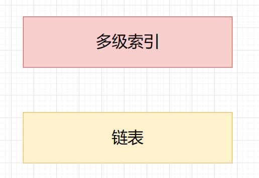

> 什么是MySQL中的B+Tree

MySQL中的B+Tree 原理
- B+Tree一般由多个页、多层级组成，在MySQL中每个页 16 KB。
- 主键索引的 B+ 树的叶子结点才是数据，非叶子结点（内节点）存放的是索引信息。
- 上下层的页通过单指针相连。
- 同一层级的相邻的数据页通过双指针相邻。
- B+Tree的结构


#### B+Tree的查询过程
B+Tree是由多个页组成的多层级结构，每个页16kb，对于主键索引来说，最末级的叶子节点放行数据，
***非叶子节点放的是索引信息(主键ID和页号),用于加速查询***。
我们想要查询数据5，会从顶层页的record开始，record里包含了主键Id和页号(页地址),
顶层页 向左最小id是1，最右最小id是7，
那id=5的数据如果存在，那必定在顶层页 左边箭头，于是顺着的record的页地址就到了6号数据页里，
再判断id=5>4，所以肯定在右边的数据页里，于是加载105号数据页。
在105号数据页里，虽然有多行数据，但也不是挨个遍历的，数据页内还有个页目录的信息，里边是有序的。
所以，数据页内可以通过***二分查找***的方式加速查询行数据，于是找到id=5的数据行，完成查询。
从上面可以看出，B+Tree利用了空间换时间的方式，将查询时间复杂度从O(n)优化为O(lg(n))。
```
B+tree利用了空间换时间的方式，将查询时间复杂度从O(n)优化为O(lg(n))
```

#### B+Tree的优点和缺点
- B+Tree是一种平衡树结构，它具有根节点、内部节点和叶子节点。
- 每个节点包含一定数量的键值对，键值对按键值大小有序排列。
- 内部节点只包含键，叶子节点同时包含键和指向数据的指针。

##### B+Tree的优点
- 范围查询效率高：B+Tree支持范围查询，因为在B+Tree中，相邻的叶子节点是有序的，所以在查找范围内的数据时非常高效。
- 事务支持：B+Tree是一种多版本并发控制（MVCC）友好的数据结构，适用于事务处理场景，能够保证事务的ACID属性。
- 数据持久性：B+Tree的叶子节点包含所有数据，这意味着数据非常容易持久化到磁盘上，支持高可靠性和数据恢复。

##### B+Tree的缺点
- 插入和删除开销较高：由于B+Tree的平衡性质，插入和删除操作可能需要进行节点的分裂和合并，这会导致性能开销较大。
- 高度不稳定：B+Tree的高度通常比较大，可能需要多次磁盘I/O才能访问叶子节点，对于某些特定查询可能效率不高。

### 跳表
#### 跳表的原理
跳表是一种采用了用空间换时间思想的数据结构。
跳表会随机地将一些节点提升到更高的层次，以创建一种逐层的数据结构，以提高操作的速度。

#### 跳表的结构
跳表的做法就是给链表做索引，而且是分层索引
```
跳表的做法就是给链表做索引，而且是分层索引
```

#### 单层跳表
单层跳表, 可以退化到一个链表
查找的时间复杂度是 O（N）


#### 两层跳表
两层跳表 = 原始链表 + 一层索引

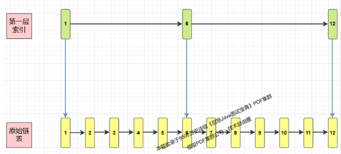

#### 两层跳表查询
如查询id=11的数据，我们先在上层遍历，依次判断1,6,12，
很快就可以判断出11在6到12之间，
第二步，然后往下一跳，进入原始链表，就可以在遍历6,7,8,9,10,11之后，确定id=11的位置。
通过第一级索引，直接将查询范围从原来的1到11，缩小到现在的1,6,7,8,9,10,11。

#### 三层跳表
三层跳表 = 原始链表 + 第一层索引 + 第二层索引


#### 三层跳表查询
如果还是查询id=11的数据，就只需要查询1,6,9,10,11就能找到，比两层的时候更快一些。
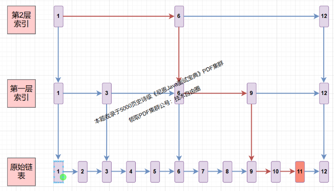

#### 跳表查找的时间复杂度
在一个单链表中查询某个数据的时间复杂度是 O(n)。也就是说，单层的跳表， 时间复杂度是 O(n)。
跳表 就是 为链表 增加多级索引， 完成空间换时间， 实现 时间复杂度是 O(logn)。

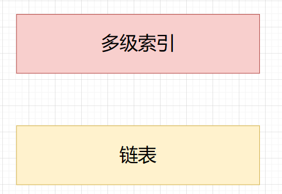

这个时间复杂度的分析方法比较难想到。
先问题分解一下，先来看这样一个问题，如果链表里有 n 个结点，会有多少级索引呢？
在跳表中，假设每两个结点，会抽出一个结点作为上一级索引的结点。
那么，索引有多少级，每一级有多少个node呢：
- 第一级索引的结点个数大约就是 n/2，
- 第二级索引的结点个数大约就是 n/4，
- 第三级索引的结点个数大约就是 n/8，

依次类推，也就是说，
- 第 k 级索引的结点个数是第 k-1 级索引的结点个数的 1/2，
- 那第 k级索引结点的个数就是 n/(2的k次方)。


假设索引有 h 级，最高级的索引有 2 个结点。
通过上面的公式，我们可以得到 n/(2^h)=2，从而求得 h=log2n-1。
如果包含原始链表这一层，整个跳表的高度就是 log2n。
我们在跳表中查询某个数据的时候，如果每一层都要遍历 m 个结点，
那在跳表中查询一个数据的时间复杂度就是 O(m*logn)。

那m到底是多少呢?
假设我们要查找的数据是 x，在第 k 级索引中，我们遍历到 y 结点之后，发现 x 大于 y，
小于后面的结点 z，所以我们通过 y 的 down 指针，从第 k 级索引下降到第 k-1 级索引。

在第 k-1 级索引中，y 和 z 之间只有 3 个结点（包含 y 和 z），所以，我们在 K-1 级索引中最多只需要遍历 3 个结点，
依次类推，每一级索引都最多只需要遍历 3 个结点。

过上面的分析，我们得到 m=3，
所以在跳表中查询任意数据的时间复杂度就是 O(logn)。
这个查找的时间复杂度跟二分查找是一样的，这也体现了空间换时间的效率之高。

#### 跳表(Skip List)的优点和缺点
跳表是一种多层级的数据结构，每一层都是一个有序链表，
最底层包含所有数据，而上层包含的数据是下层的子集，通过跳跃节点快速定位目标数据。

跳表(Skip List)的优点
  - 平均查找时间较低：跳表的查询时间复杂度为O(log n)，与平衡树结构相似，但实现起来较为简单。
  - 插入和删除操作相对较快：由于跳表不需要进行节点的频繁平衡调整，插入和删除操作的性能较好。

跳表(Skip List)的缺点
  - 难以实现事务和数据持久性：***跳表的更新操作可能涉及多个层级，实现事务和数据持久性要求更复杂***。
  - 空间开销较大：***跳表需要额外的指针来连接不同层级，占用的内存空间较多***。

### B+Tree 和 跳表(Skip List) 的在数据结构上的区别
都是 多级索引 +链表

#### IO 操作的单位 不同
B+Tree 是page （16K）
跳表(Skip List) 是 node 节点 ，一个node 几十个字节

#### 树的高度 不同
B+树是多叉树结构，每个结点都是一个16k的数据页，能存放较多索引信息。
同样的数据，树的高度比较小。 三层B+左右就可以存储2kw左右的数据。
如果，把三层B+树塞满，那大概需要2kw左右的数据。 
也就是说查询一次数据，如果这些数据页都在磁盘里，那么最多需要查询三次磁盘IO。

跳表是链表结构，一条数据一个结点，
如果最底层要存放2kw数据，且每次查询都要能达到二分查找的效果，2kw大概在2的24次方 左右，
所以，2kw数据的跳表大概高度在24层左右。 如果要一个节点要进行一次磁盘IO，大概要进行 24次。

### B+Tree 和 跳表(Skip List) 的新增数据区别
了解了二者的基本情况之后，接下来，对B+Tree 和 跳表(Skip List) 的数据插入进行对比。
B+Tree和跳表的叶子层，都包含了所有的数据，且叶子层都是顺序的，适合用于范围查询。
来看看，B+Tree和跳表新增和删除数据的差异

#### B+Tree 新增数据
场景1： 叶子结点和索引结点都没满
B+Tree 直接插入到叶子结点中就好了。

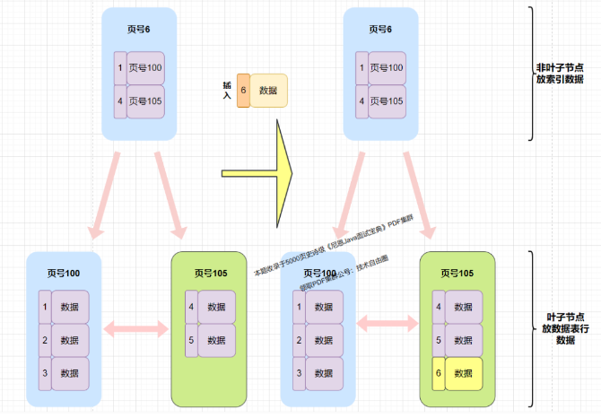

场景2：叶子结点满了，但索引结点没满
B+Tree 需要拆分叶子结点，同时索引结点要增加新的索引信息。
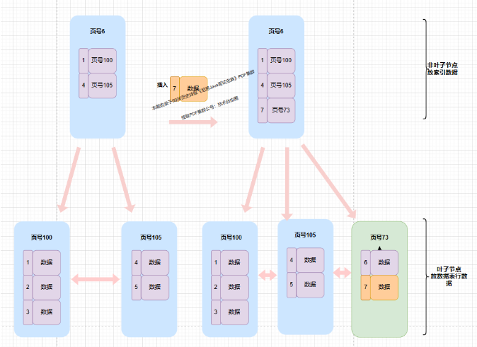

场景3：叶子结点满了，且索引结点也满了
叶子和索引结点都要拆分，同时往上还要再加一层索引。
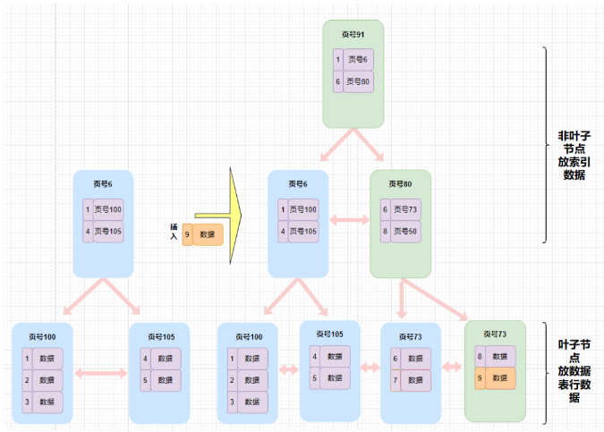

B+树是一种多叉平衡二叉树，要维护各个分支的高度差距，不能太大，
平衡意味着子树们的高度层级尽量一致（一般最多差一个层级）。

为啥要平衡呢？平衡意味着在搜索的时候，不管走哪个子树分支，搜索次数都差不了太多。
所以，为了维持B+树的平衡，在插入新的数据时，B+树会不断将进行 数据页的 分裂。

#### 跳表新增数据
跳表同样也是很多层，新增一个数据时，最底层的链表需要插入数据，<br>
然后，考虑是否需要在上面几层中加入数据做索引 ？ 这个就靠随机函数了。<br>
例如: 如果跳表中插入数据id=6，且随机函数返回第三层（有25%的概率），那就需要在跳表的最底层到第三层都插入数据。<br>
跳表跟B+树不一样，跳表是否新增层数，纯粹靠随机函数，不太关心平衡的问题。<br>

### B+Tree和跳表的在新增数据上的区别
#### B+Tree 需要维护 树的平衡
为了维持B+树的平衡，在插入新的数据时，B+树会不断将进行 数据页的 分裂。
维护平衡意味维护搜索的稳定性， 意味着着在搜索的时候，不管走哪个子树分支，搜索次数都差不了太多。

#### 跳表 需要不太关心平衡问题
跳表在新增数据 时，不太关心平衡的问题。跳表插入数据的时候，跟B+树不一样，
***是否新增层数，纯粹靠随机函数去决定***。

### 为什么B+Tree 采用Page作为 IO操作的单位？
前面讲到，B+Tree和跳表 IO 操作的单位 不同
- B+Tree 是page （16K） ,粗粒度IO
- 跳表(Skip List) 是 node 节点 ，一个node 几十个字节 , 细粒度IO

这是和 Mysql的存储介质有关系， Mysql的数据需要持久化存储， 并且需要事务机制保证持久性，所以，必须存储在磁盘上。

#### 内存和磁盘的访问速度对比
机械硬盘的读写速度，大致如下
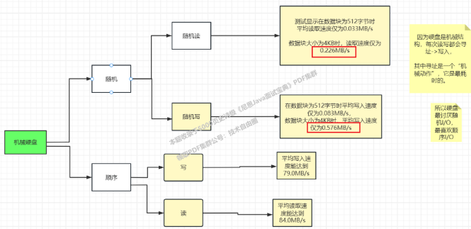

固态硬盘的读写速度，大致如下
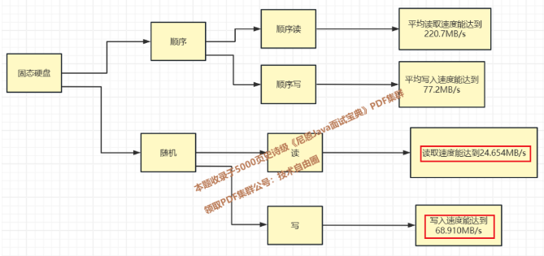

内存的读写速度，和磁盘读写速度的对比
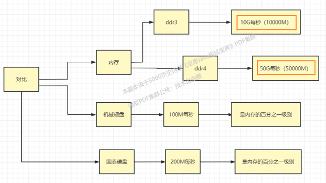

为什么磁盘慢，和磁盘的结构有关。

#### 机械硬盘的扇区（sector）
机械硬盘的性能为啥那么慢？ 看看结构就知道：

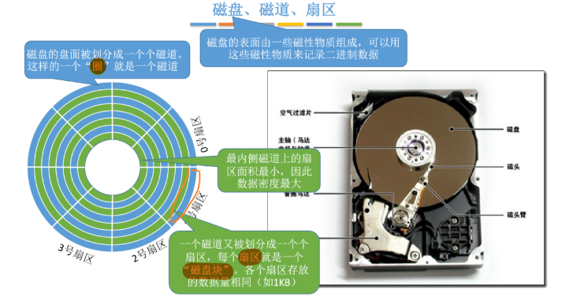

机械磁盘上的每个磁道被等分为若干个弧段，这些弧段称之为扇区。
如何在磁盘中读/写数据？ 需要 物理动作，去移动 “磁头” 到目标 扇区

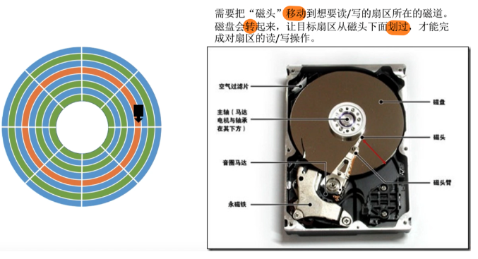

机械磁盘的读写以扇区为基本单位。
硬盘的物理读写以扇区为基本单位。通常情况下每个扇区的大小是 512 字节。linux 下可以使用 fdisk -l 了解扇区大小：

```
$ sudo /sbin/fdisk -l
Disk /dev/sda: 20 GiB, 21474836480 bytes, 41943040 sectors
Units: sectors of 1 * 512 = 512 bytes
Sector size (logical/physical): 512 bytes / 512 bytes
I/O size (minimum/optimal): 512 bytes / 512 bytes
Disklabel type: dos
Disk identifier: 0x7d9f5643
```

其中 Sector size，就是扇区大小，本例中为 512 bytes。
注意，扇区是磁盘物理层面的概念，不是操作系统的概率。
操作系统是不直接与扇区交互的，而是与多个连续扇区组成的磁盘块交互。由于扇区是物理层面的概念，所以无法在系统中进行大小的更改。

#### 操作系统 IO 块 Block
什么是IO 块 Block？ 扇区是磁盘最小的物理存储单元，操作系统将相邻的扇区组合在一起，形成一个块，对块进行管理。
每个Block 磁盘块可以包括 2、4、8、16、32 或 64 个扇区。
所以，Block 磁盘块是操作系统所使用的逻辑概念，而非磁盘的物理概念。
Block 磁盘块的大小可以通过命令 stat /boot 来查看：

```
$ sudo stat /boot
  File: /boot
  Size: 4096        Blocks: 8          IO Block: 4096   directory
Device: 801h/2049d  Inode: 655361      Links: 3
Access: (0755/drwxr-xr-x)  Uid: (    0/    root)   Gid: (    0/    root)
Access: 2019-07-06 20:19:45.487160301 +0800
Modify: 2019-07-06 20:19:44.835160301 +0800
Change: 2019-07-06 20:19:44.835160301 +0800
 Birth: -
```

其中 IO Block 就是磁盘块大小，本例中是 4096 Bytes，一般也是 4K。

#### Mysql的InnoDB Page 数据页
磁盘IO是低性能的，如何提升性能， 最好是 减少IO， 基于时间局部性和空间局部性原理， 一次读取足够多的数据到内存。
Mysql的 InnoDB将数据划分为若干页，以Page 页作为磁盘与内存交互的基本单位，一般页的大小为16KB。
InnoDB，为了通过减少内存与磁盘的交互次数，把一次读取和写入的 数据量， 从4K 扩大到了16K，也就是一次操作 4个 OS Block，从而提升性能。
这样的话，一次性至少读取1Page 页数据到内存中或者将1 Page页数据写入磁盘。而不是一个操作系统的block。

Page 本质上就是一种典型的缓存设计思想，一般缓存的设计基本都是从时间局部性和空间局部性进行考量的：

- 时间局部性：如果一条数据正在在被使用，那么在接下来一段时间内大概率还会再被使用。可以认为热点数据缓存都属于这种思路的实现。
- 空间局部性：如果一条数据正在在被使用，那么存储在它附近的数据大概率也会很快被使用。InnoDB的数据页和操作系统的页缓存则是这种思路的体现。

InnoDB Page 数据页的结构
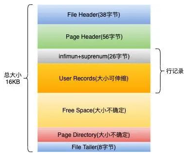

每当我们插⼊⼀条记录，都会从Free Space部分，也就是尚未使⽤的存储空间中申请⼀个记录⼤⼩的空间划分到User Records部分，
当Free Space部分的空间全部被User Records部分替代掉之后，也就意味着这个页使⽤完了，
如果还有新的记录插⼊的话，就需要去申请新的页了。

#### 一次IO一个page的优势
MySQL的InnoDB存储引擎使用B+树而不是跳表，这是因为B+树一次IO一个page，大大节省了磁盘IO的操作。
如果使用跳表，那么一个node节点一次io， 存储的性能 估计要下降1000倍以上。

### 总结：Mysql的索引为什么使用B+树而不使用跳表
#### B+树更适合磁盘IO
B+Tree一个节点是一个page，是一种多叉树结构，每个结点都是一个16k的数据页，能存放较多索引信息。一次IO一个page，大大节省了磁盘IO的操作。
B+Tree一个page 能存放较多索引信息 ，所以树的层数比较低， 三层左右就可以存储2kw左右的数据也就是说查询一次数据，如果这些数据页都在磁盘里，那么最多需要查询三次磁盘IO。

#### 原生跳表不适合磁盘IO
跳表是链表结构，一条数据一个结点，那么一个node节点一次磁盘io， 一个page 页规模的IO存储的性能 估计要下降1000倍以上。
原生跳表 一个node存放一个 索引信息 ，所以树的层数比较高
如果最底层要存放2kw数据，且每次查询都要能达到二分查找的效果，2kw大概在2的24次方 左右，
所以，2kw数据的跳表大概高度在24层左右。 如果要进行查找，大概要进行 24次磁盘IO。

这里讲的是原生跳表， 如果经过各种改进，那个不在此文讨论范围。

所以，虽然在理论上，跳表的时间复杂度和B+树相同 ，但是：
- B+树更适合 磁盘IO， 更合适MYSQL。
- 从反面来说， 跳表更适合内存IO， 更适合redis。

那么，为啥 redis 用跳表而不用B+树？
请参考 技术自由圈的下一篇文章 《字节面试： 请手写一个跳表》

