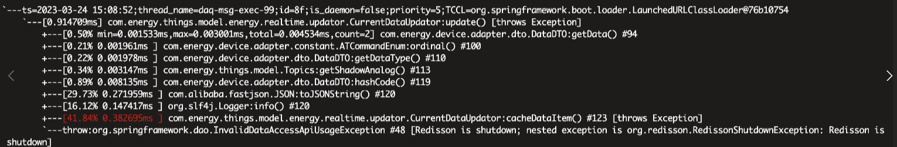
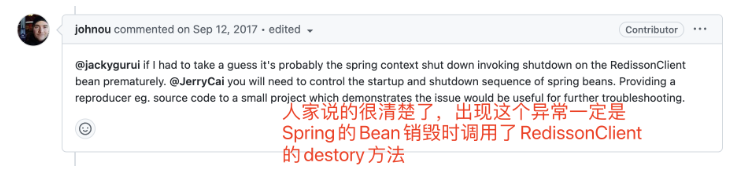
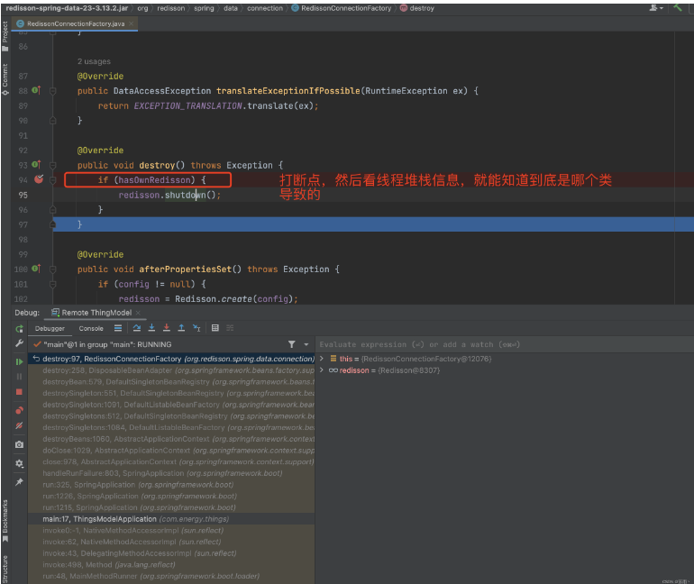
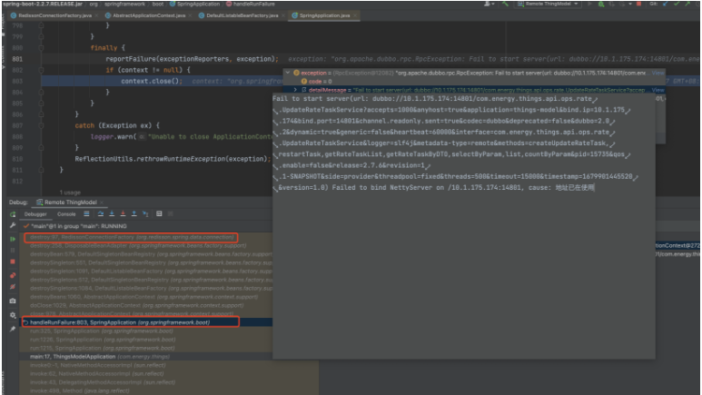

## 多线程测试redisson实现分布式锁出现org.redisson.RedissonShutdownException: Redisson is shutdown
多线程测试redisson实现分布式锁出现org.redisson.RedissonShutdownException: Redisson is shutdown。
原因：多线程还没跑完，主线程就跑完了。主线程走完，关闭了资源。redisson关闭，多线程操作redisson报错：Redisson is shutdown。
解决办法：主线程等待多线程跑完。Thread.sleep(30000);。

```
多线程测试redisson实现分布式锁出现org.redisson.RedissonShutdownException: Redisson is shutdown。
原因：多线程还没跑完，主线程就跑完了。主线程走完，关闭了资源。
Redisson关闭，多线程操作redisson报错：Redisson is shutdown。
解决方法：主线程等待多线程跑完。
```

### 1.Junit测试类：RedisDistributedLockTest
```java
package com.user.test.spring_redis;

import java.util.HashSet;
import java.util.Iterator;
import java.util.Set;

import org.junit.Test;
import org.junit.runner.RunWith;
import org.springframework.beans.factory.annotation.Autowired;
import org.springframework.test.context.ContextConfiguration;
import org.springframework.test.context.junit4.AbstractJUnit4SpringContextTests;
import org.springframework.test.context.junit4.SpringJUnit4ClassRunner;

import com.user.service.redis.SecondKillService;
import com.user.service.redis.SecondKillServiceImp;
import com.user.service.redis.SecondKillThread;

@RunWith(SpringJUnit4ClassRunner.class) 
@ContextConfiguration({"classpath:applicationContext.xml"})
public class RedisDistributedLockTest extends AbstractJUnit4SpringContextTests{
    @Autowired
    private SecondKillService secondKillService;
    @Autowired
    private SecondKillThread secondKillThread;
    
    /**
     * 模拟秒杀
     */
    @Test
    public void secKill(){
        System.out.println("秒杀活动开始---");
        try {
            // 开启2000个线程，执行秒杀任务
            for(int i=0;i<2000;i++){
                new Thread(secondKillThread,"Thread" + i).start();
            }
        } catch (Exception e) {
            e.printStackTrace();
        }
        try {
            // 主线程需要等待线程执行完，否则，其他线程还没执行完，主线程就走完了，redisson会报错：Redisson is shutdown
            Thread.sleep(30000);
        } catch (InterruptedException e1) {
            e1.printStackTrace();
        }
        System.out.println(SecondKillServiceImp.list);
        Set set = new HashSet();
        for(int i : SecondKillServiceImp.list){
            int count = 0;
            for(int j : SecondKillServiceImp.list){
                if(i == j){
                    count = count + 1;
                }
            }
            if(count > 1){
                set.add(i);
            }
        }
        if(set != null && set.size() > 0){
//            Iterator it = set.iterator();
//            while(it.hasNext()){
//                System.out.println(it.next());
//            }
            System.out.println(set);
        }else{
            System.out.println("没有重复的记录！");
        }
    }
}
```

### 2.线程类：SecondKillThread
```java
package com.user.service.redis;

import org.springframework.beans.factory.annotation.Autowired;
import org.springframework.stereotype.Component;

@Component
public class SecondKillThread implements Runnable{
    @Autowired
    private SecondKillService secondKillService;
    
    @Override
    public void run() {
        secondKillService.seckill();
    }
}
```

### 3.秒杀业务接口：SecondKillService
```java
package com.user.service.redis;

public interface SecondKillService {
    public void seckill();
}
```

### 4.秒杀业务实现类：SecondKillServiceImp
```java
package com.user.service.redis;

import java.util.ArrayList;
import java.util.List;
import java.util.concurrent.TimeUnit;

import org.apache.commons.lang3.StringUtils;
import org.redisson.api.RLock;
import org.redisson.api.RedissonClient;
import org.springframework.beans.factory.annotation.Autowired;
import org.springframework.stereotype.Service;

import com.user.base.utils.redis.DistributedLockUtils;
import com.user.base.utils.redis.DistributedLockUtils2;
import com.user.base.utils.redis.redisson.RedissonConfig;

@Service
public class SecondKillServiceImp implements SecondKillService{
    @Autowired
    private RedissonClient redissonClient;
    private static int count = 2000;
    public static List<Integer> list = new ArrayList<>();
    
    @Override
    public void seckill() {
//        count = count - 1;
//        list.add(count);
//        System.out.println(Thread.currentThread().getName() + "秒杀操作,singleRedis," + "剩余数量：" + count);
        // 可以防止重复提交的数据。
        String uuid = DistributedLockUtils2.lockWithTimeout("test", 10);
        // 上锁，如果锁一直保持，其他线程无法操作，只有过期或者主动释放锁。
        if(StringUtils.isNotEmpty(uuid)){
            try {
                count = count - 1;
                list.add(count);
                System.out.println(Thread.currentThread().getName() + "秒杀操作,singleRedis," + "剩余数量：" + count);
            } catch (Exception e) {
                //e.printStackTrace();
            } finally {
                // 如果业务代码出现异常了，不在finally中执行释放锁的操作，也会导致锁无法释放。
                DistributedLockUtils2.releaseLock("test",uuid);
            }
        }else{
            System.out.println("获取锁超时！");
        }
    }
    
//    @Override
//    public void seckill() {
//        RLock redissonLock = redissonClient.getLock("test");
//        // 相当于distributedLockUtil.stringRedisTemplate.opsForValue().setIfAbsent(lockKey, identifier, timeout, TimeUnit.SECONDS)
//        redissonLock.lock();
//        try {
//            count = count - 1;
//            list.add(count);
//            System.out.println(Thread.currentThread().getName() + "秒杀操作,clusterRedis," + "剩余数量：" + count);
//        } catch (Exception e) {
//            e.printStackTrace();
//        } finally {
//            // 相当于distributedLockUtil.stringRedisTemplate.delete(lockKey);
//            /*
//             * 由于开启了watchdog看门狗线程监听，所以线程执行完之前不会出现：A线程锁过期时间过期，此时B线程设置锁，然后又切换到A线程删锁，误删B线程的锁。
//             * 因为A线程执行完之前，A线程的锁会一直续命，不会过期。所以A线程在delete锁之前，会一直持有锁。
//             * 如果服务器非宕机情况，那么锁会一直续命，A线程一直持有锁。最终都会执行到finally释放锁。
//             * 如果中间出现宕机，那么锁不会续命，到了过期时间就会过期。锁自动释放。
//             * 因此不会出现锁无法释放，死锁的情况。
//             * 
//             * 自己写续命比较麻烦，而且容易出错。redisson是个很好的框架和解决方案。
//             */
//            redissonLock.unlock();
//        }
//    }
}
```

## 解决RedissonShutdownException: Redisson is shutdown的具体操作步骤
RedissonShutdownException: Redisson is shutdown

在使用 Redisson 作为 Java 应用程序的分布式锁和分布式对象的库时，
有时候会遇到 RedissonShutdownException: Redisson is shutdown 异常。
本文将介绍这个异常的原因、可能的解决方法以及如何避免它的发生。

### 异常原因
RedissonShutdownException 表示 Redisson 实例已被关闭，但仍然在尝试使用 Redisson 时抛出该异常。这通常发生在以下情况下：
- 1.程序在使用 Redisson 之后，未正确关闭 Redisson 实例。
- 2.Redisson 实例的关闭发生在程序的其他部分，但在此之后仍然尝试使用 Redisson。

这两种情况都会导致 Redisson 实例被关闭，但程序仍然尝试与其进行交互，从而引发 RedissonShutdownException。

### 解决方法
要解决 RedissonShutdownException 异常，可以采取以下方法之一：
- 1.确保在程序退出之前，正确地关闭 Redisson 实例。可以使用 RRedissonClient 提供的 shutdown() 方法来关闭实例。示例如下：
```
RRedissonClient redissonClient = Redisson.create(config);
// 使用 Redisson
redissonClient.shutdown();
```

- 2.如果无法在程序的所有部分正确关闭 Redisson 实例，可以使用 isShutdown() 方法来检查实例的状态，以确保不会尝试在关闭后继续使用 Redisson。示例如下：
```
RRedissonClient redissonClient = Redisson.create(config);
// 使用 Redisson
if (!redissonClient.isShutdown()) {
    // 继续使用 Redisson
} else {
    // Redisson 已关闭，不要再使用它
}
```

- 3.在程序中使用单例模式管理 Redisson 实例，并确保在程序退出时正确关闭实例。这样可以避免在不同部分中关闭 Redisson 实例的问题。示例如下：
```
public class RedissonManager {
    private static RRedissonClient redissonClient;

    private RedissonManager() {
        // 私有构造函数，确保实例只能通过 getInstance() 方法获取
    }

    public static RRedissonClient getInstance() {
        if (redissonClient == null) {
            // 创建 Redisson 实例
            redissonClient = Redisson.create(config);
        }
        return redissonClient;
    }

    public static void shutdown() {
        if (redissonClient != null) {
            redissonClient.shutdown();
        }
    }
}

// 在程序的其他部分使用 RedissonManager 获取 Redisson 实例
RRedissonClient redissonClient = RedissonManager.getInstance();
// 使用 Redisson
RedissonManager.shutdown();
```

避免 RedissonShutdownException
为了避免 RedissonShutdownException 异常的发生，可以采取以下措施：
- 1.在使用 Redisson 实例之后，始终确保正确关闭实例。这可以通过在最后执行 shutdown() 方法来实现。
- 2.避免在程序的其他部分关闭 Redisson 实例后继续使用它。
- 3.使用单例模式管理 Redisson 实例，并在程序退出时关闭实例。

总结起来，RedissonShutdownException 表示 Redisson 实例已被关闭，但仍然在尝试使用它。为了解决这个异常，需要确保正确关闭 Redisson 实例，并在需要的时候避免继续使用已关闭的实例。通过合理管理 Redisson 实例，可以有效地避免这个异常的发生。

希望本文能够帮助您理解 RedissonShutdownException 异常的原因、解决方法和避免措施。
如果您在使用 Redisson 时遇到这个异常，希望能通过本文提供的指导解决问题。

## 项目中使用缓存报Redisson is shutdown排查

### 前言
上周运维将项目的测试环境从k8s中迁出来后，测试发现储能网关一直在上报数据，但是并没有映射到对应的设备上，
排查时发现MQ在正常消费，并没有消息挤压，而且日志也没有报错信息，当时就很纳闷，觉得不可思议，通过过滤日志，
发现消费了网关的上报的消息，并没有将消息发到设备对应的Topic中，
于是启动本地代码连测试环境，发现我本地并不报错，又只能去测试服务区排查，后面通过arthas拦截处理消息的方法，
才看到异常信息，发现是org.redisson.RedissonShutdownException: Redisson is shutdown,有了异常信息我们就好排查啦。



### 问题排查
第一步复制异常信息，往百度一贴，看下有没有现成的答案，找了很久只找到一篇使用Redisson实现分布式锁来做秒杀的帖子，链接在这
https://blog.51cto.com/u_15057843/4213532

帖子说是因为主线程关闭了导致Redisson也关闭，子线程还在跑，对我们的帮助不大，我们不是这种情况。
继续百度，关于这方面的帖子真的是少的可怜，没办法打开redisson源码的issue，一个个看呗，还真找到了该异常的帖子。

链接如下：https://github.com/redisson/redisson/issues/1030
浏览一下，我把最关键的回复截图出来，人家说了Redisson不会主动调用销毁的方法，肯定是Spring容器调用的，总算是知道原因了，离答案就不远啦。



### 排查代码
直接在销毁的方法上打了个断点，通过JVM的远程调试功能连上对应的服务，不一会代码就走断点这里停了



然后观察堆栈信息，发现SpringBoot在启动过程中，由于Dubbo服务的端口被占用，启动就报错了，
后面换了dubbo的端口，重启后就没有这个问题啦。
至于为啥没看到这个端口占用异常日志，是因为我们测试环境在做压测，网关一分钟上报了120w的数据，这日志咔咔咔咔的刷，根本看不到错误日志。



### 事后
服务都没启动，程序居然还在咔咔咔的消费MQ的消息，至于为啥服务没启动，还一直在消费消息这个问题，肯定是项目中使用了非守护线程，没有关闭。
后面发现项目中MQ是自己手写代码启动的，然后容器销毁又没有销毁线程，前人挖坑，后人口吐芬芳。


