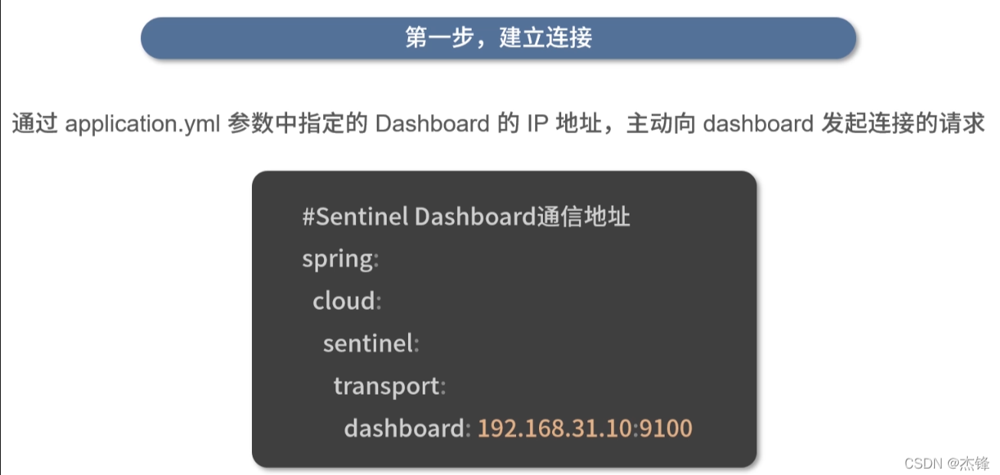
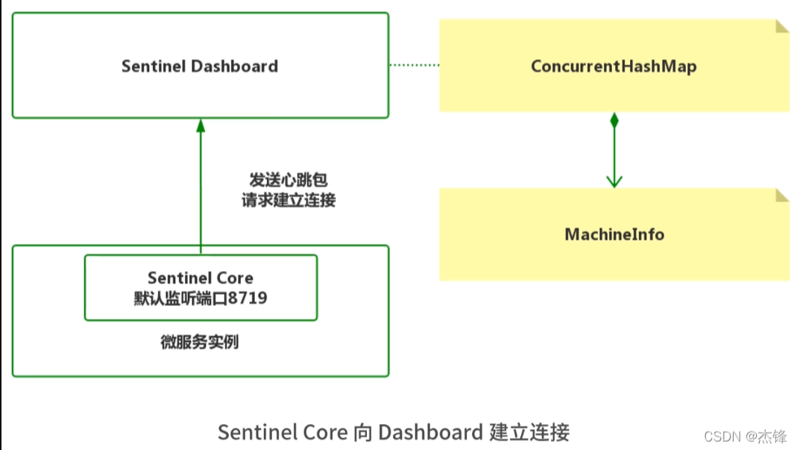
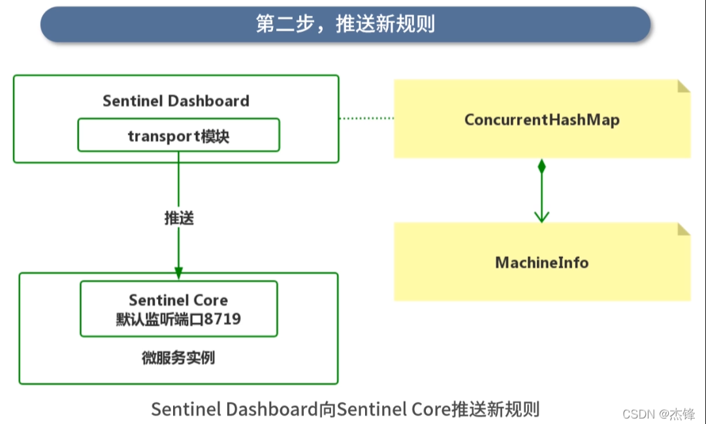
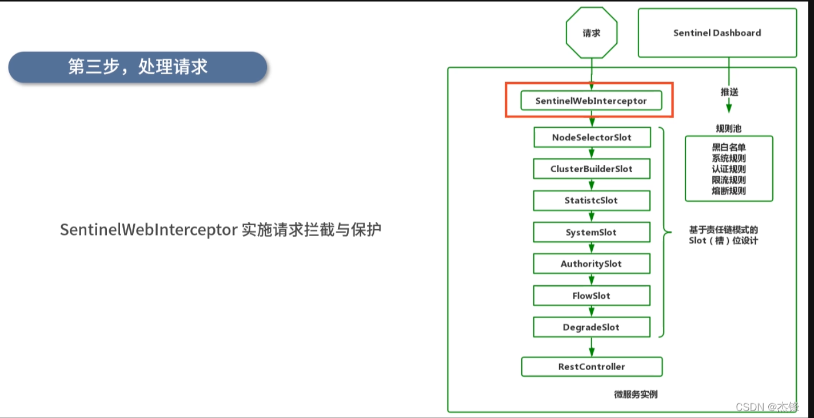
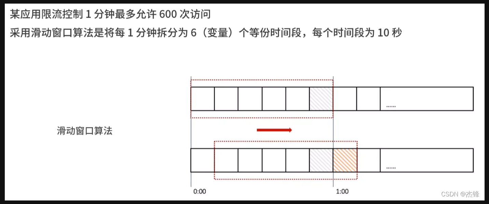
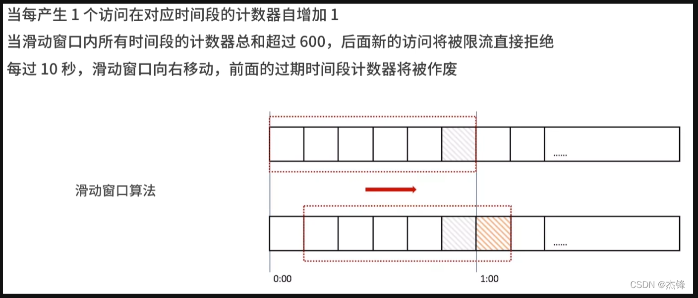
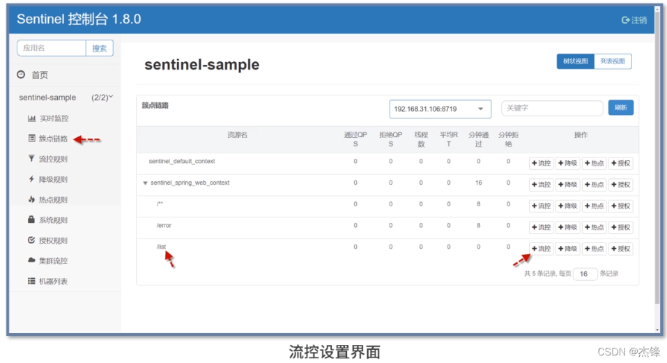
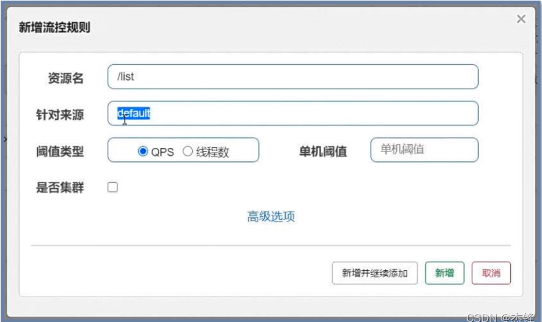
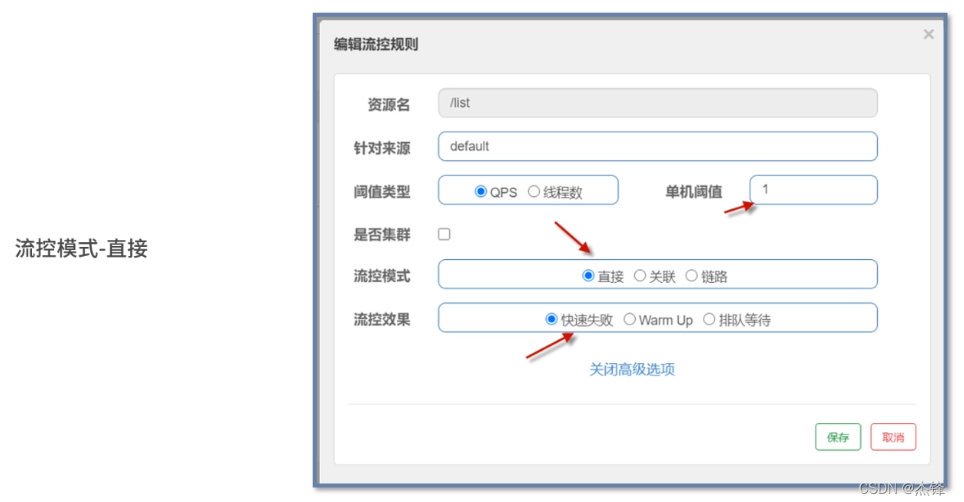
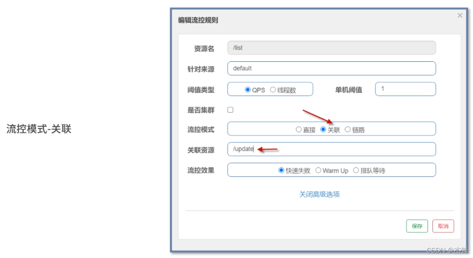

## 限流与熔断：Sentinel在项目中的最佳实践
- 1、Sentinel通讯与降级背后的技术原理
- 2、Sentinel限流降级的规则配置
- 3、Sentinel熔断降级的规则配置

***Sentinel Dashboard***是Sentinel的控制端，是新的限流与熔断规则的创建者
当内置在微服务的***Sentinel Core***（客户端）接收到新的限流、熔断规则后，
微服务便会自动启用相应的保护措施

执行流程:
- 1、Sentinel Core 与 Sentinel Dashboard建立连接
- 2、Sentinel Dashboard 向 Sentinel Core 下发新的保护规则
- 3、Sentinel Core 应用新的保护规则，实施限流、熔断等动作

处理请求： 
SentinelWebInterceptor实施请求拦截与保护 

Sentinel Dashboard --推送-->规则池
- 黑白名单
- 系统规则
- 认证规则
- 限流规则
- 熔断规则

请求[基于责任链模式的Slot(槽)位设计]： 
- SentinelWebInterceptor
- NodeSelectorSlot
- ClusterBuilderSlot
- StatisticSlot
- SystemSlot
- AuthoritySlot
- FlowSlot
- DegradeSlot
- RestController
微服务实例

- 前3个Slot为前置处理，用于***收集***、***统计***、***分析必要的数据***
- 后4个Slot为规则检验
- NodeSelectorSlot***负责收集资源的路径，并将这些资源的调用路径，以树状结构存储起来，用于根据调用路径来限流降级***
- ClusterBuildSlot 用于存储资源的统计信息以及调用者信息
- StaticSlot用于***记录、统计不同维度的runtime信息***
- ***SystemSlot则通过系统的状态，例如CPU、内存的情况，来控制总的入口流量***
- AuthoritySlot则根据黑白名单，来做黑白名单控制
- FlowSlot则用于根据预设的限流规则，以及前面Slot统计的状态，来进行限流
- DegradeSlot则通过统计信息，以及预设的规则，来做熔断降级

### Sentinel限流降级的规则配置
实现限流降级的核心是如何统计单位时间某个接口的访问量
常见的算法：1、计数器算法；2、漏桶算法；3、令牌桶算法；4、滑动窗口算法； Sentinel采用滑动窗口算法来统计访问量。
- 1、计数器算法
- 2、漏桶算法
- 3、令牌桶算法
- 4、滑动窗口算法

滑动窗口算法的理念是 将整段时间均分后独立计数再汇总统计

> 滑动窗口算法的理念是：将整段时间均分后独立计数再汇总统计

限流控制的界面操作:

注：***如果找不到URI，需要先访问一下，就会出现，原因是懒加载模式***

- 资源名：要流控的URI，在Sentinel中URI被称为“资源” 
- 针对来源：默认为default代表所有来源，可以针对某个微服务或者调用者单独设置
- 阈值类型：是按***每秒访问量（QPS）***还有***并发数（线程数）***进行流控
- 单机阈值：具体限流的数值是多少

