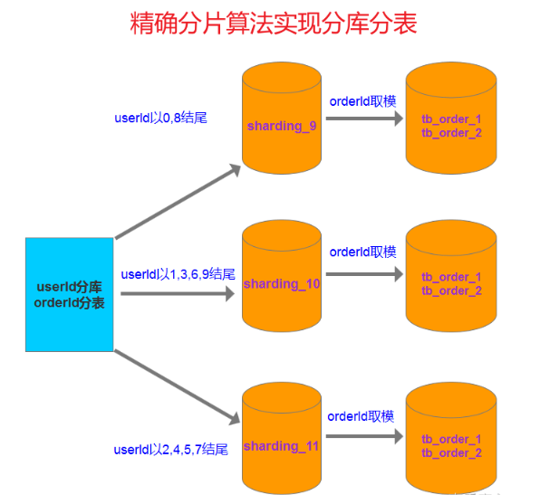

## Sharding-JDBC之PreciseShardingAlgorithm（精确分片算法）

### 目录
- 一、简介
- 二、maven依赖
- 三、数据库
  - 3.1、创建数据库
  - 3.2、创建表
- 四、配置（二选一）
  - 4.1、properties配置
  - 4.2、yml配置
- 五、精确分片算法
  - 5.1、精确分库算法
  - 5.2、精确分表算法
- 六、实现
  - 6.1、实体层
  - 6.2、持久层
  - 6.3、服务层
  - 6.4、测试类
    - 6.4.1、保存订单数据
    - 6.4.2、根据订单号查询订单
    - 6.4.2、根据订单号和用户查询订单

### 一、简介
在我之前的文章里，数据的分库分表都是基于***行表达式***的方式来实现的，看起来也蛮好用，也挺简单的，
但是有时会有些复杂的规则，可能使用行表达式策略会很复杂或者实现不了，我们就讲另外一种分片策略，
精确分片算法，***通常用来处理=或者in条件的情况比较多***。

本文示例大概架构如下图：

