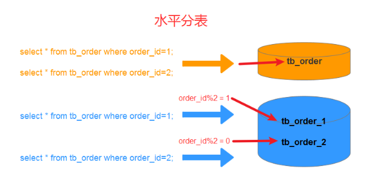

## Sharding-JDBC之水平分表
[链接](https://blog.csdn.net/Alian_1223/article/details/129707893)

### 目录
- 一、简介
 - 1.1、垂直分表
 - 1.2、水平分表
- 二、maven依赖
- 三、数据库
 - 3.1、创建数据库
 - 3.2、创建表
- 四、配置（二选一）
 - 4.1、properties配置
 - 4.2、yml配置
- 五、实现
 - 5.1、实体
 - 5.2、持久层
 - 5.3、服务层
 - 5.4、测试类
  - 5.4.1、保存数据
  - 5.4.2、查询数据

### 一、简介
#### 1.1、垂直分表
垂直分片又称为纵向拆分。
最简单的就是单库把一个表拆成多个关联的表，***通常是一个表中存储的信息类型比较多，比如一二十个字段***，
***但是经常用到的可能又比较少，频繁操作就影响性能，所以就把大表拆分成多个小表***，
比如 tb_course 拆分成 tb_course 和 tb_course_detail 。
这个主要是数据库设计的相关知识，也和我们这里说的 Sharding-JDBC 关系不是那么大，
我就不多进行讲解，所以后面也不会讲垂直分表这种了，主要是我们要讲的水平分表。

#### 1.2、水平分表
水平分片又称为横向拆分。 
最简单的就是单库水平分表，也就是一个库中有两个一模一样的表，
只是名称不一样比如： tb_order_1 和 tb_order_2 ，如下图所示。



### 二、maven依赖
pom.xml
```xml
<?xml version="1.0" encoding="UTF-8"?>
<project xmlns="http://maven.apache.org/POM/4.0.0" xmlns:xsi="http://www.w3.org/2001/XMLSchema-instance"
         xsi:schemaLocation="http://maven.apache.org/POM/4.0.0 https://maven.apache.org/xsd/maven-4.0.0.xsd">
    <modelVersion>4.0.0</modelVersion>
    <parent>
        <groupId>org.springframework.boot</groupId>
        <artifactId>spring-boot-starter-parent</artifactId>
        <version>2.6.0</version>
        <relativePath/> <!-- lookup parent from repository -->
    </parent>
    <groupId>com.alian</groupId>
    <artifactId>sharding-jdbc</artifactId>
    <version>0.0.1-SNAPSHOT</version>
    <name>sharding-jdbc</name>
    <description>sharding-jdbc</description>

    <properties>
        <java.version>1.8</java.version>
    </properties>

    <dependencies>
        <dependency>
            <groupId>org.springframework.boot</groupId>
            <artifactId>spring-boot-starter-web</artifactId>
        </dependency>
        <dependency>
            <groupId>org.springframework.boot</groupId>
            <artifactId>spring-boot-starter-data-jpa</artifactId>
        </dependency>
        <dependency>
            <groupId>org.apache.shardingsphere</groupId>
            <artifactId>sharding-jdbc-spring-boot-starter</artifactId>
            <version>4.1.1</version>
        </dependency>
        <dependency>
            <groupId>com.alibaba</groupId>
            <artifactId>druid</artifactId>
            <version>1.2.15</version>
        </dependency>
        <dependency>
            <groupId>mysql</groupId>
            <artifactId>mysql-connector-java</artifactId>
            <version>8.0.26</version>
            <scope>runtime</scope>
        </dependency>
        <dependency>
            <groupId>org.springframework.boot</groupId>
            <artifactId>spring-boot-starter-test</artifactId>
            <scope>test</scope>
        </dependency>
        <dependency>
            <groupId>org.projectlombok</groupId>
            <artifactId>lombok</artifactId>
            <version>1.18.20</version>
        </dependency>
        <dependency>
            <groupId>junit</groupId>
            <artifactId>junit</artifactId>
            <version>4.12</version>
            <scope>test</scope>
        </dependency>
    </dependencies>

    <build>
        <plugins>
            <plugin>
                <groupId>org.springframework.boot</groupId>
                <artifactId>spring-boot-maven-plugin</artifactId>
            </plugin>
        </plugins>
    </build>
</project>
```

有些小伙伴的 druid 可能用的是 ***druid-spring-boot-starter***

```xml
<dependency>
    <groupId>com.alibaba</groupId>
    <artifactId>druid-spring-boot-starter</artifactId>
    <version>1.2.6</version>
</dependency>
```

然后出现可能使用不了的各种问题，
这个时候你只需要在主类上添加 
@SpringBootApplication(exclude = {DruidDataSourceAutoConfigure.class}) 即可

```
@SpringBootApplication(exclude = {DruidDataSourceAutoConfigure.class})
```
```java
package com.alian.shardingjdbc;

import com.alibaba.druid.spring.boot.autoconfigure.DruidDataSourceAutoConfigure;
import org.springframework.boot.SpringApplication;
import org.springframework.boot.autoconfigure.SpringBootApplication;

@SpringBootApplication(exclude = {DruidDataSourceAutoConfigure.class})
@SpringBootApplication
public class ShardingJdbcApplication {

    public static void main(String[] args) {
        SpringApplication.run(ShardingJdbcApplication.class, args);
    }

}
```

### 三、数据库
#### 3.1、创建数据库
sharding_0
```sql
CREATE DATABASE `sharding_0` DEFAULT CHARACTER SET utf8mb4 COLLATE utf8mb4_general_ci;
```

#### 3.2、创建表
tb_order_1
```sql
CREATE TABLE `tb_order_1` (
  `order_id` bigint(20) NOT NULL COMMENT '主键',
  `user_id` int unsigned NOT NULL DEFAULT '0' COMMENT '用户id',
  `price` int unsigned NOT NULL DEFAULT '0' COMMENT '价格（单位：分）',
  `order_status` tinyint unsigned NOT NULL DEFAULT '1' COMMENT '订单状态(1:待付款,2:已付款,3:已取消)',
  `order_time` datetime NOT NULL DEFAULT CURRENT_TIMESTAMP COMMENT '创建时间',
  `title` varchar(100)  NOT NULL DEFAULT '' COMMENT '订单标题',
  PRIMARY KEY (`order_id`),
  KEY `idx_user_id` (`user_id`),
  KEY `idx_order_time` (`order_time`)
) ENGINE=InnoDB DEFAULT CHARSET=utf8mb4 COMMENT='订单表';
```

tb_order_2
```sql
CREATE TABLE `tb_order_2` (
  `order_id` bigint(20) NOT NULL COMMENT '主键',
  `user_id` int unsigned NOT NULL DEFAULT '0' COMMENT '用户id',
  `price` int unsigned NOT NULL DEFAULT '0' COMMENT '价格（单位：分）',
  `order_status` tinyint unsigned NOT NULL DEFAULT '1' COMMENT '订单状态(1:待付款,2:已付款,3:已取消)',
  `order_time` datetime NOT NULL DEFAULT CURRENT_TIMESTAMP COMMENT '创建时间',
  `title` varchar(100)  NOT NULL DEFAULT '' COMMENT '订单标题',
  PRIMARY KEY (`order_id`),
  KEY `idx_user_id` (`user_id`),
  KEY `idx_order_time` (`order_time`)
) ENGINE=InnoDB DEFAULT CHARSET=utf8mb4 COMMENT='订单表';
```

### 四、配置（二选一）
#### 4.1、properties配置
application.properties
```properties
server.port=8899
server.servlet.context-path=/sharding-jdbc

# 允许一个实体映射多个表
# spring.hello_go.allow-bean-definition-overriding=true
# 数据源名称，多数据源以逗号分隔
spring.shardingsphere.datasource.names=ds1
# 数据库连接池类名称
spring.shardingsphere.datasource.ds1.type=com.alibaba.druid.pool.DruidDataSource
# 数据库驱动类名
spring.shardingsphere.datasource.ds1.driver-class-name=com.mysql.cj.jdbc.Driver
# 数据库url连接
spring.shardingsphere.datasource.ds1.url=jdbc:mysql://192.168.19.129:3306/sharding_0?serverTimezone=GMT%2B8&characterEncoding=utf8&useUnicode=true&useSSL=false&zeroDateTimeBehavior=CONVERT_TO_NULL&autoReconnect=true&allowMultiQueries=true&failOverReadOnly=false&connectTimeout=6000&maxReconnects=5
# 数据库用户名
spring.shardingsphere.datasource.ds1.username=alian
# 数据库密码
spring.shardingsphere.datasource.ds1.password=123456

# 指定tb_order表的数据分布情况，配置数据节点，使用Groovy的表达式,逻辑表tb_order对应的节点是：ds1.tb_order_1, ds1.tb_order_2
spring.shardingsphere.sharding.tables.tb_order.actual-data-nodes=ds1.tb_order_$->{1..2}

# 采用行表达式分片策略：***InlineShardingStrategy***
# 指定tb_order表的分片策略中的分片键
spring.shardingsphere.sharding.tables.tb_order.table-strategy.inline.sharding-column=order_id
# 指定tb_order表的分片策略中的分片算法表达式,使用Groovy的表达式
spring.shardingsphere.sharding.tables.tb_order.table-strategy.inline.algorithm-expression=tb_order_$->{ order_id % 2 == 0 ? 2 : 1 }

# 指定tb_order表的主键为order_id
spring.shardingsphere.sharding.tables.tb_order.key-generator.column=order_id
# 指定tb_order表的主键生成策略为SNOWFLAKE
spring.shardingsphere.sharding.tables.tb_order.key-generator.type=SNOWFLAKE
# 指定雪花算法的worker.id
spring.shardingsphere.sharding.tables.tb_order.key-generator.props.worker.id=100
# 指定雪花算法的max.tolerate.time.difference.milliseconds
spring.shardingsphere.sharding.tables.tb_order.key-generator.props.max.tolerate.time.difference.milliseconds=20
# 打开sql输出日志
spring.shardingsphere.props.sql.show=true
```

#### 4.2、yml配置
```yaml
server:
  port: 8899
  servlet:
    context-path: /sharding-jdbc

spring:
  main:
    # 允许定义相同的bean对象去覆盖原有的
    allow-bean-definition-overriding: true
  shardingsphere:
    props:
      sql:
       # 打开sql输出日志
       show: true
    datasource:
      # 数据源名称，多数据源以逗号分隔
      names: ds1
      ds1:
        # 数据库连接池类名称
        type: com.alibaba.druid.pool.DruidDataSource
        # 数据库驱动类名
        driver-class-name: com.mysql.cj.jdbc.Driver
        # 数据库url连接
        url: jdbc:mysql://192.168.19.129:3306/sharding_0?serverTimezone=GMT%2B8&characterEncoding=utf8&useUnicode=true&useSSL=false&zeroDateTimeBehavior=CONVERT_TO_NULL&autoReconnect=true&allowMultiQueries=true&failOverReadOnly=false&connectTimeout=6000&maxReconnects=5
        # 数据库用户名
        username: alian
        # 数据库密码
        password: 123456
    sharding:
      # 未配置分片规则的表将通过默认数据源定位
      default-data-source-name: ds1
      tables:
        tb_order:
          # 由数据源名 + 表名组成，以小数点分隔。多个表以逗号分隔，支持inline表达式
          actual-data-nodes: ds1.tb_order_$->{1..2}
          # 分表策略
          table-strategy:
            # 行表达式分片策略
            inline:
              # 分片键
              sharding-column: order_id
              # 算法表达式
              algorithm-expression: tb_order_$->{order_id%2==0?2:1}
          # key生成器
          key-generator:
            # 自增列名称，缺省表示不使用自增主键生成器
            column: order_id
            # 自增列值生成器类型，缺省表示使用默认自增列值生成器（SNOWFLAKE/UUID）
            type: SNOWFLAKE
            # SnowflakeShardingKeyGenerator
            props:
              # SNOWFLAKE算法的worker.id
              worker:
                id: 100
              # SNOWFLAKE算法的max.tolerate.time.difference.milliseconds
              max:
                tolerate:
                  time:
                    difference:
                      milliseconds: 20
```
- actual-data-nodes ：使用Groovy的表达式 ds1.tb_order_$->{1…2}，
表示逻辑表tb_order对应的物理表是：ds1.tb_order_1和 ds1.tb_order_2
- key-generator:key生成器，需要指定字段和类型，如果是SNOWFLAKE，最好也配置下props中的两个属性： 
***worker.id*** 与 ***max.tolerate.time.difference.milliseconds***属性（主要还是yml中配置）
- table-strategy 表的分片策略，这里只是一个简单的奇数偶数，
采用的是行表达式分片策略，需要***指定分片键和分片算法表达式***（算法支持Groovy的表达式）

### 五、实现
#### 5.1、实体
Order.java


