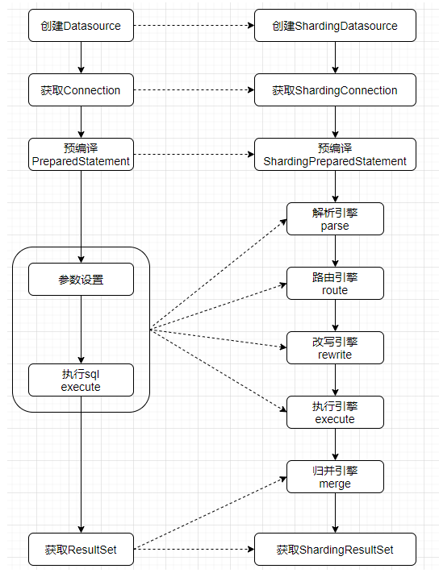
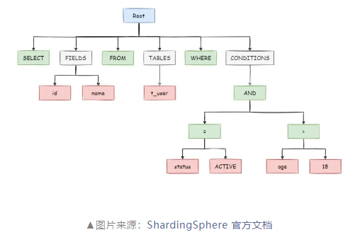
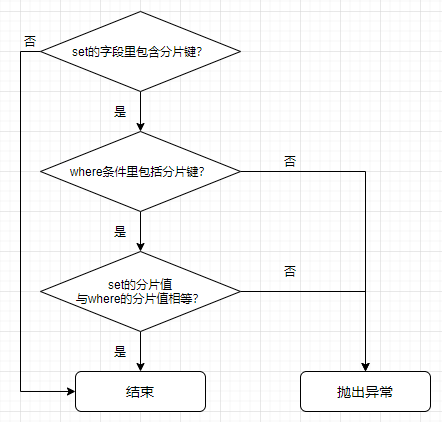
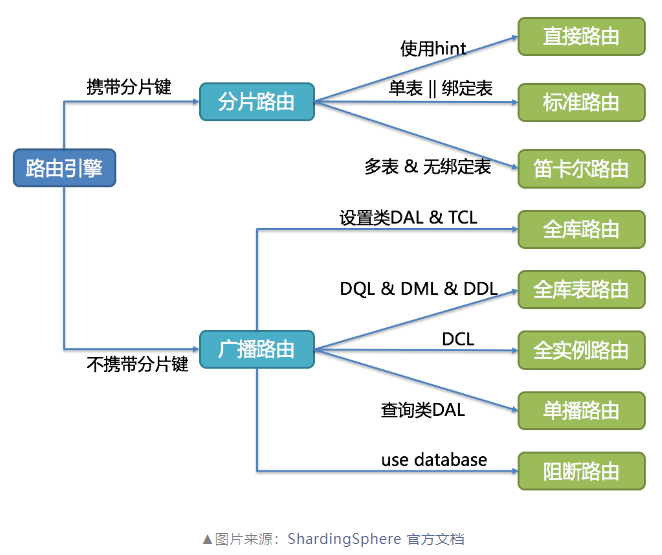

## Sharding-JDBC源码解析与vivo的定制开发

[地址](https://mp.weixin.qq.com/s/GawVNXjCo8qni6w4yoW7SA)

```
Sharding-JDBC是在JDBC层提供服务的数据库中间件，在分库分表场景具有广泛应用。
本文对Sharding-JDBC的解析、路由、改写、执行、归并五大核心引擎进行了源码解析，
并结合业务实践经验，总结了使用Sharding-JDBC的一些痛点问题并分享了对应的定制开发与改造方案。
```
- 解析
- 路由
- 改写
- 执行
- 归并

### 一、业务背景
随着业务并发请求和数据规模的不断扩大，单节点库表压力往往会成为系统的性能瓶颈。
公司IT内部***营销库存***、***交易订单***、***财经台账***、***考勤记录***等多领域的业务场景的日增数据量巨大，
存在着数据库节点***压力过大***、***连接过多***、***查询速度变慢***等情况，根据数据来源、时间、工号等信息来将没有联系的数据尽量均分到不同的库表中，
从而在不影响业务需求的前提下，***减轻数据库节点压力，提升查询效率和系统稳定性***。
```
随着业务并发请求和数据规模的不断扩大，单节点库表压力往往会成为系统的性能瓶颈。
```
| 业务应用 | 实践场景                                                |
|------|-----------------------------------------------------|
| 营销库存 | 存储了各类产品的库存信息，引入定制版本对imei详情、库存流转记录等数据根据代理和编码信息进行分库分表 |
| 交易订单 | 存储了各类产品的交易订单，引入定制版本对交易工作流、订单记录等数据根据代理信息进行分库         |
| 财经台账 | 存储了公司财务的税务台账，引入定制版本对单据台账等数据根据年月进行分表                 |
| 考勤记录 | 存储了公司员工的考勤记录，引入定制版本对考勤排班记录等数据根据区域、月份和工号进行分库分表       |

### 二、技术选型
我们对比了几款比较常见的支持分库分表和读写分离的中间件。

|对比维度| Sharding-JDBC | Sharding-Proxy | MyCat        |
|---|---------------|----------------|--------------|
|接入层| 客户端           | 服务端            | 服务端          |
|功能完整性| 分库分表，读写分离     | 分库分表，读写分离      | 分库分表，读写分离    |
|资源成本| 无需部署单独的服务     | 需要部署单独的服务      | 需要部署单独的服务    |
|性能| 客户端与数据库直连，损耗低 | 多一层网络交互，损耗略高   | 多一层网络交互，损耗略高 |
|连接数| 多             | 少              | 少            |
|成熟度| 社区活跃度高，应用案例多              | 社区活跃度高，应用案例较少               | 不活跃，官方基本已停止维护             |

Sharding-JDBC作为轻量化的增强版的JDBC框架，相较其他中间件性能更好，接入难度更低，其数据分片、读写分离功能也覆盖了我们的业务诉求，
因此我们在业务中广泛使用了Sharding-JDBC。但在使用Sharding-JDBC的过程中，
我们也发现了诸多问题，为了业务更便捷的使用Sharding-JDBC，我们对源码做了针对性的定制开发和组件封装来满足业务需求。

|   |问题| 业务影响          | 定制功能  |
|---|---|---------------|-------|
| 1 |sharding语法限制| 业务改造SQL风险和成本高 | 非分片表跳过sharding语法限制，批量update语法支持      |
| 2 |配置无法动态生效| 无法动态控制SQL日志打印，影响生产问题排查效率；无法动态控制主库路由，从库故障时只能重启应用，拖长业务故障时长              | 强制路由主库，配置动态生效      |
| 3 |or条件下doSharding方法重复调用| 方法重复调用对性能有一定影响，且方法内日志重复打印，影响生产问题排查效率              | shardingCondition去重      |
| 4 |未带分片键或分片键未能解忻导致全路由| 全路由产生严重的性能问题              | 全路由校验      |
| 5 |基础功能重复建设与配置熟悉| 影响开发效率              | 封装公共组件      |

### 三、源码解析

#### 3.1 引言
Sharding-JDBC作为基于JDBC的数据库中间件，
实现了JDBC的标准api，Sharding-JDBC与原生JDBC的执行对比流程如下图所示：


- 创建Datasource
- 获取Connection
- 预编译PreparedStatement
- 参数设置
- 执行sql execute
- 获取ResultSet

- 创建ShardingDatasource
- 获取ShardingConnection
- 预编译ShardingPreparedStatement
- 解析引擎 parse
- 路由引擎 route
- 改写引擎 rewrite
- 执行引擎 execute
- 归并引擎 merge
- 获取ShardingResultSet

相关执行流程的代码样例如下：

> JDBC执行样例

```
//获取数据库连接
try (Connection conn = DriverManager.getConnection("mysqlUrl", "userName", "password")) {
    String sql = "SELECT * FROM  t_user WHERE name = ?";
    //预编译SQL
    try (PreparedStatement preparedStatement = conn.prepareStatement(sql)) {
        //参数设置与执行
        preparedStatement.setString(1, "vivo");
        preparedStatement.execute(sql);
        //获取结果集
        try (ResultSet resultSet = preparedStatement.getResultSet()) {
            while (resultSet.next()) {
                //处理结果
            }
        }
    }
}
```

> Sharding-JDBC 源码

```
org.apache.shardingsphere.shardingjdbc.jdbc.core.statement#execute
public boolean execute() throws SQLException {
    try {
        clearPrevious();
        //解析+路由+重写 内部调用BasePrepareEngine#prepare方法
        prepare();
        initPreparedStatementExecutor();
        //执行
        return preparedStatementExecutor.execute();
    } finally {
        clearBatch();
    }
}
 
org.apache.shardingsphere.underlying.pluggble.prepare.BasePrepareEngine#prepare
public ExecutionContext prepare(final String sql, final List<Object> parameters) {
    List<Object> clonedParameters = cloneParameters(parameters);
    //解析+路由(executeRoute内部先进行解析再执行路由)
    RouteContext routeContext = executeRoute(sql, clonedParameters);
    ExecutionContext result = new ExecutionContext(routeContext.getSqlStatementContext());
    //重写
    result.getExecutionUnits().addAll(executeRewrite(sql, clonedParameters, routeContext));
    if (properties.<Boolean>getValue(ConfigurationPropertyKey.SQL_SHOW)) {
        SQLLogger.logSQL(sql, properties.<Boolean>getValue(ConfigurationPropertyKey.SQL_SIMPLE), result.getSqlStatementContext(), result.getExecutionUnits());
    }
    return result;
}
 
org.apache.shardingsphere.shardingjdbc.jdbc.core.statement.ShardingPreparedStatement#getResultSet
public ResultSet getResultSet() throws SQLException {
    if (null != currentResultSet) {
        return currentResultSet;
    }
    if (executionContext.getSqlStatementContext() instanceof SelectStatementContext || executionContext.getSqlStatementContext().getSqlStatement() instanceof DALStatement) {
        List<ResultSet> resultSets = getResultSets();
        //归并结果集
        MergedResult mergedResult = mergeQuery(getQueryResults(resultSets));
        currentResultSet = new ShardingResultSet(resultSets, mergedResult, this, executionContext);
    }
    return currentResultSet;
}
```

从对比的执行流程图可见：
- 【JDBC】：执行的主要流程是通过Datasource获取Connection，再注入SQL语句生成PreparedStatement对象，
PreparedStatement设置占位符参数执行后得到结果集ResultSet。

- 【Sharding-JDBC】：主要流程基本一致，但Sharding基于PreparedStatement进行了实现与扩展，
具体实现类ShardingPreparedStatement中会抽象出***解析***、***路由***、***重写***、***归并***等引擎，
从而实现分库分表、读写分离等能力，每个引擎的作用说明如下表所示：

| 引擎   | 作用                                                                   |
|------|----------------------------------------------------------------------|
| 解析引擎 | 将SQL拆分成不可再分的原子符号（token），解析成语法树，语法树是后续***路由***、***改写***、***归并***的基础依据 |
| 路由引擎 | 根据语法树匹配配置的路由策略，通过SQL参数和策略算法计算出对应的执行库表                                |
| 改写引擎 | 根据语法树和路由结果将逻辑SQL改写成真正可执行的真实SQL，包括逻辑表的替换、分页的修正、插入拆分等                  |
| 执行引擎 | 根据SQL执行单元创建合适的连接（需兼顾内存和连接资源），并将真实SQL发送至数据库执行                         |
| 归并引擎 | 根据语法树将各个数据节点的结果集归并成最终需要的结果集，包括分组归并、排序归并、分页归并、聚合归并等                   |

#### 3.2 解析引擎
##### 3.2.1 引擎解析
解析引擎是Sharding-JDBC进行分库分表逻辑的基础，其作用是将SQL拆解为不可再分的原子符号（称为token），
再根据数据库类型将这些token分类成关键字、表达式、操作符、字面量等不同类型，
进而生成抽象语法树，而语法树是后续进行路由、改写操作的前提（这也正是语法树的存在使得Sharding-JDBC存在各式各样的语法限制的原因之一）。



4.x的版本采用ANTLR（ANother Tool for Language Recognition）作为解析引擎，
在ShardingSphere-sql-parser-dialect模块中定义了适用于不同数据库语法的解析规则（.g4文件），
idea中也可以下载ANTLR v4的插件，输入SQL查看解析后的语法树结果。

解析方法的入口在DataNodeRouter的createRouteContext方法中，解析引擎根据数据库类型和SQL创建SQLParserExecutor执行得到解析树，
再通过ParseTreeVisitor()的visit方法，对解析树进行处理得到SQLStatement。
ANTLR支持listener和visitor两种模式的接口，visitor方式可以更灵活的控制解析树的遍历过程，更适用于SQL解析的场景。

> 解析引擎核心代码

```
org.apache.shardingsphere.underlying.route.DataNodeRouter#createRouteContext#96
private RouteContext createRouteContext(final String sql, final List<Object> parameters, final boolean useCache) {
    //解析引擎解析SQL
    SQLStatement sqlStatement = parserEngine.parse(sql, useCache);
    try {
        SQLStatementContext sqlStatementContext = SQLStatementContextFactory.newInstance(metaData.getSchema(), sql, parameters, sqlStatement);
        return new RouteContext(sqlStatementContext, parameters, new RouteResult());
        // TODO should pass parameters for master-slave
    } catch (final IndexOutOfBoundsException ex) {
        return new RouteContext(new CommonSQLStatementContext(sqlStatement), parameters, new RouteResult());
    }
}
 
org.apache.shardingsphere.sql.parser.SQLParserEngine#parse0#72
private SQLStatement parse0(final String sql, final boolean useCache) {
    //缓存
    if (useCache) {
        Optional<SQLStatement> cachedSQLStatement = cache.getSQLStatement(sql);
        if (cachedSQLStatement.isPresent()) {
            return cachedSQLStatement.get();
        }
    }
    //根据数据库类型和sql生成解析树
    ParseTree parseTree = new SQLParserExecutor(databaseTypeName, sql).execute().getRootNode();
    //ParseTreeVisitor的visit方法对解析树进行处理得到SQLStatement
    SQLStatement result = (SQLStatement) ParseTreeVisitorFactory.newInstance(databaseTypeName, VisitorRule.valueOf(parseTree.getClass())).visit(parseTree);
    if (useCache) {
        cache.put(sql, result);
    }
    return result;
}
```

SQLStatement实际上是一个接口，其实现对应着不同的SQL类型，如SelectStatement 类中就包括查询的字段、表名、where条件、分组、排序、分页、lock等变量，
可以看到这里并没有对having这种字段做定义，相当于Sharding-JDBC无法识别到SQL中的having，
这使得Sharding-JDBC对having语法有一定的限制。

> SelectStatement

```java
public final class SelectStatement extends DMLStatement {
    // 字段
    private ProjectionsSegment projections;
    // 表
    private final Collection<TableReferenceSegment> tableReferences = new LinkedList<>();
    // where
    private WhereSegment where;
    // groupBy
    private GroupBySegment groupBy;
    // orderBy
    private OrderBySegment orderBy;
    // limit
    private LimitSegment limit;
    // 父statement
    private SelectStatement parentStatement;
    // lock
    private LockSegment lock;
}
```

SQLStatement还会被进一步转换成SQLStatementContext，如SelectStatement 会被转换成SelectStatementContext ，
其结构与SelectStatement 类似不再多说，值得注意的是虽然这里定义了containsSubquery来判断是否包含子查询，
但4.1.1源码永远是返回的false，与having类似，这意味着Sharding-JDBC不会对子查询语句做特殊处理。

> SelectStatementContext

```
public final class SelectStatementContext extends CommonSQLStatementContext<SelectStatement> implements TableAvailable, WhereAvailable {
     
    private final TablesContext tablesContext;
     
    private final ProjectionsContext projectionsContext;
     
    private final GroupByContext groupByContext;
     
    private final OrderByContext orderByContext;
     
    private final PaginationContext paginationContext;
     
    private final boolean containsSubquery;
}
 
    private boolean containsSubquery() {
        // FIXME process subquery
//        Collection<SubqueryPredicateSegment> subqueryPredicateSegments = getSqlStatement().findSQLSegments(SubqueryPredicateSegment.class);
//        for (SubqueryPredicateSegment each : subqueryPredicateSegments) {
//            if (!each.getAndPredicates().isEmpty()) {
//                return true;
//            }
//        }
        return false;
    }
```

##### 3.2.2 引擎总结
解析引擎是进行路由改写的前提基础，其作用就是将SQL按照定义的语法规则拆分成原子符号(token)，生成语法树，
根据不同的SQL类型生成对应的SQLStatement，SQLStatement由各自的Segment组成，
所有的Segment都包含startIndex和endIndex来定位token在SQL中所属的位置，
但解析语法难以涵盖所有的SQL场景，使得部分SQL无法按照预期的结果路由执行。

#### 3.3 路由引擎
##### 3.3.1 引擎解析
路由引擎是Sharding-JDBC的核心步骤，作用是根据定义的分库分表规则将解析引擎生成的SQL上下文生成对应的路由结果，
RouteResult 包括DataNode和RouteUnit，DataNode是实际的数据源节点，
包括数据源名称和实际的物理表名，RouteUnit则记录了逻辑表/库与物理表/库的映射关系，
后面的改写引擎也是根据这个映射关系来决定如何替换SQL中的逻辑表
（实际上RouteResult 就是维护了一条SQL需要往哪些库哪些表执行的关系）。

> RouteResult

```java
public final class RouteResult {
     
    private final Collection<Collection<DataNode>> originalDataNodes = new LinkedList<>();
     
    private final Collection<RouteUnit> routeUnits = new LinkedHashSet<>();
}
 
public final class DataNode {
     
    private static final String DELIMITER = ".";
     
    private final String dataSourceName;
     
    private final String tableName;
}
 
public final class RouteUnit {
     
    private final RouteMapper dataSourceMapper;
     
    private final Collection<RouteMapper> tableMappers;
}
 
public final class RouteMapper {
     
    private final String logicName;
     
    private final String actualName;
}
```

> 分片路由

ShardingRouteDecorator的decorate方法是路由引擎的核心逻辑，
经过SQL校验->生成分片条件->合并分片值后得到路由结果。

> 分片路由decorate方法

```
org.apache.shardingsphere.sharding.route.engine.ShardingRouteDecorator#decorate#57
public RouteContext decorate(final RouteContext routeContext, final ShardingSphereMetaData metaData, final ShardingRule shardingRule, final ConfigurationProperties properties) {
    SQLStatementContext sqlStatementContext = routeContext.getSqlStatementContext();
    List<Object> parameters = routeContext.getParameters();
    //SQL校验  校验INSERT INTO .... ON DUPLICATE KEY UPDATE 和UPDATE语句中是否存在分片键
    ShardingStatementValidatorFactory.newInstance(
            sqlStatementContext.getSqlStatement()).ifPresent(validator -> validator.validate(shardingRule, sqlStatementContext.getSqlStatement(), parameters));
    //生成分片条件
    ShardingConditions shardingConditions = getShardingConditions(parameters, sqlStatementContext, metaData.getSchema(), shardingRule);
    //合并分片值
    boolean needMergeShardingValues = isNeedMergeShardingValues(sqlStatementContext, shardingRule);
    if (sqlStatementContext.getSqlStatement() instanceof DMLStatement && needMergeShardingValues) {
        checkSubqueryShardingValues(sqlStatementContext, shardingRule, shardingConditions);
        mergeShardingConditions(shardingConditions);
    }
    ShardingRouteEngine shardingRouteEngine = ShardingRouteEngineFactory.newInstance(shardingRule, metaData, sqlStatementContext, shardingConditions, properties);
    //得到路由结果
    RouteResult routeResult = shardingRouteEngine.route(shardingRule);
    if (needMergeShardingValues) {
        Preconditions.checkState(1 == routeResult.getRouteUnits().size(), "Must have one sharding with subquery.");
    }
    return new RouteContext(sqlStatementContext, parameters, routeResult);
}
```

ShardingStatementValidator有
ShardingInsertStatementValidator和
ShardingUpdateStatementValidator
两种实现，INSERT INTO .... ON DUPLICATE KEY UPDATE和UPDATE语法都会涉及到字段值的更新，
Sharding-JDBC是不允许更新分片值的，毕竟修改分片值还需要将数据迁移至新分片值对应的库表中，
才能保证数据分片规则一致。两者的校验细节也有所不同：
```
INSERT INTO .... ON DUPLICATE KEY UPDATE仅仅是对UPDATE字段的校验， ON DUPLICATE KEY UPDATE中包含分片键就会报错；
而UPDATE语句则会额外校验WHERE条件中分片键的原始值和SET的值是否一样，不一样则会抛出异常。
```


ShardingCondition中只有一个变量routeValues，RouteValue是一个接口，有ListRouteValue和RangeRouteValue两种实现，
前者记录了分片键的in或=条件的分片值，后者则记录了范围查询的分片值，
两者被封装为ShardingValue对象后，将会透传至分片算法中计算得到分片结果集。

> ShardingCondition

```java
public final class ShardingConditions {
     
    private final List<ShardingCondition> conditions;
}
 
public class ShardingCondition {
    private final List<RouteValue> routeValues = new LinkedList<>();
}
 
 
public final class ListRouteValue<T extends Comparable<?>> implements RouteValue {
    private final String columnName;
    private final String tableName;
    //in或=条件对应的值
    private final Collection<T> values;
     
    @Override
    public String toString() {
        return tableName + "." + columnName + (1 == values.size() ? " = " + new ArrayList<>(values).get(0) : " in (" + Joiner.on(",").join(values) + ")");
    }
}
 
public final class RangeRouteValue<T extends Comparable<?>> implements RouteValue {
     
    private final String columnName;
     
    private final String tableName;
    //between and 大于小于等范围值的上下限
    private final Range<T> valueRange;
}
```

生成分片条件后还会合并分片条件，但是前文提过在SelectStatementContext中的containsSubquery永远是false，
所以这段逻辑永远返回false，即不会合并分片条件。

> 判断是否需要合并分片条件

```
org.apache.shardingsphere.sharding.route.engine.ShardingRouteDecorator#isNeedMergeShardingValues#87
private boolean isNeedMergeShardingValues(final SQLStatementContext sqlStatementContext, final ShardingRule shardingRule) {
        return sqlStatementContext instanceof SelectStatementContext && ((SelectStatementContext) sqlStatementContext).isContainsSubquery()
                && !shardingRule.getShardingLogicTableNames(sqlStatementContext.getTablesContext().getTableNames()).isEmpty();
    }
```

然后就是通过分片路由引擎调用分片算法计算路由结果了，
ShardingRouteEngine实现较多，介绍起来篇幅较多，这里就不展开说明了，
可以参考官方文档来了解路由引擎的选择规则。



Sharding-JDBC定义了多种分片策略和算法接口，主要的分配策略与算法说明如下表所示：

| 分片策略                           | 分片算法                                | 适用场景                       |
|--------------------------------|-------------------------------------|----------------------------|
| 标准分片策路StandardShardingStrategy | 精确分片算法：PreciseShardingAlgorithm     | 用于处理使用单一键作为分片键的=与IN进行分片的场景 |
| 标准分片策路StandardShardingStrategy                               | 范围分片算法：RangeShardingAlgorithm       | 用于处理使用单一键作为分片键的BETWEEN AND、>、<、>=、<=进行分片的场景                           |
| 复合分片策路ComplexShardingStrategy                               | 复合分片算法：ComplexKeysShardingAlgorithm | 用于处理使用多键作为分片键进行分片的场景，提供对SQL语句中的=,>,<,>=,<=,IN和BETWEEN AND的分片操作支持                           |
| 行表达式分片策路InlineShardingStrategy                               | /                                   | 使用Groovy的表达式，默认只支持SQL语句中的=和IN的分片操作，只支持单分片键                           |
| Hint分片策略HintShardingStrategy                               | Hint分片算法：HintShardingAlgorithm                                    | 通过Hint指定分片值而非从SQL中提取分片值的方式进行分片的策略                           |

补充两个细节：
（1）当ALLOW_RANGE_QUERY_WITH_INLINE_SHARDING配置设置true时，
InlineShardingStrategy支持范围查询，但是并不是根据分片值计算范围，而是直接全路由至配置的数据节点，会存在性能隐患。

> InlineShardingStrategy.doSharding

```
org.apache.shardingsphere.core.strategy.route.inline.InlineShardingStrategy#doSharding
public Collection<String> doSharding(final Collection<String> availableTargetNames, final Collection<RouteValue> shardingValues, final ConfigurationProperties properties) {
    RouteValue shardingValue = shardingValues.iterator().next();
    //ALLOW_RANGE_QUERY_WITH_INLINE_SHARDING设置为true，直接返回availableTargetNames，而不是根据RangeRouteValue计算
    if (properties.<Boolean>getValue(ConfigurationPropertyKey.ALLOW_RANGE_QUERY_WITH_INLINE_SHARDING) && shardingValue instanceof RangeRouteValue) {
        return availableTargetNames;
    }
    Preconditions.checkState(shardingValue instanceof ListRouteValue, "Inline strategy cannot support this type sharding:" + shardingValue.toString());
    Collection<String> shardingResult = doSharding((ListRouteValue) shardingValue);
    Collection<String> result = new TreeSet<>(String.CASE_INSENSITIVE_ORDER);
    for (String each : shardingResult) {
        if (availableTargetNames.contains(each)) {
            result.add(each);
        }
    }
    return result;
}
```

（2）4.1.1的官方文档虽然说Hint可以跳过解析和改写，但在我们上面解析引擎的源码解析中，我们并没有看到有对Hint策略的额外跳过。
事实上，即使使用了Hint分片SQL也同样需要解析重写，也同样受Sharding-JDBC的语法限制，这在官方的issue中也曾经被提及。

