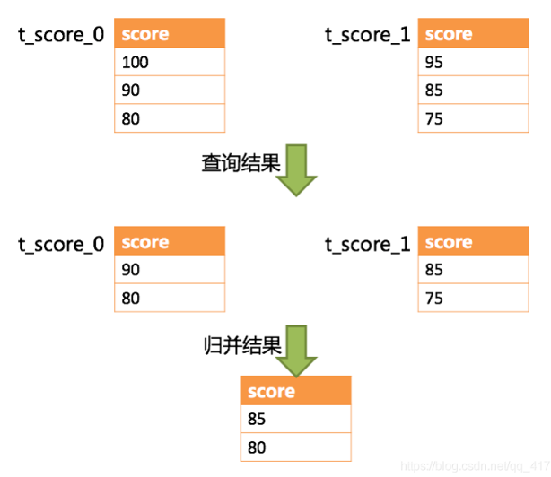
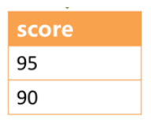
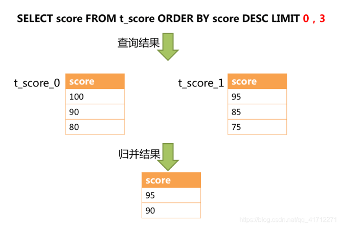

## 难题来了：分库分表后，查询太慢了，如何优化？

### 说在前面：
尼恩社群中，很多小伙伴反馈， 
Sharding-JDBC分页查询的速度超级慢， 怎么处理？
反馈这个问题的小伙伴，很多很多。
而且这个问题，也是面试的核心难题。
前段时间，有小伙伴反馈，在面试中遇到了这个问题

> 分库分表后，分页查询太慢了，如何优化？

尼恩提示：***分库分表的知识，既是面试的核心知识，又是开发的核心知识***。<br>
所以，这里尼恩给大家做一下系统化、体系化的梳理，使得大家可以充分展示一下大家雄厚的 “技术肌肉”，让面试官爱到 “不能自已、口水直流”。<br>
也一并把这个题目以及参考答案，收入咱们的 《尼恩Java面试宝典PDF》V120版本，<br>
供后面的小伙伴参考，提升大家的 3高 架构、设计、开发水平。<br>

最新《尼恩 架构笔记》《尼恩高并发三部曲》《尼恩Java面试宝典》的PDF，
请关注本公众号【技术自由圈】获取，后台回复：领电子书

### 本文目录
- 说在前面
- 查询太慢的优化三种方法
- 首先，分析慢的根本原因，原来是 Sharding-JDBC 做了分页修正
  - 功能和性能的冲突：从0开始的性能瓶颈
  - Sharding-JDBC的优化
- ***流式查询***的弊端
- 优化方案1：***组合使用 ES 搜索做分页***
- 优化方案2：***禁止跳页查询法***
- 优化方法3：***二次查询法***
- 说在最后
- 部分历史案例

### 查询太慢的优化三种方法：
分库分表后，查询太慢了，如何优化？大致三种方法：
- 方式一：组合使用 ES 搜索做分页，
- 方式二：禁止跳页
- 方式三：二次查询法

第一种方式，需要引入 es，这里不做展开，有兴趣的可以来尼恩的《技术自由圈》社群交流。

这里就梳理一下，第二种禁止跳页、第三种二次查询法。

### 首先，分析慢的根本原因，原来是 Sharding-JDBC 做了分页修正
Sharding-JDBC从多个数据库获取分页数据，与单数据库的场景是不同的。
假设每10条数据为一页，取第2页数据。
在分片环境下获取LIMIT 10, 10，归并之后再根据排序条件取出前10条数据是不正确的。

举例说明，若SQL为：
```
SELECT score FROM t_score ORDER BY score DESC LIMIT 1, 2;
```
下图展示了不进行SQL的改写的分页执行结果：

通过图中所示，想要取得两个表中共同的按照分数排序的第2条和第3条数据，理论上，应该是95和90。



实际上呢？
由于执行的SQL只能从每个表中获取第2条和第3条数据，
即从t_score_0表中获取的是90和80；
从t_score_0表中获取的是85和75。
因此进行结果归并时，只能从获取的90，80，85和75之中进行归并，
那么，无论怎么实现，结果归并之后，都不可能获得正确的结果。

正确的做法是将分页条件改写为LIMIT 0, 3，取出所有前两页数据，再结合排序条件计算出正确的数据。
下图展示了进行SQL改写之后的分页执行结果。



#### 功能和性能的冲突：从0开始的性能瓶颈
注意，这里有个大问题：
为了结果不出错，归并之前的查询，是0开始， 结果才可能是对的。
然而，***查询偏移量过大的分页会导致数据库获取数据性能低下***，

以MySQL为例：
```sql
select * from t_order order by id limit 1000000,10
```

如果不是分库分表，这句SQL会使得MySQL在无法利用索引的情况下跳过1000000条记录后，
再获取10条记录，其性能可想而知。

然而， 在分库分表的情况下（假设分为2个库），为了保证数据的正确性，SQL会改写为：
```sql
select * from t_order order by id limit 1000000,10
```
***即将偏移量前的记录全部取出，并仅获取排序后的最后10条记录***。
这会在数据库本身就执行很慢的情况下，进一步加剧性能瓶颈。

***因为原SQL仅需要传输10条记录至客户端，而改写之后的SQL则会传输1,000,010 * 2的记录至客户端***。

#### Sharding-JDBC的优化
##### （1）采用流式处理 + 归并排序的方式来避免内存的过量占用。
由于SQL改写不可避免的占用了额外的带宽，但并不会导致内存暴涨。
与直觉不同，大多数人认为Sharding-JDBC会将1,000,010 * 2记录全部加载至内存，进而占用大量内存而导致内存溢出。
但由于每个结果集的记录是有序的，因此Sharding-JDBC每次仅获取各个分片的当前结果集记录，
***驻留在内存中的记录仅为当前路由到的分片的结果集的当前游标指向而已***。
对于本身即有序的待排序对象，归并排序的时间复杂度仅为O(n)，性能损耗很小。

##### （2）Sharding-JDBC对仅落至多分片的查询进行进一步优化。
落至单分片查询的请求并不需要改写SQL也可以保证记录的正确性，因此在此种情况下，Sharding-JDBC并未进行SQL改写，从而达到节省带宽的目的。
一般情况下，性能慢，都是第一种情况。
流式查询看上去很好，但也有大大的弊端。

### 流式查询的弊端
采用游标查询的方式的缺点很明显。
流式（游标）查询需要注意：***当前查询会独占连接***！必须先读取（或关闭）结果集中的所有行，
然后才能对连接发出任何其他查询，否则将引发异常！

执行一个流式查询后，数据库访问框架就不负责关闭数据库连接了，
需要应用在取完数据后需要自己关闭。

由于MySQL_Server不知道客户端什么时候将数据消费完，而自身的对应表可能会有DML写入操作，
此时MySQL_Server需要建立一个临时空间来存放需要拿走的数据。

因此对于当你启用useCursorFetch读取大表的时候，会看到MySQL上的几个现象：

- 1.IOPS 飙升，因为需要返回的数据需要写入到临时空间中，存在大量的 IO 读取和写入，此流程可能会引起其它业务的写入抖动
- 2.磁盘空间飙升，写入临时空间的数据会在读取完成或客户端发起 ResultSet#close 操作时由 MySQL_Server 回收
- 3.客户端 JDBC 发起sql_query，可能会有长时间等待，这段时间为MySQL_Server准备数据阶段。
但是 ***普通查询等待时间***与***游标查询等待时间***原理上是不一致的:  
前者是在读取网络缓冲区的数据，没有响应到业务层面；
后者是 MySQL 在准备临时数据空间，没有响应到 JDBC
- 4.数据准备完成后，进行到传输数据阶段，网络响应开始飙升，IOPS 由"写"转变为"读"
```
数据准备完成后，进行到传输数据阶段，网络响应开始飙升，IOPS由"写"转变为"读"
```
这就是，尼恩社群很多小伙伴反馈， 分表后 分页查询慢的原因。
基本上是分页越大后续的查询越耗资源

如何解决呢？

### 优化方案1：组合使用 ES 搜索做分页
第一种方式，需要引入 es，这里不做展开，有兴趣的可以来尼恩的《技术自由圈》社群交流。

### 优化方案2：禁止跳页查询法
由于LIMIT并不能通过索引查询数据，因此如果可以保证ID的连续性，通过ID进行分页是比较好的解决方案：
```sql
select * from t_order where id > 100000 and id <= 100010 order by id;
```

或通过记录上次查询结果的最后一条记录的ID进行下一页的查询：

```sql
select * from t_order where id > 100000 limit 10;
```

如果不是id列， 假设排序的列为col，禁止跳页查询法的两个步骤大致如下：
- （1）用正常的方法取得第一页数据，并得到第一页记录的 max_col 最大值；
- （2）每次翻页，将order by col offset X limit Y;改写成order by col  where col>$time_max limit Y;以保证每次只返回一页数据，性能为常量。

### 优化方法3：二次查询法
假设排序的列为col，二次查询法的两个步骤大致如下：
- （1）SQL改写，将order by col X limit X, Y;改写成order by col limit X/N,Y; 【偏移量/表数量】
- （2）多页返回，找到最小值col_min；
- （3）between二次查询order by col between col_min and col_i_max;
- （4）设置虚拟col_min，找到col_min在各个分库的offset，从而得到col_min在全局的offset；
- （5）得到了col_min在全局的offset，自然得到了全局的offset X limit Y；

```
假设排序的列为col，二次查询法的两个步骤大致如下：
1、SQL改写，将order by col limit X,Y；改写成order by col limit X/N,Y； X/N【偏移量/表数量】
2、多页返回，找到最小值col_min；
3、between二次查询order by col between col_min and col_max；
4、设置虚拟col_min，找到col_min在各个分库的offset，从而得到col_min在全局的offset；
5、得到了col_min在全局的offset，自然得到了全局的offset X limit Y；
```

例子：分表结构
```sql
CREATE TABLE `student_time_0` (
  `id` int(11) unsigned NOT NULL AUTO_INCREMENT,
  `user_id` int(11) NOT NULL,
  `name` varchar(200) COLLATE utf8_bin DEFAULT NULL,
  `age` tinyint(3) unsigned DEFAULT NULL,
  `create_time` bigint(20) DEFAULT NULL,
  PRIMARY KEY (`id`)
) ENGINE=InnoDB AUTO_INCREMENT=674 DEFAULT CHARSET=utf8 COLLATE=utf8_bin;
```
有这样的三个表，student_time_0, student_time_1, student_time_2, 
以 user_id 作为分表键，根据表数量取模作为分表依据 这里先构造点数据，
```sql
insert into student_time (`name`, `user_id`, `age`, `create_time`) values (?, ?, ?, ?)
```
主要是为了保证 create_time 唯一，比较好说明问题，
```
int i = 0;
try (
  // 通过数据源获取连接
  Connection conn = dataSource.getConnection();
  PreparedStatement ps = conn.prepareStatement(insertSql)
) {
  do {
    ps.setString(1, localName + new Random().nextInt(100));
    ps.setLong(2, 10086L + (new Random().nextInt(100)));
    ps.setInt(3, 18);
    ps.setLong(4, new Date().getTime());
    int result = ps.executeUpdate();
    LOGGER.info("current execute result: {}", result);
    Thread.sleep(new Random().nextInt(100));
    i++;
  } while (i <= 2000);
```

三个表的数据分别是 673，678，650，各个表数据不一样，
接下来，做一个这样的分页查询
```sql
select * from student_time ORDER BY create_time ASC limit 1000, 5;
```

student_time 对于我们使用的 sharding-jdbc 来说当然是逻辑表， sharding-jdbc 会改写为

```sql
select * from student_time ORDER BY create_time ASC limit 0, 1005;
```

即使如***sharding-jdbc 对于合并排序的优化做得比较好***，
也还是需要传输那么大量的数据，并且查询也耗时，那么有没有解决方案呢

- 第一个办法禁止跳页，而是只给下一页，那么我们就能把前一次的最大偏移量的 create_time 记录下来，下一页就可以拿着这个偏移量进行查询
- 第二个办法是二次查询法

这个办法的第一步跟前面那个错误的方法或者说不准确的方法一样，
先是将分页偏移量平均，333，根据这个 limit 333,5  在三个表里进行查询

```sql
t0
334 10158 nick95  18  1641548941767
335 10098 nick11  18  1641548941879
336 10167 nick51  18  1641548942089
337 10167 nick3 18  1641548942119
338 10170 nick57  18  1641548942169


t1
334 10105 nick98  18  1641548939071   最小
335 10174 nick94  18  1641548939377
336 10129 nick85  18  1641548939442
337 10141 nick84  18  1641548939480
338 10096 nick74  18  1641548939668

t2
334 10184 nick11  18  1641548945075
335 10109 nick93  18  1641548945382
336 10181 nick41  18  1641548945583
337 10130 nick80  18  1641548945993
338 10184 nick19  18  1641548946294  最大
```

第一遍的目标是啥，查出来的最小的 create_time 和最大的 create_time 找出来，然后再去三个表里查询，
其实主要是最小值，因为拿着最小值去查，以后我就能知道这个最小值在每个表里处在什么位置，
```sql
order by col between  col_min and col_i_max;
```

那这里我也想着拿到这个条件，所以我将第一遍查出来的最小的 create_time 和最大的 create_time 找出来，然后再去三个表里查询，
这里，其实主要是最小值，因为我拿着最小值去查以后我就能知道这个最小值在每个表里处在什么位置，

```sql
t0
322 10161 nick81  18  1641548939284
323 10113 nick16  18  1641548939393
324 10110 nick56  18  1641548939577
325 10116 nick69  18  1641548939588
326 10173 nick51  18  1641548939646

t1
334 10105 nick98  18  1641548939071
335 10174 nick94  18  1641548939377
336 10129 nick85  18  1641548939442
337 10141 nick84  18  1641548939480
338 10096 nick74  18  1641548939668

t2
297 10136 nick28  18  1641548939161
298 10142 nick68  18  1641548939177
299 10124 nick41  18  1641548939237
300 10148 nick87  18  1641548939510
301 10169 nick23  18  1641548939715
```

我只贴了前五条数据，为了方便知道偏移量，每个分表都使用了自增主键，
我们可以看到前一次查询的最小值分别在其他两个表里的位置分别是 322-1 和 297-1，
那么，对于总体来说，这个时间的起始位置，应该是在 322 - 1 + 334-1 + 297 - 1 = 951，
那么，只要对后面的数据最多每个表查 1000 - 951 + 5 = 54 条数据，再进行合并排序就可以获得最终正确的结果。
这个就是的二次查询法。
可见，二次查询法很麻烦， 不如禁止跳页法，或者 es组合方法，直接，有效。

### 说在最后
分库分表面试题，是非常常见的面试题。
以上的内容，如果大家能对答如流，如数家珍，基本上 面试官会被你 震惊到、吸引到。
在面试之前，建议大家系统化的刷一波 5000页《尼恩Java面试宝典PDF》。
此宝典，尼恩一直持续更新，持续加入：最新的真题、最新难题，最新版本可以找40岁老架构尼恩领取。
并且在刷题过程中，如果有啥问题，大家可以来 找 40岁老架构师尼恩交流。
最终，让面试官爱到 “不能自已、口水直流”。
offer， 也就来了。