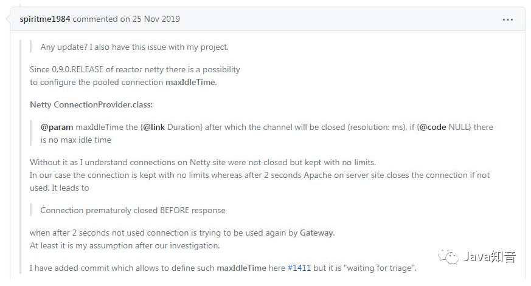
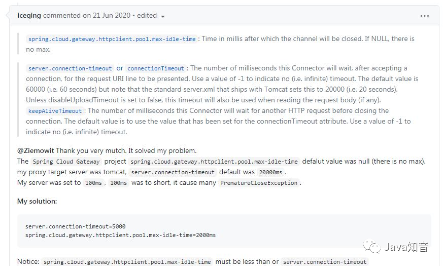
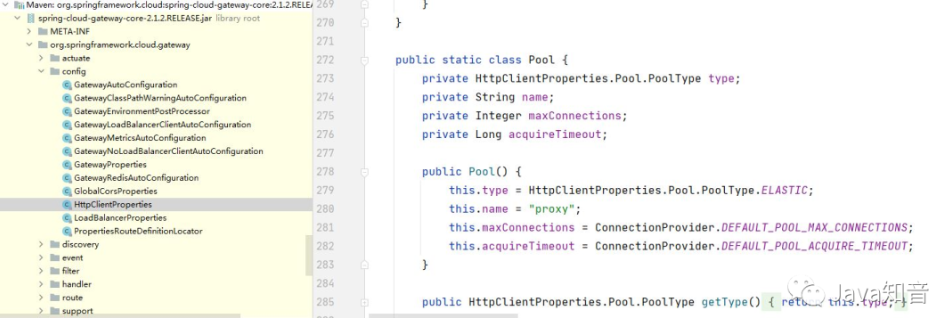
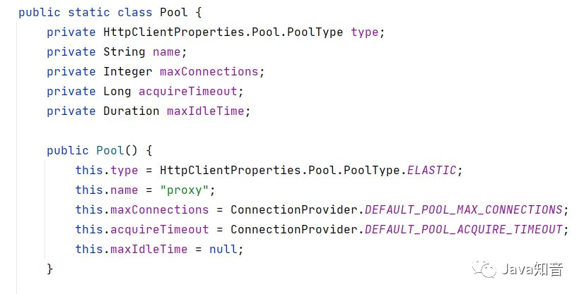
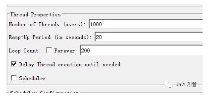
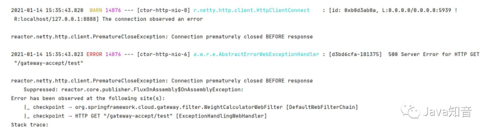
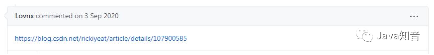

## Gateway网关使用不规范，同事加班泪两行

### 问题

Spring cloud gateway是替代zuul的网关产品，基于Spring 5、Spring boot 2.0以上、Reactor, 提供任意的路由匹配和断言、过滤功能。
笔者公司之前有系统也使用了Spring cloud gateway做为后台应用访问的网关，采用的版本信息为：

```
Spring Cloud Gateway是替代zuul的网关产品
基于Spring 5、Spring Boot 2.0以上
Reactor
提供任意的路由匹配和断言、过滤功能
```

| 组件                   | 版本            | 其他 |
|----------------------|---------------|----|
| spring boot          | 2.1.7.RELEASE |    |
| spring cloud         | Greenwich.SR2 |    |
| spring cloud gateway | 2.1.2.RELEASE |    |

其中的一个路由的代码如下：
```
@Bean
public RouteLocator customRouteLocator(RouteLocatorBuilder builder) {
    RouteLocatorBuilder.Builder routes = builder.routes();
    RouteLocatorBuilder.Builder serviceProvider = routes
        .route("accept",
            r -> r.header(HttpHeaders.CONTENT_TYPE, MediaType.APPLICATION_JSON_UTF8_VALUE)
                .and()
                .method(HttpMethod.POST)
                .and()
                .readBody(String.class, readBody -> true)
                .and()
                .path("/gateway-accept/**")
                .filters(f -> {
                    f.rewritePath("/gateway-accept/(?<path>.*)", "/${path}");
                    return f;
                }).uri("lb://ACCEPT-MICROSERVICE"));                
        return serviceProvider.build();
    }
```

后台采用的是版本也是spring boot 2.1.2.RELEASE, 内置Tomcat的一个服务。
一开始系统运行良好，最近业务慢慢繁忙，前端调用说偶尔返回这样的问题：

```
{
    "timestamp":"2021-01-06T01:50:00.468+0000",
    "path":"/gateway-accept/policy",
    "status":500,
    "error":"Internal Server Error",
    "message":"Connection prematurely[提前] closed BEFORE response"
}
```
字面意思是“响应前过早关闭连接”, 查看后台服务的日志，
根本没有调用的信息，再次调用也没有问题，
服务和网关都没有任何问题，到底怎么回事？

### 原因
由于这是Spring cloud gateway的问题，肯定有人碰上过，先去gateway的github上的issues去碰碰运气。
果然，在issues中查找“Connection prematurely closed BEFORE response”，
列出了十几条，相关的有七八条，一个一个翻阅，终于一个issue提到了相同的的问题：
[github_issue](https://github.com/spring-cloud/spring-cloud-gateway/issues/1148)




#### 总结如下：
gateway调用后台服务，会使用httpclient连接池里面的连接
gateway使用的httpclient连接池的连接有个参数：max-idle-time，大意指的是多长时间连接不使用就关闭。如果设置为null, 连接不会关闭。

后台服务也有相应的连接对应连接池的连接，参数keepAliveTimeout，大意指后台服务的连接空闲多长时间就会自动关闭，
缺省的值就是connection-timeout参数的值。如果为-1就不会有时间限制，缺省值为60s ,但是一般的再server.xml里面设置为20s.

##### 重要：如果网关的连接池的连接max-idle-time不设置（null）,后台服务的connection-timeout为20s
- 假设网络连接池有个连接(gateway-connect-1)对应后台服务的连接(server-connect-1)
- 前端请求过来，gateway的分配给这个请求的连接正好是(gateway-connect-1), 向后端发起请求调用
- 同时，***服务端连接(server-connect-1)已经等待空闲20秒，自动关闭***;
- 可想而知，***服务端没有和(gateway-connect-1)对应的连接，于是发生了异常***。

需要在网关层设置***spring.cloud.gateway.httpclient.pool.max-idle-time***
需要服务端设置server.connection-timeout， 这个值要适当的大于网关层的max-idle-time, 
意思就是，网关层对后端连接的空闲时间要小于后端服务的连接空闲时间，这样就不会取到无效的网关层的连接。

```
需要在网关层设置
spring.cloud.gateway.httpclient.pool.max-idle-time
需要服务端设置server.connection-timeout，
这个值要适当的大于网关层max-idle-time，
意思就是，网关层对后端连接的空闲时间要小于后端服务的连接空闲时间，这样就不会取到无效的网关层的连接。
```

#### 解决
根据上面的描述，我在yml里面加入：
```
spring:
  cloud:
    gateway:
      httpclient:
        pool:
          max-idle-time: 5000 // 最大空闲时间
          max-connections: 30 // 最大连接
```

在idea里面发现max-idle-time黄色标底，
找不到这个配置，点击没有问题的max-connections, 定位到



原来，我用的这个gateway版本2.1.2的连接池根本没有提供max-idle-time这个参数，那个版本可以提供？
我新建了一个gateway服务，用的版本如下:

|组件|版本|其他|
|---|---|---|
|spring boot|2.3.4.RELEASE||
|spring cloud|Hoxton.SR1||
|Hoxton.SR1|2.2.1.RELEASE||

在网关服务层设置：
```
spring:
  cloud:
    gateway:
      httpclient:
        pool:
          max-idle-time: 10000
```
i点击max-idle-time, 可以看到已经提供这个参数了：



后端服务设置(后端用的内嵌tomcat)：
```
server:
  tomcat:
    connection-timeout: 20000
```

服务调用接口：
```
@GetMapping(value = "/test")
public String get() throws InterruptedException {
    Thread.sleep(10);
    return "laza";
}
```

#### 第一种设置
网关不设置max-idle-time
后端服务我设置connection-timeout: 100
使用jmeter测试，配置如下：


点击开始，后台出现错误：


#### 第二种设置
网关设置max-idle-time：10000 <br>
后端服务我设置connection-timeout: 20000<br>
jmeter设置和上面一样，测试一切正常。<br>
和版本也有点关系，我生产使用的版本目前不支持max-idle-time这个参数的设置，所以要升级一下gateway使用的版本了。<br>

### 后续
在issues最后，发现这个：


点进去以后，发现是蚂蚁金服的同学Lovnx, 详细的阐述了这个问题，有兴趣可以去看一下。他在文章中提到：

reactor.netty.pool.leasingStrategy=lifo获取连接策略由默认的FIFO变更为LIFO，
因为LIFO能够确保获取的连接最大概率是最近刚被用过的，也就是热点连接始终是热点连接，
而始终用不到的连接就可以被回收掉，LRU的思想（文中原话）

```
reactor.netty.pool.leasingStrategy=lifo
获取连接策略由默认的FIFO变更为LIFO，
因为LIFO能够确保获取的连接最大概率是最近刚被用过的，
也就是热点连接始终是热点连接，
而始终用不到的连接就可以被回收掉，
LRU的思想
```

Reactor-Netty 版本问题 我查了一下，
spring cloud gateway 2.2.1.release提供的Reactor-Netty版本是0.9.2.RELEASE

```
<dependency>
      <groupId>io.projectreactor.netty</groupId>
      <artifactId>reactor-netty</artifactId>
      <version>0.9.2.RELEASE</version>
      <scope>compile</scope>
</dependency>
```

推荐好文
```
强大，10k+点赞的 SpringBoot 后台管理系统竟然出了详细教程！
 
分享一套基于SpringBoot和Vue的企业级中后台开源项目，代码很规范！
能挣钱的，开源 SpringBoot 商城系统，功能超全，超漂亮！
```


