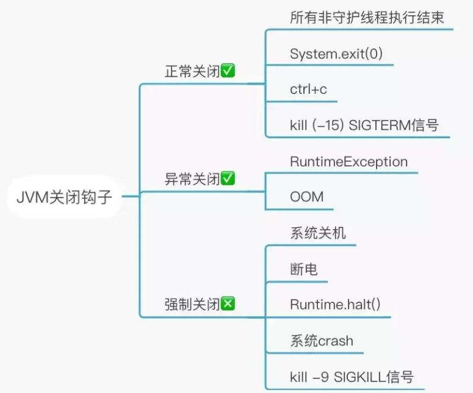
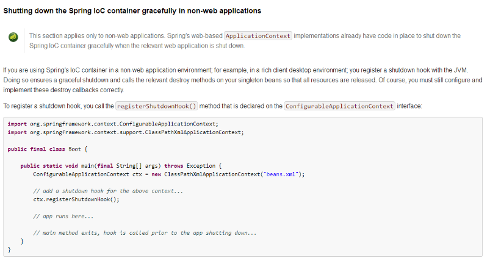
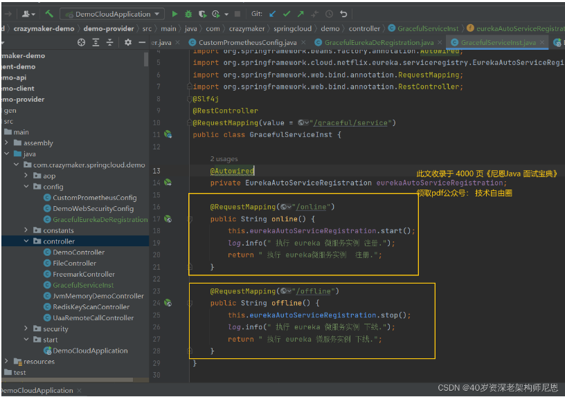

## 美团太细了：Springcloud 微服务优雅停机，如何实现？

### 说在前面
关于Spring Boot、Spring Cloud应用的优雅停机，平时经常会被问到，这也是实际应用过程中，必须要掌握的点。
在40岁老架构师 尼恩的读者社区(50+)中，最近有小伙伴拿到了一线互联网企业如美团、拼多多、极兔、有赞、希音的面试资格，
遇到一几个很重要的面试题：
- 云原生 SpringCloud 微服务的优雅停机，如何实现？
与之类似的、其他小伙伴遇到过的问题还有：
- SpringCloud 微服务的优雅下线，如何实现？
- SpringBoot 的优雅下线，如何实现？
- 等等等等…

这里尼恩给大家做一下系统化、体系化的梳理，
使得大家可以充分展示一下大家雄厚的 “技术肌肉”，让面试官爱到 “不能自已、口水直流”。
也一并把这个题目以及参考答案，收入咱们的 《尼恩Java面试宝典》V77版本，
供后面的小伙伴参考，提升大家的 3高 架构、设计、开发水平。

### 文章目录
- 说在前面
- 什么才是SpringCloud 优雅下线？
- JVM的优雅退出
  - JVM 退出的钩子函数
    - JVM 退出的钩子函数的应用场景
  - JVM 退出的钩子函数的使用
  - Runtime.addShutDownHook(Thread hook)触发场景
- SpringBoot应用如何优雅退出
  - Spring如何添加钩子函数？
  - registerShutdownHook()源码分析
  - destroy() 方法如何使用
  - Springboot 如何自动注册的钩子函数的
- SpringCloud 微服务实例优雅的下线方式
  - Eureka微服务实例优雅下线方式
  - Nacos 微服务实例优雅下线方式
- 云原生场景下， SpringCloud 微服务实例，如何优雅退出
  - 回顾JVM关闭的钩子函数在什么情况下会被调用
  - 云原生场景下，JVM关闭钩子的所存在的问题
  - 定义preStop钩子接口优先执行核心的下线逻辑
  - 微服务的无损下线小结
- 附：SpringBoot应用的优雅停机
  - 什么是Web 容器优雅停机行为
  - 优雅停机的目的：
  - 优雅停机具体行为：
  - 优雅停机的使用和配置
  - 优雅退出原理
    - 注册实现smartLifecycle的Bean
    - smartLifecycle回调执行的流程和时机
    - SpringBoot 优雅停机的执行流程总结:
  - SpringBoot应用的优雅停机如何触发
    - 方式一：kill PID
    - 方式二：shutdown端点
    - shutdown端点的源码分析
  - SpringCloud + SpringBoot优雅退出总结
- 说在最后
- 技术自由的实现路径 PDF：
  - 实现你的 架构自由：

### 什么才是SpringCloud 优雅下线？
java程序运行在JVM上，有很多情况可能会突然崩溃掉，比如OOM、用户强制退出、业务其他报错。。。等一系列的问题可能导致我们的进程挂掉。
这时候，我们就有***服务改进、新版本升级的需求***。
如果我们要升级某个服务，前提就是要进行服务的优雅下线。
什么才是SpringCloud 优雅下线？
那么，咱们常用的 kill PID，它是优雅的下线策略吗?
当然不是。
***首先，优雅下线是目标，而不是手段，它是一个相对的概念。***
```
首先，优雅下线是目标，而不是手段，它是一个相对的概念
```
虽然kill PID 不是优雅下线，并且kill PID和kill -9 PID都是暴力杀死服务，
相对于kill -9 PID来说，kill PID就是优雅的。
那么，到底什么才是SpringCloud 优雅下线呢？
包括以下内容：
- 处理没有完成的请求，注意，不再接收新的请求
- 池化资源的释放：数据库连接池，HTTP 连接池
- 处理线程的释放：请求处理线程的释放
- SpringCloud 微服务实例优雅的下线方式，主动从注册中心注销，保证其他的 RPC客户端不会发生错误的RPC调用

```
那么到底什么才是SpringCloud优雅下线呢？
1.处理没有完成的请求，注意，不再接收新的请求
2.池化资源的释放：数据库连接池，HTTP连接池，REDIS连接池等等
3.处理线程的释放：请求处理线程的释放
4.SpringCloud微服务实例优雅下线方式，主动从注册中心注销，保证其他的RPC客户端不会发生错误的RPC调用
```

那么SpringCloud 优雅下线该如何实现呢？
要介绍清楚 SpringCloud 优雅下线实现机制，必须首先从JVM的优雅退出的基础知识开始。

### JVM的优雅退出
JVM的优雅退出机制，主要是通过 Hook实现的。
JVM有***shutdwonHook***机制，中文习惯叫优雅退出。
VM的优雅退出Hook，和linux系统中执行SIGTERM(kill -15 或者 svc -d)时，***退出前执行的一些操作***。

#### JVM 退出的钩子函数

##### JVM 退出的钩子函数 的应用场景
首先看看，JVM 退出的钩子函数 的应用场景。
我们的java程序运行在JVM上，有很多情况可能会突然崩溃掉，比如：
- OOM
- 用户强制退出
- 业务其他报错
- 等

一系列的问题，可能导致我们的JVM 进程挂掉。
JVM 退出的钩子函数是指在 JVM 进程即将退出时，自动执行用户指定的代码段。
```
JVM退出的钩子函数是指在JVM进程即将退出时，自动执行用户指定的代码段。
```

这个功能的应用场景比较广泛，例如：
- 1.资源释放：在 JVM 退出时，需要释放一些资源，比如关闭数据库连接、释放文件句柄等，可以使用钩子函数来自动执行这些操作。
- 2.日志记录：在 JVM 退出时，可以记录一些关键信息，比如程序运行时间、内存使用情况等，以便后续分析问题。
- 3.数据持久化：在 JVM 退出时，可以将一些重要的数据持久化到磁盘上，以便下次启动时可以恢复状态。
- 4.安全退出：在 JVM 退出时，可以执行一些清理操作，比如删除临时文件、关闭网络连接等，以确保程序的安全退出。

```
1.资源释放：在JVM退出时，需要释放一些资源，比如关闭数据库连接、释放文件句柄等，可以使用钩子函数来自动执行这些操作。
2.日志记录：在JVM退出时，可以记录一些关键信息，比如程序运行时间、内存使用情况等，以便后续分析问题。
3.数据持久化：在JVM退出时，可以将一些重要的数据持久化到磁盘上，以便下次启动时可以恢复状态。
4.安全退出：在JVM退出时，可以执行一些清理操作，比如删除临时文件、关闭网络连接等，以确保程序的安全退出。
```

总之，钩子函数可以在 JVM 退出时执行一些自定义的操作，以便更好地管理和控制程序的运行。

```
40岁老架构师尼恩的提示：
应用的优雅关闭非常重要，可以在关闭之前做一些记录操作、补救操作。
```
- 应用的优雅关闭非常重要，可以在关闭之前做一些记录操作、补救操作。

至少，能知道咱们的JVM进程，什么时间，什么原因发生过异常退出。
```
至少能知道咱们的JVM进程，什么时间，什么原因发生过异常退出。
```

##### JVM 退出的钩子函数的使用
在java程序中，可以通过添加关闭钩子函数，实现在程序退出时关闭资源、优雅退出的功能。
如何做呢？
主要就是通过Runtime.addShutDownHook(Thread hook)来实现的。
Runtime.addShutdownHook(Thread hook) 是 Java 中的一个方法，用于在 JVM 关闭时注册一个线程来执行清理操作。
Runtime.addShutdownHook(Thread hook) 每一次调用，就是注册一个线程，参考代码如下：
```
// 添加hook thread，重写其run方法
Runtime.getRuntime().addShutdownHook(new Thread(){
    @Override
    public void run() {
      System.out.println("this is hook demo...");
      // jvm 退出的钩子逻辑
    }
});
```
Runtime.addShutdownHook(Thread hook) 可以调用多次，从而注册多个线程。
当 JVM 即将关闭时，会按照注册的顺序依次执行这些线程，以便进行一些***资源释放***、***日志记录***或***其他清理操作***。
这个方法可以在应用程序中用来确保在程序退出前执行一些必要的清理工作，例如***关闭数据库连接或释放文件句柄【关闭IO】***等。

下面我们来简单看一个Runtime.addShutDownHook(Thread hook) 使用示例
```java
// 创建HookTest，我们通过main方法来模拟应用程序
public class HookTest {
    public static void main(String[] args) {
        // 添加hook thread，重写其run方法
        Runtime.getRuntime().addShutdownHook(new Thread(){
            @Override
            public void run() {
                System.out.println("this is hook demo...");
                // jvm 退出的钩子逻辑
            }});
        int i = 0;
        // 这里会报错，jvm会去执行hook thread
        int j = 10/i;
        System.out.println("j" + j);
    }
}
```

执行之后，结果如下：
```
Exception in thread "main" java.lang.ArithmeticException: / by zeroat hook.HookTest.main(HookTest.java:23)
this is hook demo...Process finished with exit code 1
```
总结：我们主动写了一个报错程序，在程序报错之后，钩子函数还是被执行了。
经验证，我们是可以通过对Runtime添加钩子函数，来完成退出时的善后工作。

```
总结：我们主动写了一个报错程序，在程序报错之后，钩子函数还是被执行了。
经验证，我们是可以通过对Runtime添加钩子函数，来完成退出时的善后工作。
```

##### Runtime.addShutDownHook(Thread hook)触发场景
既然JDK提供的这个方法可以注册一个JVM关闭的钩子函数，那么这个函数在什么情况下会被调用呢？
上述我们展示了在程序异常情况下会被调用，还有没有其他场景呢？
- 程序正常退出
- 使用System.exit()
- 终端使用Ctrl+C触发的中断
- 系统关闭
- OutofMemory宕机
- 使用Kill pid杀死进程（使用kill -9是不会被调用的）
- …等等
```
程序正常退出
使用System.exit()
终端使用Ctrl+C触发的中断
系统关闭
OutofMemory宕机
使用Kill pid杀死进程（使用kill -9是不会被调用的）
...等等
```

Runtime.addShutDownHook(Thread hook)触发场景 ,详见下图


```
40岁老架构师尼恩提示：强制关闭 不能 进行 Runtime.addShutDownHook(Thread hook)的触发，
上图的第三个分支，展示得清清楚楚
```

#### SpringBoot应用如何优雅退出

##### Spring如何添加钩子函数？
Spring/SpringBoot应用，如何手动添加钩子函数呢？
Spring/SpringBoot 提供了一个方法：
// 通过这种方式来添加钩子函数
ApplicationContext.registerShutdownHook();
ApplicationContext.registerShutdownHook() 方法是 Spring 框架中的一个方法，用于注册一个 JVM 关闭的钩子（shutdown hook）。
当 JVM 关闭时，Spring 容器可以优雅地关闭并释放资源，从而避免了***可能的资源泄漏或其他问题***。
ApplicationContext.registerShutdownHook() 方法应该在 Spring 应用程序的 main 方法中调用，以确保在 JVM 关闭时 Spring 容器能够正确地关闭。
下面是 Spring 官方的原文介绍：


##### registerShutdownHook()源码分析
spring通过JVM实现注册退出钩子的源码如下：
```
// 通过源码可以看到，
@Override
public void registerShutdownHook() {
  if (this.shutdownHook == null) {
    // No shutdown hook registered yet.
    this.shutdownHook = new Thread() {
      @Override
      public void run() {
        synchronized (startupShutdownMonitor) {
          doClose();
        }
    }
  };
  // 也是通过这种方式来添加
  Runtime.getRuntime().addShutdownHook(this.shutdownHook);
}
// 重点是这个doClose()方法
protected void doClose() {
  // Check whether an actual close attempt is necessary...
  if (this.active.get() && this.closed.compareAndSet(false, true)) {
    if (logger.isInfoEnabled()) {
      logger.info("Closing " + this);
    }
    LiveBeansView.unregisterApplicationContext(this);
    try {
      // Publish shutdown 
      event.publishEvent(new ContextClosedEvent(this));
    }catch (Throwable ex) {
      logger.warn("Exception thrown from ApplicationListener handling ContextClosedEvent", ex);
    }
    // Stop all Lifecycle beans, to avoid delays during individual destruction.
    if (this.lifecycleProcessor != null) {
      try {
        this.lifecycleProcessor.onClose();
      }catch (Throwable ex) {
        logger.warn("Exception thrown from LifecycleProcessor on context close", ex);
      }
    }
    // Destroy all cached singletons in the context's 
    BeanFactory.destroyBeans();
    // Close the state of this context itself.closeBeanFactory();
    // Let subclasses do some final clean-up if they wish...onClose();
    // Switch to inactive.this.active.set(false);}
}
```

spring里registerShutdownHook的源码所示，就是注册一个jvm的shutdownHook钩子函数。jvm退出前会执行这个钩子函数。
通过源码，可以看到：doClose()方法会执行bean的destroy()，也会执行SmartLifeCycle的stop()方法，
我们就可以通过重写这些方法来实现对象的关闭，生命周期的管理，实现平滑shutdown、优雅关闭。

spring 为何在容器销毁时自动 调用destroy()等方法？ 
就是这里的 destroyBeans() 方法的执行。 
所以，这里特别关注的是 destroyBeans() 方法。

destroyBeans() 是 Spring 框架中的一个方法，它是在 Spring 容器关闭时调用的方法，用于销毁所有的单例 bean。
在 Spring 容器关闭时，会依次调用所有单例 bean 的 destroy() 方法，
而 destroyBeans() 方法就是用于触发这个过程的。
在 destroy() 方法中，我们可以释放资源、关闭连接等操作，以确保应用程序正确地关闭。
```
40岁老架构师尼恩的提示:
destroy() 方法只在单例 bean 中才会被调用，
而对于原型 bean，Spring 容器不会调用其 destroy() 方法。
```

destroy() 方法如何使用
两个方式：
- 方式一： 实现了 DisposableBean 接口，并重写了其中的 destroy() 方法
- 方式二：使用 @PreDestroy 注解来指定销毁方法

destroy() 方法是在 Spring 容器销毁时调用的方法，用于释放资源或执行清理操作。
方式一： 实现了 DisposableBean 接口，并重写了其中的 destroy() 方法
下面是destroy() 方法如何使用的一个示例：

```java
public class MyBean implements DisposableBean {
    private Resource resource;
    public void setResource(Resource resource) {
        this.resource = resource;
    }
    // 实现 DisposableBean 接口中的 destroy() 方法
    @Override
    public void destroy() throws Exception {
        // 释放资源
        if (this.resource != null) {
            this.resource.release();
        }
    }
}
```
在这个示例中，MyBean 实现了 DisposableBean 接口，并重写了其中的 destroy() 方法。
在 destroy() 方法中，我们释放了 resource 资源。
当 Spring 容器销毁时，会自动调用 MyBean 的 destroy() 方法，从而释放资源。

方式二：使用 @PreDestroy 注解来指定销毁方法
除了实现 DisposableBean 接口，还可以使用 @PreDestroy 注解来指定销毁方法。例如：
```java
public class MyBean {
    private Resource resource;
    public void setResource(Resource resource) {
        this.resource = resource;
    }
    // 使用 @PreDestroy 注解指定销毁方法
    @PreDestroy
    public void releaseResource() {
        if (this.resource != null) {
            this.resource.release();
        }
    }
}
```
在这个示例中，MyBean 没有实现 DisposableBean 接口，
而是使用 @PreDestroy 注解指定了销毁方法 releaseResource()。
当 Spring 容器销毁时，会自动调用这个方法。

##### Springboot 如何自动注册的钩子函数的
实际上， registerShutdownHook() 钩子方法，在新的Springboot 版本中，不需要手动调用，已经被自动的执行了。
看一个简单的应用， 尼恩带大家，一步一步的翻翻源码：

顺着run的调用链路，继续往里翻看，会看到***refreshContext***方法的执行
关键就在于这个 refreshContext 方法
继续往里翻看，发现一个秘密： 自动调用了registerShutdownHook() 方法
好吧，终于回到了 registerShutdownHook()源码 ，这个上面详细介绍了的
```
AbstractApplicationContext.this.doClose();
```
细心的小伙伴，可能发现那儿有个条件，如果条件不满足，基本上就跳过去了。
不着急。
40岁老架构师尼恩崇尚动手，咱们单步执行一下，发现一个秘密：条件默认就是true

### SpringCloud 微服务实例优雅的下线方式
在分布式微服务场景下， SpringCloud 微服务实例 都是通过 注册中心如 Eureka /nacos 进行实例管理的。
- Eureka 微服务实例优雅下线方式
- nacos 微服务实例优雅下线方式

#### Eureka 微服务实例优雅下线方式
如果服务发现组件使用的是 Eureka，那么默认最长会有 90 秒的延迟，其他应用才会感知到该服务下线，
这意味着：
```
该实例下线后的 90 秒内，其他服务仍然可能调用到这个已下线的实例。
```
Spring Boot 应用 退出的时候，如何在 Eureka 进行实例的主动删除呢？
可以借助 Spring Boot 应用的 Shutdown hook，结合 Eureka 的Client API，达到微服务实例优雅下线的目标。
```
可以借助Spring Boot应用Shutdown hook，结合Eureka的Client API，达到微服务实例优雅下线的目标
```
Eureka 的两个核心的 Client API 如下：
- 执行eurekaAutoServiceRegistration.start()方法时，当前服务向 Eureka 注册中心注册服务；
- 执行eurekaAutoServiceRegistration.stop()方法时，当前服务会向 Eureka 注册中心进行反注册，注册中心收到请求后，会将此服务从注册列表中删除。

借助 Spring Boot 应用的 Shutdown hook ，微服务实例优雅下线的目标， 源码如下：

#### Nacos 微服务实例优雅下线方式
40岁老架构师在自己的 技术自由圈（ Future Super Architect Community 未来 超级 架构师社区）做个调查，
大部分的线上项目，现在都使用了Nacos 作为注册中心。
那么，Nacos 是否支持微服务实例的 上线和下线呢?
理论上，Nacos 不仅仅支持优雅的上线和下线，而且可以通过控制台、API 或 SDK 进行操作。
在控制台上线服务时，可以选择“上线方式”，有“快速上线”和“灰度发布”两种方式。
当然，这个是需要运维人员配合的。其中，“快速上线”会直接将服务实例上线，而“灰度发布”则会先将服务实例发布到灰度环境，等待一段时间后再逐步将其发布到生产环境。
```
在控制台上线服务时，可以选择“上线方式”，有“快速上线”和“灰度发布”两种方式。
当然，这个是需要运维人员配合的。
其中，“快速上线”会直接将服务实例上线，而“灰度发布”则会先将服务实例发布到灰度环境，等待一段时间后再逐步将其发布到生产环境。
```
这里不关注运维人员的活，咱们专注的是开发、架构师的活儿。
在 API 或 SDK 中，可以使用以下方法进行上线和下线操作：
- 上线服务实例：调用 registerInstance 接口，指定服务名、IP、端口等信息即可。
- 下线服务实例：调用 deRegisterInstance 接口，指定实例 ID 即可。

可以借助 Spring Boot 应用的 Shutdown hook，结合 Eureka和nacos API，达到微服务实例优雅下线的目标。
实现的方式和 前面的Eureka 类似， 仅仅是API的调用上的区别。
这里不做展开，有兴趣的，可以来 尼恩的 技术自由圈（ Future Super Architect Community 未来 超级 架构师社区）沟通。

### 云原生场景下， SpringCloud 微服务实例，如何优雅退出
一般来说，咱们的线上应用，都是在 Kubernetes部署的。
```
关于 K8S+ SpringCloud 云原生微服务架构，具体请看尼恩的 PDF电子书 《K8S学习圣经》
```
问题来了，云原生场景下， SpringCloud 微服务实例，如何优雅退出？
还是使用 JVM关闭的钩子函数吗？
首先，尼恩带大家来看一下JVM关闭的钩子函数的问题。

#### 回顾JVM关闭的钩子函数在什么情况下会被调用
前面的用到的SpringShutDownHook，最终还是调用的 JVM关闭的钩子函数。
既然JDK提供的这个方法可以注册一个JVM关闭的钩子函数，那么这个函数在什么情况下会被调用呢？
- 程序正常退出
- 使用System.exit()
- 终端使用Ctrl+C触发的中断
- 系统关闭
- OutofMemory宕机
- 使用Kill pid杀死进程（使用kill -9是不会被调用的）
- …等等

```
程序正常退出
使用System.exit()
终端使用Ctrl+C触发的中断
系统关闭
OutofMemory宕机
使用Kill pid杀死进程（使用kill -9是不会被调用的）
```

#### 云原生场景下，JVM关闭钩子的所存在的问题
一般来说，咱们的线上应用，都是在 Kubernetes部署的。
```
关于 K8S+ SpringCloud 云原生微服务架构，具体请看尼恩的 PDF电子书 《K8S学习圣经》
```
***SpringCloud云原生微服务架构***

Kubernetes 是如何优雅的停止 Pod 的？
当 kill 掉一个 Pod 的时候， Pod 的状态为 Terminating，开启终止流程。
- 首先 Service 会把这个 Pod 从 Endpoint 中摘掉，这样Service 负载均衡不会再给这个 Pod 流量，
- 然后，他会先看看是否有 preStop钩子，如果定义了，就执行他，
- 最后之后给 Pod 发 SIGTERM[singal+terminate] 信号让 Pod 中的所有容器优雅退出。

```
k8s如何优雅的停止pod?
当kill掉一个pod的时候，pod的状态为Terminating，开启终止流程
- 首先Service会把这个pod从Endpoint中摘掉，这样Service负载均衡不会再给这个Pod流量
- 然后，他会先看看是否有preStop钩子，如果定义了，就执行它
- 最后给Pod发SIGTERM信号，让pod中的所有容器优雅退出
```

JVM的优雅退出，发生在最后一步。
但是实际情况中，我们可能会遇到以下情况，导致最后一步发生了意外，比如：
- 容器里的SpringBoot代码有很多处理优雅退出的逻辑，但是其中部分处理逻辑问题，导致一直退出不了
- 容器里的SpringBoot已经处理优雅已经卡死，导致资源耗尽，处理不了微服务优雅下线的代码逻辑，或需要很久才能处理完成

Kubernetes 怎么进行超时处理的呢？
***Kubernetes 还有一个 terminationGracePeriodSeconds 的硬停止时间，默认是 30s，如果 30s 内还是无法完成上述的过程，那就就会发送 SIGKILL，强制干掉 Pod***。
在POSIX兼容的平台上，SIGKILL是发送给一个进程来导致它立即终止的信号。
SIGKILL的符号常量在头文件signal.h中定义。因为在不同平台上，信号数字可能变化，因此符号信号名被使用，然而在大量主要的系统上，SIGKILL是信号#9
Runtime.addShutDownHook(Thread hook)触发场景 ,详见下图
40岁老架构师尼恩提示：强制关闭 不能 进行 Runtime.addShutDownHook(Thread hook)的触发，上图的第三个分支，展示得清清楚楚
所以，JVM的优雅退出的问题就昭然若揭了。

在实际情况中，如果会遇到以下情况，导致最后一步发生了意外，比如：
- 容器里的SpringBoot代码有很多处理优雅退出的逻辑，但是其中部分处理逻辑问题，导致一直退出不了
- 容器里的SpringBoot已经处理优雅已经卡死，***导致资源耗尽，处理不了微服务优雅下线的代码逻辑，或需要很久才能处理完成***

JVM的优雅退出就失效了。
怎么办呢？
比较直接、有效的策略是：
利用优雅的停止 Pod 的前置钩子， 定义preStop钩子接口优先执行核心的下线逻辑

#### 定义preStop钩子接口优先执行核心的下线逻辑
定义preStop钩子接口优先执行核心的下线逻辑，比如这里的 微服务实例下线
具体如何操作呢？实操上有个步骤：
- step1：在SpringBoot应用中，定义WEB接口，实现核心线下逻辑
- step2：在 pod的preStop钩子接口的设置上，设置为SpringBoot应用的下线钩子链接

step1： 在SpringBoot应用中，定义WEB接口，实现核心线下逻辑
先看第一步：


当 kill 掉一个 Pod 的时候， Pod 的状态为 Terminating，开启终止流程。
- step1: Service 会把这个 Pod 从 Endpoint 中摘掉，这样Service 负载均衡不会再给这个 Pod 流量，
这样，这个微服务实例，就收不到用户的请求
- 然后，他会先看看是否有 preStop钩子，如果定义了，就执行他，
这样，从注册中心下线，也就收不到 其他微服务的 rpc 请求
- 最后，之后给 Pod 发 SIGTERM 信号让 Pod 中的所有容器优雅退出。

preStop钩子 执行完成后， 最后一步， Pod 发 SIGTERM 信号让 Pod 中的所有容器优雅，SIGTERM 信号发给 jvm后，Jvm会执行优雅退出逻辑，主要是：
- 处理没有完成的请求，注意，不再接收新的请求
- 池化资源的释放：数据库连接池，HTTP 连接池
- 处理线程的释放：已经被连接的HTTP请求

这些，咱们就先用放在前面介绍的 JVM 处理钩子方法里边去了。

### 微服务的无损下线小结
我们在应用服务下线前，通过HTTP钩子调用，主动通知注册中心下线该实例
不论是Dubbo还是Cloud 的分布式服务框架，都关注的是怎么能在服务停止前，先将提供者在注册中心进行下线，然后在停止服务提供者，
唯有这样，才能保证业务微服务之间RPC远程调用，不会产生各种503、timeout等现象。

### 附：SpringBoot应用的优雅停机
除了 微服务的无损下线，作为 SpringBoot应用， 还有 单体服务优雅停机的需求：
- 处理没有完成的请求，注意，不再接收新的请求
- 池化资源的释放：数据库连接池，HTTP 连接池
- 处理线程的释放：已经被连接的HTTP请求

这些前面介绍到 ，咱们就先用放在 JVM 处理钩子方法里边去了。
SpringBoot应用的优雅停机，实际上指的是内嵌WEB服务器的优雅停机。
目前Spring Boot已经发展到了2.3.4.RELEASE，伴随着2.3版本的到来，优雅停机机制也更加完善了。

#### 什么是Web 容器优雅停机行为
Web 容器优雅停机行为指的是在关闭容器时，让当前正在处理的请求处理完成或者等待一段时间，让正在处理的请求完成后再关闭容器，而不是直接强制终止正在处理的请求。
这样可以避免正在处理的请求被中断，从而提高系统的可用性和稳定性。
一般来说，Web 容器的优雅停机行为需要满足以下几个条件：
- 等待正在处理的请求完成，不再接受新的请求。
- 如果等待时间超过了一定阈值，容器可以强制关闭。
- 在容器关闭之前，需要给客户端一个响应，告知他们当前正在关闭容器，不再接受新的请求

#### 优雅停机的目的：
如果没有优雅停机，服务器此时直接直接关闭(kill -9)，那么就会导致当前正在容器内运行的业务直接失败，在某些特殊的场景下产生脏数据。

#### 优雅停机具体行为：
在服务器执行关闭（kill -2）时，会预留一点时间使容器内部业务线程执行完毕，
增加了优雅停机配置后, 此时容器也不允许新的请求进入。
目前版本的Spring Boot 优雅停机支持Jetty, Reactor Netty, Tomcat和 Undertow 以及反应式和基于 Servlet 的 web 应用程序都支持优雅停机功能。
新请求的处理方式跟web服务器有关，Reactor Netty、 Tomcat将停止接入请求，Undertow的处理方式是返回503。

具体行为，如下表所示：

|web 容器名称|	行为说明|
|---|---|
|tomcat 9.0.33+|停止接收请求，客户端新请求等待超时。|
|Reactor Netty|停止接收请求，客户端新请求等待超时。|
|Undertow|停止接收请求，客户端新请求直接返回 503。|

不同的 Web 容器实现优雅停机的方式可能会有所不同，但是一般都会提供相关的配置选项或者 API 接口来实现这个功能。
另外，和SpringBoot内嵌的WEB服务器类似，其他的非SpringBoot内嵌WEB服务器，也可以进行设置。
下面是 Nginx 和 Apache 的优雅停机配置：
- Nginx 可以通过配置文件中的 worker_shutdown_timeout 选项来设置等待时间
- Apache 可以通过 graceful-stop 命令来实现优雅停机。

#### 优雅停机的使用和配置
新版本配置非常简单，server.shutdown=graceful 就搞定了（注意，优雅停机配置需要配合Tomcat 9.0.33（含）以上版本）
server:port: 6080shutdown: graceful #开启优雅停机
spring:lifecycle:timeout-per-shutdown-phase: 20s #设置缓冲时间 默认30s
在设置了缓冲参数timeout-per-shutdown-phase 后，在规定时间内如果线程无法执行完毕则会被强制停机。

下面我们来看下停机时，加了优雅停日志和不加的区别：
```
//未加优雅停机配置
Disconnected from the target VM, address: '127.0.0.1:49754', transport: 'socket'
Process finished with exit code 130 (interrupted by signal 2: SIGINT)
```
加了优雅停机配置后，
日志可明显发现的 Waiting for active requests to cpmplete, 此时容器将在ShutdownHook执行完毕后停止。

#### 优雅退出原理
前面讲到，SpringBoot 的优雅退出，最终在 Java 程序中可以通过添加钩子，在程序退出时会执行钩子方法，从而实现关闭资源、平滑退出、优雅退出等功能。
SpringBoot 在启动过程中，则会默认注册一个JVM Shutdown Hook，在应用被关闭的时候，会触发钩子调用 doClose()方法，去关闭容器。
这部分代码，前面介绍了，具体在 org.springframework.boot.SpringApplication#refreshContext 方法中

#### 注册实现smartLifecycle的Bean
在创建 webserver 的时候，会创建一个实现smartLifecycle的 bean，用来支撑 server 的优雅关闭。
```
// 注册webServerGracefulShutdown用来实现server优雅关闭
this.getBeanFactory().registerSingleton("webServerGracefulShutdown", new WebServerGracefulShutdownLifecycle(this.webServer));
```
可以看到 WebServerGracefulShutdownLifecycle 类实现SmartLifecycle接口，重写了 stop 方法，
stop 方法会触发 webserver 的优雅关闭方法(取决于具体使用的 webserver 如 tomcatWebServer)。

```
// 优雅关闭server
this.webServer.shutDownGracefully((result) -> callback.run());
```
```
@Override
public void shutDownGracefully(GracefulShutdownCallback callback) {
  if (this.gracefulShutdown == null) {
    // 如果没有开启优雅停机，会立即关闭tomcat服务器
    callback.shutdownComplete(GracefulShutdownResult.IMMEDIATE);
    return;
  }
  // 优雅关闭服务器
  this.gracefulShutdown.shutDownGracefully(callback);
}
```
至此，优雅退出的代码，通过smartLifecycle的Bean 的stop 方法实现退出的回调注册。

#### smartLifecycle回调执行的流程和时机
smartLifecycle的Bean 的stop 方法什么时候被执行呢?
上文提到JVM钩子方法被调用后，会执行 doColse()方法，
而这个 doColse()方法， 在关闭容器之前，会通过 lifecycleProcessor 调用 lifecycle 的方法。
```
protected void doClose() {
  if (this.active.get() && this.closed.compareAndSet(false, true)) {
    LiveBeansView.unregisterApplicationContext(this);
    // 发布 ContextClosedEvent 事件
    publishEvent(new ContextClosedEvent(this));
    // 回调所有实现Lifecycle 接口的Bean的stop方法
    if (this.lifecycleProcessor != null) {
      this.lifecycleProcessor.onClose();
    }// 销毁bean, 关闭容器destroyBeans();
    closeBeanFactory();
    onClose();
    if (this.earlyApplicationListeners != null) {
      this.applicationListeners.clear();
      this.applicationListeners.addAll(this.earlyApplicationListeners);
    }
    // Switch to inactive.
    this.active.set(false);}
}
```
关闭 Lifecycle Bean 的入口：
org.springframework.context.support.DefaultLifecycleProcessor
具体的代码如下：
```
public class DefaultLifecycleProcessor implements LifecycleProcessor, BeanFactoryAware {
  @Override
  public void onClose() {
    stopBeans();
    this.running = false;
  }
  private void stopBeans() {
    //获取所有的 Lifecycle bean
    Map<String, Lifecycle> lifecycleBeans = getLifecycleBeans();
    //按Phase值对bean分组, 如果没有实现 Phased 接口则认为 Phase 是 0
    Map<Integer, LifecycleGroup> phases = new HashMap<>();
    lifecycleBeans.forEach((beanName, bean) -> {
      int shutdownPhase = getPhase(bean);
      LifecycleGroup group = phases.get(shutdownPhase);
      if (group == null) {
        group = new LifecycleGroup(shutdownPhase, this.timeoutPerShutdownPhase, lifecycleBeans, false);
        phases.put(shutdownPhase, group);
      }
      group.add(beanName, bean);
    });
    if (!phases.isEmpty()) {
      List<Integer> keys = new ArrayList<>(phases.keySet());
      //按照 Phase 值倒序
      keys.sort(Collections.reverseOrder());
      // Phase值越大优先级越高，先执行
      for (Integer key : keys) {phases.get(key).stop();}}}
```

DefaultLifecycleProcessor 的 stop 方法执行流程:
- 获取容器中的所有实现了 Lifecycle 接口的 Bean。
由于 smartLifecycle 接口继承了 Lifecycle， 在这里被获取到了。
- 再对包含所有 bean 的 List 分组按 phase 值倒序排序，值大的排前面。 (没有实现 Phased 接口, Phase 默认为0)
- 依次调用各分组的里 bean 的 stop 方法 （ Phase 越大 stop 方法优先执行）

stop 方法的实现，在这里就终于被执行了。
完成 tomcat的优雅退出行为，执行完之前接收到的请求，实现优雅退出。

#### SpringBoot 优雅停机的执行流程总结:
- SpringBoot 通过 Shutdown Hook 来注册 doclose() 回调方法，在应用关闭的时候触发执行。
- SpringBoot 在创建 webserver的时候，会注册实现 smartLifecycel 接口的 bean,用来优雅关闭 tomcat
- doClose()在销毁 bean, 关闭容器之前会执行所有实现 Lifecycel 接口 bean 的 stop方法，并且会按 Phase 值分组, phase 大的优先执行。
- WebServerGracefulShutdownLifecycle，Phase=Inter.MAX_VALUE，处于最优先执行序列，所以会先触发优雅关闭 tomcat ，
并且tomcat 关闭方法是异步执行的，主线会继续调用执行本组其他 bean 的关闭方法，
然后等待所有 bean 关闭完毕，超过等待时间，会执行下一组 Lifecycle bean 的关闭。

#### SpringBoot应用的优雅停机如何触发
通过源码分析，大家也发现了，SpringBoot应用的优雅停机，是注册了 JVM 优雅退出的钩子方法
JVM 优雅退出的钩子方法如何触发的呢？
常见的触发方式有：
- 方式一：kill PID
- 方式二：shutdown端点

##### 方式一：kill PID
使用方式：kill java进程ID
kill命令的格式是 kill -Signal pid，其中 pid 就是进程的编号，signal是发送给进程的信号，默认参数下，kill 发送 SIGTERM（15）信号给进程，
告诉进程，你需要被关闭，请自行停止运行并退出。
kill、kill -9、kill -3的区别
kill 会默认传15代表的信号为SIGTERM，这是告诉进程你需要被关闭，请自行停止运行并退出，进程可以清理缓存自行结束，也可以拒绝结束。
kill -9代表的信号是SIGKILL，表示进程被终止，需要立即退出，强制杀死该进程，这个信号不能被捕获也不能被忽略。
kill -3可以打印进程各个线程的堆栈信息，kill -3 pid 后文件的保存路径为：/proc/${pid}/cwd，文件名为：antBuilderOutput.log

其他的Kill信号清单如下：

##### 方式二：shutdown端点
Spring Boot 提供了/shutdown端点，可以借助它实现优雅停机。
使用方式：在想下线应用的application.yml中添加如下配置，从而启用并暴露/shutdown端点：
management:endpoint:shutdown:enabled: trueendpoints:web:exposure:include: shutdown
发送 POST 请求到/shutdown端点
curl -X http://ip:port/actuator/shutdown
该方式本质和方式一是一样的，也是借助 Spring Boot 应用的 Shutdown hook 去实现的。

shutdown端点的源码分析
actuator 都使用了SPI的扩展方式，
先看下AutoConfiguration，可以看到关键点就是ShutdownEndpoint
```java
@Configuration(proxyBeanMethods = false)
@ConditionalOnAvailableEndpoint(endpoint = ShutdownEndpoint.class)
public class ShutdownEndpointAutoConfiguration {
    public ShutdownEndpointAutoConfiguration() {}
    @Bean(destroyMethod = "")
    @ConditionalOnMissingBean
    public ShutdownEndpoint shutdownEndpoint() {return new ShutdownEndpoint();}
}
```
ShutdownEndpoint,的核心代码如下：
```java
@Endpoint(id = "shutdown",enableByDefault = false)
public class ShutdownEndpoint implements ApplicationContextAware {
    @WriteOperation
    public Map<String, String> shutdown() {
        if (this.context == null) {
            return NO_CONTEXT_MESSAGE;
        } else {
            boolean var6 = false;
            Map var1;
            try {
                var6 = true;
                var1 = SHUTDOWN_MESSAGE;
                var6 = false;
            } finally {
                if (var6) {
                    Thread thread = new Thread(this::performShutdown);
                    thread.setContextClassLoader(this.getClass().getClassLoader());
                    thread.start();
                }
            }
            Thread thread = new Thread(this::performShutdown);
            thread.setContextClassLoader(this.getClass().getClassLoader());
            thread.start();
            return var1;
        }
    }
    private void performShutdown() {
        try {
            Thread.sleep(500L);
        } catch (InterruptedException var2) {
            Thread.currentThread().interrupt();
        }
        this.context.close();  //这里才是核心}
  }
}
```
在调用了 this.context.close() ，其实就是AbstractApplicationContext 的close() 方法 （重点是其中的doClose()）
```
/*** Close this application context, destroying all beans in its bean factory.* 
<p>Delegates to {@code doClose()} for the actual closing procedure.* 
Also removes a JVM shutdown hook, if registered, as it's not needed anymore.* @see #doClose()* @see #registerShutdownHook()*/
@Override
public void close() {
  synchronized (this.startupShutdownMonitor) {
    doClose(); 
    //重点：销毁bean 并执行jvm shutdown hook
    // If we registered a JVM shutdown hook, we don't need it anymore now:
    // We've already explicitly closed the context.
    if (this.shutdownHook != null) {try {Runtime.getRuntime().removeShutdownHook(this.shutdownHook);}catch (IllegalStateException ex) {
      // ignore - VM is already shutting down}}}
}
```
doClose() 方法，又回到了前面的 Spring 的核心关闭方法。
doClose()在销毁 bean, 关闭容器之前会执行所有实现 Lifecycle 接口 bean 的 stop方法，
并且会按 Phase 值分组, phase 大的优先执行。

#### SpringCloud + SpringBoot优雅退出总结
Spring Boot、Spring Cloud应用的优雅停机，平时经常会被问到，这也是实际应用过程中，必须要掌握的点，
这里简单总结下以前我们一般在实现的时候要把握的几个要点：
- 1.关闭命令方面，一定要杜绝 kill -9 操作
- 2.多线程采用线程池实现，并且线程池要优雅关闭，从而保证每个异步线程都可以随Spring的生命周期完成正常关闭操作
- 3.有服务注册与发现机制下的时候，优先通过自定义K8S的POD的preStop钩子接口，来保障实例的主动下线。

### 说在最后
SpringCloud + SpringBoot 面试题，是非常常见的面试题。
以上的5大方案，如果大家能对答如流，如数家珍，基本上 面试官会被你 震惊到、吸引到。
最终，让面试官爱到 “不能自已、口水直流”。 offer， 也就来了。
学习过程中，如果有啥问题，大家可以来 找 40岁老架构师尼恩沟通。


