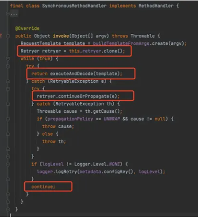

## feign 接口重试配置

Feign在调用外部服务的时候，偶尔会出现 SocketException: Connection reset 、NoHttpResponseException: xxxxxx failed to respond 等异常，
而这些异常并非是因为服务提供方服务不可用，或者负载过高引起的，
百度查了查大概原因说是因为在Client 和Server建立链接之后Server端在数据为正常响应之前就关闭了链接导致的异常。

- SocketException: Connection reset
- NoHttpResponseException: xxx failed to respond
- Client和Server端在数据正常响应之前就关闭了链接导致的异常

Feign 调用发起请求处理类 SynchronousMethodHandler 重试代码如下：
- SynchronousMethodHandler



```
final class SynchronousMethodHandler implements MethodHandler {
    @Override
    public Object invoke(Object[] argv) throws Throwable {
        RquestTemplate template = buildTemplateFromArgs.create(argv);
        Retryer retryer = this.retryer.clone();
        while(true){
            try {
                return executeAndDecode(template);
            }catch(RetryableException e){
                try {
                    retryer.continueOrPropagate(e);
                }catch(RetryableException th){
                    Throwable cause = th.getCause();
                    if(propagationPolicy == UNWARP && cause != null){
                        throw cause;
                    } else {
                        throw th;
                    }
                }
                if(loglevel != Logger.Level.NONE){
                    logger.logRetry(metadata.configKey(),logLevel);
                }
                continue;
            }
        }
    }
}
```

Retryer 则是 Feign 的重试策略接口，
默认Feign 配置的重试策略是 Retryer.NEVER_RETRY 也就是不走重试，直接异常报错。

需要注意几点： 
- 1.Feign默认配置是不走重试策略的，当发生RetryableException异常时直接抛出异常。
- 2.并非所有的异常都会触发重试策略，只有 RetryableException 异常才会触发异常策略。
- 3.在默认Feign配置情况下，只有在网络调用时发生 IOException 异常时，才会抛出 RetryableException，
也是就是说链接超时、读超时等不不会触发此异常。

因此常见的 
- SocketException、
- NoHttpResponseException、
- UnknownHostException、
- HttpRetryException、
- SocketConnectException、
- ConnectionClosedException 等异常都可触发Feign重试机制。

默认重试设置:
全局配置：
```
@Bean
public Retryer feignRetryer() {
    // 最大请求次数为5，初始间隔时间为100ms，下次间隔时间1.5倍递增，重试间最大间隔时间为1s，
    return new Retryer.Default();
}
```

自定义重试配置:
局部配置：
```java
import feign.RetryableException;
import feign.Retryer;
import lombok.extern.slf4j.Slf4j;
import org.springframework.stereotype.Component;
import static java.util.concurrent.TimeUnit.SECONDS;

@Slf4j
@Component
public  class CommonFeignRetry extends Retryer.Default {
    public CommonFeignRetry() {
        // 重试10次 最大间隔时间1秒
        this(100, SECONDS.toMillis(1), 10);
    }
 
    public CommonFeignRetry(long period, long maxPeriod, int maxAttempts) {
        super(period, maxPeriod, maxAttempts);
    }
    
    @Override
    public void continueOrPropagate(RetryableException e) {
        log.warn("【FeignRetryAble】Message【{}】", e.getMessage());
        super.continueOrPropagate(e);
    }
    @Override
    public Retryer clone() {
        return new CommonFeignRetry();
    }
}
```

指定FeignClient走重试策略：
```
@FeignClient(name = "test-service", contextId = "testClient",
fallbackFactory = FmsBaseClientFallbackFactory.class, configuration = CommonFeignRetryConfig.class)
```

也可以在配置文件中指定：
```
feign:
  client:
    config:
      feignName:
        connectTimeout: 5000
        readTimeout: 5000
        loggerLevel: full
        errorDecoder: com.example.SimpleErrorDecoder
        retryer: com.example.SimpleRetryer
```

全局配置：
```
@Bean
Retryer getRetry() {
    return new CommonFeignRetry();
}
```


