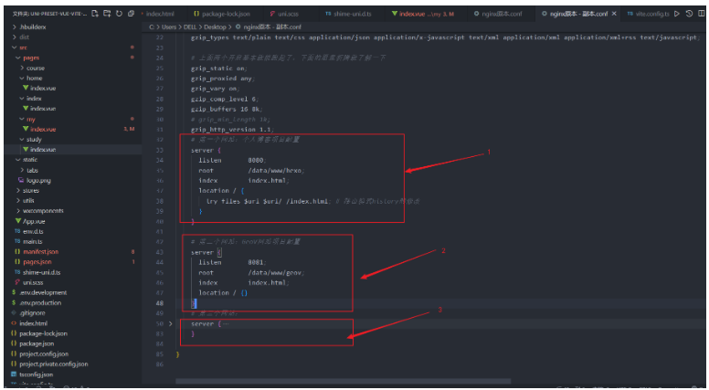

## nginx配置详解

- 一：nginx.conf原本配置到解释
- 二：整体基本理解
  - 全局块：
  - events块：
  - http块：
- 三：最简单的上线
- 四：nginx优化：
  - 1.前端history模式404问题：
  - 2.反向代理：
    - 如何配置：
    - 具体位置：
    - 理解：
    - 定义多个端口的反向代理：
  - 3.开启gzip：
    - 作用：
    - 如何配置：
    - 具体位置：
  - 4.维护页面：
    - 作用：
    - 如何配置：
    - 具体位置：
  - 5.一个ip上线多个网站：
    - 作用：
    - 如何配置：
    - 具体位置：
    - 注意点：
  - 6.动静分离
    - 作用：
    - 解析：
    - 图解：
    - 如何配置（其实是优化，因为一般配置会有动静分离）：
    - 具体位置：
  - 7.其他优化
- 五：nginx基础命令：安装，启动，重启，关闭
- 六：其他

### 前言
对于自己上线项目的前端来说，nginx也是必须要了解和熟悉的，查了很多的nginx文章，看着写的都很详细，但是却没有了整体的概念。
这里就重新梳理一遍，也理清思路。我们在安装nginx之后，会自动生成很多的文件，但是***nginx.conf***这个文件是我们的核心，
如何去正确的修改和优化它是nginx的核心。
首先我们可以先看下原本的配置，你会觉得无所适从，因为感觉这个鬼东西也太多了吧。
而且感觉根本就不理解，也不知道该怎么写。下面，就一步一步的教你如何入门到熟悉

### 一：nginx.conf原本配置到解释
看到这个118行是不是觉得有点害怕
```nginx
#user  nobody;
worker_processes  1;
#error_log  logs/error.log;
#error_log  logs/error.log  notice;
#error_log  logs/error.log  info;
#pid        logs/nginx.pid;
events {
    worker_connections  1024;
}
http {
    include       mime.types;
    default_type  application/octet-stream;

    #log_format  main  '$remote_addr - $remote_user [$time_local] "$request" '
    #                  '$status $body_bytes_sent "$http_referer" '
    #                  '"$http_user_agent" "$http_x_forwarded_for"';

    #access_log  logs/access.log  main;

    sendfile        on;
    #tcp_nopush     on;

    #keepalive_timeout  0;
    keepalive_timeout  65;

    #gzip  on;

    server {
        listen       80;
        server_name  localhost;

        #charset koi8-r;

        #access_log  logs/host.access.log  main;

        location / {
            root   html;
            index  index.html index.htm;
        }

        #error_page  404              /404.html;

        # redirect server error pages to the static page /50x.html
        #
        error_page   500 502 503 504  /50x.html;
        location = /50x.html {
            root   html;
        }

        # proxy the PHP scripts to Apache listening on 127.0.0.1:80
        #
        #location ~ \.php$ {
        #    proxy_pass   http://127.0.0.1;
        #}

        # pass the PHP scripts to FastCGI server listening on 127.0.0.1:9000
        #
        #location ~ \.php$ {
        #    root           html;
        #    fastcgi_pass   127.0.0.1:9000;
        #    fastcgi_index  index.php;
        #    fastcgi_param  SCRIPT_FILENAME  /scripts$fastcgi_script_name;
        #    include        fastcgi_params;
        #}

        # deny access to .htaccess files, if Apache's document root
        # concurs with nginx's one
        #
        #location ~ /\.ht {
        #    deny  all;
        #}
    }


    # another virtual host using mix of IP-, name-, and port-based configuration
    #
    #server {
    #    listen       8000;
    #    listen       somename:8080;
    #    server_name  somename  alias  another.alias;

    #    location / {
    #        root   html;
    #        index  index.html index.htm;
    #    }
    #}


    # HTTPS server
    #
    #server {
    #    listen       443 ssl;
    #    server_name  localhost;

    #    ssl_certificate      cert.pem;
    #    ssl_certificate_key  cert.key;

    #    ssl_session_cache    shared:SSL:1m;
    #    ssl_session_timeout  5m;

    #    ssl_ciphers  HIGH:!aNULL:!MD5;
    #    ssl_prefer_server_ciphers  on;

    #    location / {
    #        root   html;
    #        index  index.html index.htm;
    #    }
    #}

}

```

没关系，我们把其中的注释都删掉，除掉了注释之后的nginx代码，现在只有22行了。感觉好多了
```nginx
worker_processes  1;
events {
    worker_connections  1024;
}
http {
    include       mime.types;
    default_type  application/octet-stream;
    sendfile        on;
    keepalive_timeout  65;
    server {
        listen       80;
        server_name  localhost;
        location / {
            root   html;
            index  index.html index.htm;
        }
        error_page   500 502 503 504  /50x.html;
        location = /50x.html {
            root   html;
        }
    }
}
```

注解版本：
```nginx
#nginx进程数，建议设置为等于CPU总核心数。
worker_processes  1;
# 事件区块开始
events {
    #单个进程最大连接数（最大连接数=连接数*进程数）
    #根据硬件调整，和前面工作进程配合起来用，尽量大，但是别把cpu跑到100%就行。每个进程允许的最多连接数，理论上每台nginx服务器的最大连接数为。
    worker_connections  1024;
}
#设定http服务器，利用它的反向代理功能提供负载均衡支持
http {
    # include：导入外部文件mime.types，将所有types提取为文件，然后导入到nginx配置文件中
    include       mime.types;
    # 默认文件类型
    default_type  application/octet-stream;
    # 开启高效文件传输模式，sendfile指令指定nginx是否调用sendfile函数来输出文件，对于普通应用设为 on，
    # 如果用来进行下载等应用磁盘IO重负载应用，可设置为off，以平衡磁盘与网络I/O处理速度，降低系统的负载。注意：如果图片显示不正常把这个改成off。
    # sendfile指令指定 nginx 是否调用sendfile 函数（zero copy 方式）来输出文件，对于普通应用，必须设为on。
    # 如果用来进行下载等应用磁盘IO重负载应用，可设置为off，以平衡磁盘与网络IO处理速度，降低系统uptime。
    sendfile        on;
    # 长连接超时时间，单位是秒
    keepalive_timeout  65;
    # 第一个Server区块开始，表示一个独立的虚拟主机站点
    server {
        # 提供服务的端口，默认80
        listen       80;
        # 提供服务的域名主机名
        server_name  localhost;
        #对 "/" 启用反向代理,第一个location区块开始
        location / {
            root   html;  #服务默认启动目录
            index  index.html index.htm; # 默认的首页文件，多个用空格分开
        }
        # 错误页面路由
        error_page   500 502 503 504  /50x.html; # 出现对应的http状态码时，使用50x.html回应客户
        location = /50x.html { # location区块开始，访问50x.html
            root   html;  # 指定对应的站点目录为html
        }
    }
}
```

### 二：整体基本理解
虽然上面有了注解，但是看起来还是很迷糊。接着解释：我们可以把nginx.conf分为三个部分进行理解：
- 第一部分：全局块
- 第二部分：events块
- 第三部分：http块
对应图解：


#### 全局块：
作用： 从配置文件开始到 events 块之间的内容，主要会设置一些影响nginx 服务器整体运行的配置指令，
主要包括配 置运行 Nginx 服务器的用户（组）、
允许生成的 worker process 数，
进程 PID 存放路径、日志存放路径和类型以及配置文件的引入等。
比如上面第一行配置的
```nginx
worker_processes  1;
```
这是 Nginx 服务器并发处理服务的关键配置，worker_processes 值越大，
可以支持的并发处理量也越多，但是会受到硬件、软件等设备的制约。

#### events块：
作用： ***events 块涉及的指令主要影响 Nginx 服务器与用户的网络连接***，
常用的设置包括是否开启对多 work process 下的网络连接进行序列化，
是否 允许同时接收多个网络连接，选取哪种事件驱动模型来处理连接请求，
每个 word process 可以同时支持的最大连接数等。
```nginx
worker_connections  1024;
```

上述例子就表示每个 work process 支持的最大连接数为 1024.
这部分的配置对 Nginx 的性能影响较大，在实际中应该灵活配置。

#### http块：
作用： 这算是 Nginx 服务器配置中最频繁的部分，***代理***、***缓存***和***日志定义***等绝大多数功能和第三方模块的配置都在这里。
需要注意的是：***http 块也可以包括 http全局块、server 块***。

- http全局块
http全局块配置的指令包括文件引入、MIME-TYPE 定义、日志自定义、连接超时时间、单链接请求数上限等。
 
- server 块
这块和虚拟主机有密切关系，虚拟主机从用户角度看，和一台独立的硬件主机是完全一样的，
该技术的产生是为了 节省互联网服务器硬件成本。
 
```
每个 http 块可以包括多个 server 块，而每个 server 块就相当于一个虚拟主机。
而每个 server 块也分为全局 server 块，以及可以同时包含多个 location 块。
```
 
- 全局 server 块
最常见的配置是***本虚拟机主机的监听配置和本虚拟主机的名称或IP配置***。
 
- location 块
一个 server 块可以配置多个 location 块。
这块的主要作用是基于 Nginx 服务器接收到的请求字符串（例如 server_name/uri-string），
***对虚拟主机名称 （也可以是IP 别名）之外的字符串（例如 前面的 /uri-string）进行匹配***，
对特定的请求进行处理。 ***地址定向、数据缓存和应答控制等功能***，
还有许多第三方模块的配置也在这里进行。


### 三：最简单的上线
以上，我们就知道了nginx整体大致的结构，以及每部分的结构是用于做什么的。
接下来我们就修改nginx关键位置来实现我们网站的代理功能。
看着nginx配置很繁琐，但是如果你只是需要上线一个网站，那么你只需要去修改两个地方即可：


我们可以使用默认简单的配置，然后指定server_name和root，
主要是告诉nginx代理的ip是xxx，然后我放在服务器的文件在bbb文件夹即可。
nginx便会在用户访问这个ip时，自动的将bbb文件夹中的index.html返回到浏览器来展示页面。

### 四：nginx优化：
#### 1.前端history模式404问题：
```nginx
location / {
    try_files $uri $uri/ /index.html;
}
```

这段代码的作用是，当用户刷新页面时，Nginx会先检查当前URL是否存在，
如果不存在，就会尝试访问index.html，从而可以正常显示页面。


#### 2.反向代理：
相信大家作为前端都了解跨域问题，目前前端的主流解决跨域的方式就是
- 1.开发生产cors解决 
- 2.开发proxy，生产nginx解决。

如何配置：
```nginx
#接口端
location /police/ {
    proxy_pass   http://192.168.1.182:8852/police/;
    proxy_redirect default;
    proxy_http_version 1.1;
    proxy_connect_timeout   60;
    proxy_send_timeout      60;
    proxy_read_timeout      90;
}
```

具体位置：


理解：
这段代码的意思：大致就是如果遇到以/police请求开头的接口，
那么就去访问这个ip地址(http://192.168.1.182:8852/police/)的后台端口。
例如我们通过axios去访问/police/getList这个后台接口时，
nginx会将这个请求转发到ip端口为http://192.168.1.182:8852的后台中，
后台将结果返回给nginx，nginx再把结果给到浏览器，实现反向代理。

定义多个端口的反向代理：
copy上面的，直接修改代理头和proxy_pass即可。


### 3.开启gzip：
作用：
开启gzip对于前端来说还是比较重要的，浏览器加载的包大概能节约一半的空间。
例如首页需要加载a.js文件，该文件为900kb，在开启gzip之后，浏览器会去加载a.js经过gzip之后的文件a.js.gz，大概只有450kb，能够很好的提升浏览速度。

如何配置：
```
gzip on; # 默认off，是否开启gzip
gzip_types text/plain text/css application/json application/x-javascript text/xml application/xml application/xml+rss text/javascript;

# 上面两个开启基本就能跑起了，下面的愿意折腾就了解一下
gzip_static on;
gzip_proxied any;
gzip_vary on;
gzip_comp_level 6;
gzip_buffers 16 8k;
# gzip_min_length 1k;
gzip_http_version 1.1;
```

具体位置：


### 4.维护页面：
作用：
在系统进行维护升级时，用户打开我们的网站看到的维护页面。

如何配置：
```nginx
# 系统临时维护请打开下面这行注释，并重启nginx,维护完毕后请注释下面这行,并重启nginx
# rewrite ^(.*)$ /maintainace.html break;
```


### 5.一个ip上线多个网站：
作用：
只有一个ip。利用nginx上线多个网站。例如访问192.168.1.154:8080访问我们的个人博客网站，访问192.168.1.154:8081访问我们的直播网站。

如何配置：
直接复制server块即可，一个server块就代表了一个网站，需要改端口和文件的路径等内容。

```nginx
 # 第一个网站：个人博客项目配置
server {
  listen       8080;
  root         /data/www/hexo;
  index        index.html;
  location / {
      try_files $uri $uri/ /index.html; # 路由模式history的修改
  }
}
# 第二个网站：直播网站项目配置
server {
    listen       8081;
    root         /data/www/geov;
    index        index.html;
    location / {}
}
```
具体位置：


注意点：
- 1.这里的8081一定要你的服务器开放了这个端口才可以使用，否则你按照这个配置了也会访问不到（让后端去配）。
- 2.如果是云服务器（比如阿里云，腾讯云），则需要开放相应的入口为8081,否则用户访问不到。

### 6.动静分离
作用：
在Web开发中，通常来说，***动态资源其实就是指那些后台资源***，***而静态资源就是指HTML，JavaScript，CSS，img等文件***。
一般来说，都需要将动态资源和静态资源分开，将静态资源部署在Nginx上，当一个请求来的时候，如果是静态资源的请求，
就直接到nginx配置的静态资源目录下面获取资源，
如果是动态资源的请求，nginx利用反向代理的原理，把请求转发给后台应用去处理，从而实现动静分离。
在使用前后端分离之后，可以很大程度的提升静态资源的访问速度，
同时在开过程中也可以让前后端开发并行可以有效的提高开发时间，也可以有些的减少联调时间 。

解析：
实际上我们在代理前端的html和接口时就已经做到了动静分离。
我们打包后的dist包实际上就是纯静态的资源，所以直接访问nginx静态资源服务器，就不需要经过后台的tomcat。
访问接口时，就需要nginx先去访问后台服务器，拿到结果再给到浏览器


图解：


如何配置（其实是优化，因为一般配置会有动静分离）：
假设有比较大的图片等需要放置到服务器上，然后通过nginx来转发。
或者是有一个纯前端的开源项目（如pdf.js），也需要放在服务器上。
如果放在本地代码包，打包出来体积会很大。

```
location /image/ {
  root   /var/filecenter/;
}
location /static/ {
  root   /var/filecenter/;
}
location /car/ {
  root   /var/filecenter/;
}
location ~ .*\.(html|htm|gif|jpg|jpeg|bmp|png|ico|js|css)$ {
  root /Users/dalaoyang/Downloads/static;
}
```

具体位置：


### 7.其他优化
这里只讲了一些nginx基础的知识和一些基础的优化，基本上够用了。
但是如果你需要追求更高的性能，那么可以添加其他的优化，只需要根据一些搜索到的文章内容copy过来就行了，
nginx主要还是配置多一些，但是理解了整体结构和脉络的话，其实就还是蛮简单的。这里就不做过多的讲解了。

## 五：nginx基础命令：安装，启动，重启，关闭
安装nginx： yum install nginx
看是否有nginx进程：netstat -anput | grep nginx
查看服务器端口占用情况：netstat -ntlp
nginx启动:nginx
nginx重启:nginx -s reload
关闭nginx：
nginx -s stop : 快速停止nginx
nginx -s quit ：完整有序的停止nginx
查看默认的nginx配置文件路径： nginx -t
注：如果有nginx.conf配置的更改，需要重启nginx配置才会生效。如果只是更改dist包/html，则可以不重启nginx。

## 六：其他
参考文章：
nginx理解：https://blog.csdn.net/qq_44691484/article/details/126354702
nginx优化：https://juejin.cn/post/6844904144235413512
demo（nginx的配置文件）：https://github.com/rui-rui-an/nginxpages


