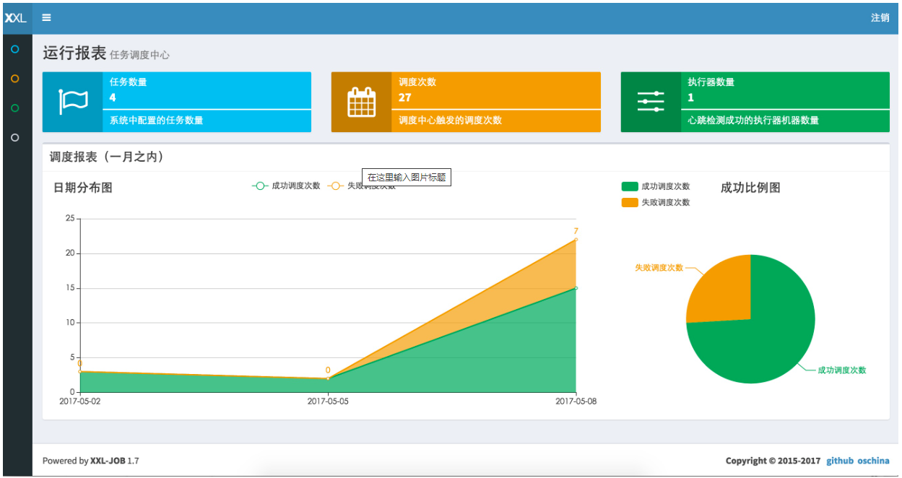
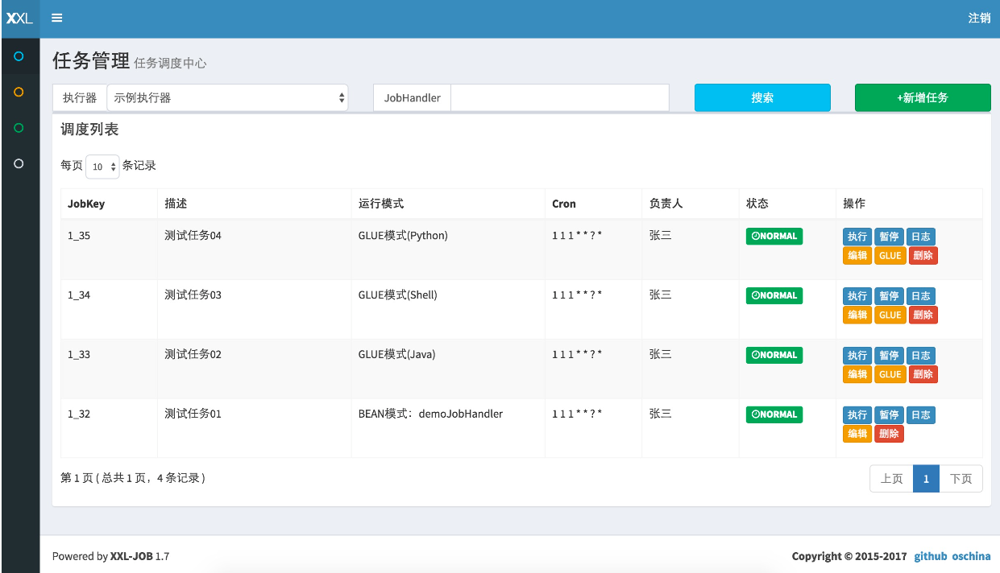
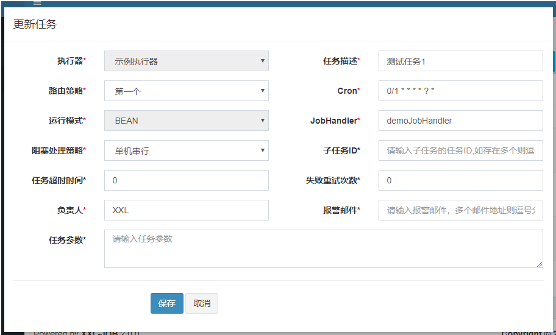
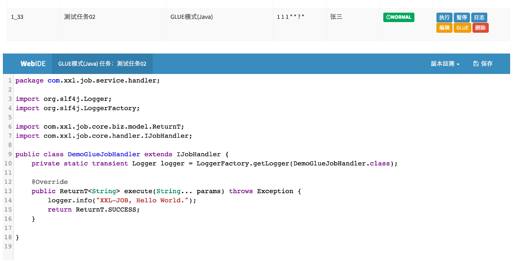
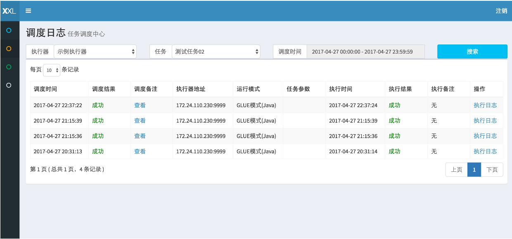
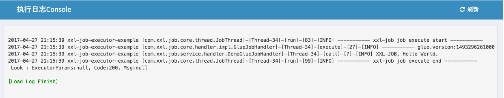
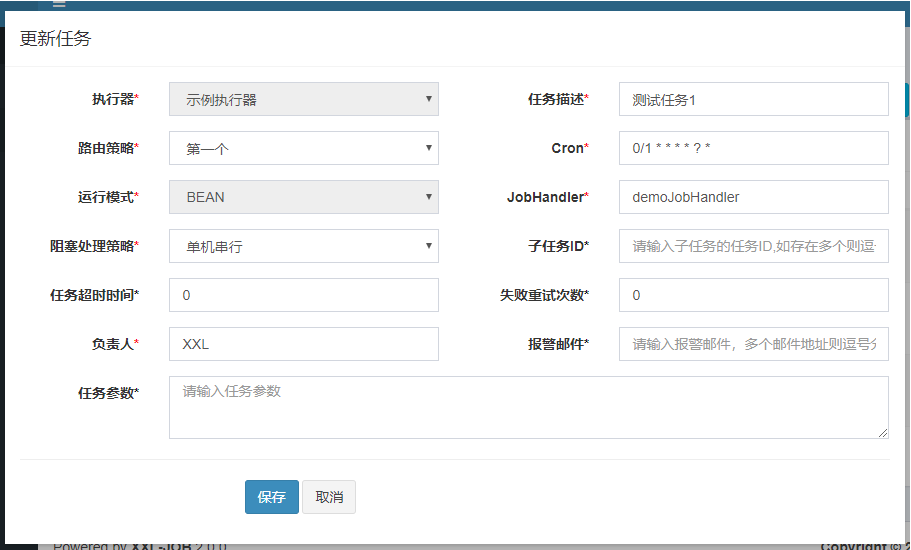

## 《分布式任务调度平台XXL-JOB》

[官方技术文档](https://www.xuxueli.com/)

- 一、简介
    - 1.1 概述
    - 1.2 社区交流
    - 1.3 特性
    - 1.4 发展
    - 1.5 下载
        - 文档地址
        - 源码仓库地址
        - 中央仓库地址
    - 1.6 环境
- 二、快速入门
    - 2.1 初始化“调度数据库”
    - 2.2 编译源码
    - 2.3 配置部署“调度中心”
        - 步骤一：调度中心配置：
        - 步骤二：部署项目：
        - 步骤三：调度中心集群（可选）：
        - 其他：Docker 镜像方式搭建调度中心：
    - 2.4 配置部署“执行器项目”
        - 步骤一：maven依赖
        - 步骤二：执行器配置
        - 步骤三：执行器组件配置
        - 步骤四：部署执行器项目：
        - 步骤五：执行器集群（可选）：
    - 2.5 开发第一个任务“Hello World”
        - 步骤一：新建任务：
        - 步骤二：“GLUE模式(Java)” 任务开发：
        - 步骤三：触发执行：
        - 步骤四：查看日志：
- 三、任务详解
    - 配置属性详细说明：
        - 3.1 BEAN模式（类形式）
            - 步骤一：执行器项目中，开发Job类：
            - 步骤二：调度中心，新建调度任务
        - 3.2 BEAN模式（方法形式）
            - 步骤一：执行器项目中，开发Job方法：
            - 步骤二：调度中心，新建调度任务
            - 原生内置Bean模式任务
        - 3.3 GLUE模式(Java)
            - 步骤一：调度中心，新建调度任务：
            - 步骤二：开发任务代码：
        - 3.4 GLUE模式(Shell)
            - 步骤一：调度中心，新建调度任务
            - 步骤二：开发任务代码：
        - 3.4 GLUE模式(Python)
            - 步骤一：调度中心，新建调度任务
            - 步骤二：开发任务代码：
        - 3.5 GLUE模式(NodeJS)
            - 步骤一：调度中心，新建调度任务
            - 步骤二：开发任务代码：
        - 3.6 GLUE模式(PHP)
        - 3.7 GLUE模式(PowerShell)
- 四、操作指南
    - 4.1 配置执行器
    - 4.2 新建任务
    - 4.3 编辑任务
    - 4.4 编辑GLUE代码
    - 4.5 启动/停止任务
    - 4.6 手动触发一次调度
    - 4.7 查看调度日志
    - 4.8 查看执行日志
    - 4.9 终止运行中的任务
    - 4.10 删除执行日志
    - 4.11 删除任务
    - 4.12 用户管理
- 五、总体设计
    - 5.1 源码目录介绍
    - 5.2 “调度数据库”配置
    - 5.3 架构设计
        - 5.3.1 设计思想
        - 5.3.2 系统组成
        - 5.3.3 架构图
    - 5.4 调度模块剖析
        - 5.4.1 quartz的不足
        - 5.4.2 自研调度模块
        - 5.4.3 调度中心HA（集群）
        - 5.4.4 调度线程池
        - 5.4.5 并行调度
        - 5.4.6 过期处理策略
        - 5.4.7 日志回调服务
        - 5.4.8 任务HA（Failover）
        - 5.4.9 调度日志
        - 5.4.10 任务依赖
        - 5.4.11 全异步化 & 轻量级
        - 5.4.12 均衡调度
    - 5.5 任务 “运行模式” 剖析
        - 5.5.1 “Bean模式” 任务
        - 5.5.2 “GLUE模式(Java)” 任务
        - 5.5.3 GLUE模式(Shell) + GLUE模式(Python) + GLUE模式(PHP) + GLUE模式(NodeJS) + GLUE模式(Powershell)
        - 5.5.4 执行器
        - 5.5.5 任务日志
    - 5.6 通讯模块剖析
        - 5.6.1 一次完整的任务调度通讯流程
        - 5.6.2 通讯数据加密
    - 5.7 任务注册, 任务自动发现
        - 5.8 任务执行结果
        - 5.9 分片广播 & 动态分片
        - 5.10 访问令牌（AccessToken）
        - 5.11 故障转移 & 失败重试
        - 5.12 执行器灰度上线
        - 5.13 任务执行结果说明
        - 5.14 任务超时控制
        - 5.15 跨语言
        - 5.16 任务失败告警
        - 5.17 调度中心Docker镜像构建
        - 5.20 避免任务重复执行
        - 5.21 命令行任务
        - 5.22 日志自动清理
        - 5.23 调度结果丢失处理
- 六、调度中心/执行器 RESTful API
    - 6.1 调度中心 RESTful API
        - a、任务回调
        - b、执行器注册
        - c、执行器注册摘除
    - 6.2 执行器 RESTful API
        - a、心跳检测
        - b、忙碌检测
        - c、触发任务
        - f、终止任务
        - d、查看执行日志
- 七、版本更新日志
    - 7.1 版本 V1.1.x，新特性[2015-12-05]
    - 7.2 版本 V1.2.x，新特性[2016-01-17]
    - 7.3 版本 V1.3.0，新特性[2016-05-19]
    - 7.4 版本 V1.3.1，新特性[2016-05-23]
    - 7.5 版本 V1.3.2，新特性[2016-05-28]
    - 7.6 版本 V1.4.0 新特性[2016-07-24]
    - 7.7 版本 V1.4.1 新特性[2016-09-06]
    - 7.8 版本 V1.4.2 新特性[2016-09-29]
    - 7.9 版本 V1.5.0 特性[2016-11-13]
    - 7.10 版本 V1.5.1 特性[2016-11-13]
    - 7.11 版本 V1.5.2 特性[2017-02-28]
    - 7.12 版本 V1.6.0 特性[2017-03-13]
    - 7.13 版本 V1.6.1 特性[2017-03-25]
    - 7.14 版本 V1.6.2 特性[2017-04-25]
    - 7.15 版本 V1.7.0 特性[2017-05-02]
    - 7.16 版本 V1.7.1 特性[2017-05-08]
    - 7.17 版本 V1.7.2 特性[2017-05-17]
    - 7.18 版本 V1.8.0 特性[2017-07-17]
    - 7.19 版本 V1.8.1 特性[2017-07-30]
    - 7.20 版本 V1.8.2 特性[2017-09-04]
    - 7.21 版本 V1.9.0 特性[2017-12-29]
    - 7.22 版本 V1.9.1 特性[2018-02-22]
    - 7.23 版本 V1.9.2 特性[2018-10-05]
    - 7.24 版本 V2.0.0 Release Notes[2018-11-04]
    - 7.25 版本 v2.0.1 Release Notes[2018-11-09]
    - 7.26 版本 v2.0.2 Release Notes[2019-04-20]
    - 7.27 版本 v2.1.0 Release Notes[2019-07-07]
    - 7.28 版本 v2.1.1 Release Notes[2019-11-24]
    - 7.29 版本 v2.1.2 Release Notes[2019-12-12]
    - 7.30 版本 v2.2.0 Release Notes[2020-04-14]
    - 7.31 版本 v2.3.0 Release Notes[2021-02-09]
    - 7.32 版本 v2.3.1 Release Notes[2022-05-21]
    - 7.33 版本 v2.4.0 Release Notes[2023-03-23]
    - 7.34 新版本规划 [规划中]
    - TODO LIST
- 八、其他
    - 8.1 项目贡献
    - 8.2 用户接入登记
    - 8.3 开源协议和版权
    - 捐赠

### 一、简介

#### 1.1 概述

XXL-JOB是一个分布式任务调度平台，其核心设计目标是开发迅速、学习简单、轻量级、易扩展。现已开放源代码并接入多家公司线上产品线，开箱即用。

#### 1.2 社区交流

社区交流

#### 1.3 特性

- 1、简单：支持通过Web页面对任务进行CRUD操作，操作简单，一分钟上手；
- 2、动态：支持动态修改任务状态、启动/停止任务，以及终止运行中任务，即时生效；
- 3、调度中心HA（中心式）：调度采用中心式设计，“调度中心”自研调度组件并支持集群部署，可保证调度中心HA；
- 4、执行器HA（分布式）：任务分布式执行，任务”执行器”支持集群部署，可保证任务执行HA；
- 5、注册中心: 执行器会周期性自动注册任务, 调度中心将会自动发现注册的任务并触发执行。同时，也支持手动录入执行器地址；
- 6、弹性扩容缩容：一旦有新执行器机器上线或者下线，下次调度时将会重新分配任务；
- 7、触发策略：提供丰富的任务触发策略，包括：Cron触发、固定间隔触发、固定延时触发、API（事件）触发、人工触发、父子任务触发；
- 8、调度过期策略：调度中心错过调度时间的补偿处理策略，包括：忽略、立即补偿触发一次等；
- 9、阻塞处理策略：调度过于密集执行器来不及处理时的处理策略，策略包括：单机串行（默认）、丢弃后续调度、覆盖之前调度；
- 10、任务超时控制：支持自定义任务超时时间，任务运行超时将会主动中断任务；
- 11、任务失败重试：支持自定义任务失败重试次数，当任务失败时将会按照预设的失败重试次数主动进行重试；其中分片任务支持分片粒度的失败重试；
- 12、任务失败告警；***默认提供邮件方式失败告警，同时预留扩展接口，可方便的扩展短信、钉钉等告警方式***；
- 13、路由策略：执行器集群部署时提供丰富的路由策略，包括：第一个、最后一个、轮询、随机、一致性HASH、最不经常使用、最近最久未使用、故障转移、忙碌转移等；
- 14、分片广播任务：***执行器集群部署时，任务路由策略选择”分片广播”情况下，一次任务调度将会广播触发集群中所有执行器执行一次任务，可根据分片参数开发分片任务
  ***；
- 15、动态分片：分片广播任务以执行器为维度进行分片，支持动态扩容执行器集群从而动态增加分片数量，协同进行业务处理；在进行大数据量业务操作时可显著提升任务处理能力和速度。
- 16、故障转移：任务路由策略选择”故障转移”情况下，如果执行器集群中某一台机器故障，将会自动Failover切换到一台正常的执行器发送调度请求。
- 17、任务进度监控：支持实时监控任务进度；
- 18、Rolling实时日志：支持在线查看调度结果，并且支持以Rolling方式实时查看执行器输出的完整的执行日志；
- 19、GLUE：提供Web IDE，支持***在线开发任务逻辑代码***，***动态发布***，***实时编译生效***，***省略部署上线的过程***。
  ***支持30个版本的历史版本回溯***。
- 20、脚本任务：支持以GLUE模式开发和运行脚本任务，包括Shell、Python、NodeJS、PHP、PowerShell等类型脚本;
- 21、命令行任务：原生提供通用命令行任务Handler（Bean任务，”CommandJobHandler”）；业务方只需要提供命令行即可；
- 22、任务依赖：支持配置子任务依赖，当父任务执行结束且执行成功后将会主动触发一次子任务的执行, 多个子任务用逗号分隔；
- 23、一致性：“调度中心”***通过DB锁保证集群分布式调度的一致性, 一次任务调度只会触发一次执行***；
- 24、自定义任务参数：支持在线配置调度任务入参，即时生效；
- 25、调度线程池：调度系统多线程触发调度运行，确保调度精确执行，不被堵塞；
- 26、数据加密：调度中心和执行器之间的通讯进行数据加密，提升调度信息安全性；
- 27、邮件报警：任务失败时支持邮件报警，支持配置多邮件地址群发报警邮件；
- 28、推送maven中央仓库: 将会把最新稳定版推送到maven中央仓库, 方便用户接入和使用;
- 29、运行报表：支持实时查看运行数据，如任务数量、调度次数、执行器数量等；以及调度报表，如调度日期分布图，调度成功分布图等；
- 30、全异步：任务调度流程全异步化设计实现，如异步调度、异步运行、异步回调等，有效对密集调度进行流量削峰，理论上支持任意时长任务的运行；
- 31、跨语言：调度中心与执行器提供语言无关的 RESTful API 服务，第三方任意语言可据此对接调度中心或者实现执行器。除此之外，还提供了
  “多任务模式”和“httpJobHandler”等其他跨语言方案；
- 32、国际化：调度中心支持国际化设置，提供中文、英文两种可选语言，默认为中文；
- 33、容器化：提供官方docker镜像，并实时更新推送dockerhub，进一步实现产品开箱即用；
- 34、线程池隔离：调度线程池进行隔离拆分，慢任务自动降级进入”Slow”线程池，避免耗尽调度线程，提高系统稳定性；
- 35、用户管理：支持在线管理系统用户，存在管理员、普通用户两种角色；
- 36、权限控制：执行器维度进行权限控制，管理员拥有全量权限，普通用户需要分配执行器权限后才允许相关操作；

#### 1.4 发展

- 于2015年中，我在github上创建XXL-JOB项目仓库并提交第一个commit，随之进行系统结构设计，UI选型，交互设计……
- 于2015-11月，XXL-JOB终于RELEASE了第一个大版本V1.0， 随后我将之发布到OSCHINA，XXL-JOB在OSCHINA上获得了@红薯的热门推荐，
  同期分别达到了OSCHINA的“热门动弹”排行第一和git.oschina的开源软件月热度排行第一，在此特别感谢红薯，感谢大家的关注和支持。
- 于2015-12月，我将XXL-JOB发表到我司内部知识库，并且得到内部同事认可。
- 于2016-01月，我司展开XXL-JOB的内部接入和定制工作，在此感谢袁某和尹某两位同事的贡献，同时也感谢内部其他给与关注与支持的同事。
- 于2017-05-13，在上海举办的 “第62期开源中国源创会“ 的 “放码过来”
  环节，我登台对XXL-JOB做了演讲，台下五百位在场观众反响热烈（图文回顾 ）。
- 于2017-10-22，又拍云 Open Talk 联合 Spring Cloud 中国社区举办的
  “进击的微服务实战派上海站“，我登台对XXL-JOB做了演讲，现场观众反响热烈并在会后与XXL-JOB用户热烈讨论交流。
- 于2017-12-11，XXL-JOB有幸参会《InfoQ ArchSummit全球架构师峰会》，并被拍拍贷架构总监”杨波老师”在专题 “微服务原理、基础架构和开源实践“
  中现场介绍。
- 于2017-12-18，XXL-JOB参与”2017年度最受欢迎中国开源软件“评比，在当时已录入的约九千个国产开源项目中角逐，最终进入了前30强。
- 于2018-01-15，XXL-JOB参与”2017码云最火开源项目“评比，在当时已录入的约六千五百个码云项目中角逐，最终进去了前20强。
- 于2018-04-14，iTechPlus在上海举办的 “2018互联网开发者大会“，我登台对XXL-JOB做了演讲，现场观众反响热烈并在会后与XXL-JOB用户热烈讨论交流。
- 于2018-05-27，在上海举办的 “第75期开源中国源创会“ 的 “架构” 主题专场，我登台进行“***基础架构与中间件图谱***
  ”主题演讲，台下上千位在场观众反响热烈（图文回顾 ）。
- 于2018-12-05，XXL-JOB参与”2018年度最受欢迎中国开源软件“评比，在当时已录入的一万多个开源项目中角逐，最终排名第19名。
- 于2019-12-10，XXL-JOB参与”2019年度最受欢迎中国开源软件“评比，在当时已录入的一万多个开源项目中角逐，最终排名”
  ***开发框架和基础组件类***”第9名。
- 于2020-11-16，XXL-JOB参与”2020年度最受欢迎中国开源软件“评比，在当时已录入的一万多个开源项目中角逐，最终排名”开发框架和基础组件类”第8名。
- 于2021-12-06，XXL-JOB参与”2021年度OSC中国开源项目评选 “评比，在当时已录入的一万多个开源项目中角逐，最终当选”最受欢迎项目”。

```
我司大众点评目前已接入XXL-JOB，内部别名《Ferrari》（Ferrari基于XXL-JOB的V1.1版本定制而成，新接入应用推荐升级最新版本）。
据最新统计, 自2016-01-21接入至2017-12-01期间，该系统已调度约100万次，表现优异。
新接入应用推荐使用最新版本，因为经过数十个版本的更新，系统的***任务模型***、***UI交互模型***以及***底层调度通讯模型***都有了较大的优化和提升，
核心功能更加稳定高效。
```

至今，XXL-JOB已接入多家公司的线上产品线，接入场景如电商业务，O2O业务和大数据作业等，
截止最新统计时间为止，XXL-JOB已接入的公司包括不限于：

#### 1.5 下载

文档地址

- 中文文档
- English Documentation

源码仓库地址

| 源码仓库地址                               | 	Release Download |
|--------------------------------------|-------------------|
| https://github.com/xuxueli/xxl-job   | Download          |
| http://gitee.com/xuxueli0323/xxl-job | Download          |

中央仓库地址
```xml
<!-- http://repo1.maven.org/maven2/com/xuxueli/xxl-job-core/ -->
<dependency>
    <groupId>com.xuxueli</groupId>
    <artifactId>xxl-job-core</artifactId>
    <version>${最新稳定版本}</version>
</dependency>
```

#### 1.6 环境
```
Maven3+
Jdk1.8+
Mysql5.7+
```

### 二、快速入门

#### 2.1 初始化“调度数据库”
请下载项目源码并解压，获取 “调度数据库初始化SQL脚本” 并执行即可。
“调度数据库初始化SQL脚本” 位置为:
```
/xxl-job/doc/db/tables_xxl_job.sql
```
调度中心支持集群部署，集群情况下各节点务必连接同一个mysql实例;
***如果mysql做主从,调度中心集群节点务必强制走主库***;

#### 2.2 编译源码
解压源码,按照maven格式将源码导入IDE, 使用maven进行编译即可，源码结构如下：
```
xxl-job-admin：调度中心
xxl-job-core：公共依赖
xxl-job-executor-samples：执行器Sample示例（选择合适的版本执行器，可直接使用，也可以参考其并将现有项目改造成执行器）
    ：xxl-job-executor-sample-springboot：Springboot版本，通过Springboot管理执行器，推荐这种方式；
    ：xxl-job-executor-sample-frameless：无框架版本；
```

- xxl-job-admin
- xxl-job-core
- xxl-job-executor-samples
  - xxl-job-executor-sample-springboot
  - xxl-job-executor-sample-frameless

#### 2.3 配置部署“调度中心”
```
调度中心项目：xxl-job-admin
作用：统一管理任务调度平台上调度任务，负责触发调度执行，并且提供任务管理平台。
```

##### 步骤一：调度中心配置：
调度中心配置文件地址：
```
/xxl-job/xxl-job-admin/src/main/resources/application.properties
```

调度中心配置内容说明：
```properties
### 调度中心JDBC链接：链接地址请保持和 2.1章节 所创建的调度数据库的地址一致
spring.datasource.url=jdbc:mysql://127.0.0.1:3306/xxl_job?useUnicode=true&characterEncoding=UTF-8&autoReconnect=true&serverTimezone=Asia/Shanghai
spring.datasource.username=root
spring.datasource.password=root_pwd
spring.datasource.driver-class-name=com.mysql.jdbc.Driver
### 报警邮箱
spring.mail.host=smtp.qq.com
spring.mail.port=25
spring.mail.username=xxx@qq.com
spring.mail.password=xxx
spring.mail.properties.mail.smtp.auth=true
spring.mail.properties.mail.smtp.starttls.enable=true
spring.mail.properties.mail.smtp.starttls.required=true
spring.mail.properties.mail.smtp.socketFactory.class=javax.net.ssl.SSLSocketFactory
### 调度中心通讯TOKEN [选填]：非空时启用；
xxl.job.accessToken=
### 调度中心国际化配置 [必填]： 默认为 "zh_CN"/中文简体, 可选范围为 "zh_CN"/中文简体, "zh_TC"/中文繁体 and "en"/英文；
xxl.job.i18n=zh_CN
## 调度线程池最大线程配置【必填】fast：快线程池 slow：慢线程池
xxl.job.triggerpool.fast.max=200
xxl.job.triggerpool.slow.max=100
### 调度中心日志表数据保存天数 [必填]：过期日志自动清理；限制大于等于7时生效，否则, 如-1，关闭自动清理功能；
xxl.job.logretentiondays=30
```

##### 步骤二：部署项目：
如果已经正确进行上述配置，可将项目编译打包部署。
调度中心访问地址：http://localhost:8080/xxl-job-admin (该地址执行器将会使用到，作为回调地址)
默认登录账号 “admin/123456”, 登录后运行界面如下图所示。



至此“调度中心”项目已经部署成功。

##### 步骤三：调度中心集群（可选）：
调度中心支持集群部署，提升调度系统容灾和可用性。
调度中心集群部署时，几点要求和建议：
- DB配置保持一致；
- ***集群机器时钟保持一致***（单机集群忽视）；
- 建议：推荐通过nginx为调度中心集群做负载均衡，分配域名。***调度中心访问***、***执行器回调配置***、***调用API服务***等操作均通过该域名进行。

其他：Docker 镜像方式搭建调度中心：
- 下载镜像
```
// Docker地址：https://hub.docker.com/r/xuxueli/xxl-job-admin/     (建议指定版本号)
docker pull xuxueli/xxl-job-admin
```

创建容器并运行
```
docker run -p 8080:8080 -v /tmp:/data/applogs --name xxl-job-admin  -d xuxueli/xxl-job-admin:{指定版本}
/**
* 如需自定义 mysql 等配置，可通过 "-e PARAMS" 指定，参数格式 PARAMS="--key=value  --key2=value2" ；
* 配置项参考文件：/xxl-job/xxl-job-admin/src/main/resources/application.properties
* 如需自定义 JVM内存参数 等配置，可通过 "-e JAVA_OPTS" 指定，参数格式 JAVA_OPTS="-Xmx512m" ；
*/
docker run -e PARAMS="--spring.datasource.url=jdbc:mysql://127.0.0.1:3306/xxl_job?useUnicode=true&characterEncoding=UTF-8&autoReconnect=true&serverTimezone=Asia/Shanghai" 
-p 8080:8080 
-v /tmp:/data/applogs 
--name xxl-job-admin  
-d xuxueli/xxl-job-admin:{指定版本}
```

#### 2.4 配置部署“执行器项目”
```
“执行器”项目：xxl-job-executor-sample-springboot 
(提供多种版本执行器供选择，现以 springboot 版本为例，可直接使用，也可以参考其并将现有项目改造成执行器)
作用：负责接收“调度中心”的调度并执行；可直接部署执行器，也可以将执行器集成到现有业务项目中。
```

##### 步骤一：maven依赖
确认pom文件中引入了 “xxl-job-core” 的maven依赖；

##### 步骤二：执行器配置
执行器配置，配置文件地址：
```
/xxl-job/xxl-job-executor-samples/xxl-job-executor-sample-springboot/src/main/resources/application.properties
```

执行器配置，配置内容说明：
```properties
### 调度中心部署根地址 [选填]：如调度中心集群部署存在多个地址则用逗号分隔。执行器将会使用该地址进行"执行器心跳注册"和"任务结果回调"；为空则关闭自动注册；
xxl.job.admin.addresses=http://127.0.0.1:8080/xxl-job-admin
### 执行器通讯TOKEN [选填]：非空时启用；
xxl.job.accessToken=
### 执行器AppName [选填]：执行器心跳注册分组依据；为空则关闭自动注册
xxl.job.executor.appname=xxl-job-executor-sample
### 执行器注册 [选填]：优先使用该配置作为注册地址，为空时使用内嵌服务 ”IP:PORT“ 作为注册地址。从而更灵活的支持容器类型执行器动态IP和动态映射端口问题。
xxl.job.executor.address=
### 执行器IP [选填]：默认为空表示自动获取IP，多网卡时可手动设置指定IP，该IP不会绑定Host仅作为通讯实用；地址信息用于 "执行器注册" 和 "调度中心请求并触发任务"；
xxl.job.executor.ip=
### 执行器端口号 [选填]：小于等于0则自动获取；默认端口为9999，单机部署多个执行器时，注意要配置不同执行器端口；
xxl.job.executor.port=9999
### 执行器运行日志文件存储磁盘路径 [选填] ：需要对该路径拥有读写权限；为空则使用默认路径；
xxl.job.executor.logpath=/data/applogs/xxl-job/jobhandler
### 执行器日志文件保存天数 [选填] ： 过期日志自动清理, 限制值大于等于3时生效; 否则, 如-1, 关闭自动清理功能；
xxl.job.executor.logretentiondays=30
```
- 执行器心跳注册
- 任务结果回调

##### 步骤三：执行器组件配置
执行器组件，配置文件地址：
```
/xxl-job/xxl-job-executor-samples/xxl-job-executor-sample-springboot/src/main/java/com/xxl/job/executor/core/config/XxlJobConfig.java
```
执行器组件，配置内容说明：
```
@Bean
public XxlJobSpringExecutor xxlJobExecutor() {
    logger.info(">>>>>>>>>>> xxl-job config init.");
    XxlJobSpringExecutor xxlJobSpringExecutor = new XxlJobSpringExecutor();
    xxlJobSpringExecutor.setAdminAddresses(adminAddresses);
    xxlJobSpringExecutor.setAppname(appname);
    xxlJobSpringExecutor.setIp(ip);
    xxlJobSpringExecutor.setPort(port);
    xxlJobSpringExecutor.setAccessToken(accessToken);
    xxlJobSpringExecutor.setLogPath(logPath);
    xxlJobSpringExecutor.setLogRetentionDays(logRetentionDays);
    return xxlJobSpringExecutor;
}
```

##### 步骤四：部署执行器项目：
如果已经正确进行上述配置，可将执行器项目编译打部署，系统提供多种执行器Sample示例项目，选择其中一个即可，各自的部署方式如下。
```
xxl-job-executor-sample-springboot：项目编译打包成springboot类型的可执行JAR包，命令启动即可；
xxl-job-executor-sample-frameless：项目编译打包成JAR包，命令启动即可；
```
至此“执行器”项目已经部署结束。

##### 步骤五：执行器集群（可选）：
执行器支持集群部署，***提升调度系统可用性，同时提升任务处理能力***。
执行器集群部署时，几点要求和建议：
- 执行器回调地址（xxl.job.admin.addresses）需要保持一致；执行器根据该配置进行执行器自动注册等操作。
- 同一个执行器集群内AppName（xxl.job.executor.appname）需要保持一致；***调度中心根据该配置动态发现不同集群的在线执行器列表***。

#### 2.5 开发第一个任务“Hello World”
本示例以新建一个 “GLUE模式(Java)” 运行模式的任务为例。更多有关任务的详细配置，请查看“章节三：任务详解”。
（ “GLUE模式(Java)”的执行代码托管到调度中心在线维护，相比“Bean模式任务”需要在执行器项目开发部署上线，更加简便轻量）
> 前提：请确认“调度中心”和“执行器”项目已经成功部署并启动；

##### 步骤一：新建任务：
登录调度中心，点击下图所示“新建任务”按钮，新建示例任务。
然后，参考下面截图中任务的参数配置，点击保存。





##### 步骤二：“GLUE模式(Java)” 任务开发：
请点击任务右侧 “GLUE” 按钮，进入 “GLUE编辑器开发界面” ，见下图。
“GLUE模式(Java)” 运行模式的任务默认已经初始化了示例任务代码，即打印Hello World。
（ “GLUE模式(Java)” 运行模式的任务实际上是一段继承自IJobHandler的Java类代码，它在执行器项目中运行，
可使用@Resource/@Autowire注入执行器里中的其他服务，详细介绍请查看第三章节）



##### 步骤三：触发执行：
请点击任务右侧 “执行” 按钮，可手动触发一次任务执行（通常情况下，通过配置Cron表达式进行任务调度触发）。

##### 步骤四：查看日志：
请点击任务右侧 “日志” 按钮，可前往任务日志界面查看任务日志。
在任务日志界面中，***可查看该任务的历史调度记录以及每一次调度的任务调度信息、执行参数和执行信息***。
运行中的任务点击右侧的“执行日志”按钮，可进入日志控制台查看实时执行日志。

在日志控制台，可以Rolling方式实时查看任务在执行器一侧运行输出的日志信息，实时监控任务进度；


### 三、任务详解
配置属性详细说明：
```
基础配置：
    - 执行器：任务的绑定的执行器，任务触发调度时将会自动发现注册成功的执行器, 实现任务自动发现功能; 
             另一方面也可以方便的进行任务分组。每个任务必须绑定一个执行器, 可在 "执行器管理" 进行设置;
    - 任务描述：任务的描述信息，便于任务管理；
    - 负责人：任务的负责人；
    - 报警邮件：任务调度失败时邮件通知的邮箱地址，支持配置多邮箱地址，配置多个邮箱地址时用逗号分隔；
触发配置：
    - 调度类型：
        无：该类型不会主动触发调度；
        CRON：该类型将会通过CRON，触发任务调度；
        固定速度：该类型将会以固定速度，触发任务调度；按照固定的间隔时间，周期性触发；
        固定延迟：该类型将会以固定延迟，触发任务调度；按照固定的延迟时间，从上次调度结束后开始计算延迟时间，到达延迟时间后触发下次调度；
    - CRON：触发任务执行的Cron表达式；
    - 固定速度：固定速度的时间间隔，单位为秒；
    - 固定延迟：固定延迟的时间间隔，单位为秒；
任务配置：
    - 运行模式：
        BEAN模式：任务以JobHandler方式维护在执行器端；需要结合 "JobHandler" 属性匹配执行器中任务；
        GLUE模式(Java)：任务以源码方式维护在调度中心；该模式的任务实际上是一段继承自IJobHandler的Java类代码并 "groovy" 源码方式维护，
                       它在执行器项目中运行，可使用@Resource/@Autowire注入执行器里中的其他服务；
        GLUE模式(Shell)：任务以源码方式维护在调度中心；该模式的任务实际上是一段 "shell" 脚本；
        GLUE模式(Python)：任务以源码方式维护在调度中心；该模式的任务实际上是一段 "python" 脚本；
        GLUE模式(PHP)：任务以源码方式维护在调度中心；该模式的任务实际上是一段 "php" 脚本；
        GLUE模式(NodeJS)：任务以源码方式维护在调度中心；该模式的任务实际上是一段 "nodejs" 脚本；
        GLUE模式(PowerShell)：任务以源码方式维护在调度中心；该模式的任务实际上是一段 "PowerShell" 脚本；
    - JobHandler：运行模式为 "BEAN模式" 时生效，对应执行器中新开发的JobHandler类“@JobHandler”注解自定义的value值；
    - 执行参数：任务执行所需的参数；     
高级配置：
    - 路由策略：当执行器集群部署时，提供丰富的路由策略，包括；
        FIRST（第一个）：固定选择第一个机器；
        LAST（最后一个）：固定选择最后一个机器；
        ROUND（轮询）：；
        RANDOM（随机）：随机选择在线的机器；
        CONSISTENT_HASH（一致性HASH）：每个任务按照Hash算法固定选择某一台机器，且所有任务均匀散列在不同机器上。
        LEAST_FREQUENTLY_USED（最不经常使用）：使用频率最低的机器优先被选举；
        LEAST_RECENTLY_USED（最近最久未使用）：最久未使用的机器优先被选举；
        FAILOVER（故障转移）：按照顺序依次进行心跳检测，第一个心跳检测成功的机器选定为目标执行器并发起调度；
        BUSYOVER（忙碌转移）：按照顺序依次进行空闲检测，第一个空闲检测成功的机器选定为目标执行器并发起调度；
        SHARDING_BROADCAST(分片广播)：***广播触发对应集群中所有机器执行一次任务，同时系统自动传递分片参数；可根据分片参数开发分片任务；***
    - 子任务：每个任务都拥有一个唯一的任务ID(任务ID可以从任务列表获取)，当本任务执行结束并且执行成功时，将会触发子任务ID所对应的任务的一次主动调度。
    - 调度过期策略：
        - 忽略：调度过期后，忽略过期的任务，从当前时间开始重新计算下次触发时间；
        - 立即执行一次：调度过期后，立即执行一次，并从当前时间开始重新计算下次触发时间；
    - 阻塞处理策略：***调度过于密集执行器来不及处理时的处理策略；***
        单机串行（默认）：调度请求进入单机执行器后，***调度请求进入FIFO队列并以串行方式运行***；
        丢弃后续调度：调度请求进入单机执行器后，发现执行器存在运行的调度任务，本次请求将会被丢弃并标记为失败；
        覆盖之前调度：调度请求进入单机执行器后，发现执行器存在运行的调度任务，将会终止运行中的调度任务并清空队列，然后运行本地调度任务；
    - 任务超时时间：***支持自定义任务超时时间，任务运行超时将会主动中断任务***；
    - 失败重试次数；支持自定义任务失败重试次数，当任务失败时将会按照预设的失败重试次数主动进行重试；
```

#### 3.1 BEAN模式（类形式）
Bean模式任务，支持基于类的开发方式，每个任务对应一个Java类。
- 优点：
不限制项目环境，兼容性好。即使是无框架项目，如main方法直接启动的项目也可以提供支持，
可以参考示例项目 “xxl-job-executor-sample-frameless”；
- 缺点：
每个任务需要占用一个Java类，造成类的浪费；
不支持自动扫描任务并注入到执行器容器，需要手动注入。

##### 步骤一：执行器项目中，开发Job类：
```
1、开发一个继承自"com.xxl.job.core.handler.IJobHandler"的JobHandler类，实现其中任务方法。
2、手动通过如下方式注入到执行器容器。
XxlJobExecutor.registJobHandler("demoJobHandler", new DemoJobHandler());
```

##### 步骤二：调度中心，新建调度任务
后续步骤和 “3.2 BEAN模式（方法形式）”一致，可以前往参考。

#### 3.2 BEAN模式（方法形式）
Bean模式任务，支持基于方法的开发方式，每个任务对应一个方法。
- 优点：
每个任务只需要开发一个方法，并添加”@XxlJob”注解即可，更加方便、快速。
支持自动扫描任务并注入到执行器容器。
- 缺点：要求Spring容器环境；

> 基于方法开发的任务，底层会生成JobHandler代理，和基于类的方式一样，任务也会以JobHandler的形式存在于执行器任务容器中。

##### 步骤一：执行器项目中，开发Job方法：
```
1、任务开发：在Spring Bean实例中，开发Job方法；
2、注解配置：为Job方法添加注解 "@XxlJob(value="自定义jobhandler名称", init = "JobHandler初始化方法", destroy = "JobHandler销毁方法")"，注解value值对应的是调度中心新建任务的JobHandler属性的值。
3、执行日志：需要通过 "XxlJobHelper.log" 打印执行日志；
4、任务结果：默认任务结果为 "成功" 状态，不需要主动设置；如有诉求，比如设置任务结果为失败，可以通过 "XxlJobHelper.handleFail/handleSuccess" 自主设置任务结果；
```
```
// 可参考Sample示例执行器中的 "com.xxl.job.executor.service.jobhandler.SampleXxlJob" ，如下：
@XxlJob("demoJobHandler")
public void demoJobHandler() throws Exception {
    XxlJobHelper.log("XXL-JOB, Hello World.");
}
```

###### 步骤二：调度中心，新建调度任务
参考上文“配置属性详细说明”对新建的任务进行参数配置，运行模式选中 “BEAN模式”，
JobHandler属性填写任务注解“@XxlJob”中定义的值；


原生内置Bean模式任务


