## FullGC调优100倍，掌握这3招，吊打JVM调优

### 前言
在40岁老架构师尼恩的读者社群（50+）中，很多小伙伴拿不到offer，或者拿不到好的offer。
尼恩经常给大家 优化项目，优化简历，挖掘技术亮点。
在指导简历的过程中， ***线上问题排查、Java 调优***是一项很重要的指导。
对于架构师、高级开发来说， ***调优和线上问题排查***是核心内容，更是内功中的内功。
尼恩团队结合资深架构经验和行业案例，给大家梳理一个系列的《Java 调优圣经》PDF 电子书，包括本文在内规划的6个部分：
- (1) 调优圣经1：零基础精通Jmeter分布式压测，10Wqps+压测实操  （已经完成）
- (2) 调优圣经2：从70s到20ms，一次3500倍性能优化实战，方案人人可用 （已经完成）
- (3) 调优圣经3：如何做mysql调优？绝命7招让慢SQL调优100倍，实现你的Mysql调优自由  （已经完成）
- (4) 调优圣经4：SpringBoot假死，十万火急，怎么救火？  （已经完成）
- (5) 调优圣经5：零基础精通JVM调优实操，实现JVM自由  （本文）
- (6) 调优圣经6：零基础精通Linux、Tomcat调优实操，实现基础设施调优自由   （写作中）
以上的多篇文章，后续将陆续在 【技术自由圈】 公众号发布。完整的《Java 调优圣经》PDF，可以找尼恩获取。

### 本文目录
- 前言
- JVM调优背景
- 回顾JVM核心知识
  - JVM 内存模型和管理
  - 垃圾回收机制
  - 垃圾回收器
- 常见的JVM调优方法
- 需要进行JVM调优的四个场景
  - 1.内存溢出
    - 堆内存溢出
      - 调优方法
    - 栈内存溢出
    - 方法区/元空间溢出
      - 调优思路
  - 2.Full GC问题
  - 3.线程死锁
    - 解决办法
  - 4.CPU负载过高
- 案例实战
  - 具体的案例场景
  - 压力测试进行问题复现
  - 负载情况的监控和分析
  - 进行JVM的优化
- 小结下面的三招，使得FullGC调优100倍
- 《Java 调优圣经》迭代计划
- 推荐阅读
- 免费领取11个技术圣经 PDF
  
### JVM调优背景
在现代软件开发中，***性能是一个至关重要的因素***。
当我们的应用程序面临***高并发访问、大数据处理、内存密集型计算或长时间运行***等场景时，
我们往往需要面对一系列挑战和问题。
例如，应用程序可能会出现***内存溢出、垃圾回收频繁、响应时间过长、资源利用不高***等情况，
这些都会对用户体验、系统稳定性和业务效率产生负面影响。

在解决这些问题的过程中，Java虚拟机（JVM）扮演着关键角色。
JVM是Java应用程序的运行环境，它负责将Java代码转换为机器代码并在操作系统上执行。
它提供了许多功能，如自动内存管理、垃圾回收、即时编译等，使得Java开发人员能够专注于业务逻辑而无需过多关注底层细节。

然而，尽管JVM具备这些优秀的特性，但默认的配置并不能保证在所有情况下获得最佳性能。

这就是为什么JVM调优变得如此重要的原因。

JVM调优是指通过***优化JVM的配置、内存管理、垃圾回收和编译***等方面的设置，以提升Java应用程序的性能、可伸缩性和稳定性。
它的目标是最大程度地发挥硬件资源的潜力，提高应用程序的响应速度和吞吐量，减少资源的浪费。

在真实的生产环境中，许多企业和组织都曾遇到过各种JVM性能问题。
例如，当用户访问量激增时，应用程序的响应时间明显延长，甚至出现崩溃现象。
或者在大数据处理过程中，垃圾回收的频率过高导致系统资源被耗尽。
这些问题都给业务带来了负面影响，甚至可能导致用户流失、收入损失和声誉受损。

因此，JVM调优的重要性和必要性不可忽视。
通过优化JVM的各个方面，我们可以有效解决这些问题，提升应用程序的性能和稳定性。
合理的内存管理和垃圾回收策略可以减少内存占用和垃圾回收的停顿时间，提高系统的可靠性。
通过合适的线程管理和I/O调优，我们可以提高系统的吞吐量和并发处理能力。
同时，通过对JIT编译器进行调优，我们可以加速代码的执行，提高应用程序的运行效率。

然而，要进行有效的JVM调优并不是一件简单的事情。
它需要深入理解***JVM的工作原理、垃圾回收机制、编译器优化***等知识，
并根据具体的场景和需求制定合适的优化策略。
这也是为什么本文将带您深入探索JVM调优的各个方面，从理论到实践，为您提供实用的优化思路和实施方法。

无论您是一名开发人员还是系统管理员，本文都将帮助您认识到JVM调优的重要性，并指导您在实际项目中进行调优操作。
让我们一起进入JVM调优的世界，发现如何最大限度地发挥Java应用程序的潜力！

### 回顾JVM核心知识
Java虚拟机（JVM）是Java平台的核心组成部分之一，
它是一个在不同操作系统上运行Java程序的虚拟计算机。
***JVM充当了Java代码和底层操作系统之间的桥梁***，
负责将Java字节码翻译成机器代码并执行。
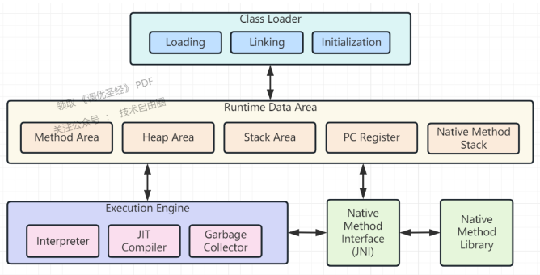

JVM的设计目标是提供一个可移植、高性能和安全的执行环境，使得Java应用程序能够在不同的计算机和操作系统上无需修改即可运行。
它为Java程序员提供了一种“一次编写，到处运行”的能力，使得开发和部署Java应用程序变得更加便捷和灵活。

JVM具有以下关键特性：
- 1.字节码执行：Java源代码通过编译器编译成字节码，JVM将字节码解释执行或者即时编译成机器码，从而实现跨平台的执行。
- 2.自动内存管理：JVM负责分配和释放内存，通过垃圾回收器自动管理内存资源，减轻开发人员的内存管理负担，避免了常见的内存泄漏和悬挂指针等问题。
- 3.异常处理：JVM提供了强大的异常处理机制，可以捕获和处理程序中的异常情况，确保程序的稳定性和可靠性。
- 4.安全性：JVM通过安全管理器（Security Manager）对Java应用程序进行安全管理，控制访问权限和资源使用，以防止恶意代码的执行和安全漏洞的利用。
- 5.动态扩展：JVM支持动态类加载和运行时代码生成，使得应用程序可以在运行时加载和使用新的类和库，实现灵活的扩展和插件机制。

JVM的工作原理涉及类加载、字节码解释执行、即时编译、内存管理和垃圾回收等多个方面。
深入理解JVM的工作原理对于进行JVM调优和解决性能问题至关重要。

我们这里重点介绍下JVM 内存模型和管理以及垃圾回收机制。

### JVM 内存模型和管理
JVM是一个复杂的虚拟机，它通过一种特定的内存模型来管理应用程序运行时所需的内存资源。
这个内存模型包括堆内存、栈内存和方法区/元空间。
下面我们将详细介绍每个部分的结构和管理方式。

JVM的内存模型定义了Java应用程序在运行时所需的内存资源的组成和分配方式。
它将内存划分为不同的区域，每个区域有特定的作用和管理方式。
这些区域包括堆内存、栈内存和方法区/元空间。

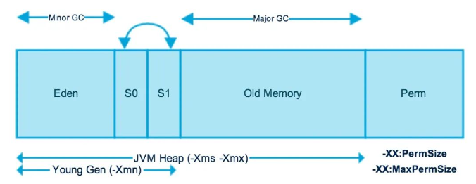

- 1.堆内存管理
堆内存是JVM中最大的一块内存区域，用于存储对象实例和数组。
它被划分为两个主要部分：新生代和老年代。新生代又分为一个Eden空间和两个Survivor空间。堆内存的管理方式是基于垃圾回收机制。
  - 新生代：新创建的对象首先被分配到新生代的Eden空间。
  当Eden空间满时，会触发Minor GC（年轻代垃圾回收），将存活的对象复制到一个Survivor空间。经过多次Minor GC后，仍然存活的对象会被晋升到老年代。
  
  - 老年代：老年代主要存放经过多次Minor GC后仍然存活的对象。当老年代空间不足时，会触发Major GC（Full GC，全局垃圾回收），对整个堆内存进行回收。
  
- 2.栈内存管理
栈内存用于存储方法的调用和局部变量。
每个线程在运行时都会拥有一个独立的栈内存。
栈内存的管理方式是基于栈帧的概念，每个方法调用都会创建一个栈帧，***栈帧中包含了方法的参数、局部变量以及方法返回值等信息***。
  - 方法调用：当一个方法被调用时，JVM会创建一个新的栈帧并压入栈中。
  栈帧中包含了方法的局部变量和操作数栈等信息。
  当方法执行完毕后，对应的栈帧会被弹出，返回到上一层方法的栈帧。
  
  - 局部变量：局部变量是在方法中定义的变量，它们的生命周期仅限于方法的执行过程中。
  当方法执行结束后，局部变量会被自动释放，从而回收栈内存的空间。
  
- 3.方法区/元空间管理
方法区（在早期JVM版本中）或元空间（从Java8开始）用于存储类的相关信息，
例如类的结构、常量池、静态变量和方法字节码等。
它是所有线程共享的内存区域。
  - 类的加载：当使用类时，JVM会在方法区/元空间中查找对应的类信息。
  如果类还没有加载，则会触发类的加载过程，包括加载、验证、准备和解析等阶段。
  加载后的类信息会存储在方法区/元空间中。
  
  - 类的卸载：当一个类不再被使用时，JVM可能会卸载它，释放方法区/元空间的内存。
  类的卸载是由垃圾回收器判断的，当一个类不再有任何实例或者其他对象引用时，它就可以被卸载。

我们以 String str1 = new String("Hello"); 为例来说明不同数据存放在 jvm 不同区域：
- String str1 是一个字符串变量，它存放在 栈 中，它的值是一个引用，指向字符串对象的地址。
- new String("Hello") 是一个字符串对象，它存放在 堆 中，它包含了一个字符数组和一个长度属性。
- "Hello" 是一个字符串常量，它存放在 方法区 的常量池中，它是一个 String 对象，包含了一个字符数组和一个长度属性。
- 字符数组是一个 char[] 类型的对象，它存放在 堆 中，它的元素是 'H', 'e', 'l', 'l', 'o' 这 5 个字符。
- 长度属性是一个 int 类型的值，它存放在 堆 中，它的值是 5。

通过对JVM内存模型和管理方式的理解，你可以更好地优化和调整应用程序的内存使用。
***合理配置堆内存大小、优化垃圾回收策略、调整线程栈的大小等措施，都可以提高应用程序的性能和稳定性***。

### 垃圾回收机制
垃圾回收的基本原理是通过检测和确定不再被引用的对象，然后自动回收这些对象所占用的内存空间。
它的目标是优化内存的使用，减少内存泄漏和内存溢出的风险，提高应用程序的性能和稳定性。

那么如何判断对象已不再被引用呢？主要有以下两种方法：

1. 引用计数法（Reference Counting）：
引用计数法是一种简单的垃圾回收算法，它为每个对象维护一个引用计数器。
当对象被引用时，引用计数加1；当引用失效或被赋予新的值时，引用计数减1。
当引用计数器为0时，表示该对象不再被引用，可以被回收。

但引用计数法存在一个问题，即循环引用的对象无法被正确回收。
如果两个或多个对象之间形成了循环引用，它们的引用计数器将永远不会为0，导致内存泄漏。
因此，现代的垃圾回收器很少使用引用计数法。
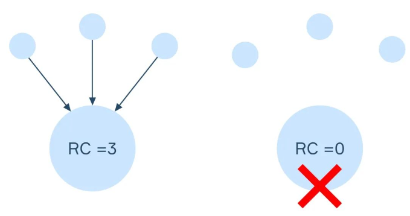

2. 可达性分析（Reachability Analysis）：
可达性分析是现代垃圾回收器主要采用的原理。
该原理基于“根对象（Root Object）”的概念，从根对象出发，通过对象之间的引用关系，追踪和标记所有可达的对象。
被标记的对象视为存活对象，而未被标记的对象则被认为是垃圾对象，可以被回收。

根对象包括活动线程的栈内存、静态变量和常量池等。
垃圾回收器会从根对象开始，递归遍历对象之间的引用关系，标记所有可达的对象。
标记完成后，未被标记的对象即为不可达对象，它们所占用的内存空间可以被回收。

可达性分析是一种有效的垃圾回收原理，它可以解决循环引用和复杂对象图的回收问题。

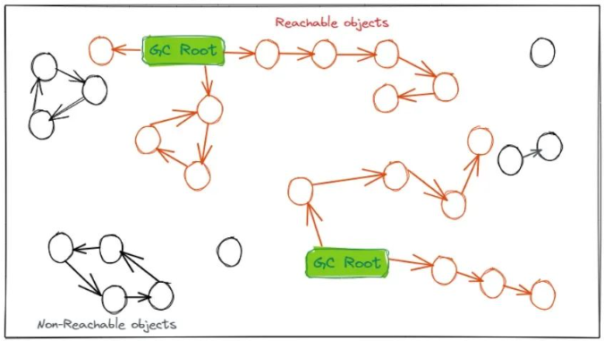

在进行可达性分析后，垃圾回收器会对被标记为不可达的对象进行回收和内存释放。
常见的回收方法包括***标记-清除算法***、***复制算法***、***标记-整理算法***等。

- 标记-清除算法（Mark and Sweep）：首先，通过标记阶段标记所有可达的对象。
然后，在清除阶段，清除未被标记的对象，释放其占用的内存空间。
但***标记-清除算法可能会产生内存碎片***。

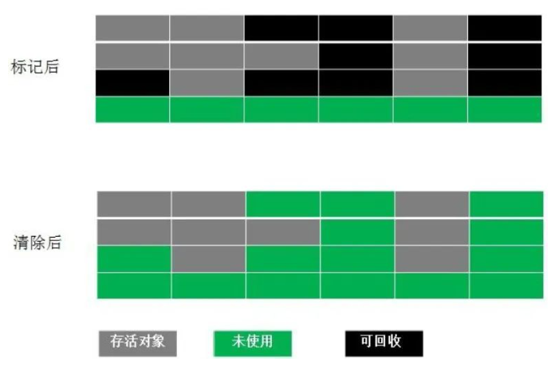

- 复制算法（Copying）：将内存空间划分为两个区域，如新生代的Eden空间和Survivor空间。
对象首先分配到Eden空间，当Eden空间满时，将存活的对象复制到Survivor空间。
经过多次垃圾回收后，仍然存活的对象会被晋升到老年代。
复制算法简单高效，但会浪费一部分内存空间。

- 标记-整理算法（Mark and Compact）：结合了标记-清除和复制算法的优点。
首先，通过标记确定可达对象，然后将存活的对象向一端移动，然后清除剩余的空间。
这样可以解决标记-清除算法的内存碎片问题。

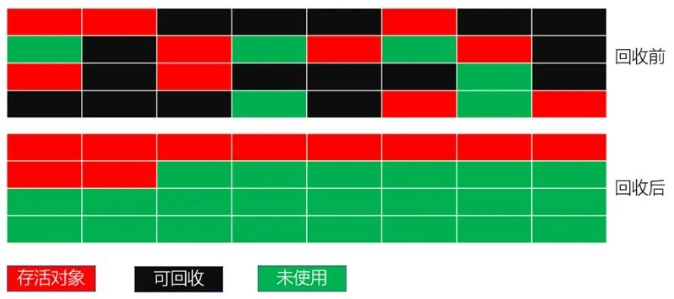

垃圾回收的基本原理是通过可达性分析来确定对象的存活状态，然后采用不同的回收算法对不可达对象进行回收和内存释放。
这样可以有效地管理内存资源，提高应用程序的性能和稳定性。

接下来我们继续了解垃圾回收器

### 垃圾回收器
垃圾回收器（Garbage Collector）是Java虚拟机（JVM）中的组件，负责自动管理和回收不再使用的对象，释放内存资源。
垃圾回收器根据不同的算法和策略来执行垃圾回收操作，以提高内存的利用率和应用程序的性能。

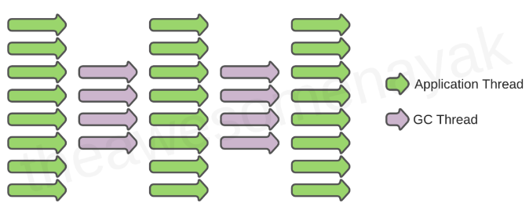

GC线程是垃圾回收器（Garbage Collector）在JVM中运行的线程。
它负责执行***垃圾回收操作，扫描和回收不再使用的对象，释放内存资源***。

在Java应用程序中，当垃圾回收器需要执行垃圾回收操作时，会启动一个或多个GC线程来完成任务。
具体使用的线程数量取决于所选择的垃圾回收器和JVM的配置。

GC线程的工作方式和行为因垃圾回收器的类型而异。
一般而言，GC线程会在特定的时机被触发，例如：
1. Minor GC（年轻代垃圾回收）：当年轻代的Eden空间满时，触发Minor GC。
Minor GC的目标是清理年轻代中的垃圾对象。
在执行Minor GC期间，GC线程会扫描并标记Eden空间和Survivor空间中的存活对象，并清理不再使用的对象。

2. Major GC（老年代垃圾回收）：当老年代的内存空间不足时，触发Major GC。
Major GC的目标是清理老年代中的垃圾对象。
执行Major GC时，GC线程会扫描并标记整个堆中的存活对象，并清理不再使用的对象。

3. Full GC（全局垃圾回收）：Full GC是对整个堆内存进行垃圾回收的操作。
它会同时清理年轻代和老年代中的垃圾对象。
执行Full GC时，GC线程会扫描并标记整个堆中的存活对象，并清理不再使用的对象。

GC线程的启动和执行通常会导致应用程序的停顿（Stop-The-World），即应用程序的执行会暂停，以便垃圾回收器能够安全地操作内存。
停顿时间的长短取决于所使用的垃圾回收器、堆的大小和应用程序的特性。

在JVM中，可以通过调整垃圾回收器的参数和配置来优化GC线程的性能和吞吐量。
这包括调整垃圾回收器的线程数、堆的大小、分代比例和垃圾回收的触发条件等。
通过合理的调优，可以提高GC线程的效率，减少应用程序的停顿时间，以获得更好的性能和响应性。

以下是一些常见的垃圾回收器：
1. 串行回收器（Serial Collector）：串行回收器是最简单的垃圾回收器，它在单个线程中执行垃圾回收操作。
在垃圾回收过程中，应用程序的所有线程都会被停止（Stop-The-World），直到垃圾回收完成。
串行回收器适用于单核处理器环境或对垃圾回收暂停时间要求不高的场景。

2. 并行回收器（Parallel Collector）：并行回收器使用多个线程并行执行垃圾回收操作，以提高回收效率。
与串行回收器相比，并行回收器可以更充分地利用多核处理器的计算能力。
在垃圾回收过程中，应用程序的执行会被暂停，但垃圾回收的时间会相对较短。

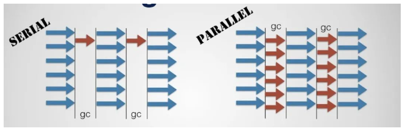

3. 并发回收器（Concurrent Collector）：并发回收器与应用程序线程并发执行，减少垃圾回收对应用程序的影响。
并发回收器允许应用程序和垃圾回收线程同时运行，只在必要时才会停止应用程序的执行。
这样可以减少垃圾回收导致的停顿时间，提高应用程序的响应性能。
然而，并发回收器的吞吐量可能相对较低。

4. G1回收器（Garbage-First Collector）：G1回收器是一种面向服务端应用程序的垃圾回收器，它采用了分代和区域化的回收方式。
G1回收器将堆内存划分为多个独立的区域（Region），并根据实际的垃圾情况选择性地回收不同的区域。
G1回收器具有可预测的停顿时间，并能够在较短时间内处理大量的垃圾对象。

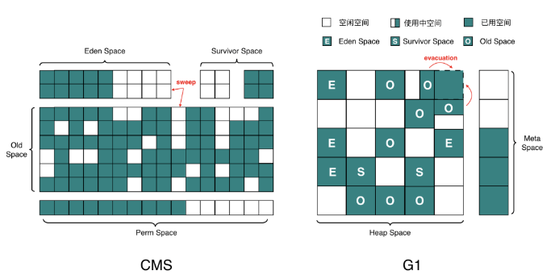

选择合适的垃圾回收器取决于***应用程序的性能需求***、***可用的硬件资源和内存规模等因素***。
可以通过命令行参数或JVM配置文件来指定所使用的垃圾回收器。
此外，可以根据应用程序的特点和需求进行垃圾回收器的调优，
如调整堆大小、调整垃圾回收器的参数等，以提高垃圾回收的性能和吞吐量。

下图为不同的垃圾回收器适用的场景及组合。

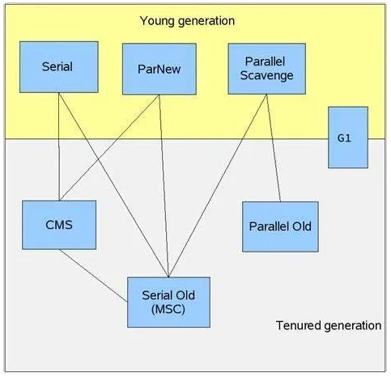

在对JVM相关运行原理有所了解后，我们接下来正式进入JVM调优实战。

### 常见的JVM调优方法
在进行调优实战前，我们先看下调优有哪些具体的方法，
***JVM调优是通过优化Java虚拟机（JVM）的配置和参数来提高应用程序的性能和稳定性***。

以下是一些常见的JVM调优方法：

1. 调整堆大小：通过调整堆的大小来适应应用程序的内存需求。可以通过设置-Xmx和-Xms参数来指定堆的最大和初始大小。
2. 选择合适的垃圾回收器：根据应用程序的性能需求和特点，选择合适的垃圾回收器。不同的垃圾回收器有不同的性能特点，可以通过设置-Xgc参数来指定使用的垃圾回收器。
3. 调整垃圾回收参数：根据应用程序的特点和需求，调整垃圾回收器的参数。例如，可以调整新生代和老年代的比例、设置垃圾回收的触发条件、调整线程数等。
4. 分析内存使用情况：使用工具如jstat、jmap、jvisualvm等来监测和分析应用程序的内存使用情况。可以了解内存的分配和释放情况，找出内存泄漏或过度分配的问题。
5. 优化对象的创建和销毁：减少对象的创建和销毁可以减轻垃圾回收的负担。可以使用对象池或缓存技术来重用对象，避免频繁的对象创建和销毁操作。
6. 使用并发和并行处理：利用并发和并行技术来提高应用程序的处理能力。例如，使用多线程处理任务、并行执行垃圾回收操作等。
7. 减少IO操作和网络通信：IO操作和网络通信通常是应用程序的瓶颈之一。可以通过合理设计和优化IO操作和网络通信的代码，减少其对系统资源的消耗。
8. 资源监控和性能调优：定期监控和分析应用程序的资源使用情况，包括CPU利用率、内存使用、线程数量等。根据监控结果进行性能调优，找出并解决性能瓶颈。

以上是一些常见的JVM调优方法，具体的调优策略和方法取决于应用程序的需求和环境。
在进行调优时，***建议先进行性能分析和测试***，***然后有针对性地进行优化，逐步验证和调整优化的效果***。

### 需要进行JVM调优的四个场景
下面，我们通过构造一些代码模拟生产环境经常会遇到问题，通过相关工具分析定位问题发生的根源，并给出调优建议：

#### 1. 内存溢出
JVM内存溢出（Out of Memory Error）通常由以下情况引起：

1. 堆内存溢出：当应用程序创建的对象超过了堆内存的限制时，会触发堆内存溢出。
这可能是由于内存泄漏（Memory Leak）或者应用程序需要处理大量数据导致的。
堆内存溢出的错误消息通常是"java.lang.OutOfMemoryError: Java heap space"。

2. 栈内存溢出：当线程调用的方法调用层级太深，栈空间被耗尽时，会触发栈内存溢出。
这通常是由于递归调用的错误或者方法调用层级过大导致的。
栈内存溢出的错误消息通常是"java.lang.StackOverflowError"。

3. 方法区/元空间溢出：方法区（在早期版本的JVM中称为永久代）或元空间存储着类的结构信息、常量池、静态变量等。
当应用程序加载的类数量过多或者字符串常量池过大时，会触发方法区/元空间溢出。
方法区/元空间溢出的错误消息通常是"java.lang.OutOfMemoryError: PermGen space"（对于旧版本JVM）或"java.lang.OutOfMemoryError: Metaspace"（对于较新版本JVM）。

##### 堆内存溢出
首先，我们编写一段代码模拟堆内存溢出的问题，如下:
```
@Test
public void heapTest() {
    List<Integer> list = new ArrayList<>();
    while (true) {
        list.add(1);
    }
}
```
在运行该测试用例前，先编辑下运行配置：

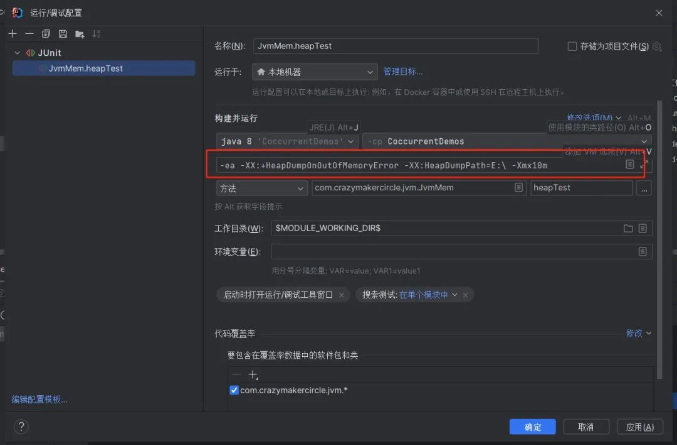

添加以下JVM参数：
```
-XX:+HeapDumpOnOutOfMemoryError
-XX:HeapDumpPath=E:\
-Xmx10m
```

第一个参数：-XX:+HeapDumpOnOutOfMemoryError 会在发生内存溢出时自动导出堆转储快照。
第二个参数：-XX:HeapDumpPath 指定了导出堆转储快照的目录路径, 即当应用程序发生内存溢出时，JVM会自动导出堆转储快照到指定的目录。
第三个参数：-Xmx10m 表示将堆内存最大限制为10M。

然后，运行测试用例，
下面是运行后的输出：
```
java.lang.OutOfMemoryError: Java heap space
Dumping heap to E:\java_pid19096.hprof ...
Heap dump file created [8779005 bytes in 0.016 secs]

java.lang.OutOfMemoryError: Java heap space

 at java.util.Arrays.copyOf(Arrays.java:3210)
 at java.util.Arrays.copyOf(Arrays.java:3181)
 at java.util.ArrayList.grow(ArrayList.java:265)
```
从抛出的溢出java.lang.OutOfMemoryError: Java heap space 可以看出是发生了堆内存溢出，
那么在生产环境如何分析和定位堆内存溢出是哪块代码导致的问题呢？

我们需要通过转储快照来分析，这里可以将E:\java_pid19096.hprof导入到VisualVM查看。

```
Eclipse Memory Analyzer（EMA）是一款功能强大的Java堆内存分析工具，
它是基于Eclipse平台开发的，用于帮助开发人员分析和解决Java应用程序中的内存相关问题。

以下是Eclipse Memory Analyzer的一些特点和功能：
1. 内存泄漏分析：EMA可以帮助你识别和分析应用程序中的内存泄漏问题。它能够分析堆转储快照，检测无效的对象引用和内存泄漏情况，并提供相关的报告和统计信息。
2. 大对象分析：EMA可以识别和分析占用大量内存的对象。它可以帮助你发现那些可能导致内存压力的大对象，从而优化内存使用。
3. 内存占用分析：EMA提供了多种方式来分析内存使用情况，包括对象的数量、大小、类的实例数等。它能够帮助你了解应用程序中的内存占用情况，找出可能存在的问题和优化空间。
4. 内存回收分析：EMA可以分析垃圾回收器的行为和效果。它提供了对垃圾回收的统计数据和相关指标，帮助你评估垃圾回收的性能和效率。
5. 与Eclipse集成：EMA是基于Eclipse平台的插件，与Eclipse集成紧密。它可以与Eclipse IDE配合使用，提供直观的界面和丰富的功能，方便开发人员进行内存分析和调优。
```

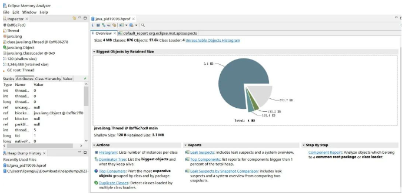

点击Leak Suspects 查看内存泄漏原因，

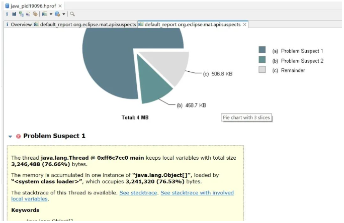

可以看到 java.lang.Object[], 占据了76.53%的内存，再次点击下面See stacktrace【堆栈跟踪：一种调试程序时用来追踪函数调用顺序的技术，通常用于诊断程序错误和异常。】，

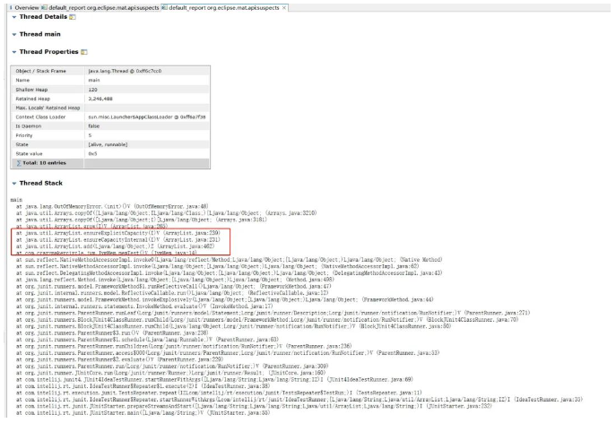

从这个异常栈可以定位到出错的代码位置，可以看到出错的位置是 memTest方法第14行代码。
溢出的原因就在于list集合存放了过多的对象，这些数据都是存放在堆内存里，超过了堆内存的最大限制10m, 所以抛出了堆内存溢出异常。

调优方法： 
1. 调整最大堆内存大小（-Xmx）：增大堆内存可以提供更多的空间来存储对象，减少频繁的垃圾回收。
但要注意，过大的堆内存可能会导致长时间的垃圾回收暂停，影响应用程序的响应性能。
根据应用程序的内存需求进行调整：根据应用程序的特性和内存需求，合理设置堆内存大小。
如果应用程序需要处理大量的数据或者有较高的并发需求，可能需要增大堆内存大小。

2. ***优化代码，尽量避免产生生命周期长的大对象，并及时释放资源***。

请注意，***在对内存大小进行调整时，建议谨慎操作，并进行性能测试和监控***，
以确保调整后的配置能够满足应用程序的需求，并避免潜在的问题。

可以采用VisualVM 或者 arthas 监控程序的堆栈使用情况，并进行适当调整。

```
Arthas是一款开源的Java诊断工具，旨在帮助开发人员诊断和解决Java应用程序的性能问题。
它提供了丰富的命令行工具和交互式界面，可以对运行中的Java应用进行实时的诊断、监控和调试。

Arthas具有以下主要特点和功能：
1. 实时监控：Arthas可以实时监控Java应用程序的各种指标和状态，包括CPU使用率、内存使用情况、线程数等。它提供了丰富的监控命令，可以帮助开发人员迅速定位性能问题。
2. 方法追踪：Arthas可以追踪Java应用程序中的方法调用，包括方法的入参和返回值。通过方法追踪功能，开发人员可以深入了解代码的执行流程，并定位潜在的性能瓶颈。
3. 动态修改代码：Arthas支持在运行时对Java应用程序的字节码进行修改。开发人员可以使用Arthas提供的命令，动态地修改方法的行为，实现热修复和调试等功能。
4. 调试支持：Arthas内置了强大的调试功能，可以在运行中的Java应用程序中设置断点、观察变量的值，并进行单步调试。这使得开发人员可以更方便地排查和解决问题。
5. 应用诊断：Arthas提供了一系列的命令，用于诊断和分析Java应用程序的各个方面，包括线程、锁、GC、类加载等。这些命令可以帮助开发人员深入了解应用程序的运行情况，解决性能问题和调试挑战。
```

例如，arthas使用memory命令查看内存信息，
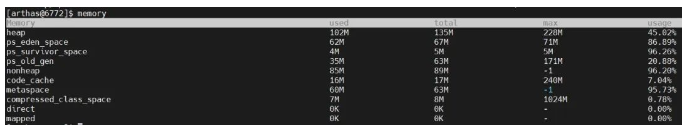

##### 栈内存溢出
我们知道栈内存用于存储方法的调用和局部变量。
每个线程在运行时都会拥有一个独立的栈内存。
栈内存的管理方式是基于栈帧的概念，每个方法调用都会创建一个栈帧，
***栈帧中包含了方法的参数、局部变量以及方法返回值等信息***。

这里我们编写代码如下：
```
public void recursiveMethod() {
 recursiveMethod();
}

@Test
public void stackTest() {
 recursiveMethod();
}
```

该代码中的recursiveMethod()方法会无限递归调用自身，
导致栈帧不断压入栈内存，最终导致栈内存溢出。

修改运行设置：
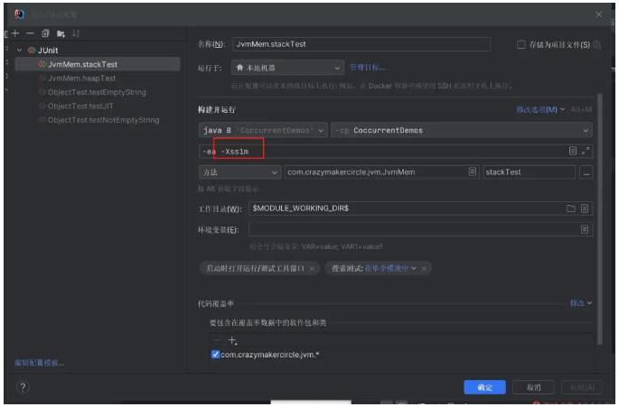

这里使用-Xss参数来设置栈内存的大小为1m，
运行该测试用例，输出如下：
```
java.lang.StackOverflowError
 at com.crazymakercircle.jvm.JvmMem.recursiveMethod(JvmMem.java:19)
 at com.crazymakercircle.jvm.JvmMem.recursiveMethod(JvmMem.java:19)
```
栈内存的大小是有限的，过大或过小的配置都可能导致问题。
如果将栈内存设置得过小，可能会导致栈内存溢出；而将栈内存设置得过大，则会消耗更多的系统资源。
因此，在进行栈内存大小的配置时，需要根据应用程序的需求和性能特征进行合理的调整。

另外，栈内存的大小和线程数量也有一定的关联。
栈内存的总大小等于每个线程的栈内存大小乘以线程数量。
因此，如果应用程序创建了大量的线程，需要注意合理配置栈内存大小，以避免过度消耗系统资源。

##### 方法区/元空间溢出
元空间存储着类的***结构信息、常量池、静态变量***等，
我们这里通过不断加载类信息来模拟元空间溢出的问题，

代码如下：
```
static class OOM{}
@Test
public void metaspaceOverflowTest() {
    int i = 0;//模拟计数多少次以后发生异常
    try {
        while (true){
            i++;
            // 使用CGLIB动态创建代理类
            Enhancer enhancer = new Enhancer();
            enhancer.setSuperclass(OOM.class);
            enhancer.setUseCache(false);
            enhancer.setCallback(new MethodInterceptor() {
                @Override
                public Object intercept(Object o, Method method, Object[] objects, MethodProxy methodProxy) throws Throwable {
                    return methodProxy.invokeSuper(o, new String[]{});
                }
            });
            enhancer.create();
        }
    } catch (Throwable e) {
        System.out.println("=================多少次后发生异常："+i);
        e.printStackTrace();
    }
}
```

同样，配置运行的jvm参数：
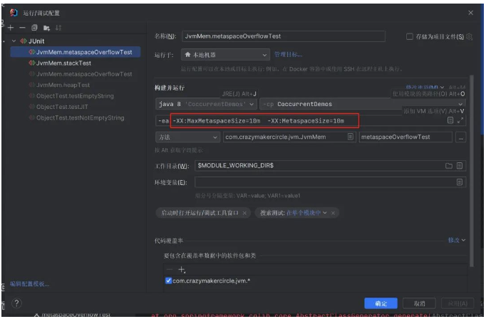

参数说明：
- -XX:MaxMetaspaceSize=10m 指定了方法区/元空间的最大大小为 10MB。
方法区/元空间是存放类元数据和常量池等信息的区域，当应用程序需要更多的方法区/元空间时，JVM会尝试扩展其大小，但不会超过指定的最大大小。
当方法区/元空间达到最大大小时，可能会触发垃圾回收或抛出OutOfMemoryError。

- -XX:MetaspaceSize=10m 指定了方法区/元空间的初始大小为 10MB。
这个参数在JVM启动时起作用，用于设置方法区/元空间的初始大小。
JVM会根据需要动态地调整方法区/元空间的大小，但不会小于指定的初始大小。

接着运行测试用例，输出如下：
```
at org.springframework.cglib.core.ReflectUtils.defineClass(ReflectUtils.java:459)
at org.springframework.cglib.core.AbstractClassGenerator.generate(AbstractClassGenerator.java:336)
... 30 more
Caused by: java.lang.OutOfMemoryError: Metaspace
at java.lang.ClassLoader.defineClass1(Native Method)
at java.lang.ClassLoader.defineClass(ClassLoader.java:763)
at sun.reflect.GeneratedMethodAccessor1.invoke(Unknown Source)
at sun.reflect.DelegatingMethodAccessorImpl.invoke(DelegatingMethodAccessorImpl.java:43)
at java.lang.reflect.Method.invoke(Method.java:498)
at org.springframework.cglib.core.ReflectUtils.defineClass(ReflectUtils.java:459)
```

调优思路
1. 使用适当的数据结构和算法：根据实际需求选择适当的数据结构和算法，避免不必要的对象创建和内存占用。例如，对于大量的临时字符串拼接操作，可以考虑使用StringBuilder来提高效率和节省内存。
2. 根据实际情况调整元空间大小:-XX:MaxMetaspaceSize，-XX:MetaspaceSize ,这两个参数一起使用可以控制方法区/元空间的大小。通过设置较小的初始大小和最大大小，可以限制方法区/元空间的增长，从而防止溢出和控制内存使用。

同样，参数的大小可以先通过相关工具如VisualVM, Arthas进行监控再进行设置。

#### 2. Full GC问题
在生产环境，我们经常遇到系统卡顿甚至假死的情况，***大部分情况都是由于频繁Full GC问题导致***，那么什么是Full GC呢？

Full GC（Full Garbage Collection）是指对整个堆内存进行垃圾回收的过程。
在Java虚拟机中，堆内存被划分为新生代（Young Generation）、老年代（Old Generation）和永久代（Permanent Generation）/元空间（Metaspace）。
Full GC会同时清理新生代和老年代的垃圾对象，以及永久代/元空间中的垃圾信息。

Full GC通常发生在以下几种情况下：
1. 当新生代的Eden区、Survivor区无法容纳新的对象时，会触发Minor GC（新生代垃圾回收）。如果在Minor GC后仍然没有足够的内存空间分配对象，则会触发Full GC。
2. 当老年代无法容纳新的对象时，会触发Major GC（老年代垃圾回收）。如果在Major GC后仍然没有足够的内存空间分配对象，则会触发Full GC。
3. 当永久代/元空间的类加载信息、常量池等元数据无法容纳新的数据时，会触发Full GC。

Full GC的触发会导致应用程序的停顿，因为在回收过程中，所有的应用线程都会被挂起。
这是因为Full GC需要对整个堆内存进行扫描和清理，包括新生代和老年代的对象。
因此，Full GC的频繁发生可能会对应用程序的性能产生负面影响，引起长时间的停顿和延迟。

这里，我们通过一段代码，模拟Full GC情况，

```
@Test
public void fullGcTest() {
    List<byte[]> list = new ArrayList<>();

    try {
        while (true) {
            byte[] bytes = new byte[10 * 1024 * 1024]; // 分配10MB的内存
            list.add(bytes);
            Thread.sleep(1000); // 每次分配后暂停1秒
        }
    } catch (Throwable t) {
        t.printStackTrace();
    }
}
```

修改运行jvm参数，设置最大内存-Xmx10m,
运行测试用例后，
使用arthas的dashboard命令来查看当前系统的实时数据，

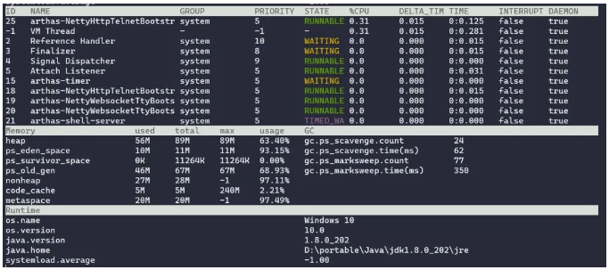

这里注意看Mermory和GC两个区域相关数据，

GC区域说明：
- gc.ps_scavenge.count：从应用程序启动到当前采样时间年轻代gc次数
- gc.ps_scavenge.time(ms)：从应用程序启动到当前采样时间年轻代gc所用的总时间(毫秒)
- gc.ps_marksweep.count：从应用程序启动到当前采样时间老年代gc次数
- gc.ps_marksweep.time(ms)：从应用程序启动到当前采样时间老年代gc所用的总时间(毫秒)

Memory区域主要参数说明：
- heap：堆内存使用情况（ps_eden_space+ps_survivor_space+ps_old_gen）
- ps_eden_space：伊甸园区内存使用情况
- ps_survivor_space：幸存区内存使用情况
- ps_old_gen ：老年代内存使用情况
- nonheap：非堆内存使用情况

可以看到，随着时间变化，gc.ps_scavenge.count和gc.ps_marksweep.count一直在递增，
ps_eden_space 和 ps_old_gen 两块区域的内存占用比也比较高。

为了避免频繁的Full GC，可以通过以下几个手段优化：
1. 设置堆内存大小：通过调整堆内存大小，可以影响垃圾回收的频率和效率。
如果应用程序的内存需求较小，可以减小堆内存的大小，减少垃圾回收的开销。
如果应用程序需要处理大量数据或具有较大的内存需求，可以增加堆内存的大小，以减少垃圾回收的频率。
- -Xms：指定JVM的初始堆内存大小，即堆内存的起始分配量。例如，-Xms512m表示初始堆内存大小为512MB。
- -Xmx：指定JVM的最大堆内存大小，即堆内存的最大分配量。例如，-Xmx2g表示最大堆内存大小为2GB。

2. 选择合适的垃圾回收器，VM提供了多种垃圾回收器，如
***串行回收器（Serial Collector）***、
***并行回收器（Parallel Collector）***、
***并发标记清除回收器（Concurrent Mark and Sweep Collector）***等。
了解每种回收器的特点和适用场景，根据应用程序的需求选择合适的垃圾回收器。

- -XX:+UseSerialGC：启用串行垃圾回收器。适用于单线程环境或小型应用程序。
- -XX:+UseParallelGC：启用并行垃圾回收器。适用于多核处理器和多线程应用程序。
- -XX:+UseConcMarkSweepGC：启用并发标记清除垃圾回收器。适用于对停顿时间有较高要求的应用程序。
- -XX:+UseG1GC：启用G1（Garbage-First）垃圾回收器。适用于大内存、多核处理器和低停顿时间要求的应用程序。

除了以上参数，还***可以通过其他参数来调整垃圾回收器的行为***，例如：
- -XX:MaxGCPauseMillis：设置最大垃圾回收停顿时间的目标值。可以通过增加停顿时间来减少频繁的垃圾回收。
- -XX:GCTimeRatio：设置垃圾回收时间与应用程序运行时间的比例。通过调整该值，可以控制垃圾回收的频率。
- -XX:NewRatio：设置新生代和老年代的比例。默认情况下，新生代和老年代的比例是1:2。

3. 调整垃圾回收器的参数：不同的垃圾回收器有一些特定的参数可供调整。
例如，可以调整新生代和老年代的比例、年轻代的分区比例、并发垃圾回收的线程数等。
这些参数的调整可以根据应用程序的内存使用模式和负载特征进行优化，以提高垃圾回收的性能和吞吐量。
通过上述手段可以尽量减少Full GC的发生，提高应用程序的性能和响应性能。

- -Xmn：指定新生代的大小。新生代是堆内存中用于存放新创建的对象的区域，包括Eden区和Survivor区。通过设置-Xmn参数，可以独立调整新生代的大小。例如，-Xmn256m表示新生代大小为256MB。
- -XX:NewRatio：指定新生代和老年代的比例。默认情况下，新生代和老年代的比例是1:2。通过调整该参数的值，可以改变新生代和老年代的大小比例。例如，-XX:NewRatio=2表示新生代和老年代的比例为1:2。
- -XX:SurvivorRatio：指定Survivor区与Eden区的比例。默认情况下，Survivor区与Eden区的比例是1:1:8。通过调整该参数的值，可以改变Survivor区和Eden区的大小比例。例如，-XX:SurvivorRatio=8表示Survivor区与Eden区的比例为8:1。
- -XX:MaxHeapFreeRatio和-XX:MinHeapFreeRatio：指定堆内存的最大和最小空闲比例。默认情况下，最大空闲比例为70%，最小空闲比例为40%。通过调整这两个参数的值，可以控制堆内存的空闲空间大小。

#### 3. 线程死锁
当系统出现卡死现象时，除了内存、网络连接等问题外，还有可能是线程死锁导致，
我们先编写一段代码，演示线程死锁问题：
```
public class DeadlockExample {
    private static final Object lock1 = new Object();
    private static final Object lock2 = new Object();

    public static void main(String[] args) {
        Thread thread1 = new Thread(() -> {
            synchronized (lock1) {
                System.out.println("Thread 1 acquired lock1");
                try {
                    Thread.sleep(1000);
                } catch (InterruptedException e) {
                    e.printStackTrace();
                }
                synchronized (lock2) {
                    System.out.println("Thread 1 acquired lock2");
                }
            }
        });

        Thread thread2 = new Thread(() -> {
            synchronized (lock2) {
                System.out.println("Thread 2 acquired lock2");
                synchronized (lock1) {
                    System.out.println("Thread 2 acquired lock1");
                }
            }
        });
        thread1.start();
        thread2.start();
    }
}
```
运行代码，利用arthas 导出转储快照,

```
$ java -jar arthas-boot.jar
[INFO] JAVA_HOME: D:\portable\Java\jdk-17
[INFO] arthas-boot version: 3.6.9
[INFO] Found existing java process, please choose one and input the serial number of the process, eg : 1. Then hit ENTER.
* [1]: 18528 c:\Users\xx\.vscode\extensions\redhat.java-1.19.0-win32-x64\server\plugins\org.eclipse.equinox.launcher_1.6.400.v20210924-0641.jar
  [2]: 13940 org.jetbrains.idea.maven.server.RemoteMavenServer36
  [3]: 20292 org/netbeans/Main
  [4]: 20676
  [5]: 23028 com.crazymakercircle.jvm.DeadlockExample
  [6]: 21884 org.jetbrains.jps.cmdline.Launcher
  [7]: 26412 org/netbeans/Main
  [8]: 4044
5
[INFO] arthas home: C:\Users\xxx\.arthas\lib\3.6.9\arthas
[INFO] Try to attach process 23028
Picked up JAVA_TOOL_OPTIONS:
```

利用thread命令定位死锁问题：
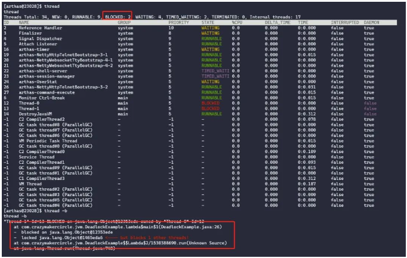

直接使用”thread“命令，输出线程统计信息。其中：BLOCKED 表示目前阻塞的线程数。
再执行“thread -b”命令，找出当前阻塞其他线程的线程，即造成死锁的罪魁祸首
上面这个命令直接输出了 造成死锁的线程ID，和具体的代码位置，以及当前线程一共阻塞的线程数量：“<—- but blocks 1 other threads!“。

***解决办法***
1. 检查代码逻辑：仔细检查代码，特别是涉及锁的部分。确保在获取锁的顺序上没有潜在的问题。***避免多个线程按照不同的顺序获取锁，从而避免死锁发生***。
2. 解决死锁问题：解决死锁问题的方法有多种。一种常见的方法是按照相同的顺序获取锁，避免不同线程之间的锁顺序不一致。另一种方法是使用线程池或线程调度器来管理线程，避免创建过多的线程。
还可以使用锁的超时机制来避免长时间的等待，或者使用可重入锁来简化代码逻辑等。

- 一种常见的方法是按照相同的顺序获取锁，避免不同线程之间的锁顺序不一致
- 另一种方法是使用线程池或线程调度器来管理线程，避免创建过多的线程。
- 使用锁的超时机制来避免长时间的等待
- 或者使用可重入锁来简化代码逻辑。

***以上解决办法的实操介绍，请参见《Java调优圣经》的配套视频。***

#### 4. CPU负载过高
在某些情况下，应用程序中的某些代码可能会导致CPU负载过高，从而影响系统的性能和响应能力。
导致CPU负载过高有以下几点原因：
1. 无限循环：代码中存在无限循环，导致CPU不断执行循环体，消耗大量的计算资源。
2. 频繁的计算或运算量过大：***某些计算密集型任务或算法可能会导致CPU负载过高***。例如，大量的数据处理、复杂的数学计算或递归算法等。
3. 并发竞争：多个线程同时竞争相同的资源或锁，导致CPU频繁切换上下文和竞争，进而导致CPU负载升高。

同样，我们提供一段代码，模拟CPU负载过高问题：
```
public class CpuBusy {
    public static void main(String[] args) {
        new Thread(()->{
            while (true){
                System.out.println("hello");
            }
        },"myThread").start();
    }
}
```

运行后，依然使用arthas帮助我们定位问题,

```
$ java -jar arthas-boot.jar
[INFO] JAVA_HOME: D:\portable\Java\jdk-17
[INFO] arthas-boot version: 3.6.9
[INFO] Found existing java process, please choose one and input the serial number of the process, eg : 1. Then hit ENTER.
* [1]: 18528 c:\Users\xxx\.vscode\extensions\redhat.java-1.19.0-win32-x64\server\plugins\org.eclipse.equinox.launcher_1.6.400.v20210924-0641.jar
  [2]: 13940 org.jetbrains.idea.maven.server.RemoteMavenServer36
  [3]: 20292 org/netbeans/Main
  [4]: 20676
  [5]: 2996 org.jetbrains.jps.cmdline.Launcher
  [6]: 9640
  [7]: 26412 org/netbeans/Main
  [8]: 28732 com.crazymakercircle.jvm.CpuBusy
  [9]: 4044
8
[INFO] arthas home: C:\Users\xxx\.arthas\lib\3.6.9\arthas
[INFO] Try to attach process 28732
Picked up JAVA_TOOL_OPTIONS:
```

使用thread命令，查看占用cpu较高的前10个线程

```
[arthas@28732]$ thread -n 10
thread -n 10
"myThread" Id=12 cpuUsage=93.1% deltaTime=187ms time=109125ms RUNNABLE
    at java.io.FileOutputStream.writeBytes(Native Method)
    at java.io.FileOutputStream.write(FileOutputStream.java:326)
    at java.io.BufferedOutputStream.flushBuffer(BufferedOutputStream.java:82)
    at java.io.BufferedOutputStream.flush(BufferedOutputStream.java:140)
    at java.io.PrintStream.write(PrintStream.java:482)
    at sun.nio.cs.StreamEncoder.writeBytes(StreamEncoder.java:221)
    at sun.nio.cs.StreamEncoder.implFlushBuffer(StreamEncoder.java:291)
    at sun.nio.cs.StreamEncoder.flushBuffer(StreamEncoder.java:104)
    at java.io.OutputStreamWriter.flushBuffer(OutputStreamWriter.java:185)
    at java.io.PrintStream.newLine(PrintStream.java:546)
    at java.io.PrintStream.println(PrintStream.java:807)
    at com.crazymakercircle.jvm.CpuBusy.lambda$main$0(CpuBusy.java:7)
    at com.crazymakercircle.jvm.CpuBusy$$Lambda$1/1144748369.run(Unknown Source)
    at java.lang.Thread.run(Thread.java:748)


"Reference Handler" Id=2 cpuUsage=0.0% deltaTime=0ms time=0ms WAITING on java.lang.ref.Reference$Lock@7b8e9f2a
    at java.lang.Object.wait(Native Method)
    -  waiting on java.lang.ref.Reference$Lock@7b8e9f2a
    at java.lang.Object.wait(Object.java:502)
    at java.lang.ref.Reference.tryHandlePending(Reference.java:191)
    at java.lang.ref.Reference$ReferenceHandler.run(Reference.java:153)


"Finalizer" Id=3 cpuUsage=0.0% deltaTime=0ms time=0ms WAITING on java.lang.ref.ReferenceQueue$Lock@4018cb3e
    at java.lang.Object.wait(Native Method)
    -  waiting on java.lang.ref.ReferenceQueue$Lock@4018cb3e
    at java.lang.ref.ReferenceQueue.remove(ReferenceQueue.java:144)
    at java.lang.ref.ReferenceQueue.remove(ReferenceQueue.java:165)
    at java.lang.ref.Finalizer$FinalizerThread.run(Finalizer.java:216)
```
从日志可以分析定位出：
myThread 这个线程的Id为12，cpuUsage 占比为 93.1% ，是在运行CpuBusy类main方法时， 导致cpu飙升。

> 以上解决办法的实操介绍，请参见《Java调优圣经》的配套视频。

### 案例实战
经过前面的讨论，我们已经了解了如何调优线上环境中常见问题的思路。
现在，让我们通过一个实际场景案例，详细介绍如何逐步进行问题定位、问题分析，并通过多方位的调优措施实现高性能调优。

#### 具体的案例场景
具体案例场景是这样的：在某大型SaaS平台中，高峰期经常出现大量不同企业业务人员同时进行报表导出操作，导致整个系统出现卡顿甚至假死的情况。

在这个案例中，我们将从问题的定位开始，通过使用***监控工具***和***分析工具***来识别系统性能瓶颈的位置。
接下来，我们将展示如何深入分析问题的根源，并提供相应的解决方案。
在整个调优过程中，我们将涉及到***系统参数的调整***、***资源管理的优化***、***缓存的优化***等多个方面。

通过这个案例的实践，您将学习到实际的调优技巧和策略。

为了解决这个问题，我们抽取了核心代码，并通过对接口进行压力测试，
观察在问题发生时系统的整体负载情况。
然后，我们将逐步进行优化，针对不同的环节和问题进行调整和改进，以提升系统的性能和稳定性。

首先，通过接口导出excel的部分核心代码如下所示：

```
// 查询10万条数据
List<ProductPO> content = productDao.findAll(PageRequest.of(0, 100000, Sort.by("id"))).getContent();
/**
try(){}中()括号的作用
属于Java7的新特性。
经常会用try-catch来捕获有可能抛出异常的代码。
如果其中还涉及到资源的使用的话，最后在finally块中显示的释放掉有可能被占用的资源。
但是如果资源类已经实现了AutoCloseable这个接口的话，可以在try()括号中可以写操作资源的语句(IO操作)，
会在程序块结束时自动释放掉占用的资源，不用再在finally块中手动释放了。
如果要释放的资源多得话，判断加catch占得篇幅大，不美观也不精简
*/
try(Workbook workbook = new XSSFWorkbook()) {
    Sheet sheet = workbook.createSheet("Sheet1");
    int i = 0 ;
    for (ProductPO po : content) {
        Row dataRow = sheet.createRow(++i);
        dataRow.createCell(0).setCellValue(po.getName());
        dataRow.createCell(1).setCellValue(po.getType());
        dataRow.createCell(2).setCellValue(po.getBrand());
        dataRow.createCell(3).setCellValue(po.getShopId());
    }
    // Save the workbook to a file
    try (FileOutputStream fileOut = new FileOutputStream("E:\\" + System.currentTimeMillis() + "-data.xlsx")) {
        workbook.write(fileOut);
        System.out.println("Excel file created successfully!");
    } catch (IOException e) {
        e.printStackTrace();
    }
}
```

> 以上核心代码的实操介绍，请参见《Java调优圣经》的配套视频。

#### 压力测试进行问题复现
在项目启动后，我们使用JMeter进行了单机压力测试，对导出接口进行了模拟。
我们采用了以下JMeter配置，模拟了100个并发线程同时发起请求：

> ramp up：逐步增加：指在一段时间内逐渐提高或增加某事物的数量、速度或强度。

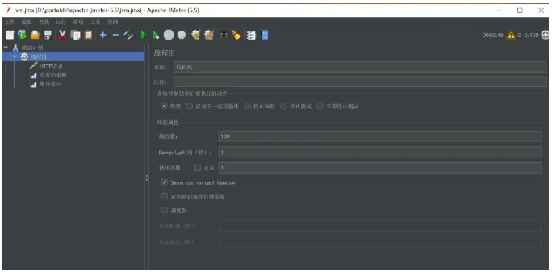

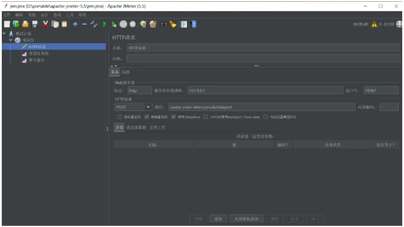

#### 负载情况的监控和分析
在进行压力测试时，我们同时使用了VisualVM和arthas这两个工具来监控系统的负载情况。
通过这两个工具的协同作用，我们能够全面地了解系统的性能表现，并及时发现潜在的瓶颈和问题。
***VisualVM提供了直观的图形界面，可以监控系统的内存、线程、GC等指标，帮助我们分析系统的整体状况***。
通过这两个工具的综合使用，我们可以更加全面地了解系统的性能特征，并及时采取相应的优化措施。

下图展示了通过VisualVM监控的CPU、内存和GC情况，这些指标对于评估系统的性能至关重要。

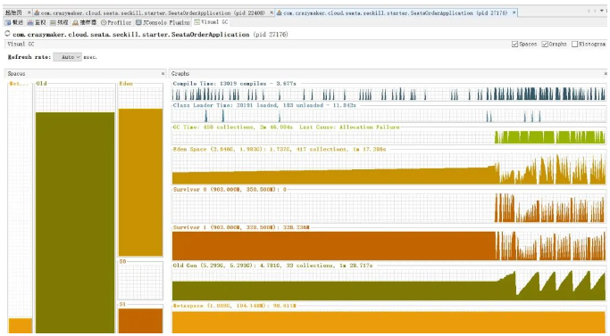

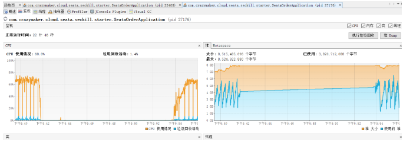

而arthas则是一个强大的Java诊断工具，可以进行实时的方法追踪、堆栈分析等操作，帮助我们深入定位问题的源头。
- 实时方法追踪
- 堆栈分析

下图展示了使用arthas的dashboard命令监控的内存运行情况和GC情况。
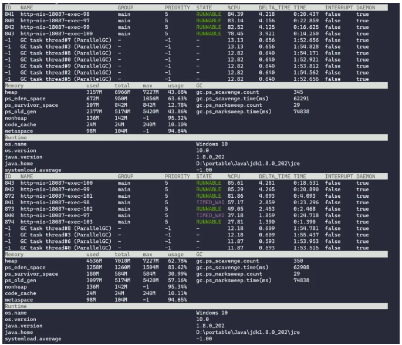

通过这个监控工具，我们可以清楚地观察到GC的次数非常频繁，
这意味着系统中存在大量的垃圾对象需要被回收。

由于垃圾回收是一项相对耗时的操作，频繁的GC会严重影响系统的性能。

> 以上性能分析的实操介绍，请参见《Java调优圣经》的配套视频。

接下来，我们再看下jmeter的聚合报告：

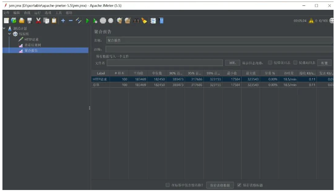

可以观察到，在进行了100次请求的压测中，平均每次请求的时长超过了183秒。
此外，GC的总耗时也超过了100秒。
这些数据表明系统存在性能瓶颈和资源利用不高的问题。
长时的请求时长意味着系统的响应时间较长，用户可能会感受到明显的延迟。
而高耗时的GC过程则会占用大量的CPU时间和系统资源，进一步降低了系统的性能。

#### 进行JVM的优化
接下来，我们使用三招，进行JVM的优化，

##### 1. 选择合适的垃圾回收器
jdk1.8 默认垃圾收集器Parallel Scavenge（新生代）+Parallel Old（老年代），
推荐使用 G1 垃圾回收器（Garbage First）来获得更好的性能和吞吐量。

G1 垃圾回收器适用于具有大内存容量和对停顿时间敏感的应用程序。
它通过将堆分割为多个区域（Region）来管理内存，并使用增量的方式执行垃圾回收，以控制停顿时间。
可以通过设置以下 JVM 参数启用 G1 垃圾回收器：

```
-XX:+UseG1GC
```

请注意，选择垃圾回收器应该根据具体的应用场景和需求进行评估和测试。
在某些情况下，其他垃圾回收器，如CMS（Concurrent Mark Sweep）或 Serial（串行）垃圾回收器，可能更适合特定的应用程序。

##### 2. 调节内存参数
使用上述垃圾回收器时，还可以通过调整一些与垃圾回收相关的参数来进一步优化性能和内存管理。
例如，可以通过设置 -Xms 和 -Xmx 参数来调整堆的初始大小和最大大小，或者使用 -XX:NewRatio 参数来调整新生代和老年代的比例等。

在arthas的看板里，我们可以看到年轻代和元数据区内存占比接近100%， 这里我们通过以下参数来调节：

```
-Xmx16g
-Xms16g
-XX:MetaspaceSize=512m
-XX:MaxMetaspaceSize=512m
-Xmn6g
```

- -Xmx16g -Xms16g：该JVM参数设置了Java虚拟机的初始和最大堆内存大小。在这个例子中，初始和最大堆内存大小设置为16GB。
- -XX:MetaspaceSize=512m -XX:MaxMetaspaceSize=512m ：该JVM参数设置了Metaspace的初始和最大大小，Metaspace用于存储类的元数据，在这个例子中，我们将Metaspace的初始和最大大小设置为512MB。
- -Xmn6g：该JVM参数设置了年轻代堆内存的大小，年轻代堆内存是用于新对象分配的一部分堆内存。年轻代包括Eden空间和两个Survivor空间（From和To）。

需要注意的是，每个应用程序的需求和环境都不同，因此最佳的垃圾回收器选择和参数设置可能会因情况而异。
建议在实际部署之前进行测试和性能评估，以找到最适合您应用程序的配置。

##### 3. 优化代码
优化点：
- 使用SXSSFWorkbook替代XSSFWorkbook：SXSSFWorkbook是Apache POI库中用于处理大型数据集的高级工具。它结合了XSSFWorkbook的功能和优势，并添加了一些额外的特性，以提高性能和减少内存消耗。
SXSSFWorkbook采用流式处理方式，将数据写入临时文件中，而不是将所有数据保存在内存中。这样可以有效地处理大型数据集，并减少内存压力。
- 使用分页查询获取数据：如果需要导出大量数据，可以考虑使用多次分页查询来获取数据，而不是一次性查询出所有记录。
这样可以减少内存的占用，避免将所有数据加载到内存中。通过设置合适的分页大小，可以有效地控制内存的使用情况。
- 减少对象引用次数：在处理大量数据时，尽量减少对象的创建和引用次数，可以降低Major GC（全局垃圾回收）的频率，从而提高系统的性能。
尽量使用局部变量而不是全局变量，并在使用后及时释放资源，避免对象的长时间引用。

优化后代码如下：
```
try(XSSFWorkbook xssfWorkbook = new XSSFWorkbook()) {
    // 设置内存中的行数
    SXSSFWorkbook workbook = new SXSSFWorkbook(xssfWorkbook, 100, false, false);
    // Create a new sheet
    Sheet sheet = workbook.createSheet("Sheet1");
    int i = 0 ;
    for (int j = 0 ; j < 100; j++) {
        int offset = j * 1000;
        List<ProductPO> content = productDao.findAll(PageRequest.of(offset, 1000, Sort.by("id"))).getContent();
        for (ProductPO po : content) {
            Row dataRow = sheet.createRow(++i);
            dataRow.createCell(0).setCellValue(po.getName());
            dataRow.createCell(1).setCellValue(po.getType());
            dataRow.createCell(2).setCellValue(po.getBrand());
            dataRow.createCell(3).setCellValue(po.getShopId());
        }
    }

    // Save the workbook to a file
    try (FileOutputStream fileOut = new FileOutputStream("E:\\" + System.currentTimeMillis() + "-data.xlsx")) {
        workbook.write(fileOut);
        System.out.println("Excel file created successfully!");
    } catch (IOException e) {
        e.printStackTrace();
    }
}
```

配置好启动参数：
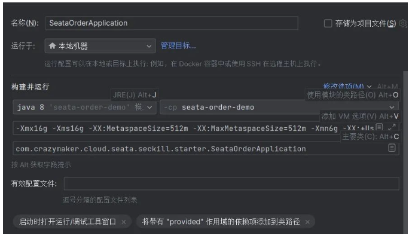

重新启动后，我们再运行jmeter压测：

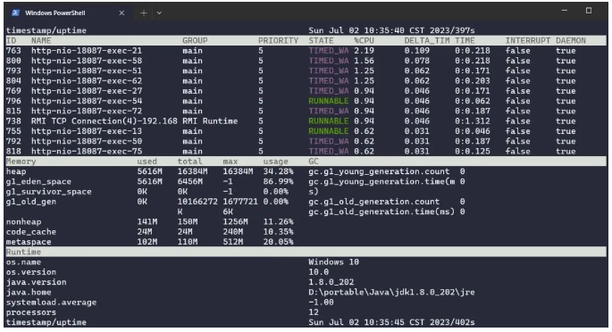

从arthas的监控面板我们可以看到，gc次数从100多次降为0， 
大量临时数据集中在年轻代eden区，说明调整了JVM的堆内存设置对性能有所改善。

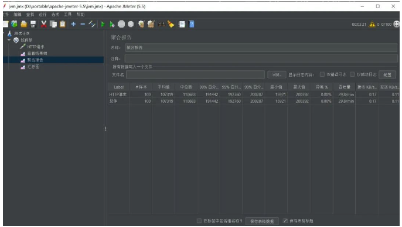

> 以上优化的实操介绍，请参见《Java调优圣经》的配套视频。

通过对jmeter压测报告的分析，我们成功将平均耗时从183秒多降低到107秒，实现了超过70%的性能提升。
这样的改进对于系统的整体性能和用户体验来说都是非常显著的。

然而，在实际的生产环境中，仍然有进一步优化的空间。
尽管107秒的响应已经比之前的183秒有了巨大的改善，但对于用户体验而言，仍然有待提升。
为了进一步减少响应时间和提高用户满意度，我们可以采用***缓存加异步执行的策略***。

具体地，当用户提交导出报表的请求时，我们可以将任务放入消息队列中进行异步处理。
在任务执行完成后，再通过通知用户去下载中心获取报表文件。
这种方式可以将任务的执行与用户的请求解耦，提高系统的并发处理能力和响应速度。

通过引入缓存和异步执行的机制，我们能够更好地平衡系统的资源利用和用户体验之间的关系，进一步优化整个导出报表的流程。
用户可以更快地获取到所需的报表数据，而系统也能更高效地处理大量的导出请求。

### 小结下面的三招，使得FullGC调优100倍
上面的真实案例中，尼恩架构团队，使用下面的三招，使得FullGC调优100倍：

第一招：选择合适的垃圾回收器
第二招：调节内存参数
第三招：优化代码

JVM调优，就是给你的Java应用程序来个彻底提升！

> 如果上面的实操没有太弄明白，请参见《Java调优圣经》的配套视频，会有优化的实操介绍。

总之，JVM就像是个管家，负责管理你的Java应用的内存、资源和垃圾回收。
它会把你的Java代码翻译成机器码，并把它们送到处理器上跑。

有时候，你的应用程序可能会出现一些性能问题，比如内存泄漏、CPU负载过高等等。
别担心，JVM调优就是拯救之法！

调优的第一步是要了解你的JVM内存模型。它有个堆，装着各种对象，还有个栈，放着方法调用和局部变量。
还有个方法区/元空间，存放类的信息。这些区域都有自己的管理方式和分配策略。

垃圾回收是JVM的拿手好戏，它会找出不再使用的对象，并把它们清理掉，释放内存资源。
它有各种垃圾回收算法，比如标记-清除、复制、标记-整理等，就像是个勤劳的清洁工。

别忘了我们还有垃圾回收器这个重要角色！有串行的、并行的、并发的，就像是垃圾回收界的超级英雄。
根据你的应用需求和硬件环境，选一个合适的回收器，让它为你的应用服务。

要想成为JVM调优高手，关键是要懂得如何调整参数和配置。
调整堆内存大小、新生代和老年代的比例，调优垃圾回收器的参数，就像是给你的应用穿上定制的战衣，让它战无不胜！

还有一招绝技，就是使用性能分析工具。比如VisualVM，它可以监控应用的内存使用、CPU利用率等指标，帮助你找出性能瓶颈所在，然后有针对性地进行调优。

总而言之，JVM调优是一个充满乐趣和挑战的过程。
你需要深入理解JVM的工作原理，学会调整参数和配置，运用性能分析工具，让你的应用程序焕发新生！

