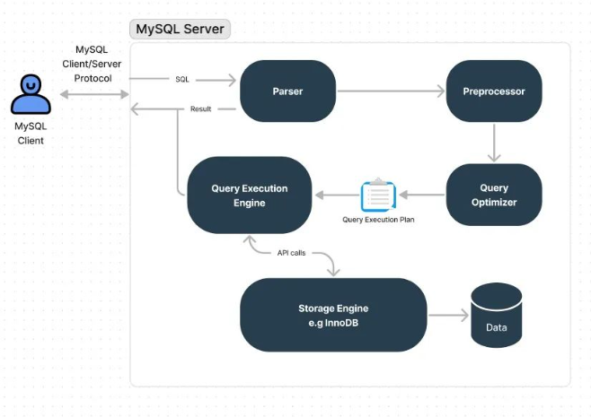

## 如何做mysql调优？绝命7招，让慢SQL调优100倍

[链接地址](https://mp.weixin.qq.com/s/FB_L0BFOlYuBWR_itlLLeA)

### 前言
在40岁老架构师尼恩的读者社群（50+）中，很多小伙伴拿不到offer，或者拿不到好的offer。<br>
尼恩经常给大家 优化项目，优化简历，挖掘技术亮点。在指导简历的过程中， Java 调优是一项很重要的指导。<br>
问题是，很多小伙伴，连一点调优的基础都没有， 当然，连***高并发的场景***也搞不清楚。<br>
实际上，无论是调优，还是高并发的场景，我们都需要解决一些基础问题，比如说：<br>

一亿用户量，平均每人每天10次的业务量，要求并发数在5000以上，
峰值在5w到10w之间，QPS在25w以上, 如何进行压测？如何进行调优？<br>

对于架构师、高级开发来说， 调优是 核心内容， 那么压测更是内功中的内功。
- 对于架构师、高级开发来说
- 调优是核心内容
- 压测更是内功中的内功

尼恩团队结合资深架构经验和行业案例，给大家梳理一个系列的《Java 调优圣经》PDF 电子书，包括本文在内规划的五个部分：
- (1) 调优圣经1：零基础精通Jmeter分布式压测，10Wqps+压测实操  （已经完成）
- (2) 调优圣经2：从70s到20ms，一次3500倍性能优化实战，方案人人可用 （已经完成）
- (3)  调优圣经4：如何做mysql调优？绝命7招让慢SQL调优100倍，实现你的Mysql调优自由  （本文）
- (4) 调优圣经3：零基础精通JVM调优实操，实现JVM自由  （写作中）
- (5) 调优圣经5：零基础精通Linux、Tomcatl调优实操，实现基础设施调优自由   （写作中）
以上的多篇文章，后续将陆续在 【技术自由圈】 公众号发布。完整的《Java 调优圣经》PDF，可以找尼恩获取。

### 本文目录
- 前言
- mysql调优的背景
- 让"慢SQL"提速100倍的绝命7招
- 案例背景
- 数据库配置调优
  - 调整数据库缓冲区大小和线程池设置
  - 优化InnoDB存储引擎的参数配置
  - 调整日志和锁定策略以提高并发性能
- 硬件和操作系统优化
  - 硬件配置
  - 操作系统配置
- 查询优化
  - 查询优化主要手段
    - 优化查询语句
    - 创建适当的索引
    - 优化数据模型和表结构
    - 监测和分析查询性能
    - 定期维护和优化
  - 电商场景案例实战
    - 准备工作
    - 场景1：用户搜索
    - 场景2：订单查询
    - 场景3：分页查询
    - 场景4：订单统计报表查询
- MySQL性能监控与报警
- MySQL调优小结
- 《Java 调优圣经》迭代计划
- 推荐阅读
- 免费领取11个技术圣经 PDF

### mysql调优的背景：
MySQL是一款广泛应用于各种规模和类型的应用程序的关系型数据库管理系统。
***在实际的数据库应用中，我们常常面临着各种性能瓶颈和挑战***。<br>
当数据库性能下降时，应用程序的响应时间延长、吞吐量降低，甚至可能导致系统崩溃。<br>
- 数据库性能下降时
- 应用程序的响应时间延长、吞吐量降低
- 甚至可能导致系统奔溃

因此，对MySQL进行调优是确保数据库系统高效运行的关键一环。
在实际使用MySQL的过程中，我们可能会遇到一系列问题，例如：

- 查询性能下降：某些查询语句执行速度缓慢，导致应用程序的响应时间变慢，用户体验下降。
- 并发访问问题：当多个用户同时访问数据库时，可能会出现***锁竞争、死锁***等并发访问问题，导致系统性能下降。
- 数据库配置不当：MySQL的默认配置可能无法满足特定应用程序的需求，需要对参数进行适当调整，以获得更好的性能。
- 硬件和操作系统限制：数据库服务器的硬件和操作系统资源可能成为瓶颈，影响数据库的性能表现。
- 存储引擎选择：选择合适的存储引擎对于某些特定的应用场景至关重要，不同的存储引擎具有不同的性能特点。

***查询性能下降***、
***并发访问问题***、
***数据库配置不当***、
***硬件和操作系统限制***、
***存储引擎选择***

面对这些问题，我们需要采取一系列的调优措施，以提升MySQL数据库的性能和可扩展性。<br>
本文将通过实际案例，探讨MySQL调优的关键步骤和技巧，帮助大家了解如何识别和解决常见的性能问题，从而优化数据库系统的性能表现。<br>

在接下来的内容中，我们通过相关案例来深入探讨监测和诊断、查询优化、数据库配置调优、硬件和操作系统优化等方面的具体技术和实践，
以帮助读者全面理解MySQL调优的实战过程，并最终提升其应用程序的性能和稳定性。

- 检测和诊断
- 查询优化
- 数据库配置调优
- 硬件和操作系统优化

### 让”慢SQL"提速100倍的绝命7招
MySQL查询优化、调优是生产中常见难题，也是常见面试题，
尼恩团队总结了大量的生产案例和实践经验，为大家提炼了让”慢SQL"提速100倍的绝命七大招：<br>

- 第1招：索引优化：
  - ***合理设计索引***：根据查询的条件和访问模式，设计适当的索引，包括单列索引、组合索引、唯一索引等。
  - ***避免过多索引***：过多的索引会增加数据维护的开销，同时也会降低更新操作的性能。
  - ***定期维护索引***：删除不再使用的索引，重新构建或重组索引，以提高索引的效率和性能。

- 第2招：覆盖索引：
  - 利用***覆盖索引避免回表操作***：如果查询的字段都包含在索引中，可以避免访问主表的数据行，从而提高查询性能。

- 第3招：索引下推：
  - ***利用索引下推***（Index Condition Pushdown）优化查询：MySQL 5.6+版本支持索引下推，可以在索引层面进行部分条件的过滤，***减少回表操作，提高查询效率***。

- 第4招：子查询优化：
  - 尽量避免使用大量的子查询：过多的子查询会增加查询的复杂度和开销。可以通过优化查询语句，将子查询转化为连接查询、临时表等方式来提高性能。
  - 使用合适的子查询类型：根据具体场景选择适合的子查询类型，如标量子查询、关联子查询、存在子查询等。

- 第5招：排序优化：
  - 避免在查询中进行不必要的排序：如果查询不需要排序结果，可以***通过调整查询条件或索引设计来避免排序操作***，提高查询性能。
  - 优化排序操作：对于需要排序的查询，可以通过合理的***索引设计***、***增加排序缓冲区的大小***、***调整排序算法***等方式来优化排序操作。

- 第6招：查询缓存的使用：
  - 合理使用查询缓存：查询缓存可以缓存查询结果，提高查询性能。但是在高并发环境下，查询缓存的效果可能不理想，因此需要根据具体情况进行配置和使用。

- 第7招：SQL语句优化：
  - 优化查询语句的写法：合理选择查询方式、使用正确的关键字和函数，减少不必要的计算和数据操作。
  - 避免全表扫描：尽量使用索引覆盖查询，避免全表扫描操作，减少***IO开销和查询时间***。

尼恩团队提炼了绝命七招 ，让”慢SQL"提速100倍， 下面就看一个全面的调优案例。

### 案例背景：
在本文中，我们将以一个在线电商网站为例，探讨MySQL调优的实战案例。
该电商网站作为一个热门的在线购物平台，每天都有大量用户进行商品浏览、下单等操作。

然而，随着用户数量的增加和交易量的增长，他们的数据库性能遇到了一些挑战。

该电商网站的数据库主要存储了产品信息、用户信息、订单等重要数据。
随着业务的发展，***数据库规模逐渐增大，表中的记录数量和索引数量也急剧增加***。
随之而来的是一系列性能问题的出现。

首先，用户在进行商品搜索或浏览时，一些查询语句的执行速度变慢，导致网站响应时间延长。
用户体验下降，甚至可能导致用户流失。

其次，网站在特定时间段，如促销活动期间，会出现高并发的情况。
大量用户同时访问数据库，可能导致***锁竞争、死锁***等并发访问问题，进而影响系统的性能和可用性。
- 锁竞争
- 死锁
此外，数据库服务器的硬件资源和操作系统参数配置也可能成为性能瓶颈。原有的硬件和操作系统设置无法满足当前数据库负载的需求，导致数据库性能无法充分发挥。
- 数据库服务器的硬件资源
- 操作系统参数配置
在面对这些挑战时，必须进行MySQL调优，以提升数据库性能和可扩展性。
我们可以通过优化查询语句、调整数据库配置参数、优化存储引擎和硬件等措施，解决性能瓶颈和并发访问问题，并确保数据库能够稳定高效地支持日益增长的业务需求。
- 优化查询语句
- 调整数据库配置参数
- 优化存储引擎和硬件
在接下来的内容中，我们将详细介绍该电商网站所采取的调优步骤和实践经验，展示如何通过系统的MySQL调优方法，提升数据库性能、优化查询效率，并实现快速、可靠的在线购物体验。

MySQL调优环节主要包括：
- 数据库配置调优
- 硬件及操作系统调优
- SQL语句查询优化
下面我们首先了解下数据库配置调优：

#### 数据库配置调优
数据库配置是MySQL调优的重要一环，通过合理地调整数据库的参数设置，可以显著改善性能和资源利用率。
在本章中，我们将探讨一些关键的数据库配置调优策略，并提供相应的实际脚本或命令示例。

##### 调整数据库缓冲区大小和线程池设置
###### 1. InnoDB缓冲池大小（innodb_buffer_pool_size）：
对于电商网站平台，我们建议将该参数设置为整个服务器内存的70%-80%。
例如，如果服务器具有16GB的内存，则可以将缓冲池大小设置为12GB-14GB，
以确保大部分数据和索引可以缓存在内存中，提高读取性能。

- 如果服务器具有16GB的内存
- 则可以将缓冲池大小设置为12GB~14GB
- 以确保大部分数据和索引可以缓存在内存中，提高读取性能

示例：
```
mysql> SHOW VARIABLES LIKE 'innodb_buffer_pool_size';
+-------------------------+-----------+
| Variable_name           | Value     |
+-------------------------+-----------+
| innodb_buffer_pool_size | 134217728 |
+-------------------------+-----------+
1 row in set (0.00 sec)

mysql> SET GLOBAL innodb_buffer_pool_size = 12*1024*1024*1024; // 12G
Query OK, 0 rows affected (0.00 sec)
```

###### 2. 查询缓存设置（query_cache_type、query_cache_size）：
在电商网站平台中，由于更新频率较高，我们建议禁用查询缓存。
查询缓存在高并发和频繁更新的环境下可能带来更多的性能负担。

示例：
```
mysql> SHOW VARIABLES LIKE 'query_cache%';
+------------------------------+---------+
| Variable_name                | Value   |
+------------------------------+---------+
| query_cache_limit            | 1048576 |
| query_cache_min_res_unit     | 4096    |
| query_cache_size             | 1048576 |
| query_cache_type             | OFF     |
| query_cache_wlock_invalidate | OFF     |
+------------------------------+---------+
5 rows in set (0.00 sec)
```

- query_cache_limit
- query_cache_min_res_unit
- query_cache_size
- query_cache_type
- query_cache_wlock_invalidate

在MySQL配置文件中进行查询缓存设置：
```
[mysqld]
query_cache_type = 0
query_cache_size = 0
```

###### 3. 线程池设置（thread_pool_size、thread_pool_max_threads）：
针对电商网站平台的高并发访问，我们建议根据预估的并发连接数和系统负载情况，适当调整线程池的大小和最大线程数。
可以先根据实际情况设置较小的值，然后通过监控系统负载和连接池状态来进行动态调整。
- 可以先根据实际情况设置较小的值
- 然后通过监控系统负载和连接池状态来进行动态调整

示例：
```
SHOW VARIABLES LIKE 'thread_pool%';
```

在MySQL配置文件中进行线程池设置：
```
[mysqld]
thread_pool_size = 100
thread_pool_max_threads = 200
```

- thread_pool_size = 100
- thread_pool_max_threads = 200

##### 优化InnoDB存储引擎的参数配置
###### 1. 日志配置（innodb_log_file_size、innodb_log_buffer_size）：
对于电商网站平台，我们建议根据数据库的日志写入速度和事务处理量来调整日志文件大小和缓冲区大小。
- 根据数据库的日志写入速度和事务处理量来调整日志文件大小和缓冲区大小

- 一般而言，***日志文件大小应该足够大，以减少日志切换的频率***，
- 同时缓冲区大小应该能容纳一定数量的日志写入。

示例：
```
mysql> SHOW VARIABLES LIKE 'innodb_log_file%';
+---------------------------+----------+
| Variable_name             | Value    |
+---------------------------+----------+
| innodb_log_file_size      | 50331648 |
| innodb_log_files_in_group | 2        |
+---------------------------+----------+
2 rows in set (0.00 sec)
```

调整日志文件大小和缓冲区大小：
```
SET GLOBAL innodb_log_file_size = 1G;
SET GLOBAL innodb_log_buffer_size = 32M;
```

在MySQL配置文件中进行永久设置：
```
[mysqld]
innodb_log_file_size = 1G
innodb_log_buffer_size = 32M
```

###### 2. 锁定配置（innodb_lock_wait_timeout）：
对于电商网站平台的并发访问，我们建议将锁定等待超时时间设置为较短的值，以减少长时间的锁定等待。
一般而言，可以将锁定等待超时时间设置为几秒钟。

- 对于电商网站平台的并发访问
- 建议将锁定等待超时时间设置为较短的值，以减少长时间的锁定等待
- 一般而言，可以将锁定等待超时时间设置为几秒钟

示例：
```
mysql> SHOW VARIABLES LIKE 'innodb_lock_wait_timeout';
+--------------------------+-------+
| Variable_name            | Value |
+--------------------------+-------+
| innodb_lock_wait_timeout | 50    |
+--------------------------+-------+
1 row in set (0.00 sec)
```
调整锁定等待超时时间：
```
SET GLOBAL innodb_lock_wait_timeout = 5;
```
在MySQL配置文件中进行永久设置：
```
[mysqld]
innodb_lock_wait_timeout = 5
```
- innodb_lock_wait_timeout

###### 3. 自动增长参数（innodb_autoinc_lock_mode）：

对于电商网站平台的高并发环境，建议将自动增长锁定模式设置为"2"，
即使用连续的批量插入模式。这样可以减少自动增长字段的锁定冲突，提高并发性能。
- innodb_autoinc_lock_mode
- 对于电商网站平台的高并发环境，建议将自动增长锁定模式设置为"2"
- 即使用连续的批量插入模式
- 这样可以减少自动增长字段的锁定冲突，提高并发性能

```
mysql> SHOW VARIABLES LIKE 'innodb_autoinc_lock_mode';
+--------------------------+-------+
| Variable_name            | Value |
+--------------------------+-------+
| innodb_autoinc_lock_mode | 1     |
+--------------------------+-------+
1 row in set (0.00 sec)
```

调整自动增长锁定模式：
```
SET GLOBAL innodb_autoinc_lock_mode = 2;
```

在MySQL配置文件中进行永久设置：
```
[mysqld]
innodb_autoinc_lock_mode = 2
```

##### 调整日志和锁定策略以提高并发性能
###### 1. 事务隔离级别（transaction-isolation）：
对于电商网站平台，建议将事务隔离级别设置为"READ-COMMITTED"，以平衡并发性能和数据一致性的需求。
- 对于电商网站平台，建议将事务隔离级别设置为"READ-COMMITTED"，以平衡并发性能和数据一致性的需求

示例：
```
mysql> SELECT @@global.tx_isolation;
+-----------------------+
| @@global.tx_isolation |
+-----------------------+
| REPEATABLE-READ       |
+-----------------------+
1 row in set, 1 warning (0.00 sec)
```

设置事务隔离级别：
```
mysql> SET GLOBAL tx_isolation = 'READ-COMMITTED';
Query OK, 0 rows affected, 1 warning (0.00 sec)
```

在MySQL配置文件中进行永久设置：
```
[mysqld]
transaction-isolation = READ-COMMITTED
```

###### 2. 并发控制策略（innodb_thread_concurrency）：
根据电商网站平台的并发连接数和系统负载情况，适当调整并发控制策略。
- 根据电商网站平台的并发连接数 & 系统负载情况
- 适当调整并发控制策略

可以先将innodb_thread_concurrency设置为0，让MySQL根据系统负载动态调整线程并发数。
示例：
```
mysql> SHOW VARIABLES LIKE 'innodb_thread_concurrency';
+---------------------------+-------+
| Variable_name             | Value |
+---------------------------+-------+
| innodb_thread_concurrency | 0     |
+---------------------------+-------+
1 row in set (0.00 sec)
```

在MySQL配置文件中进行线程并发控制设置：
```
[mysqld]
innodb_thread_concurrency = 0
```

###### 3. 锁定优化：
对于电商网站平台中频繁更新的表，应尽量使用***行级锁定代替表级锁定***，
以减少锁冲突和提高并发性能。
在需要使用***行级锁定的表上加上适当的索引***，可以进一步提高并发性能。

- 行级锁定代替表级锁定
- 以减少锁冲突和提高并发性能

通过细致的数据库配置调优，我们可以最大程度地提升MySQL数据库的性能和可靠性，
从而确保电商网站平台的高并发访问和事务处理能力。
- 高并发访问和事务处理能力

在实际应用中，建议根据具体业务需求和系统状况，进行性能测试和评估，并定期进行调优和优化的检查。
- 根据具体业务需求和系统状况
- 进行性能测试和评估
- 定期进行调优和优化的检查

在接下来的章节中，我们将深入探讨硬件和操作系统优化的关键步骤，
以全面提升MySQL数据库的性能和可靠性。

#### 硬件和操作系统优化
***硬件和操作系统的优化***对于MySQL数据库的性能和稳定性同样至关重要。
在电商网站平台中，针对高并发访问和大量数据处理的需求，我们可以通过以下配置和优化策略来提升系统性能。
- 高并发访问
- 大数量处理

##### 硬件配置
硬件配置是根据具体的需求和预算来确定的，因此可能因情况而异。
然而，可以根据上述电商网站平台的特点，提供一个合理的硬件配置参考：
- 根据具体的需求和预算

###### 1. 内存（RAM）：
分配足够的内存以容纳***数据库的缓存和索引数据***。
对于中型到大型的电商网站平台，建议选择至少64GB到128GB的内存。
对于更大规模的平台，可能需要更高容量的内存。

###### 2. 存储设备：
选择高性能的存储设备以提供快速的数据读写能力。<br>
对于数据文件和日志文件，建议使用固态硬盘（SSD）或者NVMe SSD，以提高数据访问速度。
对于较大的数据量，可以考虑使用RAID阵列以提供更好的性能和冗余。
- 固态硬盘（SSD）
- RAID阵列

###### 3. CPU：
选择多核心的CPU以提高并发处理能力。<br>
对于大型电商网站平台，建议选择高性能的服务器级CPU，例如Intel Xeon系列或AMD EPYC系列，<br>
考虑配置4核或更多核心的CPU和高频率的处理器。<br>

###### 4. 网络带宽：
确保有足够的网络带宽来处理大量的并发请求和数据传输。<br>
对于电商网站平台，建议选择高速网络连接，例如千兆以太网或更高速率的网络。<br>
请注意，这仅是一个大致的硬件配置参考，具体的硬件需求还应根据实际情况、预算和性能要求进行综合考虑。<br>
当然，一般中大型的电商平台基本都会采用mysql集群部署，集群部署还需要考虑以下方面：<br>
- 数据分片：将数据库的数据分散到多个节点上。
每个节点负责管理一部分数据。在配置分布式MySQL时，需要确定数据分片的策略和规则，
例如按照用户ID、地理位置或其他业务相关的方式进行分片。

- 主从复制：在每个节点上配置主从复制，以实现数据的复制和同步。
主节点负责处理写操作，从节点负责处理读操作。
通过主从复制可以提高系统的可用性和扩展性。

- 负载均衡：使用负载均衡器将请求分发到不同的数据库节点上。
负载均衡器可以根据负载情况、节点状态和其他策略来决定将请求发送到哪个节点。
常见的负载均衡器包括Nginx、HAProxy等。

- 高可用性：配置故障切换和自动故障恢复机制，以确保系统在节点故障时仍然可用。
可以使用***主从复制和心跳监测来实现高可用性***。

- 安全性：为分布式MySQL配置适当的安全措施，
包括访问控制、加密传输、防火墙设置等，以保护数据的安全性和完整性。

- 网络通信：确保节点之间的***网络通信畅通***，***延迟较低***，可以考虑使用高速网络连接和优化网络设置。

- 监控和性能优化：配置监控工具和性能优化工具，
对分布式MySQL进行实时监控和性能调优。
可以使用工具如Prometheus、Grafana等进行监控和数据分析。

- 扩展性：考虑未来的扩展需求，设计可扩展的架构和配置。
例如，添加更多的节点、调整分片策略等。

以上是分布式MySQL服务器的一般配置原则。具体的配置取决于应用需求、数据量、预算和性能要求。
- 应用需求
- 数据量
- 预算和性能

#### 操作系统配置
在操作系统层面配置以满足MySQL优化，以下是一些常见的配置项及其详细描述、作用、配置方式、脚本和命令：

##### 1. 文件描述符限制：
文件描述符是操作系统用于追踪打开的文件的标识符。<br>
调整文件描述符限制可以提高MySQL处理并发连接和文件操作的能力。<br>

- 调整文件描述符限制可以提高MySQL处理并发连接和文件操作的能力

文件配置方式：<br>
编辑 /etc/security/limits.conf 文件，增加以下配置：
```
* soft nofile 65536
* hard nofile 65536
```
命令配置方式：

- 设置软限制：
```
ulimit -n 65536
```
- 设置硬限制：
```
ulimit -Hn 65536
```

说明：
MySQL使用文件描述符来管理数据库文件、日志文件等。
通过增加文件描述符限制，可以让MySQL同时打开更多的文件，提高并发连接和文件操作的能力。

- 提高并发连接和文件操作的能力

##### 2. 网络参数调优：
调整网络参数可以改善数据库的网络通信性能。
配置方式：
- 编辑 /etc/sysctl.conf 文件，增加以下配置：
```
net.core.somaxconn = 65535
net.ipv4.tcp_max_syn_backlog = 65535
net.ipv4.tcp_tw_reuse = 1
```
重新加载配置文件：
```
sysctl -p
```
说明：
  - net.core.somaxconn：指定系统在处于队列状态下的最大连接数，增加该值可以增加同时连接到MySQL服务器的客户端数量。
  - net.ipv4.tcp_max_syn_backlog：指定操作系统处理未完成三次握手的连接请求的最大数量，增加该值可以容纳更多的连接请求。
  - net.ipv4.tcp_tw_reuse：***启用TCP连接的地址重用功能***，可以减少TIME-WAIT状态的连接数量，释放系统资源。

#### 3. 时间同步：
时间同步确保数据库服务器的时间准确性，防止因时间不同步导致的数据问题。
配置方式：
- 安装并配置 NTP（Network Time Protocol）服务，使服务器时间与标准时间同步。
安装命令：
- 安装 NTP 服务（以Ubuntu为例）：
```
apt-get install ntp
```
启动 NTP 服务：
```
service ntp start
```
说明：
时间同步是为了确保数据库服务器与其他服务器和客户端之间的时间一致性。<br>
MySQL的许多功能和日志记录都依赖于准确的时间。<br>
通过安装和配置NTP服务，可以使数据库服务器与标准时间源进行同步，避免因时间不同步而导致的数据问题。<br>
以上是在操作系统层面对MySQL进行优化的一些常见配置项。<br>
请注意，具体的配置可能因操作系统版本和发行版而异。<br>
在进行配置时，建议参考官方文档和操作系统的最佳实践指南，并根据实际需求进行适当的调整。<br>
接下来，我们继续进行SQL层面的查询优化。<br>

### 查询优化
进行查询优化首选需要了解查询优化器，查询优化器是MySQL中的一个关键组件，
它负责分析查询语句并生成最优的查询执行计划。

查询优化器根据查询的复杂度、表的统计信息和索引等因素，
评估不同的执行计划，并选择代价最低的执行计划来执行查询。



查询优化器的工作原理和相关概念如下：

#### 1. 查询优化器的工作流程：
- 解析查询语句：查询优化器首先会对查询语句进行解析，将其转化为***内部的查询树或逻辑表达式***。
- 查询重写：优化器可能对查询进行重写，以优化查询结构和查询条件。
- 查询优化：优化器根据统计信息、索引和其他相关信息，生成不同的执行计划，并评估每个执行计划的代价。
- 选择最优执行计划：优化器选择代价最低的执行计划，并生成执行计划的执行指令。
- 执行查询：MySQL的执行引擎根据优化器生成的执行计划，执行查询并返回结果。

#### 2. 查询优化器的优化过程：
- 查询预估：优化器根据统计信息和查询条件预估查询结果集的大小，以决定使用哪个执行计划。
- 索引选择：优化器根据索引的选择性和列的选择性，决定是否使用索引以及使用哪个索引。
- 连接顺序选择：对于涉及多个表的查询，优化器选择合适的表连接顺序，***以减少中间结果集的大小和连接操作的代价***。
- 子查询优化：优化器尝试将子查询转化为连接操作或应用优化的技术，以减少子查询的执行次数和开销。
- 重写查询：优化器可能对查询进行重写，使用等价的查询结构，以改进查询的执行效率。

#### 3. 统计信息的使用：
- 表统计信息：优化器使用表的统计信息，如行数、列的唯一值数量等，来估计查询的选择性和代价。
- 索引统计信息：优化器使用索引的统计信息，如索引的选择性、平均数据页的大小等，来评估索引的使用代价。
- 更新统计信息：***统计信息会随着数据的变化而变化，优化器可能需要定期更新统计信息，以保持查询优化的准确性***。

#### 4. 查询优化器的影响因素：
- 查询复杂度：查询的复杂度越高，优化器需要考虑的执行计划越多，优化的时间和代价也会增加。
- 数据分布：数据的分布情况会影响优化器的索引选择和连接顺序的决策，不同的数据分布可能导致不同的执行计划。

只有了解查询优化器的涉及逻辑，才能更好的掌握查询优化的相关方法。

### 查询优化主要手段
SQL查询优化涉及到多个方面，以下是一些常见的SQL查询优化技术和相关方面的详细描述：

#### 优化查询语句：
- 使用恰当的SQL语句：根据查询需求选择合适的SQL语句，避免冗余或复杂的查询操作。
- 减少数据返回量：只选择需要的列，避免返回不必要的数据，减少网络传输和结果集处理开销。

#### 创建适当的索引：
MySQL索引是一种用于加快数据检索速度和提高查询性能的数据结构。
- MySQL索引
- 加快数据检索速度
- 提高查询性能
- 数据结构

它类似于书籍的目录，通过按照某个或多个列的值进行排序和存储，使得数据库可以更快地定位和访问特定的数据行。

其中索引的类型有以下几类：
- B-Tree索引：B-Tree（平衡树）是MySQL最常用的索引类型。它将索引数据以树形结构存储，支持快速的范围查找和精确查找。
- 哈希索引：哈希索引将索引列的值映射为哈希值，并将其存储在哈希表中。它适用于等值查询，但不支持范围查询和排序。
- 全文索引：全文索引用于对文本字段进行全文搜索，提供更高级的文本搜索功能。

索引的创建和查看方式：
- 创建索引：使用CREATE INDEX语句可以创建索引，可以选择单列索引或复合索引，也可以为索引指定排序方式和存储类型。
- 查看索引：使用SHOW INDEX语句可以查看表的索引信息，包括索引名称、列名、类型等。
- 修改和删除索引：使用ALTER TABLE语句可以修改或删除现有的索引。

在创建索引时，可以遵循以下原则来确保索引的有效性和性能：
- 选择合适的列：选择经常用于***查询条件***、***连接和排序的列***作为索引列。这些列通常是频繁进行数据检索和过滤的列，通过索引可以提高查询性能。
- 考虑列的选择性：选择具有高选择性的列作为索引列，即不重复的值越多越好。高选择性的列可以更快地缩小搜索范围，提高查询效率。
- 避免过多的索引：***过多的索引会增加数据插入、更新和删除的开销，同时占用更多的存储空间***。需要权衡索引的数量和性能提升的程度，避免创建不必要的索引。
- 考虑复合索引：当多个列经常同时用于查询条件或连接操作时，可以创建复合索引。复合索引可以减少索引的数量，提高查询性能。
- 索引长度：对于字符串类型的列，***尽量指定适当的索引长度***，以减少索引的存储空间占用和查询性能的开销。
- 考虑查询的排序需求：如果查询经常涉及排序操作，可以在索引中包含排序列，***以避免使用临时表和排序操作***，提高查询性能。
- 监测和评估索引的效果：在创建索引后，***通过性能监测工具和查询分析来评估索引的效果***。根据实际性能表现，进行索引的调整和优化。
- 定期维护索引：***随着数据的变化和查询模式的演化***，索引的效果可能会发生变化。***定期进行索引的重建或优化，以保持索引的效率和性能***。

总的来说，索引的创建需要综合考虑查询模式、数据特性和性能需求。
- 查询模式
- 数据特性
- 性能需求

通过正确设计和使用索引，可以加快查询速度，减少数据扫描的开销，并提高数据库的整体性能。<br>
在创建和管理索引时，需要根据实际需求和查询模式选择合适的索引类型、索引列和索引数量，以达到最佳的查询优化效果。
- 创建和管理索引时
- 根据实际需求和查询模式选择合适的索引类型、索引列和索引数量
- 达到最佳的查询优化效果

#### 优化数据模型和表结构：
- 正规化数据模型：遵循数据库设计的规范，***消除数据冗余***，提高查询效率。
- 合理划分表和分区：将大表划分为更小的表或使用分区技术，提高查询效率和数据维护性能。

#### 监测和分析查询性能：
- 使用性能监控工具：***监测数据库的性能指标***，如***查询响应时间***、***锁等待时间***等，及时发现***性能瓶颈***。
- 分析执行计划：***使用EXPLAIN语句分析查询的执行计划***，查看索引使用情况和性能瓶颈，优化查询语句和索引设计。

#### 定期维护和优化：
- 定期收集统计信息：通过收集表的***统计信息***，优化查询优化器的决策，提高查询计划的准确性和性能。
- 定期重建索引：***当索引碎片化严重时***，***定期重建索引，提高索引的效率***。

SQL查询优化是一个综合性的工作，需要综合考虑数据库结构、索引设计、查询语句、系统配置等多个方面。
通过不断优化查询性能，可以提高数据库的响应速度和系统的整体性能。
- SQL查询优化是一个综合性的工作
- 需要综合考虑数据库结构、索引设计、查询语句、系统配置

### 电商场景案例实战
#### 准备工作
在进行实战案例演示前，我们需要准备相关数据，<br>
我们都知道，在电商平台中，最核心的数据为：用户、商品、订单，<br>
因此，我们需要创建了对应三张表，以及批量初始化大量数据，<br>
其中，表结构简单设计如下：<br>
```sql
CREATE TABLE `my_customer` (
  `id` int(11) NOT NULL AUTO_INCREMENT,
  `name` varchar(100) NOT NULL DEFAULT '' COMMENT '姓名',
  `age` int(3) DEFAULT '20' COMMENT '年龄',
  `gender` tinyint(1) NOT NULL DEFAULT '0' COMMENT '性别 0-女 1-男',
  `phone` varchar(20) DEFAULT '' COMMENT '地址',
  `address` varchar(100) DEFAULT NULL,
  `created_at` datetime NOT NULL DEFAULT CURRENT_TIMESTAMP,
  PRIMARY KEY (`id`),
  KEY `my_customer_name_IDX` (`name`) USING BTREE
) ENGINE=InnoDB DEFAULT CHARSET=utf8mb4 COMMENT='客户';
```
```sql
CREATE TABLE `my_order` (
  `id` int(11) NOT NULL AUTO_INCREMENT,
  `customer_id` int(11) NOT NULL,
  `product_id` int(11) NOT NULL,
  `quantity` int(11) NOT NULL DEFAULT '1' COMMENT '数量',
  `total_price` int(11) NOT NULL DEFAULT '1' COMMENT '总价',
  `order_status` smallint(5) unsigned NOT NULL DEFAULT '0' COMMENT '订单状态 0-未支付 1-已支付 2-派送中 3-已签收',
  `created_at` datetime NOT NULL DEFAULT CURRENT_TIMESTAMP,
  PRIMARY KEY (`id`)
) ENGINE=InnoDB DEFAULT CHARSET=utf8mb4 COMMENT='订单';
```
```sql
CREATE TABLE `my_product` (
  `id` int(11) NOT NULL AUTO_INCREMENT,
  `name` varchar(100) NOT NULL COMMENT '商品名',
  `type` int(11) NOT NULL DEFAULT '1' COMMENT '类型 1-衣服 2-食品 3-书籍',
  `brand` varchar(100) DEFAULT '' COMMENT '品牌',
  `shop_id` int(11) NOT NULL DEFAULT '1' COMMENT '店铺ID',
  `created_at` datetime NOT NULL DEFAULT CURRENT_TIMESTAMP,
  PRIMARY KEY (`id`)
) ENGINE=InnoDB DEFAULT CHARSET=utf8mb4 COMMENT='商品';
```
其中，***用户数据量为100万***，***商品数据量10万***，订单数据量近千万。
接下来, 我们根据实际电商平台常见查询场景进行分析和优化。

#### 场景1：用户搜索
电商后台管理系统通常需要根据用户名称、手机号、地址搜索相关用户信息，
常见的查询SQL语句如下：
```sql
select * from `my_customer` where phone like '%176%'
```
我们利用explain 分析下该sql语句的执行过程。
MySQL 的 EXPLAIN 是一个非常有用的工具，它可以分析和解释查询语句的执行计划，帮助开发者优化查询性能。
通过执行 EXPLAIN 命令，可以获取查询执行计划的详细信息，包括以下字段：
- 1.id: 查询的唯一标识符，用于标识每个查询的不同步骤或子查询。
- 2.select_type: 查询类型，表示查询的类型和方式，常见的取值包括：
  - SIMPLE: 简单查询，不包含子查询或联接。
  - PRIMARY: 外层查询。
  - SUBQUERY: 子查询。
  - DERIVED: 派生表的查询。
  - UNION: UNION 查询。
  - UNION RESULT: UNION 查询的结果。
  - DEPENDENT UNION: 依赖于外部查询的 UNION 查询。
  - UNION RESULT: UNION 查询的结果。
  - DEPENDENT UNION: 依赖于外部查询的 UNION 查询。
  - UNION RESULT: UNION 查询的结果。
  - DEPENDENT UNION: 依赖于外部查询的 UNION 查询。
- 3.table: 表名，表示查询涉及的表名或表的别名。
- 4.partitions: 分区信息，如果查询涉及到分区表，则显示分区信息。
- 5.type: 访问类型，表示查询使用的访问方法和算法，常见的取值包括：
  - ALL: 全表扫描，需要扫描整个表。
  - index: 只访问索引，无需扫描表数据【无需回表】。
  - range: 使用索引范围进行查询。
  - ref: 使用非唯一索引或唯一索引前缀进行查询。
  - eq_ref: 使用唯一索引进行等值查询。
  - const: 常量查询，使用常量值进行查询。
  - system: 系统表查询。
  - NULL: 无效或未知的查询类型。
- 6.possible_keys: 可能使用的索引，表示查询可能使用的索引列表。
- 7.key: 实际使用的索引，表示查询实际使用的索引。
- 8.key_len: 使用索引的长度，表示索引中使用的字节数。
- 9.ref: 连接条件，表示连接使用的列或常量。
- 10.rows: 估计的行数，表示查询扫描的行数估计值。
- 11.filtered: 过滤的行百分比，表示查询结果中实际返回的行数百分比。
- 12.Extra: 额外信息，***表示查询的附加信息，可能包括排序、临时表、使用的文件***等。

通过分析 EXPLAIN 的输出结果，可以了解查询的执行计划、访问方法和可能存在的性能问题。
可以根据输出结果中的字段信息，优化查询语句、索引设计和数据库配置，以提高查询性能和效率。

```sql
mysql> explain select * from `my_customer` where phone like '%157%';
+----+-------------+-------------+------------+------+---------------+------+---------+------+--------+----------+-------------+
| id | select_type | table       | partitions | type | possible_keys | key  | key_len | ref  | rows   | filtered | Extra       |
+----+-------------+-------------+------------+------+---------------+------+---------+------+--------+----------+-------------+
|  1 | SIMPLE      | my_customer | NULL       | ALL  | NULL          | NULL | NULL    | NULL | 995164 |    11.11 | Using where |
+----+-------------+-------------+------------+------+---------------+------+---------+------+--------+----------+-------------+
1 row in set, 1 warning (0.00 sec)
```

我们可以看到该sql语句的执行计划中，type字段为ALL , 表示全表扫描，这会导致查询效率过低，耗时过长。
首先我们应该考虑为查询字段加上索引，例如phone字段。
```sql
mysql> CREATE INDEX my_customer_phone_IDX USING BTREE ON store.my_customer (phone);
```
这里要注意，模糊匹配查询使用 % 在开头会导致索引失效。
可以尝试将查询条件改为以 % 结尾的模糊匹配，例如
```sql
select * from `my_customer` where phone like '157%';
```
接下来使用explain 命令再次查看执行计划：
```sql
mysql> explain select * from `my_customer` where phone like '157%';
+----+-------------+-------------+------------+-------+-----------------------+-----------------------+---------+------+--------+----------+-----------------------+
| id | select_type | table       | partitions | type  | possible_keys         | key                   | key_len | ref  | rows   | filtered | Extra                 |
+----+-------------+-------------+------------+-------+-----------------------+-----------------------+---------+------+--------+----------+-----------------------+
|  1 | SIMPLE      | my_customer | NULL       | range | my_customer_phone_IDX | my_customer_phone_IDX | 83      | NULL | 103520 |   100.00 | Using index condition |
+----+-------------+-------------+------------+-------+-----------------------+-----------------------+---------+------+--------+----------+-----------------------+
1 row in set, 1 warning (0.00 sec)
```
我们可以看到sql执行过程中实际用到了my_customer_phone_IDX 索引, 相比全表扫描，这里预计扫描函数仅10w多行。

在实际开发过程中，应该避免使用 SELECT *：只选择需要的字段，而不是使用通配符 *。
只选择必要的字段可以减少数据传输和内存开销，提高查询性能。
例如，我们仅需要根据用户手机号查询用户id和姓名,
那么，sql应该改写如下：
```sql
select id, name from `my_customer` where phone like '157%';
```
那么到这里，当前sql语句能否进一步优化呢？
答案是肯定的，
首先我们要了解下回表查询这个概念,

回表查询是指在使用非覆盖索引（Non-Clustered Index）进行查询时，
当需要获取查询结果所需的数据列不在索引中时，
MySQL 需要通过索引的指针回到主索引（Clustered Index）或数据页中获取缺失的数据列。

在回表查询中，首先根据非覆盖索引定位到符合查询条件的索引记录，然后通过索引中的指针获取主索引或数据页中的相应数据列。
这个过程涉及了两次磁盘访问，即首先访问索引页，再次访问主索引或数据页，因此相对于覆盖索引的查询，
回表查询会引入额外的磁盘读取操作，增加了查询的开销和响应时间。

回表查询可能会对查询性能产生一定的影响，特别是在大数据量和高并发查询的情况下。
因此，为了减少回表查询的开销，可以考虑通过覆盖索引（Covering Index） 来进行优化，

覆盖索引（Covering Index）是指在查询过程中，索引包含了查询所需的所有数据列，无需回表查询主索引或数据页。
换句话说，覆盖索引能够直接提供查询所需的数据，而不需要再去访问主索引或数据页，从而提高查询性能和效率。

在一般的索引中，只包含了被索引的列以及主索引的引用指针。
当执行查询时，MySQL 首先通过索引定位到符合条件的记录，然后再通过主索引或数据页获取缺失的数据列，这个过程被称为回表查询。
而覆盖索引则避免了回表查询的开销，因为索引本身就包含了查询所需的所有数据列。

覆盖索引的好处主要体现在以下几个方面：
- 提高查询性能：由于***覆盖索引***能够直接提供查询所需的数据，减少了磁盘的随机访问和额外的回表查询操作，从而加快了查询的执行速度。
- 减少磁盘 I/O：回表查询需要进行额外的磁盘读取操作，而覆盖索引可以减少磁盘 I/O 操作，降低系统的磁盘负载。
- 减少内存消耗：***覆盖索引可以减少需要加载到内存中的数据量***，节省了内存的使用，提高了查询的效率。

要创建覆盖索引，需要选择适当的索引列，以包含查询语句中涉及的所有列。
这需要综合考虑查询的需求、数据列的选择性和索引的大小等因素。
需要注意的是，创建过多的覆盖索引可能会增加索引的维护成本和存储空间占用。

总之，覆盖索引是一种优化手段，通过索引包含查询所需的所有数据列，避免了回表查询，提高了查询的性能和效率。
使用覆盖索引可以在适当的情况下优化查询，但需要***权衡索引的设计和维护成本***。

这里，我们重新创建my_customer_phone_IDX 索引，脚本如下：
```sql
CREATE INDEX my_customer_phone_IDX USING BTREE ON store.my_customer (phone,name);
```

重新使用explain 命令再次查看执行计划：
```sql
mysql> explain select id, name from `my_customer` where phone like '157%';
+----+-------------+-------------+------------+-------+-----------------------+-----------------------+---------+------+--------+----------+--------------------------+
| id | select_type | table       | partitions | type  | possible_keys         | key                   | key_len | ref  | rows   | filtered | Extra                    |
+----+-------------+-------------+------------+-------+-----------------------+-----------------------+---------+------+--------+----------+--------------------------+
|  1 | SIMPLE      | my_customer | NULL       | range | my_customer_phone_IDX | my_customer_phone_IDX | 83      | NULL | 100018 |   100.00 | Using where; Using index |
+----+-------------+-------------+------------+-------+-----------------------+-----------------------+---------+------+--------+----------+--------------------------+
1 row in set, 1 warning (0.00 sec)
```

这里，我们可以看到Extra 字段的值包含Using index, 表明触发了索引覆盖，没有进行回表查询，查询时间大大减少。

- Extra字段的值包含Using index，表明触发了索引覆盖，没有进行回表查询，查询时间大大减少

同理，如果SQL如下，
```sql
select count(name) from `my_customer` where phone like '157%';
```
覆盖索引也会生效。

#### 场景2：订单查询
不管是用户App端还是在电商后台，都存在订单查询的场景，
例如我们需要根据品牌查询对应品牌下商品的订单，
我们首先给商品表加个以品牌字段作为索引：
```sql
CREATE INDEX my_product_brand_IDX USING BTREE ON store.my_product (brand);
```

我们先给出一条常见的查询SQL:
```sql
select * from my_order mo  where product_id  in (select id from my_product mp  where brand  = 'Apple');
```

sql查询耗时近6000ms, 查看执行计划：
```sql
mysql> explain select * from my_order mo  where product_id  in (select id from my_product mp  where brand  = 'Apple');
+----+-------------+-------+------------+--------+------------------------------+---------+---------+---------------------+---------+----------+-------------+
| id | select_type | table | partitions | type   | possible_keys                | key     | key_len | ref                 | rows    | filtered | Extra       |
+----+-------------+-------+------------+--------+------------------------------+---------+---------+---------------------+---------+----------+-------------+
|  1 | SIMPLE      | mo    | NULL       | ALL    | NULL                         | NULL    | NULL    | NULL                | 7529130 |   100.00 | NULL        |
|  1 | SIMPLE      | mp    | NULL       | eq_ref | PRIMARY,my_product_brand_IDX | PRIMARY | 4       | store.mo.product_id |       1 |     5.00 | Using where |
+----+-------------+-------+------------+--------+------------------------------+---------+---------+---------------------+---------+----------+-------------+
2 rows in set, 1 warning (0.00 sec)
```

可以看到有两条执行计划，其中订单表的查询使用了全表扫描，
我们再给订单表的prodcut_id字段加上索引，

```sql
CREATE INDEX my_order_product_id_IDX USING BTREE ON store.my_order (product_id);
```

再次查看执行计划：
```sql
mysql> explain select * from my_order mo  where product_id  in (select id from my_product mp  where brand  = 'Apple');
+----+-------------+-------+------------+------+------------------------------+-------------------------+---------+-------------+------+----------+-------------+
| id | select_type | table | partitions | type | possible_keys                | key                     | key_len | ref         | rows | filtered | Extra       |
+----+-------------+-------+------------+------+------------------------------+-------------------------+---------+-------------+------+----------+-------------+
|  1 | SIMPLE      | mp    | NULL       | ref  | PRIMARY,my_product_brand_IDX | my_product_brand_IDX    | 403     | const       | 1027 |   100.00 | Using index |
|  1 | SIMPLE      | mo    | NULL       | ref  | my_order_product_id_IDX      | my_order_product_id_IDX | 4       | store.mp.id |   75 |   100.00 | NULL        |
+----+-------------+-------+------------+------+------------------------------+-------------------------+---------+-------------+------+----------+-------------+
2 rows in set, 1 warning (0.00 sec)
```

这里，我们可以看到两条计划都用到了prodcut_id字段索引，加快了查询效率。
虽然子查询在当前情况下实现了查询需求，但使用子查询可能会导致一些性能问题，因此在优化查询时，通常不建议过度依赖子查询。以下是一些原因：

- 执行多次查询：效率太差，执行子查询时，***MYSQL需要创建临时表***，***查询完毕后再删除这些临时表***，所以，子查询的速度会受到一定的影响，***这里多了一个创建和销毁临时表的过程***。
- 可读性和维护性差：***复杂的嵌套子查询可能会使查询语句变得难以理解和维护***。***子查询通常需要理解嵌套层次和各个子查询之间的关系***，使查询语句变得冗长且难以阅读。
- 缺乏优化灵活性：***数据库优化器在处理子查询时的优化能力相对较弱***。优化器很难对复杂的嵌套子查询进行全面的优化，可能无法选择最佳执行计划，导致性能下降。
- 可能引发性能问题：***子查询可能导致全表扫描或临时表的创建***，增加***系统的 I/O 负担和内存消耗***。特别是当子查询涉及大量数据或涉及多表关联时，性能问题可能更加明显。

> 执行多次查询 & 可读性和维护性差 & 缺乏优化灵活性 & 可能引发性能问题

对于能够使用连接查询（JOIN）或其他更有效方法替代的子查询，
通常***建议使用更简洁和高效的查询方式***。
连接查询可以***更好地利用索引和优化执行计划***，同时提供更好的可读性和维护性。
然而，并非所有情况下都不推荐使用子查询。在某些特定的场景下，子查询是合理的选择，***例如需要进行存在性检查或在查询中嵌套聚合函数等情况***。
在使用子查询时，需要根据实际情况综合考虑性能、可读性和维护性的权衡，确保达到最佳的查询效果。

这里，我们应该将SQL语句改写为连接查询（JOIN),
```sql
SELECT mo.id as orderId, 
       mo.customer_id as customerId, 
       mp.name as productName, 
       mo.order_status as orderStatus 
FROM my_order mo JOIN my_product mp ON mo.product_id = mp.id WHERE mp.brand = 'Apple';
```

虽然多表连接查询（多表 JOIN）是常见的查询方式之一，但是一旦join涉及到的数据量很大效率就很难保证，
这种情况下强烈推荐分别根据索引单表取数据，然后在应用层里面做join，merge数据。

在应用层关联的优势如下：
- 提高缓存效率：应用程序可以方便地缓存单表查询的结果对象。通过拆分关联查询，当关联表中的数据发生变化时，不会影响到查询缓存，从而提高缓存的效率。
- 减少锁竞争：***拆分查询可以减少锁的竞争***。执行单个查询时，只涉及到单个表，减少了锁的冲突，提高了并发性能。
- 易于数据库拆分：在应用层进行关联查询，更容易实现数据库的拆分，***提供高性能和可扩展性的能力***。
- 提升查询效率：使用 IN() 替代关联查询时，MySQL可以按照 ID 的顺序进行查询，这可能比随机的关联查询更高效。
- 减少冗余记录查询：应用层关联查询意味着每条记录只需要查询一次，***而在数据库中进行关联查询可能需要重复访问部分数据***。因此，这种重构还可以减少网络和内存的开销。
- 哈希关联效率更高：应用层关联相当于在应用中实现了哈希关联，***而不是使用MySQL的嵌套循环关联***。在某些场景下，哈希关联的效率要高得多。

反之不推荐使用 JOIN 的原因：
- 1.大规模表的性能压力：当表的数据量达到百万级别时，使用 JOIN 可能导致性能下降。
- 2.分布式分库分表：跨库 JOIN 不推荐使用，因为目前MySQL的分布式中间件对跨库 JOIN 的支持不佳。
- 3.表结构修改的复杂性：修改单表查询相对容易，而修改 JOIN 的 SQL 语句较为复杂，维护成本较高。

当然join在部分场景使用也有好处，
例如分页查询：JOIN 查询可以方便地进行分页，可以***使用副表的字段作为查询条件***，
在***查询时将副表的匹配字段作为结果集，使用主表进行 IN() 查询***。

#### 场景3：分页查询
那么接下来，我们再看看分页查询情况下的优化：
一般典型分页查询语句如下：
```sql
SELECT mo.id as orderId, mo.customer_id as customerId, mo.order_status as orderStatus 
FROM my_order mo where mo.order_status  = 1  order by mo.id asc limit 1000000, 10
```

limit是最常用的分页方法,它在执行过程中，相当于先遍历了前1000000个，然后取了第1000000到1000010个，
舍弃了前1000000个, limit越大查询性能越低，limit仅适用于小数据范围内的分页查询。
```sql
mysql> explain SELECT mo.id as orderId, mo.customer_id as customerId, mo.order_status as orderStatus 
               FROM my_order mo where mo.order_status  = 1  order by mo.id asc limit 1000000, 10;
+----+-------------+-------+------------+-------+---------------+---------+---------+------+---------+----------+-------------+
| id | select_type | table | partitions | type  | possible_keys | key     | key_len | ref  | rows    | filtered | Extra       |
+----+-------------+-------+------------+-------+---------------+---------+---------+------+---------+----------+-------------+
|  1 | SIMPLE      | mo    | NULL       | index | NULL          | PRIMARY | 4       | NULL | 1000010 |    10.00 | Using where |
+----+-------------+-------+------------+-------+---------------+---------+---------+------+---------+----------+-------------+
1 row in set, 1 warning (0.00 sec)
```
那么我们应该怎么优化呢？
我们可以利用索引来进行优化，例如我们分页查询到第1000000条数据，订单ID为3997806，那么下个分页的所有订单ID都是大于3997806，
sql语句可以改写为：
```sql
SELECT mo.id as orderId, mo.customer_id as customerId, mo.order_status as orderStatus 
FROM my_order mo  inner join (select id from my_order  where id > 3997806 and order_status  = 1 limit 10) mo2 on mo.id = mo2.id order by mo.id asc
```
sql语句的执行从10s降低到100ms，提升近100倍，
我们可以看下执行计划，
```sql
mysql> explain SELECT mo.id as orderId, mo.customer_id as customerId, mo.order_status as orderStatus FROM my_order mo  inner join (select id from my_order  wh
ere id > 3997806 and order_status  = 1 limit 100) mo2 on mo.id = mo2.id order by mo.id asc
    -> ;
+----+-------------+------------+------------+--------+---------------+---------+---------+--------+---------+----------+---------------------------------+
| id | select_type | table      | partitions | type   | possible_keys | key     | key_len | ref    | rows    | filtered | Extra                           |
+----+-------------+------------+------------+--------+---------------+---------+---------+--------+---------+----------+---------------------------------+
|  1 | PRIMARY     | <derived2> | NULL       | ALL    | NULL          | NULL    | NULL    | NULL   |     100 |   100.00 | Using temporary; Using filesort |
|  1 | PRIMARY     | mo         | NULL       | eq_ref | PRIMARY       | PRIMARY | 4       | mo2.id |       1 |   100.00 | NULL                            |
|  2 | DERIVED     | my_order   | NULL       | range  | PRIMARY       | PRIMARY | 4       | NULL   | 3764565 |    10.00 | Using where                     |
+----+-------------+------------+------------+--------+---------------+---------+---------+--------+---------+----------+---------------------------------+
3 rows in set, 1 warning (0.00 sec)
```
从查询计划我们看到，首先子查询根据主键索引，获取最多10条订单ID, 然后再根据这10条id 获取数据详情。不需要再查询上百万条数据后排序取所需几行数据。

#### 场景4：订单统计报表查询
接下来，我们在看下第4个场景，订单统计。
电商平台经常需要从多个维度统计订单数据，例如***订单数***、***订单总额***、***热门商品排行***等等。
这里假设我们需要查询不同商品的订单数和订单总额，
给出的第一版sql 如下所示：
```sql
select mo.product_id , count(*) as num , sum(mo.total_price) from my_order mo group by mo.product_id 
```
执行部分情况如下:
```sql
|      99995 |  65 |               21528 |
|      99996 |  85 |               24549 |
|      99997 |  75 |               23156 |
|      99998 |  89 |               27123 |
|      99999 |  90 |               24190 |
|     100000 |  79 |               26625 |
+------------+-----+---------------------+
100000 rows in set (1 min 48.82 sec)
```
10000个商品耗时到达了48秒多，
对于分组统计查询，以下是一些优化思路：
- 1.使用合适的索引：为支持分组和统计操作，可以考虑创建合适的索引。优化思路包括：
  - 为分组字段和统计字段创建索引，以提高分组和聚合操作的效率。
  - 考虑覆盖索引，即索引包含所有需要的字段，避免回表查询。 
  - 针对不同的查询场景和条件，选择适当的索引类型（如B-tree索引、哈希索引等）。

- 2.缓存结果集：对于频繁进行的分组统计查询，可以考虑缓存结果集，避免每次都重新计算。优化思路包括：
  - 使用缓存技术（如Redis）存储结果集，以便快速获取统计数据。
  - 设置合适的缓存失效策略，根据数据的更新频率进行定期更新或手动更新。

- 3.预聚合数据：对于大数据量和复杂的统计查询，可以考虑预先计算和存储聚合结果，以减少查询时的计算量。优化思路包括：
  - ***创建定期或实时的预聚合任务，将统计结果存储到特定的表中***。
  - ***在查询时直接从预聚合表中获取结果，避免重复的计算和分组操作***。

- 4.合理设置分组字段：对于分组统计查询，分组字段的选择会影响查询性能。优化思路包括：
  - 尽量选择具有高基数（不同取值较多）的字段作为分组字段，以减少分组的数量和计算量。
  - ***避免在查询中使用过多复杂的表达式或函数作为分组字段***，以减少计算的开销。

- 5.考虑并行计算：***对于大规模数据的分组统计查询，可以考虑使用并行计算来提高查询效率***。优化思路包括：
  - 将查询任务拆分为多个并行的子任务，每个子任务处理不同的数据子集。
  - 使用并行计算框架或数据库引擎支持并行查询，以加快查询速度和提高吞吐量。

当然具体的优化策略需要根据具体的业务场景和数据特点进行选择和调整。
因为我们在之前的场景案例里，已经对product_id 字段加了索引，
我们可以根据第三条和第五条优化建议：并行计算，在应用层聚合数据，

考虑每条sql仅对部分商品进行统计，例如：
```sql
select mo.product_id , count(*) as num , sum(mo.total_price) from my_order mo  where mo.product_id between 1000 and 2000 group by mo.product_id;
```
这里仅对商品ID在（1000,2000）范围内的订单进行统计，我们可以分多次查询不同的数据。
使用分段统计后，我们可以看下执行效率，

```sql
|       1997 |  91 |               27524 |
|       1998 |  54 |               14298 |
|       1999 |  74 |               24560 |
|       2000 |  68 |               23343 |
+------------+-----+---------------------+
1001 rows in set (1.26 sec)

mysql> explain select mo.product_id , count(*) as num , sum(mo.total_price) from my_order mo  where mo.product_id between 1000 and 2000 group by mo.product_id
;
+----+-------------+-------+------------+-------+-------------------------+-------------------------+---------+------+--------+----------+-----------------------+
| id | select_type | table | partitions | type  | possible_keys           | key                     | key_len | ref  | rows   | filtered | Extra                 |
+----+-------------+-------+------------+-------+-------------------------+-------------------------+---------+------+--------+----------+-----------------------+
|  1 | SIMPLE      | mo    | NULL       | range | my_order_product_id_IDX | my_order_product_id_IDX | 4       | NULL | 147998 |   100.00 | Using index condition; Using temporary; Using filesort  |
+----+-------------+-------+------------+-------+-------------------------+-------------------------+---------+------+--------+----------+-----------------------+
1 row in set, 1 warning (0.00 sec)
```

可以看到这里采用了my_order_product_id_IDX索引加快查询，另外由于数据量的减少，进行排序和统计的耗时也大大减少。
另外在执行计划里，Extra 字段中包含Using filesort值, 这表明在分组的过程中，还默认用到了排序，
如果不需要排序，我们应该显示声明，修改SQL如下所示：

```sql
select mo.product_id , count(*) as num , sum(mo.total_price) from my_order mo  where mo.product_id between 1000 and 2000 group by mo.product_id order by null
```

#### MySQL性能监控与报警
MySQL性能监控和报警是保证数据库运行稳定性和性能优化的关键步骤。
它可以帮助我们实时监控数据库的各项指标，并在异常情况发生时及时发出警报，以便及时采取措施进行故障排查和性能优化。
以下是一些常用的MySQL性能监控指标、工具和使用说明：

##### 1. 监控指标：
- 查询性能：包括慢查询、查询响应时间、查询吞吐量等。
- 连接和并发性能：包括并发连接数、线程池使用情况、连接请求等。
- 缓存命中率：包括查询缓存、InnoDB缓冲池的命中率。
- 锁等待和死锁情况：包括锁等待时间、死锁次数等。
- 磁盘IO性能：包括读写速度、磁盘利用率、IO等待时间等。
- 主从复制状态：包括延迟时间、同步状态等。

##### 2. 监控工具：
- MySQL Enterprise Monitor：官方提供的商业监控工具，提供全面的性能监控和警报功能。
- Percona Monitoring and Management (PMM)：一个免费开源的MySQL监控和管理工具，提供丰富的性能指标和警报功能。
- Nagios：一个广泛使用的开源监控工具，可以通过插件扩展来监控MySQL的各项指标。
- Zabbix：另一个开源的监控工具，支持MySQL的性能监控和警报功能。
- Prometheus：一个开源的系统监控和警报工具，可以通过插件或Exporter来监控MySQL的性能指标。

##### 3. 使用说明：
- 配置监控工具：***根据所选的监控工具***，按照其文档进行安装和配置，***包括指定要监控的MySQL实例和设置警报阈值***。
- 选择合适的指标：根据实际需求和关注点，选择需要监控的指标，并设置适当的警报阈值。
- 定期收集和分析数据：监控工具会定期收集MySQL的性能数据，将其存储在数据库中。可以通过监控工具的界面或API来查看和分析数据。
- 设置警报规则：根据监控工具的规则设置功能，设置合适的警报规则，当指标超过阈值时触发警报。
- 故障排查和优化：当收到警报时，及时进行故障排查，定位问题并采取相应的优化措施，如调整参数配置、优化查询语句、增加硬件资源等。

通过综合使用监控工具和合适的指标，可以实时监控MySQL的性能并提前发现潜在的问题。
及时采取措施进行故障排查和性能优化，可以确保数据库的稳定性和高性能运行。

### MySQL调优小结
MySQL调优是一个持续优化的过程，它涉及到多个方面的工作，包括参数配置、索引优化、查询优化和硬件操作系统优化等。
- 参数配置
- 索引优化
- 查询优化和硬件操作系统优化

在进行调优时，需要根据服务器的实际配置和应用层的需求，综合考虑各种因素，并结合实际场景进行优化。
- 实际配置和应用层的需求

调优的思路可以总结为以下几点：
- 监控和评估：首先，需要对MySQL进行监控和评估，了解数据库的***性能瓶颈和瓶颈原因***。通过监控工具和性能评估报告，可以识别出慢查询、高负载和资源瓶颈等问题。
  - 慢查询
  - 高负载
  - 资源瓶颈
- 参数配置优化：根据监控和评估的结果，针对性地调整MySQL的参数配置。合理配置缓冲区大小、并发连接数和查询缓存等参数，以充分利用系统资源并提高性能。
  - 合理配置缓冲区大小
  - 并发连接数
  - 查询缓存
- 索引优化：通过分析查询语句和数据访问模式，设计和优化合适的索引。避免创建过多的索引，同时确保关键查询能够使用索引加速查询操作。
- 查询优化：优化查询语句，避免全表扫描和不必要的连接操作。使用合适的查询条件、JOIN语句和子查询等技术手段，提升查询性能。
- 硬件和操作系统优化：根据服务器的实际配置和操作系统特点，进行相应的硬件和操作系统优化。合理分配***内存和磁盘空间***，***优化文件系统和网络配置***，以提高数据库的运行效率。

调优工作需要与服务器实际配置和应用层紧密结合。
不同的应用场景和业务需求可能需要不同的调优策略和重点关注的方面。
因此，调优过程中需要与应用开发人员密切合作，了解应用的特点和需求，以确保调优方案的有效性和可行性。

调优是一个持续的过程，需要定期监控和评估系统性能，并根据实际情况进行优化和调整。
不断地优化MySQL数据库，可以提升系统的性能和稳定性，为用户提供更好的体验和响应速度。


