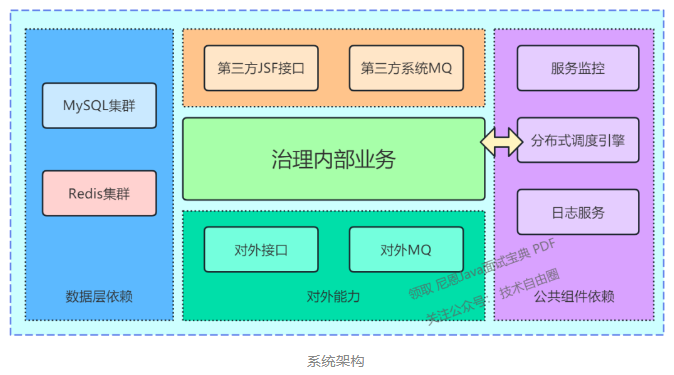
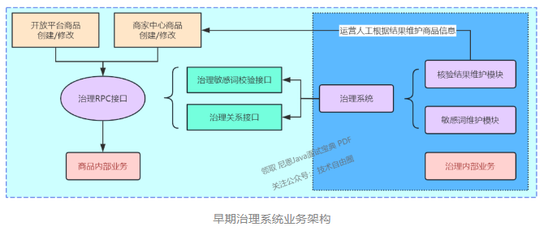
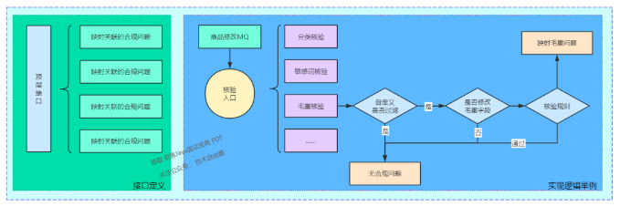
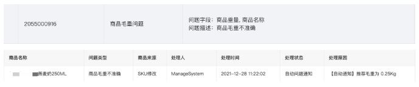
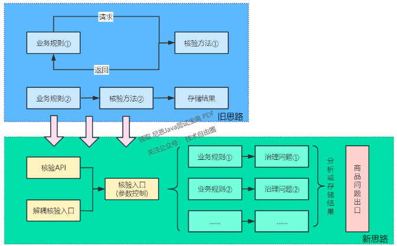
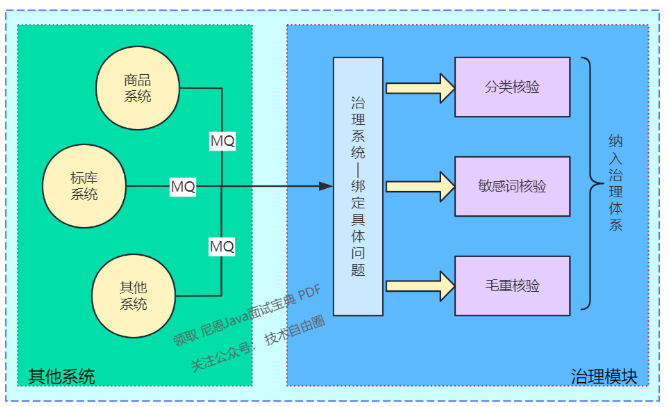
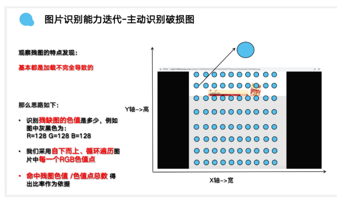
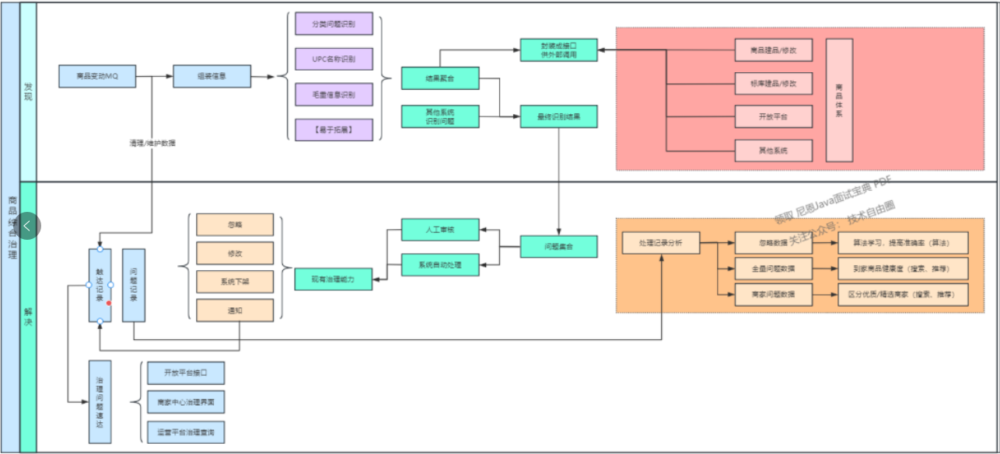
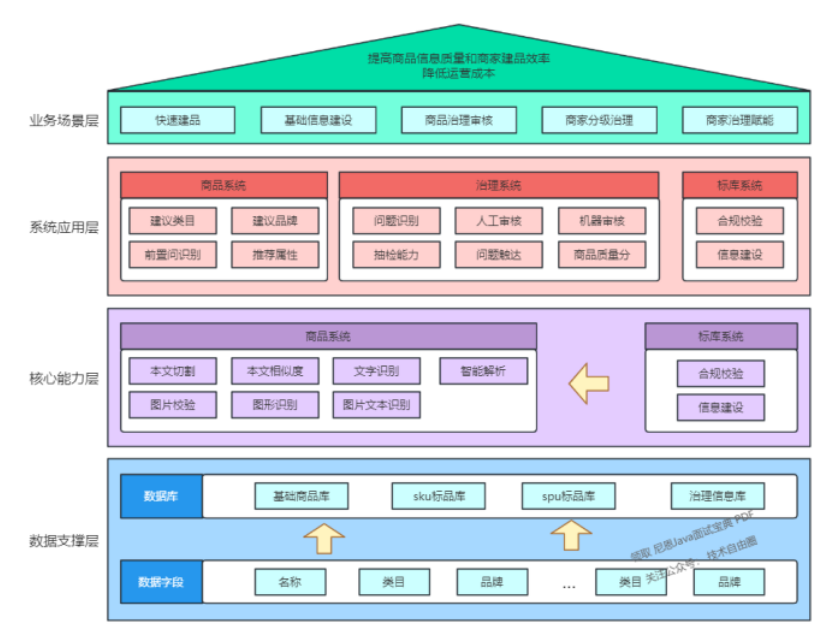
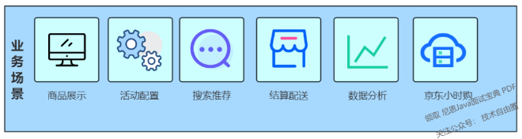

## 480万商品，如何架构商品治理平台？

### 说在前面

在40岁老架构师 尼恩的读者交流群(50+)中，很多小伙伴拿高薪，完成架构的升级，进入架构师赛道，打开薪酬天花板。

最近有小伙伴拿到了一线互联网企业如京东、网易、微博、阿里、汽车之家、极兔、有赞、希音、百度、滴滴的架构师，
遇到一些很重要的面试题：

- 一个系统，如何进行 技术架构演进，你的方法论是什么？
- 一个系统，如何进行 服务边界划分，你的方法论是什么？

现在，40岁老架构师尼恩，站在***京东如何架构商品治理平台***的巨人肩膀，给大家提供一份比较全面的参考答案。
使得大家可以充分展示一下大家雄厚的 “技术肌肉”，让你的面试官爱到 “不能自已、口水直流”。

```
一个系统，如何进行技术架构演进，你的方法论是什么？
一个系统，如何进行服务边界划分，你的方法论是什么？
站在京东如何架构商品治理平台的巨人肩膀，给大家提供一份比较全面的参考答案。
```

也一并把这个题目以及参考答案，收入咱们的 《尼恩Java面试宝典PDF》V113版本，
供后面的小伙伴参考，提升大家的 3高 架构、设计、开发水平。

最新《尼恩 架构笔记》《尼恩高并发三部曲》《尼恩Java面试宝典》的PDF，请关注本公众号【技术自由圈】获取，后台回复：领电子书

- 尼恩架构笔记
- 尼恩高并发三部曲
- 尼恩Java面试宝典

### 本文目录

- 说在前面
- 480 万商品，京东如何架构商品治理平台？
- 背景
- 系统架构介绍
- 早期的治理系统
- 治理系统架构升级
    - ***抽象思维显神威***
- 难点问题巧手破
    - ***业务难点***问题
    - ***技术难点***问题
    - ***治理触达***终落地
- 治理业务全景图
- 未来规划
- 总结
- 说在最后：有问题可以找老架构取经
- 部分历史案例

### 480 万商品，京东如何架构商品治理平台？

注意，此文作者不是尼恩， 作者：京东到家技术团队/达达集团技术柯贤铭<br>
此文，仅仅是作为架构师的重要学习材料，供大家参考。<br>
同时，希望此文也能给京东到家的产品多做点宣传， 建议大家多用用京东到家的 服务和商品。<br>

### 背景

作为一家***即时零售电商平台***，京东到家致力于在一小时内将各类优质商品送达消费者手中，
同时也在努力提升***商品的价值***和***平台的满意度***。
京东到家商品管理系统，其主要职责：
对***商品的创建、修改和展示的全流程进行干预和审核***，
旨在发现并解决商品信息中如：***敏感词***、***虚假宣传***、***错误信息***等不符合平台规范和质量要求的问题，
***确保商品与实物的一致性，以及信息的准确性***。

### 系统架构介绍

京东到家的各个业务线都采用了***标准化的微服务架构设计***，***各个系统在迭代过程中只需按需申请对应的组件***。
以下是***治理系统所使用的技术组件***：

- 日志服务：提供日志采集和查询服务。
- RPC调用：利用京东的 JSF 平台，实现服务间注册、服务间调用和服务治理等功能，支持请求超时自动阻断。
- 服务监控：使用***统一监控***与***告警服务平台***，实现***秒级监控***、***多方位监控***、***服务告警***、***全链路追踪***
  等功能。
- 分布式调度引擎：基于 TBSchedule 分布式调度引擎框架构建的服务，负责定时任务的执行和分发。
- 高性能存储：使用 Redis 集群、MySQL 集群等。
- 消息中间件：采用京东的 MQ 中间件，实现业务解耦。

系统架构如下：


### 早期的治理系统

第一个需求与大多数业务系统相似，即基于数据的增删改查，<br>
构建一套***敏感词管理模块***，同时***为商品主系统提供敏感词的校验能力***。<br>
第二个需求是***为运营团队提供一个核验结果的报表***，***主要逻辑是通过上传Excel，内部解析后调用接口获取相应的数据结果***，
基于 MySQL 进行存储，然后提供查询和展示功能，方便运营人员使用。<br>
然而，由于***缺乏设计和长远的考虑***，因此当时的***治理系统与商品主系统耦合严重***，早期治理系统业务架构图示如下：<br>


随着平台对商品信息合规性的规定日益严谨，
针对***商品分类***、***净重***、***图片***等***各项治理需求也相继出现***。<br>
然而，在上图的设计之中，我们可以明显看出，***治理系统是基于具体业务来构建对外接口***的。
因此，随着业务需求的持续扩大，***两个系统之间交互的接口数量也会急剧增长***，这是我们不愿意看到的。

```
随着业务需求的持续扩大，两个系统之间交互的接口数量也会急剧增长
```

另外，治理的最终目标是期望商品问题能够得到解决，而不仅仅是发现，
因此，将问题暴露给运营或商家是必要的。然而，目前存在两个问题：

```
治理的最终目标是期望商品问题能够得到解决，而不仅仅是发现
```

- 1.商品系统在其主要流程中过度依赖治理的核验功能，且随着业务的扩展，依赖程度会逐步增加。
- 2.商品系统只能将前置拦截的核验结果告知商家，业务覆盖面不足。

再加上许多问题属于***弱合规性（不需要强制拦截但仍需要解决）***，因此，
需要将***商品治理业务的核心从商品系统转向治理系统***。

为了实现***商品治理的高效率，对治理系统的设计和定位进行了调整***，提出了两个基本原则：

- 治理系统需要完成整个治理业务的闭环，作为商品问题发现和解决的总入口和总出口。
- 治理系统需要具备高扩展性，当增加特定化治理需求时能够迅速响应。

```
治理系统需要完成整个治理业务的闭环，作为商品问题发现和解决得总入口和总出口
治理系统需要具备高扩展性，当增加特定化治理需求时能够迅速响应
```

### 治理系统架构升级

#### 抽象思维显神威

在理清治理系统的业务架构升级思路之后，我们首先需要确定的一个问题就是：***治理系统最基础的原子能力***是什么？<br>
以各个主系统为例：

- 商品系统最基础的原子能力即：商品的创建、修改和提供查询能力、
- 库存系统最基础的原子能力即：商品库存信息的维护及查询能力。

根据治理业务的发展规划，我们也基本确定出治理系统的原子能力，
即：发现商品存在的合规问题，并向外提供查询和辅助解决的能力。

对于合规问题的定义，我们做出了如下解释，即：不符合电商平台商品展示规范的如敏感词、虚假宣传等问题。

例如商品名称中包含敏感词，会被视为敏感词问题，需要说明的是：在编码阶段，
一种可量化的具体规则可以对应一种合规问题，且同一商品可能同时存在多个不同的合规问题。

```
根据治理业务的发展规划，我们也基本确定出治理系统的原子能力
即：发现商品存在的合规问题，并向外提供查询和辅助解决的能力
```

目前到家治理系统所涉猎的合规问题主要有：

| 合规问题大类     | 对外描述            | 问题细节                        |
|------------|-----------------|-----------------------------|
| 商品毛重问题     | 商品毛重不准确         | 商品毛重与实际商品不符、商品毛重超过最大运力限制等   |
| 商品信息不正确    | 商品信息不正确，请检查具体内容 | 商品名称包含敏感词、商品分类与实际商品不符、虚假宣传等 |
| 商家商品经营范围问题 | 当前售卖商品超出商家经营范围  | 当前售卖商品超出商家经营范围等             |
| 图片信息问题     | 商品图片信息存在问题      | 商品无主图、商品主图为默认图、商品主图为黑底图等    |
|            |                 |                             |
| 未来计划       |                 |                             |
| 商品价格问题     |                 |                             |
| 商品画像问题     |                 |                             |
| ...        |                 |                             |

为了方便理解，我们可以将***每一种合规问题看作是一种策略***，
而针对策略的顶层接口又定义了四个核心方法：
- 核验方法：根据业务规则实现的具体核验逻辑
- 自定义过滤能力：根据业务特点，减少无用处理
- 问题关联的字段：每一个问题都需要关联具体的影响字段或被影响字段
- 映射关联的枚举：每一个问题都需要关联具体的问题原因

```
为了方便理解，我们可以将每一种合规问题看作是一种策略
而针对策略的顶层接口又定义了四个核心方法：
- 校验方法：根据业务规则实现的具体核验逻辑
- 自定义过滤能力：根据业务特点，减少无用处理
- 问题关联的字段：每一个问题都需要关联具体的影响字段或被影响字段
- 映射关联的枚举：每一个问题都需要关联具体的问题原因
```

具体的实现逻辑如下图所示：


以商品毛重信息填写错误为例，下图为处理前后的展示结果：


关于毛重的问题，我们可以将其与相关的枚举和文案映射联系起来，即：当商品毛重出现偏差（问题类型）时，建议的毛重为 XXX（文案映射）。
其关联的字段包括商品的重量和名称。
通过结合一定的过滤逻辑和验证算法，我们可以完成对毛重问题的抽象处理。
以此方式，我们在处理新的治理问题时，可以借鉴这种做法。

```
问题类型
文案映射
通过结合一定的过滤逻辑和验证算法，可以完成对毛重问题的抽象处理
```

熟悉设计模式的读者可能已经发现，这个设计方案实际上是策略模式和模板方法模式的混合体。
在编码阶段，我们也会用到工厂模式，在编码层面整体的变化如下图所示：

```
熟悉设计模式的可能已经发现
这个设计方案实际上是策略模式 & 模板方法模式的混合体
在编码阶段，我们也会用到工厂模式
```



上述方案落地之后，产研团队对治理业务的未来发展有了基本的共识，同时，需求的实现也变得更加简单。
我们不再需要关注其他系统的逻辑，而是专注于合规问题的业务规则实现。

业务部门和产品团队能够通过数据分析来确定未来的治理重点和需求规划，
研发人员也通过优雅的方式解决了系统间耦合和业务代码重复的问题。

```
业务部门和产品团队能够通过数据分析来确定未来的治理重点和需求规划，
研发人员也通过优雅的方式解决了系统间耦合和业务代码重复的问题
```

### 难点问题巧手破
在我们初步设定治理系统的***业务架构设计***后，后续迭代过程中，
我们遇到了两个比较棘手的问题，一个是业务问题，一个是技术问题。
- 业务问题
- 技术问题

#### 业务难点问题
业务部门要求 APP 展示的***商品主图***不能与默认图（如空白图、品牌商标图等不能体现商品信息的图片）相同，
然而商品图片的校验逻辑一直由图片核验系统承接。<br>

这就引起了一个问题：治理系统是否需要集成图片核验逻辑，如果不集成，
那又该如何将其图片违规问题纳入至治理体系中？<br>

有经验的开发者可能会建议使用消息队列（MQ）的方式，
由图片核验系统将校验结果发送至治理系统，以解决此问题。<br>

实际上，我们也是这么做的，只是做得更加彻底。
***在设计模式中，我们通常会将一系列类似业务整合成一个公共接口向外提供能力***，我们将其称为：***门面模式或外观模式***。
针对上述类似问题，我们找到了一个通用的处理方法，即：***将治理系统作为门面***，***其他系统作为组件，各系统都可以主动的向治理系统提供需要治理的内容***。<br>
该方案确定后，各种棘手的业务场景也变得简单起来，同时，***此举还扩大了治理系统的边界***，
例如***商品无图合规问题***，***商品差评率高的问题***，***只需要对应系统将相关数据/结果以消息队列（MQ）的形式发送至治理系统***，
然后由治理系统为其绑定具体的合规问题即可。<br>

```
在设计模式中，
我们通常会将一系列类似业务整合成一个公共接口向外提供能力
我们将其称为门面模式或外观模式
```

在编码层面，我们采用最简单的消息队列（MQ）解耦方式实现，示意图如下：



在进行治理迭代的过程中，有一系列的需求是针对平台商品的图片进行治理，以破损图逻辑为例。
在最开始的处理逻辑中，大家查询资料整合信息，发现平台偶尔出现的破损图是由于图片在下载过程中未下载完整后流中断，触发上传引起的。
因此在第一版的逻辑中，我们查阅资料作出了如下逻辑判断：***当图片下载完成触发上传前，对比请求体中的ContentLength与实际图片字节大小，问题初步解决***。

#### 技术难点问题
然而，不久之后，问题再次爆发，我们发现事情并非想象中那么简单。<br>
由于我们的平台对接了众多的商家系统，各个系统的图片服务器和后台逻辑都不尽相同，因此我们无法对所有图片都采用文件大小比对的方式进行处理。<br>
因此，我们重新进行了调研，并实现了针对破损图的核验能力。<br>



即通过下载后的图片内容进行处理和分析，***利用算法与目标问题的业务特征进行识别***，从而基本解决了这个问题。
同时，基于该思路我们也衍生出针对黑底图、默认图的处理方式，在图片问题的治理上更进一步。

#### 治理触达终落地
基于上述的方案和设计，治理系统在问题发现的流程上已经趋于完善，<br>
接下来，产品提出了新的要求，即：部分问题实现自动治理及问题触达商家。<br>
机器学习的模型，大致可分为两种：分类模型和生成模型。<br>
抛开它们的具体含义，我们可以借鉴这种设计理念，将治理系统划分为两个部分，即：发现和解决。<br>
上述的业务提取和技术问题、业务问题都是用于侦测问题的，当我们将解决问题的目标纳入治理体系，
只需要对现有架构进行适度的扩展就能满足需求。<br>
以商品毛重信息填写错误为例，我们只需要在上述的提取中添加两个待实现方法：<br>
- 是否需要自动处理：毛重问题需要自动处理
- 自动处理的具体实现规则：当实际毛重大于某一阈值时，将商品系统下架处理（依托于商品对外接口能力）

在核验结果存储前，依据具体的执行逻辑以及数据反馈结果来判断是人工处理还是系统处理即可。<br>
对于触达需求，其实现更加简单，因为在初始阶段我们就定义了治理业务交流的基本元素是具体的治理问题，
我们只需要将已存储的数据通过接口或消息队列的形式展示即可。<br>
至此，整个治理体系从编码层面也就建设完成，其核心逻辑在三个环节：

- 1、商品变动MQ/其他系统治理内容通知触发具体合规问题核验。
- 2、针对核验结果进行判断：人工处理或系统自动处理（处理的能力需借助于商品对外接口）。
- 3、核验结果对外露出。

下图为治理系统当前整体业务结构图：



### 治理业务全景图
自从治理平台业务框架升级以来，已经连续稳定运行了九个多月。
在此期间，我们已成功治理了 480 万以上的平台商品，构建了 8 种识别能力、3 种处理方式和 2 种触达方式。
同时，我们依托商品和标品系统，为商品快速建品、基础信息建设和治理审核等方面提供了有力保障。
以下是到家治理的全景图：



### 未来规划
现行的治理体系主要围绕商品系统的核心环节进行设计和构建，其影响范围相对较小。<br>
实际上，我们可以将商品治理的成果扩展应用到商品体系之外的其他系统。<br>
例如下图中的各个业务场景：



- 业务场景
- 商品展示
- 活动配置
- 搜索推荐
- 结算配送
- 数据分析
- 京东小时购

以***搜索推荐***为例，我们可以针对各种合规问题制定相应的扣分规则，
在搜索侧构建数据时，将商品的合规分数纳入其中，并根据分数大小进行排序，以满足搜索条件。
同时，我们也需要将一些算法无法识别的问题纳入治理体系，例如：商品差评率高、退货率高等。

### 总结
随着业务的不断发展，对商品信息质量的要求将越来越高。
到家治理系统需要与各上下游系统紧密联动，提供更加精细化的商品管控能力。<br>
我们期待在未来，我们的治理能力能够更加优秀，
为用户提供更真实、贴近实际的商品数据和更优质的服务。<br>

### 说在最后：有问题可以找老架构取经
架构之路，充满了坎坷
架构和高级开发不一样， ***架构问题是open/开发式的，架构问题是没有标准答案的***
正由于这样，很多小伙伴，尽管耗费很多精力，耗费很多金钱，但是，遗憾的是，一生都没有完成架构升级。<br>
所以，在架构升级/转型过程中，确实找不到有效的方案，可以来找40岁老架构尼恩求助.
前几天一个小伙伴，他们要进行***电商网站的黄金链路架构***， 开始找不到思路，但是经过尼恩 10分钟语音指导，一下就豁然开朗。


