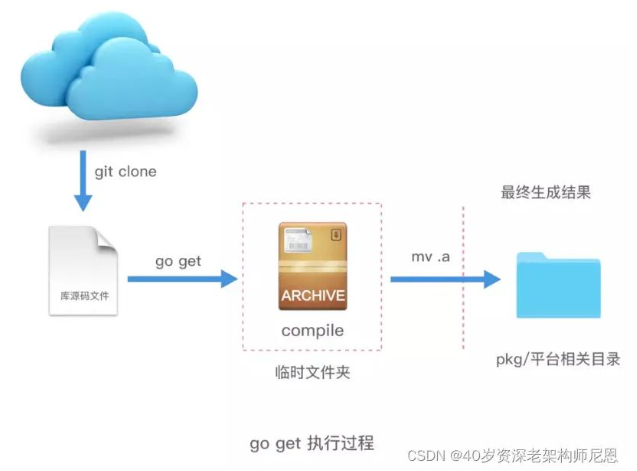

## Go学习圣经：0基础精通GO开发与高并发架构（1）

### 说在前面：
现在拿到offer超级难，甚至连面试电话，一个都搞不到。
尼恩的技术社群中（50+），很多小伙伴凭借 “左手云原生+右手大数据”的绝活，拿到了offer，并且是非常优质的offer，据说年终奖都足足18个月。
从Java高薪岗位和就业岗位来看，云原生、K8S、GO 现在对于 高级工程师/架构师来说，越来越重要。
尼恩从架构师视角出发，基于自己的尼恩 3高架构师知识体系和知识宇宙，写一本《GO学习圣经》

- 左手云原生
- 右手大数据
- 云原生
- K8S
- GO

### 最终的学习目标
咱们的目标，不仅仅在于 GO 应用编程自由，更在于 GO 架构自由。<br>
前段时间，一个2年小伙伴希望涨薪到18K， 尼恩把GO 语言的项目架构，给他写入了简历，<br>
导致他的简历金光闪闪，脱胎换股，完全可以去拿头条、腾讯等30K的offer， 年薪可以直接多 20W。<br>
所以， GO语言、GO架构学习完了之后，咱们在去打个回马枪，完成云原生的第二部分:  《Istio + K8S CRD的架构与开发实操》  , 帮助大家彻底穿透云原生。<br>

- Istio
- K8S CRD

### 本文目录
- 说在前面：
- 最终的学习目标
- 学习 GO 的相关资料：
- Go/C/C++/Java四大语言的对比
    - 面向过程C语言
    - 面向对象C++语言
    - Java语言
    - Golang：
      - Golang与Java等其他语言的对比
      - Java
      - C#
      - C/C++
      - Javascript
      - Python
      - Scala
      - Go
    - Go语言的官网
    - Go语言主要发展过程
    - Go语言的特色
    - Go语言的核心特性
      - 1 并发：
      - 2 内存回收(GC)
      - 3 内存分配
      - 4 快速编译
      - 5 简单易学
      - 6 跨平台支持
      - 7 丰富的工具链
      - 8 天然支持网络编程
    - Go语言行业案例
    - GO语言产生的宽松工作环境
- Go语言开发环境搭建
    - 常用链接
    - Go语言SDK工具包括以下几种：
      - Go编译器SDK的安装
      - GoLang SDK 安装和 Java SDK的安装比较
      - Golang 集成开发工具IDE
      - GoLand 安装和使用
        - 创建项目
        - 配置Go SDK
        - 编写代码
        - 编写一个 hello world 案例
        - 运行程序
- Go的执行原理以及Go的命令
  - Go 的源码文件分类
    - 1、命令源码文件
    - 2、库源码文件
    - 3、测试源码文件
  - 主要的Go的命令
    - 1、go run
      - 详解：go run命令 的执行过程
      - go run命令 的执行步骤
      - 什么是.a 文件？
      - go run 的参数详解
      - importcfg.link 文件
    - 2、go build
      - 详解：go build 究竟干了些什么呢？
      - go build 命令参数
    - 3、go install 命令
      - 什么 是GOBIN ？
      - 详解：go install 究竟干了些什么呢？
      - go install 命令参数
    - 4、go get
    - 5、其他命令
      - go clean
      - go fmt
      - go test 命令
      - go fix
      - go version
      - go env
      - go list
- golang 代码规范
  - 好的规范的价值
  - Import 规范
  - 错误处理
  - panic
  - recover
  - 单元测试
  - 类型断言失败处理
  - 注释
  - 命名规范
    - 包命名
    - 文件命名
    - 结构体命名
    - 接口命名
    - 首字母访问控制规则
    - 方法命名
    - 变量命名
    - 常量命名
    - 单元测试命名
  - 控制结构
  - 函数
  - Defer
  - 魔法数字
  - 代码规范性常用工具
  - 包和文件
    - 包的价值：进行模块的隔离
    - 包的init 初始化函数
    - 包的导入
    - 作用域
    - 文件命名
  - 函数
    - 函数定义
    - 函数如何调用
    - 函数的变长参数
    - 只有声明没有body的函数
  - null
    - 返回多值的函数
    - 命名返回值
    - 匿名返回值
    - 将函数作为参数传递
    - 内置函数
    - 递归函数
    - 匿名函数
    - 闭包函数
    - defer延迟函数
  - 变量
    - 变量的初始化
    - 短变量声明
    - 零值
  - 常量
    - 数值常量
  - GO数据基本类型
    - 类型转换
    - 类型推导
    - 整型
    - 浮点型
    - 复数
    - 布尔型
    - rune【符文】类型
    - 字符串
    - 整型运算
    - bit位操作运算符：
  - 复合数据类型
    - 数组
    - 一个数组的案例
    - 数组的定义
    - 元素的访问
    - 数组作为参数
  - Slice
    - 从数组或切片生成新的切片
    - 一个Slice的案例
    - 从指定范围中生成切片
    - 重置切片，清空拥有的元素
    - 直接声明新的切片
    - 共享底层的数据
    - 切片Slice的长度len与容量cap
    - slice创建方式
    - 使用 make() 函数构造切片
    - append()为切片添加元素
    - 切片复制（切片拷贝）
    - Go语言从切片中删除元素
      - 从开头位置删除
      - 从中间位置删除
      - 从尾部删除
    - range循环迭代切片
      - range 提供了每个元素的副本
      - 使用空白标识符（下划线）来忽略索引值
      - 使用传统的 for 循环对切片进行迭代
  - 映射Map
    - map的申明和创建
    - map的使用案例
    - 禁止对map元素取址
  - 结构体
    - 一个结构体的例子
    - 结构体参数传递方式
    - 结构体组合函数
    - 结构体特性
    - 结构体嵌入和匿名成员
    - 结构体tag
    - & 和 *符号 的区别
  - JSON
    - 解析JSON
    - 反序列化：json解析到结构体
    - 序列化：结构体转json
    - json中的Encoder和Decoder
- 流程控制语句：for、if、else、switch 和 defer
  - for语句
    - for 使用案例
    - for 是 Go 中的 “while”
    - 无限循环
  - if语句
    - if 后的简短语句
  - switch 语句
    - switch 的例子
    - switch 的求值顺序
    - 没有条件的 switch
  - defer语句
    - defer 栈
  - panic异常
    - panic 使用示例
    - 错误和异常
    - 异常处理流程
    - recover捕获异常
- 还有 5W字待发布
- 技术自由实现路径
- 免费领取11个技术圣经 PDF

### 学习 GO 的相关资料：
- The Go Programming Language (google.cn)(https://golang.google.cn/)
- Dubbo Java 3.1.4 正式发布 | Apache Dubbo(https://cn.dubbo.apache.org/zh-cn/blog/2022/12/01/dubbo-java-3.1.4-正式发布/)
- dubbo-go(https://cn.dubbo.apache.org/zh-cn/blog/2021/02/20/dubbo-go-白话文/)
- 安装 Dubbo-go 开发环境 | Apache Dubbo(https://cn.dubbo.apache.org/zh-cn/overview/mannual/golang-sdk/quickstart/install/)
- 完成一次 RPC 调用 | Apache Dubbo(https://cn.dubbo.apache.org/zh-cn/overview/mannual/golang-sdk/quickstart/quickstart_triple/)

### Go/C/C++/Java四大语言的对比
#### 面向过程C语言
C语言产生的背景主要有以下几个方面：
- 1.软件危机：在20世纪60年代，随着计算机软件规模的扩大，软件设计和开发面临了巨大的挑战。
很多软件项目的开发进度缓慢、成本高昂，甚至出现了完全失败的情况。
为了解决这个问题，需要一种更加高效、可靠的编程语言。
- 2.ALGOL语言的不足：ALGOL语言是20世纪60年代最流行的编程语言之一，但它的表达能力和可读性都不够强。
因此，需要一种新的编程语言，既能保留ALGOL的优点，又能增强表达能力和可读性。
- 3.UNIX操作系统的出现：在20世纪70年代初，贝尔实验室开发了UNIX操作系统，而操作系统的核心部分就是用C语言编写的。
由于C语言效率高、灵活性好，逐渐成为了UNIX操作系统和其他系统软件的首选开发语言。

基于以上原因，Dennis Ritchie在20世纪70年代初开始着手开发C语言，并于1972年正式发布了第一个稳定版本。
C语言具有效率高、表达能力强、可移植性好等特点，成为了通用编程语言中非常重要的一种。
目前，C语言被广泛用于操作系统、嵌入式系统、程序语言解释器等方面，也是很多编程语言的基础。

到了70年代，诞生了一门非常重要的语言，这就是今天的大名鼎鼎的C语言。
而C语言之父是美国著名的计算机专家。丹尼斯.利奇。

目前 C语言是世界上最常用的程序语言之一。


C语言之父：Dennis Ritchie（丹尼斯·里奇）。
美国著名计算机专家、C语言发明人、UNIX之父。
在1969-1973年期间发明了C语言和Unix操作系统。

#### 面向对象 C++语言
1982年，美国贝尔实验室的Bjarne Stroustrup博士在C语言的基础上引入并扩充了面向对象的概念，发明了—种新的程序语言。
为了表达该语言与c语言的渊源关系，它被命名为C++。<br>
C++语言产生的背景主要有以下几个方面：<br>
- 1、C语言的问题：C语言是一种高效、灵活的编程语言，但它在***类型安全性、模块化和代码复用***等方面存在一些问题。
因此，Bjarne Stroustrup希望开发一种新的编程语言，在保留C语言的优点基础上解决这些问题。
- 2、面向对象编程的兴起：在20世纪80年代，面向对象编程开始蓬勃发展，Smalltalk、Simula等语言引领了这股潮流。
Bjarne Stroustrup希望能开发一种新的编程语言，可以实现面向对象编程。
- 3、硬件性能的提升：在20世纪80年代末和90年代初，计算机硬件性能得到了极大的提升，使得程序员可以使用更加复杂的编程语言来编写程序。
因此，Bjarne Stroustrup希望开发一种新的编程语言，可以满足这种需求。

基于以上原因，Bjarne Stroustrup在1983年开始着手开发C++语言，并于1985年正式发布了第一个稳定版本。
C++语言结合了C语言的效率和面向对象编程的特性，成为了通用编程语言中非常重要的一种。

C++语言被广泛用于游戏开发、操作系统、大型软件系统等领域，也是很多编程语言的基础。
- 游戏开发
- 操作系统
- 大型软件系统


C++之父：Bjarne Stroustrup（本贾尼·斯特劳斯特卢普）。

#### Java语言
1995年5月正式Java 发布。java的出现，正是互联网大力兴起的时候，而java因为语言的特性，在互联网上有很大的优势，发布最初就异常火爆。

Java语言产生的背景主要有以下几个方面：<br>
- 1.面向对象编程的兴起：在上世纪80年代末和90年代初，面向对象编程开始逐渐成为主流编程范式，C++等语言受到广泛关注。
Sun Microsystems公司希望能开发一种新的、更加高级的面向对象编程语言。
- 2.跨平台需求：在90年代初期，计算机硬件和操作系统环境比较复杂，软件需要针对不同的平台进行编写和调试。
Sun Microsystems公司希望能开发一种新的编程语言，可以实现跨平台的编写和运行。
- 3.互联网的出现：互联网的出现让人们开始追求大规模分布式应用程序的开发。
Sun Microsystems公司希望能开发一种新的编程语言，能够轻松地构建分布式网络应用程序。

基于以上原因，Sun Microsystems公司在1991年启动了Oak项目（后改名为Java），并于1995年正式发布了第一个稳定版本。
Java语言最初被设计用于家电控制器，但随着互联网的发展，Java语言迅速成为网络应用程序的首选开发语言。
目前，Java语言已经成为了企业级应用程序开发的主流，广泛应用于金融、电子商务、大数据等多个领域。
- 金融
- 电子商务
- 大数据
java最初的模型是在1991年的时候开发出，他的创始人詹姆斯高斯林。
- 那个时候还叫做Oak橡树，后来詹姆斯希望使用java语言可以像喝咖啡一样轻松，愉悦。改名为java。


#### Golang：
Go语言，也被称为Golang，是一种由Google公司开发的静态类型、编译型、并发性强的编程语言。
- Google公司开发
- 静态类型
- 编译型
- 并发性强

它最初于2007年由Robert Griesemer、Rob Pike和Ken Thompson等人设计，并于2009年正式发布第一个稳定版本。<br>
Go语言产生的背景主要有以下几个方面：<br>
- 1.并发编程需求：随着***计算机性能的提升和互联网应用的普及***，越来越多的应用需要具备***高并发处理能力***。
然而，***传统的编程语言如C++和Java等，在并发编程方面存在诸多问题***。
因此，Google公司希望开发一种新的编程语言，可以更好地满足这种需求。

- 2.程序员生产效率：Google公司拥有大量的程序员和代码库，而传统的编程语言复杂度较高，代码量也比较大，导致程序员生产效率不高。
因此，Google公司希望开发一种简洁、易于学习和使用的编程语言。

- 3.代码安全性：在编写大型软件系统时，常常会出现***缓冲区溢出等安全问题***。
因此，Google公司希望开发一种新的编程语言，可以避免这些问题。

> 1、并发编程 & 2、程序员生产效率 & 3、代码安全性

基于以上原因，Google在2007年启动了Go语言的开发工作。<br>
Go语言的设计者之一Rob Pike表示，Go语言的目标是“使编程更加愉悦和生产力更高”。<br>

- 使编程更加愉悦和生产力更高

经过数年的开发和完善，Go语言逐渐得到广泛应用，并且在某些领域已经成为了首选语言。<br>
Go语言在设计上注重简洁性和性能，目标是提供一种高效、可靠、易于编写和维护的系统级编程语言。它具有以下特点：<br>
- 1.简单易学：Go语言语法简单，仅有25个关键字，易于学习和使用。s
- 2.并发性强：Go语言***原生支持协程和通道***，可以***轻松实现高并发程序***。
- 3.内存管理：***Go语言具有自动内存管理和垃圾回收机制，可以避免常见的内存错误***。
- 4.高性能：Go语言编译速度快，生成的二进制文件体积小，运行速度快。
- 5.跨平台支持：Go语言可以在多个操作系统和硬件平台上编译执行。
- 6.天然支持网络：Go语言标准库中包含了丰富的网络编程接口，可以轻松实现Web应用程序。

- 简单易学
- 并发性强
- 内存管理
- 高性能
- 跨平台支持【Go语言可以在多个操作系统和硬件平台上编译执行】
- 天然支持网络

总之，Go语言是一种面向现代编程需求的编程语言，其简洁性、高性能和并发性强等特点，
使得其在互联网、大数据、网络编程等领域得到了广泛的应用。
目前，Go语言已经成为了众多开发者的首选语言之一。

- 简洁性
- 高性能
- 并发性强
- 互联网、大数据、网络编程


Go的三个作者分别是： Rob Pike（罗伯.派克），Ken Thompson（肯.汤普森）和Robert Griesemer（罗伯特.格利茨默）

#### Golang与Java等其他语言的对比
Golang、Java和C都是常见的编程语言，它们具有以下关系：<br>
- 1.Golang是由Google公司开发的一种编程语言，最初用于应对大规模网络应用程序的需求。
Java也是由Sun Microsystems（现在是Oracle）发明的语言，目前被广泛应用于企业级应用程序的开发。
- 2.Java和C都是传统的编程语言，已经有很长的历史和广泛的应用领域。
与之相比，***Golang是一种较为年轻的语言，但其标准库丰富、性能优越等特点使得其在某些场景下具有优势***。
- 3.Java和Golang都有良好的跨平台支持。
Java使用Java虚拟机（JVM）来实现跨平台，而***Golang则通过自身的编译器来实现跨平台***。
C虽然也可以实现跨平台，但需要手动编写平台相关的代码，并且不如Java和Golang方便。
- 4.在使用领域上，Java主要用于构建大型企业应用，例如电子商务网站、金融系统等；
Golang则主要用于构建***互联网应用***、***分布式系统***和***网络服务器***等；
而C则主要用于操作系统、嵌入式系统、驱动程序等方面。
- 5.在语言特性上，***Java和Golang都是强类型语言***，具有良好的代码可读性和维护性。
***C则是一种相对较为底层的编程语言，需要手动管理内存等资源***。

总之，Golang、Java和C都是不同的编程语言，在特性、应用场景和语言生态等方面都有所不同。
在选择使用何种编程语言时，需要根据实际应用需求和个人技能水平进行评估和选择。

Go的很多语言特性借鉴于它的三个祖先：C，Pascal和CSP。<br>

Go的语法、数据类型、控制流等继承于C，<br>
Go的包、面向对象等思想来源于Pascal分支，<br>
而Go最大的语言特色，***基于管道通信的协程并发模型***，则借鉴于CSP分支。<br>

- Go的语法、数据类型、控制流等继承于C
- Go的包、面向对象等思想来源于Pascal分支
- ***Go最大的语言特色，基于管道通信的协程并发模型，则借鉴于CSP分支***。


#### Java
编译语言，速度适中（2.67s），目前的大型网站都是拿java写的，比如淘宝、京东等。<br>
主要特点是稳定，开源性好，具有自己的一套编写规范，开发效率适中，目前最主流的语言。<br>

> 作为编程语言中的大腕。具有最大的知名度和用户群。
> 无论风起云涌，我自巍然不动。
> 他强任他强，清风拂山岗；他横由他横，明月照大江。

#### c#
执行速度快（4.28），学习难度适中，开发速度适中。
但是由于c#存在很多缺点，京东、携程等大型网站前身都是用c#开发的，但是现在都迁移到了java上。

#### C/C++
现存编程语言中的老祖，其他语言皆由此而生。执行速度最快无人能及。但是写起来最为复杂，开发难度大。

#### Javascript
编程语言中特立独行的傲娇美女。前端处理能力是其它语言无法比拟。
发展中的js后端处理能力也是卓越不凡。前后端通吃，舍我其谁？

#### Python
脚本语言，速度最慢（258s），代码简洁、学习进度短，开发速度快。
豆瓣就是拿python写的。Python著名的服务器框架有django，flask。
但是python在大型项目上不太稳定，因此有些用python的企业后来迁移到了java上。

#### scala
编译语言，比python快十倍，和java差不多，但是学习进度慢，而且在实际编程中，如果对语言不够精通，很容易造成性能严重下降。
后来比如Yammer就从scala迁移到了java上。微服务框架有lagom等。

#### Go
编程界的小鲜肉。高并发能力无人能及。
即具有像Python一样的简洁代码、开发速度，又具有C语言一样的执行效率，优势突出。

- 像Python一样的简洁代码、开发速度
- C语言一样的执行效率，优势突出

### Go语言的官网
设计Go语言是为了解决当时Google开发遇到的问题：
- 大量的C++代码，同时又引入了Java和Python
- 成千上万的工程师
- 数以万计行的代码
- 分布式的编译系统
- 数百万的服务器

Google开发中的痛点：
- 编译慢
- 失控的依赖
- 每个工程师只是用了一个语言里面的一部分
- 程序难以维护（可读性差、文档不清晰等）
- 更新的花费越来越长
- 交叉编译困难

#### 如何解决google的问题和痛点？
Go希望成为互联网时代的C语言。多数系统级语言（包括Java和C#）的根本编程哲学来源于C++，将C++的面向对象进一步发扬光大。
但是Go语言的设计者却有不同的看法，他们认为值得学习的是C语言。
C语言经久不衰的根源是它足够简单。
因此，Go语言也是足够简单。

所以，他们当时设计Go的目标是为了消除各种缓慢和笨重、改进各种低效和扩展性。
Go是由那些开发大型系统的人设计的，同时也是为了这些人服务的；它是为了解决工程上的问题，
不是为了研究语言设计；它还是为了让我们的编程变得更舒适和方便。

> 基于管道通信的协程并发模型

但是结合Google当时内部的一些现实情况，如很多工程师都是C系的，所以新设计的语言一定要易学习，最好是类似C的语言；
20年没有出新的语言了，所以新设计的语言必须是现代化的（例如内置GC）等情况。最后根据实战经验，他们向着目标设计了Go这个语言。

Go语言语法简单，包含了类C语法。因为Go语言容易学习，所以一个普通的大学生花几个星期就能写出来可以上手的、高性能的应用。
在国内大家都追求快，这也是为什么国内Go流行的原因之一。


Go之所以叫Go，是想表达这门语言的运行速度、开发速度、学习速度（develop）都像gopher一样快。

- 运行速度
- 开发速度
- 学习速度
- gopher

gopher是一种生活在加拿大的小动物，go的吉祥物就是这个小动物， 它的中文名叫做囊地鼠，他们最大的特点就是挖洞速度特别快，当然可能不止是挖洞啦。


Go的官网：  https://golang.google.cn/


#### Go语言主要发展过程
Go语言是谷歌2009发布的第二款开源编程语言。<br>
Go语言专门针对多处理器系统应用程序的编程进行了优化，使用Go编译的程序可以媲美C或C++代码的速度，而且更加安全、支持并行进程。<br>

- 针对多处理器系统应用程序的编程进行了优化
- 使用Go编译的程序可以媲美C或C++代码的速度
- 而且更加安全、支持并行进程

- 2007年9月，雏形设计 ，Rob Pike（罗伯.派克） 正式命名为Go；
- 2008年5月，Google全力支持该项目；
- 2009年11月10日，首次公开发布，Go将代码全部开源，它获得了当年的年度语言；
- 2011年3月16日，Go语言的第一个稳定(stable)版本r56发布。
- 2012年3月28日，Go语言的第一个正式版本Go1发布。
- 2013年4月04日，Go语言的第一个Go 1.1beta1测试版发布。
- 2013年4月08日，Go语言的第二个Go 1.1beta2测试版发布。
- 2013年5月02日，Go语言Go 1.1RC1版发布。
- 2013年5月07日，Go语言Go 1.1RC2版发布。
***RC：Release Candidate候选版本***
- 2013年5月09日，Go语言Go 1.1RC3版发布。
- 2013年5月13日，Go语言Go 1.1正式版发布。
- 2013年9月20日，Go语言Go 1.2RC1版发布。
- 2013年12月1日，Go语言Go 1.2正式版发布。
- 2014年6月18日，Go语言Go 1.3版发布。
- 2014年12月10日，Go语言Go 1.4版发布。
- 2015年8月19日，Go语言Go 1.5版发布，***本次更新中移除了”最后残余的C代码”***。
- 2016年2月17日，Go语言Go 1.6版发布。
- 2016年8月15日，Go语言Go 1.7版发布。
- 2017年2月17日，Go语言Go 1.8版发布。
- 2017年8月24日，Go语言Go 1.9版发布。
- 2018年2月16日，Go语言Go 1.10版发布。
- 2018年8月24日，Go语言Go 1.11版发布。
- 2019年2月25日，GO语言Go1.12版发布。

Go 语言起源 2007 年，并于 2009 年正式对外发布。
它从 2009 年 9 月 21 日开始作为谷歌公司 20% 兼职项目，即相关员工利用 20% 的空余时间来参与 Go 语言的研发工作。<br>
其实可以看到，Go语言的历史不算很短。<br>
2009年11月 GO语言第一个版本发布。2012年3月 第一个正式版本Go1.0发布。<br>

2015年8月 go1.5发布，这个版本被认为是历史性的。<br>
完全移除C语言部分，使用GO编译GO，少量代码使用汇编实现。<br>
另外，他们请来了内存管理方面的权威专家Rick Hudson，对GC进行了重新设计，支持并发GC，解决了一直以来广为诟病的GC时延（STW）问题。<br>
并且在此后的版本中，又对GC做了更进一步的优化。<br>
到go1.8时，相同业务场景下的GC时延已经可以从go1.1的数秒，控制在1ms以内。<br>
GC问题的解决，可以说GO语言在服务端开发方面，几乎抹平了所有的弱点。<br>

- 完全移除C语言部分，使用go编译go，少量代码使用汇编
- 对GC进行了重新设计，支持并发GC，解决了一直以来广为诟病的GC时延（STW）问题
- GC时延控制在1ms以内

直到今年的2月25日，Go语言发布最新的版本是Go 1.12。

在GO语言的版本迭代过程中，语言特性基本上没有太大的变化，基本上维持在GO1.1的基准上，并且官方承诺，新版本对老版本下开发的代码完全兼容。<br>
事实上，GO开发团队在新增语言特性上显得非常谨慎，而在稳定性、编译速度、执行效率以及GC性能等方面进行了持续不断的优化。<br>

- 官方承诺：新版本对老版本下开发的代码完全兼容
- go开发团队在新增语言特性上显得非常谨慎
- 而在稳定性、***编译速度***、***执行效率***以及***GC性能***等方面进行了持续不断的优化

#### Go语言的特色
Go语言具有以下几个特点：
- 1.高并发性：Go语言原生支持协程和通道，可以轻松实现高并发程序，并且在多核、分布式等场景下表现优异。
- 2.内存安全：Go语言通过垃圾回收机制和指针限制等手段，避免了常见的内存错误（如缓冲区溢出、野指针等），提高了程序的可靠性。
- 3.快速编译：Go语言的编译速度很快，即使在大型项目中也不会出现明显的编译延迟。同时，Go语言生成的可执行文件体积小，运行速度快。
- 4.简单易学：Go语言语法简单、结构清晰，易于学习和使用。它的标准库设计也非常简洁，便于开发者上手使用。
- 5.跨平台支持：***Go语言可以在多个操作系统和硬件平台上编译执行，具有很好的跨平台支持性能***。
- 6.丰富的工具链：Go语言提供了一系列的工具，例如go fmt、go vet、go test等，帮助开发者更加方便地进行代码格式化、检查、测试等工作。
- 7.天然支持网络编程：***Go语言标准库中包含了丰富的网络编程接口，可以轻松实现Web应用程序和分布式系统***等。

总之，Go语言是一种简单、高效、安全、易学、并发性强的编程语言。
它因其多个特点而备受青睐，在互联网、大数据、网络编程等领域得到了广泛的应用。
- 互联网
- 大数据
- 网络编程

简单来说， Go语言是一种在***执行效率***和***开发效率***上都能兼备的语言。


go出现之前，***无论汇编语言、还是动态脚本语言，在执行效率和开发效率上都不能兼备***。<br>

- 执行效率 execution speed：  C/C++    >  Java   >  PHP 
- 开发效率 developing efficiency：  PHP   >  Java  >  C/C++

#### Go语言的核心特性
Go语言之所以厉害，是因为它在服务端的开发中，
总能抓住程序员的痛点，以最直接、简单、高效、稳定的方式来解决问题。

Go语言的核心特性包括以下几点： 
##### 1 并发：
Go语言天生具有高并发能力，通过*** goroutine（轻量级线程）和channel（通道）***的方式，
可以轻松实现并发编程，避免了多线程编程中的一些问题。

##### 2 内存回收(GC)
从C到C++，从程序性能的角度来考虑，这两种语言允许程序员自己管理内存，包括内存的申请和释放等。
因为没有垃圾回收机制所以C/C++运行起来速度很快，但是随着而来的是程序员对内存使用上的很谨小慎微的考虑。
因为哪怕一点不小心就可能会导致“内存泄露”使得资源浪费或者“野指针”使得程序崩溃等，尽管C++11后来使用了智能指针的概念，但是程序员仍然需要很小心的使用。
后来为了提高程序开发的速度以及程序的健壮性，java和C#等高级语言引入了GC机制，即程序员不需要再考虑内存的回收等，
而是由语言特性提供垃圾回收器来回收内存。但是随之而来的可能是程序运行效率的降低。

GC过程是：先stop the world，扫描所有对象判活，把可回收对象在一段bitmap区中标记下来，接着立即start the world，恢复服务， 
同时起一个专门gorountine回收内存到空闲list中以备复用，不物理释放。物理释放由专门线程定期来执行。

GC瓶颈在于每次都要扫描所有对象来判活，待收集的对象数目越多，速度越慢。

一个经验值是扫描10w个对象需要花费1ms，所以尽量使用对象少的方案，
比如我们同时考虑链表、map、slice、数组来进行存储，
***链表和map每个元素都是一个对象***，
***而slice或数组是一个对象，因此slice或数组有利于GC***。

GC性能可能随着版本不断更新会不断优化，这块没仔细调研，团队中有HotSpot开发者，
应该会借鉴jvm gc的设计思想，比如***分代回收、safepoint***等。

- 内存自动回收，再也不需要开发人员管理内存
- 开发人员专注业务实现，降低了心智负担
- 只需要new分配内存，不需要释放

##### 3 内存分配
初始化阶段直接分配一块大内存区域，大内存被切分成各个大小等级的块，
放入不同的空闲list中，对象分配空间时从空闲list中取出大小合适的内存块。
***内存回收时，会把不用的内存重放回空闲list***。
空闲内存会按照一定策略合并，以减少碎片。

##### 4 快速编译：
Go语言的编译速度相对较快，在大型项目中也不会出现明显的编译延迟。
同时，Go语言生成的可执行文件体积小，运行速度快。

##### 5 简单易学
Go语言语法简单、结构清晰，易于学习和使用。它的标准库设计也非常简洁，便于开发者上手使用。

##### 6 跨平台支持
Go语言可以在多个操作系统和硬件平台上编译执行，具有很好的跨平台支持性能。

##### 7 丰富的工具链
Go语言提供了一系列的工具，例如go fmt、go vet、go test等，帮助开发者更加方便地进行代码格式化、检查、测试等工作。

##### 8 天然支持网络编程
Go语言标准库中包含了丰富的网络编程接口，可以轻松实现Web应用程序和分布式系统等。

> 总之，Go语言具有高并发、内存安全、快速编译、简单易学、跨平台支持、丰富的工具链等核心特性，
使得它成为一种很受欢迎的编程语言，在互联网、大数据、网络编程等领域得到了广泛的应用。

- 高并发
- 内存安全
- 快速编译
- 简单易学
- 跨平台支持
- 丰富的工具链

#### Go语言行业案例
Go语言在多个行业中都有广泛的应用，以下是一些代表性的行业案例：<br>

- 1.互联网：谷歌、知乎等众多互联网公司都在采用Go语言进行后台开发。例如，谷歌的网络爬虫系统Google Crawler就是用Go语言编写的。
- 2.金融：很多金融领域的公司也开始采用Go语言进行开发。例如，美国在线支付公司Stripe使用Go语言编写了一个高性能的数据分析系统。
- 3.游戏：Go语言在游戏行业中也有着广泛应用。例如，腾讯的游戏服务器框架TarsGO就是用Go语言编写的。
- 4.大数据：Go语言具有高并发和高性能的特点，因此在大数据领域中也受到欢迎。例如，Uber公司的Cherami消息传递系统就是用Go语言编写的。
- 5.区块链：Go语言也成为了区块链领域的首选编程语言之一。例如，以太坊的客户端Geth就是使用Go语言编写的。

总之，Go语言在多个行业中都得到了广泛的应用，并且随着其不断完善和优化，其使用范围还将进一步扩大。<br>


除了大名鼎鼎的***Docker***，完全用GO实现。业界最为火爆的***容器编排管理系统kubernetes***完全用GO实现。之后的Docker Swarm，完全用GO实现。<br>
除此之外，还有各种有名的项目，如etcd/consul/flannel，七牛云存储等等均使用GO实现。<br>
有人说，GO语言之所以出名，是赶上了云时代。<br>
但为什么不能换种说法？也是GO语言促使了云的发展。<br>
除了云项目外，还有像今日头条、UBER这样的公司，他们也使用GO语言对自己的业务进行了彻底的重构。<br>

##### GO语言产生的宽松工作环境
go语言的产生，得益于谷歌宽松的技术研究环境。<br>
谷歌的“20%时间”工作方式，允许工程师拿出20%的时间来研究自己喜欢的项目。<br>
语音服务Google Now、谷歌新闻Google News、谷歌地图Google Map上的交通信息等，全都是20%时间的产物。<br>
Go语言最开始也是20%时间的产物。<br>
这点，特别值得 国内大厂 学习。  国内大厂 流行 996，极致压榨 大家的 工作时间 ，严格管控 大家的 技术产出， 大家没有任何的 创新空间、创造空间。<br>
国内大厂的管理方式，极度不利于技术创新。 享受不到技术创新、专利创新带来的 赢家通吃 红利。<br>

#### Go语言开发环境搭建
##### Go语言SDK工具包括以下几种：
- 1.Go编译器：<br>
Go编译器是将Go源代码编译成可执行文件的工具。Go编译器可以通过命令行或者集成开发环境（IDE）中进行使用。

- 2.Go开发环境（IDE）：<br>
Go语言没有官方推荐的IDE，但是有很多第三方的IDE可以供开发者使用。<br>
例如，GoLand、Visual Studio Code、Sublime Text等。<br>

- 3.Go fmt：<br>
Go fmt是一个格式化代码的工具，可以让Go代码更加规范和易读。

- 4.Go vet：<br>
Go vet是一个静态代码分析工具，可以检查代码中的潜在问题，并提供相应的建议。

- 5.Go test：<br>
Go test是一个单元测试工具，可以帮助开发者***编写测试用例并进行自动化测试***。

总之，Go语言的开发工具丰富多样，可以根据个人需求选择最适合自己的工具进行开发。

##### Go编译器SDK的安装
Golang是一种编程语言，其安装和使用步骤如下：<br>
安装Golang：<br>
从官方网站下载对应操作系统的安装文件。<br>
All releases - The Go Programming Language (google.cn)(https://golang.google.cn/dl/)<br>
尼恩的工具包里边，给大家都准备好了<br>


Golang的官方网站提供了多个版本的二进制安装程序，可以根据不同的操作系统和硬件架构选择相应的版本。

- 对于Windows系统，可以下载.msi文件的安装程序，
- 对于Linux或Mac OS X系统，可以下载源代码或二进制文件的压缩包。

Windows系统，使用.msi文件的安装程序, 一路按照向导，安装就ok了。


Golang的安装路径<br>


配置环境变量：<br>
安装完成后，我们需要将Golang的安装路径添加到系统的环境变量中。
对于Windows系统，可在“计算机”或“我的电脑”右键选择“属性”，
在“高级系统设置”中点击“环境变量”，在“系统变量”中添加环境变量“GO_HOME”和“GOPATH”，分别指向Golang的安装路径和工作目录。

```
GO_HOME  指向  Golang的安装路径
GOPATH   指向  工作目录
```

GO_HOME 环境变量如下：<br>


在Windows系统上，可以打开“控制面板” -> “系统与安全” -> “系统”，<br>
点击“高级系统设置”，然后点击“环境变量”按钮，在“系统变量”中找到“Path”变量，添加Golang的bin目录路径，例如“C:\Go\bin”。<br>
C:\Program Files\Go\bin  已经自动进入到了 path 环境变量里边，不需要手动添加了：<br>


对于Linux或Mac OS X系统，可将Golang的安装路径添加到PATH环境变量中，例如在~/.bashrc文件中添加：
```
export  PATH=$PATH:/usr/local/go/bin
```

以上就是Golang的安装和使用步骤。
Golang具有高效、简单、安全等优点，适合构建各种类型的应用程序，例如服务器、网络服务、命令行工具等。

- 服务器
- 网络服务
- 命令行工具

#### GoLang  SDK 安装和  Java SDK的安装比较
简直是一模一样，就是  名字不同而已。

##### Golang  集成开发工具IDE
以下是一些常用的 Golang 开发工具：<br>
- 1.GoLand：由 JetBrains 开发，拥有丰富的功能和插件支持的集成开发环境（IDE）。
- 2.Visual Studio Code：轻量级的代码编辑器，使用 Go 扩展可以获得与 GoLand 类似的功能。
- 3.Sublime Text：另一个流行的代码编辑器，也有很多插件可用于支持 Golang 开发。
- 4.Vim：强大的文本编辑器，可以通过添加插件和配置来支持 Golang 开发。
- 5.LiteIDE：专门为 Golang 打造的开发环境，支持自动补全等基本功能，适合初学者。
- 6.Eclipse：一个广泛使用的 IDE，可以通过安装相应的插件来支持 Golang 开发。

以上是一些常用的 Golang 开发工具，您可以根据个人偏好选择最适合您的开发工具。<br>

##### GoLand 安装和使用
大部分小伙伴，非常熟悉 JetBrains公司 的idea， 这里推荐的是 这个公司 提供的 GoLand。<br>
GoLand是一款由JetBrains公司开发的集成开发环境（IDE），专门用于Go编程语言。<br>
下面是GoLand的安装和使用步骤：<br>
下载安装包：<br>
从官方网站https://www.jetbrains.com/go/download/ 下载对应操作系统的安装文件。<br>
尼恩的工具包里边，给大家都准备好了<br>


安装GoLand：<br>
运行安装包并按照提示进行安装。<br>
打开GoLand：<br>
打开GoLand后，会看到一个欢迎界面。在这里可以新建项目、打开已有项目等。<br>


> 创建项目：

在欢迎界面选择"Create New Project"，选择项目类型和存储位置，然后点击"Create"按钮。<br>
创建一个项目<br>


> 配置Go SDK：

打开File -> Settings菜单，在左侧导航栏中选择"Go"，然后在右侧"GOROOT"选项中添加你的Go SDK路径，例如“/usr/local/go”。

编写一个 hello world 案例：<br>


```go
package main
import "fmt"
func main(){
  fmt.Println("Hello World")
}
```

一共是两句：<br>
- 一句是  import "fmt"
- 一句是 fmt.Println("Hello, World!")

第一句什么意思呢？  import "fmt" 是 Go 语言中用于导入标准库 fmt 的语句。
> import 包名->导包

fmt提供了格式化输入输出的函数，例如：Println() 和 Printf() 等，可以在控制台打印输出内容。
这个包也包括了一些其他的函数，如字符串格式化和解析、文件读写等。
- 字符串格式化
- 解析、文件读写

使用 import "fmt" 可以让你在Go程序中使用fmt包中的函数，从而方便地进行输入输出操作。<br>

例如上面的代码：
```go
import "fmt"
func main() {
    fmt.Println("Hello, World!")
}
```

这段代码中，我们使用 import "fmt" 导入了 fmt 包。<br>
第二句  fmt.Println("Hello, World!") 是什么意思呢？<br>
fmt.Println("Hello, World!") 是 Go 语言中用于向控制台输出 "Hello, World!" 的语句。<br>
Println 是位于 fmt 包中的 Println() 函数。<br>
在这个例子中，我们使用 fmt.Println() 函数按顺序打印给定参数，并在最后一个参数后添加换行符。<br>
因此，将 "Hello, World!" 作为参数传递给 fmt.Println() 函数将在控制台上显示 Hello, World! 并自动换行。<br>
main() 函数中调用了 Println() 函数来输出 Hello, World! 到控制台上。<br>

> 运行程序：

点击编辑器顶部的运行按钮（绿色三角形）或者使用快捷键Shift+F10来运行程序。<br>
运行结果如下：<br>


以上就是GoLand的安装和使用步骤。<br>
GoLand具有良好的用户界面、丰富的功能和插件支持，可以提高开发效率，让Go语言的开发变得更加简单和高效。<br>

### Go的执行原理以及Go的命令
#### Go 的源码文件分类：
在 Go 中，源码文件分为4种类型：<br>
- 1.命令源码文件：
  - 以.go为扩展名的文件。
  - 命令源码文件属于main包，
  - 包含main方法，是程序的运行入口，是每个可独立运行的程序必须拥有的。
- 2.库源码文件：
  - 以 .go 为扩展名的文件。
  - 不包含main入口方法。 
- 3.测试文件：
  - 以 _test.go 为后缀的源码文件
  - 测试文件用于编写单元测试和性能测试等测试代码。
- 4.C 语言源码文件：
  - 以 .c、.h 或 .s 等后缀名的文件，用于包含一些 C 语言实现的辅助代码或工具。
- 5.无源码文件：
  - 不包含代码的文件，例如 README、LICENSE 等。
  - 这些文件虽然对于程序的运行没有影响，但对于开发者来说具有重要意义。

其中，.go 源码文件和 _test.go 测试文件是最常见的文件类型。<br>
总体而言：
- 在一个 Go 工程中，通常将所有的源码文件组织在一个或多个 package 中，并对外提供相应的接口。测试文件则用于测试这些接口的正确性和性能。
- 除此之外，Go 还支持嵌套的 package 和 vendor 目录，使得工程的组织结构更加灵活和清晰。
- 同时，在 Go 编译时，会自动生成相关的二进制文件、静态库或动态链接库等文件。

##### 1、命令源码文件：
命令源码文件的两个特征：
- 声明自己属于 main 代码包、
- 包含 main 函数， 这是一个无参数声明和结果声明、名字叫做 main 的函数。

命令源码文件 的作用：
- 命令源码文件是 Go 程序的入口。
- 命令源码文件是可以单独运行的。

可以使用 go run 命令直接运行，也可以通过 go build 或 go install 命令得到相应的可执行文件。
所以命令源码文件是可以在机器的任何目录下运行的。

step1： 通过  go run 命令直接运行 命令源码文件：
```
go run hello.go
```

同一个代码包中最好也不要放多个命令源码文件。
多个命令源码文件虽然可以分开单独 go run 运行起来，
但是无法通过 go build 和 go install。

***命令源码文件被 go install 安装以后，变成了exe可执行文件***，一般去了哪儿呢？
- 如果GOPATH 只有一个工作区，那么相应的可执行文件会被存放当前工作区的 bin 文件夹下；
- 如果有多个工作区，就会安装到 GOBIN 指向的目录下。

复制hello.go为hello2.go文件，并修改里面的内容：<br>
hello目录下有两个go文件了，两个命令源码文件：<br>
- 一个是hello.go
- 一个是hello2.go。

先说明一下，在上述文件夹中放了两个命令源码文件，<br>
同时都声明自己属于 main 代码包 ：  package  main 。<br>
打开 控制台 终端，进入工目录，执行go run命令执行两个 命令源码文件，可以看到两个go文件都可以被执行：<br>
上面执行go run没有问题，但是 执行 go build 和 go install 问题就来了。<br>

- go build
- go install

看看会发生什么：<br>


运行效果图：<br>


这也就证明了一个问题：多个命令源码文件虽然可以分开单独 go run 运行起来，但是无法通过 go build 和 go install。
- 多个命令源码文件虽然可以分开单独go run运行起来
- 但无法通过go build和go install

##### 2、库源码文件
库源码文件就是不具备命令源码文件上述两个特征的源码文件。
存在于某个代码包中的普通的源码文件。<br>

在 Go 语言中，库源码文件也需要遵循一定的命名规则和编写规范。<br>

以下是一些通用的概念和步骤：<br>
- 1.创建一个新的 package，package 名称应该与文件夹名称相同。
- 2.在 package 中编写代码，可以包含多个源码文件。
- 3.***对外暴露需要让其他 package 访问的函数、类型或变量，需要在其名称前面添加大写字母***。
```go
func Add(a, b int) int {
   return a + b
}
```

- 4.编写文档注释，可以使用 go doc 命令来查看文档。
```go
// Add 将两个整数相加并返回结果
func Add(a, b int) int {
    return a + b
}
```

- 5.使用 go build 或 go install 命令来构建和安装库，安装后可以在其他程序中 import 并使用。

```
$ go install github.com/xxx/yyy
```

以上是库源码文件的基本流程和示例，更多细节和高级用法可以参考官方文档：
> How to Write Go Code - The Go Programming Language (google.cn)

库源码文件被安装后，相应的归档文件（.a 文件）会被存放到当前工作区的 pkg 的平台相关目录下。

##### 3、测试源码文件
在 Go 语言中，测试源码文件需要遵循一定的命名规则和编写规范。<br>
以下是一些通用的概念和步骤：
- 1.在同一个 package 中创建一个名为 xxx_test.go 的文件，其中 xxx 是要测试的源码文件的名称。
- 2.在测试文件中导入 testing 包。
```
import "testing"
```
- 3.编写测试函数，函数名以 Test 开头，函数签名为 func TestXxx(*testing.T)，其中 Xxx 是要测试的函数的名称。
```go
func TestAdd(t *testing.T) {
    // 测试代码...
}
```

- 4.在测试函数中，可以使用 t.Error 或 t.Fail 等方法判断测试结果是否符合预期。
```go
func TestAdd(t *testing.T) {
    if add(1, 2) != 3 {
        t.Errorf("add function failed")
    }
}
```

- 5.运行测试程序，可以使用 go test 命令来运行当前目录下所有测试文件。
```go
$ go test
PASS
ok      command-line-arguments  0.001s
```

更多细节和高级用法可以参考官方文档：https://golang.google.cn/pkg/testing/ <br>
另外，名称以 _test.go 为后缀的代码文件，并且必须包含 Test 或者 Benchmark 名称前缀的函数：
- TestXXX 是功能测试函数
- BenchmarkXXX 性能测试函数

具体如下：
```
func TestXXX( t *testing.T) {
}
```
名称以 Test 为名称前缀的函数，只能接受 *testing.T 的参数，这种测试函数是功能测试函数。

```go
func BenchmarkXXX( b *testing.B) {
}
```
名称以 Benchmark 为名称前缀的函数，只能接受 *testing.B 的参数，这种测试函数是性能测试函数。

##### 主要的Go的命令
目前Go的最新版1.12里面基本命令有以下17个。<br>
我们可以打开终端输入：go help即可看到Go的这些命令以及简介。<br>


其中和编译相关的有build、get、install、run这4个。接下来就依次看看这四个的作用。<br>
在详细分析这4个命令之前，先罗列一下通用的命令标记，以下这些命令都可适用的：<br>

|名称| 说明 |
|---|---|
|-a|用于强制重新编译所有涉及的 Go 语言代码包（包括 Go 语言标准库中的代码包），即使它们已经是最新的了。该标记可以让我们有机会通过改动底层的代码包做一些实验。|
|-n|使命令仅打印其执行过程中用到的所有命令，而不去真正执行它们。如果不只想查看或者验证命令的执行过程，而不想改变任何东西，使用它正好合适。|
|-race|用于检测并报告指定 Go 语言程序中存在的数据竞争问题。当用 Go 语言编写并发程序的时候，这是很重要的检测手段之一。|
|-v|用于打印命令执行过程中涉及的代码包。这一定包括我们指定的目标代码包，并且有时还会包括该代码包直接或间接依赖的那些代码包。这会让你知道哪些代码包被执行过了。|
|-work|用于打印命令执行时生成和使用的临时工作目录的名字，且命令执行完成后不删除它。这个目录下的文件可能会对你有用，也可以从侧面了解命令的执行过程。如果不添加此标记，那么临时工作目录会在命令执行完毕前删除。|
|-x|使命令打印其执行过程中用到的所有命令，并同时执行它们。|

###### 1、go run

go run 命令是 Go 语言内置的一个命令，用于编译并运行一个或多个 Go 源代码文件。<br>
其功能，大致类似于 Java语言当中的 javac + java 两个命令的组合，也就是先编译，后运行。<br>
它可以在不产生可执行文件的情况下直接运行 Go 程序，对于一些小型的项目或者临时测试可以省去编译过程。<br>
注意，这个命令不是用来运行所有 Go 的源码文件的！<br>
***go run 命令只能接受一个命令源码文件以及若干个库源码文件（必须同属于 main 包）作为文件参数，且不能接受测试源码文件***。<br>
它在执行时会检查源码文件的类型。如果参数中有多个或者没有命令源码文件，那么 go run 命令就只会打印错误提示信息并退出，而不会继续执行。<br>

下面介绍 go run 命令的详细用法：
- 1.只有一个源文件
如果只有一个源文件，使用 go run 命令非常简单，只需要指定源文件的路径即可运行程序：
```
$ go run hello.go
```

- 2.多个源文件
如果有多个源文件，可以将所有源文件都列出来，按照依赖关系进行编译运行：
```
$ go run file1.go file2.go file3.go
```

或者使用通配符匹配所有符合条件的源文件：
```
$ go run *.go
```

- 3.传递参数
我们可以通过在 go run 命令后面加上参数来传递参数给程序。
这些参数会保存在 os.Args 切片中，可以在程序中访问。例如：
```
$ go run hello.go arg1 arg2 arg3
```

- 4.交互式输入
如果需要从标准输入读取用户输入，可以使用 fmt.Scan 等函数读取输入：
```go
package main

import "fmt"

func main() {
    fmt.Println("Hello, World!")

    var input string
    fmt.Scanln(&input)

    fmt.Println("你的输入是：%s", input)

}
```

然后通过 go run 命令运行程序并在终端中输入：

- 5.指定环境变量
可以使用 -e 标志来设置一个或多个环境变量。
```
$ go run -e GOPATH=$HOME/go hello.go
```

接下来，看看 go run 的执行过程。  这个命令具体干了些什么事情呢？

> 详解：go run命令 的执行过程

go run 命令的执行过程可以分为以下几个步骤：
- 1.Go工具链会自动查找当前目录下所有以 .go 结尾的文件，***并将它们编译成一个可执行文件***。***如果有多个文件，则根据文件名进行依赖排序***。
- 2.编译完成后，***Go 工具链会将生成的二进制文件加载到内存中，并使用运行时环境来运行程序***。
- 3.Go 运行时初始化一些必要的资源，例如 ***Goroutine调度器、垃圾回收器***等。
- 4.程序开始执行 main() 函数，***命令行参数保存在 os.Args 切片***中。
- 5.如果程序需要从标准输入读取用户输入，Go 运行时会阻塞等待用户输入。
- 6.***当程序执行完毕或者遇到异常情况（例如 panic、os.Exit），Go 运行时会释放已分配的资源，并将控制权返回给操作系统***。

总之，go run 命令实际上是将 Go 源代码编译成可执行文件并直接运行该可执行文件。<br>
由于没有产生中间文件，所以这个过程非常快速和方便。<br>


> go run命令 的执行步骤

- 第一步是 compile： 编译 成为 .a  文件
- 第二步是 link： 链接其他的 .a 文件 ，成为 exe 文件
- 第三步是exec: 执行 exe 文件

> 什么是.a 文件？

在 Golang 中，.a 文件是静态库文件，也被称为归档文件[Archive File]。
***.a 文件包含了一组已编译的目标文件（.o 文件）和一个索引表，用于快速查找其中的符号***。
当链接程序需要使用这些目标文件中的符号时，
它可以从 .a 文件中提取所需的目标文件，并将它们与其他目标文件和库链接在一起。<br>

使用静态库文件可以将代码打包成一个单独的文件，方便分发和使用。<br>
.a文件是编译过程中生成的，每个package都会生成对应的.a文件，
Go在编译的时候先判断package的源码是否有改动，如果没有的话，就不再重新编译.a文件，这样可以加快速度。

***在链接时，链接器会将静态库文件中的代码复制到最终的可执行文件中，因此可执行文件不需要依赖外部的库文件***。

但是，静态库文件的缺点是它们会增加可执行文件的大小，并且每次更新库文件时都需要重新编译整个程序。

***go run源码 和源码编译后再执行 ，有何区别呢？***
1. 如果是对源码编译后再执行，Go的执行流程细节如下：
- .go文件(源文件)——>go build(编译）——>可执行文件（.exe或可执行文件）——>运行——>结果

2. 如果我们是对源代码直接执行go run源码，Go的执行流程细节如下：
- .go文件（源文件）——>go run（编译运行下一步）——>结果

两种编译方式的区别是 第一个是通过go build生成一个exe的可执行文件，在通过运行exe二进制文件运行结果，
第二种是通过用go run来直接运行，第一种会直接运行时间快，第二种会比第一种长，因为编译和运行放在一起了。

***问题：如何看到  go run 的执行过程呢？ 可以使用 -n 选项。***
go run -n 命令可以实现将 go run 命令所执行的编译和链接过程打印出来而不运行程序。
这个命令非常有用，可以检查代码是否正确编译和链接以及依赖库是否正确引入。

需要注意的是，go run -n 命令只是将编译、汇编和链接输出到控制台，而不会运行生成的可执行文件。
如果需要运行程序，请使用 go run 命令或者直接运行生成的可执行文件。

> go run -n 命令只是将编译、汇编和链接输出到控制台

下面是一个使用 go run -n 命令的示例：


这里可以看到创建了两个临时文件夹 b001 和 exe，先执行了 compile 命令，
然后 link，生成了归档文件.a 和 最终可执行文件，最终的可执行文件放在 exe 文件夹里面。

命令的最后一步就是执行了可执行文件。


> go run 的参数详解

命令格式：go run [可选参数] 。 命令作用：编译完成并马上运行 Go 程序。 
特殊说明：go run 只支持属于 main 包的一个或多个文件作为参数，不然是不能进行编译的。如下示例：

```
1. 有一个属于包 hello 的文件 hello.go。
2. 执行编译 go run hello/hello.go 
然后提示错误：go run: cannot run non-main package
```

***常用参数：*** <br>

|参数名|格式| 含义                                   |
| --- | -- |--------------------------------------|
|-o|-o file| 指定编译后二进制文件名                          |
|-importcfg|-importcfg file| 从文件中读取导入配置                           |
|-s|-s| 省略符号表并调试信息                           |
|-w|-w| 省略 DWARF 符号表                         |
|-buildmode|-buildmode mode| 设置构建模式 - 默认为 exe                     |
|-buildid|-buildid id| 将ID记录为Go工具链的构建ID                     |
|-extld|-extld linker| 设置外部链接器 - 默认为 clang 或者 gcc           |
|-work|-work| 设置该参数后不会在程序结束后删掉编译的临时文件，可用于参看编译生成的文件 |
|-n|-n| 加上该参数可以查看编译的过程，但不会继续执行编译后的二进制文件      |
|-x|-x| 加上该参数可以查看编译的过程，会继续执行编译后的二进制文件        |

这里需要对后面两个参数进行额外说明。<br>
在使用 go run 编译时候会将二进制文件放到一个临时目录(位置和操作系统或GOTMPDIR有关。<br>
所以想进行查看可以使用 -s 或 -n 命令。这里简单执行如下：<br>

```
执行：go run -n -work hello.go   
输出：（不同的环境和版本可能有一些区别）
```

上面的输出主要干了这些事：<br>
- 1.创建编译依赖需要的临时目录。在编译过程中设置一个临时环境变量 WORK，用于编译的工作区并执行编译后的二进制文件。可以通过 GOTMPDIR 设置。
- 2.编译和生产编译所需的依赖。编译如***标准库***、***外部依赖***、***自身代码***，然后***生成、链接对应的归档和编译配置文件***。
- 3.创建exe目录。 创建并进入编译二进制需要的临时目录。
- 4.生成可执行文件。
- 5.执行可执行文件。如上列中：$WORK/b001/exe/hello.exe。

可以看到，最终go run命令是生成了2个文件，一个是归档文件，一个是可执行文件。<br>
归档文件在哪儿呢?<br>


go run 命令在第二次执行的时候，如果发现导入的代码包没有发生变化，
那么 go run 不会再次编译这个导入的代码包。直接静态链接进来。

> importcfg.link 文件

importcfg.link 是 Go 1.17 中引入的一个新特性，用于指定链接器的行为。
importcfg.link 文件是一个文本文件，其中包含一组指令，可以控制程序的链接方式和依赖项。
在默认情况下，Go 工具链会自动处理程序的依赖关系并链接生成可执行文件。
但是在某些情况下，例如需要使用***特定的链接器***、***链接静态库***或者***禁止使用某些库***等，
可能需要手动配置链接器的行为。

> go工具链会自动处理程序的依赖关系并链接生成可执行文件

下面是一个 importcfg.link 文件的示例：
```
packagefile mypkg.a=/path/to/mypkg.a
import (
    "crypto/tls"
    _ "github.com/mattn/go-sqlite3"
)
unresolved x/x_test.go: import "x" is not a known import path.
```

在上面的示例中，我们使用 packagefile 指令将 mypkg.a 静态库的路径设置为 /path/to/mypkg.a，<br>
然后使用 import 命令导入 crypto/tls 和 github.com/mattn/go-sqlite3 包，<br>
并显示一个 unresolved 的错误消息来指示未知的导入路径。<br>

需要注意的是，只有在支持 -importcfg 标志的 Go 工具链版本中才能使用 importcfg.link 文件，例如 Go 1.17 及更高版本。<br>
对于旧版本的 Go 工具链，可以使用 -extldflags 等标志来手动指定链接器的行为。

###### 2、go build
go build 命令主要是用于测试编译。<br>
在包的编译过程中，若有必要，会同时编译与之相关联的包。<br>

- 1.如果是普通包，当你执行go build命令后，不会产生任何文件。
- 2.如果是main包，当只执行go build命令后，会在当前目录下生成一个可执行文件。
如果需要在$GOPATH/bin目录下生成相应的exe文件，需要执行go install 或者使用 go build -o 路径/可执行文件。
- 3.go build 命令默认会编译当前目录下的所有go文件。
如果某个文件夹下有多个文件，而你只想编译其中某一个文件，
可以在 go build 之后加上文件名，例如 go build a.go；
- 4.你也可以指定编译输出的文件名。比如，我们可以指定go build -o 可执行文件名，
默认情况是你的package名(非main包)，或者是第一个源文件的文件名(main包)。
- 5.go build 会忽略目录下以”_”或者”.”开头的go文件。
- 6.如果你的源代码针对不同的操作系统需要不同的处理，那么你可以根据不同的操作系统后缀来命名文件。

go build 用于编译我们指定的源码文件或代码包以及它们的依赖包。<br>
但是注意如果用来编译非命令源码文件，即库源码文件，go build 执行完是不会产生任何结果的。<br>
这种情况下，go build 命令只是检查库源码文件的有效性，只会做检查性的编译，而不会输出任何结果文件。<br>

go build 编译命令源码文件，则会在该命令的执行目录中生成一个可执行文件，来个 例子也印证了这个过程。


编译后，得到 exe 文件。<br>
目录在哪儿呢？ go build 后面不追加目录路径的话，它就把当前目录作为代码包并进行编译<br>
```bash
go build -o bin/hello.exe  hello.go
```

> 详解： go build 究竟干了些什么呢？

go build 命令究竟做了些什么呢？<br>
go build  执行过程和 go run 大体相同，唯一不同的就是在最后一步，go run 是执行了可执行文件，但是 go build 命令，<br>
只是把库源码文件编译了一遍，然后把可执行文件移动到了当前目录的文件夹中。<br>

总结一下如下图：


> go build 命令参数

命令格式：go build [可选参数] 。 命令作用：编译指定的源文件、软件包和其他依赖，但是不会在编译后执行二进制文件。 
特殊说明：go build 和 go run 在编译过程中其实是差不多的，
不同之处是 go build 会生成编译好二进制文件并删掉编译过程产生的临时目录。
若没有-o 指定文件名，则和当前目录名一致。

```
执行： go build -x main.go

输出：
...
...
mv $WORK/b001/exe/a.out main
// 多了这步
rm -r $WORK/b001/ 
```

常用参数：<br>

|参数名|格式| 含义                                   |
| --- | -- |--------------------------------------|
|-o|-o file| 指定编译后二进制文件名                          |
|-s|-s| 省略符号表并调试信息                           |
|-w|-w| 省略 DWARF 符号表                         |
|-buildmode|-buildmode mode| 设置构建模式 - 默认为 exe                     |
|-buildid|-buildid id| 将ID记录为Go工具链的构建ID                     |
|-extld|-extld linker| 设置外部链接器 - 默认为 clang 或者 gcc           |
|-work|-work| 设置该参数后不会在程序结束后删掉编译的临时文件，可用于参看编译生成的文件 |
|-n|-n| 加上该参数可以查看编译的过程，但不会继续执行编译后的二进制文件      |
|-x|-x| 加上该参数可以查看编译的过程，会继续执行编译后的二进制文件        |

###### 3、go install命令
go install 命令是用来编译并安装代码包或者源码文件的。
go install 命令在内部实际上分成了两步操作：
- 第一步是生成结果文件(可执行文件或者.a包)，
- 第二步会把编译好的结果移到$GOPATH/pkg或者$GOPATH/bin。

实际上，go install 命令只比 go build 命令多做了一件事，即：安装编译后的结果文件移动到指定目录。<br>

***什么时候生产 可执行文件？ 什么时候生产.a应用包？***
- 可执行文件： 一般是 go install 带main函数的go文件产生的，有函数入口，所有可以直接运行。
- .a应用包： 一般是 go install 不包含main函数的go文件产生的，没有函数入口，只能被调用。

go install 用于编译并安装指定的代码包及它们的依赖包。当指定的代码包的依赖包还没有被编译和安装时，该命令会先去处理依赖包。
与 go build 命令一样，传给 go install 命令的代码包参数应该以导入路径的形式提供。<br>
并且，go build 命令的绝大多数标记也都可以用于安装代码包会在当前工作区的 pkg 的平台相关目录下生成归档文件（即 .a 文件）。<br>
安装命令源码文件会在当前工作区的 bin 目录（如果 GOPATH 下有多个工作区，就会放在 GOBIN 目录下）生成可执行文件。<br>
同样，go install 命令如果后面不追加任何参数，它会把当前目录作为代码包并安装。这和 go build 命令是完全一样的。<br>
go install 命令后面如果跟了代码包导入路径作为参数，那么该代码包及其依赖都会被安装。<br>
go install 命令后面如果跟了命令源码文件以及相关库源码文件作为参数的话，只有这些文件会被编译并安装。<br>

当代码包中有且仅有一个命令源码文件的时候，在文件夹所在目录中执行 go build 命令，
会在该目录下生成一个与目录同名的可执行文件。<br>


执行 go install  之前，一般情况下，需要提前设置 GOBIN 环境变量：<br>


在 GOBIN 下生成对应的可执行文件。<br>


> 什么 是GOBIN ？

GOBIN 是一个环境变量，用于指定 go install 命令安装可执行文件的位置。<br>
除了 GOBIN  之外， 可以使用 go env 看下其他的环境变量<br>


当我们使用 go install 命令编译 Go 程序时，
生成的可执行文件会被安装到 $GOBIN 目录下（如果没有设置 GOBIN，则默认为 $GOPATH/bin 目录下）。

在 Linux 或 macOS 中，可以通过以下命令设置 GOBIN：
```
$ export GOBIN=/path/to/go/bin
```

在 Windows 中，可以使用以下命令设置 GOBIN：
```
setx GOBIN "C:\path\to\go\bin"
eg: 
setx GOBIN "C:\Users\nien\go\bin"
```

还有，如果要直接运行已安装的程序，需要注意的是： GOBIN 需要在系统的 PATH 环境变量中才能起作用。<br>
所以，可以将 $GOBIN 或者 $GOPATH/bin 添加到 PATH 环境变量中，以便在任何目录下都可以直接运行已安装的程序。<br>

通常情况下，我们会将 $GOPATH/bin 添加到 PATH 中，这样安装的程序就可以直接在终端中使用了。
例如：
```
$ export PATH=$PATH:$GOPATH/bin
```

或者在 Windows 中：
```
> setx PATH "%PATH%;%GOPATH%\bin"
```

这样，在任何目录下都可以直接运行已安装的程序。

> 详解： go install 究竟干了些什么呢？

go install 命令究竟做了些什么呢？<br>
go install  前面几步依旧和 go run 、go build 完全一致，只是最后一步的差别.<br>
最后一步，go install 会把命令源码文件安装到当前工作区的 bin 目录（如果 GOPATH 下有多个工作区，就会放在 GOBIN 目录下）。<br>
如果是库源码文件，就会被安装到当前工作区的 pkg 的平台相关目录下。<br>
总结一下如下图：<br>


> go install  命令参数

命令格式：go install [可选参数] 。 命令作用：编译并安装源文件、软件包，即把编译后的文件(可执行二进制文件、归档文件等)安装到指定的目录中。 
特殊说明：将编译后的文件(可执行二进制文件、归档文件等)安装到指定的目录中。
若设置了环境变量 GOBIN ，则把二进制可执行文件移到该目录。若禁用 Go modules 则放到 GOPATH/pkg/GOOS_$GOARCH下。

```
执行： go install -x main.go
输出：
...
mkdir -p /Users/ucwords/go/bin/
...
mv $WORK/b001/exe/a.out /Users/ucwords/go/bin/目标目录(go modules的目录名)
rm -r $WORK/b001/ 
```

###### 4、go get
go get 命令用于从远程代码仓库（比如 Github ）上下载并安装代码包。<br>
注意，go get 命令会把当前的代码包下载到 $GOPATH 中的第一个工作区的 src 目录中，并安装。<br>

> 使用 go get 下载第三方包的时候，依旧会下载到 $GOPATH 的第一个工作空间，而非 vendor 目录。
当前工作链中并没有真正意义上的包依赖管理，不过好在有不少第三方工具可选。

如果在 go get 下载过程中加入-d 标记，那么下载操作只会执行下载动作，而不执行安装动作。
比如有些非常特殊的代码包在安装过程中需要有特殊的处理，所以我们需要先下载下来，所以就会用到-d 标记。

还有一个很有用的标记是-u标记，加上它可以利用网络来更新已有的代码包及其依赖包。
如果已经下载过一个代码包，但是这个代码包又有更新了，那么这时候可以直接用-u标记来更新本地的对应的代码包。
如果不加这个-u标记，执行 go get 一个已有的代码包，会发现命令什么都不执行。
只有加了-u标记，命令会去执行 git pull 命令拉取最新的代码包的最新版本，下载并安装。

命令 go get 还有一个很值得称道的功能——智能下载。在使用它检出或更新代码包之后，
它会寻找与本地已安装 Go 语言的版本号相对应的标签（tag）或分支（branch）。
比如，本机安装 Go 语言的版本是1.x，那么 go get 命令会在该代码包的远程仓库中寻找名为 “go1” 的标签或者分支。
如果找到指定的标签或者分支，则将本地代码包的版本切换到此标签或者分支。
如果没有找到指定的标签或者分支，则将本地代码包的版本切换到主干的最新版本。

go get 常用的一些标记如下：

|标记名称| 标记描述 |
| - |--|
| -d |让命令程序只执行下载动作，而不执行安装动作。|
| -f |	仅在使用-u标记时才有效。该标记会让命令程序忽略掉对已下载代码包的导入路径的检查。如果下载并安装的代码包所属的项目是你从别人那里 Fork 过来的，那么这样做就尤为重要了。|
| -fix |让命令程序在下载代码包后先执行修正动作，而后再进行编译和安装。|
|-insecure|允许命令程序使用非安全的 scheme（如 HTTP ）去下载指定的代码包。如果你用的代码仓库（如公司内部的 Gitlab ）没有HTTPS 支持，可以添加此标记。请在确定安全的情况下使用它。|
|-t|让命令程序同时下载并安装指定的代码包中的测试源码文件中依赖的代码包。|
|-u|	让命令利用网络来更新已有代码包及其依赖包。默认情况下，该命令只会从网络上下载本地不存在的代码包，而不会更新已有的代码包。|



###### 5、其他命令
> go clean

go clean 命令是用来移除当前源码包里面编译生成的文件，这些文件包括
- _obj/ 旧的object目录，由Makefiles遗留
- _test/ 旧的test目录，由Makefiles遗留
- _testmain.go 旧的gotest文件，由Makefiles遗留
- test.out 旧的test记录，由Makefiles遗留
- build.out 旧的test记录，由Makefiles遗留
- *.[568ao] object文件，由Makefiles遗留
- DIR(.exe) 由 go build 产生
- DIR.test(.exe) 由 go test -c 产生
- MAINFILE(.exe) 由 go build MAINFILE.go产生

> go fmt

比如我们写了一个格式很糟糕的 test.go 文件，我们只需要使用 go fmt test.go 命令，就可以让go帮我们格式化我们的代码文件。<br>
但是我们一般很少使用这个命令，因为我们的开发工具一般都带有保存时自动格式化功能，这个功能底层其实就是调用了 go fmt 命令而已。<br>
使用go fmt命令，更多时候是用gofmt，而且需要参数-w，否则格式化结果不会写入文件。gofmt -w src，可以格式化整个项目。<br>

> go test 命令

go test 命令是 Go 语言自带的一个测试工具，用于执行程序中的单元测试和性能测试。
执行 go test 命令时，它会自动查找当前目录及其子目录下的所有以 _test.go 结尾的文件，并执行其中的测试函数。
go test 命令支持多种参数和选项，可以通过 go help test 查看完整的帮助文档。其中一些常用的参数和选项包括：

- -v：输出详细的测试日志信息，包括测试用例的名称、运行时间、每个测试函数的输出结果等。 
- -run：指定需要运行的测试函数的名称或正则表达式。 
- -cover：生成代码覆盖率报告，报告中会显示哪些代码被测试覆盖到了，哪些没有被覆盖到。 
- -bench：执行性能测试，并输出测试结果。可以指定 -benchmem 选项来输出内存分配的情况。 
例如，执行 go test -v ./... 命令将会递归地运行当前目录及其子目录下所有的测试函数，并输出详细的测试日志信息。

> go doc 命令

作用：打印出程序实体说明文档。
后可不跟参数或一个参数或两个参数 格式：go doc 标记 参数 标记和参数可以不填，
- go doc在 main 包下，执行 go doc 默认是不打印的，除非加上 -cmd 标记，后面会讲 在非 main 包下，
执行 go doc 打印当前代码包文档及其程序实体列表（程序实体：变量、常量、函数、结构体以及接口）
- go doc 标记标记有如下：

| 标记 |含义|
|----|----|
| -c |区分后跟参数的大小写，比如：go doc -c packageOne（默认不写是不区分大小写 ）|
|-cmd|	加入此标记会使go doc命令同时打印出main包中的可导出的程序实体（其名称的首字母大写）的文档。默认下，这些文档是不会被打印的。|
|-u|加入此标记后会使go doc命令同时打印出不可导出的程序实体（其名称的首字母小写）的文档。默认下，这部分文档是不会被打印出来的。|

- go doc 参数go doc 参数， 比如：go doc http.Request 会输出 http 包下 Request 文档说明，也可以跟两个参数，
见下 go doc 参数1 参数2，比如：go doc net/http Request ,需要说明的是第一个参数要写完整的导入路径，我个人理解就是在参数1 的范围下，
打印出参数2的文档说明详情，其实此时 doc 和 参数之间还可以加入标记，相当于打印文档时又加入了条件判断。

> go fix

用来修复以前老版本的代码到新版本，例如go1之前老版本的代码转化到go1

> go version

查看go当前的版本

> go env

查看当前go的环境变量

> go list

列出当前全部安装的package

### golang 代码规范
命名在所有的编程语言中都是有规则可寻的，也是需要遵守的，
只有我们有了好的命名习惯才可以写出好的代码，
例如我们在生活中对建筑的命名也是希望可以表达这个建筑的含义和作用。

在Go语言中也是一样的，Go语言的函数名，变量名，常量名，
类型名和包的命名也是都遵循这一规则的：一个一个名字必须以一个字母（Unicode字母）或下划线开头，后面可以跟任意数量的字母、数字或下划线。

大写字母和小写字母是不同的：Car和car是两个不同的名字。

Go语言中也有类似java的关键字，且关键字不能用于自定义名字，只能在特定语法结构中使用.

```
break      default        func     interface    select
case       defer          go       map          struct
chan       else           goto     package      switch
const      fallthrough    if       range        type
continue   for            import   return       var
```

除此之外Go语言中还有30多个预定义的名字，比如int和ture等

```
内建常量: true false iota nil
内建类型: int   int8   int16   int32  int64   uint   uint8  uint16   uint32   uint64   uintptr  
         float32   float64   complex128   complex64   bool   byte    rune   string  error
内建函数: make  len  cap   new   append   copy   close   delete   complex   real    imag    panic  recover
```

通常我们在Go语言编程中推荐的命名方式是驼峰命名例如:ReadAll,不推荐下划线命名。

#### 好的规范的价值
对于团队而言，***好的规范虽一定程度降低开发自由度，但带来的好处是不可忽视的***
- 可以减少 bug 的产生
- 降低 review 和接手成本，通过统一规范，每个人代码风格统一，理想情况看谁的代码就像自己写的一样
- 利于写一些片段脚本
- 提高代码可读性

下面总结了平时项目中必须遵守的规范，后续会不断更新，
也可以来尼恩的 高并发社群《技术自由圈（原名：疯狂创客圈）》 中交流。

#### Import 规范
- 原则上遵循 goimports 规范，***goimports 会自动把依赖按首字母排序，并对包进行分组管理***，通过空行隔开，默认分为***本地包（标准库、内部包）***、***第三方包***。
- 标准包永远位于最上面的第一组
- 使用完整路径，不要使用相对路径
- 包名和 git 路径名不一致时，或者多个相同包名冲突时，使用别名代替

> 本地包（标准库、内部包） & 第三方包

#### 错误处理
- error 作为函数的值返回，必须对 error 进行处理, 或将返回值赋值给明确忽略。
- error 作为函数的值返回且有多个返回值的时候，error 必须是最后一个参数。

```
// 不建议
func do() (error, int) {
}
// 建议
func do() (int, error) {
}
```

- 优先处理错误，能 return 尽早 return。理想情况代码逻辑是平铺的顺着读就能看懂，过多的嵌套会降低可读性
```
// 不建议
if err != nil {
       // error handling     
} else {
       // normal code     
}

// 建议
if err != nil {
   // error handling
  return // or continue, etc.
}
// normal code
```

- 错误返回优先独立判断，不与其他变量组合判断
```
// 不建议 
x, y, err := f()     
if err != nil || y == nil {
  return err   // 当y与err都为空时，函数的调用者会出现错误的调用逻辑     
}

// 建议
x, y, err := f()
if err != nil {
  return err
}
if y == nil {
  return fmt.Errorf("some error")
}
```

```
// 错误返回优先独立判断，不与其他变量组合判断
x,y,err := f()
if err!= nil {
  return err
}
if y == nil {
  return fmt.Errorf("some error")
}
```

##### panic
- 在业务逻辑处理中禁止使用 panic。
- 在 main 包中只有当完全不可运行的情况可使用 panic，例如：***文件无法打开***，***数据库无法连接***导致程序无法正常运行。
- ***对于其它的包，可导出的接口不能有 panic，只能在包内使用***。
- 建议在 main 包中使用 log.Fatal 来记录错误，这样就可以由 log 来结束程序，或者将 panic 抛出的异常记录到日志文件中，方便排查问题。
- panic 捕获只能到 goroutine 最顶层，每个自行启动的 goroutine，必须在入口处捕获 panic，并打印详细堆栈信息或进行其它处理。

##### recover
- recover 用于捕获 runtime 的异常，禁止滥用 recover。
- 必须在 defer 中使用，一般用来捕获程序运行期间发生异常抛出的 panic 或程序主动抛出的 panic。

#### 单元测试
- 单元测试文件名命名规范为 example_test.go。
- 测试用例的函数名称必须以 Test 开头，例如 TestExample。
- 如果存在 func Foo，单测函数可以带下划线，为 func Test_Foo。如果存在 func (b *Bar) Foo，单测函数可以为 func TestBar_Foo。下划线不能出现在前面描述情况以外的位置。
- 每个重要的可导出函数都要首先编写测试用例，测试用例和正规代码一起提交方便进行回归测试。

#### 类型断言失败处理
- type assertion 的单个返回值形式针对不正确的类型将产生 panic。
- 因此，请始终使用 “comma ok” 的惯用法。

```
// 不建议
t := i.(string)

// 建议
t, ok := i.(string)
if !ok {
  // 优雅地处理错误
}
```

#### 注释
- 在编码阶段同步写好变量、函数、包注释，注释可以通过 godoc 导出生成文档。
- 程序中每一个被导出的(大写的)名字，都应该有一个文档注释。
- ***所有注释掉的代码在提交 code review 前都应该被删除，除非添加注释讲解为什么不删除， 并且标明后续处理建议（比如删除计划）。***

#### 命名规范
- 文件名应该采用小写，并且使用下划线分割各个单词，文件名尽量采用有意义简短的文件
- 结构体，接口，变量，常量，函数均采用驼峰命名

命名规范设计变量、常量、全局函数、结构、方法等等的命名。
- 变量
- 常量
- 全局函数
- 结构
- 方法

***Go语言从语法层面进行了以下限定：任何需要对外暴露的名字必须以大写字母开头，不需要对外暴露的则以小写字母开头。***

当一个命名以一个大写字母开头，如GetUserName，那么使用这种形式的标识符的对象就可以被外部包的代码使用（客户端程序需要先导入这个包），这被称为导出（如面向对象语言中的public）；
命名如果以小写字母开头，则对包外是不可兼得，但是他们在整个包的内部是可见的并且可用的（如面向对象语言中的private）

##### 包命名
保持package的名字和目录保持一致，尽量采用有意义的包名，简短、有意义且尽量和标准库不要冲突。<br>
包命应该为小写单词，不要使用下划线或者混合大小写。<br>
```
package psych
package service
```

##### 文件命名
尽量采用有意义且简短的文件名，应为小写单词，使用下划线分隔各个单词
```
customer_dao.go
```

##### 结构体命名
采用驼峰命名法，首字母根据访问控制大小写<br>
struct 声明和初始化格式采用多行，例：<br>
```
type CustomerOrder struct{
    Name string
    Address string
}
order := CustomerOder{"psych","四川成都"}
```

##### 接口命名
命名规则基本上与上面结构体类似 <br>
单个函数的结构名以“er”作为后缀，例如Reader，Writer <br>

```
type Reader interface{
    Read(p []byte)(n int,err error)
}
```

##### 首字母访问控制规则
在 Golang 中，如果一个标识符（如变量、函数名等）的首字母大写，表示它是可导出的（exported），即可以被外部包访问和使用；
如果首字母小写，则表示它是不可导出的（unexported），只能在当前包内部使用。 <br>
这是因为 Golang 的访问控制是基于标识符的命名规则来实现的，首字母大小写的不同决定了该标识符的可见性。
具体来说，对于一个标识符，如果它的首字母大写，那么它就是公开（public）的，可以被其他包导入后直接使用；
如果首字母小写，那么它就是私有（private）的，只能在当前包内部使用，对于其他包来说是不可见的。<br>

举个例子，假设我们有一个包叫做"example"，其中定义了一个变量"Name"：<br>
```
package example
var Name string = "hello"
```

由于变量"Name"的首字母大写，所以它是可导出的，可以被其他包导入后直接使用：
```
package main
import (
    "fmt"
    "example"
)
func main() {
    fmt.Println(example.Name) // 输出：hello
}
```

但如果把"Name"的首字母改为小写，那么它就是不可导出的，外部包无法访问和使用它：

```
package example
var name string = "hello"

package main
import (
    "fmt"
    "example"
)

func main() {
    fmt.Println(example.name) // 编译错误：name undefined (cannot refer to unexported name example.name)
}
```

因此，在 Golang 中，***通过标识符的命名规则来实现访问控制，可以有效地保障代码的封装性和安全性***。<br>

#### 方法命名
Golang 中的方法命名遵循一般的命名规则，遵守首字母大小访问控制规则，同时，也建议采用驼峰式命名法（camel case）。<br>
在 Golang 中，方法通常是与某个类型（结构体、接口等）关联的函数。<br>
方法名应该简洁明了，描述清楚该方法的作用和功能，通常使用动词加上一定的描述或说明来命名。<br>
以下是一些常见的方法命名规范：<br>
- GetXxx：表示获取某个属性或值，例如 GetName 表示获取名称。
- SetXxx：表示设置某个属性或值，例如 SetAge 表示设置年龄。
- AddXxx：表示添加某个元素或对象，例如 AddItem 表示添加一个元素。
- RemoveXxx：表示移除某个元素或对象，例如 RemoveItem 表示移除一个元素。
- DoXxx：表示执行某个操作，例如 DoSomething 表示执行某个操作。
- XxxWithYyy：表示使用 Yyy 作为参数执行 Xxx 操作，例如 WriteWithTimeout 表示使用超时参数执行写操作。

需要注意的是，方法名应该尽量避免使用缩写或缩略语，除非是广泛使用的常见缩写，否则容易引起歧义和误解。<br>
同时，方法名也应该尽量避免冗长，以保持代码的简洁性和可读性。<br>

举个例子，假设我们有一个结构体叫做"Person"，它有一个方法"SayHello"：
```
type Person struct {
    Name string
    Age  int
}

func (p *Person) SayHello() {
    fmt.Printf("Hello, my name is %s and I am %d years old.\n", p.Name, p.Age)
}
```

在上面的例子中，我们使用了驼峰式命名法来命名方法"SayHello"，
同时结合动词和名词来描述该方法的作用。这样做可以使代码更易读、易懂。

#### 变量命名
和结构体类似，一般遵循驼峰命名法，首字母根据访问控制大小写，但遇到特有名词时，需要遵循以下规则：<br>
如果变量为私有，且特有名词为首个单词，则使用小写，如 appService；<br>
若变量为bool类型，则名称应以has、is、can或allow开头<br>

```
var isExist bool
var hasConflict bool
var canManage bool
var allowGitHook bool
```

#### 常量命名
常量需使用全部大写字母组成，并使用下划线分词
```
const APP_URL = "https://www.baidu.com"
```

如果是枚举类型的常量，需要先创建对应类型
```
type Scheme string
const{
    HTTP Scheme = "http"
    HTTPS Scheme = "https"
}
```

#### 单元测试命名
在 Golang 中，单元测试采用的是内置的 testing 包，我们需要遵循一定的命名规范来编写测试函数的名称。Golang 的测试函数命名规则是：
- 测试函数必须以 Test 开头，例如 TestAdd。
- 测试函数参数列表中必须有一个类型为 *testing.T 的参数，例如 func TestAdd(t *testing.T)。
- 测试函数的参数列表中不应该包含任何其他参数。
- 测试函数的名称应该具有描述性，可以使用驼峰式命名法，例如 TestAddTwoNumbers。

另外，对于某个包下的所有测试函数，我们可以将它们组织成一个表格测试（Table-Driven Tests）的形式，
这样可以使测试代码更加简洁、清晰和易于维护。表格测试的命名规则如下：
- 表格测试函数必须以 Test 开头，例如 TestAddTable。
- 表格测试函数参数列表中必须有一个类型为 *testing.T 的参数，例如 func TestAddTable(t *testing.T)。
- 表格测试函数的参数列表中不应该包含任何其他参数。
- 表格测试函数应该包含一个结构体切片或映射作为输入参数，同时也需要定义一个期望输出结果的切片或映射，例如：

```
func TestAddTable(t *testing.T) {
    tests := []struct {
        a, b int
        want int
    }{
        {1, 2, 3},
        {0, 0, 0},
        {-1, -1, -2},
    }
    for _, tt := range tests {
        got := Add(tt.a, tt.b)
        if got != tt.want {
            t.Errorf("Add(%d, %d) = %d; want %d", tt.a, tt.b, got, tt.want)
        }
    }
}
```

在这个例子中，我们使用了表格测试的形式来测试 Add 函数的功能和正确性。其中，tests 切片包含了多组输入参数和期望输出结果，每次循环都会进行一次测试，
并将实际输出结果与期望输出结果进行比较，如果不一致则使用 t.Errorf 输出错误信息和相关参数。<br>
需要注意的是，单元测试应该覆盖代码中的所有核心功能和可能出现的异常情况，以保证代码的质量和可靠性。
同时，测试代码也需要遵循相应的编程规范和最佳实践，提高测试代码的可读性和可维护性。<br>

#### 控制结构
- if 语句
```
// 不建议，变量优先在左
if nil != err {
}
// 建议这种
if err != nil {
}   

// 不建议，bool类型变量直接进行
if has == true {
}
// 建议
if has {
}
```
- switch 语句，必须有 default 哪怕什么都不做
- 业务代码禁止使用 goto，其他框架或底层源码推荐尽量不用。

#### 函数
函数返回相同类型的两个或三个参数，或者如果从上下文中不清楚结果的含义，使用命名返回，其它情况不建议使用命名返回。
```
func (n *Node) Parent1() *Node
func (n *Node) Parent2() (*Node, error)
func (f *Foo) Location() (lat, long float64, err error)
```

#### Defer
- 当存在***资源管理***时，应紧跟 ***defer 函数进行资源的释放***。
- 判断是否有错误发生之后，再 defer 释放资源。

```
resp, err := http.Get(url)
if err != nil {
   return err     
}     
// defer 放到错误处理之后，不然可能导致panic     
defer resp.Body.Close() 
```

- 禁止在循环中的延迟函数中使用 defer，因为 defer 的执行需要外层函数的结束才会释放，未来会有很多坑
```
// 不要这样使用
func filterSomething(values []string) {
  for _, v := range values {
    fields, err := db.Query(xxx)         
    if err != nil {
    }         
    defer fields.Close()
    // xxx         
  }     
}

// 但是可以使用这种方式
func filterSomething(values []string) {
  for _, v := range values {
    func() {
      fields, err := db.Query(xxx)
      if err != nil {
        // xxx
      }
      defer fields.Close()
      //x xxx
    }()
  }
}
```

#### 魔法数字
如果魔法数字出现超过 2 次，则禁止使用。<br>
```
func getArea(r float64) float64 {
    return 3.14 * r * r
}

func getLength(r float64) float64 {
    return 3.14 * 2 * r
}

// 建议定义一个常量代替魔法数字
// PI xxx
const PI = 3.14
```

#### 代码规范性常用工具
上面提到了很多规范， go语言本身在代码规范性这方面也做了很多努力，很多限制都是强制语法要求，<br>
例如左大括号不换行，引用的包或者定义的变量不使用会报错，此外 go 还是提供了很多好用的工具帮助我们进行代码的规范，<br>
- gofmt：大部分的格式问题可以通过gofmt解决， gofmt 自动格式化代码，保证所有的 go 代码与官方推荐的格式保持一致，于是所有格式有关问题，都以 gofmt 的结果为准。
- goimport：我们强烈建议使用 goimport ，该工具在 gofmt 的基础上增加了自动删除和引入包.
```
go get golang.org/x/tools/cmd/goimports
```
- go vet：vet工具可以帮我们静态分析我们的源码存在的各种问题，例如多余的代码，提前return的逻辑，struct的tag是否符合标准等。
```
go get golang.org/x/tools/cmd/vet
```
使用如下：
```
go vet .
```

### 包和文件
每个 Go 程序都是由包构成的。程序从 main 包开始运行。<br>
本程序通过导入路径 "fmt" 和 "math/rand" 来使用这两个包。<br>
```
import (
 "fmt"
 "math/rand"
)

func main() {
 fmt.Println("Hello, World!")
 var input string
 fmt.Scanln(&input)
 fmt.Println("你的输入是：%s", input)
 fmt.Println("My favorite number is", rand.Intn(10))
}
```
按照约定，包名与导入路径的最后一个元素一致。<br>
例如，"math/rand" 包中的源码均以 package rand 语句开始。<br>
注意： 此程序的运行环境是固定的，因此 rand.Intn 总是会返回相同的数字。<br>
要得到不同的数字，需为生成器提供不同的种子数，参见 rand.Seed。<br>

#### 包的价值：进行模块的隔离
Go语言中的包和其他语言的库或模块的概念类似，目的都是为了支持***模块化***、***封装***、***单独编译***和***代码重用***。<br>
一个包的源代码保存在一个或多个以.go为文件后缀名的源文件中. 在Go语言中包还可以让我们通过控制哪些名字是外部可见的来隐藏内部实现信息。<br>
在Go语言中，一个简单的规则 是：如果一个名字是大写字母开头的，那么该名字是导出的。类似于Java 中的public<br>
如果包中含有多个.go源文件，它们将按照发给编译器的顺序进行初始化，Go语言的构建工具首先会 将.go文件根据文件名排序，然后依次调用编译器编译。<br>
对于在包级别声明的变量，如果有初始化表达式则用表达式初始化，还有一些没有初始化表达式的，例如某些表格数据初始化并不是一个简单的赋值过程。<br>

##### 包的init 初始化函数
在这种情况下，我们可以用一个特殊的init初始化 函数来简化初始化工作。每个文件都可以包含多个init初始化函数
```
func init() { }
```
这样的init初始化函数除了不能被调用或引用外，其他行为和普通函数类似。<br>
在每个文件中的init初始 化函数，在程序开始执行时按照它们声明的顺序被自动调用。<br>
每个包在解决依赖的前提下，以导入声明的顺序初始化，每个包只会被初始化一次。<br>
因此，如果一个p包 导入了m包，那么在p包初始化的时候可以认为m包必然已经初始化过了。<br>
初始化工作是自下而上进行的， main包最后被初始化。<br>
以这种方式，可以确保在main函数执行之前，所有依赖的包都已经完成初始化工 作了。<br>

##### 包的导入
import导入包的用法:
```
import       "github.com/tidwall/gjson"   //通过包名gjson调用导出接口
import  json "github.com/tidwall/gjson"   //通过别名json调用gjson
import     . "github.com/tidwall/gjson"   //.符号表示，对包gjson的导出接口的调用直接省略包名
import    _  "github.com/tidwall/gjson"   //_ 仅仅会初始化gjson，如初始化全局变量，调用init函数
```

当然你也可以编写多个导入语句，例如：
```
import "fmt"
import "math"
```

此代码用圆括号组合了导入，这是“分组”形式的导入语句。不过使用分组导入语句是更好的形式。

imports.go
```
import (
 "fmt"
 "math/rand"
)

func main() {
 fmt.Println("Hello, World!")

 var input string
 fmt.Scanln(&input)

 fmt.Println("你的输入是：%s", input)
 fmt.Println("My favorite number is", rand.Intn(10))
}
```

##### 作用域
一个声明语句将程序中的实体和一个名字关联，比如一个函数或一个变量。<br>
***声明语句的作用域是指源代码中可以有效使用这个名字的范围***。<br>
不要将作用域和生命周期混为一谈。<br>
***声明语句的作用域对应的是一个源代码的文本区域；它是一个编译时的属性***。<br>
***一个变量的生命周期是指程序运行时变量存在的有效时间段***，***在此时间区域内它可以被程序的其他部分引用；是一个运行时的概念***。<br>
语法块是由花括弧所包含的一系列语句，就像函数体或循环体花括弧对应的语法块那样。语法块内部声明的名字是无法被外部语法块访问的。<br>
语法决定了内部声明的名字的作用域范围。我们可以这样理解， 语法块可以包含其他类似组批量声明等没有用花括弧包含的代码，我们称之为语法块。<br>
有一个语法块为整个源代码，称为全局语法块；<br>
然后是每个包的***包语法块；每个for、if和switch语句的语法块***；***每个switch或select的分支也有独立的语法块***；<br>
当然也包括显式书写的语法块（花括弧包含的语句）。<br>
声明语句对应的词法域决定了作用域范围的大小。<br>
对于***内置的类型、函数和常量，比如int、len和true 等是在全局作用域的，因此可以在整个程序中直接使用***。<br>
***任何在在函数外部（也就是包级语法域）声明 的名字可以在同一个包的任何源文件中访问的***。<br>
对于导入的包，例如tempconv导入的fmt包，则是对应源文件级的作用域，因此只能在当前的文件中访问导入的fmt包，当前包的其它源文件无法访问在当前源文件导入的包<br>
在包级别，声明的顺序并不会影响作用域范围，因此一个先声明的可以引用它自身或者是引用后面的一个声明，这可以让我们定义一些***相互嵌套或递归的类型或函数***。<br>
但是如果一个变量或常量递归引用了自身，则会产生编译错误。<br>

```
if f, err := os.Open(fname); err != nil { // compile error: unused: f
  return err
}
f.ReadByte() // compile error: undefined f
f.Close() // compile error: undefined f
```

变量f的作用域只有在if语句内，因此后面的语句将无法引入它，这将导致编译错误。<br>
你可能会收到一个 局部变量f没有声明的错误提示，具体错误信息依赖编译器的实现。<br>

##### 文件命名
1. golang的命名需要使用驼峰命名法，且不能出现下划线
2. golang中根据首字母的大小写来确定可以访问的权限。
无论是方法名、常量、变量名还是结构体的名称，如果首字母大写，则可以被其他的包访问；
如果首字母小写，则只能在本包中使用，可以简单的理解成，首字母大写是公有的，首字母小写是私有的
3. 结构体中属性名的大写
如果属性名小写则在数据解析（如json解析,或将结构体作为请求或访问参数）时无法解析<br>
在golang源代码中，经常看到各种文件名，比如： bolt_windows.go。<br>

下面对文件名命令规则的说明：<br>
1. 平台区分
文件名_平台。
例： file_windows.go, file_unix.go<br>
可选为windows, unix, posix, plan9, darwin, bsd, linux, freebsd, nacl, netbsd, openbsd, solaris, dragonfly, bsd, notbsd， android，stubs<br>

2. 测试单元
文件名test.go或者 文件名平台_test.go。<br>
例： path_test.go, path_windows_test.go

3. 版本区分（猜测）
文件名_版本号等。<br>
例：trap_windows_1.4.go

4. CPU类型区分, 汇编用的多
文件名_(平台:可选)_CPU类型.<br>
例：vdso_linux_amd64.go<br>
可选为amd64, none, 386, arm, arm64, mips64, s390,mips64x,ppc64x, nonppc64x, s390x, x86,amd64p32<br>

### 函数
函数可以没有参数或接受多个参数。<br>
在本例中，add 接受两个 int 类型的参数。<br>
注意， go和java不同，函数的返回类型，在函数名 之后。<br>

Functions.go
```go
package basic

import "fmt"

func Add(a, b int) int {
 var ret = a + b
 fmt.Printf("The sum of %d and %d is: %d\n", a, b, ret)
 return ret

}
func Callback(y int, f func(int, int) int) {
 f(y, 5) // this becomes Add(1, 5)
}
func DoCallback(y int) {
 Callback(y, Add) // this becomes Add(1, 5)
}
```

```go
package basic
import "fmt"

func Add(a,b int) int {
	var ret = a+b
	fmt.Printf("The sum of %d and %d is:%d\n",a,b,ret)
	return ret
}
func Callback(y int, f func(int,int) int){
	f(y,5)
}
func DoCallback(y int){
	Callback(y,Add)
}
```

***当连续两个或多个函数的已命名形参类型相同时，除最后一个类型以外，其它都可以省略***。

在本例中，
```
func Add(a int, b int) int {
....
}
```

其中的两个参数
```
a int, b int
```

被缩写为
```
a, b int
```

### 函数定义：
函数构成代码执行的***逻辑结构***。<br>
在Go语言中，函数的基本组成为：关键字 func 、函数名、参数列表、返回值、函数体和返回语句。<br>
- 关键字func
- 函数名
- 参数列表
- 返回值
- 函数体
- 返回语句
除了main()、init()函数外，其它所有类型的函数都可以有参数与返回值。<br>
***函数参数、返回值以及它们的类型被统称为函数签名***。<br>

```
func function_name( [parameter list] ) [return_types] {
   body(函数体)
}
```

```
func function_name([parameter list])[return_types]{
  body(函数体)
}
```

函数定义：<br>
- func：函数由 func 开始声明
- function_name：函数名称，***函数名和参数列表一起构成了函数签名***。
- parameter list：参数列表，参数就像一个占位符，当函数被调用时，你可以将值传递给参数，这个值被称为实际参数。
参数列表指定的是参数类型、顺序、及参数个数。参数是可选的，也就是说函数也可以不包含参数。
- return_types：返回类型，函数返回一列值。
return_types 是该列值的数据类型。有些功能不需要返回值，这种情况下 return_types 不是必须的。
- body(函数体)：函数定义的代码集合。

- 形式参数列表描述了函数的参数名以及参数类型。
- 这些参数作为局部变量，其值由参数调用者提供。返回值列表描述了函数返回值的变量名以及类型。
- ***如果函数返回一个无名变量或者没有返回值，返回值列表的括号是可以省略的***。
- 如果一个函数声明不包括返回值列表，那么函数体执行完毕后，不会返回任何值。

```
// 这个函数计算两个int型输入数据的和，并返回int型的和
func Add(a int, b int) int {
    // Go需要使用return语句显式地返回值
    return a + b
}

fmt.Println(Add(3,4)) //函数的调用
```

- 在Add函数中a和b是形参名3和４是调用时的传入的实数,函数返回了一个int类型的值。
- 返回值也可以像形式参数一样被命名。
- 在这种情况下,每个返回值被声明成一个局部变量,并根据该返回值的类型,将其初始化为0。
- 如果一个函数在声明时,包含返回值列表,该函数必须以 return语句结尾,除非函数明显无法运行到结尾处。
- ***例如函数在结尾时调用了panic异常或函数中存在无限循环***。

#### 函数如何调用
那么函数在使用的时候如何被调用呢?
```
package.Function(arg1, arg2, …, argn)
```

- Function 是 package包里面的一个函数，括号里的是被调用函数的实参（argument）：这些值被传递给被调用函数的形参（parameter）。
- 函数被调用的时候，这些实参将被复制然后传递给被调用函数。
- 函数一般是在其他函数里面被调用的，这个其他函数被称为调用函数（calling function）。
- 函数能多次调用其他函数，这些被调用函数按顺序执行，理论上，函数调用其他函数的次数是无穷的（直到函数调用栈被耗尽）。


##### 函数的变长参数
在函数中有的时候可能也会遇到你要传递的参数的类型是多个(传递变长参数)如这样的函数:
```
func patent(a,b,c ...int)
```
参数是采用 …type 的形式传递,这样的函数称为变参函数.

##### 只有声明没有body的函数
你可能会偶尔遇到没有函数体的函数声明,这表示该函数不是以Go实现的。<br>
这样的声明定义了函数标识符。<br>
```
package math
func Sin(x float64) float //implemented in assembly language
```

#### 返回多值的函数
函数可以返回任意数量的返回值。<br>
swap 函数返回了两个字符串。<br>
```
//函数定义
func Swap(x, y string) (string, string) {
 return y, x
}

//函数调用
func main() {
 basic.BasicTypeDemo()
 basic.BasicTypeDemo()
 basic.DoCallback(1)
 basic.Callback(1, basic.Add)

 a, b := basic.Swap("hello", "world")
 fmt.Println(a, b)
}
```

#### 命名返回值
Go 的返回值可被命名，它们会被视作定义在函数顶部的变量。<br>
返回值的名称应当具有一定的意义，它可以作为文档使用。<br>
没有参数的 return 语句，返回已命名的返回值。也就是 直接 返回。<br>
```
func Split(sum int) (x, y int) {
  x = sum * 4 / 9
  y = sum - x
  return
}
```
函数的使用<br>
```
x, y := basic.Split(40)
fmt.Println(x, y)
```
直接返回语句应当仅用在上面这样的短函数中。
在长的函数中它们会影响代码的可读性。

#### 匿名返回值
函数签名中匿名返回值变量，只指定返回值类型。由return 指定返回值。
```
// 匿名返回值
func Split02(sum int) (int, int) {
  var x = sum * 4 / 9
  var y = sum - x
  return x, y
}
```

任何一个非命名返回值（使用非命名返回值是很糟的编程习惯）
在 return 语句里面都要明确指出包含返回值的变量或是一个可计算的值（就像上面警告所指出的那样）

***建议：尽量使用命名返回值：会使代码更清晰、更简短，同时更加容易读懂。***

#### 将函数作为参数传递
在 Go 语言中，函数是一等公民，也就是说，函数可以像值一样传递和使用。<br>
因此，可以将函数作为参数传递给其他函数，实现更加灵活的编程方式。<br>

```
func Add(a, b int) int {
  var ret = a + b
  fmt.Printf("The sum of %d and %d is: %d\n", a, b, ret)
  return ret
}
func Callback(y int, f func(int, int) int) {
  f(y, 5) // this becomes Add(1, 5)
}
func DoCallback(y int) {
  Callback(y, Add) // this becomes Add(1, 5)
}
```

调用方法:
```
basic.DoCallback(1)
basic.Callback(1, basic.Add)
```

输出结果为:
```
The sum of 1 and 5 is: 6
The sum of 1 and 5 is: 6
```

#### 内置函数
Go语言拥有一些不需要进行导入操作就可以使用的内置函数。<br>


