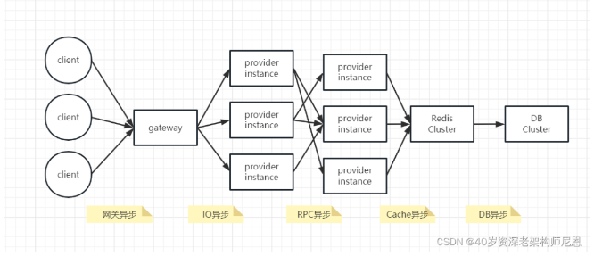
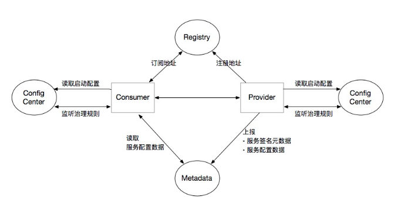
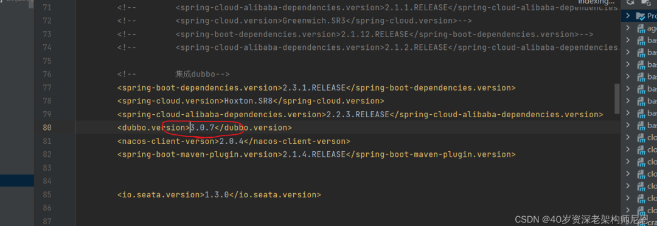
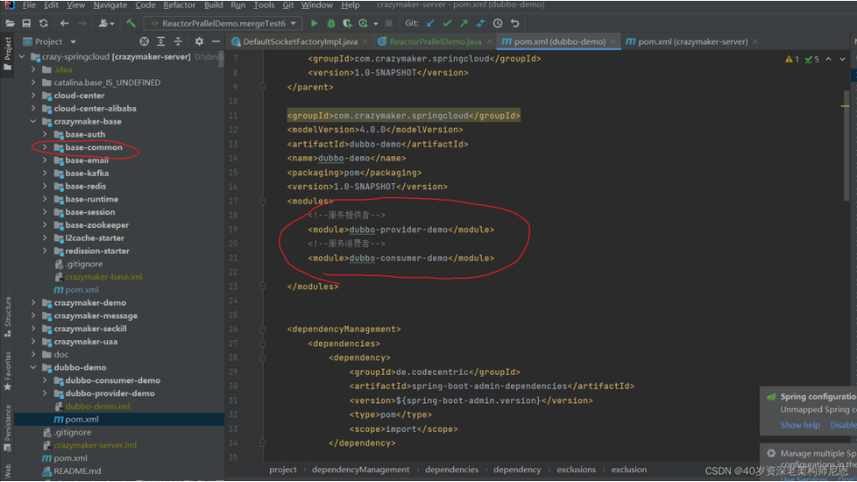
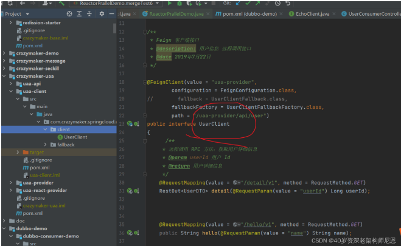
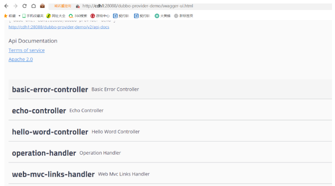
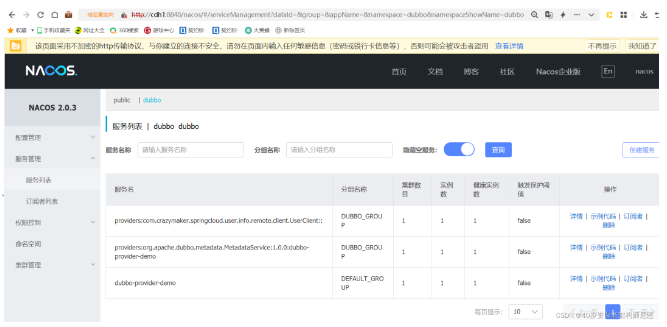
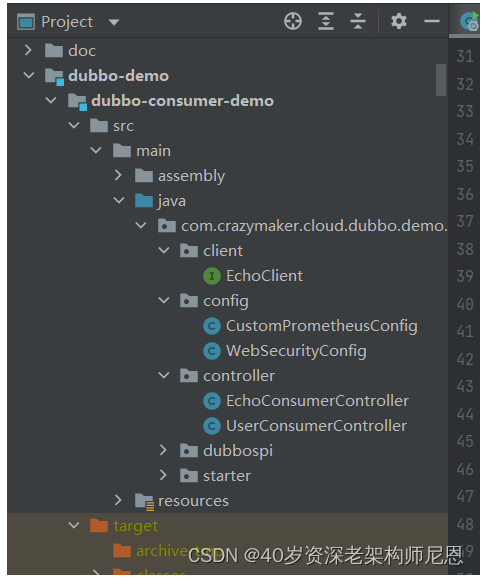
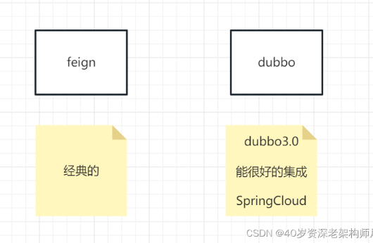

## SpringCloud+Dubbo3 = 王炸 ！

### 前言
#### 全链路异步化的大趋势来了
随着业务的发展，微服务应用的流量越来越大，使用到的资源也越来越多。
在微服务架构下，大量的应用都是 SpringCloud 分布式架构，这种架构总体上是全链路同步模式。
***全链路同步模式不仅造成了资源的极大浪费***，***并且在流量发生激增波动的时候，受制于系统资源而无法快速的扩容***。
全球后疫情时代，***降本增效***是大背景。如何降本增效？
可以通过技术升级，全链路同步模式 ，升级为 全链路异步模式。
先回顾一下全链路同步模式架构图



- 网关异步
- IO异步
- RPC异步
- Cache异步
- DB异步

全链路同步模式 ，如何升级为 全链路异步模式， 就是一个一个 环节的异步化。
40岁老架构师尼恩，持续深化自己的3高架构知识宇宙，当然首先要去完成一次牛逼的全链路异步模式 微服务实操，
下面是尼恩的实操过程、效果、压测数据(性能足足提升10倍多)。
- 压测数据（性能足足提升了10倍多）
全链路异步模式改造 具体的内容，请参考尼恩的深度文章：全链路异步，让你的 SpringCloud 性能优化10倍+
并且，上面的文章，作为尼恩 全链路异步的架构知识，收录在《尼恩Java面试宝典》V51版的架构专题中
注：本文以 PDF 持续更新，最新尼恩 架构笔记、面试题 的PDF文件，点此处获取

### SpringCloud + Dubbo 完成 RPC 异步
高并发时代来了， 各大项目有越来越强烈的诉求，全链路异步， 是性能优化的一个杀手锏。
全链路异步核心环境，就是***RPC的异步化***。
使用Dubbo来替换Feign，足足可以提升10倍性能。

- RPC的异步化
- 使用Dubbo来替换Feign，足足可以提升10倍性能

所以，SpringCloud + Dubbo RPC 的集成 是一个比较刚性的需求。
SpringCloud + Dubbo RPC的集成是一个比较刚性的需求
有小伙伴查招聘网站，发现很多需要有SpringCloud + Dubbo 的集成经验，刚好印证了这点。
接下来，尼恩一步一步带着大家，来做一下 SpringCloud + Dubbo RPC 的集成实验+性能测试。
见证一下奇迹：使用Dubbo 提升10倍的性能。
- 使用Dubbo提升10倍性能

### Dubbo3应用的宏观架构
Dubbo3应用架构，如下图所示：


从上面的图中，整体的的Dubbo的Rpc框架中，核心的组件有：
- config-center  配置中心，接下来使用 nacos
- Consumer消费端，  业务服务，使用Dubbo SDK 完成服务发现
- Provider服务提供端，业务服务，使用Dubbo SDK 完成服务注册
- Registry注册中心 配置中心，接下来使用 nacos

### Dubbo3 应用架构的核心组件
两大部分：
- 一个Dubbo SDK
- 三中心

#### Dubbo SDK
Dubbo SDK作为模块，被微服务所引入和依赖。
跟随着微服务组件被部署在分布式集群各个位置，实现各个微服务组件间的协作，
主要是服务的注册、服务的发现

#### 三中心
Dubbo3包含一些中心化组件，主要有3个，这包括：
- 注册中心
  - 协调Consumer消费者与Provider服务提供者之间的地址注册与发现。
- 配置中心
  - 存储Dubbo启动阶段的全局配置，保证配置的跨环境共享与全局一致性
  - 负责服务治理规则（***路由规则***、***动态配置***等）的存储与推送。
- 元数据中心
  - 接收Provider服务端上报的服务接口元数据，***为Admin等控制台提供运维能力（如服务测试、接口文档等）***
  - 作为服务发现机制的补充，***提供额外的接口/方法级别配置信息的同步能力，相当于注册中心的额外扩展***。

以上三个中心，由Nacos组件承担，
所以在下面的实操中，无论dubbo-Provider还是dubbo-consumer，配置文件中都是这么配置的：
```
dubbo:
  scan:
    base-packages: com.crazymaker.cloud.dubbo
  application:
    name:  ${spring.application.name}
  protocol:
    name: dubbo
    port: -1
  registry:
    address: nacos://${NACOS_SERVER:cdh1:8848}
    username: nacos
    password: nacos
    parameters:
      namespace: dubbo
      group: DUBBO_GROUP
  config-center:
    address: nacos://${NACOS_SERVER:cdh1:8848}
    username: nacos
    password: nacos
    group: DUBBO_GROUP
  metadata-report:
    address: nacos://${NACOS_SERVER:cdh1:8848}
    username: nacos
    password: nacos
    group: DUBBO_GROUP
```

### SpringBoot整合Dubbo3.0基础准备
阿里早已把dubbo捐赠给了Apache，现在dubbo由Apache在维护更新，dubbo也已经成了Apache下的顶级项目。

### SpringCloud+Nacos+Dubbo3.0
#### 版本说明
- SpringCloud:Hoxton.SR8
- SpringCloudAlibaba:2.2.3.RELEASE
- SpringBoot:2.3.4.RELEASE
- Nacos:2.0.3
- Dubbo:3.0.7

#### 项目结构介绍
- 1、dubbo的依赖的坐标
Maven 依赖的坐标是Apache官方最新的3.0.4坐标。
```xml
<dependency>
    <groupId>org.apache.dubbo</groupId>
    <artifactId>dubbo-bom</artifactId>
    <version>${dubbo.version}</version>
    <type>pom</type>
    <scope>import</scope>
</dependency>
```


如果使用的老版本的Dubbo，比如下面的这些依赖， 现在需要去掉啦
```xml
<dependency>
    <groupId>com.alibaba.spring.boot</groupId>
    <artifactId>dubbo-spring-boot-starter</artifactId>
    <version>2.0.0</version>
</dependency>

<dependency>
    <groupId>io.dubbo.springboot</groupId>
    <artifactId>spring-boot-starter-dubbo</artifactId>
    <version>1.0.0</version>
</dependency>
```

- 2、 注册中心的依赖的坐标
老的项目采用zookeeper为注册中心，当然，咱们的电脑里的虚拟机，其实都已经安装好zookeeper服务器，并已经启动。
所以，如果要使用ZK，对于咱们技术自由圈（疯狂创客圈的新名字）的小伙伴来说，也是非常方便的。
但是SpringCloud项目上一般使用的注册中，不是appolo，不是eureka，而是nacos。
现在Dubbo也支持nacos， 所以我们使用Nacos作为注册中心

```xml
<dependency>
    <groupId>org.apache.dubbo</groupId>
    <artifactId>dubbo-registry-nacos</artifactId>
    <version>${dubbo.version}</version>
    <exclusions>
        <exclusion>
            <groupId>com.alibaba.nacos</groupId>
            <artifactId>nacos-client</artifactId>
        </exclusion>
    </exclusions>
    <type>pom</type>
</dependency>
```
这里有个版本兼容性的bug，尼恩稍微花了一点点时间，才解决这个问题。
具体的话，视频中给大家详细说一下。

#### SpringBoot整合Dubbo3.0大致步骤
- SpringBoot 项目创建
- Dubbo 服务提供方实现
- Dubbo 服务消费方实现
- 自定义Filter拦截所有消费请求
- 自定义LoadBalance完成特殊场景负载均衡

#### 模块结构
接下来演示下整合的模块结构，注意，是Springcloud 项目的老项目升级，
不是一个全新的项目，很多老的代码，要复用的
所以，就是在原来的crazy-SpringCloud 微服务项目上改造
但是这里仅仅演示 dubbo，所以，在原理的 脚手架里边，增加了两个子模块，
注意：模块里边，并没有去掉原来的SpringCloud OpenFeign 的RPC调用,  而是两种RPC 调用共存。

方便后续在业务中快速运用，完整结构如下：
- 1.consumer，服务消费方模块；
- 2.provider，服务提供方模块；
- 3.统一定义服务接口和实体类，被其他工程模块引用；

consumer，服务消费方模块\  provider，服务提供方模块；如下图


统一定义服务接口和实体类，被其他工程模块引用；所以，这个之前fegin 的RPC 接口，现在接着给Dubbo用。



#### Dubbo微服务注册发现的相关配置
- 命名空间隔离
- 微服务注册中心配置

#### 命名空间隔离
在nacos 的命名空间， 用来做 dubbo 的命名空间隔离
首先创建nacos的命名空间

命名id 是要用到的， 这里需要填写，
主要，不要自动生产

#### 微服务yml配置
微服务 yml 配置，  yml配置 dubbo nacos 命名空间
```
dubbo:
  scan:
 base-packages: xxx
  protocol:
    name: dubbo
    port: -1
  # 注册中心配置
  registry:
    address: nacos://xxx
  parameters:
     namespace: dubbo
    group: DUBBO_GROUP

dubbo:
  application:
    name:  ${spring.application.name}
  protocol:
    name: dubbo
    port: -1
  registry:
    address: nacos://${NACOS_SERVER:cdh1:8848}
    username: nacos
    password: nacos
    parameters:
      namespace: dubbo
      group: DUBBO_GROUP
  config-center:
    address: nacos://${NACOS_SERVER:cdh1:8848}
    username: nacos
    password: nacos
    group: DUBBO_GROUP
  metadata-report:
    address: nacos://${NACOS_SERVER:cdh1:8848}
    username: nacos
    password: nacos
    group: DUBBO_GROUP
```

#### common-service 模块
服务接口 进行利旧复用
还是之前的  UserClient 老接口，open feign注解都不去掉

```java
package com.crazymaker.springcloud.user.info.remote.client;

import com.crazymaker.springcloud.common.dto.UserDTO;
import com.crazymaker.springcloud.common.result.RestOut;
import com.crazymaker.springcloud.standard.config.FeignConfiguration;
import com.crazymaker.springcloud.user.info.remote.fallback.UserClientFallbackFactory;
import org.springframework.cloud.openfeign.FeignClient;
import org.springframework.web.bind.annotation.RequestMapping;
import org.springframework.web.bind.annotation.RequestMethod;
import org.springframework.web.bind.annotation.RequestParam;

/**
 * Feign 客户端接口
 * @description: 用户信息 远程调用接口
 * @date 2019年7月22日
 */

@FeignClient(value = "uaa-provider",
        configuration = FeignConfiguration.class,
//        fallback = UserClientFallback.class,
        fallbackFactory = UserClientFallbackFactory.class,
        path = "/uaa-provider/api/user")
public interface UserClient
{
      /**
     * 远程调用 RPC 方法：获取用户详细信息
     * @param userId 用户 Id
     * @return 用户详细信息
     */
    @RequestMapping(value = "/detail/v1", method = RequestMethod.GET)
    RestOut<UserDTO> detail(@RequestParam(value = "userId") Long userId);

    @RequestMapping(value = "/hello/v1", method = RequestMethod.GET)
    public String hello(@RequestParam(value = "name") String name);
}
```

#### 服务提供者实操：dubbo-provider 服务
##### pom依赖
```xml
<!-- dubbo -->
<dependency>
    <groupId>org.apache.dubbo</groupId>
    <artifactId>dubbo</artifactId>
</dependency>
<dependency>
    <groupId>org.apache.dubbo</groupId>
    <artifactId>dubbo-registry-nacos</artifactId>
    <exclusions>
        <exclusion>
            <artifactId>nacos-client</artifactId>
            <groupId>com.alibaba.nacos</groupId>
        </exclusion>
    </exclusions>
</dependency>

<!-- dubbo starter -->

<dependency>
    <groupId>com.alibaba.nacos</groupId>
    <artifactId>nacos-client</artifactId>
    <version>${nacos-client-verson}</version>
</dependency>
```
##### 服务实现类
```java
package com.crazymaker.cloud.dubbo.demo.sevice;

import com.crazymaker.springcloud.common.dto.UserDTO;
import com.crazymaker.springcloud.common.result.RestOut;
import com.crazymaker.springcloud.user.info.remote.client.UserClient;
import org.apache.dubbo.config.annotation.DubboService;
import org.springframework.stereotype.Component;

@DubboService
@Component

public class UserClientDubboService implements UserClient {
    @Override
    public RestOut<UserDTO> detail(Long userId) {
        UserDTO dto=new UserDTO();
        dto.setUserId(userId);
        dto.setNickname(" dubbo rpc test");
        return RestOut.success(dto).setRespMsg("操作成功");
    }

    @Override
    public String hello(String name) {
        return "from dubbo provider : 你好，"+name;
    }
}
```
##### dubbo和Feign的一个不同
- dubbo的服务发布和暴露，直接在 service 层加上注解，就完成了比如：上面的案例中，加上一个类级别的 注解，
就可以 暴露这个服务接口   @DubboService
- 而 Feign 的服务接口发布，是在 @Controller 层完成的。 相对来说，比 使用 Dubbo 更为笨重

##### Provider的Dubbo+Nacos配置文件
```
spring:
  security:
    enabled: false
  application:
    name: dubbo-provider-demo
server:
  port: 28088
  servlet:
    context-path: /dubbo-provider-demo

#### 暴露端点
management:
  endpoints:
    web:
      base-path: "/actuator"  # 配置 Endpoint 的基础路径
      exposure:
        include: '*'  #在yaml 文件属于关键字，所以需要加引号
  endpoint:
    logfile:
      # spring boot admin  client不配置日志文件路径（同时配置logback-spring.xml对应的日志输出配置，否则无法输出日志），
      # 控制台上的Logging模块下的Logfile会报错：Fetching logfile failed.Request failed with status code 404
      external-file: ${log_dubbo_provider_demo_path_full:C:/logs/dubbo-provider-demo/logs/output.log}
      enabled: true
    health:
      show-details: always
    # 未配置/注释 以下内容
#  boot:
#    admin:
#      context-path: consumer
  metrics:
    tags:
      application:  ${spring.application.name}
    export:
      prometheus:
        enabled: true
        step: 1m
        descriptions: true

dubbo:
  scan:
    base-packages: com.crazymaker.cloud.dubbo
  application:
    name:  ${spring.application.name}
  protocol:
    name: dubbo
    port: -1
  registry:
    address: nacos://${NACOS_SERVER:cdh1:8848}
    username: nacos
    password: nacos
    parameters:
      namespace: dubbo
      group: DUBBO_GROUP
  config-center:
    address: nacos://${NACOS_SERVER:cdh1:8848}
    username: nacos
    password: nacos
    group: DUBBO_GROUP
  metadata-report:
    address: nacos://${NACOS_SERVER:cdh1:8848}
    username: nacos
    password: nacos
    group: DUBBO_GROUP
```

##### 启动类 加上@EnableDubbo 注解
```java
package com.crazymaker.cloud.dubbo.demo.starter;

import com.crazymaker.springcloud.common.util.IpUtil;
import lombok.extern.slf4j.Slf4j;
import org.apache.commons.lang3.StringUtils;
import org.apache.dubbo.config.spring.context.annotation.EnableDubbo;
import org.springframework.boot.SpringApplication;
import org.springframework.boot.autoconfigure.SpringBootApplication;
import org.springframework.cloud.client.discovery.EnableDiscoveryClient;
import org.springframework.context.ConfigurableApplicationContext;
import org.springframework.core.env.Environment;
import springfox.documentation.swagger2.annotations.EnableSwagger2;

import java.net.Inet4Address;
import java.util.Optional;

@EnableSwagger2
@EnableDiscoveryClient
@Slf4j
@EnableDubbo
@SpringBootApplication(scanBasePackages =
{
    "com.crazymaker.cloud.dubbo.demo",
}
)
public class DubboProviderApplication {
    public static void main(String[] args) {
        try {
            ConfigurableApplicationContext applicationContext = SpringApplication.run(DubboProviderApplication.class, args);
            Environment env = applicationContext.getEnvironment();
            String port = env.getProperty("server.port");
            String name = env.getProperty("spring.application.name");
            String path = env.getProperty("server.servlet.context-path");
            if (StringUtils.isBlank(path)) {
                path = "";
            }
            Optional<Inet4Address> ip = IpUtil.getLocalIp4Address();
            log.info("\n----------------------------------------------------------\n\t" +
                    name.toUpperCase() + " is running! Access URLs:\n\t" +
                    "Local: \t\thttp://" + ip.get() + ":" + port + path + "/\n\t" +
                    "swagger-ui: \thttp://" + ip.get() + ":" + port + path + "/swagger-ui.html\n\t" +
                    "actuator: \thttp://" + ip.get() + ":" + port + path + "/actuator/info\n\t" +
                    "----------------------------------------------------------");

        } catch (Exception e) {
            log.error("服务启动报错", e);
        }
    }
}
```

##### 启动、体验Provider
打包之后，在 咱们优雅的虚拟机centos8中，优雅的启动一下,
来一个优雅的启动命令

```
[root@centos1 work]# cd dubbo-provider-demo-1.0-SNAPSHOT/bin/
[root@centos1 bin]# sh ./deploy.sh start
PORT:28088
JVM:-server -Xms512m -Xmx2048m
nohup java -server -Xms512m -Xmx2048m -Dserver.port=28088   -jar /work/dubbo-provider-demo-1.0-SNAPSHOT/lib/dubbo-provider-demo-1.0-SNAPSHOT.jar com.crazymaker.cloud.dubbo.demo.starter.DubboProviderApplication  &
log file : /work/logs/dubbo-provider-demo-1.0-SNAPSHOT/output.log
```

太爽................. 有个vagrant+Centos 开发环境， 开发Java应用，爽到不要不要的

> Vagrant + Centos

关键是：在这个虚拟机  box 文件中，尼恩给大家预装了K8S 云原生环境，大家一键导入省了N多麻烦。
基于这个环境， 下一步咱们就开始 “左手大数据、右手云原生” 的高端实操

- 左手大数据
- 右手云原生

继续看，屏幕的下面，下面还有swagger体验地址
使用这个地址，可以在浏览器开起Swagger -UI 的界面
http:///cdh1:28088/dubbo-provider-demo/swagger-ui.html

开启之后的效果，但是，这个和dubbo没有关系
因为dubbo的服务并没有在swagger ui 展示



##### 在Nacos查看Dubbo服务的注册情况
通过nacos，可以看到 dubbo的服务啦



具体的细节，咱们后面讲dubbo视频的时候，再说
这里先把性能优化起来

### 服务消费者实操：dubbo-consumer 服务
consumer模块


消费者实现类
```java
package com.crazymaker.cloud.dubbo.demo.consumer.controller;

import com.crazymaker.springcloud.common.dto.UserDTO;
import com.crazymaker.springcloud.common.result.RestOut;
import com.crazymaker.springcloud.user.info.remote.client.UserClient;
import io.swagger.annotations.Api;
import io.swagger.annotations.ApiOperation;
import org.apache.dubbo.config.annotation.DubboReference;
import org.springframework.web.bind.annotation.RequestMapping;
import org.springframework.web.bind.annotation.RequestMethod;
import org.springframework.web.bind.annotation.RequestParam;
import org.springframework.web.bind.annotation.RestController;

@RestController
@RequestMapping("/user")
@Api(tags = "Dubbo-RPC  完成远程调用")
public class UserConsumerController {


    //注入  @DubboReference 注解配置 所配置的 EchoClient 客户端Feign实例
     @DubboReference(loadbalance = "groupLoadBalance")
    private UserClient userService;

    //用户详情
    @ApiOperation(value = "用户详情接口")
    @RequestMapping(value = "/detail/v1", method = RequestMethod.GET)
    RestOut<UserDTO> detail(@RequestParam(value = "userId", required = true)Long userId) {
        RestOut<UserDTO> ret = userService.detail(userId);
        return ret;
    }
}
```

#### 消费者Dubbo+Nacos配置文件
```yaml
spring:
  security:
    enabled: false
  application:
    name: dubbo-consumer-demo
#http://cdh1:18081/dubbo-consumer-demo/swagger-ui.html

server:
  port: 18081
  servlet:
    context-path: /dubbo-consumer-demo

#### 暴露端点
management:
  endpoints:
    web:
      base-path: "/actuator"  # 配置 Endpoint 的基础路径
      exposure:
        include: '*'  #在yaml 文件属于关键字，所以需要加引号
  endpoint:
    health:
      show-details: always
  metrics:
    tags:
      application: ${spring.application.name}
#  boot:
#    admin:
#      context-path: consumer

dubbo:
  scan:
    base-packages: com.crazymaker.cloud.dubbo
  application:
    name:  ${spring.application.name}
  protocol:
    name: dubbo
    port: -1
  registry:
    address: nacos://${NACOS_SERVER:cdh1:8848}
    username: nacos
    password: nacos
    parameters:
      namespace: dubbo
      group: DUBBO_GROUP
  config-center:
    address: nacos://${NACOS_SERVER:cdh1:8848}
    username: nacos
    password: nacos
    group: DUBBO_GROUP
  metadata-report:
    address: nacos://${NACOS_SERVER:cdh1:8848}
    username: nacos
    password: nacos
    group: DUBBO_GROUP
```

#### 启动类 加上@EnableDubbo 注解
```java
package com.crazymaker.cloud.dubbo.demo.consumer.starter;

import com.crazymaker.springcloud.common.util.IpUtil;
import lombok.extern.slf4j.Slf4j;
import org.apache.commons.lang3.StringUtils;
import org.apache.dubbo.config.spring.context.annotation.EnableDubbo;
import org.springframework.boot.SpringApplication;
import org.springframework.boot.actuate.autoconfigure.security.servlet.ManagementWebSecurityAutoConfiguration;
import org.springframework.boot.autoconfigure.SpringBootApplication;
import org.springframework.boot.autoconfigure.data.redis.RedisAutoConfiguration;
import org.springframework.boot.autoconfigure.data.redis.RedisRepositoriesAutoConfiguration;
import org.springframework.boot.autoconfigure.jdbc.DataSourceAutoConfiguration;
import org.springframework.boot.autoconfigure.jdbc.DataSourceTransactionManagerAutoConfiguration;
import org.springframework.boot.autoconfigure.orm.jpa.HibernateJpaAutoConfiguration;
import org.springframework.boot.autoconfigure.security.servlet.SecurityAutoConfiguration;
import org.springframework.cloud.client.discovery.EnableDiscoveryClient;
import org.springframework.cloud.openfeign.EnableFeignClients;
import org.springframework.context.ConfigurableApplicationContext;
import org.springframework.core.env.Environment;
import springfox.documentation.swagger2.annotations.EnableSwagger2;

import java.net.Inet4Address;
import java.util.Optional;

@EnableSwagger2
@EnableDiscoveryClient
@Slf4j
@EnableDubbo

@SpringBootApplication(
        scanBasePackages =
                {
                        "com.crazymaker.cloud.dubbo.demo",
                        "com.crazymaker.springcloud.standard"
                },
        exclude = {SecurityAutoConfiguration.class,
                //排除db的自动配置
                DataSourceAutoConfiguration.class,
                DataSourceTransactionManagerAutoConfiguration.class,
                HibernateJpaAutoConfiguration.class,
                SecurityAutoConfiguration.class,
                ManagementWebSecurityAutoConfiguration.class,
                //排除redis的自动配置
                RedisAutoConfiguration.class,
                RedisRepositoriesAutoConfiguration.class})
//启动Feign
@EnableFeignClients(basePackages =
        {"com.crazymaker.cloud.dubbo.demo.consumer.client"})
public class DubboConsumerApplication {

    public static void main(String[] args) {
        try {
            ConfigurableApplicationContext applicationContext = SpringApplication.run(DubboConsumerApplication.class, args);

            Environment env = applicationContext.getEnvironment();
            String port = env.getProperty("server.port");
            String name = env.getProperty("spring.application.name");

            String path = env.getProperty("server.servlet.context-path");
            if (StringUtils.isBlank(path)) {
                path = "";
            }
            Optional<Inet4Address> ip = IpUtil.getLocalIp4Address();

            log.info("\n----------------------------------------------------------\n\t" +
                    name.toUpperCase() + " is running! Access URLs:\n\t" +
                    "Local: \t\thttp://" + ip.get() + ":" + port + path + "/\n\t" +
                    "swagger-ui: \thttp://" + ip.get() + ":" + port + path + "/swagger-ui.html\n\t" +
                    "actuator: \thttp://" + ip.get() + ":" + port + path + "/actuator/info\n\t" +
                    "----------------------------------------------------------");

        } catch (Exception e) {
            log.error("服务启动报错", e);

        }
    }
}
```

#### 启动、体验 Consumer
打包之后，在 咱们优雅的虚拟机 centos8 中，优雅的启动一下,
来一个优雅的启动命令
```
[root@centos1 bin]# cd ../../dubbo-consumer-demo-1.0-SNAPSHOT/bin/
[root@centos1 bin]# sh ./deploy.sh start
PORT:18081
JVM:-server -Xms512m -Xmx2048m
nohup java -server -Xms512m -Xmx2048m -Dserver.port=18081   -jar /work/dubbo-consumer-demo-1.0-SNAPSHOT/lib/dubbo-consumer-demo-1.0-SNAPSHOT.jar com.crazymaker.cloud.dubbo.demo.consumer.starter.DubboConsumerApplication  &
nohup: appending output to 'nohup.out'
```

太爽.................   有个vagrant+Centos 开发环境， 开发Java应用，爽到不要不要的
关键是：在这个虚拟机  box 文件中，尼恩给大家预装了K8S 云原生环境，大家一键导入省了N多麻烦。
下一步，基于这个环境， 咱们就开始 “左手大数据、右手云原生” 的高端实操
继续看，屏幕的下面，下面还有swagger体验地址

使用这个地址，可以在浏览器开起Swagger -UI 的界面
http:///10.0.2.15:18081/dubbo-consumer-demo/swagger-ui.html
注意，要修改一下 host，修改之后为
http://cdh1:18081/dubbo-consumer-demo/swagger-ui.html
Feign 和Dubbo 两大RPC调用 并存的效果，如下：

##### 在Nacos查看Dubbo服务的注册情况
通过nacos，可以看到 dubbo的服务的消费者啦
具体的细节，咱们后面讲dubbo视频的时候，再说
这里先把性能优化起来

#### 性能的对比测试
然后进行了性能的对比验证
##### dubbo 的压测数据
```
wrk -t8 -c200 -d30s --latency  http://cdh1:18081/dubbo-consumer-demo/user/detail/v1?userId=1

[root@centos1 src]# wrk -t8 -c200 -d30s --latency  http://cdh1:18081/dubbo-consumer-demo/user/detail/v1?userId=1
Running 30s test @ http://cdh1:18081/dubbo-consumer-demo/user/detail/v1?userId=1
  8 threads and 200 connections
  Thread Stats   Avg      Stdev     Max   +/- Stdev
    Latency    30.10ms   45.68ms 644.45ms   95.43%
    Req/Sec     1.12k   465.63     2.36k    66.87%
  Latency Distribution
     50%   18.94ms
     75%   28.43ms
     90%   46.21ms
     99%  283.56ms
  264316 requests in 30.07s, 148.47MB read
Requests/sec:   8788.96
Transfer/sec:      4.94MB
```

##### feign 的压测数据
```
wrk -t8 -c200 -d30s --latency  http://cdh1:18081/dubbo-consumer-demo/echo/variable/11

[root@centos1 src]# wrk -t8 -c200 -d30s --latency  http://cdh1:18081/dubbo-consumer-demo/echo/variable/11
Running 30s test @ http://cdh1:18081/dubbo-consumer-demo/echo/variable/11
  8 threads and 200 connections
  Thread Stats   Avg      Stdev     Max   +/- Stdev
    Latency   321.50ms  294.59ms   2.00s    61.77%
    Req/Sec    87.18     43.39   232.00     67.00%
  Latency Distribution
     50%  309.06ms
     75%  503.06ms
     90%  687.99ms
     99%    1.21s
  20495 requests in 30.10s, 7.64MB read
  Socket errors: connect 0, read 0, write 0, timeout 49
Requests/sec:    680.90
Transfer/sec:    259.99KB
```

从数据来看， dubbo rpc 是feign rpc 性能10倍 
> dubbo rpc是feign rpc性能10倍

### Dubbo比Feign高10倍以上的本质
Dubbo比Feign高10倍以上的本质，不是在于应用层的协议，和传输格式
面试的时候，太多的小伙伴被问到：Dubbo比Feign性能高，说说原因。
小伙伴首先回答的是：
Dubbo 是TCP 层的传输协议，Feign是应用层 的HTTP传输协议，所以性能低。
这个答案不是本质原因，HTTP是有些冗余的头部报文，但是不至于差10倍。能差0.5倍，就已经顶天了。
差10倍的原因：是 同步链路 与异步链路 的 区别。
或者说：Dubbo比Feign高10倍以上的本质，是RPC 调用异步化
RPC 调用主要的框架有：

- Dubbo比Feign高10倍以上的本质，不是在于应用层的协议和传输格式
- 面试的时候，太多的小伙伴被问到：Dubbo比Feign性能高，说说原因
- 小伙伴首先回答的是：
- Dubbo是TCP层的传输协议，Feign是应用层的HTTP传输协议，所以性能低
- 这个答案不是本质原因，HTTP是有些冗余的头部报文，但是不至于差10倍。能差0.5倍，就已经顶天了
- 差10倍的原因：***是同步链路与异步链路的区别***
- Dubbo比Feign高10倍以上的本质，是RPC调用异步化

RPC 调用主要的框架有：


特点是：
- feign 是同步IO 、阻塞模式的同步 RPC框架
- dubbo 是基于Netty的非阻塞IO + Reactor 反应堆线程模型的 异步RPC框架

```
feign是同步IO、阻塞模式的同步RPC框架
dubbo是基于Netty的非阻塞IO+Reactor反应堆线程模型的异步RPC框架
```

异步RPC 调用，等待upstream 上游 response 返回时，线程不处于block 状态
- 异步PRC调用，等待upstream上游response返回时，线程不处于block状态

作为微服务架构中数据流量最大的一部分，RPC 调用异步化的收益巨大；<br>
dubbo  的异步RPC，仅仅 SpringCloud 微服务全链路 异步的一个环节， SpringCloud 全链路 异步有5个以上的环节。<br>
有关微服务全链路异步高性能改造，请参考尼恩的深度文章：
全链路异步，让你的 SpringCloud 性能优化10倍+
高并发、云原生、大数据时代，很多组件都是 全异步的、响应式的。<br>
大家一定要掌握全链路异步的底层原理，掌握好 响应式编程的底层原理和实操，为 “左手大数据、右手云原生”  做好技术准备。<br>
后面尼恩也会写一些列的博文，为大家“左手大数据、右手云原生”  做好技术储备。<br>
具体请关注尼恩的疯狂创客圈社群（50+）。<br>

- 高并发 & 云原生 & 大数据时代，很多组件都是***全异步的***、***响应式的***

### Dubbo 与 SpringCloud 的通信 Openfeign的区别
#### 1、协议支持方面
- Feign更加优雅简单。
Feign是通过REST API实现的远程调用，基于Http传输协议，服务提供者需要对外暴露Http接口供消费者调用，服务粒度是http接口级的。
很多文章说：通过短连接的方式进行通信，不适合高并发的访问。
尼恩纠错：***Feign 并不是短链接，而是长连接*** ，具体请 阅读 尼恩 的《Java 高并发核心编程 卷1 加强版》

- Dubbo方式更灵活。
Dubbo是通过RPC调用实现的远程调用，支持多传输协议(Dubbo、Rmi、http、redis等等)，可以根据业务场景选择最佳的方式，非常灵活。
默认的Dubbo协议：利用Netty，TCP传输，单一、异步、长连接，适合数据量小、高并发和服务提供者远远少于消费者的场景。
Dubbo通过TCP长连接的方式进行通信，服务粒度是方法级的。

```
Dubbo是通过RPC调用实现的远程调用，支持多传输协议（Dubbo、RMI、HTTP、REDIS等等）
可以根据业务场景选择最佳的方式，非常灵活
默认的Dubbo协议：利用Netty、TCP传输，单一、异步、长连接
适合数据量小、高并发和服务提供者远远少于消费者的场景
Dubbo通过TCP长连接的方式进行通信，服务粒度是方法级的
```

#### 2、通信性能方面
- Feign基于Http传输协议，底层实现是rest。在高并发场景下性能不够理想。
- Dubbo框架的通信协议采用RPC协议，属于传输层协议，提升了交互的性能，保持了长连接，高性能。

#### 3、线程模型方面
- Feign使用的是阻塞式的线程模型， 在请求和响应之间， IO线程是阻塞的，死等到超时。
- Dubbo使用的是异步非阻塞式的线程模型（Netty的Reactor反应器）， 在请求和响应之间， IO线程是非阻塞的，有限的线程，可以处理大量的请求。

```
Feign使用的是阻塞式的线程模型，在请求和响应之间，IO线程是阻塞的
Dubbo使用的是异步非阻塞式的线程模型（Netty的Reactor反应器），在请求和响应之间，IO线程是非阻塞的，有限的线程，可以处理大量的请求
```

这点是性能的核心。

### SpringCloud + Dubbo RPC 的集成的价值
高并发时代来了， 各大项目有越来越强烈的诉求，全链路异步， 是性能优化的一个杀手锏。
- 全链路异步
使用Dubbo来替换Feign，足足可以提升10倍性能。
- 使用Dubbo来替换Feign，足足可以提升10倍性能
所以，SpringCloud + Dubbo RPC 的集成 是一个比较刚性的需求。
有小伙伴查招聘网站，发现很多需要有SpringCloud + Dubbo 的集成经验，刚好印证了这点。
尼恩强烈建议大家，做一下 SpringCloud + Dubbo RPC 的集成，在同一个微服务下，同时使用了Feign + Dubbo。

尼恩提示：很多小伙伴来找尼恩改简历，但是发现一点漂亮的技术亮点都没有，如果确实找不到亮点，可以把这个实操做一下，写入简历，作为亮点。
如果确实不清楚怎么写入简历，可以来找尼恩进行简历指导。保证 脱胎换骨、金光闪闪、天衣无缝。

- 做一下Spring Cloud + Dubbo RPC集成
- 在同一个微服务下，同时使用Feign + Dubbo


