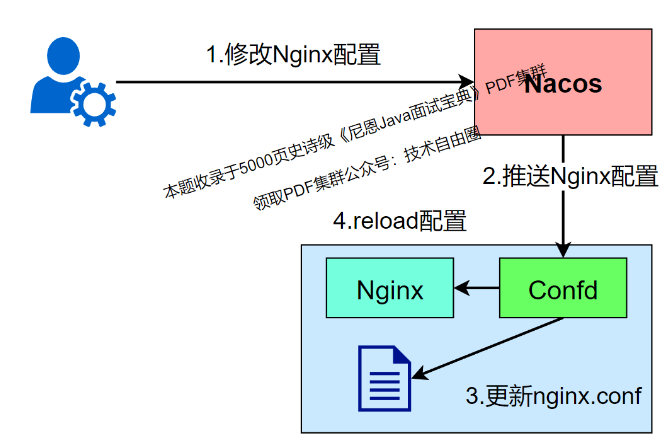
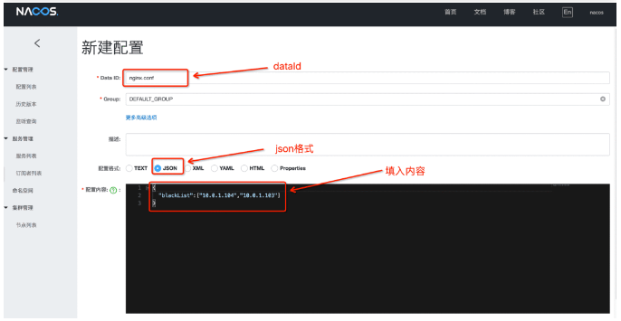
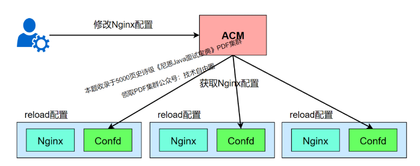
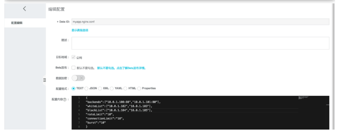
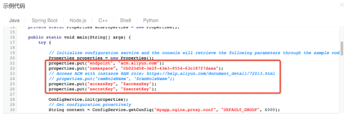
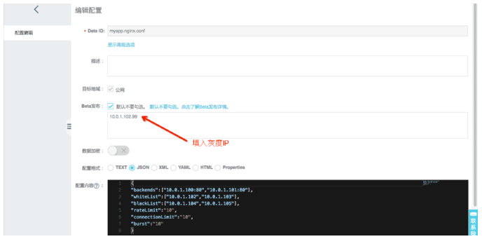
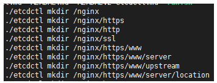
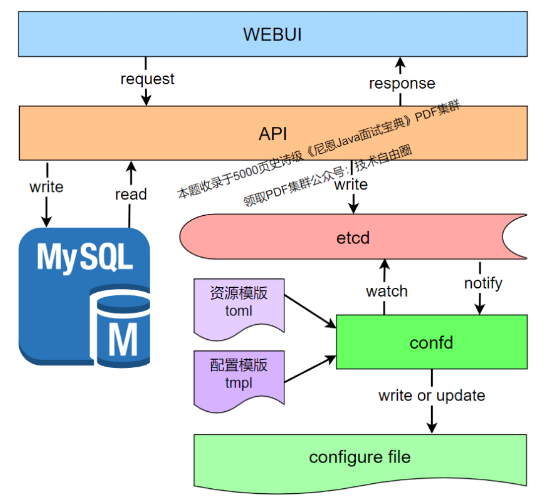

## shein面试：nacos无入侵配置，做过吗，怎么做？

### 说在前面
在40岁老架构师 尼恩的读者交流群(50+)中，
最近有小伙伴拿到了一线互联网企业如阿里、滴滴、极兔、有赞、shein 希音、百度、网易的面试资格，
遇到很多很重要的面试题：
```
无入侵配置，做过吗，怎么做的？
Nacos 怎么做无代码侵入性的配置管理？
```

小伙伴 没有回答好，导致面试挂了，来求助尼恩，
如何才能回答得很漂亮， 让面试官刮目相看、口水直流。

无入侵配置, 尼恩在自己的社群里边问了一下， 很多小伙伴都没有听过说。
所以，尼恩给大家做一下系统化、体系化的梳理，使得大家内力猛增，可以充分展示一下大家雄厚的 “技术肌肉”，让面试官爱到 “不能自已、口水直流”，然后实现”offer直提”。
当然，这道面试题，以及参考答案，也会收入咱们的 《尼恩Java面试宝典》V117版本PDF集群，
供后面的小伙伴参考，提升大家的 3高 架构、设计、开发水平。

最新《尼恩 架构笔记》《尼恩高并发三部曲》《尼恩Java面试宝典》的PDF，请关注本公众号【技术自由圈】获取，后台回复：领电子书

### 本文目录
- 说在前面
- 无入侵配置方案一：什么是无代码侵入性的配置管理
  - 安装confd插件
  - confd结合Nacos实现nginx配置管理示例
  - Nacos结合confd做无入侵配置总结
- 无入侵配置方案二：如何使用confd+ACM管理Nginx配置
  - 准备工作
  - 创建confd配置文件
  - 创建模版文件
  - 在ACM上创建所需的配置文件
  - 启动confd
  - 生成配置文件
  - 动态修改 Nginx 配置
- 无入侵配置方案三：使用etcd+confd管理nginx配置
  - 1、目标Nginx 配置文件
  - 2、实现框架
  - 3、生成配置
- 参考文献
- 说在最后
- 部分历史案例

### 无入侵配置方案一：什么是无代码侵入性的配置管理
***一般的配置管理系统都是代码侵入性的***，
应用接入配置管理系统都需要使用对应的SDK来查询和监听数据的变更。
对于一些已经成熟的系统来说，接入SDK来实现动态配置管理是很难实现的，
***Nacos通过引入配置管理工具confd可以实现系统的配置变更做到无代码侵入性***。

为什么要支持confd，老的应用配置管理模式是启动时读取配置文件，然后重新读取配置文件需要应用重启。

confd是一个轻量级的配置管理工具，***可以通过查询后端存储系统来实现第三方系统的动态配置管理***，
如Nginx、Tomcat、HAproxy、Docker配置等。
confd目前支持的后端有etcd、ZooKeeper等，
Nacos 1.1版本通过对confd定制支持Nacos作为后端存储。

confd能够查询和监听后端系统的数据变更，
***结合配置模版引擎动态更新本地配置文件***，保持和后端系统的数据一致，
***并且能够执行命令或者脚本实现系统的reload或者重启***。

#### 安装confd插件
confd的安装可以通过源码安装方式，confd基于Go语言编写，其编译安装依赖Go，
尼恩提升， ***学习java的同学们，一定要懂go， 在这里就可以看confd的源码了***

首先需要确保本地安装了Go，版本不低于v1.10 创建confd目录，下载confd源码，编译生成可执行文件
```
mkdir -p $GOPATH/src/github.com/kelseyhightower
cd $GOPATH/src/github.com/kelseyhightower
wget https://github.com/nacos-group/nacos-confd/archive/v0.19.1.tar.gz
tar -xvf v0.19.1.tar.gz
mv nacos-confd-0.19.1 confd
cd confd
make
```

复制confd文件到bin目录下，启动confd
```
sudo cp bin/confd /usr/local/bin
confd
```

本文介绍***使用Nacos结合confd实现Nginx配置管理***，
***为简单起见以Nginx的黑名单功能为演示示例***，

- 使用Nacos结合confd实现Nginx配置管理
- 为简单起见以Nginx的黑名单功能为演示示例

Nacos使用官网部署的服务，
域名为console.nacos.io (http://xn--console-e73k064bojj.nacos.io/)。

Nginx的安装可以参考网上文章


#### 1.创建confd所需目录
confd配置文件默认在/etc/confd中，
可以通过参数-confdir指定。
目录中包含两个子目录，
分别是：
- conf.d 
- templates
```
mkdir -p /etc/confd/{conf.d,templates}
```

#### 2.创建confd配置文件
confd会先读取conf.d目录中的配置文件(toml格式)，
***然后根据文件指定的模板路径去渲染模板***。
```
vim /etc/confd/conf.d/nginx.toml
```

内容为如下，其中nginx.conf.tmpl文件为confd的模版文件，
keys为模版渲染成配置文件所需的配置内容，
/usr/local/nginx/conf/nginx.conf为生成的配置文件

```
[template]
src = " nginx.conf.tmpl"
dest =
"/usr/local/nginx/conf/nginx.conf"
keys = [
"/nginx/conf",
]
check_cmd = "/usr/local/nginx/sbin/nginx -t
-c {{.src}}"
reload_cmd = "/usr/local/nginx/sbin/nginx
-s reload"
```

#### 3.创建模版文件
拷贝Nginx原始的配置，增加对应的渲染内容
```
cp /usr/local/nginx/conf/nginx.conf
/etc/confd/templates/nginx.conf.tmpl
vim /etc/confd/templates/nginx.conf.tmpl
```
增加内容为:
```
···
{{$data := json (getv "/nginx/conf")}}
{{range $data.blackList}}
deny {{.}};
{{end}}
···
```

#### 4.在Nacos上创建所需的配置文件
在public命名空间创建dataId为nginx.conf的配置文件，
group使用默认的DEFAULT_GROUP即可，配置内容为json格式

```json
{
"blackList":["10.0.1.104","10.0.1.103"]
}
```



#### 5.启动confd
启动confd，从Nacos获取配置文件，渲染Nginx配置文件。
backend设置成nacos，node指定访问的Nacos服务地址，watch让confd支持动态监听
```cmd
confd -backend nacos -node http://console.nacos.io:80 -watch
```

#### 6.查看Nginx配置文件，验证Nginx启动
查看生成的/usr/local/nginx/conf/nginx.conf配置文件是否存在如下内容
```
...
deny 10.0.1.104;
deny 10.0.1.103;
...
```
curl命令访问Nginx，验证是否返回正常。http响应状态码为200说明访问Nginx正常
```
curl http://$IP:8080/ -i
HTTP/1.1 200 OK
...
```

#### 7.查看本机Ip，加到Nacos配置文件黑名单中
假设本机的Ip为30.5.125.107，将本机的Ip加入到Nginx黑名单
```
{
"blackList":["10.0.1.104","10.0.1.103","30.5.125.107"]
}
```

#### 8.查看Nginx配置文件，验证黑名单是否生效
查看生成的/usr/local/nginx/conf/nginx.conf配置文件是否存在如下内容
```
...
deny 10.0.1.104;
deny 10.0.1.103;
deny 30.5.125.107;
...
```

curl命令访问Nginx，访问应该被拒绝，返回403
```
curl http://$IP:8080/ -i
HTTP/1.1 403 Forbidden
...
```

#### Nacos结合confd做无入侵配置总结
使用Nacos结合confd来做自动化管理，
confd作为轻量级的配置管理工具可以做到对第三方系统无代码侵入性。

本文只是简单使用Nginx的黑名单功能来演示Nacos+confd的使用方式，
当然Nginx还具有限流、反向代理等功能以及其他的系统比如Haproxy、Tomcat、Docker等也同样可以使用Nacos+confd做管理。

### 无入侵配置方案二：如何使用confd+ACM管理Nginx配置
Nginx 作为优秀的开源软件，凭借其高性能高并发等特点，
常常作为web和反向代理服务部署在生产环境中。
但是当 Nginx 的规模较大时， Nginx 的运维成本也是不断上升。
如何通过confd+ACM来管理 Nginx 配置，通过集中式的配置管理方式解决 Nginx 的大规模运维问题，
运维和开发人员不用登陆到 Nginx 机器上，
只需要配置好confd，然后在ACM上操作就可以动态修改 Nginx 的配置参数。



#### 准备工作
在操作本文的示例之前需要配置好开通ACM和对confd的使用有基本概念，
ACM的开通及其基本使用可以参考：(https://help.aliyun.com/document_detail/59953.html%3Fspm%3Da2c4g.11186623.6.542.4bd57fa9WS2KwF)
confd的基本使用可以参考：(https://yq.aliyun.com/go/articleRenderRedirect?https://help.aliyun.com/document_detail/124844.html)

Nginx 在日常开发中使用得比较多的功能是***负载均衡***、***限流***、***缓存***等， 
Nginx 的使用和安装可以在网上查阅相关资料。
本文结合负载均衡和限流功能讲解如何使用confd+ACM实现 Nginx 的大规模运维操作。

#### 创建confd配置文件
创建confd所需的toml格式配置文件
```
vim /etc/confd/conf.d/myapp.toml
```

check_cmd用于检验 Nginx 配置的正确性，
当src配置错误则不会覆盖 Nginx 配置 reload_cmd用于reload Nginx 配置

```
[template]
src = " Nginx .conf.tmpl"
dest = "/usr/local/ Nginx /conf/ Nginx .conf"
keys = [
"/myapp/ Nginx /conf",
]

check_cmd = "/usr/local/ Nginx /sbin/ Nginx  -t -c {{.src}}"
reload_cmd = "/usr/local/ Nginx /sbin/ Nginx  -s reload"
```

#### 创建模版文件
```cmd
vim /etc/confd/templates/ Nginx .conf.tmpl
```

getv从ACM中获取对应dataId的配置，
/myapp/ Nginx /conf对应的dataId为myapp. Nginx .conf，
配置格式为json格式，模版文件包含了 Nginx 的***upstream、限流、黑白名单配置内容***，
通过json指令解析配置文件。
upstream后端ip通过从ACM的配置的backends数组中获取，
同样地，白名单和黑名单ip分别存储在whiteList和blackList的数组中，
限流的速率和并发数通过rateLimit和connectionLimit设置

```
...
{{$data := json (getv "/myapp/ Nginx /conf")}}
geo $whiteiplist {
    default 1;
    {{range $data.whiteList}}
    {{.}} 0;
    {{end}}
}

map $whiteiplist $limit {
    1 $binary_remote_addr;
    0 "";
}
limit_req_zone $limit zone=rateLimit:10m rate={{$data.rateLimit}}r/s;
limit_conn_zone $limit zone=connectionLimit:10m;

{{range $data.blackList}}
deny {{.}};
{{end}}
upstream myapp {
    server 11.160.65.95:8080;
}
server {
    listen       80;
    server_name  localhost;

    #charset koi8-r;

    #access_log  logs/host.access.log  main;
    location / {
        root   html;
        index  index.html index.htm;
        proxy_pass http://myapp;

        limit_conn connectionLimit {{$data.connectionLimit}};
        limit_req zone=rateLimit burst={{$data.burst}} nodelay;
    }
...
}
...
```

#### 在ACM上创建所需的配置文件
创建dataId为myapp. Nginx .conf的配置文件，
group使用默认的DEFAULT_GROUP即可，
配置内容设置好上游节点、黑白名单以及限流阈值

```
{
"backends":["10.0.1.100:80","10.0.1.101:80"],
"whiteList":["10.0.1.102","10.0.1.103"],
"blackList":["10.0.1.104","10.0.1.104"],
"rateLimit":"10",
"connectionLimit":"10",
"burst":"10"
}
```


#### 启动confd
启动confd，设置好backend、endpoint、命名空间namespace和阿里云账号accessKey/secretKey

```cmd
confd -backend nacos -endpoint {endpoint}:8080 -namespace {namespace} -accessKey {accessKey} -secretKey {secretKey}
```



#### 生成配置文件
confd将ACM中的参数通过模板文件渲染生成新的 Nginx 配置文件，
查看生成的/usr/local/ Nginx / Nginx .conf配置文件是否符合预期，
并检查 Nginx 是否成功reload配置。
```
...
geo $whiteiplist {
    default 1;

    10.0.1.102 0;

    10.0.1.103 0;

}

map $whiteiplist $limit {
    1 $binary_remote_addr;
    0 "";
}

limit_req_zone $limit zone=rateLimit:10m rate=10r/s;
limit_conn_zone $limit zone=connectionLimit:10m;

deny 30.5.125.74;

deny 10.0.1.105;

upstream myapp {
    server 11.160.65.95:8080;
}
server {
    listen       80;
    server_name  localhost;
    location / {
            root   html;
            index  index.html index.htm;
            proxy_pass http://myapp;

            limit_conn connectionLimit 10;
            limit_req zone=rateLimit burst=10 nodelay;
        }
...
}
...
```

#### 动态修改 Nginx 配置
运行时当需要调节 Nginx 的名单或者限流阈值的时候，
可以在ACM上修改配置的内容。
当然在生产环境可以使用ACM的灰度发布功能（Beta发布）验证没问题再全量发布下去。



这里演示了如何使用confd+ACM管理 Nginx 配置，降低 Nginx 的运维成本。

### 无入侵配置方案三：使用etcd+confd管理nginx配置
nginx的配置是一个典型的key value类型的，
而且 配置文件能够 分模块+ 嵌套，
一个目录下面可以包含其他配置，目录下还可以有目录，嵌套多层。
结合confd ，可以把配置信息，动态的存储在 k-v型 Nosql数据库中。
如今key value类型的Nosql数据库非常多，redis、leveldb、etcd等，
***etcd 提供类似文件系统操作，使用raft协议保持数据一致性，非常适合云计算分布式部署场景***，
***将confd与etcd搭配，非常适合nginx这样的配置格式***。

#### 1、目标Nginx 配置文件
要生成的目标Nginx 配置，大概如下；
```
upstream www_test {
    server 196.75.121.112:443;     （动态生成）
}

server {
    listen       443 ssl; （动态生成）
    server_name  www.test.com; (动态生成)
    ssl_protocols TLSv1 TLSv1.1 TLSv1.2;; 
    ssl_certificate             /home/build/openresty/nginx/cert/dealssl/www.bestenover.com.crt; (动态生成)

    location / { 
        proxy_pass https://www_test; (动态生成)
        proxy_set_header Host $host;
        proxy_set_header X-Real-IP $remote_addr;
        proxy_set_header X-Forwarded-For $proxy_add_x_forwarded_for;
        proxy_set_header X-Forwarded-Proto https;
        proxy_redirect off;
    }   
}
```

#### 2、实现框架
使用etcd新建与nginx配置对应的目录如下：


可以设计一套webui， 展示配置和后台生成nginx配置，总体的配置流程图如下所示：


#### 3、生成配置
WEBUI通过API将配置写入mysql和etcd，
confd注册监控etcd的key为/nginx/，只要发生变化就通知confd根据模板生成配置。
confd默认的配置路径为/etc/confd/，创建conf.d和template两个目录，分别存放配置资源和配置模板。
nginx的配置资源如下所示：test.conf.toml
```
[template]
src = "test.conf.tmpl"
dest = "/tmp/test.conf"
keys = [ 
    "/nginx",
]
check_cmd = "/usr/sbin/nginx -t -c {{.src}}"
reload_cmd = "/usr/sbin/service nginx reload"
```

nginx的配置模板如下所示：test.conf.tmpl
```
upstream www_{{getv "/nginx/https/www/server/server_name"}} {
    {{range getvs "/nginx/https/www/upstream/*"}}server {{.}};{{end}}
}

server {
    server_name         {{getv "/nginx/https/www/server/server_name"}}:443;
    ssl on
    ssl_certificate     {{getv "/nginx/https/www/server/ssl_certificate"}};
    ssl_certificate_key {{getv "/nginx/https/www/server/ssl_certificate_key"}};
    location / { 
        proxy_pass        http://www_{{getv "/nginx/https/www/server/server_name"}};
        proxy_set_header Host $host;
        proxy_set_header X-Real-IP $remote_addr;
        proxy_set_header X-Forwarded-For $proxy_add_x_forwarded_for;
        proxy_set_header X-Forwarded-Proto https;
        proxy_redirect    off;
    }   
}
```

开启confd，执行 ./confd -watch -backend etcd -node http://127.0.0.1:2379
使用ectdctl添加配置如下：

```
./etcdctl set /nginx/https/www/server/server_name test.com
./etcdctl set /nginx/https/www/server/ssl_certificate /home/waf/build/openresty/nginx/cert/client/client.crt
./etcdctl set /nginx/https/www/server/ssl_certificate_key /home/waf/build/openresty/nginx/cert/client/client.key;
/etcdctl set /nginx/https/www/upstream/server1 192.168.1.2:443
./etcdctl set /nginx/https/www/upstream/server2 192.168.4.2:443
```

confd的执行结果如下所示：
生成位置文件如下所示：
```
upstream www_test.com {
    server 192.168.1.2:443;
    server 192.168.4.2:443;
}

server {
    server_name         test.com:443;
    ssl on
    ssl_certificate     /home/waf/build/openresty/nginx/cert/client/client.crt;
    ssl_certificate_key /home/waf/build/openresty/nginx/cert/client/client.key;
    location / { 
        proxy_pass        http://www_test.com;
        proxy_set_header Host $host;
        proxy_set_header X-Real-IP $remote_addr;
        proxy_set_header X-Forwarded-For $proxy_add_x_forwarded_for;
        proxy_set_header X-Forwarded-Proto https;
        proxy_redirect    off;
    }   
}
```
最终的生成效果，与模板生成的保持一致。
