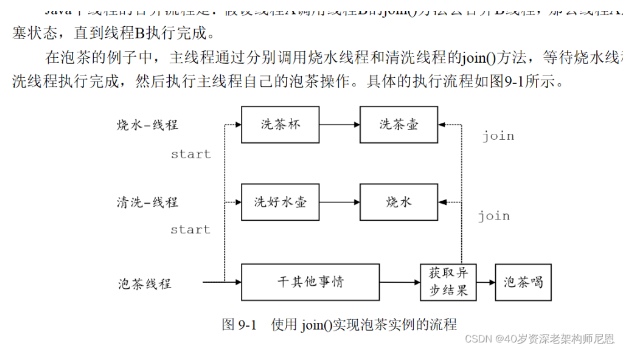
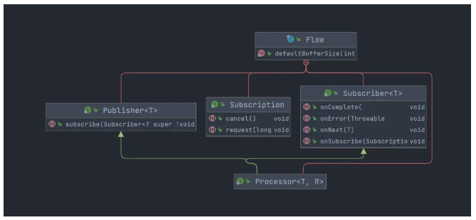
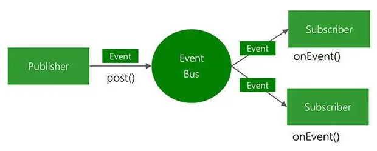
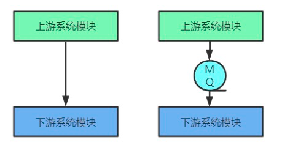
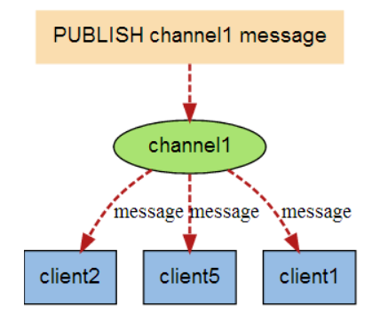
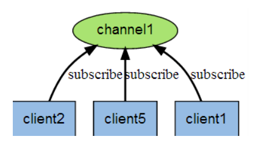
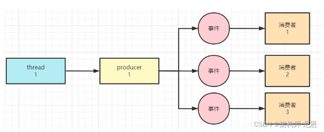
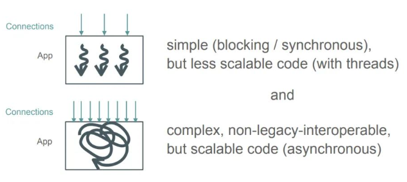

## 京东一面：20多种异步方式，你知道几个？含协程
异步，作为性能调优核心方式之一，经常被用于各种高并发场景。
很多场景多会使用到异步，比如：

- 场景1：超高并发 批量 写 mysql 、批量写 elasticSearch
- 场景2：超高并发 批量  IO
- 场景3：超高并发  发送短信、发邮件
- 场景4：超高并发  发送消息
- 场景5：超高吞吐 生产者、 消费者  场景
- 场景6：超高吞吐 发布、 订阅 场景
- 场景7：分布式的 通知场景
- 场景8：异步回调场景
- 场景9：其他的  异步场景， 不知道能列举出多少，总之非常多

总之，异步，作为性能调优核心方式之一，经常被用于各种高并发场景。
所以，异步是一个非常、非常核心的面试知识点。
在40岁老架构师 尼恩的读者交流群（50多个群）中，其相关面试题，也是一个非常、非常高频的交流话题。其大概的出题形式有：

- 形式1：异步化作为应用调优的一个常用方式，你知道具体有几种方式实现吗？
- 形式2：异步的实现方式有几种？
- 形式3：异步调用，你知道哪些？
- 形式4：异步调用，你用过哪些？
- 形式5：实现异步的10多种方式，你用过哪些？
- 形式6：实现异步的10多种方式，你知道几个？ （出自社群 美团一面）
- 形式7：请参考 《尼恩Java面试宝典》，还有很多变种........。

这里尼恩给大家做一下系统化、体系化的梳理，展示一下大家雄厚的 “技术肌肉”，让面试官爱到 “不能自已、口水直流”。<br>
现在把这个 题目以及参考答案，收入咱们的 《尼恩Java面试宝典》V40版，<br>
供后面的小伙伴参考，提升大家的 3高 架构、设计、开发水平。<br>

### 首先、什么是异步？
- 同步：
调用方在调用过程中，***持续阻塞，一直到返回结果***。
同步获取结果的方式是： ***主动等待***。

- 异步：
调用方在调用过程中，***不会阻塞，不直接等待返回结果，而是执行其他任务***。
异步获取结果的方式是：***被动通知或者 被动回调***。

### 然后,梳理一下异步的20种实现方式
- 1.新建线程Thread 实现异步
- 2.线程池化 实现异步
- 3.Future 阻塞式异步
- 4.Guava 回调式异步
- 5.Netty 回调式异步
- 6.Servlet 3.0 异步
- 7.CompletableFuture 回调式异步
- 8.JDK 9 Flow 响应式编程
- 9.RxJava 响应式 异步
- 10.Reactor 响应式 异步
- 11.Spring注解@Async  异步
- 12.EventBus 框架 发布订阅模式异步
- 13.Spring ApplicationEvent 事件 发布订阅模式
- 14.RocketMq 消息队列 分布式 发布订阅模式（Pub/Sub） 异步
- 15.Redis 消息队列 分布式 发布订阅模式（Pub/Sub）  异步
- 16.Distruptor 框架异步
- 17.ForkJoin 框架异步
- 18.RocketMQ源码中ServiceThread 能急能缓的高性能异步
- 19.Kotlin 协程 异步
- 20.Project Loom[隐约出现，赫然耸现；逼近，临近] 异步

#### 方式1：新建线程Thread异步
在《Java 高并发核心 编程 卷2 加强版》 9.2.1 小节中，介绍了一个经典的 异步案例《泡茶的案例》：
分别设计三条线程：
泡茶线程（MainThread，主线程）、
烧水线程（HotWarterThread）、
清洗线程（WashThread）。

- 泡茶线程的工作是：启动清洗线程、启动烧水线程，等清洗、烧水的工作完成后，泡茶喝；
- 清洗线程的工作是：洗茶壶、洗茶杯；
- 烧水线程的工作是：洗好水壶，灌上凉水，放在火上，一直等水烧开。

其中，负责烧水的线程HotWarterThread、负责WashThread 的线程，
都是通过线程Thread异步 的方式，完成异步执行的。

具体的内容和示意图，来自于 《Java 高并发核心 编程 卷2 加强版》 9.2.1 小节。 示意图如下：



线程Thread异步的知识非常多，是Java 高并发的基础知识，

#### 方式2：线程池化 异步
Thread线程和OS内核线程，是一一对应的关系，频繁的创建、销毁，浪费系统资源，
并且涉及到进行内核态和用户态的切换，这一切的一切，都是低性能的。

```
Thread线程和OS内核线程，是一一对应的关系，频繁的创建、销毁，浪费系统资源
并且涉及到进行内核态和用户态的切换，这一切一切，都是低性能的
```

如何提升性能呢？可以将 线程池化 ，就是线程池。

我们可以采用线程池， 下面的代码，是来自于经历过 双十一 100Wqps 超高并发考验的 JD Hotkey框架的源码：

```java
public class AsyncPool {
    private static ExecutorService threadPoolExecutor = Executors.newCachedThreadPool();

    public static void asyncDo(Runnable runnable) {
        threadPoolExecutor.submit(runnable);
    }

    public static void shutDown() {
        threadPoolExecutor.shutdown();
    }
}
```

然后，可以将业务逻辑封装到Runnable或Callable中，交由线程池来执行。
下面的业务代码， 
是尼恩的第26章视频中基于 JD hotkey 源码二次定制的、 用于 实现三级缓存的 数据一致性的 异步刷新代码：
```java
package com.jd.platform.hotkey.worker.netty.pusher;
/**
 * 推送到各客户端服务器
 *
 * @author wuweifeng wrote on 2020-02-24
 * @version 1.0
 */
@Component
public class RocketMqPusher implements IPusher {
    /**
     * 热key集中营
     */
    private static LinkedBlockingQueue<HotKeyModel> hotKeyStoreQueue = new LinkedBlockingQueue<>();

    private static Logger logger = LoggerFactory.getLogger(RocketMqPusher.class);

    @Resource
    MqSender mqSender;
    
    public static class MqSender{

      public   DefaultMQProducer mqProducer;
      public   String topic;

        public MqSender(DefaultMQProducer mqProducer, String topic) {
            this.mqProducer = mqProducer;
            this.topic = topic;
        }

        public void sendToMq(Command cmd) {
            Message msg = new Message(topic, "", "", cmd.json().getBytes());
            try {
                mqProducer.send(msg, 100000);
            } catch (Exception e) {
                logger.error("Failed to publish {} to RocketMQ", cmd.json(), e);
            }
        }
    }

    /**
     * 给客户端推key信息
     */
    @Override
    public void push(HotKeyModel model) {
        hotKeyStoreQueue.offer(model);
    }

    @Override
    public void remove(HotKeyModel model) {
//        push(model);
    }

    /**
     * 和dashboard那边的推送主要区别在于，给app推送每10ms一次，dashboard那边1s一次
     */
    @PostConstruct
    public void batchPushToClient() {
        AsyncPool.asyncDo(() -> {
            while (true) {
                try {
                    List<HotKeyModel> tempModels = new ArrayList<>();
                    //每10ms推送一次 drain：（使）排出；下水道，排水管；流失，消耗；
                    Queues.drain(hotKeyStoreQueue, tempModels, 10, 10, TimeUnit.MILLISECONDS);
                    if (CollectionUtil.isEmpty(tempModels)) {
                        continue;
                    }
                    String[] keys = tempModels.stream().map(m -> m.getKey()).toArray(String[]::new);
                    mqSender.sendToMq(new Command(Command.OPT_HOT_KEY, null, keys));
                } catch (Exception e) {
                    e.printStackTrace();
                }
            }
        });
    }
}
```

线程Thread异步的知识非常多，是Java 高并发的基础知识，

#### 方式3：Future 阻塞式异步
为了获取异步线程的返回结果，以及更好的对异步线程的干预，
Java在1.5版本之后提供了一种新的多线程的创建方式—— FutureTask方式。

FutureTask方式包含了一系列的Java相关的类，处于java.util.concurrent包中。
使用FutureTask方式进行异步调用时，所涉及的重要组件为FutureTask类和Callable接口。
Future 的调用方式，属于阻塞式异步

> Future的调用方式，属于阻塞式异步

主要原因在于，在获取异步线程处理结果时，需要主线程主动通过Future.get()  去获取，
如果异步线程没有执行完，那么Future.get() 会阻塞 调用线程，一直到超时。
参考的代码如下：

阻塞式异步Future的不足之处
Future的不足之处的包括以下几点：
- 无法被动接收异步任务的计算结果：
虽然我们可以主动将异步任务提交给线程池中的线程来执行，但是待异步任务执行结束之后，
主线程无法得到任务完成与否的通知，它需要通过get方法主动获取任务执行的结果。

- Future间彼此孤立：
有时某一个耗时很长的异步任务执行结束之后，你想利用它返回的结果再做进一步的运算，
该运算也会是一个异步任务，两者之间的关系需要程序开发人员手动进行绑定赋予，
Future并不能将其形成一个任务流（pipeline），
每一个Future都是彼此之间都是孤立的，所以才有了后面的CompletableFuture，
CompletableFuture就可以将多个Future串联起来形成任务流。

- Futrue没有很好的错误处理机制：
截止目前，如果某个异步任务在执行发的过程中发生了异常，调用者无法被动感知，
必须通过捕获get方法的异常才知晓异步任务执行是否出现了错误，从而在做进一步的判断处理。

> 伪异步 与 纯异步

异步调用目的在于防止当前业务线程被阻塞。
但是 Future 阻塞式异步 属于 伪异步

- 伪异步 就是 将任务包装为Runnable/ Callable 作为Biz业务线程（被调用线程）的任务去执行，并调用方阻塞等待，当前Biz 线程不阻塞；
- 纯异步为回调式 异步。他们的区别不在于是否将请求放入另一个线程池执行，而在于是否有线程阻塞等待Response。

在前面的异步阻塞版本的泡茶喝的实现中：

- 泡茶线程是调用线程，
- 烧水（或者清洗）线程是被调用线程，
- 调用线程和被调用线程之间是一种主动关系，而不是被动关系。
- 泡茶线程需要主动获取烧水（或者清洗）线程的执行结果，二者协同的方式是调用方阻塞。

为什么说二者协同的方式是调用方阻塞？调用方线程需要通过join()或Future.get()阻塞式的干预异步操作或者获取 异步结果，
这里，是阻塞模式的异步， 伪异步

这种调用方线程的阻塞，是线程资源的一种浪费。
线程资源，是宝贵的。怎么充分的利用线程资源呢？
有效方式之一： 回调模式的 异步。实现 纯纯的异步

```
线程资源是宝贵的，怎么充分的利用线程资源呢
有效方式之一：回调模式的异步，实现纯纯的异步
```

#### 方式4：guava 回调式异步
由于JDK在1.8之前没有 回调式异步组件，于是出现了很多 开源的 回调式异步组件。
比较常用的是 guava 的回调式异步。
Guava是Google提供的Java扩展包，它提供了一种异步回调的解决方案。
Guava中与异步回调相关的源码处于com.google.common.util.concurrent包中。
包中的很多类都用于对java.util.concurrent的能力扩展和能力增强。
比如，Guava的异步任务接口ListenableFuture扩展了Java的Future接口，实现了异步回调的的能力。

```
Guava的异步任务接口ListenerFuture扩展了Java的Future接口
实现了异步回调的能力
```

#### 方式5：Netty 回调式异步
由于JDK在1.8之前没有 回调式异步组件，于是出现了很多 开源的 回调式异步组件。
Netty  也算其中之一。
Netty  是 一个 著名的高性能NIO王者框架， 是 IO 的王者组件。 具体，请参见尼恩梳理的四大王者组件。
Netty  除了作为NIO框架之王，其子模块也是可以单独使用的，比如说异步回调模块。

Netty的回调式异步组件 更加牛掰，为啥呢？<br>
通过Netty源码可以知道： Netty  的 回调式异步组件不光提供了外部的回调监听设置，
而且可以在异步代码中， 通过Promise接口，
可以对回调结果进行干预，比如说在进行回调之前，执行一些其他的操作。
当然，Netty的源码更加复杂，这部分内容， 请参考尼恩的《第21章视频，彻底穿透Netty源码视频》。

##### Callback Hell（回调地狱）问题
无论是 Google Guava 包中的 ListenableFuture，
还是 Netty的 GenericFutureListener，都是需要设置专门的Callback 回调钩子

Guava 包中的 ListenableFuture，设置Callback 回调钩子的实例如下：
```
ListenableFuture<Boolean> wFuture = gPool.submit(wJob);
Futures.addCallback(wFuture, new FutureCallback<Boolean>() {
    public void onSuccess(Boolean r) {
        if (!r) {
            Print.tcfo("杯子洗不了，没有茶喝了");
        } else {
            countDownLatch.countDown();
        }
    }
    public void onFailure(Throwable t) {
        Print.tcfo("杯子洗不了，没有茶喝了");
    }
});
```

调用方通过 Futures.addCallback() 添加处理结果的回调函数。
这样避免获取并处理异步任务执行结果阻塞调起线程的问题。

```
调用方通过Futures.addCallback()添加处理结果的回调函数
这样避免获取并处理异步任务执行结果阻塞调起线程的问题
```

Callback 是将任务执行结果作为接口的入参，在任务完成时回调 Callback 接口，执行后续任务，
从而解决纯 Future 方案无法方便获得任务执行结果的问题。
但 Callback 产生了新的问题，那就是代码可读性的问题。

因为使用 Callback 之后，代码的字面形式和其所表达的业务含义不匹配，
即业务的先后关系到了代码层面变成了包含和被包含的关系。
因此，***如果大量使用 Callback 机制，将使大量的存在先后次序的业务逻辑，在代码形式上，转换成层层嵌套***，
从而导致：业务先后次序在代码维度被打乱，最终造成代码不可理解、可读性差、难以理解、难以维护。
这便是所谓的 Callback Hell（回调地狱）问题。

```
如果大量使用Callback机制，将使大量的存在先后次序的业务逻辑，
在代码形式上，转换成层层嵌套
从而导致：业务先后次序在代码维度被打乱，最终造成代码不可理解、可读性差、难以理解、难以维护。
这便是所谓的Callback Hell（回调地狱）问题
```

Callback Hell 问题可以从两个方向进行一定的解决：
- 一是链式调用
- 二是事件驱动机制。

前者被 CompletableFuture、反应式编程等技术采用，后者被如 EventBus、Vert.x 所使用。

```
Callback Hell 问题可以从两个方向进行一定的解决
一是链式调用
二是事件驱动机制
前者被CompletableFuture、反应式编程等技术采用
后者被如EventBus、Vert.x所使用
```

#### 方式6：Servlet 3.0  异步
梳理一下： Callback 异步回调的使用场景。
Callback 真正体现价值，是它与 NIO 技术结合之后。

- CPU 密集型场景，采用 Callback 回调没有太多意义；
- IO 密集型场景，如果是使用 BIO模式，Callback 同样没有意义，
因为一个连接一个线程，IO线程是因为 IO 而阻塞。
- IO 密集型场景，如果是使用 NIO 模式，使用Callback  才有意义。 
NIO是少量IO线程负责大量IO通道，IO线程需要避免线程阻塞，所以，也必须使用 Callback ，才能使应用得以被开发出来。

所以，高性能的 NIO 框架如 Netty ，都是基于 Callback 异步回调的。
但是，在微服务流行的今天，Netty 却没有在WEB服务器中占据统治地位。
微服务系统中，多级服务调用很常见，一个服务先调 A，再用结果 A 调 B，然后用结果 B 调用 C，等等。
如果使用Netty 作为底层服务器，IO 线程能大大降低，能处理的连接数（/请求数）也能大大增加，
那么，为啥Netty 却没有在WEB服务器中占据统治地位呢？

这其中的难度来自两方面：
- 一是 NIO 和 Netty 本身的技术难度，
- 二是 Callback hell：Callback 风格所导致的代码理解和维护的困难。

因此，Netty 通常用于在基础架构层面，在业务系统中应用较少。
这也是大厂小伙人人要求 精通Netty，而中小厂小伙伴，不怎么认识Netty的原因。
当然，作为IO之王，学习Netty对应提升大家的内功，是至关重要的。
Netty的知识，具体请参见《Java高并发核心编程 卷1 加强版》,很多小伙伴，靠此书入的门。
直接使用 Netty 开发WEB应用会遇到技术难度挑战、以及 Callback Hell 问题。
所以，Servlet 3.0 提供了一个异步解决方案。

什么是servlet异步请求
Servlet 3.0 之前，一个普通 Servlet 的主要工作流程大致如下：
- （1）Servlet 接收到请求之后，可能需要对请求携带的数据进行一些预处理；
- （2）调用业务接口的某些方法，以完成业务处理；
- （3）根据处理的结果提交响应，Servlet 线程结束。
其中第二步处理业务逻辑时候很可以碰到比较耗时的任务，此时servlet主线程会阻塞等待完成业务处理，
对于并发比较大的请求可能会产生性能瓶颈，则servlet3.0之后再此处做了调整，引入了异步的概念。

```
Servlet3.0之后在此处做了调整，引入了异步的概念
```

（1）Servlet 接收到请求之后，可能需要对请求携带的数据进行一些预处理；
（2）调用业务接口的某些方法过程中request.startAsync()请求，获取一个AsyncContext
（3）紧接着servlet线程退出(回收到线程池)，***但是响应response对象仍旧保持打开状态，新增线程会使用AsyncContext处理并响应结果***。
（4）AsyncContext处理完成触发某些监听通知结果

```java
@WebServlet(urlPatterns = "/demo", asyncSupported = true)
public class AsyncDemoServlet extends HttpServlet {
    @Override
    public void doGet(HttpServletRequest req, HttpServletResponse resp) throws IOException, ServletException {
    // Do Something
    
        AsyncContext ctx = req.startAsync();
        startAsyncTask(ctx);
    }
}
private void startAsyncTask(AsyncContext ctx) {
    requestRpcService(result -> {
        try {
            PrintWriter out = ctx.getResponse().getWriter();
            out.println(result);
            out.flush();
            ctx.complete();
        } catch (Exception e) {
            e.printStackTrace();
        }
    });
}
```

Servlet 3.0 的出现，解决了在过去基于 Servlet 的 Web 应用中，
接受请求和返回响应必须在同一个线程的问题，实现了如下目标：

- 1.可以避免了Web 容器的线程被阻塞挂起
- 2.使请求接收之后的任务处理可由专门线程完成
- 3.不同任务可以实现线程池隔离
- 4.结合 NIO 技术实现更高效的 Web 服务

除了直接使用 Servlet 3.0，也可以选择 Spring MVC 的 Deferred Result。
示例：Spring MVC DeferredResult

```
@GetMapping("/async-deferredresult")
public DeferredResult<ResponseEntity<?>> handleReqDefResult(Model model) {
    LOG.info("Received async-deferredresult request");
    DeferredResult<ResponseEntity<?>> output = new DeferredResult<>();

    ForkJoinPool.commonPool().submit(() -> {
        LOG.info("Processing in separate thread");
        try {
            Thread.sleep(6000);
        } catch (InterruptedException e) {
        }
        output.setResult(ResponseEntity.ok("ok"));
    });

    LOG.info("servlet thread freed");
    return output;
}
```

Servlet 3.0 的技术局限
Servlet 3.0 并不是用来解决前面提到的 Callback Hell 问题的，它只是降低了异步 Web 编程的技术门槛。
对于 Callback Hell 问题，使用 Servlet 3.0 或类似技术时同样会遇到。
解决 Callback Hell 还需另寻他法。

#### 方式7：回调式 异步CompletableFuture
JDK 1.8之前并没有实现回调式的异步，CompletableFuture是JDK 1.8引入的实现类，实现了JDK内置的异步回调模式异步。<br>
CompletableFuture的创新是：通过 链式调用，解决  Callback Hell（回调地狱）问题， 让代码变得的可理解性更强，可读性 更强。<br>

```
CompletableFuture的创新是：
通过链式调用，解决Callback Hell（回调地狱）问题
让代码可读性更强
```
CompletableFuture 该类实现了Future和CompletionStage两个接口。
该类的实例作为一个异步任务，可以在自己异步执行完成之后触发一些其他的异步任务，从而达到异步回调的效果。
使用CompletableFuture实现泡茶喝实例的实现，参考如下：
```java
package com.crazymakercircle.completableFutureDemo;

import com.crazymakercircle.util.Print;

import java.util.concurrent.CompletableFuture;

import static com.crazymakercircle.util.ThreadUtil.sleepSeconds;

public class DrinkTea {
    private static final int SLEEP_GAP = 3;//等待3秒
    public static void main(String[] args) {
        // 任务 1
        CompletableFuture<Boolean> washJob =
                CompletableFuture.supplyAsync(() ->
                {
                    Print.tcfo("洗茶杯");
                    //线程睡眠一段时间，代表清洗中
                    sleepSeconds(SLEEP_GAP);
                    Print.tcfo("洗完了");
                    return true;
                });

        // 任务 2
        CompletableFuture<Boolean> hotJob =
                CompletableFuture.supplyAsync(() ->
                {
                    Print.tcfo("洗好水壶");
                    Print.tcfo("烧开水");
                    //线程睡眠一段时间，代表烧水中
                    sleepSeconds(SLEEP_GAP);
                    Print.tcfo("水开了");
                    return true;
                });
        // 任务 3：任务 1 和任务 2 完成后执行：泡茶
        CompletableFuture<String> drinkJob =
                washJob.thenCombine(hotJob, (hotOk, washOK) ->
                {
                    if (hotOk && washOK) {
                        Print.tcfo("泡茶喝，茶喝完");
                        return "茶喝完了";
                    }
                    return "没有喝到茶";
                });

        // 等待任务 3 执行结果
        Print.tco(drinkJob.join());
    }
}
```

#### 方式8：JDK 9 Flow 响应式编程
但是 JDK 8 的 CompletableFuture  属于链式调用，它在形式上带有一些***响应式编程的函数式代码风格***。
```
JDK8的CompletableFuture属于链式调用
它在形式上带有一些响应式编程的函数式代码风格
```

因为 Callback Hell 对代码可读性有很大杀伤力，从开发人员的角度来讲，
反应式编程技术和链式调用一样，使得代码可读性要比 Callback 提升了许多。
响应式流从2013年开始，作为提供***非阻塞背压的异步流处理***标准的倡议。
Reactive Stream是一套基于发布/订阅模式的数据处理规范。
```
Reactive Stream是一套基于发布/订阅模式的数据处理规范
```
更确切地说，Reactive流目的是“找到最小的一组接口，方法和协议，用来描述必要的操作和实体以实现这样的目标：以非阻塞背压方式实现数据的异步流”。

响应式流（Reactive Streams）是一个响应式编程的规范，
用来为具有非阻塞背压（Back pressure）的异步流处理提供标准，
用最小的一组接口、方法和协议，用来描述必要的操作和实体。
这里涉及到一个关键概念叫 Backpressure，国内大部分翻译为背压，我们先来了解这是什么。

响应式编程，其实就是对数据流的编程，而对流的处理对数据流的变化进行响应，
是通过异步监听的方式来处理的。
既然是异步监听，就涉及到监听事件的发布者和订阅者，数据流其实就是由发布者生产，
再由一个或多个订阅者进行消费的元素（item）序列。

那么，如果发布者生产元素的速度和订阅者消费元素的速度不一样，
是否会出现问题呢？其实就两种情况：
- 发布者生产的速度比订阅者消费的速度慢，那生产的元素可以及时被处理，订阅者处理完只要等待发布者发送下一元素即可，这不会产生什么问题。
- 发布者生产的速度比订阅者消费的速度快，那生产的元素无法被订阅者及时处理，就会产生堆积，如果堆积的元素多了，订阅者就会承受巨大的资源压力(pressure)而有可能崩溃。

要应对第二种情况，就需要进行***流控制（flow control）***。

流控制有多种方案，其中一种机制就是 Back pressure，即背压机制，
其实就是下游能够向上游反馈流量需求的机制。

```
流控制有多种方案
其中一种机制就是Back Pressure，即背压机制
其实就是下游能够向上游反馈流量需求的机制
```

如果生产者发出的数据比消费者能够处理的数据量大而且快时，
消费者可能会被迫一直再获取或处理数据，消耗越来越多的资源，从而埋下潜在的风险。
为了防止这一点，消费者可以通知生产者降低生产数据的速度。
生产者可以通过多种方式来实现这一要求，这时候我们就会用到背压机制。

采用背压机制后，消费者告诉生产者降低生产数据速度并保存元素，
知道消费者能够处理更多的元素。使用背压可以有效地避免过快的生产者压制消费者。
如果生产者要一直生产和保存元素，使用背压也可能会要求其拥有无限制的缓冲区。
生产者也可以实现有界缓冲区来保存有限数量的元素，如果缓冲区已满可以选择放弃。

背压的实现方式：
背压的实现方式有两种：
- 一种是阻塞式背压
- 另一种是非阻塞式背压。

```
背压的实现方式有两种
一种是阻塞式背压
另一种是非阻塞式背压
```

- 1、阻塞式背压
阻塞式背压是比较容易实现的，
例如：当生产者和消费者在同一个线程中运行时，其中任何一方都将阻塞其他线程的执行。
这就意味着，当消费者被执行时，生产者就不能发出任何新的数据元素。
因而也需要一种自然地方式来平衡生产数据和消费数据的过程。

在有些情况下，阻塞式背压会出现不良的问题， 
比如：当生产者有多个消费者时，不是所有消费者都能以同样的速度消费消息。
当消费者和生产者在不同环境中运行时，这就达不到降压的目的了。

- 2、非阻塞式背压
背压机制应该以非阻塞式的方式工作，实现非阻塞式背压的方法是放弃推策略，采用拉策略。
生产者发送消息给消费者等操作都可以保存在拉策略当中，消费者会要求生产者生成多少消息量，
而且最多只能发送这些量，然后等到更多消息的请求。

OK，Backpressure 解释完毕。 其实，《Java 高并发核心编程卷3 加强版》介绍得更加清楚，大家可以系统化的去看看书。

JDK 8 的 CompletableFuture 不算是反应式编程，不遵守Reactive Stream (响应式流/反应流) 规范。
JDK 9 Flow 是JDK对Reactive Stream (响应式流/反应流) 的实现，
Java 9中新增了反应式/响应式编程的Api-Flow。

```
JDK 8的CompletableFuture不算是反应式编程，不遵守Reactive Stream（响应式流/反应流）规范
JDK 9 Flow是JDK对Reactive Stream（响应式流/反应流）的实现
Java 9中新增了反应式/响应式编程的Api-Flow
```

在Flow中存在Publisher（发布者）、Subscriber（订阅者）、Subscription（订阅）和`Processor（处理器）。
- Publisher[发布者]
- Subscriber[订阅者]
- Subscription[订阅]
- Processor[处理器]

Flow结构如下:


JDK 9 Flow 旨在解决处理元素流的问题——如何将元素流从发布者传递到订阅者，
而不需要发布者阻塞，或订阅者需要有无限制的缓冲区或丢弃。

当然，实施响应式编程，需要完整的解决方案，单靠 Flow 是不够的，
还是需要Netflix  RxJava、 Project Reactor 这样的完整解决方案。

```
实施响应式编程，需要完整的解决方案，单靠Flow 是不够的
还是需要Netflix RxJava、Project Reactor这样的完整解决方案
```

但是， JDK 层面的技术能提供统一的技术抽象和实现，在统一技术方面还是有积极意义的。
所以，这里不对 JDK 9 Flow  做介绍。

#### 方式9：RxJava 响应式异步
在JDK 9 Flow 之前，响应式编程 的框架，早就存在。<br>
比如说， 席卷了android 端编程的 RxJava 框架。<br>
RxJava 是一种响应式编程，来创建基于事件的异步操作库。<br>

```
RxJava是一种响应式编程，来创建基于事件的异步操作库
```

这个组件，是 Netflix的杰作，也叫作Netflix  RxJava。
这个框架，在Java 后端的中间件中，也有广泛使用，比如在Hystrix 源码中，就用大量用到。

```
Netflix RxJava 在后端的中间件中，也有广泛的使用，比如在Hystrix源码中，就大量有用到
```

总之，RxJava 框架很重要，具体请参见 《Java 高并发核心编程 卷3 加强版》
使用 RxJava  基于事件流的链式调用、代码 逻辑清晰简洁。

```
使用RxJava基于事件流的链式调用、代码、逻辑清晰简洁
```

```java
package com.crazymakercircle.completableFutureDemo;

import com.crazymakercircle.util.Print;
import io.reactivex.Observable;
import io.reactivex.schedulers.Schedulers;
import org.junit.Test;

import java.util.concurrent.CompletableFuture;

import static com.crazymakercircle.util.ThreadUtil.sleepMilliSeconds;
import static com.crazymakercircle.util.ThreadUtil.sleepSeconds;

public class IntegrityDemo {
    /**
     * 模拟模拟RPC调用1
     */
    public String rpc1() {
        //睡眠400ms,模拟执行耗时
        sleepMilliSeconds(600);
        Print.tcfo("模拟RPC调用：服务器 server 1");
        return "sth. from server 1";
    }

    /**
     * 模拟模拟RPC调用2
     */
    public String rpc2() {
        //睡眠400ms,模拟执行耗时
        sleepMilliSeconds(600);
        Print.tcfo("模拟RPC调用：服务器 server 2");
        return "sth. from server 2";
    }

    /**
     * CompletableFuture
     * @throws Exception
     */
    @Test
    public void rpcDemo() throws Exception {
        // rpc1
        CompletableFuture<String> future1 = CompletableFuture.supplyAsync(() ->
        {
            return rpc1();
        });
        // rpc2
        CompletableFuture<String> future2 = CompletableFuture.supplyAsync(() -> rpc2());
        // 结合
        CompletableFuture<String> future3 = future1.thenCombine(future2,
                (out1, out2) ->
                {
                    return out1 + " & " + out2;
                });
        // 阻塞 
        String result = future3.get();
        Print.tco("客户端合并最终的结果：" + result);
    }

    /**
     * RxJava
     * @throws Exception
     */
    @Test
    public void rxJavaDemo() throws Exception {
        Observable<String> observable1 = Observable.fromCallable(() ->
        {
            return rpc1();
        }).subscribeOn(Schedulers.newThread());
        
        Observable<String> observable2 = Observable
                .fromCallable(() -> rpc2()).subscribeOn(Schedulers.newThread());

        Observable.merge(observable1, observable2)
                .observeOn(Schedulers.newThread())
                .toList()
                .subscribe((result) -> Print.tco("客户端合并最终的结果：" + result));

        sleepSeconds(Integer.MAX_VALUE);
    }
}
```

#### 方式10：Reactor 响应式 异步
目前，在 Java 领域实现了反应式编程的技术除了 Netflix RxJava ，
还有 Spring 的 Project Reactor。
Netflix 网飞 的RxJava 出现时间更早，在前端开发领域应用的比后端更要广泛一些。
Spring 的 Project Reactor的 3.0 版本作为 Spring 5 的基础，
在17年底发布，推动了后端领域反应式编程的发展。
关于Reactor 响应式异步的 内容，请参考尼恩的另外一篇博客，

Flux、Mono、Reactor 实战（史上最全）(https://blog.csdn.net/crazymakercircle/article/details/124120506)
这篇文章，被小伙伴认为是全网介绍 Reactor 组件讲得最好的文章，

其实尼恩的其他文章，非常优质，大家都可以看看。
由于性能比较高，响应式编程越来越普及， 建议大家及早掌握。
尼恩的50个群中，很多开始响应式编程的小伙伴反馈： 入手难、后面爽。

#### 方式11：Spring的@Async异步
在Spring中，使用@Async标注某方法，可以使该方法变成异步方法，
这些方法在被调用的时候，将会在独立的线程中进行执行，调用者不需等待该方法执行完成。

但在Spring中使用@Async注解，需要使用@EnableAsync来开启异步调用。

```
在Spring中使用@Async注解，需要使用@EnableAsync来开启异步调用
```

一个 AsyncService参考代码如下：
```java
public interface AsyncService {
    MessageResult sendSms(String callPrefix, String mobile, String actionType, String content);
    MessageResult sendEmail(String email, String subject, String content);
}
```

```java
@Slf4j
@Service
public class AsyncServiceImpl implements AsyncService {

    @Autowired
    private IMessageHandler messageHandler;

    @Override
    @Async("taskExecutor")
    public MessageResult sendSms(String callPrefix, String mobile, String actionType, String content) {
        try {

            Thread.sleep(1000);
            messageHandler.sendSms(callPrefix, mobile, actionType, content);

        } catch (Exception e) {
            log.error("发送短信异常 -> ", e)
        }
    }
    
    @Override
    @Async("taskExecutor")
    public sendEmail(String email, String subject, String content) {
        try {

            Thread.sleep(1000);
            messageHandler.sendsendEmail(email, subject, content);

        } catch (Exception e) {
            log.error("发送email异常 -> ", e)
        }
    }
}
```
@Async注解，默认使用系统自定义线程池。
在实际项目中，推荐方式是使用自定义线程池的模式。
可在项目中设置多个线程池，在异步调用的时候，指明需要调用的线程池名称，比如：
@Async("taskName")
自定义异步线程池的代码如下
```java
/**
 * 线程池参数配置，多个线程池实现线程池隔离
 * 
 */
@EnableAsync
@Configuration
public class TaskPoolConfig {
    /**
     * 自定义线程池
     *
     **/
    @Bean("taskExecutor")
    public Executor taskExecutor() {
        // 返回可用处理器的Java虚拟机的数量 12
        // Runtime.getRuntime().availableProcessors()
        int i = Runtime.getRuntime().availableProcessors();
        System.out.println("系统最大线程数  ： " + i);
        ThreadPoolTaskExecutor executor = new ThreadPoolTaskExecutor();
        //核心线程池大小
        executor.setCorePoolSize(16);
        //最大线程数
        executor.setMaxPoolSize(20);
        //配置队列容量，默认值为Integer.MAX_VALUE
        executor.setQueueCapacity(99999);
        //活跃时间
        executor.setKeepAliveSeconds(60);
        //线程名字前缀
        executor.setThreadNamePrefix("asyncServiceExecutor -");
        //设置此执行程序应该在关闭时阻止的最大秒数，以便在容器的其余部分继续关闭之前等待剩余的任务完成他们的执行
        executor.setAwaitTerminationSeconds(60);
        //等待所有的任务结束后再关闭线程池
        executor.setWaitForTasksToCompleteOnShutdown(true);
        return executor;
    }
}
```

#### 方式12：EventBus 发布订阅模式异步
实际开发中，常常 通过事件总线EventBus/AsyncEventBus进行JAVA模块解耦 ，
比如，在顶级开源组件 JD hotkey的源码中， 就多次用到 EventBus/AsyncEventBus进行JAVA模块解耦
掌握了 EventBus ，在平时的开发中，多了一个神器
EventBus 是 Guava 的事件处理机制，是观察者模式（生产/消费模型）的一种实现。

EventBus是google的Guava库中的一个***处理组件间通信的事件总线***，
它基于发布/订阅模式，实现了多组件之间通信的解耦合，
事件产生方和事件消费方实现解耦分离，提升了通信的简洁性。

```
EventBus是google的Guava库中的一个处理组件间通信的事件总线
它基于发布/订阅模式，实现了多组件之间通信的解耦
事件产生方和事件消费方实现解耦分离，提升了通信的简洁性
```

观察者模式在我们日常开发中使用非常广泛，
例如在订单系统中，订单状态或者物流信息的变更会向用户发送APP推送、短信、通知卖家、买家等等；
审批系统中，审批单的流程流转会通知发起审批用户、审批的领导等等。

Observer模式也是 JDK 中自带就支持的，
其在 1.0 版本就已经存在 Observer，

不过随着 Java 版本的飞速升级，其使用方式一直没有变化，
许多程序库提供了更加简单的实现，例如 Guava EventBus、RxJava、EventBus 等

为什么要用 EventBus ，其优点 ？
- 相比 Observer 编程简单方便
- 通过自定义参数可实现同步、异步操作以及异常处理
- 单进程使用，无网络影响

缺点
- 只能单进程使用
- 项目异常重启或者退出不保证消息持久化

如果需要分布式使用还是需要使用 MQ

##### 使用事件总线的场景
当一个事件的发生(事件产生方)，需要触发很多事件(事件消费方)的时候，我们通常会在事件产生方中，分别的去调用那些事件消费方，这样往往是很浪费资源。
事件的产生方与事件的消费方，产生了极大的耦合，如果我们要改动某一个事件消费方，我们很可能还要改动事件的产生方。

在工作中，经常会遇见使用异步的方式来发送事件，
或者触发另外一个动作：经常用到的框架是MQ（分布式方式通知）;  
如果是同一个jvm里面通知的话，就可以使用EventBus 事件总线。

由于EventBus使用起来简单、便捷，因此，工作中会经常用到。

EventBus 是线程安全的，分发事件到监听器，并提供相应的方式让监听器注册它们自己。
EventBus允许组件之间进行 “发布-订阅” 式的通信，而不需要这些组件彼此知道对方。
EventBus是专门设计用来替代传统的Java进程内的使用显示注册方式的事件发布模式。
EventBus不是一个通用的发布-订阅系统，也不是用于进程间通信。

EventBus有三个关键要素：


- 1、事件（Event)
事件是EventBus之间相互通信的基本单位，一个Event可以是任何类型。
对，没错，就是Object，只要你想将任意一个Bean作为事件，这个类不需要做任何改变，就可以作为事件Event。
不过在项目中不会这么随便（除非对代码严谨度没什么要求）
一般会定义特定的事件类，类名以Event作为后缀，里面定义一些变量或者函数等。

- 2、事件发布者（Publisher）
事件发布者，就是发送事件到EventBus事件总线的一方，事件发布者调用Post()方法，将事件发给EventBus。
你可以在程序的任何地方，调用EventBus的post()方法，发送事件给EventBus，由EventBus发送给订阅者们。

- 3、事件订阅者（Subscriber）
事件订阅者，就是接收事件的一方，这些订阅者需要在自己的方法上，
添加@Subscribe注解声明自己为事件订阅者。
不过只声明是不够的，还需要将自己所在的类，注册到EventBus中，EventBus才能扫描到这个订阅者。

关于EventBus 的 原理和实操内容，请参考尼恩的另外一篇博客，

#### 方法13：Spring ApplicationEvent事件实现异步
Spring内置了简便的事件机制，原理和EventBus 差不多
通过Spring ApplicationEvent事件， 可以非常方便的实现事件驱动，核心类包括
- ApplicationEvent，具体事件内容，事件抽象基类，可继承该类自定义具体事件
- ApplicationEventPublisher，事件发布器，可以发布ApplicationEvent，也可以发布普通的Object对象
- ApplicationListener，事件监听器，可以使用注解@EventListener
- TransactionalEventListener，事务事件监听，可监听事务提交前、提交后、事务回滚、事务完成（成功或失败）

使用示例：不定义事件，直接发布Object对象，同步
##### 1、定义发送事件对象
```java
public class UserEntity {
    private long id;
    private String name;
    private String msg;
}
```

##### 2、定义事件监听器
可以添加条件condition，限制监听具体的事件
```java
@Slf4j
@Component
public class RegisterListener {

    @EventListener(condition = "#entity.id != null and #entity.async==false ")
    public void handlerEvent(UserEntity entity) {

        try {
            // 休眠5秒
            TimeUnit.SECONDS.sleep(5);
        } catch (InterruptedException e) {
            e.printStackTrace();
        }
        log.info("handlerEvent: {}", entity);
    }
}
```

##### 3、定义发送接口以及实现类
```java
public interface IRegisterService {

    public void register(String name);

}
@Service
public class RegisterServiceImpl implements IRegisterService {
    @Resource
    private ApplicationEventPublisher applicationEventPublisher;

    @Override
    public void publish(String name) {
        UserEntity entity = new UserEntity();
        entity.setName(name);
        entity.setId(1L);
        entity.setMsg("新用户注册同步调用");
        applicationEventPublisher.publishEvent(entity);
    }
}
```

##### 4、测试Controller类，进行测试
```java
@Slf4j
@Controller
public class TestController {

    @Resource
    private IRegisterService registerService;

    @RequestMapping("test")
    @ResponseBody
    public void test1(String name) {
        registerService.publish(name);
        log.info("执行同步调用结束");
    }
}
```
在浏览器中输入地址：http://localhost/test?name=nik
控制台输出：
```
handlerEvent: UserEntity(id=1, name=nik, msg=新用户注册同步调用)
执行同步调用结束
```
但是，上面的案例是同步事件，如果需要编程异步事件，还需要加上额外的注解：
- 1、在启动类添加异步注解 @EnableAsync
- 2、在监听方法上添加注解 @Async

```
@Async
@EventListener(condition = "#entity.name != null and #entity.async ")
public void handlerEventAsync(UserEntity entity) {

    try {
        TimeUnit.SECONDS.sleep(5);
    } catch (InterruptedException e) {
        e.printStackTrace();
    }
    log.info("handlerEventAsync: {}", entity);
}
```

#### 方法14： RocketMq 消息队列 分布式 发布订阅模式 异步
上游系统对下游系统的调用若为同步调用，则会大大降低系统的吞吐量与并发度，且系统耦合度太高。
而异步调用则会解决这些问题。
所以两层之间若要实现由同步到异步的转化，一般性做法就是，在这两层间添加一个MQ层。


RocketMq 消息队列 分布式 发布订阅模式（Pub/Sub），
基于事件的系统中，Pub/Sub是目前广泛使用的通信模型，它采用事件作为基本的通信机制，
提供大规模系统所要求的松散耦合的交互模式：订阅者(如客户端)以事件订阅的方式表达出它有兴趣接收的一个事件或一类事件；发布者(如服务器)可将订阅者感兴趣的事件随时通知相关订阅者。

##### 上游生产者参考
- 1.创建producer组
- 2.设置NameServer地址：如果实在安装不上，可以使用这个地址：115.159.88.63:9876
- 3.start生产者
- 4.发送消息获取结果
- 5.结束producer

```java
public class Producer {
    public static void main(String[] args) throws Exception {
        // 1.创建生产者组
        DefaultMQProducer producer = new DefaultMQProducer("producer-hello");

        // 2.设置NameServer地址 NameServer
        producer.setNamesrvAddr("127.0.0.1:9876");

        //3.启动producer实例 producer
        producer.start();

        //4.创建消息 Message
        Message message = new Message("log-topic", "info-tag", "这是一个info信息".getBytes(RemotingHelper.DEFAULT_CHARSET));

        //5.发送消息 
        SendResult result = producer.send(message);

        //6.关闭producer实例
        System.out.println("发送完毕，结果: "+result);
    }
}
```

##### 下游消费者参考
- 1.创建consumer组
- 2.设置Name Server地址
- 3.设置消费位置，从最开始消费
- 4.设置消息回调处理监听 -> 处理消息
- 5.Start consumer

```java
public class Consumer {
    public static void main(String[] args) throws MQClientException {
        //1.创建消费者组
        DefaultMQPushConsumer consumer = new DefaultMQPushConsumer("consumer-hello");

        //2.设置NameServer地址
        consumer.setNamesrvAddr("127.0.0.1:9876");

        //3.订阅topic，指定tag标签
        consumer.subscribe("log-topic","info-tag");

        //4.注册消息监听器
        consumer.registerMessageListener(new MessageListenerConcurrently(){

            public ConsumeConcurrentlyStatus consumeMessage(List<MessageExt> msgs, ConsumeConcurrentlyContext context) {
                System.out.printf("%s 接收到新的消息:  %n", Thread.currentThread().getName());
                msgs.stream().forEach(messageExt -> {
                    String body = null;
                    try {
                        body = new String(messageExt.getBody(), RemotingHelper.DEFAULT_CHARSET);
                    } catch (UnsupportedEncodingException e) {
                        e.printStackTrace();
                    }
                    System.out.println(body);
                });
                //失败消费，稍后尝试消费,会进行多次重试
                //return ConsumeConcurrentlyStatus.RECONSUME_LATER;
                return ConsumeConcurrentlyStatus.CONSUME_SUCCESS;
            }
        });

        //5.启动消费者
        consumer.start();
        System.out.println("消费者启动...");
    }
}
```

- DefaultMQPushConsumer ：消费者 ， 可以指定 consumerGroupName
- consumer.setNamesrvAddr : 设置name server 地址
- consumer.setConsumeFromWhere(ConsumeFromWhere.CONSUME_FROM_FIRST_OFFSET) ：从什么位置开始消费
- consumer.subscribe(“topic_log”, “tags_error”) ：订阅某个topic下的某个tags的消息
- consumer.registerMessageListener ：注册消息监听器，拿到消息后，进行消息处理。
- ConsumeConcurrentlyStatus ：消费者消费结果状态，
  - ConsumeConcurrentlyStatus.CONSUME_SUCCESS代表成功
  - ConsumeConcurrentlyStatus.RECONSUME_LATER代表消费失败，稍后重试，会进行多次重试

#### 方法15：Redis 消息队列 分布式 发布订阅模式 异步
在springboot项目中，一般分布式 发布订阅模式 异步，都是用RocketMQ的方式，
如果集成太麻烦了，而一般系统里面已经有了redis，就用了redis做异步的功能
Redis发布订阅(pub/sub)是一种消息通信模式：
```
发送者(pub)发送消息，
订阅者(sub)接收消息。
```
Redis 发布订阅(pub/sub)实现了消息系统，
发送者(在redis术语中称为发布者)在接收者(订阅者)接收消息时发送消息。
传送消息的链路称为信道。

在Redis中，客户端可以订阅任意数量的信道。
- 消息发布


消息发布者，即publish客户端，无需独占链接，你可以在publish消息的同时，使用同一个redis-client链接进行其他操作（例如：INCR等）

- 消息订阅


消息订阅者，即subscribe客户端，需要独占链接，即进行subscribe期间，redis-client无法穿插其他操作，
此时client以阻塞的方式等待“publish端”的消息；这一点很好理解，因此subscribe端需要使用单独的链接，甚至需要在额外的线程中使用。

Redis 消息队列特点
- 发送者（发布者）不是计划发送消息给特定的接收者（订阅者）。而是发布的消息分到不同的频道，不需要知道什么样的订阅者订阅。
- 订阅者对一个或多个频道感兴趣，只需接收感兴趣的消息，不需要知道什么样的发布者发布的。

这种发布者和订阅者的解耦合可以带来更大的扩展性和更加动态的网络拓扑。

发布及订阅功能通过redis client 使用参考
```
# 订阅一个redisChat频道
 
redis 127.0.0.1:6379> SUBSCRIBE redisChat  
Reading messages... (press Ctrl-C to quit) 
1) "subscribe" 
2) "redisChat" 
3) (integer) 1
 
#发布消息到redisChat频道，发布成功后，订阅者会收到信息
redis 127.0.0.1:6379> PUBLISH redisChat "Redis is a great caching technique"  
(integer) 1  
redis 127.0.0.1:6379> PUBLISH redisChat "Learn redis by yiibai"  
(integer) 1   
1) "message" 
2) "redisChat" 
3) "Redis is a great caching technique" 
1) "message" 
2) "redisChat" 
3) "Learn redis by yiibai"
```

Redis发布订阅命令
```
PUBLISH channel message         #将信息发送到指定的频道。
SUBSCRIBE channel [channel …]   #订阅给定的一个或多个频道的信息。
UNSUBSCRIBE [channel [channel …]] #退订给定的频道。
 
PSUBSCRIBE pattern [pattern …] #订阅一个或多个符合给定模式的频道。根据模式来订阅，可以订阅许多频道
PUNSUBSCRIBE [pattern [pattern …]] #退订所有给定模式的频道。
 
PUBSUB subcommand [argument [argument …]] #查看订阅与发布系统状态。
```

关于Java的API，使用封装的Jedis API或者 Redssion API 即可。

#### 方法16: Disruptor 框架异步
Disruptor是一个优秀的并发框架，使用无锁编程+环形队列架构， 是高性能异步队列的王者组件
Disruptor 可以使用在 非常多 的生产者 消费者 异步场景

```
Disruptor是一个优秀的并发框架，使用无锁编程+环形队列架构，是高性能异步队列的王者组件
Disruptor可以使用在非常多的生产者-消费者异步场景
```

- 单生产者多消费者场景
- 多生产者单消费者场景
- 单生产者多消费者场景
- 多个消费者串行消费场景
- 菱形方式执行场景
- 链式并行执行场景
- 多组消费者相互隔离场景
- 多组消费者航道执行模式

下面 以 单生产者多消费者并行场景为例，看看场景介绍。
在并发系统中提高性能最好的方式之一就是单一写者原则，对Disruptor也是适用的。
如果在生产者单消费者 需求中仅仅有一个事件生产者，那么可以设置为单一生产者模式来提高系统的性能。



#### 方法17：ForkJoin 框架异步
Fork/Join框架是JDK1.7提供的一个并行任务执行框架，
它可以把一个大任务分成多个可并行执行的子任务，然后合并每个子任务的结果，得到的大任务的结果。

有点类似Hadoop的MapReduce，Fork/Join框架也可以分成两个核心操作：
- Fork操作：将大任务分割成若干个可以并行执行的子任务
- Join操作：合并子任务的执行结果

其工作窃取算法，非常有价值
尼恩在指导小伙伴写简历的时候，多次用到 工作窃取算法

#### 方法18：RocketMQ源码中ServiceThread 能急能缓的高性能异步
RocketMQ源码中, 实现了一种特殊的，高性能异步: 能急能缓  ServiceThread 异步。
能急能缓  ServiceThread 异步 有两个特点：
- 既能周期性的执行异步任务
- 还能紧急的时候，执行应急性的任务

RocketMQ的吞吐量达到 70Wqps，ServiceThread 的异步框架，发挥了重要的价值。

尼恩 在 实现《10WQps推送中台实操》使用了 ServiceThread 异步框架，
在 实现《100WQps三级缓存组件实操》,实操时，也使用了 ServiceThread 异步框架。

总之， ServiceThread 异步框架是RocketMq的精华之一，性能非常高，也 非常好用。
有关 ServiceThread 异步框架的内容，请参见 尼恩 《穿透 RocketMq 架构和源码》视频。

内容太多，还涉及到 RocketMQ源码对闭锁的改造，所以，在这里不做赘述。

#### 方式19：Kotlin 协程 异步
20 18 年，***一种新的 JVM 编程语言开始流行***：Kotlin。
Kotlin 首先流行在 Android 开发领域，因为它得到了 Google 的首肯和支持。

但对于后端开发领域，因为一项特性，使得 Kotlin 也非常值得注意。
那就是 Kotlin Coroutine（后文称 Kotlin 协程）。

协程技术不是什么新技术，它在很多语言中都有实现，
比如大家所熟悉的 Python、Lua、Go 都是支持协程的。

在不同语言中，协程的实现方法各有不同。
因为 Kotlin 的运行依赖于 JVM，不能对 JVM 进行修改，因此，Kotlin 不能在底层支持协程。

同时，Kotlin 是一门编程语言，需要在语言层面支持协程，而不是像框架那样在语言层面之上支持。

因此，Kotlin 对协程支持最核心的部分是在编译器中。
因为对这部分原理的解释在之前文章中都有涉及，因此不在这里重复。

使用 Kotlin 协程之后最大的好处是异步代码的可读性大大提高。

如果上一个示例用 Kotlin 协程实现，那就是下面的样子：

```kotlin
@GetMapping("/coroutine/{personId}")
fun getNumberOfMessages(@PathVariable personId: String) = mono(Unconfined) {
    val person = peopleRepository.findById(personId).awaitFirstOrDefault(null)
            ?: throw NoSuchElementException("No person can be found by $personId")
    val lastLoginDate = auditRepository.findByEmail(person.email).awaitSingle().eventDate
    val numberOfMessages =
            messageRepository.countByMessageDateGreaterThanAndEmail(lastLoginDate, person.email).awaitSingle()
    "Hello ${person.name}, you have $numberOfMessages messages since $lastLoginDate"
}
```

这里的功能是：查询最近邮件数（Kotlin 协程版）
目前在 Spring 应用中使用 Kotlin 协程还有些小繁琐，
但在 Spring Boot 2.2 中，可以直接在 Spring WebFlux 方法上使用 suspend 关键字。

Kotlin 协程最大的意义就是可以用看似指令式编程方式（Imperative[极重要的，必要的；命令的，强制的；祈使的] Programming，即传统编程方式）去写异步编程代码。
并发和代码可读性似乎两全其美了。

##### Kotlin 协程的局限性
Kotlin 协程依赖于各种基于 Callback 的技术
所以，只有当一段代码使用了 ListenableFuture、CompletableFuture、Project Reactor、RxJava 等技术时，才能用 Kotlin 协程进行改造优化。
那对于其它的会阻塞线程的技术，如 Object.wait、Thread.sleep、Lock、BIO 等，Kotlin 协程就无能为力了。
另外一个局限性源于 Kotlin 本身。
虽然 Kotlin 兼容 Java，但这种兼容并非完美。
因此，对于组件，尤其是基础组件的开发，并不推荐使用 Kotlin，而是更推荐使用 Java。这也导致 Kotlin 协程的使用范围被进一步地限制。

#### 方式20：Project loom[隐约出现，赫然耸现；逼近，临近]
前面讲到，虽然 Kotlin 协程看上去很好，但在使用上还是有着种种限制。那有没有更好的选择呢？
答案是 Project Loom：https://openjdk.java.net/projects/loom/
这个项目在 18 年底的时候已经达到可初步演示的原型阶段。

不同于之前的方案，Project Loom 是从 JVM 层面对多线程技术进行彻底的改变。

下面这幅图很好地展示了目前 Java 并发编程方面的困境，
简单的代码并发、伸缩能力差；并发、伸缩能力强的代码复杂，难以与现有代码整合。



legacy：遗产，遗赠物；遗留问题，后遗症
interoperable:彼此协作的
loom：隐约出现，赫然耸现；逼近，临近

各种框架或其它 JVM 编程语言的解决方案，都在使用场景上有限制。
例如 Kotlin 协程必须基于各种 Callback 技术，而 Callback 技术有存在编写、调试困难的问题。
为了使 Java 并发能力在更大范围上得到提升，从底层进行改进便是必然。

为了让简单和高并发这两个目标兼得，我们需要 Project Loom 这个项目。
Project Loom 设计思想与之前的一个开源 Java 协程技术非常相似。
而现在 Project Loom 的主要设计开发人员 Ron Pressler 就是来自 Quasar Fiber。

这个开源技术就是 Quasar Fiber ：https://docs.paralleluniverse.co/quasar/

Project Loom 的被发起原因也很简单：长期以来，Java 的线程是与操作系统的线程一一对应的，这限制了 Java 平台并发能力的提升。

```
长期以来，Java的线程是与操作系统的线程一一对应的，
这限制了java平台并发能力的提升
```

##### Project Loom原理
Project Loom 引入了 虚拟线程作为 java.lang.Thread 的实例,  这是一种的轻量级用户模式线程  。
虚拟线程  可以理解为 操作系统 平台线程的一个任务。操作系统 平台线程很庞大并且依赖于操作系统。
Java 不能随意改进平台线程，操作系统直接将这些线程分配给处理器。
有了虚拟线程后 ，JDK 的调度程序将虚拟线程  提交到 平台线程，操作系统像往常一样将其分配给处理器。
那么，虚拟线程如何工作？
我们都知道阻塞线程是邪恶的，会对应用程序的性能产生负面影响。
使用虚拟线程之后，当虚拟线程阻塞 I/O 或 JDK 中的某些阻塞操作时，平台线程就不会阻塞了。

怎么做的呢？ 当虚拟线程阻塞 I/O 或 JDK 中的某些阻塞操作时，
例如 BlockingQueue.take()，它会自动从平台线程中卸载 （或者说解除合作关系）。
JDK 的调度程序可以在这个空闲的平台线程上挂载和运行其他虚拟线程。

当阻塞操作准备好完成时，它会将虚拟线程提交回调度程序，
调度程序会将虚拟线程挂载到可用的平台线程上以恢复执行。

当然，平台线程 不必  虚拟线程一一对应，更像是 原始的线程和任务的关系。

因此，我们现在可以构建具有高吞吐量的高并发应用程序，
而无需增加线程数量（默认情况下，虚拟线程的 Executor 将使用与可用处理器数量一样多的平台线程）。

##### 使用方法
在引入 Project Loom 之后，JDK 将引入一个新类：java.lang.Fiber。
此类与 java.lang.Thread 一起，都成为了 java.lang.Strand 的子类。

即线程变成了一个虚拟的概念，有两种实现方法：Fiber 所表示的轻量线程和 Thread 所表示的传统的重量级线程。

对于应用开发人员，使用 Project Loom 很简单：
```
Fiber f = Fiber.schedule(() -> {
    println("Hello 1");
    lock.lock(); // 等待锁不会挂起线程
    try {
        println("Hello 2");
    } finally {
        lock.unlock();
    }
    println("Hello 3");
})
```
只需执行 Fiber.schedule(Runnable task) 就能在 Fiber 中执行任务。
最重要的是，上面例子中的 lock.lock() 操作将不再挂起底层线程。
除了 Lock 不再挂起线程以外，像 Socket BIO 操作也不再挂起线程。
但 synchronized，以及 Native 方法中线程挂起操作无法避免。
```
synchronized (monitor) {
    // 在 Fiber 中调用这条语句还是会挂起线程。
    socket.getInputStream().read();
}
```

如上所示，Fiber 的使用非常简单。因此，让现有系统使用 Project Loom 很容易。

像 Tomcat、Jetty 这样的 Web 容器，
只需将处理请求操作从使用 ThreadPoolExecutor execute 或 submit 改为使用 Fiber schedule 即可。

这个视频：https://www.youtube.com/watch?v=vbGbXUjlRyQ&t=1240s 中的 Demo 展示了 Jetty 
使用 Project Loom 改造之后并发吞吐能力的大幅提升。

关于 Project Loom 的实操和性能对比，尼恩后面通过专题视频，给大家进行介绍。


