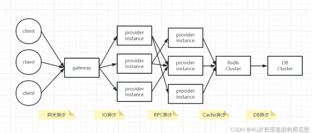
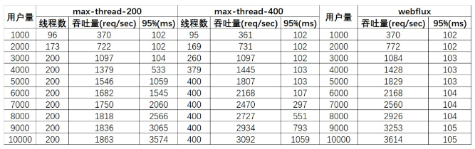
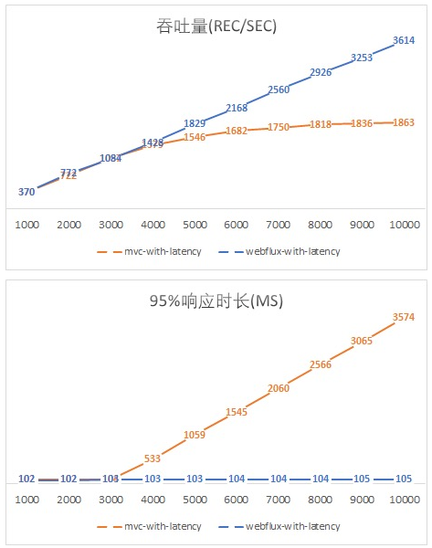
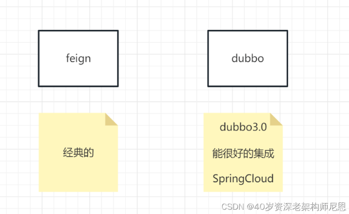
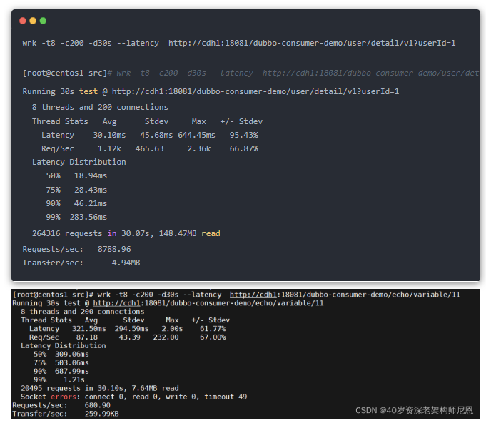
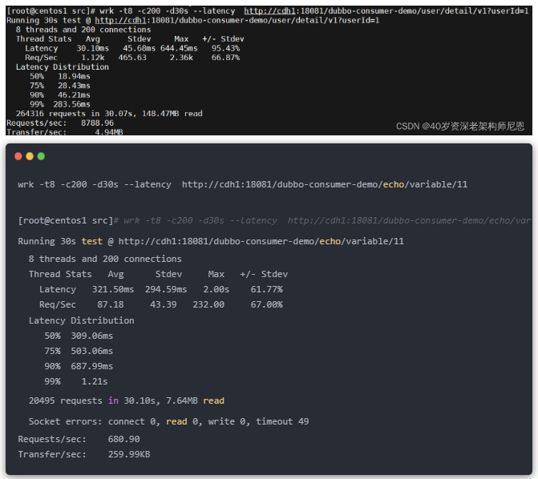
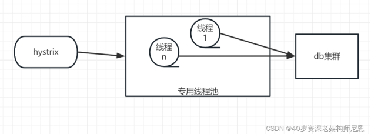

## 全链路异步，让你的性能优化10倍+

[文档链接](https://mp.weixin.qq.com/s/XjJazjS9SGtWf9yuGP48nw)

### 背景
随着业务的发展，微服务应用的流量越来越大，使用到的资源也越来越多。<br>
在微服务架构下，大量的应用都是 SpringCloud 分布式架构，这种架构，总体是全链路同步模式。<br>
同步编程模式不仅造成了资源的极大浪费，并且在流量发生激增波动的时候，受制于系统资源而无法快速的扩容。<br>
- 同步编程模式不仅造成了资源的极大浪费
- 并且在流量发生激增波动的时候，受制于系统资源而无法快速的扩容
全球后疫情时代，降本增效是大背景。
- 降本增效
如何降本增效？
可以通过技术升级，全链路同步模式 ，升级为 全链路异步模式。
- 可以通过技术升级 & 全链路同步模式 & 升级为全链路异步模式
尼恩作为40岁资深老架构师，带大家来做一把全链路异步模式改造，给大家看看研究成果，一定会惊到大家目瞪口呆。
- 全链路异步改造

### 全链路同步模式架构图
先回顾一下全链路同步模式架构图



全链路同步模式 ，如何升级为 全链路异步模式， 就是一个一个 环节的异步化。
- 全链路同步模式，如何升级为全链路异步模式
- 就是一个一个环节的异步化

40岁老架构师尼恩，持续深化自己的3高架构知识宇宙，
当然首先要去完成一次牛逼的全链路异步模式 微服务实操，
下面是尼恩的实操过程、效果、压测数据。

### 全链路异步模式
网关纯异步化（提升 9倍以上）<br>
网关层的特点：<br>
- 不需要访问业务数据库只做协议转换和流量转发
- 特点是 IO 密集型，特别适合纯异步的架构，可以极大的节省资源。

```
不需要访问业务数据库，只做协议转换和流量转发
特点是IO密集型，特别适合纯异步的架构，可以极大的节省资源
```

#### 如何进行网关异步化？
使用高性能的通信框架Netty，这是一个基于NIO 非阻塞IO+ Reactor 纯异步线程模型的纯异步化框架。
- 高性能的通信框架Netty，这是一个基于NIO非阻塞IO+Reactor纯异步线程模型的纯异步化框架

网关的技术选型主要有 zuul，SpringCloud GateWay 。
- zuul 1虽然使用的同步io，zuul2它也是使用异步的netty，但是没有和SpringCloud 框架集成
- springcloud gateway 它是基于spring 5.0 、spring boot 2.0 和spring reactor，
为微服务提供一个简单有效的网关API路由接口。和SpringCloud 框架完美集成，目标是为了代替zuul

SpringCloud GateWay 是基于webFlux框架实现的，
而WebFlux框架底层则使用了高性能的Reactor模式通信框架Netty。所以最终还是基于NIO的王者组件Netty。

```
SpringCloud Gateway是基于webFlux框架实现的
而WebFlux框架底层则使用了高性能的Reactor模式通信框架Netty
所以最终还是基于NIO的王者组件Netty
```

如果大家使用Zuul 1，那么 升级为 SpringCloud GateWay，性能可以提升 9倍以上，

以上结论，是来自于尼恩的读者群（50+），如有疑问，可以来单挑。
总体来说，这个环节，是纯异步化最容易的。
这个环节，大部分已经升级到了 springcloud gateway 已经使用了纯异步的架构；

#### Web服务异步化（2W并发场景提升 20倍以上）
Web服务作为微服务体系内的重要组成，服务节点众多，
Springboot的Web 服务默认为 Tomcat + Servlet 不支持纯异步化编程，

> Springboot的Web服务默认为 Tomcat+Servlet不支持纯异步化编程

Tomcat + Servlet模式的问题：总体上没有使用Reactor 反应器模式， 
每一个请求是阻塞处理的，属于同步 Web 服务类型。

```
Tomcat + Servlet模式的问题
总体上没有使用Reactor反应器模式
每一个请求是阻塞处理的，属于同步Web服务类型
```

Servlet 有异步的版本，可惜没有用起来。具体请参考 40岁老架构师尼恩为大家整理的深度文章：
京东一面：20种异步，你知道几种？含协程

所以：跑在 大家生产环境上的，还是Tomcat + Servlet 同步 Web 服务。
如何实现 Web 服务异步化：
- 方式一：基于Netty 实现web服务
- 方式二：使用 WebFlux （还是 Netty 实现web服务）

Spring WebFlux是一个响应式堆栈 Web 框架 ，它是完全非阻塞的，
支持响应式流(Reactive Stream)背压，并在Netty，Undertow和Servlet 3.1 +容器等服务器上运行

```
Spring WbFlux是一个响应式堆栈Web框架，它是完全非阻塞的
支持响应式流（Reactive Stream）背压，并在Netty，Understow和Servelt 3.1+容器等服务器上运行
```

我们再来看一下对于 WebFlux 的对比测试数据 （来自于参考文献1）：



可见，非阻塞的处理方式规避了线程排队等待的情况，
从而可以用少量而固定的线程处理应对大量请求的处理。

还有更绝的，小伙伴又一步到位直接测试了一下20000用户的情况：
- 1、对 mvc 的测试由于出现了许多的请求fail，最终以失败告终；
- 2、而 WebFlux 应对20000用户已然面不改色心不慌，吞吐量达到7228 req/sec

注意：正好是10000用户下的两倍，绝对是真实数据！也就是说, 2W并发场景提升 20倍以上
95%响应时长仅117ms。

最后，再给出两个吞吐量和响应时长的图，更加直观地感受异步非阻塞的WebFlux是如何一骑绝尘的吧：



此时，我们更加理解了Nodejs的骄傲，
不过我们大Java语言也有了Vert.x和现在的Spring WebFlux。

#### RPC 调用异步化（提升 9倍以上）
异步RPC 调用，等待upstream 上游 response 返回时，线程不处于block 状态
作为微服务架构中数据流量最大的一部分，RPC 调用异步化的收益巨大；
RPC 调用主要的框架有：



```
8 threads and 200 connections
Latency Distribution

Request/sec
Transfer/sec
```

特点是：
- feign 是同步IO 、阻塞模式的同步 RPC框架
- dubbo 是基于Netty的非阻塞IO + Reactor 反应堆线程模型的 异步RPC框架
40岁老架构师尼恩，完成了 SpringCloud + Dubbo RPC 的集成，在同一个微服务下，同时使用了Feign + Dubbo

然后进行了性能的对比验证
dubbo 的压测数据
```
wrk -t8 -c200 -d30s --latency  http://cdh1:18081/dubbo-consumer-demo/user/detail/v1?userId=1

[root@centos1 src]# wrk -t8 -c200 -d30s --latency  http://cdh1:18081/dubbo-consumer-demo/user/detail/v1?userId=1
Running 30s test @ http://cdh1:18081/dubbo-consumer-demo/user/detail/v1?userId=1
  8 threads and 200 connections
  Thread Stats   Avg      Stdev     Max   +/- Stdev
    Latency    30.10ms   45.68ms 644.45ms   95.43%
    Req/Sec     1.12k   465.63     2.36k    66.87%
  Latency Distribution
     50%   18.94ms
     75%   28.43ms
     90%   46.21ms
     99%  283.56ms
  264316 requests in 30.07s, 148.47MB read
Requests/sec:   8788.96
Transfer/sec:      4.94MB
```


feign 的压测数据

```
wrk -t8 -c200 -d30s --latency  http://cdh1:18081/dubbo-consumer-demo/echo/variable/11

[root@centos1 src]# wrk -t8 -c200 -d30s --latency  http://cdh1:18081/dubbo-consumer-demo/echo/variable/11
Running 30s test @ http://cdh1:18081/dubbo-consumer-demo/echo/variable/11
  8 threads and 200 connections
  Thread Stats   Avg      Stdev     Max   +/- Stdev
    Latency   321.50ms  294.59ms   2.00s    61.77%
    Req/Sec    87.18     43.39   232.00     67.00%
  Latency Distribution
     50%  309.06ms
     75%  503.06ms
     90%  687.99ms
     99%    1.21s
  20495 requests in 30.10s, 7.64MB read
  Socket errors: connect 0, read 0, write 0, timeout 49
Requests/sec:    680.90
Transfer/sec:    259.99KB
```

从数据来看， dubbo rpc 是feign rpc 性能10倍
当然，感兴趣的小伙伴，也可以自己实操一下，更有感触。

#### Cache异步化（提升2倍+）
Cache Aside【在旁边 & 除...之外】 缓存模式，是大家通用的Cache使用方式，Cache纯异步的架构，必须使用异步存储层
客户端
主要有：
- Redisson
- Lettuce

Redisson、Lettuce如何选型？请参考40岁老架构师尼恩的文章：
[Jedis那么低性能，还在用？赶紧换上 lettuce 吧](https://mp.weixin.qq.com/s/XjJazjS9SGtWf9yuGP48nw)

40岁老架构师尼恩，完成了自己的开发脚手架Crazy-SpringCloud的Cache异步化，
经过对比验证，性能提升足足2倍多

使用Lettuce的场景：
```
[root@centos1 ~]# wrk -t8 -c200 -d30s --latency   http://192.168.56.121:7703/uaa-react-provider/api/userCacheAside/detail/v1?userId=1
Running 30s test @ http://192.168.56.121:7703/uaa-react-provider/api/userCacheAside/detail/v1?userId=1
  8 threads and 200 connections
  Thread Stats   Avg      Stdev     Max   +/- Stdev
    Latency    18.29ms   13.56ms 213.57ms   89.56%
    Req/Sec     1.51k   504.74     4.26k    72.86%
  Latency Distribution
     50%   14.56ms
     75%   19.92ms
     90%   31.20ms
     99%   76.70ms
  359546 requests in 30.10s, 53.15MB read
Requests/sec:  11945.39
Transfer/sec:      1.77MB
```

使用jedis的场景
```
wrk -t8 -c200 -d30s --latency  http://192.168.56.121:7702/uaa-provider/api/user/detailCacheAside/v1?userId=1
  
 [root@centos1 src]#  wrk -t8 -c200 -d30s --latency  http://192.168.56.121:7702/uaa-provider/api/user/detailCacheAside/v1?userId=1
Running 30s test @ http://192.168.56.121:7702/uaa-provider/api/user/detailCacheAside/v1?userId=1
  8 threads and 200 connections
  Thread Stats   Avg      Stdev     Max   +/- Stdev
    Latency    42.20ms   44.79ms   1.11s    93.41%
    Req/Sec   683.30    245.08     1.85k    67.39%
  Latency Distribution
     50%   32.65ms
     75%   48.30ms
     90%   72.32ms
     99%  199.81ms
  162271 requests in 30.09s, 71.96MB read
Requests/sec:   5393.75
Transfer/sec:      2.39MB
```

吞吐量 从 5000 提升到 10000
99%  响应时间  从199.81ms降低到  76.70ms

#### DB的异步化 （假装提升10倍）
数据操作是每个请求调用链的 终点，纯异步的架构必须使用异步存储层客户端，
比如说，可以使用纯异步化的框架 Spring Data R2DBC

在尼恩的Crazy-SpringCloud  脚手架 纯异步化  改造中，没有对 的DB 进行异步化改造，为啥呢？
DB是一个低吞吐的物种，对于DB而已，请求太多，反而忙不过来，造成整体的性能下降。
所以，尼恩没有对DB进行纯异步化改造，反而是进行隔离和保护：
- DB是一个低吞吐的物种，对于DB而言，请求太多，反而忙不过来，造成整体的性能下降
- 所以，没有对DB进行纯异步化改造，反而是进行隔离和保护

- 参考 Hystrix舱壁模式， 通过 DB 的操作进行 线程池隔离，
- 使用 手写 Hystrix Command 的方式，进行 DB 操作的 高压防护。



控制线程数和请求数，保护不至于拖垮DB
由于高压防护，在高并发场景能快速失败，所以肯定提升不止10倍，不过是假装提升10倍
- 高压防护 & 在高并发场景能快速失败

#### 纯异步与伪异步
异步调用目的在于防止当前业务线程被阻塞。
伪异步将任务包装为Runnable 放入另一个线程执行并等待，当前Biz 线程不阻塞；
纯异步为响应式编程模型，通过IO 实践驱动任务完成。
两个概念很重要，这里不做赘述，具体请参考 40岁老架构师尼恩为大家整理的深度文章：
[京东一面：20种异步，你知道几种？含协程](https://mp.weixin.qq.com/s/gw23o8dhLi0IEWYc3mxPYw)

```
异步调用目的在于防止当前业务线程被阻塞
伪异步将任务包装为Runnable放入另一个线程执行并等待，当前Biz线程不阻塞
纯异步为响应式编程模型，通过IO实践驱动任务完成
```

#### 全链路异步，让你的性能优化10倍+
降本增效时代，大家行动起来吧，对SpringCloud 微服务进行一场性能提升革命
想尽办法，让一台服务器，发挥10台的价值

特别提示：
在尼恩的全链路异步 改造的过程中， 大量使用 了 响应式编程。
关于响应式编程的知识，请参考尼恩的 深度文章：

Flux、Mono、Reactor 实战（史上最全）：https://blog.csdn.net/crazymakercircle/article/details/124120506

遗憾的是，响应式编程非常复杂，
后面，尼恩还会有响应式编程专题的3高架构笔记pdf，做到通俗易懂，带大家轻轻松松成为响应式编程专家。


