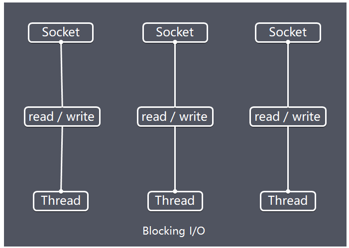
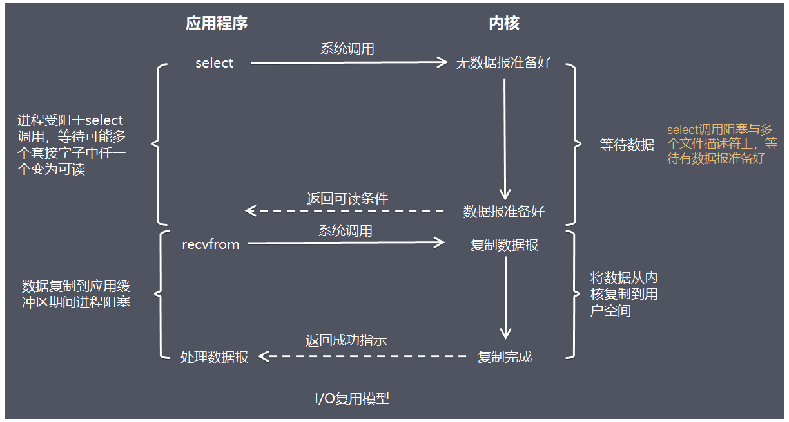
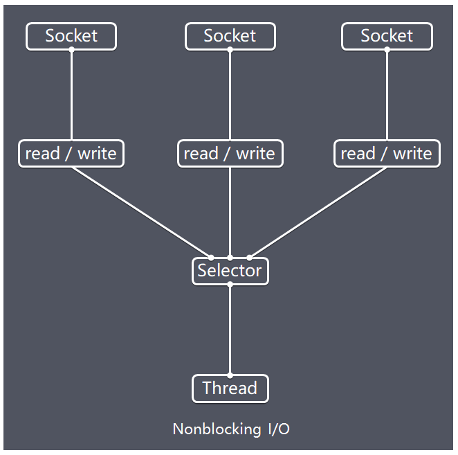

## 史上最全 Java 面试题之：Netty 篇
[链接](https://www.cnblogs.com/crazymakercircle/p/13903625.html)

### 40岁老架构师尼恩暗语：
如果在简历上写了Netty，那么：下面的面试题，最好都会<br>
如果要面试高端的开发、大厂的开发、或者架构师，那么： 简历上一定要写netty<br>
so，下面的面试题，越烂熟于心，越好<br>

> 说明：本文会以pdf格式持续更新，更多最新尼恩3高pdf笔记，请从下面的链接获取：语雀 或者 码云

### Netty 是什么？
Netty是一个***异步事件驱动的网络应用程序框架***，用于***快速开发可维护的高性能协议服务器和客户端***。
Netty是基于nio的，它封装了jdk的nio，让我们使用起来更加方法灵活。

```
Netty是一个异步事件驱动的网络应用程序框架，用于快速开发可维护的高性能协议服务器和客户端
Netty是基于nio的，它封装了jdk的nio，让我们使用起来更加方便灵活
```

### 聊聊：JDK原生NIO程序的问题？
JDK原生也有一套网络应用程序API，但是存在一系列问题，主要如下：
- NIO的类库和API繁杂，使用麻烦，你需要熟练掌握Selector、ServerSocketChannel、SocketChannel、ByteBuffer等
  - Selector
  - ServerSocketChannel
  - SocketChannel
  - ByteBuffer
- 需要具备其它的额外技能做铺垫，例如熟悉Java多线程编程，因为NIO编程涉及到Reactor模式，你必须对多线程和网路编程非常熟悉，才能编写出高质量的NIO程序
  - Java多线程编程
  - NIO编程涉及到Reactor模式
  - 必须对多线程和网络编程非常熟悉
  - 才能编写出高质量的NIO程序
- 可靠性能力补齐，开发工作量和难度都非常大。例如客户端面临断连重连、网络闪断、半包读写、失败缓存、网络拥塞和异常码流的处理等等，NIO编程的特点是功能开发相对容易，但是可靠性能力补齐工作量和难度都非常大
  - 可靠性能力补齐，开发工作量和难度都非常大
  - 例如客户端面临断连重连
  - 网络闪断
  - 半包读写
  - 失败缓存
  - 网络拥塞和异常码流处理等等
  - NIO编程的特点是功能开发相对容易
  - 但是可靠性能力补齐工作量和难度都非常大
- JDK NIO的BUG，例如臭名昭著的select bug，它会导致Selector空轮询，最终导致CPU 100%。 官方声称在JDK1.6版本的update18修复了该问题，但是直到JDK1.7版本该问题仍旧存在，只不过该bug发生概率降低了一些而已，它并没有被根本解决
  - JDK NIO的BUG，例如臭名昭著的select bug，它会导致Selector空轮询，最终导致CPU 100%

### Netty 的优势有哪些？
- 使用简单：***封装了 NIO 的很多细节***，使用更简单。
- 功能强大：***预置了多种编解码功能，支持多种主流协议***。
- 定制能力强：可以通过 ***ChannelHandler*** 对通信框架进行灵活地扩展。
- 性能高：通过与***其他业界主流的 NIO 框架对比，Netty 的综合性能最优***。
- 稳定：***Netty 修复了已经发现的所有 NIO 的 bug***，让开发人员可以专注于业务本身。
- 社区活跃：Netty 是活跃的开源项目，版本迭代周期短，bug 修复速度快。

### Netty 的应用场景有哪些？
典型的应用有：
- 阿里分布式服务框架 Dubbo，默认使用 Netty 作为基础通信组件，
- 还有 RocketMQ 也是使用 Netty 作为通讯的基础。

Netty常见的使用场景如下：
- 互联网行业 在分布式系统中，各个节点之间需要远程服务调用，高性能的RPC框架必不可少，Netty作为异步高性能的通信框架,往往作为基础通信组件被这些RPC框架使用。 
典型的应用有：阿里分布式服务框架Dubbo的RPC框架使用Dubbo协议进行节点间通信，Dubbo协议默认使用Netty作为基础通信组件，用于实现各进程节点之间的内部通信。
- 游戏行业 无论是手游服务端还是大型的网络游戏，Java语言得到了越来越广泛的应用。
Netty作为高性能的基础通信组件，它本身提供了TCP/UDP和HTTP协议栈。 
非常方便定制和开发私有协议栈，账号登录服务器，地图服务器之间可以方便的通过Netty进行高性能的通信
- 大数据领域 经典的Hadoop的高性能通信和序列化组件Avro的RPC框架，默认采用Netty进行跨节点通信，它的Netty Service基于Netty框架二次封装实现

### Netty的特点
Netty的对JDK自带NIO的API进行封装，解决下述问题，主要特点有：
- 设计优雅 适用于各种传输类型的统一API - 阻塞和非阻塞Socket 基于灵活且可扩展的事件模型，可以清晰地分离关注点 高度可定制的线程模型 - 单线程，一个或多个线程池 真正的无连接数据报套接字支持（自3.1起）
- 高性能 、高吞吐、低延迟、低消耗
- 最小化不必要的内存复制【零拷贝】
- 安全 完整的SSL / TLS和StartTLS支持
- 高并发：Netty 是一款基于 NIO（Nonblocking IO，非阻塞IO）开发的网络通信框架，对比于 BIO（Blocking I/O，阻塞IO），他的并发性能得到了很大提高。
- 传输快：Netty 的传输依赖于零拷贝特性，尽量减少不必要的内存拷贝，实现了更高效率的传输。
- 封装好：Netty 封装了 NIO 操作的很多细节，提供了易于使用调用接口。
- 社区活跃，不断更新 社区活跃，版本迭代周期短，发现的BUG可以被及时修复，同时，更多的新功能会被加入
- 使用方便 详细记录的Javadoc，用户指南和示例 没有其他依赖项，JDK 5（Netty 3.x）或6（Netty 4.x）就足够了

### Netty 高性能表现在哪些方面？
- IO线程模型：***通过多线程Reactor反应器模式，在应用层实现异步非阻塞（异步事件驱动）架构，用最少的资源做更多的事***。
  - 通过多线程Reactor反应器模式
  - 在应用层实现异步非阻塞（异步事件驱动）架构，用最少的资源做更多的事
- 内存零拷贝：尽量减少不必要的内存拷贝，实现了更高效率的传输。
- 内存池设计：申请的内存可以重用，主要指直接内存。内部实现是用一颗二叉查找树管理内存分配情况。 （具体请参考尼恩稍后的手写内存池）
- 对象池设计：Java对象可以重用，主要指Minior GC非常频繁的对象，如ByteBuffer。并且，对象池使用无锁架构，性能非常高。 （具体请参考尼恩稍后的手写对象池）
- mpsc[Multiple Producers Single Consumer Queue]无锁编程：串形化处理读写, 避免使用锁带来的性能开销。
- 高性能序列化协议：支持 protobuf 等高性能序列化协议。

### 聊聊：NIO的组成？
- Buffer：***与Channel进行交互，数据是从Channel读入缓冲区，从缓冲区写入Channel中的**
  - 与Channel进行交互
  - 数据是从Channel读入缓冲区，从缓冲区写入Channel中的
- flip方法 ： 反转此缓冲区，将position给limit，然后将position置为0，***其实就是切换读写模式***
  - 反转此缓冲区，将position给limit，然后将position置为0
  - 其实就是切换读写模式
- clear方法 ：清除此缓冲区，将position置为0，把capacity的值给limit。
  - 清除此缓冲区，将position置为0，把capacity的值给limit
- rewind[倒带]方法 ： 重绕此缓冲区，将position置为0
- DirectByteBuffer***可减少一次系统空间到用户空间的拷贝***。
  但***Buffer创建和销毁的成本更高，不可控，通常会用内存池来提高性能***。
  ***直接缓冲区主要分配给那些易受基础系统的本机I/O 操作影响的大型、持久的缓冲区***。
  如果数据量比较小的中小应用情况下，可以考虑***使用heapBuffer，由JVM进行管理***。
  - 可减少一次系统空间到用户空间的拷贝
  - 但buffer创建和销毁的成本更高，不可控，通常会用内存池来提高性能
  - 直接缓冲区主要分配给那些易受基础系统的本机I/O操作影响的大型、持久的缓冲区
  - 如果数据量比较小的中小应用情况下，可以考虑使用heapBuffer，由JVM进行管理
- Channel：***表示 IO 源与目标打开的连接***，***是双向的，但不能直接访问数据，只能与Buffer 进行交互***。
  通过源码可知，***FileChannel的read方法和write方法都导致数据复制了两次***！
- Selector：可使一个单独的线程管理多个Channel，
            open方法可创建Selector，
            register方法向多路复用器器注册通道，可以监听的事件类型：读、写、连接、accept。
            注册事件后会产生一个SelectionKey：它表示SelectableChannel 和Selector 之间的注册关系，
  - Selector可使一个单独的线程管理多个Channel
  - open方法可创建Selector
  - register方法向多路复用器注册通道，可以监听的事件类型：读、写、连接、accept
  - 注册事件后会产生一个SelectionKey：它表示SelectableChannel和Selector之间的注册关系

- wakeup方法：使尚未返回的第一个选择操作立即返回，唤醒的，原因是：注册了新的channel或者事件；channel关闭，取消注册；优先级更高的事件触发（如定时器事件），希望及时处理。
  
- Selector在Linux的实现类是EPollSelectorImpl，委托给EPollArrayWrapper实现，其中三个native方法是对epoll的封装，
  - 而EPollSelectorImpl. implRegister方法，通过调用epoll_ctl向epoll实例中注册事件，
  - 还将注册的文件描述符(fd)与SelectionKey的对应关系添加到fdToKey中，这个***map维护了文件描述符与SelectionKey的映射***。
  - fdToKey有时会变得非常大，***因为注册到Selector上的Channel非常多（百万连接）***；
  - 过期或失效的Channel没有及时关闭。
  - fdToKey总是串行读取的，而读取是在select方法中进行的，该方法是非线程安全的。

- Pipe：两个线程之间的单向数据连接，数据会被写到sink[下沉，沉没，水槽，水池]通道，从source通道读取
- NIO的服务端建立过程：Selector.open()：打开一个Selector；ServerSocketChannel.open()：创建服务端的Channel；bind()：绑定到某个端口上。
  并配置非阻塞模式；register()：注册Channel和关注的事件到Selector上；select()轮询拿到已经就绪的事件
  - NIO服务端建立过程：Selector.open()打开一个Selector;
  - ServerSocketChannel.open()：创建服务端的Channel；
  - bind()：绑定到某个端口上
  - 并配置非阻塞模式
  - register()：注册channel和关注的事件到Selector上
  - select()轮询拿到已经就绪的事件

### 聊聊：BIO、NIO和AIO的区别？
- BIO：一个连接一个线程，客户端有连接请求时服务器端就需要启动一个线程进行处理。线程开销大。
- 伪异步IO：***将请求连接放入线程池，一对多，但线程还是很宝贵的资源***。
- NIO：一个请求一个线程，***但客户端发送的连接请求都会注册到多路复用器上***，多路复用器轮询到连接有I/O请求时才启动一个线程进行处理。
- AIO：一个有效请求一个线程，客户端的I/O请求都是由OS先完成了再通知服务器应用去启动线程进行处理，
- BIO是面向流的，NIO是面向缓冲区的；
- BIO的各种流是阻塞的。而NIO是非阻塞的；
- BIO的Stream是单向的，而NIO的channel是双向的。
- NIO的特点：事件驱动模型、单线程处理多任务、非阻塞I/O，I/O读写不再阻塞，
  而是返回0、基于block的传输比基于流的传输更高效、更高级的IO函数zero-copy、IO多路复用大大提高了Java网络应用的可伸缩性和实用性。
- 基于Reactor线程模型，在Reactor模式中，事件分发器等待某个事件或者可应用操作的状态发生，事件分发器就把这个事件传给事先注册的事件处理函数或者回调函数，
  由后者来做实际的读写操作。如在Reactor中实现读：注册读就绪事件和响应的事件处理器、事件分发器等待事件、事件到来，激活分发器，
  分发器调用事件对应的处理器、事件处理器完成实际的读操作，
  处理读到的数据，注册新的事件，然后返还控制权。

```
BIO：一个连接一个线程，客户端有连接请求时服务器就需要启动一个线程进行处理。线程开销大。
伪异步IO：将请求连接放入线程池，一对多，但线程还是很宝贵的资源
NIO：一个请求一个线程，但客户端发送的连接请求都会注册到多路复用器上，多路复用器轮询到连接有I/O请求时才启动一个线程进行处理
AIO：一个有效请求一个线程，客户端I/O请求都是由OS先完成了，再通知服务器应用去启动线程进行处理
BIO是面向流的，NIO是面向缓冲区的
BIO的各种流是阻塞的，而NIO是非阻塞的
BIO的Stream是单向的，而NIO的Channel是双向的
NIO的特点：事件驱动型、单线程处理多任务、非阻塞I/O、I/O读写不再阻塞，而是返回0、基于block的传输比基于流的传输更高效、更高级的IO函数zero-copy、IO多路复用大大提高了Java网络应用的可伸缩性和实用性。、
基于Reactor线程模型，在Reactor模式中，事件分发器等待某个或者可应用操作的状态发生，
事件分发器就把这个事件传给事先注册的事件处理函数或者回调函数，
由后者来做实际的读写操作。
如在Reactor中实现读：注册读就绪事件和响应的事件处理器、事件分发器等待事件、事件到来、激活分发器
分发器调用事件对应的处理器、事件处理器完成实际的读操作
处理读到的数据，注册新的事件，然后返还控制权。
```

### Netty 和 Tomcat 的区别？
- 作用不同：Tomcat 是 Servlet 容器，可以视为 Web 服务器，而 Netty 是异步事件驱动的网络应用程序框架和工具用于简化网络编程，例如TCP和UDP套接字服务器。
- 协议不同：Tomcat 是基于 http 协议的 Web 服务器，而 Netty 能通过编程自定义各种协议，因为 Netty 本身自己能编码/解码字节流，
  所有 Netty 可以实现，HTTP 服务器、FTP 服务器、UDP 服务器、RPC 服务器、WebSocket 服务器、Redis 的 Proxy 服务器、MySQL 的 Proxy 服务器等等。

```
作用不同：Tomcat是Servlet容器，可以视为Web服务器，而Netty是异步事件驱动的网络应用程序框架和工具用于简化网络编程，
例如TCP和UDP套接字服务器。
协议不同：Tomcat是基于http协议的Web服务器，而Netty能通过编程自定义各种协议，因为Netty本身自己能编码/解码字节流，
所有Netty可以实现，HTTP服务器、FTP服务器、UDP服务器、RPC服务器、WebSocket服务器、Redis的Proxy服务器、MySQL的Proxy服务器
```

### 聊聊：Netty是怎么实现高性能设计的？
Netty作为***高性能IO组件***的扛鼎制作，<br>
高性能设计的核心： 巧妙的 结合 ***高性能IO模型*** 和 ***线程模型*** ，相得益彰，达到了 高性能 、高吞吐、低延迟、低消耗的目标<br>
- 高性能
- 高吞吐
- 低延迟
- 低消耗
其I/O模型 高性能epoll/select 模型<br>
- 高性能epoll & select模型
其 线程模型为 ***多线程 reactor 反应器模型***<br>
I/O模型 决定如何收发数据，<br>
线程模型 决定如何处理数据<br>
相得益彰，在应用层达到了异步IO的效果。<br>

```
I/O模型：决定如何收发数据
线程模型：决定如何处理数据
相得益彰，在应用层达到了异步IO的效果
```

### 聊聊：I/O模型
用什么样的通道将数据发送给对方，BIO、NIO或者AIO，I/O模型在很大程度上决定了框架的性能
答案请参考《Java高并发核心编程 卷1 》
书中，对io模型介绍得非常系统，并且不断完善

### 阻塞I/O
传统阻塞型I/O(BIO)可以用下图表示：


特点:
- 每个请求都需要独立的线程完成数据read，业务处理，数据write的完整操作

问题:
- 当并发数较大时，需要创建大量线程来处理连接，系统资源占用较大
- 连接建立后，如果当前线程暂时没有数据可读，则线程就阻塞在read操作上，造成线程资源浪费

```
每个请求都需要独立的线程完成数据read，业务处理，数据write的完整操作
当并发数较大时，需要创建大量线程来处理连接，系统资源占用较大
连接建立后，如果当前线程暂时没有数据可读，则线程就阻塞在read操作上，造成线程资源浪费
```

### I/O复用模型


在I/O复用模型中，会用到select，这个函数也会使进程阻塞，
但是和阻塞I/O所不同的的，这两个函数可以同时阻塞多个I/O操作，
而且可以同时对多个读操作，多个写操作的I/O函数进行检测，直到有数据可读或可写时，才真正调用I/O操作函数

Netty的非阻塞I/O的实现关键是基于I/O复用模型，这里用Selector对象表示：


Netty的IO线程NioEventLoop由于聚合了多路复用器Selector，可以同时并发处理成百上千个客户端连接。
当线程从某客户端Socket通道进行读写数据时，若没有数据可用时，该线程可以进行其他任务。
线程通常将非阻塞 IO 的空闲时间用于在其他通道上执行 IO 操作，所以单独的线程可以管理多个输入和输出通道。

```
Netty的IO线程NioEventLoop由于聚合了多路复用器Selector，可以同时并发处理成百上千客户端连接。
当线程从某客户端socket通道进行读写数据时，若没有数据可用时，该线程可以进行其他任务。
线程通常将非阻塞IO的空闲时间用于在其他通道上执行IO操作，所以单独的线程可以管理多个输入和输出通道。
```

由于读写操作都是非阻塞的，这就可以充分提升IO线程的运行效率，
避免由于频繁I/O阻塞导致的线程挂起，
一个I/O线程可以并发处理N个客户端连接和读写操作，
这从根本上解决了传统同步阻塞I/O一连接一线程模型，
架构的性能、弹性伸缩能力和可靠性都得到了极大的提升。

```
由于读写操作都是非阻塞的，这就可以充分提升IO线程的运行效率，
避免由于频繁I/O阻塞导致的线程挂起，
一个I/O线程可以并发处理N个客户端连接和读写操作，
这从根本上解决了传统同步阻塞I/O--连接--线程模型，
架构的性能、弹性伸缩能力和可靠性都得到了极大的提升。
```

### 基于buffer
传统的I/O是面向字节流或字符流的，以流式的方式顺序地从一个Stream 中读取一个或多个字节, 因此也就不能随意改变读取指针的位置。<br>
在NIO中, 抛弃了传统的 I/O流, 而是引入了Channel和Buffer的概念. 在NIO中, 只能从Channel中读取数据到Buffer中或将数据从Buffer 中写入到 Channel。<br>
基于buffer操作不像传统IO的顺序操作, NIO 中可以随意地读取任意位置的数据<br>

```
传统的I/O是面向字节流或字符流的，以流式的方式顺序地从一个Stream中读取一个或多个字节，因此也就不能随意改变读取指针的位置。
在NIO中，抛弃了传统的I/O流，而是引入了Channel和Buffer的概念。
在NIO中，只能从Channel中读取数据到Buffer中或将数据从Buffer中写入到Channel。
基于Buffer操作不像传统IO的顺序操作，NIO中可以随意读取任意位置的数据
```

### 聊聊：AIO 是什么？
答案请参考《Java高并发核心编程 卷1 》
书中，对io模型介绍得非常系统，并且不断完善

### 聊聊：NIO和BIO到底有什么区别？有什么关系？


