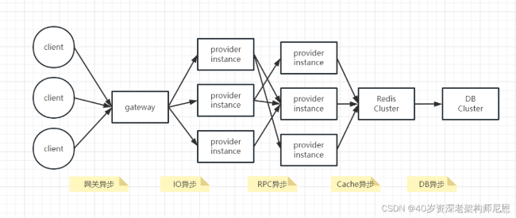

## 响应式圣经：10W字，实现Spring响应式编程自由

### 前言【全链路异步化的基础是响应式编程】
随着业务的发展，微服务应用的流量越来越大，使用到的资源也越来越多。<br>
在微服务架构下，大量的应用都是 SpringCloud 分布式架构，这种架构总体上是全链路同步模式。<br>
全链路同步模式不仅造成了资源的极大浪费，并且在流量发生激增波动的时候，受制于系统资源而无法快速的扩容。<br>
全球后疫情时代，***降本增效***是大背景。如何降本增效？
可以通过技术升级，全链路同步模式 ，升级为 全链路异步模式。
先回顾一下全链路同步模式架构图

全链路同步模式 ，如何升级为全链路异步模式， 就是一个一个 环节的异步化。
- 全链路同步模式->如何升级为全链路异步模式，就是一个一个环节的异步化

40岁老架构师尼恩，持续深化自己的3高架构知识宇宙，
当然首先要去完成一次牛逼的全链路异步模式 微服务实操，
下面是尼恩的实操过程、效果、压测数据(***性能足足提升10倍多***)。

全链路异步模式改造 具体的内容，
请参考尼恩的深度文章：全链路异步，让你的 SpringCloud 性能优化10倍+
并且，上面的文章，作为尼恩 全链路异步的架构知识，收录在《尼恩Java面试宝典》V46版的架构专题中
全链路异步化改造，性能提升十倍是大好事，那么，全链路同步模式改造的问题是什么呢？
全链路异步化改造的技术基础，是响应式编程，关键问题在于：响应式编程的知识太难。
- 响应式编程
古语说：蜀道难难于上青天。

很多小伙伴认为：响应式编程， 比蜀道还难？
所以，40岁老架构师 使用20年的编程功力，给大家呈上一篇， 
学习响应式编程 的超级长文，也是一篇超级、超级详细，超级超级全面，并且不断迭代的文章：
《响应式圣经：10W字实现响应式编程自由》
此文，目前为V2版本，新版本是基于V1老版本是尼恩之前写的一篇深受好评的博客文章
【Flux、Mono、Reactor 实战（史上最全）】(https://blog.csdn.net/crazymakercircle/article/details/124120506)
后续，尼恩会一直不断迭代， 为大家拉涅出一本史上最棒的 《响应式圣经》  ，帮助大家实现响应式编程自由。
从此：大家的蜀道不再难。

### Reactive programming 响应式编程概述
#### 背景知识
为了应对高并发服务器端开发场景，在2009 年，微软提出了一个更优雅地实现异步编程的方式——Reactive  Programming，我们称之为响应式编程。
随后，Netflix 和LightBend 公司提供了RxJava 和Akka Stream  等技术，使得Java 平台也有了能够实现响应式编程的框架。
在2017 年9 月28 日，Spring 5 正式发布。
- Spring 5
Spring 5  发布最大的意义在于，它将响应式编程技术的普及向前推进了一大步。

而同时，作为在背后支持Spring 5 响应式编程的框架Spring  Reactor，也进入了里程碑式的3.1.0 版本。
- Spring 5->Spring Reactor

#### 什么是响应式编程
响应式编程是一种面向***数据流***和***变化传播***的编程范式。

这意味着可以在编程语言中很方便地表达静态或动态的数据流，
而相关的计算模型会自动将变化的值通过数据流进行传播。

响应式编程基于reactor（Reactor 是一个运行在 Java8  之上的响应式框架）的思想，
当你做一个带有一定延迟的才能够返回的io操作时，不会阻塞，而是立刻返回一个流，
并且订阅这个流，当这个流上产生了返回数据，可以立刻得到通知并调用回调函数处理数据。

电子表格程序就是响应式编程的一个例子。有些单元个含有公式，
比如可以包含字面值或类似"=B1+C1"的公式，这些单元格的值，会依据其他单元格的值的变化而变化。

响应式传播核心特点之一：***变化传播***。
一个单元格变化之后，会像多米诺骨牌一样，导致直接和间接引用它的其他单元格均发生相应变化。

#### 从API视角，看什么是 Reactive programming 响应式编程
有了 Reactive Streams 这种标准和规范，利用规范可以进行响应式编程。
那再了解下什么是 Reactive programming 响应式编程。
响应式编程是基于异步和事件驱动的非阻塞程序，只是垂直通过在 JVM 内启动少量线程扩展，而不是水平通过集群扩展。

- 响应式编程是基于异步和事件驱动的非阻塞程序

异步调用 +IO Reactor 事件驱动，
可以避免将 CPU 浪费在等待网络 IO 和磁盘 IO 时上，
实现提高资源使用率。
Reactive programming就是一个编程范例，具体项目中如何体现呢？
响应式项目编程实战中，通过基于 Reactive Streams 规范实现的框架Spring Reactor 去实战。

Spring Reactor 一般提供两种响应式 API ：
- Mono：实现发布者，并返回 0 或 1 个元素
- Flux：实现发布者，并返回 N 个元素

#### 响应式编程->异步非阻塞
上面讲了响应式编程是什么：
> 响应式编程（reactive programming）是一种基于数据流（data stream）和变化传递（propagation of change）的声明式（declarative）的编程范式

也讲解了数据流/变化传递/声明式是什么意思，但说到响应式编程就离不开异步非阻塞。
从Spring官网介绍WebFlux的信息我们就可以发现asynchronous, nonblocking 这样的字样，
因为响应式编程它是异步的，也可以理解成变化传递它是异步执行的。

#### 基于Java8观察者模式
Observable类：此类表示可观察对象，或模型视图范例中的“数据”。
它可以被子类实现以表示应用程序想要观察的对象。

```java
//想要观察的对象 ObserverDemo
public class ObserverDemo extends Observable {
    public static void main(String[] args) {
        ObserverDemo observerDemo = new ObserverDemo();
        //添加观察者
        observerDemo.addObserver((o,arg)->{
            System.out.println("数据发生变化A");
        });
        observerDemo.addObserver((o,arg)->{
            System.out.println("数据发生变化B");
        });
        observerDemo.setChanged();//将此Observable对象标记为已更改
        observerDemo.notifyObservers();//如果该对象发生了变化，则通知其所有观察者
    }
}
```

启动程序测试：


#### 创建一个Observable
rxjava中，可以使用Observable.create()  该方法接收一个Observable.OnSubscribe对象
```
Observable<Integer> observable = Observable.create(new Observable.OnSubscribe<Integer>() {
    @Override
    public void call(Subscriber<? super Integer> subscriber) {

    }
});
```

来个大点的例子：

```
Observable<Integer> observable=Observable.create(new Observable.OnSubscribe<Integer>() {
    @Override
    public void call(Subscriber<? super Integer> subscriber) {
        for(int i=0;i<5;i++){
            subscriber.onNext(i);
        }
        subscriber.onCompleted();
    }
});
//Observable.subscribe(Observer)，Observer订阅了Observable
Subscription subscribe = observable.subscribe(new Observer<Integer>() {
    @Override
    public void onCompleted() {
        Log.e(TAG, "完成");
    }

    @Override
    public void onError(Throwable e) {
        Log.e(TAG, "异常");
    }

    @Override
    public void onNext(Integer integer) {
        Log.e(TAG, "接收Obsverable中发射的值：" + integer);
    }
});
```

输出：
```
接收Obsverable中发射的值：0
接收Obsverable中发射的值：1
接收Obsverable中发射的值：2
接收Obsverable中发射的值：3
接收Obsverable中发射的值：4
```
从上面的例子可以看出，在Observer订阅了Observable后，
Observer作为OnSubscribe中call方法的参数传入，从而调用了Observer的相关方法

#### 基于 Reactor 实现
Reactor 是一个运行在 Java8 之上满足 Reactive 规范的响应式框架，它提供了一组响应式风格的 API。
Reactor 有两个核心类：Flux<T> 和 Mono<T>，这两个类都实现 Publisher 接口。

- Flux 类似 RxJava 的 Observable，它可以触发零到多个事件，并根据实际情况结束处理或触发错误。
- Mono 最多只触发一个事件，所以可以把 Mono 用于在异步任务完成时发出通知。


Flux 和 Mono 都是数据流的发布者，使用 Flux 和 Mono 都可以发出三种数据信号：元素值，错误信号，完成信号；
错误信号和完成信号都代表终止信号，终止信号用于告诉订阅者数据流结束了，错误信号终止数据流同时把错误信息传递给订阅者。

三种信号的特点：
- 错误信号和完成信号都是终止信号，不能共存
- 如果没有发送任何元素值，而是直接发送错误或者完成信号，表示是空数据流
- 如果没有错误信号，也没有完成信号，表示是无限数据流

引入依赖
```xml
<dependency>
    <groupId>org.projectreactor</groupId>
    <artifactId>reactor-core</artifactId>
</dependency>
```

just 和 subscribe方法
- just()：创建Flux序列，并声明指定数据流
- subscribe()：订阅Flux序列，只有进行订阅后才回触发数据流，不订阅就什么都不会发生

```java
public class TestReactor {
    public static void main(String[] args) {
        //just()：创建Flux序列，并声明数据流，
        Flux<Integer> integerFlux = Flux.just(1, 2, 3, 4);//整形
        //subscribe()：订阅Flux序列，只有进行订阅后才回触发数据流，不订阅就什么都不会发生
        integerFlux.subscribe(System.out::println);
        
        Flux<String> stringFlux = Flux.just("hello", "world");//字符串
        stringFlux.subscribe(System.out::println);
        
        //fromArray(),fromIterable()和fromStream()：可以从一个数组、Iterable 对象或Stream 对象中创建Flux序列
        Integer[] array = {1,2,3,4};
        Flux.fromArray(array).subscribe(System.out::println);
        
        List<Integer> integers = Arrays.asList(array);
        Flux.fromIterable(integers).subscribe(System.out::println);
        
        Stream<Integer> stream = integers.stream();
        Flux.fromStream(stream).subscribe(System.out::println);
    }
}
```

启动测试：


#### Reactive Streams（响应式流）的特点
要搞清楚这两个概念，必须说一下响应流规范。
它是响应式编程的基石。他具有以下特点：
- 响应流必须是无阻塞的。
- 响应流必须是一个数据流。
- 它必须可以异步执行。
- 并且它也应该能够处理背压。
- 即时响应性:
只要有可能， 系统就会及时地做出响应。即时响应是可用性和实用性的基石， 而更加重要的是，即时响应意味着可以快速地检测到问题并且有效地对其进行处理。 
即时响应的系统专注于提供快速而一致的响应时间， 确立可靠的反馈上限， 以提供一致的服务质量。
这种一致的行为转而将简化错误处理、  建立最终用户的信任并促使用户与系统作进一步的互动。
- 回弹性：
系统在出现失败时依然保持即时响应性。这不仅适用于高可用的、 任务关键型系统——任何不具备回弹性的系统都将会在发生失败之后丢失即时响应性。
回弹性是通过复制、 遏制、 隔离以及委托来实现的。
失败的扩散被遏制在了每个组件内部， 与其他组件相互隔离，  从而确保系统某部分的失败不会危及整个系统，并能独立恢复。
每个组件的恢复都被委托给了另一个（外部的）组件，  此外，在必要时可以通过复制来保证高可用性。
（因此）组件的客户端不再承担组件失败的处理。
- 弹性：
系统在不断变化的工作负载之下依然保持即时响应性。
反应式系统可以对输入（负载）的速率变化做出反应，比如通过增加或者减少被分配用于服务这些输入（负载）的资源。
这意味着设计上并没有争用点和中央瓶颈， 得以进行组件的分片或者复制， 并在它们之间分布输入（负载）。
通过提供相关的实时性能指标， 反应式系统能支持预测式以及反应式的伸缩算法。
这些系统可以在常规的硬件以及软件平台上实现成本高效的弹性。
- 消息驱动：
反应式系统依赖异步的、消息传递，从而确保了松耦合、隔离、位置透明的组件之间有着明确边界。
这一边界还提供了将失败作为消息委托出去的手段。
使用显式的消息传递，可以通过在系统中塑造并监视消息流队列， 并在必要时应用回压， 从而实现负载管理、 弹性以及流量控制。
使用位置透明的消息传递作为通信的手段， 使得跨集群或者在单个主机中使用相同的结构成分和语义来管理失败成为了可能。
非阻塞的通信使得接收者可以只在活动时才消耗资源， 从而减少系统开销。

#### Reactive Streams（响应式流）的过程
一般由以下组成：
- publisher：发布者，发布元素到订阅者
- subscriber：订阅者，消费元素
- subscription：订阅，在发布者中，订阅被创建时，将与订阅者共享
- processor：处理器，发布者与订阅者之间处理数据，包含了发布者与订阅者的共同体

publisher接口规范
```java
public interface Publisher<T> {   
    void subscribe(Subscriber<? super T> var1); //添加订阅者
}
```

subscriber接口规范
```java
public interface Subscriber<T> { 
    void onSubscribe(Subscription var1);    
    void onNext(T var1);    
    void onError(Throwable var1);  
    void onComplete();
}
```

subscription接口规范
```java
public interface Subscription {   
    void request(long var1);   
    void cancel();
}
```

processor接口规范
```java
public interface Processor<T, R> extends Subscriber<T>, Publisher<R> {

}
```

### Reactor 流框架的组件和使用
- Reactor 框架是 Pivotal 公司（开发 Spring 等技术的公司）开发的
- 实现了 Reactive Programming 思想，符合Reactive Streams 规范（Reactive Streams 是由 Netflix、TypeSafe、Pivotal 等公司发起的）的一项技术
- 侧重于server端的响应式编程框架
- Reactor 框架主要有两个主要的模块：reactor-core 和 reactor-ipc[inter-process communication]。前者主要负责 Reactive Programming 相关的核心 API 的实现，后者负责高性能网络通信的实现，目前是基于 Netty 实现的。

#### Java原有的异步编程方式
- Callback：异步方法采用一个callback作为参数，当结果出来后回调这个callback，例如swings的EventListener
- Future：异步方法返回一个Future<T>，此时结果并不是立刻可以拿到，需要处理结束之后才可以使用

Future局限
- 多个Future组合不易
- 调用Future#get时仍然会阻塞
- 缺乏对多个值以及进一步的出错处理

Reactor的Publisher
- Mono 实现了 org.reactivestreams.Publisher 接口，代表0到1个元素的响应式序列。
- Flux 同样实现了 org.reactivestreams.Publisher 接口，代表0到N个元素的结果。

Publisher/Flux和Mono 三大流
- 由于响应流的特点，我们不能再返回一个简单的POJO对象来表示结果了。
- 必须返回一个类似Java中的Future的概念，在有结果可用时通知消费者进行消费响应。
- Reactive Stream规范中这种被定义为Publisher<T>

Publisher 发射者基础类
- Publisher<T>是一个可以提供0-N个序列元素的提供者，并根据其订阅者Subscriber<? super T>的需求推送元素。
- 一个Publisher<T>可以支持多个订阅者，并可以根据订阅者的逻辑进行推送序列元素。
- 下面这个Excel计算就能说明一些Publisher<T>的特点。


