## 缓存之王 Caffeine 架构、源码、原理 （5W长文）

### 高性能核心组件穿透的意义
要想成为高手，就要 彻底的掌握  那些 顶级组件、王者组件。
***从王者组件中吸取思想和精华， 为大家自己的业务CRUD所用***。
唯有如此，才能成为技术王者。
接下来，和尼恩一起，开始王者组件的学习、研究、穿透之旅吧：
- 高性能核心组件之1： 
穿透“IO之王  Netty ” 架构和源码
- 穿透高性能核心组件之2：
“队列之王 Disruptor” 架构和源码（Disruptor 红宝书）
- 穿透高性能核心组件之3：
穿透“缓存之王 Caffeine” 架构和源码（Caffeine  红宝书）
- 穿透高性能核心组件之4：
穿透“链路之王  Skywalking ” 架构和源码
此文，带大家 穿透高性能核心组件之3 ：
穿透“缓存之王 Caffeine” 架构和源码
所以，此文又名为: Caffeine  红宝书

### 本地缓存的使用场景

#### 场景1：突发性hotkey场景
突发性hotkey导致的分布式缓存性能变差、缓存击穿的场景

##### 什么是热Key
在某段时间内某个key收到的访问次数，显著高于其他key时，我们可以将其称之为热key。
例如，某redis的每秒访问总量为10000，而其中某个key的每秒访问量达到了7000，这种情况下，我们称该key为热key。

##### 热key带来的问题
1. 热Key占用大量的Redis CPU时间使其性能变差并影响其它请求；
2. Redis Cluster中各node流量不均衡，造成Redis Cluster的分布式优势无法被Client利用，
一个分片负载很高，而其它分片十分空闲从而产生读/写热点问题；
3. 热Key的请求压力数量超出Redis的承受能力造成缓存击穿，此时大量请求将直接指向后端存储将其打挂并影响到其它业务；

##### 热key出现的典型业务
预期外的访问量陡增，如***突然出现的爆款商品***，***访问量暴涨的热点新闻***，***直播间某大主播搞活动大量的刷屏点赞***。

##### 解决方案
通过分布式计算来探测热点key，
分布式计算组件，计算出来之后， 并通知集群内其他机器。
***其他机器，本地缓存HotKey***，

#### 场景2：常规性hotkey场景
部门组织机构数据
人员类型数据

##### 解决方案
本地缓存HotKey，
***通过发布订阅解决数据一致性问题***

### 本地缓存的主要技术
Java缓存技术可分为分布式缓存和本地缓存，分布式缓存在后面的 100Wqps 三级缓存组件中，再细致介绍。
先看本地缓存。
本地缓存的代表技术主要有HashMap，Guava Cache，Caffeine和EHCache。

- HashMap <br>
通过Map的底层方式，直接将需要缓存的对象放在内存中。<br>
优点：简单粗暴，不需要引入第三方包，比较适合一些比较简单的场景。<br>
缺点：没有缓存淘汰策略，定制化开发成本高。

- Guava Cache <br>
Guava Cache是由Google开源的基于LRU替换算法的缓存技术。 <br>
但Guava Cache由于被下面即将介绍的Caffeine全面超越而被取代。 <br>
优点：支持最大容量限制，两种过期删除策略（插入时间和访问时间），支持简单的统计功能。 <br>
缺点：springboot2和spring5都放弃了对Guava Cache的支持。 <br>

- Caffeine <br>
Caffeine采用了W-TinyLFU（LRU和LFU的优点结合）开源的缓存技术。 <br>
缓存性能接近理论最优，属于是Guava Cache的增强版。 <br>

- EHCache <br>
EHCache是一个纯java的进程内缓存框架，具有快速、精干的特点。 <br>
是hibernate默认的cacheprovider。<br>
优点：<br>
支持多种缓存淘汰算法，包括LFU，LRU和FIFO；<br>
缓存支持堆内缓存，堆外缓存和磁盘缓存；<br>
支持多种集群方案，解决数据共享问题。<br>

> 说明：本文会分析 Caffeine的源码，后面可以对照分析一下 Guava Cache的源码。

### 本地缓存的优缺点
1. 快但是量少：访问速度快，但无法进行大数据存储，
本地缓存相对于分布式缓存的好处是，由于数据不需要跨网络传输，故性能更好，
但是由于占用了应用进程的内存空间，如 Java 进程的 JVM 内存空间，故不能进行大数据量的数据存储。

2. 需要解决数据一致性问题：集群的数据更新问题，
与此同时，本地缓存只支持被该应用进程访问，一般无法被其他应用进程访问，故在应用进程的集群部署当中，
如果对应的数据库数据，存在数据更新，则需要同步更新不同部署节点的本地缓存的数据来保证数据一致性，
复杂度较高并且容易出错，如***基于rocketmq的发布订阅机制来同步更新各个部署节点***。

3. 更新低可靠，容易丢失： 数据随应用进程的重启而丢失，
由于本地缓存的数据是存储在应用进程的内存空间的，所以当应用进程重启时，本地缓存的数据会丢失。
所以对于需要更改然后持久化的数据，需要注意及时保存，否则可能会造成数据丢失。

### 和缓存相关的几个核心概念
#### 缓存污染
缓存污染，指留存在缓存中的数据，实际不会被再次访问了，但又占据了缓存空间。
换句话说，由于缓存空间有限，热点数据被置换或者驱逐出去了，而一些后面不用到的数据却反而被留下来，从而缓存数据命中率急剧下降，
要解决缓存污染的关键点是能识别出热点数据，或者未来更有可能被访问到的数据。
换句话说: ***是要提升缓存数据命中率***

#### 缓存命中率
缓存命中率是一个缓存组件是否好用的核心指标之一，***而命中率又和缓存组件本身的缓存数据淘汰算法息息相关***。
命中：可以直接通过缓存获取到需要的数据。
不命中：无法直接通过缓存获取到想要的数据，需要再次查询数据库或者执行其它的操作。原因可能是由于缓存中根本不存在，或者缓存已经过期。
通常来讲，缓存的命中率越高则表示使用缓存的收益越高，***应用的性能越好（响应时间越短、吞吐量越高），抗并发的能力越强***。
由此可见，在高并发的互联网系统中，缓存的命中率是至关重要的指标。
而缓存的命中率的提升，和缓存数据淘汰算法, 密切相关。

### 常见的缓存数据淘汰算法
主要的缓存数据淘汰算法（也叫做缓存数据驱逐算法），有三种：

- FIFO (Fist in first out)   先进先出算法 <br>
如果一个数据最先进入缓存中，则应该最早淘汰掉。

- LRU (Least recently used)   最近最少使用算法 <br>
如果数据最近被访问过，那么将来被访问的几率也更高。

- LFU (Least frequently used)   最近很少使用算法 <br>
如果一个数据在最近一段时间内使用次数很少，使用频率最低，那么在将来一段时间内被使用的可能性也很小。

#### 参考一下：Redis的8种缓存淘汰策略
从能否解决缓存污染这一维度来分析Redis的8种缓存淘汰策略：
- noeviction策略：不会淘汰数据，解决不了。
- volatile-ttl策略：给数据设置合理的过期时间。当缓存写满时，会淘汰剩余存活时间最短的数据，避免滞留在缓存中，造成污染。
- volatile-random策略：随机选择数据，无法把不再访问的数据筛选出来，会造成缓存污染。
- volatile-lru策略：LRU策略只考虑数据的访问时效，对只访问一次的数据，不能很快筛选出来。
- volatile-lfu策略：LFU策略在LRU策略基础上进行了优化，筛选数据时优先筛选并淘汰访问次数少的数据。
- allkeys-random策略：随机选择数据，无法把不再访问的数据筛选出来，会造成缓存污染。
- allkeys-lru策略：LRU策略只考虑数据的访问时效，对只访问一次的数据，不能很快筛选出来。
- allkeys-lfu策略：LFU策略在LRU策略基础上进行了优化，筛选数据时优先筛选并淘汰访问次数少的数据。


| 缓存淘汰策略 | 解决缓存污染 |
|--------|--------|
|noeviction策略| 不能     |
|volatile-ttl策略| 	能     |
|volatile-random策略| 	不能    |
|volatile-lru策略| 	不能    |
|volatile-lfu策略| 	能     |
|allkeys-random策略| 	不能    |
|allkeys-lru策略| 	不能    |
|allkeys-lfu策略| 	能     |

- 1、FIFO 先进先出算法
FIFO（First in First out）先进先出。可以理解为是一种类似队列的算法实现 <br>
算法： <br>
如果一个数据最先进入缓存中，则应该最早淘汰掉。<br>
换句话说：最先进来的数据，被认为在未来被访问的概率也是最低的，<br>
因此，当规定空间用尽且需要放入新数据的时候，会优先淘汰最早进来的数据。<br>
优点：<br>
最简单、最公平的一种数据淘汰算法，逻辑简单清晰，易于实现 <br>
缺点：<br>
这种算法逻辑设计所实现的缓存的命中率是比较低的，因为没有任何额外逻辑能够尽可能的保证常用数据不被淘汰掉 <br>
演示: <br>
下面简单演示了FIFO的工作过程，假设存放元素尺寸是3，且队列已满，放置元素顺序如下图所示，
当来了一个新的数据“ldy”后，因为元素数量到达了阈值，则首先要进行淘汰置换操作，然后加入新元素，
操作如图展示： <br>


- 2、LRU —— 适用于 局部突发流量场景
LRU（The Least Recently Used）***最近最久未使用算法***。
算法：<br>
如果一个数据最近很少被访问到，那么被认为在未来被访问的概率也是最低的，当规定空间用尽且需要放入新数据的时候，会优先淘汰最久未被访问的数据 <br>
演示: <br>
下图展示了LRU简单的工作过程，访问时对数据的提前操作，以及数据满且添加新数据的时候淘汰的过程的展示如下：<br>
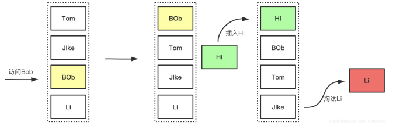

此处介绍的LRU是有明显的缺点，<br>
如上所述，对于偶发性、周期性的数据没有良好的抵抗力，很容易就造成缓存的污染，影响命中率，<br>
因此衍生出了很多的LRU算法的变种，用以处理这种偶发冷数据突增的场景，<br>
比如：LRU-K、Two Queues等，***目的就是当判别数据为偶发或周期的冷数据时，不会存入空间内，从而降低热数据的淘汰率***。<br>

优点：<br>
LRU 实现简单，在一般情况下能够表现出很好的命中率，是一个“性价比”很高的算法。<br>
LRU可以有效的对访问比较频繁的数据进行保护，也就是针对热点数据的命中率提高有明显的效果。<br>
LRU局部突发流量场景，对突发性的稀疏流量（sparse bursts）表现很好。<br>

缺点：<br>
在存在 周期性的局部热点 数据场景，有大概率可能造成缓存污染。<br>
最近访问的数据，并不一定是周期性数据，比如把全量的数据做一次迭代，那么LRU 会产生较大的缓存污染，因为周期性的局部热点数据，可能会被淘汰。<br>

演进一：LRU-K <br>
下图展示了LRU-K的简单工作过程，<br>
简单理解，LRU中的K是指数据被访问K次，传统LRU与此对比则可以认为传统LRU是LRU-1。<br>
可以看到LRU-K有两个队列，新来的元素先进入到历史访问队列中，该队列用于记录元素的访问次数，
采用的淘汰策略是LRU或者FIFO，当历史队列中的元素访问次数达到K的时候，才会进入缓存队列。<br>

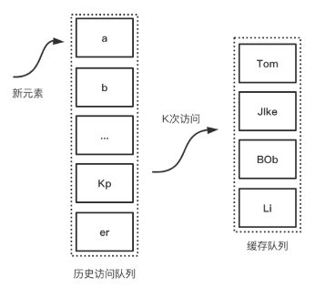

演进二：Two Queues <br>
下图展示了Two Queues的工作过程，<br>
Two Queues与LRU-K相比，他也同样是两个队列，不同之处在于，他的队列一个是缓存队列，一个是FIFO队列，<br>
当新元素进来的时候，首先进入FIFO队列，当该队列中的元素被访问的时候，会进入LRU队列，<br>
过程如下：<br>

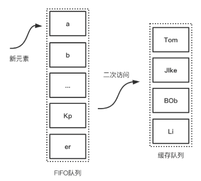

实际案例：<br>
Guava Cache是Google Guava工具包中的一个非常方便易用的本地化缓存实现，基于LRU算法实现，支持多种缓存过期策略。由于Guava的大量使用，Guava Cache也得到了大量的应用。
Guava的loading cache是使用LRU  的淘汰策略， 但是很多场景，最近的数据不一定热，存在周期性的热点数据，而LRU反而容易把稍旧的周期热数据挤出去，

- 3、LFU —— 适用于 局部周期性流量场景 <br>
LFU（The Least Frequently Used）最近很少使用算法，<br>
如果一个数据在最近一段时间内使用次数很少，使用频率最低，那么在将来一段时间内被使用的可能性也很小。<br>
***与LRU的区别在于LRU是以时间先后来衡量，LFU是以时间段内的使用次数衡量***<br>

算法：<br>
如果一个数据在一定时间内被访问的次数很低，那么被认为在未来被访问的概率也是最低的，<br>
当规定空间用尽且需要放入新数据的时候，会优先淘汰时间段内访问次数最低的数据 <br>

演示: <br>
下面描述了LFU的简单工作过程，首先是访问元素增加元素的访问次数，从而提高元素在队列中的位置，降低淘汰优先级， <br>
后面是插入新元素的时候，因为队列已经满了，所以优先淘汰在一定时间间隔内访问频率最低的元素 <br>

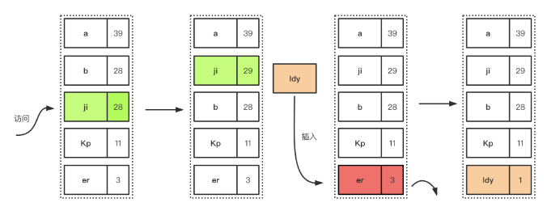

优点：<br>
LFU适用于局部周期性流量场景，在这个场景下，比LRU有更好的缓存命中率。<br>
在 局部周期性流量场景下， LFU是以次数为基准，所以更加准确，自然能有效的保证和提高命中率<br>

缺点：<br>
LFU 有几个的缺点：<br>
第一，因为LFU需要记录数据的访问频率，因此需要额外的空间；<br>
第二，它需要给每个记录项维护频率信息，每次访问都需要更新，这是个巨大的开销；<br>
第三，在存在 局部突发流量场景下，有大概率可能造成缓存污染， 算法命中率会急剧下降，这也是他最大弊端。 
所以，LFU  对突发性的稀疏流量（sparse bursts）是无效的。<br>

why：LFU 对突发性的稀疏流量无效呢？<br>
总体来说，LFU 按照访问次数或者访问频率取胜，这个次数有一个累计的长周期， 导致前期经常访问的数据，访问次数很大，或者说权重很高，<br>
新来的缓存数据， 哪怕他是突发热点，但是，新数据的访问次数累计的时间太短， 在老人面试，是个矮个子<br>
LFU 就想一个企业，有点论资排辈，排斥新人，新人进来，都需要吃苦头，哪怕他是明日之星<br>
所以，LFU 算法中，老的记录已经占用了缓存，过去的一些大量被访问的记录，在将来不一定会继续是热点数据，
但是就一直把“坑”占着了，而那些偶然的突破热点数据，不太可能会被保留下来，而是被淘汰。<br>
所以，在存在突发性的稀疏流量下，***LFU中的偶然的、稀疏的突发流量在访问频率上***，不占优势，很容易被淘汰，造成缓存污染和未来缓存命中率下降。<br>

LRU 和 LFU 的对比：<br>
LRU 实现简单，在一般情况下能够表现出很好的命中率，是一个“性价比”很高的算法，平时也很常用。<br>
LRU 的优点之一对突发性的稀疏流量（sparse bursts）表现很好。<br>
但是，LRU 这个优点也带来一个缺点：<br>

> 对于周期性的局部热点数据，有大概率可能造成缓存污染。

最近访问的数据，并不一定是周期性数据，比如把全量的数据做一次迭代，
那么LRU 会产生较大的缓存污染，因为周期性的数据，可能会被淘汰。

如果是 周期性局部热点数据 ，那么 LFU 可以达到最高的命中率。

但是 LFU 有仨个大的缺点：
- 第一，因为LFU需要记录数据的访问频率，因此需要额外的空间；
- 第二，它需要给每个记录项维护频率信息，每次访问都需要更新，这是个巨大的时间开销；
- 第三，对突发性的局部热点数据/稀疏流量（sparse bursts），算法命中率会急剧下降，这也是他最大弊端。

***无论 LRU 还是 LFU 都有其各自的缺点，不过，现在已经有很多针对其缺点而改良、优化出来的变种算法***。

- 4、TinyLFU <br>
TinyLFU 就是其中一个优化算法，***它是专门为了解决 LFU 上述提到的三个问题而被设计出来的***。<br>
第1：如何减少访问频率的保存，所带来的空间开销 <br>
第2：如何减少访问记录的更新，所带来的时间开销 <br>
第3：如果提升对局部热点数据的 算法命中率 <br>
解决第1个问题/第2个问题是采用了 Count–Min Sketch 算法。<br>
解决第二个问题是让老的访问记录，尽量保证“新鲜度”（Freshness Mechanism）<br>

首先：如何解决 访问频率 维护的时间开销和空间开销 <br>
- 访问频率维护的时间开销和空间开销 <br>

解决措施：使用Count-Min Sketch算法存储访问频率，极大的节省空间；并且减少hash碰撞。
关于Count-Min Sketch算法，可以看作是布隆过滤器的同源的算法，
假如我们用一个hashmap来存储每个元素的访问次数，那这个量级是比较大的，并且hash冲突的时候需要做一定处理，否则数据会产生很大的误差，
如果用hashmap的方式，相同的下标变成链表，这种方式会占用很大的内存，而且速度也不是很快。
其实一个hash函数会冲突是比较低的，布隆过滤器 的优化之一，设置多个hash函数，多个hash函数，个个都冲突的概率就微乎其微了。
Count-Min Sketch算法将一个hash操作，扩增为多个hash，这样原来hash冲突的概率就降低了几个等级，且当多个hash取得数据的时候，取最低值，也就是Count Min的含义所在。
Sketch 是草图、速写的意思。
将要介绍的 Count–Min Sketch 的原理跟 Bloom Filter 一样，只不过 Bloom Filter 只有 0 和 1 的值，那么你可以把 Count–Min Sketch 看作是“数值”版的 Bloom Filter。

布隆过滤器原理：<br>
布隆过滤器是由一个固定大小的二进制向量或者位图（bitmap）和一系列映射函数组成的。
在初始状态时，对于长度为 m 的位数组，它的所有位都被置为0，如下图所示：
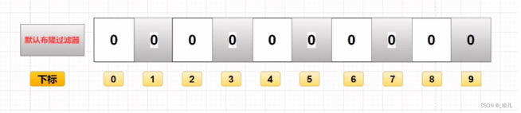

当有变量被加入集合时，通过 K 个映射函数将这个变量映射成位图中的 K 个点，把它们置为 1。

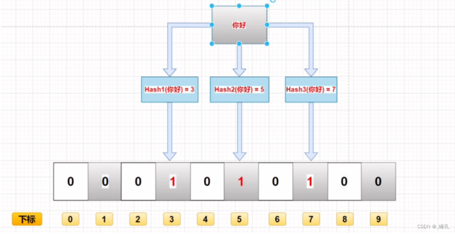

查询某个变量的时候我们只要看看这些点是不是都是 1 就可以大概率知道集合中有没有它了
- 如果这些点有任何一个 0，则被查询变量一定不在；
- 如果都是 1，则被查询变量很可能存在。为什么说是可能存在，而不是一定存在呢？那是因为映射函数本身就是散列函数，散列函数是会有碰撞的。

误判率：布隆过滤器的误判是指多个输入经过哈希之后在相同的bit位置1了，这样就无法判断究竟是哪个输入产生的，因此误判的根源在于相同的 bit 位被多次映射且置 1。
这种情况也造成了布隆过滤器的删除问题，因为布隆过滤器的每一个 bit 并不是独占的，很有可能多个元素共享了某一位。
如果我们直接删除这一位的话，会影响其他的元素。

特性：
- 一个元素如果判断结果为存在的时候元素不一定存在，但是判断结果为不存在的时候则一定不存在。
- 布隆过滤器可以添加元素，但是不能删除元素。因为删掉元素会导致误判率增加。

Count-Min Sketch算法原理
下图展示了Count-Min Sketch算法简单的工作原理：
1. 假设有四个hash函数，每当元素被访问时，将进行次数加1；
2. 此时会按照约定好的四个hash函数进行hash计算找到对应的位置，相应的位置进行+1操作；
3. 当获取元素的频率时，同样根据hash计算找到4个索引位置；
4. 取得四个位置的频率信息，然后根据Count Min取得最低值作为本次元素的频率值返回，即Min(Count);

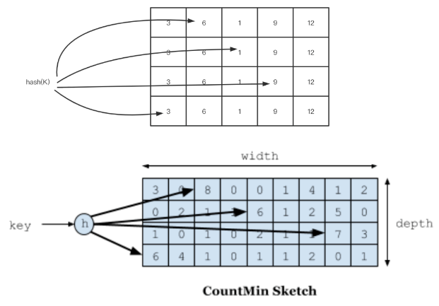

Count-Min Sketch算法详细实现方案如下：

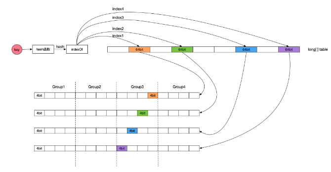

如何进行Count-Min Sketch访问次数的空间开销？ <br>
用4个hash函数会存访问次数，那空间就是4倍了。怎么优化呢

解决办法是：<br>
访问次数超过15次其实是很热的数据了，没必要存太大的数字。所以我们用4位就可以存到15了。<br>
一个long有64位，可以存16个4位。<br>
一个访问次数占4个位，一个long有64位，可以存 16个访问次数， 4个访问一次一组的话， 一个long 可以分为4组。<br>
一个 key 对应到 4个hash 值， 也就是 4个  访问次数，那么，一个long 可以分为存储 4个Key的 访问 次数。<br>
最终， 一个long对应的数组大小其实是容量的4倍了。<br>

其次，如果提升对局部热点数据的 算法命中率 <br>
答案是，保鲜机制 <br>
为了让缓存保证“新鲜度”，<br>
可以简单理解为： 访问次数太大， 越不新鲜， 适当降低，保证新鲜度。<br>
所以，Caffeine 有一个 Freshness Mechanism,<br>
Caffeine 会 剔除掉过往频率很高，但之后不经常的缓存，。<br>
做法很简答，<br>
就是当整体的统计计数（当前所有记录的频率统计之和，这个数值内部维护）达到某一个值时，那么所有记录的频率统计除以 2。<br>

***TinyLFU 的算法流程***<br>
TinyLFU’s architecture is illustrated in Figure 1.<br>
Here, the cache eviction policy picks a cache victim,  <br>
while TinyLFU decides if replacing the cache victim with the new item is expected to increase the  hit-ratio.<br>
当缓存空间不够的时候，TinyLFU找到要淘汰的元素 （the cache victim），也就是使用频率最小的元素 ，<br>
然后 TinyLFU 决定 将新元素放入缓存，替代 将 要淘汰的元素 （the cache victim）<br>
具体的流程如下：<br>

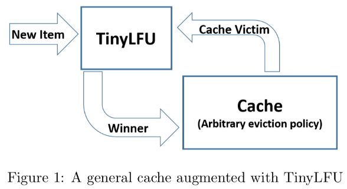

- 5、W-TinyLFU <br>
Caffeine 通过测试发现 TinyLFU 在面对突发性的稀疏流量（sparse bursts）时表现很差，<br>
why？<br>
因为新的记录（new items）还没来得及建立足够的频率就被剔除出去了，这就使得命中率下降。<br>

***W-TinyLFU是如何演进过来的呢？*** <br>
首先 W-TinyLFU 看名字就能大概猜出来，它是 LFU 的变种，也是TinyLFU的变种， 当然， 也是一种缓存淘汰算法。<br>
W-TinyLFU是如何演进过来的呢？<br>
前面讲到：<br>
- LRU能很好的 处理  局部突发流量
- LFU能很好的 处理  局部周期流量
so， 取其精华去其糟粕，结合二者的优点<br>
W-TinyLFU =  LRU +  LFU <br>
当然，总是有个是大股东，这就是  LFU， 或者说是 TinyLFU<br>
so：  W-TinyLFU（Window Tiny Least Frequently Used）是对TinyLFU的的优化和加强，加入 LRU  以应对局部突发流量， 从而实现缓存命中率的最优。<br>

> W-TinyLFU = LRU + LFU
> LRU能很好的处理局部突发流量
> LFU能很好的处理局部周期流量

***W-TinyLFU的数据架构***
W-TinyLFU 是怎么引入LRU的呢？他增加了一个 ***W-LRU窗口队列*** 的组件。
当一个数据进来的时候，会进行筛选比较，进入W-LRU窗口队列，
经过淘汰后进入Count-Min Sketch算法过滤器，通过访问访问频率判决, 是否进入缓存。
W-TinyLFU 的设计如下所示：

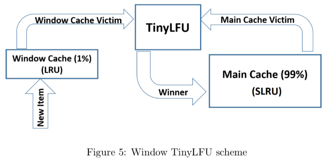

- W-LRU窗口队列 用于应 对 局部突发流量
- TinyLFU 用于 应对局部周期流量

如果一个数据最近被访问的次数很低，那么被认为在未来被访问的概率也是最低的，
当规定空间用尽的时候，会优先淘汰最近访问次数很低的数据；

***进一步的分治和解耦***
W-TinyLFU将缓存存储空间分为两个大的区域：Window Cache和Main Cache，<br>

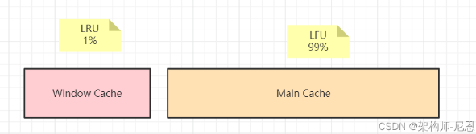

Window Cache是一个标准的LRU Cache，Main Cache则是一个SLRU（Segmented LRU）cache，<br>
Main Cache进一步划分为Protected Cache（保护区）和Probation Cache（考察区）两个区域，这两个区域都是基于LRU的Cache。<br>

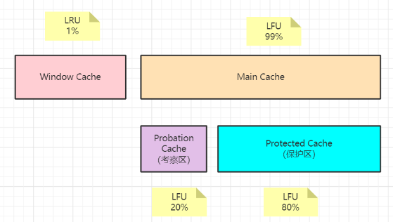

Protected 是一个受保护的区域，该区域中的缓存项不会被淘汰。
而且经过实验发现当 window 区配置为总容量的 1%，剩余的 99%当中的 80%分给 protected 区，
20%分给 probation 区时，这时整体性能和命中率表现得最好，所以 Caffeine 默认的比例设置就是这个。

***不过这个比例 Caffeine 会在运行时根据统计数据（statistics）去动态调整***，<br>
***如果你的应用程序的缓存随着时间变化比较快的话，或者说具备的突发特点数据多，那么增加 window 区的比例可以提高命中率***，<br>
如果周期性热点数据多，缓存都是比较固定不变的话，增加 Main Cache 区（protected 区 +probation【考察（期）】 区）的比例会有较好的效果。

***W-TinyLFU的算法流程*** <br>
当 window 区满了，就会根据 LRU 把 candidate（即淘汰出来的元素）放到 Probation区域，
Probation区域则是一个观察区，当有新的缓存项需要进入Probation区时，
如果Probation区空间已满，则会将新进入的缓存项与Probation区中根据LRU规则需要被淘汰（victim）的缓存项进行比较，
两个进行“PK”，胜者留在probation，输者就要被淘汰了。

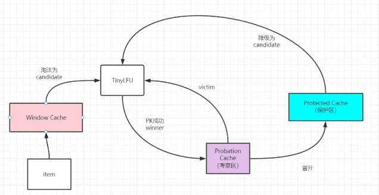

***TinyLFU写入机制为：***<br>
当有新的缓存项写入缓存时，会先写入Window Cache区域，当Window Cache空间满时，最旧的缓存项会被移出Window Cache。<br>
如果Probation Cache未满，从Window Cache移出的缓存项会直接写入Probation Cache；<br>
如果Probation Cache已满，则会根据TinyLFU算法确定从Window Cache移出的缓存项是丢弃（淘汰）还是写入Protected Cache。<br>
Probation Cache中的缓存项如果访问频率达到一定次数，会提升到Protected Cache；<br>
如果Protected Cache也满了，最旧的缓存项也会移出Protected Cache，然后根据TinyLFU算法确定是丢弃（淘汰）还是写入Probation Cache。<br>

***TinyLFU淘汰机制为：***<br>
从Window Cache或Protected Cache移出的缓存项称为Candidate，Probation Cache中最旧的缓存项称为Victim。<br>
如果Candidate缓存项的访问频率大于Victim缓存项的访问频率，则淘汰掉Victim。<br>
如果Candidate小于或等于Victim的频率，那么如果Candidate的频率小于5，则淘汰掉Candidate；否则，则在Candidate和Victim两者之中随机地淘汰一个。<br>
从上面对W-TinyLFU的原理描述可知，<br>
***caffeine综合了LFU和LRU的优势，将不同特性的缓存项存入不同的缓存区域，最近刚产生的缓存项进入Window区，不会被淘汰***；

- caffeine综合了LFU和LRU的优势；
- 将不同特性的缓存项存入不同的缓存区域
- 最近刚产生的缓存项进入Window区，不会被淘汰

访问频率高的缓存项进入Protected区，也不会淘汰；<br>
介于这两者之间的缓存项存在Probation区，当缓存空间满了时，Probation区的缓存项会根据访问频率判断是保留还是淘汰；<br>
通过这种机制，很好的平衡了访问频率和访问时间新鲜程度两个维度因素，尽量将新鲜的访问频率高的缓存项保留在缓存中。<br>
同时在维护缓存项访问频率时，引入计数器饱和和衰减机制，即节省了存储资源，也能较好的处理稀疏流量、短时超热点流量等传统LRU和LFU无法很好处理的场景。<br>

***W-TinyLFU的优点：***<br>
使用Count-Min Sketch算法存储访问频率，极大的节省空间；<br>
TinyLFU会 定期进行新鲜度提升、 访问次数的 衰减操作，应对访问模式变化；<br>
并且使用W-LRU机制能够尽可能避免缓存污染的发生，在过滤器内部会进行筛选处理，避免低频数据置换高频数据。<br>

***W-TinyLFU的缺点：***<br>
目前已知应用于Caffeine Cache组件里，应用不是很多。<br>

### W-TinyLFU与JVM分代内存关联的想通之处
在caffeine所有的数据都在ConcurrentHashMap中，这个和guava cache不同，
guava cache是自己实现了个类似ConcurrentHashMap的结构。

***与JVM分代内存类似，在caffeine中有三个记录引用的LRU队列:***

***Eden队列=window :***<br>
在caffeine中规定只能为缓存容量的1%,<br>
假如： size=100, 那Eden队列的有效大小就等于1。<br>
Eden的作用：记录的是新到的数据，防止突发流量由于之前没有访问频率，而导致被淘汰。<br>
- Eden的作用：记录的是新到的数据，防止突发流量由于之前没有访问频率，而导致被淘汰
比如有一部新剧上线，在最开始其实是没有访问频率的，<br>
防止上线之后被其他缓存淘汰出去，而加入这个区域。<br>
可以理解为，伊甸园区，保留的刚刚诞生的未年轻人，防止没有长大，直接被大人干死了。<br>
Eden队列满了之后， 淘汰的叫做candidate候选人，进入Probation队列<br>

***Probation队列:***
可以叫做考察队列，类似于survivor区 <br>
在这个队列就代表寿命开始延长，如果Eden队列队列已经满了， 那种最近没有被访问过的元素，数据相对比较冷，第一轮淘汰，进行Probation队列做临时的考察。<br>
如果经常了一段时间的积累，访问的频率还是不高，将被进入到 Protected队列。<br>
Probation队列满了之后， 淘汰的叫做 victim 牺牲品，进入Protected 队列 <br>

***Protected队列:***
可以叫做保护队列，类似于老年代 <br>
到了这个队列中，意味着已经取，你暂时不会被淘汰，<br>
但是别急，如果Probation队列没有数据，或者Protected数据满了，你也将会被面临淘汰的尴尬局面。<br>
当然想要变成这个队列，需要把Probation访问一次之后，就会提升为Protected队列。<br>
这个有效大小为(size减去eden) X 80% 如果size =100，就会是79。<br>

***这三个队列关系如下:***
所有的新数据都会进入Eden。 Eden满了，淘汰进入Probation。<br>
如果在Probation中访问了其中某个数据，如果考察区空间不够，则这个数据升级为Protected。<br>
如果Protected满了，又会继续降级为Probation。<br>
对于发生数据淘汰的时候，会从Eden中选择候选人，和Probation中victim进行淘汰pk。<br>
会把Probation队列中的数据队头称为受害者，这个队头肯定是最早进入Probation的，按照LRU队列的算法的话那他其实他就应该被淘汰，但是在这里只能叫他受害者，
Probation 是考察队列，代表马上要给他行刑了。<br>
Eden中选择候选人，也是Probation中队尾元素，也叫攻击者。这里受害者会和攻击者皇城PK决出我们应该被淘汰的。<br>
通过我们的Count-Min Sketch中的记录的频率数据有以下几个判断:<br>
如果 candidateFreq 大于victimFreq，那么受害者就直接被淘汰。<br>
如果 candidateFreq 大于 >=6，那么随机淘汰。<br>
如果 candidateFreq 大于 < 6，淘汰 candidate，留下victimKey<br>

### Java本地缓存使用实操

#### 基于HashMap实现LRU
通过Map的底层方式，直接将需要缓存的对象放在内存中。
- 优点：简单粗暴，不需要引入第三方包，比较适合一些比较简单的场景。
- 缺点：没有缓存淘汰策略，定制化开发成本高。
```
package com.crazymakercircle.cache;

import com.crazymakercircle.util.Logger;
import org.junit.Test;
import java.util.HashMap;
import java.util.LinkedHashMap;
import java.util.Map;

public class LruDemo {
    @Test
    public void testSimpleLRUCache() {
        SimpleLRUCache cache = new SimpleLRUCache( 2 /* 缓存容量 */ );
        cache.put(1, 1);
        cache.put(2, 2);
        Logger.cfo(cache.get(1));       // 返回  1
        cache.put(3, 3);    // 该操作会使得 2 淘汰
        Logger.cfo(cache.get(2));        // 返回 -1 (未找到)
        cache.put(4, 4);    // 该操作会使得 1 淘汰
        Logger.cfo(cache.get(1));        // 返回 -1 (未找到)
        Logger.cfo(cache.get(3));        // 返回  3
        Logger.cfo(cache.get(4));        // 返回  4
    }

    @Test
    public  void testLRUCache() {

        LRUCache cache = new LRUCache( 2 /* 缓存容量 */ );
        cache.put(1, 1);
        cache.put(2, 2);
        Logger.cfo(cache.get(1));       // 返回  1
        cache.put(3, 3);    // 该操作会使得 2 淘汰
        Logger.cfo(cache.get(2));        // 返回 -1 (未找到)
        cache.put(4, 4);    // 该操作会使得 1 淘汰
        Logger.cfo(cache.get(1));        // 返回 -1 (未找到)
        Logger.cfo(cache.get(3));        // 返回  3
        Logger.cfo(cache.get(4));        // 返回  4
    }
    
    // 简单的LRU缓存->继承自LinkedHashMap
    static class SimpleLRUCache extends LinkedHashMap<Integer, Integer> {
        // 容量
        private int capacity;
        public SimpleLRUCache(int capacity) {
            // 调用父类LinkedHashMap创建缓存容器
            super(capacity, 0.75F, true);
            this.capacity = capacity;
        }
        // 获取指定key对应的数据
        public int get(int key) {
            return super.getOrDefault(key, -1);
        }
        // 放入指定的键值对
        public void put(int key, int value) {
            super.put(key, value);
        }
        
        @Override
        protected boolean removeEldestEntry(Map.Entry<Integer, Integer> eldest) {
            // 当size大于容量时，返回true
            return size() > capacity;
        }
    }
    
    // 数据记录
    static  private class Entry {
        private int key;
        private int value;
        private Entry before;
        private Entry after;

        public Entry() {
        }

        public Entry(int key, int value) {
            this.key = key;
            this.value = value;
        }
    }

    static class LRUCache {
        // map容器 ，空间换时间，保存key对应的CacheNode，保证用O(1) 的时间获取到value
        private Map<Integer, Entry> cacheMap = new HashMap<Integer, Entry>();
        // 最大容量
        private int capacity;
        /**
         * 通过双向指针来保证数据的插入更新顺序，以及队尾淘汰机制
         */
        // 头指针
        private Entry head;
        // 尾指针
        private Entry tail;

        // 容器大小
        private int size;

        /**
         * 初始化双向链表，容器大小
         */
        public LRUCache(int capacity) {
            this.capacity = capacity;
            head = new Entry();
            tail = new Entry();
            head.after = tail;
            tail.before = head;
        }

        public int get(int key) {
            Entry node = cacheMap.get(key);
            if (node == null) {
                return -1;
            }
            // node != null,返回node后需要把访问的node移动到双向链表头部
            moveToHead(node);
            return node.value;
        }

        public void put(int key, int value) {
            Entry node = cacheMap.get(key);
            if (node == null) {
                //缓存不存在就新建一个节点，放入Map以及双向链表的头部
                Entry newNode = new Entry(key, value);
                cacheMap.put(key, newNode);
                addToHead(newNode);
                size++;
                //如果超出缓存容器大小，就移除队尾元素
                if (size > capacity) {
                    Entry removeNode = removeTail();
                    cacheMap.remove(removeNode.key);
                    size--;
                }
            } else {
                //如果已经存在，就把node移动到头部。
                node.value = value;
                moveToHead(node);
            }
        }

        /**
         * 移动节点到头部：
         * 1、删除节点
         * 2、把节点添加到头部
         */
        private void moveToHead(Entry node) {
            removeNode(node);
            addToHead(node);
        }

        /**
         * 移除队尾元素
         */
        private Entry removeTail() {
            Entry node = tail.before;
            removeNode(node);
            return node;
        }

        private void removeNode(Entry node) {

            node.before.after = node.after;
            node.after.before = node.before;
        }

        /**
         * 把节点添加到头部
         */
        private void addToHead(Entry node) {
            head.after.before = node;
            node.after = head.after;
            head.after = node;
            node.before = head;
        }
    }
}
```

#### Guava Cache使用案例
Guava Cache是由Google开源的基于LRU替换算法的缓存技术。
但Guava Cache由于被下面即将介绍的Caffeine全面超越而被取代，
因此不特意编写示例代码了，有兴趣的读者可以访问Guava Cache主页。
- 优点：支持最大容量限制，两种过期删除策略（插入时间和访问时间），支持简单的统计功能。
- 缺点：springboot2和spring5都放弃了对Guava Cache的支持。


#### Caffeine使用案例
Caffeine采用了W-TinyLFU（LRU和LFU的优点结合）开源的缓存技术。
缓存性能接近理论最优，属于是Guava Cache的增强版。

***Caffeine采用了W-TinyLFU（LRU和LFU的优点结合）开源的缓存技术。***
***缓存性能接近理论最优，属于是Guava Cache的增强版***

```java
package com.github.benmanes.caffeine.demo;

import com.github.benmanes.caffeine.cache.*;
import org.checkerframework.checker.nullness.qual.NonNull;
import org.checkerframework.checker.nullness.qual.Nullable;

import java.util.concurrent.TimeUnit;

public class Demo1 {
    static System.Logger logger = System.getLogger(Demo1.class.getName());

    public static void hello(String[] args) {
        System.out.println("args = " + args);
    }


    public static void main(String... args) throws Exception {
        // 建造者模式创建Caffeine缓存容器
        Cache<String, String> cache =  Caffeine.newBuilder()
                // 最大个数限制
                // 最大容量1024个，超过会自动清理空间
                .maximumSize(1024)
                // 初始化容量
                .initialCapacity(1)
                // 访问后过期（包括读和写）
                // 5秒没有读写自动删除->access存取
                .expireAfterAccess(5, TimeUnit.SECONDS)
                // 写后过期->2小时过期
                .expireAfterWrite(2, TimeUnit.HOURS)
                // 写后自动异步刷新->1小时
                .refreshAfterWrite(1, TimeUnit.HOURS)
                // 记录下缓存的一些统计数据，例如命中率等
                .recordStats()
                .removalListener(((key, value, cause) -> {
                    // 打印key清除日志
                    // 清理通知 key,value ==> 键值对   cause ==> 清理原因
                    System.out.println("removed key="+ key);
                }))
                // 使用CacheLoader创建一个LoadingCache
                .build(new CacheLoader<String, String>() {
                    // 同步加载数据
                    @Nullable
                    @Override
                    public String load(@NonNull String key) throws Exception {
                        System.out.println("loading  key="+ key);
                        return "value_" + key;
                    }
                    // 异步加载数据
                    @Nullable
                    @Override
                    public String reload(@NonNull String key, @NonNull String oldValue) throws Exception {
                        System.out.println("reloading  key="+ key);
                        return "value_" + key;
                    }
                });

        // 添加值
        cache.put("name", "疯狂创客圈");
        cache.put("key", "一个高并发研究社群");

        // 获取值
        @Nullable String value = cache.getIfPresent("name");
        System.out.println("value = " + value);
        // remove->invalidate：使失效
        cache.invalidate("name");
        value = cache.getIfPresent("name");
        System.out.println("value = " + value);
    }
}
```

#### EHCache使用案例
Ehcache是一个纯java的进程内缓存框架，具有快速、精干的特点。
是hibernate默认的cacheprovider。
- 优点：支持多种缓存淘汰算法，包括LFU，LRU和FIFO；***缓存支持堆内缓存，堆外缓存和磁盘缓存***；支持多种集群方案，解决数据共享问题。
- 缺点：性能比Caffeine差

```java
package com.crazymakercircle.cache;

import com.crazymakercircle.im.common.bean.User;
import com.crazymakercircle.util.IOUtil;
import net.sf.ehcache.Cache;
import net.sf.ehcache.CacheManager;
import net.sf.ehcache.Element;
import net.sf.ehcache.config.CacheConfiguration;

import java.io.InputStream;

import static com.crazymakercircle.util.IOUtil.getResourcePath;

public class EhcacheDemo {
    public static void main(String[] args) {
        // 1. 创建缓存管理器
        String inputStream= getResourcePath( "ehcache.xml");
        CacheManager cacheManager = CacheManager.create(inputStream);

        // 2. 获取缓存对象->HelloWorldCache是缓存的名称
        Cache cache = cacheManager.getCache("HelloWorldCache");
        CacheConfiguration config = cache.getCacheConfiguration();
        // 空闲时间
        config.setTimeToIdleSeconds(60);
        // 存活时间
        config.setTimeToLiveSeconds(120);

        // 3. 创建元素
        Element element = new Element("key1", "value1");
         
        // 4. 将元素添加到缓存
        cache.put(element);
         
        // 5. 获取缓存
        Element value = cache.get("key1");
        System.out.println("value: " + value);
        System.out.println(value.getObjectValue());
         
        // 6. 删除元素
        cache.remove("key1");
         
        User user = new User("1000", "Javaer1");
        Element element2 = new Element("user", user);
        cache.put(element2);
        Element value2 = cache.get("user");
        System.out.println("value2: "  + value2);
        User user2 = (User) value2.getObjectValue();
        System.out.println(user2);
         
        System.out.println(cache.getSize());
         
        // 7. 刷新缓存->清除掉缓存内的所有数据
        cache.flush();
         
        // 8. 关闭缓存管理器
        cacheManager.shutdown();
 
    }
}

public class EncacheTest {
    public static void main(String[] args) throws Exception {
        // 声明一个cacheBuilder
        CacheManager cacheManager = CacheManagerBuilder.newCacheManagerBuilder()                
                .withCache("encacheInstance", CacheConfigurationBuilder   //声明一个容量为20的堆内缓存
                .newCacheConfigurationBuilder(String.class,String.class, ResourcePoolsBuilder.heap(20)))                .build(true);        
        Cache<String,String> myCache =  cacheManager.getCache("encacheInstance", String.class, String.class);
        // 写缓存
        myCache.put("key","v");
        // 读缓存
        String value = myCache.get("key");
        // 移除换粗
        cacheManager.removeCache("myCache");
        cacheManager.close();
    }
}
```

#### caffeine 的使用实操
在 pom.xml 中添加 caffeine 依赖：
```xml
<dependency>
    <groupId>com.github.ben-manes.caffeine</groupId>
    <artifactId>caffeine</artifactId>
    <version>2.5.5</version>
</dependency>
```

创建一个 Caffeine 缓存（类似一个map）：
```
Cache<String, Object> manualCache = Caffeine.newBuilder()
        .expireAfterWrite(10, TimeUnit.MINUTES)
        .maximumSize(10_000)
        .build();
```

常见用法：
```
public static void main(String... args) throws Exception {
        Cache<String, String> cache =  Caffeine.newBuilder()
                //最大个数限制
                //最大容量1024个，超过会自动清理空间
                .maximumSize(1024)
                //初始化容量
                .initialCapacity(1)
                //访问后过期（包括读和写）
                //5秒没有读写自动删除
                .expireAfterAccess(5, TimeUnit.SECONDS)
                //写后过期
                .expireAfterWrite(2, TimeUnit.HOURS)
                //写后自动异步刷新
                .refreshAfterWrite(1, TimeUnit.HOURS)
                //记录下缓存的一些统计数据，例如命中率等
                .recordStats()
                .removalListener(((key, value, cause) -> {
                    //清理通知 key,value ==> 键值对   cause ==> 清理原因
                  System.out.println("removed key="+ key);
                }))
                //使用CacheLoader创建一个LoadingCache
                .build(new CacheLoader<String, String>() {
                    //同步加载数据
                    @Nullable
                    @Override
                    public String load(@NonNull String key) throws Exception {
                        System.out.println("loading  key="+ key);
                        return "value_" + key;
                    }

                    //异步加载数据
                    @Nullable
                    @Override
                    public String reload(@NonNull String key, @NonNull String oldValue) throws Exception {
                        System.out.println("reloading  key="+ key);
                        return "value_" + key;
                    }
                });

        //添加值
        cache.put("name", "疯狂创客圈");
        cache.put("key", "一个高并发 研究社群");

        //获取值
        @Nullable String value = cache.getIfPresent("name");
        System.out.println("value = " + value);
        //remove
        cache.invalidate("name");
        value = cache.getIfPresent("name");
        System.out.println("value = " + value);
    }
```

参数方法：
- initialCapacity(1) 初始缓存长度为1；
- maximumSize(100) 最大长度为100；
- expireAfterWrite(1, TimeUnit.DAYS) 设置缓存策略在1天未写入过期缓存。

过期策略 <br>
在Caffeine中分为两种缓存，一个是有界缓存，一个是无界缓存，无界缓存不需要过期并且没有界限。<br>
在有界缓存中提供了三个过期API：<br>
- expireAfterWrite：代表着写了之后多久过期。（上面列子就是这种方式）
- expireAfterAccess：代表着最后一次访问了之后多久过期。
- expireAfter：在expireAfter中需要自己实现Expiry接口，这个接口支持create、update、以及access了之后多久过期。
注意这个API和前面两个API是互斥的。这里和前面两个API不同的是，需要你告诉缓存框架，它应该在具体的某个时间过期，
也就是通过前面的***重写create、update、以及access的方法，获取具体的过期时间***。

### 填充（Population）特性
填充特性是指如何在key不存在的情况下，如何创建一个对象进行返回，主要分为下面四种

- 1 手动(Manual)
```
public static void main(String... args) throws Exception {
        Cache<String, Integer> cache = Caffeine.newBuilder().build();

        Integer age1 = cache.getIfPresent("张三");
        System.out.println(age1);

        //当key不存在时，会立即创建出对象来返回，age2不会为空
        Integer age2 = cache.get("张三", k -> {
            System.out.println("k:" + k);
            return 18;
        });
        System.out.println(age2);
}
null
k:张三
18
```

Cache接口允许显式的去控制缓存的检索，更新和删除。
我们可以通过cache.getIfPresent(key) 方法来获取一个key的值，
通过cache.put(key, value)方法显示的将数据放入缓存，
但是这样子会覆盖原来key的数据。
更加建议使用cache.get(key，k - > value) 的方式，get 方法将一个参数为 key 的 Function (createExpensiveGraph) 作为参数传入。
如果缓存中不存在该键，则调用这个 Function 函数，并将返回值作为该缓存的值插入缓存中。
***get 方法是以阻塞方式执行调用，即使多个线程同时请求该值也只会调用一次Function方法***。
***这样可以避免与其他线程的写入竞争，这也是为什么使用 get 优于 getIfPresent 的原因***。

注意：如果调用该方法返回NULL（如上面的 createExpensiveGraph 方法），
则cache.get返回null，如果调用该方法抛出异常，则get方法也会抛出异常。
可以使用Cache.asMap() 方法获取ConcurrentMap进而对缓存进行一些更改。

- 2 自动(Loading)
```
public static void main(String... args) throws Exception {

    //此时的类型是 LoadingCache 不是 Cache
    LoadingCache<String, Integer> cache = Caffeine.newBuilder().build(key -> {
        System.out.println("自动填充:" + key);
        return 18;
    });

    Integer age1 = cache.getIfPresent("张三");
    System.out.println(age1);

    // key 不存在时 会根据给定的CacheLoader自动装载进去
    Integer age2 = cache.get("张三");
    System.out.println(age2);
}
null
自动填充:张三
18
```

- 3 异步手动(Asynchronous Manual)
```
public static void main(String... args) throws Exception {
    AsyncCache<String, Integer> cache = Caffeine.newBuilder().buildAsync();

    //会返回一个 future对象， 调用future对象的get方法会一直卡住直到得到返回，和多线程的submit一样
    CompletableFuture<Integer> ageFuture = cache.get("张三", name -> {
        System.out.println("name:" + name);
        return 18;
    });

    Integer age = ageFuture.get();
    System.out.println("age:" + age);
}
name:张三
age:18
```

- 4 异步自动(Asynchronously Loading)
```
public static void main(String... args) throws Exception {
    //和1.4基本差不多
    AsyncLoadingCache<String, Integer> cache = Caffeine.newBuilder().buildAsync(name -> {
        System.out.println("name:" + name);
        return 18;
    });
    CompletableFuture<Integer> ageFuture = cache.get("张三");

    Integer age = ageFuture.get();
    System.out.println("age:" + age);
}
```

### refresh刷新策略
何为更新策略？***就是在设定多长时间后会自动刷新缓存***。
***Caffeine提供了refreshAfterWrite()方法，来让我们进行写后多久更新策略***：
```
// 设定写入1天后，更新缓存
LoadingCache<String, String> build = CacheBuilder.newBuilder().refreshAfterWrite(1, TimeUnit.DAYS)
   .build(new CacheLoader<String, String>() {
          @Override
          public String load(String key)  {
             return "";
          }
    });
}
```
上面的代码我们需要建立一个CacheLoader来进行刷新，这里是同步进行的，可以通过buildAsync方法进行异步构建。<br>
在实际业务中这里可以把我们代码中的mapper传入进去，进行数据源的刷新。<br>
但是实际使用中，你设置了一天刷新，但是一天后你发现缓存并没有刷新。<br>
这是因为只有在1天后这个缓存再次访问后才能刷新，如果没人访问，那么永远也不会刷新。<br>
我们来看看自动刷新是怎么做的呢？<br>
自动刷新只存在读操作之后，也就是我们的afterRead()这个方法，
其中有个方法叫refreshIfNeeded，它会根据你是同步还是异步然后进行刷新处理。

### 驱逐策略（eviction）
Caffeine提供三类驱逐策略：基于大小（size-based），基于时间（time-based）和基于引用（reference-based）。

#### 基于大小（size-based）
基于大小驱逐，有两种方式：一种是基于缓存大小，一种是基于权重。
```
// Evict based on the number of entries in the cache
// 根据缓存的计数进行驱逐
LoadingCache<Key, Graph> graphs = Caffeine.newBuilder()
    .maximumSize(10_000)
    .build(key -> createExpensiveGraph(key));

// Evict based on the number of vertices[至高点；天顶；头顶（vertex 的复数）] in the cache
// 根据缓存的权重来进行驱逐（权重只是用于确定缓存大小，不会用于决定该缓存是否被驱逐）
// weigher：过磅员，过秤员；秤物机
LoadingCache<Key, Graph> graphs = Caffeine.newBuilder()
    .maximumWeight(10_000)
    .weigher((Key key, Graph graph) -> graph.vertices().size())
    .build(key -> createExpensiveGraph(key));
```
我们可以使用Caffeine.maximumSize(long)方法来指定缓存的最大容量。当缓存超出这个容量的时候，会使用Window TinyLfu策略来删除缓存。<br>
我们也可以使用权重的策略来进行驱逐，可以使用Caffeine.weigher(Weigher) 函数来指定权重，使用Caffeine.maximumWeight(long) 函数来指定缓存最大权重值。<br>
maximumWeight与maximumSize不可以同时使用。<br>

#### 基于时间（Time-based）
```
// Evict based on a fixed expiration policy
// 基于固定的到期策略进行退出
LoadingCache<Key, Graph> graphs = Caffeine.newBuilder()
    .expireAfterAccess(5, TimeUnit.MINUTES)
    .build(key -> createExpensiveGraph(key));
LoadingCache<Key, Graph> graphs = Caffeine.newBuilder()
    .expireAfterWrite(10, TimeUnit.MINUTES)
    .build(key -> createExpensiveGraph(key));
    
// Evict based on a varying expiration policy
// 基于不同的到期策略进行退出
LoadingCache<Key, Graph> graphs = Caffeine.newBuilder()
    .expireAfter(new Expiry<Key, Graph>() {
      @Override
      public long expireAfterCreate(Key key, Graph graph, long currentTime) {
        // Use wall clock time, rather than nanotime, if from an external resource
        long seconds = graph.creationDate().plusHours(5)
            .minus(System.currentTimeMillis(), MILLIS)
            .toEpochSecond();
        return TimeUnit.SECONDS.toNanos(seconds);
      }
      
      @Override
      public long expireAfterUpdate(Key key, Graph graph, 
          long currentTime, long currentDuration) {
        return currentDuration;
      }
      
      @Override
      public long expireAfterRead(Key key, Graph graph,
          long currentTime, long currentDuration) {
        return currentDuration;
      }
    })
    .build(key -> createExpensiveGraph(key));
```
Caffeine提供了三种定时驱逐策略：
- expireAfterAccess(long, TimeUnit):在最后一次访问或者写入后开始计时，在指定的时间后过期。
假如一直有请求访问该key，那么这个缓存将一直不会过期。
- expireAfterWrite(long, TimeUnit): 在最后一次写入缓存后开始计时，在指定的时间后过期。
- expireAfter(Expiry): 自定义策略，过期时间由Expiry实现独自计算。

***缓存的删除策略使用的是惰性删除和定时删除***。这两个删除策略的时间复杂度都是O(1)。
- 惰性删除
- 定时删除

测试定时驱逐不需要等到时间结束。
我们可以使用Ticker接口和Caffeine.ticker(Ticker)方法在缓存生成器中指定时间源，而不必等待系统时钟。
如：

```
FakeTicker ticker = new FakeTicker(); // Guava's testlib
Cache<Key, Graph> cache = Caffeine.newBuilder()
    .expireAfterWrite(10, TimeUnit.MINUTES)
    .executor(Runnable::run)
    .ticker(ticker::read)
    .maximumSize(10)
    .build();
cache.put(key, graph);
ticker.advance(30, TimeUnit.MINUTES)
assertThat(cache.getIfPresent(key), is(nullValue());
```

#### 基于引用（reference-based）
Java4种引用的级别由高到低依次为：强引用  >  软引用  >  弱引用  >  虚引用
- 强引用
- 软引用
- 弱引用
- 虚引用

|引用类型	|被垃圾回收时间|用途|生存时间|
|---|---|---|---|
|强引用|从来不会|对象的一般状态	|JVM停止运行时终止|
|软引用|在内存不足时|对象缓存	|内存不足时终止|
|弱引用|在垃圾回收时|对象缓存	|gc运行后终止|
|虚引用|在垃圾回收时|堆外内存	|虚引用的通知特性来管理的堆外内存|

##### 1、强引用
以前我们使用的大部分引用实际上都是强引用，这是使用最普遍的引用。
如果一个对象具有强引用，那就类似于必不可少的生活用品，垃圾回收器绝不会回收它。
当内存空间不足，Java虚拟机宁愿抛出OutOfMemoryError错误，
使程序异常终止，也不会靠随意回收具有强引用的对象来解决内存不足问题。 
如:
```
String str = "abc";
List<String> list = new Arraylist<String>();
list.add(str)
在list集合里的数据不会释放，即使内存不足也不会
```

在ArrayList类中定义了一个私有的变量elementData数组，在调用方法清空数组时可以看到为每个数组内容赋值为null。
不同于elementData=null，强引用仍然存在，避免在后续调用 add()等方法添加元素时进行重新的内存分配。
使用如clear()方法中释放内存的方法对数组中存放的引用类型特别适用，这样就可以及时释放内存。

##### 2、软引用（SoftReference）
特色：
- 内存溢出之前进行回收，GC时内存不足时回收，如果内存足够就不回收
- 使用场景：***在内存足够的情况下进行缓存，提升速度，内存不足时JVM自动回收***

> 内存溢出之前进行回收，GC时内存不足时回收，如果内存足够就不回收，使用场景：在内存足够的情况下进行缓存，提升速度，内部不足时JVM自动回收

如果一个对象只具有软引用，那就类似于可有可无的生活用品。<br>
如果内存空间足够，垃圾回收器就不会回收它，如果内存空间不足了，就会回收这些对象的内存。<br>
只要垃圾回收器没有回收它，该对象就可以被程序使用。软引用可用来实现内存敏感的高速缓存。<br>
- 软引用可用来实现内存敏感的高速缓存

软引用可以和一个引用队列（ReferenceQueue）联合使用，
如果软引用所引用的对象被垃圾回收，JAVA虚拟机就会把这个软引用加入到与之关联的引用队列中。 如：

```java
public class Test {  
    public static void main(String[] args){  
        System.out.println("开始");            
        A a = new A();            
        SoftReference<A> sr = new SoftReference<A>(a);  
        a = null;  
        if(sr!=null){  
            a = sr.get();  
        }  
        else{  
            a = new A();  
            sr = new SoftReference<A>(a);  
        }            
        System.out.println("结束");     
    }       

}  

class A{  
    int[] a ;  
    public A(){  
        a = new int[100000000];  
    }  
}  
```
当内存足够大时可以把数组存入软引用，
取数据时就可从内存里取数据，提高运行效率

##### 3．弱引用（WeakReference）
特色：
- 每次GC时回收，无论内存是否足够
- 使用场景：a.ThreadLocalMap防止内存泄漏  b.监控对象是否将要被回收

如果一个对象只具有弱引用，那就类似于可有可无的生活用品。<br>
弱引用与软引用的区别在于：只具有弱引用的对象拥有更短暂的生命周期。
在垃圾回收器线程扫描它所管辖的内存区域的过程中，一旦发现了只具有弱引用的对象，不管当前内存空间足够与否，都会回收它的内存。
不过，由于垃圾回收器是一个优先级很低的线程， 因此不一定会很快发现那些只具有弱引用的对象。<br>
弱引用可以和一个引用队列（ReferenceQueue）联合使用，如果弱引用所引用的对象被垃圾回收，Java虚拟机就会把这个弱引用加入到与之关联的引用队列中。 如：

```
Object c = new Car(); //只要c还指向car object, car object就不会被回收
WeakReference<Car> weakCar = new WeakReference(Car)(car);
```
当要获得weak reference引用的object时, 首先需要判断它是否已经被回收:
```
weakCar.get();
```
如果此方法为空, 那么说明weakCar指向的对象已经被回收了.

> 如果这个对象是偶尔的使用，并且希望在使用时随时就能获取到，但又不想影响此对象的垃圾收集，那么你应该用 Weak Reference 来记住此对象。

当你想引用一个对象，但是这个对象有自己的生命周期，你不想介入这个对象的生命周期，这时候你就是用弱引用。

> 这个引用不会在对象的垃圾回收判断中产生任何附加的影响。

##### 4．虚引用（PhantomReference）
“虚引用”顾名思义，就是形同虚设，与其他几种引用都不同，虚引用并不会决定对象的生命周期。<br>
如果一个对象仅持有虚引用，那么它就和没有任何引用一样，在任何时候都可能被垃圾回收。<br>
虚引用主要用来跟踪对象被垃圾回收的活动。<br>
虚引用与软引用和弱引用的一个区别在于：虚引用必须和引用队列（ReferenceQueue）联合使用。<br>
当垃圾回收器准备回收一个对象时，如果发现它还有虚引用，就会在回收对象的内存之前，把这个虚引用加入到与之关联的引用队列中。<br>
程序可以通过判断引用队列中是否已经加入了虚引用，来了解被引用的对象是否将要被垃圾回收。
程序如果发现某个虚引用已经被加入到引用队列，那么就可以在所引用的对象的内存被回收之前采取必要的行动。<br>
特别注意，在实际程序设计中一般很少使用弱引用与虚引用，使用软引用的情况较多，这是因为软引用可以加速JVM对垃圾内存的回收速度，
可以维护系统的运行安全，防止内存溢出（OutOfMemory）等问题的产生。<br>

- 在实际程序设计中一般很少使用弱引用与虚引用，使用软引用的情况较多
- 这是因为软引用可以加速JVM对垃圾内存的回收速度
- 可以维护系统的运行安全，防止内存溢出（OutOfMemory）

###### byteBuffer回收对外内存的流程
两种使用堆外内存的方法，一种是依靠unsafe对象，另一种是NIO中的ByteBuffer，直接使用unsafe对象来操作内存，
对于一般开发者来说难度很大，并且如果内存管理不当，容易造成内存泄漏。所以不推荐。

- 依靠unsafe对象
- NIO中的ByteBuffer

推荐使用的是ByteBuffer来操作堆外内存。<br>
在上面的ByteBuffer如何触发堆外内存的回收呢？是通过虚引用的关联线程是实现的。<br>

当byteBuffer被回收后，在进行GC垃圾回收的时候，***发现虚引用对象Cleaner是PhantomReference类型的对象***，并且被该对象引用的对象（ByteBuffer对象）已经被回收了
那么他就将将这个对象放入到（ReferenceQueue）队列中<br>
JVM中会有一个优先级很低的线程会去将该队列中的虚引用对象取出来，然后回调clean（）方法<br>
在clean（）方法里做的工作其实就是根据内存地址去释放这块内存（内部还是通过unsafe对象去释放的内存）。<br>

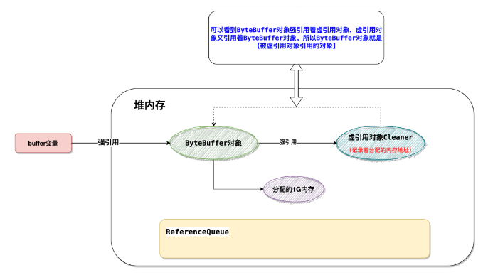

可以看到被虚引用引用的对象其实就是这个byteBuffer对象。<br>
所以说需要重点关注的是这个byteBuffer对象被回收了以后会触发什么操作。<br>

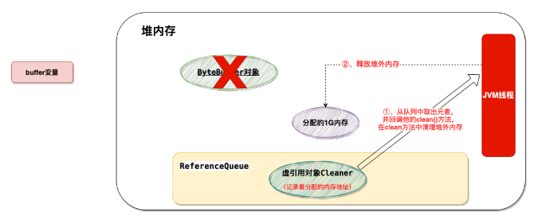

***缓存的驱逐配置成基于垃圾回收器***

```
// Evict when neither the key nor value are strongly reachable
// 当key和value都没有引用时驱逐缓存
LoadingCache<Key, Graph> graphs = Caffeine.newBuilder()
    .weakKeys()
    .weakValues()
    .build(key -> createExpensiveGraph(key));

// Evict when the garbage collector needs to free memory
// 当垃圾收集器需要释放内存时驱逐
LoadingCache<Key, Graph> graphs = Caffeine.newBuilder()
    .softValues()
    .build(key -> createExpensiveGraph(key));
```

我们可以将缓存的驱逐配置成基于垃圾回收器。
为此，我们可以将key 和 value 配置为弱引用或只将值配置成软引用。

注意：AsyncLoadingCache不支持弱引用和软引用。<br>
Caffeine.weakKeys() 使用弱引用存储key。如果没有其他地方对该key有强引用，那么该缓存就会被垃圾回收器回收。
由于垃圾回收器只依赖于身份(identity)相等，因此这会导致整个缓存使用身份 (==) 相等来比较 key，而不是使用 equals()。<br>
Caffeine.weakValues() 使用弱引用存储value。如果没有其他地方对该value有强引用，那么该缓存就会被垃圾回收器回收。
由于垃圾回收器只依赖于身份(identity)相等，因此这会导致整个缓存使用身份 (==) 相等来比较 key，而不是使用 equals()。<br>
Caffeine.softValues() 使用软引用存储value。当内存满了过后，***软引用的对象以将使用最近最少使用(least-recently-used ) 的方式进行垃圾回收***。
由于使用软引用是需要等到内存满了才进行回收，所以我们通常建议给缓存配置一个使用内存的最大值。 softValues() 将使用身份相等(identity) (==) 而不是equals() 来比较值。
注意：Caffeine.weakValues()和Caffeine.softValues()不可以一起使用。

### Removal移除特性
概念：
- 驱逐（eviction）：由于满足了某种驱逐策略，后台自动进行的删除操作
- 无效（invalidation）：表示由调用方手动删除缓存
- 移除（removal）：监听驱逐或无效操作的监听器

> 驱逐 & 无效 & 移除

#### 手动删除缓存：
在任何时候，您都可以明确地使缓存无效，而不用等待缓存被驱逐。
```
// individual key
cache.invalidate(key)
// bulk keys
cache.invalidateAll(keys)
// all keys
cache.invalidateAll()
```

Removal 监听器：
```
Cache<Key, Graph> graphs = Caffeine.newBuilder()
    .removalListener((Key key, Graph graph, RemovalCause cause) ->
        System.out.printf("Key %s was removed (%s)%n", key, cause))
    .build();
```

您可以通过Caffeine.removalListener(RemovalListener) 为缓存指定一个删除侦听器，以便在删除数据时执行某些操作。 
RemovalListener可以获取到key、value和RemovalCause（删除的原因）。

删除侦听器的里面的操作是使用Executor来异步执行的。默认执行程序是ForkJoinPool.commonPool()，
可以通过Caffeine.executor(Executor)覆盖。
当操作必须与删除同步执行时，请改为使用CacheWrite，CacheWrite将在下面说明。

注意：由RemovalListener抛出的任何异常都会被记录（使用Logger）并不会抛出。

### 刷新（Refresh）
```
LoadingCache<Key, Graph> graphs = Caffeine.newBuilder()
    .maximumSize(10_000)
    // 指定在创建缓存或者最近一次更新缓存后经过固定的时间间隔，刷新缓存
    .refreshAfterWrite(1, TimeUnit.MINUTES)
    .build(key -> createExpensiveGraph(key));
```

刷新和驱逐是不一样的。刷新的是通过LoadingCache.refresh(key)方法来指定，
并通过调用CacheLoader.reload方法来执行，刷新key会异步地为这个key加载新的value，
并返回旧的值（如果有的话）。驱逐会阻塞查询操作直到驱逐作完成才会进行其他操作。

与expireAfterWrite不同的是，refreshAfterWrite将在查询数据的时候判断该数据是不是符合查询条件，
如果符合条件该缓存就会去执行刷新操作。例如，您可以在同一个缓存中同时指定refreshAfterWrite和expireAfterWrite，
只有当数据具备刷新条件的时候才会去刷新数据，不会盲目去执行刷新操作。如果数据在刷新后就一直没有被再次查询，那么该数据也会过期。
刷新操作是使用Executor异步执行的。默认执行程序是ForkJoinPool.commonPool()，可以通过Caffeine.executor(Executor)覆盖。
如果刷新时引发异常，则使用log记录日志，并不会抛出。

#### Writer直接写（write-through ）
```
LoadingCache<Key, Graph> graphs = Caffeine.newBuilder()
  .writer(new CacheWriter<Key, Graph>() {
    @Override public void write(Key key, Graph graph) {
      // write to storage or secondary cache
    }
    @Override public void delete(Key key, Graph graph, RemovalCause cause) {
      // delete from storage or secondary cache
    }
  })
  .build(key -> createExpensiveGraph(key));
```

CacheWriter允许缓存充当一个底层资源的代理，当与CacheLoader结合使用时，
所有对缓存的读写操作都可以通过Writer进行传递。
Writer可以把操作缓存和操作外部资源扩展成一个同步的原子性操作。
并且在缓存写入完成之前，它将会阻塞后续的更新缓存操作，但是读取（get）将直接返回原有的值。
如果写入程序失败，那么原有的key和value的映射将保持不变，如果出现异常将直接抛给调用者。<br>

CacheWriter可以同步的监听到缓存的创建、变更和删除操作。
加载（例如，LoadingCache.get）、重新加载（例如，LoadingCache.refresh）和计算（例如Map.computeIfPresent）的操作不被CacheWriter监听到。
注意：CacheWriter不能与weakKeys或AsyncLoadingCache结合使用。<br>

#### 写模式（Write Modes）
CacheWriter可以用来实现一个直接写（write-through ）或回写（write-back ）缓存的操作。
write-through式缓存中，写操作是一个同步的过程，只有写成功了才会去更新缓存。这避免了同时去更新资源和缓存的条件竞争。
write-back式缓存中，对外部资源的操作是在缓存更新后异步执行的。
这样可以提高写入的吞吐量，避免数据不一致的风险，比如如果写入失败，则在缓存中保留无效的状态。
这种方法可能有助于延迟写操作，直到指定的时间，限制写速率或批写操作。
通过对write-back进行扩展，我们可以实现以下特性：
- 批处理和合并操作
- 延迟操作并到一个特定的时间执行
- 如果超过阈值大小，则在定期刷新之前执行批处理
- 如果操作尚未刷新，则从写入后缓冲器（write-behind）加载
- 根据外部资源的特点，处理重审，速率限制和并发
- 可以参考一个简单的例子，使用RxJava实现。

#### 分层（Layering）
CacheWriter可能用来集成多个缓存进而实现多级缓存。
多级缓存的加载和写入可以使用系统外部高速缓存。
这允许缓存使用一个小并且快速的缓存去调用一个大的并且速度相对慢一点的缓存。典型的off-heap、file-based和remote 缓存。
受害者缓存（Victim Cache）是一个多级缓存的变体，其中被删除的数据被写入二级缓存。
这个delete(K, V, RemovalCause) 方法允许检查为什么该数据被删除，并作出相应的操作。


