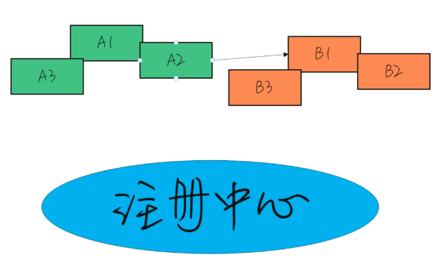
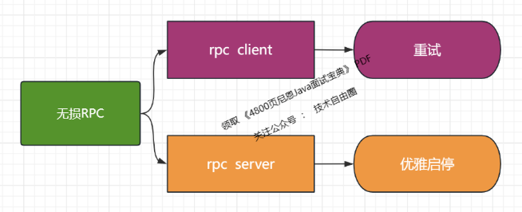
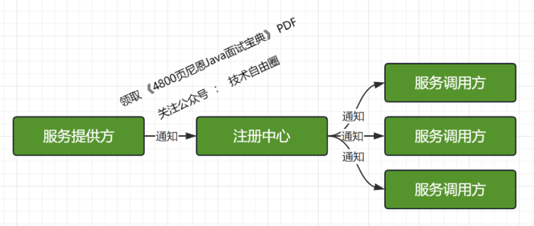

## 微博一面：RPC怎么做零呼损？

### 说在前面
在40岁老架构师 尼恩的读者交流群(50+)中，
最近有小伙伴拿到了一线互联网企业如微博、阿里、汽车之家、极兔、有赞、希音、百度、网易、滴滴的面试资格，
遇到一几个很重要的面试题：
- RPC怎么做无损升级？
- 微服务发布的时候，RPC怎么做零呼损？

与之类似的、其他小伙伴遇到过的问题还有：
- 微服务升级时，RPC里怎么避免调用方业务受损呢？

> 微服务升级时，RPC里怎么避免调用方业务受损

所以，这里尼恩给大家做一下系统化、体系化的梳理，使得大家可以充分展示一下大家雄厚的 “技术肌肉”，让面试官爱到 “不能自已、口水直流”。
- 系统化、体系化

也一并把这个题目以及参考答案，收入咱们的 《尼恩Java面试宝典 PDF》V108版本，
供后面的小伙伴参考，提升大家的 3高 架构、设计、开发水平。

注：本文以 PDF 持续更新，最新尼恩 架构笔记、面试题 的PDF文件，请关注本公众号 【技术自由圈】获取。

### 本文目录
- 说在前面
- 场景分析
- 确保RPC零呼损的维度
- rpc client 维度的零呼损：重试
- rpc server 维度的零呼损：优雅启停
  - 优雅启动
  - 优雅停止/优雅下线
  - 优雅停止/优雅下线的简单流程
- 确保RPC零呼损的维度
- 说在最后
- 参考文献
- 部分历史案例

### 场景分析
微服务架构中，线上跑着几十个，甚至上百的微服务。
服务实例之间，有着错综复杂的RPC调用关系。
这些服务实例，归属到不同的小分队进行开发、设计、维护。

问题是：
在其中部分服务实例重启、升级的过程中， 怎么做到让微服务RPC调用方系统不出问题呢？

- 在其中部分服务实例重启、升级的过程中，怎么做到让微服务RPC调用方系统不出问题呢？

### 确保 RPC 零呼损的维度
如果要确保 RPC 零呼损， 至少可以从以下两个维度进行规避：
- 维度一：rpc client 维度
- 维度一：rpc server 维度

> rpc client && rpc server

rpc client 维度零呼损的有效措施是：重试
rpc server 维度零呼损的有效措施是：优雅启停

- rpc client 维度零呼损的有效措施是：重试
- rpc server 维度零呼损的有效措施是：优雅启停

### rpc client 维度的零呼损：重试
rpc client 在发生错误的时候，可以进行 服务实例的 重试。
常见的rpc框架如 OpenFeign 框架就有重试几次、重试间隔这样的参数。
- 重试几次
- 重试间隔
当然，如果希望通过重试的机制，让RPC零呼损，那么要保证升级的时候，还有健康的实例可用。
- 通过重试的机制，让RPC零呼损，那么要保证升级的时候，还有健康的示例可用
不能所有的微服务实例都同时升级，从而同时不可以使用，这样的话，重试也没有意义。
所以，重试措施最好配套对应的线上滚动升级/滚动发布、或灰度升级/灰度发布等类似的策略。

- 重试措施最好配套对应的线上滚动升级/滚动发布、或灰度升级/灰度发布等类似的策略

### rpc server 维度的零呼损：优雅启停
优雅启停包括：
- 优雅启动
- 优雅停止/优雅下线

#### 优雅启动
优雅启动，当微服务实例真正完成启动，甚至完成预热之后，真正具备处理 RPC 请求能力的时候，再将实例自己注册到注册中心。
为啥要优雅启动呢？核心原因是：避免了 RPC 请求发进来，没有完成启动流程的微服务实例却无法处理。
优雅启动的流程，还包含 JVM 预热的流程，有关JVM预热的方案，请查看尼恩的上一篇文章：
> 微博一面：JVM预热，你的方案是啥？

#### 优雅停止/优雅下线
在服务下线前，先通过“某种方式”把要下线的实例从调用方维护的“健康列表”里面删除就可以了，这样负载均衡就选不到这个节点
这个操作，一般来说，都是依赖注册中心完成的。
当服务提供方关闭前，先通知注册中心进行下线，然后通过注册中心告诉调用方进行节点摘除 。

- 当服务提供方关闭前，先通知注册中心进行下线，然后通过注册中心告诉调用方进行节点摘除

如上图所示，整个关闭过程中依赖了两次 RPC 调用：

- 一次是服务提供方通知注册中心下线操作
- 一次是注册中心通知服务调用方下线节点操作。

> 服务提供方通知注册中心下线操作 & 注册中心通知服务调用方下线节点操作

需要注意的是：两次通知都是异步的，只保证最终一致性，并不保证强一致性。

这个中间，有一定的时间周期，所以，如果要做到应用无损升级， 需要在发出通知之后，隔一段时间，再把服务实例正式关闭。

#### 优雅停止/优雅下线的简单流程
1、下线实例在注册中心进行注销，注销该实例元数据信息；
2、注册中心节点元数据更新周期为15s，调用方在感知注册中心实例变更后，更新本地缓存服务地址，不再将流量路由到下线实例，期间保障业务无中断；
3、下线实例等待30s（2个心跳周期）后，进行实际下线操作；

优雅停止的总结：优雅停止是当微服务快要下线的时候，先从注册中心进行去注销，然后把接收到的RPC调用消息，处理完毕后，再彻底关闭。
通过优雅停机，可以有效地防止升级期间，发送到老节点的呼损。需要注意发送下线通知，到正式下线之间的时间间隔。

#### 确保 RPC 零呼损的维度
如果要确保 RPC 零呼损， 至少可以从以下两个维度进行规避：
- 维度一：rpc client 维度
- 维度一：rpc server 维度

rpc client 维度  的核心策略是重试
rpc server 维度 的核心策略是 优雅启停
两个维度都不可或缺，都需要实现。

### 说在最后
RPC 相关面试题，是非常常见的面试题。
以上的内容，如果大家能对答如流，如数家珍，基本上 面试官会被你 震惊到、吸引到。
在面试之前，建议大家系统化的刷一波 5000页《尼恩Java面试宝典 PDF》，并且在刷题过程中，如果有啥问题，大家可以来 找 40岁老架构师尼恩交流。

