## 日流量200亿，携程网关的架构设计

### 说在前面
在40岁老架构师 尼恩的读者交流群(50+)中，
很多小伙伴拿到一线互联网企业如阿里、网易、有赞、希音、百度、滴滴的面试资格。

就在昨天，尼恩指导一个小伙伴简历，写了一个《高并发 Netty网关项目》，
此项目帮这个小伙拿到  字节/阿里/微博/汽车之家 面邀， 所以说，这是一个牛逼的项目。

为了帮助大家拿到更多面试机会，拿到更多大厂offer，尼恩决定：9月份給大家出一章视频，来介绍这个项目的架构和实操，
也就是《33章：10Wqps 高并发 Netty网关架构与实操》，预计月底发布。
并且提供一对一的简历指导，保证简历金光闪闪、脱胎换骨。

配合尼恩的视频， 会梳理几个工业级、生产级网关案例，作为架构素材、设计的素材。
- 工业级、生产级网关案例
- 架构素材、设计的素材

此文，就是携程网关的架构设计。就是一个非常 牛逼的工业级、生产级网关案例。

### 本文目录
- 说在前面
- 日流量200亿，携程网关的架构设计
- 一、概述
- 二、高性能网关核心设计
  - 2.1. 异步流程设计
  - 2.2. 流式转发&单线程
  - 2.3 其他优化
- 三、网关业务形态
- 四、网关治理
  - 4.1 多协议兼容
  - 4.2 路由模块
  - 4.3 模块编排
- 五、总结
- 说在最后：有问题可以找老架构取经
- 部分历史案例

### 日流量200亿，携程网关的架构设计
方案的作者：Butters，携程软件技术专家，专注于网络架构、API网关、负载均衡、Service Mesh等领域。

### 一、概述
类似于许多企业的做法，携程 API 网关是伴随着微服务架构一同引入的基础设施，其最初版本于 2014 年发布。
随着服务化在公司内的迅速推进，网关逐步成为应用程序暴露在外网的标准解决方案。
后续的“ALL IN 无线”、国际化、异地多活等项目，
网关都随着公司公共业务与基础架构的共同演进而不断发展。
截至 2021 年 7 月，整体接入服务数量超过 3000 个，
日均处理流量达到 200 亿。

在技术方案方面，公司微服务的早期发展深受 NetflixOSS 的影响，
网关部分最早也是参考了 Zuul 1.0 进行的二次开发，其核心可以总结为以下四点：
- server端：Tomcat NIO + AsyncServlet
- 业务流程：独立线程池，分阶段的责任链模式
- client端：Apache HttpClient，同步调用
- 核心组件：Archaius（动态配置客户端），Hystrix（熔断限流），Groovy（热更新支持）

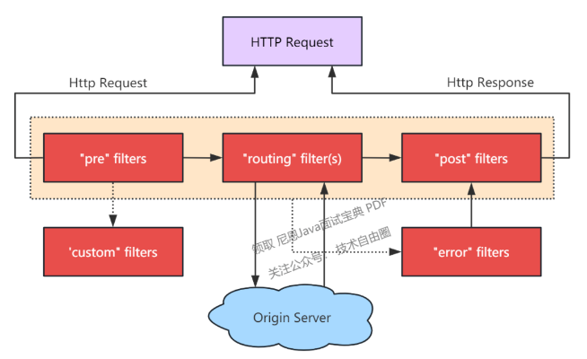

众所周知，同步调用会阻塞线程，系统的吞吐能力受 IO 影响较大。
- 同步调用会阻塞线程，系统的吞吐能力受IO影响很大

作为行业的领先者，Zuul 在设计时已经考虑到了这个问题：通过引入 Hystrix，实现资源隔离和限流，将故障（慢 IO）限制在一定范围内；
结合熔断策略，可以提前释放部分线程资源；最终达到局部异常不会影响整体的目标。

- 引入Hystrix实现资源隔离 & 限流，将故障（慢IO）限制在一定范围内
- 结合熔断策略，可以提前释放部分线程资源
- 最终达到局部异常不会影响整体的目标

然而，随着公司业务的不断发展，上述策略的效果逐渐减弱，主要原因有两方面：
- 业务出海：网关作为海外接入层，部分流量需要转回国内，慢 IO 成为常态
- 服务规模增长：局部异常成为常态，加上微服务异常扩散的特性，线程池可能长期处于亚健康状态


全异步改造是携程 API 网关近年来的一项核心工作，本文也将围绕此展开，探讨我们在网关方面的工作与实践经验。
- 全异步改造是携程API网关今年来的一项核心工作

重点包括：性能优化、业务形态、技术架构、治理经验等。
- 性能优化
- 业务形态
- 技术架构
- 治理经验

### 二、高性能网关核心设计
#### 2.1. 异步流程设计
全异步 = server端异步 + 业务流程异步 + client端异步

> 全异步 = server端异步 + 业务流程异步 + client端异步

对于server与client端，我们采用了 Netty 框架，其 NIO/Epoll + Eventloop 的本质就是事件驱动的设计。

> 对于server与client端，我们采用了Netty框架，其NIO/Epoll+Eventloop的本质就是“事件驱动”的设计

我们改造的核心部分是将业务流程进行异步化，常见的异步场景有：
- 业务 IO 事件：例如***请求校验***、***身份验证***，涉及***远程调用***
- 自身 IO 事件：例如读取到了报文的前 xx 字节
- 请求转发：包括 TCP 连接，HTTP 请求

从经验上看，异步编程在设计和读写方面相比同步会稍微困难一些，主要包括：
- 流程设计&状态转换
- 异常处理，包括常规异常与超时
- 上下文传递，包括业务上下文与trace log
- 线程调度
- 流量控制

特别是在Netty上下文内，如果对 ByteBuf 的生命周期设计不完善，很容易导致内存泄漏。
围绕这些问题，我们设计了对应外围框架，最大努力对业务代码抹平同步/异步差异，方便开发；
同时默认兜底与容错，保证程序整体安全。

在工具方面，我们使用了 RxJava，其主要流程如下图所示。
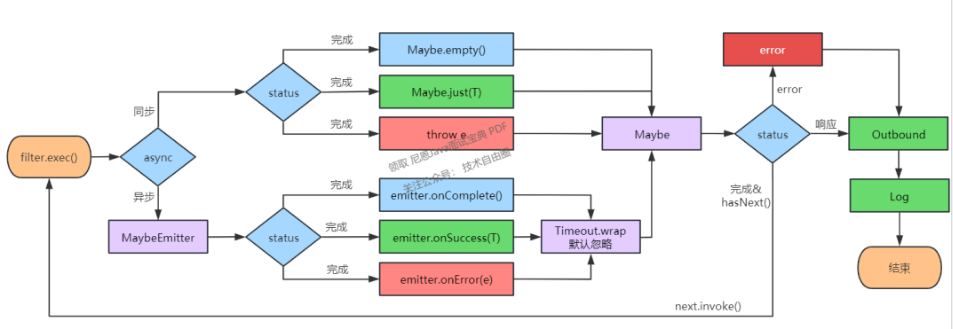

- Maybe
- RxJava 的内置容器类，表示***正常结束***、***有且仅有一个对象返回***、***异常***三种状态
- 响应式，便于整体状态机设计，自带异常处理、超时、线程调度等封装
- Maybe.empty()/Maybe.just(T)，适用同步场景
- 工具类RxJavaPlugins，方便切面逻辑封装
- Filter
- 代表一块独立的业务逻辑，同步&异步业务统一接口，返回Maybe
- 异步场景（如远程调用）统一封装，如涉及线程切换，通过maybe.obesrveOn(eventloop)切回
- 异步filter默认增加超时，并按弱依赖处理，忽略错误

```java
public interface Processor<T> {    
    ProcessorType getType();
    int getOrder();
    boolean shouldProcess(RequestContext context);
    //对外统一封装为Maybe    
    Maybe<T> process(RequestContext context) throws Exception; 
}
```
```java
public abstract class AbstractProcessor implements Processor { 
    //同步&无响应，继承此方法 
    //场景：常规业务处理 
    protected void processSync(RequestContext context) throws Exception {}

    //同步&有响应，继承此方法，健康检测
    //场景：健康检测、未通过校验时的静态响应
    protected T processSyncAndGetReponse(RequestContext context) throws Exception {
        process(context);
        return null;
    };

    //异步，继承此方法
    //场景：认证、鉴权等涉及远程调用的模块
    protected Maybe<T> processAsync(RequestContext context) throws Exception 
    {
        T response = processSyncAndGetReponse(context);
        if (response == null) {
            return Maybe.empty();
        } else {
            return Maybe.just(response);
        }
    };

    @Override
    public Maybe<T> process(RequestContext context) throws Exception {
        Maybe<T> maybe = processAsync(context);
        if (maybe instanceof ScalarCallable) {
            //标识同步方法，无需额外封装
            return maybe;
        } else {
            //统一加超时，默认忽略错误
            return maybe.timeout(getAsyncTimeout(context), TimeUnit.MILLISECONDS,
                                 Schedulers.from(context.getEventloop()), timeoutFallback(context));
        }
    }

    protected long getAsyncTimeout(RequestContext context) {
        return 2000;
    }

    protected Maybe<T> timeoutFallback(RequestContext context) {
        return Maybe.empty();
    }
}
```
- 整体流程
- 沿用***责任链***的设计，分为***inbound***、***outbound***、error、log四阶段
- 各阶段由一或多个filter组成
- filter顺序执行，遇到异常则中断，inbound期间任意filter返回response也触发中断

```java
public class RxUtil{
    //组合某阶段（如Inbound）内的多个filter（即Callable<Maybe<T>>）
    public static <T> Maybe<T> concat(Iterable<? extends Callable<Maybe<T>>> iterable) {
        Iterator<? extends Callable<Maybe<T>>> sources = iterable.iterator();
        while (sources.hasNext()) {
            Maybe<T> maybe;
            try {
                maybe = sources.next().call();
            } catch (Exception e) {
                return Maybe.error(e);
            }
            if (maybe != null) {
                if (maybe instanceof ScalarCallable) {
                    //同步方法
                    T response = ((ScalarCallable<T>)maybe).call();
                    if (response != null) {
                        //有response，中断
                        return maybe;
                    }
                } else {
                    //异步方法
                    if (sources.hasNext()) {
                        //将sources传入回调，后续filter重复此逻辑
                        return new ConcattedMaybe(maybe, sources);
                    } else {
                        return maybe;
                    }
                }
            }
        }
        return Maybe.empty();
    }
}
```
```java
public class ProcessEngine{
    //各个阶段，增加默认超时与错误处理
    private void process(RequestContext context) {
        List<Callable<Maybe<Response>>> inboundTask = get(ProcessorType.INBOUND, context);
        List<Callable<Maybe<Void>>> outboundTask = get(ProcessorType.OUTBOUND, context);
        List<Callable<Maybe<Response>>> errorTask = get(ProcessorType.ERROR, context);
        List<Callable<Maybe<Void>>> logTask = get(ProcessorType.LOG, context);

        RxUtil.concat(inboundTask)    //inbound阶段                    
            .toSingle()        //获取response                          
            .flatMapMaybe(response -> {
                context.setOriginResponse(response);
                return RxUtil.concat(outboundTask);
            })            //进入outbound
            .onErrorResumeNext(e -> {
                context.setThrowable(e);
                return RxUtil.concat(errorTask).flatMap(response -> {
                    context.resetResponse(response);
                    return RxUtil.concat(outboundTask);
                });
            })            //异常则进入error，并重新进入outbound
            .flatMap(response -> RxUtil.concat(logTask))  //日志阶段
            .timeout(asyncTimeout.get(), TimeUnit.MILLISECONDS, Schedulers.from(context.getEventloop()),
                     Maybe.error(new ServerException(500, "Async-Timeout-Processing"))
                    )            //全局兜底超时
            .subscribe(        //释放资源
            unused -> {
                logger.error("this should not happen, " + context);
                context.release();
            },
            e -> {
                logger.error("this should not happen, " + context, e);
                context.release();
            },
            () -> context.release()
        );
    }   
}
```
#### 2.2. 流式转发&单线程
以HTTP为例，报文可划分为initial line/header/body三个组成部分。

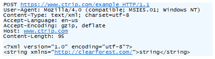

在携程，网关层业务不涉及请求体body。
因为无需全量存，所以解析完请求头header后可直接进入业务流程。
同时，如果收到请求体body部分：
- ①若已向upstream转发请求，则直接转发；
- ②否则，需要将其暂时存储，等待业务流程处理完毕后，再将其与initial line/header一并发送；
- ③对upstream端响应的处理方式亦然。

对比完整解析HTTP报文的方式，这样处理：
- 更早进入业务流程，意味着upstream更早接收到请求，可以有效地降低网关层引入的延迟
- body生命周期被压缩，可降低网关自身的内存开销

尽管性能有所提升，但流式处理也大大增加了整个流程的复杂性。
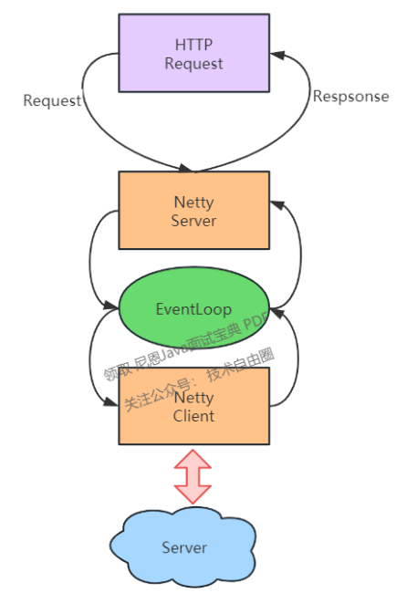

在非流式场景下，Netty Server端编解码、入向业务逻辑、Netty Client端的编解码、出向业务逻辑，各个子流程相互独立，各自处理完整的HTTP对象。
而采用流式处理后，请求可能同时处于多个流程中，这带来了以下三个挑战：
- 线程安全问题：如果各个流程使用不同的线程，那么可能会涉及到上下文的并发修改；
- 多阶段联动：比如Netty Server请求接收一半遇到了连接中断，此时已经连上了upstream，那么upstream侧的协议栈是走不完的，也必须随之关闭连接；
- 边缘场景处理：比如upstream在请求未完整发送情况下返回了404/413，是选择继续发送、走完协议栈、让连接能够复用，还是选择提前终止流程，节约资源，但同时放弃连接？
再比如，upstream已收到请求但未响应，此时Netty Server突然断开，Netty Client是否也要随之断开？等等。

为了应对这些挑战，我们采用了单线程的方式，核心设计包括：
- 上线文绑定Eventloop，Netty Server/业务流程/Netty Client在同个eventloop执行；
- 异步filter如因IO库的关系，必须使用独立线程池，那在后置处理上必须切回；
- 流程内资源做必要的线程隔离（如连接池）；

单线程方式避免了并发问题，在处理多阶段联动、边缘场景问题时，整个系统处于确定的状态下，
有效降低了开发难度和风险；此外，减少线程切换，也能在一定程度上提升性能。
然而，由于 worker 线程数较少（一般等于 CPU 核数），***eventloop 内必须完全避免 IO 操作***，
否则将对系统的吞吐量造成重大影响。

#### 2.3 其他优化
- 内部变量懒加载
对于请求的 cookie/query 等字段，如果没有必要，不提前进行字符串解析
- 堆外内存&零拷贝
结合前文的流式转发设计，进一步减少系统内存占用。
- ZGC
由于项目升级到 TLSv1.3，引入了 JDK11（JDK8 支持较晚，8u261 版本，2020.7.14），同时也尝试了新一代的垃圾回收算法，
其实际表现确实如人们所期待的那样出色。
尽管 CPU 占用有所增加，但整体 GC 耗时下降非常显著。

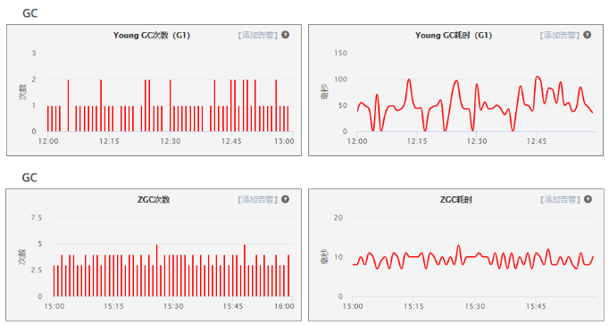

- 定制的HTTP编解码
由于 HTTP 协议的历史悠久及其开放性，产生了很多“不良实践”，轻则影响请求成功率，重则对网站安全构成威胁。

- 流量治理
对于请求体过大（413）、URI 过长（414）、非 ASCII 字符（400）等问题，一般的 Web 服务器会选择直接拒绝并返回相应的状态码。
由于这类问题跳过了业务流程，因此在统计、服务定位和故障排查方面会带来一些麻烦。
通过扩展编解码，让问题请求也能完成路由流程，有助于解决非标准流量的管理问题。

- 请求过滤
例如 request smuggling[走私]（Netty 4.1.61.Final 修复，2021.3.30 发布）。
通过扩展编解码，增加自定义校验逻辑，可以让安全补丁更快地得以应用。

### 三、网关业务形态
作为独立的、统一的入向流量收口点，网关对企业的价值主要展现在三个方面：
- 解耦不同网络环境：典型场景包括内网&外网、生产环境&办公区、IDC内部不同安全域、专线等；
- 天然的公共业务切面：包括安全&认证&反爬、路由&灰度、限流&熔断&降级、监控&告警&排障等；

> 天然的公共业务切面
> 包括安全& 认证&反爬、路由&灰度、限流&熔断&降级、监控&告警&排障

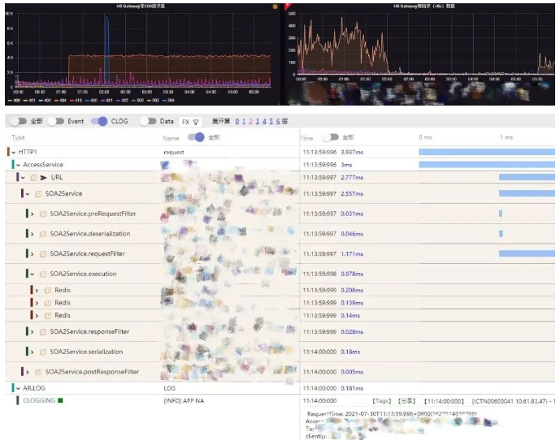

- 高效、灵活的流量控制
这里展开讲几个细分场景：

- 私有协议
在收口的客户端（APP）中，框架层会拦截用户发起的 HTTP 请求，通过私有协议（SOTP）的方式传送到服务端。
选址方面：①通过服务端分配 IP，防止 DNS 劫持；②进行连接预热；③采用自定义的选址策略，可以根据网络状况、环境等因素自行切换。
交互方式上：①采用更轻量的协议体；②统一进行加密与压缩与多路复用；③在入口处由网关统一转换协议，对业务无影响。

- 链路优化
关键在于引入接入层，让远程用户就近访问，解决握手开销过大的问题。
同时，由于接入层与 IDC 两端都是可控的，因此在网络链路选择、协议交互模式等方面都有更大的优化空间。

- 异地多活
与按比例分配、就近访问策略等不同，在异地多活模式下，网关（接入层）需要根据业务维度的 shardingKey 进行分流（如 userId），防止底层数据冲突。

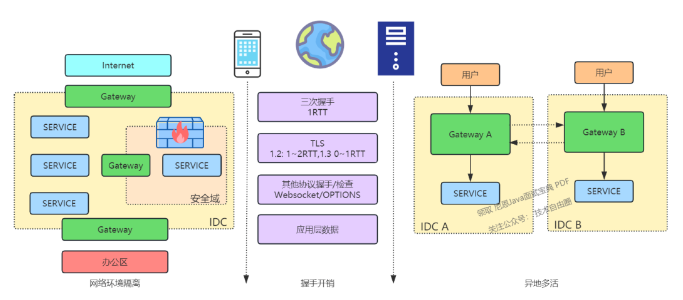

### 四、网关治理
下所示的图表概括了网上网关的工作状态。纵向对应我们的业务流程：各种渠道（如 APP、H5、小程序、供应商）和各种协议（如 HTTP、SOTP）的流量通过负载均衡分配到网关，
通过一系列业务逻辑处理后，最终被转发到后端服务。
经过第二章的改进后，横向业务在性能和稳定性方面都得到了显著提升。
- SOAP->Simple Object Access Protocol

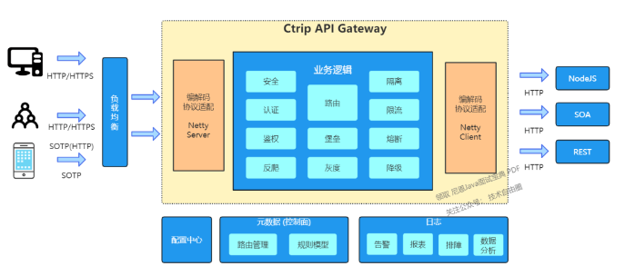

- 负载均衡
- 编解码协议适配（Netty Server）
- 业务逻辑
  - 安全
  - 认证
  - 鉴权
  - 反爬
  - 路由
  - 堡垒
  - 灰度
  - 隔离
  - 限流
  - 熔断
  - 降级
- 编解码，协议适配（Netty Client）

另一方面，由于多渠道/协议的存在，网上网关根据业务进行了独立集群的部署。
早期，业务差异（如路由数据、功能模块）通过独立的代码分支进行管理，但是随着分支数量的增加，整体运维的复杂性也在不断提高。
在系统设计中，复杂性通常也意味着风险。
因此，如何对多协议、多角色的网关进行统一管理，如何以较低的成本快速为新业务构建定制化的网关，成为了我们下一阶段的工作重点。

解决方案已经在图中直观地呈现出来，一是在协议上进行兼容处理，使网上代码在一个框架下运行；二是引入控制面板，对网上网关的差异特性进行统一管理。

- 一是在协议上进行兼容处理，使网上代码在一个框架下运行
- 二是引入控制面板，对网上网关的差异特性进行统一管理

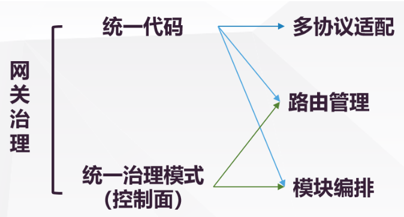

#### 4.1 多协议兼容
多协议兼容的方法并不新颖，可以参考 Tomcat 对 HTTP/1.0、HTTP/1.1、HTTP/2.0 的抽象处理。
尽管 HTTP 在各个版本中增加了许多新特性，但在进行业务开发时，我们通常无法感知到这些变化，
关键在于 HttpServletRequest 接口的抽象。

- HttpServletRequest接口的抽象

在携程，网上网关处理的都是请求 - 响应模式的无状态协议，
报文结构也可以划分为元数据、扩展头、业务报文三部分，因此可以方便地进行类似的尝试。
相关工作可以用以下两点来概括：
- 协议适配层：用于屏蔽不同协议的编解码、交互模式、对 TCP 连接的处理等
- 定义通用中间模型与接口：业务面向中间模型与接口进行编程，更好地关注到协议对应的业务属性上

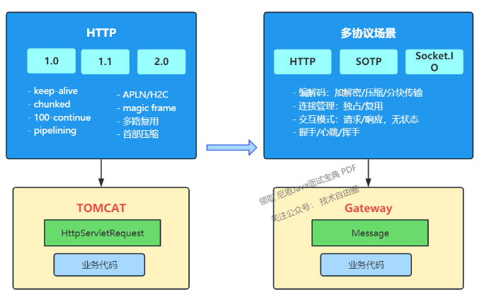

手把手教你开启Gzip - 压缩提速网站的简易指南
  在今天的互联网魔法世界中，网站的性能对于用户体验和搜索引擎排名至关重要。
Gzip是一种流行的压缩技术，可以显著减少网站传输的数据量，从而提高网站的加载速度。
本文将带您一步一步学习如何开启Gzip压缩，让您的网站运行得更快，让访问者更满意。

1.什么是Gzip？ 
Gzip是一种数据压缩算法，通过将文本、样式表、脚本和其他可压缩的内容压缩成更小的文件，从而减少传输数据量。
当浏览器支持Gzip并请求网页时，服务器会将响应的内容进行压缩，并在浏览器端解压缩，实现数据传输的优化。
通过开启Gzip压缩，您可以加速网站的加载速度，减少带宽使用，提升用户体验。压缩算法不仅只有Gzip 
还有 [‘gzip’，‘brotliCompress’，‘deflate’，‘deflateRaw’] 。

2.开启Gzip压缩
接下来，我们将手把手教您如何在不同类型的Web服务器中开启Gzip压缩。
以及前端项目中如何开启Gzip等配置。

2.1 Apache服务器
对于使用Apache服务器的网站，您可以通过修改服务器配置文件来开启Gzip压缩。
打开Apache的配置文件（通常是httpd.conf或apache2.conf），然后添加以下代码：
```
# httpd.conf
# 开启Gzip压缩
<IfModule mod_deflate.c>
    SetOutputFilter DEFLATE
    AddOutputFilterByType DEFLATE text/html text/plain text/xml text/css application/javascript application/json
</IfModule>
```

保存配置文件，并重新启动Apache服务器。
现在，您的Apache服务器将在支持Gzip的浏览器中自动开启压缩。

2.2 Nginx服务器
对于使用Nginx服务器的网站，开启Gzip压缩也是相当简单的。
打开Nginx的配置文件（通常是nginx.conf），然后添加以下代码：
```
# nginx.conf
# 开启Gzip压缩
gzip on;
#低于5k的资源不压缩，这个大小可通过自己项目架构来限制
gzip_min_length 5k;
#压缩级别1-9，越大压缩率越高，同时消耗cpu资源也越多，建议设置在4左右。 
gzip_comp_level 4; 
#需要压缩哪些响应类型的资源，多个空格隔开。不建议压缩图片.
gzip_types text/html text/plain text/xml text/css application/javascript application/json;
```

保存配置文件，依旧是重新启动Nginx服务器。
你的Nginx服务器将在支持Gzip的浏览器中自动开启压缩。

2.3 前端工程项目
这里我以vite+Vue工程项目为例，看看如何开启Gzip，我使用的是vite-plugin-compression，安装命令如下：
```
yarn add vite-plugin-compression -D
or
npm i vite-plugin-compression -D
```
使用
vite.config.ts 中的配置插件
```
import viteCompression from 'vite-plugin-compression';
// https://vitejs.dev/config/
export default ({ mode }) => {
    return defineConfig({
        ...
       plugins: [
            // 启用zip包压缩
            viteCompression({
                algorithm: 'gzip', // 压缩算法，可选[‘gzip’，‘brotliCompress’，‘deflate’，‘deflateRaw’]
                threshold: 5120, // 大于5k启用zip包压缩, 默认是1025
                verbose: false, //是否在控制台中输出压缩结果
                // deleteOriginFile: true, // 压缩后是否删除源文件, 需要保留源文件，不然会上线后会有下面的一类的错误提示
            }),
       ]
  })
};
```
配置完成后，重新打包上传至服务器。前端工程项目需要前端和服务器同时开启Gzip压缩才会生效。
Failed to load module script: Expected a JavaScript module script but the server responded with a MIME type of "text/html". 
Strict MIME type checking is enforced for module scripts per HTML spec.

3.测试Gzip压缩
完成了服务器配置的修改后，可以进行测试，确保Gzip压缩已经生效。
您可以使用在线的Gzip测试工具或浏览器的开发者工具来检查网页的响应头，确认是否包含了Content-Encoding: gzip的标记。

结论
一旦Gzip压缩已经开启，您可以使用各种监控工具来追踪网站性能和Gzip压缩的效果。定期检查并优化网站，确保Gzip压缩一直保持正常运行，并持续提升网站的性能。
开启Gzip压缩是提升网站性能的重要步骤之一。通过减少传输数据量，网站加载速度得到明显提升，访问者的体验也会更加顺畅。
本文希望通过手把手教程，让您轻松掌握开启Gzip压缩的方法，让你的项目脱颖而出，吸引更多的用户。

#### 4.2 路由模块
路由模块是控制面的两个主要组成部分之一，
除了管理网关与服务之间的映射关系外，服务本身可以用以下模型来概括：

```
{
    // 匹配方式
    "type": "uri",

    // HTTP默认采用uri前缀匹配，内部通过树结构寻址；私有协议（SOTP）通过服务唯一标识定位。
    "value": "/hotel/order",
    "matcherType": "prefix",

    // 标签与属性
    // 用于portal端权限管理、切面逻辑运行（如按核心/非核心）等
    "tags": [
        "owner_admin",
        "org_framework",
        "appId_123456"
    ],
    "properties": {
        "core": "true"
    },

    //endpoint信息
    "routes": [{
        //condition用于二级路由，如按app版本划分、按query重分配等
        "condition": "true",
        "conditionParam": {},
        "zone": "PRO",

        //具体服务地址，权重用于灰度场景
        "targets": [{
            "url": "http://test.ctrip.com/hotel",
            "weight": 100
        }]
    }]
}
```

#### 4.3 模块编排
模块调度是控制面的另一个关键组成部分。
我们在网关处理流程中设置了多个阶段（图中用粉色表示）。
除了熔断、限流、日志等通用功能外，运行时，不同网关需要执行的业务功能由控制面统一分配。这些功能在网关内部有独立的代码模块，
而控制面则额外定义了这些功能对应的执行条件、参数、灰度比例和错误处理方式等。
这种调度方式也在一定程度上保证了模块之间的解耦。

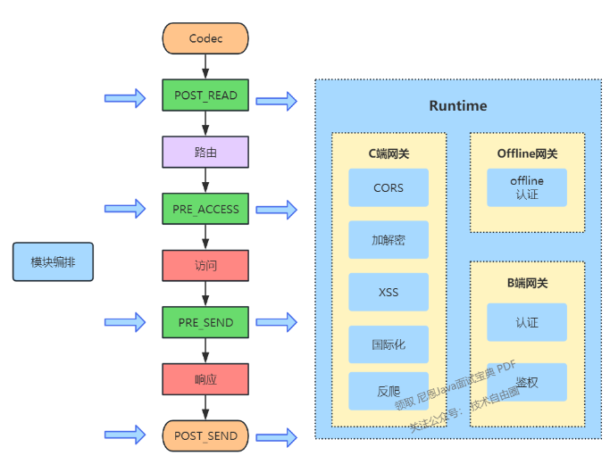

```
{
    //模块名称，对应网关内部某个具体模块
    "name": "addResponseHeader",

    //执行阶段
    "stage": "PRE_RESPONSE",

    //执行顺序
    "ruleOrder": 0,

    //灰度比例
    "grayRatio": 100,

    //执行条件
    "condition": "true",
    "conditionParam": {},

    //执行参数
    //大量${}形式的内置模板，用于获取运行时数据
    "actionParam": {
        "connection": "keep-alive",
        "x-service-call": "${request.func.remoteCost}",
        "Access-Control-Expose-Headers": "x-service-call",
        "x-gate-root-id": "${func.catRootMessageId}"
    },

    //异常处理方式，可以抛出或忽略
    "exceptionHandle": "return"
}
```

### 五、总结
网关在各种技术交流平台上一直是备受关注的话题，有很多成熟的解决方案：
易于上手且发展较早的 Zuul 1.0、高性能的 Nginx、集成度高的 Spring Cloud Gateway、日益流行的 Istio 等等。
- Zuul 1.0
- Nginx
- Spring Cloud Gateway
- Istio

最终的选型还是取决于各公司的业务背景和技术生态。
- 业务背景
- 技术生态

因此，在携程，我们选择了自主研发的道路。
技术在不断发展，我们也在持续探索，包括公共网关与业务网关的关系、新协议（如 HTTP3）的应用、与 ServiceMesh 的关联等等。
- ServiceMesh

### 说在最后：有问题可以找老架构取经
架构之路，充满了坎坷
架构和高级开发不一样 ， 架构问题是open/开放式的，架构问题是没有标准答案的

- 架构和高级开发不一样，架构问题是open/开放式的，架构问题是没有标准答案的

正由于这样，很多小伙伴，尽管耗费很多精力，耗费很多金钱，但是，遗憾的是，一生都没有完成架构升级。
所以，在架构升级/转型过程中，确实找不到有效的方案，可以来找40岁老架构尼恩求助.
前段时间一个小伙伴，他是跨专业来做Java，现在面临转架构的难题，但是经过尼恩几轮指导，顺利拿到了Java架构师+大数据架构师offer 。
所以，如果遇到职业不顺，找老架构师帮忙一下，就顺利多了。
- Java架构师
- 大数据架构师
