## 炸裂了…京东一面索命40问，过了就50W+

### 说在前面
在40岁老架构师尼恩的（50+）读者社群中，经常有小伙伴，需要面试京东、阿里、 百度、头条、美团等大厂。
下面是一个小伙伴成功拿到通过了京东一次技术面试，最终，小伙伴通过后几面技术拷问、灵魂拷问，最终拿到offer。
从这些题目来看：京东的面试，偏重底层知识和原理，大家来看看吧。
现在把面试真题和参考答案收入咱们的宝典，大家看看，收个京东Offer需要学点啥？
当然对于中高级开发来说，这些面试题，也有参考意义。
这里把题目以及参考答案，收入咱们的《尼恩Java面试宝典PDF》 V83版本，供后面的小伙伴参考，提升大家的 3高 架构、设计、开发水平。

> 最新《尼恩 架构笔记》《尼恩高并发三部曲》《尼恩Java面试宝典》的PDF，请关注本公众号【技术自由圈】获取，回复：领电子书

### 本文目录
- 说在前面
- 京东一面索命40问
  - 1、聊聊五种 IO 模型
  - 2、说说什么是一致性
  - 3、说说什么是隔离性
  - 4、说说MySQL的隔离级别
  - 5、说说每个隔离级别是如何解决
  - 6、MySQL要加上nextkey锁，语句该怎么写
  - 7、说说Java的内存模型，垃圾回收
  - 8、实现分布式锁，Zookeeper 和 Redis 哪种更好？
  - 9、说一下分布式锁实现
  - 10、了解hystrix么？说一下它的工作原理？
  - 11、说说Nio和IO有什么区别
  - 12、说说NIO和AIO的区别
  - 13、Spring的aop怎么实现？Spring的aop有哪些实现方式
  - 14、说说动态代理的实现方式和区别
  - 15、聊聊索引在哪些场景下会失效？
  - 16、怎么查看系统负载
  - 17、分布式 id 生成方案有哪些？什么是雪花算法？
  - 18、Linux中，查找磁盘上最大的文件的命令
  - 19、Linux中，如何查看系统日志文件
  - 20、聊聊事务隔离级别，以及可重复读实现原理
  - 21、os进程间怎么通信？
  - 22、os有使用哪些数据结构？
  - 23、说说对Linux的了解
  - 24、TCP和UDP的区别？
  - 25、HTTP和HTTPS的区别？
  - 26、HTTPS的TLS握手过程？
  - 27、GC了解吗？
  - 28、说说Java有哪些锁？
  - 29、Lock和synchronized有啥区别？
  - 30、synchronized一定会阻塞吗？
  - 31、说说偏向锁、轻量锁级、重量级锁是什么锁？
  - 32、线程池有哪些参数？
  - 33、说说RocketMQ的消息生产消费过程？
  - 34、说说生产者的负载均衡？
  - 35、说说消息的reput过程？
  - 36、说说RocketMQ的ConsumeQueue消息的格式？
  - 37、3PC、2PC、CAP是啥？
  - 38、RocketMQ是AP还是CP？
  - 39、RocketMQ的Broker宕机会怎样？
  - 40、有看过选主过程的源码吗？简述一下
- 尼恩说在最后
- 推荐阅读
- 免费领取12个技术圣经 PDF

### 京东二面索命40问

#### 1、聊聊五种 IO 模型

##### 一、什么是 IO

IO 全程 Input/Output，即数据的读取（接收）或写入（发送）操作，针对不同的数据存储媒介，
大致可以分为网络 IO 和磁盘 IO 两种。
而在 Linux 系统中，为了保证系统安全，操作系统将虚拟内存划分为内核空间和用户空间两部分。
因此用户进程无法直接操作IO设备资源，需要通过系统调用完成对应的IO操作。

即此时一个完整的 IO 操作将经历一下两个阶段：用户空间 <-> 内核空间 <-> 设备空间。
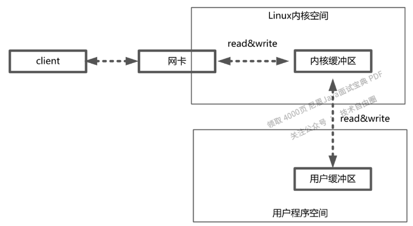

##### 二、五种 IO 模型
###### 1.同步阻塞 IO
同步阻塞IO（Blocking IO） 指的是用户进程（或线程）主动发起，
***需要等待内核 IO 操作彻底完成后才返回到用户空间的 IO 操作***。
***在 IO 操作过程中，发起 IO 请求的用户进程处于阻塞状态***。

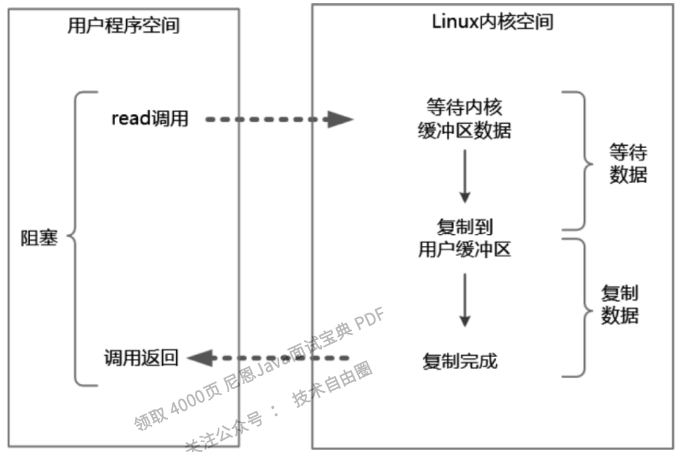

###### 2.同步非阻塞 IO
同步非阻塞IO（Non-Blocking IO，NIO） 指的是用户进程主动发起，
不需要等待内核 IO 操作彻底完成就能立即返回用户空间的 IO 操作。
在 IO 操作过程中，发起 IO 请求的用户进程处于非阻塞状态。

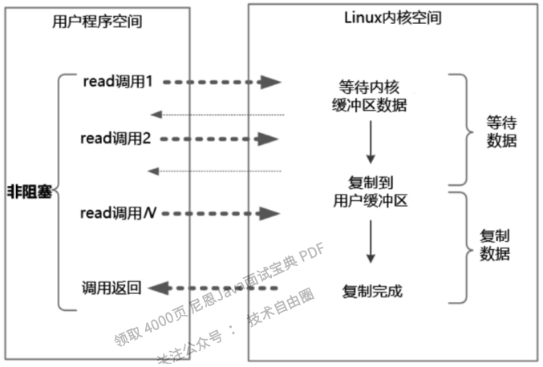

- 1）当数据 Ready 之后，用户线程仍然会进入阻塞状态，直到数据复制完成，并不是绝对的非阻塞。
- 2）NIO 实时性好，内核态数据没有 Ready 会立即返回，但频繁的轮询内核，会占用大量的 CPU 资源，降低效率。

###### 3.IO 多路复用
IO 多路复用（IO Multiplexing） 实际上就解决了 NIO 中的频繁轮询 CPU 的问题，并且引入一种新的 select 系统调用。<br>
复用 IO 的基本思路就是通过 select 调用来监控多 fd（文件描述符），来达到不必为每个 fd 创建一个对应的监控线程的目的，从而减少线程资源创建的开销。一旦某个描述符就绪（一般是内核缓冲区可读/可写），
内核就能够将文件描述符的就绪状态返回给用户进程（或者线程），用户空间可以根据文件描述符的就绪状态进行相应的 IO 系统调用。<br>

***IO 多路复用（IO Multiplexing）属于一种经典的 Reactor 模式实现***，有时也称为异步阻塞 IO。
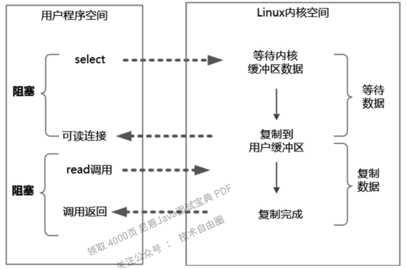

###### 4.异步 IO
异步IO（Asynchronous IO，AIO） 指的是用户空间的线程变成被动接收者，而内核空间成为主动调用者。<br>
在异步 IO 模型中，当用户线程收到通知时，数据已经被内核读取完毕并放在用户缓冲区内，内核在 IO 完成后通知用户线程直接使用即可。
而此处说的 AIO 通常是一种异步非阻塞 IO。
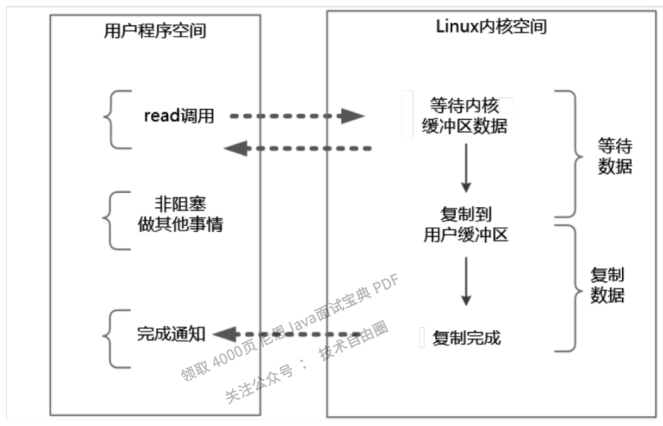

###### 5.信号驱动 IO
当进程发起一个 IO 操作，会向内核注册一个信号处理函数，然后进程返回不阻塞；
当内核数据就绪时会发送一个信号给进程，进程便在信号处理函数中调用 IO 读取数据。<br>
信号驱动 IO 不同于 AIO 的是依旧存在阻塞状态，即用户进程获取到数据就绪信号后阻塞进行 IO 操作。

#### 2、说说什么是一致性

##### 一、不同的一致性
我们在不同的地方见到过一致性的概念，总结大概分为以下几类：
- ACID里的一致性
- 多副本的一致性
- CAP理论的一致性
- 一致性哈希

##### 二、ACID里的一致性
- 1.最常见的定义是：事务的一致性是指系统从一个正确的状态,迁移到另一个正确的状态。 指的是事务前后的正确性是一致的。 
Consistency ensures that a transaction can only bring the database from one valid state to another, maintaining database invariants: any data written to the database must be valid according to all defined rules, including constraints, cascades,triggers, and any combination thereof. This prevents database corruption by an illegal transaction, but does not guarantee that a transaction is correct.
- 2.“ensuring the consistency is the responsibility of user, not DBMS.”, "DBMS assumes that consistency holds for each transaction。 
指的是对业务中和数据库中约束的检查，业务上的合理性，只靠AID手段不容易检查出逻辑性的问题来。比如转账操作中，账户金额不能为负数，这是业务逻辑上的要求，用一致性来保证。
- 3.This(Consistency）does not guarantee correctness of the transaction in all ways the application programmer might have wanted (that is the responsibility of application-level code) but merely that any programming errors cannot result in the violation of any defined database constraints.[1]

##### 三、多副本一致性
某些数据保存了多个副本，所有副本内容相同。

##### 四、CAP理论中的一致性
整个***分布式系统***在对外的反馈上，与一台单机完全一样，不会因为分布式导致对外行为的前后冲突。
> CAP理论针对的是分布式系统

##### 五、一致性哈希
一种哈希算法，***指将存储节点和数据都映射到一个首尾相连的哈希环上***，
***如果增加或者移除一个节点， 仅影响该节点在哈希环上顺时针相邻的后继节点，其它数据也不会受到影响***。 
在移除或者添加一个服务器时，能够尽可能小地改变已存在的服务请求与处理请求服务器之间的映射关系。
***一致性哈希解决了简单哈希算法在分布式哈希表( Distributed Hash Table，DHT) 中存在的动态伸缩等问题***。 
对比非一致性哈希（普通的哈希），映射时如果节点发生变化，需要重新计算所有数据的映射值。

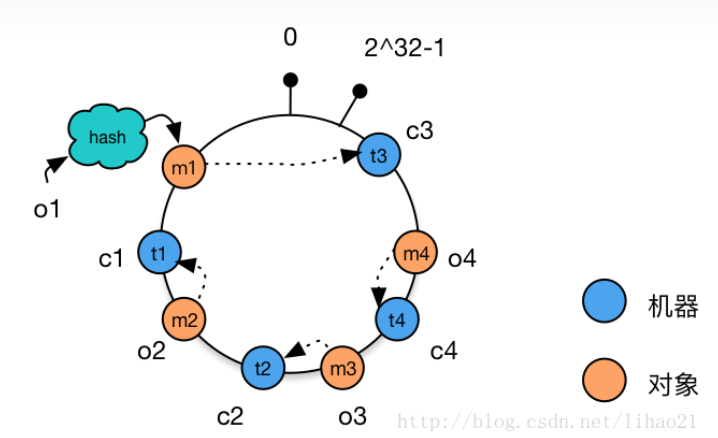

一致性哈希算法（consistent hashing）<br>
对于分布式存储，不同机器上存储不同对象的数据，我们***使用哈希函数建立从数据到服务器之间的映射关系***。<br>
一、使用简单的哈希函数<br>
```
m = hash(o) mod n
```
其中，o为对象名称，n为机器的数量，m为机器编号。<br>
考虑以下例子：<br>
3个机器节点，10个数据 的哈希值分别为1,2,3,4,…,10。使用的哈希函数为：(m=hash(o) mod 3)<br>
```
机器0 上保存的数据有：3，6，9<br>
机器1 上保存的数据有：1，4，7，10<br>
机器2 上保存的数据有：2，5，8<br>
```

当增加一台机器后，此时n = 4，各个机器上存储的数据分别为：
```
机器0 上保存的数据有：4，8
机器1 上保存的数据有：1，5，9
机器2 上保存的数据有：2，6，10
机器3 上保存的数据有：3，7
```

只有数据1和数据2没有移动，所以当集群中数据量很大时，采用一般的哈希函数，
在节点数量动态变化的情况下会造成大量的数据迁移，导致网络通信压力的剧增，严重情况，还可能导致数据库宕机。

二、一致性哈希<br>
一致性hash算法正是为了解决此类问题的方法，***它可以保证当机器增加或者减少时，节点之间的数据迁移只限于两个节点之间，不会造成全局的网络问题***。
> 一致性hash算法可以保证当机器增加或减少时，节点之间的数据迁移只限于两个节点之间，不会造成全局的网络问题

1. 环形Hash空间<br>
按照常用的hash算法来将对应的key哈希到一个具有2^32次方个桶的空间中，即0~(2^32)-1的数字空间中。
现在我们可以将这些数字头尾相连，想象成一个闭合的环形。如下图：
- 按照常用的hash算法来将对应的key哈希到一个具有2^32次方个桶的空间中
- 即0~(2^32)-1的数字空间中
- 现在我们可以将这些数字头尾相连，想象成一个闭合的环形
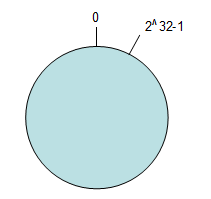

2. 将数据通过hash算法映射到环上<br>
将object1、object2、object3、object4四个对象通过特定的Hash函数计算出对应的key值，然后散列到Hash环上。如下图：
```
Hash(object1) = key1；
Hash(object2) = key2；
Hash(object3) = key3；
Hash(object4) = key4；
```
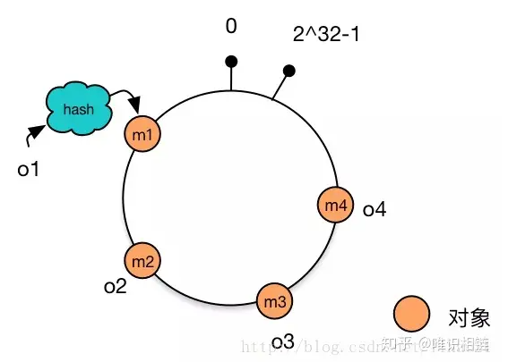

3. 将机器通过hash算法映射到环上<br>
假设现在有NODE1，NODE2，NODE3三台机器，通过Hash算法（机器IP或机器的唯一的名称作为输入）得到对应的KEY值，映射到环中，其示意图如下：
```
Hash(NODE1) = KEY1;
Hash(NODE2) = KEY2;
Hash(NODE3) = KEY3;
```
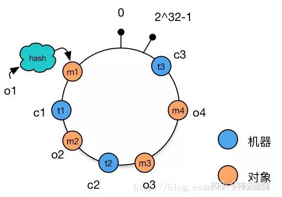

4. 将数据存储到机器上<br>
通过上图可以看出对象与机器处于同一哈希空间中，
这样按顺时针转动object1存储到了NODE3中，object3 & object4存储到了NODE2中，object2存储到了NODE1中。

5. 机器的添加与删除
向集群中添加一台新机器
向集群中增加机器c4，c4经过hash函数后映射到机器c2和c3之间。
这时根据顺时针存储的规则，数据m4从机器c2迁移到机器c4。
数据的移动仅发生在c2和c4之间，其他机器上的数据并未受到影响。

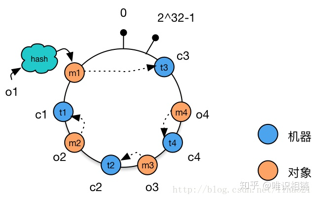

从集群中删除一台机器
从集群中删除机器c1，这时只有c1原有的数据需要迁移到机器c3，其他数据并未受到影响。
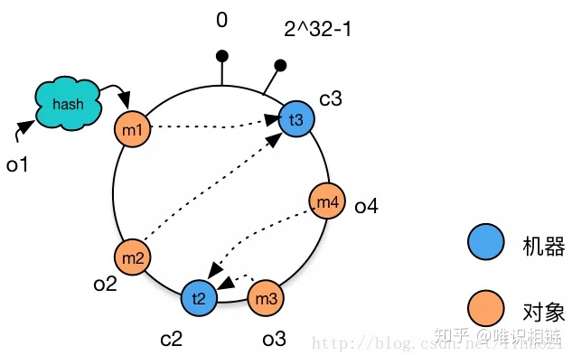

相比于之前的简单取模方法中动态增删集群中机器的数量时，造成全局的数据迁移，
使用一致性哈希算法将大大改善这种情况，减轻了网络通信的压力。

存在的问题：
当集群中的节点数量较少时，可能会出现节点在哈希空间中分布不平衡的问题。
如下图所示，图中节点A、B、C分布较为集中，造成hash环的倾斜。数据1、2、3、4、6全部被存储到了节点A上，
节点B上只存储了数据5，而节点C上什么数据都没有存储。
A、B、C三台机器的负载极其不均衡。

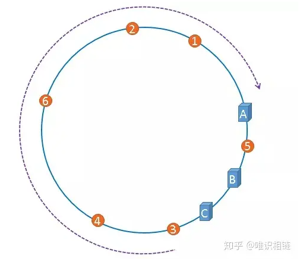

在极端情况下，假如A节点出现故障，存储在A上的数据要全部转移到B上，大量的数据导可能会导致节点B的崩溃，
之后A和B上所有的数据向节点C迁移，导致节点C也崩溃，由此导致整个集群宕机。这种情况被称为雪崩效应。

解决方法——虚拟节点
解决哈希环偏斜问题的方法就是，让集群中的节点尽可能的多，
从而让各个节点均匀的分布在哈希空间中。
在现实情境下，机器的数量一般都是固定的，所以我们只能将现有的物理节通过虚拟的方法复制多个出来，
这些由实际节点虚拟复制而来的节点被称为虚拟节点。加入虚拟节点后的情况如下图所示：

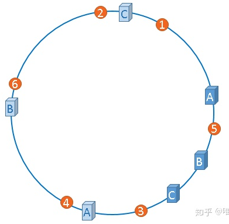

从上图可得：加入虚拟节点后，节点A存储数据1、3；节点B存储5、4；节点C存储2、6。节点的负载很均衡。

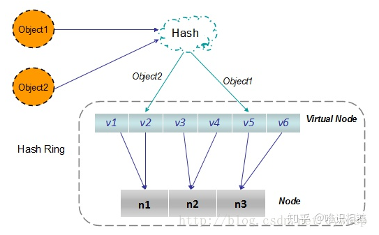

Chord 环<br>
在分布式集群中，经常要寻找指定数据存储的物理节点，关于这个问题有三种比较典型的方法来解决。<br>

三种典型的解决方案：<br>
1. Napster：<br>
- 使用一个中心服务器接收所有的查询，中心服务器返回数据存储的节点位置信息。
- 存在的问题：中心服务器单点失效导致整个网络瘫痪。

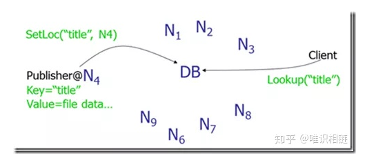

2. Gnutella：<br>
使用消息洪泛（message flooding）来定位数据。
一个消息被发到系统内每一个节点，直到找到其需要的数据为止。使用生存时间（TTL）来限制网络内转发消息的数量。

存在的问题：消息数与节点数成线性关系，导致网络负载较重。
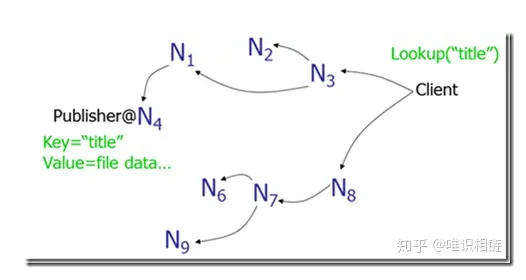

3. SN型：<br>
现在大多数采用所谓超级节点（Super Node），SN保存网络中节点的索引信息，这一点和中心服务器类型一样，
但是网内有多个SN，其索引信息会在这些SN中进行传播，所以整个系统的崩溃几率就会小很多。尽管如此，网络还是有崩溃的可能。

##### 六、线性一致性、外部一致性、最终一致性的区别
这三个都是分布式系统的一致性级别 
线性一致性：强一致性，侧重于单个key的场景 
外部一致性：事务在数据库内的执行序列不能违背外部观察到的顺序，更侧重于对比传统数据库系统的内部一致性。 
最终一致性：弱一致性。

```
40岁老架构师尼恩提示：分布式事务是既是面试的绝对重点，也是面试的绝对难点，
建议大家有一个深入和详细的掌握，具体的内容请参见《尼恩Java面试宝典-专题17：分布式事务面试题》PDF，
该专题对分布式事务有一个系统化、体系化、全面化的介绍。
如果要把分布式事务写入简历，可以找尼恩指导
```

#### 3、说说什么是隔离性
##### 一、事务的四大特性：
- 1.原子性（Atomicity）<br>
原子性是指事务包含的所有操作要么全部成功，要么全部失败回滚，这和前面两篇博客介绍事务的功能是一样的概念，
因此事务的操作如果成功就必须要完全应用到数据库，如果操作失败则不能对数据库有任何影响。
- 2.一致性（Consistency）
一致性是指事务必须使数据库从一个一致性状态变换到另一个一致性状态，
也就是说一个事务执行之前和执行之后都必须处于一致性状态。
***拿转账来说，假设用户A和用户B两者的钱加起来一共是5000，那么不管A和B之间如何转账，转几次账，
事务结束后两个用户的钱相加起来应该还得是5000，这就是事务的一致性***。

- 3.隔离性（Isolation）
隔离性是当多个用户并发访问数据库时，比如操作同一张表时，数据库为每一个用户开启的事务，
不能被其他事务的操作所干扰，多个并发事务之间要相互隔离。
即要达到这么一种效果：对于任意两个并发的事务T1和T2，在事务T1看来，T2要么在T1开始之前就已经结束，
要么在T1结束之后才开始，这样每个事务都感觉不到有其他事务在并发地执行。
关于事务的隔离性数据库提供了多种隔离级别，稍后会介绍到。

> 隔离性是当多个用户并发访问数据库时，比如操作同一张表，数据库为每一个用户开启的事务，不能被其他事务的操作所干扰

- 4.持久性（Durability）
持久性是指一个事务一旦被提交了，那么对数据库中的数据的改变就是永久性的，
即便是在数据库系统遇到故障的情况下也不会丢失提交事务的操作。
> 持久性是指一个事务一旦被提交了，那么对数据库中的数据的改变就是永久性的

##### 二、隔离性：
多个线程都开启事务操作数据库中的数据时，数据库系统要能进行隔离操作，以保证各个线程获取数据的准确性，
在介绍数据库提供的各种隔离级别之前，我们先看看如果***不考虑事务的隔离性，会发生的几种问题***：

> 不考虑事务的隔离性，会发生的几种问题

1. 脏读
脏读是指在一个事务处理过程里读取了另一个未提交的事务中的数据。

当一个事务正在多次修改某个数据，而在这个事务中这多次的修改都还未提交，这时一个并发的事务来访问该数据，
就会造成两个事务得到的数据不一致。
例如：用户A向用户B转账100元，对应SQL命令如下

```
update account set money=money+100 where name=’B’;  (此时A通知B)
update account set money=money - 100 where name=’A’;
```

当只执行第一条SQL时，A通知B查看账户，B发现确实钱已到账（此时即发生了脏读），而之后无论第二条SQL是否执行，
只要该事务不提交，则所有操作都将回滚，那么当B以后再次查看账户时就会发现钱其实并没有转。

2. 不可重复读
不可重复读是指在对于数据库中的某个数据，
一个事务范围内多次查询却返回了不同的数据值，
这是由于在查询间隔，被另一个事务修改并提交了。

例如事务T1在读取某一数据，而事务T2立马修改了这个数据并且提交事务给数据库，
事务T1再次读取该数据就得到了不同的结果，发送了不可重复读。
> 不可重复读：对于同一个事务之前读到的数据，之后可重复读到，并且不发生改变

不可重复读和脏读的区别是，脏读是某一事务读取了另一个事务未提交的脏数据，而不可重复读则是读取了前一事务提交的数据。

在某些情况下，不可重复读并不是问题，比如我们多次查询某个数据当然以最后查询得到的结果为主。
但在另一些情况下就有可能发生问题，
例如对于同一个数据，A和B依次查询就可能不同，A和B就可能打起来了……

3. 虚读(幻读)
幻读是事务非独立执行时发生的一种现象。例如事务T1对一个表中所有的行的某个数据项做了从“1”修改为“2”的操作，
这时事务T2又对这个表中插入了一行数据项，而这个数据项的数值还是为“1”并且提交给数据库。
而操作事务T1的用户如果再查看刚刚修改的数据，
会发现还有一行没有修改，其实这行是从事务T2中添加的，就好像产生幻觉一样，这就是发生了幻读。

幻读和不可重复读都是读取了另一条已经提交的事务（这点就脏读不同），
所不同的是不可重复读查询的都是同一个数据项，而幻读针对的是一批数据整体（比如数据的个数）。

现在来看看MySQL数据库为我们提供的四种隔离级别：

- ① Serializable (串行化)：可避免脏读、不可重复读、幻读的发生。
- ② Repeatable read (可重复读)：可避免脏读、不可重复读的发生。
- ③ Read committed (读已提交)：可避免脏读的发生。
- ④ Read uncommitted (读未提交)：最低级别，任何情况都无法保证。

以上四种隔离级别最高的是Serializable级别，最低的是Read uncommitted级别，当然级别越高，执行效率就越低。
像Serializable这样的级别，就是以锁表的方式(类似于Java多线程中的锁)使得其他的线程只能在锁外等待，
所以平时选用何种隔离级别应该根据实际情况。
在MySQL数据库中默认的隔离级别为Repeatable read (可重复读)。

在MySQL数据库中，支持上面四种隔离级别，默认的为Repeatable read (可重复读)；而在Oracle数据库中，
只支持Serializable (串行化)级别和Read committed (读已提交)这两种级别，其中默认的为Read committed级别。

#### 4、说说MySQL的隔离级别
在SQL标准中定义了四种隔离级别，
包括了一些具体规则，***用来限定事务内外的哪些改变是可见的，哪些是不可见的***。
低级别的隔离级一般支持更高的并发处理，并拥有更低的系统开销。

1. Read Uncommitted（读取未提交内容）
在该隔离级别，所有事务都可以看到其他未提交事务的执行结果。
本隔离级别很少用于实际应用，因为它的性能也不比其他级别好多少。
读取未提交的数据，也被称之为脏读（Dirty Read）。

2. Read Committed（读取提交内容）
这是大多数数据库系统的默认隔离级别（但不是mysql默认的）。
它满足了隔离的简单定义：一个事务只能看见已经提交事务所做的改变。这种隔离级别也支持所谓的不可重复读（Nonrepeatable Read），
因为同一事务的其他实例在该实例处理其间可能会有新的commit，所以同一条select语句可能返回不同结果。

3. REPEATABLE READ：可重复读。当事务读取其他事务已提交的数据时，可能会发生数据冲突。 
解决方法是在读取已提交的数据时，需要等待，直到所有事务都已提交，或者在事务提交后再读取数据，可以保证数据的一致性。

4. SERIALIZABLE：串行化。当事务需要访问同一条数据时，需要按照事务提交的顺序进行访问，否则会发生数据冲突。
解决方法是在事务提交时，必须保证所有操作都已完成，否则会回滚事务。

总之，隔离级别越高，数据的一致性越高，但是性能越差。在实际应用中，需要根据不同的业务需求选择合适的隔离级别。


