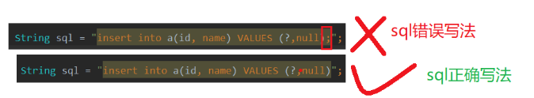
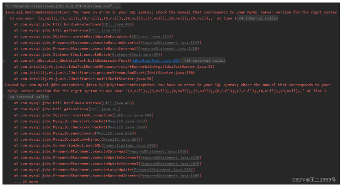

## 网易一面：25Wqps高吞吐写Mysql，100W数据4秒写完，如何实现？

最近，有个小伙伴网易一面，又遇到了这个问题。
咱们一直心心念念的 “Java怎么实现几十万条数据插入？” 的教科书式的答案，
接下来， 尼恩为大家梳理一个教科书式的答案，
***超高并发写mysql，一定要用到 批处理方案*** 。
其实，很多小伙伴都用过，但是却会少说一些核心参数， 少说一些核心步骤，导致面试严重丢分。
这里，尼恩也一并把这个题目以及参考答案，收入咱们的 《尼恩Java面试宝典 PDF》V98版本，
供后面的小伙伴参考，提升大家的 3高 架构、设计、开发水平。

### 本文目录
- 说在前面
- 什么是JDBC的批量处理语句？
- 方式一：普通插入
- 方式二：使用批处理插入
- 方式三：设置数据源的批处理重写标志
- rewriteBatchedStatements底层原理
    - 将 rewriteBatchedStatements 与 PreparedStatement 一起使用
- 方式四：通过数据库连接取消自动提交，手动提交数据
- 汇总一下，批处理操作的详细步骤
- 所以，以上才是“教科书式” 答案
- 推荐阅读

### 什么是JDBC的批量处理语句？
当需要成批插入或者更新记录时，可以采用Java的批量更新机制，<br>
这一机制允许多条语句一次性提交给数据库批量处理。通常情况下，批量处理 比单独提交处理更有效率<br>

JDBC的批量处理语句包括下面三个方法：
- addBatch(String)：添加需要批量处理的SQL语句或是参数；
- executeBatch()：执行批量处理语句；
- clearBatch():清空缓存的数据

通常我们会遇到两种批量执行SQL语句的情况：
- 多条SQL语句的批量处理；
- 一个SQL语句的批量传参；

### 方式一：普通插入
没有对比，没有伤害 <br>
没有数据，不是高手 <br>
看看普通插入100W条记录的 性能数据

```
/**
 * 方式一
 * 普通批量插入，直接将插入语句执行多次即可
 */
@Test
public void bulkSubmissionTest1() {
    long start = System.currentTimeMillis();//开始计时【单位：毫秒】
    Connection conn = jdbcUtils.getConnection();//获取数据库连接
    String sql = "insert into a(id, name) VALUES (?,null)";
    PreparedStatement ps = null;
    try {
        ps = conn.prepareStatement(sql);
        for (int i = 1; i <= 1000000; i++) {
            ps.setObject(1, i);//填充sql语句种得占位符
            ps.execute();//执行sql语句
        }
    } catch (SQLException e) {
        e.printStackTrace();
    } finally {
        jdbcUtils.close(conn, ps, null);
    }
    //打印耗时【单位：毫秒】
    System.out.println("百万条数据插入用时：" + (System.currentTimeMillis() - start)+"【单位：毫秒】");
}
```

用时


折算：3736/60= 62分钟多

### 方式二：使用批处理插入
使用PreparedStatement
JDBC的批量处理语句包括下面三个方法：
- addBatch(String)： 将sql语句打包到一个Batch容器中,  添加需要批量处理的SQL语句或是参数；
- executeBatch()：将Batch容器中的sql语句提交,  执行批量处理语句；
- clearBatch():清空Batch容器，为下一次打包做准备

注意 这三个方法实现sql语句打包，累计到一定数量一次提交
```
@Test
public void bulkSubmissionTest2() {
    long start = System.currentTimeMillis();
    Connection conn = jdbcUtils.getConnection();//获取数据库连接
    String sql = "insert into a(id, name) VALUES (?,null)";
    PreparedStatement ps = null;
    try {
        ps = conn.prepareStatement(sql);
        for (int i = 1; i <= 1000000; i++) {
            ps.setObject(1, i);
            ps.addBatch();//将sql语句打包到一个容器中
            if (i % 500 == 0) {
                ps.executeBatch();//将容器中的sql语句提交
                ps.clearBatch();//清空容器，为下一次打包做准备
            }
        }
        //为防止有sql语句漏提交【如i结束时%500！=0的情况】，需再次提交sql语句
        ps.executeBatch();//将容器中的sql语句提交
        ps.clearBatch();//清空容器
    } catch (SQLException e) {
        e.printStackTrace();
    } finally {
        jdbcUtils.close(conn, ps, null);
    }
    System.out.println("百万条数据插入用时：" + (System.currentTimeMillis() - start)+"【单位：毫秒】");
}
```

用时->折算：3685/60= 61分钟多
方式一、二总结：到此可以看出其实批处理程序是没有起作用的

### 方式三：设置数据源的批处理重写标志
通过连接配置url设置&rewriteBatchedStatements=true，
打开驱动的rewriteBatchedStatements 开关
在方式二的基础上， 允许jdbc驱动重写批量提交语句，
在数据源的url需加上 &rewriteBatchedStatements=true ，表示(重写批处理语句=是)

驱动的url 设置参考如下：
```
spring.datasource.url = jdbc:mysql://localhost:3306/seckill?
useUnicode=true
&characterEncoding=utf8
&useSSL=false
&serverTimezone=GMT%2B8
&zeroDateTimeBehavior=convertToNull
&allowMultiQueries=true
&rewriteBatchedStatements=true
spring.datasource.username = root
spring.datasource.password = 123456
```

再执行 jdbc 的批处理
```
/**
 * 方式三
 */
@Test
public void bulkSubmissionTest3() {
    long start = System.currentTimeMillis();
    Connection conn = jdbcUtils.getConnection();//获取数据库连接
    String sql = "insert into a(id, name) VALUES (?,null)";
    PreparedStatement ps = null;
    try {
        ps = conn.prepareStatement(sql);
        for (int i = 1; i <= 1000000; i++) {
            ps.setObject(1, i);
            ps.addBatch();
            if (i % 500 == 0) {
                ps.executeBatch();
                ps.clearBatch();
            }
        }
        ps.executeBatch();
        ps.clearBatch();
    } catch (SQLException e) {
        e.printStackTrace();
    } finally {
        jdbcUtils.close(conn, ps, null);
    }
    System.out.println("百万条数据插入用时：" + (System.currentTimeMillis() - start)+"【单位：毫秒】");
}
```

用时：<br>
折算：10s <br>
从60分钟到10s， 提升了多少倍？ <br>
360倍 <br>
到此批处理语句才正是生效 <br>

#### 注意
数据库连接的url设置了【&rewriteBatchedStatements=true】时，
java代码中的sql语句不能有分号【;】号，
否则批处理语句打包就会出现错误，导致后面的sql语句提交出现【BatchUpdateException】异常



批量更新异常：BatchUpdateException


### rewriteBatchedStatements底层原理
从 Java 1.2 开始，该Statement接口一直提供addBatch我们可以用来批处理多个语句的接口，
以便在调用executeBatch方法时通过单个请求发送它们，如下面的示例所示：

```
String INSERT = "insert into post (id, title) values (%1$d, 'Post no. %1$d')";
try(Statement statement = connection.createStatement()) {
    for (long id = 1; id <= 10; id++) {
        statement.addBatch(
            String.format(INSERT, id)
        );
    }
    statement.executeBatch();
}
```

通过分析源码，会发现以下代码块：
```
if (this.rewriteBatchedStatements.getValue() && nbrCommands > 4) {
    return executeBatchUsingMultiQueries(
        multiQueriesEnabled,
        nbrCommands,
        individualStatementTimeout
    );
}

updateCounts = new long[nbrCommands];

for (int i = 0; i < nbrCommands; i++) {
    updateCounts[i] = -3;
}

int commandIndex = 0;

for (commandIndex = 0; commandIndex < nbrCommands; commandIndex++) {
    try {
        String sql = (String) batchedArgs.get(commandIndex);
        updateCounts[commandIndex] = executeUpdateInternal(sql, true, true);
        ...
    } catch (SQLException ex) {
        updateCounts[commandIndex] = EXECUTE_FAILED;
        ...
    }
}
```


