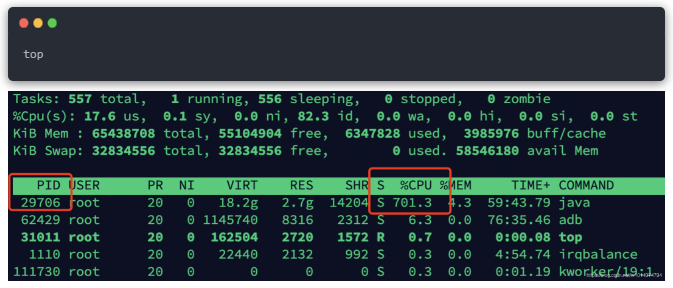
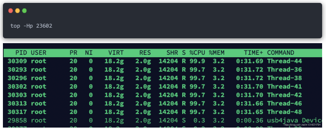
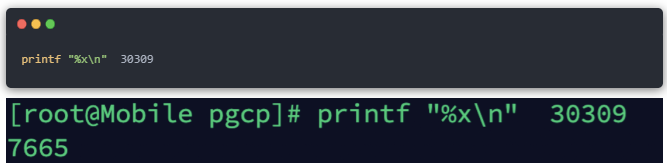
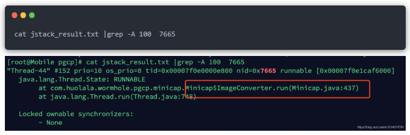
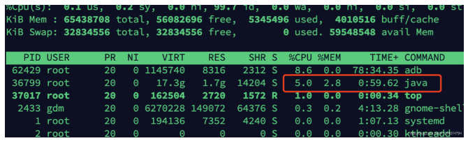

## 网易二面：CPU狂飙900%，该怎么处理？
[链接](https://mp.weixin.qq.com/s/eDRxD14wNgYhEWwq3SEf1w)
社群一位小伙伴面试了 网易，遇到了一个 性能类的面试题：

### CPU飙升900%，该怎么处理？
可惜的是，以上的问题，这个小伙没有回答理想。
最终，导致他网易之路，终止在二面，非常可惜
现在把这个 题目，以及参考答案，收入咱们的 《尼恩Java面试宝典》，供后面的小伙伴参考，前车之鉴啊

> 首先，说明一下问题：CPU飙升200% 以上是生产容易发生的场景

- 场景:1：MySQL进程飙升900%
大家在使用MySQL过程，想必都有遇到过CPU突然过高，或者达到200%以上的情况。
数据库执行查询或数据修改操作时，系统需要消耗大量的CPU资源维护从存储系统、内存数据中的一致性。
并发量大并且大量SQL性能低的情况下，比如字段是没有建立索引，则会导致快速CPU飙升，
如果还开启了慢日志记录，会导致性能更加恶化。
生产上有MYSQL 飙升900% 的恶劣情况。

```
在使用MySQL过程中，想必都有遇到过CPU突然过高，或者达到200%以上的情况。
数据库执行查询或数据修改操作时，系统需要消耗大量的CPU资源维护从存储系统、内存数据中的一致性。
并发量大并且大量SQL性能低的情况下，比如字段没有建立索引，则会导致快速CPU飙升，
如果还开启了慢日志记录，会导致性能更加恶劣。
生产上有MySQL飙升900%的恶劣情况。
```

- 场景2：Java进程飙升900%
一般来说Java 进程不做大量 CPU 运算，正常情况下，CPU 应该在 100~200% 之间，
但是，一旦高并发场景，要么走到了死循环，要么就是在做大量的 GC,  
容易出现这种 CPU 飙升的情况，CPU飙升900%，是完全有可能的。

```
一般来说Java进程不做大量CPU运算，正常情况下，CPU应该在100~200%之间，
但是，一旦高并发场景，要么走到了死循环，要么就是在做大量的GC，
容易出现这种CPU飙升的情况，CPU飙升900%，是完全有可能的
```

- 其他场景：其他的类似进程飙升900%的场景
比如Redis、Nginx等等。

```
尼恩提示：大家介绍场景的时候，就说自己主要涉及了两个场景， 
Java进程飙升900%、MySQL进程飙升900%两种场景，其实，这两个场景就足够讲半天了， 
其他的，使用规避技巧规避一下就行。
```

- Java进程飙升900%
- MySQL进程飙升900%

### 场景一：MySQL进程CPU飙升到900%，怎么处理？
- 定位过程：
  - 使用top命令观察，确定是mysqld导致还是其他原因。
  - 如果是mysqld导致的，***show processlist***，查看session情况，***确定是不是有消耗资源的sql在运行***。
  - 找出消耗高的 sql，***看看执行计划是否准确***， ***index是否缺失***，或者实在是***数据量太大造成***。
- 处理过程：
  - kill 掉这些线程(同时观察 cpu 使用率是否下降)， 一般来说，
    肯定要***kill 掉这些线程***(同时观察 cpu 使用率是否下降)，
    等进行相应的调整(比如说***加索引***、***改sql***、***改内存参数***)之后，再重新跑这些 SQL。
  - 进行相应的调整(比如说加索引、改 sql、改内存参数)
    index 是否缺失，如果是，则  建立索引。也有可能是每个 sql 消耗资源并不多，
    但是突然之间，***有大量的 session 连进来导致 cpu 飙升***，
    这种情况就***需要跟应用一起来分析为何连接数会激增，再做出相应的调整，比如说限制连接数***等
  - 优化的过程，***往往不是一步完成的***，***而是一步一步，执行一项优化措辞，再观察，再优化***。

### 场景1的真实案例：MySQL数据库优化的真实案例
尼恩提示：以下案例，来自互联网。大家参考一下，准备一个自己的案例。<br>
本问题亲身经历过。<br>
之前开发同事编写的SQL语句，就导致过线上CPU过高，
MySQL的CPU使用率达到900%+，通过优化最后降低到70%~80%。
下面说说个人在这个过程中的排查思路。<br>
首先，我们要对问题定位***而不是盲目的开启什么 慢日志***，在并发量大并且大量SQL性能低的情况下，开启慢日志无异是将MySQL推向崩溃的边缘。
- 首先，我们要对问题定位，而不是盲目的开启什么慢日志
- 在并发量大并且大量SQL性能低的情况下
- 开启慢日志无异于是将MySQL推向崩溃的边缘
当时遇到这个情况，分析了当前的数据量、索引情况、缓存使用情况。
目测数据量不大，也就几百万条而已。接下来就去定位索引、缓存问题。

- 分析当前的数据量
- 索引情况
- 缓存使用情况

- 1、经过询问，发现很多查询都是走MySQL，没有用到缓存。
- 2、既然没有用到缓存，则是大量请求全部查询MySQL导致。通过下面的命令查看:
```sql
show processlist;
```
发现类似很多相同的SQL语句，一直处于query状态中。
```sql
select id form user where user_code = 'xxxxx';
```
初步分析可能是 user_code 字段没有索引导致。
接着查询user表的索引情况：
```sql
show index form user;
```

发现这个字段是没有建立索引。增加索引之后，该条SQL查询能够正常执行。

- 3、没隔一会，***又发生大量的请求超时问题***。
  接着进行分析，***发现是开启了慢日志查询***。大量的SQL查询语句超过慢日志设置的阀值，于是将慢日志关闭之后，速度瞬间提升。
  CPU的使用率基本保持在300%左右。但还不是理想状态。

- 4、紧接着将部分实时查询数据的SQL语句，***都通过缓存(redis)读写实现***。观察一段时间后，基本维持在了70%~80%。

总结：其实本次事故的解决很简单，就是***添加索引与缓存结合使用***。

> 添加索引与缓存结合使用

- 1.不推荐在这种CPU使用过高的情况下进行慢日志的开启。因为大量的请求，如果真是慢日志问题会发生日志磁盘写入，性能贼低。
- 2.直接通过MySQL ***show processlist***命令查看，基本能清晰的定位出部分***查询问题严重的SQL语句***，
    在针对该SQL语句进行分析。一般可能就是索引、锁、查询大量字段、大表等问题导致。
  - 索引
  - 锁
  - 查询大量字段
  - 大表
- 3.再则一定要使用缓存系统，降低对MySQL的查询频次。
- 4.对于内存调优，也是一种解决方案。

### 场景2展开：Java进程CPU飙升到900%，怎么处理？
定位过程：<br>
CPU飙升问题定位的一般步骤是：<br>
- 1.首先通过top指令查看当前占用CPU较高的进程PID；
- 2.查看***当前进程消耗资源的线程***PID：***top -Hp PID***
- 3.通过print命令将线程PID转为16进制，根据该16进制值去打印的堆栈日志内查询，查看该线程所驻留的方法位置。
- 4.通过jstack命令，***查看栈信息，定位到线程对应的具体代码***。
- 5.分析代码解决问题。

处理过程：
- 1.如果是空循环，或者空自旋。
  - 处理方式：可以使用***Thread.sleep或者加锁，让线程适当的阻塞***。
- 2.在循环的代码逻辑中，创建大量的新对象导致频繁GC。比如，从mysql查出了大量的数据，比如100W以上等等。
  - 在循环的代码逻辑中，创建大量的新对象导致频繁GC
  - 处理方式：可以减少对象的创建数量，或者，可以考虑使用 对象池。
- 3.其他的一些造成CPU飙升的场景，比如selector空轮训导致CPU飙升 。
  - 处理方式：参考Netty源码，***无效的事件查询到了一定的次数，进行selector重建***。

### Java的CPU飙升700%优化的真实案例
尼恩提示：以下案例，来自互联网。大家参考一下，准备一个自己的案例。
最近负责的一个项目上线，运行一段时间后发现对应的进程竟然占用了700%的CPU，
导致公司的物理服务器都不堪重负，频繁宕机。
那么,针对这类***java进程CPU飙升的问题***，我们一般要怎么去定位解决呢？

#### 采用top命令定位进程
登录服务器，执行top命令，查看CPU占用情况，找到进程的pid<br>

```
登录服务器，执行top命令，查看CPU占用情况，找到进程的pid
```


很容易发现，PID为29706的java进程的CPU飙升到700%多，且一直降不下来，很显然出现了问题。<br>

#### 使用top -Hp命令定位线程
使用 top -Hp命令（为Java进程的id号）查看该Java进程内所有线程的资源占用情况（按shft+p按照cpu占用进行排序，按shift+m按照内存占用进行排序）

```
使用top -Hp命令（为Java进程的id号）
查看该java进程内所有线程的资源占用情况
（shift+p按照cpu占用进行排序，shift+m按照内存占用进行排序）
```

此处按照cpu排序：



很容易发现，多个线程的CPU占用达到了90%多。我们挑选线程号为30309的线程继续分析。

#### 使用jstack命令定位代码
- 1.线程号转换为16进制
  printf “%x\n” 命令（tid指线程的id号）将以上10进制的线程号转换为16进制：



转换后的结果分别为7665，由于导出的线程快照中线程的nid是16进制的，
而16进制以0x开头，所以对应的16进制的线程号nid为0x7665

- 2.采用jstack命令导出线程快照
  通过使用dk自带命令jstack获取该java进程的线程快照并输入到文件中：
```
jstack -l 进程ID > ./jstack_result.txt 
```
命令（为Java进程的id号）来获取线程快照结果并输入到指定文件。
```
jstack -l 29706 > ./jstack_result.txt
```

- 3.根据线程号定位具体代码
在jstack_result.txt 文件中根据线程好nid搜索对应的线程描述
```
cat jstack_result.txt |grep -A 100  7665
```


根据搜索结果，判断应该是ImageConverter.run()方法中的代码出现问题
当然，这里也可以直接采用
```
jstack <pid> |grep -A 200 <nid>
```
来定位具体代码
```
$jstack 44529 |grep -A 200 ae24
"System Clock" #28 daemon prio=5 os_prio=0 tid=0x00007efc19e8e800 nid=0xae24 waiting on condition [0x00007efbe0d91000]
   java.lang.Thread.State: TIMED_WAITING (sleeping) // 线程状态
    at java.lang.Thread.sleep(Native Method)
    at java.lang.Thread.sleep(Thread.java:340)
    at java.util.concurrentC.TimeUnit.sleep(TimeUnit.java:386)
    at com.*.order.Controller.OrderController.detail(OrderController.java:37)  //业务代码阻塞点
```

#### 分析代码解决问题
下面是ImageConverter.run()方法中的部分核心代码。
逻辑说明：
```
// 存储minicap的socket连接返回的数据   (改用消息队列存储读到的流数据) ，设置阻塞队列长度，防止出现内存溢出
// 全局变量
private BlockingQueue<byte[]> dataQueue = new LinkedBlockingQueue<byte[]>(100000);
//消费线程
@Override
public void run() {
    //long start = System.currentTimeMillis();
    while (isRunning) {
        //分析这里从LinkedBlockingQueue
        if (dataQueue.isEmpty()) {
            continue;
        }
        byte[] buffer = device.getMinicap().dataQueue.poll();
        int len = buffer.length;
   }
}   
```
在while循环中，不断读取堵塞队列dataQueue中的数据，
如果数据为空，则执行continue进行下一次循环。
如果不为空，则通过poll()方法读取数据，做相关逻辑处理。
初看这段代码好像没什么问题，但是如果dataQueue对象长期为空的话，
这里就会一直空循环，导致CPU飙升。
```
在while循环中，不断读取堵塞队列dataQueue中的数据，
如果数据为空，则执行continue进行下一次循环。
如果不为空，则通过poll()方法读取数据，做相关逻辑处理。
初看这段代码好像没什么问题，但是如果dataQueue对象长期为空的话，
这里就会一直空循环，导致CPU飙升
```

那么如果解决呢？
分析LinkedBlockingQueue阻塞队列的API发现：
```
// 取出队列中的头部元素，如果队列为空则调用此方法的线程被阻塞等待，
// 直到有元素能被取出，如果等待过程被中断则抛出InterruptedException
E take() throws InterruptedException;
// 取出队列中的头部元素，如果队列为空返回null
E poll();
```
这两种取值的API，显然take方法更适合这里的场景。
代码修改为：
```
while (isRunning) {
   /* if (device.getMinicap().dataQueue.isEmpty()) {
        continue;
    }*/
    byte[] buffer = new byte[0];
    try {
        buffer = device.getMinicap().dataQueue.take();
    } catch (InterruptedException e) {
        e.printStackTrace();
    }
……
}
```
重启项目后，测试发现项目运行稳定，对应项目进程的CPU消耗占比不到10%。




