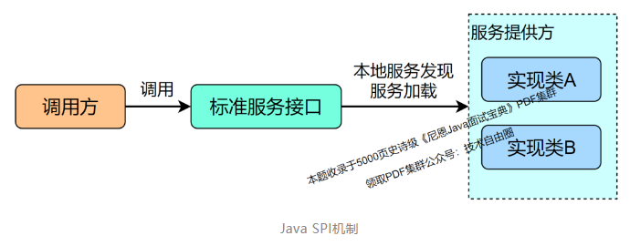
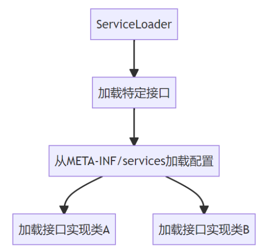
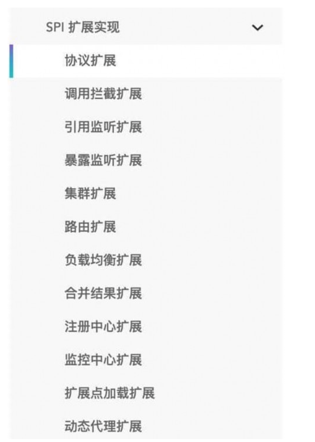
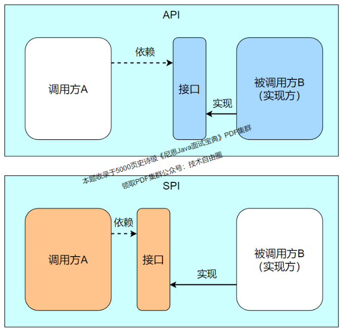

## 网易面试：什么是SPI，SPI和API有什么区别？

### 说在前面
在40岁老架构师 尼恩的读者交流群(50+)中，
最近有小伙伴拿到了一线互联网企业如阿里、滴滴、极兔、有赞、希音、百度、网易、美团的面试资格，
遇到很多很重要的面试题：

> 什么是SPI，SPI和API有什么区别？

最近有小伙伴在面网易，又遇到了相关的面试题。
小伙伴懵了， 他从来没有用过SPI，SO，面挂了。

所以，尼恩给大家做一下系统化、体系化的梳理，使得大家内力猛增，可以充分展示一下大家雄厚的 “技术肌肉”，
让面试官爱到 “不能自已、口水直流”，然后实现”offer直提”。

当然，这道面试题，以及参考答案，也会收入咱们的 《尼恩Java面试宝典PDF》V119版本，
供后面的小伙伴参考，提升大家的 3高 架构、设计、开发水平。

最新《尼恩 架构笔记》《尼恩高并发三部曲》《尼恩Java面试宝典》的PDF，请关注本公众号【技术自由圈】获取，后台回复：领电子书

### 本文目录
- 说在前面
- 何谓 SPI？
- Java SPI 的应用Demo
- SPI 使用场景
- SPI 和 API 在使用上的区别？
- SPI 和 API 在本质上的区别
- SPI 源码分析
  - 1、SPI的核心就是ServiceLoader.load()方法
  - 2、ServiceLoader核心代码介绍
- SPI 的优缺点？
- 说在最后
- 部分历史案例

### 何谓 SPI？
SPI 即 Service Provider Interface ，字面意思就是：“服务提供者的接口”，
一般理解是：专门提供给服务提供者或者扩展框架功能的开发者去使用的一个接口。

```
SPI即Service Provider Interface->字面意思：“服务提供者的接口”
一般理解是：“专门提供给服务提供者或者扩展框架功能的开发者去使用的一个接口。”
```

***SPI 的核心作用：解耦***。
SPI将***服务接口***和***具体的服务实现***分离开来，将服务调用方和服务实现者解耦，
能够提升程序的扩展性、可维护性。
修改或者替换服务实现并不需要修改调用方。
很多框架都使用了 Java 的 SPI 机制，比如：Spring 框架、数据库加载驱动、日志接口、以及Dubbo 的扩展实现等等。

```
SPI的核心作用：解耦
SPI将服务接口和具体的服务实现分离开来，将服务调用方和服务实现者解耦，
能够提升程序的扩展性、可维护性。
修改或者替换服务实现并不需要修改调用方。
很多框架都使用了Java的SPI机制，
比如：Spring框架、数据库加载驱动、日志接口、以及Dubbo的扩展实现等等。
```

### Java SPI 的应用Demo


Java SPI机制
Java SPI 是***JDK内置的一种服务提供发现机制***。

我们一般希望模块直接基于接口编程，调用服务不直接硬编码具体的实现，
而是通过为某个接口寻找服务实现的机制，通过它就可以实现，不修改原来jar的情况下，为 API 新增一种实现。
Java SPI  有点类似 IOC 的思想，将装配的控制权移到了程序之外。

```
我们一般希望模块直接基于接口编程，调用服务不直接硬编码具体的实现，
而是通过为某个接口寻找服务实现的机制，通过它就可以实现，
不修改原来jar的情况下，为API新增一种实现。
Java SPI有点类似IOC的思想，将装配的控制权移到了程序之外。
```

对于 Java 原生 SPI，只需要满足下面几个条件：
1.定义服务的通用接口，针对通用的服务接口，提供具体的实现类
2.在 src/main/resources/META-INF/services 或者 jar包的 META-INF/services/ 目录中，新建一个文件，文件名为 接口的全名。文件内容为该接口的具体实现类的全名
3.将 spi 所在 jar 放在主程序的 classpath 中
4.服务调用方用java.util.ServiceLoader，用服务接口为参数，去动态加载具体的实现类到JVM中，然后就可以正常使用服务了

```
对于Java原生SPI，只需要满足下面几个条件：
1.定义服务的通用接口，针对通用的服务接口，提供具体的实现类
2.在src/main/resources/META-INF/services或者jar包的META-INF/services/目录中，新建一个文件，文件名为接口的全名。
文件内容为该接口的具体实现类的全名
3.将spi所在jar放在主程序的classpath中
4.服务调用方用java.util.ServiceLoader，用服务接口为参数，去动态加载具体的实现类到JVM中，然后就可以正常使用服务了
```

上面这一大段代码示例如下
- 1.接口和实现类
接口
```java
public interface DemoService {
    void sayHello();
}
```

实现类
```java
public class RedService implements DemoService{
  @Override
  public void sayHello() {
    System.out.println("red");
  }
}
public class BlueService implements DemoService{
  @Override
  public void sayHello() {
    System.out.println("blue");
  }
}
```

- 2.配置文件
META-INF/services文件夹下，路径名字一定分毫不差写对，配置文件名com.example.demo.spi.DemoService

```
META-INF/services文件夹下，
路径名字一定分毫不差写对，
配置文件名com.example.demp.spi.DemoService
```

文件内容
```
com.example.demo.spi.RedService
com.example.demo.spi.BlueService
```

- 3.***jar包例如jdbc的需要导入classpath，我们这个示例程序自己写的代码就不用了***
- 4.实际调用

```java
public class ServiceMain {
    public static void main(String[] args) {
        ServiceLoader<DemoService> spiLoader = ServiceLoader.load(DemoService.class);
        Iterator<DemoService> iteratorSpi = spiLoader.iterator();
        while (iteratorSpi.hasNext()) {
            DemoService demoService = iteratorSpi.next();
            demoService.sayHello();
        }
    }
}
```

```java
public class ServiceMain {  
    public static void main(String[] args){
        ServiceLoader<DemoService> spiLoader = ServiceLoader.load(DemoService.class);
        Iterator<DemoService> iteratorSpi = spiLoader.iterator();
        while(iteratorSpi.hasNext()){
            DemoService demoService = iteratorSpi.next();
            demoService.sayHello();
        }
    }
}
```

调用结果
```
red
blue
```

Java SPI 实际上是“基于接口的编程＋ 配置文件”组合实现的动态加载机制。

```
Java SPI实际上是“基于接口的编程+配置文件”
组合实现的动态加载机制
```



SPI 有点类似  Spring IoC容器， 用于加载实例。
在 Spring IoC 容器中具有以下几种作用域：
- singleton：单例模式，在整个Spring IoC容器中，使用singleton定义的Bean将只有一个实例，适用于无状态bean；
- prototype：原型模式，`每次通过容器的getBean方法获取prototype定义的Bean时，都将产生一个新的Bean实例，适用于有状态的Bean；

```
SPI有点类似Spring IOC容器，用于加载实例。
在Spring IoC容器中具有以下几种作用域：
singleton：单例模式，在整个Spring IoC容器中，使用singleton定义的Bean将只有一个实例，适用于无状态bean；
prototype：原型模式，每次通过容器的getBean方法获取prototype定义的Bean时，都将产生一个新的Bean实例，适用于有状态的Bean；
```

但是SPI  与Spring 不同：
- SPI  缺少实例的维护，作用域没有定义singleton和prototype的定义，不利于用户自由定制。
- ServiceLoader不像 Spring，只能一次获取所有的接口实例， 不支持排序，随着新的实例加入，会出现排序不稳定的情况

```
但是SPI与Spring不同：
SPI缺少实例的维护，作用域没有定义singleton和prototype的定义，不利于用户自由定制。
ServiceLoader不像Spring，只能一次获取所有的接口实例，不支持排序，随着新的实例加入，会出现排序不稳定的情况。
```

### SPI 使用场景
很多开源第三方jar包都有基于SPI的实现，在jar包META-INF/services中都有相关配置文件。
如下几个常见的场景：
- 1）JDBC加载不同类型的数据库驱动 
- 2）Slf4j日志框架 
- 3）Dubbo框架

```
很多开源第三方jar包都有基于SPI的实现，
在jar包META-INF/services中都有相关配置文件。
如下几个常见的尝尽：
1、JDBC加载不同类型的数据库驱动
2、Slf4j日志框架
3、Dubbo框架
```

看看 Dubbo 的扩展实现，就知道  SPI 机制用的多么广泛:



SPI扩展实现：
- 协议扩展
- 调用拦截扩展
- 引用监听扩展
- 暴露监听扩展
- 集群扩展
- 路由扩展
- 负载均衡扩展
- 合并结果扩展
- 注册中心扩展
- 监控中心扩展
- 扩展点加载扩展
- 动态代理扩展

### SPI 和 API 在使用上的区别？
那 SPI 和 API 有啥区别？
SPI  全称：***Service Provider Interface , 服务提供接口***
API 全称：***Application Programming Interface， 即应用程序编程接口***
说到 SPI 就不得不说一下 API 了，从广义上来说它们都属于接口，而且很容易混淆。
下面先用一张图说明一下：



一般模块之间都是通过接口进行通讯，<br>
那我们在服务调用方和服务实现方（也称服务提供者）之间引入一个“接口”。<br>
当实现方提供了接口和实现，我们可以通过调用实现方的接口从而拥有实现方给我们提供的能力，这就是 API ，这种接口和实现都是放在实现方的。<br>
当接口存在于调用方这边时，就是 SPI ，由接口调用方确定接口规则，然后由不同的厂商去根绝这个规则对这个接口进行实现，从而提供服务。<br>

### SPI 和 API 在本质上的区别
SPI   区别于API模式，本质是一种服务接口规范定义权的转移，从服务提供者转移到服务消费者。
怎么理解呢？
API指：Provider  定义接口
服务提供方定义接口规范并按照接口规范完成服务具体实现，消费者需要遵守提供者的规则约束，否则无法消费
SPI指：consumer 定义接口
由消费方定义接口规范，服务提供者需要按照消费者定义的规范完成具体实现。否则无法消费。
SPI从理论上看，是一种接口定义和实现解耦的设计思路，以便于框架的简化和抽象；从实际看，是让服务提供者把接口规范定义权交岀去，至于交给谁是不一定的。
SPI定义权可以是服务消费者，也可以是任何一个第三方。一旦接口规范定义以后，只有消费者和服务提供者都遵循接口定义，才能匹配消费。
两者唯一的差别，在于服务提供者和服务消费者谁更加强势，仅此而已。
举个不恰当的例子：A国是C国工业制成品的消费国，C国只能提供相比A国更具性价比的产品，担心生产的产品会无法在A国销售。这时候，生产者必须遵守A国的生产标准。
谁有主动权，谁就有标准的制定权。在系统架构层面：谁是沉淀通用能力的平台方，谁就是主动权一方。

### SPI 源码分析
#### 1、SPI的核心就是ServiceLoader.load()方法
总结如下：
- 1.调用ServiceLoader.load()，创建一个ServiceLoader实例对象
- 2.创建LazyIterator实例对象lookupIterator
- 3.通过lookupIterator.hasNextService()方法读取固定目录META-INF/services/下面service全限定名文件，放在Enumeration对象configs中
- 4.解析configs得到迭代器对象Iterator<String> pending
- 5.通过lookupIterator.nextService()方法初始化读取到的实现类，通过Class.forName()初始化

从上面的步骤可以总结以下几点
- 1.实现类工程必须创建定目录META-INF/services/，并创建service全限定名文件，文件内容是实现类全限定名
- 2.实现类必须有一个无参构造函数

#### 2、ServiceLoader核心代码介绍
```java
public final class ServiceLoader<S> implements Iterable<S>
{
    private static final String PREFIX = "META-INF/services/";
    // The class or interface representing the service being loaded
    private final Class<S> service;
    // The class loader used to locate, load, and instantiate providers
    private final ClassLoader loader;
    // The access control context taken when the ServiceLoader is created
    private final AccessControlContext acc;
    // Cached providers, in instantiation order
    private LinkedHashMap<String,S> providers = new LinkedHashMap<>();
    // The current lazy-lookup iterator
    private LazyIterator lookupIterator;

    public static <S> ServiceLoader<S> load(Class<S> service,ClassLoader loader)
    {
        return new ServiceLoader<>(service, loader);
    }
    
    public void reload() {
        providers.clear();
        lookupIterator = new LazyIterator(service, loader);
    }
    
    private ServiceLoader(Class<S> svc, ClassLoader cl) {
        service = Objects.requireNonNull(svc, "Service interface cannot be null");
        loader = (cl == null) ? ClassLoader.getSystemClassLoader() : cl;
        acc = (System.getSecurityManager() != null) ? AccessController.getContext() : null;
        reload();
    }
}
```

通过方法iterator()生成迭代器，内部调用LazyIterator实例对象
```
public Iterator<S> iterator() {
    return new Iterator<S>() {
        Iterator<Map.Entry<String,S>> knownProviders
            = providers.entrySet().iterator();
        public boolean hasNext() {
            if (knownProviders.hasNext())
                return true;
            return lookupIterator.hasNext();
        }
        public S next() {
            if (knownProviders.hasNext())
                return knownProviders.next().getValue();
            return lookupIterator.next();
        }
        public void remove() {
            throw new UnsupportedOperationException();
        }
    };
}
```

内部类LazyIterator，读取配置文件META-INF/services/
```java
private class LazyIterator implements Iterator<S>
    {
    Class<S> service;
    ClassLoader loader;
    Enumeration<URL> configs = null;
    Iterator<String> pending = null;
    String nextName = null;

    private LazyIterator(Class<S> service, ClassLoader loader) {
        this.service = service;
        this.loader = loader;
    }

    private boolean hasNextService() {
        if (nextName != null) {
            return true;
        }
        if (configs == null) {
            try {
                String fullName = PREFIX + service.getName();
                if (loader == null)
                    configs = ClassLoader.getSystemResources(fullName);
                else
                    configs = loader.getResources(fullName);
            } catch (IOException x) {
                fail(service, "Error locating configuration files", x);
            }
        }
        while ((pending == null) || !pending.hasNext()) {
            if (!configs.hasMoreElements()) {
                return false;
            }
            pending = parse(service, configs.nextElement());
        }
        nextName = pending.next();
        return true;
    }

    private S nextService() {
        if (!hasNextService())
            throw new NoSuchElementException();
        String cn = nextName;
        nextName = null;
        Class<?> c = null;
        try {
            c = Class.forName(cn, false, loader);
        } catch (ClassNotFoundException x) {
            fail(service,
                 "Provider " + cn + " not found");
        }
        if (!service.isAssignableFrom(c)) {
            fail(service,
                 "Provider " + cn  + " not a subtype");
        }
        try {
            S p = service.cast(c.newInstance());
            providers.put(cn, p);
            return p;
        } catch (Throwable x) {
            fail(service,
                 "Provider " + cn + " could not be instantiated",
                 x);
        }
        throw new Error();          // This cannot happen
    }

    public boolean hasNext() {
        if (acc == null) {
            return hasNextService();
        } else {
            PrivilegedAction<Boolean> action = new PrivilegedAction<Boolean>() {
                public Boolean run() { return hasNextService(); }
            };
            return AccessController.doPrivileged(action, acc);
        }
    }

    public S next() {
        if (acc == null) {
            return nextService();
        } else {
            PrivilegedAction<S> action = new PrivilegedAction<S>() {
                public S run() { return nextService(); }
            };
            return AccessController.doPrivileged(action, acc);
        }
    }

    public void remove() {
        throw new UnsupportedOperationException();
    }
}
```

### SPI 的优缺点？
通过 ***SPI 机制能够大大地提高接口设计的灵活性***，
但是 SPI 机制也存在一些缺点，比如：
- 需要遍历加载所有的实现类，不能做到按需加载，这样效率还是相对较低的。
- ***当多个 ServiceLoader 同时 load 时，会有并发问题***。
- SPI  缺少实例的维护，作用域没有定义singleton和prototype的定义，不利于用户自由定制。
- ServiceLoader不像 Spring，只能一次获取所有的接口实例， 不支持排序，随着新的实例加入，会出现排序不稳定的情况，作用域没有定义singleton和prototype的定义，不利于用户自由定制

### 说在最后
SPI 面试题，是非常常见的面试题。
以上的内容，如果大家能对答如流，如数家珍，基本上 面试官会被你 震惊到、吸引到。
在面试之前，建议大家系统化的刷一波 5000页《尼恩Java面试宝典PDF》，并且在刷题过程中，
如果有啥问题，大家可以来 找 40岁老架构师尼恩交流。
最终，让面试官爱到 “不能自已、口水直流”。offer， 也就来了。


